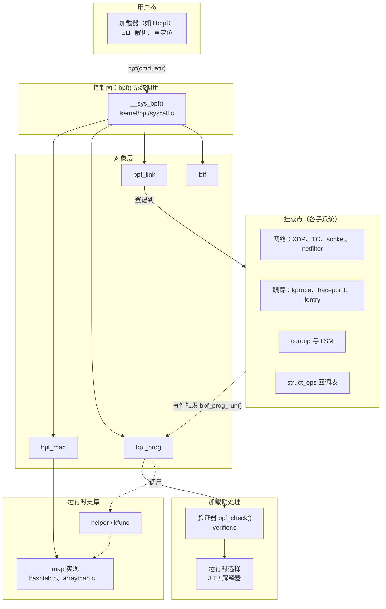
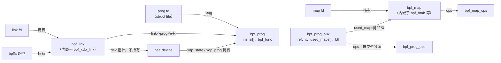
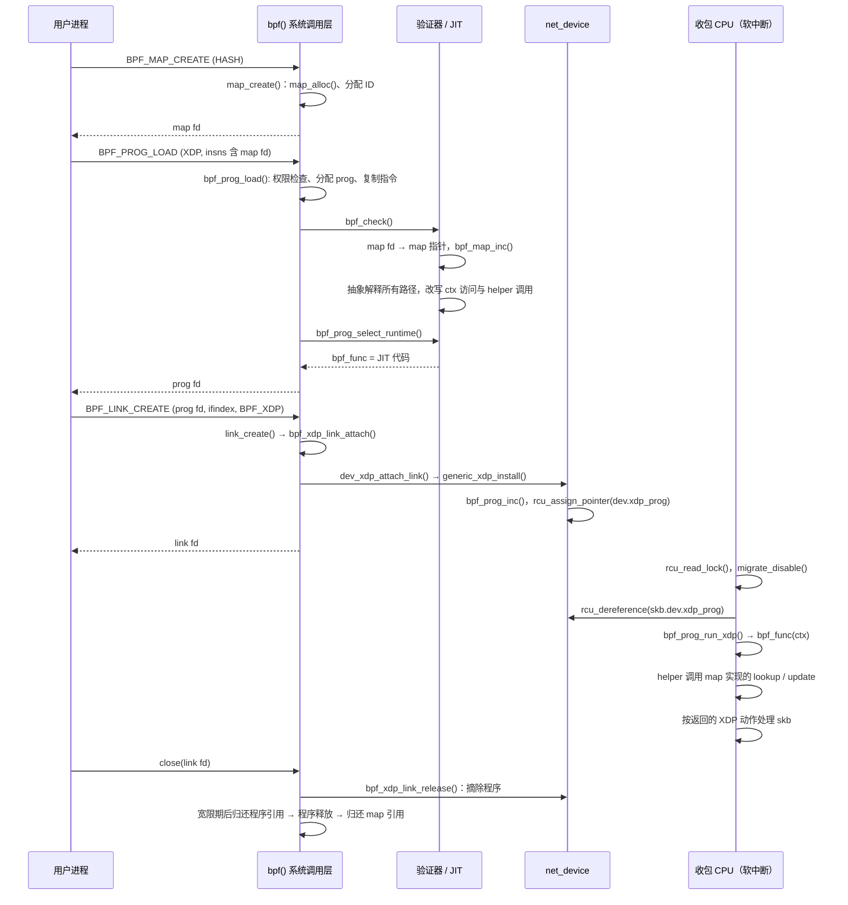

# BPF 子系统概述：程序、map、验证器与挂载点

假设要统计一台服务器上每个源 IP 发来的数据包数。第一种做法是写一个内核模块，在收包路径上加计数逻辑。这样性能最好，但模块里任何一个空指针都可能让整台机器崩溃，改一行逻辑还要重新编译和加载。第二种做法是把包复制到用户态再统计，这样安全，但每个包都要多复制一次、多切换一次上下文。BPF 走的是第三条路：用户态提交一段**受约束的指令程序**，内核先**证明**它不会越界访问、不会无限运行、只调用被允许的函数，然后把它编译成本机指令，挂到收包路径上运行。统计结果放在内核和用户态都能访问的 **map** 里。

这样，内核里多了一种“可编程的扩展点”。网络（XDP、TC、socket 过滤）、跟踪（kprobe、tracepoint、fentry）、安全（LSM）、cgroup 资源控制，乃至 TCP 拥塞控制的回调表，都可以挂接 BPF 程序。各个挂载点的上下文和返回值语义不同，但程序对象、map、验证器、JIT 和对象生命周期管理是同一套。

本章是 BPF 子系统的总览，回答以下问题：

1. BPF 由哪几层组成，每一层解决什么问题，与哪些子系统交互？
2. 程序、map、link、BTF 这几个核心对象分别表示什么，彼此怎样引用？
3. 验证器在加载时证明了什么，没有证明什么？
4. 验证通过的指令怎样变成可执行代码，又怎样在事件发生时被调用？
5. 加载进程退出后，程序和挂载关系由谁维持，什么时候真正释放？

各机制的细节放到后续章节，本章只建立主线，并给出每个结论对应的源码位置。

## 0. 分析基线

本章依据仓库内 [Makefile 第 2～4 行](../../linux/Makefile#L2-L4)标记的 **6.18.52** 版本，架构为 **x86-64**。读者需要了解系统调用、文件描述符和引用计数的一般概念；RCU 和每 CPU 数据可参考[锁机制基础](../lock/introduction.md)，软中断上下文可参考[中断子系统概述](../interrupt/overview.md)和 [softirq 机制](../interrupt/softirq.md)。

与本章结论有关的配置如下。它们是编译条件，不代表某次运行一定经过对应路径；JIT 开关等还可以在运行时由 sysctl 修改。

| 配置 | 对本章的影响 | 依据 |
| --- | --- | --- |
| `CONFIG_BPF=y`、`CONFIG_BPF_SYSCALL=y` | 编入 BPF 核心和 `bpf()` 系统调用；`syscall.c`、`verifier.c`、各种 map 都由后者控制是否编译 | [.config#L117](../../linux/.config#L117)、[.config#L124](../../linux/.config#L124)、[kernel/bpf/Makefile#L9-L13](../../linux/kernel/bpf/Makefile#L9-L13) |
| `CONFIG_HAVE_EBPF_JIT=y`、`CONFIG_BPF_JIT=y`、`CONFIG_ARCH_WANT_DEFAULT_BPF_JIT=y` → `CONFIG_BPF_JIT_DEFAULT_ON=y` | 编入 x86-64 JIT，且 `bpf_jit_enable` 的初值为 1 | [.config#L118-L127](../../linux/.config#L118-L127)、[Kconfig#L69-L71](../../linux/kernel/bpf/Kconfig#L69-L71)、[core.c#L545](../../linux/kernel/bpf/core.c#L545) |
| `CONFIG_BPF_JIT_ALWAYS_ON` 未设置 | 解释器仍被编入；JIT 失败时，大多数程序可以回退到解释器 | [.config#L126](../../linux/.config#L126)、[core.c#L2528-L2549](../../linux/kernel/bpf/core.c#L2528-L2549) |
| `CONFIG_BPF_UNPRIV_DEFAULT_OFF` 未设置 | `unprivileged_bpf_disabled` 的初值为 0，不完全禁止非特权加载 | [.config#L128](../../linux/.config#L128)、[syscall.c#L67-L68](../../linux/kernel/bpf/syscall.c#L67-L68) |
| `CONFIG_CGROUP_BPF=y`、`CONFIG_BPF_LSM=y`、`CONFIG_BPF_EVENTS=y` | 编入 cgroup、LSM 和跟踪类挂载点 | [.config#L233](../../linux/.config#L233)、[.config#L130](../../linux/.config#L130)、[.config#L10768](../../linux/.config#L10768) |
| `CONFIG_NET_CLS_BPF=m`、`CONFIG_NET_ACT_BPF=m` | 传统 TC 的 BPF 分类器和动作是**模块**，加载对应模块后才可用 | [.config#L1896](../../linux/.config#L1896)、[.config#L1922](../../linux/.config#L1922) |
| `CONFIG_DEBUG_INFO_BTF` **未设置**（`CONFIG_PAHOLE_VERSION=0`） | 内核不带 vmlinux BTF，见下文说明 | [.config#L26](../../linux/.config#L26)、[lib/Kconfig.debug#L377-L383](../../linux/lib/Kconfig.debug#L377-L383) |
| `CONFIG_PREEMPT_RCU=y`、`CONFIG_TASKS_TRACE_RCU=y` | 程序在 RCU 读侧运行；可睡眠程序的释放还要等待 RCU Tasks Trace 宽限期 | [.config#L168](../../linux/.config#L168)、[.config#L175](../../linux/.config#L175)、[Kconfig#L27-L32](../../linux/kernel/bpf/Kconfig#L27-L32) |

有两点需要提前说明：

- **当前构建没有 vmlinux BTF。** `CONFIG_DEBUG_INFO_BTF` 依赖 `PAHOLE_VERSION >= 116`，而本 `.config` 生成时没有找到 pahole，`PAHOLE_VERSION` 为 0。因此 `bpf_get_btf_vmlinux()` 不会解析内核 BTF，始终返回 NULL（[verifier.c#L24432-L24452](../../linux/kernel/bpf/verifier.c#L24432-L24452)）；`/sys/kernel/btf/vmlinux` 对应的 `sysfs_btf.o` 也不会编译（[Makefile#L39-L41](../../linux/kernel/bpf/Makefile#L39-L41)）。这会产生实际影响：加载时指定 `attach_btf_id`、又没有给出目标 BTF 对象的程序（fentry/fexit、`BPF_LSM_MAC` 等）会得到 `-EINVAL`（[syscall.c#L2968-L2978](../../linux/kernel/bpf/syscall.c#L2968-L2978)）；调用 kfunc 的程序会被验证器以 `-ENOTSUPP` 拒绝（[verifier.c#L3330-L3334](../../linux/kernel/bpf/verifier.c#L3330-L3334)）。本章讲解这些机制的通用实现，但要记住：**在这份配置的内核上，依赖内核 BTF 的程序类型在运行时加载不了。**
- **“编入”不等于“会走到”。** 例如 `bpf_jit_enable` 可通过 `/proc/sys/net/core/bpf_jit_enable` 修改（[sysctl_net_core.c#L441-L442](../../linux/net/core/sysctl_net_core.c#L441-L442)），某次加载是否 JIT 要看加载那一刻的值。

## 1. BPF 要解决什么问题

### 1.1 四个需求与对应机制

回到开头的例子。把“在收包路径上运行用户提供的逻辑”这件事拆开，可以得到四个需求，BPF 用不同的机制分别满足它们：

| 需求 | 如果不满足会怎样 | BPF 的机制 | 主要源码 |
| --- | --- | --- | --- |
| **安全**：不能越界访问内存、不能死循环、不能调用任意内核函数 | 一段用户代码就能让内核崩溃或泄露数据 | 加载时由**验证器**对所有执行路径做静态分析 | [`bpf_check()`](../../linux/kernel/bpf/verifier.c#L24943) |
| **高效**：每个事件都可能触发，开销要接近原生代码 | 统计逻辑本身成为瓶颈 | **JIT** 把 BPF 指令编译为 x86-64 机器码；helper 调用是直接的函数调用 | [`bpf_prog_select_runtime()`](../../linux/kernel/bpf/core.c#L2562-L2615)、[`bpf_int_jit_compile()`](../../linux/arch/x86/net/bpf_jit_comp.c#L3647) |
| **持久与共享**：一次执行结束后，数据要留下来，用户态也要能读 | 只能做无状态的过滤 | **map**：有类型、有引用计数的内核数据对象，程序和用户态都可访问 | [`struct bpf_map`](../../linux/include/linux/bpf.h#L295-L339) |
| **动态与可管理**：运行时加载、替换、卸载，进程退出后行为可预测 | 只能靠重新编译内核或模块 | 对象都通过**文件描述符**引用；挂载关系可以用 **link** 对象管理；**bpffs** 可以保存引用 | [`__sys_bpf()`](../../linux/kernel/bpf/syscall.c#L6160-L6305)、[`struct bpf_link`](../../linux/include/linux/bpf.h#L1747-L1769) |

这张表也是阅读 BPF 源码的地图：`verifier.c` 解决安全，`core.c` 和 `arch/x86/net/` 解决执行，`*map*.c` 解决数据，`syscall.c`、`inode.c` 解决对象管理。各挂载点的代码则分散在网络、跟踪、cgroup 等子系统中。

### 1.2 分层架构

下图展示从用户态到挂载点的分层。实线箭头表示调用方向，虚线箭头表示事件发生时的执行方向。



这张图回答的是“谁在哪一层”，没有画出所有命令和挂载方式。需要注意两点：

- **控制面和数据面是分开的。** `bpf()` 只负责创建对象、加载、挂载和查询；程序真正运行时不经过系统调用，而是由挂载点所在子系统直接调用 `bpf_prog_run()` 一类的入口（[filter.h#L732-L763](../../linux/include/linux/filter.h#L732-L763)）。
- **BPF 核心不知道每个挂载点的语义。** 一个挂载点给程序传什么上下文、允许调用哪些 helper、怎样解释返回值，都由该程序类型注册的回调决定（见 2.7 节）。

`kernel/bpf/` 下的主要文件按职责可以这样分组：

| 职责 | 文件 | 编译条件 |
| --- | --- | --- |
| 系统调用、对象 ID 与 fd、link 通用层 | `syscall.c` | `CONFIG_BPF_SYSCALL`（[Makefile#L9](../../linux/kernel/bpf/Makefile#L9)） |
| 验证器 | `verifier.c`、`tnum.c`、`log.c`、`liveness.c` | 同上 |
| 程序分配、解释器、运行时选择、释放 | `core.c` | 总是编译（[Makefile#L2](../../linux/kernel/bpf/Makefile#L2)） |
| x86-64 JIT | `arch/x86/net/bpf_jit_comp.c` | `CONFIG_BPF_JIT` |
| 通用 helper | `helpers.c` | `CONFIG_BPF_SYSCALL` |
| map 实现 | `hashtab.c`、`arraymap.c`、`ringbuf.c`、`lpm_trie.c` 等 | 同上（[Makefile#L11-L13](../../linux/kernel/bpf/Makefile#L11-L13)） |
| bpffs 与 pin | `inode.c` | 同上 |
| BTF 解析 | `btf.c` | 同上（[Makefile#L17](../../linux/kernel/bpf/Makefile#L17)） |
| trampoline、struct_ops、BPF LSM | `trampoline.c`、`bpf_struct_ops.c`、`bpf_lsm.c` | 还需要 `CONFIG_BPF_JIT`（[Makefile#L16](../../linux/kernel/bpf/Makefile#L16)、[Makefile#L42-L46](../../linux/kernel/bpf/Makefile#L42-L46)） |
| cgroup 挂载点 | `cgroup.c` | `CONFIG_CGROUP_BPF`（[Makefile#L35](../../linux/kernel/bpf/Makefile#L35)） |

最后一行之外，挂载点代码大多不在 `kernel/bpf/`，例如 XDP 在 `net/core/dev.c`，tracepoint 在 `kernel/trace/bpf_trace.c`。

### 1.3 触发事件与输入输出

BPF 有两类“触发”：用户态发起的控制命令，以及挂载点上发生的内核事件。

| 维度 | 控制面：`bpf()` 系统调用 | 数据面：挂载点上的一次执行 |
| --- | --- | --- |
| 谁触发 | 用户进程（或内核中以 `bpfptr_t` 发起的调用） | 收包、函数入口、系统调用、socket 操作等内核事件 |
| 执行上下文 | 进程上下文，可以睡眠 | 由挂载点决定，例如 XDP 在软中断里，tracepoint 可能在任意上下文 |
| 输入 | 命令号 `cmd` 和属性联合体 `union bpf_attr` | 上下文指针，在程序入口放在 `R1`（[verifier.c#L23671-L23673](../../linux/kernel/bpf/verifier.c#L23671-L23673)） |
| 输出 | 新对象的 fd、ID，或查询结果 | 返回值 `R0`，由挂载点解释；以及对 map 等的副作用 |

`bpf()` 共有 30 多个命令，定义在 [`enum bpf_cmd`](../../linux/include/uapi/linux/bpf.h#L937-L978)。按作用可以归为几组：

- **创建对象**：`BPF_MAP_CREATE`、`BPF_PROG_LOAD`、`BPF_BTF_LOAD`、`BPF_LINK_CREATE`、`BPF_TOKEN_CREATE`；
- **操作 map**：`BPF_MAP_LOOKUP_ELEM`、`BPF_MAP_UPDATE_ELEM` 及批量版本；
- **挂载与解除**：`BPF_PROG_ATTACH`/`BPF_PROG_DETACH`、`BPF_LINK_UPDATE`/`BPF_LINK_DETACH`、`BPF_RAW_TRACEPOINT_OPEN`；
- **保存与取回引用**：`BPF_OBJ_PIN`、`BPF_OBJ_GET`、`BPF_*_GET_FD_BY_ID`；
- **查询与测试**：`BPF_OBJ_GET_INFO_BY_FD`、`BPF_PROG_QUERY`、`BPF_PROG_TEST_RUN`。

### 1.4 本章边界与本书 BPF 部分的组织

本章以通过 `bpf()` 加载的扩展 BPF（eBPF）为主线。经典 BPF（cBPF，`SO_ATTACH_FILTER` 使用的老式过滤器）在内核中会先转换为 eBPF 指令（[`bpf_convert_filter()`](../../linux/net/core/filter.c#L585)、[`bpf_migrate_filter()`](../../linux/net/core/filter.c#L1268)），之后共用运行时，本章不展开它的检查规则。用户态加载器（如 `tools/lib/bpf/` 中的 libbpf）完成 ELF 解析和重定位后才调用 `bpf()`，本章只把它当作系统调用的发起者。

本目录下的其他章节：

| 章节 | 内容 | 与本章的关系 |
| --- | --- | --- |
| [BPF 子系统核心数据结构](核心数据结构.md) | 逐个展开 `bpf_attr`、`bpf_prog`/`aux`、`bpf_map`、`bpf_link`、验证器状态、BTF | 本章第 2 节的详细版 |
| [BPF 程序类型与挂载点](类型总结.md) | 全部 `bpf_prog_type` 和 `bpf_attach_type` 的触发位置与挂载入口 | 本章 1.2 节“挂载点”一层的展开 |

## 2. 核心数据结构

本节只介绍理解主线所需的字段。完整字段解读见[核心数据结构](核心数据结构.md)。

### 2.1 结构地图

下图画的是“一个使用 map、通过 link 挂到网卡上的程序”加载完成后的对象关系。实线表示持有引用（会阻止对方被释放），虚线表示只保存指针或按类型索引，不持有引用。



图中的引用关系分别来自：验证器把程序用到的 map 记入 `used_maps` 前先调用 `bpf_map_inc()`（[verifier.c#L20906-L20913](../../linux/kernel/bpf/verifier.c#L20906-L20913)）；`link_create()` 取得的程序引用在成功时交给 link，只在失败时归还（[syscall.c#L5705-L5795](../../linux/kernel/bpf/syscall.c#L5705-L5795)）；XDP link 的 `dev` 字段注释写明“no refcnt held”（[dev.c#L10122-L10126](../../linux/net/core/dev.c#L10122-L10126)）；设备安装程序前再为自己增加一次程序引用（[dev.c#L10292-L10299](../../linux/net/core/dev.c#L10292-L10299)）。

这张图最重要的一点是：**fd 只是引用之一。**程序可以被 link、设备、其他 map 持有，map 可以被程序持有，所以关闭某个 fd 不一定导致对象释放。3.5 节会沿这些箭头讲释放顺序。

### 2.2 指令与寄存器：`struct bpf_insn`

BPF 程序是一个 `struct bpf_insn` 数组。每条指令 8 字节：8 位操作码 `code`，各 4 位的目的和源寄存器编号，16 位有符号偏移 `off`，32 位有符号立即数 `imm`（[uapi bpf.h#L80-L86](../../linux/include/uapi/linux/bpf.h#L80-L86)）。加载 64 位立即数的 `ldimm64` 占两个相邻的指令槽，所以指令数 `insn_cnt` 计的是**槽数**，而不是语句数。

BPF 有 11 个 64 位寄存器 `R0`～`R10`（[uapi bpf.h#L61-L78](../../linux/include/uapi/linux/bpf.h#L61-L78)），约定如下（[verifier.c#L77-L84](../../linux/kernel/bpf/verifier.c#L77-L84)）：

| 寄存器 | 用途 | x86-64 JIT 映射 |
| --- | --- | --- |
| `R0` | 返回值，也接收 helper 的返回值 | `RAX` |
| `R1`～`R5` | 函数调用参数；程序入口时 `R1` 是上下文指针 | `RDI`、`RSI`、`RDX`、`RCX`、`R8` |
| `R6`～`R9` | 被调用者保存 | `RBX`、`R13`、`R14`、`R15` |
| `R10` | 只读帧指针，指向 512 字节栈的顶部 | `RBP` |

x86-64 列来自 JIT 的映射表 [`reg2hex[]`](../../linux/arch/x86/net/bpf_jit_comp.c#L171-L197)。`R1`～`R5` 映射到的正是 x86-64 函数调用约定中前五个参数寄存器，`R0` 映射到返回值寄存器。这是 BPF 调用约定的设计意图：**JIT 后的 helper 调用可以直接编译成一条本机 `call`，不需要搬运参数。**栈大小上限 `MAX_BPF_STACK` 为 512 字节（[filter.h#L100](../../linux/include/linux/filter.h#L100)）。

有些指令字段在加载时并不是最终值。例如 `ldimm64` 的 `src_reg` 为 `BPF_PSEUDO_MAP_FD` 时，`imm` 中放的是用户态的 **map fd**，验证器会把它改写成 map 的内核地址（[uapi bpf.h#L1311-L1323](../../linux/include/uapi/linux/bpf.h#L1311-L1323)）。fd 只在加载进程里有意义，改写之后程序就不再依赖这个 fd。

### 2.3 程序：`bpf_prog` 与 `bpf_prog_aux`

一个加载后的程序由两块分别分配的内存表示（[core.c#L100-L127](../../linux/kernel/bpf/core.c#L100-L127)）：

- **`struct bpf_prog`**（[bpf.h#L1701-L1737](../../linux/include/linux/bpf.h#L1701-L1737)）用 `vmalloc` 分配，末尾的柔性数组 `insnsi[]` 存放指令，放的是执行时最常用的东西：
  - `type`、`expected_attach_type`：程序类型和预期挂载类型；
  - `len`：指令槽数；`jited_len`：JIT 生成代码的**字节数**，二者单位不同；
  - `bpf_func`：执行入口，指向 JIT 生成的代码或某个解释器函数；
  - `jited`、`jit_requested`、`sleepable` 等位域；
  - `stats`、`active`：每 CPU 的运行统计和递归计数；
  - `aux`：指向辅助结构。
- **`struct bpf_prog_aux`**（[bpf.h#L1588](../../linux/include/linux/bpf.h#L1588)）用 `kzalloc` 分配，放生命周期和元数据：
  - `refcnt`：**程序的引用计数在 aux 里**，不在 `bpf_prog` 里；
  - `id`、`name`：全局 ID 和名字；
  - `used_maps`、`used_map_cnt`：程序持有引用的 map 数组（[bpf.h#L1650-L1651](../../linux/include/linux/bpf.h#L1650-L1651)）；
  - `stack_depth`、`max_ctx_offset` 等：验证器得出的分析结果；
  - `ops`：按程序类型选出的 `bpf_prog_ops`；
  - `btf`、`attach_btf`、`attach_btf_id`：程序自身的类型信息和挂载目标的类型信息。

二者为什么分开？验证器改写指令时可能需要更大的 `bpf_prog`，这时会重新分配程序内存，而 `aux` 保持不变并更新 `aux->prog` 回指。所以加载路径里 `prog` 指针可能变化，`bpf_check()` 的参数也因此是 `struct bpf_prog **`（[verifier.c#L24943](../../linux/kernel/bpf/verifier.c#L24943)）。

### 2.4 map：`bpf_map` 与 `bpf_map_ops`

`struct bpf_map`（[bpf.h#L295-L339](../../linux/include/linux/bpf.h#L295-L339)）是所有 map 的**公共头部**：

| 字段 | 含义 |
| --- | --- |
| `map_type`、`ops` | map 类型，以及该类型的操作表 |
| `key_size`、`value_size`、`max_entries` | 形状参数；单位随类型变化，例如 ringbuf 的 `max_entries` 是缓冲区字节数 |
| `refcnt` | 对象引用计数，归零才释放 map |
| `usercnt` | “用户态持有者”计数，fd 和 bpffs pin 会增加它；归零时触发 `map_release_uref` |
| `btf`、`btf_key_type_id`、`btf_value_type_id` | 可选的 key/value 类型描述 |
| `objcg` | 内存计费归属（`CONFIG_MEMCG=y`） |
| `frozen`、`freeze_mutex` | 冻结后用户态不能再写 |

具体 map 把这个头部**内嵌**在自己的结构里，例如 hash map 的 `struct bpf_htab` 第一个成员就是 `struct bpf_map map`（[hashtab.c#L88-L92](../../linux/kernel/bpf/hashtab.c#L88-L92)），再加上桶数组、元素分配器等。公共层只拿着 `struct bpf_map *`，需要时由具体实现用 `container_of()` 找回外层结构。

`struct bpf_map_ops`（[bpf.h#L83-L135](../../linux/include/linux/bpf.h#L83-L135)）的注释把回调分成了两组：只从系统调用路径调用的（`map_alloc`、`map_free`、`map_get_next_key`、批量操作等），以及**系统调用和 BPF 程序都会调用的**（`map_lookup_elem`、`map_update_elem`、`map_delete_elem` 等，[bpf.h#L105-L113](../../linux/include/linux/bpf.h#L105-L113)）。后一组要同时满足进程上下文和程序运行上下文（可能是软中断、关抢占）的约束，这是理解 map 实现中锁和内存分配方式的出发点。

### 2.5 挂载关系：`bpf_link` 与 `bpf_link_ops`

`struct bpf_link`（[bpf.h#L1747-L1769](../../linux/include/linux/bpf.h#L1747-L1769)）把“程序 P 挂在目标 T 上”这件事变成一个有 fd、有 ID、有引用计数的对象：

- `refcnt`、`id`：生命周期和全局 ID；
- `type`、`attach_type`：link 类型和挂载类型；
- `prog`：**持有**的程序引用；
- `ops`：该 link 类型的回调表；
- `sleepable`：挂载点是否可睡眠，影响释放时等待哪种 RCU 宽限期。

**公共结构里没有挂载目标。**目标信息放在具体 link 类型的外层结构中，例如 XDP 的 `struct bpf_xdp_link` 额外保存 `dev` 和 `flags`（[dev.c#L10122-L10126](../../linux/net/core/dev.c#L10122-L10126)）。

`struct bpf_link_ops`（[bpf.h#L1771-L1793](../../linux/include/linux/bpf.h#L1771-L1793)）中最关键的是三个回调：`release` 负责从目标上拆除挂载；`dealloc` 或 `dealloc_deferred` 负责释放外层结构，后者在 RCU 宽限期之后调用；`detach` 支持用户态在 link 仍存活时显式拆除挂载。XDP 的实现见 [`bpf_xdp_link_lops`](../../linux/net/core/dev.c#L10580-L10587)。

并非所有挂载都使用 link。较早的 `BPF_PROG_ATTACH` 让目标直接持有程序引用，socket filter、传统 TC 等也有各自的接口。两种方式的比较见[程序类型与挂载点](类型总结.md)。

### 2.6 类型信息：`struct btf`

BTF（BPF Type Format）是一种紧凑的类型描述格式。UAPI 层的 `btf_header` 给出类型段和字符串段的位置，每条 `btf_type` 用 `name_off`、`info`（编码 kind 和成员数）和 `size`/`type` 描述一个类型（[uapi btf.h#L11-L40](../../linux/include/uapi/linux/btf.h#L11-L40)）。内核解析后得到 `struct btf`（[btf.c#L253-L279](../../linux/kernel/bpf/btf.c#L253-L279)），其中有类型索引数组 `types`、引用计数、ID，以及 `kernel_btf` 标志区分“内核自带的 BTF”和“用户加载的 BTF”。

BTF 在 BPF 中承担三种不同角色：

1. **描述程序自身**：用户通过 `BPF_BTF_LOAD` 加载程序的 BTF，程序和 map 引用它，用于函数信息、行号以及 map value 中特殊字段（如 `bpf_spin_lock`）的定位；
2. **描述挂载目标**：fentry、LSM、struct_ops 等用 `attach_btf_id` 指明要挂到哪个内核函数或结构，需要**内核的** BTF；
3. **描述 kfunc**：程序直接调用的内核函数，其原型来自内核 BTF。

后两种依赖 vmlinux BTF，在本配置下不可用（见第 0 节）。

### 2.7 按类型分派：`bpf_types.h`、`bpf_prog_ops`、`bpf_verifier_ops`

同一套指令和验证器，怎么适配几十种语义不同的挂载点？答案是一张以程序类型为下标的回调表。`include/linux/bpf_types.h` 用 X-macro 列出每个程序类型对应的名字和上下文类型，例如 XDP 的用户可见上下文是 `struct xdp_md`，内核实际传入的是 `struct xdp_buff`（[bpf_types.h#L11-L12](../../linux/include/linux/bpf_types.h#L11-L12)）。这个文件被包含了多次，每次展开成不同的数组：

- `syscall.c` 展开成 `bpf_prog_types[]`（[syscall.c#L2286-L2295](../../linux/kernel/bpf/syscall.c#L2286-L2295)）和 `bpf_map_types[]`（[syscall.c#L70-L79](../../linux/kernel/bpf/syscall.c#L70-L79)），前者在加载时由 `find_prog_type()` 存进 `prog->aux->ops`（[syscall.c#L2297-L2314](../../linux/kernel/bpf/syscall.c#L2297-L2314)），后者在创建 map 时选择操作表；
- `verifier.c` 展开成 `bpf_verifier_ops[]`（[verifier.c#L36-L45](../../linux/kernel/bpf/verifier.c#L36-L45)），验证时存进 `env->ops`（[verifier.c#L24975](../../linux/kernel/bpf/verifier.c#L24975)）。

`struct bpf_verifier_ops`（[bpf.h#L1053-L1078](../../linux/include/linux/bpf.h#L1053-L1078)）是挂载点与验证器之间的契约：

| 回调 | 回答的问题 |
| --- | --- |
| `get_func_proto` | 这种程序能调用哪个 helper？参数和返回值是什么类型？ |
| `is_valid_access` | 能否以给定宽度、读或写访问上下文的某个偏移？ |
| `convert_ctx_access` | 允许的上下文访问怎样改写成对内核真实结构的访问？ |
| `btf_struct_access` | 通过 BTF 指针访问内核结构时，哪些字段可写？ |

以 XDP 为例，这些回调分别是 `xdp_func_proto`、`xdp_is_valid_access`、`xdp_convert_ctx_access` 等（[filter.c#L11193-L11203](../../linux/net/core/filter.c#L11193-L11203)）。新增一种挂载点，主要工作就是提供这样一组回调，再在子系统里找到调用程序的位置。

### 2.8 生命周期与并发保护一览

| 对象 | 引用计数 | 谁持有引用 | 运行时读者如何访问 | 释放时等待什么 |
| --- | --- | --- | --- | --- |
| `bpf_prog` | `aux->refcnt`（`atomic64_t`） | fd、link、挂载目标、prog array 类 map、扩展程序 | 挂载点在 RCU 读侧读取程序指针 | 计数归零后经 `call_rcu()`（可睡眠程序用 `call_rcu_tasks_trace()`）再释放（[syscall.c#L2406-L2413](../../linux/kernel/bpf/syscall.c#L2406-L2413)） |
| `bpf_map` | `refcnt`、`usercnt` | fd、bpffs、使用它的程序、map-in-map | 程序通过 helper 访问，helper 要求在 RCU 读侧（[helpers.c#L38-L46](../../linux/kernel/bpf/helpers.c#L38-L46)） | 按 map 的标志选择是否等待 RCU 宽限期，最后在工作队列中释放（[syscall.c#L957-L971](../../linux/kernel/bpf/syscall.c#L957-L971)） |
| `bpf_link` | `refcnt` | fd、bpffs | 运行时不直接访问 link，访问的是它所挂的程序 | `release` 拆挂载后，按需等待 RCU 宽限期再归还程序引用（[syscall.c#L3270-L3294](../../linux/kernel/bpf/syscall.c#L3270-L3294)） |
| ID | — | `prog_idr`、`map_idr`、`link_idr`，各由自旋锁保护 | 用户态按 ID 取 fd | 释放时先删除 ID（[syscall.c#L62-L65](../../linux/kernel/bpf/syscall.c#L62-L65)） |

表中的规律可以概括为：**写侧（安装、替换、卸载）在进程上下文中持锁修改并发布指针；读侧（事件触发的执行）在 RCU 读侧读指针并运行程序；对象释放推迟到宽限期之后。**3.4 和 3.5 节会分别从读侧和写侧验证这一点。

## 3. 关键算法

### 3.1 验证：加载时证明什么

**目标。**验证器的输入是一段指令和它的程序类型；输出是“接受”或“拒绝并给出日志”。接受时它保证：每条路径都会终止；每次内存访问都落在已知对象的合法范围内；只调用该程序类型允许的 helper，并且参数类型正确；获取的资源（如 socket 引用、自旋锁）在退出前都已释放。它**不**保证程序的业务逻辑正确，也不保证返回值符合用户的意图，只保证返回值落在挂载点允许的范围内。

**方法。**验证器不实际运行程序，而是对程序做**抽象解释**：为每个寄存器和栈槽维护一个抽象状态，记录它“是什么类型的值”和“可能的取值范围”。遇到条件跳转时，把一个分支压栈稍后再分析，沿另一分支继续，从而探索所有路径。

下面用伪代码概括 `bpf_check()` 的阶段，省略了日志、offload、部分优化步骤和错误清理：

```text
// 伪代码：bpf_check() 的主要阶段（verifier.c）
env = 分配验证环境; env->ops = bpf_verifier_ops[prog->type]
process_fd_array / resolve_pseudo_ldimm64:
        把指令中的 map fd 换成 map 指针，bpf_map_inc() 后记入 env->used_maps
add_subprog_and_kfunc / check_subprogs / check_cfg:
        划分子程序，检查跳转目标合法、没有不可达指令
check_attach_btf_id:   按 attach_btf_id 校验挂载目标（需要 BTF）
do_check_main / do_check_subprogs:
        从入口开始沿所有路径做抽象解释（核心）
check_max_stack_depth
convert_ctx_accesses / do_misc_fixups / fixup_call_args:
        把上下文访问和 helper 调用改写成可执行形式（见 3.2 节）
成功: env->used_maps 复制到 prog->aux->used_maps，引用转交给程序
失败: 归还 env 中持有的 map 引用
```

各阶段的调用依次见 [verifier.c#L24998-L25137](../../linux/kernel/bpf/verifier.c#L24998-L25137)，引用转交见 [verifier.c#L25158-L25171](../../linux/kernel/bpf/verifier.c#L25158-L25171)。

**主循环。**`do_check()` 逐条处理指令（[verifier.c#L20379-L20445](../../linux/kernel/bpf/verifier.c#L20379-L20445)）：

1. 已处理指令数超过 `BPF_COMPLEXITY_LIMIT_INSNS`（100 万，[bpf.h#L2088](../../linux/include/linux/bpf.h#L2088)）就以 `-E2BIG` 拒绝。这个上限计的是**分析过程中处理的指令次数**，同一条指令在不同路径上会被重复计数。
2. 在剪枝点调用 `is_state_visited()`：如果当前状态被一个已经验证安全的状态“包含”，这条路径就不必继续分析。剪枝是验证器能在合理时间内完成的关键。
3. 分析过程中会检查待处理信号并在需要时调度，所以大程序的验证可以被信号中断，返回 `-EAGAIN`。

条件跳转由 `check_cond_jmp_op()` 处理，它用 `push_stack()` 把另一个分支的状态压栈（[verifier.c#L17175](../../linux/kernel/bpf/verifier.c#L17175)）；待分析分支数超过 `BPF_COMPLEXITY_LIMIT_JMP_SEQ`（8192）时拒绝（[verifier.c#L2132-L2136](../../linux/kernel/bpf/verifier.c#L2132-L2136)）。

**终止性怎样保证。**`check_cfg()` 发现回边（循环）时，只对没有 `CAP_BPF` 的调用者直接拒绝；有 `CAP_BPF` 时允许回边存在（[verifier.c#L17830-L17836](../../linux/kernel/bpf/verifier.c#L17830-L17836)），终止性改由主循环保证：循环每转一圈都要重新分析，要么状态收敛被剪枝，要么撞到 100 万条指令的上限。注意 `verifier.c` 开头的注释仍写着“出现循环即拒绝”和 64k 的分析上限（[verifier.c#L56-L70](../../linux/kernel/bpf/verifier.c#L56-L70)），与当前实现不一致，应以代码为准。

**一个例子：map 查找后的空指针检查。**`bpf_map_lookup_elem` 的原型声明返回类型为 `RET_PTR_TO_MAP_VALUE_OR_NULL`（[helpers.c#L49-L56](../../linux/kernel/bpf/helpers.c#L49-L56)）。验证器据此把 `R0` 标成“map value 指针或 NULL”。此时若直接解引用 `R0`，`check_mem_access()` 找不到匹配的指针类型，走到最后的分支以 `-EACCES` 拒绝（[verifier.c#L7828-L7832](../../linux/kernel/bpf/verifier.c#L7828-L7832)）。程序写了 `if (p)` 之后，验证器在两个分支上分别调用 `mark_ptr_or_null_regs()`（[verifier.c#L17261-L17263](../../linux/kernel/bpf/verifier.c#L17261-L17263)）：非空分支把类型收紧为 `PTR_TO_MAP_VALUE`，之后的访问按 map 的 `value_size` 检查边界（[verifier.c#L7620-L7631](../../linux/kernel/bpf/verifier.c#L7620-L7631)）；空分支把它变成标量 0（[verifier.c#L16756-L16757](../../linux/kernel/bpf/verifier.c#L16756-L16757)）。这里“证明”的含义是：**每条能到达解引用的路径上，指针都已经被确认为非空且偏移在范围内。**

**helper 调用检查。**`check_helper_call()` 先通过 `env->ops->get_func_proto` 取原型，取不到就说明这种程序类型不允许调用该 helper；然后检查 GPL 兼容性和可睡眠约束，再逐个检查参数（[verifier.c#L11527-L11555](../../linux/kernel/bpf/verifier.c#L11527-L11555)）。程序的 GPL 兼容性在加载时由 license 字符串决定（[syscall.c#L3024-L3032](../../linux/kernel/bpf/syscall.c#L3024-L3032)）。

### 3.2 改写：从“已验证”到“可执行”

验证通过的指令并不能直接运行，验证器在主循环结束后还会做一系列改写。三个与主线有关的例子：

| 改写 | 改写前 | 改写后 | 依据 |
| --- | --- | --- | --- |
| map 引用 | `ldimm64` 的 `imm` 是 map fd | `imm` 是 map 的内核地址 | [uapi bpf.h#L1311-L1323](../../linux/include/uapi/linux/bpf.h#L1311-L1323) |
| 上下文访问 | 读 `struct xdp_md` 的某个字段 | 读 `struct xdp_buff` 中对应的字段，由 `convert_ctx_access` 生成 | [verifier.c#L25120-L25122](../../linux/kernel/bpf/verifier.c#L25120-L25122) |
| helper 调用 | `call` 的 `imm` 是 helper ID | `imm` 是 helper 实现相对 `__bpf_call_base` 的偏移 | [verifier.c#L23254-L23265](../../linux/kernel/bpf/verifier.c#L23254-L23265) |

上下文改写解释了为什么用户看到的上下文结构（`xdp_md`、`__sk_buff`）可以保持 ABI 稳定，而内核结构（`xdp_buff`、`sk_buff`）可以随版本变化：**偏移转换在加载时完成，运行时没有额外开销。**

对 JIT 程序，部分 map 操作还会被进一步内联。例如对 `bpf_map_lookup_elem`，如果该 map 类型提供了 `map_gen_lookup`，验证器直接把查找逻辑展开成 BPF 指令，省掉一次函数调用（[verifier.c#L22950-L22968](../../linux/kernel/bpf/verifier.c#L22950-L22968)）。

### 3.3 选择运行方式：JIT 与解释器

`bpf_prog_select_runtime()`（[core.c#L2562-L2615](../../linux/kernel/bpf/core.c#L2562-L2615)）决定 `prog->bpf_func` 指向哪里。它的逻辑可以简化为：

```text
// 简化逻辑：bpf_prog_select_runtime()
jit_needed = CONFIG_BPF_JIT_ALWAYS_ON || 程序调用了 kfunc
若无法选出合适的解释器（栈过深）:  jit_needed = true
fp = bpf_int_jit_compile(fp)        // 未请求 JIT 时原样返回
若 !fp->jited && jit_needed:        失败，-ENOTSUPP
bpf_prog_lock_ro(fp)                // 解释器路径：把程序内存设为只读
bpf_check_tail_call(fp)
```

几个条件的来源：

- **是否请求 JIT** 在分配程序时就记下了：`fp->jit_requested = ebpf_jit_enabled()`（[core.c#L127](../../linux/kernel/bpf/core.c#L127)），即 `bpf_jit_enable` 非零且架构有 eBPF JIT（[filter.h#L1377-L1380](../../linux/include/linux/filter.h#L1377-L1380)）。本配置下初值为 1。x86 的 `bpf_int_jit_compile()` 第一件事就是检查这个标志（[bpf_jit_comp.c#L3666-L3667](../../linux/arch/x86/net/bpf_jit_comp.c#L3666-L3667)）。
- **解释器**不是一个函数，而是按栈深度（以 32 字节为一档，最多 512 字节）生成的一组函数 `__bpf_prog_run32` … `__bpf_prog_run512`（[core.c#L2389-L2394](../../linux/kernel/bpf/core.c#L2389-L2394)）。每个函数在自己的栈帧上开一个对应大小的 `stack[]` 数组，把 `R10` 指向它的顶部、`R1` 设为上下文，再进入用跳转表分派操作码的 `___bpf_prog_run()`（[core.c#L2341-L2352](../../linux/kernel/bpf/core.c#L2341-L2352)、[core.c#L1793-L1800](../../linux/kernel/bpf/core.c#L1793-L1800)）。
- **kfunc 必须 JIT。**验证器在第一次遇到 kfunc 时就检查 `jit_requested`（[verifier.c#L3336-L3339](../../linux/kernel/bpf/verifier.c#L3336-L3339)），运行时选择再兜底一次。

因此，在本配置下，一个普通程序默认会被 JIT；若 JIT 失败（例如常量致盲出错，[bpf_jit_comp.c#L3669-L3675](../../linux/arch/x86/net/bpf_jit_comp.c#L3669-L3675)），它会悄悄回退到解释器，加载仍然成功。**“BPF 一定由 JIT 执行”在这份配置下并不成立。**

### 3.4 执行：挂载点怎样调用程序

所有挂载点最终都经过同一个内联函数 `__bpf_prog_run()`（[filter.h#L732-L758](../../linux/include/linux/filter.h#L732-L758)）：

```c
static __always_inline u32 __bpf_prog_run(const struct bpf_prog *prog,
					  const void *ctx,
					  bpf_dispatcher_fn dfunc)
{
	u32 ret;

	cant_migrate();
	if (static_branch_unlikely(&bpf_stats_enabled_key)) {
		/* ... 记录开始时间 ... */
		ret = dfunc(ctx, prog->insnsi, prog->bpf_func);
		/* ... 把次数和耗时累加到 this_cpu_ptr(prog->stats) ... */
	} else {
		ret = dfunc(ctx, prog->insnsi, prog->bpf_func);
	}
	return ret;
}
```

来源：[include/linux/filter.h 第 732～758 行](../../linux/include/linux/filter.h#L732-L758)，省略了统计细节。

它告诉我们三件事：

1. **调用者必须保证不会迁移到其他 CPU**（`cant_migrate()`）。程序使用的每 CPU 数据（每 CPU map、统计计数、递归计数）依赖这一点。需要在可迁移上下文运行的调用者应使用 `bpf_prog_run_pin_on_cpu()`，它会显式 `migrate_disable()`（[filter.h#L773-L782](../../linux/include/linux/filter.h#L773-L782)）。
2. **统计默认关闭**，由静态键控制，开启后才有 `sched_clock()` 开销。
3. **真正执行的是 `prog->bpf_func`**，即 JIT 代码或解释器函数。`dfunc` 默认只是直接调用它；XDP 等热点路径使用 BPF dispatcher，把开启 retpoline 时代价较高的间接调用换成直接调用（[dispatcher.c#L10-L16](../../linux/kernel/bpf/dispatcher.c#L10-L16)）。

除了这些共同点，“在什么上下文调用、怎样找到程序、怎样解释返回值”由各挂载点决定。下面三个例子覆盖了最常见的三种组织方式：

| 挂载点 | 怎样找到程序 | 保护方式 | 返回值含义 | 源码 |
| --- | --- | --- | --- | --- |
| 通用 XDP（skb 模式） | `skb->dev->xdp_prog`，单个程序指针 | 调用方持有 `rcu_read_lock()`，调用前 `migrate_disable()` | `XDP_PASS`/`XDP_DROP`/`XDP_TX`/`XDP_REDIRECT` | [dev.c#L5937-L5949](../../linux/net/core/dev.c#L5937-L5949)、[dev.c#L6317-L6331](../../linux/net/core/dev.c#L6317-L6331) |
| tracepoint / kprobe（经 perf event） | `call->prog_array`，一组程序 | `rcu_read_lock()`；每 CPU 计数 `bpf_prog_active` 防止嵌套执行 | 对 kprobe 事件，0 表示过滤掉，1 表示写入跟踪缓冲区 | [`trace_call_bpf()`](../../linux/kernel/trace/bpf_trace.c#L100-L153)，调用点如 [kprobe](../../linux/kernel/trace/trace_kprobe.c#L1685)、[tracepoint](../../linux/kernel/events/core.c#L11021-L11028) |
| cgroup | `cgrp->effective[atype]`，预先合并好的生效程序数组，依次执行 | `rcu_read_lock_dont_migrate()` | 对返回 errno 的 hook，任一程序返回 0 且尚无错误码时，结果置为 `-EPERM` | [cgroup.c#L83-L116](../../linux/kernel/bpf/cgroup.c#L83-L116) |

跟踪路径的嵌套检查值得注意：如果某个 CPU 上已经有 BPF 程序在运行，又因为它触发了 kprobe 而要运行另一个程序，`trace_call_bpf()` 会直接跳过并记一次 miss（[bpf_trace.c#L115-L127](../../linux/kernel/trace/bpf_trace.c#L115-L127)）。fentry 等 trampoline 路径则用程序自己的每 CPU 计数 `prog->active` 防止同一个程序递归（[trampoline.c#L894-L907](../../linux/kernel/bpf/trampoline.c#L894-L907)）。这两种防护都依赖“运行期间不迁移 CPU”。

程序内部调用 helper 访问 map 时，helper 只是转发到 `map->ops` 的实现，并断言调用者处于 RCU 读侧（[helpers.c#L43-L47](../../linux/kernel/bpf/helpers.c#L43-L47)）：

```c
BPF_CALL_2(bpf_map_lookup_elem, struct bpf_map *, map, void *, key)
{
	WARN_ON_ONCE(!bpf_rcu_lock_held());
	return (unsigned long) map->ops->map_lookup_elem(map, key);
}
```

来源：[kernel/bpf/helpers.c 第 43～47 行](../../linux/kernel/bpf/helpers.c#L43-L47)。

### 3.5 释放：引用计数与宽限期

有了 3.4 节的读侧协议，写侧就必须保证：**一个程序从挂载点上摘下后，可能仍在其他 CPU 上运行，直到这些 CPU 退出 RCU 读侧。**BPF 用“引用计数归零 + RCU 宽限期”两步解决这个问题。

**程序的释放。**`bpf_prog_put()` 把 `aux->refcnt` 减到零后，若在硬中断或关中断上下文中，就推迟到工作队列；否则直接进入 `bpf_prog_put_deferred()`（[syscall.c#L2429-L2441](../../linux/kernel/bpf/syscall.c#L2429-L2441)）。后者先删除 ID，然后通过 `call_rcu()`（可睡眠程序用 `call_rcu_tasks_trace()`）等待宽限期（[syscall.c#L2416-L2427](../../linux/kernel/bpf/syscall.c#L2416-L2427)、[syscall.c#L2406-L2413](../../linux/kernel/bpf/syscall.c#L2406-L2413)）。宽限期过后，`bpf_prog_free()` 再把真正的清理交给工作队列（[core.c#L2987-L2996](../../linux/kernel/bpf/core.c#L2987-L2996)），在那里归还程序持有的 map 和 BTF 引用，释放 JIT 代码（[core.c#L2947-L2985](../../linux/kernel/bpf/core.c#L2947-L2985)）。

**map 的释放。**程序释放时对每个 `used_maps[i]` 调用 `bpf_map_put()`（[core.c#L2902-L2918](../../linux/kernel/bpf/core.c#L2902-L2918)）。`refcnt` 归零后，map 先删除 ID，再根据 `free_after_mult_rcu_gp`、`free_after_rcu_gp` 决定是否等待宽限期，最后在工作队列中调用实现的 `map_free`（[syscall.c#L957-L971](../../linux/kernel/bpf/syscall.c#L957-L971)）。map 的 fd 关闭时走 `bpf_map_put_with_uref()`，同时减少 `usercnt` 和 `refcnt`（[syscall.c#L974-L989](../../linux/kernel/bpf/syscall.c#L974-L989)）。

**link 的释放。**link 文件关闭时调用 `bpf_link_put_direct()`；在原子上下文中则用 `bpf_link_put()` 推迟到工作队列，因为释放过程可能要拿睡眠锁（[syscall.c#L3303-L3329](../../linux/kernel/bpf/syscall.c#L3303-L3329)）。最终的 `bpf_link_free()` 按以下顺序执行（[syscall.c#L3270-L3294](../../linux/kernel/bpf/syscall.c#L3270-L3294)）：

1. 删除 link ID；
2. 调用 `ops->release()`，从目标上拆除挂载，此后新事件不会再找到这个程序；
3. 若类型提供了 `dealloc_deferred`，等待 RCU 宽限期（可睡眠时先等 RCU Tasks Trace 宽限期）后再执行第 4 步；否则立即执行；
4. `bpf_link_dealloc()`：归还 `link->prog` 的引用，释放 link 结构（[syscall.c#L3241-L3252](../../linux/kernel/bpf/syscall.c#L3241-L3252)）。

**bpffs pin。**`BPF_OBJ_PIN` 根据 fd 依次尝试识别 map、程序或 link，取得一个引用，把它存进 bpffs 中新建 inode 的 `i_private`（[inode.c#L71-L94](../../linux/kernel/bpf/inode.c#L71-L94)、[inode.c#L478-L493](../../linux/kernel/bpf/inode.c#L478-L493)）。删除该路径后 inode 销毁，引用才归还（[inode.c#L778-L784](../../linux/kernel/bpf/inode.c#L778-L784)）。因此，**希望加载进程退出后挂载仍然存在，应该 pin 的是 link 而不是程序**：pin 程序只能保住程序对象，link 的最后一个 fd 关闭时挂载照样会被拆除。各种组合的推演见[核心数据结构](核心数据结构.md)第 9 节。

## 4. 实现主线：一个 XDP 计数程序的一生

本节把前面的对象和算法串起来：用户态创建一个 hash map，加载一个按源 IP 计数的 XDP 程序，用 link 把它挂到网卡上；收到数据包时程序更新 map；最后关闭所有 fd。

挂载 XDP 时，若 link 的 `flags` 没有指定模式，内核根据驱动是否实现 `ndo_bpf` 选择原生模式或通用模式（[dev.c#L10128-L10137](../../linux/net/core/dev.c#L10128-L10137)）。原生模式下程序由各驱动在 NAPI 轮询中调用，代码因驱动而异；为了让主线不依赖具体驱动，本节按**通用（skb）模式**讲解，它由 `generic_xdp_install()` 安装，在 `__netif_receive_skb_core()` 中执行。

### 4.1 时序图

下图按时间顺序展示控制面的三次系统调用和数据面的一次执行。左侧三列在加载进程的进程上下文中运行；“收包 CPU”可以是任意 CPU，与加载进程并发。



图中省略了失败分支和 ID/fd 的预留细节。“收包 CPU”的步骤可以与“close(link fd)”并发发生，这正是 3.5 节的宽限期要处理的情况。

### 4.2 逐层说明

**第一步：创建 map。**`__sys_bpf()` 先确认用户传入的 `attr` 中超出内核已知长度的部分全为零，再复制属性、调用 LSM 钩子 `security_bpf()`，然后按命令分发（[syscall.c#L6160-L6182](../../linux/kernel/bpf/syscall.c#L6160-L6182)）。`map_create()` 用 `map_type` 索引 `bpf_map_types[]` 取得操作表（[syscall.c#L1413-L1420](../../linux/kernel/bpf/syscall.c#L1413-L1420)），检查权限：HASH 属于无需特权的类型（[syscall.c#L1459-L1475](../../linux/kernel/bpf/syscall.c#L1459-L1475)）。随后调用 `ops->map_alloc()` 分配具体对象，把 `refcnt` 和 `usercnt` 都设为 1（[syscall.c#L1507-L1525](../../linux/kernel/bpf/syscall.c#L1507-L1525)），分配 ID、保存内存计费归属，最后创建 fd（[syscall.c#L1598-L1617](../../linux/kernel/bpf/syscall.c#L1598-L1617)）。

**第二步：加载程序。**`bpf_prog_load()` 的工作分三段：

1. *权限与参数检查。*若设置了 `BPF_F_TOKEN_FD`，先尝试使用 BPF token 委托的权限。没有 `CAP_BPF` 时，指令数上限是 `BPF_MAXINSNS`（4096），有则为 100 万；除 `SOCKET_FILTER` 和 `CGROUP_SKB` 外的程序类型都需要 `CAP_BPF`；XDP 还属于网络管理类，需要 `CAP_NET_ADMIN`（[syscall.c#L2898-L2945](../../linux/kernel/bpf/syscall.c#L2898-L2945)、[syscall.c#L2777-L2798](../../linux/kernel/bpf/syscall.c#L2777-L2798)）。
2. *建立程序对象。*分配 `prog + aux`，记录预期挂载类型和可睡眠标志，复制指令和 license，把引用计数设为 1，按程序类型设置 `aux->ops`（[syscall.c#L2993-L3077](../../linux/kernel/bpf/syscall.c#L2993-L3077)）。
3. *验证、选择运行方式、发布。*依次调用 `bpf_check()` 和 `bpf_prog_select_runtime()`，成功后分配 ID、登记 kallsyms，最后创建 fd（[syscall.c#L3089-L3123](../../linux/kernel/bpf/syscall.c#L3089-L3123)）。源码注释特别指出：一旦 ID 分配成功，程序就对外可见，此后的失败只能用 `bpf_prog_put()` 处理（[syscall.c#L3102-L3115](../../linux/kernel/bpf/syscall.c#L3102-L3115)）。

验证失败时走 `free_used_maps` 标签，归还已取得的 map 引用（[syscall.c#L3125-L3131](../../linux/kernel/bpf/syscall.c#L3125-L3131)）。

**第三步：创建 link。**`link_create()` 用 `prog_fd` 取得一个程序引用，检查挂载类型与程序是否兼容，然后按程序类型分发；XDP 走 `bpf_xdp_link_attach()`（[syscall.c#L5694-L5762](../../linux/kernel/bpf/syscall.c#L5694-L5762)）。后者的顺序值得注意（[dev.c#L10589-L10637](../../linux/net/core/dev.c#L10589-L10637)）：

1. 持 RTNL 锁，按 ifindex 在当前网络命名空间找到设备；
2. 分配 `bpf_xdp_link`，`bpf_link_init()` 设置类型、操作表和程序；
3. `bpf_link_prime()` **预先**分配 fd、ID 和匿名文件，但不安装（[syscall.c#L3425-L3468](../../linux/kernel/bpf/syscall.c#L3425-L3468)）；
4. `dev_xdp_attach_link()` 真正挂载；
5. 成功则 `bpf_link_settle()` 安装 fd、公开 ID（[syscall.c#L3470-L3480](../../linux/kernel/bpf/syscall.c#L3470-L3480)）；失败则 `bpf_link_cleanup()` 撤销预分配的资源。

为什么要“先预留、后安装”？因为挂载可能涉及驱动操作，回滚代价高；而分配 fd、ID 也可能失败。把可能失败的资源分配提前到挂载之前，挂载成功后的步骤就不会再失败（[syscall.c#L3425-L3437](../../linux/kernel/bpf/syscall.c#L3425-L3437) 的注释说明了这一意图）。

挂载在设备侧分三层：`dev_xdp_attach()` 检查同一模式下不能已有 link、不能用 link 替换已有的直接挂载程序，然后选出安装函数（[dev.c#L10383-L10436](../../linux/net/core/dev.c#L10383-L10436)）；`dev_xdp_install()` 检查原生与通用模式不能同时启用、`BPF_XDP_DEVMAP`/`CPUMAP` 程序不能挂到设备上，并为设备**再增加一次程序引用**（[dev.c#L10244-L10305](../../linux/net/core/dev.c#L10244-L10305)）；通用模式的 `generic_xdp_install()` 用 `rcu_assign_pointer()` 发布新程序、归还旧程序的引用，并在第一次安装时打开静态键 `generic_xdp_needed_key`（[dev.c#L6279-L6298](../../linux/net/core/dev.c#L6279-L6298)）。

到这里，程序有三个引用持有者：prog fd、link、设备。

**第四步：收包时执行。**数据包进入协议栈时，`netif_receive_skb_internal()` 进入 RCU 读侧（[dev.c#L6317-L6331](../../linux/net/core/dev.c#L6317-L6331)）。`__netif_receive_skb_core()` 只有在静态键打开时才检查通用 XDP，读取程序指针前先禁止迁移（[dev.c#L5937-L5949](../../linux/net/core/dev.c#L5937-L5949)）。之后的调用链是：

```text
do_xdp_generic()                       dev.c#L5580
  → netif_receive_generic_xdp()        dev.c#L5500
    → bpf_prog_run_generic_xdp()       dev.c#L5368：用 skb 构造 xdp_buff
      → bpf_prog_run_xdp()             xdp.h#L689：经 XDP dispatcher 调用
        → __bpf_prog_run() → prog->bpf_func(ctx)
```

依据：[do_xdp_generic()](../../linux/net/core/dev.c#L5580-L5608)、[调用 bpf_prog_run_generic_xdp()](../../linux/net/core/dev.c#L5528)、[调用 bpf_prog_run_xdp()](../../linux/net/core/dev.c#L5408)、[bpf_prog_run_xdp()](../../linux/include/net/xdp.h#L689-L704)。

程序返回后，`do_xdp_generic()` 按动作处理：`XDP_PASS` 继续正常收包；`XDP_REDIRECT` 和 `XDP_TX` 分别重定向或原路发回；其余动作都返回 `XDP_DROP`，调用者据此丢弃 skb（[dev.c#L5591-L5605](../../linux/net/core/dev.c#L5591-L5605)）。**返回值的含义完全由这段代码定义，**换成 tracepoint 或 cgroup，同样的数值意义完全不同（见 3.4 节的表）。

**第五步：关闭 fd，对象依次释放。**假设没有 pin，进程依次关闭了所有 fd：

1. 关闭 prog fd：程序引用减一，仍有 link 和设备持有，程序不释放。
2. 关闭 map fd：`usercnt` 和 `refcnt` 各减一，程序的 `used_maps` 仍持有 map，map 不释放。
3. 关闭 link fd：link 引用归零，`bpf_xdp_link_release()` 以 NULL 重新安装，`generic_xdp_install()` 清空 `dev->xdp_prog` 并归还设备持有的程序引用；随后 `bpf_link_dealloc()` 归还 link 持有的程序引用。
4. 程序引用归零，等待 RCU 宽限期，确保没有 CPU 还在运行它，然后释放 JIT 代码，并对 map 调用 `bpf_map_put()`。
5. map 引用归零，释放 map。

依据分别是：[link 释放顺序](../../linux/kernel/bpf/syscall.c#L3270-L3294)、[`bpf_xdp_link_release()`](../../linux/net/core/dev.c#L10469-L10486) 与 [`dev_xdp_detach_link()`](../../linux/net/core/dev.c#L10450-L10464)、[通用 XDP 卸载时的引用归还](../../linux/net/core/dev.c#L6286-L6292)、[程序释放](../../linux/kernel/bpf/core.c#L2947-L2985)、[map 释放](../../linux/kernel/bpf/syscall.c#L957-L971)。

## 5. 权限模型

BPF 程序在内核中运行，加载权限决定了谁能扩展内核，这里简要说明本版本的规则。

- **能力划分。**`CAP_BPF` 是加载大多数程序类型和许多 map 类型的基本权限；网络类程序还需要 `CAP_NET_ADMIN`，跟踪和安全类程序还需要 `CAP_PERFMON`（[syscall.c#L2777-L2824](../../linux/kernel/bpf/syscall.c#L2777-L2824)、[syscall.c#L2937-L2945](../../linux/kernel/bpf/syscall.c#L2937-L2945)）。map 类型也分成无需特权、需要 `CAP_BPF`、需要 `CAP_NET_ADMIN` 三档（[syscall.c#L1459-L1505](../../linux/kernel/bpf/syscall.c#L1459-L1505)）。
- **非特权 BPF。**`unprivileged_bpf_disabled` 非零时，没有 `CAP_BPF` 的调用者不能创建程序和 map（[syscall.c#L1450-L1457](../../linux/kernel/bpf/syscall.c#L1450-L1457)、[syscall.c#L2922-L2930](../../linux/kernel/bpf/syscall.c#L2922-L2930)）。本配置下初值为 0，所以非特权用户仍可加载 `SOCKET_FILTER` 和 `CGROUP_SKB` 两类程序，但程序指令数受 4096 的限制，验证器对它们执行更严格的检查（例如禁止回边，见 3.1 节）。
- **BPF token。**`BPF_TOKEN_CREATE` 从一个带 `delegate_*` 挂载选项的 bpffs 实例创建 token，token 记录该实例允许委托的命令、map 类型、程序类型和挂载类型（[token.c#L154-L188](../../linux/kernel/bpf/token.c#L154-L188)）；之后的命令可以带上 token fd，由 token 代替部分全局能力检查（[syscall.c#L2898-L2912](../../linux/kernel/bpf/syscall.c#L2898-L2912)）。这主要用于在用户命名空间内有限度地开放 BPF。
- **LSM 钩子。**`security_bpf()` 在分发每个命令前调用（[syscall.c#L6175-L6177](../../linux/kernel/bpf/syscall.c#L6175-L6177)），创建 map 和加载程序时还有专门的钩子，安全模块可以在这些位置施加额外策略。

## 6. 执行上下文与并发小结

| 路径 | 上下文 | 能否睡眠 | 主要同步手段 |
| --- | --- | --- | --- |
| `bpf()` 各命令 | 进程上下文 | 能 | 各 IDR 的自旋锁；非特权验证时持 `bpf_verifier_lock`（[verifier.c#L24985-L24987](../../linux/kernel/bpf/verifier.c#L24985-L24987)）；挂载点自己的锁，如 XDP 的 RTNL |
| 验证器 | 进程上下文 | 能，并会主动 `cond_resched()` | 每次加载独占一个 `env` |
| 普通程序执行 | 由挂载点决定，常见为软中断或关抢占 | 不能 | RCU 读侧 + 禁止迁移；每 CPU 递归计数 |
| 可睡眠程序执行 | 某些跟踪、LSM 挂载点 | 能 | RCU Tasks Trace 读侧 |
| 对象释放 | 工作队列或 RCU 回调 | 工作队列中能 | 引用计数归零 + 宽限期 |

需要特别记住的约束有三条：

1. **程序运行期间不迁移 CPU。**`__bpf_prog_run()` 用 `cant_migrate()` 断言这一点，每 CPU map、统计和递归保护都依赖它。
2. **程序和 map 的读侧是 RCU。**挂载点用 `rcu_assign_pointer()`/`rcu_dereference()` 发布和读取程序指针；释放推迟到宽限期之后，所以摘下程序时不需要等待正在运行的实例结束。
3. **引用计数决定“对象是否存在”，挂载关系决定“是否会被触发”。**两者是独立的：一个程序可以存在但没挂在任何地方；一个 link 可以被显式 detach 后仍然存在。

## 7. 阅读路线

建议带着一个问题读一条路径，而不是从头通读 `verifier.c`（约 2.5 万行）：

| 顺序 | 要回答的问题 | 起点 | 对应章节 |
| --- | --- | --- | --- |
| 1 | 用户态有哪些动作？ | [`enum bpf_cmd`](../../linux/include/uapi/linux/bpf.h#L937-L978)、[`__sys_bpf()`](../../linux/kernel/bpf/syscall.c#L6160-L6305) | 本章 1.3 节 |
| 2 | 加载后内核保留了什么？ | [`bpf_prog`](../../linux/include/linux/bpf.h#L1701-L1737)、[`bpf_map`](../../linux/include/linux/bpf.h#L295-L339)、[`bpf_link`](../../linux/include/linux/bpf.h#L1747-L1769) | [核心数据结构](核心数据结构.md) |
| 3 | 加载时检查了什么？ | [`bpf_prog_load()`](../../linux/kernel/bpf/syscall.c#L2872-L3131) → [`bpf_check()`](../../linux/kernel/bpf/verifier.c#L24943) → [`do_check()`](../../linux/kernel/bpf/verifier.c#L20379) | 本章 3.1 节 |
| 4 | 验证后怎样执行？ | [`bpf_prog_select_runtime()`](../../linux/kernel/bpf/core.c#L2562-L2615)、[`__bpf_prog_run()`](../../linux/include/linux/filter.h#L732-L758) | 本章 3.3、3.4 节 |
| 5 | 某个挂载点怎样触发程序？ | [`link_create()`](../../linux/kernel/bpf/syscall.c#L5694-L5796) 的分发表 | [程序类型与挂载点](类型总结.md) |
| 6 | 对象什么时候真正消失？ | [`bpf_link_free()`](../../linux/kernel/bpf/syscall.c#L3270-L3294)、[`bpf_prog_free_deferred()`](../../linux/kernel/bpf/core.c#L2947-L2985) | 本章 3.5 节 |

每读完一条路径，试着回答：**这个对象由谁创建，谁持有它的引用，运行时谁在读它，读者靠什么保证它不会在使用中被释放。**

## 8. 回顾

本章从“在内核事件上安全地运行用户逻辑”这个需求出发，建立了 BPF 的整体图景：

- **四个需求，四套机制。**验证器在加载时保证安全，JIT 和与 x86-64 调用约定对齐的寄存器设计保证效率，map 提供跨执行、跨内核与用户态的数据，fd、link 和 bpffs 让对象可以被动态管理。
- **四类核心对象。**`bpf_prog`（指令与入口，引用计数在 `aux` 中）、`bpf_map`（公共头部内嵌在具体实现中，`refcnt` 与 `usercnt` 分开计数）、`bpf_link`（把一次挂载对象化，目标信息在外层结构中）、`btf`（类型描述，其中依赖内核 BTF 的功能在本配置下不可用）。`bpf_types.h` 生成的回调表把同一套核心与各种挂载点连接起来。
- **一条加载流水线。**`bpf()` → 权限检查 → 分配程序 → 验证器对所有路径做抽象解释 → 改写 map 引用、上下文访问和 helper 调用 → JIT 或回退到解释器 → 分配 ID 和 fd。
- **一套读写协议。**挂载点在 RCU 读侧、禁止迁移的条件下调用 `__bpf_prog_run()`；写侧持锁发布或摘除程序指针，对象在引用计数归零且宽限期过后才释放。返回值的含义由挂载点决定。
- **一条引用链。**fd、bpffs、link、挂载目标都可以持有程序；程序持有它用到的 map。关闭某一个 fd 只是去掉其中一个持有者，挂载是否还在取决于 link 或目标是否还持有程序。

后续章节将分别展开验证器、map 实现、JIT 与 trampoline，以及各类挂载点。
