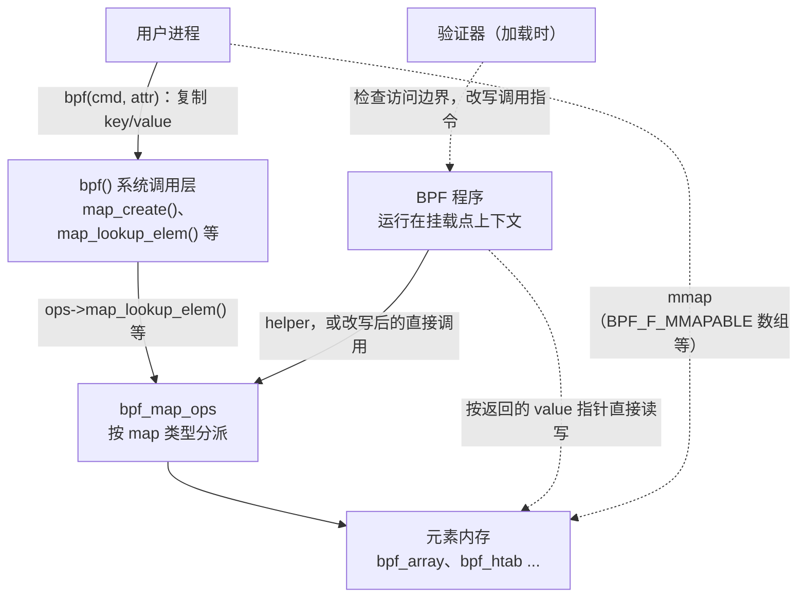
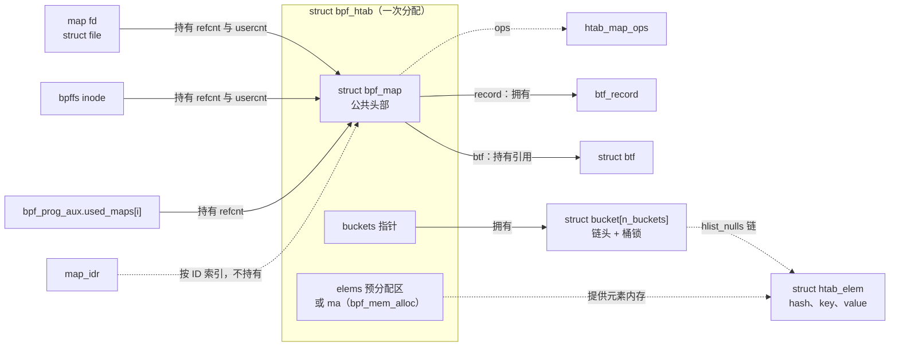
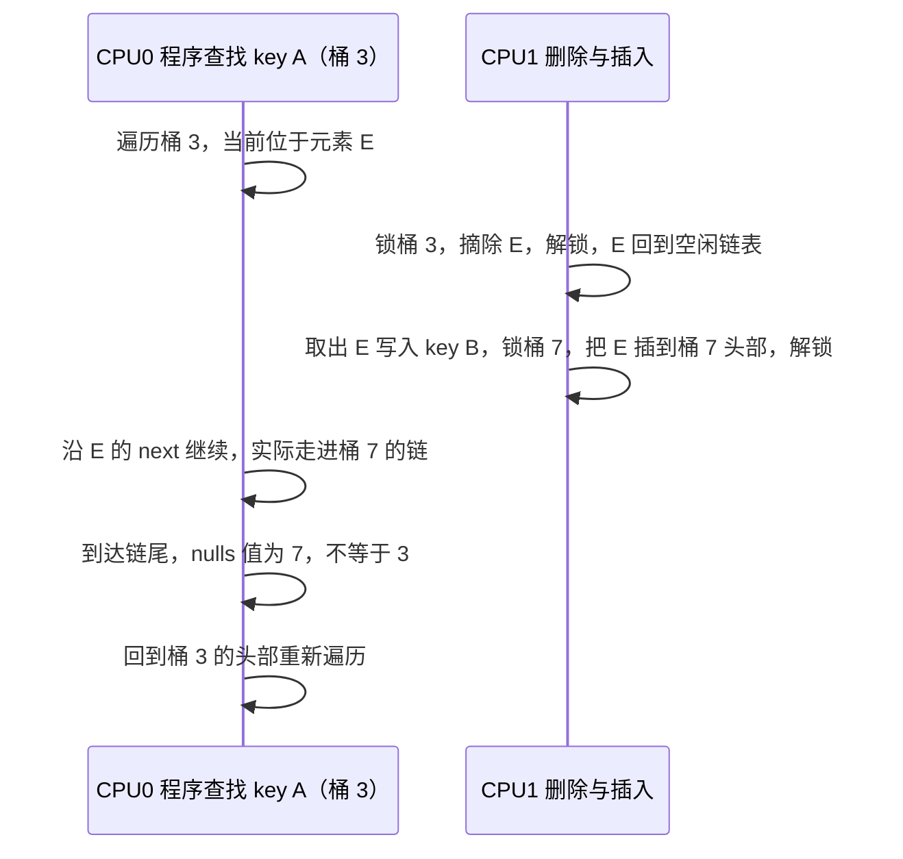
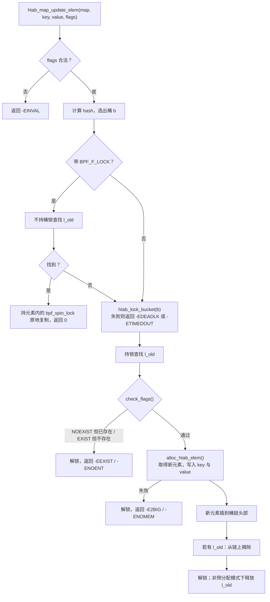
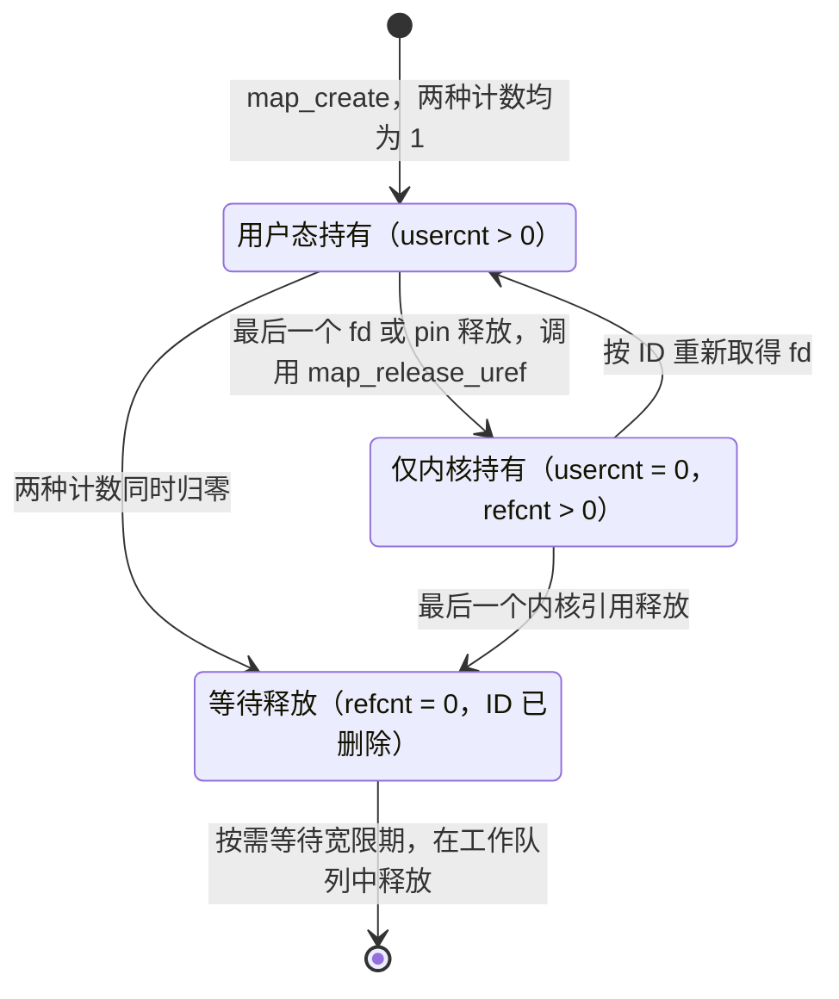
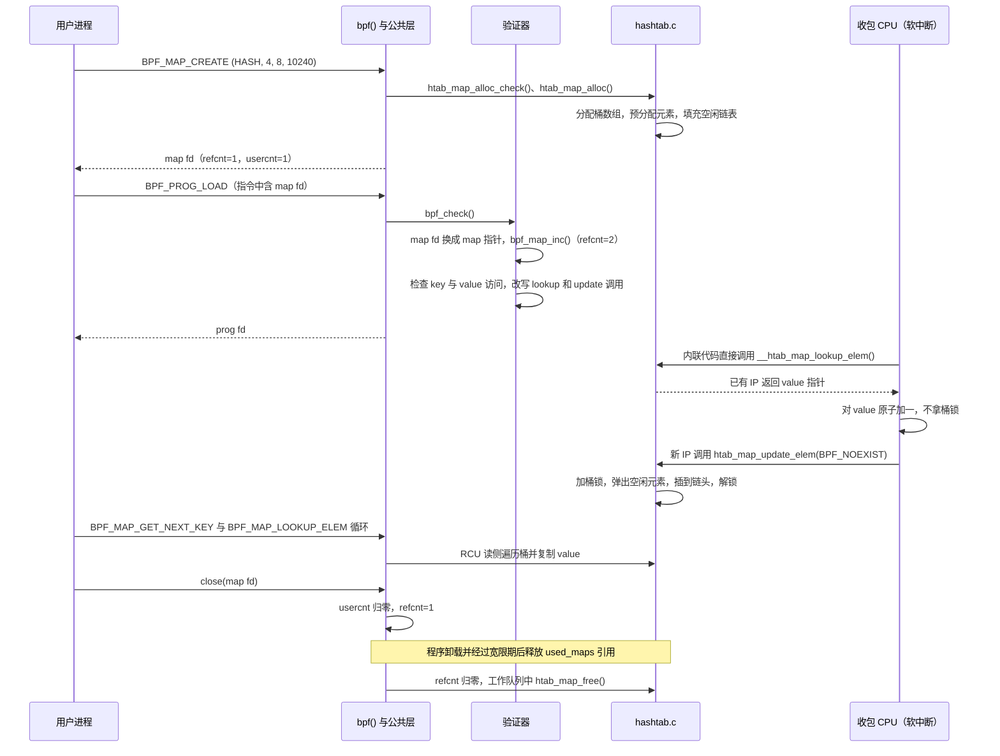

# BPF map：程序与用户态共享的内核数据对象

[BPF 子系统概述](introduction.md)用一个例子贯穿全章：XDP 程序按源 IP 统计数据包数。程序每收到一个包就运行一次，运行结束后，它的寄存器和 512 字节的栈都随之消失。可是计数要跨越成千上万次运行累积，要在多个 CPU 上同时累积，最后还要交给用户态读取。程序自身保存不了这样的状态，于是内核提供了 **map**：一种由内核分配、形状在创建时固定、带引用计数的键值存储对象。程序通过 helper 拿到指向 value 的**指针**，直接在元素内存上读写；用户态通过 `bpf()` 系统调用把 key 和 value **复制**进出内核。两边操作的是同一份内存。

本章回答以下问题：

1. map 为什么要在创建时固定 key、value 的大小和元素上限？这和验证器有什么关系？
2. 几十种 map 类型共享哪些公共结构，具体类型通过什么接口接入？
3. 用户态和程序访问 map 的两条路径有什么区别？
4. 数组 map 和哈希 map 分别怎样组织元素，怎样查找、更新和删除？
5. 程序可能在软中断、kprobe 甚至 NMI 中访问 map，实现怎样避免死锁和访问已释放的内存？
6. map 由谁持有，什么时候真正释放？

## 0. 分析基线

本章依据仓库内 [Makefile 第 2～4 行](../../linux/Makefile#L2-L4)标记的 **6.18.52** 版本，架构为 **x86-64**。读者应先读过[BPF 子系统概述](introduction.md)，了解程序、验证器、JIT 和对象引用计数的主线；RCU 的基本概念可参考[锁机制基础](../lock/introduction.md)。

与本章结论有关的配置如下。它们是编译条件，不代表某次运行一定经过对应路径。

| 配置 | 对本章的影响 | 依据 |
| --- | --- | --- |
| `CONFIG_BPF_SYSCALL=y` | 编入 `bpf()` 和 map 公共层；`hashtab.c`、`arraymap.c`、`percpu_freelist.c`、`memalloc.c`、`rqspinlock.c` 等都由它控制 | [.config#L124](../../linux/.config#L124)、[kernel/bpf/Makefile#L9-L17](../../linux/kernel/bpf/Makefile#L9-L17) |
| `CONFIG_NET`、`CONFIG_INET`、`CONFIG_XDP_SOCKETS`、`CONFIG_CGROUPS`、`CONFIG_CGROUP_BPF`、`CONFIG_PERF_EVENTS`、`CONFIG_BPF_LSM`、`CONFIG_BPF_JIT` 均为 `y` | `bpf_types.h` 中带条件编译的 map 类型在本配置下全部注册 | [.config#L1309](../../linux/.config#L1309)、[#L1349](../../linux/.config#L1349)、[#L1346](../../linux/.config#L1346)、[#L209](../../linux/.config#L209)、[#L233](../../linux/.config#L233)、[#L307](../../linux/.config#L307)、[#L130](../../linux/.config#L130)、[#L125](../../linux/.config#L125)、[bpf_types.h#L87-L135](../../linux/include/linux/bpf_types.h#L87-L135) |
| `CONFIG_MMU=y`、`CONFIG_64BIT=y` | 编入 arena map 的实现 | [.config#L332](../../linux/.config#L332)、[#L339](../../linux/.config#L339)、[Makefile#L18-L20](../../linux/kernel/bpf/Makefile#L18-L20) |
| `CONFIG_MEMCG=y` | map 的内存可以计入创建者所在的内存 cgroup；是否计费还取决于运行时的 `memcg_bpf_enabled()` | [.config#L212](../../linux/.config#L212)、[syscall.c#L482-L521](../../linux/kernel/bpf/syscall.c#L482-L521) |
| `CONFIG_QUEUED_SPINLOCKS=y` | 哈希 map 的桶锁类型 `rqspinlock_t` 就是 `struct qspinlock`，加锁走“可恢复排队自旋锁”的实现 | [.config#L1123](../../linux/.config#L1123)、[rqspinlock.h#L33-L38](../../linux/include/asm-generic/rqspinlock.h#L33-L38) |
| `CONFIG_PREEMPT_RCU=y`、`CONFIG_TASKS_TRACE_RCU=y` | 普通程序的读侧是可抢占 RCU，可睡眠程序的读侧是 RCU Tasks Trace；二者都影响元素内存和 map 的释放等待 | [.config#L168](../../linux/.config#L168)、[#L175](../../linux/.config#L175) |
| `CONFIG_CPU_MITIGATIONS=y` | Spectre v1 防护默认开启。数组 map 是否把分配大小补齐到 2 的幂与此有关，运行时还取决于创建者的权限 | [.config#L552](../../linux/.config#L552)、[bpf.h#L2558-L2563](../../linux/include/linux/bpf.h#L2558-L2563) |

还有两点需要说明：

- **缺少 vmlinux BTF 对 map 主线影响有限。**本配置没有内核 BTF（见[概述第 0 节](introduction.md#0-分析基线)）。map 自身的类型描述来自用户通过 `BPF_BTF_LOAD` 加载的 BTF，`map_create()` 甚至会拒绝内核 BTF（[syscall.c#L1539-L1548](../../linux/kernel/bpf/syscall.c#L1539-L1548)），所以 map 的 BTF 和特殊字段解析不受影响。受影响的是 kfunc，例如汇总元素计数的 `bpf_map_sum_elem_count()`（[map_iter.c#L202-L221](../../linux/kernel/bpf/map_iter.c#L202-L221)），它在本配置下无法被程序调用。
- **很多大小依赖运行时的量。**`num_possible_cpus()`、`num_online_cpus()`、`cpu_mitigations_off()` 等都要到运行时才确定。下文给出的大小公式包含这些量时，不代入具体数字。

## 1. map 要解决什么问题

### 1.1 程序为什么需要一个独立的数据对象

把开头的计数需求拆开，可以得到三个要求：

| 要求 | 程序自身为什么做不到 | map 的做法 |
| --- | --- | --- |
| **跨次运行保留状态** | 程序的栈只在一次运行内有效，最多 512 字节 | 元素内存由内核分配，生命周期与 map 对象绑定，与程序的单次运行无关 |
| **跨 CPU、跨程序共享** | 每次运行只看得到自己的寄存器和栈 | 所有引用同一个 map 的程序看到同一块元素内存；需要隔离时可用 per-CPU 变体 |
| **与用户态交换数据** | 程序不能直接访问用户内存 | 用户态通过 `bpf()` 按 key 复制 value，部分类型还支持 `mmap()` |

map 的另一个关键特征是**形状固定**。`BPF_MAP_CREATE` 的属性里给出 `key_size`、`value_size`、`max_entries` 和 `map_flags`（[uapi bpf.h#L1485-L1531](../../linux/include/uapi/linux/bpf.h#L1485-L1531)），创建后不再改变。这不是为了实现方便，而是验证器能工作的前提：

- 检查 `bpf_map_lookup_elem(map, key)` 的参数时，验证器用 `map->key_size` 确认 `key` 指向的栈区足够长且已初始化（[verifier.c#L9891-L9908](../../linux/kernel/bpf/verifier.c#L9891-L9908)）；
- 程序通过返回的 value 指针访存时，验证器用 `map->value_size` 作为边界（[verifier.c#L6118-L6119](../../linux/kernel/bpf/verifier.c#L6118-L6119)）。

如果 value 的大小在运行时可变，这些在加载时完成的证明就不再成立。所以可以这样理解 map：**它是验证器和运行时之间关于“这块内存有多大”的契约。**`max_entries` 则为程序能让内核分配的内存设了上限，例如哈希 map 写满后更新会返回 `-E2BIG`（[hashtab.c#L1016-L1032](../../linux/kernel/bpf/hashtab.c#L1016-L1032)）。

### 1.2 在内核中的位置

下图回答“谁通过什么路径访问 map 的元素内存”。实线表示函数调用，虚线表示不经过 `bpf_map_ops` 的直接内存访问或加载期处理。



图中有两点值得注意：

- **两条路径最终调用同一组回调，但语义不同。**系统调用路径在内核临时缓冲区与用户内存之间**复制** value；程序路径拿到的是指向元素内部的**指针**，读写不再经过任何函数。
- **两条路径的执行上下文不同。**系统调用在进程上下文中运行，可以睡眠；程序的上下文由挂载点决定，可能是软中断、硬中断，kprobe 和 perf 事件甚至可能在 NMI 中（[hashtab.c#L43-L53](../../linux/kernel/bpf/hashtab.c#L43-L53)、[memalloc.c#L11-L14](../../linux/kernel/bpf/memalloc.c#L11-L14)）。`bpf_map_ops` 中被两条路径共用的回调必须同时满足这两种上下文，这是理解 map 实现中锁和内存分配方式的出发点。

### 1.3 触发事件、输入与输出

| 操作 | 用户态入口 | 程序入口 | 输入 | 输出 |
| --- | --- | --- | --- | --- |
| 创建 | `BPF_MAP_CREATE` → `map_create()` | — | 类型、key/value 大小、元素上限、标志、可选 BTF | map fd |
| 查找 | `BPF_MAP_LOOKUP_ELEM` | `bpf_map_lookup_elem()` | key | 用户态得到 value 副本；程序得到 value 指针或 NULL |
| 更新 | `BPF_MAP_UPDATE_ELEM` | `bpf_map_update_elem()` | key、value、flags | 0 或负错误码 |
| 删除 | `BPF_MAP_DELETE_ELEM` | `bpf_map_delete_elem()` | key | 0 或负错误码 |
| 遍历 | `BPF_MAP_GET_NEXT_KEY` | `bpf_for_each_map_elem()` | 当前 key（可为空） | 下一个 key |
| 冻结 | `BPF_MAP_FREEZE` | — | map fd | 此后系统调用侧不可写 |
| 释放 | 关闭 fd、删除 bpffs 路径 | 程序卸载 | — | 引用计数归零后释放 |

用户态命令由 `__sys_bpf()` 分发（[syscall.c#L6179-L6197](../../linux/kernel/bpf/syscall.c#L6179-L6197)）。更新操作的 `flags` 取值为 `BPF_ANY`（不存在则创建，存在则更新）、`BPF_NOEXIST`（只创建）、`BPF_EXIST`（只更新），以及可与前三者组合的 `BPF_F_LOCK`（[uapi bpf.h#L1369-L1375](../../linux/include/uapi/linux/bpf.h#L1369-L1375)）。

### 1.4 map 类型全景

`bpf_types.h` 用 `BPF_MAP_TYPE(类型, 操作表)` 登记所有 map 类型（[bpf_types.h#L87-L135](../../linux/include/linux/bpf_types.h#L87-L135)），本配置下共 33 种。按“value 里存的是什么”可以分为五类：

| 类别 | 类型 | value 的含义 | 主要实现文件 | 创建所需权限 |
| --- | --- | --- | --- | --- |
| 通用键值存储 | `ARRAY`、`PERCPU_ARRAY`、`HASH`、`PERCPU_HASH` | 任意字节 | `arraymap.c`、`hashtab.c` | 无需特权 |
| | `LRU_HASH`、`LRU_PERCPU_HASH`、`LPM_TRIE`、`BLOOM_FILTER`、`QUEUE`、`STACK` | 任意字节，另有淘汰、最长前缀匹配、集合、FIFO/LIFO 等语义 | `hashtab.c`、`lpm_trie.c`、`bloom_filter.c`、`queue_stack_maps.c` | `CAP_BPF` |
| 内核对象的引用 | `PROG_ARRAY`、`PERF_EVENT_ARRAY`、`CGROUP_ARRAY`、`ARRAY_OF_MAPS`、`HASH_OF_MAPS` | 用户态写入 fd，内核保存程序、perf 事件、cgroup 或内层 map 的指针 | `arraymap.c`、`hashtab.c`、`map_in_map.c` | 无需特权 |
| | `DEVMAP`、`DEVMAP_HASH`、`XSKMAP`、`SOCKMAP`、`SOCKHASH` | 网络设备、AF_XDP socket、socket | `devmap.c`、`net/xdp/xskmap.c`、`net/core/sock_map.c` | `CAP_NET_ADMIN` |
| | `CPUMAP`、`REUSEPORT_SOCKARRAY` | CPU 重定向队列、reuseport 组中的 socket | `cpumap.c`、`reuseport_array.c` | `CAP_BPF` |
| 对象关联存储 | `SK_STORAGE`、`INODE_STORAGE`、`TASK_STORAGE`、`CGRP_STORAGE` | 与某个 socket、inode、task、cgroup 关联的数据，由 `bpf_local_storage` 框架管理 | `bpf_local_storage.c` 等 | `CAP_BPF` |
| | `CGROUP_STORAGE`、`PERCPU_CGROUP_STORAGE` | cgroup 程序专用的存储 | `local_storage.c` | 无需特权 |
| 数据流 | `RINGBUF`、`USER_RINGBUF` | 字节环形缓冲区；`max_entries` 是缓冲区**字节数**，必须是 2 的幂且页对齐 | `ringbuf.c` | 无需特权 |
| 其他 | `STACK_TRACE`、`STRUCT_OPS`、`ARENA` | 调用栈、内核回调表、可与用户态共享的页 | `stackmap.c`、`bpf_struct_ops.c`、`arena.c` | `CAP_BPF` |

权限一列来自 `map_create()` 中的 `switch`（[syscall.c#L1459-L1505](../../linux/kernel/bpf/syscall.c#L1459-L1505)），能力检查都经过 `bpf_token_capable()`，因此可以由 BPF token 委托。“无需特权”只表示该类型本身不检查能力：`unprivileged_bpf_disabled` 非零时，没有 `CAP_BPF` 的调用者仍然不能创建任何 map（[syscall.c#L1450-L1457](../../linux/kernel/bpf/syscall.c#L1450-L1457)）；value 中含特殊字段时也需要 `CAP_BPF`（见 2.4 节）。ringbuf 的大小约束见 [ringbuf.c#L197-L200](../../linux/kernel/bpf/ringbuf.c#L197-L200)；对象关联存储依赖的回调见 [bpf.h#L150-L155](../../linux/include/linux/bpf.h#L150-L155)。

### 1.5 本章边界

本章讲两部分：一是**所有 map 共用的机制**，包括创建、系统调用访问、验证器对 map 的处理和释放；二是最常用的两族实现，**数组**（`ARRAY`、`PERCPU_ARRAY`）和**哈希**（`HASH`、`PERCPU_HASH`，LRU 变体只讲与主线有关的差异）。

以下内容不展开：批量操作（`map_*_batch`）、map 迭代器、对象引用类 map（prog array 与尾调用、devmap/cpumap 与 XDP 重定向、sockmap）、对象关联存储、ringbuf、arena、struct_ops 和 offload。value 中的 `bpf_spin_lock`、`bpf_timer`、kptr 等特殊字段，只讲它们对公共层的影响。

## 2. 核心数据结构

### 2.1 结构地图

下图以一个哈希 map 为例，画出加载完成后的对象关系。实线箭头表示持有引用或拥有内存（会阻止对方被释放），虚线箭头表示只保存指针、不持有引用；子图表示“内嵌”关系，即同一块内存。



图中的关系分别来自：fd 和 bpffs 都通过“带 uref 的引用”持有 map（[syscall.c#L1524-L1525](../../linux/kernel/bpf/syscall.c#L1524-L1525)、[inode.c#L71-L79](../../linux/kernel/bpf/inode.c#L71-L79)）；程序只持有 `refcnt`（[verifier.c#L20903-L20913](../../linux/kernel/bpf/verifier.c#L20903-L20913)）；`map_idr` 只是索引，按 ID 取 map 时要用 `__bpf_map_inc_not_zero()` 抢引用（[syscall.c#L1664-L1678](../../linux/kernel/bpf/syscall.c#L1664-L1678)）；`record` 在 map 释放时被释放，`btf` 在 map 释放时 `btf_put()`（[syscall.c#L906-L910](../../linux/kernel/bpf/syscall.c#L906-L910)）。

记住两点：**公共层只拿着 `struct bpf_map *`，具体实现用 `container_of()` 找回外层结构；map 有两种引用计数，分别回答“对象是否还存在”和“用户态是否还持有它”。**

### 2.2 公共头部：`struct bpf_map`

`struct bpf_map`（[bpf.h#L295-L339](../../linux/include/linux/bpf.h#L295-L339)）是所有 map 的公共头部。按职责分组如下：

| 分组 | 字段 | 含义与约束 | 写入时机 |
| --- | --- | --- | --- |
| 形状 | `map_type`、`key_size`、`value_size`、`max_entries`、`map_flags`、`map_extra`、`numa_node` | 创建后不变。大小以字节为单位；`max_entries` 对数组和哈希是元素个数，对 ringbuf 是字节数 | 具体实现的 `map_alloc` 调用 `bpf_map_init_from_attr()` 从属性复制（[syscall.c#L433-L442](../../linux/kernel/bpf/syscall.c#L433-L442)） |
| 分派 | `ops` | 本类型的操作表 | `map_alloc` 返回后由 `map_create()` 写入（[syscall.c#L1512-L1513](../../linux/kernel/bpf/syscall.c#L1512-L1513)） |
| 标识 | `id`、`name`、`cookie` | 全局 ID、名字、单调递增的 cookie | [syscall.c#L1515-L1522](../../linux/kernel/bpf/syscall.c#L1515-L1522)、[#L1598](../../linux/kernel/bpf/syscall.c#L1598) |
| 类型信息 | `btf`、`btf_key_type_id`、`btf_value_type_id`、`record` | 可选的 key/value 类型描述；`record` 是从 value 类型中解析出的特殊字段表 | [syscall.c#L1529-L1562](../../linux/kernel/bpf/syscall.c#L1529-L1562) |
| 生命周期 | `refcnt`、`usercnt`、`sleepable_refcnt`、`work`/`rcu`、`free_after_rcu_gp`、`free_after_mult_rcu_gp` | 见 3.8 节 | — |
| 写保护 | `frozen`、`freeze_mutex`、`writecnt` | 冻结标志；正在进行的写系统调用和可写 `mmap` 映射数 | 见 3.2.1 节 |
| 防护与计费 | `bypass_spec_v1`、`objcg`、`elem_count` | 是否跳过 Spectre v1 防护；内存计费归属；每 CPU 元素计数 | 见 3.1、3.3 节 |
| 程序归属 | `owner`、`owner_lock`、`excl_prog_sha` | prog array 类 map 的调用方兼容性；只允许特定程序使用的“独占 map” | 本章不展开 |

有三处细节需要说明：

- `map_flags` 中只对**文件**有意义的 `BPF_F_RDONLY`、`BPF_F_WRONLY` 会被去掉，因为同一个 map 可以有多个访问权限不同的 fd（[syscall.c#L421-L431](../../linux/kernel/bpf/syscall.c#L421-L431)）。系统调用侧的读写权限看 fd，程序侧的读写权限看 `BPF_F_RDONLY_PROG`、`BPF_F_WRONLY_PROG`，两者互相独立（[uapi bpf.h#L1390-L1402](../../linux/include/uapi/linux/bpf.h#L1390-L1402)）。
- `work` 和 `rcu` 放在同一个 union 里，源码注释写明 `rcu` 只在释放前使用，`work` 只在释放过程中使用（[bpf.h#L323-L327](../../linux/include/linux/bpf.h#L323-L327)）。3.8 节会看到，RCU 回调执行完毕后才在同一块内存上初始化 work，二者不会同时使用。
- `elem_count` 是每 CPU 的元素计数，哈希 map 在插入和删除时增减它（[bpf.h#L2515-L2542](../../linux/include/linux/bpf.h#L2515-L2542)），只用于统计；哈希 map 判断“是否已满”用的是自己的计数器（见 2.6 节）。

### 2.3 操作表：`struct bpf_map_ops`

`struct bpf_map_ops`（[bpf.h#L83-L187](../../linux/include/linux/bpf.h#L83-L187)）用注释把回调分成几组：只从系统调用调用的（[L84](../../linux/include/linux/bpf.h#L84)）、系统调用和程序都会调用的（[L105](../../linux/include/linux/bpf.h#L105)）、fd 类 map 专用的（[L115](../../linux/include/linux/bpf.h#L115)）、尾调用改写用的（[L132](../../linux/include/linux/bpf.h#L132)）、直接访问 value 用的（[L138](../../linux/include/linux/bpf.h#L138)）等。下表列出本章用到的回调及其在数组、哈希中的实现：

| 回调 | 调用者与上下文 | `ARRAY` | `HASH` |
| --- | --- | --- | --- |
| `map_alloc_check` | `map_create()`，分配之前，进程上下文 | `array_map_alloc_check` | `htab_map_alloc_check` |
| `map_alloc` | `map_create()`，进程上下文 | `array_map_alloc` | `htab_map_alloc` |
| `map_free` | `refcnt` 归零后，在工作队列中 | `array_map_free` | `htab_map_free` |
| `map_release_uref` | `usercnt` 归零时 | `array_map_free_internal_structs` | `htab_map_free_internal_structs` |
| `map_lookup_elem` | 系统调用**和**程序 | `array_map_lookup_elem` | `htab_map_lookup_elem` |
| `map_update_elem` | 系统调用和程序 | `array_map_update_elem` | `htab_map_update_elem` |
| `map_delete_elem` | 系统调用和程序 | `array_map_delete_elem`（总是失败） | `htab_map_delete_elem` |
| `map_get_next_key` | 系统调用，RCU 读侧 | `array_map_get_next_key` | `htab_map_get_next_key` |
| `map_gen_lookup` | 验证器改写指令时 | `array_map_gen_lookup` | `htab_map_gen_lookup` |
| `map_direct_value_addr` | 验证器解析“直接 value 访问”时 | `array_map_direct_value_addr` | — |
| `map_mmap` | `mmap()` | `array_map_mmap` | — |
| `map_mem_usage` | fdinfo 显示内存占用 | `array_map_mem_usage` | `htab_map_mem_usage` |

两张操作表的定义见 [arraymap.c#L794-L818](../../linux/kernel/bpf/arraymap.c#L794-L818) 和 [hashtab.c#L2254-L2273](../../linux/kernel/bpf/hashtab.c#L2254-L2273)。`map_mem_usage` 是必选回调，缺少它的类型在创建时就被拒绝（[syscall.c#L1429-L1430](../../linux/kernel/bpf/syscall.c#L1429-L1430)）。

同一个回调同时服务两种调用者，意味着 `map_lookup_elem`、`map_update_elem`、`map_delete_elem` 的实现**不能睡眠、不能使用可能睡眠的分配，并且要能在被中断的上下文里重入**。后面看到的 RCU 读侧遍历、关中断的桶锁、预分配元素和专用内存分配器，都是由这一约束推出来的。

### 2.4 value 中的特殊字段：`struct btf_record`

value 不一定只是字节。带 BTF 创建的 map，value 里可以出现由内核管理语义的字段，例如 `bpf_spin_lock`、`bpf_timer`、指向内核对象的 kptr、链表头和红黑树根等（[bpf.h#L194-L212](../../linux/include/linux/bpf.h#L194-L212)）。这些字段对程序和用户态都是不透明的，内核必须知道它们在 value 中的位置：

- **复制时跳过。**用户态写入 value 时不能覆盖锁和定时器的内部状态。`bpf_obj_memcpy()` 按字段表逐段复制，跳过每个特殊字段（[bpf.h#L529-L553](../../linux/include/linux/bpf.h#L529-L553)）；字段表在解析后按偏移排好序（[btf.c#L4079-L4080](../../linux/kernel/bpf/btf.c#L4079-L4080)），这段代码才能用“上一个字段结束到下一个字段开始”的方式计算间隙。
- **验证时禁止直接访问。**程序的普通读写不能与特殊字段重叠，kptr 只允许以固定偏移、8 字节宽度访问（[verifier.c#L6123-L6160](../../linux/kernel/bpf/verifier.c#L6123-L6160)）。
- **覆盖和释放时归还资源。**元素被覆盖、删除或 map 释放时，`bpf_obj_free_fields()` 取消定时器、释放 kptr 指向的对象等（[syscall.c#L812-L881](../../linux/kernel/bpf/syscall.c#L812-L881)）。

`struct btf_record`（[bpf.h#L257-L267](../../linux/include/linux/bpf.h#L257-L267)）保存字段数 `cnt`、字段类型掩码 `field_mask`、几类常用字段的偏移，以及按偏移排序的 `fields[]`。它由 `map_check_btf()` 调用 `btf_parse_fields()` 生成，并在这里按 map 类型做准入检查（[syscall.c#L1268-L1350](../../linux/kernel/bpf/syscall.c#L1268-L1350)）：

| 特殊字段 | 允许的 map 类型（节选） |
| --- | --- |
| `bpf_spin_lock`、`bpf_res_spin_lock` | `HASH`、`ARRAY`、cgroup 存储和各类对象关联存储 |
| `bpf_timer`、`bpf_wq`、task work | `HASH`、`LRU_HASH`、`ARRAY` |
| kptr、`bpf_refcount` | 数组、哈希及其 per-CPU、LRU 变体，对象关联存储 |
| 链表头、红黑树根 | `HASH`、`LRU_HASH`、`ARRAY` |

含特殊字段的 map 还受到几条额外限制：创建者必须有 `CAP_BPF`，不能设置 `BPF_F_RDONLY_PROG`/`BPF_F_WRONLY_PROG`（[syscall.c#L1276-L1283](../../linux/kernel/bpf/syscall.c#L1276-L1283)）；不能被冻结（[syscall.c#L2264-L2265](../../linux/kernel/bpf/syscall.c#L2264-L2265)），也不能 `mmap`（[syscall.c#L1094-L1095](../../linux/kernel/bpf/syscall.c#L1094-L1095)）。后两条的原因可以从机制推断：冻结和 mmap 都让 value 以“原始字节”的形式被看待或修改，与“内核管理其中部分字段”相冲突。

### 2.5 数组：`struct bpf_array`

```c
struct bpf_array {
	struct bpf_map map;
	u32 elem_size;
	u32 index_mask;
	struct bpf_array_aux *aux;
	union {
		DECLARE_FLEX_ARRAY(char, value) __aligned(8);
		DECLARE_FLEX_ARRAY(void *, ptrs) __aligned(8);
		DECLARE_FLEX_ARRAY(void __percpu *, pptrs) __aligned(8);
	};
};
```

来源：[include/linux/bpf.h 第 2076～2086 行](../../linux/include/linux/bpf.h#L2076-L2086)。

| 字段 | 含义 | 依据 |
| --- | --- | --- |
| `map` | 内嵌的公共头部，必须是第一个成员（生成的查找指令依赖这一点） | [arraymap.c#L276](../../linux/kernel/bpf/arraymap.c#L276) |
| `elem_size` | 单个元素占用的字节数，等于 `round_up(value_size, 8)` | [arraymap.c#L93](../../linux/kernel/bpf/arraymap.c#L93) |
| `index_mask` | 不小于 `max_entries` 的最小 2 的幂减一，用于 Spectre v1 防护 | [arraymap.c#L101-L105](../../linux/kernel/bpf/arraymap.c#L101-L105) |
| `value[]` | `ARRAY`：所有元素连续存放在这里 | [arraymap.c#L161-L164](../../linux/kernel/bpf/arraymap.c#L161-L164) |
| `pptrs[]` | `PERCPU_ARRAY`：每个元素一个 per-CPU 指针，指向各 CPU 上 `elem_size` 字节的副本 | [arraymap.c#L33-L50](../../linux/kernel/bpf/arraymap.c#L33-L50) |
| `ptrs[]` | prog array 等 fd 类数组：每个元素是一个对象指针 | 本章不展开 |

数组 map 的 key 必须是 4 字节，即一个 `u32` 下标（[arraymap.c#L59](../../linux/kernel/bpf/arraymap.c#L59)）。所有元素在创建时一次分配并清零，此后**元素始终存在**，这一点决定了数组的更新和删除语义（见 3.3 节）。

普通数组的内存布局如下（文本示意）：

```text
bpf_map_area_alloc() 分配的一块内存
+------------------------------+ <- array
| struct bpf_map map           |
| elem_size / index_mask / aux |
+------------------------------+ <- array->value（8 字节对齐）
| 元素 0（elem_size 字节）       |
| 元素 1                        |
| ...                          |
| 元素 N-1                      |  N = 实际分配的元素数，可能大于 max_entries
+------------------------------+
```

带 `BPF_F_MMAPABLE` 创建时，布局会调整为让 `value[]` 恰好从页边界开始：分配大小为 `PAGE_ALIGN(sizeof(*array))` 加上按页对齐的元素区，`array` 指针向后偏移，使头部的末尾正好落在页边界上（[arraymap.c#L123-L140](../../linux/kernel/bpf/arraymap.c#L123-L140)）。`mmap` 时只映射元素区，页偏移从头部之后算起（[arraymap.c#L569-L583](../../linux/kernel/bpf/arraymap.c#L569-L583)）。这样用户态映射得到的就是纯粹的元素数组，看不到内核头部。

### 2.6 哈希表：`struct bpf_htab`、`struct bucket`、`struct htab_elem`

哈希 map 由三层结构组成：表头 `bpf_htab`、桶数组 `bucket[]`、元素 `htab_elem`。

```c
struct bucket {
	struct hlist_nulls_head head;
	rqspinlock_t raw_lock;
};

struct bpf_htab {
	struct bpf_map map;
	struct bpf_mem_alloc ma;
	struct bpf_mem_alloc pcpu_ma;
	struct bucket *buckets;
	void *elems;
	union {
		struct pcpu_freelist freelist;
		struct bpf_lru lru;
	};
	struct htab_elem *__percpu *extra_elems;
	/* ... pcount、count、use_percpu_counter ... */
	u32 n_buckets;	/* number of hash buckets */
	u32 elem_size;	/* size of each element in bytes */
	u32 hashrnd;
};
```

来源：[kernel/bpf/hashtab.c 第 80～108 行](../../linux/kernel/bpf/hashtab.c#L80-L108)，省略了两者之间的宏定义和表头中的计数器字段。

**表头 `bpf_htab` 的关键字段：**

| 字段 | 含义 | 依据 |
| --- | --- | --- |
| `n_buckets` | 桶数，`roundup_pow_of_two(max_entries)`；`max_entries` 不能超过 2^31 | [hashtab.c#L510-L514](../../linux/kernel/bpf/hashtab.c#L510-L514) |
| `elem_size` | `sizeof(struct htab_elem) + round_up(key_size, 8)`，再加 `round_up(value_size, 8)`；per-CPU 哈希只加一个指针的大小 | [hashtab.c#L516-L521](../../linux/kernel/bpf/hashtab.c#L516-L521) |
| `hashrnd` | 哈希种子，默认随机；`BPF_F_ZERO_SEED` 置零，但要求 `CAP_SYS_ADMIN` | [hashtab.c#L538-L541](../../linux/kernel/bpf/hashtab.c#L538-L541)、[#L436-L438](../../linux/kernel/bpf/hashtab.c#L436-L438) |
| `elems`、`freelist`/`lru` | **预分配模式**（默认）：全部元素一次分配在 `elems`，空闲元素挂在每 CPU 空闲链表上；LRU 类型改用 `lru` | [hashtab.c#L324-L381](../../linux/kernel/bpf/hashtab.c#L324-L381) |
| `ma`、`pcpu_ma` | **非预分配模式**（`BPF_F_NO_PREALLOC`）：元素和 per-CPU value 从 BPF 专用分配器按需分配 | [hashtab.c#L578-L588](../../linux/kernel/bpf/hashtab.c#L578-L588) |
| `extra_elems` | 预分配的普通哈希为每个 CPU 留一个备用元素，用于“替换已有 key”的更新 | [hashtab.c#L209-L216](../../linux/kernel/bpf/hashtab.c#L209-L216)、[#L393-L414](../../linux/kernel/bpf/hashtab.c#L393-L414) |
| `count`/`pcount` | 非预分配模式下的元素计数，用于判断 map 是否已满；元素较多时改用 `percpu_counter` 减少争用 | [hashtab.c#L545-L566](../../linux/kernel/bpf/hashtab.c#L545-L566)、[#L903-L929](../../linux/kernel/bpf/hashtab.c#L903-L929) |

**桶 `bucket`** 由两部分组成：`hlist_nulls` 链头，以及一把**可恢复的排队自旋锁** `rqspinlock_t`。初始化时，每个桶链尾部的 nulls 标记被设成该桶的下标（[hashtab.c#L136-L145](../../linux/kernel/bpf/hashtab.c#L136-L145)）。为什么要这样做，3.4 节解释。

**元素 `htab_elem`** 的定义如下：

```c
struct htab_elem {
	union {
		struct hlist_nulls_node hash_node;
		struct {
			void *padding;
			union {
				struct pcpu_freelist_node fnode;
				struct htab_elem *batch_flink;
			};
		};
	};
	union {
		/* pointer to per-cpu pointer */
		void *ptr_to_pptr;
		struct bpf_lru_node lru_node;
	};
	u32 hash;
	char key[] __aligned(8);
};
```

来源：[kernel/bpf/hashtab.c 第 110～129 行](../../linux/kernel/bpf/hashtab.c#L110-L129)。

一个元素在内存中依次是：链表节点、per-CPU 指针或 LRU 节点、32 位哈希值、按 8 字节对齐的 key，最后是 value（`htab_elem_value()` 返回 `key + round_up(key_size, 8)`，[hashtab.c#L183-L186](../../linux/kernel/bpf/hashtab.c#L183-L186)）。per-CPU 哈希的 value 位置只放一个指向 per-CPU 内存的指针（[hashtab.c#L188-L197](../../linux/kernel/bpf/hashtab.c#L188-L197)）。

第一个 union 的布局值得细看。元素在哈希链上时用 `hash_node`（`next`、`pprev` 两个指针）；回到空闲链表时用 `fnode`。`padding` 占住了 `hash_node.next` 的位置，`fnode` 与 `hash_node.pprev` 重叠，`htab_map_alloc_check()` 中的 `BUILD_BUG_ON` 正是在确认这一点（[hashtab.c#L433-L434](../../linux/kernel/bpf/hashtab.c#L433-L434)）。**分析：**这样安排后，把元素放回空闲链表只会改写 `pprev` 所在的位置，`next` 保持原值；仍在 RCU 读侧遍历到这个元素的读者，可以继续沿 `next` 走下去，而不会读到空闲链表的指针。3.4 节的 nulls 检查会处理“走到了别的桶”的情况。

### 2.7 生命周期与并发保护一览

| 对象 | 何时创建 | 运行时读者 | 写者与保护 | 何时释放 |
| --- | --- | --- | --- | --- |
| `bpf_map` 本身 | `map_create()` | 程序在 RCU 读侧使用（helper 断言 `bpf_rcu_lock_held()`）；系统调用期间由 fd 保活 | `refcnt`、`usercnt` 原子计数；`frozen` 由 `freeze_mutex` 保护 | `refcnt` 归零，按需等待宽限期后在工作队列释放（3.8 节） |
| 数组元素 | 随 map 一次分配 | 程序通过指针直接访问，无锁 | 更新直接复制，无锁；含 `bpf_spin_lock` 时可用 `BPF_F_LOCK` | 随 map 释放 |
| 哈希桶链 | `htab_init_buckets()` | RCU 读侧遍历 `hlist_nulls` | 修改必须持桶锁，持锁期间关中断 | 随 map 释放 |
| 哈希元素 | 预分配区或 `bpf_mem_alloc` | RCU 读侧持有元素指针 | 在桶锁内插入、摘除 | 摘除后可**立即**被复用；内存归还给 slab 要等宽限期（3.6 节） |

依据：[helpers.c#L34-L47](../../linux/kernel/bpf/helpers.c#L34-L47)、[hashtab.c#L147-L162](../../linux/kernel/bpf/hashtab.c#L147-L162)、[arraymap.c#L357-L394](../../linux/kernel/bpf/arraymap.c#L357-L394)。

## 3. 关键算法

### 3.1 创建：从属性到对象

**目标与输入输出。**`map_create()` 的输入是 `union bpf_attr` 中的创建属性，输出是一个新 map 的 fd。它要保证：参数对该类型合法、调用者有权限、对象完全初始化之后才对外可见、任何一步失败都不泄漏资源。

下面的伪代码概括了它的步骤，省略了 struct_ops 和 offload 的特殊情形：

```text
// 简化逻辑：map_create()（syscall.c#L1370-L1626）
检查属性：未使用字段为零、BTF id 组合、map_extra、文件标志、NUMA 节点
ops = bpf_map_types[map_type]            // 下标先经 array_index_nospec()
ops->map_alloc_check(attr)               // 类型自己的参数检查，尚未分配任何内存
权限检查：unprivileged_bpf_disabled；按类型要求 CAP_BPF / CAP_NET_ADMIN（可经 token）
map = ops->map_alloc(attr)               // 分配外层结构，内嵌的 bpf_map 由实现初始化形状字段
map->ops = ops；复制名字；生成 cookie
refcnt = 1；usercnt = 1                  // 这一份引用将交给 fd
若带 BTF：取得 btf 引用；map_check_btf() 解析特殊字段 → map->record
可选：记录独占程序的哈希 excl_prog_sha
security_bpf_map_create()
bpf_map_alloc_id()                       // 从这里起，其他进程可以按 ID 找到它
bpf_map_save_memcg()
fd = bpf_map_new_fd()                    // 失败时只能 bpf_map_put_with_uref()
```

几个关键步骤的依据与解释：

1. **按类型选操作表。**`map_type` 先做范围检查，再用 `array_index_nospec()` 防止推测执行越界读取操作表数组（[syscall.c#L1413-L1420](../../linux/kernel/bpf/syscall.c#L1413-L1420)）。设置了 `map_ifindex` 的 map 会改用 offload 操作表（[syscall.c#L1427-L1428](../../linux/kernel/bpf/syscall.c#L1427-L1428)）。
2. **先查参数，再查权限，最后分配。**`map_alloc_check` 在权限检查之前调用（[syscall.c#L1422-L1426](../../linux/kernel/bpf/syscall.c#L1422-L1426)），只检查属性、不分配内存。例如哈希的检查拒绝零大小的 key/value、`key_size + value_size` 过大、LRU 不预分配等组合（[hashtab.c#L417-L473](../../linux/kernel/bpf/hashtab.c#L417-L473)）；数组的检查要求 key 为 4 字节（[arraymap.c#L53-L82](../../linux/kernel/bpf/arraymap.c#L53-L82)）。
3. **两个计数都从 1 开始**（[syscall.c#L1524-L1527](../../linux/kernel/bpf/syscall.c#L1524-L1527)），对应即将创建的 fd 这一个“用户态持有者”。
4. **先分配 ID，再创建 fd。**ID 一旦分配，拥有 `CAP_SYS_ADMIN` 的进程就可以用 `BPF_MAP_GET_FD_BY_ID` 取得新的引用（[syscall.c#L4844-L4878](../../linux/kernel/bpf/syscall.c#L4844-L4878)）。所以 fd 创建失败时不能直接释放对象，只能 `bpf_map_put_with_uref()` 交给引用计数处理，源码注释专门说明了这一点（[syscall.c#L1605-L1615](../../linux/kernel/bpf/syscall.c#L1605-L1615)）。分配 ID 之前的失败则可以直接 `bpf_map_free()`（[syscall.c#L1619-L1625](../../linux/kernel/bpf/syscall.c#L1619-L1625)）。fd 带 `O_CLOEXEC` 打开（[syscall.c#L1183-L1193](../../linux/kernel/bpf/syscall.c#L1183-L1193)）。

**内存从哪里来，又记在谁的账上？**大块内存由 `bpf_map_area_alloc()` 分配：不超过 `PAGE_SIZE << PAGE_ALLOC_COSTLY_ORDER`（x86-64 上为 32 KiB）时先试 `kmalloc`，失败或更大时用 `vmalloc`；需要 `mmap` 的区域始终用 `vmalloc` 并按 `SHMLBA` 对齐（[syscall.c#L369-L404](../../linux/kernel/bpf/syscall.c#L369-L404)、[mmzone.h#L62](../../linux/include/linux/mmzone.h#L62)）。分配标志经 `bpf_memcg_flags()` 加上 `__GFP_ACCOUNT`（[bpf.h#L3753-L3758](../../linux/include/linux/bpf.h#L3753-L3758)），此时 `current` 就是创建者，所以创建阶段的分配自然记在创建者的内存 cgroup 上。

`bpf_map_save_memcg()` 保存 `objcg` 则是为**以后**的分配准备的（[syscall.c#L482-L492](../../linux/kernel/bpf/syscall.c#L482-L492)）：程序运行时的 `current` 是任意被打断的任务，不能把 map 的内存记到它头上。因此 `bpf_map_kmalloc_node()` 等函数在分配前临时把活动 memcg 切换为 map 保存的那一个（[syscall.c#L508-L521](../../linux/kernel/bpf/syscall.c#L508-L521)）。哈希 map 使用的 `bpf_mem_alloc` 在初始化时同样记下创建者的 `objcg`（[memalloc.c#L533-L537](../../linux/kernel/bpf/memalloc.c#L533-L537)）。

### 3.2 两条访问路径

#### 3.2.1 系统调用路径：复制语义

以 `map_lookup_elem()`（[syscall.c#L1718-L1778](../../linux/kernel/bpf/syscall.c#L1718-L1778)）为例，一次用户态查找经过以下步骤：

1. **取得 map。**`CLASS(fd, f)` 在本次系统调用期间持有文件，`__bpf_map_get()` 只检查文件类型是否为 `bpf_map_fops`，然后返回 `private_data`（[bpf.h#L2444-L2451](../../linux/include/linux/bpf.h#L2444-L2451)）。这里**没有**增加 map 的引用：文件持有 map 的引用，而本次调用持有文件，这已经足够。
2. **检查权限。**`map_get_sys_perms()` 以文件的 `f_mode` 为准；若 map 已冻结，再去掉写权限（[syscall.c#L991-L1001](../../linux/kernel/bpf/syscall.c#L991-L1001)）。
3. **复制 key，准备 value 缓冲区。**缓冲区大小由 `bpf_map_value_size()` 决定（[syscall.c#L136-L147](../../linux/kernel/bpf/syscall.c#L136-L147)）：per-CPU 类型是 `round_up(value_size, 8) * num_possible_cpus()`，用户一次拿到所有 CPU 的副本；fd 类 map 是 4 字节；其他类型就是 `value_size`。
4. **在保护下复制 value。**`bpf_map_copy_value()`（[syscall.c#L305-L363](../../linux/kernel/bpf/syscall.c#L305-L363)）先调用 `bpf_disable_instrumentation()`，再按类型分派。通用分支在 `rcu_read_lock()` 内调用 `ops->map_lookup_elem_sys_only`（若有）或 `ops->map_lookup_elem` 拿到元素指针，然后用 `copy_map_value()` 跳过特殊字段复制，指定 `BPF_F_LOCK` 时改为持元素内的 `bpf_spin_lock` 复制。最后 `check_and_init_map_value()` 把副本中的特殊字段重新初始化，源码注释说明这是因为缓冲区没有清零，需要屏蔽锁和定时器所在的字节。
5. **退出 RCU 读侧后**再 `copy_to_user()`，因为复制到用户内存可能缺页、睡眠。

`bpf_disable_instrumentation()` 做两件事：禁止迁移，并增加每 CPU 计数 `bpf_prog_active`（[bpf.h#L2370-L2386](../../linux/include/linux/bpf.h#L2370-L2386)）。注释说明了目的：系统调用持有桶锁期间，如果同一 CPU 上的 kprobe、perf、tracepoint 触发了另一个访问同一 map 的程序，就会在同一把锁上死锁；而检查 `bpf_prog_active` 的挂载点（如 `trace_call_bpf()`，见[概述 3.4 节](introduction.md#34-执行挂载点怎样调用程序)）看到计数非零就会跳过程序。3.7 节会看到，这个机制并不覆盖所有挂载点。

更新路径 `map_update_elem()`（[syscall.c#L1783-L1834](../../linux/kernel/bpf/syscall.c#L1783-L1834)）有三处不同：

- **登记“正在写”。**进入时 `writecnt` 加一，退出时减一（[syscall.c#L1799](../../linux/kernel/bpf/syscall.c#L1799)、[#L1832](../../linux/kernel/bpf/syscall.c#L1832)）。冻结操作和验证器的“只读 map”判断都要看这个计数。
- **按类型分出特例。**offload、cpumap、arena、struct_ops 不进入 `bpf_disable_instrumentation()` 和 RCU 读侧，直接调用实现，该分支前的注释说明原因是需要创建内核线程、必须允许调度；sockmap 和 prog array 也有各自的专用入口。其余类型在 `bpf_disable_instrumentation()` 和 `rcu_read_lock()` 保护下调用 `ops->map_update_elem`（[syscall.c#L247-L303](../../linux/kernel/bpf/syscall.c#L247-L303)）。
- **map-in-map 的更新要等待程序。**对 `ARRAY_OF_MAPS`、`HASH_OF_MAPS`，成功更新后 `maybe_wait_bpf_programs()` 调用 `synchronize_rcu()`，保证系统调用返回时，所有不可睡眠的程序都已看到新的内层 map（[syscall.c#L149-L162](../../linux/kernel/bpf/syscall.c#L149-L162)）。普通 map 不做这种等待。

**冻结。**`map_freeze()` 在 `freeze_mutex` 下检查：没有进行中的写系统调用或可写映射（`writecnt` 为零），且尚未冻结，然后置位 `frozen`（[syscall.c#L2251-L2284](../../linux/kernel/bpf/syscall.c#L2251-L2284)）。冻结只限制**系统调用侧**，程序侧能否写由 `BPF_F_RDONLY_PROG` 决定。二者组合起来的用途见 3.3 节末尾。

**一致性。**系统调用复制 value 时，如果不使用 `BPF_F_LOCK`，就不持有任何元素级的锁，复制过程可能与程序的并发写交错。源码对 per-CPU 值的复制明确写着这只是“尽力而为”，会与程序的并发更新竞争（[bpf.h#L513-L527](../../linux/include/linux/bpf.h#L513-L527)）。需要多字段一致的读写时，应在 value 中放 `bpf_spin_lock` 并使用 `BPF_F_LOCK`（[helpers.c#L377-L391](../../linux/kernel/bpf/helpers.c#L377-L391)）。

#### 3.2.2 程序路径：指针语义与加载期证明

程序访问 map 的大部分检查都在**加载时**完成，运行时几乎只剩下 key 的动态查找。整个过程可以分成六步：

**第一步：把 map fd 换成 map 指针，并取得引用。**用户态在 `ldimm64` 指令里写入 map fd（`src_reg` 为 `BPF_PSEUDO_MAP_FD`），或写入 `fd_array` 的下标（`BPF_PSEUDO_MAP_IDX`）。`resolve_pseudo_ldimm64()` 取出 fd，调用 `add_used_map()`，再把 map 的内核地址拆成两半写回两个指令槽（[verifier.c#L20996-L21063](../../linux/kernel/bpf/verifier.c#L20996-L21063)）。`__add_used_map()` 对同一个 map 去重，检查程序与 map 是否兼容，然后 `bpf_map_inc()` 持有引用并记入 `env->used_maps`；一个程序最多使用 64 个 map（[verifier.c#L20884-L20916](../../linux/kernel/bpf/verifier.c#L20884-L20916)、[bpf_verifier.h#L590](../../linux/include/linux/bpf_verifier.h#L590)）。兼容性检查包括：可睡眠程序只能使用数组、哈希、ringbuf、对象关联存储等少数类型；跟踪类程序不能使用含 `bpf_spin_lock`、`bpf_timer` 的 map 等（[verifier.c#L20767-L20882](../../linux/kernel/bpf/verifier.c#L20767-L20882)）。

**第二步：给寄存器标上类型。**抽象解释到这条 `ldimm64` 时，`check_ld_imm()` 把目标寄存器标记为 `CONST_PTR_TO_MAP`，并记下 `map_ptr`（[verifier.c#L17350-L17371](../../linux/kernel/bpf/verifier.c#L17350-L17371)）。若是“直接 value 访问”（`BPF_PSEUDO_MAP_VALUE`），寄存器则直接成为指向 value 的 `PTR_TO_MAP_VALUE`。

**第三步：检查 helper 参数。**以 `bpf_map_lookup_elem` 为例，它的原型声明参数为 `ARG_CONST_MAP_PTR` 和 `ARG_PTR_TO_MAP_KEY`，返回 `RET_PTR_TO_MAP_VALUE_OR_NULL`（[helpers.c#L49-L56](../../linux/kernel/bpf/helpers.c#L49-L56)）。验证器先记下第一个参数的 map，再用 `map->key_size` 检查 key 指向的内存可读且已初始化；`ARG_PTR_TO_MAP_VALUE` 类参数则按 `value_size` 检查（[verifier.c#L9864-L9936](../../linux/kernel/bpf/verifier.c#L9864-L9936)）。`check_map_func_compatibility()` 从 map 和 helper 两个方向检查搭配是否合法，例如 prog array 只能用于 `bpf_tail_call`（[verifier.c#L10075-L10094](../../linux/kernel/bpf/verifier.c#L10075-L10094)）。

**第四步：记录调用点的 map，并执行只读约束。**`record_func_map()` 拒绝对 `BPF_F_RDONLY_PROG` 的 map 调用更新、删除、push、pop；然后把 map 记在这条 call 指令的辅助数据里。如果同一条 call 指令在不同路径上遇到了不同的 map，就把记录标记为“poisoned”（[verifier.c#L11246-L11290](../../linux/kernel/bpf/verifier.c#L11246-L11290)），第六步据此决定能否改写。

**第五步：确定返回值类型，检查对 value 的访问。**查找的返回值被标记为 `PTR_TO_MAP_VALUE` 加“可能为空”。有一个例外：对 `ARRAY`、`PERCPU_ARRAY`，如果 key 是常量且小于 `max_entries`，查找必然成功，验证器直接去掉“可能为空”（[verifier.c#L11486-L11498](../../linux/kernel/bpf/verifier.c#L11486-L11498)、[#L11872-L11876](../../linux/kernel/bpf/verifier.c#L11872-L11876)）。之后通过 value 指针的每次访存，都要经过 `PTR_TO_MAP_VALUE` 分支（[verifier.c#L7620-L7659](../../linux/kernel/bpf/verifier.c#L7620-L7659)）：

- 不允许把指针值写进 map，否则报 “leaks addr into map”；
- `check_map_access_type()` 按 `BPF_F_RDONLY_PROG`/`BPF_F_WRONLY_PROG` 检查读写方向（[verifier.c#L5712-L5732](../../linux/kernel/bpf/verifier.c#L5712-L5732)、[bpf.h#L2112-L2125](../../linux/include/linux/bpf.h#L2112-L2125)）；
- `check_map_access()` 检查 `[偏移, 偏移 + 大小)` 落在 `value_size` 之内，且不与特殊字段重叠（[verifier.c#L6107-L6160](../../linux/kernel/bpf/verifier.c#L6107-L6160)）；
- 如果 map **既带 `BPF_F_RDONLY_PROG`，又已冻结，且没有进行中的写**，验证器直接读出 map 中的值，把目标寄存器当作已知常量继续分析（[verifier.c#L7094-L7112](../../linux/kernel/bpf/verifier.c#L7094-L7112)、[#L7642-L7655](../../linux/kernel/bpf/verifier.c#L7642-L7655)）。

**第六步：把 helper 调用改写为直接调用或内联代码。**程序请求了 JIT 且是 64 位内核时，`do_misc_fixups()` 对 map 相关 helper 做两种改写（[verifier.c#L22946-L23030](../../linux/kernel/bpf/verifier.c#L22946-L23030)）：

- 查找操作且该类型实现了 `map_gen_lookup`：用生成的 BPF 指令替换这条 call，查找逻辑直接内联进程序；
- 其他情况：把 call 的目标从通用 helper（如 `bpf_map_update_elem`）改成具体实现（如 `htab_map_update_elem`），省掉一层经 `map->ops` 的间接调用。

如果第四步把这条 call 标记成了 poisoned，就无法确定调用哪个实现，于是保留通用 helper。通用 helper 运行时才读取 `map->ops`，并断言调用者处于 RCU 读侧（[helpers.c#L43-L47](../../linux/kernel/bpf/helpers.c#L43-L47)）。

可以把这六步概括成一句话：**key 和 value 的长度、访问边界、读写方向、helper 搭配都在加载时证明完毕，运行时留下的只是“这个 key 在不在、在哪里”。**数组的运行时下标检查和哈希的链表查找，就是这一点剩余的工作。

### 3.3 数组 map：下标即地址

**查找。**`array_map_lookup_elem()` 只有三步：取出 `u32` 下标；越界则返回 NULL；否则返回 `value + elem_size * (index & index_mask)`（[arraymap.c#L167-L176](../../linux/kernel/bpf/arraymap.c#L167-L176)）。

既然已经检查过 `index < max_entries`，为什么还要和 `index_mask` 做一次与运算？这是针对 **Spectre v1**（边界检查绕过）的防护：CPU 可能在分支结果确定之前推测执行后面的访存，此时越界的 `index` 可以被用来推测读取任意地址。与上掩码之后，即使在推测路径上，地址也被限制在 `index_mask + 1` 个元素的范围内。为了让这个范围内的内存都真实存在，`array_map_alloc()` 在需要防护时把**分配的**元素数补齐到 `index_mask + 1`（[arraymap.c#L101-L114](../../linux/kernel/bpf/arraymap.c#L101-L114)），而 `map.max_entries` 仍是用户给出的值（`bpf_map_init_from_attr()` 在 [arraymap.c#L150](../../linux/kernel/bpf/arraymap.c#L150) 复制属性）。补齐出的尾部元素合法访问永远到不了，只用来“吸收”推测访问。

是否需要防护记录在 `map.bypass_spec_v1` 中，由创建时的 `bpf_bypass_spec_v1(NULL)` 决定（[arraymap.c#L89](../../linux/kernel/bpf/arraymap.c#L89)、[#L147](../../linux/kernel/bpf/arraymap.c#L147)）。x86 没有覆盖弱符号 `bpf_jit_bypass_spec_v1()`，它总是返回 false（[core.c#L3137-L3140](../../linux/kernel/bpf/core.c#L3137-L3140)），因此在 x86 上，只有关闭了 CPU 漏洞缓解，或创建者具有 `CAP_PERFMON`（或 `CAP_SYS_ADMIN`）时才跳过防护（[bpf.h#L2558-L2563](../../linux/include/linux/bpf.h#L2558-L2563)、[token.c#L11-L27](../../linux/kernel/bpf/token.c#L11-L27)）。

**内联查找。**`array_map_gen_lookup()` 把上述 C 逻辑翻译成 BPF 指令，供 3.2.2 节第六步替换 call 指令：

```c
	*insn++ = BPF_ALU64_IMM(BPF_ADD, map_ptr, offsetof(struct bpf_array, value));
	*insn++ = BPF_LDX_MEM(BPF_W, ret, index, 0);
	if (!map->bypass_spec_v1) {
		*insn++ = BPF_JMP_IMM(BPF_JGE, ret, map->max_entries, 4);
		*insn++ = BPF_ALU32_IMM(BPF_AND, ret, array->index_mask);
	} else {
		*insn++ = BPF_JMP_IMM(BPF_JGE, ret, map->max_entries, 3);
	}

	if (is_power_of_2(elem_size)) {
		*insn++ = BPF_ALU64_IMM(BPF_LSH, ret, ilog2(elem_size));
	} else {
		*insn++ = BPF_ALU64_IMM(BPF_MUL, ret, elem_size);
	}
	*insn++ = BPF_ALU64_REG(BPF_ADD, ret, map_ptr);
	*insn++ = BPF_JMP_IMM(BPF_JA, 0, 0, 1);
	*insn++ = BPF_MOV64_IMM(ret, 0);
```

来源：[kernel/bpf/arraymap.c 第 232～248 行](../../linux/kernel/bpf/arraymap.c#L232-L248)。

调用约定中 `R1` 是 map 指针、`R2` 是 key 指针、`R0` 是返回值。生成的代码先把 `R1` 移到 `value[]` 起点，从 key 读出下标，越界则跳到最后一条指令把 `R0` 置零；否则与掩码、乘以元素大小（2 的幂时用移位）、加上起点，再跳过置零指令。**map 的 `max_entries`、`index_mask`、`elem_size` 都作为立即数编码进了程序**，所以查找没有函数调用，也不再访问 map 头部。设置了 `BPF_F_INNER_MAP` 的数组不能这样内联（[arraymap.c#L229-L230](../../linux/kernel/bpf/arraymap.c#L229-L230)），因为作为内层 map 时，运行时替换进来的数组可以有不同的 `max_entries`（[arraymap.c#L585-L592](../../linux/kernel/bpf/arraymap.c#L585-L592)）。

**更新与删除。**`array_map_update_elem()`（[arraymap.c#L357-L394](../../linux/kernel/bpf/arraymap.c#L357-L394)）的语义完全由“元素始终存在”决定：

- 下标越界返回 `-E2BIG`，`BPF_NOEXIST` 返回 `-EEXIST`，因为不存在“新建元素”这回事；
- 更新就是把新值**原地**复制进元素（跳过特殊字段），指定 `BPF_F_LOCK` 时持元素内的锁复制，然后对该元素调用 `bpf_obj_free_fields()` 释放旧的特殊字段资源；
- 删除总是返回 `-EINVAL`（[arraymap.c#L436-L439](../../linux/kernel/bpf/arraymap.c#L436-L439)），要“清空”元素只能写入零值。

**推论：**不带 `BPF_F_LOCK` 的数组更新是一次无锁的内存复制，没有“先写副本再替换”的步骤。另一个 CPU 上的程序如果同时通过指针读这个元素，可能读到新旧数据混杂的 value。哈希 map 的普通更新采用替换元素的方式，没有这个问题（3.5 节）。

**per-CPU 数组。**`PERCPU_ARRAY` 的查找返回 `this_cpu_ptr(pptrs[index & index_mask])`，每个 CPU 只看到自己的副本，程序之间没有共享写，也就不需要锁或原子操作（[arraymap.c#L253-L262](../../linux/kernel/bpf/arraymap.c#L253-L262)）。程序更新只写当前 CPU 的副本（[arraymap.c#L380-L383](../../linux/kernel/bpf/arraymap.c#L380-L383)）；系统调用读写时则遍历所有 possible CPU，依次复制每个 CPU 的 `elem_size` 字节（[arraymap.c#L310-L335](../../linux/kernel/bpf/arraymap.c#L310-L335)、[#L396-L433](../../linux/kernel/bpf/arraymap.c#L396-L433)）。这一结论依赖“程序运行期间不迁移 CPU”（见概述 3.4 节）。x86 JIT 支持 per-CPU 地址转换指令（[bpf_jit_comp.c#L3876-L3879](../../linux/arch/x86/net/bpf_jit_comp.c#L3876-L3879)），所以 per-CPU 数组的查找同样可以内联（[arraymap.c#L265-L294](../../linux/kernel/bpf/arraymap.c#L265-L294)）。

**遍历。**`array_map_get_next_key()` 只做下标运算：key 为空或越界时返回 0，到最后一个元素时返回 `-ENOENT`，否则返回 `index + 1`（[arraymap.c#L338-L354](../../linux/kernel/bpf/arraymap.c#L338-L354)）。

**直接 value 访问与只读数据。**只有一个元素的数组实现了 `map_direct_value_addr`，验证器可以把 `BPF_PSEUDO_MAP_VALUE` 形式的 `ldimm64` 直接解析成“value 起点 + 偏移”（[arraymap.c#L189-L201](../../linux/kernel/bpf/arraymap.c#L189-L201)、[verifier.c#L21038-L21059](../../linux/kernel/bpf/verifier.c#L21038-L21059)）。这类 map 允许使用无 key 的 `DATASEC` BTF，源码注释点明了用途：`.bss`、`.data`、`.rodata` 段（[arraymap.c#L547-L557](../../linux/kernel/bpf/arraymap.c#L547-L557)），即程序的全局变量。把 3.2.1 节的冻结、3.2.2 节的“只读 map 常量化”放在一起，可以得到这样一条链：加载器先写入初值，再冻结一个 `BPF_F_RDONLY_PROG` 的单元素数组，验证器就能把对它的读取当作常量，进而剪掉不可能执行的分支。`bpf_map_is_rdonly()` 的注释描述的正是“由加载器初始化后冻结”这一流程（[verifier.c#L7096-L7108](../../linux/kernel/bpf/verifier.c#L7096-L7108)）。

**mmap。**`BPF_F_MMAPABLE` 数组的 `mmap` 必须是共享映射；可写映射会计入 `writecnt`，因此已冻结的 map 不能再被可写映射，`BPF_F_RDONLY_PROG` 的 map 也不允许可写映射，否则用户态可以在验证器认定内容不变之后继续修改它（[syscall.c#L1089-L1144](../../linux/kernel/bpf/syscall.c#L1089-L1144)）。

### 3.4 哈希 map 的查找：RCU 无锁遍历与 nulls 标记

**目标与条件。**查找要在任意上下文中运行，不能拿锁，同时允许其他 CPU 并发插入、删除。实现依赖两个前提：调用者处于 RCU 读侧；元素内存在读者可能访问期间不会被归还给 slab（3.6 节证明这一点）。

**步骤。**`__htab_map_lookup_elem()`（[hashtab.c#L665-L683](../../linux/kernel/bpf/hashtab.c#L665-L683)）：

1. 用 `jhash2()`（key 长度是 4 的倍数时）或 `jhash()` 以 `hashrnd` 为种子计算哈希（[hashtab.c#L607-L612](../../linux/kernel/bpf/hashtab.c#L607-L612)）。种子默认随机，攻击者难以构造大量落入同一个桶的 key；`BPF_F_ZERO_SEED` 要求 `CAP_SYS_ADMIN`，源码注释说明是为了防止本地 DoS（[hashtab.c#L436-L438](../../linux/kernel/bpf/hashtab.c#L436-L438)）。
2. 用 `hash & (n_buckets - 1)` 选桶（[hashtab.c#L614-L622](../../linux/kernel/bpf/hashtab.c#L614-L622)）。`n_buckets` 是 2 的幂，所以取模变成了与运算。
3. `lookup_nulls_elem_raw()` 用 `hlist_nulls_for_each_entry_rcu()` 遍历桶链，先比较 32 位哈希值，相等再 `memcmp` 整个 key；找到则返回元素（[hashtab.c#L642-L658](../../linux/kernel/bpf/hashtab.c#L642-L658)）。
4. 遍历结束仍没找到时，检查链尾 nulls 标记的值是否等于本桶下标；**不等则从头重新遍历**。

```c
again:
	hlist_nulls_for_each_entry_rcu(l, n, head, hash_node)
		if (l->hash == hash && !memcmp(&l->key, key, key_size))
			return l;

	if (unlikely(get_nulls_value(n) != (hash & (n_buckets - 1))))
		goto again;

	return NULL;
```

来源：[kernel/bpf/hashtab.c 第 649～657 行](../../linux/kernel/bpf/hashtab.c#L649-L657)。

**为什么要检查 nulls 值？**源码注释说：在遍历期间，元素可能从一个桶移动到另一个桶（[hashtab.c#L638-L641](../../linux/kernel/bpf/hashtab.c#L638-L641)）。“移动”来自元素的复用：一个元素被删除后可以立即被另一次插入取走，写上新的 key，挂到另一个桶上（3.6 节）。下面的时序图是一个简化示意，展示读者怎样因此走错桶，又怎样发现：



如果没有这个检查，读者会在桶 7 的链上找不到 key A，从而错误地返回“不存在”，即使 key A 一直在桶 3 中。普通的 `hlist` 链尾是 NULL，看不出自己停在了哪个桶；`hlist_nulls` 把桶下标编码在链尾标记里，使这种情况能被检测到。2.6 节提到的元素布局保证了 `next` 指针在元素回到空闲链表时不被改写，读者至少能沿着某条合法的链走到某个 nulls 标记。

**内联。**`htab_map_gen_lookup()` 生成三条指令：直接调用 `__htab_map_lookup_elem()`，返回值为零则跳过，否则加上 key 区的偏移得到 value 指针（[hashtab.c#L695-L719](../../linux/kernel/bpf/hashtab.c#L695-L719)）。原本 “helper → `map->ops->map_lookup_elem` → `htab_map_lookup_elem` → `__htab_map_lookup_elem`” 的调用链，被缩短成一次直接调用。

**LRU 的查找。**LRU 哈希在程序查找命中时设置元素的引用位，供淘汰算法参考（[hashtab.c#L721-L738](../../linux/kernel/bpf/hashtab.c#L721-L738)）；系统调用查找走 `map_lookup_elem_sys_only`，不设置引用位（[hashtab.c#L740-L743](../../linux/kernel/bpf/hashtab.c#L740-L743)、[#L2284](../../linux/kernel/bpf/hashtab.c#L2284)），用户态的查看因此不会影响淘汰顺序。

### 3.5 哈希 map 的更新与删除：在桶锁下替换元素

**目标。**更新要满足 `BPF_NOEXIST`/`BPF_EXIST` 的语义，并保证并发的无锁读者要么看到旧值、要么看到新值，不会出现“key 暂时不存在”的窗口。

下图是 `htab_map_update_elem()` 的流程，对应普通 `HASH`（非 LRU、非 per-CPU）：



图中省略了一个少见分支：带 `BPF_F_LOCK` 时，无锁查找没找到，持桶锁后再次查找却找到了，此时同样持元素锁原地复制（[hashtab.c#L1147-L1159](../../linux/kernel/bpf/hashtab.c#L1147-L1159)）。各步骤对应的源码与数据结构变化如下：

1. **校验与选桶。**只接受 `BPF_ANY`、`BPF_NOEXIST`、`BPF_EXIST` 与可选的 `BPF_F_LOCK`；断言调用者在 RCU 读侧（[hashtab.c#L1102-L1113](../../linux/kernel/bpf/hashtab.c#L1102-L1113)）。
2. **`BPF_F_LOCK` 快路径。**value 中有 `bpf_spin_lock` 时，若 key 已存在，就不分配新元素，而是在元素锁保护下原地更新（[hashtab.c#L1115-L1135](../../linux/kernel/bpf/hashtab.c#L1115-L1135)）。这条路径不拿桶锁，靠元素锁保证 value 的一致性。
3. **加桶锁。**`htab_lock_bucket()` 关中断、关抢占后获取 `rqspinlock`；获取失败会返回错误码，而不是一直自旋（[hashtab.c#L147-L157](../../linux/kernel/bpf/hashtab.c#L147-L157)）。3.7 节解释原因。
4. **持锁查找并检查 flags。**`lookup_elem_raw()` 不需要 nulls 重试，因为持有桶锁时链不会变化（[hashtab.c#L624-L636](../../linux/kernel/bpf/hashtab.c#L624-L636)）。`check_flags()` 实现存在性语义（[hashtab.c#L1076-L1088](../../linux/kernel/bpf/hashtab.c#L1076-L1088)）。
5. **取得新元素。**`alloc_htab_elem()`（[hashtab.c#L997-L1074](../../linux/kernel/bpf/hashtab.c#L997-L1074)）分三种情况：
   - 预分配且是替换（有 `l_old`）：从本 CPU 的 `extra_elems` 槽取出备用元素，并把 `l_old` 放回这个槽，作为下一次替换的备用元素。这样替换操作不需要访问空闲链表；
   - 预分配且是新建：从空闲链表弹出一个元素，空闲链表为空说明已有 `max_entries` 个元素，返回 `-E2BIG`；
   - 非预分配：若已满且不是替换，返回 `-E2BIG`；否则计数加一，从 `bpf_mem_alloc` 取元素，失败返回 `-ENOMEM`。

   然后复制 key 和 value，记录哈希值。
6. **先插入，后摘除。**新元素用 `hlist_nulls_add_head_rcu()` 插到链头，然后才摘除旧元素（[hashtab.c#L1169-L1181](../../linux/kernel/bpf/hashtab.c#L1169-L1181)）。源码注释说明了顺序的用意：并发查找会先遇到新元素。由于新元素在链头，任何在插入之后开始的查找都会先找到它；在插入之前就已经越过链头的查找，仍能在链上找到旧元素。所以不存在“key 暂时查不到”的时刻。
7. **解锁后释放旧元素。**预分配模式下旧元素已经放进 `extra_elems`，只需在锁内释放它的特殊字段；非预分配模式在解锁后调用 `free_htab_elem()`（[hashtab.c#L1182-L1185](../../linux/kernel/bpf/hashtab.c#L1182-L1185)）。

**删除**更简单：持桶锁查找，找到则 `hlist_nulls_del_rcu()` 摘除，解锁后 `free_htab_elem()`（[hashtab.c#L1410-L1443](../../linux/kernel/bpf/hashtab.c#L1410-L1443)）。`free_htab_elem()` 对 fd 类 value 归还引用；预分配模式下释放特殊字段后把元素压回空闲链表，否则减计数并交还分配器（[hashtab.c#L932-L944](../../linux/kernel/bpf/hashtab.c#L932-L944)、[#L883-L890](../../linux/kernel/bpf/hashtab.c#L883-L890)）。

**两种变体的差异。**

- **per-CPU 哈希和 map-in-map 原地更新。**它们的 value 位置存的是指针，替换整个元素意味着要为所有 CPU 复制一遍值，所以 key 已存在时直接在旧元素上改写，只有新建时才分配元素（[hashtab.c#L1264-L1325](../../linux/kernel/bpf/hashtab.c#L1264-L1325)）。这也是它们不需要 `extra_elems` 的原因（[hashtab.c#L209-L216](../../linux/kernel/bpf/hashtab.c#L209-L216)）。
- **LRU 哈希先取元素，后加桶锁。**从 LRU 取空闲元素时可能需要淘汰旧元素，而淘汰要拿被淘汰元素所在桶的锁。为避免死锁，LRU 规定加锁顺序只能是“LRU 锁 → 桶锁”，所以 `htab_lru_map_update_elem()` 必须在拿桶锁之前取得新元素（[hashtab.c#L297-L307](../../linux/kernel/bpf/hashtab.c#L297-L307)、[#L1222-L1229](../../linux/kernel/bpf/hashtab.c#L1222-L1229)）。淘汰回调 `htab_lru_map_delete_node()` 拿锁失败时直接放弃这个元素（[hashtab.c#L792-L822](../../linux/kernel/bpf/hashtab.c#L792-L822)）。

### 3.6 元素内存：预分配、BPF 专用分配器与立即复用

程序可能在 NMI 等不能调用普通 `kmalloc()` 的上下文中插入元素（[memalloc.c#L11-L14](../../linux/kernel/bpf/memalloc.c#L11-L14)）。哈希 map 因此提供两种元素来源。

**预分配（默认）。**`prealloc_init()` 在创建时一次分配 `max_entries` 个元素，普通哈希再多分配 `num_possible_cpus()` 个作为每 CPU 的备用元素（[hashtab.c#L324-L381](../../linux/kernel/bpf/hashtab.c#L324-L381)）。所有元素平均分到每 CPU 的空闲链表上（[percpu_freelist.c#L86-L106](../../linux/kernel/bpf/percpu_freelist.c#L86-L106)；LRU 类型改由 `bpf_lru_populate()` 组织，本章不展开），`alloc_extra_elems()` 再为每个 CPU 弹出一个作为备用（[hashtab.c#L393-L414](../../linux/kernel/bpf/hashtab.c#L393-L414)），剩下的恰好是 `max_entries` 个。空闲链表的每个 CPU 链头也用 `rqspinlock` 保护（[percpu_freelist.h#L10-L22](../../linux/kernel/bpf/percpu_freelist.h#L10-L22)）：

- 弹出时从当前 CPU 开始轮询所有 CPU 的链表，跳过空链表和拿不到锁的链表，最后再试一个额外链表（[percpu_freelist.c#L108-L140](../../linux/kernel/bpf/percpu_freelist.c#L108-L140)）；
- 压回时先试当前 CPU，拿不到锁就试其他 CPU，最后试额外链表，循环直到成功，因为“压回”不允许失败（[percpu_freelist.c#L47-L74](../../linux/kernel/bpf/percpu_freelist.c#L47-L74)）。

预分配的好处是运行时完全不调用内存分配器，代价是创建时就占用了全部内存。

**非预分配（`BPF_F_NO_PREALLOC`）。**元素来自 `bpf_mem_alloc`（[memalloc.c#L11-L35](../../linux/kernel/bpf/memalloc.c#L11-L35)）。它在每个 CPU 上为每种尺寸维护一个空闲对象链表，分配和释放都只在当前 CPU 的链表上进行，并在关中断和每 CPU `active` 计数的保护下操作；链表低于低水位时用 irq_work 异步补充，高于高水位时用 irq_work 异步回收（[memalloc.c#L782-L863](../../linux/kernel/bpf/memalloc.c#L782-L863)）。回收的对象先经过 RCU Tasks Trace 宽限期，必要时再经过一次普通 RCU 宽限期，最后才 `kfree()`（[memalloc.c#L304-L359](../../linux/kernel/bpf/memalloc.c#L304-L359)、[#L283-L292](../../linux/kernel/bpf/memalloc.c#L283-L292)）。

**两种模式的共同点：被删除的元素可以立即复用。**预分配模式下，删除的元素直接压回空闲链表，下一次插入就可能弹出它；被替换的元素直接进入 `extra_elems`。非预分配模式下，`htab_elem_free()` 调用的是 `bpf_mem_cache_free()` 而不是带 `_rcu` 的版本（[hashtab.c#L883-L890](../../linux/kernel/bpf/hashtab.c#L883-L890)），对象进入当前 CPU 的空闲链表，`unit_alloc()` 会从同一个链表取对象（[memalloc.c#L798-L805](../../linux/kernel/bpf/memalloc.c#L798-L805)、[#L839-L842](../../linux/kernel/bpf/memalloc.c#L839-L842)）。只有超过高水位的部分才会在宽限期之后真正交还给 slab。

由此可以得到 BPF 哈希 map 的内存安全模型（**分析**）：

| 性质 | 是否保证 | 依据 |
| --- | --- | --- |
| 读者拿到的元素指针指向有效内存，且这块内存仍是一个 `htab_elem` | 是 | 预分配元素只在 map 释放时归还；非预分配元素归还 slab 前要经过宽限期 |
| 读者在遍历中能检测到自己走错了桶 | 是 | nulls 标记（3.4 节） |
| 读者拿到的 value 指针始终对应查找时的那个 key | **否** | 元素可能在读者使用期间被删除并复用给其他 key |

最后一行意味着：程序查找得到 value 指针后，如果另一个 CPU 删除了这个 key 并插入了新的 key，程序读写的可能是新 key 的 value。内核的安全性不受影响，访问始终落在合法的元素内存和 `value_size` 范围内；受影响的是程序逻辑的语义。这是哈希 map 为了在任意上下文中做到无锁、无分配等待而接受的取舍。

### 3.7 桶锁与死锁：为什么用可恢复的自旋锁

**问题。**程序可以挂在 kprobe、tracepoint、perf 事件上，几乎可以在内核的任何位置运行。设想 CPU 0 正在持有某个桶锁更新哈希 map，此时一个 NMI 触发了 perf 程序，它也要更新同一个桶。如果用普通自旋锁，NMI 处理程序会永远自旋，因为持锁者正是被它打断的那段代码。这就是 AA 死锁。源码开头的长注释描述了这类问题（[hashtab.c#L35-L79](../../linux/kernel/bpf/hashtab.c#L35-L79)）。

**三层防护。**

1. **关中断持锁。**`htab_lock_bucket()` 用 `raw_res_spin_lock_irqsave()`，持锁期间普通中断不会在本 CPU 上打进来（[hashtab.c#L147-L157](../../linux/kernel/bpf/hashtab.c#L147-L157)、[rqspinlock.h#L242-L253](../../linux/include/asm-generic/rqspinlock.h#L242-L253)）。
2. **系统调用屏蔽部分跟踪程序。**3.2.1 节的 `bpf_disable_instrumentation()` 让检查 `bpf_prog_active` 的挂载点在系统调用操作 map 期间不运行程序。
3. **锁本身能检测死锁并失败返回。**前两层覆盖不了所有情况：NMI 不受关中断影响；raw tracepoint 明确不检查 `bpf_prog_active`（[bpf_trace.c#L1560-L1561](../../linux/kernel/trace/bpf_trace.c#L1560-L1561)）。所以桶锁使用 **rqspinlock**（resilient queued spinlock，可恢复的排队自旋锁）。它在每个 CPU 上记录当前持有的锁（[rqspinlock.h#L64-L74](../../linux/include/asm-generic/rqspinlock.h#L64-L74)）。加锁的快路径与普通 qspinlock 一样是一次 `cmpxchg`；进入慢路径后，等待期间大约每毫秒检查一次本 CPU 是否已经持有这把锁（AA）、是否与其他 CPU 构成 ABBA 环，等待超过时限就放弃（[rqspinlock.h#L160-L190](../../linux/include/asm-generic/rqspinlock.h#L160-L190)、[rqspinlock.c#L99-L113](../../linux/kernel/bpf/rqspinlock.c#L99-L113)、[#L213-L238](../../linux/kernel/bpf/rqspinlock.c#L213-L238)）。时限以 `RES_DEF_TIMEOUT`（0.25 秒）为基准，排在持锁者和 pending 等待者之后的阶段取其两倍（[rqspinlock.h#L59-L62](../../linux/include/asm-generic/rqspinlock.h#L59-L62)、[rqspinlock.c#L418-L420](../../linux/kernel/bpf/rqspinlock.c#L418-L420)、[#L564-L569](../../linux/kernel/bpf/rqspinlock.c#L564-L569)）。检测到问题时返回 `-EDEADLK` 或 `-ETIMEDOUT`，并恢复之前关闭的中断和抢占。

哈希 map 把这个错误原样返回给调用者（[hashtab.c#L1137-L1139](../../linux/kernel/bpf/hashtab.c#L1137-L1139)、[#L1428-L1430](../../linux/kernel/bpf/hashtab.c#L1428-L1430)）。**推论：**程序调用 `bpf_map_update_elem()`、`bpf_map_delete_elem()` 时，即使参数完全正确，也可能因为锁冲突而失败，程序应当检查返回值。

**源码现状：**`htab_map_mem_usage()` 仍按“每 CPU 8 个 `int` 锁计数”计入内存占用（[hashtab.c#L2226](../../linux/kernel/bpf/hashtab.c#L2226)），`HASHTAB_MAP_LOCK_COUNT` 也仍有定义（[hashtab.c#L85-L86](../../linux/kernel/bpf/hashtab.c#L85-L86)），但当前的 `struct bpf_htab` 已经没有对应的字段（[hashtab.c#L88-L108](../../linux/kernel/bpf/hashtab.c#L88-L108)）。这部分统计是之前防重入机制留下的，fdinfo 中的 `memlock` 会因此略微偏大。

### 3.8 释放：两种引用计数与宽限期

**两种计数分别回答什么问题。**

| 计数 | 回答的问题 | 谁持有 | 归零时做什么 |
| --- | --- | --- | --- |
| `refcnt` | 对象是否还会被任何人使用 | fd、bpffs pin、程序的 `used_maps`、外层 map 中的内层 map 等 | 删除 ID，按需等待宽限期，在工作队列中释放 |
| `usercnt` | 用户态是否还持有这个 map | 只有 fd 和 bpffs pin | 调用 `ops->map_release_uref` |

持有关系的依据：fd 关闭时 `bpf_map_release()` 先调用可选的 `ops->map_release`，再 `bpf_map_put_with_uref()` 同时归还两种计数（[syscall.c#L974-L989](../../linux/kernel/bpf/syscall.c#L974-L989)）；pin 用 `bpf_map_get_with_uref()` 取得两种计数（[inode.c#L71-L79](../../linux/kernel/bpf/inode.c#L71-L79)）；程序加载时只 `bpf_map_inc()`，卸载时 `__bpf_free_used_maps()` 逐个 `bpf_map_put()`（[verifier.c#L20911](../../linux/kernel/bpf/verifier.c#L20911)、[core.c#L2902-L2918](../../linux/kernel/bpf/core.c#L2902-L2918)）；内层 map 放入外层 map 时 `bpf_map_inc()`（[map_in_map.c#L95-L115](../../linux/kernel/bpf/map_in_map.c#L95-L115)）。

**为什么需要 `usercnt`？**以 `bpf_timer` 为例：定时器设置回调时会增加回调程序的引用，定时器本身存放在 map 元素里，而程序又通过 `used_maps` 持有 map，这就形成了 “map → 定时器 → 程序 → map” 的引用环，单靠 `refcnt` 永远不会归零。源码的处理方式是：当用户态引用归零时，由 `map_release_uref` 取消定时器、释放其内存并归还程序引用（[helpers.c#L1124-L1139](../../linux/kernel/bpf/helpers.c#L1124-L1139)）。数组和哈希的 `map_release_uref` 正是释放每个元素中的定时器、workqueue 和 task work（[arraymap.c#L446-L464](../../linux/kernel/bpf/arraymap.c#L446-L464)、[hashtab.c#L1519-L1530](../../linux/kernel/bpf/hashtab.c#L1519-L1530)）。相应地，在 `usercnt` 为零的 map 上初始化或启动定时器会返回 `-EPERM`，注释写明“含定时器的 map 必须由用户态持有或 pin 在 bpffs 中”（[helpers.c#L1330-L1337](../../linux/kernel/bpf/helpers.c#L1330-L1337)、[#L1387-L1394](../../linux/kernel/bpf/helpers.c#L1387-L1394)）。

下面的状态图概括 map 的生命周期。注意 `usercnt` 归零之后并非不可逆：只要 `refcnt` 未归零，`BPF_MAP_GET_FD_BY_ID` 就会重新增加 `usercnt`（[syscall.c#L4862-L4868](../../linux/kernel/bpf/syscall.c#L4862-L4868)）。



**`refcnt` 归零之后。**`bpf_map_put()`（[syscall.c#L954-L971](../../linux/kernel/bpf/syscall.c#L954-L971)）按以下顺序执行：

1. **先删除 ID**，注释强调这一步必须最先做（[syscall.c#L960-L961](../../linux/kernel/bpf/syscall.c#L960-L961)）。按 ID 查找的路径在 `map_idr_lock` 下用 `__bpf_map_inc_not_zero()` 取引用，对计数已经为零的 map 会失败（[syscall.c#L1667-L1678](../../linux/kernel/bpf/syscall.c#L1667-L1678)），删除 ID 后它也就无法再被找到。
2. **选择等待方式。**设置了 `free_after_mult_rcu_gp` 时先等 RCU Tasks Trace 宽限期，再视需要等普通 RCU 宽限期；设置了 `free_after_rcu_gp` 时等普通 RCU 宽限期；都没有设置时直接进入工作队列（[syscall.c#L941-L969](../../linux/kernel/bpf/syscall.c#L941-L969)）。
3. **在工作队列中释放。**`bpf_map_free_deferred()` 依次调用 LSM 钩子、释放 memcg 引用、释放 owner 信息，最后 `bpf_map_free()`（[syscall.c#L913-L922](../../linux/kernel/bpf/syscall.c#L913-L922)）。后者在禁止迁移的情况下调用 `ops->map_free()`，之后才释放 `record` 和 `btf`，因为 `map_free` 还要用它们来释放特殊字段（[syscall.c#L883-L911](../../linux/kernel/bpf/syscall.c#L883-L911)）。之所以放到工作队列，是因为 `map_free` 可能睡眠（[syscall.c#L954-L956](../../linux/kernel/bpf/syscall.c#L954-L956)），而 `bpf_map_put()` 的调用者不一定能睡眠。

**为什么普通 map 不需要等待宽限期，内层 map 却需要？**普通 map 只有在所有程序都释放了 `used_maps` 引用后，`refcnt` 才可能归零；而程序本身要在宽限期之后才释放（见[概述 3.5 节](introduction.md#35-释放引用计数与宽限期)），因此此时已经没有程序实例在运行。`htab_map_free()` 的注释表达了同样的意思（[hashtab.c#L1537-L1540](../../linux/kernel/bpf/hashtab.c#L1537-L1540)）。内层 map 则不同：程序通过外层 map 查找得到内层 map 指针时并不增加引用，用户态把它从外层 map 中删除后，程序可能仍在使用这个指针。所以 `bpf_map_fd_put_ptr()` 在归还引用前，根据外层 map 是否被可睡眠程序使用，设置这两个标志之一（[map_in_map.c#L117-L132](../../linux/kernel/bpf/map_in_map.c#L117-L132)）。

**实现层的释放。**`array_map_free()` 释放每个元素的特殊字段、per-CPU 副本和整块内存（[arraymap.c#L467-L496](../../linux/kernel/bpf/arraymap.c#L467-L496)）。`htab_map_free()` 在非预分配模式下遍历所有桶删除元素，在预分配模式下释放特殊字段并销毁预分配区，然后释放计数器、备用元素、桶数组、分配器和表头（[hashtab.c#L1533-L1561](../../linux/kernel/bpf/hashtab.c#L1533-L1561)）。`bpf_mem_alloc_destroy()` 负责等待分配器内部尚未完成的 RCU 回调（[hashtab.c#L1542-L1545](../../linux/kernel/bpf/hashtab.c#L1542-L1545)）。

## 4. 实现主线：一个按源 IP 计数的哈希 map

本节把前面的算法串成一条完整的路径。用户态创建一个 `HASH` map（`key_size = 4` 存 IPv4 地址，`value_size = 8` 存计数，`max_entries = 10240`，预分配），加载一个 XDP 程序按源 IP 计数，最后读取结果并关闭所有 fd。程序中的计数逻辑大致如下（**示意代码**，是用户编写、经编译器生成 BPF 指令的 C 代码，不是内核源码）：

```c
/* 示意：BPF 程序中的计数逻辑 */
__u32 ip = /* 从包头取出的源地址 */;
__u64 *cnt = bpf_map_lookup_elem(&counts, &ip);
if (cnt) {
	__sync_fetch_and_add(cnt, 1);
} else {
	__u64 one = 1;
	bpf_map_update_elem(&counts, &ip, &one, BPF_NOEXIST);
}
```

### 4.1 时序图

下图按时间顺序展示控制面和数据面的主要步骤。“收包 CPU”可以是任意 CPU，与用户进程并发，多个收包 CPU 之间也可以并发。



图中省略了挂载 XDP 程序的过程（见[概述第 4 节](introduction.md#4-实现主线一个-xdp-计数程序的一生)）和失败分支。

### 4.2 逐层说明

**第一步：创建。**`__sys_bpf()` 分发到 `map_create()`，`bpf_map_types[BPF_MAP_TYPE_HASH]` 指向 `htab_map_ops`。`htab_map_alloc_check()` 确认 key、value 非零，没有设置 LRU 相关标志，大小没有越界（[hashtab.c#L417-L473](../../linux/kernel/bpf/hashtab.c#L417-L473)）。HASH 属于无需特权的类型。`htab_map_alloc()`（[hashtab.c#L475-L605](../../linux/kernel/bpf/hashtab.c#L475-L605)）随后完成以下工作：

| 计算或分配 | 本例的结果 | 依据 |
| --- | --- | --- |
| 桶数 `n_buckets` | `roundup_pow_of_two(10240)` = 16384 | [hashtab.c#L514](../../linux/kernel/bpf/hashtab.c#L514) |
| 元素大小 `elem_size` | `sizeof(struct htab_elem) + 8 + 8` | [hashtab.c#L516-L521](../../linux/kernel/bpf/hashtab.c#L516-L521) |
| 每 CPU 元素计数 `elem_count` | 每 CPU 一个 `s64` | [hashtab.c#L527-L529](../../linux/kernel/bpf/hashtab.c#L527-L529) |
| 桶数组 | 16384 个 `struct bucket`，每个桶的 nulls 值等于其下标 | [hashtab.c#L532-L543](../../linux/kernel/bpf/hashtab.c#L532-L543) |
| 预分配区 | `10240 + num_possible_cpus()` 个元素，平均挂到每 CPU 空闲链表 | [hashtab.c#L568-L577](../../linux/kernel/bpf/hashtab.c#L568-L577) |
| 备用元素 | 每 CPU 从空闲链表弹出一个，剩余 10240 个空闲元素 | [hashtab.c#L393-L414](../../linux/kernel/bpf/hashtab.c#L393-L414) |

桶数大于等于元素上限，因此 map 写满时平均每个桶不到一个元素。`use_percpu_counter` 是否启用取决于运行时的在线 CPU 数（[hashtab.c#L558-L560](../../linux/kernel/bpf/hashtab.c#L558-L560)），但在预分配模式下“是否已满”由空闲链表是否为空决定，这个计数器不参与判断（[hashtab.c#L1007-L1033](../../linux/kernel/bpf/hashtab.c#L1007-L1033)）。回到 `map_create()` 后，两种计数置为 1，分配 ID，保存 `objcg`，创建 fd。

**第二步：加载程序。**验证器在 `resolve_pseudo_ldimm64()` 中把 map fd 换成 map 指针，`refcnt` 变为 2。`bpf_map_lookup_elem` 的 key 参数被要求指向 4 字节已初始化的栈；返回值是“可能为空的 value 指针”，所以程序必须先判空才能做原子加；原子加的访问范围 `[0, 8)` 在 `value_size` 之内。`BPF_NOEXIST` 只是一个立即数参数，验证器不关心它的含义。`do_misc_fixups()` 把查找改写成对 `__htab_map_lookup_elem()` 的直接调用加两条指令，把更新改写成对 `htab_map_update_elem()` 的直接调用（3.2.2 节）。

**第三步：已有 IP 的包。**通用 XDP 路径在调用程序前已进入 RCU 读侧（见概述 4.2 节）。内联代码直接调用 `__htab_map_lookup_elem()`，在 RCU 下遍历桶链找到元素，返回 value 地址；程序对它执行原子加（BPF 原子指令，[uapi bpf.h#L23](../../linux/include/uapi/linux/bpf.h#L23)）。**这条最常见的路径上没有任何锁和内存分配**，多个 CPU 对同一个 IP 计数的正确性完全依赖原子指令。若改用 `PERCPU_HASH`，每个 CPU 写自己的副本，就连原子指令的缓存行争用也可以避免，代价是用户态读取时要自己把各 CPU 的值相加。

**第四步：新 IP 的第一个包。**查找返回 NULL，程序调用 `htab_map_update_elem(..., BPF_NOEXIST)`。函数加桶锁，持锁再查一次，确认不存在后，从空闲链表弹出一个元素，写入 key 和初值 1，插到链头，解锁（3.5 节）。如果两个 CPU 同时收到同一新 IP 的第一个包，它们都会查找失败并调用更新；桶锁把两次更新串行化，后到的一方在 `check_flags()` 中得到 `-EEXIST`（[hashtab.c#L1079-L1081](../../linux/kernel/bpf/hashtab.c#L1079-L1081)）。**推论：**示意代码在这种情况下会少计一个包。若要精确计数，程序需要在得到 `-EEXIST` 后再查找一次并做原子加。另外，如果已有 10240 个不同的 IP，弹出空闲元素会失败，更新返回 `-E2BIG`。

**第五步：用户态读取。**用户态用 `BPF_MAP_GET_NEXT_KEY` 遍历，从空 key 开始（[syscall.c#L1891-L1945](../../linux/kernel/bpf/syscall.c#L1891-L1945)）。`htab_map_get_next_key()` 先找到当前 key，返回同一桶中的下一个元素；当前桶走完就从下一个桶开始找第一个元素；**若当前 key 已被并发删除，则从第 0 个桶重新开始**（[hashtab.c#L825-L881](../../linux/kernel/bpf/hashtab.c#L825-L881)）。因此遍历不是快照：在有并发删除时，同一个 key 可能被返回多次，而遍历期间新插入的 key 可能出现也可能不出现。每个 key 再用 `BPF_MAP_LOOKUP_ELEM` 复制 value，复制时不持锁，与程序的并发原子加之间也没有额外的同步（3.2.1 节）。需要高效导出大量元素时可以使用批量接口（[hashtab.c#L25-L33](../../linux/kernel/bpf/hashtab.c#L25-L33)），本章不展开。

**第六步：关闭。**关闭 map fd 后，`usercnt` 归零，调用 `htab_map_free_internal_structs()`；本例的 value 没有定时器，它什么也不做（[hashtab.c#L1519-L1530](../../linux/kernel/bpf/hashtab.c#L1519-L1530)）。`refcnt` 降到 1，仍由程序持有，所以只要程序还挂在网卡上，计数就继续进行，即使用户态已经无法再通过这个 fd 读取它（拥有 `CAP_SYS_ADMIN` 的进程仍可按 ID 重新打开）。程序卸载并经过宽限期后，`__bpf_free_used_maps()` 归还最后一个引用，`bpf_map_put()` 删除 ID，把释放任务放进工作队列；`htab_map_free()` 释放预分配区、备用元素、桶数组和表头。

## 5. 执行上下文与并发小结

| 路径 | 上下文 | 能否睡眠 | 主要同步手段 |
| --- | --- | --- | --- |
| `map_create()`、`map_free` | 进程上下文、工作队列 | 能 | `map_idr_lock`；引用计数 |
| 系统调用查找、更新、删除 | 进程上下文，但在禁止迁移、`bpf_prog_active` 加一、RCU 读侧中调用实现 | 调用实现期间不能 | 与程序路径相同的桶锁和 RCU；`writecnt` 与 `freeze_mutex` |
| 程序查找 | 挂载点决定，可能是软中断、硬中断或 NMI | 不能（可睡眠程序除外） | RCU 读侧；哈希用 nulls 重试，数组无同步 |
| 程序更新、删除 | 同上 | 不能 | 哈希：关中断加 rqspinlock 桶锁，可能失败；数组：无锁复制，可选 `BPF_F_LOCK` |
| 程序通过 value 指针读写 | 同上 | 不能 | 无；需要时由程序自己使用原子指令或 `bpf_spin_lock` |

需要记住三条：

1. **加载期证明形状，运行期只做查找。**key 长度、value 边界、读写方向在加载时检查完毕；运行时只剩数组的下标检查和哈希的链表查找。
2. **读侧无锁，写侧短锁，内存延迟归还。**哈希读者在 RCU 下无锁遍历，用 nulls 标记应对元素的跨桶移动；写者只在桶锁内修改链表；元素可以立即复用，但内存要等宽限期后才交还给 slab。
3. **value 指针保证内存安全，不保证语义稳定。**程序拿到的 value 指针始终指向合法的元素内存，但元素可能被删除并复用；数组的无锁更新也可能被读者看到一半。需要更强一致性时，要用 per-CPU map、原子指令或 `bpf_spin_lock`。

## 6. 回顾

本章从“程序需要跨次运行、跨 CPU、跨内核与用户态的状态”出发，分析了 BPF map 的实现：

- **一个契约。**map 在创建时固定 `key_size`、`value_size`、`max_entries`，验证器据此在加载时证明所有访问的边界，运行时不再检查长度。
- **公共层与实现层。**`struct bpf_map` 是内嵌在各实现结构中的公共头部，`bpf_map_ops` 按类型分派；同时服务系统调用和程序的回调必须满足任意上下文的约束。`btf_record` 让内核知道 value 中哪些字段由它管理，从而在复制、验证和释放时区别对待这些字段。
- **两条访问路径。**系统调用路径在 fd 保活、禁止迁移和 RCU 保护下复制 value；程序路径在加载时把 map fd 换成指针并持有引用，把 helper 改写成直接调用或内联指令，运行时直接操作元素内存。
- **数组。**下标即地址；用 `index_mask` 和补齐分配防御 Spectre v1；元素始终存在，更新是原地复制；单元素只读数组支撑全局变量和常量折叠。
- **哈希。**随机种子的 jhash 加上 2 的幂个桶；RCU 下的 `hlist_nulls` 无锁查找；桶锁内“先插新、后删旧”的替换；预分配空闲链表或 `bpf_mem_alloc` 提供元素，元素可以立即复用；rqspinlock 把可能的死锁变成可返回的错误。
- **两种引用计数。**`refcnt` 决定对象是否存在，`usercnt` 决定用户态是否还持有它，后者用于打破定时器等特殊字段造成的引用环；`refcnt` 归零后先删除 ID，内层 map 按需等待宽限期，最后在工作队列中释放。

建议的源码阅读顺序如下：

| 顺序 | 要回答的问题 | 起点 |
| --- | --- | --- |
| 1 | map 有哪些类型，公共结构是什么？ | [`bpf_types.h`](../../linux/include/linux/bpf_types.h#L87-L135)、[`struct bpf_map`](../../linux/include/linux/bpf.h#L295-L339)、[`struct bpf_map_ops`](../../linux/include/linux/bpf.h#L83-L187) |
| 2 | map 怎样被创建？ | [`map_create()`](../../linux/kernel/bpf/syscall.c#L1370-L1626) |
| 3 | 用户态怎样访问？ | [`map_lookup_elem()`](../../linux/kernel/bpf/syscall.c#L1718-L1778)、[`bpf_map_copy_value()`](../../linux/kernel/bpf/syscall.c#L305-L363)、[`bpf_map_update_value()`](../../linux/kernel/bpf/syscall.c#L247-L303) |
| 4 | 程序访问 map 时验证器做了什么？ | [`resolve_pseudo_ldimm64()`](../../linux/kernel/bpf/verifier.c#L20943-L21069)、[helper 参数检查](../../linux/kernel/bpf/verifier.c#L9864-L9936)、[调用改写](../../linux/kernel/bpf/verifier.c#L22946-L23030) |
| 5 | 数组怎样实现？ | [`array_map_alloc()`](../../linux/kernel/bpf/arraymap.c#L84-L159)、[`array_map_gen_lookup()`](../../linux/kernel/bpf/arraymap.c#L220-L250) |
| 6 | 哈希怎样实现？ | [`htab_map_alloc()`](../../linux/kernel/bpf/hashtab.c#L475-L605)、[`lookup_nulls_elem_raw()`](../../linux/kernel/bpf/hashtab.c#L642-L658)、[`htab_map_update_elem()`](../../linux/kernel/bpf/hashtab.c#L1091-L1189) |
| 7 | map 什么时候释放？ | [`bpf_map_put()`](../../linux/kernel/bpf/syscall.c#L957-L971)、[`bpf_map_free()`](../../linux/kernel/bpf/syscall.c#L883-L911) |

每读完一条路径，试着回答：**这段代码运行在什么上下文，它读写的元素可能被谁并发修改，它拿到的指针在什么条件下仍然有效。**
