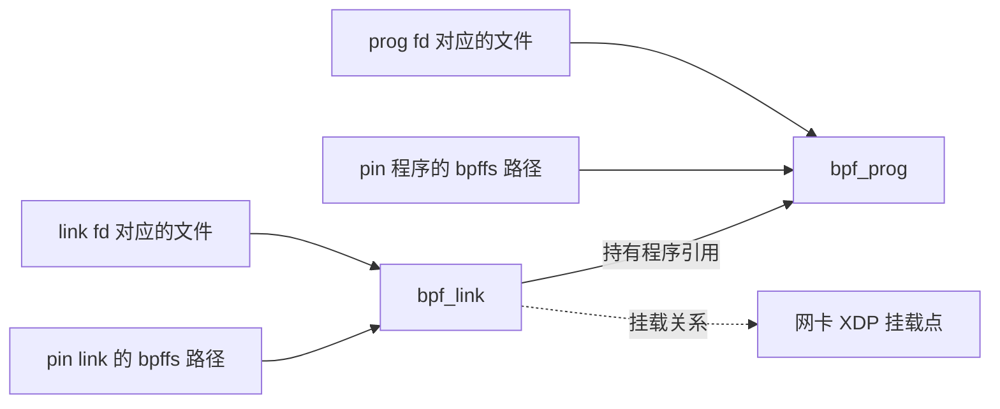

# Linux BPF 子系统概述：从加载到一次执行

本文依据仓库中的 Linux 6.18.52 源码。BPF 的核心思路是：把一段受约束的程序加载到内核，先由验证器检查，再由某个内核事件触发执行。程序可以读取事件上下文、调用该类型允许的内核函数，并借助 map 保存或交换数据。`CONFIG_BPF_SYSCALL` 将程序和 map 的管理入口开放为 `bpf()` 系统调用；`CONFIG_BPF_JIT` 控制即时编译能力。[版本号](../../linux/Makefile#L1-L5) · [配置入口](../../linux/kernel/bpf/Kconfig#L27-L58)

下文的加载主线是 `BPF_PROG_LOAD` 使用的扩展 BPF（eBPF）。源码中还保留经典 BPF（cBPF）过滤器路径：它先做经典指令检查，不能直接 JIT 时可转换成 eBPF 指令表示。阅读两条路径时不要把各自的加载检查混为一谈。[经典过滤器准备](../../linux/net/core/filter.c#L1338-L1376) · [指令转换](../../linux/net/core/filter.c#L1268-L1317)

## 1. 先认识四个对象

| 对象 | 作用 | 在源码中从哪里看 |
| --- | --- | --- |
| **program** | 保存 BPF 指令、程序类型及运行入口；在事件到来时执行 | [`struct bpf_prog`](../../linux/include/linux/bpf.h#L1701-L1745) |
| **map** | 按类型组织数据，例如 hash、array、ring buffer；程序与用户态都可能访问 | [`struct bpf_map`](../../linux/include/linux/bpf.h#L295-L334)、[map 类型](../../linux/include/uapi/linux/bpf.h#L980-L1037) |
| **link** | 表示一次程序与挂载目标的关系，持有程序引用，并提供独立的文件描述符 | [`struct bpf_link`](../../linux/include/linux/bpf.h#L1747-L1765)、[link 创建](../../linux/kernel/bpf/syscall.c#L5699-L5796) |
| **BTF** | 描述类型信息；加载、验证和按类型定位内核对象时会用到 | [`BPF_BTF_LOAD` 分发](../../linux/kernel/bpf/syscall.c#L6243-L6245)、[BTF 解析](../../linux/kernel/bpf/btf.c#L5773-L5840) |

这四者不应混成“一个 BPF 程序”。例如，用户态可以先创建 map，再加载使用它的程序，最后把程序挂到网卡。**加载成功不等于已经挂载，挂载成功也不等于此刻已经执行。**系统调用把 `BPF_MAP_CREATE`、`BPF_PROG_LOAD`、`BPF_LINK_CREATE` 分成了不同命令。[命令定义](../../linux/include/uapi/linux/bpf.h#L937-L978) · [内核分发](../../linux/kernel/bpf/syscall.c#L6180-L6272)

```text
用户态 ── bpf() ──► map
      ├─ bpf() ──► program（验证、选择运行方式）
      └─ bpf() ──► link（绑定 program 与挂载点）

挂载点事件 ──► 执行 program ── helper ──► 访问 map
```

## 2. 程序究竟是什么

BPF 程序最终是指令数组。公开的 `struct bpf_insn` 给每条指令定义操作码、源/目的寄存器、偏移和立即数；寄存器编号为 `R0` 到 `R10`。验证器把 `R1` 初始化为上下文指针，`R0` 是返回寄存器，`R10` 是只读帧指针。程序使用的具体上下文和返回值含义由程序类型与挂载点决定。[指令与寄存器定义](../../linux/include/uapi/linux/bpf.h#L61-L87) · [寄存器约定](../../linux/kernel/bpf/verifier.c#L74-L83) · [入口状态](../../linux/kernel/bpf/verifier.c#L23665-L23676)

**程序类型决定能在哪里运行。**例如 XDP 面向收包路径，公开上下文类型为 `xdp_md`，内核对应 `xdp_buff`；tracepoint 面向跟踪事件，cgroup skb 面向 cgroup 网络路径。类型与上下文的对应关系集中列在 [`bpf_types.h`](../../linux/include/linux/bpf_types.h#L5-L46)，公开类型号在 [`enum bpf_prog_type`](../../linux/include/uapi/linux/bpf.h#L1040-L1075)。对一些程序，`expected_attach_type` 还会进一步指定预期挂载类型，供加载验证和实际挂载时的兼容性检查使用。[程序字段](../../linux/include/linux/bpf.h#L1713-L1719) · [加载属性的用途说明](../../linux/include/uapi/linux/bpf.h#L1572-L1576)

**程序类型也影响能调用什么。**普通 helper 有明确的参数和返回值原型。以 `bpf_map_lookup_elem` 为例，其返回类型是“map value 指针或 NULL”；验证器检查 helper 是否对当前程序类型开放、参数类型是否正确，以及调用是否违反可睡眠等约束。因而不能把 helper 当作任意内核函数调用。[map helper 原型](../../linux/kernel/bpf/helpers.c#L35-L72) · [helper 调用检查](../../linux/kernel/bpf/verifier.c#L11513-L11580)

### 2.1. `expected_attach_type`：为什么加载时就要说明挂载类型

**`expected_attach_type` 在 `BPF_PROG_LOAD` 时声明程序预期用于哪一类 hook，让内核提前按该 hook 的规则验证程序。**同一个 `prog_type` 可以覆盖多种挂载类型，而这些类型允许的上下文访问、helper 和返回值未必相同。加载属性中的注释直接说明：某些程序必须在加载时提供预期挂载类型，才能验证这些与挂载类型有关的操作。[字段定义与说明](../../linux/include/uapi/linux/bpf.h#L1560-L1576)

以“在某个 cgroup 的 IPv4 connect 路径运行程序”为例，先分清下面四个信息：

| 信息 | 提供阶段 | 本例中的含义 |
| --- | --- | --- |
| `prog_type` | 加载时 | `BPF_PROG_TYPE_CGROUP_SOCK_ADDR`，说明程序属于 cgroup socket 地址操作这一类 |
| `expected_attach_type` | 加载时 | `BPF_CGROUP_INET4_CONNECT`，说明准备按 IPv4 connect hook 的规则验证 |
| `attach_type` / `link_create.attach_type` | 直接挂载 / 创建 link 时 | 本次请求实际使用 `BPF_CGROUP_INET4_CONNECT` hook |
| `target_fd` / `link_create.target_fd` | 直接挂载 / 创建 link 时 | 选择具体的 cgroup 对象 |

`expected_attach_type` 与实际 `attach_type` 使用同一套 `enum bpf_attach_type` 值；`prog_type` 使用另一套程序类型枚举。**填写预期挂载类型不会完成挂载，也没有选定本例中的具体 cgroup。**目标 cgroup 仍由挂载请求的 `target_fd` 取得。[挂载类型枚举](../../linux/include/uapi/linux/bpf.h#L1077-L1089) · [cgroup socket 地址类型的合法组合](../../linux/kernel/bpf/syscall.c#L2712-L2734) · [直接挂载取得目标](../../linux/kernel/bpf/cgroup.c#L1395-L1397) · [link 挂载取得目标](../../linux/kernel/bpf/cgroup.c#L1540-L1552)

沿着这个例子看，它在三个阶段发挥作用：

1. **加载入口检查组合并保存声明。**`bpf_prog_load_check_attach()` 检查该程序类型接受哪些预期挂载类型；通过后，加载路径把属性复制到 `prog->expected_attach_type`，随后调用验证器。因此，该值在程序指令被验证之前就已确定。[组合检查及保存字段](../../linux/kernel/bpf/syscall.c#L2982-L3007) · [进入验证器](../../linux/kernel/bpf/syscall.c#L3083-L3094)
2. **验证时选择具体规则。**对 `CGROUP_SOCK_ADDR`，`bpf_bind` helper 只向预期挂到 IPv4/IPv6 connect 的程序开放；上下文中的 `user_ip4` 也只允许相应 IPv4 挂载类型访问，预期为 IPv6 connect 时访问它会被拒绝。即使程序类型相同，修改预期挂载类型，也可能使同一段指令无法通过验证。[按预期类型开放 helper](../../linux/net/core/filter.c#L8139-L8156) · [按地址族限制上下文访问](../../linux/net/core/filter.c#L9270-L9298)
3. **实际挂载时检查用途是否兼容。**`BPF_PROG_ATTACH` 和 `BPF_LINK_CREATE` 都会调用 `bpf_prog_attach_check_attach_type()`。本例的 `CGROUP_SOCK_ADDR` 要求实际类型与保存的预期类型严格相等：按 IPv4 connect 加载的程序，不能随后改挂到 IPv4 bind，即使二者属于同一个程序类型；检查会返回 `-EINVAL`。[直接挂载检查入口](../../linux/kernel/bpf/syscall.c#L4529-L4539) · [link 检查入口](../../linux/kernel/bpf/syscall.c#L5705-L5712) · [严格相等的程序类型](../../linux/kernel/bpf/syscall.c#L4398-L4408)

还需要保留两个边界，避免把这个例子推广成所有 BPF 程序的统一规则：

- **`0` 不是通用的“任意挂载类型”。**`enum bpf_attach_type` 的第一个值 `BPF_CGROUP_INET_INGRESS` 就是 `0`。部分程序类型又有历史兼容处理：例如 `CGROUP_SOCK` 加载时若填 `0`，内核会改为 `BPF_CGROUP_INET_SOCK_CREATE`；`SK_REUSEPORT` 也有自己的默认值。因此，是否需要显式填写、零值怎样解释，要结合程序类型看。[枚举起点](../../linux/include/uapi/linux/bpf.h#L1077-L1080) · [兼容性修正](../../linux/kernel/bpf/syscall.c#L2639-L2668)
- **实际类型不总是要求与预期类型严格相等。**`CGROUP_SKB` 只有在 `enforce_expected_attach_type` 置位后才强制相等。例如，一个预期挂到 EGRESS 且常量返回 `2` 的程序，在返回值检查中使用 EGRESS 允许的 `[0, 3]` 范围，并触发该标志；之后不能挂到 INGRESS。若该标志未置位，挂载检查仍会检查权限和程序类型，但不会仅因预期方向与实际方向不同而拒绝。[EGRESS 返回值规则](../../linux/kernel/bpf/verifier.c#L17581-L17586) · [设置强制检查标志](../../linux/kernel/bpf/verifier.c#L17671-L17684) · [CGROUP_SKB 挂载检查](../../linux/kernel/bpf/syscall.c#L4409-L4422)

## 3. 加载：从 `bpf()` 到可运行程序

入口 [`SYSCALL_DEFINE3(bpf)`](../../linux/kernel/bpf/syscall.c#L6307-L6310) 将命令交给 `__sys_bpf()`。后者复制属性、调用 `security_bpf()`，再按命令分发。由此看加载流程，比先钻进某个具体 hook 更容易建立全局视图。[`__sys_bpf()`](../../linux/kernel/bpf/syscall.c#L6165-L6203)

以 `BPF_PROG_LOAD` 为主线，可以按以下顺序读 [`bpf_prog_load()`](../../linux/kernel/bpf/syscall.c#L2872-L3124)：

1. 检查属性、程序类型、挂载类型、指令数和当前调用者权限。权限检查同时涉及能力、令牌和程序类型，不能概括成“任何程序一律只看一个 capability”。[前置检查](../../linux/kernel/bpf/syscall.c#L2872-L2950)
2. 分配 `bpf_prog`，从调用方复制指令和 license，设置程序元数据。[分配及复制](../../linux/kernel/bpf/syscall.c#L2989-L3040)
3. 调用 `bpf_check()` 验证程序，再调用 `bpf_prog_select_runtime()` 确定执行入口。**验证发生在返回程序 fd 之前。**[验证、运行时选择及 fd](../../linux/kernel/bpf/syscall.c#L3083-L3124)

验证器并非简单扫描非法操作码。它先处理子程序、map/BTF 引用和控制流，再沿指令路径维护寄存器与栈状态；遇到等价的已探索状态可以剪枝。读取上下文或 map value 时会检查类型、偏移、大小等；调用 helper 时要核对原型与使用条件。验证成功只说明程序满足内核在此处施加的安全与接口约束，不保证业务逻辑正确。[`bpf_check()` 的阶段](../../linux/kernel/bpf/verifier.c#L24943-L25137) · [状态探索与剪枝](../../linux/kernel/bpf/verifier.c#L20379-L20440) · [内存访问检查](../../linux/kernel/bpf/verifier.c#L7588-L7642)

程序通过验证后，`bpf_prog_select_runtime()` 选择解释器或尝试 JIT；若配置或程序特性要求 JIT 而未能得到 JIT 结果，加载会失败。解释器的核心函数按操作码分派并执行指令；常规调用入口 `bpf_prog_run()` 最终调用程序的 `bpf_func`。因此“BPF 一定由 JIT 执行”和“BPF 一定由解释器执行”都不符合这份源码。[运行时选择](../../linux/kernel/bpf/core.c#L2552-L2616) · [解释器](../../linux/kernel/bpf/core.c#L1785-L1816) · [运行入口](../../linux/include/linux/filter.h#L732-L763)

## 4. map：为什么程序需要独立的数据对象

一次程序执行结束后，寄存器和栈上的临时状态不会成为下一次执行的共享状态。map 提供了有类型、有生命周期的数据对象：`struct bpf_map` 记录类型、key/value 大小、最大条目数、操作表和引用计数。创建时 `map_create()` 按 `map_type` 找到 `bpf_map_ops`，调用相应的 `map_alloc()`，最后返回 map fd。[map 结构](../../linux/include/linux/bpf.h#L295-L329) · [按类型创建](../../linux/kernel/bpf/syscall.c#L1409-L1429) · [返回 fd](../../linux/kernel/bpf/syscall.c#L1596-L1619)

访问路径有两面：

- 用户态用 map fd 发起 `BPF_MAP_LOOKUP_ELEM`、`BPF_MAP_UPDATE_ELEM` 等命令；系统调用检查权限、复制 key/value，再调用 map 实现。[命令分发](../../linux/kernel/bpf/syscall.c#L6180-L6202) · [更新路径](../../linux/kernel/bpf/syscall.c#L1783-L1835)
- 程序通过允许的 helper 访问 map。以 lookup/update 为例，helper 最后调用 `map->ops->map_lookup_elem` / `map->ops->map_update_elem`。验证器会知道 lookup 可能返回 NULL，后续解引用必须满足相应的路径检查。[lookup/update helper](../../linux/kernel/bpf/helpers.c#L42-L78) · [map value 访问检查](../../linux/kernel/bpf/verifier.c#L7610-L7642)

`bpf_map_ops` 是理解各种 map 的分界线：公共层定义创建、查找、更新接口，具体语义由 array、hash、ring buffer 等实现决定。不能因为它们都叫 map，就假定每种都支持相同的 key/value 操作。[操作表](../../linux/include/linux/bpf.h#L83-L119) · [类型与实现对应](../../linux/include/linux/bpf_types.h#L87-L108)

## 5. 挂载和执行：以 XDP 收包为例

`BPF_LINK_CREATE` 先根据程序 fd 取得程序，检查挂载类型，再把请求交给相应子系统。XDP 分支走 `bpf_xdp_link_attach()`：它根据网卡索引找到设备，建立 XDP link，调用设备挂载路径，成功后安装 link fd。link 结构保存程序、类型和挂载类型；关闭最后一个 link 引用时，其 `release` 回调负责拆除挂载关系。[link 分发](../../linux/kernel/bpf/syscall.c#L5699-L5778) · [XDP link 挂载](../../linux/net/core/dev.c#L10589-L10642) · [link 释放](../../linux/kernel/bpf/syscall.c#L3258-L3323)

挂载后，网卡收包路径才会调用程序。下面是一个驱动中的实际顺序：调用 `bpf_prog_run_xdp()` 得到动作，再分别处理 `XDP_PASS`、`XDP_TX`、`XDP_REDIRECT`、`XDP_DROP` 等结果。这个例子说明 **BPF 的返回值由挂载点解释**；不能把 XDP 动作值套到 tracepoint 或 cgroup 程序上。[XDP 驱动调用点](../../linux/drivers/net/ethernet/engleder/tsnep_main.c#L1287-L1325)

把前面的对象串成一个最小故事：用户态创建 hash map，加载一个 XDP 程序，创建指向网卡的 link；收到包时驱动调用程序，程序可通过 helper 读写 map，随后返回一个 XDP 动作；用户态仍可通过 map fd 读取统计数据。这里的“创建、加载、挂载、触发、读取”是五个不同动作。[map 创建](../../linux/kernel/bpf/syscall.c#L1370-L1429) · [程序加载](../../linux/kernel/bpf/syscall.c#L2872-L3124) · [link 创建](../../linux/kernel/bpf/syscall.c#L5699-L5778) · [驱动调用](../../linux/drivers/net/ethernet/engleder/tsnep_main.c#L1296-L1318) · [map 查询](../../linux/kernel/bpf/syscall.c#L1718-L1777)

XDP 只是一个入口。tracepoint 路径则在事件发生时从程序数组取出程序并调用 `bpf_prog_run()`。由此可见，共用的是 BPF 程序、验证器和运行机制；**何时触发、传入什么上下文、怎样解释返回值**，由各挂载子系统决定。[tracepoint 执行](../../linux/kernel/trace/bpf_trace.c#L110-L151) · [程序类型映射](../../linux/include/linux/bpf_types.h#L5-L46)

## 6. BTF、CO-RE 与对象生命周期

BTF 为类型提供可供内核与加载器使用的描述；`BPF_BTF_LOAD` 将一份 BTF 作为独立对象加载。map 可记录 key/value 的 BTF 类型 ID，某些程序的挂载目标也通过 BTF ID 表达。[BTF 加载](../../linux/kernel/bpf/syscall.c#L5463-L5493) · [map 的 BTF 字段](../../linux/include/linux/bpf.h#L295-L317) · [程序挂载 BTF 字段](../../linux/kernel/bpf/syscall.c#L2971-L2987)

CO-RE 解决的一个问题是：同一份程序访问的内核结构在目标内核上可能有不同布局。仓库中的 libbpf 加载路径会读取目标 BTF、处理 CO-RE 重定位，然后创建 map、加载程序；这属于**加载准备阶段**，不意味着每次触发程序都重新做结构偏移重定位。[libbpf CO-RE 重定位](../../linux/tools/lib/bpf/libbpf.c#L5976-L6045) · [libbpf 准备及加载顺序](../../linux/tools/lib/bpf/libbpf.c#L8652-L8712)

最后要区分 fd 与对象本身。程序、map、link 都可由 fd 引用；map 和程序还可能被其他内核对象持有。`BPF_OBJ_PIN` / `BPF_OBJ_GET` 提供通过 BPF 文件系统保存与重新取得对象引用的路径。因而关闭一个 fd 不必然立即销毁对象；link 的最后引用释放时才会走拆除挂载和回收流程。[对象命令](../../linux/kernel/bpf/syscall.c#L3147-L3178) · [link 引用释放](../../linux/kernel/bpf/syscall.c#L3300-L3323) · [UAPI 生命周期说明](../../linux/include/uapi/linux/bpf.h#L920-L935)

## 7. `BPF_OBJ_PIN` 与 `bpf_link` 有什么区别

**`BPF_OBJ_PIN` 是保存对象引用的操作，`bpf_link` 是管理挂载关系的内核对象；link 本身也可以被 pin。**调用 `BPF_OBJ_PIN` 时，内核根据 `bpf_fd` 识别它指向的是 map、program 还是 link，取得相应引用，再让 bpffs 路径对应的 inode 保存对象指针。这个操作不会创建新的挂载关系。[识别对象并取得引用](../../linux/kernel/bpf/inode.c#L71-L94) · [pin 入口](../../linux/kernel/bpf/inode.c#L478-L493) · [inode 保存对象指针](../../linux/kernel/bpf/inode.c#L329-L367)

沿用前面的 XDP 例子，把两件事放在一起比较：

| 比较项 | `BPF_OBJ_PIN` | 创建 XDP `bpf_link` |
| --- | --- | --- |
| 解决的问题 | 给已有对象增加一个由 bpffs 路径持有的引用，便于以后重新取得 fd | 将程序挂到目标网卡，并用 link 对象管理这次挂载 |
| 主要输入 | 被固定对象的 fd、bpffs 路径 | 程序 fd、目标网卡索引、挂载类型等 |
| 成功结果 | 新路径引用原来的对象，系统调用返回 `0` | 完成挂载，返回 link fd |
| 怎样重新访问 | 对路径调用 `BPF_OBJ_GET`，得到原对象的新 fd | 保留 link fd；如果已 pin，也可以通过路径取回 link fd |
| 怎样撤销 | 删除 pin 路径，归还该路径持有的引用 | 最后一个 link 引用退出时拆除挂载，或通过支持的 `BPF_LINK_DETACH` 显式拆除 |

表中的两条实现路径分别是 [`bpf_obj_do_pin()`](../../linux/kernel/bpf/inode.c#L436-L475) 和 [`bpf_xdp_link_attach()`](../../linux/net/core/dev.c#L10589-L10637)；按路径重新取得 fd 走 [`bpf_obj_get_user()`](../../linux/kernel/bpf/inode.c#L495-L553)。`BPF_OBJ_GET` 返回的是已有对象的句柄，不会重新加载程序或重新挂载。

**pin 的 fd 指向谁，bpffs 就保留谁。**下面画的是一个已经建立 XDP 挂载的程序，实线表示持有对象，虚线表示挂载目标关联：



这张图最关键的是引用方向：**link 持有程序，pin 程序不会反过来保住 link。**XDP link 创建时记录程序与设备；link 回收时先拆除设备上的挂载，再归还程序引用。[创建时的关联](../../linux/net/core/dev.c#L10611-L10623) · [XDP 拆挂载](../../linux/net/core/dev.c#L10469-L10485) · [link 归还程序引用](../../linux/kernel/bpf/syscall.c#L3241-L3251)

因此，加载进程退出后的行为取决于它 pin 的对象。以下假定相关 fd 已全部关闭、对应文件已释放，没有其他 link 持有者，网卡仍存在，也没有显式 detach：

| 退出前做了什么 | 退出后程序是否仍存在 | 退出后 XDP 挂载是否仍存在 |
| --- | --- | --- |
| 只创建 link，没有 pin | 若无其他程序引用，程序会进入回收流程 | link 最后引用退出，挂载被拆除 |
| `BPF_OBJ_PIN` 传入 `prog_fd` | 存在，bpffs 持有程序引用 | link 仍会被回收，挂载被拆除 |
| `BPF_OBJ_PIN` 传入 `link_fd` | 存在，存活的 link 持有程序引用 | 存在，bpffs 保留 link 引用 |

上述区别来自同一条引用计数规则：link 文件释放时减少 link 引用，只有计数归零才进入 link 的释放流程；pin 留下的引用同样参与这个计数。[link 文件释放及引用归零](../../linux/kernel/bpf/syscall.c#L3306-L3329) · [最后引用的挂载清理](../../linux/kernel/bpf/syscall.c#L3270-L3293) · [pin 保存 link 引用](../../linux/kernel/bpf/inode.c#L87-L90)

**删除 pin 路径与显式 detach 也有不同作用。**`unlink()` 取消路径对对象的固定，inode 销毁时归还对象引用；如果 link fd 或其他 pin 仍持有 link，挂载可以继续存在。如果这是最后一个 link 引用，引用归零才会触发拆挂载。显式 `BPF_LINK_DETACH` 则调用该 link 类型的 `detach` 回调：即使 link 仍被 pin，也能先拆除挂载；以后通过该路径取回的仍是已经脱离目标的 link。[unpin 语义](../../linux/include/uapi/linux/bpf.h#L275-L287) · [inode 归还引用](../../linux/kernel/bpf/inode.c#L778-L784) · [显式 detach](../../linux/kernel/bpf/syscall.c#L5887-L5905) · [XDP detach 回调](../../linux/net/core/dev.c#L10488-L10492)

pin 保证的是对象有引用持有者。目标设备销毁时，XDP 仍会自动拆除挂载并清空 link 的设备指针；pin 也不会让对象跨系统重启保留。bpffs 在这里保存的是当前内核内存对象的引用，程序、map 数据和挂载关系没有被序列化为可在下次启动恢复的文件。[设备侧自动拆挂载](../../linux/net/core/dev.c#L10313-L10340) · [内存对象指针](../../linux/kernel/bpf/inode.c#L329-L343) · [bpffs 实例创建](../../linux/kernel/bpf/inode.c#L1019-L1048)

## 8. `BPF_PROG_ATTACH` 与 `bpf_link`：谁管理挂载关系

`BPF_PROG_ATTACH` 根据目标、程序和挂载类型，把已有程序登记到目标子系统，成功时返回 `0`，不产生独立的挂载 fd。`bpf_link` 则把一次挂载表示为独立对象；通过 `BPF_LINK_CREATE` 创建后，用户态得到管理这次挂载的 link fd。两者的核心区别是**挂载关系由目标直接保存，还是由一个有独立生命周期的 link 对象管理**。[直接挂载入口](../../linux/kernel/bpf/syscall.c#L4503-L4568) · [link 创建入口](../../linux/kernel/bpf/syscall.c#L5699-L5723) · [安装并返回 link fd](../../linux/kernel/bpf/syscall.c#L3470-L3479)

下面选用同时支持两种方式的 cgroup 网络出口：程序类型为 `BPF_PROG_TYPE_CGROUP_SKB`，挂载类型为 `BPF_CGROUP_INET_EGRESS`。这里的替换和多程序规则都属于 cgroup 实现；其他挂载点需要看各自的分发与操作表。例如，前文的 XDP 就没有通过 `BPF_PROG_ATTACH` 挂载的分支。[挂载类型到程序类型的映射](../../linux/kernel/bpf/syscall.c#L4326-L4331) · [`BPF_PROG_ATTACH` 支持的分支](../../linux/kernel/bpf/syscall.c#L4538-L4561)

### 8.1. 同一个挂载点，两种引用关系

| 比较项 | cgroup `BPF_PROG_ATTACH` | cgroup `bpf_link` |
| --- | --- | --- |
| 主要输入 | `target_fd`、`attach_bpf_fd`、`attach_type`、`attach_flags` | `link_create.target_fd`、`prog_fd`、`attach_type`、`flags` |
| 成功返回 | `0`，没有单独的挂载 fd | link fd |
| cgroup 挂载条目保存什么 | `pl->prog` 指向程序，`pl->link` 为 NULL | `pl->link` 指向 cgroup link，`pl->prog` 为 NULL |
| 谁持有程序引用 | cgroup 的直接挂载条目 | link 的 `prog` 字段 |
| 关闭原来的 program fd | 挂载仍持有程序 | link 仍持有程序 |
| 加载进程退出 | 目标仍存活且没有 detach/replace 时，直接挂载继续存在 | 取决于是否还有 link 引用；最后引用释放会拆除挂载 |
| 解除挂载的入口 | `BPF_PROG_DETACH`，按目标和挂载类型查找直接程序条目 | `BPF_LINK_DETACH`，或释放最后一个 link 引用 |

输入字段定义在 [`union bpf_attr`](../../linux/include/uapi/linux/bpf.h#L1639-L1653) 和 [link 创建属性](../../linux/include/uapi/linux/bpf.h#L1762-L1772)。引用关系可以直接从 [`struct bpf_prog_list`](../../linux/include/linux/bpf-cgroup.h#L100-L111) 以及 [`__cgroup_bpf_attach()` 保存条目](../../linux/kernel/bpf/cgroup.c#L887-L908) 的代码读出：

```text
BPF_PROG_ATTACH
  → cgroup_bpf_prog_attach()
  → cgroup_bpf_attach(..., prog, ..., link = NULL, ...)
  → cgroup 挂载条目 ──持有──► bpf_prog

BPF_LINK_CREATE
  → cgroup_bpf_link_attach()
  → cgroup_bpf_attach(..., prog = NULL, ..., link, ...)
  → cgroup 挂载条目 ──关联──► bpf_cgroup_link ──持有──► bpf_prog
                              ▲
                         link fd / pin 引用
```

直接挂载入口把取得的程序引用交给 cgroup；系统调用只在挂载失败时归还该引用。link 路径则先初始化 `link->prog`，再把 link 登记到 cgroup。因此，关闭 program fd 对两种方式都不等于 detach；直接挂载后关闭 target cgroup fd，也不会撤销已经保存的条目。[直接挂载的引用取得与失败清理](../../linux/kernel/bpf/syscall.c#L4529-L4567) · [cgroup 直接挂载](../../linux/kernel/bpf/cgroup.c#L1388-L1415) · [cgroup link 创建](../../linux/kernel/bpf/cgroup.c#L1550-L1578)

**两种条目最终进入同一套执行路径。**`prog_list_prog()` 从直接条目取 `pl->prog`，从 link 条目取 `pl->link->link.prog`；构建 cgroup 生效程序数组时统一使用这个函数。选择哪种挂载方式，改变的是引用和管理方式，并不要求程序换一套指令或运行时。[统一取得程序](../../linux/kernel/bpf/cgroup.c#L393-L399) · [构建生效程序数组](../../linux/kernel/bpf/cgroup.c#L474-L498)

这也补充了上一节的 pin 语义：**cgroup 的直接挂载本身已经持有程序，不需要 pin 程序来维持进程退出后的挂载；link 方式则需要保留 link 引用。**如果加载进程持有最后一个 link fd，且没有 pin 或其他持有者，退出时关闭 fd 会触发 link 释放并移除 cgroup 条目。只 pin program 仍不能保住这个 link。[link 最后引用释放](../../linux/kernel/bpf/syscall.c#L3306-L3329) · [cgroup link 拆除挂载](../../linux/kernel/bpf/cgroup.c#L1440-L1470)

### 8.2. 更新、解除挂载与两种方式共存

**直接挂载通过再次 `BPF_PROG_ATTACH` 更换程序。**在 cgroup 单程序模式下，挂载标志兼容时，新程序替换已有条目；在 MULTI 模式下，使用 `BPF_F_ALLOW_MULTI | BPF_F_REPLACE`，并通过 `replace_bpf_fd` 指定被替换的直接挂载程序。省略替换标志的 MULTI 挂载用于添加条目，不能当作更新操作。[单程序与 MULTI 规则](../../linux/include/uapi/linux/bpf.h#L1185-L1201) · [查找待替换条目](../../linux/kernel/bpf/cgroup.c#L643-L679) · [取得替换目标程序](../../linux/kernel/bpf/cgroup.c#L1396-L1410)

**cgroup link 通过 `BPF_LINK_UPDATE` 更换所持有的程序。**请求提供 link fd 和新程序 fd，也可用 `BPF_F_REPLACE` 配合 `old_prog_fd` 检查当前程序是否符合预期。cgroup 实现检查类型和存储兼容性，再更换 `link->prog`、更新生效数组并归还旧程序引用；link 对象本身继续存在，已有 fd 和 pin 路径仍指向它。其他 link 类型是否支持更新，要看其 `update_prog` 回调。[更新命令分发](../../linux/kernel/bpf/syscall.c#L5829-L5882) · [cgroup link 替换程序](../../linux/kernel/bpf/cgroup.c#L1053-L1112)

**解除挂载也使用各自的身份。**cgroup 的 `BPF_PROG_DETACH` 提供目标与挂载类型；MULTI 模式还要指定程序，查找的是直接程序条目。link 方式通过 link fd 调用 `BPF_LINK_DETACH`，或等待 link 最后引用释放。直接 detach 路径传入的 link 为 NULL，不能通过同一个 program fd 移除 link 管理的条目。显式 detach 后，link 仍可能被 fd/pin 持有，程序引用直到 link 最终回收时才归还。[直接 detach 入口](../../linux/kernel/bpf/cgroup.c#L1418-L1437) · [按程序或 link 查找条目](../../linux/kernel/bpf/cgroup.c#L1115-L1144) · [link detach 回调](../../linux/kernel/bpf/cgroup.c#L1481-L1485) · [link 回收时归还程序引用](../../linux/kernel/bpf/syscall.c#L3241-L3251)

两种方式可以在同一个 cgroup 的同一挂载类型下共存，前提是满足 MULTI 等挂载规则。cgroup link 在内核内部以 `BPF_F_ALLOW_MULTI` 加入列表；用户不能因此把该位填入 `link_create.flags`，本版本的允许掩码不接受它。已有单程序模式与新 link 的模式不匹配时会失败。仓库自测还展示了同一程序通过直接 MULTI 挂载和 link 各挂一次、被执行两次的情况。[link 标志检查及内部 MULTI 挂载](../../linux/kernel/bpf/cgroup.c#L1533-L1572) · [已有模式的兼容检查](../../linux/kernel/bpf/cgroup.c#L849-L854) · [两种方式共存的自测源码](../../linux/tools/testing/selftests/bpf/prog_tests/cgroup_link.c#L111-L123)

最后，以上生命周期都以目标仍有效为前提。cgroup 销毁时会清理直接程序条目，也会使关联的 link 脱离目标；即使 pin 保住 link 对象，也不能保住已经失效的挂载。[cgroup 自动脱离 link](../../linux/kernel/bpf/cgroup.c#L314-L318) · [目标释放时清理挂载](../../linux/kernel/bpf/cgroup.c#L325-L360)

### 8.3. 哪些挂载点支持这两种机制

以下按本仓库 Linux 6.18.52 的挂载实现汇总。“支持”表示源码提供了相应路径，使用时仍需启用对应配置，并满足权限、目标和挂载模式检查；它不表示两种方式可以在同一目标上任意混用。表中的 `bpf_link` 指**内核 link 对象**，除特别注明外，创建入口都是 `BPF_LINK_CREATE`。[直接挂载分发](../../linux/kernel/bpf/syscall.c#L4503-L4568) · [link 创建分发](../../linux/kernel/bpf/syscall.c#L5694-L5796) · [配置与 link 类型注册](../../linux/include/linux/bpf_types.h#L137-L156)

#### cgroup 挂载点

下表两种方式的目标都是 cgroup fd。普通 cgroup 类型与 `BPF_LSM_CGROUP` 都能进入直接挂载路径；link 路径也分别为它们提供了 cgroup link 分支。[直接路径的类型判断](../../linux/kernel/bpf/syscall.c#L4469-L4485) · [直接挂载分发](../../linux/kernel/bpf/syscall.c#L4538-L4540) · [普通 cgroup link](../../linux/kernel/bpf/syscall.c#L5715-L5723) · [cgroup LSM link](../../linux/kernel/bpf/syscall.c#L5731-L5743)

| 挂载点 | `attach_type` | `BPF_PROG_ATTACH` | 内核 `bpf_link` | 源码 |
| --- | --- | --- | --- | --- |
| cgroup 数据包入口、出口 | `BPF_CGROUP_INET_INGRESS`、`BPF_CGROUP_INET_EGRESS` | 支持 | 支持 | [类型映射](../../linux/kernel/bpf/syscall.c#L4329-L4331) |
| socket 创建、释放、绑定后检查 | `BPF_CGROUP_INET_SOCK_CREATE`、`BPF_CGROUP_INET_SOCK_RELEASE`、`BPF_CGROUP_INET4_POST_BIND`、`BPF_CGROUP_INET6_POST_BIND` | 支持 | 支持 | [类型映射](../../linux/kernel/bpf/syscall.c#L4332-L4336) |
| socket bind、connect | `BPF_CGROUP_INET4_BIND`、`BPF_CGROUP_INET6_BIND`、`BPF_CGROUP_INET4_CONNECT`、`BPF_CGROUP_INET6_CONNECT`、`BPF_CGROUP_UNIX_CONNECT` | 支持 | 支持 | [地址操作类型](../../linux/kernel/bpf/syscall.c#L4337-L4354) |
| socket 地址查询 | `BPF_CGROUP_INET4_GETPEERNAME`、`BPF_CGROUP_INET6_GETPEERNAME`、`BPF_CGROUP_UNIX_GETPEERNAME`、`BPF_CGROUP_INET4_GETSOCKNAME`、`BPF_CGROUP_INET6_GETSOCKNAME`、`BPF_CGROUP_UNIX_GETSOCKNAME` | 支持 | 支持 | [地址操作类型](../../linux/kernel/bpf/syscall.c#L4342-L4354) |
| UDP / UNIX socket 消息收发 | `BPF_CGROUP_UDP4_SENDMSG`、`BPF_CGROUP_UDP6_SENDMSG`、`BPF_CGROUP_UNIX_SENDMSG`、`BPF_CGROUP_UDP4_RECVMSG`、`BPF_CGROUP_UDP6_RECVMSG`、`BPF_CGROUP_UNIX_RECVMSG` | 支持 | 支持 | [地址操作类型](../../linux/kernel/bpf/syscall.c#L4348-L4354) |
| socket 协议事件 | `BPF_CGROUP_SOCK_OPS` | 支持 | 支持 | [类型映射](../../linux/kernel/bpf/syscall.c#L4355-L4356) |
| 设备访问控制 | `BPF_CGROUP_DEVICE` | 支持 | 支持 | [类型映射](../../linux/kernel/bpf/syscall.c#L4357-L4358) |
| sysctl 访问 | `BPF_CGROUP_SYSCTL` | 支持 | 支持 | [类型映射](../../linux/kernel/bpf/syscall.c#L4369-L4370) |
| socket 选项读取、设置 | `BPF_CGROUP_GETSOCKOPT`、`BPF_CGROUP_SETSOCKOPT` | 支持 | 支持 | [类型映射](../../linux/kernel/bpf/syscall.c#L4371-L4373) |
| cgroup 范围的 LSM hook | `BPF_LSM_CGROUP`；具体 LSM hook 由加载时的 `attach_btf_id` 指定 | 支持 | 支持 | [按 BTF ID 选择槽位](../../linux/kernel/bpf/cgroup.c#L181-L200)、[共同挂载实现](../../linux/kernel/bpf/cgroup.c#L887-L900) |

这些路径需要 `CONFIG_CGROUP_BPF`，cgroup LSM 还需要 `CONFIG_BPF_LSM`；网络相关 hook 也依赖对应网络功能。`BPF_LSM_CGROUP` 与后表的全局 `BPF_LSM_MAC` 是不同挂载类型。[cgroup 配置关闭时的入口](../../linux/include/linux/bpf-cgroup.h#L432-L449) · [LSM 配置关闭时的处理](../../linux/kernel/bpf/cgroup.c#L232-L239) · [程序类型的配置条件](../../linux/include/linux/bpf_types.h#L4-L30)

#### 其他网络挂载点

| 挂载点及 `attach_type` | `BPF_PROG_ATTACH` | 内核 `bpf_link` | 目标与实现 |
| --- | --- | --- | --- |
| sockmap / sockhash 消息判决：`BPF_SK_MSG_VERDICT` | 支持 | 支持 | 两者均使用 map fd。[允许的 map 与挂载类型](../../linux/net/core/sock_map.c#L1463-L1517)、[link 创建](../../linux/net/core/sock_map.c#L1844-L1882) |
| sockmap / sockhash 流解析及包判决：`BPF_SK_SKB_STREAM_PARSER`、`BPF_SK_SKB_STREAM_VERDICT`、`BPF_SK_SKB_VERDICT` | 支持 | 支持 | 两者均使用 map fd；parser 需 `CONFIG_BPF_STREAM_PARSER`，两个 verdict 槽位不能同时使用。[类型与互斥检查](../../linux/net/core/sock_map.c#L1463-L1517)、[直接更新入口](../../linux/net/core/sock_map.c#L68-L83) |
| flow dissector：`BPF_FLOW_DISSECTOR` | 支持 | 支持 | 直接命令要求 `target_fd=0`，挂到当前 netns；link 使用 netns fd。同一 netns 的这两种方式互斥。[直接挂载](../../linux/kernel/bpf/net_namespace.c#L291-L322)、[link 检查](../../linux/kernel/bpf/net_namespace.c#L425-L446)、[取得 netns](../../linux/kernel/bpf/net_namespace.c#L471-L498) |
| socket lookup：`BPF_SK_LOOKUP` | 不支持 | 支持 | link 使用 netns fd。[link 类型分发](../../linux/kernel/bpf/syscall.c#L5751-L5754)、[目标取得](../../linux/kernel/bpf/net_namespace.c#L471-L498) |
| TCX：`BPF_TCX_INGRESS`、`BPF_TCX_EGRESS` | 支持 | 支持 | 当前 netns 的网络设备 ifindex；这是 TCX 路径。[直接挂载](../../linux/kernel/bpf/tcx.c#L10-L41)、[link 挂载](../../linux/kernel/bpf/tcx.c#L310-L342) |
| netkit：`BPF_NETKIT_PRIMARY`、`BPF_NETKIT_PEER` | 支持 | 支持 | 两者都传 primary 设备的 ifindex，再由挂载类型选择 primary / peer。[目标检查](../../linux/drivers/net/netkit.c#L495-L524)、[直接挂载](../../linux/drivers/net/netkit.c#L527-L553)、[link 挂载](../../linux/drivers/net/netkit.c#L782-L816) |
| 网络设备 XDP：`BPF_XDP` | 不支持 | 支持 | link 使用当前 netns 的设备 ifindex。[XDP link 创建](../../linux/net/core/dev.c#L10589-L10623) |
| Netfilter：`BPF_NETFILTER` | 不支持 | 支持 | 当前 netns，通过 `pf`、`hooknum`、`priority` 选择位置；本实现支持 IPv4/IPv6 的 PRE_ROUTING、LOCAL_IN、FORWARD、LOCAL_OUT、POST_ROUTING。[范围检查](../../linux/net/netfilter/nf_bpf_link.c#L180-L207)、[hook 枚举](../../linux/include/uapi/linux/netfilter.h#L42-L49)、[实际注册](../../linux/net/netfilter/nf_bpf_link.c#L210-L266) |

其中“不支持 `BPF_PROG_ATTACH`”的判断来自该命令的实际分发：除 cgroup 外，它只接收 sockmap、LIRC、flow dissector 和 TCX/netkit 对应的程序类型，其余走错误分支。不能仅因某个值出现在 `enum bpf_attach_type` 中，就认为这个命令支持它。[直接挂载的完整目标分发](../../linux/kernel/bpf/syscall.c#L4538-L4563)

#### 跟踪、安全及其他挂载点

| 挂载点及类型 | `BPF_PROG_ATTACH` | 内核 `bpf_link` | 创建入口与目标 |
| --- | --- | --- | --- |
| perf event、普通 tracepoint、经 perf event 建立的 kprobe / uprobe：`BPF_PERF_EVENT` | 不支持 | 支持 | `BPF_LINK_CREATE`，目标为 perf event fd。[程序类型分发](../../linux/kernel/bpf/syscall.c#L5774-L5780)、[perf link 创建](../../linux/kernel/bpf/syscall.c#L4178-L4217) |
| 函数入口、出口、修改返回值：`BPF_TRACE_FENTRY`、`BPF_TRACE_FEXIT`、`BPF_MODIFY_RETURN` | 不支持 | 支持 | `BPF_LINK_CREATE`，使用加载阶段确定的 BTF / trampoline 目标。[类型检查与 link 对象](../../linux/kernel/bpf/syscall.c#L3571-L3643)、[分发](../../linux/kernel/bpf/syscall.c#L5731-L5749) |
| 全局 LSM hook：`BPF_LSM_MAC` | 不支持 | 支持 | `BPF_LINK_CREATE`，目标由 LSM hook 的 BTF 信息确定。[LSM 类型检查](../../linux/kernel/bpf/syscall.c#L3599-L3604)、[分发](../../linux/kernel/bpf/syscall.c#L5731-L5749) |
| BTF raw tracepoint：`BPF_PROG_TYPE_TRACING` + `BPF_TRACE_RAW_TP` | 不支持 | 支持 | `BPF_LINK_CREATE`，从已加载程序的目标信息取得 tracepoint。[link 分发](../../linux/kernel/bpf/syscall.c#L5731-L5739)、[目标解析](../../linux/kernel/bpf/syscall.c#L4241-L4254) |
| 按名称挂载的 raw tracepoint：`BPF_PROG_TYPE_RAW_TRACEPOINT`、`BPF_PROG_TYPE_RAW_TRACEPOINT_WRITABLE` | 不支持 | 支持 | **入口是 `BPF_RAW_TRACEPOINT_OPEN`**，按名称找到 tracepoint，创建内核 raw tracepoint link 并返回 fd。[类型及名称处理](../../linux/kernel/bpf/syscall.c#L4256-L4269)、[link 创建](../../linux/kernel/bpf/syscall.c#L4271-L4294)、[命令入口](../../linux/kernel/bpf/syscall.c#L4303-L4322) |
| BPF iterator：`BPF_TRACE_ITER` | 不支持 | 支持 | `BPF_LINK_CREATE`，按程序的 `attach_btf_id` 匹配迭代目标，必要时用 `iter_info` 进一步指定对象。[目标查找与挂载](../../linux/kernel/bpf/bpf_iter.c#L504-L573) |
| kprobe multi / session：`BPF_TRACE_KPROBE_MULTI`、`BPF_TRACE_KPROBE_SESSION` | 不支持 | 支持 | `BPF_LINK_CREATE`，提供符号或地址集合；本实现要求 64 位且启用 `CONFIG_FPROBE`。[分发](../../linux/kernel/bpf/syscall.c#L5781-L5783)、[创建检查](../../linux/kernel/trace/bpf_trace.c#L2722-L2767)、[未启用时的入口](../../linux/kernel/trace/bpf_trace.c#L2877-L2881) |
| uprobe multi / session：`BPF_TRACE_UPROBE_MULTI`、`BPF_TRACE_UPROBE_SESSION` | 不支持 | 支持 | `BPF_LINK_CREATE`，提供文件路径、偏移集合等；本实现要求 64 位且启用 `CONFIG_UPROBES`。[分发](../../linux/kernel/bpf/syscall.c#L5784-L5786)、[创建检查](../../linux/kernel/trace/bpf_trace.c#L3161-L3203)、[未启用时的入口](../../linux/kernel/trace/bpf_trace.c#L3311-L3315) |
| BPF 函数替换 freplace：`BPF_PROG_TYPE_EXT` | 不支持 | 支持 | `BPF_LINK_CREATE`，使用加载时的替换目标，或提供目标程序 fd 与 BTF ID；该程序类型的 `expected_attach_type` 为 `0`。[EXT 分发](../../linux/kernel/bpf/syscall.c#L5724-L5729)、[目标及类型检查](../../linux/kernel/bpf/syscall.c#L3593-L3634) |
| struct_ops 回调集合：`BPF_STRUCT_OPS` | 不支持 | 支持 | `BPF_LINK_CREATE`，传入 **`map_fd`**，注册 struct_ops map 中的回调集合。[独立分支](../../linux/kernel/bpf/syscall.c#L5702-L5703)、[取得 map 并注册](../../linux/kernel/bpf/bpf_struct_ops.c#L1342-L1389) |
| LIRC 原始红外事件：`BPF_LIRC_MODE2` | 支持 | 不支持 | 直接命令使用 LIRC fd，目标必须是原始红外接收设备。[命令分发](../../linux/kernel/bpf/syscall.c#L4548-L4550)、[取得目标](../../linux/drivers/media/rc/bpf-lirc.c#L248-L264)、[设备类型检查](../../linux/drivers/media/rc/bpf-lirc.c#L135-L167) |

阅读这些列表时，还要区分几类相近的接口：

- **创建内核 link 的命令不止 `BPF_LINK_CREATE`。**除了表中的 raw tracepoint，`BPF_RAW_TRACEPOINT_OPEN` 还保留了部分 TRACING、EXT、LSM 程序的兼容入口，最终同样创建内核 link。[兼容入口分流](../../linux/kernel/bpf/syscall.c#L4241-L4255)
- **struct_ops link 管理的是 map 所代表的回调集合。**传入的 map 必须是带 `BPF_F_LINK` 的 `BPF_MAP_TYPE_STRUCT_OPS`，且已准备好注册；该 link 初始化时 `prog` 为 NULL，后续保存 map 引用。[map 条件](../../linux/kernel/bpf/bpf_struct_ops.c#L1189-L1196) · [初始化与保存 map](../../linux/kernel/bpf/bpf_struct_ops.c#L1366-L1386)
- **其他挂载接口仍然存在。**普通 socket filter 使用 `SO_ATTACH_BPF`，传统 TC `cls_bpf` 使用 netlink 的 `TCA_BPF_FD`，传统设备 XDP 使用 rtnetlink 的 `IFLA_XDP_FD`；它们都不是 `BPF_PROG_ATTACH`。`BPF_XDP_DEVMAP` / `BPF_XDP_CPUMAP` 程序则由 map 条目持有，也不属于表中的设备 XDP link。[socket filter](../../linux/net/core/sock.c#L1461-L1470) · [传统 TC](../../linux/net/sched/cls_bpf.c#L376-L390) · [传统 XDP](../../linux/net/core/rtnetlink.c#L3404-L3419) · [devmap 程序引用](../../linux/kernel/bpf/devmap.c#L919-L932) · [cpumap 程序引用](../../linux/kernel/bpf/cpumap.c#L410-L426)
- **libbpf 返回的 `struct bpf_link *` 需要看其底层实现。**例如 perf 挂载既可能调用 `BPF_LINK_CREATE`，也可能回退到 `PERF_EVENT_IOC_SET_BPF` 后包装 perf fd；后者不因此变成内核 link。[libbpf 的两条 perf 挂载路径](../../linux/tools/lib/bpf/libbpf.c#L11005-L11042)

## 9. 建议的源码阅读顺序

1. 从 [`enum bpf_cmd`](../../linux/include/uapi/linux/bpf.h#L937-L978) 和 [`__sys_bpf()`](../../linux/kernel/bpf/syscall.c#L6165-L6298) 看用户态有哪些动作。
2. 沿 [`bpf_prog_load()`](../../linux/kernel/bpf/syscall.c#L2872-L3124) 走到 [`bpf_check()`](../../linux/kernel/bpf/verifier.c#L24943-L25137)，弄清“加载前检查什么”。
3. 看 [`bpf_prog_select_runtime()`](../../linux/kernel/bpf/core.c#L2552-L2616) 和 [`bpf_prog_run()`](../../linux/include/linux/filter.h#L732-L763)，弄清“验证后怎样执行”。
4. 选一个挂载点，例如 [`XDP link`](../../linux/net/core/dev.c#L10589-L10642) 与 [驱动收包调用](../../linux/drivers/net/ethernet/engleder/tsnep_main.c#L1287-L1325)，追踪“事件怎样来到程序”。
5. 最后再按问题深入具体 map、BTF、tracing 或 cgroup 代码；此时每个文件在整条链路中的位置就清楚了。[map 实现索引](../../linux/include/linux/bpf_types.h#L87-L125) · [BPF 编译对象](../../linux/kernel/bpf/Makefile#L10-L52)
