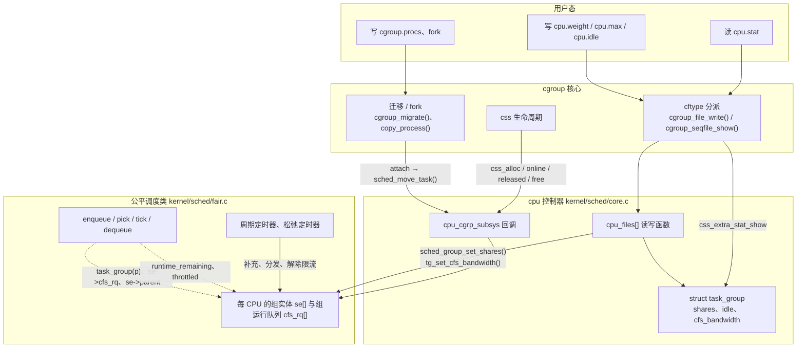
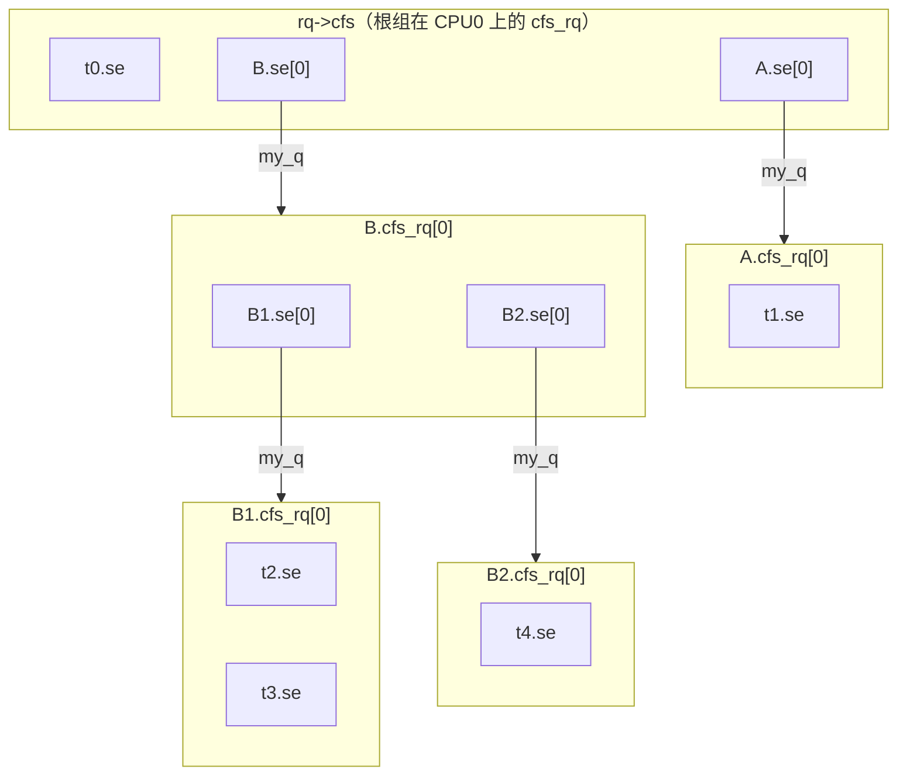
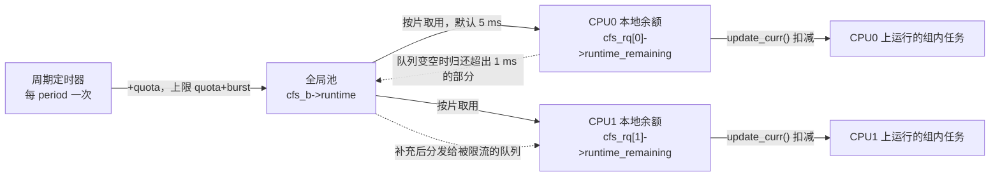
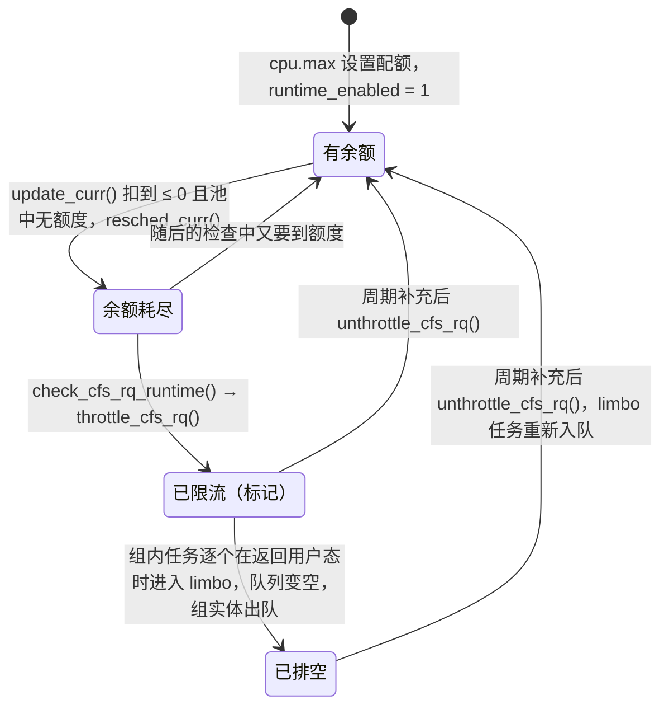
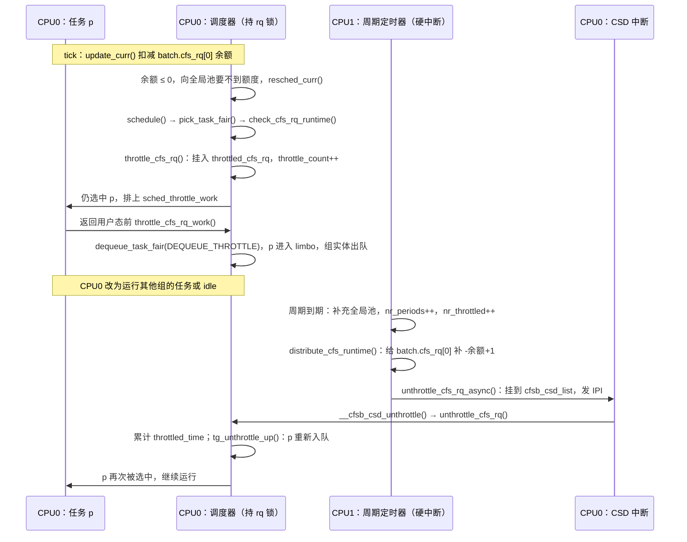

# cgroup v2 的 cpu 控制器：组调度与带宽控制

一台 8 核机器上同时跑着在线服务 `web` 和离线任务 `batch`，两组都有足够多的线程把 CPU 跑满。管理员希望：

1. CPU 紧张时，`web` 与 `batch` 按 4:1 分配 CPU 时间；`batch` 内部的几个作业再在 `batch` 分到的份额里按比例竞争；`web` 空闲时，`batch` 可以用满整台机器。
2. 不论机器多空闲，`batch` 每 100 ms 最多运行 200 ms 的 CPU 时间，也就是平均不超过 2 个 CPU。
3. 一个日志压缩组只在其他任务都不需要 CPU 时才运行。
4. 能看到每个组用了多少 CPU、被限流过多少个周期、累计被限流了多久。

这四条分别对应 cgroup v2 `cpu` 控制器的 `cpu.weight`、`cpu.max`（及 `cpu.max.burst`）、`cpu.idle` 和 `cpu.stat`。`cpu` 控制器本身并不实现一个调度器，它做的是两件事：

- **组调度**（group scheduling）：让公平调度类（`fair_sched_class`，实现在 `kernel/sched/fair.c`）认识“组”。每个组在每个 CPU 上都表现为上一层运行队列中的一个调度实体，组的权重只在兄弟之间按比例分配。
- **带宽控制**（bandwidth control）：给组设一个“每个周期最多运行多久”的硬上限，额度用完后对组限流（throttle），到下一个周期补充额度后再解除限流（unthrottle）。

本章回答以下问题：

1. `cpu` 控制器的状态对象是什么？它怎样在每个 CPU 上把 cgroup 树变成一棵调度实体树？
2. 调度器怎样在这棵树上入队、选择任务和记账？
3. `cpu.weight` 怎样变成每个 CPU 上组实体的权重？为什么同一个组在不同 CPU 上的权重不同？
4. `cpu.max` 的配额怎样在多个 CPU 之间分配？用完后任务何时、怎样停止运行，又怎样恢复？
5. 任务进出组、组的创建与销毁时，调度器的对象怎样变化？
6. `cpu.stat` 中的各项统计在哪里累计，含义是什么？

同一个运行队列内部怎样挑选下一个实体，属于公平调度类的选择算法（当前版本为 EEVDF，Earliest Eligible Virtual Deadline First）。本章只把它当作“按权重分配时间的黑盒”，不展开其中的 eligible、deadline、lag 等概念。

## 0. 分析基线

本章依据仓库内 [Makefile 第 2～4 行](../../linux/Makefile#L2-L4)标记的 **6.18.52** 版本，架构为 **x86-64**。读者应先读过 [cgroup v2 概述](intrudoction.md)，了解 css、`css_set`、有效 css 和任务迁移流程；还需要知道调度类（`struct sched_class`）和每 CPU 运行队列（`struct rq`）的基本概念。

与本章结论有关的配置如下。它们是编译条件，不代表某次运行一定经过对应路径。

| 配置 | 对本章的影响 | 依据 |
| --- | --- | --- |
| `CONFIG_CGROUP_SCHED=y`、`CONFIG_FAIR_GROUP_SCHED=y`、`CONFIG_CFS_BANDWIDTH=y` | 编入 `cpu` 控制器、公平调度类的组调度和带宽控制；后两者分别选中 `CONFIG_GROUP_SCHED_WEIGHT` 和 `CONFIG_GROUP_SCHED_BANDWIDTH`，它们决定 `cpu_files[]` 中有哪些文件 | [.config#L216-L220](../../linux/.config#L216-L220)、[init/Kconfig#L1105-L1121](../../linux/init/Kconfig#L1105-L1121) |
| `CONFIG_RT_GROUP_SCHED` 未设置 | 实时任务不参与组调度，`cpu` 控制器的权重和带宽只作用于公平调度类的任务；`alloc_rt_sched_group()` 等为空实现 | [.config#L221](../../linux/.config#L221)、[rt.c#L295-L331](../../linux/kernel/sched/rt.c#L295-L331) |
| `CONFIG_UCLAMP_TASK` 未设置 | 没有 `cpu.uclamp.min`、`cpu.uclamp.max` | [.config#L193](../../linux/.config#L193) |
| `CONFIG_SCHED_CLASS_EXT` 未出现在 `.config` 中 | 它依赖 `DEBUG_INFO_BTF`，而 `.config` 中也没有 `CONFIG_DEBUG_INFO_BTF`，所以 sched_ext 未编入；`cpu` 控制器回调里的 `scx_*()` 调用都是空的内联函数 | [Kconfig.preempt#L166-L168](../../linux/kernel/Kconfig.preempt#L166-L168)、[ext.h#L84-L94](../../linux/kernel/sched/ext.h#L84-L94) |
| `CONFIG_SCHED_AUTOGROUP=y` | 处在根 cgroup 中的任务可能被放进 autogroup 的任务组（4.3 节） | [.config#L245](../../linux/.config#L245) |
| `CONFIG_64BIT=y` | 调度器内部权重比用户可见权重多 10 位定点精度，`scale_load(w)` 为 `w << 10` | [.config#L332](../../linux/.config#L332)、[sched.h#L147-L157](../../linux/kernel/sched/sched.h#L147-L157) |
| `CONFIG_JUMP_LABEL=y` | 只要没有任何组设置配额，带宽控制的检查点由静态键直接跳过 | [.config#L847](../../linux/.config#L847)、[fair.c#L5756-L5772](../../linux/kernel/sched/fair.c#L5756-L5772) |
| `CONFIG_NO_HZ_FULL=y` | 受带宽限制的任务独占 CPU 时，tick 不能停（4.4 节） | [.config#L108](../../linux/.config#L108) |
| `CONFIG_PREEMPT_RT` 未设置 | 带宽控制的两个 hrtimer 回调在硬中断上下文执行（第 5 节） | [.config#L139](../../linux/.config#L139)、[hrtimer.c#L1616-L1627](../../linux/kernel/time/hrtimer.c#L1616-L1627) |
| `CONFIG_SCHED_CORE` 未设置 | 不讨论核心调度对组调度的影响 | [.config#L143](../../linux/.config#L143) |

还有几个**运行时条件**会改变结论，本章以默认值为准：

- sysctl `kernel.sched_cfs_bandwidth_slice_us`：每次从组的全局池取出的运行时间，默认 5000 µs（[fair.c#L114-L143](../../linux/kernel/sched/fair.c#L114-L143)）。
- autogroup 默认开启（`sysctl_sched_autogroup_enabled = 1`，[autogroup.c#L10](../../linux/kernel/sched/autogroup.c#L10)），启动参数 `noautogroup` 可关闭（[autogroup.c#L223-L229](../../linux/kernel/sched/autogroup.c#L223-L229)）。
- 启动参数 `cgroup_disable=cpu` 可以关闭整个控制器（见概述章第 0 节）。

## 1. cpu 控制器要解决什么问题

### 1.1 需求与机制

| 需求 | 接口 | 机制 | 生效位置 |
| --- | --- | --- | --- |
| 兄弟组之间按比例分享 CPU，空闲份额让给别人 | `cpu.weight`、`cpu.weight.nice` | 组在父组的运行队列中以一个调度实体出现，实体权重来自组的 `shares`，并按各 CPU 上的负载拆分 | 入队、出队、tick 时的 `update_cfs_group()`（3.2 节） |
| 组每个周期的 CPU 时间有硬上限 | `cpu.max`、`cpu.max.burst` | 每周期向组的全局池补充配额，各 CPU 按片取用，用完即限流 | `update_curr()` 记账、`pick_task_fair()` / `put_prev_entity()` 限流、周期定时器解除限流（3.4～3.6 节） |
| 组只在系统空闲时运行 | `cpu.idle` | 组实体权重降到最低，唤醒抢占时总让位于非 idle 实体 | `sched_group_set_idle()`、唤醒抢占（3.3 节） |
| 观测 | `cpu.stat`、`cpu.stat.local` | rstat 分层 CPU 时间 + 带宽统计 | 读文件时汇总（4.6 节） |

### 1.2 核心思路：把组变成调度实体

没有组调度时，每个 CPU 的公平运行队列 `rq->cfs` 中直接排着全部公平任务，CPU 时间按任务权重分配。一个开了 100 个线程的组，天然能拿到只开 1 个线程的组的 100 倍时间。

组调度把一个组在每个 CPU 上拆成两样东西：

- 一个**组调度实体**（group scheduling entity，`struct sched_entity`），排在父组在该 CPU 上的运行队列里，与父组中的其他任务和兄弟组竞争；
- 一个**组运行队列**（`struct cfs_rq`），组内的任务和子组的实体排在这里竞争组实体分到的时间。

于是每个 CPU 上形成一棵“运行队列—实体”交替的树，选择任务时从 `rq->cfs` 开始逐层向下挑选。举一个只有 1 个 CPU 的例子：根下有组 A 和 B，权重相同；A 中有 1 个任务，B 中有 9 个任务，全部是 nice 0 并且一直可运行。A、B 的组实体在 `rq->cfs` 中各占一半，A 的那个任务得到 50% 的 CPU，B 的 9 个任务平分另外 50%，各得约 5.6%。如果没有 `cpu` 控制器，10 个任务各得 10%。

根组的任务与根组的子组按同样的规则竞争：根组的任务直接排在 `rq->cfs` 中，与子组的组实体是平级关系。`sched_init()` 的注释给出了一个算例：根组有 10 个权重为 1024 的任务，另有两个权重为 1024 的子组 A0、A1，则 A0 分到 1024 / (10×1024 + 1024 + 1024) ≈ 8.33%（[core.c#L8745-L8764](../../linux/kernel/sched/core.c#L8745-L8764)）。同样的平级竞争也出现在 threaded 子树中，因为 `cpu` 是 threaded 控制器（`.threaded = true`，[core.c#L10318](../../linux/kernel/sched/core.c#L10318)），threaded cgroup 中的线程可以与启用了 `cpu` 的子 cgroup 共存（见概述章 3.3 节）。

带宽控制在这棵树上叠加一层约束：每个设置了 `cpu.max` 的组在每个 CPU 上的运行队列都有一个“本地余额”，组实体及其下的任务运行时扣减余额；余额取自组的全局池，池子每个周期补充一次。

### 1.3 在内核中的位置

下图展示 `cpu` 控制器连接的两条路径。实线表示调用，虚线表示热路径上读取的状态。



需要注意两点：

- **配置路径和执行路径分开。** 写接口文件只修改 `task_group` 中的参数，并在每个 CPU 上刷新一次组实体的权重或带宽状态。真正决定任务能否运行的是调度器热路径：入队、选择、tick 记账。热路径通过 `p->sched_task_group` 和 `se->cfs_rq`、`se->parent` 等指针找到组对象，不经过 cgroup 核心。
- **cgroup 核心不知道调度器的对象。** 核心只通过 `cpu_cgrp_subsys` 中注册的回调通知 `cpu` 控制器（[core.c#L10304-L10319](../../linux/kernel/sched/core.c#L10304-L10319)）：创建、上线、释放 css，以及任务迁移后的 `attach`。fork 时的放置不走控制器回调，而由 `copy_process()` 直接调用 `sched_cgroup_fork()`（4.3 节）。

### 1.4 触发事件与输入输出

| 触发事件 | 执行上下文 | 入口 | 结果 |
| --- | --- | --- | --- |
| 父 cgroup 的 `subtree_control` 含 `cpu` 时 `mkdir`，或向父 cgroup 的 `subtree_control` 写 `+cpu` | 进程上下文，持有 `cgroup_mutex` | [`cpu_cgroup_css_alloc()`](../../linux/kernel/sched/core.c#L9256-L9272)、[`cpu_cgroup_css_online()`](../../linux/kernel/sched/core.c#L9274-L9296) | 创建 `task_group` 及其每 CPU 的 `cfs_rq`、组实体，挂入任务组树 |
| 写 `cpu.weight` / `cpu.weight.nice` | 进程上下文 | [`cpu_weight_write_u64()`](../../linux/kernel/sched/core.c#L10140-L10155) | 修改 `tg->shares`，逐 CPU 重算组实体权重 |
| 写 `cpu.idle` | 进程上下文 | [`cpu_idle_write_s64()`](../../linux/kernel/sched/core.c#L9970-L9979) | 修改 `tg->idle` 和各 CPU 上的 idle 计数，权重设为最小值或恢复默认值 |
| 写 `cpu.max` / `cpu.max.burst` | 进程上下文 | [`cpu_max_write()`](../../linux/kernel/sched/core.c#L10237-L10249) | 修改 `cfs_bandwidth`，补满全局池，启动周期定时器，重置各 CPU 的本地余额 |
| 任务迁入 / 迁出组 | 迁移者的进程上下文 | [`cpu_cgroup_attach()`](../../linux/kernel/sched/core.c#L9340-L9347) | 任务换到新组的 `cfs_rq`，负载随之转移 |
| fork | `copy_process()` | [`sched_cgroup_fork()`](../../linux/kernel/sched/core.c#L4766-L4795) | 子任务的 `sched_task_group` 和 `se.cfs_rq` 指向新 `css_set` 中的有效 css 对应的组 |
| tick、调度、入队 | 持有 rq 锁，中断关闭 | `update_curr()`、`pick_task_fair()` 等 | 记账、重算组权重、扣减余额、限流 |
| 周期到期 | hrtimer 硬中断 | [`sched_cfs_period_timer()`](../../linux/kernel/sched/fair.c#L6640-L6693) | 补充全局池，分发运行时间，解除限流 |
| 读 `cpu.stat` | 进程上下文 | [`cpu_stat_show()`](../../linux/kernel/cgroup/cgroup.c#L3952-L3961) | 输出 CPU 时间与带宽统计 |

### 1.5 本章边界

本章只讨论 cgroup v2 下 `cpu` 控制器对公平调度类的作用。不讨论：EEVDF 在一个运行队列内的选择规则；PELT（Per-Entity Load Tracking，按实体的负载跟踪）的衰减计算；负载均衡的完整算法；实时组调度、uclamp 和 sched_ext；v1 的 `cpu.shares`、`cpu.cfs_quota_us` 等文件（它们定义在 [`cpu_legacy_files[]`](../../linux/kernel/sched/core.c#L9982-L10037)，与 v2 文件共用同一套内部函数）。

## 2. 核心数据结构

### 2.1 结构地图

用下面这棵 cgroup 树作例子。假设根的 `subtree_control` 含 `cpu`，`B` 的 `subtree_control` 也含 `cpu`；`B` 自己没有任务（概述章 3.3 节的“无内部进程”约束）：

```text
/              任务 t0
├── A          任务 t1
└── B          （无任务）
    ├── B1     任务 t2、t3
    └── B2     任务 t4
```

每个启用了 `cpu` 的 cgroup 对应一个 `struct task_group`。下图画出 CPU 0 上的调度对象，假设 5 个任务当前都在 CPU 0 上可运行。每个子图表示一个 `cfs_rq`，子图中的方框是排在该队列上的调度实体（实体的 `cfs_rq` 字段指向这个队列）；箭头表示组实体的 `my_q` 指针，指向该组自己的运行队列。



读这张图时注意：

- **根组没有组实体。** `root_task_group.se[i]` 为 NULL，`root_task_group.cfs_rq[i]` 就是嵌入在 `struct rq` 中的 `rq->cfs`（[core.c#L8764](../../linux/kernel/sched/core.c#L8764)），所以根组的任务 t0 与 A、B 的组实体在同一个队列中竞争。
- **每个 CPU 一份。** A 在 CPU 1 上还有 `A.se[1]` 和 `A.cfs_rq[1]`，结构与 CPU 0 相同。一个组的各 CPU 副本之间没有指针相连，它们通过 `task_group` 中的数组和 `tg->load_avg` 这个全局量联系（3.2 节）。
- **任务实体是树叶。** 区分任务实体与组实体的唯一依据是 `my_q`：`entity_is_task(se)` 就是 `!se->my_q`（[sched.h#L922-L923](../../linux/kernel/sched/sched.h#L922-L923)）。
- **向上走用 `parent`。** t2 的 `se.parent` 是 `B1.se[0]`，`B1.se[0]->parent` 是 `B.se[0]`，`B.se[0]->parent` 为 NULL。`for_each_sched_entity(se)` 就是沿 `parent` 一直走到 NULL（[fair.c#L306-L308](../../linux/kernel/sched/fair.c#L306-L308)）。

如果 B 没有在 `subtree_control` 中启用 `cpu`，B1、B2 就没有自己的 `task_group`，t2、t3、t4 的有效 css 是 B 的（概述章 3.2 节），它们的实体直接排在 `B.cfs_rq[0]` 上。

### 2.2 `struct task_group`：组的状态

`struct task_group` 是 `cpu` 控制器的状态对象，嵌入 css（[sched.h#L472-L525](../../linux/kernel/sched/sched.h#L472-L525)）。当前配置下与本章有关的字段：

| 字段 | 含义 | 说明 |
| --- | --- | --- |
| `css` | 嵌入的 `cgroup_subsys_state` | `css_tg()` 用 `container_of()` 从 css 取回 `task_group`（[sched.h#L558-L561](../../linux/kernel/sched/sched.h#L558-L561)） |
| `se`、`cfs_rq` | 两个按 CPU 编号索引的指针数组，长度 `nr_cpu_ids` | 组在每个可能 CPU 上的组实体和组运行队列；由本组分配和释放 |
| `shares` | 组的权重，调度器内部精度（`scale_load()` 之后） | 新建组为 `NICE_0_LOAD`，即 `cpu.weight` 100；限制在 `[scale_load(MIN_SHARES), scale_load(MAX_SHARES)]`，即 2～262144（[sched.h#L527-L540](../../linux/kernel/sched/sched.h#L527-L540)） |
| `load_avg` | 组在所有 CPU 上的负载平均之和的近似值 | `atomic_long_t`，单独占一个缓存行，因为 tick 时各 CPU 都会更新它（[sched.h#L486-L491](../../linux/kernel/sched/sched.h#L486-L491)） |
| `idle` | 正值表示 `cpu.idle` 为 1 | 3.3 节 |
| `parent`、`children`、`siblings` | 任务组树 | 与 cgroup 树一致；autogroup 的任务组也挂在根组下面 |
| `list` | 挂在全局链表 `task_groups` 上 | CPU 热插拔时遍历所有组（4.5 节） |
| `cfs_bandwidth` | 嵌入的带宽状态 | 2.5 节 |
| `rcu` | 延迟释放 | 4.1 节 |

`task_group` 只保存“组的参数”和“每 CPU 对象的索引”，不保存组里有哪些任务。任务属于哪个组，记录在任务自己的 `sched_task_group` 中（2.6 节）。

### 2.3 组调度实体：`struct sched_entity` 中的组字段

任务实体嵌入在 `task_struct::se` 中，组实体由 `alloc_fair_sched_group()` 为每个 CPU 单独分配。两者是同一个结构体 `struct sched_entity`（[include/linux/sched.h#L570-L616](../../linux/include/linux/sched.h#L570-L616)）。`CONFIG_FAIR_GROUP_SCHED` 下有 5 个与层级有关的字段（[sched.h#L598-L607](../../linux/include/linux/sched.h#L598-L607)）：

| 字段 | 含义 | 任务实体 | 组实体 |
| --- | --- | --- | --- |
| `cfs_rq` | 本实体**排在**哪个运行队列上 | `task_group(p)->cfs_rq[task_cpu(p)]` | 父组在同一 CPU 上的 `cfs_rq` |
| `my_q` | 本实体**拥有**的运行队列 | NULL | 本组在该 CPU 上的 `cfs_rq` |
| `parent` | 上一层的组实体 | `task_group(p)->se[task_cpu(p)]` | 父组在同一 CPU 上的组实体；父组为根时为 NULL |
| `depth` | 在实体树中的深度，排在 `rq->cfs` 上的实体为 0 | 父实体深度 + 1 | 同左 |
| `runnable_weight` | 组运行队列中可运行任务数 `my_q->h_nr_runnable` 的缓存 | 不用 | 供 PELT 计算组实体的 runnable 平均值（`se_update_runnable()`，[sched.h#L925-L929](../../linux/kernel/sched/sched.h#L925-L929)） |

此外，`load` 是实体的权重。对任务实体，它来自 nice 值；对组实体，它由 3.2 节的 `calc_group_shares()` 动态计算，初始化为 `NICE_0_LOAD`（[fair.c#L13951-L13953](../../linux/kernel/sched/fair.c#L13951-L13953)）。`sum_exec_runtime` 对组实体同样有效：`update_se()` 对非任务实体把时间记在实体自身上（[fair.c#L1257-L1260](../../linux/kernel/sched/fair.c#L1257-L1260)）。

### 2.4 `struct cfs_rq`：组在一个 CPU 上的运行队列

`struct cfs_rq`（[sched.h#L676-L772](../../linux/kernel/sched/sched.h#L676-L772)）既用于 `rq->cfs`，也用于每个组的每 CPU 队列。与组调度有关的字段：

| 字段 | 含义 | 维护者 |
| --- | --- | --- |
| `load` | 本队列上直接排队的实体权重之和 | 入队、出队、重设权重时增减（[`account_entity_enqueue()`](../../linux/kernel/sched/fair.c#L3757-L3768)） |
| `nr_queued` | 直接排队的实体数 | 同上 |
| `h_nr_queued`、`h_nr_runnable`、`h_nr_idle` | 以本队列为根的子树中，排队的任务数、可运行任务数、`SCHED_IDLE` 任务数 | 入队、出队时沿实体链逐层增减（3.1 节） |
| `avg` | 本队列的 PELT 负载平均 | PELT |
| `tg_load_avg_contrib` | 本队列上次贡献给 `tg->load_avg` 的值 | [`update_tg_load_avg()`](../../linux/kernel/sched/fair.c#L4244-L4287) |
| `h_load` | 层级负载：本队列负载折算到根上的值 | 负载均衡时计算（3.1 节） |
| `rq`、`tg` | 所属 CPU 的 `rq`、拥有本队列的组 | 创建时设置，不再改变 |
| `idle` | `tg->idle` 在本队列上的缓存 | `sched_group_set_idle()` |
| `on_list`、`leaf_cfs_rq_list` | 是否在本 CPU 的叶子队列链表上 | 用于负载衰减和负载均衡 |
| `runtime_enabled`、`runtime_remaining` | 本组是否设了配额；本 CPU 的本地余额（纳秒，可为负） | 带宽控制（2.5 节、3.4 节） |
| `throttled` | 本队列因**本组**配额耗尽而被限流 | `throttle_cfs_rq()` / `unthrottle_cfs_rq()` |
| `throttle_count` | 本队列及其祖先中被限流的层数 | `tg_throttle_down()` / `tg_unthrottle_up()` |
| `throttled_list` | 挂在 `cfs_bandwidth::throttled_cfs_rq` 上 | 限流时加入，解除时摘下 |
| `throttled_csd_list` | 等待目标 CPU 异步解除限流时，挂在 `rq->cfsb_csd_list` 上 | 3.6 节 |
| `throttled_limbo_list` | 因限流而离队的任务 | 3.5 节 |
| `throttled_clock`、`throttled_clock_self`、`throttled_clock_self_time`、`pelt_clock_throttled` 等 | 限流计时和 PELT 时钟冻结 | 4.6 节 |

`throttled` 和 `throttle_count` 是两个层次：`throttled` 只说明“本组的配额用完了”，`throttle_count > 0` 说明“本组或某个祖先组的配额用完了”。判断一个队列是否处在受限的子树中用的是后者（[`throttled_hierarchy()`](../../linux/kernel/sched/fair.c#L5896-L5900)）。

### 2.5 `struct cfs_bandwidth`：组的带宽状态

`struct cfs_bandwidth` 嵌入在 `task_group` 中（[sched.h#L445-L469](../../linux/kernel/sched/sched.h#L445-L469)），保存一个组在所有 CPU 上共享的带宽状态。

| 字段 | 含义 | 单位与约束 |
| --- | --- | --- |
| `lock` | 保护本结构的 raw 自旋锁 | 与 rq 锁同时持有时位于内层 |
| `period` | 周期 | `ktime_t`，1 ms～1 s，默认 100 ms（[sched.h#L435-L442](../../linux/kernel/sched/sched.h#L435-L442)） |
| `quota` | 每周期的配额 | 纳秒；`RUNTIME_INF`（全 1，[sched.h#L185](../../linux/kernel/sched/sched.h#L185)）表示不限 |
| `burst` | 允许累积的额外额度 | 纳秒，不超过 `quota` |
| `runtime` | 全局池中尚未分给各 CPU 的运行时间 | 纳秒；补充后不超过 `quota + burst` |
| `runtime_snap` | 上次补充后的 `runtime`，用来计算本周期用了多少 | 纳秒 |
| `hierarchical_quota` | 本组及祖先中最严的配额比例 | `to_ratio()` 的定点值，3.7 节 |
| `idle`、`period_active` | 上个周期是否无人取用；周期定时器是否在运行 | 用于停掉空闲组的定时器 |
| `period_timer`、`slack_timer` | 周期定时器、松弛定时器 | 3.6 节 |
| `throttled_cfs_rq` | 当前被限流的本组 `cfs_rq` 链表 | RCU 链表，按限流先后排列 |
| `nr_periods`、`nr_throttled`、`throttled_time`、`nr_burst`、`burst_time` | 统计 | 4.6 节 |

这里有两个“余额”，层次不同：

- `cfs_bandwidth::runtime` 是**组级全局池**，所有 CPU 共享，由 `cfs_b->lock` 保护；
- `cfs_rq::runtime_remaining` 是**每 CPU 本地余额**，由本 CPU 的 rq 锁保护。

任务运行时只扣本地余额，本地余额用完才去全局池取一片，这样热路径上大多数时候不碰全局锁（3.4 节）。

### 2.6 `task_struct` 中的字段

`CONFIG_CGROUP_SCHED` 给 `task_struct` 增加了以下字段（[include/linux/sched.h#L881-L888](../../linux/include/linux/sched.h#L881-L888)）：

| 字段 | 含义 |
| --- | --- |
| `sched_task_group` | 任务当前所属的任务组 |
| `sched_throttle_work` | 限流时排给任务的 task work（3.5 节）；`next` 指向自身表示“未排队” |
| `throttle_node` | 挂在 `cfs_rq::throttled_limbo_list` 上 |
| `throttled` | 任务因限流离开了运行队列 |

**为什么调度器不用 `task_css()` 而要自己保存一份 `sched_task_group`？** `task_group()` 前的注释说明：cgroup 核心在调用 `attach` 回调之前就已经切换了任务的 `css_set`，调度器无法在那时固定住组；所以改用一份由 `sched_move_task()` 在同时持有 `p->pi_lock` 和 rq 锁时更新的副本（[sched.h#L2159-L2175](../../linux/kernel/sched/sched.h#L2159-L2175)）。这样，只要持有 rq 锁，`task_group(p)` 与 `p->se.cfs_rq`、`p->se.parent` 就一定一致。

### 2.7 不变量、生命周期与并发保护

`init_tg_cfs_entry()`（[fair.c#L13926-L13955](../../linux/kernel/sched/fair.c#L13926-L13955)）和 `set_task_rq()`（[sched.h#L2177-L2202](../../linux/kernel/sched/sched.h#L2177-L2202)）建立了下面的关系。对非根组 `tg` 和每个可能的 CPU `i`：

```text
tg->cfs_rq[i]->tg     == tg
tg->se[i]->my_q       == tg->cfs_rq[i]
tg->se[i]->cfs_rq     == tg->parent->cfs_rq[i]        // 父为根时即 &cpu_rq(i)->cfs
tg->se[i]->parent     == tg->parent->se[i]            // 父为根时为 NULL
对任务 p（持有 rq 锁时）：
p->se.cfs_rq          == task_group(p)->cfs_rq[task_cpu(p)]
p->se.parent          == task_group(p)->se[task_cpu(p)]
```

组的 `se[]`、`cfs_rq[]` 由 `task_group` **拥有**：创建组时分配，组释放时一起释放（4.1 节）。实体中的 `cfs_rq`、`parent`、`my_q` 都是普通指针，不持有引用。它们的有效性靠两条规则保证：cgroup 只允许删除没有任务、没有子 cgroup 的目录；组的释放又被推迟到 RCU 宽限期之后。

| 机制 | 保护什么 | 依据 |
| --- | --- | --- |
| `task_group_lock`（关中断自旋锁） | `task_groups` 链表、`parent`/`children`/`siblings` 的修改 | [`sched_online_group()`](../../linux/kernel/sched/core.c#L9149-L9165)、[`sched_release_group()`](../../linux/kernel/sched/core.c#L9180-L9201) |
| RCU | 遍历任务组树（`walk_tg_tree_from()` 要求调用者持有 RCU 读锁）、遍历 `throttled_cfs_rq`、组的延迟释放 | [core.c#L1411-L1440](../../linux/kernel/sched/core.c#L1411-L1440)、[sched.h#L547-L556](../../linux/kernel/sched/sched.h#L547-L556) |
| `shares_mutex` | `tg->shares` 和 `tg->idle` 的写入 | [fair.c#L13957-L14072](../../linux/kernel/sched/fair.c#L13957-L14072) |
| `cfs_constraints_mutex` + `cpus_read_lock()` | 带宽参数的修改和 `hierarchical_quota` 的计算 | [core.c#L9580-L9585](../../linux/kernel/sched/core.c#L9580-L9585) |
| `cfs_b->lock`（raw 自旋锁） | `cfs_bandwidth` 的所有字段、定时器的启动 | — |
| rq 锁 | 该 CPU 上所有 `cfs_rq` 和实体的状态，包括 `runtime_remaining`、`throttled`、`throttle_count`、limbo 链表 | — |
| `task_rq_lock()`（`p->pi_lock` + rq 锁） | `p->sched_task_group`、`p->se.cfs_rq`、`p->se.parent` | [sched.h#L2169-L2170](../../linux/kernel/sched/sched.h#L2169-L2170) |
| 原子操作 | `tg->load_avg` | [fair.c#L4281-L4286](../../linux/kernel/sched/fair.c#L4281-L4286) |

rq 锁与 `cfs_b->lock` 的顺序是 **rq 锁在外**：`assign_cfs_rq_runtime()` 和 `throttle_cfs_rq()` 都在持有 rq 锁时获取 `cfs_b->lock`；周期定时器则在分发前先放开 `cfs_b->lock`，源码注释写明分发时不能嵌套持有它（[fair.c#L6426-L6431](../../linux/kernel/sched/fair.c#L6426-L6431)）。

## 3. 关键算法

### 3.1 层级调度：入队向上，选择向下

**目标**：在每个 CPU 上，让每一层运行队列只在本层的实体之间分配时间，从而实现“组的权重只与兄弟比较”。

**入队**。[`enqueue_task_fair()`](../../linux/kernel/sched/fair.c#L7079-L7198)从任务实体开始沿 `parent` 向上走，分两段：

```text
// 简化逻辑，省略 delayed dequeue、util_est、slice 传递等与组调度无关的部分
第一段：for_each_sched_entity(se)
    if se 已经在队列上：break                // 祖先已入队，不必再往上
    enqueue_entity(cfs_rq_of(se), se)       // 放入本层队列，可能触发 check_enqueue_throttle()
    cfs_rq->h_nr_queued++ 等                 // 层级计数
第二段：for_each_sched_entity(se)            // 从断点继续，处理已在队列上的祖先
    update_load_avg(cfs_rq_of(se), se, UPDATE_TG)
    update_cfs_group(se)                     // 子树负载变了，重算该组实体的权重
    cfs_rq->h_nr_queued++ 等
add_nr_running(rq, 1)
```

第一段的 `break` 是关键：一个组实体只要已经在父队列上，就不需要重复入队，只需更新它的负载和权重（[fair.c#L7118-L7166](../../linux/kernel/sched/fair.c#L7118-L7166)）。`h_nr_queued` 之类的层级计数在两段中都会递增，因此每一层都知道自己子树中有多少任务。

**出队**。[`dequeue_entities()`](../../linux/kernel/sched/fair.c#L7209-L7314)对称地向上走：一层出队后，如果该层队列的 `load.weight` 不为 0（还有其他实体），就停止出队，只更新上层的负载、权重和计数（[fair.c#L7251-L7264](../../linux/kernel/sched/fair.c#L7251-L7264)）；否则该层的组实体也要从父队列出队。

**选择**。[`pick_task_fair()`](../../linux/kernel/sched/fair.c#L9104-L9135)从 `rq->cfs` 开始向下：

```c
	do {
		/* Might not have done put_prev_entity() */
		if (cfs_rq->curr && cfs_rq->curr->on_rq)
			update_curr(cfs_rq);

		throttled |= check_cfs_rq_runtime(cfs_rq);

		se = pick_next_entity(rq, cfs_rq, true);
		if (!se)
			goto again;
		cfs_rq = group_cfs_rq(se);
	} while (cfs_rq);
```

来源：[kernel/sched/fair.c 第 9118～9129 行](../../linux/kernel/sched/fair.c#L9118-L9129)。每一层由 `pick_next_entity()`（内部是 EEVDF 的 `pick_eevdf()`）在本层实体中挑一个；挑中组实体就进入它的 `my_q` 继续，挑中任务实体（`group_cfs_rq()` 返回 NULL）就结束。`check_cfs_rq_runtime()` 是带宽控制的检查点，3.5 节再讲。

[`pick_next_task_fair()`](../../linux/kernel/sched/fair.c#L9140-L9199)在前后两个任务都属于公平调度类时做了一个优化：利用 `depth` 让两条实体链逐层上溯，直到两者落在同一个 `cfs_rq` 上，只对路径上不同的那几层调用 `put_prev_entity()` 和 `set_next_entity()`（[fair.c#L9170-L9192](../../linux/kernel/sched/fair.c#L9170-L9192)）。源码注释说明，同组任务连续运行的情况很常见，这样可以避免每次切换都重设整条层级链。

**记账**。tick 时 [`task_tick_fair()`](../../linux/kernel/sched/fair.c#L13588-L13605)对当前任务实体链的每一层调用 `entity_tick()`，每层都会 `update_curr()`。所以一个组实体的虚拟时间按“它下面所有任务在本 CPU 上运行的总时间”推进。`update_curr()` 把实际运行时间按实体权重换算为虚拟时间：

```c
static inline u64 calc_delta_fair(u64 delta, struct sched_entity *se)
{
	if (unlikely(se->load.weight != NICE_0_LOAD))
		delta = __calc_delta(delta, NICE_0_LOAD, &se->load);

	return delta;
}
```

来源：[kernel/sched/fair.c 第 290～296 行](../../linux/kernel/sched/fair.c#L290-L296)。权重越大，同样运行时间推进的虚拟时间越少。选择算法据此在同层实体之间分配时间，目标是让各实体长期的运行时间与权重成正比，1.2 节引用的 `sched_init()` 注释算例就是按这个比例计算的。这正是组实体的权重能决定组份额的原因。

**与负载均衡的关系。** 负载均衡要比较不同 CPU 上的任务负载，但组内任务的负载需要按组在每一层所占比例折算。[`update_cfs_rq_h_load()`](../../linux/kernel/sched/fair.c#L10107-L10143)自顶向下计算每层队列的 `h_load`，[`task_h_load()`](../../linux/kernel/sched/fair.c#L10145-L10152)再把任务自己的负载按比例折算。此外，`can_migrate_task()` 不会把任务迁到目标 CPU 上处于限流子树中的队列（[fair.c#L9660-L9673](../../linux/kernel/sched/fair.c#L9660-L9673)）。

### 3.2 组权重：从 `cpu.weight` 到每个 CPU 上的实体权重

**问题**。`cpu.weight` 是组的总权重，但组在每个 CPU 上都有一个组实体。如果每个组实体都直接取组的总权重，一个在 8 个 CPU 上都有任务的组就相当于拿到了 8 倍的权重；如果平均分成 8 份，任务全挤在一个 CPU 上时它又会吃亏。合理的做法是按组在各 CPU 上的负载比例拆分总权重。

**单位换算**。`cpu.weight` 的范围是 1～10000，默认 100（[cgroup.h#L39-L41](../../linux/include/linux/cgroup.h#L39-L41)）。它先换算为与 nice 值同一刻度的权重，100 对应 nice 0 的 1024：

```c
static inline unsigned long sched_weight_from_cgroup(unsigned long cgrp_weight)
{
	return DIV_ROUND_CLOSEST_ULL(cgrp_weight * 1024, CGROUP_WEIGHT_DFL);
}
```

来源：[kernel/sched/sched.h 第 259～262 行](../../linux/kernel/sched/sched.h#L259-L262)。然后经 `scale_load()` 左移 10 位存入 `tg->shares`。几个对照值：

| `cpu.weight` | 换算后的权重 | 最接近的 nice（该 nice 的权重） | `tg->shares` |
| --- | --- | --- | --- |
| 1 | 10 | 19（15） | `10 << 10` |
| 50 | 512 | 3（526） | `512 << 10` |
| 100（默认） | 1024 | 0（1024） | `1024 << 10`，即 `NICE_0_LOAD` |
| 400 | 4096 | -6（3906） | `4096 << 10` |
| 10000 | 102400 | -20（88761），已超出 nice 能表达的范围 | `102400 << 10` |

“最接近的 nice”一列按 [`sched_prio_to_weight[]`](../../linux/kernel/sched/core.c#L10354-L10363)取最接近的值；`cpu.weight.nice` 读出的就是这样一个最接近的 nice 值（[core.c#L10157-L10173](../../linux/kernel/sched/core.c#L10157-L10173)）。

**拆分公式**。[`calc_group_shares()`](../../linux/kernel/sched/fair.c#L4086-L4118)计算组在某个 CPU 上的组实体权重。它上方的长注释（[fair.c#L4013-L4085](../../linux/kernel/sched/fair.c#L4013-L4085)）给出了推导，理想公式是：

```text
                       tg->shares × 本 CPU 组队列的 load.weight
组实体权重(本 CPU) = ─────────────────────────────────────────────
                       Σ 各 CPU 组队列的 load.weight
```

分母要读所有 CPU 的队列，代价太高。实现中用 PELT 负载平均 `avg.load_avg` 代替瞬时权重，用全局的 `tg->load_avg` 近似分母，并对本 CPU 做修正：

```c
	tg_shares = READ_ONCE(tg->shares);

	load = max(scale_load_down(cfs_rq->load.weight), cfs_rq->avg.load_avg);

	tg_weight = atomic_long_read(&tg->load_avg);

	/* Ensure tg_weight >= load */
	tg_weight -= cfs_rq->tg_load_avg_contrib;
	tg_weight += load;

	shares = (tg_shares * load);
	if (tg_weight)
		shares /= tg_weight;
	/* ... */
	return clamp_t(long, shares, MIN_SHARES, tg_shares);
```

来源：[kernel/sched/fair.c 第 4091～4117 行](../../linux/kernel/sched/fair.c#L4091-L4117)，省略了解释 `MIN_SHARES` 下限的注释。三点修正的作用：

1. **本 CPU 用较大的那个值。** `load` 取瞬时权重和负载平均中较大的一个。一个刚从空闲变忙的组，负载平均还没涨上来，瞬时权重可以避免它在本 CPU 上的权重被低估。注释把这个场景称为“接近单 CPU 的情况”：其他 CPU 都空闲时，分母约等于 `load`，结果趋近 `tg->shares`。
2. **分母中本 CPU 的部分换成当前值。** `tg->load_avg` 中本 CPU 的贡献是上次更新时的 `tg_load_avg_contrib`，先减去它再加上当前的 `load`，保证分母不小于分子中的 `load`。
3. **上下限。** 结果不超过组的总权重 `tg_shares`，不低于 `MIN_SHARES`（未经缩放的 2，注释举例说明了为什么这里不缩放）。

注释也承认，这个近似总是偏大，各 CPU 上组实体权重之和可能超过 `tg->shares`。

**一个理想化的例子**。`batch` 的 `cpu.weight` 为 100（`tg->shares = 1024 << 10`），有 4 个一直可运行的 nice 0 任务，3 个在 CPU 0、1 个在 CPU 1。稳定后两个组队列的负载平均约为 3072 和 1024，`tg->load_avg` 约为 4096：

| CPU | `load` | `tg_weight` | 组实体权重 |
| --- | --- | --- | --- |
| 0 | 3072 | 4096 | 1024 × 3072 / 4096 = 768（缩放后 `768 << 10`） |
| 1 | 1024 | 4096 | 1024 × 1024 / 4096 = 256 |

两个组实体的权重之和等于组的权重；而且 CPU 0 上每个 `batch` 任务分到组实体 1/3 的时间，CPU 1 上唯一的任务独享组实体，两边每个任务在根层次相当于都有 256 的权重。组的权重就这样按“组在哪里有负载”分摊到各个 CPU。

**`tg->load_avg` 的维护**。[`update_tg_load_avg()`](../../linux/kernel/sched/fair.c#L4244-L4287)采用差量更新：每个组队列记住自己上次贡献的值，只把差值原子地加到 `tg->load_avg` 上。为了减少对这个全局量的争用，它有两道过滤：同一个队列两次更新至少间隔 1 ms；差值不超过上次贡献的 1/64 时不更新。根组的 `load_avg` 不会被用到，直接跳过。

**重算时机**。[`update_cfs_group()`](../../linux/kernel/sched/fair.c#L4124-L4139)对一个组实体调用 `calc_group_shares()`，结果与当前权重不同时调用 [`reweight_entity()`](../../linux/kernel/sched/fair.c#L3949-L3997)，后者把实体暂时从队列的权重和中减去，改权重并按新权重调整虚拟时间相关字段，再加回去。调用 `update_cfs_group()` 的地方有：入队与出队（3.1 节的两段循环）、tick（[fair.c#L5723-L5735](../../linux/kernel/sched/fair.c#L5723-L5735)）以及修改 `cpu.weight`（4.2 节）。组队列变空时不重算，保留原来的权重（[fair.c#L4129-L4134](../../linux/kernel/sched/fair.c#L4129-L4134)）。

### 3.3 idle 组

`cpu.idle` 设为 1 后，组被当作 `SCHED_IDLE` 策略的“组版本”。实现由 [`sched_group_set_idle()`](../../linux/kernel/sched/fair.c#L14009-L14072)完成，分三步：

1. **改标志和计数。** 对每个 CPU，在 rq 锁下设置组队列的 `idle`；再把组中非 idle 任务的个数（`h_nr_queued - h_nr_idle`）加到（或从）沿组实体向上的各层 `h_nr_idle` 上，遇到本身就是 idle 的祖先队列时停止，因为它那一层已经整体算作 idle（[fair.c#L14042-L14058](../../linux/kernel/sched/fair.c#L14042-L14058)）。入队、出队时也按同样的规则累计 `h_nr_idle`（[fair.c#L7142-L7143](../../linux/kernel/sched/fair.c#L7142-L7143)）。
2. **改权重。** idle 组的 `shares` 设为 `scale_load(WEIGHT_IDLEPRIO)`，即 3（[sched.h#L2351](../../linux/kernel/sched/sched.h#L2351)）；取消 idle 时**恢复为 `NICE_0_LOAD`**，而不是之前设置的 `cpu.weight`（[fair.c#L14064-L14068](../../linux/kernel/sched/fair.c#L14064-L14068)）。组处于 idle 时写 `cpu.weight` 返回 `-EINVAL`（[fair.c#L13995-L14007](../../linux/kernel/sched/fair.c#L13995-L14007)）。
3. **影响抢占和选核。** 唤醒抢占时，先把唤醒任务与当前任务的实体链上溯到同一层（`find_matching_se()`），比较这两个同层实体是否 idle：当前实体 idle 而唤醒者不是，立即抢占；反过来则不抢占（[fair.c#L9006-L9026](../../linux/kernel/sched/fair.c#L9006-L9026)）。`h_nr_idle` 还用于判断一个 CPU 上是否只剩 idle 任务（[`sched_idle_rq()`](../../linux/kernel/sched/fair.c#L7032-L7036)），选核时这样的 CPU 被视为与空闲 CPU 同等可用（例如 [fair.c#L7701](../../linux/kernel/sched/fair.c#L7701)）。

idle 组内部的任务仍按各自的权重竞争组分到的那一小份时间，正如本地文档所说：组内线程保留相对优先级，组本身相对兄弟的优先级很低（[cgroup-v2.rst#L1257-L1267](../../linux/Documentation/admin-guide/cgroup-v2.rst#L1257-L1267)）。

### 3.4 带宽控制：全局池与本地余额

**目标**。保证一个组在每个周期内，所有 CPU 上的运行时间之和不超过配额；同时让热路径上的记账尽量只碰本 CPU 的数据。

**模型**。下图是带宽控制的数据流，箭头表示运行时间的流向。



本地文档 [sched-bwc.rst#L12-L23](../../linux/Documentation/scheduler/sched-bwc.rst#L12-L23) 把每 CPU 的本地余额称为“silo”。

**记账**。`update_curr()` 每次结算运行时间后调用 `account_cfs_rq_runtime()`（[fair.c#L1324](../../linux/kernel/sched/fair.c#L1324)）。静态键 `cfs_bandwidth_used()` 为假或本队列 `runtime_enabled` 为 0 时直接返回（[fair.c#L5877-L5884](../../linux/kernel/sched/fair.c#L5877-L5884)）。否则：

```text
// __account_cfs_rq_runtime() 与 __assign_cfs_rq_runtime() 的简化逻辑
cfs_rq->runtime_remaining -= delta_exec
if runtime_remaining > 0：返回                 // 快路径，只动本 CPU 数据
if cfs_rq->throttled：返回
加 cfs_b->lock：
    need = slice - runtime_remaining           // runtime_remaining ≤ 0，need 至少为一片
    if quota == RUNTIME_INF：amount = need
    else：
        start_cfs_bandwidth(cfs_b)             // 周期定时器没在运行就启动它
        amount = min(cfs_b->runtime, need)；cfs_b->runtime -= amount
        cfs_b->idle = 0                        // 本周期有人取用（仅 runtime > 0 时）
runtime_remaining += amount
if runtime_remaining ≤ 0 且本层有正在运行的实体：resched_curr()   // 尽快进入调度
```

对应源码：[`__account_cfs_rq_runtime()`](../../linux/kernel/sched/fair.c#L5859-L5875)、[`assign_cfs_rq_runtime()`](../../linux/kernel/sched/fair.c#L5846-L5857)、[`__assign_cfs_rq_runtime()`](../../linux/kernel/sched/fair.c#L5818-L5844)。片的大小由 [`sched_cfs_bandwidth_slice()`](../../linux/kernel/sched/fair.c#L5783-L5786)从 sysctl 换算为纳秒。注意记账路径**不直接限流**，它只在拿不到额度时请求重新调度，限流发生在随后的调度点上（3.5 节）。

**哪些层在记账？** `update_curr(cfs_rq)` 扣的是 `cfs_rq` 的余额，而 `cfs_rq` 属于拥有它的组（`cfs_rq->tg`）。tick 时每一层都 `update_curr()`（3.1 节），所以 2.1 节例子中 t2 运行 1 ms，会同时扣 `B1.cfs_rq[0]` 和 `B.cfs_rq[0]` 的余额，也就是同时消耗 B1 和 B 的配额；`rq->cfs` 属于根组，根组不能设配额，`runtime_enabled` 恒为 0。

**补充与突发**。周期定时器每个周期调用一次 [`__refill_cfs_bandwidth_runtime()`](../../linux/kernel/sched/fair.c#L5788-L5811)：

```c
	cfs_b->runtime += cfs_b->quota;
	runtime = cfs_b->runtime_snap - cfs_b->runtime;
	if (runtime > 0) {
		cfs_b->burst_time += runtime;
		cfs_b->nr_burst++;
	}

	cfs_b->runtime = min(cfs_b->runtime, cfs_b->quota + cfs_b->burst);
	cfs_b->runtime_snap = cfs_b->runtime;
```

来源：[kernel/sched/fair.c 第 5802～5810 行](../../linux/kernel/sched/fair.c#L5802-L5810)，省略了配额为 `RUNTIME_INF` 时直接返回的判断。设上次补充后池中有 `S`（即 `runtime_snap`），本周期各 CPU 共从池中取走净额 `C`，则加上配额后 `runtime = S - C + quota`，`runtime_snap - runtime = C - quota`。差值为正，说明本周期取走的比一个配额多，多出的部分来自之前没用完而累积下来的额度，这就是一次“突发”，计入 `nr_burst` 和 `burst_time`。最后池子被截断在 `quota + burst`：`burst` 为 0 时，未用完的配额不能跨周期累积；`burst` 为正时，最多累积 `burst` 这么多。`tg_set_bandwidth()` 要求 `burst` 不超过 `quota`（[core.c#L9873-L9875](../../linux/kernel/sched/core.c#L9873-L9875)）。这里的“取走”是从全局池转到本地余额的量，并不等于这段时间实际运行的时间。

**归还**。一个组队列最后一个实体出队时，`dequeue_entity()` 调用 `return_cfs_rq_runtime()`（[fair.c#L5607-L5608](../../linux/kernel/sched/fair.c#L5607-L5608)）。[`__return_cfs_rq_runtime()`](../../linux/kernel/sched/fair.c#L6496-L6518)把本地余额中超过 `min_cfs_rq_runtime`（1 ms）的部分还给全局池；如果池子因此超过一片，而又有队列在等待，就启动松弛定时器（3.6 节）。保留 1 ms 是为了避免队列反复变空、变忙时频繁争用全局锁，本地文档对此有说明（[sched-bwc.rst#L163-L167](../../linux/Documentation/scheduler/sched-bwc.rst#L163-L167)）。

本地余额**不会随周期过期**：上个周期取到但没用完的部分，在下个周期仍然有效。本地文档 [sched-bwc.rst#L169-L193](../../linux/Documentation/scheduler/sched-bwc.rst#L169-L193) 分析了这带来的影响：多线程、非 CPU 密集的组可能短暂超出配额，超出量受每个 CPU 上残留余额的限制，长期平均仍受配额约束。

### 3.5 限流：标记 cfs_rq，任务在返回用户态时离队

当前版本的限流分两步：先在 `cfs_rq` 上**打标记**，再由每个任务在**返回用户态时自己离队**。限流不会立即把组实体从父队列上摘下。

**第一步：标记**。限流的检查点是 [`check_cfs_rq_runtime()`](../../linux/kernel/sched/fair.c#L6611-L6628)，它在 `put_prev_entity()`（[fair.c#L5709-L5710](../../linux/kernel/sched/fair.c#L5709-L5710)）和 `pick_task_fair()` 的每一层中被调用：本地余额大于 0 时返回 false；已经限流时返回 true；否则调用 [`throttle_cfs_rq()`](../../linux/kernel/sched/fair.c#L6141-L6180)：

```text
加 cfs_b->lock：
    再向全局池要 1 ns（__assign_cfs_rq_runtime(cfs_b, cfs_rq, 1)）
        要到了：放弃限流（与补充或归还发生了竞争）
        要不到：cfs_rq 挂到 cfs_b->throttled_cfs_rq 尾部
对以 cfs_rq->tg 为根的任务组子树，在本 CPU 上前序遍历 tg_throttle_down()：
    throttle_count++；若从 0 变为 1 且该队列没有实体：
        从叶子链表摘下，冻结它的 PELT 时钟
cfs_rq->throttled = 1
```

源码注释解释了为什么要再要 1 ns 而不是只看池子是否为空：如果恰好与补充竞争而真的限流了，周期定时器可能要等一整个周期才解除；要到 1 ns 则保证随后的检查都同意“不限流”（[fair.c#L6150-L6157](../../linux/kernel/sched/fair.c#L6150-L6157)）。`tg_throttle_down()` 见 [fair.c#L6118-L6139](../../linux/kernel/sched/fair.c#L6118-L6139)，冻结 PELT 时钟的目的写在 [fair.c#L6168](../../linux/kernel/sched/fair.c#L6168)：限流期间冻结层级的负载平均。冻结后 `cfs_rq_clock_pelt()` 停在冻结时刻，不再前进（[pelt.h#L173-L180](../../linux/kernel/sched/pelt.h#L173-L180)）。

入队路径上还有一个检查点 [`check_enqueue_throttle()`](../../linux/kernel/sched/fair.c#L6560-L6582)：组队列从空变为有一个实体时（[fair.c#L5469-L5471](../../linux/kernel/sched/fair.c#L5469-L5471)），如果本地余额已经不大于 0，立即限流。注释说明这是为了防止一个刚醒来的组在余额已经透支的情况下再偷跑几个 tick。

**第二步：任务离队**。标记之后，组实体通常还在父队列上，`pick_task_fair()` 仍然可能选中组里的任务。区别在于，选择过程中只要途经的任何一层 `check_cfs_rq_runtime()` 返回 true，选中的任务就会被排上一个 task work：

```c
	p = task_of(se);
	if (unlikely(throttled))
		task_throttle_setup_work(p);
	return p;
```

来源：[kernel/sched/fair.c 第 9131～9134 行](../../linux/kernel/sched/fair.c#L9131-L9134)。[`task_throttle_setup_work()`](../../linux/kernel/sched/fair.c#L6087-L6105)用 `TWA_RESUME` 方式排队，内核线程和正在退出的任务跳过，因为它们不会返回用户态。`TWA_RESUME` 的 work 只在任务退出内核、返回用户态之前（或进入虚拟机 guest 模式之前）执行（[task_work.c#L40-L41](../../linux/kernel/task_work.c#L40-L41)）。

任务返回用户态时执行 [`throttle_cfs_rq_work()`](../../linux/kernel/sched/fair.c#L5913-L5956)：

```text
p 正在退出：返回
加 task_rq_lock：
    p 已不属于公平调度类：返回
    p 所在 cfs_rq 的 throttle_count 已为 0：返回      // 已解除限流，或 p 已迁出
    dequeue_task_fair(p, DEQUEUE_SLEEP | DEQUEUE_THROTTLE)
    p 挂到该 cfs_rq 的 throttled_limbo_list；p->throttled = true
    resched_curr()
```

`DEQUEUE_THROTTLE`（[sched.h#L2388](../../linux/kernel/sched/sched.h#L2388)）有两个作用：让 `dequeue_entity()` 不走 EEVDF 的延迟出队（[fair.c#L5566-L5567](../../linux/kernel/sched/fair.c#L5566-L5567)）；让 `dequeue_entities()` 在途经的受限队列上开始限流计时（[fair.c#L7248-L7249](../../linux/kernel/sched/fair.c#L7248-L7249)）。任务出队后，如果它所在的组队列变空，组实体也随之从父队列出队，这正是 3.1 节的普通出队逻辑。

被放进 limbo 链表的任务处在一个特殊状态：从调度核心看，`p->on_rq` 仍是“已入队”，因为离队是公平调度类自己调用 `dequeue_task_fair()` 完成的；但它的实体已不在任何队列上，层级计数和 `rq->nr_running` 都已减去。核心以后若要对它执行“出队—修改—入队”（例如改变亲和性或迁移组），公平调度类会走专门的分支：[`dequeue_throttled_task()`](../../linux/kernel/sched/fair.c#L5966-L5992)把它从 limbo 链表摘下；随后的入队由 [`enqueue_throttled_task()`](../../linux/kernel/sched/fair.c#L5994-L6044)判断，若新队列仍处在受限子树中就直接挂到新队列的 limbo 链表，否则正常入队。

下图把 cfs_rq 一侧的状态变化画出来。图中“已限流”状态下组实体可能仍在父队列上，组内任务仍可能被选中运行，直到它们各自返回用户态。



**为什么在返回用户态时才离队？** 源码中没有直接说明这个设计的动机，以下是作者的分析。任务在内核态可能持有互斥锁、读写信号量等资源。如果在内核态中途把它移出运行队列，它要等到下个周期才能继续，期间所有等待这些资源的任务（可能属于其他组甚至根组）都会被拖住。推迟到返回用户态时离队，任务此时一般不再持有内核资源，限流只影响这个组自己。代价是限流不再“立即”：任务在内核态会继续运行到返回用户态为止；内核线程则根本不会进入 limbo，只要组实体还在父队列上，它们就照常参与调度。这期间消耗的时间照样从本地余额中扣除，余额变成负数（透支）。透支要在解除限流时先补上（3.6 节），所以长期平均仍然受配额约束。本地文档 [sched-bwc.rst#L17-L18](../../linux/Documentation/scheduler/sched-bwc.rst#L17-L18) 仍写着被限流的线程要等到下个周期补充后才能再运行，与当前实现的行为不完全一致。

### 3.6 解除限流：周期补充、分发与松弛归还

**周期定时器**。每个设了配额的组有一个周期定时器 `period_timer`，在 [`init_cfs_bandwidth()`](../../linux/kernel/sched/fair.c#L6695-L6714)中以 `HRTIMER_MODE_ABS_PINNED` 初始化，首次到期时间加了一个随机偏移，让不同组的定时器错开。定时器不是一直运行：设置配额时（4.2 节），以及有队列向全局池要额度而定时器没在运行时，才由 `start_cfs_bandwidth()` 启动它（[fair.c#L6724-L6734](../../linux/kernel/sched/fair.c#L6724-L6734)）。

回调 [`sched_cfs_period_timer()`](../../linux/kernel/sched/fair.c#L6640-L6693)用 `hrtimer_forward_now()` 计算错过了几个周期（`overrun`），对每批调用 [`do_sched_cfs_period_timer()`](../../linux/kernel/sched/fair.c#L6387-L6445)：

```text
quota == RUNTIME_INF：停止定时器
throttled = throttled_cfs_rq 非空
nr_periods += overrun
补充全局池（__refill_cfs_bandwidth_runtime）
if 上个周期无人取用（idle）且没有限流：停止定时器
if 没有限流：idle = 1，返回                      // 若下个周期仍无人取用，就停掉
nr_throttled += overrun
while 仍有限流 且 池中有余额：
    放开 cfs_b->lock，distribute_cfs_runtime()，再加锁
idle = 0
```

如果一次回调中循环超过 3 次，说明周期短到回调都处理不完，源码会把周期、配额和突发量同时翻倍（只要新周期不超过 1 s），并打印限速警告（[fair.c#L6657-L6686](../../linux/kernel/sched/fair.c#L6657-L6686)）。

**分发**。[`distribute_cfs_runtime()`](../../linux/kernel/sched/fair.c#L6305-L6385)在 RCU 读锁下按限流的先后顺序遍历 `throttled_cfs_rq`：

```text
for 每个被限流的 cfs_rq（直到池子用完）：
    加该 cfs_rq 所在 CPU 的 rq 锁
    已不再限流，或已排队等待异步解除：跳过
    加 cfs_b->lock：
        give = min(-runtime_remaining + 1, cfs_b->runtime)   // 补齐透支再多 1 ns
        cfs_b->runtime -= give
    runtime_remaining += give
    if runtime_remaining > 0：
        在本 CPU：记入本地列表，循环结束后直接 unthrottle_cfs_rq()
        在其他 CPU：unthrottle_cfs_rq_async()
    else：仍然限流（池子不够还透支）
```

每个队列只分到“刚好还清透支并有 1 ns”的额度，解除限流后它运行时再按正常流程一片一片地取。这样一个周期的配额能尽量覆盖更多被限流的队列。

对其他 CPU 上的队列，[`__unthrottle_cfs_rq_async()`](../../linux/kernel/sched/fair.c#L6274-L6292)把它挂到目标 CPU 的 `rq->cfsb_csd_list` 上；列表原本为空时，用 `smp_call_function_single_async()` 向目标 CPU 发一次 IPI。目标 CPU 在 [`__cfsb_csd_unthrottle()`](../../linux/kernel/sched/fair.c#L6235-L6272)中持有本地 rq 锁，逐个解除。为什么不在定时器回调里直接解除远端队列，源码没有说明；作者的分析是：解除限流需要把 limbo 中的任务逐个重新入队，工作量与任务数成正比，交给目标 CPU 自己做，可以缩短定时器回调持有远端 rq 锁的时间。

**解除**。[`unthrottle_cfs_rq()`](../../linux/kernel/sched/fair.c#L6182-L6233)：

1. 如果本地余额仍不大于 0，直接返回。注释说明：在异步解除排队到执行之间，其他仍在运行的实体可能又把余额用掉了，此时解除会让随后的入队立刻再次限流（[fair.c#L6188-L6198](../../linux/kernel/sched/fair.c#L6188-L6198)）。
2. 清除 `throttled`；在 `cfs_b->lock` 下把这段限流时长加到 `throttled_time`，从 `throttled_cfs_rq` 链表摘下。
3. 对以本组为根的子树做**后序**遍历，调用 [`tg_unthrottle_up()`](../../linux/kernel/sched/fair.c#L6047-L6085)：`throttle_count` 减 1，减到 0 的队列恢复 PELT 时钟、结算 `cpu.stat.local` 的限流时间，并把 limbo 链表上的任务以 `ENQUEUE_WAKEUP` 重新入队。
4. 若 CPU 正在运行 idle 任务而公平队列非空，请求重新调度。

后序遍历保证子组先于父组处理；而重新入队的任务会沿实体链向上把组实体也入队，这正是 3.1 节的入队逻辑。

**松弛定时器**。全局池在一个周期中途也可能因归还而变得充裕（3.4 节）。[`start_cfs_slack_bandwidth()`](../../linux/kernel/sched/fair.c#L6478-L6494)在距下次补充还有超过 7 ms（`cfs_bandwidth_slack_period` 5 ms + `min_bandwidth_expiration` 2 ms，[fair.c#L6447-L6452](../../linux/kernel/sched/fair.c#L6447-L6452)）时，启动一个 5 ms 的松弛定时器；到期后 [`do_sched_cfs_slack_timer()`](../../linux/kernel/sched/fair.c#L6531-L6558)再次确认不临近补充，且池中余额超过一片，就调用 `distribute_cfs_runtime()`。等 5 ms 是为了积攒更多归还的额度再统一分发，这一点在常量的注释中有说明。

**一次完整的限流与解除**。下面的时序图把上述过程串起来。假设 `batch` 只在 CPU 0 上有一个用户态计算任务 p，周期定时器绑定在 CPU 1 上。



图中省略了周期定时器恰好也在 CPU 0 上的情况：那时分发函数不发 IPI，而是在循环结束后直接调用 `unthrottle_cfs_rq()`。

### 3.7 层级上的配额

v2 允许子组的 `cpu.max` 大于父组，也允许兄弟组的配额之和超过父组。这与本地文档的说法一致：要求单个子组的带宽可达，但允许聚合超额，以保持工作守恒（[sched-bwc.rst#L141-L159](../../linux/Documentation/scheduler/sched-bwc.rst#L141-L159)）。父组的限制在运行时自然生效：子组任务运行时同时消耗子组和父组的配额（3.4 节），父组用完时 `throttle_count` 让整棵子树都处在受限状态，即使子组自己还有余额。

写 `cpu.max` 时，[`__cfs_schedulable()`](../../linux/kernel/sched/core.c#L9733-L9748)从**根组**开始遍历整棵任务组树，用 [`tg_cfs_schedulable_down()`](../../linux/kernel/sched/core.c#L9695-L9731)为每个组计算 `hierarchical_quota`：先把配额折算为“配额/周期”的定点比例（[`normalize_cfs_quota()`](../../linux/kernel/sched/core.c#L9671-L9693)），在 v2 上取自身与父组 `hierarchical_quota` 中非无穷的较小值，因此永不失败；v1 上子组比例大于父组则返回 `-EINVAL`。

当前源码中，`hierarchical_quota` 只被 [`cfs_task_bw_constrained()`](../../linux/kernel/sched/fair.c#L6842-L6854)使用：判断一个任务是否在某一层受到带宽限制，供 `NO_HZ_FULL` 决定能否停掉 tick（4.4 节）。它不参与限流本身。

## 4. 实现细节

### 4.1 组的创建、上线与销毁

`cpu` 控制器的 css 回调与调度器函数的对应关系如下。概述章 3.7 节讲过 css 生命周期的四个阶段，这里只看每个阶段中调度器做了什么。

| css 阶段 | 回调 | 调度器函数 | 做什么 |
| --- | --- | --- | --- |
| 分配 | [`cpu_cgroup_css_alloc()`](../../linux/kernel/sched/core.c#L9256-L9272) | [`sched_create_group()`](../../linux/kernel/sched/core.c#L9124-L9147) → [`alloc_fair_sched_group()`](../../linux/kernel/sched/fair.c#L13833-L13872) | 分配 `task_group` 和每 CPU 的 `cfs_rq`、组实体；初始化带宽状态和实体之间的指针 |
| 上线 | [`cpu_cgroup_css_online()`](../../linux/kernel/sched/core.c#L9274-L9296) | [`sched_online_group()`](../../linux/kernel/sched/core.c#L9149-L9165) → [`online_fair_sched_group()`](../../linux/kernel/sched/fair.c#L13874-L13890) | 挂入 `task_groups` 和父组的 `children`；把组实体的负载接到父队列，同步限流状态 |
| 下线 | [`cpu_cgroup_css_offline()`](../../linux/kernel/sched/core.c#L9298-L9303) | — | 当前配置下为空操作（只调用 `scx_tg_offline()` 空函数） |
| 引用归零 | [`cpu_cgroup_css_released()`](../../linux/kernel/sched/core.c#L9305-L9310) | [`sched_release_group()`](../../linux/kernel/sched/core.c#L9180-L9201) | 从 `task_groups` 和父组的 `children` 中摘除 |
| RCU 宽限期后释放 | [`cpu_cgroup_css_free()`](../../linux/kernel/sched/core.c#L9312-L9320) | [`sched_unregister_group()`](../../linux/kernel/sched/core.c#L9113-L9122) → [`unregister_fair_sched_group()`](../../linux/kernel/sched/fair.c#L13892-L13924)，再 `call_rcu()` → [`sched_free_group()`](../../linux/kernel/sched/core.c#L9100-L9106) | 取消定时器，摘除残留负载和叶子链表节点，再过一个宽限期后释放内存 |

**分配**。`alloc_fair_sched_group()` 分配两个长度为 `nr_cpu_ids` 的指针数组，把 `shares` 设为 `NICE_0_LOAD`，初始化 `cfs_bandwidth`（`hierarchical_quota` 继承父组）；然后对每个可能的 CPU，在该 CPU 所在的 NUMA 节点上分配一个 `cfs_rq` 和一个组实体，由 `init_tg_cfs_entry()` 按 2.7 节的不变量把它们连到父组同一 CPU 的对象上。组实体实际分配的是 `struct sched_entity_stats`，即实体加调度统计（[fair.c#L13856-L13857](../../linux/kernel/sched/fair.c#L13856-L13857)）。任何一步失败，`sched_create_group()` 都调用 `sched_free_group()` 释放已分配的部分，`css_alloc` 返回 `-ENOMEM`。

根组不经过这条路径。`cpu` 控制器设置了 `early_init`，`css_alloc` 在没有父 css 时直接返回静态的 `root_task_group`（[core.c#L9262-L9265](../../linux/kernel/sched/core.c#L9262-L9265)）；根组的指针数组在 `sched_init()` 中分配，`shares` 为 `ROOT_TASK_GROUP_LOAD`，`cfs_rq[i]` 指向 `rq->cfs`，`se[i]` 为 NULL（[core.c#L8689-L8701](../../linux/kernel/sched/core.c#L8689-L8701)、[core.c#L8764](../../linux/kernel/sched/core.c#L8764)）。

**上线**。源码注释说“在 cgroup 初始化完成后才公开任务组”（[core.c#L9274](../../linux/kernel/sched/core.c#L9274)）：分配阶段建好的对象此时才挂进全局链表，周期定时器、CPU 热插拔回调等遍历者才能看到它。`online_fair_sched_group()` 对每个 CPU 在 rq 锁下调用 `attach_entity_cfs_rq()`，再调用 [`sync_throttle()`](../../linux/kernel/sched/fair.c#L6584-L6609)：新组的 `throttle_count` 从父组同一 CPU 上的队列复制过来，所以在一个正被限流的父组下新建的子组，一出生就处在受限状态。

**销毁**。cgroup 规则保证走到这里时组内已没有任务。`sched_release_group()` 的注释解释了为什么要分两步：先把组从链表上摘掉，并等一个 RCU 宽限期，确保周期定时器经 `walk_tg_tree_from()` 遍历时不会再看到这个组，`tg_unthrottle_up()` 也不会再把它的队列加回叶子链表；然后才在 `sched_unregister_group()` 中清理（[core.c#L9184-L9196](../../linux/kernel/sched/core.c#L9184-L9196)）。`cpu_cgroup_css_free()` 依赖的正是 css 释放阶段 `css_released` 与 `css_free` 之间的那个宽限期（[core.c#L9316-L9319](../../linux/kernel/sched/core.c#L9316-L9319)）。

`unregister_fair_sched_group()` 先调用 [`destroy_cfs_bandwidth()`](../../linux/kernel/sched/fair.c#L6736-L6768)取消两个定时器，并把各 CPU 上可能还在 `cfsb_csd_list` 中排队的队列就地处理掉；然后对每个 CPU，处理可能处于延迟出队状态的组实体，用 `remove_entity_load_avg()` 去掉组实体在父队列中残留的负载，把组队列从叶子链表摘下。最后再经过一次 `call_rcu()` 才释放内存，注释说明这是因为 `print_cfs_stats()` 可能仍在并发访问（[core.c#L9117-L9121](../../linux/kernel/sched/core.c#L9117-L9121)）。

### 4.2 写接口文件

`cpu` 控制器的 v2 文件表 [`cpu_files[]`](../../linux/kernel/sched/core.c#L10252-L10302)中，所有文件都带 `CFTYPE_NOT_ON_ROOT`，根 cgroup 上没有这些文件。当前配置下共 5 个：

| 文件 | 读 | 写 | 写入的错误 |
| --- | --- | --- | --- |
| `cpu.weight` | `sched_weight_to_cgroup(tg_weight(tg))` | 1～10000 | 超出范围 `-ERANGE`；组处于 idle `-EINVAL` |
| `cpu.weight.nice` | 最接近当前权重的 nice 值 | -20～19 | 超出范围 `-ERANGE`；组处于 idle `-EINVAL` |
| `cpu.idle` | `tg->idle` | 0 或 1 | 其他值 `-EINVAL` |
| `cpu.max` | `$MAX $PERIOD`，无配额时 `$MAX` 为 `max` | `$MAX [$PERIOD]`，只写一个数时周期不变 | 格式错误或超出范围 `-EINVAL` |
| `cpu.max.burst` | 突发量（µs） | 0～`$MAX` | 超出范围 `-EINVAL` |

**写 `cpu.weight`**。[`cpu_weight_write_u64()`](../../linux/kernel/sched/core.c#L10140-L10155)检查范围后，按 3.2 节换算，调用 [`sched_group_set_shares()`](../../linux/kernel/sched/fair.c#L13995-L14007)。后者在 `shares_mutex` 下检查组是否 idle，再调用 [`__sched_group_set_shares()`](../../linux/kernel/sched/fair.c#L13959-L13993)：

```text
根组（tg->se[0] == NULL）→ -EINVAL
shares 夹在 [scale_load(2), scale_load(262144)]；与当前值相同则返回
tg->shares = shares
for 每个可能的 CPU i：
    加 rq 锁，更新 rq 时钟
    从 tg->se[i] 沿 parent 向上：update_load_avg(UPDATE_TG) + update_cfs_group()
```

注意新权重并不直接写进组实体，而是写进 `tg->shares`，各 CPU 再经 `calc_group_shares()` 算出自己的那份。向上逐层刷新，是因为一个组实体的权重变化会改变父组队列的负载，进而影响父组实体的权重。这一循环遍历所有可能的 CPU 并逐个获取 rq 锁，代价与 CPU 数成正比。

**写 `cpu.weight.nice`**。[`cpu_weight_nice_write_s64()`](../../linux/kernel/sched/core.c#L10175-L10193)用 nice 值查 `sched_prio_to_weight[]` 得到权重（下标经 `array_index_nospec()` 防止推测越界），其余与 `cpu.weight` 相同。

**写 `cpu.max`**。[`cpu_max_write()`](../../linux/kernel/sched/core.c#L10237-L10249)先读出当前的周期和突发量，用 [`cpu_period_quota_parse()`](../../linux/kernel/sched/core.c#L10207-L10224)解析，再交给 [`tg_set_bandwidth()`](../../linux/kernel/sched/core.c#L9835-L9883)校验：

| 条件 | 结果 | 原因（源码注释） |
| --- | --- | --- |
| 根组 | `-EINVAL` | — |
| 换算为纳秒会溢出 | `-EINVAL` | 值要能转成纳秒 |
| 配额或周期小于 1 ms | `-EINVAL` | 保证每个周期都有一定带宽，避免因 tick 中限流积累大量欠账、导致退出时长期饥饿 |
| 周期大于 1 s | `-EINVAL` | 防止不合理的周期，也便于计算比例 |
| 配额超过 `MAX_BW`（`2^44 - 1` µs） | `-EINVAL` | 防止计算比例时左移溢出（[sched.h#L2707-L2711](../../linux/kernel/sched/sched.h#L2707-L2711)） |
| 设了配额且 `burst > quota` 或二者之和超过 `MAX_BW` | `-EINVAL` | — |

校验通过后，[`tg_set_cfs_bandwidth()`](../../linux/kernel/sched/core.c#L9564-L9631)把微秒换算为纳秒并生效：

```text
持 cpus_read_lock() 和 cfs_constraints_mutex     // 与 CPU 下线时的解除限流互斥
__cfs_schedulable()：重算整棵树的 hierarchical_quota
若从“不限”变为“有限”：cfs_bandwidth_usage_inc()  // 打开静态键，必须在修改之前
在 cfs_b->lock 下：写入 period、quota、burst；补充一次全局池；有配额则启动周期定时器（已在运行则不变）
for 每个在线 CPU：
    在 rq 锁下：runtime_enabled = 是否有配额；runtime_remaining = 1
    若该队列正被限流：unthrottle_cfs_rq()
若从“有限”变为“不限”：cfs_bandwidth_usage_dec()  // 关闭静态键，必须在修改之后
```

本地余额被重置为 1 ns，有两个效果：已被限流的队列满足 `unthrottle_cfs_rq()` 的前提，立即解除；之后第一次记账就会去全局池按新参数取一片。所以本地文档说，任何对带宽参数的修改都会让受限的组解除限流（[sched-bwc.rst#L108-L109](../../linux/Documentation/scheduler/sched-bwc.rst#L108-L109)）。静态键的开关顺序保证：只要有一个组的 `runtime_enabled` 为 1，热路径上的 `cfs_bandwidth_used()` 就为真。

`cpu.max.burst` 的写入（[core.c#L9926-L9934](../../linux/kernel/sched/core.c#L9926-L9934)）同样读出另外两个参数，走同一条 `tg_set_bandwidth()` 路径。

**写 `cpu.idle`**。见 3.3 节。

### 4.3 任务进入组：fork、迁移和换 CPU

**迁移**。用户写 `cgroup.procs` 或开关 `cpu` 控制器时，cgroup 核心在提交点切换 `task->cgroups`，然后对 `cpu` 控制器调用 `attach`（概述章 3.5 节）。`cpu` 控制器的 `can_attach` 在当前配置下总是返回 0，所以 `cpu` 控制器不会否决迁移。[`cpu_cgroup_attach()`](../../linux/kernel/sched/core.c#L9340-L9347)对每个任务调用 [`sched_move_task()`](../../linux/kernel/sched/core.c#L9225-L9254)：

```text
task_rq_lock(p)；更新 rq 时钟
sched_change_begin(p, DEQUEUE_SAVE | DEQUEUE_MOVE | DEQUEUE_NOCLOCK)：
    p 在队列上：dequeue_task()；p 正在运行：put_prev_task()
sched_change_group(p)：
    tg = task_css_check(p, cpu_cgrp_id) 对应的 task_group
    tg = autogroup_task_group(p, tg)
    p->sched_task_group = tg
    task_change_group_fair(p)：
        detach_task_cfs_rq(p)              // 从旧组队列摘除 p 的负载，并向上传播
        p->se.avg.last_update_time = 0     // 标记为“迁移过”
        set_task_rq(p, task_cpu(p))        // se.cfs_rq / parent / depth 指向新组同一 CPU 的对象
        attach_task_cfs_rq(p)              // 把负载加到新组队列，并向上传播
sched_change_end()：
    原来在队列上：enqueue_task()；原来在运行：set_next_task()
原来在运行：resched_curr()
```

对应源码：[`sched_change_begin()` / `sched_change_end()`](../../linux/kernel/sched/core.c#L10911-L10944)、[`sched_change_group()`](../../linux/kernel/sched/core.c#L9203-L9223)、[`task_change_group_fair()`](../../linux/kernel/sched/fair.c#L13800-L13816)、[`detach_entity_cfs_rq()` 与 `attach_entity_cfs_rq()`](../../linux/kernel/sched/fair.c#L13678-L13707)。

这里有三个要点：

- **迁移只换组，不换 CPU。** `set_task_rq()` 的第二个参数是任务当前的 CPU，任务留在原 CPU 上，只换到新组在该 CPU 上的队列。`enqueue_throttled_task()` 的注释也依赖这一点（[fair.c#L6030-L6033](../../linux/kernel/sched/fair.c#L6030-L6033)）。
- **负载随任务走。** 与 memcg 迁移不转移计费不同，任务的 PELT 负载平均会从旧组队列摘除、加到新组队列，旧组和新组的 `tg->load_avg` 以及组实体权重随之更新。新创建、尚未被唤醒的任务（`TASK_NEW`）还没有接入任何队列的负载，跳过这一步。
- **迁移进受限的组。** 如果新组正在限流，任务会正常入队，然后在被选中后按 3.5 节的方式离队；若任务本来就在 limbo 中，`enqueue_throttled_task()` 会把它直接挂到新组的 limbo 链表，或在新组不受限时正常入队。

**fork**。`cpu` 控制器没有注册 `fork` 回调。`copy_process()` 在 `cgroup_can_fork()` 确定子任务的 `css_set` 之后，直接调用 [`sched_cgroup_fork()`](../../linux/kernel/sched/core.c#L4766-L4795)（[fork.c#L2290-L2299](../../linux/kernel/fork.c#L2290-L2299)）。它从 `kargs->cset->subsys[cpu_cgrp_id]` 取出组，经 autogroup 调整后写入 `p->sched_task_group`，再用 `__set_task_cpu()` → `set_task_rq()` 让实体指向该组在当前 CPU 上的队列。子任务被唤醒并选定 CPU 时（`wake_up_new_task()` 中的 `__set_task_cpu()`，[core.c#L4844-L4849](../../linux/kernel/sched/core.c#L4844-L4849)），会再指向目标 CPU 上的队列。`__sched_fork()` 中还会初始化限流用的 task work（[core.c#L4473-L4478](../../linux/kernel/sched/core.c#L4473-L4478)）。

**换 CPU**。任务在 CPU 之间迁移时，`set_task_cpu()` 调用 `__set_task_cpu()`（[core.c#L3353](../../linux/kernel/sched/core.c#L3353)），同样经 [`set_task_rq()`](../../linux/kernel/sched/sched.h#L2177-L2202)把实体的 `cfs_rq` 和 `parent` 换成同一个组在新 CPU 上的对象。

**autogroup**。[`autogroup_task_group()`](../../linux/kernel/sched/autogroup.h#L32-L42)在 autogroup 开启、且任务所在的组是根组（并且任务没有在退出）时（[`task_wants_autogroup()`](../../linux/kernel/sched/autogroup.c#L131-L147)），返回任务所在会话的 autogroup 任务组。autogroup 的任务组由 `sched_create_group(&root_task_group)` 创建，是根组的子组（[autogroup.c#L87-L117](../../linux/kernel/sched/autogroup.c#L87-L117)），但没有对应的 cgroup 目录。所以在当前配置下，留在 cgroup2 根目录中的任务并不都直接排在 `rq->cfs` 上，而可能按会话分组；一旦任务被放进非根 cgroup，autogroup 就不再起作用。

### 4.4 热路径上的带宽检查点

下表汇总带宽控制在公平调度类热路径上的全部挂钩。前提都是 `cfs_bandwidth_used()` 为真；没有任何组设置配额时，这些检查由静态键跳过。

| 位置 | 调用 | 作用 |
| --- | --- | --- |
| `update_curr()` | `account_cfs_rq_runtime()` | 扣减本地余额，必要时向全局池取片，取不到则请求重新调度 |
| `enqueue_entity()`，队列从空变为 1 个实体 | `check_enqueue_throttle()` | 余额已透支则立即标记限流 |
| `put_prev_entity()` | `check_cfs_rq_runtime()` | 余额耗尽则标记限流 |
| `pick_task_fair()` 每一层 | `check_cfs_rq_runtime()` | 同上；途经受限层时给选中的任务排 task work |
| `set_next_task_fair()` 每一层 | `account_cfs_rq_runtime(cfs_rq, 0)` | 注释：保证在新队列上已分到带宽（[fair.c#L13782-L13788](../../linux/kernel/sched/fair.c#L13782-L13788)） |
| `dequeue_entity()`，队列变空 | `return_cfs_rq_runtime()` | 归还超过 1 ms 的余额 |
| 返回用户态 | `throttle_cfs_rq_work()` | 任务离队进入 limbo |
| `enqueue_task_fair()` / `dequeue_task_fair()` 开头 | `enqueue_throttled_task()` / `dequeue_throttled_task()` | 处理 limbo 中的任务 |
| 唤醒抢占 | `task_is_throttled(p)` | 被限流的任务不触发抢占（[fair.c#L8981-L8988](../../linux/kernel/sched/fair.c#L8981-L8988)） |
| 负载均衡 | `lb_throttled_hierarchy()` | 不把任务迁到目标 CPU 上的受限队列 |
| 选中唯一任务时（`NO_HZ_FULL`） | [`sched_fair_update_stop_tick()`](../../linux/kernel/sched/fair.c#L6856-L6880) | 任务受带宽限制时设置 tick 依赖，不停 tick；`sched_can_stop_tick()` 中也有同样的检查（[core.c#L1388-L1398](../../linux/kernel/sched/core.c#L1388-L1398)） |

最后一行的原因是：带宽记账依赖 `update_curr()` 被周期性调用，如果 tick 停了，独占 CPU 的受限任务就可能长时间不被记账和限流。这是根据源码调用关系得出的分析。

### 4.5 CPU 热插拔

CPU 上线时，[`rq_online_fair()`](../../linux/kernel/sched/fair.c#L13272-L13277)调用 [`update_runtime_enabled()`](../../linux/kernel/sched/fair.c#L6777-L6794)，按每个组当前是否有配额，设置该 CPU 上组队列的 `runtime_enabled`。这是必要的，因为 `tg_set_cfs_bandwidth()` 只遍历当时在线的 CPU。

CPU 下线时，[`rq_offline_fair()`](../../linux/kernel/sched/fair.c#L13279-L13288)先调用 [`unthrottle_offline_cfs_rqs()`](../../linux/kernel/sched/fair.c#L6796-L6840)：对每个组，关掉该 CPU 上的 `runtime_enabled`，防止下线过程中再发生限流；若正被限流，把余额设为 1 ns 并解除。`rq_offline_fair()` 中的注释写明了目的：保证被限流的组能被 `pick_next_task` 选到。随后 `clear_tg_offline_cfs_rqs()` 把该 CPU 上各组队列对 `tg->load_avg` 的贡献清零（[fair.c#L4307-L4330](../../linux/kernel/sched/fair.c#L4307-L4330)），使下线的 CPU 不再影响各组在其他 CPU 上的权重拆分；`update_tg_load_avg()` 也不再为非活跃 CPU 更新（[fair.c#L4269-L4271](../../linux/kernel/sched/fair.c#L4269-L4271)）。

### 4.6 统计：`cpu.stat` 与 `cpu.stat.local`

这两个文件由 cgroup 核心提供，每个 cgroup（包括根）都有（[cgroup.c#L5527-L5534](../../linux/kernel/cgroup/cgroup.c#L5527-L5534)）。

`cpu.stat` 由 [`cpu_stat_show()`](../../linux/kernel/cgroup/cgroup.c#L3952-L3961)输出两部分：

1. **CPU 时间**：`usage_usec`、`user_usec`、`system_usec`、`nice_usec`，由 rstat 维护，与 `cpu` 控制器是否启用无关（概述章 3.9 节、[rstat.c#L722-L753](../../linux/kernel/cgroup/rstat.c#L722-L753)）。调度器在 `update_se()` 中对任务实体调用 `cgroup_account_cputime()` 计入（[fair.c#L1255-L1256](../../linux/kernel/sched/fair.c#L1255-L1256)）。
2. **带宽统计**：只有本 cgroup 自己有 `cpu` 的 css 时才输出（根 cgroup 总是有）。[`cgroup_extra_stat_show()`](../../linux/kernel/cgroup/cgroup.c#L3913-L3930)通过 [`cgroup_tryget_css()`](../../linux/kernel/cgroup/cgroup.c#L3899-L3911)取本 cgroup 自己的 css（不是有效 css），取不到就不输出；取到则调用 [`cpu_extra_stat_show()`](../../linux/kernel/sched/core.c#L10088-L10112)。

`cpu.stat.local` 由 [`cpu_local_stat_show()`](../../linux/kernel/cgroup/cgroup.c#L3963-L3972)经同样的方式调用 [`cpu_local_stat_show()`](../../linux/kernel/sched/core.c#L10114-L10130)。

各项带宽统计的实际含义，按源码中累计的位置整理如下：

| 统计项 | 累计位置 | 实际含义 |
| --- | --- | --- |
| `nr_periods` | 周期定时器每次回调 `+= overrun`（[fair.c#L6402](../../linux/kernel/sched/fair.c#L6402)） | 周期定时器处于运行状态时经过的周期数。组空闲一个周期后定时器会停掉，之后的空闲周期不计 |
| `nr_throttled` | 周期定时器回调时，若 `throttled_cfs_rq` 非空则 `+= overrun`（[fair.c#L6420-L6421](../../linux/kernel/sched/fair.c#L6420-L6421)） | 到达周期边界时存在被限流队列的周期数，不是限流事件的次数 |
| `throttled_usec` | `unthrottle_cfs_rq()` 中把每个队列的限流时长加到 `cfs_b->throttled_time`（[fair.c#L6204-L6208](../../linux/kernel/sched/fair.c#L6204-L6208)） | 本组各 CPU 队列**因本组配额**被限流的时间**之和**，可能超过墙钟时间；从该队列第一个任务因限流离队时开始计时（[`record_throttle_clock()`](../../linux/kernel/sched/fair.c#L6107-L6116)），而不是从打上限流标记时开始 |
| `nr_bursts`、`burst_usec` | `__refill_cfs_bandwidth_runtime()` | 从全局池取走的量超过一个配额的周期数，以及超出部分之和（3.4 节） |
| `cpu.stat.local` 的 `throttled_usec` | `tg_unthrottle_up()` 中累加 `throttled_clock_self_time`（[fair.c#L6062-L6071](../../linux/kernel/sched/fair.c#L6062-L6071)），读时对所有 CPU 求和（[`throttled_time_self()`](../../linux/kernel/sched/core.c#L9778-L9788)） | 本组的队列处在受限子树中的时间之和，**无论是本组还是祖先组的配额导致**；同样从第一个任务因限流离队开始计时 |

由此可以区分两种情况：子组 `cpu.stat` 的 `throttled_usec` 为 0 而 `cpu.stat.local` 的 `throttled_usec` 很大，说明子组的任务是被祖先组的配额拖住的。

## 5. 执行上下文与并发小结

| 路径 | 执行上下文 | 持有的锁 | 能否睡眠 |
| --- | --- | --- | --- |
| 写 `cpu.weight` / `cpu.idle` | 进程上下文 | `shares_mutex`；逐个 CPU 获取 rq 锁（关中断） | 持 rq 锁时不能 |
| 写 `cpu.max` / `cpu.max.burst` | 进程上下文 | `cpus_read_lock()`、`cfs_constraints_mutex`、RCU 读锁（遍历任务组树）、`cfs_b->lock`、逐个 CPU 的 rq 锁 | 持自旋锁时不能 |
| css 分配与上线 | 进程上下文，调用者持 `cgroup_mutex` | 上线时 `task_group_lock`、各 CPU 的 rq 锁 | 分配阶段可以（`GFP_KERNEL`） |
| css 释放 | `css_released`、`css_free` 在 cgroup 的工作队列中；最终的 `sched_free_group()` 在 RCU 回调中 | `task_group_lock`、rq 锁 | 工作队列中除持自旋锁外可以；RCU 回调中不能 |
| `attach` → `sched_move_task()` | 迁移者的进程上下文 | `task_rq_lock()` | 不能 |
| `update_curr()`、`pick_task_fair()`、`throttle_cfs_rq()` | tick 硬中断或 `schedule()`，中断关闭 | rq 锁，取额度时嵌套 `cfs_b->lock` | 不能 |
| `throttle_cfs_rq_work()` | 被限流任务自己，在返回用户态之前 | `task_rq_lock()` | 不能（持锁期间） |
| 周期定时器、松弛定时器 | hrtimer 硬中断（当前配置非 `PREEMPT_RT`） | `cfs_b->lock`（关中断）；分发时放开它，逐个获取各 CPU 的 rq 锁；RCU 读锁 | 不能 |
| `__cfsb_csd_unthrottle()` | 目标 CPU 的 IPI 处理 | 本地 rq 锁、RCU 读锁 | 不能 |

记住三条规则：

1. **配置变更逐 CPU 落地。** 组的参数保存在 `task_group` 中，但真正参与调度的是每 CPU 的组实体和组队列，所以每次修改权重或带宽都要逐个 CPU 获取 rq 锁刷新一次。
2. **两级额度，两把锁。** 本地余额由 rq 锁保护，全局池由 `cfs_b->lock` 保护，顺序是 rq 锁在外。
3. **调度器自己的组归属副本。** 热路径用 `task_group(p)` 而不是 `task_css()`，它只在 `task_rq_lock()` 下改变。

## 6. 文档与实现的差异

本章引用的本地文档有几处与当前实现不一致，以实现为准：

| 文档 | 文档说法 | 当前实现 |
| --- | --- | --- |
| [cgroup-v2.rst#L1172-L1173](../../linux/Documentation/admin-guide/cgroup-v2.rst#L1172-L1173) | `cpu.idle` 为 1 时 `cpu.weight` 显示为 0 | idle 组的权重为 `WEIGHT_IDLEPRIO`（3），`sched_weight_to_cgroup(3)` 先四舍五入为 0，再被夹到下限 1（[sched.h#L264-L269](../../linux/kernel/sched/sched.h#L264-L269)），所以读出 1。这是按源码计算得出的结论 |
| [cgroup-v2.rst#L1149-L1163](../../linux/Documentation/admin-guide/cgroup-v2.rst#L1149-L1163) | `cpu.stat` 列出 3 项 CPU 时间和 5 项带宽统计 | 还输出 `nice_usec`（[rstat.c#L743-L750](../../linux/kernel/cgroup/rstat.c#L743-L750)）；另有 `cpu.stat.local` 文件，文档的这一节没有描述 |
| [sched-bwc.rst#L132](../../linux/Documentation/scheduler/sched-bwc.rst#L132) | `nr_throttled` 是组被限流的次数 | 是到达周期边界时存在被限流队列的周期数（4.6 节） |
| [sched-bwc.rst#L17-L18](../../linux/Documentation/scheduler/sched-bwc.rst#L17-L18) | 被限流的线程要到下个周期补充后才能再运行 | 限流先打标记，任务在返回用户态时才离队；内核线程不进入 limbo（3.5 节） |

## 7. 回顾

- `cpu` 控制器的状态是 `struct task_group`。它为每个 CPU 分配一个组实体和一个组运行队列：组实体排在父组同一 CPU 的队列上，组队列容纳组内任务和子组实体。于是每个 CPU 上都有一棵“运行队列—实体”交替的树，根组的队列就是 `rq->cfs`，根组没有组实体。
- 入队沿 `parent` 向上，遇到已入队的祖先就只更新负载和权重；选择从 `rq->cfs` 沿 `my_q` 向下，每层由 EEVDF 在本层实体中挑选。tick 时每一层都记账，所以组实体的虚拟时间按其下所有任务的运行时间推进，组的份额只与兄弟比较。
- `cpu.weight` 换算为 `tg->shares`，再由 `calc_group_shares()` 按组在各 CPU 上的负载比例拆成各个组实体的权重，分母用差量更新、限速的 `tg->load_avg` 近似。`cpu.idle` 把组权重降到 3，并在唤醒抢占和选核时让位于非 idle 实体。
- 带宽控制有两级额度：组的全局池 `cfs_bandwidth::runtime` 每周期补充 `quota`，上限 `quota + burst`；各 CPU 的本地余额 `cfs_rq::runtime_remaining` 按片取用，队列变空时归还超出 1 ms 的部分。
- 余额耗尽时，记账路径只请求重新调度；调度点上的 `throttle_cfs_rq()` 给队列打上限流标记，并使子树的 `throttle_count` 加 1；被选中的任务在返回用户态前离队，进入 limbo 链表。周期定时器补充后，按先后顺序给受限队列补齐透支，本地直接解除、远端经 IPI 异步解除，`tg_unthrottle_up()` 把 limbo 中的任务重新入队。
- 任务迁移组时，`sched_move_task()` 以“出队—换组—入队”的方式换到新组在同一 CPU 上的队列，PELT 负载随任务转移；fork 时由 `sched_cgroup_fork()` 直接放置。调度器用自己的 `sched_task_group` 副本，不依赖 `task_css()`。
- 组的对象在 css 分配时建好，上线时才挂入全局链表；销毁时先摘链、等 RCU 宽限期，再取消定时器、摘除残留负载，最后再等一个宽限期释放。
- `cpu.stat` 的 CPU 时间来自 rstat；带宽统计只在本 cgroup 启用 `cpu` 时出现，其中 `nr_throttled` 按周期计数，`throttled_usec` 是各 CPU 之和；`cpu.stat.local` 的 `throttled_usec` 还包含祖先组配额造成的限流。
