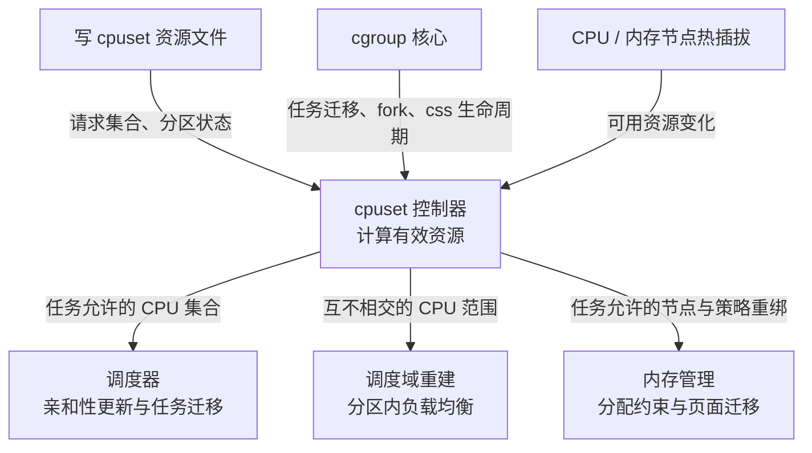
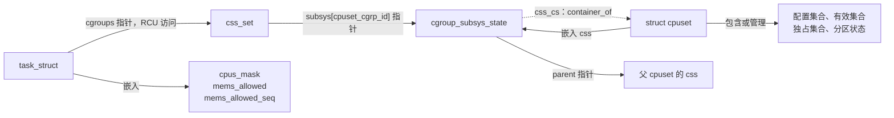
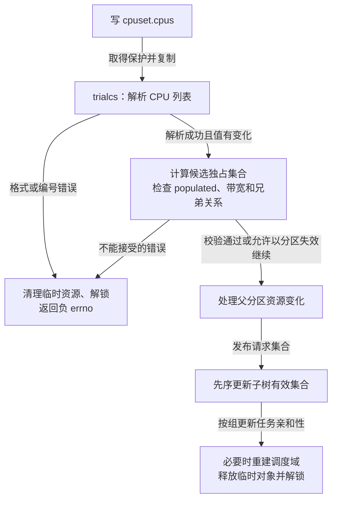
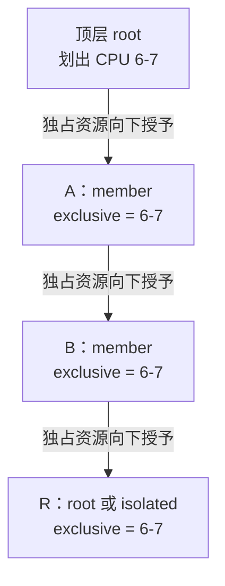
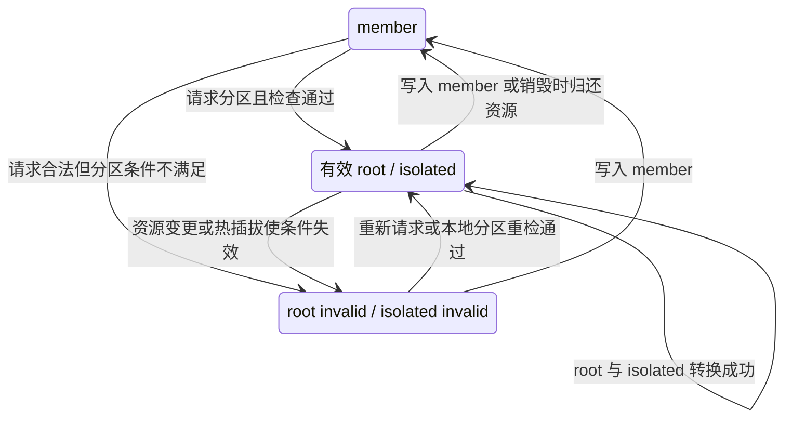
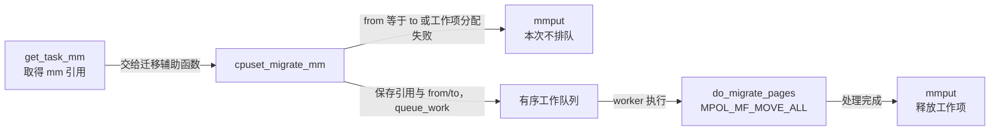

# cgroup v2 的 cpuset 控制器：CPU 放置、NUMA 节点与调度分区

假设一台机器有 CPU `0-7` 和两个非一致内存访问（Non-Uniform Memory Access，NUMA）节点，管理员希望数据库主要使用其中一部分 CPU 和内存节点，批处理任务使用另一部分资源。这个需求至少包含三个不同问题：

1. 数据库的线程允许在哪些 CPU 上执行？它们新分配的内存可以来自哪些节点？
2. 给数据库选定 CPU 后，其他组是否仍然可以使用这些 CPU？
3. 如果数据库自己安排各线程的位置，怎样停止这些 CPU 之间的调度负载均衡？CPU 下线后又怎样维持任务可运行？

`cpuset` 把这三个问题连接起来：用 CPU 集合和内存节点集合约束任务放置，用 **CPU 分区**（partition）划分独占的 CPU 资源，用 `isolated` 分区表达不参与调度负载均衡的 CPU 范围。它通过更新任务亲和性、NUMA 内存策略和调度域落实这些约束，而不是在每次调度时重新解析 cgroup 文件。对应的主要执行点是 [`cpuset_update_tasks_cpumask()`](../../linux/kernel/cgroup/cpuset.c#L1192-L1217)、[`cpuset_update_tasks_nodemask()`](../../linux/kernel/cgroup/cpuset.c#L2814-L2868) 和 [`rebuild_sched_domains_locked()`](../../linux/kernel/cgroup/cpuset.c#L1097-L1148)。

本章先建立对象与集合的模型，再分析配置传播、分区转换、任务迁移、内存放置和热插拔。读完后应能解释：为什么 `cpuset.cpus` 与 `cpuset.cpus.effective` 不同，为什么普通绑核不等于独占，以及为什么写入成功后仍然需要检查分区状态。

## 0. 分析基线与阅读边界

源码基线为本仓库 [Makefile 第 2～4 行](../../linux/Makefile#L2-L4)标记的 **Linux 6.18.52**，架构为 **x86-64**。本文只依据仓库内源码和本地文档；示例使用假设拓扑，不代表当前运行机器的状态。

| 条件 | 当前配置与影响 | 源码依据 |
| --- | --- | --- |
| cgroup 与 cpuset | `CONFIG_CGROUPS=y`、`CONFIG_CPUSETS=y`，控制器内建；`CPUSETS` 是依赖 SMP 的布尔配置，不是模块 | [.config 第 209、228 行](../../linux/.config#L209-L229)、[init/Kconfig 第 1249～1257 行](../../linux/init/Kconfig#L1249-L1257)、[cgroup/Makefile 第 7 行](../../linux/kernel/cgroup/Makefile#L7) |
| v1 分支 | `CONFIG_CPUSETS_V1` 未启用，`cpuset-v1.o` 不编入，`cpuset_v2()` 直接为真 | [.config 第 229 行](../../linux/.config#L229)、[cgroup/Makefile 第 8 行](../../linux/kernel/cgroup/Makefile#L8)、[`cpuset_v2()`](../../linux/kernel/cgroup/cpuset.c#L335-L339) |
| 架构与多处理器 | `CONFIG_X86_64=y`、`CONFIG_SMP=y` | [.config 第 332～334 行](../../linux/.config#L332-L334)、[第 362 行](../../linux/.config#L362) |
| NUMA 与页面迁移 | `CONFIG_NUMA=y`、`CONFIG_MIGRATION=y`，可分析节点约束及实际页面迁移实现 | [.config 第 469 行](../../linux/.config#L469)、[第 1219 行](../../linux/.config#L1219) |
| 热插拔 | `CONFIG_HOTPLUG_CPU=y`、`CONFIG_MEMORY_HOTPLUG=y`、`CONFIG_MEMORY_HOTREMOVE=y` | [.config 第 528 行](../../linux/.config#L528)、[第 1203～1208 行](../../linux/.config#L1203-L1208) |
| CPU 隔离相关设施 | `CONFIG_CPU_ISOLATION=y`、`CONFIG_NO_HZ_FULL=y`；具体 housekeeping（内核维护工作使用的 CPU）集合仍取决于启动参数和运行时设置 | [.config 第 162 行](../../linux/.config#L162)、[第 108 行](../../linux/.config#L108)、[`cpuset_init()`](../../linux/kernel/cgroup/cpuset.c#L3932-L3937) |

CPU 掩码的存储形式还需要单独核对。当前 `.config` 没有 `CONFIG_CPUMASK_OFFSTACK`，而该项没有默认开启值，x86 的选择条件 `MAXSMP` 和用户可见条件 `DEBUG_PER_CPU_MAPS` 也均未启用。因此按当前配置分析，`cpumask_var_t` 是嵌入的单元素 `struct cpumask` 数组，cpuset 使用的 `zalloc_cpumask_var()` 只清空已有存储，释放接口为空操作。下文提到的独立掩码动态分配失败，只属于 `CONFIG_CPUMASK_OFFSTACK=y` 分支，不能当成当前配置会发生的路径。[lib/Kconfig 第 397～402 行](../../linux/lib/Kconfig#L397-L402)、[x86/Kconfig 第 989～992 行](../../linux/arch/x86/Kconfig#L989-L992)、[.config 第 427～431 行](../../linux/.config#L427-L431)、[第 10598 行](../../linux/.config#L10598)、[类型定义](../../linux/include/linux/cpumask_types.h#L60-L64)、[当前分配与释放分支](../../linux/include/linux/cpumask.h#L1050-L1085)

读者需要掌握 C 语言位图、进程与线程、CPU 亲和性以及 NUMA 节点的基本含义。cgroup 的 `css`、`css_set`、有效控制器状态和统一层级规则可先阅读 [cgroup v2 概述](intrudoction.md)。CPU 时间的权重和配额属于 [cpu 控制器](cpu.md)；本章围绕“在哪里执行、从哪里分配”，不展开公平调度算法、NUMA 自动平衡算法和页面迁移内部的页表操作。

`cpuset_cgrp_subsys` 注册了配置文件、对象生命周期、迁移和 fork 回调，并设置 `.early_init = true`、`.threaded = true`。因此 cpuset 支持 threaded 层级，约束最终落实到线程；不能把它理解为只能整进程生效的控制器。[`cpuset_cgrp_subsys`，cpuset.c 第 3884～3903 行](../../linux/kernel/cgroup/cpuset.c#L3884-L3903)

## 1. 从需求到整体机制

### 1.1 CPU 范围、独占与隔离是三件事

普通 cpuset 主要规定本组任务的放置范围。兄弟组都可以请求 `0-3`，只要没有触发独占规则，双方仍会竞争这些 CPU。源码只在独占标志或独占集合相关条件成立时检查兄弟冲突，并没有要求所有普通 cpuset 的 CPU 集合互不相交。[`cpus_excl_conflict()`](../../linux/kernel/cgroup/cpuset.c#L600-L630)

要把 CPU 真正从父分区中划出去，需要建立有效分区：其独占 CPU 从父分区的 `effective_cpus` 中扣除，父组及普通后代随后更新任务亲和性。设为 `root` 时，分区内部仍参与调度负载均衡；设为 `isolated` 时，不把该分区列入普通负载均衡的域集合。[`partition_xcpus_add()`](../../linux/kernel/cgroup/cpuset.c#L1358-L1379)、[`update_partition_sd_lb()`](../../linux/kernel/cgroup/cpuset.c#L1273-L1298)、[`generate_sched_domains()` 的 v2 分支](../../linux/kernel/cgroup/cpuset.c#L908-L923)

内存节点限制是另一条独立的轴。CPU 编号和 NUMA 节点编号不共用一个编号空间；设置 `cpuset.cpus=4-7` 并不会自动把 `cpuset.mems` 改成这些 CPU 所在的节点。三个资源文件分别分派到独立的 CPU、独占 CPU、节点更新函数。[`cpuset_write_resmask()`](../../linux/kernel/cgroup/cpuset.c#L3425-L3438)

### 1.2 控制器位于哪些子系统之间

下图是概览数据流，箭头均表示“把约束或变化传给下一层”，不是完整函数调用图。暂时省略错误分支、锁和分区的父子传播。



图中的三个出口分别有不同的生效方式：CPU 亲和性通过 [`set_cpus_allowed_ptr()`](../../linux/kernel/sched/core.c#L3150-L3184)落实，调度域通过 [`partition_sched_domains()`](../../linux/kernel/sched/topology.c#L2870-L2876)重建，内存节点通过任务字段、策略重绑及迁移工作队列落实。热插拔和 cgroup 事件只是触发器，不代替这些实际执行机制。[`cpuset_attach()`](../../linux/kernel/cgroup/cpuset.c#L3316-L3398)、[`cpuset_handle_hotplug()`](../../linux/kernel/cgroup/cpuset.c#L4092-L4181)

### 1.3 四类事件

| 事件 | 输入 | 主要结果 |
| --- | --- | --- |
| 修改资源配置 | CPU/节点列表或 `member`、`root`、`isolated` | 重算本组及相关后代的有效集合，必要时调整父组、兄弟组和调度域 |
| 任务迁入、指定目标 cgroup 创建子任务 | 目标 cpuset、待加入的任务 | 检查目标可用性，再设置线程的 CPU 和节点约束 |
| CPU/内存节点变化 | `cpu_active_mask`、`node_states[N_MEMORY]` | 保留用户配置，重算可用集合；必要时使分区失效 |
| cpuset 创建、删除 | 父 css、目标 css | 继承初始有效集合；删除时归还分区资源，最后释放对象 |

这些入口都能在 [`cpuset_cgrp_subsys`](../../linux/kernel/cgroup/cpuset.c#L3884-L3903)、[`dfl_files[]`](../../linux/kernel/cgroup/cpuset.c#L3559-L3630) 和 [`cpuset_update_active_cpus()` / `cpuset_track_online_nodes()`](../../linux/kernel/cgroup/cpuset.c#L4183-L4203) 中定位。正常配置和迁移发生在可睡眠路径，页面分配中的查询则需要更轻量的同步方式，第 10 节再统一解释。

## 2. 核心对象：组状态与任务状态分开保存

### 2.1 `struct cpuset` 嵌入一个 css

每个 cpuset 状态对象用 `struct cpuset` 表示，其开头嵌入 `struct cgroup_subsys_state css`。`css_cs()` 用 `container_of()` 找回外层对象，`parent_cs()` 沿 `css.parent` 找父 cpuset，`task_cs()` 从任务当前 `css_set` 的 `cpuset_cgrp_id` 槽位取得有效 cpuset。[cpuset-internal.h 第 74～75 行](../../linux/kernel/cgroup/cpuset-internal.h#L74-L75)、[`css_cs()` / `task_cs()` / `parent_cs()`](../../linux/kernel/cgroup/cpuset-internal.h#L185-L199)

下图只表示对象关系，箭头上的标签区分嵌入和指针，虚线表示反向计算外层对象。它没有把一个普通指针画成单独持有的引用。



任务获得的是对应控制器的有效 css，并不意味着每个目录都有独立 cpuset 对象。`task_css()` 的访问协议由读—复制—更新（Read-Copy Update，RCU）或相应 cgroup 锁保证，取出指针本身不增加引用。遍历器如果需要离开 RCU 临界区去执行可睡眠操作，会显式 `css_tryget_online()`，结束后 `css_put()`。[`task_css_check()`](../../linux/include/linux/cgroup.h#L402-L459)、[`update_cpumasks_hier()`](../../linux/kernel/cgroup/cpuset.c#L2336-L2340)、[该函数释放引用处](../../linux/kernel/cgroup/cpuset.c#L2398-L2401)

父子关系另有核心管理的引用协议：初始化 `css.parent` 时同时 `css_get(parent)`，子 css 最终释放后再 `css_put(parent)`。因此父 css 的存活有明确的引用依据，而不是因为结构中保存了一个指针就自动成立。[cgroup.c 第 5748～5750 行](../../linux/kernel/cgroup/cgroup.c#L5748-L5750)、[最终归还父引用](../../linux/kernel/cgroup/cgroup.c#L5615-L5625)

### 2.2 六个集合决定放置与分区

| 字段 | 保存什么 | 何时变化 |
| --- | --- | --- |
| `cpus_allowed` | 用户写入的 CPU 编号集合，对应 `cpuset.cpus` | 用户修改配置；v2 热插拔不改写它 |
| `mems_allowed` | 用户写入的 NUMA 节点编号集合，对应 `cpuset.mems` | 用户修改配置 |
| `effective_cpus` | 当前给本组任务使用的有效 CPU 集合 | 配置、祖先资源、分区和热插拔变化 |
| `effective_mems` | 当前允许使用的有内存节点集合 | 节点配置、祖先约束和热插拔变化 |
| `exclusive_cpus` | 显式请求的独占 CPU 集合，对应 `cpuset.cpus.exclusive` | 用户配置；为分区及后代分区准备资源 |
| `effective_xcpus` | 实际可传递、分给本组分区的独占 CPU 集合 | 独占配置、祖先授予范围、兄弟冲突和分区变化 |

字段定义及语义见 [cpuset-internal.h 第 79～133 行](../../linux/kernel/cgroup/cpuset-internal.h#L79-L133)，用户文件到字段的直接映射见 [`cpuset_common_seq_show()`](../../linux/kernel/cgroup/cpuset.c#L3458-L3496)。CPU 集合使用 `cpumask_var_t`，节点集合使用嵌入的 `nodemask_t`；位的下标分别是逻辑 CPU ID、NUMA node ID，不是 CPU 数量、字节数或内存容量。

尤其要区分 `effective_xcpus` 与 `effective_cpus`：前者可以包含离线 CPU，也可以包含已经向子分区分出的 CPU；后者用于当前分区内任务的实际放置，必须扣除有效子分区所占的资源，并结合 active CPU 集合。有效分区显式设置 `exclusive_cpus` 后，运行范围来自独占集合，不再由 `cpus_allowed` 决定。[cpuset-internal.h 第 107～131 行](../../linux/kernel/cgroup/cpuset-internal.h#L107-L131)、[`compute_partition_effective_cpumask()`](../../linux/kernel/cgroup/cpuset.c#L2158-L2212)

### 2.3 支撑状态转换的字段

| 字段 | 职责与约束 |
| --- | --- |
| `flags` | 保存 CPU 独占、负载均衡、内存迁移等内部标志；内部有标志不等于 v2 暴露对应可写文件 |
| `partition_root_state` | `0` 为 member，`1/2` 为有效 root/isolated，`-1/-2` 保留相应类型但表示失效 |
| `nr_subparts` | 有效的本地直接子分区数量，不是后代 cgroup 总数 |
| `prs_err` | 分区失效原因；读写用 `READ_ONCE()` / `WRITE_ONCE()`，不是受锁保护的完整状态快照 |
| `partition_file` | 与 `cpuset.cpus.partition` 关联的 `cgroup_file`，用于变化通知 |
| `remote_sibling` | 远程分区链表中的嵌入节点；链表由全局 `remote_children` 锚定 |
| `attach_in_progress` | 已通过加入检查、尚未完成或取消的加入操作计数，防止中途资源被清空 |
| `old_mems_allowed` | 上一轮任务节点放置范围，给已有地址空间的页面迁移提供来源集合 |
| `nr_deadline_tasks`、`nr_migrate_dl_tasks`、`sum_migrate_dl_bw` | 记录截止期调度类（`SCHED_DEADLINE`）的任务数量及迁移中的带宽需求，用于跨调度根域检查和重算 |

辅助字段定义见 [cpuset-internal.h 第 135～183 行](../../linux/kernel/cgroup/cpuset-internal.h#L135-L183)；标志枚举见 [第 39～48 行](../../linux/kernel/cgroup/cpuset-internal.h#L39-L48)。状态常量及本地/远程分区约束见 [cpuset.c 第 109～133 行](../../linux/kernel/cgroup/cpuset.c#L109-L133)。

还有三个全局 CPU 集合：`subpartitions_cpus` 记录从顶层分给本地或远程分区的 CPU，`isolated_cpus` 跟踪隔离 CPU，`boot_hk_cpus` 在存在启动期域隔离时保存启动时的 housekeeping CPU 范围。它们不是每个组各有一份的统计数据。[cpuset.c 第 68～91 行](../../linux/kernel/cgroup/cpuset.c#L68-L91)

### 2.4 任务中保存执行时直接使用的状态

`task_struct` 中有 `cpus_mask`、`cpus_ptr`、`user_cpus_ptr`，还有 `mems_allowed` 和 `mems_allowed_seq`。这里的任务 `mems_allowed` 是落实后的约束，不是 cpuset 对象中同名的用户配置字段。[sched.h 第 915～923 行](../../linux/include/linux/sched.h#L915-L923)、[第 1314～1325 行](../../linux/include/linux/sched.h#L1314-L1325)

- `cpus_mask` 保存任务的亲和性集合，`cpus_ptr` 是调度器当前使用的集合指针；迁移禁止等机制可以临时切换该指针，不能无条件假定它总指向 `cpus_mask`。
- `user_cpus_ptr` 保存用户显式设置的亲和性请求，用于在 cpuset 调整时尽量保留用户意图。
- `mems_allowed` 是任务允许的节点集合，`mems_allowed_seq` 帮助并发分配者识别节点或策略正在变化的情况。

CPU 状态的写入可见 [`set_cpus_allowed_common()`](../../linux/kernel/sched/core.c#L2690-L2709)，用户请求保存可见 [`sched_setaffinity()`](../../linux/kernel/sched/syscalls.c#L1242-L1262)，节点更新协议见 [`cpuset_change_task_nodemask()`](../../linux/kernel/cgroup/cpuset.c#L2776-L2802)。这些任务级字段让调度和分配热路径不必反复遍历整个 cpuset 层级。

## 3. 有效资源怎样沿层级计算

### 3.1 普通 member：求交，空交集时继承

对不是有效分区根的普通 cpuset，CPU 与节点遵循以下概念公式。它描述完成一次更新后的集合关系，不是并发读写的实现伪代码：

```text
候选 CPU = 本组 cpus_allowed ∩ 父组 effective_cpus
本组 effective_cpus = 候选 CPU 非空 ? 候选 CPU : 父组 effective_cpus

候选节点 = 本组 mems_allowed ∩ 父组 effective_mems
本组 effective_mems = 候选节点非空 ? 候选节点 : 父组 effective_mems
```

CPU 求交在 [`compute_effective_cpumask()`](../../linux/kernel/cgroup/cpuset.c#L1219-L1231)，空交集继承在 [`update_cpumasks_hier()` 第 2284～2291 行](../../linux/kernel/cgroup/cpuset.c#L2284-L2291)；节点的两步逻辑在 [`update_nodemasks_hier()` 第 2887～2904 行](../../linux/kernel/cgroup/cpuset.c#L2887-L2904)。

这意味着“空配置”是继承请求；“非空配置却没有一个资源能被授予”也触发继承。假设父组的 `effective_cpus=0-3`，且全系统 possible CPU 包含 `0-7`：

| 子组 `cpuset.cpus` | 与父有效集合的交集 | 子组 `cpuset.cpus.effective` |
| --- | --- | --- |
| 空 | 空 | `0-3` |
| `2-5` | `2-3` | `2-3` |
| `6-7` | 空 | `0-3` |

第三行不能理解为允许使用 `6-7`，也不能理解为让任务停住。用户请求被保留，但实际运行范围退回父组。由公式可知，有效集合始终受父有效集合约束，却不一定是本组请求集合的子集。

同理，父节点为 `{0}`，子组请求系统中存在但父级未授予的 `{1}`，则子组有效节点仍是 `{0}`。这些都是源码公式的静态推演，不是运行测试结果。

### 3.2 “允许继承”不等于任何时候都允许清空文件

新 cpuset 的配置集合初始为空，online 时直接继承父有效集合，因此可以从空配置起步接收任务。但 `validate_change()` 还有一条写入限制：如果本组被视为 populated，旧 `cpus_allowed` 或 `mems_allowed` 非空，提议的新集合为空，就返回 `-ENOSPC`。[`cpuset_css_alloc()` / `cpuset_css_online()`](../../linux/kernel/cgroup/cpuset.c#L3642-L3694)、[`validate_change()`](../../linux/kernel/cgroup/cpuset.c#L679-L691)

这里的 populated 检查包含 cgroup 子树的任务状态，也包含 `attach_in_progress`。因此“先以空配置继承，再加入任务”与“已有任务时把显式配置改回空”不是同一条路径。写空列表失败时，应先核对这条条件，不能仅根据继承语义判断它必然成功。[`cpuset_is_populated()`](../../linux/kernel/cgroup/cpuset.c#L355-L362)

### 3.3 请求集合可以为将来保留资源

CPU 列表解析后，只要求落在 `top_cpuset.cpus_allowed` 中；v2 顶层该集合使用 `cpu_possible_mask`。节点列表同样检查顶层 `mems_allowed`，其值为 `node_possible_map`。这使配置可以包含当前未 active 的 possible CPU，或者当前没有可用内存的 possible 节点；真正可用范围由 effective 集合决定。[`parse_cpuset_cpulist()`](../../linux/kernel/cgroup/cpuset.c#L2461-L2472)、[`update_nodemask()`](../../linux/kernel/cgroup/cpuset.c#L2947-L2955)、[`cpuset_bind()`](../../linux/kernel/cgroup/cpuset.c#L3774-L3791)

顶层自身也有两种范围：初始化完成时 `effective_cpus` 对应 active CPU，`effective_mems` 对应 `N_MEMORY`；划出分区后，顶层有效 CPU 还会扣除 `subpartitions_cpus`。所以连根目录的 `cpuset.cpus.effective` 也不能简单当成整机所有 CPU 的清单。[`cpuset_init_smp()`](../../linux/kernel/cgroup/cpuset.c#L4210-L4225)、[`cpuset_handle_hotplug()`](../../linux/kernel/cgroup/cpuset.c#L4106-L4142)

普通组 CPU 继承还有一个边界：有效父分区可以把全部 CPU 分给子分区，此时其自身有效 CPU 为空；从它继承的普通成员也可能得到空集合。内核允许无本地任务的分区处于这种状态，但拒绝把新任务放进 `effective_cpus` 为空的 cpuset。[`tasks_nocpu_error()`](../../linux/kernel/cgroup/cpuset.c#L1300-L1313)、[`cpuset_can_attach_check()`](../../linux/kernel/cgroup/cpuset.c#L3172-L3184)

## 4. 写一次 CPU 配置，为什么会影响多个组

### 4.1 入口、试算对象与提交

`cpuset.cpus`、`cpuset.cpus.exclusive` 和 `cpuset.mems` 共用 `cpuset_write_resmask()`。它去除输入前后空白，取得 CPU 热插拔读锁和 `cpuset_mutex`，确认对象仍 online，再复制出一个临时 `trialcs` 进行解析和校验。顶层写入被拒绝；实际 v2 文件表也不在根目录提供这三个可写资源文件。[`cpuset_write_resmask()`](../../linux/kernel/cgroup/cpuset.c#L3400-L3448)、[`dfl_files[]`](../../linux/kernel/cgroup/cpuset.c#L3559-L3613)

`trialcs` 是校验用副本，不是新加入 cgroup 树的对象。`dup_or_alloc_cpuset(cs)` 先复制结构体，再经统一掩码接口初始化和复制四个 CPU 掩码。当前配置中，四个掩码随新的结构体一起分配，和原对象的存储互不重叠；只有启用 `CONFIG_CPUMASK_OFFSTACK` 时，它们才分别动态分配，失败后释放已分配的掩码。使用完直接 `free_cpuset()`，不会把复制来的 css 作为新控制器状态上线。结构体本身的分配在两种配置下都可能失败。[`dup_or_alloc_cpuset()` / `free_cpuset()`](../../linux/kernel/cgroup/cpuset.c#L515-L570)、[`alloc_cpumasks()`](../../linux/kernel/cgroup/cpuset.c#L457-L479)、[掩码类型的两个分支](../../linux/include/linux/cpumask_types.h#L60-L64)

CPU 配置更新可以按以下阶段理解。箭头表示处理顺序，其中“失败”只表示该阶段可以退出，不能据此假定整个操作拥有数据库事务式回滚。



流程对应 [`update_cpumask()`](../../linux/kernel/cgroup/cpuset.c#L2586-L2636)。配置字段在 `callback_lock` 下复制，较慢的任务遍历与亲和性设置在释放该自旋锁后执行；这一点决定了读到某个文件的新值，不等于所有相关任务已在同一瞬间完成切换。

### 4.2 校验分成结构规则和分区有效性

`validate_change()` 检查的主要规则如下：

| 检查 | 失败结果 | 原因 |
| --- | --- | --- |
| populated 组从非空 CPU/节点配置改为空 | `-ENOSPC` | 阻止加入流程或已有任务使用的显式资源被清空 |
| CPU 独占且启用负载均衡的组缩小后不能容纳 deadline 带宽 | `-EBUSY` | 调度根域容量不足 |
| 兄弟之间违反独占规则 | `-EINVAL` | 相同资源不能同时承担冲突的独占请求 |

实现见 [`validate_change()` 第 679～728 行](../../linux/kernel/cgroup/cpuset.c#L679-L728)。在当前 v2 路径中，不执行 v1 的“用户配置必须是父配置子集”校验；父级约束通过 effective 集合体现。[第 668～669 行](../../linux/kernel/cgroup/cpuset.c#L668-L669)

独占冲突本身也不是简单比较两个 `cpuset.cpus`：只要任一兄弟带 CPU 独占标志，就比较各自 `user_xcpus()`；否则，显式独占集合不能重叠，更新独占集合时还不能把兄弟非空的 `cpus_allowed` 全部覆盖。`user_xcpus()` 优先使用 `exclusive_cpus`，为空时才使用 `cpus_allowed`。[`user_xcpus()`](../../linux/kernel/cgroup/cpuset.c#L572-L577)、[`cpus_excl_conflict()`](../../linux/kernel/cgroup/cpuset.c#L613-L630)

这里必须区别两种写操作：

- 写 `cpuset.cpus` 遇到 v2 独占冲突时，`cpus_allowed_validate_change()` 可以把错误转成分区失效处理，允许新的 CPU 请求继续提交；冲突的有效兄弟分区也会被标记失效。
- 写 `cpuset.cpus.exclusive` 时，试算独占集合与兄弟冲突会直接返回 `-EINVAL`，不会照搬上一条容错规则。

两条路径分别见 [`cpus_allowed_validate_change()`](../../linux/kernel/cgroup/cpuset.c#L2504-L2539) 和 [`update_exclusive_cpumask()` 第 2654～2677 行](../../linux/kernel/cgroup/cpuset.c#L2654-L2677)。因此不能写成“所有 CPU 独占冲突都返回写入错误”，也不能写成“任何资源写入都是全有或全无”。

### 4.3 子树传播为什么必须先父后子

`update_cpumasks_hier()` 按先序遍历 cpuset 子树：先更新父节点，再让子节点读取新的父有效集合。普通组求交并回退，有效分区则使用独占资源算法；随后对需要更新的组调用 `cpuset_update_tasks_cpumask()`。[`update_cpumasks_hier()` 第 2235～2291 行](../../linux/kernel/cgroup/cpuset.c#L2235-L2291)、[第 2336～2399 行](../../linux/kernel/cgroup/cpuset.c#L2336-L2399)

这不是每次都无条件扫描整棵子树。普通成员若有效 CPU 不变、没有分区状态、没有强制更新且负载均衡状态与父一致，就跳过整个子树。但独占有效集合发生变化时，即使普通有效 CPU 表面未变，也会用 `force` 要求检查后代，因为远程分区可能依赖那条独占资源传递链。[跳过条件](../../linux/kernel/cgroup/cpuset.c#L2293-L2306)、[`update_cpumask()` 的 force 计算](../../linux/kernel/cgroup/cpuset.c#L2612-L2628)

分区变动还会改变父组剩余资源，继而影响兄弟组。`update_parent_effective_cpumask()` 在资源有增减时更新父组任务，并调用 `update_sibling_cpumasks()`；后者即使面对没有直接继承全部父 CPU 的兄弟，也需要重新求交检查。[父与兄弟传播](../../linux/kernel/cgroup/cpuset.c#L2125-L2128)、[`update_sibling_cpumasks()`](../../linux/kernel/cgroup/cpuset.c#L2413-L2459)

## 5. CPU 分区：把独占资源变成运行范围

### 5.1 分区不是一个目录，而是目录树中的资源边界

分区由一个有效分区根及其普通后代组成，遇到另一个有效分区根就形成新的边界。系统根 `top_cpuset` 本身固定为 `PRS_ROOT`；新建非根 cpuset 的状态由零初始化得到 `member`。[`top_cpuset`](../../linux/kernel/cgroup/cpuset.c#L210-L216)、[`dup_or_alloc_cpuset()`](../../linux/kernel/cgroup/cpuset.c#L525-L545)、[`cpuset_css_alloc()`](../../linux/kernel/cgroup/cpuset.c#L3642-L3664)

有效分区根有两种：`root` 开启负载均衡，`isolated` 关闭相应负载均衡。失效分区保留负值状态及原因，但运行资源按更接近普通成员的方式恢复：`reset_partition_data()` 清理子分区计数，必要时清理隐式独占集合，并重新按父有效集合计算 CPU 范围。[`reset_partition_data()`](../../linux/kernel/cgroup/cpuset.c#L1315-L1332)、[`update_partition_sd_lb()`](../../linux/kernel/cgroup/cpuset.c#L1273-L1298)

### 5.2 先传递独占集合，再计算分区剩余集合

独占资源计算的第一步是选择用户请求：显式 `exclusive_cpus` 优先，否则使用 `cpus_allowed`。随后与父 `effective_xcpus` 求交；使用隐式请求时还需剔除兄弟已经声明或取得的独占 CPU。[`compute_excpus()`](../../linux/kernel/cgroup/cpuset.c#L1519-L1538)、[`rm_siblings_excl_cpus()`](../../linux/kernel/cgroup/cpuset.c#L1486-L1517)

普通 member 没有显式独占请求时，不能仅因 `cpuset.cpus` 非空，就认为它已经把对应 CPU 作为独占资源向下传递。资源写入的试算逻辑对 member 明确使用 `exclusive_cpus ∩ parent->effective_xcpus`；申请建立分区根时，则通过 `compute_excpus()` 允许以 `cpus_allowed` 作为隐式独占来源。远程分区中间仍保持 member 的祖先，必须显式传递独占资源。[`compute_trialcs_excpus()`](../../linux/kernel/cgroup/cpuset.c#L1540-L1562)、[`compute_excpus()`](../../linux/kernel/cgroup/cpuset.c#L1528-L1538)

对已经成立、子分区也满足校验条件的分区，运行范围可以用下面的稳态关系表示：

```text
本分区 effective_cpus
    = 本分区可获授的独占 CPU ∩ cpu_active_mask
      - 各有效本地子分区的 effective_xcpus
```

实际的 `compute_partition_effective_cpumask()` 不只是做减法：它会检查子分区独占集合是否仍是父独占集合的子集，以及扣除资源后是否让父分区内任务失去全部 CPU；不符合条件的子分区先失效，不能继续当成有效占用者扣除。[cpuset.c 第 2158～2212 行](../../linux/kernel/cgroup/cpuset.c#L2158-L2212)

### 5.3 本地分区：从直接父分区划走 CPU

本地分区的直接父组必须是有效分区根。用户写 `root` 或 `isolated` 时，`update_prstate()` 先尝试设置 CPU 独占标志，再选择 `partcmd_enable` 或 `partcmd_enablei`，交给 `update_parent_effective_cpumask()`。[`update_prstate()` 第 3069～3106 行](../../linux/kernel/cgroup/cpuset.c#L3069-L3106)

启用过程需要确认：

1. `cpus_allowed` 和 `exclusive_cpus` 不同时为空，计算出的独占有效集合非空。
2. 当前分区及父分区的任务不会因资源划走而失去全部 active CPU。
3. 与兄弟的独占关系成立，housekeeping 约束也允许这一分区配置。
4. 在 `callback_lock` 下把相应 CPU 从父 `effective_cpus` 扣除，更新 `nr_subparts` 和必要的全局集合，再更新父组、兄弟及目标子树的任务。

前三项的实现分布在 [`update_partition_exclusive_flag()`](../../linux/kernel/cgroup/cpuset.c#L1252-L1264)、[`update_parent_effective_cpumask()` 第 1853～1908 行](../../linux/kernel/cgroup/cpuset.c#L1853-L1908)；资源发布和传播见 [第 2098～2138 行](../../linux/kernel/cgroup/cpuset.c#L2098-L2138)。

`partition_is_populated()` 检查的是该分区内部的任务，遍历时跳过独立的有效后代分区。这个区别使无本地任务的中间分区可以把所有 CPU 分给子分区，而不是因为子分区有任务就被错误判断为自己还必须保留 CPU。[`partition_is_populated()`](../../linux/kernel/cgroup/cpuset.c#L364-L407)

例如，在 CPU 全部 active、没有其他独占请求时，可以形成如下稳态。表中的 `/P` 作为内部节点不直接承载任务，任务放在普通成员 `/P/work` 或子分区 `/P/Q` 中。

| 组 | 分区状态 | 请求/获授的独占 CPU | 该组 `effective_cpus` |
| --- | --- | --- | --- |
| `/` | 固定 root | 内部包含 possible CPU `0-7` | `0-3` |
| `/P` | root | `4-7` | `4-5` |
| `/P/work` | member，`cpuset.cpus` 为空 | 未显式设置 | `4-5` |
| `/P/Q` | root | `6-7` | `6-7` |

`P` 的独占有效集合仍可为 `4-7`，但其任务不能继续占用已给 `Q` 的 `6-7`；`P/work` 继承的也是剩余 `4-5`。这就是“资源由父分配”和“任务使用父剩余资源”的区别。表格依据本节集合公式推导，并未执行真实系统配置。

### 5.4 远程分区：跨过 member 祖先，从顶层取 CPU

“远程”描述的是 cgroup 层级关系，与 NUMA 的远程内存访问无关。如果目标的直接父组不是有效分区根，创建路径会尝试 `remote_partition_enable()`。它通过祖先的显式独占集合逐层得到资源，但真正划走的是 `top_cpuset` 的 CPU，成功后加入 `remote_children` 链表。[`update_prstate()`](../../linux/kernel/cgroup/cpuset.c#L3095-L3106)、[`remote_partition_enable()`](../../linux/kernel/cgroup/cpuset.c#L1574-L1629)

下面只画层级和独占 CPU 的授予关系。`A`、`B` 保持 member，并显式把 `6-7` 向下传递；`R` 成为远程分区。



成功后，`A`、`B` 的普通任务范围会随顶层剩余有效 CPU 更新；`R` 使用其独占 CPU。因此远程分区的 `effective_cpus` 可以与直接父 member 的 `effective_cpus` 不相交。层级约束仍存在，但它沿 `effective_xcpus` 传递，不能把第 3 节的普通成员求交公式套到这里。[`partition_xcpus_add()`](../../linux/kernel/cgroup/cpuset.c#L1358-L1379)、[`remote_partition_enable()` 的顶层传播](../../linux/kernel/cgroup/cpuset.c#L1623-L1628)、[`update_cpumasks_hier()` 的 remote 分支](../../linux/kernel/cgroup/cpuset.c#L2243-L2272)

图中目标 `R` 也显式设置 exclusive，便于读回核对；源码对目标根调用 `compute_excpus()`，仍能在其显式 exclusive 为空时回退到 `cpus_allowed`。不可缺少的是中间 member 祖先的独占资源传递，不能误写成“远程分区目标节点绝不使用隐式 CPU 请求”。[`remote_partition_enable()` 第 1605 行](../../linux/kernel/cgroup/cpuset.c#L1605)、[`user_xcpus()`](../../linux/kernel/cgroup/cpuset.c#L572-L577)

当前实现的远程分区还有限制：

- 建立远程分区要求 `capable(CAP_SYS_ADMIN)`；增加远程分区 CPU 时也再次检查。
- 初次建立必须至少包含一个 active CPU，且不能用尽顶层剩余有效 CPU。
- 源码声明支持的层级要求：除系统根外，远程分区的祖先链应保持 member；本地分区可以建立在本地或远程分区下。
- 启用顶层的直接子组为本地分区时，还会检查其显式 `exclusive_cpus` 是否与 `subpartitions_cpus` 相交；相交则以 `PERR_REMOTE` 记录启用失败。

权限和资源检查见 [`remote_partition_enable()` 第 1589～1612 行](../../linux/kernel/cgroup/cpuset.c#L1589-L1612)、[`remote_cpus_update()` 第 1704～1724 行](../../linux/kernel/cgroup/cpuset.c#L1704-L1724)；层级限制说明及创建检查见 [cpuset.c 第 118～127 行](../../linux/kernel/cgroup/cpuset.c#L118-L127)、[`update_prstate()` 第 3082～3093 行](../../linux/kernel/cgroup/cpuset.c#L3082-L3093)。

这里的支持范围不等于入口逐层检查了所有祖先。`remote_partition_enable()` 对新独占集合与 `subpartitions_cpus` 重叠使用 `WARN_ON_ONCE()`，没有把这一项单独作为返回错误；不能仅根据层级注释推导出每一种违反拓扑约束的请求都会被拒绝。本文按源码声明支持、资源不重叠的正常拓扑解释远程分区，不推断异常布局的运行结果。[重叠检查及实际失败条件](../../linux/kernel/cgroup/cpuset.c#L1605-L1612)

### 5.5 分区有状态，写入成功并不保证有效

`cpuset.cpus.partition` 接受三种字符串，却能读出五类状态：

| 读出值 | 内部状态 | CPU 使用语义 |
| --- | --- | --- |
| `member` | `0` | 属于上层分区的普通成员 |
| `root` | `1` | 有效分区根，开启负载均衡 |
| `isolated` | `2` | 有效分区根，关闭该范围的普通调度负载均衡 |
| `root invalid (...)` | `-1` | 分区要求未能成立，保存 root 类型和原因 |
| `isolated invalid (...)` | `-2` | 分区要求未能成立，保存 isolated 类型和原因 |

输入解析与输出格式见 [`cpuset_partition_write()` / `cpuset_partition_show()`](../../linux/kernel/cgroup/cpuset.c#L3499-L3553)。下图抽象的是分区生命周期，`有效分区` 合并了 root 和 isolated；箭头表示可能的状态迁移，恢复必须重新满足对应分支条件。



关键在 `update_prstate()` 的返回语义：非法输入由外层返回 `-EINVAL`；独占、父资源、权限或 housekeeping 等分区条件失败，通常记录 `prs_err`、把请求状态取负，随后仍返回 `0`，外层最终把它转换成写入字节数。源码还有临时掩码分配失败返回 `-ENOMEM` 的分支，但当前嵌入掩码配置不会触发这一分配失败，只有 `CONFIG_CPUMASK_OFFSTACK=y` 时才需考虑它。[`update_prstate()` 第 3057～3071 行](../../linux/kernel/cgroup/cpuset.c#L3057-L3071)、[第 3133～3167 行](../../linux/kernel/cgroup/cpuset.c#L3133-L3167)、[`cpuset_partition_write()`](../../linux/kernel/cgroup/cpuset.c#L3530-L3553)、[当前掩码初始化分支](../../linux/include/linux/cpumask.h#L1055-L1069)

因此管理程序必须读回 `cpuset.cpus.partition`，并结合有效 CPU 检查结果。典型原因有独占集合无效、父分区失效、父组无法再分配 CPU、请求 CPU/独占 CPU 都为空、housekeeping 冲突、远程操作权限不足等；实际字符串来自 [`perr_strings[]`](../../linux/kernel/cgroup/cpuset.c#L55-L66)。这些字符串并不等价于写系统调用的 errno。

状态变化时，`notify_partition_change()` 调用 `cgroup_file_notify()`；若 old/new 状态相同则直接返回，所以只改变原因字符串不能被当成一次必然的状态通知。本地文档说明可以用 poll/inotify 观察分区变化。[`notify_partition_change()`](../../linux/kernel/cgroup/cpuset.c#L182-L194)、[本地 cgroup-v2.rst 第 2673～2679 行](../../linux/Documentation/admin-guide/cgroup-v2.rst#L2673-L2679)

失效后的恢复也不是无条件保证。父有效分区资源恢复后，本地子分区可以在更新流程中重新检查并转正；失效远程分区已从远程链表移除，不能笼统声称“CPU 上线就自动重建一切”，需要检查读回状态，必要时重新请求分区。[`update_parent_effective_cpumask()` 第 2000～2072 行](../../linux/kernel/cgroup/cpuset.c#L2000-L2072)、[`remote_partition_disable()`](../../linux/kernel/cgroup/cpuset.c#L1640-L1675)、[热插拔恢复分支](../../linux/kernel/cgroup/cpuset.c#L4038-L4044)

## 6. 分区怎样改变调度器

### 6.1 分区 CPU 集合生成调度域

亲和性回答“这个任务能去哪里”，调度域回答“调度器在哪些 CPU 之间组织负载均衡”。两者需要一起更新：只改变任务掩码不能完整表达分区拓扑；只改调度域也不能代替每个任务的允许集合。

`rebuild_sched_domains_locked()` 要求已持有 CPU 热插拔锁及 `cpuset_mutex`。它先检查有效 CPU 与 active 状态是否相容，再调用 `generate_sched_domains()`，最后把结果交给调度器。[cpuset.c 第 1097～1148 行](../../linux/kernel/cgroup/cpuset.c#L1097-L1148)

`generate_sched_domains()` 的 v2 主线是：

1. 没有向外分配的子分区 CPU 时，直接生成顶层有效 CPU 与 `HK_TYPE_DOMAIN` housekeeping 集合的交集。
2. 存在分区时，收集顶层以及 `partition_root_state == PRS_ROOT`、有效 CPU 非空的分区；`isolated` 不进入这组负载均衡范围。
3. 每个被收集分区提供一个有效 CPU 掩码，顶层额外去除启动期域隔离 CPU；v2 域属性使用 `SD_ATTR_INIT`。

对应代码见 [单域路径](../../linux/kernel/cgroup/cpuset.c#L851-L868)、[v2 收集分区](../../linux/kernel/cgroup/cpuset.c#L908-L931)、[v2 填充结果](../../linux/kernel/cgroup/cpuset.c#L971-L991)。通用代码还保留并查集用于合并重叠集合，但 v2 有效分区本应互不重叠，遇到重叠会 `WARN_ON_ONCE(cgrpv2)`；不能把 v1 的“合并重叠 cpuset”描述为 v2 正常分区算法。[第 933～954 行](../../linux/kernel/cgroup/cpuset.c#L933-L954)

调度器在 `sched_domains_mutex` 下比较新旧集合：保留相同的域，拆除消失的域，为新增范围建立调度拓扑；最后重新计算 deadline 根域记账。一个分区掩码是构建范围，内部还会按 CPU 和拓扑层次建立 `sched_domain` 对象。[`partition_sched_domains_locked()`](../../linux/kernel/sched/topology.c#L2748-L2834)、[记账及外层加锁](../../linux/kernel/sched/topology.c#L2854-L2876)、[域内拓扑构建](../../linux/kernel/sched/topology.c#L2502-L2518)

这条路径也有降级行为：生成域集合的内存分配失败时，cpuset 返回单域回退请求；调度器用 active CPU 与 housekeeping 集合构造回退范围。它不是把分区配置写入回滚成旧值的错误路径。[`generate_sched_domains()` 第 1016～1028 行](../../linux/kernel/cgroup/cpuset.c#L1016-L1028)、[topology.c 第 2789～2821 行](../../linux/kernel/sched/topology.c#L2789-L2821)

### 6.2 `isolated` 具体改变什么

有效 isolated 分区自身剩余的 CPU 不进入上述普通调度域集合；分区的 `CS_SCHED_LOAD_BALANCE` 被清除，普通成员继承这一状态。同时 `update_isolation_cpumasks()` 把全局隔离集合交给 `workqueue_unbound_exclude_cpumask()`，更新不绑定固定 CPU 的工作队列（unbound workqueue）允许使用的 CPU 范围。[`update_partition_sd_lb()`](../../linux/kernel/cgroup/cpuset.c#L1273-L1298)、[`update_isolation_cpumasks()`](../../linux/kernel/cgroup/cpuset.c#L1452-L1463)

因此，多 CPU isolated 分区内的任务布局需要应用或管理程序主动安排。关闭负载均衡不等于每个线程自动独占一颗 CPU，也不等于禁止通过亲和性更新迁移线程。[本地接口说明](../../linux/Documentation/admin-guide/cgroup-v2.rst#L2617-L2621)、[`__set_cpus_allowed_ptr_locked()`](../../linux/kernel/sched/core.c#L3133-L3141)

隔离能力应按实际实现划定边界：

- CPUSET 更新顶层任务亲和性时跳过 `PF_NO_SETAFFINITY` 任务，不能据此承诺驱逐所有每 CPU 内核线程。
- 工作队列接口处理的是 unbound 工作队列，遍历时会跳过没有 `WQ_UNBOUND` 的队列。
- 若排除隔离 CPU 后请求的 unbound 集合为空，工作队列实现回退到原请求集合；更新还可能因内存分配失败而返回错误，cpuset 调用处仅做告警。因此不能把它说成任何情况下都绝无 unbound 工作执行的强保证。

上述边界分别见 [`cpuset_update_tasks_cpumask()` 第 1202～1210 行](../../linux/kernel/cgroup/cpuset.c#L1202-L1210)、[workqueue.c 第 6988～7012 行](../../linux/kernel/workqueue.c#L6988-L7012)、[`workqueue_unbound_exclude_cpumask()`](../../linux/kernel/workqueue.c#L7016-L7049)。本章这些路径也不构成对设备中断、所有定时器或全部内核噪声的统一屏蔽承诺。

### 6.3 启动期隔离与动态分区的交集

存在启动期域隔离时，`boot_hk_cpus` 保存 housekeeping 范围，`prstate_housekeeping_conflict()` 检查非 isolated 分区是否包含该范围之外的 CPU；还会通过 `isolated_cpus_can_update()` 检查动态隔离与 `HK_TYPE_KERNEL_NOISE` 的组合，避免耗尽可用 housekeeping CPU。[`cpuset_init()` 第 3932～3937 行](../../linux/kernel/cgroup/cpuset.c#L3932-L3937)、[`prstate_housekeeping_conflict()`](../../linux/kernel/cgroup/cpuset.c#L1754-L1772)、[`isolated_cpus_can_update()`](../../linux/kernel/cgroup/cpuset.c#L1413-L1450)

当前源码还存在一个值得辨明的文档差异：本地接口文档把根 `cpuset.cpus.isolated` 描述为“现有 isolated 分区的 CPU，无此类分区则为空”；但 `cpuset_init()` 会把启动期域隔离 CPU 预先放入 `isolated_cpus`。所以有启动期域隔离时，不能仅根据“尚未创建动态 isolated 分区”推断此文件为空。[文档第 2568～2573 行](../../linux/Documentation/admin-guide/cgroup-v2.rst#L2568-L2573)、[初始化实现第 3932～3937 行](../../linux/kernel/cgroup/cpuset.c#L3932-L3937)

## 7. CPU 约束怎样落实到线程

### 7.1 与 `sched_setaffinity()` 的关系

用户设置亲和性时，`__sched_setaffinity()` 先调用 `cpuset_cpus_allowed()` 获取 cpuset 允许的范围，再与用户请求求交，随后交给调度器更新。完成后它再读一次 cpuset 允许集合；如果发现并发 cpuset 更新导致刚写入的集合不再合法，会修正任务掩码，并向用户返回 `-EINVAL`。[sched/syscalls.c 第 1158～1217 行](../../linux/kernel/sched/syscalls.c#L1158-L1217)

反方向也要处理：cpuset 配置或成员关系变化时，`cpuset_update_tasks_cpumask()`、`cpuset_attach_task()` 都使用 `set_cpus_allowed_ptr()`。当前调度器实现会在存在 `user_cpus_ptr` 且交集非空时使用“新 cpuset 范围 ∩ 用户请求”；若交集为空，则保留传入的新可用范围继续处理，而不是让任务永远无 CPU 可用。[`__set_cpus_allowed_ptr()`](../../linux/kernel/sched/core.c#L3158-L3184)

以普通线程为例，忽略并发更新、特殊调度约束和 CPU 热插拔：

| 用户保存的亲和性请求 | 新 cpuset 有效 CPU | cpuset 更新时传给底层的结果 |
| --- | --- | --- |
| `1-2` | `0-3` | `1-2`，保留用户约束 |
| `1-2` | `2-5` | `2`，两种约束相交 |
| `1-2` | `4-5` | `4-5`，空交集时采用新 cpuset 范围 |
| 没有显式用户请求 | `4-5` | `4-5` |

所以不能把当前版本的行为概括为“cpuset 更新总是覆盖 taskset 设置”，也不能把亲和性永远写成不带空交集规则的静态交集。

底层 `__set_cpus_allowed_ptr_locked()` 在任务与运行队列锁下选择有效目标 CPU，更新亲和性，并调用 `affine_move_task()`；如果旧 CPU 不再允许，更新过程可能包含任务迁移与等待。这也是为什么外层不能持有 `callback_lock` 调用它。[core.c 第 3067～3156 行](../../linux/kernel/sched/core.c#L3067-L3156)

### 7.2 顶层与普通组的不同处理

普通组更新任务时使用 `effective_cpus ∩ task_cpu_possible_mask(task)`。x86 使用通用 `task_cpu_possible_mask()` 定义，即 `cpu_possible_mask`；这里不展开其他架构的按任务可运行 CPU 限制。[`cpuset_update_tasks_cpumask()`](../../linux/kernel/cgroup/cpuset.c#L1192-L1217)、[mmu_context.h 第 17～29 行](../../linux/include/linux/mmu_context.h#L17-L29)

顶层任务则通常使用 `possible CPU - subpartitions_cpus`，保留尚未上线的 CPU 位，因为普通热插拔处理不会逐个改写顶层任务的 CPU 掩码。`cpuset_cpus_allowed()` 在顶层还会检查是否仍与 active CPU 相交，必要时退回 possible 集合。[`cpuset_attach_task()`](../../linux/kernel/cgroup/cpuset.c#L3297-L3314)、[`cpuset_cpus_allowed()`](../../linux/kernel/cgroup/cpuset.c#L4239-L4267)

对普通组，`guarantee_active_cpus()` 会先建立任务可运行 CPU 与 active CPU 的候选交集，再从任务所属 cpuset 向上找一个与候选相交的有效集合。这是处理变化中的资源状态的兜底，不应被当成任务通常可以随意突破层级约束的规则。[cpuset.c 第 409～437 行](../../linux/kernel/cgroup/cpuset.c#L409-L437)

### 7.3 迁入任务：先检查，再提交，最后应用放置

cgroup 核心的迁移顺序是：调用各控制器 `can_attach()`，全部通过后修改任务的 `css_set` 归属，再调用 `attach()`。如果某个控制器拒绝，则对已经通过的控制器调用 `cancel_attach()`。[`cgroup_migrate_execute()`](../../linux/kernel/cgroup/cgroup.c#L2695-L2773)

`cpuset_can_attach()` 在 `cpuset_mutex` 下完成以下工作：

1. 检查目标 `effective_cpus` 非空。v2 不要求用户显式填写非空 `cpuset.cpus` 或 `cpuset.mems`。
2. 对每个任务调用 `task_can_attach()`，拒绝 `PF_NO_SETAFFINITY` 任务；资源范围有变化时，检查 `security_task_setscheduler()`。
3. 累计 deadline 任务数量和带宽；新旧有效 CPU 不相交时，在目标调度根域预留带宽。
4. 成功后增加 `attach_in_progress`，使后续配置校验与热插拔知道加入操作尚未结束。

实现见 [`cpuset_can_attach_check()` / `cpuset_can_attach()`](../../linux/kernel/cgroup/cpuset.c#L3172-L3266)、[`task_can_attach()`](../../linux/kernel/sched/core.c#L8079-L8096)。资源范围完全相同时，v2 可以跳过额外的任务调度安全检查，但仍需遵守 cgroup 核心的迁移权限规则。

`cpuset_attach()` 执行时任务已经指向目标 css。它取得目标节点集合，对每个任务更新亲和性和 `mems_allowed`，再按线程组 leader 获取 `mm`，重绑地址空间中的策略并按需排队迁移内存。新旧有效 CPU、节点都相同的 v2 迁移可以直接跳过任务更新。[cpuset.c 第 3316～3388 行](../../linux/kernel/cgroup/cpuset.c#L3316-L3388)

完成时更新 deadline 任务计数、清理临时带宽数据，并减少 `attach_in_progress`；取消路径也要减少该计数并清理带宽预留。计数归零时唤醒等待者。[`cpuset_attach()` 尾部](../../linux/kernel/cgroup/cpuset.c#L3384-L3398)、[`cpuset_cancel_attach()`](../../linux/kernel/cgroup/cpuset.c#L3268-L3287)、[`dec_attach_in_progress_locked()`](../../linux/kernel/cgroup/cpuset.c#L315-L326)

这里有两个“提交”层次：cgroup 核心保证迁移归属在检查阶段之后统一提交，但已有页面是否全部迁移成功是另一件事。`attach()` 是无返回值回调，不能把它描述为页面迁移失败时会把任务归属整体回滚。

### 7.4 为什么 deadline 任务需要额外检查

deadline 调度的带宽准入以调度根域为边界。缩小负载均衡分区时，`validate_change()` 调用 `cpuset_cpumask_can_shrink()`，最终由 `dl_cpuset_cpumask_can_shrink()` 计算候选 CPU 容量并检查带宽是否溢出；跨不相交集合迁移时则由前述 `dl_bw_alloc()` 预留目标带宽。[cpuset.c 第 693～713 行](../../linux/kernel/cgroup/cpuset.c#L693-L713)、[core.c 第 8066～8077 行](../../linux/kernel/sched/core.c#L8066-L8077)、[deadline.c 第 3631～3648 行](../../linux/kernel/sched/deadline.c#L3631-L3648)

源码也明确保留了校验精度边界：缩容检查当时尚未计算最终 `effective_cpus`，使用 `user_xcpus(trial)` 作为近似；isolated 分区不走同一负载均衡缩容检查。不能把这段代码说成对所有分区状态的完整实时可调度性证明。[cpuset.c 第 693～713 行](../../linux/kernel/cgroup/cpuset.c#L693-L713)

### 7.5 fork：继承之外，还要关闭配置变化窗口

普通 fork 到同一非根 cpuset 时，`cpuset_fork()` 用父任务当时的 `cpus_ptr` 和 `mems_allowed` 再同步一次子任务，处理“复制任务状态之后、加入 cgroup 任务链表之前，父约束发生变化”的窗口。cgroup 核心保证在子任务已链接到 `css_set` 后调用各控制器的 fork 回调。[`cpuset_fork()`](../../linux/kernel/cgroup/cpuset.c#L3851-L3882)、[cgroup.c 第 6981～6988 行](../../linux/kernel/cgroup/cgroup.c#L6981-L6988)

如果通过 `CLONE_INTO_CGROUP` 指定另一个 cpuset，`cpuset_can_fork()` 检查目标资源、任务可加入性和安全权限，并增加 `attach_in_progress`；成功 fork 后按目标组执行 `cpuset_attach_task()`，失败取消则通过 `cpuset_cancel_fork()` 归还计数。[cpuset.c 第 3793～3882 行](../../linux/kernel/cgroup/cpuset.c#L3793-L3882)

## 8. NUMA 节点：约束、策略与已有页面各走一步

### 8.1 `cpuset.mems` 限制节点，不承诺所有内存操作都被硬隔离

CPU 与节点配置互相独立，但节点约束又会和进程、虚拟内存区域（Virtual Memory Area，VMA）的 NUMA 策略共同作用。策略创建时，`mpol_set_nodemask()` 先结合任务 cpuset 节点与 `N_MEMORY`，再按策略标志求交或解释相对节点编号。[`mpol_set_nodemask()`，mempolicy.c 第 402～432 行](../../linux/mm/mempolicy.c#L402-L432)

页分配的快速路径中，`prepare_alloc_pages()` 在启用 cpuset 时加入 `__GFP_HARDWALL`；如果处于任务上下文且没有额外 nodemask，就直接用 `current->mems_allowed` 过滤 zonelist，否则设置 `ALLOC_CPUSET`，由遍历时的 `__cpuset_zone_allowed()` 检查节点。[page_alloc.c 第 5041～5061 行](../../linux/mm/page_alloc.c#L5041-L5061)、[`get_page_from_freelist()` 节点过滤](../../linux/mm/page_alloc.c#L3785-L3800)

快速尝试失败后，分配器恢复原始 GFP 和 nodemask，进入慢路径。因此是否能从 cpuset 外部节点分配，必须结合分配标志和执行上下文判断，不能单凭 `cpuset.mems` 断言所有分配都受同一硬边界限制。[page_alloc.c 第 5294～5308 行](../../linux/mm/page_alloc.c#L5294-L5308)

`cpuset_current_node_allowed()` 按以下顺序处理：

| 条件 | 结果 |
| --- | --- |
| 中断上下文 | 允许，不把被中断任务的 cpuset 当成该中断的资源归属 |
| 节点已在 `current->mems_allowed` | 允许 |
| 当前任务是内存不足（OOM）处理选中的受害者 | 允许使用其他节点帮助退出 |
| 节点不在允许集合且请求带 `__GFP_HARDWALL` | 拒绝 |
| 非 hardwall 且任务正在退出 | 允许 |
| 其他非 hardwall 请求 | 向上找最近的 memory exclusive/hardwall 祖先，检查它的节点集合 |

顺序和行为见 [cpuset.c 第 4408～4438 行](../../linux/kernel/cgroup/cpuset.c#L4408-L4438)。v2 文件表没有暴露 `mem_exclusive`、`mem_hardwall` 开关，新建普通组也不设置这些标志；默认这类非 hardwall 向上查询会到带 `CS_MEM_EXCLUSIVE` 的顶层。[`dfl_files[]`](../../linux/kernel/cgroup/cpuset.c#L3559-L3630)、[`cpuset_css_alloc()`](../../linux/kernel/cgroup/cpuset.c#L3642-L3664)、[`top_cpuset`](../../linux/kernel/cgroup/cpuset.c#L210-L216)、[`nearest_hardwall_ancestor()`](../../linux/kernel/cgroup/cpuset.c#L4355-L4366)

内存策略也有自己的回退。例如 `MPOL_BIND` 只有在策略节点仍与任务允许节点相交等条件成立时，才把策略 nodemask 传给分配器；并发更新使两者失去交集时，分配慢路径会清除该 nodemask 并重试。由此可见，节点策略与 cpuset 的组合需要重绑和重试协议，不能只写一个永远不变的集合交集。[`policy_nodemask()`](../../linux/mm/mempolicy.c#L2192-L2220)、[`check_retry_cpuset()`](../../linux/mm/page_alloc.c#L4695-L4726)

还有一个与分配类型有关的边界：节点集合非空，不代表其中有内存管理区（zone）能满足当前请求。若所选节点没有 `ZONE_NORMAL` 及以下的 zone，`movable_only_nodes()` 会把它识别为仅含可移动内存的节点配置。写入路径的 `check_insane_mems_config()` 只告警并开启额外检查，不直接拒绝节点配置；对于带 `__GFP_HARDWALL` 的分配，慢路径若找不到符合分配类型的 zone，仍会失败，即使这些节点还有很多内存。[`movable_only_nodes()`](../../linux/include/linux/mmzone.h#L1815-L1833)、[`check_insane_mems_config()`](../../linux/kernel/cgroup/cpuset.c#L304-L313)、[节点写入检查与提交](../../linux/kernel/cgroup/cpuset.c#L2961-L2969)、[分配慢路径检查](../../linux/mm/page_alloc.c#L4793-L4803)

### 8.2 更新节点集合：先约束后策略，再安排迁移

写 `cpuset.mems` 经 `update_nodemask()` 解析、检查 possible 节点范围及结构规则，再更新本组配置并先序传播。只有有效节点集合真的变化，`update_nodemasks_hier()` 才发布新值并扫描该组任务；有效集合不变可跳过整棵对应子树。[`update_nodemask()`](../../linux/kernel/cgroup/cpuset.c#L2938-L2975)、[`update_nodemasks_hier()`](../../linux/kernel/cgroup/cpuset.c#L2882-L2923)

对任务的节点更新有三层：

1. `cpuset_change_task_nodemask()` 修改任务 `mems_allowed`，并重绑线程级 `mempolicy`。
2. `get_task_mm()` 取得地址空间引用，`mpol_rebind_mm()` 遍历 VMA 并重绑各 VMA 的策略。
3. 开启 `CS_MEMORY_MIGRATE` 时，调用 `cpuset_migrate_mm()`，安排从旧节点集合到新节点集合的页面迁移。

三层都在 [`cpuset_update_tasks_nodemask()`](../../linux/kernel/cgroup/cpuset.c#L2814-L2868) 中可见。策略重绑不意味着已经搬走物理页；页面迁移也不意味着重新定义任务所属 cgroup。

`mpol_rebind_mm()` 持 `mmap_write_lock` 遍历 VMA。重绑如何解释节点，取决于策略：静态节点标志保留原始节点编号并求交，相对节点标志重新解释相对位置，其他相关策略按旧、新 cpuset 节点映射；结果为空时还会回退到新允许集合。[`mpol_rebind_nodemask()`](../../linux/mm/mempolicy.c#L501-L519)、[`mpol_rebind_policy()` / `mpol_rebind_mm()`](../../linux/mm/mempolicy.c#L527-L572)

### 8.3 并发分配为什么不会因瞬间空交集立即失败

如果节点从 `{0}` 改到 `{1}`，只按“先改任务集合、后改策略”执行，并发分配者可能在两次写之间看到新集合 `{1}` 与旧策略 `{0}`，误以为无可分配节点。源码用以下协议缩小这个问题：

```text
简化写侧协议，保留实际锁和写入次序：
    task_lock(task)
    关闭本地中断
    write_seqcount_begin(task->mems_allowed_seq)
    task->mems_allowed = 旧集合 ∪ 新集合
    mpol_rebind_task(task, 新集合)
    task->mems_allowed = 新集合
    write_seqcount_end(task->mems_allowed_seq)
    开启本地中断
    task_unlock(task)
```

这段简化逻辑对应 [`cpuset_change_task_nodemask()`](../../linux/kernel/cgroup/cpuset.c#L2786-L2802)。读侧用 `read_mems_allowed_begin()` / `read_mems_allowed_retry()` 记录和检查序列；分配即将失败时，如果发现期间 cpuset 节点或策略变化，就重试，而不是立即把瞬态失败当成真实内存不足。[cpuset.h 第 134～160 行](../../linux/include/linux/cpuset.h#L134-L160)、[`check_retry_cpuset()`](../../linux/mm/page_alloc.c#L4695-L4726)

这不是让每次分配都持有全局 `cpuset_mutex`。任务节点查询可以读取任务状态，只有特定慢路径向上查 hardwall 祖先时才需要 `callback_lock`。由于内存分配本身可能回调 cpuset，修改者也不能持有 `callback_lock` 再去做内存分配。[cpuset.c 锁说明第 218～249 行](../../linux/kernel/cgroup/cpuset.c#L218-L249)、[`cpuset_current_node_allowed()`](../../linux/kernel/cgroup/cpuset.c#L4408-L4438)

### 8.4 已有页面迁移是有引用保护的异步工作

非根 v2 cpuset 在分配时默认设置 `CS_MEMORY_MIGRATE`，v2 文件表没有让用户关闭它的 `memory_migrate` 文件。根对象的标志来自单独静态初始化，不能把非根默认值直接套到顶层。[`cpuset_css_alloc()`](../../linux/kernel/cgroup/cpuset.c#L3659-L3663)、[`top_cpuset`](../../linux/kernel/cgroup/cpuset.c#L210-L216)、[`dfl_files[]`](../../linux/kernel/cgroup/cpuset.c#L3559-L3630)

页面迁移放入有序工作队列 `cpuset_migrate_mm_wq`。工作项嵌入 `work_struct`，保存 `mm` 指针和复制出的 `from/to` 节点集合；此时 `mm` 指针伴随调用者取得并交给工作项的有效引用，不能与普通借用指针混淆。[`struct cpuset_migrate_mm_work` / `cpuset_migrate_mm()`](../../linux/kernel/cgroup/cpuset.c#L2716-L2754)、[工作队列创建](../../linux/kernel/cgroup/cpuset.c#L4222-L4225)

生命周期如下，箭头表示引用或工作阶段的转移：



执行细节见 [`cpuset_migrate_mm_workfn()`](../../linux/kernel/cgroup/cpuset.c#L2723-L2732)。`do_migrate_pages()` 根据旧、新节点集合安排节点映射，再由 `migrate_to_node()` 收集并迁移页面；它可以返回未迁移页面数量或错误。cpuset worker 没有把这个返回值反馈成资源文件写入错误。[mempolicy.c 第 1210～1259 行](../../linux/mm/mempolicy.c#L1210-L1259)、[`do_migrate_pages()`](../../linux/mm/mempolicy.c#L1261-L1358)

写节点文件或任务 attach 安排内存迁移后，会尝试通过 `schedule_flush_migrate_mm()` 给当前调用任务加一个 `TWA_RESUME` task work，在返回用户态等任务工作执行路径中等待有序队列。工作项分配或 task-work 注册失败时，这个等待安排也可能未建立。因此准确的说法是“异步执行迁移，并尝试在相应返回路径等待”，不是“完全后台、写入立即结束”，也不是“写入成功保证所有物理页已搬完”。[`schedule_flush_migrate_mm()`](../../linux/kernel/cgroup/cpuset.c#L2756-L2774)、[`TWA_RESUME` 执行时机](../../linux/kernel/task_work.c#L40-L47)、[资源写入尾部](../../linux/kernel/cgroup/cpuset.c#L3440-L3447)、[attach 尾部](../../linux/kernel/cgroup/cpuset.c#L3384-L3387)

### 8.5 扫描期间 fork 的内存策略怎样补上

重绑全部任务时，`cpuset_update_tasks_nodemask()` 设置全局 `cpuset_being_rebound`，结束后清空。扫描期间允许 fork；复制策略的 `__mpol_dup()` 会检查当前 cpuset 是否正在重绑，如果是，则按当前允许节点重绑新复制的策略。`cpuset_mutex` 保证不会同时有两个重绑操作竞争这个标记。[cpuset.c 第 2820～2833 行](../../linux/kernel/cgroup/cpuset.c#L2820-L2833)、[结束时清理标记](../../linux/kernel/cgroup/cpuset.c#L2864-L2867)、[`current_cpuset_is_being_rebound()`](../../linux/kernel/cgroup/cpuset.c#L2977-L2986)、[`__mpol_dup()`](../../linux/mm/mempolicy.c#L2746-L2768)

这与第 7 节的 `cpuset_fork()` 分工不同：一个修正复制出来的内存策略，一个同步子任务的 CPU 和节点约束。它们共同处理动态配置与创建任务的交错。

### 8.6 threaded 层级不会把共享地址空间拆成多份

cpuset 支持线程级放置，但共享地址空间仍是共享对象：`CLONE_VM` 路径增加旧 `mm` 的引用，并把同一指针交给子任务。由此可以推知，把共享地址空间的线程放到不同 cpuset，不会自动得到各自独立的一份物理内存布局。[`copy_mm()`，fork.c 第 1539～1553 行](../../linux/kernel/fork.c#L1539-L1553)

实现还区分两类内存更新。资源文件更新使用 `cpuset_update_tasks_nodemask()` 遍历组内任务，可能对共享 `mm` 重复重绑；attach 的地址空间阶段则使用 `cgroup_taskset_for_each_leader()`，只处理本次任务集中实际包含的线程组 leader。单独迁移非 leader 线程时，该循环可能一次也不执行，但该线程的 CPU、节点约束仍经 `cpuset_attach_task()` 更新。不能把任意线程迁移都描述成必然迁移其整个共享地址空间。[组内任务更新](../../linux/kernel/cgroup/cpuset.c#L2824-L2857)、[attach 的两轮遍历](../../linux/kernel/cgroup/cpuset.c#L3346-L3382)、[leader 迭代器定义](../../linux/include/linux/cgroup.h#L299-L314)

## 9. 热插拔：保留请求，重算有效状态

### 9.1 CPU 使用 active 状态，而不是笼统的 online

CPU 上线与可供普通任务调度不是同一时刻。`cpu_active_mask` 是 `cpu_online_mask` 的子集；调度器在 activate 阶段设置 active 位后调用 cpuset 更新，在 deactivate 阶段清除 active 位后再更新 cpuset。因而正文中的“当前可用 CPU”在这些计算里具体指 active CPU。[cpuset.c 第 196～208 行](../../linux/kernel/cgroup/cpuset.c#L196-L208)、[`sched_cpu_activate()`](../../linux/kernel/sched/core.c#L8416-L8436)、[deactivate 路径](../../linux/kernel/sched/core.c#L8470-L8511)

CPU 更新入口 `cpuset_update_active_cpus()` 直接调用 `cpuset_handle_hotplug()`；NUMA 节点变化也经 `cpuset_track_online_nodes()` 调用同一函数。这里 cpuset 元数据更新是同步执行，页面迁移工作仍可以排到专用队列。[cpuset.c 第 4183～4225 行](../../linux/kernel/cgroup/cpuset.c#L4183-L4225)

入口附近仍有把实际处理“转交 work item”的注释，但当前函数体直接调用处理函数，不能据该注释写成异步热插拔更新。同样，处理函数头部“非根只受下线影响”的表述比实际代码窄：实现是在 CPU 或节点集合有变化时传播，v2 保留请求也使资源重新可用后的恢复成为可能。[`cpuset_update_active_cpus()`](../../linux/kernel/cgroup/cpuset.c#L4183-L4191)、[`cpuset_handle_hotplug()` 的变化判断与遍历](../../linux/kernel/cgroup/cpuset.c#L4106-L4117)、[第 4157～4174 行](../../linux/kernel/cgroup/cpuset.c#L4157-L4174)

### 9.2 更新顶层，再逐级更新后代

`cpuset_handle_hotplug()` 读取 `cpu_active_mask` 和 `node_states[N_MEMORY]`，更新顶层有效集合，再按先序遍历后代。普通 v2 组重新求交，交集为空则继承父有效集合；原始 `cpus_allowed`、`mems_allowed` 不被热插拔改写。[顶层更新](../../linux/kernel/cgroup/cpuset.c#L4103-L4155)、[后代遍历](../../linux/kernel/cgroup/cpuset.c#L4157-L4174)、[`hotplug_update_tasks()`](../../linux/kernel/cgroup/cpuset.c#L3942-L3962)

例如，普通 member 的请求为 `4-5`，父组当前可用 `0-5`：CPU 5 下线后有效集合变为 `{4}`，CPU 4 也下线后，交集为空，任务约束回退到父组剩余的 `0-3`；以后 4、5 恢复，未丢失的原请求仍可参与重新计算。这是普通组行为，分区还需额外执行有效性检查。

内存侧关注的是“哪些节点现在有内存”，不是每次向已有节点增加一段内存都必然改变 cpuset 掩码。节点通知接口围绕加入第一段、移除最后一段内存等事件定义；实际添加后先设置 `N_MEMORY`，再通知消费者。[node.h 第 137～156 行](../../linux/include/linux/node.h#L137-L156)、[memory_hotplug.c 第 1219～1250 行](../../linux/mm/memory_hotplug.c#L1219-L1250)

### 9.3 分区资源丢失时怎样降级

本地分区若父状态无效、任务将无 CPU 可用，或者顶层分区分配集合已被清空，会进入失效处理；远程分区若失去全部本地有效 CPU 且仍有任务等条件成立，会调用 `remote_partition_disable()` 归还资源并移出远程链表。[`cpuset_hotplug_update_tasks()` 第 4008～4052 行](../../linux/kernel/cgroup/cpuset.c#L4008-L4052)

顶层有一个特殊兜底：若下线后所有剩余 active CPU 都已记录在 `subpartitions_cpus` 中，顶层将没有可运行资源，处理函数会清空这份分配集合及本地子分区计数，随后让后代重新检查。这会破坏原先有效的分区布局，以便重新分配剩余 CPU。[cpuset.c 第 4125～4140 行](../../linux/kernel/cgroup/cpuset.c#L4125-L4140)

无本地任务的有效分区可以保留空 `effective_cpus`；有任务时则需通过失效、继承等路径维持可运行性。用户观察到原本专用 CPU 下线后任务跑到了其他 CPU，应同时检查分区是否已经 invalid，而不是只看仍保留原值的 `cpuset.cpus`。

v2 普通热插拔处理更新的是资源约束，并不把所有受影响任务统一迁移到祖先 cgroup。`cpuset_hotplug_update_tasks()` 头部仍有“移动到祖先”的一般说明，但当前 v2 分支调用 `hotplug_update_tasks()`，更新集合和任务放置；与旧版兼容路径调用明确分开。[cpuset.c 第 3970～3977 行](../../linux/kernel/cgroup/cpuset.c#L3970-L3977)、[第 4054～4068 行](../../linux/kernel/cgroup/cpuset.c#L4054-L4068)

上述分区重检按临时掩码初始化成功的路径说明，当前配置的嵌入掩码满足这一条件。若启用 `CONFIG_CPUMASK_OFFSTACK`，热插拔处理中的临时掩码可能分配失败：处理函数仍继续，把 `NULL` 传给后代更新，后代随即跳过分区计算、失效与恢复分支，直接进入普通集合和任务更新。该入口没有错误返回值，因此这一条件分支也不能被描述为每次热插拔都已完成完整的分区重检。[临时掩码准备](../../linux/kernel/cgroup/cpuset.c#L4092-L4101)、[跳过分区处理](../../linux/kernel/cgroup/cpuset.c#L4001-L4006)、[后代调用](../../linux/kernel/cgroup/cpuset.c#L4162-L4168)

### 9.4 热插拔与任务加入之间的等待

热插拔不能在 `can_attach()` 已通过、`attach()` 尚未完成时把目标组资源直接改到无法使用。`cpuset_hotplug_update_tasks()` 先在锁外等待 `attach_in_progress == 0`，然后取得 `cpuset_mutex` 再检查一次；若此时有新加入操作，释放锁并重试。[cpuset.c 第 3987～3999 行](../../linux/kernel/cgroup/cpuset.c#L3987-L3999)

它不是持有 `cpuset_mutex` 等待 attach，因为 attach 本身需要取得该锁才能完成并减少计数。与之配对的减少计数、唤醒操作见 [`dec_attach_in_progress_locked()`](../../linux/kernel/cgroup/cpuset.c#L319-L326)。

正常 CPU 热插拔与系统 suspend/resume 也有区别：冻结任务的 suspend 路径暂时重置调度域，不按普通热插拔逐步重写 cpuset 布局；最后一个恢复 CPU 再触发恢复分区考虑的重建。[`cpuset_cpu_active()` / `cpuset_cpu_inactive()`](../../linux/kernel/sched/core.c#L8360-L8398)

## 10. 并发保护与对象生命周期

### 10.1 锁分别保护什么

| 同步机制 | 本章中的职责 | 使用边界 |
| --- | --- | --- |
| CPU 热插拔锁 | 防止配置、attach 和调度域计算使用正在变化的 CPU 拓扑 | 常规修改先 `cpus_read_lock()`，热插拔路径已有相应保护 |
| `cpuset_mutex` | 串行化资源配置、分区状态计算和任务更新 | 可睡眠，可在只持有该互斥锁等睡眠锁时分配临时对象 |
| `callback_lock` | 保护向查询者发布的 cpuset 掩码及关键状态，避免多字位图读写撕裂 | 临界区短，不能在其中睡眠或调用内存分配 |
| RCU + css 引用 | 遍历控制器树和读取任务有效 css；需要离开 RCU 执行慢操作时保持对象存活 | 退出 RCU 前显式取得引用，之后配对释放 |
| `task_lock()` + `mems_allowed_seq` | 修改任务节点和线程级内存策略，供并发分配者识别变化 | 与分配侧序列检查、重试配对 |
| 任务 `pi_lock`、运行队列锁 | 调度器更新任务亲和性与迁移状态 | 由亲和性接口内部取得，外部不能拿着 cpuset 自旋锁进入 |
| `mmap_lock` | 遍历和修改 `mm` 内各 VMA 的内存策略 | 与 cpuset 位图锁分开，可能睡眠 |

依据分别为 [cpuset 锁说明与 `cpuset_full_lock()`](../../linux/kernel/cgroup/cpuset.c#L218-L286)、[带引用的子树遍历](../../linux/kernel/cgroup/cpuset.c#L2336-L2399)、[任务节点写协议](../../linux/kernel/cgroup/cpuset.c#L2786-L2802)、[亲和性更新](../../linux/kernel/sched/core.c#L3067-L3184)、[`mpol_rebind_mm()`](../../linux/mm/mempolicy.c#L556-L572)。这张表描述各自协议，不意味着必须同时持有表中所有锁。

资源文件的主要锁顺序是 `cpus_read_lock → cpuset_mutex → callback_lock`，最后一层只覆盖发布临界区。任务迁移还有 cgroup 层的锁：`cgroup_attach_lock()` 特意先取 CPU 热插拔读锁，再取线程组同步锁，使 `attach()` 不必在持有线程组写锁后反向获取热插拔锁。CPU 上线可能涉及创建任务，反向顺序会形成等待环。[`cpuset_full_lock()`](../../linux/kernel/cgroup/cpuset.c#L270-L286)、[`cgroup_attach_lock()` 的锁序说明与实现](../../linux/kernel/cgroup/cgroup.c#L2510-L2557)

### 10.2 对象从创建到归还资源

| 阶段 | cpuset 做什么 | 生命周期含义 |
| --- | --- | --- |
| `css_alloc` | 根返回静态 `top_cpuset.css`；非根分配对象、初始化四个 CPU 掩码、member 状态和默认标志 | 当前配置的掩码嵌入对象；尚未表示全部上线过程完成 |
| `css_online` | 从父继承 effective CPU/节点，继承必要的负载均衡状态，增加 cpuset 启用计数 | 初始空请求已有可用的继承结果 |
| `css_killed` | 若是有效分区，先切回 member，把 CPU 归还资源池并更新相关状态 | 资源归还早于最终内存释放 |
| `css_offline` | 减少启用计数；v2 不在这里再次模拟 v1 的负载均衡开关 | 停止作为 online 对象服务 |
| `css_free` | 经统一接口释放 CPU 掩码，再释放 cpuset 对象 | 当前配置中掩码接口为空操作，嵌入存储随对象释放 |

回调实现见 [cpuset.c 第 3642～3694 行](../../linux/kernel/cgroup/cpuset.c#L3642-L3694)、[第 3732～3772 行](../../linux/kernel/cgroup/cpuset.c#L3732-L3772)，掩码释放见 [`free_cpuset()`](../../linux/kernel/cgroup/cpuset.c#L559-L570)。

核心在 `kill_css()` 中先调用 `css_killed()`，然后设置 `CSS_DYING`、移除文件并发起引用关闭。待 online 引用获取失败、对象 offline、引用归零和 RCU 宽限期完成后，才在异步释放路径调用 `css_free()`。[`kill_css()`](../../linux/kernel/cgroup/cgroup.c#L6106-L6145)、[css 销毁阶段及最终释放](../../linux/kernel/cgroup/cgroup.c#L5584-L5625)

因此，“从文件系统中删除了目录”和“指针已经可以直接释放”不是同一件事。分区 CPU 要及时归还，结构体则必须等读者和引用退出后释放；这也是把 `css_killed` 与 `css_free` 分成两个回调的实际效果。

### 10.3 静态键把无 cpuset 使用的开销降下来

`cpuset_css_online()` / `cpuset_css_offline()` 通过 `cpuset_inc()` / `cpuset_dec()` 调整静态键引用计数。没有额外 cpuset 时，页分配中的 `cpusets_enabled()` 检查可以跳过相应约束路径。[online 回调中的计数增加](../../linux/kernel/cgroup/cpuset.c#L3684-L3694)、[offline 回调](../../linux/kernel/cgroup/cpuset.c#L3739-L3749)、[cpuset.h 第 35～54 行](../../linux/include/linux/cpuset.h#L35-L54)

这里使用两个键有具体并发原因：开启时先让 `read_mems_allowed_begin()` 启用序列读取，再让 retry 侧启用；关闭时反过来。否则静态分支补丁更新顺序不同，可能出现 begin 一直返回旧的零、retry 却不断检查真实序列的情况。[cpuset.h 第 23～54 行](../../linux/include/linux/cpuset.h#L23-L54)、[第 141～160 行](../../linux/include/linux/cpuset.h#L141-L160)

## 11. 接口与观测：从读回结果判断机制

### 11.1 当前版本的 v2 文件清单

可见控制器由父组 `cgroup.subtree_control` 决定，threaded 组只保留支持 threaded 的控制器；cpuset 自身文件则来自 `dfl_files[]`。[`cgroup_control()`](../../linux/kernel/cgroup/cgroup.c#L478-L497)、[`cpuset_cgrp_subsys`](../../linux/kernel/cgroup/cpuset.c#L3884-L3903)

| 文件 | 位置与访问 | 对应意义 |
| --- | --- | --- |
| `cpuset.cpus` | 非根，读写 | 用户 CPU 请求 |
| `cpuset.mems` | 非根，读写 | 用户 NUMA 节点请求 |
| `cpuset.cpus.effective` | 根及非根，只读 | 当前有效 CPU 范围 |
| `cpuset.mems.effective` | 根及非根，只读 | 当前有效节点范围 |
| `cpuset.cpus.exclusive` | 非根，读写 | 显式独占 CPU 请求 |
| `cpuset.cpus.exclusive.effective` | 非根，只读 | 有效的独占资源授予范围 |
| `cpuset.cpus.partition` | 非根，读写 | 请求分区类型，读取实际有效/失效状态 |
| `cpuset.cpus.isolated` | 仅根，只读 | 全局隔离 CPU 集合；留意第 6.3 节的启动期初始化 |

文件标志、回调和字段映射都可在 [`dfl_files[]`](../../linux/kernel/cgroup/cpuset.c#L3559-L3630)、[`cpuset_common_seq_show()`](../../linux/kernel/cgroup/cpuset.c#L3458-L3496) 中核对。CPU/节点列表均可用逗号和编号范围表达，例如 `0-3,6`；写入前后空白被剥离，编号有效性由相应解析和 possible 集合检查决定。[`parse_cpuset_cpulist()`](../../linux/kernel/cgroup/cpuset.c#L2461-L2472)、[`update_nodemask()`](../../linux/kernel/cgroup/cpuset.c#L2947-L2955)、[资源写入口](../../linux/kernel/cgroup/cpuset.c#L3414-L3438)

源码还注册了只在根目录显示、带 `CFTYPE_DEBUG` 的 `cpus.subpartitions`。它受启动参数 `cgroup_debug` 控制，实际文件名会加调试前缀，成为 `.__DEBUG__.cpuset.cpus.subpartitions`；不能把它列成所有系统默认都有的普通接口，也不能把它的开关混同为 `CONFIG_CGROUP_DEBUG`。[cpuset.c 第 3615～3620 行](../../linux/kernel/cgroup/cpuset.c#L3615-L3620)、[cgroup 文件名生成](../../linux/kernel/cgroup/cgroup.c#L1586-L1602)、[debug 文件过滤](../../linux/kernel/cgroup/cgroup.c#L4492-L4503)、[启动参数实现](../../linux/kernel/cgroup/cgroup.c#L7103-L7109)

`sched_load_balance`、`cpu_exclusive`、`memory_migrate`、`mem_hardwall` 等内部标志，不在上述 v2 文件表中各自暴露开关。理解 v2 时应围绕集合和 `cpus.partition`，而不是照搬 v1 文件名。

### 11.2 配置成功要核对三个层次

假设在一个空的、已启用 cpuset 的非根组 `P` 中配置 CPU `4-7`、节点 `1`，再申请 root 分区。下面是阅读结果的顺序，不是已经执行过的系统操作：

1. **请求层**：`cpuset.cpus`、`cpuset.mems`、必要的 `cpuset.cpus.exclusive` 是否保存了预期输入？
2. **授予层**：`cpuset.cpus.effective`、`cpuset.mems.effective`、`cpuset.cpus.exclusive.effective` 是否反映实际可用资源？分区文件是 `root` 还是 `root invalid (...)`？
3. **任务层**：任务迁入后，其 `Cpus_allowed_list`、`Mems_allowed_list` 是否符合预期？用户亲和性可能使任务 CPU 集合小于组有效集合，已有页面则可能尚未完全迁移。

组文件输出直接取自 cpuset 对象。任务的 `/proc/<pid>/status` 中，CPU 列表由 [`task_cpus_allowed()`](../../linux/fs/proc/array.c#L404-L410)输出 `task->cpus_mask`，节点状态由 [`cpuset_task_status_allowed()`](../../linux/kernel/cgroup/cpuset.c#L4575-L4582)输出；任务 CPU 与组集合之间的关系由第 7 节的亲和性路径决定。不能把某一个文件的读回值当成以上三个层次的共同答案。

如果只希望共享 CPU 范围，配置普通 `member` 已能表达；如果需要从其他普通组的运行范围中划走 CPU，才需要验证有效分区已经成立。配置内存节点应尽量在任务大量分配内存之前完成，因为后续变更可能遍历任务、重绑 VMA 并迁移页面。[`cpuset_update_tasks_nodemask()`](../../linux/kernel/cgroup/cpuset.c#L2814-L2868)、[本地接口文档的迁移说明](../../linux/Documentation/admin-guide/cgroup-v2.rst#L2494-L2503)

### 11.3 委派边界和分区管理权限

本地文档把 `cpuset.cpus.partition` 定义为由父组管理、不可委派的控制。它不是让子树管理者仅凭内部意愿重新划走任意 CPU 的接口。[cgroup-v2.rst 第 2575～2578 行](../../linux/Documentation/admin-guide/cgroup-v2.rst#L2575-L2578)

实现层面要分清具体检查：`cpus.partition` 没有 `CFTYPE_NS_DELEGATABLE` 标志；启用 `nsdelegate` 时，在非初始 cgroup namespace 的根目录，核心拒绝写不带此标志的文件。远程分区额外有 `CAP_SYS_ADMIN` 检查；普通文件访问还受文件系统权限约束。不能把远程分区的额外 capability 检查错误推广成所有本地分区写入都在 cpuset 内做同一个检查。[文件注册](../../linux/kernel/cgroup/cpuset.c#L3590-L3597)、[`cgroup_file_write()`](../../linux/kernel/cgroup/cgroup.c#L4330-L4342)、[`remote_partition_enable()`](../../linux/kernel/cgroup/cpuset.c#L1589-L1593)

### 11.4 常见现象的源码解释

| 现象 | 应检查的机制 |
| --- | --- |
| `cpuset.cpus` 非空，effective 却出现请求之外的 CPU | 普通成员求交为空后继承父有效集合，或分区使用独立的显式 exclusive 集合 |
| 空配置的组能接收任务，但把已有配置写空返回错误 | 初始继承与 populated 组非空到空的写入校验不同 |
| 设置 CPU 范围后别的组仍能使用这些 CPU | 普通 member 允许重叠，没有形成有效独占分区 |
| 分区写入成功，读回却是 invalid | 分区条件失败记录为状态与原因，未必作为 write errno 返回 |
| 子分区的 CPU 不在父组 `cpus.effective` 中 | CPU 已从父分区剩余运行范围中划走；应同时比较独占有效集合 |
| CPU 下线后任务仍运行，但隔离布局消失 | 分区可能降级失效或普通组触发父集合回退 |
| 任务允许 CPU 少于组 effective CPU | 用户亲和性与 cpuset 范围仍有交集，被调度器保留 |
| 修改节点后仍有页面在旧节点 | 约束与策略更新不保证页面全部迁移，worker 不把未迁移数反馈为文件写错误 |
| isolated 分区仍能观察到内核活动 | 分区负载均衡和 unbound 队列调整有明确范围，并不驱逐所有内核执行上下文 |

这张表归纳前面已给出源码的路径。排查时，应沿“用户请求 → 实际授予 → 任务状态 → 执行子系统”逐层确认，避免根据一个名字推断全部行为。

## 12. 回顾：三种集合、两条执行路径、一套动态维护协议

cpuset 的中心对象是 `struct cpuset`，但真正执行约束的是任务状态、调度器和内存管理。理解当前版本需要把几层关系保持清楚：

- **配置集合保存请求，有效集合表达当前放置，独占集合表达分区资源的授予与传递。** 普通成员通过求交与继承得到范围；分区从独占资源中扣除子分区，不能套用同一条公式。
- **CPU 路径更新线程亲和性，并按有效分区重建负载均衡范围。** `root` 与 `isolated` 的差别落在负载均衡及隔离相关更新上；用户亲和性仍参与最终任务放置。
- **内存路径分别更新任务节点、重绑 NUMA 策略、尝试迁移已有页面。** 这三步有各自的同步、引用与失败语义，页面迁移不是配置写入的原子附属动作。
- **配置、迁移、fork、热插拔和销毁共同维护这些关系。** 互斥锁串行化修改，短自旋锁发布集合，RCU 与 css 引用保护遍历，任务序列计数支持分配重试，加入计数连接检查与提交。

继续阅读源码时，可以按下面的入口回到相应问题：

| 要追踪的问题 | 入口 |
| --- | --- |
| 哪些字段代表请求、有效值和分区资源 | [`struct cpuset`](../../linux/kernel/cgroup/cpuset-internal.h#L74-L183) |
| 一次资源写入怎样被处理 | [`cpuset_write_resmask()`](../../linux/kernel/cgroup/cpuset.c#L3403-L3448) |
| 如何重算子树 CPU 范围 | [`update_cpumasks_hier()`](../../linux/kernel/cgroup/cpuset.c#L2227-L2405) |
| 分区怎样创建、失效与归还 CPU | [`update_prstate()`](../../linux/kernel/cgroup/cpuset.c#L3050-L3168)、[`update_parent_effective_cpumask()`](../../linux/kernel/cgroup/cpuset.c#L1811-L2140) |
| 组约束如何落实到迁入任务 | [`cpuset_can_attach()`](../../linux/kernel/cgroup/cpuset.c#L3193-L3266)、[`cpuset_attach()`](../../linux/kernel/cgroup/cpuset.c#L3316-L3398) |
| 节点配置怎样改变策略与已有内存 | [`cpuset_update_tasks_nodemask()`](../../linux/kernel/cgroup/cpuset.c#L2814-L2868) |
| CPU 或节点变化后怎样维持层级状态 | [`cpuset_handle_hotplug()`](../../linux/kernel/cgroup/cpuset.c#L4092-L4181) |
