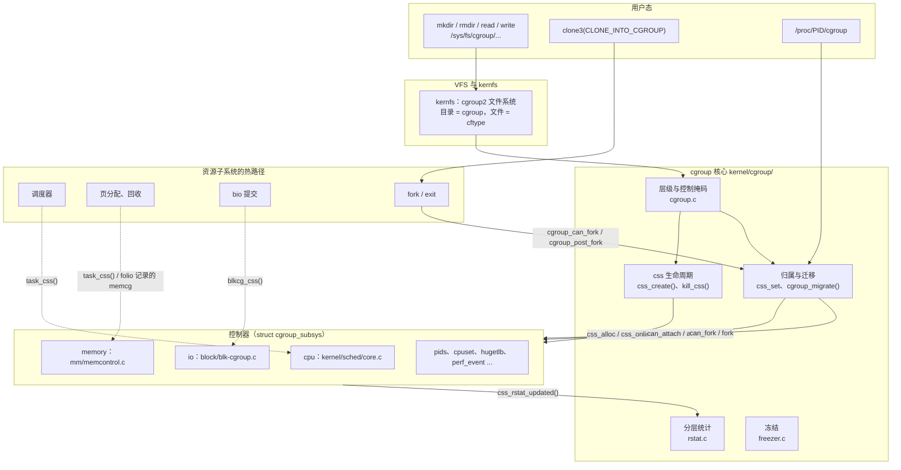
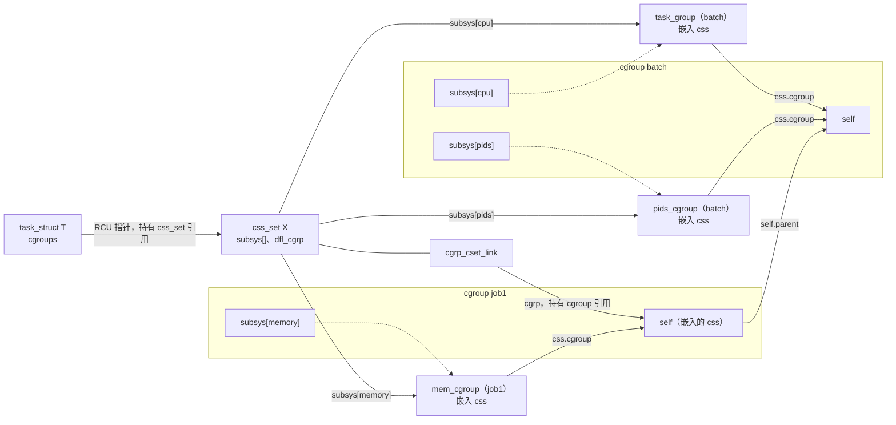
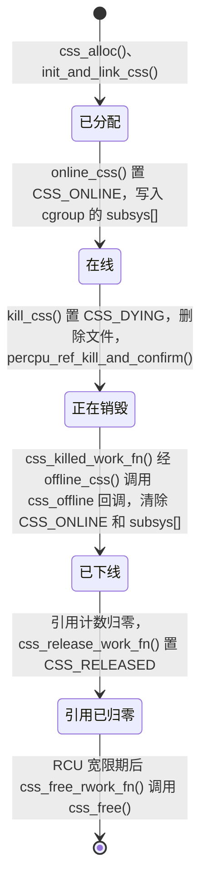
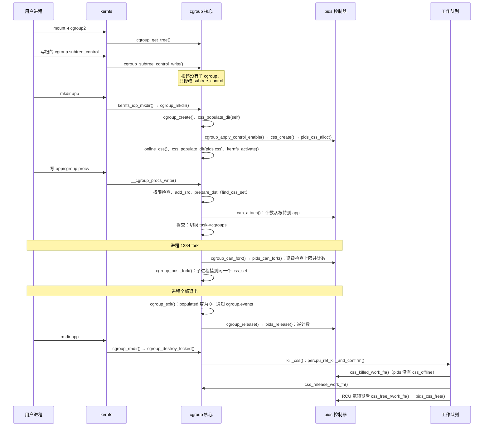

# cgroup v2 概述：层级、css_set 与控制器框架

一台机器上同时跑着数据库、Web 服务和一批离线批处理任务。管理员希望批处理任务最多使用 4 GiB 内存，CPU 繁忙时只分到较小的份额；Web 服务以后 fork 出的子进程也自动受同样的约束；容器管理器可以在分给它的子树里继续细分资源，但不能越过上级设下的边界；系统还要随时报告每一组用了多少 CPU 时间、有没有因为内存紧张而停顿。

这些需求有一个共同点：**资源控制的对象不是单个进程，而是一组进程；组可以嵌套，约束沿嵌套关系逐层生效。** cgroup（control group，控制组）就是内核为此提供的机制。cgroup 核心（cgroup core）本身只做两件事：把任务组织进一棵层级树，并为各个资源控制器（controller，源码中也叫 subsystem）在树的节点上维护状态。真正限制 CPU、内存、I/O 的逻辑由各控制器分别放在调度器、内存管理、块层等子系统中。cgroup v2 把所有控制器挂到同一棵树上，称为统一层级（unified hierarchy），源码中叫默认层级（default hierarchy）。

本章回答以下问题：

1. cgroup 核心和控制器各负责什么，它们与 VFS、调度器、内存管理等子系统怎样衔接？
2. 一个任务怎样记录“我在哪个 cgroup、受哪些控制器状态约束”？为什么中间要有 `css_set` 这一层？
3. 在 v2 的一棵树上，控制器怎样逐层启用？没有启用某个控制器的 cgroup 中的任务，受谁约束？
4. 迁移进程、fork、exit 时，核心怎样修改这些对象，又怎样通知控制器？
5. cgroup 和控制器状态何时创建、何时对用户不可见、何时真正释放？
6. 当前配置编入了哪些控制器，它们大致做什么？

本章只讲公共框架。各控制器内部的记账、限流和回收算法留给后续章节，这里只交代它们怎样接入框架。

## 0. 分析基线

本章依据仓库内 [Makefile 第 2～4 行](../../linux/Makefile#L2-L4)标记的 **6.18.52** 版本，架构为 **x86-64**。读者需要了解进程创建与退出、VFS 中 inode/dentry 的基本概念；RCU、每 CPU 引用计数和锁的语义可参考[锁机制基础](../lock/introduction.md)。

与本章结论有关的配置如下。它们是编译条件，不代表某次运行一定经过对应路径。

| 配置 | 对本章的影响 | 依据 |
| --- | --- | --- |
| `CONFIG_CGROUPS=y` | 编入 cgroup 核心，`cgroup.o`、`rstat.o`、`namespace.o`、`freezer.o` 等无条件编译 | [.config#L209](../../linux/.config#L209)、[kernel/cgroup/Makefile#L2](../../linux/kernel/cgroup/Makefile#L2) |
| `CONFIG_CPUSETS`、`CONFIG_CGROUP_SCHED`、`CONFIG_CGROUP_CPUACCT`、`CONFIG_BLK_CGROUP`、`CONFIG_MEMCG`、`CONFIG_CGROUP_DEVICE`、`CONFIG_CGROUP_FREEZER`、`CONFIG_CGROUP_NET_CLASSID`、`CONFIG_CGROUP_PERF`、`CONFIG_CGROUP_NET_PRIO`、`CONFIG_CGROUP_HUGETLB`、`CONFIG_CGROUP_PIDS` 均为 `=y` | 编入 12 个控制器，`CGROUP_SUBSYS_COUNT` 为 12；它们的编号按 `cgroup_subsys.h` 中的顺序分配 | [.config#L212-L233](../../linux/.config#L212-L233)、[.config#L1971-L1972](../../linux/.config#L1971-L1972)、[cgroup_subsys.h#L12-L58](../../linux/include/linux/cgroup_subsys.h#L12-L58) |
| `CONFIG_CGROUP_RDMA`、`CONFIG_CGROUP_MISC`、`CONFIG_CGROUP_DMEM`、`CONFIG_CGROUP_DEBUG` 未设置 | `rdma`、`misc`、`dmem`、`debug` 控制器不存在 | [.config#L224-L225](../../linux/.config#L224-L225)、[.config#L234-L235](../../linux/.config#L234-L235) |
| `CONFIG_PSI=y`，`CONFIG_PSI_DEFAULT_DISABLED` 未设置；`CONFIG_IRQ_TIME_ACCOUNTING` 未设置 | 编入 PSI（Pressure Stall Information，压力停顿信息）；`cgroup_psi_enabled()` 为真时每个 cgroup 有 `cpu/memory/io.pressure` 文件（[cgroup.c#L1817-L1825](../../linux/kernel/cgroup/cgroup.c#L1817-L1825)），没有 `irq.pressure` | [.config#L158-L159](../../linux/.config#L158-L159)、[.config#L150](../../linux/.config#L150)、[cgroup.c#L5538-L5581](../../linux/kernel/cgroup/cgroup.c#L5538-L5581) |
| `CONFIG_FAIR_GROUP_SCHED=y`、`CONFIG_CFS_BANDWIDTH=y`；`CONFIG_RT_GROUP_SCHED`、`CONFIG_UCLAMP_TASK` 未设置 | 前两者分别选中 `CONFIG_GROUP_SCHED_WEIGHT`、`CONFIG_GROUP_SCHED_BANDWIDTH`，即 `cpu_files[]` 直接依赖的条件（[init/Kconfig#L1111-L1120](../../linux/init/Kconfig#L1111-L1120)），因此 `cpu` 控制器提供 `cpu.weight`、`cpu.max` 等文件；没有 `cpu.uclamp.*` | [.config#L216-L221](../../linux/.config#L216-L221)、[.config#L193](../../linux/.config#L193)、[core.c#L10252-L10302](../../linux/kernel/sched/core.c#L10252-L10302) |
| `CONFIG_CGROUP_FAVOR_DYNMODS` 未设置 | 默认不启用 `favordynmods`，迁移时写锁全局 `cgroup_threadgroup_rwsem`（3.5 节） | [.config#L211](../../linux/.config#L211)、[cgroup.c#L241](../../linux/kernel/cgroup/cgroup.c#L241) |
| `CONFIG_CGROUP_BPF=y`、`CONFIG_SOCK_CGROUP_DATA=y` | 每个 cgroup 带有 BPF 程序挂载点；socket 创建时记录创建者所在的 cgroup | [.config#L233](../../linux/.config#L233)、[.config#L236](../../linux/.config#L236)、[`cgroup_sk_alloc()`](../../linux/kernel/cgroup/cgroup.c#L7297-L7323) |
| `CONFIG_DEBUG_CGROUP_REF` 未设置 | `css_get()` 等引用接口以内联函数形式编入 | [.config#L10707](../../linux/.config#L10707)、[cgroup.h#L320-L331](../../linux/include/linux/cgroup.h#L320-L331) |

还有几个**运行时条件**会改变结论，本章以默认情况为准：

- 启动参数 `cgroup_disable=` 可以关闭某个控制器（[cgroup_disable()](../../linux/kernel/cgroup/cgroup.c#L7068-L7099)）。
- v2 挂载选项（`nsdelegate`、`favordynmods` 等）在挂载或重新挂载时生效（第 5 节）。

## 1. cgroup v2 要解决什么问题

### 1.1 六个需求与对应机制

把开头的场景拆开，可以得到六个需求：

| 需求 | 如果不满足会怎样 | cgroup 的机制 | 主要源码 |
| --- | --- | --- | --- |
| **分组**：给任意一组任务命名，以后 fork 的任务自动继承所属组 | 只能逐个进程设置限制，子进程会逃出约束 | 一棵 cgroup 树，以 cgroup2 文件系统中的目录表示；fork 时子任务继承父任务的归属 | [`cgroup_mkdir()`](../../linux/kernel/cgroup/cgroup.c#L6010-L6061)、[`cgroup_css_set_fork()`](../../linux/kernel/cgroup/cgroup.c#L6721-L6815) |
| **多种资源**：同一组任务同时受 CPU、内存、I/O 等不同控制器约束 | 每个资源子系统各自发明一套分组方式 | 控制器用 `struct cgroup_subsys` 描述；每个“cgroup × 控制器”组合对应一个 `struct cgroup_subsys_state` | [cgroup-defs.h#L179-L263](../../linux/include/linux/cgroup-defs.h#L179-L263)、[cgroup-defs.h#L766-L855](../../linux/include/linux/cgroup-defs.h#L766-L855) |
| **层级语义**：子组的使用量计入祖先，祖先的限制约束整个子树 | 子组可以绕过上级限制 | 控制器状态之间有 `parent` 指针，控制器沿它逐级记账；v2 规定控制器只能自上而下启用 | [`pids_try_charge()`](../../linux/kernel/cgroup/pids.c#L166-L198)、[`cgroup_control()`](../../linux/kernel/cgroup/cgroup.c#L478-L497) |
| **热路径低开销**：fork、exit、调度、缺页时要快速找到任务对应的控制器状态 | 每次都查树，或者每个任务保存十几个指针并分别维护引用 | `css_set` 缓存一组控制器状态指针，任务只保存一个指向它的指针 | [cgroup-defs.h#L265-L360](../../linux/include/linux/cgroup-defs.h#L265-L360) |
| **观测与通知**：报告使用量、是否为空、是否冻结、压力停顿 | 用户态只能轮询扫描进程 | `cgroup.events` 通知、rstat 分层统计、PSI 压力文件 | [`cgroup_file_notify()`](../../linux/kernel/cgroup/cgroup.c#L4719-L4736)、[`__css_rstat_updated()`](../../linux/kernel/cgroup/rstat.c#L56-L123) |
| **委派**：把一棵子树交给非特权用户或容器自行管理 | 要么给 root 权限，要么无法分层管理 | 文件权限 + 公共祖先检查 + `nsdelegate` 命名空间边界 | [`cgroup_procs_write_permission()`](../../linux/kernel/cgroup/cgroup.c#L5338-L5367)、[`cgroup_file_write()`](../../linux/kernel/cgroup/cgroup.c#L4318-L4339) |

这张表也是阅读源码的地图：`kernel/cgroup/cgroup.c` 负责树、归属、迁移、控制器开关和对象生命周期；`rstat.c` 负责分层统计；`freezer.c` 负责 v2 的冻结；`namespace.c` 负责 cgroup 命名空间；各控制器分散在 `kernel/sched/`、`mm/`、`block/`、`kernel/cgroup/` 等目录。

### 1.2 默认层级：`cgrp_dfl_root`

cgroup2 只有一棵层级树。内核用 `struct cgroup_root` 表示一棵层级树（[cgroup-defs.h#L632-L671](../../linux/include/linux/cgroup-defs.h#L632-L671)），cgroup2 使用的是全局静态对象 `cgrp_dfl_root`，源码中称为默认层级（[cgroup.c#L194-L199](../../linux/kernel/cgroup/cgroup.c#L194-L199)）。这棵树在启动时就由 `cgroup_init()` 建好，第一次挂载 cgroup2 之前对 `/proc/<pid>/cgroup` 不可见：挂载时才置位 `cgrp_dfl_visible`（[cgroup.c#L201-L205](../../linux/kernel/cgroup/cgroup.c#L201-L205)、[cgroup.c#L2324](../../linux/kernel/cgroup/cgroup.c#L2324)），`proc_cgroup_show()` 在它为假时跳过这棵树（[cgroup.c#L6598-L6599](../../linux/kernel/cgroup/cgroup.c#L6598-L6599)）。挂载 cgroup2 只是让这棵已经存在的树可见（4.2 节）。

控制器所绑定的层级由 `cgroup_subsys::root` 记录（[cgroup-defs.h#L825-L826](../../linux/include/linux/cgroup-defs.h#L825-L826)）。启动时所有控制器都绑定到 `cgrp_dfl_root`（`cgroup_init_subsys()`，[cgroup.c#L6291-L6292](../../linux/kernel/cgroup/cgroup.c#L6291-L6292)），`cgroup_init()` 再把启用的控制器加入 `cgrp_dfl_root.subsys_mask`（[cgroup.c#L6437](../../linux/kernel/cgroup/cgroup.c#L6437)）。

### 1.3 分层架构

下图展示 cgroup 在内核中的位置。实线表示调用方向，虚线表示热路径上的查询。图中的 kernfs（`fs/kernfs/`）是 sysfs 与 cgroup 文件系统共用的伪文件系统框架，cgroup 的目录和文件都是 kernfs 节点。



这张图回答“谁在哪一层”，省略了 BPF、PSI、命名空间等旁路。需要注意两点：

- **配置路径和执行路径是分开的。** 用户写接口文件、创建目录，只改变 cgroup 树和控制器状态中的参数；真正的限制发生在资源子系统自己的热路径上。例如内存记账时 [`page_counter_try_charge()`](../../linux/mm/page_counter.c#L118-L172)沿父链逐级检查上限，块层提交 bio 时用 [`bio_associate_blkg()`](../../linux/block/blk-cgroup.c#L2169-L2186)按当前任务的 `io` 状态关联 bio。这些路径不经过 kernfs，也不持有 `cgroup_mutex`。
- **核心不理解资源。** 核心只知道“有 N 个控制器，每个控制器在每个 cgroup 上可能有一个状态对象”。怎样分配状态、迁移任务时要不要转移计费，都由控制器在 `struct cgroup_subsys` 中注册的回调决定（2.5 节）。

### 1.4 触发事件与输入输出

| 触发事件 | 执行上下文 | 输入 | 核心入口 | 结果 |
| --- | --- | --- | --- | --- |
| 挂载 cgroup2 | 进程上下文 | 挂载选项 | [`cgroup_get_tree()`](../../linux/kernel/cgroup/cgroup.c#L2319-L2332) | 返回默认层级的根目录，应用 root 标志 |
| `mkdir` / `rmdir` | 进程上下文，经 kernfs 的 `syscall_ops` | 父目录、名称 | [`cgroup_mkdir()`](../../linux/kernel/cgroup/cgroup.c#L6010-L6061)、[`cgroup_rmdir()`](../../linux/kernel/cgroup/cgroup.c#L6256-L6271) | 创建或销毁 cgroup 及其控制器状态 |
| 写 `cgroup.subtree_control` | 进程上下文 | `+memory -io` 这样的列表 | [`cgroup_subtree_control_write()`](../../linux/kernel/cgroup/cgroup.c#L3544-L3637) | 在子 cgroup 上创建或销毁控制器状态，迁移受影响的任务 |
| 写 `cgroup.procs` / `cgroup.threads` | 进程上下文 | PID 或 TID | [`__cgroup_procs_write()`](../../linux/kernel/cgroup/cgroup.c#L5390-L5435) | 任务换到新的 `css_set` |
| fork / clone | `copy_process()` | 父任务的归属，或 `CLONE_INTO_CGROUP` 指定的目录 fd | [`cgroup_can_fork()`](../../linux/kernel/cgroup/cgroup.c#L6857-L6885)、[`cgroup_post_fork()`](../../linux/kernel/cgroup/cgroup.c#L6917-L7004) | 子任务挂到 `css_set` 上，控制器可拒绝 fork |
| 任务退出 | `do_exit()`、`release_task()`、最终释放 `task_struct` | 退出的任务 | [`cgroup_exit()`](../../linux/kernel/cgroup/cgroup.c#L7013-L7043)、[`cgroup_release()`](../../linux/kernel/cgroup/cgroup.c#L7045-L7060)、[`cgroup_free()`](../../linux/kernel/cgroup/cgroup.c#L7062-L7066) | 任务分三步离开 `css_set` |
| 写控制器接口文件 | 进程上下文 | 例如 `memory.max` 的值 | [`cgroup_file_write()`](../../linux/kernel/cgroup/cgroup.c#L4318-L4369)转给 `cftype` 回调 | 控制器参数改变 |
| 读统计文件、`poll` 事件文件 | 进程上下文 | — | `cftype` 的 `seq_show` / `poll` | 统计值、事件通知 |

### 1.5 本章边界

本章只讨论 cgroup v2，即 cgroup2 文件系统所呈现的层级。各控制器的算法（CFS 组调度、memcg 记账与回收、io 限流、cpuset 分区等）只给概况和入口。cgroup BPF 程序的挂载和执行属于 BPF 子系统，见 [BPF 子系统概述](../bpf/inroduction.md)；本章只说明 cgroup 为它预留了什么。

## 2. 核心数据结构

### 2.1 结构地图

先看一个例子。假设 v2 树和各节点的 `cgroup.subtree_control` 如下：

```text
/                 subtree_control = cpu memory pids
├── web           subtree_control = （空）
└── batch         subtree_control = memory
    ├── job1
    └── job2
```

`subtree_control` 决定的是**子 cgroup** 上启用哪些控制器（3.1 节）。因此 `web` 和 `batch` 都有 `cpu`、`memory`、`pids`（以及隐式启用的 `perf_event`）的状态对象；`job1`、`job2` 只有 `memory` 的状态对象（以及隐式启用的 `perf_event`，见 2.5 节）。任务 T 位于 `batch/job1` 时，它受哪些状态约束？

| 控制器 | `job1` 自己有该控制器的状态吗 | T 实际使用的状态 |
| --- | --- | --- |
| `memory` | 有 | `job1` 的 memory 状态 |
| `cpu`、`pids` | 没有 | 最近的有状态的祖先：`batch` 的 cpu、pids 状态 |
| `cpuset`、`io`、`hugetlb` | 没有，整棵树都没启用 | 根 cgroup 的状态 |

这个“最近的有状态的祖先”叫**有效状态**（effective css，3.2 节）。T 不直接保存这张表，而是指向一个 `css_set`，表放在 `css_set` 里。下图画出 T 的对象关系，省略了 `cpuset` 等指向根的项。实线表示持有引用，虚线表示只保存指针、不持有引用，无箭头的连线表示 `css_set` 经 `cgrp_links` 链表连着这个 link。图中还省略了 css 指向父 css 的引用和 `perf_event` 项。



读这张图时注意三点：

- **任务 → `css_set` → 控制器状态** 是热路径使用的方向。[`task_css()`](../../linux/include/linux/cgroup.h#L456-L460)展开后就是 `task->cgroups->subsys[id]`，一次 RCU 解引用加一次数组下标（[cgroup.h#L414-L436](../../linux/include/linux/cgroup.h#L414-L436)）。
- **`cgroup` → 控制器状态** 是配置路径使用的方向。`cgroup::subsys[]` 只记录**本 cgroup 自己的**状态，未启用的位置为 NULL；`css_set::subsys[]` 记录的是有效状态，所以两者对同一个控制器可能指向不同对象。
- **`css_set` ↔ `cgroup`** 之间通过 `cgrp_cset_link` 双向关联（2.4 节）。

对象之间的引用关系汇总如下。它说明谁阻止谁被释放，是理解第 3.7 节生命周期的基础。

| 指向关系 | 是否持有引用 | 何时获取 / 归还 | 依据 |
| --- | --- | --- | --- |
| `task->cgroups` → `css_set` | 持有 | fork 时从父任务处取得，迁移时换成目标 `css_set`；`task_struct` 释放时归还 | [cgroup.c#L6735-L6736](../../linux/kernel/cgroup/cgroup.c#L6735-L6736)、[cgroup.c#L2728-L2738](../../linux/kernel/cgroup/cgroup.c#L2728-L2738)、[cgroup.c#L7062-L7066](../../linux/kernel/cgroup/cgroup.c#L7062-L7066) |
| `css_set::subsys[i]` → css | 持有 | 创建 `css_set` 时 `css_get()`，`css_set` 释放时 `css_put()` | [cgroup.c#L1292-L1298](../../linux/kernel/cgroup/cgroup.c#L1292-L1298)、[cgroup.c#L992-L995](../../linux/kernel/cgroup/cgroup.c#L992-L995) |
| `cgrp_cset_link` → 非根 `cgroup` | 持有 | 建立 link 时取得，`css_set` 释放时归还 | [cgroup.c#L1211-L1212](../../linux/kernel/cgroup/cgroup.c#L1211-L1212)、[cgroup.c#L999-L1005](../../linux/kernel/cgroup/cgroup.c#L999-L1005) |
| css → 所属 `cgroup`、css → 父 css | 持有 | `init_and_link_css()` 中取得，css 最终释放时归还 | [cgroup.c#L5737](../../linux/kernel/cgroup/cgroup.c#L5737)、[cgroup.c#L5748-L5751](../../linux/kernel/cgroup/cgroup.c#L5748-L5751)、[cgroup.c#L5620-L5625](../../linux/kernel/cgroup/cgroup.c#L5620-L5625) |
| 子 `cgroup` → 父 `cgroup` | 持有 | 创建子 cgroup 时取得，子 cgroup 释放时归还 | [cgroup.c#L5961](../../linux/kernel/cgroup/cgroup.c#L5961)、[cgroup.c#L5634-L5644](../../linux/kernel/cgroup/cgroup.c#L5634-L5644) |
| `cgroup::subsys[i]` → css | **不持有**，RCU 发布 | css 上线时写入，下线时清空 | [cgroup.c#L5768](../../linux/kernel/cgroup/cgroup.c#L5768)、[cgroup.c#L5794](../../linux/kernel/cgroup/cgroup.c#L5794) |

引用全部是“子指向父、使用者指向被使用者”，所以只要有任务还挂在某个 `css_set` 上，它用到的 css、cgroup 以及它们的所有祖先都不会被释放。

### 2.2 `struct cgroup`：层级树上的一个节点

`struct cgroup` 表示树上的一个目录（[cgroup-defs.h#L472-L630](../../linux/include/linux/cgroup-defs.h#L472-L630)）。它不含任何资源参数，只描述“这个节点在树上的位置、有哪些控制器、里面有没有任务”。

| 字段 | 含义 | 说明 |
| --- | --- | --- |
| `self` | 嵌入的 `cgroup_subsys_state`，`ss` 为 NULL | cgroup 自身的引用计数、父子链表都借用这个 css，[`cgroup_parent()`](../../linux/include/linux/cgroup.h#L518-L525)就是从 `self.parent` 反推出来的 |
| `level`、`ancestors[]` | 深度（根为 0）和从根到自身的祖先数组 | 柔性数组，创建时按深度分配；[`cgroup_is_descendant()`](../../linux/include/linux/cgroup.h#L536-L542)只需比较一个数组元素，不必向上遍历 |
| `kn` | 对应的 kernfs 目录节点 | cgroup 的 ID 就是 `kn->id`（[cgroup.h#L333-L336](../../linux/include/linux/cgroup.h#L333-L336)） |
| `subtree_control` / `subtree_ss_mask` | 子 cgroup 上**显式**启用 / **实际**启用的控制器位图 | 后者额外包含依赖和隐式控制器（3.1 节）；`old_*` 字段用于失败回滚 |
| `subsys[]` | 本 cgroup 自己的各控制器状态 | `__rcu` 指针，未启用为 NULL |
| `cset_links` | 所有引用了本 cgroup 的 `css_set`（经 `cgrp_cset_link`） | 由 `css_set_lock` 保护 |
| `e_csets[]` | 对每个控制器，以本 cgroup 的 css 作为有效状态的所有 `css_set` | 遍历“受某个 css 约束的全部任务”时使用 |
| `nr_populated_csets`、`nr_populated_domain_children`、`nr_populated_threaded_children` | 自身非空的 `css_set` 数、非空的子 cgroup 数 | 三者之和非零即“子树中有任务”（[`cgroup_is_populated()`](../../linux/include/linux/cgroup.h#L580-L585)） |
| `nr_descendants`、`nr_dying_descendants`、`max_descendants`、`max_depth` | 后代计数与上限 | 对应 `cgroup.stat` 和 `cgroup.max.*` |
| `dom_cgrp` | 普通 cgroup 指向自己；threaded cgroup 指向最近的 domain 祖先 | [`cgroup_is_threaded()`](../../linux/kernel/cgroup/cgroup.c#L400-L403)就是判断 `dom_cgrp != cgrp` |
| `flags` | `CGRP_FREEZE`、`CGRP_FROZEN` 等 | [cgroup-defs.h#L58-L74](../../linux/include/linux/cgroup-defs.h#L58-L74) |
| `procs_file`、`events_file`、`psi_files[]` | 接口文件句柄，用于发通知 | 见 2.6 节 |
| `rstat_base_cpu`、`bstat` | 每 CPU 和汇总后的 CPU 时间统计 | 3.9 节 |
| `psi`、`bpf`、`freezer` | PSI 分组、cgroup BPF 程序表、冻结状态 | 分别由 PSI、BPF、freezer 维护 |

### 2.3 `struct cgroup_subsys_state`：控制器在一个 cgroup 上的状态

`struct cgroup_subsys_state`（下文简称 css）是控制器与核心之间的公共部分（[cgroup-defs.h#L172-L263](../../linux/include/linux/cgroup-defs.h#L172-L263)）。控制器把它**嵌入**自己的结构体，核心只操作这个公共部分，控制器再用 `container_of()` 取回外层结构。`pids` 控制器是最短的例子：

```c
struct pids_cgroup {
	struct cgroup_subsys_state	css;

	/* ... */
	atomic64_t			counter;
	atomic64_t			limit;
	/* ... */
};

static struct pids_cgroup *css_pids(struct cgroup_subsys_state *css)
{
	return container_of(css, struct pids_cgroup, css);
}
```

来源：[kernel/cgroup/pids.c 第 49～71 行](../../linux/kernel/cgroup/pids.c#L49-L71)，省略了部分字段。`memory` 的 `struct mem_cgroup`（[memcontrol.h#L189-L190](../../linux/include/linux/memcontrol.h#L189-L190)）、`cpu` 的 `struct task_group`（[sched.h#L472-L473](../../linux/kernel/sched/sched.h#L472-L473)）、`io` 的 `struct blkcg`（[blk-cgroup.h#L94-L95](../../linux/block/blk-cgroup.h#L94-L95)）都采用同样的写法。

css 的关键字段：

| 字段 | 含义 | 约束 |
| --- | --- | --- |
| `cgroup`、`ss`、`parent` | 所属 cgroup、所属控制器、父 cgroup 上同一控制器的 css | 注释标为 “PI”（public and immutable），创建后不变，可以不加锁读取 |
| `refcnt` | `percpu_ref` 引用计数 | 经 `css_get()` / `css_tryget()` / `css_tryget_online()` / `css_put()` 操作（[cgroup_refcnt.h#L1-L81](../../linux/include/linux/cgroup_refcnt.h#L1-L81)） |
| `sibling`、`children` | 同一控制器的 css 构成的树 | 由 `cgroup_mutex` 或 RCU 保护 |
| `id` | 控制器内唯一的整数 ID，根为 1 | 由 `ss->css_idr` 分配，可用 `css_from_id()` 反查 |
| `serial_nr` | 全局单调递增的序号 | 保证 `children` 链表有序，使遍历可以中断后继续 |
| `online_cnt` | 自身在线计 1，每个在线的子 css 计 1 | 保证父 css 不会先于子 css 下线（3.7 节） |
| `flags` | `CSS_NO_REF`、`CSS_ONLINE`、`CSS_RELEASED`、`CSS_VISIBLE`、`CSS_DYING` | [cgroup-defs.h#L49-L56](../../linux/include/linux/cgroup-defs.h#L49-L56) |
| `rstat_cpu` | 每 CPU 的 rstat 更新树节点 | 只有 `cgroup::self` 和实现了 `css_rstat_flush` 的控制器使用 |

引用计数有两个层次的“获取”，区别很重要：

- [`css_tryget()`](../../linux/include/linux/cgroup_refcnt.h#L41-L47)只要计数还没降到 0 就成功，不关心 css 是否已经下线；
- [`css_tryget_online()`](../../linux/include/linux/cgroup_refcnt.h#L60-L66)调用 `percpu_ref_tryget_live()`，css 一旦开始销毁就失败。

需要“继续往这个组里记账”的路径用后者；只需要“对象别被释放”的路径用前者。例如正在退出的任务可能仍关联着已下线的 css，[`task_get_css()`](../../linux/include/linux/cgroup.h#L462-L491)因此只用 `css_tryget()`。根 css 设置 `CSS_NO_REF`，永不释放，所有引用操作对它都是空操作（[cgroup.c#L6298-L6302](../../linux/kernel/cgroup/cgroup.c#L6298-L6302)）。

### 2.4 `struct css_set` 与 `struct cgrp_cset_link`：任务归属的缓存

如果每个任务直接保存 12 个 css 指针，fork 时要取 12 个引用，迁移时要逐个修改。但实际系统中，绝大多数任务的“归属组合”只有少数几种。`css_set` 就是一种组合（[cgroup-defs.h#L265-L360](../../linux/include/linux/cgroup-defs.h#L265-L360)）：

| 字段 | 含义 | 约束 |
| --- | --- | --- |
| `subsys[CGROUP_SUBSYS_COUNT]` | 每个控制器的有效 css | **创建后不变**（启动时的 `init_css_set` 除外）；要改变归属只能换一个 `css_set` |
| `refcount` | 引用计数 | 每个挂在上面的任务计一次，迁移、命名空间等也会持有 |
| `dfl_cgrp` | 该组合在 v2 树上对应的 cgroup | [`task_dfl_cgroup()`](../../linux/include/linux/cgroup.h#L513-L516)就是 `task_css_set(task)->dfl_cgrp` |
| `dom_cset` | 普通 `css_set` 指向自己；threaded 的指向对应 domain cgroup 的 `css_set` | 3.3 节 |
| `nr_tasks`、`tasks`、`mg_tasks`、`dying_tasks` | 任务计数和三条任务链表 | 任务通过 `task_struct::cg_list` 挂在其中一条上；`mg_tasks` 只在迁移中使用，`dying_tasks` 存放已退出但线程组仍存活的组长 |
| `hlist` | 全局哈希表 `css_set_table` 中的节点 | 以 `subsys[]` 中指针之和为键（[cgroup.c#L957-L976](../../linux/kernel/cgroup/cgroup.c#L957-L976)） |
| `cgrp_links` | 经 `cgrp_cset_link` 连到它所属的 cgroup | 当前只有默认层级一棵树，因此只有一个 link，指向 `dfl_cgrp` |
| `e_cset_node[]` | 挂到 `subsys[i]->cgroup->e_csets[i]` 上 | 用于从 css 反查任务 |
| `mg_*` | 迁移期间的源、目标信息 | 由 `cgroup_mutex` 保护 |
| `dead` | 关联的 cgroup 已被删除 | 迁移路径忽略这样的 `css_set` |

`task_struct` 中 `CONFIG_CGROUPS` 块里只有两个字段（[sched.h#L1321-L1326](../../linux/include/linux/sched.h#L1321-L1326)）：`cgroups` 是 RCU 指针，由 `css_set_lock` 保护；`cg_list` 是挂入 `css_set` 任务链表的节点，由 `css_set_lock` 和 `tsk->alloc_lock` 保护。

一个 cgroup 可能被多个 `css_set` 引用，例如控制器开关改变、任务尚未全部迁移时，新旧两种组合会短暂共存。`css_set` 用 `dfl_cgrp` 直接记住所属的 cgroup；反过来，cgroup 要找到引用它的所有 `css_set`，需要经过 `cgrp_cset_link`（[cgroup-internal.h#L88-L106](../../linux/kernel/cgroup/cgroup-internal.h#L88-L106)）。一个 link 同时挂在两条链表上：

```text
cgroup.cset_links ──→ link.cset_link ──→ link.cset_link ──→ ...
                         │                   │
                       link.cset=A         link.cset=B
                         │                   │
css_set A.cgrp_links ─→ link.cgrp_link      css_set B.cgrp_links ─→ link.cgrp_link
```

当前只有默认层级一棵树，`cgroup_root_count` 为 1（[cgroup.c#L2226](../../linux/kernel/cgroup/cgroup.c#L2226)），`find_css_set()` 只为新 `css_set` 分配一个 link（[cgroup.c#L1252](../../linux/kernel/cgroup/cgroup.c#L1252)）；[`link_css_set()`](../../linux/kernel/cgroup/cgroup.c#L1190-L1213)把它连到目标 cgroup，并设置 `dfl_cgrp`（[cgroup.c#L1197-L1198](../../linux/kernel/cgroup/cgroup.c#L1197-L1198)）。

`init_css_set` 是静态定义的第一个 `css_set`（[cgroup.c#L774-L801](../../linux/kernel/cgroup/cgroup.c#L774-L801)）。启动时 `init_task` 指向它（[cgroup.c#L6352](../../linux/kernel/cgroup/cgroup.c#L6352)），它的 `subsys[]` 全部指向各控制器的根 css。

### 2.5 `struct cgroup_subsys`：控制器与核心的契约

每个控制器定义一个 `struct cgroup_subsys` 全局变量（[cgroup-defs.h#L762-L855](../../linux/include/linux/cgroup-defs.h#L762-L855)）。`cgroup_subsys.h` 被用 `SUBSYS()` 宏包含多次，生成控制器编号枚举、`cgroup_subsys[]` 指针数组和名称数组（[cgroup-defs.h#L41-L47](../../linux/include/linux/cgroup-defs.h#L41-L47)、[cgroup.c#L156-L168](../../linux/kernel/cgroup/cgroup.c#L156-L168)）。回调按用途分为四组：

| 用途 | 回调 | 调用时机 |
| --- | --- | --- |
| css 生命周期 | `css_alloc`、`css_online`、`css_offline`、`css_released`、`css_free`；`css_reset`、`css_killed` | 创建、上线、下线、计数归零、RCU 宽限期后释放；隐藏时重置；开始销毁前 |
| 任务迁移 | `can_attach`、`cancel_attach`、`attach` | 迁移的检查、回滚、提交后通知 |
| 任务创建与退出 | `can_fork`、`cancel_fork`、`fork`、`exit`、`release` | fork 的检查、回滚和完成；任务退出与回收 |
| 统计与展示 | `css_rstat_flush`、`css_extra_stat_show`、`css_local_stat_show` | rstat 刷新；为 `cpu.stat` 等追加内容 |

`css_alloc` 和 `css_free` 是必需的，[`cgroup_init_early()`](../../linux/kernel/cgroup/cgroup.c#L6342-L6358)会检查。fork、exit、release、can_fork 回调是否存在，在初始化时被记录为位图 `have_*_callback`（[cgroup.c#L6321-L6324](../../linux/kernel/cgroup/cgroup.c#L6321-L6324)），热路径上只遍历置位的控制器。

另有几个描述控制器性质的字段：

| 字段 | 含义 | 影响 |
| --- | --- | --- |
| `dfl_cftypes` | cgroup2 的接口文件表 | 为 NULL 且不是隐式控制器时，该控制器在 cgroup2 中被屏蔽（`cgrp_dfl_inhibit_ss_mask`），不能启用 |
| `implicit_on_dfl` | 在 v2 上对所有 cgroup 隐式启用，不出现在 `cgroup.controllers` 中，不受“无内部进程”约束 | 必须同时是 threaded |
| `threaded` | 支持 threaded 模式 | 这类控制器可以在 threaded 子树中启用 |
| `depends_on` | 依赖的控制器位图 | 启用本控制器时，依赖项一起被启用但不显示 |
| `early_init` | 在 `cgroup_init_early()` 阶段创建根 css | 用于启动早期就需要的控制器，如 `cpu`、`cpuset` |

这些性质在 `cgroup_init()` 中被汇总（[cgroup.c#L6437-L6448](../../linux/kernel/cgroup/cgroup.c#L6437-L6448)）成三个全局位图：`cgrp_dfl_implicit_ss_mask`、`cgrp_dfl_inhibit_ss_mask` 和 `cgrp_dfl_threaded_ss_mask`（[cgroup.c#L207-L214](../../linux/kernel/cgroup/cgroup.c#L207-L214)）。控制器集合用 `u16` 表示，所以 `cgroup_init()` 要求控制器总数不超过 16（[cgroup.c#L6386](../../linux/kernel/cgroup/cgroup.c#L6386)）。

### 2.6 `struct cftype` 与 `struct cgroup_file`：接口文件

cgroup 目录中的每个文件都由一个 `struct cftype` 描述（[cgroup-defs.h#L673-L760](../../linux/include/linux/cgroup-defs.h#L673-L760)）：

- **名字**：控制器文件会自动加前缀。`cpu` 控制器的 `"weight"` 在 v2 上显示为 `cpu.weight`（[`cgroup_file_name()`](../../linux/kernel/cgroup/cgroup.c#L1586-L1602)）。核心文件的 `ss` 为 NULL，名字原样使用，例如 `cgroup.procs`。
- **读写回调**：`read_u64`/`read_s64`/`seq_show` 用于读，`write_u64`/`write_s64`/`write` 用于写。所有 cgroup 文件共用一组 kernfs 操作，由 [`cgroup_file_write()`](../../linux/kernel/cgroup/cgroup.c#L4318-L4369)和 [`cgroup_seqfile_show()`](../../linux/kernel/cgroup/cgroup.c#L4397-L4412)分派到 `cftype` 回调。文件权限由回调推出：有读回调就是 0444，有写回调再加 0200（[`cgroup_file_mode()`](../../linux/kernel/cgroup/cgroup.c#L1604-L1625)）。
- **标志**：`CFTYPE_ONLY_ON_ROOT`、`CFTYPE_NOT_ON_ROOT` 控制文件是否出现在根上；`CFTYPE_NS_DELEGATABLE` 表示可以跨委派边界写（[cgroup-defs.h#L133-L147](../../linux/include/linux/cgroup-defs.h#L133-L147)）。
- **`file_offset`**：如果非零，表示在 css 中偏移这么多字节处有一个 `struct cgroup_file`。创建文件时核心把 kernfs 节点记录进去（[cgroup.c#L4459-L4467](../../linux/kernel/cgroup/cgroup.c#L4459-L4467)），控制器之后就可以调用 `cgroup_file_notify()` 唤醒 `poll`/`inotify` 等待者。

文件随 css 一起出现和消失：[`css_populate_dir()`](../../linux/kernel/cgroup/cgroup.c#L1795-L1852)创建一个 css 的全部文件并置 `CSS_VISIBLE`，[`css_clear_dir()`](../../linux/kernel/cgroup/cgroup.c#L1764-L1793)删除它们。对 `cgroup::self` 而言，这组文件是核心文件 `cgroup_base_files` 和 PSI 文件 `cgroup_psi_files`（第 5 节）。

### 2.7 `struct cgroup_root`：一棵层级

`struct cgroup_root`（[cgroup-defs.h#L632-L671](../../linux/include/linux/cgroup-defs.h#L632-L671)）把一棵树的根 cgroup **嵌入**在自身中（`cgrp` 字段），并保存这棵树的 kernfs 根 `kf_root`、绑定在上面的控制器位图 `subsys_mask`、层级编号 `hierarchy_id` 和挂载标志 `flags`。`cgrp_dfl_root` 在 `cgroup_init()` 中通过 [`cgroup_setup_root()`](../../linux/kernel/cgroup/cgroup.c#L2155-L2258)完成初始化，它从 `cgroup_hierarchy_idr` 拿到的编号为 0（[cgroup.c#L1364-L1376](../../linux/kernel/cgroup/cgroup.c#L1364-L1376)），所以 `/proc/<pid>/cgroup` 中对应的一行格式为 `0::/路径`（`proc_cgroup_show()`，[cgroup.c#L6593-L6641](../../linux/kernel/cgroup/cgroup.c#L6593-L6641)）。`cgroup_root` 头部的注释说明，这个结构属于核心内部，控制器不应直接访问（[cgroup-defs.h#L632-L636](../../linux/include/linux/cgroup-defs.h#L632-L636)）。

### 2.8 并发保护与生命周期一览

| 机制 | 保护什么 | 读侧 | 写侧 / 说明 |
| --- | --- | --- | --- |
| `cgroup_mutex` | 树结构、控制掩码、css 的创建与上下线、迁移的准备与提交 | 持锁，或在 RCU 下读带 `__rcu` 的字段 | 所有修改树的路径都持有它（[cgroup.c#L81-L92](../../linux/kernel/cgroup/cgroup.c#L81-L92)） |
| `css_set_lock`（关中断的自旋锁） | `task->cgroups`、`cg_list`、`css_set` 的链表与哈希表、populated 计数 | — | 最内层的锁；fork、exit 修改任务归属时只需要它（fork 另外持有线程组读锁） |
| `cgroup_threadgroup_rwsem`（per-CPU 读写信号量） | 线程组成员在迁移期间不变 | fork、exit、exec 等改变线程组的路径取读锁（[cgroup.c#L6732](../../linux/kernel/cgroup/cgroup.c#L6732)、[signal.c#L3134-L3138](../../linux/kernel/signal.c#L3134-L3138)、[exec.c#L958](../../linux/fs/exec.c#L958)） | 迁移进程时取写锁，保证不会有新线程漏迁（[cgroup.c#L2539-L2557](../../linux/kernel/cgroup/cgroup.c#L2539-L2557)） |
| RCU | `task->cgroups`、`cgroup::subsys[]`、`css_set` 和 css 的释放 | `rcu_read_lock()` 后 `task_css()` | `css_set` 用 `kfree_rcu()` 释放，css 在 RCU 宽限期后才释放 |
| `percpu_ref` | css 与 cgroup 的存活 | `css_tryget[_online]()` | 销毁时先 kill，再等计数归零 |
| kernfs active 引用 | 文件操作期间文件不被删除 | kernfs 自动获取 | 需要 `cgroup_mutex` 的文件操作先用 [`cgroup_kn_lock_live()`](../../linux/kernel/cgroup/cgroup.c#L1696-L1742)解除 active 保护，再加锁并检查 cgroup 是否还活着 |

迁移路径的锁顺序是：`cgroup_mutex` → `cpus_read_lock()` → `cgroup_threadgroup_rwsem`（写）→ `css_set_lock`。CPU 热插拔锁要放在线程组信号量外面，原因写在 [`cgroup_attach_lock()` 的注释](../../linux/kernel/cgroup/cgroup.c#L2509-L2557)中：CPU 上线时可能创建任务，会取线程组信号量的读锁。

## 3. 关键规则与算法

### 3.1 控制器的启用：`subtree_control` 与掩码传播

**目标**：让控制器沿树自上而下启用，并且任何时候都满足“子节点只能启用父节点分发给它的控制器”。

每个 cgroup 上有两个相关文件，分别由两个函数计算：

```c
/* cgroup.controllers 显示的内容：父节点允许本 cgroup 使用的控制器 */
static u16 cgroup_control(struct cgroup *cgrp)
{
	struct cgroup *parent = cgroup_parent(cgrp);
	u16 root_ss_mask = cgrp->root->subsys_mask;

	if (parent) {
		u16 ss_mask = parent->subtree_control;

		/* threaded cgroups can only have threaded controllers */
		if (cgroup_is_threaded(cgrp))
			ss_mask &= cgrp_dfl_threaded_ss_mask;
		return ss_mask;
	}

	if (cgroup_on_dfl(cgrp))
		root_ss_mask &= ~(cgrp_dfl_inhibit_ss_mask |
				  cgrp_dfl_implicit_ss_mask);
	return root_ss_mask;
}
```

来源：[cgroup_control()，kernel/cgroup/cgroup.c 第 478～497 行](../../linux/kernel/cgroup/cgroup.c#L478-L497)，第一行注释由作者改写，原文为 `subsystems visibly enabled on a cgroup`。`cgroup.subtree_control` 则直接显示本 cgroup 的 `subtree_control` 字段（[cgroup.c#L3154-L3170](../../linux/kernel/cgroup/cgroup.c#L3154-L3170)）。

用 2.1 节的例子说明：根的 `cgroup.controllers` 是全部可用控制器；根的 `subtree_control` 为 `cpu memory pids`，于是 `batch` 的 `cgroup.controllers` 就是这三个；`batch` 只把 `memory` 写进自己的 `subtree_control`，于是 `job1` 的 `cgroup.controllers` 只有 `memory`。

写 `cgroup.subtree_control` 的处理过程（[`cgroup_subtree_control_write()`](../../linux/kernel/cgroup/cgroup.c#L3543-L3637)）可以概括为下面的简化逻辑：

```text
解析 "+name" / "-name"，得到 enable、disable 两个位图；名字未知、被屏蔽或缺少前缀 → -EINVAL
锁住 cgroup（已被删除 → -ENODEV），并等待之前被禁用、仍在下线的 css 完成下线
对每个要启用的控制器：不在 cgroup_control(cgrp) 中 → -ENOENT
对每个要禁用的控制器：某个子 cgroup 的 subtree_control 还启用着它 → -EBUSY
检查“无内部进程”等约束（3.3 节）：已有任务时启用 → -EBUSY；在 threaded 子树或无效 domain 中启用 domain 控制器 → -EOPNOTSUPP
保存整棵子树的旧掩码
cgrp->subtree_control |= enable; &= ~disable
cgroup_apply_control(cgrp)：传播掩码、创建 css、迁移任务
cgroup_finalize_control(cgrp, ret)：失败则恢复旧掩码；最后销毁或隐藏多余的 css
```

错误码依据：解析见 [cgroup.c#L3558-L3580](../../linux/kernel/cgroup/cgroup.c#L3558-L3580)，存活检查见 [cgroup.c#L3582-L3584](../../linux/kernel/cgroup/cgroup.c#L3582-L3584)，约束检查见 [`cgroup_vet_subtree_control_enable()`](../../linux/kernel/cgroup/cgroup.c#L3503-L3541)。

**为什么要等待正在下线的 css？** css 的下线是异步的（3.7 节）。如果用户刚禁用 `memory` 又立即启用，旧 css 可能还挂在 `cgroup::subsys[]` 上，新 css 无法安装。[`cgroup_lock_and_drain_offline()`](../../linux/kernel/cgroup/cgroup.c#L3250-L3289)在子树中发现 `percpu_ref` 已处于 dying 状态的 css 时，就放开锁、睡在 `offline_waitq` 上，被唤醒后从头再查。

**显式启用与实际启用。** `subtree_ss_mask` 由 [`cgroup_calc_subtree_ss_mask()`](../../linux/kernel/cgroup/cgroup.c#L1627-L1669)计算：从 `subtree_control` 出发，加上所有隐式控制器，再反复加入各控制器的 `depends_on`，直到不再变化。当前配置中 `io` 依赖 `memory`（[blk-cgroup.c#L1567-L1574](../../linux/block/blk-cgroup.c#L1567-L1574)，目的是回写时能找到页面的所属组），所以只写 `+io` 时，子 cgroup 上也会创建 `memory` 的 css，但不会出现 `memory.*` 文件。[`css_visible()`](../../linux/kernel/cgroup/cgroup.c#L3352-L3362)决定一个 css 的文件是否可见：被父节点显式启用的可见；只因依赖而启用的不可见；隐式控制器的 css 被视为可见，只是 `perf_event` 没有 cgroup2 接口文件，目录里不会因此多出文件。

**传播与生效。** [`cgroup_apply_control()`](../../linux/kernel/cgroup/cgroup.c#L3451-L3484)分三步：

1. [`cgroup_propagate_control()`](../../linux/kernel/cgroup/cgroup.c#L3311-L3330)前序遍历子树，令每个后代的 `subtree_control &= cgroup_control(后代)`，再重算 `subtree_ss_mask`。这一步实现了本地文档 [cgroup-v2.rst 中的 Top-down Constraint](../../linux/Documentation/admin-guide/cgroup-v2.rst#L494-L503)。
2. [`cgroup_apply_control_enable()`](../../linux/kernel/cgroup/cgroup.c#L3364-L3408)前序遍历子树，为 `cgroup_ss_mask()` 中有、但 `subsys[]` 中还没有的控制器调用 `css_create()`，并为可见的 css 创建文件。前序保证父 css 先于子 css 创建。
3. [`cgroup_update_dfl_csses()`](../../linux/kernel/cgroup/cgroup.c#L3172-L3248)把子树中（不含 `cgrp` 自己）所有任务迁移到按新掩码计算出的 `css_set` 上。

之后 [`cgroup_finalize_control()`](../../linux/kernel/cgroup/cgroup.c#L3486-L3501)调用 [`cgroup_apply_control_disable()`](../../linux/kernel/cgroup/cgroup.c#L3410-L3449)，**后序**遍历子树：不再需要的 css 被 `kill_css()`；仍需要但不该可见的 css 被删掉文件并调用 `css_reset` 回到初始状态。先建新的、迁移任务、再销毁旧的，保证迁移过程中每个任务始终有可用的 css。

### 3.2 有效 css：用最近的启用祖先的状态

**目标**：对每个控制器，为树上任何位置的任务确定一个 css。

规则是：从任务所在的 cgroup 开始向根走，第一个启用了该控制器的 cgroup 上的 css 就是有效 css；根上的 css 总是存在，所以一定能找到。核心有两个版本：

- [`cgroup_e_css_by_mask()`](../../linux/kernel/cgroup/cgroup.c#L537-L566)根据 `cgroup_ss_mask()` 判断“是否启用”，供更新归属关系时使用。这时新 css 可能已建好、旧 css 还没销毁，不能用 `subsys[]` 是否为 NULL 来判断。
- [`cgroup_e_css()`](../../linux/kernel/cgroup/cgroup.c#L568-L598)和 [`cgroup_get_e_css()`](../../linux/kernel/cgroup/cgroup.c#L600-L634)直接看 `subsys[]`，供控制器等外部代码使用，后者还会取得在线引用。

任务的有效 css 只在构造 `css_set` 时计算一次（3.4 节），结果缓存在 `css_set::subsys[]` 中。热路径上的 `task_css()` 拿到的已经是有效 css，不需要向上查找。

这个规则带来一个直接后果：**在 v2 上，控制器“未启用”不等于“不受控制”。** `job1` 中的任务虽然没有自己的 `cpu` 状态，CPU 时间仍然计在 `batch` 的 `task_group` 下，受 `batch/cpu.max` 约束。

### 3.3 “无内部进程”约束与 threaded 模式

**问题**：如果 `batch` 自己有进程，又给子 cgroup 启用了 `memory`，那么 `batch` 的 memory 状态同时承担两件事：它是 `job1`、`job2` 的父节点，汇总它们的使用量；它又是 `batch` 内部进程的有效 css，直接计费。限制和保护在这两类使用者之间怎样分配，没有一致的答案。

v2 用“无内部进程”（no internal process）约束避开这个问题：**非根 cgroup 只要在 `subtree_control` 中启用了 domain 控制器（非 threaded 控制器），就不能直接容纳进程。** 这样，对任何一个 domain 控制器而言，进程只出现在它启用范围的叶子上。本地文档 [cgroup-v2.rst#L506-L535](../../linux/Documentation/admin-guide/cgroup-v2.rst#L506-L535) 给出了这条规则，实现上分两处检查：

- 往 cgroup 迁入任务时，[`cgroup_migrate_vet_dst()`](../../linux/kernel/cgroup/cgroup.c#L2793-L2824)在目标 `subtree_control` 非空时返回 `-EBUSY`，除非目标是根、是 threaded cgroup，或者可以成为 thread root。
- 启用控制器时，[`cgroup_vet_subtree_control_enable()`](../../linux/kernel/cgroup/cgroup.c#L3503-L3541)在 cgroup 已有任务时返回 `-EBUSY`，同样有 threaded 的例外。

根 cgroup 不受这条约束（[`cgroup_is_mixable()`](../../linux/kernel/cgroup/cgroup.c#L405-L414)），因为系统中总有无法归到其他组的进程和资源消耗。

**threaded 模式**是给按线程分配资源的场景准备的例外。v2 默认以进程为粒度，但 `cpu`、`cpuset`、`pids`、`perf_event` 这类控制器能处理同一进程的线程分属不同组的情况（它们的 `threaded` 为 true，见第 7 节）。向 `cgroup.type` 写 `threaded` 时，[`cgroup_enable_threaded()`](../../linux/kernel/cgroup/cgroup.c#L3639-L3693)把该 cgroup 的 `dom_cgrp` 指向父节点所在的 domain cgroup，后者成为 thread root。在 threaded 子树中：

- 只能启用 threaded 控制器，`cgroup_control()` 和 `cgroup_ss_mask()` 都会与 `cgrp_dfl_threaded_ss_mask` 相与（见 3.1 节的源码）；domain 控制器的有效 css 因此一直落在 thread root 或更上层。
- 进程归属于 thread root；子树中读 `cgroup.procs` 返回 `-EOPNOTSUPP`（[cgroup.c#L5299-L5314](../../linux/kernel/cgroup/cgroup.c#L5299-L5314)），线程通过 `cgroup.threads` 单独迁移，但不能跨出所属的 domain（[cgroup.c#L5384-L5385](../../linux/kernel/cgroup/cgroup.c#L5384-L5385)）。
- threaded 的 `css_set` 用 `dom_cset` 指向 thread root 对应的 `css_set`（[cgroup.c#L1302-L1322](../../linux/kernel/cgroup/cgroup.c#L1302-L1322)）。

`cgroup.type` 读出的四种值由 [`cgroup_type_show()`](../../linux/kernel/cgroup/cgroup.c#L3695-L3709)给出：`domain`、`domain threaded`（thread root）、`threaded`，以及 `domain invalid`（祖先成了 thread root，自己又是 domain，无法再承载 domain 资源）。

### 3.4 `find_css_set()`：查找或创建一种归属组合

**目标**：给定任务当前的 `css_set` 和它要进入的 cgroup，返回新的 `css_set`，并持有它的一个引用。输入不变时应返回同一个对象，以便共享。

[`find_css_set()`](../../linux/kernel/cgroup/cgroup.c#L1215-L1325)的步骤：

1. **构造模板。** [`find_existing_css_set()`](../../linux/kernel/cgroup/cgroup.c#L1098-L1146)对每个控制器取目标 cgroup 的有效 css（3.2 节）。
2. **查哈希表。** 以模板中指针之和为键查 `css_set_table`。命中后还要由 [`compare_css_sets()`](../../linux/kernel/cgroup/cgroup.c#L1015-L1096)比较候选 `css_set` 关联的 cgroup 是否就是目标 cgroup。源码注释说明，不同的 cgroup 可能共享同一组有效 css，只比较 css 指针不足以区分（[cgroup.c#L1051-L1056](../../linux/kernel/cgroup/cgroup.c#L1051-L1056)）。找到就 `get_css_set()` 返回。
3. **创建。** 没找到就在 `css_set_lock` 外分配新 `css_set` 和 `cgrp_cset_link`，把模板复制进 `subsys[]`；之后加锁，建立指向目标 cgroup 的 link，加入哈希表，挂上各控制器的 `e_csets` 链表，并对每个 css 调用 `css_get()`（[cgroup.c#L1247-L1300](../../linux/kernel/cgroup/cgroup.c#L1247-L1300)）。
4. **threaded 处理。** 如果新组合的 `dfl_cgrp` 是 threaded，再递归查找 domain cgroup 对应的 `css_set`，设为 `dom_cset`。

内存分配都在 `css_set_lock` 外完成，所以 `find_css_set()` 可能睡眠，调用者必须持有 `cgroup_mutex`、处于可睡眠上下文。`css_set` 的引用计数降为 0 时，[`put_css_set_locked()`](../../linux/kernel/cgroup/cgroup.c#L978-L1013)执行相反的操作：从哈希表和链表中摘除，归还 css 和 cgroup 引用，最后 `kfree_rcu()`。

### 3.5 迁移：把任务换到另一个 `css_set`

**目标**：把一个进程（或一个线程）移到目标 cgroup，满足两点：要么全部线程都迁移成功，要么都不迁移；控制器可以否决迁移，但否决只能发生在提交之前。

**前提**：持有 `cgroup_mutex`；迁移整个进程时持有 `cgroup_threadgroup_rwsem` 的写锁，使 fork 和 exit 不能改变线程组成员。

迁移以 `css_set` 为单位组织，而不是以任务为单位：同一个源 `css_set` 上的任务一定去往同一个目标 `css_set`。下面是 [`cgroup_attach_task()`](../../linux/kernel/cgroup/cgroup.c#L3014-L3050)的简化逻辑：

```text
/* 阶段 1：准备，可以失败，不改变任何任务 */
对线程组中每个线程 t：
    cgroup_migrate_add_src(t 的 css_set, dst_cgrp)     // 固定源 css_set，记录 mg_dst_cgrp
cgroup_migrate_prepare_dst()：
    对每个源 css_set：dst_cset = find_css_set(src, dst_cgrp)  // 可能分配内存，可能 -ENOMEM
        src == dst 的直接丢弃；否则 src->mg_dst_cset = dst_cset
        比较 src 与 dst 的 subsys[]，把有差异的控制器加入 mgctx->ss_mask

/* 阶段 2：执行 */
在 css_set_lock 下：把每个线程从 src->tasks 移到 src->mg_tasks
若有待迁移任务：对 ss_mask 中的每个控制器调用 can_attach(tset)
    某个失败 → 对编号在它之前的控制器调用 cancel_attach，
               把 mg_tasks 上的任务放回 tasks，返回错误
在 css_set_lock 下（提交点，此后不再失败）：
    对每个线程：引用 dst_cset，切换 task->cgroups，挂到 dst->mg_tasks，释放 src 的引用
对 ss_mask 中的每个控制器：attach(tset)
把 mg_tasks 上的任务放回 tasks

/* 阶段 3：清理 */
cgroup_migrate_finish()：清除 mg_* 字段，释放准备阶段取得的 css_set 引用
```

对应源码：准备阶段见 [`cgroup_migrate_add_src()`](../../linux/kernel/cgroup/cgroup.c#L2862-L2909)和 [`cgroup_migrate_prepare_dst()`](../../linux/kernel/cgroup/cgroup.c#L2911-L2972)；执行阶段见 [`cgroup_migrate()`](../../linux/kernel/cgroup/cgroup.c#L2974-L3012)和 [`cgroup_migrate_execute()`](../../linux/kernel/cgroup/cgroup.c#L2686-L2791)；清理见 [`cgroup_migrate_finish()`](../../linux/kernel/cgroup/cgroup.c#L2826-L2860)。

几个值得注意的设计：

- **把可能失败的分配全部提前。** 所有目标 `css_set` 在准备阶段就已找到或创建，并被引用固定。执行阶段只剩控制器的 `can_attach` 可能失败，因此“全有或全无”很容易实现。[`cgroup_migrate_add_src()` 的注释](../../linux/kernel/cgroup/cgroup.c#L2862-L2876)指出：只要不放开 `cgroup_mutex`，就不会出现新的 `css_set`，预先加载的集合足以覆盖迁移中会遇到的所有情况。
- **只通知真正受影响的控制器。** `ss_mask` 只包含源、目标 css 不同的控制器。例如两个 cgroup 的 `cpu` 有效 css 相同（都继承自同一祖先），迁移就不会调用 `cpu` 的 `can_attach`。
- **控制器在回调中转移计费。** `cgroup_taskset_for_each()` 迭代时给出的总是**目标** css：提交前经源 `css_set` 的 `mg_dst_cset` 取得，提交后直接取目标 `css_set` 的 `subsys[]`（[`cgroup_taskset_next()`](../../linux/kernel/cgroup/cgroup.c#L2640-L2684)，见 L2665-L2674）。提交前 `task->cgroups` 仍指向源 `css_set`，控制器用 `task_css()` 取得源 css。`pids` 的 `can_attach` 就这样把计数从旧组转到新组，而且用的是不检查上限的 `pids_charge()`（[pids.c#L200-L223](../../linux/kernel/cgroup/pids.c#L200-L223)），所以迁移不会因 `pids.max` 失败。
- **切换指针时顺带更新 PSI。** 提交点上的 `css_set_move_task()` 调用 [`cgroup_move_task()`](../../linux/kernel/sched/psi.c#L1161-L1214)，在任务的运行队列锁下先从旧组撤销 PSI 状态，再 `rcu_assign_pointer(task->cgroups, to)`，最后计入新组。

写 `cgroup.procs` 时，[`cgroup_procs_write_start()`](../../linux/kernel/cgroup/cgroup.c#L3052-L3127)负责找到任务、选择加锁方式：指定了 PID 或要迁移整个线程组时，按 `favordynmods` 是否开启，写锁全局 `cgroup_threadgroup_rwsem` 或该进程的 `signal->cgroup_threadgroup_rwsem`；只迁移当前线程自身时不需要这把锁。内核线程中带 `PF_NO_SETAFFINITY` 的不允许迁移。加锁后若发现目标不再是线程组组长（与另一个线程的 `exec()` 竞争），则放锁重试。

### 3.6 fork 与 exit：热路径上只动一个指针

**fork**。`copy_process()` 中有三个调用点（[fork.c#L2116](../../linux/kernel/fork.c#L2116)、[fork.c#L2286](../../linux/kernel/fork.c#L2286)、[fork.c#L2427](../../linux/kernel/fork.c#L2427)）：

| 步骤 | 函数 | 做什么 |
| --- | --- | --- |
| 1 | [`cgroup_fork()`](../../linux/kernel/cgroup/cgroup.c#L6653-L6664) | 子任务暂时指向 `init_css_set`，`cg_list` 置空，不取引用 |
| 2 | [`cgroup_can_fork()`](../../linux/kernel/cgroup/cgroup.c#L6846-L6885) | 经 `cgroup_css_set_fork()` 取 `cgroup_threadgroup_rwsem` 读锁，引用父任务的 `css_set`；若指定 `CLONE_INTO_CGROUP`，先取 `cgroup_mutex`，检查目标目录权限，再用 `find_css_set()` 得到目标组合。然后调用各控制器的 `can_fork`，例如 `pids` 在这里检查并计入进程数（[pids.c#L273-L284](../../linux/kernel/cgroup/pids.c#L273-L284)），超限则 fork 失败 |
| 3 | [`cgroup_post_fork()`](../../linux/kernel/cgroup/cgroup.c#L6909-L7004) | 在 `css_set_lock` 下把子任务挂到准备好的 `css_set` 上；所在 cgroup 正在冻结则给子任务设置 `JOBCTL_TRAP_FREEZE`，`kill_seq` 变化（期间有人写了 `cgroup.kill`）则在最后发 `SIGKILL`；调用各控制器的 `fork` 回调；释放读锁（和 `cgroup_mutex`） |

步骤 2 到步骤 3 之间一直持有线程组信号量的读锁，而迁移整个进程需要对应的写锁（3.5 节），所以对父进程的整体迁移要等这次 fork 完成后才能进行。如果 `copy_process()` 在两步之间失败，[`cgroup_cancel_fork()`](../../linux/kernel/cgroup/cgroup.c#L6887-L6907)调用控制器的 `cancel_fork` 回滚。注意 `copy_process()` 中调用 `cgroup_can_fork()` 处的注释说，新进程的 `css_set` 在这两步之间可能改变（[fork.c#L2280-L2285](../../linux/kernel/fork.c#L2280-L2285)）。这与上面按加锁代码得出的结论不一致，本章以加锁代码为准，这一点属于作者的分析。

`CLONE_INTO_CGROUP` 的权限检查与写 `cgroup.procs` 相同，源码注释把它解释为“打开目标的 `cgroup.procs` 并写入子进程 PID”的原子版本（[cgroup.c#L6776-L6794](../../linux/kernel/cgroup/cgroup.c#L6776-L6794)）。

**exit**。任务分三步离开：

| 步骤 | 调用点 | 函数 | 做什么 |
| --- | --- | --- | --- |
| 1 | `do_exit()`（[exit.c#L981](../../linux/kernel/exit.c#L981)） | [`cgroup_exit()`](../../linux/kernel/cgroup/cgroup.c#L7006-L7043) | 从 `css_set` 的 `tasks` 链表摘下，`nr_tasks` 减 1；若是线程组组长且线程组还有活着的线程，挂到 `dying_tasks` 上；调用控制器的 `exit` 回调。**`task->cgroups` 不变，引用也不归还** |
| 2 | `release_task()`（[exit.c#L265](../../linux/kernel/exit.c#L265)） | [`cgroup_release()`](../../linux/kernel/cgroup/cgroup.c#L7045-L7060) | 调用控制器的 `release` 回调（`pids` 在这里减计数），把任务从 `dying_tasks` 上摘下 |
| 3 | 释放 `task_struct`（[fork.c#L742](../../linux/kernel/fork.c#L742)） | [`cgroup_free()`](../../linux/kernel/cgroup/cgroup.c#L7062-L7066) | 归还 `css_set` 引用 |

这样安排的效果是：任务一退出，它就不再计入 populated，只剩僵尸进程的 cgroup 可以被删除（`cgroup_destroy_locked()` 检查的是 populated 计数，而不是 `css_set` 上的引用）；而僵尸任务的 `task->cgroups` 和引用都还在，`/proc/<pid>/cgroup` 等查询仍然安全。cgroup 被删除后，僵尸任务的 `/proc/<pid>/cgroup` 会在路径后加 ` (deleted)`（[cgroup.c#L6616-L6641](../../linux/kernel/cgroup/cgroup.c#L6616-L6641)）。

### 3.7 css 的生命周期

**目标**：css 在被用户删除后立即对用户不可见，且不能再被新的使用者获取；已有的使用者（例如还挂在旧 `css_set` 上的僵尸任务、还没完成的 I/O、仍计在其名下的页面）继续使用到归还引用为止；父 css 不能先于子 css 释放。



图中的每一步都对应源码中的函数：[`css_create()`](../../linux/kernel/cgroup/cgroup.c#L5799-L5855)、[`online_css()`](../../linux/kernel/cgroup/cgroup.c#L5756-L5778)、[`kill_css()`](../../linux/kernel/cgroup/cgroup.c#L6097-L6156)、[`css_killed_work_fn()`](../../linux/kernel/cgroup/cgroup.c#L6063-L6083)和 [`offline_css()`](../../linux/kernel/cgroup/cgroup.c#L5780-L5797)、[`css_release_work_fn()`](../../linux/kernel/cgroup/cgroup.c#L5656-L5721)、[`css_free_rwork_fn()`](../../linux/kernel/cgroup/cgroup.c#L5605-L5654)。源码在 [cgroup.c#L5583-L5604](../../linux/kernel/cgroup/cgroup.c#L5583-L5604) 把这个过程描述为四个阶段。逐个说明关键步骤：

1. **为什么要 “kill_and_confirm”。** 核心要保证：调用 `css_offline` 时，`css_tryget_online()` 已经不可能再成功。`percpu_ref_kill()` 返回时，其他 CPU 不一定都看到了“已杀死”状态。所以 `kill_css()` 使用 `percpu_ref_kill_and_confirm()`，等所有 CPU 都确认后，才在回调 [`css_killed_ref_fn()`](../../linux/kernel/cgroup/cgroup.c#L6085-L6095)中安排下线（[cgroup.c#L6135-L6145](../../linux/kernel/cgroup/cgroup.c#L6135-L6145)）。
2. **父后于子下线。** `online_cnt` 自身计 1，每个在线子 css 再给父 css 计 1（[cgroup.c#L5770-L5775](../../linux/kernel/cgroup/cgroup.c#L5770-L5775)）。只有计数归零才会下线；`css_killed_work_fn()` 下线一个 css 后，沿父链递减，父 css 的计数归零时一并下线。
3. **为什么要三个工作队列。** 确认回调、计数归零回调可能在原子上下文中被调用，而 `css_offline`、`css_released` 需要持有 `cgroup_mutex`，所以都转到工作队列中执行。下线、释放、最终回收分别使用 `cgroup_offline`、`cgroup_release`、`cgroup_free` 三个队列，[cgroup.c#L125-L154](../../linux/kernel/cgroup/cgroup.c#L125-L154) 的注释给出了只用一个队列时会死锁的例子。这三个队列的 `max_active` 都是 1（[cgroup.c#L6482-L6502](../../linux/kernel/cgroup/cgroup.c#L6482-L6502)）。
4. **“僵尸” css。** 已下线但引用未归零的 css 仍然占用内存，例如 memcg 下仍有页面计费。`cgroup.stat` 中的 `nr_dying_descendants` 和 `nr_dying_subsys_<name>` 就是这类对象的数量（[`cgroup_stat_show()`](../../linux/kernel/cgroup/cgroup.c#L3829-L3867)）。

**cgroup 本身复用这套机制的后半段。** 它的生命周期由嵌入的 `self` css 管理，但 `self` 没有 offline 阶段：`cgroup_destroy_locked()` 直接对它调用 `percpu_ref_kill()`（[cgroup.c#L6251](../../linux/kernel/cgroup/cgroup.c#L6251)），计数归零后走 `css_release_work_fn()` 的 cgroup 分支（[cgroup.c#L5691-L5715](../../linux/kernel/cgroup/cgroup.c#L5691-L5715)）。[`cgroup_destroy_locked()`](../../linux/kernel/cgroup/cgroup.c#L6158-L6254)只执行第一阶段：

- cgroup 子树中还有任务（populated）或还有在线的子 cgroup，返回 `-EBUSY`；
- 清除 `self` 的 `CSS_ONLINE`，此后 `cgroup_kn_lock_live()` 对它失败（[cgroup.c#L1737-L1741](../../linux/kernel/cgroup/cgroup.c#L1737-L1741)），迁移和创建子目录都不再可能；把关联的 `css_set` 标为 `dead`；
- 对每个控制器 css 调用 `kill_css()`，删除目录，更新祖先的后代计数，通知 BPF 等订阅者；
- `percpu_ref_kill(&cgrp->self.refcnt)` 放弃基础引用。

此后用户可以立即用同一个名字再建一个 cgroup。旧 cgroup 在所有引用归还、RCU 宽限期过去后，由 `css_free_rwork_fn()` 的 cgroup 分支释放，并归还对父 cgroup 的引用（[cgroup.c#L5626-L5653](../../linux/kernel/cgroup/cgroup.c#L5626-L5653)）。

### 3.8 populated 计数与事件通知

**目标**：让用户态不轮询也能知道“某个子树什么时候变空”。

计数分两级：`css_set` 是否有任务（[`css_set_populated()`](../../linux/kernel/cgroup/cgroup.c#L810-L824)看 `tasks` 和 `mg_tasks` 两条链表），以及 cgroup 子树中是否有任务。当一个 `css_set` 从空变为非空（或反过来）时，[`css_set_move_task()`](../../linux/kernel/cgroup/cgroup.c#L908-L955)调用 [`css_set_update_populated()`](../../linux/kernel/cgroup/cgroup.c#L875-L891)，对它关联的每个 cgroup 执行 [`cgroup_update_populated()`](../../linux/kernel/cgroup/cgroup.c#L826-L873)：

```text
child = NULL
loop:
    was = cgroup_is_populated(cgrp)
    child 为 NULL：调整 cgrp->nr_populated_csets
    否则：按 child 是否 threaded，调整 nr_populated_{domain,threaded}_children
    若 cgroup_is_populated(cgrp) 与 was 相同：停止      // 祖先不受影响
    通知 cgrp->events_file
    child = cgrp; cgrp = 父节点；继续
```

只有“空 ↔ 非空”的转变才向上传播，传播到某个祖先状态不变时立即停止。多数 fork 或 exit 发生在已有其他任务的 `css_set` 上，根本不会触发这一过程。

通知通过 [`cgroup_file_notify()`](../../linux/kernel/cgroup/cgroup.c#L4719-L4736)发出，它调用 `kernfs_notify()` 唤醒 `poll` 和 inotify 等待者，并做了限速：同一个文件两次通知至少间隔 `CGROUP_FILE_NOTIFY_MIN_INTV`，即 `DIV_ROUND_UP(HZ, 100)` 个 jiffy（[cgroup.c#L70-L71](../../linux/kernel/cgroup/cgroup.c#L70-L71)），间隔内的通知由定时器推迟发出。

`cgroup.events` 读出 `populated` 和 `frozen` 两项（[`cgroup_events_show()`](../../linux/kernel/cgroup/cgroup.c#L3819-L3827)）。冻结状态改变时，[`cgroup_update_frozen_flag()`](../../linux/kernel/cgroup/freezer.c#L11-L31)也会通知同一个文件。

### 3.9 分层统计：rstat

**问题**：统计值需要分层汇总，`batch` 的 CPU 时间应包含 `job1`、`job2` 的。如果每次计费都沿祖先链更新共享计数，热路径的代价与深度成正比，还会在祖先节点上产生跨 CPU 竞争；如果每次读取都遍历整个子树，读取代价又与后代数量成正比，而系统中可能有大量已经空闲或正在销毁的 cgroup。

rstat（recursive statistics）的做法是：**更新只写本 CPU 的数据并做标记，读取时只汇总有更新的部分。** [cgroup-defs.h#L371-L389](../../linux/include/linux/cgroup-defs.h#L371-L389) 的注释概括了这一设计。

- **更新侧。** 计费路径修改本 CPU 的统计后调用 [`__css_rstat_updated()`](../../linux/kernel/cgroup/rstat.c#L56-L123)，把该 css 在本 CPU 上的节点放进无锁链表 `llist`。它可以在 softirq、hardirq 甚至 NMI 中调用，用 `try_cmpxchg()` 防止同一节点被重复插入。
- **读取侧。** [`css_rstat_flush()`](../../linux/kernel/cgroup/rstat.c#L396-L440)对每个 CPU：先把 `llist` 中的节点连同所有祖先挂到“更新树”上（[`__css_process_update_tree()`](../../linux/kernel/cgroup/rstat.c#L137-L164)），然后从目标 css 开始取出其中有更新的部分，逐个调用刷新函数，把本 CPU 的增量加到自己和父节点上。它可能睡眠，每处理完一个 CPU 都检查是否需要调度。

cgroup 核心用 rstat 维护每个 cgroup 的 CPU 时间：调度器在 [`cgroup_account_cputime()`](../../linux/include/linux/cgroup.h#L736-L746)中把运行时间加到任务所在 v2 cgroup 的每 CPU 计数上（[rstat.c#L630-L638](../../linux/kernel/cgroup/rstat.c#L630-L638)），读 `cpu.stat` 时 [`cgroup_base_stat_cputime_show()`](../../linux/kernel/cgroup/rstat.c#L722-L753)先刷新再输出 `usage_usec`、`user_usec` 等。根 cgroup 不经 rstat 记账（`cgroup_account_cputime()` 跳过根，见 [cgroup.h#L743-L745](../../linux/include/linux/cgroup.h#L743-L745)），它的 `cpu.stat` 由 `root_cgroup_cputime()` 从全局 CPU 统计汇总（[rstat.c#L727-L736](../../linux/kernel/cgroup/rstat.c#L727-L736)）。**这部分统计与 `cpu` 控制器是否启用无关**，所以每个 cgroup 都有 `cpu.stat` 文件；本 cgroup 启用了 `cpu` 控制器时，[`cpu_stat_show()`](../../linux/kernel/cgroup/cgroup.c#L3952-L3961)还会调用 [`cpu_extra_stat_show()`](../../linux/kernel/sched/core.c#L10088-L10112)追加 `nr_periods`、`nr_throttled`、`throttled_usec` 等带宽统计。控制器若定义了 `css_rstat_flush` 回调，也可以使用同一套机制，当前配置中 `memory` 和 `io` 使用了它（第 7 节）。

## 4. 实现主线：一个 cgroup 的一生

下面以一个只启用 `pids` 控制器的例子，把第 3 节的算法串起来：

```text
mount -t cgroup2 none /sys/fs/cgroup
echo +pids > /sys/fs/cgroup/cgroup.subtree_control
mkdir /sys/fs/cgroup/app
echo 1234 > /sys/fs/cgroup/app/cgroup.procs      # 进程 1234 原本在根 cgroup
（进程 1234 fork 出子进程，随后全部退出）
rmdir /sys/fs/cgroup/app
```

### 4.1 时序图

图中的顺序是同一个 shell 依次执行这些命令时的顺序，“工作队列”表示 cgroup 的三个销毁队列，省略了 VFS 和 kernfs 内部的步骤、隐式创建的 `perf_event` css，以及最后归还 `css_set` 引用的 `cgroup_free()`。



### 4.2 逐层说明

1. **挂载。** cgroup2 文件系统的上下文由 [`cgroup_init_fs_context()`](../../linux/kernel/cgroup/cgroup.c#L2348-L2375)初始化，它记录挂载者的 cgroup 命名空间，并选用 `cgroup_fs_context_ops`。[`cgroup_get_tree()`](../../linux/kernel/cgroup/cgroup.c#L2319-L2332)把 `cgrp_dfl_visible` 置为 true，固定使用 `cgrp_dfl_root`，经 [`cgroup_do_get_tree()`](../../linux/kernel/cgroup/cgroup.c#L2260-L2303)调用 `kernfs_get_tree()`，成功后应用挂载选项。层级树在启动时已经建好，挂载只是让它可见。如果挂载者处于非初始的 cgroup 命名空间，返回的根目录是该命名空间的根 cgroup（[cgroup.c#L2272-L2297](../../linux/kernel/cgroup/cgroup.c#L2272-L2297)）。

2. **启用控制器。** 根还没有子 cgroup，[`cgroup_apply_control()`](../../linux/kernel/cgroup/cgroup.c#L3468-L3484)遍历时除了根自己没有其他节点，[`cgroup_update_dfl_csses()`](../../linux/kernel/cgroup/cgroup.c#L3193-L3209)跳过根自己，因此没有迁移，也不必取线程组写锁（[cgroup.c#L3212-L3225](../../linux/kernel/cgroup/cgroup.c#L3212-L3225)）。效果只是根的 `subtree_control` 多了 `pids`。

3. **创建目录。** kernfs 的 [`kernfs_iop_mkdir()`](../../linux/fs/kernfs/dir.c#L1257-L1275)调用 cgroup 注册的 `syscall_ops->mkdir`，即 [`cgroup_mkdir()`](../../linux/kernel/cgroup/cgroup.c#L6010-L6061)：
   - `cgroup_kn_lock_live()` 取 `cgroup_mutex` 并确认父 cgroup 仍然存活；
   - [`cgroup_check_hierarchy_limits()`](../../linux/kernel/cgroup/cgroup.c#L5987-L6008)沿祖先链检查 `cgroup.max.descendants` 和 `cgroup.max.depth`，超限返回 `-EAGAIN`；
   - [`cgroup_create()`](../../linux/kernel/cgroup/cgroup.c#L5857-L5985)分配 cgroup（含 `ancestors[]`）、初始化 `self` 的引用计数、创建 kernfs 目录、分配 rstat 和 PSI 结构、继承父节点的冻结状态、通知 BPF 等订阅者（BPF 在此继承父 cgroup 的生效程序，见 [bpf/cgroup.c#L570-L589](../../linux/kernel/bpf/cgroup.c#L570-L589)），最后挂到父节点的 `children` 上。v2 上新 cgroup 的 `subtree_control` 为空，不继承父节点（[cgroup.c#L5963-L5968](../../linux/kernel/cgroup/cgroup.c#L5963-L5968)）；
   - 创建核心文件，再由 `cgroup_apply_control_enable()` 为父节点分发下来的控制器创建 css；
   - `kernfs_activate()` 让整个目录一次性对用户可见。根据 `cgroup_setup_root()`（[cgroup.c#L2188-L2193](../../linux/kernel/cgroup/cgroup.c#L2188-L2193)），kernfs 根以 `KERNFS_ROOT_CREATE_DEACTIVATED` 创建，新节点在激活之前对用户不可见，用户因此不会看到“目录已出现、文件还没建好”的中间状态。

   新建的 cgroup 中没有任务，不需要建立任何 `css_set`。

4. **迁移进程。** [`__cgroup_procs_write()`](../../linux/kernel/cgroup/cgroup.c#L5390-L5435)依次：锁住目标 cgroup；找到任务并取线程组写锁；在 `css_set_lock` 下找到源 cgroup；**用打开文件时的凭据**检查权限（第 6 节）；调用 `cgroup_attach_task()`（3.5 节）。本例中进程原来的 `css_set` 的 `pids` 项是根 css，新的是 `app` 的 css，二者不同，所以 `pids` 的 `can_attach` 被调用。

5. **fork。** 见 3.6 节。`pids_can_fork()` 从 `app` 的 css 开始向上逐级加计数，任何一级超过上限就回退并返回 `-EAGAIN`。根 css 没有父节点，循环条件 `parent_pids(p)` 使根不参与计数（[pids.c#L166-L198](../../linux/kernel/cgroup/pids.c#L166-L198)）。

6. **退出。** 最后一个任务的 `cgroup_exit()` 让 `css_set` 变空，`app` 及其祖先的 populated 计数依次改变，`app/cgroup.events` 收到通知（3.8 节）。此时任务的 `task->cgroups` 仍指向该 `css_set`，直到 `task_struct` 被释放。

7. **删除目录。** [`cgroup_rmdir()`](../../linux/kernel/cgroup/cgroup.c#L6256-L6271)调用 `cgroup_destroy_locked()`。populated 已为 0，可以删除。`pids` 的 css 被 kill，`app` 的 `self` 放弃基础引用。只要还有僵尸任务的 `css_set` 引用着 `app`，`app` 就停留在“dying”状态，计入父节点的 `nr_dying_descendants`。最后一个引用归还后，依次经过 3.7 节中的释放步骤。

## 5. 公共接口文件与挂载选项

每个 v2 cgroup 目录中由核心提供的文件定义在 [`cgroup_base_files[]`](../../linux/kernel/cgroup/cgroup.c#L5454-L5536)和 [`cgroup_psi_files[]`](../../linux/kernel/cgroup/cgroup.c#L5538-L5581)中：

| 文件 | 根上有吗 | 读 | 写 | 实现 |
| --- | --- | --- | --- | --- |
| `cgroup.type` | 无 | `domain` / `domain threaded` / `domain invalid` / `threaded` | 只接受 `threaded` | 3.3 节 |
| `cgroup.procs` | 有 | 本 cgroup 中的进程 PID；在 thread root 上还包括线程位于 threaded 子树中的进程 | 迁移整个进程；可委派 | [`cgroup_procs_write()`](../../linux/kernel/cgroup/cgroup.c#L5437-L5441) |
| `cgroup.threads` | 有 | 本 cgroup 中的线程 TID | 迁移单个线程；可委派 | [`cgroup_threads_write()`](../../linux/kernel/cgroup/cgroup.c#L5448-L5452) |
| `cgroup.controllers` | 有 | `cgroup_control()` | — | 3.1 节 |
| `cgroup.subtree_control` | 有 | `subtree_control` | `+name` / `-name`；可委派 | 3.1 节 |
| `cgroup.events` | 无 | `populated`、`frozen` | — | 3.8 节 |
| `cgroup.max.descendants`、`cgroup.max.depth` | 有 | 上限或 `max` | 设置上限 | [cgroup.c#L3733-L3817](../../linux/kernel/cgroup/cgroup.c#L3733-L3817) |
| `cgroup.stat` | 有 | 后代数、各控制器 css 数及 dying 数 | — | [`cgroup_stat_show()`](../../linux/kernel/cgroup/cgroup.c#L3829-L3867) |
| `cgroup.stat.local` | 无 | 累计冻结时间 `frozen_usec` | — | [cgroup.c#L3869-L3888](../../linux/kernel/cgroup/cgroup.c#L3869-L3888) |
| `cgroup.freeze` | 无 | 0 / 1 | 冻结或解冻子树 | 见下文 |
| `cgroup.kill` | 无 | — | 只接受 1，向子树所有进程发 `SIGKILL` | [`cgroup_kill_write()`](../../linux/kernel/cgroup/cgroup.c#L4248-L4279) |
| `cpu.stat`、`cpu.stat.local` | 有 | CPU 时间（3.9 节），启用 `cpu` 后追加带宽统计 | — | [cgroup.c#L3952-L3972](../../linux/kernel/cgroup/cgroup.c#L3952-L3972) |
| `cpu.pressure`、`memory.pressure`、`io.pressure` | 有 | PSI 停顿统计 | 注册压力触发器，可 `poll` | `CONFIG_PSI` |
| `cgroup.pressure` | 有 | 是否启用本 cgroup 的 PSI 统计 | 0 / 1 | `CONFIG_PSI` |

有两个文件值得单独说明：

- **`cgroup.freeze`** 是 v2 冻结的接口，实现在 `kernel/cgroup/freezer.c`，不属于任何控制器。[`cgroup_freeze()`](../../linux/kernel/cgroup/freezer.c#L263-L326)前序遍历子树，按“自己要求冻结或父节点有效冻结”计算每个后代的 `e_freeze`，对状态有变化的 cgroup 给其中每个用户任务设置 `JOBCTL_TRAP_FREEZE` 并唤醒（[freezer.c#L152-L169](../../linux/kernel/cgroup/freezer.c#L152-L169)）。任务在信号处理路径中进入冻结陷阱（[signal.c#L2709-L2732](../../linux/kernel/signal.c#L2709-L2732)），在那里计入已冻结任务数；全部冻结后 `CGRP_FROZEN` 置位，并通过 `cgroup.events` 通知。冻结不涉及内核线程。
- **`cgroup.kill`** 对子树中每个 cgroup 递增 `kill_seq`，然后逐个发送 `SIGKILL`（[cgroup.c#L4211-L4246](../../linux/kernel/cgroup/cgroup.c#L4211-L4246)）。如果有进程恰好在此期间 fork，`cgroup_post_fork()` 会发现 `kill_seq` 变了，同样杀死新进程（3.6 节），所以不会有漏网的子进程。

v2 的挂载选项（[cgroup.c#L1998-L2006](../../linux/kernel/cgroup/cgroup.c#L1998-L2006)）只有在初始 cgroup 命名空间中挂载或重新挂载时才会生效（[`apply_cgroup_root_flags()`](../../linux/kernel/cgroup/cgroup.c#L2048-L2079)）：

| 选项 | 作用 |
| --- | --- |
| `nsdelegate` | 把 cgroup 命名空间当作委派边界（第 6 节） |
| `favordynmods` | 迁移时改用每个进程的 `signal->cgroup_threadgroup_rwsem`，减少与其他进程 fork/exit 的竞争；一旦启用，按线程组加锁的机制（`cgroup_enable_per_threadgroup_rwsem`）就不能再关闭，之后重新挂载时去掉该选项只会清除根标志并打印警告（[cgroup.c#L1334-L1362](../../linux/kernel/cgroup/cgroup.c#L1334-L1362)） |
| `memory_localevents`、`memory_recursiveprot`、`memory_hugetlb_accounting` | 调整 `memory` 控制器的事件统计范围、保护值的递归语义和是否计入 hugetlb |
| `pids_localevents` | 调整 `pids.events` 的统计范围 |

另外，`/sys/kernel/cgroup/delegate` 列出所有带 `CFTYPE_NS_DELEGATABLE` 标志的文件，`/sys/kernel/cgroup/features` 列出支持的挂载选项（[cgroup.c#L7349-L7421](../../linux/kernel/cgroup/cgroup.c#L7349-L7421)）。

## 6. 委派与 cgroup 命名空间

**委派**（delegation）指把一棵子树交给权限较低的管理者，让它在子树内自由地创建 cgroup、迁移进程、分配从上级分到的资源，但不能越界。v2 用两层检查实现：

**第一层：文件权限。** cgroup 目录和文件都是普通的 kernfs 节点，可以 `chown`。管理员把子树根目录及其 `cgroup.procs`、`cgroup.threads`、`cgroup.subtree_control` 交给被委派者，但不交出控制器文件（例如 `memory.max`）。因为这些控制器文件实际上决定的是**父节点的资源怎样分给这个子树**，应该由上级掌握。

**第二层：迁移的公共祖先检查。** 写 `cgroup.procs` 时，VFS 已经检查过对目标文件的写权限；[`cgroup_procs_write_permission()`](../../linux/kernel/cgroup/cgroup.c#L5338-L5367)再找到源和目标的最近公共祖先，要求调用者对**公共祖先的 `cgroup.procs`** 也有写权限（[`cgroup_may_write()`](../../linux/kernel/cgroup/cgroup.c#L5322-L5336)）。被委派者对子树根有写权限，对子树外的祖先没有，所以只能在子树内部移动进程，不能把外面的进程拉进来，也不能把里面的进程推出去。

这次检查使用**打开文件时的凭据**（`of->file->f_cred`），而不是写入时的（[cgroup.c#L5414-L5423](../../linux/kernel/cgroup/cgroup.c#L5414-L5423)）。源码注释只说明这是为了防范“继承 fd 攻击”（inherited fd attacks）。以下是作者的分析：如果按写入者的凭据检查，非特权进程可以先打开自己有权写的 `cgroup.procs`，再把 fd 交给（或让其被继承到）特权进程并诱使后者写入，借用特权进程的凭据完成本无权进行的迁移；改用打开者的凭据后，这个 fd 只具备打开者自己的迁移能力。

**cgroup 命名空间**（`CLONE_NEWCGROUP`）解决的是“看到什么”。[`copy_cgroup_ns()`](../../linux/kernel/cgroup/namespace.c#L48-L90)把创建者当前的 `css_set` 记为新命名空间的 `root_cset`（[cgroup_namespace.h#L7-L12](../../linux/include/linux/cgroup_namespace.h#L7-L12)）。此后：

- `/proc/<pid>/cgroup` 中的路径相对于命名空间的根显示（`proc_cgroup_show()` 在 [cgroup.c#L6625-L6633](../../linux/kernel/cgroup/cgroup.c#L6625-L6633) 调用 `cgroup_path_ns_locked()`）；
- 在命名空间中挂载 cgroup2，看到的根目录就是命名空间的根 cgroup（4.2 节）。

**`nsdelegate`** 把命名空间进一步变成委派边界：

- 在命名空间内部，命名空间根 cgroup 上的文件，除了带 `CFTYPE_NS_DELEGATABLE` 的，一律不能写（[cgroup.c#L4330-L4339](../../linux/kernel/cgroup/cgroup.c#L4330-L4339)）；目前带这个标志的核心文件是 `cgroup.procs`、`cgroup.threads`、`cgroup.subtree_control`，控制器文件中只有 `memory.oom.group` 和 `memory.reclaim`（[memcontrol.c#L4676-L4686](../../linux/mm/memcontrol.c#L4676-L4686)）。
- 迁移的源和目标都必须在打开文件时所在 cgroup 命名空间（`ctx->ns`，[cgroup.c#L4291](../../linux/kernel/cgroup/cgroup.c#L4291)）的根之下，否则返回 `-ENOENT`（[cgroup.c#L5357-L5364](../../linux/kernel/cgroup/cgroup.c#L5357-L5364)）。

两种方式的效果相同：被委派者可以在子树内重新组织进程、继续细分资源，但由于控制器的限制都是分层生效的（祖先的限制约束整个子树），它分出去的资源总量不会超过上级分给它的部分。本地文档 [cgroup-v2.rst#L536-L566](../../linux/Documentation/admin-guide/cgroup-v2.rst#L536-L566) 描述了同样的模型。注意文档第 566 行说 cgroup 目前不限制委派子树中 cgroup 的数量和嵌套深度，而当前实现提供了 `cgroup.max.descendants` 和 `cgroup.max.depth`，`mkdir` 时会检查（4.2 节）。两者不一致，以实现为准。

## 7. 控制器概况

### 7.1 当前配置中的控制器

下表按控制器编号列出当前配置中能在 cgroup2 里使用的控制器。“v2 状态”由 2.5 节的 `implicit_on_dfl`、`depends_on` 等字段决定。

| 控制器 | 定义 | v2 状态 | threaded | 主要 v2 接口 | 用到的框架回调 |
| --- | --- | --- | --- | --- | --- |
| `cpuset` | [cpuset.c#L3884-L3903](../../linux/kernel/cgroup/cpuset.c#L3884-L3903) | 可启用 | 是 | `cpuset.cpus`、`cpuset.mems`、`*.effective`、`cpuset.cpus.partition` | css 生命周期（含 `css_killed`）、can_attach、cancel_attach、attach、can_fork、cancel_fork、fork |
| `cpu` | [core.c#L10304-L10319](../../linux/kernel/sched/core.c#L10304-L10319) | 可启用 | 是 | `cpu.weight`、`cpu.weight.nice`、`cpu.idle`、`cpu.max`、`cpu.max.burst` | css 生命周期、can_attach、cancel_attach、attach、stat 展示 |
| `io` | [blk-cgroup.c#L1557-L1575](../../linux/block/blk-cgroup.c#L1557-L1575) | 可启用，依赖 `memory` | 否 | `io.stat`，以及策略提供的 `io.max`、`io.weight`、`io.latency`、`io.cost.*` | css 生命周期、rstat、exit |
| `memory` | [memcontrol.c#L4690-L4706](../../linux/mm/memcontrol.c#L4690-L4706) | 可启用 | 否 | `memory.current`、`memory.min/low/high/max`、`memory.events`、`memory.stat`、`memory.reclaim` | css 生命周期、reset、rstat、attach、fork、exit |
| `perf_event` | [events/core.c#L15055-L15067](../../linux/kernel/events/core.c#L15055-L15067) | 隐式启用 | 是 | 无文件 | css 生命周期、attach |
| `hugetlb` | [hugetlb_cgroup.c#L925-L931](../../linux/mm/hugetlb_cgroup.c#L925-L931) | 可启用 | 否 | 每种大页尺寸一组：`hugetlb.<尺寸>.max`、`.current`、`.events`、`.rsvd.*` | css 生命周期 |
| `pids` | [pids.c#L449-L460](../../linux/kernel/cgroup/pids.c#L449-L460) | 可启用 | 是 | `pids.max`、`pids.current`、`pids.peak`、`pids.events` | css 生命周期、can_attach、cancel_attach、can_fork、cancel_fork、release |

因此在当前配置下，根 cgroup 的 `cgroup.controllers` 应列出 `cpuset cpu io memory hugetlb pids` 六个控制器（按编号顺序输出，见 [`cgroup_print_ss_mask()`](../../linux/kernel/cgroup/cgroup.c#L3138-L3152)）。这是依据源码和配置推出的结论，实际输出还取决于 `cgroup_disable=` 等启动参数。

当前配置还编入了 `cpuacct`、`devices`、`freezer`、`net_cls`、`net_prio` 五个控制器，所以 `CGROUP_SUBSYS_COUNT` 为 12。它们没有 `dfl_cftypes`，在 cgroup2 中被屏蔽：不出现在 `cgroup.controllers` 中，不能写进 `subtree_control`，任务的有效 css 始终是它们的根 css（[cgroup.c#L6442-L6445](../../linux/kernel/cgroup/cgroup.c#L6442-L6445)）。本章不讨论这五个控制器。

### 7.2 各控制器的作用

以下只说明每个控制器“控制什么、在哪里生效、与框架怎样衔接”，算法细节留给后续章节。

**`cpu`：按权重分配 CPU 时间，并可限制带宽。** 控制器状态是调度器的 `struct task_group`，其中有每 CPU 的调度实体和运行队列，以及带宽控制结构 `cfs_bandwidth`（[sched.h#L472-L525](../../linux/kernel/sched/sched.h#L472-L525)）。`cpu.weight`（范围 1～10000，默认 100，见 [cgroup.h#L39-L41](../../linux/include/linux/cgroup.h#L39-L41)）经 [`cpu_weight_write_u64()`](../../linux/kernel/sched/core.c#L10140-L10150)换算为组调度实体的权重；`cpu.max` 设置每个周期内可运行的配额。组调度把一个 cgroup 当作一个可调度实体参与上一级的竞争，因此权重是在兄弟之间按比例分配，而不是全局分配。迁移时 [`cpu_cgroup_attach()`](../../linux/kernel/sched/core.c#L9340-L9347)对每个任务调用 `sched_move_task()`，把它换到新组的调度实体下。

**`cpuset`：限制可用的 CPU 和内存节点。** 状态 `struct cpuset` 保存用户配置的 `cpus_allowed`、`mems_allowed` 和实际生效的 `effective_cpus`、`effective_mems`（[cpuset-internal.h#L74-L133](../../linux/kernel/cgroup/cpuset-internal.h#L74-L133)），子组的生效集合不超出父组。迁移时 [`cpuset_attach_task()`](../../linux/kernel/cgroup/cpuset.c#L3297-L3314)调用 `set_cpus_allowed_ptr()` 修改任务可运行的 CPU，并调整它允许使用的内存节点。v2 还支持把一组独占 CPU 划为独立的调度分区（`cpuset.cpus.partition`）。

**`memory`：限制和保护内存使用。** 状态是 `struct mem_cgroup`，核心是层级化的页计数器 `memory`（[memcontrol.h#L189-L200](../../linux/include/linux/memcontrol.h#L189-L200)）。分配页面时，[`__mem_cgroup_charge()`](../../linux/mm/memcontrol.c#L4747-L4756)经 `get_mem_cgroup_from_mm()` 找到 mm 所属的 memcg，经 `try_charge_memcg()` 调用 [`page_counter_try_charge()`](../../linux/mm/page_counter.c#L118-L172)沿父链逐级加计数，超过 `memory.max` 时先在该组内回收，回收不足时可能进入该组的 OOM 处理。`memory.min`、`memory.low` 是保护值，回收时优先避开受保护的组；`memory.high` 是节流阈值。与 `pids` 这类控制器不同，内存计费是按**页面**记录的：页面记住自己属于哪个 memcg。v2 的 `memory` 没有 `can_attach` 回调，`attach` 回调也不转移已有的计费（[memcontrol.c#L4217-L4221](../../linux/mm/memcontrol.c#L4217-L4221)），所以任务迁移后，它之前分配的页面仍计在原来的组下，本地文档 [cgroup-v2.rst#L1938-L1943](../../linux/Documentation/admin-guide/cgroup-v2.rst#L1938-L1943) 也这样描述。每个 memcg 在每个 NUMA 节点上有自己的 LRU 链表，见[内存子系统概述](../memory/introduction.md)第 3.5 节。统计使用 rstat。

**`io`：控制块设备 I/O。** 状态 `struct blkcg` 本身只是一个容器，真正的控制单元是“cgroup × 块设备队列”的 `struct blkcg_gq`（[blk-cgroup.h#L56-L75](../../linux/block/blk-cgroup.h#L56-L75)），每个 bio 通过 `bi_blkg` 指向一个 blkg（[blk_types.h#L252](../../linux/include/linux/blk_types.h#L252)）。具体的控制算法以“策略”（`blkcg_policy`）的形式注册：当前配置中 `blk-throttle` 提供 `io.max` 限速（[blk-throttle.c#L1621](../../linux/block/blk-throttle.c#L1621)），`iocost` 提供按成本模型分配的 `io.weight`（[blk-iocost.c#L3512](../../linux/block/blk-iocost.c#L3512)），`iolatency` 提供 `io.latency` 延迟目标（[blk-iolatency.c#L1043](../../linux/block/blk-iolatency.c#L1043)），BFQ 调度器（模块）也提供组权重。`io` 依赖 `memory` 的原因，源码注释写的是让回写时能从页面找到所属的 cgroup（[blk-cgroup.c#L1567-L1574](../../linux/block/blk-cgroup.c#L1567-L1574)）：脏页回写通常由回写线程发起，发起者不是写入数据的任务，这部分 I/O 要按页面所属的 memcg 找到对应的 io 组，即 cgroup writeback。

**`pids`：限制任务数。** 本章多次用它作例子：`can_fork` 逐级检查并计数，`release` 减计数，迁移时转移计数但不检查上限。超限时 fork 返回 `-EAGAIN`，并通过 `pids.events` 通知。

**`hugetlb`：限制 hugetlbfs 大页的使用。** 每种大页尺寸一个页计数器（[hugetlb_cgroup.h#L35-L58](../../linux/include/linux/hugetlb_cgroup.h#L35-L58)），分配大页时由 [`hugetlb_cgroup_charge_cgroup()`](../../linux/mm/hugetlb_cgroup.c#L301)计费；`rsvd` 系列文件统计预留量。接口文件在启动时按系统支持的大页尺寸动态生成（[hugetlb_cgroup.c#L815-L841](../../linux/mm/hugetlb_cgroup.c#L815-L841)）。

**`perf_event`：按 cgroup 过滤性能事件。** 它没有接口文件，隐式启用在每个 v2 cgroup 上，使 perf 可以用 cgroup 路径限定事件范围。匹配时用 `cgroup_is_descendant()` 判断，事件对指定 cgroup 的所有后代都生效（[`perf_cgroup_match()`](../../linux/kernel/events/core.c#L810-L831)）。

### 7.3 资源分配模型

本地文档把控制器分配资源的方式归纳为四类（[cgroup-v2.rst#L652-L740](../../linux/Documentation/admin-guide/cgroup-v2.rst#L652-L740)），对照当前实现：

| 模型 | 含义 | 当前配置中的例子 |
| --- | --- | --- |
| 权重（weights） | 按活跃兄弟的权重比例分配，空闲的份额让给别人 | `cpu.weight`、`io.weight` |
| 上限（limits） | 使用量不超过设定值，兄弟的上限之和可以超过父节点 | `cpu.max`、`memory.max`、`io.max`、`pids.max` |
| 保护（protections） | 在祖先也受保护的范围内，使用量低于设定值时不被回收 | `memory.min`、`memory.low`、`io.latency` |
| 独占分配（allocations） | 独占一部分有限资源，兄弟之和不能超过父节点 | 文档以 `cpu.rt.max` 为例 |

文档中独占分配的例子 `cpu.rt.max` 在当前源码的 `cpu_files[]` 中并不存在（[core.c#L10252-L10302](../../linux/kernel/sched/core.c#L10252-L10302)），当前配置也没有启用 `CONFIG_RT_GROUP_SCHED`。

## 8. 执行上下文与并发小结

| 路径 | 执行上下文 | 持有的锁 | 能否睡眠 |
| --- | --- | --- | --- |
| mkdir、rmdir、写 `cgroup.subtree_control` / `cgroup.procs` / `cgroup.threads` | 进程上下文（系统调用） | `cgroup_mutex`（经 `cgroup_kn_lock_live()`）；迁移时还有 `cpus_read_lock()` 和线程组写锁 | 可以 |
| 写 `cgroup.procs` 的提交点 | 进程上下文 | 上述锁 + `css_set_lock`（关中断） | 提交点内不可以 |
| `cgroup_can_fork()` ～ `cgroup_post_fork()` | fork 的进程上下文 | 线程组读锁；`CLONE_INTO_CGROUP` 时还有 `cgroup_mutex` | `can_fork` 回调中可以 |
| `cgroup_exit()` | 退出任务自身 | `css_set_lock` | 链表操作期间不可以 |
| `task_css()` 等热路径查询 | 任意上下文，包括中断 | RCU 读锁（或调用者已持有的锁） | 取决于调用者 |
| `__css_rstat_updated()` | 任意上下文，包括 NMI | 无锁，`try_cmpxchg()` | 不可以 |
| `css_rstat_flush()` | 进程上下文 | 每 CPU 一次的 rstat 锁 | 可以，主动让出 CPU |
| css 下线、释放、回收 | 工作队列 | `cgroup_mutex`（下线和释放） | 可以 |

控制器接口文件（如 `memory.max`）由 `cgroup_file_write()` 直接转给 `cftype` 回调（[cgroup.c#L4341-L4366](../../linux/kernel/cgroup/cgroup.c#L4341-L4366)），核心不替它们持有 `cgroup_mutex`。

记住两条规则：**修改归属（谁属于哪个 `css_set`）需要 `css_set_lock`，修改结构（树、掩码、css）需要 `cgroup_mutex`；读取归属在 RCU 下即可，但读到的 css 若要在 RCU 临界区外使用，必须取得引用。**

## 9. 后续章节路线

本章的框架是阅读各控制器的前提。建议的后续主题：

| 主题 | 与本章的衔接点 |
| --- | --- |
| memcg：页面计费、`memory.high` 节流与组内回收 | `memory_cgrp_subsys` 的回调、`page_counter`、rstat；与[内存回收](../memory/reclaim.md)衔接 |
| CPU 组调度与带宽控制 | `struct task_group`、`cpu.weight` / `cpu.max` 的生效路径 |
| io 控制器与 blkcg 策略框架 | `blkcg_gq`、`blkcg_policy`、`io` 对 `memory` 的依赖 |
| cgroup writeback | 页面、inode 与 bio 三种归属的关系 |
| cpuset 与调度分区 | `effective_cpus` 的计算、CPU 热插拔 |
| cgroup BPF 挂载点 | `cgroup::bpf`、生效程序的继承；见 [BPF 子系统概述](../bpf/inroduction.md) |

## 10. 回顾

- cgroup 核心管理一棵树（`struct cgroup`，以 kernfs 目录表示）和树上的控制器状态（嵌入在控制器结构中的 `struct cgroup_subsys_state`）。控制器通过 `struct cgroup_subsys` 中的回调接入，核心不理解资源本身。
- 任务不直接指向 cgroup 或控制器状态，而是指向一个共享的 `css_set`。`css_set::subsys[]` 缓存每个控制器的**有效 css**，即沿树向上找到的第一个启用了该控制器的 cgroup 的状态。热路径上的 `task_css()` 只需一次 RCU 解引用。`css_set` 创建后不变，改变归属就是换一个 `css_set`。
- v2 的控制器自上而下启用：`cgroup.controllers` 是父节点的 `subtree_control`，`subtree_ss_mask` 再加上依赖和隐式控制器。开关控制器的流程是“传播掩码 → 创建新 css → 迁移任务 → 销毁或隐藏旧 css”，失败时恢复旧掩码。
- “无内部进程”约束让 domain 控制器只看到叶子上的进程；threaded 模式是给 threaded 控制器准备的例外，domain 资源仍记在 thread root 上。
- 迁移以 `css_set` 为单位：先在准备阶段找到并固定所有目标 `css_set`，再让控制器表决，最后在 `css_set_lock` 下提交，整个过程要么全部成功要么全部不做。fork 在线程组读锁下继承或指定 `css_set`，exit 分三步离开。
- css 的销毁分为 kill、offline、release、free 四个阶段，由 `percpu_ref`、`online_cnt`、三个工作队列和 RCU 配合完成。删除后的 cgroup 立即对用户不可见，但会在所有引用归还之前保持 dying 状态。
- populated 计数只在“空 ↔ 非空”转变时向上传播，并通过 `cgroup.events` 通知用户；rstat 把分层统计的代价从更新侧移到读取侧，只汇总有更新的部分。
- 委派依靠文件权限、公共祖先的写权限检查和打开文件时的凭据；`nsdelegate` 把 cgroup 命名空间变成委派边界。
- 当前配置编入 12 个控制器，在 v2 上可启用的是 `cpuset`、`cpu`、`io`、`memory`、`hugetlb`、`pids`，`perf_event` 隐式启用，其余五个在 cgroup2 中被屏蔽。
