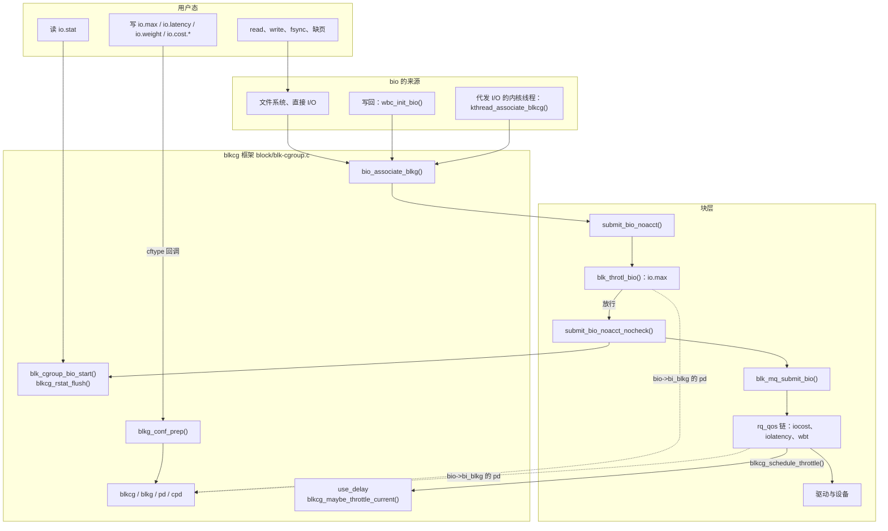
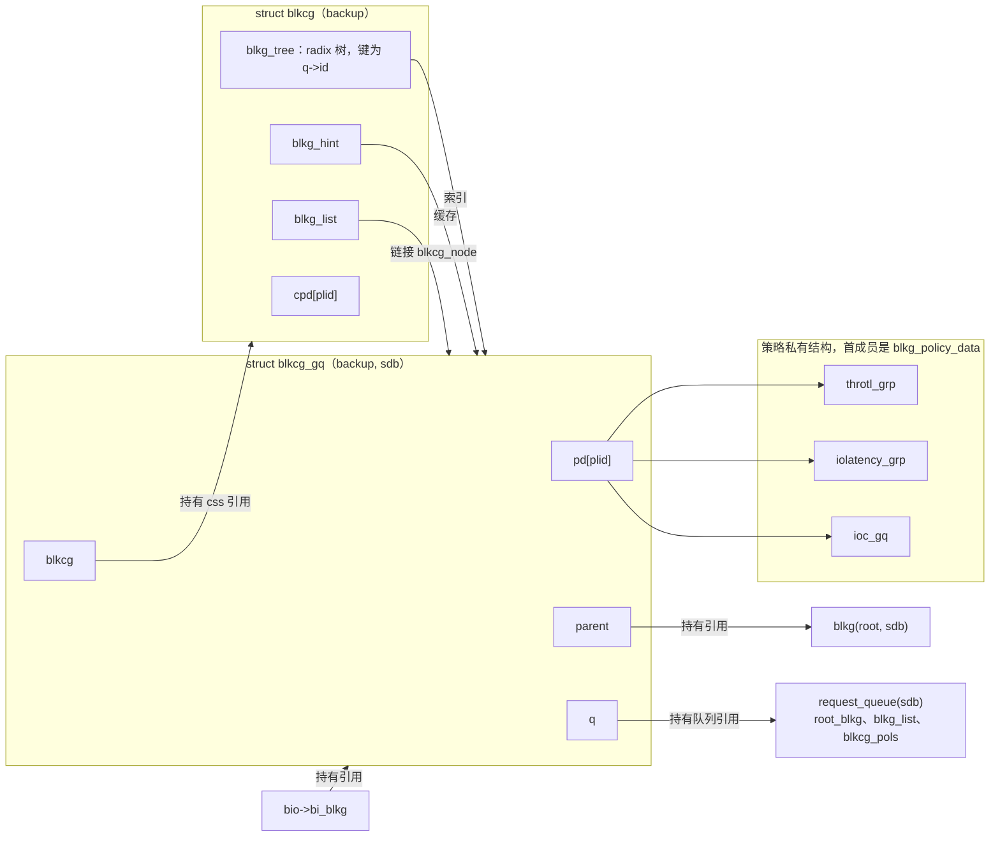
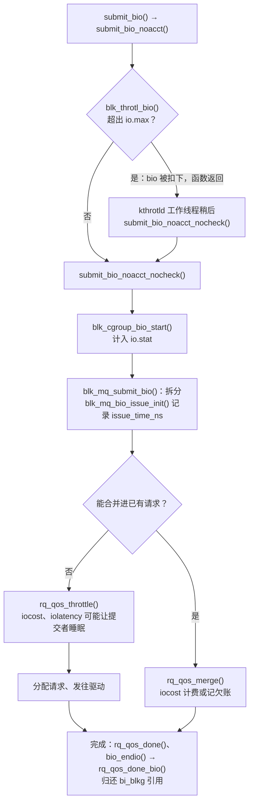
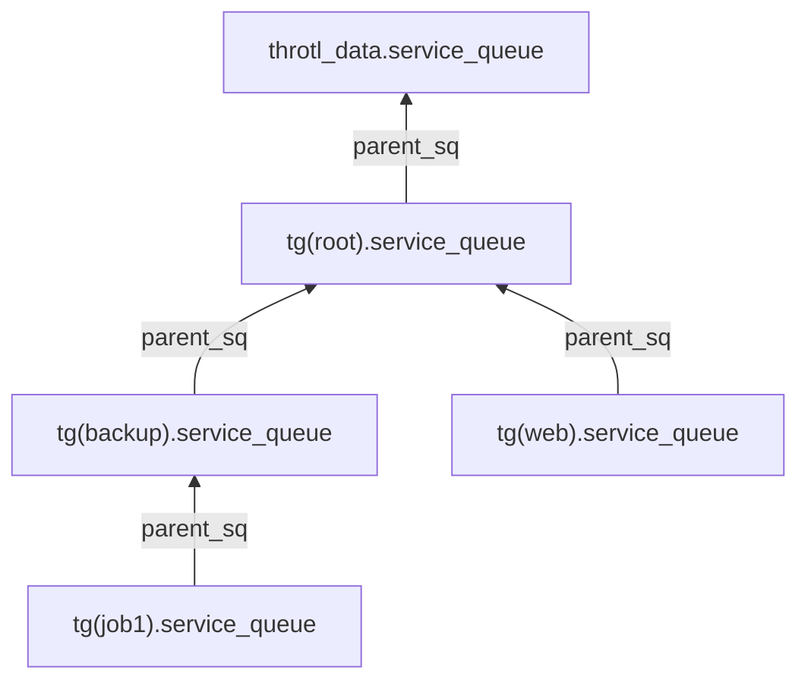
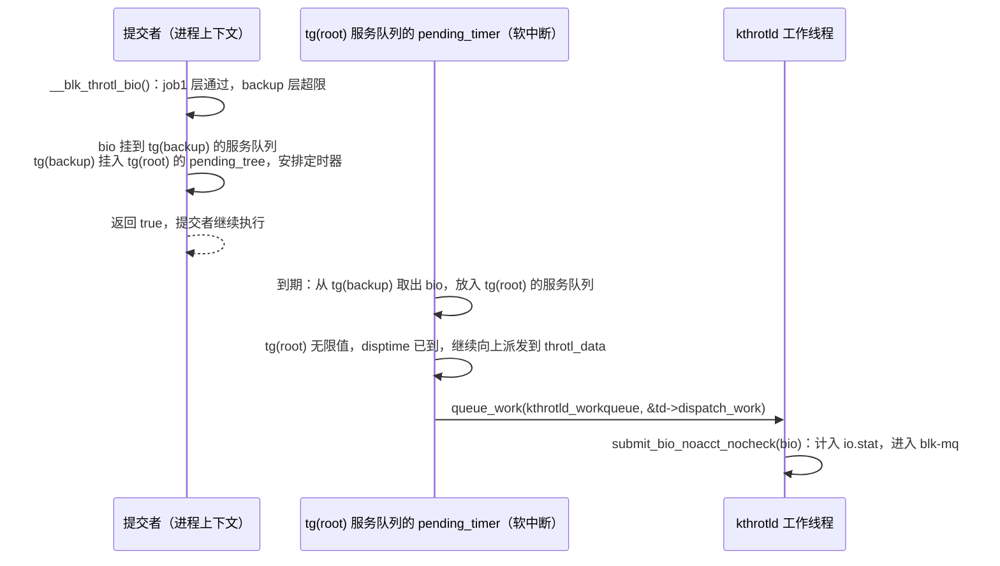

# cgroup v2 的 io 控制器：blkcg 框架与 I/O 策略

一台服务器有一块 NVMe SSD `nvme0n1`（设备号 259:0）和一块机械盘 `sdb`（8:16），上面运行着数据库 `db`、Web 服务 `web` 和一组备份任务 `backup`。管理员希望：

1. 不论磁盘多空闲，`backup` 在 `sdb` 上的读带宽都不超过 50 MiB/s，读 IOPS 不超过 500。
2. `nvme0n1` 繁忙时，`db`、`web`、`backup` 按 5:3:1 分享设备能力；某个组不发 I/O 时，它的份额让给别人。
3. `db` 在 `nvme0n1` 上的 I/O 延迟保持在 2 ms 以内；做不到时，限制延迟要求比它宽松的兄弟组。
4. 能看到每个组在每块磁盘上读写了多少字节、多少次 I/O。

这四条分别对应 cgroup v2 `io` 控制器的 `io.max`、`io.weight`（配合根 cgroup 上的 `io.cost.qos` 和 `io.cost.model`）、`io.latency` 和 `io.stat`。与 `cpu`、`memory` 控制器不同，`io` 控制器的核心代码 `block/blk-cgroup.c`（下称 **blkcg 框架**）本身几乎不限制任何 I/O，它只做三件事：

- 为每个“cgroup × 磁盘”组合维护一个控制单元 `struct blkcg_gq`（下称 blkg）；
- 让每个 bio 记住自己属于哪个 blkg；
- 提供**策略**（policy）注册接口，由各个策略在块层的不同位置实施控制。

当前配置编入了三个策略：blk-throttle 实现 `io.max`，iolatency 实现 `io.latency`，iocost 实现 `io.weight`。BFQ 调度器以模块形式编入，加载后提供 `io.bfq.weight`。

本章回答以下问题：

1. blkcg 框架有哪些对象？为什么控制单元是“cgroup × 磁盘”，而不是 cgroup 本身？
2. 一个 bio 怎样找到自己的 blkg？写回线程、内核线程代为发起的 I/O 算在谁的账上？
3. 策略怎样注册，怎样在一块磁盘上激活？它们分别在块层的哪个位置拦截 bio？
4. `io.max` 怎样按时间片计算一个 bio 需要等多久，又怎样在层级上逐级限速？
5. `io.latency` 怎样根据一个组的延迟限制它的兄弟组？
6. iocost 怎样估计一次 I/O 的成本，怎样用虚拟时间按权重分配设备能力，设备饱和时又怎样调整速率？
7. `io.stat` 中的数字在哪里累计，何时汇总？

## 0. 分析基线

本章依据仓库内 [Makefile 第 2～4 行](../../linux/Makefile#L2-L4)标记的 **6.18.52** 版本，架构为 **x86-64**。读者应先读过 [cgroup v2 概述](intrudoction.md)，了解 css、有效 css、`depends_on` 和 rstat；还需要知道 bio、`request_queue`、blk-mq 请求分配与完成的基本流程。

与本章结论有关的配置如下。它们是编译条件，不代表某次运行一定经过对应路径。

| 配置 | 对本章的影响 | 依据 |
| --- | --- | --- |
| `CONFIG_BLK_CGROUP=y` | 编入 blkcg 框架 `blk-cgroup.o`，即 `io` 控制器本身 | [.config#L214](../../linux/.config#L214)、[block/Makefile#L16](../../linux/block/Makefile#L16) |
| `CONFIG_BLK_DEV_THROTTLING=y` | 编入 blk-throttle，提供 `io.max`；它选中 `CONFIG_BLK_CGROUP_RWSTAT`，后者只用于 v1 的统计文件 | [.config#L1057](../../linux/.config#L1057)、[.config#L1049](../../linux/.config#L1049)、[block/Kconfig#L106-L109](../../linux/block/Kconfig#L106-L109) |
| `CONFIG_BLK_CGROUP_IOLATENCY=y` | 编入 iolatency，提供 `io.latency` | [.config#L1060](../../linux/.config#L1060)、[block/Makefile#L21](../../linux/block/Makefile#L21) |
| `CONFIG_BLK_CGROUP_IOCOST=y` | 编入 iocost，提供 `io.weight`、`io.cost.qos`、`io.cost.model`；它选中 `CONFIG_BLK_RQ_ALLOC_TIME`，请求带有分配时间戳 | [.config#L1062](../../linux/.config#L1062)、[.config#L1048](../../linux/.config#L1048)、[block/Kconfig#L154-L157](../../linux/block/Kconfig#L154-L157) |
| `CONFIG_IOSCHED_BFQ=m`、`CONFIG_BFQ_GROUP_IOSCHED=y` | BFQ 是模块，加载时注册策略，此后才出现 `io.bfq.weight`，本章不展开 | [.config#L1109-L1110](../../linux/.config#L1109-L1110)、[bfq-iosched.c#L7637](../../linux/block/bfq-iosched.c#L7637) |
| `CONFIG_BLK_CGROUP_IOPRIO`、`CONFIG_BLK_CGROUP_FC_APPID` 未设置 | 没有 `io.prio.class`，也没有 FC 应用标识 | [.config#L1061](../../linux/.config#L1061)、[.config#L1063](../../linux/.config#L1063) |
| `CONFIG_MEMCG=y`、`CONFIG_CGROUP_WRITEBACK=y` | `io` 依赖 `memory`；写回产生的 bio 按写回上下文关联 blkg（7.4 节） | [.config#L212](../../linux/.config#L212)、[.config#L215](../../linux/.config#L215)、[blk-cgroup.c#L1567-L1574](../../linux/block/blk-cgroup.c#L1567-L1574) |
| `CONFIG_BLK_CGROUP_PUNT_BIO=y` | 由 `CONFIG_BTRFS_FS`（`=m`）选中，提供按 blkg 异步提交 bio 的工作队列（7.4 节） | [.config#L1050](../../linux/.config#L1050)、[.config#L9627](../../linux/.config#L9627)、[fs/btrfs/Kconfig#L3-L5](../../linux/fs/btrfs/Kconfig#L3-L5) |
| `CONFIG_BLK_WBT=y`、`CONFIG_BLK_WBT_MQ=y` | 写回节流 wbt 也挂在 rq_qos 链上；启用 iocost 时会关闭默认的 wbt（6.9 节） | [.config#L1058-L1059](../../linux/.config#L1058-L1059) |
| `CONFIG_HZ=1000` | blk-throttle 的时间片 `HZ / 10` 为 100 个 jiffy，即 100 ms | [.config#L506](../../linux/.config#L506)、[blk-throttle.c#L24-L25](../../linux/block/blk-throttle.c#L24-L25) |
| `CONFIG_PREEMPT_RT` 未设置 | iocost 的等待 hrtimer 回调在硬中断上下文执行（第 8 节） | [.config#L139](../../linux/.config#L139)、[hrtimer.c#L1616-L1627](../../linux/kernel/time/hrtimer.c#L1616-L1627) |

还有几个**运行时条件**会改变结论：

- **策略按磁盘惰性激活。** blk-throttle 在第一次对某块磁盘写 `io.max` 时激活（4.5 节），iolatency 在第一次写 `io.latency` 时激活（5.5 节），iocost 在第一次写 `io.cost.qos` 或 `io.cost.model` 时激活，但直到写入 `enable=1` 才真正开始控制（6.9 节）。从未配置过的磁盘只承担 blkcg 框架本身的开销：bio 归属和 `io.stat` 计数。
- **调试统计开关。** blk-cgroup 的模块参数 `blkcg_debug_stats` 默认为 false，权限 0644（[blk-cgroup.c#L60](../../linux/block/blk-cgroup.c#L60)、[blk-cgroup.c#L2271-L2272](../../linux/block/blk-cgroup.c#L2271-L2272)），它决定 `io.stat` 是否输出延迟、在途深度等调试字段。
- **设备类型。** iolatency 按 `blk_queue_nonrot()` 区分 SSD 与 HDD 两种判定方法（5.3 节）；iocost 按设备是否旋转、队列深度挑选默认参数（6.3 节）。
- 启动参数 `cgroup_disable=io` 可以关闭整个控制器（见概述章第 0 节）。

## 1. io 控制器要解决什么问题

### 1.1 需求与机制

| 需求 | 接口 | 提供者 | 机制 | 生效位置 |
| --- | --- | --- | --- | --- |
| 一个组在一块磁盘上的带宽或 IOPS 有硬上限 | `io.max` | blk-throttle | 按时间片计算允许量，超出的 bio 被扣下排队，由定时器逐层放行 | `submit_bio_noacct()` 中的 `blk_throtl_bio()`，bio 进入请求队列之前（第 4 节） |
| 延迟敏感的组有延迟目标，未达标时牺牲兄弟组 | `io.latency` | iolatency | 按窗口统计完成延迟；未达标时缩小延迟要求更宽松的兄弟组的在途 I/O 上限 | rq_qos 的 `throttle`、`done_bio` 钩子（第 5 节） |
| 按权重分享设备能力，空闲份额让给别人 | `io.weight`、`io.cost.qos`、`io.cost.model` | iocost | 用成本模型把 I/O 折算成设备时间，各组按层级权重消耗虚拟时间；按设备饱和程度调整虚拟时间的流速 | rq_qos 的 `throttle`、`merge`、`done_bio`、`done` 钩子和周期定时器（第 6 节） |
| 观测 | `io.stat` | blkcg 框架和各策略 | 每 CPU 计数，读取时经 rstat 汇总；各策略追加自己的字段 | `submit_bio_noacct_nocheck()` 中的 `blk_cgroup_bio_start()`（3.7 节） |
| 在 BFQ 调度器内部按权重调度 | `io.bfq.weight` | BFQ（模块） | 调度器内部的组调度 | BFQ 的派发逻辑，本章不展开 |

### 1.2 核心思路：控制单元是“cgroup × 磁盘”，归属由 bio 携带

**I/O 资源属于具体设备。** 一个组可以同时访问多块磁盘，而不同磁盘的能力可以相差几个数量级。“50 MiB/s”只有和一块磁盘放在一起才有意义，同一组在两块盘上的用量也要分开计算。因此 blkcg 框架的控制单元是 blkg：每个 cgroup 在每个 `request_queue` 上最多一个。策略的状态挂在 blkg 上，称为 `blkg_policy_data`（下称 pd）；只与 cgroup 有关、与磁盘无关的少量状态（例如 iocost 的默认权重）挂在 cgroup 上，称为 `blkcg_policy_data`（下称 cpd）。

**归属由 bio 携带。** I/O 的发起者常常不是受益者：page cache 中的脏页由写回线程刷盘，loop 设备、btrfs 压缩由内核线程代发，bio 在块层还会被拆分、被重映射到下层设备、被扣下后由别的上下文再次提交。因此各个控制点不能用 `current` 判断归属。bio 在设定目标设备时就关联到一个 blkg，记录在 `bio->bi_blkg` 中并持有其引用，此后所有策略都只看 `bi_blkg`（3.1 节）。

**机制可替换，框架统一。** 限速、延迟保护、按比例分配是性质不同的三种控制，适合放在块层的不同位置。限速可以先把 bio 扣下，稍后再提交，所以放在 bio 进入请求队列之前；按成本分配和延迟保护需要知道请求的分配、发出和完成时刻，所以挂在 blk-mq 的 rq_qos 钩子上。框架只负责对象管理、bio 归属、配置解析、统计，以及“返回用户态时再延迟”这样的公共服务。

### 1.3 在内核中的位置

下图展示 `io` 控制器连接的各条路径。实线表示调用或 bio 的流动，虚线表示读取状态。



需要注意三点：

- **配置路径和执行路径分开。** 写接口文件只修改 blkg 上的 pd；真正决定 bio 能否继续前进的，是提交路径上的 `blk_throtl_bio()` 和 rq_qos 钩子。它们通过 `bio->bi_blkg` 找到 pd，不经过 cgroup 核心。
- **与 cgroup 核心的接口很少。** `io_cgrp_subsys` 只注册了 css 生命周期、rstat 刷新和任务退出回调，没有 `can_attach`、`attach`（[blk-cgroup.c#L1557-L1575](../../linux/block/blk-cgroup.c#L1557-L1575)）。任务迁移时没有任何 I/O 状态需要搬动：迁移之后新构造的 bio 自然关联到新组的 blkg，已经在途或被扣下的 bio 的 `bi_blkg` 不变，仍算原来的组。
- **策略的位置决定行为差异。** blk-throttle 在 bio 层工作，对任何块设备都有效，扣下 bio 后立即返回，不阻塞提交者；iocost 和 iolatency 在 rq_qos 钩子上工作，只对 blk-mq 设备有效，超额时让提交者睡眠（3.3 节）。

### 1.4 触发事件与输入输出

| 触发事件 | 执行上下文 | 入口 | 结果 |
| --- | --- | --- | --- |
| 创建磁盘 | 驱动探测，进程上下文 | `__alloc_disk_node()` → [`blkcg_init_disk()`](../../linux/block/blk-cgroup.c#L1499-L1542) | 创建该队列的根 blkg |
| 父 cgroup 的 `subtree_control` 含 `io` 时 `mkdir` | 进程上下文，持有 `cgroup_mutex` | [`blkcg_css_alloc()`](../../linux/block/blk-cgroup.c#L1413-L1477)、[`blkcg_css_online()`](../../linux/block/blk-cgroup.c#L1479-L1491) | 创建 `struct blkcg`，此时不创建任何 blkg |
| 构造 bio 并设定目标设备 | 发起者上下文 | `bio_init()`、`bio_set_dev()` → [`bio_associate_blkg()`](../../linux/block/blk-cgroup.c#L2169-L2186) | `bi_blkg` 指向（必要时新建的）blkg，并持有引用 |
| 提交 bio | 发起者的进程上下文，可以睡眠 | [`submit_bio_noacct()`](../../linux/block/blk-core.c#L780-L884)、`blk_mq_submit_bio()` | 依次经过 blk-throttle、`io.stat` 计数、rq_qos |
| bio 或请求完成 | 通常是中断或软中断 | `bio_endio()` → `rq_qos_done_bio()`；请求完成 → `rq_qos_done()` | 策略记录完成，归还 blkg 引用 |
| 写 `io.max`、`io.latency`、`io.weight`、`io.cost.*` | 进程上下文 | `tg_set_limit()`、`iolatency_set_limit()`、`ioc_weight_write()`、`ioc_qos_write()` 等 | 必要时激活策略、创建 blkg，再修改 pd |
| 读 `io.stat` | 进程上下文 | [`blkcg_print_stat()`](../../linux/block/blk-cgroup.c#L1234-L1252) | rstat 刷新后每块磁盘输出一行 |
| 被标记的任务返回用户态 | 任务自身 | `resume_user_mode_work()` → [`blkcg_maybe_throttle_current()`](../../linux/block/blk-cgroup.c#L2016-L2047) | 按祖先中最大的累计延迟睡眠 |
| `rmdir` | cgroup 的工作队列 | [`blkcg_css_offline()`](../../linux/block/blk-cgroup.c#L1385-L1392)、[`blkcg_css_free()`](../../linux/block/blk-cgroup.c#L1394-L1411) | 写回结束后销毁 blkg，最后释放 blkcg |
| 删除磁盘 | 进程上下文 | `del_gendisk()`、`disk_release()` → [`blkcg_exit_disk()`](../../linux/block/blk-cgroup.c#L1544-L1548) | 放出被扣下的 bio，拆除 rq_qos，销毁该队列的全部 blkg |

### 1.5 本章边界

本章只讨论 cgroup v2 下的 `io` 控制器。以下内容不展开：

- BFQ 调度器的组调度，只说明它也是一个 blkcg 策略；
- 写回节流 wbt，只说明它与 iocost 共用 rq_qos 链；
- cgroup writeback 中页面、inode 和 wb 三种归属以及 inode 的归属切换，只交代写回 bio 怎样获得 blkg，详细机制留给 cgroup writeback 一章；
- v1 的 `blkio.*` 文件；
- `io.pressure`：它是 cgroup 核心按 PSI 提供的文件（[cgroup.c#L5538-L5547](../../linux/kernel/cgroup/cgroup.c#L5538-L5547)），不属于 `io` 控制器，不启用 `io` 也存在。

blk-mq 的请求分配、调度与派发只在需要说明钩子位置时提及。

## 2. 核心数据结构

### 2.1 结构地图

用下面这棵 cgroup 树作例子。假设根和 `backup` 的 `subtree_control` 都含 `io`：

```text
/                 （根）
├── db            io.latency：259:0 target=2000
├── web
└── backup        io.max：8:16 rbps=52428800 riops=500
    └── job1
```

每个 cgroup 有一个 `struct blkcg`。blkg 则按需出现：磁盘创建时就有根 blkg；其他组只有在“它的 bio 发往这块磁盘”或“对这块磁盘写过配置”之后才有 blkg。某一时刻的状态可能如下：

```text
                     nvme0n1 (259:0)        sdb (8:16)
blkcg_root    ──►    root_blkg              root_blkg
  db          ──►    blkg(db)               ——  （db 从未访问 sdb）
  web         ──►    blkg(web)              blkg(web)
  backup      ──►    ——                     blkg(backup)
    job1      ──►    ——                     blkg(job1)
```

`blkg(db, nvme0n1)` 因为写过 `io.latency` 而存在；`blkg(backup, sdb)` 因为写过 `io.max` 而存在；`blkg(job1, sdb)` 在 job1 的 bio 第一次发往 sdb 时创建，它的父 blkg 必须先存在（3.2 节）。

下图画出 `blkg(backup, sdb)` 周围的对象。箭头都表示指针，标注说明该指针是否持有引用。



读这张图时注意：

- **一个 blkg 同时属于两个集合。** 它通过 `blkcg_node` 挂在所属 blkcg 的 `blkg_list` 上，通过 `q_node` 挂在所属队列的 `blkg_list` 上。前者用于“列出一个 cgroup 在所有磁盘上的状态”（读 `io.stat`、读配置文件），后者用于“对一块磁盘上的所有 cgroup 做操作”（激活策略、删除磁盘）。
- **blkg 的父子关系与 cgroup 树平行，但只在同一队列内成立。** `blkg(job1, sdb)->parent` 是 `blkg(backup, sdb)`，再往上是 sdb 的根 blkg。策略沿 `parent` 实现层级语义。
- **pd 嵌入在策略自己的结构中。** 框架只认识 `struct blkg_policy_data`，策略用 `container_of()` 取回自己的结构。

### 2.2 `struct blkcg`：一个 cgroup 的 io 状态

`struct blkcg` 嵌入 css，是 `io` 控制器的 css 状态对象（[blk-cgroup.h#L94-L120](../../linux/block/blk-cgroup.h#L94-L120)），`css_to_blkcg()` 用 `container_of()` 从 css 取回它（[blk-cgroup.h#L122-L125](../../linux/block/blk-cgroup.h#L122-L125)）。根 cgroup 使用静态对象 `blkcg_root`（[blk-cgroup.c#L50](../../linux/block/blk-cgroup.c#L50)）。

| 字段 | 含义 | 说明 |
| --- | --- | --- |
| `css` | 嵌入的 css | 由 cgroup 核心管理生命周期 |
| `lock` | 自旋锁 | 保护 `blkg_tree`、`blkg_list` 的修改；嵌套在队列的 `queue_lock` 之内（2.7 节） |
| `online_pin` | 在线钉住计数 | 初值 1；子 blkcg 上线时把父的加 1，cgroup writeback 也会钉住它；降到 0 时销毁本 blkcg 的全部 blkg（7.1 节） |
| `congestion_count` | 处于延迟状态的 blkg 数 | 一个 blkg 的 `use_delay` 从 0 变为非 0 时加 1（3.6 节） |
| `blkg_tree` | radix 树 | 以 `q->id` 为键，查找本 cgroup 在某个队列上的 blkg |
| `blkg_hint` | RCU 指针 | 最近一次查到的 blkg，查找的快路径 |
| `blkg_list` | 哈希链表头 | 本 cgroup 的全部 blkg |
| `cpd[]` | 每策略一个 | 长度 `BLKCG_MAX_POLS`，当前为 6（[blkdev.h#L53](../../linux/include/linux/blkdev.h#L53)） |
| `all_blkcgs_node` | 挂在全局 `all_blkcgs` 上 | 注册新策略时为已有的 blkcg 补分配 cpd（[blk-cgroup.c#L58](../../linux/block/blk-cgroup.c#L58)） |
| `lhead` | 每 CPU 的无锁链表头 | 记录自上次刷新以来有更新的 I/O 计数（3.7 节） |
| `cgwb_list` | cgroup writeback 结构链表 | 7.4 节 |

`struct blkcg` 本身不保存任何限值、权重或计数。它只是一个容器：真正的控制状态在它的 blkg 上。

### 2.3 `struct blkcg_gq`：cgroup 在一块磁盘上的控制单元

`struct blkcg_gq` 的定义见 [blk-cgroup.h#L56-L92](../../linux/block/blk-cgroup.h#L56-L92)，源码注释说明它是“blk cgroup 与 request_queue 之间的关联”（[blk-cgroup.h#L127-L137](../../linux/block/blk-cgroup.h#L127-L137)）。

| 字段 | 含义 | 说明 |
| --- | --- | --- |
| `q` | 所在的请求队列 | blkg 持有队列引用（`blkg_alloc()` 中的 `blk_get_queue()`） |
| `q_node` | 挂在 `q->blkg_list` 上 | 直到释放工作函数中才摘除（7.2 节） |
| `blkcg_node` | 挂在 `blkcg->blkg_list` 上 | 销毁时摘除；`hlist_unhashed(&blkg->blkcg_node)` 被用来判断“已经销毁” |
| `blkcg` | 所属 blkcg | 持有其 css 引用 |
| `parent` | 同一队列上父 cgroup 的 blkg | 根 blkg 为 NULL；持有引用；注释说明非根 blkg 总能访问父 blkg |
| `refcnt` | `percpu_ref` | 创建时的初始引用在销毁时由 `percpu_ref_kill()` 去掉（7.2 节） |
| `online` | 是否在线 | 注释说由 blkcg 锁和队列锁共同保护 |
| `iostat_cpu`、`iostat` | 每 CPU 计数与汇总值 | `struct blkg_iostat_set`（[blk-cgroup.h#L41-L53](../../linux/block/blk-cgroup.h#L41-L53)），3.7 节 |
| `pd[]` | 各策略的私有数据 | 下标为策略编号 `plid` |
| `async_bio_lock`、`async_bios`、`async_bio_work` | 异步提交 | 7.4 节；`async_bio_work` 与 `free_work` 共用一个 union，释放时已不可能有待提交的 bio（[blk-cgroup.c#L168-L170](../../linux/block/blk-cgroup.c#L168-L170)） |
| `use_delay`、`delay_nsec`、`delay_start`、`last_delay`、`last_use` | 返回用户态时的延迟 | 3.6 节 |

### 2.4 策略接口：`blkcg_policy`、pd 与 cpd

一个策略用 `struct blkcg_policy` 描述（[blk-cgroup.h#L172-L189](../../linux/block/blk-cgroup.h#L172-L189)）：

| 成员 | 调用时机 | 调用者 |
| --- | --- | --- |
| `plid` | 注册时分配的编号，即 `pd[]`、`cpd[]` 的下标 | `blkcg_policy_register()` |
| `dfl_cftypes`、`legacy_cftypes` | 注册时加入 `io` 控制器的接口文件 | `blkcg_policy_register()` |
| `cpd_alloc_fn`、`cpd_free_fn` | blkcg 创建、释放；策略注册、注销 | `blkcg_css_alloc()`、`blkcg_css_free()`、`blkcg_policy_register()` |
| `pd_alloc_fn` | 策略已在队列上激活时分配 blkg；激活时为已有 blkg 补分配 | `blkg_alloc()`、`blkcg_activate_policy()` |
| `pd_init_fn` | blkg 链好 `parent` 之后、插入集合之前；激活时 | `blkg_create()`、`blkcg_activate_policy()` |
| `pd_online_fn` | 插入集合时 | 同上 |
| `pd_offline_fn` | blkg 销毁或策略停用 | `blkg_destroy()`、`blkcg_deactivate_policy()` |
| `pd_free_fn` | blkg 释放或策略停用 | `blkg_free_workfn()`、`blkcg_deactivate_policy()` |
| `pd_stat_fn` | 输出 `io.stat` 的一行时追加字段 | `blkcg_print_one_stat()` |

pd 和 cpd 都只有几个公共字段（[blk-cgroup.h#L138-L156](../../linux/block/blk-cgroup.h#L138-L156)）：`pd` 记录所属 blkg、`plid` 和 `online`，`cpd` 记录所属 blkcg 和 `plid`。策略分配一个更大的结构并把它们放在开头，例如 `struct throtl_grp` 的首成员是 `struct blkg_policy_data pd`（[blk-throttle.h#L69-L71](../../linux/block/blk-throttle.h#L69-L71)）。`blkg_to_pd()` 用 `plid` 下标取出指针（[blk-cgroup.h#L281-L285](../../linux/block/blk-cgroup.h#L281-L285)），策略再用 `container_of()` 转换。

当前配置中的策略：

| 策略 | 每 blkg 对象 | 每队列对象 | 每 cgroup 对象 | v2 接口文件 | 定义 |
| --- | --- | --- | --- | --- | --- |
| blk-throttle | `throtl_grp` | `throtl_data`（`q->td`） | 无 | `io.max` | [blk-throttle.c#L1672-L1681](../../linux/block/blk-throttle.c#L1672-L1681) |
| iolatency | `iolatency_grp` | `blk_iolatency`（rq_qos） | 无 | `io.latency` | [blk-iolatency.c#L1051-L1058](../../linux/block/blk-iolatency.c#L1051-L1058) |
| iocost | `ioc_gq` | `ioc`（rq_qos） | `ioc_cgrp` | `io.weight`、`io.cost.qos`、`io.cost.model` | [blk-iocost.c#L3532-L3540](../../linux/block/blk-iocost.c#L3532-L3540) |
| BFQ（模块加载后） | `bfq_group` | BFQ 调度器实例 | 有 | `io.bfq.weight` | [bfq-cgroup.c#L1239-L1251](../../linux/block/bfq-cgroup.c#L1239-L1251) |

### 2.5 请求队列、bio 与任务中的字段

**`struct request_queue`。** 与本章有关的字段见 [blkdev.h#L532-L539](../../linux/include/linux/blkdev.h#L532-L539)、[blkdev.h#L559-L564](../../linux/include/linux/blkdev.h#L559-L564) 和 [blkdev.h#L608-L611](../../linux/include/linux/blkdev.h#L608-L611)：

| 字段 | 含义 |
| --- | --- |
| `blkcg_pols` | 位图，记录哪些策略已在本队列上激活；`blkcg_policy_enabled()` 测试它（[blk-cgroup.h#L457-L461](../../linux/block/blk-cgroup.h#L457-L461)） |
| `root_blkg` | 根 blkg |
| `blkg_list` | 本队列的全部 blkg |
| `blkcg_mutex` | 同步 pd 的释放、策略停用和配置准备 |
| `id` | 队列编号，`blkcg->blkg_tree` 的键 |
| `rq_qos`、`rq_qos_mutex` | rq_qos 链表头及修改锁（2.6 节） |
| `td` | blk-throttle 的每队列数据，第一次写 `io.max` 时分配 |

**`struct bio`。** `bi_blkg` 指向 bio 所属的 blkg，注释说明引用在 bio 释放时归还；`issue_time_ns` 是 iolatency 使用的发出时间；`bi_iocost_cost` 是 iocost 为这个 bio 记的账（[blk_types.h#L245-L258](../../linux/include/linux/blk_types.h#L245-L258)）。几个标志位在后文反复出现（[blk_types.h#L300-L314](../../linux/include/linux/blk_types.h#L300-L314)）：

| 标志 | 含义 |
| --- | --- |
| `BIO_BPS_THROTTLED` | 已经通过本设备的 blk-throttle 全部层级，字节数不再计费 |
| `BIO_CGROUP_ACCT` | 已经计入 `io.stat` 的字节数 |
| `BIO_QOS_THROTTLED` | 经过了 rq_qos 的 `throttle` 钩子 |
| `BIO_TG_BPS_THROTTLED` | 已在当前这一层 `throtl_grp` 计过字节；与 `BIO_QOS_THROTTLED` 共用同一位，注释说明两者处在不同层次，可以复用 |
| `BIO_QOS_MERGED` | 经过了 rq_qos 的 `merge` 钩子 |

**任务与内核线程。** `task_struct::throttle_disk` 和 `use_memdelay` 记录“返回用户态时要在哪块磁盘上检查延迟、是否计入内存压力”（[sched.h#L1027](../../linux/include/linux/sched.h#L1027)、[sched.h#L1569](../../linux/include/linux/sched.h#L1569)）。`struct kthread::blkcg_css` 记录内核线程当前代表哪个 cgroup 发起 I/O（[kthread.c#L67](../../linux/kernel/kthread.c#L67)）。

### 2.6 rq_qos：请求队列上的 QoS 钩子链

iolatency、iocost 和 wbt 都通过 rq_qos 接入 blk-mq。每个实例是一个 `struct rq_qos`，内含操作表、所属磁盘、类型编号和 `next` 指针（[blk-rq-qos.h#L16-L49](../../linux/block/blk-rq-qos.h#L16-L49)）。`rq_qos_add()` 冻结队列后把实例插到链表头，并设置 `QUEUE_FLAG_QOS_ENABLED`；同一类型在一个队列上只能有一个，重复添加返回 `-EBUSY`（[blk-rq-qos.c#L325-L361](../../linux/block/blk-rq-qos.c#L325-L361)）。各钩子是内联函数，先测试标志位，再沿链表调用非空的回调（[blk-rq-qos.h#L141-L188](../../linux/block/blk-rq-qos.h#L141-L188)、[blk-rq-qos.c#L62-L69](../../linux/block/blk-rq-qos.c#L62-L69)）。

| 钩子 | 调用点 | iolatency | iocost |
| --- | --- | --- | --- |
| `throttle` | 分配请求之前，或使用 plug 中缓存的请求之前（[blk-mq.c#L3048](../../linux/block/blk-mq.c#L3048)、[blk-mq.c#L3178-L3179](../../linux/block/blk-mq.c#L3178-L3179)）；先设置 `BIO_QOS_THROTTLED` | 取在途名额 | 检查预算、等待或记欠账 |
| `merge` | bio 合并进已有请求（如 [blk-merge.c#L944](../../linux/block/blk-merge.c#L944)）；先设置 `BIO_QOS_MERGED` | — | 为合并的部分计费 |
| `done_bio` | `bio_endio()`（[bio.c#L1641](../../linux/block/bio.c#L1641)） | 归还名额，记录延迟 | 推进 `done_vtime` |
| `done` | 请求完成（如 [blk-mq.c#L812](../../linux/block/blk-mq.c#L812)） | — | 统计延迟和请求等待时间 |
| `exit` | 删除磁盘时的 `rq_qos_exit()`（[blk-rq-qos.c#L313-L323](../../linux/block/blk-rq-qos.c#L313-L323)） | 停用策略并释放 | 同左 |

这些钩子只在 blk-mq 的提交路径上调用，所以 iolatency 和 iocost 只对 blk-mq 设备起作用。`rq_qos_add()` 的注释也写明“只支持 blk-mq 队列”（[blk-rq-qos.c#L337-L341](../../linux/block/blk-rq-qos.c#L337-L341)）。

### 2.7 引用、生命周期与并发保护一览

| 对象 | 创建 | 谁持有引用 | 销毁与释放 | 并发保护 |
| --- | --- | --- | --- | --- |
| `blkcg` | `css_alloc` | cgroup 核心；每个 blkg 一个 css 引用 | 下线后 `online_pin` 归零时销毁其 blkg；全部 css 引用归还后 `css_free` 释放 | `blkcg_pol_mutex` 保护 `all_blkcgs` 和 `cpd[]` |
| blkg | 磁盘创建时建根 blkg；其余由 `blkg_lookup_create()` 或 `blkg_conf_prep()` 按需创建 | 初始引用、bio、子 blkg、blk-throttle 排队中的 qnode、iolatency 定时器的临时引用 | `blkg_destroy()` 去掉初始引用；计数归零后经 RCU 宽限期，再在工作队列中释放 | 插入、摘除同时持有 `queue_lock` 和 `blkcg->lock`；查找在 RCU 下进行 |
| pd | `blkg_alloc()` 或 `blkcg_activate_policy()` | blkg 的 `pd[]` | blkg 释放或策略停用 | 修改时持有 `queue_lock` 和 `blkcg->lock`；读者持有其中任一把锁并确认 `blkcg_policy_enabled()` 即可解引用（[blk-cgroup.c#L1586-L1589](../../linux/block/blk-cgroup.c#L1586-L1589)） |
| cpd | `blkcg_css_alloc()` 或 `blkcg_policy_register()` | blkcg 的 `cpd[]` | blkcg 释放或策略注销 | `blkcg_pol_mutex` |
| rq_qos 实例 | 第一次写对应的配置文件 | 队列的 `rq_qos` 链表 | `rq_qos_exit()` | `q->rq_qos_mutex`；修改链表时冻结队列 |

blkcg 框架维持以下不变量：

1. **父 blkg 先于子 blkg 存在。** 非根 blkg 的 `parent` 指向同一队列上父 cgroup 的 blkg；创建总是自顶向下（3.2 节），子 blkg 持有父 blkg 的引用，直到子 blkg 释放时才归还（[blk-cgroup.c#L132-L133](../../linux/block/blk-cgroup.c#L132-L133)）。
2. **每个 (blkcg, 队列) 最多一个在线 blkg。** 插入以 `q->id` 为键的 radix 树，重复插入失败（[blk-cgroup.c#L420-L421](../../linux/block/blk-cgroup.c#L420-L421)）。
3. **策略激活时 pd 齐全。** 策略在队列上处于激活状态（`blkcg_pols` 中的位被置上）时，该队列上每个未销毁 blkg 的对应 `pd[]` 都非空（3.4 节）。
4. **`bi_blkg` 持有引用。** `bio->bi_blkg` 非空时持有该 blkg 的一个引用，在 `bio_uninit()` 或 `bio_endio()` 中归还（[bio.c#L213-L220](../../linux/block/bio.c#L213-L220)、[bio.c#L1661-L1671](../../linux/block/bio.c#L1661-L1671)）。

锁的嵌套顺序，从外到内：`blkcg_pol_register_mutex` → `blkcg_pol_mutex`（[blk-cgroup.c#L40-L48](../../linux/block/blk-cgroup.c#L40-L48)）；写配置时是 `q->rq_qos_mutex` → `q->blkcg_mutex` → `q->queue_lock` → `blkcg->lock`。`blkcg_destroy_blkgs()` 需要反过来先拿 `blkcg->lock`，所以对 `queue_lock` 只用 `spin_trylock()`，失败就放开重来（7.1 节）。

## 3. 框架的公共机制

### 3.1 bio 怎样获得归属

**目标**：在 bio 进入块层之前，确定它代表哪个 cgroup、发往哪个队列，并取得对应 blkg 的引用。

**入口**。只要 bio 设定了目标设备，就会关联 blkg：`bio_init()` 在给定 `bdev` 时调用 `bio_associate_blkg()`（[bio.c#L263-L271](../../linux/block/bio.c#L263-L271)），`bio_reset()` 同样如此（[bio.c#L302-L311](../../linux/block/bio.c#L302-L311)），换设备的 `bio_set_dev()` 也会重新关联（[bio.h#L509-L516](../../linux/include/linux/bio.h#L509-L516)）。

**选哪个 css**。[`bio_associate_blkg()`](../../linux/block/blk-cgroup.c#L2169-L2186) 跳过透传请求；如果 bio 已经有 `bi_blkg`，就沿用其 css，只换队列，这是 bio 被重映射到下层设备时的情况；否则调用 `blkcg_css()`：

```c
static struct cgroup_subsys_state *blkcg_css(void)
{
	struct cgroup_subsys_state *css;

	css = kthread_blkcg();
	if (css)
		return css;
	return task_css(current, io_cgrp_id);
}
```

来源：[block/blk-cgroup.c 第 104～112 行](../../linux/block/blk-cgroup.c#L104-L112)。内核线程如果用 `kthread_associate_blkcg()` 声明了“我在代表某个 cgroup 工作”（[kthread.c#L1655-L1673](../../linux/kernel/kthread.c#L1655-L1673)），就用那个 css；否则用当前任务的有效 io css，即沿 cgroup 树向上第一个启用了 `io` 的祖先的 css（概述章 3.2 节）。loop 设备的工作线程（[loop.c#L1912](../../linux/drivers/block/loop.c#L1912)）和 btrfs 的压缩工作（[btrfs/inode.c#L1127](../../linux/fs/btrfs/inode.c#L1127)）都这样做。注释提醒，这里返回的 css 可能已经在下线，调用者要用 tryget 确认。

**取得 blkg**。[`bio_associate_blkg_from_css()`](../../linux/block/blk-cgroup.c#L2145-L2157) 先归还旧引用；根 css 直接使用 `q->root_blkg`；否则调用 `blkg_tryget_closest()`：查找或创建 blkg（3.2 节），对它 `blkg_tryget()`，失败（blkg 正在销毁）就沿 `parent` 向上换一个能取得引用的祖先（[blk-cgroup.c#L2112-L2129](../../linux/block/blk-cgroup.c#L2112-L2129)）。注释说明，这种情况只在 cgroup 正在删除时发生，剩下的 bio 会“溢出”到最近的存活祖先。

**其他来源**：

- **写回。** 写回路径构造 bio 后调用 `wbc_init_bio()`，用写回上下文 `wbc->wb` 的 blkcg css 重新关联（[writeback.h#L256-L266](../../linux/include/linux/writeback.h#L256-L266)）。因此写回 I/O 记在 wb 所代表的 cgroup 上，而不是执行写回的内核线程上。
- **克隆。** `bio_clone_blkg_association()` 让克隆出的 bio 使用源 bio 的 css（[blk-cgroup.c#L2194-L2198](../../linux/block/blk-cgroup.c#L2194-L2198)）。
- **堆叠设备。** dm 之类的驱动用 `bio_set_dev()` 把 bio 转到下层设备时，css 不变、队列换成下层设备的队列，于是 bio 关联到同一 cgroup 在下层设备上的 blkg；如果设备变了，还会清除 `BIO_BPS_THROTTLED`，下层设备的 `io.max` 会再检查一次（4.6 节）。

### 3.2 blkg 的查找与按需创建

**查找**。[`blkg_lookup()`](../../linux/block/blk-cgroup.h#L255-L272) 必须在 RCU 读临界区或持有 `queue_lock` 时调用：根 blkcg 直接返回 `q->root_blkg`；否则先看 `blkg_hint`，再查 `blkg_tree`。两处取出的 blkg 都要核对 `blkg->q == q`。

**查找并创建**。[`blkg_lookup_create()`](../../linux/block/blk-cgroup.c#L467-L522) 在 RCU 下先查一次，没有才获取 `queue_lock`，然后自顶向下补齐缺失的 blkg：

```text
// 简化逻辑：blkg_lookup_create(blkcg, disk)，调用者持有 RCU 读锁
blkg = blkg_lookup(blkcg, q)；找到则返回
spin_lock_irqsave(q->queue_lock)
再查一次；找到则更新 blkg_hint 后返回
loop:
    pos = blkcg；ret_blkg = q->root_blkg
    沿 pos 的祖先向上，直到找到一个已有 blkg 的祖先 → ret_blkg = 它
        （pos 停在这个祖先的下一级，即“最高的缺失层”）
    blkg = blkg_create(pos, disk, NULL)      // GFP_NOWAIT 分配
    if 失败: blkg = ret_blkg; break           // 退而使用最近的已有祖先
    if pos == blkcg: break                    // 目标层已创建
spin_unlock_irqrestore(q->queue_lock)
return blkg
```

每轮只创建最高的一层缺失 blkg，所以创建 `blkg(job1, sdb)` 之前一定先有 `blkg(backup, sdb)`，这就是不变量 1 的来源。bio 路径在自旋锁下只能用 `GFP_NOWAIT` 分配；分配失败时不报错，而是把 bio 算到最近的已有祖先上，最坏情况下算到根上。

**创建**。[`blkg_create()`](../../linux/block/blk-cgroup.c#L371-L452) 在 `queue_lock` 下执行：

1. 队列正在消亡则返回 `-ENODEV`；
2. `css_tryget_online()` 取得 blkcg 的 css 引用，blkcg 已下线则返回 `-ENODEV`，所以正在删除的 cgroup 不会再长出新的 blkg；
3. 若调用者没有预先分配，就用 `GFP_NOWAIT` 调用 `blkg_alloc()`；
4. 查找父 blkg 并取得引用；
5. 对每个 pd 调用 `pd_init_fn`；
6. 在 `blkcg->lock` 下插入 `blkg_tree`、`blkcg->blkg_list` 和 `q->blkg_list`，对每个 pd 调用 `pd_online_fn`，置 `online`。

[`blkg_alloc()`](../../linux/block/blk-cgroup.c#L300-L365) 分配 blkg 本体、每 CPU 计数，取得队列引用，并**只为已在该队列上激活的策略**分配 pd（[blk-cgroup.c#L334-L349](../../linux/block/blk-cgroup.c#L334-L349)）。所以从未配置过任何策略的磁盘上，blkg 只有框架部分，没有 pd。

### 3.3 一个 bio 依次经过哪些检查点

下图按执行顺序列出 bio 从提交到完成经过的 cgroup 相关检查点（以 blk-mq 设备为例，省略与 cgroup 无关的步骤）。



依据：`submit_bio_noacct()` 调用 `blk_throtl_bio()`，被扣下就直接返回（[blk-core.c#L875-L877](../../linux/block/blk-core.c#L875-L877)）；[`submit_bio_noacct_nocheck()`](../../linux/block/blk-core.c#L728-L757) 第一步是 `blk_cgroup_bio_start()`；`blk_mq_submit_bio()` 依次拆分、记录发出时间、尝试合并、调用 `rq_qos_throttle()`（[blk-mq.c#L3161-L3194](../../linux/block/blk-mq.c#L3161-L3194)）。

从这个顺序可以得到几条推论：

- **`io.stat` 在 blk-throttle 之后、rq_qos 之前计数。** 被 `io.max` 扣下的 bio 在放行时才计入；在 iocost 或 iolatency 中等待的 bio 在等待之前就已经计入。`io.stat` 统计的是提交量，不是完成量。
- **blk-throttle 不阻塞提交者，rq_qos 会。** `blk_throtl_bio()` 把 bio 放进队列就返回 true，提交者继续运行；iocost 和 iolatency 在 `rq_qos_throttle()` 中以 `TASK_UNINTERRUPTIBLE` 睡眠，直到拿到预算或名额（6.4 节、5.2 节）。
- **iolatency 测得的延迟包含块层内的等待。** `issue_time_ns` 在合并和 rq_qos 之前记录（[blk-mq.c#L401-L408](../../linux/block/blk-mq.c#L401-L408)），所以 iolatency 统计的延迟包括在 rq_qos 中的等待、在调度器中的排队和设备处理时间（[blk-iolatency.c#L7-L8](../../linux/block/blk-iolatency.c#L7-L8)）。

**“以根的身份发出”的 bio。** 三个策略都对 `REQ_META` 和 `REQ_SWAP` 的 bio 特殊处理：

```c
static inline bool bio_issue_as_root_blkg(struct bio *bio)
{
	return (bio->bi_opf & (REQ_META | REQ_SWAP)) != 0;
}
```

来源：[block/blk-cgroup.h 第 241～244 行](../../linux/block/blk-cgroup.h#L241-L244)。注释解释了原因：元数据 I/O 和换出 I/O 常常在持有文件系统锁或处于内存回收中时发起，如果因为一个低优先级 cgroup 超额而把它们扣下，可能连带阻塞高优先级的组，即**优先级反转**。所以这类 bio 一律立即放行，事后再向发起组“补记”（blk-throttle 照常计费，iolatency 和 iocost 记为延迟或欠账）。为了不让这种特殊身份因合并而传染，`blk_cgroup_mergeable()` 只允许 `bi_blkg` 相同且“是否以根身份发出”相同的 bio 合并（[blk-cgroup.h#L451-L455](../../linux/block/blk-cgroup.h#L451-L455)）。

### 3.4 策略的注册与按磁盘激活

**注册**发生一次，让策略“存在”。[`blkcg_policy_register()`](../../linux/block/blk-cgroup.c#L1780-L1851) 检查 alloc/free 回调成对出现，在全局数组 `blkcg_policy[]` 中找一个空位作为 `plid`，为已有的每个 blkcg 分配 cpd，最后把策略的 cftype 加入 `io_cgrp_subsys`，接口文件随之出现。三个内建策略在初始化时注册（[blk-throttle.c#L1852-L1859](../../linux/block/blk-throttle.c#L1852-L1859)、[blk-iolatency.c#L1060-L1063](../../linux/block/blk-iolatency.c#L1060-L1063)、[blk-iocost.c#L3542-L3545](../../linux/block/blk-iocost.c#L3542-L3545)）。注册之后，还没有任何 blkg 拥有该策略的 pd。

**激活**按磁盘进行，让策略在一块磁盘上“生效”。[`blkcg_activate_policy()`](../../linux/block/blk-cgroup.c#L1594-L1711) 的步骤：

1. 已经激活则直接返回；
2. 对 blk-mq 队列先冻结，确保没有 I/O 正在热路径上访问 pd；
3. 持有 `q->blkcg_mutex` 和 `queue_lock`，**逆序**遍历 `q->blkg_list`。新 blkg 总是插在链表头，逆序遍历就是按创建顺序，父 blkg 先于子 blkg 得到 pd；
4. 对每个尚无 pd 且未销毁的 blkg，先用 `GFP_NOWAIT` 分配；失败就取得该 blkg 的引用，放开自旋锁，用 `GFP_KERNEL` 预分配，再从头重试；
5. 在 `blkcg->lock` 下装入 pd，依次调用 `pd_init_fn`、`pd_online_fn`；
6. 全部完成后才置位 `q->blkcg_pols`。

如果最终分配失败，就把这一轮已装入的 pd 全部下线、释放，返回 `-ENOMEM`。激活之后新建的 blkg 在 `blkg_alloc()` 中直接得到 pd。[`blkcg_deactivate_policy()`](../../linux/block/blk-cgroup.c#L1722-L1758)反向操作：先清位，再逐个下线并释放 pd。

谁来激活：blk-throttle 在第一次写 `io.max` 时调用 `blk_throtl_init()`（4.5 节）；iolatency 在第一次写 `io.latency` 时调用 `blk_iolatency_init()`（5.5 节）；iocost 在第一次写 `io.cost.qos` 或 `io.cost.model` 时调用 `blk_iocost_init()`（6.9 节）。

### 3.5 写配置文件的公共流程

`io.max`、`io.latency`、`io.weight` 等按设备配置的文件都以 `MAJ:MIN` 开头，由 `struct blkg_conf_ctx`（[blk-cgroup.h#L213-L218](../../linux/block/blk-cgroup.h#L213-L218)）贯穿一次写入：

1. **[`blkg_conf_open_bdev()`](../../linux/block/blk-cgroup.c#L780-L816)**：解析 `MAJ:MIN`，打开对应的块设备；**分区返回 `-ENODEV`**，配置只能针对整块磁盘；持有 `q->rq_qos_mutex`，并确认磁盘仍然存活。`ctx->body` 指向设备号之后的部分。
2. **策略自己的初始化**：例如 `io.max` 在策略尚未激活时调用 `blk_throtl_init()`。由于此时已持有 `rq_qos_mutex`，“检查是否已初始化”和“初始化”是原子的（[blk-iolatency.c#L845-L853](../../linux/block/blk-iolatency.c#L845-L853)）。
3. **[`blkg_conf_prep()`](../../linux/block/blk-cgroup.c#L865-L970)**：在 `q->blkcg_mutex` 和 `queue_lock` 下检查策略已激活，否则返回 `-EOPNOTSUPP`；查找目标 blkg，不存在则像 3.2 节那样自顶向下逐层创建。与 bio 路径不同，这里可以睡眠：每创建一层，先放开 `queue_lock`，用 `GFP_NOIO` 调用 `blkg_alloc()` 并预加载 radix 树节点，再重新加锁、重新检查策略是否仍激活、目标层是否已被别人创建。分配失败返回 `-ENOMEM`，不会退而使用祖先。成功时**持有 `queue_lock` 返回**。
4. **策略解析 `ctx->body`，修改 pd**，此时仍持有 `queue_lock`。
5. **[`blkg_conf_exit()`](../../linux/block/blk-cgroup.c#L980-L995)**：放开 `queue_lock`、`rq_qos_mutex` 和块设备。

所以写配置本身就会在目标 cgroup 及其祖先上创建该磁盘的 blkg，即使它们还没有发过任何 I/O。需要冻结队列的配置（`io.cost.qos`）使用 `blkg_conf_open_bdev_frozen()`，它为了满足“先冻结队列、后取 `rq_qos_mutex`”的锁顺序，会先放开再重新获取 `rq_qos_mutex`（[blk-cgroup.c#L825-L848](../../linux/block/blk-cgroup.c#L825-L848)）。

### 3.6 返回用户态时的延迟：`use_delay`

**问题**。3.3 节说过，元数据 I/O、换出 I/O 和已收到致命信号的任务的 I/O 不能在提交时阻塞。但如果一个组靠这类 I/O 持续占用设备，又完全不受约束，限制就形同虚设。框架的解决办法是：先放行，把应受的惩罚记成一段“延迟”，等发起任务**返回用户态**时再让它睡眠。那时它不持有任何内核锁，睡眠不会造成优先级反转。

**状态**。延迟记在 blkg 上（2.3 节）。`use_delay` 有两种用法，不能混用：

- **计数模式**（iolatency 使用）：`blkcg_use_delay()` / `blkcg_unuse_delay()` 增减计数（[blk-cgroup.h#L373-L405](../../linux/block/blk-cgroup.h#L373-L405)），`blkcg_add_delay()` 向 `delay_nsec` 累加延迟（[blk-cgroup.c#L2095-L2101](../../linux/block/blk-cgroup.c#L2095-L2101)），累计值会随时间衰减。
- **设定模式**（iocost 使用）：`blkcg_set_delay()` 把 `use_delay` 置为 -1 并直接设定 `delay_nsec`，`blkcg_clear_delay()` 清除（[blk-cgroup.h#L416-L440](../../linux/block/blk-cgroup.h#L416-L440)），不衰减，由调用者自己管理大小。

两种模式下，`use_delay` 从 0 变为非 0 时都把所属 blkcg 的 `congestion_count` 加 1，变回 0 时减 1。

**流程**：

1. 策略决定施加延迟后调用 [`blkcg_schedule_throttle()`](../../linux/block/blk-cgroup.c#L2066-L2084)：内核线程直接跳过；否则把磁盘记入 `current->throttle_disk`（取得磁盘引用），按需设置 `use_memdelay`，再调用 `set_notify_resume()`。一次系统调用中多次调用也只会检查一次。
2. 任务返回用户态时，`resume_user_mode_work()` 调用 `blkcg_maybe_throttle_current()`（[resume_user_mode.h#L59-L60](../../linux/include/linux/resume_user_mode.h#L59-L60)）。后者在 RCU 下找到当前任务的 blkcg 在该磁盘上的 blkg，取得引用后调用 `blkcg_maybe_throttle_blkg()`（[blk-cgroup.c#L2016-L2047](../../linux/block/blk-cgroup.c#L2016-L2047)）。
3. [`blkcg_maybe_throttle_blkg()`](../../linux/block/blk-cgroup.c#L1950-L2004) 从本 blkg 沿 `parent` 走到根之前，取各级中 `use_delay` 非 0 者的最大 `delay_nsec`。计数模式下上限为 250 ms，注释解释：换出和元数据 I/O 可能累积几十秒的延迟，要让用户态每次系统调用至少还能做点事。然后以 `TASK_KILLABLE` 状态用 hrtimer 睡到期，期间计为 I/O 等待；`use_memdelay` 为真时还计入内存压力（PSI memstall）。
4. 计数模式的衰减由 [`blkcg_scale_delay()`](../../linux/block/blk-cgroup.c#L1893-L1942) 完成：至多每秒一次，扣除 `min(last_delay, 经过的时间)`；如果 `use_delay` 比上次小（正在解除限制），至少扣除上次的一半。

**拥塞信号的其他用户**。[`blk_cgroup_congested()`](../../linux/block/blk-cgroup.c#L2254-L2269)检查当前任务的 blkcg 及其祖先中是否有 `congestion_count` 非 0 的。为真时，同步预读只读请求的那一页（[readahead.c#L570-L574](../../linux/mm/readahead.c#L570-L574)），异步预读直接放弃（[readahead.c#L651-L652](../../linux/mm/readahead.c#L651-L652)）；缺页分配匿名页时，`__folio_throttle_swaprate()` 对第一个可用的交换设备调用 `blkcg_schedule_throttle(..., true)`（[swapfile.c#L4097-L4127](../../linux/mm/swapfile.c#L4097-L4127)），让该任务返回用户态时也接受检查。

### 3.7 `io.stat`：每 CPU 计数与 rstat 汇总

**更新侧**。[`blk_cgroup_bio_start()`](../../linux/block/blk-cgroup.c#L2210-L2252) 在每次 `submit_bio_noacct_nocheck()` 时调用：

```c
	cpu = get_cpu();
	bis = per_cpu_ptr(bio->bi_blkg->iostat_cpu, cpu);
	flags = u64_stats_update_begin_irqsave(&bis->sync);

	/*
	 * If the bio is flagged with BIO_CGROUP_ACCT it means this is a split
	 * bio and we would have already accounted for the size of the bio.
	 */
	if (!bio_flagged(bio, BIO_CGROUP_ACCT)) {
		bio_set_flag(bio, BIO_CGROUP_ACCT);
		bis->cur.bytes[rwd] += bio->bi_iter.bi_size;
	}
	bis->cur.ios[rwd]++;

	/*
	 * If the iostat_cpu isn't in a lockless list, put it into the
	 * list to indicate that a stat update is pending.
	 */
	if (!READ_ONCE(bis->lqueued)) {
		struct llist_head *lhead = this_cpu_ptr(blkcg->lhead);

		llist_add(&bis->lnode, lhead);
		WRITE_ONCE(bis->lqueued, true);
	}

	u64_stats_update_end_irqrestore(&bis->sync, flags);
	__css_rstat_updated(&blkcg->css, cpu);
	put_cpu();
```

来源：[block/blk-cgroup.c 第 2224～2251 行](../../linux/block/blk-cgroup.c#L2224-L2251)。之前还有两个提前返回：非 v2 层级、以及 bio 属于根 cgroup（[blk-cgroup.c#L2217-L2222](../../linux/block/blk-cgroup.c#L2217-L2222)）。I/O 按丢弃、写、读三类计数（[blk-cgroup.c#L2201-L2208](../../linux/block/blk-cgroup.c#L2201-L2208)）。字节数只记一次，拆分后的 bio 再次提交时只增加次数。

**为什么要无锁链表**。rstat 只知道“哪个 CPU 上哪个 css 有更新”，不知道是哪块磁盘的 blkg 有更新。如果系统有很多块设备，刷新时遍历一个 cgroup 的全部 blkg 代价很高。于是每个 blkcg 有一组每 CPU 无锁链表，更新侧把有变化的 `iostat_cpu` 挂上去，刷新侧只处理链表中的项（[blk-cgroup.c#L66-L83](../../linux/block/blk-cgroup.c#L66-L83)）。

**刷新侧**。读 `io.stat` 时，[`blkcg_print_stat()`](../../linux/block/blk-cgroup.c#L1234-L1252) 对非根 cgroup 调用 `css_rstat_flush()`，rstat 对子树中有更新的 css 逐个调用 `blkcg_rstat_flush()`（[blk-cgroup.c#L1123-L1128](../../linux/block/blk-cgroup.c#L1123-L1128)），后者转到 [`__blkcg_rstat_flush()`](../../linux/block/blk-cgroup.c#L1047-L1121)：

1. 取下本 CPU 链表上的全部项；
2. 对每个每 CPU 项，在 `u64_stats` 序列号保护下读出 `cur`，把 `cur - last` 加到 blkg 的汇总值 `iostat.cur`，并让 `last` 前进同样多（[blk-cgroup.c#L1032-L1045](../../linux/block/blk-cgroup.c#L1032-L1045)）；
3. 再把本 blkg 汇总值的增量加到父 blkg 上（父为根时不加），并把父 blkg 的汇总项挂到父 blkcg 的链表上，等父 css 刷新时继续向上传播。

因此非根 cgroup 的 `io.stat` 包含其所有后代的 I/O。整个过程在全局 `blkg_stat_lock` 下进行，注释说明它主要用于与 `blkg_release()` 中的刷新互斥（[blk-cgroup.c#L1060-L1066](../../linux/block/blk-cgroup.c#L1060-L1066)）。

**根 cgroup 的数字来自磁盘自身的统计**。为了在没有子 cgroup 时不重复计数，根组不在更新侧计数。读根的 `io.stat` 时，[`blkcg_fill_root_iostats()`](../../linux/block/blk-cgroup.c#L1142-L1180) 遍历所有磁盘，把每块磁盘的每 CPU `bd_stats`（与 `/proc/diskstats` 同源，见 [genhd.c#L107-L119](../../linux/block/genhd.c#L107-L119)）中的次数和扇区数（左移 9 位换成字节）填进根 blkg 的汇总值。

**输出**。[`blkcg_print_one_stat()`](../../linux/block/blk-cgroup.c#L1182-L1232) 对每个在线 blkg 输出一行：设备号；只有读写字节或次数中有非零值时，才输出 `rbytes wbytes rios wios dbytes dios`；`blkcg_debug_stats` 打开且 `use_delay` 非 0 时追加 `use_delay` 和 `delay_nsec`；最后依次调用各策略的 `pd_stat_fn` 追加字段，例如 iocost 的 `cost.usage`（6.9 节）。

## 4. `io.max`：blk-throttle 的分层限速

**目标**：对一个组在一块磁盘上的读、写两个方向分别限制每秒字节数（bps）和每秒 I/O 次数（iops）。在 v2 中限制是分层的：父组设了 16 MiB/s，则父组及其全部后代在这块盘上的总量不超过 16 MiB/s（[blk-throttle.c#L311-L318](../../linux/block/blk-throttle.c#L311-L318)）。超出限制的 bio 不会失败，而是被扣下，到时间再放行。

### 4.1 对象：`throtl_grp`、服务队列与 qnode

blk-throttle 有三层对象：

- **`struct throtl_data`**（[blk-throttle.c#L32-L48](../../linux/block/blk-throttle.c#L32-L48)）：每个队列一个，挂在 `q->td`。它含有最顶层的服务队列、各方向被扣下的 bio 总数 `nr_queued[]`、时间片长度 `throtl_slice`，以及负责最终提交的 `dispatch_work`。
- **`struct throtl_grp`**（下称 tg，[blk-throttle.h#L69-L131](../../linux/block/blk-throttle.h#L69-L131)）：每个 blkg 一个，即 pd。
- **`struct throtl_service_queue`**（[blk-throttle.h#L37-L56](../../linux/block/blk-throttle.h#L37-L56)）：嵌入在 tg 和 `throtl_data` 中，保存“排在这一层等待的 bio”，以及“有 bio 在等待的子 tg”。

tg 的关键字段：

| 字段 | 含义 | 单位与约束 |
| --- | --- | --- |
| `bps[2]`、`iops[2]` | 读、写两个方向的限值 | 字节/秒、次/秒；`U64_MAX`、`UINT_MAX` 表示不限（[blk-throttle.c#L290-L293](../../linux/block/blk-throttle.c#L290-L293)） |
| `slice_start[2]`、`slice_end[2]` | 当前时间片的起止 | jiffies |
| `bytes_disp[2]`、`io_disp[2]` | 本时间片内已计费的字节数和次数 | 修改限值时可以为负，表示“已等待的量”（4.5 节） |
| `has_rules_bps[2]`、`has_rules_iops[2]` | 本组或任一祖先在该方向上有限值 | 全为假时 bio 不进入 blk-throttle 的慢路径 |
| `service_queue` | 本层的服务队列 | `parent_sq` 指向父 tg 的服务队列，根 tg 指向 `throtl_data` 的 |
| `qnode_on_self[2]`、`qnode_on_parent[2]` | 本组自己的 bio 在本层排队用的节点；本组的 bio 被派发到父层后排队用的节点 | 见下文 |
| `rb_node`、`disptime` | 在父服务队列的 `pending_tree` 中的节点和排序键 | jiffies，本组下一次可以派发的时间 |
| `flags` | `THROTL_TG_PENDING` 等状态位 | [blk-throttle.h#L58-L67](../../linux/block/blk-throttle.h#L58-L67) |

服务队列的关键字段：`queued[2]` 是按方向组织的 qnode 链表；`nr_queued_bps[2]`、`nr_queued_iops[2]` 是排队的 bio 数；`pending_tree` 是以 `disptime` 排序的红黑树，存放**有 bio 在等待的子 tg**；`pending_timer` 在最早的 `disptime` 到期。

**qnode 为什么存在。** bio 会逐层向上派发，一层的服务队列中同时有“本组自己的 bio”和“从各个子组派发上来的 bio”。如果都放进一条链表，一个一次塞进大量 bio 的来源会饿死其他来源。因此 bio 按来源放在不同的 `struct throtl_qnode` 中（[blk-throttle.h#L30-L35](../../linux/block/blk-throttle.h#L30-L35)），服务队列在 qnode 之间轮转取 bio（[blk-throttle.h#L7-L29](../../linux/block/blk-throttle.h#L7-L29)）。每个 qnode 内又分两条链表：`bios_bps` 存放还要等待字节额度的 bio，`bios_iops` 存放字节已计费、只需等待次数额度的 bio。qnode 第一次挂上服务队列时取得所属 tg 的 blkg 引用，变空摘下时归还（[blk-throttle.c#L159-L181](../../linux/block/blk-throttle.c#L159-L181)、[blk-throttle.c#L223-L255](../../linux/block/blk-throttle.c#L223-L255)），这保证了 bio 被扣下期间整条 blkg 链不会被释放。

**层级怎样连起来。** [`throtl_pd_init()`](../../linux/block/blk-throttle.c#L304-L329) 在 v2 上把 tg 的 `parent_sq` 指向父 blkg 的 tg 的服务队列，根 tg 的指向 `throtl_data` 的服务队列。根 tg 在 v2 上的限值恒为不限（[blk-throttle.c#L89-L107](../../linux/block/blk-throttle.c#L89-L107)），`io.max` 也不出现在根 cgroup 中（`CFTYPE_NOT_ON_ROOT`，[blk-throttle.c#L1619-L1627](../../linux/block/blk-throttle.c#L1619-L1627)）。以 2.1 节的 `sdb` 为例：



箭头表示 `parent_sq` 指针，也是 bio 被派发时的流向。job1 的 bio 在 backup 层超限时，会通过 `qnode_on_parent` 挂在 backup 的 `service_queue.queued[]` 上，而 tg(backup) 本身作为“有 bio 等待的子组”挂在 tg(root) 服务队列的 `pending_tree` 上。

### 4.2 时间片：一个 bio 要等多久

**模型**。每个 tg 每个方向维护一个时间片 `[slice_start, slice_end]` 和片内已计费的量。判断 bio 能否立即通过时，把从 `slice_start` 到现在经过的时间**向上取整到时间片长度的整数倍**（至少一个时间片），乘以限值得到允许量；已计费量加上这个 bio 不超过允许量就放行，否则算出还要等多久。字节方向的实现：

```c
	jiffy_elapsed = jiffy_elapsed_rnd = jiffies - tg->slice_start[rw];

	/* Slice has just started. Consider one slice interval */
	if (!jiffy_elapsed)
		jiffy_elapsed_rnd = tg->td->throtl_slice;

	jiffy_elapsed_rnd = roundup(jiffy_elapsed_rnd, tg->td->throtl_slice);
	bytes_allowed = calculate_bytes_allowed(bps_limit, jiffy_elapsed_rnd);
	/* Need to consider the case of bytes_allowed overflow. */
	if ((bytes_allowed > 0 && tg->bytes_disp[rw] + bio_size <= bytes_allowed)
	    || bytes_allowed < 0)
		return 0;

	/* Calc approx time to dispatch */
	extra_bytes = tg->bytes_disp[rw] + bio_size - bytes_allowed;
	jiffy_wait = div64_u64(extra_bytes * HZ, bps_limit);

	if (!jiffy_wait)
		jiffy_wait = 1;

	/*
	 * This wait time is without taking into consideration the rounding
	 * up we did. Add that time also.
	 */
	jiffy_wait = jiffy_wait + (jiffy_elapsed_rnd - jiffy_elapsed);
	return jiffy_wait;
```

来源：[block/blk-throttle.c 第 796～821 行](../../linux/block/blk-throttle.c#L796-L821)。`calculate_bytes_allowed()` 计算 `bps × 时长 / HZ`，并处理溢出（[blk-throttle.c#L600-L609](../../linux/block/blk-throttle.c#L600-L609)）。次数方向的 [`tg_within_iops_limit()`](../../linux/block/blk-throttle.c#L764-L785) 结构相同，每个 bio 计 1 次，等待时间至少为 `HZ / iops + 1`。丢弃请求的字节数按 512 计（[blk-throttle.c#L133-L139](../../linux/block/blk-throttle.c#L133-L139)）。

**例子**。`backup` 在 sdb 上 `rbps=52428800`（50 MiB/s），`HZ=1000`，时间片 100 jiffies。新时间片刚开始时，允许量是 50 MiB/s × 100 ms = 5 MiB，于是 5 个 1 MiB 的读 bio 可以立即通过。第 6 个到来时超出 1 MiB，等待时间为 `1 MiB × 1000 / 50 MiB = 20` jiffies，再加上取整补偿 `100 - 0`，共 120 jiffies。120 ms 正是按 50 MiB/s 精确速率读完 6 MiB 所需的时间。向上取整使组最多可以比精确速率**超前一个时间片的额度**，这就是文档所说的“允许短时突发”。

**计费顺序**。[`tg_dispatch_time()`](../../linux/block/blk-throttle.c#L896-L921) 先算字节方向的等待时间；为 0 则立即为字节计费（`throtl_charge_bps_bio()` 设置 `BIO_TG_BPS_THROTTLED`，防止同一层重复计费），再算次数方向。次数在 bio 真正离开这一层时才计费（`throtl_charge_iops_bio()`，[blk-throttle.c#L824-L840](../../linux/block/blk-throttle.c#L824-L840)）。所以一个 bio 在一层上先等字节、后等次数，两者都满足才离开。

**修剪：不让空闲时间攒成额度**。如果时间片只延长、不前移，组空闲 10 秒后就会积累 10 秒的额度，随后可以一次性冲出去。[`throtl_trim_slice()`](../../linux/block/blk-throttle.c#L654-L706) 在每次放行 bio 后执行：

1. 把 `slice_end` 延长到“现在 + 一个时间片”；
2. 经过的时间向下取整后不足两个时间片则返回；
3. 否则保留最近一个时间片，把更早那段时间对应的允许量从 `bytes_disp`、`io_disp` 中扣除（最低扣到 0），`slice_start` 前移同样的时长。

于是允许量只看最近一到两个时间片。若时间片已经结束且队列为空，下一个 bio 会开启全新的时间片并清零计费（[blk-throttle.c#L848-L855](../../linux/block/blk-throttle.c#L848-L855)）；空闲期的“欠用”最多换来一个时间片的额度。

### 4.3 提交：逐层向上检查

**快速判断**。`submit_bio_noacct()` 调用的 [`blk_throtl_bio()`](../../linux/block/blk-throttle.h#L196-L206) 先执行内联的 [`blk_should_throtl()`](../../linux/block/blk-throttle.h#L168-L194)：本队列没有 `td` 或策略未激活则不处理；本组在该方向上 `has_rules_iops` 为真，或 `has_rules_bps` 为真且 bio 没有 `BIO_BPS_THROTTLED`，才进入慢路径。`has_rules` 是“本组或任一祖先有限值”（[blk-throttle.c#L336-L349](../../linux/block/blk-throttle.c#L336-L349)），所以整条祖先链上都没有限值的组完全不进入慢路径，也不获取队列锁。

**慢路径**。[`__blk_throtl_bio()`](../../linux/block/blk-throttle.c#L1742-L1834) 在 RCU 读锁和 `queue_lock` 下，从 bio 所属的 tg 开始逐层向上：

```text
// 简化逻辑：__blk_throtl_bio(bio)
tg = bio 所属 blkg 的 tg；sq = &tg->service_queue；qn = NULL
loop:
    if tg_within_limit(tg, bio):            // 本层方向上没有排队的 bio，且无需等待
        throtl_charge_iops_bio(tg, bio)     // 字节已在 tg_dispatch_time() 中计费
        throtl_trim_slice(tg)
    else if bio_issue_as_root_blkg(bio):    // REQ_META / REQ_SWAP：照常计费，但不扣留
        throtl_charge_bps_bio(tg, bio)
        throtl_charge_iops_bio(tg, bio)
    else:
        break                               // 在本层排队
    qn = &tg->qnode_on_parent[rw]           // 若在上一层排队，用这个 qnode
    sq = sq->parent_sq；tg = sq 所属的 tg
    if tg == NULL:                          // 已越过根 tg
        设置 BIO_BPS_THROTTLED；返回 false（放行）
// 排队
td->nr_queued[rw]++
throtl_add_bio_tg(bio, qn, tg)               // qn 为 NULL 时用 tg->qnode_on_self
if tg 原先在该方向上为空：
    tg_update_disptime(tg)
    throtl_schedule_next_dispatch(tg 的父服务队列, force=true)
返回 true（bio 已被扣下）
```

[`tg_within_limit()`](../../linux/block/blk-throttle.c#L1714-L1740) 保证每层**先进先出**：本层该方向上已有 bio 排队时，新 bio 也必须排队；但如果字节队列为空且字节额度足够，就当场为它计费字节，让它直接排到次数队列中去。

这个循环说明了层级语义：bio 必须依次通过本组和每一级祖先的限值。job1 自己没有限值，它的 bio 在 job1 层通过后爬到 backup 层，在那里受 50 MiB/s 的约束；job1 和 backup 的其他子组共享这 50 MiB/s。

**元数据和换出 I/O**。超限的 `REQ_META`、`REQ_SWAP` bio 同样被计费，只是不排队。注释说明，由于算法是自适应的，多计的量会让后续 bio 等得更久，相当于偿还欠账（[blk-throttle.c#L1774-L1784](../../linux/block/blk-throttle.c#L1774-L1784)）。

### 4.4 排队之后：定时器逐层派发

[`throtl_add_bio_tg()`](../../linux/block/blk-throttle.c#L932-L962) 把 bio 放进 qnode，并把 tg 挂入父服务队列的 `pending_tree`。[`tg_update_disptime()`](../../linux/block/blk-throttle.c#L964-L989) 取读、写两个方向队首 bio 的等待时间中较小的一个，算出 `disptime` 并重新插入红黑树。[`throtl_schedule_next_dispatch()`](../../linux/block/blk-throttle.c#L486-L503) 让父服务队列的 `pending_timer` 在最早的 `disptime` 到期，但不晚于 8 个时间片之后（[blk-throttle.c#L449-L466](../../linux/block/blk-throttle.c#L449-L466)）。

定时器回调 [`throtl_pending_timer_fn()`](../../linux/block/blk-throttle.c#L1124-L1193) 运行在定时器软中断中，持有 `queue_lock`：

1. **[`throtl_select_dispatch()`](../../linux/block/blk-throttle.c#L1076-L1107)**：按 `disptime` 从 `pending_tree` 中取出已到期的子 tg，对每个调用 [`throtl_dispatch_tg()`](../../linux/block/blk-throttle.c#L1043-L1074)。每个 tg 一轮最多派发 8 个 bio，其中读最多 6 个、写最多 2 个；整轮最多 32 个（[blk-throttle.c#L18-L22](../../linux/block/blk-throttle.c#L18-L22)）。子 tg 仍有 bio 就更新它的 `disptime`，否则把它移出红黑树。
2. **[`tg_dispatch_one_bio()`](../../linux/block/blk-throttle.c#L1001-L1041)**：从子 tg 的服务队列中按 qnode 轮转取出一个 bio，计费次数，然后：如果父层是 tg，就通过子 tg 的 `qnode_on_parent` 把 bio 加入父 tg 的服务队列，父 tg 会按自己的限值再检查一次；如果父层是 `throtl_data`，就设置 `BIO_BPS_THROTTLED`，放进顶层队列。
3. **向上传递**：如果父 tg 因此由空变为非空，就更新它的 `disptime`；若已到期，就在同一次回调中对上一层继续派发（`goto again`），否则安排上一层的定时器。到达顶层后，把 `dispatch_work` 放入 `kthrotld` 工作队列。
4. **[`blk_throtl_dispatch_work_fn()`](../../linux/block/blk-throttle.c#L1203-L1228)**：在进程上下文中取出顶层的全部 bio，在 plug 下逐个调用 `submit_bio_noacct_nocheck()`。这一步跳过了 `blk_throtl_bio()`，但会经过 `io.stat` 计数和 rq_qos。

以 job1 的一个读 bio 在 backup 层超限为例：



### 4.5 修改限值：激活、carryover 与 `has_rules`

**写入格式**。[`tg_set_limit()`](../../linux/block/blk-throttle.c#L1539-L1617) 解析 `MAJ:MIN rbps=… wbps=… riops=… wiops=…`，键可以任意组合；值为 `max` 表示不限，值为 0 返回 `-ERANGE`，`riops`、`wiops` 截断到 `UINT_MAX`。

**首次写入时激活**。设备上还没有 blk-throttle 时，先调用 [`blk_throtl_init()`](../../linux/block/blk-throttle.c#L1314-L1352)：分配 `throtl_data`，冻结并静默队列，设置 `q->td`，激活策略，设定时间片为 `DFL_THROTL_SLICE`。

**carryover**。修改限值时可能已有 bio 在排队，它们按旧限值已经等了一段时间。[`__tg_update_carryover()`](../../linux/block/blk-throttle.c#L708-L749) 在修改前计算“按旧限值，从时间片开始到现在允许的量减去已计费的量”，把结果取负存入 `bytes_disp`、`io_disp`。新限值生效后，这部分已等待的量会被当作额度抵扣；队列为空时则直接清零。

**`has_rules` 与重新调度**。[`tg_conf_updated()`](../../linux/block/blk-throttle.c#L1266-L1312) 以先序遍历更新本组整棵子树的 `has_rules`，保证父组先于子组更新；重新开始两个方向的时间片但不清零计费（保留 carryover）；如果本组有 bio 在等待，就重新计算 `disptime` 并强制安排定时器。新建的 blkg 在上线时也会计算 `has_rules`（[blk-throttle.c#L351-L359](../../linux/block/blk-throttle.c#L351-L359)），所以新的子组不会逃出祖先的限制。

读 `io.max` 时，只输出至少设置了一项限值的设备（[blk-throttle.c#L1487-L1530](../../linux/block/blk-throttle.c#L1487-L1530)）。

### 4.6 拆分 bio、堆叠设备与清空

- **拆分。** bio 超过队列限制被拆分时，`bio_submit_split_bioset()` 对剩余部分再调用一次 `blk_throtl_bio()`（[blk-merge.c#L119-L139](../../linux/block/blk-merge.c#L119-L139)）。原 bio 已经带有 `BIO_BPS_THROTTLED`，所以字节不再计费，次数照常计费（[blk-throttle.h#L186-L191](../../linux/block/blk-throttle.h#L186-L191)），排队时直接进入 `bios_iops`（[blk-throttle.c#L164-L175](../../linux/block/blk-throttle.c#L164-L175)）。因此 `riops`、`wiops` 统计的是按设备限制拆分之后的 bio 数，字节数只算一次。
- **堆叠设备。** dm 等驱动用 `bio_set_dev()` 把 bio 转到另一块设备时清除 `BIO_BPS_THROTTLED`（[bio.h#L509-L516](../../linux/include/linux/bio.h#L509-L516)），下层设备按自己的 `io.max` 重新计费。
- **cgroup 删除。** pd 下线时 [`tg_flush_bios()`](../../linux/block/blk-throttle.c#L1636-L1665) 设置 `THROTL_TG_CANCELING`，此后等待时间恒为 0（[blk-throttle.c#L863-L867](../../linux/block/blk-throttle.c#L863-L867)），并在下一个 jiffy 触发派发，被扣下的 bio 不受限值地全部放出。
- **删除磁盘。** `del_gendisk()` 调用 [`blk_throtl_cancel_bios()`](../../linux/block/blk-throttle.c#L1683-L1712)，按后序对所有 tg 做同样的清空（[genhd.c#L761](../../linux/block/genhd.c#L761)）。

## 5. `io.latency`：用兄弟组的在途深度保护延迟目标

**目标**：一个组设置延迟目标（`target`，微秒）。只要它能达标，iolatency 什么也不做；它未达标时，限制**同一父组下**延迟目标比它宽松或没有目标的兄弟组，直到它重新达标。源码头部注释用一棵树说明“只在同级之间起作用”（[blk-iolatency.c#L17-L39](../../linux/block/blk-iolatency.c#L17-L39)）。

限制手段有两种（[blk-iolatency.c#L41-L63](../../linux/block/blk-iolatency.c#L41-L63)）：

1. **在途深度**：减小兄弟组允许同时在途的 bio 数，从不限一路降到 1；
2. **诱导延迟**：在途深度已经降到 1 还需要继续限制时，对兄弟组的任务施加返回用户态延迟（3.6 节）。

### 5.1 对象

**`struct blk_iolatency`**（[blk-iolatency.c#L87-L101](../../linux/block/blk-iolatency.c#L87-L101)）：每队列一个，内嵌 rq_qos；`timer` 是每秒一次的恢复定时器；`enabled` 是总开关，只有至少一个组设置了目标时才为真。

**`struct iolatency_grp`**（[blk-iolatency.c#L139-L159](../../linux/block/blk-iolatency.c#L139-L159)）：每个 blkg 一个。

| 字段 | 含义 |
| --- | --- |
| `min_lat_nsec` | 延迟目标，纳秒；0 表示没有目标 |
| `max_depth` | 本组允许的在途 bio 数，`UINT_MAX` 表示不限 |
| `rq_wait` | 在途计数和等待队列（[blk-rq-qos.h#L22-L25](../../linux/block/blk-rq-qos.h#L22-L25)） |
| `stats`、`cur_stat` | 每 CPU 的延迟样本，以及自上次调整以来的累计样本 |
| `ssd` | 设备是否不旋转，决定判定方法 |
| `cur_win_nsec`、`window_start` | 评估窗口的长度和起点 |
| `scale_cookie` | 本组最近一次看到的**父组** `child_lat.scale_cookie` |
| `nr_samples`、`lat_avg` | 最近一次汇总的样本数、HDD 下的平均延迟 |
| `child_lat` | 供**本组的子组**之间协调的状态 |

**`struct child_latency_info`**（[blk-iolatency.c#L108-L125](../../linux/block/blk-iolatency.c#L108-L125)）放在父组中，是兄弟组之间的“公告板”：

| 字段 | 含义 |
| --- | --- |
| `scale_cookie` | 全体子组的限制程度，初值 `DEFAULT_SCALE_COOKIE`（1000000）表示不限；越小限制越紧 |
| `scale_lat`、`scale_grp` | 触发收紧的那个子组的目标及其指针 |
| `nr_samples` | 全体子组最近一次汇总的样本数之和 |
| `last_scale_event` | 最近一次调整 cookie 的时间 |
| `lock` | 保护以上字段的修改 |

关键在于：cookie 放在父组中，每个子组只保存自己看到的副本。一个子组未达标时修改父组中的 cookie，兄弟们在下一次发出 bio 时发现 cookie 变了，各自调整自己的 `max_depth`。

### 5.2 发起：在每一级祖先处取得在途名额

[`blkcg_iolatency_throttle()`](../../linux/block/blk-iolatency.c#L463-L486) 在 `enabled` 为假时直接返回。否则从 bio 所属的 blkg 沿 `parent` 向上，直到根之前，对每一级：

1. `check_scale_change()`：把父组的 cookie 与自己的副本比较，按需调整本级的 `max_depth`（5.4 节）；
2. [`__blkcg_iolatency_throttle()`](../../linux/block/blk-iolatency.c#L286-L310)：本级处于延迟状态时调用 `blkcg_schedule_throttle()`；以根身份发出的 bio 或已收到致命信号的任务直接把在途计数加 1；其余调用 `rq_qos_wait()`，在在途数低于 `max_depth` 时加 1，否则睡眠。

最后若恢复定时器未运行，就把它设在 1 秒后。

因此一个 bio 要在本组和每一级非根祖先处各占一个在途名额，某一级的 `max_depth` 限制的是这一级整棵子树的在途总量。[`rq_qos_wait()`](../../linux/block/blk-rq-qos.c#L254-L311) 用独占等待：唤醒者在唤醒函数中替等待者把计数加 1，保证名额按先来后到分配，不会丢失唤醒；第一个等待者入队后还会再试一次，避免队列中没有在途 I/O 时无人唤醒。

### 5.3 完成：按窗口判断是否达标

[`blkcg_iolatency_done_bio()`](../../linux/block/blk-iolatency.c#L583-L633) 只处理带有 `BIO_QOS_THROTTLED` 的 bio。它同样沿 `parent` 向上，对每一级：在途计数减 1；本级设置了目标且 bio 状态不是 `BLK_STS_AGAIN` 时，用 `now - bio->issue_time_ns` 记录一个样本；若距窗口起点已超过 `cur_win_nsec`，并且用 `cmpxchg` 抢到了窗口，就调用 `iolatency_check_latencies()` 评估；最后唤醒等待者。

**样本怎样记录**。[`iolatency_record_time()`](../../linux/block/blk-iolatency.c#L488-L510) 对以根身份发出的 bio 不记样本，以免把统计拉低；若本组正受限，且这个 bio 比目标快，就把“目标减实际延迟”作为延迟累加到 blkg 上。普通样本由 [`latency_stat_record_time()`](../../linux/block/blk-iolatency.c#L219-L230) 记入每 CPU 统计：SSD 记“总数”和“达到或超过目标的数目”，HDD 记入 `blk_rq_stat` 求平均。

**达标判定**：

```c
static inline bool latency_sum_ok(struct iolatency_grp *iolat,
				  struct latency_stat *stat)
{
	if (iolat->ssd) {
		u64 thresh = div64_u64(stat->ps.total, 10);
		thresh = max(thresh, 1ULL);
		return stat->ps.missed < thresh;
	}
	return stat->rqs.mean <= iolat->min_lat_nsec;
}
```

来源：[block/blk-iolatency.c 第 232～241 行](../../linux/block/blk-iolatency.c#L232-L241)。SSD 上要求未达标的样本少于十分之一，大致相当于“第 90 百分位延迟不超过目标”；HDD 上要求窗口内的平均延迟不超过目标。头部注释解释了为什么用平均值：写入可能特别快，会给出“其他负载没有影响我们”的错觉（[blk-iolatency.c#L10-L12](../../linux/block/blk-iolatency.c#L10-L12)）。

**窗口长度**为目标的 16 倍，夹在 100 ms 到 1 s 之间（[blk-iolatency.c#L787-L796](../../linux/block/blk-iolatency.c#L787-L796)）。2 ms 的目标对应 100 ms 的窗口。窗口只在有 I/O 完成时才会结束。

**评估**。[`iolatency_check_latencies()`](../../linux/block/blk-iolatency.c#L515-L581) 汇总并清零每 CPU 统计，更新 HDD 的指数平均延迟，然后：

1. 本窗口达标且父组的 cookie 为默认值，直接返回；
2. 持有父组的 `child_lat.lock`，把本窗口样本累加进 `cur_stat`，更新父组的 `nr_samples`；
3. 距上次调整不足 500 ms 则返回（[blk-iolatency.c#L512](../../linux/block/blk-iolatency.c#L512)）；
4. **达标**：累计样本至少 5 个，并且本组就是当初触发收紧的 `scale_grp`，才把 cookie 调大一步；
5. **未达标**：若父组尚未记录 `scale_lat`，或已记录的 `scale_lat` 不比本组目标小，就把本组记为 `scale_grp`（目标更严的组优先），把 cookie 调小一步；
6. 清零 `cur_stat`。

### 5.4 scale cookie：一个组未达标，怎样限制它的兄弟

**cookie 的步长**。[`scale_cookie_change()`](../../linux/block/blk-iolatency.c#L329-L364) 以队列的请求数上限 `nr_requests`（记为 qd）为尺度：收紧时一次减 qd/4，放松时一次加 qd/16（[blk-iolatency.c#L312-L318](../../linux/block/blk-iolatency.c#L312-L318)）；cookie 不会超过默认值；离默认值已经超过 qd 时，每次只变化 1，并且最多降到离默认值 2×qd 处。注释说，这是为了不让 cookie 陷得太深，压力消失后还能爬出来。

**兄弟们怎样响应**。每个组在发出 bio 时调用 [`check_scale_change()`](../../linux/block/blk-iolatency.c#L399-L461)：

```text
// 简化逻辑：check_scale_change(iolat)
cur = 父组.child_lat.scale_cookie；our = iolat->scale_cookie
if cur == our: return
direction = cur < our ? 收紧 : 放松
cmpxchg(iolat->scale_cookie, our, cur)，失败则返回      // 别的 CPU 已经处理
if 收紧 && 本组有目标:
    if scale_lat == 0 || 本组目标 <= scale_lat: return  // 本组和受害者一样严或更严，不受限
    if 本组样本数 <= 兄弟样本总数的 5%: return            // 本组 I/O 很少，限制它也没用
if 收紧 && max_depth == 1:
    blkcg_use_delay(blkg)；return                        // 深度已到底，改为诱导延迟
if cur == DEFAULT_SCALE_COOKIE:
    清除延迟；max_depth = UINT_MAX；唤醒全部等待者；return
scale_change(iolat, 放松?)
```

[`scale_change()`](../../linux/block/blk-iolatency.c#L373-L396) 先把 `max_depth` 截到 qd 以内：收紧时减半（最低为 1）；放松时加 qd/16（最高为 qd），并唤醒等待者；如果深度为 1 且处于延迟状态，放松的第一步是减少一次延迟计数，而不是增加深度。

**例子**。根下有 `db`（目标 2 ms）、`web` 和 `backup`（都没有目标），设备 qd 为 64。`db` 在一个窗口内超过十分之一的 I/O 超过 2 ms，于是 `root.child_lat` 记 `scale_grp = db`、`scale_lat = 2 ms`，cookie 减 16。`web` 和 `backup` 下一次发 bio 时发现 cookie 变小，各自的 `max_depth` 从不限变为 32；`db` 自己因为目标不比 `scale_lat` 宽松而不受影响。此后至少每 500 ms 评估一次，`db` 仍未达标就继续收紧：16、8、……、1，再往后对 `web`、`backup` 的任务施加返回用户态延迟。`db` 达标并积累至少 5 个样本后开始调大 cookie（离默认值超过 qd 时每次加 1，否则每次加 4），兄弟们每看到一次 cookie 变大，深度就加 4；cookie 回到默认值时，兄弟们的深度恢复为不限。

这个例子是按源码逻辑推演的过程，实际节奏取决于 I/O 完成的时刻，因为窗口只在有 I/O 完成时才会结束。

### 5.5 恢复、诱导延迟与开关

**无人负责时的恢复**。如果触发收紧的组后来不再发 I/O，就不会再有人把 cookie 调回去。[`blkiolatency_timer_fn()`](../../linux/block/blk-iolatency.c#L651-L711) 每秒遍历一次所有 blkg：对 cookie 低于默认值的组，如果没有 `scale_grp` 就把 cookie 调大一步；如果距上次调整已有 5 秒，就清除 `scale_grp`，下一秒起逐步放松。

**诱导延迟的来源**。兄弟组被压到深度 1 后会进入 `use_delay` 计数模式（5.4 节）。此后它以根身份发出的 bio 完成时，若比 `db` 的目标快，就把差值记为延迟（5.3 节）。这些延迟在任务返回用户态时兑现，单次最多 250 ms（3.6 节）。

**开关**。[`iolatency_set_limit()`](../../linux/block/blk-iolatency.c#L827-L895) 解析 `MAJ:MIN target=<微秒>` 或 `target=max`（表示取消目标）。第一次写入时调用 [`blk_iolatency_init()`](../../linux/block/blk-iolatency.c#L758-L785)：添加 rq_qos，激活策略，初始化定时器和开关工作。[`iolatency_set_min_lat_nsec()`](../../linux/block/blk-iolatency.c#L787-L807) 维护设置了目标的组数 `enable_cnt`，它在 0 和 1 之间变化时调度 [`blkiolatency_enable_work_fn()`](../../linux/block/blk-iolatency.c#L728-L756)。这个工作函数冻结队列后切换 `enabled` 和 `QUEUE_FLAG_BIO_ISSUE_TIME`，注释解释：在途计数要求每个 I/O 两次沿层级上溯，代价不低，所以没有组设置目标时关闭它；冻结队列保证切换时没有在途 I/O，计数不会失衡。修改目标时还会清除父组 `child_lat` 中的收紧状态（[blk-iolatency.c#L809-L825](../../linux/block/blk-iolatency.c#L809-L825)）。pd 下线时同样把目标清零并清除收紧状态（[blk-iolatency.c#L1025-L1032](../../linux/block/blk-iolatency.c#L1025-L1032)）。

**统计**。[`iolatency_pd_stat()`](../../linux/block/blk-iolatency.c#L943-L963) 只在 `blkcg_debug_stats` 打开时输出：HDD 输出 `depth`、`avg_lat`（微秒）、`win`（毫秒），SSD 输出 `missed`、`total`、`depth`。

## 6. `io.weight`：iocost 的成本模型与虚拟时间

**难点**。CPU 时间和内存字节数都是可以直接度量的资源，I/O 却没有现成的度量单位。带宽和 IOPS 不行：同一块机械盘，顺序读可达上百 MiB/s，4 KiB 随机读却只有几百 IOPS，两种负载按带宽或次数分配都会严重失衡。iocost 的做法是建立一个**成本模型**，把每个 I/O 折算成“设备时间”，再按权重分配设备时间（[blk-iocost.c#L9-L47](../../linux/block/blk-iocost.c#L9-L47)）。

### 6.1 三个概念：成本、设备虚拟时间、层级权重

**成本（abs_cost）**：成本模型估计的一次 I/O 占用设备的时间。单位是 vtime，1 秒等于 2^37 个单位（[blk-iocost.c#L237-L252](../../linux/block/blk-iocost.c#L237-L252)）。注释的解释是：估计 10 ms 的 I/O，设备每秒大约能完成 100 个。

**设备虚拟时间（vnow）**：一个随墙上时钟推进的时间轴，推进速度称为 **vrate**。vrate 为 100% 时，墙上时间过 1 秒，设备虚拟时间也过 1 秒，即全体组每秒一共可以发出 1 秒设备时间的 I/O。

```text
vnow = period_at_vtime + (now - period_at) × vrate
```

[`ioc_now()`](../../linux/block/blk-iocost.c#L1042-L1064) 在序列计数保护下按这个公式计算。

**层级权重（hweight）**：一个活跃组在全体活跃组中所占的份额，等于从根到它的路径上每一层“本组权重 / 活跃兄弟权重之和”的乘积，用 `WEIGHT_ONE`（2^16）表示 100%。注释给出了例子（[blk-iocost.c#L54-L82](../../linux/block/blk-iocost.c#L54-L82)）：

```text
          root
        /       \
     A (100)    B (300)
     /     \
 A0 (100)  A1 (100)
```

只有 A0、A1 活跃时各占 50%；B 也开始发 I/O 后，B 占 300/400 = 75%，A0、A1 各占 12.5%。

三者结合起来：每个组有自己的 vtime 游标，发出一个 I/O 时把游标推进 `abs_cost / hweight`。只要 `游标 + 本次推进量 ≤ vnow`，就可以立即发出，否则等待 vnow 追上来。12.5% 份额的 A0 发出一个 10 ms 的 I/O，游标要推进 80 ms，所以长期看 A0 只能用到 12.5% 的设备时间。`vnow - 游标` 就是这个组当前的**预算**。

在此之上，iocost 还有两个调节机制：**vrate 调整**，按设备是否饱和调快或调慢 vnow，以弥补成本模型的绝对误差（6.6 节）；**工作保持**，用不完份额的组把权重捐给别人（6.7 节）。

### 6.2 对象：`ioc`、`ioc_gq`、`ioc_cgrp`

**`struct ioc`**（[blk-iocost.c#L405-L448](../../linux/block/blk-iocost.c#L405-L448)），每个设备一个，内嵌 rq_qos：

| 字段 | 含义 |
| --- | --- |
| `enabled` | 是否在控制，由 `io.cost.qos` 的 `enable` 决定 |
| `params` | 延迟 QoS 参数 `qos[]`、用户可见的模型参数 `i_lcoefs[]`、换算后的系数 `lcoefs[]`（[blk-iocost.c#L377-L383](../../linux/block/blk-iocost.c#L377-L383)） |
| `period_us`、`margins` | 控制周期的长度；按周期折算的三档预算余量 |
| `vtime_base_rate`、`vtime_rate`、`vtime_err` | 基准 vrate；实际使用的 vrate（基准加误差补偿）；被丢弃的预算累计误差 |
| `vrate_min`、`vrate_max` | vrate 的上下限 |
| `period_at`、`period_at_vtime`、`period_seqcount` | 本周期开始时的墙上时间和虚拟时间，及保护它们的序列计数 |
| `lock`、`timer`、`active_iocgs` | 主锁、周期定时器、活跃组链表 |
| `busy_level` | 设备饱和程度的历史，正值表示持续饱和，负值表示持续有余量 |
| `hweight_gen` | 权重代数，任何权重变化都使它加 1，各组据此判断缓存的 hweight 是否过期 |
| `pcpu_stat` | 每 CPU 的延迟达标、未达标计数，以及请求等待时间 |
| `autop_idx`、`user_qos_params`、`user_cost_model` | 自动参数档位；参数是否由用户指定 |

**`struct ioc_gq`**（下称 iocg，[blk-iocost.c#L461-L551](../../linux/block/blk-iocost.c#L461-L551)），每个 blkg 一个：

| 字段 | 含义 |
| --- | --- |
| `cfg_weight`、`weight` | 针对本设备配置的权重；有效权重（`cfg_weight` 为 0 时取所属 cgroup 的默认权重）。单位是用户权重 × `WEIGHT_ONE` |
| `active` | 活跃时等于 `weight`，空闲时为 0 |
| `inuse` | 扣除捐出部分后实际使用的权重，`1 ≤ inuse ≤ active` |
| `vtime`、`done_vtime` | 发出时推进的游标、完成时推进的游标；两者之差是在途 I/O 的成本 |
| `abs_vdebt` | 欠账，绝对成本单位 |
| `delay`、`delay_at` | 当前的返回用户态延迟及其设定时刻 |
| `active_period`、`active_list` | 最近一次活跃所在的周期；挂在 `ioc->active_iocgs` 上 |
| `child_active_sum`、`child_inuse_sum` | 活跃子组的 `active`、`inuse` 之和 |
| `hweight_active`、`hweight_inuse`、`hweight_gen` | 缓存的两种层级权重及其代数 |
| `waitq`、`waitq_timer` | 等待预算的提交者；预算够时唤醒它们的 hrtimer |
| `cursor` | 上一个 I/O 的结束扇区，用于判断顺序或随机 |
| `level`、`ancestors[]` | 在 cgroup 树中的深度；从根到自身的各级 iocg，柔性数组 |

`ancestors[]` 在 [`ioc_pd_alloc()`](../../linux/block/blk-iocost.c#L2964-L2982) 中按 cgroup 层数加 1 分配，在 [`ioc_pd_init()`](../../linux/block/blk-iocost.c#L2984-L3018) 中沿 blkg 的 `parent` 填写。有了它，向上传播权重和向下计算 hweight 都不需要再查找 blkg。

**`struct ioc_cgrp`**（[blk-iocost.c#L553-L557](../../linux/block/blk-iocost.c#L553-L557)）是 iocost 的 cpd，只有一个 `dfl_weight`，初值为 100 × `WEIGHT_ONE`（[blk-iocost.c#L2947-L2957](../../linux/block/blk-iocost.c#L2947-L2957)）。

### 6.3 线性成本模型

用户以三个容易测量的量描述设备：最大顺序带宽 `bps`、最大 4 KiB 顺序 IOPS `seqiops`、最大 4 KiB 随机 IOPS `randiops`，读写各一组。[`calc_lcoefs()`](../../linux/block/blk-iocost.c#L855-L895) 把它们换算为三个系数：

```text
每页成本   page   = 1 s / (bps / 4096)
顺序基础成本 seqio  = max(1 s / seqiops − page, 0)
随机基础成本 randio = max(1 s / randiops − page, 0)
```

[`calc_vtime_cost_builtin()`](../../linux/block/blk-iocost.c#L2530-L2573) 计算一个 bio 的成本：只对读和写计费（其他操作成本为 0，直接放行）；页数为扇区数除以 8，至少 1；与本组上一个 I/O 的结束位置 `cursor` 相距超过 4096 页（16 MiB）算随机，否则算顺序（[blk-iocost.c#L309-L314](../../linux/block/blk-iocost.c#L309-L314)）；合并进已有请求的 bio 不收基础成本。

```text
成本 = （合并时为 0，否则 randio 或 seqio） + 页数 × page
```

**默认参数**。用户没有指定时，[`ioc_autop_idx()`](../../linux/block/blk-iocost.c#L807-L853) 按设备选择一组内建参数（[blk-iocost.c#L578-L645](../../linux/block/blk-iocost.c#L578-L645)）：旋转设备用 HDD 组；队列深度为 1 的 SSD 用 SSD_QD1 组；其他 SSD 从 SSD_DFL 组开始，若 vrate 连续 10 秒不低于 500%，说明模型低估了设备，切换到 SSD_FAST 组；在 SSD_FAST 组中 vrate 连续 10 秒不高于 10% 则退回。按这两组默认参数算出的成本（按源码公式计算，四舍五入）：

| I/O | HDD 默认参数 | SSD_DFL 默认参数 |
| --- | --- | --- |
| 每 4 KiB 页 | 约 23.5 µs | 约 8.4 µs |
| 4 KiB 随机读 | 约 2.70 ms（即 1/370 s） | 约 117 µs |
| 64 KiB 顺序读 | 约 377 µs | 约 238 µs |
| 1 MiB 顺序读 | 约 6.03 ms | 约 2.25 ms |

在 HDD 参数下，一次 4 KiB 随机读的成本约等于七次 64 KiB 顺序读。按带宽分配时它们几乎不占份额，按成本分配时则真实反映了寻道的代价。模型不必绝对准确，绝对误差由 vrate 修正（6.6 节）。

### 6.4 发起路径：预算、等待与欠账

[`ioc_rqos_throttle()`](../../linux/block/blk-iocost.c#L2608-L2740) 是 rq_qos 的 `throttle` 回调：

```text
// 简化逻辑：ioc_rqos_throttle(rqos, bio)
if !ioc->enabled || iocg == NULL || iocg 是根: return       // 根组不受控
abs_cost = calc_vtime_cost(bio)；为 0 则 return
if !iocg_activate(iocg): return                             // 内部节点上的 I/O 不受控
iocg->cursor = bio 结束扇区
cost = adjust_inuse_and_calc_cost(iocg, abs_cost)           // 预算紧张时先收回捐出的权重
if 无等待者 && 无欠账 && vtime + cost <= vnow:
    iocg_commit_bio()：vtime += cost；return                 // 快路径，不加锁
use_debt = bio 以根身份发出 || 任务已收到致命信号
加锁：需要欠账处理时持 ioc->lock 和 waitq.lock，否则只持 waitq.lock
if use_debt:
    iocg_incur_debt(abs_cost)                               // 记欠账，立即放行
    若需要延迟：blkcg_schedule_throttle()
    解锁；return
保证有等待者的组 inuse == active
把自己挂到 waitq 尾部；iocg_kick_waitq() 安排 hrtimer
解锁；以 TASK_UNINTERRUPTIBLE 睡眠，直到唤醒者替自己提交
```

快路径对应的源码：

```c
	/*
	 * If no one's waiting and within budget, issue right away.  The
	 * tests are racy but the races aren't systemic - we only miss once
	 * in a while which is fine.
	 */
	if (!waitqueue_active(&iocg->waitq) && !iocg->abs_vdebt &&
	    time_before_eq64(vtime + cost, now.vnow)) {
		iocg_commit_bio(iocg, bio, abs_cost, cost);
		return;
	}
```

来源：[block/blk-iocost.c 第 2635～2644 行](../../linux/block/blk-iocost.c#L2635-L2644)。[`iocg_commit_bio()`](../../linux/block/blk-iocost.c#L717-L728) 把 `cost` 记入 `bio->bi_iocost_cost`，原子地加到 `vtime` 上，并把 `abs_cost` 加到每 CPU 用量中。成本按 `hweight_inuse` 折算：`abs_cost × WEIGHT_ONE / hw_inuse`，向上取整（[blk-iocost.c#L700-L715](../../linux/block/blk-iocost.c#L700-L715)）。

**激活**。[`iocg_activate()`](../../linux/block/blk-iocost.c#L1268-L1351) 让一个空闲组变为活跃：

1. 已经活跃就只更新 `active_period`，告诉周期定时器“本周期仍有 I/O”；
2. 本组有活跃的子组（是内部节点）则返回 false，或者在 `ioc->lock` 下发现某个非根祖先已经活跃，同样返回 false。也就是说，**只有叶子组受控**，内部节点自己发出的 I/O 直接放行；
3. 把 `vtime` 设为 `vnow - margins.target`，即**以半个周期的预算开始**，空闲期间攒下的更多预算全部丢弃；
4. 挂入 `active_iocgs`，以 `weight` 为 `active`、以上次的 `inuse`（或 `weight`）为 `inuse` 传播权重（6.5 节）；
5. 设备上原本没有活跃组时，启动周期定时器。

三档余量都按“一个周期能产生的虚拟时间”的百分比定义：`min` 10%、`low` 20%、`target` 50%（[blk-iocost.c#L219-L228](../../linux/block/blk-iocost.c#L219-L228)、[blk-iocost.c#L753-L762](../../linux/block/blk-iocost.c#L753-L762)）。

**等待**。[`iocg_kick_waitq()`](../../linux/block/blk-iocost.c#L1500-L1581) 计算当前预算 `vbudget = vnow - vtime`，必要时先还欠账（6.8 节），然后按先来后到唤醒等待者：唤醒函数 [`iocg_wake_fn()`](../../linux/block/blk-iocost.c#L1468-L1493) 用当前的 `hw_inuse` 重新折算每个等待者的成本，预算够就**替它提交**（`iocg_commit_bio()` 并置 `committed`），不够就停止。还有等待者时，按“缺口 / vrate”算出下次唤醒时刻，加上 1% 周期的松弛量，启动 `waitq_timer`。注释说明，hweight 和 vrate 变化可能使这个时刻过早或过晚：过早则定时器重新安排自己，过晚则由周期定时器发现并唤醒（[blk-iocost.c#L2708-L2720](../../linux/block/blk-iocost.c#L2708-L2720)）。

**合并**。bio 合并进已有请求时，[`ioc_rqos_merge()`](../../linux/block/blk-iocost.c#L2742-L2799) 只计页成本；预算够且被合并的请求已有成本就直接计费，否则记为欠账。合并路径不等待。

**完成**。[`ioc_rqos_done_bio()`](../../linux/block/blk-iocost.c#L2801-L2807) 把 `bi_iocost_cost` 加到 `done_vtime` 上。`vtime - done_vtime` 是在途 I/O 的成本，周期定时器用它判断一个组是否真的空闲、估计在途用量。

### 6.5 层级权重的计算与传播

**传播**。一个组的 `active` 或 `inuse` 改变时，[`__propagate_weights()`](../../linux/block/blk-iocost.c#L1084-L1152) 沿 `ancestors[]` 自下而上修改：

1. 更新父组的 `child_active_sum`、`child_inuse_sum`；
2. 父组只要还有活跃子组，其 `active` 就等于父组自己的 `weight`；其 `inuse` 按子组的捐出比例缩放：`父.active × child_inuse_sum / child_active_sum`；
3. 某一层的 `active` 和 `inuse` 都没有变化时停止上溯。

修改后设置 `weights_updated`，[`commit_weights()`](../../linux/block/blk-iocost.c#L1154-L1164) 在写屏障之后把 `hweight_gen` 加 1。

**计算**。[`current_hweight()`](../../linux/block/blk-iocost.c#L1173-L1225) 是热路径：代数没变就直接用缓存。否则在读屏障之后自上而下重算：

```c
	hwa = hwi = WEIGHT_ONE;
	for (lvl = 0; lvl <= iocg->level - 1; lvl++) {
		struct ioc_gq *parent = iocg->ancestors[lvl];
		struct ioc_gq *child = iocg->ancestors[lvl + 1];
		u64 active_sum = READ_ONCE(parent->child_active_sum);
		u64 inuse_sum = READ_ONCE(parent->child_inuse_sum);
		u32 active = READ_ONCE(child->active);
		u32 inuse = READ_ONCE(child->inuse);

		/* we can race with deactivations and either may read as zero */
		if (!active_sum || !inuse_sum)
			continue;

		active_sum = max_t(u64, active, active_sum);
		hwa = div64_u64((u64)hwa * active, active_sum);

		inuse_sum = max_t(u64, inuse, inuse_sum);
		hwi = div64_u64((u64)hwi * inuse, inuse_sum);
	}
```

来源：[block/blk-iocost.c 第 1197～1215 行](../../linux/block/blk-iocost.c#L1197-L1215)。`hweight_active` 是按配置权重应得的份额，`hweight_inuse` 是考虑捐赠后实际使用的份额，计费用后者。读取时不加锁，注释说明：如果与权重更新竞争而算错，`hweight_gen` 已经变化，下一次读取会重算，错误的结果很快被丢弃。

### 6.6 周期定时器：vrate 调整

**周期长度**。[`ioc_refresh_period_us()`](../../linux/block/blk-iocost.c#L765-L801) 取读、写中较大的延迟目标，乘以一个倍数：配置了百分位 `ppm` 时为 `max((1000000 − ppm) / 50000, 2)`，否则为 2；结果夹在 1 ms 到 1 s 之间。HDD 默认参数的延迟目标是 250 ms，周期为 500 ms；SSD_QD1 和 SSD_DFL 为 25 ms，周期为 50 ms；SSD_FAST 为 5 ms，周期为 10 ms。

**饱和信号**有两个：

- **请求等待**：[`ioc_rqos_done()`](../../linux/block/blk-iocost.c#L2809-L2847) 在请求完成时累加 `start_time_ns - alloc_time_ns`，即请求从开始分配到开始计时之间的时间，其中主要是等待 tag 的时间（`__blk_mq_alloc_requests()` 的注释写明分配时间包括深度和 tag 的等待，[blk-mq.c#L503-L505](../../linux/block/blk-mq.c#L503-L505)）。软硬件队列都满了，bio 才会等待请求，这是一个保守但可靠的饱和信号。周期内的累计等待时间占周期长度的百分比记为 `rq_wait_pct`。
- **完成延迟**：同一函数用“从分配请求到完成的时间减去按页成本估计的传输时间”与 `rlat`、`wlat` 比较，分别计入达标或未达标；周期结束时算出未达标的比例 `missed_ppm`。

[`ioc_timer_fn()`](../../linux/block/blk-iocost.c#L2243-L2467) 每个周期执行一次，持有 `ioc->lock`：

1. **收集信号**：[`ioc_lat_stat()`](../../linux/block/blk-iocost.c#L1599-L1636) 汇总每 CPU 计数，得到 `missed_ppm[]` 和 `rq_wait_pct`。
2. **检查各组**：[`ioc_check_iocgs()`](../../linux/block/blk-iocost.c#L2175-L2241) 对有等待者、欠账或延迟的组调用 `iocg_kick_waitq()`，因为 vrate 变大后它们可能睡过头；对本周期没有发出 I/O、也没有在途 I/O 的组（[`iocg_is_idle()`](../../linux/block/blk-iocost.c#L1639-L1653)），把超出 `target` 的预算计入 `vtime_err` 后丢弃，传播权重 0，移出活跃链表。
3. **统计用量**：`iocg_flush_stat()` 把每 CPU 用量汇总成本周期的 `usage_delta_us`，并向祖先累加。
4. **找出捐赠者**（6.7 节），有捐赠者且有短缺者时调用 `transfer_surpluses()`。
5. **更新 `busy_level`**（[blk-iocost.c#L2401-L2439](../../linux/block/blk-iocost.c#L2401-L2439)）：
   - `rq_wait_pct` 超过 5%，或任一方向的 `missed_ppm` 超过阈值：明显饱和，`busy_level` 至少为 0 后加 1；
   - 三个指标都低于阈值的 75%：如果有组因预算不足而受限（短缺），说明设备还有余量却在节流，`busy_level` 至多为 0，没有跨周期未完成的 I/O 时再减 1；如果没有短缺，说明负载本来就不足以压满设备，无从判断，`busy_level` 清零；
   - 处于两者之间的滞后区：清零。
6. **调整 vrate**：[`ioc_adjust_base_vrate()`](../../linux/block/blk-iocost.c#L993-L1039) 在 `busy_level` 非 0 时按表 `vrate_adj_pct[]` 调整：连续饱和的前 3 个周期不调，之后每周期降低 1%，越往后降得越多，依次为 2%、4%、8%，最多 16%；`busy_level` 为负时以同样的幅度升高（[blk-iocost.c#L651-L655](../../linux/block/blk-iocost.c#L651-L655)）。结果夹在 `vrate_min` 与 `vrate_max` 之间，默认为 1% 到 10000%；若当前值已在范围之外（例如用户刚刚收窄了范围），则不查表，而是每周期向范围内移动 4%。`busy_level` 为 0，或为负但存在跨周期未完成的 I/O 时，vrate 保持不变。
7. **收尾**：`ioc_refresh_params()` 可能切换默认参数档位；`ioc_forgive_debts()` 减免欠账（6.8 节）；周期编号加 1，还有活跃组就开始下一个周期，否则进入空闲状态；最后 [`ioc_refresh_vrate()`](../../linux/block/blk-iocost.c#L963-L991) 在下一周期内临时加快 vrate，补偿本周期被丢弃的预算 `vtime_err`，以免总利用率因丢弃预算而下降。

**阈值与默认值**。`missed_ppm` 的阈值是 `1000000 − rppm`（[blk-iocost.c#L2263-L2264](../../linux/block/blk-iocost.c#L2263-L2264)）。默认参数中 `rpct`、`wpct` 为 0，阈值为 1000000，`missed_ppm` 不可能超过它，所以**默认只用请求等待判断饱和**。设置 `rpct=95 rlat=75000` 后，超过 5% 的读完成延迟高于 75 ms 时视为饱和。

### 6.7 工作保持：捐出 inuse 与快速收回

**问题**。A、B 权重相同，A 每秒只用 10% 的设备时间，B 能独自压满设备。如果严格各给 50%，设备只有 60% 被利用（[blk-iocost.c#L125-L151](../../linux/block/blk-iocost.c#L125-L151)）。

**做法**。iocost 不调 vrate，而是降低 A 的 `inuse`，使 A 的 `hweight_inuse` 略高于它的实际用量，B 的 `hweight_inuse` 随之升高。注释解释了为什么选这种方式：降低捐赠者的 `inuse` 只是局部操作，捐赠者需要时可以立即收回，空闲组被激活时也只会降低别人的 `hweight_inuse`，不会让总量超过模型和 vrate 允许的范围（[blk-iocost.c#L1799-L1815](../../linux/block/blk-iocost.c#L1799-L1815)）。

**谁捐、捐多少**。周期定时器对每个活跃组判断（[blk-iocost.c#L2315-L2383](../../linux/block/blk-iocost.c#L2315-L2383)）：已经在捐（`hw_inuse < hw_active`），或者没有等待者且预算超过 `low` 余量，就是潜在捐赠者。[`hweight_after_donation()`](../../linux/block/blk-iocost.c#L1750-L1797) 计算它捐赠后的 `hweight_inuse`：有等待者或预算低于 `min` 余量则不捐；把超过 `target` 的预算丢弃；然后求一个新份额，使按本周期的用量运行到下个周期结束时，预算恰好回到 `target`：

```text
new_hwi = usage / (1 − MARGIN_TARGET + delta)
```

其中 `usage` 是本周期用量占周期时长的比例（考虑在途 I/O），`delta` 是当前预算占本周期虚拟时间的比例。新份额低于“把 inuse 恢复为 active 时能得到的份额”才算捐赠者；否则把 `inuse` 恢复为 `active`，计为短缺。[`transfer_surpluses()`](../../linux/block/blk-iocost.c#L1856-L2069) 再根据各捐赠者的目标份额，在保持非捐赠者之间相对比例的前提下，算出每个捐赠叶子新的 `inuse`。这个算法的推导在源码注释引用的外部文档中，本章不展开。

**快速收回**。捐赠者的需求回升时不必等下一个周期：

- 发出 I/O 时，[`adjust_inuse_and_calc_cost()`](../../linux/block/blk-iocost.c#L2469-L2528) 发现预算余量低于 `low` 且比上次调整时更差，就在 `ioc->lock` 下以 `active` 的 25% 为步长逐步提高 `inuse`，直到这次 I/O 放得进预算，或 `inuse` 回到 `active`；
- 需要排队等待的组被强制恢复为 `inuse == active`（[blk-iocost.c#L2697-L2706](../../linux/block/blk-iocost.c#L2697-L2706)）。

### 6.8 欠账、延迟与债务减免

**欠账**。以根身份发出的 bio 和被杀任务的 bio 不能等待，[`iocg_incur_debt()`](../../linux/block/blk-iocost.c#L1418-L1441) 把它们的绝对成本记入 `abs_vdebt`。一个组第一次欠账时，把 `inuse` 降到最低，把份额全部让出，直到还清。之后预算一旦为正，`iocg_kick_waitq()` 先按 `hweight_active` 把预算换算成绝对成本还债（[blk-iocost.c#L1514-L1526](../../linux/block/blk-iocost.c#L1514-L1526)），有欠账时不唤醒等待者。[`iocg_pay_debt()`](../../linux/block/blk-iocost.c#L1443-L1466) 在还清时恢复原来的 `inuse`。注释解释了为什么记欠账而不是直接推进 `vtime`：欠账按每个周期实际可用的预算偿还；直接推进 `vtime` 则会按当时的份额一次性折算全部欠账，即使份额后来大幅提高，组也可能长时间被阻塞（[blk-iocost.c#L2671-L2687](../../linux/block/blk-iocost.c#L2671-L2687)）。

**延迟**。欠账本身挡不住继续发出元数据 I/O 或换出 I/O 的任务，所以 [`iocg_kick_delay()`](../../linux/block/blk-iocost.c#L1353-L1416) 把超支量换算成返回用户态延迟。超支量是“游标 + 欠账 − vnow”，表示为周期虚拟时间的百分比：不超过 500% 时不延迟，达到 25000% 时延迟 250 ms，中间按线性从 250 µs 增长到 250 ms（[blk-iocost.c#L292-L295](../../linux/block/blk-iocost.c#L292-L295)）。已有的延迟每秒减半，取两者中较大的。结果不低于 250 µs 时用设定模式 `blkcg_set_delay()` 写到 blkg 上（3.6 节），由发出路径调用 `blkcg_schedule_throttle()`。

**债务减免**。低权重组在内存回收严重时可能积累数秒的欠账；如果此后没有别的 I/O，它会在设备空闲时仍然被阻塞着还债。[`ioc_forgive_debts()`](../../linux/block/blk-iocost.c#L2071-L2163) 在有欠账组时统计设备用量：每满 100 ms 计算一次平均用量，不超过 50% 就把各组的欠账和延迟按经过的 100 ms 个数右移（每 100 ms 减半），再重新唤醒等待者；`busy_level` 为正时视为满载，不减免。

### 6.9 启用与配置

**`io.cost.qos`**（仅根 cgroup）。[`ioc_qos_write()`](../../linux/block/blk-iocost.c#L3216-L3360) 先以冻结队列的方式打开设备；**要求 blk-mq 队列**，否则返回 `-EOPNOTSUPP`；设备上还没有 iocost 时调用 [`blk_iocost_init()`](../../linux/block/blk-iocost.c#L2882-L2945)，后者分配 `ioc`、按设备选定默认参数、添加 rq_qos 并激活策略。然后解析 `enable`、`ctrl`、`rpct`、`rlat`、`wpct`、`wlat`、`min`、`max`。写入任何一个 QoS 参数都会使 `ctrl` 变为 `user`，自动切换档位随之停止；写 `ctrl=auto` 恢复自动。`enable` 由 0 变 1 时开启请求统计和请求分配时间戳，置 `ioc->enabled`；启用时还调用 `wbt_disable_default()` 关闭默认的写回节流，关闭时恢复（[blk-iocost.c#L3324-L3347](../../linux/block/blk-iocost.c#L3324-L3347)）。

**`io.cost.model`**（仅根 cgroup）。[`ioc_cost_model_write()`](../../linux/block/blk-iocost.c#L3408-L3508) 解析 `ctrl`、`model`（只接受 `linear`）和六个模型参数，写入参数即进入 `user` 模式。它同样会在首次写入时初始化 iocost，但**不会**置 `enabled`。

**`io.weight`**（非根 cgroup）。[`ioc_weight_write()`](../../linux/block/blk-iocost.c#L3095-L3163) 接受两类写入：

- 不含冒号的 `default N` 或 `N`：修改本 cgroup 的 `ioc_cgrp::dfl_weight`，并对本 cgroup 已有的每个 iocg 调用 `weight_updated()`，对所有设备生效；
- `MAJ:MIN N` 或 `MAJ:MIN default`：经 `blkg_conf_prep()` 找到或创建 blkg，设置或清除 `cfg_weight`。由于 `blkg_conf_prep()` 要求策略已在设备上激活，**在该设备第一次写 `io.cost.qos` 或 `io.cost.model` 之前，这种写入返回 `-EOPNOTSUPP`**（3.5 节）。

权重范围是 1～10000（[cgroup.h#L39-L41](../../linux/include/linux/cgroup.h#L39-L41)）。[`weight_updated()`](../../linux/block/blk-iocost.c#L1253-L1266) 重新计算有效权重，组活跃时立即传播。

所以要让本章开头的需求 2 生效，至少需要：在根上对 259:0 写 `enable=1` 到 `io.cost.qos`，再给三个组分别写 `io.weight` 为 500、300、100（或写针对 259:0 的覆盖值）。

**统计**。[`ioc_pd_stat()`](../../linux/block/blk-iocost.c#L3048-L3070) 在 iocost 启用时向 `io.stat` 追加：根 cgroup 的行带 `cost.vrate`（当前基准 vrate 的百分比）；每行带 `cost.usage`（累计用量，微秒）；`blkcg_debug_stats` 打开时还有 `cost.wait`、`cost.indebt`、`cost.indelay`。

## 7. 实现细节：对象的一生

### 7.1 blkcg：分配、上线、下线与释放

**分配**。[`blkcg_css_alloc()`](../../linux/block/blk-cgroup.c#L1413-L1477) 在 `blkcg_pol_mutex` 下执行：根 cgroup 使用静态的 `blkcg_root`，其他分配新对象；初始化每 CPU 无锁链表；为每个提供了 `cpd_alloc_fn` 的已注册策略分配 cpd；`online_pin` 设为 1；挂入 `all_blkcgs`。

**上线**。[`blkcg_css_online()`](../../linux/block/blk-cgroup.c#L1479-L1491) 只做一件事：把父 blkcg 的 `online_pin` 加 1。注释说明，这保证下线总是朝根的方向进行。

**下线**。cgroup 被删除时，[`blkcg_css_offline()`](../../linux/block/blk-cgroup.c#L1385-L1392) 先调用 `wb_blkcg_offline()` 让该 cgroup 的写回结构下线，再去掉自己的基础钉住。[`blkcg_unpin_online()`](../../linux/block/blk-cgroup.c#L1361-L1375) 在计数降为 0 时销毁本 blkcg 的全部 blkg，然后对父 blkcg 重复这一过程：

```c
	do {
		struct blkcg *parent;

		if (!refcount_dec_and_test(&blkcg->online_pin))
			break;

		parent = blkcg_parent(blkcg);
		blkcg_destroy_blkgs(blkcg);
		blkcg = parent;
	} while (blkcg);
```

来源：[block/blk-cgroup.c 第 1365～1374 行](../../linux/block/blk-cgroup.c#L1365-L1374)。这一设计的原因写在 [blk-cgroup.c#L1277-L1296](../../linux/block/blk-cgroup.c#L1277-L1296) 的注释中：cgroup 被删除时可能还有大量属于它的脏页在回写，cgroup writeback 结构会钉住 blkcg；等这些写回全部结束、钉住归零后才销毁 blkg，就不必把大量未完成的写回推给根 cgroup，进行中的策略也能继续生效。子 blkcg 钉住父 blkcg，所以总是子 cgroup 的 blkg 先于父 cgroup 的被销毁。

[`blkcg_destroy_blkgs()`](../../linux/block/blk-cgroup.c#L1309-L1337) 持有 `blkcg->lock`，逐个处理 `blkg_list` 上的 blkg。正常的锁顺序是 `queue_lock` 在外，这里反过来，所以对 `queue_lock` 只用 `spin_trylock()`；拿不到或需要调度时，放开 `blkcg->lock`，`cond_resched()` 后重试。

**释放**。css 的引用全部归还后（每个 blkg 都持有一个），[`blkcg_css_free()`](../../linux/block/blk-cgroup.c#L1394-L1411) 从 `all_blkcgs` 摘除，释放各个 cpd 和每 CPU 链表头。

### 7.2 blkg：销毁与释放

**销毁**。[`blkg_destroy()`](../../linux/block/blk-cgroup.c#L524-L569) 必须同时持有 `queue_lock` 和 `blkcg->lock`：对每个在线 pd 调用 `pd_offline_fn`，清除 `online`，从 `blkg_tree` 和 `blkcg->blkg_list` 中摘除，必要时清空 `blkg_hint`，最后 `percpu_ref_kill()` 去掉创建时的初始引用。此后 `blkg_tryget()` 失败，新 bio 会关联到最近的存活祖先（3.1 节）；而 blkcg 已下线，`blkg_create()` 中的 `css_tryget_online()` 也会失败，不会重建它。

**释放**分三步，在最后一个引用归还时开始：

1. [`blkg_release()`](../../linux/block/blk-cgroup.c#L185-L201)：`percpu_ref` 的释放回调。把所有 CPU 链表上属于本 blkcg 的计数刷新掉（这些统计属于本 blkg，必须先传给父 blkg），然后 `call_rcu()`。
2. [`__blkg_release()`](../../linux/block/blk-cgroup.c#L164-L175)：RCU 宽限期之后，归还 blkcg 的 css 引用，调用 `blkg_free()`，后者把释放工作交给系统工作队列（[blk-cgroup.c#L151-L162](../../linux/block/blk-cgroup.c#L151-L162)），因为 `pd_free_fn` 和队列释放都可能睡眠。
3. [`blkg_free_workfn()`](../../linux/block/blk-cgroup.c#L114-L143)：在 `q->blkcg_mutex` 下对每个 pd 调用 `pd_free_fn`，归还父 blkg 的引用，在 `queue_lock` 下从 `q->blkg_list` 摘除，最后归还队列引用并释放内存。注释解释了为什么 `q_node` 直到这里才摘除：策略停用也会调用 `pd_free_fn`，两者用 `blkcg_mutex` 串行化，保证每个 pd 只释放一次。

RCU 宽限期保护的是 RCU 读者：`blkg_lookup()`、遍历 `blkcg->blkg_list` 打印配置等。[blk-cgroup.c#L177-L184](../../linux/block/blk-cgroup.c#L177-L184) 的注释提醒，只持有 RCU 并不意味着 blkg 的所有字段都有效，例如不应跟随 `throtl_data` 和请求队列指针。

### 7.3 磁盘的初始化与删除

- **分配队列**：`blk_alloc_queue()` 调用 `blkg_init_queue()` 初始化 `q->blkg_list` 和 `q->blkcg_mutex`（[blk-core.c#L441](../../linux/block/blk-core.c#L441)、[blk-cgroup.c#L1493-L1497](../../linux/block/blk-cgroup.c#L1493-L1497)）。
- **分配磁盘**：`__alloc_disk_node()` 调用 `blkcg_init_disk()`（[genhd.c#L1483](../../linux/block/genhd.c#L1483)）。它先等待同一队列上前一块磁盘的根 blkg 被清理完（SCSI 之类的驱动重新绑定时会复用队列），再以 `GFP_KERNEL` 创建根 blkg，设置 `q->root_blkg`（[blk-cgroup.c#L1499-L1542](../../linux/block/blk-cgroup.c#L1499-L1542)）。
- **删除磁盘**：`__del_gendisk()` 先调用 `blk_throtl_cancel_bios()` 放出被扣下的 bio，再调用 `rq_qos_exit()`（[genhd.c#L761](../../linux/block/genhd.c#L761)、[genhd.c#L769](../../linux/block/genhd.c#L769)）；iolatency 和 iocost 的 `exit` 回调停止定时器、停用策略并释放每设备对象（[blk-iolatency.c#L635-L643](../../linux/block/blk-iolatency.c#L635-L643)、[blk-iocost.c#L2858-L2871](../../linux/block/blk-iocost.c#L2858-L2871)）。
- **释放磁盘**：`disk_release()` 调用 `blkcg_exit_disk()`（[genhd.c#L1305](../../linux/block/genhd.c#L1305)）：[`blkg_destroy_all()`](../../linux/block/blk-cgroup.c#L571-L618) 每销毁 64 个 blkg 就放开锁调度一次，清除所有策略位，置 `root_blkg` 为 NULL 并唤醒等待者；`blk_throtl_exit()` 释放 `throtl_data`。

### 7.4 写回、内核线程与 io 对 memory 的依赖

**依赖 `memory`**。`io_cgrp_subsys.depends_on` 包含 `memory`（[blk-cgroup.c#L1567-L1574](../../linux/block/blk-cgroup.c#L1567-L1574)），所以在 v2 上启用 `io` 时会自动启用 `memory`（概述章 3.1 节）。注释给出的原因是让写回能从页面找到所属的 cgroup：脏页记在 memcg 上，写回结构 wb 按 memcg 和 blkcg 组织，写回 bio 通过 `wbc_init_bio()` 关联到 wb 的 blkcg（3.1 节）。写回 bio 的归属与执行写回的线程无关，而与 inode 当前关联的 wb 有关；inode 怎样关联 wb、何时切换，留给 cgroup writeback 一章。

**异步提交**。一个由多个 cgroup 共享的内核线程如果同步提交某个 cgroup 的 bio，就可能卡在那个 cgroup 的限制上，连带拖慢其他 cgroup 的工作。[`blkcg_punt_bio_submit()`](../../linux/block/blk-cgroup.c#L237-L250) 把 bio 放进 blkg 自己的 `async_bios` 链表，由 `blkcg_punt_bio_wq` 工作队列中这个 blkg 的工作项提交（[blk-cgroup.c#L206-L229](../../linux/block/blk-cgroup.c#L206-L229)、[blk-cgroup.c#L253-L262](../../linux/block/blk-cgroup.c#L253-L262)），被阻塞的只是这个工作项；根 cgroup 的 bio 直接同步提交。当前源码中的调用者是 btrfs（[btrfs/bio.c#L500](../../linux/fs/btrfs/bio.c#L500)）。

**任务退出**。`io_cgrp_subsys` 的 `exit` 回调 [`blkcg_exit()`](../../linux/block/blk-cgroup.c#L1550-L1555) 只做一件事：如果任务还记着待检查延迟的磁盘，就归还磁盘引用。

### 7.5 接口文件一览

策略的 cftype 名称会被加上控制器名前缀，例如 blk-throttle 的 `max` 出现为 `io.max`。

| 文件 | 提供者 | 出现位置 | 写入格式 | 定义 |
| --- | --- | --- | --- | --- |
| `io.stat` | blkcg 框架 | 所有 cgroup | 只读 | [blk-cgroup.c#L1254-L1260](../../linux/block/blk-cgroup.c#L1254-L1260) |
| `io.max` | blk-throttle | 非根 | `MAJ:MIN` 后跟任意个 `rbps=`、`wbps=`、`riops=`、`wiops=`，值为正整数或 `max` | [blk-throttle.c#L1619-L1627](../../linux/block/blk-throttle.c#L1619-L1627) |
| `io.latency` | iolatency | 非根 | `MAJ:MIN target=<微秒>`，`target=max` 取消 | [blk-iolatency.c#L1041-L1049](../../linux/block/blk-iolatency.c#L1041-L1049) |
| `io.weight` | iocost | 非根 | `default N`、`N`、`MAJ:MIN N`、`MAJ:MIN default`，N 为 1～10000 | [blk-iocost.c#L3510-L3516](../../linux/block/blk-iocost.c#L3510-L3516) |
| `io.cost.qos` | iocost | 仅根 | `MAJ:MIN enable= ctrl= rpct= rlat= wpct= wlat= min= max=` | [blk-iocost.c#L3517-L3522](../../linux/block/blk-iocost.c#L3517-L3522) |
| `io.cost.model` | iocost | 仅根 | `MAJ:MIN ctrl= model=linear rbps= rseqiops= rrandiops= wbps= wseqiops= wrandiops=` | [blk-iocost.c#L3523-L3528](../../linux/block/blk-iocost.c#L3523-L3528) |
| `io.bfq.weight` | BFQ（模块加载后） | 非根 | 本章不展开 | [bfq-cgroup.c#L1379-L1387](../../linux/block/bfq-cgroup.c#L1379-L1387) |

所有按设备配置的写入都要求 `MAJ:MIN` 是整块磁盘，不能是分区（3.5 节）。

## 8. 执行上下文与并发小结

| 路径 | 执行上下文 | 持有的锁 | 能否睡眠 |
| --- | --- | --- | --- |
| `bio_associate_blkg()` | 构造 bio 的上下文 | RCU 读锁；需要创建 blkg 时 `queue_lock`（关中断）和 `blkcg->lock` | 不能；分配用 `GFP_NOWAIT`，失败则用祖先 |
| `blk_throtl_bio()` 慢路径 | 提交者的进程上下文 | RCU 读锁、`queue_lock`（关中断） | 不能；超限时扣下 bio 后返回 |
| blk-throttle 的 `pending_timer` | 定时器软中断 | `queue_lock` | 不能 |
| blk-throttle 的 `dispatch_work` | `kthrotld` 工作队列 | 取出 bio 时持 `queue_lock` | 提交 bio 时可以 |
| iolatency `throttle` | 提交者的进程上下文 | 无锁原子操作；在 `rq_wait.wait` 上等待 | 可以，`TASK_UNINTERRUPTIBLE` |
| iolatency `done_bio` 与评估 | bio 完成的上下文，常为中断或软中断 | 父组的 `child_lat.lock`（保存中断状态） | 不能 |
| iolatency 恢复定时器 | 定时器软中断 | RCU 读锁、`child_lat.lock` | 不能 |
| iocost `throttle` | 提交者的进程上下文 | 快路径无锁；慢路径 `ioc->lock` → `iocg->waitq.lock` | 等待预算时可以，`TASK_UNINTERRUPTIBLE` |
| iocost `merge` | 提交者的上下文 | `ioc->lock` → `iocg->waitq.lock` | 不睡眠，超预算记欠账 |
| iocost `done`、`done_bio` | 完成的上下文 | 无锁，每 CPU 计数和原子操作 | 不能 |
| iocost 周期定时器 | 定时器软中断 | `ioc->lock`（关中断）→ `iocg->waitq.lock` | 不能 |
| iocost `waitq_timer` | hrtimer 硬中断（当前配置非 `PREEMPT_RT`） | `iocg->waitq.lock`，需要还债时还有 `ioc->lock` | 不能 |
| 写配置文件 | 进程上下文 | `q->rq_qos_mutex` → `q->blkcg_mutex` → `queue_lock` → `blkcg->lock` | 创建 blkg 时放开自旋锁后可以 |
| `blkcg_maybe_throttle_current()` | 返回用户态之前的任务自身 | 查找时 RCU 读锁 | 可以，`TASK_KILLABLE` |
| `__blkcg_rstat_flush()` | 读 `io.stat` 的进程；也可能在 `blkg_release()` 中 | `blkg_stat_lock`（raw 自旋锁，关中断） | 不能 |
| blkg 释放 | 最后一个引用归还处 → RCU 回调 → 系统工作队列 | 工作函数中 `q->blkcg_mutex`、`queue_lock` | 工作函数中可以 |

记住四条规则：

1. **归属跟着 bio 走。** 所有策略只看 `bio->bi_blkg`，它在 bio 设定设备时确定并持有引用；迁移任务不会改变已有 bio 的归属。
2. **blkg 自顶向下创建，自底向上释放。** 子 blkg 持有父 blkg 的引用；插入和摘除同时需要 `queue_lock` 和 `blkcg->lock`，查找只需要 RCU。
3. **不能阻塞的 I/O 先放行，再补记。** 元数据 I/O、换出 I/O 和被杀任务的 I/O 不在提交时等待，由计费、欠账或返回用户态延迟事后约束。
4. **三种策略三种节奏。** blk-throttle 在 bio 层按时间片扣下并异步放行；iolatency 在 rq_qos 中按窗口调整兄弟组的在途深度；iocost 在 rq_qos 中按虚拟时间计费，每个周期调整 vrate 和捐赠。

## 9. 文档与实现的差异

本章引用的本地文档和源码注释有几处与当前实现不一致，以实现为准：

| 来源 | 说法 | 当前实现 |
| --- | --- | --- |
| [cgroup-v2.rst#L1960-L1964](../../linux/Documentation/admin-guide/cgroup-v2.rst#L1960-L1964) | 按权重分配只在使用 cfq-iosched 时可用，两种方式都不适用于 blk-mq 设备 | 源码中已经没有 cfq；`io.max` 在 bio 层生效，对任何块设备都有效；`io.weight` 由 iocost 实现，要求 blk-mq 队列（6.9 节） |
| [cgroup-v2.rst#L2216-L2219](../../linux/Documentation/admin-guide/cgroup-v2.rst#L2216-L2219) 与 [#L2243-L2245](../../linux/Documentation/admin-guide/cgroup-v2.rst#L2243-L2245) | 前者说未达标时限制目标**更低**的兄弟，后者说限制目标**更高**的兄弟，两处矛盾 | 目标不比 `scale_lat` 宽松的组不受限，受限的是目标更宽松或没有目标的兄弟（[blk-iolatency.c#L428-L433](../../linux/block/blk-iolatency.c#L428-L433)），与后者一致 |
| [cgroup-v2.rst#L2252-L2260](../../linux/Documentation/admin-guide/cgroup-v2.rst#L2252-L2260) | 受限组的 `io.stat` 出现 `use_delay` 和以微秒为单位的 `delay`；单次延迟最多 1 秒 | 字段名是 `delay_nsec`，单位纳秒，且只在 `blkcg_debug_stats` 打开时输出（[blk-cgroup.c#L1216-L1220](../../linux/block/blk-cgroup.c#L1216-L1220)）；计数模式下单次延迟最多 250 ms（[blk-cgroup.c#L1978-L1988](../../linux/block/blk-cgroup.c#L1978-L1988)） |
| [cgroup-v2.rst#L2274-L2290](../../linux/Documentation/admin-guide/cgroup-v2.rst#L2274-L2290) | 启用 iolatency 后 `io.stat` 出现 `depth`、`avg_lat`、`win` | 只在 `blkcg_debug_stats` 打开时输出；SSD 输出 `missed`、`total`、`depth`，没有 `avg_lat` 和 `win`（[blk-iolatency.c#L918-L963](../../linux/block/blk-iolatency.c#L918-L963)） |
| [cgroup-v2.rst#L2146-L2150](../../linux/Documentation/admin-guide/cgroup-v2.rst#L2146-L2150) | `io.pressure` 列在 IO 接口文件中 | 它是 cgroup 核心的 PSI 文件，与是否启用 `io` 无关（1.5 节） |
| [cgroup-v2.rst#L2087-L2099](../../linux/Documentation/admin-guide/cgroup-v2.rst#L2087-L2099) | 可以写 `$MAJ:$MIN $WEIGHT` 设置覆盖值 | 设备上的 iocost 被 `io.cost.qos` 或 `io.cost.model` 初始化之前，这种写入返回 `-EOPNOTSUPP`（6.9 节） |
| [cgroup-v2.rst#L2122-L2125](../../linux/Documentation/admin-guide/cgroup-v2.rst#L2122-L2125) | 用 `max` 取消限制 | 另外，值为 0 时返回 `-ERANGE`（[blk-throttle.c#L1590-L1592](../../linux/block/blk-throttle.c#L1590-L1592)） |
| [blk-iolatency.c#L53-L59](../../linux/block/blk-iolatency.c#L53-L59) 注释 | 诱导延迟每次最多 `NSEC_PER_SEC` | 同第三行，实际上限 250 ms |
| [blk-cgroup.c#L909](../../linux/block/blk-cgroup.c#L909) 注释 | 放开锁后以 `GFP_KERNEL` 分配 | 实际用 `GFP_NOIO`（[blk-cgroup.c#L912](../../linux/block/blk-cgroup.c#L912)） |
| [blk-iocost.c#L2646-L2648](../../linux/block/blk-iocost.c#L2646-L2648) 注释 | 可能造成优先级反转的 I/O 被转交给 `ioc->aux_iocg` | `struct ioc` 中没有这个字段，实际做法是记在本组的 `abs_vdebt` 上（6.8 节） |
| [init/Kconfig#L1078-L1087](../../linux/init/Kconfig#L1078-L1087) 帮助文本 | CFQ 调度器使用 blkcg 实现按比例分配 | 同第一行，当前的按比例分配由 iocost 和 BFQ 实现 |

## 10. 回顾

- `io` 控制器的 css 对象 `struct blkcg` 只是容器；真正的控制单元是“cgroup × 请求队列”的 `struct blkcg_gq`。blkg 按需自顶向下创建，非根 blkg 持有父 blkg、所属 css 和请求队列的引用；它同时挂在 blkcg 和队列的链表上，分别服务于“看一个组的所有设备”和“对一块设备上的所有组做操作”。
- 每个 bio 在设定目标设备时通过 `bio_associate_blkg()` 关联 blkg：内核线程用 `kthread_associate_blkcg()` 声明的 css，写回用 wb 的 css，其余用当前任务的有效 io css。查找失败或组正在删除时，bio 落到最近的存活祖先上。此后所有策略都只看 `bi_blkg`，任务迁移不搬动任何 I/O 状态。
- 策略以 `blkcg_policy` 注册，按磁盘惰性激活：激活时冻结队列、按创建顺序为已有 blkg 补齐 pd。配置写入经 `blkg_conf_prep()` 解析设备号、确认策略已激活并创建 blkg，持有 `queue_lock` 修改 pd。
- 提交路径的顺序是：blk-throttle → `io.stat` 计数 → blk-mq 拆分、记录发出时间 → rq_qos（iocost、iolatency）→ 驱动。blk-throttle 扣下 bio 后异步放行，不阻塞提交者；rq_qos 中的策略让提交者睡眠。元数据、换出和被杀任务的 I/O 先放行再补记，必要时在返回用户态时施加延迟。
- `io.max`：每个 tg 每个方向维护一个时间片，允许量为限值乘以向上取整的经过时间，超出的 bio 按来源分 qnode 排队，按 `disptime` 由父服务队列的定时器逐层派发，最后由 kthrotld 提交。修剪使额度只看最近一到两个时间片；修改限值时用 carryover 保留已等待的量。
- `io.latency`：每一级非根祖先都要取得在途名额。完成时按窗口判定达标（SSD 看未达标比例是否低于 10%，HDD 看平均值）；未达标的组降低父组中的 scale cookie，目标更宽松或没有目标的兄弟看到后把 `max_depth` 减半，降到 1 后改为诱导延迟；达标或无人负责时逐步放松。
- `io.weight`：iocost 用线性模型把 I/O 折算为设备时间，各叶子组按 `hweight_inuse` 推进自己的 vtime 游标，不超过设备虚拟时间 vnow 即可发出，否则等待。周期定时器根据请求等待和完成延迟调整 vrate，用降低 `inuse` 的方式让空闲份额流向需要的组，需求回升时立即收回；不能等待的 I/O 记为欠账，用后续预算偿还，并换算成返回用户态延迟。
- `io.stat` 在提交时按每 CPU 计数，借助每 blkcg 的无锁链表只刷新有更新的 blkg，刷新时把增量逐级加到祖先上；根 cgroup 的数字直接取自磁盘统计。
- blkcg 删除时，等 cgroup writeback 释放在线钉住后才销毁 blkg；blkg 的最后一个引用归还后，经 RCU 宽限期和工作队列释放。
