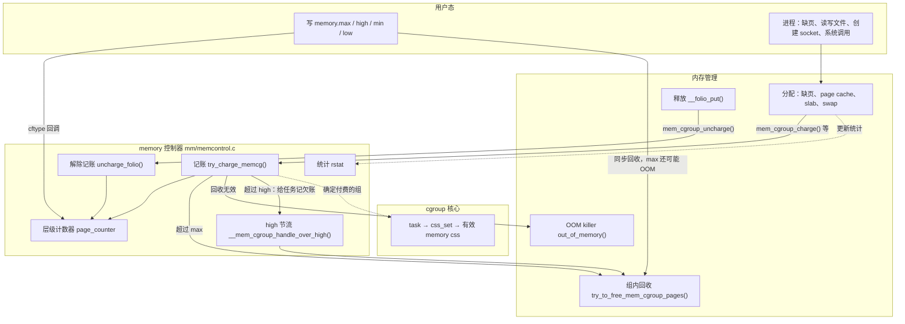
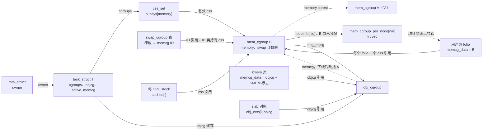
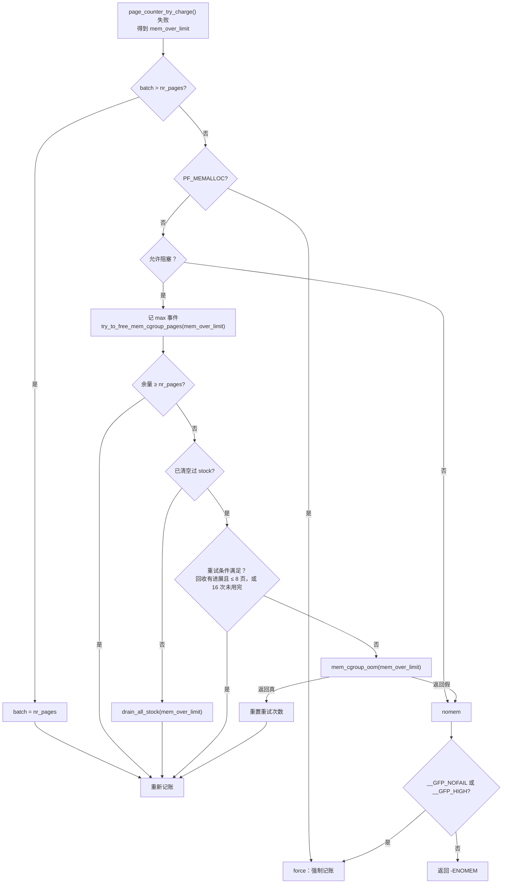
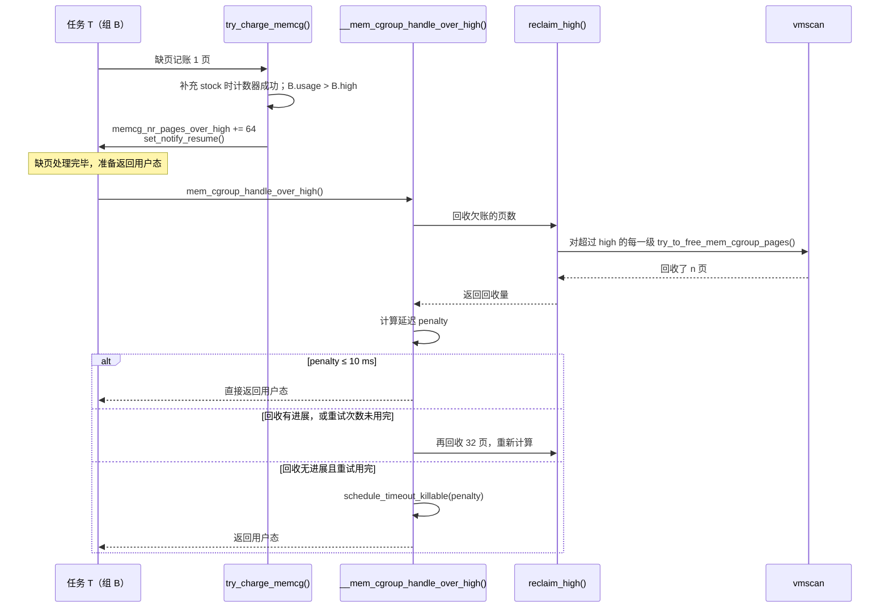
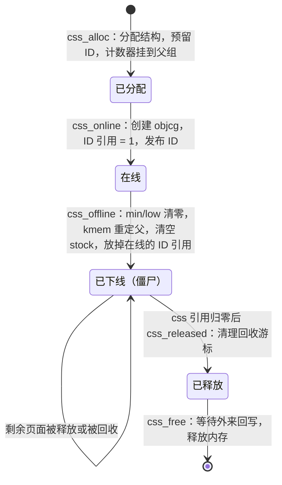

# cgroup v2 的 memory 控制器：页面记账、限额、保护与回收

一台 64 GiB 内存的机器上同时运行在线服务 `web` 和离线任务 `batch`。管理员希望：

1. `batch` 的内存用量不超过 8 GiB。这里的用量不只是匿名内存，还包括它读写文件留下的 page cache、它触发的内核对象分配。超出时先在 `batch` 内部回收；回收不动时只在 `batch` 内部杀进程，不连累 `web`。
2. `batch` 用量超过 6 GiB 后就开始被拖慢、被迫自己回收，给管理程序留出处理时间，而不是直接撞上 8 GiB 的硬上限。
3. 即使整机内存紧张，`web` 的 4 GiB 热数据也尽量不被回收。
4. `batch` 最多使用 2 GiB swap。
5. 能看到每个组当前用了多少、峰值是多少、触发过多少次限额和 OOM、内存都花在了哪里。

这五条分别对应 cgroup v2 `memory` 控制器的 `memory.max`、`memory.high`、`memory.low`/`memory.min`、`memory.swap.max`，以及 `memory.current`、`memory.peak`、`memory.events`、`memory.stat`。

与 `cpu` 控制器分配的“时间”不同，内存是有状态的资源：一页内存分配出去后，会一直被占用，直到被释放或被回收。memory 控制器因此围绕“页面”而不是“任务”工作：

- **记账（charge）**：页面（folio）或内核对象被分配时，把它的大小记到某个内存控制组（memory cgroup，下文简称 memcg）的计数器上，并让页面记住自己属于谁；页面释放时，按页面记录的归属解除记账（uncharge）。
- **层级限额**：计数器沿父链逐级累加，任何一级超过上限都会使记账失败。失败后在超限的那一级的子树内回收，必要时触发只针对该子树的 OOM。
- **按保护值分配回收压力**：回收时按 `memory.min/low` 计算每个组的有效保护量，跳过受保护的组，或减轻对它们的扫描。

本章回答以下问题：

1. memory 控制器有哪些状态对象？用户页、内核对象和 swap 槽位分别怎样记住“我属于哪个 memcg”？
2. 一次记账怎样确定付费的组，怎样沿层级检查上限？为什么大多数记账不必修改共享计数器？
3. 超过 `memory.max` 时，回收、重试和 OOM 按什么顺序进行？什么情况下允许超过上限？
4. `memory.high` 怎样做到“拖慢而不拒绝”？节流延迟怎样计算？
5. `memory.min/low` 的有效保护值怎样计算，回收时怎样使用？
6. memcg 被删除后，仍被页面和内核对象引用的状态怎样处理？
7. 任务迁移到另一个组后，已经分配的内存记在哪里？

## 0. 分析基线

本章依据仓库内 [Makefile 第 2～4 行](../../linux/Makefile#L2-L4)标记的 **6.18.52** 版本，架构为 **x86-64**（[.config#L333](../../linux/.config#L333) 的 `CONFIG_X86_64=y`）。读者应先读过 [cgroup v2 概述](intrudoction.md)，了解 css、`css_set`、有效 css、css 生命周期和 rstat；还需要知道[内存回收](../memory/reclaim.md)中 `lruvec`、`scan_control` 和直接回收的基本流程。内核对象记账部分涉及 [SLUB](../memory/slub.md) 的 slab 与对象概念。

与本章结论有关的配置如下。它们是编译条件，不代表某次运行一定经过对应路径。

| 配置 | 对本章的影响 | 依据 |
| --- | --- | --- |
| `CONFIG_MEMCG=y` | 编入 memory 控制器。它选中 `PAGE_COUNTER`、`SLAB_OBJ_EXT` 等选项，`memcontrol.o`、`vmpressure.o`、`swap_cgroup.o` 随之编译 | [.config#L208-L212](../../linux/.config#L208-L212)、[init/Kconfig#L1029-L1036](../../linux/init/Kconfig#L1029-L1036)、[mm/Makefile#L102-L106](../../linux/mm/Makefile#L102-L106) |
| `CONFIG_MEMCG_V1` 未设置 | 不编译 `memcontrol-v1.c`，`do_memsw_account()` 恒为假，`memcg1_*()` 都换成桩实现：多数为空函数，少数返回固定值，例如 `memcg1_oom_prepare()` 返回真（[memcontrol-v1.h#L95-L129](../../linux/mm/memcontrol-v1.h#L95-L129)）。`memory_cgrp_subsys` 没有 `legacy_cftypes`，cgroup v1 挂载时把它当作不存在（[cgroup-v1.c#L53-L57](../../linux/kernel/cgroup/cgroup-v1.c#L53-L57)、[cgroup-v1.c#L955-L958](../../linux/kernel/cgroup/cgroup-v1.c#L955-L958)），所以 memory 只能出现在 v2 上，源码中以 `cgroup_subsys_on_dfl(memory_cgrp_subsys)` 为假为条件的 v1 分支都不会执行 | [.config#L213](../../linux/.config#L213)、[mm/Makefile#L103](../../linux/mm/Makefile#L103) |
| `CONFIG_SWAP=y`、`CONFIG_ZSWAP=y`，`CONFIG_ZSWAP_DEFAULT_ON` 未设置 | 有 `memory.swap.*` 和 `memory.zswap.*` 文件（[memcontrol.c#L5617-L5631](../../linux/mm/memcontrol.c#L5617-L5631)）；zswap 默认关闭，运行时可开启 | [.config#L1146-L1148](../../linux/.config#L1146-L1148) |
| `CONFIG_LRU_GEN` 未设置 | `lru_gen_enabled()` 恒为假（[mm_inline.h#L312-L317](../../linux/include/linux/mm_inline.h#L312-L317)），回收走传统的 active/inactive LRU | [.config#L1287](../../linux/.config#L1287) |
| `CONFIG_CGROUP_WRITEBACK=y` | memcg 中带有回写域 `cgwb_domain` 和外来脏页记录 `cgwb_frn[]`，本章只交代它们的位置 | [.config#L215](../../linux/.config#L215)、[memcontrol.h#L271-L275](../../linux/include/linux/memcontrol.h#L271-L275) |
| `CONFIG_TRANSPARENT_HUGEPAGE=y` | 编入透明大页（Transparent Huge Page，THP）。一次记账可以是多页 folio；每个 memcg 有自己的 THP 延迟拆分队列 | [.config#L1236](../../linux/.config#L1236)、[memcontrol.h#L277-L279](../../linux/include/linux/memcontrol.h#L277-L279) |
| `CONFIG_NUMA=y` | 每个 memcg 在每个节点上有一个 `mem_cgroup_per_node`，并提供 `memory.numa_stat` | [.config#L469](../../linux/.config#L469)、[memcontrol.c#L4670-L4675](../../linux/mm/memcontrol.c#L4670-L4675) |
| `CONFIG_PSI=y` | 编入 PSI（Pressure Stall Information，压力停顿信息）。memcg 回收和节流睡眠计入 memory 压力停顿；`memory.pressure` 文件由 cgroup 核心提供 | [.config#L158](../../linux/.config#L158)、[cgroup.c#L5538-L5549](../../linux/kernel/cgroup/cgroup.c#L5538-L5549) |
| `CONFIG_ARCH_HAS_NMI_SAFE_THIS_CPU_OPS=y` | `MEMCG_NMI_UNSAFE`、`MEMCG_NMI_SAFETY_REQUIRES_ATOMIC` 的依赖不满足，没有 NMI 专用的原子统计字段 | [.config#L902](../../linux/.config#L902)、[init/Kconfig#L1038-L1050](../../linux/init/Kconfig#L1038-L1050) |
| `CONFIG_HZ=1000`、`CONFIG_PAGE_SIZE_4KB=y` | 节流延迟的单位 jiffy 为 1 ms；记账批量 `MEMCG_CHARGE_BATCH` 为 64 页，即 256 KiB | [.config#L505-L506](../../linux/.config#L505-L506)、[.config#L951](../../linux/.config#L951)、[memcontrol.h#L331](../../linux/include/linux/memcontrol.h#L331) |
| `CONFIG_DEBUG_VM` 未设置 | `VM_BUG_ON_FOLIO()`、`lruvec_memcg_debug()` 等检查为空 | [.config#L10592](../../linux/.config#L10592) |

还有几个**运行时条件**会改变结论，本章以默认情况为准：

- 启动参数 `cgroup.memory=nosocket,nokmem,nobpf` 分别关闭 socket、内核对象和 BPF 内存的记账（[memcontrol.c#L5123-L5139](../../linux/mm/memcontrol.c#L5123-L5139)），默认三者都记账。
- `cgroup_disable=memory` 关闭整个控制器，此时 [`mem_cgroup_disabled()`](../../linux/include/linux/memcontrol.h#L551-L554)为真，各入口直接返回。
- cgroup2 的挂载选项 `memory_localevents`、`memory_recursiveprot`、`memory_hugetlb_accounting` 分别改变事件的统计范围、保护值的计算方法、hugetlb 页是否计入 memcg（[cgroup.c#L2001-L2003](../../linux/kernel/cgroup/cgroup.c#L2001-L2003)），默认都不启用。

## 1. memory 控制器要解决什么问题

### 1.1 需求与机制

| 需求 | 接口 | 机制 | 生效位置 |
| --- | --- | --- | --- |
| 子树用量有硬上限 | `memory.max` | 层级计数器 `page_counter` 逐级“先加后查”；失败后在超限组的子树内回收、重试，最后进入组内 OOM | 每次记账的 `try_charge_memcg()`，以及写 `memory.max` 时（3.2、3.4 节） |
| 超过阈值后拖慢增长 | `memory.high` | 记账照常成功，但超过阈值时让任务在返回用户态前回收；回收跟不上时按超出比例睡眠 | `__mem_cgroup_handle_over_high()`（3.3 节） |
| 保护工作集 | `memory.min`、`memory.low` | 回收时计算有效保护值，跳过或按比例减轻扫描 | `shrink_node_memcgs()`（3.5 节） |
| 限制 swap | `memory.swap.max`、`memory.swap.high`、`memory.zswap.max` | 换出时对独立的 swap 计数器记账，用 memcg ID 记录每个 swap 槽位的归属 | `__mem_cgroup_try_charge_swap()`（3.9 节） |
| 内核对象也计入用量 | 无单独接口，计入 `memory.current` | `__GFP_ACCOUNT` / `SLAB_ACCOUNT` 分配通过 `obj_cgroup` 按字节记账 | 页分配器和 slab 的钩子（3.8 节） |
| 观测 | `memory.current/peak/events/stat/numa_stat` | 计数器直读、事件计数、rstat 汇总统计 | 3.10 节、4.5 节 |
| 主动回收 | `memory.reclaim` | 写入希望回收的量，分批调用组内回收 | 4.5 节 |

### 1.2 核心思路：页面记住归属，计数器沿父链累加

每个 memcg 有一个页计数器 `memory`。`memory.current` 读的就是它的 `usage` 乘以页大小（[`memory_current_read()`](../../linux/mm/memcontrol.c#L4233-L4239)）。子组记账时，[`page_counter_try_charge()`](../../linux/mm/page_counter.c#L118-L172)从子组的计数器出发，沿 `parent` 指针把同样的页数加到每一级祖先，并在每一级比较 `max`。因此父组的 `usage` 天然包含整个子树，任意一级的上限都约束它下面的全部用量。

看一个例子，三个组的配置和用量如下：

```text
/              根：自己的任务不记账，也不受限
└── A          memory.max = 10G      usage = 9.5G
    ├── B      memory.max = 8G       usage = 7G
    └── C      memory.max = max      usage = 2.5G
```

C 中的任务申请 1 GiB：C 自己没有上限，但计数加到 A 这一级时变成 10.5G，超过 A 的 10G，记账失败，失败点是 A 的计数器。`try_charge_memcg()` 用 `mem_cgroup_from_counter()` 从失败的计数器反推出超限的组（[memcontrol.c#L2325-L2329](../../linux/mm/memcontrol.c#L2325-L2329)），然后对 **A 的整个子树**（包括 B 和 C）回收，而不只回收 C。

另一方面，页面记住自己的归属：用户页的 `folio->memcg_data` 保存它被记到的 memcg（[`commit_charge()`](../../linux/mm/memcontrol.c#L2517-L2528)）。释放时按这个指针解除记账，与此时是哪个任务在释放无关。所以规则是“**谁分配、记给谁，一直记到页面释放**”。任务迁移到别的组，已经记好的账不会跟着搬走（4.3 节）。

根组有两个特点。第一，[`try_charge()`](../../linux/mm/memcontrol.c#L2508-L2515)对根直接返回成功，根组自己的任务分配页面时不修改任何计数器；第二，根的计数器是所有一级子组计数器的 `parent`，子组记账时计数会一直加到根上。根上也没有 `memory.current`、`memory.max` 等文件（它们都带 `CFTYPE_NOT_ON_ROOT`，[memcontrol.c#L4616-L4653](../../linux/mm/memcontrol.c#L4616-L4653)）。

### 1.3 在内核中的位置

下图说明 memory 控制器夹在哪些子系统之间。实线表示调用或触发方向，虚线表示查询归属或更新统计。`memory.high` 的偿还主要发生在任务返回用户态时（3.3 节），图中把它简化为由记账触发。



这张图要注意两点：

- **限制发生在分配路径上，而不是配置路径上。** 写 `memory.max` 只改上限，再顺带回收到新上限以下；此后的约束都由每次记账时的计数器检查完成。
- **回收与 OOM 复用内存管理子系统的实现。** memcg 只设定“回收哪个子树、回收多少”，扫描 LRU 的工作仍由 `mm/vmscan.c` 完成；OOM 也复用 `out_of_memory()`，只是把候选任务限定在子树内（3.4 节）。

### 1.4 触发事件与输入输出

| 触发事件 | 执行上下文 | 入口 | 结果 |
| --- | --- | --- | --- |
| 匿名页缺页 | 缺页任务的进程上下文 | [`folio_prealloc()`](../../linux/mm/memory.c#L1200-L1220)、`alloc_anon_folio()`（[memory.c#L5115-L5121](../../linux/mm/memory.c#L5115-L5121)）调用 `mem_cgroup_charge(folio, vma->vm_mm, gfp)` | 记到该 mm 所属的 memcg；失败时缺页返回 `VM_FAULT_OOM`（[memory.c#L5197-L5202](../../linux/mm/memory.c#L5197-L5202)、[memory.c#L5260-L5261](../../linux/mm/memory.c#L5260-L5261)） |
| 页面加入 page cache | 读写文件、文件页缺页等 | [`filemap_add_folio()`](../../linux/mm/filemap.c#L968-L988) 调用 `mem_cgroup_charge(folio, NULL, gfp)` | 记到当前任务（或 active memcg）的组 |
| `__GFP_ACCOUNT` 页分配、`SLAB_ACCOUNT` 或 `__GFP_ACCOUNT` 的 slab 分配 | 任意上下文，中断中通常不记账 | [page_alloc.c#L5311-L5315](../../linux/mm/page_alloc.c#L5311-L5315)、[`memcg_slab_post_alloc_hook()`](../../linux/mm/slub.c#L2344-L2354) | 经 `obj_cgroup` 记账 |
| socket 缓冲区 | 网络协议栈为 socket 分配缓冲区时 | [sock.c#L3262-L3266](../../linux/net/core/sock.c#L3262-L3266) 调用 `mem_cgroup_sk_charge()` | 记到 socket 创建时所属的 memcg |
| 页面换出 | 回收路径 | [swapfile.c#L1467-L1469](../../linux/mm/swapfile.c#L1467-L1469) 调用 `mem_cgroup_try_charge_swap()` | swap 计数器记账，槽位记录 memcg ID |
| 页面换入 | 缺页 | [memory.c#L4433-L4437](../../linux/mm/memory.c#L4433-L4437) 调用 `mem_cgroup_swapin_charge_folio()` | 优先记回换出时的 memcg |
| 页面释放 | 任意上下文 | [`__folio_put()`](../../linux/mm/swap.c#L97-L113) 调用 `mem_cgroup_uncharge()`；批量释放用 `mem_cgroup_uncharge_folios()` | 计数器减少，清除 `memcg_data` |
| 写 `memory.max` / `memory.high` | 进程上下文 | [`memory_max_write()`](../../linux/mm/memcontrol.c#L4433-L4485)、[`memory_high_write()`](../../linux/mm/memcontrol.c#L4378-L4425) | 修改上限，同步回收；max 还可能触发 OOM |
| 返回用户态 | 任务上下文 | [`resume_user_mode_work()`](../../linux/include/linux/resume_user_mode.h#L41-L63) 调用 `mem_cgroup_handle_over_high()` | 偿还超过 high 的回收量，必要时睡眠 |
| 删除 cgroup | 工作队列 | `mem_cgroup_css_offline()` 等 css 回调 | 内核对象记账重定父、归还缓存的预充值、释放 ID（第 4.1 节） |

### 1.5 本章边界

本章只讨论 cgroup v2；当前配置下 v1 的 memory 控制器根本没有编入。回收怎样扫描 LRU、怎样决定匿名页和文件页的比例，见[内存回收](../memory/reclaim.md)，本章只讲 memcg 怎样发起回收、怎样影响被扫描的对象。SLUB 本身见 [SLUB 机制详解](../memory/slub.md)。cgroup writeback 中页面、inode 与 bio 三种归属的关系，vmpressure 与 socket 压力的细节，以及 hugetlb 控制器，都不在本章展开。

## 2. 核心数据结构

### 2.1 结构地图

下图画出一个任务 T 所在的 memcg B（父组为 A），以及几类内存对象怎样指回 memcg。实线表示持有引用，虚线表示只保存指针、不持有引用；例外是 `B → mem_cgroup_per_node`，它表示 B 分配并拥有这些结构，不是引用计数。



读图时注意：

- **用户页直接指向 memcg 并持有 css 引用**：[`charge_memcg()`](../../linux/mm/memcontrol.c#L4731-L4745)在 `commit_charge()` 前调用 `css_get()`，[`uncharge_folio()`](../../linux/mm/memcontrol.c#L4858-L4916)在最后 `css_put()`。只要组里还有页面没释放，这个 memcg 就不会被释放。
- **内核对象指向 `obj_cgroup`，不直接指向 memcg**：kmem 页和 slab 对象只持有 objcg 的引用（[memcontrol.c#L2858-L2863](../../linux/mm/memcontrol.c#L2858-L2863)、[memcontrol.c#L3208-L3210](../../linux/mm/memcontrol.c#L3208-L3210)），`objcg->memcg` 可以在 memcg 下线时改成父组（4.2 节）。
- **swap 槽位记录的是 16 位 memcg ID**，经 ID 的引用间接保持 css（3.9、4.1 节）。
- **`mm->owner` 与 `memory.parent` 都是普通指针**：前者由 RCU 保护（[mm_types.h#L1137-L1148](../../linux/include/linux/mm_types.h#L1137-L1148)）；后者指向父组嵌入的计数器，父组的存活由 cgroup 核心中“css 持有父 css 引用”的规则保证（见概述章 2.1 节的引用关系表）。

### 2.2 `struct page_counter`：无锁的层级计数器

`struct page_counter`（[page_counter.h#L10-L44](../../linux/include/linux/page_counter.h#L10-L44)）是一个通用的“带上限、带父指针的页数计数器”。memcg 用它表示内存和 swap 的用量，所有数值的单位都是**页**。

| 字段 | 含义 | 说明 |
| --- | --- | --- |
| `usage` | 本组及所有后代当前记账的页数 | 原子变量，注释要求它独占一个 cache line，因为每次记账都要修改它 |
| `max` | 硬上限 | 初始化为 `PAGE_COUNTER_MAX`，接口中显示为 `max` |
| `high` | 节流阈值 | 计数器本身不检查它，由 memcg 代码读取 |
| `min`、`low` | 用户设置的保护值 | 只有支持保护的计数器使用 |
| `emin`、`elow` | 有效保护值 | 回收时自上而下计算（3.5 节） |
| `min_usage`、`low_usage` | `min(usage, min)`、`min(usage, low)`，即本组“正在使用的保护量” | 每次变化把差值加到父组的 `children_*_usage` |
| `children_min_usage`、`children_low_usage` | 所有子组 `min_usage`、`low_usage` 之和 | 计算有效保护时用作“兄弟们一共要多少” |
| `watermark`、`local_watermark` | 历史峰值，以及可以按文件描述符重置的峰值 | 对应 `memory.peak` |
| `protection_support` | 是否维护上面的保护字段 | memcg 的 `memory` 计数器为真，`swap` 计数器为假（[memcontrol.c#L3821-L3822](../../linux/mm/memcontrol.c#L3821-L3822)） |
| `parent` | 父组的同类计数器 | 根为 NULL |
| `failcnt`、`track_failcnt` | v1 的失败计数 | v2 不使用 |

结构体用两个 `CACHELINE_PADDING` 把字段分成三段：频繁写的 `usage`，记账时顺带更新的保护量和峰值，以及很少修改、频繁读取的上限和 `parent`。

上限的最大值 `PAGE_COUNTER_MAX` 在 64 位上是 `LONG_MAX / PAGE_SIZE`（[page_counter.h#L46-L50](../../linux/include/linux/page_counter.h#L46-L50)），保证乘以页大小换算成字节时不溢出。用户写入的字节数由 [`page_counter_memparse()`](../../linux/mm/page_counter.c#L272-L290)解析，`"max"` 映射为 `PAGE_COUNTER_MAX`，其他值用整数除法 `bytes / PAGE_SIZE` 换算成页数。

### 2.3 `struct mem_cgroup`：一个组的全部状态

`struct mem_cgroup`（[memcontrol.h#L189-L324](../../linux/include/linux/memcontrol.h#L189-L324)）嵌入一个 css，是 memory 控制器在每个 cgroup 上的状态对象。按用途分组，与 v2 相关的关键字段如下：

| 分组 | 字段 | 含义 |
| --- | --- | --- |
| 与核心衔接 | `css` | 嵌入的 css，`mem_cgroup_from_css()` 用 `container_of()` 取回外层结构 |
| 身份 | `id` | 私有的 16 位 ID 及其引用计数，供 swap 记录和 workingset 影子项使用（4.1 节） |
| 记账 | `memory` | 内存计数器：用户页、内核对象、socket 缓冲区都记在这里 |
| | `swap` | swap 计数器，与 `memory` 互不包含（3.9 节） |
| 峰值 | `memory_peaks`、`swap_peaks`、`peaks_lock` | `memory.peak` 等文件按文件描述符登记的观察者 |
| 节流 | `high_work` | 在中断上下文中记账超过 high 时，改由工作队列回收 |
| zswap | `zswap_max`、`zswap_writeback` | zswap 用量上限，以及是否允许把 zswap 中的页写回 swap 设备 |
| OOM | `oom_group` | `memory.oom.group`：OOM 时是否杀掉整个组 |
| 事件 | `memory_events[]`、`memory_events_local[]`，`events_file`、`events_local_file`、`swap_events_file` | `memory.events` 等文件的计数和通知句柄 |
| 统计 | `vmstats`、`vmstats_percpu` | 汇总统计和每 CPU 增量（3.10 节） |
| 内核对象 | `objcg`、`orig_objcg`、`objcg_list`、`kmemcg_id` | 当前 objcg（RCU 指针）、上线时创建的原始 objcg、已经重定父到本组的 objcg 列表、list_lru 使用的索引 |
| 每节点 | `nodeinfo[]` | 柔性数组，每个 NUMA 节点一个 `mem_cgroup_per_node` 指针 |
| 其他 | `vmpressure`、`socket_pressure`、`cgwb_*`、`deferred_split_queue` | vmpressure 通知、socket 压力提示、cgroup writeback、THP 延迟拆分 |

还有一个容易误解的字段 `swappiness`。v2 上 [`mem_cgroup_swappiness()`](../../linux/include/linux/swap.h#L592-L603)直接返回全局的 `vm_swappiness`，每组的 `swappiness` 不起作用。

`mem_cgroup` 中**没有保护上限和用量的锁**。上限用 `READ_ONCE()`/`WRITE_ONCE()`/`xchg()` 读写，用量是原子变量，记账路径完全无锁。

### 2.4 `mem_cgroup_per_node`：组在一个节点上的 LRU

回收的基本单元是 `lruvec`（LRU 链表组）。启用 memcg 后，每个“memcg × NUMA 节点”有一个 `lruvec`，嵌在 `struct mem_cgroup_per_node`（[memcontrol.h#L87-L122](../../linux/include/linux/memcontrol.h#L87-L122)）中：

| 字段 | 含义 |
| --- | --- |
| `memcg` | 回指所属 memcg。`lruvec` 嵌在 per-node 结构中，per-node 结构单独分配，不能用 `container_of()` 推到 memcg |
| `lruvec_stats_percpu`、`lruvec_stats` | 本组在本节点上的统计（`memory.numa_stat`） |
| `shrinker_info` | 哪些 memcg 感知的 shrinker 在本组本节点上有对象 |
| `lruvec` | LRU 链表和 `lru_lock` |
| `lru_zone_size[][]` | 每个 zone、每条 LRU 上的页数 |
| `iter` | 以本组为根的回收迭代器在本节点上的共享位置（3.6 节） |

[`mem_cgroup_lruvec()`](../../linux/include/linux/memcontrol.h#L705-L730)按 `memcg->nodeinfo[nid]->lruvec` 取 `lruvec`，[`folio_lruvec()`](../../linux/include/linux/memcontrol.h#L738-L744)用页面自己记录的 memcg 和页面所在节点找到它应在的 `lruvec`。所以**一个 LRU 页一定挂在“它的 memcg × 它的节点”那一组链表上**，全局回收也必须沿 memcg 树逐组扫描（3.6 节）。

### 2.5 `folio->memcg_data`：页面怎样记住归属

`memcg_data` 是一个 `unsigned long`，低两位是类型标志（[memcontrol.h#L335-L342](../../linux/include/linux/memcontrol.h#L335-L342)），其余位是指针：

| 低位标志 | 高位指向 | 用于 | 读取函数 |
| --- | --- | --- | --- |
| 无 | `struct mem_cgroup` | 用户页：匿名页、page cache、shmem；启用 hugetlb 记账时的 hugetlb 页 | [`__folio_memcg()`](../../linux/include/linux/memcontrol.h#L395-L404) |
| `MEMCG_DATA_KMEM` | `struct obj_cgroup` | `__GFP_ACCOUNT` 分配的内核页 | [`__folio_objcg()`](../../linux/include/linux/memcontrol.h#L416-L425) |
| `MEMCG_DATA_OBJEXTS` | `slabobj_ext` 数组 | slab 页，每个对象的归属另存 | `slab_obj_exts()` |
| 整个值为 0 | — | 未记账 | [`folio_memcg_charged()`](../../linux/include/linux/memcontrol.h#L459-L462)为假 |

通用的 [`folio_memcg()`](../../linux/include/linux/memcontrol.h#L427-L451)对 kmem 页再经过 `obj_cgroup_memcg()` 读一次 `objcg->memcg`。它的注释写明了归属的稳定条件：对普通页，持有页锁、页已从 LRU 隔离、或持有独占引用，三者之一即可保证 `memcg_data` 不变；对 kmem 页，`objcg->memcg` 可能被改成父组，调用者需要在 RCU 读临界区内使用结果。

为什么要在页面里保存归属，而不是在需要时查询“当前任务属于哪个组”？因为解除记账、把页面放上哪条 LRU、回收时统计哪个组，都发生在与分配者无关的上下文里：释放页面的可能是另一个进程，回收页面的是 kswapd 或别的组的任务。

### 2.6 `struct obj_cgroup`：可以整体换主的内核对象账户

slab 对象比页小，一个 slab 页中的不同对象可能由不同组分配；dentry、inode 这样的对象还可能比创建它的 cgroup 活得久得多。如果每个对象都直接持有 memcg 的 css 引用，cgroup 删除后，整个 `mem_cgroup`（包括每节点、每 CPU 的统计）都要等这些对象全部释放才能回收。

`struct obj_cgroup`（[memcontrol.h#L167-L181](../../linux/include/linux/memcontrol.h#L167-L181)）是解决这个问题的中间层。源码注释把它描述为一个“桶”：对象只引用桶，memcg 被删除时，把桶整体改挂到父组即可，不必找到每个存活对象。

| 字段 | 含义 |
| --- | --- |
| `refcnt` | `percpu_ref`，每个已记账的对象或 kmem 页、每个缓存它的任务和每 CPU stock 都持有一个引用 |
| `memcg` | 当前归属的 memcg。初始化后总指向有效的 memcg，但可以被原子地改为父组（[memcontrol.h#L373-L383](../../linux/include/linux/memcontrol.h#L373-L383)） |
| `nr_charged_bytes` | 已记账但还没凑成整页的零头字节（3.8 节） |
| `list` / `rcu` | 重定父后挂在父组的 `objcg_list` 上；释放时用于 `kfree_rcu()` |

每个非根 memcg 在上线时创建一个 objcg（[`memcg_online_kmem()`](../../linux/mm/memcontrol.c#L3289-L3313)），根 memcg 没有 objcg。

### 2.7 每 CPU 预充值：`memcg_stock_pcp` 与 `obj_stock_pcp`

每次记账都要沿父链对每一级计数器做原子加，层级越深、CPU 越多，共享 cache line 的争用越严重。memcg 用每 CPU 的**预充值缓存**（stock）把这笔开销分摊掉：一次向计数器多记 64 页，多出的部分放进本 CPU 的缓存，之后同一组在同一 CPU 上的小额记账直接从缓存扣除。

[`struct memcg_stock_pcp`](../../linux/mm/memcontrol.c#L1744-L1762)有 `NR_MEMCG_STOCK` = 7 个槽位，每个槽位记录一个 memcg 指针 `cached[i]` 和该组的预充值页数 `nr_pages[i]`（`uint8_t`）。注释说明选 7 是为了让指针和页数放在一个 cache line 中。另有一把 `local_trylock_t`、一个用于远程清空的 `work` 和 `drain_idx`（槽位满时轮流替换的下标）。

[`struct obj_stock_pcp`](../../linux/mm/memcontrol.c#L1764-L1778)只缓存一个 objcg 和它的预充值字节数 `nr_bytes`，同时攒着 slab 统计的增量，凑够一页或换节点时再写入统计。

预充值有一个直接后果：**缓存在 stock 里的页已经记在计数器的 `usage` 中**。因此 `memory.current` 会比组内实际存在的页面略多，多出部分每 CPU 每组不超过 64 页。限额紧张时，记账路径会尝试清空 stock（3.2 节），memcg 下线时也会尝试清空（4.1 节）；但这种清空不保证立即、完整，原因见 3.2.3 节。

### 2.8 任务和 mm 中的字段

`task_struct` 在 `CONFIG_MEMCG` 下有三个字段（[sched.h#L1557-L1566](../../linux/include/linux/sched.h#L1557-L1566)）：

| 字段 | 含义 |
| --- | --- |
| `memcg_nr_pages_over_high` | 本任务在超过 high 时记账的页数，等返回用户态时按它回收（3.3 节） |
| `active_memcg` | “远程记账”作用域：设置后，本任务不带 mm 的记账和内核对象记账都记到这个组。由 [`set_active_memcg()`](../../linux/include/linux/sched/mm.h#L489-L503)设置，在中断上下文中改用每 CPU 变量 `int_active_memcg`（[memcontrol.c#L85-L87](../../linux/mm/memcontrol.c#L85-L87)） |
| `objcg` | 当前组 objcg 的缓存，最低位是“需要更新”标志 |

`mm_struct::owner`（[mm_types.h#L1137-L1148](../../linux/include/linux/mm_types.h#L1137-L1148)）指向被视为这个地址空间“主人”的任务，创建 mm 时设为创建者（[`mm_init_owner()`](../../linux/kernel/fork.c#L1012-L1017)）。匿名页按 mm 记账时，付费的是 `owner` 所在的组。主人退出时，[`mm_update_next_owner()`](../../linux/kernel/exit.c#L490-L500)在共享这个 mm 的其他任务中选新主人。

### 2.9 引用、生命周期与并发保护一览

| 对象或字段 | 谁持有 / 谁修改 | 保护方式 | 依据 |
| --- | --- | --- | --- |
| 已记账的用户页 → memcg | 记账时 `css_get()`，解除记账时 `css_put()`；页面迁移时把引用转给新页 | 页锁、LRU 隔离或独占引用保证 `memcg_data` 稳定 | [memcontrol.c#L4740-L4741](../../linux/mm/memcontrol.c#L4740-L4741)、[memcontrol.c#L4998-L5027](../../linux/mm/memcontrol.c#L4998-L5027) |
| kmem 页、slab 对象 → objcg | 记账时 `obj_cgroup_get()`，释放时 `obj_cgroup_put()` | `objcg->memcg` 用 RCU 读，重定父时在 `objcg_lock` 下改写 | [memcontrol.c#L206-L226](../../linux/mm/memcontrol.c#L206-L226) |
| stock 槽位 → memcg | 放入时 `css_get()`，清空时 `css_put()` | 本 CPU 的 `local_trylock` | [memcontrol.c#L1837-L1853](../../linux/mm/memcontrol.c#L1837-L1853)、[memcontrol.c#L1946-L1948](../../linux/mm/memcontrol.c#L1946-L1948) |
| swap 槽位 → memcg ID → css | 换出时每页一个 ID 引用；ID 引用归零时 `css_put()` | ID 表是 xarray，查找在 RCU 下进行 | [memcontrol.c#L3592-L3600](../../linux/mm/memcontrol.c#L3592-L3600) |
| `page_counter::usage` | 每次记账、解除记账 | 原子操作，无锁 | [page_counter.c#L118-L172](../../linux/mm/page_counter.c#L118-L172) |
| `max`、`high`、`min`、`low` | 写接口文件 | 写侧用 `xchg()` / `WRITE_ONCE()` 发布，读侧无锁读取；cgroup 核心把写请求直接转给 `cftype` 回调，不替它持有 `cgroup_mutex` | [memcontrol.c#L4332-L4485](../../linux/mm/memcontrol.c#L4332-L4485)、[cgroup.c#L4341-L4342](../../linux/kernel/cgroup/cgroup.c#L4341-L4342) |
| LRU 链表 | 页面进出 LRU | `lruvec->lru_lock` | [memcontrol.c#L1205-L1213](../../linux/mm/memcontrol.c#L1205-L1213) |
| memcg OOM | 选择和杀死受害者 | 全局 `oom_lock` 互斥锁 | [memcontrol.c#L1640-L1653](../../linux/mm/memcontrol.c#L1640-L1653) |

## 3. 关键算法

### 3.1 谁来付费：确定记账的 memcg

**目标**：给一次分配找到付费的 memcg，并取得它的引用，保证记账期间它不被释放。

不同类型的内存按不同规则确定归属：

| 内存类型 | 确定归属的方式 | 依据 |
| --- | --- | --- |
| 匿名页、私有文件页的 COW 副本 | `mm->owner` 所在的组 | [`get_mem_cgroup_from_mm()`](../../linux/mm/memcontrol.c#L907-L943) |
| page cache | 调用时 `mm` 为 NULL：先看 active memcg，再看 `current->mm` 的 owner，内核线程没有 mm 时记给根 | 同上；内核内部文件（`AS_KERNEL_FILE`）先用 `set_active_memcg(root_mem_cgroup)` 强制记给根（[filemap.c#L974-L980](../../linux/mm/filemap.c#L974-L980)） |
| 换入的匿名页 | 先查换出时记录的 memcg ID，该组仍在线就记给它，否则记给缺页 mm 的组 | [`mem_cgroup_swapin_charge_folio()`](../../linux/mm/memcontrol.c#L4805-L4826) |
| 内核对象 | 当前任务的 objcg；有 active memcg 时用它的 objcg；中断上下文只认 `int_active_memcg`，否则不记账 | [`current_obj_cgroup()`](../../linux/mm/memcontrol.c#L2691-L2735) |
| socket 缓冲区 | 创建 socket 时（只在任务上下文中）所在的非根组，记在 `sk->sk_memcg` | [`mem_cgroup_sk_alloc()`](../../linux/mm/memcontrol.c#L5032-L5053) |

`get_mem_cgroup_from_mm()` 的核心是一个 RCU 下的重试循环：

```c
	rcu_read_lock();
	do {
		memcg = mem_cgroup_from_task(rcu_dereference(mm->owner));
		if (unlikely(!memcg))
			memcg = root_mem_cgroup;
	} while (!css_tryget(&memcg->css));
	rcu_read_unlock();
	return memcg;
```

来源：[mm/memcontrol.c 第 935～942 行](../../linux/mm/memcontrol.c#L935-L942)。`mem_cgroup_from_task()` 就是 `task_css(p, memory_cgrp_id)`（[memcontrol.c#L874-L885](../../linux/mm/memcontrol.c#L874-L885)），即概述章中的有效 css。这里用 `css_tryget()` 而不是 `css_tryget_online()`：只要组还没被释放就能记账，哪怕它刚好在下线。`css_tryget()` 失败说明 owner 在此期间迁移走、原组的引用已经归零，重新读 owner 的组即可。

匿名页按 mm 的 owner 而不是按当前线程记账，有两层含义：同一进程的线程总在同一个 memory 组中（memory 不是 threaded 控制器），按 owner 与按当前线程的结果一致；而通过 `CLONE_VM` 共享地址空间、却不在同一线程组的任务（例如 vfork 的子进程）可能在不同的组，此时这个地址空间里的匿名页统一记给 owner 的组。

### 3.2 记账主路径：`try_charge_memcg()`

**目标**：把 `nr_pages` 页记到 `memcg` 及其所有祖先上，任何一级都不能超过 `max`。**输入**是目标组、GFP 标志和页数；**输出**是 0（成功）或 `-ENOMEM`。**前提**是调用者持有 `memcg` 的引用。

先看简化的整体逻辑：

```text
// 简化逻辑：省略 v1 的 memsw 计数器、事件和 PSI 统计
try_charge_memcg(memcg, gfp, nr_pages):
    batch = max(64, nr_pages)
retry:
    if 本 CPU 的 stock 里有 memcg 的 ≥ nr_pages 页预充值:
        扣减后 return 0
    if gfp 不允许自旋: batch = nr_pages
    if page_counter_try_charge(&memcg->memory, batch, &counter):
        goto done_restock
    over = counter 所属的 memcg               // 第一个超限的组，可能是祖先
    if batch > nr_pages: batch = nr_pages; goto retry   // 先退回精确大小再试
    if 当前任务有 PF_MEMALLOC: goto force     // 回收过程中的分配
    if gfp 不允许阻塞: goto nomem
    if 当前任务是 OOM 受害者且其 mm 已被 OOM reaper 处理: goto nomem
    记 MEMCG_MAX 事件
    reclaimed = try_to_free_mem_cgroup_pages(over, nr_pages, ...)
    if over 的余量 ≥ nr_pages: goto retry
    if 还没清空过 stock: drain_all_stock(over); goto retry
    if gfp 含 __GFP_NORETRY: goto nomem
    if reclaimed > 0 且 nr_pages ≤ 8: goto retry
    if 重试次数（16）未用完: goto retry
    if gfp 含 __GFP_RETRY_MAYFAIL: goto nomem
    if 已经 OOM 过 且 当前任务正在死亡: goto nomem
    if mem_cgroup_oom(over, gfp, order) 成功:
        重置重试次数; goto retry
nomem:
    if gfp 不含 __GFP_NOFAIL 或 __GFP_HIGH: return -ENOMEM
force:
    page_counter_charge(&memcg->memory, nr_pages)  // 不检查上限，强制记账
    return 0
done_restock:
    多记的 batch - nr_pages 页放入 stock
    沿 memcg 向上检查 high，超过则给当前任务记欠账（3.3 节）
    return 0
```

对应源码为 [memcontrol.c#L2300-L2506](../../linux/mm/memcontrol.c#L2300-L2506)。下面分四部分说明。

#### 3.2.1 快路径：先用本 CPU 的预充值

[`consume_stock()`](../../linux/mm/memcontrol.c#L1797-L1825)只处理不超过 64 页的请求。它用 `local_trylock()` 取本 CPU 的 stock 锁，取不到就直接返回失败，不等待；然后在 7 个槽位中找 `cached[i] == memcg` 的槽位，余量够就扣减。整个快路径只访问本 CPU 的数据，没有原子操作，也不碰任何共享计数器。

快路径失败后，`try_charge_memcg()` 一次向计数器记 `batch` = `max(64, nr_pages)` 页。成功后，多出来的部分由 [`refill_stock()`](../../linux/mm/memcontrol.c#L1895-L1952)放回本 CPU 的缓存：

- 已经有该组的槽位，就累加；累加后超过 64 页，就调用 `drain_stock()` 清空这个槽位：槽位中的**全部**预充值页都通过 `memcg_uncharge()` 还给计数器，并放掉该组的 css 引用（[memcontrol.c#L1928-L1932](../../linux/mm/memcontrol.c#L1928-L1932)、[memcontrol.c#L1837-L1853](../../linux/mm/memcontrol.c#L1837-L1853)）。
- 没有该组的槽位，就用一个空槽位；7 个槽位都占满时，按 `drain_idx` 轮流挑一个，先把旧组的预充值还回去、放掉它的 css 引用，再放入新组，并对新组 `css_get()`。

如果 GFP 标志不允许自旋（例如在不能获取自旋锁的上下文中记账），`batch` 退回 `nr_pages`，不再补充和替换 stock（[memcontrol.c#L2319-L2321](../../linux/mm/memcontrol.c#L2319-L2321)）。

#### 3.2.2 计数器：“先加后查”

[`page_counter_try_charge()`](../../linux/mm/page_counter.c#L118-L172)从目标组开始逐级向上：

```c
	for (c = counter; c; c = c->parent) {
		long new;
		/* ... 注释略 ... */
		new = atomic_long_add_return(nr_pages, &c->usage);
		if (new > c->max) {
			atomic_long_sub(nr_pages, &c->usage);
			/* ... v1 failcnt 略 ... */
			*fail = c;
			goto failed;
		}
		if (protection)
			propagate_protected_usage(c, new);
		/* ... 更新峰值 watermark 略 ... */
	}
	return true;

failed:
	for (c = counter; c != *fail; c = c->parent)
		page_counter_cancel(c, nr_pages);

	return false;
```

来源：[mm/page_counter.c 第 126～171 行](../../linux/mm/page_counter.c#L126-L171)，省略了注释和峰值更新。

它没有用“读取 → 比较 → 比较并交换”的方式，而是**先原子地加上，再看是否超限，超了再减回去**。在某一级失败时，只撤销这一级，再把已经加过的下级逐个撤销。注释指出了代价：一个大请求（比如 THP 的 512 页）短暂地加上又减去，可能让同时进行的小请求误判为超限而提前进入回收，误差不超过两个请求大小之差。换来的好处是成功路径上每一级只需要一次原子加。

`atomic_long_add_return()` 隐含一个完整的内存屏障，保证“加用量”发生在“读上限”之前。v2 写 `memory.max` 时直接 `xchg()` 新上限（[memcontrol.c#L4447](../../linux/mm/memcontrol.c#L4447)），与并发记账之间没有锁。并发的记账可能读到旧上限而成功，使用量暂时高于新上限；写入者随后的循环会读到这个用量并继续回收（3.4 节）。

#### 3.2.3 超限之后：回收、清空 stock、重试、OOM

记账失败时，`counter` 指向第一个超限的计数器，`mem_over_limit` 就是它所在的组。之后的处理按代价从小到大排列：



图中省略了 `__GFP_NORETRY`、`__GFP_RETRY_MAYFAIL` 等提前进入 nomem 的分支，完整条件见上面的伪代码。`mem_cgroup_oom()` 返回真不一定表示杀死了任务：等待 `oom_lock` 时被致命信号打断、持锁后发现余量已够、当前任务本来就将释放内存、已经有一个受害者正在退出，这些情况也返回真（[memcontrol.c#L1657-L1660](../../linux/mm/memcontrol.c#L1657-L1660)、[memcontrol.c#L1640-L1644](../../linux/mm/memcontrol.c#L1640-L1644)、[oom_kill.c#L1137-L1141](../../linux/mm/oom_kill.c#L1137-L1141)、[oom_kill.c#L1183-L1186](../../linux/mm/oom_kill.c#L1183-L1186)）。几个要点：

- **回收的范围是 `mem_over_limit` 的子树**，不是发起记账的组。回收量是本次请求的 `nr_pages`，而不是超出上限的全部数量；回收后只要余量够本次请求就重试（[memcontrol.c#L2371-L2377](../../linux/mm/memcontrol.c#L2371-L2377)）。
- **清空 stock 只做一次。** 其他 CPU 的 stock 中可能缓存着该子树的预充值，这些页已经计入用量但没有被使用。[`drain_all_stock()`](../../linux/mm/memcontrol.c#L1981-L2022)只处理缓存了该子树中某个组的 CPU：当前 CPU 直接清空，其他 CPU 派发每 CPU 工作；带有 CPU 隔离标记的 CPU 不派发。它用 `mutex_trylock()` 避免多个调用者同时派发，已有别人在清空时直接返回（[memcontrol.c#L1986-L1987](../../linux/mm/memcontrol.c#L1986-L1987)、[memcontrol.c#L2004-L2007](../../linux/mm/memcontrol.c#L2004-L2007)）。因此清空不保证完成：远程 CPU 的工作是异步执行的，紧接着的重试不一定能看到被归还的余量。
- **大页不轻易重试。** 只有请求不超过 8 页（`1 << PAGE_ALLOC_COSTLY_ORDER`）时，“回收有进展”才触发额外重试（[memcontrol.c#L2396-L2397](../../linux/mm/memcontrol.c#L2396-L2397)）；[`mem_cgroup_oom()`](../../linux/mm/memcontrol.c#L1661-L1678)对阶数大于 3 的请求直接返回失败。匿名页缺页尝试多尺寸大页（mTHP）时，某一阶记账失败就放掉这个 folio，退回更低的阶（[memory.c#L5115-L5121](../../linux/mm/memory.c#L5115-L5121)）。
- **OOM 成功后重置重试次数。** `passed_oom` 记录已经 OOM 过；如果当前任务自己在 OOM 后正在死亡，就不再循环（[memcontrol.c#L2405-L2419](../../linux/mm/memcontrol.c#L2405-L2419)）。

#### 3.2.4 允许超过上限的三种情况

`force` 标签直接调用 [`page_counter_charge()`](../../linux/mm/page_counter.c#L76-L107)，它只加不查。进入 `force` 的情况有三种（[memcontrol.c#L2340-L2347](../../linux/mm/memcontrol.c#L2340-L2347)、[memcontrol.c#L2420-L2446](../../linux/mm/memcontrol.c#L2420-L2446)）：

1. **当前任务带 `PF_MEMALLOC`。** 典型情况是回收本身需要分配内存。[`try_to_free_mem_cgroup_pages()`](../../linux/mm/vmscan.c#L6675-L6714)在回收期间调用 `memalloc_noreclaim_save()`，它设置的正是 `PF_MEMALLOC`（[sched/mm.h#L426-L429](../../linux/include/linux/sched/mm.h#L426-L429)）。如果回收中的分配也要先回收，会无限递归；注释说明这里宁可暂时超限。
2. **`__GFP_NOFAIL`**：调用者不能处理失败。
3. **`__GFP_HIGH`**：注释的说法是，memcg 没有为原子分配准备专门的储备，参照全局分配器的做法，让这类请求越过限额，回收的负担交给普通请求。

强制记账前，如果还没有记过 `max` 事件，会补记一次。所以 `memory.max` 不是绝对上限，`memory.current` 可能短暂高于它。

#### 3.2.5 提交：让页面记住归属

记账成功后，[`charge_memcg()`](../../linux/mm/memcontrol.c#L4731-L4745)为这个 folio 取一个 css 引用，再由 `commit_charge()` 把 memcg 指针写入 `folio->memcg_data`。根组也走这一步，只是根 css 带 `CSS_NO_REF`，引用操作为空。所以根组任务分配的用户页同样记录了“属于根”，只是没有修改计数器。

### 3.3 `memory.high`：记账成功，事后偿还

**问题**：`memory.max` 是“拒绝”式的：超限就回收，回收不动就 OOM。很多场景更希望组在超过某个用量后被逐渐拖慢，由外部管理程序决定扩容还是终止。`memory.high` 实现的就是这种语义：**超过 high 时记账照常成功，但让分配者在返回用户态前自己回收，回收跟不上就睡眠**。它不会触发 OOM（见 `__mem_cgroup_handle_over_high()` 中的注释，[memcontrol.c#L2223-L2231](../../linux/mm/memcontrol.c#L2223-L2231)）。

#### 3.3.1 记欠账

记账成功并走到 `done_restock` 时，`try_charge_memcg()` 从目标组开始沿父链检查每一级的 `memory.high` 和 `swap.high`（[memcontrol.c#L2461-L2492](../../linux/mm/memcontrol.c#L2461-L2492)）。注意 `consume_stock()` 命中时直接返回（[memcontrol.c#L2315-L2317](../../linux/mm/memcontrol.c#L2315-L2317)），不做这项检查；所以 high 大约在每次向计数器补充一批（64 页）时才检查一次。检查结果分两种情况：

- 在任务上下文中，只要某一级超过，就把本次记账的 `batch` 页加到 `current->memcg_nr_pages_over_high`，调用 `set_notify_resume(current)` 让任务返回用户态前处理，然后停止检查。
- 在中断上下文中，不能让一个被打断的无关任务承担回收，只在内存超过 high 时调度这个组的 `high_work`，由工作队列调用 [`high_work_func()`](../../linux/mm/memcontrol.c#L2060-L2066)回收 64 页。

注释特别说明了为什么不在记账时直接回收：统一推迟到返回用户态，可以让任何 GFP 上下文的记账都按同样方式处理，回收时也能使用 `GFP_KERNEL`；而且欠账按每个任务实际记账的页数累计，回收和延迟在任务之间大致公平分摊。若欠账超过 64 页、当前任务没有 `PF_MEMALLOC` 且 GFP 允许阻塞，记账路径也会立即偿还一次，避免任务在内核中停留太久而大幅超出 high（[memcontrol.c#L2494-L2504](../../linux/mm/memcontrol.c#L2494-L2504)）。

#### 3.3.2 偿还：回收，然后计算延迟

返回用户态时，`resume_user_mode_work()` 在 [resume_user_mode.h#L59](../../linux/include/linux/resume_user_mode.h#L59) 调用 [`mem_cgroup_handle_over_high()`](../../linux/include/linux/memcontrol.h#L913-L917)，欠账非零时进入 [`__mem_cgroup_handle_over_high()`](../../linux/mm/memcontrol.c#L2210-L2298)。下面的时序图展示一次分配从记欠账到偿还的过程：



具体步骤：

1. 取当前任务 mm 所属的组，清零欠账。注释说明记欠账时没有记录组，因为它几乎总是当前任务的组；这里会重新检查，偏差的代价很小。
2. 如果任务正在退出或已有致命信号，直接放弃。与 max 不同，high 没有 OOM 兜底，超出量可能已经很大，让垂死的任务长时间做无效回收没有意义。
3. 调用 [`reclaim_high()`](../../linux/mm/memcontrol.c#L2033-L2058)：从本组向上直到根之前，对每个超过 `memory.high` 的组记一次 `high` 事件，并在 PSI 停顿计时内回收。第一轮回收量是欠账的页数，之后每轮只回收 `SWAP_CLUSTER_MAX`（32）页。
4. 分别按内存和 swap 的超出程度计算延迟，两者相加，上限 2 秒。
5. 延迟不超过 `HZ / 100`（当前配置下为 10 ms）就不睡；回收有进展，或者无进展但 16 次重试还没用完，就继续回收；否则以可被杀死的方式睡眠 `penalty` 个 jiffy，并计入 PSI。

#### 3.3.3 延迟公式

超出程度用定点数表示（[`calculate_overage()`](../../linux/mm/memcontrol.c#L2121-L2137)）：

```text
overage = ((usage - high) << 20) / high
```

即超出比例 r = (usage − high) / high 乘以 2^20。[`mem_find_max_overage()`](../../linux/mm/memcontrol.c#L2139-L2151)取本组到根之前各级 overage 的最大值。[`calculate_high_delay()`](../../linux/mm/memcontrol.c#L2173-L2203)再计算：

```text
penalty_jiffies = overage² × HZ >> 20 >> 14
penalty_jiffies = penalty_jiffies × nr_pages / 64
```

把 overage = r × 2^20 代入并化简（这是由代码推出的近似式，忽略了整数截断）：

```text
penalty_jiffies ≈ r² × 2^40 × HZ / 2^34 × nr_pages / 64 = r² × HZ × nr_pages
```

当前配置 HZ = 1000，因此**延迟约为 r² × nr_pages 秒**，其中 nr_pages 是本任务欠账的页数。例如 high = 1 GiB、usage = 1.1 GiB，r = 0.1：

| 本任务欠账 | 计算出的延迟 | 实际行为 |
| --- | --- | --- |
| 64 页（一个 batch） | 0.01 × 64 = 0.64 s | 回收无进展时睡 640 ms |
| 8 页 | 0.08 s | 睡 80 ms |
| 64 页，但 r = 0.01 | 0.0064 s | 6.4 ms ≤ 10 ms，不睡 |
| 64 页，r = 0.2 | 2.56 s | 截断到 2 s |

源码注释中的表格（[memcontrol.c#L2075-L2117](../../linux/mm/memcontrol.c#L2075-L2117)）没有写明前提；用上式反推，它的数值对应 nr_pages = 64、HZ = 1000，例如 110M / 100M 一行为 639 ms。上表第三行说明，注释表中低于 10 ms 的那一行（101M，6 ms）在实际运行时不会睡眠。平方关系让轻微超出几乎不受惩罚，而持续增长的组被越来越重地拖慢；乘以 `nr_pages / 64` 则让“四次 N 页分配”与“一次 4N 页分配”受到大致相同的惩罚（[memcontrol.c#L2194-L2202](../../linux/mm/memcontrol.c#L2194-L2202)）。

写 `memory.high` 时，[`memory_high_write()`](../../linux/mm/memcontrol.c#L4378-L4425)先设置新阈值，再在写入者的上下文中清空 stock、回收到阈值以下；回收累计 16 次无进展就放弃（有进展时计数不重置），**从不触发 OOM**。以 `O_NONBLOCK` 打开文件时跳过同步回收，由组内任务下次记账时承担。

### 3.4 `memory.max`：写入、组内 OOM 与 `oom.group`

#### 3.4.1 写入新上限

v2 的 [`memory_max_write()`](../../linux/mm/memcontrol.c#L4433-L4485)无条件接受新上限，即使它低于当前用量；然后循环处理：

```text
// 简化逻辑
xchg(&memcg->memory.max, max)
if 以 O_NONBLOCK 打开: 结束
loop:
    if 上限已被别人改掉 或 usage ≤ max 或 有信号: 结束
    if 未清空过 stock: drain_all_stock(memcg); continue
    if 回收重试次数（16）未用完:
        回收 usage - max 页；若一页也没回收到，重试次数减一
        continue
    记 oom 事件
    if mem_cgroup_out_of_memory(memcg, GFP_KERNEL, 0) 失败: 结束
```

与记账路径相比，写入路径直接调用 `mem_cgroup_out_of_memory()`，不经过 `mem_cgroup_oom()` 的阶数检查。写入者可能杀死组内多个任务，直到用量降到新上限以下，或者组内已无可杀的任务。

#### 3.4.2 组内 OOM

[`mem_cgroup_out_of_memory()`](../../linux/mm/memcontrol.c#L1628-L1655)构造一个 `oom_control`，令 `.memcg` 指向超限的组，然后：

1. 以可被杀死的方式获取全局的 `oom_lock`；获取失败（本任务收到致命信号）就当作已经处理。
2. 持锁后再检查一次余量。等锁期间别的任务可能已经杀死了进程，此时不必再杀。
3. 调用 `out_of_memory()`。

`out_of_memory()` 用 [`is_memcg_oom()`](../../linux/mm/oom_kill.c#L72-L75)区分全局 OOM 与 memcg OOM，后者有以下不同：

| 环节 | memcg OOM 的处理 | 依据 |
| --- | --- | --- |
| OOM 通知链 | 不调用 | [oom_kill.c#L1125-L1130](../../linux/mm/oom_kill.c#L1125-L1130) |
| 不带 `__GFP_FS` 的请求 | 仍然执行 OOM | [oom_kill.c#L1143-L1149](../../linux/mm/oom_kill.c#L1143-L1149) |
| 评分的分母 `totalpages` | [`mem_cgroup_get_max()`](../../linux/mm/memcontrol.c#L1604-L1621)：`memory.max`，在 swappiness 非零时再加上 `min(swap.max, 系统 swap 总量)` | [oom_kill.c#L260-L263](../../linux/mm/oom_kill.c#L260-L263) |
| 候选任务 | 只遍历该组子树中的任务 [`mem_cgroup_scan_tasks()`](../../linux/mm/memcontrol.c#L1151-L1175) | [oom_kill.c#L365-L370](../../linux/mm/oom_kill.c#L365-L370) |
| 找不到可杀的任务 | 不 panic，返回失败 | [oom_kill.c#L1171-L1186](../../linux/mm/oom_kill.c#L1171-L1186) |

杀死受害者时，`__oom_kill_process()` 在 [oom_kill.c#L949-L951](../../linux/mm/oom_kill.c#L949-L951) 给受害者 mm 所属的组记 `oom_kill` 事件。

#### 3.4.3 `memory.oom.group`：把组当作一个整体杀掉

有些工作负载由多个进程组成，只杀其中一个会留下不完整的状态，还不如全部杀掉。[`oom_kill_process()`](../../linux/mm/oom_kill.c#L1050-L1068)在杀死受害者前调用 [`mem_cgroup_get_oom_group()`](../../linux/mm/memcontrol.c#L1690-L1735)：从受害者所在的组出发，沿父链走到 OOM 发生的组（全局 OOM 时走到根），记下**最高的**一个设置了 `oom.group` 的组。找到后，先杀受害者，再用 `mem_cgroup_scan_tasks()` 杀死该组子树中除 `oom_score_adj` 为 `OOM_SCORE_ADJ_MIN` 的任务和 init 外的所有任务（[`oom_kill_memcg_member()`](../../linux/mm/oom_kill.c#L1013-L1021)），并记 `oom_group_kill` 事件。

如果受害者在此期间已被迁移到 OOM 范围之外，就忽略 `oom.group`，以免杀死范围外的任务（[memcontrol.c#L1708-L1714](../../linux/mm/memcontrol.c#L1708-L1714)）。

#### 3.4.4 记账最终失败后

记账返回 `-ENOMEM` 时，处理方式取决于调用者。以匿名页缺页为例，失败会变成 `VM_FAULT_OOM`。x86 的缺页处理在用户态缺页时调用 [`pagefault_out_of_memory()`](../../linux/mm/oom_kill.c#L1195-L1208)（[fault.c#L1424-L1438](../../linux/arch/x86/mm/fault.c#L1424-L1438)）。当前配置未设置 `CONFIG_MEMCG_V1`，`mem_cgroup_oom_synchronize()` 是恒返回假的桩函数（[memcontrol.h#L1941-L1944](../../linux/include/linux/memcontrol.h#L1941-L1944)），于是任务若无致命信号，就打印限速的警告后返回用户态，重新触发这次缺页。

### 3.5 保护：`memory.min` 与 `memory.low`

**问题**：上限只能防止一个组用得太多，不能防止它的内存被别人的压力挤走。保护值表达相反的需求：“本组用量在这个范围内时，不要回收它”。`memory.min` 是硬保护，`memory.low` 是尽力而为的保护。难点在于层级：子组可以随意填写保护值，父组却不能因此被迫保护超过自己份额的内存。

#### 3.5.1 记账时维护“已用保护量”

带 `protection_support` 的计数器在每次用量变化时调用 [`propagate_protected_usage()`](../../linux/mm/page_counter.c#L21-L47)：

```text
// 简化逻辑：对 min 和 low 各做一遍
protected = min(usage, low)
if protected != 原 low_usage:
    old = xchg(&low_usage, protected)
    parent->children_low_usage += protected - old
```

于是每个组的 `children_low_usage` 始终等于其所有子组“实际用到的 low 保护量”之和。这些字段都是原子变量，在记账、解除记账和写 `memory.min/low`（[`page_counter_set_low()`](../../linux/mm/page_counter.c#L253-L261)）时更新，不需要锁。

#### 3.5.2 计算有效保护值

回收开始时，[`page_counter_calculate_protection()`](../../linux/mm/page_counter.c#L424-L464)为每个组计算 `emin` 和 `elow`。设本次回收的目标组为 root（全局回收时为根 memcg）：

- 组本身就是 root：跳过，目标组的保护不参与本次回收。
- 用量为 0：跳过。
- 父组是 root：有效值等于设定值，`elow = low`。
- 否则调用 [`effective_protection()`](../../linux/mm/page_counter.c#L337-L410)：

```text
// 简化逻辑（未启用 memory_recursiveprot）
protected = min(usage, setting)                   // 本组实际用到的保护量
if siblings_protected > parent_effective:         // 兄弟们一共要的超过父组能给的
    return protected × parent_effective / siblings_protected
return protected
```

其中 `siblings_protected` 就是父组的 `children_low_usage`。源码注释（[page_counter.c#L294-L336](../../linux/mm/page_counter.c#L294-L336)）列出了这套规则的意图：第一层直接使用设定值；更深的层级受父组有效值约束，这样委派出去的子树无论怎么设置都不能多拿保护；子组超额申请时按“实际用到的保护量”比例分配，没用到的保护份额自动留给兄弟。

用一个例子说明（A 是根下的一级组，回收目标为根）：

```text
A     low = 4G                     → elow(A) = 4G（父组是 root）
├── B low = 3G   usage = 5G        protected(B) = 3G
└── C low = 3G   usage = 1G        protected(C) = 1G
A.children_low_usage = 3G + 1G = 4G，不超过 elow(A) = 4G
→ elow(B) = 3G，elow(C) = 1G
```

如果 C 的用量涨到 3G：

```text
protected(C) = 3G，A.children_low_usage = 6G > 4G，按比例分配
→ elow(B) = 3G × 4G / 6G = 2G，elow(C) = 3G × 4G / 6G = 2G
```

B 与 C 的设定没变，但随着 C 实际用到更多保护，B 分到的有效保护变少，两者之和始终不超过 A 的 4G。

挂载选项 `memory_recursiveprot` 打开时，`effective_protection()` 还会把父组“没有被子组申请的保护量”按各子组**未受保护的用量**比例分给它们（[page_counter.c#L394-L407](../../linux/mm/page_counter.c#L394-L407)），使子树整体受保护，子组之间不必逐个声明保护值。

这个计算**不是无状态的**：子组的结果依赖父组刚算好的 `elow`。函数注释要求只能在自上而下的遍历中使用（[page_counter.c#L419-L422](../../linux/mm/page_counter.c#L419-L422)）。回收用的 `mem_cgroup_iter()` 是先序遍历，在一次从目标组开始的完整遍历中，父组总是先于子组被访问。但这个要求并不总能满足：直接回收可能从共享游标的中间位置开始（3.6 节），不同目标的回收者还会并发改写同一个组的 `emin`/`elow`。内核注释承认这一计算对并行回收不够稳健（[memcontrol.h#L566-L598](../../linux/include/linux/memcontrol.h#L566-L598)），并把回收目标自身的有效值当作可能过时的值来处理（[page_counter.c#L431-L440](../../linux/mm/page_counter.c#L431-L440)）。

#### 3.5.3 回收时怎样使用

[`shrink_node_memcgs()`](../../linux/mm/vmscan.c#L5972-L6049)对目标子树中的每个组：

```c
		mem_cgroup_calculate_protection(target_memcg, memcg);

		if (mem_cgroup_below_min(target_memcg, memcg)) {
			/*
			 * Hard protection.
			 * If there is no reclaimable memory, OOM.
			 */
			continue;
		} else if (mem_cgroup_below_low(target_memcg, memcg)) {
			/* ... 注释略 ... */
			if (!sc->memcg_low_reclaim) {
				sc->memcg_low_skipped = 1;
				continue;
			}
			memcg_memory_event(memcg, MEMCG_LOW);
		}
```

来源：[mm/vmscan.c 第 6007～6027 行](../../linux/mm/vmscan.c#L6007-L6027)，省略了部分注释。`mem_cgroup_below_min()`/`below_low()` 比较的是 `emin`/`elow` 是否不小于当前用量（[memcontrol.h#L621-L639](../../linux/include/linux/memcontrol.h#L621-L639)）：

- 用量在 `emin` 以内：无条件跳过。
- 用量在 `elow` 以内：第一轮跳过，并设置 `memcg_low_skipped`。如果整轮回收结束仍未达到目标，`do_try_to_free_pages()` 以 `memcg_low_reclaim = 1` 重新开始（[vmscan.c#L6453-L6460](../../linux/mm/vmscan.c#L6453-L6460)），这一轮突破 low 保护，并给被突破的组记 `low` 事件。

用量超过保护值的组也不是全力扫描。[`apply_proportional_protection()`](../../linux/mm/vmscan.c#L2492-L2553)按“受保护部分占用量的比例”缩减扫描量：

```text
scan = scan - scan × protection / (cgroup_size + 1)
```

第一轮使用 `elow`（若大于 `emin`），突破 low 后使用 `emin`，扫描量至少保留 32 页。例如某组用量 5G、`elow` 4G，它的扫描量约为正常值的 1/5。注释说明这样可以避免压力在保护边界两侧“全有或全无”地跳变。

最后，**回收目标组自己的保护不起作用**。[`mem_cgroup_unprotected()`](../../linux/include/linux/memcontrol.h#L609-L619)对根和目标组本身返回真，[`mem_cgroup_protection()`](../../linux/include/linux/memcontrol.h#L556-L604)也对目标组返回 0。`mem_cgroup_protection()` 的注释给出的理由与并发有关：全局回收和以 A 为目标的回收同时进行时，两者对 A 的子组算出的有效值不同，又写在同一组字段里；若不对目标组特殊处理，子组的保护可能被违反。作者的补充分析是：从语义上看，A 超过自己的 `memory.max` 而触发回收时，如果 A 自己的保护值还能挡住这次回收，限额也就无法生效；A 的子组则仍按 A 内部的分配规则受保护（父组是回收目标时，子组的有效值直接等于设定值）。

### 3.6 组内回收：遍历子树中的 lruvec

[`try_to_free_mem_cgroup_pages()`](../../linux/mm/vmscan.c#L6675-L6714)是 memcg 发起回收的统一入口，记账失败、high 偿还、写接口文件和 `memory.reclaim` 都调用它。它构造的 `scan_control` 中：

- `target_mem_cgroup` 为超限的组，只回收它的子树；
- `nr_to_reclaim` 至少 32 页；
- `reclaim_idx` 为最高 zone，所有 zone 都可回收；
- `may_swap` 由 `MEMCG_RECLAIM_MAY_SWAP` 决定，`proactive` 区分主动回收。

它从当前节点的 zonelist 出发调用 `do_try_to_free_pages()`，注释说明这样可以把压力平均地施加到各节点。此后 `do_try_to_free_pages()` → `shrink_node()` 的流程见[内存回收](../memory/reclaim.md)第 5.2、5.3 节，memcg 回收与全局回收的差异在该章第 4.3、5.9 节；与 memcg 相关的是 `shrink_node_memcgs()` 的遍历方式：

- 对子树中的每个组，取 `mem_cgroup_lruvec(memcg, pgdat)`，调用 `shrink_lruvec()` 扫描 LRU，再调用 `shrink_slab()` 回收该组在该节点上的 memcg 感知 slab 缓存。
- 遍历由 [`mem_cgroup_iter()`](../../linux/mm/memcontrol.c#L1002-L1087)完成，它沿 cgroup 树做先序遍历，对每个组 `css_tryget()`。直接回收传入 reclaim cookie：目标组在每个节点上有一个共享的游标 `nodeinfo[nid]->iter.position` 和代数 `generation`，并发的回收者用 `cmpxchg()` 推进游标，分摊同一棵树上的工作；回收量达到目标就提前退出。kswapd 和要求完整遍历的回收不使用游标，每次走完整棵树（[vmscan.c#L5981-L5991](../../linux/mm/vmscan.c#L5981-L5991)）。
- 遍历使用 `css_tryget()` 而不是 `css_tryget_online()`，所以已经下线但仍有页面的组（4.1 节的僵尸 memcg）也会被回收。cgroup 核心保证这样的 css 在最后一个引用放掉之前一直留在遍历中（[cgroup.c#L4837-L4839](../../linux/kernel/cgroup/cgroup.c#L4837-L4839)）。

全局回收（kswapd 或页分配器的直接回收）的 `target_mem_cgroup` 为 NULL，`mem_cgroup_iter()` 把它当作根（[memcontrol.c#L1014-L1015](../../linux/mm/memcontrol.c#L1014-L1015)），从根开始遍历所有组。所以即使没有任何组触及上限，memcg 的划分和保护值也决定了全局回收先回收谁。

匿名页能否回收还受 swap 限额影响。[`can_reclaim_anon_pages()`](../../linux/mm/vmscan.c#L359-L374)调用 [`mem_cgroup_get_nr_swap_pages()`](../../linux/mm/memcontrol.c#L5258-L5269)，后者取系统剩余 swap 与本组到根之前每一级 `swap.max - swap.usage` 的最小值；结果为 0 时，这个组的匿名页不会被扫描（不考虑 NUMA 降级迁移）。

### 3.7 解除记账：批量归还

页面引用计数归零时，[`__folio_put()`](../../linux/mm/swap.c#L97-L113)调用 `mem_cgroup_uncharge()`；回收和批量释放路径调用 `mem_cgroup_uncharge_folios()`。两者都基于 [`uncharge_folio()`](../../linux/mm/memcontrol.c#L4858-L4916)和 [`uncharge_batch()`](../../linux/mm/memcontrol.c#L4841-L4856)：

```text
// 简化逻辑
for each folio:
    memcg = folio 的 memcg（kmem 页经 objcg 取得，并临时 css_get）
    if memcg 与上一页不同:
        先把攒下的页数一次性归还给上一个组
        记住新组并 css_get（批次持有）
    if kmem 页: 累加 nr_memory 和 nr_kmem；清空 memcg_data；放掉 objcg 引用
    else: 非根组才累加 nr_memory；清空 memcg_data
    css_put（放掉这一页持有的引用）
最后一次归还：memcg_uncharge(memcg, nr_memory)，更新 kmem 统计，css_put（批次）
```

连续属于同一组的页面合并成一次计数器操作，这是批量释放的主要收益。解除记账直接调用 [`memcg_uncharge()`](../../linux/mm/memcontrol.c#L1827-L1832)修改计数器，不放进 stock。前提是页面已经不在 LRU 上、调用者独占访问（[memcontrol.c#L4864-L4870](../../linux/mm/memcontrol.c#L4864-L4870)）。

### 3.8 内核对象：objcg 与按字节记账

**目标**：让内核为某个组分配的对象（dentry、inode、页表、内核栈等）计入该组的 `memory` 计数器，粒度精确到对象，而且不让长寿的对象拖住整个 memcg。

#### 3.8.1 入口条件

只有显式要求记账的分配才记账：页分配带 `__GFP_ACCOUNT`（[page_alloc.c#L5311-L5315](../../linux/mm/page_alloc.c#L5311-L5315)），slab 分配带 `__GFP_ACCOUNT` 或 cache 带 `SLAB_ACCOUNT`（[slub.c#L2347-L2351](../../linux/mm/slub.c#L2347-L2351)）。`GFP_KERNEL_ACCOUNT` 就是 `GFP_KERNEL | __GFP_ACCOUNT`（[gfp_types.h#L379](../../linux/include/linux/gfp_types.h#L379)）。两处都先检查静态键 `memcg_kmem_online_key`，第一个非根 memcg 上线时打开它（[memcontrol.c#L3308](../../linux/mm/memcontrol.c#L3308)），在此之前的分配不会进入记账代码。

#### 3.8.2 当前任务的 objcg

[`current_obj_cgroup()`](../../linux/mm/memcontrol.c#L2691-L2735)按以下顺序确定 objcg：

1. 任务上下文且设置了 `active_memcg`：从该组向上找第一个有 objcg 的组。
2. 任务上下文：读 `current->objcg`。若最低位的更新标志被置位，调用 [`current_objcg_update()`](../../linux/mm/memcontrol.c#L2640-L2689)：清除旧缓存并放掉引用，在 RCU 下找到当前组（或最近的有 objcg 的祖先）的 objcg 并取得引用，再用 `try_cmpxchg()` 写回。如果期间标志又被置位（任务又迁移了），整个过程重做。内核线程和没有 mm 的任务返回 NULL。
3. 中断上下文：只看 `int_active_memcg`，没有设置就返回 NULL，即不记账。

[`__get_obj_cgroup_from_memcg()`](../../linux/mm/memcontrol.c#L2627-L2638)遇到根就停止并返回 NULL。所以根组的任务不为内核对象记账。

#### 3.8.3 整页：kmem 页

[`__memcg_kmem_charge_page()`](../../linux/mm/memcontrol.c#L2852-L2867)通过 [`obj_cgroup_charge_pages()`](../../linux/mm/memcontrol.c#L2807-L2825)对 objcg 当前的 memcg 调用 `try_charge_memcg()`，成功后更新 `MEMCG_KMEM` 统计，取得 objcg 引用，把 `objcg | MEMCG_DATA_KMEM` 写入 `page->memcg_data`。释放时 [`__memcg_kmem_uncharge_page()`](../../linux/mm/memcontrol.c#L2874-L2885)经 [`obj_cgroup_uncharge_pages()`](../../linux/mm/memcontrol.c#L2784-L2797)把页数放回 stock，清零 `memcg_data`，放掉 objcg 引用。

#### 3.8.4 字节：slab 对象

slab 对象按 [`obj_full_size()`](../../linux/mm/memcontrol.c#L3136-L3143)记账：对象大小 `s->size` 再加一个 objcg 指针的大小，后者是 `slabobj_ext` 中为每个对象保存归属的空间。[`__memcg_slab_post_alloc_hook()`](../../linux/mm/memcontrol.c#L3145-L3214)对每个新对象：

1. 如果 slab 还没有 `obj_exts` 数组就分配一个，分配失败则跳过该对象的记账。
2. 调用 [`obj_cgroup_charge_account()`](../../linux/mm/memcontrol.c#L3080-L3124)记账，失败则整个分配失败。
3. 取得 objcg 引用，写入 `slab_obj_exts(slab)[off].objcg`。

`obj_cgroup_charge_account()` 先用 [`consume_obj_stock()`](../../linux/mm/memcontrol.c#L2936-L2957)从本 CPU 的字节预充值中扣除；不够时按页向上取整记账，把这一页中没用掉的零头放回字节 stock。例如对象完整大小为 712 字节，页大小 4096 字节：

```text
第 1 个对象：stock 空 → 记账 1 页，零头 4096 − 712 = 3384 字节进入 stock
第 2～5 个：从 stock 扣除，剩 3384 − 4 × 712 = 536 字节
第 6 个：536 < 712 → 再记账 1 页，零头 3384 字节加入 stock，共 3920 字节
```

这个例子假设 objcg 的 `nr_charged_bytes` 为 0，六次分配在同一 CPU 上连续发生、中间没有别的 objcg 使用这个 stock。六个对象只发起了两次按页记账（`obj_cgroup_charge_pages()`），而这两次按页记账本身还可能命中 3.2.1 节的页 stock，不碰共享计数器。释放对象时，[`__memcg_slab_free_hook()`](../../linux/mm/memcontrol.c#L3216-L3235)把字节数加回 stock；[`refill_obj_stock()`](../../linux/mm/memcontrol.c#L3038-L3078)在 stock 超过一页时把整页数量通过 `obj_cgroup_uncharge_pages()` 归还，只留下不足一页的零头。stock 换成别的 objcg 时，[`drain_obj_stock()`](../../linux/mm/memcontrol.c#L2959-L3018)把整页归还，零头累加到旧 objcg 的 `nr_charged_bytes`；下次某个 CPU 的 stock 换成这个 objcg 时，再把零头取回。objcg 最终释放时，[`obj_cgroup_release()`](../../linux/mm/memcontrol.c#L137-L185)把剩下的零头（此时一定是整页）归还。

### 3.9 swap 记账

v2 的 swap 计数器与内存计数器是两个独立的 `page_counter`：`memory.current` 不含 swap，`memory.swap.current` 只含 swap。swap 计数器不维护保护值（`protection_support` 为假）。

**换出。** 回收把匿名页写入 swap 前，`folio_alloc_swap()` 分配 swap 槽位，然后在 [swapfile.c#L1467-L1469](../../linux/mm/swapfile.c#L1467-L1469) 调用 [`__mem_cgroup_try_charge_swap()`](../../linux/mm/memcontrol.c#L5192-L5230)：

1. 槽位分配失败（`entry.val == 0`）：记 `swap.events` 的 `fail` 事件后返回。
2. [`mem_cgroup_id_get_online()`](../../linux/mm/memcontrol.c#L3607-L3623)取页面所属组的 ID 引用；该组 ID 已经释放（下线且没有 swap 记录）时，改用最近的仍有 ID 引用的祖先。
3. 对非根组 `page_counter_try_charge(&memcg->swap, ...)`。swap 记账失败不回收、不 OOM，直接记 `max` 和 `fail` 事件并返回 `-ENOMEM`，这一页这次就不能换出。
4. 每页持有一个 ID 引用，更新 `MEMCG_SWAP` 统计，并用 [`swap_cgroup_record()`](../../linux/mm/swap_cgroup.c#L64-L80)把 16 位 ID 写进槽位对应的记录。`swap_cgroup` 表把两个 ID 打包在一个 `atomic_t` 中（[swap_cgroup.c#L10-L16](../../linux/mm/swap_cgroup.c#L10-L16)），每个 swap 槽位只占 2 字节。

换出成功后，页面本身的内存记账不变，要等页面被释放时才由 `uncharge_folio()` 归还。

**换入。** `mem_cgroup_swapin_charge_folio()` 按槽位记录的 ID 找到组，仍在线则把新页记给它，否则记给缺页 mm 的组。**槽位释放**时，[`__mem_cgroup_uncharge_swap()`](../../linux/mm/memcontrol.c#L5237-L5256)清除记录，归还 swap 计数，放掉 ID 引用。

**swap 限额怎样影响回收。** 除了 3.6 节中“swap 余量为 0 时不扫描匿名页”，[`mem_cgroup_swap_full()`](../../linux/mm/memcontrol.c#L5271-L5295)在全局 swap 已满（`vm_swap_full()`），或本组到根之前任一级的 swap 用量达到 `swap.high` 的一半或 `swap.max` 的一半时，报告“swap 已满”，回收和换入路径据此尽早释放 swap cache 占用的槽位（[vmscan.c#L1590-L1592](../../linux/mm/vmscan.c#L1590-L1592)、[memory.c#L4338](../../linux/mm/memory.c#L4338)）。`swap.high` 本身不回收，只在 3.3 节的延迟计算中贡献 swap 那一项。

**zswap。** zswap 把页压缩后存放在内存中。[`obj_cgroup_may_zswap()`](../../linux/mm/memcontrol.c#L5442-L5473)在压缩前检查各级的 `zswap.max`（为此强制刷新统计）；压缩后的字节通过 [`obj_cgroup_charge_zswap()`](../../linux/mm/memcontrol.c#L5483-L5501)按 objcg 记账，**记在 `memory` 计数器上**，同时更新 `MEMCG_ZSWAP_B` 统计，所以 zswap 池占用的内存计入 `memory.current`。`memory.zswap.writeback` 为 0 时，本组（或任一祖先）的页不会从 zswap 写回 swap 设备（[memcontrol.c#L5526-L5537](../../linux/mm/memcontrol.c#L5526-L5537)）。

### 3.10 统计：每 CPU 增量与按需汇总

`memory.stat` 中的几十项统计（匿名、文件、slab、内核栈、脏页、回收扫描次数等）在热路径上频繁更新，读取却很少。memcg 把它们放在 cgroup 核心的 rstat 框架中（概述章 3.9 节），更新侧只写本 CPU，读取侧再汇总。

**更新侧。** [`mod_memcg_state()`](../../linux/mm/memcontrol.c#L687-L707)和 [`mod_memcg_lruvec_state()`](../../linux/mm/memcontrol.c#L728-L756)把增量加到本 CPU 的 `state[]`，然后调用 [`memcg_rstat_updated()`](../../linux/mm/memcontrol.c#L564-L594)：把本组标记到本 CPU 的 rstat 更新树上，并沿父链累加“未刷新的更新量” `stats_updates`。每 CPU 的计数攒满 64 后，才原子地加到组的共享计数上；某一级已经需要刷新时，就不再继续向上累加。

**读取侧。** [`mem_cgroup_flush_stats()`](../../linux/mm/memcontrol.c#L621-L630)只在组的未刷新更新量超过 `64 × 在线 CPU 数` 时才真正刷新。另有一个延迟工作每 2 秒从根刷新一次（[memcontrol.c#L639-L647](../../linux/mm/memcontrol.c#L639-L647)），由根 memcg 上线时启动。文件开头的注释说明了这个取舍：统计最多偏差 `64 × CPU 数` 次更新，且最多持续 2 秒（[memcontrol.c#L537-L551](../../linux/mm/memcontrol.c#L537-L551)）。

**刷新。** rstat 对每个有更新的（组，CPU）调用 [`mem_cgroup_css_rstat_flush()`](../../linux/mm/memcontrol.c#L4093-L4154)。核心是 [`mem_cgroup_stat_aggregate()`](../../linux/mm/memcontrol.c#L3999-L4033)：

```text
// 对每一项统计
delta = 子组刷新时留下的 pending（并清零）
cpu_delta = 本 CPU 当前值 − 上次刷新时记下的值
local     += cpu_delta          // 只含本组：state_local
aggregate += delta + cpu_delta  // 含整个子树：state
父组 pending += delta + cpu_delta
```

在同一次遍历中，rstat 保证子组排在父组之前被刷新（[rstat.c#L281-L283](../../linux/kernel/cgroup/rstat.c#L281-L283)），所以子树的增量能经 `pending` 逐级上传。

由此可以区分两类数据的口径：`memory.current`、`memory.peak` 直接读计数器，实时但包含 stock 中的预充值；`memory.stat`、`memory.numa_stat` 来自 rstat，可能滞后。`memory.events` 则是事件发生时直接原子加的计数器（[`__memcg_memory_event()`](../../linux/include/linux/memcontrol.h#L1004-L1033)），并立即通知 `poll` 等待者。

## 4. 实现细节

### 4.1 memcg 的创建、上线、下线与释放

cgroup 核心按 alloc → online → offline → released → free 的顺序调用控制器回调（概述章 3.7 节）。memory 控制器在各阶段做的事情如下：



| 回调 | 主要工作 | 依据 |
| --- | --- | --- |
| `css_alloc` | 在 `set_active_memcg(parent)` 作用域内调用 `mem_cgroup_alloc()`，使新组自身的 `GFP_KERNEL_ACCOUNT` 分配记给父组；从 `mem_cgroup_ids` 中预留 ID（1～65535），此时 xarray 中存的是 NULL；分配统计和每节点结构；`memory.high`、`swap.high` 设为 max；非根组的计数器以父组计数器为 `parent` | [memcontrol.c#L3720-L3796](../../linux/mm/memcontrol.c#L3720-L3796)、[memcontrol.c#L3798-L3851](../../linux/mm/memcontrol.c#L3798-L3851) |
| `css_online` | 创建 objcg；分配 shrinker 信息；根组启动 2 秒周期的统计刷新；ID 引用设为 1 并 `css_get()`；最后 `xa_store()` 发布 ID，此后 `mem_cgroup_from_id()` 才能找到它 | [memcontrol.c#L3853-L3895](../../linux/mm/memcontrol.c#L3853-L3895) |
| `css_offline` | `memory.min/low` 清零；清理 zswap；kmem 重定父（4.2 节）；shrinker 延迟计数重定父；回写下线；尝试清空各 CPU 上属于本组的 stock（不保证同步完成，见 3.2.3 节）；放掉在线时持有的 ID 引用 | [memcontrol.c#L3897-L3916](../../linux/mm/memcontrol.c#L3897-L3916) |
| `css_released` | 把各级祖先回收游标中指向本组的位置清为 NULL，避免回收迭代器引用已释放的组 | [memcontrol.c#L3918-L3924](../../linux/mm/memcontrol.c#L3918-L3924)、[memcontrol.c#L1117-L1136](../../linux/mm/memcontrol.c#L1117-L1136) |
| `css_free` | 等待外来回写完成；递减静态键；取消 `high_work`；释放 shrinker 信息和所有结构 | [memcontrol.c#L3926-L3949](../../linux/mm/memcontrol.c#L3926-L3949) |
| `css_reset` | 控制器被禁用、但 css 因依赖（例如 `io` 依赖 `memory`）而保留时，把上限和保护值恢复为默认 | [memcontrol.c#L3964-L3980](../../linux/mm/memcontrol.c#L3964-L3980) |

**私有 ID 为什么单独管理。** swap 记录和 page cache 的 workingset 影子项（`workingset_eviction()` 在 [workingset.c#L398-L402](../../linux/mm/workingset.c#L398-L402) 把 ID 打包进影子项）只有很小的空间存放组标识，所以 memcg 维护自己的 16 位 ID。注释（[memcontrol.c#L3551-L3573](../../linux/mm/memcontrol.c#L3551-L3573)）指出，组删除后通常还有大量 page cache、slab 对象引用着它；如果这些已删除的组一直占着 ID，65535 个 ID 很快就会用完，即使实际存在的组远少于这个数。因此 ID 有自己的引用计数：在线状态持有一个，每个 swap 槽位持有一个；ID 引用归零时从 xarray 删除 ID，并放掉 ID 持有的 css 引用（[`mem_cgroup_id_put_many()`](../../linux/mm/memcontrol.c#L3592-L3600)）。page cache 不持有 ID 引用，组下线后（只要没有 swap 记录）ID 即可被复用；之后 `workingset_test_recent()` 用影子项中的旧 ID 查不到组时，直接把这次 refault 判为“不是最近被逐出的页”（[workingset.c#L459-L465](../../linux/mm/workingset.c#L459-L465)）。

**僵尸 memcg。** 下线后到 css 引用归零之前的 css，概述章 3.7 节称为“僵尸” css；`cgroup.stat` 中的 `nr_dying_subsys_memory` 可以用来观察它们：它统计本 cgroup 及其后代中从 `kill_css()` 开始、到 css 释放为止的 memory css 数量，也包含尚未完成下线的那一小段（[cgroup-defs.h#L546-L550](../../linux/include/linux/cgroup-defs.h#L546-L550)、[cgroup.c#L6147](../../linux/kernel/cgroup/cgroup.c#L6147)、[cgroup.c#L3858-L3863](../../linux/kernel/cgroup/cgroup.c#L3858-L3863)）。memory 控制器中让组成为僵尸的主要原因是**用户页**：每个已记账的 folio 持有一个 css 引用，下线时这些页面**不会**转移给父组，它们仍挂在僵尸组自己的 `lruvec` 上，计数也仍记在僵尸组和它的祖先上。这些页面有两条消失的途径：被正常释放，或者被祖先的回收扫描到。3.6 节已经说明回收遍历包含僵尸组；下线时 `memory.min/low` 被清零，僵尸组也不再受保护。swap 记录（经 ID）、socket（`sk_memcg` 的 css 引用）也会让组保持僵尸状态；内核对象则因为 objcg 重定父而不会。

### 4.2 内核对象的重定父

[`memcg_offline_kmem()`](../../linux/mm/memcontrol.c#L3315-L3336)先把本组的 list_lru 合并到父组，再调用 [`memcg_reparent_objcgs()`](../../linux/mm/memcontrol.c#L206-L226)。注释要求顺序不能颠倒：list_lru 的辅助函数依赖 objcg 的归属，必须在子组的 list_lru 清空后才能开始使用父组的。

重定父前后，对象之间的关系变化如下（B 的父组为 A）：

```text
下线之前：
  B.objcg ──────────→ objcg_B ──memcg──→ B
  slab 对象 x ──────→ objcg_B
  B.objcg_list：B 的子组下线时转过来的 objcg

下线之后：
  B.objcg = NULL
  objcg_B ──memcg──→ A            （B.objcg_list 中的 objcg 也一并改指 A）
  objcg_B 及上述 objcg 都移入 A.objcg_list
  slab 对象 x ──────→ objcg_B     （对象本身不需要修改）
  B.orig_objcg ─────→ objcg_B     （B 释放前仍持有这个引用）
```

`memcg_reparent_objcgs()` 先用 `rcu_replace_pointer()` 把 `memcg->objcg` 置空，使新的分配不再拿到这个 objcg（`__get_obj_cgroup_from_memcg()` 会向上找到父组的）；然后在 `objcg_lock` 下改写 `iter->memcg` 并拼接链表；最后 `percpu_ref_kill()`，使 objcg 在最后一个对象释放后进入 `obj_cgroup_release()`。

此后对象释放、stock 归还零头时，都通过 `objcg->memcg` 找到 A，从 A 的计数器开始解除记账。原来记账时计数是从 B 一路加到 A 和各级祖先的，从 A 开始减可以恢复 A 及以上各级的计数；B 的计数器中这部分不会被减掉。作者的分析是：通常情况下下线的 B 不再有新的记账，残留不影响什么；但 `css_offline` 只清零 `min`/`low`，B 的 `memory.max` 保持不变（[memcontrol.c#L3903-L3904](../../linux/mm/memcontrol.c#L3903-L3904)），而仍有路径会继续对 B 记账，例如持有 `sk_memcg` 引用的 socket 通过 `try_charge_memcg(B)` 记账（[memcontrol.c#L5091-L5096](../../linux/mm/memcontrol.c#L5091-L5096)），`get_mem_cgroup_from_mm()` 用 `css_tryget()` 在竞态中也可能取到 B。这时 B 的计数器包含已经不属于它的残留，上限检查会比实际偏严。本章没有构造实际场景验证这一点。

这就是 2.6 节所说的“整体换主”：无论有多少存活的 slab 对象，下线只需要改一个指针，B 的 `mem_cgroup` 也不会因为这些对象而一直处于僵尸状态。

### 4.3 任务迁移、fork 与 exit：为什么不搬运记账

memory 控制器没有 `can_attach` 回调，`attach` 回调 [`mem_cgroup_attach()`](../../linux/mm/memcontrol.c#L4217-L4221)只做一件与本配置有关的事：给每个迁移的任务的 `objcg` 字段置更新标志（[`mem_cgroup_kmem_attach()`](../../linux/mm/memcontrol.c#L4206-L4215)），使它下次分配内核对象时重新查找 objcg。另一个子函数 `mem_cgroup_lru_gen_attach()` 在 `CONFIG_LRU_GEN` 未设置时为空。

[`mem_cgroup_fork()`](../../linux/mm/memcontrol.c#L4156-L4165)同样只给新任务置更新标志，objcg 在第一次分配时惰性取得；[`mem_cgroup_exit()`](../../linux/mm/memcontrol.c#L4167-L4182)放掉任务缓存的 objcg 引用。

所以任务从 A 迁到 B 之后：

- 它在 A 中分配的页面仍记在 A 上，`memory.current` 不变，直到这些页面被释放或回收；
- 之后的匿名页记账跟随 `mm->owner` 当前所在的组；page cache 记给插入页面时的当前任务的组；
- 内核对象在下次分配时改记给 B。

本地文档 [cgroup-v2.rst#L1938-L1949](../../linux/Documentation/admin-guide/cgroup-v2.rst#L1938-L1949) 的“Memory Ownership”一节也这样描述迁移的情形。对于被多个组共享的内存，文档说记给哪个组不确定，但随时间推移倾向于落到余量充足的组。从实现看，原因是页面记给第一次把它带入内存（记账）的组，此后由谁使用都不改变归属；只有页面被回收后再次被带入时，才可能换成另一个组。这一点是作者根据 3.1、3.7 节的实现得出的解释。

### 4.4 页面迁移、替换与拆分

页面的物理位置变化时，记账要跟随到新页上：

| 操作 | 处理 | 依据 |
| --- | --- | --- |
| 页面迁移（NUMA 迁移、内存规整） | [`mem_cgroup_migrate()`](../../linux/mm/memcontrol.c#L4998-L5027)把 `memcg_data` 和 css 引用直接转给新页，旧页清零；计数器不变 | [migrate.c#L839](../../linux/mm/migrate.c#L839) |
| page cache 或 shmem 中替换页面 | [`mem_cgroup_replace_folio()`](../../linux/mm/memcontrol.c#L4953-L4985)对新页强制记账（不检查上限），旧页在释放时正常解除记账；新页已记账则什么也不做 | [filemap.c#L839](../../linux/mm/filemap.c#L839)、[shmem.c#L2158](../../linux/mm/shmem.c#L2158) |
| 大 folio 拆分 | [`folio_split_memcg_refs()`](../../linux/mm/memcontrol.c#L3255-L3265)为拆出的每个新 folio 补一个 css 引用 | [huge_memory.c#L3450](../../linux/mm/huge_memory.c#L3450)（复制 `memcg_data`）、[huge_memory.c#L3556](../../linux/mm/huge_memory.c#L3556) |

三者共同维持一个不变量：**每个已记账的用户 folio 恰好持有其 memcg 的一个 css 引用**。

### 4.5 接口文件

memory 控制器的文件定义在 `memory_files[]`、`swap_files[]` 和 `zswap_files[]` 中（[memcontrol.c#L4616-L4688](../../linux/mm/memcontrol.c#L4616-L4688)、[memcontrol.c#L5394-L5427](../../linux/mm/memcontrol.c#L5394-L5427)、[memcontrol.c#L5596-L5614](../../linux/mm/memcontrol.c#L5596-L5614)）。所有数值以字节为单位，`max` 表示 `PAGE_COUNTER_MAX`，写入值按页向下取整。

| 文件 | 根上 | 读 | 写 |
| --- | --- | --- | --- |
| `memory.current` | 无 | `memory` 计数器的用量 | — |
| `memory.peak` | 无 | 默认是历史峰值；对同一文件描述符写过之后，读到的是写入时刻以来的峰值 | 任意内容：以当前用量为起点重置本描述符的峰值（[`peak_write()`](../../linux/mm/memcontrol.c#L4287-L4313)） |
| `memory.min`、`memory.low` | 无 | 设定值 | 设置保护值并沿父链更新已用保护量 |
| `memory.high` | 无 | 设定值 | 设置阈值；默认同步回收到阈值以下，不 OOM |
| `memory.max` | 无 | 设定值 | 设置上限；默认同步回收，必要时组内 OOM |
| `memory.events`、`memory.events.local` | 无 | `low/high/max/oom/oom_kill/oom_group_kill` 次数；前者含子树，后者只含本组 | — |
| `memory.stat` | 有 | 刷新后输出各项统计，再输出 `pgscan`、`pgsteal` 等事件（[`memcg_stat_format()`](../../linux/mm/memcontrol.c#L1462-L1518)） | — |
| `memory.numa_stat` | 有 | 按节点输出各项统计 | — |
| `memory.oom.group` | 无 | 0 或 1 | 0 或 1；可跨委派边界写 |
| `memory.reclaim` | 有 | — | `<大小> [swappiness=<0-200>\|swappiness=max]`；可跨委派边界写 |
| `memory.swap.current`、`memory.swap.peak` | 无 | swap 计数器用量和峰值 | `swap.peak` 同 `memory.peak` |
| `memory.swap.high`、`memory.swap.max` | 无 | 设定值 | 只修改设定值，不回收 |
| `memory.swap.events` | 无 | `high/max/fail` 次数 | — |
| `memory.zswap.current`、`memory.zswap.max` | 无 | zswap 压缩后占用的字节、上限 | `zswap.max` 只修改设定值 |
| `memory.zswap.writeback` | 有 | 0 或 1 | 是否允许从 zswap 写回 swap 设备 |

几点补充：

- **事件的层级语义。** [`__memcg_memory_event()`](../../linux/include/linux/memcontrol.h#L1004-L1033)总是给本组的 `memory_events_local[]` 加一，然后从本组开始沿父链（不含根）给每一级的 `memory_events[]` 加一，并通知相应文件。挂载选项 `memory_localevents` 打开后只给本组加。
- **`memory.reclaim`。** 由 [`user_proactive_reclaim()`](../../linux/mm/vmscan.c#L7743-L7837)处理：每轮回收剩余目标的四分之一，以 `MEMCG_RECLAIM_PROACTIVE` 调用组内回收；最后一次重试前先清空所有 CPU 的 LRU 缓存；累计 16 次无进展返回 `-EAGAIN`，有信号时返回 `-EINTR`。`swappiness=max` 表示只回收匿名页（[vmscan.c#L7732-L7741](../../linux/mm/vmscan.c#L7732-L7741)、[swap.h#L388-L392](../../linux/include/linux/swap.h#L388-L392)）。
- **委派。** `memory.oom.group` 和 `memory.reclaim` 带 `CFTYPE_NS_DELEGATABLE`，在 `nsdelegate` 下，命名空间根 cgroup 中的这两个文件可以被命名空间内部写入，见概述章第 6 节。
- **`memory.pressure`** 不属于本控制器的文件表，而是 cgroup 核心提供的 PSI 文件，见概述章第 5 节。

### 4.6 socket 缓冲区

v2 把 socket 缓冲区计入 `memory` 计数器，而不是像 v1 那样单独限额。[`mem_cgroup_sk_alloc()`](../../linux/mm/memcontrol.c#L5032-L5053)在 socket 创建时（只在任务上下文中，跳过根组）取当前组的 css 引用，存入 `sk->sk_memcg`；之后网络协议栈为这个 socket 分配缓冲区时，[`mem_cgroup_sk_charge()`](../../linux/mm/memcontrol.c#L5088-L5102)直接调用 `try_charge_memcg()` 并更新 `MEMCG_SOCK` 统计，失败时由协议栈抑制这次分配；解除记账经 [`mem_cgroup_sk_uncharge()`](../../linux/mm/memcontrol.c#L5109-L5121)放回 stock。静态键 `memcg_sockets_enabled_key` 随非根组的创建和释放增减（[memcontrol.c#L3844-L3845](../../linux/mm/memcontrol.c#L3844-L3845)、[memcontrol.c#L3935-L3936](../../linux/mm/memcontrol.c#L3935-L3936)），没有非根组时这些检查可以被跳过。

## 5. 执行上下文与并发小结

| 路径 | 执行上下文 | 持有的锁 | 能否睡眠 |
| --- | --- | --- | --- |
| `consume_stock()` / `refill_stock()` | 任意上下文 | 本 CPU 的 `local_trylock`，取不到就退化为直接操作计数器 | 不能 |
| `page_counter_try_charge()` 等计数器操作 | 任意上下文 | 无，原子操作 | 不能 |
| `try_charge_memcg()` 的回收与 OOM 分支 | 允许阻塞的 GFP 上下文 | 回收期间设置 `PF_MEMALLOC`；OOM 时持全局 `oom_lock` | 可以 |
| 中断中超过 high | 中断或软中断 | — | 不能，改为调度 `high_work` |
| `__mem_cgroup_handle_over_high()` | 返回用户态前的任务上下文，或记账路径中允许阻塞时 | 无 | 可以，`schedule_timeout_killable()` |
| `drain_all_stock()` | 进程上下文 | `percpu_charge_mutex`（trylock），关闭迁移 | 自身不睡眠；远程 CPU 的清空由每 CPU 工作在任务上下文中执行 |
| 写 `memory.max/high/min/low` | 进程上下文 | 不持有 `cgroup_mutex`；上限用 `xchg()` / `WRITE_ONCE()` 发布 | 可以 |
| 统计刷新 | 读文件的进程上下文，或 `system_unbound_wq` 上的延迟工作 | memory 子系统的 rstat 锁 `rstat_ss_lock`（每个子系统一把，[rstat.c#L41-L47](../../linux/kernel/cgroup/rstat.c#L41-L47)） | 可以 |
| css 回调 | cgroup 核心的工作队列或进程上下文 | `cgroup_mutex`（由核心持有） | 可以 |

记住三条规则：

1. **记账路径无锁。** 用量是原子变量；上限由写端用 `xchg()` 或 `WRITE_ONCE()` 发布，读端无锁读取，热路径 `page_counter_try_charge()` 中直接读 `c->max`（[page_counter.c#L143](../../linux/mm/page_counter.c#L143)）。“先加后查”的写法允许短暂的不精确，换取热路径上每级只需一次原子操作；配合每 CPU stock，大多数记账连原子操作都不需要。
2. **页面的归属由页面自己保存，并持有引用。** `memcg_data` 的稳定性由页锁、LRU 隔离或独占引用保证；用户页持有 css 引用，内核对象持有 objcg 引用，swap 槽位持有 ID 引用。
3. **限额是“尽力”的，保护是“相对”的。** `PF_MEMALLOC`、`__GFP_NOFAIL`、`__GFP_HIGH` 可以越过 `memory.max`；`memory.high` 只拖慢，不拒绝；`memory.low/min` 的有效值依赖兄弟组的实际用量，并且对回收目标组自身不生效。

## 6. 文档与实现的差异

本地文档 [cgroup-v2.rst](../../linux/Documentation/admin-guide/cgroup-v2.rst#L1269-L1408) 与本章阅读的实现有几处不一致或需要补充的地方：

| 文档说法 | 实现情况 |
| --- | --- |
| 写入不按页对齐的值，读回时可能**向上**取整到页大小的倍数（[cgroup-v2.rst#L1295-L1297](../../linux/Documentation/admin-guide/cgroup-v2.rst#L1295-L1297)） | `page_counter_memparse()` 用 `bytes / PAGE_SIZE` 换算（[page_counter.c#L287](../../linux/mm/page_counter.c#L287)），读回时乘以 `PAGE_SIZE`（[memcontrol.c#L4223-L4231](../../linux/mm/memcontrol.c#L4223-L4231)），实际是**向下**取整。例如写入 4097，读回 4096 |
| 没有进程的 memcg 的 `memory.min` 被忽略（[cgroup-v2.rst#L1329-L1330](../../linux/Documentation/admin-guide/cgroup-v2.rst#L1329-L1330)） | 在本章阅读的保护计算路径（`page_counter_calculate_protection()`、`effective_protection()`、`shrink_node_memcgs()`、`mem_cgroup_below_min()`）中没有检查组内是否有进程的条件；在 `mm/` 和 `kernel/cgroup/` 中检索 `populated`、`cgroup_is_populated`、`cgroup_has_tasks`，memcg、`page_counter` 和 vmscan 都没有使用它们。有效保护只依赖用量和设定值。唯一相近的处理是**已删除**的组在 `css_offline` 中被清零 `min`/`low`（[memcontrol.c#L3903-L3904](../../linux/mm/memcontrol.c#L3903-L3904)），这与“组内没有进程”不是一回事 |
| 默认配置下普通 0 阶分配总会成功，除非 OOM killer 选中了当前任务（[cgroup-v2.rst#L1391-L1392](../../linux/Documentation/admin-guide/cgroup-v2.rst#L1391-L1392)） | 这依赖 OOM 能找到可杀的任务。`out_of_memory()` 在组内找不到可杀任务时返回假，`try_charge_memcg()` 随即进入 nomem，对不带 `__GFP_NOFAIL`/`__GFP_HIGH` 的请求返回 `-ENOMEM`（3.4.4 节）。缺页路径会让任务回到用户态重新缺页，而其他调用者会看到分配失败 |
| “Usage Guidelines”一节说内存压力监控机制尚未实现（[cgroup-v2.rst#L1927-L1935](../../linux/Documentation/admin-guide/cgroup-v2.rst#L1927-L1935)） | 当前配置启用了 PSI，每个 cgroup 都有 `memory.pressure` 文件（[cgroup.c#L5538-L5549](../../linux/kernel/cgroup/cgroup.c#L5538-L5549)），memcg 回收和 high 节流也计入 memory 压力停顿。同一份文档在 [cgroup-v2.rst#L1907-L1911](../../linux/Documentation/admin-guide/cgroup-v2.rst#L1907-L1911) 已经介绍了 `memory.pressure`，这句属于文档内部的过时表述 |

## 7. 回顾

- memory 控制器的状态对象是嵌入 css 的 `struct mem_cgroup`。它的核心是两个 `page_counter`：`memory` 记内存（用户页、内核对象、socket、zswap 池），`swap` 记 swap。计数器沿 `parent` 逐级累加，所以父组的用量包含整个子树，任意一级的上限都约束它的全部后代。
- 归属保存在内存对象一侧：用户页的 `folio->memcg_data` 指向 memcg 并持有 css 引用；kmem 页和 slab 对象指向 `obj_cgroup` 并持有 objcg 引用；swap 槽位记录 16 位 memcg ID 并持有 ID 引用。解除记账按这些记录进行，与释放者是谁无关；任务迁移不搬运已有的记账。
- 付费的组按内存类型确定：匿名页看 `mm->owner`，page cache 看当前任务或 active memcg，换入页优先看换出时的记录，内核对象看任务缓存的 objcg，socket 看创建时的组。
- `try_charge_memcg()` 先用每 CPU stock，再以 64 页为批量“先加后查”地修改计数器；失败后按“退回精确大小 → 回收超限组的子树 → 清空 stock → 重试 → 组内 OOM”的顺序处理。`PF_MEMALLOC`、`__GFP_NOFAIL`、`__GFP_HIGH` 可以强制记账，越过上限。
- `memory.high` 在记账时只记欠账，返回用户态前回收；回收跟不上时睡眠，时长约为“超出比例的平方 × 欠账页数”秒，低于 10 ms 不睡，最多 2 秒，从不 OOM。`memory.max` 的写入路径会回收，必要时直接触发组内 OOM；组内 OOM 只在子树中选择受害者，`memory.oom.group` 可以把最高的设置了它的祖先整组杀掉。
- `memory.min/low` 在记账时维护“已用保护量”，回收时自上而下计算有效保护值：第一层等于设定值，更深层受父组有效值约束，超额申请时按实际用到的保护量比例分配。用量在 `emin` 内的组永不回收，在 `elow` 内的组只在第一轮回收不足时才被回收；超出保护的组按受保护比例减轻扫描。回收目标组自身的保护不生效。
- 统计在更新侧只写本 CPU 并标记 rstat，读取侧在更新量超过阈值时汇总，另有 2 秒的周期刷新；`memory.current` 是实时的计数器值，`memory.stat` 可能滞后。
- memcg 下线时，内核对象通过 objcg 整体重定父，不拖住 memcg；用户页留在僵尸组的 LRU 上，直到被释放或被祖先回收；私有 ID 在没有 swap 记录时立即释放，以免僵尸组耗尽 65535 个 ID。
