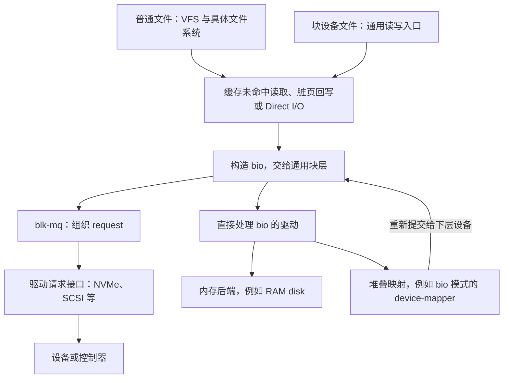
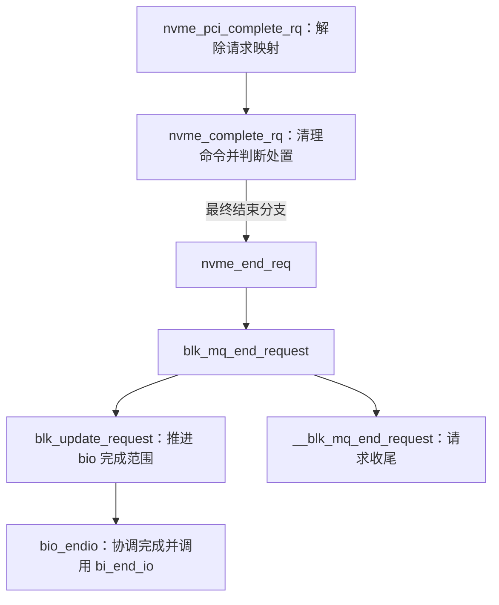

# 磁盘与块 I/O 子系统概述

一次文件写入，涉及的并不只是“把内存复制到磁盘”。文件系统需要确定数据应放在哪些设备位置；内核可能先把数据留在页缓存中，再组织回写；块层要让 I/O 满足设备限制，并协调多个 CPU 的提交；驱动把请求转换成设备命令，完成后还要把结果交还给原来的提交者。这些阶段各自有独立的对象和完成条件。

本章把 disk 子系统理解为**磁盘与分区管理、通用块 I/O 层、多队列块层（blk-mq）以及存储驱动的接入边界**。阅读后应能回答两个问题：一个块设备如何成为可访问的内核对象；一次块 I/O 又如何从内存和设备地址的描述，转变为驱动请求，最后完成并归还资源。

## 0. 分析基线与范围

源码基线是仓库内 [Makefile 第 2～5 行](../../linux/Makefile#L2-L5)标记的 **Linux 6.18.52**，架构限定为 **x86-64**。本章以普通非 zoned 块设备的读写为主线，不展开按 zone 管理的顺序写约束；驱动实例选择 NVMe PCI 的一条底层 I/O 路径。文件系统块分配、日志事务、RAID 算法、NVMe 多路径与控制器复位留给各自专题。

本文图示和文件读写实例还限定为非 DAX 路径。当前 `CONFIG_FS_DAX=y`，ext4 会根据 inode 的运行时状态选择 DAX（Direct Access，直接访问）分支；该分支经映射直接访问持久内存，不属于下文构造 bio 的数据通路。配置支持 DAX 不等于所有文件都走 DAX。[配置条件](../../linux/.config#L9645-L9646)、[ext4 读取分流](../../linux/fs/ext4/file.c#L130-L147)、[DAX 数据访问](../../linux/fs/dax.c#L1647-L1682)

读者需要具备 C 语言、页缓存、中断和基本锁机制的概念；本章只在这些机制与块层的接口处展开。下列配置决定哪些实现可用于分析，**不证明模块已经加载，也不证明机器上存在相应设备或某项运行时策略已经启用**。

| 配置 | 对本章的影响 | 本地依据 |
| --- | --- | --- |
| `CONFIG_X86_64=y`、`CONFIG_X86=y` | 使用 x86-64 构建基线 | [.config 第 332～336 行](../../linux/.config#L332-L336) |
| `CONFIG_BLOCK=y` | 块层内建；`blk-mq.o` 是块层的基本构建对象 | [.config 第 1046 行](../../linux/.config#L1046)、[block/Makefile 第 6～12 行](../../linux/block/Makefile#L6-L12) |
| `CONFIG_MQ_IOSCHED_DEADLINE=y`；`CONFIG_MQ_IOSCHED_KYBER=m`、`CONFIG_IOSCHED_BFQ=m` | mq-deadline 内建，另两个调度器以模块构建；具体队列仍可不安装调度器 | [.config 第 1107～1109 行](../../linux/.config#L1107-L1109)、[block/Makefile 第 23～26 行](../../linux/block/Makefile#L23-L26) |
| `CONFIG_BLK_DEV_ZONED=y`、`CONFIG_BLK_DEV_INTEGRITY=y` | 编入 zoned 块设备支持（`blk-zoned.o`）和数据完整性支持；`blk_mq_submit_bio()` 因此带有 zoned 写插桩分支，但本章主线不经过 | [.config 第 1054～1056 行](../../linux/.config#L1054-L1056)、[block/Makefile 第 30 行](../../linux/block/Makefile#L30)、[zoned 分支](../../linux/block/blk-mq.c#L3130-L3135) |
| `CONFIG_BLK_CGROUP=y`、`CONFIG_BLK_DEV_THROTTLING=y`、`CONFIG_BLK_WBT=y` | 编入块 I/O 控制组、限流及写回节流支持；正文标出它们介入的位置 | [.config 第 214 行](../../linux/.config#L214)、[第 1057～1062 行](../../linux/.config#L1057-L1062) |
| `CONFIG_NVME_CORE=m`、`CONFIG_BLK_DEV_NVME=m`，`CONFIG_NVME_MULTIPATH=y` | NVMe 核心和 PCI 驱动为模块，多路径代码编入核心模块；本章实例不展开路径选择。`CONFIG_NVME_HOST_AUTH` 未设置，完成处置中的认证分支直接结束请求 | [.config 第 2620～2622 行](../../linux/.config#L2620-L2622)、[第 2630 行](../../linux/.config#L2630)、[认证分支](../../linux/drivers/nvme/host/core.c#L486-L492)、[NVMe Makefile 第 5～22 行](../../linux/drivers/nvme/host/Makefile#L5-L22) |
| `CONFIG_SCSI=m`、`CONFIG_BLK_DEV_SD=m`、`CONFIG_ATA=m`、`CONFIG_SATA_AHCI=m` | SCSI 磁盘与 ATA/AHCI 是当前可构建的其他驱动栈 | [.config 第 2726 行](../../linux/.config#L2726)、[第 2734 行](../../linux/.config#L2734)、[第 2865～2877 行](../../linux/.config#L2865-L2877) |
| `CONFIG_BLK_DEV_DM=m`、`CONFIG_BLK_DEV_RAM=m`、`CONFIG_EXT4_FS=m` | device-mapper、RAM disk 和 ext4 用作接口边界的实例 | [.config 第 2978 行](../../linux/.config#L2978)、[第 2606 行](../../linux/.config#L2606)、[第 9597 行](../../linux/.config#L9597) |

## 1. 先区分设备管理和数据传输

### 1.1 块层提供的抽象

对一次普通块读写，提交者需要表达四件事：**访问哪个块设备，从哪个设备地址开始，传输多长的数据，以及内存数据在哪里**。块层用 `bio` 表达这份工作；至于数据属于哪个文件、目录或应用协议，不在这个对象的职责内。设备地址和内存数据也不是同一种地址：前者用扇区编号定位存储范围，后者用页及页内范围描述内存。字段依据见 [`struct bio`：blk_types.h 第 210～281 行](../../linux/include/linux/blk_types.h#L210-L281)和 [`struct bvec_iter`：bvec.h 第 77～85 行](../../linux/include/linux/bvec.h#L77-L85)。

设备管理则先回答“这个设备是谁、容量多大、可以分成哪些子范围、怎样接收 I/O”。它围绕 `gendisk`、`block_device` 和 `request_queue` 建立长期存在的对象关系；数据传输围绕 `bio` 和 `request` 管理每次工作。两条主线在 `bio->bi_bdev` 处相接：一次 I/O 通过目标块设备找到所属磁盘和队列。[`block_device` 定义](../../linux/include/linux/blk_types.h#L41-L58)、[`gendisk` 定义](../../linux/include/linux/blkdev.h#L143-L164)

这里的“磁盘”是块设备抽象，不必对应一块机械硬盘。例如 NVMe 在命名空间的创建过程中分配 `gendisk`；RAM disk 则在内存后端直接处理 I/O。它们共享块层接口，但后端实现不同。[`nvme_alloc_ns()` 内的磁盘分配](../../linux/drivers/nvme/host/core.c#L4123-L4149)、[`brd_submit_bio()`](../../linux/drivers/block/brd.c#L202-L224)

### 1.2 I/O 的整体分层

下图回答“谁把工作交给谁”。VFS 是虚拟文件系统，提供统一的文件访问接口；Direct I/O 指直接 I/O。箭头统一表示 I/O 向下层的提交关系，是省略了缓存命中、错误返回和完成通知的概览，不是每次系统调用的完整调用栈。



这张图有两个关键分界。

第一，**普通文件与块设备文件的上层入口不同**。ext4 的文件操作表使用自己的 `read_iter`、`write_iter`；块设备文件使用 `def_blk_fops`。前者需要文件系统语义，后者直接访问块设备的字节范围。ext4 回写在组织好设备块号和内存数据后直接调用 `submit_bio()`，不会先经过块设备文件的读写入口。[`ext4_file_operations`](../../linux/fs/ext4/file.c#L970-L982)、[`def_blk_fops`](../../linux/block/fops.c#L957-L974)、[`ext4_io_submit()` 与 bio 构造](../../linux/fs/ext4/page-io.c#L397-L454)

第二，**块设备不一定先把 `bio` 转成 `request`**。`__submit_bio()` 根据 `BD_HAS_SUBMIT_BIO`，选择 blk-mq 或磁盘操作表的 `submit_bio`。RAM disk 属于后一类；device-mapper 的 bio 路径还可以映射到下层设备后重新提交。[`__submit_bio()`](../../linux/block/blk-core.c#L626-L649)、[`brd_fops`](../../linux/drivers/block/brd.c#L221-L224)、[`dm_submit_bio()`](../../linux/drivers/md/dm.c#L2069-L2096)及[下层重新提交](../../linux/drivers/md/dm.c#L1366-L1385)

缓存与直接 I/O 也不能混淆。以块设备文件为例，缓存读取进入 `filemap_read()`，直接读取进入 `blkdev_direct_IO()`；写入口也区分直接写与缓存写。**Direct I/O 描述的是数据传输路径，不表示跳过块层，也不等于数据已经持久化。** 其简单实现仍构造 bio、组织内存页并等待 bio 完成。这里讨论成功执行的直接 I/O 部分，具体入口还可能对未完成部分执行缓存回退。[`blkdev_read_iter()`](../../linux/block/fops.c#L838-L861)、[`blkdev_write_iter()`](../../linux/block/fops.c#L794-L811)、[`__blkdev_direct_IO_simple()`](../../linux/block/fops.c#L55-L112)

页缓存中的数据若已就绪，读取就不必为这部分数据重新提交设备 I/O。缓存缺失或数据尚未就绪时才需要补齐；此外，预读可能提前发出其他范围的 I/O。因此系统调用次数、bio 数量和设备命令数量之间没有固定的一一对应关系。[`filemap_get_pages()` 的缓存查找、预读与更新分支](../../linux/mm/filemap.c#L2640-L2677)

## 2. 核心对象：先有设备，再有一次 I/O

### 2.1 `gendisk`、`block_device` 与 `request_queue`

这三个对象分别描述整盘、可访问范围和 I/O 管理入口。

| 对象 | 关键字段及含义 | 关系与边界 |
| --- | --- | --- |
| `gendisk` | `disk_name` 是磁盘名；`part0` 指向整盘块设备；`part_tbl` 按分区号组织块设备；`fops` 是驱动操作表；`queue` 指向队列 | `part_tbl` 是嵌入的 XArray（内核中按整数索引存放指针的容器）；`part0`、`queue` 都是指针，不是内嵌对象 |
| `block_device` | `bd_start_sect` 是相对整盘的起点；`bd_nr_sectors` 是长度；`bd_disk`、`bd_queue` 指回磁盘和队列；`bd_mapping` 是页缓存映射 | 可表示整盘，也可表示分区；地址和长度以 512 字节扇区计 |
| `request_queue` | `limits` 保存能力与限制；`mq_ops` 是 blk-mq 驱动接口；`elevator` 是可选调度器；`queue_ctx`、`hctx_table` 组织软件和硬件上下文 | 是整套 I/O 管理状态，不是单独一条请求链表；直接处理 bio 的设备也有队列对象 |

字段定义见 [`gendisk`：blkdev.h 第 143～179 行](../../linux/include/linux/blkdev.h#L143-L179)、[`block_device`：blk_types.h 第 41～81 行](../../linux/include/linux/blk_types.h#L41-L81)、[`request_queue`：blkdev.h 第 469～518 行](../../linux/include/linux/blkdev.h#L469-L518)。

这里的 `disk->fops` 类型是 `block_device_operations`，与 VFS 使用的 `file_operations` 不同：前者连接磁盘驱动的打开、释放、控制及可选 bio 提交接口，后者描述打开文件的读写等行为。名称中都出现 `fops`，并不意味着它们处于同一层。[`block_device_operations`](../../linux/include/linux/blkdev.h#L1642-L1657)、[`def_blk_fops`](../../linux/block/fops.c#L957-L974)

下面用“一个整盘、两个分区”说明关系。所有箭头只表示字段指向或集合成员，不表示引用计数的增减。

```text
gendisk
  part0 ────────────→ block_device：整盘
  part_tbl[0] ──────→ 同一个整盘 block_device
  part_tbl[1] ──────→ block_device：分区 1
  part_tbl[2] ──────→ block_device：分区 2
  queue ────────────→ request_queue

上述各 block_device：
  bd_disk ──────────→ 同一个 gendisk
  bd_queue ─────────→ 同一个 request_queue
```

分配整盘时，`__alloc_disk_node()` 创建 `part0` 并把它插入 `part_tbl[0]`；创建分区时，`add_partition()` 分配另一个 `block_device`，设置起点和长度，再插入对应槽位。`bdev_alloc()` 把 `bd_queue` 设置为 `disk->queue`，因此**增加分区不会为它新建一组硬件请求队列**。[整盘初始化](../../linux/block/genhd.c#L1470-L1492)、[分区初始化](../../linux/block/partitions/core.c#L319-L331)、[分区发布](../../linux/block/partitions/core.c#L384-L388)、[`bdev_alloc()`](../../linux/block/bdev.c#L451-L479)

保存指针与持有引用要分别核实。例如 `add_partition()` 在创建分区前显式调用 `get_device(disk_to_dev(disk))` 来持有整盘；这份引用不是因为给 `bd_disk` 赋值就自动产生的。[`add_partition()` 第 322～328 行](../../linux/block/partitions/core.c#L322-L328)

### 2.2 `bio`：把设备范围与内存范围关联起来

对普通读写，bio 描述一个连续的设备范围，以及与之对应的内存数据段。理解它时，先看以下字段即可。

| 字段 | 含义与单位 |
| --- | --- |
| `bi_bdev` | 目标 `block_device`，提交分区 I/O 时可以指向分区 |
| `bi_opf` | 读、写等操作类型与附加请求标志 |
| `bi_iter.bi_sector` | 当前设备扇区位置，单位固定为 512 字节 |
| `bi_iter.bi_size` | 当前剩余 I/O 字节数 |
| `bi_io_vec`、`bi_vcnt` | 内存段数组及其条目数；实际遍历范围还受 `bi_iter` 控制 |
| `bi_end_io`、`bi_private` | 完成回调与提交者的私有上下文 |
| `bi_status` | 块层 I/O 状态，完成时供上层解释 |
| `__bi_remaining`、`__bi_cnt` | 分别服务于完成协调和对象引用管理，不能当成同一种计数 |

定义见 [`struct bio`](../../linux/include/linux/blk_types.h#L210-L281)和 [`bvec_iter`](../../linux/include/linux/bvec.h#L77-L85)；完成计数的用法见 [`bio_chain()`](../../linux/block/bio.c#L329-L347)，引用释放见 [`bio_put()`](../../linux/block/bio.c#L809-L827)。

一个 `bio_vec` 用 `bv_page`、`bv_offset`、`bv_len` 描述一段物理连续的内存，偏移和长度按字节计。一个段可以跨越多个连续页，不能把一个 bvec 固定理解成一页；多个段之间也不必物理连续。它描述的是内存页范围，**不是已经交给设备的 DMA 地址表**。后者要由驱动的数据映射过程产生。[`bio_vec` 定义与约束](../../linux/include/linux/bvec.h#L19-L32)、[NVMe 请求的数据映射调用](../../linux/drivers/nvme/host/pci.c#L1185-L1198)

块层的扇区单位与设备的逻辑块大小必须区分。`SECTOR_SHIFT` 为 9，即 512 字节；`queue_limits.logical_block_size` 则表达设备的逻辑块大小。比如逻辑块大小为 4096 字节时，一个逻辑块对应 8 个块层扇区，普通读写的起点和长度都要满足逻辑块对齐。块层在 `bio_unaligned()` 中把扇区号换算为字节后检查对齐。[扇区单位定义](../../linux/include/linux/blk_types.h#L24-L34)、[`queue_limits`](../../linux/include/linux/blkdev.h#L369-L411)、[`bio_unaligned()`](../../linux/block/blk-mq.c#L3085-L3093)

### 2.3 `request`：驱动执行与资源管理的单位

`request` 增加了 bio 本身没有的执行状态：所属队列 `q`、软件上下文 `mq_ctx`、硬件上下文 `mq_hctx`、驱动标签 `tag`、调度器内部标签 `internal_tag`，以及超时等信息。普通读写请求通过 `bio`、`biotail` 保存 bio 链的首尾，链内由 `bio->bi_next` 连接。[`request` 定义](../../linux/include/linux/blk-mq.h#L103-L136)、[`bio.bi_next`](../../linux/include/linux/blk_types.h#L210-L212)

因此 bio 和 request 不保证一一对应：超出限制的 bio 可能先拆成多个 bio，再形成多个请求；地址相邻且兼容的多个 bio，也可能并入一个 request。这里讨论普通读写，不能反过来要求每个驱动透传或内部控制请求都具有相同的数据布局。[拆分实现](../../linux/block/blk-merge.c#L119-L156)、[合并兼容性与位置判断](../../linux/block/blk-merge.c#L889-L923)、[透传操作判定](../../linux/include/linux/blkdev.h#L293-L296)

blk-mq 还有三个长期对象，用来支持大量 request 的并行执行：

| 对象 | 职责 | 关键关系 |
| --- | --- | --- |
| `blk_mq_ctx` | 面向提交 CPU 的软件上下文 | `rq_lists` 保存待处理请求，`hctxs` 指向不同队列类型对应的硬件上下文，链表受 `lock` 保护 |
| `blk_mq_hw_ctx` | 块层中的硬件派发上下文，简称 hctx | `dispatch` 保存暂未下发的请求，`driver_data` 关联驱动对象；它本身仍是软件结构 |
| `blk_mq_tag_set` | 描述并管理一组请求资源与队列映射 | 包括 `ops`、`map`、`nr_hw_queues`、`queue_depth`；`cmd_size` 指定每个 request 附带的驱动私有空间字节数，可由多个请求队列共享同一 tag set |

定义见 [`blk_mq_ctx`](../../linux/block/blk-mq.h#L16-L32)、[`blk_mq_hw_ctx`](../../linux/include/linux/blk-mq.h#L320-L375)、[`blk_mq_tag_set` 注释与定义](../../linux/include/linux/blk-mq.h#L494-L554)。其中 NVMe 的真实命令队列内存由驱动的 `nvme_queue.sq_cmds`、`cqes` 等字段描述，不能与 hctx 混为一物。[`struct nvme_queue`](../../linux/drivers/nvme/host/pci.c#L221-L239)

## 3. 设备主线：创建、发布、访问与撤销

### 3.1 分配对象与发布设备是两个阶段

对使用 `blk_mq_alloc_disk()` 的驱动，块层先根据 tag set 和队列限制分配 `request_queue`，再创建 `gendisk`。磁盘初始化又建立 `part0`、分区表、拆分 bio 所用的资源池，以及关联回写的 `backing_dev_info`。失败时，各层回滚已经分配的资源，此时尚未得到一个已发布的设备。[`__blk_mq_alloc_disk()`](../../linux/block/blk-mq.c#L4459-L4477)、[`__alloc_disk_node()`](../../linux/block/genhd.c#L1454-L1512)

随后驱动填写磁盘操作表、私有数据、名称和容量等信息，再调用 `device_add_disk()` 发布。NVMe 的命名空间创建就是一个实例：先分配 disk 并连接 `nvme_ns`，再注册设备。注册函数返回错误时，驱动继续执行自己的清理路径。[NVMe 磁盘与私有对象关联](../../linux/drivers/nvme/host/core.c#L4141-L4153)、[注册及错误分支](../../linux/drivers/nvme/host/core.c#L4190-L4218)

注册还会检查驱动提交接口是否匹配：blk-mq 队列的磁盘级 `submit_bio`、`poll_bio` 必须均为空，任一非空都会返回 `-EINVAL`；非 blk-mq 队列则必须提供 `submit_bio`。非 blk-mq 磁盘通过检查后，`part0` 会被设置 `BD_HAS_SUBMIT_BIO`，之后创建的分区在 `bdev_alloc()` 中继承这个标志（[分区继承](../../linux/block/bdev.c#L471-L472)）；1.2 节中 `__submit_bio()` 正是据此分流。[`__add_disk()` 的接口检查](../../linux/block/genhd.c#L438-L448)

发布阶段可能立即产生 I/O。对未设置 `GENHD_FL_HIDDEN` 的磁盘，`add_disk_final()` 发布整盘，在容量非零时尝试扫描分区，然后发送设备事件；分区解析读取介质时使用整盘的映射。因此驱动在发布磁盘前就必须具备服务 I/O 的能力，不能等注册返回后才准备数据通路。隐藏磁盘跳过这一发布分支；例如 NVMe 命名空间满足多路径条件时，底层路径磁盘会设置该标志。[`add_disk_final()`](../../linux/block/genhd.c#L405-L424)、[`disk_scan_partitions()`](../../linux/block/genhd.c#L363-L392)、[`read_part_sector()`](../../linux/block/partitions/core.c#L712-L727)、[NVMe 隐藏路径磁盘](../../linux/drivers/nvme/host/core.c#L4166-L4175)

### 3.2 分区是有边界的地址视图

设一个分区从整盘第 2048 个扇区开始，向这个分区的字节偏移 4096 处写 4096 字节，则提交时的设备位置为分区内扇区 8。通过分区边界检查后，地址重映射得到：

```text
分区内起点：4096 / 512 = 8
整盘起点：  2048 + 8 = 2056
传输长度：  4096 / 512 = 8 个扇区
```

这是地址换算示例，假定分区足够大且满足设备对齐要求。实际路径先由 `bio_check_eod()` 根据目标 `block_device` 的长度检查是否越界，再由 `blk_partition_remap()` 加上 `bd_start_sect`。本版本重映射会设置 `BIO_REMAPPED`，**不会把 `bi_bdev` 改成整盘对象**；所以不能仅看 `bi_bdev` 指向分区，就断言此时 `bi_sector` 仍是分区内地址。[边界检查与重映射实现](../../linux/block/blk-core.c#L555-L590)、[调用条件](../../linux/block/blk-core.c#L798-L804)

分区映射与堆叠设备映射也有区别。device-mapper 的 linear target 会同时用 `bio_set_dev()` 选择下层设备，并换算扇区位置；这是一层新的设备映射，不只是同一个磁盘中的分区偏移。[`linear_map()`](../../linux/drivers/md/dm-linear.c#L82-L96)

### 3.3 可访问状态与内存生命周期并不重合

打开块设备时，`bdev_open()` 在 `disk->open_mutex` 保护下检查磁盘状态、完成整盘或分区的打开及持有关系处理；释放这把锁后，再把打开文件的 `f_mapping` 关联到 `bd_mapping`。分区创建同样要求持有 `open_mutex`；这些管理操作不能与 I/O 热路径中的队列锁混为一谈。[`bdev_open()` 的锁内操作](../../linux/block/bdev.c#L940-L973)、[锁外的文件映射关联](../../linux/block/bdev.c#L973-L988)、[`add_partition()` 锁断言](../../linux/block/partitions/core.c#L293-L304)

撤销设备时，`del_gendisk()` 对应“设备不再对外提供服务”：阻止新的打开、通知持有者、删除分区、注销队列与设备，并等待队列使用者排空。它不等于立即释放 `gendisk` 内存；最终释放取决于引用归零，`put_disk()` 把引用交还给设备模型，再由释放路径回收关联资源。[`__del_gendisk()`](../../linux/block/genhd.c#L697-L759)、[`del_gendisk()` 的生命周期约定](../../linux/block/genhd.c#L795-L811)、[`put_disk()`](../../linux/block/genhd.c#L1537-L1554)、[`disk_release()`](../../linux/block/genhd.c#L1280-L1321)

执行上下文上，`del_gendisk()` 的注释标明它可能睡眠；`put_disk()` 可以在任意上下文调用，但最后一次引用不能在原子上下文中释放。[`del_gendisk()` 的上下文](../../linux/block/genhd.c#L811)、[`put_disk()` 的上下文](../../linux/block/genhd.c#L1547-L1548)

## 4. 数据主线：从 bio 到可执行请求

### 4.1 提交接口交接的是工作，不是同步返回值

上层在调用 `submit_bio()` 前已经设置设备、地址、长度、内存段和完成回调。函数进行读写统计、设置 I/O 优先级，再进入 `submit_bio_noacct()`。后者仍检查 NOWAIT（`REQ_NOWAIT`，要求提交过程不阻塞，资源暂缺时以 `BLK_STS_AGAIN` 结束，见 [`bio_wouldblock_error()`](../../linux/include/linux/bio.h#L399-L402)）能力、范围、分区映射以及特殊操作支持，并可能把 bio 交给控制组限流机制暂存。名字中的 `noacct` 不表示“不检查”，它是供堆叠驱动向下层重新提交时使用的接口。[`submit_bio()` 及接口约定](../../linux/block/blk-core.c#L895-L918)、[`submit_bio_noacct()`](../../linux/block/blk-core.c#L771-L883)

`submit_bio()` 返回类型是 `void`。成功或失败通过 `bi_status` 和 `bi_end_io` 交付，调用者不能把函数返回当成传输已经完成，也不能在尚未收到完成通知时继续修改 bio。反过来，完成也可能发生在提交调用返回之前：RAM disk 的提交函数直接调用 `bio_endio()`。因此完成回调和私有上下文必须在提交之前准备好。[提交者约定](../../linux/block/blk-core.c#L899-L906)、[RAM disk 同步完成](../../linux/drivers/block/brd.c#L202-L218)

堆叠路径会带来“处理一个 bio 时又提交另一个 bio”的情况。通用块层使用 `current->bio_list` 收集这些后续工作，再迭代处理，避免设备层数转化为无界的内核栈递归。[`submit_bio_noacct_nocheck()`](../../linux/block/blk-core.c#L728-L756)、[`__submit_bio_noacct()`](../../linux/block/blk-core.c#L652-L712)

### 4.2 进入 blk-mq 后，先让 I/O 满足约束

`blk_mq_submit_bio()` 的输入仍是 bio。对普通非 zoned 读写，其主要工作可按下表理解；表中概括对象变化，缓存 request 等优化不会改变各步骤的约束。

| 阶段 | 读取或改变的对象 | 结果 |
| --- | --- | --- |
| 取得队列使用权 | 获取 `q_usage_counter` 使用引用，或复用已经持有引用的缓存 request | 在受保护的队列配置上继续处理 |
| 检查与拆分 | 检查 bio 的逻辑块对齐、轮询支持；按 `q->limits` 拆分 | 不合法的 I/O 完成报错；合法的大 I/O 可变成多个部分 |
| 尝试合并 | 检查 bio 与现有 request 的兼容性和位置 | 成功时复用已有请求，无需为该 bio 新建请求 |
| 获取并填充 request | 获取请求资源，连接 `rq->bio`，填写地址、字节数与段数 | 得到可进入派发过程的请求 |
| 决定提交方式 | flush/FUA 请求先交给 `blk_insert_flush()`，被其接管时直接返回；其余请求加入 `plug->mq_list` | 经 `__submit_bio()` 的普通路径总有 plug，请求先暂存；走调度器、驱动批量接口还是逐个下发，在冲刷 plug 时才决定（5.2 节） |

对应实现见 [`blk_mq_submit_bio()` 的准备与合并](../../linux/block/blk-mq.c#L3109-L3175)、[request 获取与关联](../../linux/block/blk-mq.c#L3177-L3202)、[后续路由](../../linux/block/blk-mq.c#L3208-L3230)。`blk_mq_bio_to_request()` 明确把 bio 的设备位置和剩余字节数复制到 request，并建立首尾 bio 指针。[`blk_mq_bio_to_request()`](../../linux/block/blk-mq.c#L2670-L2692)

需要注意，`__submit_bio()` 在调用 `blk_mq_submit_bio()` 之前用 `blk_start_plug()` 建立 plug，并在返回前结束它；任务已有 plug 时，嵌套的 plug 不会替换原有的那个。所以本章主线上 `current->plug` 总不为空，`blk_mq_submit_bio()` 总是走 `blk_add_rq_to_plug()` 分支。其后“插入队列或直接下发”的分支只服务于没有 plug 的调用者，当前源码中只有 zoned 写插桩的工作函数会这样调用。[`__submit_bio()` 的 plug](../../linux/block/blk-core.c#L626-L650)、[嵌套 plug](../../linux/block/blk-core.c#L1121-L1129)、[plug 分支与其后的路由](../../linux/block/blk-mq.c#L3211-L3223)、[zoned 工作函数中的调用](../../linux/block/blk-zoned.c#L1367-L1372)

**拆分与合并服务于不同约束。** 拆分用于使单次下发满足最大扇区数、最大内存段数、段长度与边界等限制；合并用于把兼容工作汇集到同一个请求。设备地址相邻还不够，操作类型、控制组、完整性信息、写入提示、I/O 优先级等也要兼容。`queue_limits` 给出限制数据，`blk_rq_merge_ok()` 和 `blk_try_merge()` 分别检查兼容性与相邻关系。[限制字段](../../linux/include/linux/blkdev.h#L369-L413)、[合并判定](../../linux/block/blk-merge.c#L889-L923)

拆分还必须处理“上层只提交了一份工作，却收到多个底层完成”的问题。`bio_submit_split_bioset()` 用 `bio_chain(split, bio)` 建立完成依赖，拆分分配失败则结束原 bio 并返回空指针。链式完成要求相关部分全部完成后，父 bio 才通知上层；这不是把某一个子请求的成功当成整体成功。[拆分与失败处理](../../linux/block/blk-merge.c#L119-L138)、[`bio_chain()` 的完成约定](../../linux/block/bio.c#L329-L347)

拆分后，`bio_submit_split_bioset()` 返回前半段供当前路径继续处理；剩余部分先经过 `blk_throtl_bio()`，再由 `submit_bio_noacct_nocheck(bio, true)` 重新提交，在 `current->bio_list` 存在时插到列表头部。[剩余部分的重新提交](../../linux/block/blk-merge.c#L133-L138)、[插入列表头部](../../linux/block/blk-core.c#L747-L751)

## 5. blk-mq：并行提交、批处理与背压

### 5.1 CPU 上下文与硬件上下文是映射关系

blk-mq 为每个可能的 CPU 初始化软件上下文，再按队列映射表选择硬件上下文。下图是假设四个 CPU 映射到两个 hctx 的概念示例；箭头表示映射，不表示每个请求必须依次在两处排队。

```text
CPU 0 的 ctx ──┐
               ├──→ hctx 0 ──→ 驱动队列对象 0
CPU 1 的 ctx ──┘

CPU 2 的 ctx ──┐
               ├──→ hctx 1 ──→ 驱动队列对象 1
CPU 3 的 ctx ──┘
```

实际映射由 tag set 的映射表描述，还区分默认、读和轮询队列类型；不能假定“一个 CPU 独占一个硬件队列”。软件上下文的初始化见 [`blk_mq_init_cpu_queues()`](../../linux/block/blk-mq.c#L4081-L4108)；ctx 与 hctx 的双向关联由 [`blk_mq_map_swqueue()`](../../linux/block/blk-mq.c#L4165-L4231)按映射表写入 `ctx->hctxs[]` 和 `hctx->ctxs[]`；提交时按 [`blk_mq_map_queue_type()`、`blk_mq_get_hctx_type()` 与 `blk_mq_map_queue()`](../../linux/block/blk-mq.h#L83-L113) 选取。

多队列让提交状态能够按 CPU 和 hctx 分散，这是理解其并行性的关键。但它不意味着无锁：软件请求链表受 `ctx->lock` 保护，暂未派发的请求由 `hctx->lock` 保护；NVMe 驱动还用自己的 `sq_lock` 保护命令队列写入。[软件链表操作](../../linux/block/blk-mq.c#L2600-L2603)、[hctx 派发链表操作](../../linux/block/blk-mq.c#L2173-L2175)、[NVMe 命令提交](../../linux/drivers/nvme/host/pci.c#L1230-L1237)

### 5.2 plug、调度器和限流不是同一层机制

plug 是**任务范围内的短暂批处理**。调用者用 `blk_start_plug()` 表达即将连续提交多份 I/O 的意图，用 `blk_finish_plug()` 结束批次。块层可以暂存请求，以便合并和批量派发，但达到阈值或任务阻塞时也可提前提交。任务睡眠前冲刷 plug 还有正确性意义：避免内存回收所等待的 I/O 被堵在当前任务自己的私有批次中。[`blk_start_plug()` 的接口说明](../../linux/block/blk-core.c#L1147-L1173)

冲刷时，`blk_finish_plug()` 经 `__blk_flush_plug()` 调用 `blk_mq_flush_plug_list()`。没有安装调度器、且不是因任务睡眠而冲刷时，请求按队列交给 `blk_mq_dispatch_queue_requests()`：驱动实现了 `->queue_rqs()` 就先整批交给它，剩余请求再经 `blk_mq_issue_direct()` 逐个调用 `->queue_rq()`。其余情况由 `blk_mq_dispatch_list()` 把请求插入调度器或软件队列，再运行 hctx。[`blk_finish_plug()` 与 `__blk_flush_plug()`](../../linux/block/blk-core.c#L1218-L1252)、[`blk_mq_flush_plug_list()`](../../linux/block/blk-mq.c#L2954-L2984)、[批量接口与逐个下发](../../linux/block/blk-mq.c#L2800-L2894)、[插入调度器或软件队列](../../linux/block/blk-mq.c#L2896-L2939)

I/O 调度器则介入队列请求的选择和排序。当前构建可提供 mq-deadline、Kyber 和 BFQ，但 `none` 表示没有安装 elevator，并不表示取消 blk-mq、tag 或排队。默认选择还受驱动标志、硬件队列数量及 shared-tags（多个硬件队列共用一组标签，见 [`BLK_MQ_F_TAG_HCTX_SHARED`](../../linux/include/linux/blk-mq.h#L695)）条件影响：`elevator_set_default()` 在允许默认调度、能够取得 mq-deadline，且满足单队列或 shared-tags 条件时尝试安装它。不能仅凭“这是 SSD”或“配置中启用了某调度器”断言当前队列的实际策略。[构建规则](../../linux/block/Makefile#L23-L26)、[`elevator_set_default()`](../../linux/block/elevator.c#L724-L758)

限流与这些机制的接口位置也不同。`blk_throtl_bio()` 在通用提交路径中可以接管 bio；进入 blk-mq 后，`rq_qos_throttle()` 在分配新 request 之前调用，复用缓存 request 时同样会调用。rq-qos 是块层挂接 I/O 服务质量策略的框架，WBT 就是其中一种策略，它的 `.throttle` 回调 `wbt_wait()` 在这里介入。块 I/O 控制组则在 `submit_bio_noacct_nocheck()` 中经 `blk_cgroup_bio_start()` 记录 bio，合并时还要求 bio 与 request 的控制组兼容。throttle 与 rq-qos 的等待都发生在形成驱动请求之前；request 形成之后，还可能因调度器、派发时取得驱动标签或 `hctx->dispatch` 而等待。因此不能把全部等待都归因于 I/O 调度器。[bio 限流入口](../../linux/block/blk-core.c#L875-L883)、[新请求分配前的 QoS 节流](../../linux/block/blk-mq.c#L3031-L3059)、[复用缓存请求时的节流](../../linux/block/blk-mq.c#L3177-L3182)、[WBT 的 rq-qos 回调](../../linux/block/blk-wbt.c#L891-L899)、[WBT 注册为 rq-qos](../../linux/block/blk-wbt.c#L937)、[控制组记账入口](../../linux/block/blk-core.c#L728-L730)、[合并时的控制组检查](../../linux/block/blk-merge.c#L897-L898)

### 5.3 tag 把并发容量与完成定位联系起来

tag 是请求资源池中的标签。`blk_mq_tags` 保存标签位图和请求指针数组；获得标签后，`blk_mq_rq_ctx_init()` 从 `static_rqs[tag]` 取出请求对象并初始化。这里的“分配 request”通常是取得池内对象的使用权，不是每次 I/O 都重新申请一个独立堆对象。[`blk_mq_tags`](../../linux/include/linux/blk-mq.h#L772-L800)、[`blk_mq_rq_ctx_init()`](../../linux/block/blk-mq.c#L410-L448)

启用调度器的路径还可能先取得 `internal_tag`，把驱动 `tag` 留为 `BLK_MQ_NO_TAG`，之后派发时再取得驱动标签。tag 必须放在所属标签集合中解释，不是全系统唯一的请求编号。[两类标签的初始化](../../linux/block/blk-mq.c#L427-L433)、[按集合查找请求](../../linux/include/linux/blk-mq.h#L792-L800)

标签耗尽时，普通路径会先尝试运行队列，再等待已有请求释放资源；NOWAIT 路径则不进入这种等待。这是**背压**：用有限的请求资源限制并发，而非把资源暂缺误报为磁盘介质损坏。bio 路径在 NOWAIT 请求资源获取失败时调用 `bio_wouldblock_error()` 完成通知。[`blk_mq_get_tag()`](../../linux/block/blk-mq-tag.c#L137-L191)、[NOWAIT 失败处理](../../linux/block/blk-mq.c#L3184-L3188)

## 6. 驱动接入与完成：以 NVMe PCI 为例

### 6.1 `queue_rq()` 接受请求后，传输仍未结束

blk-mq 派发接口把 hctx 和 `blk_mq_queue_data` 交给驱动，其中 `rq` 是当前请求，`last` 帮助驱动判断批次边界。以 `blk_mq_dispatch_rq_list()` 为例，下发前先准备所需资源，再调用 `q->mq_ops->queue_rq()`，根据返回状态决定下一步。[接口参数](../../linux/include/linux/blk-mq.h#L557-L579)、[派发实现](../../linux/block/blk-mq.c#L2101-L2146)

| 返回状态 | 该派发路径的处理 |
| --- | --- |
| `BLK_STS_OK` | 驱动已接受请求；最终 I/O 结果仍由完成路径给出 |
| `BLK_STS_RESOURCE`、`BLK_STS_DEV_RESOURCE` | 资源暂不可用，保留请求并安排后续派发；两者后续重启策略有差别 |
| 其他错误 | 用对应状态结束请求 |

剩余请求可放入 `hctx->dispatch`，后续重新运行队列时继续处理。这条链表是等待再次派发的软件状态，不是已经写入设备命令队列的证据。[返回状态处理](../../linux/block/blk-mq.c#L2133-L2146)、[剩余请求入队](../../linux/block/blk-mq.c#L2155-L2175)

驱动回调的执行上下文由块层决定。派发经 `blk_mq_run_dispatch_ops()` 进入驱动：tag set 未设置 `BLK_MQ_F_BLOCKING` 时，`->queue_rq()`、`->queue_rqs()` 在 `rcu_read_lock()` 内调用，驱动不得睡眠；设置了该标志时改用 SRCU（Sleepable RCU，读侧允许睡眠的 RCU 变体）。这也正是 7.1 节 quiesce 等待的读侧临界区。NVMe PCI 的控制器操作表没有声明 `NVME_F_BLOCKING`，因此属于前者。[派发临界区](../../linux/block/blk-mq.h#L438-L457)、[运行硬件队列](../../linux/block/blk-mq.c#L2371-L2372)、[NVMe 设置该标志的条件](../../linux/drivers/nvme/host/core.c#L4956-L4957)、[PCI 控制器标志](../../linux/drivers/nvme/host/pci.c#L3310-L3313)

NVMe PCI 的 `nvme_mq_ops.queue_rq` 指向 `nvme_queue_rq()`。对正常就绪设备，这个函数先准备协议命令和数据映射，再在 `sq_lock` 下复制命令并推进提交队列通知。普通读写命令构造把 request 的块层扇区地址换算为 NVMe 逻辑块地址；内存映射则是另一条独立的转换。[操作表](../../linux/drivers/nvme/host/pci.c#L2055-L2065)、[`nvme_prep_rq()`](../../linux/drivers/nvme/host/pci.c#L1174-L1208)、[`nvme_queue_rq()`](../../linux/drivers/nvme/host/pci.c#L1211-L1237)、[`nvme_setup_rw()` 的地址与长度](../../linux/drivers/nvme/host/core.c#L1020-L1029)

NVMe PCI 还实现了 `.queue_rqs = nvme_queue_rqs`。按 5.2 节，没有调度器的队列冲刷 plug 时会优先调用它：`nvme_queue_rqs()` 对每个请求调用 `nvme_prep_rq_batch()`，按 NVMe 队列分组，由 `nvme_submit_cmds()` 在一次 `sq_lock` 内复制该组命令并只写一次门铃（doorbell，驱动把提交队列尾指针写给设备的通知机制）。准备失败的请求留在列表中退回块层，再由 `blk_mq_issue_direct()` 调用 `->queue_rq()`。所以本节借 `nvme_queue_rq()` 说明单请求接口，它并不是 NVMe 普通读写的唯一入口。[`nvme_mq_ops`](../../linux/drivers/nvme/host/pci.c#L2055-L2065)、[批量提交](../../linux/drivers/nvme/host/pci.c#L1240-L1292)、[剩余请求逐个下发](../../linux/block/blk-mq.c#L2887-L2893)

准备成功后，`nvme_start_request()` 调用 `blk_mq_start_request()`：启动超时管理，把请求状态设为 `MQ_RQ_IN_FLIGHT`，并在驱动标签集合中记录 tag 到 request 的关联。后面的设备完成处理便可据此找回正在执行的对象。[NVMe 包装接口](../../linux/drivers/nvme/host/nvme.h#L1219-L1224)、[`blk_mq_start_request()`](../../linux/block/blk-mq.c#L1350-L1378)

批处理还意味着“复制了一条命令”不必对应一次立即的寄存器写入。`nvme_write_sq_db()` 会根据批次末尾、队列位置及 doorbell buffer 条件决定是否通知设备。块层请求对象、驱动队列内存和设备通知是不同层次的状态。[命令复制与队列通知](../../linux/drivers/nvme/host/pci.c#L562-L585)

### 6.2 完成沿对象关系返回，而不是按提交调用栈返回

设备完成命令后，NVMe 驱动读取完成项，以命令标识找到 request。本版本的 NVMe 命令标识包含请求 tag 和代次信息（generation counter）；`nvme_find_rq()` 除了查找还校验代次，不能把完整命令标识直接等同于 tag。[完成项处理](../../linux/drivers/nvme/host/pci.c#L1337-L1369)、[`nvme_cid()` 与 `nvme_find_rq()`](../../linux/drivers/nvme/host/nvme.h#L650-L685)

下图只展示普通读写请求的非批量、最终结束分支。箭头表示调用方向；省略了中断或轮询接入、跨 CPU 完成、批量优化及错误重试，不表示所有驱动共用这条唯一调用链。还要注意，这条非批量分支不是成功请求的常见路径：在中断处理中，本地完成、没有调度器标签、没有 `end_io` 且没有出错的请求，会先经 `blk_mq_add_to_batch()` 加入批次，再由 `nvme_pci_complete_batch()` 调用 `blk_mq_end_request_batch()` 一并结束。图中的分支主要服务于出错、使用调度器标签、带 `end_io`（如 flush 序列中的数据请求）或在其他 CPU 完成的请求。[加入批次的条件](../../linux/include/linux/blk-mq.h#L893-L922)、[NVMe 完成项入批](../../linux/drivers/nvme/host/pci.c#L1364-L1369)、[中断中批量结束](../../linux/drivers/nvme/host/pci.c#L1405-L1412)、[批量结束](../../linux/drivers/nvme/host/nvme.h#L854-L864)、[`blk_mq_end_request_batch()`](../../linux/block/blk-mq.c#L1183-L1213)、[flush 数据请求的 `end_io`](../../linux/block/blk-flush.c#L373-L374)



`nvme_pci_complete_rq()` 先解除映射，再交给 `nvme_complete_rq()`；后者也可能选择重试或故障转移，因此收到一条设备完成项不必立即结束上层工作。最终结束分支调用 `nvme_end_req()`，将协议状态转换为块层状态并进入 `blk_mq_end_request()`。[NVMe PCI 完成](../../linux/drivers/nvme/host/pci.c#L1302-L1305)、[NVMe 处置与最终结束](../../linux/drivers/nvme/host/core.c#L449-L494)

通用完成层执行两类收尾，顺序可从 `blk_mq_end_request()` 看到：

1. `blk_update_request()` 按完成字节数推进 bio 的迭代器，传递错误；普通 bio 的剩余数据归零后调用 `bio_endio()`。后者处理链式完成等条件，再调用提交者的 `bi_end_io`。
2. `__blk_mq_end_request()` 处理请求统计和结束回调。通常继续归还 request；若存在专门的 `rq->end_io`，则由回调返回值参与决定是否归还。请求引用满足释放条件后，释放驱动及调度器标签，并归还队列使用引用。

依据见 [`blk_mq_end_request()` 与请求结束回调](../../linux/block/blk-mq.c#L1145-L1167)、[`blk_update_request()`](../../linux/block/blk-mq.c#L940-L1009)、[`bio_endio()`](../../linux/block/bio.c#L1631-L1674)、[request 资源归还](../../linux/block/blk-mq.c#L782-L816)。flush 序列会延后 bio 的最终通知，下一节单独说明。

**bio 完成与 bio 对象释放仍是两件事。** `bio_endio()` 负责完成协议，`bio_put()` 负责归还分配型 bio 的引用；数据页的生命周期还由提交路径的页引用约定决定。也不能一律要求每个 bio 都用 `bio_put()`：块设备简单直接 I/O 使用栈上的 bio，等待完成后释放数据页，再调用 `bio_uninit()`。[`bio_put()`](../../linux/block/bio.c#L809-L827)、[栈上 bio 的声明](../../linux/block/fops.c#L55-L63)与[结束清理](../../linux/block/fops.c#L99-L109)

## 7. 两个横向约束：并发退出与写入持久化

### 7.1 不能把提交、派发、完成都当成同一执行上下文

通用提交路径包含 `might_sleep()`，取得队列使用权和标签时也存在等待分支；不能把普通 `submit_bio()` 当作任意原子上下文都能调用的无阻塞接口。完成侧则可能由中断处理或驱动轮询触发。NVMe 既有读取完成队列的中断入口，也注册了 `.poll` 接口，所以完成回调不能假设仍运行在提交线程，也不能把可能睡眠的工作无条件放入其中。[提交上下文提示](../../linux/block/blk-core.c#L780-L786)、[队列等待](../../linux/block/blk-core.c#L333-L366)、[NVMe 中断完成](../../linux/drivers/nvme/host/pci.c#L1384-L1415)、[NVMe 轮询接口](../../linux/drivers/nvme/host/pci.c#L2055-L2064)

队列重配置和设备退出需要控制不同阶段，下面两种机制尤其不能互换。

| 机制 | 它等待什么 | 不应误解为 |
| --- | --- | --- |
| freeze：冻结队列 | 阻止新的正常使用引用进入，再等待 `q_usage_counter` 归零；blk-mq 请求释放会归还相应引用 | 停止派发：`__blk_freeze_queue_start()` 反而会运行硬件队列，让已排队的请求尽快完成并归还使用引用 |
| quiesce：暂停派发 | 等待正在进行的派发临界区退出，并阻止后续派发，直到 unquiesce | 所有已提交设备命令都已完成，或完成回调不会再运行 |

冻结的依据是 [`__blk_freeze_queue_start()`](../../linux/block/blk-mq.c#L163-L174)、[`blk_mq_freeze_queue_wait()`](../../linux/block/blk-mq.c#L189-L193)和[请求释放中的 `blk_queue_exit()`](../../linux/block/blk-mq.c#L782-L800)。暂停派发使用 RCU 或 SRCU 等待相关临界区，并明确允许请求完成回调继续发生。[quiesce 等待与接口约定](../../linux/block/blk-mq.c#L275-L305)

这也解释了为什么设备注销、停止派发、请求完成和对象引用归零必须分别追踪：它们关闭的是不同使用通道，无法靠一把“磁盘锁”替代整套协议。

### 7.2 写系统调用返回、块 I/O 完成与持久化是不同条件

先区分主机内存中的页缓存与设备的易失性写缓存。普通缓存写可先更新页缓存，之后由回写提交 bio；即使数据已经完成块 I/O，设备仍可能启用了易失性写缓存。ext4 的缓存写入口与回写 bio 提交处分别位于不同函数，块层则为设备缓存提供额外的 flush/FUA 语义。[`ext4_buffered_write_iter()`](../../linux/fs/ext4/file.c#L285-L312)、[`ext4_io_submit()`](../../linux/fs/ext4/page-io.c#L397-L405)、[flush 语义说明](../../linux/block/blk-flush.c#L8-L26)

| 标志 | 对设备写缓存的要求 |
| --- | --- |
| `REQ_PREFLUSH` | 本次数据操作之前先刷新设备缓存；仅有它并不保证本次随后写入的数据也已经持久化 |
| `REQ_FUA` | Force Unit Access，本次写入的数据达到非易失介质后才允许报告完成 |

根据请求标志和设备能力，块层组合可选的 `PREFLUSH → DATA → POSTFLUSH` 阶段。有写缓存且支持原生 FUA 时，把 FUA 要求随数据命令传给驱动；不支持原生 FUA 时，用数据之后的 flush 实现所需语义。并非每次写入都经历三个阶段，没有相应写缓存需求时甚至可以直接执行数据请求。[`blk_insert_flush()` 的策略选择](../../linux/block/blk-flush.c#L382-L436)

此外，设备没有易失性写缓存时，`submit_bio_noacct()` 会提前去掉 PREFLUSH/FUA 标志，没有数据的 flush bio 直接成功完成；NVMe 保留 FUA 时，在读写命令中设置 `NVME_RW_FUA`。[提前过滤](../../linux/block/blk-core.c#L806-L821)、[NVMe 的 FUA 位](../../linux/drivers/nvme/host/core.c#L997-L998)

flush 序列中的 DATA 完成还不能立即通知提交者：`blk_update_request()` 检查 `RQF_FLUSH_SEQ`，延后 bio 的最终完成，使通知覆盖需要的完整序列。[完成路径的 flush 特例](../../linux/block/blk-mq.c#L995-L1002)、[序列完成约定](../../linux/block/blk-flush.c#L54-L63)。注意所引注释提到的 `req_bio_endio()` 在当前源码中已不存在，对应的 `RQF_FLUSH_SEQ` 检查现在位于 `blk_update_request()`（即前一个链接）。

对块设备文件，`blkdev_fsync()` 先等待指定范围写回，再发出设备 flush。这恰好展示了两层缓存的区别。普通文件还要由具体文件系统处理自身的数据和元数据同步，本章不把一次底层 flush 等同于完整文件系统事务提交。[`blkdev_fsync()`](../../linux/block/fops.c#L618-L637)、[ext4 的独立 fsync 入口](../../linux/fs/ext4/file.c#L970-L982)

## 8. 按问题继续阅读源码

建立上述对象与流程后，可以按需要定位源码，而不必从 `block/` 的第一个文件顺序读到最后。

| 要继续回答的问题 | 建议入口 |
| --- | --- |
| 设备何时分配、何时对外可见、何时真正释放？ | [`__alloc_disk_node()`](../../linux/block/genhd.c#L1454)、[`device_add_disk()`](../../linux/block/genhd.c#L627)、[`del_gendisk()`](../../linux/block/genhd.c#L795) |
| 整盘、分区与打开文件怎样关联？ | [`bdev_alloc()`](../../linux/block/bdev.c#L451)、[`add_partition()`](../../linux/block/partitions/core.c#L293)、[`bdev_open()`](../../linux/block/bdev.c#L921) |
| 缓存 I/O 与直接 I/O 在哪里分流？ | [`def_blk_fops`](../../linux/block/fops.c#L957)、[`blkdev_write_iter()`](../../linux/block/fops.c#L751)、[`blkdev_read_iter()`](../../linux/block/fops.c#L816) |
| bio 如何检查、重映射、拆分和完成？ | [`submit_bio_noacct()`](../../linux/block/blk-core.c#L780)、[`bio_submit_split_bioset()`](../../linux/block/blk-merge.c#L119)、[`bio_endio()`](../../linux/block/bio.c#L1631) |
| request 在哪里等待，资源怎样归还？ | [`blk_mq_submit_bio()`](../../linux/block/blk-mq.c#L3109)、[`blk_mq_get_tag()`](../../linux/block/blk-mq-tag.c#L137)、[`blk_mq_dispatch_rq_list()`](../../linux/block/blk-mq.c#L2101)、[`blk_mq_free_request()`](../../linux/block/blk-mq.c#L803) |
| 驱动如何把通用请求变成具体命令？ | [`nvme_mq_ops`](../../linux/drivers/nvme/host/pci.c#L2055)；可与 SCSI 的 [`scsi_mq_ops_no_commit`](../../linux/drivers/scsi/scsi_lib.c#L2051) 对照 |
| 堆叠设备怎样改变地址、重新提交？ | [`dm_submit_bio()`](../../linux/drivers/md/dm.c#L2069)、[`linear_map()`](../../linux/drivers/md/dm-linear.c#L89) |
| 为什么设备报告数据写完后还不能结束 bio？ | [`blk_insert_flush()`](../../linux/block/blk-flush.c#L382)、[`blk_update_request()`](../../linux/block/blk-mq.c#L940) |

## 9. 回顾

回看开头的一次写入，可以把主线收拢为三组关系：`gendisk`、`block_device` 和 `request_queue` 确定设备及访问边界；`bio` 把内存数据与设备范围关联，`request` 再承载驱动执行状态；完成路径沿着这些关联通知上层，同时归还标签、队列使用权和相关对象资源。分析后续细节时，持续确认“当前是哪一层对象、哪一种地址、哪一份引用、哪一种完成条件”，就能把磁盘管理、排队等待、设备执行与持久化区分清楚。
