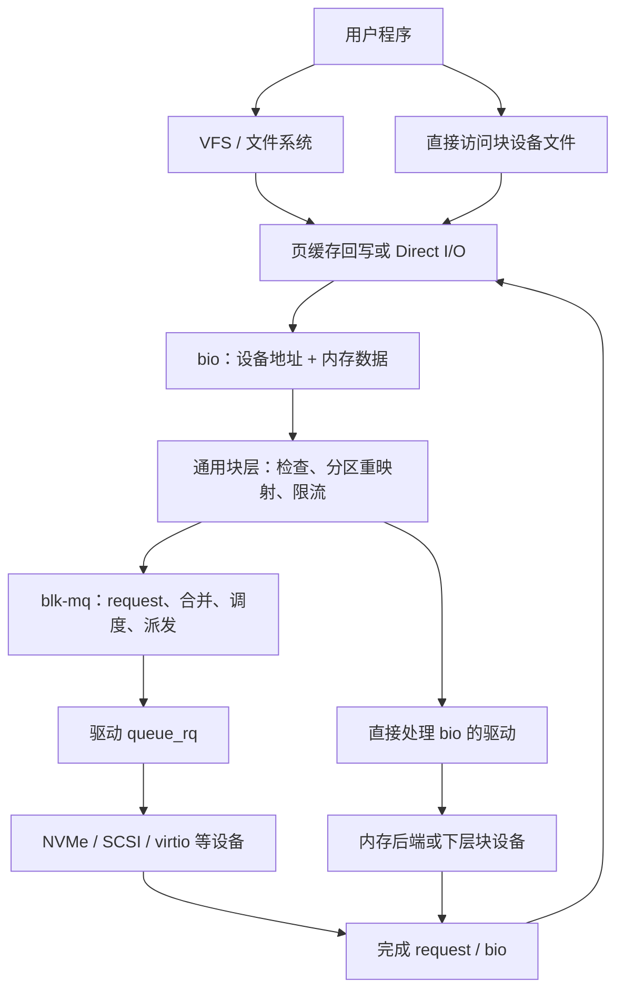

下面基于当前工作区源码总结。虽然目录名是 `linux-6.18`，但 [Makefile](/Users/jinqinghui/linux-6.18/Makefile:2) 标明的实际版本是 **Linux 6.18.52**。

这里把“disk 子系统”理解为：**磁盘对象管理、块设备与分区、通用块 I/O、blk-mq，以及磁盘驱动接入机制**。它们主要分布在 `block` 目录和不同类型的存储驱动目录中。

**理解这套源码，首先要区分设备管理和数据传输两条主线。**

设备管理解决“有哪些磁盘、容量多大、有哪些分区、如何打开和移除”；数据传输解决“某段内存如何读写到某个磁盘位置”。



这张图有两个重要边界：

- 文件系统负责把文件偏移映射为设备上的块地址；块层通常不理解文件名、目录、inode 和文件内容。
- 并非所有块设备都经过 `request` 和 blk-mq。例如 RAM disk 可以直接处理 `bio`。

---

**源码的职责划分如下，阅读时可以据此定位问题。**

| 源码入口 | 核心职责 |
|---|---|
| [genhd.c](/Users/jinqinghui/linux-6.18/block/genhd.c) | 整盘对象分配、注册、注销、容量、设备模型、磁盘统计 |
| [bdev.c](/Users/jinqinghui/linux-6.18/block/bdev.c) | 块设备对象、打开关闭、独占持有、缓存与生命周期 |
| [fops.c](/Users/jinqinghui/linux-6.18/block/fops.c) | 块设备文件的读写、Direct I/O、mmap、fsync |
| [partitions/core.c](/Users/jinqinghui/linux-6.18/block/partitions/core.c) | 分区表识别、分区创建、删除、重新扫描 |
| [bio.c](/Users/jinqinghui/linux-6.18/block/bio.c) | bio 分配、引用、克隆、拆分、完成通知 |
| [blk-core.c](/Users/jinqinghui/linux-6.18/block/blk-core.c) | bio 提交入口、检查、分区地址转换、plug |
| [blk-mq.c](/Users/jinqinghui/linux-6.18/block/blk-mq.c) | request 分配、多队列派发、完成、超时、冻结 |
| [blk-merge.c](/Users/jinqinghui/linux-6.18/block/blk-merge.c) | 按设备限制拆分 I/O，以及 bio/request 合并 |
| [blk-mq-tag.c](/Users/jinqinghui/linux-6.18/block/blk-mq-tag.c) | tag 分配、释放、等待及活跃请求遍历 |
| [elevator.c](/Users/jinqinghui/linux-6.18/block/elevator.c) | I/O 调度器注册、选择与切换 |
| [blk-flush.c](/Users/jinqinghui/linux-6.18/block/blk-flush.c) | 设备写缓存刷新、PREFLUSH/FUA 状态机 |
| [blk-settings.c](/Users/jinqinghui/linux-6.18/block/blk-settings.c) | 队列能力、大小与对齐限制的验证和更新 |
| [blk-sysfs.c](/Users/jinqinghui/linux-6.18/block/blk-sysfs.c)、[ioctl.c](/Users/jinqinghui/linux-6.18/block/ioctl.c) | 用户空间配置与控制接口 |

**几个核心对象分别表达不同层面的信息，不能混为一谈。**

| 对象 | 表达什么 | 关键成员 |
|---|---|---|
| `gendisk` | 一个对外呈现的整盘 | `disk_name`、`part0`、`part_tbl`、`queue`、`fops` |
| `block_device` | 整盘或者一个分区的可访问视图 | `bd_disk`、`bd_start_sect`、`bd_nr_sectors`、`bd_mapping` |
| `request_queue` | 设备的 I/O 管理入口及能力限制 | `mq_ops`、`limits`、`queue_ctx`、`hctx_table` |
| `bio` | 一次块 I/O 的地址、数据和完成回调 | `bi_bdev`、`bi_iter`、`bi_io_vec`、`bi_end_io` |
| `request` | blk-mq 向驱动派发和管理的请求 | `bio`、`biotail`、`tag`、`mq_ctx`、`mq_hctx` |
| `blk_mq_ctx` | 每 CPU 的软件提交上下文 | `rq_lists`、`cpu`、`hctxs` |
| `blk_mq_hw_ctx` | 块层中的硬件队列上下文 | 派发队列、tag、CPU 映射、驱动私有数据 |
| `blk_mq_tag_set` | 一组队列的请求资源与配置 | `ops`、`queue_depth`、`nr_hw_queues`、`cmd_size` |

定义主要见 [blkdev.h](/Users/jinqinghui/linux-6.18/include/linux/blkdev.h:153)、[blk_types.h](/Users/jinqinghui/linux-6.18/include/linux/blk_types.h:40)、[blk-mq.h](/Users/jinqinghui/linux-6.18/include/linux/blk-mq.h:103)。

例如一块磁盘及其两个分区，大致有下面的关系：

```text
gendisk
 ├─ part0 ─────────── block_device，表示整盘
 ├─ part_tbl[0] ───── 同一个 part0
 ├─ part_tbl[1] ───── block_device，表示分区 1
 ├─ part_tbl[2] ───── block_device，表示分区 2
 └─ queue ────────── request_queue
                         ↑
              整盘与各分区共用这个队列
```

因此，创建分区主要是创建一个新的 `block_device`，设置起始地址和长度，再加入 `part_tbl`，不会为每个分区建立独立的硬件请求队列。

这里的“整盘”也不一定是一块物理硬盘：NVMe namespace、device-mapper 逻辑卷、RAID、loop、RAM disk 都可以呈现为 `gendisk`。

**`bio` 描述传输，`request` 描述驱动执行，两者不保证一一对应。**

[bio 定义](/Users/jinqinghui/linux-6.18/include/linux/blk_types.h:210) 中最重要的字段是：

```c
bi_bdev             /* 目标块设备 */
bi_opf              /* READ/WRITE 等操作及附加标志 */
bi_iter.bi_sector   /* 当前设备地址，以 512 字节 sector 为单位 */
bi_iter.bi_size     /* 当前剩余数据量，以字节为单位 */
bi_io_vec           /* 内存数据段 */
bi_end_io           /* 完成回调 */
bi_private          /* 提交者私有上下文 */
bi_status           /* I/O 结果 */
```

`bio_vec` 描述内存中的物理连续区间，包含起始页、偏移和长度；现代内核的一个 bvec 可以覆盖多个连续页，并不严格等于“一页”。见 [bvec.h](/Users/jinqinghui/linux-6.18/include/linux/bvec.h:18)。

普通读写 bio 描述连续的设备地址范围，但对应的内存可以由多个不连续的数据段组成。块层据此支持 scatter-gather I/O。

bio 与 request 的关系通常是：

```text
一个较大的 bio
    → 按设备限制拆分为多个 bio
    → 形成多个 request

多个相邻且属性兼容的 bio
    → 合并到一个 request
```

还有驱动透传命令、内部 flush 请求等情况，不能把所有 request 都理解成普通文件读写。

必须记住：**块层 `sector_t` 的计量单位是 512 字节，设备逻辑块大小可以是 4096 字节。** 两者并不矛盾，前者是地址计量单位，后者决定实际 I/O 的对齐约束。

---

**磁盘注册会建立完整的设备关系，并可能立即触发真实 I/O。**

典型 blk-mq 驱动的初始化流程是：

```text
探测硬件并初始化驱动私有结构
    ↓
设置 blk_mq_tag_set
    ├─ ops
    ├─ nr_hw_queues
    ├─ queue_depth
    └─ cmd_size
    ↓
blk_mq_alloc_tag_set()
    ↓
blk_mq_alloc_disk(tag_set, limits, queuedata)
    ↓
填写 disk_name / fops / private_data
设置容量、只读状态等
    ↓
使设备能够处理 I/O
    ↓
device_add_disk() / add_disk()
```

[`__blk_mq_alloc_disk()`](/Users/jinqinghui/linux-6.18/block/blk-mq.c:4459) 分配请求队列，再调用 [`__alloc_disk_node()`](/Users/jinqinghui/linux-6.18/block/genhd.c:1454) 创建磁盘对象。后者主要初始化：

- 用于 bio 拆分的 `bio_set`。
- 与回写关联的 `backing_dev_info`。
- 表示整盘的 `part0`。
- 保存整盘和分区的 XArray `part_tbl`。
- 打开锁、设备模型对象、磁盘序列号。
- cgroup、zoned 等相关状态。

注册阶段从 [`device_add_disk()`](/Users/jinqinghui/linux-6.18/block/genhd.c:627) 进入，主要工作包括：

1. 检查驱动提交接口是否合法。
2. 确定设备号，必要时自动分配。
3. 注册设备模型对象。
4. 建立 `holders`、`slaves` 和队列属性。
5. 注册回写设备信息。
6. 发布整盘块设备，扫描分区。
7. 发出磁盘和分区的设备事件。

其中有两个容易忽略的细节：

- **`register_blkdev()` 只处理主设备号等注册信息，不等于创建了一个可用磁盘。**
- **注册磁盘时扫描分区需要读取介质，所以调用 `device_add_disk()` 前驱动必须已经能接受 I/O。**

新的驱动通常可以让块层自动分配设备号；当前 `gendisk` 定义也明确提示，新驱动不应自行设置 `major/first_minor/minors`。

另外，这个版本的 `add_disk()` 会返回错误，驱动必须处理注册失败。

**分区管理本质上是在整盘地址空间上建立有边界的子视图。**

分区扫描的关键链路为：

```text
disk_scan_partitions()
    ↓
设置 GD_NEED_PART_SCAN
    ↓
打开整盘
    ↓
blkdev_get_whole()
    ↓
bdev_disk_changed()
    ↓
blk_add_partitions()
    ↓
check_partition()
    ↓
具体分区表解析器
    ↓
add_partition()
```

主要实现见 [分区管理核心](/Users/jinqinghui/linux-6.18/block/partitions/core.c:642)。

`check_partition()` 按编译启用的解析器顺序尝试识别分区表。例如：

- [efi_partition()](/Users/jinqinghui/linux-6.18/block/partitions/efi.c:713)：GPT。
- [msdos_partition()](/Users/jinqinghui/linux-6.18/block/partitions/msdos.c:581)：传统 DOS/MBR 分区格式。

GPT 检查放在 MBR 检查前面，避免保护性 MBR 抢先被当成普通 MBR 处理。GPT 解析还会把设备逻辑块单位转换成块层的 512 字节 sector 单位。

创建分区时主要设置：

```text
bd_disk        = 所属整盘
bd_queue       = 整盘请求队列
bd_start_sect  = 分区起始 sector
bd_nr_sectors  = 分区长度
```

分区 I/O 提交时，[`blk_partition_remap()`](/Users/jinqinghui/linux-6.18/block/blk-core.c:577) 完成地址转换：

```text
整盘 sector = 分区内 sector + bd_start_sect
```

例如分区起点为 2048，访问分区内 sector 8，最终设备地址就是 2056。

**本版本的重映射会修改 `bi_sector` 并设置 `BIO_REMAPPED`，但保留 `bi_bdev` 指向原分区。** 这样仍然能够关联分区统计等信息，不能套用“重映射必然把 bdev 改成整盘”的解释。

重新扫描分区还涉及同步、缓存失效、旧分区删除。存在打开的分区时，相关路径会返回 `-EBUSY`，避免直接替换正在使用的分区视图。

---

**块设备文件的读写入口与普通文件的读写入口不同。**

直接访问块设备文件时，VFS 使用 [`def_blk_fops`](/Users/jinqinghui/linux-6.18/block/fops.c:957)。这里要区分两组名字相似的操作表：

| 操作表 | 使用者 | 作用 |
|---|---|---|
| `struct file_operations` | VFS | 块设备文件的 open/read/write/fsync/ioctl |
| `struct block_device_operations` | 块层与磁盘驱动 | 驱动 open/release/ioctl，以及可选的 submit_bio |

打开设备的大致链路是：

```text
blkdev_open()
    → 根据设备号查找 block_device
    → bdev_open()
    → blkdev_get_whole() 或 blkdev_get_part()
    → 必要时调用磁盘驱动的 open()
```

[`bdev_open()`](/Users/jinqinghui/linux-6.18/block/bdev.c:921) 处理设备状态、持有关系、写访问约束、模块引用和打开计数，并把文件的 `f_mapping` 关联到块设备的页缓存。

块设备内部还使用一个伪文件系统维护 inode。**块设备节点所在文件系统中的 inode，与块设备内部用于缓存的 inode，不应混为一谈。**

读写可以走两条路径：

- **缓存 I/O**：通过页缓存读写，缺页读取或脏页回写时才形成底层 I/O。缓存写成功返回，并不表示设备已经完成写入。
- **Direct I/O**：组织用户内存对应的数据段，构建 bio 并提交，完成时释放相关资源或通知异步调用者。

当前 [`blkdev_write_iter()`](/Users/jinqinghui/linux-6.18/block/fops.c:751) 会区分直接写和缓存写；直接 I/O 的主要实现是 `blkdev_direct_IO()`。

普通文件则先经过所属文件系统的地址映射与缓存管理，再进入块层，**并不是每次文件读写都会调用 `blkdev_read_iter()` 或 `blkdev_write_iter()`。**

**通用 bio 提交路径负责验证和路由，还没有进入具体硬件协议。**

从上层看，主要入口是 [`submit_bio()`](/Users/jinqinghui/linux-6.18/block/blk-core.c:908)：

```text
submit_bio()
    ├─ I/O 统计
    ├─ 设置 I/O 优先级
    └─ submit_bio_noacct()
         ├─ 检查 NOWAIT 支持
         ├─ 越界检查
         ├─ 分区地址重映射
         ├─ flush/FUA 能力处理
         ├─ 检查 discard、zone、atomic write 等操作
         ├─ cgroup 限流
         └─ __submit_bio()
              ├─ blk_mq_submit_bio()
              └─ disk->fops->submit_bio()
```

`submit_bio_noacct()` 主要供堆叠驱动向下层重新提交 I/O，避免重复执行最外层统计。它仍然包含检查，不能理解成“不检查”。

`__submit_bio()` 的分支选择区分两种驱动：

- blk-mq 驱动：进入 `blk_mq_submit_bio()`，最终通过 `mq_ops->queue_rq()` 接收 request。
- bio 驱动：直接调用 `disk->fops->submit_bio()`。

堆叠设备可能在处理一个 bio 时继续提交下层 bio。为了避免层层递归消耗内核栈，源码使用 `current->bio_list` 收集后续 bio，再迭代处理。

提交还有一条重要的生命周期约定：**提交者不能假设 `submit_bio()` 返回时 I/O 已完成；完成通过 `bi_end_io` 通知。** 同时，RAM disk 等设备又可能在提交调用返回前同步完成，因此完成回调的时机也不能假设“一定很晚”。

---

**blk-mq 的核心目标是让请求提交和完成能够利用多 CPU、多硬件队列的并行性。**

源码入口是 [`blk_mq_submit_bio()`](/Users/jinqinghui/linux-6.18/block/blk-mq.c:3109)。其主要步骤是：

1. 尝试复用 plug 中缓存的 request。
2. 获取队列使用引用。
3. 检查逻辑块对齐和 polling 支持。
4. 按设备限制拆分 bio。
5. 准备数据完整性信息。
6. 尝试把 bio 合并到已有 request。
7. 处理 zoned 顺序写约束。
8. 分配或复用 request，执行 QoS 控制。
9. 将 bio 关联到 request。
10. 处理加密 keyslot 和 flush 状态机。
11. 进入 plug、调度器或直接派发路径。

这里的 `request_queue` 已经不是“一个链表加一把锁”。它包含整套队列配置、调度状态、每 CPU 上下文、硬件上下文和资源控制。

```text
CPU 0 → ctx 0 ─┐
CPU 1 → ctx 1 ─┴→ hctx 0 → 驱动队列 0

CPU 2 → ctx 2 ─┐
CPU 3 → ctx 3 ─┴→ hctx 1 → 驱动队列 1
```

CPU 到队列的映射见 [blk-mq-cpumap.c](/Users/jinqinghui/linux-6.18/block/blk-mq-cpumap.c:62)。具体映射可以考虑 CPU 分组、IRQ affinity，以及默认、读、轮询等队列类型。

需要注意：

- `ctx` 和 `hctx` 是内核软件对象。
- `hctx` 不等于设备实际使用的 DMA ring、NVMe SQ 或 virtqueue 内存。
- 请求可以走快速派发路径，不是所有请求都必须先在 `ctx` 排队，再在 `hctx` 排队。
- 多队列减少全局竞争，但并不意味着整个块层没有锁。

**拆分、合并、plug、调度分别解决不同问题。**

拆分用于满足设备限制，例如：

```text
最大 sector 数
最大 scatter-gather 段数
单段最大长度
DMA 边界
逻辑块对齐
zone 或其他边界约束
```

这些限制保存在 `queue_limits`。拆分后的子 bio 可以通过 `bio_chain()` 协调完成，使上层在相关子操作完成后收到通知。

合并则减少请求数量。源码支持前向、后向及 request 间合并，但**地址相邻只是条件之一**。操作类型、cgroup、完整性信息、加密上下文、写提示、I/O 优先级等也必须兼容。见 [`blk_rq_merge_ok()`](/Users/jinqinghui/linux-6.18/block/blk-merge.c:889)。

plug 是任务级的短暂批处理机制：

```c
blk_start_plug(&plug);
/* 连续提交多个 I/O */
blk_finish_plug(&plug);
```

它为合并和批量派发创造机会。队列数量或大小达到阈值，以及任务发生阻塞调度时，也可能提前冲刷 plug。后者还用于避免内存回收等场景下的死锁，见 [`blk_start_plug()` 注释](/Users/jinqinghui/linux-6.18/block/blk-core.c:1146)。

I/O 调度器则决定已经排队的请求如何选择和排序：

| 调度器 | 主要机制 |
|---|---|
| `none` | 不安装 elevator，仍然保留 blk-mq 的队列、tag 和派发机制 |
| `mq-deadline` | 地址排序配合 FIFO 到期机制，兼顾吞吐与等待时间 |
| `kyber` | 按操作类型管理令牌和并发深度，根据延迟反馈调整 |
| `bfq` | 按权重与预算分配设备服务，关注公平性和交互延迟 |

当前 [`elevator_set_default()`](/Users/jinqinghui/linux-6.18/block/elevator.c:728) 在允许默认调度、且 `mq-deadline` 可用时，会为单硬件队列或 shared-tags 情况尝试选择它。实际结果还会受到驱动标志和用户空间配置影响，不能单凭 HDD/SSD 类型判断。

**tag 同时承担并发资源控制和完成定位的作用。**

[`blk_mq_tag_set`](/Users/jinqinghui/linux-6.18/include/linux/blk-mq.h:532) 描述请求资源的整体配置；[`blk_mq_tags`](/Users/jinqinghui/linux-6.18/include/linux/blk-mq.h:772) 保存位图和请求指针数组。

典型关系是：

```text
申请 tag
    ↓
获得对应 request
    ↓
派发给设备
    ↓
设备报告命令完成标识
    ↓
根据 tag 找回 request
    ↓
完成请求并释放 tag
```

tag 并不是全系统唯一编号，需要结合所属队列或 tag 集合解释。

使用调度器时，`internal_tag` 和驱动使用的 `tag` 还可能分属不同资源池。请求在调度器中等待，不一定已经占用了真正下发给设备的 tag。

tag 耗尽通常表现为等待或重新调度；设置 NOWAIT 后则可能立即返回“当前会阻塞”的结果。这属于资源背压，不等于介质故障。

`tag_set.cmd_size` 允许块层为每个 request 附带驱动私有空间。驱动通过 `blk_mq_rq_to_pdu()` 取到自己的命令结构，减少热路径上的额外分配。

**派发成功只表示驱动接受请求，最终结果仍由完成路径决定。**

[`blk_mq_dispatch_rq_list()`](/Users/jinqinghui/linux-6.18/block/blk-mq.c:2101) 会申请必要的 budget 和 driver tag，然后调用：

```c
q->mq_ops->queue_rq(hctx, &bd);
```

返回值的语义很重要：

| 返回值 | 块层处理含义 |
|---|---|
| `BLK_STS_OK` | 驱动接受请求，等待或处理后续完成 |
| `BLK_STS_RESOURCE` | 通用资源不足，需要保留请求并重试 |
| `BLK_STS_DEV_RESOURCE` | 设备侧资源暂不可用，等待后续重新运行 |
| 其他错误 | 通常按该错误结束请求 |

暂时无法派发的请求可以进入 `hctx->dispatch`，等待下一次运行。

驱动准备开始处理请求时调用 [`blk_mq_start_request()`](/Users/jinqinghui/linux-6.18/block/blk-mq.c:1354)，设置请求状态、超时计时和相关统计。

---

**完成路径逐层向上通知，同时释放请求占用的资源。**

以 virtio-blk 为例，源码中的典型链路非常清晰：

```text
设备完成 virtqueue 描述符
    ↓
virtblk_done()
    ↓
blk_mq_complete_request()
    ↓
mq_ops->complete()
    ↓
virtblk_request_done()
    ├─ 读取设备状态
    ├─ 解除数据映射
    └─ blk_mq_end_request()
         ├─ blk_update_request()
         │    └─ bio_endio()
         │         └─ bio->bi_end_io()
         └─ request 完成统计与资源释放
```

可以从 [virtblk_done()](/Users/jinqinghui/linux-6.18/drivers/block/virtio_blk.c:350) 和 [virtblk_request_done()](/Users/jinqinghui/linux-6.18/drivers/block/virtio_blk.c:334) 对照阅读。

其中几个函数的边界需要分清：

- `blk_mq_complete_request()`：安排执行驱动的完成回调，可能涉及 IPI 或 softirq。
- `blk_update_request()`：推进已完成字节数，并完成对应 bio，支持部分完成语义。
- `blk_mq_end_request()`：完成 request 的全部剩余数据，然后进入请求收尾。
- `bio_endio()`：处理完成计数、链式 bio、完整性检查等，再调用提交者回调。
- `bio_put()`：释放 bio 引用；它与 `bio_endio()` 不是同一件事。

源码见 [request 完成](/Users/jinqinghui/linux-6.18/block/blk-mq.c:1145) 和 [bio 完成](/Users/jinqinghui/linux-6.18/block/bio.c:1631)。

驱动也可能使用直接完成或批量完成路径，所以不应把上述函数链理解成所有驱动唯一的调用方式。提交顺序同样不保证就是完成顺序。

**写入完成、缓存回写完成、持久化完成，需要分别判断。**

设备存在易失性写缓存时，普通写请求完成可能只表示数据已经进入设备缓存。

[flush 状态机](/Users/jinqinghui/linux-6.18/block/blk-flush.c:1) 提供两种关键语义：

| 标志 | 意义 |
|---|---|
| `REQ_PREFLUSH` | 当前数据操作执行前，先刷新设备缓存 |
| `REQ_FUA` | 当前写操作只有在数据持久化后才能报告完成 |

blk-mq 根据设备能力，把请求转换为可选的三个阶段：

```text
PREFLUSH → DATA → POSTFLUSH
```

具体行为是：

- 没有易失性写缓存：通常无需额外 flush。
- 支持 FUA：把 FUA 交给驱动和设备处理。
- 不支持 FUA、但需要其语义：通过数据写后的 POSTFLUSH 实现。

状态机还会合并部分 flush 工作，并确保上层 bio 在整个所需序列结束后才收到最终完成通知。

一个很具体的源码细节是：[`blkdev_issue_flush()`](/Users/jinqinghui/linux-6.18/block/blk-flush.c:468) 提交的是没有数据的：

```c
REQ_OP_WRITE | REQ_PREFLUSH
```

而不是直接提交 `REQ_OP_FLUSH` bio。后者由请求层 flush 状态机生成。

直接处理 bio 的驱动如果声明具有写缓存，就必须自行处理或向下正确传播 flush/FUA 语义。

---

**磁盘移除的难点在于停止新访问，同时处理已经存在的引用和 I/O。**

主要入口是 [`del_gendisk()`](/Users/jinqinghui/linux-6.18/block/genhd.c:813)。它大致完成：

1. 停止磁盘事件工作。
2. 将块设备从查找结构中移除，阻止新打开。
3. 通知上层持有者或文件系统处理设备退出。
4. 标记磁盘死亡，阻止新的 I/O。
5. 删除分区。
6. 注销队列、sysfs 和设备模型关系。
7. 等待相关队列使用者退出，清理定时器和后台工作。

**`del_gendisk()` 不等于立刻释放 `gendisk` 内存。**

随后由 `put_disk()` 释放引用，最终进入 `disk_release()`。本版本中，`gendisk` 的设备模型引用依托 `part0->bd_device`；分区也会持有整盘引用，确保父对象不会过早消失。

对于突然掉线，还有 [`blk_mark_disk_dead()`](/Users/jinqinghui/linux-6.18/block/genhd.c:689)，用于标记死亡、阻止新 I/O 并通知上层。

释放顺序必须结合队列归属判断：

- `blk_mq_alloc_disk()` 创建的磁盘拥有其队列。
- SCSI 等路径可能通过 `blk_mq_alloc_disk_for_queue()` 使用已有队列。
- 初始化失败、尚未完成磁盘注册时，`put_disk()` 必须先于 tag set 释放；源码有明确说明。
- 正常移除时，还需要考虑驱动完成回调、硬件资源和共享 tag set 的实际生命周期。

**freeze、quiesce 和文件系统冻结分别作用于不同层面。**

| 机制 | 主要作用 | 不能据此推断什么 |
|---|---|---|
| 队列 freeze | 阻止新的正常队列进入，并等待使用引用归零 | 不代表设备易失性缓存已经持久化 |
| 队列 quiesce | 停止新的请求派发，等待进行中的派发退出 | 不代表所有已下发 I/O 已完成 |
| 文件系统 freeze | 协调文件系统写入与一致性 | 不等于单纯设置块队列状态 |

实现见 [blk-mq 冻结与静默](/Users/jinqinghui/linux-6.18/block/blk-mq.c:161)。

`q_usage_counter` 是 freeze 的关键。它与 `request_queue` 自身的对象引用计数用途不同：前者跟踪队列使用，后者保护对象生命周期。

其他重要同步手段包括：

- `disk->open_mutex`：协调打开、关闭和分区变更。
- `ctx`、`hctx` 自旋锁：保护局部请求列表。
- XArray、RCU、设备引用：保护分区查找和对象存活。
- `limits_lock` 与 freeze：协调队列能力修改。

例如 [`queue_limits_commit_update()`](/Users/jinqinghui/linux-6.18/block/blk-settings.c:532) 要求调用者已经冻结队列，或者通过其他方式确保没有并发 I/O；`queue_limits_commit_update_frozen()` 则封装了冻结和解冻。

超时恢复由块层和驱动协作完成：`blk_mq_start_request()` 建立超时信息，超时工作扫描请求，再调用驱动的 `mq_ops->timeout()`。究竟选择重试、终止、控制器复位还是路径切换，由具体驱动决定。

---

**不同磁盘驱动复用同一套块层，但把 request 转换成不同协议。**

| 类型 | 主要源码 | 核心转换 |
|---|---|---|
| RAM disk | [brd.c](/Users/jinqinghui/linux-6.18/drivers/block/brd.c:202) | 直接处理 bio，在用户数据页与后端内存页之间复制 |
| virtio-blk | [virtio_blk.c](/Users/jinqinghui/linux-6.18/drivers/block/virtio_blk.c:426) | request 转成 virtio 命令及 scatter-gather 描述符 |
| NVMe PCI | [pci.c](/Users/jinqinghui/linux-6.18/drivers/nvme/host/pci.c:1211) | request 转成 NVMe command，映射数据并写 SQ |
| SCSI disk | [sd.c](/Users/jinqinghui/linux-6.18/drivers/scsi/sd.c:1434) | 把块操作转换为 SCSI CDB |
| SCSI 中间层 | [scsi_lib.c](/Users/jinqinghui/linux-6.18/drivers/scsi/scsi_lib.c:1840) | 管理 SCSI 请求并交给 host 的 `queuecommand()` |
| Device Mapper | [dm.c](/Users/jinqinghui/linux-6.18/drivers/md/dm.c:2069) | 根据映射目标拆分、克隆、变换并向下提交 I/O |
| MD RAID | [md.c](/Users/jinqinghui/linux-6.18/drivers/md/md.c:430) | 根据 RAID 布局把逻辑 I/O 转换成成员设备 I/O |

NVMe PCI 的典型下发过程是：

```text
nvme_queue_rq()
    → 构造 NVMe command
    → 映射数据和元数据
    → 启动 request
    → 写入 Submission Queue
    → 更新 doorbell
```

完成时读取 CQE，通过命令标识找到 request，再处理解除映射、重试、故障切换或最终完成。

SCSI 的典型路径是：

```text
scsi_queue_rq()
    → 准备 scsi_cmnd
    → sd_init_command() 生成对应 CDB
    → scsi_dispatch_cmd()
    → host->hostt->queuecommand()
```

SATA 磁盘常通过 libata 接入 SCSI 框架，因此分析 SATA I/O 时，不能只寻找 ATA 驱动，往往还需要沿 SCSI 中间层继续追踪。

**调度以外，块层还负责资源隔离和设备特殊能力。**

这些功能不是每次普通读写都会全部执行，但会影响请求能否合并、何时下发，以及如何完成：

| 功能 | 作用 | 源码 |
|---|---|---|
| cgroup 限流 | 控制带宽和 IOPS | [blk-throttle.c](/Users/jinqinghui/linux-6.18/block/blk-throttle.c) |
| WBT | 根据延迟反馈约束后台写入 | [blk-wbt.c](/Users/jinqinghui/linux-6.18/block/blk-wbt.c) |
| I/O latency | 提供 cgroup 延迟保护 | [blk-iolatency.c](/Users/jinqinghui/linux-6.18/block/blk-iolatency.c) |
| I/O cost | 基于设备成本模型分配服务 | [blk-iocost.c](/Users/jinqinghui/linux-6.18/block/blk-iocost.c) |
| Zoned | 管理 zone 操作和顺序写约束 | [blk-zoned.c](/Users/jinqinghui/linux-6.18/block/blk-zoned.c) |
| 完整性保护 | 处理数据保护信息 | [blk-integrity.c](/Users/jinqinghui/linux-6.18/block/blk-integrity.c) |
| 内联加密 | 管理加密上下文及硬件 keyslot | [blk-crypto.c](/Users/jinqinghui/linux-6.18/block/blk-crypto.c) |

此外还有 discard、write-zeroes、secure erase、原子写等操作。它们受不同的能力和对齐限制约束。例如 discard 的含义是通知设备某范围不再使用，不能普遍等同于“之后读取一定得到零”。

磁盘介质事件由 [disk-events.c](/Users/jinqinghui/linux-6.18/block/disk-events.c) 管理，主要包括介质变化和弹出请求，通过驱动检查、延迟工作和 uevent 通知完成。介质事件处理与分区重新扫描有关联，但并非每个事件接口都会自动完成重新扫描。

**观察运行状态时，应把用户接口对应回具体源码阶段。**

常用观察点包括：

| 接口 | 主要观察内容 |
|---|---|
| `/proc/partitions` | 整盘和分区列表、容量 |
| `/proc/diskstats` | 完成次数、扇区数、耗时等统计 |
| `/sys/block/<disk>/stat` | 单个磁盘统计 |
| `/sys/block/<disk>/queue/` | 调度器、块大小、最大请求大小、缓存能力等 |
| `/sys/block/<disk>/holders/` | 使用该设备的上层块设备关系 |
| `/sys/block/<disk>/slaves/` | 该设备依赖的下层块设备关系 |

tracepoint 定义在 [block.h](/Users/jinqinghui/linux-6.18/include/trace/events/block.h)，重点可以看：

```text
block_bio_queue       bio 进入块层
block_bio_remap       地址重映射
block_split           bio 拆分
block_rq_insert       request 插入排队路径
block_rq_issue        request 开始交给驱动处理
block_rq_requeue      request 重新排队
block_rq_complete     request 数据完成
```

分析性能时，`insert → issue` 与 `issue → complete` 对应不同阶段；但必须考虑直接派发没有 insert、请求重试，以及 `block_rq_complete` 可能表示部分完成，不能机械地把两个时间差当成精确的“调度耗时”和“纯硬件耗时”。

最后，若要继续逐函数阅读，建议按下面顺序：

1. 阅读 `gendisk`、`block_device`、`bio`、`request` 的定义，明确对象关系。
2. 用 `brd_alloc()` 和 `brd_submit_bio()` 看最小块设备如何注册与完成 I/O。
3. 阅读 `device_add_disk()` 和分区扫描，理解设备如何对外出现。
4. 阅读 `submit_bio()`、`submit_bio_noacct()`，理解入口检查与地址转换。
5. 阅读 `blk_mq_submit_bio()`，再按需要展开拆分、合并、tag 和调度。
6. 对照 virtio-blk 的 `queue_rq` 与完成回调，把整个数据路径串起来。
7. 最后阅读 flush、freeze、超时和删除路径，理解正常读写之外的正确性要求。

旧教程中的 `struct hd_struct`、`blk_init_queue()`、`blk_queue_make_request()` 等接口不能直接套用到这份源码。这里应以 **`block_device` 表示分区、`blk_mq_alloc_disk()` 建立请求型设备，以及 `submit_bio`/`queue_rq` 两类驱动入口** 为阅读依据。