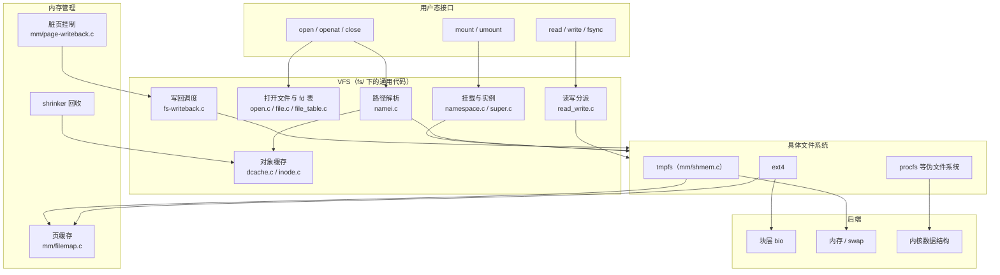
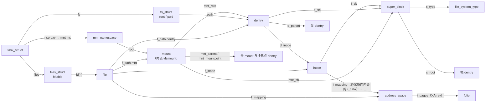
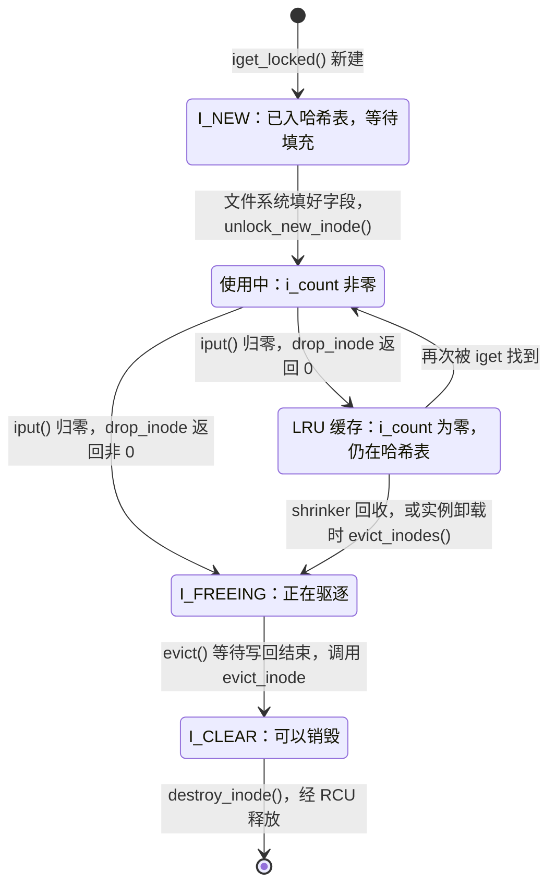
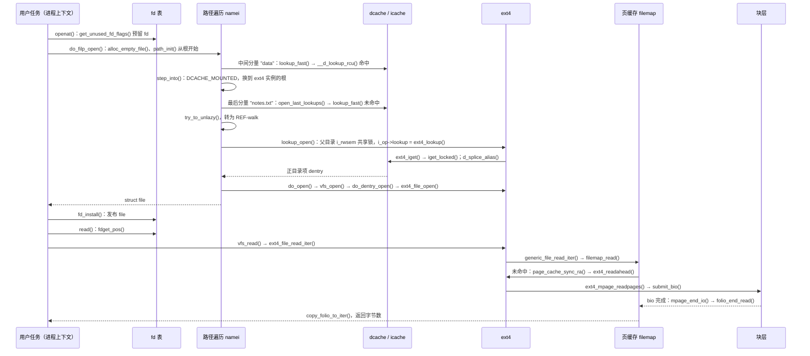

# 文件系统概述：VFS 对象模型、路径解析与文件 I/O

在 shell 中依次执行 `cat /data/notes.txt`、`cat /tmp/a.txt` 和 `cat /proc/meminfo`，三条命令使用的都是 `openat()`、`read()`、`close()`。内核在背后面对的对象却完全不同：第一个文件的内容保存在块设备上的 ext4 中，第二个文件只存在于内存（必要时进入 swap），第三个文件根本没有“存储”，每次读取时由内核临时生成文本。与此同时，其他进程可能正在重命名目录、挂载新的磁盘，或者在另一个线程里关闭同一个 fd。

内核的文件系统部分要同时完成下面几项工作：

- **把路径名解析成对象**：逐级在目录中查找名字，处理挂载点、符号链接和 `..`；
- **把多个文件系统实例组织成目录树**：同一实例可以出现在多个位置，不同进程也可以看到不同的树；
- **为每次打开保存状态**：访问模式、文件位置等，并通过整数 fd 交给进程；
- **用统一入口访问文件内容**：把读写分派给具体文件系统，并借助页缓存减少对后端的访问；
- **组织延迟写入与持久化**：标记脏数据、在后台写回、响应 `fsync()`；
- **管理对象的生命周期**：名字、文件对象、打开状态被大量缓存和共享，必须知道何时可以释放。

Linux 把与具体文件系统无关的部分集中在 VFS（Virtual File System，虚拟文件系统）中，具体文件系统只需实现一组操作表。本章是文件系统部分的总览，回答以下问题：

1. 文件系统分成哪几层，VFS、具体文件系统、页缓存和块层分别负责什么？
2. 核心对象有哪些，彼此之间是普通指针还是引用关系，分别由什么机制保护？
3. 挂载、路径解析、打开、读写、写回和释放这几条主线如何运转？
4. VFS 大量使用缓存和无锁读，它靠什么保证结果正确？

本章只建立主线，并为每个结论给出源码位置；各机制的内部细节留给后续章节。

## 0. 分析基线

本章依据仓库内 [Makefile 第 2～4 行](../../linux/Makefile#L2-L4)标记的 **6.18.52** 版本，架构为 **x86-64**。读者需要了解进程、虚拟内存和系统调用的一般概念。RCU、seqcount、自旋锁等同步原语可参考[锁机制基础](../lock/introduction.md)；页缓存所在的内存管理背景见[内存子系统概述](../memory/introduction.md)；文件系统向块设备提交 I/O 之后的过程见[磁盘与块 I/O 子系统概述](../disk/introduction.md)。

与本章结论有关的配置如下。它们是编译条件，不代表某次运行一定经过对应路径；文件系统是否被挂载、使用哪些挂载选项，都由运行时决定。

| 配置 | 对本章的影响 | 依据 |
| --- | --- | --- |
| `CONFIG_64BIT=y`、`CONFIG_X86_64=y`、`CONFIG_SMP=y` | 64 位多 CPU；dentry 内联名字区为 5 个机器字（40 字节） | [.config#L332-L333](../../linux/.config#L332-L333)、[.config#L362](../../linux/.config#L362)、[dcache.h#L72-L73](../../linux/include/linux/dcache.h#L72-L73) |
| `CONFIG_DCACHE_WORD_ACCESS=y` | 路径分量按机器字计算哈希、比较名字，使用 [namei.c#L2177](../../linux/fs/namei.c#L2177) 开始的实现分支 | [.config#L9590](../../linux/.config#L9590) |
| `CONFIG_EXT4_FS=m`、`CONFIG_JBD2=m`、`CONFIG_EXT4_USE_FOR_EXT2=y`、`CONFIG_EXT2_FS` 未设置 | ext4 和其日志层以**模块**构建，ext2 也由 ext4 驱动处理；挂载 ext4 前模块必须已加载，或能被 `request_module("fs-ext4")` 按需加载 | [.config#L9596-L9602](../../linux/.config#L9596-L9602)、[filesystems.c#L284](../../linux/fs/filesystems.c#L284)、[ext4 super.c#L7423](../../linux/fs/ext4/super.c#L7423) |
| `CONFIG_BUFFER_HEAD=y`、`CONFIG_FS_IOMAP=y`、`CONFIG_LEGACY_DIRECT_IO=y` | 编入 buffer head、iomap 和旧式直接 I/O 公共代码 | [.config#L9592-L9595](../../linux/.config#L9592-L9595)、[fs/Makefile#L21-L23](../../linux/fs/Makefile#L21-L23) |
| `CONFIG_SHMEM=y`、`CONFIG_TMPFS=y` | tmpfs 使用 `mm/shmem.c` 的完整实现，而不是退化的 ramfs 版本 | [.config#L286](../../linux/.config#L286)、[.config#L9735](../../linux/.config#L9735)、[shmem.c#L48](../../linux/mm/shmem.c#L48) |
| `CONFIG_PROC_FS=y`、`CONFIG_KERNFS=y`、`CONFIG_SYSFS=y` | procfs、sysfs 等伪文件系统内建 | [.config#L9724](../../linux/.config#L9724)、[.config#L9733-L9734](../../linux/.config#L9733-L9734) |
| `CONFIG_FS_DAX=y` | ext4 读写入口带有 DAX 分支；本章主线不经过 | [.config#L9645](../../linux/.config#L9645)、[ext4 file.c#L140-L143](../../linux/fs/ext4/file.c#L140-L143) |
| `CONFIG_FILE_LOCKING=y`、`CONFIG_FSNOTIFY=y`、`CONFIG_FANOTIFY=y` | 关闭文件时会清理文件锁、发出通知事件 | [.config#L9650](../../linux/.config#L9650)、[.config#L9653-L9656](../../linux/.config#L9653-L9656) |
| `CONFIG_SECURITY=y`（含 SELinux、AppArmor） | 打开、挂载等路径上的 LSM 钩子会被调用 | [.config#L9989](../../linux/.config#L9989)、[.config#L9999](../../linux/.config#L9999)、[.config#L10008](../../linux/.config#L10008) |
| `CONFIG_CGROUP_WRITEBACK=y` | inode 带有 `i_wb`，写回可以按 cgroup 区分 | [.config#L215](../../linux/.config#L215)、[fs.h#L855-L862](../../linux/include/linux/fs.h#L855-L862) |
| `CONFIG_FS_ENCRYPTION`、`CONFIG_FS_VERITY`、`CONFIG_UNICODE` 未设置 | `super_block` 中对应字段不编入；ext4 大小写不敏感目录等分支不生效 | [.config#L9651-L9652](../../linux/.config#L9651-L9652)、[.config#L9971](../../linux/.config#L9971)、[fs.h#L1468-L1478](../../linux/include/linux/fs.h#L1468-L1478) |
| `CONFIG_PREEMPT_RT` 未设置 | 自旋锁等走非 RT 实现 | [.config#L139](../../linux/.config#L139) |

有两点需要提前说明：

- 本章的具体文件系统实例是 **ext4 上已存在的普通文件**，主线采用**缓冲 I/O**。在默认挂载选项下（未指定 `nodelalloc`，也不是 `data=journal` 或 DAX），ext4 为普通文件选择延迟分配的 `ext4_da_aops`：延迟分配缺省开启见 [ext4 super.c#L4389-L4395](../../linux/fs/ext4/super.c#L4389-L4395)，选择逻辑见 [`ext4_set_aops()`](../../linux/fs/ext4/inode.c#L4057-L4075)。
- 用 tmpfs 和 procfs 作对照，是为了说明“文件系统”不等于“磁盘布局”。它们的实现细节不在本章展开。

## 1. 文件系统要解决什么问题

### 1.1 六项工作与对应机制

下表把开头的六项工作对应到内核中的机制。左列是要解决的问题，右侧是本章要展开的对象和源码位置。

| 需求 | 核心难点 | 主要机制 | 主要源码 |
| --- | --- | --- | --- |
| 用名字找到对象 | 路径被频繁解析；各文件系统的目录格式不同；查找期间可能有并发 rename 和 mount | `nameidata` 路径遍历、目录项缓存（dcache）、RCU 路径遍历 | `fs/namei.c`、`fs/dcache.c` |
| 组织多个文件系统实例 | 同一实例可挂在多处；不同进程可看到不同的挂载树 | `file_system_type`、`super_block`、`mount`、`mnt_namespace` | `fs/super.c`、`fs/namespace.c`、`fs/fs_context.c` |
| 保存打开状态 | 位置和模式要彼此独立；fd 可以被复制、继承；多线程会并发查表 | `struct file`、`files_struct`/`fdtable`、RCU fd 查找 | `fs/open.c`、`fs/file.c`、`fs/file_table.c` |
| 统一访问文件内容 | 后端各不相同；后端访问可能很慢 | 操作表分派、页缓存 `address_space`、预读 | `fs/read_write.c`、`mm/filemap.c` |
| 延迟写入与持久化 | 何时写、写多少、何时算“已落盘” | 脏标记、`bdi_writeback`、flusher 工作、`fsync()` | `fs/fs-writeback.c`、`mm/page-writeback.c`、`fs/sync.c` |
| 对象生命周期 | 零引用的对象仍要留作缓存；释放时其他 CPU 可能正在无锁读 | 引用计数、LRU + shrinker、RCU 延迟释放 | `fs/dcache.c`、`fs/inode.c`、`fs/super.c` |

VFS 的核心文件都内建在内核中，见 [fs/Makefile#L10-L19](../../linux/fs/Makefile#L10-L19)；页缓存和脏页控制则属于内存管理，在 `mm/` 下。

### 1.2 分层架构

下面这张图回答“文件系统分几层、每层依赖谁”。箭头表示“上层使用下层提供的能力”，不表示具体调用顺序；图中省略了 fsnotify、LSM、文件锁等横切功能。



图中要注意三个关系：

- **VFS 不解释任何磁盘格式。** 它在需要具体行为时调用操作表：例如目录中查名字时调用父目录 inode 的 `i_op->lookup`（[namei.c#L1816](../../linux/fs/namei.c#L1816)），读文件时调用 `f_op->read_iter`（[read_write.c#L491](../../linux/fs/read_write.c#L491)）。
- **页缓存属于内存管理，但挂在 inode 上。** 每个 inode 内嵌一个 `address_space`，具体文件系统通过 `address_space_operations` 告诉页缓存怎样读入和写出内容。于是“VFS → 具体文件系统 → 页缓存 → 具体文件系统 → 块层”会交替出现，而不是严格自上而下。
- **块层只在具体文件系统需要访问设备时出现。** tmpfs 的页缓存本身就是数据所在地，它的 `shmem_aops` 中没有 `read_folio` 和 `writepages`（[shmem.c#L5243-L5253](../../linux/mm/shmem.c#L5243-L5253)）；procfs 的 `/proc/meminfo` 在读取时由 [`meminfo_proc_show()`](../../linux/fs/proc/meminfo.c#L34) 生成文本。

### 1.3 触发事件与输入输出

| 触发事件 | 输入 | 输出 / 结果 |
| --- | --- | --- |
| `mount(2)` | 文件系统类型名、源（如设备路径）、挂载点路径、选项 | 找到或建立 `super_block`，创建 `mount` 并接入挂载树 |
| `open()` / `openat()` | 起始目录 fd、路径字符串、标志、模式 | 新建 `struct file`，安装到 fd 表，返回 fd |
| `read()` / `write()` | fd、用户缓冲区、长度 | 实际传输的字节数；可能触发预读、读设备、标脏、写入限速 |
| 写回定时器、脏页阈值、内存回收 | `bdi_writeback` 上的脏 inode | 调用 `writepages` 提交 I/O，必要时写 inode 元数据 |
| `fsync()` / `fdatasync()` | fd | 写出并等待数据，提交必要的元数据，必要时刷新设备缓存 |
| `close()` | fd | 移除 fd 表项、释放 `file` 引用；最后一个引用时执行 `__fput()` |
| `unlink()` | 父目录、名字 | 删除目录项、减少硬链接数；最后一个使用者离开后才回收 inode |
| 内存回收调用 shrinker | 每个 `super_block` 的 dentry、inode LRU | 释放没有被使用的 dentry 和 inode |

### 1.4 本章边界与本目录的组织

本章只讨论上述主线在当前配置下的结构和流程。以下内容只点到为止：ext4 的磁盘布局、块分配和 jbd2 日志；直接 I/O 和 DAX；`mmap()` 缺页的完整路径（只说明它与页缓存的接口）；挂载传播、idmap 挂载和新挂载 API（`fsopen()`/`fsmount()`）；文件锁、fsnotify、overlayfs、FUSE、NFS；io_uring 与 AIO。

本目录下已有的另一篇文章与本章的关系如下：

| 章节 | 内容 | 与本章的关系 |
| --- | --- | --- |
| [文件系统概述：从路径名到文件内容](overview.md) | 以一次 `openat → read → close` 为线索串联概念，并用 `dup()`、`unlink()` 检验对象关系 | 以场景为主；本章以分层结构、数据结构和并发为主，可互为补充 |

## 2. 核心数据结构

本节按“结构地图 → 实例 → 对象 → 名字 → 挂载 → 打开状态 → 内容缓存 → 操作表 → 生命周期 → 并发”的顺序介绍核心结构，只解释与主线有关的字段。

### 2.1 结构地图

先用一张图回答“这些结构怎样连在一起”。实线箭头表示“保存指针，可以由此找到对方”；“保存指针”不等于“持有引用”，引用关系在 2.9 节单独说明。



读图时可以把对象分成五层：

| 层次 | 对象 | 回答的问题 |
| --- | --- | --- |
| 类型与实例 | `file_system_type`、`super_block` | 这是哪种文件系统？是它的哪一个实例？ |
| 文件系统对象 | `inode` | 找到的对象是什么类型，有哪些属性，内容缓存在哪里？ |
| 名字 | `dentry` | 在哪个父目录下，用哪个名字找到这个对象？ |
| 位置 | `mount` + `dentry` = `struct path` | 这个名字是通过哪一个挂载看到的？ |
| 打开状态与进程 | `file`、`files_struct`、`fs_struct` | 这次打开以什么方式访问、读到哪里了？进程从哪里开始解析路径？ |

另外有三张全局哈希表负责加速查找，后文会反复出现：

| 哈希表 | 键 | 值 | 依据 |
| --- | --- | --- | --- |
| `dentry_hashtable` | 父 dentry + 名字 | 子 dentry | [dcache.c#L112-L120](../../linux/fs/dcache.c#L112-L120) |
| `inode_hashtable` | `super_block` + inode 号 | inode | [inode.c#L65-L66](../../linux/fs/inode.c#L65-L66) |
| `mount_hashtable` | 父挂载 + 挂载点 dentry | 子 `mount` | [namespace.c#L86](../../linux/fs/namespace.c#L86)、[`__lookup_mnt()`](../../linux/fs/namespace.c#L795-L804) |

### 2.2 `file_system_type` 与 `super_block`：类型与实例

[`struct file_system_type`（fs.h#L2684-L2716）](../../linux/include/linux/fs.h#L2684-L2716) 描述一种文件系统实现，例如 ext4。它是静态对象，由 [`register_filesystem()`](../../linux/fs/filesystems.c#L72-L92) 挂到全局单链表 `file_systems` 上（[filesystems.c#L34-L35](../../linux/fs/filesystems.c#L34-L35)）。

| 字段 | 含义 |
| --- | --- |
| `name` | 类型名，`mount -t` 使用的名字 |
| `fs_flags` | 类型能力，如 `FS_REQUIRES_DEV`（需要块设备）、`FS_USERNS_MOUNT`（可在用户命名空间挂载） |
| `init_fs_context` | 挂载时初始化 `fs_context`，安装该类型的 `fs_context_operations` |
| `kill_sb` | 实例的最后一个活跃引用消失时，由它关闭实例 |
| `owner` | 所属模块；ext4 为模块时，持有类型引用即持有模块引用 |
| `fs_supers` | 本类型所有 `super_block` 的链表，用于查找可复用的实例 |

**注册类型不等于挂载。** 注册只让内核知道“有这种文件系统”；ext4 模块在初始化时调用 `register_filesystem(&ext4_fs_type)`（[ext4 super.c#L7472](../../linux/fs/ext4/super.c#L7472)），此时还没有任何实例。

[`struct super_block`（fs.h#L1446-L1587）](../../linux/include/linux/fs.h#L1446-L1587) 描述一个**已挂载的文件系统实例**。它是 VFS 的内存对象，不能等同于磁盘上的超级块；tmpfs、procfs 没有磁盘，也有 `super_block`。

| 字段 | 含义 | 依据 |
| --- | --- | --- |
| `s_dev`、`s_bdev` | 实例对应的设备号、块设备（块设备文件系统才有意义） | [fs.h#L1448](../../linux/include/linux/fs.h#L1448)、[fs.h#L1481](../../linux/include/linux/fs.h#L1481) |
| `s_blocksize`、`s_maxbytes` | 块大小（字节）、单个文件的最大字节数 | [fs.h#L1449-L1451](../../linux/include/linux/fs.h#L1449-L1451) |
| `s_type`、`s_op` | 所属类型、实例级操作表 | [fs.h#L1452-L1453](../../linux/include/linux/fs.h#L1452-L1453) |
| `s_flags` | 实例标志，如 `SB_RDONLY`、`SB_ACTIVE` | [fs.h#L1457](../../linux/include/linux/fs.h#L1457) |
| `s_root` | 实例根目录的 dentry | [fs.h#L1460](../../linux/include/linux/fs.h#L1460) |
| `s_umount` | 实例级读写信号量：建立实例、关闭实例时以写方式持有，shrinker 以读方式尝试获取 | [fs.h#L1461](../../linux/include/linux/fs.h#L1461)、[namespace.c#L1201](../../linux/fs/namespace.c#L1201)、[super.c#L466](../../linux/fs/super.c#L466)、[super.c#L197](../../linux/fs/super.c#L197) |
| `s_count`、`s_active` | 两种引用计数，见下文 | [fs.h#L1462-L1463](../../linux/include/linux/fs.h#L1462-L1463) |
| `s_mounts` | 使用该实例的所有挂载 | [fs.h#L1480](../../linux/include/linux/fs.h#L1480) |
| `s_bdi` | 写回所用的 `backing_dev_info` | [fs.h#L1483](../../linux/include/linux/fs.h#L1483) |
| `s_writers` | 冻结保护用的每 CPU 读写信号量组 | [fs.h#L1489](../../linux/include/linux/fs.h#L1489)、[fs.h#L1436-L1442](../../linux/include/linux/fs.h#L1436-L1442) |
| `s_fs_info` | 具体文件系统的私有数据，如 ext4 的 `ext4_sb_info` | [fs.h#L1496](../../linux/include/linux/fs.h#L1496) |
| `s_dentry_lru`、`s_inode_lru` | 本实例中未被使用的 dentry、inode 的 LRU 链表 | [fs.h#L1569-L1570](../../linux/include/linux/fs.h#L1569-L1570) |
| `s_inodes` | 本实例的全部内存 inode | [fs.h#L1583](../../linux/include/linux/fs.h#L1583) |

**两种引用计数。** [`alloc_super()`](../../linux/fs/super.c#L316-L397) 把 `s_count` 和 `s_active` 都初始化为 1（[super.c#L367-L368](../../linux/fs/super.c#L367-L368)）。它们回答的问题不同：

- `s_active` 是**活跃引用**：实例是否还在被使用（例如被挂载）。每个挂载在 [`setup_mnt()`](../../linux/fs/namespace.c#L1154-L1166) 中给它加 1。降到 0 时，[`deactivate_locked_super()`](../../linux/fs/super.c#L468-L490) 调用类型的 `kill_sb` 关闭实例。
- `s_count` 是**临时引用**：结构体本身的内存是否还能访问。降到 0 时，[`__put_super()`](../../linux/fs/super.c#L404-L413) 经 RCU 释放结构体。

所以“实例已经关闭”和“结构体已经释放”是两个阶段，中间仍可能有持有临时引用的代码在检查它。

**实例可以被复用。** 块设备文件系统按设备号查找已有实例：[`sget_fc()`](../../linux/fs/super.c#L730-L789) 遍历 `fs_supers`，用 `test` 回调比较；ext4 经 `get_tree_bdev()` 使用以 `s_dev` 为键的 [`sget_dev()`](../../linux/fs/super.c#L1416-L1419)。如果找到的实例已经有 `s_root`，[`get_tree_bdev_flags()`](../../linux/fs/super.c#L1695-L1711) 不再调用 `fill_super`。因此同一个块设备挂载两次，得到两个 `mount`，却共享同一个 `super_block`。

**每个实例自带 shrinker。** `alloc_super()` 为实例注册 [`super_cache_scan()`](../../linux/fs/super.c#L178-L232) 作为回收回调（[super.c#L378-L386](../../linux/fs/super.c#L378-L386)），内存紧张时由它扫描 `s_dentry_lru` 和 `s_inode_lru`。

### 2.3 `inode`：文件系统对象的内存表示

[`struct inode`（fs.h#L793-L903）](../../linux/include/linux/fs.h#L793-L903) 描述一个文件系统对象：普通文件、目录、符号链接、设备文件等。它不包含名字，名字属于 dentry。

| 字段 | 含义 | 依据 |
| --- | --- | --- |
| `i_mode` | 类型位与权限位，`S_ISREG()` 等宏据此判断类型 | [fs.h#L794](../../linux/include/linux/fs.h#L794) |
| `i_op` | inode 操作表：目录内查找、创建、删除、属性等 | [fs.h#L805](../../linux/include/linux/fs.h#L805) |
| `i_sb` | 所属实例（只是指针，不持有 `s_active`） | [fs.h#L806](../../linux/include/linux/fs.h#L806) |
| `i_mapping` | 内容缓存；普通文件指向自身内嵌的 `i_data` | [fs.h#L807](../../linux/include/linux/fs.h#L807) |
| `i_ino` | 实例内的 inode 号 | [fs.h#L814](../../linux/include/linux/fs.h#L814) |
| `i_nlink` | 硬链接数，只能通过 `set_nlink()` 等函数修改 | [fs.h#L815-L825](../../linux/include/linux/fs.h#L815-L825) |
| `i_size` | 文件长度（字节） | [fs.h#L827](../../linux/include/linux/fs.h#L827) |
| `i_lock` | 保护 `i_state`、`i_hash` 等字段的自旋锁 | [fs.h#L835](../../linux/include/linux/fs.h#L835)、[inode.c#L35-L36](../../linux/fs/inode.c#L35-L36) |
| `i_state` | 生命周期与脏状态位 | [fs.h#L846](../../linux/include/linux/fs.h#L846) |
| `i_rwsem` | 读写信号量：对目录保护名字集合，对普通文件串行化写入、截断 | [fs.h#L848](../../linux/include/linux/fs.h#L848) |
| `i_hash`、`i_lru`、`i_sb_list`、`i_io_list` | 分别挂在 inode 哈希表、LRU、实例 inode 链表、写回链表上 | [fs.h#L853-L864](../../linux/include/linux/fs.h#L853-L864) |
| `i_dentry` | 指向本 inode 的所有 dentry（别名）链表 | [fs.h#L866-L869](../../linux/include/linux/fs.h#L866-L869) |
| `i_count` | 内存引用计数 | [fs.h#L872](../../linux/include/linux/fs.h#L872) |
| `i_writecount` | 为正时表示写访问者的数量，为负时表示写访问被拒绝（例如可执行文件正在运行） | [fs.h#L874](../../linux/include/linux/fs.h#L874)、[fs.h#L3215-L3223](../../linux/include/linux/fs.h#L3215-L3223) |
| `i_fop` | 打开时复制给 `file->f_op` 的文件操作表 | [fs.h#L878-L881](../../linux/include/linux/fs.h#L878-L881) |
| `i_data` | **内嵌**的 `address_space` | [fs.h#L883](../../linux/include/linux/fs.h#L883) |

有三点需要注意：

- **`i_count` 与 `i_nlink` 是两回事。** `i_count` 统计内核中有多少使用者持有这个内存对象；`i_nlink` 统计有多少个目录项名字指向这个文件。一个已被 `unlink()` 但仍被打开的文件，`i_nlink` 为 0，`i_count` 不为 0。
- **inode 通常嵌在具体文件系统的私有结构中。** ext4 的 [`ext4_alloc_inode()`](../../linux/fs/ext4/super.c#L1385-L1393) 分配整个 `ext4_inode_info`，VFS 使用的只是其中的 `vfs_inode` 成员（[ext4.h#L1114](../../linux/fs/ext4/ext4.h#L1114)）；通用代码通过 `s_op->alloc_inode` 完成这件事，文件系统未提供时才使用通用的 `inode_cachep`（[inode.c#L340-L348](../../linux/fs/inode.c#L340-L348)）。所以 inode 的分配和释放要经过实例的操作表，VFS 自己并不知道整个对象有多大。
- **`i_mapping` 指向内嵌的 `i_data`。** [`inode_init_always_gfp()`](../../linux/fs/inode.c#L227-L295) 把 `i_count` 置 1（[inode.c#L238](../../linux/fs/inode.c#L238)），初始化 `i_data` 并让 `i_mapping` 指向它（[inode.c#L277-L278](../../linux/fs/inode.c#L277-L278)、[inode.c#L295](../../linux/fs/inode.c#L295)）。

**状态位描述生命周期。** `i_state` 由 `i_lock` 保护，其中四个脏状态位、四个生命周期位的说明见 [fs.h#L670-L680](../../linux/include/linux/fs.h#L670-L680)，取值见 [fs.h#L762-L773](../../linux/include/linux/fs.h#L762-L773)。用状态图表示主要转换：



图中“使用中”“LRU 缓存”不是 `i_state` 的位，而是由 `i_count` 和 `i_lru` 是否挂链决定的状态。依据见 [`iget_locked()`](../../linux/fs/inode.c#L1425-L1465)、[`iput_final()`](../../linux/fs/inode.c#L1874-L1915)、[`evict()`](../../linux/fs/inode.c#L785-L835) 和 [`destroy_inode()`](../../linux/fs/inode.c#L389-L402)。shrinker 从 LRU 取 inode 时，会先给带 `I_REFERENCED` 的 inode 一次“第二次机会”，只把它移到链表尾部；真正选中时才置 `I_FREEING`（[inode.c#L950-L953](../../linux/fs/inode.c#L950-L953)、[inode.c#L979](../../linux/fs/inode.c#L979)）。实例卸载时则由 [`evict_inodes()`](../../linux/fs/inode.c#L866) 驱逐全部未使用的 inode（[super.c#L627](../../linux/fs/super.c#L627)）。

**inode 缓存。** `iget_locked()` 先在以 `(sb, ino)` 为键的哈希表中查找；找到则等待其 `I_NEW` 清除后返回（[inode.c#L1433-L1443](../../linux/fs/inode.c#L1433-L1443)），否则分配新 inode，在 `inode_hash_lock` 下再查一次以防并发创建，然后以 `I_NEW` 状态插入并返回给调用者填充（[inode.c#L1445-L1465](../../linux/fs/inode.c#L1445-L1465)）。ext4 的 [`__ext4_iget()`](../../linux/fs/ext4/inode.c#L5213) 正是在 [inode.c#L5241](../../linux/fs/ext4/inode.c#L5241) 调用它，读入磁盘 inode 后按类型安装操作表（[ext4 inode.c#L5479-L5485](../../linux/fs/ext4/inode.c#L5479-L5485)）。

### 2.4 `dentry`：名字与目录树缓存

[`struct dentry`（dcache.h#L92-L132）](../../linux/include/linux/dcache.h#L92-L132) 表示“某个父目录下的某个名字”，以及它当前关联的 inode。它是纯内存对象，与具体文件系统在磁盘上保存的目录记录不是一回事。

| 字段 | 含义 | 依据 |
| --- | --- | --- |
| `d_flags` | 类型、是否挂载点（`DCACHE_MOUNTED`）、是否在 LRU 上等标志，由 `d_lock` 保护 | [dcache.h#L94](../../linux/include/linux/dcache.h#L94) |
| `d_seq` | 每个 dentry 的 seqcount，供无锁读者检测名字、父子关系、inode 的变化 | [dcache.h#L95](../../linux/include/linux/dcache.h#L95) |
| `d_hash` | 挂在 `dentry_hashtable` 上的节点 | [dcache.h#L96](../../linux/include/linux/dcache.h#L96) |
| `d_parent`、`d_name` | 父目录和名字（`qstr` 同时保存哈希值和长度） | [dcache.h#L97-L101](../../linux/include/linux/dcache.h#L97-L101)、[dcache.h#L49-L57](../../linux/include/linux/dcache.h#L49-L57) |
| `d_inode` | 关联的 inode；为 `NULL` 表示负目录项 | [dcache.h#L102-L103](../../linux/include/linux/dcache.h#L102-L103) |
| `d_shortname` | 内联名字存储区 | [dcache.h#L104](../../linux/include/linux/dcache.h#L104) |
| `d_op`、`d_sb` | 目录项操作表、所属实例 | [dcache.h#L108-L109](../../linux/include/linux/dcache.h#L108-L109) |
| `d_lockref` | 自旋锁 `d_lock` 与引用计数合在一起的 `lockref` | [dcache.h#L113-L116](../../linux/include/linux/dcache.h#L113-L116)、[dcache.h#L89](../../linux/include/linux/dcache.h#L89) |
| `d_lru` | 未被使用时挂在实例的 `s_dentry_lru` 上 | [dcache.h#L118-L121](../../linux/include/linux/dcache.h#L118-L121) |
| `d_sib`、`d_children` | 父目录的子项链表 | [dcache.h#L122-L123](../../linux/include/linux/dcache.h#L122-L123) |
| `d_u.d_alias` | 挂在 inode 的 `i_dentry` 链表上 | [dcache.h#L127-L131](../../linux/include/linux/dcache.h#L127-L131) |

名字不超过 39 字节时直接存放在 40 字节的内联区；更长的名字另外分配 `external_name`（[`__d_alloc()`](../../linux/fs/dcache.c#L1701-L1718)）。

**dentry 的几种状态。** 理解路径查找的关键是：dcache 不仅缓存“名字存在”，也缓存“名字不存在”。

| 状态 | 判定 | 含义 | 依据 |
| --- | --- | --- | --- |
| 正目录项 | `d_inode != NULL`，在哈希表中 | 名字存在，关联一个 inode | [`__d_add()`](../../linux/fs/dcache.c#L2706-L2714) |
| 负目录项 | `d_inode == NULL`，在哈希表中 | 缓存“这个名字在该目录中不存在”，不是空文件 | ext4 查不到时以 `inode == NULL` 调用 [`d_splice_alias()`](../../linux/fs/ext4/namei.c#L1816)，最终 [`__d_add(dentry, NULL)`](../../linux/fs/dcache.c#L3036-L3038) |
| 查找中 | `d_in_lookup()` | 由 `d_alloc_parallel()` 建立，正在等 `->lookup` 返回；同名的其他查找者等待它 | [dcache.c#L122-L130](../../linux/fs/dcache.c#L122-L130)、[dcache.c#L2699-L2703](../../linux/fs/dcache.c#L2699-L2703) |
| 未哈希 | `d_unhashed()` | 已从哈希表摘除，新的查找找不到它；最后一个引用释放时被销毁 | [dcache.c#L751-L753](../../linux/fs/dcache.c#L751-L753) |

**哈希表把父目录也算进了键。** 路径遍历计算分量哈希时，以当前目录 dentry 的地址作为盐（[namei.c#L2315-L2319](../../linux/fs/namei.c#L2315-L2319)），`d_hash()` 再用哈希值选桶（[dcache.c#L116-L120](../../linux/fs/dcache.c#L116-L120)）。查找时还要逐项比较 `d_parent` 和名字（[dcache.c#L2306-L2316](../../linux/fs/dcache.c#L2306-L2316)）。因此不同目录下的同名文件互不干扰。

**dentry 持有两类引用。** [`d_alloc()`](../../linux/fs/dcache.c#L1767-L1782) 在把子项挂到父目录下时调用 `dget_dlock(parent)`，子 dentry 因此持有父 dentry 的引用；正目录项在销毁时调用 `iput()` 归还 inode 引用（[`dentry_unlink_inode()`](../../linux/fs/dcache.c#L449-L467)）。所以**一个被使用的 dentry 会钉住它的所有祖先和它的 inode**。这也是 shrinker 先回收 dcache、再回收 icache 的原因：源码注释写明 icache 被 dcache 钉住（[super.c#L214-L224](../../linux/fs/super.c#L214-L224)）。

### 2.5 `mount` 与 `path`：把实例接入目录树

知道“对象属于 ext4”还不够：同一个实例可以通过 bind mount 出现在多个位置，查找跨越挂载点时也必须知道自己当前在哪一个挂载里。VFS 用三个结构表达这件事。

[`struct vfsmount`（mount.h#L58-L63）](../../linux/include/linux/mount.h#L58-L63) 是对外公开的部分，只有 `mnt_root`（这个挂载所展示子树的根 dentry）、`mnt_sb`（实例）、`mnt_flags`（如只读、`nosuid`）和 `mnt_idmap`。

[`struct mount`（fs/mount.h#L43-L100）](../../linux/fs/mount.h#L43-L100) 是 VFS 内部的挂载树结点，**内嵌**一个 `vfsmount`（[fs/mount.h#L47](../../linux/fs/mount.h#L47)），通过 `real_mount()` 互相换算。

| 字段 | 含义 | 依据 |
| --- | --- | --- |
| `mnt_hash` | 挂在 `mount_hashtable` 上，键为（父挂载，挂载点 dentry） | [fs/mount.h#L44](../../linux/fs/mount.h#L44) |
| `mnt_parent`、`mnt_mountpoint` | 父挂载，以及在父挂载中被覆盖的那个 dentry | [fs/mount.h#L45-L46](../../linux/fs/mount.h#L45-L46) |
| `mnt_pcp` | 每 CPU 的引用计数 `mnt_count` 和写者计数 `mnt_writers` | [fs/mount.h#L32-L35](../../linux/fs/mount.h#L32-L35)、[fs/mount.h#L53-L58](../../linux/fs/mount.h#L53-L58) |
| `mnt_mounts`、`mnt_child` | 子挂载链表 | [fs/mount.h#L59-L60](../../linux/fs/mount.h#L59-L60) |
| `mnt_ns` | 所属挂载命名空间 | [fs/mount.h#L72-L80](../../linux/fs/mount.h#L72-L80) |
| `mnt_mp` | 指向 `struct mountpoint`，同一挂载点上的多个挂载共享它 | [fs/mount.h#L81](../../linux/fs/mount.h#L81)、[fs/mount.h#L37-L41](../../linux/fs/mount.h#L37-L41) |

[`struct path`（path.h#L8-L11）](../../linux/include/linux/path.h#L8-L11) 把一个挂载和一个 dentry 组成**已经解析出来的位置**，不是路径字符串。[`path_equal()`](../../linux/include/linux/path.h#L16-L19) 同时比较两个成员：两个位置的 dentry 相同，挂载不同，仍然是不同的位置。

**挂载点的两种标记。** 挂载时，[`d_set_mounted()`](../../linux/fs/dcache.c#L1435-L1461) 在挂载点 dentry 上设置 `DCACHE_MOUNTED`；[`make_visible()`](../../linux/fs/namespace.c#L1030-L1038) 把新挂载按（父挂载，挂载点）插入 `mount_hashtable`。路径遍历先看 dentry 标志这一位，只有为真时才去查哈希表（[namei.c#L1604-L1611](../../linux/fs/namei.c#L1604-L1611)），因此不是挂载点的分量不必访问挂载哈希表。

**进程看到的挂载树由命名空间决定。** [`struct mnt_namespace`（fs/mount.h#L10-L30）](../../linux/fs/mount.h#L10-L30) 保存根挂载 `root` 和全部挂载组成的红黑树；任务通过 `task_struct.nsproxy`（[sched.h#L1195](../../linux/include/linux/sched.h#L1195)）的 `mnt_ns`（[nsproxy.h#L36](../../linux/include/linux/nsproxy.h#L36)）找到它。任务解析路径时用的根目录和当前目录则保存在 [`struct fs_struct`（fs_struct.h#L9-L15）](../../linux/include/linux/fs_struct.h#L9-L15) 的 `root`、`pwd` 中，二者都是 `struct path`。启动时，[`init_mount_tree()`](../../linux/fs/namespace.c#L6004-L6028) 挂载 rootfs，作为初始命名空间的根，并设为当前（启动阶段）任务的 `root` 和 `pwd`；它由 [`mnt_init()`](../../linux/fs/namespace.c#L6030-L6063) 调用，后者又在 [`vfs_caches_init()`](../../linux/fs/dcache.c#L3264-L3276) 中紧随 dcache、inode、`file` 缓存的初始化执行。

### 2.6 `file` 与 fd 表：一次打开的状态

[`struct file`（fs.h#L1211-L1252）](../../linux/include/linux/fs.h#L1211-L1252) 表示一次打开，也称“打开文件描述”。

| 字段 | 含义 | 依据 |
| --- | --- | --- |
| `f_mode` | 内核内部模式位：`FMODE_READ`、`FMODE_WRITE`、`FMODE_OPENED`、`FMODE_ATOMIC_POS` 等 | [fs.h#L1213](../../linux/include/linux/fs.h#L1213) |
| `f_op` | 文件操作表，打开时从 `inode->i_fop` 复制 | [fs.h#L1214](../../linux/include/linux/fs.h#L1214) |
| `f_mapping` | 内容缓存，打开时取自 `inode->i_mapping` | [fs.h#L1215](../../linux/include/linux/fs.h#L1215) |
| `private_data` | 文件系统或驱动的私有数据 | [fs.h#L1216](../../linux/include/linux/fs.h#L1216) |
| `f_inode` | inode 指针（不单独持有 `i_count`，见 2.9 节） | [fs.h#L1217](../../linux/include/linux/fs.h#L1217) |
| `f_flags` | 用户可见的 `O_*` 状态标志 | [fs.h#L1218](../../linux/include/linux/fs.h#L1218) |
| `f_cred` | 打开者的凭据 | [fs.h#L1220](../../linux/include/linux/fs.h#L1220) |
| `f_path` | 打开位置（挂载 + dentry），持有两者的引用 | [fs.h#L1223-L1226](../../linux/include/linux/fs.h#L1223-L1226) |
| `f_pos_lock`、`f_pos` | 文件位置及其互斥锁 | [fs.h#L1227-L1233](../../linux/include/linux/fs.h#L1227-L1233) |
| `f_wb_err` | 打开时采样的写回错误序号，`fsync()` 据此报告“打开之后发生的写回错误” | [fs.h#L1238](../../linux/include/linux/fs.h#L1238)、[open.c#L913](../../linux/fs/open.c#L913) |
| `f_ra` | 预读状态 | [fs.h#L1246](../../linux/include/linux/fs.h#L1246) |
| `f_ref` | 引用计数 | [fs.h#L1249](../../linux/include/linux/fs.h#L1249) |

`struct file` 从 `filp` slab 分配，这个 slab 带 `SLAB_TYPESAFE_BY_RCU`（[file_table.c#L632-L634](../../linux/fs/file_table.c#L632-L634)）：RCU 读者手里的 `file` 指针所指内存不会被归还给其他类型，但可能已被释放后重新用作另一个 `file`。所以无锁查找在增加引用后必须重新确认，见下文。

**fd 表。** [`struct files_struct` 与 `struct fdtable`（fdtable.h#L26-L57）](../../linux/include/linux/fdtable.h#L26-L57) 组成进程的打开文件表。`fdtable.fd` 是 RCU 保护的 `file` 指针数组，fd 就是这个数组的**下标**；`open_fds`、`close_on_exec` 是位图；`file_lock` 串行化分配与关闭；`next_fd` 记录下一次搜索空闲 fd 的起点。`files_struct` 内嵌了一个 `NR_OPEN_DEFAULT`（等于 `BITS_PER_LONG`，x86-64 上为 64）项的初始数组（[fdtable.h#L24](../../linux/include/linux/fdtable.h#L24)、[fdtable.h#L56](../../linux/include/linux/fdtable.h#L56)），超过后再扩展。

fd 表的修改和查找使用不同的同步方式：

| 操作 | 同步方式 | 依据 |
| --- | --- | --- |
| 分配 fd：在 `open_fds` 位图中找空位并置位 | `file_lock` | [`alloc_fd()`](../../linux/fs/file.c#L570-L613) |
| 安装 `file`：写入 `fd[n]` | 不取 `file_lock`，用 `rcu_assign_pointer()`；只有表正在扩展时才取锁 | [`fd_install()`](../../linux/fs/file.c#L652-L677) |
| 关闭 fd：清空 `fd[n]` 并取出 `file` | `file_lock` | [`file_close_fd()`](../../linux/fs/file.c#L850-L860) |
| 查找 fd：表未共享时直接借用指针，不加引用 | 无锁 | [`__fget_light()`](../../linux/fs/file.c#L1167-L1171) |
| 查找 fd：表被多个线程共享时 | RCU 读取，增加 `f_ref` 后重新确认表项和表没有变化 | [`__fget_files_rcu()`](../../linux/fs/file.c#L989-L1063) |

表中“表未共享时直接借用指针”依赖一个前提：`files->count == 1` 时，没有其他任务共享这张表，也就没有谁能在本次系统调用期间关闭这个 fd；函数前的注释列出了使用这种“轻量”引用必须遵守的规则（[file.c#L1140-L1150](../../linux/fs/file.c#L1140-L1150)）。

**文件位置的锁。** 普通文件和目录在打开时被标上 `FMODE_ATOMIC_POS`（[open.c#L933-L934](../../linux/fs/open.c#L933-L934)）。[`fdget_pos()`](../../linux/fs/file.c#L1225-L1235) 只有在这个 `file` 可能被多处同时使用（引用计数不为 1）或是目录时才获取 `f_pos_lock`（[file.c#L1200-L1209](../../linux/fs/file.c#L1200-L1209)），以免单线程的常见情况付出加锁代价。

### 2.7 `address_space`：文件内容缓存

[`struct address_space`（fs.h#L506-L526）](../../linux/include/linux/fs.h#L506-L526) 描述“一个可缓存、可映射对象的内容”。它不是进程地址空间，索引单位是文件内的页偏移：读取路径用 `ki_pos >> PAGE_SHIFT` 计算索引（[filemap.c#L2627](../../linux/mm/filemap.c#L2627)）。

| 字段 | 含义 |
| --- | --- |
| `host` | 所属 inode |
| `i_pages` | 以文件页偏移为索引的 XArray，元素是 folio |
| `invalidate_lock` | 截断、打洞等操作与页缓存填充之间的一致性锁 |
| `i_mmap`、`i_mmap_rwsem` | 映射了这个文件的 VMA 区间树及其锁，供反向映射使用 |
| `nrpages` | 缓存的页数 |
| `a_ops` | 内容读入、写出、标脏等操作 |
| `wb_err` | 最近一次写回错误（`errseq_t`） |

XArray 上还有三个标记：`PAGECACHE_TAG_DIRTY`、`PAGECACHE_TAG_WRITEBACK`、`PAGECACHE_TAG_TOWRITE`（[fs.h#L534-L536](../../linux/include/linux/fs.h#L534-L536)），写回时据此快速找出脏页或正在写回的页。folio 与 `address_space` 的关系、LRU 与回收，见[内存子系统概述](../memory/introduction.md) 3.5 节。

因为页缓存挂在 inode 上而不是挂在 `file` 上，**同一个文件的多次打开共享同一份缓存**，各自又有独立的 `f_pos`。

### 2.8 操作表：VFS 与具体文件系统的接口

VFS 通过六张操作表把具体行为交给文件系统。各表按“被哪个对象使用”划分职责：

| 操作表 | 挂在哪里 | 主要职责 | 代表操作 | 定义 |
| --- | --- | --- | --- | --- |
| `fs_context_operations` | `fs_context.ops` | 解析挂载参数，取得实例 | `parse_param`、`get_tree`、`reconfigure` | [fs_context.h#L115-L122](../../linux/include/linux/fs_context.h#L115-L122) |
| `super_operations` | `super_block.s_op` | inode 的分配与驱逐、实例级同步与冻结 | `alloc_inode`、`write_inode`、`drop_inode`、`evict_inode`、`sync_fs` | [fs.h#L2459-L2500](../../linux/include/linux/fs.h#L2459-L2500) |
| `inode_operations` | `inode.i_op` | 名字与属性：目录内查找、创建、删除、改名 | `lookup`、`create`、`unlink`、`rename`、`permission`、`getattr` | [fs.h#L2341-L2380](../../linux/include/linux/fs.h#L2341-L2380) |
| `file_operations` | `file.f_op`（来自 `inode.i_fop`） | 打开对象的访问 | `read_iter`、`write_iter`、`open`、`release`、`fsync`、`iterate_shared` | [fs.h#L2271-L2315](../../linux/include/linux/fs.h#L2271-L2315) |
| `address_space_operations` | `address_space.a_ops` | 页缓存与后端交换数据 | `read_folio`、`readahead`、`writepages`、`write_begin`、`write_end`、`dirty_folio` | [fs.h#L439-L480](../../linux/include/linux/fs.h#L439-L480) |
| `dentry_operations` | `dentry.d_op` | 名字的校验、哈希、比较、删除策略 | `d_revalidate`、`d_hash`、`d_compare`、`d_delete` | [dcache.h#L151-L169](../../linux/include/linux/dcache.h#L151-L169) |

以 ext4 普通文件为例，各表的来源如下：

| 操作表 | ext4 实现 | 何时安装 |
| --- | --- | --- |
| `fs_context_operations` | [`ext4_context_ops`](../../linux/fs/ext4/super.c#L124-L129)，`get_tree = ext4_get_tree` | 挂载时由 `init_fs_context` 安装 |
| `super_operations` | [`ext4_sops`](../../linux/fs/ext4/super.c#L1621-L1641) | `ext4_fill_super()` 建立实例时 |
| `inode_operations` | 普通文件 [`ext4_file_inode_operations`](../../linux/fs/ext4/file.c#L992)；目录 [`ext4_dir_inode_operations`](../../linux/fs/ext4/namei.c#L4216-L4235) | `__ext4_iget()` 按 `i_mode` 选择（[inode.c#L5479-L5485](../../linux/fs/ext4/inode.c#L5479-L5485)） |
| `file_operations` | [`ext4_file_operations`](../../linux/fs/ext4/file.c#L970-L990) | 同上，写入 `i_fop`；打开时复制给 `f_op`（[open.c#L936](../../linux/fs/open.c#L936)） |
| `address_space_operations` | 默认选项下为 [`ext4_da_aops`](../../linux/fs/ext4/inode.c#L4034-L4048) | `ext4_set_aops()`（[inode.c#L4057-L4075](../../linux/fs/ext4/inode.c#L4057-L4075)） |

**查名字与读内容走不同的表。** 在目录中找 `notes.txt` 用的是父目录 inode 的 `i_op->lookup`；读 `notes.txt` 的内容用的是 `file->f_op->read_iter`，缺页时再进入 `a_ops->read_folio` 或 `readahead`。tmpfs 的普通文件同样提供 `read_iter`、`write_iter`（[shmem.c#L5255-L5268](../../linux/mm/shmem.c#L5255-L5268)），只是内容不来自块设备。

### 2.9 引用、缓存与释放

前面的对象互相保存指针，但哪些指针代表“持有引用”需要单独看清。下图只画出持有引用的关系，读者应注意：箭头表示“持有对方的一个引用”，与 2.1 节结构地图中的“保存指针”含义不同。

```text
fd 表项 ──持有──▶ file ──持有（f_path.mnt）──▶ mount ──持有（mnt_root）──▶ 实例根 dentry
                    │                            └──持有（s_active）──▶ super_block
                    └──持有（f_path.dentry）──▶ dentry ──持有──▶ 父 dentry ──▶ … ──▶ 根
                                                  └──持有（正目录项）──▶ inode
```

依据：`fd_install()` 接管调用者的 `file` 引用（[file.c#L649-L650](../../linux/fs/file.c#L649-L650)）；`do_dentry_open()` 对 `f_path` 调用 `path_get()`，同时增加 dentry 和挂载的引用（[open.c#L910](../../linux/fs/open.c#L910)）；挂载对实例和根 dentry 的引用见 [namespace.c#L1158-L1160](../../linux/fs/namespace.c#L1158-L1160)；子 dentry 对父 dentry 的引用见 [dcache.c#L1777](../../linux/fs/dcache.c#L1777)。`file->f_inode` 在 [open.c#L911](../../linux/fs/open.c#L911) 中直接赋值，没有再调用 `ihold()`：inode 的存活依赖 `f_path.dentry` 这条引用链。

各对象引用归零以后的去向不同：

| 对象 | 计数 | 归零后 | 依据 |
| --- | --- | --- | --- |
| `file` | `f_ref` | 执行 `__fput()`：调用 `release`，归还写访问、dentry 和挂载引用，释放 `file` | [file_table.c#L479-L519](../../linux/fs/file_table.c#L479-L519) |
| dentry | `d_lockref.count` | 仍在哈希表中：**保留**并挂到 LRU；已摘除或文件系统要求不缓存：销毁 | [dcache.c#L744-L785](../../linux/fs/dcache.c#L744-L785)、[dcache.c#L899-L922](../../linux/fs/dcache.c#L899-L922) |
| inode | `i_count` | `drop_inode` 返回 0 且实例活跃：**保留**在 LRU；否则驱逐 | [inode.c#L1883-L1914](../../linux/fs/inode.c#L1883-L1914) |
| mount | `mnt_count` | 已从命名空间摘下才可能真正释放；释放时归还根 dentry 和实例活跃引用 | [namespace.c#L1339-L1407](../../linux/fs/namespace.c#L1339-L1407)、[namespace.c#L1298-L1321](../../linux/fs/namespace.c#L1298-L1321) |
| `super_block` | `s_active` / `s_count` | 先 `kill_sb`，后经 RCU 释放结构体 | [super.c#L468-L490](../../linux/fs/super.c#L468-L490)、[super.c#L404-L413](../../linux/fs/super.c#L404-L413) |

这里有一个与普通引用计数对象不同的地方：**dentry 和 inode 引用归零并不意味着销毁**。它们以“零引用、仍在哈希表中”的状态留作缓存，直到内存回收经 shrinker 把它们从 LRU 上取走，或实例卸载时统一清理。

另一个关键事实是：dentry、inode、mount 和 `super_block` 都经 RCU 延迟释放（[dcache.c#L438-L442](../../linux/fs/dcache.c#L438-L442)、[inode.c#L401](../../linux/fs/inode.c#L401)、[namespace.c#L1320](../../linux/fs/namespace.c#L1320)、[super.c#L411](../../linux/fs/super.c#L411)），`file` 则使用 `SLAB_TYPESAFE_BY_RCU`。这是 3.2 节无锁路径遍历和 2.6 节无锁 fd 查找能够成立的前提：在 `rcu_read_lock()` 期间，读者手中的指针所指内存不会被归还给其他用途。

### 2.10 并发保护一览

| 被保护的内容 | 机制 | 说明 | 依据 |
| --- | --- | --- | --- |
| dentry 的 `d_flags`、`d_name`、`d_inode`、`d_parent`、引用计数 | `d_lock` | 父子同时加锁时先父后子 | [dcache.c#L40-L75](../../linux/fs/dcache.c#L40-L75) |
| dentry 名字与父子关系的无锁读 | 每个 dentry 的 `d_seq`，全局 `rename_lock` seqlock | 读者记录序号，事后校验 | [dcache.c#L85](../../linux/fs/dcache.c#L85)、[namei.c#L2559-L2560](../../linux/fs/namei.c#L2559-L2560) |
| dentry 哈希链 | 桶内位锁 + RCU | 读者不加锁遍历 | [dcache.c#L44-L45](../../linux/fs/dcache.c#L44-L45)、[dcache.c#L2484-L2490](../../linux/fs/dcache.c#L2484-L2490) |
| 目录中的名字集合 | 目录 inode 的 `i_rwsem`：查找取共享锁，创建、删除取独占锁 | 不同名字的查找可在同一目录并行 | [namei.c#L1832](../../linux/fs/namei.c#L1832)、[namei.c#L3891-L3894](../../linux/fs/namei.c#L3891-L3894)、[namei.c#L4728](../../linux/fs/namei.c#L4728) |
| 跨目录改名 | 实例的 `s_vfs_rename_mutex`，再锁两个目录 | 防止改名形成环 | [namei.c#L3357-L3366](../../linux/fs/namei.c#L3357-L3366) |
| inode 的 `i_state`、`i_hash` | `i_lock` | — | [inode.c#L32-L61](../../linux/fs/inode.c#L32-L61) |
| inode 哈希表 | `inode_hash_lock` + RCU | 锁序：`inode_hash_lock` → `s_inode_list_lock` → `i_lock` | [inode.c#L55-L57](../../linux/fs/inode.c#L55-L57) |
| 普通文件的写入、截断 | 文件 inode 的 `i_rwsem` | ext4 缓冲写和 `do_truncate()` 取独占锁；缓冲读不取 | [ext4 file.c#L294](../../linux/fs/ext4/file.c#L294)、[open.c#L63](../../linux/fs/open.c#L63) |
| 页缓存索引 | XArray 内部锁 | 标脏时在锁内设置标记 | [page-writeback.c#L2714-L2721](../../linux/mm/page-writeback.c#L2714-L2721) |
| 页缓存与块映射的一致性 | `invalidate_lock` | 读路径插入新页时取共享锁；ext4 改变文件大小时取独占锁 | [fs.h#L488-L491](../../linux/include/linux/fs.h#L488-L491)、[filemap.c#L2585](../../linux/mm/filemap.c#L2585)、[ext4 inode.c#L5993](../../linux/fs/ext4/inode.c#L5993) |
| 挂载树结构 | `namespace_sem`（修改者）+ `mount_lock` seqlock（读者校验） | 修改挂载哈希时以写方式持有 `mount_lock` | [namespace.c#L89](../../linux/fs/namespace.c#L89)、[namespace.c#L125-L133](../../linux/fs/namespace.c#L125-L133) |
| fd 表 | `file_lock`（分配、关闭）+ RCU（查找） | 见 2.6 节 | [fdtable.h#L51](../../linux/include/linux/fdtable.h#L51) |
| 文件位置 | `f_pos_lock` | 仅在 `file` 被共享时获取 | [file.c#L1200-L1235](../../linux/fs/file.c#L1200-L1235) |
| 实例冻结 | `s_writers` 中的每 CPU 读写信号量 | `sb_start_write()` 应是最外层的锁，在 `i_rwsem` 之前获取 | [fs.h#L2040-L2054](../../linux/include/linux/fs.h#L2040-L2054) |
| 写回链表 | `wb->list_lock` | 保护 `b_dirty`、`b_io` 等 | [backing-dev-defs.h#L111-L115](../../linux/include/linux/backing-dev-defs.h#L111-L115) |

可以看到 VFS 的同步方式有一个共同模式：**修改者加锁，读者尽量用 RCU 加序号校验**。这把成本放在相对少见的修改操作（rename、mount、关闭 fd）上，让频繁的查找操作不必写共享缓存行。这是根据代码结构做出的分析，源码中没有给出性能数字。

## 3. 关键算法

### 3.1 挂载：创建实例，再接入挂载树

**目标**：给定类型名、源和挂载点，把一个文件系统实例的目录树接到挂载点上。**输出**：一个新的 `mount` 出现在当前命名空间的挂载哈希表中。

以传统 `mount(2)` 的新挂载分支为例，省略参数复制、权限检查和错误处理，主干如下（简化调用链，不是完整源码）：

```text
SYSCALL mount → do_mount()                         解析挂载点路径
  → path_mount()                                   按 flags 区分 remount、bind、move 和新挂载
    → do_new_mount()
        type = get_fs_type("ext4")                 必要时 request_module("fs-ext4")
        fc   = fs_context_for_mount(type)          调用 type->init_fs_context
        解析 source 与选项
        → do_new_mount_fc()
            mnt = fc_mount(fc)
                vfs_get_tree(fc)                   fc->ops->get_tree：ext4_get_tree
                    → get_tree_bdev()
                        sget_dev()                 按 dev_t 找到或新建 super_block
                        新实例才调用 ext4_fill_super()
                        fc->root = dget(sb->s_root)
                vfs_create_mount(fc)               分配 mount，setup_mnt()：s_active++、dget(root)
            LOCK_MOUNT(mp, mountpoint) → do_lock_mount()
                inode_lock() + namespace_lock()    锁挂载点目录的 inode 和 namespace_sem
                where_to_mount()                   若该处已有挂载，改为接到最上层挂载的根上
                get_mountpoint()                   设置 DCACHE_MOUNTED，取得 struct mountpoint
            do_add_mount()
                → graft_tree() → attach_recursive_mnt()
                    mnt_set_mountpoint()           填 mnt_parent、mnt_mountpoint
                    commit_tree() → make_visible() 插入 mount_hashtable，加入命名空间
```

依据依次为：[`do_mount()`](../../linux/fs/namespace.c#L4042-L4051)、[`path_mount()`](../../linux/fs/namespace.c#L3963-L4040)、[`do_new_mount()`](../../linux/fs/namespace.c#L3681-L3728)、[`get_fs_type()`](../../linux/fs/filesystems.c#L277-L295)、[`alloc_fs_context()`](../../linux/fs/fs_context.c#L311-L315)、[`do_new_mount_fc()`](../../linux/fs/namespace.c#L3648-L3675)、[`fc_mount()`](../../linux/fs/namespace.c#L1197-L1205)、[`vfs_get_tree()`](../../linux/fs/super.c#L1754-L1788)、[`ext4_get_tree()`](../../linux/fs/ext4/super.c#L5772-L5775)、[`get_tree_bdev_flags()`](../../linux/fs/super.c#L1673-L1716)、[`vfs_create_mount()`](../../linux/fs/namespace.c#L1177-L1194)、[`do_add_mount()`](../../linux/fs/namespace.c#L3611-L3640)、[`graft_tree()`](../../linux/fs/namespace.c#L2811-L2821)、[`attach_recursive_mnt()`](../../linux/fs/namespace.c#L2559-L2673)。

这个流程有四处值得注意：

- **先取得实例，再创建挂载，最后接入。** `vfs_create_mount()` 的注释写明它不把挂载附着到任何位置（[namespace.c#L1168-L1176](../../linux/fs/namespace.c#L1168-L1176)）。接入失败时，新挂载从未对其他任务可见，只需释放即可。
- **实例可能是复用的。** 若 `sget_dev()` 找到了已有实例，`get_tree_bdev_flags()` 跳过 `fill_super`，此时若只读属性不一致就拒绝挂载（[super.c#L1695-L1701](../../linux/fs/super.c#L1695-L1701)）。
- **挂载点上可能已有挂载。** `LOCK_MOUNT` 展开为 [`do_lock_mount()`](../../linux/fs/namespace.c#L2727)：它先锁住挂载点所在目录的 inode 并取得 `namespace_sem`（[namespace.c#L2750-L2751](../../linux/fs/namespace.c#L2750-L2751)），再选择真正的接入位置：若目标位置已被挂载，就挂到最上层挂载的根上（[`where_to_mount()`](../../linux/fs/namespace.c#L2675-L2694)），最后用 `get_mountpoint()` 标记挂载点（[namespace.c#L2764](../../linux/fs/namespace.c#L2764)）。
- **挂载点是 (父挂载, dentry) 组合。** `mnt_set_mountpoint()` 记录父挂载和挂载点 dentry（[namespace.c#L1020-L1028](../../linux/fs/namespace.c#L1020-L1028)），`make_visible()` 以这一对为键插入哈希表。若目标挂载是共享挂载，`attach_recursive_mnt()` 还会经 `propagate_mnt()` 在对等挂载上创建副本（[namespace.c#L2594-L2599](../../linux/fs/namespace.c#L2594-L2599)），本章不展开。

### 3.2 路径解析：从字符串到 (mount, dentry)

**目标**：给定起始目录（`dfd`）和路径字符串，得到最后一个分量所在的父目录位置，或者目标本身的 `struct path`。**成立条件**：每一级中间分量都必须是可搜索的目录（调用者对它有执行权限）。

路径遍历的状态保存在 [`struct nameidata`（namei.c#L632-L655）](../../linux/fs/namei.c#L632-L655) 中：`path` 是当前位置，`last` 是正在处理的分量（含哈希值），`root` 是本次解析使用的根，`flags` 中的 `LOOKUP_RCU` 表示当前处于哪种模式，`seq`/`next_seq`/`m_seq`/`r_seq` 记录待校验的序号，`stack` 保存嵌套符号链接的剩余路径。

先看去掉并发细节后的算法（伪代码）：

```text
path_init(nd):
    if 绝对路径: 起点 = nd->root（任务的 fs->root）
    elif dfd == AT_FDCWD: 起点 = fs->pwd
    else: 起点 = dfd 对应 file 的 f_path
    记录 mount_lock、rename_lock 的序号

link_path_walk(name, nd):
    for 每个分量 comp:
        may_lookup():  对当前目录检查 MAY_EXEC
        hash_name():   以当前目录 dentry 为盐计算 (hash, len)
        if comp 是最后一个分量: 返回，交给调用者处理
        walk_component(comp):
            if comp 是 "." 或 "..": handle_dots()
            dentry = lookup_fast()          # 查 dcache
            if 未命中: dentry = lookup_slow()   # 父目录 i_rwsem 共享锁 → i_op->lookup
            step_into(dentry):
                handle_mounts()            # 若是挂载点，换到被挂载实例的根
                if 是符号链接: 把链接内容压入 stack，继续解析
                else: nd->path = (mount, dentry)
        if 当前位置不是目录: 返回 -ENOTDIR
```

依据：[`path_init()`](../../linux/fs/namei.c#L2540-L2645)、[`link_path_walk()`](../../linux/fs/namei.c#L2441-L2537)、[`walk_component()`](../../linux/fs/namei.c#L2134-L2158)、[`lookup_fast()`](../../linux/fs/namei.c#L1739-L1786)、[`lookup_slow()`](../../linux/fs/namei.c#L1826-L1836)、[`step_into()`](../../linux/fs/namei.c#L1984-L2022)。最后一个分量不在 `link_path_walk()` 中处理，因为“打开并可能创建”“删除”“改名”对最后一个分量的要求各不相同，由调用者决定，例如打开路径中的 `open_last_lookups()`。

**两种遍历模式。** 上面的伪代码在实际实现中有两种执行方式：

| | RCU-walk（`LOOKUP_RCU`） | REF-walk |
| --- | --- | --- |
| 对经过的 dentry、mount | 不加引用，不加锁 | `dget()`/`mntget()` 持有引用 |
| 正确性保证 | RCU 保证内存不被释放；`d_seq`、`mount_lock`、`rename_lock` 序号检测并发修改 | 引用保证对象存活；目录内容由锁保护 |
| 能否睡眠 | 不能，必须在 `rcu_read_lock()` 内完成 | 可以 |
| 进入方式 | `do_filp_open()` 先以此模式尝试 | 从 RCU-walk 降级，或整条路径重来 |

[`do_filp_open()`](../../linux/fs/namei.c#L4157-L4172) 把这一点写得很直接：先带 `LOOKUP_RCU` 调用一次 `path_openat()`；返回 `-ECHILD` 时不带它重来；返回 `-ESTALE` 时再加 `LOOKUP_REVAL` 重来一次。

RCU-walk 遇到无法在不睡眠、不持有引用的前提下继续的情况时，先尝试用 [`try_to_unlazy()`](../../linux/fs/namei.c#L840-L862) 就地升级：对当前路径和根逐一取得引用，并校验序号仍然有效；成功则以 REF-walk 继续，失败则返回 `-ECHILD`，整条路径重新解析。常见的降级原因如下：

| 情况 | 处理 | 依据 |
| --- | --- | --- |
| dcache 未命中，需要调用 `->lookup`（会取 `i_rwsem`、可能读设备） | `try_to_unlazy()` 后返回 `NULL`，转入 `lookup_slow()` | [namei.c#L1749-L1755](../../linux/fs/namei.c#L1749-L1755) |
| 查找期间父目录的 `d_seq` 变了（如并发改名） | 直接返回 `-ECHILD` | [namei.c#L1761-L1762](../../linux/fs/namei.c#L1761-L1762) |
| `d_revalidate` 要求阻塞 | `try_to_unlazy_next()` 后在 REF 模式重新校验 | [namei.c#L1764-L1772](../../linux/fs/namei.c#L1764-L1772) |
| 权限检查在不阻塞的前提下无法完成 | `may_lookup()` 降级后重查 | [namei.c#L1852-L1874](../../linux/fs/namei.c#L1852-L1874) |
| 跨越挂载点时 `mount_lock` 序号变化，或遇到需要阻塞的自动挂载点 | `__follow_mount_rcu()` 返回假，降级 | [namei.c#L1604-L1621](../../linux/fs/namei.c#L1604-L1621)、[namei.c#L1633-L1642](../../linux/fs/namei.c#L1633-L1642) |
| 遍历结束 | `complete_walk()` 无论如何都要升级，交给调用者带引用的结果 | [namei.c#L944-L960](../../linux/fs/namei.c#L944-L960) |

**dcache 命中与未命中。** RCU 模式下，`lookup_fast()` 调用 [`__d_lookup_rcu()`](../../linux/fs/dcache.c#L2253-L2319)，返回候选 dentry 和它的 `d_seq` 序号；调用者在使用其内容之前必须用这个序号校验。REF 模式下调用 [`__d_lookup()`](../../linux/fs/dcache.c#L2362-L2416)，在 `d_lock` 下比较并直接增加引用。未命中时，[`__lookup_slow()`](../../linux/fs/namei.c#L1789-L1824) 用 `d_alloc_parallel()` 建立“查找中”的 dentry，再调用父目录的 `i_op->lookup`；同一目录中同一名字的并发查找因此只有一个真正进入文件系统，其他的等待结果。ext4 的 [`ext4_lookup()`](../../linux/fs/ext4/namei.c#L1764-L1817) 在目录中找到 inode 号后调用 `ext4_iget()`，最后用 `d_splice_alias()` 把 inode 与 dentry 关联并加入哈希表；找不到时同样调用它，得到负目录项。

下一次查找同一个不存在的名字时，dcache 命中负目录项：RCU 模式下 `step_into()` 发现 `inode` 为空直接返回 `-ENOENT`（[namei.c#L2001-L2002](../../linux/fs/namei.c#L2001-L2002)），REF 模式下 `traverse_mounts()` 也据此返回 `-ENOENT`（[namei.c#L1537-L1538](../../linux/fs/namei.c#L1537-L1538)），都不再进入文件系统。

**跨越挂载点。** `step_into()` 先调用 [`handle_mounts()`](../../linux/fs/namei.c#L1625-L1653)。RCU 模式下，[`__follow_mount_rcu()`](../../linux/fs/namei.c#L1581-L1623) 发现 `DCACHE_MOUNTED` 后调用 `__lookup_mnt(path->mnt, dentry)`，把当前位置换成被挂载实例的 `(mount, mnt_root)`，并循环处理同一位置上的多层挂载；REF 模式下 [`__traverse_mounts()`](../../linux/fs/namei.c#L1489-L1505) 用 `lookup_mnt()` 做同样的事，同时调整引用。

**`..` 的处理。** `..` 不能简单地取 `d_parent`：在本次解析的根上，`..` 停在原地；在某个挂载的根上，`..` 要先回到父挂载中的挂载点，再取其父目录。`handle_dots()` 调用 `follow_dotdot_rcu()` 或 `follow_dotdot()` 完成这些判断（[namei.c#L2096-L2132](../../linux/fs/namei.c#L2096-L2132)、[namei.c#L2024-L2035](../../linux/fs/namei.c#L2024-L2035)）。

更完整的路径遍历设计说明可参考本地文档 `linux/Documentation/filesystems/path-lookup.rst`；文档与实现有出入时以上述源码为准。

### 3.3 打开：建立 `file` 并安装 fd

**目标**：把（起始目录、路径、标志）变成一个可用的 fd。**输出**：fd 表中一个新表项指向新建的 `file`。

```text
do_sys_openat2():
    build_open_flags()          把 O_* 翻译成内部的 open_flags 和查找意图
    getname()                   把用户态路径复制进内核
    fd = get_unused_fd_flags()  在 file_lock 下预留 fd（只置位图，fd[n] 仍为 NULL）
    file = do_filp_open():
        path_openat():
            file = alloc_empty_file()        f_ref = 1，模式取自 flags
            path_init() + link_path_walk()   解析到最后一个分量的父目录
            open_last_lookups()              处理最后一个分量；O_CREAT 时可能创建
            do_open():
                complete_walk()              升级为 REF-walk
                may_open()                   权限、文件类型、只读挂载等检查
                vfs_open() → do_dentry_open()
            terminate_walk()                 归还遍历期间持有的引用
    成功: fd_install(fd, file)    失败: put_unused_fd(fd)
```

依据：[`do_sys_openat2()`](../../linux/fs/open.c#L1420-L1447)、[`path_openat()`](../../linux/fs/namei.c#L4118-L4155)、[`alloc_empty_file()`](../../linux/fs/file_table.c#L239) 与 [`init_file()`](../../linux/fs/file_table.c#L175-L227)、[`open_last_lookups()`](../../linux/fs/namei.c#L3848-L3926)、[`do_open()`](../../linux/fs/namei.c#L3931-L3987)、[`vfs_open()`](../../linux/fs/open.c#L1092-L1107)。

**为什么先预留 fd。** fd 在路径解析之前就已分配：位图中已置位，所以并发的 `open()` 不会拿到同一个号；数组槽位仍为 `NULL`，所以其他线程用这个号查表时得到“未打开”（[file.c#L1011-L1012](../../linux/fs/file.c#L1011-L1012)），看不到半成品。只有 `file` 完全建立后，`fd_install()` 才用 `rcu_assign_pointer()` 一步发布它。

**创建文件时的锁。** 若最后一个分量不在 dcache 中，或者带 `O_CREAT` 时只找到负目录项（[namei.c#L3837-L3843](../../linux/fs/namei.c#L3837-L3843)），`open_last_lookups()` 对父目录加锁：带 `O_CREAT` 时取 `i_rwsem` 独占锁，否则取共享锁（[namei.c#L3891-L3894](../../linux/fs/namei.c#L3891-L3894)）。随后 `lookup_open()` 视情况调用 `i_op->atomic_open`、`i_op->lookup` 或 `i_op->create`（[namei.c#L3766-L3796](../../linux/fs/namei.c#L3766-L3796)）。需要写入时，先用 `mnt_want_write()` 确认挂载可写（[namei.c#L3883-L3890](../../linux/fs/namei.c#L3883-L3890)）。

**`do_dentry_open()` 把 inode 的属性连接到 `file`。** [`do_dentry_open()`](../../linux/fs/open.c#L903-L1029) 依次完成：

| 步骤 | 对象状态变化 | 依据 |
| --- | --- | --- |
| `path_get(&f->f_path)` | `file` 持有挂载和 dentry 的引用 | [open.c#L910](../../linux/fs/open.c#L910) |
| 设置 `f_inode`、`f_mapping`，采样 `f_wb_err` | `file` 关联到 inode 和它的页缓存 | [open.c#L911-L914](../../linux/fs/open.c#L911-L914) |
| 只读打开增加 `i_readcount`；写打开取得写访问 | 写打开增加 `i_writecount` 和挂载的写者计数，并被标上 `FMODE_WRITER` | [open.c#L923-L930](../../linux/fs/open.c#L923-L930)、[`file_get_write_access()`](../../linux/fs/open.c#L879-L900) |
| 普通文件、目录加 `FMODE_ATOMIC_POS` | 之后共享时 `f_pos` 需加锁 | [open.c#L933-L934](../../linux/fs/open.c#L933-L934) |
| `f_op = fops_get(inode->i_fop)` | 从此读写走具体文件系统的操作表 | [open.c#L936](../../linux/fs/open.c#L936) |
| `security_file_open()`、fsnotify 权限检查、租约检查 | 任何一项失败都撤销前面的修改 | [open.c#L942-L958](../../linux/fs/open.c#L942-L958) |
| 调用 `f_op->open`（ext4 为 `ext4_file_open`） | 文件系统完成自己的打开工作 | [open.c#L962-L968](../../linux/fs/open.c#L962-L968) |
| 设置 `FMODE_OPENED`、`FMODE_CAN_READ`/`CAN_WRITE` | 之后 `vfs_read()`、`vfs_write()` 先用这两位判断能否读写 | [open.c#L969-L975](../../linux/fs/open.c#L969-L975) |
| 初始化预读状态 | `f_ra` 以映射的参数初始化 | [open.c#L984](../../linux/fs/open.c#L984) |

失败分支 `cleanup_all`/`cleanup_file` 依次归还操作表、写访问和路径引用（[open.c#L1018-L1028](../../linux/fs/open.c#L1018-L1028)），`path_openat()` 再释放空的 `file`（[namei.c#L4147](../../linux/fs/namei.c#L4147)），`do_sys_openat2()` 归还预留的 fd。

### 3.4 读写：从 fd 到页缓存

**读取。** 对 ext4 普通文件的缓冲读，主干如下（简化调用链）：

```text
ksys_read(fd, buf, count)
    fdget_pos(fd)                         取得 file；必要时锁 f_pos_lock
    pos = file->f_pos 的副本
    vfs_read(file, buf, count, &pos)
        检查 FMODE_READ、FMODE_CAN_READ、用户缓冲区、rw_verify_area()
        new_sync_read(): 构造 kiocb + iov_iter → f_op->read_iter
            ext4_file_read_iter(): DAX? 直接 I/O? 否则 generic_file_read_iter()
                filemap_read():
                    循环:
                        filemap_get_pages(): 在 i_pages 中批量查找 folio
                            未命中 → 同步预读 page_cache_sync_ra() → a_ops->readahead
                            仍未命中 → filemap_create_folio() → a_ops->read_folio
                            遇到预读标记 → 发起下一轮异步预读
                            folio 尚未 uptodate → 等待读完成
                        copy_folio_to_iter(): 复制到用户缓冲区，推进 ki_pos
    file->f_pos = pos
```

依据：[`ksys_read()`](../../linux/fs/read_write.c#L704-L720)、[`vfs_read()`](../../linux/fs/read_write.c#L552-L581)、[`new_sync_read()`](../../linux/fs/read_write.c#L481-L496)、[`ext4_file_read_iter()`](../../linux/fs/ext4/file.c#L130-L148)、[`generic_file_read_iter()`](../../linux/mm/filemap.c#L2911-L2952)、[`filemap_read()`](../../linux/mm/filemap.c#L2723-L2830)、[`filemap_get_pages()`](../../linux/mm/filemap.c#L2622-L2689)；预读最终在 [`read_pages()`](../../linux/mm/readahead.c#L149-L173) 中调用 `a_ops->readahead`，ext4 的实现是 [`ext4_readahead()`](../../linux/fs/ext4/inode.c#L3424-L3432)。

几处容易误解的地方：

- `read_iter` 中的 iter 指 `iov_iter`，它描述数据的目的地，不表示异步。`new_sync_read()` 用同步 `kiocb` 调用它，并断言不会返回 `-EIOCBQUEUED`（[read_write.c#L487-L492](../../linux/fs/read_write.c#L487-L492)）。
- `ksys_read()` 先把 `f_pos` 复制到局部变量，读完再写回（[read_write.c#L710-L717](../../linux/fs/read_write.c#L710-L717)）。并发安全靠 `fdget_pos()` 在共享时加的 `f_pos_lock`，而不是 `vfs_read()` 本身。
- 缓冲读路径不获取文件 inode 的 `i_rwsem`。与截断的互斥靠 `invalidate_lock` 和 folio 锁：新建 folio 时在 `invalidate_lock` 共享锁下插入页缓存并读入（[filemap.c#L2585-L2594](../../linux/mm/filemap.c#L2585-L2594)）。
- 页缓存命中时，整个读取不调用任何具体文件系统的数据读入函数，只复制内存。

**写入。** 对 ext4 普通文件的缓冲写：

```text
ksys_write(fd, buf, count)
    vfs_write()
        file_start_write()                    普通文件：sb_start_write()，实例冻结时在此等待
        new_sync_write() → f_op->write_iter
            ext4_file_write_iter(): DAX? 直接 I/O? 否则
            ext4_buffered_write_iter():
                inode_lock()                  i_rwsem 独占
                inode_dio_wait()              等待进行中的直接 I/O
                ext4_write_checks()           O_APPEND、长度上限、更新时间戳等
                generic_perform_write():
                    循环每个 folio 大小的块:
                        balance_dirty_pages_ratelimited()   脏页过多时让写者等待
                        a_ops->write_begin()  取得锁定的 folio；必要时读入旧内容、预留块
                        copy_folio_from_iter_atomic()
                        a_ops->write_end()    标脏、更新 i_size，解锁 folio
                inode_unlock()
                generic_write_sync()          O_SYNC/O_DSYNC 时在这里同步
        file_end_write()
```

依据：[`vfs_write()`](../../linux/fs/read_write.c#L666-L696)、[`file_start_write()`](../../linux/include/linux/fs.h#L3131-L3136)、[`ext4_file_write_iter()`](../../linux/fs/ext4/file.c#L700-L731)、[`ext4_buffered_write_iter()`](../../linux/fs/ext4/file.c#L285-L313)、[`generic_perform_write()`](../../linux/mm/filemap.c#L4244-L4329)。

锁的获取顺序是“冻结保护 → `i_rwsem` → folio 锁”，与 [fs.h#L2043-L2049](../../linux/include/linux/fs.h#L2043-L2049) 注释中要求冻结保护作为最外层的规则一致。`generic_perform_write()` 用原子拷贝 `copy_folio_from_iter_atomic()` 从用户缓冲区复制，因为此时持有 folio 锁，若用户缓冲区恰好映射了同一个文件，普通拷贝触发的缺页可能需要同一把锁；拷贝不足时它解锁 folio、先让用户页缺页，再重试（[filemap.c#L4284-L4324](../../linux/mm/filemap.c#L4284-L4324)）。

**写入成功不等于数据到达设备。** 缓冲写只修改了页缓存并标脏；何时写出由下一节的写回机制决定。反过来，缓冲写也不保证“只访问内存”：只覆盖块的一部分时，`write_begin` 要先读入该块的旧内容（[ext4 inode.c#L1242-L1247](../../linux/fs/ext4/inode.c#L1242-L1247)）；`balance_dirty_pages_ratelimited()` 可能让写者睡眠等待写回。

**与 `mmap()` 的关系。** 普通文件的内存映射也使用同一份页缓存：ext4 的 VMA 操作以 `filemap_fault` 处理缺页，以 `ext4_page_mkwrite` 处理首次写（[ext4 file.c#L808-L812](../../linux/fs/ext4/file.c#L808-L812)）。`read()` 把缓存内容复制到用户缓冲区，`mmap()` 则把同一些 folio 直接映射进进程页表。

### 3.5 写回与同步：脏数据怎样离开内存

**标脏。** ext4 的 `dirty_folio` 是 `ext4_dirty_folio()`，它调用 `block_dirty_folio()`（[ext4 inode.c#L3988-L3993](../../linux/fs/ext4/inode.c#L3988-L3993)）。后者在 folio 新变脏时做两件事（[buffer.c#L750-L757](../../linux/fs/buffer.c#L750-L757)）：

1. [`__folio_mark_dirty()`](../../linux/mm/page-writeback.c#L2703-L2722)：在 XArray 锁内给该 folio 设置 `PAGECACHE_TAG_DIRTY` 并更新脏页统计；
2. [`__mark_inode_dirty(inode, I_DIRTY_PAGES)`](../../linux/fs/fs-writeback.c#L2564-L2700)：如果 inode 原来不脏，记录 `dirtied_when = jiffies`，把它移到所属 `bdi_writeback` 的 `b_dirty` 链表，并在需要时用 `wb_wakeup_delayed()` 安排一次延迟写回（[fs-writeback.c#L2664-L2694](../../linux/fs/fs-writeback.c#L2664-L2694)）。

于是脏数据被组织成两级：**写回控制结构上挂着脏 inode，每个脏 inode 的页缓存里标着脏 folio**。`bdi_writeback` 的这些链表定义见 [backing-dev-defs.h#L105-L141](../../linux/include/linux/backing-dev-defs.h#L105-L141)。

**后台写回。** `wb_wakeup_delayed()` 以 `dirty_writeback_interval` 为延迟排队工作项（[fs-writeback.c#L158-L167](../../linux/fs/fs-writeback.c#L158-L167)），该值缺省为 500 厘秒，即 5 秒（[page-writeback.c#L103](../../linux/mm/page-writeback.c#L103)）。工作项在写回工作队列中执行：

```text
wb_workfn()                          工作者描述设为 flush-<bdi 名>
  → wb_do_writeback()                处理显式请求、周期性回写、后台回写
    → wb_writeback()
      → __writeback_inodes_wb() → writeback_sb_inodes()
        → __writeback_single_inode()
            do_writepages()          → a_ops->writepages（ext4_writepages）
            若 inode 元数据也脏 → write_inode()
```

依据：[`wb_workfn()`](../../linux/fs/fs-writeback.c#L2389-L2424)、[`wb_do_writeback()`](../../linux/fs/fs-writeback.c#L2358-L2379)、[`writeback_sb_inodes()`](../../linux/fs/fs-writeback.c#L1941) 调用 [`__writeback_single_inode()`](../../linux/fs/fs-writeback.c#L1732-L1815) 的位置 [fs-writeback.c#L2039](../../linux/fs/fs-writeback.c#L2039)、[`do_writepages()`](../../linux/mm/page-writeback.c#L2593-L2619)。`__writeback_single_inode()` 只有在除 `I_DIRTY_PAGES` 外还有其他脏位时才写 inode 本身（[fs-writeback.c#L1806-L1811](../../linux/fs/fs-writeback.c#L1806-L1811)）。具体文件系统在 `writepages` 中为脏页确定设备块号并构造 bio，之后的过程见[磁盘与块 I/O 子系统概述](../disk/introduction.md)。除了定时器，内存回收在发现取下的页全是尚未排队写回的脏页时，也会唤醒 flusher（[vmscan.c#L2086-L2087](../../linux/mm/vmscan.c#L2086-L2087)）。

**显式同步。** `fsync()` 的通用部分很薄：[`do_fsync()`](../../linux/fs/sync.c#L205-L213) → [`vfs_fsync_range()`](../../linux/fs/sync.c#L179-L188) → `f_op->fsync`。语义由具体文件系统实现：有日志的 ext4 在 [`ext4_sync_file()`](../../linux/fs/ext4/fsync.c#L141-L189) 中先 `file_write_and_wait_range()` 写出并等待数据，再等待相关日志事务提交，必要时 `blkdev_issue_flush()` 刷新设备的易失缓存，最后用 `file_check_and_advance_wb_err()` 把打开以来发生的写回错误报告给调用者。

因此，**`write()` 返回、`close()` 返回、`fsync()` 返回是三个不同的事件**：只有最后一个对持久化作出承诺，并且承诺的具体内容由文件系统决定。

### 3.6 关闭、删除与缓存回收：对象何时真正消失

**关闭。** [`close`](../../linux/fs/open.c#L1574-L1600) 系统调用分三步：

1. [`file_close_fd()`](../../linux/fs/file.c#L850-L860) 在 `file_lock` 下清空表项，取出 `file`；
2. [`filp_flush()`](../../linux/fs/open.c#L1538-L1556) 调用 `f_op->flush`，并移除以当前 fd 表为属主、加在该文件上的 POSIX 记录锁；
3. `fput_close_sync()` 归还 fd 表持有的引用；若这是最后一个引用，就在返回用户态之前同步执行 `__fput()`（[open.c#L1585-L1589](../../linux/fs/open.c#L1585-L1589)、[file_table.c#L607-L611](../../linux/fs/file_table.c#L607-L611)）。

其他地方调用的普通 `fput()` 则把最后的清理延后：进程上下文中挂成 task_work，在任务返回用户态前执行；中断上下文或内核线程中改用延迟工作项（[file_table.c#L555-L583](../../linux/fs/file_table.c#L555-L583)）。延后的原因是 `__fput()` 可能睡眠（[file_table.c#L489](../../linux/fs/file_table.c#L489)），而调用 `fput()` 的地方未必允许睡眠。

[`__fput()`](../../linux/fs/file_table.c#L479-L519) 的顺序是：发送关闭通知、从 epoll 中移除、移除文件锁、调用 `f_op->release`、归还写访问、`dput()` dentry、`mntput()` 挂载，最后释放 `file`。

**删除。** [`do_unlinkat()`](../../linux/fs/namei.c#L4705-L4773) 先找到父目录，以 `I_MUTEX_PARENT` 子类锁住父目录的 `i_rwsem`（[namei.c#L4728](../../linux/fs/namei.c#L4728)），查出目标 dentry，`ihold()` 目标 inode，再调用 [`vfs_unlink()`](../../linux/fs/namei.c#L4654-L4696)。后者调用父目录的 `i_op->unlink`，由具体文件系统删除目录记录并减少 `i_nlink`（ext4 中见 [namei.c#L3282](../../linux/fs/ext4/namei.c#L3282)），成功后经 [`d_delete_notify()`](../../linux/include/linux/fsnotify.h#L370-L378) 调用 [`d_delete()`](../../linux/fs/dcache.c#L2462-L2481)：

- 如果调用者是 dentry 的唯一使用者，dentry 释放 inode，变成负目录项；
- 否则只把 dentry 从哈希表摘除，新的查找找不到它，但已有的使用者（例如打开着的 `file`）仍通过它持有 inode。

`do_unlinkat()` 在解锁父目录之后才 `iput()` 目标 inode（[namei.c#L4746-L4748](../../linux/fs/namei.c#L4746-L4748)），源码注释说明这是为了让可能很耗时的截断不在目录锁内进行（[namei.c#L4699-L4704](../../linux/fs/namei.c#L4699-L4704)）。

文件内容真正被回收的条件，可以从前面的引用链推出来：最后一个打开它的 `file` 被 `__fput()` 时 `dput()` 了已摘除的 dentry → `retain_dentry()` 因 dentry 未哈希返回假 → `__dentry_kill()` 归还 inode 引用（[dcache.c#L645-L694](../../linux/fs/dcache.c#L645-L694)）→ `iput_final()` 中默认的 `drop_inode` 因 `i_nlink == 0` 返回真（[fs.h#L3345-L3348](../../linux/include/linux/fs.h#L3345-L3348)；ext4 的 [`ext4_drop_inode()`](../../linux/fs/ext4/super.c#L1424-L1433) 以它为基础）→ `evict()` 调用 [`ext4_evict_inode()`](../../linux/fs/ext4/inode.c#L167)。后者在 `i_nlink` 不为 0 时只丢弃页缓存（[ext4 inode.c#L186-L198](../../linux/fs/ext4/inode.c#L186-L198)）；为 0 时才调用 `ext4_truncate()` 释放数据块、调用 `ext4_free_inode()` 释放磁盘 inode（[ext4 inode.c#L271](../../linux/fs/ext4/inode.c#L271)、[ext4 inode.c#L316](../../linux/fs/ext4/inode.c#L316)）。

**缓存回收。** 没有被使用的 dentry 和 inode 留在实例的 LRU 上（[`d_lru_add()`](../../linux/fs/dcache.c#L489-L498)、[`__inode_add_lru()`](../../linux/fs/inode.c#L533-L548)）。内存回收时，[`super_cache_scan()`](../../linux/fs/super.c#L178-L232) 按两者数量比例分配扫描量，先 `prune_dcache_sb()` 再 `prune_icache_sb()`；若回收上下文不允许进入文件系统（无 `__GFP_FS`），它直接放弃（[super.c#L194-L195](../../linux/fs/super.c#L194-L195)），以免在文件系统自己分配内存时递归进入该文件系统。回收怎样调用 shrinker，见[内存回收](../memory/reclaim.md)。

## 4. 实现主线：一次 open + read

### 4.1 时序图

下面的时序图把第 3 节的打开和读取串起来：打开 `/data/notes.txt`，其中 `notes.txt` 不在 dcache 中，之后读取时页缓存未命中。它是**概念时序**，省略了锁、RCU 降级的细节和错误处理；读完成通知实际在 bio 完成路径上执行，与发起读取的任务不在同一执行上下文。



图中要注意三点：

- **路径解析与读写是两条独立的路径。** `read()` 只接收 fd，经 `file->f_op` 和 `file->f_mapping` 直接到达页缓存，不再解析路径字符串。
- **ext4 出现了三次，扮演三个角色**：目录查找（`i_op->lookup`）、打开（`f_op->open`）、读入内容（`a_ops->readahead`）。这对应 2.8 节中三张不同的操作表。
- **块层只在页缓存未命中时出现。** 如果 `notes.txt` 的内容已经在页缓存中，最后四步被一次内存复制取代。

### 4.2 逐层说明

| 层次 | 本层职责 | 调用下一层的原因 | 返回结果怎样处理 | 依据 |
| --- | --- | --- | --- | --- |
| 系统调用入口 | 复制路径，预留 fd，最后安装或归还 fd | 需要把路径变成 `file` | 成功则 `fd_install()`，失败则 `put_unused_fd()` 并返回错误码 | [open.c#L1420-L1447](../../linux/fs/open.c#L1420-L1447) |
| `do_filp_open()` | 选择遍历模式并在失败时重试 | 实际解析与打开由 `path_openat()` 完成 | `-ECHILD` 时以 REF-walk 重来，`-ESTALE` 时加 `LOOKUP_REVAL` 重来 | [namei.c#L4157-L4172](../../linux/fs/namei.c#L4157-L4172) |
| `path_openat()` | 分配 `file`，驱动解析、处理最后分量、完成打开 | 各阶段分别由 `link_path_walk()`、`open_last_lookups()`、`do_open()` 负责 | 成功返回带 `FMODE_OPENED` 的 `file`；失败释放 `file` | [namei.c#L4118-L4155](../../linux/fs/namei.c#L4118-L4155) |
| dcache / `->lookup` | 名字到 dentry、inode | dcache 未命中时只有文件系统知道目录内容；中间分量经 `lookup_slow()`，打开的最后分量经 `lookup_open()` | 正或负目录项被加入哈希表，供后续查找命中 | [namei.c#L1789-L1824](../../linux/fs/namei.c#L1789-L1824)、[namei.c#L3698](../../linux/fs/namei.c#L3698)、[namei.c#L3774](../../linux/fs/namei.c#L3774) |
| `do_dentry_open()` | 把 inode 的操作表和缓存连接到 `file` | 文件系统可能要做自己的打开工作 | 失败时逐项撤销已做的修改 | [open.c#L903-L1029](../../linux/fs/open.c#L903-L1029) |
| `vfs_read()` | 检查模式与范围，选择 `read` 或 `read_iter` | 数据访问由文件系统决定 | 成功时发 fsnotify 访问事件并更新任务 I/O 统计 | [read_write.c#L552-L581](../../linux/fs/read_write.c#L552-L581) |
| `ext4_file_read_iter()` | 在 DAX、直接 I/O、缓冲 I/O 之间选择 | 缓冲读交给通用页缓存代码 | 直接返回下层结果 | [ext4 file.c#L130-L148](../../linux/fs/ext4/file.c#L130-L148) |
| `filemap_read()` | 准备 folio 并复制数据 | 缓存未命中时需要文件系统读入内容 | 返回累计复制的字节数；没复制任何数据时才返回错误 | [filemap.c#L2710-L2722](../../linux/mm/filemap.c#L2710-L2722) |

## 5. 执行上下文与并发小结

| 路径 | 执行上下文 | 能否睡眠 | 主要同步手段 |
| --- | --- | --- | --- |
| RCU-walk 路径遍历 | 进程上下文，`rcu_read_lock()` 内 | 不能；需要阻塞时先升级或整条重来 | RCU、`d_seq`、`mount_lock`/`rename_lock` 序号 |
| `lookup_slow()` 与 `->lookup` | 进程上下文 | 可以（可能读目录块） | 父目录 `i_rwsem` 共享锁、`d_alloc_parallel()` |
| 创建、删除、改名 | 进程上下文 | 可以 | 父目录 `i_rwsem` 独占锁；跨目录改名另加 `s_vfs_rename_mutex` |
| fd 查找 | 进程上下文 | — | 表未共享时直接借用；共享时 RCU + 引用后校验 |
| 缓冲读 | 进程上下文 | 可以（等待读完成） | folio 锁、`invalidate_lock` |
| 缓冲写 | 进程上下文 | 可以（等待冻结解除、写回限速） | `sb_start_write()` → `i_rwsem` → folio 锁 |
| 后台写回 | 写回工作队列的工作线程 | 可以 | `wb->list_lock`、inode 的 `I_SYNC` |
| 读 I/O 完成 | bio 完成回调 `mpage_end_io()`，执行上下文由块层和驱动决定 | 不能假定可以；需要额外处理时 ext4 转交工作队列 | `folio_end_read()` 设置 folio 状态并唤醒等待者 |
| 最后一次 `fput()` | `close()` 中同步执行；其他情况在 task_work 或延迟工作项中 | `__fput()` 可以睡眠 | — |
| shrinker 回收 dentry、inode | 内存回收上下文 | 视 GFP 而定；无 `__GFP_FS` 时不进入 | `s_umount` 共享锁（trylock）、LRU 锁 |

三条锁序规则贯穿全章：dcache 中 `i_lock` → `d_lock` → LRU 锁或哈希桶锁，父目录的 `d_lock` 先于子目录（[dcache.c#L60-L71](../../linux/fs/dcache.c#L60-L71)）；inode 中 `inode_hash_lock` → `s_inode_list_lock` → `i_lock`（[inode.c#L46-L60](../../linux/fs/inode.c#L46-L60)）；写入路径中冻结保护最先（[fs.h#L2043-L2049](../../linux/include/linux/fs.h#L2043-L2049)）。

## 6. 阅读路线

不必从头通读 `fs/namei.c` 或 `fs/dcache.c`。建议每次带着一个问题，从结构定义开始，沿一条路径下钻：

| 顺序 | 要回答的问题 | 起点 | 相关章节 |
| --- | --- | --- | --- |
| 1 | 一个文件系统实例怎样被创建、复用和关闭？ | `do_new_mount()`、`vfs_get_tree()`、`sget_fc()`、`deactivate_locked_super()` | 本章 2.2、3.1 节 |
| 2 | 路径字符串怎样变成 `(mount, dentry)`？ | `path_init()`、`link_path_walk()`、`walk_component()`、`step_into()` | 本章 3.2 节；[概述](overview.md) 4.1 节 |
| 3 | RCU-walk 在什么时候降级，降级怎样保证正确？ | `lookup_fast()`、`try_to_unlazy()`、`complete_walk()` | 本章 3.2 节；`Documentation/filesystems/path-lookup.rst` |
| 4 | dentry 和 inode 何时被缓存、何时被销毁？ | `dput()`、`retain_dentry()`、`iput_final()`、`super_cache_scan()` | 本章 2.9、3.6 节 |
| 5 | fd 怎样分配、发布和查找？ | `alloc_fd()`、`fd_install()`、`__fget_files_rcu()` | 本章 2.6、3.3 节 |
| 6 | 读写怎样进入页缓存？ | `vfs_read()`、`filemap_read()`、`generic_perform_write()` | 本章 3.4 节；[内存子系统概述](../memory/introduction.md) |
| 7 | 脏数据怎样被写回，`fsync()` 承诺了什么？ | `__mark_inode_dirty()`、`wb_workfn()`、`__writeback_single_inode()`、`ext4_sync_file()` | 本章 3.5 节；[磁盘与块 I/O](../disk/introduction.md) |

读具体文件系统时，先找它怎样填写 2.8 节的六张操作表，再进入目录组织、块映射和日志实现。这样，每个函数都有一个已经明确的问题背景。

每读完一条路径，试着回答三个问题：**谁创建了这个对象，谁持有它的引用，满足什么条件它才会被释放。**

## 7. 小结

本章从六项工作出发，建立了文件系统部分的整体图景：

- **分层。** VFS 负责路径解析、挂载组织、打开状态、读写分派和对象缓存，不解释任何磁盘格式；具体文件系统通过六张操作表提供行为；页缓存属于内存管理，经 inode 内嵌的 `address_space` 与文件相连；块层只在需要访问设备时出现。
- **对象。** `file_system_type` 与 `super_block` 区分类型和实例；`inode` 表示文件系统对象，`dentry` 表示“父目录下的一个名字”，二者分离使硬链接、负目录项缓存成为可能；`mount` 把实例接入挂载树，`struct path` 用（挂载，dentry）表示一个位置；`file` 保存一次打开的状态，fd 只是 fd 表数组的下标。
- **引用链。** fd 表项持有 `file`，`file` 持有挂载和 dentry，dentry 持有父 dentry 和 inode，挂载持有实例的活跃引用。dentry 和 inode 引用归零后仍留作缓存，由 shrinker 或卸载回收；只有 `i_nlink` 为 0 且最后一个使用者离开时，文件内容才会被删除。
- **主线。** 挂载先取得或复用实例，再创建挂载，最后接入哈希表；路径解析先以 RCU-walk 无锁、无引用地查 dcache，遇到未命中或并发修改时升级为 REF-walk，必要时整条重来；打开先预留 fd、建好 `file` 再一步发布；缓冲读写经 `f_op->read_iter`/`write_iter` 进入页缓存，写入只标脏，后台写回和 `fsync()` 才把数据交给设备。
- **一个贯穿始终的设计。** 修改者加锁，读者用 RCU 加序号校验：dentry、inode、mount、`super_block` 经 RCU 延迟释放，`file` 使用 `SLAB_TYPESAFE_BY_RCU`，这使路径遍历和 fd 查找可以在不写共享状态的情况下完成，并在检测到冲突时安全地回退。

后续章节可以沿着这些主线分别展开：路径遍历与 dcache、挂载与命名空间、页缓存与写回，以及 ext4 的具体实现。
