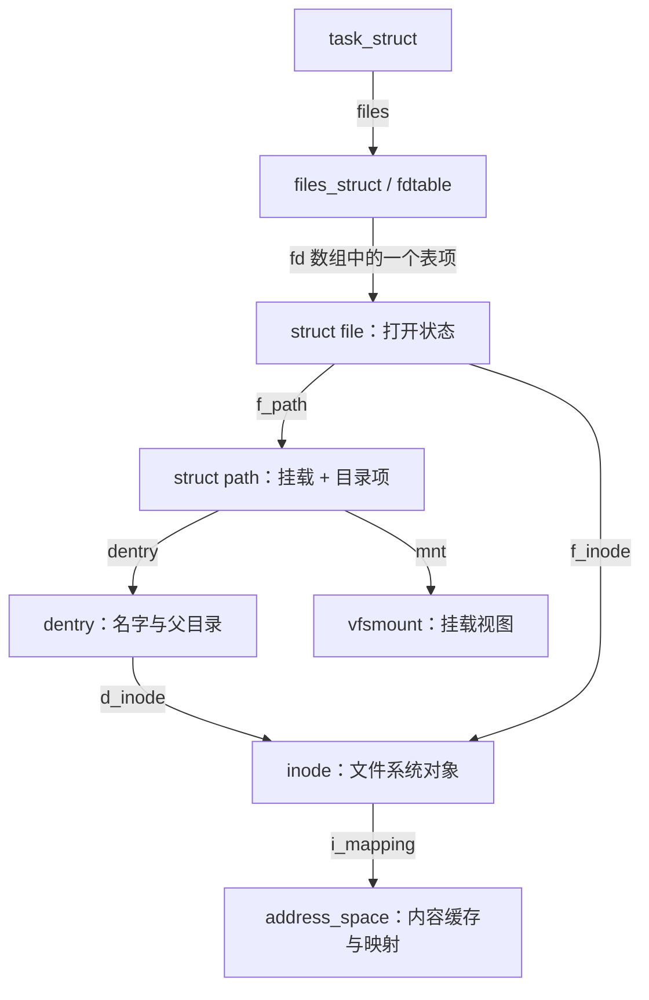
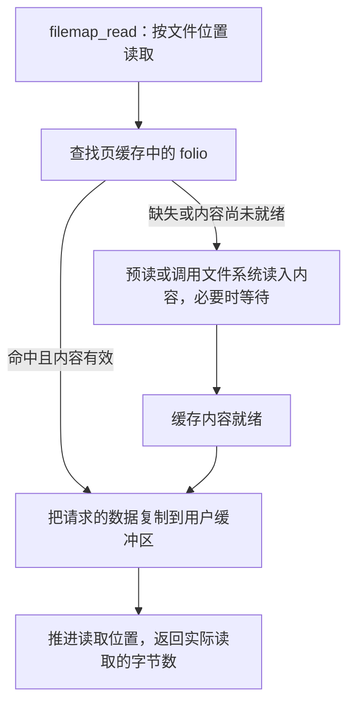

# 文件系统概述：从路径名到文件内容

程序要读取一个文件，通常只需要提供路径名，再使用内核返回的文件描述符：

```c
/* 只展示使用顺序，省略错误处理。 */
int fd = openat(AT_FDCWD, "/home/user/notes.txt", O_RDONLY);
ssize_t n = read(fd, buf, sizeof(buf));
close(fd);
```

这几行代码背后，内核需要完成三件不同的事：**根据名字找到对象，为这次打开保存状态，把对象的内容交给程序。** 文件系统源码中的主要结构和调用链，都可以围绕这三个问题理解。

本章依据仓库 [Linux 顶层 Makefile](../../linux/Makefile#L2) 标记的 **6.18.52** 版本，仅使用本地源码。访问流程以已经存在的 ext4 普通文件为例，主线采用普通缓冲 I/O，暂不展开直接 I/O、DAX、网络文件系统以及完整的错误处理。图中的箭头表示对象关系或明确标注的处理步骤；调用链只保留与本章问题有关的分支。

建议先读第 1～4 节，弄清“名字 → 对象 → 打开状态 → 读写入口”；再读第 5～6 节，理解缓存、同步和对象生命周期。读完后，应能解释：为什么两个文件名可以指向同一个文件，为什么两个 fd 有时共享读写位置，为什么关闭文件不等于数据已经写入存储设备。

## 1. 文件系统向程序提供了什么

### 1.1 从三个不同的文件开始

先不要把文件系统限定为磁盘上的一种布局。程序使用相似的文件接口，背后的内容来源却可能完全不同：

| 例子 | 内容从哪里来 | 本地源码入口 |
| --- | --- | --- |
| ext4 上的普通文件 | 由文件系统管理块设备上的数据和元数据 | [`ext4_fs_type`](../../linux/fs/ext4/super.c#L7415)、[`ext4_get_tree()`](../../linux/fs/ext4/super.c#L5772) |
| tmpfs 上的普通文件 | 由内存承载，条件允许时可以使用交换空间 | [`shmem_fs_type`](../../linux/mm/shmem.c#L5380)、[shmem 的实现说明](../../linux/mm/shmem.c#L49) |
| `/proc/meminfo` | 读取时收集内核内存统计并生成文本 | [`meminfo_proc_show()`](../../linux/fs/proc/meminfo.c#L34)、[该文件的注册](../../linux/fs/proc/meminfo.c#L173) |

ext4 需要回答数据怎样保存到块设备；procfs 中的这个文件则需要回答统计信息怎样转换为文本。共同点是：它们都可以把可访问的对象组织到目录中，并为这些对象提供相应的操作。

因此，学习 Linux 文件系统可以先分成两个问题：**内核怎样统一描述和访问文件，以及具体文件系统怎样实现这些操作。** 磁盘布局、块分配、日志等属于后一个问题，不能用来解释所有文件系统。

### 1.2 VFS 统一对象和操作入口

VFS 是 Virtual File System，即虚拟文件系统。它提供通用的对象模型和处理流程，让系统调用不必为每种文件系统各写一遍路径查找、文件表管理和操作分派。

可以先按下面的顺序理解各层职责：

```text
用户程序：提供路径名、fd、缓冲区和操作参数
    ↓
系统调用与 VFS：查找对象、检查访问条件、管理打开状态、选择操作入口
    ↓
具体文件系统：实现目录查找、属性访问、数据读写等行为
    ↓
内容来源：块设备、内存、内核状态，或其他后端
```

这里的统一并不意味着所有文件都支持相同操作。例如 `vfs_read()` 会检查读方式是否可用，再调用 `file->f_op->read` 或 `read_iter`；没有相应入口时会返回错误。代码见 [`vfs_read()`](../../linux/fs/read_write.c#L552)。后面遇到操作表时，先把它理解成“VFS 在这里选择具体实现”。

## 2. 先分清名字、文件对象和一次打开

### 2.1 路径名不是文件本身

对于 `/home/user/notes.txt`，内核需要逐级处理 `home`、`user`、`notes.txt`。在某个父目录中查找一个名字，与访问该名字对应的文件，是两个步骤。

VFS 用两个对象表达这种区别：

- **`dentry`（目录项缓存对象）**：描述某个父目录下的名字，以及该名字当前关联的 inode。
- **`inode`（索引节点）**：描述文件系统对象的类型、权限、大小、所属文件系统，以及相关操作和数据映射。

`dentry` 的关键字段是 `d_parent`、`d_name` 和 `d_inode`，见 [`struct dentry`](../../linux/include/linux/dcache.h#L92)。`inode` 的关键字段是 `i_mode`、`i_ino`、`i_size`、`i_sb`、`i_op` 和 `i_mapping`，见 [`struct inode`](../../linux/include/linux/fs.h#L793)。目录本身也有 inode，它的操作表负责在该目录中查找、创建和删除名字。

为什么不把名字直接放进 inode？因为一个普通文件可以有多个硬链接：不同目录项可以指向同一个 inode。作为直接证据，通用的 [`simple_link()`](../../linux/fs/libfs.c#L752) 取得原目录项的 inode，再把新目录项与它关联。

```text
父目录中的名字 notes.txt ── dentry A ──┐
                                     ├── inode：同一个文件对象
父目录中的名字 backup.txt ─ dentry B ──┘
```

这里还要区分两种“目录项”：具体文件系统保存名字的目录记录，以及内存中的 VFS `dentry`。两者相互关联，但并不是同一种结构。**dentry 也不是文件内容缓存。**

一个 dentry 还可以没有 inode。`d_inode == NULL` 的负目录项可以用于表示“这个父目录下的名字当前不存在”，从而缓存查找未命中的结果；它不表示一个长度为零的文件。字段注释见 [`d_inode`](../../linux/include/linux/dcache.h#L102)，通用查找中的例子见 [`simple_lookup()`](../../linux/fs/libfs.c#L67)。

### 2.2 `file` 保存打开状态，fd 让程序找到它

找到 inode 后，还没有回答“这次以什么方式打开、下次从哪里读”。这些状态由 **`struct file`** 保存。

| 层次 | 回答的问题 | 第一遍关注的字段 |
| --- | --- | --- |
| `dentry` | 在哪个父目录下，用哪个名字找到对象？ | `d_parent`、`d_name`、`d_inode` |
| `inode` | 找到的是什么对象，它有哪些属性？ | `i_mode`、`i_size`、`i_sb`、`i_mapping` |
| `file` | 这次打开怎样访问对象？ | `f_flags`、`f_mode`、`f_pos`、`f_path`、`f_op` |
| fd | 程序通过哪个整数找到这个打开对象？ | `fdtable.fd[fd]` 中保存的 `file` 指针 |

对于普通文件，一次成功的独立打开通常形成一个 `struct file`，也称为打开文件描述。`f_pos` 保存当前文件位置，`f_flags` 保存文件状态标志，`f_op` 指向访问操作表。定义见 [`struct file`](../../linux/include/linux/fs.h#L1211)。

**fd 是文件描述符表中的索引，不是 inode 号，也不是内核指针。** 任务的 `files` 指向 `files_struct`，后者通过 `fdtable` 管理 `file` 指针数组。因此，同一个整数 fd 在不同文件表中可以指向不同对象。结构关系见 [`task_struct.files`](../../linux/include/linux/sched.h#L1188) 和 [`fdtable`、`files_struct`](../../linux/include/linux/fdtable.h#L26)。



`file` 直接保存 `f_inode`，因此通过 fd 读写时，不必每次重新解析最初的路径字符串。图中的 `path` 和 `address_space` 将分别在挂载与数据缓存部分展开。

## 3. 挂载把文件系统接到路径空间中

### 3.1 类型、实例和挂载分别表示什么

知道“这个对象属于 ext4”还不够。系统可能同时使用多个 ext4 文件系统，也可能把同一个文件系统的内容放到多个路径下访问。为此，需要再区分三个层次：

| 对象 | 含义 | 关键字段与定义 |
| --- | --- | --- |
| `file_system_type` | 一种文件系统实现，例如 ext4 | `name`、`init_fs_context`、`kill_sb`；[`fs.h`](../../linux/include/linux/fs.h#L2684) |
| `super_block` | 一个文件系统实例的整体状态 | `s_type`、`s_op`、`s_root`；[`fs.h`](../../linux/include/linux/fs.h#L1446) |
| `vfsmount` | 使用该实例某棵目录子树的一个挂载视图 | `mnt_sb`、`mnt_root`、`mnt_flags`；[`mount.h`](../../linux/include/linux/mount.h#L58) |

这里的 `super_block` 是 VFS 内存对象，不能直接等同于磁盘上的超级块结构；没有磁盘后端的文件系统也需要表达实例状态。

挂载树的内部结点是 `struct mount`，它包含 `vfsmount`，还记录父挂载 `mnt_parent`、挂载点目录项 `mnt_mountpoint` 等关系，见 [`struct mount`](../../linux/fs/mount.h#L43)。可以把一次普通挂载理解为：**在现有路径空间的某个位置，接入一棵可访问的目录树。**

挂载对象与 superblock 不是一一对应的。绑定挂载可以复用原有文件系统实例；绑定一个子目录时，新挂载的 `mnt_root` 就是该子目录，不必等于实例的 `s_root`。证据见 [`__do_loopback()`](../../linux/fs/namespace.c#L2954) 和填充 `mnt_sb`、`mnt_root` 的 [`setup_mnt()`](../../linux/fs/namespace.c#L1154)。

### 3.2 为什么一个位置需要 `mount + dentry`

假设 `/home` 是一个挂载点，路径查找走到它时，需要从原挂载中的挂载点目录项，切换到接入目录树的根。此后查找 `user`，使用的是接入树中的目录。

所以，VFS 用 `struct path` 同时保存挂载和目录项：

```c
struct path {
    struct vfsmount *mnt;
    struct dentry *dentry;
};
```

这个结构不是路径字符串，而是**已经解析出来的位置**。定义与 `path_equal()` 见 [`path.h`](../../linux/include/linux/path.h#L8)；后者同时比较两个成员。路径遍历中的 [`step_into()`](../../linux/fs/namei.c#L1984) 先调用 `handle_mounts()`，再从处理后的路径取得 inode，正好体现了挂载对名字解析的影响。

不同任务还可能看到不同的挂载组织。`mnt_namespace` 保存命名空间中的根挂载和挂载集合，任务通过 `nsproxy->mnt_ns` 关联它；任务用于路径解析的根目录和当前工作目录则保存在 `fs_struct.root`、`pwd` 中。它们共同决定查找环境，但承担不同职责。定义见 [`mnt_namespace`](../../linux/fs/mount.h#L10)、[`nsproxy`](../../linux/include/linux/nsproxy.h#L36) 和 [`fs_struct`](../../linux/include/linux/fs_struct.h#L9)。

### 3.3 注册一种文件系统，不等于挂载它

`register_filesystem()` 只是把文件系统类型加入内核已知类型的列表，见 [`filesystems.c`](../../linux/fs/filesystems.c#L59)。准备文件系统实例、创建挂载对象、把它接入目录树，则发生在挂载处理中。

以传统 `mount()` 的普通新挂载分支为例，省略参数解析和错误处理后，可以这样阅读：

```text
do_new_mount()
  → get_fs_type()                  根据名字找到文件系统类型
  → fs_context_for_mount()         准备挂载配置上下文
  → do_new_mount_fc()
      → fc_mount()
          → vfs_get_tree()         由具体文件系统取得或建立实例及根目录
          → vfs_create_mount()     创建挂载对象
      → do_add_mount()             接入指定的挂载位置
```

入口见 [`do_new_mount()`](../../linux/fs/namespace.c#L3681)、[`do_new_mount_fc()`](../../linux/fs/namespace.c#L3648) 和 [`fc_mount()`](../../linux/fs/namespace.c#L1197)。[`vfs_get_tree()`](../../linux/fs/super.c#L1754) 调用 `fc->ops->get_tree`；ext4 的实现进一步进入 [`get_tree_bdev()`](../../linux/fs/ext4/super.c#L5772)。

注意顺序中的两个阶段：`vfs_create_mount()` 创建挂载对象，随后才接入目录树。该函数的[注释](../../linux/fs/namespace.c#L1168)明确说明它自身不会把挂载附着到任何位置。掌握这个区别后，再阅读新的挂载系统调用、绑定挂载和挂载传播会更容易。

## 4. 跟踪一次打开、读取和关闭

### 4.1 `openat()`：把路径名变成可用的 fd

回到开头的例子。这里打开的是一个已经存在的普通文件，不涉及 `O_CREAT`、`O_TMPFILE` 或 `O_PATH`。在本版本中，主要调用关系是：

```text
openat 系统调用
  → do_sys_open()
      → do_sys_openat2()
          → get_unused_fd_flags()  先保留一个可用的 fd
          → do_filp_open()
              → path_openat()     准备 file，查找路径并完成打开
          → fd_install()          成功后把 file 放进 fd 表
```

系统调用入口见 [`openat`](../../linux/fs/open.c#L1463)，fd 的保留、失败回收和安装见 [`do_sys_openat2()`](../../linux/fs/open.c#L1420)。`do_sys_openat2()` 是这里使用的内部函数，并不表示 `openat()` 在用户态又调用了一次 `openat2()`。

在 [`path_openat()`](../../linux/fs/namei.c#L4118) 内部，内核先分配空的 `file`，再执行路径遍历和打开。按学习顺序，可以把路径处理分为三步：

1. **选择起点。** 普通绝对路径从任务的根目录开始；相对路径从当前工作目录或 `openat()` 指定的目录 fd 开始，见 [`path_init()`](../../linux/fs/namei.c#L2540)。
2. **处理路径分量。** 遍历中间目录，检查目录搜索权限，处理挂载和符号链接。普通分量先尝试目录项缓存，必要时调用具体文件系统的 `lookup`，见 [`link_path_walk()`](../../linux/fs/namei.c#L2441)、[`lookup_fast()`](../../linux/fs/namei.c#L1739) 和 [`__lookup_slow()`](../../linux/fs/namei.c#L1789)。
3. **处理最后一个名字并完成打开。** `open_last_lookups()` 与 `do_open()` 处理目标及打开要求；普通路径随后通过 `vfs_open()`、`do_dentry_open()` 建立打开状态。不能把最后一个分量完全当成中间目录处理，因为创建文件等语义也在这一阶段介入。

上述第三步的组合见 [`path_openat()`](../../linux/fs/namei.c#L4133)。[`do_dentry_open()`](../../linux/fs/open.c#L903) 则把 dentry 对应的 inode、数据映射和操作表连接到 `file`：设置 `f_inode`、`f_mapping`，通常从 `inode->i_fop` 取得 `f_op`，并调用打开回调。

第一次阅读时，可以暂时略过 RCU 路径遍历的并发细节，但要知道“查缓存”并不是无条件相信缓存。当前代码包含校验与重试；[`do_filp_open()`](../../linux/fs/namei.c#L4157) 会根据返回值重试非 RCU 查找或重新校验。

### 4.2 操作表：VFS 怎样找到 ext4 的实现

到这里，`file->f_op` 从哪里来，已经成为理解下一步读写的关键。VFS 通过不同操作表表达不同职责：

| 操作表 | 主要职责 | 代表操作 |
| --- | --- | --- |
| [`inode_operations`](../../linux/include/linux/fs.h#L2341) | 名字、目录操作和对象属性 | `lookup`、`create`、`unlink`、`rename`、`getattr` |
| [`file_operations`](../../linux/include/linux/fs.h#L2271) | 打开对象的访问与释放 | `read_iter`、`write_iter`、`iterate_shared`、`fsync`、`release` |
| [`address_space_operations`](../../linux/include/linux/fs.h#L439) | 文件内容缓存与后端数据交换 | `read_folio`、`readahead`、`writepages` |
| [`super_operations`](../../linux/include/linux/fs.h#L2459) | 实例与 inode 生命周期、实例级同步 | `alloc_inode`、`evict_inode`、`sync_fs` |

例如 ext4 为普通文件 inode 设置 `ext4_file_operations`，为目录设置另一套目录操作，见 [`ext4 inode 的操作表初始化`](../../linux/fs/ext4/inode.c#L5479)。普通文件表中包含：

```c
/* 摘自 ext4_file_operations，只保留本章相关成员。 */
.read_iter  = ext4_file_read_iter,
.write_iter = ext4_file_write_iter,
.open       = ext4_file_open,
.release    = ext4_release_file,
.fsync      = ext4_sync_file,
```

完整定义见 [`ext4_file_operations`](../../linux/fs/ext4/file.c#L970)。目录查找则从父目录 inode 的 `i_op->lookup` 进入 [`ext4_dir_inode_operations`](../../linux/fs/ext4/namei.c#L4216) 中的 `ext4_lookup`。**查名字与读文件内容，使用的对象和操作入口不同。**

### 4.3 `read()`：通过打开对象访问内容

成功打开后，`read()` 接收 fd，不再接收原来的路径名。对于本例的 ext4 缓冲读取，主干是：

```text
read 系统调用
  → ksys_read()                    从 fd 取得 file，并处理当前位置
      → vfs_read()                 检查访问条件，选择读操作
          → new_sync_read()
              → file->f_op->read_iter()
                  → ext4_file_read_iter()
                      → generic_file_read_iter()
                          → filemap_read()
```

fd 和位置处理见 [`ksys_read()`](../../linux/fs/read_write.c#L704)，操作分派见 [`vfs_read()`](../../linux/fs/read_write.c#L552) 和 [`new_sync_read()`](../../linux/fs/read_write.c#L481)。ext4 选择普通缓冲分支的代码在 [`ext4_file_read_iter()`](../../linux/fs/ext4/file.c#L130)，缓存读取位于 [`filemap_read()`](../../linux/mm/filemap.c#L2723)。

普通 `read()` 成功后，内核把更新的位置写回 `file->f_pos`，下次读取继续从这里开始。`read_iter` 的名字表示它使用 `iov_iter` 描述数据目标，并不意味着这次系统调用一定异步执行；这里的 `new_sync_read()` 正是同步调用该接口。

此时还不能简单地说“内核去磁盘取数据”。读操作已经进入文件内容访问流程，但内容可能早就在内存中。下一节再看数据缓存。

### 4.4 `close()`：解除一个描述符的使用关系

本版本的关闭主干如下：

```text
close 系统调用
  → file_close_fd()                从 fd 表移除该表项，取得原 file
  → filp_flush()                   执行关闭时的相关处理
  → fput_close_sync()              释放这个 file 引用
      → 最后一个引用释放时，进入 __fput() 清理打开对象
```

实际入口见 [`close`](../../linux/fs/open.c#L1574)，fd 表操作见 [`file_close_fd()`](../../linux/fs/file.c#L692)，最终清理见 [`__fput()`](../../linux/fs/file_table.c#L479)。最后清理会调用文件的 `release` 回调，并释放打开对象持有的路径等引用。

这里需要保留两个区别：**移除 fd 不一定销毁 `file`；销毁 `file` 也不意味着删除文件。** 其他 fd 或内核使用者可能仍持有这个打开对象；磁盘上的文件也可以在没有人打开时继续存在。`filp_flush()` 这个函数名同样不能理解为“把全部数据同步到磁盘”，它与下一节的 `fsync()` 是不同入口。

## 5. 文件内容怎样进入内存，又怎样写回

### 5.1 三种缓存回答不同的问题

阅读文件系统时，经常会同时遇到目录项缓存、inode 缓存和页缓存。可以先按缓存内容区分它们：

| 缓存 | 缓存的内容 | 帮助回答的问题 |
| --- | --- | --- |
| dentry 缓存 | 父目录、名字及其与 inode 的关联 | 这个名字指向谁，或者是否不存在？ |
| inode 缓存 | 文件系统对象的内存表示和元数据 | 它的类型、大小、权限等是什么？ |
| page cache（页缓存） | 文件内容对应的内存页/folio | 这个文件偏移处的数据是否已在内存？ |

前两者的入口可从 [`lookup_fast()`](../../linux/fs/namei.c#L1739) 和 [`iput_final()`](../../linux/fs/inode.c#L1874) 阅读；后者显示没有活动引用的 inode 也可能暂留缓存。文件内容缓存的组织则见 [`struct address_space`](../../linux/include/linux/fs.h#L506)。

对本章的普通文件，`inode->i_mapping` 指向描述其内容缓存的 `address_space`，`file->f_mapping` 也关联这个映射。`address_space.i_pages` 使用 XArray 索引缓存项，`a_ops` 指向内容读入、预读和写回等操作。

这里的 `address_space` 不是进程的整个虚拟地址空间。它围绕一个可缓存、可映射对象组织内容；缓存索引按文件偏移换算，不能把它当成用户虚拟地址索引。`filemap_read()` 中的索引计算和数据拷贝见 [`filemap.c`](../../linux/mm/filemap.c#L2723)。

### 5.2 缓冲读取：先取得可用的缓存内容

可以把普通缓冲读取理解为以下数据流，而不是“每调用一次 read 就提交一次磁盘请求”：



folio 是内存管理中按整体操作的一组页，本章只需要知道它可能包含一个或多个基础页。读取过程由 [`filemap_get_pages()`](../../linux/mm/filemap.c#L2622) 等函数准备 folio，必要时进行预读或通过 `read_folio` 读入；[`filemap_read()`](../../linux/mm/filemap.c#L2723) 再把所需内容复制给调用者。

页缓存属于文件的内容映射，因此对同一个普通文件的多次打开，通常共享缓存中的内容，但各自仍可以有独立的 `file->f_pos`。这也是为什么缓存应该与 inode 的内容映射关联，而不能只放在某一次打开中。

### 5.3 缓冲写入：修改缓存与持久化是不同阶段

在普通、未要求同步完成的缓冲写入中，内核把用户数据写入缓存，并把发生修改的缓存内容标为脏。脏表示这些修改还需要按文件系统的规则写回后端。

ext4 的缓冲写入通过 [`ext4_buffered_write_iter()`](../../linux/fs/ext4/file.c#L285) 使用 [`generic_perform_write()`](../../linux/mm/filemap.c#L4244)。后者围绕 `write_begin`、数据拷贝和 `write_end` 推进写入。写回则有另一条路径：通用代码通过 [`do_writepages()`](../../linux/mm/page-writeback.c#L2593) 调用映射的 `a_ops->writepages`。

```text
用户缓冲区 → 文件页缓存被修改 → 脏数据被写回 → 后端完成相应 I/O
                     ↑
        普通 write 成功并不要求后面各阶段都已完成
```

写回可能由后台工作、脏页压力或显式同步推动；缓冲写入也可能因限速、内存和 I/O 等条件而等待。因而既不能说“write 返回就一定落盘”，也不能反过来说“缓冲 write 一定只访问内存、绝不等待 I/O”。与脏页限速、写回有关的代码集中在 [`page-writeback.c`](../../linux/mm/page-writeback.c#L2593)，与文件系统 inode 写回组织有关的代码在 [`fs-writeback.c`](../../linux/fs/fs-writeback.c)。

应用要求同步时，可以沿以下路径理解 `fsync()`：

```text
fsync → do_fsync → vfs_fsync → vfs_fsync_range
      → file->f_op->fsync
      → ext4_sync_file
```

通用入口见 [`sync.c`](../../linux/fs/sync.c#L179)。ext4 在有日志的分支中先通过 `file_write_and_wait_range()` 写出并等待文件数据，再处理有关日志事务，必要时发出设备缓存刷新，并检查写回错误，见 [`ext4_sync_file()`](../../linux/fs/ext4/fsync.c#L141)。

所以，**普通写入完成、关闭 fd、请求同步完成是三个不同事件。** 判断持久化行为要继续看同步调用的结果和文件系统实现，不能只依据 `write()` 或 `close()` 已返回。`fdatasync()` 与 `fsync()` 的区别也通过 `datasync` 参数传入文件系统：前者只要求同步访问已修改数据所必需的元数据，见 [`vfs_fsync()` 的说明](../../linux/fs/sync.c#L191)。

### 5.4 与 `mmap()`、直接 I/O 的关系

普通文件映射也可以使用页缓存。区别在于：`read()` 把缓存内容复制到用户缓冲区，文件 `mmap()` 则建立可访问文件内容的虚拟内存映射，缺页时再准备相应内容。ext4 的普通映射操作使用 `filemap_fault`，见 [`ext4_file_vm_ops`](../../linux/fs/ext4/file.c#L808) 和 [`filemap_fault()`](../../linux/mm/filemap.c#L3459)。这就是文件系统与内存管理相接的一处关键位置。

本节的数据流不能套用到所有 I/O。ext4 在 [`ext4_file_read_iter()`](../../linux/fs/ext4/file.c#L130) 中分别选择 DAX、直接 I/O 和缓冲分支；直接读取可进入 [`iomap_dio_rw()`](../../linux/fs/ext4/file.c#L69)，有些情况下又会回退到缓冲读取。第一遍学习时，先把普通缓冲路径读通，再研究这些分支怎样维护与缓存之间的一致性。

## 6. 用共享和删除检验对象关系

### 6.1 两次打开，与复制一个 fd 有什么不同

假设下面各调用均成功，且操作的是同一个普通文件：

```c
int a = openat(AT_FDCWD, "notes.txt", O_RDONLY);
int b = openat(AT_FDCWD, "notes.txt", O_RDONLY);
int c = dup(a);
```

对应关系可以画成：

```text
fd a ──┐
       ├── file A：自己的 f_pos ──┐
fd c ──┘                         ├── 同一个 inode、同一份内容映射
fd b ───── file B：自己的 f_pos ──┘
```

`a` 与 `b` 来自两次独立打开，各有自己的打开状态；`c` 来自 `dup(a)`，指向同一个 `file A`。因此普通 `read(a, ...)` 推进的文件位置也影响 `c`，而不会直接改变 `b` 的位置。源码上，`path_openat()` 会[分配新的 file](../../linux/fs/namei.c#L4124)，[`dup()`](../../linux/fs/file.c#L1457) 则取得已有 `file` 的引用并安装到新 fd。

普通 `fork()` 也有类似的共享关系：它通常复制文件描述符表，但表中的已有 `file` 仍由父子进程共享；使用 `CLONE_FILES` 时，则可以直接共享整张 `files_struct`。见 [`copy_files()`](../../linux/kernel/fork.c#L1579) 和 [`dup_fd()`](../../linux/fs/file.c#L455)。

### 6.2 `unlink()` 删除名字，`close()` 释放打开引用

如果程序已经打开 `notes.txt`，随后对这个名字执行 `unlink()`，原来的 fd 仍可能继续访问该文件。原因已经包含在前面的对象关系中：目录中的名字关联与已经建立的打开引用，并不是同一条关系。

对本章讨论的普通本地文件，可以按三个阶段理解：

1. `unlink()` 删除父目录中的名字关联，更新链接数等状态。
2. 已有 `file` 仍持有对象的使用关系，所以已经打开的文件可以继续使用。
3. 当最后一个硬链接已经删除，且打开、映射等使用关系也全部结束后，文件系统才有条件回收文件内容和相关资源。

VFS 的名字删除入口是 [`vfs_unlink()`](../../linux/fs/namei.c#L4654)，它调用父目录 inode 的 `unlink` 操作。最终 inode 清理由 [`iput_final()`](../../linux/fs/inode.c#L1874) 等机制控制；ext4 中区分仍有链接与需要删除的处理见 [`ext4_evict_inode()`](../../linux/fs/ext4/inode.c#L167)。

不要把 `inode->i_nlink` 当成打开次数。它记录硬链接关系，内存对象的引用另有管理。也不要把最后一次 `close()` 当成“立即清空所有缓存”：文件仍有名字时，其 inode 或内容缓存可以继续保留，以便后续访问。

## 7. 接下来怎样阅读源码

建议每次带着一个问题进入源码，在能够解释这一条主线后，再展开并发、锁和异常分支。

| 顺序 | 要回答的问题 | 建议入口 |
| --- | --- | --- |
| 1 | fd 怎样连接到打开对象，打开对象又保存了什么？ | [`fdtable`](../../linux/include/linux/fdtable.h#L26)、[`file`](../../linux/include/linux/fs.h#L1211) |
| 2 | 路径名怎样成为可用的 fd？ | [`do_sys_openat2()`](../../linux/fs/open.c#L1420)、[`path_openat()`](../../linux/fs/namei.c#L4118) |
| 3 | 一个名字怎样在目录中查找？ | [`lookup_fast()`](../../linux/fs/namei.c#L1739)、[`__lookup_slow()`](../../linux/fs/namei.c#L1789)、[ext4 目录操作表](../../linux/fs/ext4/namei.c#L4216) |
| 4 | 挂载怎样改变路径解析？ | [`step_into()`](../../linux/fs/namei.c#L1984)、[`do_new_mount_fc()`](../../linux/fs/namespace.c#L3648) |
| 5 | 读取怎样从 VFS 进入页缓存？ | [`ksys_read()`](../../linux/fs/read_write.c#L704)、[ext4 读入口](../../linux/fs/ext4/file.c#L130)、[`filemap_read()`](../../linux/mm/filemap.c#L2723) |
| 6 | 写入、写回和同步怎样衔接？ | [`generic_perform_write()`](../../linux/mm/filemap.c#L4244)、[`do_writepages()`](../../linux/mm/page-writeback.c#L2593)、[`ext4_sync_file()`](../../linux/fs/ext4/fsync.c#L141) |
| 7 | 名字和打开状态分别在什么时候消失？ | [`vfs_unlink()`](../../linux/fs/namei.c#L4654)、[`close`](../../linux/fs/open.c#L1574)、[`__fput()`](../../linux/fs/file_table.c#L479) |

读具体文件系统时，先寻找它如何填充这些操作表，再进入目录组织、数据块映射和日志实现。这样，每个具体函数都有一个已经明确的问题背景，不必从磁盘结构开始记忆整套实现。

读完本章，可以尝试不看正文回答下面五个问题，并用表中的源码入口检查自己的解释：

1. 一个不存在的文件名为什么也可能对应 dentry？它与空文件有什么区别？
2. 同一个 inode 为什么可以对应多个 dentry、多个 file 和多个 fd？
3. 两个路径中的 dentry 相同，为什么仍可能需要比较它们的挂载？
4. 读取命中页缓存时，哪些对象仍参与处理，哪些后端操作可以省去？
5. 为什么文件已经 `unlink()` 后仍能读取，文件已经 `close()` 后又未必完成持久化？
