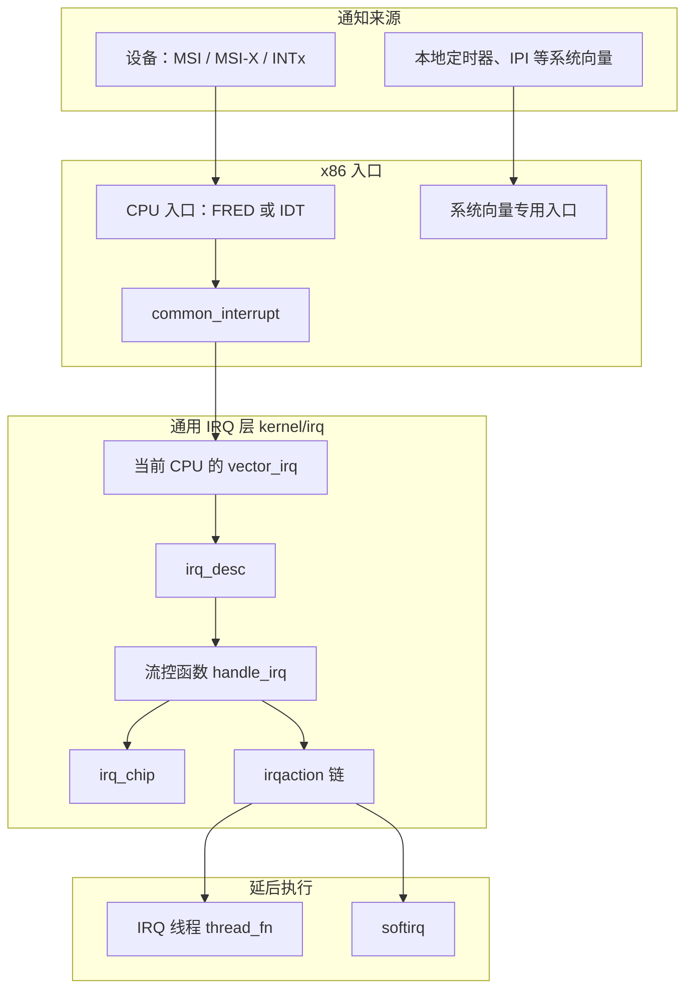
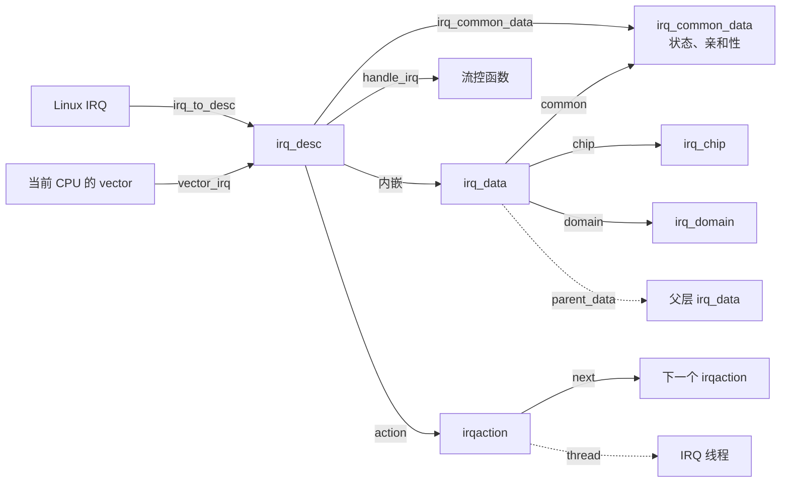

# 中断子系统介绍：编号、描述符与一次分派

网卡收完一批包、本地定时器到期、另一个 CPU 发来“请重新调度”的请求，这些事情都发生在 CPU 正在执行别的代码的时候。内核要停下来，弄清是谁在叫、该调用哪段代码，并决定哪些工作必须立刻做完、哪些可以延后。处理结束之后，驱动还要能关掉这条中断、卸掉回调，同时保证回调不会再碰到即将释放的数据。

中断子系统负责把这条通知路径组织起来。本章是它的结构总览，回答以下问题：

1. 它分成哪几层，每一层解决什么问题？
2. 同一次中断为什么同时存在好几套编号？
3. 核心对象有哪些，谁创建、谁保护、何时释放？
4. 一次普通设备中断怎样从 CPU 入口走到驱动回调？
5. 注册、屏蔽和注销怎样改变这些对象？

沿 e1000e 网卡把一次接收通知追到 NAPI 的过程见[中断子系统概述](overview.md)；softirq 怎样被标记和执行见 [softirq 机制](softirq.md)。本章只建立主线，并为每个结论给出源码位置。

## 0. 分析基线

本章依据仓库内 [Makefile 第 2～4 行](../../linux/Makefile#L2-L4)标记的 **6.18.52** 版本，架构为 **x86-64**。读者需要了解 C 语言、函数指针和“当前 CPU 上的执行可以被打断”这一事实；自旋锁与关中断的组合可参考[锁机制基础](../lock/introduction.md)。

与本章结论有关的配置如下。它们是编译条件，不代表某次运行一定经过对应路径；中断重映射、FRED 入口是否实际使用，还取决于硬件和 CPU 特性。

| 配置 | 对本章的影响 | 依据 |
| --- | --- | --- |
| `CONFIG_X86_64=y`、`CONFIG_SMP=y`、`CONFIG_NR_CPUS=512` | 64 位、多 CPU；每个 CPU 有自己的 vector 表 | [.config#L333](../../linux/.config#L333)、[.config#L362](../../linux/.config#L362)、[.config#L431](../../linux/.config#L431) |
| `CONFIG_X86_LOCAL_APIC=y`、`CONFIG_X86_IO_APIC=y`、`CONFIG_X86_X2APIC=y` | 使用本地 APIC 和 I/O APIC；系统向量从 `0xeb` 开始 | [.config#L433](../../linux/.config#L433)、[.config#L435](../../linux/.config#L435)、[.config#L363](../../linux/.config#L363)、[irq_vectors.h#L108-L109](../../linux/arch/x86/include/asm/irq_vectors.h#L108-L109) |
| `CONFIG_SPARSE_IRQ=y` | Linux IRQ 描述符按需分配，放在 maple tree `sparse_irqs` 里 | [.config#L84](../../linux/.config#L84)、[irqdesc.c#L168-L172](../../linux/kernel/irq/irqdesc.c#L168-L172) |
| `CONFIG_IRQ_DOMAIN=y`、`CONFIG_IRQ_DOMAIN_HIERARCHY=y` | 用中断域做编号映射，并支持父子域 | [.config#L78-L79](../../linux/.config#L78-L79) |
| `CONFIG_PCI=y`、`CONFIG_PCI_MSI=y`、`CONFIG_GENERIC_MSI_IRQ=y` | 编入 PCI MSI/MSI-X；消息由 MSI 域构造并写入设备 | [.config#L2173](../../linux/.config#L2173)、[.config#L2190](../../linux/.config#L2190)、[.config#L80](../../linux/.config#L80) |
| `CONFIG_IRQ_REMAP=y` | 编入中断重映射。某个设备的父域是 vector 域还是重映射域，由启动时的 IOMMU 状态决定 | [.config#L8721](../../linux/.config#L8721) |
| `CONFIG_X86_FRED=y` | 编入 FRED 入口。CPU 具备 `X86_FEATURE_FRED` 时不安装普通设备的 IDT 门；两条路径在 `common_interrupt()` 汇合 | [.config#L368](../../linux/.config#L368)、[irqinit.c#L100-L105](../../linux/arch/x86/kernel/irqinit.c#L100-L105) |
| `CONFIG_GENERIC_IRQ_MATRIX_ALLOCATOR=y`、`CONFIG_GENERIC_IRQ_RESERVATION_MODE=y` | 每个 CPU 的可用 vector 由矩阵分配器管理；能屏蔽的 PCI MSI/MSI-X 可以先预留，到 `request_irq()` 再绑定真实 vector | [.config#L81-L82](../../linux/.config#L81-L82)、[msi.c#L1265-L1270](../../linux/kernel/irq/msi.c#L1265-L1270) |
| `CONFIG_GENERIC_IRQ_MIGRATION=y`、`CONFIG_GENERIC_PENDING_IRQ=y`、`CONFIG_HARDIRQS_SW_RESEND=y` | 支持把 IRQ 迁到另一个 CPU；`pending_mask` 记录尚未完成的亲和性变更；硬件不能重触发时，可以用软件把等待处理的中断再跑一遍 | [.config#L73-L76](../../linux/.config#L73-L76)、[resend.c#L8-L12](../../linux/kernel/irq/resend.c#L8-L12) |
| `CONFIG_IRQ_FORCED_THREADING=y`，`CONFIG_PREEMPT_RT` 未设置 | 强制线程化的代码已编入，但 `force_irqthreads()` 默认是假；只有启动参数 `threadirqs` 才会打开 | [.config#L83](../../linux/.config#L83)、[.config#L139](../../linux/.config#L139)、[manage.c#L27-L35](../../linux/kernel/irq/manage.c#L27-L35)、[interrupt.h#L508-L513](../../linux/include/linux/interrupt.h#L508-L513) |
| `CONFIG_PREEMPT_DYNAMIC=y` 因而 `CONFIG_PREEMPTION=y`；默认模型是 `CONFIG_PREEMPT_VOLUNTARY=y` | 动态抢占编入后，中断返回内核且进入前中断是打开的，出口会检查是否需要调度。`PREEMPT_VOLUNTARY` 只决定默认模型，它本身不选出 `PREEMPTION` | [.config#L136](../../linux/.config#L136)、[.config#L141-L142](../../linux/.config#L141-L142)、[Kconfig.preempt#L9-L12](../../linux/kernel/Kconfig.preempt#L9-L12)、[Kconfig.preempt#L126-L130](../../linux/kernel/Kconfig.preempt#L126-L130)、[common.c#L209-L211](../../linux/kernel/entry/common.c#L209-L211) |
| `CONFIG_GENERIC_IRQ_EFFECTIVE_AFF_MASK=y`、`CONFIG_NUMA=y`、`CONFIG_PM_SLEEP=y`、`CONFIG_PROC_FS=y`、`CONFIG_SYSFS=y` | 描述符带有实际亲和性、节点、休眠深度、`/proc/irq` 和 sysfs | [.config#L72](../../linux/.config#L72)、[.config#L469](../../linux/.config#L469)、[.config#L594](../../linux/.config#L594)、[.config#L9724](../../linux/.config#L9724)、[.config#L9734](../../linux/.config#L9734) |
| `CONFIG_GENERIC_IRQ_DEBUGFS`、`CONFIG_DEBUG_SHIRQ` 未设置 | 描述符没有 debugfs 项；`free_irq()` 不会在注销后再假调用一次处理函数 | [.config#L85](../../linux/.config#L85)、[.config#L10618](../../linux/.config#L10618) |
| `CONFIG_PARAVIRT_XXL=y` | 关本地中断走半虚拟化分派；非 Xen 时替换成 `cli` | [.config#L378](../../linux/.config#L378)、[paravirt.h#L664-L667](../../linux/arch/x86/include/asm/paravirt.h#L664-L667) |

有两点需要提前说明：

- `CONFIG_X86_FRED=y` 只表示 FRED 入口代码被编进内核。[native_init_IRQ()](../../linux/arch/x86/kernel/irqinit.c#L95-L105) 总会调用 `fred_complete_exception_setup()`，但只有 CPU 没有 `X86_FEATURE_FRED` 时才调用 `idt_setup_apic_and_irq_gates()` 安装设备中断门。静态分析不能确定某台机器走哪一个入口。
- `force_irqthreads()` 在非 RT 配置下读取静态键 `force_irqthreads_key`，该键只在解析到 `threadirqs` 时打开。本章主线按这个键保持关闭来写：驱动在 `request_irq()` 里注册的主处理函数运行在硬中断上下文。

## 1. 中断子系统要解决什么问题

### 1.1 四件事

一次通知从设备或另一个 CPU 到达，到驱动把该做的事做完，内核要分开处理四件事：

| 要回答的问题 | 谁来回答 | 主要对象 |
| --- | --- | --- |
| 这是哪一次通知？ | 硬件把请求变成某个 CPU 上的 vector；内核再用 vector 找到描述符 | x86 vector、`vector_irq`、Linux IRQ |
| 该调用谁？ | 描述符上的流控函数遍历已注册的回调 | `irq_desc`、`irqaction` |
| 控制器要先做哪些动作？ | 流控函数按触发方式调用 `irq_chip` | `handle_edge_irq` 等、`irq_ack` / `irq_eoi` |
| 哪些工作可以稍后做，之后怎样安全卸掉？ | 硬中断里只做必要操作；其余交给 IRQ 线程或 softirq。注销时要等进行中的回调结束 | `thread_fn`、softirq、`free_irq()` |

硬件中断、CPU 异常和 softirq 走三条路径。x86 的 [IDT 默认表](../../linux/arch/x86/kernel/idt.c#L84-L98) 为除法错误、无效指令、NMI 等安装专门入口；普通设备中断走第 4.3 节的 vector 路径。softirq 由 [`__raise_softirq_irqoff()`](../../linux/kernel/softirq.c#L786-L790) 对本 CPU 的 pending 位做按位或，再在稍后的执行点调用对应类别的函数。

本地 APIC 定时器、重新调度 IPI 也通过中断硬件递送，但它们使用系统向量和专用入口，例如 [`LOCAL_TIMER_VECTOR`](../../linux/arch/x86/include/asm/irq_vectors.h#L98) 和 [`RESCHEDULE_VECTOR`](../../linux/arch/x86/include/asm/irq_vectors.h#L63)。定时器中断怎样推进时间见[时间子系统概述](../time/introduction.md)，重新调度之后怎样换任务见[调度子系统概述](../sched/introduction.md)。本章的分派主线只跟踪普通设备 IRQ。

### 1.2 分层

下图回答“一次设备通知经过哪些层”。箭头表示控制流。FRED 与 IDT 是运行时二选一的入口，图里画成同一个“CPU 入口”，避免把它们理解成同一次中断要走两遍。



读图时注意三个分界：

- **系统向量走专用入口。** 定时器和 IPI 在 FRED 的 [`fred_extint()`](../../linux/arch/x86/entry/entry_fred.c#L159-L176) 或各自的 `DEFINE_IDTENTRY_SYSVEC` 入口里直接调用处理函数，查 `vector_irq` 的是普通设备 vector。
- **流控函数负责屏蔽、确认、结束和遍历回调。** 设备寄存器由 `irqaction` 里的驱动函数访问。
- **指向 IRQ 线程和 softirq 的箭头是可选出口。** 一次中断可以只跑完 `irqaction` 就返回。需要线程时要等调度器运行它；softirq 则可能在本次硬中断退出时就执行，详见 [softirq 机制](softirq.md)。

### 1.3 触发事件与输入输出

| 触发事件 | 输入 | 输出 / 结果 |
| --- | --- | --- |
| 驱动或子系统分配中断资源 | 中断域、需要的中断个数、可选的亲和性 | 一个或多个 Linux IRQ；每个号对应一棵 `irq_data` 层次 |
| `request_irq()` / `request_threaded_irq()` | Linux IRQ、回调、`dev_id`、标志 | 一条 `irqaction` 挂上描述符；通常随之激活并启动该 IRQ |
| 设备向目标 CPU 递送一次中断 | 该 CPU 上的 vector | 查到 `irq_desc`，执行流控和已注册回调 |
| 回调返回 `IRQ_WAKE_THREAD` | 该 action 已有 `thread_fn` | 唤醒对应的 IRQ 线程 |
| 硬中断退出且本 CPU 有 softirq pending | pending 位图 | 可能就地执行 softirq，或唤醒 `ksoftirqd` |
| `disable_irq()` / `free_irq()` | Linux IRQ，以及注册时的 `dev_id` | 增加禁用深度或卸下 action，并等待进行中的处理结束 |

### 1.4 本章边界与本目录的组织

本章讨论普通设备 IRQ 的编号、描述符、注册和分派。以下内容只标明位置：NMI 的独立入口、中断重映射表的编程、FRED 帧的完整布局、虚拟化的 posted interrupt，以及 `/proc/interrupts` 的逐项格式。

| 章节 | 内容 | 与本章的关系 |
| --- | --- | --- |
| [中断子系统概述](overview.md) | 以 e1000e 的 MSI 接收通知为主线，从注册走到 NAPI，再讲关闭顺序 | 场景串讲；本章第 4 节是同一条路径的结构视图 |
| [softirq 机制](softirq.md) | pending 位、执行时机、`ksoftirqd`，以及 e1000e 怎样把接收工作放进 `NET_RX_SOFTIRQ` | 本章 4.5 节的展开 |

## 2. 先分清几套编号

阅读中断代码时，最容易混的是名字里都带 “IRQ” 或 “vector” 的整数。它们回答的问题不同。

### 2.1 四套编号

| 名称 | 在哪个范围内有意义 | 存在哪里 | 用来做什么 |
| --- | --- | --- | --- |
| `hwirq` | 某一个 `irq_domain` 内部 | `irq_data.hwirq` | 该域识别自己的中断源 |
| Linux IRQ，代码里常写作 `irq` 或 `virq` | 整份内核的逻辑编号 | `irq_data.irq`，也是 maple tree 的键 | `request_irq()`、`irq_to_desc()` |
| x86 vector | 某一个 CPU 的 0～255 号入口 | APIC 私有配置 `apic_chip_data`，以及该 CPU 的 `vector_irq[]` | CPU 选择入口桩，内核再查描述符 |
| softirq 编号 | 固定的工作类别，当前为 0～9 | `softirq_vec[]` 的下标 | 标记并执行一类延后工作 |

[`struct irq_data` 的注释](../../linux/include/linux/irq.h#L164-L176)写明：`irq` 是中断号，`hwirq` 是所属域内的硬件中断号。vector 域在分配时执行 `irqd->hwirq = virq + i`（[vector.c#L581](../../linux/arch/x86/kernel/apic/vector.c#L581)），所以**在 vector 这一层，`hwirq` 的数值等于 Linux IRQ 号**。真正送给 CPU 的 vector 记在两处，数值相同：[`chip_data_update()`](../../linux/arch/x86/kernel/apic/vector.c#L187-L192) 写入 `apic_chip_data.vector`，[`apic_update_irq_cfg()`](../../linux/arch/x86/kernel/apic/vector.c#L128-L135) 写入其中的 `hw_irq_cfg.vector`。

设备 MSI 域的 `hwirq` 又是另一种数。按设备建立的域把它设成 `msi_desc->msi_index`（[drivers/pci/msi/irqdomain.c#L145-L148](../../linux/drivers/pci/msi/irqdomain.c#L145-L148)）。全局 PCI MSI 域则用 [`pci_msi_domain_calc_hwirq()`](../../linux/drivers/pci/msi/irqdomain.c#L58-L65) 把 PCI 域号、[`pci_dev_id()`](../../linux/include/linux/pci.h#L707-L709)（总线号与 `devfn`）和 `msi_index` 打进同一个整数。两种都只在各自的域里有意义。

x86 一共有 256 个 vector（[`NR_VECTORS`](../../linux/arch/x86/include/asm/irq_vectors.h#L106)）。[文件开头的布局说明](../../linux/arch/x86/include/asm/irq_vectors.h#L16-L22)把 `0`～`31` 留给异常，把靠后的一段留给系统向量。本配置下系统向量从 [`POSTED_MSI_NOTIFICATION_VECTOR`（`0xeb`）](../../linux/arch/x86/include/asm/irq_vectors.h#L104-L109) 开始。vector 矩阵分配器的搜索区间是 `[FIRST_EXTERNAL_VECTOR, FIRST_SYSTEM_VECTOR)`，即 `[0x20, 0xeb)`（[vector.c#L816-L817](../../linux/arch/x86/kernel/apic/vector.c#L816-L817)）。安装设备中断门时，循环只处理 `system_vectors` 里尚未置位的号（[idt.c#L291-L294](../../linux/arch/x86/kernel/idt.c#L291-L294)）。异常门和 APIC/SMP 门在更早的建表过程中已经把自己的 vector 置上（[idt.c#L193-L202](../../linux/arch/x86/kernel/idt.c#L193-L202)）。

`vector_irq` 是每 CPU 数组，初值为 `VECTOR_UNUSED`（[irqinit.c#L50-L52](../../linux/arch/x86/kernel/irqinit.c#L50-L52)）。同一个 vector 数值在 CPU 0 和 CPU 1 上可以指向不同的 `irq_desc`。

softirq 编号是另一套空间：它是 [`enum` 里的类别下标](../../linux/include/linux/interrupt.h#L547-L561)，`NR_SOFTIRQS` 当前为 10。

### 2.2 一次 MSI 中断里它们怎样接上

下面的数字只说明层次，不是某台机器的测量值。假设 Linux IRQ 为 40，目标是 CPU 2 的 vector `0x51`，设备 MSI 索引为 0：

```text
设备 MSI 消息（地址 + 数据）描述“发给谁、带哪个 vector”
        │
        ▼
CPU 2 收到 vector 0x51
        │
        ▼
CPU 2 的 vector_irq[0x51]  →  irq_desc（Linux IRQ 40）
        │
        ├─ 最外层 irq_data.hwirq = 0          设备 MSI 域内的 msi_index
        └─ vector 域 irq_data.hwirq = 40      这一层把 Linux IRQ 号放进 hwirq
           apic_chip_data.vector = 0x51       CPU 真正使用的 vector
```

MSI 消息本身由 [`struct msi_msg`](../../linux/include/linux/msi.h#L61-L74) 描述地址和数据。vector 域提供 [`x86_vector_msi_compose_msg()`](../../linux/arch/x86/kernel/apic/vector.c#L1026-L1029)，根据已经选好的 CPU 和 vector 填这则消息。消息只负责通知；设备数据仍在设备自己的缓冲区里。网卡驱动怎样消费这则通知，见[概述一章的 e1000e 路径](overview.md)。

## 3. 核心数据结构

本节只保留主线要用的字段。对象之间“保存了指针”只表示可以沿它找到对方，不表示拥有对方的生命周期。

### 3.1 结构地图



实线表示结构体成员或查表；虚线表示可选关系。`parent_data` 在层次域上才存在。共享 IRQ 才有第二条 `irqaction`。

### 3.2 `irq_desc`：一个 Linux IRQ 的处理状态

[`struct irq_desc`](../../linux/include/linux/irqdesc.h#L67-L120) 是通用层看到的中心对象。当前配置下它按需分配，[`irq_to_desc()`](../../linux/kernel/irq/irqdesc.c#L414-L417) 用 Linux IRQ 做键，从 maple tree `sparse_irqs` 取出指针。

| 字段 | 含义 |
| --- | --- |
| `irq_data` | 嵌入在 `irq_desc` 里的最外层中断数据 |
| `irq_common_data` | 各层 `irq_data` 共享的状态、亲和性和 MSI 描述符指针 |
| `handle_irq` | 流控函数。新建时是 `handle_bad_irq`，域初始化后再换成 `handle_edge_irq` 等 |
| `action` | 已注册回调组成的单链表 |
| `lock` | `raw_spinlock_t`，保护描述符状态和 action 链表的修改 |
| `request_mutex` | 互斥锁，串行化 `request_irq()` 与 `free_irq()`，可以睡眠 |
| `depth` | 禁用嵌套计数。新建时为 1，表示处于禁用 |
| `threads_oneshot`、`threads_active`、`wait_for_threads` | 协调线程化处理，并供 `synchronize_irq()` 等待 |
| `kstat_irqs` | 每 CPU 的中断计数 |
| `istate` | `core_internal_state__do_not_mess_with_it` 的简写，保存 `IRQS_PENDING`、`IRQS_ONESHOT` 等内核内部状态 |

`istate` 这个名字来自 [internals.h 第 20 行](../../linux/kernel/irq/internals.h#L20) 的宏。`IRQS_PENDING` 表示这条中断需要在下一次机会重发（[internals.h#L55-L56](../../linux/kernel/irq/internals.h#L55-L56)）。边沿流控在处理过程中又收到请求时，会置上这一位，那是它的一种用法，不是这个标志的全部含义。

[`desc_set_defaults()`](../../linux/kernel/irq/irqdesc.c#L115-L131) 把新描述符设成：`chip` 为 `no_irq_chip`，`handle_irq` 为 `handle_bad_irq`，`depth` 为 1，并置上 `IRQD_IRQ_DISABLED` 和 `IRQD_IRQ_MASKED`。因此描述符刚出现时不能投递给驱动；域分配和 `request_irq()` 会依次填上芯片操作、流控函数和 action。

`depth` 是嵌套计数。[`__disable_irq()`](../../linux/kernel/irq/manage.c#L664-L667) 先加一，只有从 0 变成 1 时才调用 `irq_disable()`。这次调用默认并不立刻写硬件屏蔽，见第 4.6 节。`__enable_irq()` 按 `depth` 分支（[manage.c#L758-L787](../../linux/kernel/irq/manage.c#L758-L787)）：已经是 0 则告警；恰好是 1 且带有 `IRQS_SUSPENDED` 也告警并返回；恰好是 1 且未挂起时调用 `irq_startup()` 并把 `depth` 清零；大于 1 则只减一，不启动硬件。

### 3.3 `irq_data` 与 `irq_chip`：这一层硬件怎样操作

[`struct irq_data`](../../linux/include/linux/irq.h#L177-L188) 描述层次中的一层。最外层嵌入 `irq_desc`，父层由 [`irq_domain_alloc_irq_data()`](../../linux/kernel/irq/irqdomain.c#L1436-L1454) 按 `domain->parent` 逐层分配，用 `parent_data` 串起来。每一层有自己的 `domain`、`hwirq`、`chip` 和 `chip_data`。

[`struct irq_common_data`](../../linux/include/linux/irq.h#L145-L161) 被各层通过 `irq_data.common` 共享。与本章有关的是：

| 字段或状态位 | 含义 |
| --- | --- |
| `state_use_accessors` | 必须用 `irqd_*()` 访问。其中包括禁用、屏蔽、处理中、已激活、已启动、单目标 |
| `affinity` | 希望投递到的 CPU 集合 |
| `effective_affinity` | 控制器实际采用的集合，可能只是 `affinity` 的子集 |
| `msi_desc` | 指向 MSI 描述符；普通驱动不直接保存这个指针 |

[`IRQD_IRQ_INPROGRESS`](../../linux/include/linux/irq.h#L204) 表示流控函数已经进入事件处理。vector 域还会置 [`IRQD_SINGLE_TARGET`](../../linux/arch/x86/kernel/apic/vector.c#L582)，声明这个 IRQ 一次只投递到一个 CPU。迁移窗口里旧目标和新目标仍可能同时进入流控函数，`irq_can_handle_pm()` 用这个状态位把后到的一边挡下或等到前一边结束（[chip.c#L508-L540](../../linux/kernel/irq/chip.c#L508-L540)）。

[`struct irq_chip`](../../linux/include/linux/irq.h#L492-L544) 是一组函数指针，名字对应控制器动作：`irq_mask` / `irq_unmask` 控制递送，`irq_ack` 确认请求，`irq_eoi` 通知控制器本阶段结束，`irq_set_affinity` 修改目标 CPU。函数指针可以是 `NULL`。某一层没有自己的 ACK 时，会把操作转给父层，例如 [`irq_chip_ack_parent()`](../../linux/kernel/irq/chip.c#L1333-L1337) 只做 `data = data->parent_data` 再调用父层的 `irq_ack`。

x86 vector 域使用的芯片是 [`lapic_controller`](../../linux/arch/x86/kernel/apic/vector.c#L1032-L1039)：`irq_ack` 指向 `apic_ack_edge()`，它经 `apic_ack_irq()` 调用 `apic_eoi()`。MSI 域在 x86 上把自己的 `irq_ack` 设成 `irq_chip_ack_parent`，并把流控函数设成 `handle_edge_irq`（[msi.c#L248-L254](../../linux/arch/x86/kernel/apic/msi.c#L248-L254)）。所以 MSI 路径上，对 APIC 的 EOI 发生在驱动回调之前，由流控函数里的 `irq_ack` 间接触发。

### 3.4 `irqaction`：一个使用者注册的回调

[`struct irqaction`](../../linux/include/linux/interrupt.h#L122-L136) 表示一次 `request_irq()`。多个使用者共享同一个 Linux IRQ 时，用 `next` 串成链表，挂在 `irq_desc.action` 上。

| 字段 | 含义 |
| --- | --- |
| `handler` | 硬中断里调用的主处理函数，原型是 `irqreturn_t (*)(int irq, void *dev_id)` |
| `thread_fn` | 可选的线程函数。`request_irq()` 传入 `NULL` |
| `thread` | 内核为 `thread_fn` 创建的任务 |
| `dev_id` | 注册时传入的指针，回调时原样送回；`free_irq()` 也用它找到这一项 |
| `flags` | `IRQF_SHARED`、`IRQF_ONESHOT` 等 |
| `name` | 出现在 `/proc/interrupts` 里的名字 |

返回值定义在 [`enum irqreturn`](../../linux/include/linux/irqreturn.h#L11-L15)：

| 返回值 | 含义 |
| --- | --- |
| `IRQ_NONE` | 这次中断不属于本设备，或本设备没有处理它 |
| `IRQ_HANDLED` | 本设备已经处理 |
| `IRQ_WAKE_THREAD` | 请唤醒本 action 的 IRQ 线程 |

共享 IRQ 上，一个 action 返回 `IRQ_NONE` 只说明这一项没处理；遍历会继续，结果按位或进 `retval`（[handle.c#L185-L230](../../linux/kernel/irq/handle.c#L185-L230)）。

[`request_irq()`](../../linux/include/linux/interrupt.h#L168-L173) 是封装：它调用 `request_threaded_irq()`，`thread_fn` 为 `NULL`，并带上 `IRQF_COND_ONESHOT`。这个标志的含义是：如果这条 IRQ 已经被别人设成 oneshot，本注册者同意配合；它自己并不强制创建线程。

### 3.5 `irq_domain`：把一层编号映射到 `irq_data`

[`struct irq_domain`](../../linux/include/linux/irqdomain.h#L147-L176) 管理一个编号空间。`ops` 提供分配、释放、激活和反激活；`parent` 指向父域；`revmap` / `revmap_tree` 用于从本域的 `hwirq` 找回 `irq_data`。域的 `mutex` 保护域内部映射，层次域使用根域那把锁（结构体注释，[irqdomain.h#L119-L120](../../linux/include/linux/irqdomain.h#L119-L120)）。

x86 在早期初始化时创建根域 `x86_vector_domain`（[vector.c#L799-L808](../../linux/arch/x86/kernel/apic/vector.c#L799-L808)）。它没有父域。I/O APIC 先用 `irq_find_matching_fwspec()` 寻找 bus token 为 `DOMAIN_BUS_GENERIC_MSI` 的父域，再用 [`irq_domain_create_hierarchy()`](../../linux/arch/x86/kernel/apic/io_apic.c#L2239-L2247) 挂上去；找不到父域就返回 `-ENODEV`。PCI 设备的 MSI 域也叠在 vector 域之上，中间可以插入重映射域。`x86_init_dev_msi_info()` 同时接受 vector 域（`DOMAIN_BUS_ANY`）和 Intel/AMD 重映射域（[msi.c#L211-L224](../../linux/arch/x86/kernel/apic/msi.c#L211-L224)）。`CONFIG_IRQ_REMAP=y` 只说明重映射代码已编入，某个设备的 `parent` 究竟是哪一个域，要看启动时哪个域完成了注册。

同一 Linux IRQ 上的多层 `irq_data` 描述的是**同一条中断经过的管理层次**。多一层域只多一层 `irq_data`。驱动注册的 `irqaction` 仍然只有链表上的那几项。

### 3.6 谁创建、谁保护、何时释放

把上面几个对象的生命周期放在一起：

| 对象 | 创建 | 保护 | 释放 |
| --- | --- | --- | --- |
| `irq_desc` | 域分配 IRQ 号时 `alloc_descs()` | 树的插入/删除由 `sparse_irq_lock` 保护；查找使用带 RCU 标志的 maple tree | `free_desc()` 先从树中摘下，再 `call_rcu()` 释放 |
| 父层 `irq_data` | `irq_domain_alloc_irq_data()` | 随描述符和域锁一起修改 | 域释放层次时一并释放 |
| `irqaction` | `request_threaded_irq()` 用 `kzalloc` | 链入和摘下要持有 `desc->lock`；注册/注销整体由 `request_mutex` 串行化 | `free_irq()` 在同步完成后 `kfree` |
| vector 槽 | `chip_data_update()` 写入目标 CPU 的 `vector_irq[vector]` | `vector_lock` | 向量释放路径清除槽位 |
| IRQ 线程 | `setup_irq_thread()`，在 `__setup_irq()` 里 | 任务自身由调度器管理；完成状态用 `threads_active` | `free_irq()` 里 `kthread_stop_put()` |

`free_irq()` 释放 action。`irq_desc` 要等该 Linux IRQ 号被域释放时才离开 maple tree。[`free_desc()` 的注释](../../linux/kernel/irq/irqdesc.c#L475-L493)说明：摘树之后，`/proc` 再查找会失败；对象本身通过 RCU 回调归还，以便仍在 RCU 读侧的统计读取能够结束。

并发上有三把不同范围的锁：

- `desc->request_mutex` 只串行化注册和注销，持有它的代码可以睡眠。
- `desc->lock` 保护流控状态和 action 链表。流控函数在调用驱动前会放开它（见 4.3 节），因此**驱动回调执行时并不持有 `desc->lock`**。
- `vector_lock` 保护 vector 矩阵和 `vector_irq` 的更新。热路径 `call_irq_handler()` 先无锁读槽位；读到的不是有效描述符时才加这把锁重读（[irq.c#L273-L305](../../linux/arch/x86/kernel/irq.c#L273-L305)）。重读时若槽里仍是 `VECTOR_SHUTDOWN` 或 `VECTOR_RETRIGGERED`，[`reevaluate_vector()`](../../linux/arch/x86/kernel/irq.c#L259-L270) 会把槽改成 `VECTOR_UNUSED` 并返回空。

## 4. 从分配到注销

本节按时间顺序看四段：分配描述符、注册回调、中断到达、屏蔽与释放。流控函数和延后执行插在到达路径上。

### 4.1 分配：先有描述符，再谈回调

`request_irq()` 要求描述符已经存在。它的第一步就是 `irq_to_desc(irq)`，找不到就返回 `-EINVAL`（[manage.c#L2106-L2108](../../linux/kernel/irq/manage.c#L2106-L2108)）。Linux IRQ 号来自更早的域分配。

[`irq_domain_alloc_irqs_locked()`](../../linux/kernel/irq/irqdomain.c#L1593-L1628) 的主路径是：

```text
irq_domain_alloc_descs()          分配 irq_desc，得到 Linux IRQ
irq_domain_alloc_irq_data()       为父域补上 parent_data
domain->ops->alloc()              起始域填写本层，并继续向父域分配
irq_domain_trim_hierarchy()       去掉层次里的裁剪标记
irq_domain_insert_irq()           建立 hwirq 到 irq_data 的反向映射
```

裁剪那一步在 [`irq_domain_alloc_irqs_locked()`](../../linux/kernel/irq/irqdomain.c#L1617-L1628) 里，位于 `alloc` 成功之后、插入反向映射之前。没有裁剪标记时它直接返回。

vector 域的 `alloc` 是 [`x86_vector_alloc_irqs()`](../../linux/arch/x86/kernel/apic/vector.c#L548-L612)。它对每个 IRQ：分配 `apic_chip_data`，把 `chip` 设为 `lapic_controller`，把本层 `hwirq` 设为 Linux IRQ 号，并标记单目标和“必须在中断上下文处理”。然后调用 `assign_irq_vector_policy()`。

这个策略有三条出路（[vector.c#L315-L326](../../linux/arch/x86/kernel/apic/vector.c#L315-L326)）：

| 条件 | 分配阶段做什么 | vector 何时写进 `vector_irq` |
| --- | --- | --- |
| 托管 IRQ（affinity managed） | 在矩阵里预留托管槽 | 启动托管 IRQ 时 |
| 调用者给出了 CPU 掩码 | 立刻按掩码分配 vector | 分配当时，经 `chip_data_update()` |
| 其余情况 | 只做一次全局预留，配置里先放关闭用 vector | 激活时再关联真正的 vector |

源码注释写明第三种情况：“只做没有保证的全局预留，真正的 vector 在激活时关联。”激活由 [`irq_domain_activate_irq()`](../../linux/kernel/irq/irqdomain.c#L1967-L1975) 从最外层 `irq_data` 进入。递归先激活 `parent_data`，再调用本层的 `activate`（[irqdomain.c#L1938-L1948](../../linux/kernel/irq/irqdomain.c#L1938-L1948)），所以 vector 域先于它上面的设备域完成激活。vector 域的 [`x86_vector_activate()`](../../linux/arch/x86/kernel/apic/vector.c#L461-L481) 在 `reserve` 为假且 `has_reserved` 为真时调用 `activate_reserved()`，最终由 `chip_data_update()` 把 `irq_desc` 写入目标 CPU 的 `vector_irq[newvec]`（[vector.c#L187-L192](../../linux/arch/x86/kernel/apic/vector.c#L187-L192)）。

因此，**分配 Linux IRQ 和把描述符放进某个 CPU 的 vector 槽是两步**。槽还没写好时，这个 vector 到来不会找到驱动。

PCI MSI/MSI-X 在域分配之后还有一次早期激活，避免设备在 MSI 使能时锁存到一则随机消息（[msi.c#L1308-L1314](../../linux/kernel/irq/msi.c#L1308-L1314)）。设备域模板带有 `MSI_FLAG_ACTIVATE_EARLY`，本配置再带上 `MSI_FLAG_MUST_REACTIVATE`（[drivers/pci/msi/irqdomain.c#L204-L213](../../linux/drivers/pci/msi/irqdomain.c#L204-L213)）。[`msi_check_reservation_mode()`](../../linux/kernel/irq/msi.c#L1179-L1206) 为真时，这次激活传入 `reserve=true`。若分配阶段已经置上 `can_reserve`（上表第三行），vector 域这次只写入关闭用 vector；[`msi_init_virq()`](../../linux/kernel/irq/msi.c#L1262-L1270) 随后清掉 `IRQD_ACTIVATED`，`request_irq()` 里的 `irq_activate()` 会以 `reserve=false` 再次进入，走到 [`activate_reserved()`](../../linux/arch/x86/kernel/apic/vector.c#L405-L410)。检查返回假时（例如该项不能屏蔽），早期激活不带预留标志，上表第三行留下的预留会立刻被换成真实 vector，激活位保持置位，`request_irq()` 不再激活一次。注释说明不能屏蔽的设备不用预留模式：伪 vector 上可能产生伪中断（[msi.c#L1168-L1177](../../linux/kernel/irq/msi.c#L1168-L1177)）。

MSI 域在自己的初始化里另外做一件事：通过 [`msi_domain_ops_init()`](../../linux/kernel/irq/msi.c#L809-L820) 把本层 `hwirq`、`irq_chip` 和流控函数装到最外层 `irq_data` / `irq_desc` 上。x86 为设备 MSI 选择的流控函数是 `handle_edge_irq`（[msi.c#L253](../../linux/arch/x86/kernel/apic/msi.c#L253)）。I/O APIC 则按引脚是电平还是边沿，在 `handle_fasteoi_irq` 和 `handle_edge_irq` 之间选择（[io_apic.c#L845-L859](../../linux/arch/x86/kernel/apic/io_apic.c#L845-L859)）。

### 4.2 注册：把驱动接到 action 链上

[`request_threaded_irq()`](../../linux/kernel/irq/manage.c#L2076-L2136) 在检查共享标志和 `dev_id` 之后分配 `irqaction`，保存 `handler`、`thread_fn`、`flags`、`name` 和 `dev_id`，再进入 `__setup_irq()`。

接口注释要求驱动假定：**从这次调用开始，处理函数就可能执行**（[manage.c#L2049-L2053](../../linux/kernel/irq/manage.c#L2049-L2053)）。回调要用的数据必须事先准备好。

`__setup_irq()` 里与主线有关的步骤是：

1. 若 `thread_fn` 非空且不是嵌套线程，调用 `setup_irq_thread()` 创建线程（[manage.c#L1498-L1506](../../linux/kernel/irq/manage.c#L1498-L1506)）。主线程的名字格式是 `irq/%d-%s`，即 `irq/<号>-<名称>`（[manage.c#L1401-L1403](../../linux/kernel/irq/manage.c#L1401-L1403)）。
2. 取得 `request_mutex` 和芯片总线锁。第一个 action 还会向控制器申请资源（[manage.c#L1528-L1539](../../linux/kernel/irq/manage.c#L1528-L1539)）。
3. 在 `desc->lock` 下，若链表上已有 action，先检查能否共享，包括触发类型是否一致；不一致就返回错误（[manage.c#L1556-L1587](../../linux/kernel/irq/manage.c#L1556-L1587)）。
4. 这是第一个 action 时调用 [`irq_activate()`](../../linux/kernel/irq/chip.c#L304-L310)。非托管 IRQ 在这里激活域；托管 IRQ 把激活留到后面的启动。没有 `IRQF_NO_AUTOEN` 时再调用 `irq_startup()`，把 `depth` 置 0 并启动芯片（[manage.c#L1721-L1723](../../linux/kernel/irq/manage.c#L1721-L1723)、[chip.c#L269-L275](../../linux/kernel/irq/chip.c#L269-L275)）。带 `IRQF_NO_AUTOEN` 时把 `depth` 留在 1，等驱动以后显式 `enable_irq()`。
5. 把新 action 接到链表上。

`handler` 为 `NULL` 且 `thread_fn` 非空时，内核安装默认主处理函数 `irq_default_primary_handler`（[manage.c#L2114-L2117](../../linux/kernel/irq/manage.c#L2114-L2117)）。若这时没有 `IRQF_ONESHOT`，并且芯片也没有 `IRQCHIP_ONESHOT_SAFE`，注册返回 `-EINVAL`（[manage.c#L1650-L1669](../../linux/kernel/irq/manage.c#L1650-L1669)）。本章主线是驱动自己提供主处理函数、不创建线程的 `request_irq()`。

强制线程化打开时，`__setup_irq()` 会先调用 `irq_setup_forced_threading()`（[manage.c#L1486-L1489](../../linux/kernel/irq/manage.c#L1486-L1489)）。主线下这个静态键是关的，注册进去的 `handler` 仍在硬中断里运行。

### 4.3 分派：从 vector 到驱动回调

CPU 具备 FRED 时，外部中断进入 [`fred_extint()`](../../linux/arch/x86/entry/entry_fred.c#L159-L176)：vector 大于等于 `FIRST_SYSTEM_VECTOR` 的走系统向量表，其余调用 `common_interrupt(regs, vector)`。CPU 不具备 FRED 时，[`idt_setup_apic_and_irq_gates()`](../../linux/arch/x86/kernel/idt.c#L284-L294) 为每个未占用的外部 vector 安装一个入口桩。[`irq_entries_start`](../../linux/arch/x86/include/asm/idtentry.h#L546-L558) 里每个桩压入自己的 vector，再跳到 `asm_common_interrupt`。

两条路汇合之后的 C 包装由 [`DEFINE_IDTENTRY_IRQ`](../../linux/arch/x86/include/asm/idtentry.h#L206-L222) 生成。下面是简化逻辑，省略了栈切换、`kvm_set_cpu_l1tf_flush_l1d()`，以及 `__common_interrupt()` 里的 `set_irq_regs()`（[irq.c#L318-L320](../../linux/arch/x86/kernel/irq.c#L318-L320)）。顺序来自该宏、[`run_irq_on_irqstack_cond`](../../linux/arch/x86/include/asm/irq_stack.h#L189-L203) 和 [`common_interrupt()`](../../linux/arch/x86/kernel/irq.c#L318-L329)：

```text
common_interrupt(regs, error_code)
    irqentry_enter(regs)
    vector = (u32)(u8)error_code
    run_irq_on_irqstack_cond(__common_interrupt, regs, vector)
        irq_enter_rcu()                         硬中断计数 +1，并记账
        __common_interrupt(regs, vector)
            call_irq_handler(vector, regs)
                desc = 本 CPU 的 vector_irq[vector]
                generic_handle_irq_desc(desc)   即 desc->handle_irq(desc)
        irq_exit_rcu()                          硬中断计数 -1；可能运行 softirq
    irqentry_exit(regs, state)
```

包装宏把 vector 先截成 8 位再扩展成 `u32`，是因为 IDT 桩用 `push imm8`，高位会被符号扩展（[idtentry.h#L213](../../linux/arch/x86/include/asm/idtentry.h#L213)、[idtentry.h#L541-L543](../../linux/arch/x86/include/asm/idtentry.h#L541-L543)）。FRED 传入的 0～255 的 vector 经过同一次截断后数值不变。

`call_irq_handler()` 先用 `__this_cpu_read` 读槽。读到有效描述符就调用 `handle_irq()`；在 x86-64 上这就是 `generic_handle_irq_desc()`，它只做 `desc->handle_irq(desc)`（[irq.c#L250-L254](../../linux/arch/x86/kernel/irq.c#L250-L254)、[irqdesc.h#L171-L174](../../linux/include/linux/irqdesc.h#L171-L174)）。读到 `VECTOR_UNUSED`（`NULL`）、`VECTOR_SHUTDOWN` 或 `VECTOR_RETRIGGERED` 时，在 `vector_lock` 下重读一次。后两种标记会被写成 `VECTOR_UNUSED`，然后返回失败，`common_interrupt()` 只做 `apic_eoi()`，避免 APIC 上的请求卡住。这些标记定义在 [hw_irq.h#L126-L128](../../linux/arch/x86/include/asm/hw_irq.h#L126-L128)，重读处理见 [irq.c#L259-L270](../../linux/arch/x86/kernel/irq.c#L259-L270)。

以 MSI 使用的 `handle_edge_irq()` 为例，流控函数在持有 `desc->lock` 的情况下先 ACK，再进入事件处理。事件处理会暂时放开这把锁：

```c
desc->istate &= ~IRQS_PENDING;
irqd_set(&desc->irq_data, IRQD_IRQ_INPROGRESS);
raw_spin_unlock(&desc->lock);

ret = handle_irq_event_percpu(desc);

raw_spin_lock(&desc->lock);
irqd_clear(&desc->irq_data, IRQD_IRQ_INPROGRESS);
```

来源：[handle_irq_event()，handle.c 第 249～261 行](../../linux/kernel/irq/handle.c#L249-L261)。`handle_irq_event_percpu()` 最终对每个 action 执行 `action->handler(irq, action->dev_id)`（[handle.c#L200-L203](../../linux/kernel/irq/handle.c#L200-L203)）。回调返回后，若本地中断被打开，这里会发出警告并重新关掉（[handle.c#L208-L210](../../linux/kernel/irq/handle.c#L208-L210)）。所以主处理函数的约定是：**在硬中断上下文、本地 IRQ 关闭、且已经放开 `desc->lock` 的情况下运行。** 它不能睡眠。`current` 仍指向被打断的任务，执行上下文是硬中断。

硬中断上下文记在 `preempt_count` 的 `HARDIRQ_MASK` 上（[preempt.h#L27-L30](../../linux/include/linux/preempt.h#L27-L30)）。[`irq_enter_rcu()`](../../linux/kernel/softirq.c#L662-L670) 先经 [`__irq_enter_raw()`](../../linux/include/linux/hardirq.h#L46-L49) 加上 `HARDIRQ_OFFSET`，再统计硬中断时间；[`__irq_exit_rcu()`](../../linux/kernel/softirq.c#L713-L723) 减去计数后，若已经不在中断上下文且本 CPU 有 softirq pending，就调用 `invoke_softirq()`。

出口 [`irqentry_exit()`](../../linux/kernel/entry/common.c#L185-L211) 再按被打断的现场分支：返回用户态时走 `irqentry_exit_to_user_mode()`；返回内核且进入时中断是打开的，在 `CONFIG_PREEMPTION=y` 下调用 `irqentry_exit_cond_resched()`。是否真的换任务由抢占模型决定，见调度子系统。

### 4.4 三种流控：先处理设备，还是先挡住下一次

流控函数决定 ACK、屏蔽和调用驱动的顺序。下表只列出“描述符已启用且已有 action”时的主顺序，完整分支在各自函数里。

| 函数 | 主顺序 | 适用情况 |
| --- | --- | --- |
| [`handle_level_irq()`](../../linux/kernel/irq/chip.c#L685-L697) | `mask_ack_irq()` → 驱动 → 条件满足再 `unmask_irq()` | 电平在设备撤掉请求前一直有效，处理期间先挡住这条线 |
| [`handle_edge_irq()`](../../linux/kernel/irq/chip.c#L823-L858) | `irq_ack()` → 驱动；若期间置上 `IRQS_PENDING` 则再转一圈 | 请求被锁存，处理中可以再来一次。x86 MSI 使用这个函数 |
| [`handle_fasteoi_irq()`](../../linux/kernel/irq/chip.c#L736-L772) | 驱动 → `irq_eoi()`；oneshot 时先屏蔽 | 控制器自己保存了部分流控状态。x86 I/O APIC 的电平引脚使用它 |

`handle_edge_irq()` 若在入口处 `irq_can_handle()` 为假，会置 `IRQS_PENDING` 并 `mask_ack_irq()` 后返回（[chip.c#L827-L830](../../linux/kernel/irq/chip.c#L827-L830)）。循环里如果又看到 `IRQS_PENDING`，并且 IRQ 没有被禁用、当前已经处于 masked，会先 `unmask` 再处理下一次（[chip.c#L849-L852](../../linux/kernel/irq/chip.c#L849-L852)）。这就是边沿事件在回调执行期间到来时的保留方式。

这三个芯片动作各管一件事：mask/unmask 管递送，ACK 确认控制器里的这一次请求，EOI 结束控制器的服务阶段。`handle_edge_irq()` 调用最外层芯片的 `irq_ack`。MSI 层把它转给父层。父层是 vector 域时，`apic_ack_edge()` 再调用 `apic_ack_irq()`，最后 `apic_eoi()`（[vector.c#L1014-L1023](../../linux/arch/x86/kernel/apic/vector.c#L1014-L1023)）。父层是非 posted 的 Intel 重映射域时，该芯片的 `irq_ack` 直接是 `apic_ack_irq()`（[irq_remapping.c#L1279-L1281](../../linux/drivers/iommu/intel/irq_remapping.c#L1279-L1281)）。两条路径都在驱动回调之前向本地 APIC 发出 EOI。APIC 收到 EOI，只说明本地 APIC 可以接收后续 vector；设备侧的状态清除和数据搬移仍由驱动负责。

### 4.5 延后：线程、softirq，以及不能从名字推断的约束

硬中断里做不完的工作有多条去处。它们的执行位置不同，能不能睡眠也不同。

| 机制 | 普通执行位置 | 回调能否睡眠 | 怎样接上一次中断 |
| --- | --- | --- | --- |
| `action->handler` | 硬中断，本地 IRQ 关闭 | 不能 | 流控函数直接调用 |
| `action->thread_fn` | 该 action 的 IRQ 内核线程 | 线程本身可以睡眠；函数若自己拿了自旋锁则仍不能 | 主处理函数返回 `IRQ_WAKE_THREAD` |
| softirq | 硬中断退出路径，或 `ksoftirqd` | 不能 | 处理函数给本 CPU 的 pending 位置位 |
| tasklet | 跑在 softirq 里 | 不能 | 同一 tasklet 不会同时在两个 CPU 上跑 |
| 普通 workqueue | worker 线程 | 可以，只要工作项自己没有另外的原子上下文约束 | 把 `work_struct` 排进工作队列 |
| 带 `WQ_BH` 的 workqueue | softirq 上下文 | 不能 | 使用 workqueue 的接口，执行上下文仍是下半部 |

`IRQ_WAKE_THREAD` 由 [`__irq_wake_thread()`](../../linux/kernel/irq/handle.c#L61-L136) 处理：它先置上 `IRQTF_RUNTHREAD`，该位原本已经置位就直接返回；否则把 `thread_mask` 并进 `threads_oneshot`，增加 `threads_active`，再 `wake_up_process()`。线程主体是 [`irq_thread()`](../../linux/kernel/irq/manage.c#L1242)，其中 [`irq_thread_fn()`](../../linux/kernel/irq/manage.c#L1139-L1147) 调用 `thread_fn`，然后做 oneshot 收尾。`IRQF_ONESHOT` 表示相关线程没完成前保持屏蔽；这条 IRQ 之后仍会再次触发。

tasklet 的注释写明该 API 已废弃，并建议改用线程化 IRQ；它和普通 softirq 的差别是同一个 tasklet 同时只在一个 CPU 上运行（[interrupt.h#L665-L674](../../linux/include/linux/interrupt.h#L665-L674)）。`WQ_BH` 的定义写明这类工作项在 bottom half 上下文执行（[workqueue.h#L371](../../linux/include/linux/workqueue.h#L371)）。

softirq 的 pending 位、时间片上限和 `ksoftirqd` 不在这里展开，见 [softirq 机制](softirq.md)。网卡把收包从硬中断挪到 `NET_RX_SOFTIRQ` 的具体接法，见[概述一章](overview.md)。

### 4.6 屏蔽与释放：范围不同，等待的对象也不同

“关掉中断”至少有三种范围：

| 操作 | 影响范围 | 是否等待正在执行的处理 |
| --- | --- | --- |
| `local_irq_disable()` / `local_irq_save()` | 当前 CPU 的可屏蔽中断。本配置下非 Xen 路径是 `cli` | 不等待其他 CPU，也不等待本 CPU 上已经在运行的处理函数返回 |
| `disable_irq_nosync(irq)` | 一个 Linux IRQ 的 `depth`。从 0 变成 1 时调用 `irq_disable()` | 不等待。默认只置软件禁用位，见下文的惰性屏蔽 |
| `disable_irq(irq)` | 同上，然后 `synchronize_irq()` | 等待硬中断处理结束，并等待 `threads_active` 归零 |
| `synchronize_irq(irq)` | 不改变 `depth` | 只等待，不建立持续的禁用 |
| `free_irq(irq, dev_id)` | 按 `dev_id` 摘掉一个 action；若是最后一个，则关闭这条 IRQ | 等待硬中断和 IRQ 线程，再释放 action |

`disable_irq()` 的实现是先 `__disable_irq_nosync()`，成功后再 `synchronize_irq()`（[manage.c#L710-L714](../../linux/kernel/irq/manage.c#L710-L714)）。`synchronize_irq()` 内部先等硬中断，再在 `wait_for_threads` 上等待 `threads_active` 变为 0（[manage.c#L108-L138](../../linux/kernel/irq/manage.c#L108-L138)）。它的注释写明：如果调用者拿着处理函数还需要的资源，就会和那个处理函数互相等待。这个函数可能睡眠，只能在可睡眠上下文调用。

`depth` 从 0 变成 1 时调用的是 [`irq_disable()`](../../linux/kernel/irq/chip.c#L393-L396)，它并不总是立刻写屏蔽寄存器。芯片没有 `irq_disable` 回调、描述符也没有 `IRQ_DISABLE_UNLAZY` 时，[`__irq_disable()`](../../linux/kernel/irq/chip.c#L357-L370) 只置 `IRQD_IRQ_DISABLED`，硬件保持未屏蔽。注释把这称为惰性禁用：避免一次可能不会再来的中断还去访问硬件；若中断真的再来，流控函数再在硬件上 mask，并标成 pending（[chip.c#L373-L384](../../linux/kernel/irq/chip.c#L373-L384)）。本配置的 PCI MSI/MSI-X 模板只有 `irq_mask`，没有 `irq_disable`（[drivers/pci/msi/irqdomain.c#L215-L224](../../linux/drivers/pci/msi/irqdomain.c#L215-L224)）；`lapic_controller` 同样没有 `irq_disable`（[vector.c#L1032-L1039](../../linux/arch/x86/kernel/apic/vector.c#L1032-L1039)）。因此这条路径上，下一次进入 `handle_edge_irq()` 且 `irq_can_handle()` 为假时，`mask_ack_irq()` 才调用 `irq_mask`（[chip.c#L416-L424](../../linux/kernel/irq/chip.c#L416-L424)、[chip.c#L827-L830](../../linux/kernel/irq/chip.c#L827-L830)）。芯片实现了 `irq_disable`，或者驱动设置了 `IRQ_DISABLE_UNLAZY` 时，`irq_disable()` 会在当时就 mask。

最后一个使用者被 `free_irq()` 卸下时走的是 `irq_shutdown()`，不是这条惰性路径。PCI MSI 模板的 `irq_shutdown` 会直接 mask 设备项（[drivers/pci/msi/irqdomain.c#L173-L178](../../linux/drivers/pci/msi/irqdomain.c#L173-L178)）。

[`__free_irq()`](../../linux/kernel/irq/manage.c#L1818-L1824) 若发现自己处在中断上下文会发出警告：它不能在中断里调用。它在 `desc->lock` 下按 `dev_id` 把 action 从链表摘下。链表空了就 `irq_shutdown()`：已启动的 IRQ 会把 `depth` 加一；芯片有 `irq_shutdown` 时调用它，否则调用 `__irq_disable(desc, true)`（[chip.c#L322-L338](../../linux/kernel/irq/chip.c#L322-L338)）。随后放开总线锁，`__synchronize_irq()` 等进行中的处理结束（[manage.c#L1888-L1893](../../linux/kernel/irq/manage.c#L1888-L1893)）。action 带有线程时再 `kthread_stop_put()`（[manage.c#L1917-L1920](../../linux/kernel/irq/manage.c#L1917-L1920)）。这之后才 `irq_domain_deactivate_irq()` 并释放控制器资源（[manage.c#L1923-L1937](../../linux/kernel/irq/manage.c#L1923-L1937)）。`free_irq()` 最后 `kfree(action)`（[manage.c#L1979-L1985](../../linux/kernel/irq/manage.c#L1979-L1985)）。

这三步各自保证的事情不同：

- `local_irq_disable()` 只挡住**本 CPU 之后**的可屏蔽中断。其他 CPU 仍可运行同一条 IRQ 的处理函数，也仍可修改共享数据。任务上下文与硬中断共享数据时，还需要能跨 CPU 互斥的锁；锁的关中断变体同时排除本 CPU 的重入，见[锁机制基础](../lock/introduction.md)。
- `disable_irq()` 让这条 Linux IRQ 进入软件禁用，并等到**已经开始**的硬中断和 IRQ 线程结束。默认的惰性路径下，硬件屏蔽留到下一次进入流控。它不知道驱动另外安排的 softirq、工作队列或定时器。
- `free_irq()` 保证这个 `dev_id` 对应的 `handler` / `thread_fn` 不会再被通用层调用，并在最后一个使用者离开后反激活域。`irq_desc` 仍然留在 maple tree 里，直到分配它的域释放这个 Linux IRQ 号。

共享 IRQ 还要在设备自己的寄存器上关掉中断源，因为其他 action 还要继续使用这条 Linux IRQ。[`free_irq()` 的注释](../../linux/kernel/irq/manage.c#L1955-L1957)把这件事交给调用者。设备关闭时还要逐个同步 NAPI、工作项和定时器；e1000e 的具体顺序见概述一章。

## 5. 回顾

中断子系统把一次异步通知拆成几层，每层只回答一个问题：

- **vector** 让某个 CPU 进入入口。系统向量直接调用专用函数；普通设备 vector 在 `common_interrupt()` 里查本 CPU 的 `vector_irq`。
- **Linux IRQ** 是 `irq_desc` 的名字。描述符保存流控函数、禁用深度、统计和 action 链表。
- **`hwirq`** 只在某一层 `irq_domain` 里有意义。vector 域里它的数值等于 Linux IRQ；设备 MSI 域里它是索引或打包后的标识。CPU vector 存在 APIC 的私有配置中。
- **`irq_chip`** 操作控制器，**`irqaction`** 才是驱动注册的回调。流控函数把两者按触发方式排好序。
- 描述符在域分配时诞生，`depth` 从 1 开始。`request_irq()` 挂上 action 并通常把它启动到 0。`free_irq()` 摘下 action 并等待回调结束；描述符本身随 IRQ 号的释放，经 RCU 归还。

硬中断回调运行时本地 IRQ 关闭，并且已经放开 `desc->lock`。需要睡眠的设备工作放到 IRQ 线程；按类别批量延后的工作放到 softirq。关本 CPU 中断、禁用一个 Linux IRQ、注销一个 action，分别覆盖本 CPU 的后续中断、这条 IRQ 的投递，以及这个回调的注册关系。释放驱动私有数据之前，要确认这三种范围加上驱动自己安排的延后工作都已经停住。
