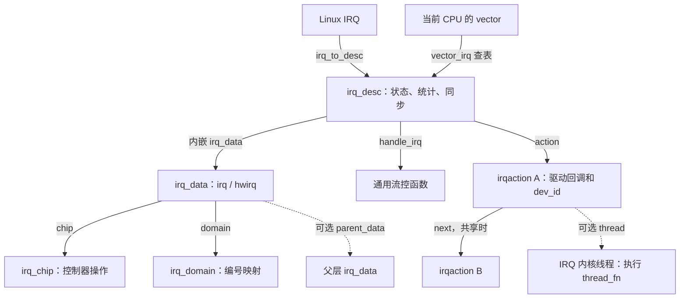

# 中断子系统概述：从设备发出通知到驱动完成处理

网卡收到数据包时，CPU 可能正在运行用户程序，也可能正在执行与网络无关的内核代码。设备需要一种办法告诉 CPU：“这里有事情要处理。”中断提供了这样的通知机制，而 Linux 中断子系统需要继续回答三个问题：**这是谁发来的通知，应该调用谁处理，哪些工作必须立即完成。**

本章以一次普通设备中断为主线，把硬件入口、编号映射、驱动注册和延后处理连接起来。依据仓库 [Linux 顶层 Makefile](../../linux/Makefile#L2) 标记的 **6.18.52** 版本，仅使用本地源码。硬件入口采用 **x86-64 的 IDT 路径**，设备采用 **e1000e 驱动管理的网卡**。主线选择 MSI 已成功启用、未启用中断重映射的原生 APIC 路径，并假定未启用 `CONFIG_PREEMPT_RT`、未强制线程化；FRED 入口、虚拟化以及完整的错误处理暂不展开。

e1000e 同时支持 MSI、MSI-X 和传统 INTx，后文会标明采用哪一条分支。驱动内部许多函数仍以 `e1000_` 开头，本章引用的这些函数都来自 [`e1000e/netdev.c`](../../linux/drivers/net/ethernet/intel/e1000e/netdev.c#L1)。

建议先读第 1～5 节，弄清“一次通知如何找到驱动”；再读第 6～7 节，理解处理时机、并发和资源释放。读完后，应能解释：为什么 x86 vector 与驱动使用的 Linux IRQ 不能混用，为什么内核需要多层处理函数，以及为什么把工作推迟执行并不一定意味着可以睡眠。

## 1. 中断首先是一条通知路径

### 1.1 CPU 接到通知后，还需要知道发生了什么

以网卡接收为例，可以先建立下面的认识：

```text
网卡把接收数据放入内存缓冲区，并产生接收通知
    ↓
网卡发出 MSI 消息，送达目标 CPU 的 Local APIC
    ↓
CPU 根据 vector 进入 IDT 指定的入口，内核保存执行状态
    ↓
内核识别中断来源，调用相应驱动
    ↓
e1000e 读取设备状态，安排后续 NAPI 轮询
    ↓
内核完成中断退出，继续后续执行
```

中断通知与设备数据是两回事。**Local APIC** 是 CPU 本地的高级可编程中断控制器；它帮助 CPU 接收中断，但不会把数据包作为函数参数交给驱动。e1000e 的 [`e1000_intr_msi()`](../../linux/drivers/net/ethernet/intel/e1000e/netdev.c#L1750)读取中断原因寄存器 ICR，处理必要状态，再安排 NAPI。真正检查接收描述符并取得数据的是后续接收处理，例如 [`e1000_clean_rx_irq()` 的描述符循环](../../linux/drivers/net/ethernet/intel/e1000e/netdev.c#L929)。

因此，不能假设一次中断恰好对应一个数据包。一次通知可以引出对接收队列的一批处理；第 6 节会沿着 NAPI 继续跟踪这批工作。IDT（Interrupt Descriptor Table，中断描述符表）和 vector 的对应关系则在第 2、5 节展开。

### 1.2 先限定本章所说的“中断”

设备 IRQ 是相对于当前指令执行的异步通知。与它相邻的几个概念，需要先分开：

| 概念 | 先怎样理解 | 本章如何处理 |
| --- | --- | --- |
| 普通硬件 IRQ | CPU 接收的可屏蔽中断请求，设备中断是其中一类 | 本章主线 |
| 同步异常 | 与当前指令执行相关，例如访问内存发生异常 | 有自己的异常分派路径，不沿用本章的普通设备调用链 |
| NMI | 有特殊屏蔽规则和执行约束的中断 | 需要单独分析其入口、上下文和处理函数 |
| Linux softirq | 内核用软件标记待处理工作、在指定时机执行的机制 | 第 6 节介绍；它不是 CPU 的同步异常或软件陷入指令 |

这些区别可以直接在源码中看到：x86 的 [IDT 异常入口表](../../linux/arch/x86/kernel/idt.c#L85)为除法错误、无效指令、NMI 等设置专门入口，普通设备中断则通过 [`idt_setup_apic_and_irq_gates()`](../../linux/arch/x86/kernel/idt.c#L284)安装对应的中断门。softirq 从[设置软件 pending 位](../../linux/kernel/softirq.c#L786)开始，并不通过 IDT 发出请求。

硬件中断的来源也不限于外设。Local APIC 定时器通过 [`sysvec_apic_timer_interrupt`](../../linux/arch/x86/kernel/apic/apic.c#L1052)提供时钟事件；CPU 之间还可以发送 **IPI（Inter-Processor Interrupt，处理器间中断）**，请求目标 CPU 处理调度通知、跨 CPU 函数调用等工作，见 [`sysvec_reschedule_ipi` 与 `sysvec_call_function`](../../linux/arch/x86/kernel/smp.c#L248)。IPI 即使由软件发起，也仍通过中断硬件递送，与 Linux softirq 是不同机制。这些系统向量有专门入口，后文只跟踪普通设备 IRQ。

另外，“进入中断”不等于“调度一个中断进程”。普通硬中断首先打断当前执行，直接进入内核的中断路径；后面介绍的线程化 IRQ 则会把相应工作交给可调度的线程。

## 2. 一个中断为什么会有不同的编号

### 2.1 硬件编号与 Linux IRQ 号回答不同的问题

设备怎样向 CPU 递送请求，是硬件组织问题；Linux 用哪个编号管理它，是软件管理问题。源码中最先要分清的是：

| 名称 | 含义 | 使用位置 |
| --- | --- | --- |
| `hwirq` | 某个中断域内的中断标识，含义由该域规定 | 中断域及控制器层管理来源与资源 |
| Linux IRQ，常写作 `irq` 或 `virq` | 内核管理中断描述符所用的逻辑编号 | `request_irq()`、`free_irq()`、`irq_to_desc()` 等接口 |
| x86 vector | CPU 用于选择中断入口的向量号 | IDT，以及当前 CPU 的 `vector_irq` 表 |

[`struct irq_data`](../../linux/include/linux/irq.h#L163)同时保存 `irq`、`hwirq` 和 `domain`。其中 `hwirq` 的注释明确指出，它只在所属中断域内有意义。代码中的 `virq` 通常就是 Linux IRQ 号，并不特指虚拟机中断。

尤其不要根据 `hwirq` 的名字，就认为它一定等于芯片引脚号或 CPU vector。x86 的 [`x86_vector_alloc_irqs()`](../../linux/arch/x86/kernel/apic/vector.c#L578)在 vector 域内将 `irqd->hwirq` 设置为 Linux IRQ 号，而实际 CPU vector 单独保存在 APIC 的私有配置中，见 [`apic_update_irq_cfg()`](../../linux/arch/x86/kernel/apic/vector.c#L128)。理解一个编号，必须同时知道它属于哪一层。

### 2.2 `irq_domain` 把硬件编号接到内核对象上

**中断域 `irq_domain` 管理某个编号空间及其映射，并提供中断资源的分配、激活等操作。** 它记录域操作、父域，以及从域内编号反查中断数据的结构，见 [`struct irq_domain`](../../linux/include/linux/irqdomain.h#L110)。

可以从两个时刻理解它的作用：

1. **准备中断时建立管理关系。** PCI MSI 域与 x86 vector 域分配、激活所需资源，将 Linux IRQ、控制器操作和目标 CPU/vector 配置连接起来。x86 MSI 的域初始化见 [`x86_init_dev_msi_info()`](../../linux/arch/x86/kernel/apic/msi.c#L205)，vector 域操作见 [`x86_vector_domain_ops`](../../linux/arch/x86/kernel/apic/vector.c#L706)。
2. **中断到达时使用已经建立的关系。** x86 普通设备入口根据当前 CPU 和 vector 直接查找描述符，见 [`call_irq_handler()`](../../linux/arch/x86/kernel/irq.c#L273)。

这条 x86 分派路径不需要每次中断都遍历 domain 层次。配置建立时，[`chip_data_update()`](../../linux/arch/x86/kernel/apic/vector.c#L187)已经把描述符放入 `per_cpu(vector_irq, cpu)[vector]`，到达路径据此查表即可。域在资源管理中的作用，与中断入口采用哪一种快速查找方式，需要分别理解。

复杂硬件还可能有多层中断域。此时，一个 Linux IRQ 可以对应沿 `parent_data` 连接的多层 `irq_data`，各层有自己的域、`hwirq` 和控制器操作。最外层 `irq_data` 嵌入 `irq_desc`，父层数据按域层次建立，见 [`irq_domain_alloc_irq_data()`](../../linux/kernel/irq/irqdomain.c#L1436)。第一遍阅读只需记住：**域的层次描述同一个中断经过的管理层次，不代表注册了多份设备处理函数。**

### 2.3 x86 vector 与 MSI 消息怎样连接

例如，一个网卡 IRQ 可以被配置为送到 CPU 2 的 vector `0x51`，而 Linux IRQ 号是 40：

```text
设备的 MSI 地址和数据：描述目标与中断消息
    ↓
CPU 2 接收 vector 0x51，进入 IDT 对应入口
    ↓
CPU 2 的 vector_irq[0x51] → irq_desc → Linux IRQ 40
```

数字仅用于示意，不是本机测量值。`vector_irq` 是 per-CPU 表，因此查找条件包含 CPU；同一个 vector 数值在不同 CPU 上可以对应不同的设备 IRQ。配置变化时，目标 CPU 或 vector 也可能改变，相关维护见 [`chip_data_update()`](../../linux/arch/x86/kernel/apic/vector.c#L150)。

MSI（Message Signaled Interrupt，消息信号中断）及其扩展 MSI-X 通过设备向配置的地址写入消息数据发出请求。内核用 [`struct msi_msg`](../../linux/include/linux/msi.h#L51)描述地址和数据，由 [x86 vector 域的消息构造回调](../../linux/arch/x86/kernel/apic/vector.c#L1026)结合路由配置生成消息，再通过 [`pci_write_msg_msi()`](../../linux/drivers/pci/msi/msi.c#L187)等函数写入设备的 MSI 配置。这里的消息用于通知，数据包仍在接收缓冲区中。

PCI API 中的“vector”还可能表示设备内中断索引。例如 [`pci_irq_vector(dev, nr)`](../../linux/drivers/pci/msi/api.c#L299)把设备内索引转换为 Linux IRQ。e1000e 本版本使用的旧式 MSI-X API 则把 Linux IRQ 填入 `msix_entries[i].vector`；该字段也不是 CPU 的 IDT vector。驱动随后将它传给 [`e1000_request_msix()` 中的 `request_irq()`](../../linux/drivers/net/ethernet/intel/e1000e/netdev.c#L2100)。

传统 INTx 使用另一条硬件递送路径，通常经 I/O APIC 路由到 CPU；MSI/MSI-X 不要求每个中断都对应一根独立物理线。后文的“IRQ 线”应结合具体模式理解，有时指一个逻辑中断源。

## 3. 内核怎样组织一个 IRQ 的处理信息

### 3.1 先认识五个对象各自负责什么

有了 Linux IRQ，内核还需要保存控制器操作、处理状态和驱动回调。第一遍阅读可以只抓住以下结构：

| 对象 | 回答的问题 | 首先关注的成员 |
| --- | --- | --- |
| [`irq_desc`](../../linux/include/linux/irqdesc.h#L67) | 这个 Linux IRQ 当前怎样处理、有哪些使用者？ | `irq_data`、`handle_irq`、`action`、`lock`、`depth`、`kstat_irqs` |
| [`irq_data`](../../linux/include/linux/irq.h#L177) | 这一层硬件怎样识别和操作该中断？ | `irq`、`hwirq`、`chip`、`domain`、`parent_data` |
| [`irq_chip`](../../linux/include/linux/irq.h#L492) | 怎样屏蔽、确认、结束或配置中断？ | `irq_mask`、`irq_unmask`、`irq_ack`、`irq_eoi`、`irq_set_type` |
| [`irqaction`](../../linux/include/linux/interrupt.h#L122) | 某个使用者注册了什么处理函数？ | `handler`、`dev_id`、`next`、`thread_fn`、`thread`、`flags` |
| [`irq_domain`](../../linux/include/linux/irqdomain.h#L147) | 这个硬件编号属于哪里，怎样查找映射？ | `ops`、`parent`、`revmap`、`revmap_tree` |

`irq_desc` 是一次普通设备 IRQ 分派的中心对象；驱动的每次注册则形成一个 `irqaction`。它们不能合并，因为多个使用者可能共享同一个 IRQ。



图中的箭头主要表示成员关系，`irq_to_desc` 与 `vector_irq` 表示两种查找描述符的方式；它不是完整调用顺序。

### 3.2 三层“处理函数”分别解决什么问题

中断代码里有很多叫 handler 的函数。按职责拆开，就容易理解：

- **流控函数 `desc->handle_irq`**：决定一次中断处理的顺序，例如先屏蔽并确认，再调用驱动，最后恢复；也负责协调通用状态。
- **控制器操作 `desc->irq_data.chip->irq_*`**：实现某个具体硬件动作，例如写寄存器屏蔽中断或发出 EOI。
- **驱动回调 `action->handler`**：判断设备发生了什么，处理设备自己的状态和数据。

这里的流控是“中断处理流程控制”，不是网络里的流量控制。通用入口 [`generic_handle_irq_desc()`](../../linux/include/linux/irqdesc.h#L171)只有一个核心动作：

```c
desc->handle_irq(desc);
```

它不会直接调用驱动。流控函数通常进一步调用 `handle_irq_event()`，后者最终遍历 `irqaction` 链，执行：

```c
/* 摘自 __handle_irq_event_percpu() 的普通分支。 */
res = action->handler(irq, action->dev_id);
```

源码见 [`handle_irq_event()`](../../linux/kernel/irq/handle.c#L249)和 [`__handle_irq_event_percpu()`](../../linux/kernel/irq/handle.c#L177)。把这两处连起来，就能理解 Linux 为什么既能复用通用流程，又能适配不同控制器和不同设备。

## 4. 中断到来之前：建立映射并注册驱动

### 4.1 取得 IRQ 与注册回调是不同步骤

e1000e 首先通过 [`e1000e_set_interrupt_capability()`](../../linux/drivers/net/ethernet/intel/e1000e/netdev.c#L2044)选择并启用中断模式：按配置和能力尝试 MSI-X 或 MSI，必要时回退到传统 INTx。这个版本调用 `pci_enable_msix_range()` 和 `pci_enable_msi()`；虽然 PCI 核心也提供 [`pci_alloc_irq_vectors()`](../../linux/drivers/pci/msi/api.c#L204)，阅读本驱动时应沿它实际使用的接口继续追踪。

在 MSI 分支，PCI 核心将分配得到的 Linux IRQ 写入 [`pdev->irq`](../../linux/drivers/pci/msi/msi.c#L365)；MSI-X 分支则使用前面提到的 `msix_entries[i].vector`。这些 IRQ 随后才由设备驱动用于注册回调。

到了 `request_irq()`，相应的描述符应已经存在。可以直接验证：[`request_threaded_irq()`](../../linux/kernel/irq/manage.c#L2106)首先调用 `irq_to_desc(irq)`，找不到描述符便返回错误。

对于本章的 x86 MSI 路径，[`x86_init_dev_msi_info()`](../../linux/arch/x86/kernel/apic/msi.c#L248)指定 `handle_edge_irq`，并让 MSI 层的 `irq_ack` 转交父层；通用 MSI 初始化再通过 [`msi_domain_ops_init()`](../../linux/kernel/irq/msi.c#L809)将控制器信息和流控函数接到 IRQ 上。具体 CPU vector 的分配或预留、激活由 vector 域继续管理，不能把它们都理解为 `request_irq()` 中的一次函数指针赋值。

因此可以按两个阶段阅读准备过程：

```text
PCI / MSI / vector 域：准备 Linux IRQ、irq_data、流控与路由资源
e1000e：准备队列和回调所需状态，注册 irqaction，启用 NAPI 和设备中断
```

### 4.2 `request_irq()` 把驱动接到 action 链上

本版本的 [`request_irq()`](../../linux/include/linux/interrupt.h#L168)是 `request_threaded_irq()` 的封装，它传入空的 `thread_fn`，并加入 `IRQF_COND_ONESHOT`。在本章默认的非强制线程化路径中，驱动回调直接运行于硬中断上下文。

[`request_threaded_irq()`](../../linux/kernel/irq/manage.c#L2076)的主要工作可以概括为：找到描述符，分配 `irqaction`，保存回调与参数，再调用 [`__setup_irq()`](../../linux/kernel/irq/manage.c#L1446)完成共享条件检查、必要的线程准备、IRQ 激活与启动，并把 action 接入链表。

不要据此把注册看成被动地存下一个函数指针。源码的[接口说明](../../linux/kernel/irq/manage.c#L2049)明确要求驱动考虑注册过程中处理函数就可能执行的情况。回调使用的数据必须提前准备好，设备初始化、清理旧状态和开启设备中断的顺序也必须配合。设置 `IRQF_NO_AUTOEN` 等情况有专门的启动规则，见 [`__setup_irq()` 的启动分支](../../linux/kernel/irq/manage.c#L1721)。

e1000e 的打开过程提供了具体例子：[`e1000e_open()`](../../linux/drivers/net/ethernet/intel/e1000e/netdev.c#L4670)先执行 `e1000_configure()`，准备包括接收处理入口在内的状态，再调用 `e1000_request_irq()`；后面才[启用 NAPI 并开启网卡中断](../../linux/drivers/net/ethernet/intel/e1000e/netdev.c#L4693)。代码注释明确解释了为什么注册前就必须准备好处理函数需要的数据。

### 4.3 用 e1000e 看懂注册参数和共享 IRQ

[`e1000_request_irq()`](../../linux/drivers/net/ethernet/intel/e1000e/netdev.c#L2154)在 MSI 分支包含以下注册：

```c
err = request_irq(adapter->pdev->irq, e1000_intr_msi, 0,
                  netdev->name, netdev);
```

其中，`adapter->pdev->irq` 是 Linux IRQ；`e1000_intr_msi` 是主处理函数；`netdev->name` 是登记名称；`netdev` 作为 `dev_id`，以后会原样传回回调。驱动再用 `netdev_priv(netdev)` 取得 `adapter`。这里没有设置 `IRQF_SHARED`。

不同模式的注册关系如下：

| 模式 | 驱动使用的 Linux IRQ | 注册的主处理函数 |
| --- | --- | --- |
| MSI，本章主线 | `pdev->irq` | `e1000_intr_msi`，不设置共享标志 |
| MSI-X | `msix_entries[i].vector` | 接收 `e1000_intr_msix_rx`、发送 `e1000_intr_msix_tx`、其他原因 `e1000_msix_other` |
| 传统 INTx | `pdev->irq` | `e1000_intr`，设置 `IRQF_SHARED` |

MSI-X 的三个注册点见 [`e1000_request_msix()`](../../linux/drivers/net/ethernet/intel/e1000e/netdev.c#L2100)。传统 INTx 分支则明确调用：

```c
err = request_irq(adapter->pdev->irq, e1000_intr, IRQF_SHARED,
                  netdev->name, netdev);
```

源码见 [INTx 注册点](../../linux/drivers/net/ethernet/intel/e1000e/netdev.c#L2179)。共享 IRQ 下，内核知道哪条 IRQ 到来了，但不能仅凭这个编号判断具体由哪个设备发出。通用层会遍历 action 链，由各驱动检查自己的状态。e1000e 的 [`e1000_intr()`](../../linux/drivers/net/ethernet/intel/e1000e/netdev.c#L1816)检查 ICR 和 `E1000_ICR_INT_ASSERTED`，判定不是自己的中断时返回 `IRQ_NONE`；正常安排处理后返回 `IRQ_HANDLED`。第三种通用返回值用于线程化处理：

| 返回值 | 回调表达的意思 | 通用层的用途 |
| --- | --- | --- |
| `IRQ_NONE` | 本设备没有处理此次中断 | 汇总是否存在未处理的中断 |
| `IRQ_HANDLED` | 本设备已经处理了此次中断 | 记录处理结果 |
| `IRQ_WAKE_THREAD` | 需要唤醒本 action 的 IRQ 线程 | 唤醒后执行 `thread_fn` |

定义见 [`enum irqreturn`](../../linux/include/linux/irqreturn.h#L5)，遍历和唤醒逻辑见 [`__handle_irq_event_percpu()`](../../linux/kernel/irq/handle.c#L185)。其中某个 action 返回已处理，并不会让这个遍历立即停止。

共享者还必须满足触发类型等兼容条件，并以非空、可区分的 `dev_id` 标识自己的注册。内核会在[注册入口](../../linux/kernel/irq/manage.c#L2087)和 [`__setup_irq()`](../../linux/kernel/irq/manage.c#L1556)中检查这些条件；释放时也依靠 `dev_id` 找到对应 action。

## 5. 跟踪一次普通设备中断

### 5.1 从 x86-64 IDT 入口走到 e1000e

现在假设：e1000e 的 MSI IRQ 已经完成注册，CPU/vector 路由配置有效，网卡向目标 CPU 发出接收通知。选择本章开头限定的原生 x86-64 IDT 路径，主要执行关系如下：

```text
CPU 接收 vector，进入 IDT 指定的设备中断入口
  → irq_entries_start 中的对应入口桩：压入 vector
    → asm_common_interrupt
      → error_entry()                       保存寄存器等入口状态
      → common_interrupt(regs, error_code)   C 入口包装，取出 vector
        → irqentry_enter(regs)
        → run_irq_on_irqstack_cond(__common_interrupt, regs, vector)
          → irq_enter_rcu()                 进入硬中断上下文并记账
          → __common_interrupt(regs, vector)
            → call_irq_handler(vector, regs)
              → 当前 CPU 的 vector_irq[vector] 查得 irq_desc
              → handle_irq(desc, regs)
                → generic_handle_irq_desc(desc)
                  → desc->handle_irq(desc)
                    = handle_edge_irq(desc)
                      → chip->irq_ack()     经父层完成 APIC ACK/EOI
                      → handle_irq_event()
                        → handle_irq_event_percpu()
                          → __handle_irq_event_percpu()
                            → action->handler(irq, dev_id)
                              = e1000_intr_msi(irq, netdev)
          → irq_exit_rcu()                  必要时执行待处理 softirq
        → irqentry_exit(regs, state)        返回前的上下文与调度处理
      → error_return 等汇编返回路径
```

这张图省略了异常分支和部分中间细节。`common_interrupt` 与 `__common_interrupt` 的区别来自宏展开：[`DEFINE_IDTENTRY_IRQ`](../../linux/arch/x86/include/asm/idtentry.h#L206)生成外层 C 包装函数，并把 [`irq.c` 中定义的函数体](../../linux/arch/x86/kernel/irq.c#L318)放到 `__common_interrupt` 中。普通 IRQ 没有这里所说的异常错误码，入口借用 `error_code` 参数位置传递 vector。

核对这条链时，按三个衔接点阅读即可：

1. **vector 到汇编入口。** [`idt_setup_apic_and_irq_gates()`](../../linux/arch/x86/kernel/idt.c#L284)安装中断门；[`irq_entries_start`](../../linux/arch/x86/include/asm/idtentry.h#L546)中每个入口桩压入自己的 vector，再跳到公共汇编入口。
2. **汇编到 C，并建立硬中断上下文。** [`idtentry_body`](../../linux/arch/x86/entry/entry_64.S#L289)组织寄存器与 C 调用；[`error_entry`](../../linux/arch/x86/entry/entry_64.S#L1006)保存通用寄存器。C 包装通过 [`run_irq_on_irqstack_cond`](../../linux/arch/x86/include/asm/irq_stack.h#L189)及其底层宏在必要时切换栈，并围绕实际处理函数调用 `irq_enter_rcu()` 和 `irq_exit_rcu()`。
3. **x86 分派到通用 IRQ。** [`call_irq_handler()`](../../linux/arch/x86/kernel/irq.c#L273)查 `vector_irq`，随后 [`handle_irq()`](../../linux/arch/x86/kernel/irq.c#L250)在 64 位分支调用通用流控入口。驱动最终收到的是描述符中的 Linux IRQ 号和注册时的 `netdev` 指针。

从用户态或内核态被打断都会汇入这条普通设备处理路径，但栈、上下文恢复以及返回前的工作有所不同，见 [`irqentry_enter()`](../../linux/kernel/entry/common.c#L78)与 [`irqentry_exit()`](../../linux/kernel/entry/common.c#L185)。因此，中断入口还要处理执行环境，不能仅理解为查表后调用一次驱动函数。

### 5.2 触发方式为什么会影响处理顺序

硬件触发方式决定控制器如何观察一个请求：

- **电平触发**：信号保持有效电平时，请求条件仍然成立。驱动需要处理设备状态，使请求能够撤销。
- **边沿触发**：信号发生指定跳变时产生请求。控制器如何锁存请求，以及处理中再次到来的事件如何保留，都会影响处理流程。

通用层提供了不同的流控函数。先看普通、启用且存在 action 的处理分支：

| 流控函数 | 主要顺序 | 为什么需要这样处理 |
| --- | --- | --- |
| [`handle_level_irq()`](../../linux/kernel/irq/chip.c#L676) | `mask_ack_irq()` → action → 按条件 `unmask_irq()` | 处理设备状态期间先控制该 IRQ 的递送，结束后再恢复 |
| [`handle_edge_irq()`](../../linux/kernel/irq/chip.c#L809) | ACK → action；结合 `IRQS_PENDING` 等状态循环处理 | 协调处理中再次到来的请求，必要时屏蔽、恢复并重试 |
| [`handle_fasteoi_irq()`](../../linux/kernel/irq/chip.c#L727) | action → EOI；oneshot 等情况还涉及屏蔽和恢复 | 配合由硬件承担部分流控工作的控制器 |

流控函数还取决于控制器协议。x86 I/O APIC 的 [`mp_register_handler()`](../../linux/arch/x86/kernel/apic/io_apic.c#L845)就为电平触发选择 `handle_fasteoi_irq()`，为边沿触发选择 `handle_edge_irq()`。本章的 MSI 消息路径也使用 `handle_edge_irq()`，这不表示设备必须通过某根引脚产生电平跳变。

还要区分几个硬件动作：**mask/unmask 控制中断递送；ACK 确认或应答控制器中的请求；EOI（End Of Interrupt）通知控制器完成相应的中断服务阶段。** 它们的具体寄存器语义由 `irq_chip` 实现，回调名与硬件动作并非严格一一对应。

本章 MSI 路径就是一个例子：MSI 层的 [`irq_chip_ack_parent()`](../../linux/kernel/irq/chip.c#L1333)把 ACK 交给父层，最终进入 [`apic_ack_edge()` → `apic_ack_irq()` → `apic_eoi()`](../../linux/arch/x86/kernel/apic/vector.c#L1014)。这个 EOI 发生在 `handle_edge_irq()` 调用设备回调之前，不能把所有中断都画成“驱动返回以后才 EOI”。

Local APIC 收到 EOI，表示控制器完成相应阶段；网卡 ICR 的读取、设备中断的屏蔽与恢复、接收描述符的回收仍由 e1000e 负责。**向 APIC 发出 EOI，不代表数据包已经处理完成。** 第 6 节的 NAPI 轮询甚至可能还没有开始。

### 5.3 硬中断上下文限制了可以做的事

普通硬中断处理发生在被打断的执行之上，没有为每次通知单独创建一个可睡眠任务。内核通过硬中断上下文计数、记账和相关入口规则跟踪这一状态，见 [`irq_enter_rcu()`](../../linux/kernel/softirq.c#L662)和 [`in_hardirq()` 等上下文判断](../../linux/include/linux/preempt.h#L118)。

因此，硬中断回调不能主动睡眠，不能等待 mutex，也不能使用可能通过睡眠完成的普通阻塞操作。`current` 虽然仍然有值，但通常只是被打断的任务，不能据此认为正在以该任务的普通进程上下文执行。

在本章采用的通用路径中，驱动的主处理函数还要求保持本地 IRQ 关闭；[`__handle_irq_event_percpu()`](../../linux/kernel/irq/handle.c#L208)会检查回调是否错误地打开了中断。硬中断部分应尽快完成来源判断、必要的设备操作和后续工作的安排，避免长时间延迟其他执行。

## 6. 处理不完的工作放到哪里

“上半部、下半部”适合表达职责划分：及时响应中断，把较长的工作延后。但在源码里，延后处理有多种实现，运行约束也不同。不能仅凭“下半部”三个字判断是否可以睡眠。

### 6.1 线程化 IRQ：为设备处理函数提供任务上下文

`request_threaded_irq()` 可以同时注册主处理函数 `handler` 和线程函数 `thread_fn`。普通显式线程化路径的关系是：

```text
硬中断上下文：handler() 检查来源、完成必要的设备操作
    ↓ 返回 IRQ_WAKE_THREAD
通用层：__irq_wake_thread() 唤醒该 action 的线程
    ↓ 线程获得调度
任务上下文：irq_thread() → irq_thread_fn() → action->thread_fn()
```

线程由 [`setup_irq_thread()`](../../linux/kernel/irq/manage.c#L1397)创建，通常命名为 `irq/<IRQ号>-<名称>`。唤醒见 [`__irq_wake_thread()`](../../linux/kernel/irq/handle.c#L134)，执行入口见 [`irq_thread()`](../../linux/kernel/irq/manage.c#L1242)和 [`irq_thread_fn()`](../../linux/kernel/irq/manage.c#L1134)。显式注册的线程函数可以在允许睡眠的条件下访问慢速总线或等待资源；如果它自己持有自旋锁等原子上下文约束，仍然不能睡眠。

线程函数不是 softirq。它有自己的 `task_struct`，由调度器安排执行；`IRQ_WAKE_THREAD` 也不是直接在当前硬中断调用栈中执行 `thread_fn`。

`IRQF_ONESHOT` 用来协调硬中断阶段与线程阶段：相关线程尚未完成时保持必要的 IRQ 屏蔽，满足条件后再恢复。它不表示这个 IRQ 在整个生命周期只触发一次。共享 oneshot IRQ 还需要等待相关 action 的线程都完成，源码通过 `threads_oneshot` 协调，见 [`irq_finalize_oneshot()`](../../linux/kernel/irq/manage.c#L1080)。

如果 `handler == NULL`、`thread_fn != NULL`，内核会安装一个只返回 `IRQ_WAKE_THREAD` 的[默认主处理函数](../../linux/kernel/irq/manage.c#L981)。这种形式通常配合 `IRQF_ONESHOT`；没有 oneshot 且控制器未声明相应安全能力时，[注册会被拒绝](../../linux/kernel/irq/manage.c#L1650)。需要在硬中断阶段判断共享来源的设备，应提供自己的主处理函数。

### 6.2 softirq：按类型记录待处理工作

softirq 用固定的类型编号组织回调，例如 `NET_RX_SOFTIRQ`、`NET_TX_SOFTIRQ`、`TIMER_SOFTIRQ`。类型定义见 [`interrupt.h`](../../linux/include/linux/interrupt.h#L548)，回调保存在 [`softirq_vec`](../../linux/kernel/softirq.c#L60) 中。

其工作过程分为三步：

1. **注册某一类处理入口。** `open_softirq(nr, action)` 将回调放入对应表项。
2. **标记当前 CPU 有待处理工作。** `__raise_softirq_irqoff(nr)` 在 pending 位图中设置对应位。
3. **在合适的时机取出 pending 位，调用这一类的回调。** `handle_softirqs()` 逐项执行 `h->action()`。

前两步见 [`open_softirq()` 与 pending 设置](../../linux/kernel/softirq.c#L786)，执行循环见 [`handle_softirqs()`](../../linux/kernel/softirq.c#L579)。pending 位只表示“这一类工作需要处理”，并不保存每一个设备事件；具体待处理对象通常由对应子系统的队列保存。

普通硬中断退出时，[`__irq_exit_rcu()`](../../linux/kernel/softirq.c#L713)会先减少硬中断上下文计数，再检查是否满足执行 softirq 的条件。在本章默认配置下，有待处理工作且上下文允许时，可以在退出路径中执行 softirq。因此，软中断并不一定要等到某个内核线程被调度后才开始。

如果仍有工作，内核也不能无限重启这个处理循环。本版本用 `MAX_SOFTIRQ_TIME` 和 `MAX_SOFTIRQ_RESTART` 等条件限制继续处理，条件不满足时唤醒 `ksoftirqd`，见[时间与重启次数定义](../../linux/kernel/softirq.c#L543)和[循环尾部](../../linux/kernel/softirq.c#L639)。这里的约 2 ms 是基于 jiffies 的继续处理判断，**不是对单个回调的强制执行时限**；回调本身仍需约束工作量。

[`run_ksoftirqd()`](../../linux/kernel/softirq.c#L1055)继续调用同一个 softirq 处理框架。在本章的非 RT 配置下，softirq 回调仍处在不可睡眠的执行约束中，即使由 `ksoftirqd` 承载也不能任意阻塞。这个区别可以从 [`softirq_handle_begin()`](../../linux/kernel/softirq.c#L461)与 `handle_softirqs()` 的调用关系看出。

此外，softirq 执行回调前通常会[重新开启本地硬中断](../../linux/kernel/softirq.c#L602)，所以硬中断可以打断它；同一种 softirq 也可能在不同 CPU 上并行执行，跨 CPU 的共享数据必须由子系统自己保护，见 [`softirq.c` 的并发说明](../../linux/kernel/softirq.c#L37)。

### 6.3 沿 e1000e 的 NAPI 路径继续处理数据包

回到第 5 节：`e1000_intr_msi()` 并没有在硬中断中逐个取出全部数据包。它读取 ICR，利用设备已配置的自动屏蔽机制控制后续通知，然后在 `napi_schedule_prep()` 成功时安排 NAPI。ICR 与自动屏蔽的关系见 [MSI 处理函数](../../linux/drivers/net/ethernet/intel/e1000e/netdev.c#L1750)，IAME/IAM 的配置见 [`e1000_configure_rx()`](../../linux/drivers/net/ethernet/intel/e1000e/netdev.c#L3234)。

NAPI 可以先理解为网络子系统安排队列轮询的机制。e1000e 在初始化时通过 [`netif_napi_add()`](../../linux/drivers/net/ethernet/intel/e1000e/netdev.c#L7465)将 `adapter->napi` 与 `e1000e_poll()` 关联。选择普通、未启用线程化 NAPI 的路径，可以把后续工作接成：

```text
硬中断阶段：e1000_intr_msi()
  → napi_schedule_prep(&adapter->napi)
  → __napi_schedule(&adapter->napi)
    → ____napi_schedule()
      → 加入当前 CPU 的 softnet_data.poll_list
      → 标记 NET_RX_SOFTIRQ

软中断阶段：net_rx_action()
  → napi_poll()
    → __napi_poll()
      → n->poll(n, weight)
        = e1000e_poll(napi, budget)
          → 按需回收发送完成项
          → adapter->clean_rx()           按预算处理接收描述符
          → 还有工作时保留轮询状态
          → 完成时调用 napi_complete_done()
            → 满足条件且设备未关闭时，恢复网卡中断
```

队列与 softirq 的连接见 [`____napi_schedule()`](../../linux/net/core/dev.c#L4892)；网络子系统[注册](../../linux/net/core/dev.c#L13231)并在 [`net_rx_action()`](../../linux/net/core/dev.c#L7800)中执行接收 softirq，随后由 [`__napi_poll()`](../../linux/net/core/dev.c#L7635)调用驱动的 `poll` 回调。

[`e1000e_poll()`](../../linux/drivers/net/ethernet/intel/e1000e/netdev.c#L2658)同时协调发送完成项和接收处理。接收部分通过 `adapter->clean_rx` 调用具体实现，选择逻辑见 [`e1000_configure_rx()`](../../linux/drivers/net/ethernet/intel/e1000e/netdev.c#L3190)。若本轮预算用尽，或仍需继续回收发送完成项，就返回预算值，让框架继续安排轮询；完成轮询且 `napi_complete_done()` 允许时，驱动才恢复相应设备中断。

这形成了一个完整过程：**中断通知有工作 → 转为按预算轮询 → 条件满足后恢复中断通知。** 硬中断次数、NAPI 轮询次数和接收包数因此不必相等。源码还包含线程化 NAPI 和 busy polling 等分支，本节采用的是 softirq 承载的普通接收路径。

### 6.4 与 tasklet、workqueue 放在一起比较

| 机制 | 普通执行位置 | 回调可否睡眠 | 第一遍阅读时记住什么 |
| --- | --- | --- | --- |
| 普通 IRQ 主处理函数 | 硬中断上下文 | 不可 | 及时响应，处理必要的设备状态 |
| 显式注册的 IRQ `thread_fn` | IRQ 内核线程 | 条件允许时可 | 与该 IRQ action 的唤醒和 oneshot 状态协作 |
| softirq | 中断退出等路径，或 `ksoftirqd` | 不可 | 固定类型、CPU 本地 pending、可跨 CPU 并行 |
| tasklet | softirq 框架 | 不可 | 同一个 tasklet 不会同时在多个 CPU 执行，不同 tasklet 可以并行 |
| 普通 workqueue，未设置 `WQ_BH` | worker 线程 | 条件允许时可 | 将普通工作项交给工作线程执行 |
| 设置 `WQ_BH` 的 workqueue | softirq 上下文 | 不可 | 使用 workqueue 接口，但保留下半部上下文约束 |

tasklet 的执行与串行化规则见 [`interrupt.h`](../../linux/include/linux/interrupt.h#L665)；本地源码已明确将其 API 标记为 deprecated，并建议考虑线程化 IRQ。普通 workqueue 可从 [`worker_thread()`](../../linux/kernel/workqueue.c#L3403)和[工作项回调调用点](../../linux/kernel/workqueue.c#L3292)继续阅读。`WQ_BH` 的语义则直接写在[标志定义](../../linux/include/linux/workqueue.h#L371)中，所以“所有 workqueue 回调都能睡眠”并不成立。

本节的默认配置边界也很重要：`CONFIG_PREEMPT_RT` 会使 [`force_irqthreads()`](../../linux/include/linux/interrupt.h#L509)成立，通用层通过 [`irq_setup_forced_threading()`](../../linux/kernel/irq/manage.c#L1307)改造符合条件的处理函数，但 `IRQF_NO_THREAD`、per-CPU 等情形有例外。阅读 RT 或强制线程化路径时，需要重新核对执行上下文，不能直接套用本章主线。

## 7. 并发、关闭和观测：把中断放回整个系统

### 7.1 “关中断”必须说清楚关在哪里

几个看起来相似的接口，作用范围差别很大：

| 操作 | 作用范围 | 是否等待正在执行的 IRQ 处理 |
| --- | --- | --- |
| `local_irq_disable()` / `local_irq_save()` | 当前 CPU 的普通硬中断接收状态 | 不等待其他 CPU |
| `local_bh_disable()` | 在本章非 RT 配置下，禁止当前 CPU 执行 softirq | 不等待，也不持续屏蔽硬中断 |
| `disable_irq_nosync(irq)` | 指定 Linux IRQ 的通用禁用状态 | 不等待 |
| `disable_irq(irq)` | 指定 Linux IRQ，并同步已有处理 | 等待硬中断及相关 IRQ 线程处理完成 |
| `synchronize_irq(irq)` | 同步该 IRQ 已有的处理 | 等待，但自身不建立持续禁用状态 |

原生 x86 的本地屏蔽可参考 [`native_irq_disable()`](../../linux/arch/x86/include/asm/irqflags.h#L35)，其核心是执行 `cli`；后面三个通用接口的规则分别见 [`disable_irq_nosync()`](../../linux/kernel/irq/manage.c#L679)、[`disable_irq()`](../../linux/kernel/irq/manage.c#L696)和 [`synchronize_irq()`](../../linux/kernel/irq/manage.c#L118)。指定 IRQ 的禁用与启用有嵌套计数，不能把多次禁用当作一次布尔赋值。

[`local_bh_disable()`](../../linux/include/linux/bottom_half.h#L18)通过 softirq 禁用计数推迟本地 softirq 的执行；在这里讨论的非 RT 路径中，它也限制抢占，但不会排除其他 CPU 的访问。相应的 enable/restore 操作必须配对；其中 `local_irq_restore(flags)` 恢复保存前的状态，不能一律替换成无条件开启中断，见 x86 的[保存](../../linux/arch/x86/include/asm/irqflags.h#L125)与[恢复实现](../../linux/arch/x86/include/asm/irqflags.h#L156)。

**关闭当前 CPU 的中断，不会阻止其他 CPU 修改共享数据。** 例如普通非 RT 代码在任务上下文与硬中断之间共享数据时，往往需要自旋锁解决跨 CPU 互斥，同时保存并关闭本地 IRQ，避免本 CPU 被打断后，中断处理函数又等待自己持有的锁。相关顺序可以从 [`__raw_spin_lock_irqsave()`](../../linux/include/linux/spinlock_api_smp.h#L104)看到。

等待处理完成同样存在锁依赖：如果调用 `disable_irq()` 或 `synchronize_irq()` 时持有处理函数需要的资源，就可能互相等待。这里要从“谁可能正在访问数据、谁在等待谁”分析，不能仅靠增加关中断操作解决。

### 7.2 `free_irq()` 是注销与同步的一部分

设备停止使用中断时，需要先阻止自己的新事件继续产生，再解除回调注册，最后释放可能被回调访问的资源。共享 IRQ 尤其需要在设备侧关闭自己的中断来源，因为其他使用者还可能继续使用这条 IRQ。

[`__free_irq()`](../../linux/kernel/irq/manage.c#L1818)根据 `dev_id` 从 action 链中移除相应项；移除最后一个使用者时关闭 IRQ；之后等待进行中的处理完成，并停止相关 IRQ 线程。[`free_irq()` 的接口说明](../../linux/kernel/irq/manage.c#L1950)也明确要求它不能从中断上下文调用。

但是，IRQ 回调安排的 NAPI、work、timer 等独立工作，不会因为 action 被删除就自动消失。e1000e 在设备仍可访问的普通关闭分支中，采用下面的顺序：

```text
e1000e_close()
  → e1000e_down()
    → 设置 __E1000_DOWN，关闭接收并停止发送等设备活动
    → e1000_irq_disable()       写网卡中断屏蔽寄存器，并 synchronize_irq()
    → napi_synchronize()        等待 NAPI 退出已调度状态
    → 同步删除有关定时器，继续复位和清理队列
  → e1000_free_irq()            注销对应模式的 IRQ action
  → napi_disable()             禁用 NAPI
  → 释放发送、接收资源
```

入口见 [`e1000e_close()`](../../linux/drivers/net/ethernet/intel/e1000e/netdev.c#L4742)，设备停止过程见 [`e1000e_down()`](../../linux/drivers/net/ethernet/intel/e1000e/netdev.c#L4278)。注意驱动私有的 [`e1000_irq_disable()`](../../linux/drivers/net/ethernet/intel/e1000e/netdev.c#L2212)：它在网卡上屏蔽中断并等待 IRQ 回调，不能仅凭名字把它当作通用 `disable_irq()`。

接口关闭与设备移除的生命周期也不同。移除设备时，[`e1000_remove()`](../../linux/drivers/net/ethernet/intel/e1000e/netdev.c#L7740)还会取消有关工作项；解除网络设备注册后，再通过 [`e1000e_reset_interrupt_capability()`](../../linux/drivers/net/ethernet/intel/e1000e/netdev.c#L2025)禁用 MSI/MSI-X 并释放相应资源。`e1000_free_irq()` 本身只负责按当前模式调用 `free_irq()`。

因此，释放数据前必须逐一确认：设备不会继续写入，IRQ 回调已经退出，NAPI 和其他异步访问者已经停止。具体同步顺序由驱动依赖决定，不能用一次 `free_irq()` 代替整个关闭过程。

### 7.3 affinity 决定允许哪些 CPU 接收中断

SMP 系统中，还要回答“把通知送给哪个 CPU”。IRQ affinity 用 CPU 集合表达路由要求，通用层最终调用控制器的 `irq_set_affinity`，见 [`irq_do_set_affinity()`](../../linux/kernel/irq/manage.c#L220)。

这不表示集合内所有 CPU 都会同时执行同一次设备回调。请求的 affinity 与实际生效的路由还可能不同；例如控制器能力、在线 CPU 和 managed IRQ 规则都会影响结果。源码分别保存 `affinity` 与 `effective_affinity`，见 [`irq_common_data`](../../linux/include/linux/irq.h#L145)。IRQ 路由与后续 workqueue、网络处理的 CPU 分配也属于不同层次，需要分别查看。

### 7.4 从统计接口验证自己的理解

在运行相应 Linux 内核的系统上，可以只读观察以下接口；它们不是本章写作环境的实测结果：

| 接口 | 可以看到什么 | 对应源码 |
| --- | --- | --- |
| `/proc/interrupts` | 普通 IRQ 行的 Linux IRQ 号、各 CPU 计数、控制器信息和 action 名称；还有架构提供的条目 | [`show_interrupts()`](../../linux/kernel/irq/proc.c#L450) |
| `/proc/softirqs` | 各 CPU 上每类 softirq 的执行计数 | [`show_softirqs()`](../../linux/fs/proc/softirqs.c#L11) |
| `/proc/irq/<irq>/smp_affinity_list` | IRQ 配置的 CPU 集合 | [proc 接口建立](../../linux/kernel/irq/proc.c#L353) |
| `/proc/irq/<irq>/effective_affinity_list` | 实际生效的 CPU 集合，需相应配置支持 | [effective affinity 接口](../../linux/kernel/irq/proc.c#L371) |

计数要结合对象理解：IRQ 次数不是数据包个数；softirq 的计数也不是 pending 队列中的对象数量。一次 softirq 回调可以处理很多对象。遇到“网卡硬中断计数增加，但数据没有交给上层”，就应继续检查 `e1000_intr_msi()`、NAPI 队列和 `e1000e_poll()`；遇到“某 CPU 的 softirq 很忙”，则需要继续分析该类回调的工作量及其来源，不能仅凭次数判断原因。

## 8. 下一步怎样阅读源码

第一遍不必从汇编入口逐行追到每一个控制器寄存器。可以按问题逐步扩展：

| 顺序 | 阅读问题 | 源码入口 |
| --- | --- | --- |
| 1 | 一次注册保存了什么，回调参数从哪里来？ | [`request_threaded_irq()`](../../linux/kernel/irq/manage.c#L2076)、[`struct irqaction`](../../linux/include/linux/interrupt.h#L122) |
| 2 | 中断到来时怎样遍历驱动使用者？ | [`handle_irq_event()`](../../linux/kernel/irq/handle.c#L249)、[`__handle_irq_event_percpu()`](../../linux/kernel/irq/handle.c#L177) |
| 3 | 为什么调用驱动前后还要操作控制器？ | [`handle_level_irq()`](../../linux/kernel/irq/chip.c#L685)、[`handle_edge_irq()`](../../linux/kernel/irq/chip.c#L823)、[`handle_fasteoi_irq()`](../../linux/kernel/irq/chip.c#L736) |
| 4 | CPU/vector 如何对应到这个描述符？ | [`x86_vector_alloc_irqs()`](../../linux/arch/x86/kernel/apic/vector.c#L548)、[`chip_data_update()`](../../linux/arch/x86/kernel/apic/vector.c#L150)、[`call_irq_handler()`](../../linux/arch/x86/kernel/irq.c#L273) |
| 5 | x86 入口怎样接上通用中断框架？ | [`irq_entries_start`](../../linux/arch/x86/include/asm/idtentry.h#L546)、[`DEFINE_IDTENTRY_IRQ`](../../linux/arch/x86/include/asm/idtentry.h#L206)、[`common_interrupt`](../../linux/arch/x86/kernel/irq.c#L318) |
| 6 | 延后处理何时执行，具有什么约束？ | [`irq_thread()`](../../linux/kernel/irq/manage.c#L1242)、[`handle_softirqs()`](../../linux/kernel/softirq.c#L579)、[`worker_thread()`](../../linux/kernel/workqueue.c#L3403) |
| 7 | e1000e 怎样从通知走到数据处理？ | [`e1000_intr_msi()`](../../linux/drivers/net/ethernet/intel/e1000e/netdev.c#L1750)、[`e1000e_poll()`](../../linux/drivers/net/ethernet/intel/e1000e/netdev.c#L2658) |
| 8 | 回调停止后，什么资源还可能被访问？ | [`__free_irq()`](../../linux/kernel/irq/manage.c#L1818)、[`e1000e_close()`](../../linux/drivers/net/ethernet/intel/e1000e/netdev.c#L4742)、[`e1000_remove()`](../../linux/drivers/net/ethernet/intel/e1000e/netdev.c#L7740) |

读完后，可以用下面几个问题检查理解，而不必背诵所有函数名：

1. e1000e 的 Linux IRQ 号、MSI-X 表项索引和 x86 CPU vector，为什么不能混用？
2. `desc->handle_irq` 与 `action->handler` 分别由谁准备，处理什么问题？
3. 共享 IRQ 中一个回调返回 `IRQ_NONE`，为什么不一定意味着整个 IRQ 出错？
4. 为什么本章的 MSI 路径可以先向 APIC 发出 EOI，再由 e1000e 安排接收处理？
5. 为什么 IRQ 线程可以在适当条件下睡眠，而 `ksoftirqd` 中的普通 softirq 回调不能任意睡眠？
6. 为什么只调用 `local_irq_disable()` 或 `free_irq()`，都不足以证明某块共享数据已经可以安全释放？
