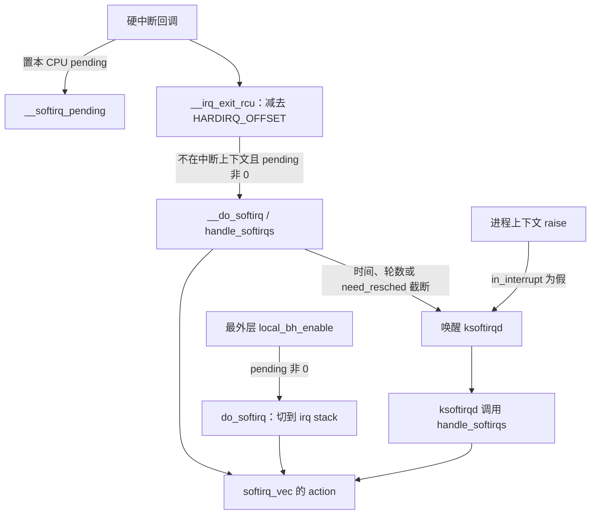

# 软中断：用每 CPU 的 pending 位推迟一类工作

e1000e 的 MSI 处理函数读完中断原因寄存器之后，并没有在硬中断里把接收描述符走完。它在 `napi_schedule_prep()` 成功时调用 `__napi_schedule()`，把 `napi_struct` 挂到当前 CPU 的轮询链表上，再把 `NET_RX_SOFTIRQ` 这一位置 1。定时器到期、块层请求完成、RCU 回调也使用同一套办法：硬中断或进程只负责做标记，真正的批量工作由一个已经注册的函数稍后执行。

这套办法叫软中断（softirq）。它不经过 IDT，也没有每次事件一份的描述符。内核把延后工作分成固定的若干类，每一类在每个 CPU 上占 pending 位图里的一位；执行点看到这位被置上，就调用该类唯一的回调。

本章回答下面几个问题：

1. `raise` 在当前 CPU 上留下了什么？回调从哪里来，参数又在哪里？
2. 置位之后，回调在哪一次调用里真正执行？
3. 同一个 CPU 上为什么不会嵌套跑两层 softirq，不同 CPU 为什么可以同时跑同一个向量？
4. 一轮处理怎样被时间、轮数和 `need_resched()` 截断，剩下的工作交给谁？
5. `local_bh_disable()` 和 `spin_lock_bh()` 怎样挡住本 CPU 的 softirq？
6. tasklet 和带 `WQ_BH` 的 workqueue 怎样复用其中两个向量？

建议先读[中断子系统介绍](introduction.md)的第 4.5 节，知道软中断在硬中断退出路径上的位置。e1000e 从通知走到 `e1000e_poll()` 的设备细节在[中断子系统概述](overview.md)第 6.3 节，本章第 4.8 节只接上 `NET_RX_SOFTIRQ` 这一段。

## 0. 分析基线

本章依据仓库内 [Makefile 第 2～4 行](../../linux/Makefile#L2-L4)标记的 **6.18.52** 版本，架构为 **x86-64**。正文沿 `kernel/softirq.c` 里 `CONFIG_PREEMPT_RT` 未启用时的 `#else` 分支。该文件前半部分是 RT 专用的 bottom-half 计数和锁，本配置不会编译进去。

| 配置 | 对本章的影响 | 依据 |
| --- | --- | --- |
| `CONFIG_PREEMPT_RT` 未设置 | 使用非 RT 的 `preempt_count` 软中断位、`invoke_softirq()` 和 `local_bh_*` | [.config#L139](../../linux/.config#L139)、[softirq.c#L364](../../linux/kernel/softirq.c#L364) |
| `CONFIG_TRACE_IRQFLAGS` 未被选中 | `PROVE_LOCKING`、`IRQSOFF_TRACER`、`RV` 都未打开，因此没有 `select TRACE_IRQFLAGS`。`local_bh_disable()` 是直接增加 `preempt_count` 的内联函数；带 lockdep 跟踪的关 bottom half 实现不编入 | [.config#L10659](../../linux/.config#L10659)、[.config#L10751](../../linux/.config#L10751)、[.config#L10789](../../linux/.config#L10789)、[Kconfig.debug#L1367-L1378](../../linux/lib/Kconfig.debug#L1367-L1378)、[Kconfig#L391-L395](../../linux/kernel/trace/Kconfig#L391-L395)、[bottom_half.h#L7-L15](../../linux/include/linux/bottom_half.h#L7-L15) |
| `CONFIG_PREEMPT_COUNT=y` | bottom half 关闭和 softirq 执行都体现在 `preempt_count` 里，因此这两段都不能睡眠 | [.config#L140](../../linux/.config#L140)、[preempt.h#L148-L149](../../linux/include/linux/preempt.h#L148-L149) |
| `CONFIG_PREEMPT_VOLUNTARY=y`、`CONFIG_PREEMPT_DYNAMIC=y`、`CONFIG_PREEMPTION=y` | 抢占模型默认可由 `preempt=` 改为 full 等。默认 voluntary 下，中断返回内核时的 `irqentry_exit_cond_resched` 是空操作 | [.config#L136](../../linux/.config#L136)、[.config#L141-L142](../../linux/.config#L141-L142)、[core.c#L7636-L7641](../../linux/kernel/sched/core.c#L7636-L7641)、[core.c#L7732-L7737](../../linux/kernel/sched/core.c#L7732-L7737) |
| `CONFIG_IRQ_FORCED_THREADING=y` | 编入 `threadirqs` 路径。静态键 `force_irqthreads_key` 默认关闭，主线按关闭来写 | [.config#L83](../../linux/.config#L83)、[manage.c#L27-L35](../../linux/kernel/irq/manage.c#L27-L35) |
| `CONFIG_X86_64=y` | 选中 `HAVE_IRQ_EXIT_ON_IRQ_STACK` 和 `HAVE_SOFTIRQ_ON_OWN_STACK`。非 RT 下后者再打开 `CONFIG_SOFTIRQ_ON_OWN_STACK`。中断退出时直接调用 `__do_softirq()`；任务上下文的 `do_softirq_own_stack()` 切到 irq stack | [.config#L333](../../linux/.config#L333)、[.config#L940-L942](../../linux/.config#L940-L942)、[Kconfig#L249](../../linux/arch/x86/Kconfig#L249)、[Kconfig#L290](../../linux/arch/x86/Kconfig#L290)、[Kconfig#L1157-L1164](../../linux/arch/Kconfig#L1157-L1164) |
| `CONFIG_SMP=y`、`CONFIG_HOTPLUG_CPU=y` | 每个 CPU 一份 pending 和 `ksoftirqd`；CPU 下线时迁走 tasklet 链表 | [.config#L362](../../linux/.config#L362)、[.config#L528](../../linux/.config#L528) |
| `CONFIG_HZ=1000` | `MAX_SOFTIRQ_TIME` 为 2 个 jiffy，约 2 ms。这是两轮处理之间的判断，不是单个回调的时限 | [.config#L506](../../linux/.config#L506)、[softirq.c#L543](../../linux/kernel/softirq.c#L543)、[jiffies.h#L461-L463](../../linux/include/linux/jiffies.h#L461-L463) |
| `CONFIG_TREE_RCU=y` | `use_softirq` 默认为真，RCU 核心处理注册为 `RCU_SOFTIRQ`。启动参数是 `rcutree.use_softirq` | [.config#L167](../../linux/.config#L167)、[tree.c#L114-L117](../../linux/kernel/rcu/tree.c#L114-L117)、[tree.c#L72-L75](../../linux/kernel/rcu/tree.c#L72-L75) |
| `CONFIG_NO_HZ_FULL=y` | 空闲 tick 停止前会检查本 CPU 是否还有不能忽略的 softirq pending | [.config#L108](../../linux/.config#L108)、[tick-sched.c#L1141-L1180](../../linux/kernel/time/tick-sched.c#L1141-L1180) |
| `CONFIG_VIRT_CPU_ACCOUNTING_GEN=y`，`CONFIG_IRQ_TIME_ACCOUNTING` 未设置 | 记账方式在 `choice` 里选了 GEN，因此没有 `CONFIG_VIRT_CPU_ACCOUNTING_NATIVE`。softirq 和硬中断进出钩子里的 `vtime_account_*()`、`irqtime_account_irq()` 都是空函数。GEN 的记账入口在用户态边界和任务切换，不在这对钩子里 | [.config#L148-L150](../../linux/.config#L148-L150)、[Kconfig#L538-L584](../../linux/init/Kconfig#L538-L584)、[vtime.h#L30-L46](../../linux/include/linux/vtime.h#L30-L46)、[vtime.h#L133-L160](../../linux/include/linux/vtime.h#L133-L160) |

有两个运行时开关会改变主线，本章默认它们保持关闭：

- 启动参数 `threadirqs` 在 `parse_early_param()` 里打开 `force_irqthreads_key`。`spawn_ksoftirqd()` 是 `early_initcall`，晚于这次解析。键打开后，硬中断退出不再就地执行 softirq，定时器类向量改由 `ktimers/%u` 处理。见第 4.6 节。
- `rcutree.use_softirq=0` 时，RCU 不注册 `RCU_SOFTIRQ`，改走每 CPU 的 rcuc 线程。默认值为真。

## 1. 软中断要解决什么问题

### 1.1 一次标记对应一类工作

硬中断处理发生在被打断的执行之上，本地可屏蔽中断通常是关着的，回调也不能睡眠。网卡一次中断可能对应一批描述符，定时器一次 tick 可能到期多个定时器。如果这些循环都留在硬中断里，同一次通知会拉长关中断时间。

softirq 把“有工作”和“做工作”拆开：

```text
子系统初始化：open_softirq(nr, action)     把函数指针写入全局表
某 CPU 上发生事件：raise_softirq*(nr)       只给本 CPU 的第 nr 位置 1
执行点：handle_softirqs()                  按置位的编号调用 action()
```

回调原型是 `void (*action)(void)`，见 [`struct softirq_action`](../../linux/include/linux/interrupt.h#L587-L590)。它没有 IRQ 号，也没有 `dev_id`。具体要处理的对象由子系统放在自己的每 CPU 队列里。pending 位只表示“这一类在这个 CPU 上需要跑一次”，多次置同一位仍然只占一位。

`softirq.c` 开头的注释把并发契约写在公共代码外面：softirq 核心没有跨 CPU 共享的 pending；某个向量若要串行化，由它自己的锁负责；即使某个设备在逻辑上串行，被标记执行的仍然只是当前 CPU。网络接收被当作可以多 CPU 并行的例子，tasklet 则自己保证同一个 tasklet 不同时在两个 CPU 上运行（[softirq.c#L37-L53](../../linux/kernel/softirq.c#L37-L53)）。

### 1.2 它在内核中的位置

下图汇总默认配置（`threadirqs` 关闭）下进入 `action` 的几条控制流：硬中断退出、bottom half 开着时的进程上下文 `raise`，以及最外层 `local_bh_enable()`。它不是同一次调用的时序。



读图时注意三件事：

- 硬中断退出路径上的 softirq 仍在这次中断返回之前执行，它不是另一个被调度进来的任务。`ksoftirqd` 才是每 CPU 一个的 `SCHED_NORMAL` 线程。
- 进程上下文在 bottom half 开着时调用 `raise_softirq()`，只置位并唤醒 `ksoftirqd`，不会在调用者栈上立刻执行回调。就地执行发生在硬中断退出，以及最外层 `local_bh_enable()`；后一条路径也负责跑掉 `local_bh_disable()` 期间留下的 pending。
- 图中的 `action` 内部还可以再置位。新置的位进入下一轮判断，不会在当前这次 `action()` 里面递归调用自己。

和相邻机制的差别，[介绍一章第 4.5 节](introduction.md)已经列过。这里只保留和源码入口对应的一行：

| 机制 | 谁触发执行 | 回调所在上下文 |
| --- | --- | --- |
| IRQ `thread_fn` | `__irq_wake_thread()` 唤醒该 action 的线程 | 可调度的 IRQ 线程 |
| softirq `action` | 硬中断退出、`local_bh_enable()` 或 `ksoftirqd` | 不可睡眠；硬中断可以再进来 |
| 普通 workqueue | worker 线程 | 工作项本身可以睡眠 |
| `WQ_BH` workqueue | 复用 `HI_SOFTIRQ` / `TASKLET_SOFTIRQ` | 与 softirq 相同 |

### 1.3 十个向量分别留给谁

向量编号是枚举下标，数值越小，同一轮里越先执行。注释要求不要轻易增加新向量，并写明 RCU 最好永远留在最后（[interrupt.h#L541-L561](../../linux/include/linux/interrupt.h#L541-L561)）。

| 向量 | 值 | 注册位置 | 回调 |
| --- | --- | --- | --- |
| `HI_SOFTIRQ` | 0 | [`softirq_init()`](../../linux/kernel/softirq.c#L1035-L1048) 中的 `open_softirq(HI_SOFTIRQ, ...)` | `tasklet_hi_action` |
| `TIMER_SOFTIRQ` | 1 | [`timers_init()`](../../linux/kernel/time/timer.c#L2575-L2579) | `run_timer_softirq` |
| `NET_TX_SOFTIRQ` | 2 | [`net_dev_init()`](../../linux/net/core/dev.c#L13231-L13232) | `net_tx_action` |
| `NET_RX_SOFTIRQ` | 3 | 同上 | `net_rx_action` |
| `BLOCK_SOFTIRQ` | 4 | [`blk_mq_init()`](../../linux/block/blk-mq.c#L5252-L5261) | `blk_done_softirq` |
| `IRQ_POLL_SOFTIRQ` | 5 | [`irq_poll_setup()`](../../linux/lib/irq_poll.c#L207-L214) | `irq_poll_softirq` |
| `TASKLET_SOFTIRQ` | 6 | [`softirq_init()`](../../linux/kernel/softirq.c#L1035-L1048) 中的 `open_softirq(TASKLET_SOFTIRQ, ...)` | `tasklet_action` |
| `SCHED_SOFTIRQ` | 7 | [`init_sched_fair_class()`](../../linux/kernel/sched/fair.c#L14194) | `sched_balance_softirq` |
| `HRTIMER_SOFTIRQ` | 8 | [`hrtimers_init()`](../../linux/kernel/time/hrtimer.c#L2331-L2335) | `hrtimer_run_softirq` |
| `RCU_SOFTIRQ` | 9 | [`rcu_init()`](../../linux/kernel/rcu/tree.c#L4878-L4879)，仅当 `use_softirq` | `rcu_core_si` |

`HI_SOFTIRQ` 和 `TASKLET_SOFTIRQ` 的回调在跑 tasklet 链表之前，还会先跑 BH workqueue。高优先级 BH 工作因此排在本轮所有其他向量前面，普通 BH 工作排在块层和 irq_poll 之后、调度软中断之前。第 4.7 节展开这个顺序。

定时器轮、RCU 宽限期和负载均衡算法不属于本章。本章只说明它们怎样注册、怎样置位，以及 pending 位和它们自己的每 CPU 队列是什么关系。

### 1.4 本章边界

下面这些分支存在于源码中，主线不沿它们展开：

- `CONFIG_PREEMPT_RT` 把 bottom half 禁用记在任务和每 CPU 的 `softirq_ctrl` 上，硬中断退出只唤醒 `ksoftirqd`（[softirq.c#L106-L342](../../linux/kernel/softirq.c#L106-L342)）。
- `threadirqs` 打开时的 `ktimers/%u`，第 4.6 节只说明它和默认路径的分叉。
- 网络线程化 NAPI：`NAPI_STATE_THREADED` 且 `napi->thread` 非空时，`____napi_schedule()` 通常唤醒该线程并返回，不再置 `NET_RX_SOFTIRQ`。启动参数 `thread_backlog_napi` 打开后有一个例外：线程若是本 CPU 的 `backlog_napi`，仍挂上 `poll_list`。该静态键默认关闭。第 4.8 节给出分支。

## 2. 核心数据结构

### 2.1 全局回调表只有函数指针

```c
static struct softirq_action softirq_vec[NR_SOFTIRQS] __cacheline_aligned_in_smp;
```

定义在 [softirq.c#L60](../../linux/kernel/softirq.c#L60)。表是全局的一份，所有 CPU 共用同一组函数指针。`open_softirq()` 把 `softirq_vec[nr].action` 赋成传入的函数，没有锁，也没有注销接口（[softirq.c#L793-L796](../../linux/kernel/softirq.c#L793-L796)）。本仓库里的调用都位于初始化函数。执行循环只读取 `action`，不检查它是否为空，所以必须先注册再置位。

名字表 `softirq_to_name[]` 与枚举顺序一致，供 `/proc/softirqs` 和出错打印使用（[softirq.c#L64-L67](../../linux/kernel/softirq.c#L64-L67)）。

### 2.2 x86 上 pending 是每 CPU 一个 `u16`

通用代码把 pending 放在 `irq_cpustat_t.__softirq_pending` 里。x86 定义了 `__ARCH_IRQ_STAT`，自己的 `irq_cpustat_t` 并不包含这个字段，而是单独声明：

```c
DECLARE_PER_CPU_CACHE_HOT(u16, __softirq_pending);
#define local_softirq_pending_ref       __softirq_pending
```

见 [hardirq.h#L56-L69](../../linux/arch/x86/include/asm/hardirq.h#L56-L69)。访问宏在 `local_softirq_pending_ref` 已被定义时不再改写成 `irq_stat.__softirq_pending`（[interrupt.h#L519-L527](../../linux/include/linux/interrupt.h#L519-L527)）：

| 宏 | 作用 |
| --- | --- |
| `local_softirq_pending()` | 读当前 CPU 的位图 |
| `set_softirq_pending(x)` | 整字写入 |
| `or_softirq_pending(x)` | 按位或 |

`NR_SOFTIRQS` 是 10，放得进 `u16`。置位写成 `or_softirq_pending(1UL << nr)`（[softirq.c#L786-L790](../../linux/kernel/softirq.c#L786-L790)）。`__raise_softirq_irqoff()` 要求调用时本地中断已经关闭，函数本身不检查 `nr` 的范围。

清位和置位都发生在本 CPU 关中断的窗口里：`handle_softirqs()` 先把位图写成 0，再开中断跑回调。回调里若调用 `__raise_softirq_irqoff()` 或 `raise_softirq_irqoff()`，调用者必须已经关中断；`raise_softirq()` 会自己 `local_irq_save()`（[softirq.c#L777-L790](../../linux/kernel/softirq.c#L777-L790)）。因此同一 CPU 上，清零和按位或不会互相撕开这个 `u16`。其他 CPU 不修改这一个变量。

pending 位没有队列节点，也没有“这次事件的参数”。`NET_RX_SOFTIRQ` 置位时，待轮询的 `napi_struct` 已经挂在该 CPU 的 `softnet_data.poll_list` 上。tasklet 则挂在该 CPU 的 `tasklet_vec` 或 `tasklet_hi_vec` 上。回调负责把队列取空；取不完就再次置位，让下一轮继续。

### 2.3 `preempt_count` 用两个步长区分“正在执行”和“禁止执行”

非 RT 配置把软中断状态放进 `preempt_count`。位段注释在 [preempt.h#L15-L55](../../linux/include/linux/preempt.h#L15-L55)：

| 位段 | 掩码 | 本章用到的步长 |
| --- | --- | --- |
| 0–7 | `PREEMPT_MASK` | `PREEMPT_OFFSET = 1`，关抢占 |
| 8–15 | `SOFTIRQ_MASK` | `SOFTIRQ_OFFSET = 0x100`，正在执行 softirq |
| 8–15 | 同上 | `SOFTIRQ_DISABLE_OFFSET = 0x200`，一次 `local_bh_disable()` |

`SOFTIRQ_DISABLE_OFFSET` 定义为 `2 * SOFTIRQ_OFFSET`，所以一次关闭 bottom half 置的是 bit 9，不会碰到表示“正在执行”的 bit 8。嵌套关闭继续往高位加：两次关闭是 `0x400`。正在执行同时又关闭一次，则是 `0x100 + 0x200 = 0x300`。

四个判断宏在本配置下的定义是（[preempt.h#L127-L143](../../linux/include/linux/preempt.h#L127-L143)）：

| 宏 | 看什么 | 只关闭了 bottom half 时 | 正在执行 softirq 时 |
| --- | --- | --- | --- |
| `in_serving_softirq()` | `softirq_count()` 的 bit 8 | 假 | 真 |
| `in_softirq()` | 整个 `SOFTIRQ_MASK` 非 0 | 真 | 真 |
| `in_interrupt()` | NMI、硬中断或整个 softirq 位段 | 真 | 真 |
| `in_task()` | 没有 NMI、硬中断，也没有 bit 8 | 真 | 假 |

头文件把 `in_softirq()` 和 `in_interrupt()` 标为不建议在新代码里使用，因为它们把“禁止 softirq”和“正在执行 softirq”算在一起。`raise_softirq_irqoff()` 和 `__irq_exit_rcu()` 用的是 `in_interrupt()`：bottom half 关着时，两者都不会就地启动 softirq。

`in_task()` 在只关闭 bottom half 时仍为真，因为判断式只排除 bit 8。能不能睡眠要看 `preempt_count()` 是否为 0。`local_bh_disable()` 已经加上 `0x200`，`preemptible()` 要求计数为 0 且中断打开（[preempt.h#L227](../../linux/include/linux/preempt.h#L227)），所以这段代码不能睡眠，也不能靠 `in_task()` 证明自己处在可调度上下文。`schedule()` 进入 `__schedule()` 之前还会再 `preempt_disable()` 一次；[`schedule_debug()`](../../linux/kernel/sched/core.c#L5925-L5927) 要求此时的计数恰好等于 [`PREEMPT_DISABLE_OFFSET`](../../linux/include/linux/preempt.h#L192)。位段里还留着 `0x100` 或 `0x200` 时等式不成立，于是进入 [`__schedule_bug()`](../../linux/kernel/sched/core.c#L5878-L5887)。这次 `preempt_disable()` 在 [`__schedule_loop()`](../../linux/kernel/sched/core.c#L7039-L7043)。

`spin_lock_bh()` 使用的步长是 `SOFTIRQ_LOCK_OFFSET`，等于 `SOFTIRQ_DISABLE_OFFSET + PREEMPT_LOCK_OFFSET`（[preempt.h#L177](../../linux/include/linux/preempt.h#L177)）。本配置 `PREEMPT_LOCK_OFFSET` 就是 `PREEMPT_OFFSET`，所以拿锁时同时加上 `0x200` 和 `1`。

### 2.4 `ksoftirqd` 与统计计数

`DEFINE_PER_CPU(struct task_struct *, ksoftirqd)` 保存每 CPU 线程（[softirq.c#L62](../../linux/kernel/softirq.c#L62)）。`spawn_ksoftirqd()` 经 `smpboot` 调用 `kthread_create_on_cpu()`，名字来自 `thread_comm`，是 `ksoftirqd/%u`（[softirq.c#L1103-L1107](../../linux/kernel/softirq.c#L1103-L1107)、[smpboot.c#L180-L181](../../linux/kernel/smpboot.c#L180-L181)）。`kthread()` 把从 `kthreadd` 继承来的策略设回 `SCHED_NORMAL`（[kthread.c#L405-L409](../../linux/kernel/kthread.c#L405-L409)）。softirq 代码没有再提高它的优先级。

每 CPU 的 `kernel_stat.softirqs[NR_SOFTIRQS]` 是 `unsigned int` 计数（[kernel_stat.h#L40-L43](../../linux/include/linux/kernel_stat.h#L40-L43)）。`kstat_incr_softirqs_this_cpu()` 在每次调用某个向量的 `action` 之前加一（[kernel_stat.h#L60-L63](../../linux/include/linux/kernel_stat.h#L60-L63)）。一次 `net_rx_action()` 可以处理多个 `napi_struct`，计数仍然只加一。重启循环再进入这个向量时会再加一。

### 2.5 tasklet 是挂在两个向量上的每 CPU 链表

`HI_SOFTIRQ` 和 `TASKLET_SOFTIRQ` 没有把待执行对象放在 pending 位里。每个 CPU 有两条链表（[softirq.c#L801-L807](../../linux/kernel/softirq.c#L801-L807)）：

```c
struct tasklet_head {
	struct tasklet_struct *head;
	struct tasklet_struct **tail;
};
```

`softirq_init()` 把 `tail` 指到 `head` 的地址，表示空链表，然后注册两个 action（[softirq.c#L1035-L1048](../../linux/kernel/softirq.c#L1035-L1048)）。

[`struct tasklet_struct`](../../linux/include/linux/interrupt.h#L688-L699) 里和调度有关的是：

| 字段 | 含义 |
| --- | --- |
| `next` | 当前 CPU 链表上的后继。入队时写成 `NULL`，由 `tail` 指向这个位置 |
| `state` 的 `TASKLET_STATE_SCHED` | 已经在某条链表上，或正等待执行。重复 `tasklet_schedule()` 时若此位已置，不再入队 |
| `state` 的 `TASKLET_STATE_RUN` | 本配置是 SMP，表示正在某个 CPU 上执行。`tasklet_trylock()` 用 test-and-set 取得它 |
| `count` | 原子计数。非 0 表示 disable，回调不会运行 |
| `use_callback` 与联合体 | 为真时调用 `callback(tasklet)`，否则调用旧式 `func(data)` |

头文件注释写明这个 API 已废弃，并建议考虑线程化 IRQ；同时说明 tasklet 相对普通 softirq 的差别是同一个 tasklet 同时只在一个 CPU 上跑（[interrupt.h#L665-L686](../../linux/include/linux/interrupt.h#L665-L686)）。

BH workqueue 不使用 `tasklet_struct`。它有自己的每 CPU `bh_worker_pools`，只是借用这两个向量把执行拉进 softirq。见第 4.7 节。

## 3. 置位之后，回调在哪里执行

### 3.1 四条入口看的是同一份 pending

`__raise_softirq_irqoff()` 只做按位或。随后走哪条执行路径，取决于当时的 `preempt_count`。下面的判断来自 `raise_softirq_irqoff()`、`__irq_exit_rcu()`、`__local_bh_enable_ip()` 和 `do_softirq()`，都是本配置会编译的代码。

| 置位时的上下文 | `raise_softirq_irqoff()` 还会做什么 | 回调何时跑 |
| --- | --- | --- |
| 硬中断，或已经在执行 softirq | `in_interrupt()` 为真，不唤醒线程 | 外层硬中断退出，或当前 `handle_softirqs()` 的下一轮 |
| bottom half 已关闭的任务 | 同上，因为 `0x200` 已经让 `in_interrupt()` 为真 | 最外层 `local_bh_enable()` 里的 `do_softirq()` |
| 普通任务，bottom half 开着 | 唤醒本 CPU 的 `ksoftirqd` | 该线程被调度到之后 |
| 上面任一路径真正进入执行函数时 | — | `handle_softirqs()` |

还有一条容易漏掉的入口。空闲任务或迁移线程在调度前会调用 `flush_smp_call_function_queue()`，把挂起的跨 CPU 调用做完。若这些调用置了 softirq，非 RT 配置下它接着调用 `do_softirq()`（[smp.c#L598-L625](../../linux/kernel/smp.c#L598-L625)、[interrupt.h#L595-L601](../../linux/include/linux/interrupt.h#L595-L601)）。`do_softirq()` 若发现 `in_interrupt()` 为真就直接返回（[softirq.c#L510-L516](../../linux/kernel/softirq.c#L510-L516)），所以 bottom half 关着时这条路径也只是把位留着。

`ksoftirqd` 指针在 `spawn_ksoftirqd()` 之前是空的。`wakeup_softirqd()` 看到空指针就返回（[softirq.c#L75-L81](../../linux/kernel/softirq.c#L75-L81)）。这个阶段进程上下文的 raise 只留下 pending，要等下一次硬中断退出或 `local_bh_enable()`。默认配置下，硬中断退出不依赖线程已经创建：`invoke_softirq()` 在 `force_irqthreads()` 为假时直接调用 `__do_softirq()`（[softirq.c#L487-L496](../../linux/kernel/softirq.c#L487-L496)）。

### 3.2 一轮 `handle_softirqs()` 处理的是进入时的快照

函数同时被硬中断退出、`do_softirq_own_stack()` 和 `ksoftirqd` 使用。调用方进入时本地中断是关的。下面按源码写成简化逻辑，保留会改变结果的开关中断、快照和停止条件（[softirq.c#L579-L652](../../linux/kernel/softirq.c#L579-L652)）：

```text
end = jiffies + MAX_SOFTIRQ_TIME          /* HZ=1000 时是 2 个 jiffy */
max_restart = 10
去掉 current->flags 里的 PF_MEMALLOC
pending = 本 CPU 位图
preempt_count += SOFTIRQ_OFFSET           /* 标成正在执行 */
account_softirq_enter()                 /* 本配置里它调用的记账函数是空的，见第 4.4 节 */

restart:
    把本 CPU 位图写成 0
    开本地中断
    按 pending 从低位到高位调用对应 action()
    若本次是 ksoftirqd：rcu_softirq_qs()
    关本地中断
    pending = 本 CPU 位图               /* 本轮 action 新置的位 */
    若 pending 非 0：
        若 jiffies 仍早于 end，且 !need_resched()，且 --max_restart 非 0：
            goto restart
        否则 wakeup_softirqd()          /* 位图保持新置的那些位 */

account_softirq_exit()                  /* 本配置里它调用的记账函数是空的，见第 4.4 节 */
preempt_count -= SOFTIRQ_OFFSET
按进入时的值恢复 PF_MEMALLOC 这一位
```

低位优先来自 `ffs()`。x86 的 `ffs()` 与编译器内建一致：最低置位是第 1 位，0 返回 0（[bitops.h#L328-L339](../../linux/arch/x86/include/asm/bitops.h#L328-L339)）。循环里用返回值既选向量，又右移掉已经处理的低位（[softirq.c#L610-L631](../../linux/kernel/softirq.c#L610-L631)）。

举例：快照里只有 `TIMER_SOFTIRQ`（bit 1）和 `NET_RX_SOFTIRQ`（bit 3），数值是 `0b1010`。

1. `ffs` 得到 2，指针从 `softirq_vec[0]` 前进 1 步，调用 `run_timer_softirq`。
2. 指针再加 1，快照右移 2 位，剩下 `0b10`。
3. `ffs` 再得到 2，指针再前进 1 步，落到 `softirq_vec[3]`，调用 `net_rx_action`。

这一轮不会因为 `net_rx_action` 内部又把 `NET_RX_SOFTIRQ` 置上就再次调用它。新位写进已经清零的每 CPU 位图，要等本轮所有快照位都处理完、重新关中断之后再读。若停止条件允许，下一轮才会再跑。

`max_restart` 初值是 10。每一轮结束后先自减，结果为 0 就不再回去。因此只看这个计数时，循环体最多进入 10 次：第一次进入时尚为 10，第 10 次结束后减成 0。源码注释写的是“最多重启 `MAX_SOFTIRQ_RESTART` 次”（[softirq.c#L530-L544](../../linux/kernel/softirq.c#L530-L544)）。按这段条件的字面次数，`goto restart` 最多发生 9 次，加上第一次进入共 10 轮。

时间条件是 `time_before(jiffies, end)`，`end` 在函数入口算好。`msecs_to_jiffies(2)` 在 `HZ <= 1000` 且 1000 能被 `HZ` 整除时，公式是把毫秒向上换成 jiffy（[jiffies.h#L455-L463](../../linux/include/linux/jiffies.h#L455-L463)）。`HZ` 为 1000 时结果是 2。检查点在一整轮快照之后，不在某个 `action()` 内部，所以单个回调可以越过这 2 个 jiffy。注释还说明 `stop_machine()` 期间 jiffies 可能停止增长，所以除了时间还要有轮数上限。

`need_resched()` 同样只在两轮之间采样。某一轮已经开始后，即使 tick 把当前任务标成需要调度，这一轮仍会把快照里剩余的向量跑完，然后停止并唤醒 `ksoftirqd`。

### 3.3 同一个 CPU 不会嵌套进入 `handle_softirqs()`

`softirq_handle_begin()` 在开中断之前加上 `SOFTIRQ_OFFSET`（[softirq.c#L461-L464](../../linux/kernel/softirq.c#L461-L464)）。此后 `in_serving_softirq()` 和 `in_interrupt()` 都为真。回调运行时本地中断是开的，硬中断可以进来并再次置位；那次硬中断的 `__irq_exit_rcu()` 看到 `in_interrupt()` 仍为真，不会再调用 `invoke_softirq()`。新位留给外层循环在关中断之后读取。

`do_softirq()` 一开始就在 `in_interrupt()` 为真时返回。因此从正在执行的 softirq 里，或从关着 bottom half 的代码里，再调用 `do_softirq()` 不会形成第二层。`local_bh_enable()` 只有在减去本次关闭、并且 `in_interrupt()` 变成假之后才会调用它。

不同 CPU 之间没有这层互斥。两个 CPU 可以同时执行 `net_rx_action`，各自读自己的 `softnet_data`。需要跨 CPU 保护的数据由网络子系统自己的锁处理，softirq 核心不提供这把锁。

### 3.4 截断之后 CPU 什么时候离开这段处理

到达时间、轮数或 `need_resched()` 限制时，`handle_softirqs()` 留下尚未处理的 pending，并 `wakeup_softirqd()`。它不在这里调用 `schedule()`。

随后能不能换任务，取决于这条 softirq 是从哪里进来的：

- **硬中断退出，被打断的是用户态。** `irqentry_exit()` 走进 `irqentry_exit_to_user_mode()`。返回用户态的循环里，`TIF_NEED_RESCHED` 或 `TIF_NEED_RESCHED_LAZY` 置位就会 `schedule()`（[common.c#L185-L191](../../linux/kernel/entry/common.c#L185-L191)、[common.c#L26-L31](../../linux/kernel/entry/common.c#L26-L31)）。`ksoftirqd` 是否马上运行，由调度器在此时的可运行任务里决定。
- **硬中断退出，被打断的是内核态，且进入前中断是开的。** `CONFIG_PREEMPTION` 下会调用 `irqentry_exit_cond_resched()`（[common.c#L209-L211](../../linux/kernel/entry/common.c#L209-L211)）。默认 voluntary 模型把这个调用换成空操作（[core.c#L7636-L7641](../../linux/kernel/sched/core.c#L7636-L7641)）。被打断的内核代码继续执行，直到它自己的调度点。`ksoftirqd` 只是已经被唤醒。
- **`ksoftirqd` 自己。** `run_ksoftirqd()` 从 `handle_softirqs(true)` 返回后调用 `cond_resched()`（[softirq.c#L1055-L1066](../../linux/kernel/softirq.c#L1055-L1066)）。voluntary 模型里 `cond_resched` 仍然会真正调度（[core.c#L7636-L7638](../../linux/kernel/sched/core.c#L7636-L7638)）。若 pending 还在，`smpboot` 循环下一轮的 `ksoftirqd_should_run()` 为真，线程会再进入一次。

因此，2 ms 和 10 轮限制的直接效果是结束本次 `handle_softirqs()`，把剩余位图留给 `ksoftirqd`。它不保证调用返回后用户任务立刻占据 CPU。

## 4. 沿着源码看每条路径

### 4.1 注册与置位

`open_softirq()` 只有一行赋值。`start_kernel()` 在 `local_irq_enable()` 之前就要把若干向量注册好。顺序是：`sched_init()` 调用 `init_sched_fair_class()`，注册 `SCHED_SOFTIRQ`（[main.c#L938](../../linux/init/main.c#L938)、[core.c#L8852](../../linux/kernel/sched/core.c#L8852)、[fair.c#L14178-L14194](../../linux/kernel/sched/fair.c#L14178-L14194)）；`rcu_init()` 在 `use_softirq` 为真时注册 `RCU_SOFTIRQ`（[main.c#L958](../../linux/init/main.c#L958)、[tree.c#L4866-L4879](../../linux/kernel/rcu/tree.c#L4866-L4879)）；然后才是 `timers_init()`、`hrtimers_init()` 和 `softirq_init()`，最后打开本地中断（[main.c#L973-L993](../../linux/init/main.c#L973-L993)）。网络、块层和 irq_poll 的注册更晚，在各自的初始化函数里。

三个置位接口的分工是：

| 接口 | 中断要求 | 置位之外的动作 |
| --- | --- | --- |
| `__raise_softirq_irqoff(nr)` | 调用者已关中断 | 只做按位或和 trace |
| `raise_softirq_irqoff(nr)` | 同上 | 若不在 `in_interrupt()`，唤醒 `ksoftirqd` |
| `raise_softirq(nr)` | 可在中断打开时调用 | `local_irq_save()` 后调用上一行，再恢复 |

见 [softirq.c#L757-L791](../../linux/kernel/softirq.c#L757-L791)。`__raise_softirq_irqoff()` 前面的注释要求调用时中断已经关闭，函数里的 `lockdep_assert_irqs_disabled()` 用来标明这一点。本配置没有 `CONFIG_PROVE_LOCKING`，这个断言走 `#else`，编译成空操作（[lockdep.h#L548](../../linux/include/linux/lockdep.h#L548)、[lockdep.h#L624-L630](../../linux/include/linux/lockdep.h#L624-L630)）。`raise_softirq_irqoff()` 的注释写明：已经处在中断或 softirq 里就只置位，因为返回时会再看 pending；这里的 `in_interrupt()` 也覆盖 bottom half 被关掉的代码。普通任务上下文则唤醒 `ksoftirqd`，让 softirq 尽快被调度到，而不是在当前栈上执行。

定时器和时钟事件使用包装函数 `raise_timer_softirq()`。它要求处于中断上下文。`force_irqthreads()` 为假时，它就是 `__raise_softirq_irqoff()`（[interrupt.h#L641-L648](../../linux/include/linux/interrupt.h#L641-L648)）。周期定时器在到期判断成立时调用它（[timer.c#L2455-L2458](../../linux/kernel/time/timer.c#L2455-L2458)）；高精度定时器在软到期时间已到时同样调用它（[hrtimer.c#L1902-L1905](../../linux/kernel/time/hrtimer.c#L1902-L1905)）。

`SCHED_SOFTIRQ` 有两处常见置位。`sched_balance_trigger()` 在 `jiffies` 到达 `rq->next_balance` 时调用会关中断的 `raise_softirq()`（[fair.c#L13257-L13267](../../linux/kernel/sched/fair.c#L13257-L13267)）。nohz 空闲平衡的跨 CPU 调用则在中断已关时使用 `__raise_softirq_irqoff()`（[core.c#L1326-L1329](../../linux/kernel/sched/core.c#L1326-L1329)）。

### 4.2 硬中断退出：先减硬中断计数，再决定是否就地执行

普通设备中断和系统向量在 x86-64 上由 `run_irq_on_irqstack_cond()` / `run_sysvec_on_irqstack_cond()` 包住。包装在处理函数前后调用 `irq_enter_rcu()` 和 `irq_exit_rcu()`（[irq_stack.h#L169-L203](../../linux/arch/x86/include/asm/irq_stack.h#L169-L203)）。

`irq_enter_rcu()` 通过 `__irq_enter_raw()` 加上 `HARDIRQ_OFFSET`，并在 nohz full 或空闲任务被打断时通知 tick，然后调用 `account_hardirq_enter()`。它里面的 `vtime_account_irq()` 和 `irqtime_account_irq()` 在本配置都是空函数，原因见第 4.4 节（[softirq.c#L662-L670](../../linux/kernel/softirq.c#L662-L670)、[hardirq.h#L46-L50](../../linux/include/linux/hardirq.h#L46-L50)、[vtime.h#L151-L155](../../linux/include/linux/vtime.h#L151-L155)）。

`irq_exit_rcu()` 进入 `__irq_exit_rcu()`（[softirq.c#L713-L730](../../linux/kernel/softirq.c#L713-L730)）。x86 没有定义 `__ARCH_IRQ_EXIT_IRQS_DISABLED`，所以这里先 `local_irq_disable()`。随后：

1. `account_hardirq_exit(current)`。它调用的 `vtime_account_hardirq()` 和 `irqtime_account_irq()` 同样是空函数（[vtime.h#L157-L161](../../linux/include/linux/vtime.h#L157-L161)）。
2. `preempt_count_sub(HARDIRQ_OFFSET)`。嵌套的内层硬中断减完之后，外层硬中断计数仍在，`in_interrupt()` 仍为真。
3. 若 `in_interrupt()` 为假且 pending 非 0，调用 `invoke_softirq()`。bottom half 仍关闭时，第 2 步之后 `in_interrupt()` 仍为真，softirq 被推迟到 `local_bh_enable()`。
4. 若 `threadirqs` 打开且定时器线程有自己的 pending，并且当前不在 NMI 或硬中断里，唤醒 `ktimers`。默认配置下 `force_irqthreads()` 为假，这个条件不成立。`wake_timersd()` 在未启用强制线程化时是空函数；本配置启用了该选项，所以调用的是真正的唤醒函数，只是静态键让第 4 步进不去。
5. `tick_irq_exit()`。nohz 下，若本 CPU 空闲且不需要重新调度，或它是 nohz full CPU，并且已经不在硬中断里，就调用 `tick_nohz_irq_exit()`（[softirq.c#L682-L692](../../linux/kernel/softirq.c#L682-L692)）。

`invoke_softirq()` 在默认配置下调用 `__do_softirq()`，不再切换栈。这和 x86-64 的入口栈规则是配套的（[irq_stack.h#L132-L152](../../linux/arch/x86/include/asm/irq_stack.h#L132-L152)）：

- 从内核态进入、且 irq stack 尚未标记占用时，入口已经切到 irq stack，并在整个处理期间保持 `hardirq_stack_inuse`。退出路径上的 `__do_softirq()` 就在这块栈上。注释认为此时 irq stack 应当接近空的。
- 从用户态进入时不切栈，注释说明任务内核栈此时是空的。`__do_softirq()` 留在这块栈上。`hardirq_stack_inuse` 在这条路径上没有被置位。softirq 打开中断之后若又来硬中断，新的中断来自内核态且该标记为假，入口会再切到 irq stack。

`do_softirq_own_stack()` 不用于这条退出路径。它用于任务上下文，见下一节。

### 4.3 `local_bh_enable()` 在计数回到“允许执行”时就地调用

本配置的 `local_bh_disable()` 展开为 `__local_bh_disable_ip(ip, SOFTIRQ_DISABLE_OFFSET)`。因为没有 `CONFIG_PREEMPT_RT` 和 `CONFIG_TRACE_IRQFLAGS`，这个函数是内联的 `preempt_count_add(cnt)` 加一个编译屏障（[bottom_half.h#L7-L21](../../linux/include/linux/bottom_half.h#L7-L21)）。它不关硬中断。硬中断仍可置位，但退出时被 `in_interrupt()` 挡住。

`local_bh_enable()` 调用 `__local_bh_enable_ip(ip, SOFTIRQ_DISABLE_OFFSET)`（[softirq.c#L427-L458](../../linux/kernel/softirq.c#L427-L458)）。本配置没有编入函数中间那段 `local_irq_disable()` / `local_irq_enable()`。实际步骤是：

1. 若在硬中断里调用，`WARN_ON_ONCE`。`lockdep_assert_irqs_enabled()` 要求进入时中断是开的；没有 lockdep 时这条断言不生效，调用约定仍写在源码里。
2. `__preempt_count_sub(cnt - 1)`。`cnt` 为 `0x200` 时减去 `0x1FF`。若 softirq 位段原来正好是 `0x200`，结果是只留下抢占位 `1`，softirq 位段变 0。若原来是两次关闭的 `0x400`，结果是 `0x201`：还剩一次关闭，外加临时的抢占位。
3. 只有 `in_interrupt()` 为假且 pending 非 0 才调用 `do_softirq()`。嵌套的内层 enable 因为位段仍非 0，不会执行 softirq。
4. `preempt_count_dec()` 去掉第 2 步留下的那 1。然后 `preempt_check_resched()`。

因此一次匹配的 `local_bh_disable()` / `local_bh_enable()` 净效果是加 `0x200` 再减 `0x200`。softirq 若要跑，跑在抢占计数仍至少为 1 的窗口里，并且走 `do_softirq()` 自己的栈。

`do_softirq()` 确认不在中断上下文后关中断，pending 非 0 则调用 `do_softirq_own_stack()`（[softirq.c#L510-L525](../../linux/kernel/softirq.c#L510-L525)）。x86-64 的宏先把 `hardirq_stack_inuse` 置真，再在 irq stack 上调用 `__do_softirq()`，返回后清标记（[irq_stack.h#L206-L218](../../linux/arch/x86/include/asm/irq_stack.h#L206-L218)）。标记为真时，期间到来的硬中断不再切一次栈（[irq_stack.h#L138-L141](../../linux/arch/x86/include/asm/irq_stack.h#L138-L141)）。注释说明这条路径只发生在任务上下文重新打开 bottom half、irq stack 未被占用的时候。

`spin_lock_bh()` 把关闭 bottom half 和关抢占合成同一次加法（[spinlock_api_smp.h#L123-L128](../../linux/include/linux/spinlock_api_smp.h#L123-L128)）：

```c
__local_bh_disable_ip(_RET_IP_, SOFTIRQ_LOCK_OFFSET);
/* 然后取得自旋锁 */
```

`spin_unlock_bh()` 先放锁，再 `__local_bh_enable_ip(_RET_IP_, SOFTIRQ_LOCK_OFFSET)`（[spinlock_api_smp.h#L163-L168](../../linux/include/linux/spinlock_api_smp.h#L163-L168)）。此时 `cnt - 1` 正好是 `0x200`。若这是最外层，softirq 位段被减掉，抢占位还留着，`do_softirq()` 可能运行，最后再 `preempt_count_dec()`。

这把锁同时做两件事：自旋锁挡住其他 CPU；本 CPU 的 softirq 在锁持有期间不能开始执行，也就不能再次获取同一把锁。只调用 `local_bh_disable()` 挡不住其他 CPU 上的 softirq。

### 4.4 执行循环里回调能做什么

`handle_softirqs()` 在调用 `action` 之前打开本地中断，所以回调里可以用 `local_irq_save()` 保护自己的每 CPU 队列，硬中断也可以插入。回调返回后，函数比较 `preempt_count`。若与进入时不同，打印向量号、名字和函数指针，再把计数写回进入时的值（[softirq.c#L617-L629](../../linux/kernel/softirq.c#L617-L629)）。写回计数不能补上回调少做的解锁或少释放的引用，它只避免这个错误继续影响后面的向量和退出路径。

`current` 仍是被借用的任务。函数进入时清掉 `PF_MEMALLOC`，使网络接收不会继承被打断任务的内存分配标志；注释说明与换页相关的套接字仍可能在回调里再次置上该标志。离开时 `current_restore_flags(old_flags, PF_MEMALLOC)` 只恢复这一位，回调改过的其他 `flags` 位保留（[softirq.c#L589-L594](../../linux/kernel/softirq.c#L589-L594)、[sched.h#L1868-L1873](../../linux/include/linux/sched.h#L1868-L1873)）。

`account_softirq_enter()` 调用 `vtime_account_irq()` 和 `irqtime_account_irq()`，`account_softirq_exit()` 调用 `vtime_account_softirq()` 和 `irqtime_account_irq()`。本配置下这些被调用的函数都是空函数：`vtime_account_irq()`、`vtime_account_softirq()` 和硬中断离开时用的 `vtime_account_hardirq()` 只在 `CONFIG_VIRT_CPU_ACCOUNTING_NATIVE` 下有实体，`irqtime_account_irq()` 只在 `CONFIG_IRQ_TIME_ACCOUNTING` 下有实体（[vtime.h#L30-L46](../../linux/include/linux/vtime.h#L30-L46)、[vtime.h#L133-L160](../../linux/include/linux/vtime.h#L133-L160)）。`CONFIG_VIRT_CPU_ACCOUNTING_GEN` 的记账入口是 `vtime_user_enter()` / `vtime_user_exit()` 和 `vtime_task_switch_generic()`，不经过这对钩子（[Kconfig#L573-L576](../../linux/init/Kconfig#L573-L576)、[cputime.c#L718-L740](../../linux/kernel/sched/cputime.c#L718-L740)、[cputime.c#L777-L785](../../linux/kernel/sched/cputime.c#L777-L785)）。本章不展开 GEN 怎样把这段时间记到任务上。

只有 `ksirqd` 为真、且不是 RT 时，每一轮快照之后才调用 `rcu_softirq_qs()`（[softirq.c#L634-L635](../../linux/kernel/softirq.c#L634-L635)）。硬中断退出路径不调用它。RCU 侧的注释说明，从 RCU 的角度看这次调用相当于在该点短暂打开抢占，从而提供一个静止状态（[tree.c#L237-L259](../../linux/kernel/rcu/tree.c#L237-L259)）。静止状态怎样推进宽限期不在本章展开。

回调返回时必须把 `preempt_count` 恢复到进入值，也不能睡眠。`ksoftirqd` 虽然是普通线程，`handle_softirqs(true)` 期间 bit 8 已经置上，`cond_resched()` 发生在 `softirq_handle_end()` 把这位置掉之后。

### 4.5 `ksoftirqd` 的循环

`spawn_ksoftirqd()` 用 `smpboot_register_percpu_thread()` 注册线程，并挂上 CPU 下线回调 `takeover_tasklets`（[softirq.c#L1103-L1162](../../linux/kernel/softirq.c#L1103-L1162)）。`smpboot_thread_fn()` 把线程标为 `TASK_INTERRUPTIBLE` 后关闭抢占，再调用 `ksoftirqd_should_run()`。该函数只读本 CPU pending。没有 pending 就 `schedule()`；有则把状态改回 `TASK_RUNNING`，打开抢占，调用 `run_ksoftirqd()`（[smpboot.c#L102-L161](../../linux/kernel/smpboot.c#L102-L161)）。

`run_ksoftirqd()` 先关中断。pending 仍在时直接调用 `handle_softirqs(true)`，注释说明线程栈在这里不深，所以不再切到 irq stack（[softirq.c#L1055-L1068](../../linux/kernel/softirq.c#L1055-L1068)）。返回后开中断并 `cond_resched()`。若 pending 在关中断之后、调用之前已经变为 0，则只开中断返回。

线程被唤醒的来源就是第 3.1 节那些 `wakeup_softirqd()`：普通任务上下文的 raise，以及 `handle_softirqs()` 自己到达限制时。后一种情况下线程可能就是当前任务，唤醒不会另建一条执行流；`cond_resched()` 之后若 pending 还在，外层循环会再跑一轮。

### 4.6 `threadirqs` 把就地执行改成两个线程

`setup_forced_irqthreads()` 是 `early_param("threadirqs")`，只把静态键打开（[manage.c#L27-L35](../../linux/kernel/irq/manage.c#L27-L35)）。`parse_early_param()` 发生在 `start_kernel()` 里（[main.c#L900-L901](../../linux/init/main.c#L900-L901)），早于 `do_pre_smp_initcalls()` 里的 `early_initcall`（[main.c#L1337-L1343](../../linux/init/main.c#L1337-L1343)、[main.c#L1536](../../linux/init/main.c#L1536)）。因此键若在命令行上打开，`spawn_ksoftirqd()` 能看见它，并额外注册 `ktimers/%u`。

键打开且 `ksoftirqd` 指针已经非空时，`invoke_softirq()` 不再调用 `__do_softirq()`，只唤醒 `ksoftirqd`。硬中断退出路径上的普通 softirq 改由该线程执行。`ksoftirqd` 尚未创建时，条件 `!force_irqthreads() || !ksoftirqd` 仍为真，退出路径继续就地执行。

定时器类不进这条普通 pending。`raise_timer_softirq()` 改为 `raise_ktimers_thread()`，把位或进每 CPU 的 `pending_timer_softirq`（[softirq.c#L1122-L1126](../../linux/kernel/softirq.c#L1122-L1126)）。`__irq_exit_rcu()` 在不处于 NMI 和硬中断时唤醒 `ktimers`。`run_ktimerd()` 关中断，把这些位或进普通 pending，清掉定时器专用位图，再调用 `__do_softirq()`（[softirq.c#L1128-L1140](../../linux/kernel/softirq.c#L1128-L1140)）。线程创建时 `sched_set_fifo_low(current)` 把它设为 `SCHED_FIFO`、`sched_priority` 为 1（[softirq.c#L1111-L1114](../../linux/kernel/softirq.c#L1111-L1114)、[syscalls.c#L860-L866](../../linux/kernel/sched/syscalls.c#L860-L866)）。`__normal_prio()` 对实时策略的换算是 `MAX_RT_PRIO - 1 - rt_prio`（[syscalls.c#L19-L28](../../linux/kernel/sched/syscalls.c#L19-L28)）。`rt_priority` 为 1 时内部 `prio` 为 98。`cpupri` 的对照表把 `rt_priority == 1` 放在实时优先级的低端，仍高于普通任务所在的 `prio >= MAX_RT_PRIO` 区间（[cpupri.c#L27-L41](../../linux/kernel/sched/cpupri.c#L27-L41)、[prio.h#L9-L16](../../linux/include/linux/sched/prio.h#L9-L16)）。

`interrupt.h` 里的注释说明这样拆开的原因：`ksoftirqd` 保持 `SCHED_NORMAL`，因为它处理的是上一轮没有做完的积压；若定时器也放在这个优先级，就会和普通任务一起等 CPU。把定时器软中断放到低优先级的 `SCHED_FIFO` 线程，是为了让它们先于 `SCHED_NORMAL` 任务执行（[interrupt.h#L611-L630](../../linux/include/linux/interrupt.h#L611-L630)）。这条注释描述的是 `threadirqs` 或 RT 打开之后的安排。默认配置不创建 `ktimers`，定时器向量仍走普通 pending。

即使跑在 `ktimers` 里，回调仍经过 `__do_softirq()`，执行期间同样加上 `SOFTIRQ_OFFSET`，不能睡眠。

### 4.7 tasklet 与 BH workqueue 共用两个向量

`tasklet_schedule()` 先 test-and-set `TASKLET_STATE_SCHED`。只有从 0 变成 1 才调用 `__tasklet_schedule()`，因此已在队列上的 tasklet 不会再挂一次（[interrupt.h#L755-L759](../../linux/include/linux/interrupt.h#L755-L759)）。`__tasklet_schedule_common()` 关中断，把节点接到当前 CPU 链表尾，再 `raise_softirq_irqoff()` 对应的向量（[softirq.c#L809-L822](../../linux/kernel/softirq.c#L809-L822)）。`tasklet_hi_schedule()` 走 `tasklet_hi_vec` 和 `HI_SOFTIRQ`。

`tasklet_action()` 先调用 `workqueue_softirq_action(false)`，再处理普通 tasklet 链表。`tasklet_hi_action()` 先以 `true` 调用它，再处理高优先级链表（[softirq.c#L950-L960](../../linux/kernel/softirq.c#L950-L960)）。因为 `HI_SOFTIRQ` 是 bit 0，同一轮快照里高优先级 BH 工作和高优先级 tasklet 先于定时器、网络和普通 tasklet。

tasklet 链表的处理在 `tasklet_action_common()`（[softirq.c#L903-L948](../../linux/kernel/softirq.c#L903-L948)）：

1. 关中断，把整条链表摘下来，`tail` 重新指回空表头，再开中断。
2. 对每个节点 `tasklet_trylock()`。SMP 上这会试着置 `TASKLET_STATE_RUN`。失败表示另一个 CPU 正在跑它，节点被放回当前 CPU 的链表并再次置位。
3. 锁取得后若 `count != 0`，放开 `RUN` 位，同样放回链表并再次置位。此路径不清除 `SCHED`。
4. `count` 为 0 时先 `tasklet_clear_sched()` 清掉 `SCHED` 并唤醒等这个位的人，再调用 `callback` 或 `func`。回调期间另一个 `tasklet_schedule()` 可以重新置 `SCHED` 并入队，形成下一次执行。然后放开 `RUN`。

因此同一个 tasklet 的串行化来自 `TASKLET_STATE_RUN`，而不是来自 softirq 向量本身。不同 tasklet 仍可在不同 CPU 上并行。

`tasklet_disable()` 先把 `count` 加一，再等待 `RUN` 位落下（[interrupt.h#L786-L790](../../linux/include/linux/interrupt.h#L786-L790)）。它不把节点从链表上摘掉。若此时 `SCHED` 仍为 1，后续的 softirq 会反复走第 3 步：放回、再置位、不清除 `SCHED`，直到 `count` 回到 0。`tasklet_kill()` 用 `wait_on_bit_lock()` 等 `SCHED`：该位已经是 0 时立刻把它置上并返回；该位仍是 1 时睡到它被清掉，再自己取得它。然后等待 `RUN` 结束，再 `tasklet_clear_sched()`（[softirq.c#L1009-L1018](../../linux/kernel/softirq.c#L1009-L1018)）。因此只有已经入队、`SCHED` 仍为 1，并且 `count` 还没减回 0 时，action 不会清 `SCHED`，`tasklet_kill()` 才会停在这次等待上。还没入队时 `SCHED` 为 0，这次等待会立刻返回。`tasklet_kill()` 若发现自己处在中断上下文，会打印提示；`wait_on_bit_lock()` 会睡眠，不能在原子上下文里用。

BH workqueue 的入口是 `kick_bh_pool()`。池在当前 CPU 上时，高优先级池置 `HI_SOFTIRQ`，否则置 `TASKLET_SOFTIRQ`。目标是另一个 CPU 时，先向那个 CPU 排队 irq_work；目标 CPU 上的 `bh_pool_kick_normal()` / `bh_pool_kick_highpri()` 再置相应的位（[workqueue.c#L1235-L1248](../../linux/kernel/workqueue.c#L1235-L1248)、[workqueue.c#L7767-L7774](../../linux/kernel/workqueue.c#L7767-L7774)）。`system_bh_wq` 和 `system_bh_highpri_wq` 在 workqueue 初始化时以 `WQ_BH` 创建（[workqueue.c#L7912-L7914](../../linux/kernel/workqueue.c#L7912-L7914)）。`WQ_BH` 的定义写明执行上下文是 bottom half（[workqueue.h#L371](../../linux/include/linux/workqueue.h#L371)）。

`workqueue_softirq_action()` 在对应池还有工作时调用 `bh_worker()`（[workqueue.c#L3683-L3688](../../linux/kernel/workqueue.c#L3683-L3688)）。`bh_worker()` 自己还有一轮限制：`BH_WORKER_JIFFIES` 是 `msecs_to_jiffies(2)`，`BH_WORKER_RESTARTS` 是 10（[workqueue.c#L133-L139](../../linux/kernel/workqueue.c#L133-L139)、[workqueue.c#L3634-L3662](../../linux/kernel/workqueue.c#L3634-L3662)）。这层限制在 softirq 的 2 个 jiffy / 10 轮之内再截断 BH 工作项。工作项回调仍然处在 softirq 上下文。

### 4.8 从 e1000e 的硬中断到 `NET_RX_SOFTIRQ`

[`e1000_intr_msi()`](../../linux/drivers/net/ethernet/intel/e1000e/netdev.c#L1750) 先读 ICR。链路状态变化在这里处理；不可纠正 ECC 错误会安排复位工作并立刻返回，不再往下走（[netdev.c#L1758-L1798](../../linux/drivers/net/ethernet/intel/e1000e/netdev.c#L1758-L1798)）。其余情况在 `napi_schedule_prep()` 成功时把收发数据留给 NAPI（[netdev.c#L1800-L1808](../../linux/drivers/net/ethernet/intel/e1000e/netdev.c#L1800-L1808)）：

```c
if (napi_schedule_prep(&adapter->napi)) {
	adapter->total_tx_bytes = 0;
	adapter->total_tx_packets = 0;
	adapter->total_rx_bytes = 0;
	adapter->total_rx_packets = 0;
	__napi_schedule(&adapter->napi);
}
```

`__napi_schedule()` 关本地中断，对当前 CPU 的 `softnet_data` 调用 `____napi_schedule()`（[dev.c#L6640-L6646](../../linux/net/core/dev.c#L6640-L6646)）。后者在 `NAPI_STATE_THREADED` 且 `napi->thread` 非空时，默认唤醒该线程并返回。例外是 `use_backlog_threads()` 为真，并且这个线程就是本 CPU 的 `backlog_napi`：静态键默认关闭，由启动参数 `thread_backlog_napi` 打开（[dev.c#L208-L219](../../linux/net/core/dev.c#L208-L219)、[dev.c#L4899-L4913](../../linux/net/core/dev.c#L4899-L4913)）。其余情况，包括线程指针为空和这个例外，把 `napi` 接到 `poll_list` 尾部，记下 `list_owner`，并且仅当 `sd->in_net_rx_action` 为假时 `raise_softirq_irqoff(NET_RX_SOFTIRQ)`（[dev.c#L4917-L4925](../../linux/net/core/dev.c#L4917-L4925)）。硬中断里调用时 `in_interrupt()` 为真，`raise_softirq_irqoff()` 不唤醒 `ksoftirqd`。本次硬中断退出若 bottom half 没有被关掉，并且上面确实置了位，就会就地进入 `net_rx_action()`。

`net_rx_action()` 把本 CPU `poll_list` 上的 `napi_struct` 摘下来逐个 `napi_poll()`。默认预算 `netdev_budget` 为 300，时间上限 `netdev_budget_usecs` 为 `2 * USEC_PER_SEC / HZ`（[hotdata.c#L14-L16](../../linux/net/core/hotdata.c#L14-L16)）。`HZ` 为 1000 时后者是 2000 微秒，换成 jiffy 后与旁边“至少 2 个 jiffy”的注释一致；两者都可以通过 sysctl 修改。预算用尽或时间到达时，函数在关中断之后把还没做完的节点接回 `poll_list`，并 `__raise_softirq_irqoff(NET_RX_SOFTIRQ)`（[dev.c#L7800-L7859](../../linux/net/core/dev.c#L7800-L7859)）。因为此时已经在 `handle_softirqs()` 里，这个新位不会递归进入 `net_rx_action()`，而是等本轮快照结束之后的重启判断。

`e1000e_poll()` 在发送清理没做完或接收工作量达到预算时返回预算值，让上面的循环认为这一轮还没结束（[netdev.c#L2658-L2675](../../linux/drivers/net/ethernet/intel/e1000e/netdev.c#L2658-L2675)）。描述符怎样回收、中断怎样在 `napi_complete_done()` 之后恢复，见[概述一章](overview.md)。

这里可以看到三层限制叠在一起：驱动的 `poll` 按调用者给的预算返回；`net_rx_action()` 按网络预算和时间再决定是否重新置位；`handle_softirqs()` 按 2 个 jiffy、10 轮和 `need_resched()` 决定是马上再跑一轮，还是把位置留给 `ksoftirqd`。`/proc/softirqs` 里 `NET_RX` 的增量对应 `net_rx_action()` 被调用的次数，不对应数据包个数。

### 4.9 CPU 下线时 pending 还在

`ksoftirqd` 随 CPU 下线被停住之后，`wakeup_softirqd()` 再也叫不醒它。各子系统用 CPU hotplug 状态把自己的每 CPU 队列迁走。softirq 核心注册的是 `CPUHP_SOFTIRQ_DEAD` 上的 `takeover_tasklets()`（[softirq.c#L1071-L1097](../../linux/kernel/softirq.c#L1071-L1097)、[cpuhotplug.h#L75](../../linux/include/linux/cpuhotplug.h#L75)）。

这个回调先 `workqueue_softirq_dead(cpu)`，在当前 CPU 上为死亡 CPU 的 BH 池排队排空工作，并 `wait_for_completion()` 等它做完。同步等待是为了避免一个 CPU 的排空工作排到另一个正在下线的 CPU 上（[workqueue.c#L3737-L3765](../../linux/kernel/workqueue.c#L3737-L3765)）。排空函数把池标成 `POOL_BH_DRAINING`。注释写明死亡 CPU 的池不能再被 kick，工作改在当前 CPU 的 BH 里执行（[workqueue.c#L3704-L3715](../../linux/kernel/workqueue.c#L3704-L3715)）。`kick_bh_pool()` 看到这个标志后，不再向死亡 CPU 投递 `irq_work`，而是在当前 CPU 上置 softirq（[workqueue.c#L1235-L1248](../../linux/kernel/workqueue.c#L1235-L1248)）。若一次 `bh_worker()` 因为自己的轮数或时间限制没做完，就 `queue_work()` 再排一次，避免占住当前 CPU 的 BH（[workqueue.c#L3722-L3731](../../linux/kernel/workqueue.c#L3722-L3731)）。

随后在关中断的窗口里，若死亡 CPU 的 tasklet 链表非空，就把整条链表接到当前 CPU 的链表尾。无论链表是否为空，函数都会 `raise_softirq_irqoff(TASKLET_SOFTIRQ)` 和 `raise_softirq_irqoff(HI_SOFTIRQ)`。死亡 CPU 上不再有并发访问，所以这里不加那两条链表自己的锁。当前 CPU 接下来的 softirq 会跑到本 CPU 的 BH 池，以及刚接过来的 tasklet。

其他向量不由这个函数迁移。头文件列出下线后可以留给原 CPU、不必再由 `ksoftirqd` 处理的掩码（[interrupt.h#L563-L575](../../linux/include/linux/interrupt.h#L563-L575)）：

| 位 | 注释给出的迁移点 |
| --- | --- |
| `TIMER_SOFTIRQ`、`HRTIMER_SOFTIRQ` | `(hr)timers_dead_cpu()` |
| `IRQ_POLL_SOFTIRQ` | `irq_poll_cpu_dead()` |
| `RCU_SOFTIRQ` | `rcutree_migrate_callbacks()` 迁队列，`rcutree_report_cpu_dead()` 报告最后的静止状态 |

上表照抄头文件注释。周期定时器的迁移函数确实是 `timers_dead_cpu()`（[timer.c#L2515](../../linux/kernel/time/timer.c#L2515)、[cpu.c#L2105-L2108](../../linux/kernel/cpu.c#L2105-L2108)）。没有名为 `hrtimers_dead_cpu` 的函数；高精度定时器的下线回调是 `hrtimers_cpu_dying()`（[hrtimer.c#L2299](../../linux/kernel/time/hrtimer.c#L2299)、[cpu.c#L2170-L2173](../../linux/kernel/cpu.c#L2170-L2173)）。

`irq_poll_cpu_dead()` 的实现可以把这条模式看清楚：它关闭 bottom half 和中断，把死亡 CPU 的 `blk_cpu_iopoll` 接到当前 CPU，置 `IRQ_POLL_SOFTIRQ`，再 `local_bh_enable()`。enable 时 pending 已经置上，于是当前 CPU 就地执行，避免这个 CPU 带着 pending 进入空闲（[irq_poll.c#L190-L202](../../linux/lib/irq_poll.c#L190-L202)）。

nohz 在准备停下空闲 tick 时调用 `report_idle_softirq()`。CPU 已经不是 active 时，它先从 pending 里去掉 `SOFTIRQ_HOTPLUG_SAFE_MASK`；若还剩别的位，就打印警告（[tick-sched.c#L1131-L1164](../../linux/kernel/time/tick-sched.c#L1131-L1164)）。注释说明这种情况出现在 `ksoftirqd` 已经停住、软中断却仍被置位的下线窗口。掩码里的向量由各自的迁移回调负责，不在这里当成错误。

块层另外注册了 `CPUHP_BLOCK_SOFTIRQ_DEAD`（[blk-mq.c#L5263-L5265](../../linux/block/blk-mq.c#L5263-L5265)），网络设备注册了 `CPUHP_NET_DEV_DEAD`（[dev.c#L13234-L13235](../../linux/net/core/dev.c#L13234-L13235)）。它们不在上面的“可忽略”掩码里。本章不展开每个队列怎样接到存活 CPU，只确定一件事：softirq 核心的下线回调只接管 tasklet 链表和 BH workqueue 的排空，不会自动把 `NET_RX` 或 `BLOCK` 的每 CPU 队列搬走。

### 4.10 `/proc/softirqs` 数的是 action 被调用的次数

`show_softirqs()` 按向量名打印每个 possible CPU 的 `kstat_softirqs_cpu()`（[softirqs.c#L11-L26](../../linux/fs/proc/softirqs.c#L11-L26)）。计数在 `handle_softirqs()` 调用 `action` 之前增加。因此：

- 同一轮里一个向量最多贡献 1。重启循环再进入它时再加 1。
- 计数不包含 pending 位图里“已置位但还没跑”的状态，也不包含该 `action` 内部处理的对象个数。
- `ksoftirqd` 和硬中断退出调用的是同一个 `handle_softirqs()`，`/proc/softirqs` 不区分这两种执行点。

## 5. 回顾

softirq 核心保存两样东西：全局的 `softirq_vec[]` 给出每一类的函数，每 CPU 的 `__softirq_pending` 记录这一类在这个 CPU 上是否需要执行。函数没有参数。待处理对象生活在子系统自己的每 CPU 队列里，pending 的一次置位可以覆盖队列上的许多对象。

执行点有固定的几处。硬中断退出在减去 `HARDIRQ_OFFSET` 之后，若已经不处于 `in_interrupt()` 并且 pending 非 0，默认就地调用 `handle_softirqs()`。最外层 `local_bh_enable()` 在软中断位段回到 0 时，经 `do_softirq()` 切到 irq stack 再调用它。普通任务上下文的 raise 只唤醒 `ksoftirqd`。这三处最终都进入同一步循环：关着中断拿走位图快照，开中断按低位到高位调用 `action`，再关中断看有没有新位。

同一个 CPU 上，`SOFTIRQ_OFFSET` 使 `in_interrupt()` 在执行期间保持为真，硬中断退出不会再嵌套一层 softirq。不同 CPU 可以同时执行同一个 `action`。`local_bh_disable()` 加上的是 `SOFTIRQ_DISABLE_OFFSET`，只挡住本 CPU 启动 softirq，同时因为 `preempt_count` 非 0 而不能睡眠。它挡不住其他 CPU。`spin_lock_bh()` 才把这层本地推迟和跨 CPU 的自旋锁放在一起。

一轮处理最多约 2 ms 的 jiffy 窗口、10 次进入，并且会在 `need_resched()` 置位后停止。这些条件都在两轮之间检查，不会从某个 `action()` 中间返回。停下来时剩余的位置着，`ksoftirqd` 被唤醒。默认 voluntary 模型下，从内核态被打断不会在中断出口立刻换任务；从用户态返回则会在需要重新调度时进入 `schedule()`。

`HI_SOFTIRQ` 和 `TASKLET_SOFTIRQ` 上除了 tasklet 链表，还挂着 BH workqueue。同一个 tasklet 用 `TASKLET_STATE_RUN` 保证不同时在两个 CPU 上执行。e1000e 的接收路径则是这套机制的一个使用者：硬中断把 `napi_struct` 放进当前 CPU 的 `poll_list` 并置 `NET_RX_SOFTIRQ`，`net_rx_action()` 再按自己的预算决定要不要再次置位。

可以用下面几个问题检查这条主线：

1. 同一 CPU 上把 `NET_RX_SOFTIRQ` 连续置位两次，为什么 `softirq_vec[NET_RX_SOFTIRQ]` 仍然只会被当前这轮调用一次？
2. 硬中断里调用 `raise_softirq_irqoff()` 为什么不唤醒 `ksoftirqd`，进程上下文调用 `raise_softirq()` 为什么不直接跑回调？
3. `local_bh_disable()` 之后 `in_task()` 仍可能为真。为什么这里仍然不能睡眠？
4. `handle_softirqs()` 的 2 个 jiffy 为什么挡不住一个一直不返回的 `action()`？
5. 关闭 `threadirqs` 时，`ksoftirqd` 里的 `net_rx_action` 为什么和硬中断退出里调用的是同一个函数，却仍然不能睡眠？
6. CPU 下线时 `takeover_tasklets()` 迁走了哪些队列？`NET_RX_SOFTIRQ` 的 `poll_list` 为什么不在其中？
