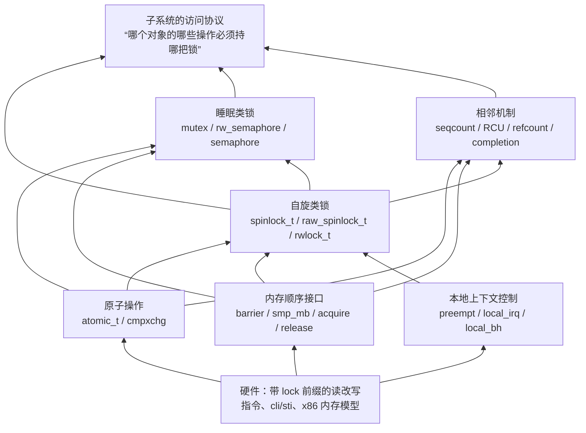
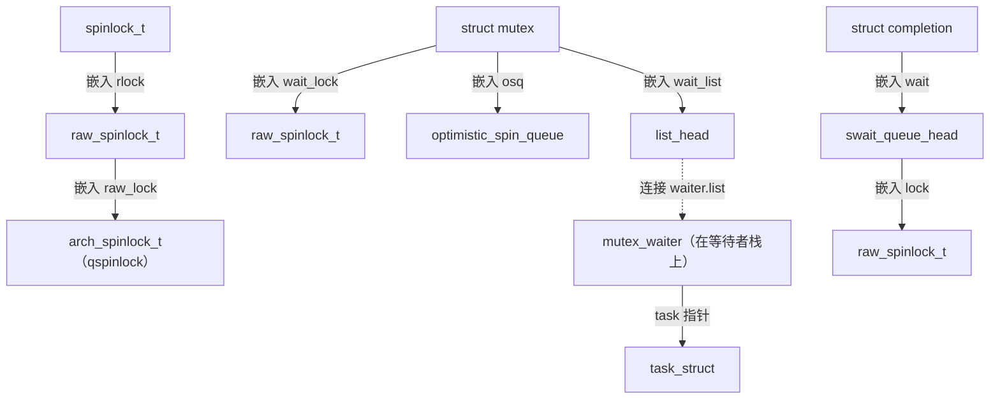
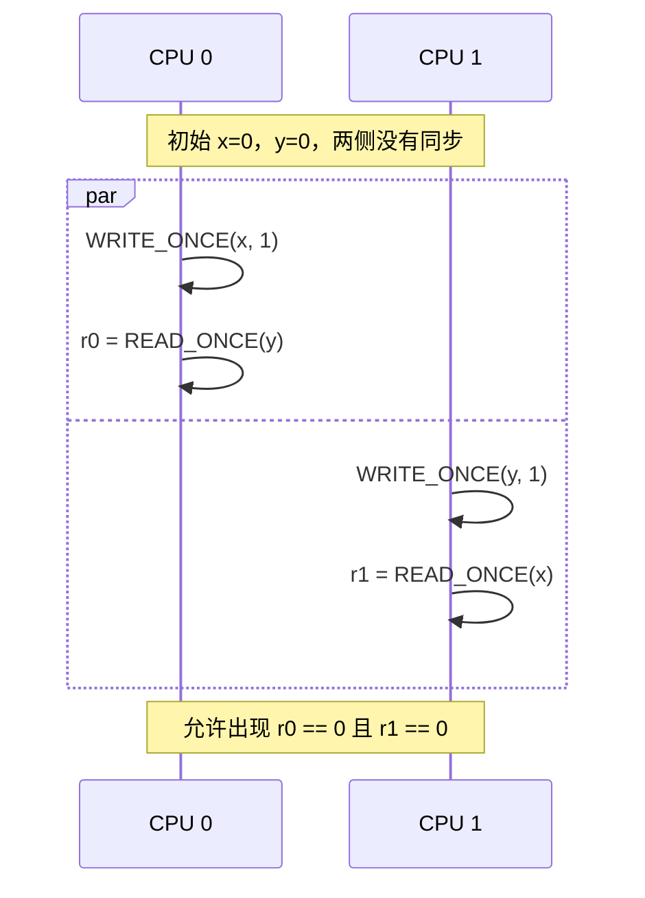
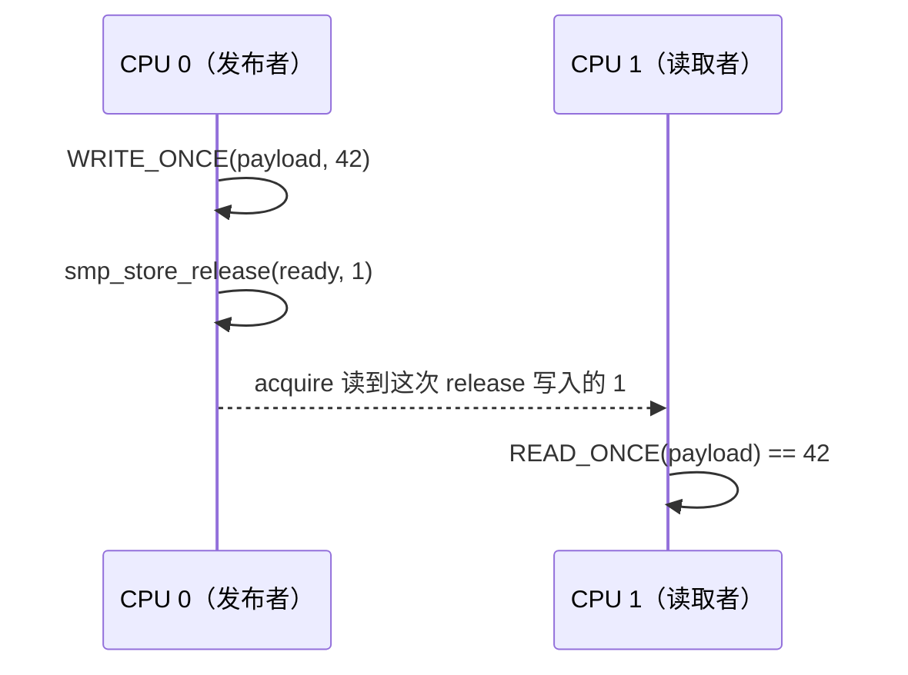
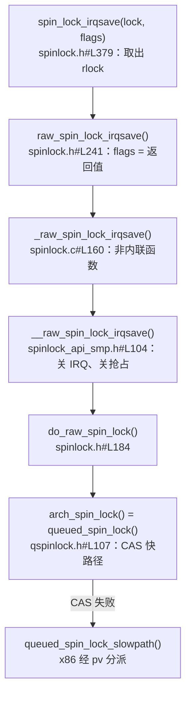
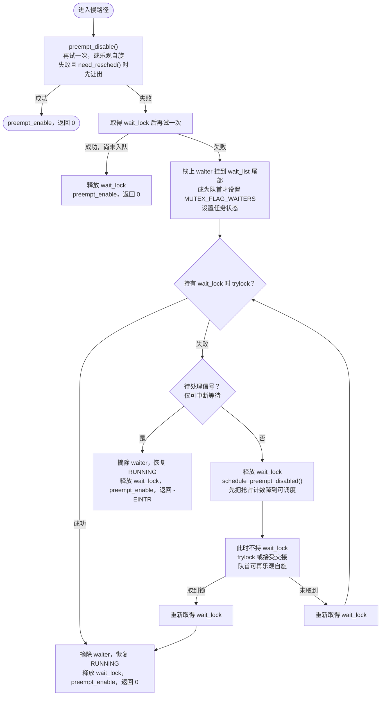

# 锁机制基础：并发问题、底层原语与加锁协议

两个 CPU 同时给一个计数器加一，结果可能只加了一次；链表插入到一半，另一个 CPU 就开始遍历；“数据已就绪”的标志已经可见，读到的数据却还是旧的；一个链表节点已经摘下，却还不能立即释放；两个任务各持一把锁、各等对方那一把，谁也走不下去；条件已经满足，等待者却睡下后再也没被叫醒。这些现象对应六类正确性问题：一次更新是否完整，一组字段是否一致，修改以什么顺序被其他 CPU 看到，对象在使用期内是否存活，执行者能否继续前进，以及等待与唤醒能否衔接。除此之外还有一个非正确性的问题：同步本身的开销和可扩展性。内核里的锁有这么多种，很大程度上就是因为要在这个问题上做取舍。

本章不深入某一种锁的竞争算法，而是回答学习所有锁之前都要先回答的问题：

1. 并发访问会破坏什么，访问者从哪里来，加锁本身又会带来哪些问题？
2. 锁和相关同步机制分别提供哪一种保证？
3. 锁是由哪些底层原语（原子操作、内存顺序、本地上下文控制）拼起来的？
4. 一次 `spin_lock_irqsave()` 和一次 `mutex_lock()` 是怎样把这些原语组合成协议的？

后续章节再分别展开 qspinlock、mutex、rwsem、RCU 等机制的内部实现。

## 0. 分析基线

本章依据仓库内 [Makefile 第 2～4 行](../../linux/Makefile#L2)标记的 **6.18.52** 版本，架构为 **x86-64**。讨论对象是普通内存上的 CPU 间同步，不涉及设备寄存器、DMA 顺序和用户态 futex。读者需要了解 C 指针、链表和进程调度；中断与软中断的执行路径可先阅读[中断子系统概述](../interrupt/overview.md)和 [softirq 机制](../interrupt/softirq.md)。

与本章结论有关的配置如下。它们是构建条件，不能据此断言某次运行一定经过某条竞争路径。

| 配置 | 对本章的影响 | 依据 |
| --- | --- | --- |
| `CONFIG_X86_64=y`、`CONFIG_SMP=y` | 既要考虑跨 CPU 并行，也要考虑本 CPU 上的交错 | [.config#L333](../../linux/.config#L333)、[.config#L362](../../linux/.config#L362) |
| `CONFIG_PREEMPT_RT` 未设置 | `spinlock_t` 就是对 `raw_spinlock_t` 的包装，mutex 走非 RT 实现 | [.config#L139](../../linux/.config#L139)、[spinlock_types.h#L14](../../linux/include/linux/spinlock_types.h#L14)、[mutex_types.h#L11](../../linux/include/linux/mutex_types.h#L11) |
| `CONFIG_PREEMPT_VOLUNTARY=y`、`CONFIG_PREEMPT_DYNAMIC=y`；后者选择 `PREEMPT_BUILD`，因而 `CONFIG_PREEMPTION=y`、`CONFIG_PREEMPT_COUNT=y` | 抢占计数总是维护；抢占模型在启动时选择，缺省为自愿抢占（见 3.4 节） | [.config#L136-L142](../../linux/.config#L136-L142)、[Kconfig.preempt#L9-L11](../../linux/kernel/Kconfig.preempt#L9-L11)、[Kconfig.preempt#L122-L130](../../linux/kernel/Kconfig.preempt#L122-L130) |
| `CONFIG_PREEMPT_RCU=y` | 普通 RCU 读侧临界区可以被抢占，但不能主动阻塞 | [.config#L168](../../linux/.config#L168) |
| `CONFIG_QUEUED_SPINLOCKS=y`、`CONFIG_QUEUED_RWLOCKS=y`、`CONFIG_NR_CPUS=512` | 自旋锁底层是 qspinlock，32 位锁字采用 `NR_CPUS < 16K` 的布局 | [.config#L1123](../../linux/.config#L1123)、[.config#L1125](../../linux/.config#L1125)、[.config#L431](../../linux/.config#L431) |
| `CONFIG_PARAVIRT_XXL=y`、`CONFIG_PARAVIRT_SPINLOCKS=y` | 自旋锁慢路径、解锁和本地中断开关都经过半虚拟化分派，原生指令只是其中一种运行结果 | [.config#L378](../../linux/.config#L378)、[.config#L380](../../linux/.config#L380) |
| `CONFIG_MUTEX_SPIN_ON_OWNER=y` | mutex 在睡眠前可能先乐观自旋 | [.config#L1119](../../linux/.config#L1119) |
| `CONFIG_DEBUG_SPINLOCK`、`CONFIG_DEBUG_MUTEXES`、`CONFIG_DEBUG_LOCK_ALLOC`、`CONFIG_LOCK_STAT` 未设置 | 锁结构中没有调试字段，加锁路径没有统计分支 | [.config#L10660-L10666](../../linux/.config#L10660-L10666) |

## 1. 锁要解决什么问题

### 1.1 六个场景，六种被破坏的东西

**场景一：更新丢失。** `count` 初值为 0，两个执行者各做一次 `count++`。把自增拆成“读出、计算、写回”三步来看（这是概念拆分，不是断言编译器一定生成三条指令）：

| 时刻 | 执行者 A | 执行者 B |
| --- | --- | --- |
| 1 | 读到 0 | |
| 2 | | 读到 0 |
| 3 | 写回 1 | |
| 4 | | 写回 1 |

每一次读、每一次写都是完整的，丢的是“读—改—写”整体的不可分割性。对单个计数器，内核提供原子读改写接口，例如 x86 的 [arch_atomic_inc()](../../linux/arch/x86/include/asm/atomic.h#L51)用带 `LOCK_PREFIX` 的 `incl` 完成一次自增。

这个问题在单次访问上也有对应版本。编译器可能把一次读取缓存在寄存器里重复使用，也可能把几次写入合并成一次，或者重新读取一个值，[rwonce.h 开头的注释](../../linux/include/asm-generic/rwonce.h#L3)把这类变换列为 `READ_ONCE()`/`WRITE_ONCE()` 要阻止的对象。即使代码中没有读—改—写，一次“读”或“写”也未必如源码所写那样恰好发生一次。第 3.2 节会说明这组接口能解决什么，不能解决什么。

**场景二：多字段关系被撕开。** 双向链表要求“后继的 `prev` 指回自己，前驱的 `next` 指向自己”。插入一个节点要改四个指针：

```c
if (!__list_add_valid(new, prev, next))
	return;

next->prev = new;
new->next = next;
new->prev = prev;
WRITE_ONCE(prev->next, new);
```

来源：[__list_add()，include/linux/list.h 第 161～167 行](../../linux/include/linux/list.h#L161-L167)。当前配置同时启用了 [CONFIG_LIST_HARDENED](../../linux/.config#L10064)、[CONFIG_DEBUG_LIST](../../linux/.config#L10683)和 [CONFIG_BUG_ON_DATA_CORRUPTION](../../linux/.config#L10065)。有 `CONFIG_DEBUG_LIST` 时，[__list_add_valid()](../../linux/include/linux/list.h#L79)里的内联快检查不会编译进去，每次都调用 [__list_add_valid_or_report()](../../linux/lib/list_debug.c#L22)。检查失败时 [CHECK_DATA_CORRUPTION()](../../linux/include/linux/bug.h#L95)直接 `BUG()`；x86 的 [BUG()](../../linux/arch/x86/include/asm/bug.h#L84-L88)带 `__builtin_unreachable()`，所以上面的 `return` 不会执行。

四次赋值之间存在“前驱已改、后继未改”的中间状态。即使把其中某个字段改成原子变量，也无法让四次赋值整体不可分割。这里需要保护的是**结构不变量**：插入、删除以及依赖这些指针的遍历必须遵守同一把锁。

不变量也可能跨越一段时间：先检查条件，再根据结果行动，即“检查后行动”（check-then-act，也称 TOCTOU，time-of-check to time-of-use）。例如“发现队列未满，于是插入”，如果检查和插入之间放开了锁，插入时队列可能已经满了。检查与行动必须处在同一个临界区里；一旦中途放开过锁，就要在重新加锁后再检查一次。mutex 慢路径就是这么做的：取得 `wait_lock` 之后，它会[再尝试一次加锁](../../linux/kernel/locking/mutex.c#L612-L621)，因为等待 `wait_lock` 的过程中锁可能已被释放（第 4.2 节）。

**场景三：查到了对象，却没保证对象还活着。** 假设查找和删除都正确地持有集合锁 `L`：

```text
执行者 A：加锁 L → 从集合取得指针 p → 解锁 L
执行者 B：加锁 L → 摘除 p → 解锁 L → 释放 p
执行者 A：访问 p->field                       ← 访问已释放内存
```

集合锁没有失效，它保护了查找和摘除这两个动作。错误在于 A 把裸指针带出了锁的范围，却没有取得“继续使用对象”的资格。这是**生命周期**问题，需要引用计数或 RCU 这类机制，第 4.3 节再讨论。

**场景四：看到了标志，却看不到数据。** 一个 CPU 先填好 `payload`，再把 `ready` 置 1；另一个 CPU 看到 `ready == 1` 后读取 `payload`。这里只有一个写者，没有更新丢失，每个字段也都是一次完整写入，读者仍然可能读到旧的 `payload`：两次写入在别的 CPU 上被观察到的顺序，不一定是程序中写下的顺序。这是**内存顺序**问题。原子性只回答对一个位置的操作能否被拆开，并不回答多个位置的修改以什么顺序变得可见。第 3.3 节用内存模型用例说明这一点，并给出 release/acquire 的解法；锁之所以能保护数据，正是因为加锁和解锁带有这种顺序语义。

**场景五：两个任务互相等待。** 任务 A 持有锁 `L1` 再去申请 `L2`，任务 B 持有 `L2` 再去申请 `L1`：

```text
任务 A：加锁 L1 成功 → 申请 L2，等待 B 释放
任务 B：加锁 L2 成功 → 申请 L1，等待 A 释放
```

两把锁各自都工作正常，数据也没有被破坏，系统却停住了。这是**进展性**（liveness）问题：锁的引入保证了数据正确，同时也带来了“等待可能永远不会结束”的风险。死锁只是其中一种，第 1.3 节把这类问题集中讨论。

**场景六：条件满足了，等待者却睡死了。** 等待者检查条件、发现不满足、准备睡眠；唤醒者修改条件并发出唤醒。如果事件按下面的顺序发生：

```text
等待者：检查条件 → 不满足
唤醒者：                    条件 = 1 → 唤醒（等待者此时还是运行态，唤醒什么也不做）
等待者：                                                  进入睡眠，再也没人来唤醒
```

条件和数据都没有错，丢的是那一次唤醒，称为**丢失唤醒**（lost wakeup）。[set_current_state() 的注释](../../linux/include/linux/sched.h#L201-L225)给出了内核的标准写法：等待者**先**设置任务状态再检查条件。`set_current_state()` 用 [smp_store_mb()](../../linux/include/linux/sched.h#L249)写状态，x86 上是 [xchg](../../linux/arch/x86/include/asm/barrier.h#L57)，状态写入因此排在随后的条件检查之前。同一段注释要求唤醒端在读 `p->__state` 之前有全屏障。实现上，[try_to_wake_up()](../../linux/kernel/sched/core.c#L4191-L4199)先取得 `pi_lock`，再调用 `smp_mb__after_spinlock()`，然后才检查状态。x86 没有单独定义这个宏，它落到 [kcsan_mb()](../../linux/include/linux/spinlock.h#L175-L176)；当前[未设置 CONFIG_KCSAN](../../linux/.config#L10554)，宏展开为空操作（[kcsan-checks.h 第 264 行](../../linux/include/linux/kcsan-checks.h#L264)）。[spinlock.h 第 168～171 行](../../linux/include/linux/spinlock.h#L168-L171)说明，TSO 架构上每条原子指令都隐含 `smp_mb()`，这里不再另加屏障。取得 `pi_lock` 时的原子操作因此提供这次全序。这样，要么等待者看到新条件而不睡，要么唤醒者看到等待者已经改了状态，把它改回运行态。[___wait_event()](../../linux/include/linux/wait.h#L309-L313)同样先调用 `prepare_to_wait_event()` 入队并设置状态，再检查条件；mutex 的等待循环也是[先 set_current_state() 再尝试取锁](../../linux/kernel/locking/mutex.c#L686-L693)，注释写明这是为了与解锁端排序。

六个场景对应六个不同目标：

| 场景 | 被破坏的东西 | 需要的保证 | 本章相关位置 |
| --- | --- | --- | --- |
| 更新丢失 | 一次读—改—写的不可分割性 | 原子性 | 3.1、3.2 节 |
| 链表被撕开、检查后行动 | 多个字段（或检查与行动之间）的不变量 | 互斥、一致性 | 4.1、4.2 节 |
| 标志可见、数据未到 | 多个位置之间的可见顺序 | 内存顺序 | 3.3 节 |
| 释放后访问 | 对象在使用期内的存活 | 生命周期 | 4.3 节 |
| 互相等待 | 执行者继续前进的能力 | 进展性 | 1.3 节 |
| 丢失唤醒 | 等待与唤醒之间的衔接 | 事件等待 | 本节、1.4 节 |

判断一个机制是否合适，要看它证明的是哪个目标，而不是看名字里有没有“锁”。

### 1.2 访问者从哪里来

内核里的并发有两个维度：

- **跨 CPU 并行**：两个处理器在同一时刻访问同一数据。
- **同 CPU 交错**：同一个 CPU 上，任务被抢占、被软中断或硬中断打断，打断者也访问同一数据。即使只有一个 CPU，这类问题依然存在。

同 CPU 上的执行上下文由 `preempt_count` 的不同位段区分（[preempt.h 第 27～31 行](../../linux/include/linux/preempt.h#L27)）：

| 位段 | 掩码 | 含义 |
| --- | --- | --- |
| bit 0–7 | `PREEMPT_MASK` = `0x000000ff` | 禁止抢占的嵌套深度 |
| bit 8–15 | `SOFTIRQ_MASK` = `0x0000ff00` | 正在处理 softirq（`SOFTIRQ_OFFSET`）或关闭了下半部（`SOFTIRQ_DISABLE_OFFSET`） |
| bit 16–19 | `HARDIRQ_MASK` = `0x000f0000` | 硬中断嵌套深度 |
| bit 20–23 | `NMI_MASK` = `0x00f00000` | NMI 嵌套深度 |

| 执行上下文 | 可能打断它的本 CPU 活动 | 对锁的约束 |
| --- | --- | --- |
| 进程上下文 | 抢占（取决于抢占模型）、softirq、hardirq、NMI | 只有在当前允许睡眠时才能使用会阻塞的锁 |
| softirq | hardirq、NMI；本 CPU 不会再嵌套进入另一次 softirq 处理 | 不能睡眠；不同 CPU 仍可同时运行同一种 softirq |
| hardirq | NMI（普通 IRQ 处理期间本地 IRQ 关闭） | 不能睡眠，不能等待被它打断的持锁者 |
| NMI | 不受本地 IRQ 开关约束，可以在任意时刻到来 | 不能用普通的 `_irqsave` 自旋锁与被打断路径共享数据 |

softirq 不会在本 CPU 上嵌套，依据是计数检查：[handle_softirqs()](../../linux/kernel/softirq.c#L579)先经 [softirq_handle_begin()](../../linux/kernel/softirq.c#L461)加上 `SOFTIRQ_OFFSET`，再[打开本地 IRQ](../../linux/kernel/softirq.c#L606)执行回调；这期间 [in_interrupt()](../../linux/include/linux/preempt.h#L143)为真，[do_softirq()](../../linux/kernel/softirq.c#L515)和 [__irq_exit_rcu()](../../linux/kernel/softirq.c#L722-L723)都因此不再启动新一轮处理。`ksoftirqd` 线程调用的是[同一个 handle_softirqs()](../../linux/kernel/softirq.c#L1063)，回调仍然处于 softirq 计数之下，线程身份并不放宽约束。NMI 可以在任意时刻到来，见本地文档 [kernel-stacks.rst](../../linux/Documentation/arch/x86/kernel-stacks.rst#L81)。

**同 CPU 交错为什么会死锁？** 用一把普通自旋锁 `L` 说明：

```text
任务：     spin_lock(L) 成功
            ↓ 本地 IRQ 到达，任务被打断
硬中断：   spin_lock(L) —— 自旋等待 L 释放
            ↓ 硬中断不返回，任务就无法继续
任务：     spin_unlock(L) 永远得不到执行机会
```

这里不需要第二个 CPU。根因是**等待者阻止了持锁者运行**。[__raw_spin_lock()](../../linux/include/linux/spinlock_api_smp.h#L130)只禁止抢占，不关本地 IRQ；[__raw_spin_lock_irqsave()](../../linux/include/linux/spinlock_api_smp.h#L104)在争锁前先保存并关闭本地 IRQ，因此能排除普通硬中断重入，但仍挡不住 NMI。

### 1.3 进展性：锁自己带来的问题

前面几类问题是“不加锁会坏”。进展性问题恰好相反，是“加了锁才会出现”：数据一直正确，但某个执行者等不到它要的东西。下表从最严重的情形排到最轻的情形，表后逐条说明。

| 问题 | 现象 | 常见原因 | 应对 |
| --- | --- | --- | --- |
| 自死锁（递归死锁） | 执行者等待一把自己已经持有的锁 | 同一上下文重复加锁；被本 CPU 上的打断者重入 | 不可递归加锁；用 `_bh`/`_irqsave` 变体排除本地重入 |
| 锁顺序反转（ABBA 死锁） | 两个以上执行者形成等待环 | 不同路径以相反顺序获取多把锁 | 规定全局加锁顺序 |
| 在原子上下文中睡眠 | 持锁者被换下 CPU，等待者长时间空转 | 持自旋锁、关中断或关抢占时调用可能睡眠的函数 | 自旋锁临界区内不睡眠；需要睡眠就改用 mutex |
| 活锁 | 执行者一直在运行、一直在重试，但始终没有完成 | 乐观重试反复被干扰 | 退避、排队，或改用会阻塞的协议 |
| 饥饿 | 某个等待者长期抢不到锁，其他执行者持续取得进展 | 新来者反复插队 | 排队（FIFO）、显式交接 |
| 优先级反转 | 高优先级任务被低优先级任务间接阻塞，时间没有上限 | 持锁的低优先级任务又被中优先级任务抢占 | 优先级继承 |

**自死锁与 ABBA 死锁。** 第 1.2 节的硬中断重入就是自死锁。本地 lockdep 文档把它称为 lock recursion deadlock：一把在中断上下文使用的锁，如果在中断开启时被获取，就可能在持有期间被中断打断后[再次申请](../../linux/Documentation/locking/lockdep-design.rst#L127-L132)；同一把锁[也不能获取两次](../../linux/Documentation/locking/lockdep-design.rst#L140-L141)。两把锁以[相反顺序获取](../../linux/Documentation/locking/lockdep-design.rst#L143-L154)则构成 lock inversion deadlock，即场景五。应对办法是为所有会嵌套持有的锁规定统一顺序，这是子系统访问协议的一部分，锁本身无法替使用者遵守。lockdep 会记录运行中实际出现的[加锁顺序](../../linux/Documentation/locking/lockdep-design.rst#L19-L27)并检查是否成环，但当前配置[未设置 CONFIG_PROVE_LOCKING](../../linux/.config#L10659)，这个构建不做这项运行时检查。

**在原子上下文中睡眠。** 持有自旋锁时，抢占计数非零（第 4.1 节）。如果此时调用了会睡眠的函数，持锁者会被换下 CPU，其他 CPU 上的竞争者只能一直自旋，直到持锁者重新被调度。这一段后果是根据自旋锁的语义推出的，不是某个函数的注释。[might_sleep()](../../linux/include/linux/kernel.h#L81-L94)就是为提前发现这类错误设计的：启用 `CONFIG_DEBUG_ATOMIC_SLEEP` 时，它会在原子上下文中打印调用栈。当前配置[未设置该选项](../../linux/.config#L10667)，`might_sleep()` 只剩下 [might_resched()](../../linux/include/linux/kernel.h#L135-L136)，不做检查。所以“这次没有报警”不能证明调用上下文是正确的。

**活锁。** 第 3.1 节的 CAS 循环“不保证有限次内一定成功”；seqcount 读者在写者持续更新时也会一直重试。重试协议用“可能多做几次”换来“读者或竞争者不阻塞”，前提是冲突不会一直持续。如果冲突本身会持续，就需要排队或者阻塞等待。

**饥饿与公平。** 一把锁可以没有死锁、整体也在前进，但对某个等待者不公平。qspinlock 的排队部分基于 MCS 锁，[mcs_spinlock.h](../../linux/kernel/locking/mcs_spinlock.h#L7-L11)把 MCS 的性质概括为公平，并且每个 CPU 只在自己的本地变量上自旋。mutex 的情况有所不同：新来者可以在快路径或乐观自旋中直接拿到锁，而已经睡下的等待者被唤醒后还要重新竞争。为此，`owner` 的 bit 1 [MUTEX_FLAG_HANDOFF](../../linux/kernel/locking/mutex.h#L29-L33)要求解锁者把锁交给队首等待者。队首等待者醒来后以 `first` 为真调用 [__mutex_trylock_or_handoff()](../../linux/kernel/locking/mutex.c#L692)。锁仍由别人持有、且尚未处于交接时，[第 104 行](../../linux/kernel/locking/mutex.c#L104)置上 `MUTEX_FLAG_HANDOFF`。若 `owner` 上已有 `MUTEX_FLAG_PICKUP` 且任务就是当前任务，则走[第 100 行](../../linux/kernel/locking/mutex.c#L100)，清掉 `PICKUP` 并继续尝试取锁。解锁慢路径看到 `HANDOFF` 后，[跳出](../../linux/kernel/locking/mutex.c#L936-L937)把持有者清成“只留标志位”的 CAS 循环。等待链表非空时，队首来自 [list_first_entry()](../../linux/kernel/locking/mutex.c#L951-L955)，[__mutex_handoff()](../../linux/kernel/locking/mutex.c#L219-L235)再用 `atomic_long_try_cmpxchg_release()` 把 `owner` 写成该任务并置上 `MUTEX_FLAG_PICKUP`，调用点在[第 962～963 行](../../linux/kernel/locking/mutex.c#L962-L963)。源码注释只说明了这个标志的作用，没有写设计动机；把它的目的理解为“限制新来者反复插队”，是本章的推断。

**优先级反转。** 本地 [rt-mutex 设计文档](../../linux/Documentation/locking/rt-mutex-design.rst#L34-L43)给出了典型场景：高优先级任务 A 等待低优先级任务 C 持有的锁，中优先级任务 B 抢占了 C，于是 A 被间接阻塞，而且等待时间没有上限。文档讨论的解法是[优先级继承](../../linux/Documentation/locking/rt-mutex-design.rst#L64-L71)（priority inheritance，PI）：C 在持锁期间临时继承 A 的优先级。当前配置 [CONFIG_RT_MUTEXES=y](../../linux/.config#L1015)，非 RT 内核中 rt_mutex 的用户之一是 PI futex（[CONFIG_FUTEX_PI=y](../../linux/.config#L279)），其状态中嵌有 [rt_mutex_base](../../linux/kernel/futex/futex.h#L162)。第 4.2 节的普通 mutex 按 FIFO 挂入等待者，不做优先级继承。

### 1.4 六种保证

“线程安全”是一个过于笼统的标签。分析同步代码时，应先说清需要哪一种保证：

| 问题 | 需要建立的保证 | 典型手段 |
| --- | --- | --- |
| 互斥 | 同一时刻只有遵守协议的一个持有者进入临界区 | 自旋锁、mutex；不遵守协议的访问者不受保护 |
| 数据一致性 | 读到的多个字段满足不变量，或来自同一次更新 | 加锁；或序列计数（读者校验快照，冲突则重试） |
| 内存顺序 | 观察到同步标志后，一定能观察到它之前发布的数据 | 锁的 acquire/release 语义、成对的发布与读取、内存屏障 |
| 对象生命周期 | 使用指针期间，对象内存一直有效 | 覆盖使用期的锁、引用计数、RCU 延迟回收 |
| 事件等待 | 条件不满足时睡眠，条件变化后被唤醒并重新检查，唤醒不丢失 | 等待队列、completion；被唤醒不等于取得独占权 |
| 进展 | 等待终会结束：不成环、不在原子上下文睡眠、不被无限期插队或间接阻塞 | 统一加锁顺序、本地上下文控制、排队与交接、优先级继承 |

这些机制并不互相替代。例如 [read_seqcount_retry()](../../linux/include/linux/seqlock.h#L394)让读者丢弃冲突快照，但[seqcount_t 的说明](../../linux/include/linux/seqlock_types.h#L10)指出，如果写者让某个指针失效，读者可能在重试前已经沿着这个指针访问了内存，事后重试救不回来。又如 [wait_event()](../../linux/include/linux/wait.h#L345)的核心循环 [___wait_event()](../../linux/include/linux/wait.h#L302)负责入队、检查条件和调度，它并不为业务数据加锁。

前五种保证回答“结果对不对”，最后一种回答“能不能走到结果”。一个机制可以只保证前者而不保证后者，例如 CAS 重试循环；也可以在保证后者时付出代价，例如为了公平而进行交接，就失去了“谁先抢到给谁”的快路径。

**同步的开销与可扩展性**不属于上表，因为它不会让结果出错，却决定了内核为什么需要这么多种同步机制。代价主要来自三方面：

- **缓存行争用**：所有竞争者反复读改写同一个锁字时，这条缓存行会在 CPU 之间来回迁移。[mcs_spinlock.h](../../linux/kernel/locking/mcs_spinlock.h#L7-L11)指出，MCS 锁让每个 CPU 在本地变量上自旋，从而避免普通 test-and-set 自旋锁造成的缓存行迁移。qspinlock 把这一思路压缩进 32 位锁字，见 [qspinlock.c 的设计注释](../../linux/kernel/locking/qspinlock.c#L33-L63)。
- **不必要的串行化**：只读访问之间本来不冲突，却也被互斥锁一个个排开。读写锁允许多个读者同时进入，seqcount 和 RCU 进一步让读者完全不阻塞写者，代价则转移到读者重试或写者延迟回收上。
- **等待方式**：自旋会消耗 CPU，睡眠需要上下文切换。mutex 先乐观自旋再睡眠（第 4.2 节），是在两者之间折中。

这些取舍没有一种在所有场景下都占优，本书不给出脱离测量的性能数字；后续章节讨论具体机制时，只说明各自的适用条件。

### 1.5 全景：锁处在哪一层

下图把本章涉及的机制按依赖关系分层。箭头表示“由……构建”，不是调用顺序。



两点需要注意。第一，睡眠类锁内部也用自旋锁：mutex 的等待链表由内部的 `wait_lock` 保护（第 2 节）。第二，最上层的“访问协议”永远由使用者定义；锁只提供获取与释放的能力，并不知道自己保护哪些数据。

下表是常用类型的速查，“可睡眠”指调用者所处环境允许调度，并且没有外层自旋锁、关中断等约束。

| 类型 | 竞争时行为 | 适用上下文与限制 | 源码入口 |
| --- | --- | --- | --- |
| `spinlock_t` | 自旋等待，持有期间禁止抢占 | 短、不睡眠的临界区；与 softirq/hardirq 共享时用 `_bh`/`_irqsave` 变体 | [spin_lock()](../../linux/include/linux/spinlock.h#L349) |
| `raw_spinlock_t` | 同上；RT 内核下也保持严格自旋 | 核心底层代码、低层中断处理；名字里的 raw 不代表能用于 NMI | [locktypes.rst#L235](../../linux/Documentation/locking/locktypes.rst#L235) |
| `rwlock_t` | 多读者或单写者，竞争时自旋 | 读区、写区都不能睡眠 | [queued_read_lock()](../../linux/include/asm-generic/qrwlock.h#L78) |
| `struct mutex` | 快路径 → 乐观自旋 → 睡眠 | 可睡眠的进程上下文；不可递归，只能由持有者解锁 | [mutex_lock()](../../linux/kernel/locking/mutex.c#L269) |
| `struct rw_semaphore` | 可睡眠的多读者或单写者 | 可睡眠的进程上下文 | [down_read()](../../linux/kernel/locking/rwsem.c#L1534)、[down_write()](../../linux/kernel/locking/rwsem.c#L1587) |
| `struct semaphore` | 许可耗尽时睡眠，没有 owner | `down()` 需可睡眠；`up()`、`down_trylock()` 可在中断上下文调用 | [semaphore.h#L40](../../linux/include/linux/semaphore.h#L40)、[down()](../../linux/kernel/locking/semaphore.c#L80) |
| `seqcount_t` / `seqlock_t` | 读者不阻塞，冲突时重试 | 写者必须串行；读者不能跟随可能失效的指针 | [write_seqlock()](../../linux/include/linux/seqlock.h#L861) |
| RCU | 读者几乎无开销；回收者等待宽限期 | 不提供写者之间的互斥；读侧可以被抢占，但不能主动阻塞（[rcupdate.h 第 856～858 行](../../linux/include/linux/rcupdate.h#L856-L858)） | [rcu_read_lock()](../../linux/include/linux/rcupdate.h#L863)、[synchronize_rcu()](../../linux/kernel/rcu/tree.c#L3341) |
| `refcount_t` | 原子计数，不等待 | 递增前调用者必须已保证内存有效 | [refcount_inc_not_zero()](../../linux/include/linux/refcount.h#L320) |
| completion | 未完成时睡眠 | 等待需可睡眠；`complete()` 可在中断或原子上下文调用（[completion.rst#L264](../../linux/Documentation/scheduler/completion.rst#L264)） | [complete()](../../linux/kernel/sched/completion.c#L50)、[wait_for_completion()](../../linux/kernel/sched/completion.c#L151) |

## 2. 核心数据结构

锁机制里有三类容易混淆的东西：**被保护的数据**、**锁自身的状态**、**等待者**。下面先看本章反复出现的结构体，只列与本章有关的字段。

| 结构 | 关键字段 | 含义 |
| --- | --- | --- |
| `atomic_t` | `int counter` | 一个整数的存储位置。“原子”来自操作它的接口，不是给周围对象附加的属性。定义见 [types.h#L181](../../linux/include/linux/types.h#L181) |
| `struct list_head` | `next`、`prev` | 嵌入在业务对象中的链表节点；链表成员关系本身不增加对象引用。见 [types.h#L199](../../linux/include/linux/types.h#L199) |
| `spinlock_t` | `rlock` | 非 RT 下是 `union`，唯一成员是 `struct raw_spinlock rlock`（调试字段未启用）。见 [spinlock_types.h#L17-L29](../../linux/include/linux/spinlock_types.h#L17-L29) |
| `raw_spinlock_t` | `raw_lock` | 嵌入架构锁 `arch_spinlock_t`。见 [spinlock_types_raw.h#L14](../../linux/include/linux/spinlock_types_raw.h#L14) |
| `arch_spinlock_t`（`struct qspinlock`） | `val` / `locked` / `pending` / `tail` | 同一个 32 位锁字的不同视图。见 [qspinlock_types.h#L14-L44](../../linux/include/asm-generic/qspinlock_types.h#L14-L44) |
| `struct mutex` | `owner`、`wait_lock`、`osq`、`wait_list` | 持有者及状态标志、保护等待链表的内部自旋锁、乐观自旋队列、等待者链表。见 [mutex_types.h#L41-L54](../../linux/include/linux/mutex_types.h#L41-L54) |
| `struct mutex_waiter` | `list`、`task` | 等待节点，位于等待任务的内核栈上。见 [mutex.h#L10-L21](../../linux/kernel/locking/mutex.h#L10-L21) |
| `refcount_t` | `atomic_t refs` | 有效引用的数量，饱和而不回绕。见 [refcount_types.h#L7-L17](../../linux/include/linux/refcount_types.h#L7-L17) |
| `struct completion` | `done`、`wait` | 已发生但尚未被消费的完成次数，以及嵌入的简单等待队列。见 [completion.h#L26-L29](../../linux/include/linux/completion.h#L26-L29) |

### 2.1 对象关系

下图中实线表示“嵌入”（包含在同一块内存里），虚线表示“通过链表节点连接”。可以看到三层自旋锁结构都是嵌入关系，没有一个指针指向受保护的数据；mutex 和 completion 各有自己的等待队列，二者互不相干。



`swait_queue_head` 的定义见 [swait.h#L43](../../linux/include/linux/swait.h#L43)。

### 2.2 两个“一个字表达多种状态”的设计

**qspinlock 的 32 位锁字。** 当前 `CONFIG_NR_CPUS=512`，小于 16K，位布局采用 [qspinlock_types.h 第 54～59 行](../../linux/include/asm-generic/qspinlock_types.h#L54-L59)的第一种：

```text
 31                    18 17 16 15        9  8  7            0
 +-----------------------+-----+-----------+---+--------------+
 |   tail cpu (+1)       | idx |  未使用    | P |  locked byte |
 +-----------------------+-----+-----------+---+--------------+
   tail：排队队尾的 CPU 与嵌套层级      pending  持有标志
```

`val`、`locked`、`pending`、`tail` 是 `union` 中同一份状态的不同视图（x86 为小端，选用 [第 23 行起的分支](../../linux/include/asm-generic/qspinlock_types.h#L23)），不是几份独立的计数。空闲锁的 `val` 为 0（[__ARCH_SPIN_LOCK_UNLOCKED](../../linux/include/asm-generic/qspinlock_types.h#L49)），无竞争加锁就是把 0 改成 `_Q_LOCKED_VAL`。

**mutex 的 `owner`。** `owner` 是 `atomic_long_t`，存放持有者的 `task_struct` 指针，0 表示未被持有。由于 `task_struct` 至少按缓存行对齐，低 3 位可以借来存标志（[mutex.h 第 23～36 行](../../linux/kernel/locking/mutex.h#L23-L36)）：

| 位 | 宏 | 含义 |
| --- | --- | --- |
| bit 0 | `MUTEX_FLAG_WAITERS` | 等待链表非空，解锁时必须唤醒 |
| bit 1 | `MUTEX_FLAG_HANDOFF` | 解锁时应把锁直接交给队首等待者 |
| bit 2 | `MUTEX_FLAG_PICKUP` | 已完成交接，等待队首来取 |

因此“读到 `owner` 非零”只说明锁被某个任务持有或正在交接，并不表示当前调用者有权访问受保护的数据。

### 2.3 生命周期

**锁对象本身也有生命周期协议。** [spin_lock_init()](../../linux/include/linux/spinlock.h#L341)把锁写成空闲值；[__mutex_init()](../../linux/kernel/locking/mutex.c#L46-L57)把 `owner` 清零，初始化 `wait_lock`、`wait_list` 和 `osq`。初始化必须在锁对其他访问者可见之前完成，不能通过重新初始化一把正在使用的锁来“解除竞争”。锁通常嵌在业务对象里，随对象一起分配和释放。mutex 的[使用约束](../../linux/include/linux/mutex_types.h#L13-L27)明确禁止递归获取、非持有者解锁、释放仍被持有的锁所在的内存，以及在硬中断、软中断上下文中使用。当前配置下 [mutex_destroy() 是空函数](../../linux/include/linux/mutex.h#L48)，它不会等待使用者退出。

**等待节点的生命周期很短。** mutex 慢路径里的 [mutex_waiter 是局部变量](../../linux/kernel/locking/mutex.c#L567)。如果乐观自旋成功，或者入队前再次尝试就拿到了锁，它根本不会进入链表；一旦被 [__mutex_add_waiter()](../../linux/kernel/locking/mutex.c#L190-L200)挂上，函数无论成功还是出错返回前都会把它摘下（见 4.2 节）。链表里的节点因此始终对应一个仍在等待的任务。

**completion 的状态迁移。** [init_completion()](../../linux/include/linux/completion.h#L84-L88)把 `done` 清零。[complete_with_flags()](../../linux/kernel/sched/completion.c#L21-L31)在内部锁下把 `done` 加一（已经是 `UINT_MAX` 时不加），再唤醒一个等待者；[等待路径](../../linux/kernel/sched/completion.c#L107-L108)消费一次 `done`。[complete_all()](../../linux/kernel/sched/completion.c#L79)把 `done` 写成 `UINT_MAX`，表示永久完成，之后的等待者不再消费它。

## 3. 构成锁的底层原语

锁不是一个不可分解的魔法。下面依次看三种原语：原子读改写、内存顺序、本地上下文控制。第 4 节再把它们组装起来。

### 3.1 原子读改写与比较交换

读—改—写（read-modify-write，RMW）指读取旧值、计算新值并写回。x86 上 [arch_atomic_read()](../../linux/arch/x86/include/asm/atomic.h#L17-L24)和 [arch_atomic_set()](../../linux/arch/x86/include/asm/atomic.h#L26-L29)分别是一次 `__READ_ONCE`、一次 `__WRITE_ONCE`，没有 `lock` 前缀；[arch_atomic_add()](../../linux/arch/x86/include/asm/atomic.h#L31-L36)和 `arch_atomic_inc()` 才用带锁前缀的指令把 RMW 合成一步。`LOCK_PREFIX` 在 SMP 构建中展开为 `lock` 前缀，并把该前缀的地址放进 `.smp_locks` 段（[alternative.h 第 44～52 行](../../linux/arch/x86/include/asm/alternative.h#L44-L52)）。[第 39～41 行](../../linux/arch/x86/include/asm/alternative.h#L39-L41)说明锁前缀单独登记成一张地址表；[第 30～37 行](../../linux/arch/x86/include/asm/alternative.h#L30-L37)说明这类 SMP 替代可以在 UP 运行和 CPU 热插入之间改写。

下面两段是**接口用法示意**，不是内核源码：

```c
/* 错误：两次调用之间可以插入另一个执行者。 */
int n = atomic_read(&count);
atomic_set(&count, n + 1);

/* 正确：一次原子读改写。 */
atomic_inc(&count);
```

第二段只解决了单变量问题。如果还要维持“`count` 等于链表节点数”，链表更新和计数更新之间仍需要同一把锁。

不同返回形式适合不同的判断：

| 接口 | 返回值 |
| --- | --- |
| `atomic_add(i, v)`、`atomic_inc(v)` | 无返回值 |
| `atomic_add_return(i, v)` | 更新后的值 |
| `atomic_fetch_add(i, v)` | 更新前的值 |
| `atomic_cmpxchg(v, old, new)` | 操作时读到的值；等于 `old` 才说明替换成功 |
| `atomic_try_cmpxchg(v, &old, new)` | 成功与否；失败时把实际值写回 `old` |

依据见 [atomic_add_return()](../../linux/include/linux/atomic/atomic-instrumented.h#L108)、[atomic_fetch_add()](../../linux/include/linux/atomic/atomic-instrumented.h#L182)、[atomic_cmpxchg()](../../linux/include/linux/atomic/atomic-instrumented.h#L1178)、[atomic_try_cmpxchg()](../../linux/include/linux/atomic/atomic-instrumented.h#L1260)的注释。

**比较交换**（compare-and-swap，CAS）把“如果仍是预期值，就写入新值”合成一步，是几乎所有锁快路径的核心。x86 的 [arch_atomic_cmpxchg()](../../linux/arch/x86/include/asm/atomic.h#L99)最终落到 [cmpxchgl 分支](../../linux/arch/x86/include/asm/cmpxchg.h#L109)，并由 [__cmpxchg](../../linux/arch/x86/include/asm/cmpxchg.h#L133)加上锁前缀。

下面用“扣减有限许可”演示 CAS 循环。这是**简化示意**，假设 `remaining` 发布前已初始化为非负数，所有修改都用原子接口：

```c
/* 示意：只扣减数量，不传递其他数据的所有权。 */
bool take_one(atomic_t *remaining)
{
    int old = atomic_read(remaining);

    for (;;) {
        if (old <= 0)
            return false;
        if (atomic_try_cmpxchg_relaxed(remaining, &old, old - 1))
            return true;
        /* 失败时 old 已更新为当前值，重新检查边界后再试。 */
    }
}
```

两个 CPU 同时读到 1 时，只有一个 CAS 能把 1 改成 0；另一个失败，拿到新的 `old == 0`，随后返回 `false`。循环保证的是竞争下的正确性，不保证有限次内一定成功。本地 [atomic_t.txt](../../linux/Documentation/atomic_t.txt#L302)给出了同样的循环形式。

这里使用 `_relaxed` 是有意的：示意只管数量。如果“拿到许可”还意味着要读取另一个 CPU 准备好的数据，就需要下一节的内存顺序。

### 3.2 `READ_ONCE()` / `WRITE_ONCE()`：约束编译器，不组成临界区

并发分析不能只考虑 CPU，编译器也可能把一次读取缓存在寄存器里复用、合并两次写入，或者重新读取一个值。`READ_ONCE()`、`WRITE_ONCE()` 用 [volatile 读](../../linux/include/asm-generic/rwonce.h#L44)和 [volatile 写](../../linux/include/asm-generic/rwonce.h#L55)禁止这类变换，并在编译期[检查访问宽度](../../linux/include/asm-generic/rwonce.h#L35)。[rwonce.h 开头的注释](../../linux/include/asm-generic/rwonce.h#L3)把它们定位为约束编译器的工具，需要和屏障或原子指令配合使用。

三条边界：

1. `WRITE_ONCE(x, READ_ONCE(x) + 1)` 仍然是一次读加一次写，不是原子 RMW。
2. 分别读两个字段，不会得到同一次更新的快照。
3. 标记一次访问，不会为其他地址建立 acquire、release 或全屏障顺序。

### 3.3 内存顺序

原子性回答“对一个位置的操作是否不可分割”；内存顺序回答“对**多个**位置的访问，别的 CPU 以什么顺序观察到”。这是两个独立的问题。

**屏障与单向语义：**

| 工具 | 保证 | 不能推出 |
| --- | --- | --- |
| `barrier()` | 编译器不能跨越它重排内存访问 | 不产生 CPU 屏障指令 |
| `smp_rmb()` / `smp_wmb()` | 屏障前后的读与读、写与写之间的顺序 | 不约束“先写后读” |
| `smp_mb()` | 屏障两侧所有读写的全序 | 不把多个写变成原子事务 |
| release 操作 | 它**之前**的访问不会被排到它之后 | 不约束它之后的访问 |
| acquire 操作 | 它**之后**的访问不会被排到它之前 | 不约束它之前的访问 |

[barrier()](../../linux/include/linux/compiler.h#L85)是带 `memory` clobber 的空汇编。x86 上 [__smp_mb()](../../linux/arch/x86/include/asm/barrier.h#L53)使用 `lock addl $0`，而 [__smp_rmb()](../../linux/arch/x86/include/asm/barrier.h#L55)和 [__smp_wmb()](../../linux/arch/x86/include/asm/barrier.h#L56)都只是编译器屏障：x86 实现认为普通内存访问在这两种情况下不需要额外的硬件屏障指令。可见“接口强弱”要看契约，不能数汇编里有几条屏障。acquire/release 的单向保证见[内存屏障文档](../../linux/Documentation/memory-barriers.txt#L474)。

**原子接口的顺序契约。** 名字里有 `atomic` 不等于全屏障，规则来自 [atomic_t.txt 的 ORDERING 一节](../../linux/Documentation/atomic_t.txt#L160)：

| 接口类别 | 顺序保证 |
| --- | --- |
| `atomic_read()`、`atomic_set()` | relaxed，不为其他地址排序 |
| 无返回值的 `atomic_add()`、`atomic_inc()` | relaxed |
| 无后缀、带返回值的 RMW，如 `atomic_add_return()` | 完全有序 |
| `_relaxed` / `_acquire` / `_release` 变体 | 按后缀提供 |
| 条件 RMW，如 `atomic_cmpxchg()` | 成功时按接口提供；失败时不保证顺序 |

x86 的 `lock` 指令往往比接口契约更强，但通用代码不能依赖这份额外强度。

**例一：两个 CPU 都读到旧值。** `x`、`y` 初始为 0，CPU 0 先写 `x` 再读 `y`，CPU 1 先写 `y` 再读 `x`。这个模式称为存储缓冲（store buffering）。下图只表示各 CPU 自己的程序顺序，两条线之间没有同步关系：



本地内存模型用例 [SB+poonceonces.litmus](../../linux/tools/memory-model/litmus-tests/SB+poonceonces.litmus#L4)两侧都没有屏障，把“双零”标为 Sometimes；两侧都在写和读之间加 `smp_mb()` 后，[SB+fencembonceonces.litmus](../../linux/tools/memory-model/litmus-tests/SB+fencembonceonces.litmus#L4)把它标为 Never。这两份用例只覆盖“两侧都没有”和“两侧都有”，没有“只在一侧加 `smp_mb()`”的结果。release 写加 acquire 读也不构成全屏障，[内存屏障文档第 501～502 行](../../linux/Documentation/memory-barriers.txt#L501-L502)写明 RELEASE+ACQUIRE 对不保证充当全屏障。

**例二：用 release/acquire 发布数据。** 这是锁交接最核心的顺序模式。下面是**一次性发布的简化代码**，假设只有一个发布者，`payload` 发布后不再修改，`ready` 不复用：

```c
/* CPU 0：发布者 */
WRITE_ONCE(payload, 42);
smp_store_release(&ready, 1);

/* CPU 1：读取者 */
if (smp_load_acquire(&ready) == 1)
    value = READ_ONCE(payload);   /* 一定读到 42 */
```



跨 CPU 的虚线表示“acquire 读到了 release 写入的值”，不是函数调用。release 把准备数据的写排在发布之前，acquire 把使用数据的读排在接收之后，读到同一个值把两端连接起来。对应的 [MP+pooncerelease+poacquireonce.litmus](../../linux/tools/memory-model/litmus-tests/MP+pooncerelease+poacquireonce.litmus#L4)把“看到 `ready==1` 却读到旧数据”标为 Never（判定条件在[第 28 行](../../linux/tools/memory-model/litmus-tests/MP+pooncerelease+poacquireonce.litmus#L28)）。

x86 上 [__smp_store_release()](../../linux/arch/x86/include/asm/barrier.h#L59-L64)是 `barrier()` 加 `WRITE_ONCE()`，[__smp_load_acquire()](../../linux/arch/x86/include/asm/barrier.h#L66-L72)是 `READ_ONCE()` 加 `barrier()`，都没有额外的硬件屏障指令。但通用代码中的接口仍然必要：它约束编译器，也让同一份代码在其他架构上成立。

**把这个模式对应到锁上：** 解锁是对锁字的 release 写，加锁成功是对锁字的 acquire 读改写。上一任持有者在临界区里的修改，因此对下一任持有者可见。这正是第 4.1 节要看到的。

### 3.4 本地上下文控制：禁止抢占、关中断、关下半部

这三组操作控制的是**本 CPU 上还有哪些执行活动能插进来**，与跨 CPU 的锁状态是两个维度。

| 操作 | 非 RT 下的效果 | 不解决的问题 |
| --- | --- | --- |
| `preempt_disable()` / `preempt_enable()` | 增减抢占计数，当前任务不会被抢占调度换走 | 不关中断，不阻止其他 CPU |
| `local_irq_save()` / `local_irq_restore()` | 保存并关闭本地可屏蔽中断，结束时恢复原状态 | 不屏蔽 NMI，不阻止其他 CPU |
| `local_bh_disable()` / `local_bh_enable()` | 本 CPU 的 softirq 处理不会在区间内运行，区间也不可抢占 | 不关硬中断，不阻止其他 CPU 的 softirq |

[locktypes.rst](../../linux/Documentation/locking/locktypes.rst#L58-L62)把这些称为纯 CPU 本地的并发控制，不适合 CPU 之间的同步。它们能保护 per-CPU 数据，前提是先确定访问者只在本 CPU 上。

实现要点：

- [preempt_disable()](../../linux/include/linux/preempt.h#L213-L217)增加计数后加编译器屏障。[preempt_enable()](../../linux/include/linux/preempt.h#L230-L235)减计数，减到零时调用 `__preempt_schedule()`。
- x86 原生的 [native_local_irq_save()](../../linux/arch/x86/include/asm/irqflags.h#L62)先保存标志再执行 `cli`。当前启用了 `CONFIG_PARAVIRT_XXL`，实际调用的 [arch_local_irq_save()](../../linux/arch/x86/include/asm/paravirt.h#L674)经过半虚拟化分派。`flags` 是这次调用前的中断状态，必须用 `restore` 恢复，不能用无条件的 `local_irq_enable()` 代替，否则会打开调用者原本关闭的中断。
- [local_bh_disable()](../../linux/include/linux/bottom_half.h#L18-L21)增加的是 [SOFTIRQ_DISABLE_OFFSET](../../linux/include/linux/preempt.h#L55)（即 `2 * SOFTIRQ_OFFSET`），与真正执行 softirq 时的 `SOFTIRQ_OFFSET` 不同，所以 [interrupt_context_level()](../../linux/include/linux/preempt.h#L97)不会把“仅仅关了下半部”当成 softirq 上下文。[__local_bh_enable_ip()](../../linux/kernel/softirq.c#L427)在重新打开时会检查并处理积压的 softirq。

**动态抢占的影响。** `CONFIG_PREEMPT_DYNAMIC` 让内核按 `CONFIG_PREEMPTION=y` 构建，但抢占模型在启动时才确定（[preempt.h#L509-L516](../../linux/include/linux/preempt.h#L509-L516)）。x86 的 [__preempt_schedule()](../../linux/arch/x86/include/asm/preempt.h#L125-L129)是一个 static call；[setup_preempt_mode()](../../linux/kernel/sched/core.c#L7776)解析 `preempt=` 启动参数，没有该参数时 [preempt_dynamic_init()](../../linux/kernel/sched/core.c#L7794-L7795)按 `CONFIG_PREEMPT_VOLUNTARY` 选择自愿模型。当前还有 [CONFIG_ARCH_HAS_PREEMPT_LAZY](../../linux/.config#L134)，启动参数可以是 `none`、`voluntary`、`full` 或 `lazy`（[core.c 第 7674～7686 行](../../linux/kernel/sched/core.c#L7674-L7686)）。按[模型对照注释](../../linux/kernel/sched/core.c#L7628-L7658)，`none` 和自愿模型把 `preempt_schedule` 改成 NOP（[第 7721～7737 行](../../linux/kernel/sched/core.c#L7721-L7737)）；`full` 和 `lazy` 都把它接到真正的 `preempt_schedule`；`lazy` 还会在[第 7760 行](../../linux/kernel/sched/core.c#L7760)打开 `dynamic_preempt_lazy`（[第 7743～7760 行](../../linux/kernel/sched/core.c#L7743-L7760)）。

结论是：缺省启动参数下，`preempt_enable()` 里的 `__preempt_schedule()` 调用点存在，但 static call 是 NOP，不会进入调度。`preempt=full` 和 `preempt=lazy` 都会把这个调用点接到真正的抢占函数。无论哪种模型，抢占计数都在维护，持有自旋锁期间都不会被抢占换出。禁止抢占也不是主动睡眠的许可，可睡眠锁的[调用上下文要求](../../linux/Documentation/locking/locktypes.rst#L26)依然有效。

## 4. 把原语组装成锁

### 4.1 `spin_lock_irqsave()`：先封住本 CPU，再参与跨 CPU 竞争

设想一个小队列同时被任务和硬中断访问，更新不能睡眠。任务端使用 `spin_lock_irqsave()`，目标有两个：在本 CPU 上排除硬中断重入，在 CPU 之间取得独占权。

**算法（简化逻辑，省略 lockdep 和跟踪钩子）。** 下面的解锁写成 [native_queued_spin_unlock()](../../linux/arch/x86/include/asm/qspinlock.h#L44-L47) 的 `smp_store_release`。当前配置的 [queued_spin_unlock()](../../linux/arch/x86/include/asm/qspinlock.h#L54-L58)先分派到 `pv_queued_spin_unlock()`，本节末尾说明为什么不把这条原生指令写成运行时必然结果。

```text
加锁：
    flags = 保存当前中断状态并关闭本地 IRQ      ← 封住本 CPU 的硬中断
    抢占计数 +1                                   ← 封住本 CPU 的抢占
    CAS(锁字: 0 → LOCKED)，带 acquire 语义        ← 跨 CPU 竞争的快路径
    若失败：进入排队慢路径，直到取得锁才返回

解锁（原生形态）：
    store_release(locked 字节, 0)                 ← 把临界区修改交给下一任
    按 flags 恢复本地 IRQ
    抢占计数 -1，必要时允许调度
```

注意顺序：本地上下文控制先于争锁，恢复则晚于释放。若反过来，先拿锁再关中断，中间就会出现第 1.2 节的自死锁窗口。

**调用链。** 下图从外到内列出当前配置下的实际层次，每一层只做一件事：



各层依据：

- [spin_lock_irqsave()](../../linux/include/linux/spinlock.h#L379-L382)把 `spinlock_t` 转成内嵌的 `raw_spinlock_t`，[raw_spin_lock_irqsave()](../../linux/include/linux/spinlock.h#L241-L245)把返回的中断状态写回调用者的 `flags`。
- 当前未设置 `CONFIG_INLINE_SPIN_LOCK_IRQSAVE`，所以 [spinlock_api_smp.h#L58-L60](../../linux/include/linux/spinlock_api_smp.h#L58-L60)的内联映射不生效，调用的是 [kernel/locking/spinlock.c#L160](../../linux/kernel/locking/spinlock.c#L160)中的非内联函数，它再调用 `__raw_spin_lock_irqsave()`。
- [__raw_spin_lock_irqsave()](../../linux/include/linux/spinlock_api_smp.h#L104-L113)依次执行 `local_irq_save()`、`preempt_disable()` 和 `LOCK_CONTENDED()`。未启用 `CONFIG_LOCK_STAT` 时，[LOCK_CONTENDED()](../../linux/include/linux/lockdep.h#L467-L468)直接展开为 `do_raw_spin_lock(lock)`。
- [do_raw_spin_lock()](../../linux/include/linux/spinlock.h#L184-L189)调用 `arch_spin_lock()`；x86 的 [spinlock.h](../../linux/arch/x86/include/asm/spinlock.h#L27)包含 qspinlock 头文件，[通用映射](../../linux/include/asm-generic/qspinlock.h#L147)把它定义为 `queued_spin_lock()`。

qspinlock 的快路径只有一次 CAS：

```c
int val = 0;

if (likely(atomic_try_cmpxchg_acquire(&lock->val, &val, _Q_LOCKED_VAL)))
	return;

queued_spin_lock_slowpath(lock, val);
```

来源：[queued_spin_lock()，include/asm-generic/qspinlock.h 第 109～114 行](../../linux/include/asm-generic/qspinlock.h#L109-L114)。

这里同时用上了第 3 节的两种原语：CAS 保证多个竞争者中只有一个能把锁字从 0 改成“已持有”；`_acquire` 保证临界区内的访问不会被排到取锁之前。CAS 失败时 `val` 带回当前锁字，交给慢路径排队；调用者不会收到“加锁失败”，函数返回时一定已经持有锁。当前配置下 [queued_spin_lock_slowpath()](../../linux/arch/x86/include/asm/qspinlock.h#L49-L52)经过 `pv_queued_spin_lock_slowpath()` 分派，排队算法留到 qspinlock 章节展开。

**解锁。** [__raw_spin_unlock_irqrestore()](../../linux/include/linux/spinlock_api_smp.h#L146-L153)按“释放锁 → 恢复中断 → 恢复抢占”的顺序执行。原生解锁 [native_queued_spin_unlock()](../../linux/arch/x86/include/asm/qspinlock.h#L44-L47)只是对 `locked` 字节做一次 `smp_store_release(..., 0)`；当前配置下 [queued_spin_unlock()](../../linux/arch/x86/include/asm/qspinlock.h#L54-L58)经过 `pv_queued_spin_unlock()` 分派，在非虚拟化环境中最终执行原生版本这一点属于运行时条件，本章不作断言。

**这份保证的边界。** 只有当另一个 CPU 随后取得**同一把锁**时，它才能借助 release→acquire 看到上一任临界区内的修改。完全不加锁的读者，或者持有另一把无关锁的读者，得不到这份保证。[内存屏障文档](../../linux/Documentation/memory-barriers.txt#L1993)专门说明了锁的 acquire/release 不等于“锁前锁后都是全屏障”。

**其他变体处理的是不同的本地访问者：**

| 接口 | 加锁前对本 CPU 做什么 | 适用场景 |
| --- | --- | --- |
| `spin_lock()` | 只禁止抢占（[__raw_spin_lock()](../../linux/include/linux/spinlock_api_smp.h#L130-L135)） | 所有访问者都在进程上下文 |
| `spin_lock_bh()` | 关下半部并禁止抢占：[__raw_spin_lock_bh()](../../linux/include/linux/spinlock_api_smp.h#L123-L128)增加 [SOFTIRQ_LOCK_OFFSET](../../linux/include/linux/preempt.h#L177)，即 `SOFTIRQ_DISABLE_OFFSET + PREEMPT_LOCK_OFFSET` | 与 softirq 共享 |
| `spin_lock_irqsave()` | 保存并关闭本地 IRQ，再禁止抢占 | 与硬中断共享，且不确定调用时中断是否已关 |
| `spin_trylock()` | 禁止抢占后只尝试一次；失败则恢复抢占并返回 0（[__raw_spin_trylock()](../../linux/include/linux/spinlock_api_smp.h#L86-L95)） | 不允许等待，调用者必须处理失败 |

### 4.2 `mutex_lock()`：两层保护

如果临界区里有可能睡眠的操作（分配内存、等待 I/O），就不能持有自旋锁跨越它。mutex 把两件事分开：

- **对业务数据的长期独占**：由 `owner` 字段表示，可以持有任意长时间，持有者可以睡眠。
- **对等待链表的短时修改**：由内部自旋锁 `wait_lock` 保护，持有时间很短，不会睡眠。

**快路径。** 当前未启用 `CONFIG_DEBUG_LOCK_ALLOC`，采用[独立快路径分支](../../linux/kernel/locking/mutex.c#L239)：

```c
void __sched mutex_lock(struct mutex *lock)
{
	might_sleep();

	if (!__mutex_trylock_fast(lock))
		__mutex_lock_slowpath(lock);
}
```

来源：[mutex_lock()，kernel/locking/mutex.c 第 269～275 行](../../linux/kernel/locking/mutex.c#L269-L275)。

[__mutex_trylock_fast()](../../linux/kernel/locking/mutex.c#L150-L161)用 `atomic_long_try_cmpxchg_acquire()` 把 `owner` 从 0 改成 `current`。这与 qspinlock 的快路径同构：一次带 acquire 语义的 CAS。无竞争时 mutex 不会睡眠，但 `might_sleep()` 说明调用者**必须**处于可睡眠的上下文，不能因为“这次没睡”就在原子上下文里调用它。

**慢路径。** [__mutex_lock_slowpath()](../../linux/kernel/locking/mutex.c#L1046-L1050)以 `TASK_UNINTERRUPTIBLE` 进入 `__mutex_lock_common()`。下图只画普通 mutex（`ww_ctx` 为空），省略 lockdep、跟踪和 `wake_q`。



对应源码：

1. [第 597～610 行](../../linux/kernel/locking/mutex.c#L597-L610)：关抢占后先 `__mutex_trylock()`，再尝试 `mutex_optimistic_spin()`。乐观自旋的依据是“持有者正在别的 CPU 上运行，很快会释放”，成功就不必入队。若因 `need_resched()` 离开自旋，[第 492～498 行](../../linux/kernel/locking/mutex.c#L492-L498)会先 `schedule_preempt_disabled()`，再返回失败，然后才去拿 `wait_lock`。
2. [第 612～621 行](../../linux/kernel/locking/mutex.c#L612-L621)：取得 `wait_lock` 后再试一次。锁可能在等 `wait_lock` 的过程中被释放。成功则跳到 `skip_wait`，此时 `waiter` 还没入队。
3. [第 630～644 行](../../linux/kernel/locking/mutex.c#L630-L644)：把栈上的 `waiter` 挂到 `wait_list` 尾部（FIFO）。[__mutex_add_waiter()](../../linux/kernel/locking/mutex.c#L197-L199)在它成为第一个等待者时设置 `MUTEX_FLAG_WAITERS`，告诉解锁者“必须走唤醒路径”。随后设置任务状态。
4. [第 646～676 行](../../linux/kernel/locking/mutex.c#L646-L676)：循环中先在持有 `wait_lock` 时 trylock，再[检查信号](../../linux/kernel/locking/mutex.c#L663-L666)，然后[释放 `wait_lock`](../../linux/kernel/locking/mutex.c#L674)，再调用 [schedule_preempt_disabled()](../../linux/kernel/sched/core.c#L7112-L7116)。[该函数的注释](../../linux/kernel/sched/core.c#L7108-L7110)要求调用前抢占计数为 1：进入慢路径时的 `preempt_disable()` 还在，`wait_lock` 已经放下。它先把计数减到 0 再 `schedule()`，返回后重新 `preempt_disable()`。持有内部自旋锁时不能睡眠，解锁者也要拿到 `wait_lock` 才能处理队列。
5. [第 686～707 行](../../linux/kernel/locking/mutex.c#L686-L707)：醒来后先设置任务状态，再用 `__mutex_trylock_or_handoff()` 取锁或接受交接；位于队首的等待者还可以再次乐观自旋。这两步都不持有 `wait_lock`。
6. 睡眠之后在不持有 `wait_lock` 的情况下取到锁，会经[第 711 行](../../linux/kernel/locking/mutex.c#L711)重新取得它，再进入 `acquired`（[第 712～726 行](../../linux/kernel/locking/mutex.c#L712-L726)）[摘除 waiter](../../linux/kernel/locking/mutex.c#L726)并恢复 `TASK_RUNNING`。循环里已经持有 `wait_lock` 且 trylock 成功时，[第 655～656 行](../../linux/kernel/locking/mutex.c#L655-L656)直接 `goto acquired`，不再加一次锁。入队前那次 trylock 成功则经[第 616～620 行](../../linux/kernel/locking/mutex.c#L616-L620)跳到 `skip_wait`（[第 730 行](../../linux/kernel/locking/mutex.c#L730)），只释放 `wait_lock` 并 `preempt_enable()`，不摘节点。普通 mutex 的出错出口 `err`（[第 742～745 行](../../linux/kernel/locking/mutex.c#L742-L745)）会摘除已经入队的 `waiter`。这些出口都会释放 `wait_lock` 并恢复抢占。

第 6 步维护了第 2.3 节提到的不变量：`wait_list` 中的节点总是对应一个仍在等待、栈帧仍然有效的任务。如果出错路径漏掉摘除，链表里就会留下指向已退出栈帧的节点。`skip_wait` 不摘节点，是因为那条路径还没有入队。

**返回值。** 普通 `mutex_lock()` 以不可中断方式等待，不会因为信号而失败，所以它没有返回值。[mutex_lock_interruptible()](../../linux/kernel/locking/mutex.c#L991-L999)成功返回 0，被信号打断返回 `-EINTR`；返回 `-EINTR` 时调用者没有持有锁，不能进入临界区。

**解锁快路径**是对称的：[__mutex_unlock_fast()](../../linux/kernel/locking/mutex.c#L163-L168)用 `atomic_long_try_cmpxchg_release()` 把 `owner` 从 `current` 改回 0。只要 `owner` 带有任何标志位（例如有等待者），CAS 就会失败，转入需要唤醒或交接的慢路径。这部分留给 mutex 章节展开。

### 4.3 解锁之后还要用对象：生命周期协议

回到第 1.1 节的场景三。锁只保护“查找”和“摘除”这两个动作，要在锁外继续使用对象，就必须在锁内取得对象的引用。下面是**锁加引用计数的协议示意**，不对应某个具体子系统：

| 阶段 | 必须维持的关系 |
| --- | --- |
| 创建与发布 | 对象在共享前初始化字段和引用计数；集合持有一份引用，在集合锁下插入 |
| 查找 | 持集合锁查找，找到后**在锁内**取得自己的引用，然后才解锁 |
| 锁外使用 | 集合可以变化，但自己的引用保证对象存活；可变字段仍按各自协议访问 |
| 摘除 | 持集合锁摘除，之后的查找再也找不到它；解锁后归还集合那份引用 |
| 最终释放 | 每个使用者结束后归还引用；只有让计数归零的那一方执行释放 |

[refcount_t](../../linux/include/linux/refcount_types.h#L7-L17)在计数饱和时停止变化，避免回绕导致错误释放。[refcount_inc_not_zero()](../../linux/include/linux/refcount.h#L320-L336)的注释明确要求调用者“已经保证对象内存稳定”，例如处在 RCU 读侧或持有集合锁；对一个可能已经释放的指针做递增，已经太晚了。[refcount_dec_and_test()](../../linux/include/linux/refcount.h#L435-L451)在递减时提供 release 语义，在归零时提供 acquire 语义，使释放操作排在所有使用者的最后一次访问之后。它们只做计数，不会替你调用释放函数。

**RCU 是另一条路。** 写者先让新读者无法再找到旧对象，再等待所有可能持有旧指针的读者离开读侧临界区，然后回收。[synchronize_rcu()](../../linux/kernel/rcu/tree.c#L3341)按[第 3304～3307 行的说明](../../linux/kernel/rcu/tree.c#L3304-L3307)同步等待一个宽限期，[call_rcu()](../../linux/kernel/rcu/tree.c#L3241)把回收交给回调。它等待的只是“已经存在的读者”，[新读者可以与回调并行运行](../../linux/include/linux/rcupdate.h#L833-L843)。

当前配置的 RCU 读侧有一处容易误解的地方：[__rcu_read_lock()](../../linux/kernel/rcu/tree_plugin.h#L412-L420)只增加任务自己的读侧嵌套计数，不增加 `preempt_count`。因此[读侧可以被抢占，但不能主动阻塞](../../linux/include/linux/rcupdate.h#L856-L858)。自愿抢占模型下，读侧代码走到 [__cond_resched()](../../linux/kernel/sched/core.c#L7493-L7498)时，若 `should_resched(0)` 为真且本地中断未关，仍会调用 [preempt_schedule_common()](../../linux/kernel/sched/core.c#L7127)，后者以 [SM_PREEMPT](../../linux/kernel/sched/core.c#L7145)进入 `__schedule()`。[第 6824 行](../../linux/kernel/sched/core.c#L6824)把 `sched_mode > SM_NONE` 记为抢占（`SM_PREEMPT` 为 1，[第 6533～6534 行](../../linux/kernel/sched/core.c#L6533-L6534)），[第 6847 行](../../linux/kernel/sched/core.c#L6847)把 `true` 传给 [rcu_note_context_switch()](../../linux/kernel/rcu/tree_plugin.h#L324)。`preempt` 为 true 时，[第 332 行](../../linux/kernel/rcu/tree_plugin.h#L332)针对自愿切换的警告条件不成立。[第 333～354 行](../../linux/kernel/rcu/tree_plugin.h#L333-L354)的入队不看这个参数：任务仍在读侧、且尚未标记 `blocked` 时，抢占切换和自愿切换都会挂入 `blkd_tasks`。[第 312～320 行](../../linux/kernel/rcu/tree_plugin.h#L312-L320)说明，宽限期要等到这些任务离开读侧。

直接调用 [schedule()](../../linux/kernel/sched/core.c#L7058)走的是 `SM_NONE`。若当时仍在读侧，`preempt` 为 false，第 332 行的警告会触发，这属于主动阻塞。在读区内调用 `synchronize_rcu()` 同样超出[第 856～858 行](../../linux/include/linux/rcupdate.h#L856-L858)的约定。源码在[第 3346～3349 行](../../linux/kernel/rcu/tree.c#L3346-L3349)用 `RCU_LOCKDEP_WARN` 标出这一点。`PROVE_RCU` 由 [PROVE_LOCKING 派生](../../linux/kernel/rcu/Kconfig.debug#L8-L9)，当前[未设置 CONFIG_PROVE_LOCKING](../../linux/.config#L10659)，这个宏是空操作（[rcupdate.h 第 483 行](../../linux/include/linux/rcupdate.h#L483)），本构建不会在运行时检查。

**completion 也不会自动结束对象生命周期。** 等待者因超时或信号提前返回时，等待路径会经 [__finish_swait()](../../linux/kernel/sched/completion.c#L103)把自己的节点摘下，但不会取消负责调用 `complete()` 的异步工作。本地 [completion 文档](../../linux/Documentation/scheduler/completion.rst#L78)要求 completion 所在内存必须覆盖双方的最后一次使用，包括等待方提前返回之后仍可能到来的 `complete()`。

## 5. 回顾

本章从六个场景出发：共享计数说明单变量更新需要原子性；链表和“检查后行动”说明多字段及跨时间的不变量需要统一的锁；发布标志说明多个位置之间的可见顺序需要 acquire/release；对象释放说明裸指针不能代替有效引用；互相等待说明锁会带来死锁、饥饿、优先级反转等进展性问题；丢失唤醒说明等待者必须先设置状态、再检查条件。访问者既可能来自其他 CPU，也可能来自本 CPU 上的抢占、softirq、hardirq 和 NMI，后者决定了持锁者是否还能继续运行。正确性之外，缓存行争用、读者串行化和等待方式这些开销，是内核需要多种同步机制的原因。

锁由三种原语组成：

| 原语 | 在锁中的作用 | 本章的例子 |
| --- | --- | --- |
| 原子 CAS | 让多个竞争者中只有一个完成“空闲 → 持有”的状态迁移 | `queued_spin_lock()` 改 `val`，`__mutex_trylock_fast()` 改 `owner` |
| acquire/release | 让上一任持有者的修改对下一任可见 | 原生 qspinlock 解锁的 `smp_store_release(&lock->locked, 0)`，mutex 的 `try_cmpxchg_release` |
| 本地上下文控制 | 防止本 CPU 上的打断者与持锁者互相等待 | `spin_lock_irqsave()` 先关 IRQ、关抢占再争锁 |

在此之上，自旋锁直接组合三者；mutex 用 `owner` 表示长期独占，用内部 `wait_lock` 保护等待链表；引用计数、RCU 和 completion 分别补上生命周期与事件等待的需求。

读一段同步代码时，可以依次回答六个问题：

1. **保护什么？** 是一个字段、一组字段之间的关系、多个位置之间的可见顺序，还是对象的存活期？
2. **访问者是谁？** 是否跨 CPU，是否会在本 CPU 上重入，能否睡眠？
3. **资格如何取得？** 加锁成功、CAS 成功、读到发布标志、引用递增各意味着什么？失败时还能不能访问？
4. **顺序如何建立？** 双方通过哪一把锁或哪一个变量联系起来，用的是什么 acquire/release 或屏障？
5. **资格如何交还？** 解锁、摘除等待节点、归还引用、延迟回收各发生在哪里？
6. **能否前进？** 多把锁之间有没有统一顺序？持锁期间会不会睡眠？等待者会不会被一直插队，唤醒会不会丢失？

后续章节深入 qspinlock 排队、mutex 交接、rwsem、RCU 宽限期时，都可以用这六个问题检查对状态变化的理解。
