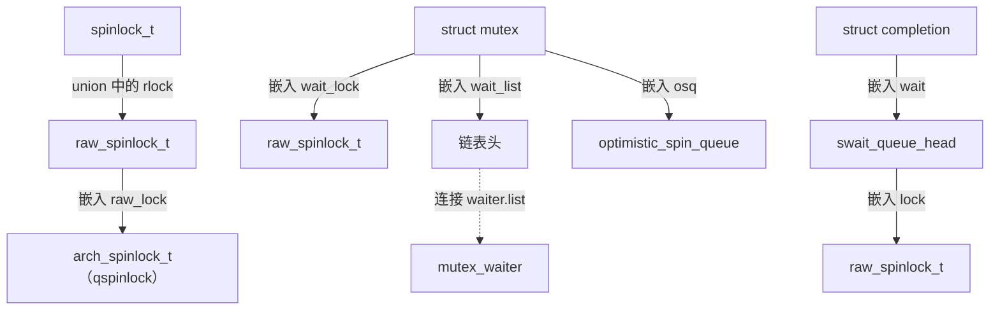
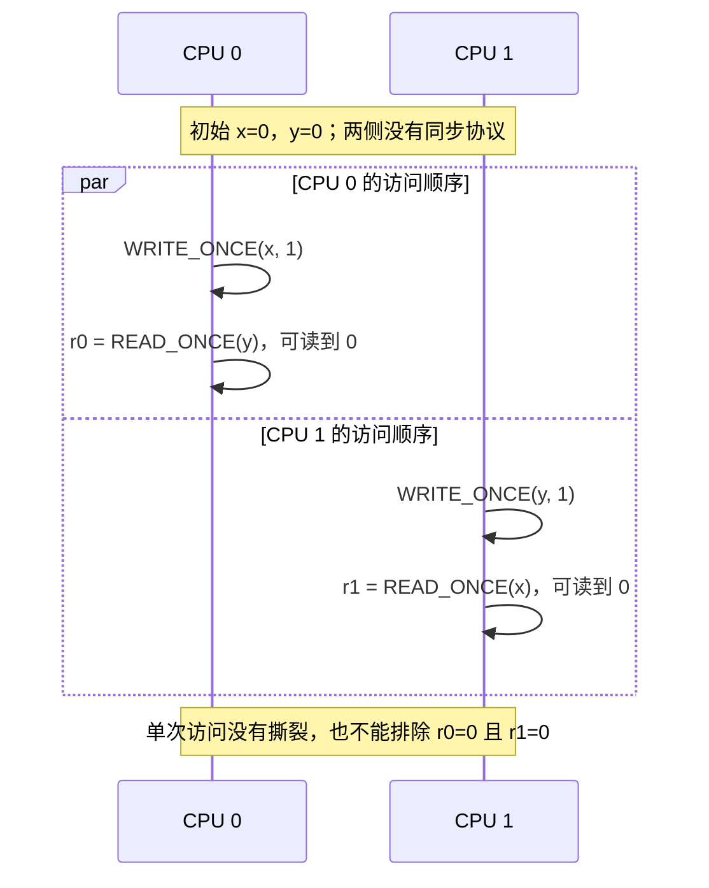
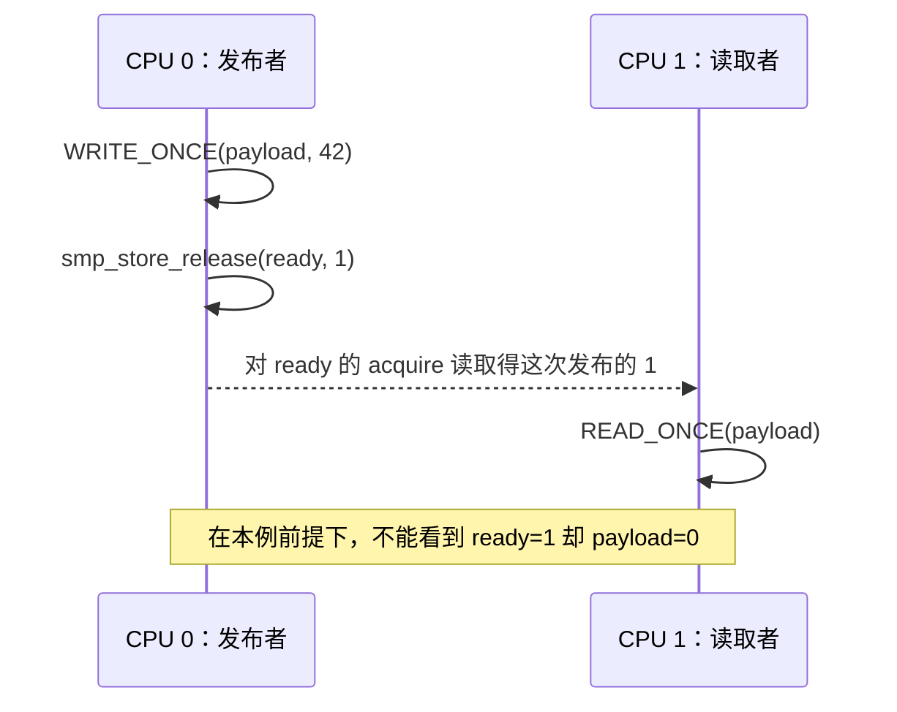

# 并发问题与锁机制全景：理解锁的基础

两个 CPU 同时给一个计数器加一，为什么可能只增加一次？一个链表节点已经从链表摘除，为什么还不能立即释放？进程已经持有自旋锁，为什么本 CPU 的中断处理函数再次申请这把锁，反而会让系统停在那里？

这些问题分别涉及一次更新是否完整、一组字段是否一致、对象是否仍然存活，以及持锁者能否继续运行。学习锁机制，首先要把这些问题分开，再理解内核如何把它们组合成一个可靠的访问协议。

本章依据仓库内 [Linux Makefile，第 2～4 行](../../linux/Makefile#L2)标记的 **6.18.52** 版本。分析限定为 **x86-64、普通内存中的 CPU 间同步、非** `PREEMPT_RT`，不展开设备寄存器、DMA 内存顺序和用户态 futex。读者需要具备 C 指针、链表和进程调度的基础；中断的完整执行路径可衔接阅读[中断子系统概述](../interrupt/overview.md)和 [softirq 机制](../interrupt/softirq.md)。

与本章直接相关的配置如下。这些是构建条件，不能据此断言某次运行实际经过了哪条竞争路径。


| 配置条件                                                                                                   | 对本章的影响                                                                                                                                 | 本地依据                                                                                                                                                                                                                      |
| ------------------------------------------------------------------------------------------------------ | -------------------------------------------------------------------------------------------------------------------------------------- | ------------------------------------------------------------------------------------------------------------------------------------------------------------------------------------------------------------------------- |
| `CONFIG_X86_64=y`、`CONFIG_SMP=y`                                                                       | 需要同时考虑本 CPU 上的执行交错与跨 CPU 并行                                                                                                            | [.config 中的 CONFIG_X86_64](../../linux/.config#L333)、[CONFIG_SMP](../../linux/.config#L362)                                                                                                                         |
| `CONFIG_PREEMPT_RT` 未启用                                                                                | `spinlock_t` 使用普通自旋锁语义；mutex 使用非 RT 实现                                                                                                 | [.config 中未设置 PREEMPT_RT](../../linux/.config#L139)、[spinlock_types.h](../../linux/include/linux/spinlock_types.h#L14)、[mutex.c](../../linux/kernel/locking/mutex.c#L37)                                          |
| `CONFIG_PREEMPT_VOLUNTARY=y`、`CONFIG_PREEMPTION=y`、`CONFIG_PREEMPT_DYNAMIC=y`、`CONFIG_PREEMPT_COUNT=y` | 未指定启动参数时默认自愿抢占，并启用抢占计数与动态抢占。动态抢占使构建带上 `CONFIG_PREEMPTION`，`preempt_enable()` 会编译成调用 `__preempt_schedule()` 的分支；这条调用在运行时是否进入调度，由选中的模型决定 | [自愿抢占](../../linux/.config#L136)、[PREEMPTION](../../linux/.config#L141)、[PREEMPT_DYNAMIC](../../linux/.config#L142)、[PREEMPT_COUNT](../../linux/.config#L140)、[Kconfig 定义](../../linux/kernel/Kconfig.preempt#L126) |
| `CONFIG_PREEMPT_RCU=y`                                                                                 | 与 `CONFIG_PREEMPTION=y` 合用时，普通 RCU 读侧临界区允许被抢占，但仍不能显式阻塞。非自愿换出是否发生，同样取决于运行时抢占模型                                                          | [.config](../../linux/.config#L168)、[rcu_read_lock() 的说明](../../linux/include/linux/rcupdate.h#L856)                                                                                                                  |
| `CONFIG_QUEUED_SPINLOCKS=y`、`CONFIG_QUEUED_RWLOCKS=y`                                                  | 自旋锁与读写自旋锁采用排队锁实现                                                                                                                       | [排队自旋锁](../../linux/.config#L1123)、[排队读写锁](../../linux/.config#L1125)、[qspinlock.o](../../linux/kernel/locking/Makefile#L27)、[qrwlock.o](../../linux/kernel/locking/Makefile#L32)                                     |
| `CONFIG_MUTEX_SPIN_ON_OWNER=y`、`CONFIG_RWSEM_SPIN_ON_OWNER=y`                                          | 睡眠锁的竞争路径也可能先进行乐观自旋                                                                                                                     | [mutex 配置](../../linux/.config#L1119)、[rwsem 配置](../../linux/.config#L1120)、[mutex 的 Kconfig](../../linux/kernel/Kconfig.locks#L227)、[rwsem 的 Kconfig](../../linux/kernel/Kconfig.locks#L231)                             |
| `CONFIG_PARAVIRT_SPINLOCKS=y`                                                                          | x86 自旋锁包含半虚拟化分派，不能把原生指令路径当成唯一运行路径                                                                                                      | [.config](../../linux/.config#L380)、[qspinlock.h 的分派](../../linux/arch/x86/include/asm/qspinlock.h#L30)                                                                                                               |
| `CONFIG_DEBUG_SPINLOCK`、`CONFIG_DEBUG_MUTEXES`、`CONFIG_DEBUG_LOCK_ALLOC` 未启用                           | 本章不依赖这些调试字段或检查来保证正确性                                                                                                                   | [DEBUG_SPINLOCK](../../linux/.config#L10662)、[DEBUG_MUTEXES](../../linux/.config#L10663)、[DEBUG_LOCK_ALLOC](../../linux/.config#L10666)                                                                             |


动态抢占把“编译进了哪条分支”和“运行时走哪条分支”拆开。由于 `CONFIG_PREEMPT_DYNAMIC` 会选中 `CONFIG_PREEMPTION`，[preempt.h 注明](../../linux/include/linux/preempt.h#L509)这种内核按 `CONFIG_PREEMPTION=y` 构建，运行时仍可能是 none 等模型。x86 的 [__preempt_schedule()](../../linux/arch/x86/include/asm/preempt.h#L125)是一条 static call，[DEFINE_STATIC_CALL() 的初值](../../linux/kernel/sched/core.c#L7180)指向启用的抢占函数，模型应用前都保持这个初值。[setup_preempt_mode()](../../linux/kernel/sched/core.c#L7776)解析 `preempt=`；没有这个参数时，[preempt_dynamic_init()](../../linux/kernel/sched/core.c#L7789)才按 `CONFIG_PREEMPT_VOLUNTARY` 选择自愿模型。源码中的[模型对照](../../linux/kernel/sched/core.c#L7620)写明：自愿和 none 把 `preempt_schedule` 配成 NOP，full 和 lazy 才让它进入真正的调度函数；自愿分支的改写在 [__sched_dynamic_update()](../../linux/kernel/sched/core.c#L7732)。因此 `CONFIG_PREEMPT_VOLUNTARY=y` 表示缺省模型，模型选定后，`preempt_enable()` 里的那次调用在缺省路径上是 NOP。

## 1. 问题、访问者与核心对象


### 1.1 三个场景：一次更新、一组关系、一段生命周期

**场景一：共享计数发生更新丢失。** 假设 `count` 初值为 0，两个执行者都做 `count++`。下面按“读出、计算、写回”画出一种概念性交错，不是在断言编译器一定生成三条指令：


| 时刻  | 执行者 A           | 执行者 B           |
| --- | --------------- | --------------- |
| 1   | 读到 `count == 0` |                 |
| 2   |                 | 读到 `count == 0` |
| 3   | 计算并写回 1         |                 |
| 4   |                 | 计算并写回 1         |


两个增量中有一个丢失了。即使单次读、单次写都不会被撕裂，整个“读—改—写”仍然不是不可分割的操作。对单独计数器，内核提供 `atomic_inc()` 这样的原子读改写接口；x86 实现在 [arch_atomic_inc()](../../linux/arch/x86/include/asm/atomic.h#L51)中使用带 `LOCK_PREFIX` 的 `incl`。它保护的是这一次计数更新，不会自动把附近的链表修改也纳入保护。

**场景二：链表更新破坏了多字段关系。** 双向链表希望一个节点的后继能够通过 `prev` 找回它，前驱能够通过 `next` 找到它。插入节点需要改动多个指针。[__list_add()](../../linux/include/linux/list.h#L157)在当前配置下会先做完整性检查，通过后才依次修改四处关系：

```c
if (!__list_add_valid(new, prev, next))
	return;

next->prev = new;
new->next = next;
new->prev = prev;
WRITE_ONCE(prev->next, new);
```

来源：[__list_add()，include/linux/list.h 第 161～167 行](../../linux/include/linux/list.h#L161)。当前还启用了 [CONFIG_LIST_HARDENED](../../linux/.config#L10064)、[CONFIG_DEBUG_LIST](../../linux/.config#L10683)和 [CONFIG_BUG_ON_DATA_CORRUPTION](../../linux/.config#L10065)。检查失败时，[__list_add_valid_or_report()](../../linux/lib/list_debug.c#L25)通过 [CHECK_DATA_CORRUPTION()](../../linux/include/linux/bug.h#L95)调用 `BUG()`。这次调用不会返回，所以上面摘录里的 `return` 不会执行，四处赋值也不会发生。

检查通过之后，这些赋值之间仍可能出现“前驱已经改变、后继尚未改变”的中间状态。最后一个赋值用了 `WRITE_ONCE()`，也不意味着四个赋值组成了一次原子事务。若采用普通加锁方案，就应让插入、删除和依赖这些关系的遍历共同遵守同一把锁。这里保护的是**结构不变量**，不能靠把某一个字段改成原子变量来解决。

**场景三：查到了对象，却没有保证对象存活。** 假设查找和删除都正确地持有集合锁 `L`，仍可能出现下面的错误协议：

```text
执行者 A：加锁 L → 从集合取得指针 p → 解锁 L
执行者 B：加锁 L → 将 p 摘除 → 解锁 L → 释放 p
执行者 A：访问 p 的字段                         ← 已释放对象访问
```

集合锁没有失效：它保护了查找和摘除。问题在于 A 把裸指针带出了锁的保护范围，却没有取得继续使用对象的资格。内核的 [refcount_inc_not_zero()](../../linux/include/linux/refcount.h#L320)明确要求调用者先保证对象所在内存稳定；对一个可能已经释放的指针执行引用计数递增，仍然太晚。

这三个场景给出了三个不同的目标：保住一次更新、维护多字段关系、覆盖完整使用期限。一个机制是否合适，取决于需要证明哪一个目标，而不只是它的名字里有没有“锁”。

### 1.2 先找出访问者，再判断它们如何相遇

内核中的并发有两个维度。**跨 CPU 并行**是两个处理器同时访问数据；**同 CPU 交错或重入**是任务切换、软中断处理和硬件中断等执行活动，在不同时间进入同一数据的访问路径。即使只看一个 CPU，后一类问题仍然存在。


| 执行上下文                                 | 与本 CPU 其他执行活动的关系                                                     | 对锁的直接约束                                        |
| ------------------------------------- | -------------------------------------------------------------------- | ---------------------------------------------- |
| 进程上下文，也称任务上下文                         | 任务通过调度切换；在允许时也可能被抢占，还可能被中断打断                                         | 只有当前允许睡眠时，才可使用可能阻塞的加锁接口；“当前属于某个任务”本身不够         |
| softirq，软中断上下文                        | 在硬中断退出、重新启用软中断、`ksoftirqd`路径执行软中断处理；非 RT 处理过程排斥本 CPU 的软中断重入，但允许硬中断到来 | softirq 回调不能按普通可睡眠任务处理；不同 CPU 仍可同时运行同类 softirq |
| hardirq，硬中断上下文                        | 普通 IRQ 进入会打断本 CPU 原来的任务或 softirq；本章讨论正常保持本地 IRQ 关闭的硬中断处理路径           | 不能等待被打断的持锁者恢复执行，不能调用可能睡眠的锁接口                   |
| NMI，不可屏蔽中断（Non-Maskable Interrupt）上下文 | 不受普通本地 IRQ 开关保护，需单独审视它可能打断的代码                                        | 不能默认把普通 `_irqsave` 自旋锁用于与被打断路径共享的锁             |


这张表不是固定的函数调用链。内核用 [preempt.h 的计数位](../../linux/include/linux/preempt.h#L16)及 [interrupt_context_level()](../../linux/include/linux/preempt.h#L90)区分本 CPU 上的普通上下文、softirq、hardirq 和 NMI。它识别 softirq 时只测试 [SOFTIRQ_OFFSET](../../linux/include/linux/preempt.h#L97)，所以仅仅 `local_bh_disable()`、尚未进入处理循环时仍算普通上下文。

非 RT 的 [handle_softirqs()](../../linux/kernel/softirq.c#L579)先经 [softirq_handle_begin()](../../linux/kernel/softirq.c#L461)加上 `SOFTIRQ_OFFSET`，再[打开本地 IRQ](../../linux/kernel/softirq.c#L606)并[调用回调](../../linux/kernel/softirq.c#L622)。这个计数使 [in_interrupt()](../../linux/include/linux/preempt.h#L143)为真，[do_softirq()](../../linux/kernel/softirq.c#L510)在[第 515 行](../../linux/kernel/softirq.c#L515)看到该条件后直接返回，本 CPU 因此不会嵌套启动另一次 softirq 处理；硬中断仍然可以到来。[__irq_exit_rcu()](../../linux/kernel/softirq.c#L713)先在[第 721 行](../../linux/kernel/softirq.c#L721)减去硬中断计数，再在[第 722～723 行](../../linux/kernel/softirq.c#L722-L723)于 `!in_interrupt()` 且本地还有待处理 softirq 时调用 `invoke_softirq()`。这里的 `in_interrupt()` 通过 [irq_count()](../../linux/include/linux/preempt.h#L115)覆盖 NMI、硬中断和整个软中断计数，`local_bh_disable()` 留下的计数也算在内。

`ksoftirqd` 的 [run_ksoftirqd()](../../linux/kernel/softirq.c#L1055)会调用[同一个 handle_softirqs()](../../linux/kernel/softirq.c#L1063)，回调执行时软中断计数仍然存在，线程身份没有放宽回调的上下文约束。本地 [x86 内核栈文档](../../linux/Documentation/arch/x86/kernel-stacks.rst#L81)说明 NMI 可以在任意时刻到来，包括内核正在切换栈时。

同 CPU 重入为什么会死锁，可以用一把普通自旋锁 `L` 说明：

```text
任务：spin_lock(L) 成功
    ↓ 本地 IRQ 到达，任务暂停
硬中断：spin_lock(L)，等待 L 变为空闲
    ↓ 硬中断不返回，任务就无法恢复
任务：spin_unlock(L) 永远没有执行机会
```

这里不需要第二个 CPU。根因是等待者阻止了持锁者继续运行。[__raw_spin_lock()](../../linux/include/linux/spinlock_api_smp.h#L130)先禁止抢占，再竞争这把锁，全程不关闭本地 IRQ。[__raw_spin_lock_irqsave()](../../linux/include/linux/spinlock_api_smp.h#L104)则在争锁前保存并关闭本地 IRQ。后者同时处理跨 CPU 争锁和本 CPU 的普通硬中断重入，但仍不屏蔽 NMI。

### 1.3 五种保证不能混成一个“线程安全”标签


| 问题       | 需要建立的保证                     | 常见手段及边界                               |
| -------- | --------------------------- | ------------------------------------- |
| 互斥       | 同一时刻只有符合协议的持有者能进入临界区        | 自旋锁、mutex；锁外访问者不自动受保护                 |
| 数据一致性    | 读到的多个字段符合约定的不变量，或者来自同一轮有效更新 | 加锁；序列计数允许读写重叠，但要求读者校验并丢弃冲突快照          |
| 内存可见性与顺序 | 观察到同步标志后，能够按协议观察到它之前的数据更新   | 锁的 acquire/release 语义、成对的发布与读取、内存屏障   |
| 对象生命周期   | 在使用指针期间，对象内存仍然有效            | 覆盖使用期的锁、引用计数、RCU 延迟回收                 |
| 事件等待     | 条件未满足时能够等待；条件变化后能够重新检查并继续执行 | 等待队列、完成量（completion）；被唤醒不等于取得业务对象的独占权 |


这些机制有重叠，但不能随意互换。比如 [read_seqcount_retry()](../../linux/include/linux/seqlock.h#L394)要求丢弃无效读取，解决的是快照校验；[seqcount_t 的使用约束](../../linux/include/linux/seqlock_types.h#L10)同时指出，写者使指针失效时，读者可能已经跟随指针访问，事后重试无法补救。又如需要等待时，[wait_event() 的核心循环](../../linux/include/linux/wait.h#L302)会把等待者接入队列、检查条件并在必要时调度，它没有替调用者给任意业务数据加锁。

下面的概览图表示**设计一个访问协议时的检查顺序**，不是某把锁的实际调用顺序：


锁的底层实现把其中一些步骤封装起来。例如自旋锁获取时控制抢占，mutex 竞争时对接调度器，completion 用内部锁保护完成状态与等待队列。调用者仍负责定义“哪个对象的哪些操作必须遵守这个协议”。

### 1.4 核心对象：数据、锁状态与等待者不是同一种东西

先看几类会反复出现的数据结构，不急于展开它们的竞争算法。


| 对象                              | 本章关心的字段                               | 字段所表达的状态与关系                                                                                |
| ------------------------------- | ------------------------------------- | ------------------------------------------------------------------------------------------ |
| `atomic_t`                      | `int counter`                         | 一个整数的存储位置；“原子”来自操作它的接口，不是给包含它的整个对象附加属性                                                     |
| `struct list_head`              | `next`、`prev`                         | 两个节点指针；常作为成员嵌入业务对象，链表成员关系本身不自动增加对象引用                                                       |
| `spinlock_t` / `raw_spinlock_t` | `rlock` / `raw_lock`                  | 当前非 RT、未启用锁调试分配时，`spinlock_t` 用 `union` 嵌入 `rlock`；`raw_spinlock_t` 再嵌入架构锁状态。它们不指向受保护的业务数据 |
| `struct mutex`                  | `owner`、`wait_lock`、`wait_list`、`osq` | `owner` 保存持有任务信息及低位状态标志；内部自旋锁保护等待管理；链表连接竞争者；`osq` 用于组织乐观自旋                                 |
| `refcount_t`                    | `atomic_t refs`                       | 对对象有效引用的计数，由对象的获取、归还协议赋予意义；不是字段访问锁                                                         |
| `struct completion`             | `unsigned int done`、`wait`            | 完成状态及嵌入的简单等待队列；不是“谁拥有某个业务资源”的记录                                                            |


定义分别见 [atomic_t，types.h](../../linux/include/linux/types.h#L181)、[list_head](../../linux/include/linux/types.h#L199)、[spinlock_t 的 union](../../linux/include/linux/spinlock_types.h#L18)、[raw_spinlock_t](../../linux/include/linux/spinlock_types_raw.h#L14)、[struct mutex](../../linux/include/linux/mutex_types.h#L41)、[refcount_t](../../linux/include/linux/refcount_types.h#L7)、[struct completion](../../linux/include/linux/completion.h#L26)。mutex 的 owner 低位含义另见 [kernel/locking/mutex.h](../../linux/kernel/locking/mutex.h#L23)。

下面把几类对象的关系画出来。实线表示嵌入，虚线表示通过节点形成集合关系；mutex 的等待者和 completion 的等待者属于不同队列。




图中 x86 的 `arch_spinlock_t` 来自对排队锁类型的包含，见 [spinlock_types.h 第 6 行](../../linux/arch/x86/include/asm/spinlock_types.h#L6)。`struct qspinlock` 被 typedef 成 `arch_spinlock_t`。x86-64 采用该头文件里的小端布局：联合体中的 `atomic_t val`、`locked`、`pending` 和 `tail` 是同一份状态的不同视图，见 [qspinlock_types.h](../../linux/include/asm-generic/qspinlock_types.h#L23)。这不是几份独立计数。当前配置启用乐观自旋，mutex 还嵌入 [osq](../../linux/include/linux/mutex_types.h#L45)。`mutex_waiter` 含有嵌入的链表节点及指向任务的指针，见 [mutex.h](../../linux/kernel/locking/mutex.h#L14)；`swait_queue_head` 则嵌入自己的锁与链表头，见 [swait.h](../../linux/include/linux/swait.h#L43)。

**锁对象的生命周期也需要协议。** [spin_lock_init()](../../linux/include/linux/spinlock.h#L341)把锁初始化为空闲状态，[__mutex_init()](../../linux/kernel/locking/mutex.c#L46)还初始化 owner、内部锁、等待链表及乐观自旋队列。初始化必须在对象对并发访问者可见之前完成，不能通过重新初始化一个正在使用的锁来“解除竞争”。锁通常随包含它的业务对象一起分配和释放，不能因为当前看起来空闲就忽略尚未结束的访问者。mutex 的[使用约束](../../linux/include/linux/mutex_types.h#L14)明确禁止递归获取、由非 owner 解锁和释放仍持锁的内存；当前非调试配置中 [mutex_destroy() 是空函数](../../linux/include/linux/mutex.h#L48)，它并不负责等待使用者退出。

**状态变化也不等于对象分配。** mutex 慢路径的 [mutex_waiter 是局部变量](../../linux/kernel/locking/mutex.c#L567)。乐观自旋成功，或在入队前就已经拿到锁时，这个节点不会进入 `wait_list`；一旦 [__mutex_add_waiter()](../../linux/kernel/locking/mutex.c#L197)把它挂上，成功返回或出错返回前都会摘除。completion 通过 [init_completion()](../../linux/include/linux/completion.h#L84)把 `done` 清零并初始化等待队列。[complete_with_flags()](../../linux/kernel/sched/completion.c#L27)在内部锁下，仅当 `done` 还不是 `UINT_MAX` 时加一，然后调用 [swake_up_locked()](../../linux/kernel/sched/swait.c#L22)。队列中有等待者时，后者唤醒第一名；队列为空则返回。[等待路径](../../linux/kernel/sched/completion.c#L107)也只在 `done` 非零且不是 `UINT_MAX` 时减一。[complete_all()](../../linux/kernel/sched/completion.c#L79)把 `done` 写成 `UINT_MAX`，表示永久完成：等待者不再消费这个值，后续 `complete()` 也不再累加。

### 1.5 锁类型与适用上下文总览

表中“可睡眠”指调用环境允许调度，且没有外层自旋锁、关中断等约束。“中断可用”仍要求避免本 CPU 重入死锁；NMI 始终需要单独分析。这里列的是常用类别，不把每个内部排队算法都当成新的对外锁类型。


| 类型或机制                         | 主要保证、竞争时行为                    | 适用上下文与限制                                                                                                                                                  | 源码入口                                                                                                                                                                                    |
| ----------------------------- | ----------------------------- | --------------------------------------------------------------------------------------------------------------------------------------------------------- | --------------------------------------------------------------------------------------------------------------------------------------------------------------------------------------- |
| `spinlock_t`                  | 独占；当前非 RT 配置下自旋等待，持有期间禁止抢占    | 短且不能睡眠的临界区；与 softirq、hardirq 共享时选择相应后缀                                                                                                                    | [spin_lock()](../../linux/include/linux/spinlock.h#L349)、[__raw_spin_lock()](../../linux/include/linux/spinlock_api_smp.h#L130)                                                     |
| `raw_spinlock_t`              | 原始自旋锁语义                       | 文档限定用于核心底层、低层中断等场合。普通关中断挡不住 NMI，因此不能从 raw 这个名字推出它适用于 NMI                                                                                                  | [locktypes.rst 的用途限定](../../linux/Documentation/locking/locktypes.rst#L235)                                                                                                           |
| `rwlock_t`                    | 多读者或单写者；竞争时自旋                 | 读区、写区都不能睡眠；读锁不允许修改需要写侧排斥的数据                                                                                                                               | [queued_read_lock()](../../linux/include/asm-generic/qrwlock.h#L78)、[queued_write_lock()](../../linux/include/asm-generic/qrwlock.h#L95)                                            |
| `struct mutex`                | 有任务 owner 的独占；快路径、可选乐观自旋、阻塞等待 | 可睡眠任务上下文；不可递归，由获取者解锁                                                                                                                                      | [mutex_lock()](../../linux/kernel/locking/mutex.c#L269)、[类型约束](../../linux/include/linux/mutex_types.h#L14)                                                                           |
| `struct rw_semaphore`         | 可睡眠的多读者或单写者协议                 | 可睡眠任务上下文；不要与 `rwlock_t` 混淆                                                                                                                                | [down_read()](../../linux/kernel/locking/rwsem.c#L1534)、[down_write()](../../linux/kernel/locking/rwsem.c#L1587)                                                                    |
| `struct semaphore`            | 对许可数量计数，许可耗尽时可阻塞；不要求严格 owner  | 阻塞获取用于可睡眠上下文；`up()`、`down_trylock()`有中断上下文用途，不能由此推广所有接口                                                                                                   | [semaphore.h 的无 owner 语义](../../linux/include/linux/semaphore.h#L40)、[down()](../../linux/kernel/locking/semaphore.c#L80)                                                           |
| `seqcount_t` / `seqlock_t`    | 读者用序号检查快照，冲突时重试；后者内含写侧自旋锁     | 写者必须串行且满足不可抢占等条件；读者不能靠事后重试挽救失效指针                                                                                                                          | [seqlock_types.h](../../linux/include/linux/seqlock_types.h#L10)、[write_seqlock()](../../linux/include/linux/seqlock.h#L861)                                                        |
| 读—复制—更新（Read-Copy Update，RCU） | 允许旧读者继续访问，回收等待相应宽限期；不提供通用写者互斥 | 当前构建的普通 RCU 读侧允许被抢占，但不能显式阻塞，因此不能在自己的读区内调用 `synchronize_rcu()`。自愿和 none 关掉的是 `preempt_enable()` 上的 `preempt_schedule`；读侧遇到 `cond_resched()` 时仍可能被换出，读区继续有效 | [rcu_read_lock() 的抢占与阻塞约定](../../linux/include/linux/rcupdate.h#L856)、[synchronize_rcu()](../../linux/kernel/rcu/tree.c#L3341)                                                      |
| `refcount_t`                  | 记录有效引用，为最终释放提供判断              | 可以与锁或 RCU 组合；递增前必须已确保内存有效                                                                                                                                 | [refcount_inc_not_zero()](../../linux/include/linux/refcount.h#L320)、[refcount_dec_and_test()](../../linux/include/linux/refcount.h#L435)                                           |
| 等待队列 / completion             | 条件或完成事件的等待与通知                 | 阻塞等待必须允许睡眠；本章非 RT 条件下 `complete()` 可由普通硬中断发出通知                                                                                                            | [wait_event()](../../linux/include/linux/wait.h#L345)、[complete()](../../linux/kernel/sched/completion.c#L50)、[wait_for_completion()](../../linux/kernel/sched/completion.c#L151) |


上表里 RCU 的换出和显式阻塞不是一回事。[__rcu_read_lock()](../../linux/kernel/rcu/tree_plugin.h#L412)只增加读侧嵌套计数，不增加 `preempt_count`。自愿和 none 模型下，[__cond_resched()](../../linux/kernel/sched/core.c#L7493)在需要重新调度且本地 IRQ 开启时调用 [preempt_schedule_common()](../../linux/kernel/sched/core.c#L7127)，后者以 [SM_PREEMPT](../../linux/kernel/sched/core.c#L7145)进入调度。此时 [rcu_note_context_switch()](../../linux/kernel/rcu/tree_plugin.h#L332)收到的是抢占标志，不会把这次换出当成读区内的主动 `schedule()`。读区在换出后继续有效，相应宽限期要等该任务离开读区。主动调用 `schedule()` 或在读区内等待宽限期，仍然超出读侧约定。

其中，原子变量是构造这些协议的基础，而不是“最轻的万能锁”。RCU、引用计数和 completion 列在表中，是为了识别它们解决的相邻问题。若需要普通任务之间对多字段进行独占更新，又允许睡眠，mutex 是直接的选择；若访问者包含普通硬中断，则要重新选择非睡眠协议并处理本地重入。若读者只需要可重试的数值快照或需要延长对象寿命，应分别考虑快照与生命周期协议。

## 2. 理解锁的基础：原子操作、内存顺序与上下文控制


### 2.1 原子读改写：把一个变量的状态迁移合成一步

读—改—写（read-modify-write，RMW）描述的是读取旧值、计算新值并写回的操作。`atomic_t` 只含一个 `int counter`。在当前 x86 实现中，[arch_atomic_read()](../../linux/arch/x86/include/asm/atomic.h#L17)和 [arch_atomic_set()](../../linux/arch/x86/include/asm/atomic.h#L26)分别使用单次读、单次写；[arch_atomic_add()](../../linux/arch/x86/include/asm/atomic.h#L31)和 `arch_atomic_inc()` 则以带锁前缀的指令执行读改写。`LOCK_PREFIX` 在 SMP 构建中展开为 `lock` 前缀，并在 `.smp_locks` 里记录该前缀的地址，供运行时在单处理器与多处理器之间改写，见 [alternative.h](../../linux/arch/x86/include/asm/alternative.h#L39)。它说明 SMP 源码如何实现跨 CPU 原子更新；某次运行中的指令还可能已经按当时的处理器配置改写过。

下面两个片段是**接口用法示意，不是内核函数摘录**：

```c
/* 错误：两个单独操作之间仍然能插入另一个执行者。 */
int n = atomic_read(&count);
atomic_set(&count, n + 1);

/* 只需要给这一个计数器加一时，使用一次原子读改写。 */
atomic_inc(&count);
```

第一段即使每次调用都是原子的，也可能发生第 1.1 节的更新丢失。第二段把单变量的读改写合为一次，但若还要维持 `count == 链表中的节点数`，链表更新与计数更新之间仍需统一的保护。

不同返回值帮助调用者判断不同的状态变化：


| 接口                                 | 返回值与用途                              |
| ---------------------------------- | ----------------------------------- |
| `atomic_add(i, v)`、`atomic_inc(v)` | 无返回值，只进行更新                          |
| `atomic_add_return(i, v)`          | 返回更新后的值                             |
| `atomic_fetch_add(i, v)`           | 返回更新前的值                             |
| `atomic_cmpxchg(v, old, new)`      | 总是返回操作时读到的旧值；等于预期的 `old` 才说明替换成功    |
| `atomic_try_cmpxchg(v, &old, new)` | 返回成功与否；失败时把实际读到的值写回 `old`，便于重新计算再重试 |


返回约定见 [atomic_add_return()](../../linux/include/linux/atomic/atomic-instrumented.h#L108)、[atomic_fetch_add()](../../linux/include/linux/atomic/atomic-instrumented.h#L182)、[atomic_cmpxchg()](../../linux/include/linux/atomic/atomic-instrumented.h#L1178)和 [atomic_try_cmpxchg()](../../linux/include/linux/atomic/atomic-instrumented.h#L1260)。

比较交换（compare-and-swap，CAS）把“若仍是预期状态，才写入新状态”合成一次原子操作，内核接口常用 `cmpxchg` 命名。x86 的 [arch_atomic_cmpxchg()](../../linux/arch/x86/include/asm/atomic.h#L99)进入 `arch_cmpxchg()`，对这里的 32 位计数使用 [cmpxchgl 分支](../../linux/arch/x86/include/asm/cmpxchg.h#L109)；[__cmpxchg 包装](../../linux/arch/x86/include/asm/cmpxchg.h#L133)传入锁前缀。

下面用有限许可展示 CAS 的输入、成功与失败语义。它是**简化算法**：`remaining` 在发布前已初始化为非负数，所有修改都使用原子接口，补充许可的路径另行保证不会溢出。

```c
/* 示意：只扣减数量，不传递其他数据的所有权或发布顺序。 */
bool take_one(atomic_t *remaining)
{
    int old = atomic_read(remaining);

    for (;;) {
        if (old <= 0)
            return false;
        if (atomic_try_cmpxchg_relaxed(remaining, &old, old - 1))
            return true;
        /* 失败时 old 已被更新，必须重新检查边界、重新计算。 */
    }
}
```

在没有并发补充许可的这一轮中，两个 CPU 若都读到 1，只有一个能把它改成 0；另一个 CAS 失败，得到新的 `old == 0`，随后返回失败。循环重试保证的是竞争下的正确性，不是固定次数内必然成功。这一使用形式可与本地 [atomic_t.txt 的 CAS 循环](../../linux/Documentation/atomic_t.txt#L302)及 [atomic_try_cmpxchg_relaxed() 的约定](../../linux/include/linux/atomic/atomic-instrumented.h#L1328)对照。

这里特意用了 `_relaxed`：计数扣减只负责数量。如果“拿到许可”还意味着接收另一个 CPU 写好的对象，那么还需要相应的内存顺序和生命周期协议，不能直接沿用这个示意。

### 2.2 `READ_ONCE()` 与 `WRITE_ONCE()`：约束访问，不组成临界区

并发分析不能只考虑 CPU。编译器若把一次读取复用为旧寄存器值、合并写入或重新取得某个值，也可能改变代码期望的访问方式。内核用 `READ_ONCE()`、`WRITE_ONCE()`标记不能如此随意变换的访问。

当前通用实现会[检查访问宽度](../../linux/include/asm-generic/rwonce.h#L35)，并用 [volatile 读](../../linux/include/asm-generic/rwonce.h#L44)、[volatile 写](../../linux/include/asm-generic/rwonce.h#L55)完成访问。宽度检查允许原生字长或 `long long` 大小的聚合类型；本章只讨论自然对齐、满足该宽度要求的标量，不把结论推广到任意大小的结构体或未对齐数据。

需要同时记住三个边界：

1. `WRITE_ONCE(x, READ_ONCE(x) + 1)` 仍是一次读加一次写，不是原子读改写。
2. 分别读取两个字段，不会自动得到属于同一轮更新的快照。
3. 标记一次访问，不等于为其他地址建立完整的 acquire、release 或全屏障顺序。

[rwonce.h 的说明](../../linux/include/asm-generic/rwonce.h#L3)把用途定位于约束编译器，并与显式屏障或原子指令配合；x86 [__smp_load_acquire()](../../linux/arch/x86/include/asm/barrier.h#L66)也在 `READ_ONCE()`之后另外放置编译器屏障。不能因为二者在机器码层面有时相近，就在源代码协议里把它们当作同一个接口。

### 2.3 内存顺序：单次访问完整，不等于多个地址按需要被观察

“内存可见”在这里指某个 CPU 的访问能够按同步协议观察到另一个 CPU 的更新，不能理解成“把缓存刷到主存之后才算可见”。本地[内存屏障文档](../../linux/Documentation/memory-barriers.txt#L2729)区分了缓存一致性与访问效果被其他观察者看到的顺序。

先区分几类工具：


| 工具          | 本章需要掌握的保证               | 不能推出的结论                    |
| ----------- | ----------------------- | -------------------------- |
| `barrier()` | 编译器屏障，阻止相关内存访问跨越它进行优化重排 | 它本身没有发出 CPU 内存屏障指令         |
| `smp_rmb()` | 建立屏障前后读取之间所需的读顺序        | 不负责任意“先写后读”顺序              |
| `smp_wmb()` | 建立屏障前后写入之间所需的写顺序        | 不等于完整发布与接收协议               |
| `smp_mb()`  | 对屏障两侧的读写建立全屏障顺序         | 不会把多个写入变成原子事务，也不会替对端补上缺失协议 |
| release 操作  | 使它之前的访问按释放语义排在该操作之前     | 不保证它之后的全部访问也被约束到后面         |
| acquire 操作  | 使它之后的访问按获取语义排在该操作之后     | 不保证它之前的全部访问也被约束到前面         |


[barrier()](../../linux/include/linux/compiler.h#L82)是带 `memory` clobber 的空内联汇编。SMP 通用包装见 [asm-generic/barrier.h](../../linux/include/asm-generic/barrier.h#L96)；x86 的 [__smp_mb()](../../linux/arch/x86/include/asm/barrier.h#L53)、[__smp_rmb()](../../linux/arch/x86/include/asm/barrier.h#L55)、[__smp_wmb()](../../linux/arch/x86/include/asm/barrier.h#L56)并不都生成相同的硬件屏障。`__smp_mb()`使用带 `lock` 的操作；`__smp_rmb()`经 `dma_rmb()`落到编译器屏障，`__smp_wmb()`直接是编译器屏障。架构已有的顺序保证决定还需补充什么，不能只数汇编屏障条数来判断接口强弱。acquire/release 的单向保证另见[本地内存屏障文档](../../linux/Documentation/memory-barriers.txt#L474)。

原子接口也有自己的顺序契约，名字中有 `atomic` 并不意味着每个接口都是全屏障：


| 原子接口类别                                                         | 接口所保证的顺序                      |
| -------------------------------------------------------------- | ----------------------------- |
| 普通 `atomic_read()`、`atomic_set()`                              | 默认 relaxed，不给其他地址提供一般的排序保证    |
| 无返回值的 `atomic_add()`、`atomic_inc()`                            | 默认 relaxed；仍然保证目标变量的原子更新      |
| 无顺序后缀、带返回值的算术 RMW，如 `atomic_add_return()`、`atomic_fetch_add()` | 完全有序                          |
| `_relaxed`、`_acquire`、`_release` 变体                            | 按显式后缀提供保证                     |
| 条件 RMW，如 `atomic_cmpxchg()`                                    | 成功时按相应接口提供顺序；失败时不能依赖成功路径的排序保证 |


这些规则来自 [atomic_t.txt 的 ORDERING 部分](../../linux/Documentation/atomic_t.txt#L160)，并可对照实现接口的注释：[读写](../../linux/include/linux/atomic/atomic-instrumented.h#L20)、[atomic_inc()](../../linux/include/linux/atomic/atomic-instrumented.h#L422)、[CAS](../../linux/include/linux/atomic/atomic-instrumented.h#L1178)。x86 的某条指令可能比通用接口要求更强，但不能倒过来把这种额外强度当成所有原子接口的契约。

### 2.4 双 CPU 时序一：两个完整访问仍可能互相读到旧值

设普通共享标量 `x`、`y` 都初始化为 0，CPU 0 先写 `x` 再读 `y`，CPU 1 先写 `y` 再读 `x`。这称为存储缓冲模式（store-buffering pattern）。下面是**允许结果的概念示意**：纵向只表达各 CPU 自己的访问顺序，两条执行线之间没有同步箭头，也不声称是实测硬件时序。




本地 [SB+poonceonces.litmus](../../linux/tools/memory-model/litmus-tests/SB+poonceonces.litmus#L4)把同一模式标为有时出现的结果。关键不是把 1 读成了“半个值”，而是对不同地址的写与后续读之间缺少足够排序。这里依据的是本地内核内存模型用例，不是声称已在某台 x86 机器上观察到该结果。

若两侧都在自己的写与读之间加入 `smp_mb()`，对应的 [SB+fencembonceonces.litmus](../../linux/tools/memory-model/litmus-tests/SB+fencembonceonces.litmus#L4)将“双零”标为不会出现的结果。两边都加全屏障是这个用例的条件，只改一侧不能沿用同一结论。普通 release 写加 acquire 读也还不是这里的全屏障：[内存屏障文档](../../linux/Documentation/memory-barriers.txt#L501)说明，一对 release 与 acquire 本身不构成全屏障。双方若都只读到初始值，就没有通过读到对方发布的值把两端联系起来。

因此，需要分别问：“对一个位置的操作是否不可分割？”以及“多个位置的访问之间建立了什么观察顺序？”前者是原子性问题，后者是内存顺序问题。

### 2.5 双 CPU 时序二：用 release/acquire 发布已经准备好的数据

另一种常见需求是发布：CPU 0 先准备数据，再把 `ready` 置为 1；CPU 1 只有确认发布完成才读取数据。这里的状态是“未发布 → 已发布”，而不是两边都争抢同一个资源。

下面是**一次性发布的简化代码**。假设 `payload` 和 `ready` 初值均为 0、对象内存始终有效、只有一个发布者，发布后不再改写 `payload`，`ready` 也不会被重置复用。

```c
/* CPU 0：发布者 */
WRITE_ONCE(payload, 42);
smp_store_release(&ready, 1);

/* CPU 1：读取者；本次未看到发布时就返回，不无限忙等。 */
if (smp_load_acquire(&ready) == 1)
    value = READ_ONCE(payload);
else
    return NOT_READY;  /* 示意返回状态 */
```

这段简化代码采用本地 [MP+pooncerelease+poacquireonce.litmus](../../linux/tools/memory-model/litmus-tests/MP+pooncerelease+poacquireonce.litmus#L13)的发布关系。该用例把“acquire 读到 1，而随后读到的数据仍是初值”标为 [Never](../../linux/tools/memory-model/litmus-tests/MP+pooncerelease+poacquireonce.litmus#L4)，对应的 exists 子句在[第 28 行](../../linux/tools/memory-model/litmus-tests/MP+pooncerelease+poacquireonce.litmus#L28)。图中的跨 CPU 箭头表示“acquire 读到了这次 release 写入的值”，不是函数调用或中断通知：




顺序证明包含两部分：release 把准备数据的访问放在发布之前，acquire 把使用数据的访问放在接收之后；读到同一次发布的标志把两端连接起来。若 acquire 读到 0，就没有得到“数据准备好”的许可。

在当前 x86 源码中，[__smp_store_release()](../../linux/arch/x86/include/asm/barrier.h#L59)先做 `barrier()`再 `WRITE_ONCE()`；[__smp_load_acquire()](../../linux/arch/x86/include/asm/barrier.h#L66)先读再做 `barrier()`。实现没有在这里额外插入 `mfence`，但接口表达的发布协议仍然必要。不能把其他体系结构的任意重排套到 x86，也不能因此删掉通用代码中的顺序接口。

这个协议有明确边界：它不排斥多个写者，不延长指针目标的生命，也不通知睡眠任务。若循环复用 `ready`，还必须设计消费者何时读完、生产者何时可以覆盖、如何区分不同轮次，不能把上面的单次示意直接当成可复用队列。

### 2.6 禁止抢占、关闭本地中断、禁止下半部

这些操作控制的是**当前 CPU 上哪些执行活动还能介入**。它们与锁的跨 CPU 状态是两个维度。


| 操作                                                   | 当前非 RT 配置下解决的问题                            | 没有解决的问题                               |
| ---------------------------------------------------- | ------------------------------------------ | ------------------------------------- |
| `preempt_disable()` / `preempt_enable()`             | 通过抢占计数保护不可抢占区域；不能因普通抢占在中途换走当前任务            | 不关闭 hardirq、softirq、NMI，也不阻止其他 CPU 访问 |
| `local_irq_save(flags)` / `local_irq_restore(flags)` | 保存并关闭本地可屏蔽 IRQ，结束时恢复原状态                    | 不屏蔽 NMI，不锁住其他 CPU；也不是任意内存发布协议         |
| `local_bh_disable()` / `local_bh_enable()`           | 禁止本 CPU softirq 处理在受保护区间介入，非 RT 下也使该区域不可抢占 | 不关闭 hardirq 或 NMI，不阻止其他 CPU 的 softirq |


[preempt_disable()](../../linux/include/linux/preempt.h#L213)增加计数并加入编译器屏障。[preempt_enable()](../../linux/include/linux/preempt.h#L230)在当前 `CONFIG_PREEMPTION` 分支中减少计数，计数归零时调用 `__preempt_schedule()`。如本章开头所述，这次调用在 x86 上是 static call：自愿和 none 模型把它配成 NOP，full 和 lazy 才进入抢占调度。禁止抢占也不是主动睡眠的许可。可睡眠锁的[调用上下文要求](../../linux/Documentation/locking/locktypes.rst#L26)仍然成立。

x86 原生 [native_irq_disable()](../../linux/arch/x86/include/asm/irqflags.h#L35)使用 `cli`，[native_local_irq_save()](../../linux/arch/x86/include/asm/irqflags.h#L62)先保存标志再关闭 IRQ。当前启用了 [CONFIG_PARAVIRT_XXL](../../linux/.config#L378)，`local_irq_save()`最终调用的 [arch_local_irq_save()](../../linux/arch/x86/include/asm/paravirt.h#L674)走半虚拟化分派；上面两处只解释原生指令。`flags` 是本次调用保存的中断状态，不是锁的 owner 或全局开关。`restore` 与无条件 `enable` 不可混用，否则调用者原本已经关闭的 IRQ 可能被意外打开。

[local_bh_disable()](../../linux/include/linux/bottom_half.h#L18)增加 [SOFTIRQ_DISABLE_OFFSET](../../linux/include/linux/preempt.h#L55)；它与实际进入软中断处理所用的 [SOFTIRQ_OFFSET](../../linux/include/linux/preempt.h#L51)不同。重新启用下半部时，[__local_bh_enable_ip()](../../linux/kernel/softirq.c#L427)会检查待处理 softirq，满足条件便执行，所以“恢复”也可能意味着立即开始处理积累的工作。

这些机制能够保护 per-CPU 数据的某些访问，是因为先限定了访问者只属于本 CPU，再阻止相应交错。如果同一份数据也能从其他 CPU 访问，就不能省略跨 CPU 同步。[locktypes.rst](../../linux/Documentation/locking/locktypes.rst#L61)把禁止抢占和关闭中断归为 CPU 本地并发控制。

## 3. 把基础组合成一次加锁


### 3.1 `spin_lock_irqsave()`：先阻止本地重入，再参与跨 CPU 竞争

假设一份小型队列同时被任务和普通硬中断访问，更新过程不能睡眠，所有访问者都遵守同一把锁 `L`。任务端选择 `spin_lock_irqsave()` 的目标有两个：在当前 CPU 上排除硬中断重入，在多个 CPU 之间取得队列的独占访问资格。

以下是**与本章有关的简化逻辑**，省略调试、跟踪和 I/O 排序辅助操作，保留上下文控制与解锁的顺序。它不是建议自己实现的锁：

```text
获取：
    flags = 保存并关闭本地 IRQ
    禁止抢占
    原子尝试取得锁；失败则进入竞争路径，取得后才返回
    执行受保护的队列操作

释放：
    按释放语义交还锁
    恢复 flags 中保存的本地 IRQ 状态
    恢复抢占状态，必要时允许调度
```

对外的 [spin_lock_irqsave()](../../linux/include/linux/spinlock.h#L379)转到 raw 接口，主要顺序在 [__raw_spin_lock_irqsave()](../../linux/include/linux/spinlock_api_smp.h#L104)和 [__raw_spin_unlock_irqrestore()](../../linux/include/linux/spinlock_api_smp.h#L146)中。普通 `spin_lock()` 少了本地 IRQ 保存与关闭步骤；`spin_lock_bh()` 则通过 [__raw_spin_lock_bh()](../../linux/include/linux/spinlock_api_smp.h#L123)控制下半部。因此它们不是几种“强弱不同”的写法，而是在处理不同的本地访问者。

再向下一层看，[do_raw_spin_lock()](../../linux/include/linux/spinlock.h#L184)调用架构锁操作；x86 包含 [asm/qspinlock.h](../../linux/arch/x86/include/asm/spinlock.h#L27)，通用映射将 `arch_spin_lock()`接到 [queued_spin_lock()](../../linux/include/asm-generic/qspinlock.h#L147)。其无竞争路径很短：

```c
int val = 0;

if (likely(atomic_try_cmpxchg_acquire(&lock->val, &val, _Q_LOCKED_VAL)))
    return;

queued_spin_lock_slowpath(lock, val);
```

来源：[queued_spin_lock()，include/asm-generic/qspinlock.h 第 109～114 行](../../linux/include/asm-generic/qspinlock.h#L109)。

这里同时用到了前面的两种基础：CAS 保证多个竞争者中只有满足状态条件的一方完成转换，acquire 保证取得锁后的数据访问服从锁的顺序契约。失败不是返回给调用者一个“未加锁”的状态，而是进入慢路径，最终成功取得锁后再返回。排队细节不在本章展开。

在原生解锁实现中，[native_queued_spin_unlock()](../../linux/arch/x86/include/asm/qspinlock.h#L44)通过 [smp_store_release(&lock->locked, 0)](../../linux/arch/x86/include/asm/qspinlock.h#L46)释放锁。当前配置的[慢路径入口](../../linux/arch/x86/include/asm/qspinlock.h#L49)和[解锁入口](../../linux/arch/x86/include/asm/qspinlock.h#L54)还经过半虚拟化分派，所以此处的原生实现只是明确展示 release 如何参与交接，不能用来断言所有运行场景都直接执行它。

当另一 CPU 随后成功取得**同一把锁**，临界区中的访问就受到相应的锁交接顺序保护。若另一个读者完全不加锁，或加的是另一把没有建立联系的锁，不能借用这份保证。锁的 acquire/release 也不能概括成“锁前锁后所有访问都有完整屏障”；本地[内存屏障文档](../../linux/Documentation/memory-barriers.txt#L1993)专门区分了这些边界。

若不允许等待，可以选择 trylock 类接口，但必须处理失败。[__raw_spin_trylock()](../../linux/include/linux/spinlock_api_smp.h#L86)失败时恢复抢占并返回 0；失败者没有取得临界区资格。对于 NMI，trylock 也只有在调用者已经设计好失败处理、对象存活和其他访问约束时才可能成为方案，不能把它当成通用补丁。

### 3.2 `mutex_lock()`：独占对象与管理等待队列是两层保护

任务之间若需要在临界区内进行可能睡眠的操作，就不能持有普通自旋锁跨越这些操作。mutex 将“业务对象的长期独占”与“等待队列的短时修改”分开：前者由 mutex 的 owner 协议表示，后者由内部 `wait_lock` 自旋锁保护。

当前未启用 `CONFIG_DEBUG_LOCK_ALLOC`，因此采用[独立快路径所在的编译分支](../../linux/kernel/locking/mutex.c#L239)。其中 [mutex_lock()](../../linux/kernel/locking/mutex.c#L269)先执行 `might_sleep()`，再尝试快路径；[__mutex_trylock_fast()](../../linux/kernel/locking/mutex.c#L150)用带 acquire 语义的比较交换，把 `owner` 从 0 改为当前任务。成功便直接返回，所以使用睡眠锁并不意味着每次获取都会睡眠；但调用者仍必须满足“允许睡眠”的接口前提。

竞争时，`__mutex_lock_common()`围绕数据结构推进：

1. [再次尝试获取并考虑乐观自旋](../../linux/kernel/locking/mutex.c#L601)。本地配置启用了这一优化，但是否成功取决于当时状态。
2. [取得 wait_lock 后再尝试一次](../../linux/kernel/locking/mutex.c#L612)。如果锁已变为空闲，就不必把自己排入等待链表。
3. 对普通 mutex 路径，[把局部 waiter 接入](../../linux/kernel/locking/mutex.c#L632) `wait_list`，[记录阻塞关系](../../linux/kernel/locking/mutex.c#L643)并[设置等待状态](../../linux/kernel/locking/mutex.c#L644)。
4. 循环尝试取得锁，按等待模式检查信号；需要调度时[先释放内部锁，再调用调度接口](../../linux/kernel/locking/mutex.c#L674)。这避免持有 `wait_lock` 睡眠，使解锁者仍有机会处理队列。
5. 成功后[恢复运行状态、摘除等待节点、释放内部锁并恢复抢占](../../linux/kernel/locking/mutex.c#L714)。若可中断等模式检测到相应信号，则[清理等待节点和阻塞状态后返回错误](../../linux/kernel/locking/mutex.c#L742)，不会把一个已经退出等待的局部节点留在链表中。

这里的返回值必须按外层接口解释。普通 [mutex_lock() 的慢路径选择 TASK_UNINTERRUPTIBLE](../../linux/kernel/locking/mutex.c#L1049)，没有“被信号打断后未持锁返回”的语义；[mutex_lock_interruptible()](../../linux/kernel/locking/mutex.c#L991)成功返回 0，被信号打断则返回 `-EINTR`，后者没有取得锁，不能继续执行临界区。失败清理不是附加工作，它直接维持“链表中的节点仍对应有效等待者”的不变量。

mutex 的无竞争解锁快路径使用 [atomic_long_try_cmpxchg_release()](../../linux/kernel/locking/mutex.c#L167)，与获取侧建立相应顺序。至于竞争下如何唤醒与交接，需要结合 owner 标志和队列进一步分析；只看到 `owner` 的一次读取，并不能推导调用者有权访问受保护的数据。

### 3.3 解锁以后还要使用对象：把引用获取接在保护范围内

回到第 1.1 节的对象释放场景。下面是一种**锁加引用计数的协议示意**，用于说明保护如何交接，不对应某个子系统的完整实现：


| 阶段    | 必须维持的关系                                       |
| ----- | --------------------------------------------- |
| 创建与发布 | 对象尚未共享时初始化字段及引用计数；约定集合持有一份引用，然后在集合锁下插入        |
| 查找    | 读者持集合锁查找；找到后在锁内取得自己的有效引用，失败则按未找到处理；随后才释放集合锁   |
| 锁外使用  | 集合成员关系可以变化，但读者自己的引用保证对象仍存活；可变字段仍遵守各自的锁或其他同步协议 |
| 摘除    | 删除者持集合锁摘除，使后续查找不能再取得对象；解锁后归还集合持有的那一份引用        |
| 最终释放  | 每个使用者结束后归还引用；只有最后一次引用归还确认归零时才进入释放路径           |


[refcount_t 的饱和设计](../../linux/include/linux/refcount_types.h#L7)避免计数回绕造成错误释放；[refcount_inc_not_zero()](../../linux/include/linux/refcount.h#L320)提供条件引用获取，[refcount_dec_and_test()](../../linux/include/linux/refcount.h#L435)提供归零判断与最终释放所需的顺序。它们不会自行调用业务对象的释放函数。在上述“集合始终持有一份有效引用”的约定下，正常查找期间对象的引用本来就不应为零；条件递增也不能替代这一基础约定。

另一个方向是 RCU：写者按 RCU 发布、摘除协议使新读者不再取得旧对象，再等待可能持有旧指针的既有读者结束。[synchronize_rcu()](../../linux/kernel/rcu/tree.c#L3303)等待相应宽限期，[call_rcu()](../../linux/kernel/rcu/tree.c#L3241)把回调交给延迟执行机制。它们不要求整个系统从此没有读者，[新读区可以与回调并行](../../linux/include/linux/rcupdate.h#L833)。需要保护的是可能引用旧对象的读者集合，而不是禁止一切后续读取。

等待完成事件也不自动终止对象生命周期。completion 等待者若因超时或信号提前返回，异步执行者仍可能稍后访问 completion；不能因此释放它所在的内存。等待路径调用 [__finish_swait()](../../linux/kernel/sched/completion.c#L103)摘除仍在队列中的节点（[list_del_init()](../../linux/kernel/sched/swait.c#L130)），再返回相应结果，却不会替调用者取消异步工作。本地 [completion 文档也明确要求](../../linux/Documentation/scheduler/completion.rst#L78)，对象释放必须覆盖双方的最后一次使用，包括等待因超时或信号提前返回之后仍可能发生的 `complete()`。

## 4. 回顾：先写出要维护的协议

共享计数说明了单变量原子更新的必要性；链表说明多字段关系需要统一保护；对象释放说明裸指针不能替代有效引用。任务、softirq、hardirq、NMI 与其他 CPU 决定了访问者如何相遇，也决定持锁者是否还能继续执行。

读一段同步代码时，可以依次回答：

1. **对象是什么？** 保护哪个字段、哪组关系，还是哪段存活期？
2. **访问者是谁？** 是否跨 CPU，是否会在本 CPU 上重入，能否睡眠？
3. **资格如何取得？** 成功获取、CAS 成功、读取发布标志和引用递增分别意味着什么？失败时是否仍能访问？
4. **顺序如何建立？** 双方通过同一把锁或哪一个变量联系起来，使用了什么 acquire/release 或屏障？
5. **资格如何交还？** 解锁、摘除等待节点、归还引用、延迟回收分别发生在哪里？

有了这些问题，`spin_lock_irqsave()`就可以理解为本地上下文控制与跨 CPU 独占的组合，mutex 可以理解为 owner 状态与等待管理的组合；引用计数、RCU 和 completion 则补上不同的生命周期与等待需求。后续深入某一类锁时，应继续围绕这些对象的状态变化展开，而不是只追踪函数名。