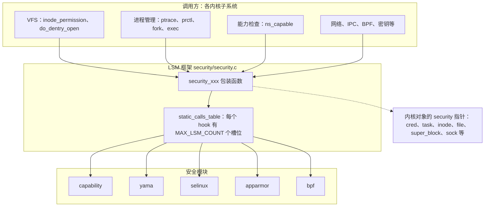
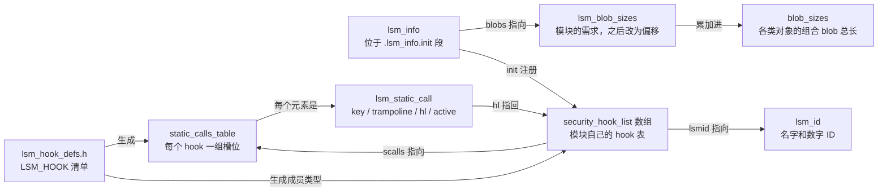
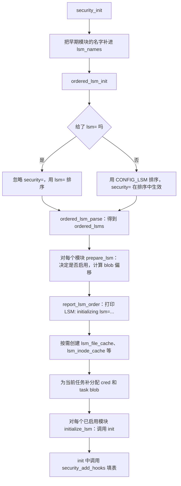
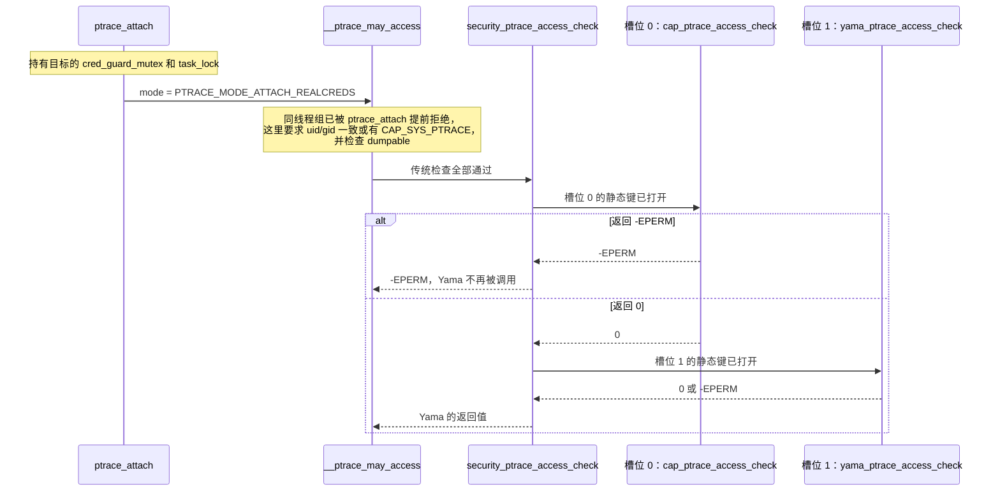
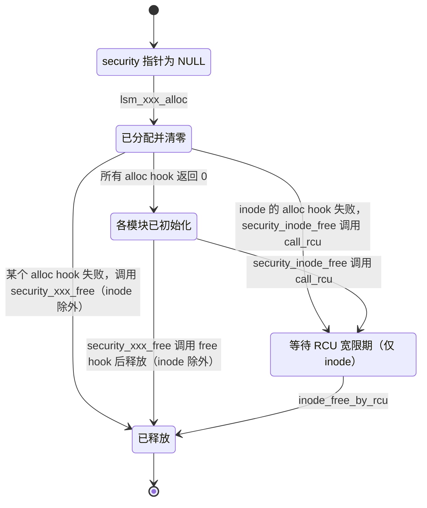

# LSM 框架：安全钩子、模块栈与安全 blob

一个进程调用 `open()` 打开文件，内核先比较 uid、gid 和权限位，这是自主访问控制（Discretionary Access Control，DAC）。很多系统还要加别的规则：SELinux 按对象标签和策略判断，AppArmor 按程序的配置文件判断，Yama 只允许进程 ptrace 自己的后代。如果把这些规则直接写进 VFS、ptrace、网络栈，每个子系统都要认识所有安全模型，增减一个安全模型也要改遍这些子系统。

Linux 安全模块（Linux Security Modules，LSM）框架把两边隔开。内核子系统只在敏感操作处调用一个 `security_xxx()` 函数；框架把这次调用依次交给启动时选定的安全模块，再把结果合并后返回。模块往往还要在 cred、inode、file 等内核对象上记录自己的状态，这块空间也由框架统一分配和释放。

本章是 LSM 框架的总览，回答以下问题：

1. 框架在内核中处于什么位置，什么事件会调用它？
2. 一个 hook 是怎样定义的？为什么同一份清单能同时生成函数指针、静态调用表和 BPF 桩函数？
3. 启动时如何决定启用哪些模块，按什么顺序？
4. 一次 hook 调用怎样依次进入多个模块，结果怎样合并？
5. 多个模块怎样共用内核对象上唯一的 `security` 指针？
6. 用户态从哪里能看到当前启用了哪些模块？

## 0. 分析基线

本章依据仓库内 [Makefile 第 2～4 行](../../linux/Makefile#L2-L4) 标记的 **6.18.52** 版本，架构为 **x86-64**。读者需要熟悉 C 的宏展开和函数指针，知道 cred、inode、file 分别代表什么，并了解 RCU 的基本用法（读者可以在宽限期内继续访问旧对象）。

与本章结论有关的配置如下。它们只是编译条件；某台机器实际启用了哪些模块，还取决于启动参数。

| 配置 | 对本章的影响 | 依据 |
| --- | --- | --- |
| `CONFIG_SECURITY=y`、`CONFIG_SECURITYFS=y` | 编入 LSM 框架和 securityfs；`capability` 模块随框架一起编入 | [.config#L9989](../../linux/.config#L9989)、[.config#L9991](../../linux/.config#L9991)、[lsm_count.h#L18-L25](../../linux/include/linux/lsm_count.h#L18-L25) |
| `CONFIG_SECURITY_SELINUX=y`、`CONFIG_SECURITY_APPARMOR=y`、`CONFIG_SECURITY_YAMA=y`、`CONFIG_BPF_LSM=y` | 这四个模块编入内核 | [.config#L9999](../../linux/.config#L9999)、[.config#L10008](../../linux/.config#L10008)、[.config#L10016](../../linux/.config#L10016)、[.config#L130](../../linux/.config#L130) |
| Smack、TOMOYO、LoadPin、SafeSetID、Lockdown、Landlock、IPE、IMA、EVM 均未设置 | 这些模块不在内核中；`MAX_LSM_COUNT` 因此等于 5 | [.config#L10006-L10007](../../linux/.config#L10006-L10007)、[.config#L10015](../../linux/.config#L10015)、[.config#L10017-L10020](../../linux/.config#L10017-L10020)、[.config#L10026](../../linux/.config#L10026)、[.config#L10028](../../linux/.config#L10028)、[lsm_count.h#L112-L127](../../linux/include/linux/lsm_count.h#L112-L127) |
| `CONFIG_LSM="lockdown,yama,loadpin,safesetid,integrity"` | 没有 `lsm=`、`security=` 启动参数时使用的模块顺序 | [.config#L10032](../../linux/.config#L10032)、[security.c#L107](../../linux/security/security.c#L107) |
| `CONFIG_DEFAULT_SECURITY_DAC=y` | 只影响 `CONFIG_LSM` 的 Kconfig 默认值；`.config` 中的字符串与该默认值不同，以 `.config` 为准 | [.config#L10031](../../linux/.config#L10031)、[Kconfig#L270-L283](../../linux/security/Kconfig#L270-L283) |
| `CONFIG_SECURITY_NETWORK=y`、`CONFIG_SECURITY_NETWORK_XFRM=y`、`CONFIG_SECURITY_PATH=y`；`CONFIG_SECURITY_INFINIBAND`、`CONFIG_WATCH_QUEUE` 未设置 | 决定 hook 清单中哪些条目参与编译 | [.config#L9992-L9995](../../linux/.config#L9992-L9995)、[.config#L61](../../linux/.config#L61) |
| `CONFIG_HAVE_STATIC_CALL=y`、`CONFIG_HAVE_STATIC_CALL_INLINE=y`、`CONFIG_JUMP_LABEL=y` | hook 分派使用静态调用和静态键，调用点可以在运行时改写成直接调用 | [.config#L981-L982](../../linux/.config#L981-L982)、[.config#L847](../../linux/.config#L847) |

先给出一个后文会反复用到的推论：**不带 `lsm=` 和 `security=` 启动时，这份配置只会初始化 `capability` 和 `yama` 两个模块。** `CONFIG_LSM` 里的 lockdown、loadpin、safesetid 没有编译进内核；本源码中也没有名为 `integrity` 的模块（第 3.5 节）。SELinux、AppArmor 和 BPF LSM 虽然编进了内核，但不在这个字符串里，启动时会被标记为禁用。这个结论来自静态分析；实际机器的引导程序可能另外传入 `lsm=` 或 `security=`。

## 1. LSM 框架要解决什么问题

### 1.1 四个需求

| 需求 | 框架的做法 | 主要对象 |
| --- | --- | --- |
| 在敏感操作处询问安全模块 | 用一份清单定义全部 hook；内核在对应位置调用 `security_xxx()` | `lsm_hook_defs.h`、`security/security.c` |
| 让多个模块同时生效 | 每个 hook 留出若干槽位，模块按启动顺序占用；调用时逐个询问并合并结果 | `lsm_static_calls_table`、`lsm_static_call` |
| 让模块在内核对象上保存状态 | 每类对象只有一个 `security` 指针，指向所有模块共用的组合 blob，每个模块按固定偏移访问自己那一段 | `lsm_blob_sizes`、`blob_sizes` |
| 启动时选择模块，未启用时开销尽量小 | 用 `CONFIG_LSM`、`lsm=`、`security=` 选择；空槽位由静态键跳过 | `lsm_info`、静态键、静态调用 |

### 1.2 在内核中的位置

下图回答“谁调用框架，框架又调用谁”。实线表示函数调用，虚线表示框架为内核对象分配 blob。图中列出的是本配置编译进内核的 5 个模块；默认启动时只有 capability 和 yama 在表中占有槽位。



读图时注意两点：

- **调用方不知道有哪些模块。** 例如 VFS 只调用 [`security_inode_permission()`](../../linux/security/security.c#L2392-L2397)，它不关心后面挂了一个模块还是三个。
- **“能力检查”也是框架的调用方。** 打开 `CONFIG_SECURITY` 后，POSIX 能力本身由名为 `capability` 的模块实现（第 1.4 节）。

### 1.3 触发事件与输入输出

| 触发事件 | 输入 | 输出 / 结果 |
| --- | --- | --- |
| 内核启动，`security_init()` | 编译进内核的 `lsm_info` 列表、`CONFIG_LSM`、`lsm=` / `security=` | 模块启用状态、组合 blob 的大小和偏移、填好的静态调用表 |
| 创建内核对象（cred、task、inode、file 等） | 新对象 | 分配并清零组合 blob，调用各模块的 `*_alloc` hook |
| 访问检查（打开文件、ptrace、能力检查等） | 操作主体和客体 | 0 表示允许，负错误码表示拒绝 |
| 销毁内核对象 | 待释放对象 | 调用各模块的 `*_free` hook 后释放组合 blob；inode 的 blob 要等 RCU 宽限期结束 |
| 用户态查询或设置 | `/sys/kernel/security/lsm`、`lsm_*` 系统调用、`/proc/<pid>/attr/` | 已启用模块的名字、ID 和进程安全属性 |

### 1.4 LSM 检查与 DAC 的先后

以文件权限为例，[`inode_permission()`](../../linux/fs/namei.c#L568-L602) 的最后三步是：

```c
	retval = do_inode_permission(idmap, inode, mask);
	if (unlikely(retval))
		return retval;

	retval = devcgroup_inode_permission(inode, mask);
	if (unlikely(retval))
		return retval;

	return security_inode_permission(inode, mask);
```

来源：[fs/namei.c#L593-L601](../../linux/fs/namei.c#L593-L601)

[`do_inode_permission()`](../../linux/fs/namei.c#L521-L534) 调用文件系统自己的 `->permission` 方法，或者用 `generic_permission()` 检查权限位和 ACL；设备 cgroup 检查之后才轮到 LSM。前面任何一步拒绝，LSM 都不会被询问。因此在这类调用点上，LSM 只能在“DAC 已允许”的基础上进一步拒绝，不能放行 DAC 拒绝的访问。

ptrace 的检查顺序相同：[`__ptrace_may_access()`](../../linux/kernel/ptrace.c#L290-L357) 先比较 uid/gid、检查 `CAP_SYS_PTRACE` 和 dumpable 状态，最后才 `return security_ptrace_access_check(task, mode);`。它对同一线程组直接返回 0，注释写明“不让安全模块拒绝自省”（[ptrace.c#L310-L312](../../linux/kernel/ptrace.c#L310-L312)）。

能力检查是一个特殊的例子。打开 `CONFIG_SECURITY` 后，[`ns_capable_common()`](../../linux/kernel/capability.c#L331-L348) 调用 `security_capable()`，后者经框架分派到 `capability` 模块的 [`cap_capable()`](../../linux/security/commoncap.c#L124-L132)。关闭 `CONFIG_SECURITY` 时，[security.h 中的替代实现](../../linux/include/linux/security.h#L697-L703) 直接调用 `cap_capable()`。所以“capability”不是额外附加的检查，而是传统能力语义在 LSM 框架下的实现位置。它在普通模块中总排第一、最先初始化（第 3.3 节）；只有早期模块（第 3.8 节）会在它之前初始化，本配置没有早期模块。

### 1.5 本章边界

本章只讨论框架：hook 的定义与分派、模块的选择与注册、组合 blob 的布局与生命周期，以及框架提供给用户态的接口。以下内容属于具体模块，只在说明框架接口时提到：SELinux 的策略与访问向量缓存、AppArmor 的配置文件、Yama 的例外列表、BPF LSM 程序的挂载与校验、IMA/EVM（本配置未编译）、网络包标签，以及 `lsm_audit.c` 中的审计格式化。

## 2. 核心数据结构

先看这些结构之间的关系。下图每条边都标明了含义：“生成”表示宏展开产生的定义，“指向”表示保存了指针，“注册”表示启动时的写入动作。



### 2.1 hook 清单：`lsm_hook_defs.h`

框架中的每个 hook 都在 [`include/linux/lsm_hook_defs.h`](../../linux/include/linux/lsm_hook_defs.h) 中占一行，格式为 `LSM_HOOK(<返回类型>, <默认值>, <名字>, 参数...)`（[第 21 行](../../linux/include/linux/lsm_hook_defs.h#L21)）。例如：

```c
LSM_HOOK(int, 0, ptrace_access_check, struct task_struct *child,
	 unsigned int mode)
/* ... 省略中间的条目 ... */
LSM_HOOK(int, 0, capable, const struct cred *cred, struct user_namespace *ns,
	 int cap, unsigned int opts)
```

来源：[lsm_hook_defs.h#L36-L37](../../linux/include/linux/lsm_hook_defs.h#L36-L37)、[lsm_hook_defs.h#L44-L45](../../linux/include/linux/lsm_hook_defs.h#L44-L45)

这个文件本身不定义任何东西。使用者先定义 `LSM_HOOK` 宏，再 `#include` 它，就能为每个 hook 生成一份代码。这种写法常被称为 X-macro。与本章有关的展开有以下几处（`bpf_lsm.h` 中桩函数的声明、`bpf_lsm.c` 中的 BTF 集合等未列出）：

| 展开位置 | 生成的内容 | 依据 |
| --- | --- | --- |
| `union security_list_options` | 每个 hook 一个函数指针成员，外加通用的 `void *lsm_func_addr` | [lsm_hooks.h#L38-L43](../../linux/include/linux/lsm_hooks.h#L38-L43) |
| `struct lsm_static_calls_table` | 每个 hook 一个 `struct lsm_static_call NAME[MAX_LSM_COUNT]` 数组 | [lsm_hooks.h#L67-L72](../../linux/include/linux/lsm_hooks.h#L67-L72) |
| `DEFINE_LSM_STATIC_CALL` | 每个 hook 的每个槽位：一个初始目标为 NULL 的静态调用，一个默认关闭的静态键 | [security.c#L123-L131](../../linux/security/security.c#L123-L131) |
| `static_calls_table` 的初始化 | 把上面的 key、trampoline、静态键地址填入表 | [security.c#L145-L160](../../linux/security/security.c#L145-L160) |
| `LSM_RET_DEFAULT` | 每个返回 `int` 的 hook 一个 `NAME_default` 常量 | [security.c#L1001-L1009](../../linux/security/security.c#L1001-L1009) |
| `bpf_lsm_NAME` | 每个 hook 一个 `noinline` 桩函数，直接返回默认值 | [bpf_lsm.c#L20-L30](../../linux/kernel/bpf/bpf_lsm.c#L20-L30) |
| `bpf_lsm_hooks[]` | BPF LSM 为每个 hook 注册上面的桩函数 | [bpf/hooks.c#L12-L18](../../linux/security/bpf/hooks.c#L12-L18) |

由一份清单生成所有定义，增加一个 hook 时，函数指针类型、槽位、默认值和 BPF 挂载点会一起出现。文件开头的注释还在用 `struct security_hook_heads`（每个 hook 一个 `hlist_head`）举例（[lsm_hook_defs.h#L17-L28](../../linux/include/linux/lsm_hook_defs.h#L17-L28)）。在本源码中搜索 `security_hook_heads`，只有这条注释，没有该结构的定义；当前实现是第 2.5 节的静态调用表。

**默认值的含义是“这个模块对本次调用没有意见”。** 第 4 节会看到，分派宏遇到非默认返回值才停止。默认值并不都是 0：

| 默认值 | 典型 hook | 含义 |
| --- | --- | --- |
| `0` | `capable`、`ptrace_access_check`、`file_open`、`inode_permission` 等大多数权限检查 | 不反对 |
| `-EOPNOTSUPP` | `inode_getsecurity`、`inode_init_security`、`getselfattr` | 本模块不处理这个属性 |
| `-ENOSYS` | `task_prctl` | 本模块不认识这个 prctl 选项 |
| `-EINVAL` | `getprocattr` | 未实现时返回的错误 |
| `LSM_RET_VOID` | 所有 `void` hook | 无返回值（[lsm_hooks.h#L125-L129](../../linux/include/linux/lsm_hooks.h#L125-L129)） |

依据：[lsm_hook_defs.h#L175](../../linux/include/linux/lsm_hook_defs.h#L175)、[#L118](../../linux/include/linux/lsm_hook_defs.h#L118)、[#L297](../../linux/include/linux/lsm_hook_defs.h#L297)、[#L263](../../linux/include/linux/lsm_hook_defs.h#L263)、[#L301](../../linux/include/linux/lsm_hook_defs.h#L301)。

**hook 的数量。** 文件中以 `LSM_HOOK(` 开头的条目共 276 个。其中 5 个受本配置关闭的条件控制：`CONFIG_WATCH_QUEUE` 下的 `post_notification`、`CONFIG_KEY_NOTIFICATIONS`（依赖 `WATCH_QUEUE`，见 [keys/Kconfig#L123-L125](../../linux/security/keys/Kconfig#L123-L125)）下的 `watch_key`，以及 `CONFIG_SECURITY_INFINIBAND` 下的 3 个 `ib_*` hook（[lsm_hook_defs.h#L316-L323](../../linux/include/linux/lsm_hook_defs.h#L316-L323)、[#L386-L391](../../linux/include/linux/lsm_hook_defs.h#L386-L391)）。本配置实际编译 271 个 hook。

### 2.2 `lsm_info`：模块的启动描述

每个模块用 `DEFINE_LSM` 定义一个 `lsm_info`，告诉框架它叫什么、排在哪里、需要多少 blob、初始化时调用哪个函数。

```c
struct lsm_info {
	const char *name;	/* Required. */
	enum lsm_order order;	/* Optional: default is LSM_ORDER_MUTABLE */
	unsigned long flags;	/* Optional: flags describing LSM */
	int *enabled;		/* Optional: controlled by CONFIG_LSM */
	int (*init)(void);	/* Required. */
	struct lsm_blob_sizes *blobs; /* Optional: for blob sharing. */
};

#define DEFINE_LSM(lsm)							\
	static struct lsm_info __lsm_##lsm				\
		__used __section(".lsm_info.init")			\
		__aligned(sizeof(unsigned long))
```

来源：[lsm_hooks.h#L155-L167](../../linux/include/linux/lsm_hooks.h#L155-L167)

| 字段 | 含义 |
| --- | --- |
| `name` | 模块名，启动时与 `CONFIG_LSM`、`lsm=` 中的字符串逐个比较 |
| `order` | `LSM_ORDER_FIRST` 总排第一；`LSM_ORDER_MUTABLE`（默认）由字符串决定位置；`LSM_ORDER_LAST` 总排最后（[lsm_hooks.h#L149-L153](../../linux/include/linux/lsm_hooks.h#L149-L153)） |
| `flags` | `LSM_FLAG_LEGACY_MAJOR`：可以用旧参数 `security=` 选择；`LSM_FLAG_EXCLUSIVE`：同一时刻只能启用一个带此标志的模块（[lsm_hooks.h#L146-L147](../../linux/include/linux/lsm_hooks.h#L146-L147)） |
| `enabled` | 指向模块自己的开关变量；为空时由框架指向内部的 `lsm_enabled_true` / `lsm_enabled_false` |
| `init` | 初始化函数，通常调用 `security_add_hooks()` 注册 hook |
| `blobs` | 指向模块的 `lsm_blob_sizes`，说明它要在哪些对象上占多少字节 |

本配置编入的 5 个模块：

| 模块 | `order` | `flags` | `enabled` | `blobs` | 定义 |
| --- | --- | --- | --- | --- | --- |
| capability | `FIRST` | 无 | 未设置 | 无 | [commoncap.c#L1507-L1511](../../linux/security/commoncap.c#L1507-L1511) |
| selinux | 默认 `MUTABLE` | `LEGACY_MAJOR \| EXCLUSIVE` | `&selinux_enabled_boot` | `selinux_blob_sizes` | [selinux/hooks.c#L7780-L7786](../../linux/security/selinux/hooks.c#L7780-L7786) |
| apparmor | 默认 `MUTABLE` | `LEGACY_MAJOR \| EXCLUSIVE` | `&apparmor_enabled` | `apparmor_blob_sizes` | [apparmor/lsm.c#L2562-L2567](../../linux/security/apparmor/lsm.c#L2562-L2567) |
| yama | 默认 `MUTABLE` | 无 | 未设置 | 无 | [yama_lsm.c#L478-L481](../../linux/security/yama/yama_lsm.c#L478-L481) |
| bpf | 默认 `MUTABLE` | 无 | 未设置 | `bpf_lsm_blob_sizes`，只申请 inode blob | [bpf/hooks.c#L34-L42](../../linux/security/bpf/hooks.c#L34-L42) |

`enum lsm_order` 的注释说 `LSM_ORDER_LAST` “只用于 integrity”（[lsm_hooks.h#L152](../../linux/include/linux/lsm_hooks.h#L152)），但本源码中使用 `LSM_ORDER_LAST` 的是 `ima` 和 `evm` 两个模块（[ima_main.c#L1343-L1347](../../linux/security/integrity/ima/ima_main.c#L1343-L1347)、[evm_main.c#L1177-L1181](../../linux/security/integrity/evm/evm_main.c#L1177-L1181)），本配置都没有编译。

**存放位置与生命周期。** `DEFINE_LSM` 把对象放进 `.lsm_info.init` 段。链接脚本用 `__start_lsm_info` / `__end_lsm_info` 圈出这个段，并把它放在 `INIT_DATA` 中（[vmlinux.lds.h#L297-L304](../../linux/include/asm-generic/vmlinux.lds.h#L297-L304)、[vmlinux.lds.h#L726-L727](../../linux/include/asm-generic/vmlinux.lds.h#L726-L727)），启动结束后随 init 内存一起释放。注册函数 `security_add_hooks()` 带 `__init` 标记，静态调用表是 `__ro_after_init`。由此可知，本源码没有在启动后加入新模块的路径，LSM 模块不能做成可加载内核模块。

另有一个 `DEFINE_EARLY_LSM` 宏，把对象放进 `.early_lsm_info.init` 段（[lsm_hooks.h#L169-L172](../../linux/include/linux/lsm_hooks.h#L169-L172)）。本源码只有 lockdown 使用它（[lockdown.c#L167](../../linux/security/lockdown/lockdown.c#L167)），本配置没有编译 lockdown，所以早期模块表为空。

### 2.3 `lsm_id`：对外的身份

```c
struct lsm_id {
	const char *name;
	u64 id;
};
```

来源：[lsm_hooks.h#L81-L84](../../linux/include/linux/lsm_hooks.h#L81-L84)

`id` 取自用户态 API 头文件中的 `LSM_ID_*`，例如 `LSM_ID_CAPABILITY` 为 100、`LSM_ID_SELINUX` 为 101、`LSM_ID_YAMA` 为 105、`LSM_ID_BPF` 为 109（[uapi/linux/lsm.h#L53-L67](../../linux/include/uapi/linux/lsm.h#L53-L67)）。这些数字是用户态 ABI 的一部分，第 6 节的系统调用用它们标识模块。

每个模块定义一个静态的 `lsm_id`，例如 [`yama_lsmid`](../../linux/security/yama/yama_lsm.c#L419-L422)。框架在注册时把它记进 [`lsm_idlist[]`](../../linux/security/security.c#L328-L329)（写入位置见 [security.c#L640-L644](../../linux/security/security.c#L640-L644)），`lsm_active_cnt` 记录已注册的模块数。

`lsm_info` 与 `lsm_id` 的分工不同：前者只在启动时使用，启动后被释放；后者在运行期仍然有效，hook 表和系统调用都会引用它。

### 2.4 `security_hook_list`：模块自己的 hook 表

```c
struct security_hook_list {
	struct lsm_static_call *scalls;
	union security_list_options hook;
	const struct lsm_id *lsmid;
} __randomize_layout;
```

来源：[lsm_hooks.h#L95-L99](../../linux/include/linux/lsm_hooks.h#L95-L99)

一个元素描述“某模块为某个 hook 提供的一个函数”。模块通常用 `LSM_HOOK_INIT` 填写：

```c
#define LSM_HOOK_INIT(NAME, HOOK)			\
	{						\
		.scalls = static_calls_table.NAME,	\
		.hook = { .NAME = HOOK }		\
	}
```

来源：[lsm_hooks.h#L137-L141](../../linux/include/linux/lsm_hooks.h#L137-L141)

`scalls` 指向这个 hook 在全局表中那一组槽位的**起始位置**，模块不选择具体槽位，选择留给注册时的框架（第 3.7 节）。`lsmid` 由框架在注册时填写。Yama 的整张表只有 4 项：

```c
static struct security_hook_list yama_hooks[] __ro_after_init = {
	LSM_HOOK_INIT(ptrace_access_check, yama_ptrace_access_check),
	LSM_HOOK_INIT(ptrace_traceme, yama_ptrace_traceme),
	LSM_HOOK_INIT(task_prctl, yama_task_prctl),
	LSM_HOOK_INIT(task_free, yama_task_free),
};
```

来源：[yama_lsm.c#L424-L429](../../linux/security/yama/yama_lsm.c#L424-L429)

capability 模块注册 17 个 hook（[commoncap.c#L1480-L1498](../../linux/security/commoncap.c#L1480-L1498)），其中 `ptrace_access_check`、`ptrace_traceme`、`task_prctl` 与 Yama 重叠。默认启动时，271 个 hook 中只有 18 个至少有一个槽位被占用。

这些数组是模块自己的静态数据，全局表的槽位只是保存指向它们的指针，二者都存活到系统关机，不涉及引用计数。

### 2.5 `lsm_static_call` 与静态调用表

```c
struct lsm_static_call {
	struct static_call_key *key;
	void *trampoline;
	struct security_hook_list *hl;
	/* this needs to be true or false based on what the key defaults to */
	struct static_key_false *active;
} __randomize_layout;
```

来源：[lsm_hooks.h#L51-L57](../../linux/include/linux/lsm_hooks.h#L51-L57)

| 字段 | 含义 |
| --- | --- |
| `key` | 静态调用（static call）的 key，记录当前目标函数 |
| `trampoline` | 该静态调用的跳板代码地址，更新目标时一并改写 |
| `hl` | 占用这个槽位的 `security_hook_list`；`NULL` 表示空槽 |
| `active` | 静态键（static key），默认关闭；槽位被占用后打开 |

静态调用和静态键都是“在运行时改写代码”的机制。静态键让 `if (static_branch_unlikely(&key))` 在关闭时只是一条可被改写的空操作（NOP）指令，打开时这条指令被改写成跳向分支代码的跳转（[jump_label.h#L56-L61](../../linux/include/linux/jump_label.h#L56-L61)）。静态调用让 `static_call(name)(args)` 编译成对固定目标的调用，更新目标时改写代码本身。x86 上 `CONFIG_HAVE_STATIC_CALL_INLINE=y`，调用点会被直接改写成调用目标函数，不经过跳板（[static_call.h#L59-L63](../../linux/include/linux/static_call.h#L59-L63)）。

`security.c` 为每个 hook 的每个槽位定义一对静态调用和静态键：

```c
#define DEFINE_LSM_STATIC_CALL(NUM, NAME, RET, ...)			\
	DEFINE_STATIC_CALL_NULL(LSM_STATIC_CALL(NAME, NUM),		\
				*((RET(*)(__VA_ARGS__))NULL));		\
	DEFINE_STATIC_KEY_FALSE(SECURITY_HOOK_ACTIVE_KEY(NAME, NUM));

#define LSM_HOOK(RET, DEFAULT, NAME, ...)				\
	LSM_DEFINE_UNROLL(DEFINE_LSM_STATIC_CALL, NAME, RET, __VA_ARGS__)
#include <linux/lsm_hook_defs.h>
```

来源：[security.c#L123-L130](../../linux/security/security.c#L123-L130)

`LSM_DEFINE_UNROLL` 用 [`UNROLL()`](../../linux/include/linux/unroll.h#L54-L58) 把宏展开 `MAX_LSM_COUNT` 次，依次传入 0、1、2……作为槽位号。以 `ptrace_access_check` 为例，会得到 `lsm_static_call_ptrace_access_check_0` 到 `_4` 五个静态调用，以及 `security_hook_active_ptrace_access_check_0` 到 `_4` 五个静态键（命名宏见 [security.c#L35-L42](../../linux/security/security.c#L35-L42)）。

`MAX_LSM_COUNT` 是在编译期按**编译进内核**的模块数算出的（[lsm_count.h#L112-L127](../../linux/include/linux/lsm_count.h#L112-L127)），与运行时启用几个模块无关。本配置为 5，于是全表共有 271 × 5 = 1355 个槽位。每个 `lsm_static_call` 是 4 个指针，按定义推算整张表占 1355 × 32 = 43360 字节。表变量带 `__ro_after_init`（[security.c#L145-L146](../../linux/security/security.c#L145-L146)），启动结束后变为只读。

下面是默认启动后 `ptrace_access_check` 那一行的内容（按第 3 节的算法推演）：

```text
static_calls_table.ptrace_access_check[]          MAX_LSM_COUNT = 5
 槽位   hl                      静态调用目标                  active
 [0]    &capability_hooks[2]    cap_ptrace_access_check       打开
 [1]    &yama_hooks[0]          yama_ptrace_access_check      打开
 [2]    NULL                    NULL                          关闭
 [3]    NULL                    NULL                          关闭
 [4]    NULL                    NULL                          关闭
```

表满足三条不变量：

1. 对任何 hook，被占用的槽位是从 0 开始的连续前缀，因为注册时总是选第一个空槽。
2. 槽位的 `active` 打开，当且仅当它的 `hl` 非空；二者在同一次注册中设置。
3. 槽位的先后与模块初始化的先后一致。

结构体上方的注释说回调“从后往前”填入表中，调用时“直接跳到第一个使用的静态调用”（[lsm_hooks.h#L59-L66](../../linux/include/linux/lsm_hooks.h#L59-L66)）。实际实现与此不同：[`lsm_static_call_init()`](../../linux/security/security.c#L411-L428) 从槽位 0 往后找第一个空槽，分派宏也从槽位 0 开始逐个检查静态键。本章以实现为准。

### 2.6 `lsm_blob_sizes` 与组合 blob

内核对象只给 LSM 留了一个指针，例如 `cred->security`、`inode->i_security`、`file->f_security`。多个模块要在同一个对象上保存状态，框架的做法是：分配一块“组合 blob”，所有模块按各自的偏移共享。

```c
struct lsm_blob_sizes {
	int lbs_cred;
	int lbs_file;
	int lbs_backing_file;
	int lbs_ib;
	int lbs_inode;
	int lbs_sock;
	int lbs_superblock;
	int lbs_ipc;
	int lbs_key;
	int lbs_msg_msg;
	int lbs_perf_event;
	int lbs_task;
	int lbs_xattr_count; /* number of xattr slots in new_xattrs array */
	int lbs_tun_dev;
	int lbs_bdev;
	int lbs_bpf_map;
	int lbs_bpf_prog;
	int lbs_bpf_token;
};
```

来源：[lsm_hooks.h#L104-L123](../../linux/include/linux/lsm_hooks.h#L104-L123)

**同一个结构体在两个阶段含义不同。** 模块定义它时，每个字段表示“需要多少字节”（`lbs_xattr_count` 表示需要几个 xattr 槽）。启动时 `lsm_set_blob_sizes()` 把字段改写成“本模块那一段在组合 blob 中的偏移”（第 3.6 节）。所有模块的总长度记在全局的 [`blob_sizes`](../../linux/security/security.c#L101) 中。

SELinux 的需求表（节选）：

```c
struct lsm_blob_sizes selinux_blob_sizes __ro_after_init = {
	.lbs_cred = sizeof(struct cred_security_struct),
	.lbs_task = sizeof(struct task_security_struct),
	.lbs_file = sizeof(struct file_security_struct),
	/* ... 省略 lbs_backing_file ... */
	.lbs_inode = sizeof(struct inode_security_struct),
	/* ... 省略 ipc、key、msg_msg、perf_event、sock、superblock ... */
	.lbs_xattr_count = SELINUX_INODE_INIT_XATTRS,
	/* ... 省略 tun_dev、ib、bpf_map、bpf_prog、bpf_token ... */
};
```

来源：[selinux/hooks.c#L7274-L7294](../../linux/security/selinux/hooks.c#L7274-L7294)

启动后，SELinux 用“基地址 + 偏移”找到自己的那一段：

```c
static inline struct cred_security_struct *selinux_cred(const struct cred *cred)
{
	return cred->security + selinux_blob_sizes.lbs_cred;
}
```

来源：[selinux/include/objsec.h#L181-L184](../../linux/security/selinux/include/objsec.h#L181-L184)

主要对象及其 blob：

| 对象 | 指针字段 | 大小字段 | 框架的分配函数 | 分配器 |
| --- | --- | --- | --- | --- |
| `struct cred` | `security`（[cred.h#L137-L138](../../linux/include/linux/cred.h#L137-L138)） | `lbs_cred` | [`lsm_cred_alloc()`](../../linux/security/security.c#L738-L741) | `kzalloc`，`gfp` 由调用者给出 |
| `struct task_struct` | `security`（[sched.h#L1603-L1606](../../linux/include/linux/sched.h#L1603-L1606)） | `lbs_task` | [`lsm_task_alloc()`](../../linux/security/security.c#L808-L811) | `kzalloc(GFP_KERNEL)` |
| `struct inode` | `i_security`（[fs.h#L809-L811](../../linux/include/linux/fs.h#L809-L811)） | `lbs_inode` | [`lsm_inode_alloc()`](../../linux/security/security.c#L787-L798) | 专用缓存 `lsm_inode_cache` |
| `struct file` | `f_security`（[fs.h#L1234-L1236](../../linux/include/linux/fs.h#L1234-L1236)） | `lbs_file` | [`lsm_file_alloc()`](../../linux/security/security.c#L765-L776) | 专用缓存 `lsm_file_cache` |
| `struct super_block` | `s_security`（[fs.h#L1464-L1466](../../linux/include/linux/fs.h#L1464-L1466)） | `lbs_superblock` | [`lsm_superblock_alloc()`](../../linux/security/security.c#L932-L936) | `kzalloc(GFP_KERNEL)` |
| `struct sock` | `sk_security`（[sock.h#L560-L562](../../linux/include/net/sock.h#L560-L562)） | `lbs_sock` | [`lsm_sock_alloc()`](../../linux/security/security.c#L5030-L5033) | `kzalloc`，`gfp` 由调用者给出 |

IPC 对象、消息、密钥、块设备和 BPF map/prog/token 的分配函数也在 [security.c#L716-L936](../../linux/security/security.c#L716-L936)，规则相同。tun 设备和 perf 事件没有单独的分配函数，由 [`security_tun_dev_alloc_security()`](../../linux/security/security.c#L5214-L5222)、[`security_perf_event_alloc()`](../../linux/security/security.c#L6134-L6143) 直接调用 `lsm_blob_alloc()`。

**大小为 0 时不分配。** [`lsm_blob_alloc()`](../../linux/security/security.c#L716-L727) 在 `size == 0` 时把指针置为 `NULL` 并返回成功；file 和 inode 的专用缓存只在大小非零时创建（[security.c#L497-L509](../../linux/security/security.c#L497-L509)），没有缓存时指针同样置为 `NULL`。默认启动的 capability 和 yama 都没有 `blobs`，所有 `blob_sizes` 字段保持 0，因此**默认启动时，所有对象的 `security` 指针都是 `NULL`**。

### 2.7 全局状态与并发保护

| 变量 | 含义 | 何时写入 | 之后 |
| --- | --- | --- | --- |
| `chosen_lsm_order`、`chosen_major_lsm` | `lsm=`、`security=` 的字符串 | 解析启动参数时 | `__initdata`，启动后释放（[security.c#L104-L105](../../linux/security/security.c#L104-L105)） |
| `ordered_lsms[]`、`exclusive` | 排好序的模块列表、已选中的独占模块 | `ordered_lsm_parse()`、`prepare_lsm()` | `__initdata`（[security.c#L110-L111](../../linux/security/security.c#L110-L111)） |
| `blob_sizes` | 各类对象的组合 blob 总长 | `prepare_lsm()` | `__ro_after_init` |
| `static_calls_table` | 静态调用槽位表 | `security_add_hooks()` | `__ro_after_init` |
| `lsm_idlist[]`、`lsm_active_cnt` | 已注册模块的 `lsm_id` 及数量 | `security_add_hooks()` | 只读使用；`lsm_active_cnt` 为 `__ro_after_init` |
| `lsm_names` | 逗号分隔的模块名 | `security_add_hooks()`、`security_init()` | 只读使用（[security.c#L100](../../linux/security/security.c#L100)） |

这些写入都发生在 `start_kernel()` 中，此时只有启动 CPU 在运行：`security_init()` 在 [main.c#L1044](../../linux/init/main.c#L1044) 调用，其他 CPU 要等后面 `kernel_init_freeable()` 中的 [`smp_init()`](../../linux/init/main.c#L1539) 才上线。启动结束后这些状态不再变化，所以运行期的 hook 分派不需要任何锁。

## 3. 启动期算法：选择模块并填表

### 3.1 目标、输入与输出

- **输入**：`.lsm_info.init` 段中的全部 `lsm_info`；`CONFIG_LSM`；启动参数 `lsm=`、`security=`；各模块自己的开关参数，例如 `selinux=`、`apparmor=`。
- **输出**：每个模块的启用状态；各类对象的组合 blob 大小和各模块的偏移；file、inode 的 blob 缓存；填好的静态调用表；`lsm_idlist[]` 和 `lsm_names`。
- **成立条件**：静态键和静态调用机制已经初始化，slab 分配器可用，启动参数已解析。

### 3.2 启动时序

`start_kernel()` 中与 LSM 有关的几步：

```c
	setup_arch(&command_line);
	/* Static keys and static calls are needed by LSMs */
	jump_label_init();
	static_call_init();
	early_security_init();
```

来源：[init/main.c#L886-L890](../../linux/init/main.c#L886-L890)

随后 [第 902 行](../../linux/init/main.c#L902) 的 `parse_args()` 处理启动参数，`lsm=`、`security=`、`lsm.debug` 由 `__setup` 注册的处理函数接收（[security.c#L561-L583](../../linux/security/security.c#L561-L583)）。[第 925 行](../../linux/init/main.c#L925) 的 `mm_core_init()` 让 slab 可用，最后 [第 1044 行](../../linux/init/main.c#L1044) 调用 `security_init()`，它位于 `vfs_caches_init()` 之前。

下图是 `security_init()` 内部的主要步骤，箭头表示执行顺序：



依据：[security_init()](../../linux/security/security.c#L536-L559)、[ordered_lsm_init()](../../linux/security/security.c#L454-L515)。

注意第 J～L 步的顺序：先算完所有模块的 blob 偏移、建好缓存，才调用任何模块的 `init`。模块初始化时可能已经要访问当前任务的 cred blob，所以框架先用 [`lsm_early_cred()`](../../linux/security/security.c#L749-L755) 和 [`lsm_early_task()`](../../linux/security/security.c#L916-L922) 为当前任务补分配（[security.c#L511-L512](../../linux/security/security.c#L511-L512)）。当前任务的 cred 在 LSM 启用之前就已存在，没有经过 `security_prepare_creds()`，这是补分配的原因。

### 3.3 排序：`ordered_lsm_parse()`

[`ordered_lsm_parse()`](../../linux/security/security.c#L332-L409) 把一个逗号分隔的名字串变成 `ordered_lsms[]`。下面是简化逻辑，保留了所有影响结果的分支：

```text
// 简化逻辑：ordered_lsm_parse(order, origin)
for 每个 lsm_info:                       若 order == FIRST，追加
if 给了 security=major:
    for 每个 lsm_info:                   若带 LEGACY_MAJOR 且名字 != major，set_enabled(false)
for 名字 in order 按逗号切分:
    for 每个 lsm_info:                   若名字相同且 order == MUTABLE，追加
    一个都没匹配到                        → 只在 lsm.debug 打开时打印 “not built into kernel”
if 给了 security=major:                  若 major 还不在列表中，追加到末尾
for 每个 lsm_info:                       若 order == LAST，追加
for 每个 lsm_info:                       若不在列表中，set_enabled(false)
```

“追加”由 [`append_ordered_lsm()`](../../linux/security/security.c#L216-L232) 完成：已在列表中就忽略；列表满了（达到 `MAX_LSM_COUNT`）就 `WARN` 并放弃；模块没有 `enabled` 指针时把它指向 `lsm_enabled_true`。已有 `enabled` 指针的模块保持原值，所以前面被 `security=` 关掉的 legacy major 模块，即使名字出现在列表中也仍是关闭状态。

同时给出 `lsm=` 和 `security=` 时，[`ordered_lsm_init()`](../../linux/security/security.c#L458-L466) 打印警告，丢弃 `security=`，只按 `lsm=` 排序。

**`set_enabled()` 的指针技巧。** 没有自己开关变量的模块（capability、yama、bpf）共享两个静态整数 `lsm_enabled_true` 和 `lsm_enabled_false`，改变启用状态就是把 `enabled` 指向另一个；有自己开关变量的模块（selinux、apparmor）则直接写 `*enabled`（[security.c#L178-L200](../../linux/security/security.c#L178-L200)）。后者意味着框架禁用 SELinux 时，会把 `selinux_enabled_boot` 改成 0。

### 3.4 准备：`prepare_lsm()`

排好序以后，框架对列表中的每个模块调用一次 [`prepare_lsm()`](../../linux/security/security.c#L295-L311)：

```c
static void __init prepare_lsm(struct lsm_info *lsm)
{
	int enabled = lsm_allowed(lsm);

	/* Record enablement (to handle any following exclusive LSMs). */
	set_enabled(lsm, enabled);

	/* If enabled, do pre-initialization work. */
	if (enabled) {
		if ((lsm->flags & LSM_FLAG_EXCLUSIVE) && !exclusive) {
			exclusive = lsm;
			init_debug("exclusive chosen:   %s\n", lsm->name);
		}

		lsm_set_blob_sizes(lsm->blobs);
	}
}
```

[`lsm_allowed()`](../../linux/security/security.c#L235-L248) 只看两件事：模块是否已启用；它带 `EXCLUSIVE` 标志时，是否已经有别的独占模块被选中。因此排在前面、且已启用的第一个独占模块胜出，后面的独占模块被关闭。本配置中 SELinux 和 AppArmor 都带 `EXCLUSIVE`，同一次启动最多只有一个生效。

### 3.5 本配置下的推演

下表把上面两步套到本配置上。“排序结果”是 `ordered_lsms[]`，“实际初始化”是 `prepare_lsm()` 之后仍启用的模块。这些结果是按源码推演的，不是运行记录。

| 启动参数 | 排序结果 | 实际初始化 | 说明 |
| --- | --- | --- | --- |
| 无 | capability, yama | capability, yama | `CONFIG_LSM` 中 lockdown、loadpin、safesetid 未编译，`integrity` 没有对应模块，都被忽略；selinux、apparmor、bpf 不在列表中而被禁用 |
| `security=selinux` | capability, yama, selinux | capability, yama, selinux | apparmor 作为另一个 legacy major 被禁用；selinux 由 `security=` 追加到末尾 |
| `security=apparmor` | capability, yama, apparmor | capability, yama, apparmor | 同上，角色互换 |
| `lsm=yama,selinux,apparmor,bpf` | capability, yama, selinux, apparmor, bpf | capability, yama, selinux, bpf | selinux 先被选为独占模块，apparmor 在 `lsm_allowed()` 中被拒 |
| `lsm=yama,selinux,bpf selinux=0` | capability, yama, selinux, bpf | capability, yama, bpf | selinux 的 `enabled` 指向 `selinux_enabled_boot`，已被 `selinux=0` 置为 0（[selinux/hooks.c#L130-L139](../../linux/security/selinux/hooks.c#L130-L139)） |
| `security=selinux lsm=yama` | capability, yama | capability, yama | `lsm=` 优先，`security=` 被丢弃并打印警告 |

关于默认情形还有两点：

- `integrity` 这个名字在本源码中没有对应的 `lsm_info`：在 `security/` 下搜索 `DEFINE_LSM`，得到的模块名是 capability、selinux、smack、tomoyo、apparmor、yama、loadpin、safesetid、lockdown、bpf、landlock、ipe、ima、evm，其中没有 integrity。`CONFIG_LSM` 是在运行时按名字逐个匹配的，写错或已不存在的名字不会导致编译或启动失败，只在打开 `lsm.debug` 时打印一行“not built into kernel”（[security.c#L378-L380](../../linux/security/security.c#L378-L380)）。
- 单独传 `apparmor=1` 或 `selinux=1` 不能启用这两个模块。这些参数只修改模块自己的开关变量；只要模块名不在排序列表中，`ordered_lsm_parse()` 的最后一步就会把开关改回 0（[security.c#L399-L406](../../linux/security/security.c#L399-L406)）。

启动日志中的 `LSM: initializing lsm=...` 一行由 [`report_lsm_order()`](../../linux/security/security.c#L435-L452) 打印，列出的是实际启用的模块；默认启动时应为 `capability,yama`。

### 3.6 计算 blob 偏移：`lsm_set_blob_size()`

```c
static void __init lsm_set_blob_size(int *need, int *lbs)
{
	int offset;

	if (*need <= 0)
		return;

	offset = ALIGN(*lbs, sizeof(void *));
	*lbs = offset + *need;
	*need = offset;
}
```

来源：[security.c#L250-L260](../../linux/security/security.c#L250-L260)

`need` 指向模块自己的字段，`lbs` 指向全局 `blob_sizes` 的同名字段。每处理一个模块：

1. 把当前总长按指针大小对齐，得到该模块的偏移；
2. 总长加上该模块的需求；
3. 把模块字段从“需求”改写为“偏移”。

不需要某类 blob 的模块，对应字段保持 0，它也不会去访问那类 blob。模块的 `lsm_blob_sizes` 通常带 `__ro_after_init`，启动阶段仍可写入，启动后偏移就固定了。

inode 多一步：第一个需要 inode blob 的模块到来时，总长先置为 `sizeof(struct rcu_head)`（[security.c#L271-L277](../../linux/security/security.c#L271-L277)）。框架在 blob 开头保留一个 `rcu_head`，用于第 5.3 节的延迟释放。

以 `lsm=yama,selinux,bpf` 为例，SELinux 和 BPF LSM 都需要 inode blob，按上面的规则组合后的布局是：

```text
inode->i_security
  │
  ▼
  +0          struct rcu_head                     框架保留
  +A          SELinux 的 inode_security_struct    A = ALIGN(sizeof(struct rcu_head), 8)
  +B          BPF LSM 的 bpf_storage_blob         B = ALIGN(A + sizeof(inode_security_struct), 8)
  +B+S        结束                                S = sizeof(struct bpf_storage_blob)
              blob_sizes.lbs_inode = B + S
```

A、B 写成符号而不写具体数值，因为结构体大小与其他配置有关；关键是偏移的先后与 `ordered_lsms[]` 的顺序一致。

### 3.7 注册 hook：`security_add_hooks()`

模块的 `init` 函数通常只做一件与框架有关的事：把自己的 hook 表交给框架。以 capability 为例：

```c
static int __init capability_init(void)
{
	security_add_hooks(capability_hooks, ARRAY_SIZE(capability_hooks),
			   &capability_lsmid);
	return 0;
}
```

来源：[commoncap.c#L1500-L1505](../../linux/security/commoncap.c#L1500-L1505)

[`security_add_hooks()`](../../linux/security/security.c#L629-L659) 做三件事：

1. **记录模块身份。** 如果 `lsmid` 与 `lsm_idlist[]` 的最后一项不同，就追加；超过 `MAX_LSM_COUNT` 则 `panic`。只与最后一项比较，是因为一个模块可以连续多次调用本函数（注释举的例子是 Landlock）。
2. **逐个占槽。** 对每个 `security_hook_list`，先填 `lsmid`，再调用 `lsm_static_call_init()`。
3. **追加名字。** slab 可用时把模块名追加到 `lsm_names`。早期模块注册时 slab 还不可用，它们的名字由 `security_init()` 补上（[security.c#L548-L553](../../linux/security/security.c#L548-L553)）。

占槽的核心代码：

```c
static void __init lsm_static_call_init(struct security_hook_list *hl)
{
	struct lsm_static_call *scall = hl->scalls;
	int i;

	for (i = 0; i < MAX_LSM_COUNT; i++) {
		/* Update the first static call that is not used yet */
		if (!scall->hl) {
			__static_call_update(scall->key, scall->trampoline,
					     hl->hook.lsm_func_addr);
			scall->hl = hl;
			static_branch_enable(scall->active);
			return;
		}
		scall++;
	}
	panic("%s - Ran out of static slots.\n", __func__);
}
```

来源：[security.c#L411-L428](../../linux/security/security.c#L411-L428)

`hl->scalls` 指向这个 hook 的槽位 0；循环找到第一个 `hl` 为空的槽位，依次完成：

- 用 `__static_call_update()` 把该槽位的静态调用目标改为模块函数。它更新 `key->func`，改写跳板，再改写所有调用点（[static_call_inline.c#L145-L147](../../linux/kernel/static_call_inline.c#L145-L147)、[#L187-L210](../../linux/kernel/static_call_inline.c#L187-L210)）。
- 把 `hl` 记入槽位，表示已占用。
- 打开该槽位的静态键，使调用点进入这个分支。

因为模块按 `ordered_lsms[]` 的顺序初始化，同一 hook 内的槽位顺序就是模块的启动顺序。默认启动时 capability 先初始化，占用 `ptrace_access_check` 的槽位 0；yama 后初始化，占用槽位 1，这就是第 2.5 节那张表。

**BPF LSM 为每个 hook 都占一个槽。** 它的 hook 表由 `lsm_hook_defs.h` 整体展开得到，每一项指向一个只返回默认值的桩函数，`inode_free_security` 还多注册了一个 `bpf_inode_storage_free`（[bpf/hooks.c#L12-L18](../../linux/security/bpf/hooks.c#L12-L18)、[bpf_lsm.c#L23-L27](../../linux/kernel/bpf/bpf_lsm.c#L23-L27)）。BPF 程序挂到这些桩函数上来实现策略；挂载机制不在本章范围内。`bpf_lsm_disabled_hooks` 列出的 hook 不允许挂 BPF 程序（[bpf_lsm.c#L38-L57](../../linux/kernel/bpf/bpf_lsm.c#L38-L57)），但桩函数照样注册。由源码可知：启用 bpf 模块后，每个 hook 都至少有一个打开的槽位，即使没有挂载任何 BPF 程序，只要分派走到 BPF 的槽位（包装函数没有提前返回，排在前面的模块也没有返回非默认值），就会调用一次桩函数。

### 3.8 早期模块

[`early_security_init()`](../../linux/security/security.c#L517-L529) 遍历 `.early_lsm_info.init` 段，对每个模块直接 `prepare_lsm()` 加 `initialize_lsm()`。它与普通路径有三点不同：

- 它在 `parse_args()` 之前运行（[main.c#L890](../../linux/init/main.c#L890) 对比 [#L902](../../linux/init/main.c#L902)），因此不受 `lsm=` 影响；
- 没有 `enabled` 指针的早期模块总被视为启用；
- 此时 slab 还不可用，模块名稍后才补进 `lsm_names`。

本配置没有早期模块，这个循环不做任何事。

## 4. 运行期算法：一次 hook 调用

### 4.1 `call_int_hook`：逐槽调用，首个非默认值胜出

大多数返回 `int` 的包装函数只有一行，例如：

```c
int security_ptrace_access_check(struct task_struct *child, unsigned int mode)
{
	return call_int_hook(ptrace_access_check, child, mode);
}
```

来源：[security.c#L1132-L1135](../../linux/security/security.c#L1132-L1135)

分派宏的定义：

```c
#define __CALL_STATIC_INT(NUM, R, HOOK, LABEL, ...)			     \
do {									     \
	if (static_branch_unlikely(&SECURITY_HOOK_ACTIVE_KEY(HOOK, NUM))) {  \
		R = static_call(LSM_STATIC_CALL(HOOK, NUM))(__VA_ARGS__);    \
		if (R != LSM_RET_DEFAULT(HOOK))				     \
			goto LABEL;					     \
	}								     \
} while (0);

#define call_int_hook(HOOK, ...)					\
({									\
	__label__ OUT;							\
	int RC = LSM_RET_DEFAULT(HOOK);					\
									\
	LSM_LOOP_UNROLL(__CALL_STATIC_INT, RC, HOOK, OUT, __VA_ARGS__);	\
OUT:									\
	RC;								\
})
```

来源：[security.c#L1033-L1050](../../linux/security/security.c#L1033-L1050)

在本配置（`MAX_LSM_COUNT` 为 5）下，`call_int_hook(ptrace_access_check, child, mode)` 展开后相当于下面的代码。这是为说明而手写的简化展开，不是预处理器的原样输出：

```c
/* 简化展开 */
int RC = 0;	/* ptrace_access_check_default */
if (static_branch_unlikely(&security_hook_active_ptrace_access_check_0)) {
	RC = static_call(lsm_static_call_ptrace_access_check_0)(child, mode);
	if (RC != 0)
		goto OUT;
}
if (static_branch_unlikely(&security_hook_active_ptrace_access_check_1)) {
	RC = static_call(lsm_static_call_ptrace_access_check_1)(child, mode);
	if (RC != 0)
		goto OUT;
}
/* 槽位 2、3、4 的展开形式相同 */
OUT:
return RC;
```

合并规则可以概括为**按槽位顺序调用，第一个非默认返回值就是结果，后面的模块不再调用**。对不同默认值的 hook，这条规则有不同的效果：

- 默认值为 0 的权限检查：任一模块拒绝就立即返回该错误码；所有模块都返回 0 才算允许。
- 默认值为 `-EOPNOTSUPP` 的属性类 hook，例如 [`security_inode_getsecurity()`](../../linux/security/security.c#L2776-L2785)：第一个处理了该属性的模块的结果被采用。
- 一个已注册的模块返回默认值，与没有注册效果相同。BPF LSM 的桩函数正是靠这一点做到“未挂程序时不影响结果”。

`void` hook 用 [`call_void_hook`](../../linux/security/security.c#L1020-L1030)，按同样的顺序调用每个打开的槽位，不会提前结束。

**开销。** 本配置 `CONFIG_JUMP_LABEL=y`，静态键关闭时，`static_branch_unlikely()` 处只有一条可被改写的 NOP 指令，不读内存变量。打开的槽位经静态调用直接调用目标函数，不从内存读取函数指针。整个过程不加锁、不遍历链表。没有测量数据时，本章不给出具体的耗时数字。

**执行上下文。** 分派宏本身不加锁、不睡眠，也不切换上下文。能否睡眠由调用点决定，模块必须遵守调用点的约束。例如 [`ptrace_attach()`](../../linux/kernel/ptrace.c#L457-L464) 持有目标进程的 `cred_guard_mutex`，并在 `task_lock` 自旋锁内调用 `__ptrace_may_access()`，所以这条路径上的 `ptrace_access_check` 实现不能睡眠。

### 4.2 不走 `call_int_hook` 的特殊 hook

“首个非默认值胜出”不适合所有 hook。有些 hook 要收集所有模块的输出，有些要按模块 ID 指定调用对象。这些包装函数用 [`lsm_for_each_hook`](../../linux/security/security.c#L1052-L1055) 自己遍历槽位：

```c
#define lsm_for_each_hook(scall, NAME)					\
	for (scall = static_calls_table.NAME;				\
	     scall - static_calls_table.NAME < MAX_LSM_COUNT; scall++)  \
		if (static_key_enabled(&scall->active->key))
```

它在运行时读取静态键的状态，再通过 `scall->hl->hook.NAME` 做普通的间接调用，不经过静态调用。

| 包装函数 | 合并规则 | 依据 |
| --- | --- | --- |
| `security_vm_enough_memory_mm()` | 依次询问；任一模块返回负值就把 `cap_sys_admin` 置 0 并停止；最后总是调用 `__vm_enough_memory()` | [security.c#L1289-L1309](../../linux/security/security.c#L1289-L1309) |
| `security_inode_init_security()` | 每个模块往共享的 xattr 数组里填自己的属性；`-EOPNOTSUPP` 表示“不提供”并继续，其他错误立即停止 | [security.c#L1885-L1930](../../linux/security/security.c#L1885-L1930) |
| `security_task_prctl()` | 默认 `-ENOSYS`。模块返回 `-ENOSYS` 表示不处理，结果不变；返回 0 时记下结果，继续问下一个；返回其他值时立即停止，以该值为结果 | [security.c#L3871-L3887](../../linux/security/security.c#L3871-L3887) |
| `security_getselfattr()` | 把所有模块的属性依次写入用户缓冲区；带 `LSM_FLAG_SINGLE` 时只取指定 ID | [security.c#L4282-L4353](../../linux/security/security.c#L4282-L4353) |
| `security_setselfattr()` | 只调用 ID 与用户给出的 `lsm_ctx.id` 相同的模块 | [security.c#L4373-L4408](../../linux/security/security.c#L4373-L4408) |
| `security_getprocattr()`、`security_setprocattr()` | `lsmid` 非 0 时只调用该模块；为 0 时直接返回第一个打开槽位的结果 | [security.c#L4421-L4456](../../linux/security/security.c#L4421-L4456) |

另外 `fs_context_parse_param`、`sb_set_mnt_opts`、`lsmprop_to_secctx`、`xfrm_state_pol_flow_match` 也有自己的遍历逻辑，本章不展开。

两处值得注意的细节：

- `security_vm_enough_memory_mm()` 的注释说“所有模块都返回正值”才保留 `cap_sys_admin`，“0 或负值”则清除（[security.c#L1281-L1284](../../linux/security/security.c#L1281-L1284)）。代码只在 `rc < 0` 时清除。capability 的实现 [`cap_vm_enough_memory()`](../../linux/security/commoncap.c#L1443-L1447) 有 `CAP_SYS_ADMIN` 时返回 0，没有时返回负值，与代码的判断一致。以代码为准。
- `security_getprocattr()` 在 `lsmid` 为 0 时不检查返回值是否为默认值，直接返回第一个打开槽位的结果。BPF LSM 为 `getprocattr` 也注册了返回 `-EINVAL` 的桩函数。按源码推演，如果用 `lsm=bpf,selinux` 把 bpf 排在 selinux 前面，读 `/proc/<pid>/attr/current` 会得到 bpf 桩函数的 `-EINVAL`，而不是 SELinux 的上下文。这个例子说明模块顺序不只影响调用先后，也会改变结果。

### 4.3 例子：默认配置下的 `ptrace(PTRACE_ATTACH)`

下面的时序图沿用默认启动的槽位表（槽位 0 是 capability，槽位 1 是 yama）。整条路径都在跟踪者进程的上下文中执行，图中各参与者是函数，不是独立的执行上下文。



依据：[ptrace.c#L449-L450](../../linux/kernel/ptrace.c#L449-L450)、[ptrace.c#L457-L464](../../linux/kernel/ptrace.c#L457-L464)、[ptrace.c#L290-L357](../../linux/kernel/ptrace.c#L290-L357)、[commoncap.c#L164-L186](../../linux/security/commoncap.c#L164-L186)、[yama_lsm.c#L349-L387](../../linux/security/yama/yama_lsm.c#L349-L387)。

两个模块各自检查什么：

- **capability**：同一 user namespace 内，跟踪者的能力集要包含目标的 permitted 集合；否则要求跟踪者在目标的 user namespace 中具有 `CAP_SYS_PTRACE`。
- **yama**：只处理带 `PTRACE_MODE_ATTACH` 的请求。`ptrace_scope` 的初值是 `YAMA_SCOPE_RELATIONAL`（[yama_lsm.c#L23-L28](../../linux/security/yama/yama_lsm.c#L23-L28)），可以通过 sysctl `kernel.yama.ptrace_scope` 修改。取值为 1 时，目标必须是跟踪者的后代，或者目标登记过例外，或者跟踪者具有 `CAP_SYS_PTRACE`。

Yama 检查 `CAP_SYS_PTRACE` 时调用 `ns_capable()`，后者经 `security_capable()` 再次进入框架，由 `capable` hook 槽位 0 的 `cap_capable()` 回答。所以一次 ptrace 附加会发生 hook 嵌套：`ptrace_access_check` 的分派过程中又分派了一次 `capable`。框架不禁止这种嵌套，因为分派宏不持有任何框架级的锁。

### 4.4 例子：`open()` 中的两次询问

打开文件时，框架至少被询问两次：

1. 路径查找对每个目录和最终文件调用 `inode_permission()`，末尾是 `security_inode_permission()`（第 1.4 节）。
2. 文件对象建立后，[`do_dentry_open()`](../../linux/fs/open.c#L942-L944) 调用 `security_file_open(f)`，失败时跳到 `cleanup_all` 撤销已经做过的工作。

默认启动时，capability 和 yama 都没有注册 `inode_permission` 或 `file_open`，这两个 hook 的 5 个静态键全部关闭，`call_int_hook` 直接返回默认值 0。如果启用 SELinux，它会注册这两个 hook（[selinux/hooks.c#L7476](../../linux/security/selinux/hooks.c#L7476)、[#L7515](../../linux/security/selinux/hooks.c#L7515)）；启用 AppArmor 则会注册 `file_open`（[apparmor/lsm.c#L1698](../../linux/security/apparmor/lsm.c#L1698)）。

## 5. 安全 blob 的生命周期

### 5.1 通用模式

带 blob 的对象，其分配和释放包装函数大多遵循同一模式。以 inode 为例：

```c
int security_inode_alloc(struct inode *inode, gfp_t gfp)
{
	int rc = lsm_inode_alloc(inode, gfp);

	if (unlikely(rc))
		return rc;
	rc = call_int_hook(inode_alloc_security, inode);
	if (unlikely(rc))
		security_inode_free(inode);
	return rc;
}
```

来源：[security.c#L1767-L1777](../../linux/security/security.c#L1767-L1777)

1. 框架分配组合 blob，内容全部清零；
2. 调用各模块的 alloc hook，让它们初始化自己的那一段；
3. 任一模块失败时，框架调用对应的 free 包装函数。free 包装函数**对所有模块**调用 free hook，然后释放 blob。

第 3 步中，失败模块之后的模块根本没有执行初始化，但它们的 free hook 仍会被调用。由源码可知，模块的 free hook 必须能处理一段全零、未初始化过的 blob；框架用清零分配保证了这一点。

tun 设备和 perf 事件是例外：alloc hook 失败时，包装函数直接 `kfree` blob 并把指针置空，不调用任何 free hook（[security.c#L5222-L5226](../../linux/security/security.c#L5222-L5226)、[#L6143-L6147](../../linux/security/security.c#L6143-L6147)）。

各对象的分配和释放位置：

| 对象 | 分配点 | 释放点 | 说明 |
| --- | --- | --- | --- |
| cred | `prepare_creds()` 先把 `new->security` 置为 `NULL`（[cred.c#L234-L236](../../linux/kernel/cred.c#L234-L236)），再调用 `security_prepare_creds()`（[cred.c#L242](../../linux/kernel/cred.c#L242)、[security.c#L3418-L3429](../../linux/security/security.c#L3418-L3429)） | RCU 回调 `put_cred_rcu()` 调用 `security_cred_free()`（[cred.c#L68-L78](../../linux/kernel/cred.c#L68-L78)） | `prepare_creds()` 可能在调用 `security_prepare_creds()` 之前就失败，所以 `security_cred_free()` 先检查 `NULL`（[security.c#L3393-L3406](../../linux/security/security.c#L3393-L3406)） |
| task | `copy_process()` 调用 `security_task_alloc()`（[fork.c#L2167](../../linux/kernel/fork.c#L2167)、[security.c#L3337-L3347](../../linux/security/security.c#L3337-L3347)） | `__put_task_struct()` 调用 `security_task_free()`（[fork.c#L733](../../linux/kernel/fork.c#L733)、[#L744](../../linux/kernel/fork.c#L744)）；fork 失败走 `bad_fork_cleanup_security`（[fork.c#L2475-L2476](../../linux/kernel/fork.c#L2475-L2476)） | 注释说明 `security_task_free()` 可能在中断上下文调用（[security.c#L3349-L3362](../../linux/security/security.c#L3349-L3362)） |
| inode | `inode_init_always_gfp()` 调用 `security_inode_alloc()`，`gfp` 由文件系统传入（[inode.c#L227](../../linux/fs/inode.c#L227)、[#L306](../../linux/fs/inode.c#L306)） | `__destroy_inode()` 调用 `security_inode_free()`（[inode.c#L367-L371](../../linux/fs/inode.c#L367-L371)） | blob 经 RCU 延迟释放，见第 5.3 节 |
| file | `init_file()` 调用 `security_file_alloc()`（[file_table.c#L175-L184](../../linux/fs/file_table.c#L175-L184)） | 最后一个引用释放时 `__fput()` 先调用 `security_file_release()`（[file_table.c#L499](../../linux/fs/file_table.c#L499)），之后 `file_free()` 调用 `security_file_free()`（[file_table.c#L91-L93](../../linux/fs/file_table.c#L91-L93)） | `file_release` 让模块在文件真正释放前做收尾 |
| super_block | `alloc_super()` 调用 `security_sb_alloc()`（[super.c#L346](../../linux/fs/super.c#L346)、[security.c#L1479-L1489](../../linux/security/security.c#L1479-L1489)） | `destroy_super_work()` 调用 `security_sb_free()`（[super.c#L274-L279](../../linux/fs/super.c#L274-L279)、[security.c#L1510-L1515](../../linux/security/security.c#L1510-L1515)） | |

释放路径可能运行在 RCU 回调或中断上下文中，所以模块的 free hook 通常不能睡眠。

### 5.2 状态变化

下图描述一个对象的 blob 指针在整个生命周期中的状态（概念图，tun 设备和 perf 事件的失败路径见上文例外）。组合 blob 大小为 0 时，指针始终为 `NULL`，一直停留在第一个状态。



### 5.3 inode blob 为什么要等 RCU

```c
static void inode_free_by_rcu(struct rcu_head *head)
{
	/* The rcu head is at the start of the inode blob */
	call_void_hook(inode_free_security_rcu, head);
	kmem_cache_free(lsm_inode_cache, head);
}

/* ... 省略 security_inode_free() 的说明注释 ... */
void security_inode_free(struct inode *inode)
{
	call_void_hook(inode_free_security, inode);
	if (!inode->i_security)
		return;
	call_rcu((struct rcu_head *)inode->i_security, inode_free_by_rcu);
}
```

来源：[security.c#L1779-L1808](../../linux/security/security.c#L1779-L1808)

`security_inode_free()` 上方的注释说明了原因：inode 进入释放流程后，可能仍有路径查找在引用它，`security_inode_permission()` 可能在 `security_inode_free()` 期间或之后被调用（[security.c#L1786-L1801](../../linux/security/security.c#L1786-L1801)）。因此释放分成两段：

- `inode_free_security` hook 立即调用，模块可以在这里解除对象之间的关联；
- blob 本身经 `call_rcu()` 延迟到宽限期之后释放。`inode_free_security_rcu` hook 在 RCU 回调中调用，接收的参数是 blob 起始地址。`security_inode_permission()` 需要用到的状态，模块应留到这里再释放。

`call_rcu()` 需要一个 `rcu_head`，它就是第 3.6 节在 inode blob 开头保留的那一段，所以代码可以直接把 `i_security` 转换成 `struct rcu_head *`。

## 6. 用户态可见的接口

| 接口 | 实现 | 返回内容 |
| --- | --- | --- |
| `/sys/kernel/security/lsm` | securityfs 中的只读文件，读取 `lsm_names`（[security/inode.c#L317-L347](../../linux/security/inode.c#L317-L347)） | 按注册顺序、逗号分隔的模块名 |
| `lsm_list_modules(2)` | 复制 `lsm_idlist[]` 中各模块的 ID（[lsm_syscalls.c#L103-L127](../../linux/security/lsm_syscalls.c#L103-L127)） | 已注册模块的 `LSM_ID_*` |
| `lsm_get_self_attr(2)` | `security_getselfattr()`（[lsm_syscalls.c#L84-L88](../../linux/security/lsm_syscalls.c#L84-L88)） | 当前进程在各模块中的属性，每项是一个 `struct lsm_ctx` |
| `lsm_set_self_attr(2)` | 在 `cred_guard_mutex` 内调用 `security_setselfattr()`（[lsm_syscalls.c#L55-L66](../../linux/security/lsm_syscalls.c#L55-L66)） | 设置指定模块的属性 |
| `/proc/<pid>/attr/*` | `proc_pid_attr_read()` 等调用 `security_getprocattr()` / `security_setprocattr()`（[proc/base.c#L2753](../../linux/fs/proc/base.c#L2753)、[#L2764](../../linux/fs/proc/base.c#L2764)、[#L2822](../../linux/fs/proc/base.c#L2822)） | 顶层文件使用 `LSM_ID_UNDEF`，交给第一个实现者；`attr/apparmor/` 子目录固定交给 AppArmor（[proc/base.c#L2876-L2891](../../linux/fs/proc/base.c#L2876-L2891)） |
| 启动参数 | `lsm=`、`security=`、`lsm.debug`（[security.c#L561-L583](../../linux/security/security.c#L561-L583)） | 选择模块和顺序，打开排序过程的调试输出 |

`struct lsm_ctx` 是用户态和内核之间的属性格式，包括模块 ID、标志、整条记录的长度和上下文本身（[uapi/linux/lsm.h#L35-L41](../../linux/include/uapi/linux/lsm.h#L35-L41)）。框架提供 [`lsm_fill_user_ctx()`](../../linux/security/security.c#L954-L990)，把一条记录按指针大小对齐后复制到用户态；SELinux、AppArmor 的 `getselfattr` 实现都调用它（[selinux/hooks.c#L6884](../../linux/security/selinux/hooks.c#L6884)、[apparmor/lsm.c#L808](../../linux/security/apparmor/lsm.c#L808)）。

按源码推演，默认启动（capability、yama）时这些接口的表现：

- `/sys/kernel/security/lsm` 的内容是 `capability,yama`；
- `lsm_list_modules` 返回两个 ID：100 和 105；
- 两个模块都没有注册 `getselfattr`，参数合法时 `lsm_get_self_attr` 找不到任何属性，返回默认值 `-EOPNOTSUPP`（[security.c#L4350-L4351](../../linux/security/security.c#L4350-L4351)）；
- 两个模块都没有注册 `getprocattr`，读 `/proc/<pid>/attr/current` 得到默认值 `-EINVAL`（[security.c#L4431](../../linux/security/security.c#L4431)）。

## 7. 设计取舍

以下是根据源码结构所做的分析。源码本身没有说明这些取舍的动机，凡属推断之处都已注明。

| 取舍 | 源码中的体现 | 得到什么 | 付出什么 |
| --- | --- | --- | --- |
| hook 集合在启动后固定 | `lsm_info` 在 init 段；`security_add_hooks()` 为 `__init`；表为 `__ro_after_init`；本源码中没有注销 hook 的接口 | 运行期分派无需加锁；表在启动后不可写（推断：也减少了被篡改的机会） | 不能在运行时加载或卸载模块；需要运行期可编程策略时，由 BPF LSM 预先占好所有槽位 |
| 每个 hook 固定 `MAX_LSM_COUNT` 个槽位 | `lsm_count.h` 在编译期计数；`UNROLL` 展开 | 调用点完全展开，空槽在调用点只占一条 NOP 指令 | 表的大小随编译进内核的模块数增长，与实际启用数无关 |
| 首个非默认值胜出 | `call_int_hook` 的 `goto OUT` | 权限检查的语义简单：任一模块反对即拒绝 | 排在后面的模块看不到已被拒绝的操作（推断：这会影响后面模块的审计记录）；需要汇总结果的 hook 只能单独写遍历 |
| 独占标志 | `LSM_FLAG_EXCLUSIVE` 与 `prepare_lsm()` | SELinux、AppArmor、Smack 同一次启动只启用一个 | 源码不说明这些模块为何不能共存 |
| 组合 blob | 每类对象一个指针，启动时计算偏移 | 不论启用几个模块，对象只多一个指针；偏移固定，访问只需一次加法 | 所有对象都按全部启用模块的需求分配，即使某个模块不关心某个具体对象 |

## 8. 回顾

| 对象 | 角色 | 何时建立 | 生命周期 |
| --- | --- | --- | --- |
| `LSM_HOOK` 清单 | 定义全部 hook 的签名和默认值 | 编译期 | 源码中 |
| `lsm_info` | 模块的启动描述：名字、顺序、标志、开关、blob 需求、`init` | 编译期放入 `.lsm_info.init` | 启动后随 init 内存释放 |
| `lsm_id` | 模块对外的名字和 ID | 编译期 | 永久；被 hook 表和 `lsm_idlist[]` 引用 |
| `security_hook_list` | 模块为某个 hook 提供的函数 | 编译期定义，注册时填 `lsmid` | 永久，启动后只读 |
| `static_calls_table` / `lsm_static_call` | 每个 hook 的槽位，按模块启动顺序排列 | `security_add_hooks()` | 永久，启动后只读 |
| `lsm_blob_sizes` / `blob_sizes` | 每个模块的偏移、每类对象的组合 blob 总长 | `prepare_lsm()` | 永久，启动后只读 |
| 组合 blob | 某个具体对象上所有模块的状态 | 对象创建时 | 对象销毁时释放；inode 的 blob 等 RCU 宽限期 |

主线可以用三句话串起来：

1. **启动时**，`security_init()` 按 `lsm=`、`security=` 或 `CONFIG_LSM` 排出模块顺序，用 `prepare_lsm()` 决定启用哪些模块并计算 blob 偏移，再调用各模块的 `init`；模块通过 `security_add_hooks()` 依次占用每个 hook 的第一个空槽，并打开对应的静态键。
2. **运行时**，内核子系统在敏感操作处调用 `security_xxx()`（文件权限、ptrace 等路径上位于 DAC 检查之后）；`call_int_hook` 按槽位顺序调用已打开的模块，第一个非默认返回值就是结果，少数需要汇总的 hook 用 `lsm_for_each_hook` 自行遍历。
3. **对象层面**，cred、task、inode、file 等对象创建时由框架分配清零的组合 blob，再由各模块初始化自己的那一段；对象销毁时先调用各模块的 free hook，再释放 blob，inode 的 blob 要等 RCU 宽限期结束才释放。

对本章使用的配置，默认启动只有 capability 和 yama 占用槽位，271 个 hook 中只有 18 个有实际调用，所有对象都没有组合 blob。SELinux、AppArmor 和 BPF LSM 需要通过 `lsm=` 或 `security=` 才会进入上述流程。
