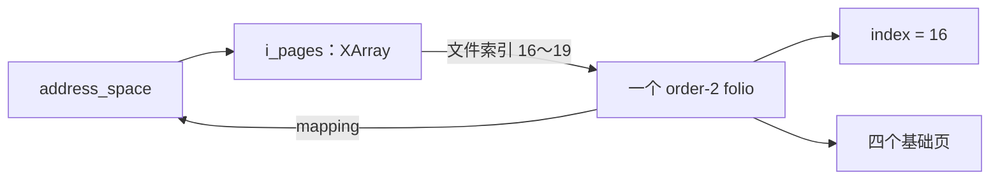

# folio 机制：从一个基础页到一组共同管理的页

理解 folio，先问一个问题：**内核正在操作一个基础页，还是一块由多个基础页组成、需要共同管理的内存？** `struct page *` 本身不能清楚表达这一区别；`struct folio *` 则明确表示后者，而且允许这个整体只有一个基础页。

本章依据仓库中标记为 **Linux 6.18.52** 的源码，版本见 [Makefile](../../linux/Makefile#L2)。分析以普通系统内存、文件页缓存和匿名内存为主，所有源码引用都指向本地 `linux` 目录。示例假设 `PAGE_SIZE = 4 KiB`，实际代码必须使用 `PAGE_SIZE`；配置相关布局和接口限制以本地实现为准。

建议分三遍阅读：第 1～4 节建立对象、布局和偏移量的概念；第 5～9 节跟踪分配、引用、页缓存和读写；第 10～14 节再连接页表映射、回收、拆分，并检查自己能否独立阅读调用路径。

## 1. 为什么需要 folio

### 1.1 同样是 `struct page *`，可能指向不同角色

假设内核分配了四个基础页，并把它们组织成一个复合页（compound page）：

```text
物理数据：     [ 4 KiB ][ 4 KiB ][ 4 KiB ][ 4 KiB ]
页描述符：      page 0   page 1   page 2   page 3
复合页角色：     head     tail     tail     tail
整体视角：     |------------ 一个 folio ------------|
```

如果函数收到 `struct page *page`，它可能指向单独分配的基础页，也可能指向这个复合页的 head 或任意 tail。接下来要增加引用、取得大小、检查状态，究竟该操作这个描述符，还是先找到 head？每个接口都必须约定清楚。

这一问题可以从 [get_page()](../../linux/include/linux/mm.h#L1494) 直接看出来：它先调用 `page_folio(page)` 找到所属 folio，再执行 `folio_get()`。调用者虽然传入一个子页，引用却加在整个 folio 上。

folio 把这种“操作整体”的意图放进了类型和函数名中：

```c
struct folio *folio = page_folio(page);

/* 后续操作明确针对整个 folio。 */
folio_get(folio);
nr_pages = folio_nr_pages(folio);
```

这段代码只是接口关系示意，前提是调用者已经按相应协议持有有效引用；`page_folio()` 本身不会取得引用。转换接口的并发约定见 [page_folio()](../../linux/include/linux/page-flags.h#L293)。

### 1.2 folio 同时解决“对象身份”和“操作粒度”问题

从源码可以归纳出两个作用。

第一，**让整体与子页的接口分开**。处理生命周期、页缓存对象、整体状态时传递 folio；需要建立某个基础页的 PTE（普通基础页映射所用的页表项）或访问某个子页时，再取得 `struct page *`。例如，文件缺页最终仍通过 [folio_file_page()](../../linux/include/linux/pagemap.h#L945) 选择具体页。

第二，**让上层算法接受不同大小的对象**。页缓存读取使用 `folio_size()` 决定一次处理多少字节，遍历使用 `folio_next_index()` 跨过整个对象，因而同一条路径可以处理单页和多页 folio。对应实现见 [filemap_read() 的复制循环](../../linux/mm/filemap.c#L2791) 和 [filemap_get_read_batch()](../../linux/mm/filemap.c#L2410)。

这并不表示所有按页操作都消失了。页表、基础页级状态、文件系统块状态仍有自己的粒度，后面会分别展开。

### 1.3 先把几个相近概念分开

| 概念 | 它主要表达什么 | 与 folio 的关系 |
| --- | --- | --- |
| 基础页 | `PAGE_SIZE` 大小的内存单位 | 一个 folio 包含一个或多个基础页 |
| `struct page` | 基础页的管理描述符，也被多种内存用途复用 | 可以定位 folio 中的某一页 |
| 复合页 | head/tail 组织形式 | 普通大 folio 使用这套底层组织；单页 folio 不需要 tail |
| large folio | 包含多个基础页的 folio，即 `order > 0` | 描述对象大小，不表明已经建立哪一级页表映射 |
| THP | 透明大页的分配、映射、拆分等机制 | 使用大 folio；本版本也支持通过 PTE 映射的多尺寸匿名 THP |
| hugetlb folio | hugetlb 子系统管理的特殊大页对象 | 使用 folio 接口，但有独立的管理和释放分支 |
| `folio_batch` | 一批 folio 指针 | 各 folio 可以大小不同、物理不相邻，不会因此合成一个 folio |

这些区别分别可在 [复合页初始化](../../linux/mm/page_alloc.c#L740)、[folio_test_large()](../../linux/include/linux/page-flags.h#L857)、[匿名大 folio 选择](../../linux/mm/memory.c#L5059)、[hugetlb 释放分支](../../linux/mm/swap.c#L104) 和 [struct folio_batch](../../linux/include/linux/pagevec.h#L19) 中验证。后文还会出现 PMD：它是 PTE 之上的页表层级，其表项在满足条件时也可直接映射较大的内存范围，见 [filemap_map_pmd()](../../linux/mm/filemap.c#L3620)。

## 2. 一个 folio 到底有多大

### 2.1 大小、页数与 order

[struct folio 的定义注释](../../linux/include/linux/mm_types.h#L369) 给出的基本约束是：物理上连续，大小为二次幂，至少包含一个基础页，并按自身大小对齐；进入页缓存后，它对应的文件起始偏移也按这个大小对齐。

令 `order = k`，则：

```text
基础页数       = 2^k
字节数         = PAGE_SIZE × 2^k
folio_shift    = PAGE_SHIFT + k
```

| order | 基础页数 | 假设基础页为 4 KiB 时的大小 |
| --- | --- | --- |
| 0 | 1 | 4 KiB |
| 1 | 2 | 8 KiB |
| 2 | 4 | 16 KiB |
| 4 | 16 | 64 KiB |
| 9 | 512 | 2 MiB |

这些是大小换算，**不是每个子系统都支持表中所有 order 的承诺**。例如本版本不支持把匿名 THP 拆成 order-1 folio，见 [folio_check_splittable()](../../linux/mm/huge_memory.c#L3623)。

对应的三个常用接口是：

```c
folio_order(folio);       /* 阶数，单页返回 0 */
folio_nr_pages(folio);    /* 基础页数，单页返回 1 */
folio_size(folio);        /* 字节数 */
```

实现分别见 [folio_order()](../../linux/include/linux/mm.h#L1152)、[folio_nr_pages()](../../linux/include/linux/mm.h#L2168) 和 [folio_size()](../../linux/include/linux/mm.h#L2261)。计算大小时要保证 folio 的生命周期和形态稳定；不能对一个已经失去有效引用的旧指针反复读取 order。

### 2.2 连续与对齐要分别在哪个地址空间里理解

以一个 16 KiB 的普通文件 folio 为例：

- 物理内存是连续的四个基础页，物理起点按 16 KiB 对齐。
- 它覆盖连续的文件字节，文件起点按 16 KiB 对齐。
- 用户进程可以只映射其中一部分，也可以通过多个 PTE 映射；用户虚拟地址不必按整个 folio 的大小对齐。
- 若使用内核线性映射，访问的是同一块物理内存的内核地址；涉及高端内存时，还需要遵守临时映射接口的约束。

前三点见 [folio 定义约定](../../linux/include/linux/mm_types.h#L369) 及 [文件 folio 的 PTE 映射](../../linux/mm/filemap.c#L3693)。最后一点见 [folio_address()](../../linux/include/linux/mm.h#L2438) 和 [kmap_local_folio() 的使用约定](../../linux/include/linux/highmem.h#L98)。

这里的物理连续指 **RAM 中的数据页连续**，不能由此推出文件在存储设备上的块也连续。页缓存的 `index` 是文件偏移；文件系统仍通过自己的 I/O 映射处理这些字节，见 [iomap_readpage_iter()](../../linux/fs/iomap/buffered-io.c#L398)。

## 3. folio 与 page 如何共用描述符

### 3.1 没有另外分配一份数据，也没有为每个 folio 新建一个普通堆对象

观察 [struct folio](../../linux/include/linux/mm_types.h#L377) 的开头，会看到一个 union：一侧是 `flags`、`lru`、`mapping`、`index`、`_refcount` 等字段，另一侧是 `struct page page`。

对于普通 folio，folio 指针从第一个基础页的描述符位置开始。大 folio 的部分扩展元数据还借用了后续页描述符的空间。

```text
数据区：        [基础页 0 的数据][基础页 1 的数据][基础页 2 的数据] ...
                    ↑               ↑               ↑
元数据视角：      struct page 0   struct page 1   struct page 2  ...
                    ↑
               struct folio *
               ├─ 首部与 page 0 重叠
               ├─ 部分大 folio 字段位于 page 1 对应空间
               └─ 其他扩展字段按用途和大小使用后续空间
```

图中的箭头表示“描述关系”，不是 `struct page` 中保存了这样一个数据指针。数据区与页描述符是不同的内存。

布局不是靠约定猜测的。[FOLIO_MATCH 静态断言](../../linux/include/linux/mm_types.h#L484) 检查了共有字段的偏移，后续断言检查扩展字段与第二、第三等页描述符的重叠位置。

因此，不能因为 C 类型里列出了 `__page_1`、`__page_2` 等成员，就认为单页 folio 也拥有这些可访问的扩展空间；也不能用 `sizeof(struct folio)` 推导它承载的数据大小。单页、大页及不同 order 应通过访问器区分，见 [folio_flags() 的检查](../../linux/include/linux/page-flags.h#L346) 和 [prep_compound_head()](../../linux/mm/internal.h#L783)。

### 3.2 head 与 tail 如何关联

[prep_compound_page()](../../linux/mm/page_alloc.c#L740) 的关键操作只有三步：

```c
__SetPageHead(page);
for (i = 1; i < nr_pages; i++)
        prep_compound_tail(page, i);
prep_compound_head(page, order);
```

head 带有 `PG_head`。tail 通过 `compound_head` 保存带标记的 head 地址，[set_compound_head()](../../linux/include/linux/page-flags.h#L868) 的编码为：

```c
WRITE_ONCE(page->compound_head, (unsigned long)head + 1);
```

最低位的 `1` 表示这是 tail。[_compound_head()](../../linux/include/linux/page-flags.h#L282) 读出该值，如果最低位被置位，就减去 `1` 还原 head 地址。实际实现还处理 hugetlb 描述符优化中的特殊 head 情况，普通 head/tail 模型之外的细节也应交给这个访问器。

于是，无论指向四页中的哪一页，`page_folio()` 都能找到同一个整体。反向转换 [folio_page(folio, n)](../../linux/include/linux/page-flags.h#L310) 则得到第 `n` 个页描述符。

### 3.3 第一次读结构时，先抓住这些字段

| 字段或访问器 | 它回答的问题 | 注意事项 |
| --- | --- | --- |
| `flags`、`folio_test_*()` | 是否锁定、有效、脏、回写中、在 LRU 上？ | 应使用对应接口维护状态，不能随意修改位 |
| `mapping` | 这个 folio 属于什么对象？ | 普通文件页指向 `address_space`；匿名页有带标记的编码 |
| `index` | 位于所属对象的什么位置？ | 文件页缓存中按基础页计数，不按 folio 计数 |
| `lru` | 如何组织进回收集合？ | 操作需要相应 LRU 同步，不由 folio 锁全面替代 |
| `private` | 文件系统是否附加了自己的管理信息？ | 例如块状态；它不是页数据本身 |
| `_refcount` / `folio_ref_count()` | 还有多少生命周期引用？ | 引用数不等于进程数，也不等于页数 |
| `folio_mapcount()` | 有多少用户页表项映射这个 folio 的任意部分？ | 与普通引用计数分开理解 |
| `folio_order()`、`folio_nr_pages()` | 整体有多大？ | 大 folio 的扩展字段有配置和大小约束 |
| `folio_maybe_dma_pinned()` | 是否可能被 DMA pin 固定？ | 影响迁移和拆分，不能只检查是否被锁定 |

字段定义见 [mm_types.h](../../linux/include/linux/mm_types.h#L333)，映射计数语义见 [folio_mapcount()](../../linux/include/linux/mm.h#L1286)，pin 判断见 [folio_maybe_dma_pinned()](../../linux/include/linux/mm.h#L2029)。

本版本 `folio_large_order()` 从 `_flags_1` 的低 8 位读取 order，而不是从一个名为 `folio->order` 的公开字段读取，见 [mm.h](../../linux/include/linux/mm.h#L1119)。学习时应记住访问器的含义，避免把某一版的内部布局当作永久接口。

`mapping` 尤其不能无条件解引用。普通匿名 folio 用低位 `FOLIO_MAPPING_ANON` 区分 `anon_vma` 等编码；KSM 还有其他含义，见 [page-flags.h 中的说明](../../linux/include/linux/page-flags.h#L696)。

## 4. 用一个 16 KiB folio 学会所有偏移换算

假设页缓存中有一个 order-2 folio，基础页为 4 KiB，`folio->index = 16`。它覆盖：

```text
文件字节区间： [64 KiB, 80 KiB)
文件页索引：    16       17       18       19
folio 内页号：   0        1        2        3
```

注意这里有三种单位：**文件字节偏移、文件基础页索引、folio 内部偏移**。很多 folio 错误来自混用它们。

### 4.1 从文件偏移找到 folio 内的位置

假设要从文件偏移 `pos = 73 KiB` 读取：

```text
文件页索引       = pos >> PAGE_SHIFT = 18
folio 起始偏移   = folio->index × PAGE_SIZE = 64 KiB
folio 内字节偏移 = pos - 64 KiB = 9 KiB
folio 内页号     = 18 - 16 = 2
该基础页内偏移   = 1 KiB
```

对应接口及含义：

| 操作 | 本例结果 | 实现 |
| --- | --- | --- |
| `folio_pos(folio)` | `64 KiB` | [pagemap.h:1023](../../linux/include/linux/pagemap.h#L1023) |
| `folio_file_page(folio, 18)` | 第 2 个子页 | [pagemap.h:945](../../linux/include/linux/pagemap.h#L945) |
| `folio_page(folio, 2)` | 第 2 个子页 | [page-flags.h:310](../../linux/include/linux/page-flags.h#L310) |
| `offset_in_folio(folio, pos)` | `9 KiB` | [mm.h:2493](../../linux/include/linux/mm.h#L2493) |
| `folio_next_index(folio)` | `20` | [pagemap.h:934](../../linux/include/linux/pagemap.h#L934) |
| `folio_contains(folio, 18)` | 真 | [pagemap.h:959](../../linux/include/linux/pagemap.h#L959) |

页缓存 folio 的起点按自身大小对齐，所以 `offset_in_folio()` 可以用 `pos & (folio_size(folio) - 1)` 计算偏移。同理，`folio_file_page()` 可以通过掩码得到子页号。但调用者必须先确认该文件索引属于这个 folio，不能把任意索引交给它并期待越界报错。

### 4.2 读 10 KiB 为什么要分两段

从 73 KiB 开始读 10 KiB，本 folio 只剩 `16 - 9 = 7 KiB`。因此先复制 7 KiB，再查找文件索引 20 起的后续 folio，继续复制 3 KiB；若先遇到文件结尾，还要进一步截短。

[filemap_read()](../../linux/mm/filemap.c#L2791) 正是用下面的关系决定本次复制量：

```text
本 folio 可复制字节数 = min(有效读取终点 - 当前文件位置,
                          folio_size - folio 内偏移)
```

这里不能继续使用“每次最多 `PAGE_SIZE`、然后 `index++`”作为整个缓存对象的遍历规则，否则会重复处理同一个大 folio，或者错误地限制可处理的数据范围。

### 4.3 取得子页描述符，不等于取得一个独立引用

`folio_page()` 只是描述符地址运算，不检查越界，也不增加引用。它的有效下标是 `0 <= n < folio_nr_pages(folio)`，生命周期由调用者保证，见 [接口注释](../../linux/include/linux/page-flags.h#L310)。

同样，`folio` 指针不是数据指针。需要访问数据时使用相应映射或复制接口。尤其 [kmap_local_folio()](../../linux/include/linux/highmem.h#L98) 临时映射的是指定偏移所在的**基础页**，不能因为名字里有 folio，就跨越这个基础页直接访问整个大 folio；临时地址也不能交给另一个执行上下文使用。

## 5. folio 如何分配出来

### 5.1 底层仍由页分配器提供物理内存

常见入口是：

```c
struct folio *folio = folio_alloc(gfp, order);
```

本版本通过分配钩子包装 `folio_alloc_noprof()`，见 [gfp.h](../../linux/include/linux/gfp.h#L346)。配置不同，中间路径会有差别：NUMA 实现见 [mempolicy.c](../../linux/mm/mempolicy.c#L2512)，非 NUMA 包装见 [gfp.h](../../linux/include/linux/gfp.h#L333)。

它们共同的关键点是 **加入 `__GFP_COMP`，按指定 order 申请物理页，并返回 folio 视角**。例如 [__folio_alloc_noprof()](../../linux/mm/page_alloc.c#L5336)：

```c
struct page *page = __alloc_pages_noprof(gfp | __GFP_COMP, order,
                                       preferred_nid, nodemask);
return page_rmappable_folio(page);
```

[prep_new_page()](../../linux/mm/page_alloc.c#L1902) 只有在 `order != 0` 且带 `__GFP_COMP` 时才建立复合页结构。因此，“申请了一块高阶连续内存”和“这块内存已经按一个复合页管理”仍需区分。

分配成功还会建立初始引用，见 [__alloc_pages_noprof()](../../linux/mm/page_alloc.c#L5324)。它此时只是新分配的内存对象，尚未因此自动加入文件页缓存、准备好文件数据或建立用户页表映射。

### 5.2 `folio_alloc(order)` 不会悄悄把 order 改小

请求某个 order，成功返回的就是该 order；分配失败返回 `NULL`。选择更小 folio 的策略由调用层实现。

例如 [__filemap_get_folio() 的创建分支](../../linux/mm/filemap.c#L1995) 会先确定允许范围和对齐条件，再从选定的 order 向 `mapping_min_folio_order()` 逐级尝试，见 [重试循环](../../linux/mm/filemap.c#L2018)。这意味着“尝试大 folio 失败”并不总会让整个文件读取或写入失败，但降阶也不能突破文件系统要求的最小 order。

### 5.3 页缓存允许什么大小，由 mapping 声明

文件系统可以通过 [mapping_set_folio_order_range()](../../linux/include/linux/pagemap.h#L406) 声明最小与最大 order；[mapping_set_large_folios()](../../linux/include/linux/pagemap.h#L447) 是允许从 order 0 到页缓存最大 order 的便捷入口。

这些接口应在 inode 构造等尚未活跃的阶段使用，不能把它们当成随时调整缓存中已有对象大小的开关。调用者建议的大小也不保证成为最终大小：已有 folio、索引对齐、邻近缓存内容和内存压力都会影响结果，见 [fgf_set_order()](../../linux/include/linux/pagemap.h#L735)。

还要区分概念与配置依赖：虽然大 folio 不等于 PMD 映射，但**本版本普通页缓存的大 folio 支持仍依赖 `CONFIG_TRANSPARENT_HUGEPAGE`**，相关说明与配置分支见 [pagemap.h](../../linux/include/linux/pagemap.h#L421) 和 [mapping_large_folio_support()](../../linux/include/linux/pagemap.h#L506)。

## 6. 生命周期、锁与状态：三个不同问题

### 6.1 引用计数回答“这个对象还能不能释放”

对于一个普通大 folio，整体生命周期的引用计数位于 head 对应的位置。[folio_ref_count()](../../linux/include/linux/page_ref.h#L70) 实际读取 `&folio->page` 的引用计数，而不是对所有 tail 的 `_refcount` 求和。

| 接口 | 作用 | 使用前提或后果 |
| --- | --- | --- |
| `folio_get()` | 加一个引用 | 调用者已经持有引用 |
| `folio_try_get()` | 非零时尝试加一个引用 | 用于特定查找协议；失败可能是释放、迁移或拆分冻结 |
| `folio_put()` | 减一个引用 | 最后一个引用消失时进入释放路径，之后不能继续访问 |
| `folio_ref_add()` / `folio_put_refs()` | 批量增加或归还多个引用 | 增减数量必须来自具体持有关系 |

实现见 [folio_get()](../../linux/include/linux/mm.h#L1480)、[folio_try_get()](../../linux/include/linux/page_ref.h#L251)、[folio_put() 与 folio_put_refs()](../../linux/include/linux/mm.h#L1513)。`folio_try_get()` 也不是能让任意悬空指针变安全的工具；页缓存等调用者还必须提供 RCU、索引复核等外围协议。

**一个大 folio 共用一个计数器，不代表它只占一个引用。** 这是理解页缓存最容易漏掉的一点。[__filemap_add_folio()](../../linux/mm/filemap.c#L875) 会执行：

```c
nr = folio_nr_pages(folio);
folio_ref_add(folio, nr);
```

于是，对前面的四页 folio，如果只统计分配者和页缓存，暂不计 LRU 批处理、页表和文件系统私有数据等引用：

```text
分配后：                    1       分配者的初始引用
加入页缓存后：              5 = 1 + 4
分配者归还自己的引用后：    4       页缓存按基础页数持有
一次普通查找成功后：        5       新增一个调用者引用
该调用者 folio_put() 后：   4
```

删除页缓存持有关系时，也通过 [filemap_free_folio()](../../linux/mm/filemap.c#L230) 归还 `folio_nr_pages()` 个引用。实际观察计数时，还要检查是否有其他持有者；上述数字是用于理解所有权的简化账本。

### 6.2 mapcount 与 pin 不是 refcount 的别名

[folio_mapcount()](../../linux/include/linux/mm.h#L1286) 统计引用 folio 任意部分的用户页表项数量。对普通 folio，一个有效 PTE、PMD 或 PUD 映射项各计一次。因此：

- 四个 PTE 映射四个子页，与一个更大粒度的页表项映射整个对象，mapcount 的贡献不同。
- 页缓存可以持有一个完全没有用户映射的 folio，此时有引用但 mapcount 为零。
- 一个进程可以建立多个映射，因此 mapcount 也不能解释成“映射进程数”。

DMA pin 指通过 `pin_user_pages()` 等接口固定用户页，使设备直接访问等操作能够继续使用对应内存；它涉及物理内存是否能被移动或拆分。[folio_maybe_dma_pinned()](../../linux/include/linux/mm.h#L2029) 在大多数大 folio 上读取单独的 `_pincount`；对于没有这个独立计数的情况，使用引用计数偏置判断，可能产生保守的假阳性。

所以，引用、用户映射和 pin 应分别检查。用于迁移、拆分等路径的 [folio_expected_ref_count()](../../linux/include/linux/mm.h#L2338) 会计算页缓存、交换缓存、私有数据和页表映射带来的预期引用，辅助发现额外持有者。

### 6.3 folio 锁回答“哪些操作需要等待”

[folio_trylock()](../../linux/include/linux/pagemap.h#L1090) 尝试原子设置 `PG_locked`；[folio_lock()](../../linux/include/linux/pagemap.h#L1115) 在失败时进入可睡眠的等待路径。

folio 锁主要参与读入数据、截断移除、部分缓冲写等操作的串行化。持锁可以稳定页缓存 folio 的 `mapping`，但**拿到锁不等于内容已经有效，也不等于拥有了一个引用**。

等待队列并不是每个 folio 内嵌一份。实现用 folio 地址散列到 [folio_wait_table](../../linux/mm/filemap.c#L1080)；[folio_unlock()](../../linux/mm/filemap.c#L1509) 清除锁状态，并在需要时唤醒等待者。

还应注意两条边界：

1. folio 锁可以睡眠；同时取得多个 folio 锁要遵守源码规定的顺序。
2. 用户对已经建立的可写映射直接存储、DMA 等修改，不会统一取得这个锁。因此它不是保护每次数据访问的通用互斥锁。

这些约束都写在 [folio_lock() 的接口注释](../../linux/include/linux/pagemap.h#L1115) 中。

### 6.4 不同锁各自保护什么

| 同步手段 | 主要保护的关系 | 不能据此推断什么 |
| --- | --- | --- |
| folio 引用 | folio 的生命周期 | 不能阻止它从页缓存中被截断移除 |
| folio 锁 | 读入、截断和部分修改协议；持锁时稳定 `mapping` | 不能阻止所有用户映射写入 |
| `mapping->i_pages` 的 XArray 锁 | 页缓存索引结构与相关更新 | 不能替代读 I/O 完成等待 |
| `mapping->invalidate_lock` | 页缓存与文件偏移到存储块映射的一致性 | 不能替代 folio 引用和具体对象锁 |
| 页表锁 | 具体页表项及相关映射状态 | 不能作为整个文件页缓存的锁 |
| LRU 相关锁 | folio 在回收集合中的组织 | 不能说明文件内容是否已回写 |

对应实例见 [页缓存插入](../../linux/mm/filemap.c#L888)、[新 folio 读入时的 invalidate_lock](../../linux/mm/filemap.c#L2572)、[匿名缺页的页表锁](../../linux/mm/memory.c#L5219) 和 [LRU 批处理](../../linux/mm/swap.c#L175)。读代码时要先识别要稳定的是哪一种关系，再判断所持的锁是否足够。

### 6.5 状态位回答“数据和后台工作处于什么阶段”

| 状态 | 含义 | 常见误解 |
| --- | --- | --- |
| `uptodate` | 整个 folio 的内容已经有效 | 不能解释为“与磁盘完全相同”，脏 folio 也可以有效 |
| `dirty` | 有修改需要按相应后端机制保存 | 不代表正在进行 I/O |
| `writeback` | 这一轮回写尚未完成 | 不排除同时再次变脏 |
| `locked` | 正处于持有 folio 锁的操作中 | 解锁不保证读入成功 |
| `readahead` | 到达该处时可能触发后续预读 | 不是“这个 folio 的数据已经读完” |
| `referenced`、`active`、`lru` | 访问和回收管理状态 | 不等于固定内存或不可回收 |

`uptodate` 的严格含义和部分有效状态见 [folio_test_uptodate()](../../linux/include/linux/page-flags.h#L775)。预读触发判断见 [filemap_get_pages()](../../linux/mm/filemap.c#L2662)，访问状态转换见 [folio_mark_accessed()](../../linux/mm/swap.c#L455)。

`uptodate` 的发布还有内存顺序要求：[folio_mark_uptodate()](../../linux/include/linux/page-flags.h#L813) 在设置状态前执行写屏障，[folio_test_uptodate()](../../linux/include/linux/page-flags.h#L785) 在观察到该状态后执行读屏障。它们配合保证读者先看到“数据有效”，再读取之前写入的数据；不能用随手设置一个标志位来替代这套接口。

## 7. folio 如何成为页缓存中的对象

### 7.1 `address_space` 负责按文件位置索引

文件页缓存的入口是 [struct address_space](../../linux/include/linux/fs.h#L484)，其中 `i_pages` 是 XArray，`a_ops` 是文件系统操作集合。



这里 XArray 按**基础页索引**查找，但缓存对象可以覆盖多个索引。[__filemap_add_folio()](../../linux/mm/filemap.c#L861) 用 `XA_STATE_ORDER` 告诉 XArray 本次存储的范围大小，并检查起始 index 是否按 folio 页数对齐。

对本例，查找 16、17、18、19 都是在查找同一个 folio 覆盖的内容。不能把它画成四个相互独立、各自拥有锁和引用计数的 folio，也不应假定 XArray 的内部编码只是简单地复制四次指针。

### 7.2 插入时要同时建立几种关系

从 [filemap_add_folio()](../../linux/mm/filemap.c#L968) 开始，简化后的成功路径如下。其中 memcg 指内存控制组，用于记录内存资源归属。

```text
对 folio 做 memcg 记账
  → 设置新 folio 的 locked 状态
  → __filemap_add_folio()
      → 增加页缓存持有的引用
      → 设置 mapping 和 index
      → 持 XArray 锁检查范围内冲突
      → 存储 folio，更新 nrpages 等统计
  → 处理必要的 refault 信息
  → folio_add_lru()
```

这里有三个容易忽略的细节。

**成功插入后 folio 仍然锁着。** 文件数据可能还没读入，后续读入路径负责完成相应解锁协议。不能把 `filemap_add_folio()` 当作返回可直接读取数据的完整接口。

**统计仍然按基础页数增加。** `mapping->nrpages += nr` 中的 `nr` 是 `folio_nr_pages()`；加入一个四页 folio，统计增加四页，见 [filemap.c:928](../../linux/mm/filemap.c#L928)。

**失败必须撤销已建立的关系。** 冲突可能返回 `-EEXIST`；错误分支清除 `mapping`、归还缓存引用，外层撤销相应记账和锁状态，见 [filemap.c:955](../../linux/mm/filemap.c#L955)。调用者自己的分配引用仍由调用者处理。

### 7.3 无锁查找为什么要“取引用后再查一次”

[filemap_get_entry()](../../linux/mm/filemap.c#L1906) 在 RCU（Read-Copy-Update，读—复制—更新）读侧临界区中访问缓存索引，再结合引用计数取得对象。主要步骤如下，代码经过删节，用于突出并发协议：

```c
rcu_read_lock();
repeat:
        xas_reset(&xas);
        folio = xas_load(&xas);
        if (xas_retry(&xas, folio))
                goto repeat;
        if (!folio || xa_is_value(folio))
                goto out;
        if (!folio_try_get(folio))
                goto repeat;
        if (folio != xas_reload(&xas)) {
                folio_put(folio);
                goto repeat;
        }
out:
rcu_read_unlock();
```

可以把它理解为三次确认：

1. `xas_load()` 找到“这一刻索引里看到的对象”。
2. `folio_try_get()` 确认能够取得非零引用，防止接手已释放或被暂时冻结的对象。
3. `xas_reload()` 确认取得引用后，这个索引仍然对应同一个对象，否则归还引用并重试。

为什么只有 RCU 不够？本文件的 [无锁页缓存协议注释](../../linux/mm/filemap.c#L1874) 明确考虑了物理页在 RCU 宽限期结束前被再次分配的情况。RCU、非零引用获取和索引复核各自承担不同职责，不能只留下其中一步。

还要识别 XArray 中的值条目：`filemap_get_entry()` 可能返回 shadow 或 shmem 的 swap 条目，而非 folio 指针。更高层的 [filemap_get_folio()](../../linux/include/linux/pagemap.h#L788) 会过滤这些情况，未找到 folio 时返回 `ERR_PTR(-ENOENT)`。

### 7.4 取得引用后，为什么加锁还要重新检查 mapping

假设线程 A 查找成功，尚未获得 folio 锁；线程 B 此时把 folio 从文件中截断移除。A 持有的引用保证对象还活着，但**不保证它仍属于原来的文件页缓存**。

所以 [__filemap_get_folio()](../../linux/mm/filemap.c#L1965) 在 `FGP_LOCK` 分支中，加锁后还检查：

```c
if (unlikely(folio->mapping != mapping)) {
        folio_unlock(folio);
        folio_put(folio);
        goto repeat;
}
```

这是引用与锁分工的具体例子：先保住对象，再串行化对象状态，最后验证之前观察到的归属是否仍成立。

### 7.5 应选择哪一层查找接口

| 接口 | 找不到时 | 成功后的状态 |
| --- | --- | --- |
| `filemap_get_entry()` | 可返回 `NULL`，也可能得到值条目 | 若是 folio，已加引用，未保证锁定 |
| `filemap_get_folio()` | `ERR_PTR(-ENOENT)` | 已加引用，未保证锁定或 uptodate |
| `filemap_lock_folio()` | `ERR_PTR(-ENOENT)` | 已加引用并锁定，未保证 uptodate |
| `__filemap_get_folio(..., FGP_CREAT, ...)` | 按 flags 尝试创建，也可能返回错误 | 是否保持锁定等行为由 flags 决定 |

接口定义见 [pagemap.h](../../linux/include/linux/pagemap.h#L788)，创建分支见 [filemap.c](../../linux/mm/filemap.c#L1995)。尤其 `FGP_FOR_MMAP` 会在新对象创建后解锁，不能把创建分支的结果一律理解为“返回时持锁”，见 [filemap.c:2056](../../linux/mm/filemap.c#L2056)。

对于只检查已有缓存对象的代码，可以采用这样的骨架；它不创建页，也不负责发起 I/O，调用者必须保证 `mapping` 存活并处于允许睡眠的上下文：

```c
/* 教学示意：具体内容处理必须遵守所属子系统的数据同步规则。 */
folio = filemap_lock_folio(mapping, index);
if (IS_ERR(folio))
        return PTR_ERR(folio);

if (!folio_test_uptodate(folio)) {
        ret = -EAGAIN;   /* 本例要求整个 folio 有效。 */
        goto out;
}

/* 检查或使用此 folio；需要某个子页时再调用 folio_file_page()。 */
ret = 0;
out:
folio_unlock(folio);
folio_put(folio);
return ret;
```

这段骨架最重要的部分是错误指针判断、有效状态判断以及独立归还锁和引用。真正需要读取文件数据时，应沿下面的读入接口处理缺页和 I/O，而不是把所有非 uptodate 状态直接当作永久错误。

## 8. 跟踪一次缓冲读取：查找、预读、填充与复制

### 8.1 先看一次读取必须回答的四个问题

沿通用缓冲读取路径 [filemap_read()](../../linux/mm/filemap.c#L2710) 阅读，可以把工作拆成四件事：

1. 文件位置对应哪些 folio？
2. 这些 folio 是否已经在页缓存中？
3. 所需数据是否有效，是否需要等待或发起 I/O？
4. 在不越过文件结尾的前提下，能复制多少字节？

省略错误与非阻塞分支后，主要调用关系如下：

```text
filemap_read()
  → filemap_get_pages()
      → filemap_get_read_batch()       先尝试命中缓存
      → page_cache_sync_ra()          无缓存时尝试预读
      → filemap_get_read_batch()       再取预读建立的缓存对象
      → filemap_create_folio()         仍未命中时创建并读入
      或 filemap_update_page()        对已有对象检查、等待或补读
  → 重新读取 i_size，确定有效终点
  → copy_folio_to_iter()               复制到调用者的数据迭代器
  → folio_put()                       归还本轮取得的引用
```

这里的分支关系以 [filemap_get_pages()](../../linux/mm/filemap.c#L2622) 为准，并不是每次读取都会依次执行所有函数。命中有效缓存时，大部分准备工作都可以跳过。

### 8.2 批量查找的单位是 folio，推进的位置仍是文件页索引

[filemap_get_read_batch()](../../linux/mm/filemap.c#L2410) 使用 `folio_batch` 收集对象，并采用与单对象查找类似的“取引用后复核”协议。

加入一个 folio 后，代码通过：

```c
xas_advance(&xas, folio_next_index(folio) - 1);
```

把迭代位置推进到当前 folio 覆盖范围的末尾，然后由后续迭代继续前进。这样，一个覆盖四个文件索引的 folio 只作为一个对象加入批次。

遇到非 uptodate folio 或预读标记时，批量收集会停下来，让上层处理等待、补读或下一轮预读。因而 `folio_batch` 只是批处理容器，不能保证其中每个对象都已经可以无条件读取。

### 8.3 预读同时决定“提前读多少”和“用多大 folio 承载”

预读窗口大小与单个 folio 大小是两个量。一个较大的预读窗口可以包含许多单页 folio，也可以由较少的大 folio 组成。

[page_cache_ra_order()](../../linux/mm/readahead.c#L464) 在本版本中综合考虑：

- mapping 声明的最小、最大 order。
- `ra->order` 和预读窗口 `ra->size`。
- 当前文件索引的对齐条件。
- 文件结尾和本次窗口边界；不能随意突破最小 order 的限制。

它通过 [ra_alloc_folio()](../../linux/mm/readahead.c#L442) 分配 folio、设置适当的预读标记、加入页缓存，然后按 `1UL << order` 推进文件索引。大 folio 路径遇到分配失败或缓存冲突时，会把尚未覆盖的读取需求交给 [常规预读回退路径](../../linux/mm/readahead.c#L527)。

因此，不能把“启用了大 folio”理解为“以后所有预读都固定分配 2 MiB”。实际大小会沿着文件位置和读取行为变化。

### 8.4 读 I/O 为什么借助 folio 锁完成同步

新建的页缓存 folio 在数据准备完成前保持锁定。[filemap_read_folio()](../../linux/mm/filemap.c#L2446) 调用传入的读取函数，常见来源是 `mapping->a_ops->read_folio`，然后等待 folio 解锁。

以提供 [folio_end_read()](../../linux/mm/filemap.c#L1529) 的完成协议为例：

```text
创建并插入 folio：  locked = 1，数据尚未确认有效
发起读取：          一个 folio 可能对应多个 I/O 片段
最后一个片段完成：  成功则发布 uptodate，随后解锁并唤醒
等待读取的一方：    等到解锁，再检查 uptodate
```

**等待结束只意味着这轮持锁操作结束，不保证读取成功。** `filemap_read_folio()` 在等待后仍调用 `folio_test_uptodate()`；没有获得有效数据时返回 `-EIO`，见 [filemap.c:2462](../../linux/mm/filemap.c#L2462)。

一个 folio 对应多个 I/O 片段时，也不能由第一个完成的片段提前解锁整个对象。iomap 用 `read_bytes_pending` 跟踪尚未完成的字节数，待全部结束再调用 `folio_end_read()`，见 [buffered-io.c](../../linux/fs/iomap/buffered-io.c#L366)。

### 8.5 为什么有效数据确认之后还要检查文件大小

等待 I/O 期间文件可能被截断。如果只使用进入读取函数时保存的旧 `i_size`，就可能把文件结尾之外的内容复制给用户。

[filemap_read()](../../linux/mm/filemap.c#L2764) 因此在取得可用数据后重新读取 `i_size`，再以文件结尾、请求剩余长度和当前 folio 边界共同限制复制量。第 4 节“7 KiB 加 3 KiB”的演算，还必须服从这个最终长度约束。

## 9. 修改与回写：整体状态如何容纳局部变化

### 9.1 缓冲写修改的是 folio 中的一段范围

通用缓冲写路径 [generic_perform_write()](../../linux/mm/filemap.c#L4244) 调用文件系统的 `write_begin()`，获得本次写入使用的 folio，然后重新计算实际 folio 内偏移和可写长度。

```text
write_begin()                    准备 folio 及必要的文件系统状态
  → offset_in_folio()            计算本次修改的位置
  → 按实际 folio_size() 限制长度
  → copy_folio_from_iter_atomic()
  → write_end()                  由文件系统完成本次写入的收尾
```

对应位置见 [长度调整](../../linux/mm/filemap.c#L4272) 和 [复制及 write_end 调用](../../linux/mm/filemap.c#L4284)。这是一条具体的通用写路径；不同文件系统可能使用其他框架，不能把它当作所有缓冲写的唯一调用链。

folio 可以很大，而这次写入只改动其中几百字节。于是需要同时维护“这个整体有脏数据”和“整体内部哪些块发生变化”两种信息。

### 9.2 脏状态不仅存在于 folio 的一个位上

[folio_mark_dirty()](../../linux/mm/page-writeback.c#L2794) 根据 folio 所属 mapping 调用文件系统的 `dirty_folio()`。适用的文件系统可以使用 [filemap_dirty_folio()](../../linux/mm/page-writeback.c#L2724)，完成以下工作：

1. 设置 folio 的 dirty 状态。
2. 更新脏页统计。
3. 在 XArray 中设置 `PAGECACHE_TAG_DIRTY`，便于查找待写对象。
4. 必要时把 inode 标记为有脏数据。

更新 XArray 标记的实现见 [__folio_mark_dirty()](../../linux/mm/page-writeback.c#L2703)。只手工修改 `PG_dirty`，可能漏掉这些配套关系。

设置脏状态还必须避免与截断竞争。通常由 folio 锁提供保证，但某些页表路径通过其他同步关系满足要求，不能据此概括成“调用 `folio_mark_dirty()` 必须无条件再取一次 folio 锁”，见 [接口前提](../../linux/mm/page-writeback.c#L2798)。

### 9.3 dirty 和 writeback 是两个独立维度

对内容已经有效的普通文件 folio，可以用下面的表理解两种状态：

| dirty | writeback | 含义 |
| --- | --- | --- |
| 0 | 0 | 当前既没有待处理的脏标记，也没有在途回写 |
| 1 | 0 | 有需要保存的修改，尚未处于回写中 |
| 0 | 1 | 这一轮脏内容已被接手处理，回写尚未完成 |
| 1 | 1 | 回写尚未完成，同时又出现了需要后续处理的脏状态 |

这只是两种状态的关系表，不包含 `uptodate`；不能用第一行推断一个刚分配的 folio 已有有效内容。

典型流程如下，具体 I/O 提交由文件系统实现：

```text
修改内容并标脏
  → 锁定 folio，选择要回写的内容
  → folio_clear_dirty_for_io()
  → folio_start_writeback()
  → 提交 I/O，并按文件系统协议释放 folio 锁
  → I/O 完成后 folio_end_writeback()
```

[folio_clear_dirty_for_io()](../../linux/mm/page-writeback.c#L2887) 为这轮写出清理 dirty 状态和相关记账，还会处理页表脏状态；[__folio_start_writeback()](../../linux/mm/page-writeback.c#L3022) 设置 writeback 状态及 XArray 标记；[folio_end_writeback_no_dropbehind()](../../linux/mm/filemap.c#L1655) 完成回写收尾，并按需唤醒等待者。

清 dirty 与更新 XArray dirty 标记之间，允许在持锁协议内出现短暂差异，源码在 [page-writeback.c:2887](../../linux/mm/page-writeback.c#L2887) 专门说明了原因。不要把两个状态要求为每条指令之后都完全同步。

尤其不能在回写完成时无条件再清一次 dirty：如果 folio 在回写期间重新变脏，那是下一轮需要保存的修改。[__folio_end_writeback()](../../linux/mm/page-writeback.c#L2985) 清理的是这一轮 writeback 状态和标记，并不把之后的脏修改一并抹掉。

### 9.4 “以 folio 管理”不等于“所有 I/O 都必须覆盖整个 folio”

通用层的 `uptodate`、dirty 和 writeback 状态描述整个对象，但文件系统可以记录更细的信息。

本版本 iomap 的 [struct iomap_folio_state](../../linux/fs/iomap/buffered-io.c#L16) 包含：

```c
spinlock_t state_lock;
unsigned int read_bytes_pending;
atomic_t write_bytes_pending;
unsigned long state[];
```

`state[]` 用两组位分别记录每个文件系统块的 uptodate 和 dirty 状态；读写剩余字节数则用于汇总分段 I/O 的完成情况。[iomap_finish_folio_write()](../../linux/fs/iomap/buffered-io.c#L1608) 只有在相应写出片段都完成后，才结束整个 folio 的 writeback。

因此，一个 16 KiB folio 的一小部分可以被修改，文件系统可以知道具体哪些块变脏；也可能只有一部分已读入。通用读取通过 [filemap_range_uptodate()](../../linux/mm/filemap.c#L2472) 在符合条件时查询 `is_partially_uptodate()`，判断所需范围是否已经可用。

这给出了三层粒度：**folio 是通用缓存与生命周期对象，文件系统块描述内部有效或脏范围，bio 等 I/O 对象组织实际传输。** 三者不必一一对应。

## 10. folio 如何与用户页表连接

### 10.1 文件缺页：先找到整体，再选择子页

文件 mmap 缺页沿 [filemap_fault()](../../linux/mm/filemap.c#L3459) 查找或读入 folio，取得锁并确认数据有效，随后还要检查文件大小。

最终交给缺页处理上层的是：

```c
vmf->page = folio_file_page(folio, index);
return ret | VM_FAULT_LOCKED;
```

见 [filemap.c:3571](../../linux/mm/filemap.c#L3571)。这两行很好地说明了职责边界：缓存和读入以 folio 为对象，具体缺页位置仍可能需要 `struct page *`。

对于附近地址的预先映射，[filemap_map_folio_range()](../../linux/mm/filemap.c#L3693) 在文件大小、VMA 边界和页表边界允许时，可以批量建立多个 PTE。所映射的物理页仍属于同一个大 folio。

### 10.2 大 folio 不保证已经使用 PMD 映射

至少要分清三个问题：

```text
folio 大小够不够？     folio_test_pmd_mappable()
这个位置能不能映射？   VMA、对齐、文件边界、现有页表等检查
是否已经这样映射？     观察实际页表项
```

本版本 [folio_test_pmd_mappable()](../../linux/include/linux/huge_mm.h#L470) 在相应配置下只检查 `folio_order(folio) >= HPAGE_PMD_ORDER`。它的结果不能替代所有映射条件，更不能当作“现在已经有 PMD 映射”。

[filemap_map_pmd()](../../linux/mm/filemap.c#L3620) 会在适当条件下尝试 `do_set_pmd()`；未成功时仍可继续 PTE 路径。因此，一个大 folio 完全可以获得缓存管理上的批处理收益，却没有因为它的大小自动减少到一个 PMD 页表项。

### 10.3 匿名内存也使用 folio

folio 并不限于文件缓存。本版本普通匿名缺页的 [alloc_anon_folio()](../../linux/mm/memory.c#L5059) 会在配置和 VMA 策略允许时，选择小于 PMD order 的多个候选 order，检查范围是否适合，然后尝试分配。

大尺寸候选失败后，代码继续尝试较小候选，最终走 [基础页分配回退](../../linux/mm/memory.c#L5111)。userfaultfd 等需要保持逐页缺页语义的情况，也会影响是否采用大 folio。

随后 [do_anonymous_page() 的建立映射部分](../../linux/mm/memory.c#L5193) 执行：

```text
取得并准备好匿名 folio
  → 发布 uptodate
  → 获取页表锁，复核目标 PTE 范围
  → 按基础页数增加映射引用和 RSS
  → folio_add_new_anon_rmap()
  → folio_add_lru_vma()
  → set_ptes() 建立多个 PTE
```

其中 `folio_ref_add(folio, nr_pages - 1)` 将初始引用补足到这批 PTE 所需的引用数，见 [memory.c:5241](../../linux/mm/memory.c#L5241)。从这条路径可以直接看见：**一个匿名大 folio 可以通过一组 PTE 映射，多页 folio 与 PMD 映射并非同一个概念。**

### 10.4 folio 锁不会冻结所有页表关系

已有 folio 可能被更多地址映射，也可能被解除映射。即使持有 folio 锁，额外的 `fork()`、`munmap()` 等页表变化仍要结合相应页表和反向映射协议分析。

[folio_expected_ref_count() 的注释](../../linux/include/linux/mm.h#L2351) 明确指出：对仍被映射的 folio，预期引用数未必稳定；不能把一次读取的 mapcount、refcount 当作无需同步的永久事实。

## 11. 从缓存对象到可回收内存

### 11.1 LRU 组织的是 folio，容量仍按基础页统计

[folio_add_lru()](../../linux/mm/swap.c#L491) 通过批处理安排对象进入回收集合。加入批次时可能临时增加引用，批次处理完成后再归还，见 [__folio_batch_add_and_move()](../../linux/mm/swap.c#L182) 及 [批次引用释放](../../linux/mm/swap.c#L175)。这也是调试时不能仅凭简化账本判断引用泄漏的原因。

访问通过 [folio_mark_accessed()](../../linux/mm/swap.c#L455) 反馈给回收机制。传统 active/inactive 路径和启用多代 LRU 的路径有所不同，源码会根据 `lru_gen_enabled()` 分流，不能把所有系统都解释为固定的两级链表状态转换。

虽然链表项对应 folio，[shrink_folio_list()](../../linux/mm/vmscan.c#L1101) 会取得 `folio_nr_pages()`，再按基础页数增加扫描或回收统计。扫描一个四页 folio，在容量上计四页，而不是计一页。

### 11.2 回收并不等于看到引用计数就直接 free

回收一个普通文件 folio，可能需要依次处理以下问题；具体分支与顺序应以 [shrink_folio_list()](../../linux/mm/vmscan.c#L1104) 为准：

- 能否取得 folio 锁，是否还在被积极使用。
- 是否有用户页表映射，需要怎样解除映射。
- 是否有脏数据或在途回写，是否允许和需要发起 I/O。
- 文件系统私有状态是否允许释放。
- 是否仍有额外引用，能否从缓存安全摘除。

对普通、需要保留内容的匿名内存，通常还要准备交换空间。大 folio 可以作为整体进入交换处理，也可能在分配交换空间失败等情况下拆分后重试；本版本的具体分支见 [vmscan.c:1302](../../linux/mm/vmscan.c#L1302)。不能直接套用“干净文件缓存可以以后重新读入”的理由丢弃匿名数据。

### 11.3 冻结引用是如何关闭并发查找窗口的

在正常文件缓存回收的最后阶段，[__remove_mapping()](../../linux/mm/vmscan.c#L725) 持有相应锁，期望只剩：

```text
预期引用 = 回收路径持有的 1 个引用 + folio_nr_pages() 个缓存引用
```

它使用 [folio_ref_freeze()](../../linux/include/linux/page_ref.h#L281) 进行原子比较交换：只有计数恰好等于预期值时，才暂时改成零。并发的 `folio_try_get()` 因而无法在这个窗口取得新引用。

这里的“零”是受控协议中的冻结状态，不能理解为执行到这一行对象就已经归还给分配器。持有者仍在完成移除或状态转移；如果无法继续，还会恢复引用。

尤其需要关注源码中的顺序：**先成功冻结引用，再检查 dirty**，见 [vmscan.c:742](../../linux/mm/vmscan.c#L742)。如果先检查“干净”，另一个持引用者可能随后写入并标脏，再归还引用；回收方只检查最终引用数，就有机会误丢弃刚写入的数据。

确认可以移除后，回收路径从缓存摘除 folio，必要时留下 shadow 条目，用于后续 refault 判断，再完成批量释放。数据对象消失，不意味着 XArray 对应位置一定立即变成简单的空指针，见 [回收 shadow 的处理](../../linux/mm/vmscan.c#L788)。

### 11.4 从页缓存删除，与物理内存释放是两个时刻

[filemap_remove_folio()](../../linux/mm/filemap.c#L242) 的接口说明明确要求：调用者持锁、确认对象仍在页缓存中，并拥有自己的引用。删除缓存后，调用者引用仍在，folio 不会仅因为这一步就被释放。

正常引用释放到零后，才会进入 [__folio_put()](../../linux/mm/swap.c#L97)。对本章关注的普通 folio，它处理 LRU、延迟拆分队列和 memcg 等收尾，然后按 `folio_order()` 归还物理页。hugetlb 和设备内存则先进入各自分支。

回收批处理也有自己的冻结、摘除和释放路径，见 [shrink_folio_list() 的 free_it 分支](../../linux/mm/vmscan.c#L1563)。所以源码中未必所有成功回收最终都表现为一次直接调用 `__folio_put()`，但对象必须先满足生命周期与归属关系的要求。

## 12. 拆分与迁移：整体管理并不意味着永远不能变化

### 12.1 为什么需要把大 folio 拆小

假设一个大 folio 只有少数基础页仍被使用。继续把整个对象作为一个回收单位，可能保留大量暂时无用的内存。文件截断或打洞也可能只覆盖大 folio 的一部分。

本版本可以在 [匿名回收路径](../../linux/mm/vmscan.c#L1313) 看到对部分映射 folio 的拆分处理，在 [truncate_inode_partial_folio()](../../linux/mm/truncate.c#L206) 看到边界范围的清零、失效和拆分处理。

拆分主要改变页描述符的 head/tail 关系、对象大小、引用与索引组织；它不是把原来的数据按字节重新复制到几块新分配的内存中。核心实现入口见 [__folio_split()](../../linux/mm/huge_memory.c#L3672) 和 [__split_folio_to_order()](../../linux/mm/huge_memory.c#L3345)。

### 12.2 均匀拆分与非均匀拆分

本版本同时提供两类方式。

**均匀拆分**将原对象分成同一目标 order 的多个 folio。例如四页的 order-2 文件 folio 拆成 order 0：

```text
拆分前：     [----------- order 2 -----------]
拆分后：     [order 0][order 0][order 0][order 0]
物理数据：    仍位于原先那四个基础页中
管理对象：    从一个整体变成四个独立整体
```

入口 [split_folio_to_order()](../../linux/include/linux/huge_mm.h#L728) 最终包装 [split_huge_page_to_list_to_order()](../../linux/mm/huge_memory.c#L4015)。函数名仍包含 `huge_page`，不意味着所有调用都只能处理一个固定 PMD 大小。

**非均匀拆分**只把目标位置所在部分拆到指定 order，其他部分尽量保留较大的尺寸。[folio_split() 的源码注释](../../linux/mm/huge_memory.c#L4070) 给出了一个例子：order-9 folio 中的目标区域拆到 order 3 后，可以形成：

```text
[order 4][目标 order 3][order 3][order 5][order 6][order 7][order 8]
```

这比把整个对象都降到 order 3 更有机会保留其他区域的管理收益。它不是把邻近、不连续的内存重新拼成 folio，而是在原有连续区间内重新划分管理边界。

[try_folio_split_to_order()](../../linux/include/linux/huge_mm.h#L375) 会在非均匀拆分不受支持时回退到均匀拆分。

### 12.3 拆分为什么会失败

拆分并非只把 `order` 改小。调用者要持有引用和 folio 锁，内核还需要处理页表映射、文件索引、引用归属、LRU 和统计信息。下表中的 GUP 指 `get_user_pages()` 一类用户页获取路径；普通获取引用与 pin 的具体记账不同，但额外持有关系都需要拆分协议考虑。

| 条件 | 对拆分的影响 | 源码位置 |
| --- | --- | --- |
| 存在额外引用或 GUP pin | 无法按预期冻结引用，可能返回 `-EAGAIN` | [引用检查](../../linux/mm/huge_memory.c#L3796) |
| 正在 writeback | 本版本检查返回 `-EBUSY` | [可拆分性检查](../../linux/mm/huge_memory.c#L3663) |
| 文件系统私有信息暂时无法释放 | 不能完成对象重组 | [filemap_release_folio 检查](../../linux/mm/huge_memory.c#L3764) |
| 目标 order 小于 mapping 的最小值 | 返回错误，不能突破文件系统约束 | [最小 order 检查](../../linux/mm/huge_memory.c#L3753) |
| 匿名 folio 的目标 order 为 1 | 本版本不支持 | [匿名 order 检查](../../linux/mm/huge_memory.c#L3623) |
| 对象位于 swap cache | 本版本只允许均匀拆到 order 0 | [swap cache 限制](../../linux/mm/huge_memory.c#L3651) |

这些都是当前源码的具体限制，不应写成 folio 抽象永远不能改变的性质。

核心过程可以概括为：检查条件，准备索引所需资源，解除或转换原有映射，在相应锁保护下冻结引用，重组较小 folio，再重建必要关系并释放其他对象的锁。冻结的位置见 [huge_memory.c:3822](../../linux/mm/huge_memory.c#L3822)。

成功后的锁和引用归属也有明确约定：均匀拆分会把调用者引用留给传入 `page` 所属的新 folio，并保持对应对象锁定；非均匀接口则把原始起点对应的 folio 留给调用者持锁，见 [均匀拆分约定](../../linux/mm/huge_memory.c#L4015) 和 [非均匀拆分约定](../../linux/mm/huge_memory.c#L4070)。不能假设拆出的每个对象都获得了一份调用者引用。

还有一个少见但重要的错误语义：非均匀拆分返回 `-ENOMEM` 时，可能已经部分拆分，只是未达到目标 order，见 [__folio_split() 注释](../../linux/mm/huge_memory.c#L3690)。调用者不能把所有失败都理解成“结构完全没变”。

### 12.4 延迟拆分避免在每次局部变化时立即完成重组

[deferred_split_folio()](../../linux/mm/huge_memory.c#L4156) 可以把适合后续处理的 folio 加入延迟拆分队列，结合部分映射或利用不足等情况，在后续扫描中尝试拆分。

这解释了为什么看到一个大 folio 的部分基础页已经没有映射，并不意味着它已经同步变成多个小 folio。加入候选队列、成功拆分、真正释放不用的内存，是不同阶段。

### 12.5 拆分 PMD 页表项，不等于拆分 folio

这两种操作必须单独辨认：

```text
只拆页表映射：
    一个 PMD 映射    → 多个 PTE 映射
    一个大 folio    → 仍然是一个大 folio

拆分内存对象：
    一个大 folio    → 多个较小 folio
    页表、引用、索引等关系按拆分协议一起调整
```

在 [__split_huge_pmd_locked()](../../linux/mm/huge_memory.c#L2911) 的普通匿名分支中，可以看到它为 PTE 映射增加相应引用、调整 rmap，随后通过 `set_ptes()` 建立多个 PTE，见 [引用转换](../../linux/mm/huge_memory.c#L3050) 和 [页表转换](../../linux/mm/huge_memory.c#L3102)。这并不要求同时把物理内存对象拆成基础页 folio。

因此，排查问题时，“已经没有 PMD 大页映射”不能用来证明 `folio_order()` 已经为零。

### 12.6 迁移改变承载数据的物理位置

与拆分侧重改变管理粒度不同，迁移需要把数据从源 folio 放到目标 folio，并转移相应关系。

本版本简单迁移入口 [migrate_folio()](../../linux/mm/migrate.c#L872) 要求源、目标 folio 已锁定，源 folio 不处于回写中。[__migrate_folio()](../../linux/mm/migrate.c#L847) 检查预期引用、复制内容、迁移 mapping，最后转移相关状态。

对文件缓存，[__folio_migrate_mapping()](../../linux/mm/migrate.c#L563) 还需要在缓存索引锁保护下冻结源对象引用，把索引中的对象替换为目标 folio，并处理缓存引用和统计。由此也能理解：迁移不能仅靠 `memcpy()`，引用持有者和索引关系必须一起处理。

## 13. 大 folio 的收益与代价应如何判断

### 13.1 可以从代码推导出的收益

假设要缓存连续的 64 KiB 文件数据，且基础页为 4 KiB：使用 order-0 folio 需要 16 个对象，使用 order-2 folio 需要 4 个对象。由此前提，可以推导出以下潜在收益：

- 需要管理的 folio 锁、整体状态和 LRU 链接减少。
- 页缓存遍历可以跨过整个 folio，减少按对象执行的循环次数。
- 一次复制或一次调用可以覆盖更多连续字节。
- 多个子页共享整体引用计数，部分按对象的引用操作可以被合并。

这些推导对应 [批量查找的跨步](../../linux/mm/filemap.c#L2430)、[读取循环](../../linux/mm/filemap.c#L2791)、[LRU 插入](../../linux/mm/swap.c#L491) 等实现。它们说明可能节省哪些操作，并不构成特定工作负载下的性能测量。

尤其要避免两个过度推论：普通大 folio 并没有因此让每个基础页的 `struct page` 全部消失；通过 PTE 映射的大 folio 也不自动获得“一个 PMD 替代许多 PTE”的全部页表和 TLB 收益。相关布局与映射见 [struct folio](../../linux/include/linux/mm_types.h#L377) 和 [filemap_map_folio_range()](../../linux/mm/filemap.c#L3693)。

### 13.2 代价来自更大的分配与共同管理范围

| 情况 | 可能付出的代价 | 可观察的源码行为 |
| --- | --- | --- |
| 高阶连续内存难以取得 | 分配失败、回退或更高分配成本 | [页缓存逐级降阶](../../linux/mm/filemap.c#L2018) |
| 实际只使用很小范围 | 带入或保留的内存可能超过需求 | [部分映射 folio 的回收处理](../../linux/mm/vmscan.c#L1313) |
| 不同线程处理同一 folio 的不同范围 | 可能在同一个 folio 锁上等待 | [folio_lock()](../../linux/include/linux/pagemap.h#L1115) |
| 只截断或打洞一部分 | 需要清零、失效、拆分或解除映射 | [truncate_inode_partial_folio()](../../linux/mm/truncate.c#L217) |
| folio 被额外引用或 pin 固定 | 拆分和迁移更难完成 | [拆分引用检查](../../linux/mm/huge_memory.c#L3796) |
| 内部多个块的 I/O 分别完成 | 需要额外的局部状态和完成计数 | [iomap_folio_state](../../linux/fs/iomap/buffered-io.c#L16) |

所以，大 folio 的合适大小要结合访问局部性、内存压力和文件系统能力判断。源码中保留大小建议、边界限制和回退分支，正是为了让这些约束在实际路径中共同起作用。

## 14. 重新串起一个 folio 的一生

### 14.1 沿着文件读取主线复述

现在回到文件 `[64 KiB, 80 KiB)` 这一段。假设它由一个四页 folio 承载，可以按下面的过程检查理解是否完整：

```text
分配 order-2 folio
  → 建立 head/tail 和初始引用
  → 以 index 16 插入 mapping->i_pages
  → 缓存取得 4 个引用，容量统计增加 4 页
  → 以 locked 状态读入文件数据
  → 读入完成，确认 uptodate 并解锁
  → 读取 index 18 时，仍找到这个整体
  → 通过 folio 内偏移复制所需字节
  → 调用者归还引用，缓存仍可保留对象
  → 如果发生修改，进入 dirty / writeback 协议
  → 回收或截断处理映射、I/O、私有状态和缓存归属
  → 最终不再有有效持有关系，归还物理页
```

这是普通文件缓存的概念主线，省略了临时引用、并发重试、错误、拆分和迁移分支。分配与释放分别见 [__folio_alloc_noprof()](../../linux/mm/page_alloc.c#L5336)、[__folio_put()](../../linux/mm/swap.c#L97)，中间生命周期可沿 [filemap_add_folio()](../../linux/mm/filemap.c#L968)、[filemap_read()](../../linux/mm/filemap.c#L2723) 和 [__remove_mapping()](../../linux/mm/vmscan.c#L725) 核对。

### 14.2 源码阅读路线

| 想弄懂的问题 | 优先阅读的位置 | 阅读时追踪什么 |
| --- | --- | --- |
| folio 与 page 的布局 | [mm_types.h:333](../../linux/include/linux/mm_types.h#L333) | union、扩展字段、布局断言 |
| head/tail 转换 | [page-flags.h:282](../../linux/include/linux/page-flags.h#L282) | 标记位、转换是否取引用 |
| folio 的大小 | [mm.h:1119](../../linux/include/linux/mm.h#L1119) | order、单页分支、配置差异 |
| 分配与复合页建立 | [page_alloc.c:5336](../../linux/mm/page_alloc.c#L5336) | `__GFP_COMP` 与初始化 |
| 缓存插入和并发查找 | [filemap.c:861](../../linux/mm/filemap.c#L861)、[filemap.c:1874](../../linux/mm/filemap.c#L1874) | 索引范围、引用、复核、重试 |
| 缓冲读取与预读 | [filemap.c:2622](../../linux/mm/filemap.c#L2622)、[readahead.c:464](../../linux/mm/readahead.c#L464) | 大小选择、I/O 完成、EOF |
| 修改和回写 | [page-writeback.c:2794](../../linux/mm/page-writeback.c#L2794) | dirty、writeback、XArray 标记 |
| 文件与匿名映射 | [filemap.c:3459](../../linux/mm/filemap.c#L3459)、[memory.c:5059](../../linux/mm/memory.c#L5059) | 子页选择、PTE/PMD、rmap |
| 回收 | [vmscan.c:1101](../../linux/mm/vmscan.c#L1101) | 基础页统计、额外引用、冻结 |
| 拆分和迁移 | [huge_memory.c:3672](../../linux/mm/huge_memory.c#L3672)、[migrate.c:847](../../linux/mm/migrate.c#L847) | 对象重组后的锁、引用和索引 |

### 14.3 自测：这些判断哪里有问题

1. **“folio 就是一张 2 MiB 的页。”** folio 可以是一个基础页，也可以有不同 order；实际大小由 `folio_size()` 决定。
2. **“把任意 `struct page *` 强转成 `struct folio *` 就行。”** 指针可能指向 tail，应使用 `page_folio()`，并遵守生命周期和拆分并发协议。
3. **“一个 folio 只占一个页缓存引用。”** 本版本缓存引用按基础页数增加；普通一次查找才通常增加一个调用者引用。
4. **“`filemap_get_folio()` 成功就能读数据。”** 成功只说明取得了对象引用，仍需相应的锁、有效状态和读取协议。
5. **“`folio_wait_locked()` 返回时我就持有锁了。”** 等待解锁与取得锁是不同操作；等待接口定义见 [pagemap.h:1213](../../linux/include/linux/pagemap.h#L1213)。
6. **“回写结束就可以忽略 dirty。”** 对象可能在这一轮回写期间重新变脏，需要后续处理。
7. **“用户页表里都是 PTE，所以这个 folio 一定已经拆小。”** PTE 映射与 folio 大小分别属于映射粒度和内存对象粒度。
8. **“从页缓存删除，就已经可以重新分配这些物理页。”** 仍可能存在调用者等引用，必须完成全部生命周期收尾。

阅读后续内存代码时，可以始终带着四个具体问题：**当前指针指向整体还是子页，这个数字以字节还是基础页计数，谁持有引用，谁负责稳定接下来要使用的关系。** 能逐一回答它们，folio 相关代码中的大小计算、并发检查和状态转换就有了清楚的依据。
