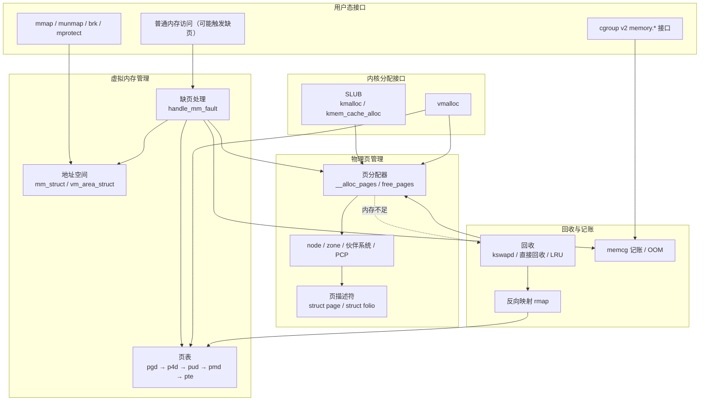
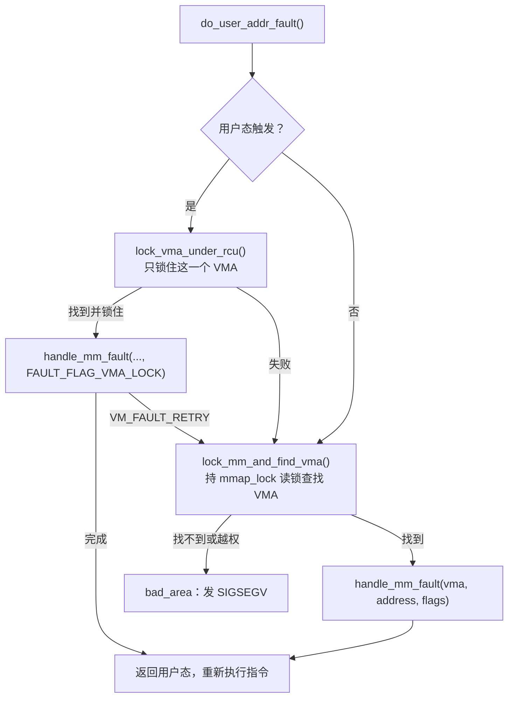
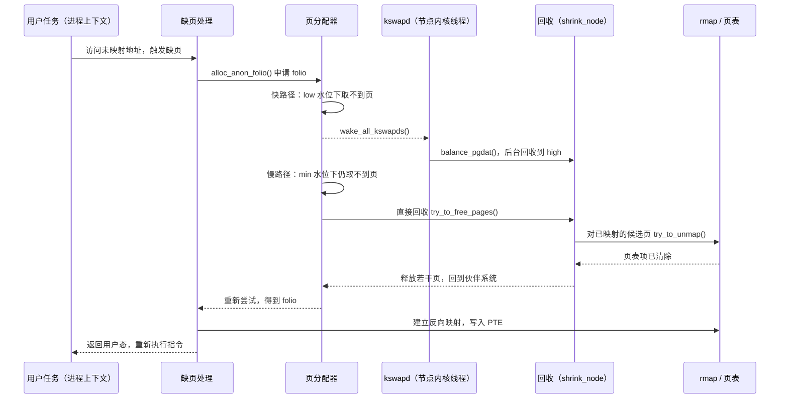

# 内存子系统概述：地址空间、物理页与回收

一个进程调用 `mmap()` 申请 1 GiB 内存，几乎立刻返回；随后它逐页写入，常驻内存才慢慢增长。内核里，网络驱动在中断上下文里要一个 256 字节的缓冲区，文件系统要缓存刚读进来的文件内容，模块加载器要一段几百 KiB、虚拟地址连续的空间。物理内存快用完时，系统并不会马上拒绝分配，而是先把干净的文件缓存丢掉、把匿名数据换出到 swap，实在没有办法才杀掉某个进程。

这些现象背后是内存子系统要同时承担的几项工作：

- **给每个地址空间一套独立的虚拟地址**，并且只在真正访问时才准备数据页；
- **管理全部物理页**，能按大小、位置和用途把页分配出去，再把释放的页收回来；
- **为内核自身提供多种粒度的分配接口**，从几十字节的对象到虚拟连续的大区域；
- **在内存紧张时腾出物理页**，并且对容器等资源组做记账和限制。

本章是内存子系统的总览，回答以下问题：

1. 内存子系统分成哪几层，各层解决什么问题，与哪些子系统交互？
2. x86-64 上有哪几种地址，它们之间怎样换算？
3. 核心对象有哪些，彼此是什么关系，分别由什么机制保护？
4. 页分配、缺页处理和内存回收三条主线各自怎样运转，又怎样衔接？

每个机制的内部算法放到后续章节展开，本章只建立主线，并为每个结论给出源码位置。

## 0. 分析基线

本章依据仓库内 [Makefile 第 2～4 行](../../linux/Makefile#L2-L4)标记的 **6.18.52** 版本，架构为 **x86-64**。读者需要了解虚拟内存、页表和 TLB 的一般概念；锁、RCU 等同步原语可参考[锁机制基础](../lock/introduction.md)，中断与软中断的执行上下文可参考[中断子系统概述](../interrupt/overview.md)。

与本章结论有关的配置如下。它们是编译条件，不代表某次运行一定经过对应路径；运行时还受硬件能力、启动参数和 sysfs/sysctl 设置影响。

| 配置 | 对本章的影响 | 依据 |
| --- | --- | --- |
| `CONFIG_X86_64=y`、`CONFIG_MMU=y`、`CONFIG_SMP=y` | 64 位、带 MMU、多 CPU；主线为普通的分页虚拟内存 | [.config#L333](../../linux/.config#L333)、[.config#L339](../../linux/.config#L339)、[.config#L362](../../linux/.config#L362) |
| `CONFIG_PAGE_SIZE_4KB=y` | 基础页大小为 4 KiB，`PAGE_SHIFT` 为 12 | [.config#L951](../../linux/.config#L951) |
| `CONFIG_PGTABLE_LEVELS=5` | 编入五级页表支持；运行时是否使用五级由 CPU 和启动参数决定（见 2.2 节） | [.config#L357](../../linux/.config#L357)、[arch/x86/Kconfig#L426-L430](../../linux/arch/x86/Kconfig#L426-L430) |
| `CONFIG_NUMA=y`、`CONFIG_NODES_SHIFT=6` | 最多 64 个内存节点，每个节点有自己的 zone、kswapd 和 LRU | [.config#L469](../../linux/.config#L469)、[.config#L472](../../linux/.config#L472) |
| `CONFIG_SPARSEMEM=y`、`CONFIG_SPARSEMEM_VMEMMAP=y` | 页描述符放在虚拟连续的 vmemmap 区，PFN 与 `struct page *` 直接加减换算 | [.config#L1187](../../linux/.config#L1187)、[.config#L1190](../../linux/.config#L1190) |
| `CONFIG_ZONE_DMA=y`、`CONFIG_ZONE_DMA32=y`、`CONFIG_ZONE_DEVICE=y` | 存在 DMA、DMA32、NORMAL、MOVABLE、DEVICE 五类 zone；64 位没有 HIGHMEM | [.config#L1264-L1266](../../linux/.config#L1264-L1266) |
| `CONFIG_RANDOMIZE_MEMORY=y` | 直接映射区、vmalloc 区和 vmemmap 区的基址可在启动时随机化 | [.config#L526](../../linux/.config#L526) |
| `CONFIG_SLUB=y`、`CONFIG_SLUB_TINY` 未设置、`CONFIG_SLUB_CPU_PARTIAL=y` | 小对象分配器是完整版 SLUB | [.config#L1173-L1181](../../linux/.config#L1173-L1181) |
| `CONFIG_MEMCG=y`、`CONFIG_MEMCG_V1` 未设置 | 编入内存控制组，只提供 cgroup v2 接口 | [.config#L212-L213](../../linux/.config#L212-L213) |
| `CONFIG_SWAP=y`、`CONFIG_ZSWAP=y` | 匿名页可以换出；换出前还可经 zswap 压缩缓存 | [.config#L1146-L1147](../../linux/.config#L1146-L1147) |
| `CONFIG_LRU_GEN` 未设置 | 不编入多代 LRU（MGLRU），回收只走传统 active/inactive LRU | [.config#L1287](../../linux/.config#L1287)、[mm_inline.h#L312-L317](../../linux/include/linux/mm_inline.h#L312-L317) |
| `CONFIG_COMPACTION=y`、`CONFIG_MIGRATION=y` | 高阶分配失败时可以通过迁移页做内存规整 | [.config#L1216](../../linux/.config#L1216)、[.config#L1219](../../linux/.config#L1219) |
| `CONFIG_TRANSPARENT_HUGEPAGE=y`、`..._MADVISE=y` | 编入透明大页，缺省策略为仅对 `madvise(MADV_HUGEPAGE)` 区域使用 | [.config#L1236-L1238](../../linux/.config#L1236-L1238) |
| `CONFIG_HUGETLBFS=y`、`CONFIG_HUGETLB_PAGE=y` | 编入显式大页（HugeTLB） | [.config#L9741](../../linux/.config#L9741)、[.config#L9743](../../linux/.config#L9743) |
| `CONFIG_PER_VMA_LOCK=y` | 用户态缺页先尝试只锁单个 VMA，失败再退回 `mmap_lock` | [.config#L1289](../../linux/.config#L1289) |
| `CONFIG_SPLIT_PTE_PTLOCKS=y`、`CONFIG_SPLIT_PMD_PTLOCKS=y` | 页表锁按页表页拆分，而不是整个 mm 共用一把锁 | [.config#L1211-L1213](../../linux/.config#L1211-L1213) |
| `CONFIG_MEMORY_HOTPLUG=y`、`CONFIG_DEFERRED_STRUCT_PAGE_INIT=y` | 支持内存热插拔；启动时部分页描述符可推迟初始化 | [.config#L1203](../../linux/.config#L1203)、[.config#L1258](../../linux/.config#L1258) |
| `CONFIG_CMA` 未设置、`CONFIG_PREEMPT_RT` 未设置 | 没有 `MIGRATE_CMA` 迁移类型；锁走非 RT 实现 | [.config#L1254](../../linux/.config#L1254)、[.config#L139](../../linux/.config#L139) |

有两点需要提前说明：

- `CONFIG_LRU_GEN` 未设置时，`lru_gen_enabled()` 恒返回 `false`（[mm_inline.h#L312-L317](../../linux/include/linux/mm_inline.h#L312-L317)），所以 [shrink_node()](../../linux/mm/vmscan.c#L6057-L6059) 中进入 `lru_gen_shrink_node()` 的分支在本配置下不会执行。[内存回收](reclaim.md)一章中关于 MGLRU 的内容，对当前构建只具有对照意义。
- 透明大页、NUMA 自动均衡（`CONFIG_NUMA_BALANCING=y`，[.config#L206](../../linux/.config#L206)）、KSM（[.config#L1227](../../linux/.config#L1227)）等功能即使编入，实际是否生效也取决于运行时开关，本章不把它们画进主线。

## 1. 内存子系统要解决什么问题

### 1.1 四类需求与对应机制

下表把开头列出的工作对应到内核中的机制。左列是“要解决的问题”，右列是本章和后续章节要展开的对象。

| 需求 | 核心难点 | 主要机制 | 主要源码 |
| --- | --- | --- | --- |
| 每个进程有独立地址空间，按需准备数据 | 申请的范围往往远大于实际使用；多个进程要能共享只读内容 | `mm_struct`、VMA、页表、缺页处理、写时复制 | `mm/mmap.c`、`mm/vma.c`、`mm/memory.c`、`arch/x86/mm/fault.c` |
| 管理物理页 | 物理内存分布在多个节点，部分设备只能访问低地址；大块连续内存容易被碎片化 | node、zone、伙伴系统、每 CPU 页缓存（PCP） | `mm/page_alloc.c`、`include/linux/mmzone.h` |
| 为内核提供多种分配接口 | 小对象不值得占整页；大区域不要求物理连续 | SLUB、vmalloc | `mm/slub.c`、`mm/vmalloc.c` |
| 内存紧张时继续工作 | 要判断哪些页可以丢弃或换出，并找到映射它们的所有页表；还要按资源组限制用量 | 水位、kswapd、直接回收、LRU、反向映射、memcg、OOM | `mm/vmscan.c`、`mm/rmap.c`、`mm/memcontrol.c`、`mm/oom_kill.c` |

### 1.2 分层架构

下面这张图回答“内存子系统分几层、每层依赖谁”。箭头表示“上层使用下层提供的能力”，不表示具体调用顺序；图中省略了文件系统、块设备 I/O 和 swap 设备的细节。



图中要注意三个关系：

- **虚拟内存管理只“登记”和“连接”，不生产物理页。** VMA 记录一段地址允许怎样使用；缺页处理在访问发生时向页分配器要页，再把它写进页表。
- **SLUB 和 vmalloc 都建立在页分配器之上。** SLUB 把整页切成对象；vmalloc 把零散的物理页通过内核页表拼成虚拟连续的区域。两者最终都调用页分配器取页。
- **回收是页分配器的“后备电源”，而且要反向走回页表。** 分配不到页时唤醒或直接执行回收；回收一个已映射的页之前，必须经反向映射找到并修改所有指向它的页表项。

### 1.3 触发事件与输入输出

| 触发事件 | 输入 | 输出 / 结果 |
| --- | --- | --- |
| `mmap()` 等系统调用 | 长度、权限、标志、可选的文件 | 一个新建或合并后的 VMA；通常还没有分配数据页 |
| 用户态首次访问一个地址 | 故障地址、错误码（读/写/执行、用户/内核） | 合法时：分配或找到 folio，建立页表项，返回后重新执行指令；非法时：`SIGSEGV` |
| 内核调用 `alloc_pages()` / `kmalloc()` / `vmalloc()` | 大小或阶数、GFP 标志、可选节点 | 页描述符指针或内核虚拟地址；失败时为 `NULL` |
| zone 空闲页低于 low 水位 | 节点、阶数、最高可用 zone | 唤醒该节点的 kswapd 线程进行后台回收 |
| 分配在 min 水位下仍失败 | 分配上下文、GFP 标志 | 当前任务执行直接回收、规整，必要时 OOM |
| memcg 记账超过限额 | 内存控制组、要记账的页数 | 组内回收、节流，必要时组内 OOM |
| 页被释放（引用计数归零） | 页描述符、阶数 | 页回到 PCP 或伙伴系统，必要时与伙伴合并 |

### 1.4 本章边界与本书内存部分的组织

本章只讨论上述主线在当前配置下的结构和流程。以下内容只点到为止：透明大页与 HugeTLB、NUMA 内存策略与自动均衡、KSM、userfaultfd、内存热插拔、`ZONE_DEVICE`、swap 的槽位分配与 zswap、页缓存的预读和回写、KASAN/KMSAN 等调试设施。

本目录下已有的专题章节与本章的关系如下，可以按需跳读：

| 章节 | 内容 | 与本章的关系 |
| --- | --- | --- |
| [内存子系统总览：从一段内存的使用过程开始](overview.md) | 以一段匿名内存的 `mmap → 写入 → fork → munmap` 为线索串联概念 | 以场景为主；本章以分层结构为主，可互为补充 |
| [内存子系统核心数据结构](核心数据结构.md) | 逐个展开 `mm_struct`、VMA、`page`/`folio`、zone、`address_space`、`anon_vma`、`lruvec` 等 | 本章第 3 节的详细版 |
| [`__alloc_pages_slowpath()`](slowpath.md) | 页分配慢路径的完整控制流 | 本章 4.1 节慢路径的展开 |
| [内存回收](reclaim.md) | 水位、kswapd、直接回收、LRU 扫描、memcg 回收 | 本章 4.3 节的展开 |
| [SLUB 机制详解](slub.md) | 对象布局、freelist、分配与释放的快慢路径 | 本章 3.6 节的展开 |

## 2. 先建立地址坐标：x86-64 上的几种地址

内存子系统的代码里同时流动着好几种“地址”和“编号”，混淆它们是阅读源码时最常见的错误。本节先把它们分清，再看数据结构。

### 2.1 五种地址与编号

| 名称 | 含义 | 常见类型或宏 | 举例 |
| --- | --- | --- | --- |
| 用户虚拟地址 | 进程地址空间里的地址，通过该进程的页表翻译 | `unsigned long addr`、`void __user *` | VMA 的 `vm_start`、缺页地址 |
| 内核虚拟地址 | 内核地址空间里的地址，所有进程共享同一套内核映射 | `void *` | `kmalloc()`、`vmalloc()` 的返回值 |
| 物理地址 | 内存控制器看到的地址 | `phys_addr_t` | `__pa()` 的结果 |
| 页帧号 PFN | 物理地址右移 `PAGE_SHIFT` 位，用于给物理页编号 | `unsigned long pfn` | `page_to_pfn()` 的结果 |
| 页描述符指针 | 描述某个物理页的 `struct page` 的地址，本身是一个内核虚拟地址 | `struct page *`、`struct folio *` | 页分配器的返回值 |

内核虚拟地址又按用途分为几个区域。x86-64 上与本章有关的三个区域，其起点都是可在启动时改写的变量：

| 区域 | 用途 | 四级页表下的缺省基址 | 五级页表下的缺省基址 | 依据 |
| --- | --- | --- | --- | --- |
| 直接映射区（`page_offset_base`） | 把全部物理内存线性映射到内核地址空间 | `0xffff888000000000` | `0xff11000000000000` | [page_64_types.h#L41-L44](../../linux/arch/x86/include/asm/page_64_types.h#L41-L44) |
| vmalloc 区（`vmalloc_base`） | `vmalloc()`、`vmap()` 等动态建立映射的区域 | `0xffffc90000000000`，32 TiB | `0xffa0000000000000`，12800 TiB | [pgtable_64_types.h#L107-L117](../../linux/arch/x86/include/asm/pgtable_64_types.h#L107-L117) |
| vmemmap 区（`vmemmap_base`） | 存放全部 `struct page` 数组 | `0xffffea0000000000` | `0xffd4000000000000` | [pgtable_64_types.h#L113-L118](../../linux/arch/x86/include/asm/pgtable_64_types.h#L113-L118) |

三个变量先以四级页表的值初始化（[head64.c#L63-L68](../../linux/arch/x86/kernel/head64.c#L63-L68)），启用五级页表时改为五级的值（[head64.c#L243-L247](../../linux/arch/x86/kernel/head64.c#L243-L247)）。由于 `CONFIG_RANDOMIZE_MEMORY=y`，[kernel_randomize_memory()](../../linux/arch/x86/mm/kaslr.c#L79) 还可能在启动时随机化这三个基址（区域表见 [kaslr.c#L48-L63](../../linux/arch/x86/mm/kaslr.c#L48-L63)）。因此，**不要把表中的数值当作某台机器上的实际地址**，阅读代码时应使用 `PAGE_OFFSET`、`VMALLOC_START`、`vmemmap` 等符号。

### 2.2 它们之间怎样换算

有了直接映射区，内核虚拟地址与物理地址之间的换算只需一次加减（不适用于 vmalloc 区的地址）；有了 vmemmap 区，PFN 与页描述符之间的换算也只需一次指针运算：

```c
/* arch/x86/include/asm/page.h#L58 */
#define __va(x)			((void *)((unsigned long)(x)+PAGE_OFFSET))

/* include/asm-generic/memory_model.h#L43-L47，CONFIG_SPARSEMEM_VMEMMAP 分支 */
#define __pfn_to_page(pfn)	(vmemmap + (pfn))
#define __page_to_pfn(page)	(unsigned long)((page) - vmemmap)
```

来源：[page.h#L58](../../linux/arch/x86/include/asm/page.h#L58)、[memory_model.h#L43-L47](../../linux/include/asm-generic/memory_model.h#L43-L47)；`vmemmap` 在 x86-64 上定义为 `(struct page *)VMEMMAP_START`（[pgtable_64.h#L256](../../linux/arch/x86/include/asm/pgtable_64.h#L256)）。`virt_to_page()` 正是把这两步串起来：先 `__pa()` 得到物理地址，右移得到 PFN，再转成页描述符（[page.h#L68](../../linux/arch/x86/include/asm/page.h#L68)）。

```text
                __pa()                 >> PAGE_SHIFT              vmemmap + pfn
直接映射地址 ─────────→ 物理地址 ──────────────────→ PFN ──────────────────→ struct page *
             ←─────────          ←──────────────────     ←──────────────────
                __va()                 << PAGE_SHIFT              page - vmemmap
```

用户虚拟地址则没有这样的固定换算，只能逐级查该进程的页表。x86-64 的页表层次固定为 PGD → P4D → PUD → PMD → PTE，每级 512 项；PMD 一项覆盖 2 MiB（`PMD_SHIFT` 为 21），PUD 一项覆盖 1 GiB（`PUD_SHIFT` 为 30），见 [pgtable_64_types.h#L47-L87](../../linux/arch/x86/include/asm/pgtable_64_types.h#L47-L87)。

五级与四级的区别在运行时决定：解压阶段若已打开 `CR4.LA57`，[check_la57_support()](../../linux/arch/x86/boot/startup/map_kernel.c#L17-L31) 把 `__pgtable_l5_enabled` 置 1，并把 `pgdir_shift` 设为 48；否则（CPU 不支持、或启动参数指定了 `no5lvl` 等）`X86_FEATURE_LA57` 会被清除（[common.c#L1814-L1821](../../linux/arch/x86/kernel/cpu/common.c#L1814-L1821)），P4D 层被折叠，用户虚拟地址宽度为 47 位而不是 56 位（[page_64_types.h#L51](../../linux/arch/x86/include/asm/page_64_types.h#L51)）。通用代码无论哪种情况都按五级接口编写。

## 3. 核心数据结构

本节按“地址空间 → 物理组织 → 页描述 → 内容归属与回收 → 内核对象”的顺序介绍核心结构，只解释与主线有关的字段。详细字段解读见[核心数据结构](核心数据结构.md)。

### 3.1 结构地图

先用一张图回答“这些结构怎样连在一起”。图中实线箭头表示“保存指针或索引，可以由此找到对方”，虚线表示“通过计算或查表间接找到”；“保存指针”不等于“拥有对象”，生命周期在各小节单独说明。

```mermaid
flowchart LR
    task["task_struct"] -->|mm| mm["mm_struct"]
    mm -->|mm_mt（Maple Tree）| vma["vm_area_struct"]
    mm -->|pgd| pt["页表<br/>pgd/p4d/pud/pmd/pte"]
    vma -->|vm_file → f_mapping| as["address_space"]
    vma -->|anon_vma| av["anon_vma"]
    pt -. PTE 中的 PFN .-> folio["folio / page"]
    folio -->|mapping + index| as
    folio -->|mapping（带类型位）| av
    as -->|i_pages（XArray）| folio
    as -->|i_mmap（区间树）| vma
    av -. anon_vma_chain .-> vma
    folio -->|lru 链表节点| lruvec["lruvec"]
    folio -->|memcg_data| memcg["mem_cgroup"]
    memcg -->|nodeinfo[nid]->lruvec| lruvec
    pgdat["pglist_data（node）"] -->|node_zones[]| zone["zone"]
    zone -->|free_area[order]| folio
    pgdat -->|kswapd| kswapd["kswapd 线程"]
```

读图时要注意两条方向相反的查找路径：

- **正向（地址 → 内容）**：`mm_struct` 经页表找到物理页，用于正常访问和缺页。
- **反向（内容 → 地址）**：folio 经 `mapping` 找到 `address_space` 或 `anon_vma`，再找到所有可能映射它的 VMA，最后逐个检查页表。回收和迁移需要这条路径。

### 3.2 地址空间：`mm_struct` 与 `vm_area_struct`

[`struct mm_struct`（mm_types.h#L946）](../../linux/include/linux/mm_types.h#L946) 描述一个用户地址空间，进程的 `task_struct.mm` 指向它，同一线程组的线程共享同一个 `mm_struct`。

| 字段 | 含义 | 依据 |
| --- | --- | --- |
| `mm_mt` | 按虚拟地址索引全部 VMA 的 Maple Tree | [mm_types.h#L963](../../linux/include/linux/mm_types.h#L963) |
| `pgd` | 页表根，即顶级页目录的内核虚拟地址 | [mm_types.h#L973](../../linux/include/linux/mm_types.h#L973) |
| `mm_users` | 使用这个地址空间的用户数，归零时拆除地址空间内容（VMA、页表、页） | [mm_types.h#L985-L994](../../linux/include/linux/mm_types.h#L985-L994) |
| `mm_count` | `mm_struct` 结构本身的引用数，所有 `mm_users` 合计只占其中 1 个，归零时释放结构 | [mm_types.h#L953-L960](../../linux/include/linux/mm_types.h#L953-L960) |
| `mmap_lock` | 保护 VMA 集合的读写信号量 | [mm_types.h#L1054](../../linux/include/linux/mm_types.h#L1054) |
| `rss_stat[]` | 按类型统计的常驻页数，使用每 CPU 计数器 | [mm_types.h#L1124](../../linux/include/linux/mm_types.h#L1124) |

`mm_users` 和 `mm_count` 是两层生命周期：内核线程借用某个 mm 时只需要 `mm_count` 保证结构不被释放，而不需要保持其中的映射存在。

[`struct vm_area_struct`（mm_types.h#L815）](../../linux/include/linux/mm_types.h#L815) 描述地址空间中一段属性相同的连续范围：

| 字段 | 含义 | 依据 |
| --- | --- | --- |
| `vm_start`、`vm_end` | 覆盖的范围 `[vm_start, vm_end)`，单位为字节，按页对齐 | [mm_types.h#L820-L822](../../linux/include/linux/mm_types.h#L820-L822) |
| `vm_mm` | 所属的地址空间（普通指针，不持有引用） | [mm_types.h#L831](../../linux/include/linux/mm_types.h#L831) |
| `vm_flags` | 读写执行权限、共享/私有等标志，只能通过 `vm_flags_*()` 修改 | [mm_types.h#L834-L841](../../linux/include/linux/mm_types.h#L834-L841) |
| `anon_vma_chain`、`anon_vma` | 匿名页反向映射的入口 | [mm_types.h#L866-L868](../../linux/include/linux/mm_types.h#L866-L868) |
| `vm_ops` | 缺页等操作的回调，文件映射由文件系统提供 | [mm_types.h#L871](../../linux/include/linux/mm_types.h#L871) |
| `vm_pgoff`、`vm_file` | 映射的文件及起始偏移（以页为单位）；匿名映射时 `vm_file` 为 `NULL` | [mm_types.h#L874-L876](../../linux/include/linux/mm_types.h#L874-L876) |
| `vm_refcnt` | 本配置下的单 VMA 锁（per-VMA lock）状态 | [mm_types.h#L891-L893](../../linux/include/linux/mm_types.h#L891-L893) |

源码注释给出了一个重要不变量：私有文件映射在某页发生写时复制后，可以同时位于文件的 `i_mmap` 树和 `anon_vma` 链表中；共享映射只在 `i_mmap` 树中；纯匿名映射只在 `anon_vma` 链表中（[mm_types.h#L860-L865](../../linux/include/linux/mm_types.h#L860-L865)）。

VMA 与页表是 `mm_struct` 下的两套独立结构：**VMA 说明“允许怎样访问”，页表记录“当前实际映射到哪里”。** 一个合法的 VMA 范围内可以完全没有页表项，这正是按需分配的基础。

### 3.3 物理组织：node、zone 与空闲页

物理内存先按 NUMA 节点划分，每个节点内再按地址范围和用途划分为 zone。

[`pg_data_t`（即 `struct pglist_data`，mmzone.h#L1385）](../../linux/include/linux/mmzone.h#L1385) 代表一个节点：

| 字段 | 含义 | 依据 |
| --- | --- | --- |
| `node_zones[]` | 本节点的全部 zone，嵌入在结构中，未必都有内存 | [mmzone.h#L1386-L1391](../../linux/include/linux/mmzone.h#L1386-L1391) |
| `node_zonelists[]` | 分配时的候选 zone 顺序，可以引用其他节点的 zone | [mmzone.h#L1393-L1398](../../linux/include/linux/mmzone.h#L1393-L1398) |
| `kswapd` | 本节点的后台回收线程 | [mmzone.h#L1439](../../linux/include/linux/mmzone.h#L1439) |
| `__lruvec` | memcg 被禁用时使用的节点级 LRU | [mmzone.h#L1500-L1503](../../linux/include/linux/mmzone.h#L1500-L1503) |

zone 的类型由 [`enum zone_type`（mmzone.h#L784-L871）](../../linux/include/linux/mmzone.h#L784-L871) 定义。在本配置的 x86-64 上，[zone_sizes_init()](../../linux/arch/x86/mm/init.c#L1000-L1017) 按物理地址上限划定前三个 zone：

| zone | 物理地址范围 | 用途 | 依据 |
| --- | --- | --- | --- |
| `ZONE_DMA` | 0～16 MiB | 只能寻址 24 位地址的老式设备 | [dma.h#L74](../../linux/arch/x86/include/asm/dma.h#L74) |
| `ZONE_DMA32` | 16 MiB～4 GiB | 只能寻址 32 位地址的设备 | [dma.h#L77](../../linux/arch/x86/include/asm/dma.h#L77) |
| `ZONE_NORMAL` | 4 GiB 以上 | 普通内存 | [init.c#L1012](../../linux/arch/x86/mm/init.c#L1012) |
| `ZONE_MOVABLE` | 由 `kernelcore=`/`movablecore=` 等启动参数或热插拔划定 | 只放可迁移页，便于内存下线和获得大块连续内存 | [mmzone.h#L818-L867](../../linux/include/linux/mmzone.h#L818-L867) |
| `ZONE_DEVICE` | 设备内存 | 持久内存、设备私有内存等，本章不展开 | [mmzone.h#L868-L870](../../linux/include/linux/mmzone.h#L868-L870) |

[`struct zone`（mmzone.h#L879）](../../linux/include/linux/mmzone.h#L879) 中与分配直接相关的字段：

| 字段 | 含义 | 依据 |
| --- | --- | --- |
| `_watermark[NR_WMARK]` | min、low、high、promo 四条水位线，单位为页 | [mmzone.h#L883](../../linux/include/linux/mmzone.h#L883)、[mmzone.h#L708-L714](../../linux/include/linux/mmzone.h#L708-L714) |
| `lowmem_reserve[]` | 为低端 zone 预留的页数，防止高端请求把低端 zone 用光 | [mmzone.h#L889-L898](../../linux/include/linux/mmzone.h#L889-L898) |
| `per_cpu_pageset` | 每 CPU 页缓存（PCP） | [mmzone.h#L904](../../linux/include/linux/mmzone.h#L904) |
| `free_area[NR_PAGE_ORDERS]` | 伙伴系统的空闲块，按阶组织 | [mmzone.h#L998-L999](../../linux/include/linux/mmzone.h#L998-L999) |
| `lock` | 主要保护 `free_area` | [mmzone.h#L1012-L1013](../../linux/include/linux/mmzone.h#L1012-L1013) |

伙伴系统以“阶”（order）为单位管理物理连续的空闲块：一个 order-n 块包含 2ⁿ 个基础页。x86 未定义 `CONFIG_ARCH_FORCE_MAX_ORDER`，所以 `MAX_PAGE_ORDER` 为 10（[mmzone.h#L29-L33](../../linux/include/linux/mmzone.h#L29-L33)），最大块为 1024 页即 4 MiB，共 11 个阶。每个阶的 [`struct free_area`](../../linux/include/linux/mmzone.h#L138-L141) 再按迁移类型（[`enum migratetype`](../../linux/include/linux/mmzone.h#L64-L69)：不可移动、可移动、可回收等）分成多条链表，目的是把不同性质的页分开放置，减少碎片。

```text
zone
├── free_area[0]   free_list[UNMOVABLE] [MOVABLE] [RECLAIMABLE] ...   1 页的块
├── free_area[1]   free_list[...]                                    2 页的块
├── ...
└── free_area[10]  free_list[...]                                    1024 页的块
```

[`struct per_cpu_pages`（mmzone.h#L744-L760）](../../linux/include/linux/mmzone.h#L744-L760) 是每个 CPU、每个 zone 一份的小缓存：`count` 是当前缓存页数，`high` 是超过后要归还伙伴系统的上限，`batch` 是与伙伴系统一次交换的页数。PCP 只服务于 `pcp_allowed_order()` 允许的阶，即不超过 `PAGE_ALLOC_COSTLY_ORDER` 的低阶，以及启用透明大页时的 PMD 阶（[page_alloc.c#L717-L726](../../linux/mm/page_alloc.c#L717-L726)）。

### 3.4 页描述：`struct page` 与 `struct folio`

每个物理页都有一个 [`struct page`（mm_types.h#L78）](../../linux/include/linux/mm_types.h#L78)，它们按 PFN 顺序排列在 vmemmap 区。`struct page` 中大部分字段位于联合体中，**同一块内存在页用作页缓存、slab、页表等不同用途时含义不同**（[mm_types.h#L81-L88](../../linux/include/linux/mm_types.h#L81-L88)）。为避免直接操作这些重叠字段，内核为不同用途定义了相互覆盖的描述类型：用作 slab 时是 `struct slab`，用作页表时是 [`struct ptdesc`](../../linux/include/linux/mm_types.h#L548)，用作用户数据或文件缓存时是 `struct folio`。

[`struct folio`（mm_types.h#L377）](../../linux/include/linux/mm_types.h#L377) 表示一组物理连续、作为整体管理的页（可以只有一页），大小为 2 的幂。与主线有关的字段：

| 字段 | 含义 | 依据 |
| --- | --- | --- |
| `flags` | 页标志，如 locked、dirty、writeback、lru、active 等 | [mm_types.h#L382](../../linux/include/linux/mm_types.h#L382) |
| `lru` | 挂在 `lruvec` 某条 LRU 链表上的节点 | [mm_types.h#L384](../../linux/include/linux/mm_types.h#L384) |
| `mapping` | 文件页指向 `address_space`；匿名页指向 `anon_vma`，并在低位编码类型 | [mm_types.h#L397](../../linux/include/linux/mm_types.h#L397) |
| `index` | 在文件中的页偏移；匿名页为与反向映射相关的页偏移 | [mm_types.h#L399](../../linux/include/linux/mm_types.h#L399) |
| `_mapcount` | 与“被用户页表映射了多少次”相关的计数，必须通过 `folio_mapcount()` 读取 | [mm_types.h#L406](../../linux/include/linux/mm_types.h#L406)、[mm_types.h#L346-L347](../../linux/include/linux/mm_types.h#L346-L347) |
| `_refcount` | 引用计数，页表映射、页缓存、正在进行的 I/O 等都可能持有引用，通过 `folio_ref_count()` 读取 | [mm_types.h#L407](../../linux/include/linux/mm_types.h#L407)、[mm_types.h#L348-L349](../../linux/include/linux/mm_types.h#L348-L349) |
| `memcg_data` | 计费到哪个 `mem_cgroup` | [mm_types.h#L408-L409](../../linux/include/linux/mm_types.h#L408-L409) |

`_mapcount` 和 `_refcount` 回答的是两个不同的问题：前者是“有几个页表项指向我”，后者是“有几处在用我”。所有映射都解除后页仍可能被页缓存或 I/O 持有，只有 `_refcount` 归零页才回到分配器。源码注释明确要求不要直接访问这两个字段的原始值。

### 3.5 内容归属与回收：`address_space`、`anon_vma`、`lruvec`、`mem_cgroup`

| 结构 | 职责 | 关键字段 | 依据 |
| --- | --- | --- | --- |
| `address_space` | 一个文件（或类文件对象）在内存中的内容 | `i_pages`：按文件页偏移查 folio 的 XArray；`i_mmap`：映射该文件的 VMA 区间树；`i_mmap_rwsem` 保护 `i_mmap` | [fs.h#L506-L524](../../linux/include/linux/fs.h#L506-L524) |
| `anon_vma` | 匿名页反向映射的锚点，fork 产生的父子 VMA 通过 `anon_vma_chain` 关联起来 | `root`、`rwsem` | [rmap.h#L32-L34](../../linux/include/linux/rmap.h#L32-L34) |
| `lruvec` | 回收候选的组织单元：传统 LRU 下有 inactive/active × anon/file 共四条链表，外加 unevictable | `lists[NR_LRU_LISTS]`、`lru_lock` | [mmzone.h#L669-L672](../../linux/include/linux/mmzone.h#L669-L672)、[mmzone.h#L316-L323](../../linux/include/linux/mmzone.h#L316-L323) |
| `mem_cgroup` | 一个内存控制组的记账与限制 | `memory`：页计数器；`nodeinfo[]`：每个节点一份，其中嵌有该组在该节点的 `lruvec` | [memcontrol.h#L189](../../linux/include/linux/memcontrol.h#L189)、[memcontrol.h#L196](../../linux/include/linux/memcontrol.h#L196)、[memcontrol.h#L323](../../linux/include/linux/memcontrol.h#L323) |

`lruvec` 的粒度由 [mem_cgroup_lruvec()](../../linux/include/linux/memcontrol.h#L705-L720) 决定：memcg 被禁用时取节点的 `pgdat->__lruvec`；启用时取 `memcg->nodeinfo[nid]->lruvec`，也就是“一个内存控制组 × 一个节点”各有一组 LRU 链表。回收时要先确定扫描哪个组、哪个节点，才能找到对应的 `lruvec`。

### 3.6 内核对象：`kmem_cache`、`slab` 与 vmalloc

| 结构 | 职责 | 依据 |
| --- | --- | --- |
| `struct kmem_cache` | 一类固定大小对象的缓存，记录对象布局，并有每 CPU 和每节点的 slab 管理状态 | [slab.h#L238-L241](../../linux/mm/slab.h#L238-L241) |
| `struct slab` | 覆盖在一个或一组页上的描述，`slab_cache` 指回所属的 `kmem_cache` | [slab.h#L52-L55](../../linux/mm/slab.h#L52-L55) |
| `struct vmap_area` | vmalloc 区中一段已占用的虚拟地址区间 | [vmalloc.h#L67](../../linux/include/linux/vmalloc.h#L67) |
| `struct vm_struct` | 一个 vmalloc 区域的信息，包括后备物理页数组 | [vmalloc.h#L52](../../linux/include/linux/vmalloc.h#L52) |

注意 `vm_struct` 描述的是内核 vmalloc 区域，与描述用户地址范围的 `vm_area_struct` 毫无关系。SLUB 的完整机制见 [SLUB 机制详解](slub.md)。

### 3.7 并发保护一览

下表只说明“哪把锁主要保护什么”，**不代表这些锁可以按表中顺序任意嵌套**，具体顺序以各路径的实现为准。

| 被保护的对象 | 机制 | 依据 |
| --- | --- | --- |
| 一个 mm 的 VMA 集合与属性 | `mm->mmap_lock`（读写信号量，可睡眠） | [mm_types.h#L1054](../../linux/include/linux/mm_types.h#L1054) |
| 单个 VMA（缺页快路径） | per-VMA lock：`vm_refcnt` + `vm_lock_seq`，配合 RCU 查找 | [mm_types.h#L843-L858](../../linux/include/linux/mm_types.h#L843-L858)、[mm_types.h#L891-L893](../../linux/include/linux/mm_types.h#L891-L893) |
| 页表项 | 页表锁；本配置按 PTE/PMD 页表页拆分 | [.config#L1211-L1213](../../linux/.config#L1211-L1213) |
| 伙伴系统空闲链表 | `zone->lock`（自旋锁） | [mmzone.h#L1012-L1013](../../linux/include/linux/mmzone.h#L1012-L1013) |
| PCP 链表 | `pcp->lock` | [mmzone.h#L745](../../linux/include/linux/mmzone.h#L745) |
| LRU 链表 | `lruvec->lru_lock` | [mmzone.h#L671-L672](../../linux/include/linux/mmzone.h#L671-L672) |
| 文件映射的 VMA 区间树 | `address_space->i_mmap_rwsem` | [fs.h#L524](../../linux/include/linux/fs.h#L524) |
| 匿名反向映射链 | `anon_vma->root->rwsem` | [rmap.h#L33-L34](../../linux/include/linux/rmap.h#L33-L34) |
| folio 内容与状态转换 | folio 锁（`PG_locked`，可睡眠等待）、引用计数、writeback 标志 | [mm_types.h#L382](../../linux/include/linux/mm_types.h#L382)、[mm_types.h#L407](../../linux/include/linux/mm_types.h#L407) |

修改页表后，其他 CPU 的 TLB 中可能还缓存着旧翻译。因此“改页表项”与“释放页”之间必须插入 TLB 刷新，内核用 `mmu_gather` 批量完成这一配合（`mm/mmu_gather.c`），本章不展开。

## 4. 三条主线

有了数据结构，再看它们怎样被使用。本节分别讲页分配、缺页处理和内存回收的主路径，最后把三者连起来。

### 4.1 页分配：快路径、慢路径与释放

**目标与输入输出。** 页分配器的输入是 GFP 标志、阶数和首选节点，输出是一个 order 阶、物理连续的块的首页描述符，或 `NULL`。

**主路径。** 核心入口是 [__alloc_frozen_pages_noprof()](../../linux/mm/page_alloc.c#L5259-L5321)。下面保留了决定主线的语句：

```c
/* mm/page_alloc.c#L5259-L5320，省略了注释和部分语句 */
struct page *__alloc_frozen_pages_noprof(gfp_t gfp, unsigned int order,
		int preferred_nid, nodemask_t *nodemask)
{
	unsigned int alloc_flags = ALLOC_WMARK_LOW;
	struct alloc_context ac = { };
	...
	if (WARN_ON_ONCE_GFP(order > MAX_PAGE_ORDER, gfp))
		return NULL;
	...
	gfp = current_gfp_context(gfp);
	alloc_gfp = gfp;
	if (!prepare_alloc_pages(gfp, order, preferred_nid, nodemask, &ac,
			&alloc_gfp, &alloc_flags))
		return NULL;
	...
	/* First allocation attempt */
	page = get_page_from_freelist(alloc_gfp, order, alloc_flags, &ac);
	if (likely(page))
		goto out;
	...
	page = __alloc_pages_slowpath(alloc_gfp, order, &ac);
out:
	if (memcg_kmem_online() && (gfp & __GFP_ACCOUNT) && page &&
	    unlikely(__memcg_kmem_charge_page(page, gfp, order) != 0)) {
		free_frozen_pages(page, order);
		page = NULL;
	}
	...
	return page;
}
```

这段代码说明了三件事：

1. **快路径以 low 水位为门槛。** `alloc_flags` 初始为 `ALLOC_WMARK_LOW`（[page_alloc.c#L5263](../../linux/mm/page_alloc.c#L5263)），`get_page_from_freelist()` 沿 zonelist 逐个检查 zone，只有空闲页在扣除请求后仍高于 low 水位的 zone 才会被选中（[page_alloc.c#L3774](../../linux/mm/page_alloc.c#L3774)）。
2. **取页时先 PCP、后伙伴系统。** 选中 zone 后调用 [rmqueue()](../../linux/mm/page_alloc.c#L3376-L3391)：允许的阶先尝试 `rmqueue_pcplist()`，不行再 [rmqueue_buddy()](../../linux/mm/page_alloc.c#L3201) 持 `zone->lock` 从 `free_area` 中取块，必要时由 [__rmqueue_smallest()](../../linux/mm/page_alloc.c#L1927) 拆分更大的块。
3. **记账失败也会让分配失败。** 带 `__GFP_ACCOUNT` 的内核分配在拿到页之后还要向 memcg 记账，失败则把页还回去并返回 `NULL`（[page_alloc.c#L5311-L5315](../../linux/mm/page_alloc.c#L5311-L5315)）。

`__alloc_frozen_pages_noprof()` 返回的页引用计数为 0（“frozen”），常用的 [__alloc_pages_noprof()](../../linux/mm/page_alloc.c#L5324-L5333) 在其上调用 `set_page_refcounted()` 把引用计数置为 1。

**慢路径。** 快路径失败后进入 [__alloc_pages_slowpath()](../../linux/mm/page_alloc.c#L4729)。它的总体顺序可简化为下面的伪代码；实际控制流有多处 `goto retry`、`goto nopage`，并且每一步都受 GFP 标志约束，完整分析见 [`__alloc_pages_slowpath()`](slowpath.md)。

```text
/* 简化逻辑，省略了大量条件与重试判断 */
alloc_flags = gfp_to_alloc_flags()      // 水位降到 min
if 允许唤醒 kswapd: wake_all_kswapds()  // 后台回收
page = get_page_from_freelist()          // 用 min 水位再试一次
if 高阶且代价大: 先尝试直接规整
retry:
    page = get_page_from_freelist()
    if 不允许直接回收: goto nopage        // 如 GFP_ATOMIC、GFP_NOWAIT
    page = __alloc_pages_direct_reclaim() // 当前任务自己回收
    page = __alloc_pages_direct_compact() // 当前任务自己规整
    if 回收或规整仍有希望: goto retry
    page = __alloc_pages_may_oom()        // 可能触发 OOM killer
    if OOM 有进展: goto retry
nopage:
    __GFP_NOFAIL 时继续循环，否则返回 NULL
```

对应的源码位置：降到 min 水位在 [gfp_to_alloc_flags()](../../linux/mm/page_alloc.c#L4515-L4517)；唤醒 kswapd 在 [page_alloc.c#L4806](../../linux/mm/page_alloc.c#L4806)；直接回收、直接规整、OOM 分别在 [page_alloc.c#L4928](../../linux/mm/page_alloc.c#L4928)、[#L4934](../../linux/mm/page_alloc.c#L4934)、[#L4982](../../linux/mm/page_alloc.c#L4982)。

**释放路径。** 常用的 [__free_pages()](../../linux/mm/page_alloc.c#L5412) 经 `___free_pages()` 先减引用计数，归零后才进入真正的释放（[page_alloc.c#L5375-L5376](../../linux/mm/page_alloc.c#L5375-L5376)）。[__free_frozen_pages()](../../linux/mm/page_alloc.c#L2934) 对 PCP 不接受的阶直接交给伙伴系统，其余先尝试放回 PCP，拿不到 PCP 锁时也退回伙伴系统（[page_alloc.c#L2943-L2981](../../linux/mm/page_alloc.c#L2943-L2981)）；PCP 中的页超过 `high` 时再批量归还。进入伙伴系统的块由 [__free_one_page()](../../linux/mm/page_alloc.c#L978) 检查伙伴块是否空闲，能合并就逐阶向上合并。

### 4.2 缺页处理：把地址与页连接起来

**目标与输入输出。** 缺页处理的输入是故障地址和硬件错误码，输出是“已建立映射，可以重新执行指令”、“需要发信号”或“需要重试”。它运行在触发异常的任务的进程上下文中，可以睡眠，这一点是它能够分配内存、等待 I/O 的前提。

**从异常到通用代码。** x86 的入口是 [exc_page_fault](../../linux/arch/x86/mm/fault.c#L1483)，随后 [handle_page_fault()](../../linux/arch/x86/mm/fault.c#L1462-L1475) 按地址区分：落在内核地址空间的交给 `do_kern_addr_fault()`，其余交给 [do_user_addr_fault()](../../linux/arch/x86/mm/fault.c#L1207)。

用户地址的处理分两次尝试，体现了 `CONFIG_PER_VMA_LOCK` 的作用：



图中节点依次对应 [fault.c#L1322-L1341](../../linux/arch/x86/mm/fault.c#L1322-L1341) 和 [fault.c#L1354-L1385](../../linux/arch/x86/mm/fault.c#L1354-L1385)。单 VMA 锁的好处是同一进程中不同 VMA 上的缺页互不阻塞，也不必与 `mmap()` 等修改 VMA 集合的操作争用 `mmap_lock`；它失败时并不报错，只是退回原来的路径。

**通用缺页处理。** [handle_mm_fault()](../../linux/mm/memory.c#L6490) 进入 [__handle_mm_fault()](../../linux/mm/memory.c#L6260)，从 `pgd_offset()` 开始逐级查找页表，缺哪一级就分配哪一级（[memory.c#L6277-L6283](../../linux/mm/memory.c#L6277-L6283)）；途中若满足大页条件，可能直接在 PUD 或 PMD 级建立大页映射。走到 PTE 级后由 [handle_pte_fault()](../../linux/mm/memory.c#L6166) 按 PTE 的状态分派：

| PTE 状态 | 处理函数 | 典型场景 |
| --- | --- | --- |
| 不存在，VMA 为匿名 | [do_pte_missing()](../../linux/mm/memory.c#L4371) → [do_anonymous_page()](../../linux/mm/memory.c#L5149) | `malloc` 后首次访问 |
| 不存在，VMA 有 `vm_ops` | `do_pte_missing()` → [do_fault()](../../linux/mm/memory.c#L5835) | 文件映射首次访问，经页缓存取页 |
| 不在内存，记录了 swap 条目 | [do_swap_page()](../../linux/mm/memory.c#L4596) | 访问已被换出的匿名页 |
| 存在但只读，访问为写 | [do_wp_page()](../../linux/mm/memory.c#L4063) | 写时复制 |

**以匿名页首次写入为例。** `do_anonymous_page()` 的写路径依次完成下列步骤：

| 步骤 | 对数据结构的影响 | 依据 |
| --- | --- | --- |
| 确保 PTE 页表页存在 | 必要时分配一页作为 PTE 表 | [memory.c#L5166](../../linux/mm/memory.c#L5166) |
| 读访问且允许零页时，直接映射共享零页并返回 | 不分配新页 | [memory.c#L5170-L5174](../../linux/mm/memory.c#L5170-L5174) |
| 确保 VMA 有 `anon_vma` | 建立反向映射的锚点 | [memory.c#L5194](../../linux/mm/memory.c#L5194) |
| 分配 folio 并向 memcg 记账 | 页分配器给出 folio；`memcg_data` 指向所属组 | [memory.c#L5198](../../linux/mm/memory.c#L5198)、[memory.c#L5115-L5117](../../linux/mm/memory.c#L5115-L5117) |
| 持页表锁，确认 PTE 仍为空 | 防止并发缺页重复建立映射 | [memory.c#L5219](../../linux/mm/memory.c#L5219) |
| 建立反向映射、加入 LRU | `folio->mapping` 指向 `anon_vma`；folio 挂到 `lruvec` 上 | [memory.c#L5244-L5245](../../linux/mm/memory.c#L5244-L5245) |
| 写入 PTE | 地址与 folio 正式连接 | [memory.c#L5249](../../linux/mm/memory.c#L5249) |

这张表把 3.1 节的结构地图“走”了一遍：一次缺页同时触及页表（正向路径）、`anon_vma`（反向路径）、`lruvec`（回收候选）和 `mem_cgroup`（记账）。正因为缺页时就把这些关系都建好了，后面的回收才有据可依。

### 4.3 内存回收：水位、kswapd 与直接回收

**目标与输入输出。** 回收的输入是“需要回收多少、在哪些节点/zone/内存控制组中回收、允许做哪些操作”，这些都放在 [`struct scan_control`（vmscan.c#L75）](../../linux/mm/vmscan.c#L75) 中；输出是回收的页数。回收本身不分配内存给调用者，调用者拿回收结果后还要再次尝试分配。

**水位把分配和回收连起来。** 三条水位的作用可以按时间顺序理解：

```text
空闲页
  ▲
  │ ─────────── high ── kswapd 回收到这里为止，pgdat_balanced() 为真即停止
  │
  │ ─────────── low ─── 快路径的门槛；低于它时分配路径唤醒 kswapd
  │
  │ ─────────── min ─── 慢路径的门槛；低于它时普通分配要直接回收
  │   （min 以下保留给 GFP_ATOMIC 等高优先级请求和回收自身使用）
  └──────────────────────────────────────────────────▶ 时间
```

依据：快路径用 low（[page_alloc.c#L5263](../../linux/mm/page_alloc.c#L5263)），慢路径用 min（[page_alloc.c#L4517](../../linux/mm/page_alloc.c#L4517)），kswapd 以 high 判断节点是否平衡（[vmscan.c#L6794-L6797](../../linux/mm/vmscan.c#L6794-L6797)，开启 NUMA 内存分层模式时改用 promo 水位）。[wakeup_kswapd()](../../linux/mm/vmscan.c#L7385) 在节点已平衡时不会唤醒线程（[vmscan.c#L7410-L7411](../../linux/mm/vmscan.c#L7410-L7411)）。min 以下并非完全不可用：例如带 `__GFP_HIGH` 的请求（`GFP_ATOMIC` 包含它）可以再用掉 min 的一半（[page_alloc.c#L3578-L3584](../../linux/mm/page_alloc.c#L3578-L3584)）。图中水位间的距离只是示意，实际值由 `min_free_kbytes` 等参数计算。

**两种执行者。**

| | kswapd 后台回收 | 直接回收 |
| --- | --- | --- |
| 执行上下文 | 每个节点一个内核线程，由 [kswapd_run()](../../linux/mm/vmscan.c#L7472) 创建 | 发起分配的任务自己 |
| 触发条件 | 分配路径发现低于 low 水位 | 慢路径在 min 水位下仍失败，且 GFP 允许回收 |
| 入口 | [kswapd()](../../linux/mm/vmscan.c#L7304) → [balance_pgdat()](../../linux/mm/vmscan.c#L6975) | [__alloc_pages_direct_reclaim()](../../linux/mm/page_alloc.c#L4451) → [try_to_free_pages()](../../linux/mm/vmscan.c#L6590) → [do_try_to_free_pages()](../../linux/mm/vmscan.c#L6361) |
| 代价由谁承担 | 后台线程，不直接拖慢分配者 | 分配者，表现为分配延迟 |

两条路径最终都进入 [shrink_node()](../../linux/mm/vmscan.c#L6051)。在本配置下（不编入 MGLRU）它调用 [shrink_node_memcgs()](../../linux/mm/vmscan.c#L5972)，遍历目标范围内的内存控制组，对每个组取出该节点上的 `lruvec`（[vmscan.c#L5995](../../linux/mm/vmscan.c#L5995)），分别回收 LRU 页和内核缓存：

```text
shrink_node()
  └─ shrink_node_memcgs()            遍历 memcg，计算 memory.min/low 保护
       ├─ shrink_lruvec()            决定 anon/file、active/inactive 各扫多少
       │    └─ ... shrink_folio_list()   逐个 folio 判断能否释放
       └─ shrink_slab()              调用 shrinker 回收 dentry、inode 等内核缓存
```

依据：[vmscan.c#L6032-L6034](../../linux/mm/vmscan.c#L6032-L6034)、[shrink_lruvec()](../../linux/mm/vmscan.c#L5784)、[shrink_folio_list()](../../linux/mm/vmscan.c#L1104)。

**一个 folio 怎样被回收。** `shrink_folio_list()` 对每个候选 folio 的判断，归结起来是“下次要用时能从哪里找回内容”：

| folio 类型 | 回收方式 | 需要的条件 |
| --- | --- | --- |
| 干净的文件页 | 直接从页缓存移除，需要时重新读文件 | 先通过反向映射解除所有用户映射 |
| 脏的文件页 | 先发起回写，回写完成后的某次扫描再释放 | GFP 允许 I/O |
| 匿名页 | 分配 swap 槽位，写出到 swap 后释放 | 有可用 swap，GFP 允许 I/O |
| 被锁定、被 pin 或最近被访问的页 | 本轮跳过，或移回 active 链表 | — |

可以看出反向映射在回收中的位置：**一个仍被映射的页，必须先经 rmap 找到所有映射它的 PTE 并逐一清除，才能被释放。** 细节见[内存回收](reclaim.md)。

**memcg 与 OOM。** memcg 并不划分物理内存，它只做记账：页在分配后、映射前通过 [__mem_cgroup_charge()](../../linux/mm/memcontrol.c#L4747) 计入某个组，超限时 [try_charge_memcg()](../../linux/mm/memcontrol.c#L2300) 在组内回收或节流。因此“整机还有空闲内存，某个容器却在回收甚至 OOM”是正常现象。当回收和规整都无法取得进展时，慢路径经 `__alloc_pages_may_oom()` 调用 [out_of_memory()](../../linux/mm/oom_kill.c#L1118)（[page_alloc.c#L4104](../../linux/mm/page_alloc.c#L4104)），选择并终止一个任务以释放内存。

### 4.4 三条主线如何衔接

下面的时序图把前三小节连起来：一次匿名页缺页恰好遇到内存不足。它是概念时序，省略了锁和重试，只说明各模块的先后关系；kswapd 的回收与直接回收实际上可能在不同 CPU 上并发进行。



图中要注意两点：

- **回收要反向修改其他进程的页表。** 为当前任务腾出的页，原本可能映射在别的进程中，所以回收路径要经 rmap 修改那些进程的页表并刷新 TLB。
- **回收成功不等于分配成功。** 回收释放的页可能被其他 CPU 先拿走，也可能不满足这次分配的 zone、节点或阶数要求，所以分配器必须再走一次 `get_page_from_freelist()`。

## 5. 启动阶段：从 memblock 到伙伴系统

前面的分配器自身也需要内存来存放管理结构，所以启动早期有一个更简单的分配器 memblock。它用 [`struct memblock`](../../linux/include/linux/memblock.h#L105) 中的两组区间（[`struct memblock_type`](../../linux/include/linux/memblock.h#L90)）分别记录“有哪些物理内存”和“哪些已被占用”，按区间而不是按页管理。

早期初始化依次建立节点、zone 和 vmemmap 中的页描述符，然后在 [mm_core_init()](../../linux/mm/mm_init.c#L2708) 中完成交接：

| 步骤 | 作用 | 依据 |
| --- | --- | --- |
| `memblock_free_all()` | 把 memblock 中未被保留的内存释放给伙伴系统，此后页分配器可用 | [mm_init.c#L2735](../../linux/mm/mm_init.c#L2735)、[memblock.c#L2339](../../linux/mm/memblock.c#L2339) |
| `mem_init()` | 架构相关的收尾 | [mm_init.c#L2736](../../linux/mm/mm_init.c#L2736) |
| `kmem_cache_init()` | 建立 SLUB 自身所需的 cache，此后 `kmalloc()` 可用 | [mm_init.c#L2737](../../linux/mm/mm_init.c#L2737)、[slub.c#L8475](../../linux/mm/slub.c#L8475) |
| `vmalloc_init()` | 初始化 vmalloc 区的管理结构，此后 `vmalloc()` 可用 | [mm_init.c#L2747](../../linux/mm/mm_init.c#L2747)、[vmalloc.c#L5287](../../linux/mm/vmalloc.c#L5287) |

这个顺序与 1.2 节的分层一致：先有页，再有对象，最后有依赖页表的 vmalloc。由于 `CONFIG_DEFERRED_STRUCT_PAGE_INIT=y`，一部分页描述符的初始化会推迟到稍后由 `deferred_init_memmap()` 线程完成（[mm_init.c#L2044](../../linux/mm/mm_init.c#L2044)）。

## 6. 阅读路线

不必从头通读 `mm/` 下的大文件。建议每次带着一个问题，从结构定义开始，沿一条路径下钻：

| 顺序 | 要回答的问题 | 起点 | 对应章节 |
| --- | --- | --- | --- |
| 1 | 一个地址空间由哪些结构组成？ | `mm_struct`、`vm_area_struct`（`include/linux/mm_types.h`） | [核心数据结构](核心数据结构.md) |
| 2 | 首次访问一个地址时发生了什么？ | `do_user_addr_fault()` → `handle_mm_fault()` → `do_anonymous_page()` | [总览](overview.md) 第 2 节 |
| 3 | 物理页怎样分配和释放？ | `__alloc_frozen_pages_noprof()`、`rmqueue()`、`__free_one_page()` | [核心数据结构](核心数据结构.md) 第 5 节 |
| 4 | 分配失败时内核按什么顺序补救？ | `__alloc_pages_slowpath()` | [`__alloc_pages_slowpath()`](slowpath.md) |
| 5 | 内核小对象怎样分配？ | `kmem_cache_alloc_noprof()`、`kfree()`（`mm/slub.c`） | [SLUB 机制详解](slub.md) |
| 6 | 内存不足时回收谁、怎样回收？ | `kswapd()`、`try_to_free_pages()`、`shrink_folio_list()` | [内存回收](reclaim.md) |

每读完一条路径，试着回答三个问题：**谁创建了这个对象，谁持有或索引它，满足什么条件它才能被释放。**

## 7. 小结

本章从四类需求出发，建立了内存子系统的整体图景：

- **两种视角的地址。** 用户虚拟地址只能通过进程页表翻译；内核直接映射区让内核虚拟地址、物理地址、PFN 和 `struct page *` 之间可以用加减法互相换算。
- **三组核心对象。** `mm_struct` 与 VMA 描述“地址允许怎样使用”，页表描述“当前映射到哪里”；`pglist_data`、`zone`、`free_area`、PCP 组织物理页的供给；`folio` 及其 `mapping`、`lru`、`memcg_data` 字段把一页内容与页缓存、反向映射、LRU 和内存控制组联系起来。
- **三条主线。** 页分配先在 low 水位下走 PCP 和伙伴系统的快路径，失败后降到 min 水位并依次唤醒 kswapd、直接回收、规整，最终可能 OOM；缺页处理先尝试单 VMA 锁，逐级补齐页表，再分配 folio 并同时建立正向映射、反向映射、LRU 和记账关系；回收按 node × memcg 找到 `lruvec`，挑选候选 folio，经反向映射解除映射后释放。
- **一个贯穿始终的关系。** 缺页时建立的反向映射和 LRU 关系，正是回收时找到候选页、修改其他进程页表的依据；回收释放的页又回到伙伴系统，供下一次分配使用。

后续章节将沿这三条主线分别展开。
