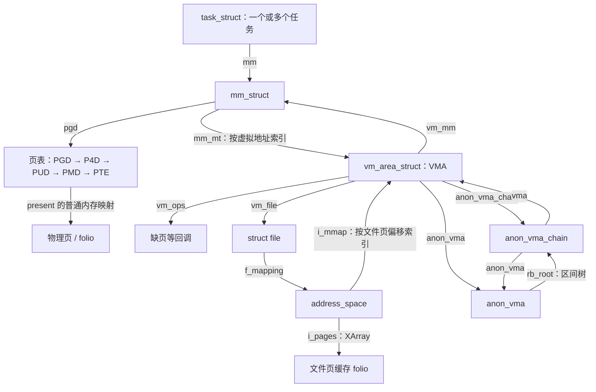
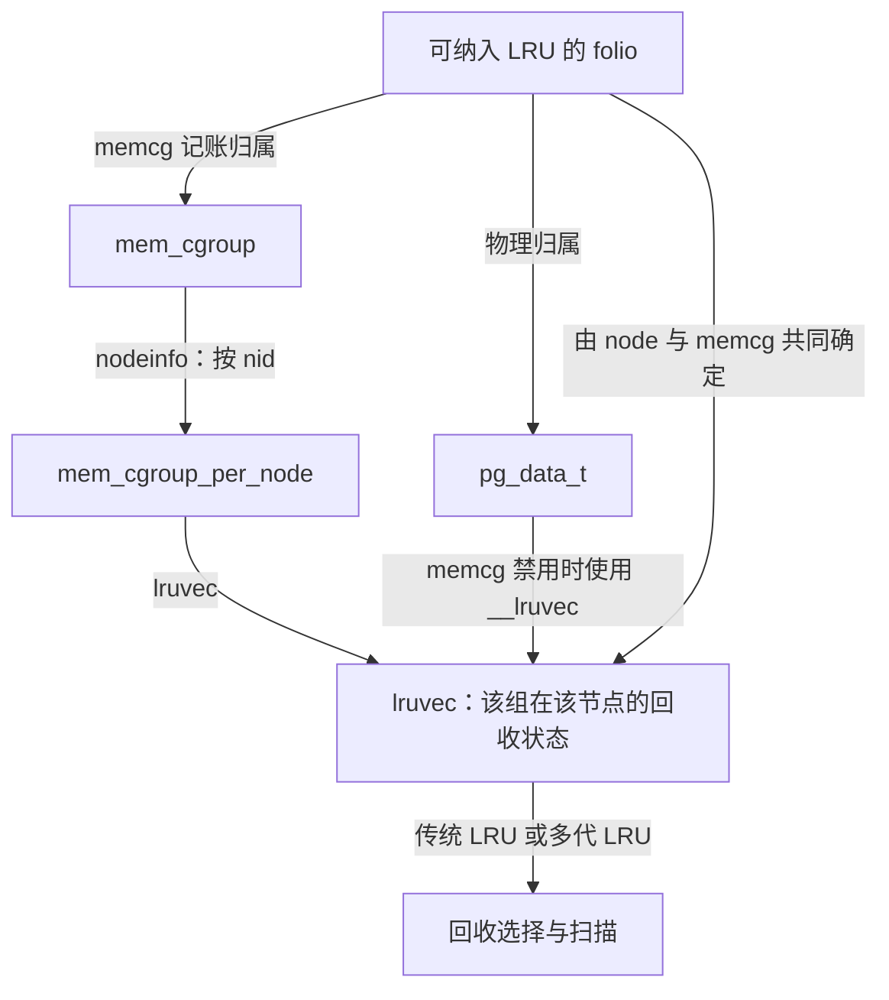

# 内存子系统总览

本章以仓库中 [Linux 顶层 Makefile](../../linux/Makefile) 标记的 **6.18.52** 源码为依据，梳理内存子系统的职责、关键数据结构和主要执行路径。分析以 `CONFIG_MMU` 下的普通系统内存为主；架构相关流程以 x86 为例，NUMA、内存控制组、大页等功能按配置分别说明。源码中存在某个实现，并不表示当前运行的内核已经启用它。

阅读这一子系统，需要同时跟踪三个问题：**物理页在哪里，虚拟地址如何访问它，内存紧张时如何收回它。** Linux 分别通过 node/zone 与页分配器、进程地址空间与页表、反向映射与回收机制回答这些问题；`struct page` 和 `struct folio` 是贯穿这些机制的基础对象。

## 1. 整体职责与源码分布

内存管理并不只发生在 `mm/` 中。通用算法主要位于该目录，数据结构主要位于 `include/linux/`；启动、进程复制、架构异常和文件系统回调共同组成完整的执行路径。

| 层次 | 解决的问题 | 主要源码入口 |
| --- | --- | --- |
| 启动与物理内存描述 | 识别内存范围，保留启动期内存，建立 node、zone 和页描述符 | [memblock.c](../../linux/mm/memblock.c)、[mm_init.c](../../linux/mm/mm_init.c) |
| 页分配 | 根据大小、用途、节点和水位分配、释放物理页 | [page_alloc.c](../../linux/mm/page_alloc.c)、[mmzone.h](../../linux/include/linux/mmzone.h) |
| 内核内存分配 | 分配小对象，或建立连续的内核虚拟地址区间 | [slub.c](../../linux/mm/slub.c)、[slab.h](../../linux/mm/slab.h)、[vmalloc.c](../../linux/mm/vmalloc.c) |
| 进程地址空间 | 管理虚拟地址区间、权限、页表、映射和解除映射 | [mmap.c](../../linux/mm/mmap.c)、[vma.c](../../linux/mm/vma.c)、[memory.c](../../linux/mm/memory.c) |
| 内容与共享 | 管理文件页缓存、匿名页、共享内存以及反向映射 | [filemap.c](../../linux/mm/filemap.c)、[shmem.c](../../linux/mm/shmem.c)、[rmap.c](../../linux/mm/rmap.c) |
| 内存压力处理 | 选择回收对象，换出、写回、迁移、规整，必要时处理 OOM | [vmscan.c](../../linux/mm/vmscan.c)、[compaction.c](../../linux/mm/compaction.c)、[oom_kill.c](../../linux/mm/oom_kill.c) |
| 策略与资源约束 | NUMA 放置策略、memcg 记账与限额 | [mempolicy.c](../../linux/mm/mempolicy.c)、[memcontrol.c](../../linux/mm/memcontrol.c) |

[mm/Makefile](../../linux/mm/Makefile) 给出了这些模块的实际构建关系。例如，MMU 与 NOMMU 使用不同实现，交换、透明大页和 memcg 由配置控制，而本版本的 slab 分配实现直接构建 `slub.o`。

从本版本源码可明确看到几项组织方式：

- `mm_struct.mm_mt` 使用 Maple Tree 索引 VMA，不能再用旧版本的 `mm_rb` 和 VMA 双向链表解释当前进程地址空间。
- 文件页缓存、匿名内存和回收路径大量以 folio 为处理单位，但基础页、页表以及部分接口仍使用 `struct page`。
- `struct slab` 和 `struct ptdesc` 为不同用途的内存页提供专门的元数据视图，当前布局仍与 `struct page` 重叠。
- 回收同时保留传统 LRU 和多代 LRU 分支；SLUB 除每 CPU slab 状态外，还支持按 cache 启用的 sheaf 批量对象缓存。

对应定义见 [mm_types.h](../../linux/include/linux/mm_types.h)、[mmzone.h](../../linux/include/linux/mmzone.h)、[mm/slab.h](../../linux/mm/slab.h) 和 [slub.c](../../linux/mm/slub.c)。

## 2. 物理内存：从地址范围到可分配页

### 2.1 先区分地址、页帧和页描述符

物理地址描述内存中的字节位置；PFN（页帧号）以基础页为单位标识物理位置，满足 `PFN = 物理地址 >> PAGE_SHIFT`。`struct page` 则是内核维护的元数据，记录对应页帧的用途、状态和引用关系，它本身不是该页的数据内容。

`pfn_to_page()` 和 `page_to_pfn()` 在不同内存模型下有不同实现：

| 内存模型 | PFN 与页描述符的组织关系 |
| --- | --- |
| `CONFIG_FLATMEM` | 通过 `mem_map` 和架构 PFN 偏移换算 |
| `CONFIG_SPARSEMEM`，未启用 VMEMMAP | 通过 `mem_section` 找到相应范围的页描述符 |
| `CONFIG_SPARSEMEM_VMEMMAP` | 将页描述符组织为虚拟连续的 `vmemmap`，通过 `vmemmap + pfn` 换算 |

这三种实现见 [memory_model.h](../../linux/include/asm-generic/memory_model.h)，`mem_section` 见 [mmzone.h](../../linux/include/linux/mmzone.h)。`vmemmap` 连续的是**页描述符所在的虚拟地址**，不表示机器的物理内存没有空洞，也不表示进程的数据页连续。下文使用 `PAGE_SIZE` 表示基础页大小，不把某一架构的页大小当作通用常量。

### 2.2 启动阶段：memblock 向页分配器交接

常规分配器尚未建立时，内核使用 `memblock` 管理物理地址范围。其关系是：

```text
struct memblock
├── memory   : memblock_type → memblock_region[]
└── reserved : memblock_type → memblock_region[]
                                  ├── base / size
                                  ├── flags
                                  └── nid（CONFIG_NUMA）
```

`memory` 记录内存范围，`reserved` 记录其中需要保留的范围。两者可以重叠，不能将它们的容量直接相加；早期可释放范围需要结合保留信息和区域属性确定。数据结构见 [memblock.h](../../linux/include/linux/memblock.h)，遍历与释放逻辑见 [memblock.c](../../linux/mm/memblock.c) 的 `free_low_memory_core_early()`。

初始化的大体依赖关系如下，省略架构和调试分支：

1. `start_kernel()` 调用 `setup_arch()`，完成架构相关的内存识别与早期准备。
2. 架构初始化与通用 `free_area_init()` 等代码建立节点、zone 和页描述符；例如 x86-64 的 `initmem_init()` 调用 `x86_numa_init()`，`paging_init()` 调用 `sparse_init()`，`zone_sizes_init()` 调用 `free_area_init()`。
3. `mm_core_init()` 构建 zonelist，准备页分配器，并调用 `memblock_free_all()` 将符合条件的空闲页交给伙伴系统。
4. 随后执行 `mem_init()`、`kmem_cache_init()`，再完成 `vmalloc_init()` 等初始化。

这个顺序以 [init/main.c](../../linux/init/main.c)、[x86/mm/init.c](../../linux/arch/x86/mm/init.c)、[x86/mm/init_64.c](../../linux/arch/x86/mm/init_64.c) 和 [mm_init.c](../../linux/mm/mm_init.c) 为准。尤其要注意，本版本通用 `mm_core_init()` 已经在 `mem_init()` **之前**调用 `memblock_free_all()`，不应直接套用其他版本的启动调用链。

### 2.3 node、zone、伙伴系统与 PCP

物理内存的主要组织关系如下。这里的层次表示管理关系，不是说每个结构都直接包含下一层的全部描述符。

```text
pg_data_t / struct pglist_data                 每个内存节点
├── node_zones[MAX_NR_ZONES]                  本节点的 zone
│   └── struct zone
│       ├── zone_pgdat                       指回所属节点
│       ├── free_area[order]
│       │   └── free_list[migratetype]        伙伴系统的空闲块链表
│       ├── per_cpu_pageset                  每 CPU 页缓存 PCP
│       ├── _watermark[]                     分配与回收水位
│       └── managed_pages / present_pages / spanned_pages
├── node_zonelists[]                          分配候选 zone 的有序引用
├── kswapd                                   节点后台回收线程
└── kcompactd                                节点后台规整线程（按配置）
```

相关定义集中在 [mmzone.h](../../linux/include/linux/mmzone.h) 的 `pglist_data`、`zone`、`free_area`、`per_cpu_pages` 和 `zonelist`。

node 表达内存的节点归属，NUMA 策略决定优先或允许使用哪些节点。zone 则在节点内进一步表达分配约束：`ZONE_DMA`、`ZONE_DMA32` 处理特定寻址范围，`ZONE_NORMAL` 提供常规可寻址内存，`ZONE_HIGHMEM` 按配置处理不能永久直接映射的内存，`ZONE_MOVABLE` 主要容纳可迁移页。`ZONE_DEVICE` 属于设备内存管理场景，不能视为普通伙伴系统的又一个通用空闲池。并非每个节点都具有所有类型的 zone。

`node_zones` 与 `node_zonelists` 的区别尤其重要：前者是节点拥有的 zone 实体，后者是分配时遍历的引用序列，可以引用其他节点的 zone。是否允许跨节点回退，还取决于 GFP、nodemask、cpuset 和 NUMA 策略。[get_page_from_freelist()](../../linux/mm/page_alloc.c) 展示了实际筛选过程。

zone 的三个容量字段也不是同一个计数：

- `spanned_pages`：覆盖的 PFN 范围，包含空洞。
- `present_pages`：实际存在的物理页。
- `managed_pages`：交由页分配器管理的页，包含已分配页和空闲页，不等于当前空闲量。

伙伴系统以 `order` 表示块大小：一个块包含 `2^order` 个物理连续的基础页。`free_area[order].free_list[migratetype]` 同时按阶数和迁移类型组织空闲块；`nr_free` 统计该阶的空闲块数。分配时，`__rmqueue_smallest()` 从目标阶向上寻找并拆分较大块；释放时，`__free_one_page()` 检查伙伴块并在满足条件时合并。实现见 [page_alloc.c](../../linux/mm/page_alloc.c)。

迁移类型用于降低不同用途混放造成的碎片，包括 `MIGRATE_UNMOVABLE`、`MIGRATE_MOVABLE`、`MIGRATE_RECLAIMABLE` 等。它与 zone 是不同维度，`MIGRATE_MOVABLE` 也不等于 `ZONE_MOVABLE`。PCP 缓存则为 CPU 提供页分配和释放的快捷路径，减少争用 `zone->lock`；本版本 `pcp_allowed_order()` 支持多个低阶及配置相关的 THP 阶数，不能概括为“PCP 只保存 order-0 页”。

### 2.4 `struct page`、`struct folio` 与专用描述符

[mm_types.h](../../linux/include/linux/mm_types.h) 中 `struct page` 的多个字段通过 union 复用。解读一个字段前，必须先确认该页当前属于哪种用途。

| 对象或字段 | 含义与使用边界 |
| --- | --- |
| `page.flags` | 页状态以及编码的管理信息；本版本字段类型为 `memdesc_flags_t` |
| `page.lru` / `buddy_list` / `pcp_list` | 同一存储位置在不同状态下用于回收、伙伴系统或 PCP 链接，并非同时位于三类链表 |
| `page.mapping` / `folio.mapping` | 普通文件 folio 指向 `address_space`；匿名 folio 带有类型编码，需要专用辅助函数解释 |
| `_refcount` | 对象存活所需的引用计数；应通过引用操作接口访问 |
| `_mapcount` 及 folio 扩展计数 | 跟踪用户页表映射，与引用计数含义不同；大 folio 还有整页映射等计数 |
| `folio.index` | 在所属映射中的基础页索引，不是字节偏移 |
| `page.private` | 按用途复用；伙伴系统空闲块用它保存 order 等信息 |
| `struct slab` | slab 用途的元数据视图，包括 cache、对象空闲链表和对象数量 |
| `struct ptdesc` | 页表页的元数据视图，包括页表锁等字段；不是 PTE 条目本身 |

folio 表示作为整体管理的一组物理连续、大小为二次幂且按自身大小对齐的内存，至少包含一个基础页。order-0 folio 只有一页，大 folio 包含多页；基础页仍有自己的 `struct page`，通过 `page_folio()`、`folio_page()` 等接口在两者间转换。

folio 不是独立于物理页的另一份数据缓冲区，也不等同于 PMD 大页映射。一个大 folio 可以通过多个 PTE 映射；本版本 `do_anonymous_page()` 的 `folio_nr_pages()` 与 `set_ptes()` 就展示了这种情况。定义和布局校验见 [mm_types.h](../../linux/include/linux/mm_types.h) 的 `FOLIO_MATCH`、`TABLE_MATCH`，slab 的布局校验见 [mm/slab.h](../../linux/mm/slab.h) 的 `SLAB_MATCH`。

## 3. 进程地址空间：VMA 描述规则，页表记录当前映射

### 3.1 `task_struct`、`mm_struct` 和 VMA

`task_struct.mm` 指向任务使用的用户地址空间。多个任务可以共享同一个 `mm_struct`：`copy_mm()` 在 `CLONE_VM` 分支增加引用并共享旧 mm，否则通过 `dup_mm()` 创建新 mm。内核线程通常没有自己的用户 mm，`active_mm` 则服务于活动地址空间上下文。字段与分支见 [sched.h](../../linux/include/linux/sched.h) 和 [kernel/fork.c](../../linux/kernel/fork.c)。

| 数据结构 | 关键字段 | 职责 |
| --- | --- | --- |
| `mm_struct` | `mm_mt`、`pgd`、`mmap_lock`、`mm_users`、`mm_count`、`total_vm`、`rss_stat` | 表示整个用户地址空间，维护 VMA 索引、页表根、同步与记账 |
| `vm_area_struct` | `vm_start`、`vm_end`、`vm_flags`、`vm_page_prot`、`vm_mm` | 表示 `[vm_start, vm_end)` 内具有共同映射属性的一段地址 |
| `vm_area_struct` 的后备关系 | `vm_file`、`vm_pgoff`、`anon_vma`、`anon_vma_chain` | 指定文件来源和偏移，或连接匿名页反向映射 |
| `vm_operations_struct` | `fault`、`map_pages`、`page_mkwrite` 等回调 | 将通用 VM 流程连接到文件系统或其他映射提供者 |
| `vm_fault` | `vma`、`address`、`pgoff`、`flags`、页表指针等 | 保存一次缺页处理的临时上下文 |

结构定义见 [mm_types.h](../../linux/include/linux/mm_types.h) 和 [mm.h](../../linux/include/linux/mm.h)。

`total_vm` 统计虚拟映射覆盖的基础页数，`rss_stat` 跟踪驻留内存的分类计数，`pgtables_bytes` 记录页表本身的开销。这些数值回答不同问题：虚拟映射扩大不意味着立即消耗同等数量的数据页，页表元数据也有独立的物理内存成本。

VMA 说明“这段地址允许怎样使用、内容从何而来”；页表说明“此刻这个虚拟地址映射到哪里、具有什么硬件访问权限”。二者不能相互替代：一个有效 VMA 可以尚未分配数据页，一个可写的私有 VMA 也可以暂时使用只读 PTE 来实现写时复制。



图中的页表是 `mm_struct` 的另一条索引，不是挂在每个 VMA 下面的独立页表。单个 mm 的 VMA 按虚拟地址组织，而一个文件的 `i_mmap` 可以连接来自多个 mm 的 VMA。图中物理页与文件页缓存 folio 是不同观察视角，同一实际 folio 可以同时被页表映射、被页缓存索引。

### 3.2 页表、映射粒度与 TLB

`mm->pgd` 是页表遍历入口。通用 `__handle_mm_fault()` 按 PGD、P4D、PUD、PMD、PTE 层次处理地址；架构可以折叠未使用的层次，因此这五个名称不代表所有机器都进行五级硬件遍历。P4D 折叠示例见 [pgtable-nop4d.h](../../linux/include/asm-generic/pgtable-nop4d.h)。

普通 present PTE 编码物理页帧和访问属性；非 present 条目还可能编码交换位置、迁移状态等信息。大页路径可在 PMD 或受支持的 PUD 层处理映射，未必走到 PTE。具体分支见 [memory.c](../../linux/mm/memory.c) 的 `__handle_mm_fault()`、`handle_pte_fault()` 和 `do_swap_page()`。

CPU 使用 TLB 缓存地址翻译。修改或删除页表时，不仅要保护内存中的页表条目，还要让旧翻译失效，并协调物理页和页表页的释放。`exit_mmap()` 中的 `tlb_gather_mmu_fullmm()`、`unmap_vmas()`、`free_pgtables()` 与 `tlb_finish_mmu()` 展示了这种依赖，见 [mmap.c](../../linux/mm/mmap.c)；相关批量处理实现位于 [mmu_gather.c](../../linux/mm/mmu_gather.c)。

## 4. 内容归属与反向映射

### 4.1 文件页缓存：`address_space`

`address_space` 表示可缓存、可映射对象的内容空间，不是一个进程的虚拟地址空间。对于普通文件，`file->f_mapping` 连接到它，`host` 关联宿主 inode。[fs.h](../../linux/include/linux/fs.h) 定义了两个作用不同的核心索引：

- `i_pages` 是 XArray，按文件页索引寻找缓存 folio，也可能包含影子等特殊条目。
- `i_mmap` 是区间树，按文件页偏移寻找映射该文件范围的 VMA，用于反向映射等操作。

对文件 VMA 中的地址 `addr`，相应的基础页索引可理解为：

```text
文件页索引 = vma->vm_pgoff + ((addr - vma->vm_start) >> PAGE_SHIFT)
```

`filemap_fault()` 使用 `vmf->pgoff` 查找页缓存，缺失时触发预读或创建 folio，再保证内容就绪。普通 buffered I/O 与文件 mmap 可以复用同一页缓存；具体文件系统通过 `address_space.a_ops` 和 VMA 回调接入。`filemap_add_folio()` 则串起 memcg 记账、页缓存插入和加入 LRU 的操作。源码见 [filemap.c](../../linux/mm/filemap.c)。

因此，一个文件 folio 可以存在于页缓存中而没有任何用户 PTE 映射；解除某个进程的文件映射，也不必立即把该 folio 从页缓存中删除。DAX、设备映射等特殊路径不适合直接套用上述普通页缓存模型。

### 4.2 匿名内存：`anon_vma` 与 `anon_vma_chain`

匿名页没有普通文件页偏移作为持久内容来源，但回收和迁移同样需要找到映射它的地址空间。Linux 通过 `anon_vma` 及其区间树建立这条反向路径。

`anon_vma_chain` 同时保存 `vma` 和 `anon_vma` 指针：`same_vma` 将一个 VMA 关联的多个 chain 串联起来，`rb` 将 chain 放入相应 `anon_vma.rb_root`。这种多对多关系支持 fork 后的页共享、VMA 拆分及后续写时复制；不能把它简化为“一个 VMA 只对应一个匿名页集合”。定义与设计注释见 [rmap.h](../../linux/include/linux/rmap.h)。

`folio.mapping` 在匿名场景下包含 `FOLIO_MAPPING_ANON` 等标记，不能始终当作 `struct address_space *` 直接使用。标记见 [page-flags.h](../../linux/include/linux/page-flags.h)，实际解释和遍历见 [rmap.c](../../linux/mm/rmap.c)。KSM 合并页还有独立的反向映射分支。

### 4.3 正向映射与反向映射如何闭合

| 查询方向 | 起点 | 主要路径 |
| --- | --- | --- |
| 查询地址的合法范围和属性 | `mm + 虚拟地址` | `mm_mt → VMA` |
| 查询当前地址翻译 | `mm + 虚拟地址` | `pgd → 各级页表 → 物理页或非 present 状态` |
| 查询文件缓存内容 | `address_space + 文件页索引` | `i_pages → folio` |
| 寻找文件 folio 的用户映射 | 文件 folio | `mapping → i_mmap → 候选 VMA → 检查页表` |
| 寻找匿名 folio 的用户映射 | 匿名 folio | `anon_vma → chain 区间树 → 候选 VMA → 检查页表` |

反向映射索引先给出可能相关的 VMA，再检查实际页表；VMA 覆盖某段范围并不表示其中每一页已经映射。`rmap_walk()` 负责按 folio 类型选择遍历方式，`try_to_unmap()` 利用这些关系撤销映射。源码见 [rmap.c](../../linux/mm/rmap.c)。这是回收和迁移能够从物理内存对象反查用户地址空间的关键。

`MAP_PRIVATE` 文件映射进一步连接了两种内容来源：读取时可使用文件页缓存，写时复制后出现匿名页，因此同一个 VMA 可以同时关联 `address_space.i_mmap` 和 `anon_vma`。这一点在 [vm_area_struct 的注释](../../linux/include/linux/mm_types.h) 中有直接说明。

## 5. 内核分配接口：页、对象与虚拟连续区域

### 5.1 三种主要分配需求

| 接口 | 主要保证 | 核心实现与释放方式 |
| --- | --- | --- |
| `alloc_pages(gfp, order)` | 返回 `2^order` 个物理连续基础页，以 `struct page *` 表示；不是任意内核虚拟地址接口 | [page_alloc.c](../../linux/mm/page_alloc.c)；按接口约定使用 `__free_pages()` 等 |
| `kmem_cache_alloc()` | 从指定 cache 分配固定布局对象 | [slub.c](../../linux/mm/slub.c)；`kmem_cache_free()` |
| `kmalloc()` / `kzalloc()` | 返回可直接访问的连续内核对象内存；对象范围物理连续，`kzalloc()` 额外清零 | 小对象使用 kmalloc caches，大对象走页分配；见 [slub.c](../../linux/mm/slub.c)，使用 `kfree()` |
| `vmalloc()` | 返回虚拟连续区域，不要求整个后备物理范围连续 | [vmalloc.c](../../linux/mm/vmalloc.c)；`vfree()` |
| `kvmalloc()` | 先尝试 kmalloc，满足条件时回退到 vmalloc，调用者不能假定物理连续 | 本版本实现位于 [slub.c](../../linux/mm/slub.c) 的 `__kvmalloc_node_noprof()`；`kvfree()` |

这些接口最终会消耗物理内存，但分配粒度和连续性要求不同。`vmalloc()` 还需要虚拟地址空间和页表资源，所以不能把它理解为“不会失败的大块分配”。

### 5.2 SLUB：cache、slab 和对象

`kmem_cache` 描述对象的大小、对齐、分配属性和管理状态，一个 cache 管理多个 slab。`struct slab` 描述作为对象容器的一组页，通过 `slab_cache` 指回 cache，使用 `freelist`、`inuse`、`objects` 等字段维护对象状态。

```text
kmem_cache
├── size / object_size / align            对象布局
├── cpu_slab → kmem_cache_cpu             每 CPU 的 slab、freelist、tid
├── node[nid] → kmem_cache_node           节点 partial slabs 等状态
├── cpu_sheaves（启用时）                 每 CPU 的 main / spare 等 sheaf
└── slab → 多个对象
    └── slab_cache → 原 kmem_cache
```

这里 `object_size` 是对象自身大小，`size` 可以包含分配器元数据和对齐开销。定义见 [mm/slab.h](../../linux/mm/slab.h)，每 CPU 和节点状态见 [slub.c](../../linux/mm/slub.c)。需要新的 slab 时，`allocate_slab()` 经 `alloc_slab_page()` 获取物理页，因而 SLUB 建立在页分配器之上。

本版本还定义了 `slab_sheaf`、`slub_percpu_sheaves` 和 `node_barn`：sheaf 保存一批对象指针，每 CPU 缓存与节点上的 barn 交换这些批次。`slab_alloc_node()` 在 cache 配有 `cpu_sheaves` 时先尝试 `alloc_from_pcs()`；启用还受 `sheaf_capacity`、`CONFIG_SLUB_TINY` 和调试标志约束。它是可选的对象缓存层，不能用它取代对 slab 与伙伴系统关系的理解。

### 5.3 vmalloc 的另一套地址管理结构

`vmalloc` 使用 `vmap_area` 管理内核虚拟地址区间，使用 `vm_struct` 保存分配区域、后备 `pages[]`、页数和属性。这两个结构定义于 [vmalloc.h](../../linux/include/linux/vmalloc.h)，与用户地址空间的 `vm_area_struct` 不是同一种对象。

`__vmalloc_node_range_noprof()` 申请虚拟区域，`__vmalloc_area_node()` 分配后备页，随后用 `vmap_pages_range()` 建立内核页表映射。实现也支持配置相关的大粒度映射，但并不承诺整个分配物理连续。流程见 [vmalloc.c](../../linux/mm/vmalloc.c)。

### 5.4 GFP 是分配策略的一部分

GFP 不只是选择一个内存池，它还约束调用过程中允许采取的动作。[gfp_types.h](../../linux/include/linux/gfp_types.h) 定义了以下典型组合：

| 标志 | 对执行路径的主要影响 |
| --- | --- |
| `GFP_KERNEL` | 允许直接回收、I/O 和文件系统相关回收，分配可能阻塞 |
| `GFP_NOWAIT` | 不进行直接回收；可请求后台回收，可能很快失败 |
| `GFP_ATOMIC` | 不进行直接回收，带有高优先级储备访问属性；不保证成功，也不是所有严格上下文的通用许可 |
| `GFP_NOFS` / `GFP_NOIO` | 限制回收进入文件系统或发起 I/O，避免分配与资源释放之间的递归依赖 |
| `__GFP_MOVABLE` | 表达可迁移属性，参与迁移类型和 zone 选择 |
| `__GFP_ACCOUNT` | 要求相应内核分配纳入 memcg 记账 |

因此，“分配一次内存”可能隐含回收、文件系统操作、迁移和等待。追踪分配调用链时，应同时查看 GFP、order、节点约束与调用上下文。

## 6. 回收与资源约束：`lruvec`、memcg、swap

### 6.1 回收组织单位是 node 与 memcg 的组合

`lruvec` 管理一组 folio 的回收状态。传统 LRU 区分匿名/文件、active/inactive，并保留 unevictable 类别；开启多代 LRU 时，`lruvec.lrugen` 以代际记录可回收 folio，辅助区分冷热。结构见 [mmzone.h](../../linux/include/linux/mmzone.h) 的 `lruvec`、`lru_gen_folio` 和 `enum lru_list`。



这一关系由 [mem_cgroup_lruvec()](../../linux/include/linux/memcontrol.h) 直接给出：memcg 禁用时返回 `pgdat->__lruvec`，启用时返回 `memcg->nodeinfo[nid]->lruvec`。因此不能把当前回收架构概括成“每个 zone 各有一套完整 LRU”。zone 仍影响水位、回收范围和统计，但不是这条组织关系的唯一维度。

`CONFIG_LRU_GEN` 决定是否构建多代 LRU，`CONFIG_LRU_GEN_ENABLED` 影响默认启用状态，执行时还通过 `lru_gen_enabled()` 选择分支。配置与实际分派见 [mm/Kconfig](../../linux/mm/Kconfig) 和 [vmscan.c](../../linux/mm/vmscan.c) 的 `shrink_node()`、`shrink_lruvec()`。内核对象和普通空闲页并不会全部加入这套 folio LRU。

### 6.2 memcg：记账、限额与定向回收

`mem_cgroup` 通过 `css` 接入 cgroup 层次，通过 `page_counter memory`、swap 等字段记录资源用量，通过 `nodeinfo[]` 连接各节点的回收状态。定义见 [memcontrol.h](../../linux/include/linux/memcontrol.h)。

申请物理页成功后，memcg charge 仍可能失败。例如，`filemap_add_folio()` 在插入页缓存之前进行记账，匿名 folio 分配也进行记账检查；`try_charge_memcg()` 在超限时进入回收、重试及可能的组内 OOM 处理。源码见 [filemap.c](../../linux/mm/filemap.c)、[memory.c](../../linux/mm/memory.c) 和 [memcontrol.c](../../linux/mm/memcontrol.c)。

因此，memcg 管理的是资源归属与限制，不是为每组建立独立的物理内存池。某个组超限时，整机仍可能有空闲内存；组内 OOM 也不等价于全局物理内存耗尽。

### 6.3 不同内容采用不同的回收方式

| 内存内容 | 典型处理方式 |
| --- | --- |
| 可重新读取的干净文件 folio | 在处理映射并满足引用等条件后，从页缓存移除并释放 |
| 脏文件 folio | 通常需要写回或等待写回完成，不能直接丢弃仍需保留的数据 |
| 需要保留内容的匿名 folio | 通常通过 swap 保存内容；没有可用交换空间时，这条回收路径受限 |
| 可丢弃的匿名内容 | 如符合条件的 lazyfree 页，可走直接丢弃路径，不能一概认为所有匿名页都必须换出 |
| 可回收内核缓存 | 调用对应 shrinker 释放对象，之后才可能进一步释放 slab 页 |
| mlock、额外引用或 pin 限制的内存 | 回收可能跳过或失败，需要检查具体限制与生命周期 |

这些判断主要位于 [vmscan.c](../../linux/mm/vmscan.c) 的 `shrink_folio_list()`。文件写回还涉及 [page-writeback.c](../../linux/mm/page-writeback.c) 和文件系统的 `a_ops`；内核缓存回收通过 [shrinker.h](../../linux/include/linux/shrinker.h) 的 `count_objects`、`scan_objects` 接口接入 [shrinker.c](../../linux/mm/shrinker.c)。不能仅凭对象来自 SLUB 就判断它可以被自动回收。

交换涉及三个相关对象：

- `swp_entry_t` 编码交换类型和偏移；`swp_type()`、`swp_offset()` 负责拆解。
- `swap_info_struct` 描述交换区域，维护使用计数、cluster、交换文件或块设备等信息。
- swap cache 保存与交换条目关联的驻留 folio，缺页时可能直接命中，而不必每次读取设备。

定义与路径见 [swapops.h](../../linux/include/linux/swapops.h)、[swap.h](../../linux/include/linux/swap.h)、[swap_state.c](../../linux/mm/swap_state.c) 和 [page_io.c](../../linux/mm/page_io.c)。非 present PTE 不一定表示真正的磁盘交换：`do_swap_page()` 还区分迁移条目、设备内存条目等特殊状态。

## 7. 用主要执行路径连接各层

以下路径是理解调用关系的主干，省略统计、错误恢复和配置分支；它们不是每次操作都会完整执行的固定步骤。

### 7.1 页分配：快速路径与慢速路径

本版本普通页分配的底层主干位于 [page_alloc.c](../../linux/mm/page_alloc.c)：

```text
__alloc_pages_noprof()
  → __alloc_frozen_pages_noprof()
      → prepare_alloc_pages()                 准备 zone、节点和迁移类型约束
      → get_page_from_freelist()              遍历候选 zone，检查水位
          → rmqueue()
              → rmqueue_pcplist()             支持该 order 时先尝试 PCP
              → rmqueue_buddy()               必要时从伙伴系统分配
      → __alloc_pages_slowpath()              首次尝试失败后进入
  → 成功后 set_page_refcounted()
```

慢速路径根据 GFP、order 和进展情况选择唤醒 kswapd、调整条件重试、直接规整、直接回收及 OOM 等动作。某些高阶申请会先尝试规整；不允许直接回收或要求快速失败的申请可能直接返回失败。因此不能把它画成无条件执行的“回收 → 规整 → 杀进程”直线。

空闲总量足够也可能失败：申请可能要求某个节点、特定 zone 或较大的连续物理块，也可能受到水位储备和 memcg 限额约束。物理分配约束可沿 `get_page_from_freelist()` 与 `__alloc_pages_slowpath()` 追踪；带有 `__GFP_ACCOUNT` 的内核页分配，还需要通过 `__alloc_frozen_pages_noprof()` 中的记账检查。

### 7.2 mmap 与首次访问：先建立范围，再按需落实内容

`do_mmap()` 校验并选择地址，再调用 `mmap_region()` 建立或合并 VMA，关联文件及回调。前者位于 [mmap.c](../../linux/mm/mmap.c)，后者在本版本位于 [vma.c](../../linux/mm/vma.c)。普通按需映射不要求在 mmap 返回时就分配全部数据页；预填充、锁页和特殊映射等分支另行处理。

以 x86 用户地址访问为例，主干为：

```text
do_user_addr_fault()
  → 查找并稳定 VMA，检查访问权限
  → handle_mm_fault()
      → HugeTLB VMA：hugetlb_fault()
      → 普通 VMA：__handle_mm_fault()
          → 检查/创建上层页表，处理大页分支
          → handle_pte_fault()
```

架构入口见 [x86/mm/fault.c](../../linux/arch/x86/mm/fault.c)，通用分派见 [memory.c](../../linux/mm/memory.c)。进入 PTE 层后，典型情况如下：

| 现场 | 处理入口 | 内容如何得到落实 |
| --- | --- | --- |
| 普通私有匿名 VMA 尚无 PTE | `do_anonymous_page()` | 读访问在允许时映射零页；写访问或其他情况分配匿名 folio，建立 rmap、LRU 和 PTE |
| 文件映射尚无 PTE | `do_fault()` → `vm_ops->fault` | 由映射提供者取得内容；普通文件可走 `filemap_fault()` |
| PTE 编码交换等非 present 状态 | `do_swap_page()` | 区分特殊条目；普通交换路径查缓存或读取交换内容并恢复映射 |
| 写入只读 PTE | `do_wp_page()` | 根据共享/私有及独占条件，执行共享写处理、复用或复制 |

为私有匿名内存新分配 folio 时，`do_anonymous_page()` 及其辅助函数建立相互配套的状态：匿名内容、memcg 记账、映射计数、LRU 与页表条目。只跟踪“分配到了哪一页”不足以解释整个缺页处理；共享零页分支则不需要为这次读访问新分配匿名数据 folio。

### 7.3 fork 与 COW：共享内容，延后复制

不带 `CLONE_VM` 的进程复制经 `dup_mm()` 复制地址空间；`copy_page_range()` 按 VMA 情况复制页表关系，对 COW 映射建立写保护，使父子进程可以暂时共享内容。它不会无条件复制所有数据页，部分 VMA 的页表也可以留待后续缺页重新建立。源码见 [kernel/fork.c](../../linux/kernel/fork.c) 和 [memory.c](../../linux/mm/memory.c)。

后续写访问进入 `do_wp_page()`。若匿名页已满足独占复用条件，就可以恢复可写状态；否则调用 `wp_page_copy()` 创建副本并更新映射。共享文件映射则走自己的共享写入分支。COW 因而同时涉及 VMA 属性、PTE 权限、folio 的共享状态和 rmap，不能仅靠 `_refcount` 推断所有情况。

### 7.4 内存压力：回收、迁移、规整与 OOM

直接回收从 `try_to_free_pages()` 开始，由发起分配的任务执行；后台回收由节点的 `kswapd()` 经 `balance_pgdat()` 执行。两者通过 `scan_control` 传递目标页数、目标 memcg、允许节点、是否允许换出/解除映射等条件，再进入相应扫描路径，见 [vmscan.c](../../linux/mm/vmscan.c)。

回收减少仍需驻留的内容；规整则通过迁移调整已驻留页的位置，争取形成连续空闲块。`compact_control` 保存目标 zone、扫描 PFN、待迁移页和目标空闲页列表；`try_to_compact_pages()` 驱动规整，底层复用 `migrate_pages()`。见 [internal.h](../../linux/mm/internal.h)、[compaction.c](../../linux/mm/compaction.c) 和 [migrate.c](../../linux/mm/migrate.c)。规整本身不以增加全局空闲页总数为目标。

迁移需要利用反向映射定位 PTE，协调旧页、新页和引用，并恢复映射，所以 pin、不可迁移对象和并发访问都会影响成功率。启用内存分层时，回收路径还可能先把 folio 降级到另一节点：这释放了源节点容量，却不等于消除了全局的数据驻留。

当允许的回收、重试等措施无法取得进展，符合条件的路径才进入 OOM 处理，由 [oom_kill.c](../../linux/mm/oom_kill.c) 的 `out_of_memory()` 等函数处理。高阶分配失败、受限上下文分配失败和 memcg OOM 应分别分析，不能一律解释为“系统 RAM 用完了”。

### 7.5 munmap 与退出：解除映射不等于立即释放所有物理页

`do_munmap()` 经 `do_vmi_munmap()` 处理地址范围、必要的 VMA 拆分与解除映射；整个 mm 最后一个用户退出时，由 `mmput()` 的释放路径进入 `exit_mmap()`。入口见 [mmap.c](../../linux/mm/mmap.c)、[vma.c](../../linux/mm/vma.c) 和 [kernel/fork.c](../../linux/kernel/fork.c)。

解除映射要协调 VMA 索引、反向映射、页表条目、TLB 以及引用计数。某个 PTE 被移除后，对应物理页仍可能由其他进程、页缓存或 pin 持有，只有相关生命周期条件满足后才可释放给底层分配器。

## 8. 并发与生命周期：结构关系成立的前提

内存子系统的锁按受保护对象分工。理解指针关系时，还需要确认指针在什么条件下稳定。

| 保护对象 | 主要同步机制 | 阅读时要确认的问题 |
| --- | --- | --- |
| mm 的映射布局 | `mmap_lock`；配置相关的 VMA 锁和 RCU | VMA 是否仍属于该 mm，边界与属性能否改变 |
| 页表内容 | `page_table_lock`，以及拆分页表锁配置下的相应锁 | 条目在读取后是否已被另一 CPU 修改 |
| 伙伴系统空闲链表 | `zone->lock` | 空闲块的阶数、链表和统计能否一致更新 |
| PCP、SLUB 每 CPU 状态 | 各自的局部锁或原子操作 | 是否稳定访问当前 CPU 的缓存状态 |
| folio 内容及相关操作 | folio lock、引用计数、写回状态等 | 内容是否就绪，是否正在回收、写回或迁移 |
| 回收队列 | `lruvec->lru_lock` | folio 状态与队列操作是否一致 |
| 反向映射索引 | `anon_vma` 锁、`address_space.i_mmap_rwsem` | 遍历期间 VMA 与索引关系是否稳定 |

字段与用法可在 [mm_types.h](../../linux/include/linux/mm_types.h)、[mmzone.h](../../linux/include/linux/mmzone.h)、[rmap.h](../../linux/include/linux/rmap.h)、[fs.h](../../linux/include/linux/fs.h) 和 [slub.c](../../linux/mm/slub.c) 中核对。这张表是职责索引，不是可任意嵌套的锁顺序。

两个引用层次需要单独区分：

- `mm_users` 表示包括用户空间在内的使用引用；归零时释放用户地址空间等资源，并释放其持有的 mm 引用。`mm_count` 管理 `mm_struct` 本体的生命周期，所有 `mm_users` 合起来在该计数中占一个引用。
- folio 引用计数包含页表以外的持有者；映射计数跟踪页表映射。映射计数归零不意味着引用计数归零，大 folio 和 pin 还需要专用辅助函数解释。

对应约定见 [mm_types.h](../../linux/include/linux/mm_types.h) 和 [kernel/fork.c](../../linux/kernel/fork.c)。此外，`handle_mm_fault()` 的调用可能因等待或重试释放锁；其源码明确提醒调用者，返回后不能无条件继续解引用原 VMA。x86 也已经包含 `lock_vma_under_rcu()` 快速路径及向 mmap 锁路径回退的分支，见 [fault.c](../../linux/arch/x86/mm/fault.c)。

## 9. 主干之外的重要分支

这些机制扩展了上述对象和路径，应在建立主干认识后分别深入。

| 机制 | 与主干的连接 | 阅读入口 |
| --- | --- | --- |
| NUMA 策略 | `mempolicy` 保存模式、节点集合等，影响 folio/page 的放置和回退 | [mempolicy.h](../../linux/include/linux/mempolicy.h)、[mempolicy.c](../../linux/mm/mempolicy.c) |
| 透明大页与多尺寸匿名 folio | 缺页可申请较大 folio；PMD 映射与多个 PTE 映射是不同情况，还涉及合并和拆分 | [memory.c](../../linux/mm/memory.c)、[huge_memory.c](../../linux/mm/huge_memory.c)、[khugepaged.c](../../linux/mm/khugepaged.c) |
| HugeTLB | 使用 `hstate` 管理页大小、空闲与预留等状态，缺页由 `hugetlb_fault()` 分派；不按普通匿名页 LRU 模型处理 | [hugetlb.h](../../linux/include/linux/hugetlb.h)、[hugetlb.c](../../linux/mm/hugetlb.c) |
| shmem/tmpfs | 同时连接文件映射形式、内存驻留与交换，不能按普通磁盘文件的干净页丢弃规则解释 | [shmem.c](../../linux/mm/shmem.c) |
| CMA | 管理连续内存区域，连接迁移类型与连续物理页分配 | [cma.c](../../linux/mm/cma.c)、[mmzone.h](../../linux/include/linux/mmzone.h) |
| 内存热插拔与设备内存 | 改变物理内存的上线状态或用途，需要协调页描述符、zone 与迁移 | [memory_hotplug.c](../../linux/mm/memory_hotplug.c)、[memremap.c](../../linux/mm/memremap.c) |
| GUP/pin | 为访问用户页或设备使用而取得引用、固定页，影响回收和迁移 | [gup.c](../../linux/mm/gup.c) |
| zswap | 在换出路径中尝试把内容压缩保存在 RAM，换入时可命中该缓存 | [zswap.c](../../linux/mm/zswap.c)、[page_io.c](../../linux/mm/page_io.c) |

## 10. 后续源码阅读顺序

建议按数据结构与执行路径交替推进，每一步都确认“对象由谁创建、由谁索引、由谁释放”。

1. 阅读 [mm_types.h](../../linux/include/linux/mm_types.h) 与 [mmzone.h](../../linux/include/linux/mmzone.h)，建立 page/folio、mm/VMA、node/zone 三组基本关系。
2. 沿 [memblock.c](../../linux/mm/memblock.c) 和 [mm_init.c](../../linux/mm/mm_init.c) 追踪启动交接，再读 [page_alloc.c](../../linux/mm/page_alloc.c) 的分配与释放主干。
3. 结合 [mm/slab.h](../../linux/mm/slab.h)、[slub.c](../../linux/mm/slub.c) 和 [vmalloc.c](../../linux/mm/vmalloc.c)，区分页、对象和虚拟连续区域的分配。
4. 从 [mmap.c](../../linux/mm/mmap.c)、[vma.c](../../linux/mm/vma.c) 进入 [memory.c](../../linux/mm/memory.c)，完整跟踪一次匿名写缺页，再跟踪文件缺页和 COW。
5. 联读 [fs.h](../../linux/include/linux/fs.h)、[filemap.c](../../linux/mm/filemap.c)、[rmap.h](../../linux/include/linux/rmap.h) 和 [rmap.c](../../linux/mm/rmap.c)，闭合内容索引、页表映射和反向查找。
6. 最后联读 [memcontrol.c](../../linux/mm/memcontrol.c)、[vmscan.c](../../linux/mm/vmscan.c)、[compaction.c](../../linux/mm/compaction.c) 与 [oom_kill.c](../../linux/mm/oom_kill.c)，解释分配失败时每个约束如何影响处理结果。

沿这些路径阅读时，应始终把虚拟地址范围、当前页表映射、内容归属、物理分配状态和资源记账分别确认，再通过源码中的指针、索引和回调把它们连接起来。
