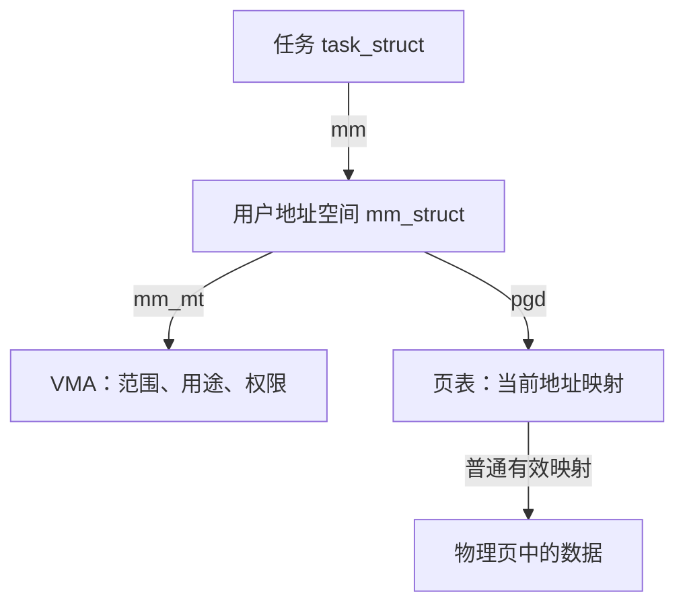

# 内存子系统总览：从一段内存的使用过程开始

程序拿到一段地址后，内核需要回答三个问题：**这段地址能不能访问，数据实际放在哪里，内存不够时怎么办。** 本章围绕这三个问题，逐步连接 Linux 内存管理中的概念和源码。

读完本章，先争取能解释四件事：申请地址为什么不等于立即分配数据页；VMA、页表和物理页各自负责什么；内核怎样提供页和小对象；为什么还有空闲内存，某次分配却仍会失败。

本文依据仓库 [Linux 顶层 Makefile](../../linux/Makefile) 中标记的 **6.18.52** 版本，只讨论本地源码。主线采用启用 `CONFIG_MMU`（内存管理单元支持）的普通系统内存，缺页入口以 x86 为例。文中的调用链省略了部分中间函数和错误处理；配置相关机制是否启用，需要结合构建选项判断，见 [mm/Makefile](../../linux/mm/Makefile)。

**建议分两遍读。** 第一遍读第 1、2 节，建立“地址 → 映射 → 数据”的认识；第二遍读第 3～6 节，理解分配、共享和回收。第 7 节留作进阶查阅，第 8 节提供源码阅读路线和自测题。

## 1. 先分清地址、数据和管理信息

### 1.1 虚拟地址与物理地址

程序访问一个指针时，使用的是它所在地址空间中的**虚拟地址**。在本章讨论的普通映射中，CPU 根据页表将虚拟地址转换为物理地址，再访问内存里的数据。两个进程中的同一个虚拟地址，不一定对应同一个物理位置。

内核以**基础页**为单位管理许多内存操作，页大小用 `PAGE_SIZE` 表示，`PAGE_SHIFT` 表示页大小对应的二进制位移量。描述一个物理页的位置时，常用 PFN（Page Frame Number，页帧号）：

```text
PFN = 物理地址 >> PAGE_SHIFT
物理页的起始地址 = PFN << PAGE_SHIFT
```

只为方便计算，假设基础页大小为 4 KiB，那么物理地址 `0x5000` 位于 PFN 为 5 的页中。实际阅读源码时应使用 `PAGE_SIZE`，不要把 4 KiB 当作所有架构的固定值。换算宏见 [pfn.h](../../linux/include/linux/pfn.h)。

### 1.2 `page` 与 `folio`：内核怎样描述数据页

物理页里保存数据，`struct page` 保存内核管理这个页所需的信息，例如状态和引用计数。**页描述符与页里的数据是两回事。** 对于这里讨论的普通物理页，可以通过 `pfn_to_page()`、`page_to_pfn()` 在页帧号与描述符之间转换，具体实现见 [memory_model.h](../../linux/include/asm-generic/memory_model.h)。

阅读新一些的内存代码，还会频繁遇到 `struct folio`。它表示作为一个整体管理的一组物理连续页，可以只包含一个基础页，也可以包含多个基础页。它的大小是二次幂，并按自身大小对齐。

```text
一个基础页：     数据页                         ← struct page 描述
一个大 folio： [基础页][基础页][基础页][基础页]   ← 作为整体管理的示意
```

folio 没有另外复制一份数据。使用 `page_folio()`、`folio_page()` 等接口，可以在整体与其中的页之间转换。它也不意味着一定使用硬件大页映射：一个大 folio 可以通过多个普通页表项映射。定义及布局说明见 [mm_types.h](../../linux/include/linux/mm_types.h)。

第一遍阅读时，先记住：**page 让我们定位基础页，folio 让内核按一页或多页的整体处理内容。**

### 1.3 `mm`、VMA 与页表：三者分别回答什么

进程的地址空间由 `struct mm_struct` 描述。`task_struct.mm` 指向它，多个任务也可以共享同一个 mm。共享与复制的选择可在 [fork.c](../../linux/kernel/fork.c) 的 `copy_mm()` 中看到。

一个地址空间里有代码、堆、栈、文件映射等不同用途的范围。内核用 **VMA（Virtual Memory Area，虚拟内存区域）** 描述一段具有共同属性的地址范围，用页表保存具体映射。下文先以普通基础页映射为例，把末级页表项记作 PTE（Page Table Entry）。

| 对象 | 先回答的问题 | 第一遍只看这些字段 |
| --- | --- | --- |
| `mm_struct` | 整个用户地址空间由谁管理？ | `mm_mt` 索引 VMA，`pgd` 指向页表根 |
| `vm_area_struct` | 这段地址允许怎样访问，内容从哪里来？ | `vm_start`、`vm_end`、`vm_flags`、`vm_file` |
| 页表项 | 这个地址当前有没有映射，映射到哪里，硬件允许怎样访问？ | 普通 PTE 中的物理页帧和访问属性 |

VMA 覆盖的范围是 `[vm_start, vm_end)`，包含起点，不包含终点。本版本使用 Maple Tree（`mm_mt`）索引 VMA。先把它理解成“按虚拟地址寻找 VMA 的索引”即可，暂时不必研究树的内部算法。结构定义见 [mm_types.h](../../linux/include/linux/mm_types.h)，页表处理见 [memory.c](../../linux/mm/memory.c)。



注意图中从 mm 分出的两条路径：**VMA 与页表分别组织在 mm 下，并不是每个 VMA 自带一套独立页表。** 一个有效 VMA 可以还没有对应的数据页；一个允许写入的私有 VMA，也可以暂时使用只读页表项，以便实现后面要讲的写时复制。

## 2. 跟踪一段内存：申请、访问、共享、释放

现在用一个贯穿全章的例子：程序通过 `mmap()` 申请一段**私有、匿名、可读写**的内存，随后写入数据，调用 `fork()`，最后解除映射。

“匿名”表示这段映射没有普通文件作为内容来源；“私有”表示后续写入不要求对其他进程共享可见。这里先讨论普通的按需映射，不展开预填充、锁页和大页等分支。

### 2.1 申请地址：先登记一段可以使用的范围

内核处理 `mmap()` 时，会检查参数、选择地址，再建立或合并 VMA。相关主干是：

```text
do_mmap()              检查参数并确定地址范围
  → mmap_region()      建立或合并 VMA，设置映射属性
```

本版本的 `do_mmap()` 位于 [mmap.c](../../linux/mm/mmap.c)，`mmap_region()` 位于 [vma.c](../../linux/mm/vma.c)。

此时，内核已经知道“这段地址可以怎样使用”，但通常还没有为整个范围准备好数据页。因此，**申请了多大的虚拟地址范围，与当前实际驻留多少数据，是两个问题。** 这也解释了 `mm_struct` 为什么分别记录虚拟映射大小 `total_vm`、驻留内存统计 `rss_stat` 和页表开销 `pgtables_bytes`，见 [mm_types.h](../../linux/include/linux/mm_types.h)。

### 2.2 首次写入：缺页处理把地址与数据连接起来

当程序第一次写入这段范围中的某个地址时，如果页表还没有相应映射，CPU 会触发缺页异常。**缺页异常不一定是程序错误。** 内核先根据 VMA 判断访问是否合法；合法的按需访问，可以由缺页处理补齐映射后继续执行。

以 x86 的普通匿名缺页为例，沿下列主干阅读：

```text
do_user_addr_fault()                 查找 VMA，检查访问权限
  → handle_mm_fault()                进入通用缺页处理
      → __handle_mm_fault()          检查或建立各级页表
          → handle_pte_fault()       处理普通页表项
              → do_pte_missing()     当前尚无 PTE 映射
                  → do_anonymous_page()
```

架构入口见 [x86/mm/fault.c](../../linux/arch/x86/mm/fault.c)，通用处理见 [memory.c](../../linux/mm/memory.c)。上面只列出本例分支，文件映射和大页会有其他路径。

在本例的写入分支中，内核需要准备匿名 folio、完成相应记账、建立页表映射，并维护以后回收所需的关系。理解时可以先分成三个问题：

1. **内容在哪里？** 分配并准备物理内存。
2. **程序怎样访问？** 将虚拟地址映射到这些物理页。
3. **以后怎样管理？** 记录资源归属、映射关系和回收状态。

这些工作在 `do_anonymous_page()` 及其辅助函数中相互配合，并非只调用一次页分配器就结束。若首次访问是读取，允许使用共享零页时可以先映射零页，无需立刻新分配匿名数据 folio；读和写应分开分析。

映射建立后，返回用户态重试触发异常的指令，写入才得以完成。只要映射仍然有效且权限允许，后续访问通常无需再次进入缺页处理。

### 2.3 `fork()`：先共享，写入时再决定是否复制

普通 `fork()` 为子进程建立新的 mm 和 VMA 等管理信息。对于本例中已经写入的匿名页，常见做法是父子进程暂时共享物理内容，并对双方的相关页表项设置写保护。这就是 **COW（Copy-on-Write，写时复制）** 的准备阶段。

```text
fork 后，尚未再次写入：      子进程写入并需要复制后：

父进程地址 → 数据页 A       父进程地址 → 数据页 A
子进程地址 → 数据页 A       子进程地址 → 数据页 B
            暂时共享                     独立副本
```

复制地址空间的阅读主干为 `copy_mm()` → `dup_mm()` → `dup_mmap()` → `copy_page_range()`，分别见 [fork.c](../../linux/kernel/fork.c)、[mmap.c](../../linux/mm/mmap.c) 和 [memory.c](../../linux/mm/memory.c)。这里的“共享”是常见行为，并不表示所有情况下都绝不提前复制数据页。

后续写入只读 PTE 时，`do_wp_page()` 会判断是否需要复制：如果已经满足匿名页独占复用的条件，可以恢复可写权限；否则通过 `wp_page_copy()` 等路径创建副本。因此，“写缺页”也不等于“一定复制一页”。

### 2.4 `munmap()`：先解除这个地址空间的使用关系

程序不再需要这段范围时，可以调用 `munmap()`。用户态调用在本版本经 `__vm_munmap()` 进入 `do_vmi_munmap()`，处理必要的 VMA 拆分、移除及解除映射，见 [mmap.c](../../linux/mm/mmap.c) 和 [vma.c](../../linux/mm/vma.c)。整个用户地址空间被释放时，则进入 `exit_mmap()`。

解除映射还需要处理 **TLB（CPU 缓存的地址翻译）**：页表已经改变后，CPU 不能继续使用旧翻译访问已经撤销的映射。批量解除映射、失效处理与释放的配合可从 `exit_mmap()` 和 [mmu_gather.c](../../linux/mm/mmu_gather.c) 阅读。

**解除一个映射，不代表对应物理页立即空闲。** 例如父进程解除映射后，子进程仍可能使用共享页。只有其他映射、引用等生命周期条件也满足，页才可以归还底层分配器。

到这里，可以把本例归纳为：登记地址范围 → 访问时落实数据和映射 → 共享时按需复制 → 解除映射并检查是否可以释放。下面再看这些步骤背后的具体机制。

## 3. 物理页从哪里来

### 3.1 node 与 zone：先确定从哪里分配

内核不会把所有物理页当成一个没有区别的大池子。不同内存位置可能有不同的访问成本，有些设备还只能访问特定物理地址范围，因此分配之前需要筛选来源。

| 概念 | 作用 | 对应结构 |
| --- | --- | --- |
| node（节点） | 表达内存的节点归属，是 NUMA 放置策略的基础 | `pg_data_t`，即 `struct pglist_data` |
| zone（内存区域） | 在节点内区分寻址范围、可迁移性等分配约束 | `struct zone` |
| zonelist | 按顺序列出分配时可以考虑的 zone | `struct zonelist` |

NUMA 表示访问不同节点的内存，代价可能不同。先理解“内核需要选择节点”，后面再研究具体策略。zone 中常见的 `ZONE_NORMAL` 用于常规可寻址内存，`ZONE_DMA`、`ZONE_DMA32` 处理特定寻址范围，`ZONE_MOVABLE` 主要容纳可迁移页；具体有哪些 zone 取决于架构和配置。定义见 [mmzone.h](../../linux/include/linux/mmzone.h)。

```text
node：pg_data_t
├── node_zones[]               本节点实际拥有的 zone
│   └── zone
│       ├── free_area[]        伙伴系统的空闲块
│       ├── per_cpu_pageset    每 CPU 页缓存
│       └── _watermark[]       分配和回收使用的水位
└── node_zonelists[]           分配候选列表，可以引用其他节点的 zone
```

水位可以先理解为判断内存余量是否充足的阈值。`get_page_from_freelist()` 会综合候选 zone、水位、允许节点等条件选择内存，见 [page_alloc.c](../../linux/mm/page_alloc.c)。因此，机器上有空闲页，并不代表这次申请允许使用那些页。

### 3.2 伙伴系统：按二次幂管理连续空闲块

伙伴系统按 `order`（阶）组织空闲块：

| order | 一个块包含的基础页数 |
| --- | --- |
| 0 | 1 |
| 1 | 2 |
| 2 | 4 |
| 3 | 8 |

这些页在物理地址上连续。假设申请一个 order-1 块，而合适的空闲块只有 order-3，分配器可以逐步拆分：

```text
8 页块 → 4 页块 + 4 页块
          ↓
         2 页块 + 2 页块
          ↓
         取出需要的 2 页，其余块继续保持空闲
```

释放时则反过来：如果对应的伙伴块也空闲，并且满足合并条件，就合并为更高阶的块。不是任意两个相邻空闲块都能合并，它们还必须符合伙伴关系。分配与合并分别见 [page_alloc.c](../../linux/mm/page_alloc.c) 的 `__rmqueue_smallest()`、`__free_one_page()`。

空闲块还按 `migratetype`（迁移类型）分类，尽量减少可迁移页与不可迁移页混放带来的碎片。它与 zone 是不同维度；`MIGRATE_MOVABLE` 和 `ZONE_MOVABLE` 不能混为一谈。

### 3.3 PCP：让常见页分配少争用共享锁

如果每次申请或释放页都修改 zone 的公共空闲链表，多 CPU 会频繁争用锁。PCP（Per-CPU Pages，每 CPU 页缓存）缓存一部分空闲页，让常见操作先在当前 CPU 的缓存中完成。

`rmqueue()` 对支持的 order 先尝试 `rmqueue_pcplist()`，必要时使用 `rmqueue_buddy()`。PCP 与伙伴系统共同提供物理页，并不是额外多出来的一份内存。本版本 PCP 支持多个低阶及配置相关的大页阶数，具体见 [page_alloc.c](../../linux/mm/page_alloc.c) 的 `pcp_allowed_order()`。

普通页分配的底层主干可以压缩为：

```text
__alloc_pages_noprof()
  → __alloc_frozen_pages_noprof()
      → prepare_alloc_pages()          整理分配约束
      → get_page_from_freelist()       尝试从合适的 zone 取得页
          → rmqueue()                  使用 PCP 或伙伴系统
      → __alloc_pages_slowpath()       前面的尝试失败后，按条件处理
```

这些函数均位于 [page_alloc.c](../../linux/mm/page_alloc.c)。先读成功返回的路径，再研究慢速路径，容易看清主干。

### 3.4 启动时：谁先建立这些管理结构

前面的分配器本身也需要内存。它们尚未准备好时，内核使用 `memblock` 记录物理地址范围和保留范围。`memory` 与 `reserved` 可以重叠，早期可用范围要结合两者判断，结构见 [memblock.h](../../linux/include/linux/memblock.h)。

初始化逐步建立 node、zone 和页描述符，随后把符合条件的空闲页交给伙伴系统。在本版本中，[mm_init.c](../../linux/mm/mm_init.c) 的 `mm_core_init()` 先调用 `memblock_free_all()`，再执行 `mem_init()`、`kmem_cache_init()`，稍后执行 `vmalloc_init()`。早期释放过程见 [memblock.c](../../linux/mm/memblock.c)。

先记住这个交接关系即可：**启动早期按范围管理，常规运行时由页分配器等机制接管。**

## 4. 内核为什么还需要多种分配接口

页分配器解决了物理页供应，但调用者的需求并不相同：一个小结构体用不了整页，一个大数组可能只要求虚拟地址连续。接口差异首先来自这些需求。

### 4.1 按需求比较接口

| 需求 | 接口 | 主要保证 | 对应释放接口 |
| --- | --- | --- | --- |
| 一块物理连续的页 | `alloc_pages(gfp, order)` | `2^order` 个连续基础页，返回 `struct page *` | `__free_pages()` 等 |
| 固定类型、反复分配的对象 | `kmem_cache_alloc()` | 从指定对象缓存分配 | `kmem_cache_free()` |
| 按字节数申请内核内存 | `kmalloc()` / `kzalloc()` | 对象范围虚拟、物理均连续；后者额外清零 | `kfree()` |
| 虚拟连续的大块区域 | `vmalloc()` | 虚拟连续，不要求整个物理范围连续 | `vfree()` |
| 可以接受 vmalloc 回退 | `kvmalloc()` | 先尝试 kmalloc，满足条件时回退；不能假定物理连续 | `kvfree()` |

接口实现分别见 [page_alloc.c](../../linux/mm/page_alloc.c)、[slub.c](../../linux/mm/slub.c)、[vmalloc.c](../../linux/mm/vmalloc.c)。本版本 `kvmalloc` 的实现入口 `__kvmalloc_node_noprof()` 位于 `slub.c`。

### 4.2 SLUB：把页组织成可复用的小对象

假设内核反复需要一种小结构体，每次都分配整页会浪费空间。SLUB 从页分配器取得页，把空间组织成多个对象，再提供对象级分配和释放。

```text
kmem_cache：规定这一类对象的大小、对齐和管理方式
  ├── slab：一组作为对象容器的页 → 对象、对象、对象……
  └── slab：另一组页             → 对象、对象、对象……
```

`struct slab` 通过 `slab_cache` 指回所属 cache。需要补充新 slab 时，`allocate_slab()` 经 `alloc_slab_page()` 获取物理页。小尺寸 `kmalloc()` 使用相应的 kmalloc caches，较大的请求可直接进入页分配路径。结构和实现见 [mm/slab.h](../../linux/mm/slab.h)、[slub.c](../../linux/mm/slub.c)。

这也意味着，释放一个对象后，其所在 slab 仍可能留给后续对象分配使用，不一定立即把底层页交还伙伴系统。

### 4.3 vmalloc：用页表连接分散的物理页

`vmalloc()` 先管理一段连续的内核虚拟地址，再准备后备物理页，最后建立页表映射：

```text
内核虚拟地址： [第 0 页][第 1 页][第 2 页]    地址连续
                  ↓        ↓        ↓
物理页帧：       PFN 8    PFN 31   PFN 12     可以不连续
```

`vmap_area` 管理虚拟区间，`vm_struct` 保存区域信息和后备 `pages[]`；它们与用户 VMA 的 `vm_area_struct` 是不同结构。见 [vmalloc.h](../../linux/include/linux/vmalloc.h)。

实现可沿 [vmalloc.c](../../linux/mm/vmalloc.c) 的 `__vmalloc_node_range_noprof()`、`__vmalloc_area_node()`、`vmap_pages_range()` 阅读。它仍需要物理页、虚拟地址空间及页表资源，因此也可能分配失败。

### 4.4 GFP：分配过程中允许做什么

`gfp` 参数不只影响从哪个 zone 取页，还决定内存不足时能否等待、发起 I/O 或进入回收。

| 常见标志 | 第一遍需要理解的含义 |
| --- | --- |
| `GFP_KERNEL` | 允许直接回收、I/O 和文件系统相关操作，调用可能阻塞 |
| `GFP_NOWAIT` | 不进行直接回收，可以请求后台回收，可能很快失败 |
| `GFP_ATOMIC` | 不进行直接回收，并带有访问高优先级储备的属性，但不保证成功 |
| `GFP_NOFS` / `GFP_NOIO` | 限制回收进入文件系统或发起 I/O，避免资源依赖造成问题 |
| `__GFP_ACCOUNT` | 要求相应内核分配纳入内存控制组记账 |

定义和使用约定见 [gfp_types.h](../../linux/include/linux/gfp_types.h)。这些标志仍有调用上下文限制，例如源码并不把 `GFP_ATOMIC` 视为所有严格上下文的通用许可。分析一次分配时，应一起查看**大小、连续性、允许节点、GFP 和调用上下文**。

## 5. 文件映射与反向映射：怎样找到内容和使用者

### 5.1 文件页缓存：相同文件内容可以复用

前面的例子使用匿名内存。如果映射普通文件，内容已有文件来源，内核通常通过**页缓存**保存文件内容在内存中的副本。普通缓冲读写与文件 `mmap()` 可以复用这些缓存页。

文件通过 `file->f_mapping` 关联 `struct address_space`。虽然名字带有 address，它描述的是文件等对象的内容空间，与进程的 `mm_struct` 不同。其 `i_pages` 使用 XArray 按文件页索引查找 folio，定义见 [fs.h](../../linux/include/linux/fs.h)。

```text
文件偏移 → 文件页索引 → address_space.i_pages → 缓存 folio
用户虚拟地址 → 用户页表 ────────────────────────┘
```

普通文件缺页可通过 VMA 回调进入 `filemap_fault()`，查找缓存，必要时准备内容，再供缺页路径建立映射；缓存命中时不一定需要读取存储设备。入口见 [filemap.c](../../linux/mm/filemap.c)，通用分派见 [memory.c](../../linux/mm/memory.c) 的 `do_fault()`。

一个 folio 可以保留在页缓存中，却没有任何用户页表映射。因此，解除一个文件映射，并不必然删除对应文件缓存。

### 5.2 匿名与文件描述的是内容来源

| 内容 | 典型来源 | 后续管理的关键区别 |
| --- | --- | --- |
| 普通文件页 | 从文件读取的内容 | 干净且满足条件时可以丢弃，需要时重新读取 |
| 私有匿名页 | 程序写入的数据 | 没有普通文件副本可重读，回收时通常要另行保存内容 |

这种区分不能仅看 VMA 是否关联文件。`MAP_PRIVATE` 文件映射在发生写时复制后，可以同时包含仍由页缓存提供的内容和已经复制出的匿名页。[mm_types.h](../../linux/include/linux/mm_types.h) 中 `vm_area_struct` 的注释直接说明了它可同时关联文件映射索引和匿名反向映射的情况。

shmem/tmpfs 等内存文件系统还有自己的驻留与交换规则，不能直接套用普通磁盘文件的回收方式；相关入口保留在第 7 节。

### 5.3 反向映射：从一页内容找到谁在使用它

普通访问沿“虚拟地址 → 页表 → 物理页”前进。回收和迁移面对的起点却可能是一个 folio：**如果要收回或搬动它，怎样找到需要修改的用户页表？** 反向映射（rmap）就是为这类问题提供查找关系。

| folio 类型 | 先找到哪些候选 VMA | 接下来做什么 |
| --- | --- | --- |
| 文件 folio | 经 `address_space.i_mmap` 查文件偏移相关的 VMA | 检查这些地址空间中的实际页表 |
| 匿名 folio | 经 `anon_vma`、`anon_vma_chain` 找到相关 VMA | 检查这些地址空间中的实际页表 |

反向映射先找到候选范围，再检查实际映射，因为 VMA 内不一定每一页都已经建立 PTE。阅读入口是 [rmap.c](../../linux/mm/rmap.c) 的 `rmap_walk()`、`try_to_unmap()`，匿名索引结构见 [rmap.h](../../linux/include/linux/rmap.h)。

第一遍只需建立两个方向：**页表帮助地址找到页，反向映射帮助页找到相关用户映射。** `anon_vma_chain` 的多对多关系和区间树细节可以留到专门研究 fork 与回收时。

## 6. 内存紧张时，内核怎样继续工作

### 6.1 先区分回收、迁移与规整

| 动作 | 要解决的问题 | 对数据的典型处理 |
| --- | --- | --- |
| 回收 reclaim | 腾出当前占用的物理页 | 丢弃可重建内容，或保存内容后释放页 |
| 迁移 migration | 改变内容所在的物理位置 | 搬到其他页，并更新相关映射 |
| 规整 compaction | 获得更大的连续空闲块 | 利用迁移调整布局，让零散空闲页更集中 |

回收关注哪些内容可以不再占用当前物理页；规整关注空闲页能否组成需要的连续块。即使空闲页总数足够，如果分散在各处，高阶分配仍可能失败。规整本身不以增加全局空闲页总数为目标。

源码入口分别是 [vmscan.c](../../linux/mm/vmscan.c)、[migrate.c](../../linux/mm/migrate.c) 的 `migrate_pages()`、[compaction.c](../../linux/mm/compaction.c) 的 `try_to_compact_pages()`。被固定的页等限制可能使迁移失败。

### 6.2 哪些内容能够回收

回收必须先回答：“下次还需要这份数据时，能从哪里找回来？”

| 内容 | 典型处理方式 |
| --- | --- |
| 干净文件 folio | 处理映射、引用等条件后可以移除缓存，需要时重新读文件 |
| 脏文件 folio | 内存里有尚未保存的修改，通常需要写回或等待写回完成 |
| 需要保留内容的匿名 folio | 通常通过 swap（交换）保存内容；缺少可用交换空间会限制这条路径 |
| 被明确允许丢弃的匿名内容 | 例如符合条件的 lazyfree 页，可以直接丢弃 |
| 可回收内核缓存 | 通过注册的 shrinker 回调释放对象，之后才可能归还 slab 页 |

判断主干见 [vmscan.c](../../linux/mm/vmscan.c) 的 `shrink_folio_list()`，文件写回见 [page-writeback.c](../../linux/mm/page-writeback.c)，内核缓存回收见 [shrinker.c](../../linux/mm/shrinker.c)。来自 SLUB 的对象并不自动具备可回收性，仍在使用或被固定的内存也不能随意释放。

交换后，页表可以记录交换条目；再次访问时，`do_swap_page()` 恢复映射。swap cache 保存与交换条目关联的驻留 folio，命中缓存时无需重新读取设备。见 [memory.c](../../linux/mm/memory.c)、[swap_state.c](../../linux/mm/swap_state.c)、[page_io.c](../../linux/mm/page_io.c)。非 present PTE 还可能表示迁移等特殊状态，不能一律理解为“数据在磁盘上”。

### 6.3 谁执行回收，又怎样选择对象

回收主要有两种执行方式：

- **直接回收**：申请内存的任务自己尝试回收，入口是 `try_to_free_pages()`，因此这次分配可能等待更久。
- **后台回收**：节点的 `kswapd` 线程通过 `balance_pgdat()` 等路径工作，尽量在压力增大时恢复可用余量。

两者的实现都在 [vmscan.c](../../linux/mm/vmscan.c)。为了优先寻找较少使用的内容，内核通过 LRU（Least Recently Used，最近最少使用）相关机制跟踪 folio 的使用情况。传统 LRU 区分活跃、不活跃以及匿名、文件等类别，多代 LRU 则进一步按代际记录使用情况。

这些状态由 `lruvec` 组织。在启用内存控制组（memcg）时，可以先把它理解为“某个组在某个节点上的回收状态”。memcg 禁用时使用 `pgdat->__lruvec`；启用时使用 `memcg->nodeinfo[nid]->lruvec`，具体见 [memcontrol.h](../../linux/include/linux/memcontrol.h) 的 `mem_cgroup_lruvec()`，结构见 [mmzone.h](../../linux/include/linux/mmzone.h)。

多代 LRU 是否构建、默认是否开启，以及执行时选择哪个分支，需要分别看 `CONFIG_LRU_GEN`、`CONFIG_LRU_GEN_ENABLED` 和 `lru_gen_enabled()`，见 [mm/Kconfig](../../linux/mm/Kconfig) 与 [mm_inline.h](../../linux/include/linux/mm_inline.h)。入门时先理解“如何记录并选择较冷的内容”，再比较两种算法。

### 6.4 memcg 与 OOM：为什么分配仍可能失败

memcg（Memory Control Group，内存控制组）负责资源记账与限制。它限制某组使用多少资源，并不是给每组切出一个独立的物理内存池。因此，**整机还有空闲内存时，某个组也可能因为达到限额而无法继续分配。**

`try_charge_memcg()` 在记账遇到限制时，会按条件尝试回收、重试或组内 OOM 处理，见 [memcontrol.c](../../linux/mm/memcontrol.c)。申请物理页成功，并不意味着后续资源记账一定成功；例如 [filemap.c](../../linux/mm/filemap.c) 的 `filemap_add_folio()` 会在插入页缓存前检查记账。

OOM（Out Of Memory）处理是符合条件的分配路径在无法取得进展时的一种后续措施，可能通过选择并终止任务释放资源，入口见 [oom_kill.c](../../linux/mm/oom_kill.c) 的 `out_of_memory()`。它不是每次分配失败的必经步骤。

分析失败时，按下面几个问题逐项检查，比只看“还剩多少 RAM”更有效：

1. 允许使用哪些节点和 zone？它们是否满足水位要求？
2. 需要多少页，是否要求连续？
3. GFP 和当前上下文是否允许等待、回收或 I/O？
4. 是否达到 memcg 限额？
5. 是否存在可回收、可迁移的对象？

这些条件共同决定 [page_alloc.c](../../linux/mm/page_alloc.c) 中 `__alloc_pages_slowpath()` 的行为。慢速路径会按条件选择重试、回收、规整等动作，不能固定画成“回收 → 规整 → 杀进程”的单一路线。

## 7. 进阶查阅：主干建立后再展开

### 7.1 几组容易混淆的字段与机制

| 需要区分的概念 | 阅读时保留的边界 | 源码入口 |
| --- | --- | --- |
| 页描述符的存放方式 | FLATMEM、SPARSEMEM、VMEMMAP 的 PFN 换算不同；vmemmap 连续的是描述符所在的虚拟地址 | [memory_model.h](../../linux/include/asm-generic/memory_model.h) |
| zone 的容量统计 | `spanned_pages` 含空洞；`present_pages` 是实际存在的页；`managed_pages` 含已分配和空闲页，不等于当前空闲量 | [mmzone.h](../../linux/include/linux/mmzone.h) |
| 引用计数与映射计数 | 页表以外也有持有者；用户映射归零不表示所有引用归零，应使用相应辅助函数 | [mm_types.h](../../linux/include/linux/mm_types.h) |
| `mm_users` 与 `mm_count` | 前者关系到用户地址空间资源释放，后者管理 mm 本体生命周期；所有 `mm_users` 合起来占一个 mm 引用 | [mm_types.h](../../linux/include/linux/mm_types.h)、[fork.c](../../linux/kernel/fork.c) |
| `page`、`slab` 与 `ptdesc` | 描述符布局存在重叠，字段按用途解释；`ptdesc` 描述页表页，不是一个 PTE | [mm_types.h](../../linux/include/linux/mm_types.h)、[mm/slab.h](../../linux/mm/slab.h) |
| `folio.mapping` | 文件与匿名场景解释不同，匿名场景含类型编码，不能始终当作 `address_space *` | [page-flags.h](../../linux/include/linux/page-flags.h)、[rmap.c](../../linux/mm/rmap.c) |
| 页表层次与映射粒度 | 通用名称为 PGD → P4D → PUD → PMD → PTE；架构可折叠层次，大页也可能提前结束遍历 | [memory.c](../../linux/mm/memory.c)、[pgtable-nop4d.h](../../linux/include/asm-generic/pgtable-nop4d.h) |

### 7.2 并发与生命周期

前面的示意图展示了结构关系，但源码中的关系可能同时被其他 CPU 修改。深入某条路径时，再补上“谁保护它，持有到什么时候”的问题。

| 保护对象 | 需要关注的机制 |
| --- | --- |
| VMA 的范围与属性 | `mmap_lock`，以及配置相关的 VMA 锁、RCU 路径 |
| 页表项 | 页表锁；修改映射后还需协调 TLB 失效 |
| 伙伴系统空闲链表 | `zone->lock` |
| folio 内容与生命周期 | folio lock、引用计数、写回状态等 |
| 回收队列 | `lruvec->lru_lock` |
| 反向映射索引 | `anon_vma` 锁、`address_space.i_mmap_rwsem` |

字段与调用见 [mm_types.h](../../linux/include/linux/mm_types.h)、[mmzone.h](../../linux/include/linux/mmzone.h)、[rmap.h](../../linux/include/linux/rmap.h)、[fs.h](../../linux/include/linux/fs.h)。这张表说明职责，不代表锁可以按表中顺序任意嵌套。

一个具体例子是：`handle_mm_fault()` 可能在等待或重试过程中释放锁，调用者不能认为返回后原 VMA 指针一定仍可使用。相关注释见 [memory.c](../../linux/mm/memory.c)，实际调用与回退见 [x86/mm/fault.c](../../linux/arch/x86/mm/fault.c)。

### 7.3 后续专题入口

| 想继续回答的问题 | 对应机制与源码 |
| --- | --- |
| 为什么优先从某个节点分配？ | NUMA 策略：[mempolicy.c](../../linux/mm/mempolicy.c) |
| 多页如何作为整体分配、映射和拆分？ | 透明大页与大 folio：[huge_memory.c](../../linux/mm/huge_memory.c)、[memory.c](../../linux/mm/memory.c) |
| 显式大页的预留和分配有什么不同？ | HugeTLB：[hugetlb.c](../../linux/mm/hugetlb.c) |
| 内存文件如何兼顾文件映射与交换？ | shmem/tmpfs：[shmem.c](../../linux/mm/shmem.c) |
| 怎样为特定需求准备连续内存？ | CMA：[cma.c](../../linux/mm/cma.c) |
| 内存怎样上线、下线或用于设备？ | [memory_hotplug.c](../../linux/mm/memory_hotplug.c)、[memremap.c](../../linux/mm/memremap.c) |
| 固定用户页为什么影响回收和迁移？ | GUP/pin：[gup.c](../../linux/mm/gup.c) |
| 交换内容怎样压缩保存在内存中？ | zswap：[zswap.c](../../linux/mm/zswap.c) |
| 对象分配怎样利用 CPU 和节点缓存？ | SLUB 每 CPU 状态，以及可选的 sheaf 批量对象缓存：[slub.c](../../linux/mm/slub.c) |

## 8. 带着问题读源码

不必从头到尾通读一个巨大文件。每次先找一个结构或入口，只沿当前问题相关的分支前进。

| 顺序 | 这一轮要回答的问题 | 阅读范围 |
| --- | --- | --- |
| 1 | VMA 与页表怎样分别连接到 mm？ | [mm_types.h](../../linux/include/linux/mm_types.h)：`mm_struct`、`vm_area_struct` |
| 2 | 本例首次匿名写入怎样得到数据页？ | [memory.c](../../linux/mm/memory.c)：`handle_pte_fault()`、`do_pte_missing()`、`do_anonymous_page()` |
| 3 | 缺页所需的物理页从哪里来？ | [mmzone.h](../../linux/include/linux/mmzone.h) 的 `zone`，再到 [page_alloc.c](../../linux/mm/page_alloc.c) 的 `get_page_from_freelist()`、`rmqueue()` |
| 4 | fork 后为什么可以共享，又怎样分开？ | [fork.c](../../linux/kernel/fork.c) 的 `copy_mm()`，经 [mmap.c](../../linux/mm/mmap.c) 的 `dup_mmap()`，再到 [memory.c](../../linux/mm/memory.c) 的 `copy_page_range()`、`do_wp_page()` |
| 5 | 文件内容和用户映射怎样连接？ | [fs.h](../../linux/include/linux/fs.h) 的 `address_space`，再到 [filemap.c](../../linux/mm/filemap.c) 的 `filemap_fault()` |
| 6 | 如何从 folio 找到使用者并尝试回收？ | [rmap.c](../../linux/mm/rmap.c) 的 `rmap_walk()`，再到 [vmscan.c](../../linux/mm/vmscan.c) 的 `shrink_folio_list()` |

每读完一条路径，写下三句话：**谁创建对象，谁持有或索引它，满足什么条件才能释放它。** 等这条主线连起来，再按第 7 节补充锁、配置和特殊分支。

可以用下面五个问题检查理解；右列只给出提示，先尝试自己解释。

| 自测问题 | 答案提示 |
| --- | --- |
| mmap 成功后，为什么首次写入还会缺页？ | VMA 已登记范围，数据页与 PTE 可以按需建立 |
| VMA 允许写入，为什么 PTE 仍可能只读？ | 写时复制需要捕获后续写入 |
| 释放一个进程的映射后，为什么物理页可能还在？ | 其他进程、页缓存或其他引用仍可能持有它 |
| 有足够多的零散空闲页，为什么大块分配仍失败？ | 物理连续性、节点、zone、水位等约束仍需满足 |
| 为什么整机有空闲内存，某个组仍会 OOM？ | memcg 限额与整机空闲量是不同约束 |
