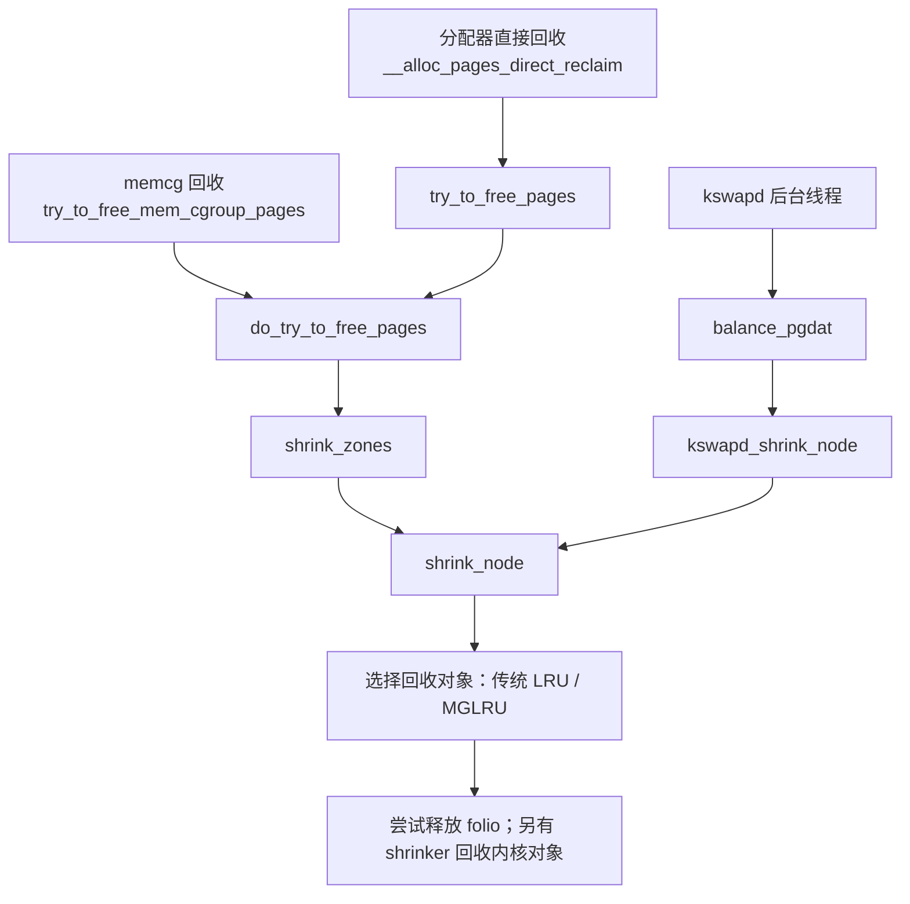

我们从一条完整路径开始：**一次分配遇到内存不足，内核如何选择候选页、尝试释放，再重新分配。** 以下对应你当前的 Linux **6.18.52** 源码，并结合可观测性解释。

读代码时始终追问四件事：**回收谁、回收多少、允许做什么、什么时候退出。**

**1. 先认清三条入口**



三条入口共享不少底层机制，但触发原因不同：

| 入口           | 触发原因                                | 谁承担执行成本                       |
| -------------- | --------------------------------------- | ------------------------------------ |
| 分配器直接回收 | 在允许的节点、zone 和分配条件下拿不到页 | 当前分配任务                         |
| memcg 回收     | cgroup 限额压力，或主动回收请求         | 进入该路径的任务；部分场景有工作线程 |
| `kswapd`       | 节点内存水位需要恢复                    | 后台内核线程                         |

注意：**全局回收也受 NUMA、cpuset、zone、GFP 等约束，并不等于能使用整机任何空闲内存。**

从 [__alloc_pages_direct_reclaim()](/Users/jinqinghui/linux-6.18/mm/page_alloc.c:4451) 看，主干可以简化成：

```c
/* 示意：省略部分分支 */
psi_memstall_enter(&pflags);

progress = __perform_reclaim(...);  /* 内部调用 try_to_free_pages() */
if (progress)
    page = get_page_from_freelist(...);

psi_memstall_leave(&pflags);
```

这里同时说明了两个排障问题：

- 直接回收会进入任务的执行路径，并被 PSI 跟踪。
- **回收有进展，不代表这次分配一定成功**：还要重新检查空闲页、分配阶数和其他约束。

---

**2. `scan_control`：理解整条链最重要的数据结构**

定义在 [struct scan_control](/Users/jinqinghui/linux-6.18/mm/vmscan.c:75)。它携带一次回收的目标、权限和进度。

| 字段                                     | 阅读时的理解                            |
| ---------------------------------------- | --------------------------------------- |
| `nr_to_reclaim`                          | 本次希望回收多少个基本页                |
| `target_mem_cgroup`                      | 目标回收域；分配器直接回收通常为 `NULL` |
| `nodemask`、`reclaim_idx`                | 允许扫描哪些节点、哪些 zone             |
| `gfp_mask`                               | 当前上下文允许哪些操作                  |
| `may_swap`、`may_unmap`、`may_writepage` | 是否允许换出、解除映射、发起回写        |
| `priority`                               | 扫描强度控制，数值越小通常扫描越积极    |
| `nr_scanned`、`nr_reclaimed`             | 扫描与回收进度                          |
| `proactive`                              | 是否为主动回收                          |
| `memcg_low_reclaim`                      | 当前是否进入允许突破 low 保护的重试阶段 |

对比两个初始化入口最容易理解它：

- [try_to_free_pages()](/Users/jinqinghui/linux-6.18/mm/vmscan.c:6590)：根据分配请求设置节点、zone、order 等条件。
- [try_to_free_mem_cgroup_pages()](/Users/jinqinghui/linux-6.18/mm/vmscan.c:6675)：显式设置 `target_mem_cgroup`，并根据调用参数设置 swap、主动回收等选项。

**同一套底层代码，通过不同的 `scan_control` 执行不同的回收策略。**

---

**3. `do_try_to_free_pages()`：控制力度、重试和退出**

看 [do_try_to_free_pages()](/Users/jinqinghui/linux-6.18/mm/vmscan.c:6361)，第一遍先抓住这个循环：

```c
/* 示意：保留主要控制逻辑 */
do {
    sc->nr_scanned = 0;
    shrink_zones(zonelist, sc);

    if (sc->nr_reclaimed >= sc->nr_to_reclaim)
        break;

    if (sc->compaction_ready)
        break;

} while (--sc->priority >= 0);
```

本版本 `DEF_PRIORITY` 为 12。传统 LRU 中，扫描量有这样的计算：

```c
scan = apply_proportional_protection(...);
scan >>= sc->priority;
```

因此，`priority` 从 12 逐步下降，相当于扩大扫描力度；它不是进程调度优先级。

循环后也不是立即 OOM。没有回收进展时，还可能：

1. 完整遍历 cgroup 树，避免并发共享遍历状态造成遗漏。
2. 强制尝试此前跳过的 active 页降级。
3. 尝试此前因 `memory.low` 保护而跳过的内存。

**这个函数主要报告回收进展。普通分配失败是否继续重试、整理内存、失败返回或进入 OOM，由上层路径进一步决定。**

---

**4. 到达 `lruvec`：先决定回收谁，再决定扫描哪类页**

在启用 memcg 时，可以把 `lruvec` 理解为：

```text
一个 memory cgroup × 一个 NUMA node 的 LRU 管理单元
```

依据是 [mem_cgroup_lruvec()](/Users/jinqinghui/linux-6.18/include/linux/memcontrol.h:705)。同一 cgroup 的页可以分布在多个节点，因此会有多个对应的 `lruvec`。

先沿传统 LRU 分支阅读：

```text
shrink_node()
  └─ shrink_node_memcgs()
       ├─ 计算当前回收域中的 memory.min / memory.low 保护
       ├─ shrink_lruvec()
       │    ├─ get_scan_count()
       │    └─ shrink_list()
       │         ├─ active   → shrink_active_list()
       │         └─ inactive → shrink_inactive_list()
       └─ shrink_slab()
```

这里有三层决策：

- [shrink_node_memcgs()](/Users/jinqinghui/linux-6.18/mm/vmscan.c:5972)：遍历目标范围内的 cgroup，计算并应用有效保护。
- [get_scan_count()](/Users/jinqinghui/linux-6.18/mm/vmscan.c:2562)：综合 swap 可用性、swappiness、回收成本、保护和扫描强度，分配 anon/file 扫描量。
- `shrink_list()`：active 链主要做活跃性判断与降级；inactive 链进入实际回收尝试。

所以：

- `inactive` 表示回收候选，**不保证马上能释放**。
- `swappiness` 影响扫描选择，不能简单解释为“内存用到某个百分比才开始 swap”。
- slab 对象走 `shrink_slab()` 等 shrinker 路径，不经过下面的页缓存释放主干。

Linux 6.18 还必须注意 MGLRU 分支：`shrink_node()` 在启用 MGLRU 且为根回收域时进入 `lru_gen_shrink_node()`；非根目标回收可在 `shrink_lruvec()` 中进入 `lru_gen_shrink_lruvec()`。两者的选页机制不同，但最终仍会使用 `shrink_folio_list()`。

运行内核是否启用 MGLRU，需要检查配置和 `/sys/kernel/mm/lru_gen/enabled`，不能只凭版本号判断。[官方说明](https://docs.kernel.org/6.18/admin-guide/mm/multigen_lru.html)

---

**5. `shrink_inactive_list()`：把“选页”和“处理页”分开**

看 [shrink_inactive_list()](/Users/jinqinghui/linux-6.18/mm/vmscan.c:2011)，先读出这个结构：

```text
持有 lru_lock
    ↓
isolate_lru_folios()：从 LRU 摘下候选页
    ↓
释放 lru_lock
    ↓
shrink_folio_list()：逐个判断、尝试回收
    ↓
重新持有 lru_lock
    ↓
move_folios_to_lru()：放回未能释放的页
```

这样做是因为后续处理可能涉及页锁、反向映射、回写等操作，不能长时间持有 LRU 自旋锁。

这里的 **isolate 指把 folio 暂时从 LRU 链表摘下来**；它与 cgroup 的资源隔离是两个概念。

也正是在这附近，可以看到 `PGSCAN_*` 和 `PGSTEAL_*` 的记账。

---

**6. `shrink_folio_list()`：为什么扫描了很多页，却释放不了？**

这是核心函数：[shrink_folio_list()](/Users/jinqinghui/linux-6.18/mm/vmscan.c:1104)。

`folio` 可以包含一个或多个基本页，代码通过 `folio_nr_pages()` 进行页数记账。第一遍不用逐行追所有特殊场景，先理解这些判断：

| 遇到的情况                   | 大致处理                              |
| ---------------------------- | ------------------------------------- |
| 拿不到 folio 锁              | 暂时保留                              |
| 不可回收，例如锁定内存       | 交回适当的管理路径                    |
| 不允许解除映射，但页仍被映射 | 保留                                  |
| 页正在回写                   | 按上下文保留、重新激活或等待          |
| 最近仍被引用                 | 可能保留或激活                        |
| 允许内存降级                 | 尝试迁移到较低层节点                  |
| 普通匿名页没有 swap backing  | 尝试准备 swap；失败则不能按此路径换出 |
| 仍映射到进程                 | `try_to_unmap()`；失败则保留          |
| 页被 pin 住                  | 不能正常释放                          |
| 脏页                         | 判断是否允许回写，必要时发起回写      |
| 引用、映射等条件满足         | 移除缓存映射、解除记账并释放          |

这里要区分两种“映射”：

- `try_to_unmap()`：处理进程页表中的映射。
- `__remove_mapping()`：从 page cache 或 swap cache 等关联结构中移除 folio，并检查引用条件。

**解除进程映射不等于已经释放物理内存。**

读大量 `goto` 时，把它们归纳成三个主要出口：

```text
keep / keep_locked
    本轮保留，之后放回

activate_locked
    设置活跃状态等，交回上层处理

free_it
    计入回收结果，批量解除 memcg 记账并释放
```

另有迁移降级路径。因此，在分层内存系统中，`nr_reclaimed` 也可能包含成功降级的页，不能一概理解为整机 RAM 使用量等量下降。

---

**7. 将源码路径对应到排障证据**

| 观察到的现象                   | 优先追踪的代码与原因                                 |
| ------------------------------ | ---------------------------------------------------- |
| P99 上升，同时直接回收耗时增加 | 分配任务进入 `__alloc_pages_direct_reclaim()`        |
| `memory.events:high` 增长      | `reclaim_high()` 及其后的回收、节流路径              |
| `pgscan` 很高、`pgsteal` 很低  | 候选页被保留：引用活跃、脏页、回写、pin、swap 条件等 |
| 回收量很大，refault 也持续上涨 | 可能在反复淘汰工作集，需要结合访问量和业务延迟验证   |
| 回收有进展，但高阶分配仍失败   | 继续看碎片、compaction、zone 和节点限制              |

特别注意：当前源码中，部分全局 `PGSCAN/PGSTEAL` 分类计数有 `!cgroup_reclaim(sc)` 条件，而 memcg 自身仍会记账。**只看 `/proc/vmstat` 的全局 direct 计数，会漏掉对容器局部回收的判断。**

第一遍实际阅读，按这个顺序即可：

```text
scan_control
→ try_to_free_pages
→ do_try_to_free_pages
→ shrink_node_memcgs
→ shrink_lruvec
→ shrink_inactive_list
→ shrink_folio_list
```

先用一个具体对象贯穿它们：**“一个干净、未映射、没有额外引用的冷文件 folio，如何从 inactive LRU 被摘下，最终释放？”** 读通这条成功路径后，再分别加入“最近被访问”“脏页”“匿名页”“memcg 保护”四种条件，复杂分支就容易理解了。