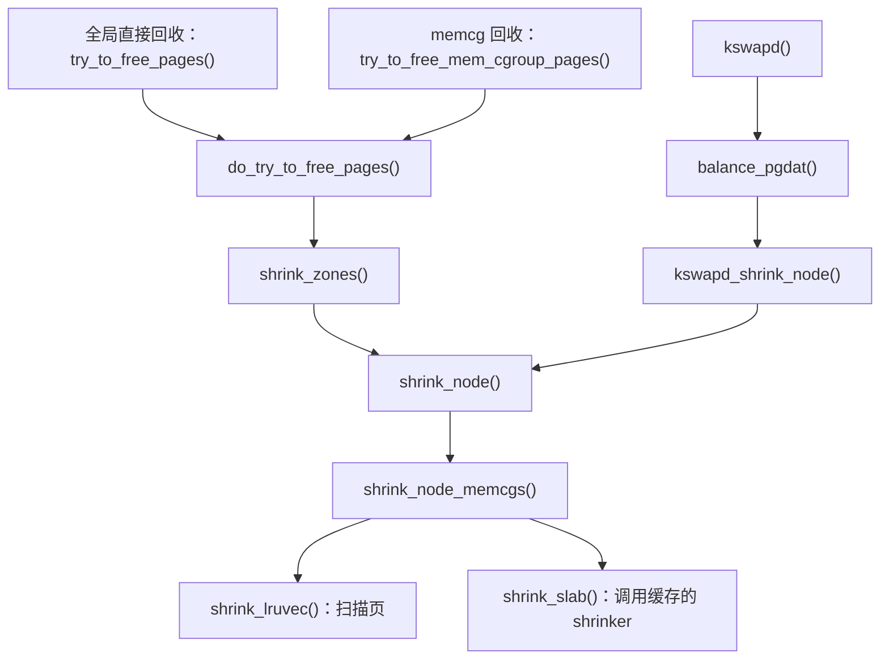

# 内存回收：从一次页分配读懂触发、扫描与释放

本文依据仓库中的 Linux **6.18.52** 源码，版本见 [顶层 Makefile](../../linux/Makefile#L2)。本章围绕一个问题展开：**新请求需要物理内存，但分配器暂时拿不到合适的页，内核接下来怎么办？**

学习时先理解回收对象，再跟随一次普通页分配，最后深入扫描代码。前四节建立整体认识，第五至八节解释回收怎样执行，第九节以后再讨论 memcg、失败处理和主动回收。文中的数值例子只用于解释流程；实际行为以此次分配的参数、内核配置和源码分支为准。

## 1. 为什么已经被使用的内存还可以回收？

### 1.1 先看一个文件缓存的例子

假设进程 A 通过普通缓冲读读取一个文件。内核把文件内容放入页缓存，后续读取可以直接使用这份内存数据。当这部分内容一段时间没有被访问，而进程 B 又需要物理页时，内核可以尝试移除这些文件缓存页。

这里能够释放内存，是因为普通文件中仍有数据的来源。下次再读这段文件，缓存未命中时，内核可以重新读取。回收的是内存中的缓存副本，文件内容仍然存在。源码中，[`__remove_mapping()` 的文件缓存分支](../../linux/mm/vmscan.c#L785)移除缓存对象；[`filemap_read()`](../../linux/mm/filemap.c#L2710)说明了缓存缺失时通过预读和 `read_folio` 获取数据的路径。

但这个过程有条件：如果缓存中的内容已经修改，新的内容还没有完成回写，就不能直接丢掉；如果缓存对象仍被额外引用，也可能暂时无法释放。见 [释放前的引用计数与脏标志检查](../../linux/mm/vmscan.c#L742)。

### 1.2 不同内存有不同的处理办法

先按“内容能从哪里恢复”理解回收对象：

| 对象 | 为什么占用物理内存 | 回收时要解决什么 |
| --- | --- | --- |
| 普通文件的干净缓存页 | 保存可从文件重新读取的数据 | 满足引用、映射等条件后，可以移除缓存并释放物理页 |
| 普通文件的脏缓存页 | 保存尚未完成回写的新数据 | 先让新数据完成回写，再判断能否释放 |
| 普通匿名页 | 保存进程写入、没有普通文件提供数据后备的运行数据 | 通常需要 swap 保存内容，才能释放原来的物理页 |
| 可缩减的内核对象缓存 | 保存目录项、inode 等内核对象 | 由相应子系统判断对象是否仍在使用，再通过 shrinker 缩减 |

这些处理分别对应 [文件缓存移除](../../linux/mm/vmscan.c#L767)、[普通文件脏页处理](../../linux/mm/vmscan.c#L680)、[匿名页分配 swap](../../linux/mm/vmscan.c#L1302) 和 [目录项、inode 缓存回收](../../linux/fs/super.c#L203)。

**swap** 可以先理解为匿名页内容的另一处存放位置。匿名页被换出后，进程以后再访问相应地址，可以通过缺页处理把内容取回。回收期间需要处理页表映射，不能让进程继续访问已经交给别人使用的物理页。见 [回收中解除映射](../../linux/mm/vmscan.c#L1371)、[换入缺页处理](../../linux/mm/memory.c#L4596) 和 [读取 swap 内容](../../linux/mm/memory.c#L4723)。

表中的“文件页”主要指普通文件缓存。tmpfs/shmem 虽然提供文件接口，但其内存属于需要 RAM 或 swap 支撑的类别，不能直接套用“文件里已经有副本”的判断。源码的 [`folio_is_file_lru()`](../../linux/include/linux/mm_inline.h#L13)明确区分了这些情况。

### 1.3 回收的代价是什么？

释放干净缓存后，再次读取可能需要 I/O；匿名页换出后，再次访问可能需要换入；扫描、加锁和处理页表本身也消耗 CPU。因此，回收不仅要考虑“能否释放”，还要尽量避免把很快又会使用的内容赶出去。

内核会检查近期访问情况，也会记录被回收后又被访问的情况，后者称为 **refault**。这些信息帮助内核调整后续扫描。见 [访问情况检查](../../linux/mm/vmscan.c#L903)、[保存用于识别 refault 的记录](../../linux/mm/vmscan.c#L790) 和 [回收成本计算](../../linux/mm/vmscan.c#L2461)。后面讨论 LRU 时，会继续使用这个思路。

## 2. 页分配器判断的“内存不够”是什么？

### 2.1 先分清 page、folio 和 order

**基础页**的大小由 `PAGE_SIZE` 表示。**folio** 是内核一起管理的一块连续内存，大小至少为一个基础页，也可以包含多个基础页；不能把每个 folio 都理解成固定大小的一页。定义见 [`struct folio` 的说明](../../linux/include/linux/mm_types.h#L369)。

页分配的 **`order`** 表示请求 `2^order` 个连续基础页。例如，`order=0` 请求一页，`order=2` 请求四页组成的连续页块。如果假设基础页为 4 KiB，那么后者就是 16 KiB；这个例子不表示所有架构的基础页都是 4 KiB。源码使用 `1 << order` 计算页数，见 [页块初始化](../../linux/mm/page_alloc.c#L741)。

这已经揭示了一种失败原因：即使空闲页总数够，分配器也可能找不到足够大的连续页块。高阶水位检查会额外查找合适的空闲块，见 [`__zone_watermark_ok()`](../../linux/mm/page_alloc.c#L3619)。

### 2.2 空闲页还必须在允许的位置

内核按 **node** 和 **zone** 组织物理内存。NUMA 系统把内存组织成节点，内核用 node 对应的数据结构描述其内存布局；一个 node 内又按用途和分配约束划分 zone，例如满足设备寻址限制的 DMA 区域和普通内存区域。一次申请会带上允许使用的 zone 范围、节点限制等条件，分配器沿候选 zone 列表查找。zone 的划分示例见 [`enum zone_type`](../../linux/include/linux/mmzone.h#L784)。

例如，某个节点还有很多空闲页，但此次请求受节点策略限制，不能去那里分配；或者某类空闲页不适用于这次请求。这些页就不能用来直接满足当前申请。因此，读回收源码时，要先问“**当前请求能使用哪些内存？**”源码对照：[node 与 zone 的关系](../../linux/include/linux/mmzone.h#L1377)、[候选 zone 遍历与限制](../../linux/mm/page_alloc.c#L3785)。

### 2.3 GFP 标志决定能采取哪些补救动作

`gfp_mask` 是本次分配携带的标志集合。它除了影响从哪里分配，还决定能不能为了得到内存而等待、发起 I/O、进入文件系统等。

| 标志 | 和回收相关的含义 |
| --- | --- |
| `__GFP_KSWAPD_RECLAIM` | 允许请求唤醒 `kswapd` 做后台回收 |
| `__GFP_DIRECT_RECLAIM` | 允许当前申请任务进入直接回收，任务可能因此等待 |
| `__GFP_IO` | 允许发起物理 I/O |
| `__GFP_FS` | 允许进入底层文件系统；某些持锁上下文必须限制这一动作 |

这些语义写在 [GFP 回收标志的源码注释](../../linux/include/linux/gfp_types.h#L185)中。例如，`GFP_KERNEL` 包含上述回收、I/O 和文件系统权限；`GFP_NOWAIT` 可以请求唤醒后台回收，但不包含直接回收权限。见 [常用 GFP 组合](../../linux/include/linux/gfp_types.h#L377)。

到这里，可以把一次页分配理解成一个带条件的请求：**需要多大的连续块、允许从哪里拿、拿不到时允许做哪些事。**

## 3. 沿一次普通页分配，认识后台回收和直接回收

### 3.1 第一次先尝试直接取页

在 [`__alloc_frozen_pages_noprof()`](../../linux/mm/page_alloc.c#L5259)中，初始分配标志使用 `ALLOC_WMARK_LOW`，表示按 `low` 水位检查空闲页余量。分配器先调用 `get_page_from_freelist()` 查找可用页，成功就返回；首次尝试失败，进入 `__alloc_pages_slowpath()`。水位的具体含义在第四节展开。

“慢路径”可以理解为：快速拿页没有成功，需要重新检查权限并采取更多补救措施。**进入慢路径并不表示已经执行了直接回收。**

### 3.2 慢路径先调整条件，再尝试分配

慢路径调用 `gfp_to_alloc_flags()` 重新计算分配标志，常规水位从 `ALLOC_WMARK_MIN` 开始。如果允许唤醒后台回收，就调用 `wake_all_kswapds()`，随后当前任务再次调用 `get_page_from_freelist()`。

这次重试可能直接成功，因为它与首次尝试使用的分配条件已经不同。源码对照：[计算慢路径标志](../../linux/mm/page_alloc.c#L4514)、[调整权限、唤醒和重试](../../linux/mm/page_alloc.c#L4774)。分支顺序、重试上限和失败出口见 [慢路径详解](slowpath.md)。

### 3.3 后台回收由 kswapd 执行

内核为相应节点创建名为 `kswapd%d` 的线程，见 [`kswapd_run()`](../../linux/mm/vmscan.c#L7472)。它被唤醒后进入 `balance_pgdat()`，组织节点扫描，尝试恢复适合分配的空闲内存状态。

**唤醒请求和实际执行之间存在时间差。** 请求唤醒后，当前申请任务会继续自己的分配路径；不能理解为“调用唤醒函数，`kswapd` 就已经回收到了一页”。如果当前任务的重试仍失败，它和 `kswapd` 可能同时参与回收。两条执行路径见 [分配侧唤醒后立即重试](../../linux/mm/page_alloc.c#L4805)、[`kswapd` 线程循环](../../linux/mm/vmscan.c#L7329)。

唤醒请求也可能被过滤。例如，线程已经在工作、节点已经平衡且没有水位提升，或者节点连续回收失败，都可能让 `wakeup_kswapd()` 提前返回。见 [唤醒过滤条件](../../linux/mm/vmscan.c#L7406)。

### 3.4 直接回收由当前任务执行

如果后续重试仍拿不到页，且 `__GFP_DIRECT_RECLAIM` 允许直接回收，当前任务就可能亲自扫描并释放内存。慢路径还会检查 `PF_MEMALLOC`，避免回收上下文再次递归进入直接回收。见 [直接回收前的判断](../../linux/mm/page_alloc.c#L4914)。

主要调用关系如下：

```text
当前任务
  __alloc_pages_direct_reclaim()
    → __perform_reclaim()
      → try_to_free_pages()
    → get_page_from_freelist()：回收后重新尝试分配

后台线程
  kswapd()
    → balance_pgdat()
      → kswapd_shrink_node()
```

直接回收路径见 [`__alloc_pages_direct_reclaim()`](../../linux/mm/page_alloc.c#L4451)，后台路径见 [`balance_pgdat()` 的扫描调用](../../linux/mm/vmscan.c#L7102)和 [`kswapd_shrink_node()`](../../linux/mm/vmscan.c#L6902)。

对应用而言，两者的关键区别是：直接回收发生在当前任务继续执行之前，会把扫描和等待的代价加到这次申请上；后台回收把主要回收工作交给另一个线程。内核在直接回收周围记录内存停顿，见 [直接回收的停顿统计](../../linux/mm/page_alloc.c#L4464)。

## 4. 水位如何把分配与回收连接起来？

### 4.1 min、low、high 是每个 zone 的空闲页门槛

水位以页数参与判断。源码按 zone 管理的页数以及 `min_free_kbytes`、`watermark_scale_factor` 等参数设置水位，通常形成 `min < low < high` 的关系，见 [`__setup_per_zone_wmarks()`](../../linux/mm/page_alloc.c#L6456)。

| 水位 | 在普通分配路径中的作用 | 源码 |
| --- | --- | --- |
| `low` | 首次分配尝试使用的水位；不能满足时可能转入慢路径 | [初始标志](../../linux/mm/page_alloc.c#L5263) |
| `min` | 慢路径常规分配标志的起点；特殊分配还可能动用部分保留页 | [慢路径标志](../../linux/mm/page_alloc.c#L4514)、[保留页调整](../../linux/mm/page_alloc.c#L3578) |
| `high` | `kswapd` 判断请求范围内是否已达到平衡时通常使用的目标 | [`pgdat_balanced()`](../../linux/mm/vmscan.c#L6780) |

这也解释了为什么首次分配和慢路径使用不同水位：首次尝试较保守，慢路径会更仔细地确定本次请求的权限，并在允许时请求后台补充空闲页。

### 4.2 用三个时刻理解水位

只为说明流程，假设只有一个候选 zone，请求 `order=0`，允许后台和直接回收；忽略保留页、水位提升和并发变化。设 `min=100`、`low=150`、`high=200` 页。

| 假设的空闲页数 | 按上述简化条件理解 |
| --- | --- |
| 180 页 | `low` 检查可以通过，首次分配可能成功 |
| 140 页 | 首次尝试不能通过 `low`；进入慢路径后可以请求后台回收，并可能按 `min` 条件成功分配 |
| 90 页 | 常规 `min` 条件也不能满足；继续重试仍失败且允许时，当前任务可能进入直接回收 |

这个例子要说明的是：**慢路径可能一边请求后台回收，一边自己成功取得内存；直接回收则取决于后续分配是否仍然失败以及权限是否允许。** 三个数值都不是实际系统的固定配置。

实际检查比表格更严格：代码先扣除当前请求不能使用的空闲页，再比较水位和 `lowmem_reserve`；高阶请求还要检查合适的连续空闲块。因此，不能只拿一个空闲页总数与 `min/low/high` 做简单比较。见 [完整水位检查](../../linux/mm/page_alloc.c#L3568)。

### 4.3 kswapd 要回收到什么时候？

普通情况下，`balance_pgdat()` 反复检查节点是否平衡。在本版本中，`pgdat_balanced()` 检查请求允许的 zone 范围，存在满足条件的 zone 就可以判为平衡，并非要求节点内每个 zone 都达到 `high`。没有额外水位提升需求时，平衡判定可以结束这一轮后台回收。见 [平衡判定](../../linux/mm/vmscan.c#L6780)、[回收循环退出条件](../../linux/mm/vmscan.c#L7049)。

回收结束后，`kswapd` 会尝试短暂睡眠并再次检查条件，再决定是否进入持续睡眠。高阶请求还可能唤醒 `kcompactd` 做规整。见 [`kswapd_try_to_sleep()`](../../linux/mm/vmscan.c#L7207)。

进阶阅读时再关注两个修正：内存分层模式可能改用 `promo` 水位；`watermark_boost` 可能带来额外回收工作。它们分别位于 [分层内存水位选择](../../linux/mm/vmscan.c#L6794)和 [水位提升处理](../../linux/mm/vmscan.c#L6997)。

## 5. 进入扫描代码：这次回收要做多少、从哪里做？

### 5.1 scan_control 保存一次回收的目标与限制

`scan_control` 是理解 `vmscan.c` 的关键。它把“调用者为什么需要回收”转成扫描代码能够执行的条件。

| 字段 | 阅读时把它理解成的问题 |
| --- | --- |
| `nr_to_reclaim` | 这次希望取得多少页的回收进展？ |
| `target_mem_cgroup` | 是否针对某个 memory cgroup，也就是某组单独计费的内存？ |
| `nodemask`、`reclaim_idx` | 允许处理哪些节点、哪些 zone？ |
| `gfp_mask` | 当前上下文允许 I/O、进入文件系统等动作吗？ |
| `may_unmap` | 允许处理仍被进程页表映射的 folio 吗？ |
| `may_swap`、`may_writepage` | 允许换出、写出吗？这些是权限，实际能否执行还要继续检查 |
| `order` | 原分配请求需要多大的连续页块？ |
| `priority` | 这一轮使用多大的扫描强度？ |
| `nr_scanned`、`nr_reclaimed` | 已经扫描了多少、取得了多少回收进展？ |

字段定义见 [`struct scan_control`](../../linux/mm/vmscan.c#L75)。全局直接回收的初始化见 [`try_to_free_pages()`](../../linux/mm/vmscan.c#L6590)；memcg 入口额外设置目标组，见 [`try_to_free_mem_cgroup_pages()`](../../linux/mm/vmscan.c#L6683)。目标数量是扫描工作的目标，不保证一定能达成，也不要求恰好只回收这么多页。

### 5.2 先找到节点，再找到 lruvec

回收通常以 **node 与 memcg 的组合**定位一个 `lruvec`。可以把它理解为“这一组内存，在这个节点上，用来管理回收候选页的结构”。同一组在两个节点上占用内存时，会分别使用对应的 `lruvec`。没有启用内存控制器时，使用节点自身的 `lruvec`。见 [`mem_cgroup_lruvec()`](../../linux/include/linux/memcontrol.h#L696)。

下面给出传统 LRU 路径的调用关系。MGLRU 启用时存在分支，下一节单独说明。



源码对照：[直接回收循环](../../linux/mm/vmscan.c#L6361)、[从候选 zone 找到节点](../../linux/mm/vmscan.c#L6259)、[节点内遍历 memcg](../../linux/mm/vmscan.c#L5972)、[页与对象缓存两个扫描入口](../../linux/mm/vmscan.c#L6029)。

这里不必一次记住所有函数名。先把职责分成三层：**外层确定范围和目标，中层决定扫描哪些候选，内层判断一个对象能否释放。**

### 5.3 为什么回收会越扫越用力？

`do_try_to_free_pages()` 从初始 `priority` 开始扫描。如果尚未达到目标，也没有满足转去规整等退出条件，就继续减小 `priority` 的数值。

在传统 LRU 中，扫描数量的计算包含下面两句：

```c
scan = apply_proportional_protection(memcg, sc, lruvec_size);
scan >>= sc->priority;
```

见 [扫描数量计算](../../linux/mm/vmscan.c#L2635)。右移的位数越小，同样规模的候选列表通常会产生越多的扫描量。所以在这里，**`priority` 数值降低，意味着扫描力度通常增加**。它与进程调度优先级是不同概念。外层递减逻辑见 [回收循环](../../linux/mm/vmscan.c#L6374)。

如果一轮扫描完全没有进展，代码还可能扩大 memcg 遍历范围、强制尝试去活跃，或重试原先因 `memory.low` 而跳过的内存。读到“没回收到页”时，应继续看后面的重试条件，见 [无进展后的补充尝试](../../linux/mm/vmscan.c#L6415)。

## 6. 先挑候选：LRU 怎样判断谁更适合回收？

### 6.1 传统 LRU 的 active 和 inactive

LRU 的全称是 Least Recently Used，即“最近最少使用”。这里可以把它理解为：内核根据访问情况，维护一组用于估计使用冷热程度的列表。

传统 LRU 把候选内存分成两类，再分别区分活跃和不活跃状态：

| 列表 | 主要含义 |
| --- | --- |
| `LRU_ACTIVE_FILE` | 被视为较活跃的文件类 folio |
| `LRU_INACTIVE_FILE` | 文件类回收候选 folio |
| `LRU_ACTIVE_ANON` | 被视为较活跃的匿名类 folio |
| `LRU_INACTIVE_ANON` | 匿名类回收候选 folio |
| `LRU_UNEVICTABLE` | 当前不能按普通 LRU 方式驱逐的 folio |

列表定义见 [`enum lru_list`](../../linux/include/linux/mmzone.h#L316)。这里的 file/anon 是 LRU 分类，包含前面提到的 tmpfs、`MADV_FREE` 等特殊情况，分类规则见 [`folio_is_file_lru()`](../../linux/include/linux/mm_inline.h#L13)。

`shrink_list()` 会按列表类型分派工作：active 列表主要经过 `shrink_active_list()` 做老化、去活跃等处理；inactive 列表进入 `shrink_inactive_list()`，取出一批候选，再交给 `shrink_folio_list()` 尝试释放。见 [列表分派](../../linux/mm/vmscan.c#L2283)、[去活跃处理](../../linux/mm/vmscan.c#L2183)、[隔离并处理 inactive 候选](../../linux/mm/vmscan.c#L2040)。

**inactive 表示值得检查，不能直接等同于可以释放。** 扫描到一个近期又被访问的 folio，内核可能保留它或重新激活；被 `mlock` 锁住的内存等也要特殊处理。见 [引用判断与重新激活](../../linux/mm/vmscan.c#L903)、[不可驱逐检查](../../linux/mm/internal.h#L481)。

### 6.2 文件页和匿名页谁先回收？

内核不会固定执行“把文件缓存全清光，再开始换出匿名页”。传统 LRU 的 `get_scan_count()` 会结合可用 swap、是否允许 swap、各列表规模、近期回收成本以及 `swappiness`，决定本轮如何分配扫描量。某些条件下只扫描文件类，另一些条件下可能重点扫描匿名类。见 [`get_scan_count()`](../../linux/mm/vmscan.c#L2562)。

`swappiness` 参与比较匿名页换入与文件页重新读取的相对成本。它影响回收过程中的选择，不能解释成“内存使用达到这个百分比就启动 swap”。源码对这个成本模型有直接说明，见 [`calculate_pressure_balance()`](../../linux/mm/vmscan.c#L2461)。

还需要同时看“有没有处理手段”：普通匿名页需要保存内容，但当前没有可用 swap、也不能通过内存降级迁移处理时，就不能仅靠加大扫描力度把它释放掉。见 [匿名页是否具有回收途径](../../linux/mm/vmscan.c#L359)、[跳过匿名扫描的条件](../../linux/mm/vmscan.c#L2573)。

### 6.3 MGLRU 改变了候选页的组织方式

MGLRU 是 Multi-Gen LRU，即多代 LRU。它用多个“代”记录访问新旧程度，而不只依赖 active/inactive 两档来组织可驱逐页。源码中，`max_seq` 记录最年轻的代，`min_seq[]` 分别记录匿名类和文件类最老的代；老化推进年轻代，驱逐推进老代。见 [多代结构及说明](../../linux/include/linux/mmzone.h#L478)。

阅读本版本时要注意两处分支：全局扫描可能在 `shrink_node()` 转入 `lru_gen_shrink_node()`；定向扫描可能在 `shrink_lruvec()` 转入 `lru_gen_shrink_lruvec()`。见 [节点级分支](../../linux/mm/vmscan.c#L6055)、[lruvec 级分支](../../linux/mm/vmscan.c#L5795)。

初学时先掌握传统路径的职责划分，再读 MGLRU 的候选选择。两者最终都需要解决引用、映射和脏页等释放条件；MGLRU 的驱逐代码同样调用 `shrink_folio_list()`，见 [候选 folio 的统一处理](../../linux/mm/vmscan.c#L4725)。

## 7. 真正尝试释放：一个 folio 要经过哪些关卡？

### 7.1 从 LRU 取出来，只是开始处理

`shrink_inactive_list()` 会先在锁保护下，把一批 folio 从 LRU 隔离到临时链表，然后释放 LRU 锁，再逐个处理。这样可以避免把后续较慢的处理一直放在 LRU 锁内。处理结束后，未能释放的候选会被放回 LRU。见 [隔离、解锁、处理和放回](../../linux/mm/vmscan.c#L2040)。

下面按 [`shrink_folio_list()`](../../linux/mm/vmscan.c#L1104)的关键判断顺序整理。表格省略了大 folio 拆分等分支，便于先看懂一次释放为什么成功或失败。

| 检查阶段 | 主要问题 | 不满足时常见处理 |
| --- | --- | --- |
| 1. 尝试加锁 | 当前能独占处理这个 folio 吗？ | 加锁失败就暂时保留 |
| 2. 判断资格 | folio 是否可驱逐？上下文是否允许解除现有映射？ | 保留或转入相应保护路径 |
| 3. 检查回写与访问 | 是否仍在回写？近期是否又被使用？ | 保留、重新激活，或按条件等待 |
| 4. 准备内容的去处 | 匿名内容是否需要 swap？能否取得 swap 空间？ | 无法保存内容就不能继续普通换出 |
| 5. 处理页表映射 | 能否解除进程对物理页的映射？是否存在 DMA 固定？ | 映射未解除或仍被固定时保留 |
| 6. 处理脏状态 | 内容是否已经安全保存？当前允许写出吗？ | 标记、等待后续回写或保留 |
| 7. 移除缓存并释放 | 能否通过最后的引用计数等检查？ | 成功则释放，失败则保留 |

源码位置依次是 [加锁与资格](../../linux/mm/vmscan.c#L1135)、[回写状态](../../linux/mm/vmscan.c#L1187)、[引用判断](../../linux/mm/vmscan.c#L1277)、[准备 swap](../../linux/mm/vmscan.c#L1302)、[解除映射与固定检查](../../linux/mm/vmscan.c#L1371)、[脏状态处理](../../linux/mm/vmscan.c#L1417)、[移除并释放](../../linux/mm/vmscan.c#L1545)。

### 7.2 情形一：一个干净、冷的普通文件 folio

假设它不再被频繁访问，可以加锁，没有阻止释放的额外引用；若仍有用户页表映射，也能够成功解除。由于文件中保留着数据，且 folio 是干净的，内核无需为这次回收额外写出内容。

通过最后检查后，`__remove_mapping()` 将它从文件缓存中移除，后续通过 `free_unref_folios()` 等步骤释放。这个过程最接近“把不常用的缓存腾出来”。见 [文件缓存移除](../../linux/mm/vmscan.c#L767)、[批量解除计费与释放](../../linux/mm/vmscan.c#L1559)。

### 7.3 情形二：一个普通文件的脏 folio

脏意味着内存里有还需要保存的新内容，不能照搬上一种情况。这里要特别结合本版本源码阅读：**`pageout()` 不直接写出普通文件系统的 folio，普通文件回写交给专门的回写路径处理。** 该函数保留了匿名页与 tmpfs/shmem 等分支，见 [`pageout()` 的说明与判断](../../linux/mm/vmscan.c#L680)。

因此，回收扫描遇到脏页时，可能标记后保留；遇到已经回写中的页时，也会根据上下文决定保留或等待。扫描发现大量尚未提交回写的脏页，还可以唤醒 flusher 线程推动回写。见 [脏 folio 的保留条件](../../linux/mm/vmscan.c#L1417)、[传统 LRU 唤醒回写线程](../../linux/mm/vmscan.c#L2078)、[MGLRU 对应处理](../../linux/mm/vmscan.c#L4900)。

所以，“扫描到脏页”与“这个页已经释放”之间，可能隔着一次回写完成和后续重新扫描。即便回写结束，引用等条件仍需检查。

### 7.4 情形三：一个需要保存内容的普通匿名 folio

匿名内存通常没有普通文件作为现成的数据来源。若它尚未进入 swap cache，回收代码会尝试分配 swap 空间；之后处理用户映射，并在需要时写出内容。已经有合适 swap 状态的 folio 不必每次重新做一遍全部步骤。见 [匿名页的 swap 准备](../../linux/mm/vmscan.c#L1307)。

**swap cache 仍是内存中的缓存**，用来按 swap 位置找到相应 folio。进入 swap cache 并不表示写出已经完成，更不表示物理页已经释放。可以对照 [按 swap 位置查找 folio](../../linux/mm/swap_state.c#L75)和 [准备 swap 后继续标脏](../../linux/mm/vmscan.c#L1346)，理解“关联了保存位置”和“内容已经保存”这两个阶段。

这一过程可能被多个条件阻止：不允许 I/O、没有合适的 swap 空间、folio 被固定，或者页表映射无法解除。相应检查见 [I/O 权限和固定状态](../../linux/mm/vmscan.c#L1309)、[swap 分配失败处理](../../linux/mm/vmscan.c#L1327)、[解除映射失败处理](../../linux/mm/vmscan.c#L1396)。

写出也不等于立即释放。若 I/O 尚未完成，或者 folio 又变脏，代码会保留它。见 [写出后的复查](../../linux/mm/vmscan.c#L1473)。匿名页还有应用已声明内容可以丢弃的 lazyfree 等特殊情况，见 [lazyfree 分支](../../linux/mm/vmscan.c#L1545)；初学时先理解上面这条“内容必须保存”的普通路径。

### 7.5 扫描数量和回收数量为什么不同？

假设本轮检查了 100 个基础页，只有 20 个满足释放条件，其余还在使用、正在回写或无法解除映射。那么扫描已经做了工作，但释放进展只有其中一部分。

源码分别维护 `nr_scanned` 和 `nr_reclaimed`，并通过 `folio_nr_pages()` 按基础页数量计数。一个大 folio 可能贡献多个页，不能把统计值直接当成 folio 个数。见 [扫描计数](../../linux/mm/vmscan.c#L1155)、[释放计数](../../linux/mm/vmscan.c#L1564)。

这也是观察回收时不能只问“扫描有没有发生”的原因。还需要追问：**扫描的对象是什么，停在哪个条件，最终是否让当前请求取得进展？**

## 8. 另一条回收路径：shrinker 怎样处理内核缓存？

页缓存和匿名页之外，内核还维护目录项、inode 等对象缓存。这些对象是否能释放，需要所属子系统判断。回收框架通过 **shrinker** 调用它们提供的接口。

shrinker 的两个核心回调是 `count_objects()` 和 `scan_objects()`：前者估计可处理对象数量，后者执行实际扫描和释放。定义见 [`struct shrinker`](../../linux/include/linux/shrinker.h#L63)，调用见 [`do_shrink_slab()`](../../linux/mm/shrinker.c#L380)。

例如，文件系统的 `super_cache_scan()` 会统计并扫描目录项、inode 及文件系统自己的缓存，还会检查当前是否允许进入文件系统。见 [文件系统缓存扫描](../../linux/fs/super.c#L178)。这说明 GFP 权限不仅影响 swap 和文件页，也会限制对象缓存回收。

还要区分两个数量：`shrink_slab()` 返回的是回收的**对象数**，并非统一意义上的物理页数。一个 slab 可以理解为容纳多个对象的内存块；释放一个小对象，可能只是让这个内存块多出一个空位。底层 slab 满足释放条件后，才进一步归还页。见 [`shrink_slab()` 返回值说明](../../linux/mm/shrinker.c#L603)、[空 slab 的释放条件](../../linux/mm/slub.c#L5988)。

## 9. memcg 回收：物理内存还有，为什么这个组仍要回收？

### 9.1 把物理页分配和组内计费分开理解

memory cgroup，简称 **memcg**，用于对一组内存使用单独计费和限制。它增加了另一类压力：即使全局有可用物理页，这个组仍可能没有足够的计费额度。

例如，假设某组的 `memory.max` 是 1 GiB，使用量已经接近上限，新的计费会超过它。机器上即使还有数 GiB 空闲内存，也不能仅凭全局空闲量断定计费会成功。计费会沿组的祖先链检查，失败位置可能是本组，也可能是祖先组。见 [`page_counter_try_charge()`](../../linux/mm/page_counter.c#L109)。

这里的回收目标是超限组所覆盖的内存范围。`try_to_free_mem_cgroup_pages()` 把目标写进 `scan_control.target_mem_cgroup`，再复用扫描路径。见 [memcg 回收入口](../../linux/mm/vmscan.c#L6675)。本节讨论 `memory.high/max` 等 cgroup v2 接口。

### 9.2 memory.high：允许超出，但施加回收压力和延迟

`memory.high` 是压力线。计费成功后的检查发现本组或祖先组超过 `high`，内核会安排回收：任务上下文通常给当前任务记录后续回收工作，并安排返回用户态时处理；满足条件时也可以提前同步处理。非任务上下文可以安排工作线程。见 [计费后的安排](../../linux/mm/memcontrol.c#L2448)。

处理时，`reclaim_high()` 对超出 `high` 的组调用定向回收；如果回收跟不上，`__mem_cgroup_handle_over_high()` 还会计算延迟，抑制继续增长。`high` 处理本身不使用 OOM killer，即内存不足时的杀进程机制。见 [`reclaim_high()`](../../linux/mm/memcontrol.c#L2033)、[回收与延迟逻辑](../../linux/mm/memcontrol.c#L2210)。

因此，超过 `high` 后可能看到使用量仍然高于该值，同时任务因回收或节流而变慢。`high` 并不承诺把每次超出的使用量立即压回线内。

### 9.3 memory.max：计费失败后回收、重试，必要时进入 OOM

`try_charge_memcg()` 在计费失败后，先确定哪个组超限。允许阻塞等条件满足时，对该组调用 `try_to_free_mem_cgroup_pages()`，然后重新判断额度并重试。回收和重试仍不能解决问题时，才可能进入 memcg OOM。见 [计费失败与回收](../../linux/mm/memcontrol.c#L2323)、[重试和 OOM 分支](../../linux/mm/memcontrol.c#L2371)。

可以按下面的顺序理解：

```text
新计费不能通过本组或祖先组的 max
  → 对超限组尝试回收
  → 重新检查额度并重试计费
  → 根据回收进展、重试次数和 GFP 条件继续处理
  → 可能计费成功、失败返回，或进入 memcg OOM
```

`max` 是强于 `high` 的计费限制，但源码仍为回收上下文等保留特殊处理，存在临时强制计费分支。不要把它理解成任何时刻都绝不可能超过的数值不变量。见 [避免回收递归](../../linux/mm/memcontrol.c#L2340)、[强制计费分支](../../linux/mm/memcontrol.c#L2420)。

写入更低的 `memory.high` 或 `memory.max` 也会处理已有超额用量；本版本中，使用 `O_NONBLOCK` 写入时会跳过写入任务里的同步处理。见 [`memory_high_write()`](../../linux/mm/memcontrol.c#L4378)、[`memory_max_write()`](../../linux/mm/memcontrol.c#L4433)。

### 9.4 memory.min 和 memory.low：决定哪些组受到保护

这两个接口主要参与选择回收对象。应先与 zone 水位区分：zone 的 `min/low/high` 检查**空闲页与分配条件**；memcg 的 `memory.min/low` 根据**组的用量及有效保护额度**决定回收时如何保护它。

| 接口 | 在适用的回收范围内如何保护 |
| --- | --- |
| `memory.min` | 用量不超过有效 `min` 保护额度的组会被跳过，属于硬保护 |
| `memory.low` | 用量不超过有效 `low` 保护额度的组先被跳过；没有回收进展时，允许后续重试突破这一保护 |

源码先计算层级保护，再判断是否跳过，见 [保护计算与跳过](../../linux/mm/vmscan.c#L6007)、[突破 low 的重试](../../linux/mm/vmscan.c#L6453)。实际比较使用的是有效值 `emin/elow`，不能只看单个配置值，见 [有效保护值判断](../../linux/include/linux/memcontrol.h#L621)。

**保护还取决于谁是本次回收目标。** 目标 memcg 自身的 `min/low` 保护会被忽略，其后代则继续按相应规则计算。否则，一个组可能一边超过自身额度，一边依靠自身保护阻止定向回收。这个边界由 [`mem_cgroup_unprotected()`](../../linux/include/linux/memcontrol.h#L609)明确处理。

## 10. 回收完成以后，为什么分配仍可能失败？

### 10.1 回收成功和分配成功是两次判断

直接回收返回后，`__alloc_pages_direct_reclaim()` 再次调用 `get_page_from_freelist()`。扫描产生了进展，并不等于已经为原申请保留了一块完全合适的内存：水位、节点范围、连续性和并发分配都会影响最终结果。见 [回收后重新分配](../../linux/mm/page_alloc.c#L4464)。

例如，请求需要四个连续基础页，回收释放了四个分散的位置，连续块仍然可能不存在。这时内存规整会尝试迁移可移动页，使空闲空间更集中。规整保留被迁移内容，重点解决空间布局问题；回收则尝试释放占用。见 [高阶空闲块检查](../../linux/mm/page_alloc.c#L3619)、[规整中的页迁移](../../linux/mm/compaction.c#L2647)。

分配慢路径会组合使用回收、规整和重试。部分高阶请求可能先尝试规整，所以不能把简化教学流程当作所有 `order` 的固定调用顺序。见 [提前尝试规整的条件](../../linux/mm/page_alloc.c#L4816)、[后续回收与规整](../../linux/mm/page_alloc.c#L4927)。

### 10.2 OOM 是后续处理，不能用一个水位直接推断

全局分配在回收、规整和允许的重试之后，才可能走到 `__alloc_pages_may_oom()`；部分 GFP 请求会提前失败，某些请求则继续重试。见 [重试决策](../../linux/mm/page_alloc.c#L4939)、[全局 OOM 入口](../../linux/mm/page_alloc.c#L4981)。

memcg OOM 则发生在计费限制相关的路径中。分析 OOM 时，先区分是物理分配约束还是组额度约束，再看该范围内为什么没有足够的回收进展。前者的入口在 [页分配慢路径](../../linux/mm/page_alloc.c#L4981)，后者在 [memcg 计费重试](../../linux/mm/memcontrol.c#L2414)。

### 10.3 进阶：回收进展不总等于全机空闲页增加

在支持内存分层和降级迁移的场景中，回收路径可以把 folio 迁往其他节点，腾出当前节点的空间。`shrink_folio_list()` 会把成功降级的页计入 `nr_reclaimed`。因此，分析节点回收进展时，还应区分“数据已从内存中驱逐”和“数据移到了另一层内存”。见 [优先考虑降级迁移](../../linux/mm/vmscan.c#L1291)、[降级结果计入回收进展](../../linux/mm/vmscan.c#L1609)。

读返回值时也要留意特殊约定：`do_try_to_free_pages()` 在准备转去规整时可能返回 `1`，用来让分配器继续尝试，而不是表示刚刚一定释放了一页。见 [规整就绪的返回分支](../../linux/mm/vmscan.c#L6415)。

## 11. 主动回收、drop_caches 和 NUMA 节点回收

### 11.1 主动回收由显式请求启动

写入某组的 `memory.reclaim`，或者写入支持该接口的节点 `reclaim` 属性，会进入 `user_proactive_reclaim()`。调用者给出希望回收的量，内核据此分批尝试，无需先触及分配水位或 memcg 限额。入口见 [memcg 接口](../../linux/mm/memcontrol.c#L4603)、[节点接口](../../linux/mm/vmscan.c#L7886)，执行见 [`user_proactive_reclaim()`](../../linux/mm/vmscan.c#L7743)。

显式请求也不能保证释放所有指定内存。候选对象仍要满足回收条件；持续没有进展时，主动回收循环可以返回 `-EAGAIN`。见 [主动回收无进展处理](../../linux/mm/vmscan.c#L7830)。

### 11.2 drop_caches 走手动清缓存路径

`/proc/sys/vm/drop_caches` 的值按位解释：`1` 选择页缓存，`2` 选择 slab 缓存，`3` 同时选择两者。处理函数分别调用文件映射失效处理和 `drop_slab()`，见 [`drop_caches_sysctl_handler()`](../../linux/fs/drop_caches.c#L51)、[遍历文件映射](../../linux/fs/drop_caches.c#L19)。

页缓存分支主要移除干净、未映射且能够加锁的缓存页，不会为了这次清理等待 I/O。因此，写入后仍有缓存留下是可能的，不能把接口名理解成无条件释放全部缓存。见 [`invalidate_mapping_pages()` 的约束](../../linux/mm/truncate.c#L586)。

这个接口并没有走一条“清掉所有进程匿名内存”的路径。用它观察到缓存下降，也不能反推出普通页分配压力下的回收触发条件；理解自动回收仍需回到水位、GFP 和 memcg 上下文。

### 11.3 NUMA 节点回收与内存放置策略有关

如果启用了 `node_reclaim_mode`，某个候选 zone 没通过水位检查时，分配器可以按节点距离等条件先尝试该节点的回收，再继续分配决策。见 [分配侧节点回收调用](../../linux/mm/page_alloc.c#L3902)。

`node_reclaim()` 还会检查可回收页和 slab 数量、上下文是否允许阻塞、节点与当前 CPU 的关系等。它解决的是“能否通过本节点回收维持这次分配的放置”，应结合 NUMA 场景理解。见 [节点回收限制](../../linux/mm/vmscan.c#L7661)。

## 12. 带着问题阅读源码和观察现象

### 12.1 推荐的源码阅读顺序

| 顺序 | 阅读入口 | 读完应能回答的问题 |
| --- | --- | --- |
| 1 | [`__alloc_frozen_pages_noprof()`](../../linux/mm/page_alloc.c#L5259) | 首次分配在哪里尝试，失败后进入哪里？ |
| 2 | [`__alloc_pages_slowpath()`](../../linux/mm/page_alloc.c#L4729) | 何时唤醒后台线程，何时当前任务进入回收？ |
| 3 | [`try_to_free_pages()`](../../linux/mm/vmscan.c#L6590) 与 [`scan_control`](../../linux/mm/vmscan.c#L75) | 这次扫描的范围、目标和权限是什么？ |
| 4 | [`shrink_node_memcgs()`](../../linux/mm/vmscan.c#L5972) 与 [`shrink_lruvec()`](../../linux/mm/vmscan.c#L5784) | 如何找到回收对象，又怎样分配扫描量？ |
| 5 | [`shrink_folio_list()`](../../linux/mm/vmscan.c#L1104) | 一页为什么能释放，或为什么被留下？ |
| 6 | [`balance_pgdat()`](../../linux/mm/vmscan.c#L6975) | 后台回收和前面的直接回收，目标与退出方式有何不同？ |
| 7 | [`try_charge_memcg()`](../../linux/mm/memcontrol.c#L2300) | 为什么全局内存充足时，组内仍可能回收或 OOM？ |

读第五步时，可以先只跟一个“干净、无额外引用的普通文件 folio”，再读脏页和匿名页分支。这样每次增加一个条件，更容易理解代码中的 `keep`、`activate` 和最终释放分别意味着什么。

### 12.2 统计量要同时看扫描和进展

源码把后台与直接回收的扫描、回收事件分别计数。在传统 inactive 扫描中，`PGSCAN_*` 对应扫描数量，`PGSTEAL_*` 对应取得的回收进展；名称可以在 `vmstat.c` 中找到。见 [扫描与回收计数位置](../../linux/mm/vmscan.c#L2045)、[统计项名称](../../linux/mm/vmstat.c#L1335)。

如果扫描明显增加而回收进展很少，可以沿本章的释放关卡继续分析：访问太热、脏页或回写多、不能解除映射、swap 受限，都会影响结果。单个累计值只能说明过去发生过工作；分析某段时间的行为，需要比较这段时间内的增量，并结合执行者和回收范围。

要继续追踪一次直接回收的开始与结束，可以从 [`mm_vmscan_direct_reclaim_begin/end`](../../linux/include/trace/events/vmscan.h#L115) 事件入手，并对照 [事件在回收入口的调用](../../linux/mm/vmscan.c#L6622)。

### 12.3 用五种现象检查是否理解了主线

| 现象 | 应先追问什么 | 对应源码 |
| --- | --- | --- |
| 还有空闲内存，却进入回收 | 空闲页在允许的 zone 和节点中吗？水位、保留页和连续块条件满足吗？ | [分配检查](../../linux/mm/page_alloc.c#L3770) |
| 后台已经在回收，申请任务仍变慢 | 当前任务是否也进入直接回收，或正在等待回收相关条件？ | [直接回收门槛](../../linux/mm/page_alloc.c#L4919) |
| 扫描了很多页，却只释放少量 | 候选页停在引用、回写、映射还是内容保存条件上？ | [逐 folio 处理](../../linux/mm/vmscan.c#L1104) |
| 回收有进展，高阶申请仍失败 | 是否仍缺少满足请求的连续空闲块，需要继续规整？ | [高阶检查](../../linux/mm/page_alloc.c#L3619)、[规整尝试](../../linux/mm/page_alloc.c#L4933) |
| 全局内存充足，却出现 memcg OOM | 本组或祖先组的计费上限是什么？目标范围内为何无法腾出额度？ | [计费与定向回收](../../linux/mm/memcontrol.c#L2323) |
