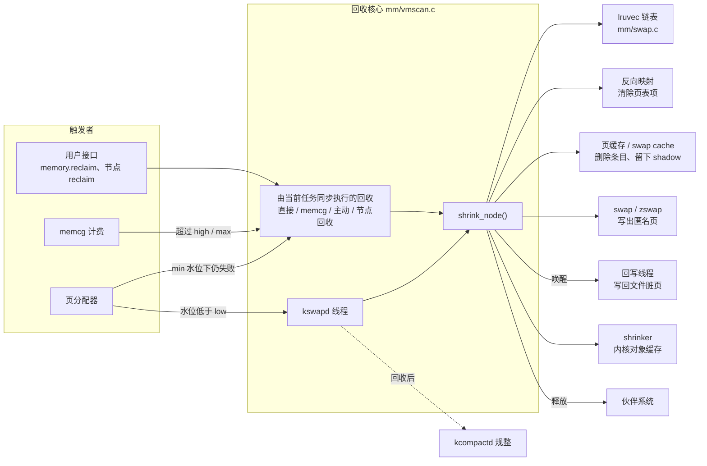
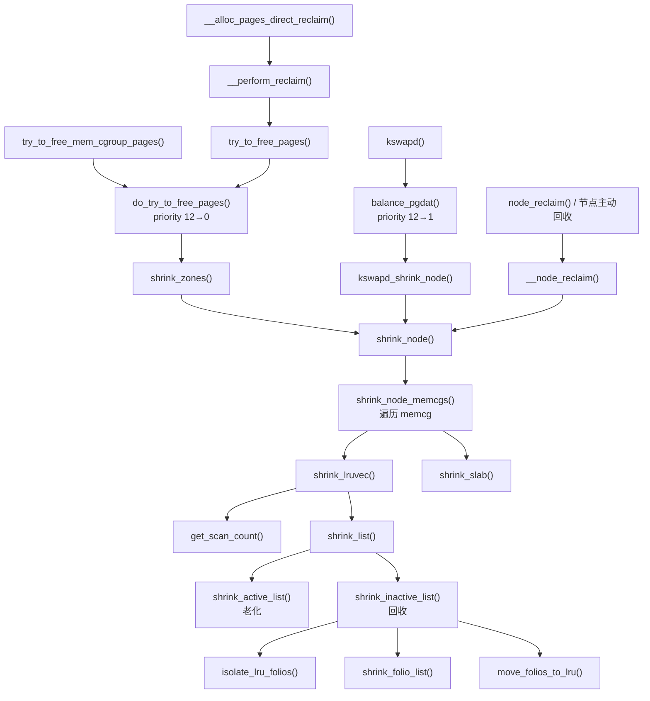
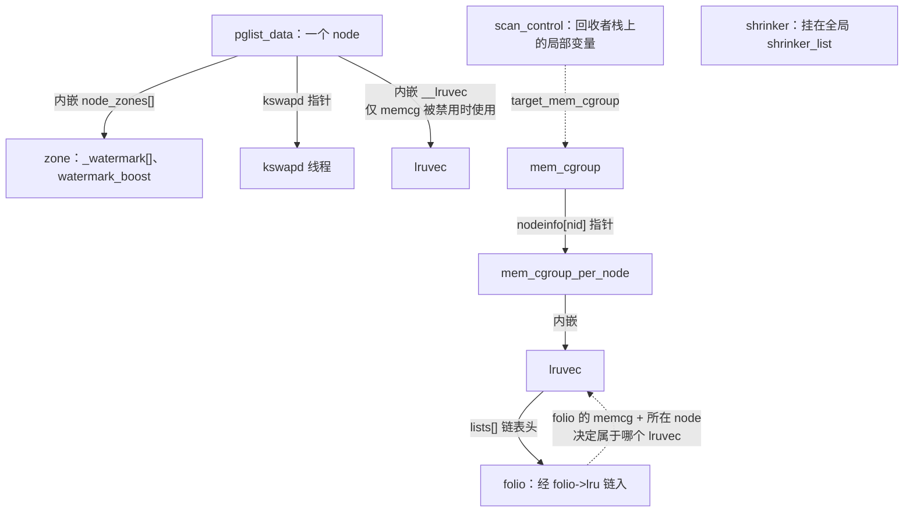
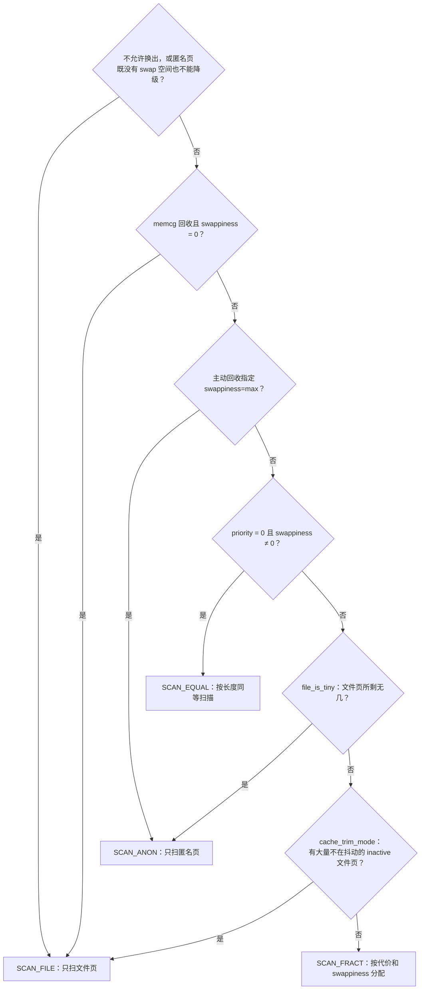
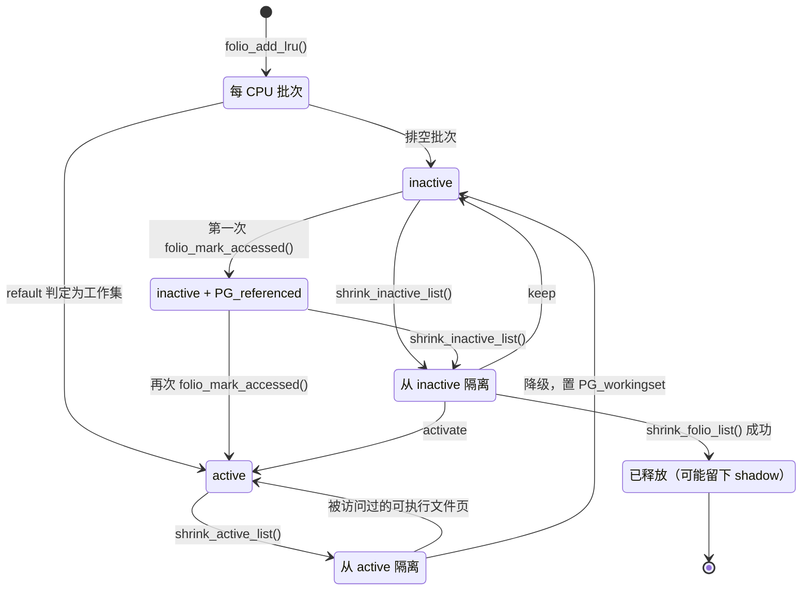
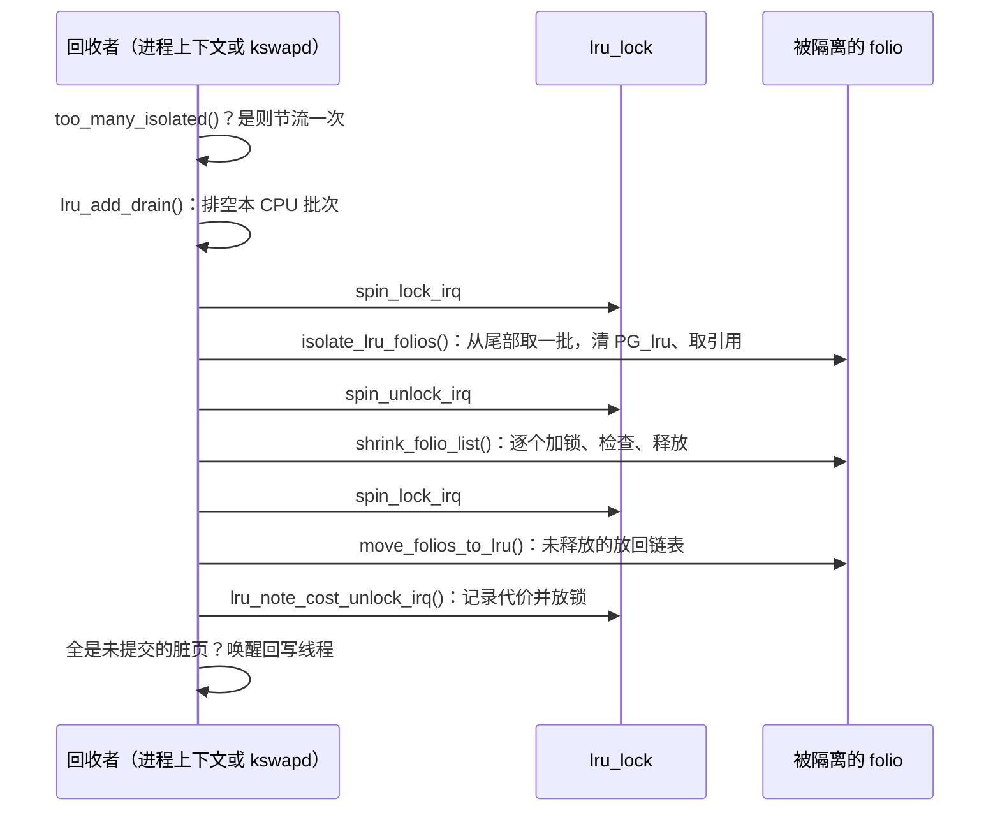
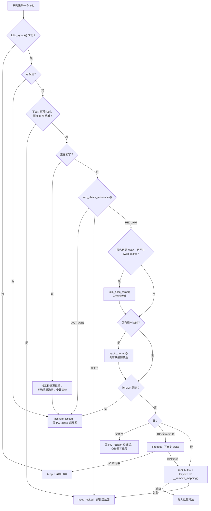

# 内存回收：从水位告急到 folio 被释放

系统运行一段时间后，空闲内存通常所剩不多：读过的文件留在页缓存里，进程写过的数据留在匿名页里，内核还缓存着大量 dentry 和 inode。内存闲着也是浪费，所以这本身不是问题。问题出现在新的分配到来时：伙伴系统里凑不出满足条件的空闲页，内核只能从“正在使用、但可以放弃”的内存中腾出一部分，而且要尽量挑短期内不会再用的那部分。

这就是内存回收（page reclaim）。本章回答四个问题：

1. 哪些内存可以回收？内核在什么时候、由谁来回收？
2. 回收候选怎样组织？内核怎样判断谁更“冷”？
3. 一个 folio 从被选中到回到伙伴系统，要过哪些关卡？失败时它去了哪里？
4. 回收怎样与页分配、memcg、写回、swap 衔接，又怎样避免把系统拖得更慢？

## 0. 分析基线

本章依据 [Makefile 第 2～4 行](../../linux/Makefile#L2-L4)标记的 **6.18.52** 版本，架构为 x86-64。主要源码是 `mm/vmscan.c`，另外涉及 `mm/swap.c`（LRU 批处理）、`mm/workingset.c`（refault 检测）、`mm/rmap.c`（反向映射）和 `mm/shrinker.c`（对象缓存回收）。

与本章结论有关的配置如下：

| 配置 | 对本章的影响 | 依据 |
| --- | --- | --- |
| `CONFIG_LRU_GEN` 未设置 | 不编入多代 LRU（MGLRU，Multi-Gen LRU），回收只走传统 active/inactive 链表 | [.config#L1287](../../linux/.config#L1287)、[mm_inline.h#L312-L317](../../linux/include/linux/mm_inline.h#L312-L317) |
| `CONFIG_MEMCG=y`，`CONFIG_MEMCG_V1` 未设置 | 每个“memcg × 节点”一组 LRU 链表；没有 v1 的软限制回收 | [.config#L212-L213](../../linux/.config#L212-L213)、[memcontrol.h#L1927-L1934](../../linux/include/linux/memcontrol.h#L1927-L1934) |
| `CONFIG_CGROUP_WRITEBACK=y` | cgroup v2 下的回收可以依赖正常的脏页节流 | [.config#L215](../../linux/.config#L215)、[vmscan.c#L241-L250](../../linux/mm/vmscan.c#L241-L250) |
| `CONFIG_SWAP=y`、`CONFIG_ZSWAP=y` | 匿名页可以换出，写出前可能先压缩进 zswap | [.config#L1146-L1147](../../linux/.config#L1146-L1147) |
| `CONFIG_NUMA=y` | 非一致内存访问（NUMA）系统中，每个有内存的节点一个 kswapd；可以启用节点回收和降级迁移 | [.config#L469](../../linux/.config#L469) |
| `CONFIG_TRANSPARENT_HUGEPAGE=y`、`CONFIG_THP_SWAP=y` | 透明大页（THP，Transparent Huge Page）的大 folio 可以整体分配 swap，失败时拆分 | [.config#L1236](../../linux/.config#L1236)、[.config#L1240](../../linux/.config#L1240) |
| `CONFIG_COMPACTION=y` | 高阶分配的回收会与规整配合 | [.config#L1216](../../linux/.config#L1216) |
| `CONFIG_PAGE_SIZE_4KB=y`、`CONFIG_HZ=1000` | 基础页 4 KiB；文中 `HZ/10` 等超时可换算为毫秒 | [.config#L951](../../linux/.config#L951)、[.config#L506](../../linux/.config#L506) |
| `CONFIG_PSI=y` | 回收期间记录内存压力停顿（PSI，Pressure Stall Information） | [.config#L158](../../linux/.config#L158) |

配置只决定哪些代码被编入。下面这些运行时参数同样影响行为，静态分析无法知道它们在某台机器上的取值：

| 参数 | 默认值 | 作用 | 依据 |
| --- | --- | --- | --- |
| `vm.swappiness` | 60，范围 0～200 | 匿名页与文件页的相对回收代价 | [vmscan.c#L199-L202](../../linux/mm/vmscan.c#L199-L202)、[vmscan.c#L7510-L7519](../../linux/mm/vmscan.c#L7510-L7519) |
| `vm.zone_reclaim_mode` | 0 | 非 0 时启用节点回收 | [vmscan.c#L7552](../../linux/mm/vmscan.c#L7552) |
| `vm.watermark_scale_factor` | 10（万分比） | 水位之间的间距 | [page_alloc.c#L305](../../linux/mm/page_alloc.c#L305) |
| `vm.watermark_boost_factor` | 15000（万分比） | 水位临时提升的上限 | [page_alloc.c#L304](../../linux/mm/page_alloc.c#L304) |
| `vm.laptop_mode` | 0 | 非 0 时回收初期不写出 | [page-writeback.c#L116](../../linux/mm/page-writeback.c#L116) |
| NUMA 降级迁移开关 | 关闭 | 打开后回收可以把页迁到慢速内存层 | [memory-tiers.c#L930](../../linux/mm/memory-tiers.c#L930) |

**前置知识与边界。** 读者应了解 [内存子系统概述](introduction.md) 中的 node、zone、folio、`lruvec` 和反向映射。分配器怎样一步步走到回收，见 [`__alloc_pages_slowpath()`](slowpath.md)；memcg 的计费、`memory.high/max` 和 `memory.min/low` 有效值的计算，见 [cgroup v2 的 memory 控制器](../cgroup2/memory.md)。本章不展开 swap 槽位分配和 zswap 内部、页缓存回写线程、内存规整、OOM（Out Of Memory）killer、MGLRU 和 HugeTLB，只说明它们与回收的接口。

## 1. 回收要解决什么问题

本节先说明回收丢掉的是哪一份数据、为什么不能随意丢弃，再给出回收在内核中的位置，以及五个入口各自的触发事件和输入输出。

### 1.1 用过的内存为什么还能拿回来

回收并不是“删除数据”，而是**放弃数据在内存里的这一份副本**。前提是内容在别处还有一份，或者能先保存到别处。按“下次需要时从哪里找回”来分，回收对象有以下几类：

| 内存 | LRU 分类 | 内容在哪里还有一份 | 回收要做的事 | 依据 |
| --- | --- | --- | --- | --- |
| 干净的普通文件页 | file | 文件本身 | 解除页表映射，从页缓存删除 | [vmscan.c#L785-L816](../../linux/mm/vmscan.c#L785-L816) |
| 脏的普通文件页 | file | 暂时没有 | 交给回写线程写回文件，写完后的某次扫描再删除 | [vmscan.c#L1416-L1444](../../linux/mm/vmscan.c#L1416-L1444) |
| 匿名页、tmpfs/shmem 页 | anon | 暂时没有 | 分配 swap 槽位并写出，写完后从 swap cache 删除 | [vmscan.c#L1302-L1359](../../linux/mm/vmscan.c#L1302-L1359) |
| `MADV_FREE` 后没有再写过的匿名页 | file | 不需要，应用已声明内容可丢弃 | 解除映射后直接释放 | [vmscan.c#L1545-L1558](../../linux/mm/vmscan.c#L1545-L1558) |
| dentry、inode 等内核对象 | 不在 LRU 上 | 由所属子系统判断 | 通过 shrinker 回调释放对象 | [shrinker.c#L380-L475](../../linux/mm/shrinker.c#L380-L475) |
| mlock 锁定页等不可驱逐页 | unevictable | — | 不回收 | [internal.h#L481-L502](../../linux/mm/internal.h#L481-L502) |

表中“LRU 分类”只看 `PG_swapbacked` 标志，与是否有文件对象不完全一致。[`folio_is_file_lru()`](../../linux/include/linux/mm_inline.h#L13-L31) 对没有 swap 后备的 folio 返回 1：tmpfs 页虽然有文件名，后备却是 RAM/swap，所以进 anon 链表；`MADV_FREE` 页虽然是匿名页，清掉 `PG_swapbacked` 后进 file 链表。

### 1.2 两个难题：回收谁，以及怎样安全地拿走

**第一个难题是选择。** 回收错了要付代价：文件页被丢掉后再读，要重新做 I/O；匿名页被换出后再访问，要换入。理想的做法是驱逐“下次访问最远”的页，但内核无法预知未来，只能用最近的访问情况近似。不同类型的代价也不一样，所以还要在文件页和匿名页之间分配压力。本章第 4 节的 LRU 链表、引用检查、workingset 和代价统计，都在回答这个问题。

**第二个难题是安全。** 一个 folio 可能同时被几个进程的页表映射、被页缓存索引、被设备 DMA（直接内存访问）固定、正在写回，还可能被别的 CPU 并发访问。回收必须确认没有其他使用者才能释放，不能在 I/O 未完成时释放，也不能在其他 CPU 的 TLB（Translation Lookaside Buffer，转换后备缓冲区）还缓存着旧翻译时释放。folio 锁、LRU 隔离、反向映射解除、引用计数冻结和 TLB 批量刷新，都是为此服务的，第 5.6 节逐一展开。

### 1.3 回收在内核中的位置

下图回答“谁触发回收，回收又需要哪些子系统配合”。实线箭头表示调用或请求，虚线表示回收结束后的后续动作。



图中有两点需要注意：回收不直接把页交给触发者，而是还给伙伴系统，触发者要自己再去分配；文件脏页不由回收路径写出，回收只负责催促回写线程。

### 1.4 触发事件、输入与输出

回收有五个入口。它们最终都汇入 `shrink_node()`，区别在于目标、范围和权限：

| 触发事件 | 执行者 | 入口 | 本次目标 `nr_to_reclaim` | 回收范围 |
| --- | --- | --- | --- | --- |
| 分配路径发现某节点水位不足 | 该节点的 kswapd 线程 | [`wakeup_kswapd()`](../../linux/mm/vmscan.c#L7385) → [`balance_pgdat()`](../../linux/mm/vmscan.c#L6975) | 各合格 zone 的 `max(high 水位, 32)` 之和 | 本节点、请求允许的 zone、全部 memcg |
| 慢路径仍拿不到页，且 GFP 允许直接回收 | 发起分配的任务 | [`try_to_free_pages()`](../../linux/mm/vmscan.c#L6590) | 32 页 | 分配允许的节点和 zone、全部 memcg |
| memcg 计费超过 `memory.high/max`，或写这两个文件 | 计费或写文件的任务 | [`try_to_free_mem_cgroup_pages()`](../../linux/mm/vmscan.c#L6675) | `max(请求页数, 32)` | 该 memcg 子树、所有 zone |
| 写 `memory.reclaim` 或节点的 `reclaim` 文件 | 写文件的任务 | [`user_proactive_reclaim()`](../../linux/mm/vmscan.c#L7743) | 剩余量的 1/4，分批进行 | memcg 子树，或单个节点 |
| `zone_reclaim_mode` 非 0 且某 zone 水位不足 | 发起分配的任务 | [`node_reclaim()`](../../linux/mm/vmscan.c#L7661) | `max(2^order, 32)` 页 | 单个节点 |

**输入**是“回收多少、在哪些节点/zone/memcg 中回收、允许做哪些操作”，统一装进第 3.6 节的 `scan_control`。**输出**是回收的基础页数。回收后的页回到伙伴系统，任何 CPU 都可能先拿走，所以直接回收返回后分配器还要[再取一次页](../../linux/mm/page_alloc.c#L4469-L4482)。

## 2. 整体架构与概览流程

本节先给出回收代码的四层分工，再用一张调用图说明这些函数怎样连接。具体的数据结构和算法分别在第 3、4 节展开。

### 2.1 四层分工

回收代码可以分成四层。先记住每层回答什么问题，再读具体函数：

| 层 | 回答的问题 | 主要函数 | 主要数据 |
| --- | --- | --- | --- |
| 发起层 | 为什么回收、要回收多少、允许做什么、什么时候停 | `try_to_free_pages()`、`balance_pgdat()`、`try_to_free_mem_cgroup_pages()` | `scan_control` |
| 节点层 | 回收哪些节点，各个 memcg 分担多少 | `do_try_to_free_pages()`、`shrink_zones()`、`shrink_node()`、`shrink_node_memcgs()` | `pglist_data`、`mem_cgroup` |
| 链表层 | 四条 LRU 链表各扫多少，active 与 inactive 怎样流动 | `shrink_lruvec()`、`get_scan_count()`、`shrink_active_list()`、`shrink_inactive_list()` | `lruvec` |
| folio 层 | 这个 folio 能不能释放，怎样释放 | `shrink_folio_list()`、`__remove_mapping()` | folio 标志、引用计数、映射 |

内核对象缓存不在 LRU 上，由 `shrink_slab()` 在链表层旁边单独处理。

### 2.2 主调用链

下图是当前配置（不含 MGLRU）下的调用关系。箭头表示函数调用。



依据：[`__perform_reclaim()`](../../linux/mm/page_alloc.c#L4423-L4447)、[`do_try_to_free_pages()`](../../linux/mm/vmscan.c#L6361-L6463)、[`shrink_zones()`](../../linux/mm/vmscan.c#L6238-L6328)、[`kswapd_shrink_node()`](../../linux/mm/vmscan.c#L6902-L6933)、[`__node_reclaim()`](../../linux/mm/vmscan.c#L7618-L7659)、[`shrink_node_memcgs()`](../../linux/mm/vmscan.c#L5972-L6049)、[`shrink_lruvec()`](../../linux/mm/vmscan.c#L5784-L5900)、[`shrink_list()`](../../linux/mm/vmscan.c#L2283-L2295)、[`shrink_inactive_list()`](../../linux/mm/vmscan.c#L2011-L2113)。

### 2.3 一次回收的骨架

下面的伪代码把四层串起来，用来建立整体印象。它省略了锁、统计、节流和大部分失败分支，后文会逐项补齐。

```text
// 伪代码：一次直接回收的骨架
for priority = 12 downto 0:                     // 发起层：逐轮加大力度
    for each 允许的 node:
        shrink_node(node):
            prepare_scan_control()              // 读取代价、决定是否老化 active
            for each memcg in 目标子树:          // 节点层
                if memcg 受 memory.min 保护，或受 memory.low 保护且本轮未放宽条件: continue
                lruvec = memcg 在该 node 上的 lruvec
                nr[4] = get_scan_count(lruvec, priority)   // 链表层
                while nr 尚未扫完:
                    每条链表一次取不超过 32 页:
                        active   → shrink_active_list()    // 把不常用的移到 inactive
                        inactive → shrink_inactive_list()  // 隔离 → 逐个判断 → 放回
                shrink_slab(memcg, node, priority)
    if 已回收够目标 或 已足以转去规整: break
```

## 3. 核心数据结构

本节按“先关系、后细节”的顺序介绍回收用到的结构：先看它们怎样连接，再依次讲水位、节点状态、`lruvec`、folio 状态和 `scan_control`，最后是 shrinker。

### 3.1 结构之间的关系

回收涉及的结构分成三组：描述物理内存的 `pglist_data` 和 `zone`，组织候选页的 `lruvec` 和 `folio`，以及描述一次回收任务的 `scan_control`。下图说明它们怎样连接。实线是包含或指针，虚线是推导关系。



读图时注意两点。第一，memcg 启用时**不存在一组“全局 LRU 链表”**：每个 memcg 在每个节点上都有自己的 `lruvec`，全局回收要逐个遍历。第二，`scan_control` 不是长期存在的对象，它只活在一次回收调用的栈帧里。

### 3.2 zone 的水位：回收从哪里开始、到哪里结束

水位以基础页为单位，保存在每个 zone 中：

| 字段 | 含义 | 依据 |
| --- | --- | --- |
| `_watermark[WMARK_MIN]` | 普通分配的底线；低于它时慢路径会考虑直接回收 | [mmzone.h#L708-L714](../../linux/include/linux/mmzone.h#L708-L714)、[mmzone.h#L883](../../linux/include/linux/mmzone.h#L883) |
| `_watermark[WMARK_LOW]` | 快路径的门槛；分配失败后唤醒 kswapd | 同上 |
| `_watermark[WMARK_HIGH]` | kswapd 判断节点“已平衡”的目标 | 同上 |
| `_watermark[WMARK_PROMO]` | 启用 NUMA 内存分层时，kswapd 改用它判断平衡 | [vmscan.c#L6794-L6797](../../linux/mm/vmscan.c#L6794-L6797) |
| `watermark_boost` | 临时抬高所有水位的量 | [mmzone.h#L884](../../linux/include/linux/mmzone.h#L884) |
| `lowmem_reserve[]` | 为低端 zone 保留、不让高端请求占用的页数 | [mmzone.h#L889-L898](../../linux/include/linux/mmzone.h#L889-L898) |

读水位时应使用 [`wmark_pages()`](../../linux/include/linux/mmzone.h#L1081-L1105) 等接口，它们返回 `_watermark[w] + watermark_boost`。

**水位怎样计算。** [`__setup_per_zone_wmarks()`](../../linux/mm/page_alloc.c#L6456-L6518) 先把 `min_free_kbytes` 换算成页数，再按各 zone 的管理页数占低端内存页数（非高端、非 `ZONE_MOVABLE`）的比例分摊，得到按比例的值 `tmp`（[page_alloc.c#L6469-L6474](../../linux/mm/page_alloc.c#L6469-L6474)）。普通 zone 的 `_watermark[WMARK_MIN]` 就是 `tmp`；`ZONE_MOVABLE` 和高端内存的 `_watermark[WMARK_MIN]` 则改为管理页数的 1/1024，并限制在 32～128 页之间（[page_alloc.c#L6475-L6496](../../linux/mm/page_alloc.c#L6475-L6496)）。随后计算 `gap = max(tmp/4, 管理页数 × watermark_scale_factor / 10000)`（[page_alloc.c#L6503-L6505](../../linux/mm/page_alloc.c#L6503-L6505)），再依次得到 `low = min + gap`、`high = low + gap`、`promo = high + gap`（[page_alloc.c#L6508-L6510](../../linux/mm/page_alloc.c#L6508-L6510)）。所以 min、low、high、promo 之间依次相差同一个 `gap`。注意：对高端内存和 `ZONE_MOVABLE`，`gap` 用的仍是未经限制的 `tmp`，因此它不等于 `_watermark[WMARK_MIN]/4`。

**水位提升（boost）。** 分配器在不同迁移类型之间“借用” pageblock 时，`try_to_claim_block()` 调用 [`boost_watermark()`](../../linux/mm/page_alloc.c#L2201-L2236)（[page_alloc.c#L2343](../../linux/mm/page_alloc.c#L2343)）。它把 `watermark_boost` 加一个 pageblock，上限是 `max(pageblock, high × watermark_boost_factor / 10000)`；zone 的管理页不足 4 个 pageblock 时不提升。提升成功后，只有带 `ALLOC_KSWAPD` 的分配才会置位 `ZONE_BOOSTED_WATERMARK`（[page_alloc.c#L2343-L2344](../../linux/mm/page_alloc.c#L2343-L2344)）。此后这类分配在该 zone 上取页时，`rmqueue()` 会清除这个标志并[唤醒 kswapd](../../linux/mm/page_alloc.c#L3394-L3399)。kswapd 为 boost 做的回收不写出、不换出（第 5.1 节），结束后扣掉 boost 并唤醒 kcompactd。源码注释给出的用意是提高回收压力，以降低之后再次发生类型借用的可能（[page_alloc.c#L2339-L2341](../../linux/mm/page_alloc.c#L2339-L2341)）。

### 3.3 `pglist_data` 中的回收状态

每个节点的 `pglist_data` 保存 kswapd 与回收节流需要的状态，定义见 [mmzone.h#L1426-L1464](../../linux/include/linux/mmzone.h#L1426-L1464) 和 [mmzone.h#L1496-L1505](../../linux/include/linux/mmzone.h#L1496-L1505)：

| 字段 | 含义 | 写入者与同步方式 |
| --- | --- | --- |
| `kswapd` | 本节点的 kswapd 线程 | `kswapd_run()`/`kswapd_stop()`，持 `kswapd_lock` |
| `kswapd_wait` | kswapd 睡眠用的等待队列 | 唤醒者检查它是否有等待者 |
| `kswapd_order`、`kswapd_highest_zoneidx` | 唤醒者留下的请求：最大阶数、最高 zone 下标；后者为 `MAX_NR_ZONES` 表示没有新请求 | 唤醒者只往大里改，kswapd 读出后复位；`READ_ONCE/WRITE_ONCE`，不加锁 |
| `kswapd_failures` | 连续多少次 `balance_pgdat()` 一页都没回收到 | 原子变量；kswapd 失败时加一，任何回收者在本节点有进展时清零 |
| `pfmemalloc_wait` | 直接回收者因保留页过低而等待 kswapd 的队列 | 见第 5.7 节 |
| `reclaim_wait[]` | 按原因分开的回收节流等待队列，原因见 [vmscan_throttle_state](../../linux/include/linux/mmzone.h#L325-L331) | `reclaim_throttle()` |
| `nr_writeback_throttled`、`nr_reclaim_start` | 正在等写回的任务数；开始等待时已写回的页数 | 原子变量与 `WRITE_ONCE` |
| `flags` | `PGDAT_DIRTY`、`PGDAT_WRITEBACK`、`PGDAT_RECLAIM_LOCKED`，含义见 [mmzone.h#L1062-L1071](../../linux/include/linux/mmzone.h#L1062-L1071) | 位操作 |
| `min_unmapped_pages`、`min_slab_pages` | 节点回收的启动门槛 | 由 sysctl 计算 |
| `__lruvec` | memcg 被禁用时，本节点唯一的 `lruvec` | — |

`kswapd_failures` 达到 `MAX_RECLAIM_RETRIES`（16，[internal.h#L528-L532](../../linux/mm/internal.h#L528-L532)）的节点被视为“无望节点”：kswapd 不再被唤醒，也不再阻止自己睡眠，直接回收者不会再因为它而节流，回收交给直接回收和 OOM 处理。

### 3.4 `lruvec`：一组回收候选

`lruvec` 是回收的基本工作单元，定义见 [mmzone.h#L669-L698](../../linux/include/linux/mmzone.h#L669-L698)：

| 字段 | 含义 |
| --- | --- |
| `lists[NR_LRU_LISTS]` | 五个链表头：inactive/active 的 anon 与 file，以及 unevictable，下标定义见 [mmzone.h#L312-L323](../../linux/include/linux/mmzone.h#L312-L323) |
| `lru_lock` | 保护链表和链表长度统计的自旋锁，回收路径用 `spin_lock_irq()` 获取 |
| `anon_cost`、`file_cost` | 近期回收匿名页、文件页付出的代价，带衰减；用来分配扫描压力（第 4.4 节） |
| `nonresident_age` | 驱逐与激活事件的计数器，refault 检测用的“时钟”（第 4.7 节） |
| `refaults[2]` | 上一轮回收结束时，`WORKINGSET_ACTIVATE_ANON/FILE` 计数的快照 |
| `flags` | `LRUVEC_CGROUP_CONGESTED`、`LRUVEC_NODE_CONGESTED`：脏页拥塞标记，含义见 [mmzone.h#L351-L367](../../linux/include/linux/mmzone.h#L351-L367) |
| `pgdat` | 反向指向所在节点 |

**粒度。** [`mem_cgroup_lruvec()`](../../linux/include/linux/memcontrol.h#L696-L730) 决定一个 `lruvec` 是谁的：memcg 被禁用时返回 `pgdat->__lruvec`；否则返回 `memcg->nodeinfo[nid]->lruvec`，传入 `NULL` 时用根 memcg。所以 memcg 启用时，全局回收的“目标 lruvec”其实是根 memcg 在该节点上的 `lruvec`。一个 folio 属于哪个 `lruvec`，由它计费的 memcg 和它所在的节点决定，见 [`folio_lruvec()`](../../linux/include/linux/memcontrol.h#L732-L744)。

**链表的方向。** [`lruvec_add_folio()`](../../linux/include/linux/mm_inline.h#L340-L352) 用 `list_add()` 把 folio 加到链表头，[`lru_to_folio()`](../../linux/include/linux/mm.h#L244-L247) 取的是 `head->prev`，也就是链表尾。所以**头部是最近加入的，尾部是最老的**，回收总是从尾部开始取。少数路径用 [`lruvec_add_folio_tail()`](../../linux/include/linux/mm_inline.h#L354-L366) 直接放到尾部，让 folio 尽快被回收。

**unevictable 并不真的挂链表。** `lruvec_add_folio()` 只对非 `LRU_UNEVICTABLE` 执行 `list_add()`；不可驱逐的 folio 只更新计数，见 [mm_inline.h#L348-L351](../../linux/include/linux/mm_inline.h#L348-L351)。回收扫描的循环 `for_each_evictable_lru` 也只遍历前四个链表（[mmzone.h#L335](../../linux/include/linux/mmzone.h#L335)）。

**两种长度统计。** 回收会读两类数字，不能混用：

- [`lruvec_page_state()`](../../linux/mm/memcontrol.c#L390-L410) 读 `lruvec_stats->state[]`，它是**包含整个子树**的汇总值（[memcontrol.c#L379-L388](../../linux/mm/memcontrol.c#L379-L388)）。`prepare_scan_control()` 和 `inactive_is_low()` 用它判断目标范围的整体比例。
- [`lruvec_lru_size()`](../../linux/mm/vmscan.c#L402-L422) 按 zone 累加 `lru_zone_size`，只算**这个 `lruvec` 自己链表上**、且在 `reclaim_idx` 以内的页。`get_scan_count()` 用它算具体要扫多少。

### 3.5 folio 上与回收相关的状态

回收对一个 folio 的判断，几乎都来自它的标志位（[page-flags.h#L93-L135](../../linux/include/linux/page-flags.h#L93-L135)）、引用计数和映射计数：

| 状态 | 含义 | 主要的设置和清除者 |
| --- | --- | --- |
| `PG_lru` | folio 在某个 `lruvec` 中 | 加入 LRU 时设置；隔离时原子地测试并清除 |
| `PG_active` | 属于 active 链表 | 访问提升或回收激活时设置；降级时清除 |
| `PG_referenced` | 软件层面的访问标记 | `read()` 等经 `folio_mark_accessed()` 设置；回收的引用检查会清除 |
| 页表项（PTE，Page Table Entry）中的 Accessed 位 | 硬件在 CPU 经页表访问时置位 | `folio_referenced()` 经反向映射逐个清除并计数 |
| `PG_workingset` | 曾在 active 链表上，后来被降级 | `shrink_active_list()` 设置；驱逐时写进 shadow 条目 |
| `PG_reclaim` | 希望写回一结束就回收 | 回收遇到脏页或回写中的页时设置；写回结束时清除并移到 inactive 尾部 |
| `PG_swapbacked` | 后备存储是 RAM/swap，决定 anon/file 分类 | 匿名页、shmem 页带此标志；`MADV_FREE` 会清除它 |
| `PG_unevictable`、`PG_mlocked` | 不可驱逐；被 mlock 锁定 | 后者由 mlock 代码设置；前者在加入 LRU 时按 `folio_evictable()` 设置 |
| `PG_dirty`、`PG_writeback` | 内容需要写回；正在写回 | 页缓存与回写代码 |
| `PG_locked` | folio 锁，回收处理期间一直持有 | 回收只用 `folio_trylock()` 获取 |
| `PG_swapcache` | 已加入 swap cache | swap 分配与删除 |

**引用计数怎样解释。** 页缓存或 swap cache 为每个基础页持有一个引用；回收隔离 folio 时自己再持有一个；文件系统私有数据（`PG_private`）再算一个。所以一个“只剩缓存在用”的 folio，引用计数正好是 `1 + nr_pages + private`，这个判断写在 [`is_page_cache_freeable()`](../../linux/mm/vmscan.c#L477-L486) 里。多出来的引用说明还有别人在用，例如 GUP（Get User Pages）、并发的查找或 I/O。

**几条不变量。**

1. **除了持有 `lru_lock` 的短暂窗口，`PG_lru` 置位就表示 folio 在某个 `lruvec` 中。** 想把 folio 从链表上摘下来，必须先用原子的 `folio_test_clear_lru()` 清掉这一位；多个竞争者中只有一个能成功，见 [isolate_lru_folios()](../../linux/mm/vmscan.c#L1791-L1803) 中的 `folio_test_clear_lru()` 判断，以及 [folio_isolate_lru()](../../linux/mm/vmscan.c#L1861-L1878)。
2. **被隔离的 folio 不在任何链表上，隔离者持有一个引用。** 放回时先置 `PG_lru`，再放下隔离时取得的引用：引用就此归零，说明其他使用者都已放弃它，直接释放；否则挂回链表，见 [move_folios_to_lru()](../../linux/mm/vmscan.c#L1948-L1980)。
3. **所在链表由标志推导。** [`folio_lru_list()`](../../linux/include/linux/mm_inline.h#L80-L101) 根据 `PG_unevictable`、`PG_swapbacked`、`PG_active` 算出链表下标，而且 `PG_active` 与 `PG_unevictable` 不能同时置位。因此修改 `PG_active` 前必须先把 folio 从链表上摘下，[`lru_activate()`](../../linux/mm/swap.c#L303-L318) 就是“删除 → 置位 → 重新加入”。

**每 CPU 批处理。** 新 folio 调用 [`folio_add_lru()`](../../linux/mm/swap.c#L491-L512) 时并不立即挂链表，而是先放进本 CPU 的 `folio_batch`（[cpu_fbatches](../../linux/mm/swap.c#L50-L66)），并为此持有一个引用。批次满了，或者有人调用 [`lru_add_drain()`](../../linux/mm/swap.c#L734-L740)，才一次性取 `lru_lock` 挂上链表。激活、降级、移到尾部也走类似的批次。所以在批次里的 folio 还没有 `PG_lru`，回收开始扫描前会先把本 CPU 的批次排空（[vmscan.c#L2038](../../linux/mm/vmscan.c#L2038)）。

### 3.6 `scan_control`：一次回收的工单

[`struct scan_control`](../../linux/mm/vmscan.c#L75-L183) 记录一次回收调用的目标、权限、中间策略和结果。字段可以分成四组：

| 分组 | 字段 | 含义 |
| --- | --- | --- |
| 目标与范围 | `nr_to_reclaim` | 希望回收的页数，是“够了就停”的参考值，不是精确配额 |
| | `target_mem_cgroup` | 回收目标 memcg；`NULL` 表示全局回收 |
| | `nodemask`、`reclaim_idx` | 允许的节点；允许隔离的最高 zone 下标 |
| | `order` | 触发回收的分配阶数，高阶时会与规整配合 |
| 权限 | `gfp_mask` | 是否允许 I/O（`__GFP_IO`）和进入文件系统（`__GFP_FS`） |
| | `may_writepage`、`may_unmap`、`may_swap` | 能否写出脏页、能否解除用户映射、能否换出匿名页 |
| | `proactive`、`proactive_swappiness`、`no_demotion` | 主动回收标记及其 swappiness；是否禁止降级迁移 |
| 策略状态 | `priority` | 扫描力度：每条链表扫描“长度右移 `priority` 位”（第 4.2 节） |
| | `anon_cost`、`file_cost`、`may_deactivate`、`force_deactivate`、`skipped_deactivate`、`cache_trim_mode`、`file_is_tiny` | 每次进入 `shrink_node()` 时由 `prepare_scan_control()` 重新计算 |
| | `memcg_low_reclaim`、`memcg_low_skipped`、`memcg_full_walk`、`compaction_ready` | 跨轮次的重试开关 |
| 结果 | `nr_scanned`、`nr_reclaimed` | 已扫描、已回收的基础页数 |
| | `nr.*` | 本轮在一个节点上遇到的脏页、回写、拥塞等计数 |
| | `reclaim_state` | 记录 LRU 之外释放的页数，例如 slab 页 |

各入口初始化 `scan_control` 的方式不同，这是它们行为不同的主要原因之一：

| 字段 | 直接回收 | kswapd | memcg 回收 | 节点回收 |
| --- | --- | --- | --- | --- |
| `nr_to_reclaim` | 32 | 每轮按 zone 重算 | `max(请求, 32)` | `max(2^order, 32)` |
| `gfp_mask` | `current_gfp_context(gfp)` | `GFP_KERNEL` | 调用者的回收相关位 + `GFP_HIGHUSER_MOVABLE` 的其余位 | `current_gfp_context(gfp)` |
| `reclaim_idx` | `gfp_zone(gfp)` | 唤醒请求的 `highest_zoneidx` | 最高 zone | `gfp_zone(gfp)` |
| `priority` 初值 | 12 | 12 | 12 | 4 |
| `may_writepage` | `!laptop_mode` | `!laptop_mode` 且无 boost | `!laptop_mode` | `RECLAIM_WRITE` 位 |
| `may_unmap` | 1 | 1 | 1 | `RECLAIM_UNMAP` 位 |
| `may_swap` | 1 | 无 boost 时为 1 | 调用者指定 | 1 |

依据：[try_to_free_pages()](../../linux/mm/vmscan.c#L6594-L6604)、[balance_pgdat()](../../linux/mm/vmscan.c#L6985-L6989) 与 [kswapd_shrink_node()](../../linux/mm/vmscan.c#L6909-L6913)、[try_to_free_mem_cgroup_pages()](../../linux/mm/vmscan.c#L6683-L6695)、[node_reclaim()](../../linux/mm/vmscan.c#L7666-L7675)。[`current_gfp_context()`](../../linux/include/linux/sched/mm.h#L250-L268) 会按任务的 `PF_MEMALLOC_NOIO/NOFS` 作用域去掉 `__GFP_IO/__GFP_FS`，所以即使调用者传入 `GFP_KERNEL`，处在 NOFS 作用域里的回收也不会进入文件系统。

**生命周期。** `scan_control` 是回收者栈上的局部变量，从不在任务之间共享，因此它的字段不需要加锁。回收期间 `current->reclaim_state` 指向其中的 `reclaim_state`（[set_task_reclaim_state()](../../linux/mm/vmscan.c#L287-L297)），slab 等代码释放页时通过 [`mm_account_reclaimed_pages()`](../../linux/include/linux/swap.h#L162-L174) 记账；回收结束前把指针清空。`order`、`priority` 和 `reclaim_idx` 都是 `s8`，取值上限由 [BUILD_BUG_ON](../../linux/mm/vmscan.c#L6606-L6612) 保证。

### 3.7 `shrinker`：内核对象缓存的回收接口

dentry、inode 这类对象不在 LRU 上，内核无法替它们判断哪个能释放，于是让所属子系统注册一个 [`struct shrinker`](../../linux/include/linux/shrinker.h#L60-L118)：

| 字段 | 含义 |
| --- | --- |
| `count_objects()` | 返回可释放对象的估计数；没有对象时返回 `SHRINK_EMPTY` |
| `scan_objects()` | 尝试释放 `nr_to_scan` 个对象，返回释放数；可能死锁时返回 `SHRINK_STOP` |
| `seeks` | 重建一个对象的相对代价，默认 `DEFAULT_SEEKS`（2）；越大扫得越少 |
| `batch` | 每次调用 `scan_objects()` 的批量，0 表示默认 128 |
| `flags` | `SHRINKER_NUMA_AWARE`、`SHRINKER_MEMCG_AWARE` 等，见 [shrinker.h#L121-L132](../../linux/include/linux/shrinker.h#L121-L132) |
| `nr_deferred` | 上次没扫完、留到下次的工作量（按节点；memcg 感知时按 memcg 存放） |
| `refcount`、`rcu` | 遍历时用引用计数和 RCU（Read-Copy-Update，读-复制-更新）保证 shrinker 不被并发注销 |

回收通过 [`struct shrink_control`](../../linux/include/linux/shrinker.h#L34-L56) 把 GFP、节点、memcg 和扫描量传给回调。

### 3.8 并发保护一览

回收与缺页、页缓存读写、munmap、迁移等路径并发进行。下表说明各类状态靠什么保护，不表示这些锁可以按表中顺序随意嵌套：

| 被保护的状态 | 机制 | 回收中的用法 |
| --- | --- | --- |
| `lruvec` 链表、链表长度、`anon_cost/file_cost` | `lruvec->lru_lock`（关中断自旋锁） | 只在隔离、放回、激活时短暂持有；逐个处理 folio 时不持有 |
| folio 属于哪条链表 | `PG_lru` 的原子测试并清除 | 清除成功的一方独占摘链表的权利 |
| folio 的内容、映射、缓存归属 | folio 锁 | `shrink_folio_list()` 用 `trylock`，拿不到就跳过 |
| 页表项 | 页表锁，由反向映射遍历内部获取 | `folio_referenced()`、`try_to_unmap()` |
| 文件的反向映射、匿名的反向映射 | `i_mmap_rwsem`、`anon_vma` 读写信号量 | 引用检查用 `try_lock`，竞争时直接跳过；解除映射时正常获取 |
| 页缓存条目 | inode 的 `i_lock` + `i_pages` 的 xa_lock | `__remove_mapping()` |
| swap cache 条目 | swap cluster 锁 | `__remove_mapping()` |
| 引用计数 | 原子操作；`folio_ref_freeze()` 用 cmpxchg 把预期值变为 0 | 释放前确认没有别的引用，并阻止新的 `folio_try_get()` 成功 |
| `pglist_data` 的回收状态 | 原子变量、位操作、`READ_ONCE/WRITE_ONCE` | 唤醒与睡眠判断 |
| shrinker 列表 | RCU + shrinker 引用计数 | `shrink_slab()` |

## 4. 关键算法

本节解释回收的核心决策：何时开始和停止、每轮扫描多少、匿名页与文件页之间如何分配压力、页怎样在 active 与 inactive 之间流动，以及 workingset 和 shrinker 如何补充这些判断。

### 4.1 何时开始、何时停止：水位与平衡判定

**开始。** 分配器的快路径把 `alloc_flags` 初始化为 `ALLOC_WMARK_LOW`（[page_alloc.c#L5263](../../linux/mm/page_alloc.c#L5263)），即按 `low` 水位检查（`ALLOC_WMARK_LOW` 定义为 `WMARK_LOW`，[internal.h#L1277](../../linux/mm/internal.h#L1277)），失败后进入慢路径，改用 `min` 水位（[page_alloc.c#L4517](../../linux/mm/page_alloc.c#L4517)），并在允许时调用 [`wake_all_kswapds()`](../../linux/mm/page_alloc.c#L4489-L4512) 唤醒各候选节点的 kswapd（[page_alloc.c#L4805-L4806](../../linux/mm/page_alloc.c#L4805-L4806)）。之后仍拿不到页、GFP 带 `__GFP_DIRECT_RECLAIM`、且当前任务不在回收上下文（没有 `PF_MEMALLOC`）时，才进入直接回收（[page_alloc.c#L4919-L4931](../../linux/mm/page_alloc.c#L4919-L4931)）。这条路径的完整顺序见 [`__alloc_pages_slowpath()`](slowpath.md)。

**唤醒会被过滤。** [`wakeup_kswapd()`](../../linux/mm/vmscan.c#L7385-L7428) 先检查 zone 是否有受管理的页、cpuset 是否允许（[vmscan.c#L7391-L7395](../../linux/mm/vmscan.c#L7391-L7395)），不满足就直接返回；否则把请求的阶数和 zone 下标记进 `pgdat`（只往大里改，[vmscan.c#L7398-L7404](../../linux/mm/vmscan.c#L7398-L7404)）。这一步在判断 kswapd 是否睡眠之前就已完成，无论之后是否真的唤醒它。随后：kswapd 不在 `kswapd_wait` 上睡眠（说明它正在工作）就直接返回；节点是无望节点，或者已经平衡且没有水位提升，也不唤醒，只在调用者不能直接回收时顺带唤醒 kcompactd。所以“调用了唤醒函数”既不表示 kswapd 一定醒来，更不表示已经回收到了页。

**停止。** kswapd 的目标是让节点“平衡”。[`pgdat_balanced()`](../../linux/mm/vmscan.c#L6776-L6844) 从最低的 zone 向上检查到 `highest_zoneidx`，**只要有一个 zone** 按请求阶数满足 `high` 水位就返回真（启用 NUMA 内存分层时改用 `promo` 水位）。空闲页计数在 CPU 很多时有累积误差，低于 `percpu_drift_mark` 时会改读精确快照。如果节点在请求范围内没有任何受管理的 zone，也视为平衡。之所以“一个 zone 就够”，源码没有直接说明，本书的推断是：请求允许的 zone 范围内只要有一个 zone 余量充足，后续同类分配就能从它那里得到页，继续回收其他 zone 只会多丢缓存。

**用一个例子把三条水位串起来。** 只为说明流程，假设只有一个候选 zone，请求 `order=0`、`GFP_KERNEL`，`min=100`、`low=150`、`high=200` 页，忽略 `lowmem_reserve`、水位提升和并发：

| 空闲页 | 发生的事 |
| --- | --- |
| 180 | 快路径 `low` 检查通过，直接分配 |
| 140 | 快路径失败；慢路径唤醒 kswapd，按 `min` 重试成功。kswapd 在后台回收，直到空闲页回到 200 以上才判定平衡 |
| 90 | `min` 也不满足；当前任务进入直接回收，目标 32 页，然后重新取页 |

真实的检查还要扣除本次请求不能使用的保留页，高阶请求还要求有足够大的连续块，所以不能拿一个空闲页总数和水位直接比较，见 [`__zone_watermark_ok()`](../../linux/mm/page_alloc.c#L3562-L3644)。

### 4.2 `priority`：逐轮加大扫描力度

回收不知道一次要扫多少页才能凑够目标，于是从小剂量开始逐轮加码。`priority` 从 [`DEF_PRIORITY`（12）](../../linux/include/linux/mmzone.h#L1288-L1293) 开始递减，每条链表本轮的扫描目标是“链表长度右移 `priority` 位”（[vmscan.c#L2635-L2637](../../linux/mm/vmscan.c#L2635-L2637)）。以一条 1 GiB（262144 个 4 KiB 页）的链表为例：

| `priority` | 扫描比例 | 本轮目标 |
| --- | --- | --- |
| 12 | 1/4096 | 64 页 |
| 10 | 1/1024 | 256 页 |
| 6 | 1/64 | 4096 页 |
| 2 | 1/4 | 65536 页 |
| 0 | 全部 | 262144 页 |

这里的 `priority` **数值越小，力度越大**，与进程调度优先级无关。直接回收从 12 降到 0（[vmscan.c#L6374-L6393](../../linux/mm/vmscan.c#L6374-L6393)），只要某一轮后达到目标就停；kswapd 从 12 降到 1（[vmscan.c#L7011-L7138](../../linux/mm/vmscan.c#L7011-L7138)），而且只在“扫描量不足”或“本轮没有进展”时才降低。

不少策略也挂在 `priority` 上：

| 条件 | 效果 | 依据 |
| --- | --- | --- |
| `priority < 10` | 即使在 laptop mode 也允许写出 | [vmscan.c#L6387-L6392](../../linux/mm/vmscan.c#L6387-L6392) |
| `order > 0`、允许规整，并且 `order > 3` 或 `priority < 10` | 进入“回收 + 规整”模式，节点内可能多扫几轮 | [vmscan.c#L5902-L5911](../../linux/mm/vmscan.c#L5902-L5911) |
| `priority == 1` 且仍无进展 | 直接回收者短暂节流 | [vmscan.c#L6225-L6227](../../linux/mm/vmscan.c#L6225-L6227) |
| `priority == 0` | 不再按代价分配，匿名页和文件页按长度同等扫描 | [vmscan.c#L2598-L2606](../../linux/mm/vmscan.c#L2598-L2606) |
| 任意 | shrinker 的扫描量同样右移 `priority` 位 | [shrinker.c#L404-L419](../../linux/mm/shrinker.c#L404-L419) |

### 4.3 节点内：在 memcg 之间分摊压力

memcg 启用时，一个节点上的页分散在各个 memcg 的 `lruvec` 里。[`shrink_node_memcgs()`](../../linux/mm/vmscan.c#L5972-L6049) 用 `mem_cgroup_iter()` 先序遍历目标子树（全局回收从根开始），对每个 memcg：

1. 计算有效保护值。用量不超过 `memory.min` 的有效值时跳过，这是硬保护；不超过 `memory.low` 的有效值时，第一遍跳过并记下 `memcg_low_skipped`（[vmscan.c#L6007-L6027](../../linux/mm/vmscan.c#L6007-L6027)）。回收目标组自身的保护不生效（[memcontrol.h#L609-L639](../../linux/include/linux/memcontrol.h#L609-L639)）。
2. 取该 memcg 在本节点的 `lruvec`，调用 `shrink_lruvec()` 回收页，再调用 `shrink_slab()` 回收该 memcg 的对象缓存。
3. 直接回收使用共享游标做“部分遍历”，回收量达到目标就提前退出；kswapd 和要求完整遍历的回收每次走完整棵树（[vmscan.c#L5981-L5993](../../linux/mm/vmscan.c#L5981-L5993)、[vmscan.c#L6043-L6047](../../linux/mm/vmscan.c#L6043-L6047)）。

受保护但没被跳过的组，扫描量还会按“用量中有多少处在保护线以内”按比例缩小，最少 32 页，见 [`apply_proportional_protection()`](../../linux/mm/vmscan.c#L2492-L2553)。如果一整轮回收都没有进展，`do_try_to_free_pages()` 会依次放宽条件重来：先改为完整遍历，再强制老化 active 链表，最后突破 `memory.low`（[vmscan.c#L6422-L6460](../../linux/mm/vmscan.c#L6422-L6460)）。保护值的计算和语义见 [cgroup v2 的 memory 控制器](../cgroup2/memory.md)第 3.5、3.6 节。

### 4.4 文件页与匿名页各扫多少：`get_scan_count()`

每个 `lruvec` 要决定四条链表各扫多少。[`get_scan_count()`](../../linux/mm/vmscan.c#L2555-L2676) 先选一种平衡方式，再按链表长度和 `priority` 算出具体数字。选择顺序如下：



依据：[vmscan.c#L2573-L2627](../../linux/mm/vmscan.c#L2573-L2627)。“匿名页有没有去处”由 [`can_reclaim_anon_pages()`](../../linux/mm/vmscan.c#L359-L382) 判断：全局回收看系统是否还有空闲 swap；memcg 回收看该组的 swap 限额余量；两者都没有时，再看能否降级迁移到其他节点。

其中 `cache_trim_mode` 和 `file_is_tiny` 由 [`prepare_scan_control()`](../../linux/mm/vmscan.c#L2351-L2453) 在每次进入 `shrink_node()` 时计算：

- **`cache_trim_mode`**：目标范围的 inactive 文件页右移 `priority` 后仍不为零，文件页没有在抖动（不需要老化 file active 链表），而且没有被 `no_cache_trim_mode` 禁用时置位。意思是“还有足够冷的页缓存可以丢，先别动匿名页”，防止一次顺序读把进程的数据挤到 swap 上（[vmscan.c#L2406-L2416](../../linux/mm/vmscan.c#L2406-L2416)）。
- **`file_is_tiny`**：只用于全局回收。文件页加空闲页已经不超过各 zone 的 `high` 水位之和，匿名页没有在抖动，inactive anon 链表右移 `priority` 后也不为零时置位（[vmscan.c#L2418-L2452](../../linux/mm/vmscan.c#L2418-L2452)）。源码注释称这是在防止“缓存陷阱”：页缓存越小越容易抖动，抖动又让扫描继续偏向文件页，形成正反馈。

**SCAN_FRACT 的比例。** [`calculate_pressure_balance()`](../../linux/mm/vmscan.c#L2455-L2490) 把匿名页和文件页的代价与 swappiness 结合起来。改写成更易读的形式如下：

```text
// 依据 calculate_pressure_balance() 改写，a = anon_cost，f = file_cost，s = swappiness
total  = a + f
anon_w = total + a                 // 匿名页近期越“贵”，它的分母越大
file_w = total + f
ap = s         × (anon_w + file_w + 1) / (anon_w + 1)
fp = (200 − s) × (anon_w + file_w + 1) / (file_w + 1)
匿名页份额 = ap / (ap + fp)，文件页份额 = fp / (ap + fp)
```

代入几组数值（本文计算，用来展示趋势；只适用于 SCAN_FRACT 分支，例如 swappiness 为 0 时全局回收仍可能因 `file_is_tiny` 转为只扫匿名页）：

| swappiness | 代价情况 | 匿名页份额 | 文件页份额 |
| --- | --- | --- | --- |
| 60 | `a = f` | 30% | 70% |
| 60 | 匿名页代价远高于文件页（`f ≈ 0`） | 约 18% | 约 82% |
| 60 | 文件页代价远高于匿名页（`a ≈ 0`） | 约 46% | 约 54% |
| 100 | `a = f` | 50% | 50% |
| 0 | 任意 | 0 | 100% |
| 200 | 任意 | 100% | 0 |

`anon_w` 和 `file_w` 都落在 `[total, 2×total]` 之间，所以代价最多让两边的权重相差两倍。源码注释的说法是：为了不让任何一类页被完全落下，在乘以 swappiness 之前至少要施加三分之一的压力（[vmscan.c#L2470-L2472](../../linux/mm/vmscan.c#L2470-L2472)）。swappiness 表达的是“换入一个匿名页”和“重读一个文件页”的相对 I/O 代价：100 表示两者相同。它不是“内存用到百分之多少开始换出”的阈值。

**代价从哪里来。** [`lru_note_cost_unlock_irq()`](../../linux/mm/swap.c#L240-L292) 把一次事件记为 `nr_io × 32 + nr_rotated`，加到对应类型的 cost 上，并沿 memcg 父链一直累加到根。三个来源是：

| 来源 | `nr_io` | `nr_rotated` | 依据 |
| --- | --- | --- | --- |
| `shrink_inactive_list()` 的一批 | 本批写出的页数 | 扫描了却没回收的页数 | [vmscan.c#L2072-L2073](../../linux/mm/vmscan.c#L2072-L2073) |
| `shrink_active_list()` 的一批 | 0 | 被保留在 active 上的可执行文件页 | [vmscan.c#L2220](../../linux/mm/vmscan.c#L2220) |
| 曾在 active 上的页 refault | 该 folio 的页数 | 0 | [swap.c#L294-L301](../../linux/mm/swap.c#L294-L301)、[workingset.c#L573-L582](../../linux/mm/workingset.c#L573-L582) |

当两项代价之和超过链表总长度的四分之一时，两者同时减半（[swap.c#L276-L284](../../linux/mm/swap.c#L276-L284)），所以它反映的是近期的情况。`prepare_scan_control()` 在 `lru_lock` 下读取目标 `lruvec` 的这两个值（[vmscan.c#L2371-L2374](../../linux/mm/vmscan.c#L2371-L2374)）。

**落到每条链表。** 对四条可驱逐链表，`get_scan_count()` 取该链表在 `reclaim_idx` 以内的长度，经保护比例缩小后右移 `priority`，再按平衡方式取份额（[vmscan.c#L2629-L2675](../../linux/mm/vmscan.c#L2629-L2675)）。已经下线的 memcg 即使算出 0，也会对每条链表扫描 `min(链表长度, 32)` 页，把残留的缓存清出去（[vmscan.c#L2643-L2644](../../linux/mm/vmscan.c#L2643-L2644)）。

### 4.5 active 与 inactive：双链表怎样老化

传统 LRU 对文件页和匿名页各维护两条链表。[workingset.c 的说明](../../linux/mm/workingset.c#L21-L39)给出了基本模型：新页从 inactive 头部进入，回收从 inactive 尾部取；在 inactive 上被多次访问的页提升到 active，active 太长时把尾部的页降回 inactive。

下面的状态图概括了一个可驱逐 folio 在链表之间的移动，只画主要转换，省略 unevictable 和迁移等路径：



**提升有两条通道。**

- 经 `read()`/`write()` 等系统调用访问页缓存时，内核调用 [`folio_mark_accessed()`](../../linux/mm/swap.c#L442-L488)：第一次只置 `PG_referenced`，第二次才移到 active，并推进 workingset 时钟。
- 经页表访问时，CPU 只会在 PTE 中置 Accessed 位，内核当时并不知道。只有回收扫描到这个 folio，调用 [`folio_referenced()`](../../linux/mm/rmap.c#L956-L1004) 经反向映射逐个检查并清除这一位，才发现它被用过。x86 上清除 Accessed 位不刷新 TLB，源码注释认为这最多造成老化不准确，不会破坏数据（[arch/x86/mm/pgtable.c#L486-L503](../../linux/arch/x86/mm/pgtable.c#L486-L503)）。

新分配的匿名页和新读入的文件页都从 inactive 开始：缺页处理调用 [`folio_add_lru_vma()`](../../linux/mm/memory.c#L5245)，页缓存插入调用 [`folio_add_lru()`](../../linux/mm/filemap.c#L998-L1001)，本配置下两者都不设置 `PG_active`。例外是 refault 被判定为工作集时，会在加入 LRU 前直接设置 `PG_active`（第 4.7 节）。

**inactive 链表应该多长。** [`inactive_is_low()`](../../linux/mm/vmscan.c#L2297-L2342) 用 `inactive × ratio < active` 判断 inactive 是否偏短，`ratio = int_sqrt(10 × 总 GB 数)`，不足 1 GB 时为 1。源码注释给出了对应关系：

| 该类型总量 | ratio | inactive 最多约占 |
| --- | --- | --- |
| 100 MB | 1 | 50% |
| 1 GB | 3 | 25% |
| 10 GB | 10 | 约 9% |
| 100 GB | 31 | 约 3% |

内存越大，inactive 占比越小。inactive 不能太短，否则页在被第二次访问之前就被挤出去了；也不能太长，否则 active 保护的工作集太小。

**什么时候老化 active。** active 链表不是每轮都扫。`prepare_scan_control()` 只在两种情况下允许降级某类 active 页（[vmscan.c#L2376-L2404](../../linux/mm/vmscan.c#L2376-L2404)）：自上一轮回收以来出现了新的 refault 激活（说明新的工作集正在形成，旧的 active 页可能过时了），或者 inactive 偏短。不允许时，[`shrink_list()`](../../linux/mm/vmscan.c#L2283-L2295) 跳过 active 链表并记下 `skipped_deactivate`；如果整轮回收一无所获，再带着 `force_deactivate` 重试。匿名 active 链表还有额外的老化机会：`shrink_lruvec()` 结束时（[vmscan.c#L5892-L5899](../../linux/mm/vmscan.c#L5892-L5899)）和 kswapd 每轮开始时（[`kswapd_age_node()`](../../linux/mm/vmscan.c#L6726-L6750)），只要有 swap（或可以降级迁移）且 inactive anon 偏短，就降级 32 页。

**降级怎样进行。** [`shrink_active_list()`](../../linux/mm/vmscan.c#L2115-L2223) 在 `lru_lock` 下隔离一批 folio 后立即放锁，逐个调用 `folio_referenced()`。被访问过的**可执行文件页**放回 active，给代码段多一次机会；其他 folio 不论是否被访问过，一律清除 `PG_active`、置 `PG_workingset`，放到 inactive。被访问过的匿名页也会降级，注释给出的理由是：匿名页不容易被一次性的流式 I/O 冲掉，JVM 之类的程序又会产生大量带 `VM_EXEC` 的匿名页。最后重新加锁，把两组 folio 分别放回链表。

### 4.6 引用检查：给 inactive 页第二次机会

inactive 尾部的 folio 在真正回收前，要经过 [`folio_check_references()`](../../linux/mm/vmscan.c#L903-L971) 的判定。它综合 PTE 访问位的个数和 `PG_referenced`（后者会被测试并清除，所以只能用一次）：

| 条件 | 结果 | 含义 |
| --- | --- | --- |
| 某个映射所在的虚拟内存区域（VMA，Virtual Memory Area）带 `VM_LOCKED` | `ACTIVATE` | 实际会因 mlock 标记转入 unevictable |
| 反向映射锁竞争，或只被正在退出/被 OOM 收割的进程映射的私有匿名页 | `KEEP` | 本轮不处理 |
| 有 PTE 访问，并且此前已有 `PG_referenced` 或有两个以上映射被访问 | `ACTIVATE` | 确认是热页 |
| 有 PTE 访问，是可执行的文件页 | `ACTIVATE` | 代码段第一次被访问就提升 |
| 有 PTE 访问，其他情况 | `KEEP` | 置 `PG_referenced`，再给一轮 |
| 没有 PTE 访问，有 `PG_referenced`，属于 file LRU | `RECLAIM_CLEAN` | 只在干净时回收，脏页不在这里写出 |
| 其余 | `RECLAIM` | 进入回收 |

为什么映射页要“看两次”：注释解释说，每个被映射的页从建立映射的那次缺页开始就带着一次 PTE 访问，所以只看到一次访问还不能说明它被反复使用。第一次看到时只做标记；如果到下一次检查之间又被访问，才提升。

### 4.7 workingset：用 refault 距离识别抖动

LRU 只看到“在内存里时”的访问。一个页被驱逐后很快又被访问，说明当初不该驱逐它，这就是 **refault**。workingset 机制用很少的元数据估计“这次驱逐错得有多严重”，设计说明在 [workingset.c#L41-L181](../../linux/mm/workingset.c#L41-L181)。

**时钟。** 每个 `lruvec` 有一个 `nonresident_age` 计数器，每次驱逐和每次激活都会推进它，并沿 memcg 父链同步推进（[`workingset_age_nonresident()`](../../linux/mm/workingset.c#L345-L371)）。注释论证了：一个页从进入 inactive 到被挤出的过程中，这个时钟至少走过 inactive 链表的长度。

**驱逐时留下 shadow。** `__remove_mapping()` 删除页缓存或 swap cache 条目时，调用 [`workingset_eviction()`](../../linux/mm/workingset.c#L373-L404) 把“memcg 编号、节点、当前时钟、是否带 `PG_workingset`”打包成一个 shadow 值，存进原来的槽位（[vmscan.c#L776-L781](../../linux/mm/vmscan.c#L776-L781)、[vmscan.c#L805-L808](../../linux/mm/vmscan.c#L805-L808)）。所以页缓存的 XArray 里取出来的值不一定是 folio 指针。

**refault 时比较距离。** 页缓存缺失后重新读入时，[`filemap_add_folio()`](../../linux/mm/filemap.c#L968-L1008) 拿到旧的 shadow，在加入 LRU 之前调用 [`workingset_refault()`](../../linux/mm/workingset.c#L525-L583)；匿名页和 shmem 的换入路径也会调用它。[`workingset_test_recent()`](../../linux/mm/workingset.c#L406-L523) 计算 `refault 距离 = 当前时钟 − 驱逐时的时钟`，再与“工作集大小”比较：文件页用 active 文件页数，有 swap 时再加上匿名页；匿名页用全部文件页数，有 swap 时再加上 active 匿名页。

举例说明（只为展示判断方式，假设没有 swap）：某 memcg 有 3000 个 active 文件页。一个文件页在时钟为 5000 时被驱逐：

- 时钟走到 6500 时它被重新读入，距离 1500 ≤ 3000。如果当初 inactive 链表能多 1500 个位置，它就会在第二次访问时被提升，不会被驱逐。内核判定它属于工作集，直接设置 `PG_active` 加入 LRU。
- 时钟走到 12000 时才被读入，距离 7000 > 3000。即使把全部 active 空间让给它也留不住，所以按普通新页处理。

被判定为工作集的 refault 有三个后果：

1. 页直接进入 active 链表（[workingset.c#L569-L571](../../linux/mm/workingset.c#L569-L571)）。
2. `WORKINGSET_ACTIVATE_*` 计数变化，下一次 `prepare_scan_control()` 会发现它与 `lruvec->refaults[]` 的快照不同，从而允许老化 active 链表，给新的工作集腾位置。快照在每轮回收结束时由 [`snapshot_refaults()`](../../linux/mm/vmscan.c#L6330-L6343) 更新。
3. 如果 shadow 里记着它当初也在 active 上（`PG_workingset`），说明现有工作集本身在抖动，这次 refault 计入该类型的 I/O 代价，扫描压力随之转向另一类（[workingset.c#L573-L582](../../linux/mm/workingset.c#L573-L582)）。

### 4.8 shrinker：按比例扫描对象缓存

[`do_shrink_slab()`](../../linux/mm/shrinker.c#L380-L475) 对一个 shrinker 计算本次扫描量：

```text
// 依据 do_shrink_slab() 简化
freeable   = count_objects()
delta      = (freeable >> priority) × 4 / seeks      // seeks 为 0 时取 freeable / 2
total_scan = min((nr_deferred >> priority) + delta, 2 × freeable)
while total_scan ≥ batch 或 total_scan ≥ freeable:
    freed += scan_objects(min(batch, total_scan))    // 返回 SHRINK_STOP 就停止
    total_scan −= 本次实际扫描数
nr_deferred = min(max(nr_deferred + delta − 已扫描, 0), 2 × freeable)
```

`seeks` 默认为 2，所以对象缓存的扫描比例是同一 `priority` 下页链表的两倍。没做完的工作存进 `nr_deferred`，留给以后的调用。举例：有 10 万个可释放 dentry 时，`priority = 12` 算出 `delta = 48`，小于默认批量 128，本次不扫描，48 计入 `nr_deferred`；欠账在计入下一次扫描量之前同样要右移 `priority` 位，所以高 `priority` 下积累的欠账主要在 `priority` 降下来之后才兑现。

## 5. 实现细节

本节按执行路径展开：先看 kswapd 和直接回收这两个入口，再看 `shrink_node()` 到 `shrink_lruvec()` 的分批扫描，然后是隔离、放回和单个 folio 的释放关卡，最后是节流、对象缓存和其他入口。

### 5.1 kswapd：后台回收线程

**创建。** [`kswapd_init()`](../../linux/mm/vmscan.c#L7532-L7543) 对每个有内存的节点调用 [`kswapd_run()`](../../linux/mm/vmscan.c#L7469-L7490)，在该节点上创建名为 `kswapd%d` 的内核线程。内存热插拔下线整个节点时由 `kswapd_stop()` 停止它。

**主循环。** [`kswapd()`](../../linux/mm/vmscan.c#L7304-L7376) 先给自己置 `PF_MEMALLOC | PF_KSWAPD`：前者让它在回收中需要少量内存时可以动用保留页，同时不会递归进入直接回收；后者让 `current_is_kswapd()` 为真。之后循环执行：

1. 从 `pgdat` 读出请求的阶数和 zone 下标，尝试睡眠。
2. 醒来后再次读取请求，并把 `kswapd_order` 和 `kswapd_highest_zoneidx` 复位为“无请求”。
3. 调用 `balance_pgdat()`。它返回最终达到平衡时使用的阶数；如果比请求的低（高阶回收失败后退回了 0 阶），就以较低的阶数尝试睡眠，同时以原始阶数唤醒 kcompactd（[vmscan.c#L7357-L7370](../../linux/mm/vmscan.c#L7357-L7370)）。

**两段式睡眠。** [`kswapd_try_to_sleep()`](../../linux/mm/vmscan.c#L7207-L7289) 先调用 [`prepare_kswapd_sleep()`](../../linux/mm/vmscan.c#L6857-L6892)：唤醒所有在 `pfmemalloc_wait` 上等待的直接回收者；节点无望或已平衡时返回真；平衡时还会调用 `clear_pgdat_congested()`，清除拥塞标记以及 `PGDAT_DIRTY`、`PGDAT_WRITEBACK`（[vmscan.c#L6847-L6855](../../linux/mm/vmscan.c#L6847-L6855)）。条件满足就唤醒 kcompactd，先睡 `HZ/10`（本配置为 100 ms）。睡满时间仍平衡，才把 vmstat 每 CPU 阈值恢复为常规值，进入无限期睡眠，直到被唤醒；醒来后改用更小的“压力阈值”，让空闲页计数更准确。中途被提前唤醒，说明压力很快又来了，计入 `KSWAPD_LOW_WMARK_HIT_QUICKLY`。

**`balance_pgdat()` 的一轮。** [`balance_pgdat()`](../../linux/mm/vmscan.c#L6962-L7190) 的主要步骤：

1. 累加请求范围内各 zone 的 `watermark_boost`，记为 `nr_boost_reclaim`（[vmscan.c#L6997-L7007](../../linux/mm/vmscan.c#L6997-L7007)）。
2. 设置 `ZONE_RECLAIM_ACTIVE`（分配器据此调低 PCP（每 CPU 页列表，per-CPU pages）的上限），`priority` 从 12 开始。
3. 检查平衡。节点不平衡却有 boost，就放弃 boost 从头开始，先做普通回收；没有 boost 且已平衡，直接结束（[vmscan.c#L7042-L7061](../../linux/mm/vmscan.c#L7042-L7061)）。
4. 为 boost 回收时不写出、不换出，并限制 `priority` 不低于 10（[vmscan.c#L7063-L7074](../../linux/mm/vmscan.c#L7063-L7074)）。
5. 调用 `kswapd_age_node()` 老化匿名 active 链表。
6. 调用 [`kswapd_shrink_node()`](../../linux/mm/vmscan.c#L6894-L6933)：把 `nr_to_reclaim` 设为各合格 zone 的 `max(high 水位, 32)` 之和，执行 `shrink_node()`。如果本次 `balance_pgdat()` 累计回收的页数已不少于 `compact_gap(order)`（即 `2 << order`），把 `order` 降为 0，后续只按 0 阶判断平衡，剩下的碎片交给规整。扫描量或回收量达到目标时返回真，本轮不必提高力度。
7. 低水位恢复后唤醒在 `pfmemalloc_wait` 上等待的直接回收者（[vmscan.c#L7105-L7112](../../linux/mm/vmscan.c#L7105-L7112)）；检查是否需要冻结或停止。
8. 扫描不足或没有进展时降低 `priority`；为 boost 回收却毫无进展时立即停止，避免无限循环（[vmscan.c#L7121-L7138](../../linux/mm/vmscan.c#L7121-L7138)）。

循环结束后：如果一路降到底仍一页未回收，而 `cache_trim_mode` 失败过，就禁用它从头再来一次（[vmscan.c#L7140-L7148](../../linux/mm/vmscan.c#L7140-L7148)）；仍然一页未回收则 `kswapd_failures` 加一。最后清除 `ZONE_RECLAIM_ACTIVE`，扣掉本次处理过的 boost 并唤醒 kcompactd，保存 refault 快照。整个过程处在 PSI 内存停顿记录之中（[vmscan.c#L6992](../../linux/mm/vmscan.c#L6992)、[vmscan.c#L7180](../../linux/mm/vmscan.c#L7180)）。

### 5.2 直接回收：从分配器进入 vmscan

直接回收发生在分配者自己的进程上下文里，代价直接体现为分配延迟。调用链每一层的职责如下：

| 层 | 职责 | 依据 |
| --- | --- | --- |
| `__alloc_pages_direct_reclaim()` | 记录 PSI 停顿；带 `ALLOC_NOFRAGMENT` 且迁移类型不是 `MIGRATE_MOVABLE` 的请求，把回收阶数提升到 `pageblock_order`（[page_alloc.c#L4460-L4462](../../linux/mm/page_alloc.c#L4460-L4462)），`defrag_mode` 下会设置 `ALLOC_NOFRAGMENT`（[page_alloc.c#L4560-L4561](../../linux/mm/page_alloc.c#L4560-L4561)）；回收有进展才重新取页，失败一次后释放 highatomic 保留并排空 PCP 再试 | [page_alloc.c#L4449-L4487](../../linux/mm/page_alloc.c#L4449-L4487) |
| `__perform_reclaim()` | 通过 `memalloc_noreclaim_save()` 设置 `PF_MEMALLOC`；`fs_reclaim_acquire()` 是 lockdep 注解，只有 `CONFIG_LOCKDEP` 启用时才有实现，否则是空函数。本配置未启用 lockdep：`CONFIG_LOCKDEP` 是没有提示符的 bool 符号，`.config` 中没有它的行，它只由 `PROVE_LOCKING`、`LOCK_STAT`、`DEBUG_LOCK_ALLOC` 通过 `select` 选中（[Kconfig.debug#L1509-L1511](../../linux/lib/Kconfig.debug#L1509-L1511)、[#L1370](../../linux/lib/Kconfig.debug#L1370)、[#L1426](../../linux/lib/Kconfig.debug#L1426)、[#L1500](../../linux/lib/Kconfig.debug#L1500)），而这三项在 `.config` 中均为 `is not set`（[.config#L10659](../../linux/.config#L10659)、[#L10660](../../linux/.config#L10660)、[#L10666](../../linux/.config#L10666)） | [page_alloc.c#L4423-L4447](../../linux/mm/page_alloc.c#L4423-L4447)、[sched/mm.h#L270-L280](../../linux/include/linux/sched/mm.h#L270-L280)、[sched/mm.h#L426-L429](../../linux/include/linux/sched/mm.h#L426-L429) |
| `try_to_free_pages()` | 初始化 `scan_control`；先经 `throttle_direct_reclaim()` 判断是否要等 kswapd；挂上 `reclaim_state`；记录跟踪点 | [vmscan.c#L6590-L6631](../../linux/mm/vmscan.c#L6590-L6631) |
| `do_try_to_free_pages()` | `priority` 循环；结束后保存 refault 快照；无进展时三级重试 | [vmscan.c#L6361-L6463](../../linux/mm/vmscan.c#L6361-L6463) |
| `shrink_zones()` | 遍历 zonelist，每个节点只处理一次 | [vmscan.c#L6238-L6328](../../linux/mm/vmscan.c#L6238-L6328) |

`PF_MEMALLOC` 有两个作用：慢路径看到它就不会再次进入直接回收（[page_alloc.c#L4923-L4925](../../linux/mm/page_alloc.c#L4923-L4925)），避免回收中的分配递归回收；回收过程中自身需要的少量分配可以越过水位使用保留页。

**`shrink_zones()` 的过滤。** 对全局回收，它跳过 cpuset 不允许的 zone；对 `order > 3` 的昂贵请求，如果某 zone 已满足 `min` 水位，或已有足够空闲页让规整有机会成功（按 `high` 水位估计），就置 `compaction_ready` 并跳过该 zone，不再为它回收（[vmscan.c#L6265-L6284](../../linux/mm/vmscan.c#L6265-L6284)、[`compaction_ready()`](../../linux/mm/vmscan.c#L6166-L6198)）。同一节点的多个 zone 只调用一次 `shrink_node()`。全部节点处理完后，[`consider_reclaim_throttle()`](../../linux/mm/vmscan.c#L6200-L6228) 在回收效率超过 1/8 时唤醒因无进展而节流的任务；`priority` 已降到 1 仍一页未回收时，让当前任务短暂节流。

**`do_try_to_free_pages()` 的返回值。** 它统计 `ALLOCSTALL` 事件，循环到达目标或 `compaction_ready` 时退出。返回值的约定是：

| 返回值 | 含义 |
| --- | --- |
| 回收页数 | 有进展 |
| 1 | 没回收到页，但因为 `compaction_ready` 提前收手，分配器不应把它当作“无进展”而走向 OOM |
| 0 | 三级重试（完整遍历 memcg、强制老化 active、突破 `memory.low`）之后仍无进展 |

另外，`try_to_free_pages()` 在节流等待期间收到致命信号时直接返回 1（[vmscan.c#L6614-L6620](../../linux/mm/vmscan.c#L6614-L6620)），同样是为了不让分配器因此触发 OOM。

### 5.3 `shrink_node()`：一个节点的一轮回收

[`shrink_node()`](../../linux/mm/vmscan.c#L6051-L6164) 是所有入口的汇合点：

1. **计算本轮策略。** 清零 `sc->nr`，调用 `prepare_scan_control()`。
2. **回收。** 调用 `shrink_node_memcgs()`，再用 [`flush_reclaim_state()`](../../linux/mm/vmscan.c#L299-L337) 把 slab 等非 LRU 释放的页计入 `nr_reclaimed`。这一步只对全局回收和以根 memcg 为目标的回收生效：一个 memcg 感知的 shrinker 可能只释放了一个计费给目标组的对象，就让一整页被释放，把整页算到目标组头上会高估进展。
3. **kswapd 专属的写回判断**（[vmscan.c#L6087-L6122](../../linux/mm/vmscan.c#L6087-L6122)）：本轮隔离的页全部在回写中，置 `PGDAT_WRITEBACK`；隔离的文件页全部是尚未提交 I/O 的脏页，置 `PGDAT_DIRTY`；遇到标记了立即回收却仍在回写的页（`nr.immediate`），说明页在 LRU 上转得比写回还快，kswapd 自己等待写回节流。
4. **拥塞标记**（[vmscan.c#L6124-L6137](../../linux/mm/vmscan.c#L6124-L6137)）：遇到的脏页都已经在回写并标记了立即回收时，memcg 回收给目标 `lruvec` 置 `LRUVEC_CGROUP_CONGESTED`，kswapd 置 `LRUVEC_NODE_CONGESTED`；后者只有 kswapd 在节点平衡后才会清除。之后的直接回收者在这里等待 I/O 完成（[vmscan.c#L6139-L6149](../../linux/mm/vmscan.c#L6139-L6149)）。
5. **高阶请求是否再来一轮。** [`should_continue_reclaim()`](../../linux/mm/vmscan.c#L5913-L5970) 只在“回收 + 规整”模式下可能返回真：上一轮有进展，没有 zone 已能直接满足分配或适合规整，而且 inactive 页数还多于 `compact_gap(order)`。
6. **更新失败计数。** 本轮有任何进展，就把 `kswapd_failures` 清零，因此一次成功的直接回收可以“救活”已被放弃的 kswapd；没有进展且处于 `cache_trim_mode`，记下 `cache_trim_mode_failed`。

`vmpressure()` 在这里和 `shrink_node_memcgs()` 中按“扫描/回收”比例报告内存压力事件（[vmscan.c#L6079-L6082](../../linux/mm/vmscan.c#L6079-L6082)），本章不展开。

### 5.4 `shrink_lruvec()`：按目标分批扫描

[`shrink_lruvec()`](../../linux/mm/vmscan.c#L5784-L5900) 先调用 `get_scan_count()` 得到四个目标 `nr[]`，并复制一份到 `targets[]`。然后循环：每次对每条还有余量的链表取不超过 32 页（`SWAP_CLUSTER_MAX`，[swap.h#L222-L224](../../linux/include/linux/swap.h#L222-L224)）交给 `shrink_list()`。循环条件不包括 active anon，所以 active anon 只在其他链表还有余量时顺带推进（[vmscan.c#L5819-L5838](../../linux/mm/vmscan.c#L5819-L5838)）。外面用 `blk_start_plug()` 把这一批 I/O 合并提交。

**达到目标后怎么办。** 两种情况不同：

- **非 memcg、非 kswapd 的回收（主要是直接回收）在 `priority = 12` 时**不提前退出，把这一轮的目标扫完（[vmscan.c#L5805-L5817](../../linux/mm/vmscan.c#L5805-L5817)）。注释的理由是：此时进入直接回收说明 kswapd 跟不上，不如一次多做一些。
- **其他情况**（kswapd、memcg 回收、更低的 `priority`）达到目标后，停掉剩余量较少的那一类，并按“已完成的百分比”下调另一类的剩余量，让两类的实际扫描比例接近 `get_scan_count()` 的原始分配（[vmscan.c#L5840-L5888](../../linux/mm/vmscan.c#L5840-L5888)）。调整后再循环一次，较少的一类已经为 0，循环随即退出；注释称之为“只朝比例方向推一次”。

举例：设某次 memcg 回收算出的目标为 inactive anon 64、active anon 64、inactive file 192、active file 64。第一轮各扫 32 页后达到 `nr_to_reclaim`，剩余为 32、32、160、32。文件页剩得多，于是停掉匿名页；匿名页已完成约 50%，文件页的剩余量被下调为目标的约 51% 减去已扫部分：inactive file 剩 65、active file 剩 0。再扫一批 32 页 inactive file 后，因为匿名页剩余为 0 而退出。

最后，只要匿名页有去处且 inactive anon 偏短，就再降级 32 页 active anon（[vmscan.c#L5892-L5899](../../linux/mm/vmscan.c#L5892-L5899)）。

### 5.5 `shrink_inactive_list()`：隔离、处理、放回

[`shrink_inactive_list()`](../../linux/mm/vmscan.c#L2007-L2113) 的结构是“短暂持锁取一批 → 放锁慢慢处理 → 再持锁放回”：



**防止隔离过多。** 大量任务同时直接回收时，每个任务都可能隔离一批页后被调度出去，链表会被掏空，后来者扫得更快、换出更多。[`too_many_isolated()`](../../linux/mm/vmscan.c#L1880-L1922) 对 kswapd 不生效；对其他回收者，被隔离页数超过 inactive 页数时返回真。同时带 `__GFP_IO` 和 `__GFP_FS` 的回收者门槛是 inactive 的 1/8，`GFP_NOIO/GFP_NOFS` 回收者可以多隔离一些，注释说这是为了避免它们被普通回收者挡住而形成循环等待。超限时节流一次（`HZ/50`），醒来仍超限就返回 0；有致命信号则返回 32，假装有进展，让任务尽快退出释放内存。

**隔离。** [`isolate_lru_folios()`](../../linux/mm/vmscan.c#L1723-L1836) 必须在 `lru_lock` 下调用，从链表尾部开始：

- 所在 zone 高于 `reclaim_idx` 的 folio 暂存到一个跳过链表，最后放回链表**头部**；跳过的数量不计入 `scan`，否则链表里全是不合格页时会一页都隔离不到，导致过早 OOM。跳过次数有上限，防止长时间持锁造成硬死锁检测报警（[vmscan.c#L1768-L1784](../../linux/mm/vmscan.c#L1768-L1784)）。
- 不允许解除映射时跳过已映射的页。
- 先 `folio_try_get()` 取引用，再 `folio_test_clear_lru()` 清 `PG_lru`。顺序不能反：注释说明释放路径依赖 `PG_lru` 判断要不要取 `lru_lock` 摘链表，所以必须先确认 folio 不在被释放（[vmscan.c#L1791-L1803](../../linux/mm/vmscan.c#L1791-L1803)）。清除失败说明别人正在隔离它，放回引用后跳过。

隔离成功的页数无条件计入节点的 `NR_ISOLATED_ANON/FILE`（[vmscan.c#L2045](../../linux/mm/vmscan.c#L2045)）。扫描数按执行者计入 `PGSCAN_KSWAPD/DIRECT/...`：这类事件的全局计数只在非 memcg 回收时增加（[vmscan.c#L2046-L2048](../../linux/mm/vmscan.c#L2046-L2048)），memcg 自身的计数总是增加（[vmscan.c#L2049](../../linux/mm/vmscan.c#L2049)）；`PGSCAN_ANON/FILE` 对所有回收都会增加（[vmscan.c#L2050](../../linux/mm/vmscan.c#L2050)）。

**放回。** [`move_folios_to_lru()`](../../linux/mm/vmscan.c#L1924-L1995) 在 `lru_lock` 下处理 `shrink_folio_list()` 退回的 folio：变得不可驱逐的放锁后走 `folio_putback_lru()`；其余先置 `PG_lru`，再放下隔离时取的引用。引用就此归零，说明其他使用者都已离开，这时清理 LRU 标志并加入批量释放；否则按标志挂到对应链表。放回 active 的页计入 workingset 时钟（[vmscan.c#L1983-L1984](../../linux/mm/vmscan.c#L1983-L1984)）。

**收尾。** 记录回收数（`PGSTEAL_*`）和代价。如果本批隔离的页全部是尚未提交 I/O 的脏页，说明回写线程没跟上，调用 `wakeup_flusher_threads()` 唤醒它们（[vmscan.c#L2075-L2099](../../linux/mm/vmscan.c#L2075-L2099)）。

### 5.6 `shrink_folio_list()`：一个 folio 要过哪些关卡

[`shrink_folio_list()`](../../linux/mm/vmscan.c#L1101-L1652) 逐个处理隔离出来的 folio。下图是正常路径上的关卡顺序，省略了大 folio 拆分、hwpoison 和降级迁移等分支：



下面按关卡展开。

#### 5.6.1 加锁与前置检查

- 只用 `folio_trylock()`，拿不到锁说明别人正在处理它，直接放回（[vmscan.c#L1135-L1136](../../linux/mm/vmscan.c#L1135-L1136)）。回收不在这里睡眠等锁。
- 含有硬件损坏页的小 folio 解除映射后放掉引用，不再放回 LRU；大 folio 则保留，交给内存错误处理（[vmscan.c#L1138-L1151](../../linux/mm/vmscan.c#L1138-L1151)）。
- `nr_scanned` 按 folio 的基础页数累加（[vmscan.c#L1155-L1158](../../linux/mm/vmscan.c#L1155-L1158)）。
- 不可驱逐的 folio 去 `activate_locked`，放回时会被分到 unevictable；不允许解除映射而 folio 有映射时，保留（[vmscan.c#L1160-L1164](../../linux/mm/vmscan.c#L1160-L1164)）。
- [`folio_check_dirty_writeback()`](../../linux/mm/vmscan.c#L973-L1004) 统计脏页和回写页。它只统计 file LRU 上的页：匿名页由回收自己写出，不应因此让回收停下来。

#### 5.6.2 正在回写的 folio

注释把这种情况分成三类（[vmscan.c#L1187-L1275](../../linux/mm/vmscan.c#L1187-L1275)）：

| 情况 | 条件 | 处理 |
| --- | --- | --- |
| 1 | kswapd 遇到已标记 `PG_reclaim` 的回写页，且节点已置 `PGDAT_WRITEBACK` | 计入 `nr_immediate` 并激活。页在 I/O 完成前又转了一圈，说明扫描太快；等这批处理完，`shrink_node()` 让 kswapd 节流 |
| 2 | 能使用正常脏页节流（cgroup v2 和全局回收都属于此类），或页还没有 `PG_reclaim`，或不能进入文件系统，或该 mapping 在回收中等写回可能死锁 | 置 `PG_reclaim`，计入 `nr_writeback`，激活。不等待，继续找干净页 |
| 3 | 其他（主要是 cgroup v1） | 解锁后等待写回完成，再重新处理这个 folio |

本配置未编入 cgroup v1（`CONFIG_MEMCG_V1` 未设置）。[`writeback_throttling_sane()`](../../linux/mm/vmscan.c#L228-L250) 对全局回收返回真（[vmscan.c#L243-L244](../../linux/mm/vmscan.c#L243-L244)）；本配置 `CONFIG_CGROUP_WRITEBACK=y`，对 cgroup v2 的回收也返回真（[vmscan.c#L245-L247](../../linux/mm/vmscan.c#L245-L247)），所以实际只会走前两种。激活看起来与“尽快回收”矛盾，其实不然：写回结束时，[`folio_end_writeback_no_dropbehind()`](../../linux/mm/filemap.c#L1664-L1685) 发现 `PG_reclaim`，就清掉它并调用 [`folio_rotate_reclaimable()`](../../linux/mm/swap.c#L224-L238)，后者把 folio 放进本 CPU 的批次（[swap.c#L237](../../linux/mm/swap.c#L237)）；批次排空时，由 [`lru_move_tail()`](../../linux/mm/swap.c#L213-L222) 清除 `PG_active`，并把 folio 移到 inactive **尾部**，下一轮回收最先遇到它。注释的理由是：先让它离开 inactive，回收继续寻找干净页；等磁盘写完，它就回到最容易被回收的位置。

#### 5.6.3 引用检查与降级迁移

按第 4.6 节的表格处理引用。判定为可回收后，如果启用了 NUMA 降级迁移，而且本节点有可用的下层节点，folio 先放进 `demote_folios` 暂存（[vmscan.c#L1291-L1300](../../linux/mm/vmscan.c#L1291-L1300)）。整个列表处理完后，[`demote_folio_list()`](../../linux/mm/vmscan.c#L1037-L1083) 以 `GFP_NOWAIT` 尝试迁移；成功迁移的页**计入 `nr_reclaimed`**，失败的页回到列表，非主动回收时再按普通方式回收一遍（[vmscan.c#L1609-L1638](../../linux/mm/vmscan.c#L1609-L1638)）。降级迁移默认关闭。

#### 5.6.4 匿名页：分配 swap 并加入 swap cache

对需要 swap 的匿名 folio（`PG_anon` 且 `PG_swapbacked`），如果还不在 swap cache 中（[vmscan.c#L1302-L1359](../../linux/mm/vmscan.c#L1302-L1359)）：

1. 没有 `__GFP_IO`，或者可能被 DMA 固定，保留。
2. 大 folio 有无法拆分的额外引用时激活；部分映射的大 folio 先拆开，未映射的部分可以不经 I/O 直接释放。
3. 调用 [`folio_alloc_swap()`](../../linux/mm/swapfile.c#L1418-L1481) 分配 swap 槽位，并把 folio 加入 swap cache（[swapfile.c#L1474](../../linux/mm/swapfile.c#L1474)）。大 folio 分配失败时拆成小 folio 再试，THP 的这种回退计入 `THP_SWPOUT_FALLBACK`。
4. 无条件标脏。注释解释：`MADV_FREE` 页的 PTE 脏位可能已被清除而 `PG_swapbacked` 还在，如果不标脏，后面就不会写出，以后换入时会读到错误数据。

**加入 swap cache 不等于已经写出，更不等于已经释放。** 此时 folio 仍在内存里，只是有了“将来存到哪里”的位置，后面还要解除映射、写出、写完后再从 swap cache 删除。

#### 5.6.5 解除映射：`try_to_unmap()`

仍被页表映射的 folio 必须先断开所有映射（[vmscan.c#L1371-L1404](../../linux/mm/vmscan.c#L1371-L1404)）。[`try_to_unmap()`](../../linux/mm/rmap.c#L2275-L2299) 经反向映射找到每个映射它的 VMA，由 `try_to_unmap_one()` 处理每个 PTE：

- 清除 PTE。带 `TTU_BATCH_FLUSH` 时不立即刷新 TLB，而是记入当前任务的批量刷新状态；PTE 是脏的就把 folio 标脏（[rmap.c#L2065-L2083](../../linux/mm/rmap.c#L2065-L2083)）。
- 匿名页：把 PTE 改写成指向 swap 槽位的 swap 项，进程的匿名页计数减一、swap 项计数加一，以后访问会触发换入缺页（[rmap.c#L2118-L2221](../../linux/mm/rmap.c#L2118-L2221)）。
- `MADV_FREE` 页：如果期间又被写过，或者有额外引用（例如 GUP），就恢复 PTE 并放弃；否则直接丢弃映射（[rmap.c#L2131-L2174](../../linux/mm/rmap.c#L2131-L2174)）。
- 文件页：只清除 PTE，以后访问会从页缓存或文件重新取得（[rmap.c#L2222-L2235](../../linux/mm/rmap.c#L2222-L2235)）。

大 folio 会加上 `TTU_SYNC`，大到可以用 PMD 映射的 folio 还会加上 `TTU_SPLIT_HUGE_PMD`。返回后仍有映射就计入 `nr_unmap_fail` 并激活。

映射全部解除后再检查 DMA pin：此时已经不会产生新的 pin，仍被固定说明设备可能正在读写它，只能激活（[vmscan.c#L1406-L1414](../../linux/mm/vmscan.c#L1406-L1414)）。

#### 5.6.6 脏页：文件页交给回写线程，匿名页由回收写出

[vmscan.c#L1416-L1499](../../linux/mm/vmscan.c#L1416-L1499) 处理脏 folio，文件页和匿名页的处理方式完全不同：

**file LRU 上的脏页。** 只要不是“kswapd + 已有 `PG_reclaim` + 节点已置 `PGDAT_DIRTY`”这一组合，就置 `PG_reclaim`、计入 `NR_VMSCAN_IMMEDIATE` 并激活，等回写线程写完后由 5.6.2 节的轮转机制送回 inactive 尾部。即使满足这一组合并通过了后续检查，[`pageout()`](../../linux/mm/vmscan.c#L677-L719) 也不会写出普通文件系统的 folio：引用不符合要求时返回 `PAGE_KEEP`，否则返回 `PAGE_ACTIVATE`（[vmscan.c#L714-L715](../../linux/mm/vmscan.c#L714-L715)）。函数开头的注释说明了原因：LRU 尾部出现脏的文件页，通常意味着文件系统正在用连续写打满存储，回收再插入单页写只会制造随机 I/O。**所以本版本的回收路径不写普通文件页。**

**匿名页和 shmem 页。** 它们带 `PG_swapbacked`，属于 anon LRU，回写线程不会处理，必须由回收自己写出。还需要满足两个条件：能进入文件系统，并且允许写出（`may_writepage`）。[`may_enter_fs()`](../../linux/mm/vmscan.c#L1085-L1099) 对 swap cache 页放宽了要求：有 `__GFP_IO` 就够，除非 swap 设备通过文件系统读写。写出前，如果可能还有可写的 TLB 项，先调用 `try_to_unmap_flush_dirty()` 刷新，防止 I/O 开始后其他 CPU 继续写这个页。然后 `pageout()`：

1. 确认 folio 只被缓存和隔离者引用（`is_page_cache_freeable()`），否则保留。
2. `folio_clear_dirty_for_io()` 清脏，已经干净就返回 `PAGE_CLEAN`。
3. [`writeout()`](../../linux/mm/vmscan.c#L644-L675) 置 `PG_reclaim`，shmem 走 `shmem_writeout()`，匿名页走 [`swap_writeout()`](../../linux/mm/page_io.c#L236-L289)。后者对全零页只记一位，不做 I/O；能压缩进 zswap 的就存进 zswap；否则提交块 I/O。

`pageout()` 返回后：

| 结果 | 后续 |
| --- | --- |
| `PAGE_KEEP` | 保留 |
| `PAGE_ACTIVATE` | 激活 |
| `PAGE_SUCCESS`，folio 仍在回写或又变脏 | `keep`：放回 inactive，等写回结束后被轮转到尾部，下一轮再回收 |
| `PAGE_SUCCESS`，已同步完成（zswap、全零页、ramdisk 等） | 重新加锁，按干净页继续释放 |
| `PAGE_CLEAN` | 继续释放 |

所以“扫描到一个脏页”和“这个页被释放”之间，通常隔着一次 I/O 完成和下一次扫描。

#### 5.6.7 释放：从缓存中删除，冻结引用

到这里 folio 已经干净、没有映射。释放前还有三步（[vmscan.c#L1501-L1577](../../linux/mm/vmscan.c#L1501-L1577)）：

1. **释放文件系统私有数据。** 带 buffer head 等私有数据时调用 `filemap_release_folio()`，失败就激活。注释提到，有的 folio 标着脏，其实所有 buffer 都已干净，释放 buffer 后就可以回收。
2. **lazyfree 页。** `MADV_FREE` 页不在任何缓存中，只剩隔离者的一个引用，用 `folio_ref_freeze(folio, 1)` 把它冻结为 0 即可，计入 `PGLAZYFREED`。
3. **其他页。** 调用 [`__remove_mapping()`](../../linux/mm/vmscan.c#L721-L828)：
   - 先取锁：swap cache 页取 swap cluster 锁，文件页取 inode 的 `i_lock` 和 `i_pages` 锁。
   - `folio_ref_freeze(folio, 1 + nr_pages)`：引用计数恰好是“隔离者 + 缓存”时，原子地把它变为 0。此后任何 `folio_try_get()` 都会失败，不会再有新的使用者。
   - **冻结后再检查脏位。** 注释给出了反例：如果先查脏位再查引用，另一个通过 GUP 持有引用的任务可能在两次检查之间写入数据、标脏、放掉引用，回收就会丢弃新写的数据。`folio_ref_freeze()` 中的 cmpxchg 提供了所需的读屏障。
   - 从 swap cache 或页缓存删除条目，留下 shadow（第 4.7 节）；swap cache 页还要释放 swap 槽位的引用。

成功后 folio 计入 `nr_reclaimed`，加入一个 `folio_batch`。批次满了或列表处理完时，依次执行 `mem_cgroup_uncharge_folios()` 解除计费、`try_to_unmap_flush()` 刷新前面推迟的 TLB、`free_unref_folios()` 还给页分配器（[vmscan.c#L1572-L1576](../../linux/mm/vmscan.c#L1572-L1576)、[vmscan.c#L1640-L1644](../../linux/mm/vmscan.c#L1640-L1644)）。**TLB 必须在释放之前刷新**，否则其他 CPU 可能通过旧的 TLB 项访问已经交给别人的页，见 [`try_to_unmap_flush()`](../../linux/mm/rmap.c#L636-L652) 的注释。

#### 5.6.8 失败出口

没能释放的 folio 从三个标签之一离开（[vmscan.c#L1579-L1606](../../linux/mm/vmscan.c#L1579-L1606)）：

| 出口 | 处理 | 放回后的位置 |
| --- | --- | --- |
| `activate_locked` | 已在 swap cache、但 swap 空间紧张或 folio 已被 mlock 时，释放它占用的 swap 槽位；未被 mlock 时置 `PG_active`；解锁 | active 链表头部；被 mlock 的进 unevictable |
| `keep_locked` | 解锁 | inactive 链表头部 |
| `keep` | 无 | inactive 链表头部 |

这些 folio 回到调用者的列表，由 `move_folios_to_lru()` 放回。所以“扫描了 100 页，只回收 20 页”很常见：其余的页停在加锁、引用、回写、映射、pin 或 swap 等某一道关卡上。`reclaim_stat`（[vmstat.h#L17-L29](../../linux/include/linux/vmstat.h#L17-L29)）按关卡记录了这些原因，跟踪点 `mm_vmscan_lru_shrink_inactive` 会输出它们。

### 5.7 回收节流：避免把系统拖得更慢

回收本身消耗 CPU 和 I/O。回收者太多或扫描太快时，继续扫描只会让情况更糟。内核在五处让回收者停一下：

| 位置 | 条件 | 等待方式 | 依据 |
| --- | --- | --- | --- |
| `throttle_direct_reclaim()` | 第一个可用节点上，`ZONE_NORMAL` 及以下 zone 的空闲页不到 `min` 水位之和的一半；内核线程和有致命信号的任务除外 | 在 `pfmemalloc_wait` 上等到 kswapd 把空闲页补回来；不能进入文件系统的调用者最多等 1 秒 | [vmscan.c#L6465-L6588](../../linux/mm/vmscan.c#L6465-L6588) |
| `shrink_inactive_list()` | 被隔离的页过多 | `VMSCAN_THROTTLE_ISOLATED`，`HZ/50` | [vmscan.c#L2025-L2036](../../linux/mm/vmscan.c#L2025-L2036) |
| `shrink_node()`（kswapd） | 遇到标记立即回收却仍在回写的页 | `VMSCAN_THROTTLE_WRITEBACK`，`HZ/10`，写回足够多页后被提前唤醒 | [vmscan.c#L6120-L6121](../../linux/mm/vmscan.c#L6120-L6121) |
| `shrink_node()`（直接回收） | 目标 `lruvec` 被标记为拥塞 | `VMSCAN_THROTTLE_CONGESTED`，1 个 jiffy | [vmscan.c#L6145-L6149](../../linux/mm/vmscan.c#L6145-L6149) |
| `consider_reclaim_throttle()` | `priority` 降到 1 仍一页未回收 | `VMSCAN_THROTTLE_NOPROGRESS`，1 个 jiffy | [vmscan.c#L6225-L6227](../../linux/mm/vmscan.c#L6225-L6227) |

后四种由 [`reclaim_throttle()`](../../linux/mm/vmscan.c#L537-L604) 实现，有几个例外：除 kswapd 外的内核线程和用户工作线程不节流，只 `cond_resched()`，因为它们可能正是推动回收所需的那部分工作（例如文件系统日志线程）；节点已无望，或者等待写回的页不超过可回收页的一半时，`CONGESTED` 和 `NOPROGRESS` 也不节流（[`skip_throttle_noprogress()`](../../linux/mm/vmscan.c#L509-L535)）。写回节流的等待者在写回完成足够多页后由 [`__acct_reclaim_writeback()`](../../linux/mm/vmscan.c#L606-L630) 提前唤醒。超时都是固定值，注释自己也承认这些数字是“凭空定的”。

### 5.8 `shrink_slab()`：回收对象缓存

[`shrink_slab()`](../../linux/mm/shrinker.c#L603-L685) 按目标 memcg 分成两条路径：

- **非根 memcg**（memcg 启用时）：调用 [`shrink_slab_memcg()`](../../linux/mm/shrinker.c#L478-L594)，只遍历该 memcg 在该节点上“有对象”的 shrinker。每个 memcg 用一个位图记录哪些 shrinker 有对象，回调返回 `SHRINK_EMPTY` 时清除对应位。清位与新增对象之间存在竞争，源码用一对内存屏障加一次重试来避免漏掉刚加入的对象（[shrinker.c#L560-L583](../../linux/mm/shrinker.c#L560-L583)）。
- **根 memcg 或 memcg 被禁用**：在 RCU 保护下遍历全局 `shrinker_list`。先用 `shrinker_try_get()` 取引用，再放掉 RCU 读锁调用可能睡眠的 `do_shrink_slab()`，之后重新进入 RCU 并放回引用（[shrinker.c#L639-L680](../../linux/mm/shrinker.c#L639-L680)）。

回调自己会检查 GFP 权限。例如超级块的 shrinker [`super_cache_scan()`](../../linux/fs/super.c#L178-L224) 在没有 `__GFP_FS` 时直接返回 `SHRINK_STOP`，然后依次修剪 dentry 和 inode 缓存；它注册时带 `SHRINKER_NUMA_AWARE | SHRINKER_MEMCG_AWARE`（[super.c#L378](../../linux/fs/super.c#L378)）。

**返回的是对象数，不是页数。** 释放一个小对象只是在 slab 里空出一个位置，slab 全空并被释放时才归还页。SLUB（slab 分配器的一种实现）在 [`__free_slab()`](../../linux/mm/slub.c#L3344-L3356) 中调用 `mm_account_reclaimed_pages()` 把页数记入 `reclaim_state`，再由 `flush_reclaim_state()` 计入回收进展（仅限全局回收和以根为目标的回收，理由见第 5.3 节）。

### 5.9 其他入口

**memcg 回收。** [`try_to_free_mem_cgroup_pages()`](../../linux/mm/vmscan.c#L6675-L6714) 设置 `target_mem_cgroup`，从当前节点的 zonelist 出发调用 `do_try_to_free_pages()`，并用 `memalloc_noreclaim_save()` 防止递归。它的调用者有 `memory.high` 的偿还（[`reclaim_high()`](../../linux/mm/memcontrol.c#L2033-L2049)）、`memory.max` 计费失败（[memcontrol.c#L2372](../../linux/mm/memcontrol.c#L2372)）、写 `memory.high/max`（[memcontrol.c#L4416](../../linux/mm/memcontrol.c#L4416)、[memcontrol.c#L4471](../../linux/mm/memcontrol.c#L4471)）和 `memory.reclaim`。memcg 回收与全局回收的区别集中在几处：只遍历目标子树；`cgroup_reclaim()` 为真时不更新全局 `PGSCAN/PGSTEAL` 计数，`file_is_tiny` 不计算，`swappiness = 0` 时只扫文件页；目标不是根 memcg 时，slab 页也不计入进展。计费、节流和 OOM 的完整流程见 [cgroup v2 的 memory 控制器](../cgroup2/memory.md)第 3.2～3.4 节。

**主动回收。** 写 memcg 的 `memory.reclaim`（[memcontrol.c#L4603-L4609](../../linux/mm/memcontrol.c#L4603-L4609)）或节点的 `reclaim` 文件（[vmscan.c#L7885-L7894](../../linux/mm/vmscan.c#L7885-L7894)）都进入 [`user_proactive_reclaim()`](../../linux/mm/vmscan.c#L7743-L7837)。参数是要回收的字节数，可以附带 `swappiness=N` 或 `swappiness=max`（只回收匿名页）。它每次请求剩余量的 1/4，有信号就返回 `-EINTR`。无进展的尝试累计用完 16 次重试额度后（中间有进展也不会恢复额度），先排空所有 CPU 的 LRU 批次再试最后一次，仍无进展就返回 `-EAGAIN`（[vmscan.c#L7784-L7834](../../linux/mm/vmscan.c#L7784-L7834)）。主动回收带 `proactive` 标记：不报告 vmpressure，统计计入 `PGSCAN_PROACTIVE` 等单独的计数，降级失败的页不再就地回收。节点回收用 `PGDAT_RECLAIM_LOCKED` 防止同一节点上的并发主动回收，冲突时返回 `-EBUSY`。

**节点回收。** `zone_reclaim_mode` 非 0 时，分配器在某 zone 水位检查失败后会调用 [`node_reclaim()`](../../linux/mm/vmscan.c#L7661-L7719)（[page_alloc.c#L3902-L3906](../../linux/mm/page_alloc.c#L3902-L3906)），目的是尽量在本地节点满足分配，而不是去远端节点。它只在未映射的页缓存或可回收 slab 超过门槛时才动手；不能阻塞或已在回收上下文中时不扫描；有 CPU 的远端节点不回收；同一节点同时只允许一个。它以 `priority = 4` 起步，相当于每次扫描链表的 1/16。

**`drop_caches` 不是回收路径。** 写 `/proc/sys/vm/drop_caches` 时，[`drop_caches_sysctl_handler()`](../../linux/fs/drop_caches.c#L51-L79) 对 `1` 遍历所有超级块的 inode，调用 `invalidate_mapping_pages()` 丢弃干净、未映射、未加锁的页缓存；对 `2` 调用 [`drop_slab()`](../../linux/mm/vmscan.c#L424-L452) 反复调用全部 shrinker。它不经过 LRU 扫描，不处理匿名页，不写出脏页，也不留下 shadow，所以不能用它的效果推断自动回收的行为。

**休眠。** `CONFIG_HIBERNATION=y`（[.config#L588](../../linux/.config#L588)）时，[`shrink_all_memory()`](../../linux/mm/vmscan.c#L7430-L7467) 以 `hibernation_mode` 调用 `do_try_to_free_pages()`，为制作休眠镜像腾出内存。

## 6. 执行上下文与并发小结

| 执行者 | 上下文 | 能否睡眠 | 关键标志 | 备注 |
| --- | --- | --- | --- | --- |
| kswapd | 每节点内核线程 | 能，可被冻结 | `PF_MEMALLOC`、`PF_KSWAPD` | 不受 `too_many_isolated` 限制；独自负责 `PGDAT_DIRTY/WRITEBACK` 判定 |
| 直接回收 | 分配者的进程上下文 | 能 | 回收期间 `PF_MEMALLOC` | 权限受 GFP 和 NOIO/NOFS 作用域限制；可能在第 5.7 节的四处被节流 |
| memcg 回收 | 计费者的进程上下文；`memory.high` 也可能在返回用户态时或工作线程中进行 | 能 | `PF_MEMALLOC` | 只回收目标子树 |
| 主动回收 | 写接口文件的进程 | 能，可被信号中断 | 回收期间 `PF_MEMALLOC` | 分批，失败返回 `-EAGAIN` |
| 节点回收 | 分配者的进程上下文 | 能 | `PF_MEMALLOC` | 不能阻塞的分配直接跳过 |

关于锁，有三点值得记住：

- **`lru_lock` 只覆盖链表操作。** 它是关中断的自旋锁，回收只在隔离和放回时持有，`folio_referenced()`、`try_to_unmap()`、I/O 等慢操作都在放锁之后进行。正因为放了锁，才需要 `PG_lru` 和引用计数来保证被隔离的 folio 不会同时被别人摘走或释放。
- **回收尽量不等锁。** folio 锁用 `trylock`，引用检查中的反向映射锁也用 `try_lock`，竞争时跳过这个 folio。解除映射、等待写回和节流仍可能睡眠。本书的推断是：回收者可能是任何正在分配内存、手里还持有别的锁的任务，能跳过的地方都跳过，可以减少与持锁者互相等待的机会；GFP 中的 `__GFP_IO/__GFP_FS` 则从另一方向排除了最容易形成循环等待的操作。
- **释放的最后一步靠引用计数冻结。** 删除缓存条目时持有缓存锁，用 `folio_ref_freeze()` 确认只剩“缓存 + 隔离者”两类引用并原子地变为 0，然后才检查脏位。批量释放之前先刷新 TLB。

## 7. 观察回收：统计与跟踪点

源码按执行者分别统计扫描和回收。下表列出 `/proc/vmstat` 中与本章对应的计数（名称见 [vmstat.c#L1244-L1358](../../linux/mm/vmstat.c#L1244-L1358)）：

| 计数 | 含义 | 增加位置 |
| --- | --- | --- |
| `pgscan_kswapd/direct/khugepaged/proactive` | inactive 链表扫描的页数，按执行者分 | [vmscan.c#L2046-L2049](../../linux/mm/vmscan.c#L2046-L2049) |
| `pgsteal_*` | inactive 链表回收的页数 | [vmscan.c#L2066-L2070](../../linux/mm/vmscan.c#L2066-L2070) |
| `pgscan_anon/file`、`pgsteal_anon/file` | 同上，按类型分 | 同上 |
| `pgrefill` | active 链表扫描的页数 | [vmscan.c#L2157-L2159](../../linux/mm/vmscan.c#L2157-L2159) |
| `pgactivate`、`pgdeactivate` | 提升到 active、降级到 inactive 的页数 | [vmscan.c#L1647](../../linux/mm/vmscan.c#L1647)、[vmscan.c#L2215](../../linux/mm/vmscan.c#L2215) |
| `allocstall_*` | 进入直接回收的次数，按 zone 分 | [vmscan.c#L6371-L6372](../../linux/mm/vmscan.c#L6371-L6372) |
| `pageoutrun` | `balance_pgdat()` 的执行次数 | [vmscan.c#L6995](../../linux/mm/vmscan.c#L6995) |
| `pgscan_direct_throttle` | 直接回收因保留页过低而等待 kswapd 的次数 | [vmscan.c#L6565](../../linux/mm/vmscan.c#L6565) |
| `workingset_refault_*`、`workingset_activate_*` | refault 次数；其中被判定为工作集并激活的次数 | [workingset.c#L564-L571](../../linux/mm/workingset.c#L564-L571) |
| `slabs_scanned` | shrinker 扫描的对象数 | [shrinker.c#L451](../../linux/mm/shrinker.c#L451) |
| `kswapd_low/high_wmark_hit_quickly` | kswapd 没能进入长睡的次数：前者是短睡期间被新请求提前唤醒，后者是没被唤醒、但节点已经不平衡 | [vmscan.c#L7282-L7287](../../linux/mm/vmscan.c#L7282-L7287) |

`pgsteal / pgscan` 可以粗略看作回收效率：扫描增长很快而回收很少，就沿第 5.6 节的关卡找原因，例如页太热、脏页或回写多、无法解除映射、swap 不足。累计值只说明过去发生过什么，分析一段时间的行为要比较增量。需要逐次观察时，可以用 `mm_vmscan_direct_reclaim_begin/end`（[vmscan.h#L136](../../linux/include/trace/events/vmscan.h#L136)，调用点在 [vmscan.c#L6623-L6627](../../linux/mm/vmscan.c#L6623-L6627)）、`mm_vmscan_lru_shrink_inactive`（[vmscan.c#L2110-L2111](../../linux/mm/vmscan.c#L2110-L2111)）和 `mm_vmscan_throttled` 等跟踪点。

## 8. 回顾

回到开篇的四个问题。

**哪些内存能回收，由谁回收。** 能回收的是“内容在别处还有一份，或能保存到别处”的内存：干净的文件页直接丢弃，脏的文件页等回写线程写完再丢，匿名页和 shmem 页写到 swap 后丢，`MADV_FREE` 页直接丢，内核对象由 shrinker 释放。触发者有五个：水位低于 `low` 时唤醒的 kswapd、`min` 水位下仍失败的直接回收、memcg 超限、用户主动回收和节点回收。它们用不同的 `scan_control` 表达各自的目标、范围和权限，最终都进入 `shrink_node()`。

**候选怎样组织，谁更冷。** 每个“memcg × 节点”有一个 `lruvec`，里面是 anon、file 各两条 active/inactive 链表，头新尾旧。新页进入 inactive；被访问两次的页提升到 active；inactive 偏短或出现工作集 refault 时，active 尾部的页被降级。`priority` 让扫描量从 1/4096 开始逐轮加倍；`get_scan_count()` 用 swappiness 和近期代价在匿名页与文件页之间分配压力；workingset 用驱逐时留下的 shadow 计算 refault 距离，把“本不该驱逐”的页直接放回 active，同时调整扫描方向。

**一个 folio 怎样被释放。** 隔离（清 `PG_lru`、取引用）→ 加锁 → 引用检查 → 匿名页分配 swap → `try_to_unmap()` 解除所有映射 → 脏页交给回写线程或写到 swap → 冻结引用计数，确认干净后从缓存删除并留下 shadow → 解除计费、刷新 TLB、批量释放。任何一关不满足，folio 就经 `keep` 或 `activate` 回到 LRU。扫描数大于回收数是常态。

**怎样与其他子系统协作，又不把系统拖垮。** 回收依赖反向映射修改页表、依赖回写线程清理文件脏页、依赖 swap 保存匿名页、依赖 shrinker 回收对象缓存；高阶请求与规整配合，kswapd 结束后唤醒 kcompactd；memcg 保护值决定全局回收先动谁。为了不让回收本身成为负担，`lru_lock` 只在链表操作时短暂持有，folio 锁只用 `trylock`；kswapd 遇到大量回写时自我节流，直接回收者在保留页过低、隔离过多、拥塞或无进展时短暂等待；连续 16 次一无所获的节点被视为无望，交给直接回收和 OOM 处理。回收的结果只是“页回到了伙伴系统”，能否满足某次具体的分配，还要由分配器重新判断。
