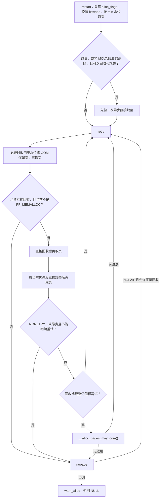

# `__alloc_pages_slowpath()`：快路径失败后，内核按什么顺序补救

本文依据仓库中的 Linux **6.18.52** 源码，版本见 [顶层 Makefile](../../linux/Makefile#L2)。函数本体在 [`__alloc_pages_slowpath()`](../../linux/mm/page_alloc.c#L4729)。

读这个函数时，先抓住一件事：**慢路径是一串越来越贵的尝试。** 每一步都先问“这次请求还允许这样做吗”，允许才做，做完立刻再向空闲链表要页。拿到页就返回；不允许，或者试到头仍然没有页，就走向失败。进入慢路径只说明按快路径的条件没拿到页，此时还没有开始直接回收。

回收扫描本身见 [内存回收](reclaim.md)。本章只回答：分配器在调用回收、规整和 OOM 之前，怎样决定下一步。

## 1. 快路径留下了什么

页分配的心脏是 [`__alloc_frozen_pages_noprof()`](../../linux/mm/page_alloc.c#L5259)。它先用 `ALLOC_WMARK_LOW` 调用 `get_page_from_freelist()`。这次尝试故意用偏保守的标志，避免在热路径上把权限算全。失败后它做两件收尾，再进入慢路径：

- 把 `ac->spread_dirty_pages` 清掉。快路径为带 `__GFP_WRITE` 的页缓存分配跳过了脏页超限的节点；慢路径不再用这个限制挡分配。见 [清掉脏页分散限制](../../linux/mm/page_alloc.c#L5299)。
- 把 `ac->nodemask` 恢复成调用者原来的节点掩码。快路径可能临时换成当前 cpuset 的允许节点。见 [恢复 nodemask 并进入慢路径](../../linux/mm/page_alloc.c#L5302)。

`highest_zoneidx` 和 `migratetype` 在准备阶段写好后，慢路径不再改它们。`preferred_zoneref` 会按当前节点限制重算；cpuset 掩码失效或启用紧急保留时，慢路径还会把 `ac->nodemask` 清成 `NULL`。字段定义见 [`struct alloc_context`](../../linux/mm/internal.h#L566)，清掩码的位置见 [cpuset 重试](../../linux/mm/page_alloc.c#L4709) 和 [紧急保留分支](../../linux/mm/page_alloc.c#L4908)。

因此，慢路径开头必须自己重算分配标志，并重算 zonelist 的起点。沿用快路径的迭代位置，可能在 cpuset 或节点掩码已经变化后，反复扫到不合格的 zone。

## 2. 进函数时先记下四种权限

函数开头用四个局部量概括这次请求还能做什么，见 [权限与阶数](../../linux/mm/page_alloc.c#L4732)：

| 局部量 | 含义 | 依据 |
| --- | --- | --- |
| `can_direct_reclaim` | 当前任务可以亲自进入直接回收 | `gfp_mask & __GFP_DIRECT_RECLAIM` |
| `can_compact` | 可以做内存规整 | 打开了 `CONFIG_COMPACTION`，并且带 `__GFP_IO`。迁移可能要做 I/O，所以 `GFP_NOIO` 不能规整。见 [`gfp_compaction_allowed()`](../../linux/include/linux/gfp.h#L423) |
| `nofail` | 调用者要求无限重试 | `__GFP_NOFAIL` |
| `costly_order` | 高阶且被视作“昂贵” | `order > PAGE_ALLOC_COSTLY_ORDER`。这个阈值是 3，所以 order 0～3 算普通请求，order ≥ 4 算昂贵请求。见 [`PAGE_ALLOC_COSTLY_ORDER`](../../linux/include/linux/mmzone.h#L62) |

`__GFP_NOFAIL` 还有三条源码直接给出的限制，违反时会 `WARN_ON_ONCE`，见 [NOFAIL 检查](../../linux/mm/page_alloc.c#L4747)：

- 不支持 order 大于 1 的伙伴分配。
- 必须同时有 `__GFP_DIRECT_RECLAIM`，否则无法回收，只会空转。
- 当前任务已经带着 `PF_MEMALLOC` 时，自己不能再回收，只能等别人释放内存。

这些警告记录的是不合理用法。后面的失败出口仍会处理“没有直接回收权限”的 NOFAIL：这种请求会被忽略，最终返回 `NULL`。

GFP 对重试强度的约定写在 [回收修饰符说明](../../linux/include/linux/gfp_types.h#L211)：普通阶数默认尽量不失败，昂贵分配默认尽早退让；`__GFP_NORETRY`、`__GFP_RETRY_MAYFAIL`、`__GFP_NOFAIL` 用来改写这个默认策略，并且都要和 `__GFP_DIRECT_RECLAIM` 一起使用。

## 3. 整条控制流先看成四个标签

函数里真正决定“回到哪里”的是四个标签。先记住它们的职责，再读中间的分支。

| 标签 | 做什么 |
| --- | --- |
| `restart` | 分配条件可能已经变了（cpuset、zonelist）。计数清零，分配标志从头重算 |
| `retry` | 条件没变，再做一轮：放宽保留页权限、取页、直接回收、直接规整 |
| `nopage` | 这一轮决定失败。先看 cpuset 是否刚变过；NOFAIL 在这里转入无限重试 |
| `got_pg` | 已经拿到页，直接返回 |

`restart` 会把规整结果设回 `COMPACT_SKIPPED`，规整优先级设回默认值，并重新读取 cpuset 与 zonelist 的序号。见 [restart 的初始化](../../linux/mm/page_alloc.c#L4766)。`retry` 保留这些计数，所以“没有进展”和“规整已经试过多少次”能够跨轮累积。

下面按一次普通进入的顺序往下走。成功拿到页的每一步都是 `goto got_pg`。

## 4. 第一轮：换成 min 水位，先叫醒 kswapd

### 4.1 `gfp_to_alloc_flags()` 重新解释 GFP

慢路径的常规标志从 `ALLOC_WMARK_MIN | ALLOC_CPUSET` 起步，也就是按 **min 水位**检查，并遵守 cpuset。见 [`gfp_to_alloc_flags()`](../../linux/mm/page_alloc.c#L4514)。

`__GFP_HIGH` 与 `ALLOC_MIN_RESERVE`、`__GFP_KSWAPD_RECLAIM` 与 `ALLOC_KSWAPD` 的数值被要求相同，函数用按位或把它们并进 `alloc_flags`，从而少掉两条分支。水位含义见 [回收一章的水位表](reclaim.md)。这里补上慢路径会额外打开的权限：

| 标志 | 谁会得到 | 效果 |
| --- | --- | --- |
| `ALLOC_MIN_RESERVE` | 带 `__GFP_HIGH`，或者在进程上下文里的实时 / deadline 任务 | 水位检查时可以使用一半 min 保留。见 [保留页折减](../../linux/mm/page_alloc.c#L3578) |
| `ALLOC_KSWAPD` | 带 `__GFP_KSWAPD_RECLAIM` | 允许唤醒 `kswapd` |
| `ALLOC_NON_BLOCK` | 没有 `__GFP_DIRECT_RECLAIM`，且没有 `__GFP_NOMEMALLOC` | 不能睡眠的分配可以使用一部分原子保留 |
| `ALLOC_HIGHATOMIC` | 上述不可睡眠分配，同时 order &gt; 0 且已有 `ALLOC_MIN_RESERVE` | 可以使用 `MIGRATE_HIGHATOMIC` 里为原子高阶请求预留的页 |
| `ALLOC_CMA` | 迁移类型是 `MIGRATE_MOVABLE` | 可以使用 CMA 空闲页。见 [`gfp_to_alloc_flags_cma()`](../../linux/mm/page_alloc.c#L3759) |
| `ALLOC_NOFRAGMENT` | `defrag_mode` 打开 | 避免把不同迁移类型混进同一个 pageblock |

没有直接回收权限、但带了 `__GFP_HIGH` 时，函数会清掉 `ALLOC_CPUSET`。典型例子是 `GFP_ATOMIC`（`__GFP_HIGH | __GFP_KSWAPD_RECLAIM`）：与其因为 cpuset 失败，不如忽略内存节点限制。`GFP_NOWAIT` 只有 `ALLOC_KSWAPD`，没有 `__GFP_HIGH`，所以得不到 min 保留，也不因此忽略 cpuset。见 [不可睡眠分支](../../linux/mm/page_alloc.c#L4536) 和 [常用 GFP 组合](../../linux/include/linux/gfp_types.h#L377)。

`defrag_mode` 是 `vm/defrag_mode`，取值 0 或 1，默认 0。见 [sysctl 项](../../linux/mm/page_alloc.c#L6792)。它打开后，慢路径会一直带着 `ALLOC_NOFRAGMENT`，直到回收和规整都无法避免退让，才在后面临时拿掉这个限制再试一次。

### 4.2 重算起点，必要时直接失败

接着用当前 nodemask 重新找第一个合格 zone。找不到，说明允许的 zone 范围是空的，去 `nopage`。见 [重算 preferred_zoneref](../../linux/mm/page_alloc.c#L4787)。

还有一种 cpuset 配置被标成“不合理”：允许节点上只有可移动 zone，却要做带 `__GFP_HARDWALL` 的不可移动分配。这种配置一旦出现，`cpusets_insane_config()` 会变成真。慢路径再用**当前任务**的 `mems_allowed` 检查一遍；仍然没有合格 zone，就直接失败，避免在明明没有可用内存类型的节点上继续回收。见 [不合理 cpuset 检查](../../linux/mm/page_alloc.c#L4797) 和 [判定来源](../../linux/kernel/cgroup/cpuset.c#L304)。

### 4.3 唤醒后台回收，马上再取一次页

带 `ALLOC_KSWAPD` 时调用 [`wake_all_kswapds()`](../../linux/mm/page_alloc.c#L4489)。它按节点去重，每个相关节点唤醒一次 `kswapd`。`defrag_mode` 打开时，交给 kswapd 的阶数至少提升到 `pageblock_order`，让后台回收朝“腾出整块 pageblock”的方向做。

唤醒之后，当前任务立刻用新的 `alloc_flags` 再调 `get_page_from_freelist()`。这次用的是 min 水位，还可能带上保留页权限，所以**很多请求在这里就返回了**。kswapd 是否已经回收到页，并不决定这次调用的成败；唤醒和后台线程真正运行之间有时间差。见 [唤醒后立即重试](../../linux/mm/page_alloc.c#L4805)。

`get_page_from_freelist()` 内部还有自己的支线：某个 zone 水位不够时，若打开了 `node_reclaim_mode`，可能先做该节点的回收再试这个 zone。那是取页函数里的行为，慢路径每次调用它都可能碰上。见 [取页时的节点回收](../../linux/mm/page_alloc.c#L3902)。

## 5. 昂贵分配和不可移动高阶分配，先尝试规整

直接回收会扫描 LRU、可能等待 I/O。对高阶请求，失败原因经常是**有足够的空闲页，但凑不出连续块**。所以在进入回收循环之前，有一条只做规整的捷径。条件在 [提前规整](../../linux/mm/page_alloc.c#L4816)：

1. 允许直接回收，并且允许规整。
2. 要么是昂贵阶数，要么是 order &gt; 0 且迁移类型不是 `MIGRATE_MOVABLE`。
3. 这次请求不能动用“忽略水位”的紧急保留。紧急保留的尝试还没发生，此时先规整不合适。

第二条把两类请求分开：

- **可移动的 order 1～3**：还不算昂贵，先不在这里规整，留给后面的回收循环。
- **不可移动的 order &gt; 0**：规整会尽量从相同迁移类型的 pageblock 里迁出页面，减轻永久碎片。
- **order ≥ 4**：不论是否可移动，都先试一次规整。

这次调用使用 `INIT_COMPACT_PRIORITY`，也就是异步规整。优先级的数值越小，规整越彻底；异步是其中最轻的一档。见 [`enum compact_priority`](../../linux/include/linux/compaction.h#L9)。

[`__alloc_pages_direct_compact()`](../../linux/mm/page_alloc.c#L4129) 做三件事：调用 `try_to_compact_pages()`；如果规整过程中有空闲页被当前任务“截获”，把该页准备好直接返回；否则再向空闲链表要一次。order 为 0 且没有被提升时，这个函数立刻返回 `NULL`，因为单页不需要规整。`defrag_mode` 下，不可移动请求的规整阶数会被提升到至少 `pageblock_order`，见 [提升规整阶数](../../linux/mm/page_alloc.c#L4157)。截获仍按原始 order 匹配，避免准备页的阶数和请求不一致。见 [`struct capture_control`](../../linux/mm/internal.h#L910)。

### 5.1 昂贵且 `__GFP_NORETRY`：最多再给一轮轻量尝试

透明大页的第一次尝试经常是“只在本节点规整，不要回收”。[`alloc_pages_mpol()`](../../linux/mm/mempolicy.c#L2395) 会先用 `__GFP_THISNODE | __GFP_NORETRY` 调用分配器。慢路径对“昂贵 + `__GFP_NORETRY`”的处理见 [NORETRY 的提前退出](../../linux/mm/page_alloc.c#L4840)：

| 刚刚的规整结果 | 下一步 |
| --- | --- |
| `COMPACT_SKIPPED` 或 `COMPACT_DEFERRED` | 直接 `nopage`。水位太低，或这个阶数最近规整失败被推迟了。再回收也很难凑出整个 pageblock，而且代价很大 |
| 带 `__GFP_THISNODE` | 直接 `nopage`。本节点规整没成功时，不要在这一个节点上加压回收；别的节点可能还有内存。调用方可以再发一次不带 `THISNODE` 的请求 |
| 其他失败 | 把后续规整优先级保持在异步，然后落入 `retry`，做**一轮**直接回收和异步规整。循环末尾的 `__GFP_NORETRY` 会在这一轮之后停止 |

所以 `__GFP_NORETRY` 的意思是“可以做很轻的一次直接回收，然后必须能失败”，不是“完全不进回收函数”。真正一次回收都不做的，是规整被跳过、被推迟，或者请求锁在单个节点上的情况。

## 6. `retry`：先放宽限制，再回收，再规整

从这里开始是循环体。见 [retry 标签](../../linux/mm/page_alloc.c#L4885)。

### 6.1 条件和内存视图变了，就整段重来

[`check_retry_cpuset()`](../../linux/mm/page_alloc.c#L4695) 处理两种竞赛：

- 内存策略给出的 nodemask 和 cpuset 的 `mems_allowed` 已经没有交集。函数把 `ac->nodemask` 清成 `NULL` 并要求重来。`MPOL_BIND` 在和 cpuset 不相交时，语义就是忽略这块策略。
- 分配过程中任务的 `mems_allowed` 被改过。用进入 `restart` 时记下的序号检测，变了就重来。

开启 `CONFIG_MEMORY_HOTREMOVE` 时，[`check_retry_zonelist()`](../../linux/mm/page_alloc.c#L4415) 再用序号锁看 zonelist 是否因热插拔重建过。重建了也走 `restart`，避免沿旧链表空转，也避免在名单刚更新时误入 OOM。

每轮循环里只要还带着 `ALLOC_KSWAPD`，就再次唤醒 kswapd，避免后台线程在分配者还在循环时睡下去。

### 6.2 紧急保留页在这一轮才打开

[`__gfp_pfmemalloc_flags()`](../../linux/mm/page_alloc.c#L4585) 判断能不能动用水位之下的内存：

| 条件 | 返回的分配标志 |
| --- | --- |
| 带 `__GFP_NOMEMALLOC` | 0，禁止紧急保留。这个标志优先于 `__GFP_MEMALLOC` |
| 带 `__GFP_MEMALLOC` | `ALLOC_NO_WATERMARKS`，水位检查直接跳过 |
| 软中断里，或进程上下文里，当前任务带 `PF_MEMALLOC` | `ALLOC_NO_WATERMARKS` |
| 进程上下文里的 OOM 受害者，且允许使用保留 | `ALLOC_OOM`。在有 MMU 的架构上，这是比普通保留更深、但仍检查水位的一档，见 [OOM 折减](../../linux/mm/page_alloc.c#L3603) |

得到非 0 结果后，慢路径**换成**这组标志，只额外保留原来的 `ALLOC_KSWAPD`，可移动请求再补上 `ALLOC_CMA`。同时，只要不再检查 cpuset，或者已经拿到紧急保留资格，就把 nodemask 清掉并重算 zonelist 起点。这类请求优先保证系统继续往前走。见 [改写 alloc_flags](../../linux/mm/page_alloc.c#L4898)。

然后再次 `get_page_from_freelist()`。这一次才是“忽略水位”的那一次尝试。前面故意把提前规整挡在它之前。

### 6.3 不能回收，或正在回收，就停

两次取页都失败后：

- 没有 `__GFP_DIRECT_RECLAIM`：去 `nopage`。`GFP_ATOMIC`、`GFP_NOWAIT` 走这里。它们可以唤醒 kswapd，自己不扫描 LRU。
- 当前任务带 `PF_MEMALLOC`：去 `nopage`。回收上下文里再次进入直接回收会递归。能做的尝试，是上一小节的无水位分配。见 [递归保护](../../linux/mm/page_alloc.c#L4919)。

### 6.4 直接回收一次，再直接规整一次

[`__alloc_pages_direct_reclaim()`](../../linux/mm/page_alloc.c#L4450) 调用 `try_to_free_pages()`，然后立刻再取页。若这次没拿到，它还会做一次补偿：释放一部分 highatomic 预留（非强制，每个 zone 至少留一个 pageblock），并排空 per-cpu 页列表，再取一次。这些页可能已经空闲，只是还挂在 CPU 本地或高阶原子保留里。`defrag_mode` 下，不可移动请求的回收阶数同样提升到 pageblock。见 [回收阶数提升](../../linux/mm/page_alloc.c#L4460)。

回收后无论是否拿到页，都再调用一次 `__alloc_pages_direct_compact()`。循环里用的优先级从 `DEF_COMPACT_PRIORITY` 开始，即轻量同步；昂贵且 `__GFP_NORETRY` 的请求在第 5.1 节被固定成异步。规整成功会清掉该 zone 的推迟记录。

## 7. 这一轮失败后，还值不值得再绕一圈

回收和规整都没给出页时，按下面的顺序决定去留。见 [循环末尾](../../linux/mm/page_alloc.c#L4939)。

### 7.1 调用者已经声明放弃

- 带 `__GFP_NORETRY`：去 `nopage`。第 5.1 节那一轮就是它的上限。
- 昂贵，并且不能规整，或者没有 `__GFP_RETRY_MAYFAIL`：去 `nopage`。昂贵请求默认不把系统拖进长时间重试和 OOM。想继续，必须同时能规整，并且显式带上 `__GFP_RETRY_MAYFAIL`。

普通阶数（order ≤ 3）没有这两条限制，会进入下面的重试判断。

### 7.2 回收还有希望：`should_reclaim_retry()`

[`should_reclaim_retry()`](../../linux/mm/page_alloc.c#L4618) 回答的是：再回收一轮，有没有可能让**这次阶数**的水位检查通过。

- 本轮回收有进展，且 order ≤ 3：连续失败计数清零。
- 没有进展，或者是昂贵阶数：计数加一。昂贵分配即使释放了一些页，这些页也不保证能拼成所需的连续块，所以仍然记一次失败。
- 计数超过 `MAX_RECLAIM_RETRIES`（16）就不再因为回收继续循环。见 [上限定义](../../linux/mm/internal.h#L532)。
- 否则逐个候选 zone 估算：空闲页加上全部可回收页之后，按 min 水位能否满足这次分配。有一个 zone 可以，就 `goto retry`。一个都不行，说明把 LRU 扫光也凑不出这次请求，继续回收没有目标。

返回假之前，函数还会**强制**交还 highatomic 预留。若这次真的交还出了页块，仍返回真，让分配再试一轮。见 [耗尽 highatomic 保留](../../linux/mm/page_alloc.c#L4689) 和 [交还实现](../../linux/mm/page_alloc.c#L3462)。

工作队列工人在这里用 `schedule_timeout_uninterruptible(1)` 短暂睡眠，避免工人不睡眠时并发管理认为队列没有拥塞。其他任务则 `cond_resched()`。

### 7.3 规整还有希望：`should_compact_retry()`

回收重试已经否定之后，若本轮回收有进展、并且允许规整，再问 [`should_compact_retry()`](../../linux/mm/page_alloc.c#L4237)。order 为 0 直接返回假。当前任务已有致命信号，也返回假。

| 上次规整结果 | 决定 |
| --- | --- |
| `COMPACT_SKIPPED` | 调用 `compaction_zonelist_suitable()`。它只用可回收页的一部分加上空闲页，估计继续回收后规整是否可能变得可行。可行才再试。见 [适合性估计](../../linux/mm/compaction.c#L2463) |
| `COMPACT_SUCCESS` | 规整认为分配该成功，多半是和并发分配撞上了。普通阶数最多再试 16 次，昂贵阶数最多 4 次。见 [`MAX_COMPACT_RETRIES`](../../linux/mm/page_alloc.c#L4125) |
| 其他失败 | 把 `compact_priority` 减一，也就是提高规整强度，并把重试计数清零。普通阶数可以一直提高到全同步；昂贵阶数停在轻量同步，不再升到全同步 |

优先级降到该阶数允许的下限后，这条路也结束。

### 7.4 `defrag_mode` 的最后一次退让

若 `defrag_mode` 仍要求 `ALLOC_NOFRAGMENT`，此时清掉该标志并 `goto retry`。前面一直拒绝跨迁移类型混用 pageblock；回收和规整都没能在这个约束下拿出页，就允许退让一次。见 [去掉 NOFRAGMENT](../../linux/mm/page_alloc.c#L4968)。

## 8. OOM：回收与规整都无法推进时才进来

进入 [`__alloc_pages_may_oom()`](../../linux/mm/page_alloc.c#L4034) 之前，再做一次 cpuset / zonelist 检查，避免名单刚变就杀进程。

这个函数自己还会先取一次页，使用 **high 水位**，并且去掉 `__GFP_DIRECT_RECLAIM`，防止在已经持有 `oom_lock` 时递归进入一个永不失败的分配。这一次是为了接住“别人刚刚释放了内存”的窗口。见 [持锁前再取页](../../linux/mm/page_alloc.c#L4066)。

以下情况只释放 `oom_lock` 并返回，不调用 `out_of_memory()`：

| 情况 | 原因 |
| --- | --- |
| `oom_lock` 没抢到 | 别的任务正在做 OOM 处理。记一次进展，睡眠一个 jiffy |
| `PF_DUMPCORE` | coredump 会很快吃光保留内存 |
| order 大于昂贵阈值 | 杀掉进程通常帮不了这种高阶连续块 |
| `__GFP_RETRY_MAYFAIL` 或 `__GFP_THISNODE` | 调用者准备好了失败；OOM 也不保证释放指定节点的内存 |
| 允许的最高 zone 低于 `ZONE_NORMAL` | 不为低端内存无谓杀进程 |
| 存储处于挂起相关状态 | `pm_suspended_storage()` |

其余情况调用 `out_of_memory()`。若杀手有进展，或者请求带 `__GFP_NOFAIL`，把 `did_some_progress` 设为 1。NOFAIL 还会立刻用 `ALLOC_NO_WATERMARKS` 再取一次页。见 [OOM 之后的保留页](../../linux/mm/page_alloc.c#L4104)。

回到慢路径后的收尾见 [OOM 返回之后](../../linux/mm/page_alloc.c#L4986)：

- 当前任务已经是 OOM 受害者，并且这次带着 `ALLOC_OOM` 或 `__GFP_NOMEMALLOC`：去 `nopage`。受害者若继续无水位空转，会把保留内存耗尽。
- `did_some_progress` 非 0：把连续失败计数清零，`goto retry`。进展可能来自真正杀掉了进程，也可能只是没抢到 `oom_lock`、别的任务正在处理。
- 没有进展：落入 `nopage`。

## 9. `nopage`：失败，或 NOFAIL 的无限循环

[`nopage`](../../linux/mm/page_alloc.c#L4998) 再检查一次 cpuset 和 zonelist。变了就 `restart`，避免一次过期的失败变成 OOM 或分配失败警告。

然后只剩 `__GFP_NOFAIL`：

- 没有直接回收权限：`goto fail`，返回 `NULL`。这是开头那条警告对应的不合理组合。
- 否则用 `ALLOC_MIN_RESERVE` 走 [`__alloc_pages_cpuset_fallback()`](../../linux/mm/page_alloc.c#L4015)：先遵守 cpuset 取一次，失败再忽略 cpuset。这里**不用** `ALLOC_NO_WATERMARKS`，避免 NOFAIL 把全部紧急保留吃光，让局面更差。
- 仍没有页：`cond_resched()` 后 `goto retry`。计数不被 `restart` 清零，所以回收和规整的上限仍然有效；上限用尽后会再次走到 OOM 和 `nopage`，再回到这里。循环一直继续，直到某次取页成功。

非 NOFAIL 的失败落到 `fail`：[`warn_alloc()`](../../linux/mm/page_alloc.c#L3990) 打印进程名、GFP、阶数和 nodemask。`__GFP_NOWARN`、速率限制，以及在没有托管 DMA 内存时的 `GFP_DMA`，会把这条警告吞掉。然后和成功路径汇合，返回 `page`。失败时它仍是 `NULL`。

调用方 `__alloc_frozen_pages_noprof()` 拿到非空页之后，若带 `__GFP_ACCOUNT`，还会做 memcg 记账；记账失败会把页释放并对外返回 `NULL`。那一步已经在慢路径之外。见 [返回后的记账](../../linux/mm/page_alloc.c#L5311)。

## 10. 用四种请求把路径走完

下面忽略 cpuset 竞赛、`defrag_mode` 和 `PF_MEMALLOC`，只跟踪标志把函数带去的出口。

### 10.1 `GFP_KERNEL`，order 0

`GFP_KERNEL` 包含直接回收、kswapd、I/O 和文件系统权限，没有 `__GFP_HIGH`。见 [组合定义](../../linux/include/linux/gfp_types.h#L378)。

1. 标志是 min 水位 + cpuset + 唤醒 kswapd。可移动迁移类型还会带 CMA；`GFP_KERNEL` 本身是不可移动类型。
2. 唤醒 kswapd，按 min 水位取页。空闲页介于 min 和 low 之间时，快路径会失败，这一步常常成功并返回。
3. order 0 不走提前规整。
4. 进入 `retry`，再取一次页。
5. 仍失败则直接回收，然后因 order 为 0，直接规整函数马上返回。
6. 只要回收有进展，并且某个 zone 在“可回收页全部算上”时能过 min 水位，就继续循环。连续 16 次没有进展，才走向 OOM。
7. OOM 的门槛对 order 0 是开放的，除非碰上 coredump、低端 zone、没抢到锁等情况。

这就是普通内核分配变慢时的主要路径：先靠更低的水位和后台回收成交；成交不了，当前任务自己回收；再不成，才考虑杀进程。

### 10.2 `GFP_ATOMIC`

`GFP_ATOMIC` 不能直接回收，但可以唤醒 kswapd，并且因为 `__GFP_HIGH` 得到 min 保留、忽略 cpuset。order &gt; 0 时还可以使用 highatomic 预留。

它不进入提前规整，也不进入直接回收。`retry` 里的第二次取页若仍失败，在“不允许直接回收”处去 `nopage`，然后警告并返回 `NULL`。原子上下文把补救限制在：降低水位、动用保留、叫醒后台线程。

### 10.3 昂贵阶数 + `__GFP_NORETRY` + `__GFP_THISNODE`

这是透明大页在本节点上的第一次尝试，GFP 由调用方临时或上这两个标志。见 [`vma_thp_gfp_mask()`](../../linux/mm/huge_memory.c#L1376) 和 [本节点尝试](../../linux/mm/mempolicy.c#L2399)。

1. 允许回收和规整，且阶数昂贵，于是先做异步规整。
2. 规整被跳过、被推迟，或者只是没成功：因为带了 `THISNODE`，直接 `nopage`，不在本节点做直接回收。
3. 若调用方的原始 GFP 仍有直接回收权限，`alloc_pages_mpol()` 会再发一次不带 `THISNODE` 的请求，那一次才允许远程节点以及回收。

`GFP_TRANSHUGE_LIGHT` 甚至没有直接回收位，慢路径在取页失败后会更快走到 `nopage`。

### 10.4 `__GFP_NOFAIL`，order 0 或 1，且允许直接回收

前半段和 `GFP_KERNEL` 相同，可以回收、规整、进入 OOM。OOM 若选中了当前任务，下一轮会给它 `ALLOC_OOM`。一旦受害者带着这个标志仍失败，慢路径不再在 OOM 段落里打转，而落到 `nopage`。

`nopage` 发现 NOFAIL 后，用 min 保留再试，然后无条件 `goto retry`。因此 NOFAIL 的“永不失败”是**失败出口被接回循环**，不是前面的重试上限失效。上限仍然会把每一轮收束到 OOM 和 `nopage`，只是 `nopage` 不把 `NULL` 交还给调用者。

没有 `__GFP_DIRECT_RECLAIM` 的 NOFAIL 是例外：`nopage` 把它送去 `fail`，返回 `NULL`。

## 11. 阅读时可以停下来核对的问题

| 问题 | 到源码里看哪里 |
| --- | --- |
| 为什么慢路径一开始就可能成功？ | min 水位和保留页标志，[第一轮取页](../../linux/mm/page_alloc.c#L4808) |
| 为什么有的高阶请求先规整、有的先回收？ | [提前规整条件](../../linux/mm/page_alloc.c#L4825) |
| `__GFP_NORETRY` 会不会进入直接回收？ | 昂贵请求先看规整结果，[提前退出](../../linux/mm/page_alloc.c#L4840)；循环末尾一律停止，[NORETRY 出口](../../linux/mm/page_alloc.c#L4940) |
| 回收有进展，为什么还会停？ | 昂贵阶数仍累计失败次数；若所有 zone 即使回收光也不够，[should_reclaim_retry()](../../linux/mm/page_alloc.c#L4632) |
| 谁会走到 OOM 杀手？ | 普通阶数、没有 NORETRY、回收和规整都不再值得重试。[may_oom 的拒绝条件](../../linux/mm/page_alloc.c#L4072) |
| `__GFP_NOFAIL` 在哪里保证不返回失败？ | [`nopage` 里的无限 retry](../../linux/mm/page_alloc.c#L5011)。没有直接回收权限时仍会失败 |
