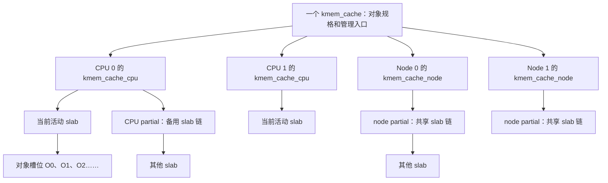
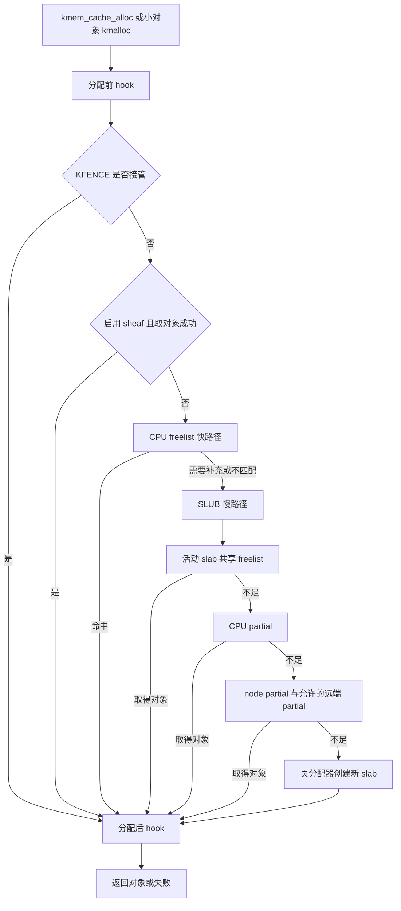
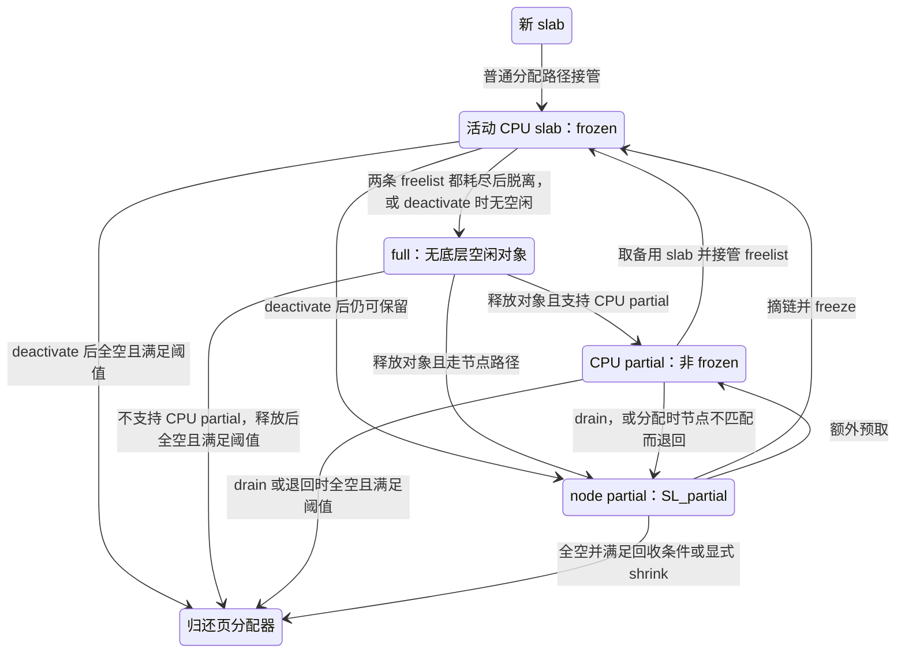
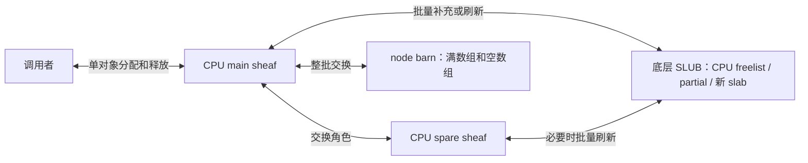
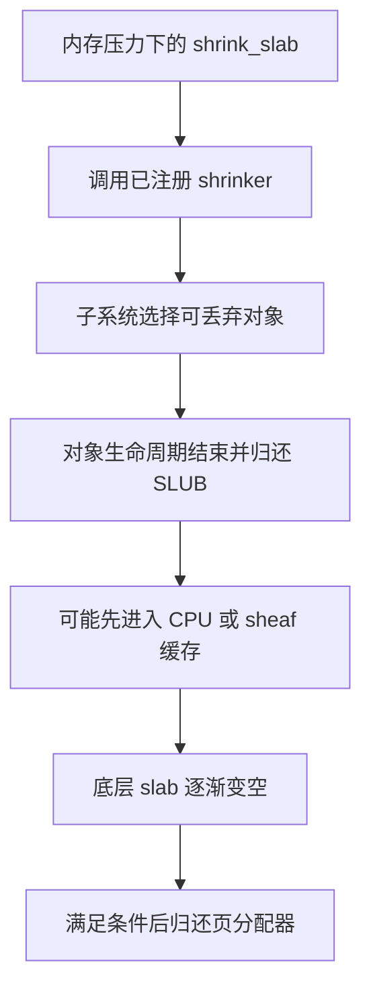

# SLUB 机制详解：从对象组织到分配、释放与回收

> 本文只依据本项目 `linux/` 中的源码。版本由 [linux/Makefile](../../linux/Makefile#L2) 标注为 **6.18.52**，所有代码链接均相对于本文所在目录。
>
> 主线以非 `CONFIG_SLUB_TINY`、未对当前 cache 开启 SLUB 调试的普通分配为基础。CPU partial、NUMA、sheaf、PREEMPT_RT 等分支会分别说明；这些是源码中的可选机制，不代表当前运行系统已经启用。
>
> 架构只考虑 x86_64。与本章结论相关的 `linux/.config` 取值：`CONFIG_SLUB=y`、`CONFIG_SLUB_TINY` 未设置、`CONFIG_SLAB_MERGE_DEFAULT=y`、`CONFIG_SLAB_FREELIST_RANDOM=y`、`CONFIG_SLAB_FREELIST_HARDENED=y`、`CONFIG_SLUB_STATS` 未设置、`CONFIG_SLUB_CPU_PARTIAL=y`、`CONFIG_RANDOM_KMALLOC_CACHES` 未设置（[.config#L1173-L1182](../../linux/.config#L1173-L1182)）；`CONFIG_SLUB_DEBUG=y` 但 `CONFIG_SLUB_DEBUG_ON` 未设置（[.config#L10571-L10572](../../linux/.config#L10571-L10572)）；`CONFIG_PREEMPTION=y`、`CONFIG_PREEMPT_RT` 未设置（[.config#L139-L141](../../linux/.config#L139-L141)）；`CONFIG_MEMCG=y`、`CONFIG_SLAB_OBJ_EXT=y`（[.config#L208-L212](../../linux/.config#L208-L212)）；`CONFIG_NR_CPUS=512`（[.config#L431](../../linux/.config#L431)）、`CONFIG_NUMA=y`（[.config#L469](../../linux/.config#L469)）；`CONFIG_HAVE_ALIGNED_STRUCT_PAGE=y`、`CONFIG_HAVE_CMPXCHG_DOUBLE=y`（[.config#L903-L905](../../linux/.config#L903-L905)）；页大小 4 KiB（[.config#L951-L954](../../linux/.config#L951-L954)）；`CONFIG_HARDENED_USERCOPY=y`（[.config#L10057](../../linux/.config#L10057)）；`CONFIG_KASAN` 未设置，`CONFIG_KFENCE=y` 但 `CONFIG_KFENCE_SAMPLE_INTERVAL=0`（[.config#L10607-L10610](../../linux/.config#L10607-L10610)）。

阅读路线：第 1～4 节建立数据结构和计数模型，第 5～10 节跟踪创建、分配、释放及并发，第 11～16 节解释扩展缓存、接口和回收，第 17～19 节用于观测、复习和对照源码。

## 1. 先认识 SLUB 管理的几种东西

SLUB 将从页分配器取得的内存切成固定步长的对象槽位，并通过缓存这些槽位来服务重复的小对象分配。理解它时，应先分清 **cache、slab、object、CPU 缓存和 node 缓存**，再看函数调用链。

| 名称 | 表示什么 | 解决什么问题 |
| --- | --- | --- |
| `kmem_cache` | 一类兼容对象的分配规则和管理入口 | 规定对象大小、对齐、构造函数、调试选项等 |
| `slab` | 一个由若干连续页构成、被切成对象槽位的内存单元 | 把页级内存转成对象级内存 |
| `object` | slab 中的一个分配槽位 | 返回给调用者使用 |
| `kmem_cache_cpu` | 某个 cache 在某个 CPU 上的状态 | 让常见分配、释放尽量在本 CPU 完成 |
| `kmem_cache_node` | 某个 cache 在某个 NUMA 节点上的状态 | 共享有空闲对象的 slab |
| sheaf / barn | 可选的对象指针数组 / 节点级数组仓库 | 批量缓存、交换对象，进一步摊薄底层操作成本 |

这里的 cache 是内核软件管理的对象缓存，不是 CPU 硬件的 L1/L2 cache；SLUB 的设计会考虑硬件缓存访问成本，但二者不是同一个概念。



一个 slab 只隶属于一个 `kmem_cache`；一个 cache 可以管理很多 slab。每个 CPU 的活动 slab、CPU partial 中的 slab、node partial 中的 slab，是同类内存处于不同管理状态的结果，不是三种不同的物理内存。

源码入口：[struct kmem_cache](../../linux/mm/slab.h#L238-L296)、[struct slab](../../linux/mm/slab.h#L52-L102)、[CPU 与节点结构](../../linux/mm/slub.c#L421-L502)。

## 2. 核心数据结构：先明确每个字段的职责

### 2.1 `struct kmem_cache`：一类对象的“规格说明书”

本版本的结构定义位于 `mm/slab.h`，不能直接套用旧版 `include/linux/slub_def.h` 的文件位置。

| 关键字段 | 含义 | 阅读时的注意点 |
| --- | --- | --- |
| `object_size` | cache 对外提供的对象大小，单位为字节 | 对 kmalloc cache 而言是档位大小，可能大于本次请求大小 |
| `size` | 相邻对象槽位的实际步长，包含对齐和元数据 | 计算每个 slab 放多少对象，应使用它 |
| `offset` | 空闲链表指针相对对象地址的偏移 | 不一定是 0，也不一定在对象有效载荷内 |
| `inuse` | 对象（按字对齐后）及可选右侧 redzone 占用的字节数，也是其后元数据的起始偏移 | **不是对象数量**，不要与 `slab->inuse` 混淆 |
| `align` | 对象对齐要求 | 会影响最终 `size` |
| `oo` | 首选 slab order 和对应对象数的打包表示 | 是首选规格，不保证每个 slab 都使用它 |
| `min` | 至少容纳一个对象所需的 order 和对象数 | 页分配失败时的回退规格 |
| `cpu_slab` | 每 CPU 的 `kmem_cache_cpu` | 包含活动 slab、私有 freelist、CPU partial |
| `node[]` | 每节点的 `kmem_cache_node` | 包含共享 partial 链表 |
| `min_partial` | 节点保留 partial slab 的阈值 | 影响空 slab 是否立即归还页分配器 |
| `cpu_partial` / `cpu_partial_slabs` | CPU partial 的配置值 / 实际使用的 slab 数阈值 | 前者按对象表达，后者按 slab 数限制 |
| `cpu_sheaves` / `sheaf_capacity` | 可选 sheaf 层的入口和容量 | 容量为 0 时不创建该层 |
| `flags` / `allocflags` | cache 属性 / 分配 slab 页时附加的 GFP 标志 | 与每次分配传入的 GFP 参数分工不同 |
| `ctor` | 新 slab 中每个对象的构造函数 | 不是每次分配对象都调用 |
| `refcount` | cache 本身的引用计数 | 用于别名、合并和销毁，不是存活对象数 |

`oo` 的编码可以简化成：

```text
oo.x = (order << 16) | objects
objects = floor((PAGE_SIZE << order) / size)
```

具体 slab 的 `objects` 才是该 slab 实际拥有的槽位数。例如，首选高阶页失败后，用 `min` 创建的新 slab 可以比同 cache 的其他 slab 小。

源码：[kmem_cache 字段](../../linux/mm/slab.h#L238-L296)、[s->inuse 的计算](../../linux/mm/slub.c#L7899-L7903)、[oo_make / oo_order / oo_objects](../../linux/mm/slub.c#L667-L690)、[高阶分配回退](../../linux/mm/slub.c#L3286-L3298)。

### 2.2 `struct slab`：一个 slab 的管理信息

`struct slab` 复用页描述符中的存储空间，并不是在每个对象前放一个完整管理头。源码通过 `SLAB_MATCH` 和静态断言检查它与 `struct page` 的布局兼容性。一个 slab 对应一个 folio；多页 slab 的管理信息使用其头页对应的描述符空间。

| 关键字段 | 作用 |
| --- | --- |
| `flags` | 与页标志共享存储；其中 `SL_locked`、`SL_partial`、`SL_pfmemalloc` 位有 slab 专用含义 |
| `slab_cache` | 指回所属 `kmem_cache`，释放时据此恢复对象规格 |
| `freelist` | 该 slab 自身记录的空闲对象链表 |
| `inuse` | 不在 `slab->freelist` 上的对象数，具体解释还要结合 frozen 和上层缓存 |
| `objects` | slab 中对象槽位总数，15 位字段，上限 32767 |
| `frozen` | 普通路径中表示 slab 被活动 CPU slab 机制接管 |
| `counters` | 把 `inuse`、`objects`、`frozen` 等打包，便于整体更新 |
| `slab_list` | 在节点 partial 等链表中的链接 |
| `next` / `slabs` | 用于 CPU partial 单链表及链长信息（`CONFIG_SLUB_CPU_PARTIAL`），与 `slab_list` 复用空间 |
| `llnode` / `flush_freelist` | 不允许自旋的受限上下文（如 `kmalloc_nolock()`）不能立即停用或释放 slab 时，把它挂入每 CPU 延迟链表，并暂存需交回的 CPU freelist，由 `irq_work` 稍后处理；同样与 `slab_list` 复用空间 |
| `obj_exts` | 可选对象扩展信息入口（`CONFIG_SLAB_OBJ_EXT`），用于 memcg 等功能 |

```text
管理信息所在的描述符空间                  slab 的数据内存
+-------------------------+             +-------+-------+-------+------+
| struct slab             |             | obj 0 | obj 1 | obj 2 | ...  |
| slab_cache ------------>| cache       +-------+-------+-------+------+
| freelist ---------------+-----------------^                 |
| inuse / objects / frozen|                  +-- freeptr ------+
+-------------------------+

描述符不占用这里画出的每个 object 槽位。
```

对象地址恢复 slab 的基本路径是 `virt_to_folio()` → 检查 slab 标记 → `folio_slab()`。因此 `kfree()` 不需要调用者额外传入对象大小。

源码：[struct slab 与布局断言](../../linux/mm/slab.h#L51-L118)、[slab_folio 说明](../../linux/mm/slab.h#L133-L146)、[virt_to_slab](../../linux/mm/slab.h#L189-L197)、[slab 标志位](../../linux/mm/slub.c#L189-L203)、[MAX_OBJS_PER_PAGE](../../linux/mm/slub.c#L323)、[延迟停用使用 llnode / flush_freelist](../../linux/mm/slub.c#L6573-L6584)、[kfree](../../linux/mm/slub.c#L6885-L6906)。

### 2.3 `struct kmem_cache_cpu`：当前 CPU 的工作区

以下为省略配置分支和 union 后的**简化代码**，不是原始源码：

```c
/* 简化代码：partial 实际受 CONFIG_SLUB_CPU_PARTIAL 控制，stat[] 受 CONFIG_SLUB_STATS 控制 */
struct kmem_cache_cpu {
    /* 实际源码还通过 union 将二者映射为 freelist_tid */
    void **freelist;
    unsigned long tid;
    struct slab *slab;
    struct slab *partial;
    local_trylock_t lock;
};
```

- `slab`：当前用于分配的活动 slab。
- `freelist`：已经从该 slab 取到本 CPU 的空闲对象链表。
- `tid`：事务标识，帮助检测中断、抢占或 CPU 迁移导致的状态变化。
- `partial`：本 CPU 暂存的备用 slab 链，不是对象链。
- `lock`：保护慢路径对这组字段的操作；普通快路径使用成对更新。

**一个 CPU 对每个 cache 至多有一个当前活动 slab，但可以持有多个备用 partial slab。** 从本 CPU 分配出去的对象不会因为线程迁移而移动，其归属仍然由对象所在 slab 决定。

源码：[kmem_cache_cpu](../../linux/mm/slub.c#L417-L437)、[cpu_slab->lock 的职责](../../linux/mm/slub.c#L123-L133)、[CPU 工作区的分配和对齐](../../linux/mm/slub.c#L7676-L7695)。

### 2.4 `struct kmem_cache_node`：节点共享的 slab 池

`partial` 保存可提供空闲对象的 slab，`nr_partial` 统计链上的 **slab 数量**，`list_lock` 保护链表及该计数。

普通工作模式下，不维护一条供日常分配使用的全局 full slab 链表：已满 slab 没有空闲对象，扫描它没有意义；对象释放时可以由地址重新找到它。结构中的 `full`、`nr_slabs`、`total_objects` 位于 `CONFIG_SLUB_DEBUG` 分支（当前配置为 `=y`，因此这些字段存在）；但 `add_full()` 只在 cache 带 `SLAB_STORE_USER` 时才把 slab 挂到 `full` 链，普通 cache 即使编译了这些字段也不维护 full 链。此外，启用 sheaf 的 cache 还通过 `barn` 指针挂接节点级 sheaf 仓库。

这里的 partial 链也可能保留**完全空闲的 slab**。它不是“严格满足 `0 < inuse < objects` 的集合”，而是节点层面可重新分配对象的资源池。

源码：[kmem_cache_node](../../linux/mm/slub.c#L492-L502)、[full slab 的设计说明](../../linux/mm/slub.c#L158-L162)、[add_full](../../linux/mm/slub.c#L1647-L1655)、[add_partial / remove_partial](../../linux/mm/slub.c#L3405-L3430)、[仅 sheaf cache 分配 barn](../../linux/mm/slub.c#L7806-L7811)。

### 2.5 sheaf 和 barn：缓存的是对象指针数组

本版本还支持可选的对象批量缓存层：

| 结构 | 关键内容 | 管理单位 |
| --- | --- | --- |
| `slab_sheaf` | `size`、`objects[]`、所属 cache | 多个对象指针，可来自多个 slab |
| `slub_percpu_sheaves` | `main`、`spare`、`rcu_free`、本地锁 | 某 CPU 的主数组、备用数组和 RCU 延迟释放数组 |
| `node_barn` | 满 sheaf 链、空 sheaf 链、计数、自旋锁 | 节点内供 CPU 交换的整批数组 |

`main` 是当前分配和释放使用的数组；`spare` 是备用数组；`rcu_free` 中的对象尚在等待 RCU 延迟处理，不能当作普通可分配对象。

CPU partial 保存的是 **slab 指针链**，sheaf 保存的是 **object 指针数组**。它们处在不同层次，可以同时存在。

源码：[sheaf / barn 结构](../../linux/mm/slub.c#L458-L487)、[sheaf_capacity 参数](../../linux/include/linux/slab.h#L339-L369)。

## 3. 对象内部布局：空闲对象本身就是链表节点

### 3.1 freelist 不要求单独分配链表节点

SLUB 用空闲对象中的一个指针位置连接下一个空闲对象：

```text
freelist
   |
   v
对象 A                         对象 B                         对象 C
+----------------------+       +----------------------+       +----------------------+
| payload / 元数据      |       | payload / 元数据      |       | payload / 元数据      |
| object + offset: B ---+------>| object + offset: C ---+------>| object + offset: NULL|
+----------------------+       +----------------------+       +----------------------+
```

`get_freepointer()` 从 `object + s->offset` 读取后继，`set_freepointer()` 写入后继。对象重新交给调用者后，普通 cache 中这个位置可以重新作为有效载荷使用；释放后调用者必须停止访问对象。

如果开启 `CONFIG_SLAB_FREELIST_HARDENED`（当前配置为 `=y`），存储值经过编码：

```text
encoded = next_pointer XOR cache_random XOR swab(pointer_storage_address)
```

因此内存中的原始值不一定是一个能直接解引用的指针。它用于提高 freelist 元数据被伪造的难度，不等于完整的 double-free 检测器。

源码：[指针编码和解码](../../linux/mm/slub.c#L557-L586)、[读写 freepointer](../../linux/mm/slub.c#L588-L639)。

### 3.2 `object_size`、`size` 和 `offset` 为什么不同

普通无额外元数据的 cache，freepointer 通常放在对象中部附近：

```text
offset = ALIGN_DOWN(object_size / 2, sizeof(void *))
```

这说明“SLUB 把 next 指针放在对象第一个字”并不是本版本的一般规则。

如果对象有构造函数、启用 poison，或采用默认的 `SLAB_TYPESAFE_BY_RCU` 布局等，源码会把 freepointer 放到对象有效载荷之外，避免破坏需要保留或检查的数据。RCU cache 还可以显式指定自定义 freepointer 偏移。

带调试信息时，可以将一个槽位概念化为：

```text
| 左侧 redzone/padding | 对象有效载荷 | 右侧 redzone/对齐 |
                       ^ 返回的对象地址
| 可选外置 freepointer | 可选 alloc/free track | 其他元数据/填充 |
<---------------------- 相邻槽位步长 s->size ---------------------->
```

这只是按功能分区的示意，不表示所有配置都同时拥有这些区域。实际偏移由 `calculate_sizes()`、KASAN 和对齐要求共同决定。

**计算示例，仅假设 `PAGE_SIZE=4096`、最终 `s->size=192`、order 为 0：**

```text
objects = floor(4096 / 192) = 21
尾部剩余 = 4096 - 21 × 192 = 64 字节
```

如果 debug 元数据把步长增大到 256 字节，同一页只能放 16 个对象。分析内存占用时不能只拿 C 结构体的 `sizeof` 去除页大小。

源码：[calculate_sizes](../../linux/mm/slub.c#L7864-L8001)、[外置 freepointer 条件](../../linux/mm/slub.c#L7905-L7926)、[RCU cache 自定义偏移](../../linux/mm/slub.c#L7927-L7928)、[默认中部偏移](../../linux/mm/slub.c#L7929-L7936)、[最终对齐与 order](../../linux/mm/slub.c#L7970-L7999)。

## 4. 两条 freelist 与 frozen：理解 SLUB 的关键

### 4.1 同一个活动 slab，为什么有两条空闲链表

普通 CPU slab 模式中，同一个 slab 的空闲对象可以分布在两处：

```text
CPU 0 的 kmem_cache_cpu                  活动 slab S
+------------------------+              +------------------------+
| slab ------------------+------------->| frozen = 1             |
| freelist -> A -> B -> C |              | freelist -> X -> Y     |
+------------------------+              +------------------------+
          CPU 0 私有链                             slab 共享链
          本地分配/本地归还                        其他 CPU 归还
```

CPU 0 可以在自己的 freelist 上连续分配对象，无须每次修改共享 slab 描述符。其他 CPU 释放来自 S 的对象时，把对象接回 `S->freelist`，不用直接修改 CPU 0 的工作区。

CPU 0 的本地链耗尽后，再批量接管 `S->freelist`。通过这种分工，跨 CPU 同步从“每分配一个对象一次”变成“转移一批对象时一次”，减少共享缓存行的竞争。

源码：[frozen 与访问权说明](../../linux/mm/slub.c#L82-L90)、[get_freelist](../../linux/mm/slub.c#L4449-L4472)、[do_slab_free](../../linux/mm/slub.c#L6609-L6685)。

### 4.2 frozen 表达的是管理权，不是禁止释放

在本文的普通分配主线中，`frozen=1` 表示活动 slab 被一个 CPU 接管，不参加普通节点链表管理。其他 CPU 仍然可以把对象释放到它的共享 freelist，但不会顺手把它加入或移出 partial 链。

当前版本的稳定状态如下：

| 状态 | `SL_partial` | `frozen` | 空闲对象主要在哪里 | 谁安排 slab 的去向 |
| --- | --- | --- | --- | --- |
| node partial | 1 | 0 | `slab->freelist` | 持有节点 `list_lock` 的路径 |
| CPU partial | 0 | 0 | `slab->freelist` | 持有它的 CPU，通过取用或 drain 处理 |
| 活动 CPU slab | 0 | 1 | `c->freelist` 与 `slab->freelist` | 当前 owner CPU |
| full slab | 0 | 0 | 没有底层空闲对象 | 下一次释放路径重新接入管理 |

**本版本的 CPU partial slab 没有 frozen。** `frozen=0` 也不能单独证明 slab 在 node partial 上，需要同时看 `SL_partial` 和所属链表。CPU partial 与 full 的两个状态位一样，但前者有空闲对象并由 CPU partial 链持有。

调试 cache 采用另一套受节点锁保护的路径，甚至会复用 frozen 位表示损坏状态；不要将上表无条件套到调试模式。

源码：[源码中的四种状态总结](../../linux/mm/slub.c#L92-L104)、[SL_partial 定义](../../linux/mm/slub.c#L189-L203)、[调试时 frozen 位复用说明](../../linux/mm/slab.h#L80-L85)、[调试检查失败时置 frozen](../../linux/mm/slub.c#L1738-L1748)、[检查到 frozen 即拒绝该 slab](../../linux/mm/slub.c#L1555-L1558)。

### 4.3 `slab->inuse` 不总是调用者持有的对象数

先忽略 sheaf、KASAN quarantine 等额外缓存，定义：

```text
N = slab->objects
C = 当前 CPU freelist 中属于此 slab 的对象数
R = slab->freelist 中的对象数
A = 已分配给调用者且尚未归还的对象数

对于一个稳定的 frozen CPU slab：
N = A + C + R
slab->inuse = N - R = A + C
```

SLUB 把整批对象交给 CPU freelist 时，从 slab 共享状态的视角认为它们已被取走，所以会把 `inuse` 设为 `objects`。之后本地分配、释放只改变 C 与 A 的分布，不逐次修改 `slab->inuse`。

远端释放向共享 freelist 放回对象时，R 增加、`inuse` 减少。owner 再次接管共享 freelist 时，R 清零、`inuse` 又恢复为 N。

若启用 sheaf，设 H 为已经离开底层 freelist、但还缓存于普通 sheaf 中的对象数，则应进一步理解为：

```text
N = A + C + R + H
slab->inuse = A + C + H
```

所以一个对象已被调用者释放，也可能尚未被底层 slab 计为空闲。KASAN quarantine、RCU 延迟释放等还会形成其他“暂不可交回底层”的状态；上述等式是排除这些状态后的教学模型。

源码：[freeze_slab 设置计数](../../linux/mm/slub.c#L4477-L4499)、[get_freelist 重新接管](../../linux/mm/slub.c#L4449-L4472)、[新 slab 接管时设置计数](../../linux/mm/slub.c#L4751-L4754)、[共享释放递减 inuse](../../linux/mm/slub.c#L5924-L5957)、[sheaf 入数组](../../linux/mm/slub.c#L6187-L6211)。

## 5. 创建 cache：先确定对象布局，再建立管理结构

### 5.1 创建流程不是立即给所有对象分配内存

普通 cache 创建主线可以概括为（简化调用树，省略错误回滚）：

```text
kmem_cache_create()
  → __kmem_cache_create_args()
      → 检查名称、大小、标志和 usercopy 范围
      → 尝试复用兼容 cache，建立别名
      → calculate_alignment()
      → create_cache()
          → do_kmem_cache_create()
              → calculate_sizes() / calculate_order()
              → 若 system_has_freelist_aba() 且无 SLAB_NO_CMPXCHG 调试标志，置 __CMPXCHG_DOUBLE
              → 设置 min_partial、CPU partial
              → 可选创建 cpu_sheaves
              → 初始化节点结构、CPU 结构、随机序列
              → 注册可用的 sysfs/debugfs 信息
```

创建的重点是对象规格和管理结构。普通业务对象 slab 可以在后续分配需求出现时再创建。用于管理 cache 的结构本身也需要内存，因此“创建 cache 不分配任何内存”同样不准确。

源码：[创建入口](../../linux/mm/slab_common.c#L315-L391)、[create_cache](../../linux/mm/slab_common.c#L229-L261)、[do_kmem_cache_create](../../linux/mm/slub.c#L8539-L8643)。

### 5.2 为什么不同名称的 cache 可能合并

两个 cache 若布局兼容，可以共用一套 slab，以降低各自保留空闲空间带来的浪费。`find_mergeable()` 会检查大小、对齐和需要一致的标志，并限制大小差距。

以下情况会阻止相应的合并尝试：全局 `slab_nomerge`、`SLAB_NO_MERGE` 等禁止合并标志、有构造函数、特定 usercopy 配置、请求 sheaf 等。`slab_nomerge` 的默认值取 `!CONFIG_SLAB_MERGE_DEFAULT`，当前配置为 `CONFIG_SLAB_MERGE_DEFAULT=y`，即默认允许合并。合并成功后增加 cache 的 `refcount`，名称可以成为别名。因此不能仅根据名称数量推断独立 slab 池数量。

源码：[禁止合并的标志与默认开关](../../linux/mm/slab_common.c#L48-L58)、[slab_unmergeable / find_mergeable](../../linux/mm/slab_common.c#L153-L227)、[别名和 refcount](../../linux/mm/slab_common.c#L263-L286)。

### 5.3 order 选择：在页分配难度、尾部浪费和共享锁开销之间折中

一个 slab 使用 `2^order` 个页。order 较大时，一次可得到更多对象，切换 slab、访问节点 partial 的频率往往较低；代价是需要更大的连续物理内存，也可能让更多内存被少量长寿命对象占住。

`calculate_order()` 的主要步骤是：

1. 决定最少对象数。若未指定 `slub_min_objects`，根据 CPU 数计算目标值。
2. 根据对象步长和目标对象数计算起始 order，同时考虑 `slub_min_order`。
3. 在到 `slub_max_order` 的范围内寻找合适布局，依次允许最多约 `1/16`、`1/8`、`1/4`、`1/2` 的尾部浪费。非 SLUB_TINY 构建中 `slub_max_order` 默认取 `PAGE_ALLOC_COSTLY_ORDER`（即 3），可由 `slab_max_order=` 启动参数修改。
4. 若仍不合适，退而求至少能容纳单个对象的 order，并检查页分配器上限。
5. 把首选结果存入 `s->oo`，把最低规格存入 `s->min`。

这不是“一个 cache 永远固定使用某个 order”的保证。运行时 `allocate_slab()` 先按 `oo` 尝试，失败后按 `min` 再试，并记录 `ORDER_FALLBACK`。

源码：[slub_min_order / slub_max_order 默认值](../../linux/mm/slub.c#L7547-L7550)、[PAGE_ALLOC_COSTLY_ORDER](../../linux/include/linux/mmzone.h#L62)、[slab_min_order / slab_max_order / slab_min_objects 启动参数](../../linux/mm/slub.c#L8165-L8191)、[calculate_order](../../linux/mm/slub.c#L7597-L7658)、[首选与最低规格](../../linux/mm/slub.c#L7994-L7998)、[运行时回退](../../linux/mm/slub.c#L3274-L3298)。

## 6. 分配流程：从最近的对象开始，逐级补充资源

### 6.1 先看完整入口，再看核心算法

`kmem_cache_alloc_noprof()` 最终调用 `slab_alloc_node()`。正常主线包括：



图中表示资源获取层级；NUMA 偏好、调试模式等会改变部分顺序或直接走特定分支。当前配置虽为 `CONFIG_KFENCE=y`，但 `CONFIG_KFENCE_SAMPLE_INTERVAL=0`，按 Kconfig 说明和 `kfence_init()` 的实现，KFENCE 默认不启用，只有启动参数 `kfence.sample_interval` 设为非零时，KFENCE 分支才可能接管分配（[Kconfig.kfence](../../linux/lib/Kconfig.kfence#L28-L37)、[kfence_init](../../linux/mm/kfence/core.c#L946-L948)）。

分配后 hook 还负责 KASAN、清零、kmemleak、memcg 等操作。**成功从 freelist 取出对象，不代表整次 API 调用已经成功**：例如 memcg 记账失败时会归还对象并向调用者返回失败。

源码：[slab_alloc_node](../../linux/mm/slub.c#L5294-L5327)、[分配后 hook](../../linux/mm/slub.c#L4971-L5026)、[memcg 失败回滚](../../linux/mm/slub.c#L2343-L2364)。

### 6.2 CPU freelist 快路径：成对更新指针和事务号

`__slab_alloc_node()` 的核心可简化为以下伪代码，省略严格 NUMA 策略等分支：

```text
retry:
    c = 当前 CPU 的 cache 工作区
    tid = READ_ONCE(c.tid)
    compiler_barrier()
    object = c.freelist
    slab = c.slab

    如果不允许无锁快路径，或 object/slab 为空，或节点不匹配：
        进入 __slab_alloc()
    否则：
        next = get_freepointer_safe(object)
        尝试在执行原子操作时所在 CPU 的工作区上更新：
            (freelist, tid) : (object, tid) → (next, next_tid(tid))
        失败则回到 retry
        成功则返回 object
```

成功时主要修改本 CPU 的两个相邻字段，不修改节点 partial，也不逐对象更新 `slab->inuse`。本版本用 `freelist_aba_t` 表示成对状态，CPU 路径的辅助函数是 `__update_cpu_freelist_fast()`。

`barrier()` 在这里用于约束编译器取值顺序；不能把它解释为“独立保证所有 CPU 可见性的全局内存屏障”。算法正确性还依赖 per-CPU 访问规则、事务号和对应的原子操作。

源码：[快路径完整实现](../../linux/mm/slub.c#L4846-L4941)、[成对更新辅助函数](../../linux/mm/slub.c#L4429-L4439)。

### 6.3 第一层补充：接管活动 slab 的共享 freelist

当 `c->freelist` 为空，慢路径不会立即申请新页。它先锁住本 CPU 工作区并重新检查，以防中间发生了抢占或状态变化；若 `c->freelist` 此时已非空，直接从它装载。否则调用 `get_freelist()`，其效果可用以下伪代码表示（实际实现在双字更新失败时循环重试）：

```text
旧共享状态：freelist = R，inuse = N - len(R)，frozen = 1

若 R 非空：
    取走整条 R
    原子发布 slab.freelist = NULL，inuse = N，frozen = 1
    返回 R 的第一个对象，剩余对象装入 c.freelist

若 R 为空：
    原子发布 slab.freelist = NULL，inuse = N，frozen = 0
    从 c.slab 脱离，旧 slab 成为 full slab
    继续寻找其他 slab
```

这正是远端释放可以帮助 owner 补充对象的地方。慢路径不等于页分配器路径，重新接管一条共享 freelist 的成本通常远低于创建新 slab。

源码：[get_freelist](../../linux/mm/slub.c#L4449-L4472)、[慢路径重新检查及装载](../../linux/mm/slub.c#L4579-L4615)。

### 6.4 第二层补充：CPU partial

若没有可用活动 slab，就尝试 `c->partial`：从备用 slab 链取出一个节点，验证 NUMA 与 pfmemalloc 条件，再通过 `get_freelist()` 取走它的空闲对象并将它转为 frozen 活动 slab。

节点不匹配等情况下，取出的 slab 可以被送回节点管理，再继续尝试。CPU partial 的价值是：连续更换 slab 时，不必每次都访问共享节点链表。

它的两个主要来源是：

- 从 node partial 取资源时，顺便带走一些额外 slab。
- 一个 full slab 收到第一次释放后，由释放路径放入当前 CPU 的 partial 链。

源码：[从 CPU partial 分配](../../linux/mm/slub.c#L4631-L4664)、[从节点顺便预取](../../linux/mm/slub.c#L3570-L3586)、[full slab 释放后进入 CPU partial](../../linux/mm/slub.c#L5959-L5977)。

### 6.5 第三层补充：node partial

`get_partial_node()` 在节点 `list_lock` 下遍历 `n->partial`，跳过不适合本次请求的 slab。普通模式中：

1. 从节点链表移除第一个候选，作为本次要使用的 slab。
2. 如果允许 CPU partial，还可以移除若干额外候选，通过 `put_cpu_partial(..., 0)` 放入 CPU partial；额外数量超过 `slub_get_cpu_partial(s) / 2` 时停止。
3. 放开节点锁后，由调用方 `freeze_slab()` 取走选中 slab 的 freelist，再安装为 CPU slab。

多取几个 slab，是为了摊薄一次节点锁操作的成本。它缓存的是多块 slab 的使用机会，不是提前将每一个对象都交给业务调用者。

本地节点没有合适 slab 时，`get_any_partial()` 可以在满足策略、cpuset 等条件下搜索其他节点：它先用 `get_cycles() % 1024` 与 `remote_node_defrag_ratio` 做概率判断，且只从 `nr_partial > min_partial` 的节点取 slab；不能把它理解为每次都无条件扫描所有 NUMA 节点。

源码：[get_partial_node](../../linux/mm/slub.c#L3534-L3590)、[get_any_partial](../../linux/mm/slub.c#L3595-L3663)、[freeze_slab](../../linux/mm/slub.c#L4477-L4499)。

### 6.6 最后一层：创建新 slab

普通主线为（简化调用树，省略 pfmemalloc 不匹配等分支）：

```text
new_slab()
  → allocate_slab()
      → alloc_slab_page()：调用页分配器
      → 设置实际 objects，inuse = 0，frozen = 0
      → 设置 slab_cache、页统计和可选对象扩展
      → 初始化每个对象，必要时调用 ctor
      → 构建 freelist，按配置随机化顺序（当前 CONFIG_SLAB_FREELIST_RANDOM=y）
  → 调用方接管整条 freelist
      slab.freelist = NULL
      slab.inuse = slab.objects
      slab.frozen = 1
  → 安装到 c.slab，返回首对象，剩余链存入 c.freelist
```

本版本使用 `alloc_frozen_pages()` 等页分配接口。**接口名中的 frozen pages 与 `slab->frozen` 不是同一状态**：刚创建的 slab 明确先设 `slab->frozen=0`，之后接管为活动 CPU slab 才设为 1。

新页分配可能允许睡眠，所以慢路径会在适当位置释放 CPU 绑定约束；回来后重新取得当前 CPU 工作区，并处理期间已有其他代码装入 CPU slab 的竞争。

源码：[alloc_slab_page](../../linux/mm/slub.c#L3085-L3110)、[allocate_slab](../../linux/mm/slub.c#L3260-L3331)、[构造函数调用](../../linux/mm/slub.c#L2601-L2611)、[新 slab 的接管与安装](../../linux/mm/slub.c#L4714-L4793)。

## 7. 释放流程：对象属于哪个 slab，比“最初由哪个 CPU 分配”更重要

### 7.1 释放入口先恢复归属并执行 hook

`kmem_cache_free()` 由调用者传入 cache，`kfree()` 则从对象地址取得 folio，再找到 `slab->slab_cache`。大尺寸 kmalloc 对象走单独的页释放分支。注意 `kmem_cache_free()` 先经过 `cache_from_obj()`：当前配置 `CONFIG_SLAB_FREELIST_HARDENED=y`，因此它仍会用 `virt_to_cache()` 从对象地址反查真实 cache，与传入值不一致时发出警告，并以反查结果继续释放。

普通 slab 对象进入 `slab_free()` 后，先处理 memcg、分配标签（alloc tagging）hook，再由 `slab_free_hook()` 处理 kmemleak、KFENCE、KASAN 等；若对象需要隔离或延迟重用，本次流程可以到此结束。否则，启用 sheaf 且节点合适时优先尝试放入 sheaf，再退回 `do_slab_free()`。

源码：[cache_from_obj](../../linux/mm/slub.c#L6778-L6792)、[kmem_cache_free](../../linux/mm/slub.c#L6802-L6809)、[kfree](../../linux/mm/slub.c#L6885-L6906)、[slab_free](../../linux/mm/slub.c#L6687-L6704)、[释放 hook](../../linux/mm/slub.c#L2472-L2555)。

### 7.2 本地快路径：释放到当前活动 slab

底层快路径的条件是：

```text
对象所属 slab == 当前 CPU 的 c->slab
```

满足时，把对象接到 `c->freelist` 头部，再成对更新 `(freelist, tid)`。以下为伪代码，单对象释放时 head 与 tail 都是 object：

```text
old_tid = READ_ONCE(c->tid)
old_cpu_freelist = READ_ONCE(c->freelist)
set_freepointer(object, old_cpu_freelist)
CAS_this_cpu(
    (freelist, tid),
    (old_cpu_freelist, old_tid),
    (object, next_tid(old_tid))
)
```

CAS 失败则重新读取状态并重试（实际通过 `__update_cpu_freelist_fast()` 完成，`PREEMPT_RT` 下改为持本地锁直接写入，见 10.4 节）。释放不需要保存“分配时 CPU 编号”：即使最初在同一 CPU 分配，只要该 CPU 已换了活动 slab，本次释放也会走慢路径；反过来，判断始终取决于当前归属关系。

和本地分配一样，该步骤不减少 `slab->inuse`。对象只是从调用者手里回到 CPU 私有链，尚未回到共享 slab freelist。

源码：[do_slab_free 的匹配判断](../../linux/mm/slub.c#L6626-L6645)、[本地链更新](../../linux/mm/slub.c#L6656-L6684)。

### 7.3 共享释放：更新 `slab->freelist` 和计数

对象不属于本 CPU 当前 slab 时，进入 `__slab_free()`（调试 cache 和 SLUB_TINY 改走 `free_to_partial_list()`，不在本节讨论）。它把对象或批量链表拼到 `slab->freelist` 前面，并同步减少 `inuse`。以下为伪代码：

```text
retry:
    prior = slab.freelist
    old_counters = slab.counters
    tail.next = prior
    new_counters = old_counters，其中 inuse 减少 cnt
    若 slab 非 frozen，且释放后变空或原来是 full：
        当不支持 CPU partial，或原来不是 full 时，先取得节点 list_lock
    原子比较并更新 (slab.freelist, slab.counters)
    若失败，放开本轮取得的锁并重试
```

更新成功后，slab 的旧状态决定后续工作：

| 释放前状态或变化 | 后续处理 |
| --- | --- |
| 原来 `frozen=1` | 只归还对象，不做普通 partial 链表迁移，由 owner 后续处理 |
| 原来 full，释放后有空闲，且支持 CPU partial | 加入**执行释放的 CPU** 的 partial 链 |
| 原来 full，且不支持 CPU partial | 按需要加入 node partial，或在已全空且满足条件时释放 |
| 原来已有空闲对象，释放后仍有在用对象 | 不取节点锁，保持原来的链表归属 |
| 原来在 node partial，变空且节点达到保留阈值 | 摘除并回收整个 slab |
| 原来在 node partial，变空但 `nr_partial` 低于 `min_partial` | 留在 node partial 上，作为保留的空 slab |
| 原来已有空闲对象、释放后变空，但不带 `SL_partial` | 放开节点锁后直接返回，不修改其链表；它可能由 CPU partial 或正在转换的路径持有 |

最后一项很重要：即使某个 CPU partial slab 已被其他 CPU 释放到完全空，也不一定马上归还页分配器。它仍可能等到所属 CPU 取用或 drain 时才被处理。

源码：[__slab_free](../../linux/mm/slub.c#L5904-L6014)、[取锁条件与 node partial 标志检查](../../linux/mm/slub.c#L5935-L5951)、[不在 node partial 时直接返回](../../linux/mm/slub.c#L5979-L5986)、[变空或回到 node partial 的处理](../../linux/mm/slub.c#L5988-L6013)。

### 7.4 为什么远端释放不直接修改 owner 的 CPU freelist

CPU freelist 的快路径只为本 CPU 上的并发设计。如果远端 CPU 直接改 `c->freelist`，就会破坏其同步前提，让每次本地操作都必须承担跨 CPU 同步成本。

共享 freelist 充当了“归还入口”：远端 CPU 只与 slab 的共享状态同步，owner 之后再批量接收。**远端 CPU 指执行释放的另一个 CPU，不一定是另一个 NUMA 节点。**

当启用 sheaf 时，同节点释放可能先被本 CPU sheaf 吸收，尚不进入上述共享释放路径；讨论两条 freelist 时应说明是否已经绕过 sheaf。

源码：[CPU 成对更新的同步范围](../../linux/mm/slub.c#L4918-L4931)、[frozen slab 的释放处理](../../linux/mm/slub.c#L5961-L5966)、[sheaf 的节点条件](../../linux/mm/slub.c#L6697-L6701)。

## 8. slab 状态如何转换，以及缓存何时被清空

### 8.1 主状态图

下图省略调试、sheaf 和转换过程中的短暂状态。full 表示底层没有空闲对象，不保证这些对象全部在业务调用者手中。



来源：[get_freelist](../../linux/mm/slub.c#L4449-L4472)、[deactivate_slab](../../linux/mm/slub.c#L3779-L3857)、[__put_partials](../../linux/mm/slub.c#L3901-L3940)、[__slab_free](../../linux/mm/slub.c#L5904-L6014)、[CPU partial 节点不匹配时退回](../../linux/mm/slub.c#L4659-L4662)。

### 8.2 `deactivate_slab()`：交回管理权前合并两条空闲链

节点不匹配、刷新 CPU 缓存等情况下，需要主动放弃活动 slab。调用者先从 CPU 工作区摘下 slab 和 freelist，并推进 `tid`，然后交给 `deactivate_slab()`：

1. 遍历 CPU freelist，计算对象数 `free_delta`，找到链尾。
2. 读取共享 freelist 和 counters，把 CPU 链尾接到共享链头。
3. 以成对原子更新提交：`inuse -= free_delta`，发布合并后的 freelist，清除 frozen。
4. 按提交后的状态决定去向：全空且达到阈值则回收；仍有空闲则加入 node partial；无空闲则成为 full。

并发远端释放可能改变共享状态，因此第二、三步需要重试。只有先归还 CPU 私有空闲对象，`slab->inuse` 才能反映脱离 CPU freelist 后的底层使用情况。

源码还会把观察到远端释放的 slab 倾向放到 partial 链尾，其他情况默认放到链头。这是复用顺序的启发式处理，不是按对象存活时间建立的严格排序。

源码：[flush_slab 先摘下 CPU 状态](../../linux/mm/slub.c#L4025-L4046)、[deactivate_slab 三阶段](../../linux/mm/slub.c#L3779-L3857)、[远端释放倾向放链尾](../../linux/mm/slub.c#L3790-L3793)。

### 8.3 CPU partial 的阈值和 drain

`cpu_partial` 以对象数表达配置，但实际实现按 slab 数限制，近似假设缓存的 slab 半满：

```text
cpu_partial_slabs = ceil(cpu_partial × 2 / oo_objects(s->oo))
```

它不是对每个 slab 的实际空闲对象逐个求和，也不是“最多保留这么多个物理页”，因为一个 slab 可能包含多页。

默认对象配置值由 `s->size` 决定：

| 条件，按源码判断顺序 | `cpu_partial` 默认值 |
| --- | ---: |
| 不支持 CPU partial 或该 cache 开启调试 | 0 |
| `size >= PAGE_SIZE` | 6 |
| 否则 `size >= 1024` | 24 |
| 否则 `size >= 256` | 52 |
| 其余 | 120 |

`put_cpu_partial(..., drain=1)` 发现旧链长度 `oldslab->slabs` 达到 `cpu_partial_slabs` 时，会先把旧链摘下，再放入新 slab，随后在本地临界区之外批量送回节点层。全空 slab 若满足回收条件，可以直接丢弃。`drain=1` 来自释放路径；`get_partial_node()` 预取额外 slab 时传入 `drain=0`，不触发这一清理。

因此 CPU partial 用空间和偶发的批量清理开销换取平常更少的节点锁操作；阈值不是越大越好。

源码：[阈值换算](../../linux/mm/slub.c#L692-L707)、[默认配置](../../linux/mm/slub.c#L7827-L7858)、[put_cpu_partial](../../linux/mm/slub.c#L3977-L4015)。

## 9. 用八个对象走一遍分配和跨 CPU 释放

为了只观察两条 freelist，假设 cache **没有 sheaf、没有隔离或延迟释放**，slab S 有 8 个对象，由 CPU 0 接管。其他 CPU 可以通过业务逻辑收到 CPU 0 分配的对象，再释放它。

| 步骤 | 调用者持有 A | CPU 0 空闲链 C | S 共享空闲链 R | `S.inuse` | `S.frozen` |
| --- | ---: | ---: | ---: | ---: | ---: |
| 接管新 slab，返回第 1 个对象 | 1 | 7 | 0 | 8 | 1 |
| CPU 0 再分配 2 个 | 3 | 5 | 0 | 8 | 1 |
| CPU 0 本地释放其中 1 个 | 2 | 6 | 0 | 8 | 1 |
| CPU 1 释放另一个属于 S 的对象 | 1 | 6 | 1 | 7 | 1 |
| CPU 0 再分配 6 个 | 7 | 0 | 1 | 7 | 1 |
| 下一次分配接管 R 并返回该对象 | 8 | 0 | 0 | 8 | 1 |
| 再下一次分配发现 S 无对象可取，脱离 S | 8 | — | 0 | 8 | 0 |
| CPU 1 释放 S 的一个对象，S 进入 CPU 1 partial | 7 | — | 1 | 7 | 0 |

这里可以直接看出三个结论：

1. `inuse=8` 时，可能还有 7 个对象在 CPU freelist 中可分配。
2. CPU 1 的一次远端释放，会让 `inuse` 下降，但不直接改变 CPU 0 的 freelist。
3. 活动 slab 消耗完最后一个本地对象时，未必立即清除 frozen；后续补充路径发现两条链都空，才完成脱离。

这些数值来自前述状态更新规则，关键实现见 [本地分配](../../linux/mm/slub.c#L4846-L4941)、[本地释放](../../linux/mm/slub.c#L6656-L6684)、[共享释放](../../linux/mm/slub.c#L5924-L5977)、[共享链接管](../../linux/mm/slub.c#L4449-L4472)。

## 10. 并发设计：两组成对状态，分别解决两类竞争

### 10.1 CPU 层：`(freelist, tid)` 检测状态是否被插入操作改变

如果只比较 freelist 指针，可能遇到这样的序列：读取到 A → 中断处理分配 A → 中断处理又释放 A → 返回后仍看到 A。虽然指针一样，中间已经发生过操作，先前读取的后继关系未必还能安全使用。

SLUB 同时比较事务号。每次成功更新 freelist 都推进 `tid`，中间插入过操作就会使旧事务失败。

`CONFIG_PREEMPTION=y` 时，`TID_STEP = roundup_pow_of_two(CONFIG_NR_CPUS)`，否则为 1。当前配置 `CONFIG_PREEMPTION=y`、`CONFIG_NR_CPUS=512`，因此 `TID_STEP=512`。初始 tid 为 CPU 编号；之后按该步长递增，使 CPU 身份和本地事务序列能够被区分。最终的 `this_cpu` 操作作用于**执行该操作时所在 CPU**，若途中迁移，旧快照通常无法匹配，需要重试。

这里的保护范围是本 CPU 的执行流及其中断、抢占交错，不是允许所有 CPU 任意访问这个 per-CPU freelist。

源码：[tid 生成](../../linux/mm/slub.c#L3684-L3702)、[初始 tid](../../linux/mm/slub.c#L3716-L3719)、[读取顺序和迁移说明](../../linux/mm/slub.c#L4854-L4888)、[this_cpu 更新](../../linux/mm/slub.c#L4429-L4439)。

### 10.2 slab 层：`(freelist, counters)` 一起发布共享状态

多个 CPU 可以同时向同一 slab 释放对象，因此共享链表头、使用计数和 frozen 状态不能各自独立修改，否则可能出现丢失对象、计数错误或状态归属错误。

`slab_update_freelist()` 比较旧指针与旧 counters，并整体替换。它与 CPU 层有一个重要区别：这里的 counters 包含对象计数和状态，**不是每次递增的 tid**。不应把这两组机制画成同一个字段。

支持合适原子操作且 cache 允许时，使用双字状态更新；否则在 `slab_lock()` 下比较并写入。64 位构建中的 `freelist_aba_t` 使用 128 位容器，32 位构建中使用 64 位容器，实际能力还由体系结构和配置决定。

就本章的 x86_64 配置而言：`mm/slab.h` 在定义了 `system_has_cmpxchg128` 时把 `system_has_freelist_aba()` 映射为 `system_has_cmpxchg128()`，而 x86_64 将后者定义为 `boot_cpu_has(X86_FEATURE_CX16)`；同时 `CONFIG_HAVE_ALIGNED_STRUCT_PAGE=y`，宏不会被取消。因此编译期具备 `freelist_counter` 双字字段，运行期只要 CPU 支持 `cmpxchg16b`，且 cache 没有 `SLAB_NO_CMPXCHG` 包含的调试标志（一致性检查、`SLAB_STORE_USER`、`SLAB_TRACE`），就会设置 `__CMPXCHG_DOUBLE`。这是编译期与运行期条件的组合，静态阅读不能断言某台机器一定走快模式。

源码：[freelist_aba_t 及架构映射](../../linux/mm/slab.h#L19-L49)、[x86_64 的 system_has_cmpxchg128](../../linux/arch/x86/include/asm/cmpxchg_64.h#L93)、[SLAB_NO_CMPXCHG](../../linux/mm/slub.c#L306-L311)、[共享状态的快慢更新](../../linux/mm/slub.c#L759-L859)、[cache 是否允许原子快模式](../../linux/mm/slub.c#L8574-L8579)。

### 10.3 锁分别保护什么

| 同步机制 | 保护对象 | 常见触发点 |
| --- | --- | --- |
| `slab_mutex` | cache 全局列表、创建销毁等重大元数据操作 | 创建、销毁、热插拔 |
| `node->list_lock` | 节点 partial/full 链及 partial 计数 | 获取共享 slab、状态迁移 |
| `cpu_slab->lock` | 当前 CPU 的 slab、freelist、tid、partial | 分配慢路径、批量操作、flush |
| `slab_lock()` | 某 slab 的 freelist 与 counters | 无可用成对原子更新时的回退 |
| `cpu_sheaves->lock` | 本 CPU 的 main/spare/rcu_free | sheaf 入数组、出数组、切换 |
| `barn->lock` | 节点内 sheaf 链及数量 | 在 CPU 与 barn 间交换 sheaf |

源码开头给出的传统 slab 路径锁顺序是 `slab_mutex` → 节点锁 → CPU 本地锁 → slab 锁 → 调试对象映射锁。不能为了简化代码任意反转。sheaf/barn 是额外层次，其函数通过释放本地锁后补充、刷新对象来控制临界区和调用关系。

**“SLUB 是无锁分配器”过于笼统。** 无锁是特定条件下的 CPU freelist 快路径；共享链管理、结构调整、sheaf 路径都有明确同步机制。

源码：[锁顺序与职责](../../linux/mm/slub.c#L55-L153)、[sheaf 补充时释放本地锁](../../linux/mm/slub.c#L5067-L5104)、[sheaf 分批刷新](../../linux/mm/slub.c#L2685-L2722)。

### 10.4 PREEMPT_RT 和受限上下文

在 `CONFIG_PREEMPT_RT` 下，`USE_LOCKLESS_FAST_PATH()` 返回 false。常见本地操作仍可利用 CPU freelist，但通过本地锁完成，而非直接套用普通内核的无锁快路径。获取 CPU 工作区时使用禁止迁移的方式，不能假定所有 local lock 都简单等价于关闭抢占和中断。当前配置未设置 `CONFIG_PREEMPT_RT`，因此 `USE_LOCKLESS_FAST_PATH()` 为 true，`slub_get_cpu_ptr()` 使用 `get_cpu_ptr()`（关闭抢占）；又因 `.config` 中没有 `CONFIG_LOCKDEP=y`（会选中它的 `CONFIG_PROVE_LOCKING`、`CONFIG_DEBUG_LOCK_ALLOC` 均未设置），慢路径的 `local_lock_cpu_slab()` 展开为 `local_lock_irqsave()`。

源码还提供专门的 `kmalloc_nolock()` / `kfree_nolock()` 路径，处理无法按普通方式等待锁的上下文，必要时将释放或 slab 停用交给 `irq_work`。这是有特定约束的独立接口，不能因为普通 SLUB 有快路径，就推导出普通 `kmalloc()` 对任意 NMI 场景都适用。

源码：[RT 的宏定义](../../linux/mm/slub.c#L205-L225)、[local_lock_cpu_slab 的配置分支](../../linux/mm/slub.c#L3886-L3898)、[RT 本地释放](../../linux/mm/slub.c#L6665-L6683)、[kmalloc_nolock](../../linux/mm/slub.c#L5702-L5772)、[延迟处理](../../linux/mm/slub.c#L6498-L6584)。

## 11. sheaf / barn：在传统 SLUB 之上批量缓存对象

### 11.1 这是可选层，不是所有 cache 的默认路径

创建 cache 时通过 `kmem_cache_args.sheaf_capacity` 请求容量。只有容量非零、不是 SLUB_TINY、且 cache 没有相应调试标志时，才会创建 per-CPU sheaves。

本版本通用 kmalloc cache 经 `create_kmalloc_cache()` → `create_boot_cache()` 创建，后者的 `kmem_cache_args` 初始化为空，`sheaf_capacity` 为 0，因此 kmalloc cache 不创建 sheaf。不能看到当前源码中存在 sheaf，就把所有 `kmalloc()` 都描述成首先操作对象数组。在本源码树中显式请求 sheaf 的例子是 `vm_area_struct` cache 和 `maple_node` cache，二者都传入 `.sheaf_capacity = 32`。

下图是简化的数据流示意，只表示各层之间可能的整批交换方向，不表示固定调用顺序：



源码：[创建 sheaf 的条件](../../linux/mm/slub.c#L8590-L8599)、[通用 cache 的引导参数](../../linux/mm/slab_common.c#L684-L714)、[create_kmalloc_cache](../../linux/mm/slab_common.c#L716-L729)、[sheaf 初始化](../../linux/mm/slub.c#L7697-L7715)、[vm_area_struct 的 sheaf 请求](../../linux/mm/vma_init.c#L14-L26)、[maple_node 的 sheaf 请求](../../linux/lib/maple_tree.c#L5868-L5878)。

### 11.2 从 sheaf 分配

`alloc_from_pcs()` 先排除非本地节点请求（见 11.4 节），再用 `local_trylock()` 尝试取得本地锁，失败则直接回退。`main` 有对象时，从 `objects[size - 1]` 取出并减少 `size`，类似数组栈的 pop。

`main` 为空时，`__pcs_replace_empty_main()` 依次尝试：

1. `spare` 存在且非空，就交换 main/spare。
2. 到 barn 用空的 main 换一个满 sheaf。
3. 如果 GFP 允许阻塞：仍持本地锁时先拿一个空数组（优先取 `spare`，否则从 barn 取空 sheaf），然后释放本地锁，用底层批量分配填充；没拿到空数组时改为分配并填充一个新数组。之后重新加锁，处理迁移、竞争及安装，必要时忽略 barn 阈值把多余数组放回 barn。
4. 不允许阻塞、没有 barn 或补充失败时返回 NULL，`slab_alloc_node()` 回退到传统单对象分配。

sheaf 中有多个对象，不表示它们来自同一个 slab。补充数组时可以跨越多个底层 slab，普通分配不必为每次数组 pop 操作修改这些 slab 的共享元数据。

源码：[alloc_from_pcs](../../linux/mm/slub.c#L5138-L5208)、[空 main 的替换](../../linux/mm/slub.c#L5036-L5136)、[refill_sheaf](../../linux/mm/slub.c#L2639-L2659)。

### 11.3 释放到 sheaf

`free_to_pcs()` 用 `local_trylock()` 取得本地锁后，将对象写入 `main->objects[main->size++]`。main 已满时，`__pcs_replace_full_main()` 大致按以下顺序处理：

1. 没有 `spare`：从 barn 取一个空 sheaf 作 main，原 main 变为 spare；取不到就释放本地锁，以 `GFP_NOWAIT` 申请空数组。
2. `spare` 未满：交换 main/spare。
3. `spare` 也满：用 `barn_replace_full_sheaf()` 把满 main 存入 barn、换回空 sheaf；若 barn 中满 sheaf 已达 `MAX_FULL_SHEAVES`，则把满的 spare 整批释放给底层 SLUB，再把它当空数组使用；若 barn 只是没有空 sheaf，则同样以 `GFP_NOWAIT` 申请空数组。
4. 申请空数组也失败时，尝试把 main 分批刷新给底层 SLUB。

源码定义 `MAX_FULL_SHEAVES=10`、`MAX_EMPTY_SHEAVES=10`，但它们是保留策略的目标阈值，并非所有竞态和恢复路径都严格不能越过的硬上限。部分恢复路径明确允许临时超过限制。

如果本地锁竞争、没有合适 barn 或无法取得数组，单对象释放可以直接回退到底层 `do_slab_free()`。

源码：[free_to_pcs](../../linux/mm/slub.c#L6187-L6211)、[满 main 的替换](../../linux/mm/slub.c#L6080-L6181)、[barn_replace_full_sheaf 的阈值判断](../../linux/mm/slub.c#L3015-L3043)、[barn 阈值](../../linux/mm/slub.c#L458-L459)、[恢复路径可忽略阈值](../../linux/mm/slub.c#L2924-L2927)。

### 11.4 sheaf 改变了什么，没改变什么

| 观察角度 | 变化 |
| --- | --- |
| 常见命中操作 | 变成数组 pop/push，受 sheaf 本地锁保护 |
| 跨 CPU、同节点复用 | 可以通过 barn 转交整批对象 |
| 底层 slab 归属 | 不变，对象仍属于原来的 slab 和 cache |
| 底层空闲计数 | 对象仅进入 sheaf 时，还没有归还 slab freelist |
| 内存保留 | 增加数组及缓存对象的占用，可能延后整块 slab 变空 |
| shrink/销毁 | 需要额外刷新 sheaf 和 barn |

本版本有一个应以实现为准的细节：`sheaf_capacity` 的参数注释写到通过 `kmem_cache_alloc_node()` 显式指定 node 时绕过 sheaf，但实际 `alloc_from_pcs()` 会先拒绝**非本地节点**请求；本地显式节点可以继续尝试，并在取出前验证候选对象的真实节点。释放路径则通常只把属于当前近邻内存节点的对象放入本 CPU sheaf。

源码：[参数注释](../../linux/include/linux/slab.h#L357-L359)、[实际节点检查](../../linux/mm/slub.c#L5167-L5199)、[释放时节点检查](../../linux/mm/slub.c#L6697-L6701)、[CPU sheaf 刷新](../../linux/mm/slub.c#L2820-L2845)、[barn_shrink](../../linux/mm/slub.c#L3054-L3080)。

## 12. 批量接口：把一次同步操作分摊到多个对象

`kmem_cache_alloc_bulk()` 的底层分配会在本地临界区中连续取对象，必要时调用慢路径补充，而不是简单循环完整的单对象 API。对外的批量分配若无法满足全部请求，会释放本次已取得的对象并返回 0；成功返回请求数量。

批量释放会使用 `build_detached_freelist()`，把数组中属于同一个 slab 的对象组织成一条临时链，然后以 `head`、`tail`、`cnt` 一起交给释放路径。它从数组**末尾**取第一个对象作为链尾，再向前扫描，把同 slab 的对象逐个插到链头；遇到不同 slab 的对象只消耗前瞻次数（`lookahead = 3`），因此不是先对整个输入做无限制的全局排序。

以下示意假设数组恰好只有 4 个元素：

```text
输入指针数组： A(S1), B(S2), C(S1), D(S1)
                       ↓ 从 D 开始向前扫描，跳过 B
临时对象链：   A → C → D，head = A，tail = D，cnt = 3，全部属于 S1
                       ↓ 一次批量拼接
CPU freelist 或 S1 的共享 freelist；B 留给下一轮处理
```

启用 sheaf 时，对外批量接口先尝试 sheaf/barn，再回退到底层。内部 `__kmem_cache_alloc_bulk()`、`__kmem_cache_free_bulk()` 用于 sheaf 补充和刷新时，避免把普通对象分配/释放 hook 重复执行；真正交付调用者或从调用者收回时再处理对应 hook。

源码：[批量分配](../../linux/mm/slub.c#L7416-L7485)、[对外批量分配和失败回滚](../../linux/mm/slub.c#L7487-L7525)、[临时释放链](../../linux/mm/slub.c#L7293-L7362)、[内部批量释放说明](../../linux/mm/slub.c#L7364-L7386)、[对外批量释放](../../linux/mm/slub.c#L7388-L7413)。

## 13. `kmalloc()` 如何利用 SLUB

### 13.1 大小和类型共同决定 cache

`kmem_cache_alloc(s, flags)` 已经知道要使用哪个 cache；`kmalloc(size, flags)` 需要先根据大小选择档位，再根据属性选择 cache 类型。

在对应最小对齐允许的情况下，档位包括 8、16、32、64、96、128、192、256 等，不全是 2 的幂。比如 100 字节请求通常进入 128 字节档，150 字节请求可进入 192 字节档；架构最小对齐及初始化调整可能影响实际档位。

`kmalloc_type()` 还会区分普通、DMA、reclaimable、memcg 记账等 cache；`CONFIG_RANDOM_KMALLOC_CACHES` 可为普通类型增加按调用点散列的随机副本，但当前配置未设置该项。运行时路径的 `kmalloc_slab()` 还会在 `__GFP_NO_OBJ_EXT` 时改用 `KMALLOC_NO_OBJ_EXT` 类型（当前 `CONFIG_SLAB_OBJ_EXT=y`，该类型独立存在），`<= 192` 字节时通过 `kmalloc_size_index[]` 查表。不能只看大小就断言一定进入某个唯一 cache。

以下为简化调用树：

```text
kmalloc(size, flags)
  ├─ 编译期可知的非零常量大小：
  │     超过 KMALLOC_MAX_CACHE_SIZE → __kmalloc_large_noprof()
  │     否则内联计算档位 → __kmalloc_cache_noprof()
  └─ 运行时大小：__kmalloc_noprof() → __do_kmalloc_node()
                                      → kmalloc_slab()
  两者的小对象主线最终汇入 slab_alloc_node()
```

源码：[大小索引](../../linux/include/linux/slab.h#L711-L764)、[cache 类型选择](../../linux/include/linux/slab.h#L681-L709)、[常量大小路径](../../linux/include/linux/slab.h#L955-L969)、[运行时大小路径](../../linux/mm/slub.c#L5666-L5700)、[kmalloc_slab](../../linux/mm/slab.h#L389-L413)、[__kmalloc_cache_noprof](../../linux/mm/slub.c#L5807-L5817)。

### 13.2 大尺寸 kmalloc 不通过普通对象 freelist

本版本定义：

```text
KMALLOC_MAX_CACHE_SIZE = 1 << (PAGE_SHIFT + 1) = 2 × PAGE_SIZE
```

大于该阈值的请求走 `__kmalloc_large_node_noprof()` 等路径，直接按 order 向页分配器申请，并设置 large-kmalloc 标记。若 `PAGE_SIZE=4096`，此阈值是 8 KiB；这不是对所有页大小都成立的固定数值。本章的 x86_64 配置为 `CONFIG_PAGE_SHIFT=12`，因此阈值正是 8 KiB。

这也不表示 kmalloc 超过阈值就自动改为 vmalloc。源码中允许回退到 vmalloc 的是 `kvmalloc` 系列，它是另一类接口。

大小为 0 的动态 kmalloc 请求返回 `ZERO_SIZE_PTR`；`kfree()` 对 NULL 和该特殊值不做释放操作。

源码：[阈值定义](../../linux/include/linux/slab.h#L588-L601)、[大尺寸分配](../../linux/mm/slub.c#L5610-L5664)、[零大小处理](../../linux/mm/slub.c#L5680-L5681)、[kvmalloc 回退](../../linux/mm/slub.c#L7155-L7189)、[free_large_kmalloc](../../linux/mm/slub.c#L6812-L6832)、[kfree](../../linux/mm/slub.c#L6885-L6906)。

## 14. NUMA、GFP 和 memcg：分配成功不仅取决于有没有空闲对象

### 14.1 NUMA 优先级

普通节点选择中，未指定 node 时优先访问当前 CPU 对应的近邻内存节点；如果当前 CPU slab 不符合显式节点要求，会进入慢路径重新选择。

显式指定首选 node、但没有 `__GFP_THISNODE` 时，本版本特别安排了：

1. 先只尝试目标节点的 partial。
2. 不成功时，通常用 `GFP_NOWAIT | __GFP_THISNODE` 机会性地在目标节点申请新 slab。
3. 再失败，才恢复原始 GFP 条件，允许尝试其他节点的 partial 或新页。

有 `__GFP_THISNODE` 时，不应把“指定节点”理解成可随意远端回退。受限的 nolock 路径还存在特定例外，需按该接口的实现单独分析。

`remote_node_defrag_ratio` 控制复用远端 partial 的倾向：提高复用机会可以消耗已有空洞，但会增加搜索及远端访问成本。当前配置 `CONFIG_NUMA=y`，创建 cache 时内部值设为 1000（sysfs 以除以 10 后的 100 显示），只有 `get_cycles() % 1024` 大于它时才跳过远端搜索，因此按默认值，本地 partial 未命中且未要求 `__GFP_THISNODE` 时，绝大多数情况下都会继续查看其他节点的 partial（仍只从 `nr_partial > min_partial` 的节点取）。`slab_strict_numa` 启动参数还可让分配按更严格的内存策略检查对象来源。

源码：[get_partial 节点选择](../../linux/mm/slub.c#L3668-L3682)、[显式 node 的分阶段尝试](../../linux/mm/slub.c#L4666-L4726)、[远端 partial 策略](../../linux/mm/slub.c#L3607-L3627)、[默认 ratio](../../linux/mm/slub.c#L8601-L8603)、[sysfs 换算](../../linux/mm/slub.c#L9353-L9370)、[strict NUMA 检查](../../linux/mm/slub.c#L4890-L4910)、[slab_strict_numa 参数](../../linux/mm/slub.c#L8194-L8206)。

### 14.2 GFP 约束不会因为 SLUB 有缓存就消失

cache 命中可以不申请新页，但 miss 时仍可能到达页分配器。是否可阻塞、可回收、可使用紧急储备等，仍由调用上下文和 GFP 标志决定。

`pfmemalloc_match()` 会识别来自保留内存的 slab，避免在普通允许自旋的主路径中任意复用。高阶 slab 的首次申请也会调整 GFP 策略，使其更容易在压力下失败并回退到最低 order，而不是无条件为大 slab 进行昂贵重试。

sheaf 补充同样受 GFP 约束：没有满数组可换且不允许阻塞时，回退到传统单对象路径，不能假定一次 miss 总会填满一整批对象。

源码：[pfmemalloc_match](../../linux/mm/slub.c#L4421-L4427)、[新 slab 的 GFP 处理](../../linux/mm/slub.c#L3270-L3298)、[sheaf 的阻塞判断](../../linux/mm/slub.c#L5067-L5081)。

### 14.3 memcg 是对象记账，不等于整块 slab 只属于一个 cgroup

分配带有 `__GFP_ACCOUNT`，或 cache 设置 `SLAB_ACCOUNT` 时，分配后 hook 可以执行 memcg 记账。底层通过对象在 slab 中的索引定位 `slabobj_ext`，保存对应的 `obj_cgroup`。

所以同一个共享 slab 可以容纳来自不同 memcg 的对象。调用者归还对象时，通过该对象的扩展信息撤销归属和记账，不要求整块 slab 同时释放。

这也解释了两个现象：

- freelist 明明有对象，memcg charge 仍可能让 API 返回失败。
- 对象已经解除 memcg 记账，但仍留在 sheaf 或 CPU 缓存中，物理页占用并不会同步消失。

`SLAB_ACCOUNT` 和 `SLAB_RECLAIM_ACCOUNT` 也不能混用：前者关联 memcg charge；后者影响 reclaimable 分类和 slab 页分配属性。

源码：[memcg hook 的触发条件](../../linux/mm/slub.c#L2343-L2364)、[逐对象 charge 和扩展信息](../../linux/mm/memcontrol.c#L3145-L3214)、[逐对象释放记账](../../linux/mm/memcontrol.c#L3216-L3235)、[reclaimable 统计分类](../../linux/mm/slab.h#L583-L587)。

## 15. 回收和碎片：释放对象、释放 slab、释放 cache 是三件事

### 15.1 为什么 `kfree()` 以后内存占用不一定下降

一次对象释放可能只是完成了以下某一步：

```text
调用者不再使用对象
  → 进入 sheaf，或进入 CPU freelist
  → 后续批量交回 slab freelist
  → 整个 slab 已没有底层占用对象
  → 满足保留策略，或被显式 shrink 处理
  → free_slab / __free_slab
  → 归还页分配器
```

还可能存在 KASAN quarantine、RCU 回调等待。即便 slab 已全空，SLUB 也可能为下一次请求保留它，避免反复拆除和创建。

`min_partial` 是每个 cache 的节点 partial 保留策略，比较对象是 `n->nr_partial`。创建时通常被限制在源码中的 5～10 区间，SLUB_TINY 的常量不同；sysfs 还允许后续修改，所以这个区间不是永远不变的系统保证。

源码：[默认阈值常量](../../linux/mm/slub.c#L285-L301)、[创建时设置](../../linux/mm/slub.c#L8581-L8586)、[sysfs 修改](../../linux/mm/slub.c#L9086-L9104)、[最终页释放](../../linux/mm/slub.c#L3344-L3379)。

### 15.2 `kmem_cache_shrink()` 做什么

对一个 cache 的显式 shrink，主线是：

1. 执行相关 KASAN shrink 处理（当前配置未启用 KASAN）。
2. `flush_all()`：通过各 CPU 工作项刷新 sheaf、活动 slab 和 CPU partial；其中 `pcs_flush_all()` 把 main/spare 中的对象直接交回 slab，跳过 barn，`rcu_free` 则交给 `call_rcu()`。
3. 对各节点执行 `barn_shrink()`，把 barn 中的缓存对象交回底层并释放数组。
4. 扫描 node partial，把已经完全空闲的 slab 摘下回收。
5. 将空闲对象数不超过 32 的 slab 按空闲数从少到多提到 partial 链前面，使后续分配优先填充更接近满的 slab；空闲数更多的 slab 留在其后。

最后一步是减少进一步分散使用的机会，**并没有搬动仍在使用的对象**。源码使用 32 个按空闲对象数组织的 promote 桶，并非对所有 slab 作任意精度的全局排序。

RCU 等延迟处理可能仍在进行，shrink 也可能与新的分配、释放并发，因此不能将其理解为“立刻清空任意 cache 的所有占用”。API 约定返回 0 表示所有 slab 已释放，非 0 表示仍有保留。

源码：[kmem_cache_shrink](../../linux/mm/slab_common.c#L583-L597)、[CPU flush 工作](../../linux/mm/slub.c#L4095-L4150)、[pcs_flush_all 跳过 barn](../../linux/mm/slub.c#L2811-L2845)、[__kmem_cache_shrink](../../linux/mm/slub.c#L8337-L8341)、[实际扫描和 promote](../../linux/mm/slub.c#L8260-L8335)。

### 15.3 内存回收器如何让业务对象变得可释放

SLUB 知道槽位是否已归还，但通常不知道一个 dentry、inode 或其他业务对象是否还具有缓存价值。内存压力下，shrinker 框架调用子系统注册的 `count_objects()` / `scan_objects()`，由子系统判断哪些对象能丢弃，再通过相应释放流程归还内存。



例如 `super_cache_scan()` 按条件回收 dentry、inode 和文件系统自己的缓存。`shrink_slab()` 与 `kmem_cache_shrink()` 不是同义函数：前者是 shrinker 调度框架的一部分，后者针对指定 cache 清理分配器已能释放的资源。

`SLAB_RECLAIM_ACCOUNT` 影响统计和分配类别，设置它不会自动生成业务对象回收算法，也不会让仍在使用的对象直接被 SLUB 强制释放。

源码：[shrinker 的 count/scan 调用](../../linux/mm/shrinker.c#L380-L446)、[super_cache_scan](../../linux/fs/super.c#L178-L233)、[reclaimable 页属性](../../linux/mm/slub.c#L7991-L7992)。

### 15.4 三种不同的内存浪费

| 类型 | 例子 | SLUB 能做什么 |
| --- | --- | --- |
| 档位、对齐和元数据开销 | 请求 100 字节，使用 128 字节档；调试增大槽位 | 合理的 cache 布局、档位和合并减少部分开销 |
| slab 尾部余量 | 一个页按对象步长切分后剩余不足一个槽位 | 通过 order 选择折中 |
| slab 内对象分散存活 | 很多 slab 各剩一个长寿命对象 | 优先填充已有 partial；等待业务释放后回收整块 |

此外，还有 CPU partial、sheaf 和空 slab 保留造成的缓存占用；它与真正仍被调用者使用的对象需要分开理解。

普通 SLUB 对象不能为了压实空间就随意移动，因为调用者持有的是对象地址。`kmem_cache_shrink()` 的排序也不执行对象迁移。高阶 slab 的申请失败，则属于它对底层连续物理内存的需求与页分配状态共同作用的问题。

源码：[布局计算](../../linux/mm/slub.c#L7864-L8001)、[order 折中](../../linux/mm/slub.c#L7541-L7576)、[shrink 只处理链表和空 slab](../../linux/mm/slub.c#L8293-L8328)。

## 16. 构造函数、RCU 和 cache 的生命周期

### 16.1 构造函数为什么不是每次分配都运行

`setup_object()` 在新 slab 初始化对象时调用 `ctor`。对象被释放后重新分配，通常复用的是这个已经构造过的槽位，不会重新调用构造函数。

因此调用者必须明确哪些字段可以跨生命周期保留，哪些必须在每次分配后重新初始化。普通分配不保证获得全零内存，按次清零由 `__GFP_ZERO` 等机制和分配后 hook 处理。源码对构造函数与 `__GFP_ZERO` 组合还有专门的警告检查。

源码：[ctor 的接口约定](../../linux/include/linux/slab.h#L327-L338)、[setup_object](../../linux/mm/slub.c#L2601-L2611)、[new_slab 警告](../../linux/mm/slub.c#L3333-L3342)、[分配后清零](../../linux/mm/slub.c#L4971-L5026)。

### 16.2 `SLAB_TYPESAFE_BY_RCU` 延迟的是 slab 页释放

这个标志默认保证：整块 slab 的底层页在 RCU 宽限期之后才真正归还。它**不保证单个对象在同一宽限期内不会被重新分配**。

所以 RCU 读者即使持有仍可访问的内存地址，也可能看到该槽位中的另一个对象。源码的使用约定要求获取有效引用，再验证对象身份，并使用适当的内存序。

应区分：

| 机制 | 等待宽限期的对象 |
| --- | --- |
| `SLAB_TYPESAFE_BY_RCU` 的普通语义 | 整个 slab 页的最终释放 |
| `kfree_rcu()` | 指定对象的延迟释放 |
| sheaf 的 `rcu_free` | 批量收集等待 RCU 处理的对象，回调后再进入复用或底层释放 |
| `CONFIG_SLUB_RCU_DEBUG` | 为调试增加对象延迟释放，改变普通快速复用行为；该选项依赖 `CONFIG_KASAN`，当前配置未启用 KASAN，因此它也不可能启用 |

RCU sheaf 满后通过 `call_rcu()` 提交，回调中处理释放 hook，再尝试送入 barn 或交还底层。PREEMPT_RT 下这条 RCU sheaf 优化被绕过，不能把它当作所有构建的统一行为。

源码：[TYPESAFE_BY_RCU 的完整语义](../../linux/include/linux/slab.h#L102-L148)、[free_slab 延迟页释放](../../linux/mm/slub.c#L3365-L3379)、[RCU sheaf 回调](../../linux/mm/slub.c#L6213-L6267)、[RCU sheaf 收集](../../linux/mm/slub.c#L6269-L6375)、[kvfree_call_rcu 在 RT 下绕过 sheaf](../../linux/mm/slab_common.c#L2025-L2026)、[RCU 调试配置](../../linux/mm/Kconfig.debug#L73-L79)。

### 16.3 cache 销毁需要调用者先结束对象生命周期

`kmem_cache_destroy()` 不会替调用者安全地“收走”仍在使用的对象。调用者应先停止新分配，确保对象和相关异步工作已处理完，再销毁 cache。

实现会等待相关 RCU 和 nolock 延迟工作、处理 cache 别名引用计数、刷新 CPU 状态与 barn，并回收空 slab。仍有对象时会报告问题，不能正常完成底层资源释放；这不是一种安全的强制释放接口。

cache 本身的结构、per-CPU 状态、节点结构和随机序列，只有在相应生命周期条件满足后才释放。

源码：[kmem_cache_destroy](../../linux/mm/slab_common.c#L517-L580)、[__kmem_cache_shutdown](../../linux/mm/slub.c#L8070-L8090)、[__kmem_cache_release](../../linux/mm/slub.c#L7780-L7791)。

### 16.4 SLUB 如何分配自己的管理结构

SLUB 自己也需要 `kmem_cache` 和 `kmem_cache_node`，但最初还没有可用的对象分配服务。初始化使用静态的 `boot_kmem_cache` / `boot_kmem_cache_node` 作为起点，必要时直接申请 slab 页并取出管理对象；建立基础 cache 后再由 `bootstrap()` 转为正常管理结构，修正反向指针，最后创建 kmalloc caches。

这种引导过程解决的是“分配器建立之前，分配器自己的描述符从哪里来”，与运行期普通 cache 的按需分配应分开阅读。

源码：[early_kmem_cache_node_alloc](../../linux/mm/slub.c#L7728-L7760)、[bootstrap](../../linux/mm/slub.c#L8446-L8473)、[kmem_cache_init](../../linux/mm/slub.c#L8475-L8528)。

## 17. 调试和观测：先理解统计口径，再判断异常

### 17.1 SLUB debug 会改变布局和路径

`CONFIG_SLUB_DEBUG` 表示构建具备调试能力，不等于所有 cache 已经开启全部调试。`CONFIG_SLUB_DEBUG_ON`、启动参数或创建 cache 时传入的标志决定实际行为。当前配置为 `CONFIG_SLUB_DEBUG=y`、`CONFIG_SLUB_DEBUG_ON` 未设置，因此默认启动时调试关闭，只有启动参数或显式调试标志才会让某些 cache 进入调试路径。

| 调试参数字母 | 主要功能 |
| --- | --- |
| `F` | 一致性检查 |
| `Z` | redzone，检查边界区域 |
| `P` | poison，填充并检查特定内容 |
| `U` | 保存分配/释放来源信息 |
| `T` | 跟踪分配和释放 |
| `A` | 为 cache 设置 failslab 相关标志 |
| `O` | 当调试元数据提高最低 order 时避免启用相应调试 |
| `-` | 关闭指定范围的调试标志 |

本版本接受 `slab_debug`，同时保留 `slub_debug` 别名。例如 `slab_debug=FZPU,kmalloc-128` 表示对匹配 cache 应用相应调试选项；这是启动参数示例，不是本文已执行的操作。

调试 cache 会通过节点锁保护的分配、释放路径逐对象检查，不使用普通 CPU partial 优化，也不启用 sheaf。调试可能增大 `s->size`、改变每 slab 对象数和分配时序，所以排查问题时也要考虑配置对行为的影响。

源码：[调试配置区别](../../linux/mm/Kconfig.debug#L48-L71)、[参数字母解析](../../linux/mm/slub.c#L1809-L1844)、[参数别名](../../linux/mm/slub.c#L1925-L1926)、[调试分配](../../linux/mm/slub.c#L3432-L3521)、[调试释放](../../linux/mm/slub.c#L5831-L5894)。

### 17.2 常用观测项及其含义

以下是有对应配置时可检查的源码接口，不是当前机器的测量结果：

| 接口或字段 | 看什么 | 如何解释 |
| --- | --- | --- |
| `/proc/slabinfo` | cache 对象数、slab 数等 | 注意 active 的统计口径和近似计算 |
| `/sys/kernel/slab/<cache>/object_size` | cache 对象大小 | kmalloc 的本次请求可能更小 |
| `slab_size` | 对象实际槽位步长 | 对应 `s->size`，不是整个 slab 的字节数 |
| `order`、`objs_per_slab` | 首选 slab 规格 | order fallback 后，个别 slab 可不同 |
| `partial`、`cpu_slabs`、`slabs_cpu_partial` | 缓存资源分布 | 不要把 slab 数当对象数 |
| `min_partial`、`cpu_partial` | 保留策略 | 是配置语义，不等于所有层的精确空闲量 |
| `sheaf_capacity` | sheaf 容量 | 0 表示未创建此层 |
| `alloc_fastpath`、`alloc_slowpath` | 传统分配路径计数 | 慢路径不一定申请了新页 |
| `alloc_cpu_sheaf`、`free_cpu_sheaf` | sheaf 命中 | 启用 sheaf 后不能只看传统快路径 |
| `alloc_slab`、`order_fallback` | 新 slab 申请及回退 | 可辅助分析页分配压力 |
| `free_frozen`、`cpu_partial_drain` | frozen 共享归还、CPU partial 清理 | 可辅助分析对象跨 CPU 流转与突发清理 |

性能计数（表中 `alloc_fastpath` 至 `cpu_partial_drain` 各行）依赖 `CONFIG_SLUB_STATS`；当前配置未设置该项，`stat()` 编译为空操作，这些 sysfs 属性也不会生成。启用时，源码明确允许部分 per-CPU 计数存在竞争误差，不能当作完全一致的事务日志。

源码：[sysfs 对象规格](../../linux/mm/slub.c#L9050-L9084)、[sysfs partial 信息](../../linux/mm/slub.c#L9148-L9205)、[统计属性及其 CONFIG_SLUB_STATS 条件](../../linux/mm/slub.c#L9377-L9476)、[统计的近似性](../../linux/mm/slub.c#L439-L448)。

### 17.3 `/proc/slabinfo` 的 active 不等于业务存活对象精确数

本版本 `get_slabinfo()` 位于 `CONFIG_SLUB_DEBUG` 分支（当前配置启用），它累加总对象数，再减去节点 partial 链上估算的空闲对象数，得到 `active_objs`。partial 链超过 `MAX_PARTIAL_TO_SCAN`（10000）个 slab 时，只从链头、链尾各扫描一部分再按比例估算。

因此只有挂在 node partial 链上的 slab 的空闲槽位会被扣除。活动 CPU slab（其 `inuse` 已被设为 `objects`）、CPU partial slab 以及 sheaf 中缓存的对象都不在这条链的统计里，它们即使可复用，也会被计入 active。`active_slabs` 也直接取总 slab 数。不能仅凭 active 数偏大或业务释放后短时间不下降，就认定发生了泄漏。

更有用的判断顺序是：先看 cache 布局和配置，再看对象/页占用随负载的趋势，区分 CPU 缓存、节点缓存、RCU/隔离等待和真正未归还的对象；需要定位来源时，再结合对应的调试信息和 tracepoint。

源码：[get_slabinfo](../../linux/mm/slub.c#L10062-L10087)、[partial 空闲估算](../../linux/mm/slub.c#L4343-L4379)、[分配 tracepoint 调用](../../linux/mm/slub.c#L5329-L5337)、[释放 tracepoint 调用](../../linux/mm/slub.c#L6802-L6809)。

### 17.4 不同检查机制各自解决什么问题

| 机制 | 在本文主线中的作用 |
| --- | --- |
| freelist randomization | 新 slab 建立 freelist 时打乱对象顺序，降低分配顺序的可预测性 |
| freelist hardening | 编码空闲链指针，并提供有限的直接自环检查 |
| SLUB redzone / poison / tracking | 检查对象边界、释放后填充值，记录分配和释放来源 |
| KASAN hook | 维护对象的访问检查状态，某些模式可把释放对象放入 quarantine，延迟其重用 |
| KFENCE hook | 分配入口可以由 KFENCE 接管，释放入口也由相应路径处理，不再按普通 slab freelist 流转 |
| hardened usercopy | 检查用户拷贝范围是否落在 cache 允许的对象区域内 |

这些机制不能相互等同：随机化分配顺序不等于检查越界，指针编码也不保证发现所有重复释放；quarantine 还会改变对象何时重新可用。分析异常时，需要先确认触发的是哪一层检查。

按当前 `.config`：freelist randomization、freelist hardening、hardened usercopy 均已编译进内核；SLUB redzone/poison/tracking 只在调试被启动参数或 cache 标志打开时生效；`CONFIG_KASAN` 未设置，KASAN hook 均为空实现；`CONFIG_KFENCE=y` 但默认采样间隔为 0，KFENCE 默认不启用（见 6.1 节）。

源码：[shuffle_freelist](../../linux/mm/slub.c#L3177-L3222)、[指针编码与自环检查](../../linux/mm/slub.c#L629-L639)、[KASAN 延迟重用](../../linux/mm/slub.c#L2553-L2554)、[KASAN 未启用时的空实现](../../linux/include/linux/kasan.h#L406-L437)、[KFENCE 分配接管](../../linux/mm/slub.c#L5304-L5306)、[usercopy 范围检查](../../linux/mm/slub.c#L8210-L8258)。

## 18. 复习时应能准确回答的问题

| 问题 | 回答要点 |
| --- | --- |
| SLUB 与页分配器如何分工？ | 页分配器提供页块；SLUB 划分槽位、缓存对象、处理并发，整块 slab 可回收时再归还页块。 |
| 为什么分配快？ | 常见请求在 CPU 私有 freelist 或可选 sheaf 层完成，批量补充减少共享状态访问。 |
| 为什么有两条 freelist？ | CPU 私有链服务本地；slab 共享链接收跨 CPU 归还，owner 再批量接管。 |
| frozen 是什么？ | 普通路径中的活动 slab 管理权状态，允许其他 CPU 释放对象；不是不可修改。 |
| CPU partial 是 frozen 吗？ | **本版本不是**，它是 `!SL_partial && !frozen`，由 CPU partial 链管理。 |
| `inuse` 是存活对象数吗？ | 不总是。frozen slab 的 CPU 私有空闲对象，以及 sheaf 等尚未交回底层的对象，也可能计入。 |
| 同 CPU 释放一定走快路径吗？ | 不一定，还要匹配当前 `c->slab`，并考虑 sheaf、RT、debug 等路径。 |
| 远端释放必须拿节点锁吗？ | 不一定。向 frozen slab 归还对象通常只更新共享 freelist/counters，不迁移节点链表。 |
| SLUB 完全无锁吗？ | 只有特定常见路径避免显式锁，链表管理、回退和其他配置仍需同步。 |
| 一个 slab 总是一页吗？ | 不一定，大小是 `PAGE_SIZE << order`，同 cache 还可能有回退得到的小 order slab。 |
| full slab 为什么不需要普通全局链？ | 它没有底层可分配对象；释放时由地址恢复 slab，重新进入 partial 管理。 |
| 对象释放后页为什么没有归还？ | 对象可能在 CPU/sheaf/延迟缓存中，slab 还没全空，或受 `min_partial` 等保留策略影响。 |
| shrink 会搬动对象压缩 slab 吗？ | 不会。它刷新缓存、释放空 slab，并调整后续分配顺序。 |
| `SLAB_RECLAIM_ACCOUNT` 自动回收对象吗？ | 不会。业务可回收性依赖子系统及 shrinker，标志主要影响分类与页分配属性。 |
| 构造函数每次 alloc 都执行吗？ | 不会，在新 slab 初始化对象时执行。 |
| `SLAB_TYPESAFE_BY_RCU` 防止对象重用吗？ | 普通语义不防止，延迟的是 slab 页释放；读者还需引用与身份验证。 |
| 所有 kmalloc 都走对象 freelist 吗？ | 不会，超过 `2 × PAGE_SIZE` 的本版本通用阈值后走 large-kmalloc 页分配路径。 |

以上答案分别对应前面各节的源码分析，复习时应把字段、状态变化和具体分支关联起来，避免只记函数名。

## 19. 建议的源码阅读顺序

| 顺序 | 阅读位置 | 带着什么问题读 |
| --- | --- | --- |
| 1 | [struct slab](../../linux/mm/slab.h#L52)、[struct kmem_cache](../../linux/mm/slab.h#L238) | 对象、页和 cache 如何建立归属？ |
| 2 | [CPU / node / sheaf 结构](../../linux/mm/slub.c#L421-L502) | 对象和 slab 分别缓存在哪一层？ |
| 3 | [get/set_freepointer](../../linux/mm/slub.c#L588)、[calculate_sizes](../../linux/mm/slub.c#L7864) | 对象怎么形成链表，元数据放在哪里？ |
| 4 | [slab_alloc_node](../../linux/mm/slub.c#L5294)、[__slab_alloc_node](../../linux/mm/slub.c#L4846) | 完整入口和 CPU 快路径怎样衔接？ |
| 5 | [___slab_alloc](../../linux/mm/slub.c#L4520)、[get_freelist](../../linux/mm/slub.c#L4449) | 本地对象耗尽后，资源从哪里补充？ |
| 6 | [get_partial_node](../../linux/mm/slub.c#L3534)、[allocate_slab](../../linux/mm/slub.c#L3260) | 何时访问节点锁，何时申请新页？ |
| 7 | [slab_free](../../linux/mm/slub.c#L6688)、[do_slab_free](../../linux/mm/slub.c#L6609)、[__slab_free](../../linux/mm/slub.c#L5904) | 本地和跨 CPU 释放怎样分流？ |
| 8 | [deactivate_slab](../../linux/mm/slub.c#L3779)、[put_cpu_partial](../../linux/mm/slub.c#L3977) | CPU 如何交回对象和 slab 管理权？ |
| 9 | [alloc_from_pcs](../../linux/mm/slub.c#L5139)、[free_to_pcs](../../linux/mm/slub.c#L6188) | 可选批量缓存如何改变常见路径？ |
| 10 | [__kmem_cache_do_shrink](../../linux/mm/slub.c#L8271)、[free_slab](../../linux/mm/slub.c#L3365) | 对象空闲如何最终变成物理页可用？ |

阅读每个分支时持续追踪四个量：**对象现在归谁持有、空闲链在哪里、`inuse` 按什么口径变化、谁负责下一次链表迁移**。它们能把分配、释放、并发和回收串成同一套机制。
