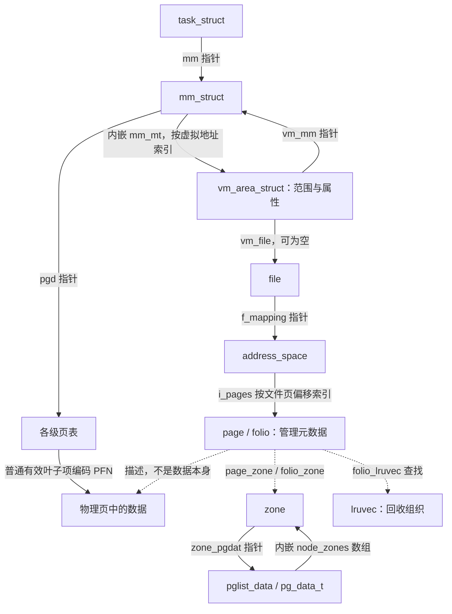
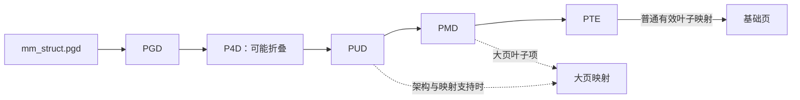
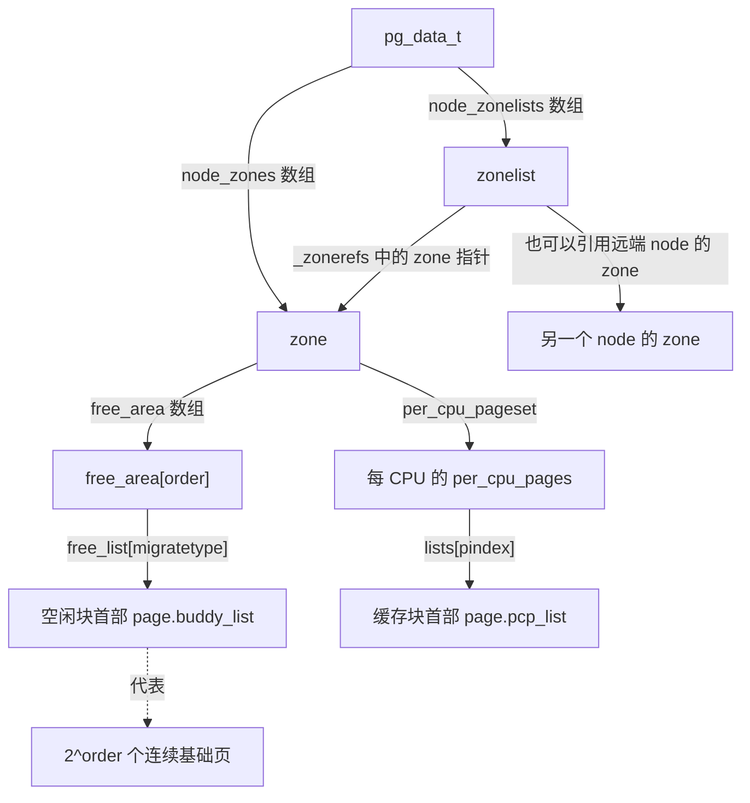
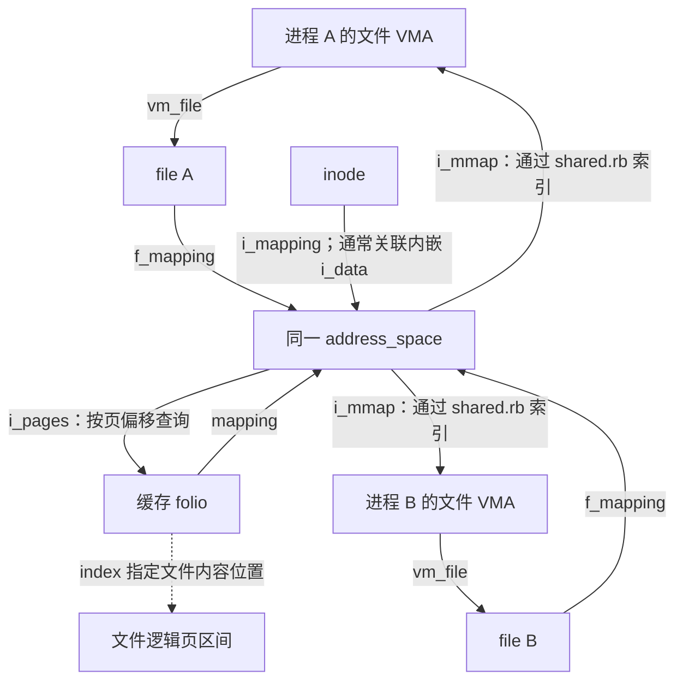
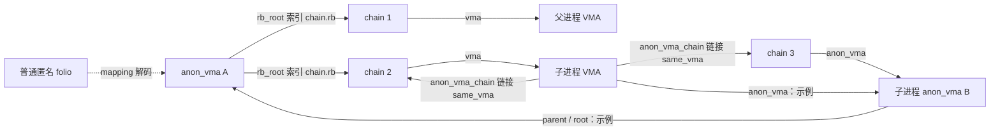
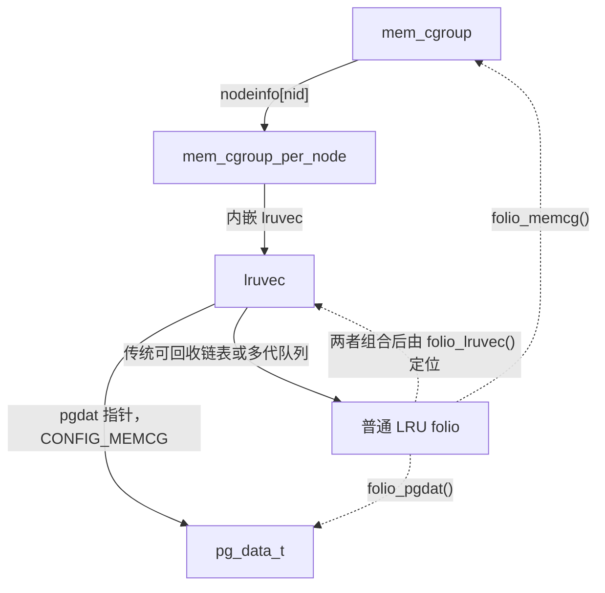
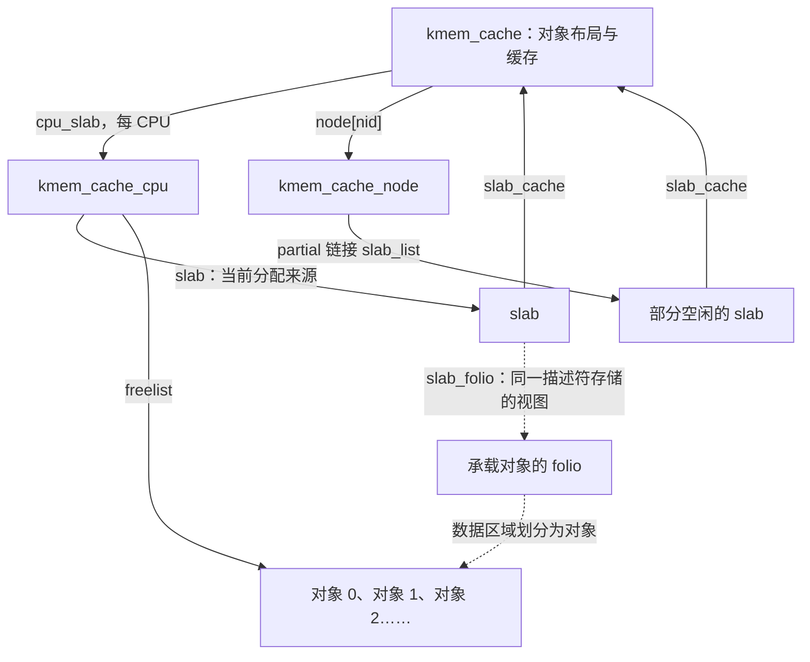

# 内存子系统核心数据结构：从地址空间到物理页

理解内存管理，首先要把三个问题分开：**程序拥有哪段地址，地址当前映射到哪里，承载数据的物理内存怎样被管理。** Linux 没有用一个结构回答所有问题，而是让不同结构分别保存地址范围、页表映射、物理页状态、分配信息和回收信息。本章沿着这些问题解释关键字段，再把它们连接起来。

本文依据仓库中 **Linux 6.18.52** 的源码，版本见 [Makefile](../../linux/Makefile#L2)。主线讨论启用 `CONFIG_MMU` 的普通系统内存；涉及页表编码时以 x86 为例。条件编译字段会明确标注，字段布局不代表所有配置下的固定 ABI。只为演算而使用的 4 KiB 页大小，也不能替代代码中的 `PAGE_SIZE`。

建议分三遍阅读：第一遍看第 1～4 节，弄清一次内存访问涉及哪些对象；第二遍看第 5～7 节，理解分配、共享与回收；第三遍结合第 8～12 节，补齐交换、内核分配、启动管理和实际调用路径。

## 1. 先建立结构之间的坐标

### 1.1 按“要回答的问题”认识结构

| 要回答的问题 | 主要结构 | 管理粒度 |
| --- | --- | --- |
| 哪些任务共享同一个用户地址空间？ | `task_struct`、`mm_struct` | 任务、整个地址空间 |
| 某个虚拟地址属于哪段范围，允许怎样访问？ | `vm_area_struct`、`mm_mt` | 一段属性一致的虚拟地址区间 |
| 这个地址当前对应什么物理内容？ | `pgd_t` 等页表项类型、`ptdesc` | 页表项、承载页表的内存 |
| 一页或一组物理页处于什么状态？ | `page`、`folio` | 基础页、作为整体管理的连续页集合 |
| 从哪类物理内存中分配？ | `pglist_data`、`zone`、`zonelist` | NUMA 节点、分配区域、候选区域顺序 |
| 空闲页放在哪里？ | `free_area`、`per_cpu_pages` | 不同阶的空闲块、每 CPU 页缓存 |
| 文件的某段内容是否已经在内存里？ | `address_space` | 一个可缓存对象的页缓存 |
| 已知 folio，怎样找到可能映射它的地址空间？ | `anon_vma`、`anon_vma_chain`、`address_space.i_mmap` | 匿名或文件映射的反向索引 |
| 哪些内容可以回收，内存开销算给谁？ | `lruvec`、`mem_cgroup` | 回收集合、资源记账集合 |
| 页被换出后怎样定位？ | `swp_entry_t`、`swap_info_struct` | 交换槽位、交换区域 |
| 内核怎样分配小对象或连续虚拟地址？ | `kmem_cache`、`slab`、`vm_struct`、`vmap_area` | 对象缓存、slab、内核虚拟区间 |
| 正式页分配器建立前怎样管理内存？ | `memblock`、`memblock_region` | 物理地址范围 |

这些对象的定义分布在 [mm_types.h](../../linux/include/linux/mm_types.h#L78)、[mmzone.h](../../linux/include/linux/mmzone.h#L879)、[fs.h](../../linux/include/linux/fs.h#L506)、[rmap.h](../../linux/include/linux/rmap.h#L32)、[memcontrol.h](../../linux/include/linux/memcontrol.h#L189)、[swap.h](../../linux/include/linux/swap.h#L263)、[slab.h](../../linux/mm/slab.h#L52)、[vmalloc.h](../../linux/include/linux/vmalloc.h#L52) 和 [memblock.h](../../linux/include/linux/memblock.h#L73)。后文会逐项定位到字段和使用它们的代码。

### 1.2 总体关系图：两条查询路径在物理内容处相遇



图中实线的标签说明字段或索引关系，虚线表示辅助函数查找或概念上的描述关系。尤其要注意：**页表项编码物理页帧及属性，并不保存 `struct page *`；`page` 也没有一个指向所有映射它的 VMA 的直接指针数组。** 前者见 [x86 的 PFN 掩码](../../linux/arch/x86/include/asm/pgtable_types.h#L284)，后者需要通过第 6 节的反向映射结构查找。

## 2. 地址空间：`mm_struct` 与 `vm_area_struct`

### 2.1 `task_struct.mm`：从任务进入地址空间

任务中有两个容易混淆的字段，定义见 [sched.h](../../linux/include/linux/sched.h#L957)：

| 字段 | 含义 | 阅读时需要注意 |
| --- | --- | --- |
| `mm` | 任务所属的用户地址空间 | 多个任务可以指向同一个 mm，因此 mm 的数量不等于线程数量 |
| `active_mm` | 调度、地址空间切换时使用的活动 mm | 内核线程通常没有自己的用户 mm，不能因 `active_mm` 非空就认为它拥有相应用户地址空间 |

在 [copy_mm()](../../linux/kernel/fork.c#L1520) 中，如果带有 `CLONE_VM`，新任务通过 `mmget()` 引用已有 mm；否则调用 `dup_mm()`。因此，讨论“共享内存”时要先分清：共享整个 mm，与不同 mm 的页表映射到相同物理页，是两种不同关系。

### 2.2 `mm_struct`：整个用户地址空间的总入口

不要把 mm 理解为一张大页表。它同时管理 VMA 索引、页表根、生命周期、布局和统计。完整结构见 [mm_types.h](../../linux/include/linux/mm_types.h#L946)。

| 关键字段 | 类型或单位 | 作用与读法 |
| --- | --- | --- |
| `mm_mt` | 内嵌 `struct maple_tree` | 按用户虚拟地址索引 VMA，回答“这个地址属于哪个区域” |
| `pgd` | `pgd_t *` | 页表根，回答“这个地址当前怎样翻译” |
| `mmap_base`、`mmap_legacy_base` | 虚拟地址 | mmap 区域选址的基准，后者用于自低地址向上搜索的布局 |
| `task_size` | 地址空间大小 | 用户地址范围的边界信息，不能理解成实际用掉的物理内存 |
| `map_count` | VMA 个数 | 当前 VMA 数量，拆分和合并 VMA 都可能改变它 |
| `mmap_lock` | `rw_semaphore` | 地址空间布局操作的重要同步入口；建立、拆分、合并 VMA 时会涉及它 |
| `page_table_lock` | `spinlock_t` | 保护页表及部分计数；启用分离页表锁时，具体页表还会使用相应 `ptdesc.ptl` |
| `total_vm` | 基础页数 | 虚拟映射总量，不等于驻留物理内存 |
| `data_vm`、`exec_vm`、`stack_vm` | 基础页数 | 按 VMA 属性分类的虚拟内存统计，不是三段物理连续内存 |
| `locked_vm`、`pinned_vm` | 基础页数 | 与锁定内存、固定引用相关的不同记账；不能拿它们替代 folio 的引用或 DMA pin 判断 |
| `rss_stat[]` | `percpu_counter` 数组 | 分项内存统计。RSS 要读取相应类别后求和，不能把数组中所有类别无差别相加 |
| `pgtables_bytes` | 字节，`CONFIG_MMU` | 页表内存的开销，注意它与 `total_vm` 的单位不同 |
| `hiwater_rss`、`hiwater_vm` | 基础页数 | RSS 和虚拟映射规模的历史高水位 |
| `start_code/end_code`、`start_data/end_data` | 虚拟地址 | 程序代码、数据的布局信息 |
| `start_brk/brk`、`start_stack` | 虚拟地址 | 初始堆边界、当前 brk、初始栈位置等；完整映射范围仍应查询 VMA |
| `arg_start/arg_end`、`env_start/env_end` | 虚拟地址 | 参数和环境字符串的地址范围 |

索引与页表根见 [mm_types.h:963](../../linux/include/linux/mm_types.h#L963)，锁与页表开销见 [mm_types.h:1034](../../linux/include/linux/mm_types.h#L1034)，布局与统计见 [mm_types.h:1093](../../linux/include/linux/mm_types.h#L1093)。[get_mm_rss()](../../linux/include/linux/mm.h#L2839) 展示了 RSS 对文件页、匿名页、共享内存页计数的求和方式。

例如，一个 mm 登记了 1 GiB 的按需匿名映射，只写入其中少量页，那么 `total_vm` 与 RSS 会有明显差距；页表本身还要单独消耗内存。这里记录的是三种不同成本，不能用一个“内存大小”把它们混为一谈。匿名缺页中实际增加 `MM_ANONPAGES` 的位置见 [memory.c](../../linux/mm/memory.c#L5241)。

### 2.3 `mm_users` 与 `mm_count`：两层生命周期

这两个字段都像引用计数，却保护不同层面的存活：

| 字段 | 保护什么 | 常见接口 | 计数降到零的意义 |
| --- | --- | --- | --- |
| `mm_users` | 地址空间的使用，包括用户任务和临时使用者 | `mmget()`、`mmput()` | 清理地址空间资源，并释放它们持有的那一个 mm 结构引用 |
| `mm_count` | `mm_struct` 对象本身 | `mmgrab()`、`mmdrop()` | 释放 mm 对象本身 |

`mm_users` 的所有使用者作为一个整体占用一个 `mm_count` 引用。因此，两个线程共享 mm，并不意味着 `mm_count` 必须等于 2；内核还可能持有其他结构引用。字段的明确约定见 [mm_count 注释](../../linux/include/linux/mm_types.h#L953) 和 [mm_users 注释](../../linux/include/linux/mm_types.h#L985)。

```text
最后一个 mm_users 引用释放
  → mmput() 进入 __mmput()
  → exit_mmap() 等清理地址空间资源
  → mmdrop() 释放 mm_count 引用
  → 只有 mm_count 也归零，才释放 mm_struct 本身
```

这条顺序直接来自 [__mmput() 与 mmput()](../../linux/kernel/fork.c#L1131)。读到“已经没有用户进程使用这个地址空间，但 mm 对象还存在”时，就应该想到这两层生命周期。

### 2.4 `vm_area_struct`：描述一段地址的规则

VMA 描述半开区间 **`[vm_start, vm_end)`**。同一个 VMA 内的地址具有共同的映射属性，但它们对应的页可以尚未分配、已经换出，或者映射到不同位置的物理内存。定义见 [mm_types.h](../../linux/include/linux/mm_types.h#L815)。

| 关键字段 | 解释 | 与其他结构的联系 |
| --- | --- | --- |
| `vm_start`、`vm_end` | 起始地址与不包含在内的结束地址；长度为二者之差 | 作为 VMA 在 mm 中的地址范围 |
| `vm_mm` | 所属地址空间 | 一个 VMA 对象属于一个 mm；其他 mm 中对应的映射由其他 VMA 对象描述 |
| `vm_flags` | 读、写、执行、共享、锁定等软件属性 | 决定映射语义和缺页处理策略；修改应使用 `vm_flags_*()` 接口 |
| `vm_page_prot` | `pgprot_t`，建立页表项时使用的保护属性 | 不能据此认定每个现存 PTE 都具有完全相同的权限 |
| `vm_pgoff` | 映射起点对应的逻辑页偏移，单位是 `PAGE_SIZE` | 文件映射连接虚拟地址与文件偏移；匿名反向映射也会使用这套逻辑页索引 |
| `vm_file` | 后备文件，可以为空 | 文件映射经 `vm_file->f_mapping` 找到页缓存对象 |
| `vm_ops` | `vm_operations_struct` 指针 | `fault`、`map_pages`、`open`、`close` 等映射回调；普通匿名映射不必提供文件式 fault 回调 |
| `vm_private_data` | 映射实现的私有上下文 | 具体类型取决于文件系统、驱动等使用者 |
| `anon_vma` | 当前 VMA 的匿名反向映射关联 | 私有文件映射发生 COW 后，也可能建立该关联 |
| `anon_vma_chain` | 内嵌链表头 | 收集把这个 VMA 连接到相关 `anon_vma` 的中间对象 |
| `shared.rb`、`shared.rb_subtree_last` | 文件映射区间树节点及增强信息 | 把 VMA 放进 `address_space.i_mmap`，并不是另一个 mm 的 VMA 索引 |
| `vm_policy` | `CONFIG_NUMA` 下的内存策略指针 | 影响本 VMA 的物理内存分配策略，不代表所有页必定在同一 node |
| `vm_lock_seq`、`vm_refcnt` | `CONFIG_PER_VMA_LOCK` 下的同步状态 | 与 mm 的锁序列协作，支持按 VMA 的读侧保护；`vm_refcnt` 也承担锁状态编码 |

范围与权限见 [mm_types.h:820](../../linux/include/linux/mm_types.h#L820)，后备对象与匿名关联见 [mm_types.h:860](../../linux/include/linux/mm_types.h#L860)，独立 VMA 同步字段及文件区间树节点见 [mm_types.h:891](../../linux/include/linux/mm_types.h#L891)，回调定义见 [vm_operations_struct](../../linux/include/linux/mm.h#L676)。

一个很有用的换算公式是：

```text
逻辑页偏移 = vm_pgoff + ((虚拟地址 - vm_start) >> PAGE_SHIFT)
```

这是 [linear_page_index()](../../linux/include/linux/pagemap.h#L1050) 的实现。假设 `PAGE_SIZE = 4096`、`vm_start = 0x400000`、`vm_pgoff = 8`，那么地址 `0x403123` 位于逻辑第 11 页，页内偏移为 `0x123`；对于普通文件映射，对应文件字节偏移为 `11 × 4096 + 0x123`。

**VMA 允许写入，不代表当前 PTE 已经可写。** 私有映射在 `fork()` 后可以保持 `VM_WRITE`，同时把父子进程的 PTE 都写保护，让下一次写入触发 COW。代码见 [__copy_present_ptes()](../../linux/mm/memory.c#L1097)。

读 `vm_flags` 时，先认识以下几组标志即可，定义见 [mm.h](../../linux/include/linux/mm.h#L274)：

| 标志 | 解释 |
| --- | --- |
| `VM_READ`、`VM_WRITE`、`VM_EXEC` | VMA 当前的读、写、执行属性 |
| `VM_MAYREAD`、`VM_MAYWRITE`、`VM_MAYEXEC` | `mprotect()` 等改变权限时的允许范围；“允许以后变成可写”不等于“现在可写” |
| `VM_SHARED` | 共享映射语义；不能据此推断两个任务共享同一个 mm |
| `VM_GROWSDOWN` | 向低地址增长的区域属性，常见于栈 |
| `VM_LOCKED`、`VM_LOCKONFAULT` | 锁定映射相关属性，后者表示在页实际缺入时再锁定 |
| `VM_DONTCOPY`、`VM_WIPEONFORK` | fork 时不复制此 VMA，或对子进程中的相应内容执行清零语义 |
| `VM_HUGETLB` | 显式 Hugetlb 映射；与 `VM_HUGEPAGE` 表示的透明大页使用建议不同 |
| `VM_PFNMAP`、`VM_MIXEDMAP` | 纯 PFN 管理或混合映射场景；提醒读者不能把所有用户映射都套入普通 `struct page` 路径 |

### 2.5 Maple Tree：查的是地址区间，不是物理页

`mm_mt` 内嵌于 mm，树中保存 VMA 的地址区间索引。`struct maple_tree` 的 `ma_root` 是根入口，`ma_flags` 保存模式等状态，锁可以通过相关机制与外部锁关联，见 [maple_tree.h](../../linux/include/linux/maple_tree.h#L229)。mm 初始化这棵树的位置见 [fork.c](../../linux/kernel/fork.c#L1039)。

VMA 的结束地址不包含在区间内，而 Maple Tree 存储范围时使用包含终点的下标，所以插入区间是 `[vm_start, vm_end - 1]`，见 [vma.h](../../linux/mm/vma.h#L219)。

阅读查询代码时，必须区分两个接口：

| 接口 | 查询结果 | 容易犯的错误 |
| --- | --- | --- |
| `vma_lookup(mm, addr)` | 覆盖 addr 的 VMA，没有则返回 `NULL` | 误以为得到 VMA 就意味着页已经驻留 |
| `find_vma(mm, addr)` | 覆盖 addr 的 VMA，或者 addr 之后的第一个 VMA | 只判断返回值非空，没有确认 addr 是否落在该 VMA 内 |

实现分别见 [vma_lookup()](../../linux/include/linux/mm.h#L3699) 与 [find_vma()](../../linux/mm/mmap.c#L904)。这是分析缺页处理、地址合法性检查时非常常见的边界问题。

## 3. 从地址规则进入实际映射：页表、`ptdesc` 与 `vm_fault`

### 3.1 页表项与页表页是两种对象

通用 MM 代码以 `PGD → P4D → PUD → PMD → PTE` 表示页表层次。架构或配置不需要的层级可以折叠；例如 [pgtable-nop4d.h](../../linux/include/asm-generic/pgtable-nop4d.h#L7) 把 P4D 折叠在 PGD 中，不需要额外分配一个 P4D 页。



普通有效的非叶子项定位下一级页表，叶子项定位数据并编码访问属性。x86 中 PFN 与属性的区分见 [PTE_PFN_MASK](../../linux/arch/x86/include/asm/pgtable_types.h#L284)，访问、脏、用户态、禁止执行等位见 [pgtable_types.h](../../linux/arch/x86/include/asm/pgtable_types.h#L10)。缺页处理依次取得各级页表，并识别大页分支，见 [__handle_mm_fault()](../../linux/mm/memory.c#L6260)。

需要分开记住：

1. `pte_t` 等类型代表**页表项的编码值**，操作它们要使用架构页表接口。
2. 页表页里的字节存放许多页表项；这些页表页本身也占物理内存。
3. `struct ptdesc` 是**页表内存的管理元数据**，不等于其中一个 PTE。

### 3.2 `ptdesc`：管理承载页表的内存

本版本 `ptdesc` 复用 `struct page` 的描述符存储，通过布局断言检查兼容关系，见 [ptdesc 定义](../../linux/include/linux/mm_types.h#L548) 和 [TABLE_MATCH](../../linux/include/linux/mm_types.h#L585)。

| 关键字段 | 作用 | 限定条件 |
| --- | --- | --- |
| `pt_flags` | 页表内存的描述符标志 | 不等于某个 PTE 的读写权限位 |
| `pt_rcu_head`、`pt_list` | 延迟释放或链表组织 | 二者处于同一 union，按当前用途解释 |
| `pmd_huge_pte` | 大页相关场景保存的页表信息 | 与同一 union 中其他用途互斥 |
| `pt_mm` | mm 关联 | 源码注明用于 x86 PGD，不能泛化为所有页表页都保存所属 mm |
| `pt_frag_refcount` | 分片页表引用计数 | PowerPC 的专用用途，与 `pt_mm` 等字段复用存储 |
| `ptl` | 页表锁 | 根据 `ALLOC_SPLIT_PTLOCKS`，可能内嵌锁，也可能保存锁指针 |
| `pt_memcg_data` | 页表内存的 memcg 记账信息 | 仅在 `CONFIG_MEMCG` 下存在 |

`page_ptdesc()`、`ptdesc_page()` 等转换见 [mm_types.h](../../linux/include/linux/mm_types.h#L601)。这些转换是当前元数据布局上的视图切换，不会复制一张页表。

### 3.3 `vm_fault`：一次缺页处理的工作上下文

mm、VMA 会跨越多次访问持续存在；`vm_fault` 则描述正在处理的这一次缺页。`__handle_mm_fault()` 在栈上初始化它，见 [memory.c](../../linux/mm/memory.c#L6263)。

| 字段 | 本次处理需要知道什么 |
| --- | --- |
| `vma` | 发生缺页的地址属于哪个 VMA |
| `address`、`real_address` | 页对齐后的地址与原始缺页地址 |
| `pgoff` | 根据 VMA 换算得到的逻辑页偏移 |
| `flags` | 是否写访问、是否允许重试等 `FAULT_FLAG_*` 条件 |
| `gfp_mask` | 本次缺页分配内存的约束 |
| `pud`、`pmd`、`pte` | 遍历到的页表项位置 |
| `orig_pte` / `orig_pmd` | 观察到的原始页表项值；后续用于检测并发变化等 |
| `page`、`cow_page` | fault 回调返回的页，以及 COW 处理使用的页 |
| `ptl` | 本次操作需要的页表锁 |
| `prealloc_pte` | 为特定后续操作预分配的 PTE 页表 |

定义和字段有效性约束见 [mm.h](../../linux/include/linux/mm.h#L625)。尤其不能长期保存其中的 `pte` 指针供无锁使用；源码明确限制了相关成员在持有页表锁时的有效性。

## 4. 物理内容的描述：`page` 与 `folio`

### 4.1 先区分数据、PFN 与描述符

PFN 是基础物理页的编号。对于普通系统内存，有：

```text
PFN = 物理地址 >> PAGE_SHIFT
物理页起始地址 = PFN << PAGE_SHIFT

pfn_to_page(PFN) → struct page *
page_to_pfn(page) → PFN
```

转换实现随内存模型变化，见 [memory_model.h](../../linux/include/asm-generic/memory_model.h#L12)。`struct page` 通常描述一个基础页的状态，**不包含这个页的全部数据字节**。把 `sizeof(struct page)` 和 `PAGE_SIZE` 混在一起，会同时误解元数据开销和地址转换。

### 4.2 `struct page`：必须结合用途解释 union

`page` 用于大量不同场景，若每种用途都独占一套字段，元数据会过大。因此它广泛复用存储。定义见 [mm_types.h](../../linux/include/linux/mm_types.h#L78)。

| 字段或复用区域 | 关键含义 | 不能忽略的条件 |
| --- | --- | --- |
| `flags` | `memdesc_flags_t`，保存状态位及位置等编码信息 | 使用辅助接口解释；不要假定它只是一个可以随意读写的整数 |
| `lru` | 页缓存、匿名内容的 LRU 链接等用途 | 与 `buddy_list`、`pcp_list` 等复用；同一页不能把这些用途同时解释为有效 |
| `buddy_list` | 伙伴系统空闲块的链表节点 | 通常由空闲块的首个页描述符代表整个块 |
| `pcp_list` | 每 CPU 页缓存的链表节点 | 页处于 PCP 管理状态时使用 |
| `mapping` | 页缓存或匿名内存的关联信息 | 可能是带标记的编码，不一定是可直接解引用的 `address_space *` |
| `__folio_index` | 与 folio 的逻辑索引重叠 | 阅读内容索引时优先使用 folio 接口 |
| `private` | 当前所有者的私有数据 | 在伙伴系统中保存阶数；其他场景可能有完全不同的含义 |
| `compound_head` | 复合页尾页定位头页的编码 | 低位参与尾页识别，不能直接当普通指针使用 |
| `_mapcount` / `page_type` | 用户页表映射计数或页用途类型 | 两者是 union，必须先判断当前页的类型 |
| `_refcount` | 描述符对应内存的引用计数 | 使用 `page_ref.h` 等接口；复合页场景通常关注所属 folio 的引用 |
| `memcg_data` | 内存控制组相关编码信息 | 仅 `CONFIG_MEMCG`；不能对所有类型的页都直接强转成 `mem_cgroup *` |
| `virtual` | 某些配置保存的内核虚拟地址 | 只在 `WANT_PAGE_VIRTUAL` 下存在，不能假设每个 page 都有此字段 |

主 union 见 [mm_types.h:87](../../linux/include/linux/mm_types.h#L87)，映射计数与类型复用见 [mm_types.h:153](../../linux/include/linux/mm_types.h#L153)，配置相关字段见 [mm_types.h:185](../../linux/include/linux/mm_types.h#L185)。

例如，在空闲伙伴块首部，`set_buddy_order()` 将 order 写入 `page->private`，并标记 Buddy 类型，见 [page_alloc.c](../../linux/mm/page_alloc.c#L752)。当同一批内存被用于文件内容时，就不能继续按“空闲块阶数”解释这个位置。

还要区分 **page flags 与 page type**：`PG_dirty`、`PG_writeback` 等属于状态位；本版本的 Buddy、Slab、Table 等用途使用 `PGTY_buddy`、`PGTY_slab`、`PGTY_table` 等类型编码，见 [pageflags](../../linux/include/linux/page-flags.h#L93) 与 [pagetype](../../linux/include/linux/page-flags.h#L919)。不能把所有 `PageXxx()` 判断都想象为读取 `flags` 里的独立位。

常见状态位可以按“内容是否可用、是否需要保存、是否参与回收”来理解：

| 状态 | 含义与边界 |
| --- | --- |
| `PG_locked` | folio 锁状态，用于协调读取、缓存失效等操作；不是“正在被某个用户进程映射”的标志 |
| `PG_uptodate` | 整体内容已有效，至少与后备存储同样新；不意味着内容已经全部写回存储 |
| `PG_dirty` | 内容具有需要保存的修改状态；具体置脏与清理规则由对应路径维护 |
| `PG_writeback` | 正在进行回写；与 dirty 是两个状态，回写期间仍可能产生新的修改 |
| `PG_lru` | folio 处于相应 LRU 管理状态；不表示它是空闲页，也不能仅凭此位断言存在普通链表节点 |
| `PG_referenced`、`PG_active` | 访问与活跃程度的回收提示；要结合传统或多代 LRU 的实现解释 |
| `PG_unevictable`、`PG_mlocked` | 不可按普通路径回收的状态、mlock 相关状态；前者不等价于仅有 mlock 一种原因 |
| `PG_swapbacked` | RAM/swap 后备内容的分类，常见于匿名页和 shmem；不表示已经写入交换设备 |
| `PG_swapcache` | 处于 swap cache；相应交换条目可由 `folio->swap` 取得 |
| `PG_reserved` | 特殊保留页状态，具体包括内核镜像、部分早期保留内存等，不能当成普通空闲内存 |

状态说明见 [page-flags.h](../../linux/include/linux/page-flags.h#L17)，uptodate 的精确定义见 [folio_test_uptodate()](../../linux/include/linux/page-flags.h#L775)。这些状态也不是任意裸写的独立布尔变量：其中一些有复用关系，一些更新带有同步和记账要求。

### 4.3 `folio`：把一页或多页作为一个整体处理

`folio` 代表大小为 `2^order × PAGE_SIZE`、按自身大小对齐的物理连续内容集合；order 为 0 时就是一个基础页。定义和对齐约定见 [mm_types.h](../../linux/include/linux/mm_types.h#L333)。

```text
以 order = 2、包含 4 个基础页的 folio 为例：

数据内存：    [ 第 0 页 ][ 第 1 页 ][ 第 2 页 ][ 第 3 页 ]
描述符：      [ page 0 ][ page 1 ][ page 2 ][ page 3 ]
                 ↑         │         │         │
                 └─────────┴─────────┴─────────┘
                      page_folio() 定位整体

folio_page(folio, 0..3) 则取得整体中的某个基础页描述符。
```

这里没有额外复制一套数据。`folio` 的公共头部与头页描述符重叠，大 folio 的扩展字段使用后续描述符的部分空间，布局由 [FOLIO_MATCH](../../linux/include/linux/mm_types.h#L484) 校验。**小 folio 不能因为 C 结构中出现了大 folio 字段，就无条件访问那些扩展位置。** 应使用 [folio_order()](../../linux/include/linux/mm.h#L1161)、[folio_nr_pages()](../../linux/include/linux/mm.h#L2174)、[page_folio()](../../linux/include/linux/page-flags.h#L294) 等接口。

| 关键字段 | 解释 | 推荐结合的判断 |
| --- | --- | --- |
| `flags` | 锁定、脏、回写、LRU、大 folio 等状态 | `folio_test_*()` 等接口 |
| `mapping` | 文件内容所属 mapping，或匿名反向映射关联 | 先区分文件、普通匿名、KSM、slab 等用途 |
| `index` | 内容的起始逻辑页索引 | 文件中以基础页为单位；不是物理 PFN，也不是字节偏移 |
| `lru` | 可回收 folio 的队列节点 | 传统 LRU 或多代 LRU 按相应规则使用 |
| `mlock_count` | mlock 相关计数 | 与 LRU 存储区域复用，不能当作额外独立的链表旁字段 |
| `private` / `swap` | 文件系统私有数据，或 swap cache 中的交换条目 | 位于同一 union，按类型与状态解释 |
| `_refcount` | 整体引用计数 | `folio_ref_count()`、`folio_get()`、`folio_put()` |
| `_mapcount` | 小 folio 的映射计数编码 | 用 `folio_mapcount()` 读取逻辑计数 |
| `_large_mapcount`、`_entire_mapcount`、`_nr_pages_mapped` | 大 folio 的映射统计 | 分开处理整体映射和子页映射，不能只读头部 `_mapcount` |
| `_pincount` | 大 folio 的固定引用跟踪 | 使用 `folio_maybe_dma_pinned()` 等接口，避免按裸字段猜测 |
| `_nr_pages` | 部分配置的大 folio 页数记录 | 使用 `folio_nr_pages()`，字段是否存在依赖配置 |
| `memcg_data` | 资源记账关联 | 用适合当前 folio 类型的访问接口 |

公共字段见 [mm_types.h:377](../../linux/include/linux/mm_types.h#L377)，扩展字段见 [mm_types.h:423](../../linux/include/linux/mm_types.h#L423)。

**大 folio 不等于一个硬件大页映射。** 一个大 folio 可以通过多个普通 PTE 映射；本版本普通匿名缺页会取得 `folio_nr_pages()`，随后通过 `set_ptes()` 建立一组映射，见 [memory.c](../../linux/mm/memory.c#L5204) 和 [memory.c:5241](../../linux/mm/memory.c#L5241)。folio 描述内容的管理粒度，页表叶子层级描述地址翻译粒度。

### 4.4 引用计数与映射计数：两个完全不同的问题

引用计数回答“还有谁要求这份内存继续存在”，映射计数回答“有多少用户页表项映射了它”。常见引用来源包括页表、页缓存、文件系统私有使用和直接 I/O 等，见 [folio_ref_count() 的说明](../../linux/include/linux/page_ref.h#L71)。

对于参与普通 rmap 跟踪的小 folio，初始 `_mapcount = -1` 表示没有映射，逻辑映射次数通常是 `_mapcount + 1`；typed folio 和大 folio 要走专门逻辑，见 [folio_mapcount()](../../linux/include/linux/mm.h#L1287)。

| 示例状态 | 逻辑映射次数 | 能否直接释放？ |
| --- | --- | --- |
| 一个文件 folio 已缓存，但没有被 mmap 到用户空间 | 可以为 0 | 不能据此释放，页缓存或其他使用者可能仍持有引用 |
| 一个小匿名 folio 被父子两个 mm 各映射一次 | 通常为 2 | 必须先处理映射与全部相关引用 |
| 一个进程在两个虚拟地址映射同一个小 folio | 也可以为 2 | mapcount 不是“进程个数” |
| 大 folio 的多个基础页被分别用 PTE 映射 | 按实际用户页表项计数 | 不能以“folio 个数”或“映射范围个数”替代 |

因此，`mapcount == 0` 不意味着引用计数也为零；更不能仅凭 `mapcount == 1` 判断所有 COW、固定页和共享条件。接口注释明确规定：普通 folio 的每个有效用户叶子页表项计一次映射，Hugetlb 有自身的抽象规则，见 [mm.h](../../linux/include/linux/mm.h#L1287)。

## 5. 物理内存怎样组织和分配

### 5.1 `pglist_data`：node 的内存管理入口

`pg_data_t` 是 `struct pglist_data` 的 typedef，不是另一个结构。NUMA 系统用 node 区分内存拓扑；一个 node 包含若干 zone，同一种 zone 类型可以出现在不同 node 中。定义见 [mmzone.h](../../linux/include/linux/mmzone.h#L1385)。

| 关键字段 | 作用 |
| --- | --- |
| `node_zones[MAX_NR_ZONES]` | 本 node 内嵌的 zone 数组；部分元素可能没有实际内存 |
| `node_zonelists[MAX_ZONELISTS]` | 从该 node 出发的分配候选顺序，其中可以引用其他 node 的 zone |
| `nr_zones` | zone 数组的有效遍历上界；初始化时更新为涉及的最高 zone 下标加一，不能简单按“非空元素个数”理解 |
| `node_start_pfn` | node 物理地址跨度的起始 PFN |
| `node_spanned_pages` | 跨度包含的基础页数，包括空洞 |
| `node_present_pages` | 实际存在的物理页数 |
| `node_id` | NUMA 节点编号 |
| `node_mem_map` | `CONFIG_FLATMEM` 下的页描述符关联，不是所有内存模型都存在的字段 |
| `kswapd`、`kswapd_wait` | 后台回收线程及其等待队列 |
| `kswapd_order`、`kswapd_highest_zoneidx` | 后台回收所服务的分配阶数和 zone 范围信息 |
| `kcompactd`、`kcompactd_max_order` 等 | `CONFIG_COMPACTION` 下的后台内存规整工作状态 |
| `__lruvec` | 内存控制器禁用时使用的 node 回收集合；应通过接口选择实际 lruvec |
| `vm_stat[]`、`per_cpu_nodestats` | node 级内存统计及每 CPU 统计缓冲 |

拓扑字段见 [mmzone.h:1391](../../linux/include/linux/mmzone.h#L1391)，回收线程字段见 [mmzone.h:1422](../../linux/include/linux/mmzone.h#L1422)，LRU 与统计见 [mmzone.h:1498](../../linux/include/linux/mmzone.h#L1498)。

`nr_zones` 是一个适合对照“字段注释与写入代码”的例子：定义旁的注释概括为有内存的 zone 数量，而 [init_currently_empty_zone()](../../linux/mm/mm_init.c#L1459) 实际按照 `zone_idx(zone) + 1` 更新上界。阅读数组遍历时应以这个行为为准。

### 5.2 `zone`：同一 node 内按分配约束再分区

node 主要表达拓扑，zone 主要表达分配约束。常见 zone 类型如下，其存在与边界依赖架构和配置，见 [enum zone_type](../../linux/include/linux/mmzone.h#L784)。

| 类型 | 主要目的 |
| --- | --- |
| `ZONE_DMA`、`ZONE_DMA32` | 服务受设备 DMA 可寻址范围限制的分配 |
| `ZONE_NORMAL` | 普通可寻址内存 |
| `ZONE_HIGHMEM` | 某些架构上不能全部长期直接映射进内核虚拟地址空间的内存 |
| `ZONE_MOVABLE` | 集中可迁移分配，改善内存下线、连续页获得等条件；源码列出了不能简单视作“全部总能迁移”的例外 |
| `ZONE_DEVICE` | 特殊设备内存的描述和管理；不能把它完全套进普通 RAM 伙伴分配模型 |

`zone` 的字段可分为身份、容量、阈值和空闲组织四组，定义见 [mmzone.h](../../linux/include/linux/mmzone.h#L879)：

| 关键字段 | 单位或类型 | 解释 |
| --- | --- | --- |
| `zone_pgdat`、`node`、`name` | 指针、编号、名称 | 所属 node 与区域身份；`node` 字段受 `CONFIG_NUMA` 控制 |
| `zone_start_pfn` | PFN | 该 zone 地址跨度起点 |
| `spanned_pages` | 基础页数 | 总跨度，包含没有实际内存的空洞 |
| `present_pages` | 基础页数 | 实际存在的页 |
| `managed_pages` | 原子计数，基础页数 | 交给伙伴分配体系管理的容量，包括已经分配出去的页；不是当前空闲页数 |
| `_watermark[]`、`watermark_boost` | 基础页数 | 分配、回收使用的水位及临时提升量 |
| `lowmem_reserve[]` | 基础页数 | 按请求可用的最高 zone 类型，保护较低 zone 的储备 |
| `free_area[NR_PAGE_ORDERS]` | 内嵌数组 | 伙伴系统按 order 组织的空闲块 |
| `per_cpu_pageset` | `per_cpu_pages __percpu *` | 每个 CPU 对此 zone 的空闲页缓存 |
| `lock` | 自旋锁 | 主要保护 `free_area` 等共享分配状态 |
| `vm_stat[]`、`per_cpu_zonestats` | 统计结构 | zone 级统计与每 CPU 增量 |

容量关系在 [mmzone.h:925](../../linux/include/linux/mmzone.h#L925) 中有直接说明。用一个只演示概念的例子：跨度为 1000 页，其中空洞 100 页、保留且未交给分配器的页 50 页，则 `spanned_pages = 1000`、`present_pages = 900`、`managed_pages = 850`。这 850 页中可能大部分正在使用，不能由此算出当前空闲页数。

水位有 `MIN`、`LOW`、`HIGH`，以及用于内存提升场景的 `PROMO`，见 [zone_watermarks](../../linux/include/linux/mmzone.h#L708)。获取有效水位的 [wmark_pages()](../../linux/include/linux/mmzone.h#L1081) 会把 `_watermark[w]` 与 `watermark_boost` 相加。水位表达分配和回收策略阈值，不表示某一段固定地址的物理内存。

### 5.3 `free_area`：按大小和迁移类型组织空闲块

定义非常短，但包含两层分类，见 [mmzone.h](../../linux/include/linux/mmzone.h#L138)：

```c
struct free_area {
    struct list_head free_list[MIGRATE_TYPES];
    unsigned long nr_free;
};
```

它嵌在 `zone->free_area[order]` 中，所以完整下标是：

```text
zone->free_area[order].free_list[migratetype]
                 │                     │
                 │                     └─ 页块按迁移用途分类
                 └─ 一个空闲块包含 2^order 个基础页
```

`nr_free` 是这个 order 下各迁移类型的**空闲块个数**，不是基础页数。若 `free_area[3].nr_free == 5`，它表示 5 个各含 8 页的块，共 40 个基础页。插入一个块时只执行一次 `area->nr_free++`，见 [__add_to_free_list()](../../linux/mm/page_alloc.c#L832)。

迁移类型中的 `MIGRATE_UNMOVABLE`、`MIGRATE_MOVABLE`、`MIGRATE_RECLAIMABLE` 用于按用途组织页块，另有 `HIGHATOMIC` 以及配置相关的 `CMA`、`ISOLATE`，见 [migratetype](../../linux/include/linux/mmzone.h#L64)。`ZONE_MOVABLE` 是 zone 类型，`MIGRATE_MOVABLE` 是空闲页块分类，二者不在同一层级。



申请 order 为 n 的块时，[__rmqueue_smallest()](../../linux/mm/page_alloc.c#L1927) 从 n 开始搜索更高阶空闲块，找到后取出并按需要拆分。归还时，[__free_one_page()](../../linux/mm/page_alloc.c#L978) 尝试与同阶伙伴合并，再挂回相应链表。

候选伙伴的 PFN 可以通过 `pfn ^ (1 << order)` 计算，但候选并不自动满足合并条件；还要验证它是否空闲、阶数是否匹配、是否属于同一 zone 等。见 [find_buddy_page_pfn()](../../linux/mm/internal.h#L664)。因此，“空闲页总量很多”与“存在满足要求的高阶连续块”是不同条件。

### 5.4 `per_cpu_pages`：用批量交换减少 zone 锁竞争

PCP 是 **每个 zone、每个 CPU** 的页缓存，不是进程私有内存。频繁的小阶分配与释放可以先经过 PCP，再批量向共享伙伴系统补充或归还。字段见 [mmzone.h](../../linux/include/linux/mmzone.h#L744)。

| 字段 | 解释 |
| --- | --- |
| `lists[]` | 按支持的 order 与迁移类型组织的缓存块链表 |
| `count` | 缓存中的基础页总数，不是简单的链表节点数 |
| `high` | 当前缓存高阈值，达到条件后需要归还一批页 |
| `high_min`、`high_max` | high 动态调整的上下界 |
| `batch` | 与伙伴系统批量交换时的基准批量 |
| `lock` | 保护 PCP 链表等状态 |
| `alloc_factor`、`free_count`、`flags` | 根据近期分配、释放行为调节批处理 |

本版本 PCP **不只缓存 order-0 页**：常规小阶以及配置允许的 PMD 大页阶也有相应路径。精确条件见 [pcp_allowed_order()](../../linux/mm/page_alloc.c#L717)，链表下标换算见 [order_to_pindex()](../../linux/mm/page_alloc.c#L684)。这也解释了为什么统计 `count` 时不能直接数 `lists[]` 中有多少个节点。

### 5.5 `zonelist`、`zoneref` 与 `alloc_context`：候选顺序不等于一定可分配

`zonelist` 内含 `_zonerefs[]`，每个 `zoneref` 保存 `zone *` 与缓存的 `zone_idx`，见 [mmzone.h](../../linux/include/linux/mmzone.h#L1310)。它表达分配时尝试哪些 zone，以及尝试顺序；它不会复制被引用的 zone。

一次分配还会用 [alloc_context](../../linux/mm/internal.h#L579) 传递约束：

| 字段 | 作用 |
| --- | --- |
| `zonelist`、`preferred_zoneref` | 候选序列与优先尝试位置 |
| `nodemask` | 允许使用的节点集合 |
| `highest_zoneidx` | 请求能使用的最高 zone 类型 |
| `migratetype` | 所需迁移类型 |
| `spread_dirty_pages` | 是否在分配时考虑各 node 的脏页分布 |

实际遍历还要考虑 cpuset、水位等约束，见 [get_page_from_freelist()](../../linux/mm/page_alloc.c#L3774)。看到 zonelist 中包含某个远端 zone，只能说明它是候选，不能说明本次请求一定能使用它。

### 5.6 `mem_section` 与 vmemmap：怎样找到 page 描述符

node/zone 解决物理内存的组织和分配问题；内存模型还需要解决“给定 PFN，page 描述符在哪里”。二者是不同维度。

| 内存模型或结构 | 关键表示 | 含义 |
| --- | --- | --- |
| `CONFIG_FLATMEM` | `mem_map` 与 `ARCH_PFN_OFFSET` | 通过连续描述符数组和 PFN 偏移转换 |
| `CONFIG_SPARSEMEM` | `mem_section.section_mem_map` | 按 section 组织描述符；该字段是带额外编码的信息，不能直接当裸数组指针 |
| `CONFIG_SPARSEMEM_VMEMMAP` | `vmemmap + pfn` | 在虚拟地址上提供连续的描述符视图；不表示所有物理 PFN 都实际存在或可分配 |
| `mem_section.usage` | `mem_section_usage *` | section 的子区间有效性与 pageblock 标志等信息 |

转换公式见 [memory_model.h](../../linux/include/asm-generic/memory_model.h#L12)，section 的字段及早期编码说明见 [mmzone.h](../../linux/include/linux/mmzone.h#L1894)。SPARSEMEM 下 pageblock 标志放在 section 的 usage 中；非 SPARSEMEM 下对应信息可放在 zone 中，见 [zone.pageblock_flags](../../linux/include/linux/mmzone.h#L914)。

## 6. 内容属于谁，又被谁映射：页缓存与反向映射

### 6.1 `address_space`：描述可缓存对象的内容

`address_space` 这个名字很容易让人联想到进程地址空间，但这里描述的是**一个可缓存、可映射对象的内容组织**。对普通文件而言，它把文件页偏移与缓存中的 folio 联系起来。定义见 [fs.h](../../linux/include/linux/fs.h#L484)。

| 关键字段 | 作用 |
| --- | --- |
| `host` | 所属 inode 的关联 |
| `i_pages` | 内嵌 XArray，按逻辑页索引组织缓存内容 |
| `nrpages` | 页缓存中的基础页数量，不能直接视作 folio 个数 |
| `i_mmap` | 映射此对象的 VMA 区间树，包含私有和共享映射 |
| `i_mmap_rwsem` | 保护 `i_mmap` 与可写映射相关状态 |
| `i_mmap_writable` | `VM_SHARED` 且 `VM_MAYWRITE` 的映射数量 |
| `invalidate_lock` | 在缓存失效等操作中协调缓存内容与文件偏移到存储块的关系 |
| `a_ops` | 文件内容读取、回写等 `address_space_operations` 回调 |
| `writeback_index` | 回写扫描的起始页索引 |
| `gfp_mask` | 为这个 mapping 分配页时的分配标志 |
| `flags`、`wb_err` | mapping 状态与回写错误记录 |

这里有两棵用途不同的索引：**`i_pages` 找内容，`i_mmap` 找映射这些内容的 VMA。** XArray 自身的根入口和锁见 [xarray.h](../../linux/include/linux/xarray.h#L300)。页缓存的 XArray 中还可能出现用于回收判断的 shadow 等特殊条目，不能把取得的每个值都直接当 folio 指针；插入路径的冲突处理见 [filemap.c](../../linux/mm/filemap.c#L884)。

向页缓存插入 folio 时，代码设置 `folio->mapping`、`folio->index`，向 XArray 存入 folio，并按 `folio_nr_pages()` 增加 `mapping->nrpages`，见 [filemap.c:864](../../linux/mm/filemap.c#L864) 和 [filemap.c:928](../../linux/mm/filemap.c#L928)。所以一个包含 4 个基础页的 folio，不应按“1 个页缓存页”记账。



图中的 `file.f_mapping`、`inode.i_mapping`、`inode.i_data` 分别见 [fs.h:1215](../../linux/include/linux/fs.h#L1215)、[fs.h:807](../../linux/include/linux/fs.h#L807)、[fs.h:883](../../linux/include/linux/fs.h#L883)。不同 mm 可以各有 VMA 和页表，同时共享同一个文件 mapping 和其中的内容。

### 6.2 匿名 folio 的 `mapping`：字段名不能代替类型判断

普通匿名内容没有普通文件 mapping 可依附，但回收时仍要找到相关 VMA。因此，匿名 folio 在 `mapping` 的指针值中加入 `FOLIO_MAPPING_ANON` 标记，剩余部分关联 `anon_vma`；KSM 合并页还存在不同的编码解释。精确约定见 [page-flags.h](../../linux/include/linux/page-flags.h#L696)。

设置普通匿名关联时，[__folio_set_anon()](../../linux/mm/rmap.c#L1359) 同时写入带标记的 `mapping`，并用 `linear_page_index()` 设置 `index`。这说明匿名 folio 的 index 也有意义：它用于在相关 VMA 的逻辑区间中定位内容，而不是磁盘文件偏移。

不要把 `folio->mapping` 直接强制转换后随意解引用，也不要把 `folio_mapping()` 和 `folio_mapped()` 当作同义词：前者查询内容的 mapping，后者判断是否存在用户页表映射。两者区别在 [page-flags.h:706](../../linux/include/linux/page-flags.h#L706) 中有专门说明。

### 6.3 `anon_vma` 与 `anon_vma_chain`：表达多对多关系

为什么匿名 folio 不直接指向某个 VMA？因为 `fork()` 后同一内容可能被多个地址空间映射；VMA 又可能因拆分、合并发生变化。源码在 [rmap.h](../../linux/include/linux/rmap.h#L18) 中解释了引入中间对象的原因。

| 结构与字段 | 作用 |
| --- | --- |
| `anon_vma.root` | 当前匿名关联家族的根，相关对象共享相应同步域 |
| `anon_vma.parent` | fork 派生关系中的父对象 |
| `anon_vma.rwsem` | 修改与遍历反向映射关系的同步；相关锁接口围绕 root 组织 |
| `anon_vma.refcount` | `anon_vma` 对象的生命周期引用，不是页引用计数 |
| `anon_vma.num_children` | 直接以此对象为 parent 的 anon_vma 数量，源码约定包含自身相应关系 |
| `anon_vma.num_active_vmas` | `vma->anon_vma` 直接指向此对象的 VMA 数量 |
| `anon_vma.rb_root` | 相关 VMA 的区间树，实际树节点放在 `anon_vma_chain` 中 |
| `anon_vma_chain.vma`、`anon_vma_chain.anon_vma` | 一条关联两端的指针 |
| `anon_vma_chain.same_vma` | 把关联挂到 `vma->anon_vma_chain` 链表 |
| `anon_vma_chain.rb`、`rb_subtree_last` | 把关联放进 `anon_vma->rb_root` 区间树 |

字段定义见 [anon_vma](../../linux/include/linux/rmap.h#L32) 与 [anon_vma_chain](../../linux/include/linux/rmap.h#L70)。一个 VMA 可以通过多个 chain 关联不同 anon_vma，一个 anon_vma 也能关联多个 VMA；`vma->anon_vma` 这个直接指针不能完整表达全部历史关联。

相关对象的锁并不是彼此独立使用：例如 [anon_vma_lock_read()](../../linux/include/linux/rmap.h#L136) 锁住的是 `anon_vma->root->rwsem`。这正是理解 `root` 字段时需要追到使用处的原因。



图示的是一种 fork 后的关系，不保证每次 fork 都新建完全相同的对象布局；源码会考虑 anon_vma 的复用。它要表达的是：已有共享匿名页可以通过较早的关联找到父子 VMA，子进程的新匿名内容又可以使用自己的关联。

### 6.4 反向映射不是“直接保存所有 PTE 地址”

反向映射的查找分两步：

```text
文件 folio → address_space.i_mmap → 文件偏移重叠的候选 VMA
匿名 folio → anon_vma.rb_root     → 逻辑偏移重叠的候选 VMA
                                      ↓
                            取得 VMA 所属 mm 和虚拟地址
                                      ↓
                            检查该地址处的实际页表映射
```

候选 VMA 不代表它的页表此刻一定映射了这个 folio。内容可能尚未缺页建立、已经解除映射，或者发生过 COW。因此，区间树负责缩小搜索范围，回调还要检查和处理实际页表。两条遍历路径见 [rmap_walk_anon()](../../linux/mm/rmap.c#L2845) 与 [__rmap_walk_file()](../../linux/mm/rmap.c#L2906)。

私有文件映射是理解这套结构的好例子：VMA 仍然有 `vm_file`，未发生 COW 的位置可以映射文件页；已发生 COW 的位置可以映射匿名页。所以一个 VMA 可以同时在文件的 `i_mmap` 中，并具有匿名关联，见 [mm_types.h 的说明](../../linux/include/linux/mm_types.h#L860)。

## 7. 回收与记账：`lruvec`、多代 LRU 和 `mem_cgroup`

### 7.1 `lruvec`：组织“哪些内容值得保留”

伙伴系统的链表保存空闲内存；LRU 相关结构组织的是仍有内容、需要评估是否可回收的 folio。不能把二者都解释成“可立即分配的页链表”。

`lruvec` 的定义见 [mmzone.h](../../linux/include/linux/mmzone.h#L669)：

| 字段 | 作用 |
| --- | --- |
| `lists[NR_LRU_LISTS]` | 传统 LRU 分类的链表头 |
| `lru_lock` | 保护该 lruvec 的相关 LRU 状态 |
| `anon_cost`、`file_cost` | 匿名与文件内容的回收成本估计，用于调整扫描倾向 |
| `nonresident_age` | 与内容离开驻留集合、工作集判断相关的年龄计数 |
| `refaults[ANON_AND_FILE]` | 回收后重新访问的历史信息 |
| `flags` | lruvec 状态 |
| `pgdat` | `CONFIG_MEMCG` 下关联的 node |
| `lrugen` | `CONFIG_LRU_GEN` 下内嵌的多代 LRU 状态 |

传统分类包括 inactive/active anon、inactive/active file、unevictable，见 [lru_list](../../linux/include/linux/mmzone.h#L316)。其中有一个需要纠正的直觉：**本版本 unevictable 仍有分类和统计，但并不把 folio 挂到一条实际的 unevictable 链表上。** [lruvec_add_folio()](../../linux/include/linux/mm_inline.h#L341) 会更新计数，然后只对非 unevictable 类别执行 `list_add()`；[mlock.c](../../linux/mm/mlock.c#L55) 也明确说明这一点。

LRU 中的 anon/file 分类也不能简单由 `vm_file` 是否为空决定。[folio_is_file_lru()](../../linux/include/linux/mm_inline.h#L15) 根据 swap-backed 状态分类：普通匿名和 tmpfs 内容走 RAM/swap 后备类别，普通文件内容走 file 类别，`MADV_FREE` 后的一些匿名内容也可能归入后者。这是回收策略的分类，与“有没有文件对象”不完全重合。

### 7.2 回收集合的粒度：node 与 memcg 的组合

当内存控制器启用时，实际 lruvec 由 **`memcg × node`** 确定：



`mem_cgroup_per_node` 内嵌 `lruvec`，同时保存按 zone 与 LRU 分类的统计，见 [memcontrol.h](../../linux/include/linux/memcontrol.h#L87)。[mem_cgroup_lruvec()](../../linux/include/linux/memcontrol.h#L705) 从 `memcg->nodeinfo[pgdat->node_id]` 中选出 lruvec；如果内存控制器被禁用，则返回 `pgdat->__lruvec`。因此，不能一概画成“每个 zone 内嵌一套 LRU 链表”。

### 7.3 `lru_gen_folio`：启用多代 LRU 后怎样组织

启用多代 LRU 时，`lruvec.lrugen` 进一步按代、匿名/文件类型和 zone 组织队列，见 [mmzone.h](../../linux/include/linux/mmzone.h#L478)。

| 字段 | 解释 |
| --- | --- |
| `max_seq` | 当前最年轻代的序号 |
| `min_seq[ANON_AND_FILE]` | 匿名、文件两类各自最老代的序号 |
| `timestamps[]` | 各代的形成时间，单位 jiffies |
| `folios[代槽位][匿名或文件][zone]` | 多代回收队列 |
| `nr_pages[...]` | 各类队列的页数统计，源码注明具有最终一致性 |
| `avg_refaulted`、`avg_total`、`refaulted` 等 | 根据回收后重新访问等反馈调整策略 |
| `enabled` | 该多代机制是否启用 |

代序号不能简单等同于数组下标；数组只有固定数量的槽位。阅读时应沿相关辅助函数解释序号和队列的对应关系。也不能因为编译了 `CONFIG_LRU_GEN` 就忽略运行时是否启用；[lruvec_add_folio()](../../linux/include/linux/mm_inline.h#L341) 展示了多代路径与传统路径的衔接。

### 7.4 `mem_cgroup`：记账和约束，与物理拓扑分开

memcg 表达内存使用的资源归属，node/zone 表达物理内存的位置与分配约束。同一个 memcg 可以在多个 node 使用内存，同一个 node 的内存也可以记账给多个 memcg。

| 关键字段 | 作用 |
| --- | --- |
| `css` | 接入 cgroup 子系统的状态对象 |
| `id` | 私有 memcg 标识，支持处理寿命超过某些 cgroup 状态的对象 |
| `memory` | 内存用量与限制，类型为 `page_counter` |
| `swap` / `memsw` | union；分别服务 v2 的 swap 记账、v1 的 memory+swap 记账 |
| `nodeinfo[]` | 每个 node 的回收与统计状态 |
| `vmstats`、`vmstats_percpu` | 全局汇总与每 CPU 的 memcg 统计 |
| `memory_events[]` | 内存控制相关事件计数 |
| `oom_group` | memcg OOM 时是否按组处理任务的策略状态 |

定义见 [memcontrol.h](../../linux/include/linux/memcontrol.h#L189)，`nodeinfo[]` 见 [memcontrol.h:323](../../linux/include/linux/memcontrol.h#L323)。`page_counter` 中的 `usage`、`min`、`low`、`high`、`max`、`parent` 分别保存用量、保护或限制以及层级关系，见 [page_counter.h](../../linux/include/linux/page_counter.h#L10)。

folio 上的 `memcg_data` 是编码信息，对普通受记账的 LRU folio 可使用相应 memcg 接口；slab 和其他内核内存有不同处理，不能一律做指针强转，见 [__folio_memcg()](../../linux/include/linux/memcontrol.h#L385)。这与“整机还有空闲内存，但某个 memcg 仍然遇到分配压力”有关：物理分配条件与资源记账条件都必须满足。匿名大 folio 分配成功后仍可能因 charge 失败而释放，见 [memory.c](../../linux/mm/memory.c#L5111)。

## 8. 换出之后怎样定位：`swp_entry_t` 与 `swap_info_struct`

虚拟范围仍然存在，不意味着对应内容一直驻留在物理内存。对普通交换路径，内核需要记录“内容放在了哪个交换区域的哪个槽位”。

`swp_entry_t` 是包装 `unsigned long val` 的类型，见 [mm_types.h](../../linux/include/linux/mm_types.h#L280)。通过 [swp_entry()、swp_type()、swp_offset()](../../linux/include/linux/swapops.h#L83) 把信息组织成：

```text
swp_entry_t = 交换区域类型编号 type + 区域内槽位偏移 offset
```

普通交换条目可以转换为架构相关的非驻留 PTE 编码，见 [swp_entry_to_pte()](../../linux/include/linux/swapops.h#L146)。不过，**不是所有非 present 项都是普通磁盘交换条目**：这类编码空间也用于迁移、设备私有内存等状态；设备私有条目的例子见 [swapops.h](../../linux/include/linux/swapops.h#L171)。

`swap_info_struct` 描述一个交换区域，定义见 [swap.h](../../linux/include/linux/swap.h#L263)。

| 关键字段 | 解释 |
| --- | --- |
| `type` | 交换区域索引，与普通交换条目中的 type 对应 |
| `prio`、`flags` | 区域优先级与使用状态 |
| `users` | 保持交换设备有效的引用管理 |
| `max` | `swap_map` 的范围 |
| `swap_map` | 交换槽位使用计数及状态，不能简单当作一位的空闲位图 |
| `pages`、`inuse_pages` | 可用交换容量与已使用槽位数量 |
| `cluster_info`、`free_clusters`、`nonfull_clusters` 等 | 以 cluster 组织槽位分配和碎片管理 |
| `swap_extent_root` | 交换偏移到后备存储范围的 extent 索引 |
| `bdev`、`swap_file` | 后备块设备与交换文件 |
| `lock` | 保护槽位使用、cluster 链表等相关状态 |

folio 处于 swap cache 时，`folio->swap` 记录相关交换条目；大 folio 中某一子页的条目要加上子页偏移，见 [page_swap_entry()](../../linux/include/linux/swap.h#L316)。交换槽位、当前驻留 folio 和用户页表项是互相关联的三个对象，不应合并成一个概念。

## 9. 内核小对象：`kmem_cache`、`slab` 与 CPU 缓存

### 9.1 从页到对象，还需要一层组织

页分配器以页块为单位分配，而内核经常需要小于一页的对象。SLUB 用一批物理内存承载多个对象，用 `kmem_cache` 描述对象布局与分配组织，用 `slab` 描述其中一个具体的承载单元。

本版本相关核心定义位于 [mm/slab.h](../../linux/mm/slab.h#L52) 和 [mm/slub.c](../../linux/mm/slub.c#L421)。`struct slab` 复用所属 folio 头部的页描述符空间，`slab_folio()` 返回承载对象的 folio，见 [slab.h](../../linux/mm/slab.h#L120)。



### 9.2 `kmem_cache`：一类对象怎样摆放、从哪里取得

| 关键字段 | 作用 |
| --- | --- |
| `name` | 缓存名称，源码注明主要用于展示 |
| `object_size` | 对象本体大小，不包含分配器元数据 |
| `size` | 包含布局开销后的对象槽位大小，用于对象间步长等计算 |
| `align` | 对齐要求 |
| `offset` | 空闲对象中的 freelist 指针偏移 |
| `inuse` | 元数据位置相关偏移；不要与 `slab.inuse` 的对象计数混淆 |
| `oo`、`min` | slab 分配阶数与对象数量的打包参数、回退参数 |
| `allocflags` | 分配 slab 底层内存时使用的 GFP 标志 |
| `ctor` | 对象构造回调，不等价于每次取出对象都重新初始化全部内容 |
| `cpu_slab` | 每 CPU 的传统 SLUB 分配状态 |
| `node[]` | 每个 NUMA node 的缓存状态 |
| `flags`、`min_partial` | 调试等属性，以及保留部分空闲 slab 的策略参数 |
| `cpu_sheaves`、`sheaf_capacity` | 可选的每 CPU 对象批缓存及批容量 |

字段见 [slab.h](../../linux/mm/slab.h#L238)，构造回调的调用见 [setup_object()](../../linux/mm/slub.c#L2601)。例如调用者申请的对象大小是 100 字节，不能据此假定相邻对象的地址差一定是 100；对齐、元数据和调试配置会影响 `size`。

### 9.3 `slab`、`kmem_cache_cpu` 与 `kmem_cache_node`

| 结构与字段 | 解释 |
| --- | --- |
| `slab.slab_cache` | 该 slab 所属的 `kmem_cache` |
| `slab.freelist` | slab 级空闲对象链入口 |
| `slab.objects` | slab 中对象槽位数量 |
| `slab.inuse` | slab 级使用状态计数，需要结合 CPU freelist 和 frozen 状态解释，不能始终等同于调用者仍持有的对象数 |
| `slab.frozen` | slab 专用于特定 CPU 分配等用途，暂不参与通常的 slab 链表处理；仍允许释放对象。调试模式下该位还有复用用途 |
| `slab.slab_list` | 节点级等链表的链接存储，与其他状态的字段复用 |
| `kmem_cache_cpu.freelist` | 当前 CPU 可快速取得的空闲对象链 |
| `kmem_cache_cpu.tid` | 与 freelist 一起参与并发更新的事务标识 |
| `kmem_cache_cpu.slab` | 当前 CPU 正在从中分配对象的 slab |
| `kmem_cache_cpu.partial` | `CONFIG_SLUB_CPU_PARTIAL` 下的部分空闲 slab 缓存 |
| `kmem_cache_cpu.lock` | 每 CPU 状态的同步 |
| `kmem_cache_node.partial`、`nr_partial` | node 上部分空闲 slab 的链表和计数 |
| `kmem_cache_node.list_lock` | node 链表的锁 |
| `kmem_cache_node.barn` | 可选 sheaf 批缓存的 node 级组织 |

分别见 [slab](../../linux/mm/slab.h#L52)、[kmem_cache_cpu](../../linux/mm/slub.c#L421)、[kmem_cache_node](../../linux/mm/slub.c#L492)。CPU freelist 与 slab freelist 是不同层面的状态，这也是不能凭某一个裸计数推算“还有多少用户对象”的原因。

例如，[get_freelist()](../../linux/mm/slub.c#L4449) 取走 slab 的空闲链交给 CPU 使用时，会把 `inuse` 设为 `objects`，但这批对象随后仍可以留在 CPU freelist 中等待分配。frozen 的含义及其对释放路径的影响，见 [slub.c 的管理状态说明](../../linux/mm/slub.c#L168)。

### 9.4 本版本的可选 sheaf 批缓存

sheaf 保存一批**对象指针**，不是新的物理页类型。定义见 [slub.c](../../linux/mm/slub.c#L461)：

| 结构 | 核心字段 | 作用 |
| --- | --- | --- |
| `slab_sheaf` | `cache`、`size`、`objects[]` | 所属对象缓存、当前对象指针数量和指针数组 |
| `slub_percpu_sheaves` | `main`、`spare`、`rcu_free` | 每 CPU 的主批、备用批及 RCU 释放批 |
| `node_barn` | `sheaves_full`、`sheaves_empty`、`nr_full`、`nr_empty`、`lock` | node 上交换完整批与空批的组织 |

它们通过 `kmem_cache.cpu_sheaves` 和 `kmem_cache_node.barn` 接入已有结构。缓存创建时要求设置 `sheaf_capacity`，并受 `CONFIG_SLUB_TINY` 与调试标志等条件限制，见 [slub.c](../../linux/mm/slub.c#L8590)。因此，既不能忽略这一版本的字段，也不能画成每个缓存都必经的固定分配路径。

## 10. 内核连续虚拟地址：`vm_struct` 与 `vmap_area`

内核有时需要连续虚拟地址，而承载它的物理页可以分散。`vmalloc` 相关结构解决的是内核虚拟空间的组织，不能与用户 VMA 混为一谈。定义见 [vmalloc.h](../../linux/include/linux/vmalloc.h#L52)。

| 结构与字段 | 解释 |
| --- | --- |
| `vmap_area.va_start`、`va_end` | 内核虚拟区间 `[va_start, va_end)` |
| `vmap_area.rb_node`、`list` | 按虚拟地址组织范围 |
| `vmap_area.subtree_max_size` | 位于空闲树时的子树最大空闲范围信息，帮助搜索 |
| `vmap_area.vm` | 位于已用组织时关联 `vm_struct`；与上一字段复用 |
| `vm_struct.addr` | 分配或映射的内核虚拟起始地址 |
| `vm_struct.size`、`requested_size` | 管理范围大小与请求大小；对齐和保护页等处理会使二者不同 |
| `vm_struct.pages`、`nr_pages` | 有关路径下承载该范围的页数组与页数 |
| `vm_struct.flags` | vmalloc、vmap、ioremap 等用途属性 |
| `vm_struct.phys_addr` | 相关物理映射路径的信息，不能与 pages 数组视作处处同时有效 |
| `vm_struct.caller` | 调用位置，辅助诊断分配来源 |

```text
内核虚拟空间：  [ 连续区间 vmap_area ]
                         │ vm
                     vm_struct
                         │ pages[]，普通 vmalloc/vmap 路径
                  ┌──────┼──────┐
                  ↓      ↓      ↓
                page A  page B  page C      物理位置可以不连续
```

`vm_struct` 对页数组的设置可见 [vmap 路径](../../linux/mm/vmalloc.c#L3558)，记录请求大小见 [vmalloc.c](../../linux/mm/vmalloc.c#L3201)。图示只针对存在 `vm_struct` 和页数组的常见映射路径，不表示所有 `vmap_area` 或 I/O 映射都保存普通 RAM 页数组。

## 11. 启动期的范围管理：`memblock`

伙伴系统、页描述符、各种缓存本身也需要内存。启动早期还没有完整的运行时分配体系，因此用 `memblock` 按物理地址范围记录内存和保留区。

| 结构 | 关键字段 | 解释 |
| --- | --- | --- |
| `memblock` | `memory`、`reserved` | 两个内嵌的范围集合，分别描述内存与保留范围 |
| `memblock` | `bottom_up`、`current_limit` | 搜索分配的方向与当前可用物理地址上限 |
| `memblock_type` | `regions`、`cnt`、`max` | 范围数组、当前条目数、数组容量；`max` 不是最大物理地址 |
| `memblock_type` | `total_size`、`name` | 范围总字节数与集合名称 |
| `memblock_region` | `base`、`size` | 物理起始地址与长度，单位是字节 |
| `memblock_region` | `flags`、`nid` | 范围属性及 `CONFIG_NUMA` 下的节点编号 |

三个结构的完整定义见 [memblock.h](../../linux/include/linux/memblock.h#L66)。`memory` 和 `reserved` 不是必然互斥的两份物理内存清单：内存范围中的一部分可以同时被标记为保留；启动分配必须排除不能使用的部分，并考虑范围属性与限制。

```text
memblock
  ├─ memory   → memblock_region[]：有哪些物理内存范围
  └─ reserved → memblock_region[]：哪些范围已经保留
                         ↓
             初始化期间筛选可释放的内存范围
                         ↓
              交给运行时伙伴分配体系管理
```

[memblock_free_all()](../../linux/mm/memblock.c#L2336) 的职责就是把空闲页交给伙伴分配器；它经过 [free_low_memory_core_early()](../../linux/mm/memblock.c#L2291) 遍历适合释放的内存范围。不能将它理解为“释放所有 memblock 记录的内存”，保留区仍必须保留。

## 12. 把结构放回一次真实的内存访问

### 12.1 私有匿名映射的首次写入

假设 VMA 已经建立，本次访问合法，且进入普通匿名 PTE 缺页路径。把成功路径按结构变化展开：

| 阶段 | 相关结构 | 发生的事情与源码 |
| --- | --- | --- |
| 定位区域、检查访问 | `mm_struct`、VMA | x86 缺页入口取得 VMA 并检查访问属性，见 [fault.c](../../linux/arch/x86/mm/fault.c#L1325) |
| 建立缺页上下文 | `vm_fault` | 保存 VMA、地址、偏移、访问标志，见 [memory.c](../../linux/mm/memory.c#L6263) |
| 定位或分配页表层次 | `mm.pgd`、各级页表 | 根据虚拟地址取得各级页表，见 [memory.c](../../linux/mm/memory.c#L6277) |
| 准备匿名关联与数据 | `anon_vma`、`folio` | 准备匿名关系，分配内容 folio，见 [do_anonymous_page()](../../linux/mm/memory.c#L5193) |
| 取得物理内存并记账 | node/zone、PCP/伙伴、memcg | 分配器受 zone、node 等约束；folio 分配还需满足 charge 条件，见 [页分配候选遍历](../../linux/mm/page_alloc.c#L3774) 与 [charge 示例](../../linux/mm/memory.c#L5111) |
| 重新核实页表状态 | PTE、页表锁 | 在锁下确认没有被其他执行流建立冲突映射，见 [memory.c](../../linux/mm/memory.c#L5219) |
| 建立管理关系 | mm 统计、rmap、LRU | 更新匿名页计数、建立反向映射、加入回收管理，见 [memory.c](../../linux/mm/memory.c#L5241) |
| 安装实际映射 | PTE | `set_ptes()` 把数据页映射到用户地址，见 [memory.c](../../linux/mm/memory.c#L5249) |

这条路径还会处理失败、重试、大 folio 和 userfaultfd 等分支。表格用于理解各结构的职责，不是完整调用栈。若首次访问是读取，允许使用共享零页时会进入另外的分支，见 [memory.c](../../linux/mm/memory.c#L5169)。

从这个例子可以反过来检查数据结构的分工：VMA 已经存在时，数据页仍可以不存在；folio 分配成功时，用户映射仍可能尚未安装；PTE 安装后，rmap 与回收记账还必须保持配套关系。

### 12.2 为什么要有这么多种锁

每一种结构组织的是不同共享状态，锁也随之划分。下面是阅读入口，不是可以直接照抄的统一加锁顺序。

| 同步入口 | 主要关注的对象 | 源码位置 |
| --- | --- | --- |
| `mm.mmap_lock`、每 VMA 同步字段 | 地址布局、VMA 元数据及稳定性 | [mm_types.h](../../linux/include/linux/mm_types.h#L1042)、[VMA 锁约定](../../linux/include/linux/mm_types.h#L843) |
| `mm.page_table_lock`、`ptdesc.ptl` | 页表更新及相关状态 | [mm_types.h](../../linux/include/linux/mm_types.h#L1039)、[ptdesc](../../linux/include/linux/mm_types.h#L570) |
| folio 锁状态 | 内容读取、失效等操作之间的协调 | [page-flags.h](../../linux/include/linux/page-flags.h#L47) |
| `mapping.i_pages.xa_lock` | 页缓存索引的更新 | [filemap.c](../../linux/mm/filemap.c#L888) |
| `mapping.i_mmap_rwsem`、anon_vma 同步 | 反向映射关系的遍历与修改 | [fs.h](../../linux/include/linux/fs.h#L495)、[rmap.h](../../linux/include/linux/rmap.h#L32) |
| `zone.lock`、PCP 的锁 | 共享空闲块与每 CPU 缓存 | [mmzone.h](../../linux/include/linux/mmzone.h#L1012)、[per_cpu_pages](../../linux/include/linux/mmzone.h#L744) |
| `lruvec.lru_lock` | 回收队列相关状态 | [mmzone.h](../../linux/include/linux/mmzone.h#L669) |

持有一个对象的引用，解决的是它是否继续存在；持有适当的锁，才可能保证某项状态在操作期间稳定。`vm_fault` 中页表指针的有效性限制、`page_folio()` 对并发拆分的说明，就是这一区别的具体例子，见 [vm_fault](../../linux/include/linux/mm.h#L653) 与 [page_folio()](../../linux/include/linux/page-flags.h#L300)。

### 12.3 按问题选择下一处源码

| 现在想确认什么 | 下一处阅读入口 |
| --- | --- |
| 任务共享还是复制 mm？ | [copy_mm()](../../linux/kernel/fork.c#L1520) |
| 找到的是覆盖地址的 VMA，还是后面的 VMA？ | [vma_lookup()](../../linux/include/linux/mm.h#L3699)、[find_vma()](../../linux/mm/mmap.c#L897) |
| folio 的映射数与引用数分别怎么算？ | [folio_mapcount()](../../linux/include/linux/mm.h#L1287)、[folio_ref_count()](../../linux/include/linux/page_ref.h#L71) |
| 空闲块为什么挂到这个链表？ | [__add_to_free_list()](../../linux/mm/page_alloc.c#L832) |
| 有空闲页，为什么还找不到合适的块？ | [__rmqueue_smallest()](../../linux/mm/page_alloc.c#L1927)、[get_page_from_freelist()](../../linux/mm/page_alloc.c#L3774) |
| 已知 folio，怎样找到相关映射？ | [rmap_walk_anon()](../../linux/mm/rmap.c#L2845)、[__rmap_walk_file()](../../linux/mm/rmap.c#L2906) |
| folio 属于哪个回收集合？ | [folio_lruvec()](../../linux/include/linux/memcontrol.h#L732) |
| 新建匿名映射时哪些关系一起建立？ | [do_anonymous_page()](../../linux/mm/memory.c#L5149) |

读完后，可以用以下几个问题检查是否真正区分了对象与单位：

1. **为什么一个 VMA 可以覆盖很大的范围，但 RSS 很小？** VMA 描述地址规则，RSS 统计相关驻留页，两者由缺页处理逐步连接。
2. **为什么一个 folio 能被两个进程共享，却不需要共享 mm？** 两个 mm 的页表可以各自指向相同物理内容，反向映射保存可查找的关联。
3. **为什么 `free_area[2].nr_free = 3` 表示 12 个基础页？** nr_free 按块计数，order-2 的每块包含 4 页。
4. **为什么 `managed_pages` 不等于空闲页数？** 它表示纳入分配体系的容量，包含已经使用的页。
5. **为什么私有文件 VMA 可以同时有关联的文件 mapping 和 anon_vma？** 不同位置可以分别保留文件页或已经发生 COW 的匿名页。
6. **为什么不能把所有 folio 都放进同一张“字段含义表”后直接解引用？** 多种用途复用相同元数据位置，类型、状态、配置和同步条件共同决定字段的含义。
