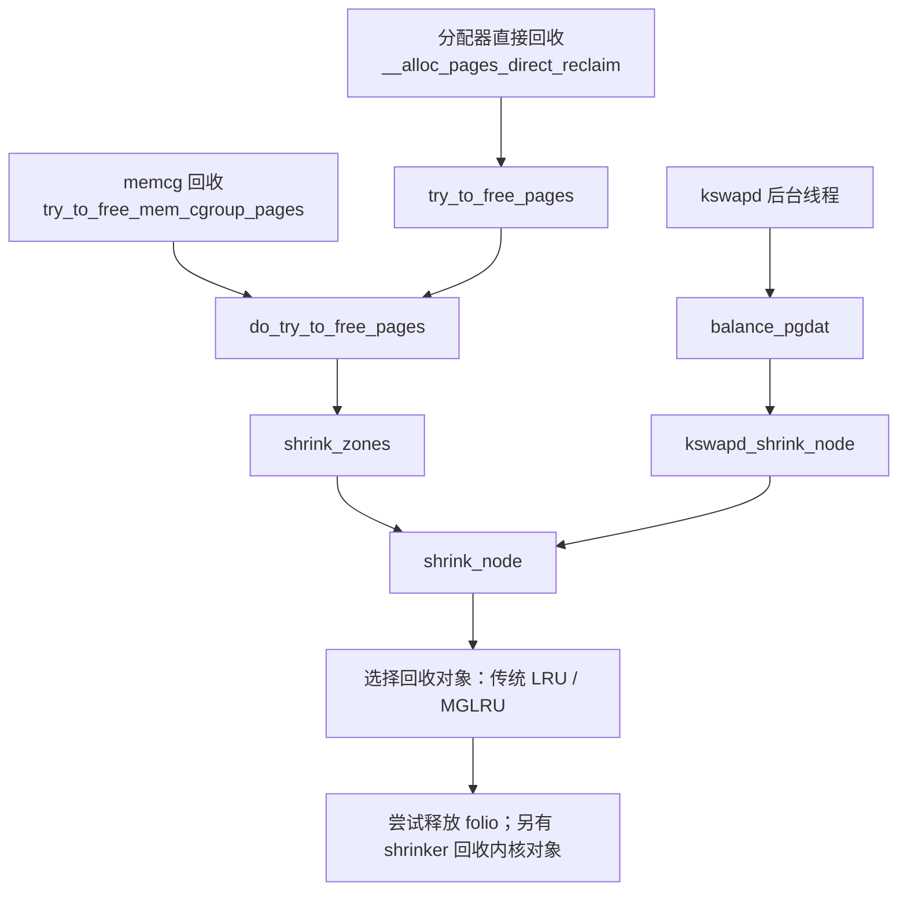
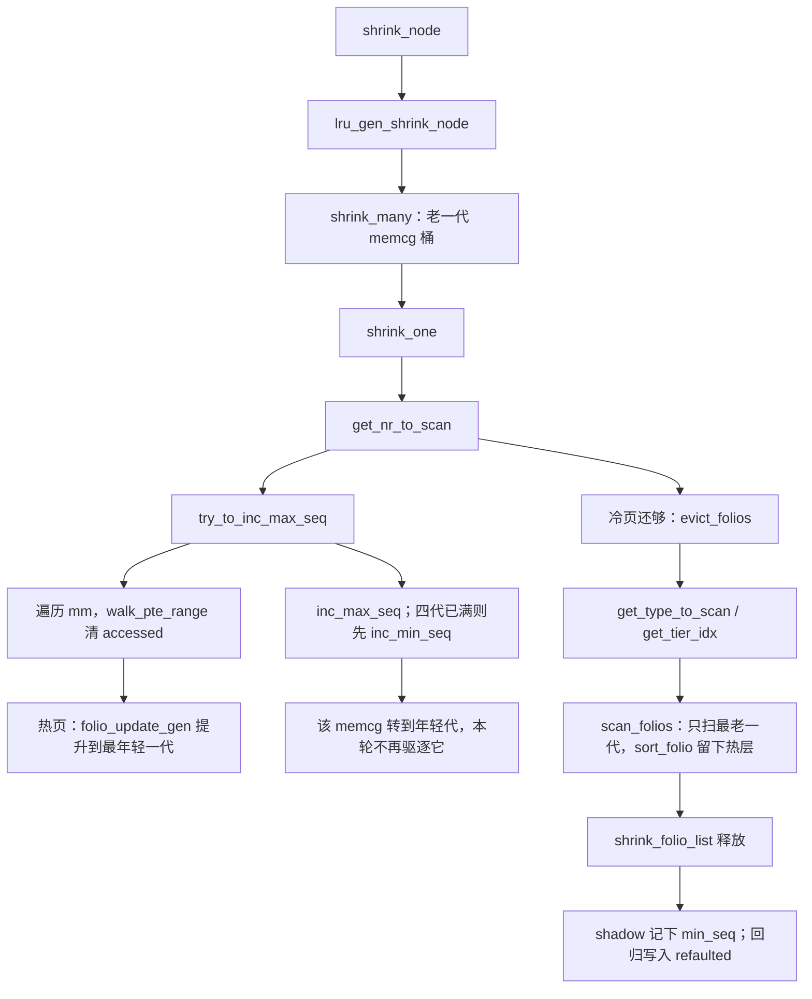

## pg_data_t
```
/*
 * On NUMA machines, each NUMA node would have a pg_data_t to describe
 * it's memory layout. On UMA machines there is a single pglist_data which
 * describes the whole memory.
 *
 * Memory statistics and page replacement data structures are maintained on a
 * per-zone basis.
 */
typedef struct pglist_data {
	/*
	 * node_zones contains just the zones for THIS node. Not all of the
	 * zones may be populated, but it is the full list. It is referenced by
	 * this node's node_zonelists as well as other node's node_zonelists.
	 */
	struct zone node_zones[MAX_NR_ZONES];

	/*
	 * node_zonelists contains references to all zones in all nodes.
	 * Generally the first zones will be references to this node's
	 * node_zones.
	 */
	/*
	 * 是这个节点上预先排好的分配顺序。一次分配先选定本节点的一条 zonelist，
	 * 再顺着里面的 struct zone * 找空闲页；本节点不够时，后面的项就是别的节点上的 zone。
	 */
	struct zonelist node_zonelists[MAX_ZONELISTS];

	int nr_zones; /* number of populated zones in this node */
#ifdef CONFIG_FLATMEM	/* means !SPARSEMEM */
	struct page *node_mem_map;
#ifdef CONFIG_PAGE_EXTENSION
	struct page_ext *node_page_ext;
#endif
#endif
#if defined(CONFIG_MEMORY_HOTPLUG) || defined(CONFIG_DEFERRED_STRUCT_PAGE_INIT)
	/*
	 * Must be held any time you expect node_start_pfn,
	 * node_present_pages, node_spanned_pages or nr_zones to stay constant.
	 * Also synchronizes pgdat->first_deferred_pfn during deferred page
	 * init.
	 *
	 * pgdat_resize_lock() and pgdat_resize_unlock() are provided to
	 * manipulate node_size_lock without checking for CONFIG_MEMORY_HOTPLUG
	 * or CONFIG_DEFERRED_STRUCT_PAGE_INIT.
	 *
	 * Nests above zone->lock and zone->span_seqlock
	 */
	spinlock_t node_size_lock;
#endif
	unsigned long node_start_pfn;
	unsigned long node_present_pages; /* total number of physical pages */
	unsigned long node_spanned_pages; /* total size of physical page
					     range, including holes */
	int node_id;
	/* 一个node对应一个kswapd */
	wait_queue_head_t kswapd_wait;
	/*
	整条内核里，只有 try_to_free_pages() 会把任务放上这条队列，而它只有一个调用者：页分配慢路径里
	的 __perform_reclaim()。也就是说，任务必须已经满足下面几步，才会睡下去。

	1. 这次分配带 __GFP_DIRECT_RECLAIM。GFP_KERNEL、GFP_USER、GFP_HIGHUSER_MOVABLE 都算。缺页、read/write 分配页缓存、brk/mmap 扩地址空间，走的都是这类标志。GFP_ATOMIC、GFP_NOWAIT 没有这个标志，慢路径在直接回收之前就返回了。
	2. 当前任务还没有 PF_MEMALLOC。kswapd、以及已经在回收过程中再做的嵌套分配，都带这个标志，慢路径直接放弃，不会再进 try_to_free_pages()。
	3. 当前任务不是内核线程。throttle_direct_reclaim() 看到 PF_KTHREAD 就返回。kjournald 这类线程可以进入直接回收，但不会睡在这里；限流它们可能把别人堵在它正在提交的日志上。
	4. zonelist 里第一个可用节点上，ZONE_NORMAL 及更低 zone 的空闲页，已经不高于这些 zone 的 min 水位之和的一半。高于这个线，函数直接返回，任务继续自己扫 LRU。
	*/
	wait_queue_head_t pfmemalloc_wait;

	/* workqueues for throttling reclaim for different reasons. */
	/*
	每个节点上的 4 条等待队列，下标就是限流原因。回收或规整发现“再扫也立刻拿不到页”时，当前任务睡
	在对应的那一条上，把 CPU 让给回写、换出已经隔离的页、或者别的回收者。
	内核线程里只有 kswapd 会睡到 reclaim_wait 上。用户进程做直接回收时也会睡这组队列.
	*/
	wait_queue_head_t reclaim_wait[NR_VMSCAN_THROTTLE];

	/* 节点上正在因回写而限流的任务数 */
	atomic_t nr_writeback_throttled;/* nr of writeback-throttled tasks */
	unsigned long nr_reclaim_start;	/* nr pages written while throttled
					 * when throttling started. */
#ifdef CONFIG_MEMORY_HOTPLUG
	struct mutex kswapd_lock;
#endif
	struct task_struct *kswapd;	/* Protected by kswapd_lock */
	int kswapd_order;
	enum zone_type kswapd_highest_zoneidx;

	atomic_t kswapd_failures;	/* Number of 'reclaimed == 0' runs */

#ifdef CONFIG_COMPACTION
	int kcompactd_max_order;
	enum zone_type kcompactd_highest_zoneidx;
	wait_queue_head_t kcompactd_wait;
	struct task_struct *kcompactd;
	bool proactive_compact_trigger;
#endif
	/*
	 * This is a per-node reserve of pages that are not available
	 * to userspace allocations.
	 */
	/*
	这个节点上估算出来、不能算作用户可用的页数。它是各 zone 的 high 水位 加上 lowmem 保留 的合计，
	分配器并不拿它做门槛；脏页上限、MemAvailable 这类统计用它把内核要留着的页扣掉。
	 */
	unsigned long		totalreserve_pages;

#ifdef CONFIG_NUMA
	/*
	 * node reclaim becomes active if more unmapped pages exist.
	 */
	unsigned long		min_unmapped_pages;
	unsigned long		min_slab_pages;
#endif /* CONFIG_NUMA */

	/* Write-intensive fields used by page reclaim */
	CACHELINE_PADDING(_pad1_);

#ifdef CONFIG_DEFERRED_STRUCT_PAGE_INIT
	/*
	 * If memory initialisation on large machines is deferred then this
	 * is the first PFN that needs to be initialised.
	 */
	unsigned long first_deferred_pfn;
#endif /* CONFIG_DEFERRED_STRUCT_PAGE_INIT */

#ifdef CONFIG_TRANSPARENT_HUGEPAGE
	struct deferred_split deferred_split_queue;
#endif

#ifdef CONFIG_NUMA_BALANCING
	/* start time in ms of current promote rate limit period */
	unsigned int nbp_rl_start;
	/* number of promote candidate pages at start time of current rate limit period */
	unsigned long nbp_rl_nr_cand;
	/* promote threshold in ms */
	unsigned int nbp_threshold;
	/* start time in ms of current promote threshold adjustment period */
	unsigned int nbp_th_start;
	/*
	 * number of promote candidate pages at start time of current promote
	 * threshold adjustment period
	 */
	unsigned long nbp_th_nr_cand;
#endif
	/* Fields commonly accessed by the page reclaim scanner */

	/*
	 * NOTE: THIS IS UNUSED IF MEMCG IS ENABLED.
	 *
	 * Use mem_cgroup_lruvec() to look up lruvecs.
	 */
	struct lruvec		__lruvec;

	unsigned long		flags;

#ifdef CONFIG_LRU_GEN
	/* kswap mm walk data */
	struct lru_gen_mm_walk mm_walk;
	/* lru_gen_folio list */
	/*
	这个节点上的 memcg 排队表，不是页的 LRU。多代 LRU（CONFIG_LRU_GEN）做全局回收时，靠它决定下一个扫
	哪个 memcg；每个 memcg 在该节点上的页，仍然挂在自己的 lruvec 里。
	 */
	struct lru_gen_memcg memcg_lru;
#endif

	CACHELINE_PADDING(_pad2_);

	/* Per-node vmstats */
	struct per_cpu_nodestat __percpu *per_cpu_nodestats;
	atomic_long_t		vm_stat[NR_VM_NODE_STAT_ITEMS];
#ifdef CONFIG_NUMA
	struct memory_tier __rcu *memtier;
#endif
#ifdef CONFIG_MEMORY_FAILURE
	struct memory_failure_stats mf_stats;
#endif
} pg_data_t;
```

## struct zone
```
struct zone {
	/* Read-mostly fields */

	/* zone watermarks, access with *_wmark_pages(zone) macros */
	unsigned long _watermark[NR_WMARK];
	unsigned long watermark_boost;

	unsigned long nr_reserved_highatomic;
	unsigned long nr_free_highatomic;

	/*
	 * We don't know if the memory that we're going to allocate will be
	 * freeable or/and it will be released eventually, so to avoid totally
	 * wasting several GB of ram we must reserve some of the lower zone
	 * memory (otherwise we risk to run OOM on the lower zones despite
	 * there being tons of freeable ram on the higher zones).  This array is
	 * recalculated at runtime if the sysctl_lowmem_reserve_ratio sysctl
	 * changes.
	 */
	long lowmem_reserve[MAX_NR_ZONES];

#ifdef CONFIG_NUMA
	int node;
#endif
	struct pglist_data	*zone_pgdat;
	struct per_cpu_pages	__percpu *per_cpu_pageset;
	struct per_cpu_zonestat	__percpu *per_cpu_zonestats;
	/*
	 * the high and batch values are copied to individual pagesets for
	 * faster access
	 */
	int pageset_high_min;
	int pageset_high_max;
	int pageset_batch;

#ifndef CONFIG_SPARSEMEM
	/*
	 * Flags for a pageblock_nr_pages block. See pageblock-flags.h.
	 * In SPARSEMEM, this map is stored in struct mem_section
	 */
	unsigned long		*pageblock_flags;
#endif /* CONFIG_SPARSEMEM */

	/* zone_start_pfn == zone_start_paddr >> PAGE_SHIFT */
	unsigned long		zone_start_pfn;

	/*
	 * spanned_pages is the total pages spanned by the zone, including
	 * holes, which is calculated as:
	 * 	spanned_pages = zone_end_pfn - zone_start_pfn;
	 *
	 * present_pages is physical pages existing within the zone, which
	 * is calculated as:
	 *	present_pages = spanned_pages - absent_pages(pages in holes);
	 *
	 * present_early_pages is present pages existing within the zone
	 * located on memory available since early boot, excluding hotplugged
	 * memory.
	 *
	 * managed_pages is present pages managed by the buddy system, which
	 * is calculated as (reserved_pages includes pages allocated by the
	 * bootmem allocator):
	 *	managed_pages = present_pages - reserved_pages;
	 *
	 * cma pages is present pages that are assigned for CMA use
	 * (MIGRATE_CMA).
	 *
	 * So present_pages may be used by memory hotplug or memory power
	 * management logic to figure out unmanaged pages by checking
	 * (present_pages - managed_pages). And managed_pages should be used
	 * by page allocator and vm scanner to calculate all kinds of watermarks
	 * and thresholds.
	 *
	 * Locking rules:
	 *
	 * zone_start_pfn and spanned_pages are protected by span_seqlock.
	 * It is a seqlock because it has to be read outside of zone->lock,
	 * and it is done in the main allocator path.  But, it is written
	 * quite infrequently.
	 *
	 * The span_seq lock is declared along with zone->lock because it is
	 * frequently read in proximity to zone->lock.  It's good to
	 * give them a chance of being in the same cacheline.
	 *
	 * Write access to present_pages at runtime should be protected by
	 * mem_hotplug_begin/done(). Any reader who can't tolerant drift of
	 * present_pages should use get_online_mems() to get a stable value.
	 */
	atomic_long_t		managed_pages;
	unsigned long		spanned_pages;
	unsigned long		present_pages;
#if defined(CONFIG_MEMORY_HOTPLUG)
	unsigned long		present_early_pages;
#endif
#ifdef CONFIG_CMA
	unsigned long		cma_pages;
#endif

	const char		*name;

#ifdef CONFIG_MEMORY_ISOLATION
	/*
	 * Number of isolated pageblock. It is used to solve incorrect
	 * freepage counting problem due to racy retrieving migratetype
	 * of pageblock. Protected by zone->lock.
	 */
	unsigned long		nr_isolate_pageblock;
#endif

#ifdef CONFIG_MEMORY_HOTPLUG
	/* see spanned/present_pages for more description */
	seqlock_t		span_seqlock;
#endif

	int initialized;

	/* Write-intensive fields used from the page allocator */
	CACHELINE_PADDING(_pad1_);

	/* free areas of different sizes */
	struct free_area	free_area[NR_PAGE_ORDERS];

#ifdef CONFIG_UNACCEPTED_MEMORY
	/* Pages to be accepted. All pages on the list are MAX_PAGE_ORDER */
	struct list_head	unaccepted_pages;

	/* To be called once the last page in the zone is accepted */
	struct work_struct	unaccepted_cleanup;
#endif

	/* zone flags, see below */
	unsigned long		flags;

	/* Primarily protects free_area */
	spinlock_t		lock;

	/* Pages to be freed when next trylock succeeds */
	struct llist_head	trylock_free_pages;

	/* Write-intensive fields used by compaction and vmstats. */
	CACHELINE_PADDING(_pad2_);

	/*
	 * When free pages are below this point, additional steps are taken
	 * when reading the number of free pages to avoid per-cpu counter
	 * drift allowing watermarks to be breached
	 */
	unsigned long percpu_drift_mark;

#if defined CONFIG_COMPACTION || defined CONFIG_CMA
	/* pfn where compaction free scanner should start */
	unsigned long		compact_cached_free_pfn;
	/* pfn where compaction migration scanner should start */
	unsigned long		compact_cached_migrate_pfn[ASYNC_AND_SYNC];
	unsigned long		compact_init_migrate_pfn;
	unsigned long		compact_init_free_pfn;
#endif

#ifdef CONFIG_COMPACTION
	/*
	 * On compaction failure, 1<<compact_defer_shift compactions
	 * are skipped before trying again. The number attempted since
	 * last failure is tracked with compact_considered.
	 * compact_order_failed is the minimum compaction failed order.
	 */
	unsigned int		compact_considered;
	unsigned int		compact_defer_shift;
	int			compact_order_failed;
#endif

#if defined CONFIG_COMPACTION || defined CONFIG_CMA
	/* Set to true when the PG_migrate_skip bits should be cleared */
	bool			compact_blockskip_flush;
#endif

	bool			contiguous;

	CACHELINE_PADDING(_pad3_);
	/* Zone statistics */
	atomic_long_t		vm_stat[NR_VM_ZONE_STAT_ITEMS];
	atomic_long_t		vm_numa_event[NR_VM_NUMA_EVENT_ITEMS];
} ____cacheline_internodealigned_in_smp;
```

## struct per_cpu_pages
```
struct per_cpu_pages {
	spinlock_t lock;	/* Protects lists field */
	int count;		/* number of pages in the list */
	int high;		/* high watermark, emptying needed */
	int high_min;		/* min high watermark */
	int high_max;		/* max high watermark */
	int batch;		/* chunk size for buddy add/remove */
	u8 flags;		/* protected by pcp->lock */
	u8 alloc_factor;	/* batch scaling factor during allocate */
#ifdef CONFIG_NUMA
	u8 expire;		/* When 0, remote pagesets are drained */
#endif
	short free_count;	/* consecutive free count */

	/* Lists of pages, one per migrate type stored on the pcp-lists */
	struct list_head lists[NR_PCP_LISTS];
} ____cacheline_aligned_in_smp;
```

## struct free_area
```
struct free_area {
	struct list_head	free_list[MIGRATE_TYPES];
	unsigned long		nr_free;
};
```
## 内存分配

```
__alloc_frozen_pages_noprof()
get_page_from_freelist()
rmqueue()
rmqueue_pcplist()
rmqueue_buddy()
__alloc_pages_slowpath()
```

## 内存回收


三条入口共享不少底层机制，但触发原因不同：

| 入口           | 触发原因                                | 谁承担执行成本                       |
| -------------- | --------------------------------------- | ------------------------------------ |
| 分配器直接回收 | 在允许的节点、zone 和分配条件下拿不到页 | 当前分配任务                         |
| memcg 回收     | cgroup 限额压力，或主动回收请求         | 进入该路径的任务；部分场景有工作线程 |
| `kswapd`       | 节点内存水位需要恢复                    | 后台内核线程                         |

注意：**全局回收也受 NUMA、cpuset、zone、GFP 等约束，并不等于能使用整机任何空闲内存。**

## MGLRU算法

多代 LRU（源码里的 multi-gen LRU，配置项 `CONFIG_LRU_GEN`）回答的仍是回收那一问：内存不够时，先放掉哪一页。它把“这页最近用过没有”记成滑动窗口里的一代，再把文件读写次数记成同一代里的一层。热度先写在 folio 的标志上；真正搬链表，留到窗口往前推、或者这一页已经站在最老一代队尾的时候。

本节依据仓库中的 Linux **6.18.52**，版本见 [Makefile](../../linux/Makefile#L2)。先看一页怎样进入某一代，再看窗口怎样变老、驱逐怎样挑页，最后把全局回收和 memcg 回收接回上一节的 `shrink_node()`。下面的数字例子用来对齐源码里的关系；某一页实际落在哪一代，要看它当时的标志和这个 `lruvec` 的 `max_seq`、`min_seq`。

### 1. 它接在哪条回收路径上

`lru_gen_enabled()` 为真时，两条入口在 `shrink_node()` 处分岔：

| 回收范围                 | 入口                                               | MGLRU 接着做什么                                                                                 |
| ------------------------ | -------------------------------------------------- | ------------------------------------------------------------------------------------------------ |
| 全局回收（root reclaim） | [`shrink_node()`](../../linux/mm/vmscan.c#L6057)   | [`lru_gen_shrink_node()`](../../linux/mm/vmscan.c#L5043)，按节点上的 memcg 队列选下一个 `lruvec` |
| 某个 memcg 的回收        | [`shrink_lruvec()`](../../linux/mm/vmscan.c#L5795) | [`lru_gen_shrink_lruvec()`](../../linux/mm/vmscan.c#L5022)，只扫这一个 `lruvec`                  |

选出来、隔离出来的 folio，仍交给原来的 [`shrink_folio_list()`](../../linux/mm/vmscan.c#L1104)：解除映射、回写、换出、释放。MGLRU 换掉的是“先看谁”；释放仍走这个函数。多代路径上的调用点在 [`evict_folios()`](../../linux/mm/vmscan.c#L4725)。

`kswapd` 在平衡节点之前还会走 [`kswapd_age_node()`](../../linux/mm/vmscan.c#L6726)。MGLRU 在这里调用的 [`lru_gen_age_node()`](../../linux/mm/vmscan.c#L4188) 只做两件事：按可回收页的规模估计本轮 `priority`，以及在设置了 `min_ttl` 时判断最老一代是不是还太年轻。扫页表、把窗口往前推，发生在后面真正收缩某一个 `lruvec` 的时候，不在这个函数里。

### 2. 用四代滑动窗口代替两段链表

可回收 folio 按代分开。最年轻一代的序号是 `max_seq`，匿名页和文件页各有一个最老序号 `min_seq[]`。两个序号只增不减，窗口长度落在 `MIN_NR_GENS`（2）和 `MAX_NR_GENS`（4）之间。定义和这段约定写在 [mmzone.h 的多代注释](../../linux/include/linux/mmzone.h#L371)。

代的序号可以一直涨。链表只有 4 条槽，所以槽号是序号对 4 取余，见 [`lru_gen_from_seq()`](../../linux/include/linux/mm_inline.h#L126)：

```c
static inline int lru_gen_from_seq(unsigned long seq)
{
	return seq % MAX_NR_GENS;
}
```

假设此刻 `max_seq = 7`，两边的 `min_seq` 都是 4。窗口里有四代：

```text
seq 7  gen 3  最年轻   对外记成活跃
seq 6  gen 2  次年轻   对外记成活跃
seq 5  gen 1  较老     对外记成不活跃
seq 4  gen 0  最老     驱逐从这里开始
```

最年轻的两代算活跃，是为了和原来的活跃/不活跃 LRU 对齐，`/proc/vmstat` 不用改接口。判断在 [`lru_gen_is_active()`](../../linux/include/linux/mm_inline.h#L164)。窗口每向前一步，[`inc_max_seq()`](../../linux/mm/vmscan.c#L4020) 把掉出这两代的页数从活跃计数挪到不活跃计数。

为什么至少要两代：一页刚因缺页进来时，页表上的 accessed 位是这次缺页留下的。变老逻辑至少要再看两次，才能把这页交给驱逐。第一次清掉缺页留下的访问痕迹，第二次确认此后没有再用过。这个二次机会就是 `MIN_NR_GENS = 2` 的来由，见 [同一段注释](../../linux/include/linux/mmzone.h#L379)。

每一代再按匿名/文件、按 zone 分成链表。页数单独记在 `nr_pages` 里，和链表一样是 `[代][类型][zone]`。这些数组在 [`struct lru_gen_folio`](../../linux/include/linux/mmzone.h#L490)。`nr_pages` 允许短暂为负：页表扫描先改 folio 标志，累计够一批才在 LRU 锁下把差额加回去，见 [`reset_batch_size()`](../../linux/mm/vmscan.c#L3335)。

folio 在这些链表上时，`folio->flags` 里的代字段存的是 `gen + 1`。0 表示它不在多代链表上。[`folio_lru_gen()`](../../linux/include/linux/mm_inline.h#L157) 读出来再减 1，所以没挂上时得到 -1。挂在多代链表上时 `PG_active` 保持清除；只有为了迁移等原因把页隔离出去，并且它当时算活跃，才把 `PG_active` 重新置上。见 [`lru_gen_del_folio()`](../../linux/include/linux/mm_inline.h#L284)。

不可回收页不进这个窗口。[`lru_gen_add_folio()`](../../linux/include/linux/mm_inline.h#L265) 看到 `unevictable` 或这个 `lruvec` 还没启用多代 LRU，就返回失败，调用方仍把页放进原来的 `lruvec->lists[]`。

### 3. 新页落在哪一代

进入 LRU 时，[`lruvec_add_folio()`](../../linux/include/linux/mm_inline.h#L341) 先尝试 [`lru_gen_add_folio()`](../../linux/include/linux/mm_inline.h#L254)。后者用 [`lru_gen_folio_seq()`](../../linux/include/linux/mm_inline.h#L220) 把标志翻译成一个序号，再夹到不老于 `min_seq[type]`：

```c
	if (folio_test_active(folio))
		gen = MIN_NR_GENS - folio_test_workingset(folio);
	else if (reclaiming)
		gen = MAX_NR_GENS;
	else if ((!folio_is_file_lru(folio) && !folio_test_swapcache(folio)) ||
		 (folio_test_reclaim(folio) &&
		  (folio_test_dirty(folio) || folio_test_writeback(folio))))
		gen = MIN_NR_GENS;
	else
		gen = MAX_NR_GENS - folio_test_workingset(folio);

	return max(READ_ONCE(lrugen->max_seq) - gen + 1, READ_ONCE(lrugen->min_seq[type]));
```

这里的 `gen` 是“离最年轻一代有多远”，不是槽号。窗口已经拉满（`max_seq - min_seq = 3`）时，可以把它读成下面这张表：

| 进来时的状态                                        | 落点                         |
| --------------------------------------------------- | ---------------------------- |
| 带 `PG_active`，并且是工作集                        | 最年轻一代 `max_seq`         |
| 带 `PG_active`，还不是工作集                        | 次年轻一代 `max_seq - 1`     |
| 还没进 swap cache 的匿名页，或正在回收的脏页/回写页 | 次年轻一代，先给一次二次机会 |
| 普通文件页，带工作集标记                            | `max_seq - 2`                |
| 普通文件页，没有工作集标记                          | 最老一代 `min_seq`           |
| `reclaiming` 为真，例如回收失败后放回               | 尽量放回最老一代             |

普通文件缓存可以很快成为驱逐候选；刚分配、还没换出过的匿名页先站在次年轻一代。插入位置也有区别：正常加入用 `list_add()`，放在这一代链表头部；回收路径放回用 `list_add_tail()`，让它晚一点再被扫到。扫描时 [`lru_to_folio()`](../../linux/include/linux/mm.h#L244) 取的是链表尾，也就是在这一代里待得更久的那一端。

同一代内部先不按热度排序。注释写的是 lazily sorted on eviction：等驱逐真的扫到这一代，再把放错位置的页搬走。

### 4. 文件访问记在层上，页表访问记在代上

同一代里还有层（tier）。通过文件描述符发生的访问，次数 `N` 对应 `order_base_2(N)` 层，一共 `MAX_NR_TIERS = 4` 层。说明在 [层的注释](../../linux/include/linux/mmzone.h#L401)。

缓冲读写走 [`folio_mark_accessed()`](../../linux/mm/swap.c#L455)。多代 LRU 打开时，它只调用 [`lru_gen_inc_refs()`](../../linux/mm/swap.c#L389)，用原子操作改 folio 标志，不拿 LRU 锁，也不把页挪到另一条链表。

标志的累加顺序是：第一次访问置 `PG_referenced`；之后把 `LRU_REFS_WIDTH` 那几位加一；这几位满了再置 `PG_workingset`。`LRU_REFS_WIDTH` 在 [bounds.c](../../linux/kernel/bounds.c#L27) 里是 `MAX_NR_TIERS - 2`，也就是 2 位。层号由 [`lru_tier_from_refs()`](../../linux/include/linux/mm_inline.h#L136) 算出：带 `PG_workingset` 的页直接算最后一层，否则是 `order_base_2(refs)`。

| 通过文件描述符看到的次数 | 标志                      | 层  |
| ------------------------ | ------------------------- | --- |
| 0 或 1                   | 无，或仅 `PG_referenced`  | 0   |
| 2                        | `PG_referenced` 再加 1 次 | 1   |
| 3 或 4                   | 引用位继续增加            | 2   |
| 引用位已经满，再次访问   | 再置 `PG_workingset`      | 3   |

第 0 层是基准。更高层要不要保护，等驱逐时用回归比例决定，不在每次 `read()`/`write()` 时搬链表。

页表访问是另一条路，层用不上。变老扫到 accessed 位时，[`folio_update_gen()`](../../linux/mm/vmscan.c#L3265) 这样做：

1. 这页还没有 `PG_referenced`，也没有 `PG_workingset`：只置 `PG_referenced`，代不变。这是二次机会的第一次确认。
2. 已经有过上述标记：把代改成当前最年轻的一代，置 `PG_workingset`，并清掉引用位，让文件访问的计数可以重新开始。

回收隔离之后，[`folio_check_references()`](../../linux/mm/vmscan.c#L928) 若发现页表仍标着年轻，就调用 [`lru_gen_set_refs()`](../../linux/mm/vmscan.c#L885)。第一次只置 `PG_referenced`，这页留到下一轮（`FOLIOREF_KEEP`）；已经记过一次，就置 `PG_workingset` 并激活。放回 LRU 时 `PG_active` 会把它送进较年轻的一代。页还挂在 LRU 上、当前又没有页表扫描上下文时，[`walk_update_folio()`](../../linux/mm/vmscan.c#L3521) 改走 [`folio_activate()`](../../linux/mm/vmscan.c#L3524)，最终由 [`lru_activate()`](../../linux/mm/swap.c#L303) 做同样的拿下、置 `PG_active`、再放回。

两条路在 [LRU_REFS_FLAGS 的注释](../../linux/include/linux/mmzone.h#L428) 里对照着写完。`PG_workingset` 一旦置上，就留到这页被回收，或被 [`lru_gen_clear_refs()`](../../linux/mm/swap.c#L413) 清掉。

### 5. 变老：把最年轻一代的序号加一

冷页不够分时，回收者要先把窗口往前推。判断在 [`should_run_aging()`](../../linux/mm/vmscan.c#L4782)：

- 可驱逐的最老序号距离 `max_seq` 已经不到两代：只剩二次机会那两代，不能再驱逐，必须变老。
- 刚好空出一代（窗口里有三代）：驱逐仍可能进行，但更适合先变老。
- 四代都在：先驱逐，这一轮不变老。

[`get_nr_to_scan()`](../../linux/mm/vmscan.c#L4816) 把这个判断和回收压力合在一起。`priority` 仍是传统回收那一档，默认 12，本轮预算大约是可回收页右移 `priority` 位。压力还停在默认档时，即使觉得该变老，也先按这个预算去驱逐，避免每次轻量回收都扫一遍页表。`priority` 已经降下来、而且冷页不足，才调用 [`try_to_inc_max_seq()`](../../linux/mm/vmscan.c#L4055)。变老成功后这个函数返回 -1，当前 `lruvec` 本轮不再驱逐，并在全局回收里被转到 memcg 队列的年轻一代。

变老要扫进程地址空间，因为 accessed 位在页表里，不在 folio 上。硬件会自动置 accessed 位、并且打开了 `LRU_GEN_MM_WALK` 时，[`should_walk_mmu()`](../../linux/mm/vmscan.c#L2704) 为真，[`try_to_inc_max_seq()`](../../linux/mm/vmscan.c#L4073) 就沿着 mm 链表走。否则它调用 [`iterate_mm_list_nowalk()`](../../linux/mm/vmscan.c#L3142) 把 mm 迭代序号拨过这一代，然后仍然调用 `inc_max_seq()` 把窗口往前推，只是不扫页表。发现热页的工作留给驱逐途中的 [`lru_gen_look_around()`](../../linux/mm/vmscan.c#L4235)：访问位被零星清掉，避免一次变老集中制造一串缺页。

mm 从哪来：打开 `CONFIG_LRU_GEN_WALKS_MMU` 时，每个 memcg（memcg 关闭时则是一条全局链表）挂着本 cgroup 里的 `mm_struct`，见 [`lru_gen_add_mm()`](../../linux/mm/vmscan.c#L2938)。进程切换到这个 `mm`，或 exec 装入新地址空间时，[`lru_gen_use_mm()`](../../linux/include/linux/mm_types.h#L1320) 把 `mm->lru_gen.bitmap` 全部置上。[`get_next_mm()`](../../linux/mm/vmscan.c#L2920) 只看本节点对应的那一位：是 0 就跳过，扫到了再清掉。上一轮结束之后新加入的 mm，会被强制扫一次。

单个 mm 的扫描在 [`walk_mm()`](../../linux/mm/vmscan.c#L3810)。一次走不完就从 `next_addr` 接着走，沿 PUD、PMD 下到 PTE。[`walk_pte_range()`](../../linux/mm/vmscan.c#L3528) 对每一项做的事实很少：

1. [`get_pte_pfn()`](../../linux/mm/vmscan.c#L3432) 丢掉不存在或特殊的项。没有 mmu notifier 时，accessed 位未置的项也在这里丢掉。[`get_pfn_folio()`](../../linux/mm/vmscan.c#L3479) 再丢掉不在本节点、不属于这个 memcg、或没挂在多代链表上的页。
2. [`ptep_clear_young_notify()`](../../linux/mm/vmscan.c#L3578) 清掉 accessed 位。清不掉就跳过，页留在原来的代。
3. 清掉了，就用第 4 节的 `folio_update_gen()` 尝试提升。同一个 folio 的多个 PTE 合并成一次更新。
4. PTE 的 dirty 位也收上来。匿名页若还没进 swap cache，不在这里标脏。

一批提升先记在 [`lru_gen_mm_walk`](../../linux/include/linux/mmzone.h#L544) 里。累计的 folio 达到 `MAX_LRU_BATCH`（`MIN_LRU_BATCH * 64`，`MIN_LRU_BATCH` 等于字长），或者需要重新调度时，这次 `walk_page_range()` 先返回。[`walk_mm()`](../../linux/mm/vmscan.c#L3838) 再拿 LRU 锁调用 `reset_batch_size()`，把 `nr_pages` 和活跃/不活跃计数一次改完。页表扫描本身不拿 LRU 锁。

扫完这一代该扫的 mm 之后，[`inc_max_seq()`](../../linux/mm/vmscan.c#L3990) 把 `max_seq` 加一，并给新槽位记下出生时间 `timestamps[gen] = jiffies`。如果某一类型已经占满四代，新槽位就是当前最老一代正在用的那条链表，必须先把那一代挪走，否则新的年轻页会和老页混在同一个槽里。挪走由 [`inc_min_seq()`](../../linux/mm/vmscan.c#L3880) 完成：最老一代上的页用 [`folio_inc_gen()`](../../linux/mm/vmscan.c#L3290) 推进一代。推动的原因是槽位要交给新的年轻代，这些页此刻不一定刚被访问过。除了“引用位和 `PG_workingset` 都已经满、本来就要懒提升”的页，其余页记入 `protected[]`，表示这一代里被留下来的数量。一批最多处理 `MAX_LRU_BATCH` 个 folio，搬不完就放开锁，让出 CPU，再继续。

匿名页和文件页的 `min_seq` 可以不完全同步。swappiness 使其中一边暂时不能回收时，[`inc_min_seq()`](../../linux/mm/vmscan.c#L3888) 仍会把那边的序号加一，但先不动它的链表。[`inc_max_seq()`](../../linux/mm/vmscan.c#L4020) 因此要同时改“掉出活跃窗口的那一代”和“即将变成最年轻、却可能还留着旧页的那一代”的活跃/不活跃计数。两边都能回收时，[`try_to_inc_min_seq()`](../../linux/mm/vmscan.c#L3968) 会把跑得太靠前的那一边拉回到 `max_seq - MIN_NR_GENS`，避免窗口两侧差得太远。

还有一个更快的空代跳过：驱逐之后如果最老一代的每条 zone 链表都空了，[`try_to_inc_min_seq()`](../../linux/mm/vmscan.c#L3943) 直接把 `min_seq` 往前拨，不必再搬页。拨完若窗口又窄于两代，这一轮就停止继续扫描。

### 6. 驱逐：只从最老一代挑，并用回归比例决定保护谁

变老回答“谁最近被用过”。驱逐回答“在已经分出的冷页里，这一轮实际赶谁”。一次收缩在 [`try_to_shrink_lruvec()`](../../linux/mm/vmscan.c#L4873)：循环取预算、调用 [`evict_folios()`](../../linux/mm/vmscan.c#L4693)，直到预算用完、没有进展，或全局回收已经把相关 zone 救回水位之上。

[`evict_folios()`](../../linux/mm/vmscan.c#L4711) 在 LRU 锁里做三件事：隔离一批 folio，尝试拨空的 `min_seq`，然后放开锁，把这批页交给 `shrink_folio_list()`。没能释放的页再放回多代链表。如果按普通规则放回去会落回最老一代，它先置上 `PG_active`，让 [`lru_gen_folio_seq()`](../../linux/mm/vmscan.c#L4746) 把它放到更年轻的代，避免刚被拒绝的页立刻再次站到队尾。干净、已无映射、也没有脏和回写的页会再试一次，以免错过可回收的时机。

隔离哪一类型、哪一层，由一个反馈回路决定。源码把当前正在驱逐的这一代上的比例叫做 P，把以往各代的指数滑动平均叫做 I，平滑系数是 1/2；D 没有实现。注释在 [PID controller](../../linux/mm/vmscan.c#L3169)。平均在 [`reset_ctrl_pos()`](../../linux/mm/vmscan.c#L3213)：一代结束时，`refaulted` 和 `evicted + protected` 与旧平均值相加再除以 2。

比较的量是 `refaulted / (evicted + protected)`，也就是“被赶走或被保护的页里，有多少很快又回来”。比例高，说明上一轮放掉的是还会用到的页，应该少放；比例低，说明放掉的页留在外面，可以继续放。第一层（或另一种类型的全体）是设定点 SP，待比较的层或另一种类型是 PV。[`positive_ctrl_err()`](../../linux/mm/vmscan.c#L3249) 在 PV 的样本还太少，或 PV 的加权回归比例不高于 SP 时返回真。

选类型的是 [`get_type_to_scan()`](../../linux/mm/vmscan.c#L4651)：

- swappiness 不超过 `MIN_SWAPPINESS + 1`：只扫文件页。
- swappiness 达到 `MAX_SWAPPINESS`（200）及以上：只扫匿名页。常量在 [swap.h](../../linux/include/linux/swap.h#L388)。
- 介于两者之间：匿名页的权重是 swappiness，文件页的权重是 `200 - swappiness`。加权之后回归比例更低的那一类先扫。扫不到可隔离的页，再换另一类。

选层的是 [`get_tier_idx()`](../../linux/mm/vmscan.c#L4631)。第 0 层的权重是 2，更高层的权重是 3。从第 1 层往上比：这一层的回归比例还没有明显高于第 0 层，就把它继续算进本轮可以驱逐的范围。比例已经明显高于第 0 层，说明这一层被赶走的页又回来了，循环停住。返回值是最后一个还能驱逐的层。`sort_folio()` 见到层号大于这个返回值，就把页推进下一代。权重取 3 比 2，是要求更高层先多表现出一截回归，才打开保护。注释的理由是：别的层按访问次数分桶，回归次数本来就会比第 0 层高出成倍，比较时留出余量，免得计数一抖就把它们保护起来。

真正翻链表的是 [`scan_folios()`](../../linux/mm/vmscan.c#L4548)。它只看该类型的最老一代；整个类型若只剩两代，直接返回 0，把二次机会留完。每个 folio 先经过 [`sort_folio()`](../../linux/mm/vmscan.c#L4469)：

| 看到的情况                                        | 处理                                                    |
| ------------------------------------------------- | ------------------------------------------------------- |
| 已经不可回收                                      | 留给后面的通用路径剔除                                  |
| 标志里的代已经不是最老一代                        | 搬到它记录的那一代，这就是懒排序                        |
| 层高于本轮门槛，或引用位与 `PG_workingset` 都已满 | `folio_inc_gen()` 推进一代，并计入 `protected`          |
| zone 高于本次允许回收的 `reclaim_idx`             | 推进一代并放到链表尾，避免它老堵在队头                  |
| 以上都不是                                        | 留给 [`isolate_folio()`](../../linux/mm/vmscan.c#L4518) |

隔离还要再看这次分配能不能做 I/O。没有 `__GFP_IO` 时，脏页，以及还没进 swap cache 的匿名页，都跳过，先移到一边，扫完这条链表再接回去。[`scan_folios()`](../../linux/mm/vmscan.c#L4559) 里 `remaining` 从不超过 `MAX_LRU_BATCH` 起，每看一个 folio 减一；隔离或跳过的页数达到 `MIN_LRU_BATCH` 也停，好把 LRU 锁尽快放开。

扫描从 `reclaim_idx` 所在 zone 开始，再向更低的 zone 走，然后才绕到更高的 zone。更高 zone 的页本轮不能拿来满足这次分配，`sort_folio()` 会把它们推进下一代，免得它们一直停在最老一代的队头。

### 7. 页表扫描怎样少走空表

如果每个 mm 的每张页表都扫，变老的成本会落在很少被用到的地址空间上。多代 LRU 用两张布隆过滤器交替记录“上一轮里，这张中间页表下面有足够多的年轻叶子”。参数和交替方式写在 [Bloom filters](../../linux/mm/vmscan.c#L2803)：位图 `1 << 15` 位，两个哈希。一代扫描开始时清掉下一张过滤器，见 [`iterate_mm_list()`](../../linux/mm/vmscan.c#L3131) 和 [`reset_bloom_filter()`](../../linux/mm/vmscan.c#L2877)。

[`walk_pmd_range()`](../../linux/mm/vmscan.c#L3748) 在走进一张 PTE 表之前先问过滤器。不在里面，并且不是强制扫描，就跳过这张表。走进去之后，[`suitable_to_scan()`](../../linux/mm/vmscan.c#L3496) 看年轻 PTE 是否密到平均每个 cache line 至少有一个。够密，就把这个 PMD 记入下一代的过滤器，下一轮变老还会再来。过滤器还没分配成功时，测试函数返回真，退回到多扫而不是漏扫。

驱逐路径把信息送回来。[`folio_referenced()` 的反向映射循环](../../linux/mm/rmap.c#L897) 在多代 LRU 下调用 [`lru_gen_look_around()`](../../linux/mm/vmscan.c#L4235)。当前 PTE 是年轻的，它就在同一张 PMD 覆盖的范围里再看相邻 PTE，宽度限制在 `MIN_LRU_BATCH` 页，并以当前地址为中心。相邻的年轻页按同一套 `folio_update_gen()` 提升。若这一小段也够密，当前 PMD 被记入这一代的过滤器。于是“回收时碰巧发现一片热页”会让后续的页表扫描专门回到这里，而不必先把所有地址空间走一遍。

### 8. 被释放的页又被用到

文件页真的从地址空间拿掉时，[`workingset_eviction()`](../../linux/mm/workingset.c#L393) 改走 [`lru_gen_eviction()`](../../linux/mm/workingset.c#L232)。留在 radix tree 里的 shadow 记下当时的 `min_seq`，以及这页的引用次数、是不是工作集。同时把页数加进这一代、这一层的 `evicted`。

下次同一位置又装入一页，[`workingset_refault()`](../../linux/mm/workingset.c#L545) 进入 [`lru_gen_refault()`](../../linux/mm/workingset.c#L283)。[`lru_gen_test_recent()`](../../linux/mm/workingset.c#L264) 比较 shadow 里的序号和现在的 `max_seq`：两者距离小于四代，就算最近被赶走的。对得上，就把页数加进对应层的 `refaulted`。这个计数就是第 6 节那个比例的分子。

若当时带了工作集标记，新页也会置上 `PG_workingset`，随后按第 3 节的规则进入较年轻的代。缺页路径还会把 `current->in_lru_fault` 置上，见 [`lru_gen_enter_fault()`](../../linux/mm/memory.c#L6428)；回归发生在这种缺页里时，额外计入 `WORKINGSET_ACTIVATE`。传统工作集算法用“非驻留页年龄和当前工作集大小”比距离；多代 LRU 用“是不是还在最近四代里”代替那个距离。

### 9. 全局回收先选 memcg，再选页

全局回收不沿着 cgroup 树做迭代。每个节点有一份 [`struct lru_gen_memcg`](../../linux/include/linux/mmzone.h#L606)：memcg 分成老、年轻两代，每一代再随机拆成 `MEMCG_NR_BINS`（8）个桶。注释在 [memcg LRU](../../linux/include/linux/mmzone.h#L561)。桶的序号多留了一代（`MEMCG_NR_GENS = 3`），这样无锁读到旧序号时，不会把“上一代”卷成“年轻代”。

[`shrink_many()`](../../linux/mm/vmscan.c#L4952) 从老一代的一个随机桶头开始，对桶里的每个 memcg 调用 [`shrink_one()`](../../linux/mm/vmscan.c#L4911)。`shrink_one()` 的返回值决定这个 memcg 接下来放到哪：

| 返回值            | 何时出现                                                                            | 队列上的效果                       |
| ----------------- | ----------------------------------------------------------------------------------- | ---------------------------------- |
| `MEMCG_LRU_YOUNG` | 本轮已经变老，或低于 min，或离线/太小且已经重试过                                   | 放到年轻代的桶尾                   |
| `MEMCG_LRU_TAIL`  | 第一次发现它低于 low，或离线、太小                                                  | 仍留在当前代，但改到桶尾，稍后重试 |
| `MEMCG_LRU_HEAD`  | 超过 soft limit 时由 [`lru_gen_soft_reclaim()`](../../linux/mm/vmscan.c#L4454) 触发 | 放到当前代的桶头，尽快再扫         |
| 0                 | 这一轮没变老，而且这个 `lruvec` 仍然够大                                            | 留在原地，下次还从它附近继续       |

年轻代要等老一代的桶都空了，节点序号才会加一，年轻代变成下一轮的老一代。公平来自各 memcg 的 `max_seq` 轮流增加，而不是来自一次把所有 cgroup 扫完。memcg 自己的回收仍用原来的 `mem_cgroup_iter()`，不走这张节点队列；[`lru_gen_shrink_lruvec()`](../../linux/mm/vmscan.c#L5035) 只在变老成功时，把这个 memcg 转到年轻代。

低于 min 的 memcg 直接被转到年轻代，本轮不扫。低于 low 的 memcg 先被放到桶尾；下一次再遇到，才发出 `MEMCG_LOW` 并真正尝试收缩。这和传统路径里“还有别的可回收内存时先跳过 low”是同一类保护，只是排队方式换成了头、尾和两代。

### 10. 工作集还能按时间留住

每一代出生时记下 `jiffies`。sysfs 的 `min_ttl_ms` 把这个时间变成一条底线：最老一代的出生时间加上 `lru_gen_min_ttl` 仍在现在之后，[`lruvec_is_reclaimable()`](../../linux/mm/vmscan.c#L4164) 就认为这个 `lruvec` 还不能回收。`kswapd` 若发现每个 memcg 都过不了这条线——或者都太小、都低于 min——会在 [`lru_gen_age_node()`](../../linux/mm/vmscan.c#L4208) 里走 OOM。默认值是 0，这条保护不生效，直到写入 [min_ttl_ms](../../linux/mm/vmscan.c#L5233)。

算法本身还可以在运行中打开或关上。[`lru_gen_change_state()`](../../linux/mm/vmscan.c#L5172) 翻转 `LRU_GEN_CORE` 这个 static key，再把每个 `lruvec` 上的可回收页，在原来的活跃/不活跃链表和多代链表之间搬完。不可回收链表留在原地。搬运按 `MAX_LRU_BATCH` 个 folio 分批，中途放锁。因此读代码时要先看 `lru_gen_enabled()`：同一套 `lruvec_add_folio()`，打开和关上走的是两套链表。

三个开关位在 [`enabled` 的 sysfs 显示](../../linux/mm/vmscan.c#L5248)：

| 位                      | 含义                                                             |
| ----------------------- | ---------------------------------------------------------------- |
| `LRU_GEN_CORE`          | 用多代链表，而不是活跃/不活跃两段                                |
| `LRU_GEN_MM_WALK`       | 变老时主动扫页表；还要求硬件能置 accessed 位                     |
| `LRU_GEN_NONLEAF_YOUNG` | 允许在中间页表项上清 accessed 位，用来跳过整棵没有年轻叶子的子树 |

### 11. 把一次全局回收串起来

`get_nr_to_scan()` 在这里分岔。`priority` 已经低于默认档、冷页又不够分时走变老；冷页还够，或者压力仍停在默认档时走驱逐：



读源码时可以抓住三个不变量：

1. 驱逐只隔离最老一代里、层不超过本轮门槛的页。更年轻的代，以及被保护的层，留在窗口里。
2. 页表发现的热度改代，文件读写发现的热度改层。改层不必拿 LRU 锁。
3. `max_seq` 和 `min_seq` 只向前。四条链表是槽，槽号等于序号 mod 4；槽要复用给新的年轻代之前，旧页必须已经挪走，或者那一边因为不能回收而在计数上被单独处理。

下一轮该不该继续保护某一层，不靠这页自己的标志单独决定，而靠这一层“被赶走之后有多少又回来”。这个比例写在 `lrugen->refaulted`、`evicted`、`protected` 和它们的滑动平均里，入口就是 [`read_ctrl_pos()`](../../linux/mm/vmscan.c#L3194)。