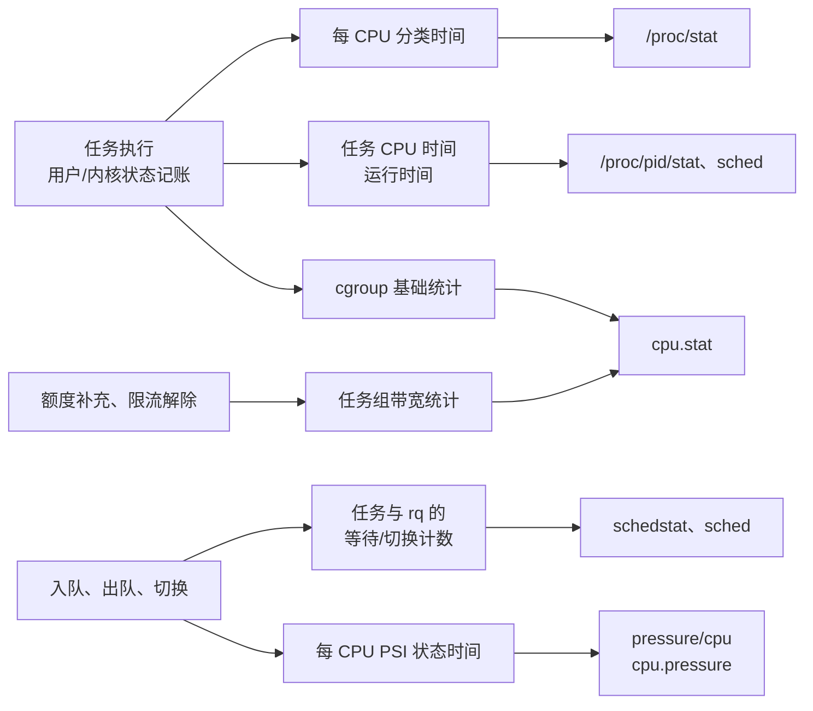

# CPU 可观测性指标：时间、排队、压力与执行能力

“CPU 使用率只有 30%，服务却变慢了。”这个现象并不矛盾：线程可能集中在一个 CPU 上排队，可能受 cgroup 配额限制，也可能大部分时间在等 I/O。即使 CPU 使用率达到 100%，也还要区分用户计算、内核处理、中断，以及执行指令时的缓存和分支开销。

CPU 可观测性要回答四个不同的问题：**CPU 时间花在哪里，任务多久才能运行，工作负载是否受到限制，以及运行时完成工作的能力如何。** 本章按这些问题收集指标，先说明计数对象，再列出接口、单位和含义，对容易误读的口径展开分析。

## 0. 分析基线与范围

本章以本仓库 [Makefile 第 2～4 行](../../linux/Makefile#L2-L4)标记的 **6.18.52** 源码为依据，架构为 **x86-64**。涉及“CPU 数量”时，默认指内核调度的**逻辑 CPU**，物理核及 SMT 关系需另查拓扑。读者需要了解任务、运行队列、上下文切换及中断的基本概念，背景可参见[调度子系统](../sched/introduction.md)、[硬中断](../interrupt/hardirq.md)和[软中断](../interrupt/softirq.md)。

与指标可用性和统计精度有关的配置如下。这里列的是编译条件；硬件、驱动、挂载点、启动参数和运行时开关仍会影响接口。

| 本地配置 | 对本章的影响 | 源码依据 |
| --- | --- | --- |
| `CONFIG_X86_64=y`、`CONFIG_SMP=y` | 主线为 x86-64 多 CPU 统计 | [.config#L333](../../linux/.config#L333)、[.config#L362](../../linux/.config#L362) |
| `CONFIG_PROC_FS=y`、`CONFIG_SYSFS=y` | 编入 `/proc` 和 sysfs 接口 | [.config#L9724](../../linux/.config#L9724)、[.config#L9734](../../linux/.config#L9734) |
| `CONFIG_HZ=1000`、`CONFIG_NO_HZ_FULL=y` | 内部 tick 频率为 1000 Hz；可使用无周期 tick 的记账路径，但不等于所有 CPU 都运行于该模式 | [.config#L506](../../linux/.config#L506)、[.config#L108](../../linux/.config#L108) |
| `CONFIG_VIRT_CPU_ACCOUNTING_GEN=y` | 编入通用虚拟时间记账；是否生效按 CPU 的上下文跟踪状态判断 | [.config#L148-L149](../../linux/.config#L148-L149)、[vtime.h#L70-L88](../../linux/include/linux/vtime.h#L70-L88) |
| `CONFIG_IRQ_TIME_ACCOUNTING` 未启用 | 没有独立的精细 IRQ 时间记账；不能把 `irq`、`softirq` 时间列理解为精确测量所有处理函数的耗时 | [.config#L150](../../linux/.config#L150)、[cputime.c#L475-L500](../../linux/kernel/sched/cputime.c#L475-L500) |
| `CONFIG_SCHED_INFO=y`、`CONFIG_SCHEDSTATS=y` | 有任务基础调度统计、额外调度统计和 `/proc/schedstat`；两类统计的开关不同 | [.config#L10649-L10650](../../linux/.config#L10649-L10650)、[stat.h#L25-L28](../../linux/include/linux/sched/stat.h#L25-L28)、[stats.h#L37-L45](../../linux/kernel/sched/stats.h#L37-L45) |
| `CONFIG_TASKSTATS=y`、`CONFIG_TASK_DELAY_ACCT=y` | 可通过 taskstats 获取任务延迟；I/O 延迟还依赖运行时 delay accounting | [.config#L154-L155](../../linux/.config#L154-L155)、[delayacct.c#L26-L52](../../linux/kernel/delayacct.c#L26-L52) |
| `CONFIG_PARAVIRT=y`、`CONFIG_KVM_GUEST=y`、`CONFIG_PARAVIRT_TIME_ACCOUNTING=y` | 编入 x86 guest 的半虚拟化时间路径，实际 steal 统计还需 hypervisor 提供信息及运行时静态键启用 | [.config#L377](../../linux/.config#L377)、[.config#L394-L397](../../linux/.config#L394-L397) |
| `CONFIG_PSI=y`，`CONFIG_PSI_DEFAULT_DISABLED` 未启用 | 压力停顿信息（PSI，Pressure Stall Information）默认启用 | [.config#L158-L159](../../linux/.config#L158-L159)、[psi.c#L146-L158](../../linux/kernel/sched/psi.c#L146-L158) |
| `CONFIG_CGROUP_SCHED=y`、`CONFIG_FAIR_GROUP_SCHED=y`、`CONFIG_CFS_BANDWIDTH=y` | 有 cgroup v2 CPU 统计与公平调度类带宽限制；`CONFIG_RT_GROUP_SCHED` 未启用 | [.config#L216-L221](../../linux/.config#L216-L221) |
| `CONFIG_CPUSETS=y` | 可读取组的有效 CPU 集合，辅助确定使用率分母 | [.config#L228](../../linux/.config#L228) |
| `CONFIG_CPU_FREQ=y`、`CONFIG_CPU_FREQ_STAT=y`、`CONFIG_CPUFREQ_ARCH_CUR_FREQ=y` | 有 CPUFreq 框架、频率统计及架构频率读数路径 | [.config#L683-L686](../../linux/.config#L683-L686)、[.config#L718](../../linux/.config#L718) |
| `CONFIG_X86_INTEL_PSTATE=y`、`CONFIG_X86_AMD_PSTATE=y`、`CONFIG_X86_ACPI_CPUFREQ=m` | 前两种驱动内建，ACPI CPUFreq 为模块；实际使用哪种不能由配置单独确定 | [.config#L701-L707](../../linux/.config#L701-L707) |
| `CONFIG_CPU_IDLE=y`、`CONFIG_DEBUG_FS=y` | 有 CPUIdle 框架；挂载 debugfs 后可读取调度器调试视图 | [.config#L724](../../linux/.config#L724)、[.config#L10544](../../linux/.config#L10544) |
| `CONFIG_PERF_EVENTS=y`、`CONFIG_EVENT_TRACING=y` | 可按需使用 perf 事件和 tracepoint，实际硬件事件仍依赖 PMU 支持 | [.config#L307](../../linux/.config#L307)、[.config#L10732](../../linux/.config#L10732) |

几个需要在采集时记录的运行时条件：

- `kernel.sched_schedstats` 的静态键默认关闭，可由 `schedstats=enable`、sysctl 或内核 profiling 路径启用。它控制额外统计，**不关闭本树的 `sched_info` 基础统计**（[core.c#L4574-L4611](../../linux/kernel/sched/core.c#L4574-L4611)、[stat.h#L25-L28](../../linux/include/linux/sched/stat.h#L25-L28)）。
- `kernel.task_delayacct` 默认关闭，启动参数 `delayacct` 或 sysctl 可启用；这会影响任务 I/O 延迟等数据（[delayacct.c#L26-L46](../../linux/kernel/delayacct.c#L26-L46)、[delayacct.c#L55-L84](../../linux/kernel/delayacct.c#L55-L84)）。任务初始化时才按开关分配 `delays`，sysctl 不为已有任务补分配；因此，启用后也不能保证此前创建且没有 `delays` 的任务开始产生 I/O 延迟数据，分配失败同样会缺少数据（[delayacct.h#L103-L109](../../linux/include/linux/delayacct.h#L103-L109)、[delayacct.h#L121-L136](../../linux/include/linux/delayacct.h#L121-L136)、[delayacct.c#L96-L100](../../linux/kernel/delayacct.c#L96-L100)）。
- `psi=0` 可关闭 PSI；cgroup 的 `cgroup.pressure=0` 可隐藏该组的压力文件并关闭该组统计（[psi.c#L154-L158](../../linux/kernel/sched/psi.c#L154-L158)、[cgroup.c#L4108-L4139](../../linux/kernel/cgroup/cgroup.c#L4108-L4139)）。

**范围。** 主体覆盖 `/proc`、sysfs、cgroup v2 和调度器 debugfs 中的 CPU 指标，末尾补充常用 perf 事件和 tracepoint。硬件型号专属 PMU、温度、电源及厂商驱动的全部扩展属性不逐项穷举；cgroup 限额实现另见 [CPU 控制器](../cgroup2/cpu.md)。本章依据静态源码解释接口，不声称已经在运行中的 Linux 机器上采集到这些值。

## 1. 先选问题，再选指标

### 1.1 接口总览

| 想知道什么 | 首选接口 | 主要指标 | 阅读位置 |
| --- | --- | --- | --- |
| CPU 时间分布 | `/proc/stat` 的 `cpu`、`cpuN` | `user`、`system`、`idle`、`iowait`、`irq`、`softirq`、`steal` 等 | 第 3 节 |
| 当前可运行任务多不多，长期负载如何 | `/proc/stat`、`/proc/loadavg` | `procs_running`、`procs_blocked`、1/5/15 分钟 load | 第 3、4 节 |
| 哪个进程或线程使用 CPU、等待 CPU | `/proc/<pid>/stat`、`status`、`schedstat`、`sched`，及 `task/<tid>/` 对应文件 | CPU 时间、切换次数、`run_delay`、迁移、PELT | 第 5 节 |
| 哪个 CPU 的调度和负载均衡异常 | `/proc/schedstat`、debugfs 的 `sched/debug` | 运行队列运行时间、等待总量、唤醒和均衡计数 | 第 6 节 |
| 中断是否集中在少数 CPU | `/proc/interrupts`、`/proc/softirqs` | 每 IRQ、每软中断向量、每 CPU 次数 | 第 7 节 |
| 服务用了多少 CPU，是否被配额限流 | cgroup 的 `cpu.stat`、`cpu.stat.local`、`cpu.max` | `usage_usec`、`nr_throttled`、`throttled_usec` 等 | 第 8 节 |
| CPU 竞争让任务停顿了多少 | `/proc/pressure/cpu`、cgroup 的 `cpu.pressure` | `some`、`full` 的平均比例及 `total` | 第 9 节 |
| 忙的 CPU 是否降频，空闲 CPU 是否进入深层状态 | CPUFreq、CPUIdle 的 sysfs | 频率、频率驻留时间、空闲状态次数和时间 | 第 10 节 |
| “100% CPU”究竟在执行什么 | perf、tracepoint | 周期、指令、缓存/分支事件、唤醒到运行延迟 | 第 11 节 |

### 1.2 四种数字，四种读法

| 性质 | 例子 | 正确读法 |
| --- | --- | --- |
| 累计时间 | `user`、`sum_exec_runtime`、`usage_usec` | 两次读数作差，再除以采样间隔；先统一时间单位 |
| 累计次数 | `ctxt`、`processes`、IRQ 次数、`nr_throttled` | 差值除以间隔得到每秒速率；计数多并不自动等于耗时多 |
| 当前状态或限制 | `procs_running`、频率、CPU 集合、`cpu.max` | 直接读取，与对应时间窗口内的累计量结合 |
| 衰减平均 | load、PSI `avg10`、PELT `util_avg` | 直接观察趋势；不能把不同时间尺度、不同量纲的值相加 |

后文用 `ΔX = X(t₂) − X(t₁)`，`Δt = t₂ − t₁` 表示采样差值与墙钟间隔。采样应保留对象身份、CPU 集合及运行时开关；任务退出和 PID 复用、组重新创建、计数重置、CPU 热插拔都可能破坏连续性。对回绕或异常负差值应重新建立基线，不能直接做无符号减法。特别是 `iowait`，源码明确允许连续读数倒退（[tick-sched.c#L812-L824](../../linux/kernel/time/tick-sched.c#L812-L824)）。

## 2. 核心对象：内核在记录谁的状态

### 2.1 计数器与对象关系

CPU 指标并不来自一个统一账本。同一段时间，可以按 CPU、任务、运行队列、cgroup 或压力状态记账。

| 对象 | 关键字段和职责 | 生命周期与同步要点 | 定义或实现 |
| --- | --- | --- | --- |
| 每 CPU 的 `kernel_cpustat` | `cpustat[]` 保存用户、内核、空闲等分类时间，内部单位 ns | 静态每 CPU 对象；当前 CPU 更新。虚拟时间读取可能补入当前任务尚未结算的时间 | [kernel_stat.h#L19-L52](../../linux/include/linux/kernel_stat.h#L19-L52)、[cputime.c#L1008-L1092](../../linux/kernel/sched/cputime.c#L1008-L1092) |
| 每 CPU 的 `kernel_stat` | `irqs_sum`、`softirqs[]` 保存中断次数 | 与 CPU 时间数组独立；次数不代表耗时 | [kernel_stat.h#L40-L67](../../linux/include/linux/kernel_stat.h#L40-L67) |
| 每 CPU 运行队列 `rq` | `nr_running`、`nr_switches`、`nr_uninterruptible`、原子 `nr_iowait`，以及 `rq_sched_info` | 调度更新受运行队列锁等协议保护；许多用户接口读取时不冻结全部 CPU | [sched.h#L1113-L1139](../../linux/kernel/sched/sched.h#L1113-L1139)、[sched.h#L1163-L1199](../../linux/kernel/sched/sched.h#L1163-L1199)、[sched.h#L1270-L1284](../../linux/kernel/sched/sched.h#L1270-L1284) |
| 任务中的 `sched_info` | `last_queued`、`run_delay`、`pcount` 记录入队、排队时间和上 CPU 次数 | 嵌入任务，创建时清零；迁移时分段累计等待，避免跨 CPU 时钟偏差 | [sched.h#L414-L438](../../linux/include/linux/sched.h#L414-L438)、[core.c#L4754-L4756](../../linux/kernel/sched/core.c#L4754-L4756)、[stats.h#L239-L286](../../linux/kernel/sched/stats.h#L239-L286) |
| 任务的 `se` 与 `stats` | `se.sum_exec_runtime` 是按调度任务时钟结算的运行时间；`stats` 保存额外等待、睡眠、阻塞统计 | 嵌入任务，创建时初始化；额外统计受 `schedstat_enabled()` 控制 | [core.c#L4456-L4482](../../linux/kernel/sched/core.c#L4456-L4482)、[sched.h#L528-L568](../../linux/include/linux/sched.h#L528-L568) |
| cgroup 基础统计 | 每 CPU `rstatbc->bstat.cputime` 保存使用时间与用户/内核分类 | 更新固定当前 CPU，使用 `u64_stats` 同步；读取前刷新并向父级传播增量 | [rstat.c#L585-L607](../../linux/kernel/cgroup/rstat.c#L585-L607)、[rstat.c#L611-L669](../../linux/kernel/cgroup/rstat.c#L611-L669) |
| 任务组 `cfs_bandwidth` | 配额、周期、剩余额度和限流/突发统计 | 组级共享对象，以 `cfs_b->lock` 保护额度和相关更新；限流状态还分布在每 CPU 的 `cfs_rq` | [sched.h#L446-L468](../../linux/kernel/sched/sched.h#L446-L468)、[fair.c#L6141-L6178](../../linux/kernel/sched/fair.c#L6141-L6178) |
| `psi_group` 与每 CPU `psi_group_cpu` | `tasks[]` → `state_mask` → `times[]` → 组 `total`、`avg` | 组保存指向每 CPU 分配区的指针；创建时分配，销毁时先停止工作和定时器，再释放；平均值由 `avgs_lock` 保护 | [psi_types.h#L84-L104](../../linux/include/linux/psi_types.h#L84-L104)、[psi_types.h#L160-L184](../../linux/include/linux/psi_types.h#L160-L184)、[psi.c#L1112-L1146](../../linux/kernel/sched/psi.c#L1112-L1146) |

下图只表达**统计数据的更新和输出方向**，省略锁、定时刷新及不同记账分支，不表示实际函数调用顺序。



这些关系分别可在 [CPU 分类记账](../../linux/kernel/sched/cputime.c#L122-L232)、[任务运行时间及 cgroup 记账](../../linux/kernel/sched/fair.c#L1232-L1259)、[等待记账](../../linux/kernel/sched/stats.h#L268-L336)、[PSI 汇总](../../linux/kernel/sched/psi.c#L367-L411)和 [CPU 统计输出](../../linux/kernel/sched/core.c#L10088-L10126)中核对。图中最重要的区别是：**CPU 时间按执行状态分类，等待时间按任务累加，PSI 按停顿状态聚合。** 它们没有必须逐项相等的关系。

### 2.2 读取不是整机原子快照

`show_stat()` 顺序读取各 CPU，再输出总行和分 CPU 行；两者甚至是两轮读取（[stat.c#L99-L167](../../linux/fs/proc/stat.c#L99-L167)）。调度统计接口也明确说明很多值不加锁读取（[stat.h#L8-L14](../../linux/include/linux/sched/stat.h#L8-L14)）。因此，一次读取中“总数”和“逐项求和”有小差异，不一定是统计错误。

虚拟时间路径的局部一致性保护更细：`kcpustat_cpu_fetch()` 在 RCU 读侧访问当前任务，使用任务 `vtime` 的序列计数器读取状态，补入尚未结算的时间；遇到切换竞态则重试。它保护的是该次局部读取，而不是让整机停止在同一时刻（[cputime.c#L1015-L1056](../../linux/kernel/sched/cputime.c#L1015-L1056)、[cputime.c#L1061-L1092](../../linux/kernel/sched/cputime.c#L1061-L1092)）。

## 3. `/proc/stat`：CPU 时间分布与整机事件

### 3.1 `cpu` 行的十列

`cpu` 是所有可能 CPU 的累计值；`cpuN` 只输出当前在线 CPU。CPU 下线后，总行仍可保留它的历史统计，所以总行不能总是由当前可见的 `cpuN` 行重建（[stat.c#L99-L139](../../linux/fs/proc/stat.c#L99-L139)）。

十列的**输出顺序**如下，和 `enum cpu_usage_stat` 的内部排列顺序不同；采集程序应按接口格式解析（[stat.c#L127-L136](../../linux/fs/proc/stat.c#L127-L136)）。

| 列 | 名称 | 含义 | 容易误读之处 |
| --- | --- | --- | --- |
| 1 | `user` | nice 值不大于 0 的任务用户态时间 | 包含这些任务的 `guest` 时间；不是“所有用户态” |
| 2 | `nice` | nice 值大于 0 的任务用户态时间 | 包含 `guest_nice`；降低优先级不会让其内核时间也归到此列 |
| 3 | `system` | 归入普通内核执行的时间 | 硬/软中断有独立分类；不应再将它们理解为此列的子项 |
| 4 | `idle` | 未归为 I/O 等待的 CPU 空闲时间 | 与 `iowait` 共同反映空闲侧的时间 |
| 5 | `iowait` | CPU 空闲且相应运行队列存在 I/O 等待任务时归入的时间 | 不是全部任务的 I/O 等待时间，也不是设备忙碌时间 |
| 6 | `irq` | 归入硬中断处理的 CPU 时间 | 精度依赖记账实现和配置 |
| 7 | `softirq` | 归入软中断处理的 CPU 时间 | 与名为 `softirq` 的次数行是不同量纲 |
| 8 | `steal` | 虚拟化环境中由半虚拟化时钟报告的被剥夺 CPU 时间 | 不是宿主机运行 guest 的时间；需要运行时支持 |
| 9 | `guest` | 内核运行虚拟 CPU 的时间，nice 值不大于 0 | 已在 `user` 中计过一次 |
| 10 | `guest_nice` | 内核运行虚拟 CPU 的时间，nice 值大于 0 | 已在 `nice` 中计过一次 |

分类依据是 [用户与 guest 记账](../../linux/kernel/sched/cputime.c#L122-L160)、[内核/中断分类](../../linux/kernel/sched/cputime.c#L189-L205)、[steal 与空闲记账](../../linux/kernel/sched/cputime.c#L212-L232)。输出前，内部纳秒值通过 `nsec_to_clock_t()` 转成 **`USER_HZ` 单位的时钟刻度**（[stat.c#L127-L136](../../linux/fs/proc/stat.c#L127-L136)、[time.c#L728-L736](../../linux/kernel/time/time.c#L728-L736)）。

本 x86 通用参数定义 `USER_HZ=100`，即一单位表示 10 ms；内部 `HZ=1000` 是另一件事，不能用它去除 `/proc/stat` 的读数（[param.h#L5-L10](../../linux/include/uapi/asm-generic/param.h#L5-L10)、[内核 param.h#L7-L10](../../linux/include/asm-generic/param.h#L7-L10)）。可移植采集程序通过 `sysconf(_SC_CLK_TCK)` 获取用户时钟频率。

### 3.2 从累计时间计算利用率

先定义不重复计数的总时间：

```text
T = user + nice + system + idle + iowait + irq + softirq + steal
某类占比 = 100 × Δ该类时间 / ΔT
执行占比 = 100 × Δ(user + nice + system + irq + softirq) / ΔT
非空闲占比 = 100 × [ΔT − Δ(idle + iowait)] / ΔT
```

这里“执行占比”和“非空闲占比”是本章明确选定的采集口径；后者还包含 `steal`。工具若使用 `100 − idle%`，其结果还会包含 `iowait`，所以比较不同工具的“CPU 使用率”之前，应先确认公式。分母为零或采样差值异常时，不输出有效百分比。

**不能把十列全加进分母。** 假设采样期间 `user` 增加 60，其中 `guest` 增加 20，其他前八列合计增加 40，则总时间为 100，guest 占 20%。若把 `guest` 再加一次，总时间变成 120，所有比例都会被压低。若需要互斥展示，则把普通用户时间算为 `user − guest`，普通 nice 用户时间算为 `nice − guest_nice`，再单列 guest。这个包含关系由 `account_guest_time()` 同时增加两类计数直接建立（[cputime.c#L144-L160](../../linux/kernel/sched/cputime.c#L144-L160)）。

整机总行的占比是多个逻辑 CPU 时间的比例，不会因为有 8 个 CPU 就自然变成 800%。要表示“用了几个 CPU 的执行时间”，可计算：

```text
平均使用的 CPU 数 = Δ(user + nice + system + irq + softirq) / (USER_HZ × Δt秒)
```

例如 1 秒中累计执行了 2 CPU 秒，等价于平均使用 2 个逻辑 CPU；在 CPU 集合稳定的 8 CPU 机器上，对应约 25% 整机执行占比。这里衡量时间份额，不证明 SMT 线程或不同频率 CPU 提供相同吞吐。

### 3.3 `iowait` 为什么不能表示“CPU 等待磁盘多久”

CPU 不会像线程一样阻塞等待 I/O：线程阻塞后，CPU 可以运行其他线程，也可以进入空闲。`account_idle_time()` 只在记空闲时间时，依据 `rq->nr_iowait > 0` 把时间分到 `iowait` 或 `idle`（[cputime.c#L223-L232](../../linux/kernel/sched/cputime.c#L223-L232)）。NO_HZ 路径也以相同条件分类，并在读取时补算当前空闲片段（[tick-sched.c#L723-L781](../../linux/kernel/time/tick-sched.c#L723-L781)、[tick-sched.c#L828-L833](../../linux/kernel/time/tick-sched.c#L828-L833)）。

因此，以下情况都可能成立：

- 许多线程等 I/O，但 CPU 正忙着运行别的任务，`iowait` 很低。
- 两个线程在同一 CPU 上阻塞，不能把二者各自的等待时间相加成该 CPU 的 `iowait`。
- 阻塞线程可在另一 CPU 上被唤醒，原 CPU 的 `iowait` 无法对应它最终使用的 CPU。

源码对 SMP 上这些局限有专门说明（[core.c#L5418-L5445](../../linux/kernel/sched/core.c#L5418-L5445)）。此外，远端可更新 I/O 等待任务数，NO_HZ 读数可能倒退，`get_cpu_iowait_time_us()` 的注释明确指出这一点（[tick-sched.c#L817-L821](../../linux/kernel/time/tick-sched.c#L817-L821)）。负增量应标记为无效或重新采样，不能作为“负 I/O 压力”。

判断任务是否受 I/O 拖慢，应结合任务 `delayacct_blkio_ticks`、I/O PSI 和设备指标；CPU 的 `iowait` 只能提供一个受上述限制的空闲分类视角。

### 3.4 `steal` 与时间记账精度

`steal_account_process_time()` 只有在 `paravirt_steal_enabled` 生效时，才读取半虚拟化时钟，扣除已经记过的部分并累计 `steal`（[cputime.c#L254-L269](../../linux/kernel/sched/cputime.c#L254-L269)）。x86 KVM guest 的时钟从共享 `steal_time` 区读取，并检查版本一致性（[kvm.c#L405-L419](../../linux/arch/x86/kernel/kvm.c#L405-L419)）。高 `steal` 提示 guest 可用执行时间被削减，但单凭它不能推断宿主机具体调度原因。

`CONFIG_NO_HZ_FULL` 和 `CONFIG_VIRT_CPU_ACCOUNTING_GEN` 也不保证每个 CPU 都精确按状态切换记账。普通 tick 路径在 `account_process_tick()` 中按当前状态计入一个 `TICK_NSEC`；只有该 CPU 的虚拟时间记账已启用时才跳过此路径（[cputime.c#L475-L500](../../linux/kernel/sched/cputime.c#L475-L500)）。短采样窗口会受这种记账粒度以及输出到 10 ms 单位的截断影响。

### 3.5 其他七类输出

这些行由 [`show_stat()`](../../linux/fs/proc/stat.c#L169-L188)输出：

| 字段 | 性质/单位 | 含义及使用方式 |
| --- | --- | --- |
| `intr` 首个数 | 累计次数 | 每 CPU 普通 IRQ 总数与架构统计之和；差分得到中断速率 |
| `intr` 后续各数 | 每 IRQ 累计次数 | 按 IRQ 编号排列，空缺编号补零；总数还可能包含架构中断统计，不要求等于这些项之和 |
| `ctxt` | 累计次数 | 所有可能 CPU 的上下文切换数；从一个任务切到另一个任务才增加，不是每次调用调度器都增加 |
| `btime` | 时间戳，秒 | 启动时刻，读取时应用时间命名空间偏移；不是 CPU 时间或事件计数 |
| `processes` | 累计次数 | 成功创建任务的次数 `total_forks`，包括线程创建；不是当前存活进程数 |
| `procs_running` | 当前任务数 | 在线 CPU 运行队列的 `nr_running` 之和，通常包含执行和排队任务；本树还可能暂时包含延迟出队的睡眠任务，见下文 |
| `procs_blocked` | 当前任务数 | `nr_iowait()`，即各 CPU I/O 等待计数之和；不等于所有不可中断睡眠任务数 |
| `softirq` 首个数及后续十项 | 累计次数 | 总软中断处理次数及按向量分类的次数；顺序见第 7.2 节 |

`intr` 汇总及补零规则见 [stat.c#L70-L79](../../linux/fs/proc/stat.c#L70-L79)、[stat.c#L115-L125](../../linux/fs/proc/stat.c#L115-L125)；`btime` 偏移见 [stat.c#L95-L97](../../linux/fs/proc/stat.c#L95-L97)。`ctxt` 的求和与实际增加条件见 [core.c#L5390-L5403](../../linux/kernel/sched/core.c#L5390-L5403)、[core.c#L6919-L6921](../../linux/kernel/sched/core.c#L6919-L6921)，创建计数见 [fork.c#L2413-L2416](../../linux/kernel/fork.c#L2413-L2416)，两个任务数见 [core.c#L5361-L5368](../../linux/kernel/sched/core.c#L5361-L5368)、[core.c#L5448-L5455](../../linux/kernel/sched/core.c#L5448-L5455)。

**本树的延迟出队会影响 `nr_running`。** 公平调度的 `DELAY_DEQUEUE` 默认开启：部分睡眠实体先标记 `sched_delayed`，延后真正出队，此时先减 `h_nr_runnable`，而 `rq->nr_running` 要等出队时才按 `h_nr_queued` 减少（[features.h#L49-L59](../../linux/kernel/sched/features.h#L49-L59)、[fair.c#L5515-L5519](../../linux/kernel/sched/fair.c#L5515-L5519)、[fair.c#L5571-L5575](../../linux/kernel/sched/fair.c#L5571-L5575)、[fair.c#L7292-L7310](../../linux/kernel/sched/fair.c#L7292-L7310)）。所以 `procs_running` 不能严格等同于同一时刻扫描到的 `R` 状态线程数；`cfs_h_nr_delayed()` 也明确用 queued 与 runnable 的差表示延迟实体（[fair.c#L7343-L7345](../../linux/kernel/sched/fair.c#L7343-L7345)）。

## 4. `/proc/loadavg`：需求数量的衰减平均

### 4.1 五个输出字段

例如下面只是**格式示例**，并非本机采集结果：

```text
2.50 1.80 1.20 3/420 18345
```

| 字段 | 单位/性质 | 含义 |
| --- | --- | --- |
| 前三项 | 任务数量的指数衰减平均 | 分别对应 1、5、15 分钟时间尺度 |
| `3/420` 的分子 | 当前任务数 | `nr_running()`，与 `procs_running` 同源；有第 3.5 节的延迟出队限制 |
| `3/420` 的分母 | 当前线程总数 | `nr_threads`，并非仅进程数 |
| 最后一项 | PID 编号 | 从读取者当前 PID 命名空间的分配游标导出，通常用于表示最近分配的 PID；不是最大存活 PID |

输出实现见 [loadavg.c#L14-L25](../../linux/fs/proc/loadavg.c#L14-L25)。前三项和任务数使用全局统计，最后一项使用当前 PID 命名空间；所以在容器中读取它并不自动获得容器专属 load。

### 4.2 输入为什么包括不可中断任务

load 的输入是各 CPU 的 `nr_running + nr_uninterruptible`，先分散折叠增量，再更新全局平均；它统计的是一类“活跃需求”的数量，既包括 CPU 队列需求，也包括计入负载的不可中断睡眠任务，同时继承第 3.5 节的延迟出队口径（[loadavg.c#L18-L54](../../linux/kernel/sched/loadavg.c#L18-L54)、[loadavg.c#L80-L89](../../linux/kernel/sched/loadavg.c#L80-L89)）。睡眠任务是否贡献负载还要满足 `TASK_UNINTERRUPTIBLE`，且没有 `TASK_NOLOAD`、`TASK_FROZEN` 标记，不能笼统解释为“所有睡眠线程”（[core.c#L6567-L6570](../../linux/kernel/sched/core.c#L6567-L6570)）。

因此，“load 高”不能单独证明“CPU 忙”。假设 8 个逻辑 CPU 上有 20 个任务长期处在计入负载的不可中断睡眠中，CPU 执行占比仍可很低，load 却可向 20 靠近。反之，一个任务独占 8 CPU 机器中的一个 CPU，整机执行占比约 12.5%，该 CPU 却已无空余执行时间。这些是由统计定义推导的示例，不是运行实测。

`nr_uninterruptible` 的增减可能发生在不同 CPU，单个 CPU 的值没有可靠的独立“D 状态任务数量”语义，必须看全局和（[loadavg.c#L49-L54](../../linux/kernel/sched/loadavg.c#L49-L54)）。`procs_blocked` 则读 `nr_iowait`，两者不是同一个计数器。

### 4.3 “1 分钟”不是最近 60 秒的算术平均

下面是去掉定点数和 NO_HZ 补偿后的**数学说明**，不代表实际代码逐步执行顺序：

```text
每约 5 秒采样活跃任务数 A
L新 = L旧 × e + A × (1 − e)
e 对应 1、5、15 分钟的衰减时间尺度
```

源码用 11 位小数定点数，更新间隔为 `LOAD_FREQ = 5*HZ+1`，三个系数分别为 `1884/2048`、`2014/2048`、`2037/2048`（[loadavg.h#L18-L37](../../linux/include/linux/sched/loadavg.h#L18-L37)）。全局更新还为各 CPU 的增量折叠留出 10 ticks，并处理无 tick CPU 的数据（[loadavg.c#L351-L380](../../linux/kernel/sched/loadavg.c#L351-L380)）。

据此可算：从 0 突然变成恒定 8 个活跃任务，首个 1 分钟 load 更新约为 `8 × (1−1884/2048) ≈ 0.64`，不会立即显示 8。持续约一个衰减时间尺度后，大致到新水平的 63%，所以它适合看趋势，不适合捕捉毫秒级排队。

## 5. 任务视角：用了多久 CPU，又等了多久

### 5.1 `/proc/<pid>/stat` 的 CPU 相关字段

字段编号从 `pid` 为第 1 项开始。第 2 项 `comm` 被括号包裹，可能含空格，不能直接用固定空格列号解析整个文件。以下仅列 CPU、调度和采样身份有关的项，输出依据是 [array.c#L589-L645](../../linux/fs/proc/array.c#L589-L645)。

| 编号 | 字段 | 单位 | 含义 |
| --- | --- | --- | --- |
| 3 | `state` | 状态字符 | 当前任务状态；可运行和正在执行都可能显示 `R` |
| 14、15 | `utime`、`stime` | `USER_HZ` 刻度 | 用户态、内核态累计 CPU 时间；`utime` 包含 guest 时间 |
| 16、17 | `cutime`、`cstime` | `USER_HZ` 刻度 | 已归账的子进程用户/内核 CPU 时间，不能当作当前进程本身的时间再重复累加 |
| 18、19 | `priority`、`nice` | 调度优先级值 | 描述调度属性，不是利用率 |
| 20 | `num_threads` | 线程数 | 线程组的线程数 |
| 22 | `starttime` | `USER_HZ` 刻度 | 相对启动时刻的任务开始时间；采集时可与 PID 组合识别复用 |
| 39 | `processor` | 逻辑 CPU 编号 | `task_cpu(task)`，任务关联的 CPU，常用于表示最近执行 CPU；不表示此刻一定正在那里执行 |
| 40、41 | `rt_priority`、`policy` | 优先级、策略编号 | 实时优先级与调度策略，用于解释任务间竞争 |
| 42 | `delayacct_blkio_ticks` | `USER_HZ` 刻度 | delay accounting 已记录的任务块 I/O 等待时间，缺少任务延迟对象时为零 |
| 43、44 | `guest_time`、`cguest_time` | `USER_HZ` 刻度 | 任务及已归账子进程的 guest 时间；不是要额外加到 `utime` 的时间 |

`starttime` 的时钟转换与命名空间处理见 [array.c#L579-L587](../../linux/fs/proc/array.c#L579-L587)，任务 guest 计入 `utime` 见 [cputime.c#L144-L151](../../linux/kernel/sched/cputime.c#L144-L151)。I/O 延迟读取见 [delayacct.h#L139-L143](../../linux/include/linux/delayacct.h#L139-L143)、[delayacct.c#L197-L205](../../linux/kernel/delayacct.c#L197-L205)。

`/proc/<pid>/stat` 的 `utime/stime` 是**线程组**汇总；`/proc/<pid>/task/<tid>/stat` 是单线程口径。读取函数通过 `whole` 参数选择 `thread_group_cputime_adjusted()` 或 `task_cputime_adjusted()`（[array.c#L569-L575](../../linux/fs/proc/array.c#L569-L575)、[array.c#L670-L679](../../linux/fs/proc/array.c#L670-L679)）。不能把进程汇总值与其线程值再次相加。

按“一个逻辑 CPU 满负荷为 100%”计算：

```text
任务 CPU% = 100 × Δ(utime + stime) / (USER_HZ × Δt秒)
```

例如线程组在 1 秒中累计得到 2.4 CPU 秒，结果为 240%，表示平均使用 2.4 个 CPU 的执行时间。若想以整机为 100%，再除以该窗口的整机 CPU 容量分母；若看服务自身是否到限额，应使用第 8 节的配额口径。

### 5.2 `/proc/<pid>/status`：切换次数与 CPU 集合

| 字段 | 单位 | 含义 |
| --- | --- | --- |
| `voluntary_ctxt_switches` | 累计次数 | 非抢占调度中检查到原任务状态非零的分支，选用 `nvcsw` 计数，通常对应主动睡眠 |
| `nonvoluntary_ctxt_switches` | 累计次数 | 其他实际切出的情况增加 `nivcsw`，包括通常所说的被抢占；不能简单解释为“时间片耗尽次数” |
| `Cpus_allowed`、`Cpus_allowed_list` | 位图、CPU 列表 | 任务 `cpus_mask` 的输出，说明允许执行的 CPU 集合 |

输出直接读取指定任务字段，**不汇总整个线程组的切换次数**（[array.c#L396-L409](../../linux/fs/proc/array.c#L396-L409)）。自愿/非自愿分类条件见 [core.c#L6874-L6899](../../linux/kernel/sched/core.c#L6874-L6899)，计数只在实际切换时增加（[core.c#L6919-L6970](../../linux/kernel/sched/core.c#L6919-L6970)）。

高切换速率可能来自短任务、同步、频繁阻塞或 CPU 竞争，不能直接换算成固定开销。应结合 CPU 时间、运行队列等待，以及具体切换事件。

### 5.3 `/proc/<pid>/schedstat`：三个数解决什么问题

本树依次输出以下三个数（[base.c#L504-L519](../../linux/fs/proc/base.c#L504-L519)）：

| 位置 | 内部字段 | 单位 | 含义 |
| --- | --- | --- | --- |
| 1 | `task->se.sum_exec_runtime` | ns | 该任务已记账的调度运行时间 |
| 2 | `task->sched_info.run_delay` | ns | 该任务在运行队列上等待 CPU 的累计时间 |
| 3 | `task->sched_info.pcount` | 次 | 已统计的到达 CPU 次数，不等于 `ctxt` 或 `nr_switches` |

即使路径写作 `/proc/<pid>/schedstat`，也只是对应任务（通常为主线程），没有线程组求和。多线程服务应读取每个 `task/<tid>/schedstat`，或看 cgroup 汇总。

运行时间的精度也受配置影响：`update_se()` 以 `rq_clock_task−exec_start` 累加 `sum_exec_runtime`（[fair.c#L1232-L1256](../../linux/kernel/sched/fair.c#L1232-L1256)）。任务时钟只有在 `CONFIG_IRQ_TIME_ACCOUNTING` 且 IRQ 时间记账生效时才专门扣除 IRQ 时间；本地未启用该配置，所以不能将读数视作严格排除插入的硬/软中断后的任务执行耗时。steal 的扣除另受 `paravirt_steal_rq_enabled` 控制（[core.c#L787-L837](../../linux/kernel/sched/core.c#L787-L837)）。`/proc/<pid>/stat` 和非根 cgroup 的用户/内核分类还通过 `cputime_adjust()` 对齐调度运行时间，因此也继承这一限制（[cputime.c#L530-L554](../../linux/kernel/sched/cputime.c#L530-L554)、[cputime.c#L624-L642](../../linux/kernel/sched/cputime.c#L624-L642)、[rstat.c#L727-L733](../../linux/kernel/cgroup/rstat.c#L727-L733)）。下面的 `run_delay` 则使用另一时钟 `rq_clock` 结算等待。

等待时间的主线是：入队时首次记 `last_queued`；到达 CPU 时，将 `rq_clock−last_queued` 加到 `run_delay`，清时间戳并增加 `pcount`；仍可运行的任务切出后重新开始等待。迁移出队会结算本 CPU 上的等待片段（[stats.h#L246-L260](../../linux/kernel/sched/stats.h#L246-L260)、[stats.h#L268-L336](../../linux/kernel/sched/stats.h#L268-L336)）。

由此可构造窗口内的辅助量：

```text
平均等待时间 ≈ Δrun_delay / Δpcount          （Δpcount > 0）
等待/运行比 = Δrun_delay / Δsum_exec_runtime （运行增量 > 0）
```

第一式只是近似：采样边界、迁移结算和仍未上 CPU 的等待片段可能影响分子、分母的对应关系；它也无法给出 P99。需要尾延迟时使用第 11.2 节的事件。

本树 `sched_info_on()` 只检查 `CONFIG_SCHED_INFO`，所以关闭 `kernel.sched_schedstats` 不会让这个基础接口停计（[stat.h#L25-L28](../../linux/include/linux/sched/stat.h#L25-L28)）。这与下一节中的额外 `wait_sum`、`sleep_max` 等统计必须区分。

### 5.4 `/proc/<pid>/sched`：额外统计与 PELT

此接口适合解释某个任务的行为。时间格式尤其容易误读：内部 ns 经 `SPLIT_NS` 打印为**毫秒的小数形式**，例如 `123.000000` 表示 123 ms，不是 123 秒；计数和 PELT 值仍按整数打印（[debug.c#L25-L48](../../linux/kernel/sched/debug.c#L25-L48)、[debug.c#L1117-L1123](../../linux/kernel/sched/debug.c#L1117-L1123)）。

| 输出名 | 性质/显示单位 | 含义 |
| --- | --- | --- |
| `se.sum_exec_runtime` | 累计时间，ms | 同一个任务的调度运行时间 |
| `se.exec_start` | 时间戳，ms | 本次调度运行记账起点，不是任务创建时间 |
| `se.vruntime` | 虚拟时间，ms 形式 | 按公平调度权重调整的运行进度，不是实际 CPU 时间；不能用于计算 CPU% |
| `se.nr_migrations` | 累计次数 | 调度实体的 CPU 迁移次数 |
| `nr_switches`、`nr_voluntary_switches`、`nr_involuntary_switches` | 累计次数 | 该任务的总、自愿、非自愿切换数 |
| `wait_sum`、`wait_count`、`wait_max` | 时间 ms、次数 | 额外统计的可运行等待总量、次数、最长一次 |
| `sum_sleep_runtime`、`sleep_max` | 时间 ms | 睡眠总量，以及可中断睡眠分支的最大间隔；总量还包括下行的阻塞时间 |
| `sum_block_runtime`、`block_max` | 时间 ms | 不可中断睡眠统计的总量和最大间隔，不限于磁盘 I/O |
| `iowait_sum`、`iowait_count` | 时间 ms、次数 | 不可中断睡眠统计中，带 `in_iowait` 标记的部分 |
| `exec_max`、`slice_max` | 时间 ms | 最大运行记账片段和有条件更新的最大运行切片；不是应用请求延迟 |
| `nr_wakeups` 及 `nr_wakeups_sync/migrate/local/remote/affine/...` | 累计次数 | 唤醒及对应调度分支计数，辅助定位唤醒来源和放置行为 |
| `nr_failed_migrations_affine/running/hot`、`nr_forced_migrations` 等 | 累计次数 | 迁移失败原因及强制迁移分支计数，不能直接表示迁移耗时 |
| `se.load.weight` | 内部权重 | 公平竞争的权重，不是任务数量或 CPU 使用率 |
| `se.avg.load_avg` | PELT 加权负载 | 实体在队状态形成的衰减平均乘以缩放后的权重；延迟出队时与 runnable 输入不同 |
| `se.avg.runnable_avg` | PELT 定点值 | 可运行比例，包括执行和等待 CPU |
| `se.avg.util_avg` | PELT 定点值 | 执行比例形成的利用率信号，单任务尺度通常为 0～1024 |
| `se.avg.util_est` | 估计值 | 调度器使用的利用率估计；输出时掩去 `UTIL_AVG_UNCHANGED` 标记 |
| `policy`、`prio`、`se.slice` 或 `dl.runtime/deadline` | 策略及调度参数 | 用于解释调度约束；原始整数项的单位要按相应字段区分，不能统一按 ms 解释 |

输出项目及条件见 [debug.c#L1163-L1254](../../linux/kernel/sched/debug.c#L1163-L1254)。`wait_*` 等额外统计只在 `schedstat_enabled()` 时显示；它们可以通过写 `sched` 接口被清零（[debug.c#L1273-L1277](../../linux/kernel/sched/debug.c#L1273-L1277)），因此采集时不能盲目假设永远单调。

几个字段还需要核对更新语义：`vruntime` 用权重换算后的 `delta_exec` 推进（[fair.c#L290-L295](../../linux/kernel/sched/fair.c#L290-L295)、[fair.c#L1302-L1306](../../linux/kernel/sched/fair.c#L1302-L1306)），迁移次数在 `task_cpu` 实际改变时增加（[core.c#L3342-L3350](../../linux/kernel/sched/core.c#L3342-L3350)）。`exec_max` 取一次运行记账增量的最大值；`slice_max` 在再次选中实体时，用前一段累计执行差值更新，且要求根公平队列权重至少为该实体权重的两倍（[fair.c#L1262-L1267](../../linux/kernel/sched/fair.c#L1262-L1267)、[fair.c#L5655-L5670](../../linux/kernel/sched/fair.c#L5655-L5670)）。

睡眠统计存在**包含关系**：不可中断分支同时增加 `sum_sleep_runtime` 和 `sum_block_runtime`，仅当 `in_iowait` 为真时才再加 `iowait_sum`（[stats.c#L48-L94](../../linux/kernel/sched/stats.c#L48-L94)）。所以不能用 `sum_sleep_runtime + sum_block_runtime + iowait_sum` 表示总停顿。

PELT（Per Entity Load Tracking，每实体负载跟踪）又是另一个时间尺度。`runnable_avg` 表示想运行，`util_avg` 表示得到执行时间，二者的差异可提示竞争，但不是纳秒等待计数。源码给出的比例定义、1024 尺度及频率/容量通过 `rq_clock_pelt` 缩放的说明见 [sched.h#L448-L489](../../linux/include/linux/sched.h#L448-L489)。本树实现还区分 `load` 的 `!!se->on_rq` 与 `runnable` 的 `se_runnable(se)`：延迟出队实体仍在队，但后者在 `sched_delayed` 时返回零。因此，头文件将二者都概括成 runnable 比例的注释不能覆盖此分支，`load_avg` 也不能直接等同于当前可运行需求（[pelt.c#L307-L312](../../linux/kernel/sched/pelt.c#L307-L312)、[sched.h#L931-L939](../../linux/kernel/sched/sched.h#L931-L939)、[fair.c#L5503-L5519](../../linux/kernel/sched/fair.c#L5503-L5519)）。`util_avg=512` 应读成该 PELT 时钟和衰减模型下约半个单位的执行需求，不能直接当作某个任意 1 秒窗口的 50% CPU。

### 5.5 taskstats：通过接口获取任务延迟

taskstats 将任务统计通过 Generic Netlink 接口交给用户空间，命令和 family 注册见 [taskstats.c#L664-L689](../../linux/kernel/taskstats.c#L664-L689)。CPU 相关项如下：

| 字段 | 单位 | 本树取值来源/含义 |
| --- | --- | --- |
| `cpu_count` | 次 | 累加 `sched_info.pcount` |
| `cpu_delay_total` | ns | 累加 `sched_info.run_delay`，任务可运行却未执行的等待 |
| `cpu_delay_max`、`cpu_delay_min` | ns | 任务 `sched_info` 中已记录的最大/最小非零等待片段 |
| `cpu_run_real_total` | ns | 累加 `task_cputime()` 获取的用户与内核时间 |
| `cpu_run_virtual_total` | ns | 累加 `se.sum_exec_runtime`；字段名称不等同于公平调度的 `vruntime` |
| `blkio_count`、`blkio_delay_total` | 次、ns | 同步块 I/O 完成等待的次数与时间；不包括所有 I/O 提交延迟 |

赋值见 [delayacct.c#L143-L178](../../linux/kernel/delayacct.c#L143-L178)，接口字段及 I/O 口径见 [taskstats.h#L70-L102](../../linux/include/uapi/linux/taskstats.h#L70-L102)。接口注释笼统将一段字段标为需要 delay accounting，但本树在检查 `tsk->delays` **之前**就从 `sched_info` 和运行时间填入上述 CPU 项；不能仅凭这段注释把 CPU 排队统计解释成受 `kernel.task_delayacct` 开关统一控制（[delayacct.c#L165-L180](../../linux/kernel/delayacct.c#L165-L180)）。

查询范围也要区分：`TASKSTATS_CMD_ATTR_PID` 读取一个任务；`TASKSTATS_CMD_ATTR_TGID` 先复制已退出线程的组缓存，再累加仍存活线程（[taskstats.c#L201-L238](../../linux/kernel/taskstats.c#L201-L238)、[taskstats.c#L240-L268](../../linux/kernel/taskstats.c#L240-L268)）。上述总量可按此路径累加，但 `cpu_delay_max/min` 在 `delayacct_add_tsk()` 中直接用本次任务值覆盖，没有计算线程组的最大/最小值，不能把 TGID 响应中的这两个字段当作全组等待极值（[delayacct.c#L169-L174](../../linux/kernel/delayacct.c#L169-L174)）。

## 6. CPU 运行队列视角：`/proc/schedstat` 与 debugfs

### 6.1 `/proc/schedstat` 的 CPU 行

本树输出 `version 17`；解析器应先检查版本，不能套用其他格式。`timestamp` 是当前 `jiffies`，用内部 `HZ` 换算，不是 `USER_HZ` 时间（[stats.c#L107-L130](../../linux/kernel/sched/stats.c#L107-L130)）。

以下编号指 `cpuN` 标签后面的第几个数：

| 位置 | 源码字段 | 单位 | 含义 |
| --- | --- | --- | --- |
| 1 | `yld_count` | 次 | yield 相关统计 |
| 2 | 常量 `0` | — | 保留位置；不能赋予“队列长度”等语义 |
| 3 | `sched_count` | 次 | 调度调用统计，和实际任务切换次数不同 |
| 4 | `sched_goidle` | 次 | 调度进入 idle 的统计 |
| 5 | `ttwu_count` | 次 | 唤醒处理统计 |
| 6 | `ttwu_local` | 次 | 唤醒目标 CPU 与执行唤醒统计的 CPU 相同的次数 |
| 7 | `rq_cpu_time` | ns | 非 idle 任务切出时累计的运行队列时间 |
| 8 | `rq_sched_info.run_delay` | ns | 在该运行队列结算的任务等待时间之和 |
| 9 | `rq_sched_info.pcount` | 次 | 在该运行队列统计的到达 CPU 次数 |

前几项由额外 `schedstat_*` 统计宏控制；最后三项由 `sched_info` 的到达、离开和出队路径累计，**本树关闭 `kernel.sched_schedstats` 后它们仍可增长**（[stats.h#L5-L43](../../linux/kernel/sched/stats.h#L5-L43)、[stats.h#L308-L335](../../linux/kernel/sched/stats.h#L308-L335)）。`rq_cpu_time` 使用 `rq_clock` 的间隔，不能当成 `/proc/stat` 各执行分类时间的严格重建。

唤醒计数记在执行 `ttwu_stat()` 的当前 CPU 上，不是全部记到被唤醒任务的目标 CPU；local 判断也是相对于这个当前 CPU（[core.c#L3655-L3686](../../linux/kernel/sched/core.c#L3655-L3686)）。`sched_count` 在调度入口检查路径增加，`sched_goidle` 在选择 idle 任务的路径增加（[core.c#L5932-L5934](../../linux/kernel/sched/core.c#L5932-L5934)、[idle.c#L482-L487](../../linux/kernel/sched/idle.c#L482-L487)）。

多个任务能在同一 CPU 上同时等待，故 `Δrun_delay/Δt` 可以超过 1。例如 4 个任务轮流占用一个 CPU，理想化地忽略其他开销时，一个任务运行、三个任务等待，每 1 秒合计可产生约 3 任务秒等待。这个量接近“等待需求的总量”，并不是限定在 0～100% 的压力比例。

### 6.2 调度域行与调试视图

`domainN` 行还包含调度域名称、CPU 位图，以及三类 CPU 空闲状态下的均衡统计。源码每类输出 11 项，末尾再输出主动均衡、其他均衡及唤醒放置计数（[stats.c#L134-L161](../../linux/kernel/sched/stats.c#L134-L161)）：

| 字段家族 | 主要字段 | 用途 |
| --- | --- | --- |
| 调度域均衡 | `lb_count`、`lb_balanced`、`lb_failed` | 均衡尝试及相应结束分支计数；`lb_balanced` 也包括任务全部被亲和约束固定而不能迁移的分支 |
| 不均衡量 | `lb_imbalance_load/util/task/misfit` | 分别按负载、利用率、任务数量或任务与容量不匹配衡量需求；不能混用单位 |
| 迁入结果 | `lb_gained`、`lb_hot_gained` | 观察迁入任务及其中被调度器认定为 hot 后强制迁移的任务；hot 判断还涉及 NUMA 局部性 |
| 没有合适来源 | `lb_nobusyq`、`lb_nobusyg` | 无可用繁忙队列或组的分支 |
| 主动均衡 | `alb_count`、`alb_failed`、`alb_pushed` | 观察主动均衡尝试、失败和迁移结果 |
| 历史保留项 | `sbe_*`、`sbf_*`、`ttwu_move_balance` | 接口仍输出这些字段，本树未找到实际更新点，不据此判断 fork/exec 或唤醒均衡活动 |
| 唤醒放置 | `ttwu_wake_remote`、`ttwu_move_affine` | 判断唤醒时的远端与亲和放置行为 |

上述字段定义见 [topology.h#L101-L133](../../linux/include/linux/sched/topology.h#L101-L133)，其中 `sbe_*`、`sbf_*` 保留了 EXEC/FORK 统计注释，但定义和输出本身不能证明存在活跃更新路径。`lb_*` 也用于刚进入空闲的均衡；`lb_balanced` 的更新包含 `out_all_pinned`，计数增加不证明队列负载已经均匀（[fair.c#L13165-L13172](../../linux/kernel/sched/fair.c#L13165-L13172)、[fair.c#L12267-L12286](../../linux/kernel/sched/fair.c#L12267-L12286)）。`lb_hot_gained` 的 hot 标志可来自缓存热判断或 NUMA 局部性变差判断，随后在迁移移除任务时结算（[fair.c#L9743-L9769](../../linux/kernel/sched/fair.c#L9743-L9769)）。这类值用于调度器调试，采集时必须保留 CPU、域名称、域 CPU 集合、版本和统计开关。拓扑重建后域对象可能变化，不宜将同一 `domainN` 序号长期当作不变对象。

本树的整机调度调试接口在 **debugfs 的 `sched/debug`**，常见挂载后路径为 `/sys/kernel/debug/sched/debug`，由 `debugfs_create_file("debug", ...)` 创建（[debug.c#L495-L536](../../linux/kernel/sched/debug.c#L495-L536)）。本树 `debug.c` 被无条件纳入 `build_utility.c`，不能因 `.config` 中没有 `CONFIG_SCHED_DEBUG` 就判断此接口不存在（[build_utility.c#L71-L75](../../linux/kernel/sched/build_utility.c#L71-L75)）。

它显示每 CPU 的 `nr_running`、`nr_switches`、`nr_uninterruptible`、时钟，以及公平队列的 `load_avg`、`runnable_avg`、`util_avg`、`util_est` 和组贡献（[debug.c#L954-L974](../../linux/kernel/sched/debug.c#L954-L974)、[debug.c#L848-L866](../../linux/kernel/sched/debug.c#L848-L866)）。适合定位热点 CPU 和组层次，但属于调试输出，不能把所有字段当作稳定的监控 ABI；特别是单 CPU `nr_uninterruptible`，有第 4 节说明的限制。

## 7. 中断次数：定位 CPU 上的工作来源

### 7.1 `/proc/interrupts`

普通 IRQ 行按在线 CPU 列出 `irq_desc` 的每 CPU 次数，随后输出中断芯片、硬件 IRQ、触发类型和处理者名称等（[irq/proc.c#L450-L520](../../linux/kernel/irq/proc.c#L450-L520)）。核心读法是对同一 IRQ、同一 CPU 求速率，观察中断分布是否集中。

x86 还提供架构行，常用项目如下；具体哪些行出现依赖配置和运行时条件（[irq.c#L68-L123](../../linux/arch/x86/kernel/irq.c#L68-L123)）：

| 名称 | 含义 | 可以辅助回答的问题 |
| --- | --- | --- |
| `NMI` | 不可屏蔽中断次数 | NMI 活动是否频繁 |
| `LOC` | 本地 APIC 定时器中断 | 各 CPU 定时器活动；无 tick CPU 可能较少 |
| `SPU` | 杂散中断 | 是否存在杂散中断事件 |
| `PMI` | 性能监控中断 | PMU 采样带来的中断活动 |
| `IWI` | IRQ work 中断 | IRQ work 的跨上下文工作活动 |
| `RES` | 重新调度中断 | 跨 CPU 请求重新调度的活动，不能等同于实际切换数 |
| `CAL` | 函数调用中断 | 跨 CPU 函数调用活动 |
| `TLB` | TLB shootdown 统计 | 地址空间失效相关的跨 CPU 活动 |
| `TRM` | 热事件中断 | 热管理事件活动；次数本身不是温度或降频持续时间 |

`intr/s` 上升只表示次数增长。一个很短的处理函数每秒运行很多次，和一个很慢的处理函数运行少数次，可能有完全不同的 CPU 开销。还应结合 `/proc/stat` 中断时间分类或事件级耗时。

### 7.2 `/proc/softirqs`

该接口按**可能 CPU**显示各软中断向量累计次数，而 `/proc/interrupts` 普通行按在线 CPU 显示，两者列集合不一定相同（[softirqs.c#L11-L24](../../linux/fs/proc/softirqs.c#L11-L24)、[irq/proc.c#L470-L488](../../linux/kernel/irq/proc.c#L470-L488)）。

下面顺序也是 `/proc/stat` 的 `softirq` 总数之后十项的顺序，名字见 [softirq.c#L64-L66](../../linux/kernel/softirq.c#L64-L66)：

| 向量 | 处理的工作 | 注册依据 |
| --- | --- | --- |
| `HI` | 高优先级 tasklet | [softirq.c#L1046-L1047](../../linux/kernel/softirq.c#L1046-L1047) |
| `TIMER` | 普通定时器软中断处理 | [timer.c#L2579](../../linux/kernel/time/timer.c#L2579) |
| `NET_TX`、`NET_RX` | 网络发送侧与接收侧工作 | [dev.c#L13231-L13232](../../linux/net/core/dev.c#L13231-L13232) |
| `BLOCK` | 块请求完成处理 | [blk-mq.c#L5261](../../linux/block/blk-mq.c#L5261) |
| `IRQ_POLL` | IRQ 轮询工作 | [irq_poll.c#L214](../../linux/lib/irq_poll.c#L214) |
| `TASKLET` | 普通 tasklet | [softirq.c#L1046](../../linux/kernel/softirq.c#L1046) |
| `SCHED` | 调度负载均衡软中断 | [fair.c#L14194](../../linux/kernel/sched/fair.c#L14194) |
| `HRTIMER` | 高精度定时器软中断处理部分 | [hrtimer.c#L2335](../../linux/kernel/time/hrtimer.c#L2335) |
| `RCU` | 使用软中断路径的 RCU 核心工作 | [tree.c#L4879](../../linux/kernel/rcu/tree.c#L4879) |

计数在调用该向量 `action()` **之前加一次**（[softirq.c#L610-L623](../../linux/kernel/softirq.c#L610-L623)）。因此，`NET_RX` 次数既不是收包数，也不是触发软中断的次数；一次处理可批量完成很多工作。`TIMER`、`BLOCK` 等同理。`/proc/stat` 的 `softirq` 时间列则统计时间，不能拿来与这里的次数直接比较。

## 8. cgroup v2：服务使用量与配额限流

### 8.1 `cpu.stat` 与 `cpu.stat.local`

`cpu.stat` 分两层输出：cgroup 核心先输出基础 CPU 时间，再调用 CPU 控制器输出带宽统计（[cgroup.c#L3952-L3971](../../linux/kernel/cgroup/cgroup.c#L3952-L3971)）。基础时间覆盖组子树；带宽统计描述该任务组自己的带宽对象，不能把二者都当成“对子组各行直接求和”。

| 指标 | 单位 | 含义及范围 |
| --- | --- | --- |
| `usage_usec` | µs | 组子树累计调度运行时间，跨 CPU 累加 |
| `user_usec` | µs | 调整后的用户态累计时间，包含 nice 用户时间和 guest 时间 |
| `system_usec` | µs | 调整后的内核态累计时间 |
| `nice_usec` | µs | nice 值大于 0 的用户时间的原始分类计数；已属于用户时间分类，不能作为第四项再加入 usage |
| `nr_periods` | 次 | 本组带宽周期定时器处理的周期数，包括 overrun 补计；无活动可停表，不是启动以来墙钟时间除以周期 |
| `nr_throttled` | 次 | 周期处理发现存在受限队列时补记的限流周期数，不是被限流线程数或每次限流动作次数 |
| `throttled_usec` | µs | 本组带宽对象累计的每 CPU 受限队列限流时间，解除时结算 |
| `nr_bursts` | 次 | 额度补充时发现上一阶段使用了额外突发额度的计数 |
| `burst_usec` | µs | 已消耗的突发 CPU 额度时间，不是墙钟上连续“处于突发模式”的时间 |
| `cpu.stat.local` 的 `throttled_usec` | µs | 本组各 CPU 队列 `throttled_clock_self_time` 之和，来自该队列经历的层次限流，不是带宽统计对子树求和 |

基础四项及单位转换见 [rstat.c#L722-L750](../../linux/kernel/cgroup/rstat.c#L722-L750)，原始用户/内核分类见 [rstat.c#L640-L659](../../linux/kernel/cgroup/rstat.c#L640-L659)。带宽五项及 local 输出见 [core.c#L10088-L10126](../../linux/kernel/sched/core.c#L10088-L10126)，计数与突发结算见 [fair.c#L5795-L5810](../../linux/kernel/sched/fair.c#L5795-L5810)、[fair.c#L6393-L6421](../../linux/kernel/sched/fair.c#L6393-L6421)。

非根组读取基础统计时先 `css_rstat_flush()`，在锁下取得快照并调整用户/内核时间；根组直接汇总 `kernel_cpustat` 的 `user+nice` 和 `system+irq+softirq`（[rstat.c#L678-L708](../../linux/kernel/cgroup/rstat.c#L678-L708)、[rstat.c#L722-L736](../../linux/kernel/cgroup/rstat.c#L722-L736)）。所以根组和普通组的来源也有差异；不能认为所有组都仅靠同一条每任务累加路径得到数值。

### 8.2 使用率必须说明分母

```text
平均使用的 CPU 数 = Δusage_usec / Δt微秒
以一个 CPU 为 100% 的使用率 = 100 × Δusage_usec / Δt微秒
```

若 `cpu.max` 为 `200000 100000`，表示本树公平调度类的组带宽在每 100000 µs 周期允许使用 200000 µs CPU 时间，平均配额等价于 2 个 CPU。基础 `usage_usec` 还计入实时、deadline 等任务的运行时间，它们的记账同样进入 `update_curr_common()`；混合调度类的组不能把全部 usage 都当成消耗该公平类配额的时间（[Kconfig#L1117-L1126](../../linux/init/Kconfig#L1117-L1126)、[rt.c#L974-L984](../../linux/kernel/sched/rt.c#L974-L984)、[deadline.c#L1924-L1925](../../linux/kernel/sched/deadline.c#L1924-L1925)、[fair.c#L1253-L1280](../../linux/kernel/sched/fair.c#L1253-L1280)）。对使用该配额的任务，持续采样且忽略突发等边界时，可按以下口径观察配额利用：

```text
配额 CPU 数 = quota / period
配额使用比例 = 100 × 平均使用的 CPU 数 / 配额 CPU 数
```

`cpu.max` 的周期和额度来自组带宽设置，`max` 表示本级没有额度上限（[core.c#L10196-L10204](../../linux/kernel/sched/core.c#L10196-L10204)、[core.c#L10227-L10234](../../linux/kernel/sched/core.c#L10227-L10234)）。采集时还应读 `cpu.max.burst` 和祖先限制，短窗口中的突发、周期边界及多 CPU 并行都可能让比例暂时超过 100%。`cpu.weight` 代表竞争时的相对份额，不能换算成固定 CPU 数，机制见 [CPU 控制器](../cgroup2/cpu.md)。

组可在哪些 CPU 上运行还受 `cpuset.cpus.effective` 约束；该文件直接输出有效 CPU 集合（[cpuset.c#L3473-L3474](../../linux/kernel/cgroup/cpuset.c#L3473-L3474)、[cpuset.c#L3578-L3581](../../linux/kernel/cgroup/cpuset.c#L3578-L3581)）。线程还可能有更小的亲和集合。因此，整机空闲并不能保证该服务可立即使用那些空闲 CPU。

### 8.3 限流时间为什么可能大于墙钟时间

`throttled_usec` 在每个受限 `cfs_rq` 解除限流时，把 `rq_clock−throttled_clock` 加入同一个组带宽对象（[fair.c#L6182-L6209](../../linux/kernel/sched/fair.c#L6182-L6209)）。它是**队列时间的累加**。

例如在同一个 100 ms 墙钟窗口，4 个 CPU 上的组队列各被限流 80 ms，全部解除并结算后可能合计增加 320 ms。这不能解释成“整个组 320% 的时间不能运行”，也不是每个线程损失的时间总和。未结束的限流片段尚未计入，会造成读数集中在后续窗口增长。

`cpu.stat.local` 读取另一个计数：`tg_unthrottle_up()` 在层次限流计数归零时累计 `throttled_clock_self_time`，这意味着祖先限流也可以让本队列产生 local 时间；**local 不等于“仅因本组额度不足”**（[fair.c#L6047-L6070](../../linux/kernel/sched/fair.c#L6047-L6070)、[core.c#L9778-L9787](../../linux/kernel/sched/core.c#L9778-L9787)）。本树的起始时钟还在任务从受限队列移除时按条件记录，而非无条件在宣布限流的瞬间设置（[fair.c#L6107-L6115](../../linux/kernel/sched/fair.c#L6107-L6115)、[fair.c#L7241-L7249](../../linux/kernel/sched/fair.c#L7241-L7249)）。

`Δnr_throttled/Δnr_periods` 可作为“被统计的带宽周期中，有限流的周期比例”，分母为零时无定义。它是周期频率指标，不能代替限流强度或用户请求延迟；应同时看 usage、每 CPU 情况、祖先限制和事件级延迟。

## 9. CPU PSI：竞争造成的停顿比例

### 9.1 `some`、`full` 与四个值

PSI 来自任务状态改变、入队、出队和切换，而不是定期检查 CPU 是否忙。单个 CPU、单个组的 CPU 状态判定很直接（[psi.c#L259-L266](../../linux/kernel/sched/psi.c#L259-L266)）：

```text
CPU some：本组可运行任务数 > 本组正在该 CPU 上执行的任务数
CPU full：本组有可运行任务，但本组没有任务正在该 CPU 上执行
```

每种状态输出以下值，格式见 [psi.c#L1277-L1295](../../linux/kernel/sched/psi.c#L1277-L1295)：

| 项目 | 单位 | 含义 |
| --- | --- | --- |
| `avg10` | % | 10 秒尺度的指数衰减压力平均 |
| `avg60` | % | 60 秒尺度的指数衰减压力平均 |
| `avg300` | % | 300 秒尺度的指数衰减压力平均 |
| `total` | µs | 累计的、归一化后的停顿状态时间 |

它们不是最近 10/60/300 秒的简单滑动平均；源码以约 2 秒的 `PSI_FREQ` 采样并应用三个衰减系数（[psi.c#L160-L164](../../linux/kernel/sched/psi.c#L160-L164)、[psi.c#L340-L359](../../linux/kernel/sched/psi.c#L340-L359)）。如需自选窗口，可计算 `100 × Δtotal / Δt微秒`，并保留第 9.2 节的聚合口径。

**全局 `/proc/pressure/cpu` 的 `full` 未定义，接口固定输出零；不能据此判断“系统从未遭遇 CPU 压力”。** 非根 cgroup 的 `cpu.pressure` 则可以有有效 `full`，表示该组在相应 CPU 上仍有被 PSI 计为可运行的需求，却没有组内任务执行：CPU 可以在运行组外任务，也可以因该组受配额限流而空闲（[psi.c#L30-L50](../../linux/kernel/sched/psi.c#L30-L50)、[psi.c#L259-L263](../../linux/kernel/sched/psi.c#L259-L263)、[psi.c#L1282-L1287](../../linux/kernel/sched/psi.c#L1282-L1287)）。根 cgroup 映射到 `psi_system`，其 CPU FULL 同样为零（[psi.h#L36-L40](../../linux/include/linux/psi.h#L36-L40)）。

### 9.2 多 CPU 的 `total` 不是所有线程等待时间之和

每 CPU 维护 SOME/FULL/NONIDLE 状态时间；汇总时，以该 CPU 在采样段内的 NONIDLE 时间为权重，将停顿状态时间加权并归一化到墙钟尺度（[psi.c#L119-L137](../../linux/kernel/sched/psi.c#L119-L137)、[psi.c#L367-L411](../../linux/kernel/sched/psi.c#L367-L411)）。因此，也不能把 `some` 简化成“整机任意一个任务等待，就按整机 100% 记录”。

沿用第 6 节一个 CPU 上 4 个任务持续轮转的概念例子：调度等待之和可以约为每秒 3 任务秒，CPU PSI some 却接近每秒 1 秒的压力状态时间。多 CPU 时还要经过上述加权。前者衡量任务等待总量，后者衡量停顿状态占比。

| 观察结果 | 可以支持的判断 | 还需核对 |
| --- | --- | --- |
| 执行占比高，CPU PSI 低 | CPU 时间被充分使用，未观察到明显的可运行排队压力 | 是否有单 CPU 热点，任务是否受其他资源影响 |
| 执行占比高，CPU PSI some 高 | CPU 执行与排队需求并存 | 哪些任务和 CPU 在排队，亲和及权重 |
| 整机执行占比低，某组 PSI 高 | 该组在它实际竞争的 CPU 上受影响 | cpuset、亲和、组外任务和每 CPU 分布 |
| `throttled_usec` 增长 | 存在带宽队列限流时间结算 | 配额与祖先限制；不要要求 PSI 必须按相同时间增长 |

最后一行的关键是**限流任务仍可保留 PSI 的可运行标记**。对于会返回用户态的非退出任务，本树在选中受限任务时安排返回用户态前的 task work；该工作直接调用 `dequeue_task_fair(..., DEQUEUE_SLEEP | DEQUEUE_THROTTLE)`，移除公平队列实体并放入 limbo 列表，却不把任务改成普通睡眠状态，也不清 `p->on_rq`（[fair.c#L9118-L9134](../../linux/kernel/sched/fair.c#L9118-L9134)、[fair.c#L6092-L6104](../../linux/kernel/sched/fair.c#L6092-L6104)、[fair.c#L5930-L5954](../../linux/kernel/sched/fair.c#L5930-L5954)、[fair.c#L5602-L5605](../../linux/kernel/sched/fair.c#L5602-L5605)）。直接调用公平类方法还绕过了核心 `dequeue_task()` 的 `psi_dequeue()`；随后实际切出时，核心传给 PSI 的 `sleep` 为假，`psi_task_switch()` 清除 `TSK_ONCPU` 而保留 `TSK_RUNNING`。组在该 CPU 上有待运行任务但没有组内任务执行时，就能进入 CPU FULL（[core.c#L2122-L2140](../../linux/kernel/sched/core.c#L2122-L2140)、[core.c#L6953-L6958](../../linux/kernel/sched/core.c#L6953-L6958)、[psi.c#L954-L987](../../linux/kernel/sched/psi.c#L954-L987)）。恢复也直接调用公平类入队方法（[fair.c#L6073-L6077](../../linux/kernel/sched/fair.c#L6073-L6077)）。

这说明配额限流能够产生 CPU PSI，但不建立 `total` 与 `throttled_usec` 的等式：前者按 PSI 状态和 NONIDLE 权重聚合，后者按每 CPU 带宽队列的时钟片段累加；限流工作执行前、组中其他任务仍可执行、迁移或主动阻塞等分支，还会改变具体任务的状态。两者应结合阅读，不能相互替代。

## 10. 频率、空闲状态与 CPU 集合

### 10.1 CPUFreq：执行时间相同，执行能力可以不同

CPUFreq 以 `policy` 表示一组共享频率控制的 CPU。优先按 `/sys/devices/system/cpu/cpufreq/policyN/` 采集，避免将同一 policy 从多个 CPU 入口重复计算。结构区分在线 `cpus` 和包含离线 CPU 的 `related_cpus`，`min/max/cur` 单位为 kHz，转换延迟单位为 ns；policy 具有自己的读写锁和驱动/调速器关系（[cpufreq.h#L45-L100](../../linux/include/linux/cpufreq.h#L45-L100)）。

| 相对 policy 路径 | 单位/性质 | 含义 |
| --- | --- | --- |
| `scaling_cur_freq` | kHz | 优先架构读数，否则驱动 `get()` 或 `policy->cur`；不保证始终是瞬时硬件频率 |
| `cpuinfo_cur_freq` | kHz | 经 CPUFreq 的驱动读取路径获得当前频率；可能输出 `<unknown>`，需驱动支持 |
| `cpuinfo_avg_freq` | kHz | 架构接口得到的硬件频率平均值；本 x86 实现仍有回退路径 |
| `cpuinfo_min_freq`、`cpuinfo_max_freq` | kHz | 驱动报告的频率范围 |
| `scaling_min_freq`、`scaling_max_freq` | kHz | 当前 policy 的频率上下限，不代表 CPU 一直以此运行 |
| `cpuinfo_transition_latency` | ns | 频率转换延迟描述，不是已累计转换耗时 |
| `scaling_driver`、`scaling_governor` | 字符串 | 当前驱动与控制策略，用于解释读数 |
| `affected_cpus` | CPU 列表 | policy 的当前 CPU 集合 |
| `related_cpus` | CPU 列表 | policy 相关 CPU 集合，包含离线相关 CPU |
| `bios_limit` | kHz | 驱动提供的固件限制；无有效限制读数时回退到最大频率，仅在支持时创建 |
| `stats/time_in_state` | kHz 与 `USER_HZ` 刻度 | 各表内频点的累计驻留时间 |
| `stats/total_trans` | 次 | 记录的不同表内频点之间的转换次数 |
| `stats/trans_table` | 次数矩阵 | 从某个频点到另一个频点的记录次数 |

一般属性读取见 [cpufreq.c#L702-L740](../../linux/drivers/cpufreq/cpufreq.c#L702-L740)、[cpufreq.c#L767-L788](../../linux/drivers/cpufreq/cpufreq.c#L767-L788)、[cpufreq.c#L897-L910](../../linux/drivers/cpufreq/cpufreq.c#L897-L910)、[cpufreq.c#L940-L949](../../linux/drivers/cpufreq/cpufreq.c#L940-L949)，硬件相关文件的创建条件见 [cpufreq.c#L1089-L1104](../../linux/drivers/cpufreq/cpufreq.c#L1089-L1104)。统计三个文件见 [cpufreq_stats.c#L58-L99](../../linux/drivers/cpufreq/cpufreq_stats.c#L58-L99)、[cpufreq_stats.c#L124-L182](../../linux/drivers/cpufreq/cpufreq_stats.c#L124-L182)。

`time_in_state` 是**框架记录的频率状态时间**：每次转换将 `local_clock()` 差值计入旧频点，读取时补入当前频点未结束的片段（[cpufreq_stats.c#L30-L36](../../linux/drivers/cpufreq/cpufreq_stats.c#L30-L36)、[cpufreq_stats.c#L89-L96](../../linux/drivers/cpufreq/cpufreq_stats.c#L89-L96)）。它不是“只在执行任务时的频率分布”，也不证明硬件每个瞬间都维持该频点。没有有效离散频率表、分配失败等情况可导致统计目录缺失，配置启用不保证每个 policy 有该目录（[cpufreq_stats.c#L210-L227](../../linux/drivers/cpufreq/cpufreq_stats.c#L210-L227)）。计数还可通过 `stats/reset` 重置（[cpufreq_stats.c#L102-L121](../../linux/drivers/cpufreq/cpufreq_stats.c#L102-L121)）。

x86 的 `arch_freq_get_on_cpu()` 优先使用近期 APERF/MPERF 增量，以 `cpu_khz × acnt/mcnt` 计算频率；样本超过约 20 ms、无有效计数或硬件不支持时，回退到 `cpufreq_quick_get()` 或 `cpu_khz`（[aperfmperf.c#L499-L534](../../linux/arch/x86/kernel/cpu/aperfmperf.c#L499-L534)）。`/proc/cpuinfo` 的 `cpu MHz` 也调用此接口（[proc.c#L88-L94](../../linux/arch/x86/kernel/cpu/proc.c#L88-L94)），因此单次 `cpu MHz` 并不是无条件的即时实测，更不是 CPU 使用率。

### 10.2 CPUIdle：空闲到了哪一层

路径为 `/sys/devices/system/cpu/cpuN/cpuidle/stateM/`。`M` 是驱动状态表索引，应读取 `name/desc`，不能直接认定 `state2` 就是某个固定硬件 C-state。每 CPU `cpuidle_device` 的 `states_usage[]` 记录每个状态的次数和时间，驱动 `cpuidle_state` 则描述延迟、目标驻留时间等属性（[cpuidle.h#L36-L76](../../linux/include/linux/cpuidle.h#L36-L76)）。

| 属性 | 单位/性质 | 含义 |
| --- | --- | --- |
| `name`、`desc` | 字符串 | 状态名称和描述 |
| `usage` | 累计次数 | 成功返回该状态的进入次数 |
| `time` | µs | 该状态累计驻留时间；内部为 ns |
| `rejected` | 累计次数 | 请求该状态但驱动返回失败的次数 |
| `above` | 累计次数 | 实际驻留短于本状态目标驻留时间，且有更浅状态可用，提示这次选深了 |
| `below` | 累计次数 | 实际驻留足够长，扣除退出延迟后能满足下一可用深层状态的目标，提示这次选浅了 |
| `latency` | µs | 退出延迟描述 |
| `residency` | µs | 目标驻留时间描述，和已经累计的 `time` 不同 |
| `power` | mW | 驱动状态的功耗描述值，不是当前实测功耗 |
| `disable` | 0/1 | 用户禁用标记；不包含驱动禁用位的全部信息 |
| `default_status` | 字符串 | 状态是否带默认关闭标志，不是此刻硬件所处状态 |
| `s2idle/usage`、`s2idle/time` | 次、µs | suspend-to-idle 专用进入统计，只在该状态有相关回调时创建 |

计数和 `above/below` 判定见 [cpuidle.c#L292-L336](../../linux/drivers/cpuidle/cpuidle.c#L292-L336)，输出单位和标记见 [sysfs.c#L254-L284](../../linux/drivers/cpuidle/sysfs.c#L254-L284)、[sysfs.c#L309-L342](../../linux/drivers/cpuidle/sysfs.c#L309-L342)，s2idle 统计见 [sysfs.c#L356-L392](../../linux/drivers/cpuidle/sysfs.c#L356-L392)。

窗口内可计算 `Δtime/Δusage` 观察一次进入的平均驻留时间，`Δtime/Δt微秒` 观察该状态的驻留比例。采样时若 CPU 正在该状态内，这个未结束片段尚未在返回后的更新点结算；与 `/proc/stat` 的空闲读数不必严格相等，也不能把它直接当作封装级硬件 C-state 驻留率。

### 10.3 CPU 集合与拓扑：给指标确定范围

这些不是累计性能指标，却决定如何解释性能数字：

| 路径或字段 | 含义 | 依据 |
| --- | --- | --- |
| CPU 根目录的 `online`、`possible`、`present` | 分别输出在线、可能、当前存在的 CPU 位图对应列表；利用率容量分母不能拿 `possible` 数量代替在线数量 | [cpu.c#L215-L231](../../linux/drivers/base/cpu.c#L215-L231) |
| `kernel_max` | `NR_CPUS−1`，编译支持的最大 CPU 编号，不是当前 CPU 数 | [cpu.c#L237-L240](../../linux/drivers/base/cpu.c#L237-L240) |
| `isolated` | 不属于调度域 housekeeping 集合的可能 CPU | [cpu.c#L284-L301](../../linux/drivers/base/cpu.c#L284-L301) |
| `nohz_full` | 全动态 tick CPU 集合；编译启用不意味着所有在线 CPU 都在列表中 | [cpu.c#L303-L309](../../linux/drivers/base/cpu.c#L303-L309) |
| `cpuN/topology/physical_package_id`、`core_id` | CPU 的封装与核标识；`core_id` 应与封装关系一起解释 | [topology.c#L61-L75](../../linux/drivers/base/topology.c#L61-L75) |
| `thread_siblings_list`、`core_cpus_list` | 同核线程集合 | [topology.c#L80-L86](../../linux/drivers/base/topology.c#L80-L86) |
| `core_siblings_list`、`package_cpus_list` | 同封装 CPU 集合；名字中的 core 不能理解为仅一个核 | [topology.c#L88-L106](../../linux/drivers/base/topology.c#L88-L106) |

例如 32 个逻辑 CPU 可能共享更少的物理核。用逻辑 CPU 秒归一化适合解释时间账本，但不能据此推导“32 个线程一定获得 32 个独立核心的计算能力”。

## 11. 按需深入：perf 与 tracepoint

### 11.1 perf：从执行时间到指令与硬件事件

常见计数可以分为两类。以下名称描述事件类型，实际采集必须指定目标范围（任务、CPU、cgroup 等）、用户/内核过滤条件及采集窗口。

| 常见事件 | 单位 | 含义和限制 |
| --- | --- | --- |
| `task-clock` | 内核计数 ns，工具可换算 ms | 基于任务事件上下文时间的执行时间计数；多个线程可累计超过墙钟时间 |
| `cpu-clock` | ns | 基于本地 CPU 时钟的事件活动时间；并非“非 idle 执行时间”的同义词 |
| `context-switches`、`cpu-migrations` | 次 | 采集范围内的任务切换和迁移事件 |
| `page-faults`、`minor-faults`、`major-faults` | 次 | 缺页及分类计数，用于解释 CPU 工作来源；不是缺页处理耗时 |
| `cycles` | 周期 | 硬件 CPU 周期，受频率和事件范围影响 |
| `ref-cycles` | 参考周期 | 参考频率尺度的周期事件，能否支持及具体范围由 PMU 决定 |
| `instructions` | 指令 | 指令事件，常用于衡量退休指令数；具体硬件映射需核对 PMU |
| `cache-references`、`cache-misses` | 次 | 通用缓存事件映射；不能把泛称 `cache-misses` 当作所有层级缓存未命中之和 |
| `branches`、`branch-misses` | 次 | 分支与分支预测失败事件；具体事件语义依赖硬件 |

软件与硬件枚举见 [perf_event.h#L63-L76](../../linux/include/uapi/linux/perf_event.h#L63-L76)、[perf_event.h#L116-L133](../../linux/include/uapi/linux/perf_event.h#L116-L133)，两个时钟实现见 [events/core.c#L11977-L11988](../../linux/kernel/events/core.c#L11977-L11988)、[events/core.c#L12058-L12075](../../linux/kernel/events/core.c#L12058-L12075)。x86 通用事件通过 `x86_pmu.event_map()` 映射，不支持时返回错误，不能由 `CONFIG_PERF_EVENTS=y` 推断所有事件可用（[events/core.c#L511-L522](../../linux/arch/x86/events/core.c#L511-L522)）。

软件迁移事件也有自己的记账点：迁移先设置 `sched_migrated`，到达 CPU 时记一次并清标记。任务若在再次执行前多次改变 CPU，不能要求此计数与 `se.nr_migrations` 或迁移 tracepoint 条数逐项相等（[perf_event.h#L1621-L1644](../../linux/include/linux/perf_event.h#L1621-L1644)）。

在相同范围、相同窗口下，可构造 `IPC = instructions/cycles`、分支失败比例、缓存事件未命中比例等。它们描述执行效率的一部分，不直接证明应用吞吐高低：指令数量、数据访问模式、频率及锁等待仍可能不同。

还应采集 `time_enabled` 和 `time_running`：事件启用但没有被 PMU 实际调度时，前者继续累加，后者不会（[events/core.c#L715-L727](../../linux/kernel/events/core.c#L715-L727)）。读取格式可输出二者（[perf_event.h#L346-L369](../../linux/include/uapi/linux/perf_event.h#L346-L369)、[events/core.c#L6059-L6070](../../linux/kernel/events/core.c#L6059-L6070)）。常见估算 `计数 × time_enabled/time_running` 依赖被测阶段具有代表性；`time_running=0` 无法缩放，运行比例低时误差也会增大。比率事件宜同组同时采集，不把各自不同窗口的估算直接相除。

### 11.2 tracepoint：累计量回答不了的尾延迟

| 事件 | 可提取的观测量 | 依据 |
| --- | --- | --- |
| `sched_wakeup`、`sched_wakeup_new` 与 `sched_switch` | 成功唤醒/新任务唤醒到首次被切入的延迟分布 | [sched.h#L166-L187](../../linux/include/trace/events/sched.h#L166-L187)、[sched.h#L220-L246](../../linux/include/trace/events/sched.h#L220-L246) |
| `sched_migrate_task` | 源/目标 CPU、迁移频率与任务分布 | [sched.h#L272-L296](../../linux/include/trace/events/sched.h#L272-L296) |
| `sched_stat_wait` | 额外调度统计的一段等待时间，单位 ns | [sched.h#L495-L524](../../linux/include/trace/events/sched.h#L495-L524)、[stats.c#L21-L45](../../linux/kernel/sched/stats.c#L21-L45) |
| `sched_stat_sleep/iowait/blocked` | 单位 ns；sleep 事件来自可中断睡眠分支，blocked 来自不可中断分支，iowait 是其中带 `in_iowait` 的片段；sleep 事件没有累计字段 `sum_sleep_runtime` 的包含关系 | [sched.h#L526-L547](../../linux/include/trace/events/sched.h#L526-L547)、[stats.c#L48-L94](../../linux/kernel/sched/stats.c#L48-L94) |
| `sched_stat_runtime` | 本次记账的运行时间增量，单位 ns | [sched.h#L549-L557](../../linux/include/trace/events/sched.h#L549-L557)、[fair.c#L1250-L1252](../../linux/kernel/sched/fair.c#L1250-L1252) |
| `irq_handler_entry/exit` | IRQ action 处理函数的耗时；不等于整段中断上下文的全部开销 | [irq.h#L42-L83](../../linux/include/trace/events/irq.h#L42-L83) |
| `softirq_entry/exit` | 某向量一次 action 的耗时 | [softirq.c#L619-L623](../../linux/kernel/softirq.c#L619-L623) |

通过事件可计算中位数、P95、P99 和最长片段。唤醒到执行与“所有等待 CPU 的时间”仍不同：任务被抢占后继续可运行，会产生新的等待片段，却没有新的唤醒事件。追踪时还需处理迁移、任务退出、重复事件和丢失样本，并使用能跨 CPU 对齐的时间基准。

额外等待/睡眠事件的产生依赖对应统计路径；仅打开 tracepoint 不等于开启额外统计，本树 `check_schedstat_required()` 实际只是提示启用 `schedstats`（[stats.h#L55-L67](../../linux/kernel/sched/stats.h#L55-L67)）。`sched_stat_runtime` 则由运行记账路径直接调用，不能将二者混为同一种启用条件。

## 12. 怎样组合这些指标

下面是基于前述定义的排查顺序，不是由单个数字就能成立的故障判定。

| 现象 | 先看哪些指标 | 如何缩小问题 |
| --- | --- | --- |
| 整机 CPU 高 | 每 CPU 时间分类、组 usage、线程 CPU 时间 | 区分用户计算、内核处理、中断及 guest；定位具体组、线程和 CPU |
| CPU 不高但服务慢 | 线程 `run_delay`、CPU PSI、组限流、允许 CPU 集合、I/O/内存压力 | 区分 CPU 排队、配额限制、单 CPU 热点与非 CPU 等待 |
| load 很高 | `procs_running`、任务状态、`procs_blocked`、各类 PSI | 区分可运行需求和计入 load 的不可中断睡眠 |
| 某组 CPU 用量稳定在上限 | `cpu.max`、祖先限制、`cpu.max.burst`、周期限流比例、usage | 确认是额度上限、可运行需求不足还是放置限制 |
| `irq/softirq` 占比上升 | 每 IRQ/向量每 CPU 速率、对应事件耗时 | 定位分布集中和实际处理开销，避免把次数当成工作量 |
| 相同 CPU% 下吞吐下降 | 频率、perf 指令/周期、缓存和分支事件、同步等待 | 区分执行能力变化和程序每次工作所需成本变化 |
| 平均等待不高但延迟尖峰明显 | 唤醒到执行、抢占后等待的分布及最长片段 | 累计总量不能揭示尾部，应转向事件级分析 |

本章的指标可以归回五组对象：每 CPU 时间账本描述**已经花掉的时间**，任务和运行队列计数描述**执行与等待的总量**，组带宽对象描述**限制造成的队列停顿**，PSI 描述**竞争停顿状态的比例**，CPUFreq/CPUIdle 与 PMU 描述**运行和空闲时的硬件状态及执行事件**。采集结果只有在对象范围、单位、时间窗口和配置条件一致时，才能相互印证。
