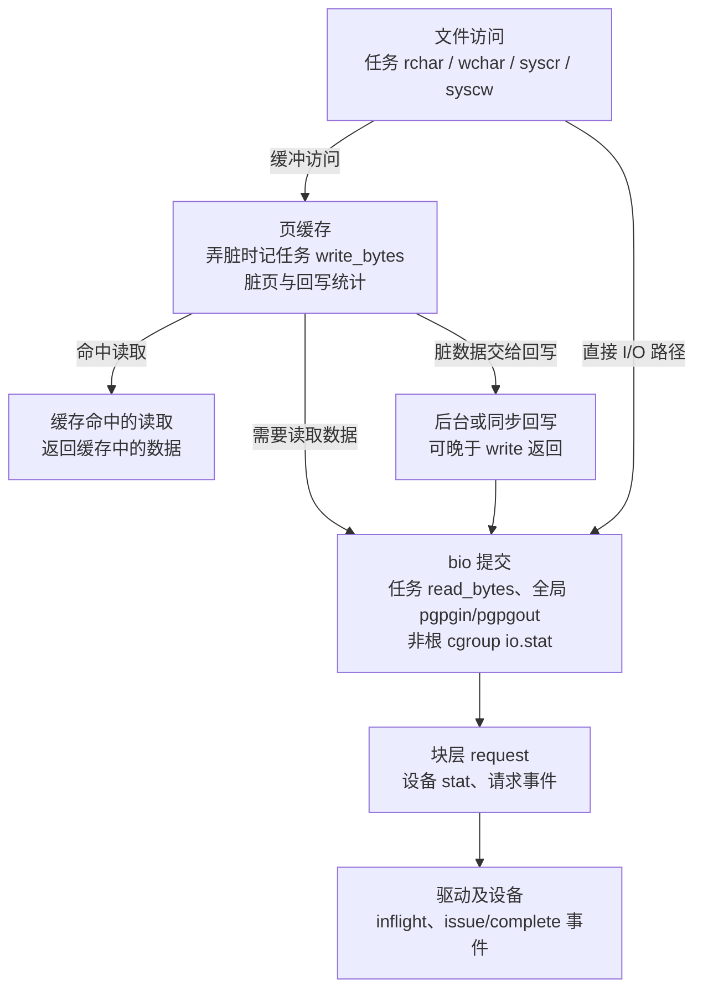

# I/O 可观测性指标：流量、延迟、积压与等待压力

一次 `write()` 很快返回，稍后的 `fsync()` 却等了很久；进程显示写了数百 MiB，设备暂时没有多少写流量；磁盘 `%util` 接近 100%，吞吐仍能继续增加。这些现象需要从不同统计层次解释，不能用一个“I/O 使用率”概括。

本章收集存储 I/O 的主要可观测性指标，回答四个问题：**发出了多少工作，工作在哪个阶段积压，完成需要多久，以及等待是否影响任务推进。** 每项指标尽量说明采集接口、计数对象、单位和边界；对容易误读的项目再沿源码展开。

## 0. 分析基线与范围

源码基线为仓库内 [Makefile 第 2～4 行](../../linux/Makefile#L2-L4)标记的 **Linux 6.18.52**，架构限定为 **x86-64**。读者需要了解页缓存、进程与线程、块设备和基本调度概念；对象背景可参见[磁盘与块 I/O 子系统](../disk/introduction.md)，控制策略见 [cgroup v2 的 io 控制器](../cgroup2/io.md)。

| 本地配置 | 对指标的影响 | 依据 |
| --- | --- | --- |
| `CONFIG_X86_64=y`、`CONFIG_BLOCK=y` | 主线为 x86-64 通用块层 | [.config 第 333 行](../../linux/.config#L333)、[第 1046 行](../../linux/.config#L1046) |
| `CONFIG_PROC_FS=y`、`CONFIG_SYSFS=y` | 编入 `/proc` 和 sysfs 统计接口 | [.config 第 9724 行](../../linux/.config#L9724)、[第 9734 行](../../linux/.config#L9734) |
| `CONFIG_TASKSTATS=y`、`CONFIG_TASK_DELAY_ACCT=y`、`CONFIG_TASK_XACCT=y`、`CONFIG_TASK_IO_ACCOUNTING=y` | 编入任务字节、操作计数及延迟统计；延迟另有运行时开关 | [.config 第 154～157 行](../../linux/.config#L154-L157)、[TASK_IO_ACCOUNTING 依赖 TASK_XACCT](../../linux/init/Kconfig#L683-L688) |
| `CONFIG_PSI=y`，`CONFIG_PSI_DEFAULT_DISABLED` 未启用 | 默认启用压力停顿信息（PSI，Pressure Stall Information） | [.config 第 158～159 行](../../linux/.config#L158-L159)、[psi_enable](../../linux/kernel/sched/psi.c#L146-L158) |
| `CONFIG_BLK_CGROUP=y`、`CONFIG_MEMCG=y`、`CONFIG_CGROUP_WRITEBACK=y` | 支持控制组 I/O 统计和 cgroup 回写归属 | [.config 第 212～215 行](../../linux/.config#L212-L215) |
| `CONFIG_BLK_DEV_THROTTLING=y`、`CONFIG_BLK_CGROUP_IOLATENCY=y`、`CONFIG_BLK_CGROUP_IOCOST=y` | `io.max`、延迟保护和成本控制策略编入；是否在某设备启用仍是运行时问题 | [.config 第 1057～1062 行](../../linux/.config#L1057-L1062)、[block/Makefile 第 19～22 行](../../linux/block/Makefile#L19-L22) |
| `CONFIG_BLK_WBT=y`、`CONFIG_BLK_WBT_MQ=y` | 编入写回节流（WBT，Writeback Throttling） | [.config 第 1058～1059 行](../../linux/.config#L1058-L1059) |
| `CONFIG_VM_EVENT_COUNTERS=y`、`CONFIG_PAGE_SIZE_4KB=y`、`CONFIG_HZ=1000` | 本章页单位为 4 KiB；内部 jiffy 约为 1 ms，用户接口的时间单位仍需逐项确认 | [.config 第 1274 行](../../linux/.config#L1274)、[第 951 行](../../linux/.config#L951)、[第 506 行](../../linux/.config#L506) |
| `CONFIG_DEBUG_FS=y`、`CONFIG_BLK_DEBUG_FS=y`、`CONFIG_EVENT_TRACING=y`、`CONFIG_BLK_DEV_IO_TRACE=y` | 可按需读取调试视图、采集块层事件；需要实际挂载和启用 | [.config 第 10544 行](../../linux/.config#L10544)、[第 1064 行](../../linux/.config#L1064)、[第 10732 行](../../linux/.config#L10732)、[第 10763 行](../../linux/.config#L10763) |

采集时还要记录以下运行时条件：

- 设备的 `queue/iostats` 是否打开。`blk_account_io_start()` 先检查该开关，再设置 `RQF_IO_STAT` 并开始设备统计；不能把未增长的计数直接解释为没有 I/O（[开关接口](../../linux/block/blk-sysfs.c#L305-L319)、[记账入口](../../linux/block/blk-mq.c#L1107-L1133)）。
- `kernel.task_delayacct` 默认关闭。任务创建时才按开关分配 `task->delays`，动态打开不会替已有任务补分配；分配失败也会导致缺少延迟数据（[开关及默认值](../../linux/kernel/delayacct.c#L26-L52)、[sysctl](../../linux/kernel/delayacct.c#L55-L84)、[任务初始化](../../linux/include/linux/delayacct.h#L103-L108)、[分配实现](../../linux/kernel/delayacct.c#L96-L100)）。
- `psi=0` 可关闭 PSI；`cgroup.pressure=0` 可隐藏该组的压力文件并关闭该组统计（[启动参数](../../linux/kernel/sched/psi.c#L149-L158)、[全局接口创建](../../linux/kernel/sched/psi.c#L1710-L1720)、[组级开关](../../linux/kernel/cgroup/cgroup.c#L4108-L4139)）。
- `blkcg_debug_stats` 默认是 `false`。一些 `io.stat` 扩展字段需要打开这个模块参数，并且相应策略已经在设备上生效；编译配置本身不保证字段出现（[参数默认值](../../linux/block/blk-cgroup.c#L60)、[参数注册](../../linux/block/blk-cgroup.c#L2271-L2272)、[策略字段输出](../../linux/block/blk-cgroup.c#L1216-L1228)）。

**范围。** 主体为本地文件及块存储的通用指标，覆盖设备、任务、cgroup、脏页/回写和等待压力；最后补充事件派生指标与 ext4 实例。网络收发、NFS RPC、各文件系统和厂商设备的全部私有统计不逐项穷举。主线图示为普通非 DAX 文件 I/O；接口是否适用于特殊路径，要检查其是否经过对应记账点。下文所有示例读数均为说明口径而构造，并非当前主机实测。

## 1. 先确定观察哪一层

### 1.1 指标与问题的对应关系

| 想回答的问题 | 首选接口 | 主要指标 | 本章位置 |
| --- | --- | --- | --- |
| 某设备完成了多少 I/O、传输了多少数据 | `/proc/diskstats`、`/sys/class/block/<dev>/stat` | 读写/丢弃/flush 次数、扇区数、耗时 | 第 3 节 |
| 块层还有多少工作未完成，驱动正在处理多少 | `stat` 第 9 字段、`/sys/class/block/<dev>/inflight` | 记账在途数、驱动在途读写数 | 第 3.4 节 |
| 哪个进程在读写，应用字节与存储字节为何不同 | `/proc/<pid>/io`、`task/<tid>/io` | `rchar`、`wchar`、`read_bytes`、`write_bytes` 等 | 第 4 节 |
| 哪个任务在等待 I/O | taskstats、`/proc/<pid>/stat` | `blkio_delay_total`、`swapin_delay_total` 等 | 第 5.1 节 |
| 等待是否影响工作负载推进 | `/proc/pressure/io`、cgroup 的 `io.pressure` | `some`、`full`、`avg10/60/300`、`total` | 第 5.2 节 |
| 某服务用了多少设备流量，是否受控制策略影响 | cgroup v2 的 `io.stat`、`io.max`、`io.latency` 等 | 字节、I/O 次数、限额、成本与延迟策略统计 | 第 6 节 |
| 缓冲写是否堆积，回写能否跟上 | `/proc/meminfo`、`/proc/vmstat`、`memory.stat`、BDI debugfs | 脏页、回写页、产生/结束回写速率、回写带宽估计 | 第 7 节 |
| 平均值掩盖了哪些慢请求、错误与重试 | block/writeback/文件系统 tracepoint | 延迟分布、重排队事件、完成状态、同步耗时 | 第 8 节 |

### 1.2 同一次操作为什么会产生几套数字

下图是**统计层次的概念图**。箭头统一表示数据访问交给下一层处理；省略文件系统元数据、日志、设备映射和错误分支，不表示精确调用栈，也不把后台回写画成 `write()` 的同步调用。



这里有三个关键边界：缓存命中不必发块 I/O；缓冲写的任务 `write_bytes` 可以在弄脏页时增长；设备的完成次数则在请求结束时增长。依据分别见 [filemap_get_pages() 的缓存、预读与补读分支](../../linux/mm/filemap.c#L2640-L2677)、[folio_account_dirtied()](../../linux/mm/page-writeback.c#L2647-L2668)、[submit_bio()](../../linux/block/blk-core.c#L908-L918)、[blk_cgroup_bio_start()](../../linux/block/blk-cgroup.c#L2210-L2236)和 [blk_account_io_done()](../../linux/block/blk-mq.c#L1055-L1073)。

因此，“进程写了多少”“这个组提交了多少”“设备完成了多少”各自有用，却不是同一份账的不同显示方式。页缓存、异步回写、合并和拆分都会改变它们之间的关系。

### 1.3 四类数字的读法

| 性质 | 例子 | 读法 |
| --- | --- | --- |
| 累计次数或流量 | 完成次数、扇区数、`rbytes`、`nr_dirtied` | 两次采样作差，除以采样间隔得到速率 |
| 累计耗时 | 请求耗时、任务等待时间、PSI `total` | 作差后先统一单位；各自的计时对象不同 |
| 当前状态量 | 在途数、`nr_dirty`、`nr_writeback` | 直接观察值及趋势，不能当成累计量作差后称为 IOPS |
| 平均值、估计值或配置 | PSI `avg10`、BDI 带宽估计、`io.max`、`wbt_lat_usec` | 先判断是测量、估计还是目标值，避免混为实际完成能力 |

后文记 `ΔX = X(t₂) − X(t₁)`，采样墙钟间隔为 `Δt` 秒或 `Δt_ms` 毫秒。保留设备号、设备层次、任务创建身份、cgroup 身份和配置；设备重建、PID 复用、组重建与计数回绕都可能使差值失效。遇到异常负差值先重建基线。

## 2. 核心对象：每套统计属于谁

理解统计先要理解对象，尤其是指针关系与对象生命周期。

| 核心对象 | 关键字段与职责 | 生命周期、关系与同步 | 源码依据 |
| --- | --- | --- | --- |
| `block_device` 与每 CPU 的 `disk_stats` | `bd_stats` 指向每 CPU 统计；`ios[]`、`sectors[]`、`merges[]`、`nsecs[]` 分操作类别记录，`io_ticks` 记累计活动时间，`in_flight[2]` 记当前在途数 | 统计附着于设备/分区对象。更新用 `part_stat_lock()` 固定当前 CPU，它实际是关闭抢占；读取逐 CPU 求和，不冻结整个设备 | [block_device](../../linux/include/linux/blk_types.h#L41-L58)、[disk_stats 与更新宏](../../linux/include/linux/part_stat.h#L8-L40)、[读取汇总](../../linux/block/genhd.c#L107-L125) |
| `request` | `part` 关联记账设备；`start_time_ns` 是这一层的起点，`RQF_IO_STAT` 表明是否参与设备统计 | 每次块请求的对象；开始记账增加在途数，结束增加次数及耗时并减少在途数。请求合并还会调整计数和起点，不能用请求指针永久标识一次 I/O | [开始/结束记账](../../linux/block/blk-mq.c#L1055-L1133)、[合并减少在途数](../../linux/block/blk-merge.c#L712-L719)、[合并选择较早起点](../../linux/block/blk-merge.c#L820-L826) |
| 任务 `ioac` 与线程组 `signal->ioac` | `task_io_accounting` 保存操作字节、次数和存储字节；组级读取合并当前线程及已归入组的统计 | 任务计数随任务存在；线程退出归入组统计。组级读取用 RCU 和 `stats_lock` 协调汇总，但不会暂停所有正在读写的线程 | [字段定义](../../linux/include/linux/task_io_accounting.h#L12-L45)、[任务计数初始化](../../linux/include/linux/task_io_accounting_ops.h#L44-L47)、[组级读取](../../linux/fs/proc/base.c#L3024-L3044)、[退出归并](../../linux/kernel/exit.c#L209) |
| `blkcg_gq`，简称 `blkg` | 表示一个 blkcg 与一个 `request_queue` 的关联；`iostat_cpu` 是每 CPU 统计指针，`iostat` 是嵌入的汇总对象，`pd[]` 指向策略私有对象 | 不是每个进程一份；一个组访问多个队列会有多个关联。`percpu_ref` 管理引用，`online` 有组/队列锁保护；读写统计通过 `u64_stats`、rstat 与父级增量传播协调 | [定义](../../linux/block/blk-cgroup.h#L33-L91)、[统计刷新和传播](../../linux/block/blk-cgroup.c#L1032-L1118)、[销毁阶段](../../linux/block/blk-cgroup.c#L1278-L1295) |
| `task_delay_info` | `blkio_start`、`blkio_delay`、`blkio_count` 及最大/最小值保存任务等待；有独立的 swapin 等分类 | 动态分配，通过任务指针关联；在有标记的睡眠和唤醒处更新，锁保护已结束等待的统计；任务释放时归还对象 | [分配与释放条件](../../linux/include/linux/delayacct.h#L103-L136)、[结算实现](../../linux/kernel/delayacct.c#L103-L140) |
| `bdi_writeback`，简称 `wb` | 一个回写上下文；`WB_RECLAIMABLE`、`WB_WRITEBACK`、`WB_DIRTIED`、`WB_WRITTEN` 与 inode 队列反映回写状态 | 属于后备设备信息（BDI，Backing Device Information）的回写体系；本配置可按 cgroup 建立多个 wb。debugfs 持有 wb 引用再读统计，inode 队列用 `list_lock` 保护 | [wb 统计采集](../../linux/mm/backing-dev.c#L62-L96)、[wb_stats 输出与引用归还](../../linux/mm/backing-dev.c#L158-L225) |

这些关系只说明统计归属。例如 `request->part` 保存设备指针，并不能单靠这一个字段证明设备生命周期如何被保证；本章只展开统计所需协议，对完整引用管理不另作推断。

## 3. 设备指标：流量、请求耗时与在途工作

### 3.1 `/proc/diskstats` 与 sysfs `stat` 的 17 个字段

`/proc/diskstats` 每行先输出主设备号、次设备号和名称，随后是 17 个统计字段；`/sys/class/block/<dev>/stat` 直接输出这 17 个字段。下面的编号从**统计部分**开始，因而字段 1 是 `/proc/diskstats` 一行的第 4 列。两处输出都读取 `disk_stats`，顺序可分别核对 [diskstats_show()](../../linux/block/genhd.c#L1388-L1416)和 [part_stat_show()](../../linux/block/genhd.c#L1080-L1107)。

| 统计字段 | 本章记号 | 性质与单位 | 含义及重要边界 |
| --- | --- | --- | --- |
| 1：完成的读 I/O | `R` | 累计次数 | 在本层完成记账的读请求数，不是 `read()` 次数，也不是纯成功请求数 |
| 2：合并的读 I/O | `Rm` | 累计次数 | 读 bio 合入请求或读请求间合并的记账次数，不表示传输了多少字节 |
| 3：读扇区数 | `Rs` | 累计 512 B 扇区 | 读完成记账的数据范围；不能乘设备的 4 KiB 逻辑块大小 |
| 4：读 I/O 耗时 | `Rt` | 累计 ms | 每个读请求从本层记账起点到结束的耗时相加，可因并发大于墙钟时间 |
| 5：完成的写 I/O | `W` | 累计次数 | 本层完成记账的写请求数，不是 `write()` 或 `fsync()` 次数 |
| 6：合并的写 I/O | `Wm` | 累计次数 | 写 bio/请求合并次数 |
| 7：写扇区数 | `Ws` | 累计 512 B 扇区 | 写完成记账的数据范围，不等于应用文件内容大小或持久化字节数 |
| 8：写 I/O 耗时 | `Wt` | 累计 ms | 写请求在本层的生命周期耗时之和 |
| 9：当前在途 I/O | `Q` | 当前个数 | 已开始本层 I/O 记账、尚未结束的工作；对 blk-mq 不限于已经交给驱动的请求 |
| 10：I/O 活动时间 | `Bt` | 累计 ms | 从 `io_ticks` 转换而来，依据记账活动及时间戳更新；衡量本层活动覆盖的时间，不是硬件使用率 |
| 11：加权 I/O 时间 | `Qt` | 累计 ms | **本树实现是读、写、discard、flush 的 `nsecs[]` 总和转成 ms**；第 3.3 节解释它与平均队列长度的关系 |
| 12：完成的 discard | `D` | 累计次数 | 丢弃存储范围的操作次数，不是读写次数 |
| 13：合并的 discard | `Dm` | 累计次数 | discard 合并次数 |
| 14：discard 扇区数 | `Ds` | 累计 512 B 扇区 | 被丢弃的地址范围，不代表向设备传送了同样多的有效负载 |
| 15：discard 耗时 | `Dt` | 累计 ms | discard 生命周期耗时之和 |
| 16：完成的 flush | `F` | 累计次数 | flush 记账次数；正常 flush 状态机记到整盘 `part0`，不按分区分别记 |
| 17：flush 耗时 | `Ft` | 累计 ms | flush 记账耗时之和，不是整个 `fsync()` 的耗时 |

普通请求的次数和耗时在 [blk_account_io_done()](../../linux/block/blk-mq.c#L1064-L1073) 更新，扇区数在 [blk_account_io_completion()](../../linux/block/blk-mq.c#L842-L849) 更新；后者接受完成字节并右移 9 位，前者没有“只在成功时计数”的判断。因此这些字段不能用来计算成功率，错误观测要另读完成状态。合并计数见 [request 合并](../../linux/block/blk-merge.c#L712-L719)和 [bio 合并](../../linux/block/blk-merge.c#L926-L931)，flush 见 [blk_account_io_flush()](../../linux/block/blk-flush.c#L124-L132)及其[完成回调调用点](../../linux/block/blk-flush.c#L213-L219)。

表中以普通读写为主线。实现中的 `op_stat_group()` 把 discard 单列，其余按 `op_is_write()` 分组；写零、zone 管理或透传等特殊操作需要结合实际操作码分析，不能默认每一项“写”计数都对应普通文件数据写入（[操作分组](../../linux/include/linux/blk_types.h#L478-L504)）。

**读取精度。** 内部 `nsecs[]` 用 ns，输出时除以 `NSEC_PER_MSEC` 并转为 `unsigned int`；时间字段有毫秒截断及 32 位回绕边界。不能因为 x86-64 就把所有输出字段都当成永不回绕的 64 位整数。读时逐 CPU 汇总也不是全设备的原子快照（[输出转换](../../linux/block/genhd.c#L1087-L1107)、[汇总循环](../../linux/block/genhd.c#L107-L125)）。

### 3.2 从累计量计算常用派生指标

以下公式是**本章按源码口径定义的派生量**。括号内给出常见显示名称，用户工具可能有不同的操作集合、命名与单位，采集器应保留原始计数。

| 派生指标 | 公式 | 单位与解释 |
| --- | --- | --- |
| 读/写 IOPS（`r/s`、`w/s`） | `ΔR / Δt`、`ΔW / Δt` | 本层完成次数/s |
| discard/flush IOPS | `ΔD / Δt`、`ΔF / Δt` | 不自动合并进读写 IOPS |
| 读/写带宽 | `512 × ΔRs / Δt`、`512 × ΔWs / Δt` | B/s；除以 1024 得 KiB/s，除以 `1024²` 得 MiB/s |
| 平均读/写请求大小（`rareq-sz`、`wareq-sz`） | `512 × ΔRs / ΔR`、`512 × ΔWs / ΔW` | B/完成请求；需对应分母非零 |
| 平均读/写耗时（`r_await`、`w_await`） | `ΔRt / ΔR`、`ΔWt / ΔW` | ms/完成请求；包含本层起点后的排队和执行，不是纯硬件服务时间 |
| 读写合计平均耗时（本文 `await_rw`） | `(ΔRt + ΔWt) / (ΔR + ΔW)` | 按请求数加权，不是两个平均值直接相加或简单平均 |
| 平均 discard/flush 耗时 | `ΔDt / ΔD`、`ΔFt / ΔF` | 独立操作类别的 ms/请求 |
| 合并速率（`rrqm/s`、`wrqm/s`） | `ΔRm / Δt`、`ΔWm / Δt` | 次/s；不是原始应用 IOPS |
| 合并占比（本文约定） | `100 × ΔRm / (ΔR + ΔRm)`，写同理 | 在这一计数口径下的占比，不是字节压缩率 |
| 活动时间占比（`%util`） | `100 × ΔBt / Δt_ms` | 本层在采样窗内的活动时间比例 |
| 按完成耗时估算的平均在途量（常称 `aqu-sz`） | `ΔQt / Δt_ms` | 无量纲，近似平均请求个数；本树有完成窗口边界，不能当成精确实时队列积分 |

没有完成请求时，平均耗时应标为“无样本”；不能据此报告延迟为零。也不要从 `%util / IOPS` 构造一个通用于并行设备的“服务时间”：活动时间和请求耗时使用不同分母、并发叠加方式也不同。

### 3.3 难点：`%util`、`await` 与 `aqu-sz` 分别在计算什么

**`await` 以已完成请求为样本。** `blk_account_io_start()` 设置 `start_time_ns`，结束时累计 `now − start_time_ns`。`blk_mq_start_request()` 的驱动处理起点则是另一个位置。因此请求在开始设备记账后、驱动处理前等待的时间可以进入 `await`，而应用操作此前的页缓存处理、bio 提交前限流、请求分配等待等，不能自动认为都包含在内（[记账起点](../../linux/block/blk-mq.c#L1107-L1133)、[驱动起点](../../linux/block/blk-mq.c#L1347-L1372)、[记账结束](../../linux/block/blk-mq.c#L1055-L1073)）。

合并还会改变样本：两个请求合成一个后，完成次数只按保留下来的请求记，起点选择较早的 `start_time_ns`。平均请求大小和平均耗时都因此受合并行为影响（[合并起点处理](../../linux/block/blk-merge.c#L820-L826)）。

**`%util` 以活动时间为分子。** `update_io_ticks()` 比较 `bd_stamp` 与当前 jiffy，通过 `try_cmpxchg()` 推进共享时间戳，在结束更新或存在在途工作时累加经过的 jiffy。读取 `stat` 时若还有在途工作，也会更新活动时间。这解释了为什么一个长请求尚未完成，`Bt` 仍可能增长，而 `Rt/Wt` 暂时不增长（[update_io_ticks()](../../linux/block/blk-core.c#L1016-L1029)、[读接口补记](../../linux/block/genhd.c#L1073-L1079)）。

这个量没有读取硬件带宽上限、闪存通道数或控制器执行资源。“采样期间一直存在本层未完成工作”不等于“设备能力全部用尽”。对能并行处理请求的设备，`%util` 接近 100% 时仍可能增加并发和吞吐；是否已到能力边界，需要同时观察吞吐、请求大小和延迟随负载的变化。这是根据计数语义得出的分析，不是本树测量出的性能结论。

**`aqu-sz` 要注意本树的实现与采样边界。** `Qt` 直接由四类 `nsecs[]` 相加得出，而普通请求的 `nsecs[]` 在结束时才更新。它没有在每次读取时把尚未结束请求已经经历的等待全部补入（[Qt 的输出](../../linux/block/genhd.c#L1097-L1101)、[耗时更新](../../linux/block/blk-mq.c#L1064-L1073)）。

以两个同时开始、同时在 100 ms 后完成的读请求为例，若窗口完整覆盖这两个请求，忽略取整，则 `Rt = Qt = 200 ms`，`Bt` 约为 100 ms，平均耗时为 100 ms，`Qt / 100 ms = 2`。请求耗时按请求叠加，活动时间则没有简单乘并发数。

但若一个请求跨越 10 s，到最后 1 s 窗口才完成，该窗口的 `ΔQt` 可以一次增加约 10000 ms，算出约 10；这并不表示该秒真的平均有 10 个请求。反过来，前面没有完成的窗口可能得到 0，即使 `Q` 持续为 1。因而，短窗 `ΔQt/Δt_ms` 是按完成耗时估算的量；要测精确的在途数量随时间变化，应在开始、结束、合并等状态变化处建立时间积分，或采集足够频繁的状态样本。

在请求集合一致、窗口足够长且流量较平稳时，可以用 `平均在途量 ≈ IOPS × 平均耗时（秒）` 做一致性检查。若 IOPS 只统计读写，而 `Qt` 还包括 discard 和 flush，就不能直接代入同一个关系。

**与本地文档的差异。** [iostats.rst 第 75～87 行](../../linux/Documentation/admin-guide/iostats.rst#L75-L87)仍包含“第 10 字段只数开始/完成时的 jiffy”和“第 11 字段在开始、合并、读取时按在途数加权更新”的描述；本树实际分别使用上面的时间戳差值更新和完成耗时求和。本章按实现解释，不把这些旧描述用于当前公式。该文档也把若干完成字段描述为成功次数，而普通请求记账并不检查完成是否成功，需以实际错误路径为准（[完成路径](../../linux/block/blk-mq.c#L940-L969)）。

### 3.4 两种“在途数”不能互换

| 接口 | 本树 blk-mq 路径的统计对象 | 能说明什么 |
| --- | --- | --- |
| `stat` 第 9 字段 | `bdev_count_inflight()` 汇总已经开始 I/O 记账的工作 | 本层尚未结束的记账工作，包括驱动处理前的等待 |
| `/sys/class/block/<dev>/inflight` 的两个数 | 遍历驱动 tags，分别数读/写方向上带 `RQF_IO_STAT` 且状态为 `MQ_RQ_IN_FLIGHT` 的请求 | 已进入驱动处理阶段的当前工作；不是整个软件队列长度 |

依据见 [bdev_count_inflight_rw() 与 bdev_count_inflight()](../../linux/block/genhd.c#L128-L169)、[part_inflight_show()](../../linux/block/genhd.c#L1110-L1124)和 [blk_mq_check_in_driver()](../../linux/block/blk-mq.c#L88-L112)。bio 型设备则使用驱动调用 `bdev_start_io_acct()`/`bdev_end_io_acct()` 的边界，不能强行套用 blk-mq 阶段（[bio 型记账](../../linux/block/blk-core.c#L1032-L1069)）。

在途计数的读取也不是冻结队列后的精确快照：跨 CPU 读取时，开始与结束可以交错，源码把读到的负数夹到 0。因此某一次读到 0，不能证明采样间隔内没有工作（[负数处理](../../linux/block/genhd.c#L140-L151)）。

### 3.5 设备层次与辅助属性

普通累计统计的更新宏会把分区的增加量也记入整盘，因此不能把整盘与其分区累计流量再次相加。device-mapper 等堆叠设备还可能在逻辑层和底层分别记账；全机流量总和应选择一个一致的设备层次（[分区向整盘记账](../../linux/include/linux/part_stat.h#L60-L64)、[克隆请求的下层记账入口](../../linux/block/blk-mq.c#L3301-L3311)）。

以下属性提供解释读数的背景，本身不是性能结果：

| sysfs 路径，基于 `/sys/class/block/<dev>/queue/` | 含义 | 使用边界与依据 |
| --- | --- | --- |
| `iostats`、`iostats_passthrough` | 普通统计及透传请求统计开关 | 透传是否统计还检查 bio、设备和载荷对齐，不能认为所有设备命令都进入磁盘统计；[属性注册](../../linux/block/blk-sysfs.c#L584-L602)、[透传筛选](../../linux/block/blk-mq.c#L1077-L1104) |
| `logical_block_size`、`physical_block_size` | 设备报告的逻辑/物理块大小，单位 B | 是对齐背景，磁盘统计扇区单位仍为 512 B；[属性](../../linux/block/blk-sysfs.c#L551-L552)、[完成字节换算](../../linux/block/blk-mq.c#L842-L849) |
| `nr_requests`、`scheduler` | 请求资源配置、当前 I/O 调度器 | `nr_requests` 不是当前队列长度，也不能直接当成设备硬件队列深度；[属性注册](../../linux/block/blk-sysfs.c#L540-L549) |
| `rotational` | 队列旋转介质特征位 | 是内核使用的队列属性，不是独立硬件检测结果；[特征位接口](../../linux/block/blk-sysfs.c#L305-L319) |
| `wbt_lat_usec` | 写回节流使用的延迟目标，单位 µs | 不是测得的平均延迟；WBT 已禁用时读出 0，未建立 WBT 对象时可返回错误；[读取实现](../../linux/block/blk-sysfs.c#L620-L639) |

## 4. 任务指标：操作字节、存储字节与取消写入

### 4.1 `/proc/<pid>/io` 的七项指标

`/proc/<pid>/io` 是线程组汇总；`/proc/<pid>/task/<tid>/io` 是单个线程的统计。读取有 `ptrace_may_access(..., PTRACE_MODE_READ_FSCREDS)` 权限检查（[读取与汇总](../../linux/fs/proc/base.c#L3015-L3044)、[两种接口入口](../../linux/fs/proc/base.c#L3068-L3077)）。

| 字段 | 性质与单位 | 含义 | 容易误读的边界 |
| --- | --- | --- | --- |
| `rchar` | 累计 B | 经相应读操作记账路径返回的字节，普通 VFS 读按正返回值增加 | 包括缓存命中，也不限定目标是磁盘文件；不是设备读流量 |
| `wchar` | 累计 B | 经写操作记账路径返回的字节 | 缓冲写可在回写之前增长；不证明数据已持久化 |
| `syscr` | 累计次数 | 到达读操作计数点的次数 | 并非所有系统调用入口数；早期校验失败可能不到计数点，内核辅助操作也可记账 |
| `syscw` | 累计次数 | 到达写操作计数点的次数 | 同样不是块设备请求数 |
| `read_bytes` | 累计 B | 任务造成的存储读取；通用块路径在 `submit_bio()` 对读 bio 的大小记账 | 在提交而非成功完成时增加；包括实际提交的预读范围，不是应用已消费字节 |
| `write_bytes` | 累计 B | 任务已经造成或预计将造成的存储写入 | 缓冲路径在可回写 folio 弄脏时按页记，直接 I/O 有自己的计数点；不是设备完成字节 |
| `cancelled_write_bytes` | 累计 B | 当前任务取消了原本可能需要回写的脏缓存数据 | 可取消其他任务造成的写入；不能简单从本任务的 `write_bytes` 中减去后称为真实设备写流量 |

字段定义与输出分别见 [task_io_accounting](../../linux/include/linux/task_io_accounting.h#L12-L45)和 [do_io_accounting()](../../linux/fs/proc/base.c#L3046-L3060)。操作字节/次数的典型更新见 [vfs_read()](../../linux/fs/read_write.c#L560-L579)、[vfs_write()](../../linux/fs/read_write.c#L666-L693)；内核辅助写同样调用 `inc_syscw()`，这也是不能把字段当成严格系统调用入口次数的原因（[__kernel_write_iter()](../../linux/fs/read_write.c#L601-L626)）。

线程组汇总还有一个生命周期边界：等待回收子进程的路径会把子进程 I/O 统计加到父进程 `signal->ioac`。所以这里不是“所有后代当前值的实时求和”，但可能包含已回收子进程的统计；不能再把父进程汇总与这些子进程的历史记录无条件相加（[wait 路径的归并](../../linux/kernel/exit.c#L1248-L1259)）。

### 4.2 难点：`rchar` 为什么不等于 `read_bytes`

普通 `read()` 从已有效的页缓存取数据，仍按返回字节增加 `rchar`，却可以不再提交读 bio；相反，预读可以一次读取比当前请求更多的数据。前者让操作字节增加而存储字节不变，后者可能让存储字节暂时大于应用请求字节（[缓存与预读分支](../../linux/mm/filemap.c#L2640-L2677)、[操作字节更新](../../linux/fs/read_write.c#L575-L579)、[存储读提交记账](../../linux/block/blk-core.c#L908-L912)）。

例如重复读取一个已经缓存的 4 KiB 区域 1000 次，假设没有新的预读、补读和其他 I/O，`rchar` 可增加约 4 MiB，而 `read_bytes` 不增长。这是条件化的口径示例，不能反过来把 `1 − read_bytes/rchar` 当成通用页缓存命中率：两个计数对象不同，还受预读、共享缓存、非磁盘文件和非 read 路径访问影响。

### 4.3 难点：`write_bytes` 不是“已经落盘”

缓冲写的关键计数点是 `folio_account_dirtied()`。若 mapping 可回写，它按 `folio_nr_pages(folio) × PAGE_SIZE` 增加任务 `write_bytes`，同时更新脏页和 dirtied 统计。`filemap_dirty_folio()` 对已经脏的 folio 直接返回，不再次执行这一首次标脏路径（[弄脏时记账](../../linux/mm/page-writeback.c#L2647-L2668)、[已有脏标记分支](../../linux/mm/page-writeback.c#L2743-L2753)）。

以本配置的一页 4 KiB 为例：在没有其他转换的简化场景中，向一个干净的普通文件页写入 1 B，`wchar` 可增加 1 B，`write_bytes` 则增加 4096 B；在它仍然脏时再次写入 1 B，不必再增加 4096 B。若后来这页完成回写、再次被弄脏，则会产生新一轮记账。folio 可以包含多页，不能把所有实际更新都假定为固定 4096 B。

直接 I/O 也不能借用“页首次变脏”的解释，它有单独的写计数点，如 [iomap 直接 I/O](../../linux/fs/iomap/direct-io.c#L477)和 [传统 direct-io](../../linux/fs/direct-io.c#L797)。

取消写入的统计属于**执行取消的任务**。例如 A 弄脏了 4 KiB，B 随后截断文件并清除了相应脏数据，A 的 `write_bytes` 不因此回退，B 的 `cancelled_write_bytes` 可以增加 4 KiB。B 的取消量甚至可以超过 B 自己的写入量；这不是计数损坏（[字段注释](../../linux/include/linux/task_io_accounting.h#L37-L44)、[folio_account_cleaned()](../../linux/mm/page-writeback.c#L2674-L2685)）。

因此，用 `Δwrite_bytes − Δcancelled_write_bytes` 得到的只是同一统计对象下的差值，既不能证明其对应实际完成写流量，也不能证明持久化。持久化相关问题还要观察同步操作、回写错误和设备 flush 路径，第 8 节给出观测入口。

### 4.4 `getrusage()` 的 I/O block 数

| 字段 | 本树的任务级来源 | 单位与边界 |
| --- | --- | --- |
| `ru_inblock` | `read_bytes >> 9` | 近似的 512 B block 数，不是读操作次数 |
| `ru_oublock` | `write_bytes >> 9` | 近似的 512 B block 数，不减取消写入，也不表示完成次数 |

依据见 [task_io_get_inblock()/task_io_get_oublock()](../../linux/include/linux/task_io_accounting_ops.h#L16-L36)和 [getrusage 的任务累加](../../linux/kernel/sys.c#L1842-L1843)。`RUSAGE_SELF`、线程和子进程统计选择不同汇总范围；它们与 `/proc/<pid>/io` 的范围不能只凭字段相似就互换（[范围选择](../../linux/kernel/sys.c#L1861-L1899)）。

## 5. 等待指标：任务等待、I/O 压力与 CPU iowait

### 5.1 任务等待时长

taskstats 通过 Generic Netlink 提供数据，不是一个可以直接 `cat` 的文本文件（[应答构建](../../linux/kernel/taskstats.c#L66-L104)、[命令定义](../../linux/include/uapi/linux/taskstats.h#L242-L246)）。以下最大/最小值以单任务为解释范围，避免把多任务聚合字段误当成整个组的严格极值。

| 指标 | 性质与单位 | 含义 | 依据 |
| --- | --- | --- | --- |
| `blkio_count` | 累计等待段数 | 已结算的块 I/O 等待次数，不是完成的设备请求数 | [taskstats 定义](../../linux/include/uapi/linux/taskstats.h#L78-L82)、[结束结算](../../linux/kernel/delayacct.c#L103-L140) |
| `blkio_delay_total` | 累计 ns | 有标记的块 I/O 睡眠等待时间总和；不是所有提交过程耗时 | 同上 |
| `blkio_delay_max/min` | ns，极值 | 单任务已结算等待段的最大/最小时间；不是可以作差求区间最大值的累计计数 | [字段](../../linux/include/uapi/linux/taskstats.h#L213-L214)、[极值更新](../../linux/kernel/delayacct.c#L112-L120) |
| `swapin_count`、`swapin_delay_total` | 次数、累计 ns | 单独记录换入等待，不能直接与 blkio 等待相加后假定没有重叠 | [字段](../../linux/include/uapi/linux/taskstats.h#L84-L86)、[换入计时](../../linux/kernel/delayacct.c#L247-L259) |
| `swapin_delay_max/min` | ns，极值 | 单任务换入等待段极值 | [字段](../../linux/include/uapi/linux/taskstats.h#L216-L217) |
| `/proc/<pid>/stat` 第 42 字段 `delayacct_blkio_ticks` | 累计用户时钟 tick | 把 `task->delays->blkio_delay` 转为 `clock_t`；这里读取的是指定任务，不是把所有线程等待自动相加 | [输出](../../linux/fs/proc/array.c#L639-L645)、[转换](../../linux/kernel/delayacct.c#L197-L205) |

最后一项不能按本配置的 `HZ=1000` 换算。用户接口使用 `USER_HZ`，本树通用 UAPI 默认是 100；采集器可在目标 Linux 系统查询 `_SC_CLK_TCK`，不要套用内部 tick 频率（[__USER_HZ](../../linux/include/uapi/asm-generic/param.h#L5-L10)、[内部 HZ 与 USER_HZ 的区分](../../linux/include/asm-generic/param.h#L5-L10)）。没有 `delays` 时 `/proc` 的这项输出 0，不能据此证明任务从未等待过 I/O（[缺失对象分支](../../linux/include/linux/delayacct.h#L139-L143)）。

计时主线围绕任务睡眠状态，而不是围绕设备请求：`io_schedule_prepare()` 设置 `current->in_iowait`；调度器阻塞有该标记的任务时增加 `nr_iowait` 并开始 delay accounting；唤醒时结束计时。一个任务可以等待多个请求，一个请求也可能间接阻塞多个任务，因此 `blkio_count` 与磁盘 IOPS 无须相等（[标记](../../linux/kernel/sched/core.c#L7873-L7910)、[阻塞计时](../../linux/kernel/sched/sched.h#L2770-L2777)、[唤醒结束调用](../../linux/kernel/sched/core.c#L3717-L3719)）。

区间平均等待可用 `Δblkio_delay_total / Δblkio_count`，分母为零时无样本。这测量的是等待段；把多个任务的等待相加，可能超过墙钟间隔，也不能再称为设备忙碌时间。

### 5.2 PSI：`some`、`full`、平均值与 `total`

全机接口为 `/proc/pressure/io`，组级接口为 `<cgroup>/io.pressure`。两者输出形式一致，统计范围不同；父子组压力不是可加总的独立事件计数（[组级读取调用](../../linux/kernel/cgroup/cgroup.c#L3974-L3980)、[io.pressure 文件注册](../../linux/kernel/cgroup/cgroup.c#L5538-L5546)）。

| 项目 | 单位与含义 | 读法 |
| --- | --- | --- |
| `some` | 有任务处于 I/O 等待的压力状态 | 关注是否经常存在 I/O 停顿 |
| `full` | 存在 I/O 等待、同时该统计上下文没有可运行任务的压力状态 | 关注推进工作被更严重阻断的程度；不要解释成某块盘已满负荷 |
| `avg10`、`avg60`、`avg300` | 百分比，10/60/300 秒时间尺度的衰减平均 | 直接读趋势，不是这几个固定窗口的简单算术平均 |
| `total` | 累计 µs | `100 × Δtotal / (Δt × 10⁶)` 可估算区间压力比例；不是等待任务个数之和 |

`some/full` 的底层判断在每 CPU 的 `test_states()`：`tasks[NR_IOWAIT] > 0` 设置 `PSI_IO_SOME`，并且 `tasks[NR_RUNNING] == 0` 时设置 `PSI_IO_FULL`（[状态判断](../../linux/kernel/sched/psi.c#L243-L250)）。任务 I/O 等待标记通过调度事件更新，不能把所有不可中断睡眠、所有网络等待都自动算进来（[任务标记变更](../../linux/kernel/sched/stats.h#L145-L166)、[io_schedule 标记](../../linux/kernel/sched/core.c#L7873-L7884)）。

**多 CPU 的 `full` 需要更谨慎地理解。** 实现先累计各 CPU 的状态时间，再按各 CPU 非空闲时间加权、归一化到墙钟时间。它不是逐时刻遍历全组任务、确认“所有 CPU 上所有任务同时阻塞”的精确全局布尔值。分析组级推进损失时可以用上述概念，但不能把 `full=20%` 写成“全机整整 20% 的时间一条线程都不能运行”（[归一化说明](../../linux/kernel/sched/psi.c#L362-L379)、[加权与累计](../../linux/kernel/sched/psi.c#L385-L411)）。

平均值使用 `calc_load()` 指数衰减，输出 `total` 时内部 ns 除以 `NSEC_PER_USEC`（[平均值计算](../../linux/kernel/sched/psi.c#L342-L359)、[输出](../../linux/kernel/sched/psi.c#L1265-L1295)）。例如 10 s 内 `some total` 增加 2000000 µs，对应这一口径的区间压力约 20%；不能除以读写次数后称为平均设备延迟。

### 5.3 为什么 CPU `iowait` 不能代替以上指标

| 指标 | 计数对象 | 不能证明什么 |
| --- | --- | --- |
| `/proc/stat` 的 `iowait` | CPU 空闲时间的一个分类：空闲记账时本运行队列有 `nr_iowait`，时间归入 IOWAIT | 不证明某个任务等待了多久，不指定设备，也不表示设备利用率 |
| `/proc/stat` 的 `procs_blocked` | 当前所有 CPU 的 `nr_iowait` 汇总 | 不是全部 D 状态任务数，也不是设备在途请求数 |
| 任务 `blkio_delay_total` | 各任务已结束的等待段 | 不代表设备工作总时长 |
| PSI I/O | 按调度状态累计并归一化的压力时间 | 不提供设备流量与硬件性能上限 |

依据见 [account_idle_time()](../../linux/kernel/sched/cputime.c#L219-L232)、[iowait 输出转换](../../linux/fs/proc/stat.c#L127-L131)、[procs_blocked 的来源](../../linux/fs/proc/stat.c#L173-L183)和 [nr_iowait 汇总](../../linux/kernel/sched/core.c#L5448-L5453)。

如果等待 I/O 的任务睡眠时，CPU 一直在执行其他任务，任务等待和 PSI 可以增长，CPU `iowait` 却可能很低；没有任务等待的异步后台 I/O，又可能产生设备流量而没有同等规模的任务停顿。这些量应结合观察，不能互相替代。CPU 时间记账的细节见 [CPU 可观测性指标](cpu.md)。

## 6. cgroup 指标：服务归属、层级汇总与策略影响

### 6.1 `io.stat` 的基础字段

在 cgroup v2 中，每行以 `major:minor` 为键，基础字段如下。按设备分别取差值；不能把来自不同设备的字节和某一个设备的次数混合计算平均大小。

| 字段 | 单位 | 含义 |
| --- | --- | --- |
| `rbytes`、`wbytes` | 累计 B | 读、写类别的 I/O 字节 |
| `rios`、`wios` | 累计次数 | 读、写类别 I/O 次数 |
| `dbytes` | 累计 B | discard 范围大小；不是实际数据传输字节 |
| `dios` | 累计次数 | discard 类别 I/O 次数 |

基础输出见 [blkcg_print_one_stat()](../../linux/block/blk-cgroup.c#L1182-L1213)。本树只有读、写、discard 三个基础类别，没有通用的 `fios` 或通用延迟直方图（[blkg_iostat_type 与数组](../../linux/block/blk-cgroup.h#L33-L44)）。

**非根组按 bio 开始路径记账。** `blk_cgroup_bio_start()` 在 `submit_bio_noacct_nocheck()` 中调用。它增加 `ios[rwd]`；字节数只在没有 `BIO_CGROUP_ACCT` 时增加，随后设置此标记，防止已记过大小的拆分 bio 再重复加字节。次数仍然每次增加，因此拆分会影响次数，不能把 `rios/wios` 当成应用调用数或已完成 request 数（[调用点](../../linux/block/blk-core.c#L728-L738)、[类别与更新](../../linux/block/blk-cgroup.c#L2201-L2236)）。

普通队列中，多个 bio 还可以合到一个 request：同一窗口内非根 `io.stat` 的 I/O 次数和 `diskstats` 完成次数不同，是可能出现的正常现象。两者取样阶段也不同：前者开始记，后者结束记。

开始记也有明确边界：普通 `submit_bio_noacct()` 先调用 `blk_throtl_bio()`，被 `io.max` 排队的 bio 尚未到后面的 `submit_bio_noacct_nocheck()` 统计点。任务读字节则在更外层 `submit_bio()` 已经增加。因此“任务已经造成读取”与“组级 bio 开始统计已增长”也可能暂时不同（[限流在前的调用顺序](../../linux/block/blk-core.c#L875-L883)、[外层读字节记账](../../linux/block/blk-core.c#L908-L918)）。

**非根父组包含后代增量。** 读取时先 `css_rstat_flush()`，刷新每 CPU 变化并向非根父级传播。父组统计与子组统计再次相加会重复计算；父组也不是“目前位于这个目录的进程计数之和”，已提交的 I/O 有自己的 blkg 归属（[父级传播](../../linux/block/blk-cgroup.c#L1099-L1118)、[读取入口](../../linux/block/blk-cgroup.c#L1234-L1250)）。

**根组来源不同。** 根 `io.stat` 直接从整盘 `disk_stats` 填充，扇区左移 9 位换成 B。它的次数因此来自设备统计，不是把子组的 bio 开始次数机械相加（[根组来源说明及填充](../../linux/block/blk-cgroup.c#L1130-L1177)）。

解析器应按键读取，并容许键缺失。当前实现只有 `rbytes/wbytes/rios/wios` 之一非零才输出六个基础键，所以只有 discard 活动时，也可能只出现设备号或策略扩展；不能把“基础键没输出”当成绝对没有 discard（[输出条件](../../linux/block/blk-cgroup.c#L1210-L1228)）。

### 6.2 回写归属不是简单取当前工作线程

支持 cgroup writeback 的路径由 `wbc_init_bio()` 根据 `wbc->wb->blkcg_css` 给 bio 建立组关联。后台回写线程提交的 I/O 可以记到原回写上下文的 cgroup，而不是一律记到该内核线程的组（[wbc_init_bio()](../../linux/include/linux/writeback.h#L247-L265)）。

归属粒度仍有局限：cgroup 回写按 inode 跟踪所有权，通过主要弄脏者和历史信息决定切换。多个组共享写同一文件时，不能期待每一页或每一次 `write()` 都被立刻精确分账；还应检查所用文件系统是否实际支持这条回写路径（[归属与切换说明](../../linux/fs/fs-writeback.c#L845-L865)）。完整机制见 [io 控制器章节](../cgroup2/io.md)。

### 6.3 限额和目标值：用于解释统计，不是实际吞吐

| 接口/字段 | 单位与含义 | 如何配合指标使用 |
| --- | --- | --- |
| `io.max` 的 `rbps`、`wbps` | B/s 限额，`max` 表示此项无限额 | 配合 `io.stat` 速率和祖先组限制看，不能当成当前带宽 |
| `io.max` 的 `riops`、`wiops` | 次/s 限额 | 一项请求大小变化时，BPS 与 IOPS 约束可能先后成为瓶颈 |
| `io.latency` 的 `target` | µs，延迟保护目标 | 不是硬性保证的实测延迟，也不是通用 `await` |
| `io.weight`、`io.cost.qos`、`io.cost.model` | 权重与成本模型/控制参数 | 解释 IOCost 分配与节流；不能只凭配置推算真实硬件吞吐 |

`io.max` 读出逻辑见 [tg_prfill_limit()](../../linux/block/blk-throttle.c#L1498-L1528)，延迟目标见 [iolatency_prfill_limit()](../../linux/block/blk-iolatency.c#L897-L906)。IOCost 的 `weight` 为非根组接口，`cost.qos` 与 `cost.model` 仅在根组提供，不能到每个服务目录都期待看到这三个文件（[接口注册及范围](../../linux/block/blk-iocost.c#L3510-L3527)）。策略本身的工作条件与写接口见 [io 控制器章节](../cgroup2/io.md)。

这也解释一种常见现象：服务吞吐低、等待高，但设备 `%util` 不高。服务可能在块设备统计开始之前受限，不必已经向设备压入大量请求。诊断时应查组与祖先的限额、PSI、任务等待以及策略状态，不能只看整盘吞吐。

### 6.4 `io.stat` 的可选策略字段

| 字段 | 性质与单位 | 当前实现含义与边界 | 依据 |
| --- | --- | --- | --- |
| `use_delay` | 当前控制状态，整数 | 延迟机制的使用状态；有特殊负值语义，不是限流次数或任务数 | [输出](../../linux/block/blk-cgroup.c#L1216-L1219)、[负值与缩放](../../linux/block/blk-cgroup.c#L1893-L1906) |
| `delay_nsec` | 当前延迟积累，ns | 策略使用的延迟额度，会缩放或清除；不是生命周期累计等待时间，不应当 counter 求速率 | [增加](../../linux/block/blk-cgroup.c#L2086-L2100)、[缩放](../../linux/block/blk-cgroup.c#L1887-L1917) |
| `depth` | 当前请求深度限制，个数或 `max` | IOLatency 使用的深度上限，不是测得的当前队列长度 | [输出](../../linux/block/blk-iolatency.c#L932-L962) |
| `avg_lat` | µs，衰减平均 | 本树仅旋转设备分支输出；来自策略自己的样本和平均算法，不是 diskstats 的平均请求耗时 | [算法](../../linux/block/blk-iolatency.c#L251-L270)、[输出](../../linux/block/blk-iolatency.c#L943-L962) |
| `win` | 当前统计窗口，ms | 同样属于旋转设备分支；不能当成累计时间 | [输出转换](../../linux/block/blk-iolatency.c#L955-L962) |
| `missed`、`total` | 当前窗口样本数 | 非旋转设备分支：前者为延迟大于等于目标的样本数，后者为总样本数；周期检查会清空每 CPU 样本，不是永久累计计数 | [样本记录](../../linux/block/blk-iolatency.c#L219-L228)、[窗口清理](../../linux/block/blk-iolatency.c#L524-L530)、[输出](../../linux/block/blk-iolatency.c#L918-L940) |
| `cost.usage` | 累计模型成本，µs | 把累计虚拟成本按基准速率换算，不是硬件实际忙碌时间 | [换算与累加](../../linux/block/blk-iocost.c#L1702-L1723)、[输出](../../linux/block/blk-iocost.c#L3063) |
| `cost.wait` | 累计 µs | 组处于 IOCost 等待状态的时长，不是所有等待线程耗时相加 | [状态时长更新](../../linux/block/blk-iocost.c#L2185-L2200)、[输出](../../linux/block/blk-iocost.c#L3065-L3069) |
| `cost.indebt`、`cost.indelay` | 累计 µs | 组分别处于债务、延迟状态的时长；状态可能重叠，不能无条件相加 | 同上 |
| `cost.vrate` | 当前速率百分比 | 仅根级 IOCost 关联输出，表示相对基准的虚拟时间推进速率；不是设备 `%util` | [根级转换与输出](../../linux/block/blk-iocost.c#L3056-L3060) |

IOLatency 的这些调试字段需要 `blkcg_debug_stats=true`。旋转与非旋转分支由 `blk_queue_nonrot()` 决定，不是仅由设备名称决定；因此不能假定 SSD 总有 `avg_lat`（[分支选择](../../linux/block/blk-iolatency.c#L991-L994)、[调试开关](../../linux/block/blk-iolatency.c#L949-L953)）。本地 [cgroup-v2.rst 的 IOLatency 统计说明](../../linux/Documentation/admin-guide/cgroup-v2.rst#L2274-L2284)没有完整体现此输出差异，采集应按实际字段解析。

IOCost 启用时输出 `cost.usage`，其三个等待/债务调试计数另需打开 debug 开关。计数使用 `last_stat`，由控制周期刷新并向父级传播，所以刚发生的状态变化不保证立刻出现在读取值中（[输出条件](../../linux/block/blk-iocost.c#L3048-L3069)、[快照与传播](../../linux/block/blk-iocost.c#L1682-L1723)）。

## 7. 回写指标：还欠多少工作，能否及时完成

### 7.1 全局脏页、回写页和提交流量

| 接口与指标 | 性质与单位 | 含义 | 依据 |
| --- | --- | --- | --- |
| `/proc/meminfo`：`Dirty` | 当前 KiB，接口标为 kB | 可回写脏页数量的字节化显示，不是累计应用写入量 | [meminfo 输出](../../linux/fs/proc/meminfo.c#L97-L100) |
| `/proc/meminfo`：`Writeback` | 当前 KiB | 正在回写状态的页数量；不是设备队列中请求数量 | 同上 |
| `/proc/vmstat`：`nr_dirty`、`nr_writeback` | 当前基本页数 | 与上面对应的页计数；本配置乘 4096 可换成 B | [名称对应](../../linux/mm/vmstat.c#L1254-L1255)、[读取](../../linux/mm/vmstat.c#L1910-L1918) |
| `nr_dirtied` | 累计基本页数 | 页面弄脏记账量；`Δnr_dirtied × PAGE_SIZE / Δt` 是产生脏页的速率，不是应用写带宽 | [更新](../../linux/mm/page-writeback.c#L2661-L2666) |
| `nr_written` | 累计基本页数 | 回写状态结束时增加的页数；可以观察回写结束速率，不保证介质持久化成功 | [回写结束](../../linux/mm/page-writeback.c#L3015-L3017) |
| `nr_dirty_background_threshold`、`nr_dirty_threshold` | 当前基本页数 | 读取时计算的全局背景回写与脏页控制阈值；不是每个任务固定不变的等待门槛 | [名称](../../linux/mm/vmstat.c#L1301-L1302)、[读取现算](../../linux/mm/vmstat.c#L1917-L1918) |
| `pgpgin`、`pgpgout` | 累计 KiB | 普通 `submit_bio()` 读写提交的全局流量；不是页数、swap 页数，也不是设备成功完成字节 | [提交记账](../../linux/block/blk-core.c#L908-L915)、[扇区转 KiB](../../linux/mm/vmstat.c#L1923-L1926) |
| `pswpin`、`pswpout` | 累计基本页数 | 换入/换出路径的页事件，需与上行的单位区分 | [字段名称](../../linux/mm/vmstat.c#L1312-L1315)、[换出计数](../../linux/mm/page_io.c#L291-L301)、[换入计数](../../linux/mm/page_io.c#L587-L605) |
| cgroup `memory.stat`：`file_dirty`、`file_writeback` | 当前 B | 该内存组统计范围内的脏页与回写页；属于 memcg 页面归属，不是设备 bio 流量 | [字段](../../linux/mm/memcontrol.c#L1350-L1351)、[输出单位换算](../../linux/mm/memcontrol.c#L1390-L1439) |

不要把 `pgpgin/pgpgout` 名称中的 “pg” 理解成输出单位为页：更新时加 512 B 扇区数，显示时除以 2，最终单位为 KiB。它们也没有设备维度，不能替代某一盘的吞吐统计。

`pswpin/pswpout` 与物理存储流量也不必一一对应。例如换出路径可以先尝试 zswap，在成功存入后直接返回，不经过后面的普通 swap 写页路径；判断交换 I/O 时要结合当前后端与配置（[zswap 分流](../../linux/mm/page_io.c#L275-L284)）。交换与内存事件的详细口径见 [内存可观测性指标](memory.md)。

本树 `/proc/meminfo` 中 `NFS_Unstable`、`Bounce`、`WritebackTmp` 被固定输出为 0。不要把这些行继续当成正在测量对应机制活动的有效指标（[固定输出](../../linux/fs/proc/meminfo.c#L122-L124)）。

### 7.2 脏页与回写页是状态，不是互斥的流量桶

页面变脏时增加 dirty 计数，开始回写时增加 writeback 计数，回写状态结束时减少 writeback 并增加 written。具体转换依赖页标记、mapping 和回写协议；回写期间再次弄脏的页面，可以同时具有脏与回写状态，不能把 `Dirty + Writeback` 一概理解为互不重复的页数（[标脏](../../linux/mm/page-writeback.c#L2647-L2668)、[回写开始及 dirty 标记检查](../../linux/mm/page-writeback.c#L3022-L3068)、[回写结束](../../linux/mm/page-writeback.c#L2991-L3017)）。

如果较长时间内脏页产生速率高于回写结束速率，且脏页存量持续上升，可以推断回写没有跟上当前产生速度；这只是诊断线索。取消脏页、重复修改、失败重试与再次标脏都会破坏简单的“产生量减完成量等于积压量”公式。

`nr_written` 在清除回写状态的函数中增加，本身没有成功落盘条件。因此“written 很多”只能说明回写状态结算了很多页，不能替代 `fsync()` 返回值或文件的回写错误检查（[written 的更新点](../../linux/mm/page-writeback.c#L3015-L3017)、[ext4 同步错误检查](../../linux/fs/ext4/fsync.c#L183-L188)）。

### 7.3 BDI debugfs：把全局问题定位到回写上下文

debugfs 挂载在通常位置时，接口为 `/sys/kernel/debug/bdi/<name>/stats` 和 `wb_stats`。`<name>` 是注册的 BDI 名称，不应假定总能直接等于某个 `/dev` 文件名。接口创建见 [bdi 调试目录](../../linux/mm/backing-dev.c#L57-L60)和 [文件注册](../../linux/mm/backing-dev.c#L233-L240)。

| `stats` 字段 | 性质与单位 | 解释 |
| --- | --- | --- |
| `BdiWriteback` | 当前 KiB | 此 BDI 各 wb 正在回写的页量 |
| `BdiReclaimable` | 当前 KiB | 回写体系中等待回写的脏数据页量；不是该设备的全部可回收内存 |
| `BdiDirtyThresh` | 当前 KiB | 分配到此 BDI 回写上下文的脏页阈值汇总 |
| `DirtyThresh`、`BackgroundThresh` | 当前 KiB | 全局阈值，作为解释 BDI 阈值的背景 |
| `BdiDirtied`、`BdiWritten` | 累计 KiB | BDI 的弄脏与结束回写计数，按页转成 KiB |
| `BdiWriteBandwidth` | 估计 KiB/s | BDI 的回写带宽估计；不是直接读取设备完成字节得到的即时吞吐 |
| `b_dirty`、`b_io`、`b_more_io`、`b_dirty_time` | 当前 inode 个数 | 对应回写 inode 队列的成员数量；不是请求数或脏页数 |
| `bdi_list`、`state` | 布尔/位图 | 内部成员与状态背景，不应解释为活动比例 |

输出与单位见 [bdi_debug_stats_show()](../../linux/mm/backing-dev.c#L110-L152)，inode 队列的采集见 [collect_wb_stats()](../../linux/mm/backing-dev.c#L62-L83)。本配置按 `bdi->wb_list` 汇总 wb（[bdi_collect_stats()](../../linux/mm/backing-dev.c#L86-L96)）。

`wb_stats` 再按具体 wb 展示 `WbCgIno`、`WbWriteback`、`WbReclaimable`、`WbDirtyThresh`、`WbDirtied`、`WbWritten`、`WbWriteBandwidth` 及 inode 队列数量；`WbCgIno` 是该 wb 的 memcg cgroup inode 标识，不是进程 PID。这有助于分析同一 BDI 内不同组的回写积压（[wb_stats_show()](../../linux/mm/backing-dev.c#L158-L190)）。

带宽估计尤其容易与实际吞吐混淆：`wb_update_write_bandwidth()` 按 written 增量和经过时间计算速率，再与旧估计混合并进一步平滑；`BdiWriteBandwidth` 使用的是具有脏 inode 的 wb 的平滑带宽之和。它反映回写控制使用的估计状态，可能滞后于当前设备负载变化（[估计更新](../../linux/mm/page-writeback.c#L1234-L1281)、[BDI 汇总字段定义](../../linux/include/linux/backing-dev-defs.h#L179-L183)）。

debugfs 是内部诊断视图。它适合解释正在发生的回写状态，长期采集以 `/proc`、sysfs、cgroup 接口为主；跨版本不能假定其字段和内部状态编码固定。

## 8. 事件派生指标：延迟分布、错误、重试与同步

累计统计提供平均值，不提供延迟分位数、每个请求的完整阶段或错误分布。需要这些信息时，应建立短期事件采集，并明确起止点。

### 8.1 块层事件与可派生指标

| 事件或配对 | 可派生指标 | 统计边界 | 源码依据 |
| --- | --- | --- | --- |
| `block_bio_queue` / `block_bio_complete` | bio 生命周期分布、操作大小与完成状态 | 是 bio 层，不等于 request 层；需处理拆分、重映射和事件配对 | [queue 调用](../../linux/block/blk-core.c#L728-L738)、[complete 定义及状态](../../linux/include/trace/events/block.h#L300-L326) |
| `block_io_start` / `block_io_done` | 本层 request 生命周期分布 | 接近设备记账阶段的事件边界，但 trace 调用在统计开关判断之外，不能无条件认为与 diskstats 样本集合完全相同 | [start 调用](../../linux/block/blk-mq.c#L1107-L1117)、[done 调用](../../linux/block/blk-mq.c#L1055-L1064) |
| `block_rq_insert` → `block_rq_issue` | 从该次入队到驱动开始处理的等待分布 | 有的路径直接派发，不经历 insert；重排队和多次 issue 要单独定义 | [insert 定义](../../linux/include/trace/events/block.h#L229-L256)、[issue 调用](../../linux/block/blk-mq.c#L1347-L1372) |
| `block_rq_issue` → 请求最终结束 | 驱动处理阶段的时长分布 | 包含驱动及设备处理与完成传递；不是硬件内部纯执行时间 | [驱动处理起点](../../linux/block/blk-mq.c#L1347-L1372)、[最终记账结束](../../linux/block/blk-mq.c#L1055-L1073) |
| `block_rq_complete` | 完成字节、完成状态分布 | 可能只完成请求的一部分；一次事件不总是一整个请求完成 | [事件定义](../../linux/include/trace/events/block.h#L118-L171)、[调用与后续处理](../../linux/block/blk-mq.c#L940-L974) |
| `block_rq_requeue` | 重排队事件率 | 重排队不自动等于介质错误；还要结合状态和驱动原因 | [调用点](../../linux/block/blk-mq.c#L1525) |
| `block_rq_error` | 错误完成事件率、错误类别 | 当前调用有非透传、非 quiet、设备未 dead 等条件；不是保证覆盖所有失败的完整错误计数器 | [调用条件](../../linux/block/blk-mq.c#L963-L966) |

设备通用 17 字段没有错误次数列。若要统计失败，优先在覆盖目标路径的完成事件读取错误状态，并结合重试与最终结果；不能把 `block_rq_error` 日志事件数当成所有失败 I/O 次数，也不能把读写完成次数当成成功次数。

配对采集有三个实现问题：

1. **稳定关联身份。** 普通格式化 block 事件载荷没有保存 request 指针，只给出设备、扇区、大小、方向等；相同范围可以并发访问，合并还会改变范围。若需要可靠关联，应选择能访问 `TP_PROTO` 中 `struct request *rq` 的合适原始探针接口，并对对象复用建立一次生命周期的身份；不能把“设备号 + 扇区号”当成普遍唯一键（[事件参数与实际载荷](../../linux/include/trace/events/block.h#L190-L216)、[完成事件载荷](../../linux/include/trace/events/block.h#L118-L142)）。
2. **部分完成、合并与重排队。** 只见到首个 `block_rq_complete` 就结束计时，会漏掉剩余部分；必须按最终结束或剩余字节定义样本，并说明重试计时是否重新开始（[部分完成处理](../../linux/block/blk-mq.c#L940-L974)、[合并时间处理](../../linux/block/blk-merge.c#L820-L826)）。
3. **执行上下文。** 事件中的 `comm` 是触发事件时的 `current->comm`，完成可能发生在与提交不同的上下文。不能把完成事件当前 PID/comm 当成原始应用所有者；后台回写归属尤其要保留 bio/blkg 等信息（[comm 赋值](../../linux/include/trace/events/block.h#L216)、[回写组关联](../../linux/include/linux/writeback.h#L247-L265)）。

在同一设备层、操作类别、样本集合下，可进一步生成平均值、p50/p95/p99、最大值和直方图。采集器要同时报告样本数、丢失事件、未配对事件和窗口边界，否则长尾可能只是配对错误，也可能被静默漏掉。

### 8.2 回写节流与同步操作

| 观测入口 | 指标与单位 | 解释与依据 |
| --- | --- | --- |
| `writeback:balance_dirty_pages` | `pause`、`paused`，ms；脏页、阈值与速率字段 | `pause` 是传入的暂停量，`paused` 由当前 jiffy 减 `start_time` 得到，不能把两者都当成精确睡眠时长；[字段及换算](../../linux/include/trace/events/writeback.h#L654-L727) |
| `writeback:bdi_dirty_ratelimit` | `dirty_ratelimit`、`task_ratelimit`、带宽等，文本速率为 KiB/s | 观察回写节流的计算状态，不替代磁盘完成吞吐；[定义和 KBps 换算](../../linux/include/trace/events/writeback.h#L608-L649) |
| `ext4:ext4_sync_file_enter/exit` | 同步耗时分布、返回错误、`datasync`、设备与 inode | 配合线程身份建立 enter/exit 关联；入口 trace 前的提前失败不在这对事件覆盖范围内；[定义](../../linux/include/trace/events/ext4.h#L959-L1006)、[调用范围](../../linux/fs/ext4/fsync.c#L141-L187) |

以 ext4 为例，正常同步路径可以包含数据写入并等待、日志提交、必要的设备 flush，以及最后的回写错误检查。因此 `fsync` 长尾不能只拿某个写请求的 `await` 解释；需要同时观察同步调用与块层、日志/回写阶段（[数据与日志等待](../../linux/fs/ext4/fsync.c#L166-L175)、[flush 与错误检查](../../linux/fs/ext4/fsync.c#L177-L188)）。这是一条具体文件系统路径，不是对所有文件系统和挂载模式的统一调用顺序。

### 8.3 文件系统扩展实例：ext4

本配置 `CONFIG_EXT4_FS=m`，只有模块加载且相关文件系统实例存在时，才有 `/sys/fs/ext4/<实例>/` 视图；不能把模块配置当成已经挂载（[配置](../../linux/.config#L9597)）。下面几个字段可辅助长期写入和错误观测。

| 指标 | 单位与含义 | 边界与依据 |
| --- | --- | --- |
| `session_write_kbytes` | KiB，本次会话的底层块设备写统计增量 | 用设备 `sectors[STAT_WRITE]` 减会话基线再右移 1 位，不是遍历文件写入量；[实现](../../linux/fs/ext4/sysfs.c#L65-L71) |
| `lifetime_write_kbytes` | KiB，保存的历史量加本会话设备写增量 | 是文件系统维护的量，不是 SSD NAND 实际写入量或寿命计量；[实现](../../linux/fs/ext4/sysfs.c#L74-L81) |
| `errors_count` | 次数，superblock 保存的错误计数 | 是 ext4 错误记录，不是所有 `read/write` 失败次数；[属性映射](../../linux/fs/ext4/sysfs.c#L240) |
| `first_error_*`、`last_error_*` | 错误码、inode、块号、函数/行号等背景 | 定位首末错误记录；不是延迟或流量指标；[属性定义](../../linux/fs/ext4/sysfs.c#L241-L249) |

其他文件系统需要沿自己的统计输出与更新点核实。这里不把 ext4 字段泛化成所有文件系统都存在的接口。

## 9. 怎样把指标组合成可验证的诊断

### 9.1 一个可复用的采样顺序

1. **确认对象。** 记录文件系统实例、设备号、逻辑设备与底层设备关系、服务 cgroup，以及运行时统计开关。
2. **同窗读取基础量。** 设备读写/操作计数与耗时，服务 `io.stat`，任务 `io`，全局与服务 PSI，以及 dirty/writeback 状态。尽量统一采样时间戳，同时承认跨文件读取不构成原子快照。
3. **计算差值。** 从累计量得到 IOPS、带宽、平均大小和平均耗时；当前状态、窗口样本、配置与极值使用各自读法。
4. **定位层次。** 比较任务操作字节、任务存储字节、组 bio 统计和设备完成统计，不以“必须对齐”为前提。
5. **按异常补事件。** 长尾补延迟分布，低吞吐高等待补限流/回写事件，错误补完成状态与文件系统返回值。

以下是目标 Linux 系统上的只读采集示例。设备名、PID 和 cgroup 路径需要替换为实际对象；重复采样并记录时间后才能计算速率。命令不代表本章已经在当前主机运行这些采集。

```bash
dev=nvme0n1
pid=1234
cg=/sys/fs/cgroup/example.service

cat /proc/diskstats
cat "/sys/class/block/$dev/stat"
cat "/sys/class/block/$dev/inflight"
cat "/sys/class/block/$dev/queue/iostats"
cat "/proc/$pid/io"
cat /proc/pressure/io
cat "$cg/io.stat"
cat "$cg/io.pressure"
cat "$cg/io.max"
rg '^(Dirty|Writeback):' /proc/meminfo
rg '^(nr_dirty|nr_writeback|nr_dirtied|nr_written|nr_dirty_threshold|nr_dirty_background_threshold|pgpgin|pgpgout|pswpin|pswpout) ' /proc/vmstat
```

### 9.2 常见组合与下一步证据

下表是**诊断线索**，不是仅凭几项读数就能确认的根因。

| 观测组合 | 可以提出的假设 | 下一步查什么 |
| --- | --- | --- |
| `rchar` 很高，任务 `read_bytes` 与设备读流量低 | 缓存复用，或读取目标不是块存储文件 | 文件类型、缓存/预读路径与实际 bio 提交 |
| 任务 `write_bytes` 增长，`Dirty` 增长，设备写流量暂时较低 | 缓冲写尚未回写或回写跟不上 | dirtied/written 速率、BDI/wb 状态、回写节流与取消写入 |
| 设备吞吐稳定，增加并发后 `await` 与在途数持续升高 | 本层服务能力或下层阶段成为约束 | 分请求大小的延迟分布、驱动阶段、设备层次与控制策略 |
| `%util` 高，延迟低，增加并发后吞吐仍增长 | 持续有工作，但并行能力仍可利用 | 吞吐和延迟随负载变化，不用 100% 单独判定饱和 |
| 服务 I/O PSI 高，整盘活动时间不高 | 服务受限、某类小请求很慢，或等待发生在被观察设备层之前 | 祖先 `io.max`、策略字段、回写/同步事件及其他关联设备 |
| `stat Q` 较大而驱动 `inflight` 较小 | 可能积压在本层记账起点之后、驱动处理之前 | insert/issue 时差与直接派发、合并、重排队路径 |
| 吞吐低、平均耗时较低，但同步操作 p99 很高 | 少量长尾、日志/flush 或同步范围等待被平均值掩盖 | fsync enter/exit、块请求直方图、回写错误与日志路径 |

## 10. 回顾：把数量、时间和归属放回各自对象

设备统计围绕本层 I/O 的开始、完成与合并；任务统计分别记录操作返回字节、读提交字节、弄脏造成的写入和取消写入；非根 cgroup 基础统计围绕 bio 开始与层级归属；回写统计围绕页面和 inode 的状态变化；任务延迟、PSI 与 CPU iowait 又各自统计不同的等待或时间分类。

实际分析时，先回答“这个值属于哪个对象、在哪个事件更新、单位是什么”，再计算速率、平均值和比例。只有统计层次、操作集合与时间窗口一致，指标之间的比较才有意义；平均值无法回答的长尾、失败和阶段等待，再通过明确边界的事件观测补足。
