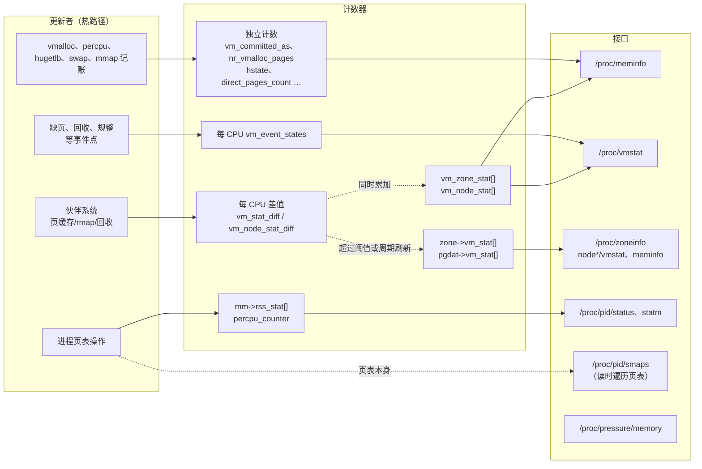
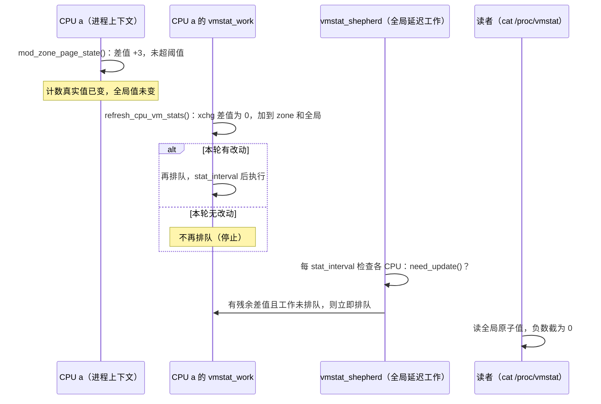

# 内存可观测性指标：从计数器到 `/proc` 接口

一台机器报警说“内存快用完了”。`free` 显示可用内存只剩 2 GiB，`/proc/meminfo` 里 `Cached` 却有 20 GiB；某个进程的 `VmRSS` 是 3 GiB，把所有进程的 RSS 加起来又远远超过物理内存；`/proc/vmstat` 里 `pgscan_kswapd` 每秒涨几万，`pgmajfault` 也在涨，但 `oom_kill` 一直是 0。这些数字各自是什么意思？哪个能说明系统真的缺内存？它们之间为什么对不上？

内核为内存子系统维护了数百个统计量，分散在 `/proc/meminfo`、`/proc/vmstat`、`/proc/zoneinfo`、`/proc/<pid>/smaps`、cgroup 的 `memory.stat` 和 `/proc/pressure/memory` 等接口中。它们的单位、口径、更新时机和精度各不相同。只看名字去理解，常常得出错误结论。本章回答以下问题：

1. 内核用哪几类计数器记录内存状态？它们怎样在热路径上低成本地更新，读出来的值有多准？
2. 每个接口中的每一项是怎样算出来的，单位是什么，与其他项是什么包含关系？
3. 哪些指标说明“内存多少”，哪些说明“回收是否吃力”，哪些说明“任务是否因内存而停顿”？
4. 不同视角（整机、节点、zone、进程、cgroup）的数字为什么不能直接相加或互相比较？

## 0. 分析基线

本章依据仓库内 [Makefile 第 2～4 行](../../linux/Makefile#L2-L4)标记的 **6.18.52** 版本，架构为 **x86-64**。读者应了解[内存子系统概述](../memory/introduction.md)中的 node、zone、folio、LRU 和伙伴系统；回收相关指标的背景见[内存回收](../memory/reclaim.md)，slab 指标的背景见 [SLUB](../memory/slub.md)，memcg 统计的刷新机制见 [cgroup v2 的 memory 控制器](../cgroup2/memory.md)第 3.10 节。

接口中出现哪些行，取决于编译配置。与本章结论有关的配置如下：

| 配置 | 对本章的影响 | 依据 |
| --- | --- | --- |
| `CONFIG_SMP=y`、`CONFIG_NR_CPUS=512` | zone/node 计数采用“每 CPU 差值 + 原子总数”的两级结构，读数有误差 | [.config#L362](../../linux/.config#L362)、[.config#L431](../../linux/.config#L431) |
| `CONFIG_NUMA=y` | 有 `numa_hit` 等 NUMA 分配计数，有 `/sys/devices/system/node/nodeN/` 下的统计文件 | [.config#L469](../../linux/.config#L469) |
| `CONFIG_VM_EVENT_COUNTERS=y` | `/proc/vmstat` 中输出 `pgfault`、`pgscan_*` 等事件计数 | [.config#L1274](../../linux/.config#L1274) |
| `CONFIG_HAVE_CMPXCHG_LOCAL=y` | `mod_zone_page_state()` 等函数用 `this_cpu_try_cmpxchg` 更新每 CPU 差值，不关中断 | [.config#L904](../../linux/.config#L904) |
| `CONFIG_PAGE_SIZE_4KB=y`、`CONFIG_HZ=1000` | 一页 4 KiB；刷新间隔内部默认为 `HZ` 个 jiffy，即约 1 秒 | [.config#L951](../../linux/.config#L951)、[.config#L506](../../linux/.config#L506) |
| `CONFIG_SWAP=y`、`CONFIG_ZSWAP=y`、`CONFIG_ZSMALLOC=y` | 有 `SwapCached`、`Zswap`、`Zswapped` 以及 `nr_zspages`、`zswpin` 等 | [.config#L1146-L1147](../../linux/.config#L1146-L1147)、[.config#L1157](../../linux/.config#L1157) |
| `CONFIG_TRANSPARENT_HUGEPAGE=y` | 有 `AnonHugePages` 等透明大页（THP，Transparent Huge Page）字段和 `thp_*` 事件 | [.config#L1236](../../linux/.config#L1236) |
| `CONFIG_HUGETLB_PAGE=y` | 有 `HugePages_*`、`Hugetlb` 字段和 `nr_hugetlb` | [.config#L9743](../../linux/.config#L9743) |
| `CONFIG_MEMCG=y` | 有 cgroup 的 `memory.stat` 等文件 | [.config#L212](../../linux/.config#L212) |
| `CONFIG_PSI=y`，`CONFIG_PSI_DEFAULT_DISABLED` 未设置 | 默认启用压力停顿信息（PSI，Pressure Stall Information），有 `/proc/pressure/memory` | [.config#L158-L159](../../linux/.config#L158-L159) |
| `CONFIG_PROC_PAGE_MONITOR=y` | 有 `/proc/<pid>/smaps`、`smaps_rollup` | [.config#L9729](../../linux/.config#L9729) |
| `CONFIG_PAGE_MAPCOUNT=y` | smaps 的普通 present 页按各子页映射计数计算 PSS；非 present 等特殊情况见第 7.4 节 | [.config#L1242-L1243](../../linux/.config#L1242-L1243) |
| `CONFIG_SLUB_DEBUG=y` | 有 `/proc/slabinfo` | [.config#L10571](../../linux/.config#L10571) |
| `CONFIG_VMAP_STACK=y` | 内核栈用 vmalloc 分配，同时计入 `KernelStack` 和 `VmallocUsed` | [.config#L967](../../linux/.config#L967) |
| `CONFIG_MEMORY_FAILURE=y`、`CONFIG_UNACCEPTED_MEMORY=y`、`CONFIG_MEMTEST=y` | 有 `HardwareCorrupted`、`Unaccepted` 字段；做过早期内存测试时有 `EarlyMemtestBad` | [.config#L1230](../../linux/.config#L1230)、[.config#L2403](../../linux/.config#L2403)、[.config#L10876](../../linux/.config#L10876) |
| `CONFIG_CMA` 未设置 | 没有 `CmaTotal`、`CmaFree` 行；`nr_free_cma` 恒为 0 | [.config#L1254](../../linux/.config#L1254) |
| `CONFIG_LRU_GEN` 未设置 | 回收只走传统 active/inactive LRU，`workingset_*` 按经典 refault 距离统计 | [.config#L1287](../../linux/.config#L1287) |
| `CONFIG_DEBUG_TLBFLUSH`、`CONFIG_PER_VMA_LOCK_STATS`、`CONFIG_DEBUG_STACK_USAGE` 未设置 | `/proc/vmstat` 中没有 `nr_tlb_*`、`vma_lock_*`、`kstack_*` | [.config#L10806](../../linux/.config#L10806)、[.config#L10585](../../linux/.config#L10585)、[.config#L10588](../../linux/.config#L10588) |

x86 的 `HIGHMEM4G` 依赖 `X86_32`，`HIGHMEM` 又取其值，因此本 x86-64 配置没有高端内存（[arch/x86/Kconfig#L1391-L1393](../../linux/arch/x86/Kconfig#L1391-L1393)、[Kconfig#L1458-L1459](../../linux/arch/x86/Kconfig#L1458-L1459)）。`/proc/meminfo` 不会输出 `HighTotal`/`LowTotal` 等行；未启用 `CONFIG_SHADOW_CALL_STACK` 时也不输出 `ShadowCallStack`，输出条件见 [meminfo.c#L77-L82](../../linux/fs/proc/meminfo.c#L77-L82)、[meminfo.c#L113-L116](../../linux/fs/proc/meminfo.c#L113-L116)。

几个运行时条件同样影响读数：

| 运行时条件 | 默认值 | 影响 | 依据 |
| --- | --- | --- | --- |
| `vm.stat_interval` | 用户接口读写秒数，默认 1；内部存 `HZ` 个 jiffy | 每 CPU 差值定期折叠的目标间隔，排队和调度可能延迟 | [vmstat.c#L1974](../../linux/mm/vmstat.c#L1974)、[vmstat.c#L2235-L2241](../../linux/mm/vmstat.c#L2235-L2241) |
| `vm.numa_stat` | 1 | 写 0 会关闭 `numa_*` 计数并清零 | [vmstat.c#L37](../../linux/mm/vmstat.c#L37)、[vmstat.c#L79-L105](../../linux/mm/vmstat.c#L79-L105) |
| `vm.overcommit_memory`、`vm.overcommit_ratio` | 0（启发式）、50 | 决定 `CommitLimit` 是否被强制执行以及它的大小 | [util.c#L752-L753](../../linux/mm/util.c#L752-L753) |
| 启动参数 `psi=` | 启用 | `psi=0` 时没有 `/proc/pressure` 目录 | [psi.c#L149-L158](../../linux/kernel/sched/psi.c#L149-L158)、[psi.c#L1710-L1720](../../linux/kernel/sched/psi.c#L1710-L1720) |
| zswap 的 `enabled` 参数 | 关闭（`CONFIG_ZSWAP_DEFAULT_ON` 未设置） | 字段和事件已编入，需通过 `zswap.enabled=1` 或参数接口启用才接收新页 | [.config#L1148](../../linux/.config#L1148)、[zswap.c#L87-L96](../../linux/mm/zswap.c#L87-L96) |
| NUMA 自动平衡 | 关闭（`CONFIG_NUMA_BALANCING_DEFAULT_ENABLED` 未设置） | 编入了 `numa_pte_updates` 等计数，但默认不增长 | [.config#L206-L207](../../linux/.config#L206-L207) |

**本章边界。** 本章覆盖 `/proc` 和 sysfs 中以数值形式给出的内存指标，说明它们的来源、口径和误差。tracepoint、perf、BPF、DAMON 等动态观测手段不在本章范围；memcg 统计只说明它与全局统计的对应关系和差异，限额与回收机制见 cgroup 章节。

## 1. 指标体系要解决什么问题

### 1.1 三种性质不同的数字

内存指标按“它在回答什么问题”可以分成三类，读法完全不同：

| 类型 | 回答的问题 | 典型例子 | 正确读法 |
| --- | --- | --- | --- |
| **状态量**（gauge） | 此刻有多少页处于某种状态 | `MemFree`、`Cached`、`nr_dirty`、`VmRSS` | 直接读当前值，关注趋势 |
| **累计事件**（counter） | 自启动以来某件事发生过多少次 | `pgfault`、`pgscan_kswapd`、`workingset_refault_file`、`oom_kill` | 取两次读数的差值除以时间间隔 |
| **压力时间** | 任务因为内存不足而停顿了多久 | `/proc/pressure/memory` 的 `some`、`full` | 看百分比平均值，或比较 `total` 的增量 |

状态量说明“内存是怎样分布的”，但不能说明“这样分布有没有问题”：`MemFree` 很小可能只是页缓存用满了空闲内存，系统运转良好。累计事件说明“为了维持这种分布，内核做了多少工作”：扫描、回收、换出、缺页。压力时间则直接衡量“这些工作让任务等待了多久”，最接近“内存是否不够用”的答案。

### 1.2 数据从哪里来

几乎所有接口都不在读取时遍历物理内存，而是读取早已维护好的计数器。计数器在页面状态变化的地方更新：伙伴系统分配和释放页、页缓存插入和删除、页表建立和解除映射、回收扫描、缺页处理等。下图回答“计数器存在哪里，哪些接口读它们”。左侧到中间的实线表示更新，中间到右侧的实线表示读取；计数器之间的虚线表示折叠（数值从每 CPU 差值流向共享总数），通向 `smaps` 的虚线表示它直接读取页表而不读计数器。



图中有两个例外需要注意：`smaps` 不读计数器，而是在读取时遍历进程的页表现算；PSI 不统计页，而是由调度器在任务状态变化时累计停顿时间（第 9 节）。

### 1.3 观测视角与接口

| 视角 | 接口 | 主要内容 | 本章位置 |
| --- | --- | --- | --- |
| 整机 | `/proc/meminfo` | 面向人的内存分布汇总，单位 kB | 第 4 节 |
| 整机 | `/proc/vmstat` | 全部 zone/node 状态量和事件计数，单位多为页或次数 | 第 5 节 |
| zone | `/proc/zoneinfo`、`/proc/buddyinfo`、`/proc/pagetypeinfo` | 水位、保留、每 CPU 页缓存、空闲块分布 | 第 6 节 |
| 进程 | `/proc/<pid>/status`、`statm`、`stat`、`smaps`、`smaps_rollup` | 虚拟地址空间大小、RSS、PSS、缺页次数 | 第 7 节 |
| 节点 | `/sys/devices/system/node/nodeN/meminfo`、`numastat`、`vmstat` | 单节点的分布和 NUMA 分配统计 | 第 8.1 节 |
| cgroup | `memory.stat`、`memory.current`、`memory.events` | 一个控制组子树的分布和事件 | 第 8.2 节 |
| 压力 | `/proc/pressure/memory`、`memory.pressure` | 因内存停顿的时间比例 | 第 9 节 |
| 对象级 | `/proc/slabinfo`、`/proc/vmallocinfo`、`/proc/swaps` 等 | 具体缓存、区域或设备的使用情况 | 第 10 节 |

## 2. 核心数据结构：计数器怎样组织

### 2.1 五个计数家族

`/proc/vmstat` 的输出顺序正好反映了内核的计数器分类。[`vmstat_text[]`](../../linux/mm/vmstat.c#L1199-L1503) 按以下五段排列名称，读取时 [`vmstat_start()`](../../linux/mm/vmstat.c#L1886-L1929) 也按这个顺序填值：

| 家族 | 枚举 | 粒度 | 存储方式 | 性质 | 定义 |
| --- | --- | --- | --- | --- | --- |
| zone 状态 | `enum zone_stat_item` | 每个 zone | 每 CPU `s8` 差值 + zone 与全局原子总数 | 状态量，单位页 | [mmzone.h#L159-L179](../../linux/include/linux/mmzone.h#L159-L179) |
| NUMA 事件 | `enum numa_stat_item` | 每个 zone | 每 CPU `unsigned long`，读时折叠 | 累计次数 | [mmzone.h#L145-L157](../../linux/include/linux/mmzone.h#L145-L157) |
| 节点状态 | `enum node_stat_item` | 每个节点（与 memcg 的 lruvec 共用编号） | 每 CPU `s8` 差值 + 节点与全局原子总数 | 多数是状态量，少数是累计量（见第 5.2 节） | [mmzone.h#L181-L264](../../linux/include/linux/mmzone.h#L181-L264) |
| 全局派生量 | `enum vm_stat_item` | 整机 | 读取时现算或独立原子变量 | 状态量 | [vmstat.h#L32-L38](../../linux/include/linux/vmstat.h#L32-L38) |
| VM 事件 | `enum vm_event_item` | 整机 | 每 CPU `unsigned long`，读时求和 | 累计次数或页数 | [vm_event_item.h#L34-L192](../../linux/include/linux/vm_event_item.h#L34-L192) |

为什么既有 zone 计数又有节点计数？分配器的水位判断以 zone 为单位，所以空闲页数（`NR_FREE_PAGES`）、mlock 页数等与分配直接相关的量按 zone 统计；而 LRU 链表、页缓存、回收都以节点（以及 memcg × 节点的 `lruvec`）为单位，所以大部分页面状态按节点统计。zone 级也保留了一份 LRU 计数 `NR_ZONE_*`，注释说明它只用于规整和回收重试判断（[mmzone.h#L163](../../linux/include/linux/mmzone.h#L163)）。

### 2.2 两级计数：每 CPU 差值与原子总数

zone 和节点状态的更新非常频繁：每分配一页就要修改 `NR_FREE_PAGES`，每插入一页缓存就要修改 `NR_FILE_PAGES`。如果每次都原子地修改一个全局变量，多 CPU 同时更新会让这条缓存行在 CPU 之间来回传递。内核的做法是先在本 CPU 上攒一个小的差值，攒够了再一次性加到共享计数上。相关字段如下：

| 字段 | 所在结构 | 类型 | 含义 | 定义 |
| --- | --- | --- | --- | --- |
| `vm_stat_diff[]` | `struct per_cpu_zonestat`（每 zone 每 CPU 一份） | `s8` | 本 CPU 尚未折叠的 zone 计数差值 | [mmzone.h#L762-L775](../../linux/include/linux/mmzone.h#L762-L775) |
| `stat_threshold` | 同上 | `s8` | 差值的绝对值超过它就立即折叠 | 同上 |
| `vm_numa_event[]` | 同上 | `unsigned long` | 本 CPU 的 NUMA 事件计数，只在读取或 CPU 下线时折叠 | 同上 |
| `vm_node_stat_diff[]`、`stat_threshold` | `struct per_cpu_nodestat`（每节点每 CPU 一份） | `s8` | 节点计数的差值和阈值 | [mmzone.h#L777-L780](../../linux/include/linux/mmzone.h#L777-L780) |
| `vm_stat[]`、`vm_numa_event[]` | `struct zone` | `atomic_long_t` | zone 的已折叠总数 | [mmzone.h#L1057-L1059](../../linux/include/linux/mmzone.h#L1057-L1059) |
| `vm_stat[]` | `pg_data_t` | `atomic_long_t` | 节点的已折叠总数 | [mmzone.h#L1516-L1518](../../linux/include/linux/mmzone.h#L1516-L1518) |
| `vm_zone_stat[]`、`vm_node_stat[]`、`vm_numa_event[]` | 全局数组 | `atomic_long_t` | 整机已折叠总数 | [vmstat.c#L165-L167](../../linux/mm/vmstat.c#L165-L167) |

它们的关系可以画成下图。箭头表示“折叠时数值流向”，不是函数调用：

```text
           CPU0                 CPU1                     CPUn
   per_cpu_zonestat     per_cpu_zonestat         per_cpu_zonestat     （每个 zone 各一组）
   vm_stat_diff[i]=+37  vm_stat_diff[i]=-12  ...  vm_stat_diff[i]=+5
            \                  |                       /
             \   |diff| > stat_threshold 或周期刷新  /
              v                v                      v
            zone->vm_stat[i]  ──同时加到──>  vm_zone_stat[i]（全局）
```

折叠时 [`zone_page_state_add()`](../../linux/include/linux/vmstat.h#L162-L174) 把同一个增量加到 zone 和全局总数上，所以在更新完成、没有并发修改时，全局值等于各 zone 已折叠值之和，不需要读时再遍历 zone。两次原子加法并不是一个整体原子操作，读者可能看到更新中途的值。节点计数用 `node_page_state_add()` 做同样的事。

它表达的**记账关系**是“已折叠总数 + 所有 CPU 上的待折叠差值”。这只在更新完成后成立：差值清零和共享计数相加分步进行，没有能冻结两者的读取锁。在阈值稳定、更新完成的状态下，一个 zone 或节点的待折叠误差可按“在线 CPU 数 × 相应阈值”估计；全局误差还需对各 zone 或节点累加。它不是任意读取瞬间的严格上限：CPU 迁移时可能读到另一个 CPU 的阈值，调低阈值也不会立即收回旧差值（[vmstat.c#L573-L596](../../linux/mm/vmstat.c#L573-L596)、[vmstat.c#L328-L336](../../linux/mm/vmstat.c#L328-L336)）。由于差值可正可负，已折叠总数可能短暂为负；读函数在 SMP 下把负数截为 0（[vmstat.h#L176-L213](../../linux/include/linux/vmstat.h#L176-L213)）。

### 2.3 事件计数：纯每 CPU 数组

VM 事件（`pgfault`、`pgscan_kswapd` 等）只增不减，内核从不依赖它们做决策，所以连阈值折叠也省了。每个 CPU 有一个 `struct vm_event_state`，其中是 `unsigned long event[NR_VM_EVENT_ITEMS]`（[vmstat.h#L51-L55](../../linux/include/linux/vmstat.h#L51-L55)）。更新只是一条本 CPU 加法：

```c
static inline void count_vm_event(enum vm_event_item item)
{
	this_cpu_inc(vm_event_states.event[item]);
}
```

来源：[include/linux/vmstat.h#L66-L69](../../linux/include/linux/vmstat.h#L66-L69)。`__count_vm_event()` 用 `raw_cpu_inc()`，连抢占保护都不做，注释明确说这些计数“允许有竞争”（[vmstat.h#L57-L64](../../linux/include/linux/vmstat.h#L57-L64)）。读取时 [`sum_vm_events()`](../../linux/mm/vmstat.c#L113-L126) 遍历所有在线 CPU 求和；CPU 下线时 [`vm_events_fold_cpu()`](../../linux/mm/vmstat.c#L147-L156) 把它的计数并入当前 CPU，保持累计值。求和期间计数仍在变化，源码明确称结果为近似值（[vmstat.c#L129-L138](../../linux/mm/vmstat.c#L129-L138)）。

NUMA 事件（`numa_hit` 等）介于两者之间：每 CPU 用 `unsigned long` 存（注释称之为“低优先级的不精确计数，只在需要时折叠”，[mmzone.h#L767-L774](../../linux/include/linux/mmzone.h#L767-L774)），周期刷新不处理它们；读 `/proc/vmstat`、`zoneinfo` 或节点 `numastat` 时先调用 [`fold_vm_numa_events()`](../../linux/mm/vmstat.c#L172-L196) 用 `xchg` 收集各 CPU 的值。

### 2.4 进程计数：`mm_struct` 中的字段

进程（准确说是地址空间 `mm_struct`）的内存统计不进入上面的体系，而是放在 `mm_struct` 自己的字段里：

| 字段 | 类型 | 含义 | 定义 |
| --- | --- | --- | --- |
| `rss_stat[NR_MM_COUNTERS]` | `struct percpu_counter` | 四类计数：`MM_FILEPAGES`、`MM_ANONPAGES`、`MM_SWAPENTS`、`MM_SHMEMPAGES` | [mm_types.h#L1124](../../linux/include/linux/mm_types.h#L1124)、[mm_types_task.h#L26-L32](../../linux/include/linux/mm_types_task.h#L26-L32) |
| `hiwater_rss`、`hiwater_vm` | `unsigned long` | RSS 和虚拟内存的历史峰值 | [mm_types.h#L1093-L1094](../../linux/include/linux/mm_types.h#L1093-L1094) |
| `total_vm`、`locked_vm`、`pinned_vm` | `unsigned long` / `atomic64_t` | 映射总页数、mlock 虚拟页数、调用者显式记账的 pin 页数（第 7.1 节） | [mm_types.h#L1096-L1098](../../linux/include/linux/mm_types.h#L1096-L1098) |
| `data_vm`、`exec_vm`、`stack_vm` | `unsigned long` | 按 VMA 标志分类的映射页数 | [mm_types.h#L1099-L1101](../../linux/include/linux/mm_types.h#L1099-L1101) |

`percpu_counter` 是另一种两级计数：每 CPU 一个 `s32` 差值，达到批量 `percpu_counter_batch` 后加到共享的 `s64` 上。默认批量是 `max(32, 在线 CPU 数 × 2)`（[percpu_counter.c#L255-L264](../../linux/lib/percpu_counter.c#L255-L264)）。它提供两种读法：[`get_mm_counter()`](../../linux/include/linux/mm.h#L2791-L2794) 只读共享值（快、不精确），[`get_mm_counter_sum()`](../../linux/include/linux/mm.h#L2796-L2799) 把共享值与在线、正在下线 CPU 的差值求和（慢、更准确）。求和锁阻止共享值的折叠，却不阻止其他 CPU 的本地快路径更新，因此仍不是同一瞬间的一致快照（[percpu_counter.c#L93-L112](../../linux/lib/percpu_counter.c#L93-L112)、[percpu_counter.c#L159-L184](../../linux/lib/percpu_counter.c#L159-L184)）。第 7 节会看到，不同接口用了不同的读法。

### 2.5 散落在各处的独立计数

还有一些量不属于上述任何家族，由各自的子系统维护。`/proc/meminfo` 会直接读取它们：

| 量 | 维护者 | 含义 | 定义 |
| --- | --- | --- | --- |
| `_totalram_pages` | 伙伴系统初始化与内存热插拔 | 伙伴系统管理的总页数 | [show_mem.c#L21](../../linux/mm/show_mem.c#L21) |
| `totalreserve_pages` | 水位和 `lowmem_reserve` 计算 | 各 zone“高水位 + 最大保留”之和，视为不可供用户使用 | [page_alloc.c#L6386-L6417](../../linux/mm/page_alloc.c#L6386-L6417) |
| `vm_committed_as` | mmap/brk/fork 等的提交记账 | 已承诺的私有可写内存页数，`percpu_counter` | [util.c#L893](../../linux/mm/util.c#L893) |
| `nr_vmalloc_pages` | vmalloc | vmalloc 区域实际分配的物理页数 | [vmalloc.c#L1073-L1079](../../linux/mm/vmalloc.c#L1073-L1079) |
| `pcpu_nr_populated` | percpu 分配器 | 已填充的 percpu 单元页数 | [percpu.c#L3360-L3363](../../linux/mm/percpu.c#L3360-L3363) |
| `struct hstate` 中的计数 | hugetlb | 每种大页尺寸的总数、空闲数、预留数、超额数 | [hugetlb.h#L656-L677](../../linux/include/linux/hugetlb.h#L656-L677) |
| `direct_pages_count[]` | x86 页表属性修改 | 直接映射区各级页表映射了多少个 4K/2M/1G 页 | [set_memory.c#L84-L135](../../linux/arch/x86/mm/pat/set_memory.c#L84-L135) |
| `nr_swap_pages`、`total_swap_pages` | swap | 空闲和总 swap 槽位 | [swapfile.c#L3718-L3733](../../linux/mm/swapfile.c#L3718-L3733) |

### 2.6 单位一览

单位不一致是误读的主要来源之一。同一个内部计数在不同接口中的单位可能不同：

| 内部存储 | 例子 | `/proc/vmstat`、`zoneinfo` 中 | `/proc/meminfo`、节点 `meminfo` 中 | `memory.stat` 中 |
| --- | --- | --- | --- | --- |
| 页 | `NR_FILE_PAGES` | 页 | kB | 字节 |
| 页（PMD 映射页或 PMD 可映射的大 folio 页） | `NR_ANON_THPS` 等五项 | **按 PMD 大小折算的数量**（除以 `HPAGE_PMD_NR`，即 512） | kB | `anon/file/shmem_thp` 用字节；两个 `pmdmapped` 项不输出 |
| 全局按页存，memcg 按字节存 | `NR_SLAB_RECLAIMABLE_B` | 页 | kB | 字节 |
| KiB | `NR_KERNEL_STACK_KB` | KiB | kB | 字节 |
| 512 字节扇区 | `PGPGIN`、`PGPGOUT` | **KiB**（读时除以 2） | — | — |
| 页 / 节点数 | `workingset_refault/activate/restore_*` / `workingset_nodereclaim` | 前者按页，后者按 shadow 节点 | — | 不乘页大小；沿用相同计数 |

依据：THP 项的折算见 [`vmstat_item_print_in_thp()`](../../linux/include/linux/mmzone.h#L271-L281) 和 [vmstat.c#L1910-L1914](../../linux/mm/vmstat.c#L1910-L1914)；slab 项内部单位见 [`vmstat_item_in_bytes()`](../../linux/include/linux/mmzone.h#L288-L301) 和 [`__mod_node_page_state()`](../../linux/mm/vmstat.c#L384-L393)；`pgpgin` 的折算见 [vmstat.c#L1924-L1926](../../linux/mm/vmstat.c#L1924-L1926)；memcg 的单位换算见 [memcontrol.c#L1390-L1434](../../linux/mm/memcontrol.c#L1390-L1434)。

## 3. 关键算法：计数怎样更新、刷新和读取

### 3.1 更新：超过阈值才折叠

以 zone 计数为例，算法目标是：让绝大多数更新只写本 CPU 的缓存行，让更新完成后的每 CPU 差值保持在阈值附近。x86-64 有本 CPU 的 cmpxchg，走 [`mod_zone_state()`](../../linux/mm/vmstat.c#L560-L597)：

```text
// 简化逻辑：mod_zone_state(zone, item, delta, overstep_mode)
o = 本 CPU 的 vm_stat_diff[item]
do {
    t = 本 CPU 的 stat_threshold
    n = o + delta
    z = 0
    if |n| > t:
        os = overstep_mode × (t / 2)    // inc 为 +1，dec 为 −1，mod 为 0
        z  = n + os                     // 要加到共享计数的量
        n  = −os                        // 本 CPU 差值从反方向的半个阈值重新开始
} while (!this_cpu_try_cmpxchg(差值, &o, n))   // 被中断或迁移打断就重试
if z: zone->vm_stat[item] += z; vm_zone_stat[item] += z
```

`inc_zone_page_state()` 和 `dec_zone_page_state()` 分别以 `overstep_mode` 为 1 和 −1 调用它（[vmstat.c#L599-L616](../../linux/mm/vmstat.c#L599-L616)）。“多走半步”的含义是：一个持续递增的计数，折叠后差值从 −t/2 开始，要再增加约 1.5t 才会下次折叠，减少了折叠次数。已知中断关闭，或已禁抢占且该项不会被中断更新的调用者用 [`__mod_zone_page_state()`](../../linux/mm/vmstat.c#L339-L373)，不需要 cmpxchg 循环，超阈值后差值归零。节点计数的 [`__mod_node_page_state()`](../../linux/mm/vmstat.c#L376-L409) 多一步：slab 的两个字节单位计数在全局层面先右移 `PAGE_SHIFT` 换成页再存。

### 3.2 阈值：误差有多大

阈值越大，折叠越少，读数误差越大。[`calculate_normal_threshold()`](../../linux/mm/vmstat.c#L225-L270) 按 CPU 数和 zone 大小取对数缩放：

```text
mem       = zone 管理页数 / (128 MiB 对应的页数)
threshold = min(125, 2 × fls(在线 CPU 数) × (1 + fls(mem)))
```

上限 125 是因为差值是 `s8`。[`refresh_zone_stat_thresholds()`](../../linux/mm/vmstat.c#L275-L318) 把它写入每个 CPU 的 `per_cpu_zonestat`；节点计数的阈值取该节点各 zone 阈值的最大值（[vmstat.c#L301-L304](../../linux/mm/vmstat.c#L301-L304)）。

举一个计算例子（数字为示意，不是实测）：64 个在线 CPU，一个约 57 GiB 的 Normal zone，管理页数约 1500 万，`mem` 约 457，`fls(457) = 9`，`fls(64) = 7`，得到 `2 × 7 × 10 = 140`，截为 125。在阈值稳定、更新完成的状态下，这个 zone 的每项 zone 计数可有至多 `64 × 125 = 8000` 页（约 31 MiB）没有折叠。全局误差还需对各 zone 累加，瞬时读取限制见第 2.2 节。

**内存紧张时阈值会变小。** 空闲页数接近水位时，31 MiB 的误差可能让分配器误以为还在 `low` 水位之上，实际已经跌破 `min`。因此：

- [`refresh_zone_stat_thresholds()`](../../linux/mm/vmstat.c#L307-L316) 在“最大漂移超过 `low − min`”时设置 `zone->percpu_drift_mark`。空闲页低于它时，kswapd 判断节点是否已平衡改用 [`zone_page_state_snapshot()`](../../linux/include/linux/vmstat.h#L221-L235)，把各 CPU 差值也加进来（[vmscan.c#L6826-L6828](../../linux/mm/vmscan.c#L6826-L6828)）。分配慢路径判断是否值得重试回收、直接回收节流判断等路径则总是使用快照（[page_alloc.c#L4660](../../linux/mm/page_alloc.c#L4660)、[vmscan.c#L6481](../../linux/mm/vmscan.c#L6481)）。
- kswapd 从长睡中醒来时，节点上设置了 `percpu_drift_mark` 的 zone 改用 [`calculate_pressure_threshold()`](../../linux/mm/vmstat.c#L201-L223)（`(low − min) / CPU 数`，限制在 1～125）；长睡前恢复正常阈值（[vmscan.c#L7268-L7281](../../linux/mm/vmscan.c#L7268-L7281)）。它只调整 zone 的阈值，不调整节点计数的阈值（[vmstat.c#L320-L336](../../linux/mm/vmstat.c#L320-L336)）。

所以 `/proc/zoneinfo` 中每个 CPU 的 `vm stats threshold` 并不固定，它反映了当前是否处于压力状态。

### 3.3 周期刷新：把残余差值收回来

如果某个计数在某个 CPU 上只变了几次就不再变，差值永远达不到阈值。为此每个 CPU 有一个延迟工作 `vmstat_work`，周期性地把本 CPU 的全部差值清零并折叠。下图是概念时间线，省略并发更新和调度延迟，不表示全局串行顺序：



对应源码：

- [`refresh_cpu_vm_stats()`](../../linux/mm/vmstat.c#L811-L894) 用 `this_cpu_xchg` 取走本 CPU 每个 zone、每个节点的差值，加到 zone/节点总数，并汇总到全局。传入 `do_pagesets` 时还顺带衰减每 CPU 页列表的 `high`、清空远端节点的每 CPU 页列表（与统计无关，只是借用同一个周期工作）。
- [`vmstat_update()`](../../linux/mm/vmstat.c#L2042-L2054)：本轮有改动才重新排队，以 `sysctl_stat_interval` 为周期。空闲 CPU 因此不会被周期工作反复唤醒。
- [`vmstat_shepherd()`](../../linux/mm/vmstat.c#L2120-L2152)：每个周期检查所有在线 CPU，发现某 CPU 的差值不全为 0 而工作已停，就重新排队。被隔离（`cpu_is_isolated()`）的 CPU 被跳过，注释说明这是为了不打扰隔离的工作负载，代价是这些 CPU 上的差值可能长期不折叠。
- [`quiet_vmstat()`](../../linux/mm/vmstat.c#L2090-L2108)：NOHZ 路径在系统已运行、工作已排队且有残余差值时主动折叠一次。
- CPU 下线时 [`cpu_vm_stats_fold()`](../../linux/mm/vmstat.c#L901-L954) 把它的差值全部收回。

需要先减少待折叠误差时（例如测试脚本），可以读或写 `/proc/sys/vm/stat_refresh`（权限 0600，见 [vmstat.c#L2242-L2247](../../linux/mm/vmstat.c#L2242-L2247)）。[`vmstat_refresh()`](../../linux/mm/vmstat.c#L1983-L2039) 在每个 CPU 上执行一次 `refresh_cpu_vm_stats()`，然后检查是否有计数为负，有就打印警告；`NR_ZONE_WRITE_PENDING`、`NR_FREE_CMA_PAGES`、`NR_WRITEBACK` 已知会短暂为负，被跳过。这个操作不会阻止并发更新，也不会把所有字段冻结在同一时刻，因此刷新后读数仍不是严格一致的快照。

### 3.4 读取：快照、截断和换算

各接口的读取方式不同，决定了它们的精度：

| 读法 | 包含每 CPU 差值 | 使用者 |
| --- | --- | --- |
| `global_zone_page_state()`、`global_node_page_state()` | 否 | `/proc/meminfo`、`/proc/vmstat` |
| `zone_page_state()`、`node_page_state()` | 否 | `/proc/zoneinfo`、节点 `meminfo`/`vmstat` |
| `zone_page_state_snapshot()` | 是（无同步，仍不完全精确） | kswapd 平衡判断、回收重试判断等需要更准数值的内核路径 |
| `sum_vm_events()` | 事件本来就只在每 CPU 上，读时求和 | `/proc/vmstat` |

[`vmstat_start()`](../../linux/mm/vmstat.c#L1886-L1929) 在 seq_file 的一轮读取开始时把各项依次拷进临时数组，随后这一轮逐行输出已收集的值；收集过程没有全局同步锁。它不是 `open()` 时冻结的整份快照，重新进入 `start()` 时也会重新收集。它在收集时完成三处换算：五个 THP 计数除以 `HPAGE_PMD_NR`；`nr_dirty_threshold` 等由 `global_dirty_limits()` 现算；`pgpgin`/`pgpgout` 除以 2，把扇区换成 KiB。最后 [`vmstat_show()`](../../linux/mm/vmstat.c#L1939-L1956) 在末尾追加一行恒为 0 的 `nr_unstable`，只为兼容旧的用户态工具。

还有几类指标在读取时现算，不对应任何计数器：

- `MemAvailable`、`Cached`、`CommitLimit` 等由 `/proc/meminfo` 用公式组合多个计数（第 4 节）；
- `smaps` 中的 RSS、PSS 等在读取时遍历页表（第 7.3 节），代价与映射大小成正比，并要持有 `mmap_lock` 读锁；
- `/proc/pagetypeinfo` 遍历每条空闲链表计数，持有 zone 锁，每条链表最多数 100000 个，权限 0400（[vmstat.c#L1602-L1617](../../linux/mm/vmstat.c#L1602-L1617)、[vmstat.c#L2292](../../linux/mm/vmstat.c#L2292)）。

## 4. `/proc/meminfo`：整机内存分布

### 4.1 生成过程

[`meminfo_proc_show()`](../../linux/fs/proc/meminfo.c#L34-L171) 在读取时依次收集数据：[`si_meminfo()`](../../linux/mm/show_mem.c#L75-L84) 填总量、空闲、`Shmem` 和 `Buffers`；[`si_swapinfo()`](../../linux/mm/swapfile.c#L3718-L3733) 填 swap；[`vm_memory_committed()`](../../linux/mm/util.c#L908-L911) 算提交量；再读 LRU 和 slab 计数、算 `Cached` 和 `MemAvailable`（[meminfo.c#L44-L58](../../linux/fs/proc/meminfo.c#L44-L58)）。大部分行用 [`show_val_kb()`](../../linux/fs/proc/meminfo.c#L28-L32) 把页数左移 `PAGE_SHIFT − 10` 换成 kB 输出；`KernelStack` 本来就是 KiB，直接输出。整个过程不加全局锁，各行不是同一时刻的快照。

### 4.2 字段总表

下表按含义分组，顺序与输出顺序大体一致。“来源”一栏给出内核中的计数或函数。大小通常换算为 kB（实际为 KiB）输出；`HugePages_Total/Free/Rsvd/Surp` 是大页个数，详见第 4.7 节。

**总量与空闲**

| 字段 | 来源 | 含义与说明 |
| --- | --- | --- |
| `MemTotal` | `totalram_pages()` | 交给伙伴系统管理的页总数，即各 zone `managed_pages` 之和。启动时被保留的内存（内核映像、memblock 分配的数据结构等）不计入，所以小于物理内存。zone 注释给出 `managed = present − reserved`（[mmzone.h#L938-L941](../../linux/include/linux/mmzone.h#L938-L941)）。内存热插拔、气球驱动会改变它，例如 virtio 气球在未协商 `VIRTIO_BALLOON_F_DEFLATE_ON_OOM` 特性时，充气会减少管理页数（[virtio_balloon.c#L278-L280](../../linux/drivers/virtio/virtio_balloon.c#L278-L280)） |
| `MemFree` | `NR_FREE_PAGES` | 伙伴系统空闲链表上的页。**不包括**每 CPU 页列表（pcp）中的页：页被批量搬到 pcp 时就已从空闲计数中扣除（[`rmqueue_bulk()`](../../linux/mm/page_alloc.c#L2569-L2585) 经 [`page_del_and_expand()`](../../linux/mm/page_alloc.c#L1768-L1777) 调用 [`account_freepages()`](../../linux/mm/page_alloc.c#L814-L829)）。机密计算虚拟机中尚未接受的内存计入空闲（[page_alloc.c#L7627-L7630](../../linux/mm/page_alloc.c#L7627-L7630)） |
| `MemAvailable` | [`si_mem_available()`](../../linux/mm/show_mem.c#L32-L72) | 估算“不引起换页即可分配给用户态的内存”，详见第 4.3 节 |

**页缓存**

| 字段 | 来源 | 含义与说明 |
| --- | --- | --- |
| `Buffers` | [`nr_blockdev_pages()`](../../linux/block/bdev.c#L511-L522) | 所有块设备 inode 的页缓存页数之和：直接读写块设备、文件系统通过块设备映射读写元数据时产生。读取时持锁遍历块设备超级块的 inode 链表 |
| `Cached` | `NR_FILE_PAGES − NR_SWAPCACHE − Buffers`，负数截为 0 | 普通文件页缓存加上 shmem/tmpfs 页。**包含 `Shmem`**，不包含 hugetlbfs 页（hugetlb folio 不参与页缓存计数，[filemap.c#L178-L180](../../linux/mm/filemap.c#L178-L180)、[filemap.c#L934-L940](../../linux/mm/filemap.c#L934-L940)）。公式见 [meminfo.c#L48-L51](../../linux/fs/proc/meminfo.c#L48-L51) |
| `SwapCached` | `NR_SWAPCACHE` | 位于交换缓存中的页：换入后仍保留 swap 槽位的页，以及换出过程中尚未释放的页。它们同时被计入 `NR_FILE_PAGES`（[swap_state.c#L165-L166](../../linux/mm/swap_state.c#L165-L166)），所以 `Cached` 要减去它 |

**LRU 链表**

| 字段 | 来源 | 含义与说明 |
| --- | --- | --- |
| `Active`、`Inactive` | 对应 anon 与 file 两项之和 | — |
| `Active(anon)`、`Inactive(anon)` | `NR_ACTIVE_ANON`、`NR_INACTIVE_ANON` | anon LRU 上的页：匿名页、**shmem/tmpfs 页**、交换缓存页 |
| `Active(file)`、`Inactive(file)` | `NR_ACTIVE_FILE`、`NR_INACTIVE_FILE` | file LRU 上的页：普通文件页缓存、块设备页缓存，以及 `MADV_FREE` 后未再写入的匿名页 |
| `Unevictable` | `NR_UNEVICTABLE` | 不可驱逐 LRU 类别中的页：被 mlock 的页，以及所属映射被标记为不可驱逐的页（如 ramfs、`SHM_LOCK`），判定见 [`folio_evictable()`](../../linux/mm/internal.h#L492-L502) |
| `Mlocked` | `NR_MLOCK`（zone 计数） | 被 mlock 的页，是 `Unevictable` 的一部分，在 [mlock.c#L252](../../linux/mm/mlock.c#L252) 等处增减 |

LRU 计数随 folio 加入、移出相应类别或在类别间移动而更新，核心操作是 [`__update_lru_size()`](../../linux/include/linux/mm_inline.h#L38-L50)。本版本的 `LRU_UNEVICTABLE` 只维护状态和计数，不把 folio 串入实际链表（[mm_inline.h#L341-L351](../../linux/include/linux/mm_inline.h#L341-L351)、[mm_inline.h#L369-L379](../../linux/include/linux/mm_inline.h#L369-L379)）。暂存在每 CPU folio 批次中、还没加入 LRU 的页，以及被回收或迁移临时隔离的页（`nr_isolated_*`），不在这五项中；状态转换期间也可能有短暂偏差。

**swap 与压缩缓存**

| 字段 | 来源 | 含义与说明 |
| --- | --- | --- |
| `SwapTotal`、`SwapFree` | `total_swap_pages`、`nr_swap_pages` | 所有已启用 swap 设备的总槽位和空闲槽位。正在 `swapoff` 的设备已用槽位被加回两项，使读数在 `swapoff` 期间保持连续（[swapfile.c#L3724-L3731](../../linux/mm/swapfile.c#L3724-L3731)） |
| `Zswap` | [`zswap_total_pages()`](../../linux/mm/zswap.c#L450-L460) | zswap 各压缩池实际占用的内存页数（zsmalloc 页），即压缩后的大小 |
| `Zswapped` | `zswap_stored_pages` | 存进 zswap 的原始页数，即压缩前的大小。`Zswapped / Zswap` 约等于压缩比 |

**写回状态**

| 字段 | 来源 | 含义与说明 |
| --- | --- | --- |
| `Dirty` | `NR_FILE_DIRTY` | 对可写回 mapping 已标脏的页；可能在写回期间再次被标脏 |
| `Writeback` | `NR_WRITEBACK` | 处于 `PG_writeback` 状态的页，包括写往 swap 的匿名页；置位不等于设备 I/O 已完成提交 |
| `NFS_Unstable`、`Bounce`、`WritebackTmp` | 常量 0 | 为兼容保留的旧字段（[meminfo.c#L122-L124](../../linux/fs/proc/meminfo.c#L122-L124)） |

`Dirty` 与 `Writeback` 不是互斥集合：标脏记账不排除已经处于写回中的页，而开始写回也不保证清除 dirty 状态（[page-writeback.c#L2647-L2663](../../linux/mm/page-writeback.c#L2647-L2663)、[page-writeback.c#L3022-L3068](../../linux/mm/page-writeback.c#L3022-L3068)）。

**映射**

| 字段 | 来源 | 含义与说明 |
| --- | --- | --- |
| `AnonPages` | `NR_ANON_MAPPED` | 至少被一个页表映射的匿名页。页从“未映射”变为“已映射”时才加一（[`__folio_add_rmap()`](../../linux/mm/rmap.c#L1248-L1325) 只把新映射的页数 `nr` 交给 [`__folio_mod_stat()`](../../linux/mm/rmap.c#L1226-L1246)），所以被多个进程共享的匿名页（fork 后的 COW 页）只算一次 |
| `Mapped` | `NR_FILE_MAPPED` | 至少被一个页表映射的页缓存页（含 shmem）。同样只按“是否被映射”计一次 |
| `Shmem` | `NR_SHMEM` | 驻留在 shmem 页缓存中的页：tmpfs 文件、System V 共享内存、`MAP_SHARED \| MAP_ANONYMOUS` 映射、memfd，以及使用 shmem 作后备的 GPU（GEM）缓冲区等（枚举定义处的注释见 [mmzone.h#L209](../../linux/include/linux/mmzone.h#L209)）。在 [`shmem_update_stats()`](../../linux/mm/shmem.c#L852-L858) 中与 `NR_FILE_PAGES` 一起增减，不包括已经换出、仅留 swap 条目的部分 |

**内核自身使用**

| 字段 | 来源 | 含义与说明 |
| --- | --- | --- |
| `KReclaimable` | `SReclaimable + NR_KERNEL_MISC_RECLAIMABLE` | 内核中可回收部分的估计。本源码树中没有任何代码修改 `NR_KERNEL_MISC_RECLAIMABLE`（只在 `meminfo`、`show_mem` 和节点 `meminfo` 中被读取），所以它恒为 0，`KReclaimable` 等于 `SReclaimable` |
| `Slab` | 两项之和 | — |
| `SReclaimable` | `NR_SLAB_RECLAIMABLE_B` | 以 `SLAB_RECLAIM_ACCOUNT` 创建的 cache 所占的 slab 页，例如 dentry、inode cache。“可回收”指 cache 的性质，不代表其中对象此刻都能释放 |
| `SUnreclaim` | `NR_SLAB_UNRECLAIMABLE_B` | 其余 slab 页，**再加上大于 8 KiB 的 `kmalloc`**：它们绕过 slab 直接从页分配器分配，但同样计入这一项（[slub.c#L5615-L5636](../../linux/mm/slub.c#L5615-L5636)），却不出现在 `/proc/slabinfo` 中 |
| `KernelStack` | `NR_KERNEL_STACK_KB` | 已分配给任务的内核栈。x86-64 上每个栈 16 KiB（[page_64_types.h#L15-L16](../../linux/arch/x86/include/asm/page_64_types.h#L15-L16)），见第 4.6 节 |
| `PageTables` | `NR_PAGETABLE` | 页表页，在 [`__pagetable_ctor()`](../../linux/include/linux/mm.h#L3245-L3251) 中计入 |
| `SecPageTables` | `NR_SECONDARY_PAGETABLE` | 二级页表：KVM 为客户机维护的页表（[kvm_host.h#L2490-L2492](../../linux/include/linux/kvm_host.h#L2490-L2492)）和 IOMMU 页表（[iommu-pages.c#L72-L74](../../linux/drivers/iommu/iommu-pages.c#L72-L74)） |
| `VmallocTotal` | `VMALLOC_TOTAL` | vmalloc **虚拟地址空间**的大小（[vmalloc.h#L285](../../linux/include/linux/vmalloc.h#L285)），由虚拟地址布局决定，与使用量无关；x86 的布局还区分四级与五级页表（[pgtable_64_types.h#L107-L133](../../linux/arch/x86/include/asm/pgtable_64_types.h#L107-L133)） |
| `VmallocUsed` | [`vmalloc_nr_pages()`](../../linux/mm/vmalloc.c#L1076-L1079) | vmalloc 实际分配的物理页数。在 [`__vmalloc_area_node()`](../../linux/mm/vmalloc.c#L3754-L3758) 中增加；`ioremap` 等只映射已有物理地址的区域不计入 |
| `VmallocChunk` | 常量 0 | 旧字段，已不再计算 |
| `Percpu` | [`pcpu_nr_pages()`](../../linux/mm/percpu.c#L3352-L3363) | percpu 分配器已填充的页数 × 单元数（每 CPU 一个单元）；注释说明不含分配器自身的元数据 |

**提交量**

| 字段 | 来源 | 含义与说明 |
| --- | --- | --- |
| `CommitLimit` | [`vm_commit_limit()`](../../linux/mm/util.c#L875-L887) | 严格不超额模式下允许的提交上限，见第 4.5 节 |
| `Committed_AS` | `vm_committed_as` 包含每 CPU 差值的求和 | 已承诺的私有可写内存等，见第 4.5 节 |

**硬件、虚拟化与大页**

| 字段 | 来源 | 含义与说明 |
| --- | --- | --- |
| `EarlyMemtestBad` | [`memtest_report_meminfo()`](../../linux/mm/memtest.c#L122-L137) | 只有启动时用 `memtest=` 做过早期内存测试才输出。0 表示测试过且没发现坏块；有坏块但不足 1 KiB 时显示 1 |
| `HardwareCorrupted` | `num_poisoned_pages` | 因硬件错误被标记为 HWPoison 而隔离的页（[memory-failure.c#L73-L79](../../linux/mm/memory-failure.c#L73-L79)） |
| `AnonHugePages` | `NR_ANON_THPS` | 以 PMD 映射的匿名透明大页。只有 PMD 大小的 THP 在第一次被 PMD 映射时才计入（[rmap.c#L1300-L1309](../../linux/mm/rmap.c#L1300-L1309)），更小的 mTHP 或被拆成 PTE 映射的 THP 都不在其中 |
| `ShmemHugePages`、`ShmemPmdMapped` | `NR_SHMEM_THPS`、`NR_SHMEM_PMDMAPPED` | shmem 页缓存中达到 PMD 大小的大 folio 页数；其中被 PMD 映射到进程的部分 |
| `FileHugePages`、`FilePmdMapped` | `NR_FILE_THPS`、`NR_FILE_PMDMAPPED` | 普通文件页缓存中达到 PMD 大小的大 folio 页数；其中被 PMD 映射的部分 |
| `Unaccepted` | `NR_UNACCEPTED` | 机密计算虚拟机中尚未被客户机接受的内存，已包含在 `MemFree` 中 |
| `Balloon` | `NR_BALLOON_PAGES` | 被气球驱动占用、归还给宿主机的页（[balloon_compaction.c#L27](../../linux/mm/balloon_compaction.c#L27)） |
| `HugePages_Total` 等 | [`hugetlb_report_meminfo()`](../../linux/mm/hugetlb.c#L5228-L5256) | hugetlb 大页池，见第 4.7 节 |
| `DirectMap4k`、`DirectMap2M`、`DirectMap1G` | [`arch_report_meminfo()`](../../linux/arch/x86/mm/pat/set_memory.c#L121-L135) | 内核直接映射区分别用 4 KiB、2 MiB、1 GiB 页表项映射的内存量。修改页属性（如设为只读、不可执行）会把大页拆小，`DirectMap4k` 增加；对应的拆分事件是 `/proc/vmstat` 的 `direct_map_level2/3_splits`（[set_memory.c#L94-L107](../../linux/arch/x86/mm/pat/set_memory.c#L94-L107)）。`DirectMap1G` 只在启用 1 GiB 直接映射时输出 |

`ShmemHugePages` 和 `FileHugePages` 的更新条件是 `folio_test_pmd_mappable()`，即 folio 的阶数不小于 `HPAGE_PMD_ORDER`（[huge_mm.h#L474-L476](../../linux/include/linux/huge_mm.h#L474-L476)、[shmem.c#L852-L857](../../linux/mm/shmem.c#L852-L857)、[filemap.c#L934-L939](../../linux/mm/filemap.c#L934-L939)）。因此 `/proc/vmstat` 中对应值是以 2 MiB 为单位的折算量；若存在更大的文件 folio，就不等于实际 folio 个数。

### 4.3 详解 `MemAvailable`：只用计数器的估算

`MemFree` 很小并不说明内存不够，因为干净的页缓存随时可以丢弃。`MemAvailable` 试图回答“还能分配多少而不至于开始换页或 OOM”。它的计算只用了几个全局计数，没有任何扫描：

```c
	for_each_zone(zone)
		wmark_low += low_wmark_pages(zone);

	available = global_zone_page_state(NR_FREE_PAGES) - totalreserve_pages;

	pagecache = global_node_page_state(NR_ACTIVE_FILE) +
		global_node_page_state(NR_INACTIVE_FILE);
	pagecache -= min(pagecache / 2, wmark_low);
	available += pagecache;

	reclaimable = global_node_page_state_pages(NR_SLAB_RECLAIMABLE_B) +
		global_node_page_state(NR_KERNEL_MISC_RECLAIMABLE);
	reclaimable -= min(reclaimable / 2, wmark_low);
	available += reclaimable;
	/* ... 省略：负数截为 0 ... */
```

来源：[mm/show_mem.c#L40-L71](../../linux/mm/show_mem.c#L40-L71)（省略了注释）。三项分别是：

1. **空闲页减去保留。** `totalreserve_pages` 由 [`calculate_totalreserve_pages()`](../../linux/mm/page_alloc.c#L6386-L6417) 计算：每个 zone 取“它对更高 zone 的最大 `lowmem_reserve` + 高水位”，不超过该 zone 的管理页数，再求和（[page_alloc.c#L6396-L6412](../../linux/mm/page_alloc.c#L6396-L6412)）。它是按水位和 zone 保留计算出的估计扣除量，不是单独圈定的一批不可使用页面；实际是否可分配还取决于 GFP 标志、zone 和分配阶数。
2. **file LRU 上的页，扣掉一部分。** 注释说明不能假设全部页缓存都可释放，否则系统会开始抖动，所以“至少一半或低水位那么多的页缓存需要留下”——两者取较小值。页缓存远大于低水位时，扣除的只是低水位总和，几乎全部页缓存都被算作可用。
3. **可回收 slab，同样扣掉一部分。**

举一个计算例子（数字为示意）：空闲 2048 MiB，`totalreserve_pages` 相当于 300 MiB，file LRU 10240 MiB，各 zone 低水位之和 200 MiB，`SReclaimable` 1024 MiB。则 `MemAvailable = (2048 − 300) + (10240 − 200) + (1024 − 200) = 12612 MiB`，远大于 `MemFree`。

理解这个公式，就能知道它在哪些情况下偏离实际：

| 情况 | 偏差方向 | 原因 |
| --- | --- | --- |
| 大量 tmpfs/shmem 数据 | 未把这部分当作可直接丢弃的页缓存 | shmem 页通常在 anon LRU 上，不计入第二项；它计入 `Cached`，却不能像普通干净文件页一样直接丢弃，回收需保留其内容 |
| 页缓存中大量脏页、正在写回的页或被频繁访问的热页 | 高估 | 公式把整个 file LRU 都当作可回收，不区分脏、热、被映射 |
| dentry/inode cache 中多数对象正在使用 | 高估 | `SReclaimable` 只看 cache 的属性，不看对象状态 |
| 有 swap 且匿名页很冷 | 低估 | 公式完全不计匿名页，注释中的定义就是“不引起换页” |
| 容器内查看 | 不适用 | 只读全局计数，不考虑 memcg 限额 |
| 大量页暂存在每 CPU 页列表 | 轻微低估 | 这些页不在 `NR_FREE_PAGES` 中 |

### 4.4 详解页缓存相关字段的包含关系

`Buffers`、`Cached`、`SwapCached`、`Shmem`、`Mapped` 以及 LRU 字段之间存在交叉，下图回答“一页同时属于哪些统计”。树形缩进表示包含，方括号标出这类页所在的 LRU 链表：

```text
NR_FILE_PAGES（/proc/vmstat 的 nr_file_pages）
├─ NR_SWAPCACHE ................ SwapCached     [anon LRU]
├─ 块设备页缓存 ................ Buffers        [file LRU]
└─ 其余部分 .................... Cached
   ├─ 普通文件页缓存 ...........                [file LRU]
   └─ NR_SHMEM ................. Shmem          [anon LRU]

被页表映射的部分：
   NR_FILE_MAPPED（Mapped）⊂ Buffers + Cached        // 含被映射的 shmem 页
   NR_ANON_MAPPED（AnonPages）与 SwapCached 可以重叠   // 换入后仍在交换缓存中的匿名页
```

读这张图时应注意三个容易出错的地方：

- **`Cached` 包含 `Shmem`，但 shmem 页通常在 anon LRU 上。** 例如把 10 GiB 的 tmpfs 数据实际写入并留在内存中，未锁定时会增加 `Cached` 和 anon LRU 页数；只增大文件长度不会立即分配这些页，已换出或不可驱逐的部分也不能按此相加。所以“`Cached` 大就说明内存可回收”并不成立。
- **`SwapCached` 与 `AnonPages` 可能重叠。** 一个匿名页换入后，若 swap 槽位仍被保留，它既被页表映射（计入 `AnonPages`），又在交换缓存中（计入 `SwapCached`）。把各字段直接相加会重复计算这部分。
- **`AnonPages` 和 `Mapped` 是“是否被映射”的计数，不是映射次数。** 100 个进程映射同一个共享库页，`Mapped` 只增加一页；而每个进程的 RSS 都会算上这一页（第 7 节）。

### 4.5 详解 `Committed_AS` 与 `CommitLimit`：承诺而不是使用

`Committed_AS` 不是已用内存，而是内核“已经答应过”的、将来可能需要真实页面支撑的内存总量。例如新建一个可记账的 1 GiB 私有可写匿名映射，即使还没访问数据页，RSS 也可以很小，而提交量已增加约 1 GiB。用户态 `malloc()` 是否新建或扩展映射取决于分配器，不能仅从请求长度推定提交量增量。

**哪些操作会增加它。** 记账发生在 [`__vm_enough_memory()`](../../linux/mm/util.c#L930-L974) 的第一行 `vm_acct_memory(pages)`，无论超额策略是什么都会执行；LSM 入口 [`security_vm_enough_memory_mm()`](../../linux/security/security.c#L1289-L1309) 最终调用它。调用者包括：

| 操作 | 记账量 | 依据 |
| --- | --- | --- |
| 私有、可写、未设 `VM_NORESERVE` 的映射（匿名 `mmap`、`MAP_PRIVATE` 文件映射） | 整个映射长度 | [`accountable_mapping()`](../../linux/mm/vma.c#L2326-L2336)、[vma.c#L2421-L2433](../../linux/mm/vma.c#L2421-L2433) |
| `brk` 扩展堆 | 扩展长度 | [vma.c#L2822](../../linux/mm/vma.c#L2822) |
| 栈向下增长 | 增长量 | [vma.c#L3017](../../linux/mm/vma.c#L3017) |
| `mprotect` 把私有映射改为可写 | 新增可写部分 | [mprotect.c#L807](../../linux/mm/mprotect.c#L807) |
| `fork` 复制带 `VM_ACCOUNT` 的 VMA | 子进程再记一遍 | [mmap.c#L1772-L1777](../../linux/mm/mmap.c#L1772-L1777) |
| 共享匿名映射、System V 共享内存 | 未设 `VM_NORESERVE` 时预记整个对象大小 | [`shmem_acct_size()`](../../linux/mm/shmem.c#L169-L179) |
| tmpfs 文件写入 | 每分配一页记一页 | [`shmem_acct_blocks()`](../../linux/mm/shmem.c#L200-L213) |

不计入的有：hugetlb 映射（单独记账）、共享文件映射、只读私有映射，以及非严格模式下带 `MAP_NORESERVE` 的映射（[mmap.c#L548-L556](../../linux/mm/mmap.c#L548-L556)）。`fork` 一行最值得注意：一个 10 GiB 堆的进程 fork 后，即使父子共享全部物理页（写时复制），`Committed_AS` 也会多出 10 GiB。

**`CommitLimit` 只在严格模式下生效。**

```text
CommitLimit = (totalram_pages − hugetlb 大页总页数) × overcommit_ratio / 100 + swap 总页数
            或  overcommit_kbytes + swap 总页数      // overcommit_kbytes 非 0 时
```

公式见 [`vm_commit_limit()`](../../linux/mm/util.c#L875-L887)。`vm.overcommit_memory` 的三种取值决定是否检查（[util.c#L940-L966](../../linux/mm/util.c#L940-L966)）：

| 取值 | 含义 | 检查 |
| --- | --- | --- |
| 0（`OVERCOMMIT_GUESS`，默认） | 启发式 | 只拒绝单次请求超过“总内存 + 总 swap”的情况，与 `Committed_AS` 无关 |
| 1（`OVERCOMMIT_ALWAYS`） | 总是允许 | 不检查 |
| 2（`OVERCOMMIT_NEVER`） | 严格 | `Committed_AS` 必须小于 `CommitLimit` 减去给 root 和单个进程留的余量 |

所以在默认模式下，`Committed_AS` 远超 `CommitLimit` 是正常的，它只说明“如果所有进程都把申请的内存写满，物理内存和 swap 不够”，可以作为超额程度的参考。

**精度。** `vm_committed_as` 是 `percpu_counter`，更新批量在严格模式下约为“总内存 / present CPU 数”的 0.4%，其他模式下约为 25%，并有 `max(32, CPU 数 × 2)` 的下限和 `INT_MAX` 上限（[`mm_compute_batch()`](../../linux/mm/mm_init.c#L180-L199)）。严格模式的检查用快速读法 `percpu_counter_read_positive()`（[util.c#L965](../../linux/mm/util.c#L965)），而 `/proc/meminfo` 用 `percpu_counter_sum_positive()`（[util.c#L908-L911](../../linux/mm/util.c#L908-L911)）包含尚未折叠的每 CPU 差值；并发更新下仍不是严格一致的瞬时值（第 2.4 节）。

### 4.6 详解内核内存：哪些有统计，哪些重叠，哪些没有统计

内核自己使用的内存分散在多个字段中，它们之间有重叠，也有空白：

| 分配方式 | 计入的字段 | 说明 |
| --- | --- | --- |
| `kmem_cache_alloc()`、≤ 8 KiB 的 `kmalloc()` | `SReclaimable` 或 `SUnreclaim` | 按 cache 是否带 `SLAB_RECLAIM_ACCOUNT` 区分（[`cache_vmstat_idx()`](../../linux/mm/slab.h#L583-L587)），在 slab 页分配和释放时整页计入（[slub.c#L3236-L3258](../../linux/mm/slub.c#L3236-L3258)）。统计的是 slab 页，不是对象；slab 中的空闲对象也算在内 |
| > 8 KiB 的 `kmalloc()` | `SUnreclaim` | `KMALLOC_MAX_CACHE_SIZE` 为 `1 << (PAGE_SHIFT + 1)`（[slab.h#L592-L601](../../linux/include/linux/slab.h#L592-L601)），更大的请求直接走页分配器 |
| 内核栈 | `KernelStack` 和 `VmallocUsed` | `CONFIG_VMAP_STACK=y` 时栈由 `__vmalloc_node()` 分配（[fork.c#L312-L314](../../linux/kernel/fork.c#L312-L314)），先计入 `VmallocUsed`；赋给任务时再按页计入 `KernelStack`（[fork.c#L438-L454](../../linux/kernel/fork.c#L438-L454)）。每个 CPU 最多缓存 2 个已释放的栈以便重用（[fork.c#L198](../../linux/kernel/fork.c#L198)），它们只在 `VmallocUsed` 中 |
| `vmalloc()`/`kvmalloc()` 的回退路径、模块代码、BPF 程序等 | `VmallocUsed` | — |
| 用户页表 | `PageTables` | — |
| KVM、IOMMU 页表 | `SecPageTables` | IOMMU 页另有 `nr_iommu_pages` |
| percpu 变量 | `Percpu` | — |
| zswap 压缩池 | `Zswap`（以及 `/proc/vmstat` 的 `nr_zspages`） | 不在 `Slab` 中 |
| 直接调用 `alloc_pages()` 的驱动和子系统（网络页池、部分 GPU/DMA 缓冲区等） | **无** | 除非调用者自己维护计数，否则不出现在任何 `meminfo` 字段中 |
| 每 CPU 页列表中的页 | **无** | 既不算空闲也不算已用，可在 `/proc/zoneinfo` 的 `pagesets` 中看到 `count` |
| `struct page` 数组等页元数据 | 不在 `meminfo` 中 | 启动时分配的部分不计入 `MemTotal`；`/proc/vmstat` 的 `nr_memmap_boot_pages`、`nr_memmap_pages` 分别给出启动时和运行时分配的页数（[vmstat.c#L1041-L1057](../../linux/mm/vmstat.c#L1041-L1057)） |

### 4.7 详解 hugetlb 大页字段

hugetlb 大页池与普通内存完全分开管理：池中的页即使空闲，也不计入 `MemFree`，也不能被普通分配使用。[`hugetlb_report_meminfo()`](../../linux/mm/hugetlb.c#L5228-L5256) 只为默认大页尺寸输出详细计数，`Hugetlb` 一行则把所有尺寸的池汇总成 kB：

| 字段 | `struct hstate` 字段 | 含义 |
| --- | --- | --- |
| `HugePages_Total` | `nr_huge_pages` | 池中大页总数，包括超额分配的 |
| `HugePages_Free` | `free_huge_pages` | 池中未分配给任何映射的大页数，**包含已被预留的页** |
| `HugePages_Rsvd` | `resv_huge_pages` | 已被预留、但还没有缺页真正取走的大页数 |
| `HugePages_Surp` | `surplus_huge_pages` | 超出 `nr_hugepages` 设定、靠 `nr_overcommit_hugepages` 临时从伙伴系统分配的大页数 |
| `Hugepagesize` | `huge_page_size()` | 默认大页尺寸 |
| `Hugetlb` | 各尺寸 `nr_huge_pages × 大小` 之和 | 所有尺寸的大页池总占用 |

`Rsvd` 是理解的关键。对 hugetlbfs 文件做不带 `MAP_NORESERVE` 的映射时，预留机制经 [`hugetlb_acct_memory()`](../../linux/mm/hugetlb.c#L5307-L5345) 检查全局容量；缺页消耗预留时减少 `resv_huge_pages`（[hugetlb.c#L3046-L3049](../../linux/mm/hugetlb.c#L3046-L3049)）。`Free − Rsvd` 是现有池中尚未预留的空闲容量，与 [`available_huge_pages()`](../../linux/mm/hugetlb.c#L1362-L1365) 一致；它不包括未来可能创建的 surplus 页。预留也不是任意条件下的缺页成功保证：源码明确说明 cpuset、NUMA 策略变化可能导致允许的节点无页（[hugetlb.c#L5315-L5336](../../linux/mm/hugetlb.c#L5315-L5336)），启用 memory 控制器的大页记账后还可能因记账失败返回错误（[hugetlb.c#L3092-L3102](../../linux/mm/hugetlb.c#L3092-L3102)）。

### 4.8 “内存去哪了”：一种对账方法

把上面的结论合起来，可以用 `meminfo` 粗略检查内存的去向。下面是本书根据各字段定义整理的分析框架，不是内核中的公式：

```text
MemTotal ≈ MemFree
         + Buffers + Cached + SwapCached        // = nr_file_pages
         + AnonPages                            // 只含已映射的匿名页
         + Slab + KernelStack + PageTables + SecPageTables + Percpu
         + VmallocUsed − （与 KernelStack 重叠的部分）
         + Hugetlb + Zswap
         + 未单独统计的部分                     // pcp 中的页、驱动直接分配的页、正在释放途中的页等
```

使用时需要注意：

- `AnonPages` 与 `SwapCached` 有重叠，严格对账时应减去两者的交集，但 `meminfo` 无法给出交集大小；
- `Unevictable` 中的 ramfs 页等已经在 `Cached` 中，不能再加；
- 若“未单独统计的部分”很大且持续增长，常见原因是某个驱动或子系统直接从伙伴系统分配了页，这需要借助 `page_owner` 等工具定位（第 10 节）。

## 5. `/proc/vmstat`：状态量与事件计数

### 5.1 输出结构

`/proc/vmstat` 每行一个“名称 数值”，按第 2.1 节的五个家族依次输出：zone 状态 → NUMA 事件 → 节点状态 → 全局派生量 → VM 事件，最后是兼容行 `nr_unstable 0`。前四段的名称多以 `nr_` 开头，是状态量；VM 事件段的名称没有统一前缀，是自启动以来的累计值。少数节点状态项（`workingset_*`（`workingset_nodes` 除外）、`nr_vmscan_write`、`nr_vmscan_immediate_reclaim`、`nr_dirtied`、`nr_written`、`nr_throttled_written`、`nr_foll_pin_*`、`pgpromote_*`、`pgdemote_*`）虽然放在状态段，实际只增不减，读法与事件相同。

### 5.2 状态量

**zone 状态**（在所有 zone 上求和；名称见 [vmstat.c#L1202-L1217](../../linux/mm/vmstat.c#L1202-L1217)）：

| 名称 | 含义 |
| --- | --- |
| `nr_free_pages` | 伙伴系统空闲页，即 `MemFree` |
| `nr_free_pages_blocks` | 空闲页中，位于阶数不小于 `pageblock_order` 的空闲块里的页数（[page_alloc.c#L849-L850](../../linux/mm/page_alloc.c#L849-L850)）。规整用它判断是否已有足够的大块空闲内存 |
| `nr_zone_inactive_anon` 等五项 | 按 zone 划分的 LRU 页数，与节点的 `nr_inactive_anon` 等对应；并发更新和未折叠差值会使读数暂时对不上 |
| `nr_zone_write_pending` | 本 zone 中脏页和正在写回页之和，在标脏和写回结束时增减（[page-writeback.c#L2661-L2662](../../linux/mm/page-writeback.c#L2661-L2662)、[page-writeback.c#L3015-L3016](../../linux/mm/page-writeback.c#L3015-L3016)） |
| `nr_mlock` | 被 mlock 的页，即 `Mlocked` |
| `nr_zspages` | zsmalloc 占用的页，zswap 的压缩池就在其中 |
| `nr_free_cma` | CMA 区域中的空闲页；本配置未启用 CMA，恒为 0 |
| `nr_unaccepted` | 尚未接受的内存，即 `Unaccepted` |

**节点状态**（在所有节点上求和；名称见 [vmstat.c#L1234-L1295](../../linux/mm/vmstat.c#L1234-L1295)）：

| 名称 | 含义 |
| --- | --- |
| `nr_inactive_anon`、`nr_active_anon`、`nr_inactive_file`、`nr_active_file`、`nr_unevictable` | 五类 LRU 状态的页数，对应 `meminfo` 中的同名字段；unevictable 不串实际链表（第 4.2 节） |
| `nr_slab_reclaimable`、`nr_slab_unreclaimable` | slab 页数（全局以页为单位） |
| `nr_isolated_anon`、`nr_isolated_file` | 被回收、迁移或规整临时从 LRU 摘下的页。持续偏大说明有大量并发的回收者或迁移者，回收会因此节流（[vmscan.c#L2025-L2036](../../linux/mm/vmscan.c#L2025-L2036)） |
| `workingset_nodes` | 只包含 shadow 条目、不含页面的 xarray 节点数（[`workingset_update_node()`](../../linux/mm/workingset.c#L613-L638)），这些节点占用 slab 内存 |
| `workingset_refault_anon/file`、`workingset_activate_anon/file`、`workingset_restore_anon/file` | 累计量，见第 5.5 节 |
| `workingset_nodereclaim` | 累计量：shadow 节点被 shrinker 回收的次数（[workingset.c#L751-L752](../../linux/mm/workingset.c#L751-L752)） |
| `nr_anon_pages`、`nr_mapped`、`nr_file_pages`、`nr_shmem` | 即 `AnonPages`、`Mapped`、`Buffers + Cached + SwapCached`、`Shmem` |
| `nr_dirty`、`nr_writeback` | 即 `Dirty`、`Writeback` |
| `nr_shmem_hugepages`、`nr_shmem_pmdmapped`、`nr_file_hugepages`、`nr_file_pmdmapped`、`nr_anon_transparent_hugepages` | **单位是按 PMD 大小折算的数量**，即 `meminfo` 中对应 kB 值除以 2048（大文件 folio 的限制见第 4.2 节） |
| `nr_vmscan_write` | 累计量：回收路径自己发起写出的页数，在 [`writeout()`](../../linux/mm/vmscan.c#L673) 中增加。本版本中回收只写出匿名页（写往 swap）和 shmem 页，普通文件的脏页留给回写线程处理（[vmscan.c#L683-L715](../../linux/mm/vmscan.c#L683-L715)） |
| `nr_vmscan_immediate_reclaim` | 累计量：回收遇到 file LRU 上的脏页时不自己写出，而是打上 `PG_reclaim` 标记、等写回结束后尽快回收；这里记的是这类页的数量（[vmscan.c#L1429-L1443](../../linux/mm/vmscan.c#L1429-L1443)） |
| `nr_dirtied`、`nr_written` | 累计量：被标脏的页数（[page-writeback.c#L2663](../../linux/mm/page-writeback.c#L2663)）、写回结束的页数（[page-writeback.c#L3017](../../linux/mm/page-writeback.c#L3017)）。增速可辅助观察标脏和写回活动；脏页被丢弃、重新标脏等情况使两者之差不等于 `nr_dirty` 的变化 |
| `nr_throttled_written` | 累计量：回收因写回而节流期间完成写回的页数 |
| `nr_kernel_misc_reclaimable` | 本源码树中恒为 0（第 4.2 节） |
| `nr_foll_pin_acquired`、`nr_foll_pin_released` | 累计量：`FOLL_PIN` 方式获取和归还的 pin 引用（[gup.c#L170](../../linux/mm/gup.c#L170)、[gup.c#L107](../../linux/mm/gup.c#L107)）。两者按 `refs` 累加，差值不是去重后的物理页数；同一页多次 pin 会重复计数，零页不计（[gup.c#L151-L170](../../linux/mm/gup.c#L151-L170)）。pin 会阻碍普通回收，回收路径检查后跳过这类页（[vmscan.c#L1406-L1414](../../linux/mm/vmscan.c#L1406-L1414)） |
| `nr_kernel_stack` | **单位 KiB**，即 `KernelStack` |
| `nr_page_table_pages`、`nr_sec_page_table_pages` | 即 `PageTables`、`SecPageTables` |
| `nr_iommu_pages` | IOMMU 驱动分配的页（[iommu-pages.c#L73](../../linux/drivers/iommu/iommu-pages.c#L73)） |
| `nr_swapcached` | 即 `SwapCached` |
| `pgpromote_success`、`pgpromote_candidate`、`pgpromote_candidate_nrl` | 累计量：内存分层中由 NUMA 平衡把页从慢速层提升到快速层的成功页数和候选页数 |
| `pgdemote_kswapd/direct/khugepaged/proactive` | 累计量：回收时把页降级迁移到慢速内存层的页数，按执行者分 |
| `nr_hugetlb` | 已从大页池分配出去（被使用）的 hugetlb 页，按基础页计（[hugetlb.c#L3098](../../linux/mm/hugetlb.c#L3098)、[hugetlb.c#L1869](../../linux/mm/hugetlb.c#L1869)） |
| `nr_balloon_pages` | 即 `Balloon` |
| `nr_kernel_file_pages` | 内核内部“伪文件”（mapping 带 `AS_KERNEL_FILE`）的页缓存页。这类页不记到用户 cgroup（[pagemap.h#L214-L215](../../linux/include/linux/pagemap.h#L214-L215)），本源码树中由 btrfs 的元数据 inode 使用（[disk-io.c#L1918](../../linux/fs/btrfs/disk-io.c#L1918)） |

**全局派生量**（[vmstat.c#L1301-L1304](../../linux/mm/vmstat.c#L1301-L1304)）：

| 名称 | 含义 |
| --- | --- |
| `nr_dirty_threshold`、`nr_dirty_background_threshold` | 读取时由 `global_dirty_limits()` 现算的全局脏页上限和后台写回阈值，单位页。本 x86-64 配置的“可脏化内存”基数 = `max(空闲页 − totalreserve_pages, 0)` + file LRU 页 + 1（[page-writeback.c#L325-L344](../../linux/mm/page-writeback.c#L325-L344)），再按 `vm.dirty_ratio`、`vm.dirty_background_ratio` 或对应字节参数计算 |
| `nr_memmap_pages`、`nr_memmap_boot_pages` | 页元数据（`struct page`、`page_ext`）占用的页数：运行时由伙伴系统分配的、启动时由 memblock 分配的 |

### 5.3 事件计数

事件名称见 [vmstat.c#L1312-L1500](../../linux/mm/vmstat.c#L1312-L1500)。下表按主题分组，“单位”一栏说明每次增加的是页数还是次数。

**I/O 与换页**

| 名称 | 单位 | 含义 |
| --- | --- | --- |
| `pgpgin`、`pgpgout` | KiB | 通过 [`submit_bio()`](../../linux/block/blk-core.c#L908-L915) 提交的所有块设备读、写量（内部按 512 字节扇区计，输出时除以 2）。包括文件读写、元数据、直接 I/O 和 swap I/O，**不只是页缓存** |
| `pswpin`、`pswpout` | 页 | 从 swap 设备读入、写到 swap 设备的页数（[page_io.c#L300-L301](../../linux/mm/page_io.c#L300-L301)）。zswap 命中和全零页不计入 |
| `zswpin`、`zswpout`、`zswpwb` | 基础页 | 从 zswap 换入、存入 zswap、从 zswap 写回到 swap 设备；`zswpin`/`zswpwb` 每次处理一基础页，`zswpout` 可批量加 `nr_pages`（[zswap.c#L1636](../../linux/mm/zswap.c#L1636)、[zswap.c#L1548](../../linux/mm/zswap.c#L1548)、[zswap.c#L1058](../../linux/mm/zswap.c#L1058)） |
| `swpin_zero`、`swpout_zero` | 页 | 全零页只在位图中标记、不做 I/O 的换出与换入（[page_io.c#L263-L266](../../linux/mm/page_io.c#L263-L266)、[page_io.c#L217](../../linux/mm/page_io.c#L217)） |
| `swap_ra`、`swap_ra_hit` | 页 | swap 预读读入的页数、预读页后来被命中的次数 |
| `ksm_swpin_copy`、`cow_ksm` | 次 | KSM 页换入时被复制、对 KSM 页写时复制的次数 |

一次完成数据处理的换出尝试会选择全零页、zswap 或设备写出路径，判断顺序见 [`swap_writeout()`](../../linux/mm/page_io.c#L240-L284)：先查全零页，再尝试 zswap，最后才写设备。换入同理（[page_io.c#L632-L649](../../linux/mm/page_io.c#L632-L649)）。未实际写出（例如槽位已可释放、准备失败或组禁用 zswap 写回）的尝试可能不增加这三项；zswap 日后写回设备又会增加 `pswpout`，所以三项相加也不代表去重的页面数。启用 zswap 后，只看 `pswpin/pswpout` 会遗漏压缩缓存活动。

**分配与释放**

| 名称 | 单位 | 含义 |
| --- | --- | --- |
| `pgalloc_dma`、`pgalloc_dma32`、`pgalloc_normal`、`pgalloc_movable`、`pgalloc_device` | 页 | 从各 zone 分配出去的页数（每次 `1 << order`，[page_alloc.c#L3240](../../linux/mm/page_alloc.c#L3240)、[page_alloc.c#L3357](../../linux/mm/page_alloc.c#L3357)）。`_device` 一项因 `CONFIG_ZONE_DEVICE=y` 而存在（[vmstat.c#L1185-L1189](../../linux/mm/vmstat.c#L1185-L1189)） |
| `pgfree` | 页 | 释放回页分配器的页数，包含先进入 pcp 的页（[page_alloc.c#L2874-L2877](../../linux/mm/page_alloc.c#L2874-L2877)） |
| `allocstall_*` | 次 | 进入直接回收的次数，按回收允许的最高 zone 分（第 5.4 节） |
| `pgskip_*` | 页 | 回收隔离时因 zone 高于本次允许范围而跳过的页数（[vmscan.c#L1827](../../linux/mm/vmscan.c#L1827)） |
| `htlb_buddy_alloc_success`、`htlb_buddy_alloc_fail` | 次 | 从伙伴系统为 hugetlb 池分配新大页的成功、失败次数 |

**缺页**

| 名称 | 单位 | 含义 |
| --- | --- | --- |
| `pgfault` | 次 | 缺页处理完成的次数，**包括失败的缺页**（第 5.6 节） |
| `pgmajfault` | 次 | 文件页缓存或交换缓存未命中等路径计入的主缺页次数；不保证发生设备 I/O（第 5.6 节） |
| `pgreuse` | 次 | 写时复制缺页中，页只被自己使用、直接改为可写而无需复制的次数（[memory.c#L3604](../../linux/mm/memory.c#L3604)） |

**LRU 维护**

| 名称 | 单位 | 含义 |
| --- | --- | --- |
| `pgactivate`、`pgdeactivate` | 页 | 提升到 active 链表、降级到 inactive 链表的页数 |
| `pgrefill` | 页 | 扫描 active 链表的页数 |
| `pgrotated` | 页 | 被移到 inactive 链表尾部、以便尽快回收的页数：带 `PG_reclaim` 标志的页写回结束时被移到尾部（[filemap.c#L1675-L1677](../../linux/mm/filemap.c#L1675-L1677)、[swap.c#L213-L222](../../linux/mm/swap.c#L213-L222)），该标志由回收在发起写回时或由文件失效路径设置；失效路径遇到已干净的页也直接放到尾部（[swap.c#L579-L586](../../linux/mm/swap.c#L579-L586)） |
| `pglazyfree`、`pglazyfreed` | 页 | 被 `MADV_FREE` 标记为可丢弃的匿名页数；其中被回收直接丢弃的页数 |
| `unevictable_pgs_mlocked`、`_munlocked`、`_culled`、`_scanned`、`_rescued`、`_cleared`、`_stranded` | 页 | 不可驱逐页的进出：被 mlock、被解锁、转为 unevictable 类别、被扫描、被救回普通 LRU、释放时清除 mlock 标志、解锁后仍滞留在 unevictable 类别；本版本没有实际的 unevictable 链表（第 4.2 节） |

**回收**

| 名称 | 单位 | 含义 |
| --- | --- | --- |
| `pgscan_kswapd/direct/khugepaged/proactive` | 页 | 扫描 inactive 链表的页数，按执行者分，不含 memcg 限额回收（第 5.4 节） |
| `pgsteal_kswapd/direct/khugepaged/proactive` | 页 | 回收成功的页数，同上 |
| `pgscan_anon/file`、`pgsteal_anon/file` | 页 | 同上，按 LRU 类型分，**包含** memcg 限额回收 |
| `pgscan_direct_throttle` | 次 | 直接回收者因保留页过低而等待 kswapd 的次数（[vmscan.c#L6565](../../linux/mm/vmscan.c#L6565)） |
| `zone_reclaim_success`、`zone_reclaim_failed` | 次 | 节点回收（`vm.zone_reclaim_mode` 非 0 时）达到目标与否（[vmscan.c#L7713-L7716](../../linux/mm/vmscan.c#L7713-L7716)） |
| `slabs_scanned` | 对象 | shrinker 扫描的对象数（[shrinker.c#L451](../../linux/mm/shrinker.c#L451)），名称沿用旧称，并非 slab 数 |
| `kswapd_inodesteal`、`pginodesteal` | 页 | 回收 inode 时连带丢弃的该 inode 页缓存页数，前者由 kswapd、后者由其他回收者产生（[inode.c#L965-L972](../../linux/fs/inode.c#L965-L972)） |
| `pageoutrun` | 次 | kswapd 执行 `balance_pgdat()` 的次数（[vmscan.c#L6995](../../linux/mm/vmscan.c#L6995)） |
| `kswapd_low_wmark_hit_quickly`、`kswapd_high_wmark_hit_quickly` | 次 | kswapd 没能进入长睡的次数，见第 5.7 节 |
| `drop_pagecache`、`drop_slab` | 次 | 写 `/proc/sys/vm/drop_caches` 触发丢弃页缓存、丢弃 slab 的次数（[drop_caches.c#L65](../../linux/fs/drop_caches.c#L65)、[drop_caches.c#L69](../../linux/fs/drop_caches.c#L69)） |
| `oom_kill` | 次 | OOM 受害者杀进程路径的计数，在发送 `SIGKILL` 前增加（[oom_kill.c#L949-L958](../../linux/mm/oom_kill.c#L949-L958)），包括 memcg OOM。同次路径还可能杀其他共享 `mm` 的线程组，不等于最终死亡的进程总数（[oom_kill.c#L969-L976](../../linux/mm/oom_kill.c#L969-L976)） |

**NUMA、迁移与规整**

| 名称 | 单位 | 含义 |
| --- | --- | --- |
| `numa_pte_updates`、`numa_huge_pte_updates`、`numa_hint_faults`、`numa_hint_faults_local`、`numa_pages_migrated` | 页/次 | NUMA 自动平衡把 PTE 改为不可访问的数量、由此产生的提示缺页数（其中本地节点的）、因此迁移的页数。默认未开启自动平衡时不增长 |
| `pgmigrate_success`、`pgmigrate_fail` | 基础页 | 迁移成功、失败的页数（[migrate.c#L2162-L2163](../../linux/mm/migrate.c#L2162-L2163)） |
| `thp_migration_success/fail/split` | folio 个数 | PMD 可映射的大 folio 迁移成功、失败、因迁移而拆分的计数（[migrate.c#L1820-L1822](../../linux/mm/migrate.c#L1820-L1822)、[migrate.c#L2164-L2166](../../linux/mm/migrate.c#L2164-L2166)） |
| `compact_stall`、`compact_success`、`compact_fail` | 次 | 分配慢路径中直接规整的次数，以及之后能否拿到页（[page_alloc.c#L4207-L4230](../../linux/mm/page_alloc.c#L4207-L4230)） |
| `compact_migrate_scanned`、`compact_free_scanned`、`compact_isolated` | 页 | 规整的迁移扫描器、空闲扫描器扫描的页数，隔离的页数 |
| `compact_daemon_wake`、`compact_daemon_migrate_scanned`、`compact_daemon_free_scanned` | 次/页 | kcompactd 被唤醒的次数及其扫描量 |

**透明大页**

| 名称 | 含义 |
| --- | --- |
| `thp_fault_alloc`、`thp_fault_fallback`、`thp_fault_fallback_charge` | 缺页时成功分配 PMD 大小 THP 的次数；分配失败退回小页的次数；其中因 memcg 记账失败而退回的次数（[huge_memory.c#L1261-L1275](../../linux/mm/huge_memory.c#L1261-L1275)） |
| `thp_collapse_alloc`、`thp_collapse_alloc_failed` | khugepaged 合并时分配大页成功、失败的次数 |
| `thp_file_alloc`、`thp_file_fallback`、`thp_file_fallback_charge`、`thp_file_mapped` | 文件/shmem 大页的分配、退回、记账失败退回、被 PMD 映射次数 |
| `thp_split_page`、`thp_split_page_failed`、`thp_deferred_split_page`、`thp_underused_split_page`、`thp_split_pmd`、`thp_split_pud` | folio 拆分成功、失败；PMD 可映射 folio 首次标为部分映射并记入延迟拆分统计；因利用率低被拆分；PMD/PUD 表项被拆成下一级映射的次数。各项的尺寸条件见下文 |
| `thp_scan_exceed_none_pte`、`_swap_pte`、`_share_pte` | khugepaged 因空 PTE、swap PTE、共享 PTE 过多而放弃合并的次数 |
| `thp_zero_page_alloc`、`thp_zero_page_alloc_failed` | 大零页分配成功、失败次数 |
| `thp_swpout`、`thp_swpout_fallback` | THP 整体换出、因无法整体换出而拆分的次数 |

不能把这些事件一概理解为“只统计 PMD 大小 THP”。匿名缺页分配路径以 `HPAGE_PMD_ORDER` 为阶数；folio 拆分的主路径只在原阶数等于 PMD 阶数时更新 `thp_split_page/failed`（[huge_memory.c#L4007-L4011](../../linux/mm/huge_memory.c#L4007-L4011)），另有 PMD 可映射 folio 缺少 mapping 的失败计数（[huge_memory.c#L4101-L4107](../../linux/mm/huge_memory.c#L4101-L4107)）。`thp_deferred_split_page` 要求 folio 达到 PMD 大小（[huge_memory.c#L4183-L4188](../../linux/mm/huge_memory.c#L4183-L4188)），但 `thp_underused_split_page` 的增加处没有这个尺寸限制（[huge_memory.c#L4288-L4305](../../linux/mm/huge_memory.c#L4288-L4305)）；`thp_split_pud` 本身也是 PUD 映射统计。多尺寸 THP（mTHP）还在 `/sys/kernel/mm/transparent_hugepage/hugepages-<size>kB/stats/` 中按尺寸统计，例如 `anon_fault_alloc`、`swpout`、`split`、`nr_anon`（[huge_memory.c#L639-L657](../../linux/mm/huge_memory.c#L639-L657)），其中也包含 PMD 尺寸。

**其他**

| 名称 | 含义 |
| --- | --- |
| `balloon_inflate`、`balloon_deflate`、`balloon_migrate` | 气球驱动充气、放气、迁移气球页的页数 |
| `direct_map_level2_splits`、`direct_map_level3_splits`、`direct_map_level2_collapses`、`direct_map_level3_collapses` | 系统运行后直接映射区的 2 MiB、1 GiB 映射被拆分、被合并的次数（[set_memory.c#L94-L119](../../linux/arch/x86/mm/pat/set_memory.c#L94-L119)） |

### 5.4 详解 `pgscan`/`pgsteal`：回收量、回收效率与 memcg 回收

回收主循环每处理一批 inactive 页，在 [`shrink_inactive_list()`](../../linux/mm/vmscan.c#L2045-L2070) 中计数两次：隔离后计扫描数，处理完计回收数。

```c
	item = PGSCAN_KSWAPD + reclaimer_offset(sc);
	if (!cgroup_reclaim(sc))
		__count_vm_events(item, nr_scanned);
	count_memcg_events(lruvec_memcg(lruvec), item, nr_scanned);
	__count_vm_events(PGSCAN_ANON + file, nr_scanned);
	/* ... 省略：shrink_folio_list() 处理隔离出的页 ... */
	item = PGSTEAL_KSWAPD + reclaimer_offset(sc);
	if (!cgroup_reclaim(sc))
		__count_vm_events(item, nr_reclaimed);
	count_memcg_events(lruvec_memcg(lruvec), item, nr_reclaimed);
	__count_vm_events(PGSTEAL_ANON + file, nr_reclaimed);
```

来源：[mm/vmscan.c#L2046-L2070](../../linux/mm/vmscan.c#L2046-L2070)（省略了中间的处理和锁操作）。由此可以得出三个读法：

**按执行者区分。** [`reclaimer_offset()`](../../linux/mm/vmscan.c#L462-L475) 按当前任务和 `sc->proactive` 选择计数：kswapd 线程计入 `_kswapd`，khugepaged 计入 `_khugepaged`，主动回收计入 `_proactive`，其余计入 `_direct`。这个兜底类别不能仅凭名字认定必定来自分配失败；普通分配慢路径的同步回收是主要来源，增长可提示任务承担了回收工作。`allocstall_*` 则在 `do_try_to_free_pages()` 的非 cgroup 回收路径增加（[vmscan.c#L6371-L6372](../../linux/mm/vmscan.c#L6371-L6372)）。

**memcg 限额回收不计入按执行者的全局计数。** `cgroup_reclaim(sc)` 判断的是 `sc->target_mem_cgroup` 是否非空（[vmscan.c#L214-L217](../../linux/mm/vmscan.c#L214-L217)）。因超过 `memory.high`/`memory.max` 或写 `memory.reclaim`（包括根 cgroup 的 `memory.reclaim`）触发的回收都属于这一类，它们只计入对应 memcg 的 `memory.stat`，以及全局的 `pgscan_anon/file`、`pgsteal_anon/file`。所以：

```text
（pgscan_anon + pgscan_file）−（pgscan_kswapd + pgscan_direct + pgscan_khugepaged + pgscan_proactive）
    ≈ memcg 限额回收扫描的页数
```

这是本书根据计数位置推出的关系；`pgrefill`、`allocstall_*` 同样不含 memcg 回收（[vmscan.c#L2157-L2158](../../linux/mm/vmscan.c#L2157-L2158)）。全局的 `pgscan_proactive` 只来自写 `/sys/devices/system/node/nodeN/reclaim` 的节点级主动回收（[vmscan.c#L7808-L7826](../../linux/mm/vmscan.c#L7808-L7826)）。在容器化环境中，整机 `pgscan_kswapd` 和 `pgscan_direct` 都很低，并不能说明没有回收压力。

**回收效率。** 同一范围、同一执行者的增量比 `Δpgsteal / Δpgscan` 接近 1，表示扫描到的页大多取得了回收进展；远低于 1 表示大量页被扫描后又被放回：页最近被访问过、脏页还在写回、无法解除映射、没有 swap 空间等，具体关卡见[内存回收](../memory/reclaim.md)第 5.6 节。这里成功降级到其他内存层的页也计入 `nr_reclaimed`（[vmscan.c#L1609-L1612](../../linux/mm/vmscan.c#L1609-L1612)），所以 `pgsteal` 不完全等于整机释放出的物理页。扫描数大于回收数是常态，应该观察比例在压力变化时的变化。

### 5.5 详解 `workingset_*`：区分“正常淘汰”与“抖动”

回收丢弃文件页缓存（或换出匿名页）后，会在它原来所在的缓存槽位里留下一个 shadow 条目：文件页在页缓存的 xarray 中，匿名页在交换缓存中（[swap_state.c#L156-L157](../../linux/mm/swap_state.c#L156-L157) 在重新加入交换缓存时取回它）。shadow 记录导致这次回收的 `lruvec` 的“非常驻年龄”计数 `nonresident_age`，并按 `bucket_order` 压缩保存（[workingset.c#L396-L403](../../linux/mm/workingset.c#L396-L403)）。这个计数在驱逐和激活时按基础页数增加，并传播到祖先 `lruvec`（[`workingset_age_nonresident()`](../../linux/mm/workingset.c#L345-L371)）；它表示 LRU 活动量，不是时钟时间。之后这一页被再次访问而重新读入（称为 refault），内核用以下概念模型衡量期间经过的 LRU 活动：

```text
refault 距离 ≈ 现在的 nonresident_age − shadow 中保存的驱逐年龄
// 实现还会还原 bucket 并按 EVICTION_MASK 截断，存在量化和环绕误差
```

[mm/workingset.c 开头的注释](../../linux/mm/workingset.c#L43-L134)论证了这个距离的含义：如果 inactive 链表多出这么多槽位，这一页就不会被驱逐。[`workingset_test_recent()`](../../linux/mm/workingset.c#L418-L523) 把它与“当前工作集大小”比较：对文件页，工作集是 active file 页，再在驱逐组仍有可用 swap 页时加上全部匿名页；对匿名页，工作集是全部文件页，再在同样条件下加上 active 匿名页（[workingset.c#L507-L519](../../linux/mm/workingset.c#L507-L519)）。存在 swap 设备并不等于还有可用 swap 页。

[`workingset_refault()`](../../linux/mm/workingset.c#L534-L583) 按判断结果更新三个计数：

| 计数 | 何时增加 | 含义 |
| --- | --- | --- |
| `workingset_refault_*` | 每次带 shadow 的页重新读入 | 被驱逐的页又被用到了。单独看只说明“驱逐过的页有人再用” |
| `workingset_activate_*` | refault 距离不超过工作集大小 | 如果内存够分，这页本可以留下。内核把它直接放到 active 链表 |
| `workingset_restore_*` | 在 activate 的基础上，shadow 中还记有 `PG_workingset` | 曾属于工作集的热数据被挤出去后又被拉回来，是分析抖动（thrashing）的重要线索 |

读法：`refault` 高而 `activate` 低，说明多数 refault 没通过近期性判定；`activate` 占比高说明较多页在较短的 LRU 活动距离内又被使用；`restore` 持续增长则说明曾属于工作集的页也被驱逐后读回。结合 PSI 内存停顿（第 9.3 节）和业务访问模式，可以判断是否存在持续抖动；单凭一个计数不能证明内存容量不足。距离计算及其环绕限制见 [workingset.c#L439-L498](../../linux/mm/workingset.c#L439-L498)。

这些计数按重新取得 folio 的所属 `lruvec` 记录（[workingset.c#L550-L581](../../linux/mm/workingset.c#L550-L581)），所以在 `memory.stat` 中也有同名项，可用来定位哪个 cgroup 正在经历 refault；它可能与 shadow 中用于判定近期性的驱逐组不同。

### 5.6 详解 `pgfault` 与 `pgmajfault`：两套口径

缺页计数有全局和每任务两套，定义并不相同。

**全局 `pgfault`** 在 [`mm_account_fault()`](../../linux/mm/memory.c#L6374-L6411) 中计数，它由 [`handle_mm_fault()`](../../linux/mm/memory.c#L6550-L6551) 在返回前调用。需要重试（`VM_FAULT_RETRY`）的缺页不在这次计数，等最后完成时再计；进入了 `handle_mm_fault()` 的缺页无论成功还是失败（如返回 `VM_FAULT_SIGSEGV`、`VM_FAULT_SIGBUS`、`VM_FAULT_OOM`）都计一次，注释说明这是为了保持老内核的行为。内核通过 GUP（get_user_pages）代替用户态触发的缺页也会进入 `handle_mm_fault()` 并被计数，而地址不属于任何 VMA 等在架构代码中就被拒绝的异常不计。所以它不等于硬件缺页异常的次数。

**全局 `pgmajfault`** 不在上面的函数中计数，而是在以下页缓存或交换缓存未命中的路径直接计数：

| 位置 | 条件 |
| --- | --- |
| [`filemap_fault()`](../../linux/mm/filemap.c#L3497-L3500) | 文件页完全不在页缓存中 |
| [`do_swap_page()`](../../linux/mm/memory.c#L4747-L4750) | 交换缓存未命中后取得了用于换入的 folio |
| [`shmem_swapin_folio()`](../../linux/mm/shmem.c#L2349-L2353) | 交换缓存未命中后取得了用于换入 shmem 的 folio |

这些分支不保证发生设备 I/O，更不能从计数推定等待时长。例如 [`swap_read_folio()`](../../linux/mm/page_io.c#L632-L638) 可通过零页记录或 zswap 完成换入；`do_swap_page()` 的缓存未命中判断见 [memory.c#L4678-L4683](../../linux/mm/memory.c#L4678-L4683)。

**每任务的 `maj_flt`/`min_flt`**（`/proc/<pid>/stat` 第 10～13 列）在 `mm_account_fault()` 中只对成功的缺页计数，判断“主缺页”的条件是返回了 `VM_FAULT_MAJOR` **或者这次缺页是重试过的**（`FAULT_FLAG_TRIED`，[memory.c#L6406](../../linux/mm/memory.c#L6406)）。等待页锁、等待 `mmap_lock` 而重试的缺页，在进程统计中算主缺页，在全局统计中不一定算。所以把所有进程的 `maj_flt` 加起来，与 `/proc/vmstat` 的 `pgmajfault` 对不上是正常的。

### 5.7 详解 kswapd 相关计数

kswapd 完成一轮 `balance_pgdat()` 后调用 [`kswapd_try_to_sleep()`](../../linux/mm/vmscan.c#L7207-L7289)，先尝试短睡 `HZ/10`（100 ms），再决定是否长睡：

```text
if 节点已平衡:
    remaining = 短睡 100 ms 的剩余时间       // 被新的唤醒请求打断则 > 0
if remaining == 0 且 节点仍平衡:
    长睡，直到再次被唤醒
else if remaining > 0:
    kswapd_low_wmark_hit_quickly++          // 短睡期间又被分配者唤醒
else:
    kswapd_high_wmark_hit_quickly++         // 没被唤醒，但节点已不平衡（或一开始就不平衡）
```

两者都说明 kswapd 刚完成工作就又要继续：前者是因为分配者在 100 ms 内又把空闲页拉到低水位以下，后者是 kswapd 发现节点已经不满足高水位。它们持续增长时，`pageoutrun` 也会随之增长，表示 kswapd 几乎一直在运行。

`pgscan_direct_throttle` 对应另一种情况：直接回收者发现参与检查的 zone 空闲页已不高于它们 `min` 水位之和的一半（[`allow_direct_reclaim()`](../../linux/mm/vmscan.c#L6465-L6499)），于是等待 kswapd 先取得进展（[`throttle_direct_reclaim()`](../../linux/mm/vmscan.c#L6510-L6565)）。这里只检查不高于 Normal 的 managed zone，并跳过没有可回收页但仍有空闲页的 zone；kswapd 已多次回收失败或没有保留量时也不据此节流。该计数增长说明这条保留页保护路径已被触发。

### 5.8 详解 `numa_*`：按分配次数而非页数

NUMA 计数在分配成功后由 [`zone_statistics()`](../../linux/mm/page_alloc.c#L3177-L3198) 更新：

| 计数 | 计入哪个 zone | 条件 |
| --- | --- | --- |
| `numa_hit` | 实际分配的 zone | 实际节点 = 首选节点 |
| `numa_miss` | 实际分配的 zone | 实际节点 ≠ 首选节点 |
| `numa_foreign` | **首选**的 zone | 实际节点 ≠ 首选节点 |
| `numa_local` | 实际分配的 zone | 实际节点 = 执行分配的 CPU 所在节点 |
| `numa_other` | 实际分配的 zone | 实际节点 ≠ 执行分配的 CPU 所在节点 |
| `numa_interleave` | 实际分配的 zone | 交错策略下实际节点 = 交错选中的节点（[mempolicy.c#L2415-L2424](../../linux/mm/mempolicy.c#L2415-L2424)） |

需要注意两点。第一，单页和高阶分配都传入 `nr_account = 1`（[page_alloc.c#L3241](../../linux/mm/page_alloc.c#L3241)），只有批量分配接口按页数计（[page_alloc.c#L5240](../../linux/mm/page_alloc.c#L5240)），所以它们大体上是**分配次数**，不能与按页计的 `pgalloc_*` 直接比较。第二，“首选节点”与“本地节点”是两个概念：进程用内存策略绑定到远端节点时，分配成功会同时计入 `numa_hit` 和 `numa_other`。`numa_miss` 衡量的是“没能满足策略”，`numa_other` 衡量的是“访问可能跨节点”。

## 6. zone 视角：水位、保留与空闲块

### 6.1 `/proc/zoneinfo` 的结构

[`zoneinfo_show_print()`](../../linux/mm/vmstat.c#L1763-L1856) 对每个节点的**每个** zone 输出一段，包括没有内存的 zone：注释说明这是为了让用户看到 `lowmem_reserve_ratio` 作用于所有 zone 的效果（[vmstat.c#L1858-L1863](../../linux/mm/vmstat.c#L1858-L1863)）。本配置下每个节点有 DMA、DMA32、Normal、Movable、Device 五个 zone。一段的结构如下（数值省略）：

```text
Node 0, zone   Normal
  per-node stats                 ← 只在节点第一个有内存的 zone 中输出，内容同节点 vmstat 的节点状态
      nr_inactive_anon ...
  pages free     …               ← NR_FREE_PAGES
        boost    …               ← watermark_boost
        min      …               ← 以下四个水位都已包含 boost
        low      …
        high     …
        promo    …
        spanned  …
        present  …
        managed  …
        cma      …
        protection: (…, …, …, …, …)   ← lowmem_reserve[]；无内存的 zone 在这一行后结束
      nr_free_pages …            ← 以下是有内存 zone 的 zone 状态和 NUMA 事件
      numa_hit …
  pagesets
    cpu: 0
              count:    …
              high:     …
              batch:    …
              high_min: …
              high_max: …
  vm stats threshold: …          ← 每个 CPU 一组
  node_unreclaimable:  …
  start_pfn:           …
```

各字段含义：

| 字段 | 来源 | 含义 |
| --- | --- | --- |
| `pages free` | `zone_page_state(zone, NR_FREE_PAGES)` | 本 zone 伙伴系统空闲页，不含每 CPU 差值 |
| `boost` | `zone->watermark_boost` | 水位临时提升量，见第 6.2 节 |
| `min`、`low`、`high`、`promo` | [`wmark_pages()`](../../linux/include/linux/mmzone.h#L1081-L1085) | `_watermark[]` 加上 `boost`，见第 6.2 节 |
| `spanned` | `zone->spanned_pages` | zone 的页帧号范围长度，包括空洞 |
| `present` | `zone->present_pages` | 范围内实际存在的物理页 |
| `managed` | `zone_managed_pages()` | 交给伙伴系统管理的页，各 zone 之和即 `MemTotal`。三者关系见 [mmzone.h#L925-L951](../../linux/include/linux/mmzone.h#L925-L951) |
| `cma` | `zone_cma_pages()` | CMA 页数，本配置为 0 |
| `protection` | `zone->lowmem_reserve[]` | 见第 6.2 节 |
| `count` | `pcp->count` | 本 CPU 每 CPU 页列表中的页数，这些页不计入 `MemFree` |
| `high`、`high_min`、`high_max` | `pcp->high` 等 | 页列表超过 `high` 时释放者把多余的页还给伙伴系统；`high` 在 `[high_min, high_max]` 之间动态调整，周期刷新时会衰减（[vmstat.c#L839-L843](../../linux/mm/vmstat.c#L839-L843)） |
| `batch` | `pcp->batch` | 每 CPU 页列表与伙伴系统之间批量搬运的页数 |
| `vm stats threshold` | `per_cpu_zonestat.stat_threshold` | 本 CPU 的 zone 计数折叠阈值（第 3.2 节），kswapd 醒着时可能变小 |
| `node_unreclaimable` | `kswapd_failures >= MAX_RECLAIM_RETRIES` | kswapd 在本节点连续 16 轮一页也没回收到（[vmscan.c#L7150-L7151](../../linux/mm/vmscan.c#L7150-L7151)、[internal.h#L532](../../linux/mm/internal.h#L532)）。此后分配者不再唤醒该节点的 kswapd，源码注释称之为“无望的节点，交给直接回收”（[vmscan.c#L7409-L7412](../../linux/mm/vmscan.c#L7409-L7412)），直到某次回收取得进展把计数清零（[vmscan.c#L6155-L6161](../../linux/mm/vmscan.c#L6155-L6161)）。它表示最近多轮没有进展，不能证明节点永久没有可回收页，也不能单独预判 OOM |
| `start_pfn` | `zone->zone_start_pfn` | zone 的起始页帧号 |

### 6.2 详解水位与 `protection`：分配器怎样判断“还够不够”

**水位的计算。** [`__setup_per_zone_wmarks()`](../../linux/mm/page_alloc.c#L6456-L6518) 按以下步骤设置每个 zone 的水位：

1. 把 `vm.min_free_kbytes` 换算成页，按各 zone 管理页数的比例分给 DMA、DMA32、Normal，作为它们的 `min`（[page_alloc.c#L6473-L6495](../../linux/mm/page_alloc.c#L6473-L6495)）。Movable zone 的 `min` 只取管理页数的 1/1024，并限制在 `SWAP_CLUSTER_MAX`（32）～128 页之间。
2. 先前按比例算出的 `tmp = pages_min × 本 zone 管理页数 / lowmem_pages` 用来计算间距：`gap = max(tmp / 4, 管理页数 × watermark_scale_factor / 10000)`，然后 `low = min + gap`，`high = low + gap`，`promo = high + gap`（[page_alloc.c#L6473-L6509](../../linux/mm/page_alloc.c#L6473-L6509)）。普通低端 zone 中 `tmp = min`，但 Movable 的 `min` 已另行设为较小值，不能把公式中的 `tmp` 替换为它的 `min`。`watermark_scale_factor` 默认 10，即管理页数的 0.1%（[page_alloc.c#L305](../../linux/mm/page_alloc.c#L305)）。

`min_free_kbytes` 默认由 [`calculate_min_free_kbytes()`](../../linux/mm/page_alloc.c#L6568-L6577) 按 `sqrt(低端内存 KiB × 16)` 计算，限制在 128 KiB～256 MiB；启用 THP 时 khugepaged 还可能把它调大（[khugepaged.c#L2650](../../linux/mm/khugepaged.c#L2650)）。

四条水位的作用可概括为：普通分配的低水位检查不满足时唤醒 kswapd；kswapd 以 `high` 为平衡目标；慢路径通常按 `min` 检查，并可在失败后进入直接回收。实际检查还包含保留量、阶数和分配标志，不能只比较 `MemFree` 与水位。启用 NUMA 内存分层（`NUMA_BALANCING_MEMORY_TIERING`）时，kswapd 改以 `promo` 为平衡目标，为提升到快速层的页留出空间（[vmscan.c#L6794-L6797](../../linux/mm/vmscan.c#L6794-L6797)）。详细的判定见[内存回收](../memory/reclaim.md)第 3.2 节。

**`boost`。** 分配时从其他迁移类型的页块“借”页（反碎片化的回退），可能触发 [`boost_watermark()`](../../linux/mm/page_alloc.c#L2201-L2236)。它在 factor 非零、zone 不过小且 `high` 已初始化等条件成立时，把 `watermark_boost` 增加一个页块（512 页），上限为 `max(一个页块, high × watermark_boost_factor / 10000)`；允许直接回收的请求还可设置标志让 kswapd 起来回收（[page_alloc.c#L2338-L2344](../../linux/mm/page_alloc.c#L2338-L2344)）。因为 `wmark_pages()` 把 `boost` 加到所有水位上，`zoneinfo` 中看到的 `min/low/high` 可能比按公式算出的大。kswapd 在 `balance_pgdat()` 开始时记下各 zone 的 `boost`，结束时把这部分减掉（[vmscan.c#L7004-L7005](../../linux/mm/vmscan.c#L7004-L7005)、[vmscan.c#L7167](../../linux/mm/vmscan.c#L7167)）。

**`protection`（`lowmem_reserve`）。** 一个 `GFP_KERNEL` 请求首选 Normal zone，Normal 不够时可以回退到 DMA32 和 DMA。如果不加限制，大量本可以用 Normal 满足的请求会把低端 zone 耗尽，而只能用低端 zone 的请求（如 32 位 DMA 设备）反而失败。`lowmem_reserve[j]` 就是 zone `i` 对“最高可用 zone 为 `j` 的请求”额外保留的页数，由 [`setup_per_zone_lowmem_reserve()`](../../linux/mm/page_alloc.c#L6425-L6454) 计算：

```text
zone i 的 lowmem_reserve[j] = （zone i+1 … zone j 的管理页数之和）/ lowmem_reserve_ratio[i]    （j > i）
                           = 0                                                              （j ≤ i）
```

默认比例为 DMA、DMA32 各 256，Normal 32（[page_alloc.c#L258-L270](../../linux/mm/page_alloc.c#L258-L270)）。水位检查时它与水位相加（[page_alloc.c#L3612](../../linux/mm/page_alloc.c#L3612)）：

```text
普通请求的基础水位检查通过  ⟺  空闲页 − 不可用部分  >  水位 + lowmem_reserve[请求的最高 zone]
// 高阶请求还需存在可用迁移类型的足够大空闲块；特权保留路径可调整或绕过水位检查
```

这是基础水位条件的简化，不是整个分配器的充分条件；保留页标志对水位的调整见 [page_alloc.c#L3578-L3604](../../linux/mm/page_alloc.c#L3578-L3604)，绕过水位的检查见 [page_alloc.c#L3898-L3900](../../linux/mm/page_alloc.c#L3898-L3900)，高阶空闲块检查见 [page_alloc.c#L3615-L3640](../../linux/mm/page_alloc.c#L3615-L3640)。

举例（数字为示意）：某节点 Normal zone 管理 1500 万页（约 57 GiB），DMA32 管理约 100 万页。DMA32 的 `protection` 中，Normal 对应的一项约为 `15000000 / 256 ≈ 58593` 页（约 229 MiB）。于是一个 `GFP_KERNEL` 请求要回退到 DMA32，DMA32 的空闲页必须超过“它的水位 + 229 MiB”；而一个只能用 DMA32 的请求只需超过水位。读 `zoneinfo` 时，低端 zone 的 `pages free` 远高于 `high` 却“不被使用”，原因往往就在这里。

`protection` 和 `high` 一起构成 `totalreserve_pages`（第 4.3 节），所以它们也直接影响 `MemAvailable`。

### 6.3 `/proc/buddyinfo`：每个阶的空闲块数

[`frag_show_print()`](../../linux/mm/vmstat.c#L1559-L1572) 为每个有内存的 zone 输出一行，依次是阶 0 到阶 10（`NR_PAGE_ORDERS` 为 11，[mmzone.h#L30-L38](../../linux/include/linux/mmzone.h#L30-L38)）的空闲块个数 `free_area[order].nr_free`。第 `k` 列的一个块是 `2^k` 个连续页，所以：

```text
该 zone 伙伴系统空闲页 = Σ（第 k 列 × 2^k）     // 与 zoneinfo 的 pages free 应大致一致
```

左侧大、右侧接近 0，说明空闲内存被切成了碎块，高阶分配（如 THP、部分驱动的大块 DMA 缓冲区）可能失败，即使总空闲量不少。它是无锁读取的（`data_race()`），只用于观察。

### 6.4 `/proc/pagetypeinfo`：按迁移类型细分

反碎片化机制把页块（pageblock，x86-64 上为 2 MiB，[pageblock-flags.h#L60](../../linux/include/linux/pageblock-flags.h#L60)）按用途标记为不同的迁移类型，同类分配尽量放在同类页块里。[`pagetypeinfo_show()`](../../linux/mm/vmstat.c#L1717-L1733) 输出三部分：

| 部分 | 内容 | 依据 |
| --- | --- | --- |
| 各迁移类型各阶的空闲块数 | 把 `buddyinfo` 的每一行按迁移类型拆开。本配置的类型为 `Unmovable`、`Movable`、`Reclaimable`、`HighAtomic`、`Isolate`（[page_alloc.c#L289-L300](../../linux/mm/page_alloc.c#L289-L300)）。持 zone 锁逐条数链表，每条最多数 100000 个，超过显示为 `>100000` | [vmstat.c#L1584-L1624](../../linux/mm/vmstat.c#L1584-L1624) |
| 各迁移类型的页块数 | 遍历 zone 中的所有页块，统计其标记 | [vmstat.c#L1641-L1685](../../linux/mm/vmstat.c#L1641-L1685) |
| 混合页块数 | 内含其他类型页的页块数，需要以 `page_owner=on` 启动才输出 | [vmstat.c#L1693-L1711](../../linux/mm/vmstat.c#L1693-L1711) |

`Unmovable` 页块数量持续增长、混合页块增多，说明不可移动的分配散布到了越来越多的页块中，规整也无法再拼出大块。

### 6.5 碎片化指数（debugfs）

启用了 `CONFIG_DEBUG_FS` 和 `CONFIG_COMPACTION` 时，`/sys/kernel/debug/extfrag/` 下有两个文件，每个 zone 一行，每阶一列（[vmstat.c#L2415-L2428](../../linux/mm/vmstat.c#L2415-L2428)）。设某 zone 的空闲页总数为 `F`，空闲块总数为 `B`，能满足阶 `k` 请求的块数为 `S_k`（大块按 `2^k` 页切分计数，见 [`fill_contig_page_info()`](../../linux/mm/vmstat.c#L1075-L1105)）：

| 文件 | 公式 | 解读 |
| --- | --- | --- |
| `unusable_index` | `F = 0` 时为 1；否则 `(F − S_k × 2^k) / F` | 空闲内存中有多大比例对阶 `k` 请求不可用。0 表示没有外部碎片，1 表示全部不可用（[vmstat.c#L2305-L2321](../../linux/mm/vmstat.c#L2305-L2321)） |
| `extfrag_index` | `B = 0` 时为 0；否则若 `S_k > 0` 则为 −1，余下为 `1 − (1 + F / 2^k) / B` | 只在当前没有能满足阶 `k` 的空闲块时分析失败原因：接近 0 说明内存不足，接近 1 说明碎片化（[vmstat.c#L1114-L1135](../../linux/mm/vmstat.c#L1114-L1135)）。规整根据它决定是否值得一试 |

## 7. 进程视角：RSS、PSS 与缺页

### 7.1 `/proc/<pid>/status` 中的内存字段

[`task_mem()`](../../linux/fs/proc/task_mmu.c#L37-L86) 输出以 `Vm` 和 `Rss` 开头的各行，单位 kB：

| 字段 | 来源 | 含义 |
| --- | --- | --- |
| `VmPeak` | `max(hiwater_vm, total_vm)` | 虚拟地址空间大小的历史峰值 |
| `VmSize` | `total_vm` | 当前所有 VMA 的总大小，即虚拟内存大小 |
| `VmLck` | `locked_vm` | 带 `VM_LOCKED` 的映射的总大小，在 `mlock` 修改 VMA 标志时按区间长度增减（[mlock.c#L489-L497](../../linux/mm/mlock.c#L489-L497)）。它是虚拟大小，不是已驻留的页数 |
| `VmPin` | `pinned_vm` | RDMA、io_uring 等调用者显式记账的 pin 页数换算为 kB，并非所有 `FOLL_PIN` 的合计（[umem.c#L215](../../linux/drivers/infiniband/core/umem.c#L215)、[rsrc.c#L79](../../linux/io_uring/rsrc.c#L79)） |
| `VmHWM` | `max(hiwater_rss, 当前 RSS)` | RSS 的历史峰值。`hiwater_rss` 只在 RSS 即将减少时才更新（[task_mmu.c#L46-L58](../../linux/fs/proc/task_mmu.c#L46-L58)、[mm.h#L2856-L2862](../../linux/include/linux/mm.h#L2856-L2862)），所以要和当前值取最大 |
| `VmRSS` | `RssAnon + RssFile + RssShmem` | 驻留集大小（RSS，Resident Set Size） |
| `RssAnon` | `MM_ANONPAGES` | 本进程页表映射的匿名页（含写时复制后的私有副本） |
| `RssFile` | `MM_FILEPAGES` | 本进程页表映射的文件页 |
| `RssShmem` | `MM_SHMEMPAGES` | 本进程页表映射的 shmem 页；分类依据是 folio 是否 swapbacked（[`mm_counter_file()`](../../linux/include/linux/mm.h#L2825-L2837)） |
| `VmData` | `data_vm` | 私有、可写、非栈映射的总大小，包括堆和匿名 `mmap`（[`is_data_mapping()`](../../linux/mm/vma.h#L464-L467)） |
| `VmStk` | `stack_vm` | 栈映射的总大小（[`is_stack_mapping()`](../../linux/mm/vma.h#L456-L459)） |
| `VmExe` | `PAGE_ALIGN(end_code) − (start_code & PAGE_MASK)`，以 `exec_vm << PAGE_SHIFT` 为上限 | 页边界对齐后的主程序代码段大小（[task_mmu.c#L61-L63](../../linux/fs/proc/task_mmu.c#L61-L63)），再换算为 kB |
| `VmLib` | `(exec_vm << PAGE_SHIFT) − text`，再换算为 kB | 其他可执行、不可写映射的大小，主要是共享库代码，也包括 JIT 生成的可执行区域（[`is_exec_mapping()`](../../linux/mm/vma.h#L445-L448)） |
| `VmPTE` | `mm_pgtables_bytes()` | 本进程页表占用的字节数 |
| `VmSwap` | `MM_SWAPENTS` | 本进程页表中指向 swap 的匿名页表项数。shmem 页换出后页表项被清空，不计入这里 |
| `HugetlbPages` | `mm->hugetlb_usage` | 本进程映射的 hugetlb 页（[hugetlb.c#L5290-L5294](../../linux/mm/hugetlb.c#L5290-L5294)），**不计入** `VmRSS` |

`Vm*` 中的 `Size`、`Data`、`Stk`、`Exe`、`Lib`、`Lck` 都是**虚拟**大小，在 [`vm_stat_account()`](../../linux/mm/mmap.c#L1349-L1359) 等处随 VMA 的建立和销毁增减，与是否有物理页无关；`Rss*` 和 `VmSwap` 才与页表中实际存在的表项有关。

### 7.2 RSS 计数的语义与精度

RSS 计数在建立或解除页表映射时增减。例如文件缺页完成时，按映射的页数给 `mm_counter_file()` 或 `MM_ANONPAGES`（写时复制）加计数（[memory.c#L5594-L5597](../../linux/mm/memory.c#L5594-L5597)）。由此可以得出几个性质：

- **按页表项计，不按物理页计。** 同一物理页在同一进程中被映射两次，RSS 算两次；被 100 个进程映射，每个进程的 RSS 都算上它。所以所有进程 RSS 之和可以远超物理内存。
- **只计页表中存在的映射。** 页缓存中有、但本进程尚未访问（没有建立 PTE）的文件页不计入；hugetlb 页、`VM_PFNMAP` 映射的设备内存等不经过这些计数。
- **三个接口的精度不同。** `/proc/<pid>/status` 和 `statm` 调用 `get_mm_counter_sum()`，把 `percpu_counter` 尚未折叠的差值也纳入求和（[task_mmu.c#L42-L44](../../linux/fs/proc/task_mmu.c#L42-L44)、[task_mmu.c#L98-L103](../../linux/fs/proc/task_mmu.c#L98-L103)），仍受并发更新影响（第 2.4 节）；`/proc/<pid>/stat` 第 24 列的 RSS 调用 [`get_mm_rss()`](../../linux/include/linux/mm.h#L2839-L2844)，只读共享值（[array.c#L612](../../linux/fs/proc/array.c#L612)），正常批量更新下会遗漏每 CPU 上小于批量阈值的差值。OOM killer 给进程打分时用的也是 `get_mm_rss()`，再加上 swap 表项数和页表大小（[oom_kill.c#L231](../../linux/mm/oom_kill.c#L231)）。

`/proc/<pid>/statm` 输出七个以页为单位的数（[array.c#L694-L710](../../linux/fs/proc/array.c#L694-L710)，取值见 [`task_statm()`](../../linux/fs/proc/task_mmu.c#L94-L105)）：`size`（`total_vm`）、`resident`（RSS）、`shared`（`RssFile + RssShmem`）、`text`（代码段）、恒为 0 的 `lib`、`data`（`data_vm + stack_vm`）、恒为 0 的 `dt`。注意 `shared` 只是“文件和 shmem 页”，并不表示这些页真的被其他进程共享。

### 7.3 `smaps` 与 `smaps_rollup`：读取时遍历页表

RSS 计数回答不了“这些页有多少与别人共享”。`/proc/<pid>/smaps` 在读取时对每个 VMA 遍历页表（[`smap_gather_stats()`](../../linux/fs/proc/task_mmu.c#L1290-L1325)），逐个检查页表项和对应的 folio，累加到 [`struct mem_size_stats`](../../linux/fs/proc/task_mmu.c#L861-L884) 中。`smaps_rollup` 把所有 VMA 的结果加在一起输出一份（[`show_smaps_rollup()`](../../linux/fs/proc/task_mmu.c#L1398)），并额外给出 `Pss_Anon`、`Pss_File`、`Pss_Shmem` 三项。读取期间持有 `mmap_lock` 读锁；`smaps_rollup` 发现有写者等待时会临时放锁再继续，因此结果不是严格的一致快照。

输出字段如下（[`show_smap()`](../../linux/fs/proc/task_mmu.c#L1371-L1396)、[`__show_smap()`](../../linux/fs/proc/task_mmu.c#L1331-L1369)），单位 kB：

| 字段 | 含义 |
| --- | --- |
| `Size` | VMA 的虚拟大小 |
| `KernelPageSize`、`MMUPageSize` | 内核为该 VMA 使用的页大小、MMU 实际使用的页大小。hugetlb VMA 为大页尺寸，其他为 4 kB |
| `Rss` | 该 VMA 中已映射的页（每个页表项对应的页大小之和） |
| `Pss` | 按共享程度分摊后的驻留大小，见第 7.4 节 |
| `Pss_Dirty` | `Pss` 中脏页的部分 |
| `Pss_Anon`、`Pss_File`、`Pss_Shmem` | 仅 `smaps_rollup` 输出：`Pss` 按匿名、文件、shmem 拆分 |
| `Shared_Clean`、`Shared_Dirty`、`Private_Clean`、`Private_Dirty` | `Rss` 按“是否被多处映射”和“是否脏”拆成四份 |
| `Referenced` | 页表项的访问位或 folio 的 referenced 标志被置位的部分 |
| `Anonymous` | 属于匿名 folio 的部分（含写时复制后私有文件映射中的匿名页） |
| `KSM` | 被 KSM 合并的页 |
| `LazyFree` | `MADV_FREE` 后未再写过、可直接丢弃的匿名页 |
| `AnonHugePages`、`ShmemPmdMapped`、`FilePmdMapped` | 以 PMD 映射的匿名、shmem、文件大页 |
| `Shared_Hugetlb`、`Private_Hugetlb` | hugetlb 页按是否共享分类。**hugetlb 页不计入 `Rss`/`Pss`**，只在这两项中（[task_mmu.c#L1233-L1266](../../linux/fs/proc/task_mmu.c#L1233-L1266)） |
| `Swap` | 该 VMA 中已被换出的部分。对 shmem 映射，从 shmem 对象的换出记录中取得（[task_mmu.c#L1299-L1317](../../linux/fs/proc/task_mmu.c#L1299-L1317)），所以与 `VmSwap` 口径不同 |
| `SwapPss` | 普通 swap 页表项对应的换出大小按 swap 槽位引用数分摊（[task_mmu.c#L1036-L1047](../../linux/fs/proc/task_mmu.c#L1036-L1047)）；不分摊从 shmem 对象记录补入 `Swap` 的部分 |
| `Locked` | **按 PSS 计**的、位于 `VM_LOCKED` VMA 中的部分（`pss_locked`），不是 RSS |
| `THPeligible` | 该 VMA 是否允许使用 THP |
| `ProtectionKey` | 内存保护键，仅在 CPU 支持并启用时输出 |
| `VmFlags` | VMA 标志的两字母缩写，如 `rd`、`wr`、`ex`、`sh`、`lo`、`ac`、`hg`（[task_mmu.c#L1148-L1219](../../linux/fs/proc/task_mmu.c#L1148-L1219)） |

### 7.4 详解 PSS 与 Shared/Private：怎样分摊共享页

**PSS（Proportional Set Size，比例驻留集）** 对普通 present 页，把一个被 N 处映射的页按 1/N 计入每个映射，减少共享页的重复计算。[`smaps_account()`](../../linux/fs/proc/task_mmu.c#L916-L989) 对每个页表项指向的页这样处理：

```text
// 简化逻辑：smaps_account(page, compound, young, dirty, locked, present)
size = 本表项映射的大小                       // PTE 为 4 KiB，PMD 为 2 MiB
resident += size; 若匿名: anonymous += size; 若最近访问: referenced += size
if folio 的引用计数 == 1 或 表项不是“存在”状态:
    // 对 present 表项，引用计数为 1 说明只有这一处映射，不必读 mapcount
    pss += size;  按“present 即私有”计入 private_* 或 shared_*
    return
for 本表项覆盖的每个 4 KiB 子页:
    mapcount = 该子页的映射计数              // CONFIG_PAGE_MAPCOUNT=y
    pss += 4 KiB / max(mapcount, 1)
    mapcount < 2 ? private_* : shared_*     // 再按是否脏分 clean/dirty
```

为了减少除法的累计误差，PSS 用 64 位定点数累加，小数部分占 12 位（`PSS_SHIFT`），输出时再右移（[task_mmu.c#L841-L858](../../linux/fs/proc/task_mmu.c#L841-L858)）。

由此可以得出几个重要结论：

- **对普通 present 页，“Shared”按“映射计数 ≥ 2”判定。** 一个只有本进程映射的 libc 代码页，虽然在页缓存中，也计入 `Private_Clean`；一个 tmpfs 页如果只被本进程映射，同样是 `Private`。反过来，fork 后父子共享的匿名页（写时复制前）计入双方的 `Shared_*`。迁移等非 present 表项不能安全读取 mapcount，源码保守计为“可能共享”，却把大小全额计入 PSS（[task_mmu.c#L949-L963](../../linux/fs/proc/task_mmu.c#L949-L963)）；设备私有表项按 fake-present 处理。
- **映射计数统计的是页表项，不是进程。** 同一进程把同一文件页映射两次，mapcount 为 2，也会被算作 shared，PSS 也会被除以 2。
- **USS（Unique Set Size）≈ `Private_Clean + Private_Dirty`。** 内核不直接输出 USS，这是工具常用的近似，表示只被本进程映射的部分。进程退出后，其中的匿名页会被释放，文件页则只是解除映射、仍留在页缓存中。
- **稳定映射下，`Pss` 之和近似表示进程映射的物理内存。** 各进程读取时间不同、mapcount 读取存在竞争（[task_mmu.c#L971-L974](../../linux/fs/proc/task_mmu.c#L971-L974)）及上述特殊表项处理都会影响求和。未被映射的页缓存、内核内存、shmem 中未映射的部分也不在任何进程的 PSS 里，所以不能用它对齐系统已用内存。

小例子：进程 A 和 B 各映射同一个 400 KiB 的共享库（都已驻留），A 另有 600 KiB 私有匿名页。A 的 `Rss = 1000 KiB`，`Pss = 600 + 400/2 = 800 KiB`，`Shared_Clean = 400 KiB`，`Private_Dirty = 600 KiB`（假设匿名页都写过）；B 的 `Rss = 400 KiB`，`Pss = 200 KiB`，`Shared_Clean = 400 KiB`。A、B 的 PSS 之和为 1000 KiB，正是实际占用的物理内存。

### 7.5 进程缺页计数

`/proc/<pid>/stat` 的第 10～13 列依次是 `min_flt`、`cmin_flt`、`maj_flt`、`cmaj_flt`（[array.c#L598-L601](../../linux/fs/proc/array.c#L598-L601)）。读整个进程时把各线程的计数加上已退出线程累积在 `signal_struct` 中的值（[array.c#L546-L574](../../linux/fs/proc/array.c#L546-L574)），`c` 开头的两项是已被回收的子进程的累计值。主、次缺页的判定与全局计数不同，见第 5.6 节。

## 8. 节点与 cgroup 视角

### 8.1 NUMA 节点：`/sys/devices/system/node/nodeN/`

每个节点目录下有三个统计文件，由 `drivers/base/node.c` 生成：

| 文件 | 内容 | 与整机接口的差异 | 依据 |
| --- | --- | --- | --- |
| `meminfo` | 每行以 `Node N` 开头，字段与 `/proc/meminfo` 类似 | 多了 `MemUsed`（= 本节点 `MemTotal − MemFree`，**包含页缓存**）、`FilePages`（= `nr_file_pages`）；没有 `MemAvailable`、`Cached`、`Buffers`、`SwapTotal`/`SwapFree` 和提交量，但有 `SwapCached`；`HugePages_*` 只有 `Total`、`Free`、`Surp`，没有 `Rsvd`（[hugetlb.c#L5258-L5272](../../linux/mm/hugetlb.c#L5258-L5272)） | [node.c#L441-L562](../../linux/drivers/base/node.c#L441-L562) |
| `numastat` | `numa_hit`、`numa_miss`、`numa_foreign`、`interleave_hit`、`local_node`、`other_node` | 与 `/proc/vmstat` 的 `numa_*` 相同，只是名称不同、范围限于本节点各 zone | [node.c#L567-L584](../../linux/drivers/base/node.c#L567-L584) |
| `vmstat` | 本节点各 zone 的 zone 状态之和、NUMA 事件、节点状态 | **没有 VM 事件段**（`pgfault`、`pgscan_*` 等）；THP 项同样以 PMD 大小折算的数量输出 | [node.c#L587-L618](../../linux/drivers/base/node.c#L587-L618) |

节点 `meminfo` 中的 `AnonHugePages` 等仍是 kB，而节点 `vmstat` 中对应项是按 PMD 大小折算的数量，与整机接口的规则一致。

### 8.2 cgroup：`memory.stat` 与全局统计的对应

cgroup v2 的 `memory.stat` 由 [`memcg_stat_format()`](../../linux/mm/memcontrol.c#L1462-L1518) 生成，先输出状态量（[`memory_stats[]`](../../linux/mm/memcontrol.c#L1334-L1387)），再输出 `pgscan`、`pgsteal` 两个合计，最后是事件（[`memcg_vm_event_stat[]`](../../linux/mm/memcontrol.c#L436-L478)）。**所有大小都以字节输出**；工作集的 refault/activate/restore、`pgdemote_*`、`pgpromote_success` 按基础页数输出，`workingset_nodereclaim` 按节点回收次数输出（[memcontrol.c#L1406-L1434](../../linux/mm/memcontrol.c#L1406-L1434)）。

| `memory.stat` 项 | 内部计数 | 对应的全局指标 |
| --- | --- | --- |
| `anon` | `NR_ANON_MAPPED` | `AnonPages` |
| `file` | `NR_FILE_PAGES` | `nr_file_pages`（含 shmem 和交换缓存） |
| `kernel` | `MEMCG_KMEM` | 无直接对应：记到本组的内核内存合计，经 objcg 记账的 slab 对象、内核栈、页表、percpu 等都在其中 |
| `kernel_stack`、`pagetables`、`sec_pagetables` | 同名节点计数 | `KernelStack`、`PageTables`、`SecPageTables` |
| `percpu`、`sock`、`vmalloc` | `MEMCG_PERCPU_B`、`MEMCG_SOCK`、`MEMCG_VMALLOC` | 只含记到本组的部分，percpu 和 vmalloc 要求分配时带 `__GFP_ACCOUNT`（[vmalloc.c#L3759-L3762](../../linux/mm/vmalloc.c#L3759-L3762)）；`sock` 是 socket 缓冲区，全局 `meminfo` 中没有对应项 |
| `shmem`、`file_mapped`、`file_dirty`、`file_writeback`、`swapcached` | 同名节点计数 | `Shmem`、`Mapped`、`Dirty`、`Writeback`、`SwapCached` |
| `zswap`、`zswapped` | `MEMCG_ZSWAP_B`、`MEMCG_ZSWAPPED` | `Zswap`、`Zswapped` |
| `anon_thp`、`file_thp`、`shmem_thp` | THP 计数 | 字节数，不是 THP 个数 |
| `inactive_anon` … `unevictable` | LRU 计数 | LRU 字段 |
| `slab_reclaimable`、`slab_unreclaimable`、`slab` | slab 字节计数 | `SReclaimable`、`SUnreclaim`、`Slab`；全局按 slab 页计，memcg 对 slab 对象计 `s->size + sizeof(struct obj_cgroup *)`，包含成员记账指针开销（[memcontrol.c#L3136-L3142](../../linux/mm/memcontrol.c#L3136-L3142)），也包含按页分配的大块 kmalloc（[slub.c#L5631-L5635](../../linux/mm/slub.c#L5631-L5635)），口径不同 |
| `hugetlb` | `NR_HUGETLB` | 只有挂载 cgroup2 时使用 `memory_hugetlb_accounting` 选项才输出（[memcontrol.c#L1481-L1485](../../linux/mm/memcontrol.c#L1481-L1485)） |
| `workingset_*`、`pgdemote_*`、`pgpromote_success` | 同名节点计数 | 同名 `/proc/vmstat` 项 |
| `pgscan`、`pgsteal` | 四类执行者之和 | — |
| `pgscan_kswapd` 等、`pgfault`、`pgmajfault`、`pswpin` … | 事件 | 同名 `/proc/vmstat` 项 |

读 `memory.stat` 时需要注意三点：

- **回收事件记在“被扫描的页所属的组”，执行者分类不变。** `count_memcg_events(lruvec_memcg(lruvec), item, …)` 用的是被扫描 `lruvec` 的 memcg（[vmscan.c#L2049](../../linux/mm/vmscan.c#L2049)）。因 `memory.max` 超限而在分配路径上同步回收，在 `memory.stat` 中算 `pgscan_direct`；写 `memory.reclaim` 算 `pgscan_proactive`。与第 5.4 节的全局计数相反，这些 memcg 回收在 `memory.stat` 中是计入的。
- **数值有延迟。** `memory.stat` 来自 rstat，读侧在汇总的更新量超过 `64 × 在线 CPU 数` 时刷新（[memcontrol.c#L558-L561](../../linux/mm/memcontrol.c#L558-L561)、[memcontrol.h#L331](../../linux/include/linux/memcontrol.h#L331)）。更新量按 `abs(val)` 累加，每 CPU 又先攒满 64 才上报，因此该阈值不能解读为严格的“未刷新次数上限”（[memcontrol.c#L586-L592](../../linux/mm/memcontrol.c#L586-L592)）。周期工作以 2 秒为目标间隔，但它是 deferrable work，还可能受排队和调度影响（[memcontrol.c#L553-L556](../../linux/mm/memcontrol.c#L553-L556)、[memcontrol.c#L639-L646](../../linux/mm/memcontrol.c#L639-L646)）。`memory.current` 直接读页计数器，包含每 CPU 预充值，不经过这层 rstat 刷新（[memcontrol.c#L4233-L4238](../../linux/mm/memcontrol.c#L4233-L4238)）。详见 [cgroup v2 的 memory 控制器](../cgroup2/memory.md)第 3.10 节。
- **`memory.current` 不等于 `memory.stat` 各项之和。** 前者是记账计数器，包含所有记到该组的页面和内核内存；后者各项之间也有重叠（如 `file` 包含 `shmem`、`kernel` 包含 `kernel_stack`）。

## 9. 压力视角：PSI

### 9.1 输出格式

`/proc/pressure/memory`（以及每个 cgroup 的 `memory.pressure`）有两行，由 [`psi_show()`](../../linux/kernel/sched/psi.c#L1251-L1299) 输出：

```text
some avg10=0.00 avg60=0.00 avg300=0.00 total=0
full avg10=0.00 avg60=0.00 avg300=0.00 total=0
```

| 字段 | 单位 | 含义 |
| --- | --- | --- |
| `avg10`、`avg60`、`avg300` | 百分比 | 处于该状态的时间占比的指数移动平均，时间常数分别为 10、60、300 秒 |
| `total` | 微秒 | 该 PSI group 开始统计以来的累计压力时间；整机自启动统计，cgroup 自其 PSI group 创建后统计（[psi.c#L1112-L1128](../../linux/kernel/sched/psi.c#L1112-L1128)） |

两次读取 `total` 的差值除以相同单位的采样间隔，可以得到这段时间的压力比例，便于观察自选窗口。它仍采用多 CPU 的近似聚合，不是严格的全机瞬时状态积分（[psi.c#L110-L137](../../linux/kernel/sched/psi.c#L110-L137)）。

### 9.2 `some` 与 `full` 的定义

PSI 不统计页面，而是统计**任务因内存而无法前进的时间**。[psi.c 开头的注释](../../linux/kernel/sched/psi.c#L20-L58)先用单 CPU 模型说明两种状态：

- **SOME**：至少有一个任务因内存而停顿。此时其他任务可能还在运行，工作负载变慢，但 CPU 未必空闲。
- **FULL**：该模型中所有非空闲任务都因内存而停顿，没有任务在推进。

多 CPU 的输出则由各 CPU 状态加权聚合；`full > 0` 不表示整机所有任务曾在同一时刻全部停止。

对内存而言，“推进”是指“在运行且不在做回收等内存工作”。每个 CPU 的状态由 [`test_states()`](../../linux/kernel/sched/psi.c#L243-L269) 判定：

```c
	if (tasks[NR_MEMSTALL]) {
		state_mask |= BIT(PSI_MEM_SOME);
		if (tasks[NR_RUNNING] == tasks[NR_MEMSTALL_RUNNING])
			state_mask |= BIT(PSI_MEM_FULL);
	}
```

来源：[kernel/sched/psi.c#L253-L257](../../linux/kernel/sched/psi.c#L253-L257)。`NR_MEMSTALL` 是处于内存停顿区间内的任务数（无论是否在运行），`NR_MEMSTALL_RUNNING` 是其中正在运行的。FULL 的条件是“所有可运行任务都是正在做内存工作的任务”，包括没有可运行任务、只有内存停顿的任务在睡眠等待的情况。此外，当前在 CPU 上的任务处于停顿区间时，该 CPU 直接记为 FULL（[psi.c#L863-L872](../../linux/kernel/sched/psi.c#L863-L872)）：正在回收的 CPU 即使有别的任务可运行，也无法同时运行它们。

**多 CPU 的聚合。** 注释用两个例子说明为什么不能简单地看“有没有任务在等”（[psi.c#L60-L106](../../linux/kernel/sched/psi.c#L60-L106)）：4 个 CPU、4 个任务、其中 1 个因内存停顿，若直接按全机任务状态判定，FULL 会为 0；但实际损失了 1/4 的执行能力。所以每个 CPU 分别记录处于 SOME、FULL、非空闲状态的时间，再以各 CPU 的非空闲时间为权重求平均。下面是概念公式（[psi.c#L119-L133](../../linux/kernel/sched/psi.c#L119-L133)）；实际汇总还将权重换成 jiffy，并处理全空闲的分母（[psi.c#L362-L411](../../linux/kernel/sched/psi.c#L362-L411)）：

```text
tSOME = Σ(tSOME[cpu] × tNONIDLE[cpu]) / Σ tNONIDLE[cpu]
%SOME = tSOME / 时间段长度              // FULL 同理
```

### 9.3 哪些代码路径算“内存停顿”

任务调用 [`psi_memstall_enter()`](../../linux/kernel/sched/psi.c#L1056-L1078) 进入停顿区间，调用 `psi_memstall_leave()` 离开（[psi.c#L1087-L1108](../../linux/kernel/sched/psi.c#L1087-L1108)）；嵌套调用只记最外层。本源码树中内存相关的调用点如下：

| 路径 | 停顿的是谁 | 依据 |
| --- | --- | --- |
| kswapd 执行 `balance_pgdat()` | kswapd 线程 | [vmscan.c#L6992](../../linux/mm/vmscan.c#L6992) |
| 分配慢路径中的直接回收 | 分配内存的任务 | [page_alloc.c#L4464-L4465](../../linux/mm/page_alloc.c#L4464-L4465) |
| 分配慢路径中的直接规整 | 分配内存的任务 | [page_alloc.c#L4163](../../linux/mm/page_alloc.c#L4163) |
| kcompactd 处理唤醒后的规整请求（`kcompactd_do_work()`） | kcompactd 线程 | [compaction.c#L3196-L3202](../../linux/mm/compaction.c#L3196-L3202) |
| 节点回收 | 分配内存的任务 | [vmscan.c#L7630](../../linux/mm/vmscan.c#L7630) |
| memcg 超过 `memory.high` 后的回收和惩罚睡眠 | 超限组中的任务 | [memcontrol.c#L2046-L2050](../../linux/mm/memcontrol.c#L2046-L2050)、[memcontrol.c#L2292-L2294](../../linux/mm/memcontrol.c#L2292-L2294) |
| memcg 超过 `memory.max` 时的回收 | 记账的任务 | [memcontrol.c#L2371-L2373](../../linux/mm/memcontrol.c#L2371-L2373) |
| 等待一个未读完、带 `PG_workingset` 的页解锁 | 访问该页的任务 | [filemap.c#L1269-L1274](../../linux/mm/filemap.c#L1269-L1274)、[filemap.c#L1425-L1428](../../linux/mm/filemap.c#L1425-L1428) |
| 从 swap 读入带 `PG_workingset` 的页 | 换入的任务 | [page_io.c#L626-L629](../../linux/mm/page_io.c#L626-L629) |
| 预读或同步读入的页中有工作集页 | 读文件的任务 | [readahead.c#L158-L159](../../linux/mm/readahead.c#L158-L159)、[filemap.c#L2454-L2455](../../linux/mm/filemap.c#L2454-L2455) |
| blk-cgroup 因 swap I/O 等对任务施加的延迟（`use_memdelay` 时） | 被延迟的任务 | [blk-cgroup.c#L1990-L1991](../../linux/block/blk-cgroup.c#L1990-L1991) |

这张表说明了两件事。第一，**文件缺页本身并不自动计入内存停顿**；上表的数据读入和等锁路径主要根据 `PG_workingset` 标记判断。页从 active 链表降级时被设置该标记（[vmscan.c#L2202-L2203](../../linux/mm/vmscan.c#L2202-L2203)），驱逐时记进 shadow，近期 refault 时若 shadow 中有标记就重新设置（[workingset.c#L573-L575](../../linux/mm/workingset.c#L573-L575)），对应第 5.5 节的 `workingset_restore_*`。但缺页期间的分配若触发直接回收，也会通过另一入口贡献 PSI。`pgmajfault` 高而 PSI 低可提示冷数据读入；两者同时高只能说明主缺页活动与内存停顿并存，还需结合 `workingset_restore_*`、换页与回收指标确认是否在抖动。

第二，**后台内存工作也可计入系统级压力。** 按 `test_states()` 的判定，某个 CPU 上只有处于停顿区间的 kswapd 在运行时，这个 CPU 处于 FULL 状态。所以即使没有用户任务直接受阻，后台回收或上表的 kcompactd 请求处理也可让系统级 `some`、`full` 不为零；kcompactd 的定期主动规整 `compact_node(pgdat, true)` 则没有被上述停顿区间包围（[compaction.c#L3214-L3232](../../linux/mm/compaction.c#L3214-L3232)）。这些值反映为内存工作付出的执行能力和等待时间，不能仅凭非零判定用户任务受阻。

### 9.4 平均值与触发器

PSI 每 2 秒（`PSI_FREQ`）汇总一次各 CPU 的时间，把这段时间的停顿百分比代入三个衰减系数，更新 `avg10/60/300`（[psi.c#L161-L164](../../linux/kernel/sched/psi.c#L161-L164)、[`calc_avgs()`](../../linux/kernel/sched/psi.c#L342-L360)）；读取文件时也会顺带更新。用户态还可以向文件写入 `some <阈值微秒> <窗口微秒>` 或 `full …` 注册触发器，然后 `poll` 等待“窗口内停顿时间超过阈值”的通知；窗口最长 10 秒，没有 `CAP_SYS_RESOURCE` 的用户只能使用 2 秒整数倍的窗口（[psi.c#L1357-L1384](../../linux/kernel/sched/psi.c#L1357-L1384)）。

## 10. 其他诊断接口

前面的接口给出的是总量。需要定位到具体对象时，可以使用以下接口：

| 接口 | 权限 | 内容 | 注意 | 依据 |
| --- | --- | --- | --- | --- |
| `/proc/slabinfo` | 0400 | 每个 slab cache 一行：`active_objs`、`num_objs`、`objsize`、`objperslab`、`pagesperslab`，以及 `tunables` 和 `slabdata` | SLUB 没有 `tunables`，恒为 0；`active_slabs` 等于 `num_slabs`。`active_objs` 只减去节点 partial 链表上的空闲对象，每 CPU slab 中的空闲对象被算作活跃；partial 链表很长时还是抽样估计。对象大小和标志兼容的 cache 可能已被合并，被合并的 cache 不单独出现（见 [SLUB](../memory/slub.md)第 5.2 节）。大于 8 KiB 的 `kmalloc` 不在其中 | [slab_common.c#L1122-L1167](../../linux/mm/slab_common.c#L1122-L1167)、[`get_slabinfo()`](../../linux/mm/slub.c#L10066-L10086)、[`count_partial_free_approx()`](../../linux/mm/slub.c#L4346-L4376) |
| `/proc/vmallocinfo` | 0400 | 每个 vmalloc 区域的地址范围、大小、调用者、页数和类型（vmalloc、ioremap、vmap 等） | 可以把 `VmallocUsed` 拆到调用者 | [vmalloc.c#L5158](../../linux/mm/vmalloc.c#L5158) |
| `/proc/swaps` | 0444 | 每个 swap 设备的类型、大小、已用量、优先级 | — | [swapfile.c#L3162](../../linux/mm/swapfile.c#L3162) |
| `/sys/kernel/mm/hugepages/hugepages-<size>kB/` | — | `nr_hugepages`、`free_hugepages`、`resv_hugepages`、`surplus_hugepages`、`nr_overcommit_hugepages` | 每种大页尺寸一个目录；`/proc/meminfo` 只给出默认尺寸 | [hugetlb.c#L4234-L4338](../../linux/mm/hugetlb.c#L4234-L4338)、[hugetlb.c#L4766](../../linux/mm/hugetlb.c#L4766) |
| `/sys/kernel/mm/transparent_hugepage/hugepages-<size>kB/stats/` | — | 每种 mTHP 尺寸的分配、退回、换出、拆分次数和当前数量 | 第 5.3 节 | [huge_memory.c#L639-L657](../../linux/mm/huge_memory.c#L639-L657) |
| `/sys/kernel/mm/ksm/` | — | `pages_shared`（稳定树中的 KSM 页数）、`pages_sharing`（额外共享这些页的映射数，即节省的页数）、`pages_unshared`、`pages_volatile`、`general_profit` 等 | `general_profit` 已扣除 rmap_item 的元数据开销 | [ksm.c#L254-L261](../../linux/mm/ksm.c#L254-L261)、[ksm.c#L3656-L3718](../../linux/mm/ksm.c#L3656-L3718) |
| `/proc/kpagecount`、`/proc/kpageflags`、`/proc/kpagecgroup` | 0400 | 以页帧号为索引的映射计数、页标志、所属 memcg | 每页 8 字节，供逐页分析工具使用 | [page.c#L293-L296](../../linux/fs/proc/page.c#L293-L296) |
| `/sys/kernel/debug/page_owner` | 0400 | 每个已分配页的分配者调用栈 | `CONFIG_PAGE_OWNER=y`，但需要以 `page_owner=on` 启动才记录并创建该文件；可用于找出“未单独统计”的内存 | [page_owner.c#L73-L82](../../linux/mm/page_owner.c#L73-L82)、[page_owner.c#L958-L968](../../linux/mm/page_owner.c#L958-L968) |

本配置下**不存在**的接口：`/proc/allocinfo`（`CONFIG_MEM_ALLOC_PROFILING` 未设置，[.config#L10601](../../linux/.config#L10601)）、`/sys/kernel/mm/page_idle/bitmap`（`CONFIG_IDLE_PAGE_TRACKING` 未设置，[.config#L1260](../../linux/.config#L1260)）、`/proc/pressure/irq`（`CONFIG_IRQ_TIME_ACCOUNTING` 未设置，[.config#L150](../../linux/.config#L150)、[psi.c#L1717-L1719](../../linux/kernel/sched/psi.c#L1717-L1719)）。

## 11. 按问题选择指标

把前面各节的结论按“要回答的问题”重新组织如下。表中的判断方法是本书根据各指标定义给出的分析建议，不是内核规定的阈值。

| 问题 | 首选指标 | 辅助指标 | 不要用来判断的指标 |
| --- | --- | --- | --- |
| 还能分配多少内存 | `MemAvailable` | `MemFree`、file LRU 大小、`zoneinfo` 水位 | `MemFree` 单独使用；`Cached`（含 shmem） |
| 内存是否不够用 | PSI `some`/`full` 的水平及 `total` 增速 | `workingset_restore_*`、`pgscan_direct`、`allocstall_*` 的增速 | `MemFree` 低；`Committed_AS` 高（默认模式下） |
| 回收是否吃力 | `pgsteal / pgscan`、`pgscan_direct`、`pgscan_direct_throttle` | `kswapd_*_wmark_hit_quickly`、`pageoutrun`、`nr_isolated_*` | 整机 `pgscan_kswapd`（容器环境中 memcg 回收不计入） |
| 是否在抖动 | `workingset_activate_*`、`workingset_restore_*` 的增速，PSI | `pgmajfault`、`pswpin`+`zswpin` | `workingset_refault_*` 单独使用 |
| 换页活动 | `pswpin/pswpout` + `zswpin/zswpout` + `swpin_zero/swpout_zero` | `SwapCached`、`VmSwap`、smaps `Swap` | 只看 `pswp*`（zswap 启用时低估） |
| 某个进程占了多少内存 | `smaps_rollup` 的 `Pss` 及其拆分 | `RssAnon`（独占程度高时）、`Private_*` | 各进程 `VmRSS` 相加；`VmSize` |
| 内核内存是否泄漏 | `SUnreclaim`、`VmallocUsed`、`Percpu`、`PageTables` 的长期趋势 | `/proc/slabinfo`、`/proc/vmallocinfo`、`page_owner` | `KReclaimable`（本树中只是 `SReclaimable`） |
| 高阶分配为什么失败 | `buddyinfo`、`pagetypeinfo` | `extfrag_index`、`compact_stall/fail/success` | `MemFree` |
| NUMA 局部性 | `numa_miss`、`numa_foreign`、`numa_other` 的增速 | 节点 `meminfo`、`numa_pages_migrated` | `numa_*` 与 `pgalloc_*` 直接比较（前者按次、后者按页） |
| 容器内存使用 | `memory.current`、`memory.stat`、`memory.events`、`memory.pressure` | — | `/proc/meminfo`（整机数据） |

最后再列出几个容易出错的地方，它们都在前文给出了源码依据：

1. **单位。** `meminfo` 中大小用 kB，`HugePages_*` 用大页个数；`vmstat` 多为基础页，但五个 THP 状态项按 PMD 大小折算，`pgpgin/out` 和 `nr_kernel_stack` 用 KiB，事件还需区分页数与次数；`memory.stat` 的大小用字节。
2. **精度。** 稳定阈值下可用“CPU 数 × 阈值”估计 zone/节点计数的常态漂移，但它不是任意时刻的严格上限，被隔离 CPU 上的差值也可能长期不折叠；`stat_refresh` 能减少漂移，不能生成并发一致快照。
3. **包含关系。** `Cached` 含 `Shmem`，而 shmem 在 anon LRU 上；`SwapCached` 与 `AnonPages` 可能重叠；`KernelStack` 与 `VmallocUsed` 重叠。
4. **口径。** RSS 按页表项计，普通 present 页的 PSS 按映射计数分摊、Shared 按 mapcount ≥ 2 判定；特殊表项另有处理；`Locked` 是 PSS；hugetlb 页不在 RSS 中。
5. **范围。** 整机 `pgscan_kswapd/direct` 不含 memcg 限额回收；节点 `vmstat` 没有 VM 事件段，但节点状态段中仍有工作集等累计项；`/proc/meminfo` 不感知 cgroup。

## 12. 回顾

回到开篇的四个问题。

**计数器怎样组织，读数有多准。** 内核把内存统计分成五个家族：zone 状态、NUMA 事件、节点状态、全局派生量和 VM 事件。zone 和节点状态用“每 CPU `s8` 差值 + 原子总数”的两级结构，差值超过阈值（按 CPU 数和 zone 大小取对数缩放，至多 125）时折叠，周期工作和 shepherd 再收回残余。“CPU 数 × 阈值”描述常态漂移规模，周期和压力阈值调整都不能保证任意时刻的严格误差界限。VM 事件使用每 CPU 数组，读时求和。进程 RSS 用 `percpu_counter`，`status` 包含本地差值而 `stat` 只读共享值；两者都受并发影响。`smaps` 读时遍历页表，PSI 由调度器记录每 CPU 停顿时间再近似聚合，均不是整机一致快照。

**每一项怎样算出来。** `/proc/meminfo` 把计数器组合成面向人的字段：`Cached = nr_file_pages − 交换缓存 − Buffers`，`MemAvailable = (空闲 − 保留) + file LRU 的大部分 + 可回收 slab 的大部分`，`Committed_AS` 是私有可写映射等的承诺总量，只有严格模式才用 `CommitLimit` 约束它。`/proc/vmstat` 原样给出计数器，`zoneinfo` 给出水位、`lowmem_reserve` 和每 CPU 页列表，`buddyinfo` 和 `pagetypeinfo` 给出空闲块的阶分布和迁移类型分布。

**哪些指标说明什么。** 状态量说明内存怎样分布；累计事件说明为了维持这种分布内核做了多少工作，其中 `pgscan`/`pgsteal` 衡量回收量和效率，`workingset_activate/restore` 区分正常淘汰与抖动，`allocstall`、`pgscan_direct_throttle` 说明分配者被拖进了回收；PSI 衡量任务因回收、规整和读回工作集页而停顿的时间，最接近“内存是否不够用”。

**为什么不同视角对不上。** 整机页面状态通常按基础页记账，进程 RSS 按页表项计、可以重复，普通 present 页的 PSS 按映射计数分摊；`memory.stat` 只含记到该组的内存，且整机的按执行者回收计数不含 memcg 回收；节点接口不输出 VM 事件段；每 CPU 页列表中的页、驱动直接分配的页等也没有 `meminfo` 分类字段。理解每个数字的来源、单位和口径，是用它们得出正确结论的前提。
