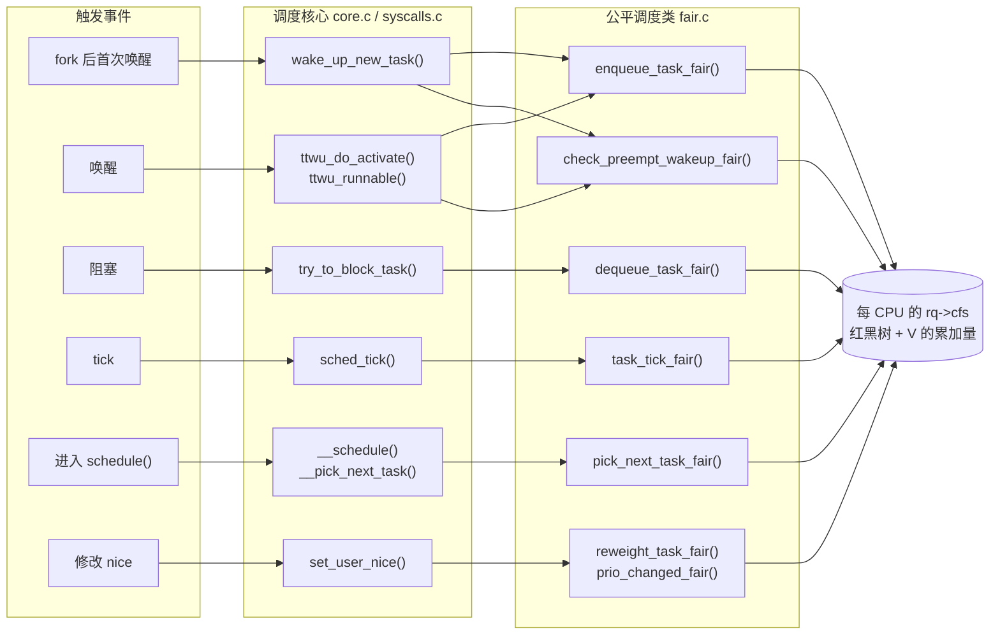
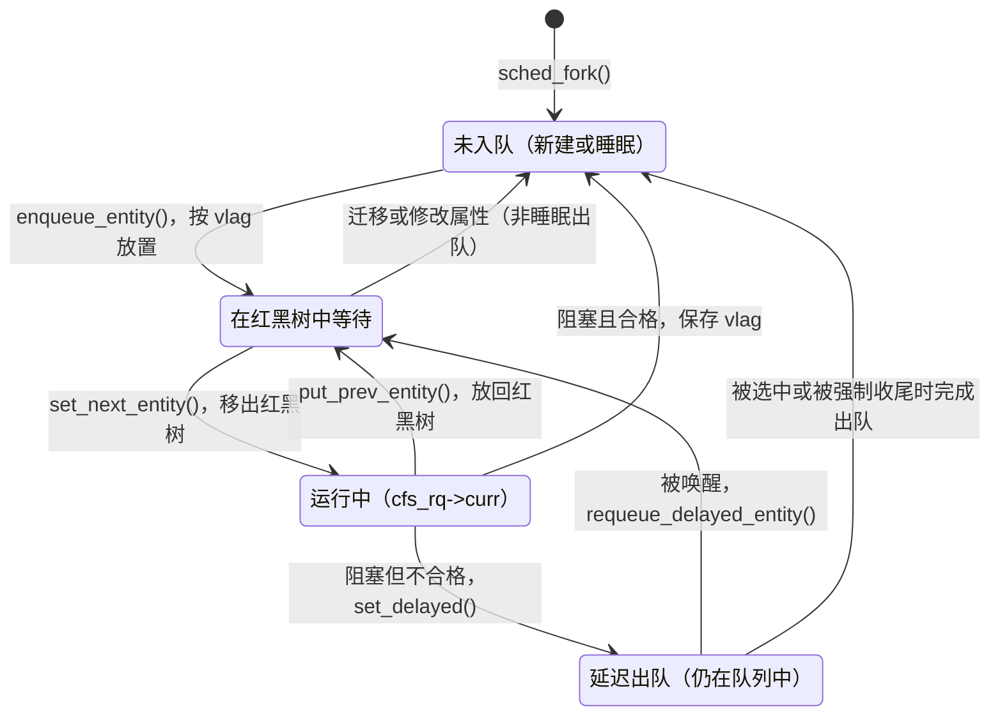
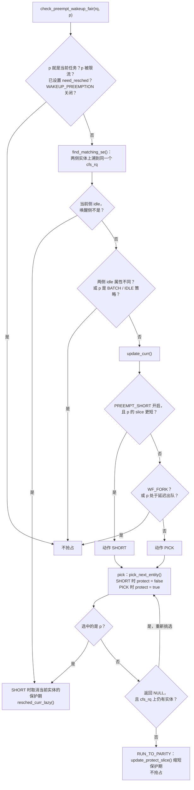
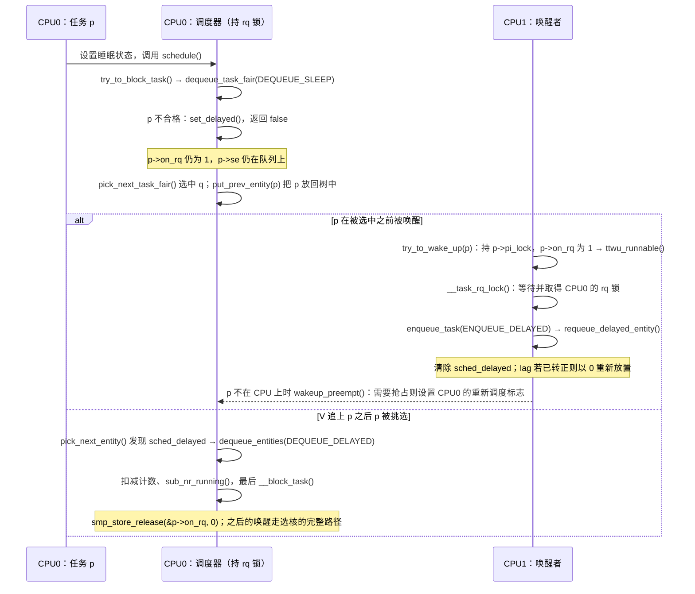

# 公平调度类：EEVDF 如何在一个 CPU 上分配时间

假设某个 CPU 上同时有三类任务：

- 两个编译进程 `cc1`，nice 0，一直在计算；
- 一个备份进程 `tar`，nice 10，也一直在计算；
- 一个编辑器，大部分时间在等键盘输入，每次被唤醒只运行几百微秒。

我们希望：

1. 长期看，计算任务按 nice 值对应的比例分享 CPU：nice 10 的备份进程只拿很小一份，但不会饿死；
2. 编辑器被唤醒后能较快运行，而不是排在计算任务很长的时间片后面；
3. 任务不能靠“睡一下再醒来”多拿 CPU 时间，也不应该因为很久以前多用了一点时间而长期吃亏；
4. 对延迟敏感的任务可以主动请求更短的时间片。

这些需求由**公平调度类**（`fair_sched_class`，实现在 `kernel/sched/fair.c`）负责。第 1 条靠权重和虚拟时间实现；第 2、4 条靠虚拟截止时间和唤醒抢占实现；第 3 条靠滞后量（lag）的保存与延迟出队实现。

**关于名称**。`fair.c` 的文件头仍写着 “Completely Fair Scheduling (CFS) Class”（[fair.c#L1-L3](../../linux/kernel/sched/fair.c#L1-L3)），本地文档 [sched-eevdf.rst#L5-L11](../../linux/Documentation/scheduler/sched-eevdf.rst#L5-L11) 则说明内核从 6.6 开始转向 EEVDF（Earliest Eligible Virtual Deadline First，最早合格虚拟截止时间优先）。在当前源码中，CFS 这个名字留在了调度类、文件名和大量注释里，而“下一个运行谁”的规则已经是 EEVDF。本章用“公平调度类”指整个 `fair_sched_class`，用“EEVDF”指其中的选择算法。

本章回答以下问题：

1. 权重怎样换算成虚拟时间？为什么虚拟时间能表达“按比例分享”？
2. EEVDF 中的 V、lag、eligible、deadline 各是什么？源码怎样在不溢出、尽量不做除法的前提下维护它们？
3. 运行队列为什么是一棵按 deadline 排序的增强红黑树？`pick_eevdf()` 怎样在 O(log n) 时间内找到“合格且截止时间最早”的实体？
4. 正在运行的任务何时被换下？tick、唤醒、时间片保护（`RUN_TO_PARITY`）之间是什么关系？
5. 任务入队、出队、睡眠、唤醒、修改 nice 时，vruntime、deadline、lag 如何变化？延迟出队解决什么问题？
6. 调度核心通过哪些接口驱动公平调度类？

## 0. 分析基线

本章依据仓库内 [Makefile 第 2～4 行](../../linux/Makefile#L2-L4)标记的 **6.18.52** 版本，架构为 **x86-64**（[.config#L332-L334](../../linux/.config#L332-L334)）。读者需要了解进程状态、`schedule()` 与上下文切换的基本概念，知道每个 CPU 有一个运行队列 `struct rq`，调度类按优先级排列。组调度（cgroup v2 的 `cpu` 控制器）在 [cpu 控制器章](../cgroup2/cpu.md) 中讨论，本章以“所有任务都在根组”的单层视角为主线，只在必要处说明组调度。

与本章结论有关的配置如下。它们是编译条件，不代表某次运行一定经过对应路径。

| 配置 | 对本章的影响 | 依据 |
| --- | --- | --- |
| `CONFIG_64BIT=y`、`CONFIG_SMP=y` | 每个 CPU 一个 `rq`；内部权重比用户可见权重多 10 位定点精度，nice 0 的内部权重 `NICE_0_LOAD` 为 `1024 << 10` | [.config#L332](../../linux/.config#L332)、[.config#L362](../../linux/.config#L362)、[sched.h#L147-L173](../../linux/kernel/sched/sched.h#L147-L173) |
| `CONFIG_HZ=1000` | 常规 tick 的标称周期为 1 ms，`TICK_NSEC` 为 1000000 ns；不代表 `NO_HZ_FULL` CPU 始终每毫秒收到一次 tick | [.config#L505-L506](../../linux/.config#L505-L506)、[jiffies.h#L9](../../linux/include/vdso/jiffies.h#L9) |
| `CONFIG_SCHED_HRTICK=y` | 编入高精度 tick；调度特性 `HRTICK` 默认关闭，因此默认不用于公平类，但可在运行时打开（5.4 节） | [.config#L507](../../linux/.config#L507)、[features.h#L66](../../linux/kernel/sched/features.h#L66) |
| `CONFIG_PREEMPT_VOLUNTARY=y`、`CONFIG_PREEMPT_DYNAMIC=y`，`CONFIG_PREEMPT_LAZY` 未设置 | 抢占模型可用启动参数 `preempt=` 选择，默认为 voluntary；此时 `resched_curr_lazy()` 与 `resched_curr()` 效果相同（5.4 节） | [.config#L133-L142](../../linux/.config#L133-L142)、[core.c#L7789-L7805](../../linux/kernel/sched/core.c#L7789-L7805) |
| `CONFIG_FAIR_GROUP_SCHED=y` | `for_each_sched_entity()` 沿 `parent` 向上走；任务实体不一定直接排在 `rq->cfs` 上 | [.config#L219](../../linux/.config#L219)、[fair.c#L306-L308](../../linux/kernel/sched/fair.c#L306-L308) |
| `CONFIG_CFS_BANDWIDTH=y` | 记账时顺带扣减带宽余额；限流细节见 cpu 控制器章 | [.config#L220](../../linux/.config#L220) |
| `CONFIG_SCHED_PROXY_EXEC` 未设置 | `rq->donor` 与 `rq->curr` 是 union 中的同一个指针，本章不区分二者 | [.config#L194](../../linux/.config#L194)、[sched.h#L1171-L1179](../../linux/kernel/sched/sched.h#L1171-L1179) |
| `CONFIG_SCHED_CORE` 未设置 | 不讨论核心调度 | [.config#L143](../../linux/.config#L143) |
| `CONFIG_SCHED_CLASS_EXT` 未出现在 `.config` 中 | 本配置 `PAHOLE_VERSION=0`，不满足 `DEBUG_INFO_BTF` 的依赖，而 sched_ext 又依赖 `DEBUG_INFO_BTF`，因此未编入 | [.config#L26](../../linux/.config#L26)、[Kconfig.debug#L377-L383](../../linux/lib/Kconfig.debug#L377-L383)、[Kconfig.preempt#L166-L168](../../linux/kernel/Kconfig.preempt#L166-L168) |
| `CONFIG_JUMP_LABEL=y` | 调度特性 `sched_feat(X)` 编译为静态键，可在运行时切换 | [.config#L847](../../linux/.config#L847)、[sched.h#L2250-L2262](../../linux/kernel/sched/sched.h#L2250-L2262) |
| `CONFIG_IRQ_TIME_ACCOUNTING` 未设置，`CONFIG_PARAVIRT_TIME_ACCOUNTING=y` | 记账用的 `rq->clock_task` 不扣除中断处理时间；在半虚拟化 steal time 启用时扣除被宿主机占用的时间 | [.config#L150](../../linux/.config#L150)、[.config#L397](../../linux/.config#L397)、[core.c#L787-L844](../../linux/kernel/sched/core.c#L787-L844) |
| `CONFIG_NO_HZ_FULL=y` | 没有 deadline、实时任务，且公平队列不超过一个任务时，本地 tick 可能停止；带宽受限时仍不停（5.4 节） | [.config#L108](../../linux/.config#L108)、[core.c#L1350-L1400](../../linux/kernel/sched/core.c#L1350-L1400) |
| `CONFIG_DEBUG_FS=y`、`CONFIG_DEBUG_FS_ALLOW_ALL=y` | `sched_init_debug()` 在 debugfs 中创建 `sched/features`、`sched/base_slice_ns` 等文件；默认允许挂载 debugfs 并创建文件，启动参数 `debugfs=` 可以改变这一点 | [.config#L10544-L10545](../../linux/.config#L10544-L10545)、[debug.c#L499-L512](../../linux/kernel/sched/debug.c#L499-L512)、[internal.h#L61-L63](../../linux/fs/debugfs/internal.h#L61-L63)、[inode.c#L902-L923](../../linux/fs/debugfs/inode.c#L902-L923) |

还有几个**运行时条件**会改变结论，本章以默认值为准。

**调度特性**（scheduler features）。`kernel/sched/features.h` 用 `SCHED_FEAT(name, 默认值)` 定义一组开关，可以通过 debugfs 的 `/sys/kernel/debug/sched/features` 切换（[debug.c#L501](../../linux/kernel/sched/debug.c#L501)）。与本章有关的：

| 特性 | 默认 | 作用 | 本章 |
| --- | --- | --- | --- |
| `PLACE_LAG` | 开 | 入队时恢复出队前的 lag | 4.7 |
| `PLACE_DEADLINE_INITIAL` | 开 | 新任务的第一个 deadline 只给半个 slice | 4.7、5.2 |
| `PLACE_REL_DEADLINE` | 开 | 非睡眠出队（迁移、修改属性）时保留相对 deadline | 4.7 |
| `RUN_TO_PARITY` | 开 | 被选中的实体在保护期内不被换下 | 4.5 |
| `PREEMPT_SHORT` | 开 | slice 更短的唤醒者可以无视当前任务的保护期 | 5.3 |
| `NEXT_BUDDY` | 关 | 唤醒时把被唤醒者设为 next buddy | 5.3 |
| `PICK_BUDDY` | 开 | 选择时优先考虑 `cfs_rq->next`（前提是它合格） | 4.4 |
| `DELAY_DEQUEUE`、`DELAY_ZERO` | 开 | 不合格的任务睡眠时延迟出队；结束延迟时把正的 lag 截为 0 | 4.8 |
| `WAKEUP_PREEMPTION` | 开 | 允许唤醒抢占 | 5.3 |
| `HRTICK` | 关 | 用高精度定时器在 slice 到期时触发一次 tick | 5.4 |

依据：[features.h#L3-L66](../../linux/kernel/sched/features.h#L3-L66)。

**基础时间片** `sysctl_sched_base_slice`。源码初值为 0.7 ms，默认按 `1 + ilog2(min(在线 CPU 数, 8))` 放大（缩放方式默认为 `SCHED_TUNABLESCALING_LOG`，[fair.c#L72-L80](../../linux/kernel/sched/fair.c#L72-L80)、[fair.c#L192-L221](../../linux/kernel/sched/fair.c#L192-L221)）：

| 在线 CPU 数 | 1 | 2～3 | 4～7 | 8 及以上 |
| --- | --- | --- | --- | --- |
| 默认 base slice | 0.7 ms | 1.4 ms | 2.1 ms | 2.8 ms |

debugfs 的 `base_slice_ns` 直接读写这个变量（[debug.c#L507](../../linux/kernel/sched/debug.c#L507)）。需要注意，CPU 上下线以及 root domain 重建时，`rq_online_fair()` / `rq_offline_fair()` 会调用 `update_sysctl()`，用“归一化值 × 系数”重算 base slice（[fair.c#L13272-L13288](../../linux/kernel/sched/fair.c#L13272-L13288)、[topology.c#L472-L501](../../linux/kernel/sched/topology.c#L472-L501)）；而写 `base_slice_ns` 并不更新归一化值，只有写 `tunable_scaling` 时 `sched_update_scaling()` 才会反推它（[fair.c#L1099-L1109](../../linux/kernel/sched/fair.c#L1099-L1109)、[debug.c#L191-L193](../../linux/kernel/sched/debug.c#L191-L193)）。所以手工写入的 `base_slice_ns` 可能在之后的 CPU 上下线中被覆盖，这是根据源码调用关系得出的推断。

**抢占模型**。启动参数 `preempt=none|voluntary|full|lazy` 可以覆盖编译时的默认模型（[core.c#L7671-L7690](../../linux/kernel/sched/core.c#L7671-L7690)、[core.c#L7776-L7787](../../linux/kernel/sched/core.c#L7776-L7787)），本章以默认的 voluntary 为准。

## 1. 公平调度类要解决什么问题

### 1.1 两个目标：份额与时机

“按权重分享 CPU”只回答了“长期各得多少”，没有回答“什么时候轮到谁”。两个 nice 0 任务各得 50%，可以每 1 ms 轮换一次，也可以每 1 s 轮换一次，长期比例相同，但后者会让刚醒来的任务等很久。公平调度类要同时控制两件事：

- **份额**：可运行的任务长期获得的 CPU 时间与权重成正比；
- **时机**：每个任务在多长时间内能得到它应得的那份服务，也就是调度延迟。

本地文档对 CFS 的描述是：始终选择 vruntime 最小的任务，再用一个“粒度”控制切换频率（[sched-design-CFS.rst#L45-L49](../../linux/Documentation/scheduler/sched-design-CFS.rst#L45-L49)、[sched-design-CFS.rst#L82-L89](../../linux/Documentation/scheduler/sched-design-CFS.rst#L82-L89)）。EEVDF 保留了虚拟时间，但把选择规则换成两个条件，写在 `pick_eevdf()` 前的注释里（[fair.c#L996-L1014](../../linux/kernel/sched/fair.c#L996-L1014)）：

1. 实体必须**合格**（eligible）：它得到的服务不多于应得的；
2. 在合格的实体中，选**虚拟截止时间**（virtual deadline）最早的。

第一条管份额：已经超前的实体暂时不能运行。第二条管时机：截止时间等于“开始请求的时刻 + 请求长度折算成的虚拟时间”，所以请求越短、权重越大，截止时间越早，越先被服务。

### 1.2 在内核中的位置

调度核心（`kernel/sched/core.c`）决定何时调度、怎样切换上下文，并通过 `struct sched_class` 中的函数指针，把“排队”和“挑选”交给各个调度类（[sched.h#L2413-L2484](../../linux/kernel/sched/sched.h#L2413-L2484)）。调度类在链接脚本中按优先级从高到低排列为 stop、deadline、rt、fair、ext、idle；当前配置没有 ext（[vmlinux.lds.h#L136-L145](../../linux/include/asm-generic/vmlinux.lds.h#L136-L145)），`sched_class_above()` 直接比较它们的地址（[sched.h#L2575](../../linux/kernel/sched/sched.h#L2575)）。`SCHED_NORMAL`、`SCHED_BATCH`、`SCHED_IDLE` 通常属于公平调度类，但选择调度类时先检查有效优先级；优先级继承使任务暂时提升到 RT/DL 优先级时，不能仅由 `policy` 判断当前调度类（[core.c#L7304-L7318](../../linux/kernel/sched/core.c#L7304-L7318)、[core.c#L7430-L7440](../../linux/kernel/sched/core.c#L7430-L7440)）。

下图展示事件怎样经调度核心进入公平调度类。实线箭头表示调用，指向数据的箭头表示修改。



读这张图时注意三点：

- **公平调度类不直接切换任务。** 它在记账或唤醒时只调用 `resched_curr*()` 设置“需要重新调度”的标志，真正的切换发生在调度核心下一次执行 `__schedule()` 时（5.4 节）。
- **排队与选择针对每个 CPU 的运行队列。** 实体字段存放在任务或组实体中，队列字段存放在 `cfs_rq` 中；图中的排队、记账和选择路径由对应 CPU 的 rq 锁串行化（第 6 节）。唤醒抢占检查看起来只是“判断”，但它内部会调用 `update_curr()`，还可能顺带完成一个延迟出队，所以图中它也指向数据。
- **多 CPU 问题不在这里。** 唤醒时选择哪个 CPU（`select_task_rq_fair()`）、负载均衡，都是在选定运行队列之前或之外发生的，本章不展开。

### 1.3 触发事件与输入输出

| 事件 | 调度核心入口 | 公平调度类函数 | 对实体的影响 |
| --- | --- | --- | --- |
| fork 后首次唤醒 | [`wake_up_new_task()`](../../linux/kernel/sched/core.c#L4831-L4867) | `enqueue_task_fair(ENQUEUE_INITIAL)` | 放在 V 处，第一个 deadline 只给半个 slice（5.2 节） |
| 睡眠后唤醒 | [`ttwu_do_activate()`](../../linux/kernel/sched/core.c#L3701-L3748) | `enqueue_task_fair(ENQUEUE_WAKEUP)`、`check_preempt_wakeup_fair()` | 按保存的 lag 放置，判断是否抢占当前任务（5.3 节） |
| 延迟出队期间被唤醒 | [`ttwu_runnable()`](../../linux/kernel/sched/core.c#L3775-L3799) | `enqueue_task_fair(ENQUEUE_DELAYED)` | 取消延迟状态；lag 已转正则以 0 重新放置，否则留在原位（4.8 节） |
| 阻塞 | [`try_to_block_task()`](../../linux/kernel/sched/core.c#L6545-L6588) | `dequeue_task_fair(DEQUEUE_SLEEP)` | 合格则出队并保存 lag；不合格则延迟出队（5.6 节） |
| tick | [`sched_tick()`](../../linux/kernel/sched/core.c#L5597-L5646) | `task_tick_fair()` | 记账，推进 vruntime 和 deadline，必要时请求重新调度（5.4 节） |
| 调度 | [`__schedule()`](../../linux/kernel/sched/core.c#L6817-L6974) | `pick_next_task_fair()` 等 | 挑出下一个实体，当前实体移出或放回红黑树（5.5 节） |
| 修改 nice | [`set_user_nice()`](../../linux/kernel/sched/syscalls.c#L65-L104) | `reweight_task_fair()`、`prio_changed_fair()` | 按新权重缩放 lag 和相对 deadline（4.9 节） |
| `sched_setattr()` 设置 `sched_runtime` | [`__setparam_fair()`](../../linux/kernel/sched/fair.c#L5288-L5302) | — | 设置自定义 slice（5.7 节） |
| `sched_yield()` | [`do_sched_yield()`](../../linux/kernel/sched/syscalls.c#L1357-L1372) | `yield_task_fair()` | 放弃本次请求剩余的部分（5.7 节） |

### 1.4 本章边界

本章只讨论一个公平运行队列内部的排队、选择、记账和抢占，以及调度核心怎样驱动它。不讨论：

- PELT（Per-Entity Load Tracking）负载跟踪，`update_load_avg()` 等函数只说明调用位置；
- 唤醒选核 `select_task_rq_fair()`、负载均衡、NUMA balancing、util_est、能耗感知调度；
- 组调度的权重计算和带宽控制，见 [cpu 控制器章](../cgroup2/cpu.md)；
- fair server：每个 CPU 上一个 deadline 服务器，用来防止实时任务把公平任务完全饿死，默认每 1 s 保证 50 ms（[deadline.c#L1818-L1843](../../linux/kernel/sched/deadline.c#L1818-L1843)）。本章只在 `update_curr()` 和入队路径中提到它的挂钩；
- sched_ext、核心调度和 proxy execution。

## 2. 概览：EEVDF 模型与实体的生命周期

本节先建立概念模型，不涉及具体的字段和函数。第 3、4 节再把每个概念对应到源码。

### 2.1 权重与虚拟时间

每个实体有一个**权重** w。任务的权重由 nice 值查表得到，nice 每差 1，权重约差 1.25 倍（[core.c#L10342-L10363](../../linux/kernel/sched/core.c#L10342-L10363)）。源码注释中的“约 10%”描述的是份额效果，不能理解成权重只减少 10%：例如两个 nice 0 任务原来各占 50%，其中一个变为 nice 1 后，它的份额为 820/(1024+820) ≈ 44.5%，比原来的 50% 少约 11%。具体份额始终取决于全部竞争者的权重。几个对照值：

| nice | -20 | -5 | 0 | 5 | 10 | 19 | `SCHED_IDLE` |
| --- | --- | --- | --- | --- | --- | --- | --- |
| 权重 | 88761 | 3121 | 1024 | 335 | 110 | 15 | 3 |

`SCHED_IDLE` 任务的权重固定为 `WEIGHT_IDLEPRIO`，即 3（[sched.h#L2351](../../linux/kernel/sched/sched.h#L2351)、[core.c#L1448-L1469](../../linux/kernel/sched/core.c#L1448-L1469)）。

**虚拟运行时间**（vruntime）把实际运行时间按权重缩放：实体运行了 Δt 的实际时间，它的 vruntime 增加

```text
Δv = Δt × w0 / w        （w0 为 nice 0 的权重 1024）
```

nice 0 任务的虚拟时间与实际时间同速前进；权重 2048 的实体，虚拟时间以一半速度前进。如果调度器让各实体的 vruntime 齐头并进，那么在同一段虚拟时间 Δv 里，实体 i 实际运行的时间为 Δv × w_i / w0，与权重成正比。这就是“按比例分享”的来源。

用开头的例子：两个 `cc1`（权重 1024）和一个 `tar`（权重 110）都在计算，总权重 2158，`cc1` 各得约 47.5%，`tar` 约得 5.1%。

### 2.2 V、lag 与“合格”

先考虑一个从相同虚拟进度出发、成员不变的理想“流体”处理器：所有可运行实体同时运行，实体 i 的速度是 w_i / W（W 为总权重）。在这个处理器上，各实体的 vruntime 相等，记这个共同的值为 **V**。真实 CPU 一次只能运行一个实体，各实体的 vruntime 会偏离 V：

- vruntime 小于 V 的实体，实际得到的服务少于理想值，系统“欠”它时间；
- vruntime 大于 V 的实体，已经超前。

可以用一台多人共用的跑步机来理解。理想的流体处理器相当于让所有人同时上跑步机，每人按自己的份额决定速度；把每人跑过的距离按份额换算成“虚拟进度”后，所有人的进度条始终一样长，这条共同的进度线就是 V，也就是“此刻每个人应有的进度”。真实 CPU 则相当于跑步机一次只能站一个人：轮到谁，谁的进度条前进，其他人原地不动。进度条短于 V 的人少跑了，应当优先轮到；长于 V 的人多跑了，应当先等一等。调度器的工作就是不断把各人的进度条拉回 V 附近。这个比喻只说明“应有进度”与“实际进度”的关系，不代表调度器总是选择进度最落后的实体，具体的选择规则还要结合 2.3 节的虚拟截止时间；也不代表进度超前的实体会被立刻换下，重新挑选只发生在 tick、唤醒等时刻，而且正在运行的实体处于保护期时，tick 不检查它是否合格（4.5 节）。

**滞后量**（lag）量化这个偏差：lag_i = w_i × (V − v_i)，是“理想服务 − 实际服务”。源码注释由“所有实体的 lag 之和为 0”推出：V 就是所有实体 vruntime 的**加权平均**（[fair.c#L615-L640](../../linux/kernel/sched/fair.c#L615-L640)）：

```text
V = Σ(w_i × v_i) / Σw_i
```

这个加权平均是内核实际使用的 V。把它直接等同于理想流体处理器的连续进度还需要条件：源码注明，加入和离开都发生在 0-lag 点时两者才相等；非零 lag 的加入、移除会使 V 不连续地移动（[fair.c#L642-L648](../../linux/kernel/sched/fair.c#L642-L648)）。4.7、4.8 节再解释这些成员变化。

为了少乘一个 w_i，源码只保存**虚拟滞后量** vlag_i = V − v_i（[fair.c#L5338-L5341](../../linux/kernel/sched/fair.c#L5338-L5341)）。lag ≥ 0（即 v_i ≤ V）的实体称为**合格**（eligible）。

下面用一个数值例子把这些量串起来。实体 A 的权重为 1024，实体 B 的权重为 2048，两者 vruntime 起点都记为 0，共经过 3 ms 实际时间。这里的权重都是用户可见精度的值，内核内部的权重多出 10 位定点精度（第 0 节），只改变精度，不改变比值；2048 不在 nice 表中（nice −3 的权重是 1991），只是为了便于计算，4.6 节沿用同一组权重。真实 CPU 一栏中“A 连续运行 3 ms”是为了演示 lag 而假设的执行顺序，并不是 EEVDF 的选择：按 4.6 节的推演，两者 slice 相同时，EEVDF 在开始时会先选 deadline 更早的 B。

| | 理想流体处理器 | 真实 CPU（假设 A 连续运行 3 ms） |
| --- | --- | --- |
| A 实际运行 | 1 ms | 3 ms |
| B 实际运行 | 2 ms | 0 ms |
| A 的 vruntime | 1 ms × 1024/1024 = 1 ms | 3 ms × 1024/1024 = 3 ms |
| B 的 vruntime | 2 ms × 1024/2048 = 1 ms | 0 ms |

- 理想情况下两者的 vruntime 都是 1 ms，所以 V = 1 ms。用加权平均计算真实情况，同样得到 V = (1024 × 3 + 2048 × 0) / (1024 + 2048) = 1 ms。
- A 的 lag = 1024 × (1 − 3) = −2048，B 的 lag = 2048 × (1 − 0) = 2048，二者之和为 0。lag 的单位是“权重 × 时间”，除以 w0 = 1024 后换算成实际时间：A 多运行了 2 ms，B 少运行了 2 ms，与理想情况（A 应得 1 ms、B 应得 2 ms）的差值一致。
- B 的 vruntime 小于 V，是合格实体，系统欠它时间；A 的 vruntime 大于 V，不合格，需要等 V 追上来之后才能重新合格。

lag 之和为 0 的直观含义是：时间总量是固定的，有实体多拿，就一定有实体少拿。

### 2.3 slice 与虚拟截止时间

EEVDF 把实体的运行看成一连串**请求**：每次请求运行 r 这么长的实际时间，r 就是 **slice**。请求的**虚拟截止时间**为

```text
deadline = 请求开始时的 vruntime + r × w0 / w
```

源码中对应 `se->deadline = se->vruntime + calc_delta_fair(se->slice, se)`（[fair.c#L1130-L1133](../../linux/kernel/sched/fair.c#L1130-L1133)）。由此有一个容易忽略的结论：对这个**完整请求**，忽略整数换算误差，实体的 vruntime 从请求开始走到 deadline，需要的实际时间是 r，**与权重无关**。这不是“一次换上就必定连续运行 r”的保证：换上时可能只剩部分请求，新任务的第一个 deadline 还会减半（4.7 节），记账也可能晚于实际到期时刻。权重通过同一个比值 `w0/w` 同时改变两件事：实际时间换成虚拟时间的速度，以及一次请求的虚拟长度。权重大的实体虚拟进度更慢；在相同的起点上，它的 deadline 也更早。被选中的先后由合格条件和 deadline 一起决定，不能只归因于其中一件。

### 2.4 实体在公平调度类中的状态

下图是一个任务实体在公平调度类中的主要状态。它省略了组调度和带宽限流，“延迟出队”状态在 4.8 节详细说明。入队、选择与出队分别由 `enqueue_entity()`、`set_next_entity()` 和 `dequeue_entity()` 维护（[fair.c#L5418-L5482](../../linux/kernel/sched/fair.c#L5418-L5482)、[fair.c#L5631-L5671](../../linux/kernel/sched/fair.c#L5631-L5671)、[fair.c#L5549-L5629](../../linux/kernel/sched/fair.c#L5549-L5629)）。



需要先记住两个与直觉不同的地方：

- **正在运行的实体不在红黑树里。** `set_next_entity()` 把它从树中取出，`put_prev_entity()` 再放回去（[fair.c#L5636-L5644](../../linux/kernel/sched/fair.c#L5636-L5644)、[fair.c#L5712-L5718](../../linux/kernel/sched/fair.c#L5712-L5718)）。它仍然算在队列的权重和任务数里。
- **睡眠的任务可能还在队列上。** 不合格任务的普通睡眠默认不立即出队，而是带着 `sched_delayed` 标记留在队列中，直到被选中、被唤醒或被强制收尾；特殊状态与限流等例外见 4.8 节。

## 3. 核心数据结构

### 3.1 结构关系

下面的示意图画出一个 CPU 上的主要对象。假设 A、B、C 三个公平任务都在根组，B 正在运行。图中“──►”表示指针，缩进表示嵌入。

```text
struct rq（CPU 0）
├── curr ─────────────────────────────► task_struct B
├── nr_running = 3
├── cfs : struct cfs_rq（嵌入，即根组的公平运行队列）
│   ├── curr ─────────────────────────► B.se        （不在红黑树中）
│   ├── next ─────────────────────────► NULL        （buddy 提示，4.4 节）
│   ├── tasks_timeline                  按 deadline 排序的增强红黑树
│   │     ├── A.se.run_node
│   │     └── C.se.run_node
│   ├── sum_w_vruntime / sum_weight     只统计树中的 A、C
│   ├── zero_vruntime                   计算 V 用的参考点
│   └── load / nr_queued                统计 A、B、C 三个实体
└── cfs_tasks 链表 ──► B.se.group_node ──► A.se.group_node ──► C.se.group_node

task_struct A/B/C
└── se : struct sched_entity（嵌入）
    └── cfs_rq ───────────────────────► &rq->cfs     （组调度下可能指向组的 cfs_rq）
```

几点说明：

- `struct sched_entity` 嵌入在 `task_struct::se` 中（[include/linux/sched.h#L866](../../linux/include/linux/sched.h#L866)），红黑树节点 `run_node` 和链表节点 `group_node` 又嵌入在实体中，所以入树、入链表都不需要分配内存。
- `rq->cfs` 嵌入在 `struct rq` 中（[sched.h#L1148](../../linux/kernel/sched/sched.h#L1148)）。组调度下每个组在每个 CPU 上还有自己的 `cfs_rq`，结构完全相同，组实体排在父组的队列中（见 cpu 控制器章 2.1 节）。本章描述的算法在每一层 `cfs_rq` 上独立运行。
- `cfs_tasks` 链表保存本 CPU 上所有已入队的公平**任务**（不含组实体），供负载均衡遍历；每次任务被选中运行时移到链表头（[fair.c#L3757-L3779](../../linux/kernel/sched/fair.c#L3757-L3779)、[fair.c#L13753-L13759](../../linux/kernel/sched/fair.c#L13753-L13759)）。

**初始化与释放。** 根组的 `rq` 来自每 CPU 的 `runqueues`，`sched_init()` 初始化嵌入的 `cfs_rq` 和 `cfs_tasks` 链表（[core.c#L126](../../linux/kernel/sched/core.c#L126)、[core.c#L8731-L8739](../../linux/kernel/sched/core.c#L8731-L8739)、[core.c#L8789](../../linux/kernel/sched/core.c#L8789)）。任务实体随 `task_struct` 分配，`__sched_fork()` 初始化其调度状态；实体不需要独立释放，最后随任务对象释放（[fork.c#L867-L884](../../linux/kernel/fork.c#L867-L884)、[core.c#L4456-L4478](../../linux/kernel/sched/core.c#L4456-L4478)、[fork.c#L733-L749](../../linux/kernel/fork.c#L733-L749)）。`task_dead_fair()` 负责完成可能残留的延迟出队，并摘除 PELT 贡献（[fair.c#L8833-L8850](../../linux/kernel/sched/fair.c#L8833-L8850)）。`curr`、`next` 和树节点表达调度关系，不能仅凭这些指针推断额外持有了任务引用。

### 3.2 `struct load_weight`：权重与它的倒数

```c
struct load_weight {
	unsigned long			weight;
	u32				inv_weight;
};
```

来源：[include/linux/sched.h 第 455～458 行](../../linux/include/linux/sched.h#L455-L458)。

| 字段 | 含义 | 单位与约束 |
| --- | --- | --- |
| `weight` | 权重，内部精度 | 64 位下为用户权重左移 10 位，nice 0 为 `1024 << 10`；`scale_load_down()` 右移回用户精度，且非零结果至少为 2（[sched.h#L147-L157](../../linux/kernel/sched/sched.h#L147-L157)） |
| `inv_weight` | 约为 `2^32 / scale_load_down(weight)` 的定点倒数缓存 | 为 0 表示需要重算；任务的值直接取自预先算好的 `sched_prio_to_wmult[]`，惰性重算使用 `(2^32 − 1) / w`，并处理零权重和极大权重（[core.c#L10365-L10381](../../linux/kernel/sched/core.c#L10365-L10381)、[fair.c#L228-L246](../../linux/kernel/sched/fair.c#L228-L246)） |

`update_load_add()`、`update_load_sub()`、`update_load_set()` 修改 `weight` 时都把 `inv_weight` 清零（[fair.c#L165-L181](../../linux/kernel/sched/fair.c#L165-L181)），下次做除法时由 `__update_inv_weight()` 惰性重算（[fair.c#L231-L246](../../linux/kernel/sched/fair.c#L231-L246)）。用乘以倒数代替除法，是为了让热路径上的虚拟时间换算不做 64 位除法（4.1 节）。

### 3.3 `struct sched_entity`：EEVDF 的实体状态

`struct sched_entity` 定义在 [include/linux/sched.h#L570-L616](../../linux/include/linux/sched.h#L570-L616)。与本章有关的字段：

| 字段 | 含义 | 单位与说明 |
| --- | --- | --- |
| `load` | 实体权重 | 3.2 节 |
| `run_node` | 红黑树节点 | 实体在树中，当且仅当 `on_rq` 为 1 且不是所在队列的 `curr` |
| `deadline` | 虚拟截止时间 | 虚拟纳秒。`rel_deadline` 为 1 时暂存的是相对值（4.7、4.9 节） |
| `min_vruntime` | **子树中**最小的 vruntime | 增强红黑树的附加值，只在实体位于树中时有意义（4.4 节）。注意它不是旧 CFS 文档里的“队列最小 vruntime” |
| `min_slice`、`max_slice` | 子树中最小、最大的 slice | 实际纳秒，同样是附加值 |
| `group_node` | 挂在 `rq->cfs_tasks` 上 | 只用于任务实体 |
| `on_rq` | 实体是否在队列上 | 包括正在运行的实体和延迟出队的实体 |
| `sched_delayed` | 处于延迟出队状态 | 为 1 时 `on_rq` 必为 1（[fair.c#L7048-L7054](../../linux/kernel/sched/fair.c#L7048-L7054)） |
| `rel_deadline` | `deadline` 暂存为相对值 | 4.7 节 |
| `custom_slice` | slice 是否由用户（或组调度）指定 | 为 0 时每次放置或开始新请求都把 slice 重置为 base slice |
| `exec_start` | 上次记账时的 `rq_clock_task()` | 实际纳秒时间戳 |
| `sum_exec_runtime`、`prev_sum_exec_runtime` | 累计实际运行时间；上次被选中时的累计值 | 两者之差是本次连续运行了多久 |
| `vruntime` | 虚拟运行时间 | 虚拟纳秒，u64，允许回绕（4.2 节） |
| `vlag` | 虚拟滞后量 V − vruntime | 虚拟纳秒，有符号；出队时保存，入队时使用 |
| `vprot` | 保护期的终点 | 虚拟纳秒；vruntime 小于它时处于保护期（4.5 节） |
| `slice` | 请求长度 | 实际纳秒 |
| `avg` | PELT 负载平均 | 本章不展开 |

源码对 `vlag` 和 `vprot` 的注释分别是“近似的虚拟滞后量”和“受保护的 deadline，用于给出最小时间量”（[include/linux/sched.h#L590-L594](../../linux/include/linux/sched.h#L590-L594)）。

### 3.4 `struct cfs_rq`：一个公平运行队列

`struct cfs_rq` 定义在 [sched.h#L676-L772](../../linux/kernel/sched/sched.h#L676-L772)，与 EEVDF 有关的部分在开头：

```c
struct cfs_rq {
	struct load_weight	load;
	unsigned int		nr_queued;
	unsigned int		h_nr_queued;       /* SCHED_{NORMAL,BATCH,IDLE} */
	unsigned int		h_nr_runnable;     /* SCHED_{NORMAL,BATCH,IDLE} */
	unsigned int		h_nr_idle; /* SCHED_IDLE */

	s64			sum_w_vruntime;
	u64			sum_weight;

	u64			zero_vruntime;
	/* ...（CONFIG_SCHED_CORE 字段，当前未启用） */

	struct rb_root_cached	tasks_timeline;

	struct sched_entity	*curr;
	struct sched_entity	*next;
	/* ... */
```

来源：[kernel/sched/sched.h 第 676～699 行](../../linux/kernel/sched/sched.h#L676-L699)，省略了核心调度字段和 `curr` 的注释。

| 字段 | 含义 | 说明 |
| --- | --- | --- |
| `load` | 队列上所有实体的权重和 | 内部精度；包括 `curr` 和延迟出队的实体 |
| `nr_queued` | 直接排在本队列上的实体数 | 同上 |
| `h_nr_queued`、`h_nr_runnable`、`h_nr_idle` | 以本队列为根的子树中，已入队的任务数、真正可运行的任务数、按 idle 属性计数的任务数 | 延迟出队的任务计入 `h_nr_queued`，不计入 `h_nr_runnable`（[fair.c#L5503-L5540](../../linux/kernel/sched/fair.c#L5503-L5540)）；单层根组中 `h_nr_idle` 是 `SCHED_IDLE` 任务数，组调度还会把 idle 组中的任务向父层计为 idle（[fair.c#L7138-L7143](../../linux/kernel/sched/fair.c#L7138-L7143)） |
| `sum_w_vruntime` | 树中实体的 Σ(vruntime − zero_vruntime) × 权重 | 权重用 `scale_load_down()` 后的值；**不含 `curr`** |
| `sum_weight` | 树中实体的权重和 | 同上 |
| `zero_vruntime` | 计算 V 时的参考点 | 每次调用 `avg_vruntime()` 都会被移到当时的 V（4.2 节） |
| `tasks_timeline` | 按 deadline 排序的红黑树 | `rb_root_cached` 缓存了最左节点，即 deadline 最早的实体 |
| `curr` | 本队列上被选中运行的实体 | 不在树中；在被 `put_prev_entity()` 清空前，可能出现 `curr->on_rq == 0`（已出队但尚未切走） |
| `next` | next buddy | 选择时的优先提示，4.4 节 |

对比本地文档：[sched-design-CFS.rst#L65-L69](../../linux/Documentation/scheduler/sched-design-CFS.rst#L65-L69) 仍然描述一个单调递增的 `rq->cfs.min_vruntime`，当前源码中已没有这个字段，取而代之的是 `zero_vruntime` 和两个累加量。

### 3.5 `struct rq` 与 `task_struct` 中的相关字段

| 结构 | 字段 | 说明 |
| --- | --- | --- |
| `struct rq` | `nr_running` | 本 CPU 上所有调度类已入队的任务数（[sched.h#L1124](../../linux/kernel/sched/sched.h#L1124)）。延迟出队的公平任务也算在内：`dequeue_entities()` 在延迟时提前返回，不会执行后面的 `sub_nr_running()`（[fair.c#L7233-L7235](../../linux/kernel/sched/fair.c#L7233-L7235)、[fair.c#L7292](../../linux/kernel/sched/fair.c#L7292)） |
| | `cfs` | 根组的公平运行队列（嵌入） |
| | `curr`（与 `donor` 共用） | 当前运行的任务 |
| | `clock_task` | 记账用的任务时钟，由 `update_rq_clock()` 推进（[sched.h#L1189](../../linux/kernel/sched/sched.h#L1189)） |
| | `cfs_tasks` | 3.1 节 |
| | `fair_server` | 1.4 节提到的 deadline 服务器（[sched.h#L1155](../../linux/kernel/sched/sched.h#L1155)） |
| `task_struct` | `on_rq` | 调度核心层面的入队状态：0、`TASK_ON_RQ_QUEUED`（1）或 `TASK_ON_RQ_MIGRATING`（2）（[sched.h#L97-L98](../../linux/kernel/sched/sched.h#L97-L98)、[include/linux/sched.h#L859](../../linux/include/linux/sched.h#L859)） |
| | `prio`、`static_prio`、`normal_prio` | nice 映射到 `static_prio`，权重由它查表 |
| | `se` | 嵌入的调度实体 |
| | `sched_class`、`policy` | 所属调度类和调度策略 |

`p->on_rq` 与 `p->se.on_rq` 是两个层次的状态。延迟出队的任务两者都为 1，但它并不可运行，所以内核另有 `task_is_runnable()`，定义为 `p->on_rq && !p->se.sched_delayed`（[include/linux/sched.h#L2261-L2264](../../linux/include/linux/sched.h#L2261-L2264)）。`core.c` 中对 `on_rq` 的注释也专门说明了这一点（[core.c#L606-L609](../../linux/kernel/sched/core.c#L606-L609)）。

### 3.6 不变量

在持有 rq 锁、一次入队、出队、改权重或换上换下操作已完成的稳定状态下，一个 `cfs_rq` 满足下列关系。操作内部会先改树、再改 `on_rq` 或计数，不能要求每条语句之间也满足全部等式。它们由 `__enqueue_entity()` / `__dequeue_entity()`（[fair.c#L916-L933](../../linux/kernel/sched/fair.c#L916-L933)）、`set_next_entity()` / `put_prev_entity()`、`account_entity_enqueue()` / `account_entity_dequeue()`（[fair.c#L3757-L3779](../../linux/kernel/sched/fair.c#L3757-L3779)）共同维护：

```text
树中的实体       = { se : se->on_rq && se != cfs_rq->curr }
sum_weight      = Σ_{se∈树} scale_load_down(se->load.weight)
sum_w_vruntime  = Σ_{se∈树} (se->vruntime − zero_vruntime) × scale_load_down(se->load.weight)
load.weight     = Σ_{se->on_rq} se->load.weight          // 含 curr 和延迟出队的实体
nr_queued       = |{ se : se->on_rq }|
树中每个节点     ：se->min_vruntime = min(se->vruntime, 左右子树的 min_vruntime)
se->sched_delayed ⇒ se->on_rq
V = zero_vruntime + (sum_w_vruntime + [curr 在队列上] (curr->vruntime − zero_vruntime) × w_curr)
                    / (sum_weight + [curr 在队列上] w_curr)
```

最后一行就是 `avg_vruntime()` 的计算方法（4.2 节）。`curr` 不在树中，所以两个累加量不包含它，每次用到 V 或判断合格时都要把 `curr` 单独加回来。

### 3.7 并发保护

本章的入队、出队、EEVDF 选择和记账操作由**所属 CPU 的 rq 锁串行化**（[core.c#L561-L571](../../linux/kernel/sched/core.c#L561-L571)），这里不是靠给 vruntime、deadline 等每个字段分别加原子操作来保证一致性。不能把它扩大为“这些字段的所有读取都持有 rq 锁”：尚未发布的新任务可直接初始化，`task_dead_fair()` 在加锁前先检查一次 `sched_delayed`，调试输出也有无 rq 锁的观察（[core.c#L4456-L4478](../../linux/kernel/sched/core.c#L4456-L4478)、[fair.c#L8837-L8844](../../linux/kernel/sched/fair.c#L8837-L8844)、[debug.c#L791-L798](../../linux/kernel/sched/debug.c#L791-L798)）。rq 锁是 raw 自旋锁。在下面这些主路径中，持有 rq 锁期间中断关闭，但关中断的不一定是加锁函数本身：`rq_lock()` 只加锁、不关中断（[sched.h#L1881-L1886](../../linux/kernel/sched/sched.h#L1881-L1886)），中断由调用者事先关闭。具体来说：

- 本地 tick 运行在时钟中断处理中（[timer.c#L2464-L2479](../../linux/kernel/time/timer.c#L2464-L2479)），由 `sched_tick()` 用 `rq_lock()` 加锁（[core.c#L5612](../../linux/kernel/sched/core.c#L5612)）。`NO_HZ_FULL` 停掉某个 CPU 的本地 tick 之后，`sched_tick_remote()` 仍大约每秒一次，在 unbound 工作队列上对该 CPU 调用 `task_tick()`，并用 `rq_lock_irq()` 取得那把 rq 锁（[core.c#L5685-L5721](../../linux/kernel/sched/core.c#L5685-L5721)、[core.c#L5735-L5736](../../linux/kernel/sched/core.c#L5735-L5736)）；
- `__schedule()` 先 `local_irq_disable()` 再加锁（[core.c#L6846-L6866](../../linux/kernel/sched/core.c#L6846-L6866)）；
- 唤醒路径中，`try_to_wake_up()` 已以 `irqsave` 方式持有 `p->pi_lock`（[core.c#L4197](../../linux/kernel/sched/core.c#L4197)），再通过 `__task_rq_lock()`（`ttwu_runnable()`）或 `rq_lock()`（`ttwu_queue()`）对目标 rq 加锁（[core.c#L3781](../../linux/kernel/sched/core.c#L3781)、[core.c#L3983](../../linux/kernel/sched/core.c#L3983)）；经 IPI 入队的 `sched_ttwu_pending()` 自己使用 `rq_lock_irqsave()`（[core.c#L3811](../../linux/kernel/sched/core.c#L3811)）；
- 修改 nice 等路径通过 `task_rq_lock()` 加锁，它先以 `irqsave` 方式获取 `p->pi_lock`，再取 rq 锁（[core.c#L744-L753](../../linux/kernel/sched/core.c#L744-L753)）。

本章特别需要追踪的跨 CPU 握手是 `p->on_rq`：延迟出队的任务最终出队时，`__block_task()` 用 `smp_store_release()` 把它清零，与 `try_to_wake_up()` 的读取及控制依赖后的 acquire 配对（[sched.h#L2770-L2811](../../linux/kernel/sched/sched.h#L2770-L2811)、[core.c#L4226-L4253](../../linux/kernel/sched/core.c#L4226-L4253)），5.6 节再讲。完整唤醒协议还涉及 `p->__state`、`p->on_cpu` 等状态；`on_rq` 并不是唯一的无锁观察字段。

## 4. 关键算法

本节按“先能算出 V 和合格性，再能挑选，再能记账和放置”的顺序展开。每个算法都对应到 3.3、3.4 节的字段。

### 4.1 虚拟时间的换算：`calc_delta_fair()`

**目标**：把实际时间 delta 换算为 delta × `NICE_0_LOAD` / w，并且在热路径上不做 64 位除法。

```c
static inline u64 calc_delta_fair(u64 delta, struct sched_entity *se)
{
	if (unlikely(se->load.weight != NICE_0_LOAD))
		delta = __calc_delta(delta, NICE_0_LOAD, &se->load);

	return delta;
}
```

来源：[kernel/sched/fair.c 第 290～296 行](../../linux/kernel/sched/fair.c#L290-L296)。nice 0 实体直接返回原值。其他情况下，[`__calc_delta()`](../../linux/kernel/sched/fair.c#L248-L285)计算 `delta × scale_load_down(weight) × inv_weight >> 32`，其中 `inv_weight` 约等于 `2^32 / scale_load_down(lw->weight)`。中间因子可能超过 32 位，函数检查高 32 位，用 `fls()` 把多出的位数从右移量中扣掉，把乘法因子规范到 32 位；注释说明了右移量为什么总是正数。这里不是对任意输入和最终 u64 结果作不溢出保证。支持 `__int128` 的分支以 128 位中间值完成乘法后右移，再转回 u64（[math64.h#L161-L168](../../linux/include/linux/math64.h#L161-L168)）。

这个函数不只用于记账。凡是要把“一段实际时间”折算成某个实体的虚拟时间，例如计算 deadline、保护期和 lag 上限，用的都是它。

### 4.2 维护 V：相对参考点上的加权平均

**问题**。V 是 Σ(w_i × v_i) / Σw_i。vruntime 是 u64，会一直增长并最终回绕，任务权重最大可达 88761（组实体的权重上限由 `MAX_SHARES` 决定，还可以更大，[sched.h#L538-L539](../../linux/kernel/sched/sched.h#L538-L539)），直接累加 w_i × v_i 必然溢出。

**办法**。源码注释给出的变换是：选一个参考点 v0，只累加相对值（[fair.c#L650-L671](../../linux/kernel/sched/fair.c#L650-L671)）：

```text
V = Σ((v_i − v0) × w_i) / Σw_i + v0
v0             := cfs_rq->zero_vruntime
Σ(v_i − v0)×w_i := cfs_rq->sum_w_vruntime
Σw_i           := cfs_rq->sum_weight
```

v0 紧跟着 V，使参与乘法的是 lag 尺度的相对差值，而不是不断增长的绝对 vruntime；权重也用了 `scale_load_down()` 后的值以减小数量级。注释记录了一次内核编译中测得的 `key × weight` 最大值约为 44 位，这是该次测量，不是任意负载下累加和的严格上界。实体入树、出树时，`sum_w_vruntime_add()` / `sum_w_vruntime_sub()` 加减它的贡献（[fair.c#L673-L691](../../linux/kernel/sched/fair.c#L673-L691)）。

计算 V 的函数是 `avg_vruntime()`：

```c
u64 avg_vruntime(struct cfs_rq *cfs_rq)
{
	struct sched_entity *curr = cfs_rq->curr;
	long weight = cfs_rq->sum_weight;
	s64 delta = 0;

	if (curr && !curr->on_rq)
		curr = NULL;

	if (weight) {
		s64 runtime = cfs_rq->sum_w_vruntime;

		if (curr) {
			unsigned long w = scale_load_down(curr->load.weight);

			runtime += entity_key(cfs_rq, curr) * w;
			weight += w;
		}

		/* sign flips effective floor / ceiling */
		if (runtime < 0)
			runtime -= (weight - 1);

		delta = div_s64(runtime, weight);
	} else if (curr) {
		/*
		 * When there is but one element, it is the average.
		 */
		delta = curr->vruntime - cfs_rq->zero_vruntime;
	}

	update_zero_vruntime(cfs_rq, delta);

	return cfs_rq->zero_vruntime;
}
```

来源：[kernel/sched/fair.c 第 715～749 行](../../linux/kernel/sched/fair.c#L715-L749)。有三点值得注意：

1. **`curr` 单独加回。** 树中的累加量不含 `curr`，这里按 3.6 节的公式把它加上；`curr` 已经出队（`on_rq == 0`）时不算。
2. **向下取整。** C 的整数除法向 0 取整，被除数为负时 `runtime -= (weight - 1)` 把它改成向下取整，所以算出的 V 不会大于真实值。函数前的注释要求“`avg_vruntime()` + 0 一定判为合格”，即以 lag 0 放在 V 处的实体必须合格，向下取整保证了这一点（[fair.c#L703-L714](../../linux/kernel/sched/fair.c#L703-L714)）。
3. **有副作用。** 名字看起来是只读的，但它最后调用 [`update_zero_vruntime()`](../../linux/kernel/sched/fair.c#L693-L701)，把参考点移到算出的 V，同时按 `sum_w_vruntime -= sum_weight × delta` 修正累加量，使 3.6 节的等式继续成立。注释列出的调用者是 `place_entity()`、`update_entity_lag()` 和 `update_deadline()`；`reweight_entity()` 和调试输出 `print_cfs_rq()` 也会调用它。也就是说，`zero_vruntime` 是“最近一次计算时的 V”，注释称它“落后一步”，但足以把相对值限制在两个 lag 上限之内。

**回绕**。vruntime 之间只比较差值：`vruntime_cmp()` 和 `vruntime_op()` 都先做 u64 减法再转为 s64（[fair.c#L531-L563](../../linux/kernel/sched/fair.c#L531-L563)），`entity_key()` 就是 `vruntime − zero_vruntime` 的有符号值（[fair.c#L607-L610](../../linux/kernel/sched/fair.c#L607-L610)）。只要相关的值彼此相差不到 2^63，回绕不影响结果。`init_cfs_rq()` 把 `zero_vruntime` 的初值设为 `(u64)−(1<<20)` ns（[fair.c#L13793-L13798](../../linux/kernel/sched/fair.c#L13793-L13798)），所以虚拟时间从这个起点向前走约 1.05 ms 就会跨过 u64 的零点；这不是启动后实际经过 1.05 ms 的保证。源码没有说明初始化为这个值的动机，本章不把回绕测试当成已证实的设计原因。

### 4.3 合格判断与 lag 上限

**合格**。lag ≥ 0 等价于 V ≥ v。如果先用 `avg_vruntime()` 算出 V 再比较，除法带来的舍入会造成误判，注释明确指出了这一点（[fair.c#L799-L800](../../linux/kernel/sched/fair.c#L799-L800)）。源码把不等式两边同乘总权重 W，变成不含除法的比较：

```c
static int vruntime_eligible(struct cfs_rq *cfs_rq, u64 vruntime)
{
	struct sched_entity *curr = cfs_rq->curr;
	s64 avg = cfs_rq->sum_w_vruntime;
	long load = cfs_rq->sum_weight;

	if (curr && curr->on_rq) {
		unsigned long weight = scale_load_down(curr->load.weight);

		avg += entity_key(cfs_rq, curr) * weight;
		load += weight;
	}

	return avg >= vruntime_op(vruntime, "-", cfs_rq->zero_vruntime) * load;
}
```

来源：[kernel/sched/fair.c 第 802～816 行](../../linux/kernel/sched/fair.c#L802-L816)。即判断 Σ(v_i − v0)×w_i ≥ (v − v0)×W。它的参数是任意一个 vruntime 值而不是实体，这样既能判断一个实体（`entity_eligible()`），也能判断一棵子树的 `min_vruntime`（4.4 节）。它也不修改 `zero_vruntime`，没有 `avg_vruntime()` 那样的副作用。

**lag 的上限**。出队或改权重时，`entity_lag()` 计算 vlag = V − v，并把它限制在一个范围内：

```c
	u64 max_slice = cfs_rq_max_slice(cfs_rq) + TICK_NSEC;
	s64 vlag, limit;

	vlag = avruntime - se->vruntime;
	limit = calc_delta_fair(max_slice, se);

	return clamp(vlag, -limit, limit);
```

来源：[kernel/sched/fair.c 第 769～775 行](../../linux/kernel/sched/fair.c#L769-L775)。上方注释解释了为什么要限制：V 是用加权平均近似出来的，实体的加入、离开和改权重都会移动 V，lag 可能因此越积越大（[fair.c#L753-L766](../../linux/kernel/sched/fair.c#L753-L766)）。注释给出的上限是“两倍 slice，且至少为一个 `TICK_NSEC`，因为 tick 是计时的粒度”，而代码实际取的是“队列中最大的 slice 加一个 `TICK_NSEC`”（第 769 行），二者并不一致，本章以代码为准。`cfs_rq_max_slice()` 在 `curr` 仍在队列上（`curr->on_rq`）时，取它的 slice 与树根 `max_slice` 中较大的一个；`curr` 已出队或不存在时只用树根（[fair.c#L838-L851](../../linux/kernel/sched/fair.c#L838-L851)）。以 8 个以上 CPU 的默认值为例，上限对应 2.8 ms + 1 ms = 3.8 ms 的实际时间，再按实体权重折算成虚拟时间。

### 4.4 增强红黑树与 `pick_eevdf()`

**目标**：在所有合格实体中找出 deadline 最早的一个，复杂度 O(log n)。

**为什么按 deadline 排序**。如果红黑树按 deadline 排序，答案就是中序遍历中第一个合格的实体。困难在于合格与否取决于 vruntime，而 vruntime 与 deadline 的顺序无关。解决办法是给每个节点附加一个值：**子树中最小的 vruntime**。合格条件对 vruntime 是单调的（vruntime 越小越容易合格），所以“子树中存在合格实体”当且仅当“子树的 `min_vruntime` 合格”。这样，在按 deadline 排序的树上，就能像在堆上一样剪掉整棵不含合格实体的子树（[fair.c#L1007-L1013](../../linux/kernel/sched/fair.c#L1007-L1013)）。

**树的维护**：

- 排序键是 deadline：`entity_before()` 用有符号差比较两个 deadline，注释认为不需要再用 vruntime 打破平局（[fair.c#L582-L590](../../linux/kernel/sched/fair.c#L582-L590)）。`rb_add_augmented_cached()` 在键相等时走向右子树（[rbtree_augmented.h#L64-L87](../../linux/include/linux/rbtree_augmented.h#L64-L87)），所以 deadline 相同的实体按入树先后排列。
- 附加值有三个：`min_vruntime`、`min_slice`、`max_slice`。`min_vruntime_update()` 用节点自身和左右孩子的值重算它们，三者都没变时返回 true，让向上传播提前停止（[fair.c#L886-L911](../../linux/kernel/sched/fair.c#L886-L911)）。`RB_DECLARE_CALLBACKS()` 据此生成插入、删除、旋转时使用的 `propagate`、`copy`、`rotate` 回调（[fair.c#L913-L914](../../linux/kernel/sched/fair.c#L913-L914)、[rbtree_augmented.h#L100-L131](../../linux/include/linux/rbtree_augmented.h#L100-L131)）。
- 实体在树中时如果 slice 变了（组实体会这样，见 5.3 节），调用者要手动调用 `min_vruntime_cb_propagate()` 刷新祖先的附加值（[fair.c#L7155-L7157](../../linux/kernel/sched/fair.c#L7155-L7157)）。
- `rb_root_cached` 缓存最左节点，`__pick_first_entity()` 以 O(1) 取得 deadline 最早的实体（[fair.c#L945-L953](../../linux/kernel/sched/fair.c#L945-L953)）。

**选择算法**。[`pick_eevdf()`](../../linux/kernel/sched/fair.c#L1015-L1084)的核心部分如下：

```c
	if (curr && (!curr->on_rq || !entity_eligible(cfs_rq, curr)))
		curr = NULL;

	if (curr && protect && protect_slice(curr))
		return curr;

	/* Pick the leftmost entity if it's eligible */
	if (se && entity_eligible(cfs_rq, se)) {
		best = se;
		goto found;
	}

	/* Heap search for the EEVD entity */
	while (node) {
		struct rb_node *left = node->rb_left;

		/*
		 * Eligible entities in left subtree are always better
		 * choices, since they have earlier deadlines.
		 */
		if (left && vruntime_eligible(cfs_rq,
					__node_2_se(left)->min_vruntime)) {
			node = left;
			continue;
		}

		se = __node_2_se(node);

		/*
		 * The left subtree either is empty or has no eligible
		 * entity, so check the current node since it is the one
		 * with earliest deadline that might be eligible.
		 */
		if (entity_eligible(cfs_rq, se)) {
			best = se;
			break;
		}

		node = node->rb_right;
	}
found:
	if (!best || (curr && entity_before(curr, best)))
		best = curr;

	return best;
```

来源：[kernel/sched/fair.c 第 1039～1083 行](../../linux/kernel/sched/fair.c#L1039-L1083)。在这段代码之前还有两个提前返回（[fair.c#L1022-L1037](../../linux/kernel/sched/fair.c#L1022-L1037)）。完整的判断顺序是：

1. **只有一个实体**（`nr_queued == 1`）：直接返回它，不检查合格性。
2. **next buddy**：`PICK_BUDDY` 开启且 `cfs_rq->next` 合格时立刻返回它，不再做后面的保护期检查、树搜索，也不和 `curr` 比较 deadline。注释说明这只影响延迟、不影响公平性。合格条件还在，所以不会选中已经超前的实体；被跳过的是“合格实体里 deadline 最早”，以及当前任务可能仍在保护期内这一事实。一个合格但 deadline 更晚的 next 也会直接运行。
3. **筛选 `curr`**：`curr` 已出队或不合格时，不再作为候选。
4. **保护期**：`protect` 为真且 `curr` 仍在保护期内（4.5 节），直接返回 `curr`。
5. **最左节点**：deadline 最早的实体如果合格，就是答案。
6. **堆式搜索**：从根开始，左子树中有合格实体就往左走；否则当前节点合格就选它；再否则往右走。
7. **与 `curr` 比较**：`curr` 不在树中，最后才和树上选出的 `best` 比较。树里没有合格实体时直接用 `curr`。两边都有时，只有 `curr` 的 deadline **严格更早**（`entity_before()`）才改选它；deadline 相同则保留 `best`（[fair.c#L1080-L1081](../../linux/kernel/sched/fair.c#L1080-L1081)）。

第 6 步的正确性来自中序有序：在节点 N 处，左子树所有实体的 deadline 都早于 N 和右子树。左子树有合格实体时，答案一定在左子树；左子树没有而 N 合格时，N 就是答案；否则答案只能在右子树。每一步下降一层，所以是 O(树高) = O(log n)。由于每一步只比较 `min_vruntime`，即使右子树中有更多合格实体也不会被访问。

**一个例子**。下图是一棵 5 个节点的树，每个节点标出 deadline、vruntime 和子树的 `min_vruntime`。数值是为说明算法而假设的，设此时 V = 8，`curr` 为空：

```text
                       E2  d=14  v=9
                       min_vruntime=5
                    /                  \
        E1  d=13  v=10              E4  d=16  v=5
        min_vruntime=10             min_vruntime=5
                                   /              \
                       E3  d=15  v=11        E5  d=17  v=5
                       min_vruntime=11       min_vruntime=5
```

合格的实体是 E4、E5（v ≤ 8）。搜索过程：最左节点检查先看 E1，不合格；再从根 E2 做堆式搜索，左子树的 `min_vruntime` 为 10，不合格，不进入；E2 本身 v=9 不合格，向右；到 E4，左子树 E3 的 `min_vruntime` 为 11，不合格，不进入；E4 合格，选中。堆式搜索只下降到 E2 和 E4，E3 被剪掉。E1 在最左节点检查里看过一次，堆式搜索只读它的 `min_vruntime` 来决定不下降。E5 也合格，但 deadline 晚于 E4，搜索不会走到它。

**next buddy 从哪里来**。`cfs_rq->next` 由 [`set_next_buddy()`](../../linux/kernel/sched/fair.c#L8891-L8900)沿实体链向上设置。调用者有三处：任务睡眠而它的组队列中仍有其他实体时，把组实体设为父队列的 next（[fair.c#L7251-L7263](../../linux/kernel/sched/fair.c#L7251-L7263)），让同组的任务更可能接着运行；`yield_to_task_fair()`；以及默认关闭的 `NEXT_BUDDY` 唤醒路径。`clear_buddies()` 在实体被选中、出队、`update_curr()` 请求重新调度和 yield 时清除它（[fair.c#L5484-L5499](../../linux/kernel/sched/fair.c#L5484-L5499)）。所以在“全部任务都在根组”的主线中，`next` 只会由 `yield_to()` 设置。目标合格时，第 2 步会直接返回它，即使树上还有 deadline 更早的合格实体。

### 4.5 记账、截止时间推进与保护期

**记账**。[`update_curr()`](../../linux/kernel/sched/fair.c#L1286-L1333)把 `curr` 自上次记账以来运行的时间计入它的 vruntime：

```text
// update_curr() 的简化逻辑；curr 不存在时直接返回
now = rq_clock_task(rq)；delta = now − curr->exec_start          // update_se()
若 delta <= 0：返回
curr->exec_start = now
curr->sum_exec_runtime += delta
curr->vruntime += calc_delta_fair(delta, curr)
resched = update_deadline(cfs_rq, curr)        // 本次请求是否已用完
若 curr 是任务实体且 fair server 活跃：dl_server_update()
account_cfs_rq_runtime(cfs_rq, delta)           // 带宽余额
若 nr_queued == 1：返回                          // 只有自己，无需换人
若 resched 或 curr 已不在保护期：
    resched_curr_lazy(rq)；clear_buddies()
```

对应源码：[`update_se()`](../../linux/kernel/sched/fair.c#L1232-L1271)、[fair.c#L1302-L1332](../../linux/kernel/sched/fair.c#L1302-L1332)。时间来自 `rq_clock_task()`，在当前配置下它不扣除中断时间（第 0 节）。

调用 `update_curr()` 的地方很多：tick（`entity_tick()`）、入队、出队、`put_prev_entity()`、`pick_task_fair()`、唤醒抢占检查、`reweight_entity()`、`yield_task_fair()`，以及调度核心通过 `sched_class::update_curr` 调用的 [`update_curr_fair()`](../../linux/kernel/sched/fair.c#L1335-L1338)。读取或改变队列状态之前，通常先把 `curr` 的账结清。入队时若实体自己仍是 `cfs_rq->curr`，则先放置再结账，见 5.3 节。

**截止时间推进**。

```c
static bool update_deadline(struct cfs_rq *cfs_rq, struct sched_entity *se)
{
	if (vruntime_cmp(se->vruntime, "<", se->deadline))
		return false;

	/*
	 * For EEVDF the virtual time slope is determined by w_i (iow.
	 * nice) while the request time r_i is determined by
	 * sysctl_sched_base_slice.
	 */
	if (!se->custom_slice)
		se->slice = sysctl_sched_base_slice;

	/*
	 * EEVDF: vd_i = ve_i + r_i / w_i
	 */
	se->deadline = se->vruntime + calc_delta_fair(se->slice, se);
	avg_vruntime(cfs_rq);

	/*
	 * The task has consumed its request, reschedule.
	 */
	return true;
}
```

来源：[kernel/sched/fair.c 第 1117～1140 行](../../linux/kernel/sched/fair.c#L1117-L1140)。vruntime 到达 deadline，说明本次请求已用完，于是以当前 vruntime 为起点开始一个新请求。函数上方的注释承认这是一个近似：严格的 EEVDF 应把 deadline 按 r/w 的整数倍推进，直到它晚于合格时刻（[fair.c#L1113-L1116](../../linux/kernel/sched/fair.c#L1113-L1116)）。

**保护期**。`update_deadline()` 在请求用完时请求重新调度，但不是唯一的挑选触发点。4.4 节的 `pick_eevdf()` 在每次挑选时都会重新比较，唤醒、入队等事件可能在 deadline 之前触发挑选。`RUN_TO_PARITY` 特性用 `vprot` 字段给被选中的实体一段**保护期**，注释的说法是在当前任务“到达 0-lag 点或用完它的 slice”之前不被（唤醒）抢占（[features.h#L16-L20](../../linux/kernel/sched/features.h#L16-L20)）。

```c
static inline void set_protect_slice(struct cfs_rq *cfs_rq, struct sched_entity *se)
{
	u64 slice = normalized_sysctl_sched_base_slice;
	u64 vprot = se->deadline;

	if (sched_feat(RUN_TO_PARITY))
		slice = cfs_rq_min_slice(cfs_rq);

	slice = min(slice, se->slice);
	if (slice != se->slice)
		vprot = min_vruntime(vprot, se->vruntime + calc_delta_fair(slice, se));

	se->vprot = vprot;
}
```

来源：[kernel/sched/fair.c 第 963～976 行](../../linux/kernel/sched/fair.c#L963-L976)。`protect_slice(se)` 就是 `se->vruntime < se->vprot`（[fair.c#L985-L988](../../linux/kernel/sched/fair.c#L985-L988)）。按配置分两种情况：

- `RUN_TO_PARITY` 开启（默认）：保护长度由“队列中其他实体的最小 slice 与自己 slice 中较小者”折算而来，终点不超过 deadline。所有实体 slice 相同时，`vprot` 就等于 deadline，保护的是**本次请求剩余的部分**；有更短 slice 的实体在排队时，保护期可能缩短。`cfs_rq_min_slice()` 只在 `curr` 仍在队列上时才把它的 slice 算进去，否则只用树根的 `min_slice`（[fair.c#L823-L836](../../linux/kernel/sched/fair.c#L823-L836)）。`set_next_entity()` 调用它时，被选中的实体已经出树，`curr` 也还没设置，所以算的是其他仍在树上的实体。
- 关闭时：保护长度以 `normalized_sysctl_sched_base_slice` 为准（源码初值 0.7 ms，写 `tunable_scaling` 后可能变化），再与自己的 slice 取较小者，并以 deadline 为上限；即使关闭 `RUN_TO_PARITY`，也仍有这段最小保护量。

保护期在三个地方起作用：

| 位置 | 行为 | 依据 |
| --- | --- | --- |
| `pick_eevdf(protect=true)` | `curr` **合格**且在保护期内时，直接选 `curr` | [fair.c#L1039-L1043](../../linux/kernel/sched/fair.c#L1039-L1043) |
| `update_curr()` | deadline 未到且仍在保护期内时，不请求重新调度 | [fair.c#L1329-L1332](../../linux/kernel/sched/fair.c#L1329-L1332) |
| 唤醒抢占 | slice 更短的唤醒者可以绕过保护期并取消它；否则把保护期缩短到包含新实体后的最小 slice | [fair.c#L978-L994](../../linux/kernel/sched/fair.c#L978-L994)、5.3 节 |

两条细节决定了保护期的实际效果：

- **tick 不检查合格性。** `update_curr()` 只看 deadline 和 `vprot`，所以在保护期内，即使 `curr` 已经运行到 V 之后、不再合格，tick 也不会请求重新调度；但如果此时因唤醒等原因发生挑选，`pick_eevdf()` 会先把不合格的 `curr` 排除，保护期不再生效。
- **保护期只在“换上”时设置一次。** `set_protect_slice()` 只在 `set_next_entity()` 的 `first` 参数为真时调用（[fair.c#L5647-L5648](../../linux/kernel/sched/fair.c#L5647-L5648)）。如果重新挑选的结果仍是当前任务，`pick_next_task_fair()` 发现 `prev == p` 就直接返回（[fair.c#L9170-L9194](../../linux/kernel/sched/fair.c#L9170-L9194)），`put_prev_set_next_task()` 也在 `next == prev` 时直接返回（[sched.h#L2515-L2516](../../linux/kernel/sched/sched.h#L2515-L2516)），`vprot` 不会更新。此后 `vruntime ≥ vprot` 一直成立，每次 `update_curr()` 都会请求重新调度，`curr` 在每个 tick 都要重新经过 EEVDF 挑选，一旦它不再是最佳选择就被换下。下一节的例子展示了这个效果。

### 4.6 按源码规则推演一个例子

**假设**（为了便于计算而简化）：

- 一个 CPU 上只有两个一直在计算的任务：A 的权重为 1024（nice 0）；B 的权重为 2048（nice -3 的实际权重是 1991，这里取整）。两者都在根组。
- 两者使用自定义 slice，均为 3 ms（8 个以上 CPU 时基础 slice 默认为 2.8 ms，这里为计算方便另设 3 ms）。关闭 buddy 提示，不引入睡眠、唤醒、限流和其他调度类。
- 虚拟时间以“nice 0 的毫秒”为单位：A 运行 1 ms，vA 增加 1；B 运行 1 ms，vB 增加 0.5。V = (1×vA + 2×vB) / 3。
- tick 恰好每 1 ms 一次，只有 tick 会调用 `update_curr()`；`update_curr()` 请求重新调度后立即进入 `schedule()`。
- t = 0 时 vA = vB = 0，deadline 分别为 dA = 0 + 3/1 = 3、dB = 0 + 3/2 = 1.5，此时两者都不是 `curr`。

按 4.4、4.5 节的规则逐步推演，结果如下（只列出发生挑选的时刻）：

| t（ms） | 触发原因 | vA | dA | vB | dB | V | 挑选结果 |
| --- | --- | --- | --- | --- | --- | --- | --- |
| 0 | 初始挑选 | 0 | 3 | 0 | 1.5 | 0 | B：两者都合格，B 的 deadline 早；`vprot_B` = 1.5 |
| 3 | B 到达 deadline，dB 推进 | 0 | 3 | 1.5 | 3 | 1 | A：B 不合格（1.5 > 1）；`vprot_A` = 3 |
| 6 | A 到达 deadline，dA 推进 | 3 | 6 | 1.5 | 3 | 2 | B：A 不合格；`vprot_B` = 3 |
| 9 | B 到达 deadline，dB 推进 | 3 | 6 | 3 | 4.5 | 3 | B：两者都合格，B 的 deadline 早；仍是 `curr`，保护期不续 |
| 10 | B 已不在保护期 | 3 | 6 | 3.5 | 4.5 | 3.33 | A：B 不合格；`vprot_A` = 6 |
| 13 | A 到达 deadline | 6 | 9 | 3.5 | 4.5 | 4.33 | B：A 不合格；`vprot_B` = 4.5 |
| 15 | B 到达 deadline | 6 | 9 | 4.5 | 6 | 5 | B：A 不合格，B 合格 |
| 16、17 | B 已不在保护期 | 6 | 9 | 5、5.5 | 6 | 5.33、5.67 | B：仍然只有 B 合格 |
| 18 | B 到达 deadline | 6 | 9 | 6 | 7.5 | 6 | B：两者都合格，B 的 deadline 早 |
| 19 | B 已不在保护期 | 6 | 9 | 6.5 | 7.5 | 6.33 | A：B 不合格；`vprot_A` = 9 |
| 22 | A 到达 deadline | 9 | 12 | 6.5 | 7.5 | 7.33 | B（此后以 9 ms 为周期重复 t = 13～22 的过程） |

从这张表可以看出：

1. **份额正确。** 从 t = 13 起，每 9 ms 中 B 运行 6 ms、A 运行 3 ms，正好是权重比 2:1。
2. **每次换上都保护一个请求。** A 每次被换上都恰好运行 3 ms，即一个 slice，这期间的 tick 不会请求重新调度。
3. **重新选中自己不续保护期。** t = 9 时 B 的 deadline 早于 A，B 被重新选中，但保护期没有更新；t = 10 的 tick 发现 B 已不在保护期，重新挑选时 B 已不合格，于是换成 A。t = 15～18 期间 B 同样每个 tick 都被重新挑选：t = 15～17 只有它合格，t = 18 两者都合格而 B 的 deadline 更早，所以 B 继续运行。
4. **合格条件控制份额，deadline 控制顺序。** t = 3、6、10、13、19 的切换都是因为当前实体变得不合格；t = 0、9、18 两者都合格时，由 deadline 决定先后。

表中选择和 v、d、V 已用精确分数运算核对；验证对象是上述简化模型，不是内核运行实测。真实系统中 tick 有抖动，入队、唤醒等事件会插入额外的记账或挑选点，所以具体时刻会有差异。

### 4.7 入队放置：`place_entity()` 与 lag 的保持

**问题**。实体离开队列时保存了 vlag（4.8 节）。重新入队时，它的 vruntime 应该设为 V − vlag，使它带着原来的“欠账”或“超前量”回到竞争中。但实体加入后，V 本身也会变化，因为 V 是包括新实体在内的加权平均。

**补偿**。[`place_entity()`](../../linux/kernel/sched/fair.c#L5304-L5410)的注释推导了这个问题（[fair.c#L5314-L5379](../../linux/kernel/sched/fair.c#L5314-L5379)）：设队列现有总权重为 W，新实体权重为 w_i、期望的 lag 为 vl。如果直接放在 V − vl，加入后的新平均值 V' = V − w_i × vl / (W + w_i)，实际 lag 变成 vl − w_i × vl / (W + w_i)，比 vl 小。所以要先把 lag 放大为 vl × (W + w_i) / W：

```c
		load = cfs_rq->sum_weight;
		if (curr && curr->on_rq)
			load += scale_load_down(curr->load.weight);

		lag *= load + scale_load_down(se->load.weight);
		if (WARN_ON_ONCE(!load))
			load = 1;
		lag = div_s64(lag, load);
	}

	se->vruntime = vruntime - lag;

	if (sched_feat(PLACE_REL_DEADLINE) && se->rel_deadline) {
		se->deadline += se->vruntime;
		se->rel_deadline = 0;
		return;
	}

	/*
	 * When joining the competition; the existing tasks will be,
	 * on average, halfway through their slice, as such start tasks
	 * off with half a slice to ease into the competition.
	 */
	if (sched_feat(PLACE_DEADLINE_INITIAL) && (flags & ENQUEUE_INITIAL))
		vslice /= 2;

	/*
	 * EEVDF: vd_i = ve_i + r_i/w_i
	 */
	se->deadline = se->vruntime + vslice;
}
```

来源：[kernel/sched/fair.c 第 5380～5410 行](../../linux/kernel/sched/fair.c#L5380-L5410)。函数开头还做了两件事：用 `avg_vruntime()` 取得 V（顺带更新参考点），以及在没有自定义 slice 时把 `se->slice` 重置为当前的 base slice（[fair.c#L5307-L5312](../../linux/kernel/sched/fair.c#L5307-L5312)）。补偿只在 `PLACE_LAG` 开启、队列非空（`nr_queued != 0`）且 vlag 非零时进行（[fair.c#L5322](../../linux/kernel/sched/fair.c#L5322)）。

**补偿的例子**。队列中有两个 nice 0 实体（W = 2048，用 `scale_load_down()` 后的权重），nice 0 实体 C 带着 vlag = +1 ms 加入。放大后 lag = 1 × (2048 + 1024) / 2048 = 1.5 ms，于是 vC = V − 1.5。加入后 V' = (2048 × V + 1024 × (V − 1.5)) / 3072 = V − 0.5，C 的实际 lag = V' − vC = 1 ms，正好是出队时保存的值。

**几种入队情况**：

| 入队原因 | vlag 的来源 | `rel_deadline` | 放置结果 |
| --- | --- | --- | --- |
| 新任务首次入队（`ENQUEUE_INITIAL`） | `__sched_fork()` 清零（[core.c#L4465-L4467](../../linux/kernel/sched/core.c#L4465-L4467)） | 0 | vruntime = V，deadline = V + vslice / 2 |
| 睡眠后唤醒 | 出队时保存 | 0（睡眠出队不设置） | vruntime = V − 补偿后的 lag，deadline = vruntime + vslice，即一个全新的请求 |
| 迁移、修改属性后重新入队 | 出队时保存 | 1 | vruntime = V − 补偿后的 lag，deadline = vruntime + 原来的相对 deadline |
| 队列原本为空 | 不使用 | 视情况 | vruntime = V，lag 被丢弃 |

`PLACE_DEADLINE_INITIAL` 的理由写在注释里：新任务加入时，已有的任务平均已经走到它们 slice 的一半，所以新任务也只给半个 slice 的 deadline。

`PLACE_REL_DEADLINE` 的作用是：对非睡眠的出队（迁移到别的 CPU、修改 nice 或调度策略时的“出队—修改—入队”），`dequeue_entity()` 把 deadline 改存为相对于 vruntime 的值（[fair.c#L5597-L5600](../../linux/kernel/sched/fair.c#L5597-L5600)），入队时再加回来，这样实体没用完的请求不会因为这次搬动而被重置。睡眠出队不这样做，醒来后开始一个新请求。

**为什么只保存 vlag**。vruntime 只有相对于某个队列的 V 才有意义，不同 CPU 上的 V 互不相关，同一 CPU 上的 V 在任务睡眠期间也会前进。出队时保存 vlag 这个相对量，入队时相对目标队列的 V 放置，不需要保留源队列的绝对虚拟时间。队列为空时不保留 lag；整数截断与改权重也会影响精度（4.7、4.9 节）。`migrate_task_rq_fair()` 更新 PELT 相关状态和 NUMA 扫描周期，不重写 vruntime，虚拟时间的重新放置由出入队负责（[fair.c#L8807-L8831](../../linux/kernel/sched/fair.c#L8807-L8831)）。

### 4.8 出队与延迟出队

**出队的主路径**。[`dequeue_entity()`](../../linux/kernel/sched/fair.c#L5549-L5629)：

```text
// 简化逻辑，省略 PELT、统计和带宽相关的细节
update_curr(cfs_rq)；clear_buddies(cfs_rq, se)
if 不是 DEQUEUE_DELAYED：
    delay = 是睡眠出队 且 不带 DEQUEUE_SPECIAL / DEQUEUE_THROTTLE
    if DELAY_DEQUEUE 且 delay 且 se 不合格：
        set_delayed(se)；return false            // 延迟出队
update_entity_lag(cfs_rq, se)                    // vlag = clamp(V − v)
if PLACE_REL_DEADLINE 且 不是睡眠：deadline 改存为相对值
if se != curr：__dequeue_entity()                // curr 本来就不在树中
se->on_rq = 0；account_entity_dequeue()          // 减 load、nr_queued
return_cfs_rq_runtime()；update_cfs_group(se)
if DEQUEUE_DELAYED：finish_delayed_dequeue_entity(se)
return true
```

延迟出队的判断在 [fair.c#L5558-L5577](../../linux/kernel/sched/fair.c#L5558-L5577)。`DEQUEUE_SPECIAL` 由 `try_to_block_task()` 对特殊任务状态设置（[core.c#L6572-L6573](../../linux/kernel/sched/core.c#L6572-L6573)），包括停止、被跟踪、park、死亡和冻结（[include/linux/sched.h#L160-L162](../../linux/include/linux/sched.h#L160-L162)）；源码注释说延迟出队依赖虚假唤醒（spurious wakeup），而这些特殊状态不能承受虚假唤醒，所以豁免（[fair.c#L5562-L5567](../../linux/kernel/sched/fair.c#L5562-L5567)）。`DEQUEUE_THROTTLE` 是带宽限流时的出队，见 cpu 控制器章 3.5 节。

**延迟出队要解决什么问题**。features.h 的注释给出了动机：对不合格的任务推迟出队，让它们留在竞争中“烧掉”负 lag，直到正常选择时已不再超前（[features.h#L49-L59](../../linux/kernel/sched/features.h#L49-L59)）。注释称此时 lag 为正，但实际合格条件包含 lag 为 0；唯一实体的选择捷径和强制收尾也不能套用这个条件（[fair.c#L802-L821](../../linux/kernel/sched/fair.c#L802-L821)、[fair.c#L1023-L1027](../../linux/kernel/sched/fair.c#L1023-L1027)，见下文）。结合源码，可以把它的效果归纳为三点，其中后两点是作者的分析：

1. **正常挑选时结清超前量。** 不合格的任务 vruntime 超前于 V。它留在队列上不运行，其他实体运行使 V 逐渐追上它；多实体的普通 EEVDF 搜索在它合格并被选中后才真正出队。合格意味着精确加权平均 V ≥ v，而 v 是整数，因此 `avg_vruntime()` 向下取整也仍有 floor(V) ≥ v，不能仅因舍入得到负的 vlag。`DELAY_ZERO` 把 **大于 0** 的 vlag 截成 0，原本为 0 则不变（[fair.c#L802-L816](../../linux/kernel/sched/fair.c#L802-L816)、[fair.c#L5542-L5547](../../linux/kernel/sched/fair.c#L5542-L5547)）。只剩一个实体时，`pick_eevdf()` 不检查合格性就返回它，随后仍由 `pick_next_entity()` 收尾；此时队列加权平均就是它自己的 vruntime（[fair.c#L1023-L1027](../../linux/kernel/sched/fair.c#L1023-L1027)、[fair.c#L5687-L5693](../../linux/kernel/sched/fair.c#L5687-L5693)）。
2. **正常完成延迟出队时避免 V 倒退。** 移走负 lag 的实体会使 V 倒退，源码在 `place_entity()` 注释中说明了这一点（[fair.c#L5314-L5318](../../linux/kernel/sched/fair.c#L5314-L5318)）。正常挑选在非负 lag 时移走实体，因此 V 不会因这次移除而倒退；若 lag 为正，移除后 V 还会向前移动。下面表中的强制收尾可以在尚未合格时发生，不受这个结论保证。
3. **虚拟进度继续前进时，睡眠任务可结清旧账。** 不合格实体若被立即移走，保存的负 vlag 会在唤醒时恢复。延迟出队让它继续参与平均值计算，等待其他实体把 V 推进到它的 vruntime；正常挑选完成后，默认 `DELAY_ZERO` 使保存的 vlag 为 0。本地文档把这称为基于虚拟时间的“衰减”（[sched-eevdf.rst#L24-L30](../../linux/Documentation/scheduler/sched-eevdf.rst#L24-L30)）。它不是按墙钟计时的衰减：睡了多久本身不能保证已完成出队，强制收尾也可能保存尚未结清的负 vlag。

合格的任务睡眠时则立即出队，正的 vlag 被保存下来，醒来后恢复。这样，睡眠可以保留“系统欠我的”，但不能抹掉“我欠系统的”。

**延迟状态下实体的样子**：

| 方面 | 状态 | 依据 |
| --- | --- | --- |
| 实体 | `on_rq = 1`、`sched_delayed = 1`；若不是 `curr` 就在红黑树中 | [fair.c#L5503-L5520](../../linux/kernel/sched/fair.c#L5503-L5520) |
| 任务 | `p->on_rq` 仍为 `TASK_ON_RQ_QUEUED`，因为 `block_task()` 只有在出队成功时才调用 `__block_task()` | [core.c#L2171-L2175](../../linux/kernel/sched/core.c#L2171-L2175) |
| 计数 | 计入 `load`、`nr_queued`、`h_nr_queued`、`rq->nr_running`，以及 V 的加权平均；不计入 `h_nr_runnable` | `set_delayed()` 只减 `h_nr_runnable`（[fair.c#L5512-L5519](../../linux/kernel/sched/fair.c#L5512-L5519)），`dequeue_entities()` 在延迟时提前返回，不执行后面的计数扣减和 `sub_nr_running()`（[fair.c#L7233-L7235](../../linux/kernel/sched/fair.c#L7233-L7235)） |
| 负载均衡 | 除非按负载量迁移（`migrate_load`），否则不迁移延迟出队的任务 | [fair.c#L9669-L9670](../../linux/kernel/sched/fair.c#L9669-L9670) |

**离开延迟状态的途径**：

| 途径 | 调用 | 结果 |
| --- | --- | --- |
| 被 `pick_eevdf()` 选中 | [`pick_next_entity()`](../../linux/kernel/sched/fair.c#L5682-L5696) 发现 `sched_delayed`，调用 `dequeue_entities(DEQUEUE_SLEEP \| DEQUEUE_DELAYED)`，返回 NULL 让调用者重新挑选 | 真正出队，`__block_task()` 清除 `p->on_rq` |
| 被唤醒 | `ttwu_runnable()` → `enqueue_task(ENQUEUE_DELAYED)` → `requeue_delayed_entity()` | 取消延迟；`vlag > 0` 时以 0 重新放置并开始新请求，否则留在原位 |
| 切换调度类 | `__sched_setscheduler()`、`rt_mutex_setprio()` 先强制完成出队 | [syscalls.c#L716-L717](../../linux/kernel/sched/syscalls.c#L716-L717)、[core.c#L7439-L7440](../../linux/kernel/sched/core.c#L7439-L7440) |
| 任务退出 | [`task_dead_fair()`](../../linux/kernel/sched/fair.c#L8833-L8850) | 强制完成出队 |
| `wait_task_inactive()` | 强制完成出队，注释说是为了避免总是等到 tick 超时 | [core.c#L2314-L2319](../../linux/kernel/sched/core.c#L2314-L2319) |

这些强制完成路径直接使用 `DEQUEUE_SLEEP | DEQUEUE_DELAYED`，`dequeue_entity()` 因此跳过“尚不合格就继续延迟”的判断（[fair.c#L5558-L5577](../../linux/kernel/sched/fair.c#L5558-L5577)）。若此时 lag 仍为负，`finish_delayed_dequeue_entity()` 不会把负值清零。延迟任务还可以在 `migrate_load` 均衡中被搬动；这种非睡眠搬动保存 vlag 和相对 deadline，而不是等待它合格（[fair.c#L9661-L9670](../../linux/kernel/sched/fair.c#L9661-L9670)、[fair.c#L5596-L5600](../../linux/kernel/sched/fair.c#L5596-L5600)）；`sched_delayed` 不会因此清除，任务在目标队列上入队时仍处于延迟状态，不计入 `h_nr_runnable`（[fair.c#L7115-L7116](../../linux/kernel/sched/fair.c#L7115-L7116)）。

被唤醒时的处理：

```c
	if (sched_feat(DELAY_ZERO)) {
		update_entity_lag(cfs_rq, se);
		if (se->vlag > 0) {
			cfs_rq->nr_queued--;
			if (se != cfs_rq->curr)
				__dequeue_entity(cfs_rq, se);
			se->vlag = 0;
			place_entity(cfs_rq, se, 0);
			if (se != cfs_rq->curr)
				__enqueue_entity(cfs_rq, se);
			cfs_rq->nr_queued++;
		}
	}

	update_load_avg(cfs_rq, se, 0);
	clear_delayed(se);
```

来源：[kernel/sched/fair.c 第 7056～7071 行](../../linux/kernel/sched/fair.c#L7056-L7071)。如果唤醒时保存得到的 vlag 已大于 0，就以 lag 0 重新放置，并开始一个新请求；vlag ≤ 0 时保持原来的 vruntime 和 deadline。这里必须区分 0 与负值：为 0 时实体可以已经合格，为负时则仍要等 V 追上来。所以“睡一下马上醒”不能直接抹掉超前量。

### 4.9 权重变化：`reweight_entity()`

**问题**。修改 nice 会改变实体的权重 w，进而改变虚拟时间的斜率。如果 vruntime 不变，实体的 lag = w × (V − v) 就会随 w 变化，凭空多出或少掉服务量。

**规则**。[`rescale_entity()`](../../linux/kernel/sched/fair.c#L3846-L3947)内的注释证明了两个推论：在非 0-lag 点改权重时必须调整 vruntime；理想换算不改变 V。以下公式忽略 vlag 的截断和整数舍入，实际实现仍执行 `entity_lag()` 的上限约束（w 为旧权重，w' 为新权重）：

```text
vlag'                 = vlag × w / w'            // 保持 w × vlag 不变
deadline' − V         = (deadline − V) × w / w'  // 相对 deadline 同样缩放
v'                    = V − vlag'
```

实现见 [`reweight_entity()`](../../linux/kernel/sched/fair.c#L3949-L3997)：

1. 若实体在队列上：先 `update_curr()`，取 V；保存 vlag（经 `entity_lag()` 截断）；把 deadline 改为相对 V 的值并置 `rel_deadline`；若是 `curr` 且在保护期内，`vprot` 也改为相对值；然后临时移出树和 `load`。
2. `rescale_entity()` 按 w / w' 缩放 vlag、相对 deadline 和相对 `vprot`。
3. 设置新权重，按新权重重算 PELT 的 `load_avg`。
4. 若在队列上：把相对值加回 V，vruntime = V − vlag'，重新放回树和 `load`。

**例子**。nice 0 的实体 vlag = −1 ms（vruntime 比 V 超前 1 ms），改成 nice 5（权重 1024 → 335）。新 vlag = −1 × 1024 / 335 ≈ −3.06 ms。变长的是相对 V 的超前量，vruntime 也必须相应调整；w × vlag 不变，所以折算成实际时间仍然超前约 1 ms。`set_user_nice()` 会先出队再入队。出队后队列里还有其他实体时，`place_entity()` 按 4.7 节把这个 vlag 暂时放大后再放置；忽略截断和整数误差，入队后的虚拟 lag 约为 −3.06 ms。

**两条调用路径**：

- **任务实体**：`set_load_weight(p, true)` 经 `sched_class::reweight_task` 调用 [`reweight_task_fair()`](../../linux/kernel/sched/fair.c#L3999-L4008)，`reweight_entity()` 本身能处理在队和不在队两种情况。但在 `set_user_nice()` 中，改权重被包在 `sched_change` 作用域里（[syscalls.c#L92-L97](../../linux/kernel/sched/syscalls.c#L92-L97)），任务已经先以 `DEQUEUE_SAVE` 出队（[core.c#L10911-L10931](../../linux/kernel/sched/core.c#L10911-L10931)）。此时实体 `on_rq == 0`，`reweight_entity()` 只缩放出队时保存的 vlag 和相对 deadline；随后重新入队时由 `place_entity()` 按新权重放置。
- **组实体**：组调度下 `update_cfs_group()` 重算组实体的权重，经同一个 `reweight_entity()` 生效，见 cpu 控制器章 3.2 节。

## 5. 实现细节：从调度核心入口逐层下钻

### 5.1 调度类接口

公平调度类在 [`DEFINE_SCHED_CLASS(fair)`](../../linux/kernel/sched/fair.c#L14095-L14142)中注册以下回调。表中只列与本章有关的部分：

| 回调 | 公平调度类的实现 | 作用 | 本章 |
| --- | --- | --- | --- |
| `enqueue_task` | `enqueue_task_fair()` | 入队，沿实体链向上 | 5.3 |
| `dequeue_task` | `dequeue_task_fair()` | 出队；返回 false 表示延迟出队 | 5.6 |
| `wakeup_preempt` | `check_preempt_wakeup_fair()` | 判断被唤醒者是否应抢占当前任务 | 5.3 |
| `pick_next_task`、`pick_task` | `__pick_next_task_fair()`、`pick_task_fair()` | 挑选下一个任务 | 5.5 |
| `put_prev_task`、`set_next_task` | `put_prev_task_fair()`、`set_next_task_fair()` | 当前任务换下、换上 | 5.5 |
| `balance` | [`balance_fair()`](../../linux/kernel/sched/fair.c#L8882-L8889) | 公平队列为空时做 newidle 负载均衡 | 5.5 |
| `task_tick` | `task_tick_fair()` | tick 记账 | 5.4 |
| `task_fork` | [`task_fork_fair()`](../../linux/kernel/sched/fair.c#L13612-L13615) | 只设置 misfit 检测用的最大容量，不做放置 | 5.2 |
| `task_dead` | `task_dead_fair()` | 完成可能残留的延迟出队 | 4.8 |
| `reweight_task`、`prio_changed` | `reweight_task_fair()`、`prio_changed_fair()` | 改权重，并判断是否需要重新调度 | 4.9、5.7 |
| `yield_task`、`yield_to_task` | `yield_task_fair()`、`yield_to_task_fair()` | 让出 CPU | 5.7 |
| `switched_from`、`switched_to` | `switched_from_fair()`、`switched_to_fair()` | 进出公平调度类时处理 PELT，并检查抢占 | 5.7 |
| `get_rr_interval` | [`get_rr_interval_fair()`](../../linux/kernel/sched/fair.c#L14077-L14090) | `sched_rr_get_interval()` 对公平任务返回它的 slice（换算为 jiffies），队列为空时返回 0 | — |
| `update_curr` | `update_curr_fair()` | 供调度核心结算当前任务 | 4.5 |
| `select_task_rq`、`migrate_task_rq`、`task_change_group` | — | 选核、迁移、换组 | 不展开 |

### 5.2 新任务：从 fork 到第一次入队

```text
copy_process()
  sched_fork(p)                               // fork.c 第 2155 行
    __sched_fork()：se.on_rq、vruntime、vlag、rel_deadline、sum_exec_runtime 等清零
    p->__state = TASK_NEW                     // 任何人都不能把它放上运行队列
    若设置了 reset_on_fork：负的 nice 恢复为 0，slice 恢复默认
    p->sched_class = &fair_sched_class        // 不是 RT/DL 时
    init_entity_runnable_average()            // PELT 初值
  sched_cgroup_fork(p)                        // fork.c 第 2299 行
    设置 p->sched_task_group；__set_task_cpu(p, 当前 CPU)
    task_fork_fair()
wake_up_new_task(p)                           // fork.c 第 2642 行
  __set_task_cpu(p, select_task_rq(...))      // 选核，本章不展开
  activate_task(rq, p, ENQUEUE_NOCLOCK | ENQUEUE_INITIAL)
    enqueue_task_fair() → enqueue_entity() → place_entity()
      vlag 为 0 → vruntime = V；deadline = V + vslice / 2
  wakeup_preempt(rq, p, WF_FORK)
```

对应源码：[`__sched_fork()`](../../linux/kernel/sched/core.c#L4456-L4478)、[`sched_fork()`](../../linux/kernel/sched/core.c#L4695-L4764)、[`sched_cgroup_fork()`](../../linux/kernel/sched/core.c#L4766-L4795)、[`wake_up_new_task()`](../../linux/kernel/sched/core.c#L4831-L4867)，调用点见 [fork.c#L2155](../../linux/kernel/fork.c#L2155)、[fork.c#L2299](../../linux/kernel/fork.c#L2299)、[fork.c#L2642](../../linux/kernel/fork.c#L2642)。

需要注意三点：

- **放置发生在入队时，不在 fork 时。** `task_fork_fair()` 只调用 `set_task_max_allowed_capacity()`，新任务的 vruntime 直到 `wake_up_new_task()` 入队、知道了目标 CPU 的 V 之后才确定。
- **新任务从 V 开始，但 deadline 只有半个 slice。** vlag 被 `__sched_fork()` 清零，所以新任务既不欠账也不超前；`ENQUEUE_INITIAL` 让它的第一个 deadline 较早，更快得到第一次运行（4.7 节）。
- **fork 通常不触发唤醒抢占。** `check_preempt_wakeup_fair()` 遇到 `WF_FORK` 就返回，注释的理由是 fork 之后往往紧跟 exec，与父进程没有共享数据（[fair.c#L9045-L9052](../../linux/kernel/sched/fair.c#L9045-L9052)）。子任务的 slice 比当前任务短时，`PREEMPT_SHORT` 分支在这个检查之前就去挑选（5.3 节），并且只有 `pick_next_entity()` 选中子任务才会抢占。

另外，`__sched_fork()` 不重置 `slice` 和 `custom_slice`，子任务沿用从父任务复制来的值；只有父任务设置了 `sched_reset_on_fork` 时，`sched_fork()` 才恢复默认值（[core.c#L4715-L4734](../../linux/kernel/sched/core.c#L4715-L4734)）。因此用 `sched_setattr()` 设置的自定义 slice 会被子进程继承。

### 5.3 唤醒与唤醒抢占

**两条唤醒路径**。`try_to_wake_up()` 先检查 `p->on_rq`（[core.c#L4205-L4227](../../linux/kernel/sched/core.c#L4205-L4227)）：

- **`p->on_rq` 仍为 1**：任务还没真正离开队列，可能是还没执行到 `schedule()`，也可能处在延迟出队状态。[`ttwu_runnable()`](../../linux/kernel/sched/core.c#L3775-L3799)由唤醒者在自己所在的 CPU 上执行，它用 `__task_rq_lock()` 锁住任务所在 CPU 的 rq 后处理：延迟出队的任务以 `ENQUEUE_DELAYED` 重新入队（4.8 节）；任务不在 CPU 上运行时调用 `wakeup_preempt()`。这条路径**不选核**，任务留在原来那个 CPU 的队列上。
- **`p->on_rq` 为 0**：通常等待原 CPU 清除 `on_cpu`，再选核，然后由 `ttwu_queue()` 对选定 CPU 的 rq 执行 [`ttwu_do_activate()`](../../linux/kernel/sched/core.c#L3701-L3748)，以 `ENQUEUE_WAKEUP` 入队后检查抢占（[core.c#L4295-L4309](../../linux/kernel/sched/core.c#L4295-L4309)）。`ttwu_queue()` 要么由唤醒者持目标 rq 锁直接执行，要么经 wake list 交给目标 CPU 执行（[core.c#L3975-L3987](../../linux/kernel/sched/core.c#L3975-L3987)，见第 6 节）。有一个更早的分支：任务已出队但仍处于原 CPU 的切换收尾中（`on_cpu == 1`），且允许排入 wake list 时，会先把唤醒交给原 CPU 的 wake list，不再执行本次 `select_task_rq()`（[core.c#L4282-L4284](../../linux/kernel/sched/core.c#L4282-L4284)）。因此不能把 `on_rq == 0` 简化为“必定先选核”。

[`wakeup_preempt()`](../../linux/kernel/sched/core.c#L2219-L2234)在被唤醒者与当前任务同属一个调度类时调用该类的回调；被唤醒者的调度类更高时直接 `resched_curr()`。因此在**这个唤醒接口**上，公平类不会要求抢占正在运行的 RT 类任务，而 RT 类唤醒会要求公平类当前任务让出 CPU；这不排除 fair server 经 deadline 类获得服务（1.4 节）。

**入队**。对一个根组中的任务，[`enqueue_task_fair()`](../../linux/kernel/sched/fair.c#L7079-L7198)可以简化为：

```text
// enqueue_task_fair() 的简化逻辑，单层情形，省略 util_est、cpufreq 和带宽
if ENQUEUE_DELAYED：requeue_delayed_entity(se)；return
for_each_sched_entity(se)：                     // 单层时只执行一次
    if se->on_rq：break                          // （组调度下用于在已入队的祖先处停止）
    enqueue_entity(cfs_rq, se, flags)
    cfs_rq->h_nr_runnable、h_nr_queued、h_nr_idle 递增
if 公平队列从空变为非空：dl_server_start(&rq->fair_server)
add_nr_running(rq, 1)
```

[`enqueue_entity()`](../../linux/kernel/sched/fair.c#L5418-L5482)内部的顺序有讲究：

```text
if se 是 curr：place_entity()                       // 注释：必须在 update_curr() 之前重新归一化
update_curr(cfs_rq)                                // 先结清当前实体，V 才准确
update_load_avg(UPDATE_TG | DO_ATTACH)；update_cfs_group(se)
if se 不是 curr：place_entity()                     // 组实体可能刚被改了权重，权重确定后才放置
account_entity_enqueue()                           // load、nr_queued、cfs_tasks
if ENQUEUE_MIGRATED：se->exec_start = 0            // 刚迁移来的任务不再视为“缓存热”
if se 不是 curr：__enqueue_entity()                 // 入树，更新 sum_w_vruntime / sum_weight
se->on_rq = 1
if nr_queued == 1：带宽检查、加入叶子队列链表
```

“权重确定后才放置”写在源码注释中（[fair.c#L5450-L5455](../../linux/kernel/sched/fair.c#L5450-L5455)）。对任务实体来说权重不会在这里变化，对组实体则可能变化，而 `place_entity()` 的 lag 补偿和 vslice 都依赖最终的权重。

组调度下，循环会继续向上把尚未入队的组实体也放进父队列，并把组实体的 slice 设为它所拥有队列中的最小 slice，注释的理由是让组能在期望的时间内服务它的成员（[fair.c#L7126-L7134](../../linux/kernel/sched/fair.c#L7126-L7134)）。这部分与 cpu 控制器章 3.1 节的入队逻辑相同。

**唤醒抢占**。[`check_preempt_wakeup_fair()`](../../linux/kernel/sched/fair.c#L8967-L9102)的判断流程如下图。图中省略了默认关闭的 `NEXT_BUDDY` 分支。



最后的挑选与决定部分：

```c
pick:
	nse = pick_next_entity(rq, cfs_rq, preempt_action != PREEMPT_WAKEUP_SHORT);
	/* If @p has become the most eligible task, force preemption */
	if (nse == pse)
		goto preempt;

	/*
	 * Because p is enqueued, nse being null can only mean that we
	 * dequeued a delayed task. If there are still entities queued in
	 * cfs, check if the next one will be p.
	 */
	if (!nse && cfs_rq->nr_queued)
		goto pick;

	if (sched_feat(RUN_TO_PARITY))
		update_protect_slice(cfs_rq, se);

	return;

preempt:
	if (preempt_action == PREEMPT_WAKEUP_SHORT)
		cancel_protect_slice(se);

	resched_curr_lazy(rq);
}
```

来源：[kernel/sched/fair.c 第 9078～9102 行](../../linux/kernel/sched/fair.c#L9078-L9102)。要点：

- **比较发生在同一层。** `find_matching_se()` 把当前任务和被唤醒任务的实体链上溯到同一个 `cfs_rq`（[fair.c#L423-L453](../../linux/kernel/sched/fair.c#L423-L453)），之后的挑选只在这一层进行。单层情形下两者本来就在 `rq->cfs` 上。
- **普通非 idle 路径由 EEVDF 决定。** 在图中省略的 `NEXT_BUDDY` 关闭时，普通路径不另设“vruntime 差多少就抢占”的阈值，而是直接问 `pick_next_entity()`：如果现在挑选，会不会选中被唤醒侧的实体。当前侧 idle、唤醒侧非 idle 的分支则直接请求重新调度，不先检查 EEVDF 合格性；启用 `NEXT_BUDDY` 后还有 `WF_SYNC` 相关的强制请求分支（[fair.c#L9016-L9022](../../linux/kernel/sched/fair.c#L9016-L9022)、[fair.c#L9054-L9075](../../linux/kernel/sched/fair.c#L9054-L9075)）。
- **挑选有副作用。** `pick_next_entity()` 可能顺带完成某个延迟出队实体的出队并返回 NULL，所以代码要重试（[fair.c#L9084-L9090](../../linux/kernel/sched/fair.c#L9084-L9090)）。
- **策略的影响。** `SCHED_BATCH` 不抢占非 idle 的当前任务，`SCHED_IDLE` 也不抢占非 idle 实体（[fair.c#L9025-L9032](../../linux/kernel/sched/fair.c#L9025-L9032)）。非 idle 实体（包括 `SCHED_BATCH`）被唤醒时总是抢占 idle 实体，并取消后者的保护期（[fair.c#L9012-L9023](../../linux/kernel/sched/fair.c#L9012-L9023)）。这里的 idle 指 `SCHED_IDLE` 任务或 `cpu.idle` 组（[fair.c#L465-L470](../../linux/kernel/sched/fair.c#L465-L470)）。

回到开头的编辑器。假设它睡眠前是合格的，正常出队时保存了非负 vlag，醒来后放在 V 或 V 之前，是合格的，deadline 为放置点加一个 vslice。少运行、长时间睡眠本身并不能证明这一前提，仍需看该实体当时的 vruntime 与所在队列的 V。满足前提时：

- 如果正在运行的 `cc1` 仍然合格且在保护期内，普通挑选会保留 `cc1`；保护期终点不会超过它当前的 deadline。对默认完整请求而言，这段剩余量至多一个 slice，但不能据此给出编辑器的总等待时间上限：保护期到期的发现有 tick 粒度，voluntary 模型还要等真正的调度点，其他竞争者也可能先被选中（5.4 节）。
- 如果 `cc1` 已经运行到 V 之后、不再合格，保护期不生效，按 EEVDF 挑选，编辑器的 deadline 更早就会抢占；
- 如果编辑器用 `sched_setattr()` 把自己的 slice 设得比 `cc1` 短，就走 `PREEMPT_SHORT` 分支，无视 `cc1` 的保护期：只要编辑器是 EEVDF 的选择，就请求抢占，并取消 `cc1` 剩余的保护期。

### 5.4 tick 与“需要重新调度”标志

**tick 路径**。每个 tick，[`sched_tick()`](../../linux/kernel/sched/core.c#L5597-L5646)在关中断的硬中断上下文中加 rq 锁、更新 rq 时钟，然后调用当前任务所属调度类的 `task_tick`。[`task_tick_fair()`](../../linux/kernel/sched/fair.c#L13588-L13605)对实体链上的每一层调用 [`entity_tick()`](../../linux/kernel/sched/fair.c#L5723-L5747)：`update_curr()` 记账并可能请求重新调度，再更新 PELT 和组实体权重。之后的 NUMA、misfit 检查不属于本章范围。

**请求重新调度**。公平调度类用的是 `resched_curr_lazy()`：

```c
static __always_inline int get_lazy_tif_bit(void)
{
	if (dynamic_preempt_lazy())
		return TIF_NEED_RESCHED_LAZY;

	return TIF_NEED_RESCHED;
}

void resched_curr_lazy(struct rq *rq)
{
	__resched_curr(rq, get_lazy_tif_bit());
}
```

来源：[kernel/sched/core.c 第 1173～1184 行](../../linux/kernel/sched/core.c#L1173-L1184)。只有 lazy 抢占模型才使用 `TIF_NEED_RESCHED_LAZY`，当前默认的 voluntary 模型下它与 `resched_curr()` 一样设置 `TIF_NEED_RESCHED`（[core.c#L7732-L7741](../../linux/kernel/sched/core.c#L7732-L7741)）。[`__resched_curr()`](../../linux/kernel/sched/core.c#L1113-L1147)对本 CPU 只设置标志；对其他 CPU 设置标志后，若目标 CPU 没有在轮询这个标志，就发一个重新调度 IPI。

**标志何时变成切换**。这一点由抢占模型决定，而不是公平调度类。voluntary 模型下（[core.c#L7636-L7642](../../linux/kernel/sched/core.c#L7636-L7642)）：

- 返回用户态时检查标志并调用 `schedule()`（[common.c#L26-L31](../../linux/kernel/entry/common.c#L26-L31)）；
- 内核中的 `cond_resched()` 和 `might_resched()` 是调度点；
- 中断返回内核态时**不**抢占（`irqentry_exit_cond_resched` 为空操作），`preempt_enable()` 也不会触发调度。

所以，一个在内核中长时间执行、且路径上没有调度点的任务，即使 deadline 早已到达，也要等到返回用户态或遇到调度点才会被换下。这是 voluntary 模型的固有特性，与 EEVDF 无关。

**粒度**。`HRTICK` 特性默认关闭，`hrtick_enabled_fair()` 返回 0（[sched.h#L2854-L2859](../../linux/kernel/sched/sched.h#L2854-L2859)），所以到期是在后续 tick 或其他 `update_curr()` 事件中被发现的。在“从完整请求开始、只由标称 1 ms tick 记账、忽略抖动”的模型中，2.8 ms 的请求到期会在运行约 2.8～3.8 ms 时被发现；这不是连续运行的上限，重新挑选仍可能选中自己（4.6 节），也不是实际切换时间的保证。开启 `HRTICK` 后，还要 CPU 活跃且高精度 hrtimer 已生效（[sched.h#L2847-L2858](../../linux/kernel/sched/sched.h#L2847-L2858)）。此时 `hrtick_start_fair()` 在队列中有多个任务时，按“slice − 本次已运行时间”设置定时器（[fair.c#L6943-L6962](../../linux/kernel/sched/fair.c#L6943-L6962)）；这里按 slice 计时，不直接用剩余虚拟 deadline 或 `vprot`。回调以 `queued = 1` 调用 `task_tick`，`entity_tick()` 遇到这种 tick 直接请求重新调度（[fair.c#L5737-L5746](../../linux/kernel/sched/fair.c#L5737-L5746)、[core.c#L886-L899](../../linux/kernel/sched/core.c#L886-L899)）。

**tick 停止**。`sched_can_stop_tick()` 先看 deadline 和实时任务：有 deadline 任务，或有多个 `SCHED_RR` 任务，则返回假。恰好一个 `SCHED_RR` 任务就返回真；没有 RR、但有 `SCHED_FIFO` 任务时也返回真。后两种情况都不再看公平任务有多少（[core.c#L1354-L1375](../../linux/kernel/sched/core.c#L1354-L1375)）。走到公平任务这一步时，`h_nr_queued > 1` 禁止停 tick（[core.c#L1385-L1386](../../linux/kernel/sched/core.c#L1385-L1386)）；不超过一个还要再看带宽，受限任务也返回假（[core.c#L1395-L1398](../../linux/kernel/sched/core.c#L1395-L1398)）。只有一个公平实体时 `update_curr()` 本来也不会请求重新调度（4.5 节），所以在这条路径上停掉本地 tick 不改变 EEVDF 的选择。本地 tick 停掉之后，`sched_tick_remote()` 仍大约每秒调用一次 `task_tick()`（3.7 节）；单个实体不会因此被换下。

### 5.5 选择与切换

**`__schedule()` 的主干**：

```text
// __schedule() 的简化逻辑
local_irq_disable()；rq_lock(rq)；update_rq_clock(rq)
if 不是抢占 且 prev->__state 不是 TASK_RUNNING：
    try_to_block_task(rq, prev, ...)             // 5.6 节
next = pick_next_task(rq, &rf)
清除 prev 的 need_resched 标志
if next != prev：rq->curr = next；context_switch()
else：解锁返回
```

对应源码：[core.c#L6846-L6972](../../linux/kernel/sched/core.c#L6846-L6972)。

**快路径**。[`__pick_next_task()`](../../linux/kernel/sched/core.c#L5972-L6023)在“前一个任务不属于比公平类更高的调度类，并且 `rq->nr_running == rq->cfs.h_nr_queued`”时，直接调用 `pick_next_task_fair()`，不再遍历所有调度类；公平类返回 NULL 时直接选 idle 任务。等式成立意味着本 CPU 上已入队的任务全是公平任务。延迟出队的任务同时计入两边，不影响这个判断。

**`pick_next_task_fair()`**（[fair.c#L9140-L9221](../../linux/kernel/sched/fair.c#L9140-L9221)）分四步：

1. **挑选**。[`pick_task_fair()`](../../linux/kernel/sched/fair.c#L9104-L9135)从 `rq->cfs` 开始，每层先 `update_curr()`、做带宽检查，再调用 `pick_next_entity(protect = true)`；选中组实体就进入它的队列继续，选中任务实体就结束。`pick_next_entity()` 返回 NULL 表示刚完成了一个延迟出队，从头重来。这段代码在 cpu 控制器章 3.1 节已经引用过。
2. **换下与换上**。前一个任务也是公平任务时，如果选中的就是它自己，什么都不做；否则只对两条实体链中**不同的那几层**调用 `put_prev_entity()` 和 `set_next_entity()`。前一个任务属于其他调度类时，走通用的 `put_prev_set_next_task()`。
3. **没有可运行的公平任务**：调用 `sched_balance_newidle()` 尝试从其他 CPU 拉任务。它可能放开 rq 锁，期间可能有更高优先级的任务出现，所以返回 `RETRY_TASK` 让调度核心从头挑选；拉到了公平任务就回到第 1 步。
4. 都没有：返回 NULL，由调用者选 idle 任务。

**换下与换上**。单层情形下，从 B 切换到 A 的过程是：

```text
pick_task_fair()                     B 仍是 cfs_rq->curr，A 在树中
  update_curr(cfs_rq)                结清 B 的账
  pick_eevdf() → A
put_prev_entity(cfs_rq, B)           B 仍在队列上则放回树中，curr = NULL
set_next_entity(cfs_rq, A, true)     A 出树，设置 vprot，curr = A，记录 exec_start
```

[`set_next_entity()`](../../linux/kernel/sched/fair.c#L5631-L5671)和 [`put_prev_entity()`](../../linux/kernel/sched/fair.c#L5700-L5721)是 3.6 节“`curr` 不在树中”这条不变量的维护者。`put_prev_entity()` 只有在 `prev->on_rq` 时才放回树中：如果 B 刚刚阻塞并正常出队了，它已不在队列上，只需清空 `curr`；如果 B 进入了延迟出队状态，它仍在队列上，会被放回树中继续参与竞争。

`set_next_entity()` 的 `first` 参数区分两种调用：从挑选路径换上一个任务时为 true，此时设置保护期；调度核心在修改任务属性后用 `set_next_task()` 重新设置 `curr` 时为 false（[sched.h#L2492-L2495](../../linux/kernel/sched/sched.h#L2492-L2495)），此时不重设保护期。`first` 为 true 时，[`__set_next_task_fair()`](../../linux/kernel/sched/fair.c#L13749-L13770)还会启动 hrtick（若开启）、更新 misfit 状态和 `NO_HZ_FULL` 的 tick 依赖。

### 5.6 阻塞：正常出队与延迟出队的完成

任务调用 `schedule()` 前已把自己的状态设为非 `TASK_RUNNING`，`__schedule()` 于是调用 [`try_to_block_task()`](../../linux/kernel/sched/core.c#L6545-L6588)：

```text
if 有待处理的信号且状态允许被信号打断：
    恢复 TASK_RUNNING，不出队                   // 任务会继续运行
记录 sched_contributes_to_load（不可中断睡眠计入负载）
若是特殊状态：flags |= DEQUEUE_SPECIAL
block_task(rq, p, flags)：
    if dequeue_task(rq, p, DEQUEUE_SLEEP | flags)：   // 公平类返回 false 表示延迟
        __block_task(rq, p)                            // p->on_rq = 0
```

`dequeue_task_fair()` 调用 [`dequeue_entities()`](../../linux/kernel/sched/fair.c#L7200-L7314)，单层时就是一次 `dequeue_entity()`。它返回 −1 时（延迟出队），`dequeue_task_fair()` 返回 false（[fair.c#L7321-L7341](../../linux/kernel/sched/fair.c#L7321-L7341)），`block_task()` 跳过 `__block_task()`，`p->on_rq` 保持为 1。

延迟出队的任务稍后怎样真正离开，下面的时序图展示“其他任务继续运行”时提前唤醒或正常挑选收尾的两条主路径，不包含唯一实体捷径和强制收尾。设 p 在 CPU 0 上阻塞，唤醒者在 CPU 1 上。



第一个分支的操作都在 CPU1 上执行，修改的却是 CPU0 的队列，靠的是 CPU0 的 rq 锁（[core.c#L4197](../../linux/kernel/sched/core.c#L4197)、[core.c#L3781-L3792](../../linux/kernel/sched/core.c#L3781-L3792)）。CPU0 的调度器只在之后看到重新调度标志时才参与，虚线表示这个通知，而不是调用；标志设置在远程 CPU 上时是否发 IPI 由 `__resched_curr()` 决定（[core.c#L1131-L1146](../../linux/kernel/sched/core.c#L1131-L1146)）。第二个分支为简化起见画在 CPU0 的 `__schedule()` 中；另一个任务被唤醒到 CPU0 时，唤醒抢占检查也会调用 `pick_next_entity()`（这一检查可能由其他 CPU 持有 CPU0 的 rq 锁执行），也可能顺带完成这次延迟出队（[fair.c#L9078-L9090](../../linux/kernel/sched/fair.c#L9078-L9090)），图中没有画出。

图中“扣减计数”指 `h_nr_queued` 和 `rq->nr_running` 直到这时才减少，`h_nr_runnable` 则在 `set_delayed()` 时就已经减了。

**收尾时的内存顺序**。`__block_task()` 的注释用一张并发表说明：在这里非运行中延迟任务的收尾路径上，`p->on_rq = 0` 一旦以 release 语义写出，另一个 CPU 上的 `try_to_wake_up()` 就可能看到它、把 p 迁到别的 CPU 并入队，原 rq 锁不再保护它的调度状态；因此该路径的调用者在此之后不能再访问 p（[sched.h#L2782-L2810](../../linux/kernel/sched/sched.h#L2782-L2810)）。这不是说任务对象已经释放，而是不能继续把原 rq 锁当作其保护。`pick_next_entity()` 和 `dequeue_entities()` 的“不要再引用 @se / @p”注释正是这个约束（[fair.c#L5689-L5693](../../linux/kernel/sched/fair.c#L5689-L5693)、[fair.c#L7298-L7311](../../linux/kernel/sched/fair.c#L7298-L7311)）。

一个边界情况：如果阻塞的 p 是队列上唯一的实体，`pick_eevdf()` 的第一条捷径会直接返回它（4.4 节），`pick_next_entity()` 随即完成延迟出队，`pick_task_fair()` 重来时发现队列已空，CPU 转入 idle。因此 CPU 不会因为延迟出队而空转。

### 5.7 其他接口

**`sched_yield()`**。[`do_sched_yield()`](../../linux/kernel/sched/syscalls.c#L1357-L1372)调用 `yield_task_fair()` 后再调用 `schedule()`。`yield_task_fair()` 的核心是：

```c
	if (entity_eligible(cfs_rq, se)) {
		se->vruntime = se->deadline;
		update_deadline(cfs_rq, se);
	}
```

来源：[kernel/sched/fair.c 第 9293～9296 行](../../linux/kernel/sched/fair.c#L9293-L9296)。合格的任务直接把 vruntime 推到 deadline，即放弃本次请求剩下的部分，并开始一个新请求。注释解释了为什么只对合格的任务这样做：核心调度可能宁愿运行一个不合格的任务也不让 CPU 空闲，如果无条件推进，反复 yield 会让 vruntime 越跑越远（[fair.c#L9285-L9292](../../linux/kernel/sched/fair.c#L9285-L9292)）。只有一个任务时直接返回。`yield_to()` 的公平类实现先把目标设为 next buddy，再执行同样的 yield（[fair.c#L9299-L9313](../../linux/kernel/sched/fair.c#L9299-L9313)）。

**修改 nice**。[`set_user_nice()`](../../linux/kernel/sched/syscalls.c#L65-L104)在 `task_rq_lock()` 下用 `sched_change` 作用域完成“出队—改 `static_prio` 和权重—入队”（4.9 节），离开作用域后调用 [`prio_changed_fair()`](../../linux/kernel/sched/fair.c#L13621-L13640)。该回调先排除未入队任务和根队列只有一个实体的情况；其余情况下，任务正在运行且优先级变低时请求重新调度，任务不在运行时按唤醒抢占的规则检查它能否抢占当前任务。

**自定义 slice**。`sched_setattr()` 对 `SCHED_NORMAL` 和 `SCHED_BATCH` 任务调用 [`__setparam_fair()`](../../linux/kernel/sched/fair.c#L5288-L5302)：`sched_runtime` 非 0 时设置 `custom_slice`，并把 slice 限制在 0.1～100 ms；为 0 时恢复默认。`sched_getattr()` 在 `sched_runtime` 中返回当前 slice（[syscalls.c#L942-L951](../../linux/kernel/sched/syscalls.c#L942-L951)）。slice 不改变权重，所以**不改变长期份额**，它改变的是请求的粒度：

- deadline = vruntime + slice/w，slice 越短，deadline 越早，在合格时越先被选中；
- 唤醒时 slice 更短可以绕过当前任务的保护期（`PREEMPT_SHORT`）；
- 它在队列中时，其他实体被换上后的保护期按最小 slice 计算，也会变短（4.5 节）；
- 代价是它每次运行得更短、被切换得更频繁。

**调度策略**。`SCHED_BATCH` 在公平调度类中的记账、放置和挑选与 `SCHED_NORMAL` 相同。唤醒时，它不抢占非 idle 的当前任务，但会抢占 idle 实体（5.3 节）。`SCHED_IDLE` 的权重固定为 3。唤醒抢占里，`SCHED_IDLE` 任务和 `cpu.idle` 组由 `se_is_idle()` 当成 idle 实体。选核算法不在本章展开；与它相关的一点是，`sched_idle_cpu()` 在 `nr_running == cfs.h_nr_idle` 且队列非空时为真，`select_idle_sibling()` 把它和空闲 CPU 写在同一个条件里（[fair.c#L7031-L7040](../../linux/kernel/sched/fair.c#L7031-L7040)、[fair.c#L8003-L8005](../../linux/kernel/sched/fair.c#L8003-L8005)）。根组下，`h_nr_idle` 就是 `SCHED_IDLE` 任务数。

**切换调度类**。任务离开公平调度类前，如果处于延迟出队状态，会被强制完成出队（4.8 节）。[`switched_from_fair()`](../../linux/kernel/sched/fair.c#L13723-L13726)和 [`switched_to_fair()`](../../linux/kernel/sched/fair.c#L13728-L13747)主要处理 PELT 负载的摘除和接入；进入公平类的任务若已入队，正在运行时请求重新调度，否则检查唤醒抢占。

**迁移**。负载均衡等路径用 `deactivate_task()` / `activate_task()` 搬动任务，出队不是睡眠出队，所以 vlag 和相对 deadline 都被保留，在目标 CPU 上按 4.7 节的规则放置。

## 6. 执行上下文与并发小结

| 路径 | 执行上下文 | 持有的锁 | 能否睡眠 |
| --- | --- | --- | --- |
| `sched_tick()` → `task_tick_fair()` | 本地 tick 硬中断，中断关闭 | 本 CPU 的 rq 锁 | 不能 |
| `sched_tick_remote()` → `task_tick()` | unbound 工作队列，可能在别的 CPU 上。工作约每秒排队一次；只有目标 CPU 的本地 tick 已经停止时才调用 `task_tick()`（[core.c#L5700-L5721](../../linux/kernel/sched/core.c#L5700-L5721)、[core.c#L5735-L5736](../../linux/kernel/sched/core.c#L5735-L5736)） | 目标 CPU 的 rq 锁，由 `rq_lock_irq()` 关闭中断 | 持锁期间不能 |
| hrtick 回调（`HRTICK` 开启时） | hrtimer 硬中断 | 本 CPU 的 rq 锁 | 不能 |
| `__schedule()` → 挑选、换下、换上、阻塞出队 | 调用 `schedule()` 的任务自身，中断关闭 | 本 CPU 的 rq 锁 | 不能 |
| `try_to_wake_up()` → 入队、唤醒抢占 | 任意上下文，包括中断；`TTWU_QUEUE` 默认开启（[features.h#L78-L83](../../linux/kernel/sched/features.h#L78-L83)），满足 `ttwu_queue_cond()`（主要是目标 CPU 与唤醒者不共享缓存，或其运行队列为空）时，入队经 IPI 交给目标 CPU 执行（[core.c#L3915-L3962](../../linux/kernel/sched/core.c#L3915-L3962)） | 唤醒者直接入队时持有 `p->pi_lock` 和目标 rq 锁；经 IPI 时由目标 CPU 上的 `sched_ttwu_pending()` 只持目标 rq 锁入队（[core.c#L3801-L3822](../../linux/kernel/sched/core.c#L3801-L3822)） | 不能 |
| `wake_up_new_task()` | fork 的调用者 | `p->pi_lock` 和 rq 锁 | 不能 |
| `set_user_nice()`、`sched_setattr()` | 进程上下文 | `task_rq_lock()`（`p->pi_lock` + rq 锁） | 持锁期间不能 |

记住三条规则：

1. **调度状态变更按运行队列串行化。** 入队、出队、挑选和记账时，用所属 CPU 的 rq 锁保护红黑树、加权累加量、参考点和实体的虚拟时间状态。初始化和调试观察不都受这把锁保护，不能把无锁读取当成一致的调度快照（3.7 节）。
2. **主路径先结账，再判断。** 入队、出队和挑选路径通常先 `update_curr()`，再读取合格性或 deadline；并不是每次调用 `entity_eligible()` 都会先记账。被入队的实体仍是 `cfs_rq->curr` 时，`on_rq` 已为 0，但指针尚未清掉，`enqueue_entity()` 必须先 `place_entity()`，再 `update_curr()`（5.3 节）。放置、完成出队，以及在队列上改权重，都会通过 `avg_vruntime()` 更新参考点。
3. **`p->on_rq` 是跨 CPU 的握手点。** 延迟出队让“任务已睡眠”和“任务离开队列”分成两个时刻，后者由 `__block_task()` 以 release 语义公布；非运行中延迟任务可随即被唤醒迁移，收尾路径不能再依靠原 rq 锁访问它。

## 7. 观察手段

`/sys/kernel/debug/sched/debug`（[debug.c#L530](../../linux/kernel/sched/debug.c#L530)）输出每个 CPU 的公平运行队列和任务信息，可以对照本章概念。虽然任务表标题是 `runnable tasks`，`print_rq()` 实际遍历所有进程线程，仅按 `task_cpu(p)` 过滤，不只列可运行或公平任务（[debug.c#L764-L798](../../linux/kernel/sched/debug.c#L764-L798)）；任务行的 EEVDF 字段应结合调度类及入队状态解读：

| 输出项 | 含义 | 依据 |
| --- | --- | --- |
| `left_deadline` | 最左节点的 deadline，即树中最早的 deadline | [debug.c#L821-L823](../../linux/kernel/sched/debug.c#L821-L823) |
| `left_vruntime` | 树根的 `min_vruntime`，即树中最小的 vruntime | [debug.c#L818-L820](../../linux/kernel/sched/debug.c#L818-L820) |
| `zero_vruntime`、`avg_vruntime` | 参考点和当前 V | [debug.c#L827-L828](../../linux/kernel/sched/debug.c#L827-L828) |
| `right_vruntime`、`spread` | 最右节点（deadline 最晚）的 vruntime，及它与 `left_vruntime` 之差 | [debug.c#L824-L842](../../linux/kernel/sched/debug.c#L824-L842) |
| `nr_queued`、`h_nr_runnable`、`h_nr_queued` | 3.4 节；后两者之差是延迟出队的任务数 | [debug.c#L843-L845](../../linux/kernel/sched/debug.c#L843-L845) |
| 任务行的 `vruntime`、`eligible`（E/N）、`deadline`、`slice`（S 表示自定义） | 每个任务的 EEVDF 状态 | [debug.c#L738-L747](../../linux/kernel/sched/debug.c#L738-L747) |

`print_cfs_rq()` 在 rq 锁下取得树的相关字段并调用 `avg_vruntime()`（[debug.c#L817-L829](../../linux/kernel/sched/debug.c#L817-L829)），因此读取会更新 `zero_vruntime`；这只改变表示同一个平均值的参考点，不改变各实体的 vruntime。输出的 `zero_vruntime` 在调用前保存，所以它与同一组输出中的 `avg_vruntime` 可能不同。计数在解锁后读取，任务表则只在 RCU 读侧遍历，没有取得 rq 锁，整份输出不是一个原子快照（[debug.c#L791-L798](../../linux/kernel/sched/debug.c#L791-L798)、[debug.c#L827-L845](../../linux/kernel/sched/debug.c#L827-L845)）。`/proc/<pid>/sched` 也输出 `se.vruntime`、`se.sum_exec_runtime` 和 `se.slice`（[debug.c#L1166-L1168](../../linux/kernel/sched/debug.c#L1166-L1168)、[debug.c#L1252-L1253](../../linux/kernel/sched/debug.c#L1252-L1253)）。

## 8. 文档与实现的差异

本章引用的本地文档有几处与当前实现不一致，以实现为准：

| 文档 | 文档说法 | 当前实现 |
| --- | --- | --- |
| [sched-design-CFS.rst#L65-L69](../../linux/Documentation/scheduler/sched-design-CFS.rst#L65-L69) | 维护单调递增的 `rq->cfs.min_vruntime`，用它放置新激活的实体 | 没有这个字段。放置以加权平均 V 为基准，按 vlag 偏移（4.7 节）；实体中的 `min_vruntime` 是子树最小值（4.4 节） |
| [sched-design-CFS.rst#L75-L76](../../linux/Documentation/scheduler/sched-design-CFS.rst#L75-L76) | 红黑树按 vruntime 排序，选最左节点 | 按 deadline 排序；最左节点合格才直接选它，否则用 `min_vruntime` 做堆式搜索（4.4 节） |
| [sched-design-CFS.rst#L184-L188](../../linux/Documentation/scheduler/sched-design-CFS.rst#L184-L188) | `yield_task` 基本是一次出队加一次入队，可由 `compat_yield` sysctl 改为放到树的最右端 | `yield_task_fair()` 不出队，只在任务合格时把 vruntime 推到 deadline 并开始新请求；源码中没有 `compat_yield`（5.7 节） |
| [sched-eevdf.rst#L27-L29](../../linux/Documentation/scheduler/sched-eevdf.rst#L27-L29) | 延迟出队保留睡眠任务，用虚拟时间衰减负 lag；长期睡眠后重置 lag | 默认只延迟不合格任务的普通睡眠出队；特殊状态与限流不延迟。正常挑选收尾、提前唤醒和强制收尾处理不同，不能仅按睡眠墙钟时间断言 lag 必为 0（4.8 节） |
| [sched-eevdf.rst#L30-L31](../../linux/Documentation/scheduler/sched-eevdf.rst#L30-L31) | VD 更早的任务可以抢占其他任务 | 默认非 idle 的普通路径要求唤醒侧成为同一层 EEVDF 的选择，并受当前保护期约束；更短 slice 可绕过保护。`WF_FORK` 只在没有先进入更短 slice 分支时抑制这条路径；非 idle 唤醒 idle 更早就直接请求抢占。启用 `NEXT_BUDDY` 还可走同步唤醒提示分支。`SCHED_BATCH`、`SCHED_IDLE` 不抢占非 idle 当前实体（[fair.c#L9016-L9079](../../linux/kernel/sched/fair.c#L9016-L9079)，5.3 节） |

## 9. 回顾

- 公平调度类通常负责 `SCHED_NORMAL`、`SCHED_BATCH`、`SCHED_IDLE` 任务；有效优先级被继承提升时，实际调度类可能改变。当前源码中公平类的选择算法是 EEVDF，CFS 名称保留在文件头和部分符号中。调度核心通过 `sched_class` 回调驱动入队、出队、唤醒抢占、tick、挑选与换上换下。
- 普通任务权重由 nice 查表，`SCHED_IDLE` 使用固定权重 3；vruntime 按 w0/w 的比例推进。V 是所有在队实体 vruntime 的加权平均，vlag = V − v 表示被欠或超前的虚拟时间。完整请求的 deadline = 起始 vruntime + slice × w0/w，忽略换算误差时走完它需 slice 的实际运行时间，但初始半请求、剩余请求和实际切换时刻要分别考虑。
- `cfs_rq` 用 `zero_vruntime` 作参考点保存 Σ(v − v0)×w 和 Σw，`avg_vruntime()` 计算 V 并把参考点移过去，`vruntime_eligible()` 用乘法而不是除法判断合格。正在运行的实体不在树中，所有计算都要把它单独加回。
- 红黑树按 deadline 排序，每个节点附带子树的最小 vruntime。`pick_eevdf()` 先看唯一实体和合格的 next buddy，再看保护期内的 `curr` 和最左节点，然后沿树做堆式搜索，O(log n) 找到合格实体中 deadline 最早的一个。树中没有合格实体时用 `curr`；两边都有时，只有 `curr` 的 deadline 严格更早才改选它。next buddy 在保护期之前返回，所以它不参加这次比较。
- `update_curr()` 在 tick、入队、出队、挑选等时刻结账；vruntime 到达 deadline 时开始新请求，多实体时请求重新调度。换上时设置保护期 `vprot`：保护期内普通 tick 不因 EEVDF 请求重新调度，挑选时保留合格的 `curr`；重新选中自己不续保护期。默认 `RUN_TO_PARITY` 按队列最小 slice 限定保护量，关闭它也仍保留归一化基础 slice 所确定的最小保护量。
- 入队时 `place_entity()` 以 V − vlag 放置，并按 (W + w)/W 放大 lag，补偿新实体对 V 的影响；空队列不保留 lag。新任务从 V 开始且只给半个 slice 的 deadline；非睡眠出队保留相对 deadline。改权重时按 w/w' 缩放 vlag 和相对 deadline；V 不变是忽略 lag 截断和整数误差的数学结论。
- 默认情况下，不合格任务的普通睡眠出队会延迟：实体仍计入权重和 `nr_running`，不计入 `h_nr_runnable`。正常挑选后真正出队并清零非负 lag；唯一实体可直接走收尾捷径，切换调度类等路径则可强制收尾、保留负 lag。提前唤醒时 vlag > 0 才按 0 重新放置，否则保留原位置；vlag == 0 也可能已经合格。偿还超前量依赖虚拟进度，不能仅由睡眠时长保证。
- 默认非 idle 唤醒抢占在两条实体链的共同层上问 EEVDF“现在会不会选被唤醒侧”。非 idle 唤醒 idle 的特殊分支直接请求重新调度。公平调度类设置 need_resched 标志；默认 voluntary 模型下，实际切换还要等返回用户态、`cond_resched()` 等调度点或阻塞。`HRTICK` 默认关闭，到期可由 tick 或其他记账事件发现，slice 不是连续运行时间的绝对上限。
