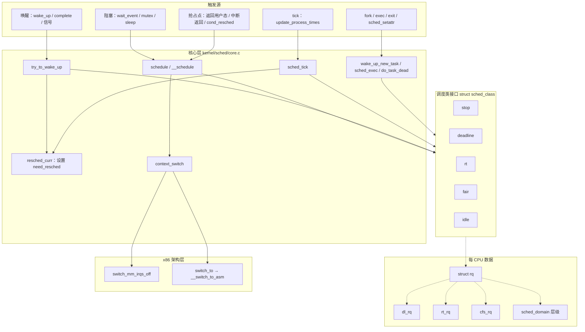
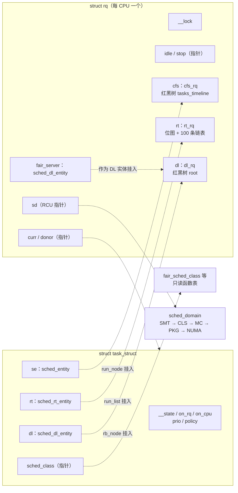
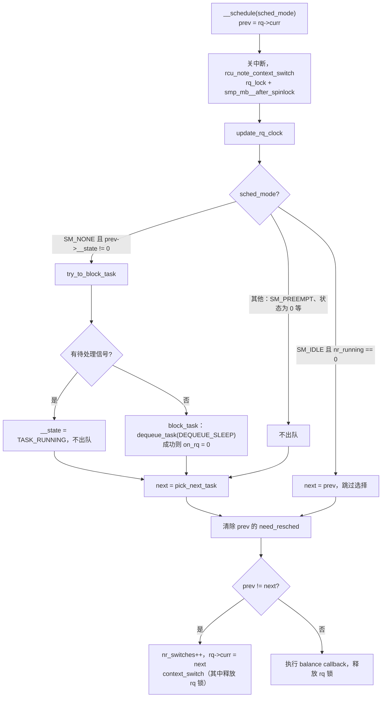
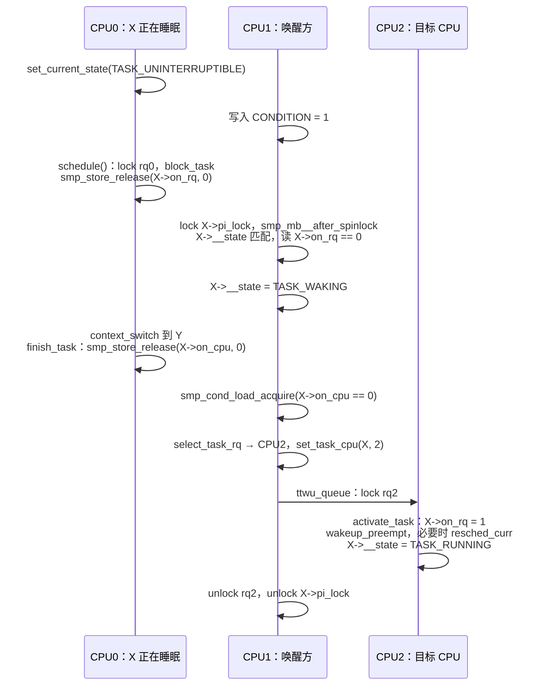
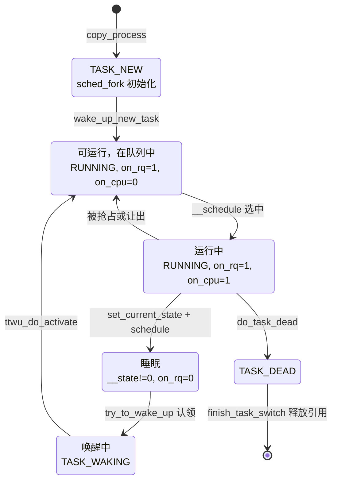

# 调度子系统概述：调度类、运行队列与 `__schedule()`

一台 8 核机器上同时存在几百个线程：编译器进程把 CPU 跑满，`sshd` 大部分时间在等网络包，音频线程每 5 ms 必须拿到一次 CPU，内核的 `kworker` 和 `ksoftirqd` 时不时要处理后台工作。CPU 只有 8 个，内核必须持续回答三个问题：

- **什么时候换人？** 当前任务主动睡眠、时间片用完、或者有更重要的任务被唤醒时。
- **换给谁？** 实时任务优先于普通任务；普通任务之间按 nice 值分配 CPU 时间。
- **在哪个 CPU 上运行？** 被唤醒的任务放到哪个 CPU；某些 CPU 太忙、另一些空闲时，要不要把任务挪过去。

调度子系统（scheduler）负责回答这三个问题，并完成真正的切换：保存当前任务的寄存器和栈，换上下一个任务的地址空间和寄存器。

本章是调度子系统的总览，回答以下问题：

1. 调度器分成哪几层？“核心层”和“调度类”各自负责什么？
2. 有哪些核心对象？任务、运行队列、调度类、调度实体和调度域之间是什么关系？
3. 一次调度怎样选出下一个任务，又怎样完成上下文切换？
4. 任务怎样睡眠、怎样被唤醒？`need_resched` 标志怎样变成一次真正的切换？
5. 不同调度类（stop、deadline、实时、公平、idle）分别用什么算法挑选任务？

每个调度类的内部细节、负载均衡算法放到后续章节展开，本章只建立主线，并给出每个结论对应的源码位置。

## 0. 分析基线

本章依据仓库内 [Makefile 第 2～4 行](../../linux/Makefile#L2-L4)标记的 **6.18.52** 版本，架构为 **x86-64**。读者需要了解中断与软中断的基本执行路径（[中断子系统概述](../interrupt/overview.md)、[softirq 机制](../interrupt/softirq.md)）、周期性 tick 的来源（[时间子系统概述](../time/introduction.md)），以及自旋锁和内存屏障的基本概念（[锁机制基础](../lock/introduction.md)）。

与本章结论有关的配置如下。它们是编译条件，不代表某次运行一定经过对应路径。

| 配置 | 对本章的影响 | 依据 |
| --- | --- | --- |
| `CONFIG_X86_64=y`、`CONFIG_SMP=y`、`CONFIG_NR_CPUS=512` | 多 CPU；每个 CPU 有一个运行队列 | [.config#L333](../../linux/.config#L333)、[.config#L362](../../linux/.config#L362)、[.config#L431](../../linux/.config#L431) |
| `CONFIG_PREEMPT_DYNAMIC=y`，抢占模型选 `CONFIG_PREEMPT_VOLUNTARY=y` | 抢占基础设施（`CONFIG_PREEMPTION=y`、`CONFIG_PREEMPT_COUNT=y`）全部编入，但**启动后默认按 voluntary 模型运行**；可用启动参数 `preempt=none/voluntary/full/lazy` 改变（3.5 节） | [.config#L133-L142](../../linux/.config#L133-L142)、[Kconfig.preempt#L126-L146](../../linux/kernel/Kconfig.preempt#L126-L146) |
| `CONFIG_SCHED_CLASS_EXT` 未出现在 `.config` 中 | 它依赖 `DEBUG_INFO_BTF`，而 `.config` 中没有 `CONFIG_DEBUG_INFO_BTF`，所以 sched_ext 未编入；`scx_enabled()` 恒为 `false`，系统中只有 5 个调度类 | [Kconfig.preempt#L166-L168](../../linux/kernel/Kconfig.preempt#L166-L168)、[sched.h#L1784-L1785](../../linux/kernel/sched/sched.h#L1784-L1785) |
| `CONFIG_SCHED_PROXY_EXEC` 未设置 | `rq->curr` 和 `rq->donor` 是同一个联合体成员，`task_is_blocked()` 恒为 `false`，本章不讨论代理执行 | [.config#L194](../../linux/.config#L194)、[sched.h#L1171-L1179](../../linux/kernel/sched/sched.h#L1171-L1179)、[sched.h#L2305-L2311](../../linux/kernel/sched/sched.h#L2305-L2311) |
| `CONFIG_SCHED_CORE` 未设置 | `pick_next_task()` 直接调用 `__pick_next_task()`，没有 SMT 兄弟核之间的协同选择 | [.config#L143](../../linux/.config#L143)、[core.c#L6518-L6522](../../linux/kernel/sched/core.c#L6518-L6522) |
| `CONFIG_FAIR_GROUP_SCHED=y`、`CONFIG_CFS_BANDWIDTH=y`、`CONFIG_SCHED_AUTOGROUP=y`，`CONFIG_RT_GROUP_SCHED` 未设置 | 公平调度类支持组调度；本章只指出组调度在数据结构上的位置，细节见 [cgroup v2 的 cpu 控制器](../cgroup2/cpu.md) | [.config#L216-L221](../../linux/.config#L216-L221)、[.config#L245](../../linux/.config#L245) |
| `CONFIG_UCLAMP_TASK` 未设置 | 没有利用率钳制，`uclamp_*()` 调用为空 | [.config#L193](../../linux/.config#L193) |
| `CONFIG_HZ=1000`、`CONFIG_NO_HZ_FULL=y`、`CONFIG_SCHED_HRTICK=y` | tick 周期 1 ms；`nohz_full=` 指定的 CPU 可以在只有一个任务时停 tick；HRTICK 虽然编入，但调度特性 `HRTICK` 默认关闭 | [.config#L104-L108](../../linux/.config#L104-L108)、[.config#L505-L507](../../linux/.config#L505-L507)、[features.h#L66-L67](../../linux/kernel/sched/features.h#L66-L67) |
| `CONFIG_SCHED_SMT=y`、`CONFIG_SCHED_CLUSTER=y`、`CONFIG_SCHED_MC=y`、`CONFIG_NUMA=y` | 调度域层级为 SMT → CLS → MC → PKG，NUMA 机器上再叠加 NUMA 层（2.6 节） | [.config#L835-L837](../../linux/.config#L835-L837)、[.config#L469](../../linux/.config#L469) |
| `CONFIG_PARAVIRT_TIME_ACCOUNTING=y`，`CONFIG_IRQ_TIME_ACCOUNTING` 未设置 | 作为虚拟机运行且开启 steal time 时，被宿主机“偷走”的时间不计入任务运行时间；中断时间不单独扣除 | [.config#L148-L150](../../linux/.config#L148-L150)、[.config#L397](../../linux/.config#L397) |
| `CONFIG_SCHEDSTATS=y`、`CONFIG_PSI=y`、`CONFIG_CPU_FREQ_GOV_SCHEDUTIL=y` | 调度统计、压力统计和 schedutil 调频都挂在调度路径上；本章只提到调用点 | [.config#L10650](../../linux/.config#L10650)、[.config#L158](../../linux/.config#L158)、[.config#L696](../../linux/.config#L696) |

为便于区分同名文件，下文链接文字中的 `sched.h` 指 `kernel/sched/sched.h`，`linux/sched.h` 指 `include/linux/sched.h`，`asm/preempt.h` 指 x86 的 `arch/x86/include/asm/preempt.h`，`linux/preempt.h` 指通用的 `include/linux/preempt.h`。

关于抢占模型需要提前说明一点：`CONFIG_PREEMPT_VOLUNTARY=y` 在 `PREEMPT_DYNAMIC` 下只是“默认值”。[preempt_dynamic_init()（core.c#L7789-L7805）](../../linux/kernel/sched/core.c#L7789-L7805) 在没有 `preempt=` 启动参数时调用 `sched_dynamic_update(preempt_dynamic_voluntary)`；有参数时由 [setup_preempt_mode()（core.c#L7776-L7787）](../../linux/kernel/sched/core.c#L7776-L7787) 提前设好。静态分析无法确定某台机器的启动参数，本章以默认的 voluntary 模型为主线。

## 1. 调度子系统要解决什么问题

### 1.1 三个问题，三组机制

| 问题 | 机制 | 主要入口 |
| --- | --- | --- |
| 什么时候换人 | 任务主动阻塞时调用 `schedule()`；其他情况先设置 `TIF_NEED_RESCHED`，等到下一个**抢占点**再进入 `__schedule()` | [schedule()](../../linux/kernel/sched/core.c#L7048-L7060)、[resched_curr()](../../linux/kernel/sched/core.c#L1155-L1158) |
| 换给谁 | 按**调度类**（scheduling class）的优先级从高到低询问，第一个给出任务的类胜出；类内部用各自的算法挑选 | [__pick_next_task()](../../linux/kernel/sched/core.c#L5972-L6023) |
| 在哪个 CPU 上运行 | 唤醒、fork、exec 时由调度类的 `select_task_rq` 选 CPU；运行期间由负载均衡在 CPU 之间迁移任务 | [select_task_rq()](../../linux/kernel/sched/core.c#L3583-L3608)、[sched_balance_trigger()](../../linux/kernel/sched/fair.c#L13257-L13270) |

“什么时候换人”和“换给谁”是分开的。`__schedule()` 源码前的注释（[core.c#L6778-L6815](../../linux/kernel/sched/core.c#L6778-L6815)）列出了进入调度器的三种方式：显式阻塞；在中断返回、返回用户态等路径上检查 `TIF_NEED_RESCHED`；以及唤醒。注释特别指出，唤醒本身并不进入 `schedule()`，它只是把任务放回运行队列，必要时设置 `TIF_NEED_RESCHED`，真正的切换发生在“最近的可能时机”。

### 1.2 调度策略与调度类

用户通过 `sched_setattr()`、`sched_setscheduler()`、`nice()` 等系统调用为任务指定**调度策略**（policy）。内核把策略映射到**调度类**，每个调度类是一组实现了相同接口的函数。当前配置下有 5 个调度类，按优先级从高到低为：

| 调度类 | 对应的用户策略 | 用途 | 类内的选择规则 |
| --- | --- | --- | --- |
| `stop_sched_class` | 无（内核内部） | 每个 CPU 一个 stopper 线程，用于 `stop_machine`、迁移正在运行的任务等，抢占一切且不可被抢占 | 运行队列上只有 `rq->stop` 一个任务 |
| `dl_sched_class` | `SCHED_DEADLINE` | 截止期任务：每个周期内保证运行若干时间 | 绝对截止时间最早者（EDF） |
| `rt_sched_class` | `SCHED_FIFO`、`SCHED_RR` | 固定优先级实时任务 | 最高优先级队列的队首；RR 有时间片 |
| `fair_sched_class` | `SCHED_NORMAL`、`SCHED_BATCH`、`SCHED_IDLE` | 普通任务，按权重分享 CPU | EEVDF：在“应得服务”的任务中选虚拟截止时间最早者 |
| `idle_sched_class` | 无（内核内部） | 每个 CPU 一个 idle 任务，没有其他任务时运行 | 总是返回 `rq->idle` |

这 5 个类分别定义在 [stop_task.c#L96-L117](../../linux/kernel/sched/stop_task.c#L96-L117)、[deadline.c#L3307](../../linux/kernel/sched/deadline.c#L3307)、[rt.c#L2578](../../linux/kernel/sched/rt.c#L2578)、[fair.c#L14095-L14142](../../linux/kernel/sched/fair.c#L14095-L14142) 和 [idle.c#L546-L568](../../linux/kernel/sched/idle.c#L546-L568)。策略常量定义在 [uapi/linux/sched.h#L114-L121](../../linux/include/uapi/linux/sched.h#L114-L121)，其中 `SCHED_EXT = 7`；由于 sched_ext 没有编入，[valid_policy()（sched.h#L216-L220）](../../linux/kernel/sched/sched.h#L216-L220) 不接受它。

策略到类的映射由 [__setscheduler_class()（core.c#L7304-L7318）](../../linux/kernel/sched/core.c#L7304-L7318) 完成，它看的是**优先级数值**而不是策略本身：`dl_prio(prio)` 为真则是 deadline 类，`rt_prio(prio)` 为真则是实时类，否则是公平类。

### 1.3 一个统一的优先级数轴

内核用一个整数 `prio` 把三类任务放在同一个数轴上，数值越小优先级越高（[prio.h#L9-L28](../../linux/include/linux/sched/prio.h#L9-L28)）：

```text
  prio:   -1      0 ............ 99   100 ........ 120 ........ 139
        |----|---------------------|-----------------------------|
        DEADLINE      实时（RT）            普通任务（nice -20 .. +19）
                 rt_priority 99 .. 1          nice 0 对应 120
```

换算规则在 [__normal_prio()（syscalls.c#L19-L31）](../../linux/kernel/sched/syscalls.c#L19-L31)：

- `SCHED_DEADLINE`：`prio = MAX_DL_PRIO - 1 = -1`；
- `SCHED_FIFO`/`SCHED_RR`：`prio = MAX_RT_PRIO - 1 - rt_priority`，用户设置的 `rt_priority` 越大，`prio` 越小；
- 其他策略：`prio = NICE_TO_PRIO(nice) = nice + 120`。

判断函数 [rt_prio()（rt.h#L9-L12）](../../linux/include/linux/sched/rt.h#L9-L12) 和 [dl_prio()（deadline.h#L13-L16）](../../linux/include/linux/sched/deadline.h#L13-L16) 只比较数值区间。

### 1.4 分层架构

下面这张图回答“调度器由哪些部分组成、彼此怎样依赖”。实线箭头表示“调用”，虚线箭头表示“包含或指向的数据”。图中省略了统计、PSI、cpufreq 等旁路。



图中要注意三点：

- **核心层不懂具体策略**。`__schedule()`、`try_to_wake_up()`、`sched_tick()` 只通过 `p->sched_class->xxx()` 调用调度类的方法，自己负责的是锁、任务状态、时钟、抢占标志和上下文切换。
- **调度类不做切换**。调度类只维护自己的队列、记账、回答“下一个是谁”和“要不要抢占”，真正的切换由核心层的 `context_switch()` 完成。
- **所有调度类共享一个每 CPU 的 `struct rq`**。`rq` 中嵌入了各调度类的子队列，由同一把 `rq->__lock` 保护。

与其他子系统的交互点：

| 子系统 | 交互方式 | 依据 |
| --- | --- | --- |
| 时间子系统 | 每个 tick 调用 `sched_tick()` | [timer.c#L2467-L2482](../../linux/kernel/time/timer.c#L2467-L2482) |
| 中断 / IPI | 中断返回时检查是否需要抢占；远程 CPU 通过重调度 IPI 通知 | [entry/common.c#L185-L211](../../linux/kernel/entry/common.c#L185-L211)、[x86 smp.c#L248-L255](../../linux/arch/x86/kernel/smp.c#L248-L255) |
| 等待队列、锁 | 睡眠一方调用 `schedule()`，唤醒一方调用 `try_to_wake_up()` | [wait.h#L302-L331](../../linux/include/linux/wait.h#L302-L331)、[core.c#L7296-L7301](../../linux/kernel/sched/core.c#L7296-L7301) |
| 内存管理 | 切换时更换页表，内核线程借用前一个任务的 `active_mm` | [core.c#L5315-L5341](../../linux/kernel/sched/core.c#L5315-L5341) |
| 进程管理 | fork 时初始化调度状态并首次入队，exit 时最后一次调度 | [fork.c#L2155](../../linux/kernel/fork.c#L2155)、[fork.c#L2642](../../linux/kernel/fork.c#L2642)、[exit.c#L1020](../../linux/kernel/exit.c#L1020) |
| cgroup | `cpu` 控制器把组变成公平类中的调度实体；cpuset 影响任务亲和性和调度域 | [cgroup v2 的 cpu 控制器](../cgroup2/cpu.md) |
| cpuidle | idle 任务在 `do_idle()` 中进入 C 状态 | [idle.c#L276-L383](../../linux/kernel/sched/idle.c#L276-L383) |

### 1.5 触发事件与输入输出

| 触发事件 | 输入 | 输出 / 结果 |
| --- | --- | --- |
| 任务调用 `schedule()` 阻塞 | `current->__state` 非 `TASK_RUNNING` | 当前任务出队，选出下一个任务并切换 |
| `try_to_wake_up(p, state, flags)` | 任务 `p`、允许唤醒的状态掩码 | `p` 变为 `TASK_RUNNING` 并入队；若应抢占，目标 CPU 的当前任务被设置 `need_resched` |
| 每个 tick 调用 `sched_tick()` | 当前任务、运行队列时钟 | 更新运行时间记账；时间片用完则设置 `need_resched`；必要时触发负载均衡软中断 |
| 到达抢占点 | `TIF_NEED_RESCHED`（或 `TIF_NEED_RESCHED_LAZY`） | 调用 `__schedule(SM_PREEMPT)` 或 `schedule()` |
| fork 产生新任务 | 父任务的调度属性 | 子任务初始化为 `TASK_NEW`，选 CPU 后首次入队 |
| `sched_setattr()` / `nice()` | 新策略、优先级、参数 | 任务被摘下、修改属性、重新入队，可能更换调度类 |

### 1.6 本章边界

本章只讨论以上主线。以下内容只点到为止，留给后续章节：EEVDF 的放置（`place_entity()`）与延迟出队细节、PELT 负载跟踪、负载均衡的具体算法、实时类的 push/pull、deadline 类的 CBS 与准入控制、NUMA balancing、`nohz_full` 下的 tick 卸载、CPU 热插拔、优先级继承（rt_mutex）。组调度与带宽控制见 [cgroup v2 的 cpu 控制器](../cgroup2/cpu.md)，本章不重复。

## 2. 核心数据结构

本节按“任务 → 运行队列 → 调度类 → 类内队列 → 调度域”的顺序介绍，只解释与主线有关的字段。

### 2.1 结构地图

下图回答“一个任务怎样挂到一个 CPU 的运行队列上”。子图框表示包含关系（框内是嵌入的成员），虚线箭头表示指针或“挂入某个集合”的链接关系。



要注意：

- 一个任务**同时嵌入**三种调度实体（`se`、`rt`、`dl`），但同一时刻只有与 `p->sched_class` 对应的那一个挂在队列上。切换调度类时，从旧类的队列摘下，再挂入新类的队列（4.6 节）。
- `rq->fair_server` 是 `rq` 中嵌入的一个 deadline 实体，它代表整个公平类参与 deadline 类的竞争（3.4 节）。
- `rq->curr` 指向正在运行的任务。要区分“在运行队列上”（`p->on_rq` 非 0）和“在调度类的排序结构里”：正在运行的公平任务 `on_rq` 仍为 1，但它的 `se` 被 [set_next_entity()（fair.c#L5632-L5653）](../../linux/kernel/sched/fair.c#L5632-L5653) 移出红黑树，由 `cfs_rq->curr` 单独记录，被换下时再由 [put_prev_entity()（fair.c#L5700-L5720）](../../linux/kernel/sched/fair.c#L5700-L5720) 放回。另外，`__schedule()` 中刚被 `block_task()` 出队的 `prev`，在 `rq->curr` 更新为 `next` 之前仍是 `rq->curr`。

### 2.2 `task_struct` 中的调度字段

[`struct task_struct`（linux/sched.h#L815）](../../linux/include/linux/sched.h#L815) 中与调度直接相关的字段集中在开头：

| 字段 | 含义 | 依据 |
| --- | --- | --- |
| `__state` | 任务状态：`TASK_RUNNING`（0）表示“想运行”，非 0 表示想睡眠或已睡眠 | [linux/sched.h#L823](../../linux/include/linux/sched.h#L823)、[linux/sched.h#L105-L139](../../linux/include/linux/sched.h#L105-L139) |
| `on_cpu` | 任务是否正在某个 CPU 上执行（包括切换过程中） | [linux/sched.h#L844](../../linux/include/linux/sched.h#L844) |
| `wake_entry` | 远程唤醒时挂到目标 CPU 唤醒链表的节点 | [linux/sched.h#L845](../../linux/include/linux/sched.h#L845) |
| `wake_cpu`、`recent_used_cpu` | 唤醒时选择 CPU 的起点与提示 | [linux/sched.h#L857-L858](../../linux/include/linux/sched.h#L857-L858) |
| `on_rq` | 是否在运行队列上：0、`TASK_ON_RQ_QUEUED`（1）、`TASK_ON_RQ_MIGRATING`（2） | [linux/sched.h#L859](../../linux/include/linux/sched.h#L859)、[sched.h#L97-L98](../../linux/kernel/sched/sched.h#L97-L98) |
| `prio` | **有效优先级**，调度器实际使用的值；可被优先级继承临时提升 | [linux/sched.h#L861](../../linux/include/linux/sched.h#L861) |
| `static_prio` | 由 nice 值决定：`nice + 120` | [linux/sched.h#L862](../../linux/include/linux/sched.h#L862) |
| `normal_prio` | 不考虑优先级继承时按策略算出的优先级 | [linux/sched.h#L863](../../linux/include/linux/sched.h#L863) |
| `rt_priority` | 用户设置的实时优先级 1～99 | [linux/sched.h#L864](../../linux/include/linux/sched.h#L864) |
| `se`、`rt`、`dl` | 三种调度实体，嵌入在任务中 | [linux/sched.h#L866-L868](../../linux/include/linux/sched.h#L866-L868) |
| `dl_server` | 若任务是经由 deadline 服务器选中的，指向该服务器 | [linux/sched.h#L869](../../linux/include/linux/sched.h#L869) |
| `sched_class` | 当前所属调度类 | [linux/sched.h#L873](../../linux/include/linux/sched.h#L873) |
| `policy` | 调度策略 | [linux/sched.h#L915](../../linux/include/linux/sched.h#L915) |
| `nr_cpus_allowed`、`cpus_ptr`、`cpus_mask` | 允许运行的 CPU 集合（亲和性） | [linux/sched.h#L917-L920](../../linux/include/linux/sched.h#L917-L920) |
| `migration_disabled` | 非 0 时任务暂时不能迁移 | [linux/sched.h#L922](../../linux/include/linux/sched.h#L922) |
| `pi_lock` | 保护唤醒以及策略、亲和性等属性的修改 | [linux/sched.h#L1229](../../linux/include/linux/sched.h#L1229) |

`prio`、`normal_prio`、`static_prio` 三者的关系由 [effective_prio()（syscalls.c#L52-L63）](../../linux/kernel/sched/syscalls.c#L52-L63) 体现：先由策略算出 `normal_prio`；如果任务当前不是实时或 deadline 优先级（没有被提升），`prio` 就等于 `normal_prio`，否则保持被提升后的值。

**三个状态变量。** 理解调度器并发协议的关键，是区分 `__state`、`on_rq` 和 `on_cpu` 这三个相互独立的变量。[core.c#L592-L618](../../linux/kernel/sched/core.c#L592-L618) 的注释给出了它们的修改规则：

| 变量 | 回答的问题 | 谁修改 | 保护方式 |
| --- | --- | --- | --- |
| `__state` | 任务想运行还是想睡眠？ | 任务自己用 `set_current_state()` 写入睡眠状态；`try_to_wake_up()` 写回 `TASK_RUNNING` | 无锁写入 + 内存屏障；唤醒方用 `p->pi_lock` 互斥 |
| `on_rq` | 任务是否在运行队列上？ | `activate_task()` 置位，`deactivate_task()`/`block_task()` 清零 | `rq->__lock` |
| `on_cpu` | 任务是否正在 CPU 上？ | `prepare_task()` 切入前置 1，`finish_task()` 切出后清 0 | `rq->__lock` 下修改，清零用 release 语义 |

几种典型组合：

| `__state` | `on_rq` | `on_cpu` | 处境 |
| --- | --- | --- | --- |
| `TASK_RUNNING` | 1 | 1 | 正在运行 |
| `TASK_RUNNING` | 1 | 0 | 可运行，在队列中等待 |
| 非 0 | 1 | 1 | 已调用 `set_current_state()`，但还没在 `__schedule()` 中出队 |
| 非 0 | 1 | 0 | 设置睡眠状态后、主动调用 `schedule()` 前被抢占，仍留在队列中（4.2 节） |
| 非 0 | 0 | 1 | `__schedule()` 已把它出队，但 CPU 还没切换完 |
| 非 0 | 0 | 0 | 完全睡眠 |
| `TASK_WAKING` | 0 | 0 或 1 | 唤醒方已认领，正在选择 CPU、准备入队 |
| `TASK_NEW` | 0 | 0 | fork 中，尚未首次入队 |

此外还有一个特例：公平类的**延迟出队**（delayed dequeue）。任务已睡眠（`__state` 非 0），但 `on_rq` 仍为 1，`p->se.sched_delayed` 为 1，它会在下次被选中时才真正出队（[core.c#L606-L609](../../linux/kernel/sched/core.c#L606-L609)，3.3 节）。

### 2.3 `struct rq`：每 CPU 的运行队列

[`struct rq`（sched.h#L1120-L1323）](../../linux/kernel/sched/sched.h#L1120-L1323) 是调度器最核心的结构。它是一个每 CPU 变量 `runqueues`（[sched.h#L1353](../../linux/kernel/sched/sched.h#L1353)），通过 `cpu_rq(cpu)`、`this_rq()`、`task_rq(p)`、`cpu_curr(cpu)` 访问（[sched.h#L1361-L1364](../../linux/kernel/sched/sched.h#L1361-L1364)）。

| 字段 | 含义 |
| --- | --- |
| `__lock` | 运行队列锁，`raw_spinlock_t`；保护本结构及其中嵌入的各类子队列 |
| `nr_running` | 本 CPU 上各调度类入队任务的总数，不含 idle 任务；处于延迟出队状态的公平任务在真正出队前仍计入（[fair.c#L7233-L7235](../../linux/kernel/sched/fair.c#L7233-L7235)、[fair.c#L7292](../../linux/kernel/sched/fair.c#L7292)） |
| `nr_switches` | 本 CPU 上发生的上下文切换次数 |
| `ttwu_pending` | 远程唤醒链表上是否有待处理的任务 |
| `cfs`、`rt`、`dl` | 三个嵌入的子队列：公平类、实时类、deadline 类 |
| `fair_server` | 代表公平类的 deadline 实体（3.4 节） |
| `nr_uninterruptible` | 处于不可中断睡眠的任务计数，用于计算系统负载；只有各 CPU 之和有意义 |
| `curr`、`donor` | 当前运行的任务；当前配置下二者是同一个联合体成员 |
| `dl_server` | 本次选择是否经由 deadline 服务器 |
| `idle`、`stop` | 本 CPU 的 idle 任务和 stopper 任务 |
| `clock`、`clock_task` | 运行队列时钟，单位纳秒（3.7 节） |
| `rd`、`sd` | 根域（root domain）和最底层调度域，供负载均衡使用 |
| `next_balance` | 下次周期性负载均衡的时刻，单位 jiffies |
| `cpu` | 本运行队列所属 CPU 编号 |

字段依次见 [sched.h#L1122-L1139](../../linux/kernel/sched/sched.h#L1122-L1139)、[sched.h#L1148-L1155](../../linux/kernel/sched/sched.h#L1148-L1155)、[sched.h#L1169-L1189](../../linux/kernel/sched/sched.h#L1169-L1189)、[sched.h#L1208-L1209](../../linux/kernel/sched/sched.h#L1208-L1209) 和 [sched.h#L1226](../../linux/kernel/sched/sched.h#L1226)。

**加锁规则。** 结构体上方的注释（[sched.h#L1113-L1119](../../linux/kernel/sched/sched.h#L1113-L1119)）规定：同时锁多个运行队列时，按地址升序加锁。[double_rq_lock()（core.c#L703-L715）](../../linux/kernel/sched/core.c#L703-L715) 就是这样实现的。

**初始化。** [sched_init()（core.c#L8731-L8741）](../../linux/kernel/sched/core.c#L8731-L8741) 为每个可能的 CPU 初始化锁和三个子队列，在 [core.c#L8803](../../linux/kernel/sched/core.c#L8803) 初始化 `fair_server`。启动 CPU 上当前执行的代码随后被 [init_idle()（core.c#L8844-L8845）](../../linux/kernel/sched/core.c#L8844-L8845) 变成该 CPU 的 idle 任务：`rq->idle` 和 `rq->curr` 都指向它，`sched_class` 设为 `idle_sched_class`（[core.c#L8043-L8060](../../linux/kernel/sched/core.c#L8043-L8060)）。stopper 线程在创建时由 [sched_set_stop_task()（core.c#L3610-L3644）](../../linux/kernel/sched/core.c#L3610-L3644) 设为 `stop_sched_class` 并写入 `rq->stop`。

### 2.4 `struct sched_class`：调度类的接口

[`struct sched_class`（sched.h#L2413-L2484）](../../linux/kernel/sched/sched.h#L2413-L2484) 是一张函数表。按职责可以分成几组：

| 职责 | 方法 | 调用时机 |
| --- | --- | --- |
| 队列维护 | `enqueue_task`、`dequeue_task` | 任务变为可运行 / 不可运行，或属性修改前后 |
| 选择 | `balance`、`pick_task`、`pick_next_task`（可选） | `__schedule()` 选下一个任务 |
| 切换前后 | `put_prev_task`、`set_next_task` | 任务被换下 / 被换上 CPU |
| 抢占判断 | `wakeup_preempt` | 新任务入队后，判断是否应抢占当前任务 |
| 放置与迁移 | `select_task_rq`、`migrate_task_rq`、`task_woken`、`set_cpus_allowed`、`find_lock_rq` | 唤醒、fork、exec 选 CPU；迁移；亲和性变化 |
| 记账 | `task_tick`、`update_curr` | 每个 tick；需要最新运行时间时 |
| 生命周期 | `task_fork`、`task_dead` | fork、任务最后一次切出 |
| 属性变化 | `switching_to`、`switched_from`、`switched_to`、`prio_changed`、`reweight_task` | 更换调度类、优先级或权重 |
| CPU 上下线 | `rq_online`、`rq_offline` | CPU 加入或离开根域 |

`pick_task` 与 `pick_next_task` 的关系由注释（[sched.h#L2428-L2437](../../linux/kernel/sched/sched.h#L2428-L2437)）规定：`pick_next_task` 是可选的优化版本，它等价于“`pick_task()`，若选中则 `put_prev_task(prev)` 再 `set_next_task_first(next)`”。核心层的通用版本就是 [put_prev_set_next_task()（sched.h#L2507-L2520）](../../linux/kernel/sched/sched.h#L2507-L2520)。

**调度类的顺序。** 调度类之间的优先级不是写在某个数组里，而是由**链接器**决定的。[DEFINE_SCHED_CLASS（sched.h#L2532-L2535）](../../linux/kernel/sched/sched.h#L2532-L2535) 把每个类放进独立的段，链接脚本 [SCHED_DATA（vmlinux.lds.h#L136-L145）](../../linux/include/asm-generic/vmlinux.lds.h#L136-L145) 按 stop、dl、rt、fair、ext、idle 的顺序（当前配置下 ext 段为空）把它们排在 `__sched_class_highest` 与 `__sched_class_lowest` 之间。于是：

- 比较优先级就是比较地址：[sched_class_above(a, b)](../../linux/kernel/sched/sched.h#L2575) 定义为 `a < b`；
- 遍历所有类就是指针递增：[for_each_class / for_each_active_class（sched.h#L2563-L2573）](../../linux/kernel/sched/sched.h#L2563-L2573)。

[sched_init()（core.c#L8671-L8675）](../../linux/kernel/sched/core.c#L8671-L8675) 开头用 `BUG_ON` 检查这个顺序。`DEFINE_SCHED_CLASS` 上方的注释写着“laid out in *REVERSE* order”，与当前链接脚本从高到低排列的写法看上去不一致；判断顺序时应以链接脚本、`sched_class_above()` 和 `sched_init()` 中的检查为准。

### 2.5 各类的子队列与调度实体

| 调度类 | 队列结构 | 实体 | 组织方式 | 依据 |
| --- | --- | --- | --- | --- |
| fair | `struct cfs_rq` | `struct sched_entity` | 增强红黑树 `tasks_timeline`，按**虚拟截止时间**排序；每个节点额外维护子树最小 `vruntime` | [sched.h#L676-L698](../../linux/kernel/sched/sched.h#L676-L698)、[linux/sched.h#L570-L616](../../linux/include/linux/sched.h#L570-L616)、[fair.c#L582-L590](../../linux/kernel/sched/fair.c#L582-L590) |
| rt | `struct rt_rq` | `struct sched_rt_entity` | `rt_prio_array`：100 条链表 + 位图，下标即 `prio` | [sched.h#L309-L312](../../linux/kernel/sched/sched.h#L309-L312)、[sched.h#L827-L854](../../linux/kernel/sched/sched.h#L827-L854)、[linux/sched.h#L618-L634](../../linux/include/linux/sched.h#L618-L634) |
| deadline | `struct dl_rq` | `struct sched_dl_entity` | 红黑树 `root`，按绝对截止时间排序 | [sched.h#L862-L877](../../linux/kernel/sched/sched.h#L862-L877)、[linux/sched.h#L639-L713](../../linux/include/linux/sched.h#L639-L713) |
| stop / idle | 无 | 无 | `rq->stop`、`rq->idle` 两个指针 | [sched.h#L1181-L1182](../../linux/kernel/sched/sched.h#L1181-L1182) |

公平类实体中与本章有关的字段：

| 字段 | 含义 |
| --- | --- |
| `load` | 权重，由 nice 值查表得到（3.1 节） |
| `run_node` | 红黑树节点 |
| `on_rq` | 实体是否在 `cfs_rq` 上（与 `task_struct::on_rq` 不是同一个字段） |
| `sched_delayed` | 是否处于延迟出队状态 |
| `exec_start`、`sum_exec_runtime` | 上次记账的时刻、累计实际运行时间，单位纳秒 |
| `vruntime` | 虚拟运行时间：实际运行时间按权重缩放后累加 |
| `deadline` | 虚拟截止时间 |
| `vlag` | 出队时记录的“滞后量”，再次入队时用于放置 |
| `slice` | 请求的时间片长度，单位纳秒 |
| `min_vruntime` | 以本节点为根的子树中最小的 `vruntime`，用于剪枝 |
| `parent`、`cfs_rq`、`my_q` | 组调度：父实体、所在队列、组实体自己拥有的队列 |

最后一行的三个字段只在 `CONFIG_FAIR_GROUP_SCHED` 下存在。开启组调度后，`rq->cfs` 是根组的队列，一个 cgroup 在每个 CPU 上都表现为上一层队列中的一个 `sched_entity`，它的 `my_q` 指向组自己的 `cfs_rq`；选择时从根队列逐层向下，直到选中一个任务实体，见 [pick_task_fair()（fair.c#L9104-L9135）](../../linux/kernel/sched/fair.c#L9104-L9135) 中的 `do { ... } while (cfs_rq)` 循环。没有使用 cgroup 时，所有任务直接挂在 `rq->cfs` 上（[core.c#L8761-L8764](../../linux/kernel/sched/core.c#L8761-L8764)），循环只执行一次。层级调度的细节见 [cgroup v2 的 cpu 控制器](../cgroup2/cpu.md)。

### 2.6 `struct sched_domain`：CPU 拓扑

负载均衡需要知道 CPU 之间的“距离”：同一物理核上的两个超线程共享几乎所有缓存，同一 LLC 下的核迁移代价较小，跨 NUMA 节点的迁移代价最高。[`struct sched_domain`（topology.h#L73-L92）](../../linux/include/linux/sched/topology.h#L73-L92) 描述一个层级上的 CPU 集合：

| 字段 | 含义 |
| --- | --- |
| `parent`、`child` | 上一层和下一层调度域，RCU 保护 |
| `groups` | 本域被划分成的若干 `sched_group`，均衡在组之间进行 |
| `min_interval`、`max_interval`、`balance_interval` | 均衡间隔，单位毫秒 |
| `imbalance_pct` | 负载差超过多少百分比才进行均衡 |
| `flags` | `SD_*` 标志，如是否参与唤醒时的亲和选择、是否在 fork/exec 时均衡 |
| `last_balance` | 上次均衡的时刻，单位 jiffies |

x86 的拓扑层级由 [x86_topology（smpboot.c#L481-L491）](../../linux/arch/x86/kernel/smpboot.c#L481-L491) 定义：SMT、CLS（簇）、MC（多核/LLC）、PKG（封装）；NUMA 机器上 `sched_init_numa()` 再追加 NUMA 层。每个 CPU 的 `rq->sd` 指向自己最底层的调度域，沿 `parent` 向上直到整个系统。`rq->sd` 由 [cpu_attach_domain()（topology.c#L771）](../../linux/kernel/sched/topology.c#L771) 用 `rcu_assign_pointer()` 发布，读者用 [for_each_domain()（sched.h#L2022-L2024）](../../linux/kernel/sched/sched.h#L2022-L2024) 在 RCU 读侧遍历。

### 2.7 锁顺序与保护范围

[core.c#L549-L559](../../linux/kernel/sched/core.c#L549-L559) 给出了调度器的锁顺序：

```text
p->pi_lock
  rq->lock
    hrtimer_cpu_base->lock

rq1->lock
  rq2->lock      （rq1 < rq2）
```

[core.c#L576-L590](../../linux/kernel/sched/core.c#L576-L590) 进一步说明：系统调用等“外部”修改者使用 [task_rq_lock()（core.c#L744-L781）](../../linux/kernel/sched/core.c#L744-L781) 同时持有 `p->pi_lock` 和 `rq->lock`，因此它们修改的属性在持有**任意一把**锁时都是稳定的：

| 修改者 | 被保护的字段 |
| --- | --- |
| `sched_setaffinity()` / `set_cpus_allowed_ptr()` | `cpus_ptr`、`nr_cpus_allowed` |
| `set_user_nice()` | `se.load`、各 `prio` |
| `__sched_setscheduler()` | `sched_class`、`policy`、各 `prio`、`se.load`、`rt_priority`、`dl` 参数 |
| `sched_move_task()` | `sched_task_group` |

`task_rq_lock()` 有一个容易忽略的细节：先读 `task_rq(p)` 再加锁，加锁后必须重新检查任务是否还在这个运行队列上、是否处于 `TASK_ON_RQ_MIGRATING`，不满足就释放重试（[core.c#L771-L779](../../linux/kernel/sched/core.c#L771-L779)）。`TASK_ON_RQ_MIGRATING` 允许迁移代码在不同时持有两把 `rq->lock` 的情况下移动任务。

## 3. 关键算法

### 3.1 nice 值与权重

公平类按**权重**分配 CPU 时间。nice 值通过 [sched_prio_to_weight[]（core.c#L10342-L10363）](../../linux/kernel/sched/core.c#L10342-L10363) 查表得到权重：nice 0 对应 1024，相邻两级之比约为 1.25。注释解释了这个比例：一个任务 nice 值加 1、另一个不变时，前者大约少得 10% 的 CPU。

[set_load_weight()（core.c#L1448-L1469）](../../linux/kernel/sched/core.c#L1448-L1469) 用 `static_prio - MAX_RT_PRIO` 作为下标查表；`SCHED_IDLE` 任务则使用最小权重 `WEIGHT_IDLEPRIO = 3`（[sched.h#L2351](../../linux/kernel/sched/sched.h#L2351)）。在 64 位内核上，表中的值还要经 `scale_load()` 左移 10 位作为内部权重，以提高定点运算精度（[sched.h#L147-L173](../../linux/kernel/sched/sched.h#L147-L173)）。

权重的作用体现在虚拟运行时间的增长速度上。[calc_delta_fair()（fair.c#L290-L296）](../../linux/kernel/sched/fair.c#L290-L296) 计算：

```text
Δvruntime = Δexec × NICE_0_LOAD / weight
```

一个**概念性例子**（忽略 EEVDF 的截止时间、时间片保护等细节）：任务 A 为 nice 0（权重 1024），任务 B 为 nice 5（权重 335），两者都一直可运行。A 实际运行 10 ms，`vruntime` 增加 10 ms；B 实际运行 10 ms，`vruntime` 增加约 30.6 ms。调度器总是倾向于让 `vruntime` 落后的任务运行，长期看两者 `vruntime` 增长相同，A 得到的 CPU 时间约为 B 的 1024/335 ≈ 3 倍。

### 3.2 选择下一个任务：按类询问，快速路径直达公平类

`__schedule()` 通过 `pick_next_task()` → [__pick_next_task()（core.c#L5972-L6023）](../../linux/kernel/sched/core.c#L5972-L6023) 选出下一个任务。算法的目标是：在所有调度类中，返回最高优先级的类所选出的任务。

简化逻辑（伪代码，省略了 sched_ext 和 `dl_server` 处理）：

```text
pick(rq):
    # 快速路径：所有可运行任务都在公平类，且 prev 不属于更高的类
    if prev 的类不高于 fair 且 rq->nr_running == rq->cfs.h_nr_queued:
        p = pick_next_task_fair(rq, prev)
        if p == RETRY_TASK:  goto 慢路径      # newidle 均衡期间来了更高类的任务
        if p == NULL:        p = idle 任务    # 公平类也没有任务
        return p

慢路径:
    prev_balance(rq)                          # 从 prev 的类开始，依次调用 class->balance()
    for class in stop, dl, rt, fair, idle:
        p = class->pick_task(rq)              # 或 class->pick_next_task()
        if p: put_prev_set_next_task(prev, p); return p
```

两个设计要点：

- **快速路径**（[core.c#L5989-L6003](../../linux/kernel/sched/core.c#L5989-L6003)）。绝大多数时间系统里只有公平任务，此时无须逐个询问 stop、dl、rt 类。条件中要求 `prev` 不属于更高的类，注释解释了原因：否则那些类会失去从其他 CPU 拉取任务的机会。
- **`balance` 先于 `put_prev_task`**。[prev_balance()（core.c#L5937-L5967）](../../linux/kernel/sched/core.c#L5937-L5967) 从 `prev` 所属的类开始向下调用各类的 `balance()`，只要某个类报告“有该类或更高类的任务可运行”就停止。`balance()` 可能释放并重新获取 `rq->lock`，从其他 CPU 拉任务：实时类的 [balance_rt()（rt.c#L1594-L1614）](../../linux/kernel/sched/rt.c#L1594-L1614) 调用 `pull_rt_task()`，公平类的 [balance_fair()（fair.c#L8883-L8889）](../../linux/kernel/sched/fair.c#L8883-L8889) 在本类无任务时调用 `sched_balance_newidle()`。注释强调这一步必须在 `put_prev_task()` 之前完成，使锁释放期间 `prev` 的状态与加锁前一致。

idle 类的 [pick_task_idle()（idle.c#L496-L500）](../../linux/kernel/sched/idle.c#L496-L500) 总是返回 `rq->idle`，所以遍历循环一定有结果，末尾的 `BUG()` 不会触发。

### 3.3 公平类：EEVDF 简述

当前版本的公平类使用 **EEVDF**（Earliest Eligible Virtual Deadline First，最早合格虚拟截止时间优先）。它的出发点是“理想公平”：如果 CPU 能无限细分，每个任务按权重比例同时运行，那么任务 i 应得的服务量与实际得到的服务量之差称为**滞后**（lag）。EEVDF 只在滞后非负（“还欠着它”）的任务中挑选，再按截止时间决定先后。[fair.c#L615-L672](../../linux/kernel/sched/fair.c#L615-L672) 的注释给出了推导，核心量如下：

| 概念 | 定义 | 实现 |
| --- | --- | --- |
| 虚拟运行时间 `v_i` | 实际运行时间按权重缩放后的累计值 | `se->vruntime`，在 [update_curr()（fair.c#L1286-L1333）](../../linux/kernel/sched/fair.c#L1286-L1333) 中累加 |
| 队列虚拟时间 `V` | 所有实体 `vruntime` 的加权平均 | [avg_vruntime()（fair.c#L715-L749）](../../linux/kernel/sched/fair.c#L715-L749)，用 `zero_vruntime`、`sum_w_vruntime`、`sum_weight` 增量维护 |
| 滞后 `lag_i` | `w_i × (V − v_i)` | [entity_lag()（fair.c#L767-L776）](../../linux/kernel/sched/fair.c#L767-L776)，出队时存入 `se->vlag` |
| 合格（eligible） | `lag_i ≥ 0`，即 `v_i ≤ V` | [vruntime_eligible()（fair.c#L802-L816）](../../linux/kernel/sched/fair.c#L802-L816)，用乘法比较避免除法误差 |
| 虚拟截止时间 `vd_i` | `v_i + slice / w_i` | [update_deadline()（fair.c#L1117-L1140）](../../linux/kernel/sched/fair.c#L1117-L1140) |

**选择算法。** [pick_eevdf()（fair.c#L996-L1084）](../../linux/kernel/sched/fair.c#L996-L1084) 在合格实体中选虚拟截止时间最早者。红黑树按截止时间排序（[entity_before()（fair.c#L582-L590）](../../linux/kernel/sched/fair.c#L582-L590)），同时每个节点维护子树最小 `vruntime`。查找时：

1. 若最左节点（截止时间最早）合格，直接选它；
2. 否则从根向下：左子树中若存在合格实体（子树最小 `vruntime` 合格），就进入左子树，因为那里的截止时间更早；否则检查当前节点，合格则选中，不合格就进入右子树。

这样只需 O(log n) 次比较。此外还有两个影响结果的细节：当前任务若仍在“时间片保护”范围内（`se->vprot`，保护长度与 `RUN_TO_PARITY` 特性有关，[set_protect_slice()（fair.c#L963-L976）](../../linux/kernel/sched/fair.c#L963-L976)）则继续运行；`cfs_rq->next` 指定的“伙伴”任务若合格则优先。

**时间片。** 每个实体请求的时间片 `slice` 默认取 `sysctl_sched_base_slice`，基准值 0.7 ms（[fair.c#L79](../../linux/kernel/sched/fair.c#L79)），按 `1 + ilog2(min(在线 CPU 数, 8))` 放大（[fair.c#L192-L211](../../linux/kernel/sched/fair.c#L192-L211)）。例如在线 CPU 不少于 8 个时放大 4 倍，即 2.8 ms。当前任务的 `vruntime` 越过 `deadline` 时，`update_deadline()` 为它计算新截止时间并返回“需要重新调度”，`update_curr()` 随即调用 `resched_curr_lazy()`（[fair.c#L1329-L1332](../../linux/kernel/sched/fair.c#L1329-L1332)）。

**延迟出队。** 任务睡眠时，若它的滞后为负（多用了 CPU）且特性 `DELAY_DEQUEUE` 开启（默认开启，[features.h#L50-L59](../../linux/kernel/sched/features.h#L50-L59)），[dequeue_entity()（fair.c#L5571-L5576）](../../linux/kernel/sched/fair.c#L5571-L5576) 不把它移出红黑树，只标记 `sched_delayed`，并返回 `false`。注释说明，这使不合格的任务继续留在竞争中“还清”负滞后，被选中时滞后必然已经非负。它在下次被选中时才真正出队：[pick_next_entity()（fair.c#L5683-L5696）](../../linux/kernel/sched/fair.c#L5683-L5696) 发现选中的实体处于延迟状态，就完成出队并返回 `NULL`，让调用者重选；若在此之前被唤醒，则由 `ttwu_runnable()` 直接把它恢复为正常入队状态（4.4 节）。由于这一机制，核心层的 `dequeue_task()` 可能返回 `false`（[core.c#L2119-L2121](../../linux/kernel/sched/core.c#L2119-L2121)），此时任务仍然 `on_rq`。

**唤醒抢占。** [check_preempt_wakeup_fair()（fair.c#L8970-L9102）](../../linux/kernel/sched/fair.c#L8970-L9102) 在新任务入队后判断是否抢占：`SCHED_BATCH`、`SCHED_IDLE` 任务不抢占别人；被唤醒的任务时间片更短时可以越过当前任务的时间片保护；最终以“此时重新选择（`pick_next_entity()`，内部调用 `pick_eevdf()`）是否会选中被唤醒者”作为依据，是则调用 `resched_curr_lazy()`（[fair.c#L9078-L9101](../../linux/kernel/sched/fair.c#L9078-L9101)）。

EEVDF 的放置规则、时间片保护、延迟出队和权重变化见[公平调度类](cfs.md)。

### 3.4 实时类、deadline 类与 fair server

**实时类。** [__enqueue_rt_entity()（rt.c#L1326-L1358）](../../linux/kernel/sched/rt.c#L1326-L1358) 把实体挂到 `queue[prio]` 链表（默认尾部，`ENQUEUE_HEAD` 时头部），并在位图中置位。[pick_next_rt_entity()（rt.c#L1671-L1687）](../../linux/kernel/sched/rt.c#L1671-L1687) 用 `sched_find_first_bit()` 找到最小的置位下标，即最高优先级，取该链表的队首。选择时间与任务数无关。

- `SCHED_FIFO` 没有时间片，只在阻塞、主动让出或被更高优先级抢占时让出 CPU。
- `SCHED_RR` 在 [task_tick_rt()（rt.c#L2517-L2549）](../../linux/kernel/sched/rt.c#L2517-L2549) 中每个 tick 递减 `time_slice`，减到 0 时重置为 `sched_rr_timeslice` 并移到同优先级队尾。默认值 `RR_TIMESLICE` 为 `100 * HZ / 1000` 个 tick（[rt.h#L84](../../linux/include/linux/sched/rt.h#L84)），在 `HZ=1000` 下是 100 ms。
- 唤醒抢占规则很直接：[wakeup_preempt_rt()（rt.c#L1620-L1643）](../../linux/kernel/sched/rt.c#L1620-L1643) 中被唤醒者 `prio` 更小就立即 `resched_curr()`。

**deadline 类。** [pick_next_dl_entity()（deadline.c#L2556-L2564）](../../linux/kernel/sched/deadline.c#L2556-L2564) 取红黑树最左节点，即绝对截止时间最早的实体。每个 deadline 任务有运行时间、相对截止时间和周期三个参数（`dl_runtime`、`dl_deadline`、`dl_period`），耗尽运行时间后被节流，等待 `dl_timer` 补充。

**fair server。** 如果实时任务长时间占满 CPU，公平任务会被完全饿死。当前版本用一个 deadline 实体 `rq->fair_server` 代表公平类：

- 参数在 [sched_init_dl_servers()（deadline.c#L1818-L1843）](../../linux/kernel/sched/deadline.c#L1818-L1843) 中设置：每 1000 ms 周期内运行 50 ms，并工作在 defer（推迟）模式；
- 公平类从无任务变为有任务时，[enqueue_task_fair()（fair.c#L7168-L7173）](../../linux/kernel/sched/fair.c#L7168-L7173) 调用 `dl_server_start()`；
- 当 deadline 类选中的实体是服务器时，[__pick_task_dl()（deadline.c#L2583-L2589）](../../linux/kernel/sched/deadline.c#L2583-L2589) 调用它的 `server_pick_task`，即 [fair_server_pick_task()（fair.c#L9228-L9231）](../../linux/kernel/sched/fair.c#L9228-L9231)，从公平类中选任务，并记入 `rq->dl_server`。

defer 模式的含义见 [deadline.c#L1583-L1781](../../linux/kernel/sched/deadline.c#L1583-L1781) 的状态机注释：公平任务正常得到 CPU 时，它们的运行时间会冲抵服务器的预算，服务器定时器不会触发；只有公平任务真正被饿住时，定时器触发并让服务器以 deadline 优先级运行公平任务。

**stop 与 idle 类** 都只服务于每 CPU 的一个特殊任务，选择逻辑只是返回对应指针。stop 类的 `wakeup_preempt` 是空函数（“we're never preempted”，[stop_task.c#L24-L28](../../linux/kernel/sched/stop_task.c#L24-L28)）；idle 类的 `wakeup_preempt` 无条件 `resched_curr()`（[idle.c#L471-L474](../../linux/kernel/sched/idle.c#L471-L474)）。

### 3.5 何时切换：`need_resched` 与抢占点

调度器把“决定要切换”和“真正切换”分成两步。决定由 [__resched_curr()（core.c#L1113-L1147）](../../linux/kernel/sched/core.c#L1113-L1147) 记录为线程标志：

1. 目标 CPU 上当前任务已有该标志或更强的 `TIF_NEED_RESCHED`，直接返回；
2. 目标就是本 CPU：设置 `TIF_NEED_RESCHED`（或 `TIF_NEED_RESCHED_LAZY`），对于前者还调用 `set_preempt_need_resched()`；
3. 目标是远程 CPU：原子地设置标志并检查目标 idle 任务是否在轮询（`TIF_POLLING_NRFLAG`）。若没有轮询且标志是 `TIF_NEED_RESCHED`，发送重调度 IPI；若在轮询，idle 循环自己会看到标志，省掉一次 IPI。

这里有两种强度的标志（[thread_info_tif.h#L21-L31](../../linux/include/asm-generic/thread_info_tif.h#L21-L31)）：`resched_curr()` 设置 `TIF_NEED_RESCHED`；`resched_curr_lazy()` 只在 lazy 抢占模型下设置 `TIF_NEED_RESCHED_LAZY`，其他模型下仍设置 `TIF_NEED_RESCHED`（[core.c#L1160-L1184](../../linux/kernel/sched/core.c#L1160-L1184)）。公平类在时间片到期（`update_curr()`，[fair.c#L1330](../../linux/kernel/sched/fair.c#L1330)）和唤醒抢占（[fair.c#L9101](../../linux/kernel/sched/fair.c#L9101)）时使用 lazy 版本；实时类和 deadline 类的唤醒抢占使用立即版本（[rt.c#L1624-L1627](../../linux/kernel/sched/rt.c#L1624-L1627)、[deadline.c#L2507-L2510](../../linux/kernel/sched/deadline.c#L2507-L2510)）。

**x86 的优化。** x86 把“需要重调度”额外折叠进每 CPU 的 `__preempt_count` 的最高位，并且**反向**存储：位为 1 表示不需要（[asm/preempt.h#L13-L19](../../linux/arch/x86/include/asm/preempt.h#L13-L19)）。这样 `preempt_enable()` 只需一条 `decl` 指令并检查结果是否为 0，就同时判断了“抢占计数归零”和“需要重调度”（[asm/preempt.h#L93-L104](../../linux/arch/x86/include/asm/preempt.h#L93-L104)）。远程 CPU 收到重调度 IPI 后，[scheduler_ipi()（linux/sched.h#L2011-L2019）](../../linux/include/linux/sched.h#L2011-L2019) 把线程标志折叠进 `__preempt_count`。

**抢占点与抢占模型。** 标志设置后，任务在以下位置之一进入调度器：

| 抢占点 | 动作 | 依据 |
| --- | --- | --- |
| 返回用户态 | `TIF_NEED_RESCHED` 或 `_LAZY` 任一置位就调用 `schedule()` | [entry/common.c#L19-L31](../../linux/kernel/entry/common.c#L19-L31) |
| 中断返回到内核态 | `irqentry_exit_cond_resched()` → `preempt_schedule_irq()` | [entry/common.c#L160-L170](../../linux/kernel/entry/common.c#L160-L170)、[entry/common.c#L210-L211](../../linux/kernel/entry/common.c#L210-L211)、[core.c#L7276-L7294](../../linux/kernel/sched/core.c#L7276-L7294) |
| `preempt_enable()` 使计数归零 | `__preempt_schedule()` → `preempt_schedule()` | [linux/preempt.h#L230-L235](../../linux/include/linux/preempt.h#L230-L235)、[core.c#L7161-L7170](../../linux/kernel/sched/core.c#L7161-L7170) |
| `cond_resched()`、`might_sleep()` | `__cond_resched()` → `preempt_schedule_common()`；`might_sleep()` 经 `might_resched()` 走同一函数 | [linux/sched.h#L2122-L2125](../../linux/include/linux/sched.h#L2122-L2125)、[kernel.h#L53-L62](../../linux/include/linux/kernel.h#L53-L62)、[kernel.h#L136](../../linux/include/linux/kernel.h#L136)、[core.c#L7493-L7516](../../linux/kernel/sched/core.c#L7493-L7516) |
| 显式调用 `schedule()` | 直接进入 | [core.c#L7048-L7060](../../linux/kernel/sched/core.c#L7048-L7060) |

返回用户态这一项在任何模型下都有效；其余各项是否生效由抢占模型决定。`PREEMPT_DYNAMIC` 用 static call 在启动时切换这些入口，[core.c#L7620-L7659](../../linux/kernel/sched/core.c#L7620-L7659) 的注释和 [__sched_dynamic_update()（core.c#L7707-L7767）](../../linux/kernel/sched/core.c#L7707-L7767) 给出了对应关系：

| 模型 | `cond_resched()` | `might_sleep()` 处让出 | `preempt_enable()` 抢占 | 中断返回内核态抢占 | 公平类使用 LAZY 标志 |
| --- | --- | --- | --- | --- | --- |
| none | 有效 | 否 | 否 | 否 | 否 |
| **voluntary（本配置默认）** | 有效 | 有效 | 否 | 否 | 否 |
| full | 空操作 | 否 | 是 | 是 | 否 |
| lazy | 空操作 | 否 | 是 | 是 | 是 |

因此在默认的 voluntary 模型下，一个在内核态长时间运行的任务不会在任意位置被抢占，只会在 `cond_resched()`、`might_sleep()` 标注点、显式 `schedule()` 或返回用户态时让出 CPU。lazy 模型下公平类只设置 LAZY 标志，内核态代码不会因此被立即抢占；但下一个 tick 时 [sched_tick()（core.c#L5621-L5622）](../../linux/kernel/sched/core.c#L5621-L5622) 会把它升级为 `TIF_NEED_RESCHED`，所以一个 LAZY 请求最多推迟到下一个 tick 就变成立即抢占请求。

### 3.6 在哪个 CPU 上运行：放置与负载均衡

调度器在两类时机决定任务的 CPU：

**放置**（placement）发生在任务刚变为可运行时：

- 唤醒：`try_to_wake_up()` 调用 [select_task_rq()（core.c#L3583-L3608）](../../linux/kernel/sched/core.c#L3583-L3608)。只有允许运行在多个 CPU 上且未禁止迁移时才询问调度类；结果若不在任务允许的 CPU 集合中，则用 `select_fallback_rq()` 兜底。
- fork：[wake_up_new_task()（core.c#L4849）](../../linux/kernel/sched/core.c#L4849) 以 `WF_FORK` 选 CPU。
- exec：[sched_exec()（core.c#L5462-L5479）](../../linux/kernel/sched/core.c#L5462-L5479) 以 `WF_EXEC` 选 CPU，若需要换 CPU，就请 stopper 线程把正在运行的自己迁走。

公平类的 [select_task_rq_fair()（fair.c#L8722-L8800）](../../linux/kernel/sched/fair.c#L8722-L8800) 自底向上遍历调度域：唤醒时通常走“快速路径”，在共享缓存的范围内找空闲 CPU（`select_idle_sibling()`）；fork 和 exec 时走“慢路径”，在设置了相应 `SD_BALANCE_*` 标志的调度域中找最空闲组里的最空闲 CPU。`WF_*` 标志的低位与 `SD_BALANCE_*` 数值相同（[sched.h#L2328-L2340](../../linux/kernel/sched/sched.h#L2328-L2340)），所以可以直接拿唤醒标志匹配调度域标志。放置与负载均衡的完整流程见[进程负载均衡](loadbalance.md)。

**负载均衡**（load balancing）在任务运行期间进行：

| 方式 | 触发 | 依据 |
| --- | --- | --- |
| 周期均衡 | `sched_tick()` → `sched_balance_trigger()`：到达 `rq->next_balance` 时触发 `SCHED_SOFTIRQ`，软中断处理函数自底向上遍历调度域 | [fair.c#L13257-L13270](../../linux/kernel/sched/fair.c#L13257-L13270)、[fair.c#L13234-L13252](../../linux/kernel/sched/fair.c#L13234-L13252)、[fair.c#L14194](../../linux/kernel/sched/fair.c#L14194) |
| 新空闲均衡 | CPU 即将空闲时，公平类在选择路径中调用 `sched_balance_newidle()` 拉任务 | [fair.c#L9201-L9218](../../linux/kernel/sched/fair.c#L9201-L9218) |
| NOHZ 空闲均衡 | 停了 tick 的空闲 CPU 无法自己做周期均衡，由某个 CPU 通过 `nohz_balancer_kick()` 代为执行 | [fair.c#L13246-L13247](../../linux/kernel/sched/fair.c#L13246-L13247)、[fair.c#L13269](../../linux/kernel/sched/fair.c#L13269) |
| 实时 / deadline push、pull | 实时类和 deadline 类按优先级或截止时间把任务推给更合适的 CPU，或从其他 CPU 拉过来 | [rt.c#L1594-L1614](../../linux/kernel/sched/rt.c#L1594-L1614) |

### 3.7 运行队列时钟

调度器的记账使用运行队列自己的时钟，而不是直接读 `ktime_get()`。[update_rq_clock()（core.c#L846-L869）](../../linux/kernel/sched/core.c#L846-L869) 在持有 `rq->lock` 时读取 `sched_clock_cpu()`，把增量加到 `rq->clock`；[update_rq_clock_task()（core.c#L787-L844）](../../linux/kernel/sched/core.c#L787-L844) 再从增量中扣除中断时间（本配置未开启）和虚拟机 steal time（开启 `PARAVIRT_TIME_ACCOUNTING` 且运行时启用了 steal clock 时），结果加到 `rq->clock_task`。任务运行时间都按 `clock_task` 计算（[update_se()（fair.c#L1232-L1271）](../../linux/kernel/sched/fair.c#L1232-L1271)），这样被宿主机偷走的时间不会算到任务头上。

`rq->clock_update_flags` 用来避免在同一次加锁期间重复更新时钟：`enqueue_task()` 等函数接受 `ENQUEUE_NOCLOCK`/`DEQUEUE_NOCLOCK` 标志跳过更新（[core.c#L2098-L2099](../../linux/kernel/sched/core.c#L2098-L2099)）；读取函数 [rq_clock()、rq_clock_task()（sched.h#L1692-L1706）](../../linux/kernel/sched/sched.h#L1692-L1706) 要求持锁且时钟已更新。

## 4. 实现主线

本节从三条路径展开实现：任务阻塞并切换走、任务被唤醒、tick 驱动抢占；最后补充任务生命周期中的其他调度点。

### 4.1 阻塞：从等待循环到 `schedule()`

内核中典型的睡眠写法是一个循环（见 [linux/sched.h#L201-L237](../../linux/include/linux/sched.h#L201-L237) 的注释）：

```c
/* 简化代码：等待某个条件成立 */
for (;;) {
	set_current_state(TASK_UNINTERRUPTIBLE);
	if (CONDITION)
		break;
	schedule();
}
__set_current_state(TASK_RUNNING);
```

`wait_event()` 系列宏展开后就是这个结构：[___wait_event（wait.h#L302-L327）](../../linux/include/linux/wait.h#L302-L327) 每轮调用 [prepare_to_wait_event()（wait.c#L290-L320）](../../linux/kernel/sched/wait.c#L290-L320)，在等待队列锁内把自己挂上等待队列并设置状态，然后检查条件，不成立就调用 `schedule()`。

`set_current_state()` 用 `smp_store_mb()` 写状态（[linux/sched.h#L245-L250](../../linux/include/linux/sched.h#L245-L250)），保证“写状态”先于“读条件”。唤醒方先写条件，再在 `try_to_wake_up()` 中执行完整内存屏障后读 `p->__state`。两边配合，避免出现“等待方读到条件不成立、唤醒方读到状态还是 RUNNING”的丢失唤醒。

[schedule()（core.c#L7048-L7060）](../../linux/kernel/sched/core.c#L7048-L7060) 本身很薄：

1. 若任务确实要睡眠，调用 [sched_submit_work()（core.c#L6992-L7027）](../../linux/kernel/sched/core.c#L6992-L7027)：通知 workqueue 有工作线程要睡了（以便唤醒另一个线程维持并发度），并提交块设备 plug 中积压的 I/O，避免睡眠者持有未提交的请求导致死锁。
2. 调用 [__schedule_loop(SM_NONE)（core.c#L7039-L7046）](../../linux/kernel/sched/core.c#L7039-L7046)：关抢占调用 `__schedule()`，返回后若又被设置了 `need_resched` 就再来一次。

### 4.2 `__schedule()`：主调度函数

[__schedule()（core.c#L6817-L6974）](../../linux/kernel/sched/core.c#L6817-L6974) 的参数 `sched_mode` 取值见 [core.c#L6532-L6535](../../linux/kernel/sched/core.c#L6532-L6535)：`SM_NONE` 表示主动调用，`SM_PREEMPT` 表示抢占，`SM_IDLE` 来自 idle 循环。调用者必须已关抢占。



关键步骤：

**加锁与屏障（[core.c#L6846-L6867](../../linux/kernel/sched/core.c#L6846-L6867)）。** 关中断后获取本 CPU 的 `rq->lock`，紧接着 `smp_mb__after_spinlock()`。注释说明这个屏障有两个用途：保证后面的 `signal_pending_state()` 不会与调用者之前的 `set_current_state(TASK_INTERRUPTIBLE)` 重排，避免与 `signal_wake_up()` 竞争；同时满足 `membarrier()` 系统调用对“从用户态进入后、写 `rq->curr` 前有完整屏障”的要求。

**决定是否出队（[core.c#L6883-L6900](../../linux/kernel/sched/core.c#L6883-L6900)）。** `prev->__state` 只读一次。只有主动调用（非 `SM_PREEMPT`）且状态非 0 时才调用 [try_to_block_task()（core.c#L6545-L6588）](../../linux/kernel/sched/core.c#L6545-L6588)：

- 若 [signal_pending_state()（signal.h#L408-L416）](../../linux/include/linux/sched/signal.h#L408-L416) 为真（可中断睡眠且有待处理信号，或带 `TASK_WAKEKILL` 的睡眠且有致命信号），把状态改回 `TASK_RUNNING`，不出队，任务会被重新选中并在等待循环中处理信号；
- 否则记录是否计入负载（不可中断、非 `TASK_NOLOAD`、非冻结），调用 [block_task()（core.c#L2171-L2175）](../../linux/kernel/sched/core.c#L2171-L2175)。它调用 `dequeue_task(DEQUEUE_SLEEP)`；若调度类真的出队了（公平类的延迟出队会返回 `false`），再调用 [__block_task()（sched.h#L2770-L2811）](../../linux/kernel/sched/sched.h#L2770-L2811) 更新 `nr_uninterruptible`、`nr_iowait`，最后用 `smp_store_release()` 把 `on_rq` 清零。

注意**抢占（`SM_PREEMPT`）时不出队**，即使 `prev->__state` 非 0。原因可以这样理解：任务可能刚执行完 `set_current_state(TASK_UNINTERRUPTIBLE)`、还没检查条件就被中断抢占，若此时把它出队，它就失去了再次运行、检查条件的机会。切换计数也据此区分：主动调用且状态非 0 时（无论最终是否出队）计入 `prev->nvcsw`，其余情况计入 `prev->nivcsw`（[core.c#L6874](../../linux/kernel/sched/core.c#L6874)、[core.c#L6899](../../linux/kernel/sched/core.c#L6899)）。

`__block_task()` 中的注释（[sched.h#L2782-L2809](../../linux/kernel/sched/sched.h#L2782-L2809)）强调：`on_rq = 0` 一旦写出，其他 CPU 上的 `try_to_wake_up()` 就可能立即把任务迁到别的 CPU，因此之后不能再引用该任务的运行队列状态。

**选择与切换（[core.c#L6902-L6963](../../linux/kernel/sched/core.c#L6902-L6963)）。** `pick_next_task()` 选出 `next`（3.2 节），然后清除 `prev` 的 `TIF_NEED_RESCHED` 与 `TIF_NEED_RESCHED_LAZY`（[linux/sched.h#L2066-L2070](../../linux/include/linux/sched.h#L2066-L2070)）以及 `__preempt_count` 中的对应位。若 `next != prev`，递增 `nr_switches`，用 `RCU_INIT_POINTER()` 更新 `rq->curr`，更新 PSI 统计和 tracepoint，调用 `context_switch()`，后者负责释放 `rq->lock`。

### 4.3 `context_switch()`：换地址空间、换栈

[context_switch()（core.c#L5292-L5353）](../../linux/kernel/sched/core.c#L5292-L5353) 依次完成：

1. [prepare_task_switch()（core.c#L5135-L5147）](../../linux/kernel/sched/core.c#L5135-L5147)：调度统计、perf、rseq、抢占通知等钩子，以及 [prepare_task(next)（core.c#L4956-L4966）](../../linux/kernel/sched/core.c#L4956-L4966) 把 `next->on_cpu` 置 1。
2. **切换地址空间**（[core.c#L5315-L5341](../../linux/kernel/sched/core.c#L5315-L5341)），按注释中的四种情况处理：

   | 切换方向 | 处理 |
   | --- | --- |
   | 内核线程 → 内核线程 | 不换页表，`next` 继承 `prev->active_mm`（lazy TLB） |
   | 用户任务 → 内核线程 | 不换页表，`next` 借用 `prev->active_mm`，并 `mmgrab_lazy_tlb()` 增加引用 |
   | 内核线程 → 用户任务 | `switch_mm_irqs_off()` 换页表；被借用的 mm 记入 `rq->prev_mm`，在 `finish_task_switch()` 中释放引用 |
   | 用户任务 → 用户任务 | `switch_mm_irqs_off()` 换页表 |

3. [prepare_lock_switch()（core.c#L5065-L5080）](../../linux/kernel/sched/core.c#L5065-L5080)：`rq->lock` 由 `prev` 获取、却要由 `next` 释放，这对 lockdep 是非法操作，所以提前做一次 lockdep 层面的释放。
4. `switch_to(prev, next, prev)`：x86 上展开为 [__switch_to_asm（switch_to.h#L49-L52）](../../linux/arch/x86/include/asm/switch_to.h#L49-L52)。[entry_64.S#L177-L217](../../linux/arch/x86/entry/entry_64.S#L177-L217) 中，它把被调用者保存的寄存器压到 `prev` 的栈上，把 `rsp` 保存到 `prev->thread.sp`，从 `next->thread.sp` 恢复 `rsp`，弹出 `next` 当初保存的寄存器，再跳到 C 函数 [__switch_to()（process_64.c#L611）](../../linux/arch/x86/kernel/process_64.c#L611) 处理 FPU、段寄存器、TLS 等。
5. [finish_task_switch(prev)（core.c#L5168-L5256）](../../linux/kernel/sched/core.c#L5168-L5256)。

第 4 步之后执行的已经是 `next` 的栈。从 `next` 的视角看，它是从自己当初调用的 `switch_to()` 中“返回”的；`switch_to` 的第三个参数接收 `__switch_to()` 的返回值，即刚才被换下的任务（[process_64.c#L714](../../linux/arch/x86/kernel/process_64.c#L714)），并写回局部变量 `prev`，所以 `finish_task_switch(prev)` 中的 `prev` 指的是刚被换下的那个任务，而不是 `next` 很久以前保存的旧值。

`finish_task_switch()` 的主要工作：

- 读取 `prev->__state`，**然后**调用 [finish_task(prev)（core.c#L4968-L4982）](../../linux/kernel/sched/core.c#L4968-L4982) 用 `smp_store_release()` 把 `prev->on_cpu` 清零。顺序不能颠倒：一旦 `on_cpu` 清零，`prev` 就可能在另一个 CPU 上运行并改变状态（[core.c#L5199-L5203](../../linux/kernel/sched/core.c#L5199-L5203)）。
- [finish_lock_switch()（core.c#L5082-L5092）](../../linux/kernel/sched/core.c#L5082-L5092) 执行积压的 balance callback，释放 `rq->lock` 并开中断。
- 若 `rq->prev_mm` 非空，释放借用的 mm 引用。
- 若 `prev` 的状态是 `TASK_DEAD`，调用调度类的 `task_dead`，释放任务栈和 `current` 引用（[core.c#L5245-L5253](../../linux/kernel/sched/core.c#L5245-L5253)）。

新创建的任务没有“当初调用的 `switch_to()`”可以返回。x86 上它的栈被构造成从 `ret_from_fork` 开始执行，后者调用 [schedule_tail()（core.c#L5262-L5287）](../../linux/kernel/sched/core.c#L5262-L5287)，同样经由 `finish_task_switch()` 完成锁和统计的收尾（[process.c#L151-L154](../../linux/arch/x86/kernel/process.c#L151-L154)）。

### 4.4 唤醒：`try_to_wake_up()`

唤醒的难点在于：被唤醒的任务可能正处在睡眠过程的任何一步，甚至还在另一个 CPU 上执行 `__schedule()`；而唤醒方希望尽量只获取一把 `rq->lock`。[try_to_wake_up()（core.c#L4159-L4316）](../../linux/kernel/sched/core.c#L4159-L4316) 的注释（[core.c#L4139-L4154](../../linux/kernel/sched/core.c#L4139-L4154)）说明，它依靠 `p->pi_lock` 串行化并发唤醒，并在锁外大量使用内存屏障。

下面的时序图描述一个跨 CPU 的完整唤醒：任务 X 在 CPU0 上睡眠，CPU1 唤醒它，选中 CPU2 运行，并且没有走唤醒链表。三个 CPU 并发执行，图中只是满足协议约束的一种可能交错，只保留与协议有关的步骤。



逐步说明：

1. **唤醒自己**（[core.c#L4166-L4189](../../linux/kernel/sched/core.c#L4166-L4189)）。`p == current` 说明任务还没进入 `__schedule()` 的出队步骤，只需在状态匹配时写回 `TASK_RUNNING`。
2. **加 `pi_lock` 并匹配状态**（[core.c#L4197-L4200](../../linux/kernel/sched/core.c#L4197-L4200)）。`smp_mb__after_spinlock()` 与等待方 `set_current_state()` 中的屏障配对。`ttwu_state_match()` 检查 `p->__state & state`，不匹配说明任务不在我们要唤醒的状态（例如用 `TASK_INTERRUPTIBLE` 去唤醒一个 `TASK_UNINTERRUPTIBLE` 任务），直接返回 0。
3. **任务仍在队列上**（[core.c#L4226-L4228](../../linux/kernel/sched/core.c#L4226-L4228)）。`on_rq` 非 0 时调用 [ttwu_runnable()（core.c#L3775-L3799）](../../linux/kernel/sched/core.c#L3775-L3799)：锁住任务所在的运行队列，若任务确实还在队列上（等待方还没走到出队，或处于延迟出队状态），就处理延迟出队、必要时检查抢占，写回 `TASK_RUNNING`。这是最便宜的情况：任务从未离开运行队列。
4. **任务已出队**。写入 `TASK_WAKING`（[core.c#L4261](../../linux/kernel/sched/core.c#L4261)），表示这次唤醒已被认领。
5. **任务还没在原 CPU 上切换完**（`on_cpu == 1`）。先尝试 [ttwu_queue_wakelist()（core.c#L3964-L3973）](../../linux/kernel/sched/core.c#L3964-L3973)：把任务挂到原 CPU 的唤醒链表，由原 CPU 稍后自己入队，唤醒方不必自旋等待（[core.c#L4282-L4284](../../linux/kernel/sched/core.c#L4282-L4284)），条件见第 7 步。条件不满足时，用 `smp_cond_load_acquire()` 等待 `on_cpu` 变为 0（[core.c#L4295](../../linux/kernel/sched/core.c#L4295)），它与 `finish_task()` 中的 `smp_store_release()` 配对，保证任务在旧 CPU 上的全部操作对唤醒方可见。
6. **选择 CPU**（[core.c#L4297-L4307](../../linux/kernel/sched/core.c#L4297-L4307)）。`select_task_rq()` 返回目标 CPU；与当前不同就设置 `WF_MIGRATED` 并 `set_task_cpu()`。`task_cpu` 的修改规则（[core.c#L620-L629](../../linux/kernel/sched/core.c#L620-L629)）允许 `try_to_wake_up()` 在只持有 `p->pi_lock` 时调用 `set_task_cpu()`：任务此时已出队，不属于任何运行队列，而 `pi_lock` 排除了并发唤醒。
7. **入队**。[ttwu_queue()（core.c#L3975-L3987）](../../linux/kernel/sched/core.c#L3975-L3987) 有两种做法：
   - **唤醒链表**。[ttwu_queue_cond()（core.c#L3915-L3962）](../../linux/kernel/sched/core.c#L3915-L3962) 先排除不适用的情况（stop 类任务、目标 CPU 不处于 active 状态、任务不允许在目标 CPU 上运行），然后在两种情况下选择唤醒链表：目标 CPU 与当前 CPU 不共享 LLC；或目标 CPU 不是当前 CPU 且它的运行队列上没有可运行任务。此时任务被挂到目标 CPU 的链表并（必要时）发送 IPI，目标 CPU 在 [sched_ttwu_pending()（core.c#L3801-L3836）](../../linux/kernel/sched/core.c#L3801-L3836) 中自己加锁入队，避免远程访问目标运行队列造成缓存行来回迁移。发送 IPI 前，[kernel/smp.c#L117](../../linux/kernel/smp.c#L117) 调用 [call_function_single_prep_ipi()（core.c#L3844-L3852）](../../linux/kernel/sched/core.c#L3844-L3852)，若目标 CPU 的 idle 任务正在轮询就省掉 IPI。
   - 否则直接锁目标运行队列，调用 [ttwu_do_activate()（core.c#L3701-L3748）](../../linux/kernel/sched/core.c#L3701-L3748)。

`ttwu_do_activate()` 是两种做法的汇合点：`activate_task(ENQUEUE_WAKEUP)` 调用调度类的 `enqueue_task` 并把 `on_rq` 置为 `TASK_ON_RQ_QUEUED`（[core.c#L2143-L2154](../../linux/kernel/sched/core.c#L2143-L2154)）；[wakeup_preempt()（core.c#L2219-L2234)](../../linux/kernel/sched/core.c#L2219-L2234) 判断是否抢占当前任务——同一调度类交给该类的 `wakeup_preempt`，被唤醒者所属类更高则直接 `resched_curr()`；最后 `ttwu_do_wakeup()` 把状态写为 `TASK_RUNNING`。

唤醒到此结束，它**不会**直接调用 `schedule()`。如果需要抢占，目标 CPU 会在下一个抢占点切换。

### 4.5 tick 驱动的抢占

时间子系统每个 tick 在 [update_process_times()（timer.c#L2467-L2482）](../../linux/kernel/time/timer.c#L2467-L2482) 中调用 [sched_tick()（core.c#L5597-L5646）](../../linux/kernel/sched/core.c#L5597-L5646)。它运行在硬中断上下文，主要工作：

1. 加 `rq->lock`，更新运行队列时钟；
2. lazy 模型下，若当前任务已带有 `TIF_NEED_RESCHED_LAZY`（之前的请求至今还没被处理），升级为 `resched_curr()`；
3. 调用当前任务所属调度类的 `task_tick()`；
4. 更新全局负载统计等，释放锁；
5. 记录本 CPU 是否空闲，调用 `sched_balance_trigger()` 判断是否触发负载均衡软中断。

以公平类为例，[task_tick_fair()（fair.c#L13588-L13605）](../../linux/kernel/sched/fair.c#L13588-L13605) 沿实体层级向上调用 `entity_tick()`，其中的 `update_curr()` 累加 `vruntime`，在时间片耗尽或超出保护范围时调用 `resched_curr_lazy()`（3.3 节）。实时类的 `SCHED_RR` 在时间片耗尽且同优先级还有其他任务时调用 `resched_curr()`（3.4 节）。

于是一次 tick 抢占的完整链条是：

```text
LAPIC 定时器中断
  → tick 处理 → update_process_times() → sched_tick()
      → task_tick_fair() → entity_tick() → update_curr() → resched_curr_lazy()
          （voluntary 模型下设置 TIF_NEED_RESCHED）
  → 中断退出
      → 返回用户态：exit_to_user_mode_loop() → schedule()
      → 返回内核态：voluntary 模型下不抢占，等到下一个 cond_resched()/might_sleep()/返回用户态
                    full、lazy 模型下 preempt_schedule_irq() → __schedule(SM_PREEMPT)
```

### 4.6 任务生命周期中的其他调度点

下图回答“一个任务在调度器眼中经历哪些状态”。这是概念模型：`__state` 与 `on_rq` 被合并成一个状态，省略了延迟出队、迁移中和冻结等中间态。



**fork。** `copy_process()` 在 [fork.c#L2155](../../linux/kernel/fork.c#L2155) 调用 [sched_fork()（core.c#L4695-L4764）](../../linux/kernel/sched/core.c#L4695-L4764)：把子任务状态设为 `TASK_NEW`，保证此时任何唤醒都不会把它放进队列；`prio` 取父任务的 `normal_prio`，避免把父任务被优先级继承临时提升的优先级传给子任务；若设置了 `sched_reset_on_fork`，把实时/deadline 策略降回 `SCHED_NORMAL`；经过这一步后若 `prio` 仍是 deadline 优先级（即 deadline 任务未设置 reset-on-fork），返回 `-EAGAIN`，fork 失败；否则按优先级设置 `sched_class`。随后在 [fork.c#L2299](../../linux/kernel/fork.c#L2299) 调用 [sched_cgroup_fork()（core.c#L4766-L4795）](../../linux/kernel/sched/core.c#L4766-L4795) 确定任务组并调用调度类的 `task_fork`。最后 [wake_up_new_task()（core.c#L4831-L4867）](../../linux/kernel/sched/core.c#L4831-L4867) 在 [fork.c#L2642](../../linux/kernel/fork.c#L2642) 被调用：写入 `TASK_RUNNING`，选 CPU，以 `ENQUEUE_INITIAL` 首次入队，检查是否抢占。

**修改调度属性。** [__sched_setscheduler()（syscalls.c#L531）](../../linux/kernel/sched/syscalls.c#L531) 用 `task_rq_lock()` 锁住任务（[syscalls.c#L609](../../linux/kernel/sched/syscalls.c#L609)），然后使用 `sched_change` 模式（[sched.h#L3902-L3933](../../linux/kernel/sched/sched.h#L3902-L3933)）：[sched_change_begin()（core.c#L10911-L10931）](../../linux/kernel/sched/core.c#L10911-L10931) 记录任务是否在队列上、是否正在运行，若是则 `dequeue_task()`、`put_prev_task()`；在此期间修改 `sched_class`、`policy`、`prio` 等（[syscalls.c#L713-L738](../../linux/kernel/sched/syscalls.c#L713-L738)）；[sched_change_end()（core.c#L10933-L10944）](../../linux/kernel/sched/core.c#L10933-L10944) 再按原状态 `enqueue_task()`、`set_next_task()`。之后 [check_class_changed()（core.c#L2206-L2217）](../../linux/kernel/sched/core.c#L2206-L2217) 调用旧类的 `switched_from`、新类的 `switched_to` 或 `prio_changed`，让新类判断是否需要抢占。这种“先摘下、改属性、再挂回”的做法保证调度类的队列从不看到处于半修改状态的任务。

**exit。** [do_exit()（exit.c#L1020）](../../linux/kernel/exit.c#L1020) 最后调用 [do_task_dead()（core.c#L6976-L6990）](../../linux/kernel/sched/core.c#L6976-L6990)：用 `set_special_state(TASK_DEAD)` 设置状态，再调用 `__schedule(SM_NONE)`，此后永不返回。任务被出队并切走，下一个任务在 `finish_task_switch()` 中看到 `prev_state == TASK_DEAD`，释放它的栈和引用（4.3 节）。这样安排的原因可以理解为：任务不能在仍在使用的栈上释放自己的栈，所以由下一个任务代为完成。

**idle 循环。** 每个 CPU 启动完成后进入 [cpu_startup_entry()（idle.c#L443-L450)](../../linux/kernel/sched/idle.c#L443-L450)，无限循环调用 [do_idle()](../../linux/kernel/sched/idle.c#L276-L383)：在 `need_resched()` 为假时进入 cpuidle（[idle.c#L298-L354](../../linux/kernel/sched/idle.c#L298-L354)），一旦为真，就处理积压的 IPI 回调（包括唤醒链表），调用 [schedule_idle()（idle.c#L379)](../../linux/kernel/sched/idle.c#L379) 切换到新任务。

## 5. 执行上下文与并发小结

| 操作 | 执行上下文 | 持有的锁 / 同步方式 |
| --- | --- | --- |
| `__schedule()` | 进程上下文，关抢占、关中断 | 本 CPU 的 `rq->lock`；由 `prev` 获取、`next` 释放 |
| `try_to_wake_up()` | 任意上下文（包括硬中断） | `p->pi_lock` + 目标 `rq->lock`；`on_rq`、`on_cpu` 用 acquire/release 和控制依赖排序 |
| 唤醒链表处理 `sched_ttwu_pending()` | 目标 CPU 的 IPI 处理或 idle 循环 | 本 CPU 的 `rq->lock` |
| `sched_tick()` | 硬中断 | 本 CPU 的 `rq->lock` |
| 周期负载均衡 | `SCHED_SOFTIRQ` 软中断 | 公平类先持源运行队列锁摘下任务并标记 `TASK_ON_RQ_MIGRATING`，释放后再持目标运行队列锁挂上（[fair.c#L12104-L12125](../../linux/kernel/sched/fair.c#L12104-L12125)）；调度域用 RCU 读侧遍历 |
| 修改策略、亲和性、nice | 进程上下文（系统调用） | `task_rq_lock()`：`p->pi_lock` → `rq->lock` |
| 迁移正在运行的任务 | 任务所在 CPU 上的 stopper 线程（stop 类，先把该任务抢占下来） | `migration_cpu_stop()` 持 `p->pi_lock` 和 `rq->lock` 后移动任务（[core.c#L2543-L2592](../../linux/kernel/sched/core.c#L2543-L2592)） |
| `rq->curr` 的无锁读取 | 任意 | RCU（`rq->curr` 带 `__rcu` 标注，写入用 `RCU_INIT_POINTER`） |

几条贯穿全章的不变量：

- **锁顺序**：`p->pi_lock` 先于 `rq->lock`；需要同时持有多个 `rq->lock` 时（如 `double_rq_lock()`、实时类的 push/pull）按地址升序。
- **单写者**：`p->on_rq` 只在持有任务当前运行队列锁时修改，代码中用 `ASSERT_EXCLUSIVE_WRITER()` 标注（[core.c#L2152-L2153](../../linux/kernel/sched/core.c#L2152-L2153)）。
- **`on_cpu` 的最后引用**：`finish_task()` 是本 CPU 对 `prev` 的最后一次引用，之后 `prev` 可以在别处运行（[core.c#L4968-L4982](../../linux/kernel/sched/core.c#L4968-L4982)）。
- **迁移的程序顺序**：任务迁移后，它在旧 CPU 上的所有操作必须先于在新 CPU 上的执行。对可运行任务的迁移由两把运行队列锁的 release/acquire 链保证；对睡眠后唤醒的任务由 `on_cpu` 的 release/acquire 保证（[core.c#L4039-L4120](../../linux/kernel/sched/core.c#L4039-L4120)）。

## 6. 后续章节路线

按照本章的分层，后续章节建议按以下顺序展开：

1. **核心路径细节**：`__schedule()` 与 `context_switch()` 的完整实现，x86 `__switch_to()`，lazy TLB 与 mm 引用。
2. **唤醒与并发协议**：`try_to_wake_up()` 的全部分支、唤醒链表、`TASK_WAKING`、`set_special_state()` 与信号的竞争、`wake_q`。
3. **公平调度类（EEVDF）**：`place_entity()` 与滞后保持、时间片保护与伙伴、延迟出队、`update_curr()` 与记账。已有章节：[公平调度类](cfs.md)。
4. **PELT 负载跟踪与 CPU 容量**：`sched_avg` 的几何级数、`util_est`、与 schedutil 调频的配合。
5. **负载均衡**：调度域的构建、`sched_balance_rq()` 的流程、唤醒放置（`select_idle_sibling()`）、NOHZ 空闲均衡。已有章节：[进程负载均衡](loadbalance.md)。
6. **实时调度类与 deadline 调度类**：优先级数组、push/pull、RT 节流、CBS、准入控制和 fair server。
7. **抢占模型与 `nohz_full`**：`PREEMPT_DYNAMIC` 的 static call 切换、lazy 抢占、tick 依赖与远程 tick。

组调度与带宽控制已在 [cgroup v2 的 cpu 控制器](../cgroup2/cpu.md) 中讨论。

## 7. 回顾

本章建立的主线可以概括为：

- **两层分工**：核心层（`core.c`）负责锁、任务状态、时钟、抢占标志和上下文切换；调度类通过 `struct sched_class` 函数表负责队列、记账、选择和抢占判断。5 个调度类由链接器按 stop > deadline > rt > fair > idle 排列，比较优先级就是比较地址。
- **一个每 CPU 的运行队列**：`struct rq` 中嵌入 `cfs_rq`、`rt_rq`、`dl_rq` 三个子队列和代表公平类的 `fair_server`，由同一把 `rq->__lock` 保护；任务通过嵌入的 `se`、`rt`、`dl` 实体挂到对应子队列上。
- **三个状态变量**：`__state`（想不想运行）、`on_rq`（在不在队列上）、`on_cpu`（在不在 CPU 上）各自独立变化。睡眠与唤醒的正确性依赖它们之间的内存序：`set_current_state()` 与唤醒方的屏障配对防止丢失唤醒，`on_rq` 和 `on_cpu` 的 release/acquire 保证迁移前后的程序顺序。
- **决定与执行分离**：唤醒和 tick 只通过 `resched_curr()` 设置 `TIF_NEED_RESCHED`（或 LAZY 标志），真正的切换发生在抢占点。当前配置默认使用 voluntary 模型，内核态只在 `cond_resched()`、`might_sleep()`、显式 `schedule()` 和返回用户态时切换。
- **一次切换的完整过程**：`__schedule()` 加锁、更新时钟、主动睡眠时出队 → 按调度类顺序选出 `next`（公平任务走快速路径，类内用 EEVDF、优先级位图或截止时间红黑树）→ `context_switch()` 换页表、换栈 → `finish_task_switch()` 清除 `prev->on_cpu`、释放锁，必要时回收已退出任务。

把这些对象放回一次唤醒里看：CPU1 上 `wake_up()` → `try_to_wake_up()` 持 `X->pi_lock` 认领任务 → 等 `X->on_cpu` 清零 → `select_task_rq()` 选 CPU2 → 在 CPU2 的运行队列上 `activate_task()` → `wakeup_preempt()` 设置 CPU2 当前任务的 `need_resched` → CPU2 在下一个抢占点进入 `__schedule()`，选出 X 并切换过去。后续各章都是在这条主线的某一段上展开。
