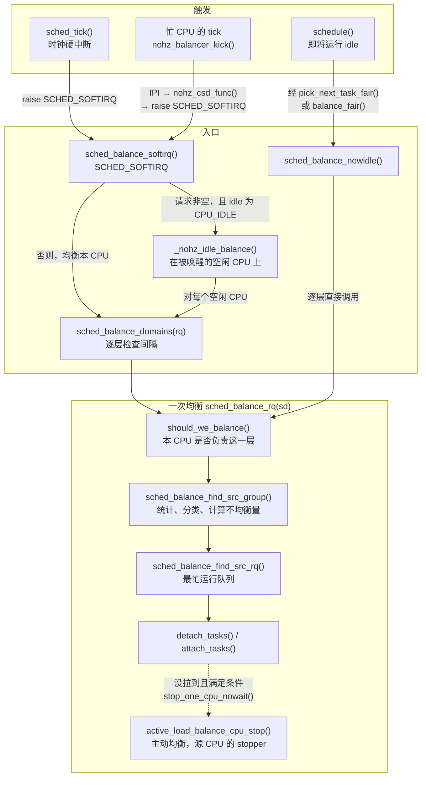
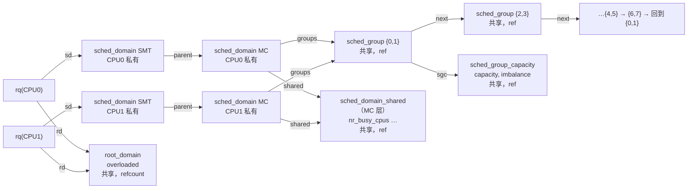
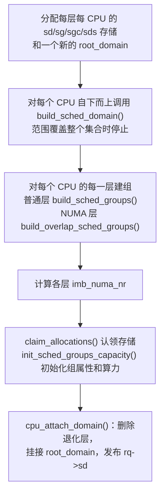
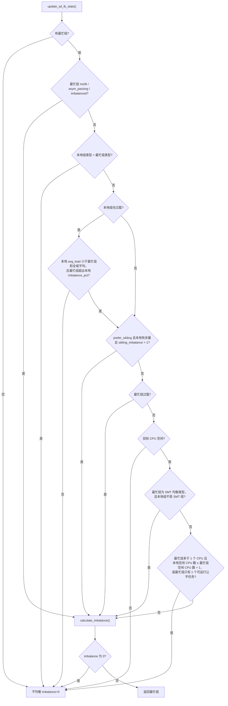
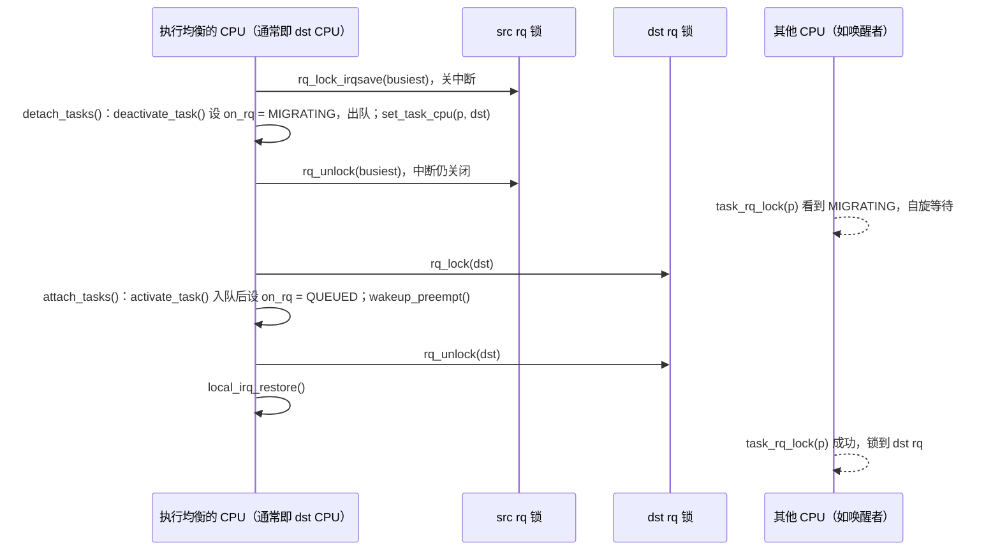
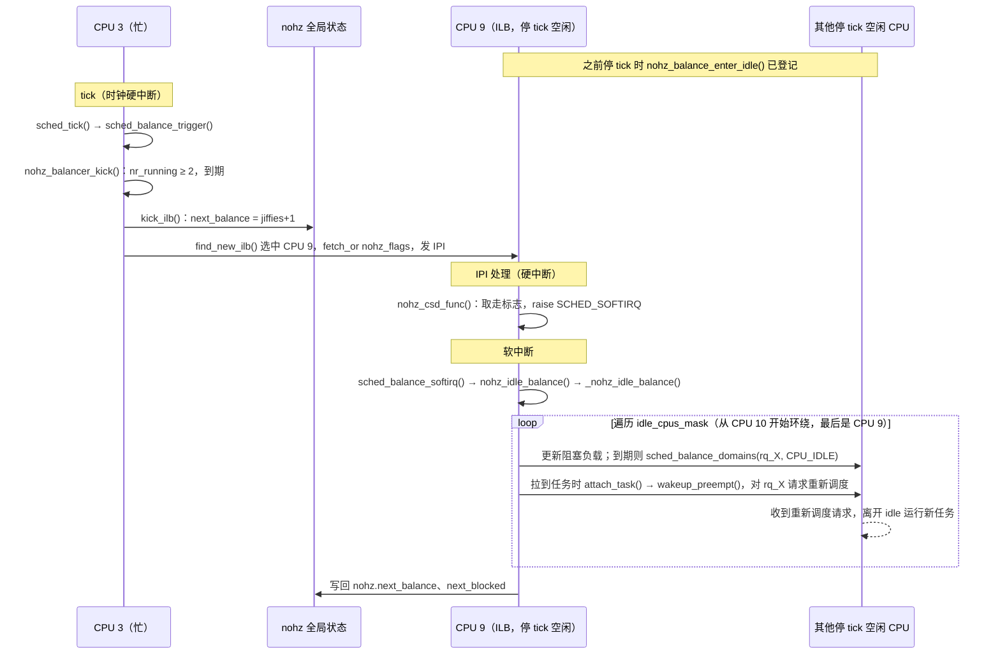

# 进程负载均衡：调度域、迁移决策与触发路径

一台双路 x86 服务器有 16 个逻辑 CPU。执行 `make -j16` 后，编译进程不断被创建、唤醒、退出。某一时刻，CPU 0 的运行队列里排着 3 个可运行任务，CPU 9 却在执行 idle 线程。每个 CPU 的调度器只从**自己的**运行队列中挑任务，CPU 9 不会“看到”CPU 0 上排队的任务；如果没有额外的机制，这 3 个任务只能轮流共享 CPU 0，不能利用空闲的 CPU 9 并行执行。

负载均衡（load balancing）就是这个额外的机制。它要回答一系列具体问题：

1. 什么时候检查是否失衡？由哪个 CPU 来检查？
2. 比较哪些 CPU？是任意两两比较，还是按照硬件拓扑分层比较？
3. “失衡”用什么度量？任务个数、CPU 利用率，还是按权重计算的负载？
4. 判定失衡后，从哪个 CPU 搬、搬哪些任务、搬多少？
5. 搬运会破坏缓存热度和 NUMA 局部性，也要花 CPU 时间，怎样控制这些代价？
6. CPU 停掉时钟中断进入深度空闲后，谁替它做均衡？

本章以公平调度类（`fair_sched_class`，实现在 `kernel/sched/fair.c`）为主线回答这些问题。

## 0. 分析基线与阅读边界

本章依据仓库内 [Makefile 第 2～4 行](../../linux/Makefile#L2-L4)标记的 **6.18.52** 版本，架构为 **x86-64**。读者需要了解每 CPU 运行队列 `struct rq`、调度类 `struct sched_class` 的基本概念，并知道 PELT（Per-Entity Load Tracking，按实体的负载跟踪）会为任务和运行队列维护衰减平均的负载、利用率信号。PELT 的衰减算法本章不展开。

与本章结论有关的配置如下。它们是编译条件，不代表某次运行一定经过对应路径。

| 配置 | 对本章的影响 | 依据 |
| --- | --- | --- |
| `CONFIG_SMP=y`、`CONFIG_NR_CPUS=512` | 支持多 CPU，最多 512 个。本版本 `fair.c`、`topology.c` 中的负载均衡代码已不再以 `CONFIG_SMP` 为编译条件：`fair.o` 无条件编译，`topology.c` 被无条件包含进 `build_utility.c` | [.config#L362](../../linux/.config#L362)、[.config#L431](../../linux/.config#L431)、[sched/Makefile#L37](../../linux/kernel/sched/Makefile#L37)、[build_utility.c#L86](../../linux/kernel/sched/build_utility.c#L86) |
| `CONFIG_SCHED_SMT=y`、`CONFIG_SCHED_CLUSTER=y`、`CONFIG_SCHED_MC=y` | x86 拓扑表包含 SMT、CLS、MC 三个层次 | [.config#L835-L837](../../linux/.config#L835-L837)、[smpboot.c#L481-L491](../../linux/arch/x86/kernel/smpboot.c#L481-L491) |
| `CONFIG_NUMA=y` | 在拓扑表之上追加 NODE 与 NUMA 层次 | [.config#L469](../../linux/.config#L469)、[topology.c#L2052-L2060](../../linux/kernel/sched/topology.c#L2052-L2060) |
| `CONFIG_NUMA_BALANCING=y`，`CONFIG_NUMA_BALANCING_DEFAULT_ENABLED` 未设置 | NUMA 局部性相关的判断被编入，但多节点机器启动时默认关闭自动 NUMA 平衡（8.2 节） | [.config#L206-L207](../../linux/.config#L206-L207)、[mempolicy.c#L3210-L3226](../../linux/mm/mempolicy.c#L3210-L3226) |
| `CONFIG_NO_HZ_COMMON=y`、`CONFIG_NO_HZ_FULL=y` | 编入 NOHZ 空闲均衡（6.3 节） | [.config#L105-L108](../../linux/.config#L105-L108) |
| `CONFIG_HZ=1000` | 1 jiffy = 1 ms，均衡间隔的毫秒值与 jiffies 数值相同 | [.config#L506](../../linux/.config#L506) |
| `CONFIG_PREEMPTION=y`（`PREEMPT_DYNAMIC`，默认 voluntary） | 新空闲均衡最多摘下一个任务就停止（5.9 节）；这是编译条件，与运行时选择哪种抢占模式无关 | [.config#L136-L142](../../linux/.config#L136-L142)、[fair.c#L9916-L9924](../../linux/kernel/sched/fair.c#L9916-L9924) |
| `CONFIG_PREEMPT_RCU=y` | `rcu_read_lock()` 不关抢占；但普通 RCU 宽限期也等待关抢占区间结束。生命周期保护与显式读锁的 lockdep 检查要分开理解（2.8 节） | [.config#L168](../../linux/.config#L168)、[tree_plugin.h#L407-L420](../../linux/kernel/rcu/tree_plugin.h#L407-L420)、[rcupdate.h#L829-L831](../../linux/include/linux/rcupdate.h#L829-L831) |
| `CONFIG_PREEMPT_RT` 未设置 | `SCHED_NR_MIGRATE_BREAK` 为 32 | [.config#L139](../../linux/.config#L139)、[sched.h#L2818-L2822](../../linux/kernel/sched/sched.h#L2818-L2822) |
| `CONFIG_FAIR_GROUP_SCHED=y`、`CONFIG_CFS_BANDWIDTH=y` | 任务负载要折算成层级负载 `task_h_load()`；不能把任务迁到目标 CPU 上被限流的组中 | [.config#L219-L220](../../linux/.config#L219-L220)、[fair.c#L10145-L10152](../../linux/kernel/sched/fair.c#L10145-L10152)、[fair.c#L5902-L5905](../../linux/kernel/sched/fair.c#L5902-L5905)、[fair.c#L9672-L9673](../../linux/kernel/sched/fair.c#L9672-L9673) |
| `CONFIG_SCHED_MC_PRIO=y` | 编入 ITMT（Intel Turbo Boost Max Technology 3.0，同一封装内个别核心的最高睿频更高），平台支持时可在 MC/CLS/PKG 层打开 `SD_ASYM_PACKING`（8.3 节） | [.config#L432](../../linux/.config#L432)、[itmt.c#L3-L12](../../linux/arch/x86/kernel/itmt.c#L3-L12)、[smpboot.c#L456-L491](../../linux/arch/x86/kernel/smpboot.c#L456-L491) |
| `CONFIG_ENERGY_MODEL` 未设置 | 不编入能量感知调度（EAS）；`is_rd_overutilized()` 恒为真，相关跳过条件都不成立 | [.config#L610](../../linux/.config#L610)、[sched.h#L3491-L3497](../../linux/kernel/sched/sched.h#L3491-L3497)、[fair.c#L7006-L7009](../../linux/kernel/sched/fair.c#L7006-L7009) |
| `CONFIG_SCHED_CORE`、`CONFIG_SCHED_PROXY_EXEC`、`CONFIG_UCLAMP_TASK` 未设置 | 核心调度 cookie 检查恒为“匹配”；`task_is_blocked()` 恒为假；不讨论 uclamp | [.config#L143](../../linux/.config#L143)、[.config#L193-L194](../../linux/.config#L193-L194)、[sched.h#L1507-L1522](../../linux/kernel/sched/sched.h#L1507-L1522)、[sched.h#L2305-L2311](../../linux/kernel/sched/sched.h#L2305-L2311)、[include/linux/sched.h#L1681-L1692](../../linux/include/linux/sched.h#L1681-L1692) |
| `CONFIG_SCHED_CLASS_EXT` 未出现在 `.config` 中 | 它依赖 `DEBUG_INFO_BTF`；后者要求 `PAHOLE_VERSION >= 116`，而本配置为 0，所以两者都未启用，sched_ext 未编入 | [Kconfig.preempt#L166-L168](../../linux/kernel/Kconfig.preempt#L166-L168)、[Kconfig.debug#L377-L383](../../linux/lib/Kconfig.debug#L377-L383)、[.config#L26](../../linux/.config#L26) |
| `CONFIG_SCHEDSTATS=y`、`CONFIG_DEBUG_FS=y` | 可从 `/proc/schedstat` 和 debugfs 观察均衡统计与参数（第 10 节）。统计代码已编入，但运行时默认不计数，需要另行打开 | [.config#L10650](../../linux/.config#L10650)、[.config#L10544](../../linux/.config#L10544)、[core.c#L4574](../../linux/kernel/sched/core.c#L4574) |

另有几个**运行时条件**会改变结论，本章正文以括号中的情形为主线：

- debugfs 中的 `migration_cost_ns`（默认 500000 ns）和 `nr_migrate`（默认 32）。[fair.c#L82](../../linux/kernel/sched/fair.c#L82)、[core.c#L186](../../linux/kernel/sched/core.c#L186)、[debug.c#L513-L514](../../linux/kernel/sched/debug.c#L513-L514)
- 各 CPU 的算力（capacity，即其他章所说的 CPU 容量）是否相同（假设对称）。x86 上的混合算力缩放由 intel_pstate 在混合架构、`cpu_smt_possible()` 为假等条件下启用；这个 SMT 条件表示“不支持”或“已强制禁用”，普通的暂时禁用不满足（[intel_pstate.c#L1141-L1168](../../linux/drivers/cpufreq/intel_pstate.c#L1141-L1168)、[cpu.c#L698-L704](../../linux/kernel/cpu.c#L698-L704)），见 8.3 节。
- ITMT 是否打开（假设未打开）。
- 是否用 `isolcpus=`、cpuset 分区等把一部分 CPU 移出普通调度域（假设没有，见 3.5 节）。

**本章边界。** 本章分析公平调度类在多个 CPU 之间的任务放置与迁移。以下内容只说明接口和交互点：PELT 信号的计算；EEVDF 在单个运行队列内的选择规则；自动 NUMA 平衡的页面扫描与任务交换（`task_numa_migrate()`）；cpuset 分区如何生成调度域（见 [cpuset 章 6.1 节](../cgroup2/cpuset.md)）；组调度中 `h_load` 的含义（见 [cpu 控制器章 3.1 节](../cgroup2/cpu.md)）；实时与 deadline 调度类的推拉迁移（第 9 节只做对照）。

## 1. 负载均衡要解决什么问题

### 1.1 每 CPU 运行队列带来的失衡

调度器给每个 CPU 一个 `struct rq`，公平调度类在其中的 `cfs` 队列里挑选任务。这样设计，绝大多数调度操作只需要拿本 CPU 的运行队列锁，不必在 CPU 之间争用一把全局锁。代价是：任务一旦进入某个 CPU 的运行队列，除非有人把它搬走，否则只会在这个 CPU 上运行。

失衡的来源很多：任务被唤醒时放置得不理想；一部分任务睡眠或退出后，原本均衡的分布被打破；CPU 亲和性（`cpus_ptr`）把任务限制在部分 CPU 上；实时任务、中断占用了某些 CPU 的一部分算力。

`fair.c` 中负载均衡部分开头的注释给出了目标：让每个任务得到与其权重成比例的算力。概念上，就是让每个 CPU 上“加权负载 ÷ 算力”接近相等（[fair.c#L9320-L9346](../../linux/kernel/sched/fair.c#L9320-L9346)）。注释同时说明了实现上的两个关键手段：

- 不在全部 CPU 之间两两比较，而是按硬件拓扑建一棵树，每一层比较下层的“组”，越往上层均衡越不频繁。源码注释在规则分层、减少高层参与 CPU 和均衡频率的模型下，估计整体工作量为 O(n)；这不是任意拓扑上单次调用的复杂度保证（[fair.c#L9357-L9378](../../linux/kernel/sched/fair.c#L9357-L9378)）。
- 新进入空闲的 CPU 主动沿树向上找活干（work conserving），而不是等别人推任务过来（[fair.c#L9400-L9404](../../linux/kernel/sched/fair.c#L9400-L9404)）。

实际实现比公式复杂得多。源码会先把每个组分类（是否还有空闲算力、是否过载、是否因亲和性无法均衡等），再按类别选用“任务个数”“利用率”或“负载”中合适的一种度量（第 5 节）。

### 1.2 两种手段：放置与迁移

负载均衡在两个时间点起作用：

| 手段 | 时间点 | 入口 | 本质 |
| --- | --- | --- | --- |
| **放置**（placement） | 任务被唤醒、fork 出新任务、执行 `exec` 时 | `select_task_rq_fair()` | 唤醒、fork 时在任务入队之前决定进入哪个 CPU 的运行队列；exec 时为正在运行的任务另选 CPU，再把它迁过去。只看少量 CPU，代价低 |
| **迁移**（migration） | 周期性 tick、CPU 即将空闲、空闲 CPU 被唤来代为均衡 | `sched_balance_rq()` | 把已经排在某个运行队列里的任务摘下来，挂到另一个运行队列 |

迁移以**拉**为主：目标 CPU 主动把别人的任务拉过来；NOHZ 代理均衡时，则由一个空闲 CPU 代表目标空闲 CPU 执行（6.3 节）。普通拉取失败、算力不匹配等条件可能触发**主动均衡**（active balance）：由源 CPU 的 stopper 线程推送一个任务。stopper 抢占原来的当前任务，使它也成为可以摘取的候选；最终选中的不一定是此前正在运行的任务（[fair.c#L11894-L11921](../../linux/kernel/sched/fair.c#L11894-L11921)、[fair.c#L12362-L12438](../../linux/kernel/sched/fair.c#L12362-L12438)，5.12 节）。

### 1.3 触发事件、执行上下文与输入输出

| 触发事件 | 调用链（简化） | 执行上下文 | 结果 |
| --- | --- | --- | --- |
| 本 CPU 的 tick 发现均衡时间已到 | `sched_tick()` → `sched_balance_trigger()` → 触发 `SCHED_SOFTIRQ` → `sched_balance_softirq()` → `sched_balance_domains()` | tick 在时钟硬中断中判断；均衡在软中断中执行 | 周期性地逐层检查，必要时迁移 |
| `schedule()` 即将运行 idle | `__pick_next_task()` → `pick_next_task_fair()` 或 `balance_fair()` → `sched_balance_newidle()` | `schedule()` 内部，关中断、持本 CPU 运行队列锁（中途会释放） | 立即逐层尝试拉任务。两条入口的条件不同，见 6.2 节 |
| 忙 CPU 的 tick 发现有停了 tick 的空闲 CPU 需要均衡 | `nohz_balancer_kick()` → `kick_ilb()` → IPI（核间中断，Inter-Processor Interrupt）→ `nohz_csd_func()` → `SCHED_SOFTIRQ` → `sched_balance_softirq()` → `nohz_idle_balance()` → `_nohz_idle_balance()` | 发起方在 tick 中；被选中的空闲 CPU 在 `SCHED_SOFTIRQ` 中执行，通常在 IPI 中断退出时处理（目标处于轮询空闲时可能不发 IPI，见 6.3 节） | 代替所有停 tick 的空闲 CPU 做周期均衡，或只更新它们的阻塞负载 |
| 普通迁移多次失败，或必须搬运正在运行的任务 | `sched_balance_rq()` → `stop_one_cpu_nowait()` → `active_load_balance_cpu_stop()` | 源 CPU 上的 stopper 线程 | 把一个任务推到目标 CPU |
| 唤醒、fork | `select_task_rq()` → `select_task_rq_fair()` | 持有 `p->pi_lock` | 返回任务应入队的 CPU |
| exec | `sched_exec()` 直接调用 `p->sched_class->select_task_rq()`；选出别的 CPU 时用 `stop_one_cpu()` 执行 `migration_cpu_stop` 迁移当前任务（[core.c#L5462-L5479](../../linux/kernel/sched/core.c#L5462-L5479)） | 选择时持有 `p->pi_lock`；迁移由 stopper 线程完成 | 当前任务被迁到选出的 CPU |

迁移路径的**输入**是：调度域树、各运行队列的任务数和 PELT 信号、各 CPU 的算力。**输出**是：被迁移的任务，以及调度域上的运行时状态（`balance_interval`、`nr_balance_failed`、`last_balance`）和运行队列的 `next_balance`。

### 1.4 总体结构

下图展示迁移路径的分层，最下层是所有触发路径共用的核心函数。图中的边有三种含义：从“触发”指向“入口”、标注了软中断或 IPI 的边表示异步触发；其余入口之间、入口到核心的实线表示函数调用；“一次均衡”子图内部的实线表示 `sched_balance_rq()` 内的执行顺序，不是相互调用；虚线表示满足条件时才发出的异步请求。



需要注意：

- 三条触发路径最终都调用同一个 `sched_balance_rq()`，差别在于传入的空闲类型 `enum cpu_idle_type`（`__CPU_NOT_IDLE`、`CPU_IDLE`、`CPU_NEWLY_IDLE`，[idle.h#L7-L12](../../linux/include/linux/sched/idle.h#L7-L12)），以及是否按时间间隔节流。
- 新空闲路径不经过 `sched_balance_domains()`，它自己遍历调度域，用“预计空闲时长”而不是时间间隔来节流（6.2 节）。`balance_fair()` 的入口条件是根公平队列的 `nr_queued == 0`，不是“没有可运行公平任务”（6.2 节）。
- 总览图里软中断走向 `_nohz_idle_balance()` 的条件是请求位非空且本次 `idle == CPU_IDLE`。请求位非空但空闲类型不是 `CPU_IDLE` 时，`nohz_idle_balance()` 清掉请求并返回 false，本 CPU 仍做 `sched_balance_domains()`（6.3 节）。

## 2. 调度域：负载均衡在哪些 CPU 之间进行

### 2.1 为什么要分层

在不同硬件层次上搬任务，代价差别很大：SMT 兄弟线程共享缓存，所以 `task_hot()` 在这一层不以缓存热度阻止迁移（[fair.c#L9535-L9537](../../linux/kernel/sched/fair.c#L9535-L9537)）；同一 LLC（Last Level Cache，末级缓存）内的跨核心迁移仍可能失去私有缓存中的局部性；跨 NUMA 节点搬则可能让后续内存访问变成远端访问。这是理解分层的概念模型，不表示任何一次迁移都必然丢失特定层级的缓存。分层之后，每一层可以使用不同的失衡阈值、均衡频率和“缓存热”容忍次数。

调度器用三种对象表示这种分层，[topology.c 第 1120～1188 行](../../linux/kernel/sched/topology.c#L1120-L1188)的注释概括了它们的关系：

- **调度域**（`struct sched_domain`）：某个 CPU 在某一拓扑层次上能“看到”的 CPU 范围。每个 CPU 有自己的一条调度域链，通过 `parent`/`child` 上下相连。
- **调度组**（`struct sched_group`）：一个调度域内部划分出的单元，通常就是下一层（子域）的范围。负载均衡比较的是**组与组**，而不是 CPU 与 CPU。同一层的组用 `next` 串成环。
- **调度组算力**（`struct sched_group_capacity`）：一个组的算力和若干共享状态。完全相同的组共享同一个算力对象。

注释中有一句形象的说法：调度域让你在拓扑层次间上下移动，调度组让你在同一层次内以子域为粒度横向移动。

### 2.2 一个具体例子

本章使用下面这台假想机器作为贯穿全章的例子：

- 2 个插槽（socket），每个插槽是一个 NUMA 节点，节点距离为 10（本地）和 21（远端）；
- 每个插槽 4 个物理核心，每核 2 个 SMT 线程，共 16 个逻辑 CPU；
- 每个插槽一个共享 LLC；L2 为每核私有；
- 为便于阅读，假设同一核心的两个线程编号相邻（CPU 0 与 1、2 与 3……）。真实机器上的编号方式取决于固件枚举顺序。

CPU 0 最终挂上的调度域链如下（3.4 节解释为什么只剩三层）：

```text
链中序号  sd->level  名称   CPU 0 的调度域范围   该域的调度组（环形链表，首组包含 CPU 0）
2         5          NUMA   [0-15]             {0-7} -> {8-15}
1         2          MC     [0-7]              {0,1} -> {2,3} -> {4,5} -> {6,7}
0         0          SMT    [0,1]              {0} -> {1}
```

两列编号含义不同。`sd->level` 在构建时按原始拓扑表逐层加 1（SMT 0、CLS 1、MC 2、PKG 3、NODE 4、NUMA 5，[topology.c#L2401-L2402](../../linux/kernel/sched/topology.c#L2401-L2402)），删除退化层后不重新编号；`relax_domain_level` 比较的就是它（3.2 节），debugfs 中的 `level` 文件显示的也是它。“链中序号”是沿 `parent` 链数出来的连续编号，`/proc/schedstat` 的 `domainN` 和 debugfs 的 `domainM` 目录名用的是这个序号（[stats.c#L136-L140](../../linux/kernel/sched/stats.c#L136-L140)、[debug.c#L623-L631](../../linux/kernel/sched/debug.c#L623-L631)、[debug.c#L583](../../linux/kernel/sched/debug.c#L583)）。

CPU 9 的链则是 SMT `[8,9]`、MC `[8-15]`、NUMA `[0-15]`。每个 CPU 都有自己的一份 `sched_domain` 对象，但 CPU 0 与 CPU 1 在 MC 层看到的组 `{2,3}` 是**同一个** `sched_group` 对象（3.3 节）。

### 2.3 `struct sched_domain`：一层均衡的参数与运行时状态

`struct sched_domain` 定义在 [topology.h 第 73～148 行](../../linux/include/linux/sched/topology.h#L73-L148)。它的范围掩码不在结构体字段里声明，而是紧跟在结构体之后分配，通过 `sched_domain_span()` 取得（[topology.h#L150-L168](../../linux/include/linux/sched/topology.h#L150-L168)）。与本章有关的字段如下：

| 字段 | 含义与单位 | 谁写、何时变化 |
| --- | --- | --- |
| `parent`、`child` | 上一层、下一层调度域；顶层 `parent` 为 `NULL`，底层 `child` 为 `NULL` | 构建时设置，退化合并时调整（3.4 节） |
| `groups` | 本域调度组环的首组，首组总是包含本 CPU | 构建时设置 |
| `span_weight` | 范围内 CPU 个数 | 构建时设置 |
| `flags` | `SD_*` 标志的组合（2.5 节） | 构建时设置 |
| `level`、`name` | 层号与层名，如 `"MC"`。层号按原始拓扑表从 0 逐层编号，删除退化层后不重新编号（2.2 节） | 构建时设置 |
| `min_interval`、`max_interval` | 均衡间隔的下限和上限，单位**毫秒**；默认分别为范围内 CPU 数和它的 2 倍 | `sd_init()` 设置；打开 `sched_verbose` 后可在 debugfs 调整（第 10 节） |
| `balance_interval` | 当前均衡间隔，单位毫秒，初值为范围内 CPU 数 | 每次均衡后加倍或复位（5.11 节） |
| `busy_factor` | CPU 忙时把间隔放大的倍数，默认 16 | `sd_init()` 设置 |
| `imbalance_pct` | 失衡阈值百分比，如 117 表示“超过 17% 才算明显” | `sd_init()` 按层设置（3.2 节） |
| `cache_nice_tries` | 允许连续失败多少次后才迁移“缓存热”任务 | `sd_init()` 按层设置 |
| `imb_numa_nr` | NUMA 层允许保留的少量失衡对应的运行任务数阈值 | 构建时计算（8.2 节） |
| `last_balance` | 上次在这一层做周期均衡的时刻，单位 jiffies | `sched_balance_domains()` 更新 |
| `nr_balance_failed` | 连续失败次数 | `sched_balance_rq()` 递增或清零；主动均衡成功时由源 CPU 的 stopper 清零（5.12 节） |
| `max_newidle_lb_cost`、`last_decay_max_lb_cost` | 在这一层做一次新空闲均衡的最大耗时（纳秒）及上次衰减时刻 | 新空闲均衡后更新，周期路径中衰减（6.2 节） |
| `newidle_call`、`newidle_success`、`newidle_ratio` | 新空闲均衡的调用次数、成功次数及成功率（按 1024 计） | `update_newidle_stats()` 更新 |
| `nohz_idle` | 本 CPU 是否已从所在 LLC 的忙 CPU 计数中扣除 | NOHZ 进出空闲时更新（6.3 节） |
| `shared` | 指向本层范围内各 CPU 共享的 `sched_domain_shared`，只有带 `SD_SHARE_LLC` 的层才有（2.6 节） | 构建时设置，引用计数 |
| `lb_count[]` 等 | schedstat 统计，按空闲类型分三组 | `CONFIG_SCHEDSTATS` 下更新 |

运行时字段（`last_balance`、`balance_interval`、`nr_balance_failed` 等）属于**每个 CPU 自己的那份**调度域对象，没有锁保护。它们通常由本 CPU 的均衡路径更新，另有两类跨 CPU 的写者：NOHZ 代理均衡时，执行代理的 CPU 会更新被代理 CPU 的这份对象（6.3 节）；主动均衡成功时，源 CPU 上的 stopper 会把目标 CPU 那份调度域的 `nr_balance_failed` 清零（[fair.c#L12399-L12422](../../linux/kernel/sched/fair.c#L12399-L12422)）。源码没有为这些更新加同步，可以理解为把它们当作允许偶发竞争的启发式状态（分析）。

### 2.4 调度组与算力对象

两个结构定义在 [sched.h 第 2093～2141 行](../../linux/kernel/sched/sched.h#L2093-L2141)：

| 结构与字段 | 含义 |
| --- | --- |
| `sched_group.next` | 同一调度域中下一个组，构成环 |
| `sched_group.cpumask[]`（经 `sched_group_span()` 访问） | 组覆盖的 CPU，变长数组 |
| `sched_group.group_weight`、`cores` | 组内 CPU 数、物理核心数（SMT 兄弟只算一个） |
| `sched_group.flags` | **子域**的标志。例如 MC 层的组 `{2,3}` 的 `flags` 含 `SD_SHARE_CPUCAPACITY`，表示这个组是一个 SMT 核心 |
| `sched_group.asym_prefer_cpu` | 组内优先级最高的 CPU，仅 `SD_ASYM_PACKING` 使用 |
| `sched_group.sgc` | 指向算力对象 |
| `sched_group_capacity.capacity` | 组的总算力，单个满算力 CPU 为 `SCHED_CAPACITY_SCALE`（1024） |
| `min_capacity`、`max_capacity` | 组内单个 CPU 的最小、最大算力 |
| `next_update` | 下次需要刷新算力的时刻（jiffies） |
| `imbalance` | 下层因亲和性无法均衡时置 1 的标志，源码注释承认它与算力无关，只是借用这个共享对象存放 |
| `cpumask[]`（经 `group_balance_mask()` 访问） | **均衡掩码**：组内哪些 CPU 有资格代表这个组做上一层的均衡 |

两个对象都带 `ref` 引用计数：非 NUMA 层的同一个组会被多个 CPU 的调度域引用；NUMA 层的组虽然每 CPU 一份，但它们指向的算力对象仍被共享（3.3 节）。

在非 NUMA 层，均衡掩码就等于组的范围；在 NUMA 层，由于组之间可能**重叠**，均衡掩码只包含那些“沿自己的调度域链向上会走到这个组”的 CPU（[topology.c#L901-L940](../../linux/kernel/sched/topology.c#L901-L940)）。`group_balance_cpu()` 返回均衡掩码中的第一个 CPU（[topology.c#L799-L802](../../linux/kernel/sched/topology.c#L799-L802)），它在 5.2 节决定“谁负责这一层”。

### 2.5 调度域标志

`SD_*` 标志在 [sd_flags.h](../../linux/include/linux/sched/sd_flags.h#L45-L162) 中逐个声明，每个标志还带有元标志：`SDF_SHARED_CHILD` 表示设置在某层就应该设置在其下所有层，`SDF_SHARED_PARENT` 表示设置在某层就应该设置在其上所有层，`SDF_NEEDS_GROUPS` 表示只有一个组时这个标志没有意义。标志分两类：

| 类别 | 标志 | 含义 |
| --- | --- | --- |
| 描述拓扑 | `SD_SHARE_CPUCAPACITY` | 域内 CPU 共享执行单元（SMT） |
|  | `SD_CLUSTER` | 域内 CPU 共享 L2 或 LLC 标签 |
|  | `SD_SHARE_LLC` | 域内 CPU 共享末级缓存 |
|  | `SD_NUMA` | 域跨越 NUMA 节点 |
|  | `SD_ASYM_CPUCAPACITY`、`SD_ASYM_CPUCAPACITY_FULL` | 域内 CPU 算力不同，由 `asym_cpu_capacity_classify()` 自动检测 |
|  | `SD_ASYM_PACKING` | 任务应优先集中到优先级高的 CPU |
| 规定行为 | `SD_BALANCE_NEWIDLE` | 新空闲时在这一层均衡 |
|  | `SD_BALANCE_EXEC`、`SD_BALANCE_FORK`、`SD_BALANCE_WAKE` | exec、fork、唤醒时在这一层做放置均衡 |
|  | `SD_WAKE_AFFINE` | 唤醒时可以考虑把任务放到唤醒者所在 CPU |
|  | `SD_PREFER_SIBLING` | 优先把任务分散到兄弟组 |
|  | `SD_SERIALIZE` | 全系统同一时刻只允许一个 CPU 在带此标志的层做均衡 |

拓扑描述类标志由体系结构给出，`sd_init()` 只接受 `TOPOLOGY_SD_FLAGS` 中列出的几个（[topology.c#L1600-L1622](../../linux/kernel/sched/topology.c#L1600-L1622)），再由它把拓扑属性**翻译**成行为标志和参数（3.2 节）。

### 2.6 跨 CPU 共享的状态

**`struct sched_domain_shared`**（[topology.h#L66-L71](../../linux/include/linux/sched/topology.h#L66-L71)）：每个带 `SD_SHARE_LLC` 的层（示例中为 SMT 和 MC 层）各有一份，由该层范围内的 CPU 共用（[topology.c#L1720-L1724](../../linux/kernel/sched/topology.c#L1720-L1724)）。NOHZ 计数和唤醒路径只通过每 CPU 缓存指针 `sd_llc`、`sd_llc_shared`（见下文）使用**最高**共享 LLC 层（示例中为 MC 层）的那一份：

| 字段 | 含义 | 使用者 |
| --- | --- | --- |
| `nr_busy_cpus` | LLC 内未进入 NOHZ 空闲的 CPU 数，原子变量 | `nohz_balancer_kick()` 判断是否值得唤醒空闲 CPU 做均衡 |
| `has_idle_cores` | LLC 内可能有整核空闲 | 唤醒快路径 `select_idle_sibling()` |
| `nr_idle_scan` | 唤醒时最多扫描多少个 CPU 找空闲 | 由周期均衡计算，唤醒快路径读取（7.4 节） |

为避免每次都沿调度域链查找，构建完成后每个 CPU 还缓存了几个指针：`sd_llc`（最高的共享 LLC 层）、`sd_llc_shared`、`sd_numa`、`sd_asym_packing`、`sd_asym_cpucapacity` 等（[sched.h#L2076-L2083](../../linux/kernel/sched/sched.h#L2076-L2083)、[`update_top_cache_domain()`](../../linux/kernel/sched/topology.c#L671-L709)）。

**`struct root_domain`**（[sched.h#L986-L1046](../../linux/kernel/sched/sched.h#L986-L1046)）表示一个相互独立的负载均衡分区。通常全系统只有一个；cpuset 建立独占分区时会出现多个。与公平调度负载均衡有关的是：

- `overloaded`：提示分区内可能有可拉取的负载，例如某个 CPU 的 `nr_running > 1` 或存在 misfit 任务（算力不对称时“装不下”所在 CPU、可能应迁到更强 CPU 的任务，8.3 节）。它是启发式状态，不是每个 CPU 当前可运行任务数的精确快照；`nr_running` 也可能含延迟出队任务（5.3 节）。新空闲均衡在它为假时直接放弃（6.2 节）。某个 CPU 的 `nr_running` 从不足 2 变为 2 及以上时，`add_nr_running()` 立即把它置为真（[sched.h#L2744-L2757](../../linux/kernel/sched/sched.h#L2744-L2757)）；顶层调度域的均衡会根据本次统计重新赋值，包括置为假（[fair.c#L10666-L10669](../../linux/kernel/sched/fair.c#L10666-L10669)、[fair.c#L11355-L11363](../../linux/kernel/sched/fair.c#L11355-L11363)），通过 `READ_ONCE`/`WRITE_ONCE` 无锁读写（[sched.h#L1054-L1063](../../linux/kernel/sched/sched.h#L1054-L1063)）。
- `overutilized`：只在 EAS 启用时有意义，本配置下不起作用。
- `rto_mask`、`dlo_mask` 等：实时与 deadline 调度类的推拉迁移使用（第 9 节）。

### 2.7 对象关系

下图以 CPU 0 和 CPU 1 为例展示对象关系。每条箭头都表示“保存指针”，边上标注字段名；节点中标有“共享”的对象被多处指针引用，靠引用计数管理。为突出关系，图中只画了 SMT、MC 两层，省略了 SMT 层的组和 `shared`、NUMA 层以及组的均衡掩码。



要点：

- **调度域是每 CPU 私有的**；`sched_domain_shared` 和 `root_domain` 是**共享**的；调度组在非 NUMA 层由同层 CPU 共享，在 NUMA 层每 CPU 一份，但它指向的算力对象仍然共享（3.3 节）。共享对象靠引用计数管理生命周期。
- `rq->sd` 只指向最底层；上层通过 `parent` 找到。`for_each_domain(cpu, sd)` 就是沿 `parent` 链遍历（[sched.h#L2015-L2024](../../linux/kernel/sched/sched.h#L2015-L2024)）。
- MC 域的首组 `{0,1}` 是 CPU 0 和 CPU 1 共同的“本地组”，组环中的其他组是它们共同的“兄弟组”。

### 2.8 生命周期与并发保护

| 对象或字段 | 创建、发布与释放 | 读者需要的保护 |
| --- | --- | --- |
| 调度域链（`rq->sd`） | 在 CPU 热插拔锁和 `sched_domains_mutex` 下构建；用 `rcu_assign_pointer()` 发布；旧链用 `call_rcu()` 延迟释放（[topology.c#L644-L647](../../linux/kernel/sched/topology.c#L644-L647)、[topology.c#L769-L773](../../linux/kernel/sched/topology.c#L769-L773)） | RCU 生命周期保护，或持有 `sched_domains_mutex`。关抢占区间也阻止对应 RCU 回调过早释放；本章主要遍历入口另外显式取得 RCU 读锁（[sched.h#L2012-L2024](../../linux/kernel/sched/sched.h#L2012-L2024)、[rcupdate.h#L829-L831](../../linux/include/linux/rcupdate.h#L829-L831)） |
| 调度组、算力对象、`sched_domain_shared` | 随调度域构建；`ref` 归零时随调度域的 RCU 回调释放（[topology.c#L599-L631](../../linux/kernel/sched/topology.c#L599-L631)） | 同上 |
| `root_domain` | `refcount` 记录挂接的运行队列数，以及 `sched_get_rd()` 取得的临时引用（RT 推送路径使用），归零后 `call_rcu()` 释放（[topology.c#L472-L528](../../linux/kernel/sched/topology.c#L472-L528)） | 同上 |
| 远端运行队列的统计量（`nr_running`、PELT 平均值等） | 由远端 CPU 在自己的运行队列锁下更新 | 均衡统计阶段**不加锁**读取，只作为启发式依据；真正摘任务时再持锁重新检查 |
| `sgc->imbalance`、`sgc->capacity` | 多个 CPU 可能同时写 | 不加锁；它们是启发式状态，偶发的竞争只影响一次判断 |
| 任务在运行队列之间的移动 | — | 源、目标运行队列锁，加上 `TASK_ON_RQ_MIGRATING` 协议（5.10 节） |

这里要区分**对象何时可以释放**与**调试检查是否认可当前访问方式**。本配置 `CONFIG_PREEMPT_RCU=y`，`__rcu_read_lock()` 只增加 `rcu_read_lock_nesting`，不关抢占（[tree_plugin.h#L407-L420](../../linux/kernel/rcu/tree_plugin.h#L407-L420)）；但这不意味着关抢占区间没有 RCU 生命周期保护。当前 API 明确保证 `call_rcu()` 和 `synchronize_rcu()` 也等待关抢占、关中断或关软中断区间结束（[rcupdate.h#L829-L831](../../linux/include/linux/rcupdate.h#L829-L831)）。抢占 RCU 的 tick 检查在读侧嵌套非零，或者 `preempt_count()` 含 `PREEMPT_MASK` / `SOFTIRQ_MASK` 时不报告静止状态（[tree_plugin.h#L811-L828](../../linux/kernel/rcu/tree_plugin.h#L811-L828)）。因此先进入关抢占区间再读取旧域链，可以阻止它在使用期间被对应的 RCU 回调释放。

另一方面，`for_each_domain()` 经 `rcu_dereference_check_sched_domain()` 读取 `rq->sd`，该宏传给调试检查的条件是持有 `sched_domains_mutex`，或 `rcu_read_lock_held()` 为真（[sched.h#L2012-L2013](../../linux/kernel/sched/sched.h#L2012-L2013)、[rcupdate.h#L679-L681](../../linux/include/linux/rcupdate.h#L679-L681)）。本配置没有 `CONFIG_DEBUG_LOCK_ALLOC`（[.config#L10666](../../linux/.config#L10666)），`rcu_read_lock_held()` 的内联实现恒返回 1（[rcupdate.h#L356-L358](../../linux/include/linux/rcupdate.h#L356-L358)）；启用 lockdep 后，它检查的是显式 RCU 读锁的锁映射，并不单凭“当前不可抢占”返回真（[update.c#L345-L351](../../linux/kernel/rcu/update.c#L345-L351)）。这是访问方式的检查条件，不能反过来用于否定前述宽限期保证。

[sched.h#L2015-L2020](../../linux/kernel/sched/sched.h#L2015-L2020) 的注释说明域树应在关抢占区间访问。本章主要遍历入口还另外取 `rcu_read_lock()`：`sched_balance_domains()` 在软中断里取锁后遍历（[fair.c#L12511-L12512](../../linux/kernel/sched/fair.c#L12511-L12512)）；新空闲均衡在中断和抢占关闭时释放队列锁，再取得读锁（[fair.c#L13113-L13118](../../linux/kernel/sched/fair.c#L13113-L13118)、[fair.c#L13137-L13142](../../linux/kernel/sched/fair.c#L13137-L13142)）；`select_task_rq_fair()` 在持有 `pi_lock`、中断关闭时再取读锁（[fair.c#L8764](../../linux/kernel/sched/fair.c#L8764)）。`nohz_run_idle_balance()` 在进入空闲的本地关抢占、关中断阶段之前执行（[fair.c#L13025-L13026](../../linux/kernel/sched/fair.c#L13025-L13026)、[idle.c#L276-L284](../../linux/kernel/sched/idle.c#L276-L284)），但它传给 `_nohz_idle_balance()` 的只有 `NOHZ_STATS_KICK`（[fair.c#L13038-L13039](../../linux/kernel/sched/fair.c#L13038-L13039)）。`sched_balance_domains()` 只在请求含 `NOHZ_BALANCE_KICK` 时调用（[fair.c#L12964-L12965](../../linux/kernel/sched/fair.c#L12964-L12965)、[sched.h#L3128-L3131](../../linux/kernel/sched/sched.h#L3128-L3131)），所以这条路径不遍历调度域。

## 3. 调度域树的构建与重建

### 3.1 x86 的拓扑层表

调度器自下而上按“拓扑层表”构建调度域。通用默认表是 `default_topology[]`（[topology.c#L1775-L1789](../../linux/kernel/sched/topology.c#L1775-L1789)）；x86 启动时用自己的 `x86_topology[]` 替换它（[smpboot.c#L481-L516](../../linux/arch/x86/kernel/smpboot.c#L481-L516)）：

| 层 | 范围函数 | 取得的 CPU 集合 | 拓扑标志 |
| --- | --- | --- | --- |
| SMT | `tl_smt_mask()` | 同一物理核心的硬件线程 | `SD_SHARE_CPUCAPACITY \| SD_SHARE_LLC` |
| CLS | `tl_cls_mask()` → `cpu_clustergroup_mask()` | 共享 L2 的 CPU | `SD_CLUSTER \| SD_SHARE_LLC`，ITMT 打开时加 `SD_ASYM_PACKING` |
| MC | `tl_mc_mask()` → `cpu_coregroup_mask()` | 共享 LLC 的 CPU | `SD_SHARE_LLC`，ITMT 打开时加 `SD_ASYM_PACKING` |
| PKG | `tl_pkg_mask()` → `cpu_node_mask()` | 与本 CPU 同一 NUMA 节点的 CPU | ITMT 打开时为 `SD_ASYM_PACKING`，否则无 |

范围函数见 [topology.c#L1731-L1770](../../linux/kernel/sched/topology.c#L1731-L1770) 和 [smpboot.c#L598-L606](../../linux/arch/x86/kernel/smpboot.c#L598-L606)，x86 的标志函数见 [smpboot.c#L456-L472](../../linux/arch/x86/kernel/smpboot.c#L456-L472)；`cpu_node_mask()` 的定义见 [topology.h#L263-L266](../../linux/include/linux/topology.h#L263-L266)。`build_sched_topology()` 还会做两处裁剪：每核只有一个线程时去掉 SMT 层；一个插槽内含多个 NUMA 节点时清空 PKG 层，交给 NUMA 层表达。

`sched_init_smp()` 先调用 `sched_init_numa()`（[core.c#L8611-L8624](../../linux/kernel/sched/core.c#L8611-L8624)）。它统计节点距离表中有多少种不同的距离值，为每种距离生成一层：距离为本地距离的一层叫 NODE，其余各层叫 NUMA，并把这些层追加到拓扑层表末尾（[topology.c#L1931-L2069](../../linux/kernel/sched/topology.c#L1931-L2069)）。第 k 层中，CPU 的范围是“距离不超过第 k 种距离值的所有节点的 CPU”。示例机器只有 10 和 21 两种距离，于是在 PKG 之上追加 NODE（本节点）和 NUMA（两个节点）两层。

### 3.2 `sd_init()`：把拓扑属性翻译成均衡参数

`sd_init()`（[topology.c#L1625-L1729](../../linux/kernel/sched/topology.c#L1625-L1729)）为某个 CPU 在某一层初始化一个调度域。它先计算范围（拓扑层范围与本次构建的 CPU 集合求交），再按下面的规则设置参数：

1. **默认值**：`min_interval` = 范围内 CPU 数，`max_interval` = 其 2 倍，`balance_interval` = 范围内 CPU 数（均为毫秒）；`busy_factor` = 16；`imbalance_pct` = 117；`cache_nice_tries` = 0。默认打开 `SD_BALANCE_NEWIDLE`、`SD_BALANCE_EXEC`、`SD_BALANCE_FORK`、`SD_WAKE_AFFINE`、`SD_PREFER_SIBLING`，**不**打开 `SD_BALANCE_WAKE`。新空闲成功率统计初始化为 50%。
2. **按拓扑调整**（互斥分支，按顺序判断）：
   - 共享执行单元（SMT）：`imbalance_pct` = 110；
   - 共享 LLC：`imbalance_pct` = 117，`cache_nice_tries` = 1；
   - NUMA：`cache_nice_tries` = 2，去掉 `SD_PREFER_SIBLING`，加上 `SD_SERIALIZE`；若该层距离大于 `node_reclaim_distance`（默认 `RECLAIM_DISTANCE` = 30，[mm/page_alloc.c#L3699](../../linux/mm/page_alloc.c#L3699)、[topology.h#L59](../../linux/include/linux/topology.h#L59)；x86 AMD Zen 平台上改为 32，[amd.c#L921-L926](../../linux/arch/x86/kernel/cpu/amd.c#L921-L926)），再去掉 `SD_BALANCE_EXEC`、`SD_BALANCE_FORK`、`SD_WAKE_AFFINE`；
   - 其他：`cache_nice_tries` = 1。
3. **算力不对称时**：子域去掉 `SD_PREFER_SIBLING`，不把任务往算力不同的 CPU 上平摊。
4. **共享 LLC 的层**：挂上该层的 `sched_domain_shared`，`nr_busy_cpus` 初始化为范围内 CPU 数。

把这些规则用到示例机器上，CPU 0 最终的三层参数为：

| 层 | 范围 CPU 数 | `min/max/balance_interval`（ms） | `imbalance_pct` | `cache_nice_tries` | 主要行为标志 |
| --- | --- | --- | --- | --- | --- |
| SMT | 2 | 2 / 4 / 2 | 110 | 0 | NEWIDLE、EXEC、FORK、WAKE_AFFINE、PREFER_SIBLING |
| MC | 8 | 8 / 16 / 8 | 117 | 1 | NEWIDLE、EXEC、FORK、WAKE_AFFINE、PREFER_SIBLING |
| NUMA | 16 | 16 / 32 / 16 | 117 | 2 | NEWIDLE、EXEC、FORK、WAKE_AFFINE、SERIALIZE |

可以看出几条设计意图（属于分析）：层次越高，间隔越长、越不轻易迁移缓存热任务；SMT 层阈值最低，因为兄弟线程之间搬任务几乎没有缓存代价；NUMA 层要求全局串行，避免大量 CPU 同时扫描整个系统。

`cpuset.sched_relax_domain_level` 或启动参数 `relax_domain_level=` 在指定层及以上执行 `sd->flags &= ~(SD_BALANCE_WAKE|SD_BALANCE_NEWIDLE)`（[topology.c#L1523-L1526](../../linux/kernel/sched/topology.c#L1523-L1526)）。`default_relax_domain_level` 初值是 -1，不设置时这个函数直接返回（[topology.c#L1499](../../linux/kernel/sched/topology.c#L1499)、[topology.c#L1516-L1518](../../linux/kernel/sched/topology.c#L1516-L1518)）。`sd_init()` 本来就不设置 `SD_BALANCE_WAKE`，因此一旦生效，实际被关掉的是从该层往上的 `SD_BALANCE_NEWIDLE`。

### 3.3 `build_sched_domains()`：构建、连组、算力、挂载

`build_sched_domains()`（[topology.c#L2484-L2633](../../linux/kernel/sched/topology.c#L2484-L2633)）为一个 CPU 集合（一个分区）构建全部调度域，分六步（下图从上到下），最后一步“挂载”在 3.4 节展开：



**第二步**在 `build_sched_domain()` 中把新域挂到子域之上，并检查子域范围是否是父域的子集（[topology.c#L2395-L2421](../../linux/kernel/sched/topology.c#L2395-L2421)）。对每个 CPU 逐层构建的循环在某层范围已等于整个 CPU 集合时停止（[topology.c#L2503-L2518](../../linux/kernel/sched/topology.c#L2503-L2518)），因此单节点机器不会构建 NUMA 层。

**第三步**的关键在 `get_group()`（[topology.c#L1190-L1226](../../linux/kernel/sched/topology.c#L1190-L1226)）：一个组由“子域范围中的第一个 CPU”标识，组对象从该 CPU 那份存储中取。于是 CPU 0 和 CPU 1 在 MC 层为 `{2,3}` 建组时，都会取到 CPU 2 那份存储中的同一个 `sched_group`；第一次访问时初始化范围、均衡掩码、`flags = child->flags` 和初始算力，以后的访问只增加引用计数。`build_sched_groups()` 从本 CPU 开始环绕遍历域范围，跳过已被覆盖的 CPU，把组串成环，首组就是本 CPU 所在的组（[topology.c#L1236-L1269](../../linux/kernel/sched/topology.c#L1236-L1269)）。非 NUMA 层要求各 CPU 的范围要么完全相同要么互不相交，`topology_span_sane()` 负责检查，否则组环会被破坏（[topology.c#L2427-L2478](../../linux/kernel/sched/topology.c#L2427-L2478)）。

NUMA 层的范围可以部分重叠（[topology.c#L806-L897](../../linux/kernel/sched/topology.c#L806-L897) 的注释给了四节点环形拓扑的例子），所以改用 `build_overlap_sched_groups()`：组是每个 CPU 私有的，并通过 `build_balance_mask()` 算出均衡掩码。

**第四步**按 LLC 个数计算 NUMA 层允许的少量失衡，见 8.2 节。

**第五步**中 `init_sched_groups_capacity()` 为每个组计算 `group_weight`、`cores`（去掉 SMT 兄弟后的核心数），仅在域带 `SD_ASYM_PACKING` 时计算 `asym_prefer_cpu`；然后，若本 CPU 是本地组（首组）的 `group_balance_cpu`，就调用 `update_group_capacity()` 计算这个组的初始算力（[topology.c#L1281-L1321](../../linux/kernel/sched/topology.c#L1281-L1321)）。

### 3.4 退化层的删除与挂载

示例机器上，CPU 0 构建出的原始链是 SMT `[0,1]` → CLS `[0,1]` → MC `[0-7]` → PKG `[0-7]` → NODE `[0-7]` → NUMA `[0-15]`。其中好几层没有任何均衡意义：CLS 与 SMT 范围相同（L2 每核私有），PKG、NODE 与 MC 范围相同。

`cpu_attach_domain()`（[topology.c#L716-L776](../../linux/kernel/sched/topology.c#L716-L776)）用两条规则删除这些层（[topology.c#L170-L207](../../linux/kernel/sched/topology.c#L170-L207)）：

- `sd_degenerate()`：范围只有 1 个 CPU；或者“只有一个组，或没有任何需要分组的标志”，并且没有不依赖分组的标志（目前只有 `SD_WAKE_AFFINE`）。
- `sd_parent_degenerate()`：父域本身满足 `sd_degenerate()`；或者父域与子域范围相同，并且父域的标志（只有一个组时先去掉需要分组的标志）都已包含在子域中。

删除父域时把它的 `SD_PREFER_SIBLING` 传给子域，并修正祖父域首组的 `flags`。于是 CPU 0 最终只剩 SMT → MC → NUMA 三层，与 2.2 节的表一致。

之后 `cpu_attach_domain()` 调用 `rq_attach_root()` 把运行队列挂到新的 `root_domain`（必要时先让运行队列在旧根域下线、在新根域上线），用 `rcu_assign_pointer()` 发布 `rq->sd`，用 `call_rcu()` 释放旧链，最后刷新 `sd_llc` 等每 CPU 缓存指针。

### 3.5 何时重建

| 时机 | 入口 | 范围 |
| --- | --- | --- |
| 启动 | `sched_init_smp()` → `sched_init_domains(cpu_active_mask)` | active CPU 与 `HK_TYPE_DOMAIN` housekeeping 集合的交集，即排除 `isolcpus=` 隔离的 CPU（[topology.c#L2690-L2708](../../linux/kernel/sched/topology.c#L2690-L2708)） |
| CPU 上下线、cpuset 分区变化、ITMT 开关等拓扑更新 | `partition_sched_domains()` | 通常比较新旧分区集合，只拆除消失的、只构建新增的（[topology.c#L2774-L2876](../../linux/kernel/sched/topology.c#L2774-L2876)）；但若 `arch_update_cpu_topology()` 报告拓扑变化，所有分区都拆除重建（[topology.c#L2784-L2787](../../linux/kernel/sched/topology.c#L2784-L2787)、[topology.c#L2804](../../linux/kernel/sched/topology.c#L2804)、[topology.c#L2825](../../linux/kernel/sched/topology.c#L2825)）。x86 上切换 ITMT 就属于这种情况（[itmt.c#L54-L57](../../linux/arch/x86/kernel/itmt.c#L54-L57)、[smpboot.c#L130-L138](../../linux/arch/x86/kernel/smpboot.c#L130-L138)）。cpuset 如何生成分区见 [cpuset 章 6.1 节](../cgroup2/cpuset.md) |

不属于任何分区的 CPU 会被挂上 `NULL` 调度域（[topology.c#L2714-L2730](../../linux/kernel/sched/topology.c#L2714-L2730)）。`on_null_domain()` 为真时，`sched_balance_trigger()` 直接返回，`nohz_balance_enter_idle()` 也不把它加入 NOHZ 空闲集合，这类 CPU 完全不参与公平调度类的迁移均衡（[fair.c#L12570-L12573](../../linux/kernel/sched/fair.c#L12570-L12573)、[fair.c#L13257-L13270](../../linux/kernel/sched/fair.c#L13257-L13270)、[fair.c#L12843-L12845](../../linux/kernel/sched/fair.c#L12843-L12845)）。

此外，CPU 上线、下线时会调用 `update_max_interval()`，把全局的最大均衡间隔 `max_load_balance_interval` 设为 `HZ * num_online_cpus() / 10` 个 jiffies（[fair.c#L12440-L12447](../../linux/kernel/sched/fair.c#L12440-L12447)、[core.c#L8514-L8520](../../linux/kernel/sched/core.c#L8514-L8520)、[core.c#L8604](../../linux/kernel/sched/core.c#L8604)）。在线 CPU 数取调用时刻的值。x86 上新 CPU 的上线回调在 `ap_starting()` → `notify_cpu_starting()` 中执行，早于它把自己置入在线掩码（[smpboot.c#L211](../../linux/arch/x86/kernel/smpboot.c#L211)、[smpboot.c#L283](../../linux/arch/x86/kernel/smpboot.c#L283)、[smpboot.c#L304](../../linux/arch/x86/kernel/smpboot.c#L304)），所以按代码顺序推断，示例机器启动完成后该值为 `1000 × 15 / 10` = 1500 jiffies，约 1.5 秒（这是静态推断，未经运行验证）。

## 4. 运行队列上的均衡状态与负载度量

### 4.1 `struct rq` 中与均衡有关的字段

| 字段 | 含义 | 定义 |
| --- | --- | --- |
| `sd`、`rd` | 本 CPU 的最底层调度域（RCU 保护）、所属根域 | [sched.h#L1208-L1209](../../linux/kernel/sched/sched.h#L1208-L1209) |
| `cpu_capacity` | 留给公平调度类的算力，即扣除 RT、DL、中断和硬件压力后的部分 | [sched.h#L1211](../../linux/kernel/sched/sched.h#L1211) |
| `next_balance` | 下次周期均衡的时刻（jiffies） | [sched.h#L1183](../../linux/kernel/sched/sched.h#L1183) |
| `idle_balance` | 本次软中断以什么空闲类型做均衡，由 tick 或 NOHZ IPI 写入 | [sched.h#L1216](../../linux/kernel/sched/sched.h#L1216) |
| `nohz_idle_balance`、`nohz_flags` | NOHZ 均衡请求标志：前者是本次软中断要处理的请求，后者是其他 CPU 原子地合并进来的待处理请求（6.3 节） | [sched.h#L1215](../../linux/kernel/sched/sched.h#L1215)、[sched.h#L1135](../../linux/kernel/sched/sched.h#L1135) |
| `nohz_tick_stopped`、`has_blocked_load`、`last_blocked_load_update_tick` | 是否已作为停 tick 空闲 CPU 登记；是否仍有待衰减的阻塞负载；上次衰减时刻 | [sched.h#L1130-L1136](../../linux/kernel/sched/sched.h#L1130-L1136) |
| `misfit_task_load` | 当前任务“装不下”本 CPU 时记录的负载，仅算力不对称时使用 | [sched.h#L1218](../../linux/kernel/sched/sched.h#L1218) |
| `active_balance`、`push_cpu`、`active_balance_work` | 主动均衡进行中标志、推送目标、stopper 工作项 | [sched.h#L1220-L1223](../../linux/kernel/sched/sched.h#L1220-L1223) |
| `cfs_tasks` | 本 CPU 上已加入公平队列的任务实体（含各级组内任务及延迟出队任务）组成的链表；不包含已移入带宽限流 limbo 链表的任务 | [sched.h#L1229](../../linux/kernel/sched/sched.h#L1229)、[fair.c#L3757-L3776](../../linux/kernel/sched/fair.c#L3757-L3776)、[fair.c#L6035-L6038](../../linux/kernel/sched/fair.c#L6035-L6038) |
| `idle_stamp`、`avg_idle`、`max_idle_balance_cost` | 进入空闲的时刻、平均空闲时长、新空闲均衡的最大耗时，单位纳秒（6.2 节） | [sched.h#L1239-L1243](../../linux/kernel/sched/sched.h#L1239-L1243) |

`cfs_tasks` 按最近入队或最近被选中的顺序维护。内核在选中任务时把它移到表头，并注明这使链表成为 MRU（[fair.c#L13753-L13758](../../linux/kernel/sched/fair.c#L13753-L13758)）；任务入队时同样 `list_add()` 到表头（[fair.c#L3761-L3766](../../linux/kernel/sched/fair.c#L3761-L3766)）。表尾是最久没有入队、也最久没有被选中的任务。刚被唤醒的任务即使睡了很久，也会插到表头，所以表尾不等于“最久没有在 CPU 上运行”。`detach_tasks()` 仍从表尾开始挑（5.9 节）。

### 4.2 四种度量

负载均衡使用以下四个量。负载和可运行度来自 PELT，利用率还结合 `util_est`；它们不是瞬时的任务计数。算力则从 CPU 原始算力扣除 RT、DL、中断等占用后得到。

| 度量 | 取值函数 | 含义 | 量纲 |
| --- | --- | --- | --- |
| **负载**（load） | `cpu_load(rq)` = 根 `cfs_rq` 的 `avg.load_avg` | 按权重加权的可运行时间比例之和。一个长期可运行的 nice 0 任务，其 `load_avg` 趋近 1024；nice 值更低（权重更大）的任务贡献更多 | 权重单位 |
| **利用率**（util） | `cpu_util_cfs(cpu)` | 公平任务实际在 CPU 上运行的时间比例，并与 `util_est` 取较大值，上限为 CPU 原始算力 | 算力单位，满算力为 1024 |
| **可运行度**（runnable） | `cpu_runnable(rq)` | 公平任务处于可运行（含等待）状态的时间比例之和；多个任务排队时会超过 1024 | 算力单位 |
| **算力**（capacity） | `capacity_of(cpu)` = `rq->cpu_capacity` | 留给公平调度类的算力 | 1024 为一个满算力 CPU |

依据：[fair.c#L7366-L7428](../../linux/kernel/sched/fair.c#L7366-L7428)、[fair.c#L8148-L8228](../../linux/kernel/sched/fair.c#L8148-L8228)、PELT 的单位说明见 [pelt.c#L258-L293](../../linux/kernel/sched/pelt.c#L258-L293)。

前三种度量各有用途。**负载**反映权重，用于 CPU 都已过载时按权重公平地分配；**利用率**反映 CPU 实际有多忙，用于判断还有没有空闲算力；**可运行度**能看出排队现象：两个 CPU 利用率都是 100%，排了 3 个任务的那个可运行度更高。

**组调度下的折算。** 任务自己的 `load_avg` 反映自身权重与可运行时间的衰减平均，并不直接等于它在整个 CPU 上所得的组调度份额（[pelt.c#L258-L293](../../linux/kernel/sched/pelt.c#L258-L293)）。`task_h_load()` 自顶向下计算每层队列的层级负载 `h_load`，再把任务负载按比例折算成相对根队列的值（[fair.c#L10112-L10152](../../linux/kernel/sched/fair.c#L10112-L10152)）。迁移按负载计量时，用的就是这个折算值。

**算力的计算。** `update_cpu_capacity()` 调用 `scale_rt_capacity()`：从 CPU 实际可用算力中减去 RT 与 DL 的利用率，再按中断占用比例缩放（[fair.c#L10252-L10293](../../linux/kernel/sched/fair.c#L10252-L10293)）。组算力由 `update_group_capacity()` 自下而上求和，并记录组内单 CPU 的最小、最大算力（[fair.c#L10295-L10349](../../linux/kernel/sched/fair.c#L10295-L10349)）。在对称 x86 机器上，每个逻辑 CPU 的原始算力都是 1024，所以一个 2 线程核心的组算力约为 2048，尽管两个 SMT 线程并不能提供两个独立核心的吞吐。源码通过 `group_smt_balance` 等特殊处理弥补这种近似（8.1 节），这一判断属于分析。

**阻塞负载的衰减。** 任务睡眠后，它对队列负载的贡献不会立即消失，而是随时间衰减，称为阻塞负载（blocked load）。正在运行的 CPU 在 tick 中顺带更新；但停了 tick 的空闲 CPU 无人更新，读到的值会过时。`sched_balance_update_blocked_averages()` 负责补做衰减（[fair.c#L10172-L10189](../../linux/kernel/sched/fair.c#L10172-L10189)），周期均衡前会调用它，NOHZ 路径也专门有一种“只更新统计”的请求（6.3 节）。

### 4.3 NOHZ 全局状态

停 tick 的空闲 CPU 由一个全局结构 `nohz` 统一登记（[fair.c#L7353-L7362](../../linux/kernel/sched/fair.c#L7353-L7362)）：

| 字段 | 含义 |
| --- | --- |
| `idle_cpus_mask` | 已停 tick 并登记为 NOHZ 空闲的 CPU |
| `nr_cpus` | 上述集合中的 CPU 数，原子变量 |
| `has_blocked` | 空闲 CPU 中可能还有未衰减完的阻塞负载 |
| `needs_update` | 有 CPU 新进入 NOHZ 空闲，需要重新汇总 `next_balance` |
| `next_balance` | 所有 NOHZ 空闲 CPU 中最早的下次均衡时刻 |
| `next_blocked` | 下次需要更新阻塞负载的时刻 |

## 5. 一次均衡：`sched_balance_rq()`

### 5.1 目标、输入与输出

`sched_balance_rq(this_cpu, this_rq, sd, idle, &continue_balancing)`（[fair.c#L12032-L12317](../../linux/kernel/sched/fair.c#L12032-L12317)）检查 `this_cpu` 在调度域 `sd` 这一层是否需要从兄弟组拉任务，需要的话就拉。

- **输入**：目标 CPU 及其运行队列、调度域、空闲类型（决定积极程度）。
- **输出**：返回迁移的任务数；通过 `continue_balancing` 告诉调用者是否还应该到更高层继续；副作用是更新 `sd` 的运行时状态。

一次均衡的全部临时状态保存在栈上的 `struct lb_env` 中（[fair.c#L9493-L9518](../../linux/kernel/sched/fair.c#L9493-L9518)）：

| 字段 | 含义 |
| --- | --- |
| `sd` | 本次均衡的调度域 |
| `dst_cpu`、`dst_rq`、`dst_grpmask` | 目标 CPU、运行队列，以及本地组的均衡掩码 |
| `src_cpu`、`src_rq` | 选出的源（最忙）CPU |
| `idle` | 空闲类型 |
| `cpus` | 本次参与比较的 CPU：域范围与 active CPU 的交集。过程中会剔除任务全部被绑定的源 CPU，以及因 `LBF_DST_PINNED` 换下的原目标 CPU（5.11 节） |
| `imbalance` | 需要迁移的量，单位由 `migration_type` 决定 |
| `migration_type` | `migrate_load`（负载）、`migrate_util`（利用率）、`migrate_task`（任务个数）、`migrate_misfit`（一个 misfit 任务）（[fair.c#L9480-L9485](../../linux/kernel/sched/fair.c#L9480-L9485)） |
| `flags` | `LBF_*` 标志，记录亲和性与重试情况（[fair.c#L9487-L9491](../../linux/kernel/sched/fair.c#L9487-L9491)） |
| `loop`、`loop_break`、`loop_max` | 扫描任务的计数与上限 |
| `new_dst_cpu` | 亲和性阻碍时可改用的目标 CPU |
| `fbq_type` | NUMA 层对运行队列的过滤级别 |
| `tasks` | 已摘下、待挂上的任务链表 |

**执行约束。** 三条触发路径都在 RCU 读侧临界区内调用 `sched_balance_rq()`（[fair.c#L12511](../../linux/kernel/sched/fair.c#L12511)、[fair.c#L13142](../../linux/kernel/sched/fair.c#L13142)），函数内不能睡眠。周期路径和 NOHZ 路径运行在软中断中；新空闲路径运行在 `schedule()` 内，已释放本 CPU 运行队列锁，但中断和抢占仍关闭（[fair.c#L13113-L13118](../../linux/kernel/sched/fair.c#L13113-L13118)、[fair.c#L13137](../../linux/kernel/sched/fair.c#L13137)）。`env.cpus` 指向每 CPU 的临时掩码 `load_balance_mask`，`should_we_balance()` 也使用每 CPU 临时掩码（[fair.c#L7348-L7351](../../linux/kernel/sched/fair.c#L7348-L7351)、[fair.c#L12041](../../linux/kernel/sched/fair.c#L12041)）。这种用法依赖同一 CPU 上不会重入 `sched_balance_rq()`（分析）。

整体流程可以先用伪代码把握：

```c
/* 伪代码：sched_balance_rq()，省略统计及参数展开，保留关键锁和重试状态 */
初始化 env（flags = 0、空 tasks 链表、loop_break 等）;
cpus = sd 范围 ∩ active CPU;
active_balance = 0; need_unlock = false;
redo:
    if (!should_we_balance(env))
        { *continue_balancing = 0; goto out_balanced; }
    if (!need_unlock && sd 带 SD_SERIALIZE) {
        if (抢占全局串行标志失败) goto out_balanced;
        need_unlock = true;
    }
    group = sched_balance_find_src_group(env);   /* 统计+判定+算 imbalance */
    if (!group) goto out_balanced;
    busiest = sched_balance_find_src_rq(env, group);
    if (!busiest) goto out_balanced;
    设置 env.src_cpu、env.src_rq; ld_moved = 0;
    env.flags |= LBF_ALL_PINNED;
    if (busiest->nr_running > 1) {
        env.loop_max = min(nr_migrate, busiest->nr_running);
    more_balance:
        锁 busiest（关中断）; cur_moved = detach_tasks();
        解锁 busiest（中断仍关）;
        若 cur_moved 非零: 锁 env.dst_rq; attach_tasks(); 解锁 env.dst_rq;
        ld_moved += cur_moved; 恢复中断;
        if (LBF_NEED_BREAK)
            { 清除 LBF_NEED_BREAK; goto more_balance; }
        if (LBF_DST_PINNED && env.imbalance > 0) {
            从 cpus 去掉原目标; 改 env.dst_cpu 和 env.dst_rq;
            清除 LBF_DST_PINNED; 复位 loop、loop_break; goto more_balance;
        }
        if (存在父域 && LBF_SOME_PINNED && env.imbalance > 0)
            父域本地组 sgc->imbalance = 1;
        if (LBF_ALL_PINNED) {
            从 cpus 去掉源 CPU;
            if (cpus 中还有本地组之外的 CPU)
                { 复位 loop、loop_break; goto redo; }
            goto out_all_pinned;
        }
    }
    if (ld_moved == 0) {
        if (非新空闲 && 非 misfit 迁移) sd->nr_balance_failed++;
        if (need_active_balance(env)) {
            锁源队列（关中断）;
            if (源队列当前任务不能去原目标 this_cpu)
                { 解锁并恢复中断; goto out_one_pinned; }
            清除 LBF_ALL_PINNED;
            若尚无 active_balance 请求，设置 active_balance 和 push_cpu;
            关抢占; 解锁并恢复中断;
            若本次设置了请求，用 stop_one_cpu_nowait() 排队 stopper 工作;
            开抢占;
        }
    } else
        sd->nr_balance_failed = 0;
    if (本次未发起主动均衡 || need_active_balance(env))
        sd->balance_interval = sd->min_interval;
    goto out;
out_balanced:
    if (存在父域 && !LBF_ALL_PINNED) 清除父域本地组 sgc->imbalance;
out_all_pinned:
    sd->nr_balance_failed = 0;
out_one_pinned:
    ld_moved = 0;
    if (非新空闲 && 非 misfit 迁移 &&
        ((LBF_ALL_PINNED && balance_interval < MAX_PINNED_INTERVAL) ||
         balance_interval < max_interval))
        balance_interval *= 2;                 /* 先比较，再加倍；不是截断 */
out:
    if (need_unlock) 释放全局串行标志;
    return ld_moved;
```

下面逐步展开。

### 5.2 谁负责这一层：`should_we_balance()`

如果同一组里的每个 CPU 都在上层各做一遍均衡，会重复劳动并争抢同一批任务。`should_we_balance()`（[fair.c#L11925-L11989](../../linux/kernel/sched/fair.c#L11925-L11989)）为每个组只选出一个 CPU 负责上层均衡：

1. 目标 CPU 不在 `env->cpus` 中（例如热插拔过程中），不做。
2. **新空闲**时，组里每个 CPU 都可以做；但如果本 CPU 已经有任务或有待处理的唤醒，就不做，以免拖慢唤醒延迟。
3. 否则，在本地组的均衡掩码中按顺序找空闲 CPU：
   - 若这一层不是 SMT 层，而找到的空闲 CPU 所在核心还有忙的兄弟线程，先记下它，跳过它的兄弟，继续找**整核空闲**的 CPU；
   - 找到第一个整核空闲（或在 SMT 层就是第一个空闲）的 CPU，只有它是本 CPU 时才做；
4. 没有整核空闲的 CPU 时，由第一个“兄弟忙”的空闲 CPU 负责；
5. 一个空闲 CPU 都没有时，由组的 `group_balance_cpu()` 负责。

返回 0 时，`sched_balance_rq()` 把 `*continue_balancing` 置 0，`sched_balance_domains()` 便不再到更高层均衡（[fair.c#L12060-L12063](../../linux/kernel/sched/fair.c#L12060-L12063)、[fair.c#L12525-L12529](../../linux/kernel/sched/fair.c#L12525-L12529)）。在示例机器上做周期均衡或 NOHZ 均衡时，每个 CPU 都会做 SMT 层；MC 层每个核心只有一个 CPU 做；NUMA 层每个节点只有一个 CPU 做。新空闲均衡不受这条限制（第 2 点）。这正是 fair.c 开头注释所说的“越往上，参与均衡的 CPU 越少”。

### 5.3 收集统计：`update_sd_lb_stats()` 与 `update_sg_lb_stats()`

`sched_balance_find_src_group()` 的第一步是遍历本域的所有组，为每个组填一份 `struct sg_lb_stats`，并汇总成 `struct sd_lb_stats`（[fair.c#L10196-L10229](../../linux/kernel/sched/fair.c#L10196-L10229)）：

| `sg_lb_stats` 字段 | 计算方法 |
| --- | --- |
| `group_load` | 组内各 CPU 的 `cpu_load()` 之和 |
| `group_util` | 各 CPU 的 `cpu_util_cfs()` 之和 |
| `group_runnable` | 各 CPU 的 `cpu_runnable()` 之和 |
| `sum_nr_running` | 各 CPU 的 `nr_running` 之和，**包含所有调度类**，也可能含尚未真正出队的 `sched_delayed` 公平任务 |
| `sum_h_nr_running` | 各 CPU 的 `cfs.h_nr_runnable` 之和，只算可运行的公平任务 |
| `idle_cpus` | `nr_running` 为 0 且 `idle_cpu()` 为真的 CPU 数 |
| `group_capacity`、`group_weight` | 取自 `sgc->capacity` 和 `group_weight` |
| `group_misfit_task_load` | 算力不对称时为组内最大的 misfit 负载；对称时若目标 CPU 空闲，记录“只有一个公平任务但算力被 RT/中断明显削减”的 CPU 的负载 |
| `group_asym_packing`、`group_smt_balance` | 特殊情形标记（第 8 节） |
| `group_type` | 分类结果（5.4 节） |
| `avg_load` | 仅当组过载时计算：`group_load × 1024 / group_capacity` |

依据 [`update_sg_lb_stats()`](../../linux/kernel/sched/fair.c#L10627-L10713)。`sum_h_nr_running` 使用 `h_nr_runnable` 而不是 `h_nr_queued`（[sched.h#L679-L680](../../linux/kernel/sched/sched.h#L679-L680)）：EEVDF 允许已睡眠但滞后量为负的任务暂留在队列中（`sched_delayed`，延迟出队，[features.h#L49-L58](../../linux/kernel/sched/features.h#L49-L58)），它们排在队列里却不可运行。`set_delayed()` 只减去 `h_nr_runnable`；`dequeue_entities()` 暂缓任务出队时直接返回，尚未执行后面的 `sub_nr_running()`，所以不能把 `sum_nr_running` 也理解成排除了延迟出队任务的计数（[fair.c#L5503-L5518](../../linux/kernel/sched/fair.c#L5503-L5518)、[fair.c#L7233-L7243](../../linux/kernel/sched/fair.c#L7233-L7243)、[fair.c#L7292](../../linux/kernel/sched/fair.c#L7292)）。这些任务不可运行，但按负载迁移时仍可能一起搬运（5.9 节）。

`update_sd_lb_stats()`（[fair.c#L11306-L11367](../../linux/kernel/sched/fair.c#L11306-L11367)）在遍历中还做了几件事：

- 遇到**本地组**时，若不是新空闲，或者算力过了刷新期限，就调用 `update_group_capacity()` 刷新本地组的算力。每个组的算力由组内负责均衡的 CPU 在各自均衡时刷新，而不是每次由所有人刷新。
- 对非本地组调用 `update_sd_pick_busiest()`，维护当前最忙组（5.5 节）。
- 累加 `total_load`、`total_capacity` 和利用率总和。
- 记下最忙组的 `flags` 中是否有 `SD_PREFER_SIBLING`，存为 `sds->prefer_sibling`。前面说过，组的 `flags` 是子域的标志，所以这表示“最忙组内部是希望把任务分散到兄弟组的拓扑”。
- 在顶层调度域（`sd->parent == NULL`）时，更新 `rd->overloaded`。
- 在 LLC 层的周期均衡中，用利用率总和算出唤醒时最多扫描多少个 CPU，写入 `sd_llc_shared->nr_idle_scan`（[fair.c#L11229-L11299](../../linux/kernel/sched/fair.c#L11229-L11299)，7.4 节）。

统计阶段读取远端运行队列的字段时**不持有远端运行队列锁**（2.8 节），读到的是一个可能已经过时的快照。后面真正摘任务时，会在源运行队列锁下重新判断。

### 5.4 给组分类：`group_classify()`

分类决定“这个组需不需要帮助、应该用哪种度量”。枚举 `group_type`（[fair.c#L9437-L9478](../../linux/kernel/sched/fair.c#L9437-L9478)）按**被拉取的优先级**从低到高排列，比较大小即可比较紧迫程度：

| 值（由低到高） | 含义 |
| --- | --- |
| `group_has_spare` | 还有空闲算力可以再接任务 |
| `group_fully_busy` | 算力已用满，但任务之间没有争抢 CPU 时间 |
| `group_misfit_task` | 有任务“装不下”所在 CPU，应迁到更强的 CPU |
| `group_smt_balance` | 一个 SMT 核心上跑着多个任务，可以拆到空闲核心 |
| `group_asym_packing` | 有优先级更高的 CPU 空闲，任务应集中过去 |
| `group_imbalanced` | 下层曾因亲和性限制无法均衡 |
| `group_overloaded` | 任务多于算力，不能给每个任务所需的 CPU 时间 |

`group_classify()` 按“过载 → 亲和性失衡 → asym packing → SMT → misfit → 满载 → 有余量”的顺序判定（[fair.c#L10456-L10480](../../linux/kernel/sched/fair.c#L10456-L10480)）。“过载”和“有余量”这两个最常见的类别使用 `imbalance_pct` 作为容差（[fair.c#L10414-L10455](../../linux/kernel/sched/fair.c#L10414-L10455)）。以 `imbalance_pct` = 117 为例：

- **过载**：任务数大于 CPU 数，**并且**满足下列之一：利用率超过算力的 100/117（约 85.5%）；可运行度超过算力的 117%。
- **有余量**：任务数小于 CPU 数；或者可运行度不超过算力的 117% 且利用率低于算力的约 85.5%。
- 二者都不满足时为**满载**（前提是不属于中间几个特殊类别）。

注意“没有余量”不等于“过载”：一个 2 CPU 的组正好跑 2 个吃满 CPU 的任务，既没有余量也不过载，这正是源码注释特别说明的情形（[fair.c#L10432-L10438](../../linux/kernel/sched/fair.c#L10432-L10438)）。

`group_imbalanced` 来自算力对象上的 `imbalance` 标志（[fair.c#L10369-L10400](../../linux/kernel/sched/fair.c#L10369-L10400)）。源码注释举的例子是：两组各 4 个 CPU，4 个任务都只允许在第一组的 CPU 3 和第二组的三个 CPU 上运行。按组均衡会两组各放 2 个，结果 CPU 3 上挤 2 个任务，第二组却空着一个 CPU。下层均衡发现“有任务因亲和性搬不动”时，会把父层本地组的 `imbalance` 置 1（5.11 节），父层于是把这个组视为最需要帮助的组之一，绕开常规的平均值判断。

### 5.5 选出最忙组：`update_sd_pick_busiest()`

`update_sd_pick_busiest()`（[fair.c#L10728-L10865](../../linux/kernel/sched/fair.c#L10728-L10865)）把候选组与当前最忙组比较：

1. 候选组没有可运行的公平任务，直接淘汰——没有可拉的任务。
2. 算力不对称时的两条过滤（8.3 节）。
3. `group_type` 更高者胜。
4. 类型相同时按类型比较：
   - 过载：`avg_load` 更高者胜；
   - 亲和性失衡：保留先遇到的；
   - asym packing：优先从优先级更低的 CPU 所在组拉；
   - misfit：misfit 负载更大者胜；
   - SMT 均衡：任一方有空闲 CPU 时按“有余量”规则比较，否则按“满载”规则；
   - 满载：先比较 `avg_load`，但满载组不计算它（都为 0）。相等时，若当前最忙组是 SMT 组就保留它，否则改选候选组。实际效果是：选中遇到的第一个 SMT 组；没有 SMT 组时选最后遇到的满载组。源码注释说“选第一个”，与代码不一致，这里以代码为准（[fair.c#L10807-L10832](../../linux/kernel/sched/fair.c#L10807-L10832)）；
   - 有余量：候选组与当前最忙组一个是 SMT 组、一个不是时，只有候选组是 SMT 组且可运行公平任务不超过 1 个才不选它（不想把一个核心拉空），其余情况一律改选候选组。否则选空闲 CPU 更少的组，空闲 CPU 数相同时选 `sum_nr_running` 更多的组（[fair.c#L10834-L10861](../../linux/kernel/sched/fair.c#L10834-L10861)）。

### 5.6 是否值得均衡：`sched_balance_find_src_group()`

有了本地组与最忙组的统计后，`sched_balance_find_src_group()`（[fair.c#L11576-L11709](../../linux/kernel/sched/fair.c#L11576-L11709)）决定是否进入计算不均衡量的阶段：



图中省略了 EAS 相关的一个跳过条件，因为本配置下它恒不成立。`calculate_imbalance()` 也可能算出 0（例如本地 `avg_load` 已不低于最忙组或全域平均、`sibling_imbalance()` 为 0、NUMA 层容忍少量失衡），此时同样视为均衡（[fair.c#L11701-L11704](../../linux/kernel/sched/fair.c#L11701-L11704)）。需要注意三点：

- **只有本地组也过载时才比较 `avg_load`**，并且还要求最忙组超出本地 `imbalance_pct`，这是对“负载”这一度量的保守使用：只要任务还能找到空闲算力，就优先按任务数或空闲 CPU 数均衡。
- **最忙组没有过载时，只有空闲的 CPU 才会去拉**（[fair.c#L11663-L11671](../../linux/kernel/sched/fair.c#L11663-L11671)）。忙 CPU 再拉任务只会把失衡挪到自己身上。例外是图中直接进入计算的几类强制情形：misfit、asym packing 和亲和性失衡，其中 `group_imbalanced` 不要求目标 CPU 空闲（[fair.c#L11595-L11613](../../linux/kernel/sched/fair.c#L11595-L11613)）。
- **最忙组多于 1 个 CPU 时，空闲 CPU 数只差 1 不算失衡**，否则任务会在两个组之间来回搬（[fair.c#L11679-L11698](../../linux/kernel/sched/fair.c#L11679-L11698)）。

源码在这里还用注释给出了一张“本地组类型 × 最忙组类型”的决策矩阵（[fair.c#L11547-L11564](../../linux/kernel/sched/fair.c#L11547-L11564)），可与上图对照阅读。

### 5.7 计算不均衡量：`calculate_imbalance()`

`calculate_imbalance()`（[fair.c#L11374-L11542](../../linux/kernel/sched/fair.c#L11374-L11542)）决定用哪种度量、搬多少：

| 情形 | `migration_type` | `imbalance` |
| --- | --- | --- |
| 最忙组为 misfit，且域内算力不对称 | `migrate_misfit` | 1 |
| 最忙组为 misfit（算力被削减的对称情形） | `migrate_load` | 该 CPU 的负载 |
| 最忙组为 asym packing | `migrate_task` | 最忙组的全部可运行公平任务数 |
| 最忙组为 SMT 均衡 | `migrate_task` | 1 |
| 最忙组为亲和性失衡 | `migrate_task` | 1 |
| 本地组有余量，最忙组过载，且本层**不共享 LLC** | `migrate_util` | 本地组剩余算力 `max(capacity, util) − util`；若为 0 且目标空闲，改为搬 1 个任务 |
| 本地组有余量，最忙组只有 1 个 CPU 或 `prefer_sibling` | `migrate_task` | `sibling_imbalance()` 的结果，再除以 2 |
| 本地组有余量，其他情形 | `migrate_task` | （本地空闲 CPU 数 − 最忙组空闲 CPU 数），再除以 2 |
| 本地组未过载，但需要分担过载的最忙组 | 先算本地 `avg_load`；若本地已不低于最忙组或全域平均，`imbalance` = 0 | — |
| 两组都已（或将要）过载 | `migrate_load` | 见下文公式 |

“本地有余量”的分支在除以 2 之前，还会在 NUMA 层调用 `adjust_numa_imbalance()`，容忍少量失衡（8.2 节）。

**为什么共享 LLC 时不用利用率。** 源码只在 `!(sd->flags & SD_SHARE_LLC)` 时使用 `migrate_util`（[fair.c#L11430-L11458](../../linux/kernel/sched/fair.c#L11430-L11458)）。在共享 LLC 的层次（SMT、MC），即使最忙组已经过载，只要本地组有余量，也按任务个数均衡；只有跨 LLC（如 NUMA 层）时，才按“本地组还能装多少利用率”来拉。源码没有直接解释这个选择，一种合理的理解是：同一 LLC 内搬任务代价低，按任务个数摊平最直接；跨 LLC 搬任务代价高，只在对方确实超载、本地确有余量时按余量搬。

**`sibling_imbalance()`**（[fair.c#L10570-L10603](../../linux/kernel/sched/fair.c#L10570-L10603)）在目标 CPU 不空闲或最忙组没有任务时直接返回 0。因此，在组只有 1 个 CPU 的层（如 SMT 层）或带 `prefer_sibling` 的层上，忙 CPU 即使所在本地组有余量，也不会走这条路径从过载组拉任务，这项工作留给空闲 CPU。两组核心数相同时，结果就是两组运行任务数之差；核心数不同时，按“每核任务数相等”归一化后取整，并且在本地组完全空、最忙组有多个任务而结果不超过 1 时提升到 2，确保除以 2 后至少搬一个任务。

**过载时的公式。** 两组都过载时，目标是让两组的 `avg_load`（每单位算力的负载）都向全域平均值 `sds->avg_load` 靠拢，并且不越过平均值：

```c
/* fair.c calculate_imbalance()，第 11537～11541 行 */
env->migration_type = migrate_load;
env->imbalance = min(
	(busiest->avg_load - sds->avg_load) * busiest->group_capacity,
	(sds->avg_load - local->avg_load) * local->group_capacity
) / SCHED_CAPACITY_SCALE;
```

取两者较小值，既不把最忙组降到平均值以下，也不把本地组抬到平均值以上。

**算例一：过载时按负载搬。** 某一层有两个组，各 2 个 CPU，组算力都是 2048。最忙组有 4 个持续可运行的 nice 0 任务，本地组有 2 个。假设所有任务都在根任务组中：本配置启用了 `CONFIG_SCHED_AUTOGROUP`（[.config#L245](../../linux/.config#L245)），任务若位于 autogroup 或 cgroup 中，`cpu_load()` 还受组实体的权重与层级折算影响，不能直接把所有任务的 1024 相加（[fair.c#L10112-L10152](../../linux/kernel/sched/fair.c#L10112-L10152)）。此算例中各任务的 `load_avg` 都约为 1024，各 CPU 的利用率都接近满算力。

| 量 | 最忙组 | 本地组 |
| --- | --- | --- |
| `group_load` | 4096 | 2048 |
| `group_util` | 约 2048 | 约 2048 |
| 分类 | 任务数 4 > 2，利用率 2048 × 117 > 2048 × 100，**过载** | 任务数 2 不大于 2，不过载；利用率不低于 85.5% 算力，无余量，**满载** |
| `avg_load` | 4096 × 1024 / 2048 = 2048 | （进入计算后）2048 × 1024 / 2048 = 1024 |

全域平均 `sds->avg_load` = (4096 + 2048) × 1024 / 4096 = 1536。本地组满载、最忙组过载，`sched_balance_find_src_group()` 直接进入计算；本地 1024 低于最忙组 2048，也低于平均 1536，于是：

`imbalance` = min((2048 − 1536) × 2048, (1536 − 1024) × 2048) / 1024 = 1024

需要搬走约一个 nice 0 任务的负载，结果两组各 3 个任务。

**算例二：同一 LLC 内按任务个数搬。** 示例机器上，CPU 2 刚变成空闲，其兄弟 CPU 3 也空闲；CPU 0 上有 2 个任务，CPU 1 上有 1 个，都吃满 CPU，节点 0 的其他 CPU 空闲。CPU 2 先在 SMT 层 `[2,3]` 尝试，没有可拉的任务；再到 MC 层 `[0-7]`：

- 组 `{0,1}`：3 个任务，2 个 CPU，利用率约 2048，**过载**；它是一个 SMT 核心，`flags` 含 `SD_PREFER_SIBLING`。
- 本地组 `{2,3}`：0 个任务，**有余量**。
- MC 层共享 LLC，不走 `migrate_util`；`prefer_sibling` 为真，`sibling_imbalance()` = 3 − 0 = 3，大于 1，强制均衡。
- `imbalance` = 3 >> 1 = 1，按任务个数搬 1 个。
- `sched_balance_find_src_rq()` 选可运行公平任务最多的 CPU 0，从中摘一个任务给 CPU 2。

结果 CPU 0、1、2 各运行一个任务。这个结果依赖两个运行时条件：`NI_RANDOM` 的掷骰让 MC 层这次新空闲均衡得以执行（6.2 节）；CPU 0 上排队的那个任务不是缓存热的。MC 层 `cache_nice_tries` 为 1，而新空闲均衡不递增 `nr_balance_failed`，所以若该任务停止运行还不到 `migration_cost_ns`，这次会失败，留给后续的周期均衡（5.9 节、5.11 节）。

### 5.8 选出最忙运行队列：`sched_balance_find_src_rq()`

在最忙组内，`sched_balance_find_src_rq()`（[fair.c#L11714-L11851](../../linux/kernel/sched/fair.c#L11714-L11851)）逐个检查 CPU，跳过没有可运行公平任务的、NUMA 分类不合适的、以及算力不对称或 asym packing 下不该拉的单任务 CPU，然后按迁移类型取最大者：

| `migration_type` | 选择标准 |
| --- | --- |
| `migrate_load` | `cpu_load / capacity` 最大（用交叉相乘避免除法）。只有 1 个任务且其负载超过 `imbalance` 的 CPU 被跳过——搬过来只会造成反向失衡——除非该 CPU 算力被明显削减 |
| `migrate_util` | `cpu_util_cfs_boost()` 最大，只有 1 个任务的 CPU 被跳过 |
| `migrate_task` | 可运行公平任务数最多 |
| `migrate_misfit` | `misfit_task_load` 最大 |

### 5.9 摘取任务：`detach_tasks()` 与 `can_migrate_task()`

找到源运行队列后，`sched_balance_rq()` 在源运行队列锁下调用 `detach_tasks()`（[fair.c#L9816-L9949](../../linux/kernel/sched/fair.c#L9816-L9949)）：

1. 源队列只剩不超过 1 个任务，或 `imbalance` 已不为正，直接返回。
2. 从 `cfs_tasks` **表尾**（最久没有入队或被选中的任务，4.1 节）开始逐个检查。每检查一个，`loop` 加 1，超过 `loop_max`（`nr_migrate` 与源队列任务数的较小值）就停止。目标 CPU 空闲时，源队列只剩 1 个任务就停止，不把它拿空；注释说拿空会让对方反过来也这样对待自己，最坏情况下形成活锁。
3. 对每个任务调用 `can_migrate_task()`，不能迁的放回表头。
4. 能迁的，按迁移类型扣减 `imbalance`：
   - 负载：用 `task_h_load()`，至少记 1；若负载右移 `nr_balance_failed` 位后仍超过剩余 `imbalance` 就跳过。失败次数越多，这个“别搬过头”的约束越宽松。
   - 利用率：用 `task_util_est()`，同样按失败次数放宽。
   - 任务个数：减 1。
   - misfit：任务确实装不下源 CPU 才搬，搬完把 `imbalance` 置 0。
5. `detach_task()` 把任务从源运行队列摘下，加入 `env->tasks`。
6. `CONFIG_PREEMPTION` 下，**新空闲均衡摘下一个任务就停止**，以缩短关中断的临界区（[fair.c#L9916-L9924](../../linux/kernel/sched/fair.c#L9916-L9924)）；其他情况直到 `imbalance` 不再为正。

`loop` 超过 `loop_break` 时会设置 `LBF_NEED_BREAK`，让调用者释放锁后再继续。默认 `nr_migrate` 与 `SCHED_NR_MIGRATE_BREAK` 都是 32，`loop_max` 不超过 32，所以先触发的是 `loop_max`；只有通过 debugfs 把 `nr_migrate` 调大后，才会出现分段处理。

`can_migrate_task()`（[fair.c#L9652-L9757](../../linux/kernel/sched/fair.c#L9652-L9757)）按以下顺序过滤：

| 检查 | 不满足时 | 说明 |
| --- | --- | --- |
| 任务处于延迟出队（`sched_delayed`）且不是按负载迁移 | 拒绝 | 它不可运行，只在按负载均衡时随负载一起搬 |
| 任务所在组在目标 CPU 上处于限流层级 | 拒绝 | `lb_throttled_hierarchy()`，见 [cpu 控制器章](../cgroup2/cpu.md) |
| 尚未失败过，且任务到了目标队列会是 ineligible | 拒绝 | `PLACE_LAG` 特性下，优先迁移 eligible 的任务（[fair.c#L9624-L9646](../../linux/kernel/sched/fair.c#L9624-L9646)） |
| 每 CPU 内核线程 | 拒绝 | 它们必须留在原 CPU |
| 目标 CPU 不在 `p->cpus_ptr` 中 | 拒绝，并设置 `LBF_SOME_PINNED`；非新空闲、非主动均衡且尚未选过替代目标时，在本地组均衡掩码中找一个任务允许的 CPU，记为 `new_dst_cpu` 并设置 `LBF_DST_PINNED` | 5.11 节 |
| — | 清除 `LBF_ALL_PINNED` | 至少有一个任务通过了亲和性检查。在此之前就被拒绝的任务（前四行）不会清除它，所以保留此标志不证明源队列的每个任务都被亲和性绑定。`detach_tasks()` 发现源队列只剩不超过 1 个任务时也会清除它（[fair.c#L9825-L9832](../../linux/kernel/sched/fair.c#L9825-L9832)）；主动均衡前确认当前任务允许在原目标 CPU 上运行时同样清除（[fair.c#L12228-L12234](../../linux/kernel/sched/fair.c#L12228-L12234)） |
| 任务正在源 CPU 上运行 | 拒绝 | 只能靠主动均衡 |
| 主动均衡 | **允许** | 不再考虑缓存热度 |
| 迁移会损害 NUMA 局部性，或任务缓存热 | 若失败次数已超过 `cache_nice_tries` 则允许，否则拒绝 | 见下 |

**缓存热的判定** `task_hot()`（[fair.c#L9523-L9562](../../linux/kernel/sched/fair.c#L9523-L9562)）：非公平任务、`SCHED_IDLE` 任务、SMT 层（兄弟线程共享缓存）都视为不热；任务是本队列的 `next` 伙伴且目标队列非空时视为热（`CACHE_HOT_BUDDY` 特性）。之后检查特殊阈值：`migration_cost_ns` 的无符号全 1 值（源码比较 `== -1`）视为热，0 视为不热；其他值按当前时刻距 `se.exec_start` 是否小于阈值判断，默认阈值为 500000 ns。核心调度 cookie 不匹配也会视为热，但本配置未启用核心调度。内核使用源队列的任务时钟，`exec_start` 在任务运行时由 `update_curr()` 更新（[fair.c#L1225-L1245](../../linux/kernel/sched/fair.c#L1225-L1245)），不能把这个差值无条件当作墙钟时间。

启用自动 NUMA 平衡时，`migrate_degrades_locality()` 的判断优先于 `task_hot()`（[fair.c#L9570-L9615](../../linux/kernel/sched/fair.c#L9570-L9615)）。它只在 `SD_NUMA` 层、对有 NUMA 缺页统计的任务、跨节点迁移时起作用：离开首选节点时，若源队列上还有首选节点不是本节点的任务（`nr_running > nr_preferred_running`），视为“热”，否则回到 `task_hot()`；去往首选节点视为“不热”；两者都不是时，`CPU_IDLE` 均衡回到 `task_hot()`，其余情况比较两个节点的缺页权重。

于是 `cache_nice_tries` 的含义很具体：在 MC 层（值为 1），第一次失败后仍然尊重缓存热度，**连续失败超过 1 次**才会搬走缓存热的任务；NUMA 层要超过 2 次；SMT 层不考虑缓存热度。

### 5.10 迁移的锁协议

摘任务与挂任务分开进行，任何时刻只持有一个运行队列锁：



图中“执行均衡的 CPU”有两种例外：NOHZ 代理均衡时，它是 ILB CPU，dst CPU 是被代理的空闲 CPU（6.3 节）；发生 `LBF_DST_PINNED` 后，dst 会换成本地组的另一个 CPU（5.11 节）。挂任务时锁的始终是 `env->dst_rq`（[fair.c#L9981-L9995](../../linux/kernel/sched/fair.c#L9981-L9995)）。

依据：

- `deactivate_task()` 先把 `p->on_rq` 置为 `TASK_ON_RQ_MIGRATING` 再出队；`activate_task()` 入队后才置回 `TASK_ON_RQ_QUEUED`（[core.c#L2143-L2169](../../linux/kernel/sched/core.c#L2143-L2169)）。
- `__task_rq_lock()` 和 `task_rq_lock()` 在任务处于迁移态时释放锁并自旋等待，直到迁移完成后再重试（[core.c#L720-L739](../../linux/kernel/sched/core.c#L720-L739)、[core.c#L744-L781](../../linux/kernel/sched/core.c#L744-L781)）。
- `sched_balance_rq()` 的注释明确说明：摘下的任务都带有迁移标记，因此可以放心释放源运行队列锁（[fair.c#L12114-L12122](../../linux/kernel/sched/fair.c#L12114-L12122)）。

这样做避免了同时获取两把运行队列锁时必须遵守的加锁顺序，也缩短了源队列被锁住的时间。整个过程在关中断状态下完成。源码有一处直接相关的事实：时钟硬中断中的 `sched_tick()` 也会获取本 CPU 运行队列锁（[core.c#L5612](../../linux/kernel/sched/core.c#L5612)），所以持运行队列锁期间必须关中断；两次加锁之间不恢复中断，`attach_tasks()` 便可以直接用不带 irqsave 的 `rq_lock()`。此外可以推断，这也让迁移态的窗口尽量短，因为其他 CPU 会在这段时间里自旋等待（分析）。

`attach_task()` 入队后调用 `wakeup_preempt()`，如果迁来的任务应当抢占目标 CPU 上的当前任务（例如目标 CPU 正在运行 idle），就设置重新调度标志（[fair.c#L9954-L9961](../../linux/kernel/sched/fair.c#L9954-L9961)）。

### 5.11 失败、重试与退避

一次搬运之后，`sched_balance_rq()` 根据 `env.flags` 处理几种“没搬够”的情形（[fair.c#L12131-L12201](../../linux/kernel/sched/fair.c#L12131-L12201)）：

| 情形 | 处理 |
| --- | --- |
| `LBF_NEED_BREAK` | 清除标志，回到 `more_balance` 继续从同一个源队列摘 |
| `LBF_DST_PINNED` 且仍有 `imbalance` | 部分任务不能去 `dst_cpu`，但能去本地组的另一个 CPU：把原 `dst_cpu` 从 `cpus` 中去掉，改用 `new_dst_cpu` 作为目标，回到 `more_balance`。注释承认，这会让一个 CPU 替同组其他 CPU 拉任务，偶尔可能拉多，由后续均衡纠正 |
| `LBF_SOME_PINNED` 且仍有 `imbalance` | 把**父域本地组**的 `sgc->imbalance` 置 1，让上一层把本地组当作 `group_imbalanced` 处理（5.4 节） |
| `LBF_ALL_PINNED` | 扫描没有找到通过亲和性检查的候选：把源 CPU 从 `cpus` 中去掉；若还有不属于本地组的候选 CPU，回到 `redo` 重新选最忙组；否则跳到 `out_all_pinned`：保留父域本地组的 `imbalance` 标志留给上层处理，`nr_balance_failed` 清零，退避条件额外考虑 `MAX_PINNED_INTERVAL`（[fair.c#L12183-L12200](../../linux/kernel/sched/fair.c#L12183-L12200)、[fair.c#L12280-L12311](../../linux/kernel/sched/fair.c#L12280-L12311)） |

之后根据结果更新调度域状态（[fair.c#L12203-L12317](../../linux/kernel/sched/fair.c#L12203-L12317)）：

- **一个也没搬成**：非新空闲且不是 misfit 迁移时，`nr_balance_failed` 加 1；再判断是否需要主动均衡（5.12 节）。新空闲均衡非常频繁，不计入失败次数，以免过快放宽缓存热约束、频繁触发主动均衡。
- **搬成了**：`nr_balance_failed` 清零。
- 上述两种“确实失衡”的情形都把 `balance_interval` 复位为 `min_interval`。严格地说，复位条件是“没有发起主动均衡，或重新调用 `need_active_balance()` 仍为真”（[fair.c#L12260-L12263](../../linux/kernel/sched/fair.c#L12260-L12263)）。
- **例外：`out_one_pinned`**。想做主动均衡、却发现源 CPU 的当前任务不能在原目标 CPU 上运行时跳到这里。它既不清零 `nr_balance_failed`（保留刚才的递增），也不清除父域的 `imbalance` 标志；非新空闲、非 misfit 迁移时进入同一套间隔加倍判断，此时 `LBF_ALL_PINNED` 可能仍置位。
- **判定为均衡**（`out_balanced`）：没有出现“全部被绑定”时清除父域本地组的 `imbalance` 标志，并清零 `nr_balance_failed`。在非新空闲、非 misfit 迁移的前提下，若旧 `balance_interval` 小于 `max_interval`，或者 `LBF_ALL_PINNED` 置位且旧值小于 512 ms，则把间隔**加倍**（[fair.c#L12303-L12311](../../linux/kernel/sched/fair.c#L12303-L12311)）。这是加倍前的阈值判断，不会把新值截断到阈值；本章默认的 2 的幂初值可恰好到达阈值，但修改参数后可能越过它。实际换算后的 jiffies 另受全局上限截断（6.1 节）。`should_we_balance()` 返回 0、`SD_SERIALIZE` 抢占失败、找不到最忙组或最忙运行队列，都走这条路径。

`balance_interval` 的这种“失衡就复位、均衡就加倍”的调节，使得系统稳定时各层的周期均衡逐渐变稀，一旦出现失衡又立即恢复到最高频率。

**`SD_SERIALIZE`。** 带此标志的层（NUMA 层）进入统计前，必须用 `atomic_try_cmpxchg_acquire()` 把全局变量 `sched_balance_running` 从 0 改为 1，失败就跳到 `out_balanced`，按已均衡处理，不重试；这意味着它也会清零 `nr_balance_failed`、在非新空闲时把间隔加倍。结束时在 `out` 处用 `atomic_set_release()` 清零（[fair.c#L12013-L12026](../../linux/kernel/sched/fair.c#L12013-L12026)、[fair.c#L12065-L12071](../../linux/kernel/sched/fair.c#L12065-L12071)、[fair.c#L12312-L12314](../../linux/kernel/sched/fair.c#L12312-L12314)）。它只串行化 NUMA 层的均衡，下层仍并行进行。

### 5.12 主动均衡

当最忙 CPU 上唯一值得搬的是**正在运行**的任务时，普通的拉取无能为力。`need_active_balance()`（[fair.c#L11857-L11921](../../linux/kernel/sched/fair.c#L11857-L11921)）在以下任一条件成立时请求主动均衡：

1. asym packing：目标 CPU 空闲且可使用本层的不对称优先级（跨核心时要求目标整核空闲），并且目标优先级更高，或源 CPU 所在核心还有忙的兄弟线程（后者不看源、目标优先级高低，[fair.c#L11859-L11874](../../linux/kernel/sched/fair.c#L11859-L11874)，8.3 节）；
2. 按任务个数均衡，且 `nr_balance_failed` 已超过 `cache_nice_tries + 2`；
3. 目标 CPU 空闲，源 CPU 只有 1 个可运行公平任务，源 CPU 算力被 RT/中断明显削减，并且目标 CPU 的算力比源 CPU 高出 `imbalance_pct` 以上；
4. misfit 迁移。

可以看出，按负载均衡（两组都过载）时，单纯的多次失败**不会**触发主动均衡；第 2 条只针对按任务个数均衡的情形。

请求的过程（[fair.c#L12218-L12255](../../linux/kernel/sched/fair.c#L12218-L12255)）：在源运行队列锁下确认源 CPU 当前任务允许在目标 CPU 上运行；若源队列的 `active_balance` 为 0，置 1 并记下 `push_cpu = this_cpu`；释放锁后调用 `stop_one_cpu_nowait()`，在源 CPU 上排队执行 `active_load_balance_cpu_stop()`。`active_balance` 标志保证同一时刻只有一个主动均衡请求占用 `active_balance_work`。

stopper 线程在源 CPU 上以最高优先级运行，原来正在运行的任务被抢占下来，变成排队任务。`active_load_balance_cpu_stop()`（[fair.c#L12362-L12438](../../linux/kernel/sched/fair.c#L12362-L12438)）在源队列锁下重新检查：两个 CPU 都仍 active，自己确实运行在源 CPU 上且 `active_balance` 仍置位，源队列 `nr_running` 至少为 2（stopper 自身也计入，[stop_task.c#L43-L47](../../linux/kernel/sched/stop_task.c#L43-L47)）。然后在目标 CPU 的调度域链上找到覆盖源 CPU 的那一层，以 `LBF_ACTIVE_LB` 调用 `detach_one_task()`，从 `cfs_tasks` 表尾摘下第一个可迁移的任务（主动均衡忽略缓存热度，[fair.c#L9785-L9808](../../linux/kernel/sched/fair.c#L9785-L9808)）。摘下的不一定就是刚被抢占的那个任务。成功时把该层的 `nr_balance_failed` 清零。最后仍持源队列锁时清除 `active_balance`，释放锁后用 `attach_one_task()` 挂到目标队列。

## 6. 三条迁移触发路径

### 6.1 周期性均衡

**触发。** 每次 tick，`sched_tick()` 在最后记录本 CPU 是否空闲，并调用 `sched_balance_trigger()`（[core.c#L5642-L5645](../../linux/kernel/sched/core.c#L5642-L5645)）。`sched_balance_trigger()` 跳过 NULL 域和非 active 的 CPU；若 `jiffies` 已到 `rq->next_balance`，就触发 `SCHED_SOFTIRQ`；然后调用 `nohz_balancer_kick()` 检查是否要唤醒空闲 CPU 代为均衡（[fair.c#L13257-L13270](../../linux/kernel/sched/fair.c#L13257-L13270)）。`SCHED_SOFTIRQ` 的处理函数在 `init_sched_fair_class()` 中注册为 `sched_balance_softirq()`（[fair.c#L14178-L14201](../../linux/kernel/sched/fair.c#L14178-L14201)）。

**执行。** `sched_balance_softirq()`（[fair.c#L13234-L13252](../../linux/kernel/sched/fair.c#L13234-L13252)）先处理可能存在的 NOHZ 代理请求（6.3 节）；没有的话，先补做本 CPU 的阻塞负载衰减，再调用 `sched_balance_domains(this_rq, idle)`。这里的 `idle` 来自 `rq->idle_balance`，即 tick 时本 CPU 是否空闲：空闲为 `CPU_IDLE`，否则为 `__CPU_NOT_IDLE`。

**逐层检查。** `sched_balance_domains()`（[fair.c#L12498-L12568](../../linux/kernel/sched/fair.c#L12498-L12568)）自下而上遍历本 CPU 的调度域：

1. 顺带衰减各层的 `max_newidle_lb_cost`（6.2 节）。
2. 若下层的 `sched_balance_rq()` 已把 `continue_balancing` 置 0，就不再到更高层均衡（衰减仍可继续）。
3. 计算本层间隔；若 `jiffies ≥ last_balance + interval`，就调用 `sched_balance_rq()`。若有任务迁移，重新判断本 CPU 是否还空闲，因为 `LBF_DST_PINNED` 可能使任务去了别的 CPU。
4. 更新 `last_balance`，并把各层“下次到期时刻”中最早的一个写入 `rq->next_balance`。

“忙”的判定是 `idle != CPU_IDLE && !sched_idle_cpu(cpu)`（[fair.c#L12502](../../linux/kernel/sched/fair.c#L12502)）：一个只运行 `SCHED_IDLE` 任务的 CPU 在这里被当作“不忙”，按空闲 CPU 的间隔均衡（`sched_idle_cpu()` 见 [fair.c#L7031-L7041](../../linux/kernel/sched/fair.c#L7031-L7041)）。

**间隔的计算** `get_sd_balance_interval()`（[fair.c#L12319-L12339](../../linux/kernel/sched/fair.c#L12319-L12339)）：

```c
/* 简化代码：get_sd_balance_interval() */
interval = sd->balance_interval;                 /* 毫秒 */
if (cpu_busy) interval *= sd->busy_factor;       /* 忙时放大 16 倍 */
interval = msecs_to_jiffies(interval);
if (cpu_busy) interval -= 1;                     /* 避免各层周期互为整数倍 */
interval = clamp(interval, 1, max_load_balance_interval);
```

忙时减 1 的目的，注释说是让各层的周期不成整数倍关系，减少上下层均衡在同一时刻相撞。把示例机器的初值（`balance_interval` 取 `min_interval`）代入，`HZ` = 1000：

| 层 | 空闲时间隔 | 忙时间隔 |
| --- | --- | --- |
| SMT | 2 ms | 2 × 16 − 1 = 31 ms |
| MC | 8 ms | 8 × 16 − 1 = 127 ms |
| NUMA | 16 ms | 16 × 16 − 1 = 255 ms |

这些是 `balance_interval` 尚未加倍时的值。系统持续均衡时，按 5.11 节的阈值条件加倍，忙时再乘 `busy_factor`；最终间隔由 `get_sd_balance_interval()` 截断到 `max_load_balance_interval`，示例机器上约 1500 jiffies（3.5 节）。

### 6.2 新空闲均衡

**入口。** `sched_balance_newidle()` 在 `schedule()` 挑选下一个任务时进入，有两条路径：

- 快路径：若 `rq->donor` 的调度类不高于公平类，且 `rq->nr_running == rq->cfs.h_nr_queued`，`__pick_next_task()` 直接调用 `pick_next_task_fair()`（[core.c#L5989-L5992](../../linux/kernel/sched/core.c#L5989-L5992)）。后者挑不到任务时转到 `idle` 标签，调用 `sched_balance_newidle()`（[fair.c#L9201-L9217](../../linux/kernel/sched/fair.c#L9201-L9217)）。
- 一般路径：上面的条件不成立时，`prev_balance()` 从 `rq->donor` 的调度类开始，向 idle 方向调用各类的 `balance`，某个回调返回非 0 就停止（[core.c#L5937-L5966](../../linux/kernel/sched/core.c#L5937-L5966)）。公平类的 `balance_fair()` 在 `sched_fair_runnable(rq)` 为真时直接返回 1。这个判断看的是根 `cfs_rq` 的 `nr_queued > 0`（[sched.h#L2592-L2595](../../linux/kernel/sched/sched.h#L2592-L2595)、[fair.c#L8882-L8889](../../linux/kernel/sched/fair.c#L8882-L8889)）。只有 `nr_queued == 0` 才调用 `sched_balance_newidle()`。donor 已经是公平类或更低时，这次循环不会调用 RT、DL 的 `balance`。
- 延迟出队会让 `nr_queued` 与 `h_nr_runnable` 分开（5.3 节）。`DELAY_DEQUEUE` 默认打开（[features.h#L49-L58](../../linux/kernel/sched/features.h#L49-L58)）。睡眠出队时，若 `entity_eligible()` 为假，`dequeue_entity()` 在 `set_delayed()` 之后返回 false，到不了后面的 `account_entity_dequeue()`，`nr_queued` 保持不变；`set_delayed()` 把各级 `h_nr_runnable` 减 1（[fair.c#L5571-L5575](../../linux/kernel/sched/fair.c#L5571-L5575)、[fair.c#L5503-L5518](../../linux/kernel/sched/fair.c#L5503-L5518)、[fair.c#L5602-L5605](../../linux/kernel/sched/fair.c#L5602-L5605)）。一般路径上，这种任务仍使 `balance_fair()` 返回 1。后面的挑选走 `__pick_next_task_fair()`，它把 `rf` 传成 NULL（[fair.c#L9223-L9226](../../linux/kernel/sched/fair.c#L9223-L9226)、[fair.c#L14104-L14109](../../linux/kernel/sched/fair.c#L14104-L14109)），`idle` 标签看到 `rf` 为空就直接返回，不再补做新空闲均衡（[fair.c#L9201-L9220](../../linux/kernel/sched/fair.c#L9201-L9220)）。快路径则把带 `rf` 的 `pick_next_task_fair()` 交给挑选函数：延迟出队任务在 `pick_next_entity()` 里被真正摘下（[fair.c#L5687-L5693](../../linux/kernel/sched/fair.c#L5687-L5693)），队列空了仍进入 `idle` 标签。

**执行上下文。** 此时中断已关、持有本 CPU 运行队列锁，`prev` 仍是本 CPU 的当前任务。

**算法。** `sched_balance_newidle()`（[fair.c#L13082-L13224](../../linux/kernel/sched/fair.c#L13082-L13224)）的步骤：

1. 算力不对称时清除本 CPU 的 misfit 状态（对称机器上这一步直接返回）；若有待处理的唤醒（`ttwu_pending`），马上就有任务可运行，直接返回 0。
2. 记录 `idle_stamp` = 当前时刻，用于之后统计空闲时长；CPU 不是 active 时返回。
3. **开销门槛**：若根域的启发式过载标志 `rd->overloaded` 为假（2.6 节），或本 CPU 的平均空闲时长 `avg_idle` 小于最底层调度域的 `max_newidle_lb_cost`，就不做均衡，直接跳到出口：更新 `next_balance`，并像第 8 步的失败分支一样调用 `nohz_newidle_balance()`（[fair.c#L13128-L13134](../../linux/kernel/sched/fair.c#L13128-L13134)、[fair.c#L13211-L13219](../../linux/kernel/sched/fair.c#L13211-L13219)）。
4. 释放本 CPU 运行队列锁，补做阻塞负载衰减。
5. 自下而上遍历调度域。对每一层：若 `avg_idle` 小于“已花费时间 + 本层最大耗时”，停止；若本层有 `SD_BALANCE_NEWIDLE`：
   - `NI_RANDOM` 特性（默认开启，[features.h#L133-L136](../../linux/kernel/sched/features.h#L133-L136)）下按本层历史成功率掷一个 1024 面的骰子。没掷中就调用 `update_newidle_stats(sd, 0)`，把这次记成一次失败并跳过本层。掷中后，`weight` 的初值是 `1 + newidle_ratio`，随即被改写成 `(1024 + weight / 2) / weight`（[fair.c#L13151-L13167](../../linux/kernel/sched/fair.c#L13151-L13167)）。
   - 调用 `sched_balance_rq(..., CPU_NEWLY_IDLE, ...)`，测量本层耗时。耗时非 0 时，`update_newidle_cost()` 才把成功次数 `weight * !!pulled_task` 累加进成功率（[fair.c#L12461-L12468](../../linux/kernel/sched/fair.c#L12461-L12468)、[fair.c#L13182](../../linux/kernel/sched/fair.c#L13182)）。一次真正拉到任务可以记成多于 1，用来抵消前面被跳过的次数。
   拉到任务或 `continue_balancing` 为 0 时停止。
6. 重新获取本 CPU 运行队列锁，更新 `max_idle_balance_cost`。
7. 释放锁期间可能有任务入队：若此时 `cfs.h_nr_queued` 非 0，即使自己没拉到也视为成功；若 `nr_running != cfs.h_nr_queued`，说明出现了更高调度类的任务，返回 -1（[fair.c#L13204-L13209](../../linux/kernel/sched/fair.c#L13204-L13209)）。
8. 成功时清零 `idle_stamp`；失败时调用 `nohz_newidle_balance()`，看是否需要在进入空闲前替其他空闲 CPU 更新阻塞负载（6.3 节）。

**返回值语义。** 正数表示拉到了任务，或释放锁期间 `cfs.h_nr_queued` 变为非 0；`pick_next_task_fair()` 回到 `again` 重新挑选。这个正数不保证立刻有一个可运行的公平任务，队列里可以只剩 delayed 任务。负数表示出现了更高调度类的任务，返回 `RETRY_TASK`，`__pick_next_task()` 从最高调度类重新开始。0 表示失败，运行 idle 任务。

**为什么释放锁是安全的。** 源码注释说明：`prev` 仍在本 CPU 上运行（`on_cpu`），不会被其他 CPU 的均衡选中迁走；中断和抢占仍关闭，本 CPU 上不会发生其他调度活动；调用者在返回后会重新开始挑选循环（[fair.c#L13113-L13119](../../linux/kernel/sched/fair.c#L13113-L13119)）。

**开销的自我调节。** 新空闲均衡用两个量做自适应：

- `rq->avg_idle`：每次空闲 CPU 被唤醒时，用本次空闲时长按 1/8 权重更新的移动平均，并截断在 `2 × max_idle_balance_cost` 以内（[core.c#L3737-L3747](../../linux/kernel/sched/core.c#L3737-L3747)、[sched.h#L239-L244](../../linux/kernel/sched/sched.h#L239-L244)）；初值为 `2 × migration_cost`（[core.c#L8786-L8787](../../linux/kernel/sched/core.c#L8786-L8787)）。
- `sd->max_newidle_lb_cost`：这一层做一次新空闲均衡的最大耗时。超过旧值就更新；否则每过 1 秒衰减为原来的 253/256，约 1%（[fair.c#L12449-L12491](../../linux/kernel/sched/fair.c#L12449-L12491)）。

两者比较的含义是：如果预计这次空闲的时长还不够做一次均衡，就不做，以免均衡本身延误即将到来的唤醒。成功率统计（`newidle_call` 达到 1024 次后折半）则让经常空手而归的层被跳过的概率更高。

### 6.3 NOHZ 空闲均衡

**问题。** 周期均衡依赖 tick。启用 NOHZ 后，空闲 CPU 会停掉 tick 进入深度睡眠，它就不会再做周期均衡；而按照拉取模型，正是空闲 CPU 最应该去拉任务。如果让所有空闲 CPU 都定期醒来，又违背了停 tick 省电的初衷。

**办法。** 让一个空闲 CPU 代表所有停了 tick 的空闲 CPU 做均衡，这个 CPU 叫 ILB（Idle Load Balancer）。由**忙 CPU 在 tick 中**判断是否需要，并用 IPI 唤醒它。

**登记与注销。**

- CPU 进入空闲时，`tick_nohz_idle_stop_tick()` 在 tick 由运行变为**真正停止**的那一刻调用 `nohz_balance_enter_idle()`（[tick-sched.c#L1224-L1235](../../linux/kernel/time/tick-sched.c#L1224-L1235)）。它设置本 CPU 的 `has_blocked_load`，把本 CPU 加入 `nohz.idle_cpus_mask`、`nr_cpus` 加 1，从所在 LLC 的 `nr_busy_cpus` 中减 1，置 `nohz.needs_update` 和 `nohz.has_blocked`。非 active 或挂 NULL 域的 CPU 直接返回；若本 CPU 已经登记过（中间没有出现忙 tick），只重新置 `has_blocked_load` 和 `nohz.has_blocked`（[fair.c#L12817-L12868](../../linux/kernel/sched/fair.c#L12817-L12868)）。
- CPU 恢复忙碌后的**第一个 tick** 中，`nohz_balancer_kick()` 先调用 `nohz_balance_exit_idle()` 做反向操作（[fair.c#L12783-L12795](../../linux/kernel/sched/fair.c#L12783-L12795)）。CPU 下线前也会调用它（[core.c#L8465-L8468](../../linux/kernel/sched/core.c#L8465-L8468)）。

注释特意说明：登记和注销故意不与每次进出空闲对齐，而是挂在停 tick 和下一个忙 tick 上，以免在微秒级频繁进出空闲时造成全局掩码的争用（[fair.c#L13013-L13027](../../linux/kernel/sched/fair.c#L13013-L13027)）。

**何时踢醒 ILB。** `nohz_balancer_kick()`（[fair.c#L12651-L12765](../../linux/kernel/sched/fair.c#L12651-L12765)）在忙 CPU 的 tick 中运行：

1. 本 CPU 自己空闲（`rq->idle_balance`）时直接返回。
2. 没有任何 NOHZ 空闲 CPU 时返回。
3. 空闲 CPU 有阻塞负载且已到 `next_blocked`，至少请求 `NOHZ_STATS_KICK`（只更新统计）。
4. 未到 `nohz.next_balance` 时，只发出上面的统计请求。
5. 已到时间，满足以下任一条件就请求 `NOHZ_STATS_KICK | NOHZ_BALANCE_KICK`（完整均衡）：
   - 本 CPU 有 2 个及以上任务；
   - 本 CPU 有公平任务，但算力被明显削减；
   - asym packing 下，有优先级更高的 CPU 空闲；
   - 算力不对称下，本 CPU 有 misfit 任务（这种系统不再检查下面的 LLC 条件）；
   - 本 LLC 中忙 CPU 多于 1 个。
6. 若有新的 CPU 进入 NOHZ 空闲（`needs_update`），再加上 `NOHZ_NEXT_KICK`。

四个请求位定义在 [sched.h#L3123-L3137](../../linux/kernel/sched/sched.h#L3123-L3137)：

| 标志 | 含义 |
| --- | --- |
| `NOHZ_BALANCE_KICK` | 对空闲 CPU 运行 `sched_balance_domains()` |
| `NOHZ_STATS_KICK` | 更新空闲 CPU 的阻塞负载 |
| `NOHZ_NEXT_KICK` | 重新汇总 `nohz.next_balance` |
| `NOHZ_NEWILB_KICK` | 进入空闲前就地更新阻塞负载，不发 IPI |

**踢醒的过程。** `kick_ilb()`（[fair.c#L12609-L12645](../../linux/kernel/sched/fair.c#L12609-L12645)）：完整均衡时先把 `nohz.next_balance` 推到下一个 jiffy，避免别的忙 CPU 紧接着重复踢；`find_new_ilb()` 在 NOHZ 空闲集合与 `HK_TYPE_KERNEL_NOISE` housekeeping 集合的交集中找一个确实空闲的 CPU（[fair.c#L12583-L12601](../../linux/kernel/sched/fair.c#L12583-L12601)），这样 `nohz_full` 隔离的 CPU 不会被选来做 ILB；若目标 CPU 已经带有全部请求位就不再重复；用 `atomic_fetch_or()` 把请求位合并到目标 CPU 的 `nohz_flags`，只有**第一个**设置请求位的发起者负责发送 IPI，因为目标的 `nohz_csd` 只有一个。

IPI 到达后，`nohz_csd_func()` 先用 `atomic_fetch_andnot()` 取走并清除请求位，再令 `rq->idle_balance = idle_cpu(cpu)`。只有这时仍空闲，才把请求位存入 `rq->nohz_idle_balance` 并触发 `SCHED_SOFTIRQ`。已经不再空闲时，请求位已经被清掉，不会留下 `nohz_idle_balance`，也不会触发软中断，这次踢醒被丢掉（[core.c#L1314-L1331](../../linux/kernel/sched/core.c#L1314-L1331)）。若目标 CPU 正处于设置了 `TIF_POLLING_NRFLAG` 的轮询空闲，发起方只设置重新调度标志而不发 IPI（[core.c#L3844-L3849](../../linux/kernel/sched/core.c#L3844-L3849)）；`nohz_csd_func()` 改由 idle 线程在 `flush_smp_call_function_queue()` 中执行，挂起的软中断随后处理（[idle.c#L378](../../linux/kernel/sched/idle.c#L378)、[smp.c#L610-L626](../../linux/kernel/smp.c#L610-L626)）。运行时走哪条路径取决于目标 CPU 当时的空闲状态，静态分析无法确定。

**代理均衡。** 软中断中，`sched_balance_softirq()` 先调用 `nohz_idle_balance()`。只有 `rq->nohz_idle_balance` 非空，且本次 `idle == CPU_IDLE`，才执行 `_nohz_idle_balance()` 并直接返回，不再做本 CPU 的普通均衡。请求位非空但空闲类型不是 `CPU_IDLE` 时，函数把 `rq->nohz_idle_balance` 清零并返回 false，随后仍执行本 CPU 的 `sched_balance_domains()`（[fair.c#L12996-L13011](../../linux/kernel/sched/fair.c#L12996-L13011)、[fair.c#L13246-L13251](../../linux/kernel/sched/fair.c#L13246-L13251)）。源码注释给出先做代理均衡的原因：先让各个空闲 CPU 都有机会拉任务，否则本 CPU 可能只在自己的域里拉到任务就结束了。这个注释描述的是 `idle == CPU_IDLE` 时提前返回的那条路径。

`_nohz_idle_balance()`（[fair.c#L12893-L12990](../../linux/kernel/sched/fair.c#L12893-L12990)）：

1. 先按请求清除 `nohz.has_blocked`、`nohz.needs_update`，再执行 `smp_mb()`。
2. 从本 CPU 的下一个开始环绕遍历 `nohz.idle_cpus_mask`，最后才轮到本 CPU，让其他空闲 CPU 先拉任务。
3. 对每个仍空闲的 CPU：若本 CPU 已有任务要运行（`need_resched()`），就中止，并把未完成的状态标记回去，交给下一次 ILB；请求含 `NOHZ_STATS_KICK` 时更新它的阻塞负载；它的 `next_balance` 已到期且请求含 `NOHZ_BALANCE_KICK` 时，在**它的**运行队列上调用 `sched_balance_domains(rq, CPU_IDLE)`。
4. 汇总所有空闲 CPU 最早的 `next_balance` 写入 `nohz.next_balance`；设置下次阻塞负载更新时刻。

代理均衡时，`sched_balance_domains(rq, CPU_IDLE)` 遍历的是被代理 CPU 的调度域，`sched_balance_rq()` 的目标 CPU 也是被代理 CPU。任务被拉到那个 CPU 的运行队列，`attach_task()` 中的 `wakeup_preempt()` 会让它离开空闲去运行新任务。

**内存序。** 登记与代理均衡之间存在竞争：一个 CPU 刚进入 NOHZ 空闲，ILB 可能已经开始遍历。源码用成对的屏障保证不会漏掉：登记方先写掩码和计数，`smp_mb__after_atomic()`，再写 `has_blocked`/`needs_update`；ILB 方先清 `has_blocked`/`needs_update`，`smp_mb()`，再读掩码（[fair.c#L12847-L12867](../../linux/kernel/sched/fair.c#L12847-L12867)、[fair.c#L12906-L12925](../../linux/kernel/sched/fair.c#L12906-L12925)）。于是，ILB 要么在掩码中看到新 CPU，要么之后看到它重新置起的 `has_blocked`，从而再安排一次更新。

下面的时序图展示一次完整的 NOHZ 均衡，并用注释标出各步所在的执行上下文。图中把 CPU 3、CPU 9 作为示例，并非固定角色。图按目标 CPU 在 IPI 到达时仍空闲、软中断里 `idle` 仍是 `CPU_IDLE` 的常见情形绘制，省略了 `update_rq_clock()`、请求位检查，以及“IPI 到达时已经不空闲”或“空闲类型不再是 `CPU_IDLE`”这两条不会进入代理均衡的分支。



**进入空闲前就地更新。** 新空闲均衡失败、本 CPU 预计空闲较久且空闲 CPU 的阻塞负载需要更新时，`nohz_newidle_balance()` 只在本 CPU 的 `nohz_flags` 中置 `NOHZ_NEWILB_KICK`（[fair.c#L13042-L13060](../../linux/kernel/sched/fair.c#L13042-L13060)）。随后 idle 循环 `do_idle()` 开头的 `nohz_run_idle_balance()` 在没有其他请求、也不需要重新调度时，直接调用 `_nohz_idle_balance(..., NOHZ_STATS_KICK)`。源码注释说明这样既不必唤醒别的空闲 CPU，也避开了本 CPU 进入空闲前关抢占、关中断的阶段，因为更新可能耗时较长（[idle.c#L276-L284](../../linux/kernel/sched/idle.c#L276-L284)、[fair.c#L13013-L13040](../../linux/kernel/sched/fair.c#L13013-L13040)）。

**`nohz_full` 的影响。** 本配置启用了 `CONFIG_NO_HZ_FULL`。若用启动参数 `nohz_full=` 把某些 CPU 移出 `HK_TYPE_KERNEL_NOISE` housekeeping 集合（[isolation.c#L190-L198](../../linux/kernel/sched/isolation.c#L190-L198)），它们只运行一个公平任务时也可以停 tick（[core.c#L1350-L1386](../../linux/kernel/sched/core.c#L1350-L1386)），于是不会在 tick 中触发自己的周期均衡和 `nohz_balancer_kick()`；为它们补做的远程 tick `sched_tick_remote()` 只调用 `task_tick`，不调用 `sched_balance_trigger()`（[core.c#L5685-L5725](../../linux/kernel/sched/core.c#L5685-L5725)）。它们也不会被选为 ILB。不加 `nohz_full=` 时，housekeeping 集合就是全部 CPU（[isolation.c#L61-L67](../../linux/kernel/sched/isolation.c#L61-L67)），本章主线不受影响。这属于运行时配置，本章不展开。

## 7. 放置：唤醒、fork 与 exec 时选择 CPU

### 7.1 `select_task_rq_fair()` 的整体结构

放置决策不搬已入队的任务，而是在任务入队前选一个 CPU。三种场景通过 `wake_flags` 区分，`WF_EXEC`、`WF_FORK`、`WF_TTWU` 的取值分别等于 `SD_BALANCE_EXEC`、`SD_BALANCE_FORK`、`SD_BALANCE_WAKE`，可以直接与调度域标志按位比较（[sched.h#L2328-L2340](../../linux/kernel/sched/sched.h#L2328-L2340)）：

| 场景 | 调用点 | `wake_flags` |
| --- | --- | --- |
| 唤醒 | `try_to_wake_up()` → `select_task_rq()` | `WF_TTWU`，可能带 `WF_SYNC` |
| fork 后首次入队 | `wake_up_new_task()`（[core.c#L4835-L4849](../../linux/kernel/sched/core.c#L4835-L4849)） | `WF_FORK` |
| exec | `sched_exec()`；选出别的 CPU 时用 stopper 迁移当前任务（[core.c#L5459-L5479](../../linux/kernel/sched/core.c#L5459-L5479)） | `WF_EXEC` |

`select_task_rq_fair()`（[fair.c#L8722-L8800](../../linux/kernel/sched/fair.c#L8722-L8800)）的逻辑：

1. **唤醒时**记录唤醒关系；若带 `WF_CURRENT_CPU` 且当前 CPU 在任务允许范围内，直接返回当前 CPU（[fair.c#L8750-L8752](../../linux/kernel/sched/fair.c#L8750-L8752)）；EAS 分支在本配置下不执行；计算 `want_affine`：`wake_wide()` 判定不需要“铺开”，且唤醒者所在 CPU 在任务允许范围内。
2. 从唤醒者所在 CPU 开始向上遍历调度域：
   - 若 `want_affine`、本层有 `SD_WAKE_AFFINE` 且范围包含 `prev_cpu`，就在唤醒者 CPU 与 `prev_cpu` 之间做 `wake_affine()` 选择，然后停止遍历，走快路径；
   - 否则，若本层带 `sd_flag`（对应场景的 `SD_BALANCE_*`），就记下本层并继续向上；本层不带该标志且不需要亲和时停止。于是 `sd` 是从底层起连续带该标志的最高一层。
3. 若找到了这样的层，走**慢路径** `sched_balance_find_dst_cpu()`；否则，若是唤醒，走**快路径** `select_idle_sibling()`。

`sd_init()` 把 `SD_BALANCE_WAKE` 写成 `0*SD_BALANCE_WAKE`，本树没有别的地方再把它置上；debugfs 中的 `flags` 也是只读的（[topology.c#L1654-L1657](../../linux/kernel/sched/topology.c#L1654-L1657)、[debug.c#L581](../../linux/kernel/sched/debug.c#L581)）。唤醒的 `sd_flag` 是 `WF_TTWU`，与 `SD_BALANCE_WAKE` 同值，因此每一层都不带这个标志。`want_affine` 为假时，循环在第一层就停；为真时，要么做完 `wake_affine()` 后把 `sd` 清成 NULL，要么一直向上也找不到带该标志的层。两条路的 `sd` 都是 NULL，唤醒总是走快路径 `select_idle_sibling()`。带 `WF_CURRENT_CPU` 且当前 CPU 允许时，在进入域遍历之前就返回，同样不是慢路径。fork 和 exec 的域带有 `SD_BALANCE_FORK` / `SD_BALANCE_EXEC`（距离超过 `node_reclaim_distance` 的 NUMA 层除外，3.2 节），走慢路径。

### 7.2 唤醒亲和：`wake_wide()` 与 `wake_affine()`

`wake_wide()`（[fair.c#L7464-L7475](../../linux/kernel/sched/fair.c#L7464-L7475)）用“唤醒对象切换频率”（`wakee_flips`）识别一对多的唤醒关系：若唤醒者与被唤醒者中，一方切换频率不低于 LLC 大小、另一方又是它的 LLC 大小倍以上，说明合作对象数超过一个 LLC 能容纳的规模，应该铺开，不做亲和。

`wake_affine()`（[fair.c#L7563-L7581](../../linux/kernel/sched/fair.c#L7563-L7581)）只在两个 CPU 中选：

- `wake_affine_idle()`：唤醒者 CPU 空闲且与 `prev_cpu` 共享缓存时，`prev_cpu` 也空闲就选 `prev_cpu`，否则选唤醒者 CPU；同步唤醒且 `nr_running - cfs_h_nr_delayed(rq) == 1` 时选唤醒者 CPU，delayed 任务不计入这个 1；`prev_cpu` 空闲则选 `prev_cpu`（[fair.c#L7504-L7515](../../linux/kernel/sched/fair.c#L7504-L7515)）。
- 无法决定时，`wake_affine_weight()` 比较“把任务放过来后唤醒者 CPU 的负载”与“任务离开后 `prev_cpu` 的负载”。两侧都乘以对方的 `capacity_of()`。`WA_BIAS` 默认打开（[features.h#L124](../../linux/kernel/sched/features.h#L124)），此时唤醒者一侧再乘 100，`prev_cpu` 一侧再乘 `100 + (imbalance_pct - 100) / 2`。示例机器的 `imbalance_pct` 为 117，两侧系数是 108 和 100，多出来的 8 来自 `(117 - 100) / 2`。`prev_cpu` 一侧变大后，`this_eff_load < prev_eff_load` 更容易成立，所以偏置偏向唤醒者。只有唤醒者一侧更轻才选唤醒者 CPU（[fair.c#L7540-L7560](../../linux/kernel/sched/fair.c#L7540-L7560)）。

选出的 CPU 只是一个起点（`target`），随后还要交给快路径在其所在 LLC 内找空闲 CPU。

### 7.3 慢路径：`sched_balance_find_dst_cpu()`

慢路径是“迁移均衡”在放置时的镜像：找最闲的组放任务（[fair.c#L7646-L7697](../../linux/kernel/sched/fair.c#L7646-L7697)）：

```c
/* 伪代码：sched_balance_find_dst_cpu() */
int new_cpu = cpu;   /* 调用者传入的 CPU；唤醒时是唤醒者 */
sd = 最高的带 sd_flag 的调度域;
if (sd 范围与 p->cpus_ptr 无交集) return prev_cpu;
while (sd) {
    if (!(sd->flags & sd_flag)) { sd = sd->child; continue; }
    group = sched_balance_find_dst_group(sd, p, cpu);   /* 最闲组，或 NULL 表示本地组就够好 */
    if (!group) { sd = sd->child; continue; }
    new_cpu = sched_balance_find_dst_group_cpu(group, p, cpu);
    if (new_cpu == cpu) { sd = sd->child; continue; }
    cpu = new_cpu;
    sd = new_cpu 的、范围小于原 sd 的最高的带 sd_flag 的域;   /* 在新位置继续向下细化 */
}
return new_cpu;   /* 一层都没选出新 CPU 时，就是上面的初始值 */
```

`sched_balance_find_dst_group()`（[fair.c#L11063-L11227](../../linux/kernel/sched/fair.c#L11063-L11227)）用 `update_sg_wakeup_stats()` 统计各组（统计时扣除任务 `p` 自己的贡献，[fair.c#L10949-L11003](../../linux/kernel/sched/fair.c#L10949-L11003)），复用同一套 `group_classify()` 分类，再按 `update_pick_idlest()` 选出最闲的非本地组：类型更低者胜；同为过载或满载时 `avg_load` 更低者胜；同为有余量时空闲 CPU 多者胜，再比利用率低者。最后与本地组比较，只有对方明显更闲时才返回它；在 NUMA 层，过载/满载时要求对方的负载加上容差后仍低于本地组，有余量时会考虑 NUMA 首选节点并允许少量失衡（8.2 节）。

`sched_balance_find_dst_group_cpu()`（[fair.c#L7586-L7644](../../linux/kernel/sched/fair.c#L7586-L7644)）在组内选 CPU：只运行 `SCHED_IDLE` 任务的 CPU 直接选中；空闲 CPU 中优先选空闲状态退出延迟最小的，延迟相同则选最近才进入空闲的（缓存可能更热）；没有空闲 CPU 时选负载最低的。

### 7.4 快路径：`select_idle_sibling()` 概要

在本章主线的**算力对称**条件下，唤醒快路径（[fair.c#L7980-L8105](../../linux/kernel/sched/fair.c#L7980-L8105)）主要在 `target` 所在的 LLC 内找空闲 CPU，依次尝试：`target` 本身、与 `target` 共享缓存的 `prev_cpu`、任务最近用过的 CPU；之后在 LLC 域内扫描，SMT 系统中若 `has_idle_cores` 提示可能有整核空闲，就优先找整核空闲的 CPU。算力不对称时的 `sd_asym_cpucapacity` 路径见 8.3 节。

扫描范围由负载均衡计算的 `nr_idle_scan` 限制（`SIS_UTIL` 特性，[fair.c#L7845-L7907](../../linux/kernel/sched/fair.c#L7845-L7907)）：它为 0 时直接放弃扫描；逐个找空闲 CPU 时最多检查 `nr_idle_scan` 个；`has_idle_cores` 为真、按整核查找时不受这个数目限制（[fair.c#L7853-L7861](../../linux/kernel/sched/fair.c#L7853-L7861)、[fair.c#L7888-L7900](../../linux/kernel/sched/fair.c#L7888-L7900)）。5.3 节提到，周期均衡在 LLC 层根据利用率总和计算这个值：LLC 越忙，扫描的 CPU 越少，利用率达到过载阈值（约 85%）时完全不扫描（[fair.c#L11229-L11299](../../linux/kernel/sched/fair.c#L11229-L11299)）。这是迁移均衡与放置之间的一条直接数据通道：周期均衡顺带估计“LLC 里大概还有多少空闲 CPU”，唤醒路径据此决定花多少代价去找。

快路径的完整细节（`select_idle_core()`、cluster 优先等）属于唤醒路径的话题，本章不再展开。

## 8. 特殊拓扑与约束

### 8.1 SMT

SMT 兄弟线程共享执行单元，两个任务挤在同一个核心上，各自的吞吐都会下降。源码在多处体现了“先占满物理核心，再用兄弟线程”的倾向：

- 统计上，组的 `cores` 记录物理核心数，`sibling_imbalance()` 按每核任务数均衡（5.7 节）。
- `group_smt_balance`：目标 CPU 空闲时，若候选组是 SMT 核心且有不止一个可运行公平任务，就标记为需要拆分，按任务个数搬 1 个（[fair.c#L10551-L10568](../../linux/kernel/sched/fair.c#L10551-L10568)）；从 SMT 组向非 SMT 组均衡时强制进行。
- `should_we_balance()` 在非 SMT 层优先由整核空闲的 CPU 负责均衡（5.2 节）。
- SMT 层 `imbalance_pct` 较低，且 `task_hot()` 在 SMT 层恒为“不热”。

### 8.2 NUMA

跨节点迁移对内存局部性影响最大，源码在 NUMA 层采取了多重保守措施：

- **更少、更串行**：NUMA 层间隔更长，`cache_nice_tries` = 2，并带 `SD_SERIALIZE`。
- **容忍少量失衡**：`adjust_numa_imbalance()`（[fair.c#L1482-L1506](../../linux/kernel/sched/fair.c#L1482-L1506)）在目标一侧的运行任务数（加上将要迁入的 1 个）不超过 `imb_numa_nr` 时，把不超过 2 的失衡视为 0。注释给出的理由是：一对相互通信的任务留在同一节点，比为了“均匀”把它们拆到两个节点更好。
- **`imb_numa_nr` 的计算**（[topology.c#L2537-L2593](../../linux/kernel/sched/topology.c#L2537-L2593)）：在共享 LLC 层之上的第一层，若每个节点只有一个 LLC，阈值为该层 CPU 数的 1/8；有多个 LLC 时为 LLC 个数；更高层按范围倍数放大。示例机器上，这个计算发生在构建阶段尚未删除的 PKG 层：8 个 CPU、1 个 LLC，阈值为 8 >> 3 = 1，NUMA 层按 16 / 16 的倍数得到 1。
- **首选节点**：自动 NUMA 平衡启用并积累访问统计后，任务可以形成首选节点，并非一启用每个任务就有首选节点。`migrate_degrades_locality()` 判断迁移是否损害局部性；`fbq_type` 在 NUMA 层优先迁移没有首选节点或不在首选节点上的任务（[fair.c#L10867-L10895](../../linux/kernel/sched/fair.c#L10867-L10895)、[fair.c#L11728-L11750](../../linux/kernel/sched/fair.c#L11728-L11750)）。

本配置在多节点机器上默认关闭自动 NUMA 平衡（第 0 节）。关闭时 `sched_numa_balancing` 静态键为假，`migrate_degrades_locality()` 直接返回 0（[fair.c#L9576-L9580](../../linux/kernel/sched/fair.c#L9576-L9580)）。若启动后从未启用自动 NUMA 平衡，任务的首选节点保持 `NUMA_NO_NODE`：初始任务如此，新地址空间的任务会重置该字段，共享地址空间的新线程则继承它（[init_task.c#L190](../../linux/init/init_task.c#L190)、[fair.c#L3650-L3658](../../linux/kernel/sched/fair.c#L3650-L3658)）。在这个前提下，`nr_numa_running` 为 0，`fbq_type` 不因首选节点过滤运行队列（[fair.c#L1650-L1654](../../linux/kernel/sched/fair.c#L1650-L1654)）；目的组的 NUMA “有余量”分支也不会命中首选节点判断，仍会应用 `adjust_numa_imbalance()`（[fair.c#L11177-L11189](../../linux/kernel/sched/fair.c#L11177-L11189)）。

不能把上述结果推广为“运行时关闭后立即清空首选节点”。开关路径只更新模式和静态键，没有遍历任务清理已有信息（[core.c#L4516-L4530](../../linux/kernel/sched/core.c#L4516-L4530)、[core.c#L4555-L4565](../../linux/kernel/sched/core.c#L4555-L4565)）；首选节点计数和目的组的相关判断也不检查这个静态键。已经形成的首选节点仍可能影响这两处决策。

### 8.3 不对称：ITMT 与算力差异

x86 上有两种不对称机制，都取决于运行时平台检测：

**ITMT（asym packing）。** 部分处理器的个别核心能跑到更高频率。平台驱动调用 `sched_set_itmt_support()` 后，`sysctl_sched_itmt_enabled` 置 1，拓扑重建时 CLS、MC、PKG 层带上 `SD_ASYM_PACKING`（[itmt.c#L101-L134](../../linux/arch/x86/kernel/itmt.c#L101-L134)、[smpboot.c#L456-L491](../../linux/arch/x86/kernel/smpboot.c#L456-L491)）。各 CPU 的优先级由 `arch_asym_cpu_priority()` 给出（[itmt.c#L168](../../linux/arch/x86/kernel/itmt.c#L168)）。此时负载均衡会主动把任务往优先级更高的空闲 CPU 上集中：`group_asym_packing` 分类、按任务个数搬全部任务、必要时主动均衡；在核心之间比较优先级时，只有整核空闲才算（[fair.c#L10493-L10539](../../linux/kernel/sched/fair.c#L10493-L10539)）。

**算力不对称与 misfit。** `arch_scale_cpu_capacity()` 在 x86 上默认返回 1024。intel_pstate 的混合算力初始化要求没有被 `no_cas` 禁止、`hwp_is_hybrid` 为真、`cpu_smt_possible()` 为假，并成功启用每 CPU 缩放数据；成功后刷新算力并关闭 ITMT（[aperfmperf.c#L374-L396](../../linux/arch/x86/kernel/cpu/aperfmperf.c#L374-L396)、[aperfmperf.c#L428-L434](../../linux/arch/x86/kernel/cpu/aperfmperf.c#L428-L434)、[intel_pstate.c#L1141-L1168](../../linux/drivers/cpufreq/intel_pstate.c#L1141-L1168)）。本配置有 `CONFIG_HOTPLUG_SMT=y`（[.config#L831](../../linux/.config#L831)），`cpu_smt_possible()` 为假表示 SMT 不受支持或处于不可逆的强制禁用状态；普通 `nosmt` 的暂时禁用仍返回真，`nosmt=force` 则会设置强制禁用状态（[cpu.c#L611-L623](../../linux/kernel/cpu.c#L611-L623)、[cpu.c#L652-L657](../../linux/kernel/cpu.c#L652-L657)、[cpu.c#L698-L704](../../linux/kernel/cpu.c#L698-L704)）。

覆盖不同原始算力的域获得 `SD_ASYM_CPUCAPACITY`（[topology.c#L1385-L1419](../../linux/kernel/sched/topology.c#L1385-L1419)、[topology.c#L1634-L1644](../../linux/kernel/sched/topology.c#L1634-L1644)）。tick 中的 `update_misfit_status()` 只有在任务装不下本 CPU，且亲和性不是单 CPU、当前 CPU 原始算力也不是该任务允许的最高算力时，才记录非零 `misfit_task_load`（[fair.c#L5262-L5285](../../linux/kernel/sched/fair.c#L5262-L5285)、[fair.c#L13588-L13605](../../linux/kernel/sched/fair.c#L13588-L13605)）。本配置不启用 uclamp，“装得下”最终由 `fits_capacity()` 判断，要求利用率低于算力的约 80%（[fair.c#L104](../../linux/kernel/sched/fair.c#L104)、[fair.c#L5131-L5146](../../linux/kernel/sched/fair.c#L5131-L5146)、[fair.c#L5250-L5259](../../linux/kernel/sched/fair.c#L5250-L5259)）。负载均衡用 `migrate_misfit` 把这类任务迁到更强的 CPU，并避免把任务从强 CPU 拉到弱 CPU（[fair.c#L10739-L10760](../../linux/kernel/sched/fair.c#L10739-L10760)）。

唤醒放置也受算力差异影响：`select_idle_sibling()` 在存在 `sd_asym_cpucapacity` 时转到 `select_idle_capacity()`，而不是沿 7.4 节的对称 LLC 扫描路径继续（[fair.c#L8055-L8072](../../linux/kernel/sched/fair.c#L8055-L8072)）。

### 8.4 被 RT 或中断削减的算力

即使在对称机器上，一个 CPU 被 RT 任务或中断占用了相当一部分时间，留给公平任务的 `cpu_capacity` 也会变小。`check_cpu_capacity()` 判断算力是否被削减超过 `imbalance_pct` 的容差（[fair.c#L10350-L10360](../../linux/kernel/sched/fair.c#L10350-L10360)）。相关处理有三处：目标 CPU 空闲时，把“只有一个公平任务但算力被削减”的 CPU 视作 misfit 组（5.3 节）；`sched_balance_find_src_rq()` 允许从这种 CPU 搬走唯一的任务；`need_active_balance()` 在目标 CPU 算力明显更高时请求主动均衡（5.12 节）。

### 8.5 组调度与带宽控制

开启组调度后，任务负载要按层级比例折算（4.2 节）；带宽控制下，不能把任务迁到目标 CPU 上被限流的组队列中（5.9 节）。这两点的细节见 [cpu 控制器章 3.1 节](../cgroup2/cpu.md)。

### 8.6 隔离的 CPU

`isolcpus=` 不带标志或带 `domain` 标志时，指定的 CPU 不在 `HK_TYPE_DOMAIN` housekeeping 集合中（[isolation.c#L217-L221](../../linux/kernel/sched/isolation.c#L217-L221)、[isolation.c#L247-L249](../../linux/kernel/sched/isolation.c#L247-L249)），启动时不会被放进调度域（[topology.c#L2704](../../linux/kernel/sched/topology.c#L2704)），挂的是 `NULL` 域（3.5 节），因此既不主动均衡，也不会被别人的均衡当作源或目标。cpuset 的 `isolated` 分区有类似效果，见 [cpuset 章 6.2 节](../cgroup2/cpuset.md)。

## 9. 对照：实时与 deadline 调度类的推拉迁移

实时调度类和 deadline 调度类不使用上述基于调度域的周期均衡，而是在事件发生时立即推（push）或拉（pull）。它们关心的是让高优先级的实时任务尽快在某个 CPU 上运行，而不是按比例分配算力（这是对推拉规则效果的概括，属于分析）：

| 方面 | 公平调度类 | 实时调度类 |
| --- | --- | --- |
| 范围 | 调度域树，分层比较 | 整个 `root_domain` |
| 何时 | 周期 tick、新空闲、NOHZ 代理 | 任务入队、被抢占、优先级变化、调度前 |
| 方向 | 主要是拉；主动均衡时推 | 推：本 CPU 多出的可推任务推到运行着更低优先级任务的 CPU；拉：将要运行较低优先级任务时，从过载 CPU 拉更高优先级的任务 |
| 全局状态 | `rd->overloaded` | `rd->rto_mask`、`rto_count` 标出有**可推送**实时任务的 CPU，即该任务已入队、未在运行、且允许在多个 CPU 上运行（[rt.c#L344-L361](../../linux/kernel/sched/rt.c#L344-L361)、[rt.c#L397-L411](../../linux/kernel/sched/rt.c#L397-L411)、[rt.c#L1446-L1447](../../linux/kernel/sched/rt.c#L1446-L1447)） |
| 入口 | `sched_balance_rq()` | 推：`push_rt_tasks()`，常经 `queue_balance_callback()` 排队，在本次调度操作的后段持锁执行（[rt.c#L384-L395](../../linux/kernel/sched/rt.c#L384-L395)）；拉：`balance_rt()` → `pull_rt_task()`（[rt.c#L1594-L1615](../../linux/kernel/sched/rt.c#L1594-L1615)） |

deadline 调度类的结构类似，入口是 `push_dl_tasks()`、`pull_dl_task()` 和 `balance_dl()`（[deadline.c#L2477](../../linux/kernel/sched/deadline.c#L2477)、[deadline.c#L2946-L2953](../../linux/kernel/sched/deadline.c#L2946-L2953)）。两者与公平调度类的交集是：RT 和 DL 的利用率会降低 `cpu_capacity`，从而影响公平任务的均衡（8.4 节）。`prev_balance()` 从 `rq->donor` 的调度类开始向低优先级方向调用 `balance`，某个类返回非 0 就停止（[core.c#L5937-L5966](../../linux/kernel/sched/core.c#L5937-L5966)）。`balance_rt()` 的返回值是 stop、DL 或 RT 当前是否可运行，不只表示这次有没有拉到任务（[rt.c#L1602-L1614](../../linux/kernel/sched/rt.c#L1602-L1614)）。因此 donor 高于公平类、且更高类已经可运行时，公平类的新空闲均衡不会执行；donor 已经是公平类时，这条路径不会调用 RT、DL 的 `balance`。快路径在 donor 不高于公平类且 `nr_running == cfs.h_nr_queued` 时直接跳过 `prev_balance()`（6.2 节）。

## 10. 观测与调试

| 接口 | 内容 | 依据 |
| --- | --- | --- |
| `/proc/schedstat` | 每个 CPU 的每个调度域一行：按空闲类型分组的 `lb_count`、`lb_balanced`、`lb_failed`、各类 `lb_imbalance_*`、`lb_gained`、`lb_hot_gained`、`lb_nobusyq`、`lb_nobusyg`，以及主动均衡、exec/fork 放置、唤醒亲和计数 | [stats.c#L134-L161](../../linux/kernel/sched/stats.c#L134-L161) |
| `/sys/kernel/debug/sched/migration_cost_ns`、`nr_migrate` | 缓存热判定阈值；每次均衡最多检查的任务数 | [debug.c#L513-L514](../../linux/kernel/sched/debug.c#L513-L514) |
| `/sys/kernel/debug/sched/domains/cpuN/domainM/` | 启动参数 `sched_verbose` 或向 `/sys/kernel/debug/sched/verbose` 写 1 后出现，可查看和修改 `min_interval`、`max_interval`、`busy_factor`、`imbalance_pct`、`cache_nice_tries`、`max_newidle_lb_cost`，只读查看 `flags`、`groups_flags`、`level`（即 `sd->level`，与目录名中的序号 M 不一定相同，2.2 节）、`name` | [debug.c#L502](../../linux/kernel/sched/debug.c#L502)、[debug.c#L566-L640](../../linux/kernel/sched/debug.c#L566-L640)、[topology.c#L30](../../linux/kernel/sched/topology.c#L30) |
| `/sys/kernel/debug/sched/features` | 开关调度特性。与本章有关的有：`NI_RANDOM`（6.2 节的掷骰子）、`SIS_UTIL`（7.4 节的扫描限额）、`WA_IDLE`/`WA_WEIGHT`/`WA_BIAS`（7.2 节 `wake_affine()` 的两步判断与对 `prev_cpu` 的偏置，[fair.c#L7541-L7572](../../linux/kernel/sched/fair.c#L7541-L7572)）、`CACHE_HOT_BUDDY`（5.9 节 `next` 伙伴视为热）、`LB_MIN`（默认关闭；打开后，尚未失败过的按负载迁移会跳过层级负载小于 16 的任务，[fair.c#L9873-L9875](../../linux/kernel/sched/fair.c#L9873-L9875)） | [features.h#L47](../../linux/kernel/sched/features.h#L47)、[#L88](../../linux/kernel/sched/features.h#L88)、[#L119-L124](../../linux/kernel/sched/features.h#L119-L124)、[#L136](../../linux/kernel/sched/features.h#L136) |

`/proc/schedstat` 中的计数只在启用 schedstat 统计时累加（`schedstat_inc()` 受静态键控制，[stats.h#L37-L39](../../linux/kernel/sched/stats.h#L37-L39)），该静态键默认关闭（[core.c#L4574](../../linux/kernel/sched/core.c#L4574)）；启动参数 `schedstats=enable` 或 sysctl `kernel.sched_schedstats` 可以打开（[core.c#L4592-L4611](../../linux/kernel/sched/core.c#L4592-L4611)、[core.c#L4637-L4647](../../linux/kernel/sched/core.c#L4637-L4647)）。

用源码解释几个常见现象：

| 现象 | 源码解释 |
| --- | --- |
| 两个节点的任务数差 1～2 个，长时间不均衡 | NUMA 层容忍少量失衡；空闲 CPU 数只差 1 也不算失衡（5.6 节、8.2 节） |
| 刚运行过的任务很少被迁走 | 缓存热判定，`cache_nice_tries` 次失败内不迁（5.9 节） |
| 系统稳定后 `lb_count` 增长变慢 | `balance_interval` 均衡时加倍（5.11 节） |
| 绑核任务导致某些 CPU 长期过载 | `LBF_ALL_PINNED` 把源 CPU 排除；间隔以 512 ms 为额外退避阈值，实际周期还受忙时系数与全局上限影响；`group_imbalanced` 让上层尝试绕开（5.11 节、5.4 节） |
| CPU 频繁进入空闲，但 `lb_count` 中新空闲一列的增长远少于进入空闲的次数 | 新空闲均衡受 `avg_idle` 与 `max_newidle_lb_cost` 约束，并按成功率随机跳过（6.2 节） |
| 用 `isolcpus=domain,...` 隔离的 CPU 不被本章的调度域均衡选作源或目标 | NULL 调度域，不参与这套均衡；这不禁止显式亲和性修改或 CPU 下线等其他迁移（8.6 节） |

## 11. 回顾

本章的对象和流程可以归纳为“一棵树、一次判定、三条触发、一个镜像”：

- **一棵树**：每个 CPU 有一条从 SMT 到 NUMA 的调度域链。调度域保存每层的均衡参数和运行时状态，是每 CPU 私有的；调度组和算力对象把同一层划分成可比较的单元，非 NUMA 层的组由同层 CPU 共享，NUMA 层的组每 CPU 一份但共享算力对象。树在启动和拓扑变化时由 `build_sched_domains()` 构建，经 `cpu_attach_domain()` 删除退化层后用 RCU 发布。

- **一次判定**：`sched_balance_rq()` 是所有迁移路径共用的核心。它先由 `should_we_balance()` 确定每组只有一个 CPU 负责上层（新空闲均衡除外）；再统计各组的负载、利用率、可运行度和任务数，把组分为七类；根据本地组与最忙组的类别，选择按任务个数、利用率或负载来计算要搬多少；然后从最忙运行队列 `cfs_tasks` 的表尾开始，经亲和性、限流、缓存热度、NUMA 局部性过滤后摘下任务，在不同时持有两把锁的前提下挂到目标运行队列。表尾是最久没有入队或被选中的任务（4.1 节）。搬不动时，通过 `LBF_*` 标志改目标、标记上层失衡、排除源 CPU 或请求主动均衡；均衡的结果反过来调节 `balance_interval` 和 `nr_balance_failed`。

- **三条触发**：tick 驱动的周期均衡按层间隔逐层检查；新空闲均衡在 CPU 即将空闲时立即拉任务，用预计空闲时长控制开销；NOHZ 空闲均衡让忙 CPU 在 tick 中判断，再唤醒一个空闲 CPU 代表所有停 tick 的空闲 CPU 执行周期均衡。

- **一个镜像**：fork 和 exec 走慢路径，复用同一套 `group_classify()` 分类，方向相反——找最闲的组和 CPU 放任务。本树不设置 `SD_BALANCE_WAKE`，唤醒走快路径：在本章的算力对称主线中，先在唤醒者与原 CPU 之间做亲和选择，再在 LLC 内找空闲 CPU，普通逐 CPU 扫描受周期均衡计算的 `nr_idle_scan` 约束；算力不对称路径见 8.3 节。

这些机制共同体现了几个取舍：用分层和“每组一个代表”控制整体开销，在源码注释的规则拓扑模型下估计为 O(n)；用多种度量与组分类代替单一的负载公式；在缓存、NUMA 局部性与均衡之间，用失败计数逐步放宽约束，而不是一开始就强行搬运。
