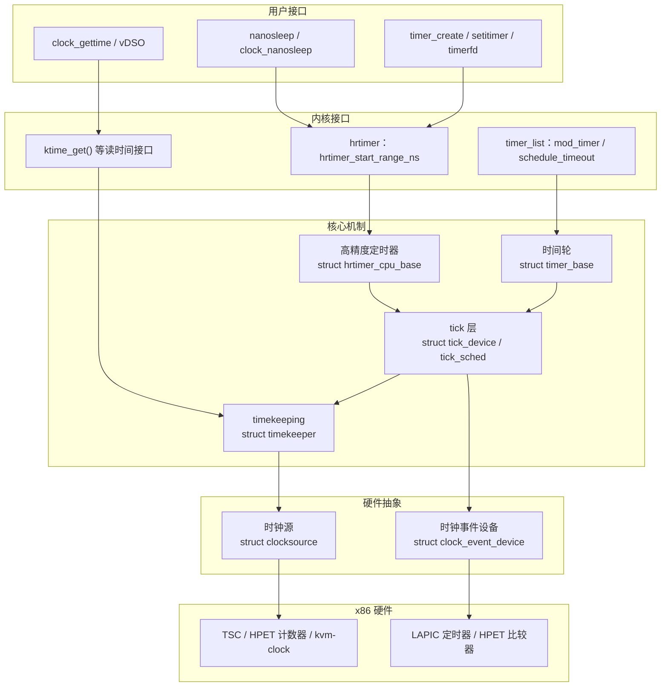
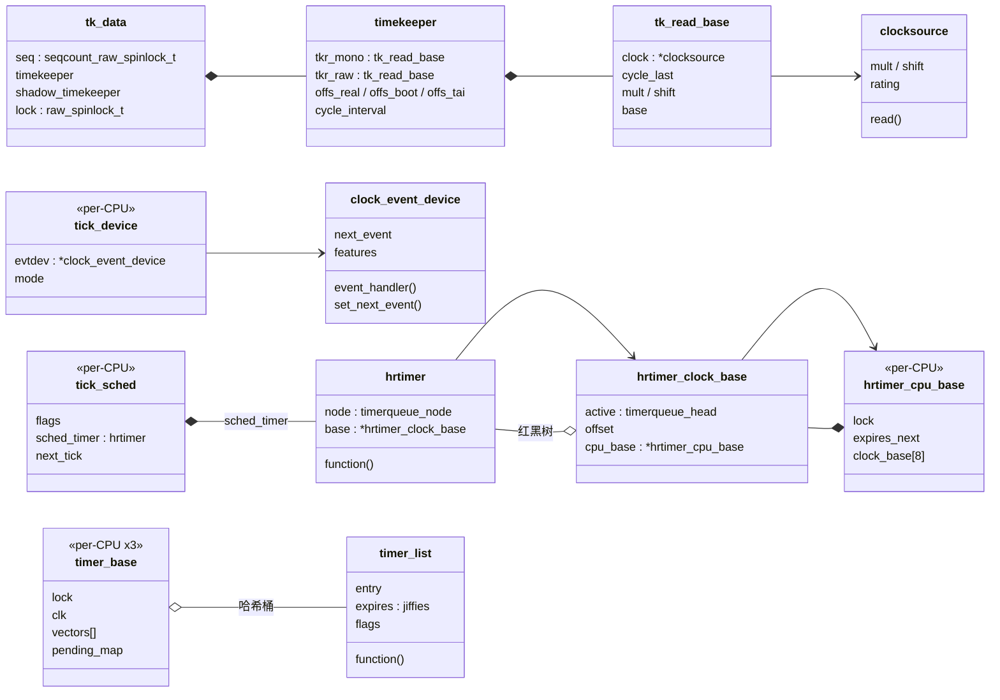
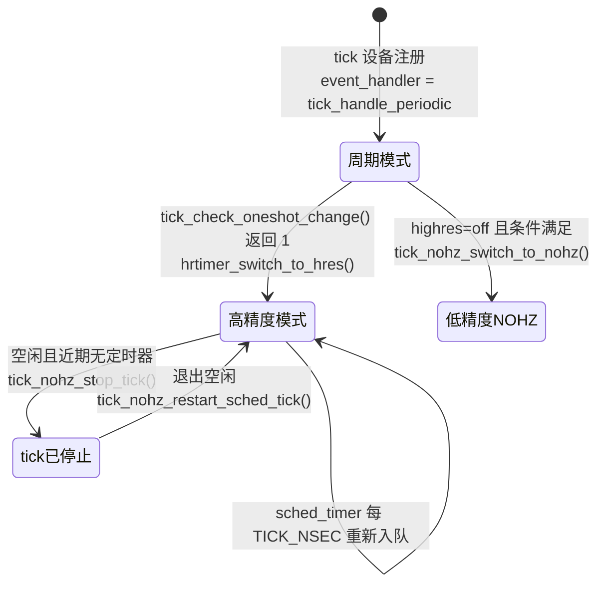
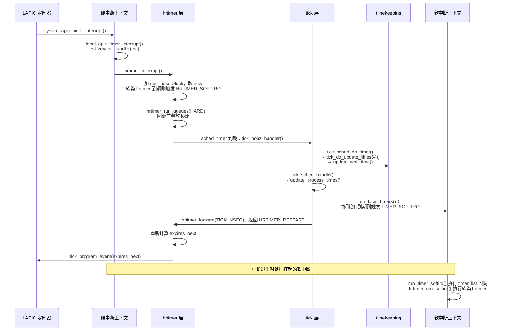

# 时间子系统概述：时钟源、时钟事件与定时器

内核每时每刻都在跟时间打交道：调度器要知道一个任务已经运行了多久，网络协议栈要在 200 ms 后重传一个报文，`nanosleep()` 要在指定时刻把进程叫醒，用户程序调用 `clock_gettime()` 要拿到一个精确到纳秒的时间戳。这些需求可以归成两类：

- **读时间**：现在是几点？从某个起点到现在过去了多少纳秒？
- **定时**：请在某个时刻（或者一段时间以后）执行一件事。

硬件为这两类需求提供了两类不同的设备：一类是只会不断累加的计数器（比如 x86 的 TSC），读它可以得到时间，但它不会主动打断 CPU；另一类是能在设定时刻发出中断的定时器（比如本地 APIC 定时器），它能叫醒 CPU，但本身不负责记录时间。时间子系统的工作，就是把这两类硬件组合起来，对上提供一组统一的时间线和定时器接口。

本章是时间子系统的总览，回答以下问题：

1. 时间子系统分成哪几层，每一层解决什么问题？
2. 有哪些核心对象，它们之间是什么关系？
3. 周期计数怎样变成纳秒时间，时间又是怎样往前推进的？
4. 周期性的 tick 是怎么产生的，为什么可以停掉？
5. 内核为什么同时保留两套定时器（时间轮和 hrtimer）？

每个机制的内部细节放到后续章节展开，本章只建立主线，并给出每个结论对应的源码位置。

## 0. 分析基线

本章依据仓库内 [Makefile 第 2～4 行](../../linux/Makefile#L2-L4)标记的 **6.18.52** 版本，架构为 **x86-64**。读者需要了解中断和软中断的基本执行路径，可先阅读[中断子系统概述](../interrupt/overview.md)和 [softirq 机制](../interrupt/softirq.md)；关于 seqcount、自旋锁等同步原语，可参考[锁机制基础](../lock/introduction.md)。

与本章结论有关的配置如下。它们是编译条件，不代表某次运行一定经过对应路径，运行时还受启动参数和硬件能力影响。

| 配置 | 对本章的影响 | 依据 |
| --- | --- | --- |
| `CONFIG_X86_64=y`、`CONFIG_SMP=y` | 64 位、多 CPU；每个 CPU 有自己的 tick 和定时器队列 | [.config#L333](../../linux/.config#L333)、[.config#L362](../../linux/.config#L362) |
| `CONFIG_HZ_1000=y`、`CONFIG_HZ=1000` | 一个 tick 周期是 1 ms，`jiffies` 每次加 1 代表 1 ms | [.config#L505-L506](../../linux/.config#L505-L506) |
| `CONFIG_GENERIC_CLOCKEVENTS=y` | 使用通用时钟事件框架，而不是老式的 `LEGACY_TIMER_TICK` | [.config#L91](../../linux/.config#L91)、[Kconfig#L24-L25](../../linux/kernel/time/Kconfig#L24-L25) |
| `CONFIG_GENERIC_CLOCKEVENTS_BROADCAST=y` | 本地定时器在深度 C 状态下停止时，可由广播设备代为唤醒 | [.config#L92-L93](../../linux/.config#L92-L93) |
| `CONFIG_HIGH_RES_TIMERS=y` | 编入高精度定时器；运行时可以切换到高精度模式 | [.config#L112](../../linux/.config#L112) |
| `CONFIG_NO_HZ_COMMON=y`、`CONFIG_NO_HZ_FULL=y`、`CONFIG_TICK_ONESHOT=y` | 空闲时可以停掉 tick；完全无 tick 模式只在启动参数 `nohz_full=` 指定的 CPU 上生效 | [.config#L104-L108](../../linux/.config#L104-L108) |
| `CONFIG_X86_TSC=y`、`CONFIG_HPET_TIMER=y`、`CONFIG_X86_LOCAL_APIC=y` | 可用的硬件包括 TSC、HPET 和本地 APIC 定时器 | [.config#L407](../../linux/.config#L407)、[.config#L422](../../linux/.config#L422)、[.config#L433](../../linux/.config#L433) |
| `CONFIG_KVM_GUEST=y`、`CONFIG_PARAVIRT_CLOCK=y` | 作为 KVM 客户机运行时还可能注册 `kvm-clock` 时钟源 | [.config#L394](../../linux/.config#L394)、[.config#L398](../../linux/.config#L398) |
| `CONFIG_GENERIC_GETTIMEOFDAY=y`、`CONFIG_GENERIC_TIME_VSYSCALL=y` | `clock_gettime()` 可以在用户态通过 vDSO 完成 | [.config#L90](../../linux/.config#L90)、[.config#L10462](../../linux/.config#L10462) |
| `CONFIG_POSIX_TIMERS=y`、`CONFIG_TIME_NS=y` | 编入 POSIX 时钟与定时器系统调用和时间命名空间 | [.config#L272](../../linux/.config#L272)、[.config#L239](../../linux/.config#L239) |
| `CONFIG_POSIX_AUX_CLOCKS` 未设置、`CONFIG_PREEMPT_RT` 未设置 | 只有一个核心 timekeeper；hrtimer 和时间轮都走非 RT 路径 | [.config#L114](../../linux/.config#L114)、[.config#L139](../../linux/.config#L139) |

有两点需要提前说明：

- `CONFIG_NO_HZ_FULL=y` 只是把完全无 tick 的能力编进内核。`tick_nohz_full_running` 只在 [tick_nohz_full_setup()](../../linux/kernel/time/tick-sched.c#L600-L605) 中置为真。这个函数由 `nohz_full=` 启动参数的解析路径调用：[isolation.c#L198](../../linux/kernel/sched/isolation.c#L198) 把该参数注册给 `housekeeping_nohz_full_setup()`，后者经 `housekeeping_setup()` 在 [isolation.c#L176-L177](../../linux/kernel/sched/isolation.c#L176-L177) 调用它。没有这个参数时，tick 只在空闲路径上停止，行为与 `CONFIG_NO_HZ_IDLE` 的“空闲时停 tick”相同；本配置中 `CONFIG_NO_HZ_IDLE` 未设置，这里比较的是行为，不是配置项。
- `CONFIG_HZ=1000` 下，`TICK_NSEC` 按 [vdso/jiffies.h#L9](../../linux/include/vdso/jiffies.h#L9) 的公式 `(NSEC_PER_SEC + HZ/2) / HZ` 计算，结果为 1 000 000 ns。

## 1. 时间子系统要解决什么问题

### 1.1 两类硬件，两种能力

先看 x86 上与时间有关的硬件分别能做什么：

| 硬件 | 能力 | 在内核中的抽象 |
| --- | --- | --- |
| TSC（时间戳计数器） | 每个 CPU 上单调累加的 64 位计数器；内核经 [read_tsc()](../../linux/arch/x86/kernel/tsc.c#L1132-L1135) 调用 `rdtsc_ordered()` 读取，后者按 CPU 特性在 `rdtsc`、`lfence; rdtsc`、`rdtscp` 三种指令形式中选一种（[tsc.h#L39-L65](../../linux/arch/x86/include/asm/tsc.h#L39-L65)） | 时钟源 `clocksource`，名为 `tsc` |
| HPET（高精度事件定时器） | 全局计数器，同时带若干比较器，可以产生中断 | 既能注册为时钟源 `hpet`，也能注册为时钟事件设备 |
| 本地 APIC 定时器 | 每个 CPU 一个，可编程为周期或单次触发中断 | 时钟事件设备 `clock_event_device`，名为 `lapic` |
| kvm-clock | 虚拟机中由宿主机共享的时间页 | 时钟源 `kvm-clock` |

源码中的定义依次是 [clocksource_tsc（tsc.c#L1189-L1205）](../../linux/arch/x86/kernel/tsc.c#L1189-L1205)、[clocksource_hpet（hpet.c#L852-L854）](../../linux/arch/x86/kernel/hpet.c#L852-L854)、[lapic_clockevent（apic.c#L495-L509）](../../linux/arch/x86/kernel/apic/apic.c#L495-L509) 和 [kvm_clock（kvmclock.c#L157-L165）](../../linux/arch/x86/kernel/kvmclock.c#L157-L165)。

可以看到两种能力是分开的：

- **能读、不能叫醒 CPU**：时钟源（clocksource）。它回答“现在计数器是多少”，本身不产生中断。
- **能叫醒 CPU、不负责记账**：时钟事件设备（clock event device）。它回答“请在 X 之后打断我”，但不记录时间过去了多少。

内核用这两种设备完成下面三项工作：

1. **维护时间线（timekeeping）**：根据时钟源的读数，持续维护 `CLOCK_MONOTONIC`、`CLOCK_REALTIME`、`CLOCK_BOOTTIME` 等多条时间线，并供任意上下文快速读取。
2. **产生 tick**：每隔 `TICK_NSEC` 在每个 CPU 上执行一次周期性工作，包括推进 `jiffies`、更新时间线、统计进程运行时间、驱动调度器和 RCU。
3. **管理定时器**：内核和用户态的大量“在某时刻做某事”的请求，最终都要折算成“下一次什么时候编程时钟事件设备”。

### 1.2 分层架构

下面这张图回答“时间子系统分几层、每层依赖谁”。箭头表示“上层使用下层提供的能力”，不表示具体的调用顺序。



图中要注意三个关系：

- **timekeeping 只依赖时钟源**。读时间不需要任何中断，只要读计数器再换算即可。
- **tick 层夹在定时器和时钟事件设备之间**。定时器只关心“最早的到期时间”，至于由哪个设备、以周期模式还是单次模式去实现，由 tick 层决定。
- **tick 反过来驱动 timekeeping**。时间线的基准点需要定期向前推进，这项工作由 tick 完成（见 3.2 节）。所以 timekeeping 读时间不依赖 tick，推进基准却依赖 tick。

### 1.3 触发事件与输入输出

| 触发事件 | 输入 | 输出 / 结果 |
| --- | --- | --- |
| 任意代码读时间，如 `ktime_get()` | 时钟源当前读数 + timekeeper 中的基准 | 一个 `ktime_t` 纳秒值 |
| 时钟事件设备中断 | 中断到来的时刻 | 推进 `jiffies` 和时间线，执行到期的 hrtimer，必要时触发 `TIMER_SOFTIRQ`，重新编程下一次中断 |
| 内核或用户态添加定时器 | 到期时间、回调函数 | 定时器进入时间轮或红黑树；若成为本 CPU 最早到期者，可能重新编程硬件 |
| CPU 进入空闲 | 下一个定时器的到期时间 | 决定是否停掉 tick，以及让硬件在多久之后叫醒本 CPU |
| 新时钟源或时钟事件设备注册 | 设备的评级 `rating` 和特性 | 可能切换当前时钟源或本 CPU 的 tick 设备 |

### 1.4 本章边界

本章只讨论以上主线。以下内容只点到为止，留给后续章节：NTP 频率调整的细节（`kernel/time/ntp.c`）、时钟源看门狗（clocksource watchdog）、tick 广播的完整协议、定时器迁移（`timer_migration.c`）、POSIX CPU 定时器、alarmtimer、时间命名空间，以及 x86 TSC 的校准过程。

## 2. 核心数据结构

本节按“硬件抽象 → 时间线 → tick → 定时器”的顺序介绍核心结构，只解释与主线有关的字段。

### 2.1 `struct clocksource`：一个可读的计数器

[`struct clocksource`（clocksource.h#L101-L138）](../../linux/include/linux/clocksource.h#L101-L138) 描述一个能读出“周期数”（cycles）的计数器。

| 字段 | 含义 |
| --- | --- |
| `read` | 读计数器的回调，返回周期数（无单位的计数） |
| `mask` | 计数器有效位宽的掩码；不足 64 位的计数器用它处理回绕 |
| `mult`、`shift` | 周期数换算为纳秒的定点系数：`ns = (cycles * mult) >> shift` |
| `rating` | 评级，数值越高越优先；注释给出了 1～499 的分档建议（[clocksource.h#L56-L70](../../linux/include/linux/clocksource.h#L56-L70)） |
| `flags` | 例如 `CLOCK_SOURCE_VALID_FOR_HRES` 表示可以支撑高精度模式（[clocksource.h#L143-L150](../../linux/include/linux/clocksource.h#L143-L150)） |
| `vdso_clock_mode` | 用户态 vDSO 能否直接读这个计数器 |
| `list` | 挂在全局 `clocksource_list` 上 |

**组织与选择。** 所有注册的时钟源按 `rating` 从高到低插入 `clocksource_list`（[clocksource_enqueue()，clocksource.c#L1118-L1130](../../linux/kernel/time/clocksource.c#L1118-L1130)）。[clocksource_find_best()（clocksource.c#L1002-L1022）](../../linux/kernel/time/clocksource.c#L1002-L1022) 取链表中第一个合适的时钟源；如果 tick 已处于单次触发模式，还要求它带 `CLOCK_SOURCE_VALID_FOR_HRES`。选中后，`__clocksource_select()` 在 [clocksource.c#L1069](../../linux/kernel/time/clocksource.c#L1069) 调用 `timekeeping_notify()` 让 timekeeping 换用它。

x86 上几个时钟源的评级如下：

| 时钟源 | `rating` | 依据 |
| --- | --- | --- |
| `kvm-clock` | 400；若宿主暴露了恒定且不停止的 TSC，降为 299 | [kvmclock.c#L160](../../linux/arch/x86/kernel/kvmclock.c#L160)、[kvmclock.c#L342-L345](../../linux/arch/x86/kernel/kvmclock.c#L342-L345) |
| `tsc` | 300 | [tsc.c#L1191](../../linux/arch/x86/kernel/tsc.c#L1191) |
| `tsc-early` | 299 | [tsc.c#L1167-L1169](../../linux/arch/x86/kernel/tsc.c#L1167-L1169) |
| `hpet` | 250 | [hpet.c#L854](../../linux/arch/x86/kernel/hpet.c#L854) |

最终选中哪一个取决于运行时注册了哪些时钟源、TSC 是否被判定为稳定，以及 `clocksource=` 启动参数（即代码中的 `override_name`），静态分析无法确定某台机器的结果。

**一个设计约束。** 注释（[clocksource.h#L91-L93](../../linux/include/linux/clocksource.h#L91-L93)）说明，热路径不直接使用这个结构体，而是由 timekeeper 把需要的字段缓存到自己的结构中。这就是下一小节 `tk_read_base` 存在的原因。

### 2.2 `struct timekeeper`：时间线的基准点

时钟源只提供一个不断增长的周期数，没有“几点钟”的概念。timekeeper 的职责是记住一个**基准点**：在周期数为 `cycle_last` 的时刻，各条时间线分别是多少。读时间时，只要计算出从基准点到现在过了多少周期，换算成纳秒再加上基准值即可。

读时间要用到的字段集中在 [`struct tk_read_base`（timekeeper_internal.h#L50-L59）](../../linux/include/linux/timekeeper_internal.h#L50-L59)：

| 字段 | 含义 |
| --- | --- |
| `clock` | 当前使用的时钟源 |
| `mask` | 从时钟源复制而来 |
| `cycle_last` | 上一次推进基准时的时钟源读数 |
| `mult`、`shift` | 换算系数。`mult` 会被 NTP 微调，所以不一定等于时钟源自带的 `mult` |
| `xtime_nsec` | 基准点上不足一秒的部分，单位是**左移了 `shift` 位的纳秒** |
| `base` | 基准点上的时间，单位为纳秒（`ktime_t`） |

[`struct timekeeper`（timekeeper_internal.h#L140-L183）](../../linux/include/linux/timekeeper_internal.h#L140-L183) 包含两个 `tk_read_base`，以及若干把不同时间线联系起来的偏移量：

| 字段 | 含义 |
| --- | --- |
| `tkr_mono` | `CLOCK_MONOTONIC` 的读数基准，受 NTP 调频影响 |
| `tkr_raw` | `CLOCK_MONOTONIC_RAW` 的读数基准，不受 NTP 影响 |
| `xtime_sec` | `CLOCK_REALTIME` 的整秒部分 |
| `offs_real`、`offs_boot`、`offs_tai` | 从 MONOTONIC 分别到 REALTIME、BOOTTIME、TAI 的偏移 |
| `cycle_interval` | 一个 tick 对应的时钟源周期数，即每次推进的步长 |
| `xtime_interval`、`raw_interval` | 一个步长对应的（移位后）纳秒数 |
| `ntp_error` | 已累计时间与 NTP 期望时间之间的误差 |

可见推进时累加的是 REALTIME 的 `xtime_sec` 与 `tkr_mono.xtime_nsec`，而 MONOTONIC 的基准 `tkr_mono.base` 并不单独累加，而是在 [tk_update_ktime_data()](../../linux/kernel/time/timekeeping.c#L669-L683) 中由 `xtime_sec + wall_to_monotonic` 推导出来。因此 REALTIME 与 MONOTONIC 之差就是 `wall_to_monotonic`（`offs_real` 为其相反数）；BOOTTIME、TAI 则是在 MONOTONIC 上再加 `offs_boot`、`offs_tai`。`CLOCK_MONOTONIC_RAW` 另有 `tkr_raw` 独立累加。设置墙上时间（[do_settimeofday64()](../../linux/kernel/time/timekeeping.c#L1434-L1465)）同时改写 `xtime` 和 `wall_to_monotonic`，并保持两者之和不变，所以 MONOTONIC 不会跳变。

**并发保护。** 全局 timekeeper 被包装在 [`struct tk_data`（timekeeping.c#L52-L57）](../../linux/kernel/time/timekeeping.c#L52-L57) 中：

```c
struct tk_data {
	seqcount_raw_spinlock_t	seq;
	struct timekeeper	timekeeper;
	struct timekeeper	shadow_timekeeper;
	raw_spinlock_t		lock;
} ____cacheline_aligned;
```

（源码：[kernel/time/timekeeping.c#L52-L57](../../linux/kernel/time/timekeeping.c#L52-L57)，核心实例为 [`tk_core`（#L62）](../../linux/kernel/time/timekeeping.c#L62)）

它采用“影子副本 + seqcount”的协议：

- **写者**持有 `lock`，先在 `shadow_timekeeper` 上完成全部计算，然后在 `write_seqcount_begin()` / `write_seqcount_end()` 之间把影子整体 `memcpy` 到 `timekeeper`（[timekeeping_update_from_shadow()，timekeeping.c#L708-L755](../../linux/kernel/time/timekeeping.c#L708-L755)）。写端窗口内除了拷贝，还有派生字段（如 `tk_update_ktime_data()`）的更新，以及 vDSO、快速时间基准的发布；而 NTP 频率调整与时间累加都在窗口之前、在影子副本上完成（[timekeeping_adjust() 调用，timekeeping.c#L2368](../../linux/kernel/time/timekeeping.c#L2368)）。因此读者需要重试的窗口主要取决于这些发布动作的长度。
- **读者**不加锁，用 `read_seqcount_begin()` / `read_seqcount_retry()` 包住读取；如果读的过程中有写者，就重试（见 3.1 节）。

同一个发布点还会顺带更新 vDSO 数据页（`update_vsyscall()`）和供 NMI 使用的快速时间基准（`update_fast_timekeeper()`），见 [timekeeping.c#L732-L737](../../linux/kernel/time/timekeeping.c#L732-L737)。

### 2.3 `struct clock_event_device` 与 `struct tick_device`：能叫醒 CPU 的设备

[`struct clock_event_device`（clockchips.h#L100-L132）](../../linux/include/linux/clockchips.h#L100-L132) 描述一个能在指定时刻产生中断的设备：

| 字段 | 含义 |
| --- | --- |
| `event_handler` | 中断到来时由驱动调用的处理函数，**由框架赋值**，驱动不关心它是什么 |
| `set_next_event` | 在 `evt` 个设备周期后触发一次中断 |
| `next_event` | 单次模式下下一次事件的绝对时间（MONOTONIC 纳秒） |
| `min_delta_ns`、`max_delta_ns` | 可编程的最短、最长间隔 |
| `mult`、`shift` | **纳秒换算为设备周期**的系数，方向与时钟源相反 |
| `state_use_accessors` | 设备状态，见下文 |
| `features` | 能力位：`PERIODIC`、`ONESHOT`、`C3STOP`（深度 C 状态下会停止）等（[clockchips.h#L46-L68](../../linux/include/linux/clockchips.h#L46-L68)） |
| `rating`、`cpumask` | 评级和该设备能服务的 CPU 集合 |

设备状态定义在 [clockchips.h#L35-L41](../../linux/include/linux/clockchips.h#L35-L41)：`DETACHED`（未被使用）、`SHUTDOWN`、`PERIODIC`、`ONESHOT`、`ONESHOT_STOPPED`。

`event_handler` 是理解 tick 层的关键：同一个 LAPIC 中断，处理函数可能是周期模式的 `tick_handle_periodic()`，也可能是高精度模式的 `hrtimer_interrupt()`。驱动只负责调用 `evt->event_handler(evt)`（[apic.c#L1041](../../linux/arch/x86/kernel/apic/apic.c#L1041)），模式切换完全由框架通过改写这个指针完成。

每个 CPU 有一个 [`struct tick_device`（tick-sched.h#L12-L15）](../../linux/kernel/time/tick-sched.h#L12-L15)，即 per-CPU 变量 [`tick_cpu_device`（tick-common.c#L29）](../../linux/kernel/time/tick-common.c#L29)：

```c
struct tick_device {
	struct clock_event_device *evtdev;
	enum tick_device_mode mode;   /* TICKDEV_MODE_PERIODIC 或 TICKDEV_MODE_ONESHOT */
};
```

它记录“本 CPU 选用哪个时钟事件设备作为 tick 来源，以及当前是周期模式还是单次模式”。`evtdev` 是普通指针，指向的设备对象由驱动静态或按 CPU 定义（例如 x86 的 per-CPU `lapic_events`，[apic.c#L510](../../linux/arch/x86/kernel/apic/apic.c#L510)），设备也同时挂在全局 `clockevent_devices` 链表上。

**设备的选择。** 设备注册时，[clockevents_register_device()（clockevents.c#L451-L476）](../../linux/kernel/time/clockevents.c#L451-L476) 把它加入链表，再调用 [tick_check_new_device()（tick-common.c#L325-L361）](../../linux/kernel/time/tick-common.c#L325-L361) 判断它是否比本 CPU 当前的 tick 设备更好。偏好规则见 [tick_check_preferred()（tick-common.c#L288-L306）](../../linux/kernel/time/tick-common.c#L288-L306)：优先选支持单次模式的设备，其次选评级高的设备，并偏向 CPU 本地设备。没有被选为本地 tick 设备的，还可能被装成**广播设备**（[tick-common.c#L356-L360](../../linux/kernel/time/tick-common.c#L356-L360)）。

LAPIC 定时器的评级默认为 100，带 `C3STOP`；如果 CPU 支持 ARAT（APIC 定时器在深度 C 状态下继续运行），就去掉 `C3STOP` 并把评级提高到 150（[apic.c#L576-L580](../../linux/arch/x86/kernel/apic/apic.c#L576-L580)）。带 `C3STOP` 的设备在 CPU 深度睡眠时会停止，这时需要另一个不会停止的设备（广播设备）代为叫醒 CPU。

### 2.4 `struct tick_sched`：tick 的模拟与停止

进入单次触发模式后，硬件不再自动周期性地产生中断，“每 1 ms 一次的 tick”需要由软件模拟。每个 CPU 的 [`struct tick_sched`（tick-sched.h#L64-L103）](../../linux/kernel/time/tick-sched.h#L64-L103)（per-CPU 变量 [`tick_cpu_sched`，tick-sched.c#L40](../../linux/kernel/time/tick-sched.c#L40)）负责这件事，并管理 tick 的停止与恢复：

| 字段 | 含义 |
| --- | --- |
| `flags` | `TS_FLAG_*` 状态位（[tick-sched.h#L17-L31](../../linux/kernel/time/tick-sched.h#L17-L31)）：`INIDLE` 在空闲中、`STOPPED` tick 已停、`NOHZ` 本 CPU 已启用 NO_HZ（由 [tick_nohz_activate()](../../linux/kernel/time/tick-sched.c#L1491-L1499) 设置，与是否处于高精度模式无关）、`HIGHRES` 高精度模式等 |
| `sched_timer` | **嵌入**的 hrtimer，用来模拟周期 tick |
| `last_tick` | 停 tick 前最后一次 tick 的到期时间，恢复时据此对齐 |
| `next_tick` | tick 停止期间下一次被编程的时刻 |
| `timer_expires` | 计算出的下一次需要醒来的时间 |
| `tick_dep_mask` | 完全无 tick 模式下“谁还需要 tick”的依赖位 |
| `check_clocks` | 时钟源或时钟事件设备有变化的通知位，用于触发模式切换 |

注意 `sched_timer` 是嵌入对象，不是指针：每个 CPU 的 tick 本身就是一个普通的 hrtimer，和其他 hrtimer 一起排在同一个红黑树里。这一点在 3.5 节还会用到。

### 2.5 `struct hrtimer` 及其队列：纳秒精度的定时器

[`struct hrtimer`（hrtimer_types.h#L39-L48）](../../linux/include/linux/hrtimer_types.h#L39-L48) 是高精度定时器：

| 字段 | 含义 |
| --- | --- |
| `node` | `timerqueue_node`，内含红黑树节点和硬到期时间 `expires` |
| `_softexpires` | 软到期时间，即最早允许到期的时刻；`expires - _softexpires` 就是允许的松弛量（slack） |
| `function` | 到期回调，返回 `HRTIMER_RESTART` 或 `HRTIMER_NORESTART` |
| `base` | 指向它所在的 `hrtimer_clock_base` |
| `state` | 是否已入队等状态 |
| `is_soft` | 回调在软中断（`HRTIMER_SOFTIRQ`）中执行，而不是在硬中断中执行 |

到期时间的单位是纳秒，并且是某条时间线（MONOTONIC、REALTIME 等）上的**绝对时间**。

每个 CPU 有一个 [`struct hrtimer_cpu_base`（hrtimer_defs.h#L101-L127）](../../linux/include/linux/hrtimer_defs.h#L101-L127)（per-CPU 变量 [`hrtimer_bases`，hrtimer.c#L72](../../linux/kernel/time/hrtimer.c#L72)），内含 8 个 [`struct hrtimer_clock_base`（hrtimer_defs.h#L46-L54）](../../linux/include/linux/hrtimer_defs.h#L46-L54)，即 MONOTONIC、REALTIME、BOOTTIME、TAI 四条时间线各分硬中断和软中断两份（[hrtimer_defs.h#L56-L66](../../linux/include/linux/hrtimer_defs.h#L56-L66)）。

| `hrtimer_cpu_base` 字段 | 含义 |
| --- | --- |
| `lock` | `raw_spinlock_t`，保护本 CPU 全部 8 个队列 |
| `hres_active` | 本 CPU 是否已进入高精度模式 |
| `in_hrtirq` | 是否正在执行 `hrtimer_interrupt()` |
| `expires_next` | 本 CPU 所有 hrtimer 中最早的到期时间，硬件就是按它编程的 |
| `softirq_expires_next` | 软中断类 hrtimer 中最早的到期时间 |
| `clock_base[]` | 8 个嵌入的时钟队列 |

每个 `hrtimer_clock_base` 用 `active`（一棵按到期时间排序、并缓存最左节点的红黑树）组织定时器，`offset` 记录这条时间线相对 MONOTONIC 的偏移，`running` 指向正在执行回调的定时器。

### 2.6 `struct timer_list` 与时间轮：以 jiffies 为单位的超时

[`struct timer_list`（timer_types.h#L8-L21）](../../linux/include/linux/timer_types.h#L8-L21) 是传统的低精度定时器：

```c
struct timer_list {
	struct hlist_node	entry;
	unsigned long		expires;   /* 单位：jiffies，绝对值 */
	void			(*function)(struct timer_list *);
	u32			flags;
	...
};
```

`flags` 的低位记录定时器所在的 CPU 号，高位是 `TIMER_DEFERRABLE`、`TIMER_PINNED`、`TIMER_IRQSAFE` 等属性（[timer.h#L44-L50](../../linux/include/linux/timer.h#L44-L50)）。

每个 CPU 有 `NR_BASES` 个 [`struct timer_base`（timer.c#L250-L265）](../../linux/kernel/time/timer.c#L250-L265)（[timer.c#L267](../../linux/kernel/time/timer.c#L267)）。启用 `CONFIG_NO_HZ_COMMON` 时有 3 个（[timer.c#L189-L197](../../linux/kernel/time/timer.c#L189-L197)）：

| 基 | 放什么定时器 | 依据 |
| --- | --- | --- |
| `BASE_LOCAL` | 带 `TIMER_PINNED`（且不带 `TIMER_DEFERRABLE`）、必须在本 CPU 到期的定时器 | [get_timer_cpu_base()，timer.c#L914-L926](../../linux/kernel/time/timer.c#L914-L926) |
| `BASE_GLOBAL` | 不绑定 CPU 的定时器；本 CPU 空闲时可以由其他 CPU 代为处理 | 同上 |
| `BASE_DEF` | 带 `TIMER_DEFERRABLE` 的定时器（无论是否同时带 `TIMER_PINNED`）；不会为了它把空闲 CPU 叫醒（[timer.h#L26-L29](../../linux/include/linux/timer.h#L26-L29)） | 同上 |

`timer_base` 的核心是一个**分级时间轮**：`vectors[]` 是若干哈希桶（`hlist_head`），`pending_map` 位图记录哪些桶非空，`clk` 是这个时间轮当前走到的 jiffies 值，`next_expiry` 是最早到期的桶对应的时间，`lock` 保护整个基。

时间轮的几何参数在 [timer.c#L153-L177](../../linux/kernel/time/timer.c#L153-L177)：每级 64 个桶（`LVL_BITS = 6`），每升一级粒度扩大 8 倍（`LVL_CLK_SHIFT = 3`），`HZ > 100` 时共 9 级。对于 `HZ=1000`，源码注释给出的分级如下（摘自 [timer.c#L104-L114](../../linux/kernel/time/timer.c#L104-L114)）：

```text
Level Offset  Granularity            Range
 0      0         1 ms                0 ms -         63 ms
 1     64         8 ms               64 ms -        511 ms
 2    128        64 ms              512 ms -       4095 ms (512ms - ~4s)
 ...
 8    512  16777216 ms (~4h)  134217728 ms - 1073741822 ms (~1d - ~12d)
```

定时器离到期越远，就放进粒度越粗的级别，到期时间会被向上取整到该级的粒度。这意味着时间轮**不保证准时**，它用精度换取了 O(1) 的插入和删除。

### 2.7 jiffies：tick 计数

[`jiffies_64`（timer.c#L60）](../../linux/kernel/time/timer.c#L60) 是自启动以来的 tick 计数，`HZ=1000` 时每 1 ms 加 1。x86-64 的链接脚本把 `jiffies` 定义为 `jiffies_64` 的别名（[vmlinux.lds.S#L45](../../linux/arch/x86/kernel/vmlinux.lds.S#L45)），所以在 64 位上二者是同一块内存。初值 [`INITIAL_JIFFIES`（jiffies.h#L320）](../../linux/include/linux/jiffies.h#L320) 为 `-300*HZ` 截断到 32 位后的值，这样 32 位的 jiffies 会在启动约 5 分钟后回绕，让回绕相关的错误尽早暴露。

### 2.8 对象关系总览

下面这张图回答“这些结构体之间谁包含谁、谁指向谁”。实心菱形（`*--`）表示嵌入，空心菱形（`o--`）表示“作为集合成员挂在队列上、但不被队列拥有”，普通箭头表示指针，“per-CPU”表示每个 CPU 一份。图中省略了大部分字段。



几点说明：

- timekeeper 全局只有一个，tick 设备、`tick_sched`、hrtimer 队列和时间轮都是每 CPU 一份。读时间不涉及跨 CPU 的定时器状态，添加定时器也不涉及全局时间结构的写操作。
- 时钟源和时钟事件设备都是**驱动拥有**的对象，timekeeper 和 `tick_device` 只保存指向它们的指针。切换时钟源或 tick 设备时，只是改变指针和状态，设备对象本身仍由驱动管理。
- `hrtimer` 和 `timer_list` 一般嵌入在使用者的对象中（例如 `tick_sched` 嵌入了 `sched_timer`），队列只是把它们串起来，并不拥有它们。使用者必须保证在定时器出队并且回调结束之前，所在对象不被释放，这是 `hrtimer_cancel()`、`timer_delete_sync()` 这类“同步删除”接口存在的原因。

## 3. 关键算法

### 3.1 读时间：从周期数到纳秒

**目标**：在任意上下文里，不加锁地得到一个与其他读者一致、不回退的时间。

**思路**：时间 = 基准时间 + (当前周期数 − 基准周期数) × 每周期纳秒数。由于 `mult/shift` 是定点数，`xtime_nsec` 也以“左移 `shift` 位的纳秒”保存，二者可以先相加再整体右移，保留了小数部分的精度。

[timekeeping_cycles_to_ns()（timekeeping.c#L378-L400）](../../linux/kernel/time/timekeeping.c#L378-L400) 的主路径就是这个公式：

```c
static inline u64 timekeeping_cycles_to_ns(const struct tk_read_base *tkr, u64 cycles)
{
	/* Calculate the delta since the last update_wall_time() */
	u64 mask = tkr->mask, delta = (cycles - tkr->cycle_last) & mask;

	if (unlikely(delta > tkr->clock->max_cycles)) {
		/* ... 负向移动或乘法溢出的处理，见下文 ... */
	}

	return ((delta * tkr->mult) + tkr->xtime_nsec) >> tkr->shift;
}
```

（源码：[kernel/time/timekeeping.c#L378-L400](../../linux/kernel/time/timekeeping.c#L378-L400)，省略了慢路径分支）

`& mask` 让不足 64 位的计数器在回绕后仍能得到正确的差值。慢路径（差值大于 `max_cycles` 时进入）处理两种情况：如果差值的高位超出掩码的一半范围（即 `delta & ~(mask >> 1)` 非零，说明读到的计数比基准还小，例如不同 CPU 上的计数器不同步），就直接返回基准点的亚秒部分（`xtime_nsec >> shift`），相当于不前进，避免时间回退；否则差值只是太大、乘法可能溢出，改用 128 位安全的乘法 `delta_to_ns_safe()`。

外层的 [ktime_get()（timekeeping.c#L814-L831）](../../linux/kernel/time/timekeeping.c#L814-L831) 用 seqcount 包住读取：

```c
	do {
		seq = read_seqcount_begin(&tk_core.seq);
		base = tk->tkr_mono.base;
		nsecs = timekeeping_get_ns(&tk->tkr_mono);
	} while (read_seqcount_retry(&tk_core.seq, seq));

	return ktime_add_ns(base, nsecs);
```

（源码：[kernel/time/timekeeping.c#L823-L830](../../linux/kernel/time/timekeeping.c#L823-L830)）

这里有两点：

- **读者完全不写共享数据**，所以多个 CPU 同时读时间不会争用缓存行。代价是读到一半遇到写者就要重试。
- **读时间不依赖 tick**。只要差值没有超出计数器的有效位宽（`& mask` 不丢失高位）、也不是负向移动，读到的都是精确时间；差值超过 `max_cycles` 时只是改走慢路径。tick 只负责定期把基准点往前挪。

### 3.2 推进时间：每个 tick 把差值“结算”进基准

如果基准点一直不动，`delta` 会越来越大：超过 `max_cycles` 后 `delta * mult` 可能溢出，读路径只能改走较慢的 `delta_to_ns_safe()`；超过计数器的有效位宽后，`& mask` 会丢掉高位，结果错误。NTP 对频率的调整也需要有一个点来生效。所以内核要定期把“基准点到现在”的周期数结算进基准，这一步叫做推进（advance）。

入口是 [update_wall_time()（timekeeping.c#L2400-L2405）](../../linux/kernel/time/timekeeping.c#L2400-L2405)，核心是 [__timekeeping_advance()（timekeeping.c#L2328-L2387）](../../linux/kernel/time/timekeeping.c#L2328-L2387)。用伪代码概括：

```text
/* 简化逻辑，省略 NTP 调整细节 */
持有 tk_core.lock，在 shadow_timekeeper 上操作：
    offset = 当前读数 - cycle_last
    if offset < cycle_interval（不足一个 tick）:
        return                      /* 没什么可结算的 */
    以 cycle_interval << shift 为步长，从大到小反复结算：
        cycle_last  += 步长对应的周期数
        xtime_nsec  += 步长对应的纳秒数（进位到秒）
        raw 时间同样累加
        累计 NTP 误差
    timekeeping_adjust()：根据 NTP 误差微调 mult
    timekeeping_update_from_shadow()：seqcount 写端内把影子拷回，并更新 vDSO
```

结算总是以 `cycle_interval`（一个 tick 的周期数）的整数倍进行：`cycle_last` 只前进整数步，余下不足一步的周期数仍留在 `cycle_last` 与计数器当前读数之间，下次再算。读者在 3.1 节的公式里会自然地把它算进去。

“从大到小”的步长来自 [logarithmic_accumulation()（timekeeping.c#L2290-L2322）](../../linux/kernel/time/timekeeping.c#L2290-L2322)。源码注释（[#L2348-L2355](../../linux/kernel/time/timekeeping.c#L2348-L2355)）说明了原因：在 NO_HZ 下 CPU 可能长时间没有 tick，一次要结算很多个 `cycle_interval`；按 2 的幂分块结算，循环次数是 O(log n) 而不是 O(n)。

### 3.3 谁来推进：`tick_do_timer_cpu`

每个 CPU 都有 tick，但 `jiffies_64` 和 timekeeper 是全局的，只需要一个 CPU 推进。全局变量 [`tick_do_timer_cpu`（tick-common.c#L38-L51）](../../linux/kernel/time/tick-common.c#L38-L51) 记录承担这项职责的 CPU。注释说明了它的两个作用：避免所有 CPU 同时争抢计时锁；在 NO_HZ 下，负责的 CPU 进入空闲后把它设为 `TICK_DO_TIMER_NONE`，下一个处理 tick 的 CPU 就会接手。

接手和推进发生在 [tick_sched_do_timer()（tick-sched.c#L206-L251）](../../linux/kernel/time/tick-sched.c#L206-L251)：

```c
	tick_cpu = READ_ONCE(tick_do_timer_cpu);

	if (IS_ENABLED(CONFIG_NO_HZ_COMMON) && unlikely(tick_cpu == TICK_DO_TIMER_NONE)) {
		...
		WRITE_ONCE(tick_do_timer_cpu, cpu);
		tick_cpu = cpu;
	}

	/* Check if jiffies need an update */
	if (tick_cpu == cpu)
		tick_do_update_jiffies64(now);
```

（源码：[kernel/time/tick-sched.c#L220-L232](../../linux/kernel/time/tick-sched.c#L220-L232)，省略了 `NO_HZ_FULL` 的告警）

注释（[#L210-L215](../../linux/kernel/time/tick-sched.c#L210-L215)）指出，即使两个 CPU 同时认领，jiffies 的更新仍由 `jiffies_lock` 串行化，所以这里不需要更强的同步。

[tick_do_update_jiffies64()（tick-sched.c#L57-L150）](../../linux/kernel/time/tick-sched.c#L57-L150) 先做一次无锁的快速检查（64 位上用 `smp_load_acquire()` 读 `tick_next_period`），若当前时间尚未越过下一个 tick 边界就直接返回；否则持 `jiffies_lock`、在 `jiffies_seq` 写端内计算跨过了几个 tick，一次加到 `jiffies_64` 上，再用 `smp_store_release()` 发布新的 `tick_next_period`，最后释放锁并调用 `update_wall_time()`（[#L149](../../linux/kernel/time/tick-sched.c#L149)）。所以在 NO_HZ 下停了很久的 tick 恢复时，jiffies 是一次补齐的，而不是逐个补。

此外还有一个兜底：如果某个 CPU 连续 `MAX_STALLED_JIFFIES`（5）次 tick 都看到 jiffies 没变，说明负责的 CPU 可能被卡住了（例如处于 `stop_machine()` 或虚拟机退出），它会自己强制更新一次（[tick-sched.c#L234-L247](../../linux/kernel/time/tick-sched.c#L234-L247)）。

还需要补充：本节开头所说的“只需要一个 CPU 推进”针对的是 tick 路径。tick 已停止时，`irq_enter()` 经 [tick_irq_enter()](../../linux/kernel/time/tick-sched.c#L1551-L1555) 调用的 `tick_nohz_irq_enter()` 会调用 `tick_nohz_update_jiffies()`（[tick-sched.c#L1519-L1537](../../linux/kernel/time/tick-sched.c#L1519-L1537)），它在当前 CPU 上调用 `tick_do_update_jiffies64()`（[tick-sched.c#L710-L718](../../linux/kernel/time/tick-sched.c#L710-L718)）；恢复 tick 的 `tick_nohz_restart_sched_tick()` 也先调用它（[tick-sched.c#L1088-L1091](../../linux/kernel/time/tick-sched.c#L1088-L1091)）。这些路径与 tick 路径一样，经由 `jiffies_lock` 串行化。

### 3.4 按需编程硬件：从“最早到期时间”到一次中断

在单次触发模式下，硬件只会在被编程的时刻中断一次，所以内核必须始终记住“本 CPU 下一个需要醒来的时刻”，并在它变化时重新编程。

hrtimer 一侧的规则是：本 CPU 所有 hrtimer 中最早的到期时间记在 `hrtimer_cpu_base::expires_next`，硬件就按它编程。新加入一个定时器时（[__hrtimer_start_range_ns()，hrtimer.c#L1204-L1295](../../linux/kernel/time/hrtimer.c#L1204-L1295)），`enqueue_hrtimer()` 返回它是否成了所在队列的第一个；如果成了最早者，就需要重新编程硬件。若当前正处于 `hrtimer_interrupt()` 中（`in_hrtirq`），则不必编程，因为中断处理结束时会统一重新计算（[#L1259-L1264](../../linux/kernel/time/hrtimer.c#L1259-L1264)）。

编程最终落到 [tick_program_event()（tick-oneshot.c#L23）](../../linux/kernel/time/tick-oneshot.c#L23) 和 [clockevents_program_event()（clockevents.c#L303-L337）](../../linux/kernel/time/clockevents.c#L303-L337)。后者把绝对时间换算为设备周期数：

```c
	delta = ktime_to_ns(ktime_sub(expires, ktime_get()));
	if (delta <= 0)
		return force ? clockevents_program_min_delta(dev) : -ETIME;

	delta = min(delta, (int64_t) dev->max_delta_ns);
	delta = max(delta, (int64_t) dev->min_delta_ns);

	clc = ((unsigned long long) delta * dev->mult) >> dev->shift;
	rc = dev->set_next_event((unsigned long) clc, dev);
```

（源码：[kernel/time/clockevents.c#L326-L334](../../linux/kernel/time/clockevents.c#L326-L334)）

这段代码体现了 1.2 节所说的两类硬件的配合：先用**时钟源**（经 `ktime_get()`）算出“距离目标还有多少纳秒”，再用**时钟事件设备**自己的 `mult/shift` 把纳秒换算成设备周期。如果目标时间已经过去，返回 `-ETIME`，由调用者决定是立即处理还是强制编程一个最小间隔。另外，函数中还有一条快捷路径：设备带 `CLOCK_EVT_FEAT_KTIME` 时直接调用 `set_next_ktime()`，不做上面的换算（[clockevents.c#L322-L324](../../linux/kernel/time/clockevents.c#L322-L324)）；本配置中的 lapic 设备不带该特性（[apic.c#L495-L509](../../linux/arch/x86/kernel/apic/apic.c#L495-L509)）。

### 3.5 tick 的三种形态

tick 在运行时会经历几种形态，它们的区别在于：硬件是周期模式还是单次模式，tick 由谁产生，以及能否停止。



这张图只画出本配置下最常见的路径，并做了简化：低精度 NOHZ 模式同样可以停止和恢复 tick，图中没有展开。

**周期模式。** 设备刚装上时是周期模式，中断处理函数是 [tick_handle_periodic()（tick-common.c#L108）](../../linux/kernel/time/tick-common.c#L108)，它调用 [tick_periodic()（tick-common.c#L86-L103）](../../linux/kernel/time/tick-common.c#L86-L103)：如果本 CPU 是 `tick_do_timer_cpu`，就加 jiffies、调用 `update_wall_time()`；然后所有 CPU 都执行 `update_process_times()`。

**切换到单次模式。** 切换不是在注册时立刻发生的，而是在周期 tick 中检查：`update_process_times()` → `run_local_timers()` → [hrtimer_run_queues()（hrtimer.c#L1973-L2005）](../../linux/kernel/time/hrtimer.c#L1973-L2005) 调用 [tick_check_oneshot_change()（tick-sched.c#L1654-L1672）](../../linux/kernel/time/tick-sched.c#L1654-L1672)。该函数在 `check_clocks` 位被设置（由 [tick_clock_notify()](../../linux/kernel/time/tick-sched.c#L1628-L1634) 设置，它在时钟源切换等路径中被调用）、时钟源可用于高精度（`timekeeping_valid_for_hres()`）且 tick 设备支持单次模式（[tick_is_oneshot_available()，tick-common.c#L72-L81](../../linux/kernel/time/tick-common.c#L72-L81)）时：若参数 `allow_nohz` 为假（高精度模式开启）则返回 1，随后由 `hrtimer_switch_to_hres()` 切换；若 `allow_nohz` 为真（即 `highres=off`），则改为调用 `tick_nohz_switch_to_nohz()` 并返回 0。需要注意，该函数上方的注释说它由 hrtimer 软中断周期调用（[tick-sched.c#L1649-L1652](../../linux/kernel/time/tick-sched.c#L1649-L1652)），但当前源码中的调用点在 `hrtimer_run_queues()`（[hrtimer.c#L1989](../../linux/kernel/time/hrtimer.c#L1989)），而后者由 `run_local_timers()` 在硬中断中调用，本书以代码为准。高精度模式默认开启（[`hrtimer_hres_enabled = true`，hrtimer.c#L698](../../linux/kernel/time/hrtimer.c#L698)，可用 `highres=` 启动参数关闭）。

[hrtimer_switch_to_hres()（hrtimer.c#L723-L738）](../../linux/kernel/time/hrtimer.c#L723-L738) 完成切换：

1. [tick_init_highres()](../../linux/kernel/time/tick-oneshot.c#L124-L127) → [tick_switch_to_oneshot(hrtimer_interrupt)](../../linux/kernel/time/tick-oneshot.c#L73-L99)：把 `tick_device::mode` 改为 `TICKDEV_MODE_ONESHOT`，把设备的 `event_handler` 改为 `hrtimer_interrupt`，设备切到 `ONESHOT` 状态。
2. 置 `hres_active = 1`，`hrtimer_resolution` 变为 1 ns。
3. [tick_setup_sched_timer(true)（tick-sched.c#L1571-L1598）](../../linux/kernel/time/tick-sched.c#L1571-L1598)：初始化 `tick_sched::sched_timer`，回调为 `tick_nohz_handler`，以 `TICK_NSEC` 为周期启动它。

从此以后，硬件中断只认 hrtimer；**tick 本身变成了一个每 1 ms 到期一次的 hrtimer**。这正是 2.4 节强调 `sched_timer` 是嵌入的 hrtimer 的原因。

**停止 tick。** CPU 进入空闲循环时，`do_idle()`（[idle.c#L296](../../linux/kernel/sched/idle.c#L296)）调用 `tick_nohz_idle_enter()`，随后在选择空闲状态的路径上调用 [tick_nohz_idle_stop_tick()（tick-sched.c#L1205-L1239）](../../linux/kernel/time/tick-sched.c#L1205-L1239)。它通过 [tick_nohz_next_event()（tick-sched.c#L892-L968）](../../linux/kernel/time/tick-sched.c#L892-L968) 计算下一次真正需要醒来的时间：

- 如果 RCU、架构代码或 irq_work 还需要 tick，或者本地已有挂起的定时器软中断，就保持 tick（[#L912-L914](../../linux/kernel/time/tick-sched.c#L912-L914)）。
- 否则通过 `get_next_timer_interrupt()` 查时间轮中最早的定时器；如果它在一个 tick 之内到期，也没有停止的必要（[#L935-L945](../../linux/kernel/time/tick-sched.c#L935-L945)）。
- 如果本 CPU 承担着计时职责，最长睡眠时间还要受 `timekeeping_max_deferment()` 限制，保证 3.1 节的 `delta` 不会超过时钟源的安全范围（[#L952-L956](../../linux/kernel/time/tick-sched.c#L952-L956)）。

决定停止后，`tick_nohz_stop_tick()` 设置 `TS_FLAG_STOPPED` 并记下 `last_tick`（[tick-sched.c#L1041-L1048](../../linux/kernel/time/tick-sched.c#L1041-L1048)），然后在高精度模式下用 `hrtimer_start()` 把 `sched_timer` 推迟到计算出的时刻；如果算出的时刻是 `KTIME_MAX`（没有任何需要醒来的事件），则直接取消它（[tick-sched.c#L1056-L1070](../../linux/kernel/time/tick-sched.c#L1056-L1070)）。

这里有一个容易混淆的地方：**停止的是周期性的 tick，不是 hrtimer**。别的 hrtimer 照常排在红黑树里，硬件仍按最早的到期时间编程；如果最早者恰好是 `sched_timer`，它就被推后了。

**完全无 tick（`nohz_full`）。** 对于启动参数指定的 CPU，即使有任务在运行，也可以尝试停掉 tick。能否停止由 [can_stop_full_tick()（tick-sched.c#L358-L378）](../../linux/kernel/time/tick-sched.c#L358-L378) 判断：全局、本 CPU、当前任务和当前线程组这四处的 tick 依赖掩码都必须为空。Kconfig 帮助文本说明，实际能停下来的场景通常要求 CPU 上只运行一个任务（[Kconfig#L132-L135](../../linux/kernel/time/Kconfig#L132-L135)）。本配置编入了这一能力，但如第 0 节所述，没有 `nohz_full=` 参数时它不会启用。

### 3.6 两种定时器：时间轮与 hrtimer 的取舍

内核同时保留两套定时器，是因为它们面对的负载不同。

| 维度 | 时间轮 `timer_list` | 高精度定时器 `hrtimer` |
| --- | --- | --- |
| 时间单位 | jiffies（本配置下 1 ms） | 纳秒，`ktime_t` |
| 组织方式 | 每 CPU 3 个基，每个基是 9 级 × 64 桶的哈希桶 | 每 CPU 8 个红黑树（4 条时间线 × 硬/软） |
| 插入/删除 | O(1)，代价是到期时间向上取整到所在级别的粒度 | O(log n)，到期时间精确 |
| 到期处理 | `TIMER_SOFTIRQ` 软中断中执行回调 | 默认在硬中断中执行；`is_soft` 的在 `HRTIMER_SOFTIRQ` 中执行 |
| 典型用途 | 超时：网络重传、I/O 超时、`schedule_timeout()` | 需要准时的事件：`nanosleep()`、POSIX 定时器、调度 tick 本身 |

时间轮的设计依据写在 [timer.c#L83-L87](../../linux/kernel/time/timer.c#L83-L87) 的注释中：绝大多数超时定时器（网络、磁盘 I/O 等）在到期前就被取消了；即使真的到期，也说明正常流程已经出了问题，晚一点处理影响不大。因此它放弃了精确到期，换取插入删除的低开销和到期的批量处理。

两套定时器在到期处理上是联动的：时间轮本身不编程硬件，它的到期检查由 tick 驱动。[run_local_timers()（timer.c#L2415-L2461）](../../linux/kernel/time/timer.c#L2415-L2461) 在每个 tick 里检查各个基的 `next_expiry`，当 `jiffies` 已经越过它，或 `BASE_DEF` 需要代为处理其他 CPU 委托过来的定时器（`tmigr_requires_handle_remote()`）时，才触发 `TIMER_SOFTIRQ`（[#L2455-L2458](../../linux/kernel/time/timer.c#L2455-L2458)）。而在高精度模式下，tick 本身就是一个 hrtimer。所以在本配置的常见运行状态下，时间轮实际上是“搭着 hrtimer 的车”被驱动的。

## 4. 实现主线：一次本地定时器中断

前面的算法分散在多个文件中。下面跟随一次 LAPIC 定时器中断，把它们串起来。假设本 CPU 已进入高精度模式，并且恰好是 `tick_do_timer_cpu`。

### 4.1 时序图

这张图回答“一次中断里谁调用谁、在什么上下文中执行”。实线箭头表示函数调用，虚线箭头表示“触发软中断，稍后在中断退出时执行”。



### 4.2 逐层说明

**驱动入口。** [sysvec_apic_timer_interrupt()（apic.c#L1052-L1062）](../../linux/arch/x86/kernel/apic/apic.c#L1052-L1062) 先确认中断（`apic_eoi()`），再调用 [local_apic_timer_interrupt()（apic.c#L1013-L1042）](../../linux/arch/x86/kernel/apic/apic.c#L1013-L1042)，后者先检查 `evt->event_handler` 是否为空（为空时视为伪中断，关闭定时器后返回），再统计中断次数，最后调用 `evt->event_handler(evt)`。驱动不知道也不关心当前处于哪种模式。

**hrtimer 层。** [hrtimer_interrupt()（hrtimer.c#L1878-L1967）](../../linux/kernel/time/hrtimer.c#L1878-L1967) 持 `cpu_base->lock` 取当前时间，若软类 hrtimer 有到期的，就触发 `HRTIMER_SOFTIRQ`（[#L1902-L1906](../../linux/kernel/time/hrtimer.c#L1902-L1906)），然后执行硬类到期定时器。每个回调由 `__run_hrtimer()` 调用：调用前把定时器出队、记入 `base->running`，并**释放** `cpu_base->lock`（[hrtimer.c#L1778-L1786](../../linux/kernel/time/hrtimer.c#L1778-L1786)），回调返回后再重新加锁，根据返回值决定是否重新入队。释放锁使回调里可以再启动、取消其他 hrtimer。

**tick 回调。** `sched_timer` 的回调 [tick_nohz_handler()（tick-sched.c#L284-L312）](../../linux/kernel/time/tick-sched.c#L284-L312) 依次完成：

1. `tick_sched_do_timer()`：若本 CPU 负责计时，推进 jiffies 和 timekeeper（3.3 节）。
2. `tick_sched_handle()` → [update_process_times()（timer.c#L2467-L2482）](../../linux/kernel/time/timer.c#L2467-L2482)：给当前任务记账、检查时间轮、通知 RCU、调用调度器的 `sched_tick()`、检查 POSIX CPU 定时器。
3. 如果 tick 已被停止（`TS_FLAG_STOPPED`），返回 `HRTIMER_NORESTART`，由空闲代码或中断退出路径重新安排；否则用 `hrtimer_forward()` 把到期时间推后一个 `TICK_NSEC`，返回 `HRTIMER_RESTART`。

**重新编程。** 所有到期回调处理完后，`hrtimer_interrupt()` 重新计算 `expires_next`，调用 `tick_program_event()` 编程下一次中断（[hrtimer.c#L1910-L1924](../../linux/kernel/time/hrtimer.c#L1910-L1924)）。如果编程时发现目标时刻已经过去，说明回调执行得太久，于是重新处理，最多尝试 3 次；第 3 次仍然失败就记录一次“挂起”（hang），把下一次中断推后一段与本次耗时相当、最多 100 ms 的时间，给系统喘息的机会（[#L1926-L1966](../../linux/kernel/time/hrtimer.c#L1926-L1966)）。

**软中断。** 中断退出时，若有挂起的软中断，就执行 [run_timer_softirq()（timer.c#L2400-L2410）](../../linux/kernel/time/timer.c#L2400-L2410)（依次处理 `BASE_LOCAL`、`BASE_GLOBAL`、`BASE_DEF`，再处理其他空闲 CPU 委托过来的全局定时器）和 `hrtimer_run_softirq()`。两个软中断分别在 [timer.c#L2579](../../linux/kernel/time/timer.c#L2579) 和 [hrtimer.c#L2335](../../linux/kernel/time/hrtimer.c#L2335) 注册。

### 4.3 用户接口如何落到这些机制上

**`clock_gettime()`：大多数情况下不进入内核。** 每次 timekeeper 发布新状态时，[update_vsyscall()（vsyscall.c#L77-L119）](../../linux/kernel/time/vsyscall.c#L77-L119) 把基准值、`mult/shift` 和时钟源的 `vdso_clock_mode` 写进与用户态共享的 vDSO 数据页。用户态的 [do_hres()（lib/vdso/gettimeofday.c#L149-L187）](../../linux/lib/vdso/gettimeofday.c#L149-L187) 用同样的“seq 奇偶检查 + 重试”协议读取，并直接读硬件计数器做 3.1 节的换算。只有当时钟源不支持 vDSO（`VDSO_CLOCKMODE_NONE`）或时钟 ID 不在 vDSO 处理范围内时，才回退到真正的系统调用（[gettimeofday.c#L316-L327](../../linux/lib/vdso/gettimeofday.c#L316-L327)）。

系统调用路径是 [clock_gettime（posix-timers.c#L1136-L1152）](../../linux/kernel/time/posix-timers.c#L1136-L1152)：按时钟 ID 在 [posix_clocks[]（posix-timers.c#L1518-L1529）](../../linux/kernel/time/posix-timers.c#L1518-L1529) 中找到对应的 `k_clock`，调用其 `clock_get_timespec`，最终读的仍是 timekeeper。

**`nanosleep()`：一个栈上的 hrtimer。** [nanosleep 系统调用（hrtimer.c#L2189-L2205）](../../linux/kernel/time/hrtimer.c#L2189-L2205) 以 `CLOCK_MONOTONIC`、相对模式调用 [hrtimer_nanosleep()（hrtimer.c#L2159-L2185）](../../linux/kernel/time/hrtimer.c#L2159-L2185)。后者在栈上初始化一个 `hrtimer_sleeper`，把到期时间设为一个区间，宽度取当前任务的 `timer_slack_ns`（[#L2167](../../linux/kernel/time/hrtimer.c#L2167)），然后睡眠，直到定时器回调把任务唤醒。这个松弛区间让内核可以把相近的唤醒合并到一次中断中。

**`schedule_timeout()`：一个栈上的 `timer_list`。** 内核中大量的“睡眠最多 N 个 jiffies”走的是时间轮：[schedule_timeout()（sleep_timeout.c#L61-L110）](../../linux/kernel/time/sleep_timeout.c#L61-L110) 把 `jiffies + timeout` 作为到期时间，在栈上建立一个 `timer_list` 并调用 `add_timer()`（[#L93-L98](../../linux/kernel/time/sleep_timeout.c#L93-L98)），然后 `schedule()`；醒来后用 `timer_delete_sync()` 确保定时器已出队且回调已结束，才让栈帧失效。这正是 2.8 节所说生命周期约束的一个具体例子。

## 5. 执行上下文与并发小结

| 对象 / 操作 | 执行上下文 | 保护方式 |
| --- | --- | --- |
| 读 timekeeper（`ktime_get()` 等） | 任意可抢占或不可抢占上下文；NMI 使用专门的 `ktime_get_mono_fast_ns()` | seqcount 读端，读到并发写时重试 |
| 推进 timekeeper | 主要在 tick 中断中经 `update_wall_time()` 推进（关中断）；空闲退出路径经 `tick_do_update_jiffies64()` 也会推进；`adjtimex` 等进程上下文路径经 `__timekeeping_advance()` 推进（[timekeeping.c#L2754](../../linux/kernel/time/timekeeping.c#L2754)） | `tk_core.lock`（raw 自旋锁）+ seqcount 写端 + 影子副本 |
| `jiffies_64` 更新 | tick 中断，通常由 `tick_do_timer_cpu` 负责；tick 已停止时的中断入口和恢复路径也会在其他 CPU 上调用 `tick_do_update_jiffies64()` | `jiffies_lock` + `jiffies_seq`；64 位快速检查用 acquire/release |
| hrtimer 队列 | 入队/出队在任意上下文；硬类回调在硬中断中执行，软类在软中断中执行 | 每 CPU 的 `hrtimer_cpu_base::lock`（raw 自旋锁），回调执行期间释放 |
| 时间轮 | 入队/出队在任意上下文；回调在 `TIMER_SOFTIRQ` 中执行 | 每个 `timer_base::lock`（raw 自旋锁），回调执行期间释放；`running_timer` 标记正在执行的定时器 |
| tick 设备与时钟事件设备的注册、替换 | 进程上下文或 CPU 热插拔路径 | `clockevents_lock`，关中断 |
| 时钟源注册与选择 | 进程上下文 | `clocksource_mutex`；真正切换由 `timekeeping_notify()` 完成 |

表中的自旋锁（`tk_core.lock`、`hrtimer_cpu_base::lock`、`timer_base::lock`、`jiffies_lock`、`clockevents_lock`）在源码中都定义为 `raw_spinlock_t`；其中前几个所保护的路径可能在硬中断中执行，因此选用 raw 版本，这一点是对设计的推断。`clocksource_mutex` 则是 `DEFINE_MUTEX` 定义的互斥锁，只用于进程上下文。

## 6. 后续章节路线

按照本章的分层，后续章节建议按以下顺序展开：

1. **时钟源与 timekeeping**：时钟源的注册、`mult/shift` 的计算、看门狗如何判定 TSC 不稳定、`timekeeping_adjust()` 与 NTP 的配合、挂起与恢复。
2. **时钟事件设备与 tick 层**：设备选择与替换、周期模式与单次模式、tick 广播。
3. **NO_HZ**：空闲停 tick 的完整流程、`nohz_full` 的依赖管理、计时职责的交接（可结合本目录下 `raw.md` 中关于 `TS_FLAG_STOPPED` 与 jiffies 补齐的笔记）。
4. **高精度定时器**：红黑树队列、启动与取消、远程 CPU 入队、`hrtimer_interrupt()` 的挂起处理、软类 hrtimer。
5. **时间轮**：`calc_wheel_index()`（[timer.c#L541](../../linux/kernel/time/timer.c#L541)）的分级算法、`__mod_timer()` 的快慢路径、同步删除、定时器迁移。
6. **用户接口**：vDSO、POSIX 时钟与定时器、itimer、timerfd、alarmtimer 和时间命名空间。

## 7. 回顾

本章建立的主线可以概括为：

- **两类硬件抽象**：`clocksource` 负责“读”，`clock_event_device` 负责“叫醒”。二者在 `clockevents_program_event()` 的换算部分（[clockevents.c#L326-L334](../../linux/kernel/time/clockevents.c#L326-L334)）中配合：用时钟源算出还差多少纳秒，再用时钟事件设备的系数换算成设备周期。
- **一条主时间线**：全局唯一的 `timekeeper` 以“基准点 + 增量”的方式推进 REALTIME 的 `xtime`，`CLOCK_MONOTONIC` 由它加上 `wall_to_monotonic` 推导，其他时间线表示为偏移。读者用 seqcount 无锁读取，写者在影子副本上计算后整体发布。
- **tick 是一个被模拟的周期事件**：每个 CPU 的 `tick_device` 记录用哪个设备、什么模式；进入高精度模式后，tick 变成 `tick_sched` 中嵌入的一个 hrtimer。tick 负责推进 jiffies 和时间线（通常由 `tick_do_timer_cpu` 执行，见 3.3 节）、统计进程时间、驱动调度器和时间轮。CPU 空闲时，如果近期没有需要处理的事件，可以停止 tick。
- **两套定时器**：时间轮以 jiffies 为单位，用分级桶换取 O(1) 操作，适合大多数会被取消的超时；hrtimer 以纳秒为单位，用红黑树保证精确到期，并直接决定硬件下一次在何时中断。

把这些对象放回一次中断里看：LAPIC 中断 → `event_handler`（`hrtimer_interrupt`）→ 执行到期 hrtimer，其中包括 tick 的 `sched_timer` → 推进时间、触发时间轮软中断 → 按最早到期时间重新编程硬件。后续各章都是在这条主线的某一段上展开。
