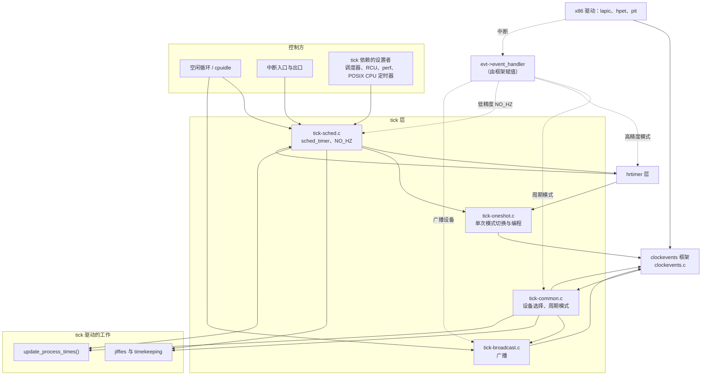
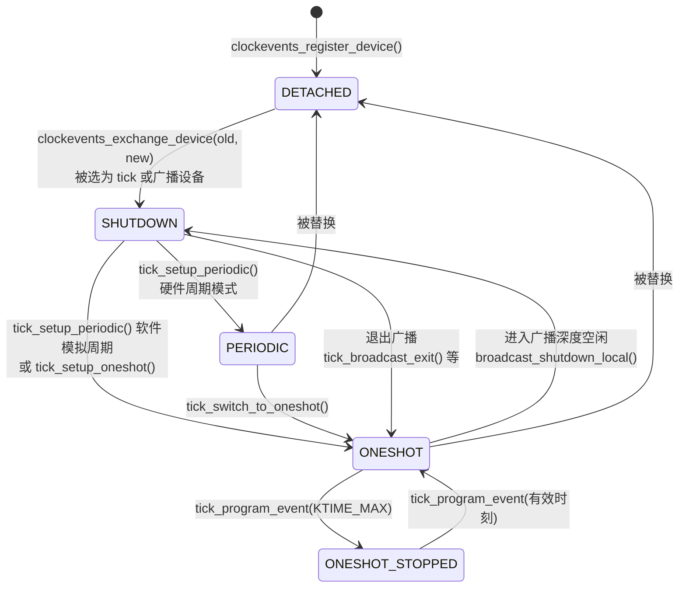
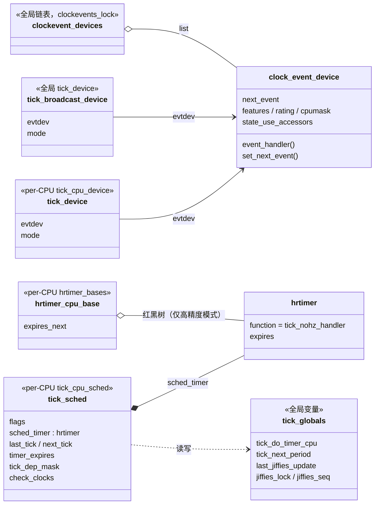
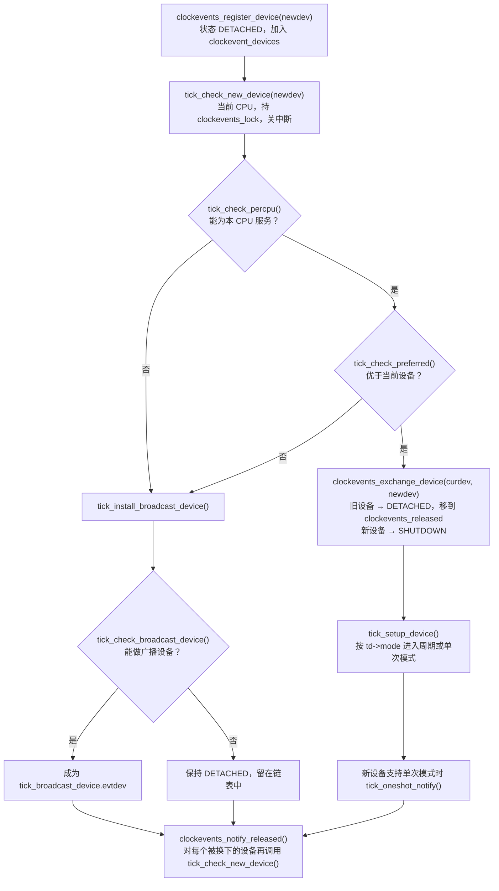
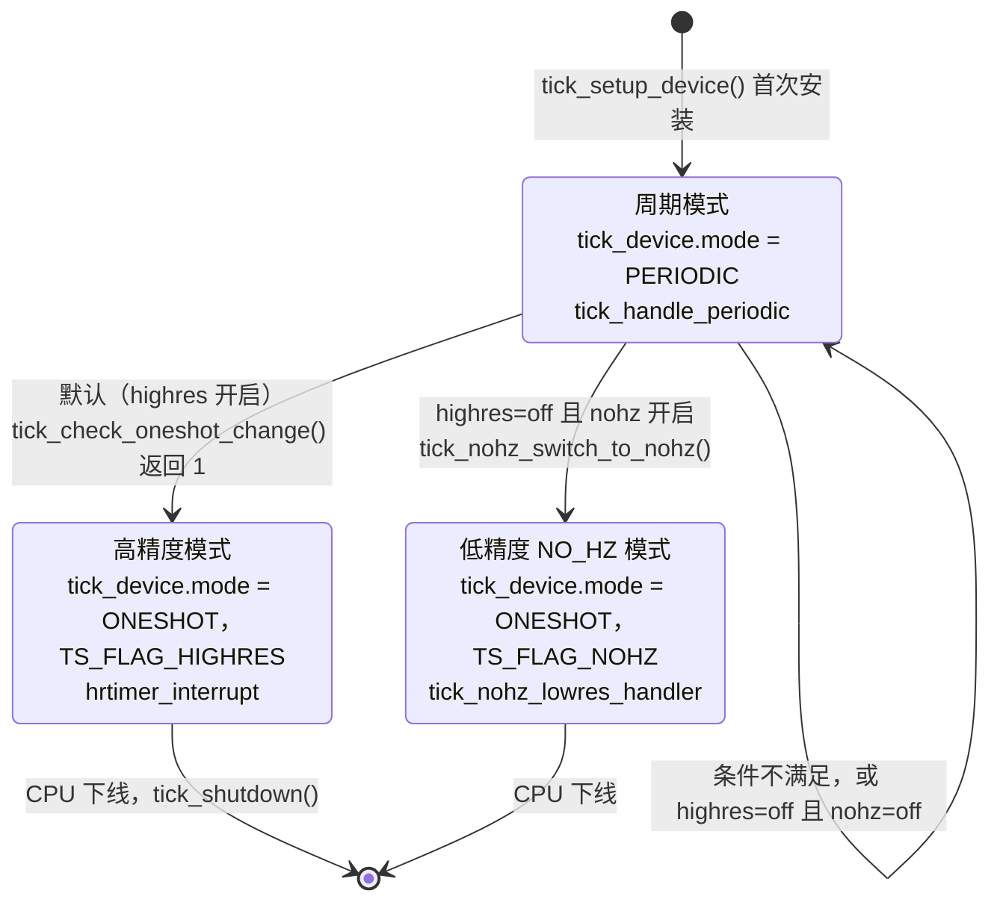
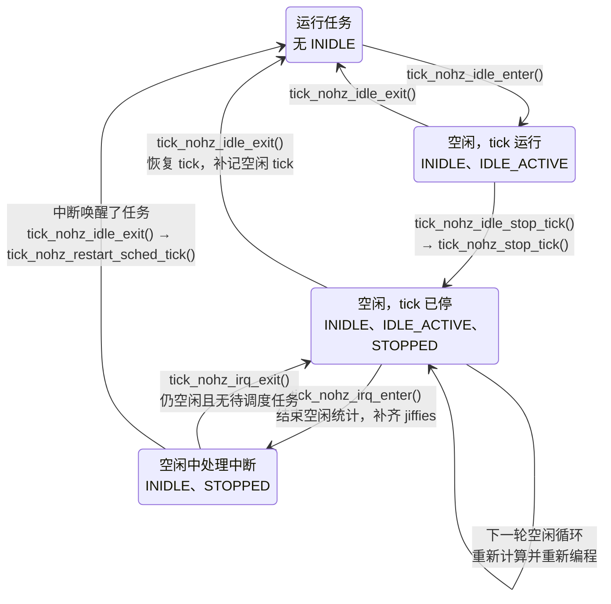
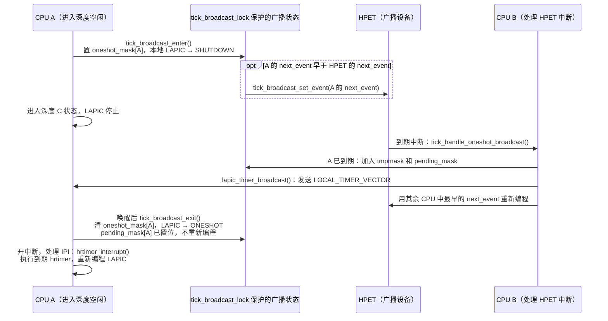
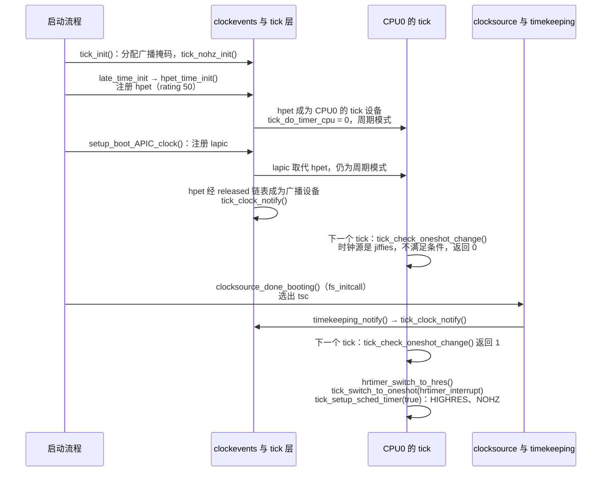
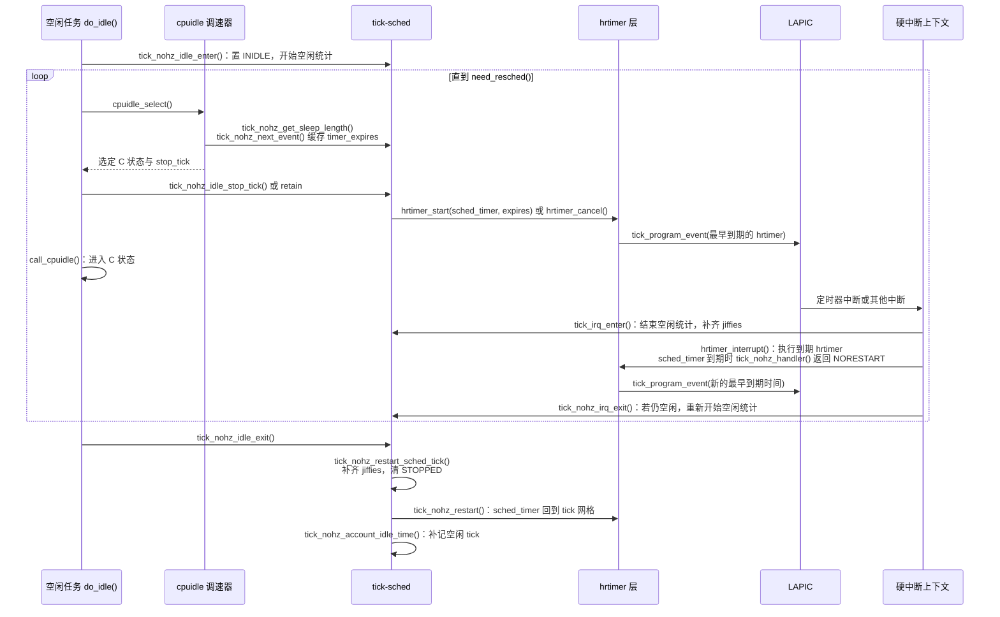

# tick 层：时钟事件设备、周期 tick 与 NO_HZ

[时间子系统概述](introduction.md)把 tick 层画成夹在定时器与时钟事件设备之间的一层：定时器只关心“最早什么时候需要醒来”，至于由哪个硬件、以周期还是单次模式去实现，由 tick 层决定；反过来，每个 CPU 每 `TICK_NSEC` 一次的周期性工作，也由 tick 层送到各个 CPU 上。本章把这一层展开，回答下面几个问题：

1. 一个时钟事件设备注册以后，怎样成为某个 CPU 的 tick 来源，又怎样被更好的设备替换？
2. 周期模式下 tick 怎样产生？系统在什么条件下切换到单次模式？
3. 进入单次模式后，“每 1 ms 一次”的 tick 由谁模拟？jiffies 由谁推进？
4. CPU 空闲时 tick 怎样停止、停多久、怎样恢复？停止期间漏掉的 jiffies 怎样补齐？
5. 在 `nohz_full` CPU 上，有任务运行时 tick 为什么也能停？
6. 本地定时器在深度 C 状态下会停止时，谁负责把 CPU 叫醒？

## 0. 分析基线

本章依据仓库内 [Makefile 第 2～4 行](../../linux/Makefile#L2-L4)标记的 **6.18.52** 版本，架构只讨论 **x86-64**。阅读前最好先看过[时间子系统概述](introduction.md)的第 2.3、2.4、3.3～3.5 节；中断的进入与退出路径见[硬中断](../interrupt/hardirq.md)和[软中断](../interrupt/softirq.md)两章。

与本章结论有关的编译配置如下。它们只说明哪些代码被编进内核，运行时是否经过对应路径，还取决于启动参数和硬件能力。

| 配置 | 对本章的影响 | 依据 |
| --- | --- | --- |
| `CONFIG_GENERIC_CLOCKEVENTS=y` | 编入 `clockevents.o` 和 `tick-common.o` | [.config#L91](../../linux/.config#L91)、[time/Makefile#L18](../../linux/kernel/time/Makefile#L18) |
| `CONFIG_GENERIC_CLOCKEVENTS_BROADCAST=y`、`CONFIG_GENERIC_CLOCKEVENTS_BROADCAST_IDLE=y` | 编入 `tick-broadcast.o`；在 x86-64 上由架构 Kconfig 选中 | [.config#L92-L93](../../linux/.config#L92-L93)、[time/Makefile#L19-L22](../../linux/kernel/time/Makefile#L19-L22)、[arch/x86/Kconfig#L164-L165](../../linux/arch/x86/Kconfig#L164-L165) |
| `CONFIG_GENERIC_CLOCKEVENTS_MIN_ADJUST=y` | 编程失败时自动调大设备的 `min_delta_ns` | [.config#L94](../../linux/.config#L94)、[arch/x86/Kconfig#L166](../../linux/arch/x86/Kconfig#L166) |
| `CONFIG_TICK_ONESHOT=y`、`CONFIG_NO_HZ_COMMON=y` | 编入 `tick-oneshot.o`、`tick-sched.o`，支持单次模式和空闲停 tick | [.config#L104-L105](../../linux/.config#L104-L105)、[time/Makefile#L24](../../linux/kernel/time/Makefile#L24) |
| `CONFIG_NO_HZ_FULL=y`（`HZ_PERIODIC`、`NO_HZ_IDLE` 均未选） | 编入完全无 tick 支持；没有 `nohz_full=` 参数时行为与 NO_HZ_IDLE 相同 | [.config#L106-L108](../../linux/.config#L106-L108)、[Kconfig#L118-L145](../../linux/kernel/time/Kconfig#L118-L145) |
| `CONFIG_CONTEXT_TRACKING_USER=y`、`CONFIG_VIRT_CPU_ACCOUNTING_GEN=y`、`CONFIG_RCU_NOCB_CPU=y`、`CONFIG_IRQ_WORK=y` | `NO_HZ_FULL` 选中的依赖 | [.config#L109](../../linux/.config#L109)、[.config#L148-L149](../../linux/.config#L148-L149)、[.config#L178](../../linux/.config#L178)、[.config#L27](../../linux/.config#L27) |
| `CONFIG_HIGH_RES_TIMERS=y` | 可以切换到高精度模式，tick 由一个真正入队的 hrtimer 模拟 | [.config#L112](../../linux/.config#L112) |
| `CONFIG_HZ=1000` | `TICK_NSEC` 为 1 000 000 ns | [.config#L505-L506](../../linux/.config#L505-L506)、[vdso/jiffies.h#L9](../../linux/include/vdso/jiffies.h#L9) |
| `CONFIG_CPU_IDLE=y`、`CONFIG_INTEL_IDLE=y`、`CONFIG_ACPI_PROCESSOR_IDLE=y` | 由 cpuidle 调速器参与决定是否停 tick、是否进入需要广播的 C 状态 | [.config#L636](../../linux/.config#L636)、[.config#L724-L732](../../linux/.config#L724-L732) |
| `CONFIG_HOTPLUG_CPU=y`、`CONFIG_PM_SLEEP_SMP=y`（未设 `PM_SLEEP_SMP_NONZERO_CPU`；该符号为 `def_bool y`，依赖 `ARCH_SUSPEND_NONZERO_CPU`，x86 未定义它，见 [kernel/power/Kconfig#L151-L154](../../linux/kernel/power/Kconfig#L151-L154)） | CPU 下线时交接计时职责；`nohz_full` 掩码中的启动 CPU 会被剔除 | [.config#L528](../../linux/.config#L528)、[.config#L595](../../linux/.config#L595)、[tick-sched.c#L643-L652](../../linux/kernel/time/tick-sched.c#L643-L652) |

`tick-broadcast-hrtimer.o` 虽然也会被编译（[time/Makefile#L21](../../linux/kernel/time/Makefile#L21)），但注册它的 `tick_setup_hrtimer_broadcast()` 只在 arm、arm64、powerpc、riscv 的时间初始化代码中调用，x86 不使用这种基于 hrtimer 的广播设备。

下面这些运行时条件也会改变本章路径：

| 运行时条件 | 影响 | 依据 |
| --- | --- | --- |
| `highres=`，默认开启 | 关闭后不进入高精度模式，改走低精度 NO_HZ 模式 | [hrtimer.c#L698-L710](../../linux/kernel/time/hrtimer.c#L698-L710) |
| `nohz=`，默认开启 | 关闭后不设置 `TS_FLAG_NOHZ`，tick 永不停止 | [tick-sched.c#L673-L683](../../linux/kernel/time/tick-sched.c#L673-L683)、[tick-sched.c#L1491-L1499](../../linux/kernel/time/tick-sched.c#L1491-L1499) |
| `nohz_full=<cpu 列表>` | 对这些 CPU 启用完全无 tick | [isolation.c#L176-L177](../../linux/kernel/sched/isolation.c#L176-L177)、[isolation.c#L190-L198](../../linux/kernel/sched/isolation.c#L190-L198)、[tick-sched.c#L600-L605](../../linux/kernel/time/tick-sched.c#L600-L605) |
| `skew_tick=` | 把各 CPU 的 tick 错开，减少 `jiffies_lock` 争用 | [tick-sched.c#L1557-L1565](../../linux/kernel/time/tick-sched.c#L1557-L1565)、[tick-sched.c#L1584-L1590](../../linux/kernel/time/tick-sched.c#L1584-L1590) |
| CPU 是否支持 ARAT（APIC 定时器在深度 C 状态下不停） | 决定 LAPIC 设备是否带 `C3STOP`，也就决定了是否需要 tick 广播 | [apic.c#L576-L580](../../linux/arch/x86/kernel/apic/apic.c#L576-L580)、[intel_idle.c#L1703-L1715](../../linux/drivers/idle/intel_idle.c#L1703-L1715) |
| CPU 是否支持 TSC deadline | 决定 LAPIC 设备是 `lapic` 还是只有单次模式的 `lapic-deadline` | [apic.c#L585-L594](../../linux/arch/x86/kernel/apic/apic.c#L585-L594) |

## 1. tick 层要解决什么问题

### 1.1 一个简单需求背后的三个问题

内核有一批工作需要“每隔一小段时间做一次”：给当前任务记账、驱动调度器的 `sched_tick()`、检查时间轮是否有到期定时器、通知 RCU 等，它们集中在 [update_process_times()（timer.c#L2467-L2482）](../../linux/kernel/time/timer.c#L2467-L2482) 中；另外还有一件只需一个 CPU 做的事：推进 `jiffies_64` 并调用 `update_wall_time()` 推进时间线。tick 层的任务，就是让这些工作以 `TICK_NSEC` 为节奏在每个 CPU 上执行。

“把硬件定时器设成每 1 ms 中断一次”看上去就够了，实际上要面对三个问题：

1. **硬件不一致。** x86 上能产生定时中断的设备有每 CPU 一个的 LAPIC 定时器（可能在深度 C 状态停止）、只支持单次触发的 TSC deadline 模式，以及全局只有一份的 HPET 和 PIT。tick 层要为每个 CPU 选出最合适的设备，在更好的设备出现时替换，并把落选的设备派上别的用场。
2. **周期与精度的矛盾。** 周期模式下硬件每个 tick 中断一次，hrtimer 最多只能做到 tick 精度。要做到纳秒精度，硬件必须工作在单次模式，按“最早到期的定时器”编程；这时周期 tick 不再由硬件产生，只能由软件模拟。
3. **省电与持续计时的矛盾。** 空闲 CPU 每毫秒被叫醒一次是浪费，但 tick 停了以后，jiffies 和时间线由谁推进？停多久才不会错过定时器？深度 C 状态下本地定时器自己也会停，谁来叫醒 CPU？

tick 层的源码基本按这三个问题划分：`tick-common.c` 负责设备选择和周期模式，`tick-oneshot.c` 和 `tick-sched.c` 负责单次模式、tick 模拟和停 tick，`tick-broadcast.c` 负责深度空闲时的代为唤醒。

### 1.2 tick 层在时间子系统中的位置

下面这张图回答“tick 层与哪些模块交互”。实线箭头表示“调用对方提供的接口”；虚线表示硬件中断到来时，驱动通过 `evt->event_handler` 回调进入的处理函数，这个指针由框架赋值，指向哪个函数取决于当前模式。



图中需要注意三点：

- **设备驱动只认 `event_handler`。** LAPIC 中断处理函数 [local_apic_timer_interrupt()（apic.c#L1013-L1042）](../../linux/arch/x86/kernel/apic/apic.c#L1013-L1042) 最终调用 `evt->event_handler(evt)`（之前还有伪中断检查和统计）。周期模式、高精度模式、低精度 NO_HZ 模式和广播模式的区别，全部体现在框架给这个指针赋了哪个函数。
- **tick 层和 hrtimer 层互相调用。** 高精度模式下，hrtimer 层调用 `tick_init_highres()` 和 `tick_setup_sched_timer()` 完成切换，并通过 `tick_program_event()` 编程硬件；tick 层又把模拟 tick 的 `sched_timer` 作为普通 hrtimer 交给 hrtimer 层管理。
- **控制方只与 `tick-sched.c` 打交道。** 空闲循环、中断入口出口、tick 依赖的设置者都通过 `tick_nohz_*` 接口影响 tick，不直接操作设备。唯一例外是 cpuidle 在进入深度 C 状态前调用广播接口。

### 1.3 触发事件、输入与输出

| 触发事件 | 入口 | tick 层的工作 | 结果 |
| --- | --- | --- | --- |
| 时钟事件设备注册 | `clockevents_register_device()` | 判断它能否取代本 CPU 的 tick 设备，或者成为广播设备 | `tick_device::evtdev` 或广播设备改变 |
| 时钟源或设备能力变化 | `tick_clock_notify()`、`tick_oneshot_notify()` | 设置 `tick_sched::check_clocks` | 下一个周期 tick 中尝试切换到单次模式 |
| 周期模式的硬件中断 | `tick_handle_periodic()` | 负责计时的 CPU 推进 jiffies；所有 CPU 执行 `update_process_times()` | 一次周期 tick |
| `sched_timer` 到期 | `tick_nohz_handler()` | 同上，并把 `sched_timer` 推后一个 `TICK_NSEC` | 一次模拟 tick |
| CPU 进入空闲 | `tick_nohz_idle_enter()`、`tick_nohz_idle_stop_tick()` | 计算下一次必须醒来的时间，停止 tick | `TS_FLAG_STOPPED`；`sched_timer` 被推迟或取消 |
| 空闲中来了中断 | `tick_irq_enter()`、`tick_nohz_irq_exit()` | 补齐 jiffies，暂停和恢复空闲时间统计 | 中断处理函数看到最新的 jiffies |
| CPU 退出空闲 | `tick_nohz_idle_exit()` | 恢复 tick，补记空闲 tick | `sched_timer` 回到 tick 网格上 |
| `nohz_full` CPU 的依赖变化 | `tick_nohz_dep_set_*()` | 用 irq_work 自 IPI 让目标 CPU 在中断出口重新评估 | tick 重新开始，或继续保持停止 |
| 进入或退出会停掉本地定时器的 C 状态 | `tick_broadcast_enter()`、`tick_broadcast_exit()` | 把本 CPU 的下一次事件托管给广播设备 | 由广播设备到期后发 IPI 叫醒 |
| CPU 下线 | `tick_cpu_dying()` | 交出计时职责，关闭本 CPU 的设备 | 由其他 CPU 继续推进 jiffies |

### 1.4 源码地图与本章边界

| 文件 | 内容 |
| --- | --- |
| [include/linux/clockchips.h](../../linux/include/linux/clockchips.h) | `struct clock_event_device`、设备状态和特性位 |
| [kernel/time/clockevents.c](../../linux/kernel/time/clockevents.c) | 设备注册、状态切换、编程、替换和解绑 |
| [kernel/time/tick-sched.h](../../linux/kernel/time/tick-sched.h)、[tick-internal.h](../../linux/kernel/time/tick-internal.h) | `struct tick_device`、`struct tick_sched`、内部接口 |
| [kernel/time/tick-common.c](../../linux/kernel/time/tick-common.c) | 每 CPU tick 设备的选择与安装、周期模式、`tick_do_timer_cpu` |
| [kernel/time/tick-oneshot.c](../../linux/kernel/time/tick-oneshot.c) | 切换到单次模式、`tick_program_event()` |
| [kernel/time/tick-sched.c](../../linux/kernel/time/tick-sched.c) | `sched_timer` 模拟 tick、jiffies 推进、NO_HZ 空闲与完全无 tick |
| [kernel/time/tick-broadcast.c](../../linux/kernel/time/tick-broadcast.c) | 广播设备的周期模式与单次模式 |
| [include/linux/tick.h](../../linux/include/linux/tick.h) | 对外接口：`tick_nohz_*`、tick 依赖位、广播控制 |

本章不展开以下内容，只在用到时说明接口契约：hrtimer 红黑树与 `hrtimer_interrupt()` 的内部细节、时间轮与定时器迁移（`timer_migration.c`）、`update_wall_time()` 内部的时间线推进、cpuidle 调速器的选择策略、上下文跟踪和 vtime 记账、RCU 对 tick 的使用细节，以及非 x86 平台的 hrtimer 广播和 per-CPU 唤醒设备。`tick-legacy.c` 只在 `CONFIG_LEGACY_TIMER_TICK` 下编译（[time/Makefile#L25](../../linux/kernel/time/Makefile#L25)），本配置不涉及。

## 2. 核心数据结构

tick 层的对象可以分成三层：硬件抽象 `clock_event_device`，每 CPU 的“tick 槽位” `tick_device`，以及每 CPU 的 tick 模拟和停止控制 `tick_sched`。另有几个全局变量负责“谁来推进 jiffies”。

### 2.1 `struct clock_event_device`：框架眼中的定时设备

[`struct clock_event_device`（clockchips.h#L100-L132）](../../linux/include/linux/clockchips.h#L100-L132) 描述一个能在指定时刻打断某些 CPU 的设备。[概述 2.3 节](introduction.md)已经列出主要字段，这里按 tick 层的用法分组，并标出每个字段由谁写入：

| 分组 | 字段 | 含义 | 写入方 |
| --- | --- | --- | --- |
| 回调槽 | `event_handler` | 中断到来时驱动调用的函数 | 框架：tick 层、hrtimer、广播代码 |
| 编程接口 | `set_next_event(evt, dev)` | 以“设备周期数”为参数，安排 `evt` 个周期后的一次中断 | 驱动 |
| | `set_next_ktime(expires, dev)` | 直接以绝对 `ktime_t` 编程，只用于带 `CLOCK_EVT_FEAT_KTIME` 的设备 | 驱动 |
| 状态接口 | `set_state_periodic/oneshot/oneshot_stopped/shutdown`、`tick_resume` | 状态切换时由框架调用 | 驱动 |
| 编程结果 | `next_event` | 最近一次被要求的绝对到期时间（MONOTONIC）；`KTIME_MAX` 表示没有待发事件 | 框架 |
| 换算与范围 | `mult`、`shift` | 纳秒换算为设备周期：`cycles = (ns * mult) >> shift` | 驱动或 `clockevents_config()` |
| | `min_delta_ns`、`max_delta_ns` | 可编程的最短、最长间隔（纳秒） | `clockevents_config()` 由下一行换算而来 |
| | `min_delta_ticks`、`max_delta_ticks` | 以设备周期表示的范围，频率变化后据此重算 | 驱动 |
| 能力 | `features`、`rating`、`cpumask`、`irq` | 特性位、评级、能服务的 CPU 集合、非本地设备的中断号 | 驱动 |
| 状态 | `state_use_accessors` | 当前状态，只能通过 `clockevent_get_state()` 等访问器读写（[tick-internal.h#L45-L54](../../linux/kernel/time/tick-internal.h#L45-L54)） | 框架 |
| 广播 | `broadcast(mask)` | 向 `mask` 中的 CPU 发送“代为 tick”的 IPI | 驱动；缺省时由框架补上 |
| | `bound_on` | hrtimer 广播设备当前绑定的 CPU | 仅 hrtimer 广播使用 |
| 管理 | `list`、`owner` | 所在的全局链表、模块引用 | 框架 |

**特性位。** [clockchips.h#L46-L68](../../linux/include/linux/clockchips.h#L46-L68) 定义了下列特性，tick 层在多处依据它们做决定：

| 特性 | 含义 | tick 层的用法 |
| --- | --- | --- |
| `CLOCK_EVT_FEAT_PERIODIC` | 硬件支持周期模式 | 周期模式下优先使用硬件周期中断 |
| `CLOCK_EVT_FEAT_ONESHOT` | 硬件支持单次模式 | 选设备时优先；切换到高精度或 NO_HZ 的前提 |
| `CLOCK_EVT_FEAT_KTIME` | 接受绝对 `ktime_t` | `clockevents_program_event()` 直接调用 `set_next_ktime()` |
| `CLOCK_EVT_FEAT_C3STOP` | 深度 C 状态下停止 | 依赖广播设备才能使用单次模式；本身不能做广播设备 |
| `CLOCK_EVT_FEAT_DUMMY` | 占位设备，不会真正产生中断 | 视为“不可用”，该 CPU 的 tick 改由广播设备提供 |
| `CLOCK_EVT_FEAT_DYNIRQ` | 广播设备可以动态修改中断亲和性 | 广播时把中断送到下一个待唤醒的 CPU |
| `CLOCK_EVT_FEAT_PERCPU` | 每 CPU 设备，但不宜做本地 tick | 只能做 per-CPU 唤醒设备；x86 驱动不设置此位 |
| `CLOCK_EVT_FEAT_HRTIMER` | 由 hrtimer 模拟的广播设备 | 广播代码中的特殊分支；x86 不使用 |

**设备状态。** 状态定义在 [clockchips.h#L35-L41](../../linux/include/linux/clockchips.h#L35-L41)。所有状态迁移都经过 [clockevents_switch_state()（clockevents.c#L147-L165）](../../linux/kernel/time/clockevents.c#L147-L165)：只有目标状态与当前不同时才调用驱动回调，回调返回错误则状态保持不变。下图回答“设备在哪些时刻、由哪些函数改变状态”，只画出 tick 层的主要路径：



几点说明：

- 被替换时，[clockevents_exchange_device()（clockevents.c#L576-L593）](../../linux/kernel/time/clockevents.c#L576-L593) 把旧设备从任意已用状态直接切到 `DETACHED`。[__clockevents_switch_state()（clockevents.c#L91-L138）](../../linux/kernel/time/clockevents.c#L91-L138) 对 `DETACHED` 和 `SHUTDOWN` 都调用驱动的 `set_state_shutdown`，所以硬件同样被关闭。
- `ONESHOT_STOPPED` 只能从 `ONESHOT` 进入（[clockevents.c#L123-L133](../../linux/kernel/time/clockevents.c#L123-L133)），表示“单次模式，但暂时没有任何事件”。x86 LAPIC 把 `set_state_oneshot_stopped` 设为 `lapic_timer_shutdown`（[apic.c#L504](../../linux/arch/x86/kernel/apic/apic.c#L504)），即屏蔽定时器。
- 带 `CLOCK_EVT_FEAT_DUMMY` 的设备在 `__clockevents_switch_state()` 开头直接返回成功（[clockevents.c#L94-L95](../../linux/kernel/time/clockevents.c#L94-L95)），状态值照常改变，硬件不受影响。

**编程。** [clockevents_program_event()（clockevents.c#L303-L337）](../../linux/kernel/time/clockevents.c#L303-L337) 是所有编程的汇合点，[概述 3.4 节](introduction.md)解释过它的换算部分。这里补充两个与 tick 层有关的细节：

```c
	dev->next_event = expires;

	if (clockevent_state_shutdown(dev))
		return 0;
	...
	delta = ktime_to_ns(ktime_sub(expires, ktime_get()));
	if (delta <= 0)
		return force ? clockevents_program_min_delta(dev) : -ETIME;
```

（源码：[kernel/time/clockevents.c#L313-L328](../../linux/kernel/time/clockevents.c#L313-L328)，省略了中间的状态检查和 KTIME 捷径）

- **先记账，后编程。** 不论设备能否被编程，`next_event` 都先更新。设备处于 `SHUTDOWN` 时函数直接返回 0，只留下这条记录。3.8 节会看到，广播代码正是读取各 CPU 设备的 `next_event` 来决定何时叫醒它们。
- **`force` 决定过期时间的处理。** 目标时刻已过时，`force=false` 返回 `-ETIME`，由调用者决定补做还是另选时刻；`force=true` 则调用 [clockevents_program_min_delta()（clockevents.c#L233-L262）](../../linux/kernel/time/clockevents.c#L233-L262)，以 `min_delta_ns` 编程。本配置启用了 `MIN_ADJUST`，连续 3 次失败后按 1.5 倍调大 `min_delta_ns`，上限是一个 jiffy（[clockevents.c#L194-L225](../../linux/kernel/time/clockevents.c#L194-L225)）。

**x86 上的设备实例。**

| 设备名 | 定义 | 特性 | `rating` | `cpumask` | 典型角色 |
| --- | --- | --- | --- | --- | --- |
| `lapic` | [apic.c#L495-L509](../../linux/arch/x86/kernel/apic/apic.c#L495-L509)，每 CPU 一份副本 [lapic_events（#L510）](../../linux/arch/x86/kernel/apic/apic.c#L510) | 初始为 `PERIODIC`、`ONESHOT`、`C3STOP`、`DUMMY`；校准成功后去掉 `DUMMY`（[#L915](../../linux/arch/x86/kernel/apic/apic.c#L915)、[#L997](../../linux/arch/x86/kernel/apic/apic.c#L997)）；有 ARAT 时去掉 `C3STOP` | 100，有 ARAT 时 150 | 本 CPU | 本地 tick 设备 |
| `lapic-deadline` | [apic.c#L585-L592](../../linux/arch/x86/kernel/apic/apic.c#L585-L592) | 在 `lapic` 基础上去掉 `PERIODIC` 和 `DUMMY` | 同上 | 本 CPU | 本地 tick 设备（TSC deadline 模式） |
| `hpet`（legacy 通道 0） | [hpet.c#L419-L469](../../linux/arch/x86/kernel/hpet.c#L419-L469) | `ONESHOT`、`PERIODIC` | 50 | 启动 CPU | 启动早期的 tick 设备，随后通常成为广播设备 |
| `hpetN`（MSI 通道） | [hpet.c#L647-L660](../../linux/arch/x86/kernel/hpet.c#L647-L660) | `ONESHOT`（通道支持时还有 `PERIODIC`） | 110 | 单个 CPU | 仅当 CPU 没有 ARAT 时才注册（[hpet.c#L704-L706](../../linux/arch/x86/kernel/hpet.c#L704-L706)） |
| `pit` | [i8253.c#L186-L212](../../linux/drivers/clocksource/i8253.c#L186-L212) | `PERIODIC`，可选 `ONESHOT` | 未显式设置 | 启动 CPU | HPET 不可用时的全局设备 |

`setup_APIC_timer()` 中的注释说明，ARAT 时把 LAPIC 评级提到 150，是为了让它优于每 CPU 的 HPET（[apic.c#L576-L580](../../linux/arch/x86/kernel/apic/apic.c#L576-L580)）。HPET legacy 设备只有在硬件支持 legacy 路由时才注册（[hpet.c#L1089-L1095](../../linux/arch/x86/kernel/hpet.c#L1089-L1095)），否则 `hpet_time_init()` 退回到 PIT（[time.c#L57-L65](../../linux/arch/x86/kernel/time.c#L57-L65)）。所以某台机器上最终有哪些设备，取决于运行时检测，静态分析只能给出可能的组合。

**组织与生命周期。** 设备对象由驱动定义和拥有（LAPIC 是 per-CPU 静态变量，HPET 通道嵌入在 `hpet_channel` 中），框架只把它们挂到两条全局链表上，由 `clockevents_lock` 保护（[clockevents.c#L19-L25](../../linux/kernel/time/clockevents.c#L19-L25)）：

- `clockevent_devices`：已注册的设备。
- `clockevents_released`：刚被换下的设备。注册流程结束前，框架会把它们逐个移回 `clockevent_devices`，再给一次被选用的机会（见 3.1 节）。

设备被选为 tick 设备或广播设备时，框架通过 `try_module_get(dev->owner)` 持有模块引用，被换下时在 `clockevents_exchange_device()` 中释放（[clockevents.c#L583-L587](../../linux/kernel/time/clockevents.c#L583-L587)）。

### 2.2 `struct tick_device`：每 CPU 的 tick 槽位

```c
enum tick_device_mode {
	TICKDEV_MODE_PERIODIC,
	TICKDEV_MODE_ONESHOT,
};

struct tick_device {
	struct clock_event_device *evtdev;
	enum tick_device_mode mode;
};
```

（源码：[kernel/time/tick-sched.h#L7-L15](../../linux/kernel/time/tick-sched.h#L7-L15)）

`tick_device` 只有两个字段：用哪个设备产生 tick，以及 tick 处于什么模式。它有两个实例：

| 实例 | 定义 | 含义 |
| --- | --- | --- |
| `tick_cpu_device`（per-CPU） | [tick-common.c#L29](../../linux/kernel/time/tick-common.c#L29) | 本 CPU 的 tick 设备 |
| `tick_broadcast_device`（全局） | [tick-broadcast.c#L27](../../linux/kernel/time/tick-broadcast.c#L27) | 广播设备；`mode` 表示广播工作在周期还是单次模式 |

此外还有一个 per-CPU 指针 `tick_oneshot_wakeup_device`（[tick-broadcast.c#L36](../../linux/kernel/time/tick-broadcast.c#L36)），用于单次模式下深度空闲时的 per-CPU 唤醒设备。它要求设备带 `CLOCK_EVT_FEAT_PERCPU`（[tick-broadcast.c#L116-L146](../../linux/kernel/time/tick-broadcast.c#L116-L146)），x86 的时钟事件驱动都不设置这一位，所以本章不再讨论。

**`mode` 是 tick 的模式，不是设备的状态。** 二者容易混淆，组合如下：

| `tick_device::mode` | 设备状态 | `event_handler` | 场景 |
| --- | --- | --- | --- |
| `PERIODIC` | `PERIODIC` | `tick_handle_periodic` | 设备支持硬件周期模式 |
| `PERIODIC` | `ONESHOT` | `tick_handle_periodic` | 设备只支持单次模式（例如 `lapic-deadline`），或广播已进入单次模式；由处理函数每次重新编程，模拟周期 |
| `ONESHOT` | `ONESHOT`、`ONESHOT_STOPPED` 或 `SHUTDOWN` | `hrtimer_interrupt` | 高精度模式 |
| `ONESHOT` | 同上 | `tick_nohz_lowres_handler` | 低精度 NO_HZ 模式 |

**生命周期。** 写 `mode` 的位置只有三处：首次安装设备时设为 `PERIODIC`（[tick-common.c#L229](../../linux/kernel/time/tick-common.c#L229)），切换到单次模式时设为 `ONESHOT`（[tick-oneshot.c#L94](../../linux/kernel/time/tick-oneshot.c#L94)），CPU 下线时恢复为 `PERIODIC`（[tick-common.c#L424](../../linux/kernel/time/tick-common.c#L424)）。因此，CPU 在线期间 tick 只会从周期模式单向进入单次模式，不会退回。`evtdev` 在 [tick_setup_device()](../../linux/kernel/time/tick-common.c#L236) 中设置，在 [tick_shutdown()](../../linux/kernel/time/tick-common.c#L419-L430) 中清空。`tick_broadcast_device.mode` 同样只会被改成 `ONESHOT`（[tick-broadcast.c#L1135](../../linux/kernel/time/tick-broadcast.c#L1135)）。

**并发。** 替换 `evtdev` 发生在持有 `clockevents_lock`、关中断的注册路径上，并且只针对执行注册的当前 CPU（`tick_check_new_device()` 用 `smp_processor_id()` 取 CPU 号）。x86 的 LAPIC 就是在各自的 CPU 上注册的（`setup_APIC_timer()` 用 `this_cpu_ptr()` 取设备，[apic.c#L574](../../linux/arch/x86/kernel/apic/apic.c#L574)）。读取方大多是本 CPU 的中断或关中断代码，例如 [tick_program_event()](../../linux/kernel/time/tick-oneshot.c#L23-L45) 用 `__this_cpu_read()` 读设备指针。广播代码会读其他 CPU 的 `evtdev->next_event`，这些访问由 `tick_broadcast_lock` 串行化。

### 2.3 `struct tick_sched`：tick 的模拟与停止

[`struct tick_sched`（tick-sched.h#L64-L103）](../../linux/kernel/time/tick-sched.h#L64-L103) 对应 per-CPU 变量 [`tick_cpu_sched`（tick-sched.c#L40）](../../linux/kernel/time/tick-sched.c#L40)，主要在单次模式下发挥作用。它的字段按用途分组：

| 分组 | 字段 | 含义 |
| --- | --- | --- |
| 状态 | `flags` | `TS_FLAG_*` 标志，见下表 |
| tick 模拟 | `sched_timer` | **嵌入**的 hrtimer。高精度模式下真正入队；低精度 NO_HZ 模式下不入队，只用来保存下一次 tick 的时刻 |
| | `last_tick` | 首次停 tick 时 `sched_timer` 的到期时间；恢复 tick 时以它为起点对齐到 tick 网格 |
| | `next_tick` | tick 停止期间最近一次编程的时刻；0 表示缓存失效，下一次必须重新编程 |
| jiffies 停滞检测 | `last_tick_jiffies`、`stalled_jiffies` | 上一次 tick 看到的 jiffies，以及连续没有变化的次数 |
| 停 tick 计算 | `last_jiffies`、`timer_expires_base` | `tick_nohz_next_event()` 取到的 jiffies 与对应的 MONOTONIC 时刻。`timer_expires_base` 非 0 表示“下一次事件已算好，尚未被使用” |
| | `timer_expires` | 算出的下一次必须醒来的时刻；0 表示应保持 tick |
| | `next_timer`、`idle_expires` | 仅用于调试输出 |
| 空闲统计 | `idle_entrytime`、`idle_exittime`、`idle_waketime`、`idle_sleeptime`、`iowait_sleeptime` | 空闲时间的累计，写端由 `idle_sleeptime_seq` 保护 |
| | `idle_jiffies` | 停 tick 时的 jiffies，退出空闲时据此补记空闲 tick |
| | `idle_calls`、`idle_sleeps` | 尝试停 tick 的次数、真正停下的次数 |
| | `got_idle_tick` | 空闲期间 tick 处理函数是否运行过 |
| `nohz_full` | `tick_dep_mask` | CPU 级的 tick 依赖位，`atomic_t` |
| 模式切换 | `check_clocks` | 第 0 位是“时钟源或设备有变化”的通知位 |

`flags` 中的标志定义在 [tick-sched.h#L17-L31](../../linux/kernel/time/tick-sched.h#L17-L31)：

| 标志 | 置位位置 | 清除位置 | 含义 |
| --- | --- | --- | --- |
| `TS_FLAG_INIDLE` | [tick_nohz_idle_enter()（#L1263）](../../linux/kernel/time/tick-sched.c#L1263) | [tick_nohz_idle_exit()（#L1459）](../../linux/kernel/time/tick-sched.c#L1459) | 空闲任务处于 tick 的空闲循环中 |
| `TS_FLAG_STOPPED` | [tick_nohz_stop_tick()（#L1046）](../../linux/kernel/time/tick-sched.c#L1046) | [tick_nohz_restart_sched_tick()（#L1103）](../../linux/kernel/time/tick-sched.c#L1103) | tick 已停止 |
| `TS_FLAG_IDLE_ACTIVE` | [tick_nohz_start_idle()（#L749）](../../linux/kernel/time/tick-sched.c#L749) | [tick_nohz_stop_idle()（#L739）](../../linux/kernel/time/tick-sched.c#L739) | 正在累计空闲时间；处理中断期间暂时清除 |
| `TS_FLAG_DO_TIMER_LAST` | 停 tick 时本 CPU 交出计时职责（[#L1017](../../linux/kernel/time/tick-sched.c#L1017)） | 停 tick 时发现计时职责已被他人接手（[#L1019](../../linux/kernel/time/tick-sched.c#L1019)） | 本 CPU 是最后一个负责计时的 CPU |
| `TS_FLAG_NOHZ` | [tick_nohz_activate()（#L1495）](../../linux/kernel/time/tick-sched.c#L1495) | CPU 下线时整个结构清零（[#L1618](../../linux/kernel/time/tick-sched.c#L1618)） | 允许停 tick |
| `TS_FLAG_HIGHRES` | [tick_setup_sched_timer(true)（#L1579）](../../linux/kernel/time/tick-sched.c#L1579) | 同上 | 高精度模式，`sched_timer` 真正入队 |

**并发保护。** `tick_sched` 原则上只由所属 CPU 修改：`tick_sched_flag_set()` 和 `tick_sched_flag_clear()` 断言中断已关闭（[tick-sched.c#L190-L202](../../linux/kernel/time/tick-sched.c#L190-L202)）。有三类字段例外：

- `check_clocks` 可能被其他 CPU 用 `set_bit()` 置位（[tick_clock_notify()，#L1628-L1634](../../linux/kernel/time/tick-sched.c#L1628-L1634)），所属 CPU 用 `test_and_clear_bit()` 消费。
- `tick_dep_mask` 是 `atomic_t`，远程 CPU 用 `atomic_fetch_or()` 置位（[#L505-L525](../../linux/kernel/time/tick-sched.c#L505-L525)）。
- 空闲时间统计可能被远程读取（例如 `get_cpu_idle_time_us()`），读端用 `idle_sleeptime_seq` 重试（[#L768-L779](../../linux/kernel/time/tick-sched.c#L768-L779)）。

**不变量。** 下面几条可以由源码推出，后文会反复用到：

- `TS_FLAG_STOPPED` 只会在 `TS_FLAG_NOHZ` 已置位的 CPU 上出现。停 tick 的两条入口分别要求 `can_stop_idle_tick()` 检查 `TS_FLAG_NOHZ`（[#L1173-L1174](../../linux/kernel/time/tick-sched.c#L1173-L1174)），或 `tick_nohz_full_update_tick()` 检查同一标志（[#L1125-L1126](../../linux/kernel/time/tick-sched.c#L1125-L1126)）。
- `timer_expires_base` 非 0 的状态不会跨越空闲循环的一轮：它要么被 `tick_nohz_stop_tick()` 清零（[#L980](../../linux/kernel/time/tick-sched.c#L980)），要么被 `tick_nohz_retain_tick()` 清零（[#L1073-L1076](../../linux/kernel/time/tick-sched.c#L1073-L1076)）。进入和退出空闲时都有 `WARN_ON_ONCE(ts->timer_expires_base)` 检查这一点（[#L1261](../../linux/kernel/time/tick-sched.c#L1261)、[#L1457](../../linux/kernel/time/tick-sched.c#L1457)）。

### 2.4 全局计时状态：谁来推进 jiffies

每个 CPU 都有 tick，但 jiffies 和 timekeeper 是全局的，只需要一个 CPU 推进。相关的全局状态如下：

| 变量 | 定义 | 含义 | 保护方式 |
| --- | --- | --- | --- |
| `tick_do_timer_cpu` | [tick-common.c#L37-L51](../../linux/kernel/time/tick-common.c#L37-L51) | 负责推进的 CPU。初值 `TICK_DO_TIMER_BOOT`（-2）；NO_HZ 下负责者停 tick 时改为 `TICK_DO_TIMER_NONE`（-1），[tick-internal.h#L18-L19](../../linux/kernel/time/tick-internal.h#L18-L19) | `READ_ONCE`/`WRITE_ONCE`，不加锁；允许两个 CPU 同时认领，真正的更新由 `jiffies_lock` 串行化 |
| `tick_next_period` | [tick-common.c#L30-L35](../../linux/kernel/time/tick-common.c#L30-L35) | 下一个尚未计入 jiffies 的 tick 边界（MONOTONIC 纳秒） | 写者持 `jiffies_lock`；64 位上的无锁快速检查用 acquire/release 配对 |
| `last_jiffies_update` | [tick-sched.c#L47-L52](../../linux/kernel/time/tick-sched.c#L47-L52) | 最近一次推进 jiffies 时对应的 tick 边界 | `jiffies_lock` + `jiffies_seq` |
| `jiffies_64` | [timer.c#L60](../../linux/kernel/time/timer.c#L60) | tick 计数 | 同上 |
| `jiffies_lock`、`jiffies_seq` | [jiffies.c#L43-L45](../../linux/kernel/time/jiffies.c#L43-L45) | raw 自旋锁及与之关联的 seqcount | — |
| `tick_nohz_enabled`、`tick_nohz_active` | [tick-sched.c#L673-L674](../../linux/kernel/time/tick-sched.c#L673-L674) | `nohz=` 参数；是否已有 CPU 激活 NO_HZ | 前者启动后只读；后者第 0 位用 `test_and_set_bit()` |
| `tick_nohz_full_mask`、`tick_nohz_full_running` | [tick-sched.c#L315-L318](../../linux/kernel/time/tick-sched.c#L315-L318) | `nohz_full` CPU 集合；是否启用 | 启动期设置 |

单次模式下，`tick_do_update_jiffies64()` 每次推进 jiffies 之后都令 `tick_next_period = last_jiffies_update + TICK_NSEC`（[tick-sched.c#L121](../../linux/kernel/time/tick-sched.c#L121)）。`last_jiffies_update` 首次初始化时被对齐到 `TICK_NSEC` 的整数倍，之后每次也只增加 `TICK_NSEC` 的整数倍，它定义了全系统共用的 **tick 网格**（见 3.4 节）。

### 2.5 对象关系总览

下面这张图回答“这些结构体之间谁包含谁、谁指向谁”。实心菱形（`*--`）表示嵌入，普通箭头表示指针，空心菱形（`o--`）表示作为集合成员挂在链表或红黑树上、但不被集合拥有，虚线箭头表示读写全局状态。



这张图做了简化：`hrtimer_cpu_base` 内部还有按时钟分开的 `hrtimer_clock_base`，`sched_timer` 实际挂在其中 MONOTONIC 硬中断队列的红黑树上，图中省略了这一层。需要注意：

- `tick_device` 与 `tick_sched` 之间没有指针，二者都是 per-CPU 变量，通过“同一个 CPU”联系在一起。
- 同一个 `clock_event_device` 在任一时刻最多扮演一个角色：某个 CPU 的 tick 设备、广播设备，或者闲置（`DETACHED`）。依据是：设备获得角色时都要经过 `clockevents_exchange_device(…, new)`，它要求 `new` 处于 `DETACHED`（[clockevents.c#L589-L592](../../linux/kernel/time/clockevents.c#L589-L592)）；失去角色时又被切回 `DETACHED`。`tick_check_new_device()` 中仍保留了“当前 tick 设备恰好是广播设备”的防御分支（3.1 节）。
- 设备对象由驱动拥有，`tick_device::evtdev` 只是借用；`sched_timer` 嵌在 per-CPU 变量中，不会被释放，CPU 下线时只需确保它已出队（[tick-sched.c#L1610-L1612](../../linux/kernel/time/tick-sched.c#L1610-L1612)）。

## 3. 关键算法

### 3.1 设备的注册、选择与替换

**目标：** 新设备注册时，决定它在当前 CPU 上扮演什么角色：tick 设备、广播设备，或者暂时闲置。被换下的设备也要有机会扮演其他角色。

**入口：** 驱动调用 [clockevents_register_device()（clockevents.c#L451-L476）](../../linux/kernel/time/clockevents.c#L451-L476)，或先用 [clockevents_config_and_register()（#L512-L520）](../../linux/kernel/time/clockevents.c#L512-L520) 根据频率算出 `mult/shift` 和 `min/max_delta_ns`。注册函数把状态置为 `DETACHED`、加入 `clockevent_devices`，在持 `clockevents_lock`、关中断的条件下调用 `tick_check_new_device()`，最后调用 `clockevents_notify_released()`。选择只针对执行注册的当前 CPU，所以 per-CPU 设备要在它所服务的 CPU 上注册。

下面这张流程图回答“一个新设备会落到哪里”：



**本 CPU 能否使用。** [tick_check_percpu()（tick-common.c#L272-L286）](../../linux/kernel/time/tick-common.c#L272-L286) 依次检查：设备的 `cpumask` 必须包含本 CPU；`cpumask` 恰好只有本 CPU 时直接通过；否则（全局设备）要求中断亲和性可设置，并且当前设备不是本 CPU 专属设备。也就是说，已经有本地设备时，全局设备不会抢走它。

**是否更优。** [tick_check_preferred()（tick-common.c#L288-L306）](../../linux/kernel/time/tick-common.c#L288-L306)：

```c
	/* Prefer oneshot capable device */
	if (!(newdev->features & CLOCK_EVT_FEAT_ONESHOT)) {
		if (curdev && (curdev->features & CLOCK_EVT_FEAT_ONESHOT))
			return false;
		if (tick_oneshot_mode_active())
			return false;
	}

	return !curdev ||
		newdev->rating > curdev->rating ||
	       !cpumask_equal(curdev->cpumask, newdev->cpumask);
```

（源码：[kernel/time/tick-common.c#L291-L305](../../linux/kernel/time/tick-common.c#L291-L305)，省略了第 299～302 行的注释）

规则有三层：不支持单次模式的设备，不能取代支持单次模式的设备，也不能在本 CPU 已进入单次模式后被选用（否则无法再编程任意时刻）；其次比较评级；最后一项 `cpumask` 不相等时也返回真。这一项的典型作用是：结合 `tick_check_percpu()` 的过滤，新设备是本地设备而当前设备是全局设备时，两者掩码必然不相等，于是本地设备即使评级更低也会被选中，这正是注释说的“prefer a CPU local device with a lower rating than a non-CPU local device”。但掩码不相等并不只出现在这种情形：两个掩码不同的全局设备同样满足这一项，此时即使新设备评级更低也会替换当前设备，因此不能仅凭掩码不相等推断设备类型。

**替换。** [tick_check_new_device()（tick-common.c#L325-L361）](../../linux/kernel/time/tick-common.c#L325-L361) 通过检查后，先 `try_module_get()`，再调用 `clockevents_exchange_device(curdev, newdev)`：旧设备释放模块引用、切到 `DETACHED`、移到 `clockevents_released`；新设备从 `DETACHED` 切到 `SHUTDOWN`，`next_event` 置为 `KTIME_MAX`。如果当前设备恰好是广播设备，就只把它关掉、不交还给 clockevents 层（[#L341-L349](../../linux/kernel/time/tick-common.c#L341-L349)）。随后 [tick_setup_device()（#L184-L259）](../../linux/kernel/time/tick-common.c#L184-L259) 安装新设备：

1. **首次安装**（`td->evtdev == NULL`）：如果 `tick_do_timer_cpu` 仍是 `TICK_DO_TIMER_BOOT`，就由本 CPU 接下计时职责，并用 `ktime_get()` 初始化 `tick_next_period`（[#L199-L201](../../linux/kernel/time/tick-common.c#L199-L201)）；`td->mode` 设为 `PERIODIC`。
2. **替换已有设备**：记下旧设备的 `event_handler` 和 `next_event`，把旧设备的处理函数换成空函数 `clockevents_handle_noop`（[#L230-L234](../../linux/kernel/time/tick-common.c#L230-L234)），这样旧设备即使还有一次在途的中断，也不会再驱动 tick。
3. 全局设备被用作本地设备时，把它的中断亲和性绑到本 CPU（[#L242-L243](../../linux/kernel/time/tick-common.c#L242-L243)）。
4. 调用 `tick_device_uses_broadcast()`，如果本 CPU 的 tick 要由广播设备代劳，到此为止（[#L252-L253](../../linux/kernel/time/tick-common.c#L252-L253)，见 3.8 节）。
5. 否则按 `td->mode` 调用 `tick_setup_periodic()`，或者用旧的处理函数和 `next_event` 调用 `tick_setup_oneshot()`（[#L255-L258](../../linux/kernel/time/tick-common.c#L255-L258)）。后者保证了单次模式下替换设备时，正在等待的下一次事件不会丢失。

**落选设备的去处。** 没有当选的设备进入 [tick_install_broadcast_device()（tick-broadcast.c#L163-L204）](../../linux/kernel/time/tick-broadcast.c#L163-L204)。能做广播设备的条件见 [tick_check_broadcast_device()（#L86-L99）](../../linux/kernel/time/tick-broadcast.c#L86-L99)：不能是 `DUMMY`、`PERCPU`、`C3STOP` 设备；广播已在单次模式时必须支持单次模式；评级要高于当前广播设备。

**被换下设备的第二次机会。** 注册函数最后调用 [clockevents_notify_released()（clockevents.c#L347-L361）](../../linux/kernel/time/clockevents.c#L347-L361)，把 `clockevents_released` 中的设备逐个移回 `clockevent_devices`，并对它再调用一次 `tick_check_new_device()`。被换下的本地 tick 设备因此可以成为广播设备，被换下的广播设备也可能成为某个 CPU 的 tick 设备。

**x86 启动时的一个例子。** 以 CPU 支持 ARAT、HPET 支持 legacy 路由为例（运行时条件不同，结果也会不同）：

1. `hpet_time_init()` 在启动 CPU 上注册 `hpet`（评级 50）。此时 CPU0 还没有 tick 设备，它通过检查，成为 CPU0 的 tick 设备，CPU0 同时接下 `tick_do_timer_cpu`，以周期模式运行。
2. 稍后，`native_smp_prepare_cpus()` 通过 `x86_init.timers.setup_percpu_clockev` 调用 `setup_boot_APIC_clock()`，注册 CPU0 的 `lapic`（[smpboot.c#L1066-L1067](../../linux/arch/x86/kernel/smpboot.c#L1066-L1067)、[x86_init.c#L98-L101](../../linux/arch/x86/kernel/x86_init.c#L98-L101)）。ARAT 下它的评级是 150，高于 `hpet`，于是取代 `hpet`；`hpet` 被移到 `clockevents_released`。
3. `clockevents_notify_released()` 对 `hpet` 再做一次检查：它的 `cpumask` 与 `lapic` 相同（都只含 CPU0）、评级更低，不能取代 `lapic`，于是进入 `tick_install_broadcast_device()`。`hpet` 不带 `C3STOP`，成为广播设备。由于没有 CPU 需要广播，它保持关闭；由于它支持单次模式，函数末尾调用 `tick_clock_notify()` 通知所有 CPU（[tick-broadcast.c#L195-L203](../../linux/kernel/time/tick-broadcast.c#L195-L203)）。
4. 其他 CPU 上线时由 `setup_secondary_APIC_clock()` 注册各自的 `lapic`（[x86_init.c#L130-L133](../../linux/arch/x86/kernel/x86_init.c#L130-L133)），各自首次安装，进入周期模式。

**解绑。** 用户可以通过 sysfs 的 `unbind_device` 让某个 CPU 放弃当前设备。[clockevents_unbind() 与 __clockevents_unbind()（clockevents.c#L408-L431）](../../linux/kernel/time/clockevents.c#L408-L431) 用 `smp_call_function_single()` 在目标 CPU 上执行：设备闲置就直接摘下；是本 CPU tick 设备时，用 [clockevents_replace()（#L366-L389）](../../linux/kernel/time/clockevents.c#L366-L389) 在闲置设备中找一个最合适的替代，找不到就返回 `-EBUSY`。

### 3.2 周期模式

**目标：** 设备刚安装好、系统还不具备单次模式条件时，每 `TICK_NSEC` 产生一次 tick。

**设置。** [tick_setup_periodic()（tick-common.c#L151-L179）](../../linux/kernel/time/tick-common.c#L151-L179) 先把 `event_handler` 设为 `tick_handle_periodic`（广播设备则为 `tick_handle_periodic_broadcast`，[tick-broadcast.c#L515-L521](../../linux/kernel/time/tick-broadcast.c#L515-L521)），然后分两种情况：

- 设备支持 `PERIODIC`，并且广播没有处于单次模式：把设备切到 `PERIODIC` 状态，由硬件自动周期中断。
- 否则用单次模式模拟：在 `jiffies_seq` 读端取得 `tick_next_period`，把设备切到 `ONESHOT`，从这一时刻开始编程；如果它已经过去，就逐次加 `TICK_NSEC` 直到编程成功（[#L162-L177](../../linux/kernel/time/tick-common.c#L162-L177)）。

TSC deadline 模式的 `lapic-deadline` 没有 `PERIODIC` 特性，所以在这类 CPU 上，周期阶段也是用单次中断模拟的。

**处理。** 周期 tick 的工作在 [tick_periodic()（tick-common.c#L86-L103）](../../linux/kernel/time/tick-common.c#L86-L103) 中：

```c
static void tick_periodic(int cpu)
{
	if (READ_ONCE(tick_do_timer_cpu) == cpu) {
		raw_spin_lock(&jiffies_lock);
		write_seqcount_begin(&jiffies_seq);

		/* Keep track of the next tick event */
		tick_next_period = ktime_add_ns(tick_next_period, TICK_NSEC);

		do_timer(1);
		write_seqcount_end(&jiffies_seq);
		raw_spin_unlock(&jiffies_lock);
		update_wall_time();
	}

	update_process_times(user_mode(get_irq_regs()));
	profile_tick(CPU_PROFILING);
}
```

（源码：[kernel/time/tick-common.c#L86-L103](../../linux/kernel/time/tick-common.c#L86-L103)）

周期模式下每个 tick 恰好加 1 个 jiffy（[do_timer()，timekeeping.c#L2549-L2553](../../linux/kernel/time/timekeeping.c#L2549-L2553)），不像单次模式那样按经过的时间计算。

[tick_handle_periodic()（tick-common.c#L108-L146）](../../linux/kernel/time/tick-common.c#L108-L146) 调用 `tick_periodic()` 之后还要处理两件事：

1. 如果 `event_handler` 已经不是自己，说明本次 tick 中途切换到了高精度或 NO_HZ 模式（切换发生在 `update_process_times()` → `run_local_timers()` → `hrtimer_run_queues()` 中，见 3.3 节），直接返回。
2. 如果设备处于 `ONESHOT` 状态（模拟周期），就把 `next_event` 加一个 `TICK_NSEC` 后重新编程，`force` 为 false。编程返回失败说明这个时刻已经过去（例如中断被关得太久），于是补一次 `tick_periodic()` 再继续向后推。补做之前要求 `timekeeping_valid_for_hres()` 为真，源码注释解释了原因：如果当前时钟源是由 jiffies 驱动的，`tick_periodic()` 增加 jiffies 会让时间前进，可能导致循环一直无法追上（[#L134-L144](../../linux/kernel/time/tick-common.c#L134-L144)）。

### 3.3 从周期模式切换到单次模式

**目标：** 一旦时钟源和 tick 设备都具备条件，把本 CPU 的 tick 切换到单次模式：要么进入高精度模式，要么进入低精度 NO_HZ 模式。

**条件何时被重新检查。** 切换不是在设备注册时立即进行的。注册新设备、更换时钟源等事件只是设置 `check_clocks` 通知位：

| 通知来源 | 函数 | 作用范围 |
| --- | --- | --- |
| 新的本地设备支持单次模式 | [tick_oneshot_notify()（tick-sched.c#L1639-L1644）](../../linux/kernel/time/tick-sched.c#L1639-L1644)，由 `tick_check_new_device()` 和 `tick_install_replacement()` 调用 | 本 CPU |
| timekeeping 换了时钟源 | [timekeeping_notify()（timekeeping.c#L1628-L1637）](../../linux/kernel/time/timekeeping.c#L1628-L1637) 调用 `tick_clock_notify()` | 所有 CPU |
| 看门狗确认当前时钟源可用于高精度 | [clocksource.c#L566-L571](../../linux/kernel/time/clocksource.c#L566-L571) | 所有 CPU |
| 出现了支持单次模式的广播设备 | [tick-broadcast.c#L195-L203](../../linux/kernel/time/tick-broadcast.c#L195-L203) | 所有 CPU |

`hrtimer_run_queues()` 的注释说明了为什么采用“置位、稍后检查”的方式：时钟源切换发生在持有计时锁的上下文中，直接在那里切换 tick 模式可能死锁（[hrtimer.c#L1982-L1988](../../linux/kernel/time/hrtimer.c#L1982-L1988)）。检查点在每个周期 tick 里：

```c
	if (hrtimer_hres_active(cpu_base))
		return;

	if (tick_check_oneshot_change(!hrtimer_is_hres_enabled())) {
		hrtimer_switch_to_hres();
		return;
	}
```

（源码：[kernel/time/hrtimer.c#L1979-L1992](../../linux/kernel/time/hrtimer.c#L1979-L1992)，省略了注释）

调用链是 `tick_handle_periodic()` → `tick_periodic()` → `update_process_times()` → `run_local_timers()`（[timer.c#L2419](../../linux/kernel/time/timer.c#L2419)）→ `hrtimer_run_queues()`，运行在硬中断上下文。[tick_check_oneshot_change()（tick-sched.c#L1654-L1672）](../../linux/kernel/time/tick-sched.c#L1654-L1672) 上方的注释说它“由 hrtimer 软中断周期调用”（[#L1646-L1653](../../linux/kernel/time/tick-sched.c#L1646-L1653)），与当前调用点不符，本书以代码为准。

**判断条件。** `tick_check_oneshot_change(allow_nohz)` 的逻辑：

1. `test_and_clear_bit(0, &ts->check_clocks)` 为假，返回 0。注意这一位是“读后清除”的，如果这一次条件还不满足，就要等下一次通知才会再检查。这也是 3.1 节中广播设备出现后要主动 `tick_clock_notify()` 的原因：源码注释说明，缺少这次通知，本地设备带 `C3STOP` 的系统可能永远停在周期模式（[tick-broadcast.c#L195-L202](../../linux/kernel/time/tick-broadcast.c#L195-L202)）。
2. 已处于低精度 NO_HZ 模式（`TS_FLAG_NOHZ`），返回 0。
3. 当前时钟源不带 `CLOCK_SOURCE_VALID_FOR_HRES`（[timekeeping_valid_for_hres()，timekeeping.c#L1700-L1714](../../linux/kernel/time/timekeeping.c#L1700-L1714)），或本 CPU 没有可用的单次设备，返回 0。[tick_is_oneshot_available()（tick-common.c#L72-L81）](../../linux/kernel/time/tick-common.c#L72-L81) 要求设备支持单次模式；如果设备带 `C3STOP`，还要求广播设备支持单次模式。
4. `allow_nohz` 为假（即高精度开启），返回 1，由调用者切换到高精度模式。
5. 否则（`highres=off`）调用 `tick_nohz_switch_to_nohz()` 切换到低精度 NO_HZ 模式，返回 0。

启动早期，timekeeping 使用的是 `jiffies` 时钟源（[timekeeping.c#L1828](../../linux/kernel/time/timekeeping.c#L1828)），它不带 `VALID_FOR_HRES`（[jiffies.c#L32-L41](../../linux/kernel/time/jiffies.c#L32-L41)），并且在 `clocksource_done_booting()`（`fs_initcall`）之前不会选出新的时钟源（[clocksource.c#L1006-L1007](../../linux/kernel/time/clocksource.c#L1006-L1007)、[#L1100-L1113](../../linux/kernel/time/clocksource.c#L1100-L1113)）。所以系统启动的前一段时间一直运行在周期模式，`tick-common.c` 的注释也描述了这一点（[#L213-L217](../../linux/kernel/time/tick-common.c#L213-L217)）。反过来，一旦进入单次模式，时钟源选择也会受约束：`clocksource_find_best()` 只考虑带 `VALID_FOR_HRES` 的时钟源（[clocksource.c#L1017-L1018](../../linux/kernel/time/clocksource.c#L1017-L1018)）。

**切换到高精度模式。** [hrtimer_switch_to_hres()（hrtimer.c#L723-L738）](../../linux/kernel/time/hrtimer.c#L723-L738)：

1. [tick_init_highres()](../../linux/kernel/time/tick-oneshot.c#L124-L127) 调用 [tick_switch_to_oneshot(hrtimer_interrupt)（tick-oneshot.c#L73-L99）](../../linux/kernel/time/tick-oneshot.c#L73-L99)：再次确认设备可用并支持单次模式，置 `td->mode = TICKDEV_MODE_ONESHOT`，把 `event_handler` 换成 `hrtimer_interrupt`，设备切到 `ONESHOT`，最后让广播设备也进入单次模式（`tick_broadcast_switch_to_oneshot()`）。
2. 置 `hres_active = 1`，`hrtimer_resolution` 变为 1 ns。
3. `tick_setup_sched_timer(true)`：建立模拟 tick 的 `sched_timer`（3.4 节）。
4. `retrigger_next_event(NULL)`：重新计算本 CPU 最早到期的 hrtimer 并编程硬件（[hrtimer.c#L759-L787](../../linux/kernel/time/hrtimer.c#L759-L787)）。

**切换到低精度 NO_HZ 模式。** [tick_nohz_switch_to_nohz()（tick-sched.c#L1504-L1517）](../../linux/kernel/time/tick-sched.c#L1504-L1517)：`nohz=off` 时直接返回，tick 留在周期模式；否则调用 `tick_switch_to_oneshot(tick_nohz_lowres_handler)`，再调用 `tick_setup_sched_timer(false)`。

三种模式的差别如下：

| 维度 | 周期模式 | 低精度 NO_HZ | 高精度 |
| --- | --- | --- | --- |
| `td->mode` | `PERIODIC` | `ONESHOT` | `ONESHOT` |
| `event_handler` | `tick_handle_periodic` | `tick_nohz_lowres_handler` | `hrtimer_interrupt` |
| tick 由谁产生 | 硬件周期中断，或处理函数逐次重编程 | 处理函数直接调用 `tick_nohz_handler()` 后，用 `sched_timer` 中保存的时刻编程硬件 | `sched_timer` 作为 hrtimer 入队，由 `hrtimer_interrupt()` 执行 |
| hrtimer 何时到期 | 每个 tick 中由 `hrtimer_run_queues()` 处理 | 同左 | 硬件按最早的 hrtimer 编程，`hrtimer_interrupt()` 处理 |
| 能否停 tick | 不能 | 能（`TS_FLAG_NOHZ`） | 能（`TS_FLAG_NOHZ`，`nohz=off` 时不能） |
| `TS_FLAG_HIGHRES` | — | 否 | 是 |

低精度 NO_HZ 模式之所以不能把 `sched_timer` 交给 hrtimer 层，[tick_nohz_lowres_handler()（tick-sched.c#L1475-L1489）](../../linux/kernel/time/tick-sched.c#L1475-L1489) 上方的注释给出了原因：低精度模式下 hrtimer 本身就依赖 tick 来到期，二者不能互为后端。

下面的状态图回答“一个 CPU 的 tick 模式可能怎样演进”，状态内注明了模式标志和处理函数：



高精度模式下是否能停 tick，由正交的 `TS_FLAG_NOHZ` 决定：`tick_setup_sched_timer()` 末尾调用 `tick_nohz_activate()`，`nohz=off` 时它不置位（[tick-sched.c#L1491-L1499](../../linux/kernel/time/tick-sched.c#L1491-L1499)）。

### 3.4 `sched_timer`：在单次模式下模拟 tick

**目标：** 硬件进入单次模式后，用一个每 `TICK_NSEC` 到期一次的定时器继续执行周期性工作，并让所有 CPU 的 tick 落在同一个时间网格上。

**建立。** [tick_setup_sched_timer()（tick-sched.c#L1571-L1598）](../../linux/kernel/time/tick-sched.c#L1571-L1598)：

1. 用 `hrtimer_setup()` 初始化 `sched_timer`：回调 `tick_nohz_handler`、`CLOCK_MONOTONIC`、绝对时间、硬中断上下文执行（`HRTIMER_MODE_ABS_HARD`）。高精度模式下置 `TS_FLAG_HIGHRES`。
2. 到期时间取 [tick_init_jiffy_update()（#L155-L182）](../../linux/kernel/time/tick-sched.c#L155-L182) 的返回值。第一个进入单次模式的 CPU 在这里把 `tick_next_period` 向上对齐到 `TICK_NSEC` 的整数倍，并用它初始化 `last_jiffies_update`；之后的 CPU 直接取 `last_jiffies_update`。
3. 若设置了 `skew_tick`，按 CPU 号加上 `(TICK_NSEC / 2) / CPU 数 × CPU 号` 的偏移，错开各 CPU 的 tick，注释说明目的是减少 `jiffies_lock` 争用（[#L1584-L1590](../../linux/kernel/time/tick-sched.c#L1584-L1590)）。
4. `hrtimer_forward_now()` 把到期时间向后推若干个 `TICK_NSEC`，直到晚于当前时刻；然后在高精度模式下以 `HRTIMER_MODE_ABS_PINNED_HARD` 启动它，在低精度模式下直接 `tick_program_event()`。
5. `tick_nohz_activate()`：允许 NO_HZ 时置 `TS_FLAG_NOHZ`；第一个激活的 CPU 还会调用 `timers_update_nohz()`。它只把 `timer_update_keys()` 排入工作队列，后者在进程上下文中打开时间轮的 `timers_nohz_active` 静态键（[timer.c#L327-L338](../../linux/kernel/time/timer.c#L327-L338)）。

由于第 2 步的起点是 `TICK_NSEC` 的整数倍，而 `hrtimer_forward()` 每次只加 `TICK_NSEC` 的整数倍，在不使用 `skew_tick` 时，所有 CPU 的 `sched_timer` 到期时间都落在同一组时刻 `k × TICK_NSEC` 上。本章把这组时刻称为 **tick 网格**。

**每次到期。** [tick_nohz_handler()（tick-sched.c#L284-L312）](../../linux/kernel/time/tick-sched.c#L284-L312)：

```c
static enum hrtimer_restart tick_nohz_handler(struct hrtimer *timer)
{
	struct tick_sched *ts =	container_of(timer, struct tick_sched, sched_timer);
	struct pt_regs *regs = get_irq_regs();
	ktime_t now = ktime_get();

	tick_sched_do_timer(ts, now);

	if (regs)
		tick_sched_handle(ts, regs);
	else
		ts->next_tick = 0;

	if (unlikely(tick_sched_flag_test(ts, TS_FLAG_STOPPED)))
		return HRTIMER_NORESTART;

	hrtimer_forward(timer, now, TICK_NSEC);

	return HRTIMER_RESTART;
}
```

（源码：[kernel/time/tick-sched.c#L284-L312](../../linux/kernel/time/tick-sched.c#L284-L312)，省略了注释）

回调通过 `container_of()` 从嵌入的 `sched_timer` 找回所在的 `tick_sched`。它做三件事：

1. **推进 jiffies。** [tick_sched_do_timer()（#L206-L251）](../../linux/kernel/time/tick-sched.c#L206-L251) 先读 `tick_do_timer_cpu`。若为 `TICK_DO_TIMER_NONE`（负责者停了 tick），本 CPU 直接认领；若本 CPU 是负责者，调用 `tick_do_update_jiffies64(now)`。此外还有停滞检测：本 CPU 连续 `MAX_STALLED_JIFFIES`（5）次 tick 都看到 jiffies 没变，就自己强制更新一次，注释提到的场景是负责者处于 `stop_machine()` 或虚拟机退出（[#L234-L247](../../linux/kernel/time/tick-sched.c#L234-L247)）。最后，若处于空闲循环中，置 `got_idle_tick`。
2. **执行周期性工作。** [tick_sched_handle()（#L253-L278）](../../linux/kernel/time/tick-sched.c#L253-L278) 调用 `update_process_times()`。如果 tick 已停（空闲中由推迟的 `sched_timer` 唤醒），它还会喂软锁死检测、给 `idle_jiffies` 加 1，并清零 `next_tick`。`idle_jiffies++` 是因为这一个 tick 已经通过 `update_process_times()` 记账，退出空闲时补记的空闲 tick 数（`jiffies - idle_jiffies`）要扣掉它（[#L255-L262](../../linux/kernel/time/tick-sched.c#L255-L262)）。
3. **决定是否续期。** tick 已停时返回 `HRTIMER_NORESTART`，由空闲代码或中断出口重新安排；否则 `hrtimer_forward(timer, now, TICK_NSEC)` 把到期时间推到 `now` 之后最近的网格点。[hrtimer_forward()（hrtimer.c#L1028-L1060）](../../linux/kernel/time/hrtimer.c#L1028-L1060) 一次跨过所有已错过的周期，所以中断延迟较大时，tick 不会被补跑多次，而是直接对齐到下一个网格点。

低精度模式下，[tick_nohz_lowres_handler()（#L1481-L1489）](../../linux/kernel/time/tick-sched.c#L1481-L1489) 把设备的 `next_event` 置为 `KTIME_MAX`，直接调用 `tick_nohz_handler(&ts->sched_timer)`，若返回 `HRTIMER_RESTART`，就用 `sched_timer` 里更新后的到期时间编程硬件。

**jiffies 按经过的时间推进。** [tick_do_update_jiffies64()（tick-sched.c#L57-L150）](../../linux/kernel/time/tick-sched.c#L57-L150) 是单次模式下推进 jiffies 的唯一函数，必须在关中断时调用。它的逻辑可以概括为：

```text
/* 简化逻辑，对应 x86-64 */
if now < smp_load_acquire(&tick_next_period):     /* 无锁快速检查 */
    return
lock(jiffies_lock)
if now < tick_next_period:                        /* 持锁复查，别的 CPU 可能已推进 */
    unlock; return
write_seqcount_begin(&jiffies_seq)
delta = now - tick_next_period
ticks = 1 + delta / TICK_NSEC                     /* delta >= TICK_NSEC 时走除法慢路径 */
last_jiffies_update += ticks * TICK_NSEC
jiffies_64 += ticks
smp_store_release(&tick_next_period, last_jiffies_update + TICK_NSEC)
write_seqcount_end(&jiffies_seq)
calc_global_load()                                /* 仍持 jiffies_lock */
unlock(jiffies_lock)
update_wall_time()
```

快速检查用 `smp_load_acquire()` 与末尾的 `smp_store_release()` 配对，保证读到新的 `tick_next_period` 的 CPU 也能看到新的 `jiffies_64`（[#L123-L130](../../linux/kernel/time/tick-sched.c#L123-L130)）。32 位上不能这样做，因为 64 位值要分两次存储，所以改用 seqcount（[#L63-L88](../../linux/kernel/time/tick-sched.c#L63-L88)）。`update_wall_time()` 在释放 `jiffies_lock` 之后调用，时间线的推进由 timekeeping 自己的锁保护。

用一个例子说明一次补齐多个 jiffy 的过程。设 `TICK_NSEC = 1 ms`，`last_jiffies_update = 100 ms`，`tick_next_period = 101 ms`。负责计时的 CPU 停了 tick，直到 `now = 104.3 ms` 才被中断唤醒：

| 量 | 计算 | 结果 |
| --- | --- | --- |
| `delta` | 104.3 − 101 | 3.3 ms |
| `ticks` | 1 + ⌊3.3 / 1⌋ | 4 |
| `last_jiffies_update` | 100 + 4 × 1 | 104 ms |
| `jiffies_64` | 原值 + 4 | 跨过的 101、102、103、104 ms 四个边界一次计入 |
| `tick_next_period` | 104 + 1 | 105 ms |

### 3.5 空闲时停止 tick

**目标：** CPU 空闲时，如果在接下来超过一个 tick 的时间内没有需要处理的事件，就不再每毫秒唤醒它，而是让硬件在“下一次真正需要醒来”的时刻产生中断。

**输入与输出。** 输入是本 CPU 的定时器状态（时间轮、hrtimer）、RCU 和 irq_work 等子系统是否还需要 tick、本 CPU 是否承担计时职责；输出是 `TS_FLAG_STOPPED` 以及 `sched_timer` 的新到期时间（或取消它）。

**谁来调用。** 空闲任务的主循环 [do_idle()（idle.c#L276-L365）](../../linux/kernel/sched/idle.c#L276-L365) 在进入循环前调用 `tick_nohz_idle_enter()`（[#L296](../../linux/kernel/sched/idle.c#L296)），每一轮在 [cpuidle_idle_call()（#L180-L269）](../../linux/kernel/sched/idle.c#L180-L269) 中决定停或不停：

- 有多个 C 状态可选时，先置 `stop_tick = true`，交给 cpuidle 调速器的 `cpuidle_select()` 决定，然后由 [idle_call_stop_or_retain_tick()（#L163-L169）](../../linux/kernel/sched/idle.c#L163-L169) 调用 `tick_nohz_idle_stop_tick()` 或 `tick_nohz_idle_retain_tick()`。如果 tick 已经停了，不论调速器怎么说都调用前者，以便重新计算到期时间。
- 没有可用的 cpuidle 驱动，或只有一个状态时，`stop_tick` 取 `do_idle()` 传入的 `got_tick`（[#L350-L352](../../linux/kernel/sched/idle.c#L350-L352)），即“上一轮空闲期间 tick 处理函数是否跑过”。所以第一轮不停 tick；某一轮空闲中经历过一次 tick 之后，下一轮才停。

以 menu 调速器为例，它在需要时调用 `tick_nohz_get_sleep_length()` 估算“距下一个事件还有多久”（[menu.c#L242-L250](../../linux/drivers/cpuidle/governors/menu.c#L242-L250)）；当选中的状态是轮询状态、或预计空闲时间短于一个 tick，并且 tick 尚未停止时，把 `stop_tick` 改为假（[menu.c#L364-L370](../../linux/drivers/cpuidle/governors/menu.c#L364-L370)）。

[tick_nohz_get_sleep_length()（tick-sched.c#L1340-L1371）](../../linux/kernel/time/tick-sched.c#L1340-L1371) 与 `tick_nohz_idle_stop_tick()` 之间有一个两阶段约定：前者调用 `tick_nohz_next_event()` 时会把结果缓存在 `timer_expires` 中，并置 `timer_expires_base`；后者看到 `timer_expires_base` 非 0 就直接使用缓存（[#L1211-L1216](../../linux/kernel/time/tick-sched.c#L1211-L1216)），如果调速器决定不停，`tick_nohz_idle_retain_tick()` 负责把缓存作废。

#### 3.5.1 能不能停：`can_stop_idle_tick()`

[can_stop_idle_tick()（tick-sched.c#L1169-L1198）](../../linux/kernel/time/tick-sched.c#L1169-L1198) 在以下任一情况返回假：

- 本 CPU 没有 `TS_FLAG_NOHZ`（还在周期模式，或 `nohz=off`）；
- 已有任务等待调度（`need_resched()`）；
- 本地还有挂起的软中断（`report_idle_softirq()`，[#L1141-L1167](../../linux/kernel/time/tick-sched.c#L1141-L1167)）；
- 系统启用了 `nohz_full`，而本 CPU 是 `tick_do_timer_cpu`：此时它必须保持 tick，保证有 CPU 持续推进时间（3.7 节）。

#### 3.5.2 停多久：`tick_nohz_next_event()`

[tick_nohz_next_event()（tick-sched.c#L892-L968）](../../linux/kernel/time/tick-sched.c#L892-L968) 计算“本 CPU 下一次必须醒来的 MONOTONIC 时刻”。返回 0 表示应保持 tick。用伪代码概括：

```text
/* 简化逻辑 */
(basejiff, basemono) = 在 jiffies_seq 读端取 (jiffies, last_jiffies_update)
ts->last_jiffies = basejiff; ts->timer_expires_base = basemono

if rcu_needs_cpu() || arch_needs_cpu() || irq_work_needs_cpu()
   || TIMER_SOFTIRQ 已挂起:
    next_tick = basemono + TICK_NSEC            /* 需要下一个 tick */
else:
    next_tick = get_next_timer_interrupt(basejiff, basemono)

if next_tick - basemono <= TICK_NSEC and tick 尚未停止:
    ts->timer_expires = 0; return 0             /* 不值得停 */

if 本 CPU 是 tick_do_timer_cpu
   or (tick_do_timer_cpu == NONE and 本 CPU 带 DO_TIMER_LAST):
    delta = timekeeping_max_deferment()         /* 计时者不能睡太久 */
else:
    delta = KTIME_MAX

ts->timer_expires = min(basemono + delta, next_tick)
return ts->timer_expires
```

要注意以下几点：

- **以 `last_jiffies_update` 为基准，不读时钟源。** `basemono` 是 jiffies 最近一次推进时的网格点，函数不调用 `ktime_get()`。时间轮的到期时间以 jiffy 表示，`get_next_timer_interrupt()` 用同一对 `(basejiff, basemono)` 把它换算成 MONOTONIC 时刻（[timer.c#L2006](../../linux/kernel/time/timer.c#L2006)），二者基准一致。
- **为什么软中断挂起时不停。** 源码注释（[#L902-L911](../../linux/kernel/time/tick-sched.c#L902-L911)）说明：如果 `TIMER_SOFTIRQ` 已挂起，说明有定时器已经到期，此时查询下一个定时器会得到“立即到期”，硬件被编程为最小间隔，马上又回到这里，形成反复循环。
- **只看时间轮，不看 hrtimer。** [get_next_timer_interrupt()（timer.c#L2291-L2294）](../../linux/kernel/time/timer.c#L2291-L2294) 最终调用 [cmp_next_hrtimer_event()（timer.c#L1933-L1960）](../../linux/kernel/time/timer.c#L1933-L1960)；高精度模式下 `hrtimer_get_next_event()` 返回 `KTIME_MAX`（[hrtimer.c#L1522-L1536](../../linux/kernel/time/hrtimer.c#L1522-L1536)），所以结果只反映时间轮。hrtimer 不需要在这里考虑：它们仍在红黑树中，硬件总是按最早的那个编程。低精度模式下 hrtimer 要靠 tick 到期，于是这里会把下一个 hrtimer 的时间向上取整到 jiffy 边界后一并比较。
- **已停时不再“保持 tick”。** `delta <= TICK_NSEC` 只在 tick 尚未停止时导致返回 0；如果 tick 已经停了，函数继续计算，结果是把 `sched_timer` 重新编程到这个较近的时刻，而不是把 tick 恢复成周期。
- **计时职责限制睡眠长度。** 如果本 CPU 当前负责计时，或者负责者为空、而本 CPU 是最后一个负责者，最长睡眠时间受 [timekeeping_max_deferment()（timekeeping.c#L1719-L1733）](../../linux/kernel/time/timekeeping.c#L1719-L1733) 限制，它返回当前时钟源的 `max_idle_ns`。这样即使所有 CPU 都在空闲，也至少有一个 CPU 会在时钟源计数安全范围内醒来推进时间线（参见[概述 3.1 节](introduction.md)关于 `max_cycles` 的说明）。

[tick_nohz_get_sleep_length()](../../linux/kernel/time/tick-sched.c#L1340-L1371) 在此基础上再与 `hrtimer_next_event_without(&ts->sched_timer)` 取小，把除 `sched_timer` 以外最早的 hrtimer 也告诉调速器（[#L1363-L1368](../../linux/kernel/time/tick-sched.c#L1363-L1368)）。

#### 3.5.3 怎么停：`tick_nohz_stop_tick()`

[tick_nohz_idle_stop_tick()（tick-sched.c#L1205-L1239）](../../linux/kernel/time/tick-sched.c#L1205-L1239) 取得 `expires` 后，若它大于 0，就调用 [tick_nohz_stop_tick()（#L970-L1071）](../../linux/kernel/time/tick-sched.c#L970-L1071)，并在 tick 由运行变为停止时，记下 `idle_jiffies` 并调用调度器的 `nohz_balance_enter_idle()`（[#L1232-L1235](../../linux/kernel/time/tick-sched.c#L1232-L1235)）。

`tick_nohz_stop_tick()` 按以下步骤执行：

1. **作废缓存**：`timer_expires_base = 0`，防止同一结果被用两次。
2. **把时间轮标记为空闲**：调用 [timer_base_try_to_set_idle()（timer.c#L2307-L2313）](../../linux/kernel/time/timer.c#L2307-L2313)。下一个定时器在一个 jiffy 以内时，时间轮不会被标为空闲，tick 也不停（[#L1002-L1004](../../linux/kernel/time/tick-sched.c#L1002-L1004)）。时间轮被标为空闲后，其他 CPU 再往这里加绑定的定时器时，会通过 [trigger_dyntick_cpu()（timer.c#L579-L605）](../../linux/kernel/time/timer.c#L579-L605) 发 IPI 叫醒本 CPU 重新计算。这一步若返回了更早的时刻（期间有新定时器加入）就采用它；若更晚（期间有定时器被删除），仍采用原先计算的 `timer_expires`，注释说明这是为了与 cpuidle 已按较早时刻选好的浅睡眠状态保持一致（[#L987-L1000](../../linux/kernel/time/tick-sched.c#L987-L1000)）。
3. **交出计时职责**：如果本 CPU 是 `tick_do_timer_cpu`，把它改为 `TICK_DO_TIMER_NONE` 并置 `TS_FLAG_DO_TIMER_LAST`；如果已经有别的 CPU 接手，清除这个标志（[#L1014-L1020](../../linux/kernel/time/tick-sched.c#L1014-L1020)）。下一个处理 tick 的 CPU 会在 `tick_sched_do_timer()` 中接手。
4. **结果没变就不重新编程**：tick 已停且 `expires == ts->next_tick` 时直接返回，并顺带检查 `sched_timer` 的到期时间是否与之一致（[#L1022-L1032](../../linux/kernel/time/tick-sched.c#L1022-L1032)）。这就是 `next_tick` 被清零就意味着“必须重新编程”的原因。
5. **首次停止时记录现场**：调用 `calc_load_nohz_start()` 和 `quiet_vmstat()`，把 `sched_timer` 当前的到期时间存入 `last_tick`，置 `TS_FLAG_STOPPED`（[#L1041-L1048](../../linux/kernel/time/tick-sched.c#L1041-L1048)）。源码注释说明，在恢复之前本函数可能被调用多次（中断到来但没有引起调度时），只有第一次需要记录 `last_tick`。
6. **重新安排 `sched_timer`**：`expires == KTIME_MAX` 表示没有任何需要醒来的事件，高精度模式下 `hrtimer_cancel(&ts->sched_timer)`，低精度模式下 `tick_program_event(KTIME_MAX, 1)`；否则高精度模式下 `hrtimer_start(&ts->sched_timer, expires, ...)`，低精度模式下把时刻存进 `sched_timer` 并直接编程硬件（[#L1050-L1070](../../linux/kernel/time/tick-sched.c#L1050-L1070)）。

高精度模式下，第 6 步只是移动或取消一个 hrtimer。如果 `sched_timer` 原本是最早到期者，hrtimer 层在出队或入队时重新计算 `expires_next` 并调用 `tick_program_event()`（[__hrtimer_reprogram()，hrtimer.c#L645-L672](../../linux/kernel/time/hrtimer.c#L645-L672)、[__remove_hrtimer()，#L1095-L1120](../../linux/kernel/time/hrtimer.c#L1095-L1120)）。所有 hrtimer 都没有时，[tick_program_event()（tick-oneshot.c#L23-L45）](../../linux/kernel/time/tick-oneshot.c#L23-L45) 收到 `KTIME_MAX`，把设备切到 `ONESHOT_STOPPED`；下次收到有效时刻时再切回 `ONESHOT`。

所以，**“停 tick”停的是周期性的 `sched_timer`，不是硬件中断。** 其他 hrtimer 照常到期，硬件仍按最早到期的 hrtimer 编程。

#### 3.5.4 一个例子

设 `TICK_NSEC = 1 ms`，高精度模式。CPU2 在 500.4 ms 进入空闲，最近的网格点 `last_jiffies_update = 500 ms`，`sched_timer` 原定 501 ms 到期。CPU2 时间轮里最早的定时器在 530 ms，另有一个 `nanosleep()` 的 hrtimer 在 512.3 ms 到期，CPU2 不负责计时。

1. `tick_nohz_next_event()`：没有 RCU 等需求；`next_tick = 530 ms`；`530 − 500 > 1 ms`；不负责计时，`delta = KTIME_MAX`；`timer_expires = 530 ms`。
2. `tick_nohz_stop_tick()`：记 `last_tick = 501 ms`，置 `TS_FLAG_STOPPED`，`next_tick = 530 ms`，`hrtimer_start(sched_timer, 530 ms)`。
3. hrtimer 层：最早到期的是 512.3 ms 的 hrtimer，硬件按 512.3 ms 编程。CPU2 从 500.4 ms 一直睡到 512.3 ms，而不是在 501、502……512 ms 被叫醒 12 次。
4. 512.3 ms 中断到来，唤醒睡眠任务，`need_resched()` 为真；CPU2 退出空闲，按 3.6 节恢复 tick，`sched_timer` 被放回 513 ms 这个网格点。

如果 CPU2 是负责计时的 CPU，第 1 步的 `delta` 会是时钟源的 `max_idle_ns`，`timer_expires` 取 530 ms 与 `500 ms + max_idle_ns` 中较小者；第 2 步还会把 `tick_do_timer_cpu` 改为 `TICK_DO_TIMER_NONE`。

### 3.6 空闲期间的中断与 tick 的恢复

**目标：** tick 停止期间，任何中断处理函数都应看到最新的 jiffies；空闲时间要排除处理中断的时间；CPU 不再空闲时，tick 要回到网格上继续运行。

**中断进入。** [irq_enter_rcu()（softirq.c#L662-L671）](../../linux/kernel/softirq.c#L662-L671) 只在两种情况下调用 `tick_irq_enter()`：本 CPU 是 `nohz_full` CPU，或者当前是空闲任务、且这是最外层硬中断（`irq_count() == HARDIRQ_OFFSET`）。x86 的系统向量和设备中断都经过它（[irq_stack.h#L132-L153](../../linux/arch/x86/include/asm/irq_stack.h#L132-L153)、[#L169-L183](../../linux/arch/x86/include/asm/irq_stack.h#L169-L183)）。[tick_irq_enter()（tick-sched.c#L1551-L1555）](../../linux/kernel/time/tick-sched.c#L1551-L1555) 先处理广播相关的修正（3.8 节），再调用 [tick_nohz_irq_enter()（#L1519-L1538）](../../linux/kernel/time/tick-sched.c#L1519-L1538)：

- 正在累计空闲时间（`IDLE_ACTIVE`）：调用 `tick_nohz_stop_idle()`，把从 `idle_entrytime` 到现在的时间加到 `idle_sleeptime` 或 `iowait_sleeptime`，并清除 `IDLE_ACTIVE`（[#L723-L743](../../linux/kernel/time/tick-sched.c#L723-L743)）。
- tick 已停：调用 `tick_nohz_update_jiffies()`，在关中断下执行 `tick_do_update_jiffies64(now)`（[#L710-L721](../../linux/kernel/time/tick-sched.c#L710-L721)）。它不管本 CPU 是否负责计时都会尝试，因为负责者可能也在长时间睡眠；如果别的 CPU 已经推进过，快速检查会直接返回。

**中断退出。** [tick_irq_exit()（softirq.c#L682-L693）](../../linux/kernel/softirq.c#L682-L693) 在软中断处理之后、硬中断计数已经减去时调用 `tick_nohz_irq_exit()`（调用点见 [`__irq_exit_rcu()`](../../linux/kernel/softirq.c#L713-L730)），条件是“本 CPU 空闲且没有待调度的任务”或“本 CPU 是 `nohz_full` CPU”，并且已不在硬中断中（嵌套中断只在最外层处理）。[tick_nohz_irq_exit()（tick-sched.c#L1288-L1296）](../../linux/kernel/time/tick-sched.c#L1288-L1296) 在空闲循环中时只重新开始空闲时间统计，不重新评估 tick；注释说明下一次评估留给空闲循环的下一轮（[#L1272-L1279](../../linux/kernel/time/tick-sched.c#L1272-L1279)）。如果中断唤醒了任务，`need_resched()` 为真，出口不会恢复空闲统计，从中断开始的时间不再计入空闲。

中断处理中如果添加或修改了定时器，返回空闲循环后：若无任务可运行，下一轮循环会因 `tick_nohz_tick_stopped()` 为真而再次调用 `tick_nohz_idle_stop_tick()`，重新计算并编程。

**退出空闲。** `need_resched()` 为真时，`do_idle()` 跳出循环，调用 [tick_nohz_idle_exit()（tick-sched.c#L1448-L1473）](../../linux/kernel/time/tick-sched.c#L1448-L1473)：清除 `INIDLE`；如果仍在累计空闲时间，结束统计；如果 tick 已停，调用 `tick_nohz_idle_update_tick()`。对普通 CPU，它执行 [tick_nohz_restart_sched_tick()（#L1088-L1105）](../../linux/kernel/time/tick-sched.c#L1088-L1105)：

1. `tick_do_update_jiffies64(now)`，先补齐 jiffies；
2. `timer_clear_idle()`，清除时间轮的空闲标记（[timer.c#L2320-L2336](../../linux/kernel/time/timer.c#L2320-L2336)）；
3. `calc_load_nohz_stop()` 结束负载统计的 NO_HZ 状态，并喂软锁死检测；
4. 清除 `TS_FLAG_STOPPED`；
5. [tick_nohz_restart()（#L837-L857）](../../linux/kernel/time/tick-sched.c#L837-L857)：取消 `sched_timer`，把到期时间设为 `last_tick`，再 `hrtimer_forward(..., now, TICK_NSEC)` 推到 `now` 之后最近的网格点，然后重新启动（低精度模式下直接编程硬件），最后清零 `next_tick`。

因为 `last_tick` 在网格上，`hrtimer_forward()` 又只按 `TICK_NSEC` 的整数倍前进，恢复后的 tick 仍然落在网格上。

随后 [tick_nohz_account_idle_time()（#L1389-L1409）](../../linux/kernel/time/tick-sched.c#L1389-L1409) 补记空闲 tick：停 tick 期间 `update_process_times()` 没有运行，CPU 时间统计漏掉了这段空闲，于是把 `jiffies - idle_jiffies` 个 tick 记为空闲时间；如果本 CPU 启用了 vtime 记账，则不需要这一步。

下面这张状态图回答“空闲相关的标志如何随事件变化”。它只画出 tick 能停止的 CPU（`TS_FLAG_NOHZ` 已置位），省略了 tick 未停时被中断的情形：



### 3.7 完全无 tick：`nohz_full`

**目标：** 对 `nohz_full=` 指定的 CPU，即使正在运行任务，只要没有任何子系统需要 tick，也把 tick 停掉，减少对单个计算密集任务的干扰。

**生效条件。** `tick_nohz_full_running` 只在 [tick_nohz_full_setup()（tick-sched.c#L600-L605）](../../linux/kernel/time/tick-sched.c#L600-L605) 中置为真，它由 `nohz_full=` 参数的解析路径调用（[isolation.c#L176-L177](../../linux/kernel/sched/isolation.c#L176-L177)）。[tick_nohz_full_enabled()（tick.h#L178-L184）](../../linux/include/linux/tick.h#L178-L184) 还要求上下文跟踪已启用。[tick_nohz_init()（tick-sched.c#L624-L663）](../../linux/kernel/time/tick-sched.c#L624-L663) 在启动早期（`start_kernel()` 中的 `tick_init()`，[main.c#L971](../../linux/init/main.c#L971)）做进一步处理：架构不支持 irq_work 自 IPI 时放弃；`PM_SLEEP_SMP` 开启且未设 `PM_SLEEP_SMP_NONZERO_CPU` 时，把启动 CPU 从掩码中去掉，本配置正是这种情况；对每个 `nohz_full` CPU 打开用户态上下文跟踪；注册一个 CPU 下线前回调，阻止负责计时的 CPU 下线（[#L607-L622](../../linux/kernel/time/tick-sched.c#L607-L622)）。

**依赖位。** “谁还需要 tick”用 tick 依赖位表达，定义在 [tick.h#L109-L125](../../linux/include/linux/tick.h#L109-L125)，分布在四个层级：

| 层级 | 存放位置 | 检查顺序 |
| --- | --- | --- |
| 全局 | `tick_dep_mask`（[tick-sched.c#L319](../../linux/kernel/time/tick-sched.c#L319)） | 1 |
| CPU | `tick_sched::tick_dep_mask` | 2 |
| 任务 | `task_struct::tick_dep_mask` | 3 |
| 线程组 | `signal_struct::tick_dep_mask` | 4 |

| 依赖位 | 设置者（示例） | 原因 |
| --- | --- | --- |
| `TICK_DEP_BIT_POSIX_TIMER` | [posix-cpu-timers.c#L669-L671](../../linux/kernel/time/posix-cpu-timers.c#L669-L671)（任务或线程组） | POSIX CPU 定时器靠 tick 采样运行时间 |
| `TICK_DEP_BIT_PERF_EVENTS` | [events/core.c#L10244-L10246](../../linux/kernel/events/core.c#L10244-L10246)（CPU） | perf 事件被限流后需要 tick 解除限流 |
| `TICK_DEP_BIT_SCHED` | [sched_update_tick_dependency()（sched.h#L2727-L2738）](../../linux/kernel/sched/sched.h#L2727-L2738)（CPU） | 运行队列需要 tick 做抢占，判断见 [sched_can_stop_tick()（core.c#L1350-L1401）](../../linux/kernel/sched/core.c#L1350-L1401) |
| `TICK_DEP_BIT_CLOCK_UNSTABLE` | [sched/clock.c#L186](../../linux/kernel/sched/clock.c#L186)（全局） | sched_clock 不稳定 |
| `TICK_DEP_BIT_RCU` | [rcu/tree.c#L686-L692](../../linux/kernel/rcu/tree.c#L686-L692)（CPU）等 | RCU 需要该 CPU 报告静止状态 |
| `TICK_DEP_BIT_RCU_EXP` | [rcu/tree_exp.h#L646](../../linux/kernel/rcu/tree_exp.h#L646)（CPU） | 加速宽限期 |

`sched_can_stop_tick()` 的规则是：有 deadline 任务时需要 tick；有多于一个 RR 任务时需要，恰好一个时不需要；没有 RR 而只有 FIFO 任务时不需要；否则（只剩 CFS 或 sched_ext 任务）启用 sched_ext 时先询问它，CFS 队列中多于一个任务时需要，只有一个任务但受 CFS 带宽限制时也需要。

**设置与唤醒。** 设置函数用 `atomic_fetch_or()` 置位，只有从“无依赖”变为“有依赖”时才需要通知目标 CPU（例如 [tick_nohz_dep_set_cpu()，#L505-L525](../../linux/kernel/time/tick-sched.c#L505-L525)）。通知方式是向目标 CPU 排一个空的 irq_work（[#L380-L412](../../linux/kernel/time/tick-sched.c#L380-L412)）：irq_work 产生一次自 IPI，目标 CPU 在这次中断的出口重新评估。任务级依赖只在任务位于运行队列上时才发送通知，源码注释用内存序示意图说明了为什么这样不会漏掉依赖（[#L414-L458](../../linux/kernel/time/tick-sched.c#L414-L458)）。清除依赖只是 `atomic_andnot()`，不发通知：tick 会在下一次中断出口被惰性地停下。

**评估点。** `nohz_full` CPU 在三个地方重新评估 tick：

1. **中断出口**：`tick_nohz_irq_exit()` 发现不在空闲循环中，调用 [tick_nohz_full_update_tick()（#L1120-L1129）](../../linux/kernel/time/tick-sched.c#L1120-L1129)。[__tick_nohz_full_update_tick()（#L1107-L1118）](../../linux/kernel/time/tick-sched.c#L1107-L1118) 先用 [can_stop_full_tick()（#L358-L378）](../../linux/kernel/time/tick-sched.c#L358-L378) 依次检查四个层级的依赖位：都为空就调用 `tick_nohz_full_stop_tick()`，按 3.5 节的算法停 tick；否则如果 tick 已停，就调用 `tick_nohz_restart_sched_tick()` 恢复。
2. **任务切换**：[__tick_nohz_task_switch()（#L583-L597）](../../linux/kernel/time/tick-sched.c#L583-L597) 发现 tick 已停而新任务带有依赖时，给自己发 irq_work。
3. **退出空闲**：`tick_nohz_idle_update_tick()` 对 `nohz_full` CPU 走同一个评估函数，而不是无条件恢复（[#L1422-L1430](../../linux/kernel/time/tick-sched.c#L1422-L1430)）。

此外，`nohz_full` CPU 的每次中断都会进入 `tick_irq_enter()`，不论是否空闲（[softirq.c#L666-L668](../../linux/kernel/softirq.c#L666-L668)）。`tick_nohz_irq_enter()` 的注释解释了原因：计时 CPU 虽然保证在线，但可能长时间关中断忙等（例如 `stop_machine`），需要有兜底更新 jiffies 的地方（[tick-sched.c#L1529-L1535](../../linux/kernel/time/tick-sched.c#L1529-L1535)）。

**计时职责不能空缺。** 启用 `nohz_full` 后，三处代码共同保证始终有一个 CPU 保持 tick 并推进时间：

- 负责计时的 CPU 在空闲时也不停 tick（`can_stop_idle_tick()`，[#L1182-L1195](../../linux/kernel/time/tick-sched.c#L1182-L1195)），因此 `tick_do_timer_cpu` 不会变为 `TICK_DO_TIMER_NONE`。`tick_sched_do_timer()` 中对此有 `WARN_ON_ONCE` 检查（[#L222-L225](../../linux/kernel/time/tick-sched.c#L222-L225)）。
- 负责计时的 CPU 不能下线（[tick_nohz_cpu_hotpluggable()，#L607-L617](../../linux/kernel/time/tick-sched.c#L607-L617)）。
- 如果启动 CPU 本身在 `nohz_full` 掩码中，它只是临时承担计时职责，由第一个上线的非 `nohz_full` CPU 接手（[tick-common.c#L202-L223](../../linux/kernel/time/tick-common.c#L202-L223)）。本配置下启动 CPU 会被 `tick_nohz_init()` 从掩码中去掉，这条路径不会触发。

### 3.8 tick 广播：本地定时器停止时谁来叫醒 CPU

**问题。** 带 `CLOCK_EVT_FEAT_C3STOP` 的本地设备在深度 C 状态下会停止，CPU 进入这种状态前必须找一个不会停止的设备代为计时，到点后通过 IPI 叫醒它。这个代理就是广播设备。

**x86 上什么时候需要。** 只在 CPU 不支持 ARAT 时需要：

- `setup_APIC_timer()` 在有 ARAT 时去掉 LAPIC 的 `C3STOP`（[apic.c#L576-L580](../../linux/arch/x86/kernel/apic/apic.c#L576-L580)）；
- [tick_broadcast_oneshot_control()（tick-common.c#L374-L382）](../../linux/kernel/time/tick-common.c#L374-L382) 对不带 `C3STOP` 的设备直接返回 0；
- `intel_idle` 只在没有 ARAT 时给比 C1 深的状态加 `CPUIDLE_FLAG_TIMER_STOP`（[intel_idle.c#L1703-L1715](../../linux/drivers/idle/intel_idle.c#L1703-L1715)）；ACPI 处理器空闲驱动在有 ARAT 时同样跳过这一判断（[processor_idle.c#L138-L139](../../linux/drivers/acpi/processor_idle.c#L138-L139)）。

在支持 ARAT 的 CPU 上，`hpet` 虽然仍可能被装成广播设备，但不会被使用。

**广播状态。** 全部由 `tick_broadcast_lock` 保护（[tick-broadcast.c#L27-L33](../../linux/kernel/time/tick-broadcast.c#L27-L33)、[#L607-L609](../../linux/kernel/time/tick-broadcast.c#L607-L609)）：

| 状态 | 含义 |
| --- | --- |
| `tick_broadcast_device` | 广播设备及其模式（周期或单次） |
| `tick_broadcast_mask` | 需要周期广播的 CPU：本地设备是占位设备，或请求了广播 |
| `tick_broadcast_on` | 通过 `tick_broadcast_control(TICK_BROADCAST_ON)` 请求广播的 CPU，设备被替换时据此保留请求 |
| `tick_broadcast_oneshot_mask` | 正处于深度空闲、把下一次事件托管给广播设备的 CPU |
| `tick_broadcast_pending_mask` | 广播处理函数已判定到期、即将收到 IPI 的 CPU |
| `tick_broadcast_force_mask` | 退出深度空闲时发现事件已到期、但广播处理函数还没运行的 CPU；广播函数会无条件叫醒它们 |
| `tmpmask` | 处理函数使用的临时掩码 |

**周期广播。** 周期模式阶段，本地设备不可用的 CPU（`DUMMY`，例如 LAPIC 校准失败，[apic.c#L985-L990](../../linux/arch/x86/kernel/apic/apic.c#L985-L990)）在 [tick_device_uses_broadcast()（tick-broadcast.c#L247-L326）](../../linux/kernel/time/tick-broadcast.c#L247-L326) 中被加入 `tick_broadcast_mask`，由广播设备以周期模式运行。[tick_handle_periodic_broadcast()（#L400-L429）](../../linux/kernel/time/tick-broadcast.c#L400-L429) 每个 tick 向 `tick_broadcast_mask` 中的在线 CPU 发送广播；若本 CPU 也在其中，则在释放锁后直接调用本地处理函数。`intel_idle` 在没有 ARAT 的 CPU 上线时调用 `tick_broadcast_enable()`（[intel_idle.c#L2319-L2324](../../linux/drivers/idle/intel_idle.c#L2319-L2324)），对应 [tick_broadcast_control()（tick-broadcast.c#L438-L509）](../../linux/kernel/time/tick-broadcast.c#L438-L509) 的 `TICK_BROADCAST_ON` 分支。

**切换到单次广播。** 本地 tick 切换到单次模式时，`tick_switch_to_oneshot()` 调用 [tick_broadcast_switch_to_oneshot()（#L1126-L1141）](../../linux/kernel/time/tick-broadcast.c#L1126-L1141)，把广播设备模式改为 `ONESHOT`，并由 [tick_broadcast_setup_oneshot()（#L1026-L1121）](../../linux/kernel/time/tick-broadcast.c#L1026-L1121) 把处理函数换成 `tick_handle_oneshot_broadcast`。从周期模式切换过来时，仍在等待周期广播的其他 CPU 会被并入 `tick_broadcast_oneshot_mask`，它们的 `next_event` 设为下一个 tick 边界，保证切换期间不会漏掉唤醒（[#L1080-L1101](../../linux/kernel/time/tick-broadcast.c#L1080-L1101)）。

**单次广播协议。** 这是本配置下的主要路径，由进入、退出和广播处理函数三部分组成。下面的伪代码省略了 hrtimer 广播设备和 per-CPU 唤醒设备的分支：

```text
/* 简化逻辑：___tick_broadcast_oneshot_control() 与 tick_handle_oneshot_broadcast() */
ENTER(cpu):                                  /* 持 tick_broadcast_lock */
    if 广播设备处于周期模式: return 0
    if 首次置位 oneshot_mask[cpu]:
        本地设备切到 SHUTDOWN（保留 next_event）
        if cpu 在 force_mask: return -EBUSY  /* IPI 马上就到，不要深睡 */
        if 本地 next_event < 广播设备 next_event:
            用本地 next_event 编程广播设备

EXIT(cpu):
    if 清除 oneshot_mask[cpu] 成功:
        本地设备切回 ONESHOT
        if 清除 pending_mask[cpu] 成功: return   /* 广播 IPI 会处理到期事件 */
        if 本地 next_event == KTIME_MAX: return
        if 本地 next_event <= now:
            置 force_mask[cpu]; return         /* 等广播处理函数发 IPI */
        用本地 next_event 重新编程本地设备

BROADCAST_HANDLER():                         /* 广播设备到期时运行 */
    for cpu in oneshot_mask:
        if cpu 的 next_event <= now: 加入 tmpmask 和 pending_mask
        else: 记录最早的 next_event 及其 cpu
    清除本 CPU 的 pending 位                   /* 本地事件由下面直接投递 */
    tmpmask |= force_mask; 清空 force_mask
    向 tmpmask 中的 CPU 发送广播 IPI（本 CPU 则释放锁后直接调用本地处理函数）
    if 记录到的最早 next_event 不是 KTIME_MAX:
        用它重新编程广播设备
```

对应源码：进入与退出在 [___tick_broadcast_oneshot_control()（#L796-L932）](../../linux/kernel/time/tick-broadcast.c#L796-L932)，广播处理函数在 [tick_handle_oneshot_broadcast()（#L690-L768）](../../linux/kernel/time/tick-broadcast.c#L690-L768)。

协议中有几处值得注意：

- **本地设备关掉了，但 `next_event` 还在。** [broadcast_shutdown_local()（#L779-L794）](../../linux/kernel/time/tick-broadcast.c#L779-L794) 调用的是 `clockevents_switch_state(dev, SHUTDOWN)`，不是会把 `next_event` 改成 `KTIME_MAX` 的 `clockevents_shutdown()`。广播处理函数正是遍历各 CPU 的 `td->evtdev->next_event` 决定叫醒谁。结合 2.1 节可知，设备处于 `SHUTDOWN` 时，`clockevents_program_event()` 也只更新 `next_event` 而不碰硬件。
- **`pending_mask` 防止重复编程。** 被广播判定到期的 CPU 在 `EXIT` 中看到 pending 位，就不再把一个已过期的时刻编程到本地设备，因为广播 IPI 会处理它（[#L867-L878](../../linux/kernel/time/tick-broadcast.c#L867-L878)）。
- **`force_mask` 防止乒乓。** 源码注释描述了另一种情况（[#L885-L916](../../linux/kernel/time/tick-broadcast.c#L885-L916)）：CPU 被别的中断唤醒，退出时发现本地事件已过期，而广播处理函数还没运行。如果此时强制编程本地设备，回到空闲后又会重新编程广播设备，两者可能反复交替。于是它把自己放进 `force_mask`，等广播处理函数发 IPI。空闲循环通过 [tick_check_broadcast_expired()（#L626-L633）](../../linux/kernel/time/tick-broadcast.c#L626-L633) 发现这种情况，改为轮询等待而不进入深度空闲（[idle.c#L346-L348](../../linux/kernel/sched/idle.c#L346-L348)、[idle.c#L65-L67](../../linux/kernel/sched/idle.c#L65-L67)）。
- **中断入口重新启用本地设备。** CPU 被唤醒后，可能先处理中断再执行 `EXIT`。中断进入时，[tick_check_oneshot_broadcast_this_cpu()（#L670-L685）](../../linux/kernel/time/tick-broadcast.c#L670-L685) 发现本 CPU 在 `oneshot_mask` 中，就把本地设备切回 `ONESHOT`，否则 `hrtimer_interrupt()` 末尾的编程只会记录 `next_event` 而不生效。

**x86 上的投递路径。** 广播设备（通常是 HPET）的中断处理函数是 `tick_handle_oneshot_broadcast`。[tick_do_broadcast()（#L346-L385）](../../linux/kernel/time/tick-broadcast.c#L346-L385) 调用第一个目标 CPU 的 `td->evtdev->broadcast`，对 LAPIC 来说就是 [lapic_timer_broadcast()（apic.c#L484-L489）](../../linux/arch/x86/kernel/apic/apic.c#L484-L489)，它向目标 CPU 发送 `LOCAL_TIMER_VECTOR`。这与本地定时器中断使用同一个向量，所以目标 CPU 进入 `sysvec_apic_timer_interrupt()`（[apic.c#L1052-L1062](../../linux/arch/x86/kernel/apic/apic.c#L1052-L1062)）后，执行的是自己的 `event_handler`，与本地定时器到期没有区别。x86 未选择 `ARCH_HAS_TICK_BROADCAST`，通用的 `tick_broadcast` 为 `NULL`（[clockchips.h#L201-L206](../../linux/include/linux/clockchips.h#L201-L206)），所以广播函数完全来自 LAPIC 设备自己的 `.broadcast` 字段。

**谁调用进入与退出。** [cpuidle_enter_state()（cpuidle.c#L215）](../../linux/drivers/cpuidle/cpuidle.c#L215) 对带 `CPUIDLE_FLAG_TIMER_STOP` 的状态先调用 `tick_broadcast_enter()`；返回非 0（例如没有广播设备，或本 CPU 在 `force_mask` 中）时，改选一个不需要停止定时器的较浅状态（[#L232-L238](../../linux/drivers/cpuidle/cpuidle.c#L232-L238)）。从状态返回后调用 `tick_broadcast_exit()`（[#L286-L287](../../linux/drivers/cpuidle/cpuidle.c#L286-L287)）。没有 cpuidle 驱动时，`default_idle_call()` 只在 `arch_needs_tick_broadcast` 被打开时调用进入与退出（[idle.c#L89-L127](../../linux/kernel/sched/idle.c#L89-L127)），x86 只在检测到 AMD C1E 勘误时打开它（[process.c#L986-L993](../../linux/arch/x86/kernel/process.c#L986-L993)）。

下面的时序图回答“一个 CPU 进入深度空闲后，怎样被广播唤醒”。它假设 CPU A 的本地 LAPIC 带 `C3STOP`、广播设备是 HPET，并且 CPU A 的 C 状态在返回时保持关中断，所以先执行 `EXIT` 再处理 IPI；若 C 状态在内部开中断，IPI 会先被处理，由中断入口的修正保证结果一致。



## 4. 实现主线

前面的算法分散在多个文件中，本节沿时间顺序把它们串起来。

### 4.1 启动：tick 模式的演进

下面的时序图回答“从启动到进入高精度 NO_HZ 模式，tick 经历了哪些阶段”。它以 CPU0 为例，假设 CPU 支持 ARAT、HPET 支持 legacy 路由、最终选中 `tsc` 时钟源，并省略了与本章无关的初始化步骤；箭头表示调用或触发的先后，不代表同一个执行上下文。



各步骤的源码位置：`tick_init()` 在 [main.c#L971](../../linux/init/main.c#L971) 调用，定义在 [tick-common.c#L590-L594](../../linux/kernel/time/tick-common.c#L590-L594)；`late_time_init()` 在 [main.c#L1029](../../linux/init/main.c#L1029) 调用，x86 把它设为 [x86_late_time_init()（time.c#L67-L87）](../../linux/arch/x86/kernel/time.c#L67-L87)，其中 `timer_init` 即 `hpet_time_init`（[x86_init.c#L98-L101](../../linux/arch/x86/kernel/x86_init.c#L98-L101)）；设备选择与广播安装见 3.1 节；模式切换见 3.3 节。其他 CPU 由 `setup_secondary_APIC_clock()` 注册各自的 LAPIC，首次安装时进入周期模式，并各自在收到 `check_clocks` 通知后的下一个 tick 中完成切换。

### 4.2 一次完整的空闲周期

下面的时序图回答“一个处于高精度 NO_HZ 模式的 CPU，从进入空闲到恢复运行，tick 层经历了什么”。实线箭头表示调用，虚线箭头表示返回，参与者一栏区分了空闲任务与硬中断两种执行上下文；图中省略了广播和 `nohz_full`。



需要注意两点：

- 空闲循环中途被唤醒、但没有任务要运行时，循环继续，下一轮重新计算到期时间，`tick_nohz_stop_tick()` 只在结果变化时重新编程。
- tick 停止期间如果 `sched_timer` 自己到期（即推迟后的唤醒点到了），它执行一次完整的 tick 工作并返回 `HRTIMER_NORESTART`；是否继续停止，同样由下一轮空闲循环决定。

### 4.3 CPU 下线时的交接

CPU 下线时，tick 层需要保证计时职责有人继承、本 CPU 的设备和广播状态被清理：

1. 热插拔状态 `CPUHP_AP_TICK_DYING` 的拆除回调是 [tick_cpu_dying()（tick-common.c#L393-L411）](../../linux/kernel/time/tick-common.c#L393-L411)（[cpu.c#L2175-L2178](../../linux/kernel/cpu.c#L2175-L2178)）。注释说明此时所有在线 CPU 都在 `stop_machine` 中，不存在并发，所以如果下线 CPU 负责计时，可以直接把职责交给 `cpumask_first(cpu_online_mask)`。
2. [tick_sched_timer_dying()（tick-sched.c#L1604-L1623）](../../linux/kernel/time/tick-sched.c#L1604-L1623) 在 hrtimer 迁移之前取消 `sched_timer`，然后把 `tick_sched` 清零，只保留空闲时间和次数统计，保证该 CPU 不会再去认领计时职责。
3. [tick_offline_cpu()（clockevents.c#L629-L658）](../../linux/kernel/time/clockevents.c#L629-L658) 持 `clockevents_lock`：把 CPU 从各广播掩码中移除，`tick_shutdown()` 释放本 CPU 的 tick 设备并清空 `tick_device`，再把已释放的设备和只服务于该 CPU 的闲置设备从链表中摘除。
4. 下线 CPU 进入空闲并报告死亡前，[cpuhp_report_idle_dead()](../../linux/kernel/cpu.c#L1360-L1367) 调用 `tick_assert_timekeeping_handover()`，确认它已不再负责计时。

启用 `nohz_full` 时，负责计时的 CPU 根本不允许下线（3.7 节）。

## 5. 执行上下文与并发小结

| 操作 | 执行上下文 | 同步方式 |
| --- | --- | --- |
| 设备注册与替换（`tick_check_new_device()` 等） | 执行注册的 CPU，进程上下文或 CPU 热插拔路径 | `clockevents_lock`（raw 自旋锁），关中断 |
| 解绑设备 | 进程上下文发起，在目标 CPU 上以 SMP 函数调用执行 | `clockevents_mutex` + `clockevents_lock` |
| 周期 tick 处理 | 硬中断 | 推进 jiffies 时持 `jiffies_lock`，写 `jiffies_seq` |
| `sched_timer` 回调 | 硬中断（`HRTIMER_MODE_*_HARD`） | hrtimer 层在调用回调前释放 `cpu_base->lock`；推进 jiffies 同上 |
| 单次模式推进 jiffies | 关中断；可能由任意 CPU 发起 | 64 位无锁快速检查（acquire/release）+ `jiffies_lock` + `jiffies_seq` |
| 认领计时职责 | 硬中断或关中断 | `READ_ONCE`/`WRITE_ONCE`，竞争无害 |
| 停 tick、恢复 tick | 空闲任务关中断，或中断出口 | 只改本 CPU 的 `tick_sched`，`lockdep_assert_irqs_disabled()` |
| 空闲时间统计 | 本 CPU 写，任意 CPU 读 | `idle_sleeptime_seq` |
| 设置 tick 依赖 | 任意上下文；CPU 级的本地设置可在 NMI 中进行 | `atomic_fetch_or()`；irq_work 通知（远程 irq_work 不是 NMI 安全的，[tick-sched.c#L515-L522](../../linux/kernel/time/tick-sched.c#L515-L522)） |
| 广播进入、退出与处理 | 空闲路径关中断；广播设备的硬中断 | `tick_broadcast_lock`（raw 自旋锁） |
| 模式切换通知 | 可能在持有计时锁的上下文中 | 只 `set_bit()`，在下一个 tick 中处理 |

这些锁都是 raw 自旋锁，因为它们都会在硬中断或关中断的空闲路径中获取。

## 6. 观察接口

两个接口可以直接看到本章的数据结构：

- `/proc/timer_list`：对每个 CPU 打印 `tick_sched` 的 `nohz`、`highres`、`tick_stopped` 标志以及空闲统计（[timer_list.c#L148-L170](../../linux/kernel/time/timer_list.c#L148-L170)），并打印每个 CPU 和广播设备的 `tick_device` 模式、设备名、`min/max_delta_ns` 等（[timer_list.c#L179-L200](../../linux/kernel/time/timer_list.c#L179-L200)）。文件在 [timer_list.c#L355](../../linux/kernel/time/timer_list.c#L355) 创建，权限 0400。
- `/sys/devices/system/clockevents/`：每个 CPU 一个 `clockevent<N>` 目录，`current_device` 显示当前 tick 设备名，`unbind_device` 用于解绑；另有一个 `broadcast` 目录显示广播设备（[clockevents.c#L670-L684](../../linux/kernel/time/clockevents.c#L670-L684)、[#L719-L767](../../linux/kernel/time/clockevents.c#L719-L767)）。

## 7. 回顾

本章围绕三类对象展开：

- **`clock_event_device`** 是驱动拥有的硬件抽象。框架通过 `features` 和 `rating` 为它选择角色，通过 `clockevents_switch_state()` 管理状态，通过 `clockevents_program_event()` 编程，并通过改写 `event_handler` 决定中断到来时执行什么。`next_event` 总是先于硬件编程被更新，这一点是广播机制的基础。
- **`tick_device`** 是每 CPU 的 tick 槽位，记录用哪个设备、处于什么模式。设备注册时由 `tick_check_new_device()` 决定替换：先要求能服务本 CPU 且不抢占已有的本地设备，再优先支持单次模式的设备，然后比较评级，本地设备可以取代评级更高的全局设备；落选或被换下的设备通过 released 链表获得成为广播设备的机会。tick 模式在 CPU 在线期间只会从周期单向进入单次。
- **`tick_sched`** 是每 CPU 的 tick 模拟与停止控制。进入单次模式后，嵌入其中的 `sched_timer` 每 `TICK_NSEC` 到期一次，执行原来周期 tick 的工作，所有 CPU 的 tick 落在同一个网格上。空闲时，`tick_nohz_next_event()` 根据时间轮、RCU 等需求和计时职责算出下一次必须醒来的时刻，`tick_nohz_stop_tick()` 推迟或取消 `sched_timer`；中断进入时补齐 jiffies，退出空闲时从 `last_tick` 出发回到网格上。

把它们放回时间线上看：启动时设备按评级依次注册，CPU 以周期模式运行；时钟源满足高精度条件后，`check_clocks` 通知触发 `hrtimer_switch_to_hres()`，`event_handler` 变为 `hrtimer_interrupt`，tick 变成一个 hrtimer；之后每次空闲，tick 层决定推迟 `sched_timer` 多久，jiffies 由 `tick_do_timer_cpu` 或任何一个醒来的 CPU 按经过的时间一次补齐；在没有 ARAT 的机器上进入深度 C 状态时，下一次事件被托管给广播设备，到期后经 `LOCAL_TIMER_VECTOR` IPI 回到同一个 `event_handler`。`nohz_full` 在此基础上把评估点扩展到有任务运行时的中断出口，并用四级依赖位回答“谁还需要 tick”。
