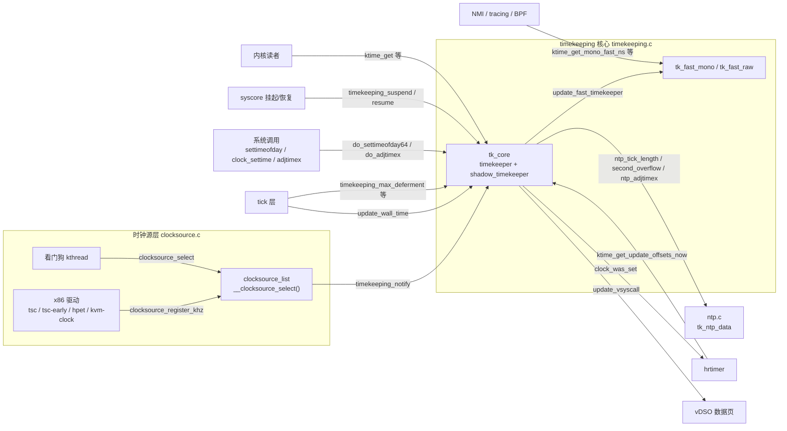
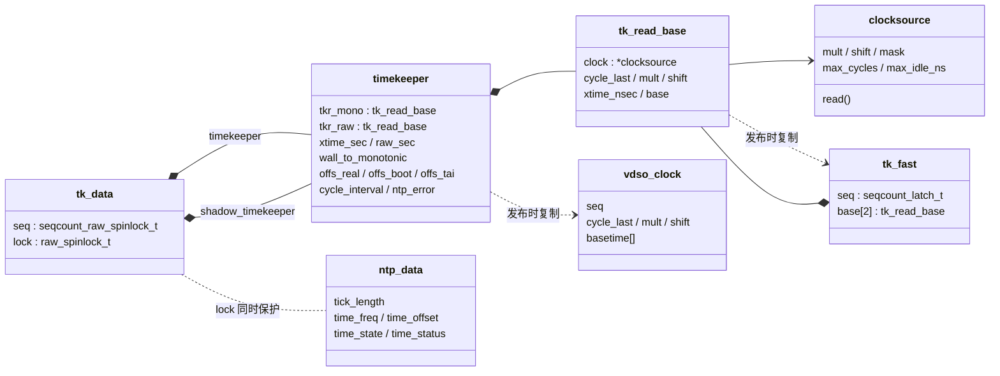
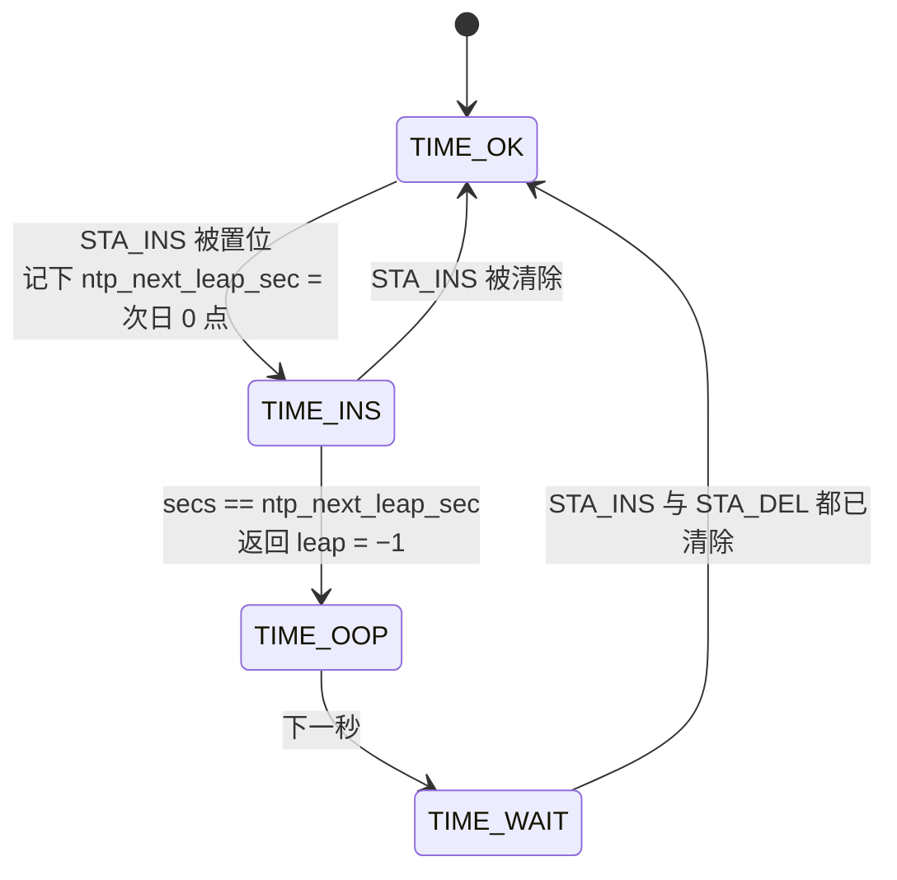
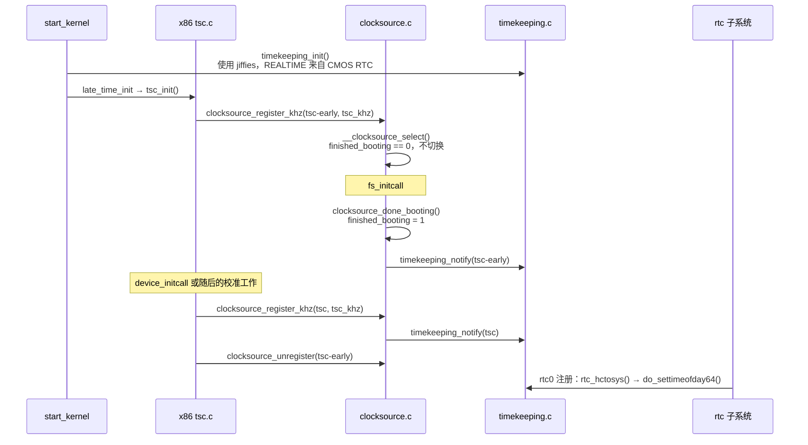
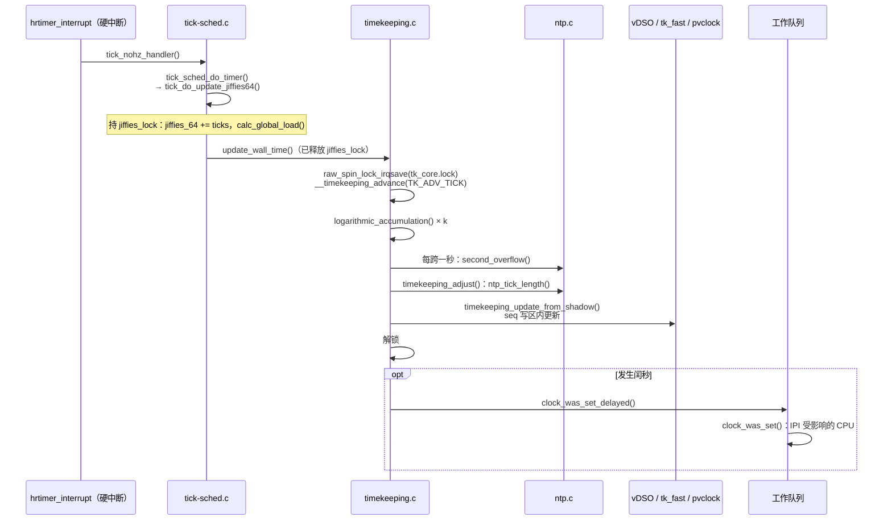

# Timekeeping：从时钟源读数到系统时间线

一台 x86 笔记本上同时发生着几件与时间有关的事：

- 某个进程调用 `clock_gettime(CLOCK_MONOTONIC)`，拿到一个纳秒精度的时间戳；在时钟源支持 vDSO 时，整个过程不需要进入内核。
- NTP 守护进程发现本机时钟比参考源快了 50 ppm，于是调用 `adjtimex()`。内核没有让时间往回跳，而是让它此后“走得慢一点”。
- 用户合上盖子，30 分钟后再打开。`CLOCK_MONOTONIC` 好像什么都没发生，`CLOCK_BOOTTIME` 和墙上时间却都多了 30 分钟。
- 一个 BPF 程序在 NMI 上下文里调用 `bpf_ktime_get_ns()`，它不能等待任何锁，也不能因为别人正在更新时间而无限重试。

这些行为都由 `kernel/time/timekeeping.c` 中的 timekeeping 核心实现。[时间子系统概述](introduction.md)的 2.2、3.1、3.2 节已经建立了“基准点 + 增量”的读时间模型，本章在此基础上展开，回答以下问题：

1. 一个只会累加、没有单位也没有起点的硬件计数器，怎样变成几条语义不同的纳秒时间线？
2. 为什么在任意上下文（包括 NMI 和用户态）都能读时间，而且多数时候不加锁？
3. 时间如何随 tick 向前推进？NO_HZ 下很久没有 tick 时怎么办？
4. NTP 怎样在不让时间跳变的前提下修正频率误差？闰秒怎样插入？
5. 设置时间、切换时钟源、挂起恢复这些不连续事件，怎样保持各条时间线之间的约束？

## 0. 分析基线与阅读边界

本章依据仓库内 [Makefile 第 2～4 行](../../linux/Makefile#L2-L4)标记的 **6.18.52** 版本，架构为 **x86-64**。阅读前最好先读完[时间子系统概述](introduction.md)，并了解 seqcount 的基本用法（可参考[锁机制基础](../lock/introduction.md)）。

与本章结论有关的配置如下。它们是编译条件，不代表某次运行一定经过对应路径。

| 配置 | 对本章的影响 | 依据 |
| --- | --- | --- |
| `CONFIG_64BIT=y`、`CONFIG_X86_64=y` | `ktime_get_real_seconds()`、`ktime_mono_to_any()` 走不带 seqcount 的 64 位快速分支 | [.config#L332-L333](../../linux/.config#L332-L333)、[timekeeping.c#L909-L915](../../linux/kernel/time/timekeeping.c#L909-L915)、[timekeeping.c#L1012-L1013](../../linux/kernel/time/timekeeping.c#L1012-L1013) |
| `CONFIG_HZ=1000` | `NTP_INTERVAL_LENGTH` 为 1 000 000 ns，即每个累加步长对应 1 ms | [.config#L506](../../linux/.config#L506)、[timex.h#L149-L152](../../linux/include/linux/timex.h#L149-L152) |
| `CONFIG_GENERIC_TIME_VSYSCALL=y`、`CONFIG_GENERIC_GETTIMEOFDAY=y`、`CONFIG_GENERIC_VDSO_OVERFLOW_PROTECT=y` | 每次发布新的 timekeeper 状态都同步更新 vDSO 数据页；vDSO 换算带 `max_cycles` 溢出保护 | [.config#L90](../../linux/.config#L90)、[.config#L10462-L10463](../../linux/.config#L10462-L10463)、[vsyscall.c#L18-L27](../../linux/kernel/time/vsyscall.c#L18-L27) |
| `CONFIG_CLOCKSOURCE_WATCHDOG=y`、`CONFIG_CLOCKSOURCE_WATCHDOG_MAX_SKEW_US=125` | 看门狗可以把 TSC 判为不稳定，进而触发时钟源切换（4.2 节） | [.config#L88](../../linux/.config#L88)、[.config#L113](../../linux/.config#L113) |
| `CONFIG_ARCH_CLOCKSOURCE_INIT=y` | x86 的 `clocksource_arch_init()` 在注册时检查：支持 vDSO 的时钟源 `mask` 必须是 64 位 | [.config#L89](../../linux/.config#L89)、[x86 time.c#L101-L111](../../linux/arch/x86/kernel/time.c#L101-L111) |
| `CONFIG_POSIX_AUX_CLOCKS` 未设置 | `TIMEKEEPERS_MAX` 为 1，只有一个核心 timekeeper；`tk_aux_*()` 都是空函数 | [.config#L114](../../linux/.config#L114)、[timekeeper_internal.h#L21-L28](../../linux/include/linux/timekeeper_internal.h#L21-L28)、[timekeeping.c#L150-L158](../../linux/kernel/time/timekeeping.c#L150-L158) |
| `CONFIG_NO_HZ_COMMON=y` | tick 可能长时间停止，一次推进要结算很多个 tick（3.4 节）。`CONFIG_NTP_PPS` 依赖 `!NO_HZ_COMMON`，所以 PPS 相关代码未编入 | [.config#L105](../../linux/.config#L105)、[pps/Kconfig#L32-L34](../../linux/drivers/pps/Kconfig#L32-L34) |
| `CONFIG_GENERIC_CMOS_UPDATE=y`、`CONFIG_RTC_SYSTOHC=y` | NTP 处于同步状态时，大约每 11 分钟把系统时间写回 RTC | [.config#L95](../../linux/.config#L95)、[.config#L8084](../../linux/.config#L8084)、[ntp.c#L493-L497](../../linux/kernel/time/ntp.c#L493-L497) |
| `CONFIG_RTC_HCTOSYS=y`、`CONFIG_RTC_HCTOSYS_DEVICE="rtc0"`、`CONFIG_RTC_DRV_CMOS=y` | rtc0 注册时会用 RTC 时间再设置一次系统时间；挂起计时的最后一个后备来源是 RTC 子系统（4.7 节） | [.config#L8082-L8083](../../linux/.config#L8082-L8083)、[.config#L8163](../../linux/.config#L8163)、[rtc/class.c#L433-L436](../../linux/drivers/rtc/class.c#L433-L436) |
| `CONFIG_PM_SLEEP=y`、`CONFIG_SUSPEND=y`、`CONFIG_HIBERNATION=y` | 编入挂起与恢复路径（4.7 节） | [.config#L584](../../linux/.config#L584)、[.config#L588](../../linux/.config#L588)、[.config#L594](../../linux/.config#L594) |
| `CONFIG_KVM_GUEST=y`、`CONFIG_PARAVIRT_CLOCK=y` | 作为 KVM 客户机运行时，可能选用 `kvm-clock`，启动时的墙上时间也改由宿主提供 | [.config#L394](../../linux/.config#L394)、[.config#L398](../../linux/.config#L398)、[kvmclock.c#L325-L326](../../linux/arch/x86/kernel/kvmclock.c#L325-L326) |
| `CONFIG_KVM=m` | 宿主侧 KVM 模块加载后，通过 pvclock_gtod 通知链接收每次 timekeeper 更新 | [.config#L790](../../linux/.config#L790)、[kvm/x86.c#L9767](../../linux/arch/x86/kvm/x86.c#L9767) |

另有几个**运行时条件**会改变具体数值，正文以括号中的情形为主线：

- 当前使用哪个时钟源（以 `tsc` 为例）。它取决于硬件、是否在虚拟机中以及 `clocksource=` 启动参数。
- TSC 频率。3.1 节的演算**假设** `tsc_khz = 3 000 000`（3 GHz），这只是便于计算的假设值，不是某台机器的测量结果。
- 是否运行 NTP 守护进程（假设运行，并设置了频率修正）。
- TSC 在 S3 挂起期间是否继续计数，即 CPU 是否有 `X86_FEATURE_NONSTOP_TSC_S3`（4.7 节分别讨论）。

**本章边界。** 本章分析核心 timekeeper 的数据结构、读写协议、推进、NTP 调频、闰秒、设置时间、时钟源切换和挂起恢复。以下内容只说明接口：时钟源看门狗的判定算法（只讲它如何触发切换）；NTP 的 PLL/FLL 控制律（只讲它输出的 `tick_length`）；设备交叉时间戳 `get_device_system_crosststamp()` 与 `ktime_get_snapshot()`；辅助时钟（本配置未编入）；时间命名空间；vDSO 页的映射方式；RTC 驱动本身；tick 层的实现（见 [tick 层](tick.md)一章）；hrtimer 如何使用时间线偏移（见[定时器子系统](timer.md) 5.2、6.8 节）。

## 1. timekeeping 要解决什么问题

### 1.1 计数器不是时钟

x86 上首选的时钟源 TSC 只是一个随 CPU 时钟累加的 64 位计数器，`read_tsc()` 直接返回 `rdtsc_ordered()` 的结果（[tsc.c#L1132-L1135](../../linux/arch/x86/kernel/tsc.c#L1132-L1135)）。从“一个周期数”到“用户需要的时间”，中间隔着下面这些问题：

| 需求 | 计数器本身的情况 | timekeeping 的手段 |
| --- | --- | --- |
| 以纳秒为单位 | 只有周期数，没有单位 | `mult/shift` 定点换算（3.1 节） |
| 有确定的起点：自启动以来、自 1970 年以来 | 从上电或复位开始计数，起点与任何时间线无关 | 一个基准点加若干偏移量（2.3 节） |
| 频率准确 | 标称频率与真实频率之间有误差 | NTP 微调换算系数 `mult`（3.5 节） |
| 不回退 | 位宽有限会回绕；不同 CPU 的读数可能不完全同步 | `mask`、`max_cycles`、负向移动检测（3.2 节） |
| 任意上下文、包括用户态都能快速读 | — | seqcount 无锁读、latch 双拷贝、vDSO（3.2、3.7、4.6 节） |
| 挂起期间时间仍在流逝 | 计数器可能停止 | 挂起计时 + 睡眠时间注入（4.7 节） |
| 管理员或 NTP 可以把时间设成指定值 | — | 只改偏移量，不让主时间线跳变（4.4 节） |

### 1.2 内核维护的几条时间线

timekeeping 对外提供的不是“一个时间”，而是几条语义不同的时间线（POSIX 时钟）：

| 时间线 | 内部如何表示 | 被 `settimeofday()` 改变 | 受 NTP 调频影响 | 包含挂起时长 | 受闰秒影响 |
| --- | --- | --- | --- | --- | --- |
| `CLOCK_REALTIME` | `xtime_sec` + `tkr_mono` 的增量 | 是 | 是 | 是 | 是 |
| `CLOCK_MONOTONIC` | `tkr_mono.base` + 增量 | 否 | 是 | 否 | 否 |
| `CLOCK_BOOTTIME` | MONOTONIC + `offs_boot` | 否 | 是 | 是 | 否 |
| `CLOCK_TAI` | MONOTONIC + `offs_tai` | 是 | 是 | 是 | 否 |
| `CLOCK_MONOTONIC_RAW` | `raw_sec` + `tkr_raw` 的增量 | 否 | 否 | 否 | 否 |
| `*_COARSE` | 上一次推进时的值，不读硬件 | 与对应精确时钟相同 | 是 | 与对应精确时钟相同 | 与对应精确时钟相同 |

表中每一格都能在后文找到对应的代码：设置时间只修改 `xtime_sec` 和 `wall_to_monotonic`（4.4 节）；NTP 只修改 `tkr_mono.mult`，从不修改 `tkr_raw.mult`（3.5 节）；挂起时长同时加到 `xtime_sec` 和 `offs_boot` 上（4.7 节）；闰秒修改 `xtime_sec`，同时反向修正 `wall_to_monotonic` 和 `tai_offset`（3.6 节）。

### 1.3 在内核中的位置

下面这张图回答“timekeeping 与哪些模块交互”。箭头一律表示“调用方 → 被调用方”，箭头上的文字是主要的接口函数。



可以看出 timekeeping 的位置：**下游**是时钟源层，它只通过 `clocksource::read()` 读硬件；**上游**有四类写者（tick、系统调用、时钟源切换、挂起恢复）和三类读者（内核、NMI、用户态）；NTP 状态虽然在另一个文件里，却和 timekeeper 共用同一把锁（[ntp.c#L57](../../linux/kernel/time/ntp.c#L57) 注释“Protected by the timekeeping locks”）。

### 1.4 触发事件、执行上下文与输入输出

| 触发事件 | 入口 | 执行上下文 | 对 timekeeper 的作用 |
| --- | --- | --- | --- |
| 启动 | `timekeeping_init()` | `start_kernel()`，关中断 | 用持久时钟（RTC）初始化各时间线，选用 jiffies 时钟源 |
| 读时间 | `ktime_get()` 等、vDSO、`ktime_get_mono_fast_ns()` | 任意上下文 | 只读，不修改共享数据 |
| tick | `update_wall_time()` | 硬中断或关中断路径，只由负责计时的 CPU 执行 | 结算流逝的周期；NTP 调整 `mult`；可能插入闰秒 |
| 设置时间 | `do_settimeofday64()`、`__timekeeping_inject_offset()` | 进程上下文 | REALTIME 跳变，MONOTONIC 不变 |
| 调频 | `do_adjtimex()` | 进程上下文 | 修改 NTP 状态，必要时立即重算 `mult` |
| 切换时钟源 | `timekeeping_notify()` | 进程上下文持 `clocksource_mutex`，切换本身在 `stop_machine()` 中 | 重算步长和换算系数 |
| 挂起 / 恢复 | `timekeeping_suspend()` / `timekeeping_resume()` | syscore 阶段，只剩一个 CPU，关中断 | 冻结时间；恢复时注入睡眠时长 |

### 1.5 贯穿全章的模型

全章可以用下面四句话概括，后面各节都是对其中某一句的展开：

```text
/* 概念模型：省略单位换算、锁和发布细节 */
读：  now = 基准时间 + ((读计数器() - cycle_last) × mult) >> shift
推进：把 cycle_last 之后整数个 cycle_interval 结算进基准时间，cycle_last 随之前移
调频：修改 mult，同时修正基准时间，使“此刻”的读数不变
跳变：修改偏移量（wall_to_monotonic / offs_boot / tai_offset），使 MONOTONIC 连续
```

## 2. 核心数据结构

本节按“硬件抽象 → 读数基准 → 时间线 → 发布容器 → NMI 拷贝 → NTP 状态”的顺序介绍，只解释本章用到的字段。

### 2.1 `struct clocksource`：timekeeping 关心的部分

概述章 2.1 节已介绍过 [`struct clocksource`（clocksource.h#L101-L138）](../../linux/include/linux/clocksource.h#L101-L138) 的选择规则。这里只列出 timekeeping 直接依赖的字段：

| 字段 | 含义与单位 | 谁设置 |
| --- | --- | --- |
| `read` | 读计数器，返回周期数 | 驱动 |
| `mask` | 计数器有效位的掩码，用于处理回绕 | 驱动；x86 vDSO 时钟源必须是 64 位 |
| `mult`、`shift` | 周期数换算纳秒：`ns = (cycles × mult) >> shift` | 注册时由频率算出（3.1 节） |
| `maxadj` | `mult` 允许的最大调整量，约为 `mult` 的 11% | 注册时计算 |
| `max_cycles` | 与 `mult + maxadj` 相乘不会溢出 64 位的最大周期数 | 注册时计算 |
| `max_idle_ns` | 最长可以多久不推进 timekeeper，单位 ns，已留 50% 余量 | 注册时计算 |
| `max_raw_delta` | 负向移动检测的阈值，为 `mask` 的 7/8 | 注册时计算 |
| `flags` | `CLOCK_SOURCE_VALID_FOR_HRES`（可支撑高精度模式）、`CLOCK_SOURCE_SUSPEND_NONSTOP`（挂起期间不停）、`CLOCK_SOURCE_UNSTABLE` 等（[clocksource.h#L143-L151](../../linux/include/linux/clocksource.h#L143-L151)） | 驱动与看门狗 |
| `vdso_clock_mode` | 用户态能否直接读这个计数器。除通用的 `NONE` 外，x86 定义了 `TSC`、`PVCLOCK`、`HVCLOCK` 三种（[vdso/clocksource.h#L6-L8](../../linux/arch/x86/include/asm/vdso/clocksource.h#L6-L8)） | 驱动 |
| `enable`、`disable`、`suspend`、`resume` | 可选回调 | 驱动 |
| `owner` | 所在模块，切换时据此持有模块引用 | 驱动 |

**生命周期与所有权。** 时钟源对象归驱动所有。x86 的 `clocksource_tsc_early` 和 `clocksource_tsc` 都是静态变量（[tsc.c#L1167-L1205](../../linux/arch/x86/kernel/tsc.c#L1167-L1205)）。注册后，对象挂在全局 `clocksource_list` 上，链表由 `clocksource_mutex` 保护（[clocksource.c#L102-L107](../../linux/kernel/time/clocksource.c#L102-L107)）。timekeeper 只保存一个普通指针 `tkr_mono.clock`，但在切换到某个时钟源时会做两件事来“持有”它：对 `owner` 调用 `try_module_get()`，并调用它的 `enable()`；切换走的时候对旧时钟源调用 `disable()` 和 `module_put()`（[change_clocksource()，timekeeping.c#L1592-L1616](../../linux/kernel/time/timekeeping.c#L1592-L1616)）。

### 2.2 `struct tk_read_base`：一条读数基准

[`struct tk_read_base`（timekeeper_internal.h#L50-L59）](../../linux/include/linux/timekeeper_internal.h#L50-L59) 是读时间所需的最小信息集合：

```c
struct tk_read_base {
	struct clocksource	*clock;
	u64			mask;
	u64			cycle_last;
	u32			mult;
	u32			shift;
	u64			xtime_nsec;
	ktime_t			base;
	u64			base_real;
};
```

（源码：[include/linux/timekeeper_internal.h#L50-L59](../../linux/include/linux/timekeeper_internal.h#L50-L59)）

| 字段 | 单位 | 含义 |
| --- | --- | --- |
| `clock` | — | 当前时钟源 |
| `mask` | — | 从时钟源复制 |
| `cycle_last` | 周期 | 上一次结算到的计数器读数，即基准点 |
| `mult`、`shift` | — | 换算系数。`tkr_mono.mult` 会被 NTP 调整 |
| `xtime_nsec` | 纳秒 << `shift` | 基准点上**不足一秒**的部分；对 `tkr_mono` 而言是 REALTIME 的亚秒部分 |
| `base` | 纳秒 | 基准时间中**不含** `xtime_nsec` 的部分，由秒数和偏移派生（见下文公式） |
| `base_real` | 纳秒 | `base + offs_real`，只给 NMI 安全的 REALTIME 读取使用 |

注释说明这个结构在 64 位上占 56 字节，和 seqcount 合在一起正好放进一条 64 字节缓存行（[#L41-L42](../../linux/include/linux/timekeeper_internal.h#L41-L42)）。它从 `struct timekeeper` 中独立出来，是因为 NMI 安全的快速读取也要用到它（[#L44-L45](../../linux/include/linux/timekeeper_internal.h#L44-L45)）。

**一个基准同时服务两条时间线。** `xtime_nsec` 与 `base` 的分工要结合 [tk_update_ktime_data()（timekeeping.c#L669-L697）](../../linux/kernel/time/timekeeping.c#L669-L697) 才能看清：

```text
ns_part(tkr) = (((读数 − cycle_last) & mask) × mult + xtime_nsec) >> shift

CLOCK_REALTIME      = xtime_sec 秒 + ns_part(tkr_mono)
CLOCK_MONOTONIC     = tkr_mono.base + ns_part(tkr_mono)
    其中 tkr_mono.base = (xtime_sec + wall_to_monotonic.tv_sec) × 10^9 + wall_to_monotonic.tv_nsec
CLOCK_MONOTONIC_RAW = tkr_raw.base + ns_part(tkr_raw)
    其中 tkr_raw.base = raw_sec × 10^9
```

也就是说，`tkr_mono.xtime_nsec` 存的是 **REALTIME 的亚秒部分**，`tkr_mono.base` 则不含这部分。`ktime_get_real_ts64()` 用 `xtime_sec` 加 `ns_part` 得到 REALTIME（[timekeeping.c#L801-L810](../../linux/kernel/time/timekeeping.c#L801-L810)），`ktime_get()` 用 `base` 加同一个 `ns_part` 得到 MONOTONIC（[timekeeping.c#L823-L830](../../linux/kernel/time/timekeeping.c#L823-L830)）。两条时间线共享同一组 `cycle_last/mult/shift/xtime_nsec`，所以它们的增量严格一致，差值始终是 `wall_to_monotonic`。

MONOTONIC 的亚秒部分是 `xtime_nsec` 与 `wall_to_monotonic.tv_nsec` 之和，可能超过一秒。所以 `tk_update_ktime_data()` 计算 `ktime_sec`（MONOTONIC 的整秒数）时要额外检查进位（[#L690-L693](../../linux/kernel/time/timekeeping.c#L690-L693)）。

### 2.3 `struct timekeeper`：时间线与推进参数

[`struct timekeeper`（timekeeper_internal.h#L140-L183）](../../linux/include/linux/timekeeper_internal.h#L140-L183) 在两个 `tk_read_base` 之外，还保存了时间线之间的偏移、推进步长和 NTP 记账。按用途分组如下。

**(1) 时间线与偏移**

| 字段 | 单位 | 含义 |
| --- | --- | --- |
| `xtime_sec` | 秒 | REALTIME 的整秒部分 |
| `ktime_sec` | 秒 | MONOTONIC 的整秒部分，供 `ktime_get_seconds()` 不加锁读取 |
| `wall_to_monotonic` | timespec64 | REALTIME → MONOTONIC 的偏移，正常情况下为负数 |
| `offs_real` | ns | MONOTONIC → REALTIME 的偏移，等于 `-wall_to_monotonic` |
| `offs_boot` | ns | MONOTONIC → BOOTTIME 的偏移，即累计挂起时长 |
| `offs_tai` | ns | MONOTONIC → TAI 的偏移，等于 `offs_real + tai_offset` 秒 |
| `tai_offset` | 秒 | UTC 与 TAI 的差值，由 `adjtimex(ADJ_TAI)` 设置，闰秒时变化 |
| `monotonic_to_boot` | timespec64 | `offs_boot` 的 timespec 形式，省去 vDSO 更新时的 64 位除法（[timekeeping.c#L271-L275](../../linux/kernel/time/timekeeping.c#L271-L275)） |
| `raw_sec` | 秒 | MONOTONIC_RAW 的整秒部分 |
| `coarse_nsec` | ns | 粗粒度接口用的亚秒部分（3.8 节） |

**(2) 推进步长**（由 `tk_setup_internals()` 在选用时钟源时计算，3.1 节）

| 字段 | 单位 | 含义 |
| --- | --- | --- |
| `cycle_interval` | 周期 | 一个 NTP 间隔（`1/HZ` 秒）对应的周期数，即每一步结算多少周期 |
| `xtime_interval` | ns << `shift` | 一步对应的移位纳秒数，等于 `cycle_interval × tkr_mono.mult`，随 NTP 调整变化 |
| `xtime_remainder` | ns << `shift` | `cycle_interval` 取整造成的舍入误差 |
| `raw_interval` | ns << `shift` | MONOTONIC_RAW 一步的移位纳秒数，不随 NTP 变化 |

**(3) NTP 记账**（3.5、3.6 节）

| 字段 | 单位 | 含义 |
| --- | --- | --- |
| `ntp_tick` | ns << 32 | 当前使用的 NTP tick 长度的缓存，保证一个 tick 内使用一致的值 |
| `ntp_error` | ns << 32 | 已累加时间与 NTP 期望时间之差；为正表示系统时间落后 |
| `ntp_error_shift` | — | `32 − shift`，用于在“移位纳秒”和“NTP 移位纳秒”之间换算 |
| `ntp_err_mult` | — | 为追赶误差而临时加在 `mult` 上的 0 或 1 |
| `skip_second_overflow` | — | 防止同一秒被交给 NTP 处理两次 |
| `next_leap_ktime` | ns（MONOTONIC） | 待插入闰秒的时刻，无闰秒时为 `KTIME_MAX` |

**(4) 事件序号**

| 字段 | 含义 |
| --- | --- |
| `clock_was_set_seq` | 每次带 `TK_CLOCK_WAS_SET` 的发布加 1，hrtimer 据此判断是否要刷新偏移（4.6 节） |
| `cs_was_changed_seq` | 每次换时钟源加 1，供快照类接口检测时钟源变化（[timekeeping.c#L315](../../linux/kernel/time/timekeeping.c#L315)） |

`id`、`clock_valid` 以及与 `offs_tai`、`monotonic_to_boot` 共用存储的 `offs_aux`、`monotonic_to_aux` 为辅助时钟服务。本配置下只有核心 timekeeper，`clock_valid` 在初始化时置为真（[timekeeping.c#L1807](../../linux/kernel/time/timekeeping.c#L1807)），本章不再讨论。

**时间线之间的关系。** 下图中箭头表示“加上该偏移得到”：

```text
                 offs_real（= −wall_to_monotonic）
   MONOTONIC ─────────────────────────────────────▶ REALTIME
       │                                                │
       │ + offs_boot（累计挂起时长）                     │ + tai_offset 秒
       ▼                                                ▼
   BOOTTIME                                            TAI      （offs_tai = offs_real + tai_offset）

   MONOTONIC_RAW：用 raw_sec 与 tkr_raw 单独累加，与上面任何偏移都无关
```

**不变量。** 下面几条在每次发布之后都成立，后文分析各条写路径时会反复用到：

1. `offs_real == −wall_to_monotonic`。`tk_set_wall_to_mono()` 修改前先用 `WARN_ON_ONCE` 校验这一点，再同时更新两者和 `offs_tai`（[timekeeping.c#L249-L265](../../linux/kernel/time/timekeeping.c#L249-L265)）。
2. `offs_tai == offs_real + tai_offset 秒`（[#L264](../../linux/kernel/time/timekeeping.c#L264)、[#L1572-L1576](../../linux/kernel/time/timekeeping.c#L1572-L1576)）。
3. `tkr_mono.cycle_last == tkr_raw.cycle_last`。所有修改 `cycle_last` 的地方都同时修改两者：[#L319-L323](../../linux/kernel/time/timekeeping.c#L319-L323)、[#L772-L773](../../linux/kernel/time/timekeeping.c#L772-L773)、[#L1982-L1983](../../linux/kernel/time/timekeeping.c#L1982-L1983)、[#L2302-L2303](../../linux/kernel/time/timekeeping.c#L2302-L2303)。
4. `0 ≤ tkr_mono.xtime_nsec < NSEC_PER_SEC << shift`。计算过程中可能暂时越界，但发布前由 `accumulate_nsecs_to_secs()` 和 `timekeeping_adjust()` 的借位处理修正（3.4、3.5 节）。
5. `wall_to_monotonic ≤ 0`，即 REALTIME 不早于 MONOTONIC。设置时间的两条路径都检查这一点（4.4 节）。
6. `tkr_mono.base`、`ktime_sec`、`tkr_raw.base`、`base_real` 由其他字段派生，每次发布时重新计算（[timekeeping.c#L728-L730](../../linux/kernel/time/timekeeping.c#L728-L730)）。

**缓存行布局。** 结构体注释说明字段顺序是为读路径优化的：第 0 行是 seqcount 与 `tkr_mono`，第 1 行是 `xtime_sec` 到 `id`，第 2 行是 `tkr_raw` 与 `raw_sec`，第 3、4 行是内部变量，注释说明它们只在每次 tick 的 timekeeper 更新中访问（[timekeeper_internal.h#L124-L138](../../linux/include/linux/timekeeper_internal.h#L124-L138)）。读 MONOTONIC/REALTIME/BOOTTIME/TAI 只碰前两行。

### 2.4 `struct tk_data`：发布协议的载体

timekeeper 被包装在 [`struct tk_data`（timekeeping.c#L52-L57）](../../linux/kernel/time/timekeeping.c#L52-L57) 中：

```c
struct tk_data {
	seqcount_raw_spinlock_t	seq;
	struct timekeeper	timekeeper;
	struct timekeeper	shadow_timekeeper;
	raw_spinlock_t		lock;
} ____cacheline_aligned;

static struct tk_data timekeeper_data[TIMEKEEPERS_MAX];

/* The core timekeeper */
#define tk_core		(timekeeper_data[TIMEKEEPER_CORE])
```

（源码：[kernel/time/timekeeping.c#L52-L62](../../linux/kernel/time/timekeeping.c#L52-L62)）

| 成员 | 角色 |
| --- | --- |
| `timekeeper` | **已发布**的状态，所有读者读它；只在 `seq` 写区内被整体覆盖 |
| `shadow_timekeeper` | 写者的**工作副本**，所有计算都在它上面进行 |
| `lock` | 串行化写者，也保护 NTP 状态 |
| `seq` | 让读者检测并发写入；它与 `lock` 关联（[tkd_basic_setup()，#L1774-L1775](../../linux/kernel/time/timekeeping.c#L1774-L1775)），启用 lockdep 时，进入写区会检查写者是否持有该锁（[seqlock.h#L192](../../linux/include/linux/seqlock.h#L192)） |

`tk_core` 是静态对象，生命周期与内核相同，由 `timekeeping_init()` 调用 `tkd_basic_setup()` 初始化。本配置下数组只有一个元素。

**影子副本的不变量：不持 `lock` 时，`shadow_timekeeper` 与 `timekeeper` 内容相同。** 这条约束由三类操作共同维持：

- 成功路径：`timekeeping_update_from_shadow()` 在 seq 写区内把影子整体 `memcpy` 到 `timekeeper`（[#L753](../../linux/kernel/time/timekeeping.c#L753)）。
- 失败路径：写者在影子上改了一半发现参数不合法，就调用 `timekeeping_restore_shadow()` 把已发布状态拷回影子（[#L702-L706](../../linux/kernel/time/timekeeping.c#L702-L706)）。
- 只改一个字段的特例：`tk_update_leap_state_all()` 在写区内同时修改两份的 `next_leap_ktime`，省去整份拷贝（[#L658-L664](../../linux/kernel/time/timekeeping.c#L658-L664)）。

这样设计的好处是：写者的计算（可能包括多轮累加循环和 NTP 调整）都在影子上完成，期间读者不受影响；读者只在最后的拷贝和发布阶段需要重试。源码注释还解释了为什么用 `memcpy` 而不是交换两个指针：交换指针会让读路径多一次间接访问，也失去为读路径优化的缓存行布局（[#L745-L752](../../linux/kernel/time/timekeeping.c#L745-L752)）。

### 2.5 `struct tk_fast`：给 NMI 的双拷贝

[`struct tk_fast`（timekeeping.c#L104-L107）](../../linux/kernel/time/timekeeping.c#L104-L107) 由一个 latch 型序号和两份 `tk_read_base` 组成：

```c
struct tk_fast {
	seqcount_latch_t	seq;
	struct tk_read_base	base[2];
};
```

（源码：[kernel/time/timekeeping.c#L104-L107](../../linux/kernel/time/timekeeping.c#L104-L107)）

内核定义了两个实例，`tk_fast_mono` 和 `tk_fast_raw`（[#L138-L148](../../linux/kernel/time/timekeeping.c#L138-L148)）。它们与 `tk_core` 内容同源：每次发布时，`timekeeping_update_from_shadow()` 都会把新的 `tkr_mono`、`tkr_raw` 复制进来（[#L736-L737](../../linux/kernel/time/timekeeping.c#L736-L737)）。

**为什么需要单独一份。** 普通 seqcount 的读者在序号为奇数（写者正在写）时会自旋等待。如果 NMI 恰好打断了本 CPU 上正在发布的写者，NMI 里的读者就会一直等一个永远不会在 NMI 返回前完成的写操作。这是从 seqcount 语义推出的结论，源码注释给出的设计目标是“可以在包括 NMI 在内的任意上下文中使用”（[#L412-L413](../../linux/kernel/time/timekeeping.c#L412-L413)）。latch 让读者从不等待，具体算法见 3.7 节。

**启动早期的值。** 两份拷贝初始都指向 `dummy_clock`，它的 `read()` 返回 `local_clock()`，`mult = 1`、`shift = 0`（[#L112-L136](../../linux/kernel/time/timekeeping.c#L112-L136)）。所以在 `timekeeping_init()` 之前，`ktime_get_mono_fast_ns()` 返回的就是调度时钟的纳秒值。

### 2.6 NTP 状态：`struct ntp_data`

NTP 相关的状态放在 `ntp.c` 的 [`struct ntp_data`（ntp.c#L59-L88）](../../linux/kernel/time/ntp.c#L59-L88) 中，按 timekeeper 编号组成数组 `tk_ntp_data[]`（[#L90-L100](../../linux/kernel/time/ntp.c#L90-L100)）。timekeeping 只通过少数几个接口与它交互，本章用到的字段如下：

| 字段 | 单位 | 含义 |
| --- | --- | --- |
| `tick_length` | ns << 32，每个 NTP 间隔 | NTP 希望下一个 tick 有多长，timekeeping 用它调整 `mult` |
| `tick_length_base` | 同上 | 只含频率修正、不含相位修正的 tick 长度 |
| `tick_usec` | μs | 名义上每个 `USER_HZ` tick 的长度，默认为 `USER_TICK_USEC` |
| `time_freq` | ns/s << 32 | 频率修正量，限制在 ±500 ppm 以内（`MAXFREQ`，[timex.h#L136-L137](../../linux/include/linux/timex.h#L136-L137)） |
| `time_offset` | ns << 32，已除以 `HZ`，可直接加到 tick 长度上 | 尚未修正完的相位偏差 |
| `time_adjust` | μs | `adjtime()` 请求的剩余调整量 |
| `time_state`、`time_status` | — | NTP 状态机与状态位，例如 `STA_UNSYNC`、`STA_INS`、`STA_DEL` |
| `ntp_next_leap_sec` | 秒（REALTIME） | 下一个闰秒的时刻，无闰秒时为 `TIME64_MAX` |

`NTP_SCALE_SHIFT` 为 32（[timex.h#L149](../../linux/include/linux/timex.h#L149)）。“ns << 32”这种表示让 NTP 能用整数精确表达远小于 1 ns 的调整量。

timekeeping 调用的 NTP 接口主要有以下几个：`ntp_init()`（初始化，[timekeeping.c#L1834](../../linux/kernel/time/timekeeping.c#L1834)）；`ntp_get_next_leap()`（取下一个闰秒时刻，[ntp.c#L375-L386](../../linux/kernel/time/ntp.c#L375-L386)）；`ntp_tick_length()` 读 `tick_length`（[ntp.c#L362-L365](../../linux/kernel/time/ntp.c#L362-L365)）；`second_overflow()` 每过一秒处理一次相位修正和闰秒（[ntp.c#L398-L491](../../linux/kernel/time/ntp.c#L398-L491)）；`ntp_clear()` 清除同步状态（[ntp.c#L356-L359](../../linux/kernel/time/ntp.c#L356-L359)）；`ntp_adjtimex()` 处理 `adjtimex()` 的参数（[ntp.c#L770-L851](../../linux/kernel/time/ntp.c#L770-L851)）；`ntp_notify_cmos_timer()` 安排 RTC 同步（[ntp.c#L668-L685](../../linux/kernel/time/ntp.c#L668-L685)）。除 `ntp_notify_cmos_timer()` 在 `do_adjtimex()` 解锁后调用外，其余都在持有 `tk_core.lock` 时被调用。

### 2.7 对象关系

下图回答“这些结构之间谁包含谁、谁指向谁”。实心菱形（`*--`）表示嵌入，实线箭头表示指针，带箭头的虚线表示“发布时从左侧复制到右侧”，不带箭头的虚线表示“受同一把锁保护”。图中省略了大部分字段。



几点说明：

- `tk_core`、`tk_fast_mono`、`tk_fast_raw`、`tk_ntp_data[]` 都是静态全局对象，只有一份，不像 tick 和定时器那样每 CPU 一份。
- 时钟源由驱动拥有。timekeeper 中的 `clock` 指针在发布后可能被并发的切换操作改变，所以读路径用 `tk_clock_read()` 先 `READ_ONCE()` 取出指针、再用同一个指针调用 `read()`，避免“用 A 的 `read` 函数读 B 的对象”（[timekeeping.c#L278-L296](../../linux/kernel/time/timekeeping.c#L278-L296)）。
- `tk_fast` 和 vDSO 数据页都是 timekeeper 的**派生拷贝**，只能由发布函数写入。

### 2.8 并发保护一览

| 数据 | 写者如何保护 | 读者如何读 |
| --- | --- | --- |
| `tk_core.timekeeper` | 持 `tk_core.lock`，并在 `tk_core.seq` 写区内整体复制 | `read_seqcount_begin/retry` 循环，读到并发写就重试 |
| `tk_core.shadow_timekeeper` | 持 `tk_core.lock` | 只有写者访问 |
| `tk_ntp_data[]` | 持 `tk_core.lock` | 只有持锁者访问 |
| `tk_fast_mono/raw` | 持 `tk_core.lock` 时用 latch 协议更新（正常发布在 `tk_core.seq` 写区内；挂起时的 `halt_fast_timekeeper()` 在写区之外，[timekeeping.c#L2059-L2060](../../linux/kernel/time/timekeeping.c#L2059-L2060)） | `read_seqcount_latch` 选一份拷贝，读完检查序号 |
| vDSO 数据页 | 在 `tk_core.seq` 写区内用 vDSO 自己的序号更新 | 用户态按序号奇偶检查重试 |
| `offs_real`、`offs_boot`、`offs_tai` 单独读取 | 写者用 `WRITE_ONCE()`（`tk_set_wall_to_mono()`、`tk_update_sleep_time()`）；`__timekeeping_set_tai_offset()` 中 `offs_tai` 为普通赋值（[#L1574-L1575](../../linux/kernel/time/timekeeping.c#L1574-L1575)） | 64 位上 `ktime_mono_to_any()` 直接 `READ_ONCE()`（[#L909-L915](../../linux/kernel/time/timekeeping.c#L909-L915)） |
| `clocksource_list`、当前时钟源 | `clocksource_mutex` | 只有持锁者访问 |

`tk_core.lock` 是 raw 自旋锁，并且总以关中断方式获取，因为 tick 推进这个写者运行在硬中断上下文中。`clocksource_mutex` 只在进程上下文中使用。

## 3. 关键算法

### 3.1 换算系数：从频率到 `mult/shift`

**目标。** 读时间的热路径只做一次乘法和一次移位，不做除法。所以要把“每周期多少纳秒”表示成定点数 `mult / 2^shift`。

**约束。** `shift` 越大，精度越高（NTP 每调一次 `mult`，频率变化越小）；但 `mult` 也越大，`delta × mult` 越容易溢出 64 位。所以要在“能连续换算多长时间而不溢出”和“精度”之间取舍。

**实现。** 驱动调用 `clocksource_register_khz(cs, khz)`，它等价于 `__clocksource_register_scale(cs, 1000, khz)`（[clocksource.h#L256-L259](../../linux/include/linux/clocksource.h#L256-L259)）。注册时，[__clocksource_update_freq_scale()（clocksource.c#L1144-L1222）](../../linux/kernel/time/clocksource.c#L1144-L1222) 依次完成：

1. 估算计数器多少秒后回绕：`sec = mask / freq / scale`；对于宽于 32 位的计数器，最多取 600 秒。注释说明，限制到 10 分钟是为了保证换算精度（[#L1153-L1168](../../linux/kernel/time/clocksource.c#L1153-L1168)）。
2. 调用 [clocks_calc_mult_shift()（clocksource.c#L58-L87）](../../linux/kernel/time/clocksource.c#L58-L87)，在“`sec` 秒的周期数乘以 `mult` 不溢出”的前提下，从 `shift = 32` 往下找第一个满足条件的 `shift`。
3. `maxadj` 取 `mult` 的 11%（[clocksource_max_adjustment()，#L925-L934](../../linux/kernel/time/clocksource.c#L925-L934)）；如果 `mult ± maxadj` 会溢出 32 位，就把 `mult` 减半、`shift` 减 1，再重新计算 `maxadj`（[#L1202-L1208](../../linux/kernel/time/clocksource.c#L1202-L1208)）。
4. [clocksource_update_max_deferment()（#L986-L1000）](../../linux/kernel/time/clocksource.c#L986-L1000) 计算 `max_cycles`、`max_idle_ns` 和 `max_raw_delta`。其中 [clocks_calc_max_nsecs()（#L951-L979）](../../linux/kernel/time/clocksource.c#L951-L979) 用最大的 `mult + maxadj` 求不溢出的周期数，再用最小的 `mult − maxadj` 换算成纳秒，最后只取一半作为安全余量。

**演算。** 按第 0 节的假设 `tsc_khz = 3 000 000`，代入源码中的公式（结果由本文按代码逻辑计算，不是运行时日志）：

| 量 | 计算 | 结果 |
| --- | --- | --- |
| `sec` | `(2^64 − 1) / 3 000 000 / 1000` 远大于 600，且 `mask > UINT_MAX` | 600 |
| `clocks_calc_mult_shift()` 参数 | `from = 3 000 000`，`to = 10^9 / 1000 = 1 000 000`，`maxsec = 600 × 1000` | — |
| `sftacc` | `(600 000 × 3 000 000) >> 32 = 419`，占 9 位 | 32 − 9 = 23 |
| `shift`、`mult` | 需要 `mult = round(2^shift / 3) < 2^23` | `shift = 24`，`mult = 5 592 405` |
| 每周期纳秒数 | `5 592 405 / 2^24` | ≈ 0.333 333 ns |
| `maxadj` | `5 592 405 × 11 / 100` | 615 164 |
| `max_cycles` | `min(ULLONG_MAX / (mult + maxadj), mask)` | 2 971 653 488 460，约 990 秒的 TSC 周期 |
| `max_idle_ns` | `((max_cycles × (mult − maxadj)) >> shift) / 2` | 约 440.8 秒 |
| `max_raw_delta` | `mask/2 + mask/4 + mask/8` | `mask` 的 7/8 |
| `mult` 的调整粒度 | `1 / mult` | 每调 1，频率变化约 0.179 ppm |

这里的 `max_idle_ns` 会通过 `timekeeping_max_deferment()`（[timekeeping.c#L1719-L1733](../../linux/kernel/time/timekeeping.c#L1719-L1733)）传给 tick 层：负责计时的 CPU 停 tick 的时间不能超过它（[tick-sched.c#L947-L956](../../linux/kernel/time/tick-sched.c#L947-L956)），否则下次推进时的 `delta` 会超出安全范围。

**timekeeper 的推进步长。** 选用时钟源时，[tk_setup_internals()（timekeeping.c#L309-L370）](../../linux/kernel/time/timekeeping.c#L309-L370) 把“一个 NTP 间隔”折算成周期数：

```c
	/* Do the ns -> cycle conversion first, using original mult */
	tmp = NTP_INTERVAL_LENGTH;
	tmp <<= clock->shift;
	ntpinterval = tmp;
	tmp += clock->mult/2;
	do_div(tmp, clock->mult);
	if (tmp == 0)
		tmp = 1;

	interval = (u64) tmp;
	tk->cycle_interval = interval;

	/* Go back from cycles -> shifted ns */
	tk->xtime_interval = interval * clock->mult;
	tk->xtime_remainder = ntpinterval - tk->xtime_interval;
	tk->raw_interval = interval * clock->mult;
```

（源码：[kernel/time/timekeeping.c#L325-L340](../../linux/kernel/time/timekeeping.c#L325-L340)）

继续上面的例子：`NTP_INTERVAL_LENGTH` 为 1 000 000 ns，于是 `cycle_interval = round(10^6 × 2^24 / 5 592 405) = 3 000 000` 个周期；`xtime_interval = 3 000 000 × 5 592 405 = 16 777 215 000 000`；而 1 ms 的移位纳秒数是 `10^6 << 24 = 16 777 216 000 000`，所以 `xtime_remainder = 1 000 000`，约合 0.06 ns。也就是说，按标称频率，3 000 000 个周期比 1 ms 短约 0.06 ns，这个舍入误差在 NTP 记账时要考虑进去（3.5 节）。

同一个函数还把 `ntp_error_shift` 设为 `32 − shift`（本例为 8），清零 `ntp_error`，并把 `tkr_mono.mult`、`tkr_raw.mult` 都设为时钟源的原始 `mult`（[#L357-L369](../../linux/kernel/time/timekeeping.c#L357-L369)）。此后 `tkr_raw.mult` 再也不会被修改，`tkr_mono.mult` 则由 NTP 调整（3.5 节）。

作为对照，启动初期使用的 jiffies 时钟源 `mult = TICK_NSEC << JIFFIES_SHIFT`、`shift = 8`（[jiffies.c#L32-L41](../../linux/kernel/time/jiffies.c#L32-L41)、[tick-internal.h#L207-L213](../../linux/kernel/time/tick-internal.h#L207-L213)），套用上面的公式得到 `cycle_interval = 1`，即每个 jiffy 结算一次。

### 3.2 读时间：基准点 + 增量

**目标。** 在任意可以执行普通代码的上下文中，得到一个精确、与其他读者一致、不回退的时间值。

**换算。** 核心是 [timekeeping_cycles_to_ns()（timekeeping.c#L378-L400）](../../linux/kernel/time/timekeeping.c#L378-L400)：

```c
static inline u64 timekeeping_cycles_to_ns(const struct tk_read_base *tkr, u64 cycles)
{
	/* Calculate the delta since the last update_wall_time() */
	u64 mask = tkr->mask, delta = (cycles - tkr->cycle_last) & mask;

	/*
	 * This detects both negative motion and the case where the delta
	 * overflows the multiplication with tkr->mult.
	 */
	if (unlikely(delta > tkr->clock->max_cycles)) {
		/*
		 * Handle clocksource inconsistency between CPUs to prevent
		 * time from going backwards by checking for the MSB of the
		 * mask being set in the delta.
		 */
		if (delta & ~(mask >> 1))
			return tkr->xtime_nsec >> tkr->shift;

		return delta_to_ns_safe(tkr, delta);
	}

	return ((delta * tkr->mult) + tkr->xtime_nsec) >> tkr->shift;
}
```

（源码：[kernel/time/timekeeping.c#L378-L400](../../linux/kernel/time/timekeeping.c#L378-L400)）

一次比较区分了三种情况：

| 情况 | 判断条件 | 处理 |
| --- | --- | --- |
| 正常 | `delta ≤ max_cycles` | 64 位乘法，加上 `xtime_nsec` 后一起右移，保留了亚纳秒精度 |
| 负向移动 | `delta` 超过 `mask` 的一半（最高有效位被置位） | 读数比 `cycle_last` 还小，例如本 CPU 的 TSC 略慢于更新基准的那个 CPU。直接返回基准点的值，**宁可时间暂停，也不让它回退** |
| 增量过大 | 超过 `max_cycles` 但不足 `mask` 的一半 | 基准点太久没更新，例如虚拟机长时间未调度。改用 `mul_u64_u32_add_u64_shr()` 做不溢出的乘法（[#L373-L376](../../linux/kernel/time/timekeeping.c#L373-L376)） |

对 TSC 而言，`mask` 是 2^64 − 1，“超过一半”就是 `delta ≥ 2^63`。由于无符号减法会回绕，`cycles` 只要比 `cycle_last` 小一点，`delta` 就会落在这个区间。

**一致性。** 外层用 seqcount 包住“读基准 + 读硬件 + 换算”。以 [ktime_get()（timekeeping.c#L814-L831）](../../linux/kernel/time/timekeeping.c#L814-L831) 为例：

```c
	WARN_ON(timekeeping_suspended);

	do {
		seq = read_seqcount_begin(&tk_core.seq);
		base = tk->tkr_mono.base;
		nsecs = timekeeping_get_ns(&tk->tkr_mono);

	} while (read_seqcount_retry(&tk_core.seq, seq));

	return ktime_add_ns(base, nsecs);
```

（源码：[kernel/time/timekeeping.c#L821-L830](../../linux/kernel/time/timekeeping.c#L821-L830)）

读计数器的操作也在循环之内：只有基准字段和计数器读数取自同一段未被写者打断的区间，二者才是配套的。`WARN_ON(timekeeping_suspended)` 则提醒调用者：挂起期间时钟源可能已经停止，不能再用这类接口，需要用 3.7 节的快速接口。

**接口一览。** 读接口都是同一个模式的变体，区别只在于取哪个基准、加哪个偏移：

| 接口 | 读取的内容 | 结果 |
| --- | --- | --- |
| `ktime_get()` | `tkr_mono.base` + 增量 | MONOTONIC，`ktime_t` |
| `ktime_get_with_offset(offs)`，即 `ktime_get_real/boottime/clocktai()` | `tkr_mono.base` + `*offsets[offs]` + 增量（[#L851-L875](../../linux/kernel/time/timekeeping.c#L851-L875)） | REALTIME / BOOTTIME / TAI |
| `ktime_get_real_ts64()` | `xtime_sec` + 增量（[#L793-L811](../../linux/kernel/time/timekeeping.c#L793-L811)） | REALTIME，timespec64 |
| `ktime_get_ts64()` | `xtime_sec` + 增量 + `wall_to_monotonic`（[#L955-L975](../../linux/kernel/time/timekeeping.c#L955-L975)） | MONOTONIC，timespec64 |
| `ktime_get_raw()`、`ktime_get_raw_ts64()` | `tkr_raw`（[#L929-L944](../../linux/kernel/time/timekeeping.c#L929-L944)、[#L1645-L1660](../../linux/kernel/time/timekeeping.c#L1645-L1660)） | MONOTONIC_RAW |
| `ktime_get_coarse_*()` | `coarse_nsec`，**不读硬件**（3.8 节） | tick 粒度的时间 |
| `ktime_get_seconds()`、`ktime_get_real_seconds()` | 单次读 `ktime_sec` / `xtime_sec`。`ktime_get_seconds()` 不用 seqcount；`ktime_get_real_seconds()` 在 64 位上不用 seqcount，在 32 位上仍用 seqcount 读取（[#L987-L1022](../../linux/kernel/time/timekeeping.c#L987-L1022)） | 整秒 |
| `ktime_get_mono_fast_ns()` 等 | `tk_fast_*`，latch 协议（3.7 节） | NMI 安全，但不保证单调 |

POSIX 时钟的系统调用实现直接调用这些接口，例如 `CLOCK_REALTIME` 对应 `ktime_get_real_ts64()`，`CLOCK_MONOTONIC_COARSE` 对应 `ktime_get_coarse_ts64()`（[posix-timers.c#L194-L277](../../linux/kernel/time/posix-timers.c#L194-L277)）。

### 3.3 写时间的统一协议：影子、结算、发布

所有修改 timekeeper 的路径都遵循同一个骨架：

```text
/* 简化逻辑：所有写路径的共同骨架 */
raw_spin_lock_irqsave(&tk_core.lock)
tks = &tk_core.shadow_timekeeper
timekeeping_forward_now(tks)            /* 不连续修改之前，先把已流逝的周期结算进基准 */
if 参数不合法:
    timekeeping_restore_shadow()        /* 撤销对影子的修改 */
    解锁并返回错误
修改 tks 中的字段
timekeeping_update_from_shadow(&tk_core, action)
raw_spin_unlock_irqrestore(&tk_core.lock)
必要时在锁外通知 hrtimer 和 timerfd    /* clock_was_set()，或从 tick 中用延迟版本 */
```

**先结算再修改。** [timekeeping_forward_now()（timekeeping.c#L765-L785）](../../linux/kernel/time/timekeeping.c#L765-L785) 读一次时钟源，把 `cycle_last` 之后的全部周期按当前 `mult` 换算进 `xtime_nsec`，再把 `cycle_last` 设为刚读到的值。注释说明，这样在做重大修改之前，就不必单独处理“上次推进以来流逝的那段时间”（[#L761-L763](../../linux/kernel/time/timekeeping.c#L761-L763)）。之后任何修改都精确地作用于“此刻”。为了防止乘法溢出，它以 `max_cycles` 为块循环累加（[#L775-L783](../../linux/kernel/time/timekeeping.c#L775-L783)）。

**发布。** [timekeeping_update_from_shadow()（timekeeping.c#L708-L755）](../../linux/kernel/time/timekeeping.c#L708-L755) 在 `tk_core.seq` 写区内完成以下工作：

| 步骤 | 代码 | 说明 |
| --- | --- | --- |
| 1 | [#L723-L726](../../linux/kernel/time/timekeeping.c#L723-L726) | 若带 `TK_CLEAR_NTP`：清零 `ntp_error`，调用 `ntp_clear()` |
| 2 | [#L728-L730](../../linux/kernel/time/timekeeping.c#L728-L730) | 重算 `next_leap_ktime`、`tkr_mono.base`、`ktime_sec`、`tkr_raw.base`、`base_real` |
| 3 | [#L732-L737](../../linux/kernel/time/timekeeping.c#L732-L737) | 更新 vDSO 数据页，通知 pvclock_gtod 链，更新两份 `tk_fast` |
| 4 | [#L742-L743](../../linux/kernel/time/timekeeping.c#L742-L743) | 若带 `TK_CLOCK_WAS_SET`：`clock_was_set_seq++` |
| 5 | [#L753](../../linux/kernel/time/timekeeping.c#L753) | `memcpy` 影子到 `timekeeper` |

`action` 由两个位组成：`TK_CLEAR_NTP` 和 `TK_CLOCK_WAS_SET`，`TK_UPDATE_ALL` 是两者之和（[#L35-L38](../../linux/kernel/time/timekeeping.c#L35-L38)）。

为什么连 vDSO 也要在内核的 seq 写区里更新？注释给出了原因：如果不先挡住内核读者，一个任务可能先从已更新的 vDSO 读到新时间，再从内核里尚未更新的 timekeeper 读到旧时间，看起来就是时间回退（[#L714-L720](../../linux/kernel/time/timekeeping.c#L714-L720)）。

各写路径使用的 `action`：

| 写路径 | `action` | 依据 |
| --- | --- | --- |
| tick 推进 `__timekeeping_advance()` | 0；插入或删除闰秒时为 `TK_CLOCK_WAS_SET` | [#L2384](../../linux/kernel/time/timekeeping.c#L2384) |
| `do_settimeofday64()` | `TK_UPDATE_ALL` | [#L1456](../../linux/kernel/time/timekeeping.c#L1456) |
| `__timekeeping_inject_offset()` | `TK_UPDATE_ALL` | [#L1518](../../linux/kernel/time/timekeeping.c#L1518) |
| `change_clocksource()` | `TK_UPDATE_ALL` | [#L1607](../../linux/kernel/time/timekeeping.c#L1607) |
| `__do_adjtimex()` 修改 TAI 偏移 | `TK_CLOCK_WAS_SET` | [#L2746](../../linux/kernel/time/timekeeping.c#L2746) |
| `timekeeping_init()` | `TK_CLOCK_WAS_SET` | [#L1843](../../linux/kernel/time/timekeeping.c#L1843) |
| `timekeeping_suspend()` | 0 | [#L2059](../../linux/kernel/time/timekeeping.c#L2059) |
| `timekeeping_resume()` | `TK_CLOCK_WAS_SET` | [#L1987](../../linux/kernel/time/timekeeping.c#L1987) |
| `timekeeping_inject_sleeptime64()` | `TK_UPDATE_ALL` | [#L1927](../../linux/kernel/time/timekeeping.c#L1927) |

注意 `TK_UPDATE_ALL` 中的 `TK_CLEAR_NTP`：设置时间、注入偏移、切换时钟源都会调用 `__ntp_clear()`，它停止正在进行的 `adjtime()`、置 `STA_UNSYNC`、清零相位偏差 `time_offset`、取消待定闰秒，但**不清除**频率修正 `time_freq`（[ntp.c#L334-L350](../../linux/kernel/time/ntp.c#L334-L350)）。

### 3.4 推进：把流逝的周期结算进基准

**目标。** 定期把 `cycle_last` 之后流逝的周期结算进基准时间。这样读路径的 `delta` 始终很小，不会接近 `max_cycles`；NTP 的调整、闰秒等按秒发生的事件也需要一个执行点。

**输入与输出。** 输入是时钟源的当前读数；输出是新的 `cycle_last`、`xtime_sec/xtime_nsec`、`raw_sec/tkr_raw.xtime_nsec`、`ntp_error`，以及“是否发生了需要通知 hrtimer 的时钟跳变（闰秒）”。

**成立条件。** 每次只结算 `cycle_interval` 的**整数倍**；不足一步的余数留在 `cycle_last` 之后，下次再算。读者在 3.2 节的公式中会自然地把余数算进去，所以“少结算一点”不影响读到的时间。

入口 [update_wall_time()（timekeeping.c#L2400-L2405）](../../linux/kernel/time/timekeeping.c#L2400-L2405) 加锁后调用 [__timekeeping_advance()（#L2328-L2387）](../../linux/kernel/time/timekeeping.c#L2328-L2387)：

```text
/* 简化逻辑：__timekeeping_advance(tkd, mode)，已持 tk_core.lock */
tk = &tkd->shadow_timekeeper
if timekeeping_suspended: return false
offset = clocksource_delta(读时钟源, cycle_last, mask, max_raw_delta)   /* 负向移动时为 0 */
if mode == TK_ADV_TICK 且 offset < cycle_interval: return false         /* 不足一步，什么也不做 */

shift = min(max(ilog2(offset) − ilog2(cycle_interval), 0), maxshift)
while offset ≥ cycle_interval:
    offset = logarithmic_accumulation(tk, offset, shift, &clock_set)   /* 结算 cycle_interval << shift */
    if offset < cycle_interval << shift: shift−−

timekeeping_adjust(tk, offset)                 /* NTP：调整 mult（3.5 节） */
clock_set |= accumulate_nsecs_to_secs(tk)      /* 亚秒进位到秒，处理闰秒 */
if 本次确实结算了周期: tk_update_coarse_nsecs(tk)
timekeeping_update_from_shadow(tkd, clock_set)
return clock_set != 0
```

**为什么按 2 的幂分块。** 源码注释（[#L2348-L2355](../../linux/kernel/time/timekeeping.c#L2348-L2355)）说明：在 NO_HZ 下，一次可能要结算很多个 `cycle_interval`。如果逐步结算，循环次数与流逝的 tick 数成正比；改为先结算最大的 `cycle_interval × 2^k`，再依次尝试更小的块，循环次数就只有对数级。

`shift` 还受 `maxshift` 限制，避免 `ntp_tick << shift` 溢出 64 位（[#L2358-L2360](../../linux/kernel/time/timekeeping.c#L2358-L2360)）。按第 0 节的配置、未做 NTP 调整时，`tick_length` 约为 `10^6 << 32`，`ilog2` 为 51，于是 `maxshift = 64 − 52 − 1 = 11`：一块最多 2^11 = 2048 步，即约 2 秒。

**一个例子。** 沿用 3.1 节的参数（`cycle_interval = 3 000 000`），假设某次推进时 `offset` 为 5.3 个步长，即 15 900 000 个周期：

| 轮次 | `shift` | 本轮尝试结算的块 | 结算后 `offset` | 下一轮 `shift` |
| --- | --- | --- | --- | --- |
| 初始 | `ilog2(15 900 000) − ilog2(3 000 000) = 23 − 21 = 2` | — | 15 900 000 | — |
| 1 | 2 | 4 步 = 12 000 000，结算 | 3 900 000 | 小于 4 步，减为 1 |
| 2 | 1 | 2 步 = 6 000 000，不够，不结算 | 3 900 000 | 小于 2 步，减为 0 |
| 3 | 0 | 1 步 = 3 000 000，结算 | 900 000 | 循环结束 |

最终结算 5 步，`cycle_last` 前移 15 000 000 个周期，余下 900 000 个周期（0.3 个步长）留给读者和下一次推进。

**每一块做什么。** [logarithmic_accumulation()（#L2290-L2322）](../../linux/kernel/time/timekeeping.c#L2290-L2322) 对 MONOTONIC/REALTIME 和 RAW 两套基准分别累加，并记录 NTP 误差：

```c
	/* Accumulate one shifted interval */
	offset -= interval;
	tk->tkr_mono.cycle_last += interval;
	tk->tkr_raw.cycle_last  += interval;

	tk->tkr_mono.xtime_nsec += tk->xtime_interval << shift;
	*clock_set |= accumulate_nsecs_to_secs(tk);

	/* Accumulate raw time */
	tk->tkr_raw.xtime_nsec += tk->raw_interval << shift;
	snsec_per_sec = (u64)NSEC_PER_SEC << tk->tkr_raw.shift;
	while (tk->tkr_raw.xtime_nsec >= snsec_per_sec) {
		tk->tkr_raw.xtime_nsec -= snsec_per_sec;
		tk->raw_sec++;
	}

	/* Accumulate error between NTP and clock interval */
	tk->ntp_error += tk->ntp_tick << shift;
	tk->ntp_error -= (tk->xtime_interval + tk->xtime_remainder) <<
						(tk->ntp_error_shift + shift);
```

（源码：[kernel/time/timekeeping.c#L2300-L2319](../../linux/kernel/time/timekeeping.c#L2300-L2319)）

`tkr_mono` 每块加 `xtime_interval`，它随 NTP 调整而变；`tkr_raw` 每块加 `raw_interval`，它永远等于 `cycle_interval × 时钟源原始 mult`。这就是 MONOTONIC_RAW 不受 NTP 影响的实现方式。

**进位到秒。** [accumulate_nsecs_to_secs()（#L2241-L2279）](../../linux/kernel/time/timekeeping.c#L2241-L2279) 把 `xtime_nsec` 中满一秒的部分移到 `xtime_sec`。**每跨过一秒，就调用一次 `second_overflow()`**，让 NTP 计算下一秒的 tick 长度、推进闰秒状态机（3.5、3.6 节）。所以 NTP 的“每秒一次”处理是由时间推进本身驱动的，而不是由单独的定时器驱动。

### 3.5 NTP 调频：让 `mult` 跟踪 `tick_length`

这一节分两半：NTP 一侧给出“下一个 tick 应该有多长”；timekeeping 一侧想办法让每一步实际累加的时间平均下来等于这个长度。

#### 3.5.1 NTP 一侧：`tick_length` 的组成

[ntp_update_frequency()（ntp.c#L251-L268）](../../linux/kernel/time/ntp.c#L251-L268) 计算只含频率修正的基准长度：

```text
tick_length_base = [ (tick_usec × 1000 × USER_HZ) << 32  +  ntp_tick_adj  +  time_freq ] / HZ
```

`tick_usec` 默认为 `USER_TICK_USEC`，即 `(10^6 + USER_HZ/2) / USER_HZ`（[jiffies.h#L68](../../linux/include/linux/jiffies.h#L68)）。x86 没有提供自己的 uapi `param.h`，使用通用定义 `__USER_HZ = 100`（[uapi/asm-generic/param.h#L5-L6](../../linux/include/uapi/asm-generic/param.h#L5-L6)），所以 `tick_usec = 10 000`。在 `time_freq = 0`、`ntp_tick_adj = 0` 时，`tick_length_base` 恰好是 `10^6 ns << 32`，即 1 ms。

每过一秒，[second_overflow()（ntp.c#L398-L491）](../../linux/kernel/time/ntp.c#L398-L491) 以已含频率修正的 `tick_length_base` 为起点，再叠加相位修正和 `adjtime()` 平移，得到下一秒每个 tick 的 `tick_length`。三种修正的来源如下：

| 修正 | 来源 | 代码 | 效果 |
| --- | --- | --- | --- |
| 频率 | `adjtimex(ADJ_FREQUENCY)` 直接设置，或 `ADJ_OFFSET` 经 PLL/FLL 算出的 `time_freq` | [ntp.c#L732-L738](../../linux/kernel/time/ntp.c#L732-L738)、[#L762-L763](../../linux/kernel/time/ntp.c#L762-L763) | 已包含在 `tick_length_base` 中 |
| 相位 | `ADJ_OFFSET` 设置的 `time_offset` | [ntp.c#L460-L465](../../linux/kernel/time/ntp.c#L460-L465)、未编入 PPS 时的 [ntp_offset_chunk()，ntp.c#L217-L220](../../linux/kernel/time/ntp.c#L217-L220) | 每秒取 `time_offset >> (SHIFT_PLL + time_constant)` 加到本秒的 tick 长度上，剩余偏差按指数衰减 |
| `adjtime()` 平移 | `ADJ_ADJTIME` 设置的 `time_adjust`（μs） | [ntp.c#L470-L487](../../linux/kernel/time/ntp.c#L470-L487) | 每秒最多修正 `MAX_TICKADJ` = 500 μs，直到用完 |

PLL/FLL 如何从测得的偏差算出 `time_freq` 不在本章范围内（见 [ntp_update_offset()，ntp.c#L285-L332](../../linux/kernel/time/ntp.c#L285-L332)）。对 timekeeping 而言，NTP 的全部输出就是一个数：`ntp_tick_length()`。

#### 3.5.2 timekeeping 一侧：误差记账

3.4 节代码的最后两行就是记账：每结算一块，

```text
ntp_error += ntp_tick × 2^shift  −  (xtime_interval + xtime_remainder) × 2^shift    （统一换算为 ns << 32）
```

它的含义是：按 NTP 的要求，这一步“应该”流逝 `ntp_tick − xtime_remainder`（`cycle_interval` 个周期按标称频率比 1 ms 短 `xtime_remainder`，见 3.1 节）；实际累加的是 `xtime_interval`。两者之差累积在 `ntp_error` 中。`ntp_error > 0` 表示系统时间落后于 NTP 的期望，`< 0` 表示超前。

#### 3.5.3 `timekeeping_adjust()`：在两个 `mult` 之间抖动

`mult` 是整数，一般不可能让 `cycle_interval × mult` 恰好等于目标长度。[timekeeping_adjust()（timekeeping.c#L2179-L2232）](../../linux/kernel/time/timekeeping.c#L2179-L2232) 的做法是：算出不超过目标的最大整数 `mult`，再根据 `ntp_error` 的符号决定这一个 tick 是否加 1。

```c
	if (likely(tk->ntp_tick == ntp_tl)) {
		mult = tk->tkr_mono.mult - tk->ntp_err_mult;
	} else {
		tk->ntp_tick = ntp_tl;
		mult = div64_u64((tk->ntp_tick >> tk->ntp_error_shift) -
				 tk->xtime_remainder, tk->cycle_interval);
	}

	/*
	 * If the clock is behind the NTP time, increase the multiplier by 1
	 * to catch up with it. If it's ahead and there was a remainder in the
	 * tick division, the clock will slow down. Otherwise it will stay
	 * ahead until the tick length changes to a non-divisible value.
	 */
	tk->ntp_err_mult = tk->ntp_error > 0 ? 1 : 0;
	mult += tk->ntp_err_mult;

	timekeeping_apply_adjustment(tk, offset, mult - tk->tkr_mono.mult);
```

（源码：[kernel/time/timekeeping.c#L2188-L2205](../../linux/kernel/time/timekeeping.c#L2188-L2205)）

只有 `tick_length` 变化时才做除法；否则从当前 `mult` 中减去上次加的 `ntp_err_mult`，就恢复了基准值。

**数值例子。** 沿用 3.1 节参数，假设 NTP 守护进程用 `ADJ_FREQUENCY` 把 `time_freq` 设为 −50 ppm（即认为本机快了 50 ppm）：

| 量 | 计算 | 结果 |
| --- | --- | --- |
| `tick_length` | `(10^9 − 50 000) ns / 1000` | 999 950 ns（<< 32） |
| 基准 `mult` | `⌊(999 950 × 2^24 − 1 000 000) / 3 000 000⌋` | 5 592 125，比原值少 280，即约 −50.07 ppm |
| 除法余数 | — | 约 0.38 |

此后 `mult` 大部分时间为 5 592 125，`ntp_error` 逐渐转正；一旦为正，下一个 tick 用 5 592 126，`ntp_error` 又被拉回。两者按约 62% 与 38% 的比例交替，平均值就逼近 5 592 125.38。

#### 3.5.4 改 `mult` 而不让时间跳变

直接改 `mult` 会立即改变 `delta × mult`，读者看到的时间会跳一下。[timekeeping_apply_adjustment()（timekeeping.c#L2095-L2173）](../../linux/kernel/time/timekeeping.c#L2095-L2173) 用一段推导（注释 [#L2111-L2162](../../linux/kernel/time/timekeeping.c#L2111-L2162)）解决这个问题。设当前尚未结算的周期数为 `offset`，调整前后同一时刻的读数应相等：

```text
offset × mult_1 + xtime_nsec_1 = offset × (mult_1 + adj) + xtime_nsec_2
⇒ xtime_nsec_2 = xtime_nsec_1 − offset × adj
```

于是实现为四行：

```c
	tk->tkr_mono.mult += mult_adj;
	tk->xtime_interval += interval;
	tk->tkr_mono.xtime_nsec -= offset;
	tk->ntp_error += offset << tk->ntp_error_shift;
```

（源码：[kernel/time/timekeeping.c#L2169-L2172](../../linux/kernel/time/timekeeping.c#L2169-L2172)，此处 `interval`、`offset` 已乘以 `mult_adj`）

`xtime_nsec` 减去的量同样计入 `ntp_error`，保证记账不丢。这里 `offset` 就是 3.4 节循环结束后剩下的那部分周期。

**两个边界。**

- 减法可能让 `xtime_nsec` 变成负数（例如刚好在整秒附近、又要加快时钟）。此时借一秒：`xtime_nsec += 1 s`、`xtime_sec−−`，并置 `skip_second_overflow`（[#L2226-L2231](../../linux/kernel/time/timekeeping.c#L2226-L2231)）。随后 `accumulate_nsecs_to_secs()` 再次跨过这一秒时，跳过对 `second_overflow()` 的调用（[#L2256-L2259](../../linux/kernel/time/timekeeping.c#L2256-L2259)），因为 NTP 已经处理过这一秒了。
- 如果 `mult` 与时钟源原始值相差超过 `maxadj`（11%），只打印一次告警（[#L2207-L2214](../../linux/kernel/time/timekeeping.c#L2207-L2214)）。`adjtimex()` 本身把频率修正限制在 ±500 ppm（`MAXFREQ_SCALED`，[ntp.c#L732-L735](../../linux/kernel/time/ntp.c#L732-L735)），`ADJ_TICK` 限制在 ±10%（[timekeeping.c#L2619-L2622](../../linux/kernel/time/timekeeping.c#L2619-L2622)）。

### 3.6 闰秒

闰秒是唯一一种由 timekeeping **自己**在 tick 中执行的时钟跳变。NTP 守护进程通过 `adjtimex()` 置 `STA_INS`（插入）或 `STA_DEL`（删除），内核在当天 UTC 午夜执行。

**状态机。** `second_overflow()` 每秒推进一次状态（[ntp.c#L410-L451](../../linux/kernel/time/ntp.c#L410-L451)）。下图只画插入闰秒的路径，删除路径类似（`TIME_DEL` 在 23:59:59 跳过一秒后进入 `TIME_WAIT`）：



**执行跳变。** `second_overflow()` 返回 −1 时，`accumulate_nsecs_to_secs()` 做三件事（[timekeeping.c#L2262-L2275](../../linux/kernel/time/timekeeping.c#L2262-L2275)）：

```text
xtime_sec          += leap          /* REALTIME 退回 1 秒：23:59:59 再走一遍，相当于 23:59:60 */
wall_to_monotonic  −= leap          /* 即加 1 秒，MONOTONIC = REALTIME + wtm 保持不变 */
tai_offset         −= leap          /* 即加 1 秒，offs_tai = offs_real + tai_offset 保持不变 */
clock_set           = TK_CLOCK_WAS_SET
```

所以闰秒只影响 REALTIME，MONOTONIC 和 TAI 都连续，这与 1.2 节的表一致。`update_wall_time()` 发现 `clock_set` 非零后调用 `clock_was_set_delayed()`（[#L2402-L2403](../../linux/kernel/time/timekeeping.c#L2402-L2403)），由工作队列在进程上下文中调用 `clock_was_set()` 通知各 CPU 的 hrtimer（[hrtimer.c#L971-L985](../../linux/kernel/time/hrtimer.c#L971-L985)）。之所以要延迟，可以从 `clock_was_set()` 的实现看出：它用 `GFP_KERNEL` 分配 cpumask，并调用 `cpus_read_lock()`（[hrtimer.c#L942-L948](../../linux/kernel/time/hrtimer.c#L942-L948)），这些都不能在 tick 所在的硬中断上下文中执行。

**提前告知 hrtimer。** 时间只在 tick 结算跨过整秒时才真正跳变，而这一刻可能比精确的午夜晚一个 tick；在 NO_HZ 下可能更晚。为了让 `CLOCK_REALTIME` 的 hrtimer 在闰秒边界准时按新偏移计算，每次发布时 `tk_update_leap_state()` 把 NTP 记录的闰秒时刻换算成 MONOTONIC 时间，存入 `next_leap_ktime`（[timekeeping.c#L646-L652](../../linux/kernel/time/timekeeping.c#L646-L652)、[ntp.c#L375-L386](../../linux/kernel/time/ntp.c#L375-L386)）。hrtimer 中断取时间时，只要当前时间已越过它，就提前使用减去 1 秒的 `offs_real`（[ktime_get_update_offsets_now()，timekeeping.c#L2590-L2592](../../linux/kernel/time/timekeeping.c#L2590-L2592)）。这里关于“晚一个 tick”的解释是本文根据推进机制所做的分析，源码注释只写了“Handle leapsecond insertion adjustments”。`adjtimex()` 的返回值在这个窗口内也做了相应修正（[ntp.c#L834-L848](../../linux/kernel/time/ntp.c#L834-L848)）。

### 3.7 NMI 安全的读取：latch 双拷贝

**目标。** 让 NMI、tracing、BPF 在任意时刻都能读到一个“合理”的时间，绝不等待。代价是不再保证单调。

**写端。** [update_fast_timekeeper()（timekeeping.c#L422-L440）](../../linux/kernel/time/timekeeping.c#L422-L440)：

```c
	/* Force readers off to base[1] */
	write_seqcount_latch_begin(&tkf->seq);

	/* Update base[0] */
	memcpy(base, tkr, sizeof(*base));

	/* Force readers back to base[0] */
	write_seqcount_latch(&tkf->seq);

	/* Update base[1] */
	memcpy(base + 1, base, sizeof(*base));

	write_seqcount_latch_end(&tkf->seq);
```

（源码：[kernel/time/timekeeping.c#L427-L439](../../linux/kernel/time/timekeeping.c#L427-L439)）

每次 `raw_write_seqcount_latch()` 都是“写屏障、序号加 1、写屏障”（[seqlock.h#L696-L701](../../linux/include/linux/seqlock.h#L696-L701)）。序号为奇数时读者用 `base[1]`，为偶数时用 `base[0]`。写者总是修改**当前没人用**的那一份。

**读端。** [__ktime_get_fast_ns()（timekeeping.c#L442-L456）](../../linux/kernel/time/timekeeping.c#L442-L456) 用序号最低位选一份拷贝，读完后检查序号是否变化，变了就重试。与普通 seqcount 的区别在于：读者**从不等待序号变为偶数**。即使 NMI 打断了正在更新 `base[0]` 的写者，NMI 中的读者也会去读完整的 `base[1]`，重试检查也能通过（写者被打断期间序号不会再变）。

**不保证单调。** 注释用一幅图说明了这一点（[#L458-L489](../../linux/kernel/time/timekeeping.c#L458-L489)）：如果一次更新降低了斜率（`mult`），更新过程中先后到来的读者可能分别用到新拷贝和仍是旧斜率的拷贝，注释的例子里，后到的读者看到的时间比前一个读者还早。注释还指出，在同一个 CPU 上只有 NMI 恰好打断更新时才会观察到这种现象，调用者需要自行处理。

**派生接口。**

| 接口 | 实现 | 注意 |
| --- | --- | --- |
| `ktime_get_mono_fast_ns()` | `tk_fast_mono`（[#L490-L493](../../linux/kernel/time/timekeeping.c#L490-L493)） | BPF 的 `bpf_ktime_get_ns()` 直接调用它（[bpf/helpers.c#L177-L181](../../linux/kernel/bpf/helpers.c#L177-L181)） |
| `ktime_get_raw_fast_ns()` | `tk_fast_raw`（[#L502-L505](../../linux/kernel/time/timekeeping.c#L502-L505)） | 不受 NTP 影响，所以没有上述斜率问题 |
| `ktime_get_boot_fast_ns()`、`ktime_get_tai_fast_ns()` | MONO 快速值加上 `data_race()` 读到的 `offs_boot` / `offs_tai`（[#L532-L555](../../linux/kernel/time/timekeeping.c#L532-L555)） | 偏移与 MONO 值不是原子地一起读的，偏移刚更新时可能配上旧的 MONO 值 |
| `ktime_get_real_fast_ns()` | `tk_fast_mono` 中的 `base_real`（[#L562-L577](../../linux/kernel/time/timekeeping.c#L562-L577)） | `base_real` 与读数基准在同一份拷贝中，可以一致地读出 |

**挂起期间。** `timekeeping_suspend()` 调用 [halt_fast_timekeeper()（#L590-L605）](../../linux/kernel/time/timekeeping.c#L590-L605)：把当前基准复制一份，时钟源换成 `dummy_clock`，并记下 `cycles_at_suspend`。挂起期间 `dummy_clock_read()` 总是返回这个值（[#L112-L117](../../linux/kernel/time/timekeeping.c#L112-L117)），快速接口于是返回一个固定的时间，不会去访问可能已经停止的时钟源硬件。恢复后第一次发布会把真实的基准写回来。

### 3.8 粗粒度与多粒度时间戳

**粗粒度。** `ktime_get_coarse_*()` 不读硬件，只返回上一次推进时的时间，精度是 tick 级别。它们不直接用 `xtime_nsec`，而是用单独的 `coarse_nsec`。注释说明了原因：`timekeeping_apply_adjustment()` 可能让 `xtime_nsec` 减少一点（3.5.4 节），如果粗粒度接口直接读它，就可能看到时间轻微回退（[timekeeping.c#L220-L232](../../linux/kernel/time/timekeeping.c#L220-L232)）。因此 `coarse_nsec` 只在设置时间或确实结算了周期时更新（[#L2376-L2382](../../linux/kernel/time/timekeeping.c#L2376-L2382)）。`adjtimex()` 触发的 `TK_ADV_FREQ` 推进如果不足一步，就只改 `mult` 而不动 `coarse_nsec`。

**多粒度（multigrain）。** 文件系统用粗粒度时间作为 inode 时间戳，开销小；但同一个 tick 内的两次修改会得到相同的 ctime，依赖 ctime 判断文件是否变化的程序就会漏掉变化。timekeeping 为此提供了一对专用接口，并用全局变量 `mg_floor` 记录已经发放过的最新细粒度时间（MONOTONIC，[timekeeping.c#L173-L188](../../linux/kernel/time/timekeeping.c#L173-L188)）：

- [ktime_get_coarse_real_ts64_mg()（#L2449-L2466）](../../linux/kernel/time/timekeeping.c#L2449-L2466) 返回粗粒度时间与 `mg_floor + offs_real` 中较晚的一个，保证不早于已发放的细粒度时间戳。
- [ktime_get_real_ts64_mg()（#L2487-L2526）](../../linux/kernel/time/timekeeping.c#L2487-L2526) 读取细粒度时间并尝试用 `cmpxchg` 抬高 `mg_floor`；失败说明别人已经抬得更高，直接采用那个值。

文件系统一侧的使用方式见 [inode_set_ctime_current()（fs/inode.c#L2760-L2789）](../../linux/fs/inode.c#L2760-L2789)：只有当有人查询过 ctime、而粗粒度时间又不比现有 ctime 新时，才去取细粒度时间。注释也指出了例外：REALTIME 向后跳变时，这个保证不成立（[timekeeping.c#L185-L186](../../linux/kernel/time/timekeeping.c#L185-L186)）。

## 4. 实现细节：对象的创建与状态变化

### 4.1 启动：初始化与几次时钟源切换

**`timekeeping_init()`。** `start_kernel()` 在关中断状态下调用它（[init/main.c#L977](../../linux/init/main.c#L977)），此时还没有任何真正的时钟源。[timekeeping_init()（timekeeping.c#L1801-L1844）](../../linux/kernel/time/timekeeping.c#L1801-L1844) 的步骤：

1. `tkd_basic_setup()`：初始化锁和 seqcount，`clock_valid` 置真（[#L1772-L1778](../../linux/kernel/time/timekeeping.c#L1772-L1778)）。
2. `read_persistent_wall_and_boot_offset()`：x86 没有覆盖这个弱函数，所以用默认实现（[#L1764-L1770](../../linux/kernel/time/timekeeping.c#L1764-L1770)）：墙上时间来自 `read_persistent_clock64()`，在 x86 上就是 `x86_platform.get_wallclock()`（[x86 rtc.c#L109-L112](../../linux/arch/x86/kernel/rtc.c#L109-L112)），默认读 CMOS RTC（[x86_init.c#L149](../../linux/arch/x86/kernel/x86_init.c#L149)），KVM 客户机改为向宿主读取；`boot_offset` 取 `local_clock()`。
3. 合法性检查：墙上时间合法且大于 0 时记下 `persistent_clock_exists`；如果墙上时间比 `boot_offset` 还小（例如读不到 RTC，墙上时间为 0），就把 `boot_offset` 置 0（[#L1811-L1820](../../linux/kernel/time/timekeeping.c#L1811-L1820)）。
4. `wall_to_mono = boot_offset − wall_time`（[#L1826](../../linux/kernel/time/timekeeping.c#L1826)）。
5. `clocksource_default_clock()` 注册并返回 jiffies 时钟源，评级为 1（[jiffies.c#L66-L73](../../linux/kernel/time/jiffies.c#L66-L73)）。
6. 持锁：`ntp_init()`、`tk_setup_internals(tks, jiffies)`、`tk_set_xtime(wall_time)`、`raw_sec = 0`、`tk_set_wall_to_mono()`，最后以 `TK_CLOCK_WAS_SET` 发布（[#L1832-L1843](../../linux/kernel/time/timekeeping.c#L1832-L1843)）。

初始化后各时间线的取值：

| 时间线 | 初值 |
| --- | --- |
| REALTIME | RTC 读到的时间；读不到时为 0（即 1970-01-01） |
| MONOTONIC | `boot_offset`，即此刻 `local_clock()` 的值；读不到 RTC 时为 0 |
| MONOTONIC_RAW | 0。`raw_sec` 被置 0，`tkr_raw.xtime_nsec` 是静态初值 0 |
| BOOTTIME | 与 MONOTONIC 相同（`offs_boot = 0`） |

所以 MONOTONIC 与 MONOTONIC_RAW 从一开始就相差 `boot_offset`，二者不是同一个起点。

**之后的切换。** 下面的时序图回答“启动过程中 timekeeper 依次用了哪些时钟源”。它按 x86 物理机、TSC 可用的典型情形画出，省略了 HPET 等其他时钟源的注册；KVM 客户机上 `kvm-clock` 评级更高，结果会不同。



对应的源码依据：

- `time_init()` 只是把 `late_time_init` 设为 `x86_late_time_init`（[x86 time.c#L93-L96](../../linux/arch/x86/kernel/time.c#L93-L96)），后者调用 `tsc_init()`（[#L83](../../linux/arch/x86/kernel/time.c#L83)），`tsc_init()` 注册 `tsc-early`（[tsc.c#L1568](../../linux/arch/x86/kernel/tsc.c#L1568)）。
- `clocksource_find_best()` 在 `finished_booting` 为 0 时直接返回 NULL（[clocksource.c#L1006-L1007](../../linux/kernel/time/clocksource.c#L1006-L1007)），所以 `fs_initcall` 之前不会切换。注释称这是为了避免启动期间反复切换（[#L1093-L1099](../../linux/kernel/time/clocksource.c#L1093-L1099)）。`clocksource_done_booting()` 先运行一遍看门狗处理，剔除不稳定的时钟源，再做选择（[#L1100-L1113](../../linux/kernel/time/clocksource.c#L1100-L1113)）。
- 此时 tick 还处于周期模式，因为切到单次模式要求时钟源带 `CLOCK_SOURCE_VALID_FOR_HRES`（见 [tick 层](tick.md) 3.3 节），jiffies 不满足这个条件。所以选择时不排除 `tsc-early`，尽管它没有这个标志（[tsc.c#L1173-L1174](../../linux/arch/x86/kernel/tsc.c#L1173-L1174)）。
- `init_tsc_clocksource()` 是 `device_initcall`（[tsc.c#L1443-L1447](../../linux/arch/x86/kernel/tsc.c#L1443-L1447)）。如果 TSC 频率已从 MSR/CPUID 得知，就立即注册 `tsc` 并注销 `tsc-early`（[#L1428-L1434](../../linux/arch/x86/kernel/tsc.c#L1428-L1434)）；否则在校准工作 `tsc_refine_calibration_work()` 结束时注册（[#L1405-L1407](../../linux/arch/x86/kernel/tsc.c#L1405-L1407)）。`tsc` 带 `CLOCK_SOURCE_VALID_FOR_HRES`，切换后 `tick_clock_notify()` 让 tick 层有机会进入高精度模式。
- rtc0 注册时调用 `rtc_hctosys()`，它以 RTC 时间加 0.5 秒为参数调用 `do_settimeofday64()`（[rtc/class.c#L58-L89](../../linux/drivers/rtc/class.c#L58-L89)、[#L433-L436](../../linux/drivers/rtc/class.c#L433-L436)）。

### 4.2 切换时钟源

**入口。** 任何导致“最佳时钟源”变化的事件，最终都由 [__clocksource_select()（clocksource.c#L1024-L1073）](../../linux/kernel/time/clocksource.c#L1024-L1073) 处理。它持有 `clocksource_mutex`，按评级找到最佳者，再检查 `clocksource=` 启动参数或 sysfs 写入的 `override_name`（[#L1373-L1388](../../linux/kernel/time/clocksource.c#L1373-L1388)、[#L1505-L1514](../../linux/kernel/time/clocksource.c#L1505-L1514)）。确定后调用 `timekeeping_notify()`，成功后才更新 `curr_clocksource`。触发选择的事件有：

| 事件 | 调用点 |
| --- | --- |
| 注册新时钟源 | `__clocksource_register_scale()`（[#L1262](../../linux/kernel/time/clocksource.c#L1262)） |
| 注销正在使用的时钟源 | `clocksource_unbind()` 先选一个替代者，失败则返回 `-EBUSY`（[#L1284-L1289](../../linux/kernel/time/clocksource.c#L1284-L1289)） |
| 看门狗判定不稳定 | 见下文 |
| sysfs 写 `current_clocksource` | `current_clocksource_store()` |

**`timekeeping_notify()`。** 实现很短（[timekeeping.c#L1628-L1637](../../linux/kernel/time/timekeeping.c#L1628-L1637)）：

```c
int timekeeping_notify(struct clocksource *clock)
{
	struct timekeeper *tk = &tk_core.timekeeper;

	if (tk->tkr_mono.clock == clock)
		return 0;
	stop_machine(change_clocksource, clock, NULL);
	tick_clock_notify();
	return tk->tkr_mono.clock == clock ? 0 : -1;
}
```

（源码：[kernel/time/timekeeping.c#L1628-L1637](../../linux/kernel/time/timekeeping.c#L1628-L1637)）

`stop_machine()` 让所有 CPU 进入 stopper 线程并关中断，只有一个 CPU 执行 `change_clocksource()`。源码没有说明为什么要这么做。本文的分析是：每个 CPU 都必须先调度到 stopper 线程，`stop_machine()` 才能往下执行，所以此前在普通上下文中进行的读时间操作都已完成，之后旧时钟源的 `disable()` 不会与这些读者并发。NMI 不受 `stop_machine()` 约束，NMI 中应使用 3.7 节的快速接口。最后，`tick_clock_notify()` 置位每个 CPU 的 `check_clocks`（[tick-sched.c#L1628-L1634](../../linux/kernel/time/tick-sched.c#L1628-L1634)），让 tick 层重新判断能否切换到单次模式。

**`change_clocksource()`。** [timekeeping.c#L1583-L1619](../../linux/kernel/time/timekeeping.c#L1583-L1619)：

```c
	scoped_guard (raw_spinlock_irqsave, &tk_core.lock) {
		struct timekeeper *tks = &tk_core.shadow_timekeeper;

		timekeeping_forward_now(tks);
		old = tks->tkr_mono.clock;
		tk_setup_internals(tks, new);
		timekeeping_update_from_shadow(&tk_core, TK_UPDATE_ALL);
	}
```

（源码：[kernel/time/timekeeping.c#L1601-L1608](../../linux/kernel/time/timekeeping.c#L1601-L1608)）

前后还有两步：之前对新时钟源 `try_module_get()` 并调用 `enable()`，任何一步失败都直接返回、不切换（[#L1592-L1599](../../linux/kernel/time/timekeeping.c#L1592-L1599)）；之后对旧时钟源调用 `disable()` 和 `module_put()`（[#L1612-L1616](../../linux/kernel/time/timekeeping.c#L1612-L1616)）。

状态变化集中在 `tk_setup_internals()` 中：

| 变化 | 代码 | 说明 |
| --- | --- | --- |
| `cs_was_changed_seq++` | [#L315](../../linux/kernel/time/timekeeping.c#L315) | 让快照类接口能识别时钟源变化 |
| `clock`、`mask`、`cycle_last` 换成新时钟源的值 | [#L316-L323](../../linux/kernel/time/timekeeping.c#L316-L323) | 用新时钟源的当前读数作为新基准点；旧时钟源流逝的时间已由 `forward_now` 结算 |
| 重算 `cycle_interval` 等步长 | [#L325-L340](../../linux/kernel/time/timekeeping.c#L325-L340) | 见 3.1 节 |
| 按 `shift` 差值换算 `xtime_nsec` | [#L342-L352](../../linux/kernel/time/timekeeping.c#L342-L352) | `xtime_nsec` 的单位是“纳秒 << shift”，`shift` 变了就要换算，否则亚秒部分会错 |
| `ntp_error = 0`，`mult` 恢复为时钟源原始值 | [#L357-L369](../../linux/kernel/time/timekeeping.c#L357-L369) | 加上 `TK_CLEAR_NTP`，NTP 相位状态也被清除（3.3 节） |

**看门狗触发的切换。** 看门狗发现 TSC 与参考时钟偏差过大时，调用 `__clocksource_unstable()`：清除 `CLOCK_SOURCE_VALID_FOR_HRES`，置 `CLOCK_SOURCE_UNSTABLE`，调用驱动的 `mark_unstable` 回调，然后调度 `watchdog_work`（[clocksource.c#L202-L222](../../linux/kernel/time/clocksource.c#L202-L222)）。这个工作项只做一件事：创建内核线程 `kwatchdog`。注释解释了为什么不在工作队列里直接处理：`clocksource_select()` 会调用 `timekeeping_notify()`，后者使用 `stop_machine()`，而在工作队列中调用 `stop_machine()` 会与 CPU 热插拔产生锁顺序问题（[#L177-L193](../../linux/kernel/time/clocksource.c#L177-L193)）。线程把不稳定的时钟源评级降为 0、重新排序，再调用 `clocksource_select()`（[#L687-L725](../../linux/kernel/time/clocksource.c#L687-L725)）。

### 4.3 每个 tick 的推进路径

下面的时序图回答“一次 tick 中 timekeeping 被谁调用、在什么上下文、持什么锁”。假设本 CPU 处于高精度模式，并且是 `tick_do_timer_cpu`。



几个要点：

- **谁调用。** 单次模式下，`tick_do_update_jiffies64()` 在更新 jiffies 并释放 `jiffies_lock` 之后调用 `update_wall_time()`（[tick-sched.c#L139-L149](../../linux/kernel/time/tick-sched.c#L139-L149)）；周期模式下，由 `tick_periodic()` 在 `do_timer(1)` 之后调用（[tick-common.c#L86-L103](../../linux/kernel/time/tick-common.c#L86-L103)）。两种情况都只由 `tick_do_timer_cpu` 执行（见 [tick 层](tick.md) 2.4 节）。jiffies 和 timekeeper 由两把不同的锁保护，二者的更新并不在同一个临界区内。
- **NO_HZ 恢复。** CPU 长时间空闲后，第一次推进时 `offset` 可能包含很多个 `cycle_interval`，由 3.4 节的分块累加处理。为保证这个 `offset` 不超过安全范围，负责计时的 CPU 最长的停 tick 时间受 `max_idle_ns` 限制（3.1 节）。
- **对读者的影响。** 只有 `timekeeping_update_from_shadow()` 中 seq 写区那一小段会让其他 CPU 上的读者重试；累加和 NTP 计算都在影子上完成，不影响读者。

### 4.4 设置时间：REALTIME 跳变，MONOTONIC 不动

**入口。** `settimeofday()` 和 `clock_settime(CLOCK_REALTIME)` 都进入 [do_sys_settimeofday64()（time.c#L169-L197）](../../linux/kernel/time/time.c#L169-L197)：检查合法性、调用 LSM 钩子 `security_settime64()`、处理时区，最后调用 `do_settimeofday64()`。`posix_clock_realtime_set()` 就是对它的简单包装（[posix-timers.c#L205-L209](../../linux/kernel/time/posix-timers.c#L205-L209)）。

**`do_settimeofday64()`。** [timekeeping.c#L1434-L1465](../../linux/kernel/time/timekeeping.c#L1434-L1465)：

```c
	scoped_guard (raw_spinlock_irqsave, &tk_core.lock) {
		struct timekeeper *tks = &tk_core.shadow_timekeeper;

		timekeeping_forward_now(tks);

		xt = tk_xtime(tks);
		ts_delta = timespec64_sub(*ts, xt);

		if (timespec64_compare(&tks->wall_to_monotonic, &ts_delta) > 0) {
			timekeeping_restore_shadow(&tk_core);
			return -EINVAL;
		}

		tk_set_wall_to_mono(tks, timespec64_sub(tks->wall_to_monotonic, ts_delta));
		tk_set_xtime(tks, ts);
		timekeeping_update_from_shadow(&tk_core, TK_UPDATE_ALL);
	}

	/* Signal hrtimers about time change */
	clock_was_set(CLOCK_SET_WALL);
```

（源码：[kernel/time/timekeeping.c#L1441-L1460](../../linux/kernel/time/timekeeping.c#L1441-L1460)）

逐步看状态变化：

1. `forward_now` 把 `cycle_last` 推到此刻，于是 `tk_xtime()` 就是精确的当前 REALTIME。
2. `ts_delta` = 新时间 − 当前时间。
3. **合法性检查。** 新的 `wall_to_monotonic` 将是 `wtm − ts_delta`。如果 `wtm > ts_delta`，新值就会大于 0，即 REALTIME 将早于 MONOTONIC（换算出的启动时刻早于 1970 年）。这种情况被拒绝，并用 `restore_shadow` 撤销 `forward_now` 对影子的修改。
4. 先改 `wall_to_monotonic`（同时更新 `offs_real`、`offs_tai`），再改 `xtime_sec/xtime_nsec`。二者变化相抵，MONOTONIC 不变。
5. 以 `TK_UPDATE_ALL` 发布：清除 NTP 状态，`clock_was_set_seq++`。
6. 锁外调用 `clock_was_set(CLOCK_SET_WALL)`，通知 hrtimer 和 timerfd（4.6 节）。

**数值例子。**

| 时刻 | REALTIME | `wall_to_monotonic` | MONOTONIC |
| --- | --- | --- | --- |
| 设置前 | 1000.0 s | −950.0 s | 50.0 s |
| `settimeofday(2000.0)` 后 | 2000.0 s | −1950.0 s | 50.0 s |

`ts_delta = +1000 s`，检查 `−950 > 1000` 不成立，允许设置。若改为设置成 30.0 s，则 `ts_delta = −970 s`，`−950 > −970` 成立，返回 `-EINVAL`：REALTIME 不能比 MONOTONIC 还小。

**相对调整。** `adjtimex(ADJ_SETOFFSET)` 走 [__timekeeping_inject_offset()（timekeeping.c#L1480-L1520）](../../linux/kernel/time/timekeeping.c#L1480-L1520)。它对核心 timekeeper 的处理与上面相同，只是直接用给定的偏移：`tk_xtime_add(ts)` 和 `wtm −= ts`，并做同样的 `wtm ≤ 0` 检查，外加 `timespec64_valid_settod()` 范围检查（[#L1490-L1500](../../linux/kernel/time/timekeeping.c#L1490-L1500)）。`timekeeping_warp_clock()` 也复用它：如果 `settimeofday()` 第一次被调用时只设置了时区，内核认为 RTC 存的是本地时间，于是按时区差调整系统时间（[#L1557-L1567](../../linux/kernel/time/timekeeping.c#L1557-L1567)、[time.c#L188-L192](../../linux/kernel/time/time.c#L188-L192)）。

### 4.5 `adjtimex()`：调频与闰秒请求

`adjtimex()` 系统调用和 `clock_adjtime(CLOCK_REALTIME)` 都调用 `do_adjtimex()`（[time.c#L269-L281](../../linux/kernel/time/time.c#L269-L281)、[posix-timers.c#L211-L215](../../linux/kernel/time/posix-timers.c#L211-L215)），核心工作在 [__do_adjtimex()（timekeeping.c#L2701-L2757）](../../linux/kernel/time/timekeeping.c#L2701-L2757) 中完成：

| 步骤 | 代码 | 说明 |
| --- | --- | --- |
| 校验 | [#L2711-L2713](../../linux/kernel/time/timekeeping.c#L2711-L2713) | [timekeeping_validate_timex()（#L2602-L2678）](../../linux/kernel/time/timekeeping.c#L2602-L2678)：修改任何参数都需要 `CAP_SYS_TIME`；`ADJ_TICK` 限制在 ±10%；`ADJ_FREQUENCY` 防乘法溢出。在加锁前完成 |
| 取当前时间 | [#L2716-L2721](../../linux/kernel/time/timekeeping.c#L2716-L2721) | 用于填写返回值中的 `time` 字段 |
| 加锁 | [#L2725](../../linux/kernel/time/timekeeping.c#L2725) | 此后 NTP 状态与 timekeeper 在同一把锁下修改 |
| 注入偏移 | [#L2730-L2739](../../linux/kernel/time/timekeeping.c#L2730-L2739) | `ADJ_SETOFFSET`，见 4.4 节 |
| 更新 NTP 状态 | [#L2741-L2742](../../linux/kernel/time/timekeeping.c#L2741-L2742) | `ntp_adjtimex()`：频率、相位、状态位、`tick_usec`、TAI 偏移 |
| 发布 | [#L2744-L2750](../../linux/kernel/time/timekeeping.c#L2744-L2750) | TAI 偏移变了就整份发布；否则只用 `tk_update_leap_state_all()` 更新 `next_leap_ktime`，因为 `STA_INS/STA_DEL` 可能刚被设置 |
| 立即调频 | [#L2752-L2754](../../linux/kernel/time/timekeeping.c#L2752-L2754) | 设置了 `ADJ_FREQUENCY` 或 `ADJ_TICK` 时，以 `TK_ADV_FREQ` 模式调用 `__timekeeping_advance()`。这种模式不受“不足一步就返回”的限制（[#L2345](../../linux/kernel/time/timekeeping.c#L2345)），所以新频率立刻作用到 `mult` 上，不必等下一个 tick |

解锁后，[do_adjtimex()（#L2763-L2783）](../../linux/kernel/time/timekeeping.c#L2763-L2783) 写审计日志，必要时调用 `clock_was_set()`，最后调用 `ntp_notify_cmos_timer()`：如果 NTP 处于同步状态（未置 `STA_UNSYNC`），就安排 `sync_hw_clock()` 工作，它约每 11 分钟（`SYNC_PERIOD_NS`）把系统时间写回 RTC（[ntp.c#L619-L685](../../linux/kernel/time/ntp.c#L619-L685)）。

### 4.6 发布的副作用：vDSO、hrtimer 偏移与 pvclock

**vDSO。** [update_vsyscall()（vsyscall.c#L77-L127）](../../linux/kernel/time/vsyscall.c#L77-L127) 把 timekeeper 中读时间所需的数据复制到与用户态共享的数据页，用户态再用同一个公式自己算：

| vDSO 字段 | 来源 | 依据 |
| --- | --- | --- |
| `clock_mode` | `tkr_mono.clock->vdso_clock_mode` | [#L88-L90](../../linux/kernel/time/vsyscall.c#L88-L90) |
| `cycle_last`、`mask`、`mult`、`shift`、`max_cycles` | `tkr_mono` 与 `tkr_raw` 各一份 | [#L18-L27](../../linux/kernel/time/vsyscall.c#L18-L27) |
| `basetime[CLOCK_REALTIME]` | `xtime_sec`，`tkr_mono.xtime_nsec`（移位纳秒） | [#L93-L95](../../linux/kernel/time/vsyscall.c#L93-L95) |
| `basetime[CLOCK_MONOTONIC]` | `xtime_sec + wtm.tv_sec`，`xtime_nsec + (wtm.tv_nsec << shift)` 规格化 | [#L38-L48](../../linux/kernel/time/vsyscall.c#L38-L48) |
| `basetime[CLOCK_BOOTTIME]` | MONOTONIC 加 `monotonic_to_boot` | [#L50-L64](../../linux/kernel/time/vsyscall.c#L50-L64) |
| `basetime[CLOCK_MONOTONIC_RAW]` | `raw_sec`，`tkr_raw.xtime_nsec` | [#L66-L69](../../linux/kernel/time/vsyscall.c#L66-L69) |
| `basetime[CLOCK_TAI]` | `xtime_sec + tai_offset`，`xtime_nsec` | [#L71-L74](../../linux/kernel/time/vsyscall.c#L71-L74) |
| `*_COARSE` | `coarse_nsec`（普通纳秒） | [#L97-L107](../../linux/kernel/time/vsyscall.c#L97-L107) |

当前时钟源不支持 vDSO（`VDSO_CLOCKMODE_NONE`）时，跳过 `update_vdso_time_data()`（[#L114-L119](../../linux/kernel/time/vsyscall.c#L114-L119)），MONOTONIC、BOOTTIME、MONOTONIC_RAW、TAI 等的基准不再写入数据页；`CLOCK_REALTIME` 与 `*_COARSE` 的基准在此之前已更新（[#L93-L107](../../linux/kernel/time/vsyscall.c#L93-L107)）。用户态的高精度读取回退到系统调用。x86 为 vDSO 实现了自己的 `vdso_calc_ns()`，与内核的 `timekeeping_cycles_to_ns()` 一样过滤负向移动、处理乘法溢出；不同之处在于它把最高位留作“读数无效”的标记，所以有效位宽按 63 位处理（[x86 vdso/gettimeofday.h#L285-L331](../../linux/arch/x86/include/asm/vdso/gettimeofday.h#L285-L331)）。用户态读取协议见概述章 4.3 节。

**hrtimer 的时间线偏移。** 每个 CPU 的 hrtimer 队列为 REALTIME、BOOTTIME、TAI 各缓存一份相对 MONOTONIC 的 `offset`（见[定时器子系统](timer.md) 5.2 节）。hrtimer 中断取当前时间时调用 `hrtimer_update_base()`（[hrtimer.c#L620-L634](../../linux/kernel/time/hrtimer.c#L620-L634)、[#L1890](../../linux/kernel/time/hrtimer.c#L1890)），它通过 [ktime_get_update_offsets_now()（timekeeping.c#L2568-L2597）](../../linux/kernel/time/timekeeping.c#L2568-L2597) 读取时间：只有当本 CPU 缓存的 `clock_was_set_seq` 与 timekeeper 中的不同时，才把三个偏移复制过来。所以每次带 `TK_CLOCK_WAS_SET` 的发布让 `clock_was_set_seq` 加 1（3.3 节），正是在告诉各 CPU 的 hrtimer“偏移已变”。

光改序号还不够：如果某个 REALTIME 定时器因为时间被调后而应该立刻到期，就要重新编程硬件。`clock_was_set()`（[hrtimer.c#L933-L969](../../linux/kernel/time/hrtimer.c#L933-L969)）遍历在线 CPU，用 `update_needs_ipi()` 判断偏移变化是否影响该 CPU 最早到期的定时器（[#L857-L890](../../linux/kernel/time/hrtimer.c#L857-L890)），只向需要的 CPU 发 IPI，让它们执行 `retrigger_next_event()`；最后通知 timerfd。hrtimer 一侧的细节见[定时器子系统](timer.md) 6.8 节。

**pvclock_gtod。** 每次发布还会调用 `update_pvclock_gtod()`，把 timekeeper 指针传给 `pvclock_gtod_chain` 上的通知者（[timekeeping.c#L607-L612](../../linux/kernel/time/timekeeping.c#L607-L612)、[#L734](../../linux/kernel/time/timekeeping.c#L734)）。本配置下，KVM 宿主模块会注册到这条链上（第 0 节）。通知者在 seq 写区内、持 `tk_core.lock` 并关中断的情况下被调用，所以不能睡眠。

### 4.7 挂起与恢复

挂起时，CPU 和时钟源可能断电，TSC 可能停止或复位。恢复时，timekeeping 要回答两个问题：睡了多久？这段时间该算到哪些时间线上？

**注册与执行上下文。** timekeeping 通过 syscore 接口参与挂起恢复（[timekeeping.c#L2076-L2090](../../linux/kernel/time/timekeeping.c#L2076-L2090)）。clocksource.c 的注释描述了这个阶段的环境：进程已冻结，非引导 CPU 已下线，中断已关闭（[clocksource.c#L809-L812](../../linux/kernel/time/clocksource.c#L809-L812)、[#L847-L850](../../linux/kernel/time/clocksource.c#L847-L850)）。

**睡眠时长的三个来源。** 恢复时按以下优先级选择（注释 [timekeeping.c#L1954-L1965](../../linux/kernel/time/timekeeping.c#L1954-L1965)）：

| 优先级 | 来源 | 条件 | 由谁注入 |
| --- | --- | --- | --- |
| 1 | 挂起期间不停的时钟源 | 存在带 `CLOCK_SOURCE_SUSPEND_NONSTOP` 的时钟源。x86 上，CPU 有 `X86_FEATURE_NONSTOP_TSC_S3` 时 `tsc` 带此标志（[tsc.c#L1421-L1422](../../linux/arch/x86/kernel/tsc.c#L1421-L1422)） | `timekeeping_resume()` |
| 2 | 持久时钟 | `read_persistent_clock64()` 读到的恢复时刻晚于挂起时记录的 `timekeeping_suspend_time`（[timekeeping.c#L1971-L1973](../../linux/kernel/time/timekeeping.c#L1971-L1973)）；x86 上读 CMOS RTC，秒级精度 | `timekeeping_resume()` |
| 3 | RTC 子系统 | 以上两者都不可用 | `rtc_resume()` → `timekeeping_inject_sleeptime64()` |

“挂起计时时钟源”由 `__clocksource_suspend_select()` 在注册时挑选，它只考虑带 `SUSPEND_NONSTOP` 的时钟源，取评级最高者（[clocksource.c#L757-L778](../../linux/kernel/time/clocksource.c#L757-L778)）。

**挂起。** [timekeeping_suspend()（timekeeping.c#L2003-L2068）](../../linux/kernel/time/timekeeping.c#L2003-L2068)：

1. 读持久时钟，记为 `timekeeping_suspend_time`；读到有效值就置 `persistent_clock_exists`。置 `suspend_timing_needed = true`。
2. 持锁：`forward_now` 结算到此刻，置 `timekeeping_suspended = 1`。
3. `clocksource_start_suspend_timing()`：记下挂起计时时钟源的起始读数。如果它就是当前时钟源，直接用刚结算的 `cycle_last`，避免重复读硬件（[clocksource.c#L814-L836](../../linux/kernel/time/clocksource.c#L814-L836)）。
4. 有持久时钟时做漂移补偿：RTC 只有秒级精度，每次挂起恢复都可能引入近 1 秒的误差。代码尽量保持“系统时间 − RTC 时间”这个差值不变；差值变化达到 2 秒以上时，认为有人校过时间，改以新差值为准（[#L2037-L2057](../../linux/kernel/time/timekeeping.c#L2037-L2057)）。
5. 以 `action = 0` 发布，然后 `halt_fast_timekeeper()` 冻结快速接口（3.7 节）。
6. 解锁后依次挂起 tick、时钟源、时钟事件设备。

**恢复。** [timekeeping_resume()（timekeeping.c#L1938-L1996）](../../linux/kernel/time/timekeeping.c#L1938-L1996) 的核心是选择睡眠时长并注入：

```c
	cycle_now = tk_clock_read(&tks->tkr_mono);
	nsec = clocksource_stop_suspend_timing(clock, cycle_now);
	if (nsec > 0) {
		ts_delta = ns_to_timespec64(nsec);
		inject_sleeptime = true;
	} else if (timespec64_compare(&ts_new, &timekeeping_suspend_time) > 0) {
		ts_delta = timespec64_sub(ts_new, timekeeping_suspend_time);
		inject_sleeptime = true;
	}

	if (inject_sleeptime) {
		suspend_timing_needed = false;
		__timekeeping_inject_sleeptime(tks, &ts_delta);
	}

	/* Re-base the last cycle value */
	tks->tkr_mono.cycle_last = cycle_now;
	tks->tkr_raw.cycle_last  = cycle_now;
```

（源码：[kernel/time/timekeeping.c#L1966-L1983](../../linux/kernel/time/timekeeping.c#L1966-L1983)）

注入操作 [__timekeeping_inject_sleeptime()（#L1857-L1870）](../../linux/kernel/time/timekeeping.c#L1857-L1870) 先检查 `delta` 是否合法，核心只有三步：

```text
tk_xtime_add(tk, delta)                         /* REALTIME   += delta */
tk_set_wall_to_mono(tk, wtm − delta)            /* MONOTONIC  不变    */
tk_update_sleep_time(tk, delta)                 /* offs_boot  += delta，BOOTTIME += delta */
```

这就是 1.2 节表中“包含挂起时长”一列的来源。

无论是否注入，`cycle_last` 都**重设为当前读数**。也就是说，挂起期间时钟源可能走过的周期不会被常规推进再算一遍：要么已经通过注入计入，要么（时钟源停止或复位时）根本不可信。随后清零 `ntp_error`、清除 `timekeeping_suspended`、以 `TK_CLOCK_WAS_SET` 发布，再恢复 tick 和 hrtimer，并通知 timerfd（[#L1985-L1995](../../linux/kernel/time/timekeeping.c#L1985-L1995)）。

**RTC 后备。** 如果前两个来源都不可用，`suspend_timing_needed` 保持为真，`timekeeping_rtc_skipresume()` 返回假（[#L1889-L1892](../../linux/kernel/time/timekeeping.c#L1889-L1892)）。于是 RTC 子系统的 `rtc_resume()` 用 rtc0 前后两次读数之差，减去 RTC 挂起与恢复回调之间系统自己走过的时间，算出睡眠时长，调用 `timekeeping_inject_sleeptime64()`（[rtc/class.c#L145-L192](../../linux/drivers/rtc/class.c#L145-L192)）。后者走 3.3 节的标准写协议，以 `TK_UPDATE_ALL` 发布，并以 `CLOCK_SET_WALL | CLOCK_SET_BOOT` 通知 hrtimer（[timekeeping.c#L1919-L1932](../../linux/kernel/time/timekeeping.c#L1919-L1932)）。反过来，有持久时钟时 `timekeeping_rtc_skipsuspend()` 返回真，RTC 子系统在挂起时就不必做记录（[#L1903-L1906](../../linux/kernel/time/timekeeping.c#L1903-L1906)、[rtc/class.c#L107-L108](../../linux/drivers/rtc/class.c#L107-L108)）。

**例子。** 合盖 30 分钟，CPU 支持 `NONSTOP_TSC_S3`：`clocksource_stop_suspend_timing()` 用 TSC 前后读数算出约 1800 秒；注入后 REALTIME 和 BOOTTIME 各加 1800 秒，MONOTONIC 不变。如果 TSC 在 S3 中复位，则改用 CMOS RTC 前后两次读数之差，精度只有秒级，挂起时第 4 步的漂移补偿用来减小这种误差的累积。

## 5. 执行上下文与并发小结

| 操作 | 执行上下文 | 同步方式 | 能否睡眠 |
| --- | --- | --- | --- |
| `ktime_get()` 等读接口 | 任意可执行普通代码的上下文；挂起期间禁止使用 | `tk_core.seq` 读端，遇写者重试 | 不睡眠 |
| `ktime_get_*_fast_ns()` | 包括 NMI 在内的任意上下文 | latch 读端，从不等待 | 不睡眠 |
| vDSO 读取 | 用户态 | vDSO 自己的序号，在内核 seq 写区内更新 | — |
| tick 推进 `update_wall_time()` | 硬中断或关中断路径，仅 `tick_do_timer_cpu` | `tk_core.lock`（irqsave）+ seq 写区 + 影子 | 不睡眠 |
| `do_settimeofday64()`、`do_adjtimex()` | 进程上下文 | 同上；`clock_was_set()` 在锁外调用 | 锁内不睡眠，锁外的 `clock_was_set()` 可能睡眠 |
| `timekeeping_notify()` | 进程上下文，持 `clocksource_mutex` | `stop_machine()` + `tk_core.lock` | 调用者可睡眠，切换本身不可 |
| `timekeeping_suspend/resume()` | syscore，单 CPU，关中断 | `tk_core.lock` | 不睡眠 |
| 闰秒通知 `clock_was_set_delayed()` | 从 tick 中调度工作项 | 工作队列转入进程上下文 | 工作项中可睡眠 |
| NTP 状态读写 | 随调用者 | 统一由 `tk_core.lock` 保护 | 不睡眠 |

把这张表压缩成一句话：**写者之间用一把 raw 自旋锁串行化，写者与读者之间用 seqcount 与影子副本隔离，写者与 NMI 之间用 latch 隔离，需要睡眠的通知一律放到锁外或工作队列中。**

## 6. 回顾

本章围绕一个全局对象 `tk_core` 展开，可以按“数据 → 读 → 写 → 事件”回收：

- **数据。** `struct timekeeper` 只真正累加两套时间：由 `tkr_mono` 驱动的 REALTIME/MONOTONIC（二者共享增量，差值是 `wall_to_monotonic`），以及由 `tkr_raw` 驱动的 MONOTONIC_RAW。BOOTTIME 和 TAI 只是 MONOTONIC 加上偏移。`struct tk_data` 用 `timekeeper` + `shadow_timekeeper` + `lock` + `seq` 承载发布协议；`struct tk_fast` 为 NMI 提供 latch 双拷贝；NTP 状态在 `ntp.c` 中，与 timekeeper 共用一把锁。
- **读。** `时间 = 基准 + ((读数 − cycle_last) × mult + xtime_nsec) >> shift`。`max_cycles` 和 `mask` 的最高位区分正常、负向移动和增量过大三种情况；seqcount 保证基准与读数配套；`mult/shift` 在注册时从频率算出，兼顾精度与不溢出的换算范围。
- **写。** 所有写者遵循“持锁 → 在影子上 forward_now 并修改 → seq 写区内重算派生字段、更新 vDSO 与 `tk_fast`、整体复制 → 解锁 → 锁外通知”的骨架。失败时用 `restore_shadow` 撤销，保证锁外影子与已发布状态一致。
- **事件。**
  - tick 推进以 `cycle_interval` 的整数倍、按 2 的幂分块结算，每跨一秒调用一次 `second_overflow()`；
  - NTP 通过 `tick_length` 给出目标长度，timekeeping 用 `ntp_error` 记账，让 `mult` 在相邻两个整数之间抖动去逼近目标，并通过修正 `xtime_nsec` 保证调频瞬间读数连续；
  - 闰秒、设置时间、睡眠注入都是“改 `xtime` 的同时反向改 `wall_to_monotonic`”，因此 MONOTONIC 始终连续；
  - 切换时钟源在 `stop_machine()` 中先结算旧时钟源，再用新时钟源重建基准与步长；
  - 挂起恢复按“不停的时钟源 → 持久时钟 → RTC 子系统”的顺序求出睡眠时长，加到 REALTIME 和 BOOTTIME 上。

回到开头的场景：用户态 `clock_gettime()` 读的是 4.6 节的 vDSO 拷贝；NTP 把时钟“调慢”是 3.5 节的 `mult` 抖动；合盖 30 分钟后 BOOTTIME 多出、MONOTONIC 不变是 4.7 节的 `__timekeeping_inject_sleeptime()`；NMI 中的 BPF 读时间走的是 3.7 节的 latch 拷贝。
