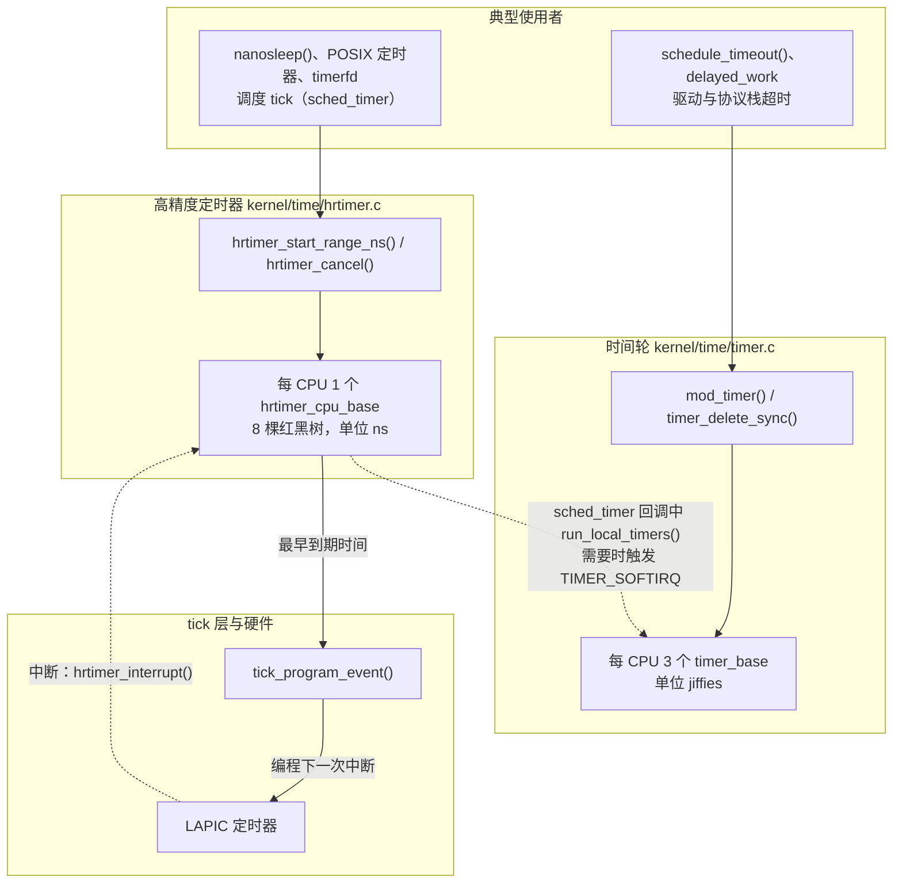
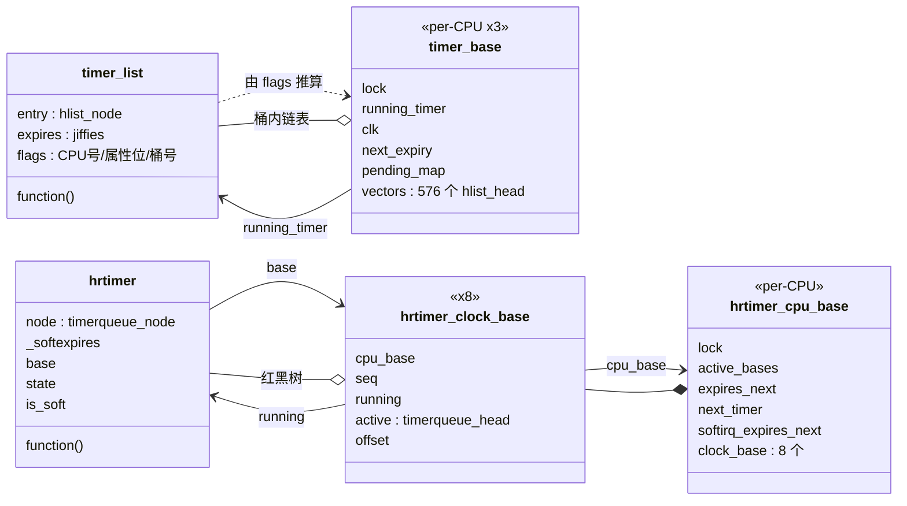
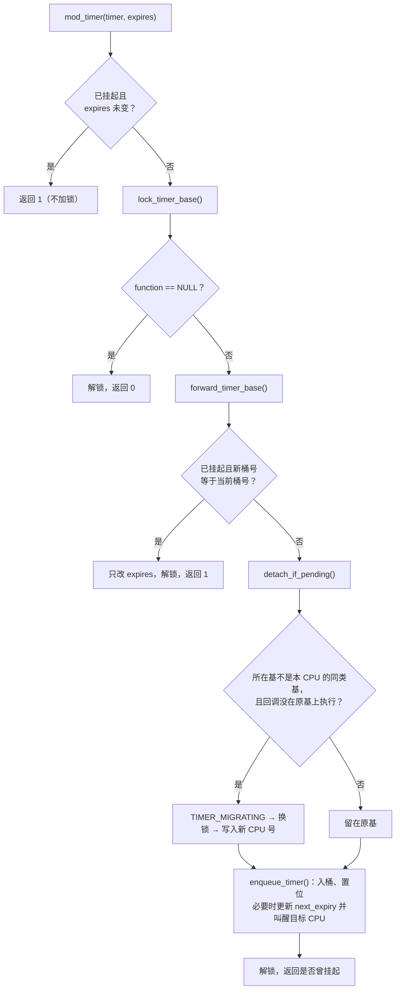
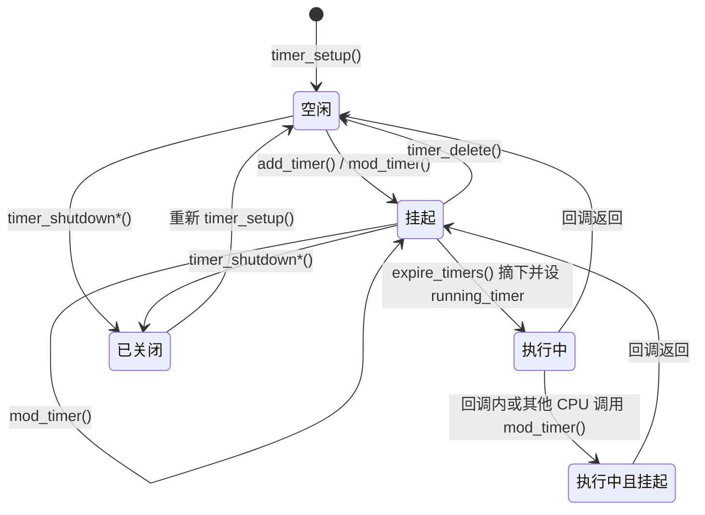
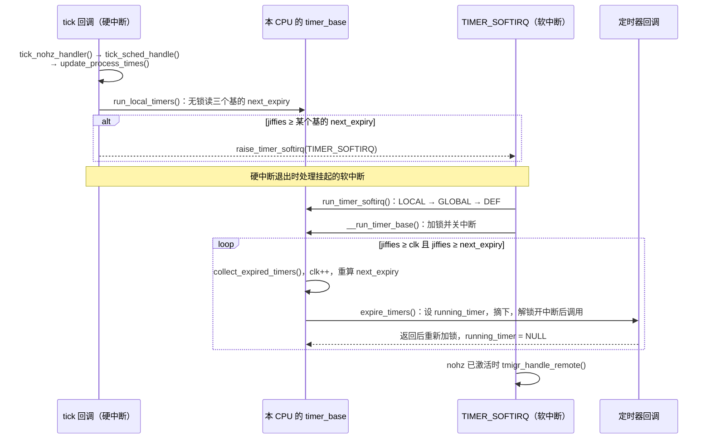
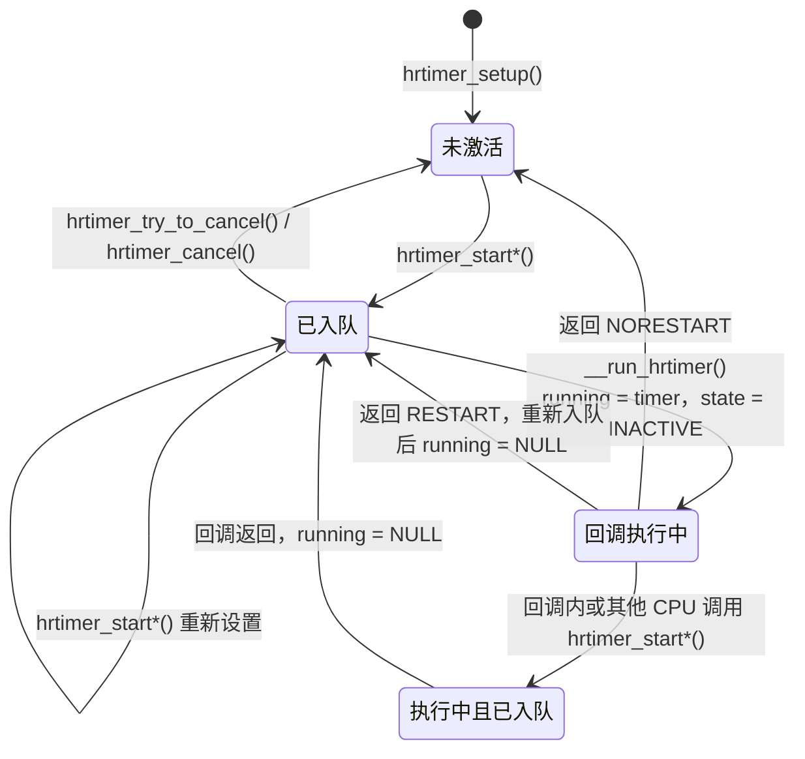
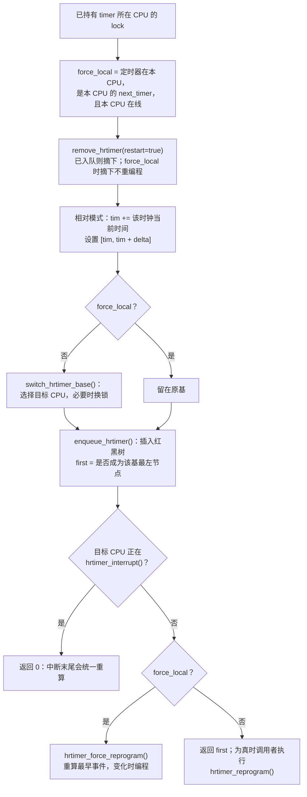

# 定时器子系统：时间轮与高精度定时器

内核里“过一段时间再做某事”的请求随处可见：TCP 发出报文后挂一个重传超时，块设备驱动给每个 I/O 请求挂一个超时，`schedule_timeout()` 让任务最多睡眠若干个 jiffies，`nanosleep()` 要在纳秒级的指定时刻唤醒进程，调度器的周期 tick 本身也要按时到来。定时器子系统负责保存这些请求，在到期时调用回调，并把“本 CPU 下一次需要醒来的时刻”交给 tick 层和时钟事件设备。

[时间子系统概述](introduction.md)已经介绍了时钟源、tick 以及两套定时器在整体中的位置。本章深入定时器本身，回答以下问题：

1. 内核为什么同时需要时间轮（timer wheel）和高精度定时器（high-resolution timer，hrtimer），二者各适合什么请求？
2. 时间轮如何用 9 级、每级 64 个桶，在常数时间内完成插入、删除和到期收集？代价是什么？
3. hrtimer 如何用红黑树维护精确的到期顺序，并让硬件始终按最早的到期时间编程？
4. 回调正在执行时，若有人删除、重新启动或迁移这个定时器，内核如何保证“同步删除返回后回调不再运行”？
5. CPU 空闲停 tick 时，定时器如何决定睡眠时长，又如何在必要时叫醒 CPU？

## 0. 分析基线

本章依据仓库内 [Makefile 第 2～4 行](../../linux/Makefile#L2-L4)标记的 **6.18.52** 版本，架构为 **x86-64**。阅读前需要了解 tick 与时钟事件设备的关系（[概述第 3.4、3.5 节](introduction.md)）和软中断的执行时机（[softirq 机制](../interrupt/softirq.md)）。

与本章结论相关的配置如下。它们是编译条件；文中说“默认”时，指运行时没有传入 `highres=off`、`nohz=off`、`nohz_full=`、`threadirqs` 等会改变行为的启动参数。

| 配置 | 对本章的影响 | 依据 |
| --- | --- | --- |
| `CONFIG_HZ_1000=y`、`CONFIG_HZ=1000` | 1 jiffy 为 1 ms；`HZ > 100`，时间轮共 9 级 | [.config#L505-L506](../../linux/.config#L505-L506)、[timer.c#L172-L177](../../linux/kernel/time/timer.c#L172-L177) |
| `CONFIG_SMP=y`、`CONFIG_HOTPLUG_CPU=y` | 每个 CPU 一套定时器队列；CPU 下线时要把定时器搬走 | [.config#L362](../../linux/.config#L362)、[.config#L528](../../linux/.config#L528) |
| `CONFIG_NO_HZ_COMMON=y`、`CONFIG_NO_HZ_FULL=y` | 每个 CPU 有 3 个时间轮基；编入定时器迁移层级 `timer_migration.o` | [.config#L105-L108](../../linux/.config#L105-L108)、[timer.c#L189-L203](../../linux/kernel/time/timer.c#L189-L203)、[time/Makefile#L26-L28](../../linux/kernel/time/Makefile#L26-L28) |
| `CONFIG_HIGH_RES_TIMERS=y` | 编入高精度模式，运行时默认尝试切换 | [.config#L112](../../linux/.config#L112)、[hrtimer.c#L698-L710](../../linux/kernel/time/hrtimer.c#L698-L710) |
| `CONFIG_PREEMPT_RT` 未设置 | 没有 `expiry_lock` 等 RT 字段，同步删除靠自旋等待；hrtimer 只有显式指定 SOFT 模式才在软中断中执行 | [.config#L139](../../linux/.config#L139)、[timer.c#L253-L256](../../linux/kernel/time/timer.c#L253-L256)、[hrtimer.c#L1616](../../linux/kernel/time/hrtimer.c#L1616)、[#L1643](../../linux/kernel/time/hrtimer.c#L1643)（PREEMPT_RT 的覆盖见 [#L1626-L1627](../../linux/kernel/time/hrtimer.c#L1626-L1627)） |
| `CONFIG_PROVE_LOCKING`、`CONFIG_LOCK_STAT`、`CONFIG_DEBUG_LOCK_ALLOC` 未设置 | `CONFIG_LOCKDEP` 只由这三项 select（[Kconfig.debug#L1367-L1370](../../linux/lib/Kconfig.debug#L1367-L1370)、[#L1423-L1426](../../linux/lib/Kconfig.debug#L1423-L1426)、[#L1494-L1500](../../linux/lib/Kconfig.debug#L1494-L1500)），因此未启用，`timer_list` 不含 `lockdep_map` 字段 | [.config#L10659-L10666](../../linux/.config#L10659-L10666) |
| `CONFIG_DEBUG_OBJECTS` 未设置 | `CONFIG_DEBUG_OBJECTS_TIMERS` 依赖它（[Kconfig.debug#L746-L748](../../linux/lib/Kconfig.debug#L746-L748)），调试对象钩子都是空函数 | [.config#L10586](../../linux/.config#L10586) |
| `CONFIG_IRQ_FORCED_THREADING=y` | 只有启动参数 `threadirqs` 打开时，定时器软中断才改由 `ktimers` 线程执行 | [.config#L83](../../linux/.config#L83)、[interrupt.h#L641-L648](../../linux/include/linux/interrupt.h#L641-L648) |
| `CONFIG_TIME_LOW_RES` | 只在 m68k、parisc、csky 的 Kconfig 中定义（[m68k](../../linux/arch/m68k/Kconfig#L67)、[parisc](../../linux/arch/parisc/Kconfig#L143)、[csky](../../linux/arch/csky/Kconfig#L166)），x86 不涉及；hrtimer 中与 `is_rel` 有关的补偿分支不生效 | 同左 |

## 1. 定时器子系统要解决什么问题

### 1.1 两类请求：大多会被取消的超时，与必须准时的事件

定时器请求在统计上分成差别很大的两类。

**超时（timeout）。** 网络重传、磁盘 I/O 超时、等待硬件响应的看门狗，都是“如果 N 毫秒内没等到结果，就做补救”。时间轮开头的注释写明了这类请求的特点：绝大多数在到期前就被取消；真的到期，说明正常流程已经出了问题，晚一点处理影响不大（[timer.c#L83-L87](../../linux/kernel/time/timer.c#L83-L87)）。对这类请求，最重要的是**启动和取消要便宜**，到期时间允许有偏差，但不能提前。

**准时事件。** `nanosleep()`、POSIX 定时器、`timerfd`，以及调度器的周期 tick，要求在指定时刻（允许一个用户给定的松弛量）到期。它们的数量少得多，但需要纳秒精度和严格的到期顺序。

一种数据结构很难同时满足两类需求：按时间排序的结构（例如红黑树）能精确给出最早的到期者，但插入是 O(log n)；按时间散列到桶里的结构插入删除是 O(1)，却只能给出近似顺序。内核因此保留两套实现：

| 实现 | 源文件 | 时间单位 | 组织方式 | 回调上下文 |
| --- | --- | --- | --- | --- |
| 时间轮，`struct timer_list` | `kernel/time/timer.c` | jiffies | 每 CPU 3 个基，每个基 9 级 × 64 桶 | `TIMER_SOFTIRQ` 软中断 |
| 高精度定时器，`struct hrtimer` | `kernel/time/hrtimer.c` | 纳秒（`ktime_t`） | 每 CPU 8 棵红黑树 | 默认硬中断；SOFT 模式在 `HRTIMER_SOFTIRQ` 软中断 |

### 1.2 在内核中的位置

下面这张图回答“两套定时器从哪里接收请求、又被谁驱动”。实线表示调用或编程，虚线表示由中断驱动的到期处理。



图中有三点需要注意：

- **时间轮不直接编程硬件。** 它的到期检查搭着 tick 进行：每个 tick 中 [run_local_timers()（timer.c#L2415-L2461）](../../linux/kernel/time/timer.c#L2415-L2461) 比较 `jiffies` 与各个基的最早到期时间，必要时触发 `TIMER_SOFTIRQ`。所以时间轮的精度不会高于一个 tick。
- **hrtimer 直接决定硬件下一次中断。** 高精度模式下，硬件始终按本 CPU 所有 hrtimer 中最早的到期时间编程，而 tick 本身就是一个 hrtimer（`tick_sched::sched_timer`，以 `HRTIMER_MODE_ABS_HARD` 初始化，见 [tick-sched.c#L1576](../../linux/kernel/time/tick-sched.c#L1576)）。
- **空闲时由 tick 层反向查询时间轮。** CPU 准备停 tick 时，[tick_nohz_next_event()](../../linux/kernel/time/tick-sched.c#L892-L968) 调用 `get_next_timer_interrupt()` 询问时间轮下一个到期时间，据此决定 `sched_timer` 推迟到何时（[tick-sched.c#L923](../../linux/kernel/time/tick-sched.c#L923)）。图中没有画出这条查询路径，4.6 节展开。

### 1.3 触发事件与输入输出

| 触发事件 | 输入 | 结果 |
| --- | --- | --- |
| `mod_timer()` / `add_timer()` / `add_timer_on()` | `timer_list`、绝对到期 jiffies | 定时器挂入某个时间轮的某个桶（前两者用本 CPU，`add_timer_on()` 用指定 CPU）；可能更新该基的 `next_expiry`，目标基已标记空闲时 IPI 叫醒它 |
| `hrtimer_start_range_ns()` | `hrtimer`、到期时间、松弛量、模式 | 定时器插入某个 CPU 的红黑树；若成为本 CPU 最早者，立即重新编程硬件 |
| tick 到来 | 当前 `jiffies` | 若有时间轮到期，触发 `TIMER_SOFTIRQ`；软中断中批量执行回调 |
| 硬件定时器中断（高精度模式） | 当前 MONOTONIC 时间 | 执行到期的硬中断类 hrtimer，必要时触发 `HRTIMER_SOFTIRQ`，按新的最早时间编程硬件 |
| `timer_delete_sync()` / `hrtimer_cancel()` | 定时器 | 返回时定时器已不在队列中，回调也不在任何 CPU 上执行 |
| CPU 进入空闲 / 退出空闲 | 当前 jiffies 与 MONOTONIC 时间 | 返回下一个需要醒来的时刻，标记或清除时间轮的空闲状态 |
| 墙上时间被修改 | 新的 REALTIME 偏移 | 刷新各 CPU 的时钟偏移，必要时 IPI 让其重新编程硬件 |
| CPU 下线 | 下线 CPU 的队列 | 把全部定时器迁移到在线 CPU |

### 1.4 本章边界

本章分析两套定时器的数据结构、入队、删除、到期处理，以及它们与 NO_HZ、CPU 热插拔、墙上时间修改的交互。以下内容只交代接口：tick 的停止与恢复细节（见[概述 3.5 节](introduction.md)）、定时器迁移层级 `timer_migration.c` 的内部算法、POSIX 定时器与 itimer、`timerfd`、alarmtimer、PREEMPT_RT 下的 `expiry_lock` 协议、调试对象（debugobjects）和跟踪点。

## 2. 核心数据结构

本节先讲时间轮的两个结构，再讲 hrtimer 的三个结构，最后用一张关系图收拢。

### 2.1 `struct timer_list`：嵌在使用者对象里的超时请求

[`struct timer_list`（timer_types.h#L8-L21）](../../linux/include/linux/timer_types.h#L8-L21) 在本配置下只有四个字段（`lockdep_map` 受 `CONFIG_LOCKDEP` 控制，未编入）：

```c
struct timer_list {
	/*
	 * All fields that change during normal runtime grouped to the
	 * same cacheline
	 */
	struct hlist_node	entry;
	unsigned long		expires;
	void			(*function)(struct timer_list *);
	u32			flags;
	...
};
```

（源码：[include/linux/timer_types.h#L8-L21](../../linux/include/linux/timer_types.h#L8-L21)）

| 字段 | 含义与约束 |
| --- | --- |
| `entry` | 挂在某个桶（`hlist_head`）上的链表节点。[timer_pending()（timer.h#L145-L148）](../../linux/include/linux/timer.h#L145-L148) 以 `entry.pprev` 是否为空判断定时器是否挂起 |
| `expires` | 调用者要求的**绝对**到期时间，单位 jiffies。实际所在桶的到期时间可能更晚（3.1 节） |
| `function` | 到期回调，参数是定时器自己。它为 `NULL` 表示定时器已被 shutdown，之后的启动请求会被静默丢弃 |
| `flags` | 低位记录所在 CPU，中间是属性位，高位记录所在桶的下标，见下表 |

`flags` 的布局定义在 [timer.h#L44-L52](../../linux/include/linux/timer.h#L44-L52)：

| 位 | 宏 | 含义 |
| --- | --- | --- |
| 0～17 | `TIMER_CPUMASK` | 定时器当前所属 CPU 的编号 |
| 18 | `TIMER_MIGRATING` | 正在从一个基搬到另一个基，见 4.2 节 |
| 19 | `TIMER_DEFERRABLE` | 可延迟：不会为了它把空闲 CPU 叫醒 |
| 20 | `TIMER_PINNED` | 固定在入队时的 CPU 上到期，不参与迁移 |
| 21 | `TIMER_IRQSAFE` | 回调在关中断状态下执行，允许在中断上下文同步等待它结束 |
| 22～31 | `TIMER_ARRAYMASK` | 所在桶在 `vectors[]` 中的下标（由 [timer_get_idx() / timer_set_idx()](../../linux/kernel/time/timer.c#L509-L518) 读写） |

三个属性位的语义见 [timer.h#L25-L43](../../linux/include/linux/timer.h#L25-L43) 的注释。初始化时只允许传入这三个属性位（`TIMER_INIT_FLAGS`），[do_init_timer()（timer.c#L851-L862）](../../linux/kernel/time/timer.c#L851-L862) 还会把当前 CPU 号或进 `flags`。

**定时器不保存指向所在基的指针。** 所在基由 `flags` 推出：CPU 号决定是哪个 CPU，`TIMER_PINNED` 与 `TIMER_DEFERRABLE` 决定是该 CPU 的哪一个基（[get_timer_cpu_base()，timer.c#L914-L926](../../linux/kernel/time/timer.c#L914-L926)；[get_timer_base()，#L942-L945](../../linux/kernel/time/timer.c#L942-L945)）。因此 `flags` 既是属性，也是“地址”：把定时器换到别的 CPU，就是在持锁状态下改写它的低位。

**生命周期与所有权。** `timer_list` 一般嵌在使用者的对象里（例如 `struct delayed_work` 中的 `timer`），时间轮只把它链进桶，并不拥有它。使用者负责初始化，并保证在定时器出队、回调结束之前不释放所在对象。回调中通常用 [timer_container_of()（timer.h#L132-L133）](../../linux/include/linux/timer.h#L132-L133)，即 `container_of()`，从定时器找回外层对象。

### 2.2 `struct timer_base`：每 CPU 三个时间轮

每个 CPU 有 `NR_BASES` 个 [`struct timer_base`（timer.c#L250-L265）](../../linux/kernel/time/timer.c#L250-L265)，以 per-CPU 数组 [`timer_bases[NR_BASES]`（#L267）](../../linux/kernel/time/timer.c#L267) 定义。去掉本配置未编入的 RT 字段后：

```c
struct timer_base {
	raw_spinlock_t		lock;
	struct timer_list	*running_timer;
	unsigned long		clk;
	unsigned long		next_expiry;
	unsigned int		cpu;
	bool			next_expiry_recalc;
	bool			is_idle;
	bool			timers_pending;
	DECLARE_BITMAP(pending_map, WHEEL_SIZE);
	struct hlist_head	vectors[WHEEL_SIZE];
} ____cacheline_aligned;
```

（源码：[kernel/time/timer.c#L250-L265](../../linux/kernel/time/timer.c#L250-L265)，省略了 `CONFIG_PREEMPT_RT` 下的 `expiry_lock` 和 `timer_waiters`）

| 字段 | 含义 |
| --- | --- |
| `lock` | raw 自旋锁，保护本基的全部字段，以及挂在本基上的所有定时器 |
| `running_timer` | 正在执行回调的定时器。执行回调时锁会被释放，删除和修改代码靠它判断“回调是否还在跑” |
| `clk` | 时间轮当前走到的 jiffies 值。它不随每个 tick 前进，只在入队前、到期收集时和准备空闲时被推进；每轮收集后先加 1，注释称到期处理期间它“比 jiffies 超前 1” |
| `next_expiry` | 最早一个非空桶的到期时间（jiffies）。在 `run_local_timers()` 中被无锁读取，所以远端写者用 `WRITE_ONCE()` |
| `next_expiry_recalc` | 删除定时器导致某个桶变空时置位，表示 `next_expiry` 可能偏早，下次使用前需要重算 |
| `is_idle` | 本 CPU 已决定停 tick；远端向本基加入新的最早定时器时，需要 IPI 叫醒它 |
| `timers_pending` | 本基是否有挂起的定时器；仅在 `next_expiry_recalc` 为假时可靠 |
| `pending_map` | 576 位的位图，每位对应一个桶，置位表示桶中至少有一个定时器 |
| `vectors[]` | 576 个桶，每个桶是一个无序哈希链表 |

这些字段的含义来自结构体上方的注释（[timer.c#L205-L249](../../linux/kernel/time/timer.c#L205-L249)）。三个基分别是：

| 基 | 放什么定时器 | 空闲时的处理 |
| --- | --- | --- |
| `BASE_LOCAL` | 带 `TIMER_PINNED` 的定时器 | 计入本 CPU 的唤醒时间 |
| `BASE_GLOBAL` | 既不固定也不可延迟的定时器 | 本 CPU 空闲后，可交给定时器迁移层级，由其他活跃 CPU 代为执行（4.6 节） |
| `BASE_DEF` | 带 `TIMER_DEFERRABLE` 的定时器 | 不计入唤醒时间，等 CPU 因别的原因醒来时顺带处理 |

[timer.c#L189-L197](../../linux/kernel/time/timer.c#L189-L197) 的注释还规定，需要同时锁多个基时按编号从小到大加锁。

**不变量。** 下面几条是后续算法成立的前提，它们由入队、删除和收集代码共同维护：

1. 桶非空，则 `pending_map` 中对应位必为 1。入队时置位（[enqueue_timer()，#L616-L618](../../linux/kernel/time/timer.c#L616-L618)），删除最后一个节点时清位（[detach_if_pending()，#L905-L908](../../linux/kernel/time/timer.c#L905-L908)），收集时整桶摘走并清位（[collect_expired_timers()，#L1818-L1822](../../linux/kernel/time/timer.c#L1818-L1822)）。反方向在常规路径上也成立；一个例外是 CPU 下线迁移只清空链表、不清位图（[migrate_timer_list()，#L2485-L2497](../../linux/kernel/time/timer.c#L2485-L2497)），残留的位最多导致一次空收集。
2. 挂在本基桶 `idx` 上的定时器，`flags` 中的桶号等于 `idx`，CPU 号等于 `base->cpu`。
3. `next_expiry_recalc` 为假时，`next_expiry` 不晚于任何挂起定时器所在桶的到期时间。它**可以偏早**（多触发一次空的软中断），**不能偏晚**（否则定时器会被漏掉）。
4. `clk` 不会越过尚未收集的桶。前移 `clk` 的 [__forward_timer_base()（#L947-L969）](../../linux/kernel/time/timer.c#L947-L969) 只能把它推到 `jiffies` 与 `next_expiry` 中较早的那个；到期收集时 `clk` 加 1，越过的是刚刚取走的桶，随后立即重算 `next_expiry`（3.3 节）。否则还没处理的桶会被跳过，要等时间轮转完一圈才会再被检查。

### 2.3 时间轮的几何：9 级 × 64 桶

时间轮的参数定义在 [timer.c#L152-L187](../../linux/kernel/time/timer.c#L152-L187)：

```c
#define LVL_CLK_SHIFT	3
#define LVL_CLK_DIV	(1UL << LVL_CLK_SHIFT)
#define LVL_SHIFT(n)	((n) * LVL_CLK_SHIFT)
#define LVL_GRAN(n)	(1UL << LVL_SHIFT(n))
#define LVL_START(n)	((LVL_SIZE - 1) << (((n) - 1) * LVL_CLK_SHIFT))
#define LVL_BITS	6
#define LVL_SIZE	(1UL << LVL_BITS)
#define LVL_OFFS(n)	((n) * LVL_SIZE)
```

（源码摘录：[kernel/time/timer.c#L152-L170](../../linux/kernel/time/timer.c#L152-L170)，省略了 `MASK` 类宏和注释）

含义如下：

- 每级 64 个桶（`LVL_SIZE`），第 `n` 级的桶在 `vectors[]` 中从下标 `64n` 开始（`LVL_OFFS(n)`）。
- 第 `n` 级一个桶覆盖 `8^n` 个 jiffies（`LVL_GRAN(n)`），即每升一级粒度扩大 8 倍。
- 定时器离当前 `clk` 的距离 `delta` 决定它进哪一级：`delta` 落在 `[LVL_START(n), LVL_START(n+1))` 就进第 `n` 级。`LVL_START(n)` 取 `63 · 8^(n-1)` 而不是 `64 · 8^(n-1)`，注释说明这是为了给入队时额外加上的一个粒度留出余量（[#L159-L164](../../linux/kernel/time/timer.c#L159-L164)）。

按 `HZ=1000` 代入，得到下表（单位均为 jiffies，即毫秒）：

| 级 | `vectors[]` 下标 | 粒度 `LVL_GRAN(n)` | 进入该级的 `delta` 范围 |
| --- | --- | --- | --- |
| 0 | 0～63 | 1 | [0, 63) |
| 1 | 64～127 | 8 | [63, 504) |
| 2 | 128～191 | 64 | [504, 4 032) |
| 3 | 192～255 | 512 | [4 032, 32 256) |
| 4 | 256～319 | 4 096 | [32 256, 258 048) |
| 5 | 320～383 | 32 768 | [258 048, 2 064 384) |
| 6 | 384～447 | 262 144 | [2 064 384, 16 515 072) |
| 7 | 448～511 | 2 097 152 | [16 515 072, 132 120 576) |
| 8 | 512～575 | 16 777 216（约 4.7 小时） | [132 120 576, ∞)，超过上限截断 |

时间轮的容量上限是 `WHEEL_TIMEOUT_CUTOFF = LVL_START(9)` = 1 056 964 608 jiffies（约 12.2 天）。`delta` 达到这个值时，到期时间被截断为 `clk + WHEEL_TIMEOUT_MAX`（1 040 187 392 jiffies，约 12.04 天，[timer.c#L179-L181](../../linux/kernel/time/timer.c#L179-L181)、[#L571-L572](../../linux/kernel/time/timer.c#L571-L572)）。也就是说，超长定时器会被**提前**到约 12 天后强制到期。注释解释了这样做可以接受的原因：采样到的最长超时约 5 天，来自网络连接跟踪（[#L93-L97](../../linux/kernel/time/timer.c#L93-L97)）。

源码注释中的分级表（[#L104-L114](../../linux/kernel/time/timer.c#L104-L114)）与上表的边界略有不同，例如它把第 1 级写成 64～511 ms。上表的边界按 `calc_wheel_index()` 实际使用的 `LVL_START(n)` 计算，以代码为准。

用一张文本示意图看 `vectors[]` 与 `pending_map` 的对应关系：

```text
pending_map:  bit 0 ... bit 63 | bit 64 ... bit 127 | ... | bit 512 ... bit 575
vectors[]:    [0]  ...  [63]   | [64]  ...  [127]   | ... | [512] ...  [575]
              第 0 级，粒度 1  |  第 1 级，粒度 8    | ... |  第 8 级，粒度 8^8
每个桶：      hlist_head → timer_list → timer_list → ...（无序，同桶定时器同时到期）
```

旧版时间轮在高层级桶到期时，要把其中的定时器“级联”（cascade）回低层级重新分桶。当前实现取消了级联：定时器一旦放进某个桶，就在该桶对应的时刻整体到期（[#L76-L81](../../linux/kernel/time/timer.c#L76-L81)、[#L93-L95](../../linux/kernel/time/timer.c#L93-L95)）。代价是越远的定时器到期越不准，3.5 节量化这个误差。

### 2.4 `struct hrtimer`：带到期区间的高精度定时器

[`struct hrtimer`（hrtimer_types.h#L39-L48）](../../linux/include/linux/hrtimer_types.h#L39-L48)：

```c
struct hrtimer {
	struct timerqueue_node		node;
	ktime_t				_softexpires;
	enum hrtimer_restart		(*__private function)(struct hrtimer *);
	struct hrtimer_clock_base	*base;
	u8				state;
	u8				is_rel;
	u8				is_soft;
	u8				is_hard;
};
```

（源码：[include/linux/hrtimer_types.h#L39-L48](../../linux/include/linux/hrtimer_types.h#L39-L48)）

| 字段 | 含义 |
| --- | --- |
| `node` | [`struct timerqueue_node`（timerqueue_types.h#L8-L11）](../../linux/include/linux/timerqueue_types.h#L8-L11)，包含红黑树节点 `node` 和**硬到期时间** `expires`。红黑树按它排序 |
| `_softexpires` | **软到期时间**，即最早允许执行回调的时刻。`expires - _softexpires` 是松弛量（slack） |
| `function` | 回调，返回 `HRTIMER_RESTART` 或 `HRTIMER_NORESTART`（[hrtimer_types.h#L13-L16](../../linux/include/linux/hrtimer_types.h#L13-L16)）。标注为 `__private`，修改需通过 [hrtimer_update_function()](../../linux/include/linux/hrtimer.h#L332-L345)，且只能在未入队时进行 |
| `base` | 指向所在的 `hrtimer_clock_base`，由此确定所在 CPU 和时钟 |
| `state` | `HRTIMER_STATE_INACTIVE`（0）或 `HRTIMER_STATE_ENQUEUED`（1） |
| `is_rel` | 仅 `CONFIG_TIME_LOW_RES` 使用，本配置下不生效 |
| `is_soft` | 回调在 `HRTIMER_SOFTIRQ` 软中断中执行 |
| `is_hard` | 显式要求在硬中断中执行（主要对 PREEMPT_RT 有意义） |

两个到期时间都是**绝对时间**，并且以定时器所选时钟（MONOTONIC、REALTIME、BOOTTIME 或 TAI）为参照。设置它们的辅助函数见 [hrtimer.h#L97-L113](../../linux/include/linux/hrtimer.h#L97-L113)：`hrtimer_set_expires_range_ns(timer, time, delta)` 把 `_softexpires` 设为 `time`，`node.expires` 设为 `time + delta`。

**“回调执行中”不记在 `state` 里。** [hrtimer.h#L58-L83](../../linux/include/linux/hrtimer.h#L58-L83) 的注释说明，若把这个状态放进 `timer->state`，回调返回后内核就必须再写一次定时器本身，回调也就不能释放定时器所在的内存。所以“正在执行”记录在所在时钟基的 `running` 指针上，`hrtimer_callback_running()` 检查的就是 `timer->base->running == timer`（[hrtimer.h#L319-L322](../../linux/include/linux/hrtimer.h#L319-L322)）。注释还指出，SMP 上可能出现“回调执行中并且已经重新入队”的状态，例如 POSIX 定时器的回调发出信号后，另一个 CPU 处理信号并重新启动了定时器。

启动时用 `enum hrtimer_mode`（[hrtimer.h#L35-L56](../../linux/include/linux/hrtimer.h#L35-L56)）描述请求：

| 位 | 含义 |
| --- | --- |
| `HRTIMER_MODE_ABS` / `HRTIMER_MODE_REL` | 时间是绝对值还是相对当前时间 |
| `HRTIMER_MODE_PINNED` | 固定在当前 CPU，只在启动时考虑 |
| `HRTIMER_MODE_SOFT` | 回调在软中断中执行；必须与初始化时的选择一致 |
| `HRTIMER_MODE_HARD` | 在 PREEMPT_RT 上也坚持硬中断执行 |

### 2.5 `hrtimer_clock_base` 与 `hrtimer_cpu_base`：每 CPU 8 棵树

每个 CPU 有一个 [`struct hrtimer_cpu_base`（hrtimer_defs.h#L101-L127）](../../linux/include/linux/hrtimer_defs.h#L101-L127)，即 per-CPU 变量 [`hrtimer_bases`（hrtimer.c#L72-L111）](../../linux/kernel/time/hrtimer.c#L72-L111)。其中嵌入 8 个 [`struct hrtimer_clock_base`（hrtimer_defs.h#L46-L54）](../../linux/include/linux/hrtimer_defs.h#L46-L54)，按 [`enum hrtimer_base_type`（#L56-L66）](../../linux/include/linux/hrtimer_defs.h#L56-L66) 排列：前 4 个是 MONOTONIC、REALTIME、BOOTTIME、TAI 的硬中断队列，后 4 个是对应的软中断队列。

`hrtimer_clock_base` 的字段：

| 字段 | 含义 |
| --- | --- |
| `cpu_base` | 反向指向所属的 `hrtimer_cpu_base` |
| `index`、`clockid` | 在 `clock_base[]` 中的下标和对应的时钟 ID |
| `seq` | 包围回调执行的 seqcount，供 `hrtimer_active()` 无锁判断（5.5 节） |
| `running` | 正在执行回调的定时器 |
| `active` | [`struct timerqueue_head`（timerqueue_types.h#L13-L15）](../../linux/include/linux/timerqueue_types.h#L13-L15)，即缓存了最左节点的红黑树 `rb_root_cached` |
| `offset` | 本时钟相对 MONOTONIC 的偏移。MONOTONIC 基为 0 |

`hrtimer_cpu_base` 的关键字段：

| 字段 | 含义 |
| --- | --- |
| `lock` | raw 自旋锁，保护本 CPU 全部 8 个队列和其中的定时器 |
| `active_bases` | 位图，第 `i` 位表示 `clock_base[i]` 非空。[hrtimer.c#L56-L59](../../linux/kernel/time/hrtimer.c#L56-L59) 用低 4 位 `HRTIMER_ACTIVE_HARD`、高 4 位 `HRTIMER_ACTIVE_SOFT` 区分两类队列 |
| `clock_was_set_seq` | 已同步过的“时钟被设置”序号，用于按需刷新各基的 `offset` |
| `hres_active` | 本 CPU 已进入高精度模式 |
| `in_hrtirq` | 正在执行 `hrtimer_interrupt()` |
| `hang_detected` | 上一次中断判定为“挂起”，硬件暂时被推迟编程 |
| `softirq_activated` | `HRTIMER_SOFTIRQ` 已触发、尚未执行完 |
| `online` | 从 hrtimer 角度看本 CPU 是否在线 |
| `expires_next` | 本 CPU 下一次事件的绝对时间（MONOTONIC），同时考虑硬、软两类队列。硬件按它编程 |
| `next_timer` | 产生 `expires_next` 的那个定时器；注释说明它只是 `__remove_hrtimer()` 的优化提示，跨 CPU 时不可靠，不可解引用 |
| `softirq_expires_next`、`softirq_next_timer` | 软中断类队列中最早的到期时间及对应定时器 |
| `clock_base[8]` | 8 个嵌入的时钟基 |
| `csd` | 用于向该 CPU 发 IPI、让它执行 `retrigger_next_event()` 的调用描述符（[hrtimer.c#L110](../../linux/kernel/time/hrtimer.c#L110)） |

此外，SMP 下有一个特殊的全局对象 [`migration_cpu_base`（hrtimer.c#L132-L140）](../../linux/kernel/time/hrtimer.c#L132-L140)，其 `clock_base[0]` 被称为 `migration_base`。定时器在 CPU 之间搬运时，`timer->base` 会暂时指向它，表示“正在迁移”，作用与时间轮的 `TIMER_MIGRATING` 相同（4.2 节、6.2 节）。

### 2.6 对象关系总览

下面这张图回答“这些结构谁包含谁、谁指向谁”。实心菱形表示嵌入，空心菱形表示作为集合成员挂在队列上但不被队列拥有，实线箭头表示指针，虚线箭头表示“通过 `flags` 计算得到”而非存储指针。图中省略了大部分字段。



两套实现在“定时器属于哪个基”这件事上的做法不同：`timer_list` 把 CPU 号和基的种类编码在 `flags` 中，`hrtimer` 直接保存 `base` 指针。但它们解决并发迁移的思路一致：都要先读出“所属基”、加锁、再确认“所属基”没有变化；迁移途中用一个特殊标记（`TIMER_MIGRATING` 或 `migration_base`）让其他人等待。

## 3. 时间轮的算法

### 3.1 入队：把相对距离映射到级和桶

**目标**：给定绝对到期时间 `expires` 和基的当前位置 `clk`，在常数时间内选出一个桶，保证定时器**不会早于** `expires` 到期。
**输出**：桶下标 `idx` 和桶的到期时间 `bucket_expiry`。

[calc_wheel_index()（timer.c#L541-L577）](../../linux/kernel/time/timer.c#L541-L577) 先按 `delta = expires - clk` 选级，再交给 [calc_index()（#L524-L539）](../../linux/kernel/time/timer.c#L524-L539) 算桶：

```c
static inline unsigned calc_index(unsigned long expires, unsigned lvl,
				  unsigned long *bucket_expiry)
{
	/* ... 注释：保证不会提前到期，见下文 ... */
	expires = (expires >> LVL_SHIFT(lvl)) + 1;
	*bucket_expiry = expires << LVL_SHIFT(lvl);
	return LVL_OFFS(lvl) + (expires & LVL_MASK);
}
```

（源码：[kernel/time/timer.c#L524-L539](../../linux/kernel/time/timer.c#L524-L539)，省略了注释正文）

```c
	if (delta < LVL_START(1)) {
		idx = calc_index(expires, 0, bucket_expiry);
	} else if (delta < LVL_START(2)) {
		idx = calc_index(expires, 1, bucket_expiry);
	} else if ...			/* 第 2～7 级同理 */
	} else if ((long) delta < 0) {
		idx = clk & LVL_MASK;
		*bucket_expiry = clk;
	} else {
		if (delta >= WHEEL_TIMEOUT_CUTOFF)
			expires = clk + WHEEL_TIMEOUT_MAX;
		idx = calc_index(expires, LVL_DEPTH - 1, bucket_expiry);
	}
```

（源码摘录：[kernel/time/timer.c#L547-L575](../../linux/kernel/time/timer.c#L547-L575)，省略了第 2～7 级的重复分支）

`calc_index()` 把 `expires` 右移掉本级粒度以下的位，再**加 1**，然后左移回来。结果是严格大于 `expires` 的、本级粒度的下一个整倍数。注释给出了两个原因（[#L528-L535](../../linux/kernel/time/timer.c#L528-L535)）：

- **在 tick 边缘启动。** 假设在 `jiffies = J` 这个周期快结束时启动一个 `expires = J + 1` 的定时器，下一次 tick 一到就满足 `jiffies ≥ expires`，实际等待时间可能远小于 1 个 jiffy。加 1 后桶到期时间为 `J + 2`，真实等待时间至少 1 个 jiffy。
- **高层级截断。** 右移会丢掉低位，若不向上取整，桶时间就会早于 `expires`。

`delta` 是无符号数，`expires` 已经过去时它会表现为一个极大的值，前面的 `<` 比较都不成立，于是由 `(long) delta < 0` 分支接住：直接放进当前 `clk` 对应的第 0 级桶，在下一次处理时立即到期。

**一个例子。** 设 `HZ=1000`，`base->clk = 1000`。以下数字可以按上面的代码逐步验证：

```text
mod_timer(t, 1010)：delta = 10   → 第 0 级
    (1010 >> 0) + 1 = 1011，bucket_expiry = 1011
    idx = 0 + (1011 & 63) = 51

mod_timer(t, 1100)：delta = 100  → 63 ≤ 100 < 504，第 1 级（粒度 8）
    (1100 >> 3) + 1 = 137 + 1 = 138，bucket_expiry = 138 << 3 = 1104
    idx = 64 + (138 & 63) = 64 + 10 = 74

mod_timer(t, 6000)：delta = 5000 → 4032 ≤ 5000 < 32256，第 3 级（粒度 512）
    (6000 >> 9) + 1 = 11 + 1 = 12，bucket_expiry = 12 << 9 = 6144
    idx = 192 + (12 & 63) = 204

mod_timer(t, 990)：delta 为负   → idx = 1000 & 63 = 40，bucket_expiry = 1000
```

第三个定时器要求 5 秒后到期，实际桶时间晚了 144 ms，这就是“越远越粗”的代价。

**挂入桶。** 选好桶后，[enqueue_timer()（#L612-L637）](../../linux/kernel/time/timer.c#L612-L637) 做四件事：把定时器加到桶链表头部，置位 `pending_map`，把桶号写进 `flags`，若 `bucket_expiry` 早于当前 `next_expiry` 就更新它：

```c
	hlist_add_head(&timer->entry, base->vectors + idx);
	__set_bit(idx, base->pending_map);
	timer_set_idx(timer, idx);
	...
	if (time_before(bucket_expiry, base->next_expiry)) {
		WRITE_ONCE(base->next_expiry, bucket_expiry);
		base->timers_pending = true;
		base->next_expiry_recalc = false;
		trigger_dyntick_cpu(base, timer);
	}
```

（源码：[kernel/time/timer.c#L616-L636](../../linux/kernel/time/timer.c#L616-L636)，省略了跟踪点和注释）

注意这里比较的是 `bucket_expiry` 而不是 `timer->expires`，因为定时器实际在桶时间到期（[#L622-L626](../../linux/kernel/time/timer.c#L622-L626)）。新的最早定时器还可能需要叫醒一个已经停 tick 的目标 CPU，由 `trigger_dyntick_cpu()` 处理（4.6 节）。

整个入队过程只有几次移位、一次链表插入和一次位操作，与基中已有多少定时器无关。

### 3.2 推进 `clk`：保持距离计算的准确

`calc_wheel_index()` 以 `base->clk` 为起点计算距离。而 `clk` 并不随每个 tick 前进：如果一个基很久没有定时器到期，`clk` 会停在旧值上。这时直接入队，`delta` 会把“`clk` 落后的部分”也算进去，把定时器放进过粗的级别。

例如 `clk` 停在 1000，而 `jiffies` 已经到了 6000。新定时器 `expires = 6010` 实际只差 10 ms，按 `clk` 计算却是 `delta = 5010`，会进第 3 级，误差可达 512 ms。

所以入队前要先调用 [forward_timer_base()（timer.c#L971-L974）](../../linux/kernel/time/timer.c#L971-L974)，其核心是：

```c
	if (time_before_eq(basej, base->clk))
		return;

	if (time_after(base->next_expiry, basej)) {
		base->clk = basej;
	} else {
		if (WARN_ON_ONCE(time_before(base->next_expiry, base->clk)))
			return;
		base->clk = base->next_expiry;
	}
```

（源码：[kernel/time/timer.c#L954-L967](../../linux/kernel/time/timer.c#L954-L967)）

`clk` 只会前进，不会回退；如果有已经到期但还没处理的桶（`next_expiry ≤ jiffies`），只能前进到 `next_expiry`，以免越过这个桶（2.2 节不变量 4）。如果 `clk` 已经超前于 `jiffies`（例如到期处理收集完当前 jiffy 的桶、`clk` 加 1 之后），第一个判断直接返回，`clk` 不会被改动。

### 3.3 到期收集：像里程表进位一样逐级检查

**目标**：在 `jiffies` 越过 `next_expiry` 后，一次取走所有在这个时刻到期的桶。
**依据**：第 `n` 级的桶时间都是 `8^n` 的整倍数（3.1 节）。所以只有当 `clk` 的低 `3n` 位全为 0 时，第 `n` 级才可能有桶到期。这与里程表相似：个位转回 0 时，十位才前进一格。

[collect_expired_timers()（timer.c#L1807-L1830）](../../linux/kernel/time/timer.c#L1807-L1830)：

```c
	unsigned long clk = base->clk = base->next_expiry;
	...
	for (i = 0; i < LVL_DEPTH; i++) {
		idx = (clk & LVL_MASK) + i * LVL_SIZE;

		if (__test_and_clear_bit(idx, base->pending_map)) {
			vec = base->vectors + idx;
			hlist_move_list(vec, heads++);
			levels++;
		}
		/* Is it time to look at the next level? */
		if (clk & LVL_CLK_MASK)
			break;
		/* Shift clock for the next level granularity */
		clk >>= LVL_CLK_SHIFT;
	}
	return levels;
```

（源码：[kernel/time/timer.c#L1810-L1829](../../linux/kernel/time/timer.c#L1810-L1829)）

第一行很关键：`clk` 不是一格一格地走，而是**直接跳到 `next_expiry`**。中间没有定时器的 jiffies 全部跳过，这对停 tick 很久后醒来的 CPU 尤其重要。

接着 3.1 节的例子：`jiffies` 到达 1104，`next_expiry = 1104`：

```text
clk = 1104
第 0 级：idx = 1104 & 63 = 16          → 检查 vectors[16]
1104 & 7 == 0                          → 低 3 位为 0，继续看第 1 级
clk = 1104 >> 3 = 138
第 1 级：idx = 64 + (138 & 63) = 74     → 取走 vectors[74]（例子中的定时器）
138 & 7 == 2                           → 第 2 级本次不可能到期，停止
```

外层循环 [__run_timers()（#L2343-L2375）](../../linux/kernel/time/timer.c#L2343-L2375)：

```c
	while (time_after_eq(jiffies, base->clk) &&
	       time_after_eq(jiffies, base->next_expiry)) {
		levels = collect_expired_timers(base, heads);
		...
		base->clk++;
		timer_recalc_next_expiry(base);

		while (levels--)
			expire_timers(base, heads + levels);
	}
```

（源码：[kernel/time/timer.c#L2353-L2374](../../linux/kernel/time/timer.c#L2353-L2374)，省略了告警）

收集之后、执行回调之前，`clk` 先加 1，并重新计算 `next_expiry`。注释（[#L2365-L2368](../../linux/kernel/time/timer.c#L2365-L2368)）说明了加 1 的目的：避免回调把自己重新挂到“当前 jiffies”上后被无限次重复处理。设本轮收集的桶时间恰好等于当前 `jiffies = J`（tick 准时到来时的常见情况），回调里执行 `mod_timer(t, J)`：此时 `clk = J + 1`，`delta` 为负，定时器进入 `clk` 对应的桶，桶时间为 `J + 1`；循环条件 `jiffies ≥ clk` 不再成立，本轮结束，定时器在下一个 jiffy 处理。

同一轮收集到的定时器按“高层级先、第 0 级后”的顺序执行（`while (levels--)`），同一桶内则按链表顺序。它们的桶时间相同，时间轮不保证按各自的 `expires` 排序。

### 3.4 寻找下一个到期时间

删除导致桶变空，或一轮收集结束后，需要重新计算 `next_expiry`。[timer_recalc_next_expiry()（timer.c#L1857-L1926）](../../linux/kernel/time/timer.c#L1857-L1926) 的思路：

```text
/* 简化逻辑 */
next = clk + TIMER_NEXT_MAX_DELTA         /* 初值：约 2^30 个 jiffies 之后 */
for 每一级 lvl：
    pos = 从本级当前位置 (clk & 63) 起，向后找第一个置位的桶（必要时回绕）
    if 找到：
        tmp = (clk + pos) << LVL_SHIFT(lvl)       /* 该桶的到期时间 */
        next = min(next, tmp)
        if pos 不超过“本级再走多少格就会进位到上一级”：
            break                                 /* 更高层级不可能更早 */
    clk = (clk >> 3) + (clk 低 3 位非 0 ? 1 : 0)   /* 换算成上一级的位置 */
next_expiry = next；timers_pending = (next 不是初值)
```

查找桶用的是 [next_pending_bucket()（#L1837-L1849）](../../linux/kernel/time/timer.c#L1837-L1849) 中的两次 `find_next_bit()`。每级最多扫描 64 位，最多 9 级，所以重算的代价也有上界，与定时器数量无关。

计算上一级位置时“低 3 位非 0 就加 1”，是因为当前级还有未走完的格子，上一级下一个可能到期的桶是下一格。注释用几个具体的位模式说明了这条规则（[#L1882-L1917](../../linux/kernel/time/timer.c#L1882-L1917)）。`TIMER_NEXT_MAX_DELTA` 定义为 `(1UL << 30) - 1`（[timer.h#L159](../../linux/include/linux/timer.h#L159)）。

### 3.5 精度的代价

把 3.1 节的取整规则写成数学形式：第 `n` 级的定时器，桶时间是 `(⌊expires / 8^n⌋ + 1) · 8^n`，比 `expires` 晚 1 到 `8^n` 个 jiffies。而进入第 `n` 级（`n ≥ 1`）意味着 `delta ≥ 63 · 8^(n-1)`，所以：

```text
相对误差 ≤ 8^n / (63 · 8^(n-1)) = 8/63 ≈ 12.7%
```

| 级 | 要求的超时（约） | 最多推迟 |
| --- | --- | --- |
| 0 | 小于 63 ms | 1 ms |
| 1 | 63 ms～0.5 s | 8 ms |
| 2 | 0.5 s～4 s | 64 ms |
| 3 | 4 s～32 s | 512 ms |
| 4 | 32 s～4.3 min | 4.1 s |
| 8 | 约 1.5 天以上 | 约 4.7 小时 |

这里的“推迟”指桶时间与 `expires` 的差，是到期时间的下界。回调真正执行的时刻还要加上：等到 `jiffies` 越过桶时间的那次 tick，以及软中断的调度延迟。可延迟定时器在 CPU 空闲期间还可能被推迟得更久。

这些代价与时间轮的设计目标一致：大多数超时不会真的到期，提前到期是错误，迟到一些通常可以接受（[#L83-L91](../../linux/kernel/time/timer.c#L83-L91)）。需要准时的请求应该使用 hrtimer。

### 3.6 主动扎堆：`round_jiffies()`

如果调用者本来就不在意精确时刻，还可以主动把到期时间对齐到整秒，让多个定时器在同一个 tick 到期，减少 CPU 被叫醒的次数。[round_jiffies_common()（timer.c#L348-L386）](../../linux/kernel/time/timer.c#L348-L386) 先给每个 CPU 加上 `3 × cpu` 个 jiffies 的错位，避免所有 CPU 同时到期争抢锁；然后在余数小于 `HZ/4` 时向下取整、否则向上取整到整秒（`_up` 系列只向上取整）；最后减去错位。如果结果已经不在未来，就返回原值。

## 4. 时间轮的实现

### 4.1 初始化

常用的初始化方式有两种：

- 静态定义用 [`DEFINE_TIMER()`（timer.h#L56-L65）](../../linux/include/linux/timer.h#L56-L65)。
- 动态初始化用 [`timer_setup()`（timer.h#L120-L121）](../../linux/include/linux/timer.h#L120-L121)，它最终调用 [timer_init_key()（timer.c#L876-L882）](../../linux/kernel/time/timer.c#L876-L882) → `do_init_timer()`。

`do_init_timer()` 做的事情很少：`entry.pprev = NULL`（未挂起），设置 `function`；`flags` 先屏蔽掉 `TIMER_INIT_FLAGS` 以外的位（超出时告警），再或上当前 CPU 号（[timer.c#L856-L860](../../linux/kernel/time/timer.c#L856-L860)）。初始化不涉及任何基，也不加锁。栈上的定时器应使用 `timer_setup_on_stack()`，并与 `timer_destroy_on_stack()` 配对（[timer.h#L116-L130](../../linux/include/linux/timer.h#L116-L130)）；本配置未开启调试对象，二者与普通版本行为相同。

### 4.2 找到并锁住定时器所在的基

几乎所有操作的第一步都是 [lock_timer_base()（timer.c#L987-L1011）](../../linux/kernel/time/timer.c#L987-L1011)：

```c
	for (;;) {
		struct timer_base *base;
		u32 tf;

		tf = READ_ONCE(timer->flags);

		if (!(tf & TIMER_MIGRATING)) {
			base = get_timer_base(tf);
			raw_spin_lock_irqsave(&base->lock, *flags);
			if (timer->flags == tf)
				return base;
			raw_spin_unlock_irqrestore(&base->lock, *flags);
		}
		cpu_relax();
	}
```

（源码：[kernel/time/timer.c#L991-L1010](../../linux/kernel/time/timer.c#L991-L1010)）

这是一个“读出所属者、加锁、再确认”的循环：

1. 读 `flags`。如果带 `TIMER_MIGRATING`，说明有人正在把它搬到别的基，自旋等待。
2. 由 `flags` 算出基，加锁。
3. 加锁后再比较一次 `flags`。不相等说明在加锁前它被搬走了，解锁重来。

文件注释称之为“散列锁”（hashed locking）：持有某个基的锁，就同时锁住了所有属于这个基的定时器（[#L976-L986](../../linux/kernel/time/timer.c#L976-L986)）。这也是 `flags` 必须用 `READ_ONCE()` 读取的原因：防止编译器在检查 `TIMER_MIGRATING` 和加锁之间重新读取它（[#L995-L999](../../linux/kernel/time/timer.c#L995-L999)）。

### 4.3 启动与修改：`__mod_timer()`

`mod_timer()`、`add_timer()`、`timer_reduce()`、`mod_timer_pending()` 等都是 [__mod_timer()（timer.c#L1017-L1142）](../../linux/kernel/time/timer.c#L1017-L1142) 的包装，区别在于传入的选项（[#L1013-L1015](../../linux/kernel/time/timer.c#L1013-L1015)）。先看简化后的完整逻辑：

```text
/* __mod_timer(timer, expires, options) 的简化逻辑，省略调试钩子 */
if (!NOTPENDING && timer_pending(timer)) {
    if (timer->expires == expires) return 1;                 /* 无锁快路径 */
    if (REDUCE && expires 不早于 timer->expires) return 1;
    base = lock_timer_base(timer);
    if (timer->function == NULL) goto unlock;                /* 已 shutdown，返回 0 */
    forward_timer_base(base);
    if (REDUCE && 仍挂起 && expires 不早于 timer->expires) { ret = 1; goto unlock; }
    clk = base->clk;
    idx = calc_wheel_index(expires, clk, &bucket_expiry);
    if (idx == 定时器当前所在的桶) {
        更新 timer->expires（REDUCE 时只允许变早）; ret = 1; goto unlock;
    }
} else {
    base = lock_timer_base(timer);
    if (timer->function == NULL) goto unlock;
    forward_timer_base(base);
}

ret = detach_if_pending(timer, base, false);   /* 摘下，但 pprev 不清空 */
if (!ret && PENDING_ONLY) goto unlock;

new_base = 本 CPU 上同类的 timer_base;
if (base != new_base && base->running_timer != timer) {
    timer->flags |= TIMER_MIGRATING;
    解锁 base; 锁 new_base;
    flags 的 CPU 字段改为 new_base->cpu（同时清掉 TIMER_MIGRATING）;
    base = new_base; forward_timer_base(base);
}

timer->expires = expires;
if (已算出 idx && clk == base->clk) enqueue_timer(base, timer, idx, bucket_expiry);
else internal_add_timer(base, timer);          /* 重新计算桶 */
unlock: 解锁，返回 ret
```

对照源码逐段说明。

**无锁快路径与同桶优化（[#L1032-L1083](../../linux/kernel/time/timer.c#L1032-L1083)）。** 网络代码经常在每收到一个报文时重设同一个超时，新的到期时间往往与原来相同或落在同一个桶里。前者连锁都不用加；后者加锁算出桶号，发现与当前桶号相同，就只更新 `expires`，省去出队再入队。注释也承认这个优化的副作用：定时器留在旧桶中，粒度可能比重新入队更粗（[#L1033-L1037](../../linux/kernel/time/timer.c#L1033-L1037)）。

**shutdown 检查（[#L1052-L1058](../../linux/kernel/time/timer.c#L1052-L1058)）。** `function == NULL` 必须在持锁后判断，才能与 shutdown 代码正确互斥。

**摘下但不清 `pprev`（[#L1097-L1099](../../linux/kernel/time/timer.c#L1097-L1099)）。** [detach_timer()（#L885-L895）](../../linux/kernel/time/timer.c#L885-L895) 的 `clear_pending` 参数为假时，`entry.pprev` 保持非空，`timer_pending()` 仍返回真。源码没有注释说明原因；从流程看，走到这里的定时器（除 `PENDING_ONLY` 且原本未挂起的情况外）都会立即重新入队，保持 `pprev` 非空可以让无锁调用 `timer_pending()` 的代码看不到短暂的“未挂起”。这一点是根据代码作出的推断。

**选择新基（[#L1101-L1122](../../linux/kernel/time/timer.c#L1101-L1122)）。** 新基总是**本 CPU** 上与定时器属性对应的那个基（[get_timer_this_cpu_base()，#L928-L940](../../linux/kernel/time/timer.c#L928-L940)）。也就是说，时间轮在入队时不挑选别的 CPU；非固定定时器在 CPU 空闲后才可能由别的 CPU 代为执行（4.6 节）。这与 hrtimer 在启动时就可能选择远端 CPU 不同（6.2 节）。

除了定时器本来就在本 CPU 对应的基上（无需换基）之外，只有一种情况会留在原来的基：它的回调**正在原来的基上执行**（`base->running_timer == timer`）。注释给出了理由（[#L1104-L1110](../../linux/kernel/time/timer.c#L1104-L1110)）：`timer_delete_sync()` 通过定时器当前所属基的 `running_timer` 判断回调是否结束；如果此时把定时器搬到别的基，删除代码就会去查错误的基，误以为回调已经结束。保留在原基上也保证了同一个定时器的回调不会在两个 CPU 上并发执行。

换基时先设置 `TIMER_MIGRATING`，解开旧锁、拿到新锁后，再用一次 `WRITE_ONCE()` 写入新 CPU 号并清掉该位（[#L1113-L1119](../../linux/kernel/time/timer.c#L1113-L1119)）。在旧锁释放、新 CPU 号写入之前，其他 CPU 的 `lock_timer_base()` 看到 `TIMER_MIGRATING` 会自旋等待。

**入队（[#L1126-L1136](../../linux/kernel/time/timer.c#L1126-L1136)）。** 桶号只取决于 `expires` 和 `clk`。只要已经算过桶号，并且（可能换过的）基的 `clk` 与计算时相同，就可以直接使用，否则重新计算。



这张图省略了 `timer_reduce()` 和 `mod_timer_pending()` 的分支。

各接口的差别：

| 接口 | 选项 | 行为 | 返回值 |
| --- | --- | --- | --- |
| [mod_timer()（#L1193-L1196）](../../linux/kernel/time/timer.c#L1193-L1196) | 无 | 不论是否挂起，都以新时间启动 | 1：原来挂起；0：原来未挂起，或已 shutdown |
| [mod_timer_pending()（#L1160-L1163）](../../linux/kernel/time/timer.c#L1160-L1163) | `PENDING_ONLY` | 只修改已挂起的定时器，不启动未挂起的 | 同上 |
| [timer_reduce()（#L1219-L1222）](../../linux/kernel/time/timer.c#L1219-L1222) | `REDUCE` | 已挂起时只允许提前；未挂起时启动 | 同上 |
| [add_timer()（#L1245-L1250）](../../linux/kernel/time/timer.c#L1245-L1250) | `NOTPENDING` | 用 `timer->expires` 启动未挂起的定时器；对已挂起的定时器告警并返回 | 无 |
| [add_timer_local()（#L1261-L1267）](../../linux/kernel/time/timer.c#L1261-L1267) / [add_timer_global()（#L1278-L1284）](../../linux/kernel/time/timer.c#L1278-L1284) | `NOTPENDING` | 先设置或清除 `TIMER_PINNED`，再同 `add_timer()` | 无 |
| [add_timer_on()（#L1299-L1342）](../../linux/kernel/time/timer.c#L1299-L1342) | — | 设置 `TIMER_PINNED`，挂到指定 CPU 的基上 | 无 |

`mod_timer()` 的文档注释还指出：同一个定时器若有多个互不同步的使用者，只有 `mod_timer()` 能安全地修改超时，因为 `add_timer()` 不能用于已经在运行的定时器（[#L1179-L1181](../../linux/kernel/time/timer.c#L1179-L1181)）。

**例子：延迟工作项。** `queue_delayed_work()` 在延迟非零时，用 `timer_list` 推迟入队。[__queue_delayed_work()（workqueue.c#L2522-L2561）](../../linux/kernel/workqueue.c#L2522-L2561) 设置 `timer->expires = jiffies + delay`；如果没有启用定时器类的 housekeeping 隔离，未指定 CPU 时调用 `add_timer_global()`，指定了 CPU 时调用 `add_timer_on()`。延迟工作项的定时器无论静态还是动态初始化，都带 `TIMER_IRQSAFE`（[workqueue.h#L245-L249](../../linux/include/linux/workqueue.h#L245-L249)、[#L317-L323](../../linux/include/linux/workqueue.h#L317-L323)）。

### 4.4 删除与同步

删除接口分成三个维度：是否等待正在执行的回调结束、是否阻止之后再次启动、能否在中断上下文调用。

| 接口 | 等待回调结束 | 阻止再次启动 | 调用限制 |
| --- | --- | --- | --- |
| [timer_delete()（#L1404-L1407）](../../linux/kernel/time/timer.c#L1404-L1407) | 否 | 否 | 任意上下文 |
| [timer_shutdown()（#L1425-L1428）](../../linux/kernel/time/timer.c#L1425-L1428) | 否 | 是 | 任意上下文 |
| [timer_delete_sync_try()（#L1488-L1491）](../../linux/kernel/time/timer.c#L1488-L1491) | 不等待，回调在运行时返回 -1 | 否 | 任意上下文 |
| [timer_delete_sync()（#L1674-L1677）](../../linux/kernel/time/timer.c#L1674-L1677) | 是 | 否 | 非 `TIMER_IRQSAFE` 定时器不能在硬中断中调用 |
| [timer_shutdown_sync()（#L1716-L1719）](../../linux/kernel/time/timer.c#L1716-L1719) | 是 | 是 | 同上 |

**非同步删除。** [__timer_delete()（#L1360-L1388）](../../linux/kernel/time/timer.c#L1360-L1388)：

```c
	if (timer_pending(timer) || shutdown) {
		base = lock_timer_base(timer, &flags);
		ret = detach_if_pending(timer, base, true);
		if (shutdown)
			timer->function = NULL;
		raw_spin_unlock_irqrestore(&base->lock, flags);
	}
```

（源码：[kernel/time/timer.c#L1379-L1385](../../linux/kernel/time/timer.c#L1379-L1385)）

普通删除先做一次无锁的 `timer_pending()` 检查，未挂起就直接返回 0。shutdown 则必须无条件加锁：注释说明，无锁检查和加锁之间可能有人重新启动了定时器，加锁可以保证这个新入队的定时器也被摘下，不会带着 `function == NULL` 进入到期处理（[#L1368-L1378](../../linux/kernel/time/timer.c#L1368-L1378)）。

**同步删除。** [__try_to_del_timer_sync()（#L1451-L1470）](../../linux/kernel/time/timer.c#L1451-L1470) 在持锁状态下检查 `running_timer`：

```c
	base = lock_timer_base(timer, &flags);

	if (base->running_timer != timer) {
		ret = detach_if_pending(timer, base, true);
		if (shutdown)
			timer->function = NULL;
	}

	raw_spin_unlock_irqrestore(&base->lock, flags);
```

（源码：[kernel/time/timer.c#L1459-L1467](../../linux/kernel/time/timer.c#L1459-L1467)）

回调正在执行时返回 -1，[__timer_delete_sync()（#L1591-L1630）](../../linux/kernel/time/timer.c#L1591-L1630) 就 `cpu_relax()` 后重试，直到回调结束（[#L1620-L1627](../../linux/kernel/time/timer.c#L1620-L1627)；非 RT 下 `del_timer_wait_running()` 是空函数，[#L1566](../../linux/kernel/time/timer.c#L1566)）。它能成立，依赖 4.3 节的约束：回调运行期间定时器不会被搬到别的基，所以 `running_timer` 查的一定是正确的基。

由此也能看出，同步删除不能在该定时器**自己的回调**里调用：回调执行期间 `running_timer` 恒等于它自己，循环永远不会结束。这是根据上述代码得出的结论。

**为什么硬中断里不能同步删除普通定时器。** 函数开头有 `WARN_ON(in_hardirq() && !(timer->flags & TIMER_IRQSAFE))`（[#L1611](../../linux/kernel/time/timer.c#L1611)）。文档注释给出了一个死锁场景（[#L1643-L1660](../../linux/kernel/time/timer.c#L1643-L1660)），整理如下：

```text
CPU0                                   CPU1
                                       软中断中执行 mytimer 的回调
                                       running_timer = mytimer
spin_lock_irq(somelock)
                                       <硬中断> 打断回调
                                         spin_lock(somelock)   ← 等 CPU0 释放
timer_delete_sync(mytimer)
  while (running_timer == mytimer)     ← 等 CPU1 的回调结束
```

CPU0 持锁等回调结束，CPU1 的回调被硬中断打断，而硬中断在等 CPU0 的锁。所以对于非 `TIMER_IRQSAFE` 定时器，调用者不能持有任何会在中断上下文中获取的锁，哪怕这个锁与定时器本身无关。`TIMER_IRQSAFE` 定时器的回调在关中断状态下执行（4.5 节），不会被同 CPU 的硬中断打断，因而没有这个问题。

**shutdown 解决什么问题。** `timer_delete_sync()` 只保证“返回时”定时器不在队列中、回调也没在执行；如果别处能并发地重新启动它，返回值就没有意义（[#L1662-L1665](../../linux/kernel/time/timer.c#L1662-L1665)）。文档以“定时器启动工作项、工作项又启动定时器”的循环依赖为例：拆除时无论先停哪一个，另一个都可能把它重新启动。`timer_shutdown_sync()` 在锁内把 `function` 置空，之后所有启动请求都被丢弃，于是可以按“先 shutdown 定时器、再销毁工作队列”的顺序安全拆除（[#L1692-L1707](../../linux/kernel/time/timer.c#L1692-L1707)）。被 shutdown 的定时器若要再用，必须重新初始化（[#L1584-L1585](../../linux/kernel/time/timer.c#L1584-L1585)）。

把以上状态变化画成状态图。图中的“执行中”指 `running_timer == timer`，“挂起”指 `timer_pending()` 为真，二者可以同时成立。图做了简化：没有画出 shutdown 与回调执行的交错。



### 4.5 到期处理：从 tick 到回调

下面这张图回答“一次时间轮到期经过哪些上下文”。假设本 CPU 处于高精度模式，tick 由 `sched_timer` 产生。实线表示调用，虚线表示触发软中断。



**硬中断中的检查。** [run_local_timers()（#L2415-L2461）](../../linux/kernel/time/timer.c#L2415-L2461) 先调用 `hrtimer_run_queues()`（低精度模式下处理 hrtimer，见 6.7 节），再依次无锁读取三个基的 `next_expiry`，只要有一个已到期就触发 `TIMER_SOFTIRQ` 并返回（[#L2455-L2458](../../linux/kernel/time/timer.c#L2455-L2458)）。对于 `BASE_DEF`，即使没有到期，只要定时器迁移层级需要本 CPU 处理远端定时器（`tmigr_requires_handle_remote()`），也会触发。

`next_expiry` 可能被远端 CPU 并发修改。长注释（[#L2422-L2454](../../linux/kernel/time/timer.c#L2422-L2454)）分析了两种情况：远端 CPU 代为执行了本 CPU 的全局定时器、但还没更新 `next_expiry`，最坏结果是多触发一次软中断；远端 CPU 向本 CPU 加入了新的最早固定定时器，而本次读到旧值，若本 CPU 原本空闲会收到 IPI，若不空闲则最坏晚一个 jiffy。作者认为这两种代价都低于每次加锁读取。

`raise_timer_softirq()` 在 `threadirqs` 打开时改为唤醒 `ktimers` 线程（[interrupt.h#L641-L648](../../linux/include/linux/interrupt.h#L641-L648)），详见 [softirq 一章 4.6 节](../interrupt/softirq.md)。

**软中断中的处理。** [run_timer_softirq()（#L2400-L2410）](../../linux/kernel/time/timer.c#L2400-L2410) 按 `BASE_LOCAL`、`BASE_GLOBAL`、`BASE_DEF` 的顺序处理三个基，NO_HZ 激活后再处理迁移层级委托过来的远端定时器。每个基由 [__run_timer_base()（#L2377-L2388）](../../linux/kernel/time/timer.c#L2377-L2388) 处理：再次检查 `next_expiry`，然后用 `raw_spin_lock_irq()` 加锁并调用 `__run_timers()`。

`__run_timers()` 开头有一个检查：`base->running_timer` 非空就直接返回（[#L2350-L2351](../../linux/kernel/time/timer.c#L2350-L2351)）。源码没有注释。结合 [timer_expire_remote()（#L2132-L2137)](../../linux/kernel/time/timer.c#L2132-L2137) 可以推断，它防止本 CPU 与代为执行本 CPU 全局定时器的远端 CPU 同时处理同一个基。

**执行回调。** [expire_timers()（#L1766-L1805）](../../linux/kernel/time/timer.c#L1766-L1805)：

```c
	while (!hlist_empty(head)) {
		...
		timer = hlist_entry(head->first, struct timer_list, entry);

		base->running_timer = timer;
		detach_timer(timer, true);

		fn = timer->function;
		...
		if (timer->flags & TIMER_IRQSAFE) {
			raw_spin_unlock(&base->lock);
			call_timer_fn(timer, fn, baseclk);
			raw_spin_lock(&base->lock);
			base->running_timer = NULL;
		} else {
			raw_spin_unlock_irq(&base->lock);
			call_timer_fn(timer, fn, baseclk);
			raw_spin_lock_irq(&base->lock);
			base->running_timer = NULL;
			timer_sync_wait_running(base);
		}
	}
```

（源码：[kernel/time/timer.c#L1775-L1804](../../linux/kernel/time/timer.c#L1775-L1804)，省略了 `fn` 为空时的告警分支）

要点如下：

- **先设 `running_timer`，再摘下。** 两步都在锁内完成，所以任何持锁的观察者要么看到“挂起”，要么看到“执行中”，不会看到“既不挂起也不执行”的中间状态，同步删除因而不会过早返回。
- **回调前释放锁。** 回调中可以对任何定时器调用 `mod_timer()`、`timer_delete()`，包括它自己。
- **`TIMER_IRQSAFE` 决定中断状态。** 普通定时器的回调在开中断状态下执行；`TIMER_IRQSAFE` 定时器只释放锁、不开中断，回调在关中断状态下执行。
- **`fn` 在释放锁之前读取。** 回调可以释放定时器所在的内存，返回后内核不再访问 `timer`，只清空 `running_timer`。

[call_timer_fn()（#L1722-L1764）](../../linux/kernel/time/timer.c#L1722-L1764) 在回调前后比较 `preempt_count()`。如果回调泄漏了抢占计数（例如忘了释放自旋锁），就打印告警并恢复原值（[#L1753-L1763](../../linux/kernel/time/timer.c#L1753-L1763)）。

回调运行在软中断上下文，不能睡眠。在 `threadirqs` 下它运行在 `ktimers` 线程中，但仍经过 `__do_softirq()`，同样不能睡眠。

### 4.6 与 NO_HZ 的配合

停 tick 的流程由 tick 层控制（[概述 3.5 节](introduction.md)）。时间轮在其中扮演三个角色：回答“下一个定时器什么时候到期”，在 CPU 空闲后把全局定时器交出去，以及在远端加入新定时器时叫醒空闲 CPU。

**查询。** [tick_nohz_next_event()](../../linux/kernel/time/tick-sched.c#L892-L968) 在 RCU、irq_work 等都不需要 tick 时，调用 [get_next_timer_interrupt()（timer.c#L2291-L2294）](../../linux/kernel/time/timer.c#L2291-L2294)。它进入 [__get_next_timer_interrupt()（#L2183-L2278）](../../linux/kernel/time/timer.c#L2183-L2278)，按编号顺序锁住 `BASE_LOCAL` 和 `BASE_GLOBAL`，由 [fetch_next_timer_interrupt()（#L1982-L2038）](../../linux/kernel/time/timer.c#L1982-L2038) 取两个基中较早的 `next_expiry`。`BASE_DEF` 不参与计算，这正是可延迟定时器“不会叫醒空闲 CPU”的实现。

结果从 jiffies 换算成 MONOTONIC 纳秒：`basem + (nextevt - basej) × TICK_NSEC`（[#L2006](../../linux/kernel/time/timer.c#L2006)、[#L2031-L2035](../../linux/kernel/time/timer.c#L2031-L2035)），因此是 tick 对齐的。最后经 [cmp_next_hrtimer_event()（#L1933-L1960）](../../linux/kernel/time/timer.c#L1933-L1960) 与 hrtimer 比较：高精度模式下 `hrtimer_get_next_event()` 返回 `KTIME_MAX`（[hrtimer.c#L1530-L1531](../../linux/kernel/time/hrtimer.c#L1530-L1531)），因为 hrtimer 自己会编程硬件，不需要 tick 替它醒来；低精度模式下 hrtimer 靠 tick 驱动，所以要把它的到期时间向上取整到 tick 边界后参与比较。

**交出全局定时器。** 如果下一个事件在一个 jiffy 以外，`__get_next_timer_interrupt()` 调用 [timer_use_tmigr()（#L2139-L2169）](../../linux/kernel/time/timer.c#L2139-L2169)，把 `BASE_GLOBAL` 中最早的到期时间交给定时器迁移层级。迁移层级的设计见 [timer_migration.c#L20-L63](../../linux/kernel/time/timer_migration.c#L20-L63) 的注释：CPU 按拓扑分组，每组由一个仍活跃的 CPU 担任迁移者（migrator），在自己的 tick 中检查组内空闲 CPU 的全局定时器，到期时通过 [timer_expire_remote()（timer.c#L2132-L2137）](../../linux/kernel/time/timer.c#L2132-L2137) 直接处理对方的 `BASE_GLOBAL`。所以一个空闲 CPU 不必为自己的全局定时器醒来；只有当它是层级中最后一个进入空闲的 CPU 时，迁移层级返回的时间才会被计入它的唤醒时间（[#L2152-L2168](../../linux/kernel/time/timer.c#L2152-L2168)，以及 [get_next_timer_interrupt() 的注释](../../linux/kernel/time/timer.c#L2280-L2290)）。迁移层级的内部算法不在本章展开。

**标记空闲与退出空闲。** 真正停 tick 时，`tick_nohz_stop_tick()` 调用 [timer_base_try_to_set_idle()（timer.c#L2307-L2313）](../../linux/kernel/time/timer.c#L2307-L2313)（[tick-sched.c#L986](../../linux/kernel/time/tick-sched.c#L986)）。它走同一个函数，额外在下一个事件超过一个 jiffy 时设置 `BASE_LOCAL` 的 `is_idle`；`nohz_full` CPU 还会同时设置 `BASE_GLOBAL` 的 `is_idle`（[#L2249-L2259](../../linux/kernel/time/timer.c#L2249-L2259)）。退出空闲时，`tick_nohz_restart_sched_tick()` 调用 [timer_clear_idle()（#L2320-L2336）](../../linux/kernel/time/timer.c#L2320-L2336) 清除标记（[tick-sched.c#L1097](../../linux/kernel/time/tick-sched.c#L1097)）。清除不加锁，注释说明最坏结果只是远端多发一次无用的 IPI（[#L2322-L2328](../../linux/kernel/time/timer.c#L2322-L2328)）。

查询和标记期间都会用 `__forward_timer_base()` 把两个基的 `clk` 向当前 jiffies 推进（若某个基已有到期但未处理的桶，则只推到它的 `next_expiry`，见 2.2 节不变量 4；[#L2230-L2231](../../linux/kernel/time/timer.c#L2230-L2231)），这样空闲期间远端入队的定时器也能按准确的距离分级。

**叫醒空闲 CPU。** 远端（例如通过 `add_timer_on()`）向一个已标记 `is_idle` 的基加入了新的最早定时器时，那个 CPU 的硬件还按旧的唤醒时间编程。[trigger_dyntick_cpu()（#L579-L605）](../../linux/kernel/time/timer.c#L579-L605) 负责处理：

```c
	if (!is_timers_nohz_active() || timer->flags & TIMER_DEFERRABLE)
		return;

	if (base->is_idle) {
		WARN_ON_ONCE(!(timer->flags & TIMER_PINNED ||
			       tick_nohz_full_cpu(base->cpu)));
		wake_up_nohz_cpu(base->cpu);
	}
```

（源码：[kernel/time/timer.c#L589-L604](../../linux/kernel/time/timer.c#L589-L604)）

可延迟定时器不需要叫醒对方。告警条件体现了 4.3 节的结论：非固定定时器只会挂到本 CPU 的基上，只有在它的回调正在远端执行时才会留在远端，注释说明这种情况由远端 CPU 自行处理；需要 IPI 的是固定定时器；`nohz_full` CPU 的 `BASE_GLOBAL` 也会被标记空闲（见上一段），所以告警条件对它放宽。[wake_up_nohz_cpu()（sched/core.c#L1308-L1312）](../../linux/kernel/sched/core.c#L1308-L1312) 根据目标是 `nohz_full` 还是普通空闲 CPU 选择唤醒方式。被叫醒的 CPU 会重新评估下一个事件，调用者持有目标基的锁，所以目标 CPU 不会在此期间设置 `is_idle`（[#L592-L599](../../linux/kernel/time/timer.c#L592-L599)）。

`is_timers_nohz_active()` 对应的静态键在 NO_HZ 第一次激活时打开：`tick_nohz_activate()` 调用 [timers_update_nohz()（timer.c#L335-L338）](../../linux/kernel/time/timer.c#L335-L338)，后者通过工作项执行 [timer_update_keys()（#L327-L333）](../../linux/kernel/time/timer.c#L327-L333)（调用点见 [tick-sched.c#L1491-L1499](../../linux/kernel/time/tick-sched.c#L1491-L1499)）。在此之前，以及 `nohz=off` 时，上述 IPI 与迁移逻辑都不会生效。

### 4.7 CPU 热插拔

CPU 上线前，[timers_prepare_cpu()（timer.c#L2499-L2513）](../../linux/kernel/time/timer.c#L2499-L2513) 把它的三个基重置为“空”：`clk = jiffies`，`next_expiry = clk + TIMER_NEXT_MAX_DELTA`，清除各标志。

CPU 下线后，[timers_dead_cpu()（#L2515-L2548）](../../linux/kernel/time/timer.c#L2515-L2548) 在执行下线操作的 CPU 上运行：对三个基分别锁住本 CPU 的基和下线 CPU 的基（注释说明调用者全局串行，不会死锁），先推进本 CPU 基的 `clk`，再把下线 CPU 的 576 个桶逐个通过 [migrate_timer_list()（#L2485-L2497）](../../linux/kernel/time/timer.c#L2485-L2497) 搬过来：摘下、改写 `flags` 中的 CPU 号、按新基的 `clk` 重新计算桶号入队。固定定时器也会被搬走，因为它原来的 CPU 已经不在了。

启动时，[timers_init()（#L2575-L2580）](../../linux/kernel/time/timer.c#L2575-L2580) 初始化所有可能 CPU 的基，并注册 `TIMER_SOFTIRQ` 的处理函数 `run_timer_softirq`。

## 5. hrtimer 的算法

### 5.1 有序队列：缓存最左节点的红黑树

每个 `hrtimer_clock_base::active` 是一个 `timerqueue`，即缓存了最左节点的红黑树。[timerqueue_add()（lib/timerqueue.c#L35-L41）](../../linux/lib/timerqueue.c#L35-L41) 按 `node.expires`（硬到期时间）插入，返回新节点是否成为最左节点；[timerqueue_del()（#L53-L61）](../../linux/lib/timerqueue.c#L53-L61) 删除节点并返回树是否仍非空；[timerqueue_getnext()（timerqueue.h#L22-L28）](../../linux/include/linux/timerqueue.h#L22-L28) 直接返回缓存的最左节点。

| 操作 | 代价 |
| --- | --- |
| 插入、删除 | O(log n) |
| 取本基最早定时器 | O(1)（最左缓存） |
| 取本 CPU 最早定时器 | 遍历 `active_bases` 中置位的基，最多 8 次 O(1) 读取 |

`timerqueue` 库本身不加锁（[lib/timerqueue.c#L8-L9](../../linux/lib/timerqueue.c#L8-L9)），由 `hrtimer_cpu_base::lock` 保护。

### 5.2 多条时间线，一个硬件：偏移换算

定时器的到期时间以它自己的时钟为参照，硬件却只认 MONOTONIC。换算规则是：

```text
MONOTONIC 到期时间 = 定时器到期时间 − base->offset
```

例如一个 REALTIME 定时器设在墙上时间某时刻，`offset` 等于 REALTIME 减 MONOTONIC。若管理员把系统时钟往后拨 1 小时，`offs_real` 增加 1 小时，这个定时器换算出的 MONOTONIC 到期时间就提前 1 小时，可能变成“已经过期”。

`offset` 不随每次读取刷新，而是按“时钟被设置”的序号懒惰更新。[hrtimer_update_base()（hrtimer.c#L620-L634）](../../linux/kernel/time/hrtimer.c#L620-L634) 调用 [ktime_get_update_offsets_now()（timekeeping.c#L2568-L2597）](../../linux/kernel/time/timekeeping.c#L2568-L2597)：后者返回当前 MONOTONIC 时间，只有当 `cpu_base->clock_was_set_seq` 与 timekeeper 中的序号不同时，才复制新的 REALTIME、BOOTTIME、TAI 偏移，并处理闰秒插入的调整。软中断类的三个基随后从对应的硬中断类基复制偏移。凡是要处理到期或重新计算下一事件的路径都会先调用它：`hrtimer_interrupt()`、`hrtimer_run_queues()`、`hrtimer_run_softirq()`、`retrigger_next_event()`，以及为远端 CPU 判断是否需要 IPI 的 `update_needs_ipi()`（调用点见 [hrtimer.c#L781](../../linux/kernel/time/hrtimer.c#L781)、[#L875](../../linux/kernel/time/hrtimer.c#L875)、[#L1862](../../linux/kernel/time/hrtimer.c#L1862)、[#L1890](../../linux/kernel/time/hrtimer.c#L1890)、[#L1995](../../linux/kernel/time/hrtimer.c#L1995)）。

`hrtimer_setup()` 中还有一条 POSIX 规则：相对模式的 REALTIME 定时器不应受修改时钟的影响，所以直接改用 MONOTONIC（[hrtimer.c#L1633-L1639](../../linux/kernel/time/hrtimer.c#L1633-L1639)）。

### 5.3 下一个事件与 `expires_next`

**目标**：任何时候都知道本 CPU 下一次需要中断的时刻，并据此编程硬件。

[__hrtimer_next_event_base()（hrtimer.c#L497-L541）](../../linux/kernel/time/hrtimer.c#L497-L541) 遍历指定的基，取每个基最左节点的硬到期时间，减去 `offset` 后取最小值，同时记下对应的定时器到 `next_timer` 或 `softirq_next_timer`。如果修改时钟导致结果为负，就修正为 0，避免 `clockevents_program_event()` 误判（[#L533-L539](../../linux/kernel/time/hrtimer.c#L533-L539)）。

[hrtimer_update_next_event()（#L589-L618）](../../linux/kernel/time/hrtimer.c#L589-L618) 把硬、软两类合起来：

```c
	if (!cpu_base->softirq_activated) {
		soft = __hrtimer_get_next_event(cpu_base, HRTIMER_ACTIVE_SOFT);
		cpu_base->softirq_expires_next = soft;
	}

	expires_next = __hrtimer_get_next_event(cpu_base, HRTIMER_ACTIVE_HARD);
	if (expires_next > soft) {
		cpu_base->next_timer = cpu_base->softirq_next_timer;
		expires_next = soft;
	}

	return expires_next;
```

（源码：[kernel/time/hrtimer.c#L598-L617](../../linux/kernel/time/hrtimer.c#L598-L617)，省略了注释）

软中断类定时器同样需要硬件中断来“发现它到期”，所以最早的软到期时间也参与编程。软中断已经触发时，软类队列会在软中断中处理，暂不计入（[#L593-L597](../../linux/kernel/time/hrtimer.c#L593-L597)）。

计算结果由 [__hrtimer_reprogram()（#L645-L672）](../../linux/kernel/time/hrtimer.c#L645-L672) 写入 `cpu_base->expires_next`，并在高精度模式下调用 `tick_program_event(expires_next, 1)` 编程硬件。两个情况下只记录、不编程：本 CPU 还没进入高精度模式（由 tick 驱动），或上一次中断检测到“挂起”（6.4 节）。

由此得到本 CPU 上 `expires_next` 的不变量：**在高精度模式下、不处于挂起规避期时，`expires_next` 不晚于本 CPU 任何已入队 hrtimer 的硬到期时间（换算到 MONOTONIC；软中断已触发时不计软类队列），硬件按它编程**。它可以偏早，例如远端 CPU 删除了本 CPU 的最早定时器而没有重新编程（6.3 节），代价是一次多余的中断，中断处理中会重新计算。后面的入队、删除和迁移代码都围绕“不让它偏晚”展开。

### 5.4 软到期与硬到期：用松弛量合并唤醒

`hrtimer_start_range_ns(timer, tim, delta, mode)` 让定时器在 `[tim, tim + delta]` 区间内任意时刻到期。红黑树按硬到期时间 `tim + delta` 排序，硬件也按硬到期时间编程。到期处理时，[__hrtimer_run_queues()（hrtimer.c#L1814-L1851）](../../linux/kernel/time/hrtimer.c#L1814-L1851) 从最左节点开始，**只要软到期时间已过**就执行，遇到第一个软到期时间未到的定时器就停止：

```c
		while ((node = timerqueue_getnext(&base->active))) {
			struct hrtimer *timer;

			timer = container_of(node, struct hrtimer, node);
			/* ... 注释：为何用软到期时间判断 ... */
			if (basenow < hrtimer_get_softexpires_tv64(timer))
				break;

			__run_hrtimer(cpu_base, base, timer, &basenow, flags);
			...
		}
```

（源码：[kernel/time/hrtimer.c#L1826-L1849](../../linux/kernel/time/hrtimer.c#L1826-L1849)，省略了注释正文和软中断类的等待钩子）

用一个例子说明（时间单位 ms，均在同一个基上）：

| 定时器 | 软到期 | 硬到期 |
| --- | --- | --- |
| A | 10 | 10 |
| B | 8 | 12 |
| C | 11 | 20 |

树中按硬到期排序为 A(10)、B(12)、C(20)，硬件编程在 10。10 ms 时中断到来：A 软到期已过，执行；B 软到期 8 也已过，顺带执行，省去了 12 ms 的一次唤醒；C 的软到期 11 未到，循环停止，硬件重新编程到 20。若 11～20 之间没有别的中断，C 就在 20 执行。

注释说明了这样设计的原因（[#L1831-L1842](../../linux/kernel/time/hrtimer.c#L1831-L1842)）：目标是减少唤醒，而不是在软到期后的第一次中断就执行。只按排序树从左往右判断，就不需要能回答“区间重叠”查询的优先搜索树；被左侧未到期定时器挡住的定时器不会带来额外唤醒，因为左侧那个反正要触发一次中断。

`nanosleep()` 用当前任务的 `timer_slack_ns` 作为松弛量（[hrtimer.c#L2167](../../linux/kernel/time/hrtimer.c#L2167)），就是在利用这个机制。

### 5.5 无锁判断“定时器是否活跃”：`running` 与 seqcount

hrtimer 有三种需要区分的情况：已入队（`state == ENQUEUED`）、回调执行中（`base->running == timer`）、二者都不是。`hrtimer_try_to_cancel()` 会先无锁地调用 [hrtimer_active()（hrtimer.c#L1701-L1718）](../../linux/kernel/time/hrtimer.c#L1701-L1718)，如果结果为假就直接返回，所以这个函数**不能给出假阴性**（把活跃的定时器判为不活跃）：

```c
	do {
		base = READ_ONCE(timer->base);
		seq = raw_read_seqcount_begin(&base->seq);

		if (timer->state != HRTIMER_STATE_INACTIVE ||
		    base->running == timer)
			return true;

	} while (read_seqcount_retry(&base->seq, seq) ||
		 base != READ_ONCE(timer->base));
```

（源码：[kernel/time/hrtimer.c#L1706-L1715](../../linux/kernel/time/hrtimer.c#L1706-L1715)）

写端在 [__run_hrtimer()（#L1739-L1812）](../../linux/kernel/time/hrtimer.c#L1739-L1812) 中：

```text
/* 简化逻辑，持 cpu_base->lock */
base->running = timer
raw_write_seqcount_barrier(&base->seq)        /* 屏障 1 */
__remove_hrtimer(timer, ..., INACTIVE, 不重编程) /* state = INACTIVE */
fn = timer->function
释放锁 → restart = fn(timer) → 重新加锁
if restart != NORESTART 且 timer 尚未入队:
    enqueue_hrtimer(timer, base, ABS)          /* state = ENQUEUED */
raw_write_seqcount_barrier(&base->seq)        /* 屏障 2 */
base->running = NULL
```

两道屏障把过程切成三段：“已入队”“回调执行中”“执行后（未激活或已重新入队）”（[#L1721-L1737](../../linux/kernel/time/hrtimer.c#L1721-L1737)）。读端保证 `state` 和 `running` 是在同一段内读到的，跨段就重试。于是不会出现“读到新的 `running == NULL`，又读到旧的 `state == INACTIVE`”这种组合。注释还指出，仅靠序号不足以检测定时器被迁移到其他基，所以读端还要比较 `timer->base`。

回调返回 `HRTIMER_RESTART` 时，先入队再清 `running`，这保证了任意时刻至少有一个“活跃”标志成立。回调期间锁已释放，其他 CPU 或回调自身可能已经调用 `hrtimer_start()` 重新入队，所以重新入队前要检查 `ENQUEUED`（[#L1793-L1799](../../linux/kernel/time/hrtimer.c#L1793-L1799)）。



## 6. hrtimer 的实现

### 6.1 初始化：`hrtimer_setup()`

[__hrtimer_setup()（hrtimer.c#L1612-L1652）](../../linux/kernel/time/hrtimer.c#L1612-L1652) 把定时器清零，然后：

1. 由 `mode` 中的 `HRTIMER_MODE_SOFT` 决定 `is_soft`（PREEMPT_RT 下未标 HARD 的也改为软中断，本配置不涉及）。
2. 相对模式的 REALTIME 改用 MONOTONIC（5.2 节）。
3. 选择基的下标：软中断类从 4 开始，再加上时钟对应的下标（[hrtimer_clockid_to_base()，#L1572-L1587](../../linux/kernel/time/hrtimer.c#L1572-L1587)）。
4. `timer->base` 指向**当前 CPU** 的对应时钟基，这只是初始归属，真正放在哪个 CPU 由启动时决定。
5. `timerqueue_init()` 把红黑树节点标记为未入队；设置回调，若为空则换成什么也不做的 `hrtimer_dummy_timeout` 并告警。

`hrtimer_setup()` 的注释说明，此时传入的 PINNED 位会被忽略，固定 CPU 只在启动时考虑（[#L1663-L1665](../../linux/kernel/time/hrtimer.c#L1663-L1665)）。

### 6.2 启动：`hrtimer_start_range_ns()`

[hrtimer_start_range_ns()（hrtimer.c#L1306-L1328）](../../linux/kernel/time/hrtimer.c#L1306-L1328) 先检查 `mode` 中的 SOFT 位与 `timer->is_soft` 一致，然后：

```c
	base = lock_hrtimer_base(timer, &flags);

	if (__hrtimer_start_range_ns(timer, tim, delta_ns, mode, base))
		hrtimer_reprogram(timer, true);

	unlock_hrtimer_base(timer, &flags);
```

（源码：[kernel/time/hrtimer.c#L1322-L1327](../../linux/kernel/time/hrtimer.c#L1322-L1327)）

**加锁。** [lock_hrtimer_base()（#L154-L172）](../../linux/kernel/time/hrtimer.c#L154-L172) 与时间轮的 `lock_timer_base()` 结构相同：读 `timer->base`，若是 `migration_base` 就自旋等待；否则锁住其 `cpu_base->lock`，再确认 `timer->base` 没变。

**主体。** [__hrtimer_start_range_ns()（#L1204-L1295）](../../linux/kernel/time/hrtimer.c#L1204-L1295) 的流程如下。图中省略了“当前 CPU 已下线”的分支。



逐步说明：

**避免重复编程（[#L1212-L1240](../../linux/kernel/time/hrtimer.c#L1212-L1240)）。** 如果被重新启动的定时器正好是本 CPU 当前的最早定时器，摘下时会触发一次重编程，入队后可能又一次。`force_local` 让摘下时不编程，定时器留在本 CPU，入队后统一调用 `hrtimer_force_reprogram()` 编程一次。

**摘下（[remove_hrtimer()，#L1125-L1161](../../linux/kernel/time/hrtimer.c#L1125-L1161)）。** `restart = true` 时，状态保持 `ENQUEUED`（定时器马上要重新入队，避免短暂地看起来不活跃）；只有定时器在本 CPU 上且不是 `force_local` 时，才在摘下时重编程。远端摘下不编程（6.3 节）。

**计算到期时间（[#L1242-L1247](../../linux/kernel/time/hrtimer.c#L1242-L1247)）。** 相对模式加上该时钟的当前时间（[__hrtimer_cb_get_time()，#L1589-L1604](../../linux/kernel/time/hrtimer.c#L1589-L1604)），再用 `hrtimer_set_expires_range_ns()` 设置软、硬到期时间。

**选择目标 CPU（[switch_hrtimer_base()，#L242-L289](../../linux/kernel/time/hrtimer.c#L242-L289)）。** 候选 CPU 由 [get_target_base()（#L215-L228）](../../linux/kernel/time/hrtimer.c#L215-L228) 给出：

- 当前 CPU 已下线，就任选一个在线的 housekeeping CPU；
- 否则，若定时器迁移静态键 `timers_migration_enabled` 打开且定时器未固定，就用 [get_nohz_timer_target()（sched/core.c#L1206-L1236）](../../linux/kernel/sched/core.c#L1206-L1236) 选择：当前 CPU 是 housekeeping CPU 且不空闲就选自己，否则在调度域中找一个不空闲的 housekeeping CPU；
- 其余情况选当前 CPU。

静态键在 `sysctl_timer_migration`（默认 1）为真且 NO_HZ 已激活时打开（[timer.c#L278-L288](../../linux/kernel/time/timer.c#L278-L288)）。

候选 CPU 不一定被接受。[hrtimer_suitable_target()（#L188-L213）](../../linux/kernel/time/hrtimer.c#L188-L213) 要求：远端 CPU 只有在这个定时器**不早于**它的 `expires_next` 时才合适。

```c
	expires = ktime_sub(hrtimer_get_expires(timer), new_base->offset);

	return expires >= new_base->cpu_base->expires_next;
```

（源码：[kernel/time/hrtimer.c#L210-L212](../../linux/kernel/time/hrtimer.c#L210-L212)）

原因是本 CPU 无法直接编程别的 CPU 的本地定时器硬件。如果新定时器会成为远端的最早者，就必须发 IPI 让对方重新编程，而 IPI 不一定来得及满足高精度的期限（[#L174-L186](../../linux/kernel/time/hrtimer.c#L174-L186)）。不合适时退回当前 CPU。这条规则保证了 5.3 节的不变量在远端入队时成立。

换基过程与时间轮的迁移相似（[#L255-L281](../../linux/kernel/time/hrtimer.c#L255-L281)）：

1. 回调正在执行（`hrtimer_callback_running()`）就不换，留在原 CPU，理由同 4.3 节。
2. 把 `timer->base` 设为 `migration_base`，释放旧锁，获取新锁。
3. 检查目标是否合适；不合适就换回旧锁，改选当前 CPU 并重来。
4. 合适就把 `timer->base` 设为新基。

**入队（[enqueue_hrtimer()，#L1071-L1083](../../linux/kernel/time/hrtimer.c#L1071-L1083)）。** 在 `active_bases` 中置位，`state` 设为 `ENQUEUED`（用 `WRITE_ONCE()`，与 [hrtimer_is_queued()（hrtimer.h#L309-L313）](../../linux/include/linux/hrtimer.h#L309-L313) 的无锁读取配对），插入红黑树并返回是否成为最左节点。

**决定是否编程（[#L1259-L1294](../../linux/kernel/time/hrtimer.c#L1259-L1294)）。**

- 目标 CPU 正在 `hrtimer_interrupt()` 中（`in_hrtirq`），中断末尾会重新计算，直接返回。
- 非 `force_local`：当前 CPU 在线时返回 `first`。由于远端入队必须满足“不早于对方 `expires_next`”，`first` 为真时要么定时器在本 CPU，要么它只是远端某个基的最左节点、但不早于对方的下一次事件。
- 当前 CPU 已下线、定时器被放到远端并成为最左节点时，通过 `csd` 向目标 CPU 发异步 IPI，执行 `retrigger_next_event()`（[#L1280-L1284](../../linux/kernel/time/hrtimer.c#L1280-L1284)）。

**按需编程（[hrtimer_reprogram()，#L796-L855](../../linux/kernel/time/hrtimer.c#L796-L855)）。**

```c
	if (timer->is_soft) {
		...
		if (timer_cpu_base->softirq_activated)
			return;
		if (!ktime_before(expires, timer_cpu_base->softirq_expires_next))
			return;
		timer_cpu_base->softirq_next_timer = timer;
		timer_cpu_base->softirq_expires_next = expires;
		if (!ktime_before(expires, timer_cpu_base->expires_next) ||
		    !reprogram)
			return;
	}

	if (base->cpu_base != cpu_base)
		return;
	if (expires >= cpu_base->expires_next)
		return;
	if (cpu_base->in_hrtirq)
		return;

	cpu_base->next_timer = timer;
	__hrtimer_reprogram(cpu_base, timer, expires);
```

（源码：[kernel/time/hrtimer.c#L811-L854](../../linux/kernel/time/hrtimer.c#L811-L854)，省略了注释和局部变量声明）

软中断类定时器先更新所在 CPU 的 `softirq_expires_next`（远端也要更新，因为远端的中断处理靠它判断何时触发软中断）。之后只有定时器在本 CPU、且早于当前 `expires_next` 时才重新编程硬件。

### 6.3 取消：`hrtimer_try_to_cancel()` 与 `hrtimer_cancel()`

[hrtimer_try_to_cancel()（hrtimer.c#L1342-L1369）](../../linux/kernel/time/hrtimer.c#L1342-L1369)：

```c
	if (!hrtimer_active(timer))
		return 0;

	base = lock_hrtimer_base(timer, &flags);

	if (!hrtimer_callback_running(timer)) {
		ret = remove_hrtimer(timer, base, false, false);
		...
	}

	unlock_hrtimer_base(timer, &flags);

	return ret;
```

（源码：[kernel/time/hrtimer.c#L1354-L1367](../../linux/kernel/time/hrtimer.c#L1354-L1367)，省略了跟踪点）

返回值：0 表示原本不活跃；1 表示已从队列摘下；-1 表示回调正在执行，无法取消。无锁的 `hrtimer_active()` 快速检查依赖 5.5 节“无假阴性”的保证；注释指出基锁本来就不能与并发入队串行化，所以这里省去加锁不会损失什么（[#L1348-L1353](../../linux/kernel/time/hrtimer.c#L1348-L1353)）。

[hrtimer_cancel()（#L1481-L1492）](../../linux/kernel/time/hrtimer.c#L1481-L1492) 在返回 -1 时调用 `hrtimer_cancel_wait_running()` 后重试。非 RT 配置下这个函数就是 `cpu_relax()`（[hrtimer.h#L216-L219](../../linux/include/linux/hrtimer.h#L216-L219)）。与时间轮相同，它不能在该定时器自己的回调里调用。

**删除时的重编程规则。** `remove_hrtimer(restart = false)` 把状态设为 `INACTIVE`，并且只在定时器属于本 CPU 时才允许重编程（[#L1144-L1155](../../linux/kernel/time/hrtimer.c#L1144-L1155)）。[__remove_hrtimer()（#L1095-L1120）](../../linux/kernel/time/hrtimer.c#L1095-L1120) 从树中删除；若该基因此变空，清除 `active_bases` 中的位；若允许重编程且被删的正是 `next_timer`，就调用 `hrtimer_force_reprogram(cpu_base, 1)`，在新的最早时间与当前 `expires_next` 不同时重新编程。

删除远端定时器时不重编程。注释的解释是：远端 CPU 会按旧时间产生一次中断，在中断处理里重新计算即可，这种情况少见，比发 IPI 便宜（[#L1137-L1142](../../linux/kernel/time/hrtimer.c#L1137-L1142)）。这正是 5.3 节所说 `expires_next` 可以偏早的来源。

### 6.4 中断处理：`hrtimer_interrupt()`

高精度模式下，本 CPU tick 设备的 `event_handler` 被设为 `hrtimer_interrupt`（[tick_init_highres()，tick-oneshot.c#L124-L127](../../linux/kernel/time/tick-oneshot.c#L124-L127)），每次本地定时器中断都进入 [hrtimer_interrupt()（hrtimer.c#L1878-L1967）](../../linux/kernel/time/hrtimer.c#L1878-L1967)。它在关中断状态下执行（[#L1874-L1877](../../linux/kernel/time/hrtimer.c#L1874-L1877)）：

```c
	raw_spin_lock_irqsave(&cpu_base->lock, flags);
	entry_time = now = hrtimer_update_base(cpu_base);
retry:
	cpu_base->in_hrtirq = 1;
	cpu_base->expires_next = KTIME_MAX;

	if (!ktime_before(now, cpu_base->softirq_expires_next)) {
		cpu_base->softirq_expires_next = KTIME_MAX;
		cpu_base->softirq_activated = 1;
		raise_timer_softirq(HRTIMER_SOFTIRQ);
	}

	__hrtimer_run_queues(cpu_base, now, flags, HRTIMER_ACTIVE_HARD);

	/* Reevaluate the clock bases for the [soft] next expiry */
	expires_next = hrtimer_update_next_event(cpu_base);
	cpu_base->expires_next = expires_next;
	cpu_base->in_hrtirq = 0;
	raw_spin_unlock_irqrestore(&cpu_base->lock, flags);

	/* Reprogramming necessary ? */
	if (!tick_program_event(expires_next, 0)) {
		cpu_base->hang_detected = 0;
		return;
	}
```

（源码：[kernel/time/hrtimer.c#L1889-L1924](../../linux/kernel/time/hrtimer.c#L1889-L1924)，省略了部分注释）

按步骤说明：

1. **取当前时间并刷新偏移。** 整个处理过程以这一个 `now` 为准；每个基用 `now + offset` 作为本时钟的当前时间（[#L1824](../../linux/kernel/time/hrtimer.c#L1824)）。
2. **`expires_next = KTIME_MAX`。** 注释说明，这是为了在持锁期间阻止其他 CPU 通过迁移代码把定时器放到本 CPU 上（[#L1893-L1899](../../linux/kernel/time/hrtimer.c#L1893-L1899)）：`hrtimer_suitable_target()` 要求远端到期时间不早于对方的 `expires_next`，`KTIME_MAX` 使任何远端入队都不合适。回调中重新入队本 CPU 的定时器不受影响。
3. **触发软中断。** 软类定时器到期时只置标志、触发 `HRTIMER_SOFTIRQ`，不在这里执行（6.5 节）。
4. **执行硬中断类定时器。** `__hrtimer_run_queues()` 按 `active_bases` 中的位从低到高处理各基（[__next_base()，#L480-L492](../../linux/kernel/time/hrtimer.c#L480-L492)）。每个定时器由 `__run_hrtimer()` 执行：回调前释放 `cpu_base->lock`，回调中可以启动或取消其他 hrtimer（5.5 节）。`flags` 是进入中断时保存的关中断状态，`raw_spin_unlock_irqrestore()` 恢复它，所以硬中断类回调在关中断状态下执行。
5. **重新计算并编程。** `tick_program_event(expires_next, 0)` 返回非 0 表示目标时刻已经过去（[tick-oneshot.c#L23-L45](../../linux/kernel/time/tick-oneshot.c#L23-L45)）。`expires_next == KTIME_MAX` 时设备被切到 `ONESHOT_STOPPED`，返回 0。

**挂起处理（[#L1926-L1966](../../linux/kernel/time/hrtimer.c#L1926-L1966)）。** 编程失败说明回调执行期间下一个定时器已经到期，原因可能是跟踪、回调过长，或虚拟机被调度出去。这时重新取时间，回到 `retry` 再处理一轮，最多 3 轮。3 轮之后仍然失败，就记一次挂起：设置 `hang_detected`，把下一次中断推迟到“本次在中断中耗费的时间”之后，最多 100 ms，并打印一次告警。

`hang_detected` 置位期间，`__hrtimer_reprogram()` 不再编程硬件（[#L651-L669](../../linux/kernel/time/hrtimer.c#L651-L669)）。注释举了一个例子：50 ms 后到期的 T1 被删除，若此时按 5 s 后的 T2 重编程，后续的 `hrtimer_start()` 又因 `hang_detected` 不编程，所有定时器都会被拖到 5 s 后。保留挂起时的推迟设置，可以保证系统在推迟结束时回到正常处理。下一次中断编程成功时清除 `hang_detected`。

### 6.5 软中断类 hrtimer

带 `HRTIMER_MODE_SOFT` 的定时器放在后 4 个基中。它们的到期过程分两步：

1. 硬中断（`hrtimer_interrupt()` 或低精度模式下的 `hrtimer_run_queues()`）发现 `now ≥ softirq_expires_next`，就把 `softirq_expires_next` 设为 `KTIME_MAX`、置 `softirq_activated`、触发 `HRTIMER_SOFTIRQ`。
2. 软中断处理函数 [hrtimer_run_softirq()（hrtimer.c#L1853-L1870）](../../linux/kernel/time/hrtimer.c#L1853-L1870) 加锁、取时间，执行软类队列中所有到期的定时器，然后清除 `softirq_activated`，调用 [hrtimer_update_softirq_timer()（#L1179-L1202）](../../linux/kernel/time/hrtimer.c#L1179-L1202) 找出下一个软类到期时间，并通过 `hrtimer_reprogram(…, true)` 在需要时编程硬件。

`softirq_activated` 置位期间，计算下一事件和远端入队都忽略软类队列（[#L570](../../linux/kernel/time/hrtimer.c#L570)、[#L821-L822](../../linux/kernel/time/hrtimer.c#L821-L822)），因为它们反正会在已触发的软中断中处理。

软中断中 `flags` 是开中断状态，所以软类回调在开中断的软中断上下文中执行。`HRTIMER_SOFTIRQ` 在 [hrtimers_init()（#L2331-L2336）](../../linux/kernel/time/hrtimer.c#L2331-L2336) 中注册。

### 6.6 周期定时器：`hrtimer_forward()`

hrtimer 没有“周期”字段。周期行为由回调实现：在回调中把到期时间往后推若干个周期，然后返回 `HRTIMER_RESTART`。[hrtimer_forward()（hrtimer.c#L1028-L1060）](../../linux/kernel/time/hrtimer.c#L1028-L1060) 负责“往后推”，并返回错过的周期数（overrun）：

```c
	delta = ktime_sub(now, hrtimer_get_expires(timer));

	if (delta < 0)
		return 0;

	if (WARN_ON(timer->state & HRTIMER_STATE_ENQUEUED))
		return 0;

	if (interval < hrtimer_resolution)
		interval = hrtimer_resolution;

	if (unlikely(delta >= interval)) {
		s64 incr = ktime_to_ns(interval);

		orun = ktime_divns(delta, incr);
		hrtimer_add_expires_ns(timer, incr * orun);
		if (hrtimer_get_expires_tv64(timer) > now)
			return orun;
		orun++;
	}
	hrtimer_add_expires(timer, interval);

	return orun;
```

（源码：[kernel/time/hrtimer.c#L1033-L1059](../../linux/kernel/time/hrtimer.c#L1033-L1059)，省略了注释）

例子：周期 10 ms，原到期时间 10 ms，回调执行时 `now = 35 ms`。`delta = 25`，`orun = 25 / 10 = 2`，到期时间加 20 变成 30；30 不大于 35，`orun` 加 1 变成 3，再加一个周期变成 40。返回 3，表示 10、20、30 三个周期都已过去，下一次在 40。软、硬到期时间同步平移，松弛量保持不变。

几点约束：

- 只改到期时间，不重新入队。注释要求从回调以外调用时，定时器既不能在队列中，也不能在执行回调（[#L1022-L1024](../../linux/kernel/time/hrtimer.c#L1022-L1024)）。代码只检查前一条：定时器已入队时告警并返回 0（[#L1038](../../linux/kernel/time/hrtimer.c#L1038)）；“执行回调”的情况需要调用者自行保证。
- 周期不小于 `hrtimer_resolution`。这个值初始为 `LOW_RES_NSEC`，即 `TICK_NSEC`（[hrtimer.c#L699](../../linux/kernel/time/hrtimer.c#L699)、[vdso/ktime.h#L13](../../linux/include/vdso/ktime.h#L13)），切换到高精度模式后变为 1 ns（[#L733](../../linux/kernel/time/hrtimer.c#L733)）。

调度 tick 就是这样实现的。[tick_nohz_handler()（tick-sched.c#L284-L312）](../../linux/kernel/time/tick-sched.c#L284-L312) 的末尾：

```c
	if (unlikely(tick_sched_flag_test(ts, TS_FLAG_STOPPED)))
		return HRTIMER_NORESTART;

	hrtimer_forward(timer, now, TICK_NSEC);

	return HRTIMER_RESTART;
```

（源码：[kernel/time/tick-sched.c#L306-L311](../../linux/kernel/time/tick-sched.c#L306-L311)）

### 6.7 低精度模式：tick 驱动 hrtimer

切换到高精度模式之前（启动早期、`highres=off`，或时钟源、tick 设备不支持单次模式），硬件按周期产生 tick，hrtimer 由 tick 驱动。[hrtimer_run_queues()（hrtimer.c#L1973-L2005）](../../linux/kernel/time/hrtimer.c#L1973-L2005) 由 `run_local_timers()` 在每个 tick 的硬中断中调用：

1. 已处于高精度模式就直接返回（这时由 `hrtimer_interrupt()` 处理）。
2. 检查是否可以切换到高精度模式；可以就调用 `hrtimer_switch_to_hres()` 并返回（[#L1989-L1992](../../linux/kernel/time/hrtimer.c#L1989-L1992)，切换过程见[概述 3.5 节](introduction.md)）。
3. 否则加锁取时间，必要时触发 `HRTIMER_SOFTIRQ`，执行到期的硬中断类定时器。

这种模式下 hrtimer 的实际精度是一个 tick；`__hrtimer_reprogram()` 只更新 `expires_next`，不编程硬件。

### 6.8 时钟被设置：`clock_was_set()`

`settimeofday()`、NTP 跳秒或从挂起中恢复时注入睡眠时间，都会改变 REALTIME、TAI 或 BOOTTIME 相对 MONOTONIC 的偏移，进而改变这些时钟上定时器的 MONOTONIC 到期时间（5.2 节）。timekeeping 代码随后调用 [clock_was_set()（hrtimer.c#L933-L969）](../../linux/kernel/time/hrtimer.c#L933-L969)，或通过工作项调用它的延迟版本 [clock_was_set_delayed()（#L982-L985）](../../linux/kernel/time/hrtimer.c#L982-L985)。

```text
/* clock_was_set(bases) 的简化逻辑 */
if 本 CPU 不在高精度模式 && NO_HZ 未激活:
    跳到最后（周期 tick 会在下一个 tick 刷新偏移）
for 每个在线 CPU:
    持该 CPU 的 cpu_base->lock
    if update_needs_ipi(cpu_base, bases): 把它加入 mask
smp_call_function_many(mask, retrigger_next_event)
timerfd_clock_was_set()
```

[update_needs_ipi()（#L857-L917）](../../linux/kernel/time/hrtimer.c#L857-L917) 先为该 CPU 刷新偏移，然后检查：序号没变说明对方已经处理过；对方正在中断处理中，会自己重新计算；否则检查受影响的基，只有当某个基的最早定时器换算后早于对方的 `expires_next`（或软类早于 `softirq_expires_next`）时才需要 IPI。这样可以避免无谓地打断其他 CPU。分配 cpumask 失败时退化为对所有 CPU 执行（[#L942-L945](../../linux/kernel/time/hrtimer.c#L942-L945)）。

IPI 处理函数 [retrigger_next_event()（#L759-L787）](../../linux/kernel/time/hrtimer.c#L759-L787) 刷新偏移，高精度模式下强制重新编程，否则只重新计算下一事件。

### 6.9 `hrtimer_sleeper` 与 `nanosleep()`

[`struct hrtimer_sleeper`（hrtimer.h#L92-L95）](../../linux/include/linux/hrtimer.h#L92-L95) 把一个 hrtimer 和一个任务指针绑在一起，回调 [hrtimer_wakeup()（hrtimer.c#L2010-L2021）](../../linux/kernel/time/hrtimer.c#L2010-L2021) 先把 `task` 置空，再唤醒任务，返回 `NORESTART`。

`nanosleep` 系统调用以 MONOTONIC、相对模式调用 [hrtimer_nanosleep()（#L2159-L2185）](../../linux/kernel/time/hrtimer.c#L2159-L2185)：在栈上初始化 sleeper，松弛量取 `current->timer_slack_ns`，然后进入 [do_nanosleep()（#L2112-L2145）](../../linux/kernel/time/hrtimer.c#L2112-L2145)：

```c
	do {
		set_current_state(TASK_INTERRUPTIBLE|TASK_FREEZABLE);
		hrtimer_sleeper_start_expires(t, mode);

		if (likely(t->task))
			schedule();

		hrtimer_cancel(&t->timer);
		mode = HRTIMER_MODE_ABS;

	} while (t->task && !signal_pending(current));
```

（源码：[kernel/time/hrtimer.c#L2116-L2126](../../linux/kernel/time/hrtimer.c#L2116-L2126)）

这里有三个与生命周期有关的细节：

- **先设状态，再启动定时器。** 如果定时器在 `schedule()` 之前就到期，`hrtimer_wakeup()` 会把任务状态改回运行态，`schedule()` 不会让它睡下去；`t->task` 为空时则直接跳过 `schedule()`。
- **醒来后必须 `hrtimer_cancel()`。** sleeper 在栈上，函数返回前必须保证定时器不在队列中、回调也没在执行。
- **`task` 为空才是正常到期。** 被信号打断时 `task` 仍非空。若调用者提供了 `rmtp`（`restart_block` 的类型不是 `TT_NONE`），`nanosleep_copyout()` 把剩余时间写回用户态；`do_nanosleep()` 随后返回 `-ERESTART_RESTARTBLOCK`，相对模式下 `hrtimer_nanosleep()` 再设置重启函数，重启时改用绝对模式重新睡眠（[#L2130-L2144](../../linux/kernel/time/hrtimer.c#L2130-L2144)、[#L2172-L2181](../../linux/kernel/time/hrtimer.c#L2172-L2181)）。

作为对照，时间轮版本的睡眠是 [schedule_timeout()（sleep_timeout.c#L61-L110）](../../linux/kernel/time/sleep_timeout.c#L61-L110)：栈上初始化一个 `timer_list`，`add_timer()` 后 `schedule()`，醒来后用 `timer_delete_sync()` 确保回调结束（[#L93-L103](../../linux/kernel/time/sleep_timeout.c#L93-L103)）。两者的生命周期约束完全一致。

### 6.10 CPU 热插拔

CPU 上线时，[hrtimers_prepare_cpu()（hrtimer.c#L2233-L2249）](../../linux/kernel/time/hrtimer.c#L2233-L2249) 初始化 8 个基的反向指针、seqcount 和红黑树，[hrtimers_cpu_starting()（#L2251-L2265）](../../linux/kernel/time/hrtimer.c#L2251-L2265) 在目标 CPU 上清除遗留状态并置 `online = 1`。

CPU 下线时，[hrtimers_cpu_dying()（#L2299-L2327）](../../linux/kernel/time/hrtimer.c#L2299-L2327) 在**即将下线的 CPU 上**运行：

1. 任选一个活跃的 housekeeping CPU 作为目标，按“先旧后新”同时持有两把锁。
2. 对 8 个基调用 [migrate_hrtimer_list()（#L2269-L2297）](../../linux/kernel/time/hrtimer.c#L2269-L2297)：摘下时状态保持 `ENQUEUED`（注释说明，否则另一 CPU 上的 `hrtimer_active()` 可能误判它不活跃），改写 `timer->base` 后在目标 CPU 入队，不重编程。
3. 用 `smp_call_function_single()` 让目标 CPU 执行 `retrigger_next_event()` 重新编程硬件；已到期的定时器由随后的 hrtimer 中断处理。
4. 置 `online = 0`。

此后若在这个 CPU 上启动 hrtimer，`get_target_base()` 会选择一个在线 CPU（6.2 节），`enqueue_hrtimer()` 也会对向离线基入队的情况告警（[#L1075](../../linux/kernel/time/hrtimer.c#L1075)）。

## 7. 两套定时器的对照

| 维度 | 时间轮 `timer_list` | 高精度定时器 `hrtimer` |
| --- | --- | --- |
| 到期时间 | 绝对 jiffies，单一值 | 绝对 `ktime_t`，软/硬两个值 |
| 时钟 | 只有 jiffies | MONOTONIC、REALTIME、BOOTTIME、TAI |
| 每 CPU 组织 | 3 个基 × 576 个无序桶 | 8 棵按硬到期排序的红黑树 |
| 插入/删除 | O(1) | O(log n) |
| 到期精度 | 桶时间比 `expires` 晚 1～`8^n` jiffies，再受 tick 粒度限制 | 高精度模式下按硬到期时间编程硬件；可在软、硬区间内合并 |
| 谁驱动到期 | tick 中检查，`TIMER_SOFTIRQ` 中执行 | 高精度模式下直接由硬件中断驱动 |
| 回调上下文 | 软中断，开中断；`TIMER_IRQSAFE` 关中断 | 默认硬中断、关中断；SOFT 模式在软中断、开中断 |
| 入队 CPU | 总是本 CPU；空闲后全局定时器可由迁移层级代为执行 | 可在启动时通过 `get_nohz_timer_target()` 选择远端 CPU，但不能成为远端的最早者 |
| 所属基的记录方式 | `flags` 中的 CPU 号和属性位 | `base` 指针 |
| 迁移标记 | `TIMER_MIGRATING` | `timer->base == &migration_base` |
| 回调中运行状态 | `timer_base::running_timer` | `hrtimer_clock_base::running` |
| 周期 | 回调中再次 `mod_timer()` | 回调中 `hrtimer_forward()` 并返回 `HRTIMER_RESTART` |
| 永久停用 | `timer_shutdown(_sync)()` | 无对应接口，需由使用者保证不再启动 |
| 同步删除 | `timer_delete_sync()` | `hrtimer_cancel()` |

选择的原则来自第 1 节：会被频繁启动和取消、迟到一些可以接受的超时用时间轮；需要准确时刻或亚 jiffy 精度的事件用 hrtimer。

## 8. 执行上下文与并发小结

| 操作或对象 | 执行上下文 | 同步方式 |
| --- | --- | --- |
| `mod_timer()` 等启动接口 | 任意上下文，不睡眠 | 所在基的 `lock`（`raw_spin_lock_irqsave`）；换基时 `TIMER_MIGRATING` + 两段加锁 |
| `timer_delete()` / `timer_shutdown()` | 任意上下文 | 同上；shutdown 在锁内置空 `function` |
| `timer_delete_sync()` / `timer_shutdown_sync()` | 非 `TIMER_IRQSAFE` 定时器不能在硬中断调用；不能在自己的回调中调用 | 持锁检查 `running_timer`，自旋重试 |
| 时间轮回调 | `TIMER_SOFTIRQ` 软中断，开中断（`TIMER_IRQSAFE` 关中断）；不能睡眠 | 回调期间释放基锁，`running_timer` 标记执行中 |
| `run_local_timers()` 读 `next_expiry` | tick 硬中断 | 无锁 `READ_ONCE()`，远端写者 `WRITE_ONCE()`，容忍偏差 |
| `hrtimer_start_range_ns()` / `hrtimer_try_to_cancel()` | 任意上下文，不睡眠 | `cpu_base->lock`（`raw_spin_lock_irqsave`）；迁移时 `migration_base` + 两段加锁 |
| `hrtimer_cancel()` | 不能在自己的回调中调用 | 循环调用 `hrtimer_try_to_cancel()` |
| `hrtimer_active()` | 任意上下文 | 无锁，`base->seq` seqcount + 两道写屏障 |
| hrtimer 硬中断类回调 | 硬中断，关中断 | 回调期间释放 `cpu_base->lock`，`running` 标记执行中 |
| hrtimer 软中断类回调 | `HRTIMER_SOFTIRQ` 软中断，开中断 | 同上 |
| CPU 热插拔迁移 | 热插拔流程，全局串行 | 同时持新旧两把锁 |

两套实现的锁都是 `raw_spinlock_t`，因为它们需要在硬中断中获取。两者的回调都在释放队列锁后执行：回调可以操作任意定时器，代价是删除者必须通过 `running_timer` 或 `running` 判断回调是否结束，并且回调执行期间定时器不能被迁移到别的 CPU。

## 9. 回顾

本章的对象和流程可以归纳为：

- **两类请求，两套结构。** 时间轮服务大量会被取消、允许迟到的超时；hrtimer 服务少量需要准时的事件。前者用每 CPU 3 个 `timer_base`、每个 9 级 × 64 桶的散列结构换取 O(1) 的启动和取消；后者用每 CPU 8 棵缓存最左节点的红黑树换取精确的到期顺序。
- **时间轮的核心是“相对距离决定粒度”。** `calc_wheel_index()` 按 `expires - clk` 选级，向上取整到本级粒度的下一个整倍数，保证不提前、相对误差不超过约 12.7%。到期时 `clk` 直接跳到 `next_expiry`，`collect_expired_timers()` 像里程表进位一样逐级取走到期桶，不再级联。为了让距离计算准确，`clk` 在入队和空闲前被推进，但不能越过 `next_expiry`。
- **hrtimer 的核心是 `expires_next` 不变量。** 硬件按本 CPU 最早的硬到期时间编程。本地入队早于它就立即编程；远端入队只允许不早于对方的 `expires_next`；远端删除不编程，只多一次中断；时钟被修改时按需 IPI。软、硬两个到期时间让到期处理可以顺带执行松弛区间已开始的定时器，减少唤醒。
- **回调与删除的并发靠“执行中”标记解决。** 两套实现都在回调前释放锁，并用 `running_timer` 或 `running` 标记执行中的定时器。同步删除在锁内检查这个标记并自旋等待；为了让这个检查有效，回调执行期间定时器不能被迁移。hrtimer 还用 seqcount 和两道屏障，让 `hrtimer_active()` 无锁也不会给出假阴性。
- **与 tick 和 NO_HZ 双向联动。** 高精度模式下 tick 本身是一个 hrtimer，时间轮的到期检查又搭在 tick 上。CPU 空闲时，tick 层通过 `get_next_timer_interrupt()` 询问时间轮下一个到期时间；可延迟定时器不参与计算，全局定时器交给迁移层级由其他 CPU 代为执行；远端向空闲 CPU 加入新的最早固定定时器时，用 IPI 叫醒它。

把这些放回一次本地定时器中断里看：`hrtimer_interrupt()` 执行到期的硬中断类 hrtimer，其中 `sched_timer` 的回调推进 jiffies，并在 `run_local_timers()` 中发现时间轮到期、触发 `TIMER_SOFTIRQ`；中断末尾按新的 `expires_next` 编程硬件；中断退出时，软中断依次处理时间轮和软中断类 hrtimer 的回调。
