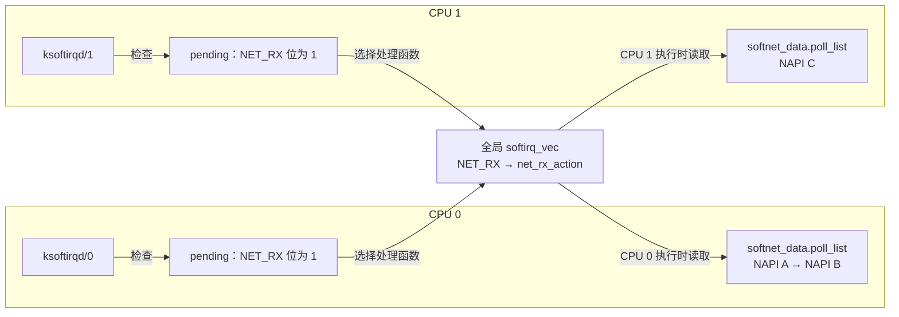
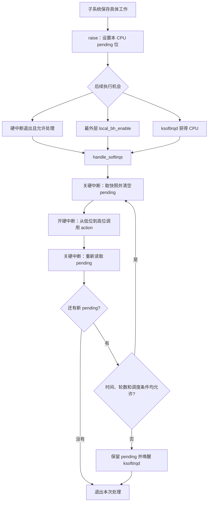

# Linux 软中断子系统：面试复习

> 源码基准：本项目 [Linux 6.18.52](../../linux/Makefile#L2)。所有源码链接均相对于本文。
>
> 学习主线：**处理函数表决定做什么，per-CPU pending 位图记录谁待处理，子系统自己的队列保存具体工作，执行入口决定何时处理。**

## 1. 先记住四个核心对象

软中断是内核延后处理工作的机制，常用于网络、定时器等路径。硬中断可以先完成必要处理，再标记软中断待执行；通用框架按类别调用处理函数。这里的“软中断”不是用户态信号，也不是系统调用使用的软件陷入指令。

### 1.1 处理函数表、pending 位图与工作队列

| 核心对象                   | 组织方式                                      | 解决的问题                           |
| -------------------------- | --------------------------------------------- | ------------------------------------ |
| `softirq_vec[NR_SOFTIRQS]` | 全局数组，每项是一个 `struct softirq_action`  | 某类软中断调用哪个函数？             |
| `__softirq_pending`        | 每 CPU 一份位图，通用定义位于 `irq_cpustat_t` | 本 CPU 哪些类别需要处理？            |
| 子系统自己的工作队列       | 由网络、定时器、tasklet 等分别维护            | 具体有哪些包、定时器或任务？         |
| `ksoftirqd`                | 每 CPU 一个内核线程指针                       | 需要交给调度器安排时，由谁继续处理？ |

源码中的处理函数结构很简单，**并没有通用的任务链表，也不携带每次触发的参数**：

```c
struct softirq_action {
    void (*action)(void);
};

static struct softirq_action softirq_vec[NR_SOFTIRQS]; // 省略对齐属性
DEFINE_PER_CPU(struct task_struct *, ksoftirqd);
```

源码：[结构定义](../../linux/include/linux/interrupt.h#L587)、[全局处理表与线程指针](../../linux/kernel/softirq.c#L60)、[通用 pending 字段](../../linux/include/asm-generic/hardirq.h#L8)、[本 CPU 位图读写接口](../../linux/include/linux/interrupt.h#L519)。具体架构可以覆盖 pending 的访问实现。



网络示例依据：[per-CPU `softnet_data`](../../linux/net/core/dev.c#L456)、[`poll_list` 字段](../../linux/include/linux/netdevice.h#L3501)、[`net_rx_action()` 取本 CPU 数据](../../linux/net/core/dev.c#L7800)。

**面试关键：pending 是通知，不是工作数量。** 对同一 CPU、同一类别，在该 pending 位尚未被消费前连续触发多次，只会把同一位保持为 1。具体工作是否完整保留，取决于子系统队列和同步协议；框架不会记录“触发了几次”。置位实现只有 `or_softirq_pending(1UL << nr)`，见 [`__raise_softirq_irqoff()`](../../linux/kernel/softirq.c#L786)。

### 1.2 软中断类别与顺序

本版本定义了 **10 类**软中断。序号固定，`open_softirq()` 只填写已有槽位，不会动态分配一种新类别。

| 序号 | 类别               | 典型工作 / 注册入口                                                       |
| ---- | ------------------ | ------------------------------------------------------------------------- |
| 0    | `HI_SOFTIRQ`       | [高优先级 tasklet、BH workqueue](../../linux/kernel/softirq.c#L956)       |
| 1    | `TIMER_SOFTIRQ`    | [普通内核定时器](../../linux/kernel/time/timer.c#L2579)                   |
| 2    | `NET_TX_SOFTIRQ`   | [网络发送侧延后处理](../../linux/net/core/dev.c#L13231)                   |
| 3    | `NET_RX_SOFTIRQ`   | [网络接收侧 NAPI 处理](../../linux/net/core/dev.c#L13232)                 |
| 4    | `BLOCK_SOFTIRQ`    | [块 I/O 完成处理](../../linux/block/blk-mq.c#L5261)                       |
| 5    | `IRQ_POLL_SOFTIRQ` | [I/O 完成轮询](../../linux/lib/irq_poll.c#L214)                           |
| 6    | `TASKLET_SOFTIRQ`  | [普通 tasklet、BH workqueue](../../linux/kernel/softirq.c#L950)           |
| 7    | `SCHED_SOFTIRQ`    | [调度域负载均衡等工作](../../linux/kernel/sched/fair.c#L14194)            |
| 8    | `HRTIMER_SOFTIRQ`  | [需要在软中断执行的高精度定时器](../../linux/kernel/time/hrtimer.c#L2335) |
| 9    | `RCU_SOFTIRQ`      | [RCU 核心处理](../../linux/kernel/rcu/tree.c#L4879)                       |

依据：[类别枚举](../../linux/include/linux/interrupt.h#L547)。类别存在不代表所有定时器都走这条路径；高精度定时器区分了 [SOFT / HARD 模式](../../linux/include/linux/hrtimer.h#L30)，只有 SOFT 模式的回调进入 `HRTIMER_SOFTIRQ`。`RCU_SOFTIRQ` 是否注册取决于 [`use_softirq`](../../linux/kernel/rcu/tree.c#L115)，该参数默认开启，可用模块参数关掉；关掉后 [`invoke_rcu_core()`](../../linux/kernel/rcu/tree.c#L2907) 唤醒每 CPU 的 `rcuc/%u`。

处理器用 `ffs(pending)` 找最低置位，因此**同一轮快照内，编号小的先执行**。这只是扫描顺序，不是可以抢占其他软中断的调度优先级；执行到一半新触发的 `HI_SOFTIRQ` 也要等待后续处理机会。见 [扫描循环](../../linux/kernel/softirq.c#L610)。

### 1.3 执行状态计数：不要与 pending 混淆

`preempt_count` 是每个 CPU 上的一个整数，记录这块 CPU 现在能不能被抢占，以及它正处在哪一层中断上下文。x86 上它是 per-CPU 变量 __preempt_count，不属于 task_struct：

| 操作 / 状态            | 计数变化或判断                      | 含义                                    |
| ---------------------- | ----------------------------------- | --------------------------------------- |
| 进入软中断处理         | 加 `SOFTIRQ_OFFSET = 0x100`         | 正在执行软中断                          |
| `local_bh_disable()`   | 加 `SOFTIRQ_DISABLE_OFFSET = 0x200` | 禁止本 CPU 在该临界区执行软中断，可嵌套 |
| `in_serving_softirq()` | 检查 `SOFTIRQ_OFFSET` 位            | 是否正在处理软中断                      |
| `in_softirq()`         | 检查整个软中断计数字段              | 正在处理，**或者仅仅禁用了 BH**         |

因此，**`in_softirq()` 为真不能证明当前正在执行回调**。源码还把 `in_softirq()`、`in_interrupt()` 标为不建议新代码使用的旧接口；理解它们是为了读现有路径，不能拿它们笼统判断某个 API 是否可睡眠。

源码：[计数位定义](../../linux/include/linux/preempt.h#L51)、[`in_serving_softirq()`](../../linux/include/linux/preempt.h#L128)、[旧接口注释](../../linux/include/linux/preempt.h#L136)、[`local_bh_disable()`](../../linux/include/linux/bottom_half.h#L18)。

## 2. 从注册、触发到执行

### 2.1 注册和触发是两件事

`open_softirq(nr, action)` 将函数写入 `softirq_vec[nr].action`。例如网络初始化分别注册 `net_tx_action` 和 `net_rx_action`。见 [注册实现](../../linux/kernel/softirq.c#L793)、[网络注册点](../../linux/net/core/dev.c#L13231)。

| 触发接口                     | 调用条件                 | 实际作用                                                        |
| ---------------------------- | ------------------------ | --------------------------------------------------------------- |
| `__raise_softirq_irqoff(nr)` | 已关闭本地硬中断         | 记录 trace、设置 pending 位；不负责唤醒线程                     |
| `raise_softirq_irqoff(nr)`   | 已关闭本地硬中断         | 置位，并在非中断 / 非 BH 禁用上下文等条件满足时唤醒 `ksoftirqd` |
| `raise_softirq(nr)`          | 自行保存并关闭本地硬中断 | 调用上一接口，再恢复中断状态                                    |

**raise 不直接调用处理函数。** 它表示“有工作待处理”，实际回调由后续执行入口调用。关闭本地硬中断可以保护本 CPU pending 的更新；它不是跨 CPU 的全局锁。源码：[三个触发接口](../../linux/kernel/softirq.c#L757)。

### 2.2 什么时候执行？

| 时机                 | 关键路径                                                                | 条件 / 意义                                                                |
| -------------------- | ----------------------------------------------------------------------- | -------------------------------------------------------------------------- |
| 硬中断退出           | `__irq_exit_rcu()` → `invoke_softirq()` → `__do_softirq()` 或独立栈入口 | 退出硬中断计数后，`!in_interrupt()` 且有 pending；不是每次硬中断退出都执行 |
| 重新允许 BH          | `local_bh_enable()` → `__local_bh_enable_ip()` → `do_softirq()`         | 最外层 BH 禁用解除后，满足上下文条件且有 pending，可以就地执行             |
| 内核线程获得运行机会 | `run_ksoftirqd()` → `handle_softirqs(true)`                             | 消化待处理工作，并在批次结束后给调度器机会                                 |

源码：[硬中断退出检查](../../linux/kernel/softirq.c#L713)、[`invoke_softirq()`](../../linux/kernel/softirq.c#L487)、[BH enable 路径](../../linux/kernel/softirq.c#L427)、[`do_softirq()` 的入口检查](../../linux/kernel/softirq.c#L510)、[线程执行入口](../../linux/kernel/softirq.c#L1050)。



图示对应 [`handle_softirqs()`](../../linux/kernel/softirq.c#L579)。独立栈是防止深调用链造成栈溢出的架构实现细节，**换栈不等于切换到内核线程**，见 [`invoke_softirq()` 的注释](../../linux/kernel/softirq.c#L487)。

### 2.3 `ksoftirqd` 到底在什么条件下“启动”？

面试时先区分：**线程何时创建、何时被唤醒、何时真正执行软中断**。`ksoftirqd` 不是软中断积压后才临时创建的线程，也不是只有超过 2 ms 才会使用。

**第一步：启动阶段创建，之后由 CPU 热插拔框架管理。**

先看连接线程与软中断处理逻辑的 `softirq_threads` 描述符：

| 字段                | 设置值                 | 作用                              |
| ------------------- | ---------------------- | --------------------------------- |
| `store`             | `&ksoftirqd`           | 将线程指针保存到相应 CPU 的变量中 |
| `thread_should_run` | `ksoftirqd_should_run` | 判断本 CPU 是否有待处理软中断     |
| `thread_fn`         | `run_ksoftirqd`        | 执行一批软中断处理                |
| `thread_comm`       | `"ksoftirqd/%u"`       | 线程名中的编号对应 CPU            |

`early_initcall(spawn_ksoftirqd)` 在内核初始化阶段注册这个描述符。`smpboot_register_percpu_thread()` 为当时在线的 CPU 创建并解除线程的 park 状态；后续 CPU 上线时，由相应框架创建或恢复线程。**创建不要求 pending 非零，没有工作时线程会睡眠等待。**

源码：[线程描述符](../../linux/kernel/softirq.c#L1103)、[启动注册](../../linux/kernel/softirq.c#L1152)、[遍历在线 CPU 创建线程](../../linux/kernel/smpboot.c#L284)、[per-CPU 线程创建与保存](../../linux/kernel/smpboot.c#L166)、[后续 CPU 创建](../../linux/kernel/smpboot.c#L209)、[后续 CPU 解除 park](../../linux/kernel/smpboot.c#L232)。

**第二步：出现以下情况时，请求唤醒本 CPU 的线程。**

| 场景                                                           | 必须满足的条件                                                                                                        | 源码入口                                                                                                        |
| -------------------------------------------------------------- | --------------------------------------------------------------------------------------------------------------------- | --------------------------------------------------------------------------------------------------------------- |
| 普通任务通过 `raise_softirq()` / `raise_softirq_irqoff()` 触发 | 置位后满足 `!in_interrupt()`。此时 `should_wake_ksoftirqd()` 恒为真                                                   | [raise 路径](../../linux/kernel/softirq.c#L760)、[`should_wake_ksoftirqd()`](../../linux/kernel/softirq.c#L482) |
| 当前批次不能继续处理                                           | **仍有 pending**，并且到达时间界限、`need_resched()` 为真、重启轮数用尽三者中至少一个成立                             | [`handle_softirqs()` 批次尾部](../../linux/kernel/softirq.c#L637)                                               |
| 开启强制 IRQ 线程化，硬中断退出                                | 退出检查满足 `!in_interrupt()` 且有 pending；进入 `invoke_softirq()` 后，`force_irqthreads()` 为真且本 CPU 线程已存在 | [中断退出检查](../../linux/kernel/softirq.c#L720)、[线程化分支](../../linux/kernel/softirq.c#L487)              |

表中的强制线程化是运行时条件，不是仅仅编译了 `CONFIG_IRQ_FORCED_THREADING`。启动参数 `threadirqs` 可以启用它，见 [参数解析](../../linux/kernel/irq/manage.c#L35)。启用后，`raise_timer_softirq()` 把定时器通知记入 `pending_timer_softirq`。硬中断退出时若该位图非零，且当前不在 NMI 或硬中断中，`__irq_exit_rcu()` 调用 `wake_timersd()` 唤醒本 CPU 的 `ktimers/%u`，线程指针名为 `ktimerd`。`run_ktimerd()` 再把这些位或回普通 pending，并调用 `__do_softirq()`，因此当时已经置位的其他类别也会在这个线程里一起执行。见 [定时器触发分流](../../linux/include/linux/interrupt.h#L641)、[线程处理](../../linux/kernel/softirq.c#L1128)、[退出时唤醒](../../linux/kernel/softirq.c#L725)。

上表里的 `ksoftirqd` 唤醒最终都调用 `wakeup_softirqd()`：读取**本 CPU** 的线程指针，指针非空才调用 `wake_up_process()`。它既不创建新线程，也不保证线程立即获得 CPU。定时器线程由 [`wake_timersd()`](../../linux/kernel/softirq.c#L699) 唤醒。见 [ksoftirqd 唤醒实现](../../linux/kernel/softirq.c#L75)。

反过来，以下情况不能直接推出“立即唤醒并执行 `ksoftirqd`”：

- 只调用 `__raise_softirq_irqoff()`：它只置位，不负责唤醒。
- 在硬中断、软中断或 BH 禁用区调用 `raise_softirq_irqoff()`：该函数的 `!in_interrupt()` 检查不通过，留待退出或重新启用 BH 等后续路径处理。
- 未强制线程化的正常硬中断退出：通常先就地处理；有剩余工作且不能继续重启时才请求线程接手。
- 当前批次已将 pending 处理干净：即使已超时或存在调度请求，也不会进入批次尾部的唤醒分支。

上述判断分别对应 [触发接口](../../linux/kernel/softirq.c#L760)、[派发](../../linux/kernel/softirq.c#L487)、[批次尾部检查](../../linux/kernel/softirq.c#L639)。

**第三步：调度器让线程运行后，还要检查 pending。**

```text
线程已创建，CPU 可运行，线程未被 park / stop
  → 检查 ksoftirqd_should_run()：本 CPU pending 是否非零？
      否 → schedule()，睡眠等待
      是 → run_ksoftirqd()
             建立执行条件，再次检查 pending
             有工作则调用 handle_softirqs(true)
             退出处理上下文，cond_resched()
           → 返回线程循环，再次检查 pending
```

源码：[`ksoftirqd_should_run()` 与执行函数](../../linux/kernel/softirq.c#L1050)、[线程循环中的睡眠与执行分支](../../linux/kernel/smpboot.c#L154)。唤醒后、真正运行前，pending 可能已被本 CPU 的其他合法路径处理，所以仍须检查；若线程返回循环时还有 pending，也不需要每轮都等待一次新的外部唤醒。

**面试答法：启动时按 CPU 创建，平时按 pending 等待；普通任务触发、批次处理让出 CPU、`threadirqs` 等情况会请求唤醒，获得 CPU 后再检查 pending 并处理。**

## 3. 核心算法：快照、清位、执行、决定是否再来一轮

下面是主路径的概念伪代码，省略了统计、跟踪和状态恢复细节：

```text
进入时本地硬中断已关闭
deadline = jiffies + msecs_to_jiffies(2)
rounds_left = 10
snapshot = 本 CPU pending
进入软中断上下文

repeat:
    本 CPU pending = 0
    开本地硬中断
    按编号递增遍历 snapshot 中所有置位的类别:
        softirq_vec[类别].action()
    关本地硬中断

    snapshot = 本 CPU pending
    如果 snapshot == 0:
        结束循环
    如果 jiffies < deadline 且 !need_resched() 且 --rounds_left != 0:
        跳到 repeat
    唤醒本 CPU ksoftirqd
    结束循环                         // pending 保留，供后续消费

退出软中断上下文，返回时本地硬中断仍关闭
```

源码：[时间及轮数常量](../../linux/kernel/softirq.c#L530)、[读取、清位和调用回调](../../linux/kernel/softirq.c#L596)、[重启判断](../../linux/kernel/softirq.c#L637)、[上下文进入与退出](../../linux/kernel/softirq.c#L461)。

### 3.1 为什么先清 pending，再开硬中断？

旧工作已经由局部变量 `snapshot` 保存。清空共享位图后，执行期间硬中断或当前回调新触发的工作，可以重新记入 pending；本轮结束再读取它们。

```text
开始：pending = NET_RX
    ↓ 关硬中断，保存快照并清位
snapshot = NET_RX，pending = 0
    ↓ 开硬中断，执行 net_rx_action
硬中断再次触发 NET_RX → pending = NET_RX
    ↓ 当前快照处理完，关硬中断再读
读到新 NET_RX → 再处理一轮，或交给 ksoftirqd
```

若等回调执行完才直接清位，就可能覆盖执行期间的新通知。这解释的是框架对通知的处理；子系统仍需正确维护自己的队列。见 [清位顺序](../../linux/kernel/softirq.c#L602)。

### 3.2 “最多 2 ms、10 次”怎样说才准确？

- 时间条件是 `jiffies + msecs_to_jiffies(2)`，存在 tick 粒度，**不是精确的 2 ms 截止定时器**。
- `max_restart` 初始为 10，继续前先递减：本次调用最多扫描 **10 轮快照**，包括第一轮。不是最多处理 10 个包、10 个回调或每种软中断 10 次。
- `need_resched()`、时间和轮数在**一轮快照处理结束之后**检查，不能强制打断一个耗时回调，也不会跳过本轮剩余类别。因此总耗时可能超过 2 ms。
- 有新 pending 且不能继续时，保留它并唤醒 `ksoftirqd`，由可调度线程继续承担工作，避免一直占用中断返回路径。

源码：[限制目的与常量](../../linux/kernel/softirq.c#L530)、[检查位置](../../linux/kernel/softirq.c#L641)。

## 4. 执行上下文与并发：面试最容易追问的部分

### 4.1 能否被打断、抢占、并行？

| 问题                                  | 回答                               | 原因                                                            |
| ------------------------------------- | ---------------------------------- | --------------------------------------------------------------- |
| 硬中断能打断软中断吗？                | 能；回调通常在本地硬中断开启时运行 | 框架在扫描回调前执行 `local_irq_enable()`，回调内部可临时关中断 |
| 普通任务能抢占正在执行的软中断吗？    | 不能                               | 执行期间增加了软中断上下文计数；调度请求在处理退出后响应        |
| 同一 CPU 会递归执行另一个软中断吗？   | 通用派发路径不会                   | 嵌套硬中断返回时，软中断计数仍在，`!in_interrupt()` 不成立      |
| 同一类软中断能在不同 CPU 同时执行吗？ | 能                                 | 每 CPU 独立 pending，但可以调用同一个全局处理函数               |
| 软中断能再次触发自己吗？              | 能，但不会因 raise 立即递归调用    | 新通知保留在 pending，由后续轮次或执行入口处理                  |

源码：[开中断执行回调](../../linux/kernel/softirq.c#L606)、[上下文计数](../../linux/kernel/softirq.c#L461)、[中断退出检查](../../linux/kernel/softirq.c#L720)、[并发设计说明](../../linux/kernel/softirq.c#L37)。

### 4.2 为什么 `ksoftirqd` 是线程，回调仍不能随意睡眠？

`ksoftirqd` 是可被调度的内核线程，但它调用的仍是同一个 `handle_softirqs()`。执行回调前进入软中断上下文，回调返回并退出该上下文后，线程才调用 `cond_resched()`。**执行载体是线程，不代表回调已经变成普通可睡眠工作。**

所以不能在普通软中断回调里使用可能阻塞的 mutex、等待事件或睡眠操作。耗时且需要睡眠的工作，应交给普通线程型 workqueue 或合适的线程化 IRQ 路径。源码：[线程处理及 `cond_resched()` 位置](../../linux/kernel/softirq.c#L1055)、[上下文进入](../../linux/kernel/softirq.c#L598)、[非法睡眠检查依据](../../linux/kernel/sched/core.c#L8905)。

`current` 虽然存在，但中断返回路径可能只是借用了被中断任务的上下文，不能把它当成这份工作的业务归属。源码甚至专门保存、清除并恢复 `PF_MEMALLOC`，见 [`handle_softirqs()` 注释](../../linux/kernel/softirq.c#L589)。

### 4.3 `local_bh_disable()` 与锁如何搭配？

**关 BH、关硬中断、跨 CPU 加锁，分别解决不同的并发来源。**

| 数据被谁共享        | 常见保护方式                                                               | 说明                                              |
| ------------------- | -------------------------------------------------------------------------- | ------------------------------------------------- |
| 普通任务与软中断    | 任务侧 `spin_lock_bh()` / `spin_unlock_bh()`；软中断侧使用同一把锁         | BH 禁用防本地打断后自锁，spinlock 防其他 CPU 并发 |
| 多个 CPU 上的软中断 | spinlock、原子操作或合理的 per-CPU 设计                                    | 仅关本地 BH 不能保护全局共享对象                  |
| 软中断与硬中断      | 软中断侧使用 `spin_lock_irqsave()` 等 IRQ 安全方案，硬中断侧遵循同一锁协议 | 只关 BH 仍会被硬中断打断                          |

典型死锁：任务拿着普通 `spin_lock()` → 硬中断到来 → 返回时执行软中断 → 软中断争用同一把锁 → 任务无法恢复执行并解锁。任务侧 `spin_lock_bh()` 同时关闭本地 BH，才能阻止这条路径。

`local_bh_disable()` **不持续屏蔽硬中断，不阻止 pending 被置位，不影响其他 CPU**。配对的最外层 `local_bh_enable()` 还可能立刻执行积累的软中断，因此它不是单纯修改一个标志。

源码：[`spin_lock_bh()`](../../linux/include/linux/spinlock.h#L354)、[BH 锁与普通锁的差别](../../linux/include/linux/spinlock_api_smp.h#L123)、[IRQ 保存及加锁](../../linux/include/linux/spinlock_api_smp.h#L105)、[BH 禁用](../../linux/include/linux/bottom_half.h#L18)、[BH 重新启用](../../linux/kernel/softirq.c#L427)。

## 5. 用 NAPI 收包把整条链路串起来

先对应数据结构：`softnet_data.poll_list` 是本 CPU 待轮询的 NAPI 链表；每个 `napi_struct` 包含链表节点、`weight` 和 `poll` 函数。见 [`softnet_data`](../../linux/include/linux/netdevice.h#L3501)、[`napi_struct`](../../linux/include/linux/netdevice.h#L383)。

普通、非 threaded NAPI 的关键路径：

```text
驱动需要调度 NAPI
  → __napi_schedule(napi)
  → ____napi_schedule(本 CPU softnet_data, napi)
      将 NAPI 实例挂到 sd->poll_list
      必要时触发 NET_RX_SOFTIRQ
  → 框架调用 net_rx_action()
      取本 CPU poll_list
      napi_poll() → __napi_poll() → napi->poll(napi, weight)
      受网络总预算、时间预算约束
      仍有待轮询项时，重新置位 NET_RX_SOFTIRQ
```

源码：[调度入队与触发](../../linux/net/core/dev.c#L4892)、[`__napi_schedule()`](../../linux/net/core/dev.c#L6640)、[驱动 poll 调用](../../linux/net/core/dev.c#L7635)、[网络处理及重新触发](../../linux/net/core/dev.c#L7800)。

这里有**两层不同的预算**：软中断框架控制是否再扫描一轮；`net_rx_action()` 内部用 `netdev_budget`、`netdev_budget_usecs` 控制网络处理，单个 NAPI poll 又收到自己的 `weight`。不能把网络处理预算与框架的“2 ms / 10 轮”混成同一个限制。

因此，一次 `NET_RX` 回调可能批量处理多个包，pending 合并并不意味着丢包；反过来，回调次数也不能直接当作包数。另须注意，本版本的 [threaded NAPI 分支](../../linux/net/core/dev.c#L4899) 可以直接唤醒 NAPI 线程，不能断言所有 NAPI 都经由 `NET_RX_SOFTIRQ`。

## 6. 与 tasklet、workqueue、线程化 IRQ 怎么比较？

| 机制                          | 执行位置                | 回调能否睡眠                 | 面试应抓住的区别                                         |
| ----------------------------- | ----------------------- | ---------------------------- | -------------------------------------------------------- |
| 硬中断处理函数                | 硬中断上下文            | 不能                         | 及时响应设备，把适合延后的工作交出去                     |
| softirq                       | 软中断上下文            | 不能按普通可睡眠回调使用     | 类别固定，同类可跨 CPU 并行，具体队列自行维护            |
| tasklet                       | `TASKLET` / `HI` 软中断 | 不能                         | 同一个 tasklet 实例不会跨 CPU 同时运行，不同实例可以并行 |
| 普通线程型 workqueue          | worker 内核线程         | 可以，在满足锁和上下文约束时 | 用 `work_struct` 表示具体工作，适合需要睡眠的延后处理    |
| `WQ_BH` workqueue             | 软中断上下文            | 不能                         | 虽叫 workqueue，本版本通过 `TASKLET` / `HI` 路径执行     |
| 显式线程化 IRQ 的 `thread_fn` | IRQ 内核线程            | 可以，在满足上下文约束时     | 线程执行与某个 IRQ 关联的处理；硬中断部分仍需尽量短      |

tasklet 的串行化来自实例的 `state`：`SCHED` 位合并重复调度。`RUN` 位在 `CONFIG_SMP` 或 `CONFIG_PREEMPT_RT` 下防止同一实例并行执行；两者都没开时 [`tasklet_trylock()`](../../linux/include/linux/interrupt.h#L747) 直接返回 1，单 CPU 上本来也不会跨 CPU 并行。这并非把整个 `TASKLET_SOFTIRQ` 全局串行化。源码：[结构和状态位](../../linux/include/linux/interrupt.h#L688)、[状态位注释](../../linux/include/linux/interrupt.h#L730)、[`tasklet_trylock()`](../../linux/include/linux/interrupt.h#L736)、[`tasklet_schedule()`](../../linux/include/linux/interrupt.h#L755)、[执行检查](../../linux/kernel/softirq.c#L920)。

本版本已在头文件中明确标注 [tasklet API deprecated](../../linux/include/linux/interrupt.h#L665)，并建议考虑线程化 IRQ。了解它用于读旧驱动，但面试选型不要无条件推荐它。

普通 workqueue 创建 worker 线程，而 BH pool 不创建这种线程，见 [worker 创建分支](../../linux/kernel/workqueue.c#L2829)；`WQ_BH` 的上下文定义见 [标志枚举](../../linux/include/linux/workqueue.h#L370)，实际衔接见 [`tasklet_action()`](../../linux/kernel/softirq.c#L950) 和 [`workqueue_softirq_action()`](../../linux/kernel/workqueue.c#L3683)。显式线程化 IRQ 的可睡眠语义见 [`irq_thread_fn()` 注释](../../linux/kernel/irq/manage.c#L1134)，线程创建见 [`setup_irq_thread()`](../../linux/kernel/irq/manage.c#L1396)。

## 7. 场景题：某个 `ksoftirqd/N` CPU 占用很高，怎么查？

先定位**哪个 CPU、哪一类软中断、哪个处理函数消耗时间**，再调查工作量为何集中或处理变慢。

| 观察手段                                 | 要看什么                          | 不能据此直接推断什么                                              |
| ---------------------------------------- | --------------------------------- | ----------------------------------------------------------------- |
| 连续采样 `/proc/softirqs`                | 各 CPU、各类别计数的增量是否集中  | 累计数高不等于当前负载高；回调次数不等于包数或耗时                |
| `/proc/stat` 的 CPU softirq 时间字段     | 软中断时间占比与 CPU 分布         | 不要把文件末尾 `softirq` 次数行当成时间                           |
| `irq:softirq_entry` / `irq:softirq_exit` | 某类处理的持续时间、执行 CPU      | 区间可能包含硬中断插入等影响，不必然等于纯回调 CPU 时间           |
| `irq:softirq_raise` 与 entry             | 通知到处理的延迟                  | pending 位会合并，但每次 raise 仍打一个 trace，不能按条数一一配对 |
| 网络热点时看 `/proc/net/softnet_stat`    | `time_squeeze` 等指标是否持续增长 | 预算耗尽不直接等于丢包，也不证明应立即增大预算                    |

源码：[softirqs 计数输出](../../linux/fs/proc/softirqs.c#L11)、[回调前增加计数](../../linux/kernel/softirq.c#L619)、[CPU 时间输出](../../linux/fs/proc/stat.c#L152)、[softirq 次数输出](../../linux/fs/proc/stat.c#L185)、[三个 tracepoint](../../linux/include/trace/events/irq.h#L121)、[网络统计字段输出](../../linux/net/core/net-procfs.c#L145)、[`time_squeeze` 增加条件](../../linux/net/core/dev.c#L7845)。

若热点是 `NET_RX`，结合 CPU 分布、队列积压和 poll 函数耗时，再检查流量是否集中、网络队列及 CPU 分配是否合理、驱动或协议处理是否过慢。**调大预算可能减少重新调度，也可能拉长其他任务的等待时间**；这是从预算控制位置推导出的权衡，应先用测量判断。

`ksoftirqd` 高负载说明它在承担较多处理，不足以直接判定“硬中断风暴”或“内核有 bug”。它也不是只在超过 2 ms 时唤醒：普通任务触发软中断、轮数用尽、需要调度、`threadirqs` 强制线程化等路径都可能使用它。见 [raise 的唤醒条件](../../linux/kernel/softirq.c#L760)、[批次退出条件](../../linux/kernel/softirq.c#L639)。CPU 长期到不了调度点时，下一节的 soft lockup 检测会打印告警。

## 8. Soft lockup 检测原理

soft lockup 表示这个 CPU 在内核态里转太久，其他任务得不到运行。默认超过 `2 * watchdog_thresh`（20 秒）就告警，见 [阈值](../../linux/kernel/watchdog.c#L601)。

每 CPU 有一个硬中断定时器。它周期性地执行 `watchdog_timer_fn()`，但自己不刷新时间戳，而是唤醒本 CPU 的 `migration/%u` 去跑 `softlockup_fn()`。只有这个线程真正被调度到，才会更新 `watchdog_touch_ts`。定时器下次再看这个时间戳，落后超过阈值就打印 `BUG: soft lockup`。见 [定时器回调](../../linux/kernel/watchdog.c#L744)、[喂狗函数](../../linux/kernel/watchdog.c#L734)。

```text
硬中断定时器到期
  → 唤醒 migration/N 去刷新时间戳
  → 若 CPU 一直无法调度该线程
  → 时间戳超过约 20 秒不更新
  → 打印 soft lockup
```

硬中断还能进来、任务却调度不了，就会命中这条检测。软中断回调执行时本地硬中断是开着的，所以定时器仍能采样；软中断上下文不能调度，`migration/%u` 要等回调返回才喂得上。一个一直不返回的回调就会触发 soft lockup。

## 9. 高频问答与口述模板

| 面试追问                                    | 简洁回答                                                                                                                                     |
| ------------------------------------------- | -------------------------------------------------------------------------------------------------------------------------------------------- |
| 为什么需要软中断？                          | 将适合延后的工作从硬中断处理移出，在保持较低延迟的同时支持批量处理和多 CPU 并行。                                                            |
| 触发一次就执行一次吗？                      | 不保证。pending 按类别置位会合并通知；具体工作保存在子系统数据结构中。                                                                       |
| 软中断一定紧接着硬中断执行吗？              | 不一定。要看上下文和 BH 状态，也可在 BH enable 或 `ksoftirqd` 中处理。                                                                       |
| pending 是全局的吗？                        | 每 CPU 独立；全局共享的是类别到处理函数的表。                                                                                                |
| 同类软中断能并发吗？                        | 能在不同 CPU 并行，访问共享数据需要自行同步。                                                                                                |
| 高优先级软中断能抢占低优先级软中断吗？      | 编号只决定同一轮快照中的扫描顺序，不是软中断间的抢占优先级。                                                                                 |
| 为什么不能一直处理到 pending 清空？         | 持续有新工作时可能长期占用 CPU；框架限制重启，并让 `ksoftirqd` 接手。                                                                        |
| 为什么有时间限制还要有轮数限制？            | 源码明确考虑了 `jiffies` 可能暂不推进的场景，轮数限制仍能终止重启。                                                                          |
| `ksoftirqd` 什么时候启动？                  | 启动阶段按 CPU 创建；普通任务触发、处理仍有积压但不能继续、`threadirqs` 强制线程化等情况会唤醒它。真正处理还要等调度，并检查本 CPU pending。 |
| `ksoftirqd` 与普通 workqueue 有何本质差别？ | 前者承载软中断处理，回调保留相应上下文约束；普通线程型 workqueue 面向可睡眠工作。                                                            |
| 关 BH 后为何还要加锁？                      | 关 BH 只处理本 CPU 的软中断执行；跨 CPU 共享数据仍需要同步。                                                                                 |
| soft lockup 怎么判定？                      | 硬中断定时器仍会响，但本 CPU 约 20 秒没能调度 `migration/%u` 去刷新时间戳。                                                                  |

一分钟口述：

> 软中断是 Linux 的一种延后处理机制。它用全局 `softirq_vec` 保存固定类别的处理函数，每个 CPU 用 pending 位图记录待处理类别，具体工作则放在各子系统自己的队列里。触发软中断只是置位，重复触发可以合并。硬中断退出、重新开启 BH，以及 `ksoftirqd` 都是常见执行入口。处理时先在关硬中断状态下取快照、清 pending，再开硬中断按位调用回调，最后检查新增工作。框架用约 2 ms、最多 10 轮以及调度请求限制连续重启，剩余工作交给 `ksoftirqd`，但这些条件不能打断一个耗时回调。同一类软中断可以跨 CPU 并行，因此共享数据要自行加锁；回调也不能因为运行在 `ksoftirqd` 中就按普通可睡眠线程处理。回调若一直不返回，硬中断定时器仍能采样，但刷新时间戳的线程调度不进来，大约 20 秒后会报 soft lockup。
