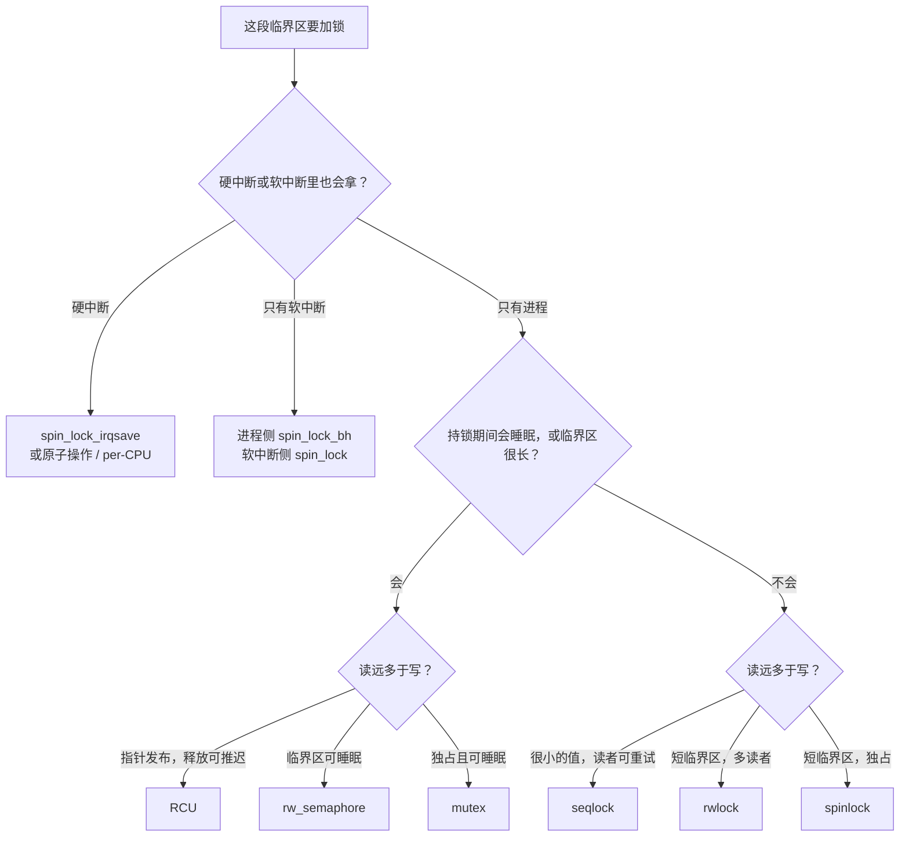
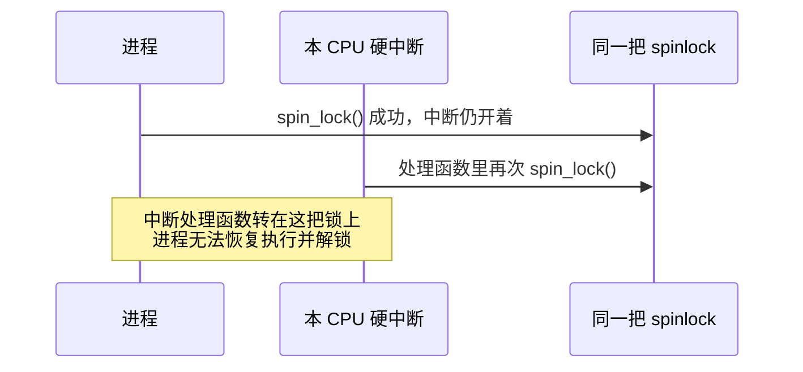
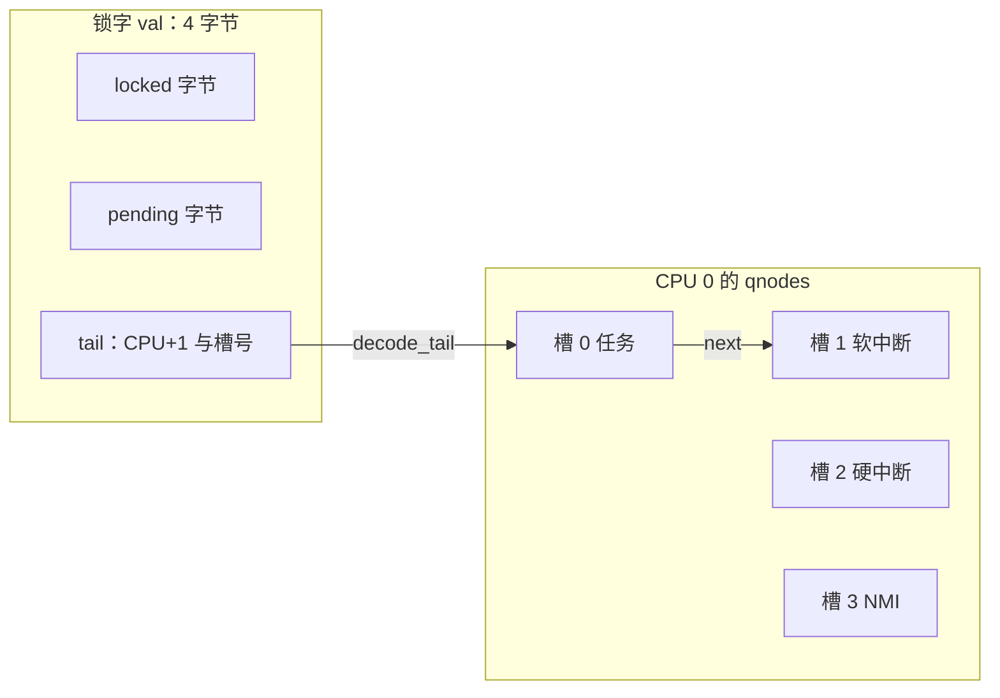
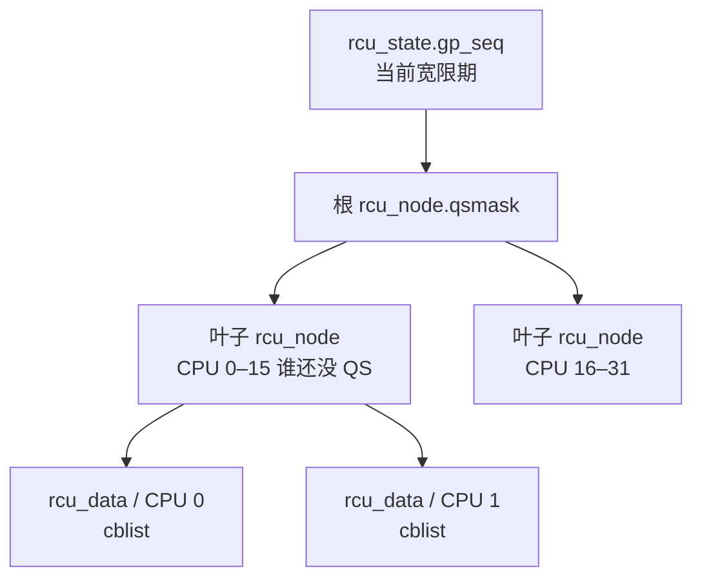

# Linux 内核锁：面试复习

> 源码基准：本项目 [Linux 6.18.52](../../linux/Makefile#L2)。所有源码链接均相对于本文。
>
> 范围：**x86、非 RT 内核、云计算数据中心**。非 RT 下 `spinlock_t` 就是自旋锁；x86 选择 queued spinlock，见 [arch/x86/Kconfig:140](../../linux/arch/x86/Kconfig#L140)。
>
> 学习主线：**先按“能不能睡眠、会在哪种上下文拿锁”选型，再看每种锁用哪几个字段完成互斥和排队。**

## 1. 先记住怎么选

锁保护的是一小段临界区。面试里先问清三件事：临界区会不会睡眠、锁会不会在软中断或硬中断里被拿到、读者和写者的比例。

| 机制 | 等待方式 | 适合的临界区 | 典型上下文 |
| --- | --- | --- | --- |
| `spinlock_t` | 自旋，同时关抢占 | 很短，不能睡眠 | 进程、软中断、硬中断（配对应变体） |
| `rwlock_t` | 自旋；多读者或单写者 | 短，读明显多于写 | 同上，写侧要配 IRQ 安全变体 |
| `struct mutex` | 先乐观自旋，再睡眠 | 可能睡眠，或持锁时间不确定 | 仅进程上下文 |
| `struct rw_semaphore` | 同上，允许多读者 | 可能睡眠的读多写少 | 仅进程上下文 |
| `seqlock_t` | 写者拿自旋锁；读者重试 | 很小的数据，读者可丢掉半成品 | 写侧按读者所在上下文选变体 |
| RCU | 读者几乎无共享写；写者等宽限期 | 读极多，对象用指针发布，释放可推迟 | 读侧可嵌套；非 RT 下禁止主动阻塞 |
| `struct semaphore` | 计数减到 0 后睡眠 | 资源个数大于 1，或唤醒方与等待方不是同一任务 | `down_trylock()` / `up()` 可用于中断 |
| `struct completion` | 等一次事件 | “做完了再继续”，不是长期互斥 | 进程上下文等待 |
| `local_lock_t` | 非 RT 下只关抢占 | 只保护本 CPU 数据 | 本 CPU 的进程 / 软中断路径 |



非 RT 的类型关系很直接：`spinlock_t` 里包着 `raw_spinlock_t`，底层是 `arch_spinlock_t`，x86 上就是 4 字节的 `qspinlock`。见 [spinlock_types.h:17](../../linux/include/linux/spinlock_types.h#L17)、[spinlock_types_raw.h:14](../../linux/include/linux/spinlock_types_raw.h#L14)。

## 2. 原子操作：所有锁的底座

x86 的 `atomic_t` 加减使用 `lock` 前缀，例如 `lock addl`。这条指令同时完成读改写，并带内存屏障语义。见 [atomic.h:31](../../linux/arch/x86/include/asm/atomic.h#L31)。

数据中心面试里，x86 的顺序模型记这几条就够用：

| 接口 | x86 上实际做什么 | 解决的问题 |
| --- | --- | --- |
| `smp_mb()` | `lock addl $0, -4(%rsp)`，真正的全屏障 | 阻止 store 与后面的 load 穿过它（store buffer 允许这种重排） |
| `smp_rmb()` / `smp_wmb()` | 编译器屏障 | CPU 已按 TSO 保证 load-load、store-store 顺序，还要挡住编译器重排 |
| `smp_store_release()` | 编译器屏障 + `WRITE_ONCE` | 临界区里的写，先于“锁已释放”这次写被其他 CPU 看到 |
| `smp_load_acquire()` | `READ_ONCE` + 编译器屏障 | 读到“锁已拿到”之后，才读临界区数据 |
| `atomic_*` 的 `lock` 前缀 | CPU 已串行化 | 内核把 `__smp_mb__before_atomic()` 定义成空操作，见 [barrier.h:74](../../linux/arch/x86/include/asm/barrier.h#L74) |

源码：[x86 屏障](../../linux/arch/x86/include/asm/barrier.h#L53)。面试回答里把“编译器重排”和“CPU store buffer”分开说：TSO 管的是 CPU，`barrier()` 管的是编译器。

## 3. 自旋锁的三种入口

同一把 `spinlock_t`，差别在加锁前关掉什么。关掉的是**本 CPU** 上可能再次拿同一把锁的上下文。其他 CPU 仍然靠锁字互斥。

| API | 加锁前额外做的事 | 什么时候用 |
| --- | --- | --- |
| `spin_lock()` | `preempt_disable()` | 只有进程上下文会拿这把锁 |
| `spin_lock_bh()` | `__local_bh_disable_ip(..., SOFTIRQ_LOCK_OFFSET)` | 进程和软中断都会拿 |
| `spin_lock_irq()` | `local_irq_disable()` + 关抢占 | 硬中断也会拿，且调用点中断一定是开着的 |
| `spin_lock_irqsave()` | `local_irq_save(flags)` + 关抢占 | 硬中断也会拿，调用点中断可能已经关着 |

源码：[对外接口](../../linux/include/linux/spinlock.h#L349)、[关中断再加锁](../../linux/include/linux/spinlock_api_smp.h#L104)、[关 BH 再加锁](../../linux/include/linux/spinlock_api_smp.h#L123)、[只关抢占](../../linux/include/linux/spinlock_api_smp.h#L130)。解锁顺序是先释放锁字，再恢复中断或 BH，再 `preempt_enable()`，见 [spinlock_api_smp.h:146](../../linux/include/linux/spinlock_api_smp.h#L146)。

`spin_lock()` 关抢占，是为了避免：任务 A 持锁时被抢占，任务 B 在同一 CPU 上再拿这把锁，A 无法继续跑去解锁。硬中断、软中断是另外两条会插进来的路径，所以还要关 IRQ 或 BH。



这条路径的修法是进程侧改用 `spin_lock_irqsave()`。软中断版本见软中断复习稿：进程持普通 `spin_lock()`，返回 IRQ 时执行软中断，软中断再拿同一把锁。

持有自旋锁时不能调用会睡眠的函数。`mutex_lock()` 入口有 `might_sleep()`，见 [mutex.c:271](../../linux/kernel/locking/mutex.c#L271)。自旋锁临界区里再拿 mutex，锁调试打开时会直接告警。

## 4. qspinlock：4 字节里的 MCS 队列

### 4.1 锁字

x86 的自旋锁是一个 `atomic_t`。CPU 数小于 16K 时（数据中心机器走这条布局），32 位分成三段：

| 字段 | 位置 | 含义 |
| --- | --- | --- |
| `locked` | bit 0–7，独占一个字节 | 0 表示当前没有持有者；解锁只写这个字节 |
| `pending` | bit 8–15，独占一个字节 | 已经有一个等待者，它直接盯着 `locked`，还没进 MCS 队列 |
| `tail` | bit 16–31 | 队尾：低 2 位是嵌套槽号，其余是 CPU 号加 1 |

见 [qspinlock_types.h:51](../../linux/include/asm-generic/qspinlock_types.h#L51)。CPU 号加 1，是为了把“没有队尾”和“CPU 0 的槽 0”区分开，见 [qspinlock.h:49](../../linux/kernel/locking/qspinlock.h#L49)。

队列节点不放在锁里面。每个 CPU 有 4 个 `mcs_spinlock`，对应任务、软中断、硬中断、NMI 四层嵌套。节点只有 `next`、`locked`、`count`。见 [qspinlock.c:73](../../linux/kernel/locking/qspinlock.c#L73)、[mcs_spinlock.h:3](../../linux/include/asm-generic/mcs_spinlock.h#L3)。



MCS 的好处是：排队的 CPU 自旋在**自己的** `node->locked` 上，锁字本身不会被所有等待者一起打。经典 test-and-set 会让每个等待者反复写同一条缓存行。

### 4.2 三条获取路径

无竞争时走快路径：`atomic_try_cmpxchg_acquire(val, 0, LOCKED)`。成功就返回。见 [qspinlock.h:107](../../linux/include/asm-generic/qspinlock.h#L107)。

慢路径按竞争程度分成 pending 和排队。源码里的状态注释把 `(tail, pending, locked)` 画成一张表，见 [qspinlock.c:114](../../linux/kernel/locking/qspinlock.c#L114)。

```text
快路径
  val == 0
    cmpxchg_acquire → (0,0,1)，拿到锁

只有当前持有者，没有别人排队
  设置 pending：(0,0,1) → (0,1,1)
  等 locked 字节变成 0
  一次写 locked_pending：(0,1,0) → (0,0,1)

已经有 pending 或已经有队列
  取本 CPU 的下一个嵌套槽，xchg 进 tail
  若有前驱：写前驱的 next，自旋在自己的 node->locked
  成为队头后，等 locked 和 pending 都清掉
  若自己就是唯一队尾：整字 cmpxchg 成 (0,0,1)
  否则：只设置 locked 字节，再把后继的 node->locked 置 1
```

对应实现：[设置 pending](../../linux/kernel/locking/qspinlock.c#L167)、[等持有者离开并接手](../../linux/kernel/locking/qspinlock.c#L196)、[入队](../../linux/kernel/locking/qspinlock.c#L277)、[队头接手](../../linux/kernel/locking/qspinlock.c#L328)、[唤醒后继](../../linux/kernel/locking/qspinlock.c#L370)。

pending 把“只有两个人争”的情况留在锁字上，避免为了第二个 CPU 去碰可能是冷缓存行的 per-CPU 节点。第三个人到来时才建 MCS 队列。

解锁是对 `locked` 字节做 `smp_store_release` 写 0。队尾编码留在高位，队列不会被解锁拆掉。见 [qspinlock.h:123](../../linux/include/asm-generic/qspinlock.h#L123)。

槽用完（超过 4 层，例如 NMI 里再套自旋锁）时，退化为直接对锁字 `trylock` 自旋，见 [qspinlock.c:230](../../linux/kernel/locking/qspinlock.c#L230)。

### 4.3 虚拟机里的锁持有者被抢占

公平队列有一个云上特有的问题：持有者所在 vCPU 被宿主机抢走后，队列里的人仍按顺序空转，后面的人即使能跑也不能插队。

x86 在 `CONFIG_PARAVIRT` 下有一条旁路：`virt_spin_lock_key` 打开时，慢路径改成 test-and-set，谁先 cmpxchg 成功谁拿到锁。见 [qspinlock.h:87](../../linux/arch/x86/include/asm/qspinlock.h#L87)。注释写明，这是给**没有** paravirt spinlock 支持的虚拟机用的。

有 `CONFIG_PARAVIRT_SPINLOCKS` 时走另一条路：等待者调用 `pv_wait()`，在锁值没变时挂起 vCPU；前驱解锁时 `pv_kick()` 把它叫醒。见 [qspinlock_paravirt.h:16](../../linux/kernel/locking/qspinlock_paravirt.h#L16)。KVM 客户机应打开这项，而不是长期用 test-and-set。

乐观自旋也会看 `vcpu_is_preempted()`：mutex 发现持有者的 vCPU 不在跑，就停止空转去睡觉。见 [mutex.c:359](../../linux/kernel/locking/mutex.c#L359)。

## 5. mutex：自旋一阵，再睡眠

### 5.1 三个字段

```c
struct mutex {
    atomic_long_t  owner;     /* task_struct *，低 3 位是标志 */
    raw_spinlock_t wait_lock; /* 保护 wait_list */
    struct optimistic_spin_queue osq;
    struct list_head wait_list;
};
```

`task_struct` 至少按 L1 cache line 对齐，所以指针低 3 位可以塞标志。见 [mutex.h:24](../../linux/kernel/locking/mutex.h#L24)、[结构体](../../linux/include/linux/mutex_types.h#L41)。

| `owner` 低位 | 名字 | 作用 |
| --- | --- | --- |
| bit 0 | `MUTEX_FLAG_WAITERS` | 等待队列非空，解锁时要唤醒 |
| bit 1 | `MUTEX_FLAG_HANDOFF` | 解锁时把锁直接交给队首 |
| bit 2 | `MUTEX_FLAG_PICKUP` | 已经交给队首，只允许这个任务来取 |

等待者 `struct mutex_waiter` 放在**等待任务自己的内核栈**上，解锁后栈帧就结束。见 [mutex.h:14](../../linux/kernel/locking/mutex.h#L14)。

OSQ 是给乐观自旋用的 MCS 锁。每个 CPU 只有一个 `osq_node`，因为 mutex 不能在中断里拿，且自旋期间关了抢占。见 [osq_lock.c:10](../../linux/kernel/locking/osq_lock.c#L10)。

### 5.2 获取的三步

```text
mutex_lock()
  might_sleep()
  快路径：cmpxchg_acquire(owner, 0, current) 成功则返回

慢路径，先关抢占：
  1. 再 trylock 一次
  2. 持有者正在别的 CPU 上运行，且自己不需要调度
       先拿 osq，保证同时只有一个自旋者盯着 owner
       owner 睡觉、被抢占，或 need_resched() 时停止自旋
  3. 仍拿不到：持 wait_lock，把自己挂到 wait_list 尾部
       设置 WAITERS，schedule() 睡眠
       被唤醒后，队首可以请求 HANDOFF，避免新来的自旋者把锁抢走
```

源码：[快路径](../../linux/kernel/locking/mutex.c#L150)、[乐观自旋](../../linux/kernel/locking/mutex.c#L408)、[入队睡眠](../../linux/kernel/locking/mutex.c#L612)。

快路径解锁是 `cmpxchg_release(owner, current, 0)`。`owner` 上带了 `WAITERS` 等标志时 cmpxchg 失败，进入慢路径，按队列移交或唤醒。见 [mutex.c:163](../../linux/kernel/locking/mutex.c#L163)、[移交](../../linux/kernel/locking/mutex.c#L219)。

面试要能说出 mutex 的硬性规则，它们写在类型注释里，见 [mutex_types.h:13](../../linux/include/linux/mutex_types.h#L13)：

- 同时只有一个持有者，只有持有者能解锁
- 禁止递归、禁止多次解锁
- 持锁时任务不能退出，锁所在内存不能先被释放
- 不能在硬中断、软中断、tasklet、定时器里使用

`mutex_unlock()` 返回前，锁对象必须仍然有效。自旋锁和引用计数可以在临界区里放掉对象；mutex 的解锁路径还要读 `owner` 和等待队列。见 [mutex.c:523](../../linux/kernel/locking/mutex.c#L523)。

## 6. 读写锁：rwlock 自旋，rwsem 可睡眠

两套机制都是“多读单写”，等待方式不同，不能互换。

### 6.1 qrwlock

`arch_rwlock_t` 是一个计数字加一把队列自旋锁：

| 字段 | 含义 |
| --- | --- |
| `cnts` 低 9 位里的 `wlocked` | 写者持有，值为 `0xff` |
| `_QW_WAITING`（`0x100`） | 已有写者在等 |
| bit 9 起 | 读者计数，每个读者加 `_QR_BIAS` |
| `wait_lock` | 慢路径上的 qspinlock，用来排等待者 |

见 [qrwlock_types.h:13](../../linux/include/asm-generic/qrwlock_types.h#L13)、[计数值](../../linux/include/asm-generic/qrwlock.h#L26)。

读者快路径是 `atomic_add_return_acquire(_QR_BIAS)`，加完后若写者掩码为 0 就成功。写者快路径是把 0 cmpxchg 成 `_QW_LOCKED`。见 [qrwlock.h:78](../../linux/include/asm-generic/qrwlock.h#L78)、[qrwlock.h:94](../../linux/include/asm-generic/qrwlock.h#L94)。

慢路径里，读者先把刚才加上的计数减回去，拿 `wait_lock` 排队，再加回来，然后等写者离开。中断里的读者有一条旁路：写者还没真正持有、只是在等时，中断读者直接自旋到 `wlocked` 清掉，不进 `wait_lock`。见 [qrwlock.c:26](../../linux/kernel/locking/qrwlock.c#L26)。写者则先排队，置上 `_QW_WAITING`，等计数字只剩这个等待位，再 cmpxchg 成持有。见 [qrwlock.c:80](../../linux/kernel/locking/qrwlock.c#L80)。

x86 头文件提醒：读者经常在中断里，写者在进程里。这种组合下，写者用 IRQ 安全的写锁，读者可以用普通读锁。见 [spinlock.h:33](../../linux/arch/x86/include/asm/spinlock.h#L33)。

### 6.2 rwsem

`struct rw_semaphore` 的热字段是 `count` 和 `owner`，争用后再碰 `osq`、`wait_lock`、`wait_list`。见 [rwsem.h:48](../../linux/include/linux/rwsem.h#L48)。

`count` 的布局，见 [rwsem.c:118](../../linux/kernel/locking/rwsem.c#L118)：

| 位 | 名字 | 含义 |
| --- | --- | --- |
| bit 0 | `RWSEM_WRITER_LOCKED` | 写者持有 |
| bit 1 | `RWSEM_FLAG_WAITERS` | 有人在等 |
| bit 2 | `RWSEM_FLAG_HANDOFF` | 交给队列里的下一个兼容等待者 |
| bit 8 起 | 读者计数 | 每个读者加 `1 << 8` |
| 最高位 | `RWSEM_FLAG_READFAIL` | 读者快路径失败保护 |

写者乐观自旋同样走 OSQ，逻辑和 mutex 同一族。`HANDOFF` 用来避免写者被连续到来的读者饿死：队首写者置上这个位之后，新读者的快路径会失败。

选型可以收成一句：临界区只有几条指令用 `rwlock_t`；临界区里要做内存分配、磁盘或睡眠用 `rw_semaphore`。

## 7. seqlock：读者不上锁，写者用序号把读者打回去

`seqlock_t` 是一枚 `seqcount` 加一把内嵌 `spinlock_t`。见 [seqlock_types.h:84](../../linux/include/linux/seqlock_types.h#L84)。

序号是偶数表示稳定，奇数表示写者正在改。写者把序号加一（变成奇数），写数据，再加一（回到偶数）。读者看到奇数就先等，读完再比对序号；对不上就整段重试。

```text
写：
  spin_lock
  sequence++          # 奇数
  smp_wmb()
  修改数据
  smp_wmb()
  sequence++          # 偶数
  spin_unlock

读：
  do {
      seq = load_acquire(sequence)
      若 seq 为奇数，cpu_relax() 后再读
      读数据
  } while (smp_rmb(), sequence != seq)
```

源码：[读者等到偶数](../../linux/include/linux/seqlock.h#L271)、[写者两次加一和 `smp_wmb`](../../linux/include/linux/seqlock.h#L428)、[结束时 `smp_rmb` 再比较](../../linux/include/linux/seqlock.h#L408)、[`write_seqlock` / `write_sequnlock`](../../linux/include/linux/seqlock.h#L874)。

读者开始用的是 `smp_load_acquire`，见 [seqlock.h:210](../../linux/include/linux/seqlock.h#L210)。在 x86 上它是编译器屏障；写者两侧的 `smp_wmb()` 同样是编译器屏障。正确性依赖这两侧成对出现，CPU 侧再由 TSO 保证。

使用边界写在 `seqcount_t` 注释里：被保护的数据里不能放会被写者作废的指针，读者可能正沿着那只指针走。见 [seqlock_types.h:20](../../linux/include/linux/seqlock_types.h#L20)。写侧必须互斥且不可抢占；若读者能从硬中断或软中断进来，写侧要用 `_irqsave` 或 `_bh` 变体。见 [seqlock.h:870](../../linux/include/linux/seqlock.h#L870)。

`jiffies`、时间换算这类“小、写少、读者极多、重试成本低”的数据是典型场景。读者会写数据、或者读失败不能重试时，换 rwlock 或 RCU。

## 8. RCU：读者不互斥，写者等一个宽限期

RCU 没有 `rcu_write_lock()`。写者自己用自旋锁或 mutex 串行化修改，用 `rcu_assign_pointer()` 发布新指针；旧对象要等宽限期结束后再释放。

### 8.1 三个核心对象

| 对象 | 粒度 | 面试要记住的字段 |
| --- | --- | --- |
| `struct rcu_state` | 全局一份 | `gp_seq` 宽限期序号，`gp_kthread` 推进宽限期的线程，`node[]` 层级 |
| `struct rcu_node` | 一组 CPU | `qsmask`：这一组里谁还没报告静默期；`lock` |
| `struct rcu_data` | 每 CPU | `gp_seq`、`cpu_no_qs`、分段回调链表 `cblist` |
| `struct callback_head` | 每个待释放对象 | `next` + `func`，`rcu_head` 是它的别名 |

源码：[rcu_node](../../linux/kernel/rcu/tree.h#L41)、[rcu_data](../../linux/kernel/rcu/tree.h#L189)、[rcu_state](../../linux/kernel/rcu/tree.h#L352)、[callback_head](../../linux/include/linux/types.h#L241)。



叶子上的 bit 对应 `rcu_data`，上层的 bit 对应子节点。一组里的 CPU 都报告静默期后，清掉父节点上对应的 bit。全部清完，这一轮 `gp_seq` 才能前进，各 CPU 上等到这一轮的回调才能执行。

### 8.2 读侧

读侧实现取决于 `CONFIG_PREEMPT_RCU`：

| 配置 | `rcu_read_lock()` | 静默期从哪来 |
| --- | --- | --- |
| 未开 `PREEMPT_RCU` | `preempt_disable()` | 本 CPU 发生一次离开不可抢占区的调度点。上下文切换会调用 `rcu_note_context_switch()` |
| 开了 `PREEMPT_RCU` | `current->rcu_read_lock_nesting++` | CPU 仍可在读临界区被抢占。抢占时若嵌套深度非 0，任务挂到叶子 `rcu_node` 的 `blkd_tasks`，等它离开最外层读临界区 |

源码：[非抢占读侧](../../linux/include/linux/rcupdate.h#L91)、[抢占读侧](../../linux/kernel/rcu/tree_plugin.h#L412)、[抢占 RCU 的静默期记录](../../linux/kernel/rcu/tree_plugin.h#L281)、[调度点](../../linux/kernel/sched/core.c#L6847)。

非 RT 的使用规则在 `rcu_read_lock()` 上方写得很明确：读临界区里不能放在 `!PREEMPTION` 内核中会阻塞的操作。开了 `PREEMPT_RCU` 时允许被抢占，主动阻塞仍然非法。见 [rcupdate.h:849](../../linux/include/linux/rcupdate.h#L849)。

发布和读取：

```text
写者：
  初始化新对象
  rcu_assign_pointer(p, new)     # smp_store_release
  旧对象交给 call_rcu() 或 synchronize_rcu()

读者：
  rcu_read_lock()
  obj = rcu_dereference(p)       # 读指针并阻止编译器把解引用提前
  使用 obj
  rcu_read_unlock()
```

`rcu_assign_pointer()` 对非 NULL 走 `smp_store_release`，保证对象初始化先于指针被读者看到。见 [rcupdate.h:588](../../linux/include/linux/rcupdate.h#L588)。

### 8.3 宽限期和回调

一次 `synchronize_rcu()` 返回时，调用开始之前已经在读临界区里的 CPU（以及 `PREEMPT_RCU` 下被挂起的读者）都已经离开那段临界区。调用开始之后新进入的读者，可以和回调并发。见 [rcupdate.h:821](../../linux/include/linux/rcupdate.h#L821)。

| API | 调用者是否等待 | 旧对象何时释放 |
| --- | --- | --- |
| `synchronize_rcu()` | 睡眠等到宽限期结束 | 函数返回之后，调用者自己释放 |
| `call_rcu(head, func)` | 立即返回 | 宽限期结束后，在回调里释放 |

回调默认挂在每 CPU 的 `cblist` 上，由 `RCU_SOFTIRQ` 执行。`use_softirq` 关掉后改由每 CPU 的 `rcuc` 线程执行。宽限期本身由 `gp_kthread` 推进，它和回调执行不是同一个线程。

静默期的直觉：非抢占 RCU 里，`rcu_read_lock()` 就是关抢占，所以一次上下文切换说明本 CPU 上已没有读临界区。`rcu_qs()` 只是把 `cpu_no_qs` 清掉，表示“本宽限期在这个 CPU 上至少有过一次静默期”。见 [tree_plugin.h:947](../../linux/kernel/rcu/tree_plugin.h#L947)。

## 9. 另外三个容易被问到的同步对象

### semaphore

```c
struct semaphore {
    raw_spinlock_t   lock;
    unsigned int     count;      /* 还能再获取几次 */
    struct list_head wait_list;
};
```

`count` 是剩余名额。降到 0 之后，后来的 `down()` 睡眠。见 [semaphore.h:15](../../linux/include/linux/semaphore.h#L15)、[semaphore.c:23](../../linux/kernel/locking/semaphore.c#L23)。

和 mutex 的差别要记牢：semaphore 没有 owner，`up()` 可以由另一个任务甚至中断调用；`down_trylock()` 和 `up()` 允许在中断里用。见 [semaphore.h:40](../../linux/include/linux/semaphore.h#L40)。名额为 1 的 semaphore 看起来像 mutex，却没有“谁加锁谁解锁”的调试约束，所以内核里能用 mutex 的地方优先用 mutex。

### completion

`struct completion` 只有 `done` 计数和一条等待队列。见 [completion.h:26](../../linux/include/linux/completion.h#L26)。它表达“事件已发生”，`complete()` 和 `wait_for_completion()` 可以在不同任务里。一次完成唤醒一个等待者，等待方把 `done` 减掉。适合驱动初始化、kthread 退出这种一次性交接，不适合代替 mutex 做长期互斥。

### local_lock 与 percpu-rwsem

非 RT 的 `local_lock_t` 在关掉锁调试后是空结构。`local_lock()` 就是 `preempt_disable()`。见 [local_lock_internal.h:11](../../linux/include/linux/local_lock_internal.h#L11)、[local_lock_internal.h:116](../../linux/include/linux/local_lock_internal.h#L116)。它保护的是 per-CPU 变量：关抢占之后，本 CPU 不会切走，中断若也会碰这份数据，就用 `local_lock_irqsave()`。它不阻止其他 CPU 访问它们自己的那一份。

`percpu_rw_semaphore` 把读者计数做成 per-CPU。没有写者时，读者只增加本 CPU 的 `read_count`。写者要先挡住新读者，再等已有读者走完，这一步借助 RCU。见 [percpu-rwsem.h:13](../../linux/include/linux/percpu-rwsem.h#L13)。适合“几乎不写”的全局开关，例如很少发生的配置变更；写一次的成本远高于普通 rwsem。

## 10. 死锁与使用顺序

面试里的死锁题，先画“谁已持有哪把锁，又在等哪把锁”，再对上下面几类。

| 模式 | 发生过程 | 改法 |
| --- | --- | --- |
| AB-BA | CPU0 持有 A 等 B，CPU1 持有 B 等 A | 全局规定同一顺序，例如永远先 A 后 B |
| 中断自锁 | 进程持 `spin_lock`，本 CPU 硬中断或软中断再拿同一把 | 进程侧改 `_irqsave` 或 `_bh` |
| 持自旋锁睡眠 | 自旋锁临界区里 `mutex_lock`、`kmalloc(GFP_KERNEL)`、`schedule` | 临界区改成 mutex，或把睡眠移出自旋锁 |
| mutex 递归 | 同一任务对同一把 mutex 再 `mutex_lock` | 缩小临界区，或把锁拆开；mutex 不允许递归 |
| 解锁方不对 | 任务 A 对 mutex `unlock`，持有者是 B | 改 semaphore 或 completion，如果本来就是交接 |
| RCU 读侧阻塞 | `rcu_read_lock` 里拿 mutex | 读侧只做不解引用之外的短操作；需要睡眠就在 `rcu_read_unlock` 之后 |

同一把锁的加锁解锁必须配对，并且中断状态要恢复成进入时的值，所以跨函数传递时用 `irqsave` 的 `flags`，不要在中间 `local_irq_enable()`。

多把锁的顺序一旦写进代码，后面所有路径都要遵守。lockdep 在调试内核里记录每把锁的获取栈；发现和历史顺序矛盾，或在持有自旋锁时调度，就打印锁依赖并 panic 风格告警。面试不需要背 lockdep 的图算法，要能说出它抓的是**锁顺序**和**错误上下文**。

云主机上还有一类“看起来像死锁”的现象：vCPU 持着公平自旋锁被宿主机抢占，客人里的队列空转几十毫秒。这时先确认 `PARAVIRT_SPINLOCKS` 是否生效，再看 `vcpu_is_preempted` 路径，而不是先改业务锁顺序。

## 高频面试问答

**自旋锁和 mutex 怎么选？**  
临界区几条指令、不能睡眠、可能在中断里执行，用自旋锁，并按中断上下文选 `_bh` 或 `_irqsave`。临界区可能睡眠或时间不确定，用 mutex，且只能在进程上下文。mutex 无竞争时也是一次 cmpxchg，有竞争时先看持有者是否在跑，再睡眠。

**`spin_lock()` 为什么要关抢占？**  
持锁任务若被抢占，同一 CPU 上的新任务再拿这把锁就会空转，原持有者得不到 CPU，锁无法释放。关抢占只影响本 CPU。其他 CPU 的互斥靠锁字。软中断和硬中断还能打断本 CPU，所以另外提供 `_bh` 和 `_irqsave`。

**`spin_lock_irq()` 和 `spin_lock_irqsave()` 差在哪？**  
两者都关本 CPU 硬中断再加锁。`irq` 在解锁时直接开中断；`irqsave` 把进入时的标志放进 `flags`，解锁时按原样恢复。调用点可能已经关过中断时必须用 `irqsave`，否则解锁会把中断提前打开。

**qspinlock 的 pending 位做什么？**  
无竞争走 cmpxchg。只有一个等待者时，它设置 `pending` 并自旋在 `locked` 字节上，不进入 per-CPU MCS 节点。已经有人 pending 或已经有队尾时，后来者才入队。解锁只清 `locked` 字节，队尾编码保留。见 [qspinlock.c:114](../../linux/kernel/locking/qspinlock.c#L114)。

**为什么每个 CPU 只有 4 个 MCS 节点？**  
自旋锁会关掉自身上下文的重入，嵌套只来自任务、软中断、硬中断、NMI。槽号用 2 位编码进锁字的 tail。再深就退化为对锁字 trylock。见 [qspinlock.c:51](../../linux/kernel/locking/qspinlock.c#L51)。

**mutex 的 owner 低 3 位是什么？**  
`WAITERS` 表示队列非空，`HANDOFF` 要求解锁时把锁交给队首，`PICKUP` 表示移交已经完成、只允许该任务取走。队首设置 `HANDOFF` 后，新来的乐观自旋者不能把锁抢走，避免等待者饥饿。见 [mutex.h:32](../../linux/kernel/locking/mutex.h#L32)。

**乐观自旋为什么还要一把 OSQ？**  
若所有等待者一起对 `owner` 做 cmpxchg，持有者一解锁就会产生缓存行争用。OSQ 让同时只有一个任务自旋，其余任务排在各自 CPU 的 `osq_node` 上。持有者不在 CPU 上或自己 `need_resched()` 时放弃自旋，转入睡眠。见 [mutex.c:444](../../linux/kernel/locking/mutex.c#L444)。

**rwlock 和 rwsem 怎么选？读者会不会把写者饿死？**  
几条指令的读多写少用 `rwlock_t`，它在中断上下文可用。需要睡眠用 `rw_semaphore`。rwsem 用 `RWSEM_FLAG_HANDOFF` 把锁交给队列中的下一个兼容等待者，队首写者可以挡住新读者的快路径。qrwlock 里，中断上下文的读者在写者尚未持有时可以不排队直接等锁字节，这是实现里明示的旁路。见 [qrwlock.c:26](../../linux/kernel/locking/qrwlock.c#L26)。

**seqlock 和 rwlock 怎么选？**  
读者极多、数据很小、读到一半可以重试，用 seqlock：读者不上锁，写者用序号使进行中的读者作废。读者会修改数据，或数据里包含写者可能释放的指针，就不要用 seqlock。见 [seqlock_types.h:20](../../linux/include/linux/seqlock_types.h#L20)。

**RCU 的宽限期等的是什么？**  
等“调用 `synchronize_rcu()` 或 `call_rcu()` 之前”已经开始的读临界区结束。之后新开始的读者可以和回调同时运行。非抢占 RCU 的读侧就是关抢占，上下文切换是静默期。`PREEMPT_RCU` 的读侧只增加嵌套计数，被抢占的读者登记在 `blkd_tasks` 上，宽限期还要等这些任务离开读侧。

**`call_rcu()` 和 `synchronize_rcu()` 怎么选？**  
调用者不能睡眠，或希望把释放推迟到以后，用 `call_rcu()`，在回调里 `kfree`。调用者在进程上下文且可以睡眠，用 `synchronize_rcu()`，返回后直接释放。回调默认在 `RCU_SOFTIRQ` 里跑，回调本身也不能睡眠。

**semaphore 什么时候还用？**  
资源名额大于 1，或者获取和释放不在同一个任务里。它没有 owner。这两种需求 mutex 不提供。名额为 1 且同一任务获取释放时，用 mutex，便于锁调试抓住递归和错任务解锁。

**持有自旋锁时可以 `kmalloc` 吗？**  
`GFP_ATOMIC` 可以，分配路径不会睡眠。`GFP_KERNEL` 可能直接回收并睡眠，和自旋锁冲突。mutex 临界区里可以使用 `GFP_KERNEL`。

**同一把锁，进程里用 `spin_lock()`，软中断里也用 `spin_lock()`，有什么问题？**  
软中断可以在进程持锁时插入本 CPU。软中断再拿这把锁会一直转，进程无法解锁。进程侧改为 `spin_lock_bh()`。若硬中断也会拿，进程侧和软中断侧都要使用 IRQ 安全的变体。
