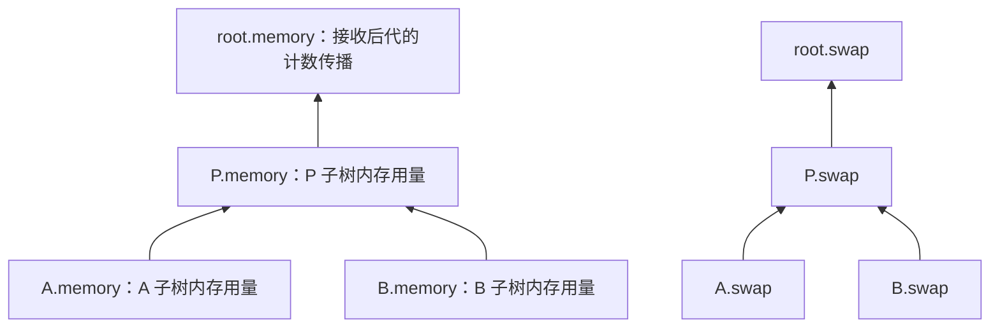
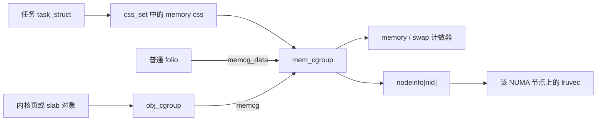
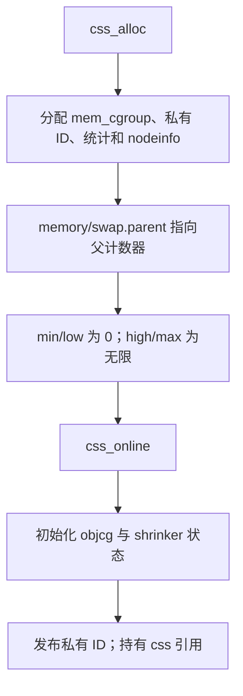
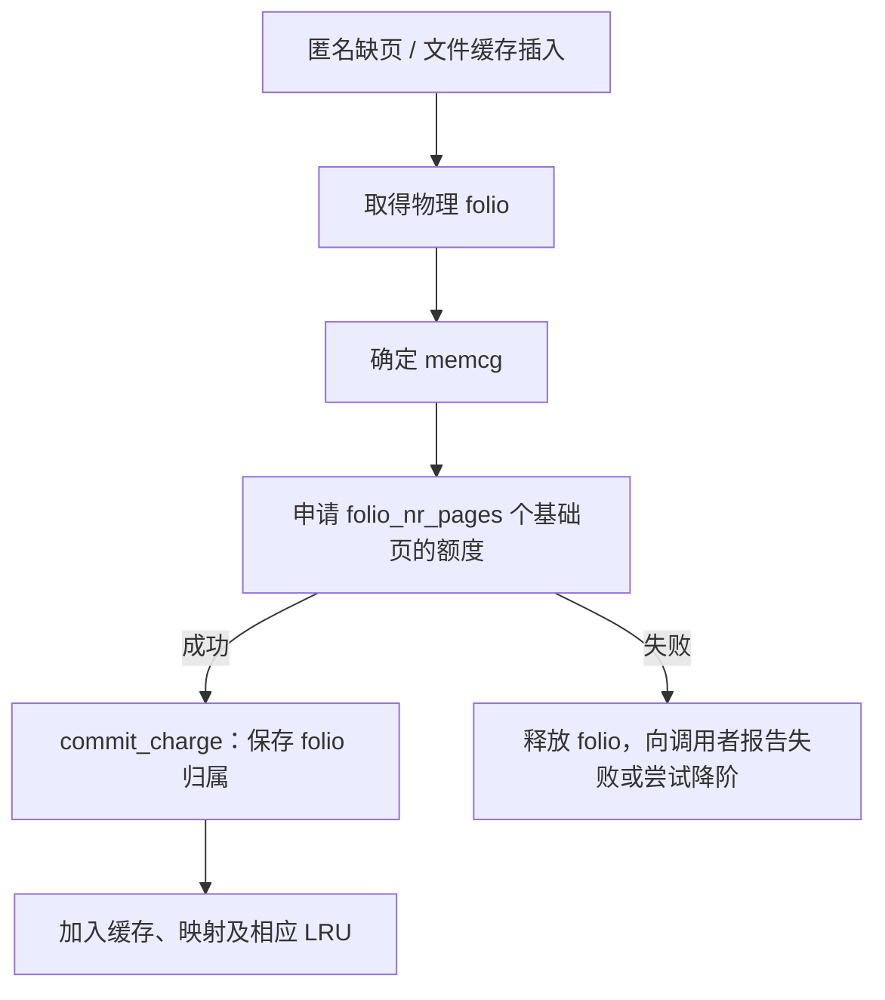
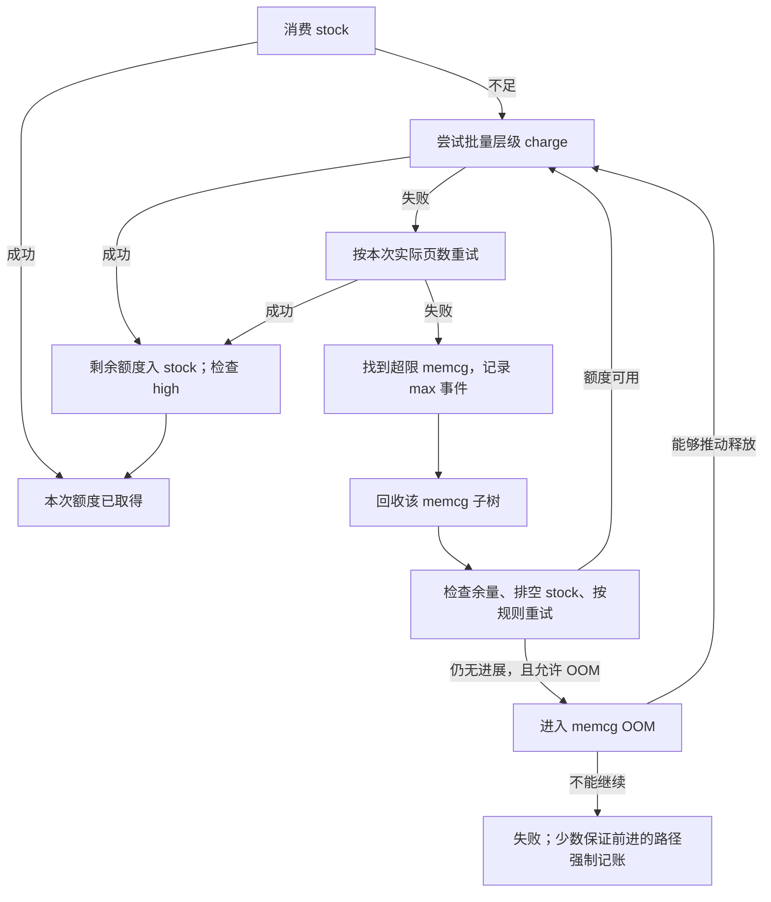
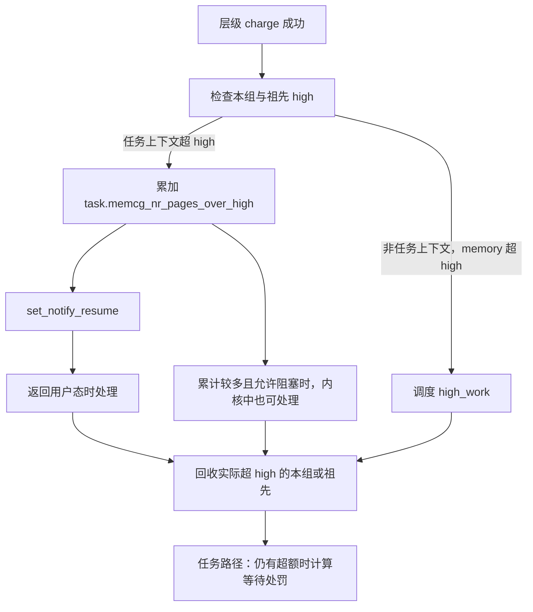
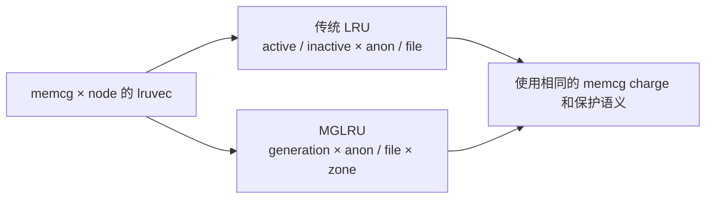
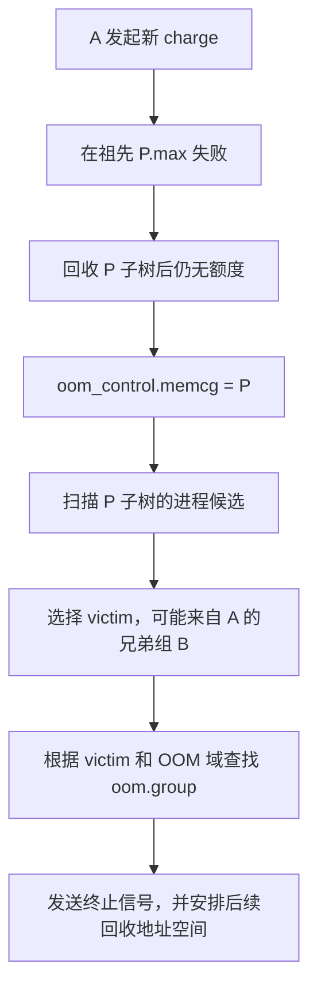
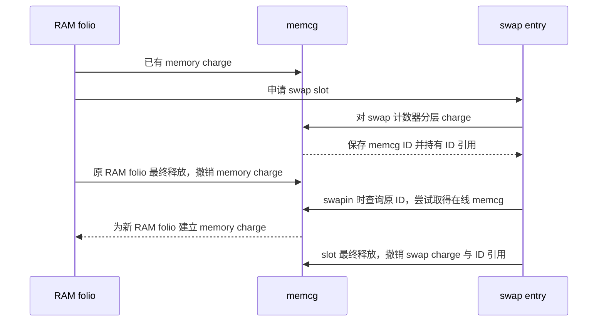
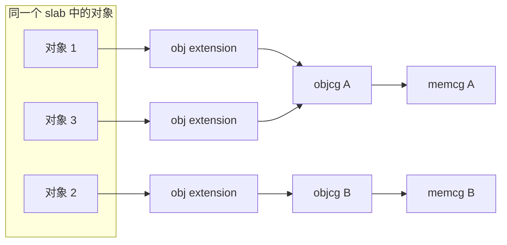

# cgroup v2 内存控制器：从页面归属到分层回收

> 源码基准：[本项目 Linux 6.18.52](../../linux/Makefile#L2)。本文只依据 `linux/` 目录中的实现，讨论 x86-64、SMP、非 `PREEMPT_RT` 的云计算数据中心场景；按本书约定开启 `CFS_BANDWIDTH`。源码树没有 `.config`，因此下文明确区分必需配置和可选分支，不把某一种发行版配置当成既定事实。

内存控制器要持续回答三个问题：**这块内存算谁的？还能不能继续增加？需要释放时，从谁的哪些页面中回收？** 它把这些决定接入缺页、文件缓存、内核对象分配和虚拟内存回收路径，而不是在创建 cgroup 时切出一块专用物理内存。

全文按“对象 → 归属 → 记账 → 限额 → 回收 → 故障处理”的顺序展开。第一次阅读可以先读第 1～7 节，再用后面的 swap、内核内存和统计章节补齐细节。

| 阅读阶段 | 关键问题 | 主要对象 |
| --- | --- | --- |
| 第 1～2 节 | 一个目录怎样连接任务、页面和 NUMA 节点？ | `mem_cgroup`、`page_counter`、`folio`、`lruvec` |
| 第 3～4 节 | 新页面怎样入账？上下级怎样共同承担用量？ | `mm->owner`、charge、每 CPU stock |
| 第 5～7 节 | 保护、限额、回收、OOM 怎样协作？ | `emin/elow`、`scan_control`、`oom_control` |
| 第 8～9 节 | 换出和内核对象怎样沿用这套体系？ | swap ID、`obj_cgroup`、socket、writeback |
| 第 10～12 节 | 怎样观察、配置并沿源码排查？ | `memory.stat`、events、PSI、调用路径 |

## 1. 核心数据结构：先把“组、账本、页面”连起来

### 1.1 `mem_cgroup`：一个内存资源域的中心对象

`struct cgroup` 表示 cgroup 目录；内存控制器在该目录对应的控制器状态中嵌入 `struct cgroup_subsys_state`，简称 css。由 css 可以找到外层的 `struct mem_cgroup`，后文简称 **memcg**。转换入口见 [`mem_cgroup_from_css()`](../../linux/include/linux/memcontrol.h#L769)。

下面是 [`struct mem_cgroup`](../../linux/include/linux/memcontrol.h#L189) 的阅读摘录，只保留与本文主线有关的成员；省略条件编译和其他字段，中文注释用于解释。

```c
struct mem_cgroup {
    struct cgroup_subsys_state css;  /* 连接 cgroup 核心和控制器层级 */
    struct mem_cgroup_id id;         /* swap 等对象使用的私有 ID */
    struct page_counter memory;     /* 已记账的内存页数 */
    union {
        struct page_counter swap;   /* v2 的 swap 用量 */
        struct page_counter memsw;  /* v1 分支，本文不展开 */
    };
    /* ... */
    struct work_struct high_work;   /* 某些上下文中的 high 回收工作 */
    /* ... */
    bool oom_group;                 /* OOM 时是否以组为单位处理 */
    /* ... */
    struct memcg_vmstats *vmstats;   /* 聚合后的详细统计 */
    /* ... */
    struct obj_cgroup __rcu *objcg;  /* 内核对象通过它间接找到 memcg */
    /* ... */
    struct memcg_vmstats_percpu __percpu *vmstats_percpu;
    /* ... nodeinfo[] 连接每个 NUMA 节点上的回收状态 */
};
```

先区分两种信息：`memory`、`swap` 是执行限额所用的计数器，`vmstats` 则回答匿名页、文件页、slab 等分别占多少。**限额判断不需要先把 `memory.stat` 的各项加总。** 实际 charge 直接操作 `page_counter`，统计读取则走 [`memcg_stat_format()`](../../linux/mm/memcontrol.c#L1462)。

### 1.2 `page_counter`：父子组共用的一棵账本树

[`struct page_counter`](../../linux/include/linux/page_counter.h#L10) 的基本单位是基础页，不是字节；文件接口在读写时转换单位。

| 字段 | 含义 | 在哪里使用 |
| --- | --- | --- |
| `usage` | 原子计数的当前用量 | charge、uncharge、`memory.current` |
| `parent` | 同一资源的父计数器 | 沿祖先逐级加减 |
| `min`、`low` | 配置的回收保护量 | 计算有效保护 |
| `emin`、`elow` | 本轮层级计算得到的有效保护 | 决定跳过或减少扫描 |
| `min_usage/low_usage` | 当前实际占用的受保护部分 | 通常为 `min(usage, 配置值)` |
| `children_min_usage/children_low_usage` | 直接子组受保护用量之和 | 保护超配时分配父级预算 |
| `high`、`max` | 节流阈值、硬限额 | 增长控制 |
| `watermark`、`local_watermark` | 峰值相关水位 | `memory.peak` 和 `memory.swap.peak` |

设业务父组 P 下有 A、B 两个子组：



A 新增一页，会沿 A → P → root 的 `memory` 计数器增加一页；任一祖先的 `max` 都可能拒绝这次申请。A 和 P 同时显示这页，并不代表消耗了两页物理内存，而是同一用量在不同子树范围的投影。初始化连接见 [`mem_cgroup_css_alloc()`](../../linux/mm/memcontrol.c#L3819)，层级计数见 [`page_counter_try_charge()`](../../linux/mm/page_counter.c#L118)。

根组有特殊性：**直接归属 root 的 charge 不经过普通限额计数路径**，见 [`try_charge()`](../../linux/mm/memcontrol.c#L2508)。因此不能把 `root.memory.usage` 当作全机物理内存占用；根目录也不提供普通非根组的 `memory.current/min/low/high/max`，见 [`memory_files[]`](../../linux/mm/memcontrol.c#L4616)。

### 1.3 `folio`：归属跟着实际内存走

folio 表示一个或多个基础页构成的内存单元。普通用户 folio 的 [`memcg_data`](../../linux/include/linux/mm_types.h#L408) 保存 memcg 指针；读取通过 [`folio_memcg()`](../../linux/include/linux/memcontrol.h#L427) 完成。

不要把 `memcg_data` 无条件强转成 `mem_cgroup *`：这一字段带有类型标记，普通 folio、非 slab 内核页、slab 对象扩展采用不同解释，见 [`page_memcg_data_flags`](../../linux/include/linux/memcontrol.h#L335)。



任务归属决定很多**新分配**向谁记账，folio 归属决定**既有内存**向谁收费、由谁回收。两个箭头不能混成一个：任务迁组后，先前创建的 folio 通常仍属于原 memcg，后文会沿 attach 和释放路径验证这一点。

### 1.4 `mem_cgroup_per_node` 与 `lruvec`：知道占多少，还要知道从哪里回收

一个 memcg 可以在多个 NUMA 节点上分配内存。因此它需要两种尺度：

| 尺度 | 对象 | 回答的问题 |
| --- | --- | --- |
| 整个 memcg 子树 | `memory`、`swap` | 总量是否越界？ |
| 一个 memcg × 一个 NUMA 节点 | `mem_cgroup_per_node.lruvec` | 本节点有哪些可扫描的页面？ |

[`struct mem_cgroup_per_node`](../../linux/include/linux/memcontrol.h#L87) 包含反向 `memcg` 指针、LRU 统计、`shrinker_info`、`lruvec`、各 zone 的 LRU 大小和回收迭代器。创建时逐节点分配并初始化，见 [`alloc_mem_cgroup_per_node_info()` 所在实现](../../linux/mm/memcontrol.c#L3652)。

这意味着：memcg 对**用量和回收范围**实施隔离，物理分配仍使用节点、zone、伙伴系统；`cpuset.mems` 和 NUMA 内存策略解决**放置位置**问题。一个组有剩余额度，并不保证目标节点有足够的可分配物理页。

### 1.5 `obj_cgroup`：给小对象增加一层可变归属

slab 中一页可能同时存放多个组的对象。如果整页只能归属一个组，就无法正确按对象收费。为此，内核使用 [`struct obj_cgroup`](../../linux/include/linux/memcontrol.h#L167)：

```c
struct obj_cgroup {
    struct percpu_ref refcnt;
    struct mem_cgroup *memcg;
    atomic_t nr_charged_bytes;
    /* 链表或 RCU 释放信息 */
};
```

对象保存 objcg 引用，objcg 再指向 memcg。这样小对象可以按字节聚合收费，组下线时也可以修改 objcg 的目标，将一批存活对象转接到父组，无须逐个找到它们。转接实现在 [`memcg_reparent_objcgs()`](../../linux/mm/memcontrol.c#L206)。第 9 节再解释它如何与按页计数的 `memory` 衔接。

## 2. 从 cgroup 目录到有效内存资源域

### 2.1 控制器启用：父目录的开关作用于子目录

`memory_cgrp_subsys` 将创建、上线、下线、迁移任务和文件接口注册给 cgroup 核心，见 [控制器定义](../../linux/mm/memcontrol.c#L4690)。普通 v2 domain 层级中，在父目录 `cgroup.subtree_control` 写入 `+memory`，才是为其子组启用内存控制器。

示意配置如下，假设挂载点已经是 v2，且由管理员管理这个空的业务子树：

```sh
echo +memory > /sys/fs/cgroup/cgroup.subtree_control
mkdir /sys/fs/cgroup/workloads
echo +memory > /sys/fs/cgroup/workloads/cgroup.subtree_control
mkdir /sys/fs/cgroup/workloads/api
```

`workloads` 是汇总和约束子组的内部节点，业务进程放到叶子 `api`。memory 属于 domain 控制器；普通非根内部节点一旦向子组启用它，就不能同时容纳业务进程。核心校验见 [`cgroup_vet_subtree_control_enable()`](../../linux/kernel/cgroup/cgroup.c#L3503)。memory 没有像 CPU 控制器那样设置 `.threaded`，因此线程子树不能逐线程建立独立的 memory 资源域，见 [`memory_cgrp_subsys`](../../linux/mm/memcontrol.c#L4690)。

目录不一定对应独立的 memory css：任务通过 [`task_css(task, memory_cgrp_id)`](../../linux/include/linux/cgroup.h#L449) 取得当前生效的控制器状态；没有在相应层级启用时，资源控制会落在生效的祖先域。源码分析应追踪这个指针，不能只根据目录名推断 charge 的目的地。

### 2.2 创建和上线：建立账本、节点状态和存活引用



对应实现为 [`mem_cgroup_alloc()`](../../linux/mm/memcontrol.c#L3720)、[`mem_cgroup_css_alloc()`](../../linux/mm/memcontrol.c#L3798) 和 [`mem_cgroup_css_online()`](../../linux/mm/memcontrol.c#L3853)。父子组通过计数器链共同实施限制，但**不会把父组的 high/max 数字复制成子组的配置值**。所以子组读到 `memory.max = max`，仍可能被父组的有限额度限制。

### 2.3 迁组：新分配改变归属，旧 charge 保留

v2 的 [`mem_cgroup_attach()`](../../linux/mm/memcontrol.c#L4217) 只做两类内存控制器工作：

1. 启用 MGLRU 时，更新相关 `mm` 在 memcg 的遍历关系。
2. 给任务的 objcg 缓存设置更新标记，让之后的内核分配重新取得归属。

它没有遍历地址空间、把所有已有 folio 的 charge 搬到新组。因此，先分配 1 GiB 再把进程从 A 移到 B，与先移到 B 再分配，记账结果不同。文件缓存或共享内存还可能在创建者退出后继续存活。

```text
时间 t0：任务属于 A，创建 folio X        X → A
时间 t1：把任务迁到 B                   X → A
时间 t2：任务在 B 创建新 folio Y         X → A，Y → B
时间 t3：X 的最后一个引用释放            从 A 及其祖先撤销 X 的 charge
```

这个例子描述普通新分配；共享既有页和 swapin 有各自的归属规则，不能把“当前任务在 B”扩展成“一切访问都向 B 收费”。

### 2.4 删除目录不等于页面和控制器对象立即消失

[`mem_cgroup_css_offline()`](../../linux/mm/memcontrol.c#L3897) 清除 min/low 保护，处理 zswap、内核对象、shrinker、writeback 和 LRU 的下线，排空 stock，并放掉在线状态持有的 ID 引用。随后仍可能有 folio、swap entry、socket 等持有引用。

普通 folio 的 charge 在 [`charge_memcg()`](../../linux/mm/memcontrol.c#L4731) 中获取 css 引用，释放时归还。只有相关引用最终退尽，才会进入 [`mem_cgroup_css_free()`](../../linux/mm/memcontrol.c#L3926)，释放统计与各节点状态。**目录生命周期和内存所有权生命周期不同**，这是理解已删除子组仍影响祖先用量的基础。

## 3. charge：一次实际分配怎样记到组里

### 3.1 先分清物理分配与额度申请

以匿名缺页为例，实际路径会先分配 folio，再为它申请 memcg 额度；charge 失败就释放刚取得的 folio。普通预分配路径见 [`folio_prealloc()`](../../linux/mm/memory.c#L1200)，大 folio 路径见 [`alloc_anon_folio()` 中的分配与 charge](../../linux/mm/memory.c#L5111)。



因此存在两种不同失败：物理分配失败，或物理页已经找到但 memcg 额度不足。memcg 不是独立的伙伴分配器，也不保证整个 `malloc()` 调用时就完成收费；普通匿名映射往往到实际缺页、创建私有页时才发生这里的 charge。

### 3.2 找到归属：普通用户页主要沿 `mm->owner`

入口 [`__mem_cgroup_charge()`](../../linux/mm/memcontrol.c#L4747) 调用 [`get_mem_cgroup_from_mm()`](../../linux/mm/memcontrol.c#L907)。按当前实现：

```text
给出了 mm：
    在 RCU 保护下读取 mm->owner
    从 owner 的有效 memory css 找到 memcg
    取得 css 引用；没有有效 owner 时退回 root

没有给出 mm：
    优先采用显式 active_memcg
    否则采用 current->mm
    当前上下文没有 mm 时退回 root
```

这里有一处值得逐行核对：函数前的注释仍使用 `mm->memcg` 的说法，但函数体实际读取 [`mm->owner`](../../linux/mm/memcontrol.c#L935)。本文按执行代码解释。

不同来源在入口处提供不同上下文：

| 内存来源 | 关键入口 | 归属要点 |
| --- | --- | --- |
| 匿名私有页 | [`folio_prealloc()`](../../linux/mm/memory.c#L1200) | 使用给定地址空间的归属 |
| 大匿名 folio | [`alloc_anon_folio()`](../../linux/mm/memory.c#L5111) | 一次按 folio 的基础页数收费，失败可降阶 |
| 普通文件缓存 | [`filemap_add_folio()`](../../linux/mm/filemap.c#L968) | 通常传 `mm = NULL`，采用当前或显式代理上下文 |
| tmpfs/shmem | [分配后的 charge](../../linux/mm/shmem.c#L1945) | 使用 `fault_mm`；没有时仍走上述回退 |
| swapin | [`mem_cgroup_swapin_charge_folio()`](../../linux/mm/memcontrol.c#L4805) | 优先找 swap entry 保存的原归属 |

普通共享文件页成功进入缓存时只有一份 charge；另一组只是命中这份缓存，不会因为多了一个映射就再向它收取整页。原页被回收、以后重新创建时，新的 charge 才可能属于另一个组。文件缓存插入还存在 `AS_KERNEL_FILE` 特例：它临时把 active memcg 设为 root，见 [`filemap_add_folio()`](../../linux/mm/filemap.c#L974)。

### 3.3 分层申请：失败点可能在祖先

[`page_counter_try_charge()`](../../linux/mm/page_counter.c#L118) 的核心逻辑可缩写为：

```text
for c in 本组计数器 → 父计数器 → ...：
    new = atomic_add_return(c.usage, nr_pages)
    if new > c.max：
        撤销当前 c 的加法
        fail = c
        撤销此前已成功经过的后代计数器
        return false
    更新保护用量与峰值
return true
```

实现采用“先原子增加、超限再回滚”，没有用一把全树大锁。因此多 CPU 的并发申请可能短暂看到试探性增量；水位统计也允许小幅竞争误差。重要不变量是：失败路径撤销本次已经完成的层级收费，成功路径使祖先承接后代用量。

例如 P 的 `memory.max = 4 GiB`，A、B 各自都是 `3 GiB`，当前 A 用 2.5 GiB、B 用 1.5 GiB。A 再申请一页，虽然没到自己的 3 GiB，仍会在 P 失败。后续回收及 memcg OOM 的范围以**发生超限的 P**为中心，而不局限在发起申请的 A。

### 3.4 每 CPU stock：把热路径上的原子操作摊薄

如果每次分配 4 KiB 都修改所有祖先的原子计数，深层级和多 CPU 容器会产生大量共享缓存行竞争。因此 [`try_charge_memcg()`](../../linux/mm/memcontrol.c#L2300) 优先消费本 CPU 已申请的 stock；没有可用 stock 时，通常批量申请 `max(64, nr_pages)` 个基础页，多出的额度存起来。

这里的 64 来自 [`MEMCG_CHARGE_BATCH`](../../linux/include/linux/memcontrol.h#L331)。当前实现的每 CPU 缓存有**七个 memcg 槽位**，不能套用旧版本“每 CPU 只缓存一个 memcg”的描述，见 [`NR_MEMCG_STOCK`](../../linux/mm/memcontrol.c#L1748)。

```text
假设一次只需要 1 页：
    先向本组及祖先申请 64 页
    1 页绑定给本次 folio
    剩下 63 页进入本 CPU stock
    后续同组分配优先消耗这些已收费额度
```

这预留的是**记账额度**，没有另外分配 63 页物理内存。批量申请失败会退回实际页数重试；限额压力下也会 [`drain_all_stock()`](../../linux/mm/memcontrol.c#L2379)，归还闲置额度。因此 `memory.current` 不能被理解为某一时刻遍历所有存活 folio 得到的精确字节和。

### 3.5 提交与撤销：把计数和归属配成一对

[`charge_memcg()`](../../linux/mm/memcontrol.c#L4731) 先完成 `try_charge()`，再取得 css 引用并执行 [`commit_charge()`](../../linux/mm/memcontrol.c#L2523)，把 memcg 写入 folio。若文件缓存插入随后失败，调用者必须撤销 charge，见 [`filemap_add_folio()` 的错误分支](../../linux/mm/filemap.c#L984)。

正常释放则由 [`mem_cgroup_uncharge()`](../../linux/mm/memcontrol.c#L4921) 一侧处理：根据 folio 保存的归属归还页数，清除 `memcg_data`，最终释放 css 引用；批量释放可把同组操作聚合。层级减法的基础实现是 [`page_counter_uncharge()`](../../linux/mm/page_counter.c#L179)。

**撤销 charge 看的是 folio 的归属，不是执行释放的当前任务归属。** 这保证了后台回收、进程迁组、共享页最后一个使用者退出等情况，仍能从正确的账本中扣减。

## 4. `memory.max`：从 charge 失败到回收重试

### 4.1 失败后的主线

v2 使用 `memory` 和 `swap` 两套账本，不走 v1 的 memory+swap 联合 `memsw` 分支。下面把 [`try_charge_memcg()`](../../linux/mm/memcontrol.c#L2300) 中的 v2 常见可阻塞路径单独画出：



源码中的超限对象是 `mem_over_limit`，由 `page_counter_try_charge()` 返回的失败计数器反推。回收调用见 [`try_to_free_mem_cgroup_pages(mem_over_limit, ...)`](../../linux/mm/memcontrol.c#L2368)，不是机械地回收当前任务的叶子组。

### 4.2 “硬限额”不表示所有场景都能瞬间钳住数值

`max` 是常规 charge 的拒绝边界，但执行路径还要保证内核前进：

| 情况 | 当前代码的处理 | 阅读位置 |
| --- | --- | --- |
| 回收自身需要分配，任务带 `PF_MEMALLOC` | 可以强制记账，避免递归回收无休止 | [force 分支入口](../../linux/mm/memcontrol.c#L2340) |
| 不允许阻塞的分配 | 无法走普通同步回收，进入失败处理 | [GFP 判断](../../linux/mm/memcontrol.c#L2352) |
| `__GFP_NORETRY` / `__GFP_RETRY_MAYFAIL` | 按分配语义提前放弃，不保证触发 OOM | [重试条件](../../linux/mm/memcontrol.c#L2385) |
| `__GFP_NOFAIL` | 必须分配的路径可能越限收费 | [nomem/force](../../linux/mm/memcontrol.c#L2420) |
| 某些 folio 替换 | 新旧页短暂并存，新页强制收费，旧页随后释放 | [`mem_cgroup_replace_folio()`](../../linux/mm/memcontrol.c#L4953) |

因此 `memory.current > memory.max` 并不自动证明控制器失效；应继续判断是否刚刚降低上限、存在并发和缓存额度，或进入了保证前进的特殊分配路径。反过来，也不能把每一次 charge 失败都等同于一次进程被杀。

### 4.3 降低 max：先安装新值，再消化存量

[`memory_max_write()`](../../linux/mm/memcontrol.c#L4433) 用 `xchg()` 安装新上限；它并没有调用那个会因现有用量过大而拒绝降低的 `page_counter_set_max()`。普通阻塞写入随后排空 stock、回收，并在必要时触发 memcg OOM，直到用量合适或遇到信号、无法继续等退出条件。

若文件以 `O_NONBLOCK` 打开，写入新上限后立即跳过写入者的同步回收/OOM。**新限额仍然生效**，后续收费将面对它，但写入成功不代表存量已降到上限之下。这个语义同样影响管理程序在线缩容的时延设计。

## 5. `min/low/high`：保护工作集与反馈增长压力

### 5.1 四个边界分别解决什么问题

可以先用一张表，把它们放在两条不同的执行路径中理解：

| 接口 | 默认值 | 生效环节 | 作用 |
| --- | --- | --- | --- |
| `memory.min` | 0 | 从外部对该组回收时 | 对有效保护范围实施强保护 |
| `memory.low` | 0 | 从外部对该组回收时 | 优先保护；必要时允许突破 |
| `memory.high` | `max` | 记账成功后的压力处理 | 让分配任务参与回收，必要时增加等待 |
| `memory.max` | `max` | 新增 charge | 拒绝越限，回收重试，必要时 OOM |

min/low 的写入分别只更新保护计数器，见 [`memory_min_write()`](../../linux/mm/memcontrol.c#L4332) 和 [`memory_low_write()`](../../linux/mm/memcontrol.c#L4357)。**写入 1 GiB 的 min 不会预先分配 1 GiB，也不会给任务承诺下一次申请一定成功。** 对象类型、物理内存状态和祖先 max 仍会影响分配。

对于一组有意分开的阈值，可以这样理解，但这只是配置示意，不是内核要求所有阈值必须严格递增：

```text
较少使用                    工作集逐渐增长                         较多使用
    0 ───── min ───── low ───────────── high ─────────── max
         强保护区域     优先保护       增长反馈与等待      charge 拒绝边界

min / low：回收器从谁身上释放内存？
high / max：申请者能怎样继续增加用量？
```

### 5.2 为什么配置值还要转换成有效保护

假设父组 P 只获得 2 GiB 的有效 low，A、B 却各写了 2 GiB 的 low。内核不能凭这两次写入创造 4 GiB 的父级保护预算。

charge 和 uncharge 时，[`propagate_protected_usage()`](../../linux/mm/page_counter.c#L21) 维护每个子组实际使用的保护量：

```text
protected_i = min(usage_i, setting_i)
siblings_protected = 同层各子组 protected_i 之和
```

从回收根开始向下遍历时，[`page_counter_calculate_protection()`](../../linux/mm/page_counter.c#L424) 再计算 `emin/elow`。当子组实际申请的保护之和超过父级预算，核心公式为：

```text
effective_i = protected_i × parent_effective / siblings_protected
```

对应 [`effective_protection()`](../../linux/mm/page_counter.c#L337)。以下是一次外部回收中对 P 的子组进行计算的示例：

| 对象 | 已用内存 | 配置 low | 实际使用的保护量 | 最终有效 low |
| --- | --- | --- | --- | --- |
| P | 3 GiB | 本轮有效预算为 2 GiB | 子组合计 3 GiB | 2 GiB |
| A | 2 GiB | 2 GiB | 2 GiB | 4/3 GiB |
| B | 1 GiB | 2 GiB | 1 GiB | 2/3 GiB |

它按**已用的保护量**分配预算，没有按两个相同配置各分一半，也没有把 B 未使用的 1 GiB 永久锁住。min 的分层计算采用同一类算法。

如果子组没有用完父级保护，默认只保留显式申请并使用的部分；启用挂载选项 `memory_recursiveprot` 后，剩余额度还能按各子组未保护用量的比例下传。计算见 [`effective_protection()` 的剩余预算分配](../../linux/mm/page_counter.c#L378)，挂载标志解析见 [`cgroup.c`](../../linux/kernel/cgroup/cgroup.c#L2028)。这一选项是层级的行为开关，不是每个目录里的 `memory.*` 文件。

### 5.3 保护总是相对于“本次回收根”解释

这是理解 min/low 最重要的边界：**回收目标自身的保护被忽略。** [`mem_cgroup_protection()`](../../linux/include/linux/memcontrol.h#L556) 在 `root == memcg` 时返回零；回收根的直接子组则从各自的配置值开始建立保护，见 [`page_counter_calculate_protection()`](../../linux/mm/page_counter.c#L445)。

```text
全局内存紧张，回收遍历到 A：
    A 的 min/low 可以保护 A，减少它受其他工作负载影响。

A 自己超过 memory.max，定向回收以 A 为根：
    A 自己的 min/low 不阻止这次回收。
    A 的子组仍按相对于 A 的层级关系计算保护。
```

因此给同一个叶子同时配置较大的 min 和较小的 max，不能获得“即使超限也拒绝自我回收”的效果。主动写 `A/memory.reclaim` 也属于对 A 的定向回收。

### 5.4 回收器怎样使用 min 和 low

传统 LRU 路径在 [`shrink_node_memcgs()`](../../linux/mm/vmscan.c#L5972) 中先计算有效保护，再决定是否扫描：

1. 处于有效 min 保护内：跳过该组。
2. 处于有效 low 保护内：先跳过并记住本轮遇到了 low 保护。
3. 其他内存无法提供足够进展时：重试可以突破 low，此时增加 `memory.events` 的 `low`。

这解释了 low 与 min 的区别：low 给回收器保留了退路；过度配置 min 则可能让可用回收目标不足，加剧 OOM 风险。重试时允许回收 low 的分支见 [`do_try_to_free_pages()`](../../linux/mm/vmscan.c#L6415)。

用量超过保护线时，保护也没有突然全部消失。[`apply_proportional_protection()`](../../linux/mm/vmscan.c#L2492) 根据未保护部分缩小扫描量，近似为：

```text
实际扫描量 ≈ 原扫描量 × (1 − 有效保护量 / (usage + 1))
```

实际实现还有整数运算和最小扫描批次，因此保护不是逐页贴上的“永久不可回收”标签。MGLRU 的全局扫描组织方式不同，第 6.3 节单独说明。

### 5.5 high：额度已经拿到，再让增长者承担代价

`high` 不参与 `page_counter_try_charge()` 的硬拒绝判断。批量记账成功后，[`try_charge_memcg()`](../../linux/mm/memcontrol.c#L2450) 检查本组和祖先的 memory/swap high：



stock 命中可以直接返回，因此检查按批次摊销，不是每新增一个 folio 都同步回收到 high 以下。返回用户态的连接点是 [`resume_user_mode_work()`](../../linux/include/linux/resume_user_mode.h#L41)，主体为 [`__mem_cgroup_handle_over_high()`](../../linux/mm/memcontrol.c#L2210)。

[`reclaim_high()`](../../linux/mm/memcontrol.c#L2033) 沿祖先链寻找实际超 high 的组，并回收相应子树、增加 high 事件。申请任务承担这段工作，应用时延可能在达到 max 很久以前就上升。

### 5.6 等待时间怎样随超额增加

high 处理先尝试回收；如果增长仍无法被压住，再计算延迟。忽略定点数尺度和整数取整，可以把内存部分理解为：

```text
r = 祖先链上最大的 max(usage − high, 0) / max(high, 1)
delay_memory ∝ r² × 本任务本批计费页数 / MEMCG_CHARGE_BATCH
delay = min(delay_memory + delay_swap, 2 秒)
```

比例计算和平方项见 [`calculate_overage()` 及邻近实现](../../linux/mm/memcontrol.c#L2121)，按任务分配页数缩放见 [`calculate_high_delay()`](../../linux/mm/memcontrol.c#L2173)，最终合并和上限见 [over-high 处理](../../linux/mm/memcontrol.c#L2250)。代码注释使用了“exponentially”，但运算本身是比例的平方，不能将其讲成严格指数函数。

这里的 2 秒限制的是**一次处理计算出的处罚睡眠**，不是一次缺页、回收或系统调用的总耗时上限。回收本身可能花时间，同一任务也可能反复进入这条路径。实际等待使用可被信号打断的 [`schedule_timeout_killable()`](../../linux/mm/memcontrol.c#L2289)。

high 路径本身不触发 memcg OOM，但任务仍可能因 max 或全局内存不足而被 OOM 处理。内存 high 等待与 CPU 的 CFS 带宽节流是不同机制；本书开启 `CFS_BANDWIDTH`，不改变这一点。

### 5.7 写 high 与运行中越过 high

[`memory_high_write()`](../../linux/mm/memcontrol.c#L4378) 先更新阈值，普通写入者随后排空 stock 并尝试同步回收；`O_NONBLOCK` 让写入者跳过这部分处理。任务在后续增长中仍会被 high 反馈约束。

两个角度要分开：管理程序写 high 时可能自己承担同步回收成本；业务运行中超 high，则主要由正在增加用量的业务任务承担回收和延迟。high 不是“写入后后台线程自动永久保持的水位”。

## 6. 回收实现：怎样从一个子树找到可释放的内存

### 6.1 `scan_control` 描述这一次回收任务

memcg 复用虚拟内存子系统的回收器。入口 [`try_to_free_mem_cgroup_pages()`](../../linux/mm/vmscan.c#L6675) 构造 `scan_control`，其中最重要的是：

| 信息 | 含义 |
| --- | --- |
| `target_mem_cgroup` | 本次回收限定在哪个子树 |
| `nr_to_reclaim` | 本次希望取得的进展，底层至少按一批处理 |
| `gfp_mask`、`reclaim_idx` | 允许的操作与 zone 范围 |
| `may_swap`、`may_unmap`、`may_writepage` | 能否换出、解除映射、写回 |
| `proactive`、`proactive_swappiness` | 是否为主动回收，以及单次扫描偏好 |

它从节点的 fallback zonelist 开始扫描，不是只处理“调用者当前 CPU 所在节点”。传统路径的骨架如下：

```text
try_to_free_mem_cgroup_pages(target)
  → do_try_to_free_pages()
    → shrink_zones()
      → shrink_node()
        → shrink_node_memcgs()
          → 遍历 target 子树
            → 计算并检查 min/low
            → shrink_lruvec(memcg × node)
            → shrink_slab(..., memcg, ...)
```

节点遍历见 [`shrink_zones()`](../../linux/mm/vmscan.c#L6317)，子树扫描见 [`shrink_node_memcgs()`](../../linux/mm/vmscan.c#L5972)。全局回收也会遍历 memcg，但起因是物理内存压力，其边界与“某个 memcg 超过 max”不同。

**父组计数器包含子组用量，不代表父组 LRU 链表重复挂着子组的所有页。** 页面由所属 memcg 和所在 node 共同定位到一个 lruvec；父级回收靠遍历后代完成。映射函数见 [`mem_cgroup_lruvec()`](../../linux/include/linux/memcontrol.h#L705) 和 [`folio_lruvec()`](../../linux/include/linux/memcontrol.h#L738)。

### 6.2 传统 LRU：扫描匿名页、文件页和内核缓存

[`struct lruvec`](../../linux/include/linux/mmzone.h#L669) 保存传统 LRU 链表、锁、anon/file 回收成本和 refault 信息。传统路径在 [`shrink_lruvec()`](../../linux/mm/vmscan.c#L5784) 中决定要扫描的列表与数量，再进入具体页面回收。

| 类别 | 回收时主要要解决的问题 | 为什么可能没有进展 |
| --- | --- | --- |
| 干净文件页 | 从缓存淘汰；需要时再读入 | 页被固定、引用或持续访问 |
| 脏文件页 | 协调写回，再释放缓存 | 存储慢、写回中、脏化速度太快 |
| 匿名页与 shmem | 需要可用的换出等回收路径 | swap 不可用、额度耗尽、页不可回收 |
| slab 等缓存 | 调用支持 memcg 的 shrinker | 对象仍在使用，或缓存无法按该域回收 |

匿名/文件扫描比例不是固定的。它综合 swappiness、anon/file 回收成本、可换出能力和 min/low 保护，见 [`get_scan_count()`](../../linux/mm/vmscan.c#L2555)。进入 memcg 回收，也不等于所有内核内存都自动变成可回收缓存。

### 6.3 MGLRU：同一归属和限额体系，另一种扫描组织方式

是否启用 MGLRU，要区分编译支持 `CONFIG_LRU_GEN`、默认启用 `CONFIG_LRU_GEN_ENABLED` 和运行时状态；不能只因架构是 x86 就断定开启。配置见 [`mm/Kconfig`](../../linux/mm/Kconfig#L1303)，运行时判断见 [`lru_gen_enabled()`](../../linux/include/linux/mm_inline.h#L103)。

MGLRU 在 lruvec 中使用 [`struct lru_gen_folio`](../../linux/include/linux/mmzone.h#L479)：较新的 `max_seq` 表示新代，anon/file 分别维护较老的 `min_seq`，页面按“代 × 类型 × zone”组织。老化与淘汰还结合回访数据，减少把仍在使用的工作集反复换出又读回。



有两个不能省略的控制流差异：

| 回收范围 | MGLRU 启用后的路径 |
| --- | --- |
| 非根 memcg 的定向回收 | 仍遍历目标子树、检查保护；`shrink_lruvec()` 转入 [`lru_gen_shrink_lruvec()`](../../linux/mm/vmscan.c#L5022) |
| root/global 回收 | `shrink_node()` 直接进入 [`lru_gen_shrink_node()`](../../linux/mm/vmscan.c#L5043)，采用节点上的 memcg 扫描组织 |

全局 MGLRU 路径对 min 内的组跳过当前回收，对 low 内的组先延后、再次遇到时才可能进入低保护回收并记录 low 事件，见 [`shrink_one()` 的保护处理](../../linux/mm/vmscan.c#L4911)。不能把传统路径“设置 `memcg_low_reclaim` 后重试”的每一步原样套在这个全局分支上。

### 6.4 主动回收：`memory.reclaim`

`memory.reclaim` 允许管理程序主动请求释放一部分内存，而不改变 high/max。例如：

```sh
echo "256M" > /sys/fs/cgroup/workloads/api/memory.reclaim
echo "256M swappiness=0" > /sys/fs/cgroup/workloads/api/memory.reclaim
echo "256M swappiness=max" > /sys/fs/cgroup/workloads/api/memory.reclaim
```

本版本的 [`memory_reclaim()`](../../linux/mm/memcontrol.c#L4603) 转调 [`user_proactive_reclaim()`](../../linux/mm/vmscan.c#L7743)。参数为字节量和可选 `swappiness=0..200|max`；没有持久的 v2 `memory.swappiness` 文件，普通 v2 回收取全局 swappiness，见 [`mem_cgroup_swappiness()`](../../linux/include/linux/swap.h#L592)。这里传入的是**本次主动回收的覆写值**。

执行时需要这样读结果：

- 请求值是希望回收的量，不是把 `memory.current` 设置成该值。函数按剩余目标的一部分迭代，底层存在最小批次，实际回收量可能超过目标。
- `-EAGAIN` 表示经过重试仍不能完成目标，已释放的内存不会回滚；信号可使其返回 `-EINTR`。
- 它没有主动调用 OOM killer 的分支，也不保证能释放被长期固定、正在使用或不可回收的内存。
- 本次目标自身的 min/low 不生效，后代仍参与保护计算。

循环和返回条件见 [`user_proactive_reclaim()`](../../linux/mm/vmscan.c#L7784)。

`swappiness=max` 请求匿名 LRU 专用扫描模式，内部值为 201，见 [`SWAPPINESS_ANON_ONLY`](../../linux/include/linux/swap.h#L388)。但当前代码先判断是否具备匿名回收能力，再判断此模式；无 swap/可用替代路径时可能退回文件页扫描，且 slab 回收不由这个 LRU 类型开关禁止，见 [`get_scan_count()`](../../linux/mm/vmscan.c#L2573) 和 [MGLRU 的 `get_swappiness()`](../../linux/mm/vmscan.c#L2770)。因此不能把这个选项承诺成“任何情况下都只释放匿名内存”。

## 7. memcg OOM：谁触发、在哪选人、怎样处理整组

### 7.1 OOM 域由失败的限额决定

在允许 OOM 的 charge 路径中，回收与重试不能提供额度时，会进入 [`mem_cgroup_oom()`](../../linux/mm/memcontrol.c#L1661)。它还会排除成本过高的 order，避免把大页申请失败一律变成杀进程。

随后 [`mem_cgroup_out_of_memory()`](../../linux/mm/memcontrol.c#L1628) 构造 `oom_control`，令 `oc.memcg` 指向超限组，在 `oom_lock` 下重新检查余量，再调用通用 `out_of_memory()`。



候选扫描使用 [`mem_cgroup_scan_tasks()`](../../linux/mm/memcontrol.c#L1151)，通用 OOM 选择入口见 [`select_bad_process()`](../../linux/mm/oom_kill.c#L365)。所以“容器内的某任务触发分配失败”与“最终杀掉这个任务”不是同一件事。

### 7.2 候选分数与释放时机

[`oom_badness()`](../../linux/mm/oom_kill.c#L202) 主要根据 RSS、swap entries、页表占用，再结合 `oom_score_adj` 计算分数；`oom_score_adj = -1000` 等情况被排除。这个选择依据是进程的内存状态，不能简单等同于“逐进程累加 memcg charge 后找最大值”。共享页和历史归属已经说明两种口径并不一致。

杀死 victim 后，内存也未必瞬间归还。线程退出和异步 OOM reaper 会继续清理地址空间，见 [`__oom_kill_process()` 的信号与 reaper 处理](../../linux/mm/oom_kill.c#L969)。charge 路径可以在此期间等待或重试，OOM 调用成功返回也不总意味着新增了一次 kill。

### 7.3 `memory.oom.group` 先选择 victim，再扩展处理范围

`memory.oom.group = 1` 把一个工作负载视为需要整体失败的一组。它不会改变 max 的 charge 算法，也不是关闭 OOM；写入仅设置布尔字段，见 [`memory_oom_group_write()`](../../linux/mm/memcontrol.c#L4581)。

真正发生 OOM 时，[`mem_cgroup_get_oom_group()`](../../linux/mm/memcontrol.c#L1690) 从 victim 所在组向上查找，选择**不越过本次 OOM 域的最高一个** `oom.group = 1` 的组，再对其子树中的可杀任务执行处理。

```text
P（oom.group=1）
├── A（oom.group=1）
└── B

若 A.max 导致 OOM：OOM 域为 A，不能因为 P=1 就向上扩展到 P。
若 P.max 导致 OOM，victim 来自 A：可以选择 P，范围包含 A、B。
```

组处理入口见 [`oom_kill_process()`](../../linux/mm/oom_kill.c#L1050)。`oom_score_adj=-1000` 和全局 init 等仍受保护，见 [`oom_kill_memcg_member()`](../../linux/mm/oom_kill.c#L1013)，因此应说“杀死该范围内的可杀任务”，而不是“没有任何例外地全部杀死”。全局 OOM 也可以使用这一组策略，此时搜索边界是 root。

还有一个边界：普通 victim 处理会顾及与其共享同一个 `mm` 的其他用户进程，见 [共享地址空间处理](../../linux/mm/oom_kill.c#L969)。严格的说法是**候选扫描和 oom.group 选择受 OOM 域约束**，不能据此保证特殊跨域共享地址空间场景中绝无关联影响。

### 7.4 三种 OOM 事件不是同一计数

| 事件 | 含义 | 主要更新处 |
| --- | --- | --- |
| `oom` | 进入符合条件的 memcg OOM 处理 | [`mem_cgroup_oom()`](../../linux/mm/memcontrol.c#L1661) |
| `oom_kill` | 对属于该域的进程发生 OOM kill 记账，可来自全局 OOM | [kill 计数](../../linux/mm/oom_kill.c#L951) |
| `oom_group_kill` | 进行一次组级 OOM 处理 | [组处理](../../linux/mm/oom_kill.c#L1063) |

OOM 尝试可能发现其他线程已释放额度，或已有受害者正在退出。组处理又可能涉及多个进程，所以这三项没有必须相等的关系。

## 8. swap 与 zswap：页不在普通 RAM 中时怎样继续收费

### 8.1 v2 把 memory 和 swap 分开限制

`memory.max` 控制 memory 账本，`memory.swap.max` 控制 swap slot 账本。v2 的 swap 上限不是“内存加 swap 的总上限”；不能用 v1 的 `memory.memsw.limit_in_bytes` 语义解释它。

| 接口 | 所控制或观察的资源 | 实现 |
| --- | --- | --- |
| `memory.swap.current` | 子树已收费的 swap slot 容量，输出字节 | [`swap_current_read()`](../../linux/mm/memcontrol.c#L5310) |
| `memory.swap.peak` | swap 用量峰值，支持打开上下文的观察窗口 | [swap peak 接口注册](../../linux/mm/memcontrol.c#L5394) |
| `memory.swap.high` | 参与任务延迟反馈的 swap 阈值 | [high 写入](../../linux/mm/memcontrol.c#L5340) |
| `memory.swap.max` | 分配新 swap 额度时检查的硬上限 | [max 写入](../../linux/mm/memcontrol.c#L5363) |
| `memory.swap.events` | `high`、`max`、`fail` 累计事件 | [事件输出](../../linux/mm/memcontrol.c#L5380) |

降低 `swap.max` 只替换阈值，不会在写入时把已有 swap 全部读回 RAM，也不会同步清理超出的 slot。因此设置为 0 表示阻止受限子树继续取得普通的新 swap 额度，旧 slot 仍会按自己的生命周期释放。

回收器通过 [`mem_cgroup_get_nr_swap_pages()`](../../linux/mm/memcontrol.c#L5258)，把全局剩余 swap 和本组、祖先的 swap 剩余额度结合起来判断换出能力。`memory.max` 还有空间，并不能抵消祖先 `swap.max` 已耗尽这一事实。

### 8.2 swap ID 让页面离开 RAM 后仍能找到主人

folio 在内存中可以保存 memcg 指针；换出后需要另一种记录载体。内核给每个 swap entry 保存一个私有 memcg ID，结构定义见 [`mem_cgroup_id`](../../linux/include/linux/memcontrol.h#L65)，记录和查询见 [`swap_cgroup.c`](../../linux/mm/swap_cgroup.c#L10)。



slot 分配路径在 [`folio_alloc_swap()` 附近](../../linux/mm/swapfile.c#L1456) 调用 memcg swap charge。核心 [`__mem_cgroup_try_charge_swap()`](../../linux/mm/memcontrol.c#L5192) 取 folio 的归属，逐级检查 `swap.max`，然后记录 ID；祖先限额失败会让这次 swap charge 失败。

这里的 `swap.events.max/fail` 记录在该次 swap charge 选择的 memcg 上，再按事件传播规则累加；不要机械套用 memory charge 的 `mem_over_limit` 事件定位方式，见 [swap 失败分支](../../linux/mm/memcontrol.c#L5214)。

### 8.3 swapin 恢复原账，但 swap slot 不一定立即释放

[`mem_cgroup_swapin_charge_folio()`](../../linux/mm/memcontrol.c#L4805) 先从 entry 的 ID 找原 memcg；如果无法取得其在线引用，再按本次 mm 上下文选择归属。随后为新 RAM folio 建立普通 memory charge。

所以任务从 A 迁到 B 后，把原来属于 A 的 swap 页读回来，在 A 仍在线时通常仍向 A 记 memory 账。不能把 swapin 当作无条件迁移 charge 的办法。

另外，swapcache 可以使 RAM folio 与其 backing slot 同时存在。**swapin 成功不是 swap uncharge 的同义词**；只有 slot 释放时，才经 [`__mem_cgroup_uncharge_swap()`](../../linux/mm/memcontrol.c#L5237) 清掉 ID、减 swap 用量、释放 ID 引用。slot 释放调用点见 [`swapfile.c`](../../linux/mm/swapfile.c#L1732)。

这也解释了两个统计为何可能同时存在：一个是当前 RAM 资源，另一个是仍被占用的 swap slot。把 `memory.current + memory.swap.current` 叫作精确的“去重后工作集大小”会误导。

### 8.4 zswap 的三个口径

zswap 把待换出的内容压缩后保存在内存中。它仍使用 swap entry，因此至少要同时理解三种大小：

| 口径 | 衡量什么 | 典型变化 |
| --- | --- | --- |
| `memory.swap.current` | 以原始页大小收费的 swap slot | 一个基础页占用一个 slot 的预算 |
| `memory.zswap.current` / stat 的 `zswap` | 压缩对象长度的字节统计 | 原始一页可能压成更小的对象 |
| stat 的 `zswapped` | 已压缩内容对应的原始容量 | 按原始页数乘 `PAGE_SIZE` 输出 |

例如一页内容压缩后长 1 KiB，slot 预算仍按一个基础页收费；zswap 统计增加约 1 KiB，`zswapped` 增加原始一页的容量。不要把这 1 KiB 当作包含所有分配器元数据和碎片的精确物理占用。

压缩存储本身仍是 RAM 消耗。[`obj_cgroup_charge_zswap()`](../../linux/mm/memcontrol.c#L5483) 经 objcg 记入普通 memory 账和 kernel 统计，然后增加 zswap 专项统计；成功存储时的调用见 [`zswap.c`](../../linux/mm/zswap.c#L1459)。因此 `memory.zswap.current` 不是独立于 `memory.current` 的第三份总量，压缩存储也没有脱离 memory 的记账体系。

### 8.5 `zswap.max` 是存储前检查，不是原子逐字节的硬闸门

[`obj_cgroup_may_zswap()`](../../linux/mm/memcontrol.c#L5442) 沿祖先检查压缩存储阈值。它在压缩前执行，此时还不知道本次最终压缩长度，源码明确将它定义为非原子的乐观检查。

当前版本还有一个值得保留的实现细节：[`zswap_store()`](../../linux/mm/zswap.c#L1512) 在预检不通过时先尝试 `shrink_memcg()`；回收成功后可能继续本次存储，没有重新执行同一个阈值检查。因此，`zswap.max = 0` 会让这个预检不通过，但不能把本树实际控制流描述成“写入 0 后每次新 store 都无条件拒绝”。降低该值也不等于同步清空已有压缩对象。

压缩对象最终被取出、失效或覆盖时，通过 [`zswap_entry_free()`](../../linux/mm/zswap.c#L717) 调用 [`obj_cgroup_uncharge_zswap()`](../../linux/mm/memcontrol.c#L5510) 撤销压缩对象 charge 和统计。原 swap slot 的记账仍有独立生命周期。

### 8.6 `zswap.writeback` 同时影响淘汰和存储失败后的落盘

当 zswap 启用时，只要本组或任一祖先设置 `memory.zswap.writeback = 0`，就会阻止相应路径写入 swap 设备，见 [`mem_cgroup_zswap_writeback_enabled()`](../../linux/mm/memcontrol.c#L5526)。这包括：

- 已有 zswap 对象被回收时，向 swap 设备写回。
- 新内容无法成功存入 zswap 时，直接写 swap 设备的回退路径。

第二项容易被忽略：[`swap_writepage()`](../../linux/mm/page_io.c#L275) 在 zswap store 失败后再检查 writeback 开关；不允许时把 folio 标脏并返回激活状态。所以禁用 writeback 且压缩存储无法继续时，匿名内存可能更难回收。

若 zswap 在全局已经禁用，这个开关不拦截普通 swap 设备写入，见 [显式例外](../../linux/mm/memcontrol.c#L5528)。它与 `memory.swap.max = 0` 管的环节不同，不能互换解释。

## 9. 内核内存、大页与写回：接入同一控制域

### 9.1 内核分配怎样进入记账

用户 folio 由缺页或缓存路径显式 charge；内核分配则需要相应的记账入口。`GFP_KERNEL_ACCOUNT` 包含 `__GFP_ACCOUNT`，见 [`gfp_types.h`](../../linux/include/linux/gfp_types.h#L379)。slab 还可以通过 cache 的 `SLAB_ACCOUNT` 属性要求记账，判断见 [`memcg_slab_post_alloc_hook()`](../../linux/mm/slub.c#L2344)。

因此不能说“所有内核分配都自动算在当前容器头上”。要沿分配标志、cache 属性、代理上下文和具体接口判断。页表、内核栈、slab、socket 等也有不同统计入口。

### 9.2 slab：对象各有主人，整页可以混住



[`__memcg_slab_post_alloc_hook()`](../../linux/mm/memcontrol.c#L3145) 取得当前 objcg，按对象收费，把引用写入 `slab_obj_exts(slab)[off].objcg`。收费大小包含分配器对象大小和相应扩展成本，见 [`obj_full_size()`](../../linux/mm/memcontrol.c#L3136)。

对象大小可以是任意字节，而 `memory` 以页计数。[`obj_cgroup_charge_account()`](../../linux/mm/memcontrol.c#L3080) 用 byte stock 聚合这些小额分配，需要新额度时再经 [`obj_cgroup_charge_pages()`](../../linux/mm/memcontrol.c#L2807) 向 memory 计数器申请整页，并更新 `MEMCG_KMEM`。

对象释放时，根据对象扩展保存的原 objcg 归还字节和引用，见 [`__memcg_slab_free_hook()`](../../linux/mm/memcontrol.c#L3216)。这不是普通用户 folio 的 per-CPU 页额度 stock，二者不能混为一套缓存。

非 slab 内核页采用另一种编码：保存带 `MEMCG_DATA_KMEM` 标记的 objcg 指针，charge/uncharge 实现在 [`__memcg_kmem_charge_page()`](../../linux/mm/memcontrol.c#L2845) 一带。

### 9.3 objcg 转接父组为什么不需要改所有对象

当子组 offline 时，[`memcg_reparent_objcgs()`](../../linux/mm/memcontrol.c#L206) 更新 objcg 的 `memcg` 指针，并把继承的 objcg 链转入父组。以后这些存活对象通过同一个 objcg 找到父级归属，释放也按这一机制处理。

```text
offline 前：对象 → objcg → 子 memcg
offline 后：对象 → objcg → 父 memcg
```

这与普通用户 folio 保留旧 memcg/css 引用的做法不同。间接层的价值就在于：无需扫描整个 slab 系统，也无需挨个修改存活对象中的指针。

### 9.4 socket：关联固定在 socket 上

[`mem_cgroup_sk_alloc()`](../../linux/mm/memcontrol.c#L5032) 在任务上下文为 socket 关联 memcg，并持有 css 引用；后续网络缓冲区收费使用 socket 的 `sk_memcg`，而不是任意执行收发处理的当前任务。

[`mem_cgroup_sk_charge()`](../../linux/mm/memcontrol.c#L5088) 复用 `try_charge_memcg()`，并增加 `MEMCG_SOCK`；释放则走配对的 uncharge。因而网络缓存既参与 memory 限额，又有独立的 `memory.stat sock` 口径。不能把 `sock` 这一记账路径简单塞进 `kernel` 统计的所有子项之中。

v2 默认启用这类 socket 记账，但启动参数 `cgroup.memory=nosocket` 可以改变行为，见 [启用条件](../../linux/mm/memcontrol.c#L3844) 和 [参数解析](../../linux/mm/memcontrol.c#L5123)。这也是配置前提需要注明的原因。

### 9.5 写回：容量压力怎样传到脏页产生者

启用 `CONFIG_CGROUP_WRITEBACK` 时，memcg 还有 [`wb_domain`](../../linux/include/linux/memcontrol.h#L271)，用来参与脏页和写回控制。[`mem_cgroup_wb_stats()`](../../linux/mm/memcontrol.c#L3368) 沿祖先计算剩余空间，边界采用 `min(memory.max, memory.high)`，结合 file、dirty、writeback 数据向写回层提供可脏化空间。

[`mdtc_calc_avail()`](../../linux/mm/page-writeback.c#L857) 使用这些信息；脏页平衡同时考虑全局域与 memcg 域。因此 high 既能通过分配路径反馈压力，也会影响写回相关的可用空间估计。

这里还有两种不同归属粒度：folio 的 charge 按页保存，writeback 的归属主要围绕 inode/writeback 上下文维护。多个组写同一个 inode 时，它们可能不同；内核通过主要写入者识别和 foreign dirty flushing 处理交叉关系，见 [memcg 与 writeback 的设计说明](../../linux/mm/memcontrol.c#L3411)。不能因为某脏页向 A 记 memory 账，就断言相应的所有 IO 也必定永远向 A 记账。

### 9.6 THP、物理迁页与 hugetlb 的区别

| 操作或类型 | memcg 行为 | 源码 |
| --- | --- | --- |
| THP / 多页 folio 分配 | 按 `folio_nr_pages()` 申请额度，大 folio 失败可降阶 | [匿名大 folio 分配](../../linux/mm/memory.c#L5111) |
| folio 拆分 | 新 folio 保留原归属，并处理增加的引用 | [拆分时复制归属](../../linux/mm/huge_memory.c#L3450)、[引用处理](../../linux/mm/memcontrol.c#L3257) |
| NUMA 等物理迁页 | 把归属和 css 引用从旧 folio 转给新 folio，总计数不变 | [`mem_cgroup_migrate()`](../../linux/mm/memcontrol.c#L4998) |
| folio 替换 | 某些替换路径先给新页强制收费，旧页释放后撤销旧账 | [`mem_cgroup_replace_folio()`](../../linux/mm/memcontrol.c#L4953) |
| hugetlb | 除独立 hugetlb 控制器外，本树还可选择纳入 memory 账 | [`mem_cgroup_charge_hugetlb()`](../../linux/mm/memcontrol.c#L4771) |

本版本支持 v2 挂载选项 `memory_hugetlb_accounting`。只有相应条件满足时，hugetlb folio 才额外进入 memcg memory 记账，`memory.stat` 也才输出对应 `hugetlb` 项，见 [开关判断](../../linux/mm/memcontrol.c#L1450)。所以“hugetlb 永远不受 memory 控制器统计”不适用于这份源码；但它也不能被当作普通 LRU folio来解释回收。

## 10. 统计与压力：看用量、看事件、看停顿

### 10.1 三种观测问题要分别问

| 想知道什么 | 优先读取 | 不应据此直接推断什么 |
| --- | --- | --- |
| 当前子树向 memory 收了多少账？ | `memory.current` | 不等同于进程 RSS 总和 |
| 内存由哪些类型和状态构成？ | `memory.stat`、`memory.numa_stat` | 不可累加所有行得到 current |
| 限额、保护和 OOM 路径发生过多少次？ | `memory.events`、`memory.events.local` | 不代表每次事件的耗时 |
| 任务损失了多少执行机会？ | `memory.pressure` | 不等同于内存使用百分比 |
| 观察期间最大收费是多少？ | `memory.peak` | 新打开的文件不自动继承另一 FD 的重置窗口 |

这些接口的分工直接来自不同数据来源：current 读 page counter，stat 读聚合统计，events 读事件数组，pressure 则读 PSI 状态。

### 10.2 `memory.stat`：多种切分视角，不是一张可直接求和的清单

本树字段表见 [`memory_stats[]`](../../linux/mm/memcontrol.c#L1334)，输出和累计 VM 事件见 [`memcg_stat_format()`](../../linux/mm/memcontrol.c#L1462)。可以按下面的方式分组阅读：

| 分组 | 代表字段 | 阅读方法 |
| --- | --- | --- |
| 大类 | `anon`、`file`、`kernel`、`sock` | 区分主要增长来源；本身也不是与 current 强一致的快照 |
| 内核细项 | `kernel_stack`、`pagetables`、`sec_pagetables`、`percpu`、`vmalloc` | 理解内核成本来自哪里，不与 kernel 重复相加 |
| 文件与共享内存 | `shmem`、`file_mapped`、`file_dirty`、`file_writeback` | 描述 file 等资源中的子集或状态 |
| slab | `slab_reclaimable`、`slab_unreclaimable`、`slab` | slab 是前两项合计，不能再加一遍 |
| LRU 状态 | `active/inactive_anon`、`active/inactive_file`、`unevictable` | 描述回收视图，不能等同于匿名/文件映射分类 |
| 大页子集 | `anon_thp`、`file_thp`、`shmem_thp` | 已包含在相关基础分类中 |
| 换出相关 | `swapcached`、`zswap`、`zswapped` | 分别看 swapcache、压缩大小和原始容量 |
| 工作集行为 | `workingset_refault_*`、`workingset_activate_*` | 看被淘汰内容是否很快又被使用 |
| 回收行为 | `pgscan*`、`pgsteal*`、`pgdemote*` | 看扫描、成功回收和降级活动；总项与分项不可重复加 |
| 缺页与换页事件 | `pgfault`、`pgmajfault`、`pswpin/out`、`zswpin/out/wb` | 观察累计活动，使用差值而非只看历史总量 |

特别是 tmpfs/shmem：它具有文件/共享内存统计属性，却是 swap-backed，在回收链表中不能简单归入“所有 file 都走 file LRU”。设置 swapbacked 的入口见 [`shmem.c`](../../linux/mm/shmem.c#L1945)，LRU 分类可从 [`folio_is_file_lru()`](../../linux/include/linux/mm_inline.h#L20) 跟踪。

大多数容量项输出字节，但 workingset 项是计数，demotion/promotion 项输出页数；缺页和扫描也是活动计数。单位处理见 [`memcg_page_state_output_unit()`](../../linux/mm/memcontrol.c#L1405)。读取程序应按字段名解析，不依赖固定行号。

### 10.3 为什么 current 和 stat 不能要求每次精确对账

为了减少共享写热点，详细统计先在每 CPU 状态中更新，通过 cgroup rstat 汇总。更新标记见 [`memcg_rstat_updated()`](../../linux/mm/memcontrol.c#L564)，聚合回调见 [`mem_cgroup_css_rstat_flush()`](../../linux/mm/memcontrol.c#L4093)。

普通 [`mem_cgroup_flush_stats()`](../../linux/mm/memcontrol.c#L621) 还受更新阈值约束；另有周期工作强制刷新，见 [`flush_memcg_stats_dwork()`](../../linux/mm/memcontrol.c#L639)。所以读 stat 并不构成“暂停所有 CPU，取得一份全树原子快照”。

加上页额度 stock、对象字节 stock、不同分类的重叠和并发变化，几行 stat 与 current 之间出现差值是可以解释的。判断泄漏应看稳定负载下的持续趋势和对象生命周期，不能只看一次采样的差额。

### 10.4 events：事件在哪里发生，怎样向上汇总

[`__memcg_memory_event()`](../../linux/include/linux/memcontrol.h#L1004) 先增加指定 memcg 的本地数组，再沿非根祖先增加层级事件数组，并在允许的上下文通知文件观察者。

| `memory.events` 字段 | 应怎样理解 |
| --- | --- |
| `low` | 回收最终进入本来受 low 保护的区域 |
| `high` | 进入超 high 的回收/压力处理，不是超额页数 |
| `max` | 触及 max 的 charge 压力事件，不是 OOM kill 次数 |
| `oom` | 进入 memcg OOM 处理 |
| `oom_kill` | OOM 杀进程的记账 |
| `oom_group_kill` | 组级 OOM 处理的记账 |

`memory.events.local` 只报告记录在这个 memcg 本身的事件。假设 A 的分配撞到 P.max，max 事件记在 P；A 的 `events.local` 不会因为它是申请者就自动得到同一条事件。

默认 `memory.events` 包含后代事件；挂载选项 `memory_localevents` 会停止这种向上传播，见 [传播终止条件](../../linux/include/linux/memcontrol.h#L1027)。`memory.swap.events` 使用同一传播机制，但本树没有独立的 `memory.swap.events.local` 文件。观察前需要确认当前挂载行为。

### 10.5 peak：打开文件后的重置窗口

[`peak_show()`](../../linux/mm/memcontrol.c#L4243) 区分两种状态：新打开、未写入的文件读取全局生命周期水位；向这个打开上下文写入后，后续读取采用它的峰值观察状态。建立窗口的实现在 [`peak_write()`](../../linux/mm/memcontrol.c#L4287)。

因此下面的两次独立打开不能表达“清零全局峰值后再读新峰值”：

```sh
echo 0 > memory.peak
cat memory.peak
```

需要测一个阶段时，管理程序应保持同一个打开上下文，在它上面写入、运行观察阶段、重新定位读取。`memory.swap.peak` 复用这一套机制。实际水位更新允许并发误差，见 [`page_counter_charge()`](../../linux/mm/page_counter.c#L87)，不要把它当作串行化的逐字节审计日志。

### 10.6 PSI：容量还有余量，任务也可能已在等待

`memory.pressure` 由 cgroup 核心注册，读取的是 `psi_group`，见 [`cgroup_memory_pressure_show()`](../../linux/kernel/cgroup/cgroup.c#L3982)，并不在 memcg 的 `memory_files[]` 中。

输出形态如下，这里只是字段示意，不是实测数据：

```text
some avg10=... avg60=... avg300=... total=...
full avg10=... avg60=... avg300=... total=...
```

`some` 描述存在内存停顿的情况；`full` 描述该统计范围内没有正常推进的非内存停顿活动任务的情况。它不是“物理内存占满 100%”。底层按 CPU 上的任务状态判断，再聚合压力时间，见 [`test_states()`](../../linux/kernel/sched/psi.c#L243)。三个 avg 是对应时间窗口的平均压力百分比，`total` 以微秒输出，见 [`psi_show()`](../../linux/kernel/sched/psi.c#L1277)。

high 回收、处罚等待和 max 失败后的直接回收，会标记 [`psi_memstall_enter/leave()`](../../linux/kernel/sched/psi.c#L1050)。所以即使没有 OOM、没有碰到 max，持续增长的 PSI 也可能说明应用正在为内存付出明显时延。

PSI 按任务所在 cgroup 的压力树归集，不能把回收 A 子树的全部耗时无条件记作 A 的任务压力。例如管理进程在另一个组中写 `A/memory.high` 并承担同步回收，执行者与被回收目标就不同。PSI 层级连接见 [`psi_cgroup_alloc()`](../../linux/kernel/sched/psi.c#L1111)。

向 `memory.pressure` 写入 `some/full threshold_us window_us` 是注册阈值触发器，随后保持 FD 打开并使用 poll 等待；这不是配置 memory 限额，见 [`psi_trigger_create()`](../../linux/kernel/sched/psi.c#L1335) 和 [每打开上下文的触发器管理](../../linux/kernel/cgroup/cgroup.c#L3997)。

## 11. 把实现落到一棵数据中心业务树

### 11.1 一个用于解释层级的配置

假设第 2.1 节已经建立 `workloads`，另有 `api` 和 `batch` 两个叶子；下面数值只用于展示机制，实际容量应根据工作集和延迟目标确定。

```text
workloads：max=8 GiB，high=7 GiB，low=4 GiB
├── api：  max=6 GiB，high=5 GiB，low=3 GiB
└── batch：max=4 GiB，high=3 GiB，low=1 GiB
```

```sh
mkdir /sys/fs/cgroup/workloads/batch
echo 8G > /sys/fs/cgroup/workloads/memory.max
echo 7G > /sys/fs/cgroup/workloads/memory.high
echo 4G > /sys/fs/cgroup/workloads/memory.low

echo 6G > /sys/fs/cgroup/workloads/api/memory.max
echo 5G > /sys/fs/cgroup/workloads/api/memory.high
echo 3G > /sys/fs/cgroup/workloads/api/memory.low
echo 1  > /sys/fs/cgroup/workloads/api/memory.oom.group

echo 4G > /sys/fs/cgroup/workloads/batch/memory.max
echo 3G > /sys/fs/cgroup/workloads/batch/memory.high
echo 1G > /sys/fs/cgroup/workloads/batch/memory.low
```

这些写入使用源码支持的大小解析；[`page_counter_memparse()`](../../linux/mm/page_counter.c#L272) 将字节除以 `PAGE_SIZE` 转成整页，输出再转回字节。不是所有未对齐的字节值都能原样保存。

任务应先放入目标叶子再创建主要工作集，否则已有 charge 不会随迁组自动搬迁。此处不填具体 PID：上面的命令用于解释配置关系，没有在本文编写过程中执行。

现在可以预测几类行为：

| 场景 | 沿源码可以预期的结果 |
| --- | --- |
| api 用 5.2 GiB，父组总量还不高 | api 的 high 路径可能开始回收与等待 |
| 两个叶子各自未到 high，但父组合计超过 7 GiB | 祖先 high 仍能使分配任务承担压力 |
| api 用 5 GiB、batch 用 3 GiB，api 继续申请 | 可能先撞到父组 8 GiB 上限，回收范围是父子树 |
| 外部全局回收，双方工作集已覆盖各自 low | api 与 batch 获得不同的优先保护 |
| 父组超限并最终 OOM，victim 在 api | api 的 oom.group 可让其可杀任务整体处理，但不会自动扩大到没有设置该标志的 workloads |

这些数字省略了其他收费和 stock，只用于推演约束关系，不应作为逐字节的运行断言。

### 11.2 根据症状选择下一条源码路径

| 现象 | 先核对的证据 | 下一步理解方向 |
| --- | --- | --- |
| 子组 current 低于自身 max，却发生回收/OOM | 所有祖先的 current/max/events.local | 超限点可能在祖先 |
| 没有 OOM，但延迟上升 | high 事件增量、PSI、pgscan/pgsteal、IO 等待 | high 节流、低回收效率或全局压力 |
| 进程迁走后原组仍有用量 | file/shmem/sock/swap 与存活引用 | charge 归属独立于当前任务归属 |
| RSS 很小，current 很大 | file、kernel、slab、sock、页表 | current 覆盖了 RSS 之外的资源 |
| scan 很多、steal 很少 | workingset refault、dirty/writeback、swap 剩余额度 | 页面被频繁回访或没有有效释放路径 |
| 写入 reclaim 返回 EAGAIN | 执行前后 current/stat 差值、不可回收内存 | 可能部分成功，不是整次操作回滚 |
| 降低 swap.max 后 current 仍高 | 已占用 slot 与 swapcache | 写入没有主动读回或清理旧 slot |
| memory.events 有变化而 local 没变 | 子树各级 events.local、挂载选项 | 可能是后代事件汇总 |
| low 配了很多却仍被回收 | 祖先有效保护预算、low 事件 | 保护超配或已经进入突破 low 的回收 |

分析时先沿父链找限制，再沿 folio/对象查归属，最后看回收是否取得进展。这一顺序能避免只盯着叶子目录或把 RSS 当成所有内存成本。

## 12. 源码地图、配置边界与易混概念

### 12.1 按问题跳转到实现

| 问题 | 主要阅读入口 |
| --- | --- |
| memcg 保存哪些状态？ | [`struct mem_cgroup`](../../linux/include/linux/memcontrol.h#L189) |
| 父子用量怎样一起变化？ | [`page_counter_try_charge()`](../../linux/mm/page_counter.c#L118) |
| 新页面向谁收费？ | [`get_mem_cgroup_from_mm()`](../../linux/mm/memcontrol.c#L907) |
| 一次 charge 的全部重试规则？ | [`try_charge_memcg()`](../../linux/mm/memcontrol.c#L2300) |
| 小额分配为什么不次次更新祖先？ | [`consume_stock()`](../../linux/mm/memcontrol.c#L1797) |
| min/low 如何分给子组？ | [`effective_protection()`](../../linux/mm/page_counter.c#L337) |
| high 怎样把时延传给任务？ | [`__mem_cgroup_handle_over_high()`](../../linux/mm/memcontrol.c#L2210) |
| 子树回收从哪里开始？ | [`try_to_free_mem_cgroup_pages()`](../../linux/mm/vmscan.c#L6675) |
| 谁会成为 OOM victim？ | [`select_bad_process()`](../../linux/mm/oom_kill.c#L365) |
| swap 的账什么时候撤销？ | [`__mem_cgroup_uncharge_swap()`](../../linux/mm/memcontrol.c#L5237) |
| slab 对象怎样收费？ | [`obj_cgroup_charge_account()`](../../linux/mm/memcontrol.c#L3080) |
| 文件接口有哪些？ | [`memory_files[]`](../../linux/mm/memcontrol.c#L4616)、[`swap_files[]`](../../linux/mm/memcontrol.c#L5394)、[`zswap_files[]`](../../linux/mm/memcontrol.c#L5596) |
| 统计怎样合并？ | [`mem_cgroup_css_rstat_flush()`](../../linux/mm/memcontrol.c#L4093) |
| memory PSI 来自哪里？ | [`cgroup_memory_pressure_show()`](../../linux/kernel/cgroup/cgroup.c#L3982) |

### 12.2 本文配置前提

| 配置或运行条件 | 本文处理方式 | 源码依据 |
| --- | --- | --- |
| x86-64、SMP、非 RT | 全文场景边界 | 不展开其他架构和 RT 路径 |
| cgroup v2、`CONFIG_MEMCG=y` | 主线必需；不能被启动参数禁用 | [`MEMCG`](../../linux/init/Kconfig#L1029) |
| `CONFIG_MEMCG_V1` | 不要求开启，不展开旧层级算法 | [v1 独立配置](../../linux/init/Kconfig#L1052) |
| `CONFIG_SWAP` | 第 8 节 swap 接口的前提 | [swap 接口初始化](../../linux/mm/memcontrol.c#L5620) |
| `CONFIG_ZSWAP` 及运行期开关 | 第 8.4～8.6 节条件分支 | [`ZSWAP`](../../linux/mm/Kconfig#L22)、[`zswap_store()`](../../linux/mm/zswap.c#L1496) |
| `CONFIG_NUMA` | 展开多节点对象和 numa_stat | [numa_stat 注册](../../linux/mm/memcontrol.c#L4668) |
| `CONFIG_LRU_GEN` | 与传统 LRU 并列说明 | [MGLRU 配置](../../linux/mm/Kconfig#L1303) |
| `CONFIG_PSI` 及运行期启用 | memory.pressure 的前提 | [PSI 初始化](../../linux/kernel/sched/psi.c#L228) |
| `CONFIG_CGROUP_WRITEBACK` | 写回章节的前提，依赖 MEMCG 与 BLK_CGROUP | [配置依赖](../../linux/init/Kconfig#L1091) |
| THP / hugetlb | 按各自编译与运行条件展开 | [THP 配置](../../linux/mm/Kconfig#L817)、[hugetlb charge](../../linux/mm/memcontrol.c#L4771) |
| `CFS_BANDWIDTH` | 按本书约定开启，与 memory.high 的等待机制分别理解 | [内存 high 处理](../../linux/mm/memcontrol.c#L2210) |

挂载行为还应核对 `memory_localevents`、`memory_recursiveprot`、`memory_hugetlb_accounting`；它们都由 cgroup 核心解析，见 [挂载参数表](../../linux/kernel/cgroup/cgroup.c#L1999)。

### 12.3 读旧资料时需要重新对照的概念

| 容易带入的说法 | 当前源码应怎样理解 |
| --- | --- |
| memory 上限就是进程 RSS 上限 | 还包括文件缓存、被记账的内核对象、网络缓存等 |
| 进程迁组会把已有页全部搬账 | v2 attach 不遍历迁移既有普通 folio charge |
| 父子 current 可以相加成总量 | 父级已承接后代计数，继续相加会重复 |
| low 是旧版 soft limit 的同名替代 | 本树 v2 用层级有效保护和回收扫描规则实现 |
| 到 high 就触发 OOM | high 是回收与延迟反馈，max 路径才可能进入 memcg OOM |
| memory.max 永不允许任何瞬间超额 | 降限、并发试探和强制收费路径需单独理解 |
| swap.max 限制 memory+swap 总和 | v2 是单独的 swap slot 计数器 |
| zswap 不消耗 memory 额度 | 压缩存储经 objcg 进入 memory 账 |
| `memory.oom_control` 可以关闭 v2 OOM | 本树 v2 没有该文件；`oom.group` 管的是组处理策略 |
| `echo 0 > memory.peak` 全局清峰 | 重置作用于这个打开上下文的观察窗口 |
| 只看 cgroup 目录存在与否就能判断 charge 消失 | folio、swap ID、socket 等引用可以晚于目录存活 |

v2 实际接口以 [memory](../../linux/mm/memcontrol.c#L4616)、[swap](../../linux/mm/memcontrol.c#L5394)、[zswap](../../linux/mm/memcontrol.c#L5596) 三张文件注册表为准；`memory.limit_in_bytes`、`memory.memsw.limit_in_bytes`、`memory.use_hierarchy`、`memory.swappiness`、独立 `memory.kmem.limit_in_bytes` 都不属于这里的 v2 接口。
