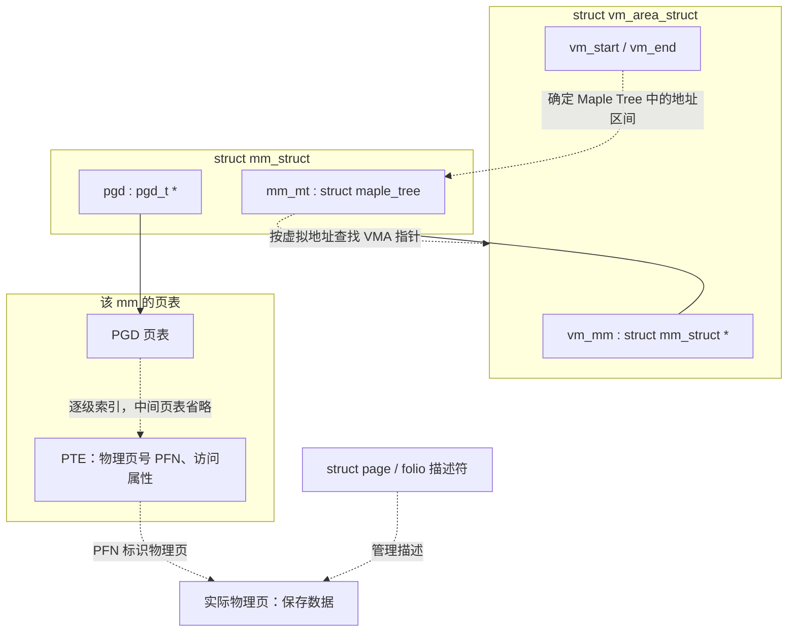
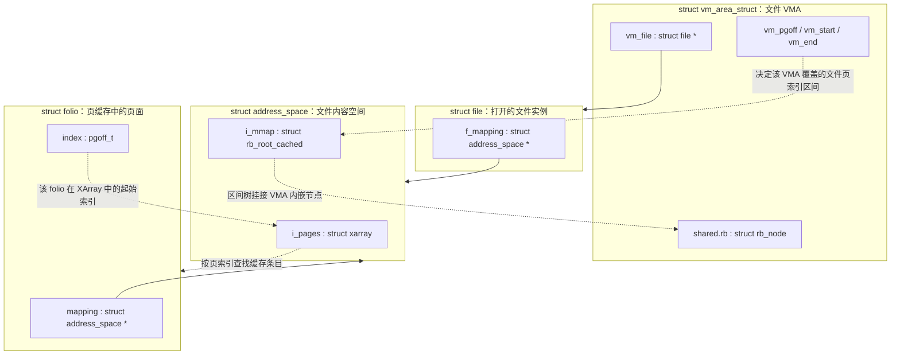
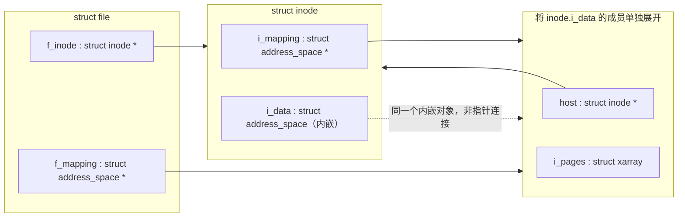
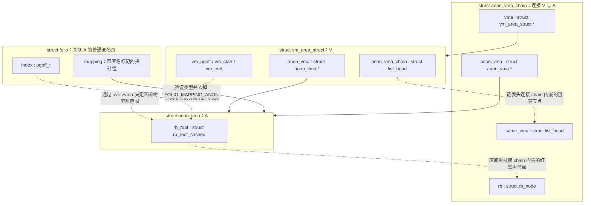
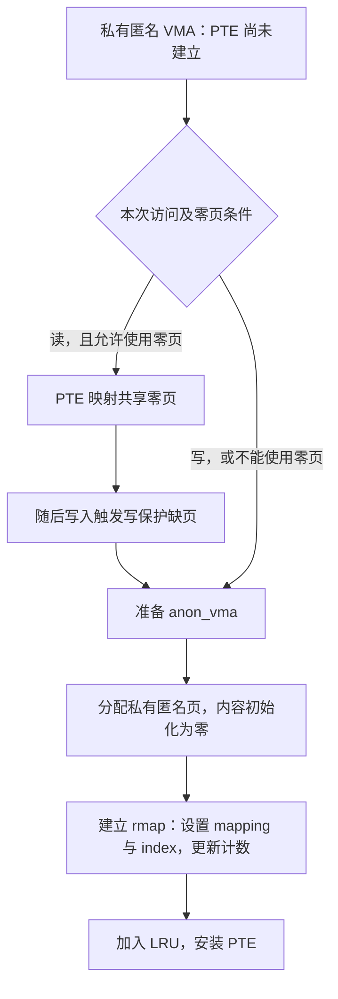
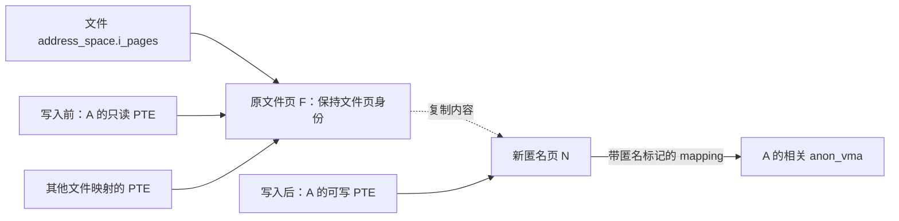
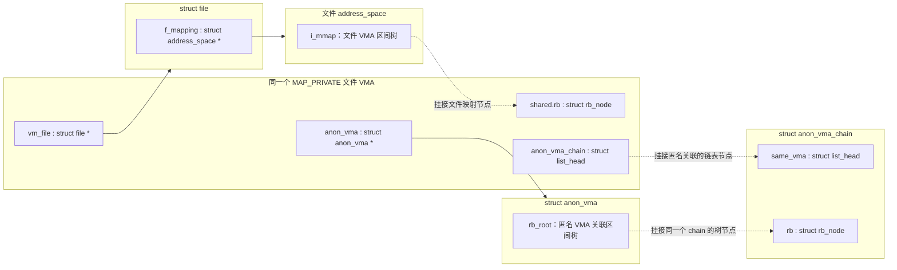

# 内存映射：page、文件映射与匿名映射

理解内存映射，要同时回答三个问题：**虚拟地址由哪个 VMA 管理，页表当前指向哪块物理内存，这块内存属于文件还是匿名内存？** `struct page/folio` 描述物理内存，VMA 描述虚拟地址区间，页表把两者连接起来；文件页与匿名页的关键差别在于内容来源、归属对象和反向映射方式。

本文以仓库内源码为准，版本字段见 [linux/Makefile](../../linux/Makefile#L2)。主要讨论普通用户内存和经过页缓存的文件映射，以单页、PTE 映射解释流程；大 folio、DAX、设备映射和 KSM 不展开。

**成员关系图的读法：** 外框表示一个结构体对象，框内小块表示成员。实线箭头从指针成员指向目标对象；虚线表示树/链表挂接、按索引查找或数值换算，具体含义写在连线上。树根、链表头和索引值不能都理解成普通对象指针。

## 1. 先认识核心数据结构

### 1.1 page 与 folio：描述物理内存

`struct page` 是基本物理页的**管理描述符**，页面的数据存放在对应的物理内存中。文件页、匿名页并不是两种不同的 `struct page`，而是页面的不同用途。

当前源码大量使用 `struct folio`：一个 folio 管理一个或多个连续的基本页。单页 folio 可以按一个 page 理解；对于大 folio，应先通过 `page_folio(page)` 找到归属 folio，再读取整体的 `mapping`、`index` 等信息，不能把任意尾页当成头页解释。

源码：[struct page](../../linux/include/linux/mm_types.h#L78)、[struct folio 的说明及定义](../../linux/include/linux/mm_types.h#L334)、[page_folio()](../../linux/include/linux/page-flags.h#L293)。

| 字段或接口 | 回答的问题 | 理解要点 |
| --- | --- | --- |
| `folio->mapping` | 这块内存归谁管理？ | 文件页关联 `address_space`；普通匿名页编码 `anon_vma` 指针 |
| `folio->index` | 它在所属对象中处于什么位置？ | 文件页是文件页偏移；匿名页是用于反向映射的逻辑页偏移 |
| `folio_mapcount()` | 有多少用户页表项映射它？ | 不是进程数，同一进程也能建立多个映射 |
| `folio_ref_count()` | 还有多少引用使它不能释放？ | 页表、页缓存及其他持有者都可能持有引用，不能等同于 mapcount |
| `flags` | 当前处于什么状态？ | 包括脏、回写、swap-backed 等状态；匿名类型由 `mapping` 的标记位识别 |

本版本 `struct page` 中对应索引的成员名是 `__folio_index`，`struct folio` 中是 `index`。普通单页 folio 的 `_mapcount` 从 `-1` 开始编码，接口返回 `_mapcount + 1`；大 folio 另有计数逻辑，应使用接口而非直接解释字段。

源码：[page 的 mapping 与索引](../../linux/include/linux/mm_types.h#L110)、[mapcount 与 refcount 字段](../../linux/include/linux/mm_types.h#L176)、[folio_mapcount() 的语义和实现](../../linux/include/linux/mm.h#L1287)。

`page` 与 `folio` 的这些成员不是通过指针互相连接，而是**同一描述符存储的不同视图**。对单页或复合页的头页，源码通过 `FOLIO_MATCH` 检查以下成员偏移一致：

| 头页的 `struct page` 视图 | `struct folio` 视图 | 关系 |
| --- | --- | --- |
| `page->mapping` | `folio->mapping` | 同一位置的归属信息 |
| `page->__folio_index` | `folio->index` | 同一位置的逻辑页索引 |
| `page->_mapcount` | `folio->_mapcount` | 同一位置的计数字段；大 folio 的整体计数仍应通过接口读取 |
| `page->_refcount` | `folio->_refcount` | 同一位置的引用计数 |

源码：[folio 与 page 的 union](../../linux/include/linux/mm_types.h#L419)、[FOLIO_MATCH 偏移检查](../../linux/include/linux/mm_types.h#L484)。后面的图统一使用 folio 视图。

### 1.2 mm 与 VMA：描述进程的虚拟地址空间

| 结构或字段 | 职责 |
| --- | --- |
| `mm_struct` | 管理一个用户地址空间；`mm_mt` 组织 VMA，`pgd` 指向页表根 |
| `vm_area_struct` | 描述 `[vm_start, vm_end)` 区间及访问规则，`vm_mm` 指回所属地址空间 |
| `vma->vm_flags` | 描述读写权限、是否共享等属性 |
| `vma->vm_file` | 关联的文件；普通私有匿名 VMA 为 `NULL` |
| `vma->vm_pgoff` | VMA 起点在映射对象中的页偏移，单位是 `PAGE_SIZE` |
| `vma->vm_ops` | 缺页等操作的回调；本版本 `vma_is_anonymous()` 实际检查它是否为空 |
| `vma->anon_vma`、`anon_vma_chain` | 关联匿名页反向映射对象，文件私有映射发生 COW 后也会使用 |

**VMA 的存在说明这段地址有映射规则，不代表对应的每个地址已经分配物理页、安装有效 PTE。** 在通常的按需缺页路径中，页面和页表映射随后才建立。



图中的 PTE 保存物理页号等信息，并不保存 `struct page *`。VMA 与页表是同一地址空间的两套管理信息，不是“VMA 内部保存全部 PTE”。

源码：[VMA 定义](../../linux/include/linux/mm_types.h#L815)、[mm_mt 与 pgd](../../linux/include/linux/mm_types.h#L963)、[把 VMA 按地址区间存入 Maple Tree](../../linux/include/linux/mm.h#L1067)、[vma_is_anonymous()](../../linux/include/linux/mm.h#L952)、[缺失 PTE 的分派](../../linux/mm/memory.c#L4371)、[从 PTE 取得物理页号](../../linux/mm/page_vma_mapped.c#L135)。

### 1.3 address_space 与 anon_vma：描述页面的归属

这两个对象解决同一个问题：一块物理内存可能被多个 VMA 映射，需要一个比单个 VMA 更稳定的归属对象。

| 对象 | 关键成员 | 如何组织页面或 VMA |
| --- | --- | --- |
| `address_space` | `host`、`i_pages`、`i_mmap`、`a_ops` | `i_pages` 是按文件页偏移索引页缓存的 XArray；`i_mmap` 是关联 VMA 的区间树；`a_ops` 提供读页、回写等操作 |
| `anon_vma` | `root`、`parent`、`rb_root` | 组织由 fork、VMA 拆分等形成的相关匿名映射；`rb_root` 索引关联的 `anon_vma_chain` |
| `anon_vma_chain` | `vma`、`anon_vma`、`same_vma`、`rb` | 连接一个 VMA 与一个 `anon_vma`；支持两者之间的多对多关系 |

`address_space` 在这里表示**文件等可缓存对象的内容空间**，不要与进程的 `mm_struct` 混淆。`anon_vma` 则不是匿名页版的页缓存：它没有一棵像 `i_pages` 那样按偏移保存全部匿名 folio 的树，主要作用是从匿名页找到相关 VMA。

为什么匿名页不直接保存 `VMA *`？因为 fork 后同一个页可能被父子进程共享，VMA 还会拆分、合并和销毁。源码在 [rmap.h 的说明](../../linux/include/linux/rmap.h#L18) 中直接解释了这个设计。相关定义见 [address_space](../../linux/include/linux/fs.h#L484)、[anon_vma 与 anon_vma_chain](../../linux/include/linux/rmap.h#L32)。

### 1.4 mapping 字段如何区分文件页与匿名页

虽然 `folio->mapping` 的声明类型是 `struct address_space *`，它并不总能直接按这个类型解引用。

```text
普通文件页：folio->mapping = address_space 指针
普通匿名页：folio->mapping = anon_vma 指针 + FOLIO_MAPPING_ANON
                                               即低位标记 0x1
```

因此，`folio_test_anon()` 检查的是 `mapping` 的匿名标记位；`folio_anon_vma()` 验证类型并去掉标记后，才得到真正的 `anon_vma *`。KSM 还会使用额外标记，不能把所有带匿名位的值都强转成 `anon_vma *`。

还要区分两个容易混淆的接口：

- `folio_mapping()`：查询 folio 所在的页缓存或 swap cache 的 `address_space`。普通匿名页不在 swap cache 时通常返回 `NULL`；在 swap cache 时返回对应的 swap mapping。
- `folio_mapped()`：查询是否仍被用户页表映射，与是否存在文件页缓存归属是两回事。

例如，一个文件 folio 可以留在页缓存中，却暂时没有任何用户 PTE 映射它；一个匿名 folio 可以被用户 PTE 映射，却没有文件 `address_space`。

源码：[mapping 标记位与 PageAnon()](../../linux/include/linux/page-flags.h#L696)、[folio_anon_vma() 与 folio_mapping()](../../linux/mm/util.c#L671)、[folio_mapped()](../../linux/include/linux/mm.h#L1319)。

## 2. 文件映射：以文件偏移找到页缓存，再建立页表映射

### 2.1 数据结构之间的关系

普通文件映射通过 `vma->vm_file->f_mapping` 找到文件的 `address_space`，然后按文件页偏移查找页缓存 folio。多个进程映射同一个文件范围时，可以使用同一份页缓存。



图中有两种不同的索引：`i_pages` 用于“文件偏移 → 页缓存”，`i_mmap` 用于“文件偏移范围 → 相关 VMA”。**`i_mmap` 树中的节点是 VMA 自己内嵌的 `shared.rb`；它不保存 PTE，也不挂接 folio。** 多个文件 VMA 各用自己的 `shared.rb` 加入同一个 `i_mmap`，各自的页表可以映射同一个缓存页。

| 从哪个成员出发 | 到哪里 | 连接的实际含义 |
| --- | --- | --- |
| `vma->vm_file` | `struct file` 对象 | 找到此 VMA 的文件实例 |
| `file->f_mapping` | `struct address_space` 对象 | 找到文件内容及页缓存的管理对象 |
| `folio->mapping` | 同一个 `address_space` | 从文件页反查其归属 |
| `mapping->i_pages` | 索引覆盖目标页的缓存 folio | 按文件页索引查找；树中还可能有非 folio 的特殊条目 |
| `mapping->i_mmap` | `vma->shared.rb` | 区间树挂接关系，从嵌入节点还原 VMA |
| `folio->index` 与 `vma->vm_pgoff` | 候选虚拟地址 | 数值换算，见下一节，不是指针连接 |

加入普通文件页缓存时，[__filemap_add_folio()](../../linux/mm/filemap.c#L861) 设置 `folio->mapping`、`folio->index`，随后把 folio 存入 `mapping->i_pages`。缺页时取文件 mapping 的代码见 [filemap_fault()](../../linux/mm/filemap.c#L3459)。

VMA 加入文件映射树的入口见 [vma_link_file()](../../linux/mm/vma.c#L1820)，`shared.rb` 作为树节点及其索引区间的定义见 [interval_tree.c](../../linux/mm/interval_tree.c#L13)。

再把 `file` 与 `inode` 的成员展开，就能看清为什么不同的打开实例仍然可以使用同一份页缓存。下图以通常由 `inode.i_data` 承载 mapping 的普通文件为例：



这里通常有 `file->f_mapping == inode->i_mapping == &inode->i_data`，而 `mapping->host == inode`。`i_mapping` 是指针，`i_data` 是内嵌对象，两者不能当成两个独立的页缓存。

源码：[file 的 f_mapping 与 f_inode](../../linux/include/linux/fs.h#L1211)、[inode 的 i_mapping](../../linux/include/linux/fs.h#L807)、[inode 的 i_data](../../linux/include/linux/fs.h#L883)、[初始化时选择 i_data](../../linux/fs/inode.c#L231)、[设置 mapping->host](../../linux/fs/inode.c#L278)、[设置 inode->i_mapping](../../linux/fs/inode.c#L295)、[打开文件时设置 f_inode 与 f_mapping](../../linux/fs/open.c#L911)。

### 2.2 虚拟地址如何换算成文件偏移

对于 VMA 内的地址 `addr`：

```text
对象页索引 = vma->vm_pgoff + ((addr - vma->vm_start) >> PAGE_SHIFT)
文件字节偏移 = (vma->vm_pgoff << PAGE_SHIFT) + (addr - vma->vm_start)
```

假设基本页大小为 4 KiB，VMA 从 `0x400000` 开始，映射文件的第 8 页。访问 `0x401234` 时，访问的是文件第 9 页，页内偏移为 `0x234`。若对应 folio 包含多个页，`folio->index` 是这个 folio 的起始页索引，不一定等于本次访问的页索引。

源码：[linear_page_index()](../../linux/include/linux/pagemap.h#L1050)、[folio 的 index 定义](../../linux/include/linux/mm_types.h#L340)、[从 folio 取本次缺页对应的 page](../../linux/mm/filemap.c#L3582)。

### 2.3 第一次访问时发生什么

以普通文件的读缺页为例，省略锁、重试和预读细节：

```text
访问文件 VMA 中尚未建立 PTE 的地址
    → do_pte_missing()
    → do_fault() → do_read_fault()
    → vma->vm_ops->fault()，通用文件实现为 filemap_fault()
    → 按文件页索引查找页缓存
        命中且数据有效：使用已有 folio
        未命中或数据无效：分配/取得 folio，准备文件数据
    → finish_fault() 建立用户页表映射并更新反向映射计数
```

文件数据已在页缓存中时，缺页不一定需要磁盘 I/O。反过来，把 folio 加入页缓存也不等于已经安装了某个进程的 PTE。实际读缺页还可能通过 `map_pages` 提前映射附近的缓存页。

源码：[缺页类型分派](../../linux/mm/memory.c#L5864)、[do_read_fault()](../../linux/mm/memory.c#L5711)、[filemap_fault() 查找缓存](../../linux/mm/filemap.c#L3477)、[通过 read_folio 准备数据](../../linux/mm/filemap.c#L3585)、[generic_file_vm_ops](../../linux/mm/filemap.c#L3929)、[set_pte_range()](../../linux/mm/memory.c#L5421)。

写入时，是否共享决定后续行为：

| 映射方式 | 写入目标 | 对原文件的影响 |
| --- | --- | --- |
| `MAP_SHARED` 文件映射 | 仍是文件页缓存中的页 | 修改共享内容，脏数据经文件回写机制写回；一次内存写入不等于立即持久化 |
| `MAP_PRIVATE` 文件映射 | COW 产生的匿名副本 | 该私有修改不写回原文件 |

共享写缺页可调用文件系统的 `page_mkwrite`，随后完成映射与脏页处理；私有写缺页进入 COW。源码见 [do_shared_fault()](../../linux/mm/memory.c#L5785)、[filemap_page_mkwrite() 的置脏操作](../../linux/mm/filemap.c#L3922)、[do_cow_fault()](../../linux/mm/memory.c#L5743)。

## 3. 私有匿名映射：按需建立匿名页与 anon_vma 的关系

### 3.1 匿名页如何找到相关 VMA

私有匿名映射通常没有文件提供初始数据。为它建立普通匿名页时，内核设置：

```text
folio->mapping = 带匿名标记的 anon_vma 指针
folio->index   = linear_page_index(vma, address)
```

这里的 `index` 不是磁盘位置，也不是固定从当前 VMA 起点算起的序号；它包含 `vm_pgoff`，用于在相关 VMA 之间保持一致的逻辑位置。



图中先展开一个 VMA 与一个 `anon_vma` 的连接。**同一个 `anon_vma_chain` 同时嵌入两套组织结构：`same_vma` 加入 VMA 的链表，`rb` 加入 anon_vma 的区间树。** `chain->vma` 和 `chain->anon_vma` 则是回指两端对象的普通指针。

| 查找方向 | 成员之间的连接顺序 | 用途 |
| --- | --- | --- |
| 从一个 VMA 找相关 anon_vma | `vma->anon_vma_chain` → 每个 `chain->same_vma` → `chain->anon_vma` | 遍历这个 VMA 关联的多个 anon_vma |
| 从一个 anon_vma 找相关 VMA | `anon_vma->rb_root` → 每个 `chain->rb` → `chain->vma` | 按页索引范围筛选候选 VMA |
| 从一个普通匿名页找相关 VMA | 解码 `folio->mapping` → `anon_vma->rb_root` → `chain->rb` → `chain->vma` | 匿名页反向映射 |
| 为当前 VMA 建立新的独占匿名页 | `vma->anon_vma` → 编码后写入 `folio->mapping` | 确定新页的匿名归属 |

fork 后，一个 `anon_vma` 的树中可以有来自父、子进程的多个 chain；子进程的一个 VMA 也可以通过多个 chain 关联不同的 `anon_vma`。其中，`vma->anon_vma` 只是一个直接指针，不能代替整个 `vma->anon_vma_chain` 链表；旧共享页的 `folio->mapping` 解码结果也不必等于当前 VMA 的 `anon_vma`。

`anon_vma` 还有 `parent`、`root` 两个指针，用于记录祖先关系。新建子对象时，`child->parent = parent_vma->anon_vma`，`child->root = parent_vma->anon_vma->root`。它们指向其他 anon_vma；上图的 `rb_root` 则是挂接 chain 的区间树根，三者用途不同。

源码：[anon_vma_chain 的成员及双向组织](../../linux/include/linux/rmap.h#L70)、[anon_vma_chain_link() 的四条连接操作](../../linux/mm/rmap.c#L149)、[匿名区间树使用 chain->rb](../../linux/mm/interval_tree.c#L61)、[__folio_set_anon()](../../linux/mm/rmap.c#L1352)、[fork 继承关联并设置 parent/root](../../linux/mm/rmap.c#L346)。

### 3.2 第一次读与第一次写并不相同



`do_anonymous_page()` 的读路径可以映射共享零页，暂时不为这个地址分配私有数据页；需要自己的页面时才准备 `anon_vma`、分配匿名 folio，并通过 `folio_add_new_anon_rmap()` 建立关系。从零页转为私有页的写保护缺页走 `wp_page_copy()`，也会准备匿名页并替换 PTE。

共享零页是特殊映射，不能把“读到了零”理解为“已经建立了一个普通匿名 folio 的全部 rmap 信息”。如果 VMA 尚无 `anon_vma`，准备过程可能复用相关对象，也可能新建。

源码：[零页读路径](../../linux/mm/memory.c#L5169)、[分配匿名 folio](../../linux/mm/memory.c#L5193)、[建立 rmap 并安装 PTE](../../linux/mm/memory.c#L5241)、[匿名页分配中的清零处理](../../linux/mm/memory.c#L5123)、[零页写保护缺页的分配分支](../../linux/mm/memory.c#L3693)、[__anon_vma_prepare()](../../linux/mm/rmap.c#L159)。

## 4. COW：文件映射为什么也会出现匿名页

写时复制的作用是保持私有修改的隔离。它既用于私有文件映射，也用于 fork 后的私有匿名内存。

### 4.1 私有文件映射发生写入

假设进程 A 已经通过读缺页映射了文件页 F，之后写入：



**发生变化的是 A 的 PTE 指向，以及新副本的页面归属；原文件页 F 不会被整体改成匿名页。** 同时，A 的 VMA 仍保留 `vm_file`，未发生 COW 的其他地址仍可映射原文件页。因此，一个文件私有 VMA 可以同时包含文件页和匿名页，并同时关联 `address_space.i_mmap` 与 `anon_vma`。

把这个 VMA 的挂接成员展开，可以看到两条反向映射路径同时存在：



这张图省略了 chain 的两个回指指针，它们与第 3.1 节相同。关键是：**文件路径挂 `VMA.shared.rb`，匿名路径挂 `chain.rb`；这两个树节点属于不同结构体，因此可以同时存在。** `shared.rb` 的成员名也不表示它只服务于 `MAP_SHARED`。

两种触发入口需要分开记：

| 触发情形 | 主要路径 |
| --- | --- |
| PTE 还不存在，第一次访问就是私有写 | `do_fault()` → `do_cow_fault()`：准备匿名副本，取得文件页并复制内容 |
| 已有只读 PTE，再尝试写入 | `do_wp_page()` → `wp_page_copy()`：建立匿名副本并替换原 PTE |

源码：[VMA 同时关联两种 rmap 的注释](../../linux/include/linux/mm_types.h#L861)、[do_cow_fault()](../../linux/mm/memory.c#L5743)、[wp_page_copy() 分配与复制](../../linux/mm/memory.c#L3687)、[替换 PTE 并建立匿名 rmap](../../linux/mm/memory.c#L3760)。

### 4.2 fork 后的匿名页写入

通常情况下，fork 先让父子进程的 PTE 指向同一个匿名页，并对需要 COW 的页表项设置写保护。子进程继承父进程的相关 `anon_vma` 关系，以便 rmap 找到仍然共享的旧页；对于后续新页，还会建立或复用适合子进程的 `anon_vma`。

后续写入时，如果旧页仍需共享，则复制出新的匿名页。若内核确认旧匿名页已经独占或可以安全复用，则可以直接恢复可写，**写保护缺页并不必然执行一次内存复制**。不能只凭 `mapcount == 1` 自行判断是否可复用。

源码：[复制页表时设置写保护](../../linux/mm/memory.c#L1097)、[anon_vma_fork()](../../linux/mm/rmap.c#L328)、[do_wp_page() 的匿名页复用判断](../../linux/mm/memory.c#L4126)。

## 5. 反向映射：从一个 page 找到哪些页表映射了它

正向访问从虚拟地址出发，经页表找到物理页。回收等操作常从物理页出发，需要找到相关进程的页表项，这就是反向映射（rmap）。

| 页面类型 | 寻找候选 VMA 的路径 |
| --- | --- |
| 文件页 | `folio->mapping` → `address_space.i_mmap` → 覆盖该文件偏移的 VMA |
| 普通匿名页 | `folio->mapping` 去除标记 → `anon_vma.rb_root` → `anon_vma_chain` → VMA |

两种方式都利用 `folio->index` 缩小搜索范围，然后根据 VMA 的起点和 `vm_pgoff` 算出候选虚拟地址。对于一个基本页，其逻辑页索引为 `page_index` 时：

```text
候选虚拟地址 = vma->vm_start
             + ((page_index - vma->vm_pgoff) << PAGE_SHIFT)
```

前提是这个页索引落在 VMA 所覆盖的对象区间内；对于大 folio，还要处理 folio 与 VMA 仅部分重叠的情况。

区间树找到的只是**候选 VMA**，不保证该 VMA 的 PTE 目前仍然映射这个页：它可能尚未缺页，也可能已经 COW 到另一页。最终仍要检查页表中的物理页号。

下面是便于理解的概念伪代码，省略 KSM、大页、锁、引用和并发重试：

```text
反向查找(folio):
    if folio 是普通匿名页:
        候选集合 = 查询 anon_vma 的区间树
    else:
        候选集合 = 查询 address_space 的 i_mmap 区间树

    for vma in 候选集合:
        addr = 根据 folio 的页索引和 vma 计算地址
        在 vma->vm_mm 的页表中检查 addr
        if 页表项确实指向目标 folio 中的物理页:
            执行所需操作，例如检查访问状态、解除映射
```

源码：[rmap_walk() 类型分派](../../linux/mm/rmap.c#L2976)、[rmap_walk_anon()](../../linux/mm/rmap.c#L2845)、[__rmap_walk_file()](../../linux/mm/rmap.c#L2906)、[vma_address()](../../linux/mm/internal.h#L1069)、[页表物理页号校验](../../linux/mm/page_vma_mapped.c#L104)。回收中的实际调用见 [try_to_unmap() 调用点](../../linux/mm/vmscan.c#L1396) 和 [try_to_unmap_one() 的页表遍历](../../linux/mm/rmap.c#L1920)。

## 6. 共享匿名映射：用户接口叫匿名，内核使用 shmem

`MAP_ANONYMOUS` 表示调用者没有提供普通文件作为后备对象，不能据此断定最终页面一定满足 `PageAnon()`。

对于 `MAP_SHARED | MAP_ANONYMOUS`，内核通过 `shmem_zero_setup()` 创建内部 shmem 文件，设置 `vma->vm_file` 和 `shmem_anon_vm_ops`。驻留于该对象页缓存中的 folio，其 `mapping` 指向 shmem 的 `address_space`，通过 `i_pages` 按偏移查找，反向映射走文件页一侧。

```text
共享匿名 VMA
    → 内核创建的 shmem file
    → address_space
    → i_pages 中的 shmem folio
```

这类 folio 具有 swap-backed 属性，但不是普通 `PageAnon()` 页。其内容需要保留时可以通过 swap 换出，所以“由 address_space 管理”也不等于“数据一定来自磁盘上的普通文件”。

源码：[共享与私有匿名 VMA 的创建分支](../../linux/mm/vma.c#L2520)、[shmem_zero_setup()](../../linux/mm/shmem.c#L5931)、[shmem 页缓存中的 mapping 与 index](../../linux/mm/shmem.c#L863)、[shmem_fault()](../../linux/mm/shmem.c#L2757)、[shmem 换出路径](../../linux/mm/shmem.c#L1647)。

## 7. 对照表与记忆要点

下面按已经建立的普通页面关系比较，零页、KSM 和迁移等特殊状态不列入：

| 场景 | 当前页面 | `folio->mapping` 的含义 | 反向映射入口 | 修改的去向 |
| --- | --- | --- | --- | --- |
| 普通文件 `MAP_SHARED` | 文件页缓存 folio | 文件 `address_space` | `i_mmap` | 修改文件内容，经文件回写机制处理 |
| 普通文件 `MAP_PRIVATE`，尚未 COW | 文件页缓存 folio | 文件 `address_space` | `i_mmap` | 私有写入会触发 COW |
| 普通文件 `MAP_PRIVATE`，已经 COW | 匿名 folio | 带匿名标记的 `anon_vma` | `anon_vma` 区间树 | 保留私有修改，不写回原文件 |
| 私有匿名映射，已分配自己的页 | 匿名 folio | 带匿名标记的 `anon_vma` | `anon_vma` 区间树 | 保留私有数据，必要时可换出到 swap |
| 共享匿名映射，页驻留 shmem 缓存 | shmem folio | shmem `address_space` | `i_mmap` | 保留共享数据，必要时可换出到 swap |

回收时也要根据内容是否能够恢复来理解：干净的普通文件缓存页在解除映射、满足引用等条件后可以丢弃，以后从文件重新读取；脏文件页需要先完成回写。仍需保留内容的普通匿名页则通常需要 swap，不能仅因为没有文件后备就直接丢掉；允许丢弃内容的特殊映射另当别论。

源码：[回收时的引用与脏页检查](../../linux/mm/vmscan.c#L744)、[普通文件回写与回收的分工](../../linux/mm/vmscan.c#L683)、[匿名页申请 swap](../../linux/mm/vmscan.c#L1302)、[可丢弃匿名映射的例外](../../linux/mm/rmap.c#L1547)。

面试时可以沿着这条线回答：**page/folio 管理物理内存，VMA 管理虚拟区间，页表建立实际映射；文件页通过 address_space 归属文件并进入页缓存，普通匿名页通过 anon_vma 找到相关 VMA。私有文件映射写入产生匿名副本，fork 后的匿名页也可以暂时共享。判断页面类型要看页面本身，判断映射语义要看 VMA；两者需要分别分析。**
