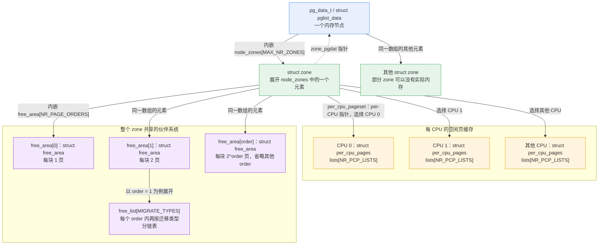
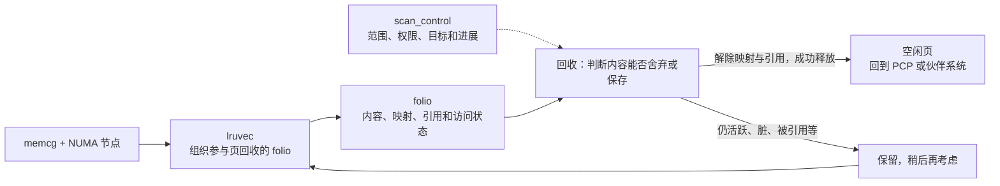
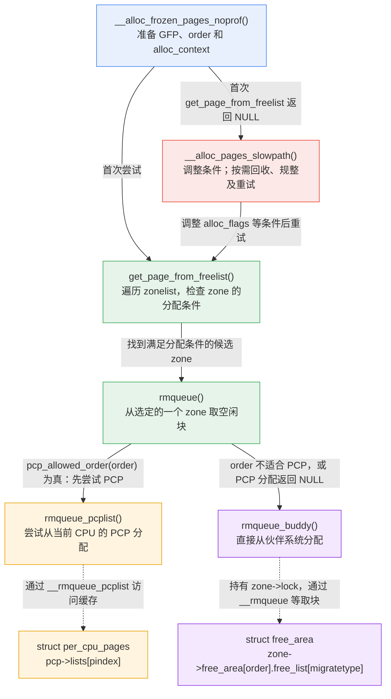
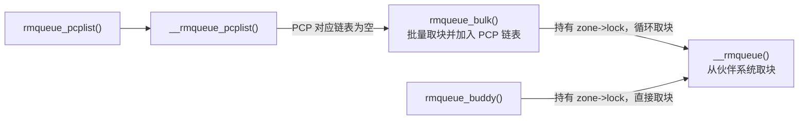
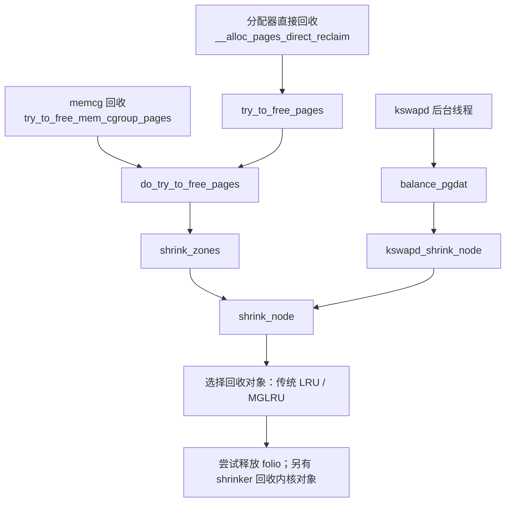
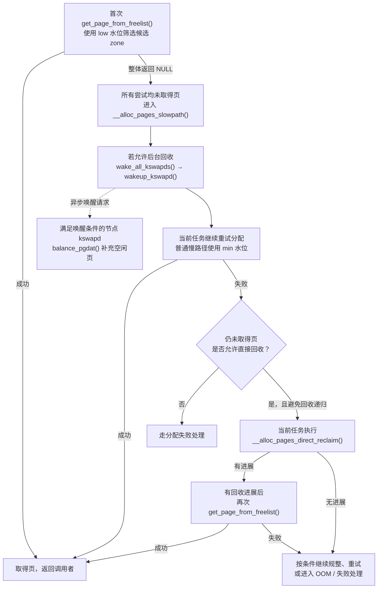
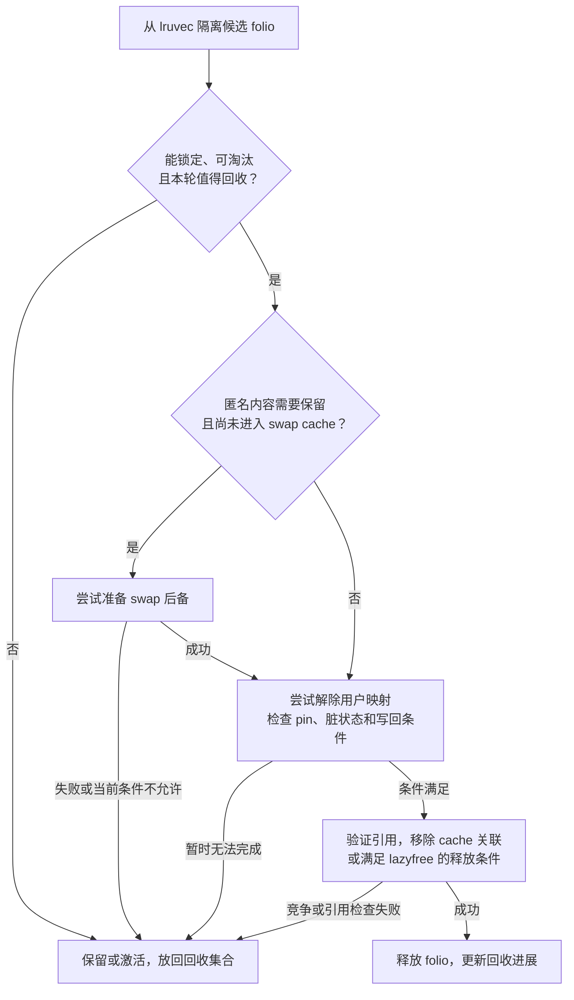

# 内存分配与回收：源码分析与面试准备

本文以项目内的 Linux 源码为依据，版本字段见 [Makefile:2](../../linux/Makefile#L2)。阅读顺序是：先认识管理空闲页和已使用页的数据结构，再串起分配、回收和规整，最后通过面试问答检验理解。涉及配置开关的行为，以本文引用的实现和实际配置为准。

面试复习可以先读文末的 [高频面试问答](#高频面试问答)，遇到调用链和水位问题再回看前文；[场景题与排查思路](#场景题与排查思路) 用于练习把机制转化为判断依据。

## 核心数据结构

先按管理范围理解这四个结构：`pg_data_t` 描述一个内存节点，节点内嵌多个 `zone`；每个 `zone` 同时管理每 CPU 的空闲页缓存（PCP）和整个 zone 共享的伙伴系统空闲链表。

### 结构关系图

图中的实线表示成员包含或指针引用，虚线表示 `zone` 指回所属节点。为便于阅读，只展开一个 zone；其他 zone 也具有同样的结构。



| 结构                   | 管理范围与作用                                                   | 连接关系及源码                                                                                                                                                                                         |
| ---------------------- | ---------------------------------------------------------------- | ------------------------------------------------------------------------------------------------------------------------------------------------------------------------------------------------------ |
| `pg_data_t`            | 节点级，组织该节点的内存区域                                     | 内嵌 `node_zones[]`，见 [mmzone.h:1391](../../linux/include/linux/mmzone.h#L1391)                                                                                                                      |
| `struct zone`          | 区域级，同时管理 PCP 和伙伴系统                                  | `zone_pgdat` 指回节点，`per_cpu_pageset` 引用 per-CPU 存储，见 [mmzone.h:903](../../linux/include/linux/mmzone.h#L903)；内嵌 `free_area[]`，见 [mmzone.h:999](../../linux/include/linux/mmzone.h#L999) |
| `struct per_cpu_pages` | 每个 zone、每个 CPU 一份空闲页缓存，减少对共享伙伴系统的频繁访问 | `lists[]` 保存缓存的空闲块，见 [mmzone.h:744](../../linux/include/linux/mmzone.h#L744)；创建和选择每 CPU 实例，见 [page_alloc.c:6170](../../linux/mm/page_alloc.c#L6170)                               |
| `struct free_area`     | 每个 zone、每个 order 一个，管理该大小的伙伴系统空闲块           | `free_list[]` 按迁移类型细分，`nr_free` 记录这个 order 的空闲块总数，见 [mmzone.h:138](../../linux/include/linux/mmzone.h#L138) 与 [增加空闲块计数](../../linux/mm/page_alloc.c#L847)                  |

**PCP 和 `free_area` 是同一个 zone 的两条管理分支。** PCP 中的空闲块暂存在 `pcp->lists[]`；回到伙伴系统后，才进入 `zone->free_area[order].free_list[migratetype]`，同一个空闲块不会同时挂在两边。

### PCP 与伙伴系统怎样配合


分配时，PCP 链表为空便通过 `rmqueue_bulk()` 从伙伴系统补充，见 [__rmqueue_pcplist():3298](../../linux/mm/page_alloc.c#L3298)。释放时，[pcp_allowed_order()](../../linux/mm/page_alloc.c#L717) 允许的 order 先尝试加入当前 CPU 的 PCP，见 [free_frozen_page_commit():2875](../../linux/mm/page_alloc.c#L2875)。order 不适合 PCP 时走 `__free_pages_ok()`；页块是隔离类型，或拿不到 PCP 锁时走 `free_one_page()`。这两条路径都回到伙伴系统，见 [page_alloc.c:2943](../../linux/mm/page_alloc.c#L2943)、[隔离页:2962](../../linux/mm/page_alloc.c#L2962) 和 [锁失败:2981](../../linux/mm/page_alloc.c#L2981)。需要排空时，`free_pcppages_bulk()` 再调用 `__free_one_page()`，见 [page_alloc.c:1494](../../linux/mm/page_alloc.c#L1494)。

注意，本版本 PCP **也按 order 和迁移类型分类，并非只缓存 order-0 页**。普通 PCP 链表下标为 `MIGRATE_PCPTYPES * order + migratetype`；启用透明大页时还有专用链表，见 [order_to_pindex():684](../../linux/mm/page_alloc.c#L684)。

### pg_data_t

以下为关键字段节选，源码见 [mmzone.h:1385](../../linux/include/linux/mmzone.h#L1385)。

```c
/*
 * On NUMA machines, each NUMA node would have a pg_data_t to describe
 * it's memory layout. On UMA machines there is a single pglist_data which
 * describes the whole memory.
 *
 * Memory statistics and page replacement data structures are maintained on a
 * per-zone basis.
 */
typedef struct pglist_data {
	/*
	 * node_zones contains just the zones for THIS node. Not all of the
	 * zones may be populated, but it is the full list. It is referenced by
	 * this node's node_zonelists as well as other node's node_zonelists.
	 */
	struct zone node_zones[MAX_NR_ZONES];

	/*
	 * node_zonelists contains references to all zones in all nodes.
	 * Generally the first zones will be references to this node's
	 * node_zones.
	 */
	struct zonelist node_zonelists[MAX_ZONELISTS];

	int nr_zones; /* number of populated zones in this node */
	int node_id;
	/* 一个node对应一个kswapd */
	wait_queue_head_t kswapd_wait;
	/*
	每个 NUMA 节点用于暂停直接回收任务的等待队列：当该节点的紧急内存储备过低时，让部分任务先等待，由
	kswapd 继续回收，恢复条件后再唤醒它们。
	*/
	wait_queue_head_t pfmemalloc_wait;

	/* workqueues for throttling reclaim for different reasons. */
	/*
	当回收任务暂时难以取得进展时，让它短暂睡眠，等待写回或其他回收任务推进，避免反复扫描、争抢资源。
	内核线程里只有 kswapd 会睡到 reclaim_wait 上。用户进程做直接回收时也会睡这组队列.
	*/
	wait_queue_head_t reclaim_wait[NR_VMSCAN_THROTTLE];

	/* nr_writeback_throttled、kswapd、kswapd_order、kswapd_highest_zoneidx、__lruvec 等略 */

#ifdef CONFIG_LRU_GEN
	/* kswap mm walk data */
	struct lru_gen_mm_walk mm_walk;
	/* lru_gen_folio list */
	/*
	这个节点上的 memcg 排队表，不是页的 LRU。多代 LRU（CONFIG_LRU_GEN）做全局回收时，靠它决定下一个扫
	哪个 memcg；每个 memcg 在该节点上的页，仍然挂在自己的 lruvec 里。
	 */
	struct lru_gen_memcg memcg_lru;
#endif

	/* Per-node vmstats */
	struct per_cpu_nodestat __percpu *per_cpu_nodestats;
	atomic_long_t		vm_stat[NR_VM_NODE_STAT_ITEMS];
} pg_data_t;
```

结构体开头的英文注释写着统计和页替换按 zone 维护。那是源码里保留的旧说明。本版本里，zone 仍有自己的 `vm_stat`，可回收 folio 则按节点或“memcg × 节点”挂在 `lruvec` 上。

### struct zone

以下为关键字段节选，源码见 [mmzone.h:879](../../linux/include/linux/mmzone.h#L879) 与 [mmzone.h:999](../../linux/include/linux/mmzone.h#L999)。

```c
struct zone {
	/* zone watermarks, access with *_wmark_pages(zone) macros */
	unsigned long _watermark[NR_WMARK];
	unsigned long watermark_boost;
	/* nr_reserved_highatomic、nr_free_highatomic 略 */

	/*
	 * We don't know if the memory that we're going to allocate will be
	 * freeable or/and it will be released eventually, so to avoid totally
	 * wasting several GB of ram we must reserve some of the lower zone
	 * memory (otherwise we risk to run OOM on the lower zones despite
	 * there being tons of freeable ram on the higher zones).  This array is
	 * recalculated at runtime if the sysctl_lowmem_reserve_ratio sysctl
	 * changes.
	 */
	long lowmem_reserve[MAX_NR_ZONES];

#ifdef CONFIG_NUMA
	int node;
#endif
	struct pglist_data	*zone_pgdat;
	struct per_cpu_pages	__percpu *per_cpu_pageset;
	struct per_cpu_zonestat	__percpu *per_cpu_zonestats;
	/* pageset 水位、zone_start_pfn、managed_pages 等略 */

	const char		*name;
	/* 隔离页块计数、热插拔锁、initialized 等略 */

	/* 伙伴系统：按 order 组织空闲块，每个 order 内再按迁移类型分类 */
	struct free_area	free_area[NR_PAGE_ORDERS];

	/* zone flags, see below */
	unsigned long		flags;
	/* 保护 free_area 的 zone->lock 等略 */

	/* Zone statistics */
	atomic_long_t		vm_stat[NR_VM_ZONE_STAT_ITEMS];
	atomic_long_t		vm_numa_event[NR_VM_NUMA_EVENT_ITEMS];
} ____cacheline_internodealigned_in_smp;
```

### struct per_cpu_pages

源码见 [mmzone.h:744](../../linux/include/linux/mmzone.h#L744)。

```c
struct per_cpu_pages {
	spinlock_t lock;	/* Protects lists field */
	int count;		/* number of pages in the list */
	int high;		/* high watermark, emptying needed */
	int high_min;		/* min high watermark */
	int high_max;		/* max high watermark */
	int batch;		/* chunk size for buddy add/remove */
	u8 flags;		/* protected by pcp->lock */
	u8 alloc_factor;	/* batch scaling factor during allocate */
#ifdef CONFIG_NUMA
	u8 expire;		/* When 0, remote pagesets are drained */
#endif
	short free_count;	/* consecutive free count */

	/* Lists of pages, one per migrate type stored on the pcp-lists */
	struct list_head lists[NR_PCP_LISTS];
} ____cacheline_aligned_in_smp;
```

### struct free_area

源码见 [mmzone.h:138](../../linux/include/linux/mmzone.h#L138)。

```c
struct free_area {
	struct list_head	free_list[MIGRATE_TYPES];
	unsigned long		nr_free;
};
```

### 从空闲页管理补齐到回收对象

前面四个结构主要回答“空闲内存放在哪里”。面试还需要回答“这次请求能用哪些内存”“哪些已使用页可以交还给分配器”。这里先认识后续算法会访问的结构，不必背诵整个定义。

| 结构 | 面试需要抓住的字段与含义 | 源码定位 |
| --- | --- | --- |
| `struct alloc_context` | `zonelist`、`nodemask`、`highest_zoneidx` 限定分配搜索范围；`migratetype` 指明优先使用的迁移类型 | [internal.h:579](../../linux/mm/internal.h#L579) |
| `struct page` / `struct folio` | `page` 描述基本物理页；`folio` 把一个或多个连续基本页作为整体管理。回收关注 `flags`、`lru`、`mapping`、引用计数、映射计数和 memcg 归属 | [page 定义:78](../../linux/include/linux/mm_types.h#L78)、[folio 语义及字段:333](../../linux/include/linux/mm_types.h#L333) |
| `struct lruvec` | 组织一组 folio 的回收状态。传统 LRU 使用 `lists[]`，并记录 `anon_cost`、`file_cost`；启用 MGLRU 时还有 `lrugen` | [mmzone.h:669](../../linux/include/linux/mmzone.h#L669) |
| `struct scan_control` | 一轮回收的工作条件：`nr_to_reclaim` 是目标，`nr_scanned` / `nr_reclaimed` 是进展；`may_swap`、`may_unmap`、`gfp_mask` 决定可做什么；`target_mem_cgroup` 指定目标 cgroup | [vmscan.c:75](../../linux/mm/vmscan.c#L75) |
| `struct kmem_cache` / `struct slab` | 前者描述一类对象缓存的大小与管理策略；后者描述承载对象的 slab，`freelist`、`inuse`、`objects` 记录空闲对象和占用情况 | [kmem_cache:238](../../linux/mm/slab.h#L238)、[slab:52](../../linux/mm/slab.h#L52) |
| `struct shrinker` | 用 `count_objects()` 估计可回收对象，用 `scan_objects()` 尝试释放对象；对象所属子系统负责判断能否安全丢弃 | [shrinker.h:60](../../linux/include/linux/shrinker.h#L60) |
| `struct compact_control` | 一轮规整的工作状态：`migratepages` 是待迁移页，`freepages[]` 是迁移目的空闲页，两个 PFN 游标记录扫描位置，`order` 是目标连续块大小 | [internal.h:866](../../linux/mm/internal.h#L866) |

**`lruvec` 不是整机唯一的一条 LRU，也不是伙伴系统的空闲链表。** 启用 memcg 时，通常按“memcg × NUMA 节点”定位一个 `lruvec`；禁用 memcg 时使用节点自己的 `__lruvec`。`folio_lruvec()` 用 folio 的 memcg 和节点找到它所属的回收集合，见 [mem_cgroup_lruvec():705](../../linux/include/linux/memcontrol.h#L705) 和 [folio_lruvec():738](../../linux/include/linux/memcontrol.h#L738)。



图中只画普通页回收主线，省略内存分层降级迁移等分支。成功释放后调用 `free_unref_folios()`，仍需按 order 和当前条件选择 PCP 或伙伴系统，见 [回收结束:1642](../../linux/mm/vmscan.c#L1642) 和 [释放路径:2994](../../linux/mm/page_alloc.c#L2994)。

## 内存分配和回收

### 内存分配

结合前面的数据结构，可以把分配过程分成三层：
* 入口准备分配条件
* `get_page_from_freelist()`: 选择可用的 zone，`rmqueue()` 从该 zone 的 PCP 或伙伴系统取出空闲块。
* 首次尝试失败后，入口调用慢路径，由慢路径调整条件、按需回收或规整，再尝试分配。

#### 六个函数的关系图

实线表示直接调用，箭头上的文字表示调用条件；虚线连接函数实际访问的数据结构。图中省略参数检查、部分特殊分支和返回时的处理，重点展示这六个函数之间的关系。



| 函数                            | 主要职责与调用关系                                                                                                          | 源码定位                                                                                                                                                                                                           |
| ------------------------------- | --------------------------------------------------------------------------------------------------------------------------- | ------------------------------------------------------------------------------------------------------------------------------------------------------------------------------------------------------------------ |
| `__alloc_frozen_pages_noprof()` | 调用 `prepare_alloc_pages()` 准备条件；先调用 `get_page_from_freelist()`，失败后调用 `__alloc_pages_slowpath()`             | [入口:5259](../../linux/mm/page_alloc.c#L5259)、[首次尝试:5295](../../linux/mm/page_alloc.c#L5295)、[进入慢路径:5308](../../linux/mm/page_alloc.c#L5308)                                                           |
| `get_page_from_freelist()`      | 按 zonelist 搜索 zone，检查 nodemask、cpuset、水位等条件；对候选 zone 调用 `rmqueue()`，成功后执行 `prep_new_page()` 并返回 | [函数:3774](../../linux/mm/page_alloc.c#L3774)、[遍历 zone:3792](../../linux/mm/page_alloc.c#L3792)、[取页及准备:3925](../../linux/mm/page_alloc.c#L3925)                                                          |
| `rmqueue()`                     | 在一个 zone 内选择取页路径：允许缓存的 order 先尝试 PCP；不适合 PCP 或 PCP 失败时调用 `rmqueue_buddy()`                     | [函数及分支:3376](../../linux/mm/page_alloc.c#L3376)                                                                                                                                                               |
| `rmqueue_pcplist()`             | 尝试锁定该 zone 的当前 CPU PCP，根据 order 与迁移类型选择链表，再调用 `__rmqueue_pcplist()`；锁定失败也会返回 `NULL`        | [函数:3329](../../linux/mm/page_alloc.c#L3329)、[选择链表并分配:3352](../../linux/mm/page_alloc.c#L3352)                                                                                                           |
| `rmqueue_buddy()`               | 获取 `zone->lock`，通过 `__rmqueue()` 等从伙伴系统取块；内部处理迁移类型选择、拆分以及特殊预留分配                          | [函数:3201](../../linux/mm/page_alloc.c#L3201)、[调用 __rmqueue:3221](../../linux/mm/page_alloc.c#L3221)、[查找与拆分:1927](../../linux/mm/page_alloc.c#L1927)                                                     |
| `__alloc_pages_slowpath()`      | 重新计算分配条件，按 GFP 标志决定唤醒 kswapd、直接回收、规整、重试和 OOM 处理；仍复用 `get_page_from_freelist()` 取页       | [函数:4729](../../linux/mm/page_alloc.c#L4729)、[调整条件后重试:4812](../../linux/mm/page_alloc.c#L4812)、[直接回收:4927](../../linux/mm/page_alloc.c#L4927)、[随后规整:4934](../../linux/mm/page_alloc.c#L4934)、[OOM 分支:4982](../../linux/mm/page_alloc.c#L4982) |

#### PCP 缓存为空时的补充路线

PCP 对应链表为空时，`__rmqueue_pcplist()` 先尝试批量补充，然后从补充后的链表取块：



两条路线共用底层的 `__rmqueue()`：PCP 路线通过批量取块减少共享锁的获取次数；`rmqueue_buddy()` 则直接满足本次分配。依据见 [PCP 补充与取块:3306](../../linux/mm/page_alloc.c#L3306)、[批量取块:2555](../../linux/mm/page_alloc.c#L2555) 和 [直接取块:3221](../../linux/mm/page_alloc.c#L3221)。

#### 怎样判断何时进入慢路径

**某一个 zone 的 PCP 或伙伴系统失败，不会立即进入慢路径。** `rmqueue()` 返回 `NULL` 后，`get_page_from_freelist()` 还会继续搜索其他允许的 zone。这一轮扫完后还有两种重试：多节点时会先跳过 kswapd 已经不在 `kswapd_wait` 上的节点，若因此没分到页，就取消跳过再扫一遍；带有 `ALLOC_NOFRAGMENT` 且未进入 defrag 模式时，会清掉该标志再扫一遍。只有这次调用整体返回 `NULL`，入口才调用 `__alloc_pages_slowpath()`。见 [zone 内分配失败后继续:3938](../../linux/mm/page_alloc.c#L3938)、[重试被跳过的节点:3950](../../linux/mm/page_alloc.c#L3950)、[放宽防碎片后再试:3963](../../linux/mm/page_alloc.c#L3963) 和 [入口分支:5295](../../linux/mm/page_alloc.c#L5295)。

慢路径也不是固定执行“回收 → 规整 → OOM”：它先调整条件并重试，部分高阶分配会先尝试规整；不允许直接回收的请求也可能很快失败。是否继续重试、进入 OOM 或持续等待，由 GFP 标志、order 和当前进展共同决定。见 [优先规整条件:4825](../../linux/mm/page_alloc.c#L4825)、[直接回收限制:4919](../../linux/mm/page_alloc.c#L4919)、[重试判断:4939](../../linux/mm/page_alloc.c#L4939) 和 [__GFP_NOFAIL 分支:5011](../../linux/mm/page_alloc.c#L5011)。

回收后通常仍通过 `get_page_from_freelist()` 分配；规整后如果没有直接捕获到满足要求的空闲块，也会调用它。因此，快路径和慢路径最终复用相同的 zone 选择与取页机制。见 [回收后分配:4470](../../linux/mm/page_alloc.c#L4470) 和 [规整后分配:4215](../../linux/mm/page_alloc.c#L4215)。

### 内存回收



三条入口共享不少底层机制，但触发原因不同：

| 入口           | 触发原因                                | 谁承担执行成本                       |
| -------------- | --------------------------------------- | ------------------------------------ |
| 分配器直接回收 | 在允许的节点、zone 和分配条件下拿不到页 | 当前分配任务                         |
| memcg 回收     | cgroup 限额压力，或主动回收请求         | 进入该路径的任务；部分场景有工作线程 |
| `kswapd`       | 节点内存水位需要恢复                    | 后台内核线程                         |

注意：**全局回收也受 NUMA、cpuset、zone、GFP 等约束，并不等于能使用整机任何空闲内存。**

#### 内存水位

内存水位把前面的分配器与回收器连接起来：**分配器根据水位判断是否还能取页；后台回收努力补充空闲页；分配仍无法成功且允许直接回收时，当前任务也会参与回收。** 先区分这些字段的职责：

| 数据结构与字段                                                 | 表示什么                                                                      | 源码定位                                                                                                                                                           |
| -------------------------------------------------------------- | ----------------------------------------------------------------------------- | ------------------------------------------------------------------------------------------------------------------------------------------------------------------ |
| `zone->_watermark[]`                                           | 该 zone 的基础水位，以页数为单位；本版本有 `MIN`、`LOW`、`HIGH`、`PROMO` 四项 | [水位枚举:708](../../linux/include/linux/mmzone.h#L708)、[字段:883](../../linux/include/linux/mmzone.h#L883)、[水位初始化:6456](../../linux/mm/page_alloc.c#L6456) |
| `zone->watermark_boost`                                        | 临时抬高水位的增量；通常通过 `wmark_pages()` 读取“基础水位 + 增量”            | [wmark_pages():1081](../../linux/include/linux/mmzone.h#L1081)                                                                                                     |
| `zone->lowmem_reserve[]`                                       | 为较低 zone 保留的页数；根据本次请求的 `highest_zoneidx` 参与水位判断         | [比较条件:3612](../../linux/mm/page_alloc.c#L3612)                                                                                                                 |
| `pgdat->kswapd_wait`、`kswapd_order`、`kswapd_highest_zoneidx` | 节点级的后台回收等待队列，以及请求的 order 和最高可用 zone 下标               | [等待队列:1427](../../linux/include/linux/mmzone.h#L1427)、[order 与 zone 下标:1440](../../linux/include/linux/mmzone.h#L1440)、[记录请求:7397](../../linux/mm/vmscan.c#L7397) |

因此，水位不是“整机只维护三个数字”，也不是每个 zone 各有一个 `kswapd`。分配器检查候选 zone，再通过 `zone->zone_pgdat` 找到所属节点的后台线程，见 [wakeup_kswapd():7397](../../linux/mm/vmscan.c#L7397)。

#### min、low、high 分别解决什么问题

先看普通分配、未启用水位提升和内存分层时的主线。下图只表示水位的相对位置，实际比较还要考虑预留页、order 等条件。

```text
                 空闲页较多
                     ↑
    high ────────────┤ 后台回收的通常恢复目标
                     │ 留出余量，避免刚停止回收就再次承压
    low  ────────────┤ 普通分配首次尝试使用的水位
                     │ 首次尝试整体失败后，可请求后台回收
                     │ 普通慢路径仍可能按 min 水位分配成功
    min  ────────────┤ 普通慢路径的分配底线
                     │ 分配重试仍失败且允许直接回收：当前任务参与
                     ↓
                 空闲页较少
```

| 水位   | 在分配与回收中的作用                                                                            | 不能机械地理解为                                   |
| ------ | ----------------------------------------------------------------------------------------------- | -------------------------------------------------- |
| `low`  | 首次分配采用 `ALLOC_WMARK_LOW`；整体失败进入慢路径后，若允许后台回收便请求唤醒 `kswapd`         | 任意 zone 一低于 `low`，就立刻无条件唤醒线程       |
| `min`  | `gfp_to_alloc_flags()` 为普通慢路径选择 `ALLOC_WMARK_MIN`，让它能使用 `min` 与 `low` 之间的余量 | 低于 `min` 才可能直接回收，或低于 `min` 就一定 OOM |
| `high` | `kswapd` 通常以它判断是否恢复平衡，为后续分配留下缓冲                                           | 当前分配任务必须等空闲页恢复到 `high` 才能返回     |

对应源码为 [首次分配标志:5263](../../linux/mm/page_alloc.c#L5263)、[慢路径标志:4517](../../linux/mm/page_alloc.c#L4517)、[请求后台回收:4805](../../linux/mm/page_alloc.c#L4805) 和 [后台平衡判断:6794](../../linux/mm/vmscan.c#L6794)。

`low` 与 `high` 的间距使后台回收有“启动后多补充一些”的缓冲效果。初始化时，内核根据 zone 大小和 `watermark_scale_factor` 等计算间距，再依次设置 `low = min + 间距`、`high = low + 间距`，见 [水位间距计算:6498](../../linux/mm/page_alloc.c#L6498)。

#### 一次分配怎样连接后台回收与直接回收

下图展示普通分配的主线，省略高阶分配优先规整、特殊预留访问和部分重试。后台回收与当前任务的分配可以并行推进。



沿这条主线读源码，需要注意三个条件：

1. **一个 zone 检查失败，不等于立即进入慢路径。** 分配器还会寻找其他允许的 zone；首次 `get_page_from_freelist()` 整体返回 `NULL` 才进入慢路径。慢路径先调整标志、请求后台回收，再尝试分配，见 [入口分支:5295](../../linux/mm/page_alloc.c#L5295) 和 [慢路径重试:4805](../../linux/mm/page_alloc.c#L4805)。
2. **请求唤醒，不等于线程一定被唤醒。** `__GFP_KSWAPD_RECLAIM` 映射为 `ALLOC_KSWAPD`；`wakeup_kswapd()` 还会检查节点是否已平衡、线程是否在等待，以及连续回收失败等状态，见 [标志映射:4533](../../linux/mm/page_alloc.c#L4533) 和 [唤醒条件:7406](../../linux/mm/vmscan.c#L7406)。
3. **直接回收由分配失败与调用条件共同决定。** 调整条件后仍分配失败，且有 `__GFP_DIRECT_RECLAIM`、不处于禁止递归的回收上下文时，才走该直接回收分支；这会让当前任务承担扫描、回收及可能的等待成本。见 [条件与调用:4915](../../linux/mm/page_alloc.c#L4915) 和 [同步回收:4423](../../linux/mm/page_alloc.c#L4423)。

例如，只考虑一个可用 zone 的普通 order-0 分配，忽略预留、boost 和并发变化，设 `min = 100`、`low = 200`、`high = 300` 页：

| 检查时的空闲页数 | 当前分配任务                                                             | 后台回收                                                 |
| ---------------- | ------------------------------------------------------------------------ | -------------------------------------------------------- |
| 250              | 满足 `low`，可直接分配                                                   | 不因这次低水位失败而启动；已经运行的 `kswapd` 仍可能继续 |
| 180              | 首次检查不满足 `low`；进入慢路径后仍可满足 `min`，可能不做直接回收就成功 | 若 GFP 允许，则请求唤醒 `kswapd` 补充余量                |
| 80               | 普通 `min` 检查也失败；若允许直接回收，当前任务参与                      | `kswapd` 可以同时回收                                    |

若直接回收后有 120 页，重新分配便可能成功，当前任务无需等待恢复到 `high`。它的目标是满足本次分配；后台回收的目标是恢复余量。直接回收以 `SWAP_CLUSTER_MAX` 初始化回收目标，这次调用有进展后才回到 `get_page_from_freelist()`；没有进展则不在这里重试取页，见 [try_to_free_pages():6594](../../linux/mm/vmscan.c#L6594)、[有进展后取页:4470](../../linux/mm/page_alloc.c#L4470) 和 [无进展直接返回:4466](../../linux/mm/page_alloc.c#L4466)。

#### kswapd 回收到什么程度才休息

`balance_pgdat()` 会检查 `pgdat_balanced()`；没有待处理的 boost 回收量且已经平衡时，结束这轮回收，见 [结束判断:7060](../../linux/mm/vmscan.c#L7060)。准备睡眠时 `prepare_kswapd_sleep()` 再查一次平衡。连续回收失败达到 `kswapd_failures` 上限时，即使节点仍不平衡也允许睡眠，后续压力留给直接回收，见 [睡眠准备:6863](../../linux/mm/vmscan.c#L6863) 和 [失败上限:6882](../../linux/mm/vmscan.c#L6882)。通过后先短暂睡眠，醒来再检查，才进入长期等待，见 [短暂睡眠:7225](../../linux/mm/vmscan.c#L7225) 和 [复查后长睡:7264](../../linux/mm/vmscan.c#L7264)。

**本版本的“节点平衡”，是存在一个本次请求范围内的 managed zone，通过对应 order 的目标水位检查。** `pgdat_balanced()` 遍历到 `highest_zoneidx` 为止，只要有一个 zone 通过就返回 `true`，并不要求节点内所有 zone 都超过 `high`，见 [遍历范围:6790](../../linux/mm/vmscan.c#L6790) 和 [成功条件:6830](../../linux/mm/vmscan.c#L6830)。高阶请求回收到 `compact_gap()` 以上后，把后续水位检查降为 order-0，避免因碎片问题过度回收，见 [kswapd_shrink_node():6928](../../linux/mm/vmscan.c#L6928)。

通常目标是 `high`，但启用 NUMA 内存分层模式时会使用 `WMARK_PROMO`；碎片相关的分配回退也可能通过 `watermark_boost` 临时提高回收压力。因此，“回收到 high 就睡眠”是主线概括，并非覆盖所有分支。见 [目标水位选择:6794](../../linux/mm/vmscan.c#L6794)、[碎片回退提升水位:2338](../../linux/mm/page_alloc.c#L2338) 和 [boost 回收处理:6997](../../linux/mm/vmscan.c#L6997)。

#### 为什么不能只看空闲页总数判断是否需要回收

对普通 order-0 请求，忽略特殊预留权限后，水位检查可简化为：

```text
可用空闲页 = zone 的 NR_FREE_PAGES - 本次请求不能使用的空闲页
目标水位   = zone->_watermark[所选水位] + zone->watermark_boost

检查通过：可用空闲页 > 目标水位 + zone->lowmem_reserve[highest_zoneidx]
```

“不能使用的空闲页”包括本次请求无权使用的 CMA 页、高阶原子分配预留页等。高阶请求还要扣除 order 对应的余量，并检查伙伴系统中是否存在足够大的可用空闲块。因此，水位检查失败既可能是数量不足，也可能涉及连续内存不足，见 [不可用页计算:3541](../../linux/mm/page_alloc.c#L3541)、[数量比较:3612](../../linux/mm/page_alloc.c#L3612) 和 [高阶块检查:3619](../../linux/mm/page_alloc.c#L3619)。

还要区分几组容易混淆的关系：

| 容易混淆之处                  | 应当怎样理解                                                                                                                                           | 源码定位                                                                                                                                                           |
| ----------------------------- | ------------------------------------------------------------------------------------------------------------------------------------------------------ | ------------------------------------------------------------------------------------------------------------------------------------------------------------------ |
| 低于 `min` 与 OOM             | 特殊请求可以降低水位要求或绕过水位检查；OOM 是慢路径后续按条件尝试的处理，不是水位比较的直接结果                                                       | [预留访问:3578](../../linux/mm/page_alloc.c#L3578)、[绕过检查:3899](../../linux/mm/page_alloc.c#L3899)、[OOM 分支:4982](../../linux/mm/page_alloc.c#L4982)         |
| `pcp->high` 与 zone 的 `high` | 前者限制每 CPU 空闲页缓存，后者用于 zone 水位判断。回收活跃或 zone 低于 high 时，可以缩减 PCP 缓存，让空闲页回到伙伴系统；这与扫描已使用页面进行回收是不同操作 | [检测 zone 水位:3861](../../linux/mm/page_alloc.c#L3861)、[回收活跃时缩减:2834](../../linux/mm/page_alloc.c#L2834)、[低于 high 时缩减:2844](../../linux/mm/page_alloc.c#L2844) |
| zone 水位与 memcg 限额        | zone 水位正常，cgroup 仍可能因超过 `memory.high` 或触及 `memory.max` 而回收；memcg 的 `memory.high` 不是 `WMARK_HIGH`                                  | [memory.high 回收:2033](../../linux/mm/memcontrol.c#L2033)、[计费失败:2323](../../linux/mm/memcontrol.c#L2323)、[限额回收:2368](../../linux/mm/memcontrol.c#L2368) |

## 高频面试问答

### 1. 伙伴系统如何分配和合并？相邻空闲块都能合并吗？

**先回答：** 伙伴系统按 order 管理空闲块，一个 order 为 `n` 的块包含 `2^n` 个物理连续基本页。分配时从请求 order 向上找可用块，必要时逐级拆分；释放时只与对应的伙伴块逐级合并，不是与任意相邻空闲块合并。

假设 `PAGE_SIZE = 4 KiB`，order-0 是 4 KiB，order-3 是 32 KiB，order-9 是 2 MiB。这些数值依赖基本页大小，不能把“一个页固定为 4 KiB”作为所有架构的前提。查找与拆分见 [__rmqueue_smallest():1927](../../linux/mm/page_alloc.c#L1927) 和 [expand():1740](../../linux/mm/page_alloc.c#L1740)。

```text
示例：请求 order-1，只有 PFN 0 开始的 order-3 块可用

order-3： [                 PFN 0 .. 7                 ]
                            ↓ 拆成两半
order-2： [       PFN 0 .. 3       ] [ PFN 4 .. 7：挂回 free_area[2] ]
                    ↓ 再拆
order-1： [ PFN 0 .. 1：分配 ] [ PFN 2 .. 3：挂回 free_area[1] ]
```

这里假设选择同一迁移类型，省略调试 guard page 等分支。释放时的学习版伪代码如下；实际代码还处理规整捕获、迁移类型边界和统计：

```text
while order < MAX_PAGE_ORDER:
    buddy_pfn = pfn XOR (1 << order)
    if buddy 不在伙伴系统中，或 order 不同，或不在同一 zone:
        break
    if 跨 pageblock 的迁移类型限制不允许合并:
        break
    从对应空闲链表摘下 buddy
    pfn = min(pfn, buddy_pfn)
    order = order + 1
将合并后的块挂入 free_area[order] 的相应迁移类型链表
```

**追问要点：** 对 order-1，PFN 0 与 2 是伙伴；PFN 2 与 4 虽然相邻，却不是伙伴。还必须检查伙伴是否已经空闲、阶数是否相同、是否属于同一 zone。源码的 PFN 公式见 [__find_buddy_pfn():678](../../linux/mm/internal.h#L678)，合法性检查见 [page_is_buddy():639](../../linux/mm/internal.h#L639)，合并见 [__free_one_page():978](../../linux/mm/page_alloc.c#L978)。

回到数据结构看，`free_area[order].nr_free` 统计的是**块数**：3 个 order-2 块对应 12 个基本页。PCP 中的页尚未进入这些伙伴链表，不能直接参与伙伴合并；排空后才进入 `__free_one_page()`，见 [free_pcppages_bulk():1494](../../linux/mm/page_alloc.c#L1494)。

### 2. alloc_pages、kmalloc、vmalloc、kvmalloc 怎样选择？

**先回答：** 先看需要页还是对象，再看是否要求物理连续，最后看调用上下文是否允许睡眠。

| 接口 | 返回值与连续性 | 使用判断 | 释放方式与源码 |
| --- | --- | --- | --- |
| `alloc_pages(gfp, order)` | 返回 `struct page *`，获得 `2^order` 个物理连续页；返回的是页描述符 | 调用者按页管理内存，需要指定 order | 普通成对用法是 `__free_pages(page, order)`，order 要匹配；[接口:346](../../linux/include/linux/gfp.h#L346)、[释放约定:5392](../../linux/mm/page_alloc.c#L5392) |
| `kmalloc(size, gfp)` | 返回内核地址，分配的对象物理连续 | 小对象通常走 slab 缓存；大请求转到页分配器，并非每次都直接拿伙伴块 | `kfree()`；[分流:955](../../linux/include/linux/slab.h#L955)、[大对象分配:5615](../../linux/mm/slub.c#L5615) |
| `vmalloc(size)` | 内核虚拟地址连续，物理页不保证连续 | 较大缓冲区，只需连续虚拟地址，调用上下文允许睡眠 | `vfree()`；[分配与映射语义:4009](../../linux/mm/vmalloc.c#L4009)、[释放:3433](../../linux/mm/vmalloc.c#L3433) |
| `kvmalloc(size, gfp)` | 先尝试 kmalloc，条件允许且失败时回退到 vmalloc，因此不能依赖物理连续性 | 希望优先使用 kmalloc，但能接受虚拟映射；遵守接口的 GFP 约束 | `kvfree()`；[接口约定与回退:7134](../../linux/mm/slub.c#L7134) |

**追问要点：** vmalloc 仍然需要向页分配器申请物理页，只是不用让整个请求对应一个连续物理块，还需要建立连续的虚拟映射。本版本 `kvmalloc()` 不支持 `GFP_ATOMIC`、`GFP_NOWAIT` 和 `__GFP_NORETRY`，且 `size <= PAGE_SIZE` 的失败请求不会回退 vmalloc，见 [slub.c:7149](../../linux/mm/slub.c#L7149) 和 [slub.c:7164](../../linux/mm/slub.c#L7164)。

### 3. GFP_KERNEL 和 GFP_ATOMIC 有什么区别？NOFS、NOIO 是否不会睡眠？

**先回答：** GFP 描述分配上下文和允许采取的措施。最重要的是区分“能否让当前任务参与直接回收”和“能否请求后台回收”，然后再看 I/O、文件系统递归和预留内存权限。

| 标志组合 | 允许直接回收 / 可能睡眠 | 可以请求 kswapd | 主要边界 |
| --- | --- | --- | --- |
| `GFP_KERNEL` | 是 | 是 | 普通可睡眠上下文，允许 I/O 和文件系统回调 |
| `GFP_ATOMIC` | 否 | 是 | 有 `__GFP_HIGH`，可使用更宽松的预留策略，但仍可能失败 |
| `GFP_NOWAIT` | 否 | 是 | 不带 `__GFP_HIGH`，不因这次请求同步等待直接回收 |
| `GFP_NOFS` | 是 | 是 | 不进入文件系统回调，仍允许 I/O |
| `GFP_NOIO` | 是 | 是 | 不允许回收路径启动物理 I/O，仍可尝试回收干净页等 |

组合定义见 [gfp_types.h:377](../../linux/include/linux/gfp_types.h#L377)，直接回收与后台回收位见 [gfp_types.h:198](../../linux/include/linux/gfp_types.h#L198)，原子请求的内部标志转换见 [gfp_to_alloc_flags():4527](../../linux/mm/page_alloc.c#L4527)。

**常见追问：** 已持有文件系统锁时，分配若递归进入同一文件系统，可能等待自己持有的锁，因此需要限制回收路径。NOFS/NOIO 限制的是回收能做的工作，不能据此推导“不会睡眠”。源码还建议使用 `memalloc_nofs_save/restore()` 或 `memalloc_noio_save/restore()` 表达整个作用域的限制，见 [语义与使用建议:331](../../linux/include/linux/gfp_types.h#L331)。

同样，不要把 `GFP_ATOMIC` 理解为“所有原子上下文都可以任意调用”。本版本明确注明普通 GFP_ATOMIC/GFP_NOWAIT 分配不支持 NMI 和部分更严格的上下文，如持有 raw spinlock 的情况，见 [gfp_types.h:316](../../linux/include/linux/gfp_types.h#L316)。

### 4. NORETRY、RETRY_MAYFAIL、NOFAIL 分别意味着什么？

它们调整可睡眠分配的重试策略，应与 `__GFP_DIRECT_RECLAIM` 一起理解，不能只按名称猜行为。

| 修饰位 | 面试回答 | 容易答错之处 |
| --- | --- | --- |
| `__GFP_NORETRY` | 慢路径在进入 OOM 判断前失败返回。costly 请求若前面那次规整结果是跳过或推迟，连直接回收也不会做 | 仍可能睡眠；名称不表示完全不做回收 |
| `__GFP_RETRY_MAYFAIL` | 在可能有进展时更努力重试，仍允许失败，不由本次请求直接触发 OOM killer | 不是保证成功，也不是无限重试 |
| `__GFP_NOFAIL` | 合法使用条件下持续重试，可能无限等待 | 必须可阻塞；本版本不支持伙伴系统 order 大于 1 的 NOFAIL 请求 |

完整约定见 [gfp_types.h:211](../../linux/include/linux/gfp_types.h#L211)。接口大小和上下文约束仍须满足，不能用 NOFAIL 把非法请求变成合法请求。慢路径的实际分支见 [costly 且规整被跳过:4858](../../linux/mm/page_alloc.c#L4858)、[NORETRY 退出:4939](../../linux/mm/page_alloc.c#L4939)、[costly 退出:4947](../../linux/mm/page_alloc.c#L4947) 和 [NOFAIL 处理:5011](../../linux/mm/page_alloc.c#L5011)。

### 5. 释放、回收、规整有什么区别？为什么回收之后仍然分配失败？

**先回答：** 释放是持有者交还内存；回收是内核尝试从已使用的内存中取得可再利用空间；规整是迁移内容以形成更大的连续空闲块。

| 动作 | 面向的数据结构 | 做的工作 | 不保证什么 |
| --- | --- | --- | --- |
| 释放（free） | PCP、`free_area[]` | 引用与生命周期允许时归还页，入缓存或合并；对象释放还可能先留在 slab 中 | 释放一个对象不等于立即归还整个 slab 的物理页 |
| 回收（reclaim） | `lruvec`、`folio`、`scan_control`，以及 shrinker | 淘汰可丢弃内容，或先保存内容再释放；内存分层时也可能降级迁移 | 回收了足够多页，不等于形成所需连续块 |
| 规整（compaction） | `compact_control`、zone | 把可迁移页移到其他空闲页，让腾出的页能够合并 | 不靠丢弃业务内容增加总空闲量，也不能保证迁移都成功 |

下面忽略元数据开销和并发分配，用 8 个基本页说明规整的目标，`A/B/C/D` 是需要保留内容的可迁移页：

```text
PFN：       0   1   2   3   4   5   6   7
规整前：   [A] [空][B] [空][C] [空][D] [空]   空闲 4 页，但没有 order-2 块
规整后：   [空][空][空][空][C] [A] [D] [B]    空闲仍为 4 页，0..3 可合并
```

实际规整通过扫描游标寻找迁移源和目的页，再调用 `migrate_pages()`，见 [扫描准备:2584](../../linux/mm/compaction.c#L2584) 和 [迁移:2677](../../linux/mm/compaction.c#L2677)。迁移失败、目的空闲页不足或当前上下文不允许规整，都可能使高阶请求失败，见 [规整适用条件:2500](../../linux/mm/compaction.c#L2500) 和 [入口权限:2822](../../linux/mm/compaction.c#L2822)。

**追问要点：** `__GFP_MOVABLE` 分到 `MIGRATE_MOVABLE`，这类页可以在规整时迁移，也可以被回收。`__GFP_RECLAIMABLE` 分到 `MIGRATE_RECLAIMABLE`，主要用于能通过 shrinker 释放的 slab。按迁移类型分组能减少不同性质的分配混杂，但分配器存在回退，不能承诺彻底消除碎片，见 [分组语义:125](../../linux/include/linux/gfp_types.h#L125) 和 [回退顺序:1959](../../linux/mm/page_alloc.c#L1959)。

回收后的页还可能被其他任务取得，或不能满足本次 zone、预留和 order 约束。有回收进展后分配器重新尝试；仍失败时会归还高阶原子预留并排空 PCP 再试，见 [取页:4470](../../linux/mm/page_alloc.c#L4470) 和 [排空后再试:4477](../../linux/mm/page_alloc.c#L4477)。

### 6. 文件页和匿名页分别怎样回收？扫描到的页为什么不能直接释放？

**先回答：** 页能否回收，需要同时回答两个问题：内容能否丢弃或恢复，以及映射和引用能否安全解除。冷热程度只影响候选选择，不能替代这些安全条件。

| 候选 folio | 普通回收时的内容处理 | 常见阻碍及源码 |
| --- | --- | --- |
| 干净的普通文件页 | 内容可以从文件重新读取；满足条件后从 page cache 删除并释放 | 仍要处理用户映射、并发引用；[解除映射:1371](../../linux/mm/vmscan.c#L1371)、[引用冻结与脏检查:767](../../linux/mm/vmscan.c#L767) |
| 脏的普通文件页 | 需要先完成写回，不能丢失修改 | 正在写回或又被写脏时可能保留；回收会按条件推动 flusher，[脏页处理:1416](../../linux/mm/vmscan.c#L1416)、[唤醒 flusher:2075](../../linux/mm/vmscan.c#L2075) |
| 普通匿名页 | 需要保留内容时通常依赖 swap；可能需要分配 swap 槽、解除映射并写出 | 无可用 swap、I/O 受限或页被 pin 时无法按此路线回收；[vmscan.c:1302](../../linux/mm/vmscan.c#L1302) |
| 可丢弃的 lazyfree 匿名页 | 匿名且已清除 `swapbacked` 时，满足引用条件就可以直接舍弃，不必先写 swap | 引用计数须能冻结为隔离时留下的那一次；[vmscan.c:1545](../../linux/mm/vmscan.c#L1545) |

这里的“普通文件页”不包括 tmpfs/shmem 页，不能假定后者能从磁盘上的原文件重读。本版本 `pageout()` 对 shmem、匿名页与普通文件页作了区分，见 [vmscan.c:714](../../linux/mm/vmscan.c#L714)。也不能说“直接回收遇到脏文件页就同步写回该页”：普通文件写回与回收有分工，还受 GFP、写回状态和执行上下文约束。

以传统 LRU 为例，一次回收先锁住 `lruvec`，隔离一批候选 folio；随后释放 LRU 锁，再进入 `shrink_folio_list()` 逐个处理，最后把未回收的 folio 放回，见 [shrink_inactive_list():2040](../../linux/mm/vmscan.c#L2040)。学习版流程如下，省略大 folio 拆分、分层迁移和异常分支：



源码中的关键门槛包括 [能否淘汰与解除映射:1160](../../linux/mm/vmscan.c#L1160)、[访问引用判断:1277](../../linux/mm/vmscan.c#L1277)、[DMA pin 检查:1413](../../linux/mm/vmscan.c#L1413)、[lazyfree 直接释放:1545](../../linux/mm/vmscan.c#L1545) 和 [从 cache 移除:1559](../../linux/mm/vmscan.c#L1559)。所以 `nr_scanned` 很高而 `nr_reclaimed` 很低是可能的，不能把扫描量当成释放量。

### 7. Linux 使用严格 LRU 吗？active/inactive 与 MGLRU 怎样理解？

**先回答：** Linux 根据访问迹象近似判断冷热，不能理解为“每次内存访问都移动一条全局链表”。本版本同时包含传统 active/inactive LRU 和多代 LRU，回答实现细节前应说明采用哪条路径。

传统 LRU 把可淘汰页分为匿名页、文件页，各有 active 和 inactive 两类；此外还有 unevictable 类别。`inactive` 表示回收候选，并不保证可以立即释放；`active` 也不表示永久保护。类别见 [enum lru_list:316](../../linux/include/linux/mmzone.h#L316)。

```text
同一个 lruvec 内的传统 LRU（概念图）

    active_file  ──老化/去激活──→ inactive_file ──隔离候选──┐
          ↑                         │                      │
          └────满足激活条件─────────┘                      ├→ shrink_folio_list()
    active_anon  ──老化/去激活──→ inactive_anon ──隔离候选──┘
          ↑                         │
          └────满足激活条件─────────┘

    unevictable：如被 mlock 锁定的页，不按普通淘汰路线处理
```

访问状态检查与激活决策见 [folio_check_references():903](../../linux/mm/vmscan.c#L903)，active 页去激活见 [shrink_active_list():2183](../../linux/mm/vmscan.c#L2183)。图中的箭头表示状态变化，不代表每次访问都会发生一次链表移动。

**MGLRU 的回答重点：** `lruvec->lrugen` 将可淘汰 folio 分代，`max_seq` 与 `min_seq` 描述新旧代的窗口，通过老化采集访问情况，优先从较老的代选择候选。它改变候选组织和冷热判断方式，仍需执行映射、引用和写回等回收检查。全局回收从 `shrink_node()` 进入 `lru_gen_shrink_node()`；memcg 回收从 `shrink_lruvec()` 进入 `lru_gen_shrink_lruvec()`。两条路径都会调用 `shrink_folio_list()`，见 [代际结构说明:371](../../linux/include/linux/mmzone.h#L371)、[全局分支:6057](../../linux/mm/vmscan.c#L6057)、[memcg 分支:5795](../../linux/mm/vmscan.c#L5795) 和 [复用 shrink_folio_list:4725](../../linux/mm/vmscan.c#L4725)。

**追问 swappiness：** 它影响匿名页与文件页的扫描权衡，不是“内存用到某个百分比才启用 swap”。传统路径还会考虑回收成本、swap/降级迁移是否可用、memcg 等条件；全局回收与 memcg 回收对零值的处理也不能混为一谈，见 [成本权衡:2455](../../linux/mm/vmscan.c#L2455) 和 [扫描选择:2573](../../linux/mm/vmscan.c#L2573)。没有 swap 时，普通匿名内容不能凭空丢弃，但 lazyfree 和内存分层降级迁移需要另行考虑，见 [匿名页可回收性:359](../../linux/mm/vmscan.c#L359)。

### 8. 内存回收会释放所有 slab 或 kmalloc 对象吗？

**先回答：** 不会。页回收器不知道一个任意内核对象是否仍有业务用途，需要由对象所属子系统提供安全回收规则。`shrinker` 的 `count_objects()` 估计可回收数量，`scan_objects()` 执行扫描和释放；即使被扫描，也可能因引用或锁等条件而无法释放，见 [接口契约:60](../../linux/include/linux/shrinker.h#L60) 和 [回调执行:393](../../linux/mm/shrinker.c#L393)。

传统路径在 `shrink_lruvec()` 之后调用 `shrink_slab()`；MGLRU 的 `shrink_one()` 在 `try_to_shrink_lruvec()` 之后同样调用它。页缓存、匿名页和内核对象是配合进行的两条回收路线，见 [传统路径:6032](../../linux/mm/vmscan.c#L6032) 和 [MGLRU 路径:4933](../../linux/mm/vmscan.c#L4933)。不能把“内核对象可回收”理解成“回收线程可以随意替调用者 kfree”。

还要区分**对象已释放**与**承载对象的物理页已归还**：对象先回到 slab 的空闲对象管理中；当 slab 满足整块释放条件时，才进一步释放其物理页。普通 SLUB 慢速释放分支会结合 `inuse` 和 partial slab 数量决定是否释放 slab，见 [slub.c:5988](../../linux/mm/slub.c#L5988)，最终归还页见 [__free_slab():3344](../../linux/mm/slub.c#L3344)。

### 9. 分配失败是否一定触发 OOM？OOM 是否总杀内存最大的进程？

**先回答：** 两者都不是。分配失败是一个请求无法满足；OOM 处理还要经过 GFP、order、回收进展和分配范围等判断。

沿分配器慢路径，可以先用三个例子说明边界：

1. 不允许直接回收的请求，分配重试仍失败时可以直接返回失败，见 [page_alloc.c:4919](../../linux/mm/page_alloc.c#L4919)。
2. `__GFP_NORETRY` 在进入 OOM 分支前退出。它若同时是 costly 请求，并且前面那次规整被跳过或推迟，会更早失败，直接回收也不会发生。其他 costly 请求在回收和规整之后，若不能规整，或没有 `__GFP_RETRY_MAYFAIL`，也会失败返回。见 [page_alloc.c:4858](../../linux/mm/page_alloc.c#L4858)、[page_alloc.c:4939](../../linux/mm/page_alloc.c#L4939) 和 [page_alloc.c:4947](../../linux/mm/page_alloc.c#L4947)。
3. 即使进入 `__alloc_pages_may_oom()`，它还会排除 `order > PAGE_ALLOC_COSTLY_ORDER`、`__GFP_RETRY_MAYFAIL`、`__GFP_THISNODE` 等情况，见 [page_alloc.c:4075](../../linux/mm/page_alloc.c#L4075)。本版本 costly 阈值为 3，见 [mmzone.h:62](../../linux/include/linux/mmzone.h#L62)。

**选谁的问题：** 普通评分路径在可参与选择的任务中比较 `oom_badness()`。其基础分包括 RSS、swap 条目、页表占用，再按允许内存规模折算 `oom_score_adj`；特定任务还会被排除。因此“RSS 最大的进程一定被杀”不准确，见 [评分函数:202](../../linux/mm/oom_kill.c#L202) 和 [候选比较:342](../../linux/mm/oom_kill.c#L342)。

进入 `out_of_memory()` 也不等于一定新杀一个任务：例如当前任务本来就将退出并释放内存，会走相应处理；配置和 OOM 范围也会影响后续决策，见 [oom_kill.c:1118](../../linux/mm/oom_kill.c#L1118)。释放和退出还需要推进，分配器会在有进展时重试，不能保证触发 OOM 的那次请求立刻成功，见 [page_alloc.c:4992](../../linux/mm/page_alloc.c#L4992)。

### 10. 整机还有空闲内存，为什么容器会回收甚至 OOM？

**先回答：** 页分配与 memcg 计费是不同约束。机器有空闲页，不代表目标 cgroup 还有可用额度；限额也可能来自祖先 cgroup。

| 限制 | 主要行为 | 面试应区分的边界 |
| --- | --- | --- |
| zone 水位 | 判断候选 zone 能否满足这次分配 | 反映物理分配范围与预留策略 |
| `memory.high` | 超过后参与回收，回收跟不上时可对任务施加节流延迟 | 超过 high 本身不是“立即杀进程”的条件 |
| `memory.max` | charge 失败后尝试目标范围内的回收、重试；无法满足时可能进入 memcg OOM | 不需要整机内存耗尽才生效 |

high 路径见 [reclaim_high():2033](../../linux/mm/memcontrol.c#L2033) 和 [节流:2248](../../linux/mm/memcontrol.c#L2248)；charge 失败时通过失败的 counter 找出 `mem_over_limit`，再对它回收，见 [memcontrol.c:2323](../../linux/mm/memcontrol.c#L2323)、[memcontrol.c:2372](../../linux/mm/memcontrol.c#L2372) 和 [OOM 调用:2414](../../linux/mm/memcontrol.c#L2414)。

memcg OOM 在目标 cgroup 范围内扫描候选任务，全局 OOM 则使用另一种扫描范围，见 [select_bad_process():365](../../linux/mm/oom_kill.c#L365)。分析容器问题时，要把目标与祖先的额度、回收活动、OOM 事件串起来，不能只引用整机空闲内存。

## 场景题与排查思路

### 场景一：还有很多空闲内存，申请 2 MiB 连续内存却失败

答题时先说明假设：基本页为 4 KiB，使用页分配器请求物理连续的 2 MiB，即 order-9。然后按下面顺序缩小原因范围：

1. **确认请求范围。** GFP 允许哪些 zone，NUMA 策略和 nodemask 允许哪些节点，是否还有 cpuset 限制。整机的空闲量可能不在可用范围内，见 [alloc_context:579](../../linux/mm/internal.h#L579) 和 [zone 遍历:3792](../../linux/mm/page_alloc.c#L3792)。
2. **区分空闲页数量与块大小。** 看目标 zone 的高阶伙伴块，order-9 或更高阶块才可能满足请求，且仍需满足迁移类型和水位等条件；只有低阶块时要考虑外部碎片，见 [高阶水位检查:3619](../../linux/mm/page_alloc.c#L3619)。
3. **确认规整的条件与结果。** 看是否允许规整、是否存在可迁移页和迁移目的页，不能认为“总量足够就能规整成功”，见 [try_to_compact_pages():2814](../../linux/mm/compaction.c#L2814)。
4. **根据需求选择处理方向。** 若调用者只需要虚拟连续，评估 kvmalloc/vmalloc；若物理连续是硬要求，就不能靠更换为 vmalloc 满足。接口依据见 [kvmalloc 契约:7134](../../linux/mm/slub.c#L7134)。

这里的目标是证明失败属于范围、预留、碎片还是其他条件，不能仅凭“空闲量大”判定分配器异常。

### 场景二：没有 OOM，接口的尾延迟却突然升高

**答题主线：** 分配可以最终成功，但当前任务在成功之前可能承担直接回收、规整、回收节流或 memcg high 节流的耗时。没有 OOM 日志并不能排除内存压力。

| 需要验证的假设 | 可观察证据 | 如何解释 |
| --- | --- | --- |
| 当前任务进入直接回收 | 对应 PID 的 `mm_vmscan_direct_reclaim_begin/end` 事件 | 按同一任务配对时间戳，核对回收区间是否与请求延迟重合；[事件定义:115](../../linux/include/trace/events/vmscan.h#L115) |
| 当前任务同步规整 | `mm_compaction_begin/end`，结合 PID、order 和调用栈 | 规整也有后台来源，不能只看系统总次数就认定业务被阻塞；[事件定义:101](../../linux/include/trace/events/compaction.h#L101) |
| 扫描很多但进展不大 | 同一时间窗口内 `pgscan_*` 高、`pgsteal_*` 相对低，结合脏页、写回与访问情况 | 检查是否反复扫描活跃页或受写回、引用等阻碍；[扫描与回收记账:2046](../../linux/mm/vmscan.c#L2046) |
| cgroup 因 high 超限被节流 | 目标和祖先的 `memory.high`、`memory.events` 中 high 的增量 | high 事件需要结合用量与任务栈，进一步确认节流是否发生；[回收与延迟:2244](../../linux/mm/memcontrol.c#L2244) |

这些是假设与验证方向，不是看到单个计数就能下结论。比如 `pgscan_direct` 增长只能证明对应统计范围发生了扫描，不能直接换算某个业务请求停顿了多少毫秒。

### 场景三：kswapd 很忙，回收后页面又很快读回来

先区分“回收效率低”和“回收了很快又需要”。前者表现为扫描多、成功回收相对少；后者还可能出现 workingset refault 增长，说明被淘汰的工作集又被访问，持续发生时要考虑工作集是否超出可用内存、回收范围是否受限。

本版本淘汰文件缓存时会留下 shadow 信息帮助识别 refault，见 [__remove_mapping():788](../../linux/mm/vmscan.c#L788)；传统扫描策略也会结合成本和访问反馈调整压力，见 [calculate_pressure_balance():2455](../../linux/mm/vmscan.c#L2455)。refault 自身也可能来自正常工作集切换，应结合延迟、I/O 和持续时间判断，不能把一次增长直接定性为内存抖动。

### 常用观测入口：每个指标要回答一个问题

下表用于目标 Linux 系统的排查；字段与 tracepoint 是否可用受配置影响。累计计数应比较同一时间窗口的增量，并保持节点、cgroup 和任务范围一致。

| 入口 | 重点看什么 | 能回答的问题与源码 |
| --- | --- | --- |
| `/proc/zoneinfo` | 目标 zone 的 free、min/low/high、boost、protection、pagesets | 是否受 zone 水位与预留约束；[输出:1779](../../linux/mm/vmstat.c#L1779) |
| `/proc/buddyinfo` | 各节点、zone、order 的空闲**块数** | 有无目标阶数或更高阶数的伙伴块；不包含 PCP 链表中的块；[输出:1564](../../linux/mm/vmstat.c#L1564) |
| `/proc/pagetypeinfo` | 各 order 按迁移类型的空闲块分布 | 进一步分析连续块与迁移类型分布；[输出:1584](../../linux/mm/vmstat.c#L1584) |
| `/proc/vmstat` | `allocstall_*`、`pgscan_direct` / `pgsteal_direct`、kswapd 对应计数、`compact_stall/fail/success` | 是直接回收、后台回收还是规整活动在增加；[回收项:1320](../../linux/mm/vmstat.c#L1320)、[规整项:1380](../../linux/mm/vmstat.c#L1380) |
| `/proc/vmstat` 或 cgroup 的 `memory.stat` | `workingset_refault_anon/file` 等 | 淘汰后的工作集是否再次被访问；[全局字段:1244](../../linux/mm/vmstat.c#L1244)、[memcg 字段:1371](../../linux/mm/memcontrol.c#L1371) |
| `/proc/pressure/memory` | 内存 PSI 的 some/full 随时间变化 | 从任务受阻时间观察内存压力影响，并非空闲量指标；[统计模型:16](../../linux/kernel/sched/psi.c#L16)、[接口注册:1715](../../linux/kernel/sched/psi.c#L1715) |
| cgroup 的 `memory.events` / `memory.events.local` | high、max、oom、oom_kill 的增量 | 区分限额压力、OOM 路径和杀进程事件；默认 cgroup v2 下前者向祖先累计，local 记录本地，另有挂载选项可改变累计方式；[记账:1004](../../linux/include/linux/memcontrol.h#L1004)、[输出:4491](../../linux/mm/memcontrol.c#L4491) |

如果用 `Δpgsteal_direct / Δpgscan_direct` 辅助观察扫描产出，要先保证分母非零、统计范围与时间窗口一致。它只是回收效率线索，不是延迟指标；内存分层下还应检查降级迁移，因为从当前节点回收出来不一定意味着整机释放了同样多内存，见 [降级尝试:1291](../../linux/mm/vmscan.c#L1291) 和 [降级统计:2063](../../linux/mm/vmscan.c#L2063)。

## 面试口述练习

遇到“讲一下 Linux 内存分配与回收”，可以沿着下面的顺序组织回答，再根据追问展开前面的源码：

> 我先区分空闲页管理和已使用页回收。节点由 pg_data_t 描述，节点里的 zone 有 PCP 和伙伴系统；分配根据 GFP、order 和允许的节点范围选 zone，适合 PCP 的请求先尝试缓存，伙伴系统按 order 拆分空闲块。首次分配整体失败后进入慢路径，按条件请求后台回收、直接回收、规整或重试。
>
> 回收由 lruvec 组织候选 folio，scan_control 记录范围和进展。文件页、匿名页与内核缓存需要不同处理，扫描到不代表能释放；内核对象还通过 shrinker 回收。规整通过迁移形成连续块，所以它与增加可用空间的回收解决不同问题。最后，分配失败不必然触发 OOM，还要结合 GFP、order 和 memcg 等约束判断。

这段口述对应 [分配入口:5259](../../linux/mm/page_alloc.c#L5259)、[慢路径:4729](../../linux/mm/page_alloc.c#L4729)、[页与对象回收:6032](../../linux/mm/vmscan.c#L6032) 和 [规整入口:2814](../../linux/mm/compaction.c#L2814)。水位、GFP、连续性和 cgroup 限额是四组独立的追问方向，答题时应逐一说明条件。
