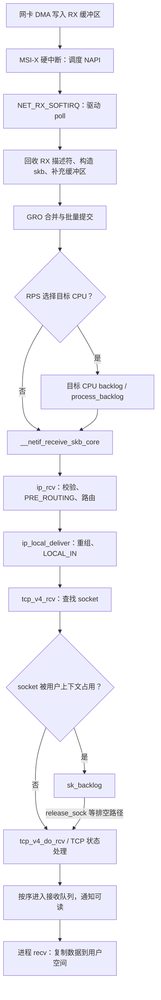
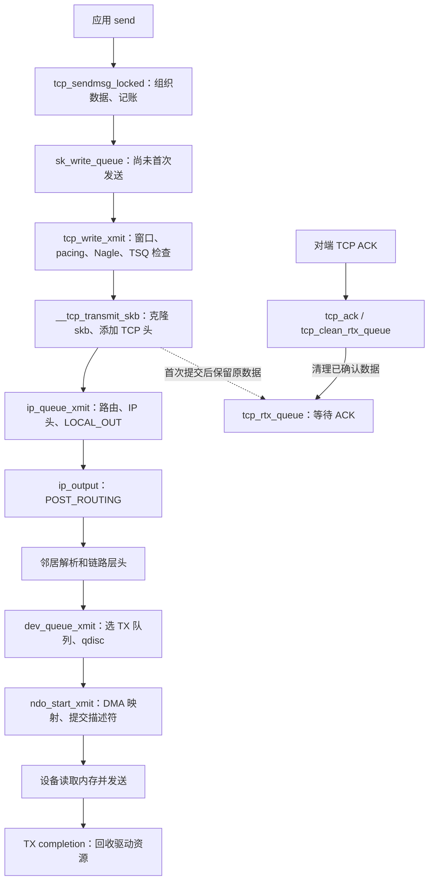
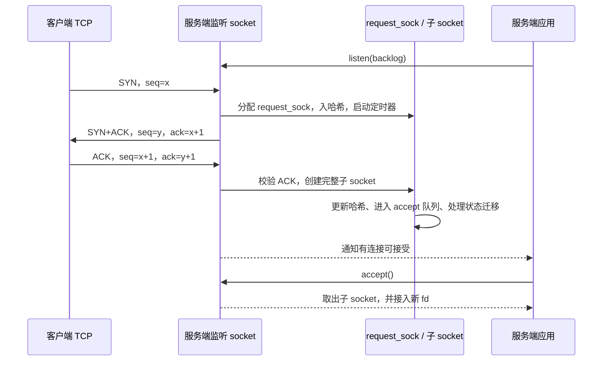
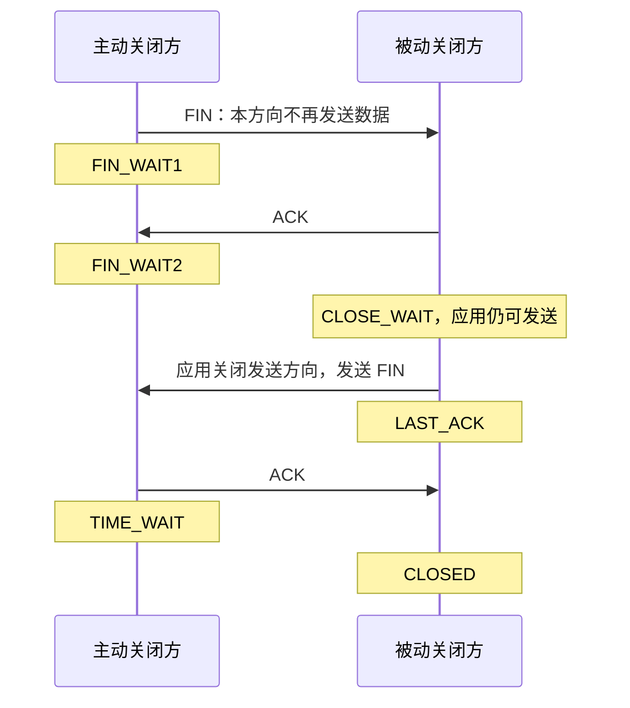
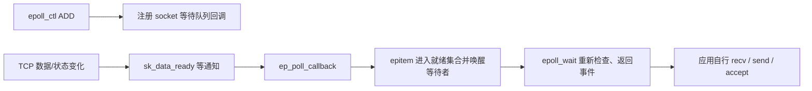

# Linux 网络子系统面试总结

> 范围：以仓库中的 [Linux 6.18.52](../../linux/Makefile#L2) 为准，面向 x86-64、SMP、非 PREEMPT_RT 的云计算数据中心。主线采用以太网、IPv4、普通 TCP/UDP socket；物理网卡以 ixgbe 为例。NAPI 线程化、busy poll、XDP、TFO、UDP GRO 等作为可选分支说明，不假定生产环境已经开启。
>
> 学习顺序：**先认清对象和队列，再跟踪报文与执行上下文，最后解释协议行为和性能现象。** 文中调用链省略部分包装函数、校验和错误分支；源码链接均相对于本文位置。

## 1. 核心数据结构：先回答“谁保存什么”

### 1.1 一张图认识 socket、协议状态和报文

```text
进程 fd 表
   │
   ▼
struct file ── private_data ──► struct socket
                                  │ sk             │ ops
                                  ▼                ▼
                              struct sock      inet_stream_ops
                                  │ sk_prot         │
                                  ▼                 │ socket 接口分派
                               tcp_prot ◄───────────┘

TCP 协议对象的首成员嵌套：
struct tcp_sock
  └─ struct inet_connection_sock
       └─ struct inet_sock
            └─ struct sock

sock 保存连接状态、锁、队列和回调
  ├─ sk_receive_queue ──► skb ──► 线性数据 / 分片页
  ├─ sk_write_queue   ──► 尚未首次发送的数据
  └─ tcp_rtx_queue    ──► 已发送、等待确认的数据
```

这里的嵌套是 C 结构体的首成员布局，不是四次独立分配。可以从通用 `sock` 找回外层 `tcp_sock`。

| 对象 | 关键字段 | 面试时说明的职责 |
| --- | --- | --- |
| `socket` | `file`、`sk`、`ops`、`wq` | 连接文件接口与网络协议，承载等待队列；不是 TCP 状态机本身 |
| `sock` | `sk_prot`、`sk_lock`、收发队列、缓冲区额度、`sk_data_ready` | 各协议共用的状态、并发控制、内存记账与事件通知 |
| `inet_sock` | 本地/对端地址和端口、IP 选项 | IPv4/IPv6 Internet socket 的公共信息 |
| `inet_connection_sock` | `icsk_accept_queue`、重传/延迟 ACK 定时器、`icsk_ca_ops` | 面向连接协议的公共能力 |
| `tcp_sock` | 序号、窗口、RTT、SACK、乱序树 | TCP 可靠传输和拥塞控制状态 |
| `udp_sock` | `inet`、`reader_queue`、GSO/封装相关字段 | UDP 收取、批量读取及可选隧道封装状态 |
| `sk_buff` | `data`、`len`、`sk`、`dev`、`cb`、头部偏移 | 一个内核报文对象及其元数据；数据不一定连续 |

源码：[file 与 socket 的关联](../../linux/net/socket.c#L493)、[socket](../../linux/include/linux/net.h#L116)、[sock](../../linux/include/net/sock.h#L354)、[inet_sock](../../linux/include/net/inet_sock.h#L212)、[inet_connection_sock](../../linux/include/net/inet_connection_sock.h#L80)、[tcp_sock](../../linux/include/linux/tcp.h#L200)、[udp_sock](../../linux/include/linux/udp.h#L53)、[socket 操作表](../../linux/net/ipv4/af_inet.c#L1049)。

### 1.2 `sk_buff`：报文描述符和实际数据分开理解

```text
struct sk_buff（元数据）
  ├─ dev / sk / cb / 头部偏移 / 校验和状态
  ├─ len / data_len / truesize / users
  └─ head / data / tail / end ──► 描述下面的缓冲区位置

head         data              tail         end
 │            │                 │            │
 ▼            ▼                 ▼            ▼
 [ headroom  ][  线性有效数据    ][ tailroom  ][ skb_shared_info ]
                                                    │
                                      frags[] ──────┼─► 分片页
                                      frag_list ────┴─► 其他 skb
```

图中的 `tail`、`end` 表示位置；在这里关注的 x86-64 配置中，字段以相对 `head` 的偏移表示。

| 字段/操作 | 含义 | 常见误区 |
| --- | --- | --- |
| `len` | 当前 skb 的总数据长度 | 不等于线性区长度，也不等于应用消息长度 |
| `data_len` | 非线性数据长度 | `skb_headlen(skb) = len - data_len` |
| `truesize` | 用于内存记账的占用量 | socket 缓冲区不能简单换算成同等大小的有效载荷 |
| `users` / `dataref` | skb 对象引用 / 共享数据区引用 | 共享元数据对象与共享数据区是两回事 |
| `skb_reserve()` | 空 skb 上预留头部空间，推进 `data`、`tail` | 不增加有效数据长度 |
| `skb_push()` / `skb_pull()` | 向前扩展 / 向后推进 `data`，常用于加头、去头 | 通常只是改指针和长度，不搬运整段载荷 |
| `skb_put()` | 扩展线性区尾部有效数据 | 调用者必须保证足够 tailroom |
| `skb_clone()` | 新建 skb 元数据，共享报文数据 | 不等于完整复制，也不意味着共享数据可随意写 |
| `skb_copy()` / `pskb_copy()` | 前者复制完整数据；后者主要复制线性头、共享分片 | 修改共享头部要考虑 COW |

`cb[48]` 是当前协议层使用的控制区，例如 TCP 用它存序号、标志等。不能默认某层写入的内容能永久跨层保留。GRO/GSO 又会改变 skb 与线上报文的对应关系，所以 **“一个 skb = 一个以太网帧 = 一次 send”不成立**。

源码：[sk_buff 布局](../../linux/include/linux/skbuff.h#L885)、[末尾指针与记账字段](../../linux/include/linux/skbuff.h#L1091)、[共享数据引用规则](../../linux/include/linux/skbuff.h#L633)、[skb_headlen](../../linux/include/linux/skbuff.h#L2531)、[clone/copy](../../linux/net/core/skbuff.c#L2037)、[push/pull/put](../../linux/net/core/skbuff.c#L2583)、[reserve](../../linux/include/linux/skbuff.h#L2925)。

### 1.3 设备、CPU 和转发状态

| 对象 | 保存什么 | 为什么需要它 |
| --- | --- | --- |
| `net_device` | 网卡特性、MTU、收发队列、`netdev_ops` | 物理网卡、veth、隧道设备的统一抽象 |
| 驱动 ring | DMA 描述符、缓冲区映射、生产/消费索引 | 协调 CPU 与设备对缓冲区的所有权 |
| `napi_struct` | `poll`、`weight`、状态位、GRO 状态 | 一个可调度的批量轮询实例，不必与 RX 队列一一对应 |
| `softnet_data` | 每 CPU 的 `poll_list`、输入 backlog、待运行 qdisc | 将网络处理分散到 CPU，减少全局竞争 |
| `Qdisc` | 入队/出队操作、队列与统计 | 设备发送前的排队、调度、整形等策略 |
| `rtable` / `dst_entry` | 路由结果、出口设备、输入/输出回调等 | 表达报文下一步如何处理 |
| `neighbour` | 下一跳链路层地址、状态、待解析报文队列 | 在 IPv4 以太网上把下一跳 IP 解析成 MAC |
| `net` | 设备、路由相关状态、协议配置等 | network namespace 的网络视图 |
| `nf_conn` | 原方向/回复方向 tuple、超时、状态等 | conntrack 跟踪经过主机的流，供状态过滤/NAT 使用 |

源码：[net_device](../../linux/include/linux/netdevice.h#L2097)、[ixgbe_ring](../../linux/drivers/net/ethernet/intel/ixgbe/ixgbe.h#L356)、[NAPI](../../linux/include/linux/netdevice.h#L383)、[softnet_data](../../linux/include/linux/netdevice.h#L3501)、[Qdisc](../../linux/include/net/sch_generic.h#L73)、[dst_entry](../../linux/include/net/dst.h#L26)、[rtable](../../linux/include/net/route.h#L57)、[neighbour](../../linux/include/net/neighbour.h#L138)、[net](../../linux/include/net/net_namespace.h#L61)、[nf_conn](../../linux/include/net/netfilter/nf_conntrack.h#L73)。

### 1.4 把几个“队列”彻底分开

| 队列 | 所属范围 | 排队的对象/目的 | 压力表现 |
| --- | --- | --- | --- |
| RX ring | 网卡接收队列 | 接收 DMA 描述符和缓冲区 | 缓冲区补充或回收不及时，设备侧丢包 |
| `softnet_data.input_pkt_queue` | CPU | `netif_rx()`、RPS 等路径送来的 skb | CPU backlog 丢包 |
| `sk_backlog` | 一个 socket | 因 socket 正被进程占用而暂缓协议处理的 skb | 协议处理延迟，可能发生 TCP backlog drop |
| 半连接请求集合 | 监听 socket | 握手未完成的 `request_sock` | SYN 重传、请求丢弃或启用 SYN cookie |
| accept 队列 | 监听 socket | 已可被 accept 取走的子连接，节点通过 `req->sk` 引用它 | `ListenOverflows`、新连接延迟 |
| `sk_receive_queue` | 数据 socket | 已进入接收队列的数据；TCP 普通数据按序交付 | 应用读取慢，接收内存压力或窗口收缩 |
| `out_of_order_queue` | TCP socket | 尚不能按序交付的数据，红黑树组织 | 乱序、缺口、额外内存占用 |
| `sk_write_queue` | TCP socket | 尚未首次发送的数据 | 应用供给快于 TCP 实际发送 |
| `tcp_rtx_queue` | TCP socket | 已发送、尚未被累计 ACK 清理的数据 | 在途量、重传、ACK 延迟 |
| qdisc / TX ring | 发送设备/队列 | 软件调度 / 待设备读取的数据描述符 | 排队延迟、软件丢包、设备背压 |

**半连接队列和 socket backlog 不是同一个概念。** 当前实现把半连接请求放入连接哈希表并使用请求定时器，不应把它画成与 accept 队列完全相同的 FIFO。TCP 首次发送后，则把 skb 从 `sk_write_queue` 移到重传红黑树。

源码：[请求结构和 accept 链表](../../linux/include/net/request_sock.h#L185)、[请求入哈希与定时器](../../linux/net/ipv4/inet_connection_sock.c#L1168)、[首次发送后的队列迁移](../../linux/net/ipv4/tcp_output.c#L69)、[乱序入队](../../linux/net/ipv4/tcp_input.c#L5163)。

## 2. 接收路径：数据从网卡怎样到达 `recv()`

### 2.1 先沿着 skb 走一遍



这是本机 TCP 接收主线。路由也可能选择 `ip_forward()`；VLAN、bridge、XDP、tc 等可能在到达 IP/TCP 前处理或改变报文去向。

1. **设备只认识描述符与 DMA 地址。** 网卡把报文写入预先准备的内存，驱动检查描述符完成状态；这不是 CPU 在中断中逐字节从网卡拷贝报文。
2. **硬中断主要负责发起后续处理。** ixgbe 的 MSI-X handler 调用 `napi_schedule_irqoff()`。其注释明确说明，此向量的中断已由硬件 EIAM 机制关闭。
3. **NAPI poll 批量处理 RX，并可能同时回收 TX。** 驱动组织 skb，交给 `napi_gro_receive()`。GRO 完成后的普通报文还能按列表批量送入协议栈。
4. **网络核心做分流。** 不启用 RPS 时可以直接处理，不要求每个报文先进入 CPU backlog；启用 RPS 后可转交目标 CPU。
5. **IP 决定本机接收还是转发，TCP 决定属于哪个连接。** 之后才涉及 socket 的队列、锁、状态机和唤醒。
6. **收到数据与用户读取分离。** 正常 `recv()` 从已接收数据中复制用户需要的字节；没有足够数据时按阻塞方式、低水位、超时等决定等待或返回。

源码：[x86 外部中断入口](../../linux/arch/x86/kernel/irq.c#L318)、[ixgbe 硬中断与 poll](../../linux/drivers/net/ethernet/intel/ixgbe/ixgbe_main.c#L3558)、[RX ring 清理](../../linux/drivers/net/ethernet/intel/ixgbe/ixgbe_main.c#L2496)、[GRO 批量提交](../../linux/include/net/gro.h#L520)、[RPS 分支](../../linux/net/core/dev.c#L6308)、[二层核心入口](../../linux/net/core/dev.c#L5901)、[IP 入口](../../linux/net/ipv4/ip_input.c#L564)、[本机 IP 交付](../../linux/net/ipv4/ip_input.c#L248)、[TCP 入口](../../linux/net/ipv4/tcp_ipv4.c#L2208)、[TCP 用户读取](../../linux/net/ipv4/tcp.c#L2634)。

### 2.2 NAPI 为什么能缓解中断风暴

NAPI 把“报文到来就触发一次协议处理”改为“中断发起轮询，轮询批量收取”。繁忙时继续轮询，处理完再恢复中断，减少高包率下的中断开销。

```text
硬中断：
    取得 NAPI 调度权
    将 NAPI 加入待处理集合，触发 NET_RX_SOFTIRQ

net_rx_action：
    初始化本次总预算 netdev_budget 和时间边界 netdev_budget_usecs
    依次取出 NAPI：
        work = poll(napi, napi.weight)
        总预算 -= work
        如仍有工作，将 NAPI 放回后续轮询集合
        若总预算或时间边界到达，结束本轮
    仍有待处理 NAPI 时，再次置位 NET_RX_SOFTIRQ

驱动 poll：
    清理 TX completion
    按 RX budget 清理接收报文
    如果没有处理完，返回 budget，保留调度状态
    如果已经处理完，尝试 napi_complete_done()
    只有完成操作允许时，才恢复相应中断
```

要分清三层限制：

| 层次 | 限制对象 | 边界 |
| --- | --- | --- |
| 驱动 poll 的 `budget` / NAPI `weight` | 一次 poll 的 RX 工作量 | TX completion 不必按同一个 RX 预算计数；`budget == 0` 时不处理 RX，也不调用 `napi_complete_done()` |
| `netdev_budget`、`netdev_budget_usecs` | 一次 `net_rx_action()` 遍历 NAPI 的工作量和时间 | 在 poll 之后检查，不是精确的逐包硬截止，也不会中途抢占一个 poll |
| softirq 的时间/重启限制 | 整轮 softirq 执行 | 超出条件的剩余工作可交给 `ksoftirqd` |

**不要回答“预算耗尽立即切到 ksoftirqd”。** 网络层先保留工作并重新触发软中断，是否继续本轮 softirq 或唤醒 `ksoftirqd` 由外层逻辑决定。`time_squeeze` 增加也只说明触及处理边界，不等于这一刻已经丢包。

源码：[单个 NAPI poll](../../linux/net/core/dev.c#L7635)、[net_rx_action](../../linux/net/core/dev.c#L7800)、[ixgbe 完成与恢复中断](../../linux/drivers/net/ethernet/intel/ixgbe/ixgbe_main.c#L3577)、[softirq 处理与续跑判断](../../linux/kernel/softirq.c#L579)。

### 2.3 协议栈到底运行在哪个上下文

| 操作 | 常见执行上下文 | 面试要点 |
| --- | --- | --- |
| 网卡中断 handler | 硬中断 | 快速处理，不能做可睡眠等待 |
| 常规 NAPI RX、协议输入 | `NET_RX_SOFTIRQ` | 不允许像普通进程路径那样阻塞睡眠 |
| 剩余软中断工作 | `ksoftirqd/N` 执行 softirq | 承载者是内核线程，执行的 softirq handler 仍受其上下文约束 |
| `send()`、`recv()` | 调用进程 | 可以按 socket 阻塞语义等待；进入自旋锁/BH 关闭区间另有约束 |
| `release_sock()` 排空 backlog | 调用它的任务上下文 | TCP 输入处理不只发生在网卡软中断里 |
| threaded NAPI、busy poll | 显式启用后的线程/调用任务 | 非 RT 内核也可有这些可选模式，不能与常规路径混为一谈 |

**为什么需要 `sk_backlog`？** 进程用 `lock_sock()` 取得 socket 的逻辑所有权后，不会在整个系统调用期间一直持有自旋锁。RX 路径取得短时 BH 锁，发现 `sock_owned_by_user()` 为真，就暂存报文；进程释放所有权前，再通过 `sk_backlog_rcv()` 处理它们。这样既串行化连接状态修改，又避免 RX 路径睡眠等待用户操作完成。

源码：[TCP 所有权判断和 backlog 入队](../../linux/net/ipv4/tcp_ipv4.c#L2378)、[lock_sock / release_sock](../../linux/net/core/sock.c#L3717)、[排空 backlog](../../linux/net/core/sock.c#L3163)、[NAPI 可选状态](../../linux/include/linux/netdevice.h#L428)。

## 3. 发送路径：`send()` 返回后，数据走到哪里了

### 3.1 TCP 发送要跟踪两份生命周期



下层发送的 skb 与 TCP 保留的重传数据可能共享载荷。**TX completion 只说明设备侧资源可以回收，TCP ACK 才推动重传数据的确认与释放。** 两者不是同一个通知。

典型调用链：

```text
inet_sendmsg
  → tcp_sendmsg / tcp_sendmsg_locked
  → TCP push 路径 → tcp_write_xmit
  → tcp_transmit_skb / __tcp_transmit_skb
  → ip_queue_xmit → ip_local_out → ip_output
  → ip_finish_output → ip_finish_output2
  → neigh_output → dev_queue_xmit / __dev_queue_xmit
  → qdisc 发送路径 → dev_hard_start_xmit
  → netdev_ops.ndo_start_xmit → ixgbe_xmit_frame
```

qdisc 不一定让报文等待：可以立即发送；软件设备也可能使用无队列路径。驱动通常会在描述符资源不足前停止 TX 队列，完成回收后再唤醒。不能把 `NETDEV_TX_BUSY` 理解成“驱动已经消费了 skb”。

源码：[inet_sendmsg](../../linux/net/ipv4/af_inet.c#L846)、[TCP 数据组织](../../linux/net/ipv4/tcp.c#L1079)、[发送约束](../../linux/net/ipv4/tcp_output.c#L2880)、[克隆并发送](../../linux/net/ipv4/tcp_output.c#L1447)、[IP 输出](../../linux/net/ipv4/ip_output.c#L463)、[邻居输出](../../linux/net/ipv4/ip_output.c#L200)、[选队列与 qdisc](../../linux/net/core/dev.c#L4704)、[qdisc 向驱动提交](../../linux/net/sched/sch_generic.c#L319)、[DMA 映射](../../linux/drivers/net/ethernet/intel/ixgbe/ixgbe_main.c#L8946)、[TX 回收](../../linux/drivers/net/ethernet/intel/ixgbe/ixgbe_main.c#L1349)。

### 3.2 四种“成功”不能混用

| 观察到的事件 | 能说明什么 | 不能说明什么 |
| --- | --- | --- |
| `send()` 返回正数 `n` | 本次有 `n` 字节被本地发送路径接受 | 不保证全部请求数据被接受，更不保证已经到达对端 |
| TX completion | 对应设备传输资源可以回收 | 不保证对端 TCP 收到 |
| 收到累计 ACK | 对端 TCP 已确认相应序号范围 | 不保证对端应用读取、处理或持久化 |
| 收到业务响应 | 对端应用按协议报告处理结果 | 保证强度取决于业务协议定义 |

发送缓冲区不足时，阻塞 socket 可以等待；非阻塞 socket 可能短写或返回 `EAGAIN`。即使缓冲区有空间，真正发包仍可能受拥塞窗口、对端窗口、pacing、qdisc 或设备限制。

**发送不一定经过 `NET_TX_SOFTIRQ`。** 系统调用可以直接把包提交到驱动；接收路径也可直接发 ACK。`NET_TX_SOFTIRQ` 负责被调度的 qdisc、部分延迟释放等，ixgbe 的 TX completion 回收则在 NAPI poll 中完成。

源码：[TCP 发送与等待分支](../../linux/net/ipv4/tcp.c#L1079)、[NET_TX action](../../linux/net/core/dev.c#L5704)、[qdisc 预算耗尽后调度](../../linux/net/sched/sch_generic.c#L415)、[NAPI 中清理 TX](../../linux/drivers/net/ethernet/intel/ixgbe/ixgbe_main.c#L3592)。

### 3.3 GRO、GSO、TSO 和 IP 分片

| 机制 | 方向/位置 | 核心作用 |
| --- | --- | --- |
| GRO | RX，通常在驱动提交之后 | 将符合条件的同流报文合并，减少协议栈逐包开销 |
| GSO | TX 的软件分段体系 | 允许上层保留大 skb，到需要时由软件分段 |
| TSO | TX，网卡能力 | 把 TCP 分段工作卸载给设备 |
| checksum offload | RX/TX | 用元数据描述设备已校验或仍需补算的校验和 |
| IP 分片 | IP 层 | 把一个 IP 数据报分成 IP fragments，与 TCP 分段不是一回事 |

大 skb 不代表线上发送了超 MTU 的帧。`MSS` 描述 TCP 数据段的载荷上限，受 PMTU、协议头和选项等影响；`MTU` 描述链路承载的网络层报文大小。IPv4、无选项、MTU 1500 时常用的 TCP MSS 示例是 `1500 - 20 - 20 = 1460`。

本机抓包的位置可能位于分段或硬件校验和完成之前，也可能位于 GRO 合并之后。因此看到“大包”或待完成校验和，必须结合卸载状态和抓包位置解释。

源码：[GRO 合并](../../linux/net/core/gro.c#L481)、[发送卸载检查与软件 GSO](../../linux/net/core/dev.c#L4031)、[IP 输出中的分段/分片选择](../../linux/net/ipv4/ip_output.c#L297)、[MSS 换算](../../linux/net/ipv4/tcp_output.c#L1910)。

## 4. TCP 建连：用对象变化理解三次握手

### 4.1 普通被动建连路径

以下不包含 TFO、`TCP_DEFER_ACCEPT` 和 SYN cookie 的特殊路径。



**为什么三次？** 两端各自有独立的初始序号。SYN 同步客户端序号，SYN+ACK 同步服务端序号并确认客户端序号，最后 ACK 让服务端确认自己的 SYN 已被收到，才能完成普通被动建连。源码上对应从轻量请求状态过渡到完整连接；仅收到 SYN 不能证明对端已确认本次服务端序号。

**`accept()` 不负责发送第三次握手。** 网络协议处理可以在应用尚未调用 accept 时建立子连接；accept 从监听 socket 的队列中取出它。客户端 `connect()` 成功也不等于服务端应用已经 accept，更不等于服务端业务已就绪。

源码：[主动连接](../../linux/net/ipv4/tcp_ipv4.c#L222)、[请求建立](../../linux/net/ipv4/tcp_input.c#L7415)、[第三次握手检查和子 socket 创建](../../linux/net/ipv4/tcp_minisocks.c#L908)、[accept 队列入队](../../linux/net/ipv4/inet_connection_sock.c#L1405)、[accept 取队首](../../linux/net/ipv4/inet_connection_sock.c#L649)、[socket 接收子连接](../../linux/net/ipv4/af_inet.c#L776)。

### 4.2 backlog、半连接和全连接：必须带版本回答

`listen(backlog)` 先受 `net.core.somaxconn` 限制，随后监听 socket 使用 `sk_max_ack_backlog` 保存限制。对于普通非负参数，可以先用 `min(backlog, somaxconn)` 理解。

这棵源码中的关键判断为（省略 `READ_ONCE()` 包装）：

```c
/* 半连接请求数量的满判断 */
inet_csk_reqsk_queue_len(sk) > sk->sk_max_ack_backlog

/* accept 队列的满判断 */
sk->sk_ack_backlog > sk->sk_max_ack_backlog
```

两者都是 `>`，不是 `>=`，不能把参数值解释成绝不会越过的精确瞬时队长。

| 名称 | 当前源码中的实际作用 |
| --- | --- |
| `listen(backlog)` / `somaxconn` | 决定监听 socket 的 backlog 限制，影响上述两类判断 |
| `tcp_max_syn_backlog` | 本版本还用于未启用 syncookies 时，对未被证明存活的对端进行条件性准入限制；不能简单说它是唯一的半连接硬上限 |
| `tcp_syncookies` | 请求压力等条件下选择 cookie 路径；启用不等于每次握手都使用 cookie |
| `tcp_abort_on_overflow` | 第三次握手创建子连接失败的溢出路径上，影响保留请求还是发送 reset 等处理 |
| `TCP_DEFER_ACCEPT` | 可以暂不因纯 ACK 交付普通新连接，等待数据或达到相应条件 |
| TCP Fast Open | 可能提前创建子 socket 并放入 accept 队列，普通握手时序不能直接套用 |

**队列满了会怎样？** 新 SYN 到来时就可能因 accept 队列满被丢弃；第三次 ACK 到来时创建子连接也会检查容量。后者在未开启 `tcp_abort_on_overflow` 时可保留请求、标记已收到 ACK 并暂不建立子连接，依赖后续报文/定时器继续处理。因此可能出现客户端认为已经建立连接，而服务端暂时无法交付应用的现象；不能一律回答“队列满就回 RST”。

**SYN cookie 解决什么？** 把可校验的信息编码进 SYN+ACK 的初始序号等字段，正常 cookie 发送路径不保留这个请求的排队状态，收到有效 ACK 后再恢复请求并创建连接。它缓解半连接状态压力，无法增加应用 accept 速度，也不保证解决 accept 队列满、CPU 不足或链路拥塞。

源码：[somaxconn 截断](../../linux/net/socket.c#L1919)、[监听 backlog 设置](../../linux/net/ipv4/af_inet.c#L193)、[半连接满判断](../../linux/include/net/inet_connection_sock.h#L288)、[accept 满判断](../../linux/include/net/sock.h#L1070)、[SYN 准入及 max_syn_backlog 条件](../../linux/net/ipv4/tcp_input.c#L7440)、[accept 溢出处理](../../linux/net/ipv4/tcp_minisocks.c#L943)、[cookie ACK 校验路径](../../linux/net/ipv4/syncookies.c#L421)。

### 4.3 连接如何查找，为什么同一个端口能服务很多连接

监听 socket 与已建立连接使用不同的查找逻辑。已建立 TCP 连接通常用源/目的 IP、源/目的端口四元组理解，但实际匹配还考虑 netns、绑定设备等条件。服务端所有连接可以共享同一个本地监听端口，由对端信息区分。

主动连接需要选择本地地址、临时端口并检查 tuple 冲突；同一本地端口在符合条件时可以用于不同对端。因此“一个主机最多 65535 个 TCP 连接”是错误概括。单一源 IP 到固定目标 IP/端口的连接数则会受可用临时端口范围、已占用 tuple、TIME_WAIT 和分配策略限制，还要考虑 fd、内存等资源。

`SO_REUSEPORT` 可以让多个符合绑定条件的 socket 组成复用组，再由哈希或 BPF 等选择成员，有助于将监听和接收工作分散到多个 worker；它与单纯复用地址的 `SO_REUSEADDR` 语义不同。

源码：[监听查找](../../linux/net/ipv4/inet_hashtables.c#L462)、[连接查找](../../linux/net/ipv4/inet_hashtables.c#L527)、[主动连接端口分配](../../linux/net/ipv4/inet_hashtables.c#L1031)、[reuseport 选择](../../linux/net/ipv4/inet_hashtables.c#L384)。

## 5. TCP 数据传输：从序号、窗口到重传

### 5.1 五个序号把发送和接收串起来

```text
发送方向（忽略序号回绕、SYN/FIN 等细节）：

        snd_una                snd_nxt                 write_seq
           │                      │                       │
───────────┼──────────────────────┼───────────────────────┼────► 序号
 已累计确认 │ 已发送、未累计确认  │ 已被本地接受、尚未发送 │

接收方向：

       copied_seq                rcv_nxt
           │                        │
───────────┼────────────────────────┼──── 缺口 ── 乱序数据 ──► 序号
 已被应用读 │ 已按序接收、尚未读取 │
```

| 字段 | 含义 |
| --- | --- |
| `snd_una` | 最早尚未累计确认的序号 |
| `snd_nxt` | 下一次发送新数据的位置 |
| `write_seq` | 已排入本地 TCP 发送数据的末端序号 |
| `rcv_nxt` | 接收端下一个期望按序收到的序号，也是普通累计 ACK 的基础 |
| `copied_seq` | 应用读取推进到的位置 |

`rcv_nxt` 推进不要求应用已经读取，`copied_seq` 才反映读取进度。接收端收到乱序数据时可存入 `out_of_order_queue` 并报告 SACK，但缺口未补齐时不会把后续普通字节流提前交给应用。

源码：[tcp_sock 序号字段](../../linux/include/linux/tcp.h#L243)、[发送序号字段](../../linux/include/linux/tcp.h#L305)、[按序与乱序分流](../../linux/net/ipv4/tcp_input.c#L5389)、[接收队列推进 rcv_nxt](../../linux/net/ipv4/tcp_input.c#L5314)、[读取推进 copied_seq](../../linux/net/ipv4/tcp.c#L2678)。

### 5.2 TCP 为什么没有应用消息边界

TCP 提供有序字节流。一次 `send()` 可以被拆成多个段，多次 send 的内容也可以合并发送或被一次 recv 读取；skb 的合并、分段和应用读写大小彼此不相等。PSH、`TCP_NODELAY`、GRO 开关都不能替应用定义消息边界。

应用需要使用固定长度、长度前缀、分隔符等协议规则，并保存本次尚未解析完的数据。所谓“粘包/拆包”通常是应用把字节流误当成消息队列，不是 TCP 把字节顺序弄错。

源码：[TCP 发送数据合并与分片组织](../../linux/net/ipv4/tcp.c#L1240)、[接收 skb 合并](../../linux/net/ipv4/tcp_input.c#L5314)、[按用户请求长度读取](../../linux/net/ipv4/tcp.c#L2634)。

### 5.3 可靠性不是“丢包后等一个固定超时”

| 机制 | 解决什么问题 | 回答边界 |
| --- | --- | --- |
| 序号、累计 ACK | 确认连续收到的字节范围 | ACK 不是业务处理成功回执 |
| SACK | 告诉发送端缺口之后哪些范围已收到 | 不改变向应用交付有序字节流的语义 |
| 快速重传/恢复 | 利用 ACK/SACK 暴露的丢失提前恢复 | “三个重复 ACK”是经典入口描述，不是现代 Linux 的全部判据 |
| RACK | 结合发送时间、已交付数据和乱序容忍窗口判断丢失 | 不只按重复 ACK 个数计数 |
| TLP | 尾部丢失、缺少后续包触发反馈时发探测 | 是否使用取决于状态和配置 |
| RTO | 在确认长期未前进时兜底重传 | 基于连接估计、边界和退避，不是所有连接固定同一时长 |
| 零窗口探测 | 对端窗口关闭后确认何时能继续发送 | 是流控问题，不应直接归因于拥塞 |
| keepalive | 启用后探测空闲连接的对端存活性 | 不等同业务心跳；内核能响应探测不代表业务线程健康 |

收到 ACK 后不仅释放重传队列，还可能更新 RTT、SACK 状态、拥塞控制状态，并推动新的数据发送。ACK 自身丢失也不意味着一定重传，因为后续累计 ACK 可能覆盖此前数据。

源码：[ACK 主路径](../../linux/net/ipv4/tcp_input.c#L4015)、[清理重传队列](../../linux/net/ipv4/tcp_input.c#L3384)、[RACK 判丢](../../linux/net/ipv4/tcp_recovery.c#L58)、[TLP 调度](../../linux/net/ipv4/tcp_output.c#L3015)、[RTO](../../linux/net/ipv4/tcp_timer.c#L534)、[keepalive](../../linux/net/ipv4/tcp_timer.c#L782)。

### 5.4 流量控制、拥塞控制和 pacing

| 机制 | 谁限制谁 | 对应状态 |
| --- | --- | --- |
| 接收窗口 `rwnd` | 接收端限制发送端，避免接收能力被压垮 | 发送端看到 `snd_wnd`，接收端维护自身窗口 |
| 拥塞窗口 `cwnd` | 发送端限制在途量，响应网络承载能力 | `snd_cwnd`、在途包计数、拥塞控制算法 |
| pacing | 控制发送时间和速率，减少突发 | pacing rate、发送时间戳、定时发送机制 |
| 本地内存与设备背压 | 限制本机排队和资源占用 | sndbuf、TSQ、qdisc、TX 队列等 |

便于口述的近似关系是：

```text
允许在途字节量 ≈ min(cwnd × MSS, 对端通告窗口)
还可发送的新数据 ≈ 允许在途字节量 - 已有在途量
窗口约束下的吞吐上界参考 ≈ min(cwnd × MSS, rwnd) / RTT
```

这不是内核原样执行的公式：`cwnd` 以段计，窗口以字节计；SACK、重传、恢复、pacing 和本地排队都会影响实际行为。

| 算法 | 面试抓手 | 源码入口 |
| --- | --- | --- |
| Reno | 慢启动按新确认数据增长；拥塞避免近似每 RTT 线性增长 | [tcp_reno_cong_avoid](../../linux/net/ipv4/tcp_cong.c#L496) |
| CUBIC | 通过距离拥塞事件的时间和窗口模型计算增长目标 | [cubictcp_cong_avoid](../../linux/net/ipv4/tcp_cubic.c#L324) |
| BBR | 估计带宽与 RTT，用模型设置 pacing 和 cwnd | [bbr_main](../../linux/net/ipv4/tcp_bbr.c#L1027) |
| DCTCP | 利用 ECN 标记比例估计拥塞程度，适合讨论数据中心排队反馈 | [dctcp_update_alpha](../../linux/net/ipv4/tcp_dctcp.c#L127) |

不要把所有算法都描述成“丢包就把窗口减半”。ECN 允许网络通过标记表达拥塞，具体反馈与减窗行为取决于协商、算法和网络配置；本地存在某个算法源码也不代表实际连接正在使用它。

数据中心还要想到 **BDP（带宽时延积）**：例如假设带宽 25 Gbit/s、RTT 100 μs，约需 `25×10^9 / 8 × 100×10^-6 = 312500` 字节在途数据才能填满管道。这只是估算，不是应该统一设置的缓冲区大小；小请求可能先受 CPU、包率和调度延迟限制。

源码：[实际发送约束](../../linux/net/ipv4/tcp_output.c#L2880)、[拥塞控制回调分派](../../linux/net/ipv4/tcp_input.c#L3640)、[慢启动与加性增长](../../linux/net/ipv4/tcp_cong.c#L456)。

### 5.5 小包延迟：Nagle、延迟 ACK、CORK

Nagle 在存在未确认小包等条件下，可以推迟后续不满 MSS 的发送以减少小包；延迟 ACK 则允许接收端按条件延后确认。两者在“先发一小段、再发一小段，接收方等完整请求”的交互中可能增加等待，但不能把所有偶发延迟都归因于它们。

- `TCP_NODELAY` 禁用 Nagle 相关等待，不会绕过窗口、pacing、qdisc，也不会恢复消息边界。
- `TCP_CORK` 用于暂缓部分段、便于拼接头部和后续数据；与 NODELAY 同时使用时有明确的优先级和 push 细节，不能把它们当作简单互斥开关。
- 小 RPC 的分析顺序：应用是否及时提交完整请求 → 是否在等 ACK/窗口 → qdisc/网卡是否排队 → 接收线程是否及时调度。

源码：[Nagle 条件](../../linux/net/ipv4/tcp_output.c#L2150)、[CORK / NODELAY 实现](../../linux/net/ipv4/tcp.c#L3618)、[延迟 ACK 状态](../../linux/include/net/inet_connection_sock.h#L108)。

## 6. TCP 断连：区分协议状态和应用责任

### 6.1 为什么常说“四次挥手”



TCP 是双向字节流，一个方向的 FIN 只表示这个方向结束。ACK 和另一方向的 FIN 可以合并，存在同时关闭、RST 等分支，因此关闭不保证在线上恰好出现四个包。`shutdown(SHUT_WR)` 可以只关闭发送方向并继续接收。

源码：[发送 FIN 时状态变化](../../linux/net/ipv4/tcp.c#L3021)、[shutdown](../../linux/net/ipv4/tcp.c#L3053)、[收到 FIN 的状态处理](../../linux/net/ipv4/tcp_input.c#L4720)。

### 6.2 高频状态追问

| 问题 | 回答 |
| --- | --- |
| TIME_WAIT 为什么存在？ | 为旧连接报文提供隔离时间，并保留处理对端 FIN 重传、重发最后 ACK 的能力 |
| 谁进入 TIME_WAIT？ | 普通时序下是主动关闭方；同时关闭等情形不能机械套用“客户端一定进入” |
| TIME_WAIT 占着完整 tcp_sock 吗？ | 通常转换成较小的 timewait 对象，仍占 tuple 和内核资源，不能当作零成本 |
| TIME_WAIT 有多长？ | 本树 `TCP_TIMEWAIT_LEN` 定义为 `60 * HZ`；不能把其他系统或教材数值直接套过来 |
| `tcp_fin_timeout` 是 TIME_WAIT 超时吗？ | 不是。它用于 FIN_WAIT2 等相关关闭等待逻辑，不是修改上述 TIME_WAIT 常量的旋钮 |
| CLOSE_WAIT 很多说明什么？ | 已收到对端 FIN，本地还未关闭发送方向；优先检查应用是否漏关、处理卡住或业务仍需发送 |
| `recv()` 返回 0 是什么？ | 普通 TCP 读取中，通常表示接收方向到达 EOF；排队数据可能先返回，之后才读到 0 |
| `close()` 一定发 FIN 吗？ | 不一定。关闭时丢弃未读数据、零超时 linger 等路径可能 reset；close fd 与协议对象立即销毁也不是一回事 |
| 能否靠强制复用 TIME_WAIT 解决所有短连接问题？ | 不能。应先确认主动建连端口压力、连接复用和关闭模式；复用受具体安全条件与实现限制 |

源码：[TIME_WAIT 处理与对象转换](../../linux/net/ipv4/tcp_minisocks.c#L101)、[timewait 创建](../../linux/net/ipv4/tcp_minisocks.c#L328)、[60 秒常量](../../linux/include/net/tcp.h#L140)、[FIN_WAIT2 清理](../../linux/net/ipv4/tcp_timer.c#L803)、[close 的 reset 分支](../../linux/net/ipv4/tcp.c#L3121)、[TIME_WAIT 复用检查](../../linux/net/ipv4/tcp_ipv4.c#L120)。

## 7. UDP：无握手，不等于内核不保存状态

| 对比点 | TCP | 普通 UDP |
| --- | --- | --- |
| 应用接口语义 | 有序字节流 | 数据报边界 |
| 可靠性 | ACK、重传、去重、按序交付 | 不提供这些可靠传输保证 |
| `connect()` | 普通情形下发起握手 | 设置默认对端、路由与匹配状态，无 TCP 式握手 |
| 接收缓存不足 | 可能收缩窗口，也可能丢弃报文 | 通常只能丢弃，发送方未必得到及时通知 |
| 接收缓冲区比消息小 | 本次读一部分，下次继续读剩余字节 | 不使用 PEEK 的普通接收会消费该数据报，未复制部分被丢弃，并报告截断 |
| 未监听端口 | TCP 可能发送 RST | 合法单播 UDP 通常可触发 ICMP Port Unreachable，受过滤等条件影响 |

UDP 仍有 socket、端口哈希、缓冲区、路由缓存与错误队列。UDP connect 成功不能证明对端端口开放或服务正常；源码中虽然复用了 `TCP_ESTABLISHED` 这个状态值，也不意味着进行了 TCP 握手。

`MSG_TRUNC` 要区分两种用法：返回的消息标志可表示截断；调用时传入该标志，则可请求返回完整数据报长度。启用 UDP GRO 后，一个接收结果还可能携带多个段和分段大小辅助信息，需要应用按该扩展语义处理。

**排查 UDP 丢包要分层：** 设备 RX 丢失、CPU backlog 丢失、校验和错误、无匹配端口、socket 接收内存不足、应用自身未处理，含义不同。`SO_RCVBUF` 增大只能影响其中部分环节。

源码：[UDP connect](../../linux/net/ipv4/datagram.c#L19)、[UDP 接收分流](../../linux/net/ipv4/udp.c#L2677)、[UDP recv 和截断](../../linux/net/ipv4/udp.c#L2062)、[UDP 发送](../../linux/net/ipv4/udp.c#L1270)、[无端口与 ICMP](../../linux/net/ipv4/udp.c#L2745)、[UDP 统计字段](../../linux/net/ipv4/proc.c#L160)。

## 8. epoll 与 socket 唤醒：就绪不等于 I/O 已完成

### 8.1 先认识 epoll 自己的对象

`eventpoll` 用红黑树 `rbr` 管理关注项，用 `rdllist` 保存就绪项；每个 `epitem` 关联被观察的 file/fd、事件掩码、等待队列回调和就绪链表节点。



源码：[epitem](../../linux/fs/eventpoll.c#L257)、[eventpoll](../../linux/fs/eventpoll.c#L307)、[注册等待队列](../../linux/fs/eventpoll.c#L1554)、[回调](../../linux/fs/eventpoll.c#L1443)、[TCP poll](../../linux/net/ipv4/tcp.c#L537)、[socket 可读唤醒](../../linux/net/core/sock.c#L3542)。

### 8.2 面试的四个边界

1. **epoll 的优势是避免每次 wait 扫描全部关注 fd。** 控制操作仍涉及查找和维护，返回 `k` 个就绪事件至少需要处理这些项，还有重查就绪状态、锁和唤醒成本；“epoll 所有操作都是 O(1)”不成立。
2. **LT/ET 是就绪通知策略。** LT 在仍就绪时可以重新入就绪列表；ET 不这样持续回挂。ET 通常配合非阻塞 I/O，循环读写/accept 到 `EAGAIN`，或由应用明确保存尚未处理完的就绪任务，避免遗漏进展。
3. **就绪是当时可进展的条件，不是预留资源。** 其他线程可能抢先消费数据；EOF、错误也能触发事件。收到 EPOLLIN 后仍须检查 recv 的实际结果。
4. **EPOLLOUT 不保证连接成功或整个缓冲区都能写入。** 非阻塞 connect 应在事件后读取 `SO_ERROR` 判断结果；发送要处理短写。`EPOLLONESHOT` 在交付后需要通过 MOD 等重新启用关注。

源码：[就绪重查、ONESHOT 与 LT/ET 分支](../../linux/fs/eventpoll.c#L2009)、[非阻塞 connect 状态](../../linux/net/ipv4/af_inet.c#L626)、[TCP 可写/关闭条件](../../linux/net/ipv4/tcp.c#L537)、[读取 SO_ERROR](../../linux/net/core/sock.c#L1787)。

## 9. IP、邻居、Netfilter 与云网络

### 9.1 路由与 ARP 各回答一个问题

- **路由：** 这个目的地址走哪个出口、哪个下一跳，是交付本机还是转发？IPv4 FIB 查找涉及路由前缀，配置策略路由时还会先按规则选择查找路径；结果组织成 `rtable/dst_entry`。
- **邻居解析：** 在确定的出口链路上，下一跳对应哪个 MAC？跨网段时通常解析网关的 MAC，而不是远端主机 MAC。
- **解析未完成：** 报文可以暂存在邻居的 `arp_queue`，触发 ARP 探测；解析失败或队列压力也能导致丢包。“路由存在”不等于报文已经离开设备。

源码：[fib_lookup](../../linux/include/net/ip_fib.h#L374)、[FIB 前缀查找](../../linux/net/ipv4/fib_trie.c#L1420)、[输出查找下一跳邻居](../../linux/net/ipv4/ip_output.c#L200)、[邻居排队和探测](../../linux/net/core/neighbour.c#L1201)、[ARP 请求](../../linux/net/ipv4/arp.c#L333)。

### 9.2 五个 IPv4 hook 要按报文方向记

```text
外部入站
   │
   ▼
PRE_ROUTING ──► 路由判定 ──► LOCAL_IN ──► 本机协议栈/socket
                  │
                  └───────► FORWARD ──► POST_ROUTING ──► 出站

本机生成 ──► 初始路由 ──► LOCAL_OUT ──► POST_ROUTING ──► 出站
                             │
                             └─ 地址等变化时可能重新路由
```

这张图只表示常规 IPv4 hook，未展开 bridge、netdev ingress/egress 等 hook。不能说“所有包都经过五个 hook”。常见目的地址转换位于 PRE_ROUTING/LOCAL_OUT，源地址转换位于 POST_ROUTING 等位置，实际规则与地址变化还会影响后续路由。

conntrack 与 TCP socket 是两个不同状态系统：即使只是转发别人的流量，本机没有对应应用 socket，也可以创建 `nf_conn`。普通有状态 NAT 在连接初始化时建立映射，后续报文沿用该连接的转换状态，不是每个包都重新独立选择映射。

数据中心排障要考虑 conntrack 容量、哈希与状态维护成本；表满导致的新流失败，不能靠增加 TCP accept backlog 解决。

源码：[PRE_ROUTING](../../linux/net/ipv4/ip_input.c#L564)、[LOCAL_IN](../../linux/net/ipv4/ip_input.c#L248)、[FORWARD](../../linux/net/ipv4/ip_forward.c#L162)、[LOCAL_OUT](../../linux/net/ipv4/ip_output.c#L102)、[POST_ROUTING](../../linux/net/ipv4/ip_output.c#L428)、[conntrack hook 注册](../../linux/net/netfilter/nf_conntrack_proto.c#L238)、[NAT 状态处理](../../linux/net/netfilter/nf_nat_core.c#L904)、[conntrack 容量检查](../../linux/net/netfilter/nf_conntrack_core.c#L1628)。

### 9.3 容器和虚拟机并没有绕开这些基本对象

| 机制 | 数据路径上的作用 | 常见追问 |
| --- | --- | --- |
| network namespace | 为设备、协议配置、路由等提供独立视图 | 隔离网络状态不等于拥有独立 CPU、内存带宽和物理网卡 |
| veth | 一端 TX 转成对端 RX | 是软件路径，没有对应的物理 RX DMA；具体可走 backlog 或 NAPI 等分支 |
| bridge | 学习源 MAC，按 FDB 决定单播转发或泛洪 | 二层转发与 IP 路由不同，不应默认全部走普通 IPv4 FORWARD 路径 |
| VXLAN | 将内层以太网帧封装进 UDP/IP | 增加封装开销和外层路由，必须考虑有效 MTU 与卸载 |
| virtio-net | Guest 通过 virtqueue 与后端交换缓冲区 | guest ring、宿主机后端和物理网卡队列可能分别成为瓶颈 |

排查容器/VM 的延迟时，应画出实际经过的设备、namespace、封装点和 hook，逐层定位队列。不能把“容器网络”当作只有一个队列的一层黑盒。

源码：[veth 转交](../../linux/drivers/net/veth.c#L320)、[bridge 输入与 FDB 决策](../../linux/net/bridge/br_input.c#L76)、[VXLAN 发送](../../linux/drivers/net/vxlan/vxlan_core.c#L2733)、[virtio-net RX poll](../../linux/drivers/net/virtio_net.c#L3121)、[virtio-net TX](../../linux/drivers/net/virtio_net.c#L3384)。

## 10. 多核扩展与减少数据搬运

### 10.1 RSS、RPS、RFS、XPS 放在一条链上理解

```text
接收：流哈希 ── RSS ──► 硬件 RX 队列 ── IRQ affinity ──► 执行 NAPI 的 CPU
                                                         │
                                              RPS / RFS 可再选 CPU
                                                         │
                                                         ▼
                                                  协议栈 / 应用读取

发送：应用所在 CPU / 接收队列信息 ── XPS ──► TX 队列 ──► 网卡
```

| 机制 | 选择目标 | 实现位置与代价 |
| --- | --- | --- |
| RSS | 硬件 RX 队列 | NIC 哈希与间接表，结合 IRQ affinity 分散接收工作 |
| RPS | 协议处理 CPU | 软件哈希后入目标 CPU backlog，可能增加 IPI 和缓存迁移 |
| RFS | 更接近消费该流的应用 CPU | 利用流表和应用处理位置，切换时考虑旧 CPU 队列的处理进度以减少乱序 |
| XPS | TX 队列 | 按 CPU/RX 队列映射等选择发送队列，降低竞争并改善局部性 |

单个稳定的流通常不会因为开启 RSS 就均匀铺满所有核；扩大总吞吐需要足够的流和合理的队列分布。双路 x86 服务器还要考虑 NIC、IRQ、NAPI、应用线程与内存的 NUMA 关系。跨节点来回转交可能抵消多核分流收益。

源码：[ixgbe RSS 间接表](../../linux/drivers/net/ethernet/intel/ixgbe/ixgbe_main.c#L4247)、[RPS/RFS 选 CPU 与迁移条件](../../linux/net/core/dev.c#L5039)、[CPU backlog](../../linux/net/core/dev.c#L5294)、[XPS 与 TX 选择](../../linux/net/core/dev.c#L4628)。

### 10.2 “零拷贝”必须说明省掉哪一次复制

| 路径/机制 | 主要节省 | 仍然存在的成本与限制 |
| --- | --- | --- |
| 普通 `send/recv` | 基线：通常存在用户缓冲区与内核数据区之间的复制 | DMA 不会自动消除用户/内核复制 |
| `sendfile` / `splice` | 支持路径中借助页引用，把文件/pipe 数据交给 socket，减少往返用户空间的复制 | 仍有页引用、协议处理、DMA 和完成处理；具体路径可能回退复制 |
| `MSG_ZEROCOPY` | 支持路径中把用户页引用到发送数据，减少发送载荷复制 | 页固定、内存记账、异步完成通知；不能在 send 返回后立即任意修改该缓冲区 |
| page pool | 复用 RX 页与 DMA 映射等资源 | 主要减少分配/回收/映射开销，不自动使 recv 到用户空间零拷贝 |
| 原生驱动 XDP | 在构造普通 skb、进入完整协议栈之前处理报文 | PASS 后仍可进入协议栈；通用 XDP 执行位置不同；XDP 也不自动等于用户态零拷贝 |

`MSG_ZEROCOPY` 的完成通知通过错误队列报告，表示对应用户缓冲区的引用可以释放/复用，不是业务成功 ACK；通知还可能报告这次实际发生了复制。小消息是否获益必须测量，因为固定页和完成管理本身有成本。

源码：[sendfile 到 splice](../../linux/fs/read_write.c#L1302)、[splice_to_socket](../../linux/fs/splice.c#L797)、[TCP 普通复制与页引用分支](../../linux/net/ipv4/tcp.c#L1240)、[zerocopy 能力判断](../../linux/net/ipv4/tcp.c#L1103)、[zerocopy 完成通知](../../linux/net/core/skbuff.c#L1774)、[page pool 回收](../../linux/net/core/page_pool.c#L810)、[ixgbe XDP 执行位置](../../linux/drivers/net/ethernet/intel/ixgbe/ixgbe_main.c#L2547)、[通用 XDP 位置](../../linux/net/core/dev.c#L5939)。

## 11. 性能与排障：从现象回到具体队列

### 11.1 先找瓶颈，再选择参数

| 现象 | 优先核对 | 可能的方向 | 不应直接得出的结论 |
| --- | --- | --- | --- |
| RX 丢包、设备 missed/no-buffer 类计数增加 | 驱动统计、RX ring、IRQ/NAPI 是否及时执行 | 队列分配、CPU/NUMA、ring 与批处理能力 | “一定是应用 recv 慢” |
| softnet backlog drop 增长 | 各 CPU 输入队列、RPS 分布、软中断负载 | 提升消费能力、改善分流，评估 backlog 容量 | “调大 SO_RCVBUF 就能解决” |
| `time_squeeze` 增长 | poll 工作量和预算触顶情况、调度延迟 | 平衡预算、批量处理与 CPU 公平性 | “一定已经丢包” |
| `ListenOverflows` / `ListenDrops` 增长 | accept 队列、请求压力、应用 accept 速度 | 提升接入处理能力、合理 backlog、连接复用 | “只需调 tcp_max_syn_backlog” |
| `TCPBacklogDrop` 增长 | socket 被占用时长、同一连接并发访问 | 缩短占用、调整应用并发模型 | “这是 SYN 半连接队列满” |
| TCP 接收队列大、窗口变小 | 应用读取进度、调度、接收内存 | 应用消费能力、缓冲区与流控 | “一定是网络带宽不足” |
| UDP `RcvbufErrors` 增长 | socket 收包内存、应用消费速度 | 减少读取停顿、批量收取、合理缓冲 | “增大网卡 ring 必然有效” |
| Send-Q 长期较大 | 未发送量、未确认量、rwnd、cwnd、RTT、重传 | 分辨本地排队、对端读取慢、网络拥塞/丢包 | “一定是网卡没发出去” |
| qdisc backlog/drops 增长 | 排队策略、整形速率、TX 完成速度 | 出口容量、调度与背压 | “增加所有队列就能改善延迟” |
| 大量 CLOSE_WAIT | 连接拥有者及关闭逻辑 | 修复漏关/阻塞处理 | “缩短 TIME_WAIT” |
| 大量 TIME_WAIT | 谁主动关闭、短连接速率、源端口使用情况 | 业务连接复用，分析真实资源压力 | “TIME_WAIT 本身就是故障” |
| 转发或 NAT 的新流失败 | conntrack 数量、分配失败、策略 | 状态表与流创建压力 | “TCP 监听队列满” |

统计必须看**同一时间窗口的增量**，结合流量和 CPU 分布。不同层的计数可能交叠，不能直接相加当成总丢包率。

增大缓冲区只是允许排队更久，不能让持续过载的消费者变快。队列容量应结合突发长度、处理速率、尾延迟和内存成本评估。

源码：[设备统计导出](../../linux/net/core/net-procfs.c#L44)、[softnet 统计](../../linux/net/core/net-procfs.c#L123)、[TCP/UDP MIB 名称](../../linux/net/ipv4/proc.c#L160)、[CPU backlog 丢弃](../../linux/net/core/dev.c#L5294)、[TCP 接收内存压力分支](../../linux/net/ipv4/tcp_input.c#L5436)。

### 11.2 两个经常误读的观测量

**第一，`ss` 的队列列随 socket 状态改变含义。** 内核诊断接口中：

| 状态 | Recv-Q 对应信息 | Send-Q 对应信息 |
| --- | --- | --- |
| LISTEN | `sk_ack_backlog`：等待 accept 的子连接数 | `sk_max_ack_backlog`：监听 backlog 限制 |
| 普通已连接 TCP | `rcv_nxt - copied_seq`，主要反映已按序接收而尚未读取的数据 | `write_seq - snd_una`，同时包括尚未发送及已发送未累计确认的数据 |

因此监听 Send-Q 不是等待网卡发送的字节数，已连接 Send-Q 也不等于“从来没有发出去的字节数”。需要区分时查看 `TCP_INFO` 的 `tcpi_notsent_bytes`、窗口、RTT、重传和 delivery rate 等字段。

**第二，`SO_RCVBUF/SO_SNDBUF` 不是纯载荷容量。** Linux 设置时考虑元数据开销，通常将用户值翻倍记账并应用上下限；接收设置还会标记用户锁定。不能把 getsockopt 读回的额度直接当作相同字节数的 TCP 有效窗口，也不能忽略 TCP 自动调节与显式设置的区别。

源码：[TCP 队列诊断](../../linux/net/ipv4/tcp_diag.c#L21)、[TCP_INFO 字段导出](../../linux/net/ipv4/tcp.c#L4283)、[接收额度及用户锁](../../linux/net/core/sock.c#L965)、[发送额度设置](../../linux/net/core/sock.c#L1320)。

### 11.3 把观测手段映射到内核证据

以下是目标 Linux 主机上的只读排查示例，不是对当前机器的检测结果；接口名、netns 和工具支持要按现场调整。

```sh
# 设备、每 CPU 中断和软中断
ip -s link show dev eth0
ethtool -S eth0
ethtool -l eth0
ethtool -x eth0
ethtool -k eth0
cat /proc/interrupts
cat /proc/softirqs
cat /proc/net/softnet_stat

# 监听、已连接队列、内存和 TCP 状态
ss -lnt
ss -tinm
cat /proc/net/snmp
cat /proc/net/netstat

# 路由、邻居、出口队列
ip route get 192.0.2.1
ip neigh show
tc -s qdisc show dev eth0
```

`/proc/net/softnet_stat` 是十六进制字段；本树前三项分别为 processed、该 softnet 的 drop 计数、time_squeeze。后面还导出 CPU 编号与队列长度，解读时应与本树格式对应，不要照抄旧版本列号。

需要进一步定位时，把采样/追踪点放到问题所在阶段：

| 要验证的假设 | 内核事件/入口 |
| --- | --- |
| NAPI 经常用满预算 | [napi_poll tracepoint](../../linux/include/trace/events/napi.h#L14) |
| 丢包发生在哪个释放点、原因是什么 | [kfree_skb reason tracepoint](../../linux/include/trace/events/skb.h#L24)；不是所有硬件丢包都会生成 skb 事件 |
| skb 是否提交发送、提交到哪一层 | [net_dev_queue](../../linux/include/trace/events/net.h#L145)、[net_dev_start_xmit](../../linux/include/trace/events/net.h#L15) |
| 是否正在重传 | [tcp_retransmit_skb](../../linux/include/trace/events/tcp.h#L16) |
| 连接何时发生状态变化 | [inet_sock_set_state](../../linux/include/trace/events/sock.h#L140) |

追踪结果应结合采样成本、时间戳和 CPU 迁移分析；仅凭一个热点函数或单侧抓包，不足以判定整条路径的因果关系。

## 12. 面试快速自测

| 面试题 | 回答必须包含的关键词 |
| --- | --- |
| 一次 TCP 接收经过哪些阶段？ | DMA → IRQ → NAPI/GRO → 可选 RPS → IP → TCP 查找/状态处理 → 接收队列 → 唤醒/recv |
| `socket`、`sock`、`sk_buff` 有何区别？ | 用户文件接口、协议连接状态、报文及其数据描述 |
| NAPI 为什么减少中断？ | 中断调度、批量轮询、预算、完成后恢复中断 |
| NET_RX 高意味着只在收包吗？ | NAPI 可清理 TX，RX 也会触发 ACK 等发送；要看实际 poll 和热点 |
| 三个 backlog 分别是什么？ | CPU 待处理包队列、socket 延后协议处理队列、listen 请求/accept 限制 |
| accept 决定握手完成吗？ | 普通路径不决定；协议处理建立子连接，应用取队列 |
| `send()` 成功就是对端收到吗？ | 本地接受、设备完成、TCP ACK、业务响应四层语义 |
| TCP 如何保证可靠与有序？ | 序号、ACK/SACK、重传、乱序缓存和按序交付；还要说明连接失败可能终止传输 |
| rwnd 与 cwnd 的区别？ | 接收能力与网络拥塞；字节/段单位；结合 pacing 和在途量 |
| TIME_WAIT 与 CLOSE_WAIT 的区别？ | 协议收尾和旧报文隔离 / 收到 FIN 后等待本地关闭 |
| UDP connect 做什么？ | 默认对端与本地状态，无握手，不证明远端可达 |
| epoll ET 为什么常配非阻塞？ | 就绪不会按 LT 方式持续回挂，应用必须排空或自行安排后续处理 |
| GRO 和 TSO 是一回事吗？ | 接收合并 / 硬件发送分段，目的和位置不同 |
| RSS 与 RPS 的区别？ | 硬件选 RX 队列 / 软件选协议处理 CPU，考虑 IPI、流稳定性和 NUMA |
| 零拷贝的“零”指什么？ | 指明省掉的复制；仍有引用管理、DMA、协议和完成开销 |
| 高延迟应该先调哪个参数？ | 先确认延迟出现在哪个对象、哪条队列、哪个上下文，再由证据选择改动 |

开放题可以按这个顺序组织答案：**对象是什么 → 数据在哪里排队 → 谁在什么上下文处理 → 何时唤醒/释放 → 哪些条件导致等待、重传或丢弃 → 用什么统计和源码验证。**
