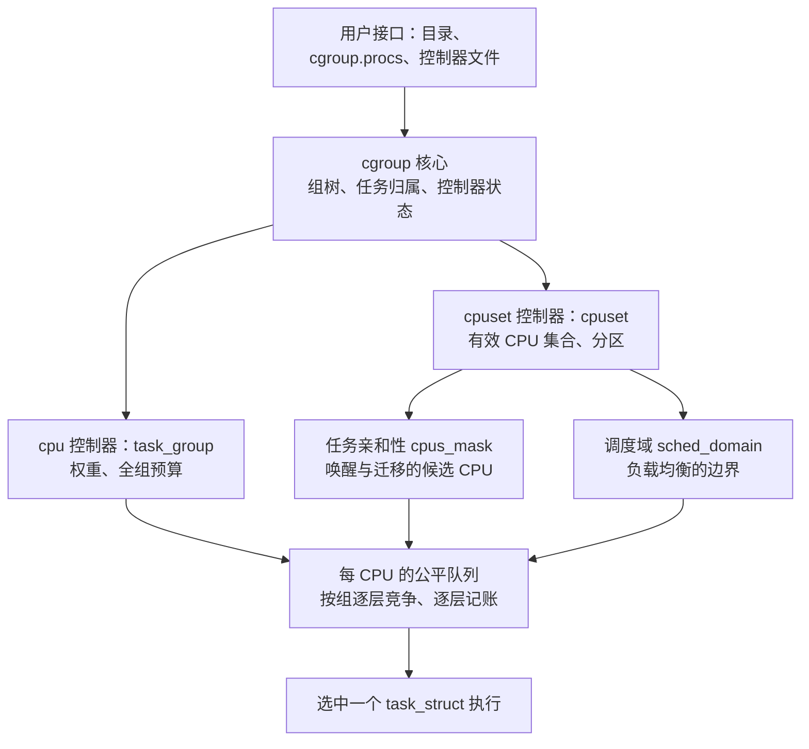
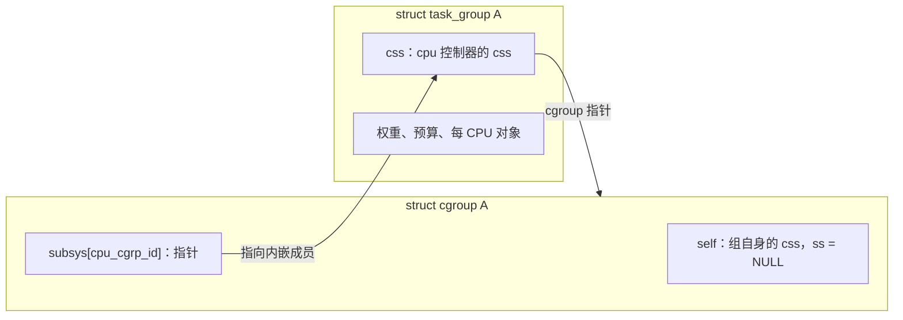
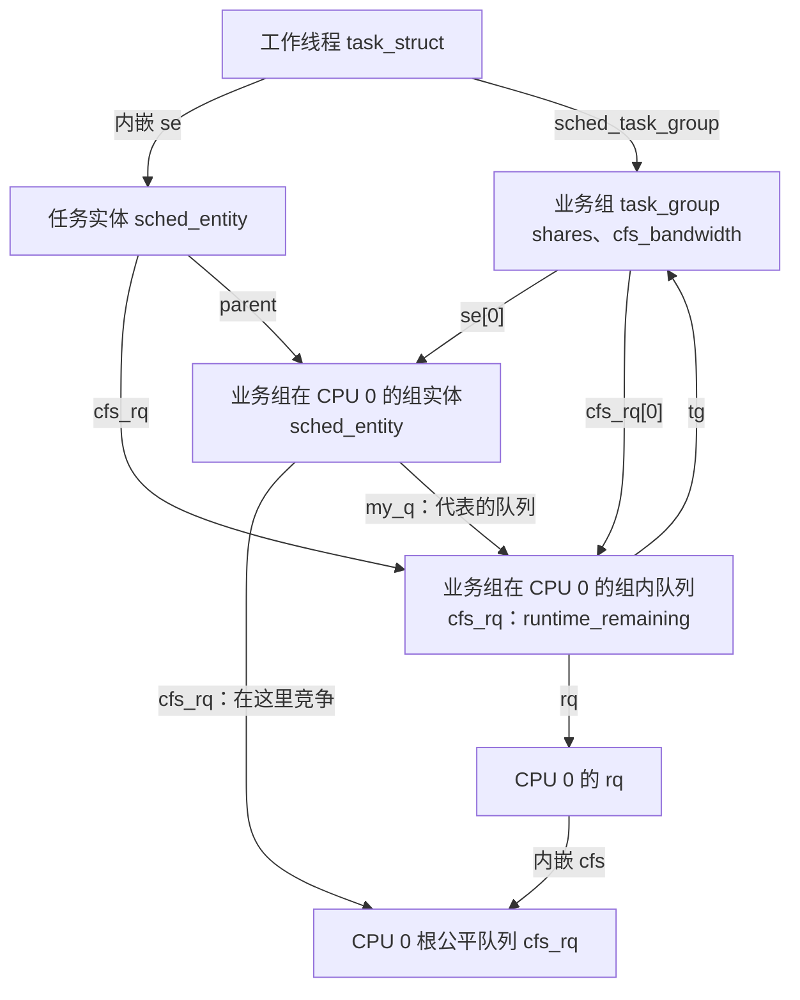
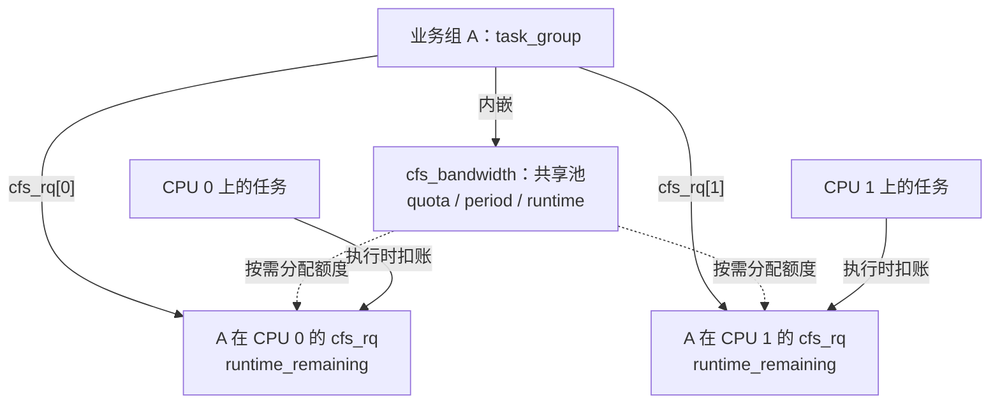
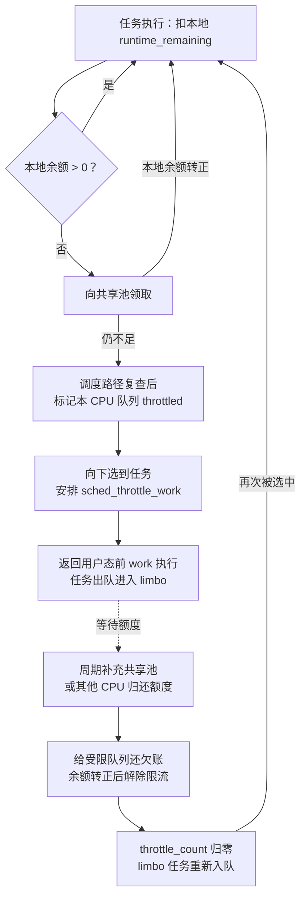
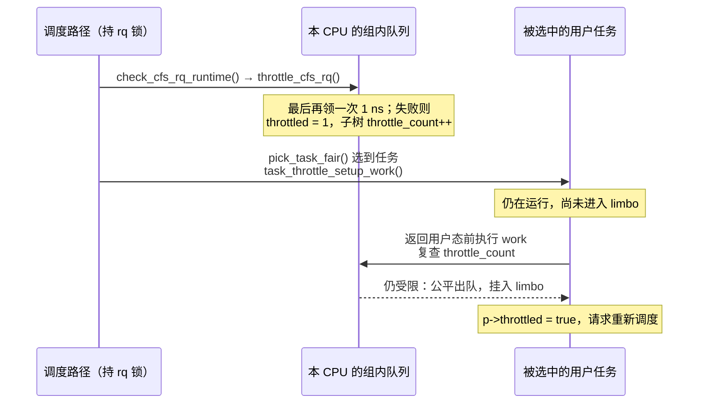
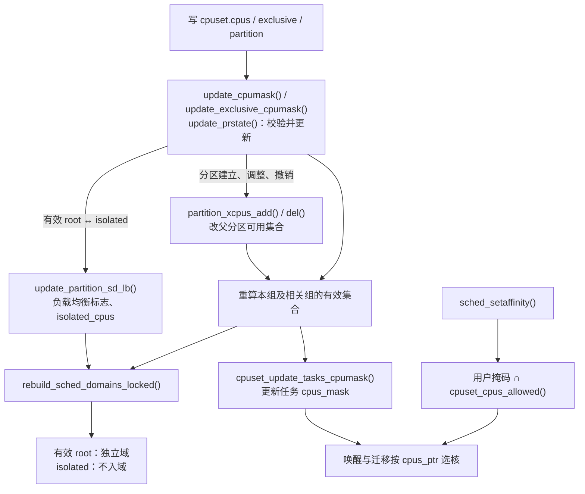

# cgroup v2 怎样分配和隔离 CPU

> **源码与配置**：本项目 [Linux 6.18.52](../../linux/Makefile#L2)，x86-64、SMP，以 [`linux/.config`](../../linux/.config#L216) 为准。与本文结论相关的配置如下：
>
> | 配置 | 取值 | 对本文的影响 |
> | ---- | ---- | ------------ |
> | `CGROUP_SCHED`、`FAIR_GROUP_SCHED`、`GROUP_SCHED_WEIGHT` | y，见 [.config](../../linux/.config#L216) | 有 cpu 控制器、分层公平调度和 `cpu.weight` |
> | `CFS_BANDWIDTH`、`GROUP_SCHED_BANDWIDTH` | y，见 [.config](../../linux/.config#L218) | 有 `cpu.max` / `cpu.max.burst` 及带宽限流 |
> | `RT_GROUP_SCHED` | 未开启，见 [.config](../../linux/.config#L221) | RT 任务不按 cgroup 分组限额 |
> | `CPUSETS` / `CPUSETS_V1` | y / 未开启，见 [.config](../../linux/.config#L228) | 只讨论 v2 的 cpuset |
> | `SCHED_AUTOGROUP` | y，见 [.config](../../linux/.config#L245) | 运行时默认启用，影响 cpu 状态仍在根组的任务，见第 3.5 节 |
> | `NO_HZ_FULL`、`CPU_ISOLATION` | y，见 [.config](../../linux/.config#L108) | 需启动参数 `nohz_full=` 才对具体 CPU 生效，见第 5.9 节 |
> | `JUMP_LABEL` | y，见 [.config](../../linux/.config#L847) | 带宽热路径由 static key 开关 |
> | `PREEMPT_VOLUNTARY`、非 `PREEMPT_RT` | 见 [.config](../../linux/.config#L136) | 普通数据中心抢占模型 |
> | `SCHED_CORE`、`SCHED_PROXY_EXEC`、`IRQ_TIME_ACCOUNTING` | 未开启，见 [.config](../../linux/.config#L143) | 选人走非 core scheduling 路径；任务时钟不扣中断时间 |
>
> `SCHED_CLASS_EXT` 不在 `.config` 中，它依赖的 `DEBUG_INFO_BTF` 也未开启，因此不讨论 sched_ext。EEVDF 的选人公式见同目录 [eevdf.md](eevdf.md)，运行队列与负载均衡全景见 [sched.md](sched.md)。

## 1. 先建立整体认识

### 1.1 “给容器分 CPU”其实是三件事

| 需求 | 要回答的问题 | 主要接口 | 例子 |
| ---- | ------------ | -------- | ---- |
| 争用时多分一点时间 | 本组相对其他组占多少份额？ | `cpu.weight` | A、B 权重为 100、300，持续争用一颗 CPU 时约分到 1/4、3/4 |
| 限制全组执行预算 | 每个周期最多给全组多少执行时间？ | `cpu.max` | `50000 100000`：每 100 ms 新增 50 ms 全组额度 |
| 规定任务去哪颗 CPU | 本组能用哪些 CPU？其他组还能不能来？ | `cpuset.cpus`、`cpuset.cpus.partition` | 把 CPU 4-7 划成有效分区，从父组可用集合中移除 |

前两项管**时间**，由 cpu 控制器实现，接口注册在 [`cpu_files[]`](../../linux/kernel/sched/core.c#L10252)；第三项管**位置**，由 cpuset 控制器实现，接口注册在 [`dfl_files[]`](../../linux/kernel/cgroup/cpuset.c#L3559)。三者同时生效：A 允许使用 CPU 4-7 并设置 `cpu.max = 50000 100000`，它可以在四颗 CPU 上并行运行，但四颗 CPU 共享同一份 50 ms 预算；只写 `cpuset.cpus = 4-7` 也不会挡住其他组，独占需要建立**有效分区**。

### 1.2 在内核中的位置

用户配置的是组，真正执行任务的是每颗 CPU 的调度器。下图从上到下表示“配置怎样一路落到每 CPU 调度”，箭头表示数据或约束的流向：



这张图对应两种工作节奏：

- **配置路径**：`mkdir`、写控制器文件、写 `cgroup.procs` 进入 cgroup 核心，再通过 [`cpu_cgrp_subsys`](../../linux/kernel/sched/core.c#L10304) 和 [`cpuset_cgrp_subsys`](../../linux/kernel/cgroup/cpuset.c#L3884) 的回调建立或更新对象。
- **运行路径**：唤醒、选人、tick 记账、负载均衡只使用已经建立的对象，不解析 cgroup 目录。

一次调度可以拆成三个问题：任务被允许去哪颗 CPU（cpuset）？在那颗 CPU 上它所属的组怎样与其他组竞争（`cpu.weight`）？执行之后哪些组的预算要扣除（`cpu.max`）？后文的数据结构都为回答这三个问题服务。

### 1.3 本文的边界

- 权重和配额只作用于**公平调度类**，即 `SCHED_NORMAL/BATCH/IDLE` 任务，公平类定义见 [`fair_sched_class`](../../linux/kernel/sched/fair.c#L14095)；`SCHED_FIFO/RR`、`SCHED_DEADLINE` 不进入这里的公平队列和带宽记账，调度类选择见 [`__setscheduler_class()`](../../linux/kernel/sched/core.c#L7304)。cpuset 的放置约束对所有调度类都有效。
- CPU 编号指**逻辑 CPU**。要独占物理核，应把 SMT 兄弟一起分配，见 [`topology_sibling_cpumask()`](../../linux/arch/x86/include/asm/topology.h#L196) 和 sysfs 的 [`thread_siblings_list`](../../linux/drivers/base/topology.c#L80)。分区不隔离共享缓存和内存带宽。
- 读者只需知道 EEVDF 在每层队列中挑选一个实体；具体公式不在本文展开。

阅读顺序：第 2 章建立两个控制器共用的 cgroup 骨架；第 3～5 章讲 cpu 控制器（数据结构 → 权重 → 配额）；第 6 章讲 cpuset；第 7 章用一个示例把三种机制叠在一起；第 8 章给出验证方法。第一次阅读可以跳过第 4.4～4.5、5.7～5.9 和 6.4 节。

## 2. 公共骨架：组、控制器状态与任务归属

本章回答一个问题：**一个任务怎样找到它应当使用的 cpu 配置和 cpuset 配置？** 难点在于 cgroup v2 中“任务属于哪个目录”和“任务使用哪一组控制器状态”可能指向不同的组。

### 2.1 `cgroup` 与 css：目录和控制器状态分开存放

用户每建一个目录，内核就有一个 [`struct cgroup`](../../linux/include/linux/cgroup-defs.h#L472)。每个控制器在组上的状态由 css（cgroup subsystem state，[`struct cgroup_subsys_state`](../../linux/include/linux/cgroup-defs.h#L179)）表示。下面只保留本文用到的成员，中文注释为阅读说明：

```c
struct cgroup_subsys_state {
    struct cgroup *cgroup;           /* 这个状态属于哪个组 */
    struct cgroup_subsys *ss;        /* 属于哪个控制器；cgroup.self 中为 NULL */
    struct percpu_ref refcnt;        /* 状态对象的引用计数 */
    /* 省略 */
    struct list_head sibling;        /* 挂到父 css 的 children 链表 */
    struct list_head children;
    /* 省略 */
    struct cgroup_subsys_state *parent; /* 同一控制器的父状态 */
    /* 省略 */
};

struct cgroup {
    struct cgroup_subsys_state self; /* 内嵌：组自身，连接目录树 */
    /* 省略 */
    struct kernfs_node *kn;          /* 对应的 kernfs 目录节点 */
    /* 省略 */
    u16 subtree_control;             /* 用户要求向子组启用的控制器 */
    u16 subtree_ss_mask;             /* 实际向子组启用的控制器，可含依赖项 */
    /* 省略 */
    struct cgroup_subsys_state __rcu *subsys[CGROUP_SUBSYS_COUNT];
                                     /* 本组各控制器自己的 css，可为 NULL */
};
```

字段位置见 [`css.parent`](../../linux/include/linux/cgroup-defs.h#L244)、[`cgroup.kn`](../../linux/include/linux/cgroup-defs.h#L524)、[`subtree_control` 的说明](../../linux/include/linux/cgroup-defs.h#L531) 和 [`cgroup.subsys[]`](../../linux/include/linux/cgroup-defs.h#L544)。

css 是**公共成员**：每种控制器把它内嵌在自己的对象中，cgroup 核心只管理 css，控制器再用 `container_of()` 找回外层对象。cpu 控制器的外层对象是 [`struct task_group`](../../linux/kernel/sched/sched.h#L472)，转换函数是 [`css_tg()`](../../linux/kernel/sched/sched.h#L558)；cpuset 的外层对象是 `struct cpuset`，转换函数是 [`css_cs()`](../../linux/kernel/cgroup/cpuset-internal.h#L185)。



图中有两个 css，容易混淆：`cgroup A.self` 表示 A 这个组，`parent` 指向父组的 `self`，见 [`cgroup` 定义处注释](../../linux/include/linux/cgroup-defs.h#L473) 和 [`cgroup_parent()`](../../linux/include/linux/cgroup.h#L518)；`task_group A.css` 表示 A 的 cpu 状态，`parent` 指向父组的 cpu 状态。

### 2.2 `css_set`：任务一次找到各控制器的有效状态

任务不直接保存各控制器指针，而是引用一个 [`struct css_set`](../../linux/include/linux/cgroup-defs.h#L272)。归属与控制器状态组合相同的任务共享同一个集合，减少每任务存储和 fork / exit 时的维护，见 [定义前的说明](../../linux/include/linux/cgroup-defs.h#L265)。

```c
struct task_struct {
    /* 省略 */
    struct css_set __rcu *cgroups;   /* 本任务引用的状态集合 */
    struct list_head cg_list;        /* 挂入 css_set 的任务链表 */
    /* 省略 */
};

struct css_set {
    struct cgroup_subsys_state *subsys[CGROUP_SUBSYS_COUNT];
                                     /* 各控制器实际生效的 css */
    refcount_t refcount;             /* 集合自身的引用计数 */
    /* 省略 */
    struct cgroup *dfl_cgrp;         /* 任务在 v2 层级中属于哪个目录 */
    int nr_tasks;
    struct list_head tasks;
    /* 省略 */
};
```

字段见 [`task_struct.cgroups`](../../linux/include/linux/sched.h#L1323) 和 [`dfl_cgrp / nr_tasks`](../../linux/include/linux/cgroup-defs.h#L291)。集合中的两类出口分别回答两个问题：`dfl_cgrp` 回答“任务在哪个目录”，`subsys[]` 回答“任务使用哪个控制器状态”。读取有效 css 的接口是 [`task_css()`](../../linux/include/linux/cgroup.h#L456)，它展开为 `task_css_set_check(task)->subsys[id]`，RCU 与锁检查封装在 [`task_css_set_check()`](../../linux/include/linux/cgroup.h#L415) 中。

### 2.3 父组启用控制器，子组才有自己的状态

控制器开关作用于**直接子组**：普通非根组能否拥有某个控制器状态，取决于父组的 `subtree_control`，见 [`cgroup_control()`](../../linux/kernel/cgroup/cgroup.c#L479)。因此会出现“目录比状态更深一层”的情况。假设任务放在 B 中：

```text
根组：subtree_control = cpu
└── A：拥有 task_group A；subtree_control 为空
    └── B：没有自己的 cpu 状态

B 中任务的 css_set：
  dfl_cgrp             → cgroup B           （目录归属）
  subsys[cpu_cgrp_id]  → task_group A.css   （有效 cpu 状态）
cgroup B.subsys[cpu_cgrp_id] → NULL
```

| 配置 | B 的 `subsys[cpu_cgrp_id]` | B 中任务的有效 cpu 状态 |
| ---- | -------------------------- | ----------------------- |
| 根组启用 cpu，A 未向子组启用 | `NULL` | `task_group A.css` |
| 根组、A 都向子组启用 cpu | `task_group B.css` | `task_group B.css` |

**`cgroup.subsys[]` 查本组自己的状态，`css_set.subsys[]` 查任务实际使用的状态**；后者允许指向祖先，见 [`css_set` 的注释](../../linux/include/linux/cgroup-defs.h#L312)。构造新集合时，核心用 [`cgroup_e_css_by_mask()`](../../linux/kernel/cgroup/cgroup.c#L547) 自下而上找最近一个拥有该控制器的组：

```c
static struct cgroup_subsys_state *cgroup_e_css_by_mask(struct cgroup *cgrp,
                                                      struct cgroup_subsys *ss)
{
    lockdep_assert_held(&cgroup_mutex);

    if (!ss)
        return &cgrp->self;

    /* 状态可能正在更新，按控制器掩码判断，不直接测试 css 指针 */
    while (!(cgroup_ss_mask(cgrp) & (1 << ss->id))) {
        cgrp = cgroup_parent(cgrp);
        if (!cgrp)
            return NULL;
    }

    return cgroup_css(cgrp, ss);
}
```

结果写入集合模板的位置见 [`template[i]`](../../linux/kernel/cgroup/cgroup.c#L1125)。一个推论：**有独立目录不等于有独立的 cpu 调度对象**；若一路向上都没有启用 cpu，任务的有效 cpu 状态就是根组，这时还会受 autogroup 影响（第 3.5 节）。

### 2.4 控制器回调与任务迁移

cgroup 核心在生命周期事件发生时回调控制器，控制器内部从不解析目录。本文涉及的回调如下：

| 阶段 | cpu 控制器 | cpuset 控制器 |
| ---- | ---------- | ------------- |
| 建组 | `css_alloc`：[`cpu_cgroup_css_alloc()`](../../linux/kernel/sched/core.c#L9257)，根组返回 `root_task_group`，否则 `sched_create_group()`；`css_online`：[`cpu_cgroup_css_online()`](../../linux/kernel/sched/core.c#L9275)，挂入调度器的组树 | `css_alloc`：[`cpuset_css_alloc()`](../../linux/kernel/cgroup/cpuset.c#L3643) 分配 `struct cpuset` 和各掩码；`css_online`：[`cpuset_css_online()`](../../linux/kernel/cgroup/cpuset.c#L3666) 从父组复制有效集合 |
| 删组 | `css_released`：[`cpu_cgroup_css_released()`](../../linux/kernel/sched/core.c#L9305)；`css_free`：[`cpu_cgroup_css_free()`](../../linux/kernel/sched/core.c#L9312) | `css_killed`：[`cpuset_css_killed()`](../../linux/kernel/cgroup/cpuset.c#L3756) 把有效分区复位为 member；`css_free` 释放掩码 |
| `can_attach` | [`cpu_cgroup_can_attach()`](../../linux/kernel/sched/core.c#L9322)：RT 组调度检查编译在 `CONFIG_RT_GROUP_SCHED` 内，本配置未开启 | [`cpuset_can_attach_check()`](../../linux/kernel/cgroup/cpuset.c#L3178)：目标有效集合不能为空 |
| `attach` | [`cpu_cgroup_attach()`](../../linux/kernel/sched/core.c#L9340)：逐任务 `sched_move_task()` | [`cpuset_attach()`](../../linux/kernel/cgroup/cpuset.c#L3316)：按需更新任务亲和性 |

两个控制器描述表都设置了 `.threaded = true`，可以在线程模式子树中使用。本文示例只用普通 domain 组；启用规则的完整检查见 [`cgroup_vet_subtree_control_enable()`](../../linux/kernel/cgroup/cgroup.c#L3503)。

迁移任务有两个入口：写 `cgroup.procs` 迁移**整个线程组**，见 [`cgroup_procs_write()`](../../linux/kernel/cgroup/cgroup.c#L5437)；写 `cgroup.threads` 只迁移单个线程，见 [`cgroup_threads_write()`](../../linux/kernel/cgroup/cgroup.c#L5448)，且受 [资源域边界检查](../../linux/kernel/cgroup/cgroup.c#L5384) 约束。无论哪个入口，核心都是**先替换任务的 `css_set`，再调用各控制器的 `attach`**；cpu 控制器改变任务的竞争位置，cpuset 改变任务的允许 CPU，二者在同一次迁移中各做各的。

## 3. cpu 控制器的核心数据结构

cpu 控制器要同时满足两点：配置（权重、预算）属于**整个组**，竞争却发生在**每颗 CPU 的运行队列**里。因此它采用“一个全组对象 + 每 CPU 一套调度对象”的结构。

下文用以下名称指代对象：**任务组对象**指 `struct task_group`；**组实体**指代表整个组参加父层竞争的 `struct sched_entity`；**任务实体**指线程内嵌的 `struct sched_entity`；**组内队列**指组在某颗 CPU 上的 `struct cfs_rq`。源码仍沿用 `cfs_rq`、`CFS_BANDWIDTH` 等历史名称，本版本公平类的选人算法是 EEVDF。

### 3.1 `task_group`：一个组、一份配置、每 CPU 一套对象

摘自 [`struct task_group`](../../linux/kernel/sched/sched.h#L472)：

```c
struct task_group {
    struct cgroup_subsys_state css;  /* 内嵌 cpu 控制器的 css */
    int idle;                        /* cpu.idle */
    struct sched_entity **se;        /* se[cpu]：本组在该 CPU 父队列中的组实体 */
    struct cfs_rq **cfs_rq;          /* cfs_rq[cpu]：本组在该 CPU 上的组内队列 */
    unsigned long shares;            /* cpu.weight 换算后的组权重，内部尺度 */
    atomic_long_t load_avg ____cacheline_aligned; /* 各 CPU 上报负荷的汇总 */
    /* 省略 */
    struct task_group *parent;
    struct list_head siblings;
    struct list_head children;       /* 调度器自己维护的组树 */
    struct autogroup *autogroup;     /* 非 NULL 表示这是 autogroup 创建的组 */
    struct cfs_bandwidth cfs_bandwidth; /* 内嵌：全组唯一的预算池，第 5 章 */
    /* 省略 */
};
```

成员位置见 [`se / cfs_rq / shares / load_avg`](../../linux/kernel/sched/sched.h#L480)、[`parent / children`](../../linux/kernel/sched/sched.h#L506) 和 [`cfs_bandwidth`](../../linux/kernel/sched/sched.h#L514)。`se` 与 `cfs_rq` 是**指针数组**，按 CPU 编号索引，每个元素指向独立分配的对象，见 [`alloc_fair_sched_group()`](../../linux/kernel/sched/fair.c#L13833)。

### 3.2 `sched_entity` 与 `cfs_rq`：每 CPU 上的分层竞争

**`sched_entity`：本层的一个竞争者。** 它可以代表一个任务，也可以代表一个组。摘自 [`struct sched_entity`](../../linux/include/linux/sched.h#L570)：

```c
struct sched_entity {
    struct load_weight load;         /* weight：本实体在所在队列中的权重 */
    struct rb_node run_node;         /* 本层 EEVDF 红黑树节点 */
    u64 deadline;                    /* 本层虚拟截止期 */
    /* 省略 */
    unsigned char on_rq;             /* 是否计入所在队列（不等于在树上） */
    unsigned char sched_delayed;     /* 是否处于延迟出队状态 */
    /* 省略 */
    u64 sum_exec_runtime;            /* 累计实际执行时间 */
    /* 省略 */
    u64 vruntime;                    /* 按权重推进的虚拟运行时间 */
    /* 省略 */
    int depth;
    struct sched_entity *parent;     /* 同一 CPU 上的上一层组实体 */
    struct cfs_rq *cfs_rq;           /* 我在哪个队列里竞争 */
    struct cfs_rq *my_q;             /* 我代表哪个组内队列；任务实体为 NULL */
    /* 省略 */
    struct sched_avg avg;            /* PELT 负荷历史 */
};
```

PELT（Per-Entity Load Tracking）是按时间衰减的负荷历史：`avg.load_avg` 反映带权重的可运行需求，`util_avg` 反映实际运行比例，见 [定义说明](../../linux/include/linux/sched.h#L464)。层级指针见 [`depth / parent / cfs_rq / my_q`](../../linux/include/linux/sched.h#L598)，权重结构见 [`struct load_weight`](../../linux/include/linux/sched.h#L455)。任务与组的区分就是 `my_q` 是否为空，见 [`entity_is_task()`](../../linux/kernel/sched/sched.h#L923)。

**`cfs_rq`：一颗 CPU 上、一个组的一层公平队列。** 摘自 [`struct cfs_rq`](../../linux/kernel/sched/sched.h#L676)，带宽相关成员留到第 5.2 节：

```c
struct cfs_rq {
    struct load_weight load;         /* 本层实体权重之和（即时值） */
    unsigned int nr_queued;          /* 本层实体数，含组实体和 curr */
    unsigned int h_nr_queued;        /* 子树中计入队列的任务数，含 delayed */
    unsigned int h_nr_runnable;      /* 子树中可运行任务数，不含 delayed */
    unsigned int h_nr_idle;
    /* 省略 */
    struct rb_root_cached tasks_timeline; /* 本层 EEVDF 红黑树 */
    struct sched_entity *curr;       /* 本层当前实体，可能是组实体 */
    /* 省略 */
    struct sched_avg avg;
    /* 省略 */
    unsigned long tg_load_avg_contrib; /* 上次向 tg->load_avg 上报的贡献 */
    /* 省略 */
    struct rq *rq;                   /* 所在 CPU 的总运行队列 */
    /* 省略 */
    struct task_group *tg;           /* 拥有本队列的组 */
    int idle;                        /* tg->idle 的本地副本 */
    /* 省略带宽成员 */
};
```

字段位置见 [`tg_load_avg_contrib`](../../linux/kernel/sched/sched.h#L718) 和 [`rq / tg`](../../linux/kernel/sched/sched.h#L734)。每颗 CPU 的 [`struct rq`](../../linux/kernel/sched/sched.h#L1120) 内嵌[根公平队列 `cfs`](../../linux/kernel/sched/sched.h#L1148)，并通过 [`sd`](../../linux/kernel/sched/sched.h#L1209) 指向负载均衡域；根组没有组实体，直接使用 `rq->cfs`，见 [根组初始化](../../linux/kernel/sched/core.c#L8764)。

“在队列上”比“在红黑树里”范围更大：`se.on_rq = 1` 表示实体仍计入这一层，它可能在树中等待，也可能正被 `cfs_rq->curr` 引用。实体被选中运行时由 [`set_next_entity()`](../../linux/kernel/sched/fair.c#L5636) 从树上取下，但 `on_rq` 不变；让出 CPU 后若仍可运行，由 [`put_prev_entity()`](../../linux/kernel/sched/fair.c#L5712) 放回。

### 3.3 `task_struct`：用 `sched_task_group` 接入竞争层级

摘自 [`task_struct`](../../linux/include/linux/sched.h#L866) 及其 [组成员](../../linux/include/linux/sched.h#L881)：

```c
struct task_struct {
    /* 省略 */
    struct sched_entity se;          /* 内嵌任务实体 */
    /* 省略 */
    struct task_group *sched_task_group; /* 调度器使用的组指针副本 */
    struct callback_head sched_throttle_work; /* 第 5.5 节 */
    struct list_head throttle_node;
    bool throttled;
    /* 省略 */
    struct css_set __rcu *cgroups;   /* 第 2.2 节 */
    /* 省略 */
};
```

为什么已有 `cgroups` 还要一个 `sched_task_group`？因为 cgroup 核心**先**改 `p->cgroups`，**后**调用 `attach`。在这两步之间，若调度器按 `task_css()` 找组，组身份就会与任务实体实际所在的队列不一致。源码注释说明了这一点，见 [`task_group()`](../../linux/kernel/sched/sched.h#L2159)：调度器只读副本，副本由 `sched_move_task()` 在任务 rq 锁内更新。这里复制的是**指针**，不是对象。

换组或换 CPU 时，[`set_task_rq()`](../../linux/kernel/sched/sched.h#L2178) 用这个副本把任务实体接到目标组在目标 CPU 上的那一对对象：

```c
p->se.cfs_rq = tg->cfs_rq[cpu];
p->se.parent = tg->se[cpu];
p->se.depth  = tg->se[cpu] ? tg->se[cpu]->depth + 1 : 0;
```

### 3.4 对象关系与不变量

假设业务组是根组的直接子组，下图画出它在 CPU 0 上的连接字段。CPU 1 上另有一套组实体与组内队列，由同一个任务组对象的 `se[1]`、`cfs_rq[1]` 引用：



| 不变量 | 依据 |
| ------ | ---- |
| `tg->se[cpu]->my_q == tg->cfs_rq[cpu]`，`tg->se[cpu]->cfs_rq == tg->parent->cfs_rq[cpu]`（父为根时是 `rq->cfs`） | [`init_tg_cfs_entry()`](../../linux/kernel/sched/fair.c#L13926) |
| 任务实体的 `cfs_rq`、`parent` 来自 `p->sched_task_group` 在 `task_cpu(p)` 上的对象 | [`set_task_rq()`](../../linux/kernel/sched/sched.h#L2178) |
| 一个组实体只在其组内队列（经子孙）有可运行实体时才进入父队列 | 入队向上传播，第 4.2 节 |
| 根组没有组实体，`root_task_group.se[cpu] == NULL` | [根组初始化](../../linux/kernel/sched/core.c#L8764) |

这些对象由不同的锁保护，读源码时先判断当前路径持有哪一把：

| 保护对象 | 同步手段 | 依据 |
| -------- | -------- | ---- |
| `p->cgroups`、`css_set` 的任务链表 | `css_set_lock`；读者可用 RCU | [字段注释](../../linux/include/linux/sched.h#L1322) |
| 组的加入与移除（`task_group.children` 等） | `task_group_lock`；遍历组树用 RCU | [`task_group_lock`](../../linux/kernel/sched/core.c#L9083)、[限流遍历](../../linux/kernel/sched/fair.c#L6169) |
| 每 CPU 的 `cfs_rq`、`sched_entity`、`throttle_count`、limbo 链表 | 所在 CPU 的 rq 锁 | 第 4、5 章各函数均在 rq 锁内执行 |
| `p->sched_task_group` | `p->pi_lock` 与 rq 锁（`task_rq_lock`） | [源码注释](../../linux/kernel/sched/sched.h#L2169) |
| 共享预算池 `cfs_bandwidth` 的余额与链表 | `cfs_b->lock`；需要时在 rq 锁内嵌套获取 | [`assign_cfs_rq_runtime()`](../../linux/kernel/sched/fair.c#L5847) |
| 写 `cpu.weight` / `cpu.max` 的配置串行化 | `shares_mutex` / `cfs_constraints_mutex` | [`shares_mutex`](../../linux/kernel/sched/fair.c#L13957)、[`cfs_constraints_mutex`](../../linux/kernel/sched/core.c#L9560) |
| cpuset 的配置与有效掩码 | `cpuset_full_lock()`：CPU 热插拔读锁 + `cpuset_mutex` | [`cpuset_full_lock()`](../../linux/kernel/cgroup/cpuset.c#L276) |

**组对象是全组的，队列、组实体和本地预算余额是每 CPU 的；任务通过组指针接入当前 CPU 的竞争层级。** 第 4、5 章的所有算法都在这张图上读写字段。

### 3.5 生命周期：建组、删除与换组

**建组。** [`sched_create_group()`](../../linux/kernel/sched/core.c#L9125) 分配 `task_group`，再由 [`alloc_fair_sched_group()`](../../linux/kernel/sched/fair.c#L13833) 为每颗 possible CPU（含离线 CPU）分配一对 `cfs_rq` / `sched_entity`，默认 `shares = NICE_0_LOAD`（对应 `cpu.weight = 100`），并用 [`init_cfs_bandwidth()`](../../linux/kernel/sched/fair.c#L6695) 把预算池初始化为无限。`css_online` 阶段的 [`sched_online_group()`](../../linux/kernel/sched/core.c#L9149) 把组链入 `parent->children`，再由 [`online_fair_sched_group()`](../../linux/kernel/sched/fair.c#L13874) 建立负荷关联并同步祖先的限流计数。分配了对象不等于已经排队：组实体只有在该 CPU 上真有可运行子孙时才入队。

**删除。** `css_released` 中的 [`sched_release_group()`](../../linux/kernel/sched/core.c#L9180) 先把组从调度器树上摘下；`css_free` 中的 [`sched_unregister_group()`](../../linux/kernel/sched/core.c#L9113) 取消带宽定时器、解除队列统计关联，再经一次 RCU 宽限期释放每 CPU 对象。之所以延后，是因为带宽定时器和统计读取可能仍在遍历组树。

**换组。** cgroup 核心换好 `css_set` 后调用 [`cpu_cgroup_attach()`](../../linux/kernel/sched/core.c#L9340)，真正搬家的是 [`sched_move_task()`](../../linux/kernel/sched/core.c#L9232)：

1. 持任务 rq 锁并更新时钟。
2. 进入 `sched_change` 作用域：若任务在队列上，以 `DEQUEUE_SAVE | DEQUEUE_MOVE` 出队；若正在运行，先 `put_prev_task()`，见 [`sched_change_begin()`](../../linux/kernel/sched/core.c#L10911)。
3. [`sched_change_group()`](../../linux/kernel/sched/core.c#L9203) 从新的有效 cpu css 取出 `task_group`，经 autogroup 处理后写入 `p->sched_task_group`。
4. 公平类的 [`task_change_group_fair()`](../../linux/kernel/sched/fair.c#L13801) 从旧队列解除 PELT 负荷、调用 `set_task_rq()`、再向新队列附加负荷。这里的 attach / detach 维护的是负荷统计，不是入队出队。
5. 离开作用域时 [`sched_change_end()`](../../linux/kernel/sched/core.c#L10933) 按原状态重新入队并恢复当前任务；原先在运行则请求重新调度。睡眠任务保持睡眠，下次唤醒时已在新组中。

尚未被首次唤醒的 `TASK_NEW` 任务只更新组指针，`task_change_group_fair()` [直接返回](../../linux/kernel/sched/fair.c#L13807)；它的队列指针在 fork 时由 [`sched_cgroup_fork()`](../../linux/kernel/sched/core.c#L4766) 设定组、并在[首次唤醒选核](../../linux/kernel/sched/core.c#L4849)时经 `__set_task_cpu()` 接好。

**autogroup。** 本配置开启了 `SCHED_AUTOGROUP`，且 [`sysctl_sched_autogroup_enabled`](../../linux/kernel/sched/autogroup.c#L10) 默认为 1（启动参数 [`noautogroup`](../../linux/kernel/sched/autogroup.c#L225) 可关闭）。第 3 步中的 [`autogroup_task_group()`](../../linux/kernel/sched/autogroup.h#L33) 只在**有效 cpu 组是根任务组**时才把任务改挂到所属会话的 autogroup 组，见 [`task_wants_autogroup()`](../../linux/kernel/sched/autogroup.c#L131)。因此：任务一旦处在拥有自己 cpu 状态的非根组，autogroup 不起作用；若 cpu 控制器没有沿路径启用，任务实际在会话级 autogroup 组中竞争，而不是直接在 `rq->cfs` 上。

## 4. `cpu.weight`：分层公平调度

### 4.1 目标：一颗 CPU 上先分组，再分任务

单 CPU，无配额，所有线程持续可运行。业务组与批处理组的 `cpu.weight` 为 100、300；业务组有两个 nice 0 线程，批处理组有一个：

| 竞争发生在哪一层 | 比较什么 | 长期份额 |
| ---------------- | -------- | -------- |
| 根公平队列 | 业务组实体 vs 批处理组实体，100 : 300 | 业务组 1/4，批处理组 3/4 |
| 业务组的组内队列 | 两个线程的任务实体，1024 : 1024 | 每个线程 1/8 整颗 CPU |
| 批处理组的组内队列 | 只有一个任务实体 | 3/4 整颗 CPU |

由此可得三个结论：

- 业务组多建线程，只会继续切分本组的 1/4，不会让本组整体变大。
- 批处理线程睡眠后，业务组可以用掉整颗 CPU；权重**不是预留，也不是上限**。
- 100、300 是接口值，1024 是 nice 0 的任务权重，二者处在不同层，不能相加比较。内部还统一乘了 [`scale_load()`](../../linux/kernel/sched/sched.h#L148) 的放大系数，比例不变。

多 CPU 时，每颗 CPU 上的组实体权重还要按本地负荷修正，见第 4.4 节。

### 4.2 入队向上，选人向下

**入队向上。** 业务组在 CPU 0 的队列原本为空。工作线程 1 被唤醒时，[`enqueue_task_fair()`](../../linux/kernel/sched/fair.c#L7080) 沿 `se->parent` 向上：先把任务实体放进业务组队列，再把业务组实体放进根队列；遇到已在队列上的祖先就停止插树，但[第二段循环](../../linux/kernel/sched/fair.c#L7148)仍继续向上更新 PELT、组权重和层级计数。之后工作线程 2 被唤醒，只增加业务组队列中的竞争者。

**选人向下。** 调度入口 [`__schedule()`](../../linux/kernel/sched/core.c#L6904) 经 `pick_next_task()` 进入 [`__pick_next_task()`](../../linux/kernel/sched/core.c#L5989)；当本 CPU 只有公平类任务时走快速路径直接调用公平类，否则按调度类优先级逐个询问。到了公平类，[`pick_task_fair()`](../../linux/kernel/sched/fair.c#L9104) 从 `rq->cfs` 开始逐层挑选。下面保留完整控制流程，注释改写为阅读说明：

```c
static struct task_struct *pick_task_fair(struct rq *rq)
{
    struct sched_entity *se;
    struct cfs_rq *cfs_rq;
    struct task_struct *p;
    bool throttled;

again:
    cfs_rq = &rq->cfs;                 /* 每次都从本 CPU 根队列开始 */
    if (!cfs_rq->nr_queued)
        return NULL;

    throttled = false;

    do {
        /* 当前实体可能尚未 put_prev，先结算它已用的时间 */
        if (cfs_rq->curr && cfs_rq->curr->on_rq)
            update_curr(cfs_rq);

        throttled |= check_cfs_rq_runtime(cfs_rq); /* 第 5.5 节 */

        se = pick_next_entity(rq, cfs_rq, true);   /* 本层 EEVDF 选择 */
        if (!se)
            goto again;                /* 选到 delayed 实体并完成出队，重来 */
        cfs_rq = group_cfs_rq(se);     /* 即 se->my_q；任务实体为 NULL */
    } while (cfs_rq);

    p = task_of(se);                   /* 最后一个 se 必然是任务实体 */
    if (unlikely(throttled))
        task_throttle_setup_work(p);
    return p;
}
```

用三层示例走一遍。目录为 `根 → 业务组 → 请求处理组`，请求处理组中有工作线程 1、2，所有对象都在 CPU 0 上：

| 轮次 | 当前队列 | 选中的实体 | 沿 `my_q` 进入 |
| ---- | -------- | ---------- | -------------- |
| 1 | `rq->cfs` | 业务组的组实体 | 业务组的组内队列 |
| 2 | 业务组的组内队列 | 请求处理组的组实体 | 请求处理组的组内队列 |
| 3 | 请求处理组的组内队列 | 工作线程 2 的任务实体 | `NULL`，循环结束 |

每层只比较**本层**的实体。EEVDF 先筛出 **eligible**（合格）实体，即相对本层加权平均虚拟时间没有多拿服务、lag ≥ 0 的实体，见 [`vruntime_eligible()` 及其推导](../../linux/kernel/sched/fair.c#L802)，再在其中选虚拟截止期最早者，见 [`pick_eevdf()`](../../linux/kernel/sched/fair.c#L1015)。批处理组的线程不会与请求处理组内的线程直接比较；一个线程要运行，它的每一层祖先组实体都必须在各自那一层胜出。遍历走的是当前 CPU 上已经建好的 `my_q` 指针，不扫描 cgroup 目录或 `task_group.children`。

循环中有三个分支，会改变“直线向下”的路径：

| 情况 | 源码行为 | 影响 |
| ---- | -------- | ---- |
| 选中的实体带 `sched_delayed` | [`pick_next_entity()`](../../linux/kernel/sched/fair.c#L5687) 完成延迟出队并返回 `NULL` | 出队可能沿祖先传播，路径失效，`goto again` 从根重选 |
| 某层带宽检查返回真 | 记入 `throttled`，仍继续向下 | 选到任务后安排限流 work，见第 5.5 节 |
| 根队列 `nr_queued == 0` | 返回 `NULL` | [`pick_next_task_fair()` 的 idle 分支](../../linux/kernel/sched/fair.c#L9201) 先尝试 newidle 均衡，仍无任务才交给 idle 类 |

### 4.3 选中之后：各层 `curr` 与逐层记账

`pick_task_fair()` 只决定“选谁”。随后 [`pick_next_task_fair()`](../../linux/kernel/sched/fair.c#L9170) 从旧、新任务实体出发向上，用 `depth` 对齐层级，用 [`is_same_group()`](../../linux/kernel/sched/fair.c#L410) 找到两条路径汇合的队列，只在汇合点以下调用 [`put_prev_entity()`](../../linux/kernel/sched/fair.c#L5700) / [`set_next_entity()`](../../linux/kernel/sched/fair.c#L5632)。旧任务来自其他调度类时，走 [`set_next_task_fair()`](../../linux/kernel/sched/fair.c#L13778) 沿 `parent` 一路设置。

工作线程 2 运行时，CPU 0 上的状态是：

| 对象 | `curr` 指向 |
| ---- | ----------- |
| `rq->curr`（`task_struct *`） | 工作线程 2 |
| `rq->cfs.curr` | 业务组的组实体 |
| 业务组队列的 `curr` | 请求处理组的组实体 |
| 请求处理组队列的 `curr` | 工作线程 2 的任务实体 |

这些 `curr` 是**同一个任务在各层的代表**。因此执行时间要逐层记账：tick 时 [`task_tick_fair()`](../../linux/kernel/sched/fair.c#L13588) 沿 `parent` 对每层调用 `entity_tick()` → [`update_curr()`](../../linux/kernel/sched/fair.c#L1302)，每层推进本层实体的 `vruntime`，并[扣本层队列的预算](../../linux/kernel/sched/fair.c#L1324)。

### 4.4 从 `cpu.weight` 到每 CPU 组实体权重

**第一步：接口值换成组权重。** 普通组的范围是 1～10000，默认 100，见 [`CGROUP_WEIGHT_MIN`](../../linux/include/linux/cgroup.h#L39)。[`cpu_weight_write_u64()`](../../linux/kernel/sched/core.c#L10140) 用 [`sched_weight_from_cgroup()`](../../linux/kernel/sched/sched.h#L259) 计算 `round(w × 1024 / 100)`，再 `scale_load()` 后写入 `tg->shares`。x86-64 上：

```text
cpu.weight = 100 → 1024 → scale_load(1024) = 1048576 = tg->shares
```

根组没有 `cpu.weight` 文件。写入后，[`__sched_group_set_shares()`](../../linux/kernel/sched/fair.c#L13976) 遍历每颗 possible CPU，对组实体及其祖先调用 `update_cfs_group()`。

**第二步：按本地负荷占比分摊。** 同一个组可能同时在多颗 CPU 上有负荷，若每个组实体都拿完整的 `tg->shares`，该组在多 CPU 上会被高估。理想关系是：

```text
本 CPU 组实体权重 ≈ tg->shares × 本 CPU 组内负荷 / 全组各 CPU 负荷之和
```

每次计算都去读其他 CPU 的队列代价太高，所以用已上报的汇总近似分母，推导见 [源码说明](../../linux/kernel/sched/fair.c#L4014)。实现是 [`calc_group_shares()`](../../linux/kernel/sched/fair.c#L4086)，参数 `cfs_rq` 是**组内队列**（省略原注释，注释为阅读说明）：

```c
static long calc_group_shares(struct cfs_rq *cfs_rq)
{
    long tg_weight, tg_shares, load, shares;
    struct task_group *tg = cfs_rq->tg;

    tg_shares = READ_ONCE(tg->shares);

    /* 本地负荷：即时权重（降尺度）与 PELT 历史取较大者 */
    load = max(scale_load_down(cfs_rq->load.weight), cfs_rq->avg.load_avg);

    /* 分母：全组汇总里，把本 CPU 的旧贡献换成此刻的 load */
    tg_weight = atomic_long_read(&tg->load_avg);
    tg_weight -= cfs_rq->tg_load_avg_contrib;
    tg_weight += load;

    shares = (tg_shares * load);
    if (tg_weight)
        shares /= tg_weight;

    return clamp_t(long, shares, MIN_SHARES, tg_shares);
}
```

| 步骤 | 说明 |
| ---- | ---- |
| 统一尺度 | `load.weight` 是 `scale_load()` 后的内部尺度，PELT 的 `load_avg` 是降尺度后的值，所以先 `scale_load_down()` 再取 `max()` |
| 取较大者 | 刚唤醒时即时权重已上升、PELT 还没涨，取即时值能及时反映需求；负荷下降时则由历史值平滑 |
| 换掉旧贡献 | `tg->load_avg` 已含本 CPU 上次上报的 `tg_load_avg_contrib`，减去它再加上此刻的 `load`，避免本 CPU 被重复或过时计入 |
| 截断 | 结果落在 `[MIN_SHARES, tg_shares]`。这里的 [`MIN_SHARES = 2`](../../linux/kernel/sched/sched.h#L538) 是未缩放的原始值，以便小权重组能分摊到多颗 CPU，见 [下限说明](../../linux/kernel/sched/fair.c#L4105) |

共享汇总 `tg->load_avg` 由 [`update_tg_load_avg()`](../../linux/kernel/sched/fair.c#L4258) 差量更新；为减少跨 CPU 写共享数据，它要求距上次上报至少 1 ms 且变化超过旧贡献的 1/64，见 [上报条件](../../linux/kernel/sched/fair.c#L4273)。`calc_group_shares()` 中的减旧加新只作用于局部变量，不写回汇总。

**数值例子。** 业务组 `cpu.weight = 100`，CPU 0 上有 1 个、CPU 1 上有 3 个持续运行的 nice 0 线程；取 PELT 已稳定、贡献已上报的快照：

| | CPU 0 组内队列 | CPU 1 组内队列 |
| --- | --- | --- |
| `scale_load_down(load.weight)` | 1024 | 3072 |
| `avg.load_avg` = `tg_load_avg_contrib` | 1024 | 3072 |
| 本地 `load` | 1024 | 3072 |
| 分母 `tg_weight` | 4096 − 1024 + 1024 = 4096 | 4096 − 3072 + 3072 = 4096 |
| 组实体权重 | 1048576 × 1/4 = **262144** | 1048576 × 3/4 = **786432** |

变的是**代表业务组去根队列竞争的组实体**；组内线程的任务实体仍是 nice 0 的 1048576。再看刚唤醒的边界：其他 CPU 贡献为 0，本 CPU 旧贡献 100，即时负荷已是 1024，则 `tg_weight = 100 − 100 + 1024`，本 CPU 立即拿到完整 `tg->shares`。由于各 CPU 独立修正、整数截断和下限，各组实体权重之和**不保证时刻等于** `tg->shares`，见 [近似边界说明](../../linux/kernel/sched/fair.c#L4054)。

**第三步：写回组实体。** [`update_cfs_group()`](../../linux/kernel/sched/fair.c#L4124) 把计算与写入连起来（注释为阅读说明）：

```c
static void update_cfs_group(struct sched_entity *se)
{
    struct cfs_rq *gcfs_rq = group_cfs_rq(se);   /* se->my_q：组内队列 */
    long shares;

    /* 组变空时保留原权重，照顾延迟出队 */
    if (!gcfs_rq || !gcfs_rq->load.weight)
        return;

    shares = calc_group_shares(gcfs_rq);
    if (unlikely(se->load.weight != shares))
        reweight_entity(cfs_rq_of(se), se, shares); /* se->cfs_rq：父队列 */
}
```

注意输入来自 `my_q`（组内队列），输出写到 `se` 并更新 `cfs_rq_of(se)`（父队列）。任务实体的 `my_q` 为空，直接返回，所以这里不会改线程的 nice 权重。除写入权重外，以下路径也会反复触发这条计算：

| 触发点 | 原因 |
| ------ | ---- |
| [`__sched_group_set_shares()`](../../linux/kernel/sched/fair.c#L13976) | 配置变了 |
| [`enqueue_entity()`](../../linux/kernel/sched/fair.c#L5441)、[`dequeue_entity()`](../../linux/kernel/sched/fair.c#L5610) | 组内队列的成员变了 |
| [`entity_tick()`](../../linux/kernel/sched/fair.c#L5734) | 运行中 PELT 历史在变 |

多层组按同样方式逐层进行：子组实体的权重成为父组内队列 `load.weight` 的一部分，父组再据此算自己的组实体权重。

### 4.5 `reweight_entity()`：换权重时维护父层账本

[`reweight_entity()`](../../linux/kernel/sched/fair.c#L3949) 的第一个参数是**组实体所在的父队列**。若实体仍在队列上，它要保证父队列的总权重和 EEVDF 账本不因换权重而错乱：

| 步骤 | 做什么 |
| ---- | ------ |
| 移除旧贡献 | 先结算父队列当前实体；记下待改实体的 lag 与相对截止期；[从父队列总权重减去旧值](../../linux/kernel/sched/fair.c#L3971)；必要时暂时摘树；移除旧 PELT 贡献 |
| 缩放虚拟时间 | [`rescale_entity()`](../../linux/kernel/sched/fair.c#L3975) 按新旧权重之比缩放 `vlag`、相对截止期和保护边界，推导见 [源码说明](../../linux/kernel/sched/fair.c#L3920) |
| 写入新权重 | [`update_load_set()`](../../linux/kernel/sched/fair.c#L177) 赋值 `weight`，把 `inv_weight` 置 0 使倒数缓存失效 |
| 恢复新贡献 | 按新权重重算 PELT，[把新值加回父队列](../../linux/kernel/sched/fair.c#L3992)，恢复虚拟时间位置并重新入树 |

新权重最终通过 [`calc_delta_fair()`](../../linux/kernel/sched/fair.c#L290) 影响父层竞争：组实体执行同样时长，`vruntime` 的增量约为 `执行时长 × NICE_0_LOAD / se->load.weight`，权重越大推进越慢，越容易保持资格并获得较早的截止期，见 [`update_curr()`](../../linux/kernel/sched/fair.c#L1306)。完整链路是：**`cpu.weight` → `tg->shares` → 按本地负荷算组实体 `load.weight` → 父层虚拟时间推进速度**。

### 4.6 层级计数与延迟出队

本层实体数与子树任务数是两种计数：

| 计数 | 含义 | 业务组有两个可运行线程时 |
| ---- | ---- | ------------------------ |
| `nr_queued` | 本层直接排队或运行的实体数 | 业务组队列 2；根队列若只有业务组实体则为 1 |
| `h_nr_queued` | 子树中计入队列的任务数，含 delayed | 业务组队列与根队列都是 2 |
| `h_nr_runnable` | 子树中可运行任务数，不含 delayed | 2 |

本版本有**延迟出队**（delayed dequeue）：任务睡眠时，若其实体此刻不 eligible（已多拿了服务，lag 为负），实体会暂留在队列上继续“还账”，直到被选中时才真正出队，见 [`dequeue_entity()` 的判断](../../linux/kernel/sched/fair.c#L5571) 和 [`dequeue_entities()`](../../linux/kernel/sched/fair.c#L7209)。工作线程 1 睡眠后，[`set_delayed()`](../../linux/kernel/sched/fair.c#L5503) 先减少 runnable 计数：

| 状态 | `nr_queued` | `h_nr_queued` | `h_nr_runnable` |
| ---- | ----------- | ------------- | --------------- |
| 两个线程都可运行 | 2 | 2 | 2 |
| 线程 1 睡眠，实体标记 delayed | 2 | 2 | 1 |
| 线程 1 的实体被选中、完成出队 | 1 | 1 | 1 |

所以“最后一个任务睡眠”不一定立即让整条祖先链从树上消失；组内队列变空时，`update_cfs_group()` 也保留组实体原权重。

### 4.7 `cpu.idle`：组级的 SCHED_IDLE

写入 1 后，[`sched_group_set_idle()`](../../linux/kernel/sched/fair.c#L14009) 置位 `tg->idle` 和各 CPU 的 `cfs_rq->idle`，把 `shares` 设为 `scale_load(WEIGHT_IDLEPRIO)`（未缩放值 [3](../../linux/kernel/sched/sched.h#L2351)），并把组内任务计入祖先的 `h_nr_idle`。它比“很小的权重”多两点行为：唤醒时非 idle 实体可以抢占 idle 实体、反之不行，见 [`check_preempt_wakeup_fair()`](../../linux/kernel/sched/fair.c#L8970) 与 [`se_is_idle()`](../../linux/kernel/sched/fair.c#L465)；选核时只跑 idle 任务的 CPU 被视为可接收普通任务，见 [`sched_idle_rq()`](../../linux/kernel/sched/fair.c#L7032)。

它仍是公平类内部的低优先级，不保证只在其他任务都睡眠时才运行。idle 组写 `cpu.weight` 返回 `-EINVAL`，见 [`sched_group_set_shares()`](../../linux/kernel/sched/fair.c#L13995)；改回 0 时权重恢复为默认 `NICE_0_LOAD`，**不恢复**此前的自定义值。

## 5. `cpu.max`：CFS 带宽控制

`cpu.weight` 只决定争用时怎么分；`cpu.max` 增加一道独立约束：**本组还能执行多久，额度用完时任务怎样暂停，补充后又怎样回来。** 权重再大也不会增加预算。

### 5.1 限制对象：全组在所有 CPU 上的累计执行时间

`cpu.max` 的格式是 `quota period`，单位都是 μs。`50000 100000` 表示每 100 ms 给全组新增 50 ms 执行额度，由组内所有 CPU 上的公平类执行**共同消耗**。从一个完整周期开始，线程持续运行时：

| 并行线程数（各占一颗 CPU） | 每线程执行 | 用完预算时已过墙钟 | 距下次补充还需等待 |
| -------------------------- | ---------- | ------------------ | ------------------ |
| 1 | 50 ms | 约 50 ms | 约 50 ms |
| 2 | 25 ms | 约 25 ms | 约 75 ms |
| 4 | 12.5 ms | 约 12.5 ms | 约 87.5 ms |

并行度越高，预算越早耗尽，集中等待也越长。`quota / period = 0.5` 相当于半颗逻辑 CPU 的执行时间，不规定线程数和 CPU 位置。

| 写法 | 含义 |
| ---- | ---- |
| `max 100000` | 本组不限，仍受祖先约束；新组的默认值 |
| `50000 100000` | 约 0.5 CPU |
| `200000 100000` | 约 2 CPU，quota 可以大于 period |

省略 period 时保留原值，见 [`cpu_max_write()`](../../linux/kernel/sched/core.c#L10237) 和 [`cpu_period_quota_parse()`](../../linux/kernel/sched/core.c#L10208)；默认周期见 [`default_bw_period_us()`](../../linux/kernel/sched/sched.h#L439)。根组没有 `cpu.max` / `cpu.max.burst`，见 [文件注册](../../linux/kernel/sched/core.c#L10273)。

### 5.2 数据结构：共享池、本地余额与限流状态

如果每次记账都改同一个全组计数，多颗 CPU 会频繁争用一把锁。内核因此把预算拆成两级账本：**全组共享池负责分配，每 CPU 队列负责扣账**。



实线是对象关系，虚线是额度流动。每颗 CPU 都向**同一个池**领取，没有为每颗 CPU 复制一份 quota。

**共享池 `cfs_bandwidth`**，摘自 [`struct cfs_bandwidth`](../../linux/kernel/sched/sched.h#L445)：

```c
struct cfs_bandwidth {
    raw_spinlock_t lock;             /* 保护分配、归还、补充 */
    ktime_t period;                  /* 补充周期，ns */
    u64 quota;                       /* 每周期新增额度；RUNTIME_INF 表示无限 */
    u64 runtime;                     /* 池中尚未分配出去的额度 */
    u64 burst;                       /* 允许累积到 quota 之上的额度 */
    u64 runtime_snap;                /* 上次补充后的余额，用于 burst 统计 */
    s64 hierarchical_quota;          /* 祖先收紧后的比例，第 5.8 节 */
    u8 idle;                         /* 上个周期是否无人领取 */
    u8 period_active;
    u8 slack_started;
    struct hrtimer period_timer;     /* 周期补充 */
    struct hrtimer slack_timer;      /* 延后再分配归还的额度 */
    struct list_head throttled_cfs_rq; /* 因本组预算而限流的各 CPU 队列 */
    /* 省略统计成员 */
};
```

**每 CPU 队列的带宽成员**，摘自 [`struct cfs_rq`](../../linux/kernel/sched/sched.h#L751)：

```c
struct cfs_rq {
    /* 省略 */
    int runtime_enabled;             /* 本队列是否按本组有限 quota 记账 */
    s64 runtime_remaining;           /* 本地余额，可以为负（欠账） */
    /* 省略 */
    u64 throttled_clock;             /* 统计：自身限流起点 */
    /* 省略 */
    u64 throttled_clock_self;        /* 统计：自身或祖先限流起点 */
    u64 throttled_clock_self_time;
    bool throttled:1;                /* 本层是否因本组预算而限流 */
    bool pelt_clock_throttled:1;
    int throttle_count;              /* 本层及祖先共有几层限流 */
    struct list_head throttled_list; /* 挂入共享池的 throttled_cfs_rq */
    struct list_head throttled_csd_list; /* 跨 CPU 异步解限流 */
    struct list_head throttled_limbo_list; /* 被摘下的任务 */
};
```

**任务侧**的三个成员见第 3.3 节：`sched_throttle_work` 是返回用户态前执行的回调，`throttle_node` 挂入 limbo 链表，`throttled` 表示任务已被摘下。本文把“任务仍可运行、但被暂时移出公平竞争”的状态称为 **limbo**。

两组概念最容易混淆：

| 概念对 | 区别 |
| ------ | ---- |
| 共享池 `runtime` vs 本地 `runtime_remaining` | 领取只是把额度从池移到本地；只有执行扣账才消耗预算 |
| 队列 `cfs_rq->throttled` vs `throttle_count` | 前者只看**本层**；后者数**整条祖先链**。本组 `runtime_enabled == 0` 也可能因祖先限流而 `throttle_count > 0`，见 [`throttled_hierarchy()`](../../linux/kernel/sched/fair.c#L5897) |
| 队列限流 vs 任务限流 | 队列被标记后，任务还要等 task work 执行才进入 limbo，`p->throttled` 此时才置位 |

两张链表分别服务于恢复路径的两步：

| 链表头 | 挂入的节点 | 用途 |
| ------ | ---------- | ---- |
| `cfs_bandwidth.throttled_cfs_rq` | 各 CPU 的 `cfs_rq.throttled_list` | 有额度时找到要恢复的队列 |
| `cfs_rq.throttled_limbo_list` | 任务的 `throttle_node` | 层级限流解除后，把任务重新入队 |

### 5.3 主流程：领取不等于消耗，标记不等于暂停

先看一个余额快照：A 的池中剩 10 ms，两颗 CPU 的本地余额都是 0，忽略补充与祖先：

| 事件 | 池 `runtime` | CPU 0 本地 | CPU 1 本地 | 累计执行 |
| ---- | ------------ | ---------- | ---------- | -------- |
| 起点 | 10 ms | 0 | 0 | 0 |
| CPU 0 领取 5 ms | 5 ms | 5 ms | 0 | 0 |
| CPU 1 领取 5 ms | 0 | 5 ms | 5 ms | 0 |
| 两颗 CPU 各执行 2 ms | 0 | 3 ms | 3 ms | 4 ms |

池已经为空，两颗 CPU 却还能各执行 3 ms。完整的暂停与恢复流程如下（假设 A 没有受限祖先）：



补充定时器独立于任务运行，任何阶段都可能遇到补充或配置变化，所以后续函数在关键点都会复查状态。下面按“扣账 → 限流 → 恢复”的顺序展开。

### 5.4 扣账与领取

**扣哪种时间。** [`update_curr()`](../../linux/kernel/sched/fair.c#L1302) 用 [`update_se()`](../../linux/kernel/sched/fair.c#L1232) 取得本次执行时长 `delta_exec`，一份经 `calc_delta_fair()` 按权重换算后推进 `vruntime`，另一份**原样**交给 `account_cfs_rq_runtime()` 扣预算。所以权重翻倍不会让同样执行 1 ms 只扣 0.5 ms。`delta_exec` 来自任务时钟，包含用户态和内核态执行、自旋等待，不含睡眠和排队。本配置未开启 `IRQ_TIME_ACCOUNTING`，中断时间不从任务时钟中扣除；开启了 `PARAVIRT_TIME_ACCOUNTING`，运行时启用 steal 记账时会扣除宿主机拿走的时间，见 [`update_rq_clock_task()`](../../linux/kernel/sched/core.c#L787)。

**扣账。** [`account_cfs_rq_runtime()`](../../linux/kernel/sched/fair.c#L5877) 在全局 `cfs_bandwidth_used()` 为假或本队列 `runtime_enabled == 0` 时直接返回。需要记账时进入 [`__account_cfs_rq_runtime()`](../../linux/kernel/sched/fair.c#L5859)：

```c
static void __account_cfs_rq_runtime(struct cfs_rq *cfs_rq, u64 delta_exec)
{
    cfs_rq->runtime_remaining -= delta_exec;   /* 先扣，允许变负 */

    if (likely(cfs_rq->runtime_remaining > 0))
        return;

    if (cfs_rq->throttled)                     /* 已限流：只记欠账 */
        return;

    /* 领不到额度就请求重新调度，让调度路径去标记限流 */
    if (!assign_cfs_rq_runtime(cfs_rq) && likely(cfs_rq->curr))
        resched_curr(rq_of(cfs_rq));
}
```

记账是**执行后分段结算**，不是每一纳秒前检查。上次剩 0.2 ms、这次结算 0.5 ms，余额就是 −0.3 ms，这笔欠账后续领取时要先还清。

**领取。** [`assign_cfs_rq_runtime()`](../../linux/kernel/sched/fair.c#L5847) 持池锁调用 [`__assign_cfs_rq_runtime()`](../../linux/kernel/sched/fair.c#L5819)，目标是把本地余额**补到** `sched_cfs_bandwidth_slice()`，默认 5 ms，来自 [`sysctl_sched_cfs_bandwidth_slice`](../../linux/kernel/sched/fair.c#L125)，可经 [`sched_cfs_bandwidth_slice_us`](../../linux/kernel/sched/fair.c#L137) 调整：

```text
需要 = 目标余额 − 当前本地余额
实际 = min(池余额, 需要)
池余额 −= 实际；本地余额 += 实际
成功条件：本地余额 > 0
```

| 领取前本地 | 池余额 | 需要 | 实际 | 领取后本地 | 结果 |
| ---------- | ------ | ---- | ---- | ---------- | ---- |
| 0 | 10 ms | 5 ms | 5 ms | 5 ms | 成功 |
| −1 ms | 10 ms | 6 ms | 6 ms | 5 ms | 先还欠账再补满 |
| −1 ms | 2 ms | 6 ms | 2 ms | 1 ms | 未补满但已转正，成功 |
| −1 ms | 0.5 ms | 6 ms | 0.5 ms | −0.5 ms | 失败，欠账保留 |

这个 5 ms 是额度批发的粒度，与 EEVDF 的请求 slice 无关。有限 quota 的领取还会[按需启动周期定时器](../../linux/kernel/sched/fair.c#L5832)，并在成功转出额度时清除池的 `idle` 标记。

**空队列重新有任务时也要检查。** 若 A 在 CPU 0 上带着欠账，第一个实体入队时不能等它跑一段才发现。[`enqueue_entity()`](../../linux/kernel/sched/fair.c#L5469) 在 `nr_queued == 1` 时调用 [`check_enqueue_throttle()`](../../linux/kernel/sched/fair.c#L6565)，以 `delta_exec = 0` 走一遍记账与领取，仍不足就尝试标记限流。

### 5.5 限流：先标记队列，再让任务进入 limbo

本版本的关键点是：**`throttle_cfs_rq()` 不会立即把组实体摘下**。它只标记受限层级；调度器仍能沿这条路径选到任务，再让任务在返回用户态前把自己摘下。



**第一步：标记队列。** 检查点有三处：入队时的 `check_enqueue_throttle()`、[`put_prev_entity()`](../../linux/kernel/sched/fair.c#L5710) 让出当前实体时、[`pick_task_fair()`](../../linux/kernel/sched/fair.c#L9123) 向下选人时。后两处调用 [`check_cfs_rq_runtime()`](../../linux/kernel/sched/fair.c#L6612)，需要时进入 [`throttle_cfs_rq()`](../../linux/kernel/sched/fair.c#L6141)：

1. 持池锁[再领一次](../../linux/kernel/sched/fair.c#L6147)，目标只是 +1 ns。检查与标记之间可能恰好有补充，只要此刻能还清欠账并转正，就放弃限流。
2. 失败才把本队列[挂入池的 `throttled_cfs_rq`](../../linux/kernel/sched/fair.c#L6160)。
3. 从 A 向下遍历组树，对**本 CPU 上** A 及所有后代队列执行 [`tg_throttle_down()`](../../linux/kernel/sched/fair.c#L6118)，`throttle_count` 加一；空队列在此冻结 PELT 时钟。
4. 置 `cfs_rq->throttled = 1`。

这里没有 `dequeue_entity()`，也只影响 A 在**这一颗 CPU** 上的队列；其他 CPU 仍按各自余额运行。

| 某队列在本 CPU 上的约束 | `throttled` | `throttle_count` |
| ----------------------- | ----------- | ---------------- |
| 自己与祖先都未限流 | 0 | 0 |
| 仅一个祖先限流 | 0 | 1 |
| 仅自己限流 | 1 | 1 |
| 自己和一个祖先都限流 | 1 | 2 |

**第二步：给任务挂 work。** `pick_task_fair()` 用 `throttled |=` 记住路径上任一层受限，选到任务后调用 [`task_throttle_setup_work()`](../../linux/kernel/sched/fair.c#L6092)：已挂过则跳过；内核线程和 `PF_EXITING` 任务不会返回用户态，也跳过；否则以 `TWA_RESUME` 挂上 `sched_throttle_work`。普通任务在 [`resume_user_mode_work()`](../../linux/include/linux/resume_user_mode.h#L41) 中执行它，见 [`TWA_RESUME` 的说明](../../linux/kernel/task_work.c#L40)；进入 KVM guest 前也会处理，见 [虚拟化入口](../../linux/kernel/entry/virt.c#L16)。因此预算耗尽后，任务还可能在内核里继续执行一段，这段时间照样扣账，扩大欠账。

**第三步：work 复查后进入 limbo。** [`throttle_cfs_rq_work()`](../../linux/kernel/sched/fair.c#L5913) 运行时，任务可能已换组、换调度类或预算已恢复，所以它持任务 rq 锁复查。下面摘录加锁后的主体，注释改写为阅读说明：

```c
    scoped_guard(task_rq_lock, p) {
        se = &p->se;
        cfs_rq = cfs_rq_of(se);

        if (p->sched_class != &fair_sched_class)
            return;                    /* 已不是公平类 */

        if (!cfs_rq->throttle_count)
            return;                    /* 已补充或已迁出受限层级 */
        rq = scope.rq;
        update_rq_clock(rq);
        WARN_ON_ONCE(p->throttled || !list_empty(&p->throttle_node));
        dequeue_task_fair(rq, p, DEQUEUE_SLEEP | DEQUEUE_THROTTLE);
        list_add(&p->throttle_node, &cfs_rq->throttled_limbo_list);
        p->throttled = true;           /* 必须在出队之后置位 */
        resched_curr(rq);
    }
```

见 [复查与出队](../../linux/kernel/sched/fair.c#L5942)。`DEQUEUE_THROTTLE` [跳过延迟出队](../../linux/kernel/sched/fair.c#L5566)，确保实体真正离开队列。任务总是挂在**自己所属队列**的 limbo 链表上：即使约束来自父组 P，A 的任务也挂在 A 的队列上。

**limbo 中的任务仍可能显示为 R。** work 直接调用公平类出队，并没有把任务变成阻塞睡眠。稳定状态下：

| 状态 | `p->throttled` | `p->on_rq` | `p->se.on_rq` | 能否被选中 |
| ---- | -------------- | ---------- | ------------- | ---------- |
| 正常排队或运行 | 0 | 1 | 1 | 能 |
| 限流停在 limbo | 1 | 1 | 0 | 不能 |
| 普通睡眠且已出队 | 0 | 0 | 0 | 不能 |

limbo 任务已经从 `rq->nr_running` 中减去，见 [计数更新](../../linux/kernel/sched/fair.c#L7292)。所以 `/proc` 里的 `State: R` 不能说明任务还在公平队列里竞争。

### 5.6 恢复：补充、分发、解除限流

恢复同样分两层：先让**队列**余额转正、解除层级限流，再让 **limbo 任务**重新入队。

**周期补充。** `period_timer` 回调 [`sched_cfs_period_timer()`](../../linux/kernel/sched/fair.c#L6640) 调用 [`do_sched_cfs_period_timer()`](../../linux/kernel/sched/fair.c#L6393)，先由 [`__refill_cfs_bandwidth_runtime()`](../../linux/kernel/sched/fair.c#L5795) 补充：

```text
池 runtime = min(旧 runtime + quota, quota + burst)
```

补充**不清零**各 CPU 的本地余额：正余额继续可用，负余额仍是欠账。一次 `do_sched_cfs_period_timer()` 只补一次 quota，即使跨过多个周期（`overrun > 1`）也不按倍数补。

**分发。** 池中有余额且有受限队列时，[`distribute_cfs_runtime()`](../../linux/kernel/sched/fair.c#L6305) 遍历 `throttled_cfs_rq`，每个队列只给到 **+1 ns**：

```c
        runtime = -cfs_rq->runtime_remaining + 1;
        if (runtime > cfs_b->runtime)
            runtime = cfs_b->runtime;
        cfs_b->runtime -= runtime;
        /* ... */
        cfs_rq->runtime_remaining += runtime;
```

见 [分发计算](../../linux/kernel/sched/fair.c#L6336)。本地欠 1 ms 就需要 1 ms + 1 ns；池里只有 0.5 ms 时分完仍欠 0.5 ms，继续等待。三处“领取”的目标不同：

| 场景 | 目标余额 | 目的 |
| ---- | -------- | ---- |
| 正常执行时领取 | +5 ms | 批量领取，减少访问共享池 |
| 标记限流前最后一次领取 | +1 ns | 确认此刻确实不能继续 |
| 给受限队列分发 | +1 ns | 先还清欠账、取得恢复资格，后续运行再按需领取 |

**解除限流。** 余额转正后由 [`unthrottle_cfs_rq()`](../../linux/kernel/sched/fair.c#L6182) 处理。它先[复查余额](../../linux/kernel/sched/fair.c#L6188)（异步路径中其他实体可能又把余额花光），然后清 `throttled`、从池链表摘下，并对本 CPU 的子树执行 [`tg_unthrottle_up()`](../../linux/kernel/sched/fair.c#L6047)：

```c
    if (--cfs_rq->throttle_count)
        return 0;                      /* 还有其他层的限流，任务继续等 */
    /* 省略：结算 PELT 冻结时长与 throttled_clock_self */
    list_for_each_entry_safe(p, tmp, &cfs_rq->throttled_limbo_list, throttle_node) {
        list_del_init(&p->throttle_node);
        p->throttled = false;
        enqueue_task_fair(rq_of(cfs_rq), p, ENQUEUE_WAKEUP);
    }
```

**只有 `throttle_count` 减到 0 的队列才取回 limbo 任务**，见 [恢复循环](../../linux/kernel/sched/fair.c#L6073)。重新入队只恢复竞争资格；若当前 CPU 正在跑 idle，会[请求重新调度](../../linux/kernel/sched/fair.c#L6230)。

**跨 CPU 异步恢复。** 定时器在一颗 CPU 上执行，受限队列却分布在多颗 CPU 上。其他 CPU 的队列挂到目标 rq 的 `cfsb_csd_list`，通过 IPI 让目标 CPU 自己解除，见 [`__unthrottle_cfs_rq_async()`](../../linux/kernel/sched/fair.c#L6274)；本 CPU 的队列在遍历结束后[单独处理](../../linux/kernel/sched/fair.c#L6367)。

**空闲队列归还额度。** 某层最后一个实体出队时，[`return_cfs_rq_runtime()`](../../linux/kernel/sched/fair.c#L6520) 把超过 [`min_cfs_rq_runtime`](../../linux/kernel/sched/fair.c#L6448)（1 ms）的部分退回池，见 [`__return_cfs_rq_runtime()`](../../linux/kernel/sched/fair.c#L6497)。例如本地剩 4 ms，退回 3 ms，留 1 ms。归还时持有本 CPU rq 锁，不能直接去解除其他 rq 的限流，所以当池余额超过一个 slice 且有受限队列时，启动 `slack_timer` 延后 5 ms 再分发，见 [源码说明](../../linux/kernel/sched/fair.c#L6531)。距周期刷新不足 7 ms 时 [`start_cfs_slack_bandwidth()`](../../linux/kernel/sched/fair.c#L6478) 不启动，回调执行时距刷新不足 2 ms 也放弃，见 [`do_sched_cfs_slack_timer()`](../../linux/kernel/sched/fair.c#L6540)。因此队列可以在周期中途恢复，但一次归还不保证立即恢复其他 CPU。

### 5.7 层级预算、burst 与跨周期余额

**父子各有账本，一次执行同时扣每一层。** 设 P 为 `100000 100000`，子组 A、B 各为 `80000 100000`。A 的任务执行时，A 与 P 在当前 CPU 上的队列都在各自的 `update_curr()` 中扣本层余额，也各自向本层的池领取。假设三组从满额开始、无补充：

| 已发生的执行 | A 剩余 | B 剩余 | P 剩余 |
| ------------ | ------ | ------ | ------ |
| A 执行 60 ms，B 执行 40 ms | 20 ms | 40 ms | 0 |

A、B 自己还有额度，但 P 已耗尽，二者都要等待。父组不会把额度复制给每个子组；子组 quota 之和可以超过父组，配置检查也不累加兄弟，见 [`tg_cfs_schedulable_down()`](../../linux/kernel/sched/core.c#L9695)。A 写成 `max` 只取消 A 自身的限制。

恢复要逐层解除。A 与 P 在同一 CPU 上都受限时，A 队列的 `throttle_count = 2`：A 先恢复只能减到 1，任务仍在 limbo；P 也恢复后减到 0，任务才重新入队，见 [`tg_unthrottle_up()`](../../linux/kernel/sched/fair.c#L6053)。父子组各有自己的 `period_timer`，初始化时还会[随机错开相位](../../linux/kernel/sched/fair.c#L6708)，不共用一个周期。

**burst 允许累积未用额度。** `cpu.max.burst`（μs，默认 0，[接口注册](../../linux/kernel/sched/core.c#L10281)）只改变补充时的截断上限 `quota + burst`。设 quota 20 ms、burst 10 ms：

| 补充前池余额 | 加 quota | 截断后 |
| ------------ | -------- | ------ |
| 0 | 20 ms | 20 ms |
| 5 ms | 25 ms | 25 ms |
| 18 ms | 38 ms | 30 ms |

只有之前没花完的额度才能让池余额超过一个 quota；burst 不是每周期额外发放。

**池余额可能暂时超过截断值。** 归还路径直接 [`cfs_b->runtime += slack_runtime`](../../linux/kernel/sched/fair.c#L6505)，不再截断。quota 10 ms、burst 0，补充后池有 10 ms；某 CPU 此时退回早先领到的 3 ms，池就暂时变成 13 ms。这 3 ms 是旧额度回流，不是新增。再加上本地余额可以跨周期保留，**一个周期内的实际执行量可以超过本周期新增的 quota**。

**周期预算不是任意滑动窗口的上限。** quota 50 ms、period 100 ms：周期 1 只在 [50, 100) ms 执行 50 ms，周期 2 补充后在 [100, 150) ms 执行 50 ms，则 [50, 150) ms 这个 100 ms 窗口看到了 100 ms 执行。内核只按周期定时器补充，不为任意起点的窗口记账。

### 5.8 写 `cpu.max` 后怎样生效

```text
写 cpu.max
  → cpu_max_write()：取旧 period / burst，解析 quota 和可选的 period
  → tg_set_bandwidth()：校验
  → tg_set_cfs_bandwidth()：更新层级比例、共享池与每 CPU 状态
```

入口见 [`cpu_max_write()`](../../linux/kernel/sched/core.c#L10237)、[`tg_set_bandwidth()`](../../linux/kernel/sched/core.c#L9835)、[`tg_set_cfs_bandwidth()`](../../linux/kernel/sched/core.c#L9564)。校验规则见 [`tg_set_bandwidth()` 的检查](../../linux/kernel/sched/core.c#L9841) 与 [范围常量](../../linux/kernel/sched/core.c#L9801)：

| 对象 | 要求 |
| ---- | ---- |
| period | 1 ms ～ 1 s |
| quota | 至少 1 ms，可以大于 period，另有防溢出上限 |
| burst | 不超过 quota；`quota + burst` 不超过上限 |
| 目标组 | 不能是根任务组 |

`cpu.max` 写入会[保留当前 burst](../../linux/kernel/sched/core.c#L10244)。原 quota 20 ms、burst 10 ms 时直接把 quota 改成 5 ms 会失败，需先调小 `cpu.max.burst`。

**三层开关。** 编译开启 `CFS_BANDWIDTH` 只是前提；新组默认无限，每 CPU 的 `runtime_enabled` 为 0，见 [`init_cfs_rq_runtime()`](../../linux/kernel/sched/fair.c#L6716)。全局还有一个 static key，见 [`cfs_bandwidth_used()`](../../linux/kernel/sched/fair.c#L5756)：只要整机有一个组启用有限 quota，热路径的带宽检查才打开。`tg_set_cfs_bandwidth()` 的更新顺序是：

1. [`__cfs_schedulable()`](../../linux/kernel/sched/core.c#L9733) 遍历组树更新 `hierarchical_quota`。
2. 本组从无限变有限时，[先增加 static key 计数](../../linux/kernel/sched/core.c#L9591)，再改字段。
3. 持池锁写入 `period / quota / burst`，调用补充函数；有限 quota 再 `start_cfs_bandwidth()`，见 [池更新](../../linux/kernel/sched/core.c#L9600)。
4. 遍历在线 CPU，在各 rq 锁内设置 `runtime_enabled`，把 `runtime_remaining` 置为 1 ns；已限流的队列立即尝试解除，见 [每 CPU 更新](../../linux/kernel/sched/core.c#L9615)。
5. 从有限变无限时，最后[减少 static key 计数](../../linux/kernel/sched/core.c#L9627)。

**`hierarchical_quota`** 保存的是“本组与所有祖先中最严格的 `quota / period` 比例”，由 [`normalize_cfs_quota()`](../../linux/kernel/sched/core.c#L9675) 和 `tg_cfs_schedulable_down()` 计算。它不是余额，不参与扣账，只用来回答“这个任务所在层级是否受带宽约束”，使用者是 [`cfs_task_bw_constrained()`](../../linux/kernel/sched/fair.c#L6842)。

### 5.9 边界路径

| 场景 | 处理 | 源码 |
| ---- | ---- | ---- |
| 限流期间的 PELT | 受限等待不应被算成负荷自然衰减，所以冻结 PELT 时钟：空队列在 `tg_throttle_down()` 冻结，非空队列在[最后一个实体出队](../../linux/kernel/sched/fair.c#L5615)时冻结；解除时把冻结时长累进 `throttled_clock_pelt_time` | [`cfs_rq_clock_pelt()`](../../linux/kernel/sched/pelt.h#L174)、[`tg_unthrottle_up()`](../../linux/kernel/sched/fair.c#L6056) |
| limbo 任务换组、改亲和性 | 出队时从旧 limbo 链表摘下；带 `p->throttled` 入队且目标层级仍受限时，直接挂到新队列的 limbo 链表 | [`dequeue_throttled_task()`](../../linux/kernel/sched/fair.c#L5975)、[`enqueue_throttled_task()`](../../linux/kernel/sched/fair.c#L6035) |
| 负载均衡 | 不把任务迁到其所在层级在目标 CPU 上已受限的地方 | [`can_migrate_task()`](../../linux/kernel/sched/fair.c#L9672) |
| 新任务 | 初始化限流 work 与链表节点 | [`init_cfs_throttle_work()`](../../linux/kernel/sched/fair.c#L5958)，由 [`__sched_fork()`](../../linux/kernel/sched/core.c#L4476) 调用 |
| 新组上线 | 复制同 CPU 父队列的 `throttle_count`，立即继承祖先限流 | [`sync_throttle()`](../../linux/kernel/sched/fair.c#L6584) |
| CPU 下线 / 上线 | 下线时关闭 `runtime_enabled` 并解除限流；上线时按 quota 重新打开 | [`unthrottle_offline_cfs_rqs()`](../../linux/kernel/sched/fair.c#L6797)、[`update_runtime_enabled()`](../../linux/kernel/sched/fair.c#L6778) |
| 组销毁 | 取消两个 hrtimer，处理未完成的异步解限流 | [`destroy_cfs_bandwidth()`](../../linux/kernel/sched/fair.c#L6736) |
| 周期定时器停用 | 一个周期内无人领取且无受限队列，下个周期补充后停用；再次领取时重启 | [`do_sched_cfs_period_timer()`](../../linux/kernel/sched/fair.c#L6397)、[`period_active` 清除](../../linux/kernel/sched/fair.c#L6688) |
| 定时器过载 | 一次回调连续处理超过 3 个到期点时，尝试把 `period / quota / burst` 一起乘 2（新 period 须小于 1 s），读回的 `cpu.max` 也会变 | [`sched_cfs_period_timer()`](../../linux/kernel/sched/fair.c#L6657) |

**与 nohz_full 的关系。** 本配置编译开启了 `NO_HZ_FULL`，但只有启动参数 [`nohz_full=`](../../linux/kernel/sched/isolation.c#L198) 列出的 CPU 才会停 tick。在这些 CPU 上，若唯一的公平任务受带宽约束（本组 `runtime_enabled` 或 `hierarchical_quota` 非无限），调度器会保留 tick，使带宽记账能按时进行，见 [`sched_fair_update_stop_tick()`](../../linux/kernel/sched/fair.c#L6858) 和 [`sched_can_stop_tick()`](../../linux/kernel/sched/core.c#L1350)。

## 6. cpuset：限定位置与建立独占分区

cpu 控制器回答“在允许的 CPU 上怎样分时间”。cpuset 回答两个问题：**本组任务允许在哪些 CPU 上运行？哪些 CPU 从其他组手里划走、成为本组独占？** 结果分别落实到任务亲和性和调度域。

### 6.1 `struct cpuset`：请求、有效结果与分区状态

**掩码**就是 CPU 集合的位图。cpuset 同时保存用户请求和内核计算的结果，摘自 [`struct cpuset`](../../linux/kernel/cgroup/cpuset-internal.h#L74)：

```c
struct cpuset {
    struct cgroup_subsys_state css;  /* 内嵌 cpuset 的 css */
    unsigned long flags;             /* 负载均衡等标志 */
    cpumask_var_t cpus_allowed;      /* 请求：cpuset.cpus */
    /* 省略内存节点 */
    cpumask_var_t effective_cpus;    /* 结果：本组任务可用的 CPU */
    /* 省略 */
    cpumask_var_t effective_xcpus;   /* 结果：有效独占候选，可含离线 CPU */
    cpumask_var_t exclusive_cpus;    /* 请求：cpuset.cpus.exclusive */
    /* 省略 */
    int nr_subparts;                 /* 有效本地子分区数 */
    int partition_root_state;        /* member / root / isolated 及 invalid */
    /* 省略 */
    enum prs_errcode prs_err;        /* 分区无效的原因 */
    struct cgroup_file partition_file;
    /* 省略 */
};
```

字段位置见 [`effective_xcpus`](../../linux/kernel/cgroup/cpuset-internal.h#L119) 与 [分区成员](../../linux/kernel/cgroup/cpuset-internal.h#L158)。

| 字段 | 用户接口 | 含义 |
| ---- | -------- | ---- |
| `cpus_allowed` | `cpuset.cpus` | 放置请求；分区未设 exclusive 时也作独占请求 |
| `effective_cpus` | `cpuset.cpus.effective` | 本组任务实际可用范围 |
| `exclusive_cpus` | `cpuset.cpus.exclusive` | 独占请求 |
| `effective_xcpus` | `cpuset.cpus.exclusive.effective` | 沿祖先约束计算出的独占候选 |
| `partition_root_state` | `cpuset.cpus.partition` | 分区状态 |

分区状态的定义见 [状态常量](../../linux/kernel/cgroup/cpuset.c#L129)：

| 状态 | 值 | 从父分区拿走 CPU？ | 自身 CPU 参加负载均衡？ |
| ---- | -- | ------------------ | ----------------------- |
| `member` | 0 | 否，只限制本组 | 随所属分区 |
| `root` | 1 | 是 | 是，在分区内部均衡 |
| `isolated` | 2 | 是 | 否 |
| `root invalid` / `isolated invalid` | −1 / −2 | 否 | 按 member 处理 |

这里的 `root` 是**分区根**，不是目录树的根。整棵树的根组在内部就是 `PRS_ROOT`，见 [`top_cpuset`](../../linux/kernel/cgroup/cpuset.c#L210)，但没有 `cpuset.cpus.partition` 文件，见 [`CFTYPE_NOT_ON_ROOT`](../../linux/kernel/cgroup/cpuset.c#L3595)。

**先看分区状态，再选计算方式。** member 的有效集合来自父组的 `effective_cpus`；有效分区的有效集合来自 `effective_xcpus`，再去掉不可用 CPU 和子分区占用。显式设置了 `exclusive_cpus` 的有效分区，其 `effective_cpus` 甚至不必是 `cpus_allowed` 的子集，见 [字段注释](../../linux/kernel/cgroup/cpuset-internal.h#L108)。下面依次讲两条路径。

任务找到 cpuset 的路径与第 2 章相同，只是外层对象换成 `struct cpuset`：

```text
task_struct.cgroups → css_set.subsys[cpuset_cgrp_id] → cpuset.css
                                                      ↓ css_cs()
                                                   struct cpuset → effective_cpus
```

cpuset 沿 `css.parent` 找父组，见 [`parent_cs()`](../../linux/kernel/cgroup/cpuset-internal.h#L196)。

### 6.2 `member`：有效集合 = 请求 ∩ 父组有效集合

普通成员的有效集合由 [`compute_effective_cpumask()`](../../linux/kernel/cgroup/cpuset.c#L1227) 计算：

```c
cpumask_and(new_cpus, cs->cpus_allowed, parent->effective_cpus);
```

v2 中交集为空时，[继承父组的有效集合](../../linux/kernel/cgroup/cpuset.c#L2290)。所以 `cpuset.cpus` 只是请求，`cpuset.cpus.effective` 才是约束。

```text
根组 effective = 0-7
├── A：cpus = 4-7，member → effective = 4-7，A 的任务只能跑 4-7
└── B：cpus 未写        → effective = 0-7

根组与 B 的任务仍然可以使用 4-7
```

这叫**放置约束**：限制本组，不排斥别人。兄弟组的有效集合重叠时，任务会在同一颗 CPU 上排队，由 `cpu.weight` / `cpu.max` 继续约束时间。若父组后来只剩 0-3，A 的请求 4-7 与之交集为空，A 的有效集合就回退为 0-3。

“空交集会继承”不等于“随时可以清空配置”：对已有任务的非根组，把原本非空的 `cpuset.cpus` 改为空会返回 `-ENOSPC`，见 [`validate_change()`](../../linux/kernel/cgroup/cpuset.c#L679) 与 [`cpuset_is_populated()`](../../linux/kernel/cgroup/cpuset.c#L355)。

### 6.3 `root`：从父分区划走 CPU

把 A 的 `cpuset.cpus.partition` 写成 `root`。父组是根组（有效分区），所以建立的是**本地分区**：

```text
启用前：根组 effective = 0-7；A：cpus = 4-7，member

A 成为有效 root 后：
  A.effective_xcpus = 4-7
  A.effective_cpus  = 4-7
  根组 effective    = 0-3     ← 4-7 已从父分区拿走
  根组普通任务的亲和性不再包含 4-7
```

写入走 [`cpuset_partition_write()`](../../linux/kernel/cgroup/cpuset.c#L3530) → [`update_prstate()`](../../linux/kernel/cgroup/cpuset.c#L3050) → [`update_parent_effective_cpumask()`](../../linux/kernel/cgroup/cpuset.c#L1811)，关键步骤是：

1. [`compute_excpus()`](../../linux/kernel/cgroup/cpuset.c#L1528) 计算独占候选：`user_xcpus(cs) ∩ parent.effective_xcpus`；未显式写 exclusive 时，还要去掉兄弟已申请的独占 CPU。其中 [`user_xcpus()`](../../linux/kernel/cgroup/cpuset.c#L573) 在 `exclusive_cpus` 为空时取 `cpus_allowed`。
2. 检查候选非空、不与兄弟冲突、不与启动隔离冲突，且不能把仍有任务的父分区抽空，见 [`tasks_nocpu_error()`](../../linux/kernel/cgroup/cpuset.c#L1303) 和 [`partition_is_populated()`](../../linux/kernel/cgroup/cpuset.c#L373)。
3. [`partition_xcpus_add()`](../../linux/kernel/cgroup/cpuset.c#L1358) 从**父分区**的 `effective_cpus` 中删除这些 CPU；父分区是根组时还记入全局 `subpartitions_cpus`。
4. [更新父组任务及受影响的兄弟子树](../../linux/kernel/cgroup/cpuset.c#L2125)，再更新本分区及后代。
5. 标记需要重建调度域。

有效分区自己的 `effective_cpus` 由 [`compute_partition_effective_cpumask()`](../../linux/kernel/cgroup/cpuset.c#L2158) 计算：独占集合 ∩ active CPU（已上线且进入调度可用状态的 CPU；热插拔过程中它与 online 不完全相同），再扣除子分区占用。A 若把 6-7 再划给子分区，A 自己只剩 4-5。

**独占候选不等于已经独占。** member 显式设置 `exclusive_cpus` 后也会有非空的 `effective_xcpus`，见 [`compute_trialcs_excpus()`](../../linux/kernel/cgroup/cpuset.c#L1554)，但只有有效分区才调用 `partition_xcpus_add()` 划走 CPU。不能仅凭 `.exclusive.effective` 非空判断隔离已生效。

### 6.4 远端分区、invalid 状态与全局掩码

**远端分区。** 父组本身不是有效分区时，可以走需要 `CAP_SYS_ADMIN` 的远端路径 [`remote_partition_enable()`](../../linux/kernel/cgroup/cpuset.c#L1584)，直接从根分区划 CPU。这要求沿祖先设置 `cpuset.cpus.exclusive`，把候选一路传下来，见 [本地与远端分区说明](../../linux/kernel/cgroup/cpuset.c#L118)。“远端”指目录父组与实际划出 CPU 的分区不在同一层：

```text
根组：effective = 0-3                 ← 实际把 4-7 划给了 B
└── A：member，cpus = 0-7，exclusive = 4-7
    effective = 0-3                   ← A 内普通任务的范围
    exclusive.effective = 4-7         ← 向后代传递的候选
    └── B：root（远端），exclusive = 4-7，effective = 4-7
```

B 的有效集合走[远端分区的计算](../../linux/kernel/cgroup/cpuset.c#L2266)，不再与 A 的 `effective` 求交，见 [`remote_partition_enable()` 中的划出](../../linux/kernel/cgroup/cpuset.c#L1615)。

**invalid 状态。** 分区条件不满足时，`update_prstate()` 通常把状态记成负值，**写入系统调用仍返回成功**，见 [错误状态落地](../../linux/kernel/cgroup/cpuset.c#L3133)。读回 `cpuset.cpus.partition` 会看到如 `root invalid (Parent unable to distribute cpu downstream)`，原因字符串见 [`perr_strings[]`](../../linux/kernel/cgroup/cpuset.c#L55)。热插拔或配置变化也可能让有效分区变为 invalid。

**全局掩码。** [`subpartitions_cpus`](../../linux/kernel/cgroup/cpuset.c#L77) 记录从根组下发给子分区的 CPU；[`isolated_cpus`](../../linux/kernel/cgroup/cpuset.c#L82) 是 cpuset 维护的隔离集合，由根组只读文件 [`cpuset.cpus.isolated`](../../linux/kernel/cgroup/cpuset.c#L3622) 打印。**housekeeping 集合**指仍承担某类普通调度或内核工作的 CPU，启动参数可以把 CPU 从中移出。`isolated_cpus` 在 [`cpuset_init()`](../../linux/kernel/cgroup/cpuset.c#L3932) 中先纳入启动时不在 `HK_TYPE_DOMAIN` housekeeping 集合内的 CPU，之后由 [`isolated_cpus_update()`](../../linux/kernel/cgroup/cpuset.c#L1340) 随分区增删，使用的是独占集合而非 active 集合。所以它可能包含启动隔离 CPU 和离线 CPU，不等于各 isolated 分区 `effective_cpus` 的并集。

### 6.5 `isolated` 与调度域

**调度域**（`sched_domain`）规定调度器在哪些 CPU 之间做负载均衡。分区除了改变任务亲和性，还会改变调度域集合：

| A 拿到 CPU 4-7 后 | `root` | `isolated` |
| ----------------- | ------ | ---------- |
| 分区外普通任务能否使用 4-7 | 不能 | 不能 |
| 4-7 是否组成独立的均衡域 | 是 | 否，不进入任何调度域 |
| unbound 工作队列 | 不额外排除 | 通常排除这些 CPU |
| 分区内线程分布 | 域内均衡持续调整 | 唤醒与迁移时仍会选核，但无后续均衡；需要确定布局应逐线程设亲和性 |

差别由 [`update_partition_sd_lb()`](../../linux/kernel/cgroup/cpuset.c#L1273) 落实：有效 `root` 打开 `CS_SCHED_LOAD_BALANCE`，有效 `isolated` 关闭它，并置 `force_sd_rebuild`。unbound 工作队列通过 [`update_isolation_cpumasks()`](../../linux/kernel/cgroup/cpuset.c#L1452) 调整；若排除后掩码为空，或掩码分配更新失败，[`workqueue_unbound_exclude_cpumask()`](../../linux/kernel/workqueue.c#L7022) 可能保留原配置。

重建时 [`rebuild_sched_domains_locked()`](../../linux/kernel/cgroup/cpuset.c#L1097) 调用 [`generate_sched_domains()`](../../linux/kernel/cgroup/cpuset.c#L831)，再交给 [`partition_sched_domains()`](../../linux/kernel/sched/topology.c#L2870)。v2 分支的规则可以简化为：

```text
没有任何子分区时（单域快路径）：
  一个域集合 = 根组 effective_cpus ∩ housekeeping(HK_TYPE_DOMAIN)
否则遍历 cpuset 树：
  只收集 partition_root_state == PRS_ROOT 且 effective_cpus 非空的组
  isolated 分区自身不收集，但继续扫描其后代
  根组的集合再与 HK_TYPE_DOMAIN 相交，其他有效 root 直接使用
```

见 [单域快路径](../../linux/kernel/cgroup/cpuset.c#L851)、[v2 分支](../../linux/kernel/cgroup/cpuset.c#L908) 和 [根组与 housekeeping 相交](../../linux/kernel/cgroup/cpuset.c#L976)。每个域集合内部仍按 SMT、缓存、NUMA 拓扑建多层 `sched_domain`，见 [逐拓扑层建域](../../linux/kernel/sched/topology.c#L2502)。**只设独占标志不会产生新的调度分区，v2 以有效 partition root 为准。**

isolated CPU 仍有运行队列，允许在上面运行的任务照常调度和轮转；亲和性变化时 [`cpumask_any_and_distribute()`](../../linux/kernel/sched/core.c#L3128) 也会分散迁移目标。关掉的只是这组 CPU 之间的持续负载均衡。per-CPU 内核线程、绑定工作队列、硬中断和 NMI 仍可能在上面执行；isolated 也不会打开 nohz_full 或修改 IRQ 亲和性。

**与启动隔离的关系。** `isolcpus=` 带 `domain` 标志（或省略标志取默认）时，相应 CPU 不在 `HK_TYPE_DOMAIN` 集合中，参数解析见 [`housekeeping_isolcpus_setup()`](../../linux/kernel/sched/isolation.c#L200)。启用本地 `root` 分区时，[`prstate_housekeeping_conflict()`](../../linux/kernel/cgroup/cpuset.c#L1763) 拒绝包含这些 CPU 的候选，只允许 isolated，调用点见 [本地启用检查](../../linux/kernel/cgroup/cpuset.c#L1885) 和 [`validate_partition()`](../../linux/kernel/cgroup/cpuset.c#L2494)。但远端启用路径和有效 isolated → root 的[状态切换分支](../../linux/kernel/cgroup/cpuset.c#L3107)不调用这项检查，因此不能泛化为“所有路径都禁止”。调度器判断 CPU 是否隔离时综合三者，见 [`cpu_is_isolated()`](../../linux/include/linux/sched/isolation.h#L73)：

```text
cpu_is_isolated(cpu) = 不在 HK_TYPE_DOMAIN
                    或 不在 HK_TYPE_TICK
                    或 cpuset_cpu_is_isolated(cpu)
```

### 6.6 落实到任务亲和性

调度器只认任务自己的亲和性字段。摘自 [`task_struct`](../../linux/include/linux/sched.h#L917)：

```c
struct task_struct {
    /* 省略 */
    int nr_cpus_allowed;             /* cpus_mask 中的 CPU 数 */
    const cpumask_t *cpus_ptr;       /* 调度器读取允许集合的入口 */
    cpumask_t *user_cpus_ptr;        /* 保存的用户亲和性请求 */
    cpumask_t cpus_mask;             /* 实际生效的亲和性掩码 */
    /* 省略 */
};
```

通常 `cpus_ptr == &p->cpus_mask`；`migrate_disable()` 期间发生切换时，[`migrate_disable_switch()`](../../linux/kernel/sched/core.c#L2383) 会让它暂时指向单 CPU 掩码，[`___migrate_enable()`](../../linux/kernel/sched/core.c#L2402) 再接回。注意 cpuset 的 `cpus_allowed` 与任务的 `cpus_mask` 是不同对象的字段。

**配置更新后遍历任务。** [`cpuset_update_tasks_cpumask()`](../../linux/kernel/cgroup/cpuset.c#L1192) 对组内每个任务计算新掩码并调用 `set_cpus_allowed_ptr()`：

```text
根组：new = possible_mask & ~subpartitions_cpus（跳过 PF_NO_SETAFFINITY 任务）
其他：new = possible_mask ∩ cs->effective_cpus
```

`PF_NO_SETAFFINITY` 的 per-CPU 内核线程（如 `ksoftirqd/4`）不会被赶出分区 CPU，这是独占不排除内核线程的直接原因。

**迁入任务。** [`cpuset_attach_task()`](../../linux/kernel/cgroup/cpuset.c#L3297) 对非根组使用 [`guarantee_active_cpus()`](../../linux/kernel/cgroup/cpuset.c#L420) 取有效集合中的 active CPU。v2 下只有有效 CPU 和有效内存节点都没变，attach 才跳过逐任务更新，见 [`cpuset_attach()`](../../linux/kernel/cgroup/cpuset.c#L3341)。

**用户亲和性逃不出 cpuset。** [`__sched_setaffinity()`](../../linux/kernel/sched/syscalls.c#L1158) 先取 [`cpuset_cpus_allowed()`](../../linux/kernel/cgroup/cpuset.c#L4239)，与用户请求求交，交集为空则失败；之后 [`set_cpus_allowed_common()`](../../linux/kernel/sched/core.c#L2694) 更新 `cpus_mask`，[`__set_cpus_allowed_ptr_locked()`](../../linux/kernel/sched/core.c#L3070) 必要时把任务迁走。

**保存的用户请求会在 cpuset 变化后重新生效。** cpuset 更新任务时，[`__set_cpus_allowed_ptr()`](../../linux/kernel/sched/core.c#L3158) 会与 `user_cpus_ptr` 求交：交集非空就保留用户的更窄约束，为空则暂用 cpuset 的掩码，但**不清除**保存的请求（只有带 `SCA_USER` 的调用才[替换它](../../linux/kernel/sched/core.c#L2704)）：

| 操作后 | `user_cpus_ptr` | cpuset 有效集合 | 任务 `cpus_mask` |
| ------ | --------------- | --------------- | ---------------- |
| 用户请求只跑 CPU 5 | 5 | 4-7 | 5 |
| cpuset 改为 0-3 | 5 | 0-3 | 0-3 |
| cpuset 改回 4-7 | 5 | 4-7 | 5 |

热插拔使根组掩码中没有 active CPU 时，`cpuset_cpus_allowed()` 有[退回全部 possible CPU 的应急路径](../../linux/kernel/cgroup/cpuset.c#L4254)。父分区把所有 CPU 下发给子分区后，普通成员的有效集合可以为空，此时任务迁入会被 [`cpuset_can_attach_check()`](../../linux/kernel/cgroup/cpuset.c#L3178) 以 `-ENOSPC` 拒绝。

### 6.7 一次配置更新的两条落实路径

把本章的函数放到一张图上。一次 cpuset 写入最终分成两路：一路改任务允许在哪运行，一路改 CPU 之间怎样均衡。



入口见 [`update_cpumask()`](../../linux/kernel/cgroup/cpuset.c#L2586)、[`update_exclusive_cpumask()`](../../linux/kernel/cgroup/cpuset.c#L2646)、[`partition_xcpus_del()`](../../linux/kernel/cgroup/cpuset.c#L1390)。有效 `root` 与 `isolated` 之间的切换只改变隔离和均衡状态，不重新划分 CPU，见 [`update_prstate()` 的切换分支](../../linux/kernel/cgroup/cpuset.c#L3107)。

## 7. 综合示例：给延迟敏感容器划出 CPU 4-7

8 颗逻辑 CPU 全部 active，没有启动隔离参数，CPU 4-7 覆盖完整的 SMT 兄弟（需按第 1.3 节核对实际拓扑）。目标是让延迟敏感容器独占 4-7，并减少负载均衡和部分内核工作的干扰：

```text
/sys/fs/cgroup                      根组，内部为 PRS_ROOT，最终 effective = 0-3
  cgroup.subtree_control = cpu cpuset
  ├── system.slice                  cpus = 0-3，partition = member
  └── pod-latency
        cpuset.cpus = 4-7
        cpuset.cpus.partition = isolated
        cpu.max = max 100000        不靠配额限速
```

`system.slice` 保持 member，让 0-3 留在根分区。若把它也设成 root 并拿走 0-3，再把 4-7 划给 pod，就会抽空仍有任务的根分区而失败。

| 步骤 | 内核中的变化 |
| ---- | ------------ |
| 根组启用 `+cpu +cpuset` 并建目录 | 子组各得到 `task_group`（含每 CPU 队列）和 `struct cpuset`；子组中任务不再使用 autogroup |
| pod 写 `cpuset.cpus = 4-7` | 仍是 member：pod 任务只能跑 4-7，根组任务仍可使用 4-7 |
| pod 写 `cpuset.cpus.partition = isolated` | 本地 isolated 分区：`partition_xcpus_add()` 从根组 `effective_cpus` 删除 4-7，记入 `subpartitions_cpus` 与 `isolated_cpus` |
| 更新任务亲和性 | 根组与 `system.slice` 的任务落在 0-3（`PF_NO_SETAFFINITY` 任务除外）；pod 任务落在 4-7，用户 affinity 可更窄 |
| 更新工作队列 | 默认 unbound 工作队列排除 4-7；绑定工作队列不受影响 |
| 重建调度域 | 只为 0-3 建域；4-7 不在任何负载均衡域内 |

只要独占、仍希望 4 颗 CPU 之间互相均衡，把 partition 写成 `root` 即可；只需要共享 CPU 时不建分区，只用 `cpu.weight` / `cpu.max`。

三种机制**同时生效**，各自解决一类问题：

| 机制 | 直接作用 | 不解决的问题 |
| ---- | -------- | ------------ |
| `cpuset.cpus`（member） | 普通任务只在有效集合内运行 | 不排斥其他组；空交集时回退为父组集合 |
| partition `root` / `isolated` | 独占 CPU；isolated 还去掉负载均衡 | 不排除 per-CPU 内核线程、绑定工作队列、中断、NMI |
| `cpu.weight` | 同核争用时的长期份额 | 不是预留，也不是上限 |
| `cpu.max` | 公平类的全组执行预算 | 不管 RT/DL；不决定位置；短时并行可超出窗口 |

两个反例：独占 CPU 后再设很小的 `cpu.max` 仍会限流，因为预算按执行时间扣，与 CPU 是否专用无关；`cpu.max = 200000 100000` 但只允许 1 颗 CPU，100 ms 内也执行不了 200 ms。

## 8. 验证与排查

### 8.1 检查顺序

按“归属 → 有效状态 → 配置 → 统计增量 → 任务掩码”检查：

1. `/proc/<pid>/cgroup` 确认目录，v2 显示为 `0::/path`。本组没有自己的 cpu 状态时，看最近一个启用了 cpu 的祖先；一路到根都没有时，任务在 autogroup 中（`/proc/<pid>/autogroup` 可见）。
2. 读本组及祖先的 `cpu.weight`、`cpu.idle`、`cpu.max`、`cpu.max.burst`。叶子为 `max` 仍要看祖先。
3. 读 `cpuset.cpus.partition` 和各 `.effective` 文件。带 `invalid` 就没有独占；本地分区的父组 `cpuset.cpus.effective` 不应再包含已下发的 CPU。
4. 逐线程核对 `/proc/<pid>/task/<tid>/status` 的 `Cpus_allowed_list`，见 [`task` 目录](../../linux/fs/proc/base.c#L3298) 与 [线程 `status`](../../linux/fs/proc/base.c#L3656)。亲和性属于线程，只看主线程不能代表全部。
5. 两次读取 `cpu.stat` / `cpu.stat.local`，按下一节的口径比较增量。

### 8.2 `cpu.stat` 与 `cpu.stat.local` 的口径

`cpu.stat` 先输出 rstat 的基础使用统计，再输出 cpu 控制器的带宽项，见 [`cpu_stat_show()`](../../linux/kernel/cgroup/cgroup.c#L3952)、[基础项](../../linux/kernel/cgroup/rstat.c#L743) 与 [`cpu_extra_stat_show()`](../../linux/kernel/sched/core.c#L10088)。基础项不要求本组有 cpu 状态；带宽项只有取得本组 cpu css 才输出，见 [css 查找](../../linux/kernel/cgroup/cgroup.c#L3923)。`cpu.stat.local` 由 [`cpu_local_stat_show()`](../../linux/kernel/sched/core.c#L10114) 输出。

| 字段 | 口径 |
| ---- | ---- |
| `usage_usec` | 本组子树的累计执行时间，涵盖各调度类，向父组汇总见 [`cgroup_base_stat_flush()`](../../linux/kernel/cgroup/rstat.c#L572)；根组直接取[全系统统计](../../linux/kernel/cgroup/rstat.c#L678) |
| `nr_periods` | 周期回调累加的 `overrun`；定时器停用期间不计，不能用观察时长 ÷ period 推算 |
| `nr_throttled` | 周期回调入口看到受限队列链表非空时累加的 `overrun`，见 [`do_sched_cfs_period_timer()`](../../linux/kernel/sched/fair.c#L6401)；不是限流次数 |
| `throttled_usec` | 各 CPU 队列因**本组自身**限流记录的时长之和，解除时[累入 `throttled_time`](../../linux/kernel/sched/fair.c#L6206)；4 颗 CPU 各限流 80 ms，增量约 320 ms |
| `nr_bursts`、`burst_usec` | 补充时 `runtime_snap` 高于“余额 + quota”的次数与超出量，见 [补充函数](../../linux/kernel/sched/fair.c#L5802)；改配置时也可能增长 |
| `cpu.stat.local` 的 `throttled_usec` | 各 CPU `throttled_clock_self_time` 之和，见 [`throttled_time_self()`](../../linux/kernel/sched/core.c#L9778)；**祖先限流也计入** |

计时起点见 [`record_throttle_clock()`](../../linux/kernel/sched/fair.c#L6107)：任务因限流出队时才开始，不是队列被标记时。对应的结论：

- 父 P 有限、子 A 为 `max`，P 限流时 A 的 `cpu.stat` 限流项不涨，`cpu.stat.local` 会涨。
- `usage_usec` 增加 200000、墙钟过去 100 ms，表示平均约 2 颗 CPU。`throttled_usec` 是各 CPU 时长之和，不能与 usage 相加。
- 未结束的限流区间尚未计入，短时间采样没有增量也不能排除正在限流。

### 8.3 从现象到源码路径

| 现象 | 优先核对 | 对应章节 |
| ---- | -------- | -------- |
| 调大权重，吞吐不涨 | 是否真有持续争用？是否先被配额或亲和性限制？ | 4.1、5、6.6 |
| 叶子 `cpu.max` 为 `max` 仍受限 | 祖先 `cpu.max` 和本组 `cpu.stat.local` | 5.7、8.2 |
| 限流时长超过观察窗口 | 是否把多 CPU 时长相加？区间是否已结束？ | 8.2 |
| 任务状态为 R 却不运行 | 是否在 limbo：组预算是否耗尽 | 5.5 |
| 整机有空闲 CPU，线程却排队 | `Cpus_allowed_list`、有效集合、isolated 分区内的线程分布 | 6.5、6.6 |
| 写了 CPU 列表，其他组仍来运行 | 是否仍为 member？分区是否 invalid？ | 6.2、6.4 |
| isolated 后仍有内核工作 | 区分 unbound / 绑定工作队列、per-CPU 线程和中断 | 6.5 |

## 9. 回顾

本文的核心对象与关系可以收成三句话：

1. **归属**：任务经 `css_set.subsys[]` 找到每个控制器的**有效** css，它可能属于祖先；cpu 控制器再用 `sched_task_group` 副本接入调度器。
2. **时间**：`task_group` 是全组对象，`se[cpu]` / `cfs_rq[cpu]` 是每 CPU 的竞争层级。`cpu.weight` 经 `calc_group_shares()` 变成每 CPU 组实体权重，影响父层虚拟时间；`cpu.max` 由共享池分配、每 CPU 扣账，耗尽时先标记队列、再让任务进入 limbo，补充后逐层解除。
3. **位置**：cpuset 由请求算出有效集合；member 只限制自己，有效分区从父分区划走 CPU。结果一路写进任务的 `cpus_mask`，一路重建调度域。

| 想回答的问题 | 先看的对象 | 入口函数 | 章节 |
| ------------ | ---------- | -------- | ---- |
| 目录怎样变成调度器中的组？ | `cgroup`、css、`task_group` | [`cpu_cgrp_subsys`](../../linux/kernel/sched/core.c#L10304)、[`sched_create_group()`](../../linux/kernel/sched/core.c#L9125) | 2、3.5 |
| 任务换组后在哪排队？ | `css_set`、`sched_task_group`、`se` | [`sched_move_task()`](../../linux/kernel/sched/core.c#L9232)、[`set_task_rq()`](../../linux/kernel/sched/sched.h#L2178) | 3.3、3.5 |
| 组怎样入队和被选中？ | `se.parent / my_q`、`cfs_rq` | [`enqueue_task_fair()`](../../linux/kernel/sched/fair.c#L7080)、[`pick_task_fair()`](../../linux/kernel/sched/fair.c#L9104) | 4.2～4.3 |
| weight 怎样变成每 CPU 权重？ | `tg->shares / load_avg`、组实体 `load.weight` | [`calc_group_shares()`](../../linux/kernel/sched/fair.c#L4086)、[`reweight_entity()`](../../linux/kernel/sched/fair.c#L3949) | 4.4～4.5 |
| 预算怎样扣除、耗尽和恢复？ | 共享池、本地余额、`throttle_count`、limbo | [`__account_cfs_rq_runtime()`](../../linux/kernel/sched/fair.c#L5859)、[`throttle_cfs_rq_work()`](../../linux/kernel/sched/fair.c#L5913)、[`do_sched_cfs_period_timer()`](../../linux/kernel/sched/fair.c#L6393) | 5.3～5.6 |
| cpuset 请求怎样变成有效范围？ | `cpus_allowed / effective_cpus` | [`compute_effective_cpumask()`](../../linux/kernel/cgroup/cpuset.c#L1227) | 6.2 |
| 独占 CPU 怎样从父组移出？ | `effective_xcpus`、`partition_root_state` | [`update_prstate()`](../../linux/kernel/cgroup/cpuset.c#L3050)、[`partition_xcpus_add()`](../../linux/kernel/cgroup/cpuset.c#L1358) | 6.3～6.4 |
| 放置和均衡边界怎样落实？ | `cpus_mask / cpus_ptr`、`rq.sd` | [`cpuset_update_tasks_cpumask()`](../../linux/kernel/cgroup/cpuset.c#L1192)、[`generate_sched_domains()`](../../linux/kernel/cgroup/cpuset.c#L831) | 6.5～6.7 |
