# cgroup v2 怎样分配和隔离 CPU

> 源码基准：本项目 [Linux 6.18.52](../../linux/Makefile#L2)。本文讨论 x86-64、SMP、非 `PREEMPT_RT` 的数据中心配置，按本书约定开启 `CFS_BANDWIDTH`；其他编译假设见附录 A。分析只以本项目 `linux/` 目录为依据。

本文围绕两个控制器展开：**`cpu` 决定任务组怎样分享 CPU 时间、怎样限制执行预算；`cpuset` 决定任务可以去哪颗 CPU、怎样建立独占分区。** 两章都先认识核心数据结构，再跟踪配置与运行路径，最后用接口和统计核对结果。

| 大章节 | 阅读顺序 | 要建立的认识 |
| ------ | -------- | ------------ |
| 第 1 章：cpu 控制器 | 核心对象 → 建组与迁移 → 分层公平调度 → CFS 带宽 → 统计与源码地图 | 全组配置怎样连接每 CPU 队列，权重和配额怎样约束执行时间 |
| 第 2 章：cpuset 控制器 | 配置与有效掩码 → member → root / isolated → 任务亲和性 → 配置流程与独占示例 → 排查与源码地图 | 放置请求怎样变成任务允许范围，独占分区怎样改变父组可用 CPU 和均衡边界 |
| 附录 | 编译假设 | 核对本文讨论的配置前提 |

第一次阅读可以先略过第 1.3.4～1.3.6、1.4.8～1.4.9、2.4 节和附录，沿示例掌握主要流程。本文不要求先掌握 EEVDF 的公式，只需知道：公平调度器会在每层队列中选择一个实体运行。

**导读：归属、时间和位置各由谁负责**

“给容器分配 CPU”可能是在说三件不同的事：

| 需求 | 要回答的问题 | 主要接口 | 一个直观例子 |
| ---- | ------------ | -------- | ------------ |
| 争用时多分一点时间 | 本组相对其他组占多少份额？ | `cpu.weight` | A、B 权重为 100、300，持续争用一颗 CPU 时约分到 1/4、3/4 |
| 限制全组的执行预算 | 每个周期给全组多少执行时间？ | `cpu.max` | `50000 100000`：每 100 ms 新增 50 ms 的全组额度 |
| 把指定 CPU 留给本组 | 本组去哪跑，其他组能不能来？ | `cpuset.cpus`、`cpuset.cpus.partition` | 把 CPU 4-7 划成有效独占分区，从父组可用集合中移除 |

前两项管**时间**，第三项管**位置和独占关系**。cgroup v2 的控制器文件分别由 [`cpu_files[]`](../../linux/kernel/sched/core.c#L10252) 和 cpuset 的 [`dfl_files[]`](../../linux/kernel/cgroup/cpuset.c#L3559) 注册。

例如，A 允许使用 CPU 4-7，并设置 `cpu.max = 50000 100000`：它可以在这四颗 CPU 上并行运行，却共享同一份 50 ms 预算。只写 `cpuset.cpus = 4-7` 也没有把其他组挡住；要独占，还需要建立**有效分区**。后文会分别展开这两点。

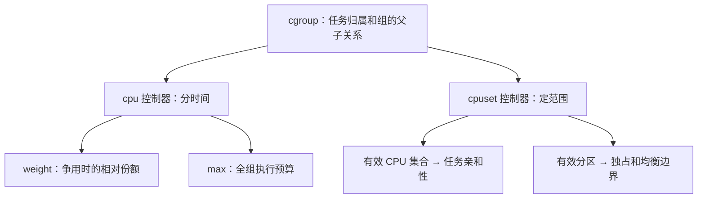

本文的权重和配额分析针对**公平调度类**，也就是通常的 `SCHED_NORMAL/BATCH/IDLE` 任务。`SCHED_FIFO/RR`、`SCHED_DEADLINE` 不走这里的公平队列带宽记账路径；cpuset 的放置约束则不只用于公平类。调度类选择见 [`__setscheduler_class()`](../../linux/kernel/sched/core.c#L7304)，公平类定义见 [`fair_sched_class`](../../linux/kernel/sched/fair.c#L14095)。

这里的编号是**逻辑 CPU**。x86 的一颗物理核可能有多个 SMT 线程；若要独占物理核，应把所有 SMT 兄弟一起分配，见 [`topology_sibling_cpumask()`](../../linux/arch/x86/include/asm/topology.h#L196)。本文示例中的连续编号只是示意，实际可用 `thread_siblings_list` 核对拓扑，见 [接口实现](../../linux/drivers/base/topology.c#L80)。分区也不隔离共享缓存和内存带宽。

**从用户接口到每 CPU 调度器**

用户配置的是组，真正执行任务的是每颗 CPU 的调度器。两者之间有三层：

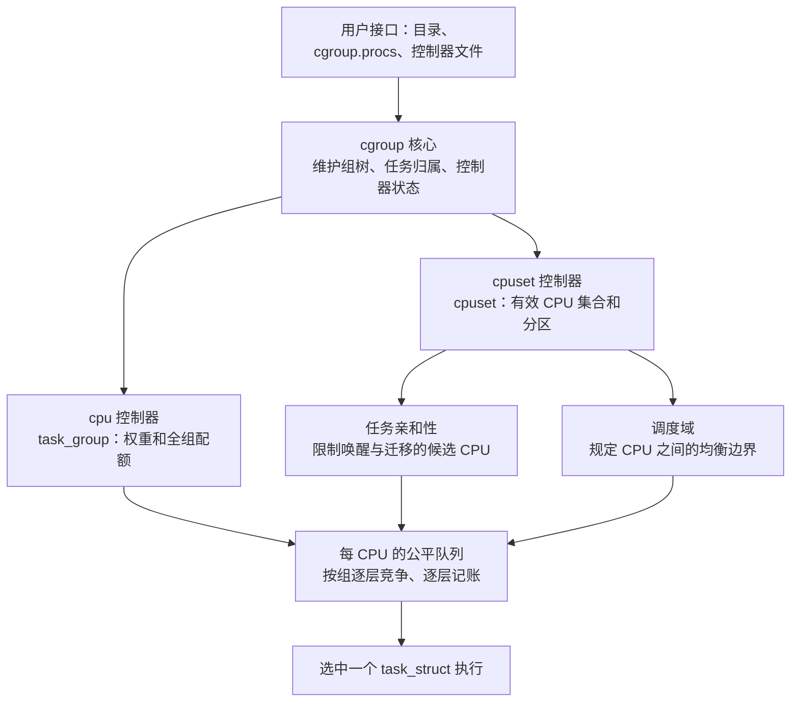

这张图对应两种工作节奏：**配置变化时建立或更新对象，任务运行时使用已经建立的对象。** `mkdir`、写文件和任务换组进入 cgroup 回调；选人、记账和负载均衡进入调度器路径。连接入口分别是 [`cpu_cgrp_subsys`](../../linux/kernel/sched/core.c#L10304) 和 [`cpuset_cgrp_subsys`](../../linux/kernel/cgroup/cpuset.c#L3884)。

一次调度可以先按三个问题理解：任务被允许去哪颗 CPU？在那颗 CPU 上，它所属的组怎样与其他组竞争？执行之后，哪些组的预算需要扣除？权重、配额和放置范围会同时约束同一个任务；后面的数据结构正是为这三个问题服务。

## 1. cpu 控制器：分配时间与限制预算

本章先认识任务组和每 CPU 竞争队列，再跟踪建组与任务迁移，最后围绕权重和配额解释运行时的时间分配。两个控制器共用的 cgroup 归属关系也在这里建立；第 2 章沿用这些对象，展开 CPU 放置。

### 1.1 核心数据结构：从一棵组树到每 CPU 的队列

下文的 C 片段保留源码成员的名称、类型和先后顺序，按本文配置展开条件编译并省略无关成员；中文注释为阅读说明，片段不是完整可编译的定义。

#### 1.1.1 `cgroup`、css 和 `css_set`：表示组与任务归属

先把问题拆成两步：**任务属于哪个目录？这个任务实际使用哪一组 CPU 调度配置？** 在 cgroup v2 中，这两个答案可能指向不同的组，因此内核用不同对象保存它们。

| 要回答的问题 | 对象或字段 | 先记住的作用 |
| ------------ | ---------- | ------------ |
| 用户创建了哪个组？ | `struct cgroup` | 对应目录，连接组的父子关系 |
| 本组自己的 cpu 状态在哪里？ | `cgroup.subsys[cpu_cgrp_id]` | 指向本组 cpu 控制器对象中的公共成员 css；本组未启用 cpu 时可以为空 |
| 任务属于哪个组、使用哪些控制器状态？ | `struct css_set` | 保存目录归属，以及各控制器实际生效的 css 指针 |
| cpu 控制器怎样实现调度配置？ | `struct task_group` | 保存组权重、配额和每 CPU 调度对象，下一小节展开 |

下面先看目录，再看控制器对象，最后把任务接进来。这里的“任务”指 `task_struct`，通常对应一个线程；多个任务可以属于同一个组。示例采用普通 domain 层级，线程子树的条件留到第 1.2.1 节。

##### （1）目录对应 `cgroup`：先建立组的父子关系

假设用户在 cgroup v2 挂载点下创建 A，再在 A 下创建 B。内核中也有三个对应的 `cgroup` 对象：

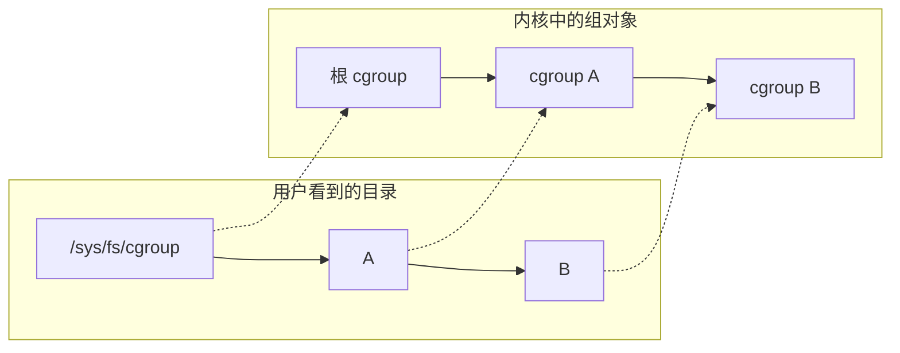

这张图先只画组的父子关系。CPU 调度配置由附着在组上的控制器对象承载。先看 [`struct cgroup`](../../linux/include/linux/cgroup-defs.h#L472) 中与目录和控制器有关的成员，目录成员见 [`kn`](../../linux/include/linux/cgroup-defs.h#L524)，控制器成员见 [`subtree_control` 与 `subsys[]`](../../linux/include/linux/cgroup-defs.h#L538)：

```c
struct cgroup {
    struct cgroup_subsys_state self; /* 组自身的公共状态，用来连接组树 */
    /* 省略其他成员 */
    struct kernfs_node *kn;          /* 对应目录的 kernfs 节点 */
    /* 省略其他成员 */
    u16 subtree_control;            /* 用户要求向子组启用哪些控制器 */
    u16 subtree_ss_mask;            /* 实际向子组启用的控制器掩码 */
    /* 省略其他成员 */
    struct cgroup_subsys_state __rcu *subsys[CGROUP_SUBSYS_COUNT];
                                    /* 本组各控制器的状态指针 */
    /* 省略其他成员 */
};
```

`self` 是内嵌对象，`subsys[]` 是指针数组。内嵌表示成员就在这个对象里面；指针表示引用另一个对象中的成员。每个控制器占一个数组槽位，cpu 使用 `cpu_cgrp_id`，cpuset 使用 `cpuset_cgrp_id`。

`subtree_control` 保存用户请求，`subtree_ss_mask` 保存实际生效的结果；后者还可能包含依赖的控制器，见 [源码中的字段说明](../../linux/include/linux/cgroup-defs.h#L531)。这里先记住：这两个开关都作用于子组，本组自己的控制器状态由 `subsys[]` 引用。

组的父关系藏在 `self.parent` 中。例如 B 的 `self.parent` 指向 A 的 `self`，所以 [`cgroup_parent()`](../../linux/include/linux/cgroup.h#L518) 要先取这个成员，再找回外层 `cgroup`：

```c
static inline struct cgroup *cgroup_parent(struct cgroup *cgrp)
{
    struct cgroup_subsys_state *parent_css = cgrp->self.parent;

    if (parent_css)
        return container_of(parent_css, struct cgroup, self);
    return NULL;
}
```

`container_of()` 在这里的意思是：“已知一个 `self` 成员的地址，找回包含它的 `cgroup`。”根组没有父组，因此返回 `NULL`。

##### （2）css 是公共成员：让 cgroup 核心找到控制器对象

css 是 **cgroup subsystem state**，对应 `struct cgroup_subsys_state`。cgroup 核心需要统一管理各种控制器，而 cpu、cpuset 的具体字段各不相同。解决办法是：每种控制器对象都内嵌一个 css，核心通过它管理归属、父关系和生命周期。

先看 [`css` 的定义](../../linux/include/linux/cgroup-defs.h#L179)，只留下这里要用的成员；子状态链表见 [`sibling / children`](../../linux/include/linux/cgroup-defs.h#L211)，父指针见 [`parent`](../../linux/include/linux/cgroup-defs.h#L244)：

```c
struct cgroup_subsys_state {
    struct cgroup *cgroup;           /* 这个状态属于哪个组 */
    struct cgroup_subsys *ss;        /* 这个状态属于哪个控制器 */
    struct percpu_ref refcnt;        /* 状态对象的引用计数 */
    /* 省略其他成员 */
    struct list_head sibling;       /* 挂到父 css 的 children 链表 */
    struct list_head children;      /* 本状态的子状态链表 */
    /* 省略其他成员 */
    struct cgroup_subsys_state *parent; /* 同一类状态的父状态 */
    /* 省略其他成员 */
};
```

`parent`、`sibling` 和 `children` 一起连接状态树，`refcnt` 则用于生命周期管理。对控制器 css 来说，这是该控制器的状态树；对 `cgroup.self` 来说，这是组自身的树。

对 cpu 来说，真正的控制器对象是 [`struct task_group`](../../linux/kernel/sched/sched.h#L472)，它把 css 放在自己的结构体里：

```c
struct task_group {
    struct cgroup_subsys_state css;
    /* 省略权重、配额和每 CPU 调度对象等成员 */
};
```

当 A 拥有自己的 cpu 状态时，对象关系如下。图中的方框分组表示对象及其成员，箭头表示指针引用：

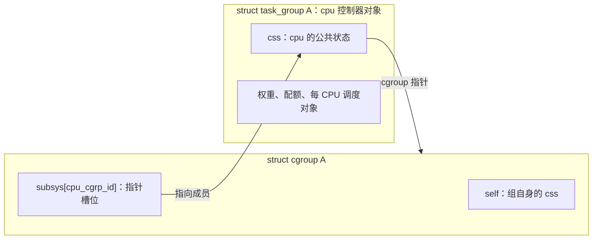

这里有两个 css，容易混淆：

| css 成员 | 作用 | `ss` 指针 | `parent` 指向谁 |
| -------- | ---- | --------- | --------------- |
| `cgroup A.self` | 表示 A 这个组，连接目录对应的组树 | `NULL` | 父组的 `self` |
| `task_group A.css` | 表示 A 的 cpu 控制器状态 | cpu 控制器 | 父 cpu 状态 |

`cgroup self.ss == NULL` 的含义写在 [`cgroup` 定义的注释](../../linux/include/linux/cgroup-defs.h#L473) 中。同一个结构体类型在这里承担两种用途，不能把 `cgroup A.self` 当成 A 的 cpu 状态。

cgroup 核心持有 css 指针，调度器则需要整个 `task_group`。转换仍用 `container_of()`，见 [`css_tg()`](../../linux/kernel/sched/sched.h#L558)：

```c
static inline struct task_group *css_tg(struct cgroup_subsys_state *css)
{
    return css ? container_of(css, struct task_group, css) : NULL;
}
```

到这里，已经可以读懂这条路径：`cgroup A.subsys[cpu_cgrp_id] → task_group A.css → css_tg() → task_group A`。cpuset 采用相同的内嵌方式，外层对象换成 `struct cpuset`，第 2 章再展开。

##### （3）任务引用 `css_set`：一次找到各控制器的有效状态

任务要访问多个控制器。内核让任务持有一个 `css_set` 指针，再由集合中的数组访问各控制器状态。多个任务满足同样的归属和状态组合时，可以共享这个集合，减少任务中的存储和 fork / exit 时的维护工作，见 [`css_set` 定义前的说明](../../linux/include/linux/cgroup-defs.h#L265)。

对应的字段摘自 [`task_struct.cgroups`](../../linux/include/linux/sched.h#L1323) 和 [`struct css_set`](../../linux/include/linux/cgroup-defs.h#L272)，任务归属与任务链表见 [`dfl_cgrp / nr_tasks / tasks`](../../linux/include/linux/cgroup-defs.h#L291)：

```c
struct task_struct {
    /* 省略其他成员 */
    struct css_set __rcu *cgroups;   /* 本任务引用的状态集合 */
    /* 省略其他成员 */
};

struct css_set {
    struct cgroup_subsys_state *subsys[CGROUP_SUBSYS_COUNT];
                                    /* 各控制器实际生效的 css */
    refcount_t refcount;             /* 集合的引用计数 */
    /* 省略其他成员 */
    struct cgroup *dfl_cgrp;         /* 任务在 v2 层级中属于哪个组 */
    int nr_tasks;                   /* 集合内部维护的任务计数 */
    struct list_head tasks;          /* 常态下引用这个集合的任务链表 */
    /* 省略其他成员 */
};
```

`refcount` 管集合本身的引用；`nr_tasks` 和 `tasks` 用于维护引用集合的任务，两者用途不同。迁移过程中还会使用其他任务链表，这里先省略。

例如两个任务都属于 A，且 A 拥有自己的 cpu 状态，可以通过同一个 `css_set` 找到 A 和 A 的 cpu 状态：

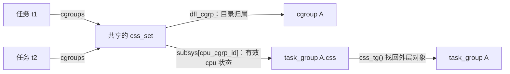

图里的两条出口分别回答开头的两个问题：`dfl_cgrp` 回答“任务属于哪个目录”，`subsys[cpu_cgrp_id]` 回答“任务使用哪个 cpu 状态”。

[`task_css_check()`](../../linux/include/linux/cgroup.h#L435) 和 [`task_css()`](../../linux/include/linux/cgroup.h#L456) 正是这条查找路径的源码表达：

```c
#define task_css_check(task, subsys_id, __c) \
    task_css_set_check((task), (__c))->subsys[(subsys_id)]

static inline struct cgroup_subsys_state *task_css(struct task_struct *task,
                                                 int subsys_id)
{
    return task_css_check(task, subsys_id, false);
}
```

因此，`task_css(p, cpu_cgrp_id)` 的作用就是从任务引用的集合中取出有效 cpu 状态。访问 `cgroups` 的 RCU 与锁检查封装在 [`task_css_set_check()`](../../linux/include/linux/cgroup.h#L415) 中；图中的箭头用于理解对象关系，实际代码通过这些辅助函数访问。

##### （4）父组启用控制器：目录归属可以比 cpu 状态更深一层

现在换一个例子，观察两个答案怎样分开。假设根组、A、B 已经存在，A 不放任务，任务放在 B 中。根组向 `cgroup.subtree_control` 写入 `+cpu`，但 A 暂时没有向子组启用 cpu：

```text
根组：subtree_control = cpu
└── A：拥有自己的 task_group A
    subtree_control 为空
    └── B：没有自己的 cpu 状态，任务使用 task_group A

B 中的任务：
  css_set.dfl_cgrp                 → cgroup B       （目录归属）
  css_set.subsys[cpu_cgrp_id]       → task_group A.css（有效 cpu 状态）
  cgroup B.subsys[cpu_cgrp_id]      → NULL           （本组没有 cpu 状态）
```

为什么根组写 `+cpu` 后，获得自己 cpu 状态的是 A？因为开关作用于**直接子组**。普通非根 domain 下，决定本组可见控制器的是父组的 `subtree_control`，见 [`cgroup_control()`](../../linux/kernel/cgroup/cgroup.c#L479)，关键取值是 [`parent->subtree_control`](../../linux/kernel/cgroup/cgroup.c#L485)。

接着在 A 的 `cgroup.subtree_control` 写入 `+cpu`，B 才获得自己的 cpu 状态。两种配置下，B 中任务的目录归属都不变：

| 配置完成后的状态 | B 的 `subsys[cpu_cgrp_id]` | B 中任务的有效 cpu 状态 | 任务的目录归属 |
| ---------------- | ------------------------ | ----------------------- | -------------- |
| 根组启用 cpu，A 未向子组启用 | `NULL` | `task_group A.css` | B |
| 根组、A 都向子组启用 cpu | `task_group B.css` | `task_group B.css` | B |

这也解释了两张同名数组的区别：**`cgroup.subsys[]` 查本组自己的状态，`css_set.subsys[]` 查任务实际使用的状态。** 对任务而言，如果本组没有 cpu 状态，就向上找到最近拥有该状态的组。允许集合中的指针指向祖先，写在 [`css_set` 的源码注释](../../linux/include/linux/cgroup-defs.h#L312) 中。

具体查找见 [`cgroup_e_css_by_mask()`](../../linux/kernel/cgroup/cgroup.c#L547)。下面保留其函数体：

```c
static struct cgroup_subsys_state *cgroup_e_css_by_mask(struct cgroup *cgrp,
                                                      struct cgroup_subsys *ss)
{
    lockdep_assert_held(&cgroup_mutex);

    if (!ss)
        return &cgrp->self;

    /* 状态正在更新，依据控制器掩码判断，不能直接测试 css 指针。 */
    while (!(cgroup_ss_mask(cgrp) & (1 << ss->id))) {
        cgrp = cgroup_parent(cgrp);
        if (!cgrp)
            return NULL;
    }

    return cgroup_css(cgrp, ss);
}
```

`1 << ss->id` 选中这个控制器对应的位。循环检查当前组是否有该控制器状态，没有就走向父组；找到后，`cgroup_css()` 取出该组的 [`subsys[ss->id]`](../../linux/kernel/cgroup/cgroup.c#L531)。cgroup 核心构造任务的新状态集合时，也用这个有效状态查找函数填充 [`template[i]`](../../linux/kernel/cgroup/cgroup.c#L1125)。所以 B 有自己的目录对象，并不意味着它一定有独立的 cpu 调度对象。

本节的连接关系可以用一条路径记住：**任务 → `css_set` → 有效 cpu css → `task_group`**；目录归属则由同一集合中的 `dfl_cgrp` 单独保存。接下来围绕 `task_group`，看它怎样连接每 CPU 的公平队列。启用和任务迁移的完整流程见第 1.2 节。

#### 1.1.2 `task_group`、`sched_entity` 和 `cfs_rq`：表示分层竞争

先只看 cpu 控制器。每个 cpu 控制器组有一个跨 CPU 共享的 `task_group`；任务则在**某一颗 CPU 的队列**里竞争。这里的“全局”指同一个组在各 CPU 间共享，不是整机所有组共用一个对象。一个非根组 A 在每颗 CPU 上都有两样东西：

| 对象 | 作用 |
| ---- | ---- |
| `A.cfs_rq[cpu]` | A 在这颗 CPU 上的公平队列，里面排 A 的任务或子组实体 |
| `A.se[cpu]` | A 在父队列里的代表，替整个 A 组争取时间 |

`cfs_rq` 是公平类运行队列；`se` 是 `sched_entity` 的简称，表示**参与调度竞争的实体**。实体既可以代表一个任务，也可以代表一个组。字段见 [`task_group`](../../linux/kernel/sched/sched.h#L472)、[`sched_entity`](../../linux/include/linux/sched.h#L570) 和 [`cfs_rq`](../../linux/kernel/sched/sched.h#L676)。源码仍沿用 `cfs_rq`、`CFS_BANDWIDTH` 等名称，本版本公平类的选人算法则是 EEVDF。

**`task_group`：组身份、每 CPU 对象数组与共享配置。** 摘自 [`struct task_group`](../../linux/kernel/sched/sched.h#L472)。

```c
struct task_group {
    struct cgroup_subsys_state css;  /* 内嵌 cpu 控制器状态 */
    int idle;                       /* cpu.idle 的组级状态 */
    struct sched_entity **se;       /* se[cpu]：在父队列中代表本组 */
    struct cfs_rq **cfs_rq;          /* cfs_rq[cpu]：本组在该 CPU 上的队列 */
    unsigned long shares;           /* cpu.weight 换算后的组权重 */
    atomic_long_t load_avg ____cacheline_aligned; /* 跨 CPU 汇总的组负荷 */
    /* 省略其他成员 */
    struct task_group *parent;
    struct list_head siblings;
    struct list_head children;      /* 调度器中的任务组树 */
    /* 省略其他成员 */
    struct cfs_bandwidth cfs_bandwidth; /* 内嵌全组唯一的配额池，见第 1.4.2 节 */
    /* 省略其他成员 */
};
```

`se`、`cfs_rq` 的类型是指针的指针，因为它们指向按 CPU 编号索引的**指针数组**；每个数组元素再指向一个独立对象。分配过程见 [`alloc_fair_sched_group()`](../../linux/kernel/sched/fair.c#L13833)。

**`sched_entity`：参与本层竞争的任务或组代表。** 权重结构摘自 [`load_weight`](../../linux/include/linux/sched.h#L455)，实体摘自 [`sched_entity`](../../linux/include/linux/sched.h#L570)，层级指针见 [`parent / cfs_rq / my_q`](../../linux/include/linux/sched.h#L598)。

```c
struct load_weight {
    unsigned long weight;           /* 实体权重 */
    u32 inv_weight;                  /* 权重倒数的缓存 */
};

struct sched_entity {
    struct load_weight load;
    struct rb_node run_node;        /* 在本层 EEVDF 红黑树上的节点 */
    u64 deadline;                   /* 本层的虚拟截止期 */
    /* 省略其他成员 */
    unsigned char on_rq;            /* 是否计入本层队列，不等于一直在树上 */
    unsigned char sched_delayed;    /* 是否处于延迟出队状态 */
    /* 省略其他成员 */
    u64 exec_start;
    u64 sum_exec_runtime;           /* 累计实际执行时间 */
    /* 省略其他成员 */
    u64 vruntime;                   /* 按权重推进的虚拟运行时间 */
    /* 省略其他成员 */
    struct sched_entity *parent;    /* 本 CPU 上的上一层组代表 */
    struct cfs_rq *cfs_rq;          /* 我在哪个队列里竞争 */
    struct cfs_rq *my_q;            /* 我代表哪个子队列；任务实体为 NULL */
    /* 省略其他成员 */
    struct sched_avg avg;           /* 本实体的 PELT 负荷历史 */
};
```

先把实体看成一个“带着权重和时间账本的竞争者”：`load` 保存权重，`sum_exec_runtime` 记录实际执行时间，`vruntime / deadline` 用于本层公平选人。`parent / cfs_rq / my_q` 连接层级；PELT 负荷历史在第 1.3.4 节展开。

**`cfs_rq`：一颗 CPU 上、一个组的一层公平队列。** 摘自 [`struct cfs_rq`](../../linux/kernel/sched/sched.h#L676)，组负荷贡献见 [`tg_load_avg_contrib`](../../linux/kernel/sched/sched.h#L718)，归属指针见 [`rq / tg`](../../linux/kernel/sched/sched.h#L734)。这里先保留竞争与归属字段，带宽字段在第 1.4.2 节介绍。

```c
struct cfs_rq {
    struct load_weight load;        /* 本层实体的汇总权重 */
    unsigned int nr_queued;         /* 本层实体数，包含正在执行的实体 */
    unsigned int h_nr_queued;       /* 子树中仍计入队列的任务数，包含 delayed */
    unsigned int h_nr_runnable;     /* 排除 delayed 的层级可运行任务数 */
    unsigned int h_nr_idle;
    /* 省略其他成员 */
    struct rb_root_cached tasks_timeline; /* 本层的 EEVDF 红黑树 */
    struct sched_entity *curr;      /* 当前执行的本层实体，可能是组代表 */
    /* 省略其他成员 */
    struct sched_avg avg;
    /* 省略其他成员 */
    unsigned long tg_load_avg_contrib; /* 本队列对全组负荷的贡献 */
    /* 省略其他成员 */
    struct rq *rq;                  /* 所在 CPU 的总运行队列 */
    /* 省略其他成员 */
    struct task_group *tg;          /* 拥有本队列的任务组 */
    int idle;                       /* 本组 idle 状态的本地副本 */
    /* 省略带宽等成员，见第 1.4.2 节 */
};
```

`tasks_timeline` 和 `curr` 描述本层竞争，`nr_queued` 与 `h_nr_*` 分别数本层实体和层级任务，具体区别见第 1.3.5 节。`rq` 回答“在哪颗 CPU”，`tg` 回答“属于哪个组”。

这里的“在队列上”比“在红黑树里”范围更大。`se.on_rq = 1` 表示实体仍计入这一层公平队列：它可以在树中等待，也可以正由 `cfs_rq.curr` 引用。选中实体准备执行时，[`set_next_entity()`](../../linux/kernel/sched/fair.c#L5636) 会把它从树中取下，但它仍计入队列；让出 CPU 后若仍可运行，再由 [`put_prev_entity()`](../../linux/kernel/sched/fair.c#L5712) 插回。因此“树里没有它”不能单独证明它已退出竞争。

**`rq`：整颗 CPU 的总运行队列。** 它内嵌根公平队列，也保存其他调度类队列；这里只摘出与本文关系图有关的成员，见 [`struct rq`](../../linux/kernel/sched/sched.h#L1120)、[根公平队列](../../linux/kernel/sched/sched.h#L1148) 和 [调度域指针](../../linux/kernel/sched/sched.h#L1209)。

```c
struct rq {
    raw_spinlock_t __lock;          /* 保护这颗 CPU 的调度状态 */
    unsigned int nr_running;
    /* 省略其他成员 */
    struct cfs_rq cfs;              /* 内嵌根公平队列 */
    /* 省略其他成员 */
    struct sched_domain __rcu *sd;  /* 这颗 CPU 的负载均衡域入口 */
    /* 省略其他成员 */
    int cpu;
    /* 省略其他成员 */
};
```

每颗 CPU 的公平竞争从 `rq.cfs` 开始，再沿组实体进入子队列；`rq.sd` 则连接 CPU 之间的均衡范围，第 2.5 节会用它解释分区。

下面假设 A 是根组的直接子组，画出它在 CPU 0 上的**字段连接关系**。箭头表示内嵌或指针引用，不表示执行顺序；CPU 1 上会另有一套 `A.se[1]`、`A.cfs_rq[1]`。

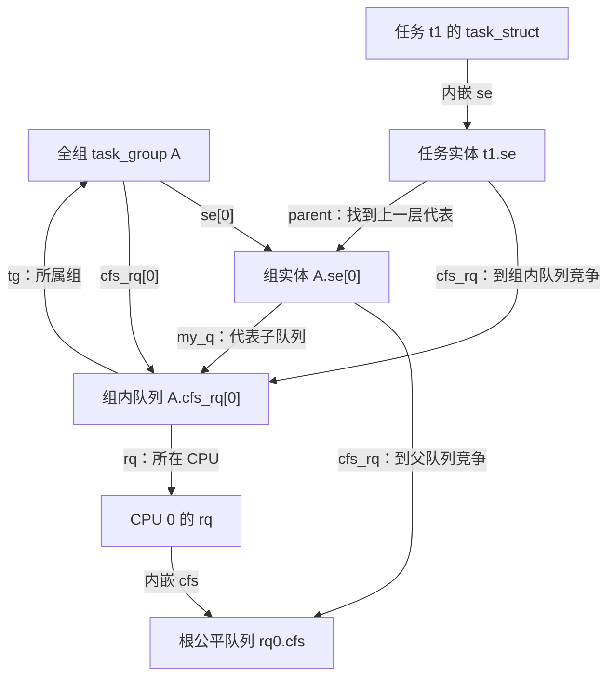

如果 A 有 t1、t2，B 有 t3，根队列比较的是 A、B 两个**组代表**；进入 A 的队列之后，才比较 t1、t2。因此 A 增加线程，首先增加的是 A 内部的竞争者。

指针也沿这张图连接：

| 指针 | 回答的问题 | 示例 |
| ---- | ---------- | ---- |
| `se.cfs_rq` | 我在哪个队列里竞争？ | `t1.se.cfs_rq = A.cfs_rq[0]` |
| `se.my_q` | 选中我后，要进入哪个子队列？ | `A.se[0].my_q = A.cfs_rq[0]` |
| `se.parent` | 向上一层找哪个组代表？ | `t1.se.parent = A.se[0]` |

任务实体没有子队列，`my_q == NULL`；内核用 [`entity_is_task()`](../../linux/kernel/sched/sched.h#L923) 区分任务和组。根组直接用每 CPU 的 `rq->cfs`，没有向上参赛的根组实体，见 [根组初始化](../../linux/kernel/sched/core.c#L8764)。建组时的指针连接见 [`init_tg_cfs_entry()`](../../linux/kernel/sched/fair.c#L13926)。

这里先沿 `se.cfs_rq`、`se.my_q`、`se.parent` 三个指针读懂竞争层级，再在第 1.3 节跟踪这些对象的入队、选人和记账。

#### 1.1.3 `task_struct`：把任务归属接到竞争层级

任务通过 `cgroups` 找到有效 cpu 控制器状态，调度热路径通过 `sched_task_group` 访问所属任务组，再由内嵌的 `se` 接到当前 CPU 的公平队列。成员见 [`task_struct`](../../linux/include/linux/sched.h#L815)、[组与限流成员](../../linux/include/linux/sched.h#L881) 和 [cgroup 成员](../../linux/include/linux/sched.h#L1321)。

```c
struct task_struct {
    /* 省略其他成员 */
    int on_rq;                      /* 任务的运行队列状态 */
    /* 省略其他成员 */
    struct sched_entity se;          /* 内嵌任务自己的公平调度实体 */
    /* 省略其他成员 */
    struct task_group *sched_task_group; /* sched_move_task() 更新的组副本 */
    /* 省略限流、亲和性等成员，见第 1.4.5、2.6 节 */
    struct css_set __rcu *cgroups;   /* 本任务使用的控制器状态集合 */
    struct list_head cg_list;       /* 挂入 css_set 的任务链表 */
    /* 省略其他成员 */
};
```

`cgroups / cg_list` 把任务接到 cgroup 的归属管理，`sched_task_group / se` 把任务接到调度器的竞争层级。`on_rq` 是任务层面的状态，和 `se.on_rq` 的实体层面状态需要分开看；限流时的区别见第 1.4.5.4 节。

图中假设 A 已有自己的 cpu 状态，且任务换组已经完成。任务共享 `css_set`，不直接内嵌 `task_group`：

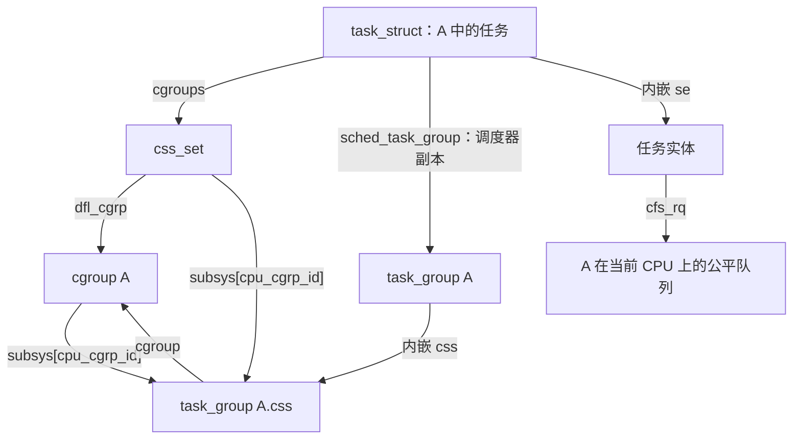

css 指针指向外层对象中的成员，内核通过 [`css_tg()`](../../linux/kernel/sched/sched.h#L558) 的 `container_of()` 找回 `task_group`。`sched_task_group` 的更新与 `css_set` 更换并非同一步，热路径使用这个副本的原因见 [源码注释](../../linux/kernel/sched/sched.h#L2159) 和第 1.2.3 节。

为什么还要多存一个指针？换组存在一个短窗口：`p->cgroups` 已经指向新状态集合，任务的调度实体却还没从旧组搬走。如果此时记账直接按新 css 找组，组身份就可能与队列位置不一致。`sched_task_group` 随调度器搬家，在任务锁和 rq 锁保护下更新，让调度路径使用与当前队列关系匹配的组身份。这里复制的是**指针**，没有复制整个 `task_group`。

| 任务字段 | 用途 | 谁更新它 |
| -------- | ---- | -------- |
| `cgroups` | 通过 `css_set` 找到有效 cpu 状态 | cgroup 核心的迁移流程 |
| `sched_task_group` | 调度器使用的 cpu 组副本 | `sched_move_task()` |
| `se.cfs_rq / se.parent` | 接入本组在当前 CPU 上的竞争层级 | `set_task_rq()` |

cpu 换组改变任务的竞争关系；任务允许使用哪些 CPU，由第 2 章的 cpuset 与用户亲和性共同约束。

#### 1.1.4 时间预算状态：全组共享，每 CPU 记账

前面画出了竞争对象。要限制执行预算，还需要全组共享池、每 CPU 本地余额，以及额度耗尽时的限流状态；具体字段和运行循环在第 1.4 节展开。

| 需求 | 全组对象 | 每 CPU 或每任务结果 |
| ---- | -------- | ------------------- |
| 控制执行预算 | `task_group.cfs_bandwidth`：全组一个共享池 | `cfs_rq.runtime_remaining`：本地领取的余额 |
| 因预算不足暂停任务 | 共享池的 `throttled_cfs_rq`：受限队列链表 | 叶子队列的 `throttled_limbo_list`：暂时退出竞争的任务 |

字段见 [`cfs_bandwidth`](../../linux/kernel/sched/sched.h#L445) 和 [`cfs_rq`](../../linux/kernel/sched/sched.h#L751)。现在可以把 cpu 控制器中的对象放在同一张逻辑图里：

```text
全组 task_group A：组权重 + 全组预算池
  ├── CPU 0：A.se[0] ↔ A.cfs_rq[0]，有自己的本地余额
  └── CPU 1：A.se[1] ↔ A.cfs_rq[1]，有自己的本地余额

A 中的任务 t1
  cgroups → 有效 cpu 状态
  sched_task_group → task_group A
  se → A 在任务当前 CPU 上的队列
```

**组对象是全局的，竞争队列和本地余额是每 CPU 的，任务通过组身份接入当前 CPU 的竞争层级。** 后面的建组、选人和配额循环都围绕这些关系展开。

### 1.2 配置怎样建立这些对象：启用、建组和迁移

理解了对象，先跟一条配置路径：父组启用控制器，子组获得状态，任务迁入后接到对应队列。这一步完成后，调度器才有第 1.3～1.4 节要使用的竞争层级和预算状态。

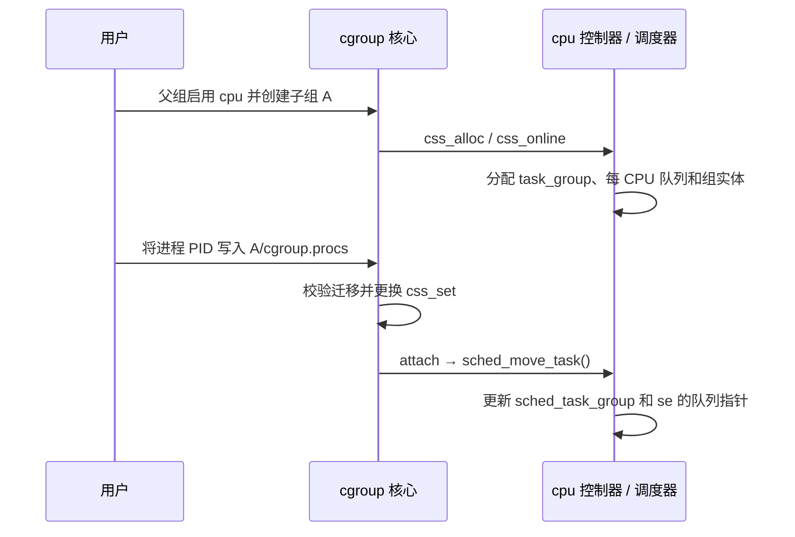

图中只展开 cpu 控制器的回调；同一次迁移中的 cpuset 回调见第 2.1、2.6 节。

#### 1.2.1 父组启用控制器，cgroup 核心通过回调连接 sched

本章启用 cpu 控制器时，向父组的 `cgroup.subtree_control` 写入 `+cpu`，停用用 `-cpu`。A 自己的开关改变子组的控制器状态，见 [核心注释](../../linux/kernel/cgroup/cgroup.c#L3200)。

`cpu` 和 `cpuset` 都把 `.threaded = true` 写进控制器描述表，见 [`cpu_cgrp_subsys`](../../linux/kernel/sched/core.c#L10304) 和 [`cpuset_cgrp_subsys`](../../linux/kernel/cgroup/cpuset.c#L3884)。这里的 domain 指普通的资源域；线程子树允许在支持线程控制的控制器下，按线程组织竞争。`.threaded = true` 表示控制器支持这种组织方式，启用时还要区分两种情况：

- 普通非根 domain 若不满足线程子树条件，有内部任务时不能继续向子组启用控制器，否则返回 `-EBUSY`。
- 对 cpu、cpuset 这样的线程控制器，已经是 threaded 的组，或者**有资格成为线程根**的 domain，可以容纳内部竞争。后者不要求提前创建 threaded 子组；它要求没有已启用的域控制器，也没有已被任务占用的 domain 子组。

检查顺序见 [`cgroup_vet_subtree_control_enable()`](../../linux/kernel/cgroup/cgroup.c#L3503)，线程根资格见 [`cgroup_can_be_thread_root()`](../../linux/kernel/cgroup/cgroup.c#L417)。例如 A 内已有任务，且满足上述资格，此时向 A 写入 `+cpu` 可以成功；A 同时具有任务和已启用的线程控制器后，会被 [`cgroup_is_thread_root()`](../../linux/kernel/cgroup/cgroup.c#L449) 识别为线程根。因此不能把规则背成“非根组有任务就一定不能写 `+cpu`”。根组另有豁免，可以同时作为线程根和普通资源域的父组。

向 `cgroup.procs` 写入 PID，迁移的是该进程的**整个线程组**，见 [`cgroup_procs_write()`](../../linux/kernel/cgroup/cgroup.c#L5437) 传入的 `threadgroup = true`。需要在同一资源域内按线程迁移时，使用 [`cgroup.threads`](../../linux/kernel/cgroup/cgroup.c#L5448)，它传入 `false`，且受 [资源域边界检查](../../linux/kernel/cgroup/cgroup.c#L5384) 约束。下文按单个 `task_struct` 跟踪回调；一次进程迁移会对其中各线程执行这些操作。

任务迁入新组时，cgroup 核心会换一份 `css_set`，再回调各控制器的 `attach`。cpuset 的回调负责在有效集合变化时更新任务亲和性，见第 2.6 节。

sched 用一张 [`cpu_cgrp_subsys`](../../linux/kernel/sched/core.c#L10304) 接到 cgroup 核心。cgroup 发生生命周期事件时，调用这些回调；调度器内部并不去解析 cgroup 目录。

| 回调 | 函数 | sched 做什么 |
| ---- | ---- | ------------ |
| `css_alloc` | [`cpu_cgroup_css_alloc()`](../../linux/kernel/sched/core.c#L9257) | 根组返回已有的 `root_task_group.css`；否则 `sched_create_group()` |
| `css_online` | [`cpu_cgroup_css_online()`](../../linux/kernel/sched/core.c#L9275) | `sched_online_group()`，把组挂进调度器可见的树 |
| `css_released` | [`cpu_cgroup_css_released()`](../../linux/kernel/sched/core.c#L9305) | `sched_release_group()`，从树上摘掉 |
| `css_free` | [`cpu_cgroup_css_free()`](../../linux/kernel/sched/core.c#L9312) | `sched_unregister_group()`，清理队列并延后释放对象 |
| `can_attach` | [`cpu_cgroup_can_attach()`](../../linux/kernel/sched/core.c#L9322) | RT 组调度编译且运行时启用时，检查 RT 任务能否进入该组 |
| `attach` | [`cpu_cgroup_attach()`](../../linux/kernel/sched/core.c#L9340) | 对每个任务调用 `sched_move_task()` |
| `dfl_cftypes` | [`cpu_files[]`](../../linux/kernel/sched/core.c#L10252) | v2 的 `cpu.weight` / `cpu.max` / `cpu.idle` 等文件 |
| `css_extra_stat_show` | [`cpu_extra_stat_show()`](../../linux/kernel/sched/core.c#L10088) | `cpu.stat` 里的带宽附加项 |

`.early_init = true` 表示启动很早就建好根组；`.threaded = true` 表示它可以和线程模式的 cgroup 一起用。cgroup 核心不会直接改 `se.load.weight` 或 `cfs_rq.runtime_remaining`，那些是回调进 sched 之后才发生的事。

```text
用户 mkdir /sys/fs/cgroup/A
  └─ cgroup 核心创建 struct cgroup
       └─ 父组 subtree_control 含 cpu
            └─ cpu_cgroup_css_alloc() → task_group A
            └─ cpu_cgroup_css_online() → 挂到 root_task_group 下

用户 echo PID > A/cgroup.procs
  └─ 任务换 css_set
       └─ cpu_cgroup_attach()
            └─ sched_move_task()：任务改挂到 A 在当前 CPU 上的 cfs_rq
```

#### 1.2.2 建组时分配每 CPU 对象，删除时延后释放

[`sched_create_group()`](../../linux/kernel/sched/core.c#L9125) 从 `task_group_cache` 分配 `task_group`，再调用 [`alloc_fair_sched_group()`](../../linux/kernel/sched/fair.c#L13833)：为每颗 possible CPU（系统可能使用的 CPU，包含当前离线者）分配一对 `cfs_rq` / `sched_entity`，默认 `shares = NICE_0_LOAD`（对应 `cpu.weight = 100`），并 [`init_cfs_bandwidth()`](../../linux/kernel/sched/fair.c#L6695) 把配额池初始化为无限。池子怎样领额度、怎样限流，见第 1.4 节。

[`init_tg_cfs_entry()`](../../linux/kernel/sched/fair.c#L13926) 把这一对对象接进父组：

| 指针 | 含义 |
| ---- | ---- |
| `cfs_rq->tg` / `cfs_rq->rq` | 这个队列属于哪个组、哪颗 CPU |
| `se->cfs_rq` | 组实体到父队列参赛 |
| `se->my_q` | 组实体代表的子队列；选中后沿这里往下走 |
| `se->parent` | 父组在同一颗 CPU 上的组实体；根组下一层的 parent 为 NULL |

根组是特例：每 CPU 直接用 `rq->cfs`，`root_task_group.se[cpu] == NULL`，不再构造一个参加更高层竞争的根组实体，见 [根组初始化](../../linux/kernel/sched/core.c#L8764)。按本文关闭 autogroup 的假设，根组公平任务直接在 `rq->cfs` 上，和子组的组实体一起竞争。

[`sched_online_group()`](../../linux/kernel/sched/core.c#L9149) 把新组链到 `parent->children`，再 [`online_fair_sched_group()`](../../linux/kernel/sched/fair.c#L13874) 建立各 CPU 的实体负荷关联，并同步祖先限流状态。队列指针此前已由 `init_tg_cfs_entry()` 接好。分配了对象不等于已经在树上排队：组实体只在该 CPU 上真有可运行子孙时，才由入队路径插进父队列。

删除组时，`css_released` 中的 [`sched_release_group()`](../../linux/kernel/sched/core.c#L9180) 先从树上摘掉，等待 RCU 宽限期后，`css_free` 调用 `sched_unregister_group()` 取消带宽定时器、移除队列的统计关联；再等一次 RCU 宽限期才真正释放每 CPU 对象，见 [`sched_unregister_group()`](../../linux/kernel/sched/core.c#L9113)。带宽定时器可能还在遍历组树，统计读取也可能持有对象，不能在 offline 当下立刻 kfree。

#### 1.2.3 任务换组：先更换 css_set，再更新调度器副本

调度热路径不直接读 `task_css()`。任务身上有一份 [`p->sched_task_group`](../../linux/kernel/sched/sched.h#L2172)，由 `sched_move_task()` 在 rq 锁里更新。换 CPU 或换组时，[`set_task_rq()`](../../linux/kernel/sched/sched.h#L2178) 把 `se.cfs_rq`、`se.parent` 改成目标组在目标 CPU 上的那一对对象。

把 PID 写入 `cgroup.procs` 后，cgroup 核心先换好 `css_set`，再回调 [`cpu_cgroup_attach()`](../../linux/kernel/sched/core.c#L9340)。sched 侧真正搬家的是 [`sched_move_task()`](../../linux/kernel/sched/core.c#L9232)：

1. 锁住任务当前 rq，更新时钟。
2. 若任务正在排队，先按 `DEQUEUE_SAVE | DEQUEUE_MOVE` 公平出队，账本留下。
3. [`sched_change_group()`](../../linux/kernel/sched/core.c#L9203) 从新的 cpu css 取出 `task_group`，写入 `p->sched_task_group`。若额外启用 autogroup，只有 cpu css 指向根任务组时才可能改挂自动组；非根 cpu 组不会被覆盖，见 [`task_wants_autogroup()`](../../linux/kernel/sched/autogroup.c#L131)。
4. 公平类 [`task_change_group_fair()`](../../linux/kernel/sched/fair.c#L13801) 解除旧队列的负荷关联，`set_task_rq()` 接到新组当前 CPU 的队列，再建立新队列的负荷关联；这里的 attach / detach 维护的是 PELT，不等同于实体入队、出队。
5. 若原先在运行队列上，由 [`sched_change_end()`](../../linux/kernel/sched/core.c#L10933) 恢复入队；睡眠任务仍保持睡眠。原先正在运行则再请求重调度，下一轮按新组的权重和配额选人。

还没被 `wake_up_new_task()` 唤醒的 `TASK_NEW` 任务，此时只更新 `sched_task_group`；`task_change_group_fair()` 直接返回，连 `set_task_rq()` 都暂不执行，见 [提前返回](../../linux/kernel/sched/fair.c#L13807)。每 CPU 队列指针等到[首次唤醒的选核流程](../../linux/kernel/sched/core.c#L4849)调用 `__set_task_cpu()` → `set_task_rq()` 再接好。

cpu 控制器的换组回调不改任务亲和性。任务能跑哪颗 CPU 仍由 cpuset 和用户亲和性决定；cpu 控制器只改它在**当前这颗 CPU**上跟谁竞争、按什么份额竞争。同一次 cgroup 迁移也可能触发 cpuset 的 attach，不能因此断言整个迁移过程不改亲和性。

### 1.3 分层公平调度：组怎样分享 CPU 时间

前面已经把任务接到了组内队列。这一节先用一颗 CPU 看清分层份额，再解释入队、选人和记账，最后展开配置换算与多 CPU 负荷修正。

#### 1.3.1 一颗 CPU 上，先分组份额，再分任务份额

看一个简化场景：只有一颗 CPU，A、B 的任务持续可运行，没有配额限制，也没有其他调度类干扰。A、B 的 `cpu.weight` 分别为 100、300；A 内 t1、t2 都是 nice 0，B 只有 t3。nice 用来调整任务级的相对权重，这里取相同值，方便观察组与组之间的分配。

| 竞争发生在哪里 | 比较什么 | 长期时间份额近似 |
| -------------- | -------- | ---------------- |
| 根队列 | A、B 的组权重 100 : 300 | A 得 1/4，B 得 3/4 |
| A 的队列 | t1、t2 的任务权重 1024 : 1024（未缩放值） | 各得 A 的一半，即整颗 CPU 的 1/8 |
| B 的队列 | 只有 t3 | t3 得整颗 CPU 的 3/4 |

表中的 100、300 是 `cpu.weight` 接口值，1024 是 nice 0 的任务权重，不能拿它们跨层相加。x86-64 实际还通过 [`scale_load()`](../../linux/kernel/sched/sched.h#L148) 放大内部权重以保留计算精度；上表省略这一共同缩放，不影响比例。

A 多建线程，会继续切分 A 的份额；不会直接把 A 的配置权重变大。改变 t1 的 nice，主要改变 A 内部的分配。B 睡眠后，A 可以使用空出来的 CPU 时间，所以权重**不提供固定预留或执行上限**。组 shares 如何进入实体权重，见 [`calc_group_shares()`](../../linux/kernel/sched/fair.c#L4086)。

多 CPU 时，每颗 CPU 的组实体权重还要结合本地负荷计算，不能把上表直接套到全机；具体公式留到第 1.3.4 节。

#### 1.3.2 入队向上，选人向下，记账沿祖先链

仍用上面的 A、B。A 在 CPU 0 上原来为空，t1 第一次被唤醒时，要把 t1 放入 A 的队列，也要把 A 的组实体放入根队列。之后 t2 被唤醒，只增加 A 队列里的竞争者，A 的组实体不用重复入队。

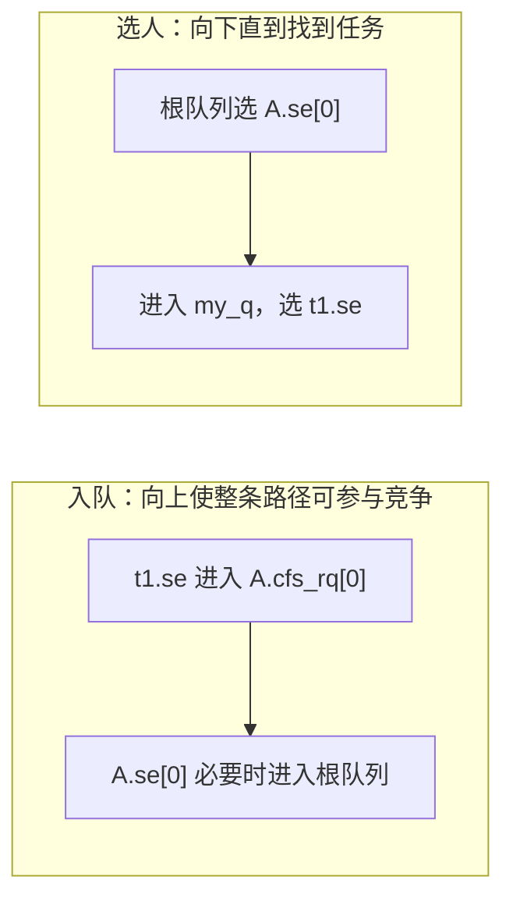

选人可以先按下面的伪代码理解。实际每层如何选实体，由 EEVDF 决定：

```text
queue = 当前 CPU 的根公平队列
循环：
    entity = 从 queue 选出一个实体
    如果 entity 代表任务：返回这个任务
    queue = entity.my_q
```

入队入口是 [`enqueue_task_fair()`](../../linux/kernel/sched/fair.c#L7080)，选人入口是 [`pick_task_fair()`](../../linux/kernel/sched/fair.c#L9104)。各层在自己的队列内比较虚拟时间和截止期；不同子队列的任务不能直接排成一张全机列表。EEVDF 算法可接着读 [eevdf.md](eevdf.md)。

任务实际执行之后，[`task_tick_fair()`](../../linux/kernel/sched/fair.c#L13588) 对任务及祖先逐层更新账本。t1 跑了一段时间，既算 t1 使用了时间，也算 A 使用了时间；若祖先配置了配额，各层还要扣各自的额度，见 [`account_cfs_rq_runtime()` 的调用点](../../linux/kernel/sched/fair.c#L1324)。出队也向上传播：本层还有其他实体时，父组代表仍可继续竞争。准确计数和延迟出队见第 1.3.5 节。

#### 1.3.3 写 `cpu.weight`：从接口值到 `task_group.shares`

普通非 idle 组的 v2 权重范围是 **1～10000，默认 100**，见 [权重常量](../../linux/include/linux/cgroup.h#L39)。写入的配置权重先转换为组的 `shares`，再落实到每 CPU 实体：

1. [`cpu_weight_write_u64()`](../../linux/kernel/sched/core.c#L10140) 把用户权重换成调度器权重，交给 `sched_group_set_shares()` 写入 `tg->shares`。换算是 `scale_load(round(cpu.weight × 1024 / 100))`，默认 100 对应未缩放的 1024，见 [`sched_weight_from_cgroup()`](../../linux/kernel/sched/sched.h#L259)。根组没有 `cpu.weight` 文件；内部设置函数也会拒绝根任务组。
2. [`__sched_group_set_shares()`](../../linux/kernel/sched/fair.c#L13959) 在权重改变时遍历每颗 possible CPU，更新负荷并调用 [`update_cfs_group()`](../../linux/kernel/sched/fair.c#L4124)。空组队列保留原实体权重；有负荷时，[`calc_group_shares()`](../../linux/kernel/sched/fair.c#L4086) 按本地组负荷占全组负荷的比例算出组实体权重，再用 `reweight_entity()` 更新。入队、tick 等路径还会继续动态更新。

#### 1.3.4 多 CPU 上，组实体权重按本地负荷分配

`tg->shares` 是组级配置，`tg->se[cpu]->load.weight` 是参与本 CPU 竞争的权重。组在多个 CPU 上有负荷时，不能给每个实体简单复制一份完整 `shares`，因此 [`calc_group_shares()`](../../linux/kernel/sched/fair.c#L4086) 用本地负荷占全组负荷的比例估算本地份额。

PELT（Per-Entity Load Tracking）记录平滑后的负荷历史；`cfs_rq.avg.load_avg` 是本地队列的历史负荷，`tg.load_avg` 汇总各 CPU 的贡献。这里的 `load_avg` 带有实体权重，也计入可运行但还在排队的需求；`util_avg` 才跟踪实际运行的历史，二者不是同一个“CPU 使用率”，见 [源码中的定义](../../linux/include/linux/sched.h#L464)。下面是源码公式的等价伪代码：

```text
tg_shares  = READ_ONCE(tg.shares)
local_load = max(scale_load_down(cfs_rq.load.weight), cfs_rq.avg.load_avg)
group_load = atomic_long_read(tg.load_avg) - cfs_rq.tg_load_avg_contrib + local_load
weight     = tg_shares * local_load
if group_load != 0:
    weight /= group_load
return clamp(weight, MIN_SHARES, tg_shares)
```

`max()` 让刚唤醒的任务不必等 PELT 慢慢涨才拿到合适权重。全组负荷和本地即时负荷存在近似，所以不能断言各 CPU 组实体权重之和时时严格等于 `tg->shares`，见 [公式说明](../../linux/kernel/sched/fair.c#L4020)。

公式中最容易卡住的是“先减再加”：`tg.load_avg` 已经包含本 CPU 上次上报的 `tg_load_avg_contrib`，所以先减掉旧贡献，再加入这次算出的 `local_load`，避免重复计算。本地负荷若约占全组的 1/4，本 CPU 的组代表就大致拿到 1/4 的 shares；另一颗 CPU 上的代表仍要参加那颗 CPU 自己的竞争。这是在分配**组代表的权重**，没有给组新增执行预算，也没有承诺它必定获得多少 CPU 时间。

#### 1.3.5 入队实现：实体插入和层级统计分别传播

[`enqueue_task_fair()`](../../linux/kernel/sched/fair.c#L7080) 沿 `parent` 分两段向上走：第一段对尚未入队的实体调用 `enqueue_entity()`，遇到已在队列上的祖先就停止插树；[第二段](../../linux/kernel/sched/fair.c#L7148) 继续向上更新 PELT、组权重、层级任务计数和 slice。祖先不必再插树，统计仍要加上。

| 计数 | 统计范围 | 示例：A 内两个普通可运行任务、没有子组 |
| ---- | -------- | --------------------------------------- |
| `cfs_rq->nr_queued` | 本层直接排队或执行的实体，包含组实体 | A 队列为 2；根队列若只有 A 则为 1 |
| `cfs_rq->h_nr_queued` | 本层子树中仍计入公平队列的任务数，包含 delayed | A 和根队列都是 2 |
| `cfs_rq->h_nr_runnable` | 层级中的可运行公平任务数，排除 delayed | 此例也是 2 |

不要把根队列里的“一个组实体”理解成“一个任务”。

出队也分“摘实体”和“传播统计”：某层还有其他实体时，不再摘父实体，但祖先统计仍须更新。当前版本有延迟出队，所以最后一个任务睡眠，不总等于整条祖先链立即从树上消失，见 [`dequeue_entities()`](../../linux/kernel/sched/fair.c#L7209)。

继续看没有子组的 A，假设 t1 睡眠时满足延迟出队条件，t2 一直可运行：

| A 内状态 | `nr_queued` | `h_nr_queued` | `h_nr_runnable` |
| -------- | ----------- | ------------- | --------------- |
| t1、t2 都可运行 | 2 | 2 | 2 |
| t1 睡眠，实体被标记 delayed | 2 | 2 | 1 |
| t1 完成真正出队 | 1 | 1 | 1 |

延迟保留的是公平调度账本中的实体，不是让睡眠任务继续执行。[`set_delayed()`](../../linux/kernel/sched/fair.c#L5503) 先减少 runnable 计数；以后选中这个 delayed 实体时，[`pick_next_entity()`](../../linux/kernel/sched/fair.c#L5687) 完成出队并要求重新选择任务。`h_nr_queued` 因此既不是全组存活线程数，也不保证等于此刻能执行的线程数。

#### 1.3.6 `cpu.idle`：在公平类中降低整组的竞争优先级

写入 1 后，[`sched_group_set_idle()`](../../linux/kernel/sched/fair.c#L14009) 把 `tg->idle` 和每 CPU `cfs_rq->idle` 置位，并把 `shares` 设为 `scale_load(WEIGHT_IDLEPRIO)`，未缩放权重是 [3](../../linux/kernel/sched/sched.h#L2351)。它还会把组内任务计入祖先的 `h_nr_idle`。

所以它不只是一个小权重。[`se_is_idle()`](../../linux/kernel/sched/fair.c#L465) 会把组实体认作 idle；在启用唤醒抢占时，[`check_preempt_wakeup_fair()`](../../linux/kernel/sched/fair.c#L8970) 让非 idle 实体抢占 idle 实体，反方向则不抢占；选核路径也可把只运行 idle 任务的 CPU 视为可接收普通任务的 CPU，见 [`sched_idle_rq()`](../../linux/kernel/sched/fair.c#L7032)。但这仍是公平类内部的低优先级行为，不能保证只在所有普通任务都睡眠时才执行，更不提供隔离或绑核。

idle 组写 `cpu.weight` 会返回 `-EINVAL`，见 [`sched_group_set_shares()`](../../linux/kernel/sched/fair.c#L13995)。从 `cpu.idle = 1` 改回 0，权重恢复到默认 `NICE_0_LOAD`，**不会恢复此前自定义权重**。根组没有 `cpu.idle` 文件。

### 1.4 CFS 带宽控制：共享池、本地余额和限流循环

权重决定争用时的相对份额；配额在执行时消耗全组额度。先认识 `cpu.max` 与两级账本，再沿“执行 → 领取 → 限流 → 恢复”展开实现。

#### 1.4.1 `cpu.max`：预算按所有 CPU 的执行时间相加

格式为 `quota period`，单位都是 **μs**。`quota` 是每周期新增给全组的执行额度；`max` 表示本组不设有限配额。省略 period 时保留原周期，见 [`cpu_period_quota_parse()`](../../linux/kernel/sched/core.c#L10208) 和 [`cpu_max_write()`](../../linux/kernel/sched/core.c#L10237)。

| 配置 | 含义 |
| ---- | ---- |
| `max 100000` | 本组无有限配额，仍受祖先配额、权重和允许 CPU 范围影响 |
| `50000 100000` | 每 100 ms 给全组新增 50 ms 额度，基础预算相当于 0.5 颗逻辑 CPU |
| `200000 100000` | 每 100 ms 给全组新增 200 ms 额度，基础预算相当于 2 颗逻辑 CPU |

**预算按所有 CPU 上的执行时间相加。** 四个线程各跑 10 ms，全组就使用了 40 ms；理想情况下，四个线程并行约 12.5 ms 就能花掉 50 ms 预算。这只是帮助理解的估算，实际还受本地缓存、欠账和限流落实时机影响。它不规定 CPU 位置，也不保证同样的算力。

这里要分清**墙钟时间**和**累计 CPU 时间**：墙上的时钟只走过一段时间，多颗 CPU 却可以在这段时间内各执行一份工作。以 `50000 100000` 为例，假设周期刚开始、预算完整、没有其他竞争，忽略缓存和延迟限流：

| 持续并行的线程数 | 每线程占用一颗 CPU | 花完 50 ms 总预算所需的墙钟时间 | 本周期内随后等待补充的时间 |
| -------------- | ---------------- | -------------------------------- | ------------------------ |
| 1 | 累计执行 50 ms | 约 50 ms | 约 50 ms |
| 4 | 各执行 12.5 ms | 约 12.5 ms | 约 87.5 ms |

所以增加并行线程可能让预算更早耗尽，带来更长的一段集中等待。`quota / period = 0.5` 表示基础带宽相当于半颗 CPU 的时间，并不是“每时每刻占半颗 CPU”，也不是“只允许一个线程运行”。实际扣减使用执行时长，见 [`__account_cfs_rq_runtime()`](../../linux/kernel/sched/fair.c#L5859)。

新组默认无限配额，默认周期 100 ms，burst 为 0，见 [`init_cfs_bandwidth()`](../../linux/kernel/sched/fair.c#L6695) 和 [`default_bw_period_us()`](../../linux/kernel/sched/sched.h#L439)。根组没有 `cpu.max` / `cpu.max.burst` 文件；有限值的范围校验见第 1.4.8 节。

#### 1.4.2 `cfs_bandwidth` 和 `cfs_rq`：一个共享池，多份本地余额

如果每次执行都改全组计数，多颗 CPU 会频繁争同一把锁。内核把额度分成两层：共享池保存尚未分配的额度，每 CPU 队列保存已领取的本地余额。

| 对象与字段 | 作用 |
| ---------- | ---- |
| `task_group.cfs_bandwidth` | 全组一个配额对象 |
| `cfs_bandwidth.period / quota / burst` | 周期、每周期新增额度、补充时余额截断上限的额外部分 |
| `cfs_bandwidth.runtime` | 池里当前还能分配的额度 |
| `cfs_rq.runtime_remaining` | 这颗 CPU 已领到、尚未花完的额度；可为负，表示欠账 |
| `cfs_rq.throttled / throttle_count` | 本队列是否因自身预算限流 / 自己和祖先共有几层限流 |

字段见 [`struct cfs_bandwidth`](../../linux/kernel/sched/sched.h#L445) 和 [`cfs_rq` 带宽成员](../../linux/kernel/sched/sched.h#L751)。内部按 ns 记账，用户接口按 μs 配置。

**`cfs_bandwidth`：全组共享池及其恢复、统计状态。** 摘自 [`struct cfs_bandwidth`](../../linux/kernel/sched/sched.h#L445)，由 `task_group` 内嵌。

```c
struct cfs_bandwidth {
    raw_spinlock_t lock;            /* 多颗 CPU 领取、归还时保护共享池 */
    ktime_t period;                 /* 配额周期 */
    u64 quota;                     /* 每周期新增额度；RUNTIME_INF 表示无限 */
    u64 runtime;                   /* 池中尚未分配的额度 */
    u64 burst;                     /* 补充时余额截断上限的额外部分 */
    u64 runtime_snap;              /* 上次补充后的余额，用于统计 burst */
    s64 hierarchical_quota;        /* 祖先链收紧后的预算比例，不是余额 */
    u8 idle;                      /* 共享池活动的空闲标记，用于停用周期定时器 */
    u8 period_active;             /* 周期定时器是否活跃 */
    u8 slack_started;             /* slack 定时器是否已启动 */
    struct hrtimer period_timer;    /* 周期补充额度 */
    struct hrtimer slack_timer;     /* 再分配空队列退回的额度 */
    struct list_head throttled_cfs_rq; /* 本组在各 CPU 上已限流的队列 */
    int nr_periods;
    int nr_throttled;
    int nr_burst;
    u64 throttled_time;             /* 本组各 CPU 队列自身限流的累计时长 */
    u64 burst_time;
};
```

**`cfs_rq` 的带宽成员：每 CPU 本地账本及限流状态。** 这是第 1.1.2 节队列定义中暂时省略的部分，摘自 [`runtime_enabled / runtime_remaining`](../../linux/kernel/sched/sched.h#L751) 和 [限流成员](../../linux/kernel/sched/sched.h#L759)。

```c
struct cfs_rq {
    /* 省略竞争、归属等成员，见第 1.1.2 节 */
    int runtime_enabled;            /* 本队列是否启用带宽记账 */
    s64 runtime_remaining;         /* 本地执行额度，负数表示欠账 */
    /* 省略其他成员 */
    u64 throttled_clock;           /* 本队列自身限流的记时起点 */
    /* 省略其他成员 */
    u64 throttled_clock_self;
    u64 throttled_clock_self_time;  /* 含祖先约束的累计受限时长 */
    bool throttled:1;              /* 是否因本组预算而限流 */
    /* 省略其他成员 */
    int throttle_count;            /* 自己和祖先共有几层限流 */
    struct list_head throttled_list; /* 挂入全组池的限流队列链表 */
    /* 省略其他成员 */
    struct list_head throttled_limbo_list; /* 暂不能参加公平竞争的任务 */
};
```

下面区分三种关系：实线标注对象内嵌或引用，虚线表示额度流动或链表挂接。`runtime` 到 `runtime_remaining` 是一次加锁分配，两个字段的单位都是 ns。

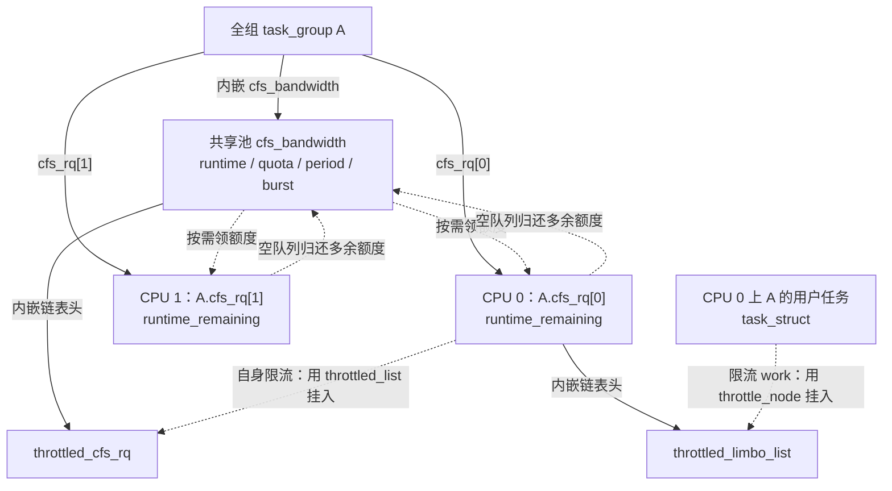

`throttled_cfs_rq` 串的是**本组在各 CPU 上的受限队列**，`throttled_limbo_list` 串的是**该叶子队列暂时摘下的任务**，两者不能混为一张链表。队列挂接见 [`throttle_cfs_rq()`](../../linux/kernel/sched/fair.c#L6141)，任务挂接见 [`throttle_cfs_rq_work()`](../../linux/kernel/sched/fair.c#L5913)。限流落实过程在第 1.4.5 节展开。

不要把池里余额为 0 直接理解成“全组必须停下”：其他 CPU 可能还有已领到的本地额度。

例如 A 的共享池有 10 ms，两个本地余额都是 0；忽略实际执行，CPU 0 领取 5 ms 后，三份余额变成 `池 5 ms / CPU 0 5 ms / CPU 1 0`；CPU 1 再领取 5 ms 后，变成 `池 0 / CPU 0 5 ms / CPU 1 5 ms`。**领取只是把额度从共享池搬到本地，不等于已经执行了这些时间。** 此时两颗 CPU 都还能运行；某个本地余额耗尽后，才需要再次领取。领取和扣账分别见 [`__assign_cfs_rq_runtime()`](../../linux/kernel/sched/fair.c#L5819) 与 [`__account_cfs_rq_runtime()`](../../linux/kernel/sched/fair.c#L5859)。

#### 1.4.3 先看完整状态循环，再跟踪每个阶段

额度的运行流程可以分成四个阶段。先按下面的图理解状态循环，再逐段进入函数：


| 阶段 | 改变的主要状态 | 源码入口 |
| ---- | -------------- | -------- |
| 扣账、领取 | `runtime_remaining`、共享池 `runtime` | [`__account_cfs_rq_runtime()`](../../linux/kernel/sched/fair.c#L5859) |
| 标记受限层级 | `throttled`、后代 `throttle_count` | [`throttle_cfs_rq()`](../../linux/kernel/sched/fair.c#L6141) |
| 暂停具体任务 | `p->throttled`、叶子队列 limbo 链表 | [`throttle_cfs_rq_work()`](../../linux/kernel/sched/fair.c#L5913) |
| 分发额度、恢复竞争 | 本地余额、层级计数、任务重新入队 | [`distribute_cfs_runtime()`](../../linux/kernel/sched/fair.c#L6305)、[`unthrottle_cfs_rq()`](../../linux/kernel/sched/fair.c#L6182) |

这里的 **limbo** 是“任务仍可运行，但暂时不能参加公平调度竞争”的暂存状态。额度耗尽、队列被标记、任务被摘下是不同的时刻；当前源码通过 task work 在返回用户态前落实到用户任务。

#### 1.4.4 执行记账与额度领取：先还欠账，再补到目标余额

[`update_curr()`](../../linux/kernel/sched/fair.c#L1286) 用 [`update_se()`](../../linux/kernel/sched/fair.c#L1232) 取出 `delta_exec`，先按它推进 `vruntime`，再调用 `account_cfs_rq_runtime(cfs_rq, delta_exec)`。`delta_exec` 是 `rq_clock_task()` 上的执行时长。虚拟时间另走 `calc_delta_fair()`，两本账分开。用户态和该任务的内核态执行都会产生这段时长；睡眠、阻塞等待和排队不产生。自旋仍算在执行里。若编译并打开了 IRQ time accounting 或 paravirt steal accounting，这些时间在 [`update_rq_clock_task()`](../../linux/kernel/sched/core.c#L787) 里已经从任务时钟扣掉，带宽沿用扣完之后的时长。

`cfs_bandwidth_used()` 为假，或本队列 `runtime_enabled == 0`，记账函数立即返回。否则进入 [`__account_cfs_rq_runtime()`](../../linux/kernel/sched/fair.c#L5859)：

```text
runtime_remaining -= delta_exec
if runtime_remaining > 0 or already_throttled:
    return
# 欠账为负，要领的量大于一个 slice
need = bandwidth_slice - runtime_remaining
amount = 0
if quota == INF:
    amount = need                     # 无限配额不扣共享池
else:
    start_cfs_bandwidth()              # 需要时启动周期定时器
    if group_runtime > 0:
        amount = min(group_runtime, need)
        group_runtime -= amount
        group_idle = 0
runtime_remaining += amount
if runtime_remaining <= 0 and cfs_rq.curr:
    resched_curr()
```

领取在 [`__assign_cfs_rq_runtime()`](../../linux/kernel/sched/fair.c#L5819) 里完成，外面由 [`assign_cfs_rq_runtime()`](../../linux/kernel/sched/fair.c#L5847) 加池锁。默认 slice 由 [`sysctl_sched_cfs_bandwidth_slice = 5000`](../../linux/kernel/sched/fair.c#L125) 给出，用户接口名是 `sched_cfs_bandwidth_slice_us`，也就是 5 ms。它是**配额分配粒度**，既不是 EEVDF 的请求 slice，也不是要求任务连续跑 5 ms。本地已经欠 1 ms 时，目标是把余额补到 +5 ms，所以要领 6 ms；池子只剩 2 ms 就只领 2 ms。**先还欠账，余额转正才能避免后续限流。** 领完仍不大于 0，这里只 `resched_curr()`，任务还在公平队列上。

同一段执行会沿祖先链多次 `update_curr()`。每一层 `runtime_enabled` 的队列扣自己的 `runtime_remaining`，也各自向自己的池子领。子组池子还有余额，父组池子花完了，父组在这颗 CPU 上的队列会进入第 1.4.5 节的限流。

队列从空变成有第一个实体时，[`enqueue_entity()`](../../linux/kernel/sched/fair.c#L5419) 在 [`nr_queued == 1`](../../linux/kernel/sched/fair.c#L5469) 处调用 [`check_enqueue_throttle()`](../../linux/kernel/sched/fair.c#L6565)，用 `delta_exec = 0` 做一次同样的检查。余额仍不大于 0，就立即尝试标记队列限流。这个检查提前发现欠账；用户任务真正退出公平竞争，仍要经过第 1.4.5 节的 task work，不能理解成入队时已经禁止一切执行。

#### 1.4.5 限流落实：从队列标记到 task work 和 limbo

[`throttle_cfs_rq()`](../../linux/kernel/sched/fair.c#L6141) 标记本 CPU 上的组队列，并向同 CPU 子树增加 `throttle_count`。先用这两个字段区分本组与祖先的约束：

| 本 CPU 上该队列 | `throttled` | `throttle_count` | 含义 |
| --------------- | ----------- | ---------------- | ---- |
| 本组和祖先都未限流 | 0 | 0 | 当前没有已落实的层级限流，仍可能配置了配额 |
| 只有祖先限流 | 0 | ≥ 1 | 本队列未因自身配额限流，任务仍出不了 limbo |
| 只有本组限流 | 1 | 1 | 自己的预算耗尽 |
| 本组再加一个祖先 | 1 | 2 | 解开其中一层，limbo 任务仍不回来 |

队列状态最终还要落实到具体任务。先看 [`task_struct` 的限流成员](../../linux/include/linux/sched.h#L883)：

```c
struct task_struct {
    /* 省略其他成员 */
    struct callback_head sched_throttle_work; /* 返回用户态前落实限流 */
    struct list_head throttle_node; /* 挂入叶子 cfs_rq 的 limbo 链表 */
    bool throttled;                 /* 任务是否已进入限流状态 */
    /* 省略其他成员 */
};
```

`sched_throttle_work` 安排延后执行的回调，`throttle_node` 用于任务链表挂接，`p->throttled` 记录任务状态。它和表中的 `cfs_rq->throttled` 属于不同对象，前者在任务被摘下之后才置位。

层级判断见 [`throttled_hierarchy()`](../../linux/kernel/sched/fair.c#L5897)。把具体任务移入 limbo 的，是返回用户态前的 task work。接下来分三个时刻跟踪源码：

##### 1.4.5.1 标记本 CPU 队列，并传播到子树

[`put_prev_entity()`](../../linux/kernel/sched/fair.c#L5700) 和 [`pick_task_fair()`](../../linux/kernel/sched/fair.c#L9104) 都会调用 [`check_cfs_rq_runtime()`](../../linux/kernel/sched/fair.c#L6612)，调用点分别在 [让出当前实体时](../../linux/kernel/sched/fair.c#L5710) 和 [向下选人时](../../linux/kernel/sched/fair.c#L9123)。

未启用或余额仍大于 0 就放过。队列已经 `throttled` 时，pick 侧把“这条路径受限”记下来，不再重复限流。

否则 `throttle_cfs_rq()` 在池锁里再尝试把本地余额补到 **1 ns**：若刚好和补款竞态成功，就放弃本次限流，避免错过本轮恢复。

仍失败，才把 `cfs_rq` 链进 `throttled_cfs_rq`，[`tg_throttle_down()`](../../linux/kernel/sched/fair.c#L6118) 给本 CPU 从该组向下的每个队列 `throttle_count++`，最后本队列 `throttled = 1`。这一步没有 `dequeue_entity()`。

##### 1.4.5.2 选到用户任务后，安排返回用户态前的 work

`pick_task_fair()` 仍沿 `my_q` 往下挑。路径上任一队列检查为真，就对选中的任务调用 [`task_throttle_setup_work()`](../../linux/kernel/sched/fair.c#L6092)，以 [`TWA_RESUME`](../../linux/kernel/task_work.c#L40) 挂上 `sched_throttle_work`。内核线程和 `PF_EXITING` 不会挂：它们不返回用户态。普通用户任务在 [`resume_user_mode_work()`](../../linux/include/linux/resume_user_mode.h#L41) 里跑到 `task_work_run()`；[进入 guest 前](../../linux/kernel/entry/virt.c#L16)也会跑这类 work。

##### 1.4.5.3 work 摘下任务，放入叶子队列 limbo

[`throttle_cfs_rq_work()`](../../linux/kernel/sched/fair.c#L5913) 再看一遍：必须仍是公平类，且当前 `cfs_rq->throttle_count` 还没归零；条件已经变化就直接返回。

然后 `dequeue_task_fair(..., DEQUEUE_SLEEP | DEQUEUE_THROTTLE)`，把任务挂到叶子队列的 `throttled_limbo_list`，再置 `p->throttled = true`。`throttled` 必须出队之后再置，否则出队会把它当成“已经在 limbo 里”。[`DEQUEUE_THROTTLE`](../../linux/kernel/sched/fair.c#L5566) 跳过延迟出队。

出队沿祖先走过的每一层，若该层 `throttle_count` 非 0，就 [`record_throttle_clock()`](../../linux/kernel/sched/fair.c#L6107)。本层自己已经 `throttled` 才记 `throttled_clock`；只要处于受限层级就记 `throttled_clock_self`。前者汇总进 `cpu.stat` 的 `throttled_usec`，后者汇总进 `cpu.stat.local`。

##### 1.4.5.4 limbo 的任务状态、迁移和 PELT

稳定状态下，limbo 里的任务可以仍是 `TASK_RUNNING`、`p->on_rq = 1`，但 `se.on_rq = 0`，并且已经从 `rq->nr_running` 里减去，见 [`dequeue_entities()`](../../linux/kernel/sched/fair.c#L7209)。公平类选不到它。`/proc` 里的 `State: R` 单独不能证明它还在 EEVDF 树上。

| 任务状态 | `p->on_rq` | `se.on_rq` | 公平类能否选中 |
| -------- | ---------- | ---------- | -------------- |
| 普通排队或正在执行 | 1 | 1 | 能 |
| 配额耗尽，停在 limbo | 1 | 0 | 不能 |
| 已经按睡眠出队 | 0 | 0 | 不能 |

已经带 `p->throttled` 的任务再次入队时，[`enqueue_throttled_task()`](../../linux/kernel/sched/fair.c#L5994) 走短路：目标层级仍受限，且它不是当前 donor，就直接挂到新队列的 limbo 链表。换组、改亲和、freezer 把 limbo 任务再摘走时，走 [`dequeue_throttled_task()`](../../linux/kernel/sched/fair.c#L5975)。负载均衡也不会把任务迁到“目标 CPU 上该组层级已经受限”的核，见 [`can_migrate_task()`](../../linux/kernel/sched/fair.c#L9672)。

内核线程不会挂这个 work。用户任务若还在内核里，额度归零后可以继续跑到返回用户态。配额是带回补和延迟落实的执行预算。

队列因限流变空后冻结 PELT 时钟，见 [`tg_throttle_down()`](../../linux/kernel/sched/fair.c#L6126) 和[最后一个实体出队](../../linux/kernel/sched/fair.c#L5615)。冻结期间，[`cfs_rq_clock_pelt()`](../../linux/kernel/sched/pelt.h#L174) 返回固定时刻；解除时把冻结时长累进 [`throttled_clock_pelt_time`](../../linux/kernel/sched/fair.c#L6056)，后续 PELT 时间继续扣掉这段等待。这样已有的负荷历史不会因为被配额强制停住，就按这段墙钟时间自然衰减：任务仍需要 CPU，只是暂时没有预算。冻结的是负荷跟踪时钟，真实时间和带宽定时器仍在前进。

#### 1.4.6 额度恢复：周期补充、异步解限流与余额归还

日常恢复主要靠周期补充和空队列归还额度，加上第 1.4.8 节的改配置路径。周期定时器按 quota 向池子补充额度，再尝试恢复已经限流的队列；空队列把多余本地额度退回池子，让别的 CPU 可以提前恢复。burst 改变的是**补充时**池余额的截断上限，并没有独立的恢复回调。

##### 1.4.6.1 周期回调补 quota，按池活动决定是否停用

[`sched_cfs_period_timer()`](../../linux/kernel/sched/fair.c#L6640) 用 `hrtimer_forward_now()` 推进到未来的到期点，把跨过的周期数 `overrun` 交给 [`do_sched_cfs_period_timer()`](../../linux/kernel/sched/fair.c#L6393)。一次调用只补一次 quota，`overrun` 用于统计计数，**不是补充 `overrun × quota`**：

```text
# quota 有限；__refill_cfs_bandwidth_runtime()
runtime += quota
if runtime_snap > runtime:                 # 上一轮净分配超过了一个 quota
    burst_time += runtime_snap - runtime
    nr_burst++
runtime = min(runtime, quota + burst)
runtime_snap = runtime
```

quota 为无限就停掉定时器。有限配额下，`nr_periods` 加上本次 overrun。

限流链表为空时，把 `idle` 记成 1；此后若有 CPU 从池里领到额度，[`__assign_cfs_rq_runtime()`](../../linux/kernel/sched/fair.c#L5819) 会把它清零。下一周期若仍是 `idle == 1` 且没有限流队列，就将 `period_active` 清零，停用周期定时器。**这里检查的是共享池的活动，不是组内是否还有可运行任务**；任务可能仍在花本地余额。下次有 CPU 来领取额度，领取路径会重新 [`start_cfs_bandwidth()`](../../linux/kernel/sched/fair.c#L5832)。

限流链表非空时，`nr_throttled += overrun`，然后只要池子还有余额就 [`distribute_cfs_runtime()`](../../linux/kernel/sched/fair.c#L6305)。

##### 1.4.6.2 分发偿还欠账，层级约束归零才恢复任务

分发按队列偿还欠账，目标是本地余额变成 **+1 ns**，不是每人再发一个 5 ms。余额转正后，本 CPU 的队列在本地解限流；其他 CPU 的队列先挂入目标 rq 的 `cfsb_csd_list`，再按需通过 [`smp_call_function_single_async()`](../../linux/kernel/sched/fair.c#L6291) 请求目标 CPU 处理。欠账比这次补进来的额度还大，该队列继续留在限流链表上。

[`unthrottle_cfs_rq()`](../../linux/kernel/sched/fair.c#L6182) 若 `runtime_enabled` 且余额仍不大于 0，直接返回：异步窗口里，仍在内核中执行的任务可能再次花光额度。

否则清掉自己的 `throttled`，把 `throttled_clock` 到现在的差值加进池子的 `throttled_time`，从限流链表摘下，再 [`tg_unthrottle_up()`](../../linux/kernel/sched/fair.c#L6047) 把同 CPU 子树的 `throttle_count` 减一。**减到 0 的那一层**才把 limbo 任务以 `ENQUEUE_WAKEUP` 重新入队。祖先还限着，本层余额转正也不够。

若这颗 CPU 正在跑 idle，且根队列已经有人，就调用 [`resched_curr()`](../../linux/kernel/sched/fair.c#L6232) 请求重新调度。

##### 1.4.6.3 空队列归还余额，slack timer 提前再分配

某层最后一个实体出队时，[`return_cfs_rq_runtime()`](../../linux/kernel/sched/fair.c#L6520) 把超过 [`min_cfs_rq_runtime`](../../linux/kernel/sched/fair.c#L6448)（1 ms）的本地余额退回池子，本地最多留 1 ms。例如领了 5 ms、只跑了 1 ms 就空了，本地还剩 4 ms，退回 3 ms、留下 1 ms。

归还路径此时持有本 CPU 的 rq 锁，需要通过定时器延后处理其他 rq 的恢复；原因见 [`do_sched_cfs_slack_timer()` 前的注释](../../linux/kernel/sched/fair.c#L6531)。池子余额超过一个 slice，且还有限流队列，就启动 slack timer，默认再等 [`cfs_bandwidth_slack_period`](../../linux/kernel/sched/fair.c#L6452) 的 5 ms，把各 CPU 退回来的额度聚一聚，然后仍走 `distribute_cfs_runtime()`。

离下一次周期刷新不到 7 ms（5 ms 等待加 2 ms 最小剩余）时，[`start_cfs_slack_bandwidth()`](../../linux/kernel/sched/fair.c#L6478) 直接跳过，把再分配留给周期定时器。所以被限流的 CPU 有时能在本周期内恢复，有时要等别的 CPU 把本地缓存还回来，或者干脆等到下一个 period。

#### 1.4.7 预算边界：burst、本地缓存和祖先配额

##### 1.4.7.1 burst 和本地缓存怎样影响一个周期

`cpu.max.burst` 配置周期补充时允许共享池在 quota 之外保留多少额度，单位为 μs，默认是 0，见 [接口注册](../../linux/kernel/sched/core.c#L10281) 和 [`init_cfs_bandwidth()`](../../linux/kernel/sched/fair.c#L6695)。它改变补充后的池余额上限，不提供一个独立的执行预算。

有限配额下，共享池补充的核心公式是：

```text
新的池余额 = min(旧池余额 + quota, quota + burst)
```

例如 quota 20 ms、burst 10 ms；上一轮池里剩 18 ms，下轮补充后得到 `min(18 + 20, 30) = 30 ms`。这是把没分出去的额度存下来，供以后使用；并非每周期无条件发 30 ms。实现见 [`__refill_cfs_bandwidth_runtime()`](../../linux/kernel/sched/fair.c#L5795)。

**`runtime <= quota + burst` 并非始终成立。** 上面的截断发生在补充函数中；[`__return_cfs_rq_runtime()`](../../linux/kernel/sched/fair.c#L6505) 归还本地余额时直接相加，没有同样的截断。例如 quota 10 ms、burst 0，周期补充后池里已有 10 ms；某 CPU 还持有上一轮的 4 ms，队列变空时归还 3 ms，池余额可以暂时达到 13 ms。这些是此前已分配的额度，并非凭空新增的 burst。

**周期补款不会清零每 CPU 的本地余额。** 空队列可保留至多 1 ms，跨周期继续使用，见 [`__return_cfs_rq_runtime()`](../../linux/kernel/sched/fair.c#L6497)。所以即使 burst 为 0，某一周期的实际执行量也可能超过本轮新增 quota，再加上延迟限流产生的欠账。学习和排查时，把 `quota / period` 理解为基础带宽预算；不要当成任意同长度时间窗口的绝对执行上限。

即使先忽略缓存和延迟，**周期额度也不同于滑动窗口上限**。设 quota 为 50 ms、period 为 100 ms：一个线程在第一个周期末尾的 50～100 ms 用完 50 ms，补充后又在 100～150 ms 用完下一份 50 ms。每个配额周期各用了 50 ms，但观察窗口 `[50, 150) ms` 跨过补充点，恰好看到 100 ms 的执行。内核按 [`period_timer`](../../linux/kernel/sched/fair.c#L6640) 补充池子，没有为每个任意起点的 100 ms 窗口另建账本。

##### 1.4.7.2 父组汇总整棵子树的执行

每个非根 cpu 控制器组有自己的池子。父组不会按子组复制预算。跑 A 的公平任务时，A 和祖先 P 在当前 CPU 上的队列都要记账，P 的额度汇总的是整棵子树的公平执行。同一段执行扣两层账，是同时接受两道限制；实际只执行了一次，不能把两层扣账相加当成任务执行量。

下面用一个账本快照说明：假设起点时各组都恰有一份完整 quota，观察期间尚无补充，忽略本地缓存和欠账，burst 为 0：

```text
P：cpu.max = 100000 100000       基础预算 1 CPU
├── A：cpu.max = 80000 100000    自身预算 0.8 CPU
└── B：cpu.max = 80000 100000    自身预算 0.8 CPU

从该起点算起，A 已执行 60 ms，B 已执行 40 ms
  A 自己大约还剩 20 ms，B 自己大约还剩 40 ms
  P 的 100 ms 已经花完 → A、B 都受 P 这层约束
```

子组配额之和可以超过父组，v2 不把兄弟 quota 加在一起做容量预留，见 [`tg_cfs_schedulable_down()`](../../linux/kernel/sched/core.c#L9695)。A 把自己写成 `max`，或写得比 P 更宽，都绕不开 P；真正执行时仍逐层记账。

上例为方便算账才给出共同起点。真实父子组各有自己的 `period_timer`，周期长度可以不同，即使长度相同也不保证同时补充；初始化还会[随机错开定时器相位](../../linux/kernel/sched/fair.c#L6708)。因此 `hierarchical_quota` 取最小比例，并没有把父子合成一个共用周期或共用池。

因此恢复也要逐层看：本组有额度，但祖先仍在限流，任务仍不能离开 limbo。重新入队的条件是 [`tg_unthrottle_up()`](../../linux/kernel/sched/fair.c#L6053) 把 `throttle_count` 减到 0。状态计数与配置检查分别见第 1.4.5、1.4.8 节。

##### 1.4.7.3 `hierarchical_quota` 记录比例，执行时仍逐层扣账

配置检查还会计算 `hierarchical_quota`，它表示祖先链收紧后的预算**比例**，用于判断有无带宽约束；它不是运行时余额。v2 的等价伪代码如下，`INF` 表示无限：

```text
# v2，tg_cfs_schedulable_down()
ratio = (quota == INF) ? INF : to_ratio(period, quota)
if 没有父组:
    hierarchical_quota = INF
else if ratio == INF:
    hierarchical_quota = parent.hierarchical_quota
else if parent.hierarchical_quota == INF:
    hierarchical_quota = ratio
else:
    hierarchical_quota = min(ratio, parent.hierarchical_quota)
```

#### 1.4.8 配置生效：数值校验、静态键和每 CPU 状态更新

先区分编译开关和运行状态：编译进来之后，新组仍是无限配额。[`init_cfs_bandwidth()`](../../linux/kernel/sched/fair.c#L6695) 把 `quota` 设为 [`RUNTIME_INF`](../../linux/kernel/sched/sched.h#L185)，period 取 [`default_bw_period_us()`](../../linux/kernel/sched/sched.h#L439) 的 100 ms，burst 为 0。

每 CPU 队列的 `runtime_enabled` 在 [`init_cfs_rq_runtime()`](../../linux/kernel/sched/fair.c#L6716) 里清零。开启 `JUMP_LABEL` 时，热路径先看 static key [`cfs_bandwidth_used()`](../../linux/kernel/sched/fair.c#L5759)：带宽使用计数为 0 时，[`account_cfs_rq_runtime()`](../../linux/kernel/sched/fair.c#L5877) 直接返回。x86_64_defconfig 打开了 [`JUMP_LABEL`](../../linux/arch/x86/configs/x86_64_defconfig#L54)，静态键关闭时可用 nop 跳过这条分支。

每个组从无限配额改成有限 `cpu.max`，[`tg_set_cfs_bandwidth()`](../../linux/kernel/sched/core.c#L9591) 都会调用 `cfs_bandwidth_usage_inc()`；使用计数第一次从 0 变成 1 时打开静态键。从有限配额改回无限则减少使用计数。没有 `JUMP_LABEL` 时，`cfs_bandwidth_used()` 恒为真，但记账路径仍会检查本队列 `runtime_enabled`。

新任务的 `sched_throttle_work` 和 `throttle_node` 由 [`__sched_fork()`](../../linux/kernel/sched/core.c#L4476) 调用 [`init_cfs_throttle_work()`](../../linux/kernel/sched/fair.c#L5958) 初始化。该辅助函数没有显式重置 `p->throttled`；任务进入 limbo 和恢复入队时对这个标志的修改，见第 1.4.5～1.4.6 节。

有限 quota 和 period 都至少 1 ms，period 最大 1 s；quota 可以大于 period，另有防溢出上限，见 [限制常量](../../linux/kernel/sched/core.c#L9801) 和 [`tg_set_bandwidth()`](../../linux/kernel/sched/core.c#L9835)。有限配额下 `cpu.max.burst` 不能超过 quota，且 `quota + burst` 不能超过 `max_bw_runtime_us`，见 [burst 校验](../../linux/kernel/sched/core.c#L9873)。根组没有 `cpu.max` / `cpu.max.burst` 文件，设置函数也拒绝根任务组。

写 `cpu.max` 会保留当前 burst，见 [`cpu_max_write()`](../../linux/kernel/sched/core.c#L10244)。例如原配置 quota 20 ms、burst 10 ms，直接把 quota 改成 5 ms 会因 burst 大于新 quota 而失败；需要先调小 `cpu.max.burst`，再缩小 quota。

`cpu_max_write()` 解析文本后调用 [`tg_set_bandwidth()`](../../linux/kernel/sched/core.c#L9835)，公平类再进 [`tg_set_cfs_bandwidth()`](../../linux/kernel/sched/core.c#L9564)。顺序是：

1. `tg_set_bandwidth()` 校验上述数值范围，并拒绝根组。
2. [`__cfs_schedulable()`](../../linux/kernel/sched/core.c#L9733) 从根向下遍历任务组树，执行 [`tg_cfs_schedulable_down()`](../../linux/kernel/sched/core.c#L9695)。v2 把本组和祖先的有限预算比例取最小，写入 `hierarchical_quota`。比较用的是 [`normalize_cfs_quota()`](../../linux/kernel/sched/core.c#L9675) → [`to_ratio()`](../../linux/kernel/sched/core.c#L4808)，也就是 `quota / period`，先换回 μs。兄弟组的 quota 不累加，所以子组配额之和可以超过父组。这里跟踪的是 v2 分支。
3. 从无限变成有限时，先 `cfs_bandwidth_usage_inc()`，再改池子，这样热路径在相关字段更新前就已经能看见带宽。从有限变回 `max` 时，先改完各 CPU，再 `cfs_bandwidth_usage_dec()`。
4. 持 `cfs_b->lock` 写入 `period`、`quota`、`burst`，调用 [`__refill_cfs_bandwidth_runtime()`](../../linux/kernel/sched/fair.c#L5795)。quota 有限则调用 [`start_cfs_bandwidth()`](../../linux/kernel/sched/fair.c#L6724)，已活跃的定时器直接返回，不在这里重设到期时间。周期定时器是 `CLOCK_MONOTONIC`、`HRTIMER_MODE_ABS_PINNED`；创建时用 [`get_random_u32_below()`](../../linux/kernel/sched/fair.c#L6710) 错开相位，避免大量组在同一时刻回调。
5. 每个在线 CPU：`runtime_enabled` 等于“quota 有限”，`runtime_remaining` 置 **1 ns**。该队列已经 `throttled` 就 [`unthrottle_cfs_rq()`](../../linux/kernel/sched/fair.c#L6182)。这一恢复动作发生在成功写入时，并不只针对调大 quota；祖先仍限流时，任务不会因此全部恢复。写成 `max` 关掉的是**本组**有限配额；祖先约束仍会反映在本组 `hierarchical_quota` 中。

#### 1.4.9 边界路径：定时器过载、CPU 热插拔和组生命周期

一次周期回调若在循环里连续处理 `forward` 超过 3 次，说明回调期间又不断跨过到期点。[`sched_cfs_period_timer()`](../../linux/kernel/sched/fair.c#L6657) 尝试把 `period`、`quota`、`burst` 一起乘 2，**仅在新 period 严格小于 1 s 时放大**，否则只警告，不会补齐到 1 s。成功放大时预算比例保持不变，补款节奏变稀；之后读 `cpu.max`，看到的是放大后的数。

旁边还有两条和带宽缠在一起的路径。CPU 下线时 [`unthrottle_offline_cfs_rqs()`](../../linux/kernel/sched/fair.c#L6797) 关闭该 rq 上已启用的 `runtime_enabled`；对已经限流的队列，再把余额置 1 ns 并解限流，让下线过程中任务仍能被挑到。未限流队列不在这里重置余额。上线时 [`update_runtime_enabled()`](../../linux/kernel/sched/fair.c#L6778) 按各组当前 quota 决定是否重新打开。编译了 `NO_HZ_FULL` 时，[`cfs_task_bw_constrained()`](../../linux/kernel/sched/fair.c#L6842) 为真就不让这颗核停 tick，见 [`sched_can_stop_tick()`](../../linux/kernel/sched/core.c#L1350)：本组 `runtime_enabled`，或者 `hierarchical_quota` 不是无限，都算受约束。这样独占一颗核的限流任务仍会周期记账。本书不假定打开 nohz_full。

组上线时，[`sync_throttle()`](../../linux/kernel/sched/fair.c#L6584) 把父组在这颗 CPU 上的 `throttle_count` 抄过来。父组已经限流，新建子组从一开始就处在受限层级里。删除组时 [`destroy_cfs_bandwidth()`](../../linux/kernel/sched/fair.c#L6736) 取消两个 hrtimer，并冲掉还挂在各 CPU `cfsb_csd_list` 上的异步解限流。这就是第 1.2.2 节说明的：offline 当下不能立刻 kfree。

### 1.5 验证与排查：份额、配额与统计

#### 1.5.1 先确认任务归属，再核对本组与祖先的时间约束

按“任务归属 → 有效 cpu 状态 → 配置 → 统计增量”检查：

1. 用 `/proc/<pid>/cgroup` 确认任务在哪个 cgroup；v2 通常是 `0::/path`。本组没有自己的 cpu 状态时，任务使用祖先的有效状态，见第 1.1.1 节。
2. 读有 cpu 控制器状态的非根本组和祖先的 `cpu.weight`、`cpu.idle`、`cpu.max`、`cpu.max.burst`。叶子写成 `max` 仍要看祖先；根组没有 weight / max 配置文件。
3. 取两次 `cpu.stat` / `cpu.stat.local` 并比较增量，按第 1.5.2 节的口径判断是否受限。
4. 权重只有在争用时才影响份额；如果时间约束不能解释排队，再检查第 2.9 节的有效 CPU 范围和任务亲和性。

#### 1.5.2 `cpu.stat` 与 `cpu.stat.local`：先明确是谁在计什么

先取两次样本并比较增量，再按下面的口径解释；单次累计值不能说明当前瓶颈。

cgroup v2 的 `cpu.stat` 先输出基础 CPU 使用统计，再输出 cpu 控制器附加项，见 [文件读取](../../linux/kernel/cgroup/cgroup.c#L3952)。基础项来自 [rstat](../../linux/kernel/cgroup/rstat.c#L743)，带宽项来自 [`cpu_extra_stat_show()`](../../linux/kernel/sched/core.c#L10088)。`cpu.stat.local` 另走 [`cpu_local_stat_show()`](../../linux/kernel/sched/core.c#L10114)。

非根组的使用统计在 [`cgroup_base_stat_flush()`](../../linux/kernel/cgroup/rstat.c#L572) 中向父组汇总；根组则直接取[全系统 CPU 统计](../../linux/kernel/cgroup/rstat.c#L678)，包括 IRQ/softirq 的 system 时间。基础使用统计不要求本组拥有 cpu css；带宽附加项和 local 项只有取得本组 cpu css 才输出，见 [css 查找](../../linux/kernel/cgroup/cgroup.c#L3923)。

| 字段 | 口径 |
| ---- | ---- |
| `usage_usec` | 本组及子树累计执行时间，来自 cgroup rstat，涵盖各调度类；不按公平类配额池的领取量计 |
| `nr_periods` | 周期回调里累加的 overrun。定时器停用期间不计入，不能直接按观察时长除以 period 推算 |
| `nr_throttled` | 周期回调入口看到限流链表非空时累加的 overrun，见 [`do_sched_cfs_period_timer()`](../../linux/kernel/sched/fair.c#L6401)。不是调用 `throttle_cfs_rq()` 的次数；本周期曾限流、但在回调前已全部恢复，也不一定增加 |
| `throttled_usec` | 各 CPU 队列因**自己** `throttled` 而记录的 `throttled_clock` 时长之和，解限流时加进 [`cfs_b->throttled_time`](../../linux/kernel/sched/fair.c#L6206)。时钟从限流出队时开始记录，不是从首次标记队列时开始。四颗 CPU 各记录 80 ms，增量可以接近 320 ms |
| `nr_bursts`、`burst_usec` | 补充时 `runtime_snap` 高于“余额 + 本轮 quota”的次数，以及超出的量，见 [补充函数](../../linux/kernel/sched/fair.c#L5802)。配置稳定时反映共享池超出单轮 quota 的净分配；它不是逐任务实际执行量的统计，也不是 `cpu.max.burst` 的配置值 |
| `cpu.stat.local` 的 `throttled_usec` | 各 CPU `throttled_clock_self_time` 之和，见 [`throttled_time_self()`](../../linux/kernel/sched/core.c#L9778)。祖先限流也会让本组累计这一项 |

`cpu.stat.local` 的 local 指直接汇总本组各 CPU 队列的本地计时字段，不是“只由本组配额引起”，也不是把 `cpu.stat` 减去所有子组统计。例如父 P 有限、子 A 为 `max`，P 限流时 A 仍会被迫等待：A 的 `cpu.stat` 自身限流项可以不涨，但 `cpu.stat.local` 会在相应等待区间结束后增长。依据是[逐 CPU 汇总](../../linux/kernel/sched/core.c#L9778)和[层级限流解除时结算](../../linux/kernel/sched/fair.c#L6053)。

取两次样本时，若 `usage_usec` 增加 200000，墙钟过去 100 ms，表示这段时间平均用了约 2 颗逻辑 CPU 的执行时间。`throttled_usec` 则是各 CPU 队列的受限时长之和，不能和 usage 相加得到“总耗时”；`burst_usec` 又是共享池分配派生量，也不能再加进去。同样，`Δnr_throttled / Δnr_periods` 不是损失的 CPU 时间比例，更不是业务请求被限流的比例。

尚未结束的限流区间还没加进 `throttled_usec`，所以短时间采样没有增量，也不能排除任务正处于限流。叶子组写成 `cpu.max = max`，仍要读祖先的 `cpu.max` 和 `cpu.stat`；结合较完整的观察区间，再判断是否需要转查权重、cpuset 和允许 CPU 范围。

修改配额也会调用补充函数，见 [`tg_set_cfs_bandwidth()`](../../linux/kernel/sched/core.c#L9600)。例如原 quota 为 20 ms、`runtime_snap = 20 ms`，池余额已为 0；将 quota 降至 5 ms、burst 仍为 0，补充函数也可能记录 15 ms 的 `burst_time` 增量。因此跨配置变化观察时，不能仅凭 `nr_bursts` 增长断言实际使用了非零 `cpu.max.burst`。

#### 1.5.3 用时间分配的现象选择源码路径

| 现象或疑问 | 优先核对什么 |
| ---------- | ------------ |
| 权重调大了，吞吐却不增长 | 有没有其他持续竞争的组？是否先被配额或亲和性限制？ |
| 叶子 `cpu.max` 是 `max`，仍受限 | 祖先的 `cpu.max`，以及本组的 `cpu.stat.local` |
| 限流时长超过观察窗口 | 是否把各 CPU 队列时长相加？限流区间是否已经结束并计入？ |

这些检查对应组权重、祖先记账和限流统计，源码入口见第 1.6 节。整机仍有空闲 CPU 而任务排队的放置问题，接着看第 2.9 节。

### 1.6 cpu 源码阅读地图：从字段出发，沿一条路径走完

每次先找到对象字段，再选择一种操作或一次状态变化，把函数放回前面的架构中。

| 想回答的问题 | 先看的对象 | 再跟的入口 | 本文位置 |
| ------------ | ---------- | ---------- | -------- |
| 目录怎样变成调度器中的组？ | `cgroup`、css、`task_group` | [`cpu_cgrp_subsys`](../../linux/kernel/sched/core.c#L10304)、[`sched_create_group()`](../../linux/kernel/sched/core.c#L9125) | 第 1.1.1、1.2.1～1.2.2 节 |
| 任务换组后在哪排队？ | `css_set`、`sched_task_group`、`se` | [`sched_move_task()`](../../linux/kernel/sched/core.c#L9232)、[`set_task_rq()`](../../linux/kernel/sched/sched.h#L2178) | 第 1.1.3、1.2.3 节 |
| 组代表如何入队和被选中？ | `se.parent / my_q`、`cfs_rq` | [`enqueue_task_fair()`](../../linux/kernel/sched/fair.c#L7080)、[`pick_task_fair()`](../../linux/kernel/sched/fair.c#L9104) | 第 1.3.2、1.3.5 节 |
| weight 怎样变成每 CPU 的权重？ | `tg.shares / load_avg`、组实体 | [`cpu_weight_write_u64()`](../../linux/kernel/sched/core.c#L10140)、[`calc_group_shares()`](../../linux/kernel/sched/fair.c#L4086) | 第 1.3.3～1.3.4 节 |
| 额度怎样扣除、耗尽和恢复？ | 共享池、本地余额、限流计数和 limbo 链表 | [`__account_cfs_rq_runtime()`](../../linux/kernel/sched/fair.c#L5859)、[`throttle_cfs_rq_work()`](../../linux/kernel/sched/fair.c#L5913)、[`do_sched_cfs_period_timer()`](../../linux/kernel/sched/fair.c#L6393) | 第 1.4.3～1.4.7 节 |
| `cpu.max` 写入后哪些状态变化？ | `cfs_bandwidth`、每 CPU 的 `runtime_enabled` | [`cpu_max_write()`](../../linux/kernel/sched/core.c#L10237)、[`tg_set_cfs_bandwidth()`](../../linux/kernel/sched/core.c#L9564) | 第 1.4.8 节 |
| 限流统计为什么超过观察窗口？ | `throttled_clock / throttled_clock_self_time` | [`record_throttle_clock()`](../../linux/kernel/sched/fair.c#L6107)、[`cpu_extra_stat_show()`](../../linux/kernel/sched/core.c#L10088) | 第 1.4.5、1.5.2 节 |

## 2. cpuset 控制器：限定位置与建立独占分区

cpu 控制器解决了“在允许的 CPU 上怎样分时间”。本章围绕 `struct cpuset`，依次回答：用户请求怎样变成有效集合？CPU 怎样从父组划出？结果怎样写入任务和调度域？

### 2.1 `struct cpuset`：配置请求、有效结果和分区状态

“掩码”就是 CPU 集合的位图表示，可以先把它当成一张 CPU 编号列表。**任务亲和性**规定一个任务允许在哪些 CPU 上运行；cpuset 通过更新这份允许范围来落实放置约束。cpuset 同时保存用户请求和内核算出的结果，见 [`struct cpuset`](../../linux/kernel/cgroup/cpuset-internal.h#L74)：

**`cpuset`：配置掩码、有效掩码与分区状态。** 摘自 [`struct cpuset`](../../linux/kernel/cgroup/cpuset-internal.h#L74)，独占掩码见 [相关成员](../../linux/kernel/cgroup/cpuset-internal.h#L119)，分区状态及错误原因见 [分区成员](../../linux/kernel/cgroup/cpuset-internal.h#L158)。

```c
struct cpuset {
    struct cgroup_subsys_state css;  /* 内嵌 cpuset 控制器状态 */
    unsigned long flags;            /* 包括负载均衡、独占等标志 */
    cpumask_var_t cpus_allowed;      /* 用户配置：cpuset.cpus */
    /* 省略内存节点成员 */
    cpumask_var_t effective_cpus;    /* 计算结果：本组任务的 CPU 范围 */
    /* 省略内存节点成员 */
    cpumask_var_t effective_xcpus;   /* 祖先传递下来的有效独占候选集合 */
    cpumask_var_t exclusive_cpus;    /* 用户申请的独占 CPU */
    /* 省略其他成员 */
    int nr_subparts;                /* 有效本地子分区数量 */
    int partition_root_state;       /* member / root / isolated 或无效状态 */
    /* 省略其他成员 */
    enum prs_errcode prs_err;       /* 分区无效的原因 */
    struct cgroup_file partition_file; /* cpuset.cpus.partition 文件句柄 */
    /* 省略其他成员 */
};
```

| 字段 | 用户接口 | 含义 |
| ---- | -------- | ---- |
| `cpus_allowed` | `cpuset.cpus` | member 的放置请求；分区未显式设置 exclusive 时，也用作独占请求 |
| `effective_cpus` | `cpuset.cpus.effective` | 本组任务实际可用的范围；任务亲和性还可以更窄 |
| `exclusive_cpus` | `cpuset.cpus.exclusive` | 用户申请独占的 CPU；为空时，启用本地分区默认使用 `cpus_allowed` |
| `effective_xcpus` | `cpuset.cpus.exclusive.effective` | 沿祖先约束计算的有效独占候选；成为有效分区后用于划出 CPU，可包含离线 CPU |
| `partition_root_state` | `cpuset.cpus.partition` | 普通成员、有效分区或无效分区 |

这些字段不是逐个求交后就能得到一个通用答案。**先看 partition 状态，再选计算方式**：member 主要从父组的 `effective_cpus` 得到运行范围；有效分区从 `effective_xcpus` 得到分配给自己的 CPU，再去掉不可用 CPU 和子分区占用。显式设置 `exclusive_cpus` 后，有效分区的 `effective_cpus` 不必是自身 `cpus_allowed` 的子集，源码在[字段注释](../../linux/kernel/cgroup/cpuset-internal.h#L108)中明确说明了这一点。两条路径分别在第 2.2、2.3 节展开。

**独占候选集合与已经建立的独占分区要分开看。** 普通 member 显式设置 `exclusive_cpus` 后，也可以得到非空的 `effective_xcpus`，见 [`compute_trialcs_excpus()`](../../linux/kernel/cgroup/cpuset.c#L1554)。它可以把候选传给后代；但只有有效分区才调用 [`partition_xcpus_add()`](../../linux/kernel/cgroup/cpuset.c#L1358)，从所属父分区划走 CPU。例如根组有 0-7，A 的 cpus 和 exclusive 都为 4-7，A 仍是 member 时，根组任务依然可以使用 4-7；不能仅凭 `.exclusive.effective` 非空判断隔离已经生效。

对非根组，先记住三个有效状态，定义见 [状态常量](../../linux/kernel/cgroup/cpuset.c#L129)：

| 状态 | 从父组拿走 CPU？ | 自身有效 CPU 参加调度域均衡？ |
| ---- | ---------------- | --------------------------- |
| `member` | 否，只限制本组放置范围 | 随所属分区 |
| `root` | 是，建立独占分区 | 是，在本分区内部均衡 |
| `isolated` | 是，建立独占分区 | 否 |

`root` 在这里表示**分区根**，不等于文件系统的根目录。整棵 cpuset 树的根组内部已是 `PRS_ROOT`，见 [`top_cpuset`](../../linux/kernel/cgroup/cpuset.c#L210)，但根目录没有 `cpuset.cpus.partition` 配置文件，见 [接口标志](../../linux/kernel/cgroup/cpuset.c#L3595)。

cpuset 的结构关系如下：实线是内嵌或指针引用，虚线是计算、更新产生的作用。任务的允许范围和调度域边界是两份结果，前者限制任务选核，后者规定负载均衡范围。

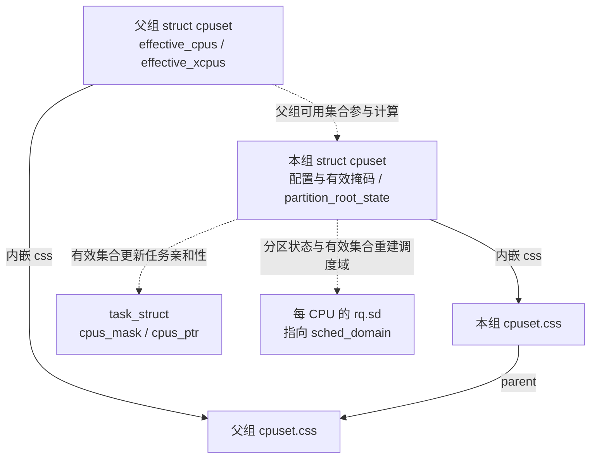

cpuset 沿 `css.parent` 找父组，见 [`parent_cs()`](../../linux/kernel/cgroup/cpuset-internal.h#L196)。图中的两条更新路径分别对应 [`cpuset_update_tasks_cpumask()`](../../linux/kernel/cgroup/cpuset.c#L1192) 和 [`rebuild_sched_domains_locked()`](../../linux/kernel/cgroup/cpuset.c#L1097) → [`partition_sched_domains()`](../../linux/kernel/sched/topology.c#L2870)。第 2.3～2.6 节会沿它们解释独占怎样落实。

**任务怎样找到 cpuset，配置又怎样进入任务。** cpuset 和 cpu 共用第 1.1.1 节的 `cgroup`、css 与 `css_set` 归属关系，但控制器状态指向的是 `struct cpuset`：

```text
task_struct.cgroups → css_set.subsys[cpuset_cgrp_id] → cpuset.css
                                                       ↓ css_cs()
                                                    struct cpuset
                                                       ↓ effective_cpus
                                                任务的允许 CPU 范围
```

内核通过 [`css_cs()`](../../linux/kernel/cgroup/cpuset-internal.h#L185) 找回外层 cpuset。任务的亲和性字段见 [`task_struct`](../../linux/include/linux/sched.h#L917)：

| 任务字段 | 用途 |
| -------- | ---- |
| `cpus_mask` | 保存任务自己的亲和性掩码 |
| `cpus_ptr` | 调度器访问允许 CPU 集合的指针 |
| `user_cpus_ptr` | 保存用户亲和性请求，可形成比 cpuset 更窄的范围 |
| `nr_cpus_allowed` | `cpus_mask` 中的 CPU 数量；迁移禁止期间不随 `cpus_ptr` 临时指向的单 CPU 集合变成 1 |

父组向 `cgroup.subtree_control` 写入 `+cpuset` 后，子组才有自己的 cpuset 状态和配置接口；如果同时配置时间与位置，可写 `+cpu +cpuset`。启用规则见第 1.1.1、1.2.1 节。与第 1.2 节的 cpu 路径对应，cpuset 通过 [`cpuset_cgrp_subsys`](../../linux/kernel/cgroup/cpuset.c#L3884) 接到 cgroup 核心：

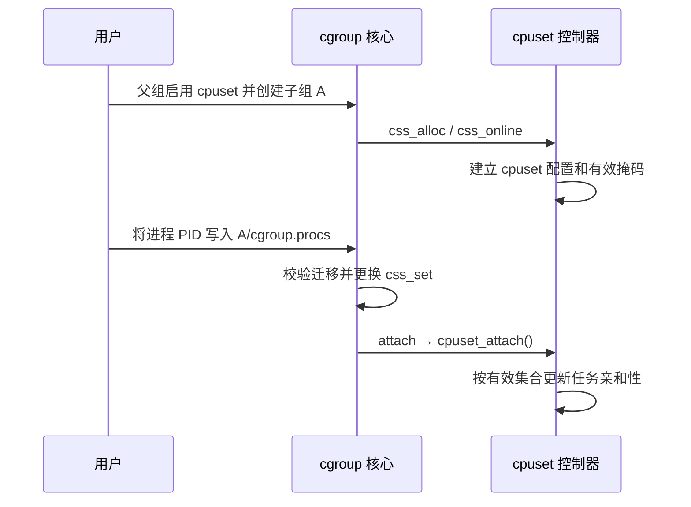

图中只展开 cpuset 控制器的主要职责，逐任务更新条件见第 2.6 节。**cpu 换组改变竞争关系，cpuset 更新改变允许位置。** 同一次 cgroup 迁移可以同时触发两个控制器的回调。

### 2.2 `member`：限制本组范围，兄弟组可以重叠

普通成员的有效掩码是配置值和父组有效集合的交集，见 [`compute_effective_cpumask()`](../../linux/kernel/cgroup/cpuset.c#L1227)。v2 里如果交集为空，就继承父组有效集合，见 [空掩码继承](../../linux/kernel/cgroup/cpuset.c#L2290)。

这意味着 `cpuset.cpus` 是**配置请求**，`cpuset.cpus.effective` 才是实际约束。先看父组 CPU 充足的普通情况：

```text
根组 effective_cpus = 0-7

A：cpus = 4-7，partition = member
   effective_cpus = 4-7
   A 的任务只能跑 4-7

根组任务的 effective_cpus 仍是 0-7
B 若没写 cpus，继承 0-7

结果：A 被限制在 4-7，但根组和 B 仍能使用 4-7
```

这叫**放置约束**，普通任务必须在生效掩码内运行。兄弟组的有效掩码重叠时，任务仍可能在同一颗 CPU 上一起排队；配置的 `cpu.weight` / `cpu.max` 继续约束公平类的时间分配。

如果父组后来只剩 0-3，A 仍写 4-7，空交集会使 A 继承 0-3。这个例子也说明为什么必须读 `.effective`，不能只看配置列表。

“空配置会继承”不等于“随时都能清空配置”。新组保持空的 `cpuset.cpus` 可以继承；但当前源码对已经 populated 的非根组，将原本非空的 `cpus_allowed` 改为空，会返回 `-ENOSPC`，见 [`validate_change()`](../../linux/kernel/cgroup/cpuset.c#L679)。这里的 populated 包括子树已有任务或正在迁入任务，见 [`cpuset_is_populated()`](../../linux/kernel/cgroup/cpuset.c#L355)。父组变化造成的空交集回退，与用户主动清空配置，是两条不同路径。

### 2.3 `root`：授予独占 CPU，并从父组有效集合中扣除

继续使用根组 0-7、A 配置 4-7 的例子，把 A 改成分区。这里直接在根组下面建立本地分区，没有热插拔或额外启动隔离，所有示例 CPU 都可用于调度。

```text
启用前：
  根组 effective_cpus = 0-7
  A：cpuset.cpus = 4-7，partition = member
  根组普通任务仍可使用 4-7

A 写入 cpuset.cpus.partition = root，且分区有效后：
  A.effective_xcpus = 4-7
  A.effective_cpus  = 4-7
  根组 effective_cpus = 0-3          ← 4-7 已从父组拿走
  根组普通任务的亲和性不再包含 4-7
```

启用本地分区时，内核做的关键动作是：

1. 用 [`compute_excpus()`](../../linux/kernel/cgroup/cpuset.c#L1528) 算独占候选：`user_xcpus(cs) ∩ parent.effective_xcpus`；未显式设置 `cpuset.cpus.exclusive` 时，还要剔除兄弟已申请或获批的独占 CPU。因此实际获批集合不一定等于写入的完整列表。
2. 检查集合非空、独占性和 housekeeping 条件。带任务的分区不能被抽空，这里的任务包括仍属于该分区的普通 member 后代，见 [`tasks_nocpu_error()`](../../linux/kernel/cgroup/cpuset.c#L1303) 和 [`partition_is_populated()`](../../linux/kernel/cgroup/cpuset.c#L373)。
3. 调用 [`partition_xcpus_add()`](../../linux/kernel/cgroup/cpuset.c#L1358)：从**父组** `effective_cpus` 里删掉这些 CPU；父组是根组时，还把它们记入 `subpartitions_cpus`。
4. 更新父组任务的亲和性，并递归更新受影响的兄弟子树，见 [父组与兄弟更新](../../linux/kernel/cgroup/cpuset.c#L2125)。随后 `update_cpumasks_hier()` 更新本分区及后代的有效集合和任务。
5. 标记需要重建调度域。

有效分区的自身范围由独占集合计算，并与 active CPU（已经进入调度可用阶段的 CPU）集合相交，再扣除子分区已占用的 CPU，见 [`compute_partition_effective_cpumask()`](../../linux/kernel/cgroup/cpuset.c#L2158)。例如 A 再把 CPU 6-7 给子分区，A 自己就只剩 4-5。显式配置了 `exclusive_cpus` 时，它独立于 `cpus_allowed`，不能只凭 `cpuset.cpus` 推断分区结果，见 [`user_xcpus()`](../../linux/kernel/cgroup/cpuset.c#L573)。

**写入后要读回 `cpuset.cpus.partition` 和 `.effective` 文件。** 请求可能留下 `root invalid (...)` 或 `isolated invalid (...)` 状态；只有有效分区才能按上面的独占关系理解。下面继续解释这种结果怎样产生。

### 2.4 分区实现细节：本地、远端和 invalid 状态

#### 2.4.1 本地分区与远端分区的入口

把 `cpuset.cpus.partition` 写成 `root` 或 `isolated` 时，内核走 [`cpuset_partition_write()`](../../linux/kernel/cgroup/cpuset.c#L3530) → [`update_prstate()`](../../linux/kernel/cgroup/cpuset.c#L3050)。父组本身已是有效 partition 时，创建的是本地分区，调用 [`update_parent_effective_cpumask()`](../../linux/kernel/cgroup/cpuset.c#L1811)；否则走需要 `CAP_SYS_ADMIN` 的远端分区，见 [`remote_partition_enable()`](../../linux/kernel/cgroup/cpuset.c#L1584)。根组已经是 `PRS_ROOT`，根下直接建分区可以走本地路径。

本地分区不强制先写 `cpuset.cpus.exclusive`；远端分区从根 cpuset 取得独占 CPU，必须沿祖先设置 `exclusive` 把候选 CPU 传下来，见 [本地与远端分区说明](../../linux/kernel/cgroup/cpuset.c#L118)。

“远端”描述的是**目录父组与实际划出 CPU 的分区不在同一层**，并不是远端机器或 NUMA 节点。假设 0-7 全部 active，没有其他分区冲突，各层已向需要的子组启用 cpuset，A 自身不放任务；下图是 B 成为有效远端 root 后的结果：

```text
根组：effective = 0-3                ← 实际把 4-7 划给 B 的分区
└── A：partition = member
    cpus = 0-7
    exclusive = 4-7
    effective = 0-3                  ← A 内普通任务的运行范围
    exclusive.effective = 4-7        ← 向后代传递的独占候选
    └── B：partition = root（远端）
        cpus = 4-7
        exclusive = 4-7
        effective = 4-7
```

B 的目录父组仍是 A，但 CPU 从根分区划出，见 [`remote_partition_enable()`](../../linux/kernel/cgroup/cpuset.c#L1615)。A 的 `effective` 随根组缩成 0-3，`exclusive.effective` 仍把 4-7 传给 B；后者走[远端分区的有效集合计算](../../linux/kernel/cgroup/cpuset.c#L2266)，不再套用 member 的“与父 effective 求交”。因此不能用“A 自己不能在 4-7 跑”推断“它下面的远端分区也不能在 4-7 跑”。

独占结果靠父组有效集合与任务亲和性落实。父组任务更新掩码时，根组走的是 `possible_mask & ~subpartitions_cpus`，见 [`cpuset_update_tasks_cpumask()`](../../linux/kernel/cgroup/cpuset.c#L1192)。带 `PF_NO_SETAFFINITY` 的 per-CPU 内核线程不会被改亲和性，它们仍可能留在被分区的 CPU 上。这是有意为之：不能把 `ksoftirqd/4` 这类线程从 CPU 4 赶走。

#### 2.4.2 请求失败可以留下 invalid 状态

分区条件检查失败时，`update_prstate()` 往往把状态记成负值，**写入系统调用仍可返回成功**，见 [错误状态落地与返回值](../../linux/kernel/cgroup/cpuset.c#L3133)。必须读回 `cpuset.cpus.partition`，例如 `root invalid (Parent unable to distribute cpu downstream)`；错误字符串见 [`perr_strings[]`](../../linux/kernel/cgroup/cpuset.c#L55)。

常见原因是独占候选为空、兄弟独占冲突、抽空仍有任务的父分区、housekeeping 冲突或远端分区条件不满足。父组是 member 并不必然失败，可以走远端分区；远端路径需要沿祖先传递 `exclusive`，不能位于另一有效分区之下。

#### 2.4.3 全局掩码与分区状态编码

整机还有两张全局掩码：[`subpartitions_cpus`](../../linux/kernel/cgroup/cpuset.c#L77) 记录已从根组下发给本地或远端子分区的独占 CPU；[`isolated_cpus`](../../linux/kernel/cgroup/cpuset.c#L82) 保存 cpuset 维护的全局隔离集合。根组只读接口 [`cpuset.cpus.isolated`](../../linux/kernel/cgroup/cpuset.c#L3622) 打印后者。

`isolated_cpus` 在 [`cpuset_init()`](../../linux/kernel/cgroup/cpuset.c#L3932) 中先纳入 `cpu_possible_mask` 里不属于启动时 `HK_TYPE_DOMAIN` 的 CPU，之后由分区建立、撤销与状态切换路径增删。更新使用的是独占集合，见 [`partition_xcpus_add()`](../../linux/kernel/cgroup/cpuset.c#L1369) 和 [`isolated_cpus_update()`](../../linux/kernel/cgroup/cpuset.c#L1340)，不要求其中每颗 CPU 都 active。因此 `cpuset.cpus.isolated` 可能包含启动隔离和离线 CPU，不能简单等同于各 isolated 分区的 `effective_cpus` 并集。isolated 父分区再划出一个 root 子分区时，也会把这部分 CPU 从全局隔离集合移除。

partition 状态使用有符号整数：`member = 0`、`root = 1`、`isolated = 2`，无效 root / isolated 分别为 -1 / -2，见 [状态常量](../../linux/kernel/cgroup/cpuset.c#L129)。热插拔或配置变化可能使分区失效，独占结论须以 CPU 可用、分区有效、配置稳定的普通任务为范围。

### 2.5 `isolated`：独占之外，再改变均衡和部分内核工作范围

调度域（`sched_domain`）描述调度器在哪些 CPU 之间寻找或搬运任务。分区不仅影响任务亲和性，也会改变负载均衡使用的 CPU 集合，见 [`generate_sched_domains()`](../../linux/kernel/cgroup/cpuset.c#L831)。

| A 拿到 CPU 4-7 之后 | `root` | `isolated` |
| ------------------ | ------ | ---------- |
| 分区外普通任务能否使用 4-7 | 不能，受有效亲和性约束 | 不能，受有效亲和性约束 |
| 4-7 是否作为独立分区参与域内均衡 | 是 | 自身有效 CPU 不进入调度域集合 |
| unbound 工作队列 | 不因该状态额外排除 | 通常排除这些 CPU，有回退条件 |
| 分区内线程分布 | 调度器可做域内均衡 | 仍会选核，但不靠域内均衡持续调整；确定布局可用逐线程亲和性 |

区别由 [`update_partition_sd_lb()`](../../linux/kernel/cgroup/cpuset.c#L1273) 落实；unbound 工作队列更新见 [`update_isolation_cpumasks()`](../../linux/kernel/cgroup/cpuset.c#L1452)。后者不影响绑定工作队列。若排除后掩码为空，工作队列使用原请求掩码；若掩码分配或更新失败，可能保留原有效配置，见 [`workqueue_unbound_exclude_cpumask()`](../../linux/kernel/workqueue.c#L7022)。因此 isolated 状态有效，并不保证这次工作队列排除也已经成功。

isolated CPU 仍有运行队列，允许在上面运行的任务照常调度；同一 CPU 上的多个可运行任务仍能轮流执行。亲和性变化时，调度器还会通过 [`cpumask_any_and_distribute()`](../../linux/kernel/sched/core.c#L3128) 选择迁移目标，帮助批量改变 cpuset 的任务分散到新范围。被关闭的是这组 CPU 之间的调度域负载均衡，不能由此推断“不绑核就都只能跑在一颗 CPU 上”。不过若线程负荷后来发生变化，应用不能再依靠域内均衡自动摊平；需要确定布局时，应显式安排各线程的亲和性。

per-CPU 内核线程、绑定工作队列、硬中断和 NMI 仍可能执行。isolated 也不会自动开启 nohz_full 或设置 IRQ 亲和性；启动隔离与调度域细节在下面展开。

[`update_partition_sd_lb()`](../../linux/kernel/cgroup/cpuset.c#L1273) 规定：有效 `PRS_ROOT` 打开 `CS_SCHED_LOAD_BALANCE`，有效 `PRS_ISOLATED` 关掉它。同时 [`isolated_cpus_update()`](../../linux/kernel/cgroup/cpuset.c#L1340) 把这些 CPU 加入或移出全局 `isolated_cpus`。

#### 2.5.1 从有效分区生成调度域集合

重建调度域时，v2 只把**有效且非 isolated** 的 partition root 放进候选，见 [`generate_sched_domains()` 的 v2 分支](../../linux/kernel/cgroup/cpuset.c#L908)：

```text
遍历 cpuset 树：
  只收集 partition_root_state == PRS_ROOT 且 effective_cpus 非空的组
  isolated 分区自身的 effective_cpus 不进入候选
  仍可继续扫描其后代；独立的有效 root 子分区可以进入候选

根组仍负载均衡、又没有任何非 isolated 子分区时：
  退回单一调度域 = 根组 effective_cpus ∩ housekeeping(HK_TYPE_DOMAIN)
```

掩码改完后，[`update_partition_sd_lb()`](../../linux/kernel/cgroup/cpuset.c#L1273) 置 `force_sd_rebuild`，[`rebuild_sched_domains_locked()`](../../linux/kernel/cgroup/cpuset.c#L1097) 调用 `generate_sched_domains()`，再交给 [`partition_sched_domains()`](../../linux/kernel/sched/topology.c#L2870) 拆掉旧域、建新域。

没有子分区时，[单域快路径](../../linux/kernel/cgroup/cpuset.c#L851) 给出一个 CPU 集合 `top_cpuset.effective_cpus ∩ housekeeping(HK_TYPE_DOMAIN)`。这里的“一个域”指一个调度域分区；内部仍按 SMT、缓存、NUMA 等拓扑构建多层 `sched_domain`，见 [逐拓扑层建域](../../linux/kernel/sched/topology.c#L2502)。出现有效 `root` 子分区后，它的有效 CPU 从父分区集合中分离，成为独立集合。isolated 自身的有效 CPU 不进入任何域集合。

**只设置独占标志不等于自动出现新的调度分区；v2 以有效 partition root 为准。** 普通域内负载均衡、wakeup affine 和 newidle 拉任务，按所属调度域边界工作。v2 的有效分区集合不应重叠，重叠合并分支会触发警告，见 [检查位置](../../linux/kernel/cgroup/cpuset.c#L936)。域外的 CPU 对普通域内均衡来说属于另一个范围；完整的域层级见 [sched.md](sched.md)。

#### 2.5.2 与启动隔离参数的关系

若启动时用了带 `domain` 标志的 `isolcpus=`，或省略标志而采用默认 `domain`，相应 CPU 不在 `HK_TYPE_DOMAIN` housekeeping 集合里。启用**本地 root 分区**时，[`prstate_housekeeping_conflict()`](../../linux/kernel/cgroup/cpuset.c#L1763) 会拒绝包含这些 CPU 的候选，只允许 isolated；调用点见 [本地启用检查](../../linux/kernel/cgroup/cpuset.c#L1885)。已有分区修改掩码时，[`validate_partition()`](../../linux/kernel/cgroup/cpuset.c#L2494) 也会检查这一条件。

这个条件不能泛化成“所有路径都禁止 root 使用启动隔离 CPU”：当前源码的 [`remote_partition_enable()`](../../linux/kernel/cgroup/cpuset.c#L1584) 没有调用上述检查，而有效 isolated → root 的 [状态切换分支](../../linux/kernel/cgroup/cpuset.c#L3107) 也没有重新核对 `boot_hk_cpus`。生成 v2 调度域时，[只有根 cpuset 的集合再与 `HK_TYPE_DOMAIN` 相交](../../linux/kernel/cgroup/cpuset.c#L976)，其他有效 root 的集合直接复制。阅读本版本时，应按实际走到的入口分析，不能仅凭一个校验辅助函数推断所有状态变化都执行了同一检查。

**不能泛指任何 `isolcpus=` 都有 domain 隔离效果**：`nohz` 对应 tick 等内核噪声控制，`managed_irq` 对应托管中断，见 [参数解析](../../linux/kernel/sched/isolation.c#L200)。cgroup isolated 是运行时可改的调度分区，不会自动开启 nohz_full 或 managed IRQ 隔离。

调度器的 [`cpu_is_isolated()`](../../linux/include/linux/sched/isolation.h#L73) 会综合启动隔离与 cpuset 的结果：

```text
cpu_is_isolated(cpu) =
    不在 HK_TYPE_DOMAIN housekeeping 集合
    或不在 HK_TYPE_TICK housekeeping 集合
    或 cpuset_cpu_is_isolated(cpu)
```

这里 housekeeping 集合表示仍承担相应普通调度或内核工作的 CPU；domain、tick 和 cpuset 分区分别产生自己的约束。

### 2.6 任务亲和性：把 cpuset 结果写入 `cpus_mask / cpus_ptr`

cpuset 算出组的有效范围，调度器则通过每个任务自己的亲和性字段使用这个范围。先看 [`task_struct` 的亲和性成员](../../linux/include/linux/sched.h#L917)：

```c
struct task_struct {
    /* 省略其他成员 */
    int nr_cpus_allowed;
    const cpumask_t *cpus_ptr;       /* 调度器访问允许 CPU 集合的指针 */
    cpumask_t *user_cpus_ptr;        /* 保存的用户亲和性请求 */
    cpumask_t cpus_mask;             /* 任务自己的亲和性掩码存储 */
    /* 省略其他成员 */
};
```

`cpus_mask` 保存任务掩码，`cpus_ptr` 是调度器使用的访问入口，`user_cpus_ptr` 保存用户请求。先分清这三者，再看配置更新、任务迁入和用户亲和性怎样修改最终允许范围。

通常 `cpus_ptr == &p->cpus_mask`；在 `migrate_disable()` 期间发生调度切换时，[`migrate_disable_switch()`](../../linux/kernel/sched/core.c#L2383) 可以让它暂时指向当前 CPU 的单 CPU 掩码，而 `cpus_mask` 仍保存原允许范围。恢复迁移时，[`___migrate_enable()`](../../linux/kernel/sched/core.c#L2402) 再把指针接回 `cpus_mask`。非 RT 内核也有这条路径，不能把 `cpus_ptr` 当成永远不变的别名。

#### 2.6.1 配置更新后遍历任务，修改允许集合

cpuset 改掩码之后，必须更新任务亲和性，调度器选核才会认。**`cpus_allowed` 是 `struct cpuset` 的配置字段；当前 `task_struct` 的亲和性掩码叫 `cpus_mask`，调度器主要通过 `cpus_ptr` 访问它**，见 [任务字段](../../linux/include/linux/sched.h#L918)。落地函数是 [`cpuset_update_tasks_cpumask()`](../../linux/kernel/cgroup/cpuset.c#L1192)：

```text
遍历该 cpuset 的任务：
  根组：new = possible_mask & ~subpartitions_cpus   （跳过 PF_NO_SETAFFINITY）
  其他：new = possible_mask ∩ cs->effective_cpus
  set_cpus_allowed_ptr(task, new)
```

#### 2.6.2 迁入任务与用户亲和性的交集

任务迁入新 cpuset 时，[`cpuset_attach_task()`](../../linux/kernel/cgroup/cpuset.c#L3297) 走同一条约束：非根组用 [`guarantee_active_cpus()`](../../linux/kernel/cgroup/cpuset.c#L420) 取得 `effective_cpus` 中的 active CPU；异常情况下沿祖先找可用 CPU。active 是在线且已进入调度可用阶段的 CPU，热插拔过程中不能简单等同于 online。

v2 下只有有效 CPU **和有效内存节点集合都没变**，attach 才能跳过逐任务更新，见 [`cpuset_attach()`](../../linux/kernel/cgroup/cpuset.c#L3341)。

配置稳定时，用户调用 `sched_setaffinity()` 也逃不出 cpuset。[`__sched_setaffinity()`](../../linux/kernel/sched/syscalls.c#L1158) 先取 [`cpuset_cpus_allowed()`](../../linux/kernel/cgroup/cpuset.c#L4239)，再和用户请求做交集；交集没有可用 CPU 则失败。用户掩码可以更窄，实际允许范围不能更宽。之后 [`set_cpus_allowed_common()`](../../linux/kernel/sched/core.c#L2694) 更新 `p->cpus_mask`，[`__set_cpus_allowed_ptr_locked()`](../../linux/kernel/sched/core.c#L3070) 必要时把任务迁离旧 CPU。

#### 2.6.3 已保存的用户掩码与热插拔回退

上面的伪代码描述的是 cpuset 交给调度器的掩码。调度器还会与已保存的 `user_cpus_ptr` 相交：有非空交集就保留用户的更窄约束；交集为空则按新的 cpuset 掩码重设，见 [`__set_cpus_allowed_ptr()`](../../linux/kernel/sched/core.c#L3158)。因此 cpuset 更新不一定把每个任务的掩码都扩大到整个有效集合。

回退时改变的是这次生效的 `cpus_mask`，**保存的用户请求并没有被清除**。cpuset 调用 [`set_cpus_allowed_ptr()`](../../linux/kernel/sched/core.c#L3176) 时 flags 为 0；只有带 `SCA_USER` 的更新才[交换保存的用户掩码](../../linux/kernel/sched/core.c#L2704)。假设 CPU 都 active、期间没有新的用户 affinity 调用：

| 操作完成后 | 保存的用户请求 `user_cpus_ptr` | cpuset 有效范围 | 任务实际 `cpus_mask` |
| ---------- | ---------------------------- | -------------- | ------------------- |
| 用户成功请求只跑 CPU 5 | 5 | 4-7 | 5 |
| cpuset 改为 0-3 | 5 | 0-3 | 0-3，暂时无法满足原请求 |
| cpuset 再改回 4-7 | 5 | 4-7 | 5，原请求重新生效 |

这和用户新调用 `sched_setaffinity()` 不同：若 cpuset 已经是 0-3，用户此时主动请求 CPU 5，交集为空会失败；不会借这个调用跳出 cpuset。一个是系统更新范围时保留旧请求并回退，另一个是校验新请求能否生效。

根组亲和性还包含 possible 但离线的 CPU；若热插拔导致根组剩余掩码没有 active CPU，[`cpuset_cpus_allowed()`](../../linux/kernel/cgroup/cpuset.c#L4254) 有退回全部 possible CPU 的应急路径，独占结论不能脱离分区有效性和在线状态。

第 2.2 节的空交集继承还有一个边界：父分区无任务，并把所有 CPU 下发给子分区时，父有效集合可以为空，普通成员继承后仍为空；任务迁入会被 [`cpuset_can_attach_check()`](../../linux/kernel/cgroup/cpuset.c#L3178) 以 `-ENOSPC` 拒绝。

### 2.7 沿一次配置更新串起两条落实路径

回到第 2.1 节的结构图：一次配置变化，一路更新任务允许在哪运行，另一路更新 CPU 之间怎样均衡。把前面的函数放在同一张流程图上：

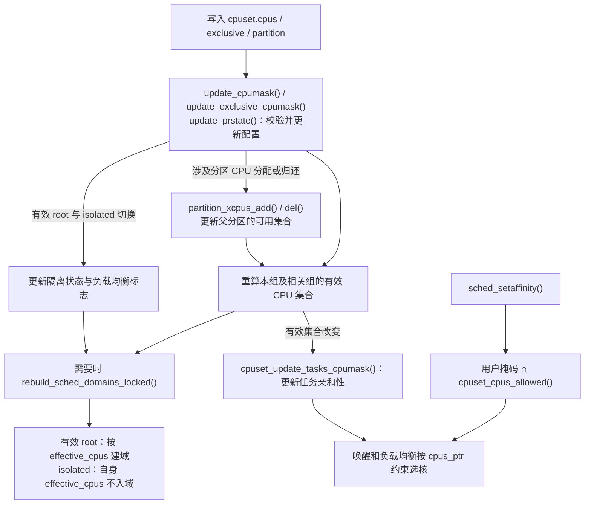

图中分支表示不同更新的主要影响。写 cpus 和 exclusive 分别进入 [`update_cpumask()`](../../linux/kernel/cgroup/cpuset.c#L2586) 与 [`update_exclusive_cpumask()`](../../linux/kernel/cgroup/cpuset.c#L2646)。普通 member 不会因自身放置范围的变化而独占 CPU；分区建立、调整可能划出 CPU，撤销或失效可能归还 CPU，见 [`partition_xcpus_add()`](../../linux/kernel/cgroup/cpuset.c#L1358) 和 [`partition_xcpus_del()`](../../linux/kernel/cgroup/cpuset.c#L1390)。有效 `root` 与 `isolated` 之间的成功切换只改变隔离和均衡状态，不重新分配 CPU，见 [`update_prstate()` 的切换分支](../../linux/kernel/cgroup/cpuset.c#L3107)。

所以空间隔离最终落在**任务亲和性和调度域边界**上。cpuset 负责计算有效 CPU 集合并更新任务掩码；`/proc/<pid>/status` 里的 `Cpus_allowed_list` 是核对任务结果的入口。

### 2.8 综合示例：给延迟敏感容器划出 CPU 4-7

假设宿主机的 8 颗逻辑 CPU 全部 active，没有额外的启动隔离配置。根组向子组启用 `cpu cpuset`，要给延迟敏感容器独占 CPU 4-7，并减少均衡和部分内核工作干扰。最终布局如下；CPU 编号是否覆盖完整 SMT 兄弟，需要按导读中的 x86 拓扑说明核对实际拓扑：

```text
/sys/fs/cgroup                          根组，内部为 PRS_ROOT，最终 effective = 0-3
  cgroup.subtree_control = cpu cpuset
  │
  ├── system.slice                      系统服务，cpus = 0-3，partition = member
  └── pod-latency                       独占容器
        cpuset.cpus = 4-7
        cpuset.cpus.partition = isolated
        cpu.weight = 100                独占后同核上往往只剩自己，权重不再是关键
        cpu.max = max 100000            不靠配额限速
```

根组内部是 `PRS_ROOT`，但根目录**没有 `cpuset.cpus.partition` 文件**，见 [文件标志](../../linux/kernel/cgroup/cpuset.c#L3595)。这里让系统服务保持 member，把 0-3 留在根分区。若把 `system.slice` 的 0-3 也设为独立 root，再把 4-7 全分出去，就会抽空仍有任务的根分区，触发 `PERR_NOCPUS`；不能把这当成一个必然可用的示例。

沿配置到调度结果的顺序是：

1. 根组写入 `cgroup.subtree_control = +cpu +cpuset`，创建子目录后，子组得到自己的 `task_group` 和 `struct cpuset`；也可以先建目录再启用控制器，由核心补建状态。
2. 写入 `cpuset.cpus = 4-7`。此时若仍是 `member`，只约束该组任务，根组任务还能用 4-7。
3. 写入 `cpuset.cpus.partition = isolated`。`update_prstate()` 确认根组是有效 partition，按本地 isolated 启用。
4. `partition_xcpus_add()` 从根组 `effective_cpus` 删除 4-7，写入 `subpartitions_cpus` 和 `isolated_cpus`。
5. 更新根组及受影响 member 子树的任务亲和性，允许范围落在 0-3；pod 内任务的允许范围落在 4-7。已保存的用户 affinity 可以更窄，根组的 `PF_NO_SETAFFINITY` 任务被跳过。
6. 默认 unbound 工作队列掩码排除 4-7，绑定工作队列仍可能在这些 CPU 上执行。
7. `generate_sched_domains()` 只给根组剩下的 0-3 建域；4-7 不在任何负载均衡域里。
8. 分区有效且配置稳定期间，普通任务的唤醒、fork、exec 和迁移都受各自亲和性约束。根组普通任务再忙，也不会因负载均衡迁到 4-7；pod 内仍会选核和切换任务，但不能依靠域内负载均衡持续摊平线程负荷，需要确定布局时应逐线程设置亲和性。

如果只需要独占、仍希望这 4 颗核之间互相均衡，把 partition 写成 `root` 即可。如果只是 shared 容器，不要建 partition，只用 `cpu.weight` / `cpu.max`，让它们在共享核上排队。

三种手段叠在一起时，约束是**同时生效**的：

| 机制 | 直接作用 | 不解决的问题 |
| ---- | -------- | ---------- |
| `cpuset.cpus`（member） | 限制普通任务在 **effective 集合**内运行 | 不排斥其他组；空交集时有效范围可能继承父组 |
| partition `root` / `isolated` | 独占 CPU；isolated 还去掉自身有效 CPU 的调度域均衡 | 不排除 per-CPU 内核线程、绑定工作队列、硬中断、NMI |
| `cpu.weight` | 调节同核争用时的长期份额 | 不提供固定预留或执行上限 |
| `cpu.max` | 公平类的全组执行预算 | RT/DL 类执行；CPU 位置；短时间并行和延迟限流 |

独占核之后再设一个很小的 `cpu.max` 仍然会限流，因为配额按执行时间扣，不看这些核是不是“专用的”。反过来，只设 `cpu.max = 200000 100000` 却只允许 1 颗 CPU，100 ms 内也执行不了 200 ms。

### 2.9 验证与排查：有效集合、亲和性与隔离结果

#### 2.9.1 按归属、有效范围和任务掩码逐项核对

按“组归属 → 分区状态 → 有效 CPU → 任务掩码”检查：

1. `/proc/<pid>/cgroup` 确认任务在哪个 cgroup。v2 通常是 `0::/path`。
2. 读本组及祖先已暴露的 `cpuset.cpus`、`cpuset.cpus.effective`、`cpuset.cpus.exclusive.effective`、`cpuset.cpus.partition`。partition 带 `invalid` 就没有有效独占；根组只读 effective 等实际存在的接口，没有配置 cpus / partition 文件。
3. 根组 `cpuset.cpus.isolated` 应包含 isolated 分区**自身有效 CPU**，但还可能包含启动时纳入的 domain 隔离 CPU 和离线 CPU，不能据此反推哪些目录已成为有效分区。另读 `.exclusive.effective` 时，也要结合 partition 状态区分候选传递和实际划出。本地分区的父组 `cpuset.cpus.effective` 不应包含已下发的独占 CPU；远端分区要核对根组及祖先传播后的有效集合。
4. 对配置稳定的非根普通任务，`/proc/<pid>/status` 的 `Cpus_allowed_list` 应落在该组 `cpuset.cpus.effective` 内。用户 affinity 可以更窄；根组掩码可额外包含离线的 possible CPU，应结合在线集合核对。
5. 整机有空闲但线程仍排队，优先查 `Cpus_allowed_list` 和 cpuset 分区，而不是先怀疑公平类挑错了人。

亲和性属于线程。多线程进程还应逐个核对 `/proc/<PID>/task/<TID>/status`；只看主线程的 `/proc/<PID>/status`，不能代表每个工作线程都用了相同掩码。线程目录和状态文件分别见 [`task` 目录注册](../../linux/fs/proc/base.c#L3298)与[线程 `status` 注册](../../linux/fs/proc/base.c#L3656)。

#### 2.9.2 用放置与隔离的现象选择源码路径

| 现象或疑问 | 优先核对什么 |
| ---------- | ------------ |
| 整机有空闲 CPU，线程却排队 | 任务 `Cpus_allowed_list`、cpuset 有效集合，以及 isolated 内的线程分布 |
| 写了 CPU 列表，其他组仍来运行 | 是否仍为 member？分区状态是否带 invalid？ |
| 配置 isolated 后仍有内核工作 | 区分 unbound 工作队列、绑定工作队列、per-CPU 线程和中断 |

这些检查对应有效掩码、分区与亲和性路径，源码入口见第 2.10 节。时间与位置约束同时生效：独占 CPU 也会受 `cpu.max` 限制；允许一颗 CPU 的组，即使预算相当于两颗 CPU，也无法凭预算获得第二颗 CPU。时间约束的验证与统计口径见第 1.5 节。

### 2.10 cpuset 源码阅读地图：从有效集合走到调度结果

每次先找到对象字段，再选择一种操作或一次状态变化，把函数放回前面的架构中。

| 想回答的问题 | 先看的对象 | 再跟的入口 | 本文位置 |
| ------------ | ---------- | ---------- | -------- |
| 任务怎样找到自己的 cpuset？ | `css_set.subsys[]`、`cpuset.css`、任务亲和性字段 | [`css_cs()`](../../linux/kernel/cgroup/cpuset-internal.h#L185)、[`cpuset_attach()`](../../linux/kernel/cgroup/cpuset.c#L3316) | 第 2.1、2.6 节 |
| member 的配置怎样变成有效范围？ | `cpus_allowed / effective_cpus` | [`compute_effective_cpumask()`](../../linux/kernel/cgroup/cpuset.c#L1227)、[空掩码继承](../../linux/kernel/cgroup/cpuset.c#L2290) | 第 2.2 节 |
| 独占 CPU 怎样从父组移出？ | cpuset 的配置与有效掩码 | [`update_prstate()`](../../linux/kernel/cgroup/cpuset.c#L3050)、[`partition_xcpus_add()`](../../linux/kernel/cgroup/cpuset.c#L1358) | 第 2.3～2.4 节 |
| 放置和均衡边界怎样落实？ | `cpus_mask / cpus_ptr`、`rq.sd` | [`cpuset_update_tasks_cpumask()`](../../linux/kernel/cgroup/cpuset.c#L1192)、[`generate_sched_domains()`](../../linux/kernel/cgroup/cpuset.c#L831) | 第 2.5～2.7 节 |

## 附录 A. 源码范围与编译假设

本文开启 `CGROUP_SCHED`、`FAIR_GROUP_SCHED`、`CPUSETS`，假定未启用 sched_ext 接管、autogroup 和 [`SCHED_PROXY_EXEC`](../../linux/init/Kconfig#L905)。本书的数据中心配置默认开启 [`CFS_BANDWIDTH`](../../linux/init/Kconfig#L1117)；源码 Kconfig 的 `default` 仍是 n，[x86_64_defconfig](../../linux/arch/x86/configs/x86_64_defconfig#L16) 只显式打开 `CGROUP_SCHED`，[`FAIR_GROUP_SCHED`](../../linux/init/Kconfig#L1111) 跟随它打开。

`CFS_BANDWIDTH` 会 select `GROUP_SCHED_BANDWIDTH`，后者控制 [`cpu.max` 文件注册](../../linux/kernel/sched/core.c#L10273)。本书不假定开启 nohz_full。单任务公平调度算法见 [eevdf.md](eevdf.md)，运行队列与负载均衡全景见 [sched.md](sched.md)。非 `PREEMPT_RT` 并不表示系统里没有 RT 或 DEADLINE 任务。
