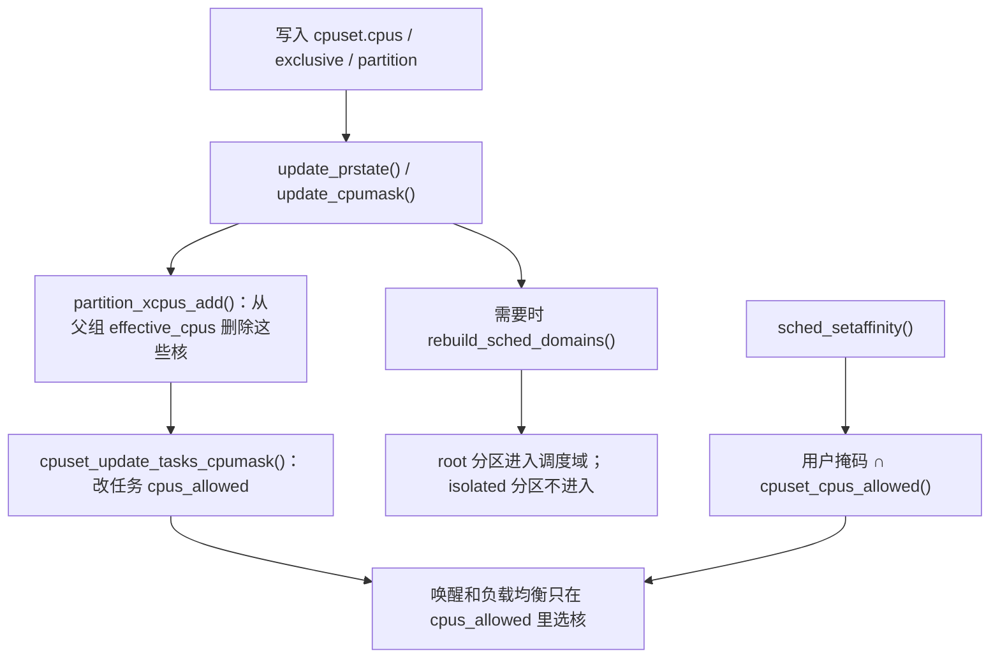

# cgroup v2 怎样实现 CPU 隔离

> 源码基准：本项目 [Linux 6.18.52](../../linux/Makefile#L2)。所有源码链接均相对于本文。
>
> 学习主线：**cgroup 只是一棵组树；真正管 CPU 的是两套控制器。`cpu` 管“能跑多久”，`cpuset` 管“能跑在哪颗核上”。真正把核从别人手里拿走的，是 cpuset 的 partition，不是只写一张 CPU 列表。**
>
> 下文以 x86-64、SMP、非 `PREEMPT_RT` 为范围，假定未启用 sched_ext 接管。[x86_64_defconfig](../../linux/arch/x86/configs/x86_64_defconfig#L16) 开启 `CGROUP_SCHED` 和 `CPUSETS`，默认没有开启 [`CFS_BANDWIDTH`](../../linux/init/Kconfig#L1117)。公平组层级随 [`FAIR_GROUP_SCHED`](../../linux/init/Kconfig#L1111) 打开；带宽限流以显式启用该选项为前提。组调度和配额记账的细节见同目录 [sched.md 第 7 节](sched.md)，本文只把它们接到“隔离”这条线上。

## 1. 先建立直觉：隔离问的是两件事

数据中心里说“给这个容器隔离 CPU”，通常混着三种完全不同的诉求：

| 用户口头说的 | 实际要回答的问题 | cgroup v2 接口 | 内核真正改的东西 |
| ------------ | ---------------- | -------------- | ---------------- |
| 多租户别抢太狠 | 争用时本组占多少相对份额 | `cpu.weight` | 组调度实体的权重 |
| 这个容器最多用 2 核 | 全组每周期最多执行多少时间 | `cpu.max` | 共享配额池和限流 |
| 这几颗核是我专用的 | 哪些 CPU 允许本组任务运行，别人能不能再来 | `cpuset.cpus` + `cpuset.cpus.partition` | 任务亲和性，以及调度域 |

前两行是**时间隔离**：大家还可以在同一颗核上排队，只是份额或预算不同。第三行才是**空间隔离**：把核从父组的有效 CPU 集合里抠走，别的组任务连亲和掩码都进不去。

一个容易踩的坑：**只写 `cpuset.cpus` 不等于独占。** 它只约束“本组任务只能去这些核”，并不自动把这些核从父组和兄弟组拿走。父组任务只要有效掩码里还有这些 CPU，照样能跑过来。要把核真正隔离出去，必须把这个 cgroup 变成有效的 partition root。

可以先用一张图把两套控制器分开：

```text
                    cgroup 树（只负责归属）
                            │
          ┌─────────────────┴─────────────────┐
          ▼                                   ▼
     cpu 控制器                            cpuset 控制器
   （时间：份额 / 配额）                  （空间：哪些核）
          │                                   │
          ▼                                   ▼
   task_group / se / cfs_rq              struct cpuset
   同一颗 CPU 上按权重选人                改任务 cpus_allowed
   可选：周期配额耗尽后限流               可选：拆调度域、禁止负载均衡
```

后文按学习顺序走：先看 cgroup 骨架，再看两套控制器各自的核心对象，最后把“独占核”这条路径逐步落到源码。

## 2. 核心数据结构：组、控制器状态、任务的那份快照

cgroup v2 是单一默认层级。一个目录就是一个 [`struct cgroup`](../../linux/include/linux/cgroup-defs.h#L472)。它自己不实现 CPU 策略，只保存树关系和“子树打开了哪些控制器”。

### 2.1 `cgroup`：树节点和控制器开关

先看三个要反复碰到的对象：

| 对象 | 作用 | 源码 |
| ---- | ---- | ---- |
| `cgroup` | 用户看到的组；`subtree_control` 决定子组能用哪些控制器 | [定义](../../linux/include/linux/cgroup-defs.h#L472) |
| `cgroup_subsys_state`（css） | 某个控制器在这个组上的私有状态；cpu 的 css 就是 `task_group`，cpuset 的 css 就是 `struct cpuset` | [定义](../../linux/include/linux/cgroup-defs.h#L179) |
| `css_set` | 一份“各控制器 css 指针”的快照；任务通过 `task_struct->cgroups` 挂在某一份上 | [定义](../../linux/include/linux/cgroup-defs.h#L272) |

父子关系和有效控制器可以这样记：

```text
cgroup A
  subtree_control = cpu cpuset     ← 写 cgroup.subtree_control，决定子组有哪些旋钮
  │
  ├── css[cpu]    → task_group A     本组启用了 cpu 才有自己的组调度对象
  ├── css[cpuset] → cpuset A         本组启用了 cpuset 才有自己的 CPU 集合
  │
  └── cgroup B（子组）
        能用的控制器 = 父组 subtree_control
        若 B 自己没启用 cpu，有效 css 沿祖先上找，见 cgroup_e_css_by_mask()
```

写入 `cgroup.subtree_control` 的入口是 [`cgroup_subtree_control_write()`](../../linux/kernel/cgroup/cgroup.c#L3544)。子组实际可用的控制器来自父组的 `subtree_control`，见 [`cgroup_control()`](../../linux/kernel/cgroup/cgroup.c#L479)。一组没有直接启用某个控制器时，有效 css 是最近启用了该控制器的祖先，见 [`cgroup_e_css_by_mask()`](../../linux/kernel/cgroup/cgroup.c#L538)。**任务受哪套 CPU 规则约束，看的是有效 css，不是目录上有没有同名文件。**

`cpu` 和 `cpuset` 都把 `.threaded = true` 写进控制器描述表，见 [`cpu_cgrp_subsys`](../../linux/kernel/sched/core.c#L10304) 和 [`cpuset_cgrp_subsys`](../../linux/kernel/cgroup/cpuset.c#L3884)。它们可以在仍有进程的组上下发到子组；不要把 memory 那种“内部不能留进程”的域控制器规则套到这两套上。

任务迁入新组时，cgroup 核心会换一份 `css_set`，再回调各控制器的 `attach`。对 cpuset 来说，这一步就会改任务允许的 CPU 集合，见第 4.4 节。

### 2.2 `task_group`：cpu 控制器的组调度对象

启用 cpu 控制器后，每个非根组对应一个 [`task_group`](../../linux/kernel/sched/sched.h#L472)。分配入口是 [`cpu_cgroup_css_alloc()`](../../linux/kernel/sched/core.c#L9257)，公平类再为每颗 possible CPU 准备一对 `se` / `cfs_rq`，见 [`alloc_fair_sched_group()`](../../linux/kernel/sched/fair.c#L13833)。

学习隔离时只要抓住四件事：

| 字段 | 隔离时怎样理解 |
| ---- | -------------- |
| `parent` / `children` | 组调度树，和 cgroup 树对应 |
| `shares` | `cpu.weight` 换算后的组权重 |
| `se[cpu]` | 该组在某颗 CPU 上对外竞争的实体 |
| `cfs_rq[cpu]` | 该组在某颗 CPU 上内部排队的公平队列；启用带宽时这里还有本地额度 |

根组直接用每 CPU 的 `rq->cfs`，不再构造更高一层实体。同一颗 CPU 上，先在父队列里按组实体竞争，再进入被选中组的子队列挑任务。这是时间隔离的结构基础，细节仍见 [sched.md 第 7.1 节](sched.md)。

### 2.3 `struct cpuset`：空间隔离的核心对象

cpuset 控制器的 css 是 [`struct cpuset`](../../linux/kernel/cgroup/cpuset-internal.h#L74)。v2 里要同时看**用户配置**和**真正生效**的掩码，二者不必相同。

| 字段 | 用户接口 | 含义 |
| ---- | -------- | ---- |
| `cpus_allowed` | `cpuset.cpus` | 用户给本组配置的 CPU 列表 |
| `exclusive_cpus` | `cpuset.cpus.exclusive` | 用户申请独占的 CPU；空则启用 partition 时默认用 `cpus_allowed` |
| `effective_cpus` | `cpuset.cpus.effective` | 本组任务真正允许跑的 CPU |
| `effective_xcpus` | `cpuset.cpus.exclusive.effective` | 祖先真正批给本组的独占 CPU |
| `partition_root_state` | `cpuset.cpus.partition` | 是普通成员，还是有效/无效的 partition |

注释把 v2 的计算规则写得很直接，见 [掩码说明](../../linux/kernel/cgroup/cpuset-internal.h#L80)：

```text
普通成员（member）：
  effective_cpus = cpus_allowed ∩ parent.effective_cpus
  结果为空时，继承 parent.effective_cpus

有效 partition root：
  独占 CPU 来自 effective_xcpus
  再减去已经下发给子 partition 的 CPU，剩下的才是自己的 effective_cpus
  此时 effective_cpus 不再简单等于 cpus_allowed ∩ 父组有效集合
```

`exclusive_cpus` 为空时，独占申请回落到 `cpus_allowed`，见 [`user_xcpus()`](../../linux/kernel/cgroup/cpuset.c#L572)。

partition 状态是一个有符号整数，定义见 [状态常量](../../linux/kernel/cgroup/cpuset.c#L129)：

| 读出来的值 | 内部状态 | 含义 |
| ---------- | -------- | ---- |
| `member` | `PRS_MEMBER`（0） | 普通成员，不从父组拿走 CPU |
| `root` | `PRS_ROOT`（1） | 有效分区根：独占 CPU，这些核之间仍做负载均衡 |
| `isolated` | `PRS_ISOLATED`（2） | 有效隔离分区：独占 CPU，并且不进入调度域 |
| `root invalid (...)` | `PRS_INVALID_ROOT`（-1） | 想当 root 但没申请成功 |
| `isolated invalid (...)` | `PRS_INVALID_ISOLATED`（-2） | 想当 isolated 但没申请成功 |

根 cpuset 一开始就是 `PRS_ROOT`，并且带 `CS_CPU_EXCLUSIVE`，见 [`top_cpuset`](../../linux/kernel/cgroup/cpuset.c#L210)。整机还有两张全局掩码：

| 全局对象 | 作用 |
| -------- | ---- |
| `subpartitions_cpus` | 已经从根组下发给本地或远端子分区的独占 CPU | [定义](../../linux/kernel/cgroup/cpuset.c#L77) |
| `isolated_cpus` | 当前处于 isolated partition 的 CPU | [定义](../../linux/kernel/cgroup/cpuset.c#L82) |

根组任务更新亲和性时，会从 possible CPU 里抠掉 `subpartitions_cpus`，见第 4.4 节。这就是“子分区把核从根组拿走”在根组任务上的直接效果。

v2 的用户接口在 [`dfl_files[]`](../../linux/kernel/cgroup/cpuset.c#L3559)。根组额外有只读的 `cpuset.cpus.isolated`，打印全局 `isolated_cpus`。

## 3. `cpu` 控制器：时间上的隔离

`cpu` 控制器回答的是：已经允许跑在某颗核上之后，本组相对于别人能跑多久。它**不指定核**。v2 文件注册在 [`cpu_files[]`](../../linux/kernel/sched/core.c#L10252)。

### 3.1 `cpu.weight`：争用时的相对份额

权重范围是 **1～10000，默认 100**，见 [权重常量](../../linux/include/linux/cgroup.h#L39)。写入后先换成调度器权重，再放到 `tg->shares`，见 [`cpu_weight_write_u64()`](../../linux/kernel/sched/core.c#L10140)。默认 100 对应未缩放的 1024，也就是 nice 0 任务的权重刻度。

同一层两个持续可运行的组，权重 100 和 300，长期份额大约是 1:3。组内再按任务 nice 分这一份。多开线程只会在本组份额里继续切，不会把组的配置权重大出去。B 睡眠后，A 可以用空出来的 CPU。所以 **`cpu.weight` 不是预留，也不是绑核。**

每 CPU 上组实体的实际权重还会按该 CPU 的组负荷占全组负荷的比例再算一遍，见 [sched.md 第 7.3 节](sched.md) 的 `calc_group_shares()`。多 CPU 上不能把“整机 1:3”直接抄到每一颗核。

### 3.2 `cpu.max`：周期配额

格式是 `quota period`，单位都是 **μs**；`max` 表示本组不设有限配额。这是全组共享的执行预算，不是“每颗 CPU 各有一份”。`50000 100000` 表示每 100 ms 全组一共新增 50 ms 执行额度，相当于 0.5 颗逻辑 CPU 的时间预算。四个线程同时跑，大约 12.5 ms 就会把这 50 ms 花完。

公平类这条路径需要 `CONFIG_CFS_BANDWIDTH`。当前 defconfig 默认关闭。实现上是组级共享池加每 CPU 本地余额，耗尽后把任务摘到 limbo，周期到了再补额度。这是硬上限，仍然不指定跑在哪颗核上。完整记账和限流见 [sched.md 第 7.4～7.8 节](sched.md)。

父组配额会罩住子组。子组自己还剩额度，祖先花完了照样停。层级上子组配额之和允许超过父组，配置不是容量预留。

### 3.3 `cpu.idle`：主动让路

写入 1 后，组被标成 idle 组，权重降到 [`WEIGHT_IDLEPRIO`（3）](../../linux/kernel/sched/sched.h#L2351)，见 [`sched_group_set_idle()`](../../linux/kernel/sched/fair.c#L14009)。这是“有别人要用就让”的最低优先级组，不是隔离，也不是绑核。

时间隔离可以保证“这个容器平均别超过 2 核”，但做不到“CPU 4～7 只有我能用”。后者是 cpuset 的工作。

## 4. `cpuset` 控制器：空间上的隔离

空间隔离分三档，强度递增。数据中心里说的“独占核 / CPU pinning / isolated cpuset”，多半落在后两档。

```text
member + cpuset.cpus     只约束本组去哪跑，别人仍可能来
        │
        ▼
partition = root         从父组拿走这些核，别人进不了亲和掩码
        │                这些核之间仍参与负载均衡
        ▼
partition = isolated     同样拿走这些核，并且不建调度域
                         内核工作队列默认也不再往这些核派活
```

### 4.1 只写 `cpuset.cpus`：约束本组，不独占

普通成员的有效掩码是配置值和父组有效集合的交集，见 [`compute_effective_cpumask()`](../../linux/kernel/cgroup/cpuset.c#L1227)。v2 里如果交集为空，就继承父组有效集合，见 [空掩码继承](../../linux/kernel/cgroup/cpuset.c#L2290)。

```text
根组 effective_cpus = 0-7

A：cpus = 0-3，partition = member
   effective_cpus = 0-3
   A 的任务只能跑 0-3

根组任务的 effective_cpus 仍是 0-7
B 若没写 cpus，继承 0-7

结果：A 被钉在 0-3，但根组和 B 仍能使用 0-3
```

这叫**放置约束**，适合“尽量跑在这几颗核”，不能称为独占。兄弟组只要有效掩码重叠，就会在同一颗核上一起排队。这时如果还开了 `cpu.weight` / `cpu.max`，时间隔离才会在这颗核上起作用。

### 4.2 写成 `root`：把 CPU 从父组拿走

把 `cpuset.cpus.partition` 写成 `root` 或 `isolated` 时，内核走 [`cpuset_partition_write()`](../../linux/kernel/cgroup/cpuset.c#L3530) → [`update_prstate()`](../../linux/kernel/cgroup/cpuset.c#L3050)。父组本身已是有效 partition 时，创建的是本地分区，调用 [`update_parent_effective_cpumask()`](../../linux/kernel/cgroup/cpuset.c#L1811)；否则走需要 `CAP_SYS_ADMIN` 的远端分区，见 [`remote_partition_enable()`](../../linux/kernel/cgroup/cpuset.c#L1584)。根组已经是 `PRS_ROOT`，所以数据中心最常见的就是在根下建本地分区。

启用本地分区时，内核做的关键动作是：

1. 算出本组的 `effective_xcpus`。没有显式 `cpuset.cpus.exclusive` 时，用 `cpuset.cpus`。
2. 检查：集合非空、不和 housekeeping / `isolcpus` 冲突、不会把父组有效 CPU 抽空导致父组任务没核可跑。
3. 调用 [`partition_xcpus_add()`](../../linux/kernel/cgroup/cpuset.c#L1358)：从**父组** `effective_cpus` 里删掉这些 CPU；父组是根组时，还把它们记入 `subpartitions_cpus`。
4. 立刻更新父组任务的亲和性，见 [`cpuset_update_tasks_cpumask(parent)`](../../linux/kernel/cgroup/cpuset.c#L2126)。
5. 标记需要重建调度域。

```text
启用前：
  根组 effective_cpus = 0-7
  独占容器 G：cpus = 4-7，还是 member

写入 G 的 cpuset.cpus.partition = root 之后：
  G.effective_xcpus = 4-7
  根组 effective_cpus = 0-3          ← 4-7 被拿走
  subpartitions_cpus 含 4-7
  根组任务的 cpus_allowed 不再包含 4-7
  G 的任务只允许 4-7
```

这才是“这几颗核是我的”：不是靠约定兄弟组别写这些 CPU，而是父组有效集合里已经没有它们。父组任务更新掩码时，根组走的是 `possible_mask & ~subpartitions_cpus`，见 [`cpuset_update_tasks_cpumask()`](../../linux/kernel/cgroup/cpuset.c#L1192)。带 `PF_NO_SETAFFINITY` 的 per-CPU 内核线程不会被改亲和性，它们仍可能留在被分区的 CPU 上。这是有意为之：不能把 `ksoftirqd/4` 这类线程从 CPU 4 赶走。

有效 partition 自己的 `effective_cpus` 来自 `effective_xcpus`，再减去子分区占用的部分，见 [`compute_partition_effective_cpumask()`](../../linux/kernel/cgroup/cpuset.c#L2158)。G 下面如果再划出一个子分区拿走 CPU 6-7，G 自己就只剩 4-5。

失败不会假装成功。申请不成时状态变成负值，`cpuset.cpus.partition` 读出来类似 `root invalid (Parent unable to distribute cpu downstream)`，错误字符串见 [`perr_strings[]`](../../linux/kernel/cgroup/cpuset.c#L55)。常见原因：父组不是有效 partition、独占集合为空、兄弟冲突、把父组抽空、和启动时的 `isolcpus` / housekeeping 冲突。

### 4.3 `isolated` 比 `root` 多做的那一步

`root` 和 `isolated` 都会拿走 CPU。差别在于这些核还要不要参加负载均衡。

[`update_partition_sd_lb()`](../../linux/kernel/cgroup/cpuset.c#L1273) 规定：有效 `PRS_ROOT` 打开 `CS_SCHED_LOAD_BALANCE`，有效 `PRS_ISOLATED` 关掉它。同时 [`isolated_cpus_update()`](../../linux/kernel/cgroup/cpuset.c#L1340) 把这些 CPU 加入或移出全局 `isolated_cpus`。

随后 [`update_isolation_cpumasks()`](../../linux/kernel/cgroup/cpuset.c#L1452) 调用 [`workqueue_unbound_exclude_cpumask()`](../../linux/kernel/workqueue.c#L7022)，让非绑定工作队列默认不再往这些核派活。调度器判断一颗 CPU 是否被隔离时，会同时看启动参数和 cpuset，见 [`cpu_is_isolated()`](../../linux/include/linux/sched/isolation.h#L73)：

```text
cpu_is_isolated(cpu) =
    不在 HK_TYPE_DOMAIN housekeeping 集合   （isolcpus= 等启动隔离）
    或不在 HK_TYPE_TICK 集合               （nohz_full 等）
    或 cpuset_cpu_is_isolated(cpu)         （cgroup isolated partition）
```

重建调度域时，v2 只把**有效且非 isolated** 的 partition root 放进候选，见 [`generate_sched_domains()` 的 v2 分支](../../linux/kernel/cgroup/cpuset.c#L908)：

```text
遍历 cpuset 树：
  只收集 partition_root_state == PRS_ROOT 且 effective_cpus 非空的组
  isolated 分区整段跳过，不进入任何 sched domain

根组仍负载均衡、又没有任何非 isolated 子分区时：
  退回单一调度域 = 根组 effective_cpus ∩ housekeeping(HK_TYPE_DOMAIN)
```

因此 isolated 分区里的 CPU：

- 任务亲和性已经把外组任务挡在外面；
- 这些核不出现在负载均衡用的 `sched_domain` 里，其他核不会把任务拉进来，它们也不会按普通域均衡把任务推出去；
- unbound workqueue 默认也不用它们。

它们各自仍有运行队列，绑在上面的任务照样由 `__schedule()` 挑选。隔离的是“谁能来、会不会被均衡挪走”，不是“这颗核停止调度”。

`root` 分区则相反：CPU 是独占的，但这些核会单独构成（或并入）一个调度域，域内仍做 wakeup/idle/周期均衡。多核独占容器通常用 `root`；延迟敏感、希望尽量不被均衡和内核杂活打扰的场景才用 `isolated`。

本地分区不强制先写 `cpuset.cpus.exclusive`；远端分区必须沿祖先把独占 CPU 传下来，见 [本地/远端说明](../../linux/kernel/cgroup/cpuset.c#L118)。云主机上绝大多数独占核都是根下的本地分区。

### 4.4 任务真正被钉住的位置：`cpus_allowed`

cpuset 改掩码之后，必须写进每个任务的 `cpus_allowed`，调度器选核才会认。落地函数是 [`cpuset_update_tasks_cpumask()`](../../linux/kernel/cgroup/cpuset.c#L1192)：

```text
遍历该 cpuset 的任务：
  根组：new = possible_mask & ~subpartitions_cpus   （跳过 PF_NO_SETAFFINITY）
  其他：new = possible_mask ∩ cs->effective_cpus
  set_cpus_allowed_ptr(task, new)
```

任务迁入新 cpuset 时，[`cpuset_attach_task()`](../../linux/kernel/cgroup/cpuset.c#L3297) 走同一条约束：非根组用 [`guarantee_active_cpus()`](../../linux/kernel/cgroup/cpuset.c#L420) 保证得到一份与 `effective_cpus` 有交集的在线 CPU 集合。v2 下若有效 CPU 没有变化，attach 可以跳过逐任务更新，见 [`cpuset_attach()`](../../linux/kernel/cgroup/cpuset.c#L3341)。

用户调用 `sched_setaffinity()` 也逃不出 cpuset。[`__sched_setaffinity()`](../../linux/kernel/sched/syscalls.c#L1158) 先取 [`cpuset_cpus_allowed()`](../../linux/kernel/cgroup/cpuset.c#L4239)，再和用户请求做交集。用户掩码可以比 cpuset 更窄，不能更宽。之后 [`__do_set_cpus_allowed()`](../../linux/kernel/sched/core.c#L2712) 在队列锁里更新 `cpus_allowed`，必要时把任务从旧 CPU 迁走。



所以空间隔离最终只有一句话：**调度器看见的是任务的 `cpus_allowed`，cpuset 负责计算并维持这张掩码。** `/proc/<pid>/status` 里的 `Cpus_allowed_list` 是核对结果的入口。

### 4.5 调度域重建：独占怎样变成均衡边界

掩码改完后，[`update_partition_sd_lb()`](../../linux/kernel/cgroup/cpuset.c#L1273) 置 `force_sd_rebuild`，[`rebuild_sched_domains_locked()`](../../linux/kernel/cgroup/cpuset.c#L1097) 调用 `generate_sched_domains()`，再交给 [`partition_sched_domains()`](../../linux/kernel/sched/topology.c#L2870) 拆掉旧域、建新域。

没有子分区时，根组保持整机一个调度域，这是注释里说的常见情况，见 [单域快路径](../../linux/kernel/cgroup/cpuset.c#L851)。一旦出现有效 `root` 子分区，这些核从根组 `effective_cpus` 消失，并单独成为新的域。isolated 分区的核两边都不进域。

这和 [sched.md 第 6.1 节](sched.md) 的结论一致：**只设置独占标志不等于自动出现新的调度分区；v2 以有效 partition root 为准。** 负载均衡、wakeup affine、newidle 拉任务，都只在域内发生。域外的 CPU 对公平类均衡来说就是另一张图。

若启动时用了 `isolcpus=`，那些核已经不在 `HK_TYPE_DOMAIN` housekeeping 集合里。普通 `root` 分区不能再纳入它们，只能放进 `isolated` 分区，见 [`prstate_housekeeping_conflict()`](../../linux/kernel/cgroup/cpuset.c#L1763)。cgroup 的 isolated 是运行时可改的；`isolcpus=` 是启动时的 housekeeping，范围更广，还会影响 tick、unbound 工作队列等，见 [`hk_type`](../../linux/include/linux/sched/isolation.h#L9)。

## 5. 把一条数据中心独占核路径走完

假设 8 颗逻辑 CPU 的宿主机，根组启用 `cpu cpuset`，要给延迟敏感容器独占 CPU 4-7，并尽量减少均衡和内核杂活：

```text
/sys/fs/cgroup                          根组，天生 partition = root，effective = 0-7
  cgroup.subtree_control = cpu cpuset
  │
  ├── system.slice                      系统服务，cpus = 0-3，partition = root
  └── pod-latency                       独占容器
        cpuset.cpus = 4-7
        cpuset.cpus.partition = isolated
        cpu.weight = 100                独占后同核上往往只剩自己，权重不再是关键
        cpu.max = max 100000            不靠配额限速
```

内核顺序是：

1. 创建目录、写入 `subtree_control` 后，子组得到自己的 `task_group` 和 `struct cpuset`。
2. 写入 `cpuset.cpus = 4-7`。此时若仍是 `member`，只约束该组任务，根组任务还能用 4-7。
3. 写入 `cpuset.cpus.partition = isolated`。`update_prstate()` 确认根组是有效 partition，按本地 isolated 启用。
4. `partition_xcpus_add()` 从根组 `effective_cpus` 删除 4-7，写入 `subpartitions_cpus` 和 `isolated_cpus`。
5. 根组任务（除 per-CPU kthread）的 `cpus_allowed` 变成 0-3；pod 内任务变成 4-7。
6. unbound workqueue 排除 4-7。
7. `generate_sched_domains()` 只给根组剩下的 0-3 建域；4-7 不在任何负载均衡域里。
8. 之后唤醒、fork、exec、周期均衡都只能在各自允许的 CPU 里选核。根组再忙，也不会把任务迁到 4-7。

如果只需要独占、仍希望这 4 颗核之间互相均衡，把 partition 写成 `root` 即可。如果只是 shared 容器，不要建 partition，只用 `cpu.weight` / `cpu.max`，让它们在共享核上排队。

三种手段叠在一起时，约束是**同时生效**的：

| 机制 | 挡住什么 | 挡不住什么 |
| ---- | -------- | ---------- |
| `cpuset.cpus`（member） | 本组任务跑到列表外 | 别人来这些核 |
| partition `root` / `isolated` | 别人的亲和性、以及 isolated 时的负载均衡 | per-CPU 内核线程、硬中断（另需 irq affinity / managed IRQ） |
| `cpu.weight` | 同核争用时的长期份额 | 空闲 CPU 仍然能被用满 |
| `cpu.max` | 全组执行预算 | 任务跑在哪些核；短时间并行仍可提前耗尽额度 |

独占核之后再设一个很小的 `cpu.max` 仍然会限流，因为配额按执行时间扣，不看这些核是不是“专用的”。反过来，只设 `cpu.max = 200000 100000` 却只允许 1 颗 CPU，100 ms 内也执行不了 200 ms。

## 6. 怎么核对

按“组归属 → 有效 CPU → 任务掩码 → 时间约束 → 是否真隔离”看：

1. `/proc/<pid>/cgroup` 确认任务在哪个 cgroup。v2 通常是 `0::/path`。
2. 读该组及祖先的 `cpuset.cpus`、`cpuset.cpus.effective`、`cpuset.cpus.partition`。partition 读出来带 `invalid` 就还没真正拿走 CPU。
3. 根组 `cpuset.cpus.isolated` 应包含 isolated 分区的 CPU。父组 `cpus.effective` 不应再包含已下发的独占 CPU。
4. `/proc/<pid>/status` 的 `Cpus_allowed_list` 必须落在该组 `cpus.effective` 内。用户 affinity 可以更窄。
5. 需要时间隔离时，再读 `cpu.weight`、`cpu.max`，以及启用带宽后 `cpu.stat` 的 `nr_throttled` / `throttled_usec`。祖先配额也要看。
6. 整机有空闲但线程仍排队，优先查 `Cpus_allowed_list` 和 cpuset 分区，而不是先怀疑公平类挑错了人。

## 7. 常见误区

**只写 `cpuset.cpus` 就是隔离。** 那只约束本组。父组和未限制的兄弟组仍可使用这些 CPU。独占必须变成有效 partition，让父组 `effective_cpus` 失去这些核。

**`cpu.max = 100000 100000` 等于独占 1 颗核。** 这是全组 100 ms 周期里 100 ms 的执行预算，线程可以在多颗核上并行提前花完，也可以和别人挤在同一颗核上。它不改亲和性。

**`cpu.weight = 100` 表示保证 100% 或 100 ms。** 权重是相对份额，对方睡眠后可以把空闲 CPU 用满，也不提供无条件的最低算力保证。

**partition 显示 `root` 就一定在负载均衡。** 先确认不是 `root invalid`。无效分区会退回类似普通成员的有效掩码计算，CPU 可能已经还回父组。

**isolated 之后这颗核上什么都不会跑。** 绑在上面的任务仍会调度；per-CPU 内核线程通常还在；硬中断、NMI 也不归 cpuset 管。isolated 去掉的是跨 CPU 公平类均衡，以及 unbound workqueue 的默认使用。

**`isolcpus=` 和 cgroup isolated 是同一件事。** 前者是启动 housekeeping，作用面更宽；后者是运行时 cpuset 分区。`cpu_is_isolated()` 把两条路径都算进去。已经在 boot isolcpus 里的核，普通 `root` 分区接不住，只能放进 isolated 分区。

**看 `cpu.stat` 就能判断有没有绑核。** `usage_usec` 是执行时间，不表示跑在哪颗核。绑核和独占要看 cpuset 有效集合和任务 `Cpus_allowed_list`。
