# cgroup v2 怎样分配和隔离 CPU

> 源码基准：本项目 [Linux 6.18.52](../../linux/Makefile#L2)。本文讨论 x86-64、SMP、非 `PREEMPT_RT` 的数据中心配置，按本书约定开启 `CFS_BANDWIDTH`；其他编译假设见附录 A。分析只以本项目 `linux/` 目录为依据。

本文围绕两个控制器展开：**`cpu` 决定任务组怎样分享 CPU 时间、怎样限制执行预算；`cpuset` 决定任务可以去哪颗 CPU、怎样建立独占分区。** 两章都先认识核心数据结构，再跟踪配置与运行路径，最后用接口和统计核对结果。

| 大章节 | 阅读顺序 | 要建立的认识 |
| ------ | -------- | ------------ |
| 第 1 章：cpu 控制器 | 核心对象 → 建组与迁移 → 分层公平调度 → CFS 带宽 → 统计与源码地图 | 全组配置怎样连接每 CPU 队列，权重和配额怎样约束执行时间 |
| 第 2 章：cpuset 控制器 | 配置与有效掩码 → member → root / isolated → 任务亲和性 → 配置流程与独占示例 → 排查与源码地图 | 放置请求怎样变成任务允许范围，独占分区怎样改变父组可用 CPU 和均衡边界 |
| 附录 | 编译假设 | 核对本文讨论的配置前提 |

第一次阅读可以先略过第 1.3.4～1.3.6、1.4.8～1.4.9、2.4 节和附录，沿示例掌握主要流程。本文不要求先掌握 EEVDF 的公式，只需知道：公平调度器会在每层队列中选择一个实体运行。

**导读：归属、时间和位置各由谁负责**

“给容器分配 CPU”可能是在说三件不同的事：

| 需求 | 要回答的问题 | 主要接口 | 一个直观例子 |
| ---- | ------------ | -------- | ------------ |
| 争用时多分一点时间 | 本组相对其他组占多少份额？ | `cpu.weight` | A、B 权重为 100、300，持续争用一颗 CPU 时约分到 1/4、3/4 |
| 限制全组的执行预算 | 每个周期给全组多少执行时间？ | `cpu.max` | `50000 100000`：每 100 ms 新增 50 ms 的全组额度 |
| 把指定 CPU 留给本组 | 本组去哪跑，其他组能不能来？ | `cpuset.cpus`、`cpuset.cpus.partition` | 把 CPU 4-7 划成有效独占分区，从父组可用集合中移除 |

前两项管**时间**，第三项管**位置和独占关系**。cgroup v2 的控制器文件分别由 [`cpu_files[]`](../../linux/kernel/sched/core.c#L10252) 和 cpuset 的 [`dfl_files[]`](../../linux/kernel/cgroup/cpuset.c#L3559) 注册。

例如，A 允许使用 CPU 4-7，并设置 `cpu.max = 50000 100000`：它可以在这四颗 CPU 上并行运行，却共享同一份 50 ms 预算。只写 `cpuset.cpus = 4-7` 也没有把其他组挡住；要独占，还需要建立**有效分区**。后文会分别展开这两点。

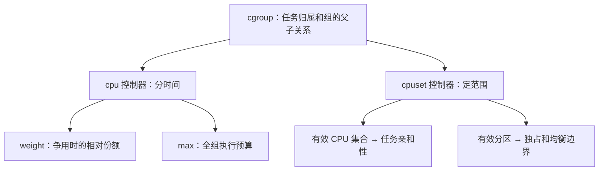

本文的权重和配额分析针对**公平调度类**，也就是通常的 `SCHED_NORMAL/BATCH/IDLE` 任务。`SCHED_FIFO/RR`、`SCHED_DEADLINE` 不走这里的公平队列带宽记账路径；cpuset 的放置约束则不只用于公平类。调度类选择见 [`__setscheduler_class()`](../../linux/kernel/sched/core.c#L7304)，公平类定义见 [`fair_sched_class`](../../linux/kernel/sched/fair.c#L14095)。

这里的编号是**逻辑 CPU**。x86 的一颗物理核可能有多个 SMT 线程；若要独占物理核，应把所有 SMT 兄弟一起分配，见 [`topology_sibling_cpumask()`](../../linux/arch/x86/include/asm/topology.h#L196)。本文示例中的连续编号只是示意，实际可用 `thread_siblings_list` 核对拓扑，见 [接口实现](../../linux/drivers/base/topology.c#L80)。分区也不隔离共享缓存和内存带宽。

**从用户接口到每 CPU 调度器**

用户配置的是组，真正执行任务的是每颗 CPU 的调度器。两者之间有三层：

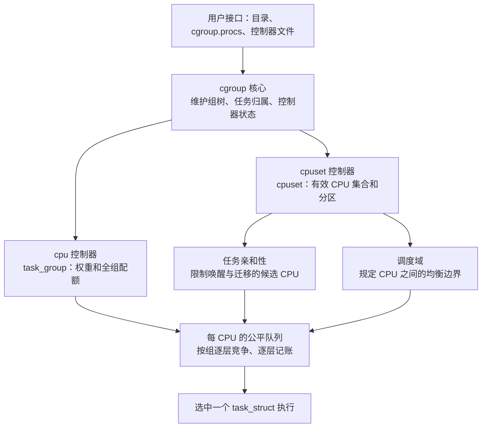

这张图对应两种工作节奏：**配置变化时建立或更新对象，任务运行时使用已经建立的对象。** `mkdir`、写文件和任务换组进入 cgroup 回调；选人、记账和负载均衡进入调度器路径。连接入口分别是 [`cpu_cgrp_subsys`](../../linux/kernel/sched/core.c#L10304) 和 [`cpuset_cgrp_subsys`](../../linux/kernel/cgroup/cpuset.c#L3884)。

一次调度可以先按三个问题理解：任务被允许去哪颗 CPU？在那颗 CPU 上，它所属的组怎样与其他组竞争？执行之后，哪些组的预算需要扣除？权重、配额和放置范围会同时约束同一个任务；后面的数据结构正是为这三个问题服务。

## 1. cpu 控制器：分配时间与限制预算

本章先认识任务组和每 CPU 竞争队列，再跟踪建组与任务迁移，最后围绕权重和配额解释运行时的时间分配。两个控制器共用的 cgroup 归属关系也在这里建立；第 2 章沿用这些对象，展开 CPU 放置。

### 1.1 核心数据结构：从一棵组树到每 CPU 的队列

下文的 C 片段保留源码成员的名称、类型和先后顺序，按本文配置展开条件编译并省略无关成员；中文注释为阅读说明，片段不是完整可编译的定义。

#### 1.1.1 `cgroup`、css 和 `css_set`：表示组与任务归属

先把问题拆成两步：**任务属于哪个目录？这个任务实际使用哪一组 CPU 调度配置？** 在 cgroup v2 中，这两个答案可能指向不同的组，因此内核用不同对象保存它们。

| 要回答的问题 | 对象或字段 | 先记住的作用 |
| ------------ | ---------- | ------------ |
| 用户创建了哪个组？ | `struct cgroup` | 对应目录，连接组的父子关系 |
| 本组自己的 cpu 状态在哪里？ | `cgroup.subsys[cpu_cgrp_id]` | 指向本组 cpu 控制器对象中的公共成员 css；本组未启用 cpu 时可以为空 |
| 任务属于哪个组、使用哪些控制器状态？ | `struct css_set` | 保存目录归属，以及各控制器实际生效的 css 指针 |
| cpu 控制器怎样实现调度配置？ | `struct task_group` | 保存组权重、配额和每 CPU 调度对象，下一小节展开 |

下面先看目录，再看控制器对象，最后把任务接进来。这里的“任务”指 `task_struct`，通常对应一个线程；多个任务可以属于同一个组。示例采用普通 domain 层级，线程子树的条件留到第 1.2.1 节。

##### （1）目录对应 `cgroup`：先建立组的父子关系

假设用户在 cgroup v2 挂载点下创建 A，再在 A 下创建 B。内核中也有三个对应的 `cgroup` 对象：

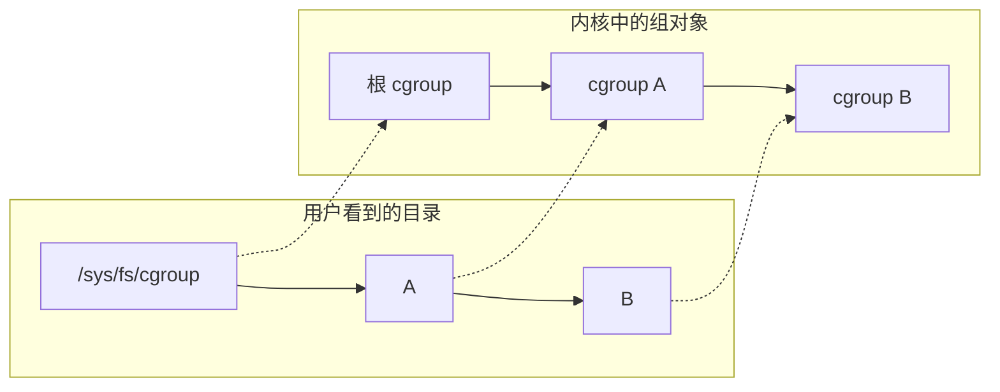

这张图先只画组的父子关系。CPU 调度配置由附着在组上的控制器对象承载。先看 [`struct cgroup`](../../linux/include/linux/cgroup-defs.h#L472) 中与目录和控制器有关的成员，目录成员见 [`kn`](../../linux/include/linux/cgroup-defs.h#L524)，控制器成员见 [`subtree_control` 与 `subsys[]`](../../linux/include/linux/cgroup-defs.h#L538)：

```c
struct cgroup {
    struct cgroup_subsys_state self; /* 组自身的公共状态，用来连接组树 */
    /* 省略其他成员 */
    struct kernfs_node *kn;          /* 对应目录的 kernfs 节点 */
    /* 省略其他成员 */
    u16 subtree_control;            /* 用户要求向子组启用哪些控制器 */
    u16 subtree_ss_mask;            /* 实际向子组启用的控制器掩码 */
    /* 省略其他成员 */
    struct cgroup_subsys_state __rcu *subsys[CGROUP_SUBSYS_COUNT];
                                    /* 本组各控制器的状态指针 */
    /* 省略其他成员 */
};
```

`self` 是内嵌对象，`subsys[]` 是指针数组。内嵌表示成员就在这个对象里面；指针表示引用另一个对象中的成员。每个控制器占一个数组槽位，cpu 使用 `cpu_cgrp_id`，cpuset 使用 `cpuset_cgrp_id`。

`subtree_control` 保存用户请求，`subtree_ss_mask` 保存实际生效的结果；后者还可能包含依赖的控制器，见 [源码中的字段说明](../../linux/include/linux/cgroup-defs.h#L531)。这里先记住：这两个开关都作用于子组，本组自己的控制器状态由 `subsys[]` 引用。

组的父关系藏在 `self.parent` 中。例如 B 的 `self.parent` 指向 A 的 `self`，所以 [`cgroup_parent()`](../../linux/include/linux/cgroup.h#L518) 要先取这个成员，再找回外层 `cgroup`：

```c
static inline struct cgroup *cgroup_parent(struct cgroup *cgrp)
{
    struct cgroup_subsys_state *parent_css = cgrp->self.parent;

    if (parent_css)
        return container_of(parent_css, struct cgroup, self);
    return NULL;
}
```

`container_of()` 在这里的意思是：“已知一个 `self` 成员的地址，找回包含它的 `cgroup`。”根组没有父组，因此返回 `NULL`。

##### （2）css 是公共成员：让 cgroup 核心找到控制器对象

css 是 **cgroup subsystem state**，对应 `struct cgroup_subsys_state`。cgroup 核心需要统一管理各种控制器，而 cpu、cpuset 的具体字段各不相同。解决办法是：每种控制器对象都内嵌一个 css，核心通过它管理归属、父关系和生命周期。

先看 [`css` 的定义](../../linux/include/linux/cgroup-defs.h#L179)，只留下这里要用的成员；子状态链表见 [`sibling / children`](../../linux/include/linux/cgroup-defs.h#L211)，父指针见 [`parent`](../../linux/include/linux/cgroup-defs.h#L244)：

```c
struct cgroup_subsys_state {
    struct cgroup *cgroup;           /* 这个状态属于哪个组 */
    struct cgroup_subsys *ss;        /* 这个状态属于哪个控制器 */
    struct percpu_ref refcnt;        /* 状态对象的引用计数 */
    /* 省略其他成员 */
    struct list_head sibling;       /* 挂到父 css 的 children 链表 */
    struct list_head children;      /* 本状态的子状态链表 */
    /* 省略其他成员 */
    struct cgroup_subsys_state *parent; /* 同一类状态的父状态 */
    /* 省略其他成员 */
};
```

`parent`、`sibling` 和 `children` 一起连接状态树，`refcnt` 则用于生命周期管理。对控制器 css 来说，这是该控制器的状态树；对 `cgroup.self` 来说，这是组自身的树。

对 cpu 来说，真正的控制器对象是 [`struct task_group`](../../linux/kernel/sched/sched.h#L472)，它把 css 放在自己的结构体里：

```c
struct task_group {
    struct cgroup_subsys_state css;
    /* 省略权重、配额和每 CPU 调度对象等成员 */
};
```

当 A 拥有自己的 cpu 状态时，对象关系如下。图中的方框分组表示对象及其成员，箭头表示指针引用：

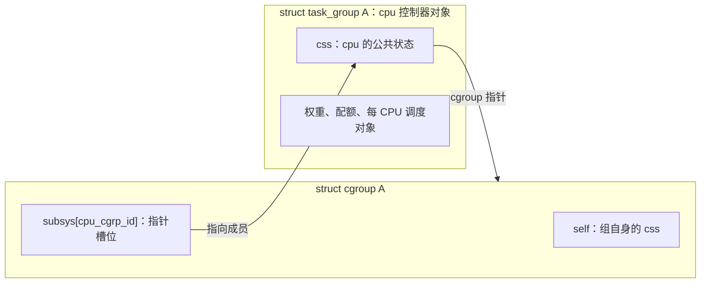

这里有两个 css，容易混淆：

| css 成员 | 作用 | `ss` 指针 | `parent` 指向谁 |
| -------- | ---- | --------- | --------------- |
| `cgroup A.self` | 表示 A 这个组，连接目录对应的组树 | `NULL` | 父组的 `self` |
| `task_group A.css` | 表示 A 的 cpu 控制器状态 | cpu 控制器 | 父 cpu 状态 |

`cgroup self.ss == NULL` 的含义写在 [`cgroup` 定义的注释](../../linux/include/linux/cgroup-defs.h#L473) 中。同一个结构体类型在这里承担两种用途，不能把 `cgroup A.self` 当成 A 的 cpu 状态。

cgroup 核心持有 css 指针，调度器则需要整个 `task_group`。转换仍用 `container_of()`，见 [`css_tg()`](../../linux/kernel/sched/sched.h#L558)：

```c
static inline struct task_group *css_tg(struct cgroup_subsys_state *css)
{
    return css ? container_of(css, struct task_group, css) : NULL;
}
```

到这里，已经可以读懂这条路径：`cgroup A.subsys[cpu_cgrp_id] → task_group A.css → css_tg() → task_group A`。cpuset 采用相同的内嵌方式，外层对象换成 `struct cpuset`，第 2 章再展开。

##### （3）任务引用 `css_set`：一次找到各控制器的有效状态

任务要访问多个控制器。内核让任务持有一个 `css_set` 指针，再由集合中的数组访问各控制器状态。多个任务满足同样的归属和状态组合时，可以共享这个集合，减少任务中的存储和 fork / exit 时的维护工作，见 [`css_set` 定义前的说明](../../linux/include/linux/cgroup-defs.h#L265)。

对应的字段摘自 [`task_struct.cgroups`](../../linux/include/linux/sched.h#L1323) 和 [`struct css_set`](../../linux/include/linux/cgroup-defs.h#L272)，任务归属与任务链表见 [`dfl_cgrp / nr_tasks / tasks`](../../linux/include/linux/cgroup-defs.h#L291)：

```c
struct task_struct {
    /* 省略其他成员 */
    struct css_set __rcu *cgroups;   /* 本任务引用的状态集合 */
    /* 省略其他成员 */
};

struct css_set {
    struct cgroup_subsys_state *subsys[CGROUP_SUBSYS_COUNT];
                                    /* 各控制器实际生效的 css */
    refcount_t refcount;             /* 集合的引用计数 */
    /* 省略其他成员 */
    struct cgroup *dfl_cgrp;         /* 任务在 v2 层级中属于哪个组 */
    int nr_tasks;                   /* 集合内部维护的任务计数 */
    struct list_head tasks;          /* 常态下引用这个集合的任务链表 */
    /* 省略其他成员 */
};
```

`refcount` 管集合本身的引用；`nr_tasks` 和 `tasks` 用于维护引用集合的任务，两者用途不同。迁移过程中还会使用其他任务链表，这里先省略。

例如两个任务都属于 A，且 A 拥有自己的 cpu 状态，可以通过同一个 `css_set` 找到 A 和 A 的 cpu 状态：

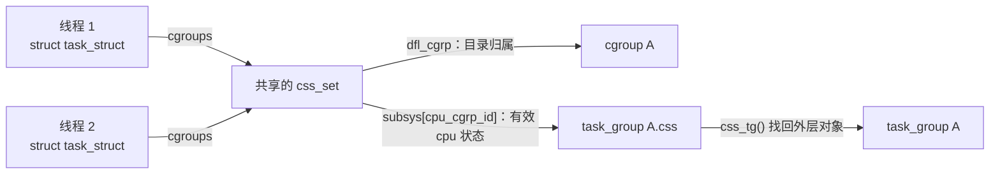

图里的两条出口分别回答开头的两个问题：`dfl_cgrp` 回答“任务属于哪个目录”，`subsys[cpu_cgrp_id]` 回答“任务使用哪个 cpu 状态”。

[`task_css_check()`](../../linux/include/linux/cgroup.h#L435) 和 [`task_css()`](../../linux/include/linux/cgroup.h#L456) 正是这条查找路径的源码表达：

```c
#define task_css_check(task, subsys_id, __c) \
    task_css_set_check((task), (__c))->subsys[(subsys_id)]

static inline struct cgroup_subsys_state *task_css(struct task_struct *task,
                                                 int subsys_id)
{
    return task_css_check(task, subsys_id, false);
}
```

因此，`task_css(p, cpu_cgrp_id)` 的作用就是从任务引用的集合中取出有效 cpu 状态。访问 `cgroups` 的 RCU 与锁检查封装在 [`task_css_set_check()`](../../linux/include/linux/cgroup.h#L415) 中；图中的箭头用于理解对象关系，实际代码通过这些辅助函数访问。

##### （4）父组启用控制器：目录归属可以比 cpu 状态更深一层

现在换一个例子，观察两个答案怎样分开。假设根组、A、B 已经存在，A 不放任务，任务放在 B 中。根组向 `cgroup.subtree_control` 写入 `+cpu`，但 A 暂时没有向子组启用 cpu：

```text
根组：subtree_control = cpu
└── A：拥有自己的 task_group A
    subtree_control 为空
    └── B：没有自己的 cpu 状态，任务使用 task_group A

B 中的任务：
  css_set.dfl_cgrp                 → cgroup B       （目录归属）
  css_set.subsys[cpu_cgrp_id]       → task_group A.css（有效 cpu 状态）
  cgroup B.subsys[cpu_cgrp_id]      → NULL           （本组没有 cpu 状态）
```

为什么根组写 `+cpu` 后，获得自己 cpu 状态的是 A？因为开关作用于**直接子组**。普通非根 domain 下，决定本组可见控制器的是父组的 `subtree_control`，见 [`cgroup_control()`](../../linux/kernel/cgroup/cgroup.c#L479)，关键取值是 [`parent->subtree_control`](../../linux/kernel/cgroup/cgroup.c#L485)。

接着在 A 的 `cgroup.subtree_control` 写入 `+cpu`，B 才获得自己的 cpu 状态。两种配置下，B 中任务的目录归属都不变：

| 配置完成后的状态 | B 的 `subsys[cpu_cgrp_id]` | B 中任务的有效 cpu 状态 | 任务的目录归属 |
| ---------------- | ------------------------ | ----------------------- | -------------- |
| 根组启用 cpu，A 未向子组启用 | `NULL` | `task_group A.css` | B |
| 根组、A 都向子组启用 cpu | `task_group B.css` | `task_group B.css` | B |

这也解释了两张同名数组的区别：**`cgroup.subsys[]` 查本组自己的状态，`css_set.subsys[]` 查任务实际使用的状态。** 对任务而言，如果本组没有 cpu 状态，就向上找到最近拥有该状态的组。允许集合中的指针指向祖先，写在 [`css_set` 的源码注释](../../linux/include/linux/cgroup-defs.h#L312) 中。

具体查找见 [`cgroup_e_css_by_mask()`](../../linux/kernel/cgroup/cgroup.c#L547)。下面保留其函数体：

```c
static struct cgroup_subsys_state *cgroup_e_css_by_mask(struct cgroup *cgrp,
                                                      struct cgroup_subsys *ss)
{
    lockdep_assert_held(&cgroup_mutex);

    if (!ss)
        return &cgrp->self;

    /* 状态正在更新，依据控制器掩码判断，不能直接测试 css 指针。 */
    while (!(cgroup_ss_mask(cgrp) & (1 << ss->id))) {
        cgrp = cgroup_parent(cgrp);
        if (!cgrp)
            return NULL;
    }

    return cgroup_css(cgrp, ss);
}
```

`1 << ss->id` 选中这个控制器对应的位。循环检查当前组是否有该控制器状态，没有就走向父组；找到后，`cgroup_css()` 取出该组的 [`subsys[ss->id]`](../../linux/kernel/cgroup/cgroup.c#L531)。cgroup 核心构造任务的新状态集合时，也用这个有效状态查找函数填充 [`template[i]`](../../linux/kernel/cgroup/cgroup.c#L1125)。所以 B 有自己的目录对象，并不意味着它一定有独立的 cpu 调度对象。

本节的连接关系可以用一条路径记住：**任务 → `css_set` → 有效 cpu css → `task_group`**；目录归属则由同一集合中的 `dfl_cgrp` 单独保存。接下来围绕 `task_group`，看它怎样连接每 CPU 的公平队列。启用和任务迁移的完整流程见第 1.2 节。

#### 1.1.2 `task_group`、`sched_entity` 和 `cfs_rq`：表示分层竞争

先只看 cpu 控制器。每个 cpu 控制器组有一个跨 CPU 共享的 `task_group`；任务则在**某一颗 CPU 的队列**里竞争。这里的“全局”指同一个组在各 CPU 间共享，不是整机所有组共用一个对象。以一个名为“业务组”的非根 cgroup 为例，它的任务组对象在每颗 CPU 上都引用两样东西：

| 对象名称 | 数据结构 | 从任务组对象的哪个字段找到它 | 作用 |
| -------- | -------- | -------------------------- | ---- |
| 业务组的公平运行队列 | `struct cfs_rq` | `task_group.cfs_rq[cpu]` 指针 | 排本组任务实体或子组实体 |
| 业务组在父层的调度实体 | `struct sched_entity` | `task_group.se[cpu]` 指针 | 进入父队列，替业务组争取时间 |

下文用“**任务组对象**”指 `struct task_group`，“**组实体**”指代表整个组的 `struct sched_entity`，“**任务实体**”指线程内嵌的 `struct sched_entity`，“**组内队列**”指 `struct cfs_rq`。线程本身则是 `struct task_struct`。例如“选中业务组实体”表示选中了一个 `sched_entity`，接下来还要进入它代表的队列，才能选到具体线程。

`cfs_rq` 是公平类运行队列；`se` 是 `sched_entity` 的简称，表示**参与调度竞争的实体**。实体既可以代表一个任务，也可以代表一个组。字段见 [`task_group`](../../linux/kernel/sched/sched.h#L472)、[`sched_entity`](../../linux/include/linux/sched.h#L570) 和 [`cfs_rq`](../../linux/kernel/sched/sched.h#L676)。源码仍沿用 `cfs_rq`、`CFS_BANDWIDTH` 等名称，本版本公平类的选人算法则是 EEVDF。

**`task_group`：组身份、每 CPU 对象数组与共享配置。** 摘自 [`struct task_group`](../../linux/kernel/sched/sched.h#L472)。

```c
struct task_group {
    struct cgroup_subsys_state css;  /* 内嵌 cpu 控制器状态 */
    int idle;                       /* cpu.idle 的组级状态 */
    struct sched_entity **se;       /* se[cpu]：在父队列中代表本组 */
    struct cfs_rq **cfs_rq;          /* cfs_rq[cpu]：本组在该 CPU 上的队列 */
    unsigned long shares;           /* cpu.weight 换算后的组权重 */
    atomic_long_t load_avg ____cacheline_aligned; /* 跨 CPU 汇总的组负荷 */
    /* 省略其他成员 */
    struct task_group *parent;
    struct list_head siblings;
    struct list_head children;      /* 调度器中的任务组树 */
    /* 省略其他成员 */
    struct cfs_bandwidth cfs_bandwidth; /* 内嵌全组唯一的配额池，见第 1.4.2 节 */
    /* 省略其他成员 */
};
```

`se`、`cfs_rq` 的类型是指针的指针，因为它们指向按 CPU 编号索引的**指针数组**；每个数组元素再指向一个独立对象。分配过程见 [`alloc_fair_sched_group()`](../../linux/kernel/sched/fair.c#L13833)。

**`sched_entity`：参与本层竞争的任务或组代表。** 权重结构摘自 [`load_weight`](../../linux/include/linux/sched.h#L455)，实体摘自 [`sched_entity`](../../linux/include/linux/sched.h#L570)，层级指针见 [`parent / cfs_rq / my_q`](../../linux/include/linux/sched.h#L598)。

```c
struct load_weight {
    unsigned long weight;           /* 实体权重 */
    u32 inv_weight;                  /* 权重倒数的缓存 */
};

struct sched_entity {
    struct load_weight load;
    struct rb_node run_node;        /* 在本层 EEVDF 红黑树上的节点 */
    u64 deadline;                   /* 本层的虚拟截止期 */
    /* 省略其他成员 */
    unsigned char on_rq;            /* 是否计入本层队列，不等于一直在树上 */
    unsigned char sched_delayed;    /* 是否处于延迟出队状态 */
    /* 省略其他成员 */
    u64 exec_start;
    u64 sum_exec_runtime;           /* 累计实际执行时间 */
    /* 省略其他成员 */
    u64 vruntime;                   /* 按权重推进的虚拟运行时间 */
    /* 省略其他成员 */
    struct sched_entity *parent;    /* 本 CPU 上的上一层组代表 */
    struct cfs_rq *cfs_rq;          /* 我在哪个队列里竞争 */
    struct cfs_rq *my_q;            /* 我代表哪个子队列；任务实体为 NULL */
    /* 省略其他成员 */
    struct sched_avg avg;           /* 本实体的 PELT 负荷历史 */
};
```

先把实体看成一个“带着权重和时间账本的竞争者”：`load` 保存权重，`sum_exec_runtime` 记录实际执行时间，`vruntime / deadline` 用于本层公平选人。`parent / cfs_rq / my_q` 连接层级；PELT 负荷历史在第 1.3.4 节展开。

**`cfs_rq`：一颗 CPU 上、一个组的一层公平队列。** 摘自 [`struct cfs_rq`](../../linux/kernel/sched/sched.h#L676)，组负荷贡献见 [`tg_load_avg_contrib`](../../linux/kernel/sched/sched.h#L718)，归属指针见 [`rq / tg`](../../linux/kernel/sched/sched.h#L734)。这里先保留竞争与归属字段，带宽字段在第 1.4.2 节介绍。

```c
struct cfs_rq {
    struct load_weight load;        /* 本层实体的汇总权重 */
    unsigned int nr_queued;         /* 本层实体数，包含正在执行的实体 */
    unsigned int h_nr_queued;       /* 子树中仍计入队列的任务数，包含 delayed */
    unsigned int h_nr_runnable;     /* 排除 delayed 的层级可运行任务数 */
    unsigned int h_nr_idle;
    /* 省略其他成员 */
    struct rb_root_cached tasks_timeline; /* 本层的 EEVDF 红黑树 */
    struct sched_entity *curr;      /* 当前执行的本层实体，可能是组代表 */
    /* 省略其他成员 */
    struct sched_avg avg;
    /* 省略其他成员 */
    unsigned long tg_load_avg_contrib; /* 本队列对全组负荷的贡献 */
    /* 省略其他成员 */
    struct rq *rq;                  /* 所在 CPU 的总运行队列 */
    /* 省略其他成员 */
    struct task_group *tg;          /* 拥有本队列的任务组 */
    int idle;                       /* 本组 idle 状态的本地副本 */
    /* 省略带宽等成员，见第 1.4.2 节 */
};
```

`tasks_timeline` 和 `curr` 描述本层竞争，`nr_queued` 与 `h_nr_*` 分别数本层实体和层级任务，具体区别见第 1.3.5 节。`rq` 回答“在哪颗 CPU”，`tg` 回答“属于哪个组”。

这里的“在队列上”比“在红黑树里”范围更大。`se.on_rq = 1` 表示实体仍计入这一层公平队列：它可以在树中等待，也可以正由 `cfs_rq.curr` 引用。选中实体准备执行时，[`set_next_entity()`](../../linux/kernel/sched/fair.c#L5636) 会把它从树中取下，但它仍计入队列；让出 CPU 后若仍可运行，再由 [`put_prev_entity()`](../../linux/kernel/sched/fair.c#L5712) 插回。因此“树里没有它”不能单独证明它已退出竞争。

**`rq`：整颗 CPU 的总运行队列。** 它内嵌根公平队列，也保存其他调度类队列；这里只摘出与本文关系图有关的成员，见 [`struct rq`](../../linux/kernel/sched/sched.h#L1120)、[根公平队列](../../linux/kernel/sched/sched.h#L1148) 和 [调度域指针](../../linux/kernel/sched/sched.h#L1209)。

```c
struct rq {
    raw_spinlock_t __lock;          /* 保护这颗 CPU 的调度状态 */
    unsigned int nr_running;
    /* 省略其他成员 */
    struct cfs_rq cfs;              /* 内嵌根公平队列 */
    /* 省略其他成员 */
    struct sched_domain __rcu *sd;  /* 这颗 CPU 的负载均衡域入口 */
    /* 省略其他成员 */
    int cpu;
    /* 省略其他成员 */
};
```

每颗 CPU 的公平竞争从 `rq.cfs` 开始，再沿组实体进入子队列；`rq.sd` 则连接 CPU 之间的均衡范围，第 2.5 节会用它解释分区。

下面假设业务组是根组的直接子组，画出它在 CPU 0 上的**字段连接关系**。节点先写对象的用途，再写数据结构类型；箭头标出连接字段。CPU 1 上会另有一套组实体和组内队列，由同一个任务组对象的 `se[1]`、`cfs_rq[1]` 引用。

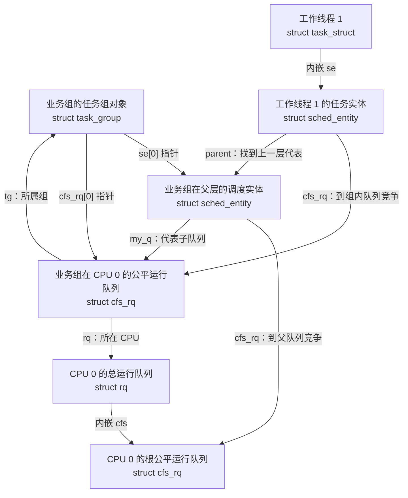

如果业务组有两个工作线程，另一个批处理组有一个批处理线程，根队列比较的是业务组实体与批处理组实体；进入业务组的队列之后，才比较两个工作线程的任务实体。因此业务组增加线程，首先增加的是本组队列中的竞争者。

指针也沿这张图连接：

| 从哪个对象出发 | 指针字段 | 指向哪个对象 |
| -------------- | -------- | ------------ |
| 工作线程 1 的任务实体（`sched_entity`） | `cfs_rq` | 业务组的公平运行队列（`cfs_rq`），任务实体在这里竞争 |
| 业务组在父层的调度实体（`sched_entity`） | `my_q` | 业务组的公平运行队列（`cfs_rq`），组实体胜出后进入这里 |
| 工作线程 1 的任务实体（`sched_entity`） | `parent` | 业务组在父层的调度实体（`sched_entity`），向上一层记账时使用 |

任务实体没有子队列，`my_q == NULL`；内核用 [`entity_is_task()`](../../linux/kernel/sched/sched.h#L923) 区分任务和组。根组直接用每 CPU 的 `rq->cfs`，没有向上参赛的根组实体，见 [根组初始化](../../linux/kernel/sched/core.c#L8764)。建组时的指针连接见 [`init_tg_cfs_entry()`](../../linux/kernel/sched/fair.c#L13926)。

这里先沿 `se.cfs_rq`、`se.my_q`、`se.parent` 三个指针读懂竞争层级，再在第 1.3 节跟踪这些对象的入队、选人和记账。

#### 1.1.3 `task_struct`：把任务归属接到竞争层级

任务通过 `cgroups` 找到有效 cpu 控制器状态，调度热路径通过 `sched_task_group` 访问所属任务组，再由内嵌的 `se` 接到当前 CPU 的公平队列。成员见 [`task_struct`](../../linux/include/linux/sched.h#L815)、[组与限流成员](../../linux/include/linux/sched.h#L881) 和 [cgroup 成员](../../linux/include/linux/sched.h#L1321)。

```c
struct task_struct {
    /* 省略其他成员 */
    int on_rq;                      /* 任务的运行队列状态 */
    /* 省略其他成员 */
    struct sched_entity se;          /* 内嵌任务自己的公平调度实体 */
    /* 省略其他成员 */
    struct task_group *sched_task_group; /* sched_move_task() 更新的组副本 */
    /* 省略限流、亲和性等成员，见第 1.4.5、2.6 节 */
    struct css_set __rcu *cgroups;   /* 本任务使用的控制器状态集合 */
    struct list_head cg_list;       /* 挂入 css_set 的任务链表 */
    /* 省略其他成员 */
};
```

`cgroups / cg_list` 把任务接到 cgroup 的归属管理，`sched_task_group / se` 把任务接到调度器的竞争层级。`on_rq` 是任务层面的状态，和 `se.on_rq` 的实体层面状态需要分开看；限流时的区别见第 1.4.5.4 节。

图中假设 A 已有自己的 cpu 状态，且任务换组已经完成。任务共享 `css_set`，不直接内嵌 `task_group`：

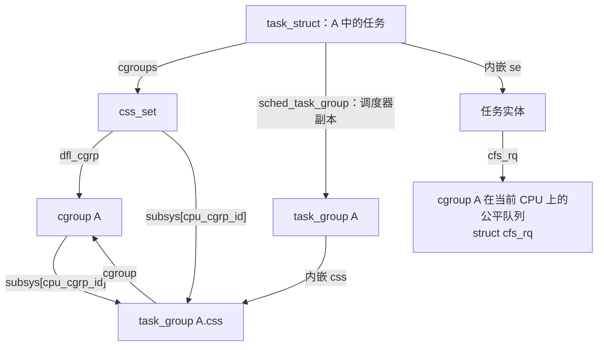

css 指针指向外层对象中的成员，内核通过 [`css_tg()`](../../linux/kernel/sched/sched.h#L558) 的 `container_of()` 找回 `task_group`。`sched_task_group` 的更新与 `css_set` 更换并非同一步，热路径使用这个副本的原因见 [源码注释](../../linux/kernel/sched/sched.h#L2159) 和第 1.2.3 节。

为什么还要多存一个指针？换组存在一个短窗口：`p->cgroups` 已经指向新状态集合，任务的调度实体却还没从旧组搬走。如果此时记账直接按新 css 找组，组身份就可能与队列位置不一致。`sched_task_group` 随调度器搬家，在任务锁和 rq 锁保护下更新，让调度路径使用与当前队列关系匹配的组身份。这里复制的是**指针**，没有复制整个 `task_group`。

| 任务字段 | 用途 | 谁更新它 |
| -------- | ---- | -------- |
| `cgroups` | 通过 `css_set` 找到有效 cpu 状态 | cgroup 核心的迁移流程 |
| `sched_task_group` | 调度器使用的 cpu 组副本 | `sched_move_task()` |
| `se.cfs_rq / se.parent` | 接入本组在当前 CPU 上的竞争层级 | `set_task_rq()` |

cpu 换组改变任务的竞争关系；任务允许使用哪些 CPU，由第 2 章的 cpuset 与用户亲和性共同约束。

#### 1.1.4 时间预算状态：全组共享，每 CPU 记账

前面画出了竞争对象。要限制执行预算，还需要全组共享池、每 CPU 本地余额，以及额度耗尽时的限流状态；具体字段和运行循环在第 1.4 节展开。

| 需求 | 全组对象 | 每 CPU 或每任务结果 |
| ---- | -------- | ------------------- |
| 控制执行预算 | `task_group.cfs_bandwidth`：全组一个共享池 | `cfs_rq.runtime_remaining`：本地领取的余额 |
| 因预算不足暂停任务 | 共享池的 `throttled_cfs_rq`：受限队列链表 | 叶子队列的 `throttled_limbo_list`：暂时退出竞争的任务 |

字段见 [`cfs_bandwidth`](../../linux/kernel/sched/sched.h#L445) 和 [`cfs_rq`](../../linux/kernel/sched/sched.h#L751)。现在可以把 cpu 控制器中的对象放在同一张逻辑图里：

```text
业务组的任务组对象（struct task_group）：组权重 + 全组预算池
  ├── CPU 0：组实体（sched_entity）→ 组内队列（cfs_rq），队列保存本地余额
  └── CPU 1：组实体（sched_entity）→ 组内队列（cfs_rq），队列保存本地余额

业务组的工作线程（struct task_struct）
  cgroups          → css_set，保存有效 cpu 状态指针
  sched_task_group → 业务组的任务组对象（task_group）
  内嵌 se（sched_entity）
    └── cfs_rq     → 业务组在该线程当前 CPU 上的公平运行队列（cfs_rq）
```

**组对象是全局的，竞争队列和本地余额是每 CPU 的，任务通过组身份接入当前 CPU 的竞争层级。** 后面的建组、选人和配额循环都围绕这些关系展开。

### 1.2 配置怎样建立这些对象：启用、建组和迁移

理解了对象，先跟一条配置路径：父组启用控制器，子组获得状态，任务迁入后接到对应队列。这一步完成后，调度器才有第 1.3～1.4 节要使用的竞争层级和预算状态。

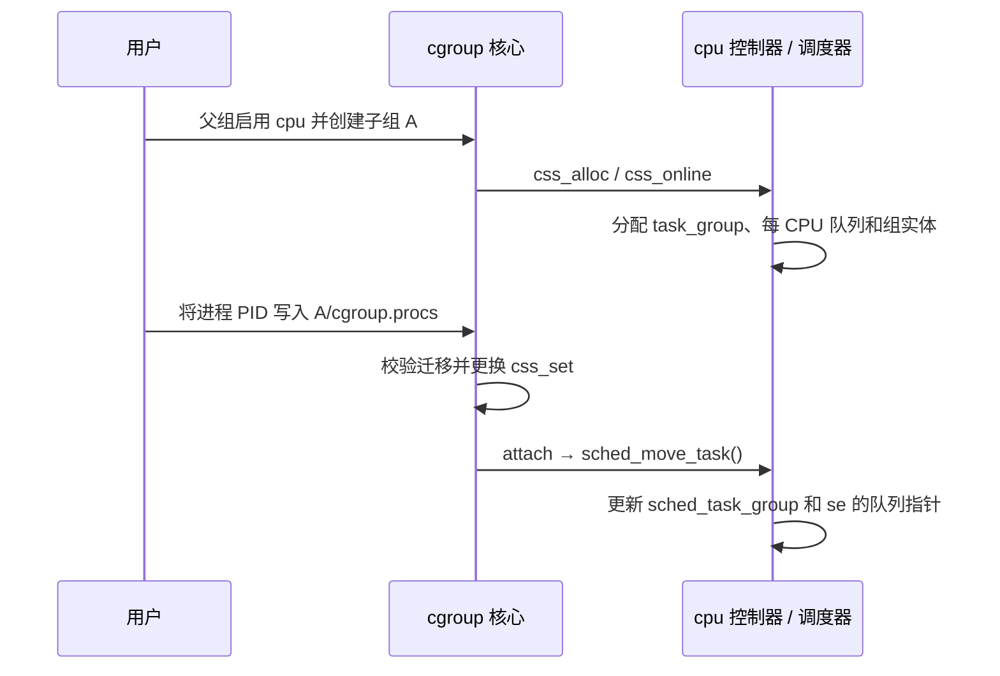

图中只展开 cpu 控制器的回调；同一次迁移中的 cpuset 回调见第 2.1、2.6 节。

#### 1.2.1 父组启用控制器，cgroup 核心通过回调连接 sched

本章启用 cpu 控制器时，向父组的 `cgroup.subtree_control` 写入 `+cpu`，停用用 `-cpu`。A 自己的开关改变子组的控制器状态，见 [核心注释](../../linux/kernel/cgroup/cgroup.c#L3200)。

`cpu` 和 `cpuset` 都把 `.threaded = true` 写进控制器描述表，见 [`cpu_cgrp_subsys`](../../linux/kernel/sched/core.c#L10304) 和 [`cpuset_cgrp_subsys`](../../linux/kernel/cgroup/cpuset.c#L3884)。这里的 domain 指普通的资源域；线程子树允许在支持线程控制的控制器下，按线程组织竞争。`.threaded = true` 表示控制器支持这种组织方式，启用时还要区分两种情况：

- 普通非根 domain 若不满足线程子树条件，有内部任务时不能继续向子组启用控制器，否则返回 `-EBUSY`。
- 对 cpu、cpuset 这样的线程控制器，已经是 threaded 的组，或者**有资格成为线程根**的 domain，可以容纳内部竞争。后者不要求提前创建 threaded 子组；它要求没有已启用的域控制器，也没有已被任务占用的 domain 子组。

检查顺序见 [`cgroup_vet_subtree_control_enable()`](../../linux/kernel/cgroup/cgroup.c#L3503)，线程根资格见 [`cgroup_can_be_thread_root()`](../../linux/kernel/cgroup/cgroup.c#L417)。例如 A 内已有任务，且满足上述资格，此时向 A 写入 `+cpu` 可以成功；A 同时具有任务和已启用的线程控制器后，会被 [`cgroup_is_thread_root()`](../../linux/kernel/cgroup/cgroup.c#L449) 识别为线程根。因此不能把规则背成“非根组有任务就一定不能写 `+cpu`”。根组另有豁免，可以同时作为线程根和普通资源域的父组。

向 `cgroup.procs` 写入 PID，迁移的是该进程的**整个线程组**，见 [`cgroup_procs_write()`](../../linux/kernel/cgroup/cgroup.c#L5437) 传入的 `threadgroup = true`。需要在同一资源域内按线程迁移时，使用 [`cgroup.threads`](../../linux/kernel/cgroup/cgroup.c#L5448)，它传入 `false`，且受 [资源域边界检查](../../linux/kernel/cgroup/cgroup.c#L5384) 约束。下文按单个 `task_struct` 跟踪回调；一次进程迁移会对其中各线程执行这些操作。

任务迁入新组时，cgroup 核心会换一份 `css_set`，再回调各控制器的 `attach`。cpuset 的回调负责在有效集合变化时更新任务亲和性，见第 2.6 节。

sched 用一张 [`cpu_cgrp_subsys`](../../linux/kernel/sched/core.c#L10304) 接到 cgroup 核心。cgroup 发生生命周期事件时，调用这些回调；调度器内部并不去解析 cgroup 目录。

| 回调 | 函数 | sched 做什么 |
| ---- | ---- | ------------ |
| `css_alloc` | [`cpu_cgroup_css_alloc()`](../../linux/kernel/sched/core.c#L9257) | 根组返回已有的 `root_task_group.css`；否则 `sched_create_group()` |
| `css_online` | [`cpu_cgroup_css_online()`](../../linux/kernel/sched/core.c#L9275) | `sched_online_group()`，把组挂进调度器可见的树 |
| `css_released` | [`cpu_cgroup_css_released()`](../../linux/kernel/sched/core.c#L9305) | `sched_release_group()`，从树上摘掉 |
| `css_free` | [`cpu_cgroup_css_free()`](../../linux/kernel/sched/core.c#L9312) | `sched_unregister_group()`，清理队列并延后释放对象 |
| `can_attach` | [`cpu_cgroup_can_attach()`](../../linux/kernel/sched/core.c#L9322) | RT 组调度编译且运行时启用时，检查 RT 任务能否进入该组 |
| `attach` | [`cpu_cgroup_attach()`](../../linux/kernel/sched/core.c#L9340) | 对每个任务调用 `sched_move_task()` |
| `dfl_cftypes` | [`cpu_files[]`](../../linux/kernel/sched/core.c#L10252) | v2 的 `cpu.weight` / `cpu.max` / `cpu.idle` 等文件 |
| `css_extra_stat_show` | [`cpu_extra_stat_show()`](../../linux/kernel/sched/core.c#L10088) | `cpu.stat` 里的带宽附加项 |

`.early_init = true` 表示启动很早就建好根组；`.threaded = true` 表示它可以和线程模式的 cgroup 一起用。cgroup 核心不会直接改 `se.load.weight` 或 `cfs_rq.runtime_remaining`，那些是回调进 sched 之后才发生的事。

```text
用户 mkdir /sys/fs/cgroup/A
  └─ cgroup 核心创建 struct cgroup
       └─ 父组 subtree_control 含 cpu
            └─ cpu_cgroup_css_alloc() → task_group A
            └─ cpu_cgroup_css_online() → 挂到 root_task_group 下

用户 echo PID > A/cgroup.procs
  └─ 任务换 css_set
       └─ cpu_cgroup_attach()
            └─ sched_move_task()：任务改挂到 A 在当前 CPU 上的 cfs_rq
```

#### 1.2.2 建组时分配每 CPU 对象，删除时延后释放

[`sched_create_group()`](../../linux/kernel/sched/core.c#L9125) 从 `task_group_cache` 分配 `task_group`，再调用 [`alloc_fair_sched_group()`](../../linux/kernel/sched/fair.c#L13833)：为每颗 possible CPU（系统可能使用的 CPU，包含当前离线者）分配一对 `cfs_rq` / `sched_entity`，默认 `shares = NICE_0_LOAD`（对应 `cpu.weight = 100`），并 [`init_cfs_bandwidth()`](../../linux/kernel/sched/fair.c#L6695) 把配额池初始化为无限。池子怎样领额度、怎样限流，见第 1.4 节。

[`init_tg_cfs_entry()`](../../linux/kernel/sched/fair.c#L13926) 把这一对对象接进父组：

| 指针 | 含义 |
| ---- | ---- |
| `cfs_rq->tg` / `cfs_rq->rq` | 这个队列属于哪个组、哪颗 CPU |
| `se->cfs_rq` | 组实体到父队列参赛 |
| `se->my_q` | 组实体代表的子队列；选中后沿这里往下走 |
| `se->parent` | 父组在同一颗 CPU 上的组实体；根组下一层的 parent 为 NULL |

根组是特例：每 CPU 直接用 `rq->cfs`，`root_task_group.se[cpu] == NULL`，不再构造一个参加更高层竞争的根组实体，见 [根组初始化](../../linux/kernel/sched/core.c#L8764)。按本文关闭 autogroup 的假设，根组公平任务直接在 `rq->cfs` 上，和子组的组实体一起竞争。

[`sched_online_group()`](../../linux/kernel/sched/core.c#L9149) 把新组链到 `parent->children`，再 [`online_fair_sched_group()`](../../linux/kernel/sched/fair.c#L13874) 建立各 CPU 的实体负荷关联，并同步祖先限流状态。队列指针此前已由 `init_tg_cfs_entry()` 接好。分配了对象不等于已经在树上排队：组实体只在该 CPU 上真有可运行子孙时，才由入队路径插进父队列。

删除组时，`css_released` 中的 [`sched_release_group()`](../../linux/kernel/sched/core.c#L9180) 先从树上摘掉，等待 RCU 宽限期后，`css_free` 调用 `sched_unregister_group()` 取消带宽定时器、移除队列的统计关联；再等一次 RCU 宽限期才真正释放每 CPU 对象，见 [`sched_unregister_group()`](../../linux/kernel/sched/core.c#L9113)。带宽定时器可能还在遍历组树，统计读取也可能持有对象，不能在 offline 当下立刻 kfree。

#### 1.2.3 任务换组：先更换 css_set，再更新调度器副本

调度热路径不直接读 `task_css()`。任务身上有一份 [`p->sched_task_group`](../../linux/kernel/sched/sched.h#L2172)，由 `sched_move_task()` 在 rq 锁里更新。换 CPU 或换组时，[`set_task_rq()`](../../linux/kernel/sched/sched.h#L2178) 把 `se.cfs_rq`、`se.parent` 改成目标组在目标 CPU 上的那一对对象。

把 PID 写入 `cgroup.procs` 后，cgroup 核心先换好 `css_set`，再回调 [`cpu_cgroup_attach()`](../../linux/kernel/sched/core.c#L9340)。sched 侧真正搬家的是 [`sched_move_task()`](../../linux/kernel/sched/core.c#L9232)：

1. 锁住任务当前 rq，更新时钟。
2. 若任务正在排队，先按 `DEQUEUE_SAVE | DEQUEUE_MOVE` 公平出队，账本留下。
3. [`sched_change_group()`](../../linux/kernel/sched/core.c#L9203) 从新的 cpu css 取出 `task_group`，写入 `p->sched_task_group`。若额外启用 autogroup，只有 cpu css 指向根任务组时才可能改挂自动组；非根 cpu 组不会被覆盖，见 [`task_wants_autogroup()`](../../linux/kernel/sched/autogroup.c#L131)。
4. 公平类 [`task_change_group_fair()`](../../linux/kernel/sched/fair.c#L13801) 解除旧队列的负荷关联，`set_task_rq()` 接到新组当前 CPU 的队列，再建立新队列的负荷关联；这里的 attach / detach 维护的是 PELT，不等同于实体入队、出队。
5. 若原先在运行队列上，由 [`sched_change_end()`](../../linux/kernel/sched/core.c#L10933) 恢复入队；睡眠任务仍保持睡眠。原先正在运行则再请求重调度，下一轮按新组的权重和配额选人。

还没被 `wake_up_new_task()` 唤醒的 `TASK_NEW` 任务，此时只更新 `sched_task_group`；`task_change_group_fair()` 直接返回，连 `set_task_rq()` 都暂不执行，见 [提前返回](../../linux/kernel/sched/fair.c#L13807)。每 CPU 队列指针等到[首次唤醒的选核流程](../../linux/kernel/sched/core.c#L4849)调用 `__set_task_cpu()` → `set_task_rq()` 再接好。

cpu 控制器的换组回调不改任务亲和性。任务能跑哪颗 CPU 仍由 cpuset 和用户亲和性决定；cpu 控制器只改它在**当前这颗 CPU**上跟谁竞争、按什么份额竞争。同一次 cgroup 迁移也可能触发 cpuset 的 attach，不能因此断言整个迁移过程不改亲和性。

### 1.3 分层公平调度：组怎样分享 CPU 时间

前面已经把任务接到了组内队列。这一节先用一颗 CPU 看清分层份额，再解释入队、选人和记账，最后展开配置换算与多 CPU 负荷修正。

#### 1.3.1 一颗 CPU 上，先分组份额，再分任务份额

看一个简化场景：只有一颗 CPU，业务组和批处理组的线程持续可运行，没有配额限制，也没有其他调度类干扰。两个 cgroup 的 `cpu.weight` 分别为 100、300；业务组有工作线程 1、工作线程 2，都是 nice 0，批处理组只有一个批处理线程。每个线程是一个 `task_struct`，以其中内嵌的 `sched_entity` 参与组内竞争。nice 用来调整任务级的相对权重，这里取相同值，方便观察组与组之间的分配。

| 竞争发生在哪里 | 比较什么 | 长期时间份额近似 |
| -------------- | -------- | ---------------- |
| 根公平队列（`cfs_rq`） | 业务组实体、批处理组实体，组权重比为 100 : 300 | 业务组得 1/4，批处理组得 3/4 |
| 业务组的公平队列（`cfs_rq`） | 两个工作线程的任务实体，权重比为 1024 : 1024（未缩放值） | 每个工作线程得本组的一半，即整颗 CPU 的 1/8 |
| 批处理组的公平队列（`cfs_rq`） | 只有批处理线程的任务实体 | 批处理线程得整颗 CPU 的 3/4 |

表中的 100、300 是 `cpu.weight` 接口值，1024 是 nice 0 的任务权重，不能拿它们跨层相加。x86-64 实际还通过 [`scale_load()`](../../linux/kernel/sched/sched.h#L148) 放大内部权重以保留计算精度；上表省略这一共同缩放，不影响比例。

业务组多建线程，会继续切分本组的份额；不会直接把本组的配置权重变大。改变工作线程 1 的 nice，主要改变业务组内部的分配。批处理线程睡眠后，业务组可以使用空出来的 CPU 时间，所以权重**不提供固定预留或执行上限**。组 shares 如何进入实体权重，见 [`calc_group_shares()`](../../linux/kernel/sched/fair.c#L4086)。

多 CPU 时，每颗 CPU 的组实体权重还要结合本地负荷计算，不能把上表直接套到全机；具体公式留到第 1.3.4 节。

#### 1.3.2 入队向上，选人向下，记账沿祖先链

仍用上面的业务组。它在 CPU 0 上的公平队列原来为空，工作线程 1 第一次被唤醒时，要把该线程的**任务实体**放入业务组队列，也要把业务组的**组实体**放入根队列。之后工作线程 2 被唤醒，只增加业务组队列里的竞争者，业务组实体不用重复入队。两种实体的数据结构都是 `struct sched_entity`，代表的对象不同。

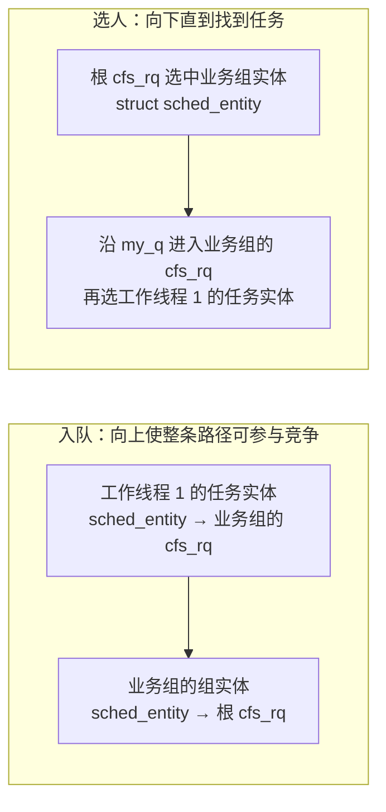

入队入口是 [`enqueue_task_fair()`](../../linux/kernel/sched/fair.c#L7080)，选人入口是 [`pick_task_fair()`](../../linux/kernel/sched/fair.c#L9104)。先记住方向：**入队沿 `se.parent` 向上接好各层排队关系，选人从 `rq->cfs` 开始，沿选中实体的 `se.my_q` 向下，直到遇到任务实体。** 下面把“选人向下”展开成一次完整的调度。

##### 1.3.2.1 从根到子组，实际走的是哪几个对象

把业务组再分成“请求处理组”和“后台维护组”。先只看 cgroup 目录和线程归属：

```text
根 cgroup                         ← 管理线程
├── 业务组 cgroup
│   ├── 请求处理组 cgroup          ← 工作线程 1、工作线程 2
│   └── 后台维护组 cgroup          ← 维护线程
└── 批处理组 cgroup                ← 批处理线程
```

目录对应 `struct cgroup`，各组的 cpu 控制器状态由 `struct task_group` 承载，线程对应 `struct task_struct`。假设各级已经启用相应的 cpu 控制器状态，所有线程都在 CPU 0 上参与公平竞争，暂时没有限流和延迟出队。业务组只放子组；根组的管理线程可以直接进入根公平队列，见 [根任务组的初始化说明](../../linux/kernel/sched/core.c#L8761)。

本轮先选中**业务组的组实体**，再选中**请求处理组的组实体**，最后选中**工作线程 2 的任务实体**。这三次选出的都是 `struct sched_entity`；只有最后一个实体内嵌在线程的 `task_struct` 中，才能从它找到要运行的线程。

下图单独画这条胜出路径。每层“候选”都指计入该层队列的 `sched_entity`，包含仍在竞争的 `curr`，不只指红黑树中的节点：

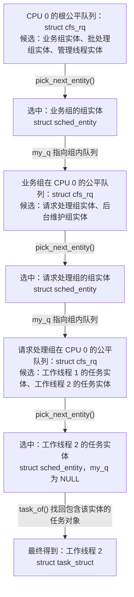

每次只进入本层胜出实体代表的子队列。根队列选中业务组实体后，本轮继续在业务组队列里选择；批处理线程的任务实体不会拿来与请求处理组内的工作线程实体比较。各层都有自己的虚拟时间和截止期，不能跨层排成一张任务列表。

以**请求处理组的组实体（`struct sched_entity`）**为起点，第 1.1.2 节的三个指针在这里各有明确方向：

| 指针字段 | 指向的对象及类型 | 在本流程中的用途 |
| -------- | ---------------- | ---------------- |
| `cfs_rq` | 业务组的公平队列（`struct cfs_rq`） | 请求处理组实体在这个父队列中竞争 |
| `my_q` | 请求处理组的公平队列（`struct cfs_rq`） | 本组实体胜出后，进入这里选择工作线程实体 |
| `parent` | 业务组的组实体（`struct sched_entity`） | 切换实体、入队和记账时向上找到父组实体 |

这些指针由 [`init_tg_cfs_entry()`](../../linux/kernel/sched/fair.c#L13943) 建立。任务实体的 `my_q == NULL`，这正是 [`entity_is_task()`](../../linux/kernel/sched/sched.h#L923) 的判断条件；根组没有自己的组实体，起点直接是 `rq->cfs`。这里遍历的是**当前 CPU 上已经建立好的调度队列层级**，不会在每次调度时扫描 cgroup 目录或 `task_group.children`。没有独立 cpu 状态的目录，也不会凭空增加一层公平队列，见第 1.1.1 节。

##### 1.3.2.2 从调度入口进入 `pick_task_fair()` 的向下循环

先把本节放回一次 CPU 调度中。以下沿未启用 core scheduling 的路径阅读；[`pick_next_task()`](../../linux/kernel/sched/core.c#L6076) 在它未启用时进入 `__pick_next_task()`，未编译该功能时也[直接进入同一函数](../../linux/kernel/sched/core.c#L6519)。这条调用链关注“下一任务是谁”：

```text
__schedule()
  → pick_next_task()
    → __pick_next_task()
      → pick_next_task_fair()       公平类快速路径直接调用
        → pick_task_fair()         从根队列逐层选出 task_struct
        → 更新旧、新任务路径上的当前实体
  → 若 next != prev，执行 context_switch()
```

调度核心在 [`__schedule()`](../../linux/kernel/sched/core.c#L6904) 中发起选择。[`__pick_next_task()` 的快速路径](../../linux/kernel/sched/core.c#L5989) 要求上一调度类不高于 fair，且本 CPU 的运行任务计数满足“全部属于公平类”的条件；否则按调度类顺序选择。走到公平类回调时，经 [`__pick_next_task_fair()`](../../linux/kernel/sched/fair.c#L9223) 仍会进入 `pick_next_task_fair()`。因此这里的“从根往下选”是**公平类内部**的选择过程，不代替调度类之间的优先级选择。

下面保留 [`pick_task_fair()`](../../linux/kernel/sched/fair.c#L9104) 的实际控制流程，仅将注释改成阅读说明：

```c
static struct task_struct *pick_task_fair(struct rq *rq)
{
    struct sched_entity *se;       /* 本层选出的组实体或任务实体 */
    struct cfs_rq *cfs_rq;         /* 当前正在选择实体的公平队列 */
    struct task_struct *p;         /* 最终选出的线程 */
    bool throttled;               /* 选中路径上是否有队列受限 */

again:
    cfs_rq = &rq->cfs;              /* 每次重新选择都从本 CPU 根队列开始 */
    if (!cfs_rq->nr_queued)
        return NULL;

    throttled = false;

    do {
        /* 旧的当前实体可能尚未放回树中，先结算它已使用的时间。 */
        if (cfs_rq->curr && cfs_rq->curr->on_rq)
            update_curr(cfs_rq);

        throttled |= check_cfs_rq_runtime(cfs_rq);

        se = pick_next_entity(rq, cfs_rq, true);
        if (!se)
            goto again;
        cfs_rq = group_cfs_rq(se);  /* 返回 se->my_q */
    } while (cfs_rq);

    p = task_of(se);               /* 最后一个 se 必须是任务实体 */
    if (unlikely(throttled))
        task_throttle_setup_work(p);
    return p;
}
```

沿上一小节的示例，循环变量的变化如下。整个向下过程都留在 CPU 0，表中的队列和组实体都是这颗 CPU 上的对象：

| 第几轮 | 当前队列：`cfs_rq` 指向的 `struct cfs_rq` | 选中实体：`se` 指向的 `struct sched_entity` | 沿实体的 `my_q` 走向哪里 |
| ------ | ---------------------------------------- | ------------------------------------------ | ---------------------- |
| 1 | 根公平队列，即 `rq->cfs` | 业务组的组实体 | 业务组的公平队列 |
| 2 | 业务组的公平队列 | 请求处理组的组实体 | 请求处理组的公平队列 |
| 3 | 请求处理组的公平队列 | 工作线程 2 的任务实体 | `NULL`，结束循环 |

[`group_cfs_rq()`](../../linux/kernel/sched/sched.h#L1624) 只返回 `se->my_q`，没有再搜索子组；[`task_of()`](../../linux/kernel/sched/sched.h#L1606) 用 `container_of()` 从任务内嵌的 `se` 找回 `task_struct`。第三轮结束后，`p` 就指向工作线程 2 的任务对象。因此循环的终止条件是“选中了没有子队列的实体”。若第一轮直接选中根组管理线程的任务实体，同样会立即结束，不要求线程一定在最深层目录。

##### 1.3.2.3 每一层怎样选出一个实体

选择“业务组的组实体”与选择“工作线程 2 的任务实体”，使用同一套实体选择算法。[`pick_next_entity()`](../../linux/kernel/sched/fair.c#L5683) 调用 [`pick_eevdf()`](../../linux/kernel/sched/fair.c#L1015)，算法只接收当前这一层的 `cfs_rq`；每层实际比较的都是 `sched_entity` 对象。

先按下面的顺序理解本层选择：

1. **先更新本层当前实体。** `pick_task_fair()` 在选择前调用 `update_curr()`，把刚消耗的执行时间计入当前实体的 `vruntime`，更新截止期，并进行本层带宽记账，见 [`update_curr()`](../../linux/kernel/sched/fair.c#L1302)。例如工作线程 1 原来在运行：根队列更新业务组实体，业务组队列更新请求处理组实体，请求处理组队列才更新工作线程 1 的任务实体。
2. **在本层判断谁有资格。** EEVDF 的 eligible 表示实体相对本层公平进度没有超额获得服务，概念上满足 `lag >= 0`。判断使用本层的加权虚拟时间，见 [`vruntime_eligible()`](../../linux/kernel/sched/fair.c#L790)。业务组实体是否 eligible，在根队列判断；工作线程 2 的任务实体是否 eligible，在请求处理组队列判断。
3. **在有资格的实体中比较虚拟截止期。** 红黑树按 deadline 排序，并用子树的 `min_vruntime` 帮助跳过没有 eligible 实体的分支，见 [`pick_eevdf()` 的搜索](../../linux/kernel/sched/fair.c#L1045)。因此不是每次都取最小 `vruntime`，也不能不检查资格就取树的最左节点。
4. **同时考虑仍在竞争的 `curr`。** 当前实体通常不在树中，算法单独检查它；传入 `protect = true` 时，符合资格且保护时间尚未结束的当前实体可以直接胜出。若没有提前返回，则在树搜索后将仍有资格的当前实体与树中结果比较，见 [当前实体处理](../../linux/kernel/sched/fair.c#L1039)和[最终比较](../../linux/kernel/sched/fair.c#L1079)。

实际源码还有[只有一个实体时直接选择](../../linux/kernel/sched/fair.c#L1022)和启用 `PICK_BUDDY` 后的[候选优先路径](../../linux/kernel/sched/fair.c#L1029)。所以上面的 eligible 与截止期是理解公平选择的基础，不能省略这些分支，把实现写成“每次严格取最早截止期”。EEVDF 的公式和树搜索详见 [eevdf.md](eevdf.md)。

`cpu.weight` 通过组实体权重影响虚拟时间推进速度和虚拟截止期，见 [`update_curr()`](../../linux/kernel/sched/fair.c#L1306) 与 [`update_deadline()`](../../linux/kernel/sched/fair.c#L1130)。调度器不会先把各组 `cpu.weight` 排序，再固定选择权重最大的组。示例里即使工作线程 2 在本组中最应运行，也要先有业务组实体在根队列胜出、请求处理组实体在业务组队列胜出，才能轮到工作线程 2 的任务实体参与本轮最终选择。

##### 1.3.2.4 延迟出队、带宽耗尽和空队列怎样影响循环

前面的直线路径足以理解分层选择，读实际代码时还要区分三个分支：

| 遇到的情况 | 当前源码怎么做 | 对向下选择的影响 |
| ---------- | -------------- | ---------------- |
| 选中的实体带 `sched_delayed` | `pick_next_entity()` 完成延迟出队，返回 `NULL` | `goto again`，从根重新选择 |
| 路径上某层带宽检查返回真 | 累积到 `throttled`，仍继续向下选择 | 得到任务后调用 `task_throttle_setup_work()` |
| 根队列 `nr_queued == 0` | `pick_task_fair()` 返回 `NULL` | 交回调用者处理本 CPU 暂无公平实体的情况 |

**延迟出队后，从根重新建立选择路径。** [`pick_next_entity()`](../../linux/kernel/sched/fair.c#L5687) 选到 delayed 实体时，会调用 `dequeue_entities(..., DEQUEUE_SLEEP | DEQUEUE_DELAYED)`。出队可能使本层变空，并向上传播到祖先实体，见 [`dequeue_entities()`](../../linux/kernel/sched/fair.c#L7230)。原先选中的组路径可能已改变，所以重新从根建立选择路径；这个 `NULL` 不表示整颗 CPU 已经没有公平任务。延迟出队的计数变化见第 1.3.5 节。

**带宽耗尽后，继续选到任务，再安排限流 work。** 本版本的 [`check_cfs_rq_runtime()`](../../linux/kernel/sched/fair.c#L6612) 可以标记队列受限，而 [`throttle_cfs_rq()`](../../linux/kernel/sched/fair.c#L6168) 此时并不立即摘除组实体。`pick_task_fair()` 用 `|=` 记录路径上任一层受限，且仍会检查后续各层；到达任务后才[安排限流 work](../../linux/kernel/sched/fair.c#L9131)。普通用户任务返回用户态前，work 再核对层级状态，仍受限就把任务移入 limbo 并请求重新调度，见 [`throttle_cfs_rq_work()`](../../linux/kernel/sched/fair.c#L5942)。内核线程和退出中的任务不安排该 work，见 [`task_throttle_setup_work()`](../../linux/kernel/sched/fair.c#L6092)。完整过程见第 1.4.5 节。

因此在默认开启 `CFS_BANDWIDTH` 的本文配置中，要保留源码里的“逐层检查、继续选到任务、延后落实限流”顺序。组队列已经被标记限流与任务已经退出公平竞争，是两个时刻。

**根队列为空时，调用者还可能通过均衡获得任务。** [`pick_next_task_fair()` 的 `idle` 分支](../../linux/kernel/sched/fair.c#L9201) 在收到 `rf` 时先尝试新空闲均衡：拉来公平任务就重新选；若发现需要重新考虑更高调度类，返回 `RETRY_TASK`。仍没有公平任务才返回 `NULL`，公平快速路径随后[选 idle 任务](../../linux/kernel/sched/core.c#L5996)。所以 `pick_task_fair()` 的返回值只是本次本地公平选择的结果。

##### 1.3.2.5 找到任务后，怎样让各层都指向它

`pick_task_fair()` 返回工作线程 2 的 `task_struct` 指针时，还没有通过 `set_next_entity()` 把它的任务实体及各级祖先组实体设为当前实体。选择结束后，`pick_next_task_fair()` 才处理旧、新任务路径的切换。假设最终确定运行工作线程 2，CPU 0 上的相关状态应当是：

| 哪个对象的 `curr` | 指针类型 | 指向的对象 | 含义 |
| ---------------- | -------- | ---------- | ---- |
| CPU 总运行队列：`rq->curr` | `struct task_struct *` | 工作线程 2 的任务对象 | CPU 实际执行这个线程 |
| 根公平队列：`rq->cfs.curr` | `struct sched_entity *` | 业务组的组实体 | 根层把执行时间计给业务组 |
| 业务组公平队列：`cfs_rq->curr` | `struct sched_entity *` | 请求处理组的组实体 | 业务组这一层把时间计给请求处理组 |
| 请求处理组公平队列：`cfs_rq->curr` | `struct sched_entity *` | 工作线程 2 的任务实体 | 最内层把时间计给工作线程 2 |

这些 `curr` 一起描述**同一个任务在各层的代表**，不是同时执行了三个任务。`rq->curr` 由[调度核心更新](../../linux/kernel/sched/core.c#L6919)，各层 `cfs_rq->curr` 则由 [`set_next_entity()`](../../linux/kernel/sched/fair.c#L5632) 设置；后者把选中实体从树上取下，保留其 `on_rq` 状态。旧实体若仍计入队列，[`put_prev_entity()`](../../linux/kernel/sched/fair.c#L5700) 将它放回树中，并清空旧的 `cfs_rq->curr`。

当旧任务也属于公平类时，源码从旧、新任务的实体开始向上走，用 `depth` 对齐层级，用 [`is_same_group()`](../../linux/kernel/sched/fair.c#L410) 判断两者是否已经在同一个 `cfs_rq` 中竞争；只更新到这个共同队列为止，见 [`pick_next_task_fair()` 的切换循环](../../linux/kernel/sched/fair.c#L9170)。以新任务是请求处理组内的工作线程 2 为例，下面的“放下”和“设为当前”都作用于 `sched_entity`：

| 旧任务来自哪里 | 需要改变哪些层的 `curr` | 可以保留什么 |
| -------------- | ---------------------- | ------------ |
| 同组的工作线程 1 | 请求处理组队列的 `curr` 从工作线程 1 的任务实体改成工作线程 2 的任务实体 | 两级祖先队列仍分别选中请求处理组实体、业务组实体 |
| 后台维护组的维护线程 | 后台维护队列放下维护线程实体；请求处理队列设工作线程 2 的实体为当前；业务组队列从后台维护组实体改成请求处理组实体 | 根队列仍选中业务组实体 |
| 批处理组的批处理线程 | 放下批处理线程及其组实体，设业务组实体、请求处理组实体、工作线程 2 的实体为各层当前实体 | 两条实体路径在根队列才汇合 |

若选出的还是原任务，`prev == p`，这段实体切换直接跳过。若旧任务来自其他调度类，则走 [`put_prev_set_next_task()` 的通用路径](../../linux/kernel/sched/fair.c#L9196)，公平类的 [`set_next_task_fair()`](../../linux/kernel/sched/fair.c#L13778) 从任务实体沿 `parent` 向上设置各层。最后，调度核心只在 `prev != next` 时调用 [`context_switch()`](../../linux/kernel/sched/core.c#L6963)。因此要分清：向下循环负责决定“选谁”，随后更新实体负责接好本轮运行和记账状态，任务变化时才发生上下文切换。

任务实际执行之后，[`task_tick_fair()`](../../linux/kernel/sched/fair.c#L13588) 对任务及祖先逐层更新账本。工作线程 2 跑了一段时间，它的任务实体、请求处理组实体、业务组实体都要记录这段执行时间；若祖先配置了配额，各层公平队列还要扣各自的额度，见 [`account_cfs_rq_runtime()` 的调用点](../../linux/kernel/sched/fair.c#L1324)。出队也向上传播：本层还有其他实体时，父组代表仍可继续竞争。准确计数和延迟出队见第 1.3.5 节。

#### 1.3.3 写 `cpu.weight`：从接口值到 `task_group.shares`

普通非 idle 组的 v2 权重范围是 **1～10000，默认 100**，见 [权重常量](../../linux/include/linux/cgroup.h#L39)。写入的配置权重先转换为组的 `shares`，再落实到每 CPU 实体：

1. [`cpu_weight_write_u64()`](../../linux/kernel/sched/core.c#L10140) 把用户权重换成调度器权重，交给 `sched_group_set_shares()` 写入 `tg->shares`。换算是 `scale_load(round(cpu.weight × 1024 / 100))`，默认 100 对应未缩放的 1024，见 [`sched_weight_from_cgroup()`](../../linux/kernel/sched/sched.h#L259)。根组没有 `cpu.weight` 文件；内部设置函数也会拒绝根任务组。
2. [`__sched_group_set_shares()`](../../linux/kernel/sched/fair.c#L13959) 在权重改变时遍历每颗 possible CPU，更新负荷并调用 [`update_cfs_group()`](../../linux/kernel/sched/fair.c#L4124)。空组队列保留原实体权重；有负荷时，[`calc_group_shares()`](../../linux/kernel/sched/fair.c#L4086) 按本地组负荷占全组负荷的比例算出组实体权重，再用 `reweight_entity()` 更新。入队、tick 等路径还会继续动态更新。

#### 1.3.4 `calc_group_shares()`：从组配置到每 CPU 组实体权重

这一节跟踪一条具体路径：**业务组的配置权重 `task_group.shares`，怎样变成业务组在 CPU 0 上的组实体权重 `se->load.weight`。** `calc_group_shares()` 负责算出数值，`update_cfs_group()` 决定是否需要更新，`reweight_entity()` 才把新权重连同相关账本一起落实。

##### 1.3.4.1 先分清组配置、组内负荷与组实体权重

最终字段的写法是 **`se->load.weight`**：`se` 指向 `struct sched_entity`，其中内嵌一个名为 `load` 的 `struct load_weight`，`weight` 是这个内嵌对象中的整数成员。相关定义见 [`sched_entity.load`](../../linux/include/linux/sched.h#L570) 和 [`struct load_weight`](../../linux/include/linux/sched.h#L455)：

```text
业务组在 CPU 0 上的组实体：struct sched_entity
└── load：内嵌的 struct load_weight
    ├── weight：unsigned long，本组实体参与父层竞争的权重
    └── inv_weight：u32，计算权重倒数时使用的缓存
```

本节用源码中的 `tg` 表示业务组的任务组对象，用 `se` 表示业务组在当前 CPU 上的组实体。先把输入和输出放回各自对象：

| 对象及类型 | 字段 | 本次计算中的角色 |
| ---------- | ---- | ---------------- |
| 业务组的任务组对象（`struct task_group`） | `tg->shares` | 全组配置权重，各 CPU 共用 |
| 同一个任务组对象 | `tg->load_avg` | 各 CPU 上本组队列已上报负荷的汇总，用于估算全组负荷 |
| 业务组在 CPU 0 的组内队列（`struct cfs_rq`） | `load.weight` | 本队列中直接排队或执行的实体权重之和，是即时值 |
| 同一个组内队列 | `avg.load_avg` | 本队列的 PELT 历史负荷 |
| 同一个组内队列 | `tg_load_avg_contrib` | 本队列上次向 `tg->load_avg` 上报的贡献 |
| 业务组在 CPU 0 的组实体（`struct sched_entity`） | `se->load.weight` | **计算结果**，用于业务组在父队列中的竞争 |

字段见 [`task_group`](../../linux/kernel/sched/sched.h#L480) 和 [`cfs_rq`](../../linux/kernel/sched/sched.h#L676)。组内队列的即时权重通过实体[入队相加](../../linux/kernel/sched/fair.c#L3758)、[出队相减](../../linux/kernel/sched/fair.c#L3771)维护；如果组内还有子组，相加的是子组实体权重，不是直接数整棵子树有多少线程。

PELT（Per-Entity Load Tracking）记录平滑后的负荷历史。`load_avg` 带实体权重，反映可运行需求，还可能保留已阻塞实体的历史贡献；`util_avg` 跟踪实际运行的历史。两者不能混成一个“CPU 使用率”，见 [源码中的定义](../../linux/include/linux/sched.h#L464)。这里用的是 `load_avg`。

##### 1.3.4.2 从组内队列取输入，回到父队列更新组实体

业务组实体连着两个不同的队列：`se->my_q` 指向它代表的业务组队列，`se->cfs_rq` 指向它自己参加竞争的父队列。下图假定业务组直接位于根组下面，所有每 CPU 对象都属于 CPU 0：

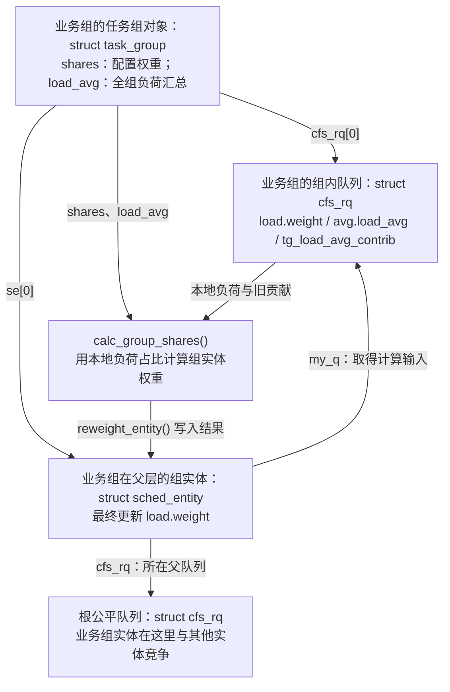

[`update_cfs_group()`](../../linux/kernel/sched/fair.c#L4124) 正是连接计算与更新的地方。下面保留函数实现，省略原注释并添加阅读说明：

```c
static void update_cfs_group(struct sched_entity *se)
{
    struct cfs_rq *gcfs_rq = group_cfs_rq(se); /* se->my_q：本组内部队列 */
    long shares;

    if (!gcfs_rq || !gcfs_rq->load.weight)
        return;

    shares = calc_group_shares(gcfs_rq);
    if (unlikely(se->load.weight != shares))
        reweight_entity(cfs_rq_of(se), se, shares); /* se->cfs_rq：父队列 */
}
```

这里局部变量 `shares` 保存的是**当前 CPU 的组实体新权重**，与全组配置 `tg->shares` 含义不同。两个队列访问函数分别见 [`group_cfs_rq()`](../../linux/kernel/sched/sched.h#L1624) 和 [`cfs_rq_of()`](../../linux/kernel/sched/sched.h#L1618)。

入口还有两个边界：任务实体的 `my_q == NULL`，因此直接返回，不在这里修改线程的 nice 权重；组内队列的 `load.weight == 0` 时也返回，保留组实体原权重，源码说明这是为了照顾延迟出队。**空队列不等于立即把组实体权重重算成零。**

##### 1.3.4.3 `calc_group_shares()`：用本地负荷占比估算权重

业务组可能同时在多颗 CPU 上运行。若每个组实体都直接取得完整的 `tg->shares`，就没有体现本组需求在各 CPU 上的分布。源码先给出理想关系：

```text
本 CPU 组实体权重 ≈ 全组配置权重 × 本 CPU 组内负荷 / 全组各 CPU 负荷之和
```

每次计算都扫描其他 CPU 的队列，代价太高，因此用已上报的 PELT 汇总近似分母，再用本地即时状态修正。推导见 [`calc_group_shares()` 前的说明](../../linux/kernel/sched/fair.c#L4014)。下面是函数实现，省略长注释；其中 `cfs_rq` 是**业务组的组内队列**：

```c
static long calc_group_shares(struct cfs_rq *cfs_rq)
{
    long tg_weight, tg_shares, load, shares;
    struct task_group *tg = cfs_rq->tg;

    tg_shares = READ_ONCE(tg->shares);
    load = max(scale_load_down(cfs_rq->load.weight), cfs_rq->avg.load_avg);

    tg_weight = atomic_long_read(&tg->load_avg);
    tg_weight -= cfs_rq->tg_load_avg_contrib;
    tg_weight += load;

    shares = (tg_shares * load);
    if (tg_weight)
        shares /= tg_weight;

    return clamp_t(long, shares, MIN_SHARES, tg_shares);
}
```

实现见 [`calc_group_shares()`](../../linux/kernel/sched/fair.c#L4086)，可以分四步理解。

**第一步：让两种本地负荷使用相同的数值尺度。** x86-64 的 `scale_load()` 把权重左移 10 位，也就是乘以 1024；这增加内部权重的精度，见 [`SCHED_FIXEDPOINT_SHIFT`](../../linux/include/linux/sched.h#L448) 和 [`scale_load()`](../../linux/kernel/sched/sched.h#L147)。`tg->shares`、`se->load.weight`、队列的 `load.weight` 都采用这个内部尺度；PELT 的 `load_avg` 使用降尺度后的权重。因此即时队列权重要先 `scale_load_down()`，才能与 `avg.load_avg` 取 `max()`。该宏对很小的非零权重还设有最小值 2，不能在所有边界上简单当成除以 1024。

**第二步：本地负荷取即时值和历史值中较大的一个。** 刚有线程唤醒时，即时权重已经增加，PELT 可能尚未充分增长，取即时值能及时反映需求；即时权重下降时，则允许历史值继续提供平滑估计。这里的 `load` 是两者的最大值，不是两者相加，见 [本地负荷取值](../../linux/kernel/sched/fair.c#L4093)。

**第三步：用本地新估计替换全组汇总中的旧贡献。** `tg->load_avg` 已经包含本 CPU 上报的 `tg_load_avg_contrib`，所以分母是：

```text
tg_weight = 全组已上报负荷 - 本 CPU 上次上报的负荷 + 本 CPU 此刻采用的 load
          = 其他 CPU 已上报负荷 + 本 CPU 此刻采用的 load
```

这里的 `tg_weight` 是**修正后的全组负荷估计**，不是全组配置权重 `tg_shares`。减去的必须是 `tg_load_avg_contrib`，因为它记录已计入共享汇总的那一份；当前 `avg.load_avg` 可能已经变化，却尚未上报。

共享汇总由 [`update_tg_load_avg()`](../../linux/kernel/sched/fair.c#L4258) 做差量更新：把“当前平均负荷减去旧贡献”的差加到 `tg->load_avg`，然后保存新贡献。为减少跨 CPU 共享数据的更新，它通常限制两次上报至少间隔 1 ms，且差值绝对值大于旧贡献的 1/64 才更新，见 [上报条件](../../linux/kernel/sched/fair.c#L4273)。`calc_group_shares()` 中的减旧加新只修正本次计算使用的局部变量，不会顺便写回 `tg->load_avg`。

**第四步：乘以本地占比，并限制结果范围。** `tg_shares × load / tg_weight` 得到本 CPU 组实体的权重；除法采用整数截断。分子、分母中的负荷尺度相同，比例中的尺度抵消，结果仍处于 `tg->shares` 的内部尺度，后面直接写入 `se->load.weight`，**不再做一次 `scale_load()`**。

返回值被限制在 `[MIN_SHARES, tg_shares]`。这里 [`MIN_SHARES = 2`](../../linux/kernel/sched/sched.h#L538) 是直接用于 `load.weight` 的原始下限，而设置全组 shares 时使用的是 [`scale_load(MIN_SHARES)`](../../linux/kernel/sched/fair.c#L13971)。源码特意保留这种区别：内部全组权重为 `15 × 1024`、平均分到 8 颗 CPU 时，每份是 1920；若每份也强制至少 `2 × 1024`，就无法细分小权重组，见 [下限说明](../../linux/kernel/sched/fair.c#L4105)。正常调用入口已跳过即时权重为零的组内队列，因此不要把这个下限误读为“空组必定会重新获得权重 2”。

##### 1.3.4.4 数值例子：从 `cpu.weight = 100` 算到实际字段

业务组的配置先经过第 1.3.3 节的接口换算。在 x86-64 上：

```text
cpu.weight = 100
  → sched_weight_from_cgroup(100) = 1024
  → scale_load(1024) = 1024 × 1024 = 1048576
  → task_group.shares = 1048576
```

换算和缩放的调用点见 [`cpu_weight_write_u64()`](../../linux/kernel/sched/core.c#L10149)。下面假设业务组只在 CPU 0、CPU 1 上有负荷：CPU 0 有一个持续可运行的 nice 0 工作线程，CPU 1 有三个；没有子组、限流和 delayed 实体。为便于计算，取一个 PELT 已稳定、各贡献已上报的理想快照：

| 业务组的状态 | CPU 0 的组内队列 | CPU 1 的组内队列 |
| ------------ | ---------------- | ---------------- |
| 即时 `load.weight`，内部尺度 | 1048576 | 3145728 |
| `scale_load_down(load.weight)` | 1024 | 3072 |
| 假定 `avg.load_avg` | 1024 | 3072 |
| 假定 `tg_load_avg_contrib` | 1024 | 3072 |
| `max()` 后的本地 `load` | 1024 | 3072 |

全组 `tg->load_avg = 1024 + 3072 = 4096`，两颗 CPU 各自计算：

| 计算步骤 | CPU 0 的组实体 | CPU 1 的组实体 |
| -------- | -------------- | -------------- |
| 修正分母 `tg_weight` | `4096 - 1024 + 1024 = 4096` | `4096 - 3072 + 3072 = 4096` |
| 本地占比 | `1024 / 4096 = 1/4` | `3072 / 4096 = 3/4` |
| `calc_group_shares()` 返回值 | `1048576 × 1/4 = 262144` | `1048576 × 3/4 = 786432` |
| 写入 `se->load.weight` 的值 | **262144** | **786432** |
| 为方便阅读，降尺度后的权重 | 256 | 768 |

CPU 0 内部那个工作线程的任务实体仍保持 nice 0 权重 1048576；变化的是**代表整个业务组去父层竞争的组实体**。线程实体与组实体处在不同队列，使用不同权重。

再看刚唤醒的边界。假设其他 CPU 的已上报贡献都是 0，本 CPU 之前上报 100，现在即时负荷已经是 1024，而 `avg.load_avg` 还只有 100：

```text
本地 load = max(1024, 100) = 1024
全组已上报 load_avg = 100
修正后的 tg_weight = 100 - 100 + 1024 = 1024
本 CPU 组实体权重 = tg->shares × 1024 / 1024 = tg->shares
```

这使唯一有需求的 CPU 可以及时取得完整配置权重，不必等待历史负荷缓慢增长。如果其他 CPU 还有未衰减的历史贡献，分母仍会包含它们，就不一定立刻等于完整 shares。由于各 CPU 分别修正自己的本地估计，加上整数取整和下限，**各 CPU 组实体权重之和不保证时时严格等于 `tg->shares`**，见 [近似公式的边界说明](../../linux/kernel/sched/fair.c#L4054)。这也没有为该组新增 `cpu.max` 预算。

##### 1.3.4.5 `reweight_entity()`：写入权重，同时维护父层账本

`calc_group_shares()` 只返回数字。`update_cfs_group()` 发现结果与旧权重不同，才调用 [`reweight_entity()`](../../linux/kernel/sched/fair.c#L3949)。它的第一个参数是**组实体所在的父队列**；函数内部的 `cfs_rq` 已经不再指前面参与计算的业务组内队列。

可以把更新过程分成四步：

| 步骤 | 更新哪些状态 | 原因 |
| ---- | ------------ | ---- |
| 结算并暂时移除旧贡献 | 若实体 `on_rq`，先更新父队列当前实体的执行账；记录待更新实体的 lag、相对截止期，扣除它在父队列中的旧权重，必要时暂时摘树；移除旧 PELT 贡献 | 后续计算使用已经结算的旧状态，父层统计不重复计数 |
| 调整虚拟时间相关状态 | `rescale_entity()` 按旧、新权重之比缩放 `vlag`、相对截止期，以及适用时的保护边界 | 换权重时维持已有服务差额的含义，避免凭空增加或抹掉公平调度账 |
| 写入新权重 | `update_load_set(&se->load, weight)` | 更新组实体自身的 `load.weight`，使倒数缓存失效 |
| 恢复新贡献 | 按新权重重算实体 `avg.load_avg`，恢复父队列的 PELT 统计；实体仍 `on_rq` 时，加回新权重，恢复虚拟时间位置，必要时重新入树 | 父队列汇总与 EEVDF 排序使用新状态 |

虚拟时间缩放的推导见 [`rescale_entity()` 内的说明](../../linux/kernel/sched/fair.c#L3920)，实际权重写入点见 [`reweight_entity()`](../../linux/kernel/sched/fair.c#L3975)。真正完成赋值的是下面这个小函数，摘自 [`update_load_set()`](../../linux/kernel/sched/fair.c#L177)：

```c
static inline void update_load_set(struct load_weight *lw, unsigned long w)
{
    lw->weight = w;
    lw->inv_weight = 0;
}
```

传入 `lw = &se->load` 后，这两行就分别更新 `se->load.weight` 和 `se->load.inv_weight`。后者置零表示旧倒数缓存失效，下一次需要时由 [`__update_inv_weight()`](../../linux/kernel/sched/fair.c#L231) 重新计算。

父队列的 `load.weight` 也必须跟着改。对于仍在父队列上的组实体，[源码先减旧值](../../linux/kernel/sched/fair.c#L3971)，再[加新值](../../linux/kernel/sched/fair.c#L3992)，效果是：

```text
父队列新 load.weight = 父队列旧 load.weight - 组实体旧权重 + 组实体新权重
```

例如上例中 CPU 0 的业务组实体已具有权重 262144，随后用户把 `cpu.weight` 从 100 改成 200；若本地负荷占比仍为 1/4，新组实体权重就是 524288。若父队列中其他实体的权重之和为 1048576，则父队列的总权重从 `1048576 + 262144 = 1310720` 变成 `1048576 + 524288 = 1572864`。业务组内部工作线程的 nice 权重保持不变，其组内队列的即时权重也不会因此直接翻倍。

若组实体尚未入队，`reweight_entity()` 不把它计入父队列的即时权重总和；以后入队时由 [`account_entity_enqueue()`](../../linux/kernel/sched/fair.c#L3758) 加入。这与维护 PELT 历史贡献是两件事。

##### 1.3.4.6 权重持续更新，并影响父层虚拟时间

这条换算链会随配置和负荷变化反复执行：

| 触发位置 | 为什么需要重新计算 |
| -------- | ------------------ |
| [`__sched_group_set_shares()`](../../linux/kernel/sched/fair.c#L13976) | 配置权重改变，遍历 possible CPU，并沿组实体祖先链更新 |
| [`enqueue_entity()`](../../linux/kernel/sched/fair.c#L5441) 与 [`dequeue_entity()`](../../linux/kernel/sched/fair.c#L5610) | 入队、出队改变组队列状态，更新相关组实体权重 |
| [`entity_tick()`](../../linux/kernel/sched/fair.c#L5734) | 运行期间负荷历史继续变化，先更新 PELT，再更新组实体权重 |

同一个 `tg->shares` 可以长期不变，而不同 CPU 上的 `se->load.weight` 随需求分布变化。多层 cgroup 也按同样机制逐层进行：子组实体的权重成为父组内部队列负荷的一部分，父组再据此更新自己的组实体。

最终，父队列通过 [`calc_delta_fair()`](../../linux/kernel/sched/fair.c#L290) 使用这个权重。忽略整数近似，可把组实体虚拟时间的推进理解为：

```text
组实体 vruntime 的增量 ≈ 实际执行时间 × NICE_0_LOAD / se->load.weight
```

同样执行一段时间，组实体权重越大，虚拟时间推进越慢；虚拟截止期也通过同一换算计算，见 [`update_curr()`](../../linux/kernel/sched/fair.c#L1306) 和 [`update_deadline()`](../../linux/kernel/sched/fair.c#L1130)。因此完整路径是：**组配置 shares → 按本 CPU 负荷占比计算 → 更新组实体 `load.weight` 及父层账本 → 影响父层 EEVDF 竞争**。实际能否执行、能执行多久，仍同时受可运行状态、其他竞争者、CPU 放置和 CFS 带宽约束。

#### 1.3.5 入队实现：实体插入和层级统计分别传播

[`enqueue_task_fair()`](../../linux/kernel/sched/fair.c#L7080) 沿 `parent` 分两段向上走：第一段对尚未入队的实体调用 `enqueue_entity()`，遇到已在队列上的祖先就停止插树；[第二段](../../linux/kernel/sched/fair.c#L7148) 继续向上更新 PELT、组权重、层级任务计数和 slice。祖先不必再插树，统计仍要加上。

| 计数 | 统计范围 | 示例：业务组有两个普通可运行线程、没有子组 |
| ---- | -------- | --------------------------------------- |
| `cfs_rq->nr_queued` | 本层直接排队或执行的实体，包含组实体 | 业务组队列为 2；根队列若只有业务组实体则为 1 |
| `cfs_rq->h_nr_queued` | 本层子树中仍计入公平队列的任务数，包含 delayed | 业务组队列和根队列都是 2 |
| `cfs_rq->h_nr_runnable` | 层级中的可运行公平任务数，排除 delayed | 此例也是 2 |

不要把根队列里的“一个组实体”理解成“一个任务”。

出队也分“摘实体”和“传播统计”：某层还有其他实体时，不再摘父实体，但祖先统计仍须更新。当前版本有延迟出队，所以最后一个任务睡眠，不总等于整条祖先链立即从树上消失，见 [`dequeue_entities()`](../../linux/kernel/sched/fair.c#L7209)。

继续看这个没有子组的业务组，假设工作线程 1 睡眠时满足延迟出队条件，工作线程 2 一直可运行：

| 业务组内的线程和任务实体状态 | `nr_queued` | `h_nr_queued` | `h_nr_runnable` |
| -------- | ----------- | ------------- | --------------- |
| 两个工作线程都可运行 | 2 | 2 | 2 |
| 工作线程 1 睡眠，它的任务实体被标记 delayed | 2 | 2 | 1 |
| 工作线程 1 的任务实体完成真正出队 | 1 | 1 | 1 |

延迟保留的是公平调度账本中的实体，不是让睡眠任务继续执行。[`set_delayed()`](../../linux/kernel/sched/fair.c#L5503) 先减少 runnable 计数；以后选中这个 delayed 实体时，[`pick_next_entity()`](../../linux/kernel/sched/fair.c#L5687) 完成出队并要求重新选择任务。`h_nr_queued` 因此既不是全组存活线程数，也不保证等于此刻能执行的线程数。

#### 1.3.6 `cpu.idle`：在公平类中降低整组的竞争优先级

写入 1 后，[`sched_group_set_idle()`](../../linux/kernel/sched/fair.c#L14009) 把 `tg->idle` 和每 CPU `cfs_rq->idle` 置位，并把 `shares` 设为 `scale_load(WEIGHT_IDLEPRIO)`，未缩放权重是 [3](../../linux/kernel/sched/sched.h#L2351)。它还会把组内任务计入祖先的 `h_nr_idle`。

所以它不只是一个小权重。[`se_is_idle()`](../../linux/kernel/sched/fair.c#L465) 会把组实体认作 idle；在启用唤醒抢占时，[`check_preempt_wakeup_fair()`](../../linux/kernel/sched/fair.c#L8970) 让非 idle 实体抢占 idle 实体，反方向则不抢占；选核路径也可把只运行 idle 任务的 CPU 视为可接收普通任务的 CPU，见 [`sched_idle_rq()`](../../linux/kernel/sched/fair.c#L7032)。但这仍是公平类内部的低优先级行为，不能保证只在所有普通任务都睡眠时才执行，更不提供隔离或绑核。

idle 组写 `cpu.weight` 会返回 `-EINVAL`，见 [`sched_group_set_shares()`](../../linux/kernel/sched/fair.c#L13995)。从 `cpu.idle = 1` 改回 0，权重恢复到默认 `NICE_0_LOAD`，**不会恢复此前自定义权重**。根组没有 `cpu.idle` 文件。

### 1.4 CFS 带宽控制：从全组预算到任务暂停与恢复

第 1.3 节回答了“有 CPU 时间可分时，各组怎样竞争”。这一节增加另一道约束：**本组还能消耗多少执行时间？额度不足时，任务怎样暂停；有了额度以后，又怎样回来？** `cpu.weight` 再大，也不会为本组增加 `cpu.max` 预算。

学习时先沿一条主线走：**全组配置预算 → 每 CPU 领取额度 → 执行时扣本地余额 → 无法补足时限流 → 补充额度后恢复竞争。** 其中最需要分清的是两组概念：共享池余额与本地余额、队列限流状态与任务限流状态。

| 阅读阶段 | 小节 | 先解决的问题 |
| -------- | ---- | ------------ |
| 建立模型 | 1.4.1～1.4.3 | 预算限制什么？存在哪里？一次暂停与恢复经过哪些对象？ |
| 跟踪实现 | 1.4.4～1.4.6 | 怎样扣账、怎样把任务摘下、怎样重新入队？ |
| 扩展理解 | 1.4.7～1.4.9 | 父子预算、burst、配置变化和边界路径怎样影响主流程？ |

#### 1.4.1 先明确限制对象：全组累计 CPU 时间

假设业务组 A 配置：

```text
cpu.max = 50000 100000
```

两个数的单位都是 **μs**，含义是每 100 ms 给 A 新增 50 ms 执行额度。这里的 50 ms 由 A 在所有 CPU 上的公平类执行共同消耗。四个线程各执行 10 ms，累计就花掉 40 ms，而墙上的时钟可能只走过 10 ms。

先忽略本地缓存、欠账和延迟限流。假设一个完整周期刚开始、预算完整，线程持续运行且没有其他竞争：

| 同时运行的线程数 | 花完 50 ms 预算时，每个线程的执行量 | 已经过的墙钟时间 | 到下次补充还需等待 |
| ---------------- | --------------------------------- | -------------- | ---------------- |
| 1，每线程独占一颗逻辑 CPU | 50 ms | 约 50 ms | 约 50 ms |
| 2，每线程独占一颗逻辑 CPU | 25 ms | 约 25 ms | 约 75 ms |
| 4，每线程独占一颗逻辑 CPU | 12.5 ms | 约 12.5 ms | 约 87.5 ms |

增加并行度可以更早完成一部分工作，也可能更早花完预算，留下更长的一段集中等待。`quota / period = 0.5` 表示基础带宽相当于半颗逻辑 CPU 的时间；它既不规定线程数，也不指定 CPU 位置，更不保证不同 CPU 上有相同算力。实际扣账依据执行时长，见 [`__account_cfs_rq_runtime()`](../../linux/kernel/sched/fair.c#L5859)。

接口格式为 `quota period`，`quota` 还可以写成 `max`：

| 配置 | 本组的基础预算 |
| ---- | -------------- |
| `max 100000` | 本组不设有限配额，仍受祖先配额约束 |
| `50000 100000` | 每 100 ms 新增 50 ms，约为 0.5 CPU |
| `200000 100000` | 每 100 ms 新增 200 ms，约为 2 CPU；quota 可以大于 period |

省略 period 时保留原周期，见 [`cpu_period_quota_parse()`](../../linux/kernel/sched/core.c#L10208) 和 [`cpu_max_write()`](../../linux/kernel/sched/core.c#L10237)。新组默认 `max 100000`，burst 为 0，见 [`init_cfs_bandwidth()`](../../linux/kernel/sched/fair.c#L6695) 和 [`default_bw_period_us()`](../../linux/kernel/sched/sched.h#L439)。根组不提供 `cpu.max` / `cpu.max.burst`，见 [文件注册](../../linux/kernel/sched/core.c#L10273)。

下面先只看 A 自己的一层有限预算；祖先的叠加约束放到第 1.4.7 节。

#### 1.4.2 核心对象：共享池、本地队列和任务

##### 1.4.2.1 为什么要把一份预算拆成两级账本

用户给全组配置一个 quota，但任务会在多颗 CPU 上同时运行。如果每次执行记账都修改同一个全组计数，CPU 之间就要频繁争用共享锁。内核因此把**额度分配**与**执行扣账**分开：

- 全组唯一的 `task_group.cfs_bandwidth` 保存共享池，记录还有多少额度尚未分配。
- A 在每颗 CPU 上的 `cfs_rq` 保存本地余额，执行时主要扣这里；余额不足再向共享池领取。
- 任务需要暂停时，用 `task_struct` 中的回调和链表节点，把限流落实到具体线程。

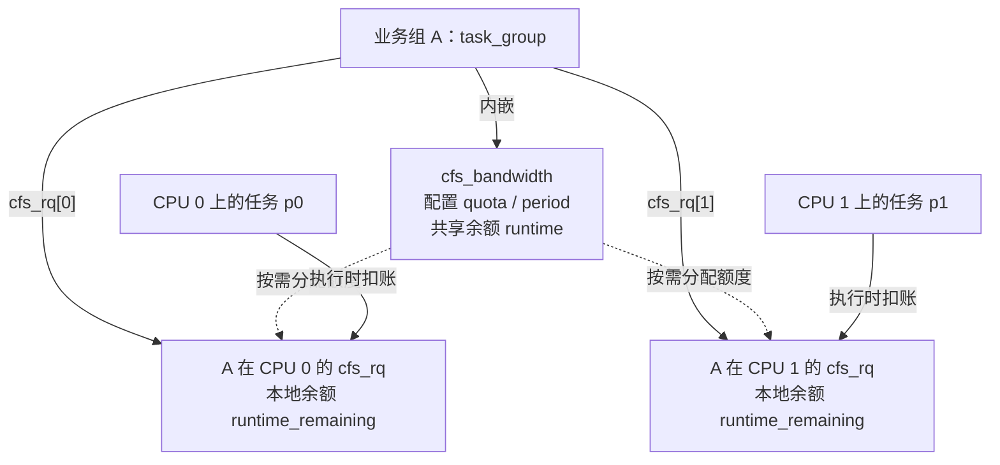

实线表示对象关系或记账对象，虚线表示额度流动。每颗 CPU 的 A 队列都向**同一个 A 池子**领取，没有为每颗 CPU 复制一份 quota。领取路径见 [`assign_cfs_rq_runtime()`](../../linux/kernel/sched/fair.c#L5847)。

##### 1.4.2.2 `cfs_bandwidth`：保存配置与尚未分配的额度

先保留主流程要用的字段，按源码顺序摘自 [`struct cfs_bandwidth`](../../linux/kernel/sched/sched.h#L445)：

```c
struct cfs_bandwidth {
    raw_spinlock_t lock;            /* 保护共享池的分配、归还和补充 */
    ktime_t period;                 /* 补充周期 */
    u64 quota;                     /* 每周期新增额度；RUNTIME_INF 表示无限 */
    u64 runtime;                   /* 当前尚未分配出去的额度 */
    u64 burst;                     /* 补充时允许在 quota 之外保留的额度 */
    /* 省略比例、活动标记等成员 */
    struct hrtimer period_timer;    /* 周期性补充额度 */
    struct hrtimer slack_timer;     /* 延后再分配各 CPU 退回的多余额度 */
    struct list_head throttled_cfs_rq; /* 本组各 CPU 上因自身预算限流的队列 */
    /* 省略统计成员 */
};
```

`quota` 是配置值，`runtime` 是不断变化的余额。任务执行不会每次都直接扣 `runtime`：领取时先从它转出一批额度，随后在本地使用。内部时间单位是 **ns**，接口的 μs 在 [`tg_set_cfs_bandwidth()`](../../linux/kernel/sched/core.c#L9571) 中转换。

##### 1.4.2.3 `cfs_rq` 与 `task_struct`：区分余额、队列状态和任务状态

每 CPU 队列的带宽成员摘自 [`struct cfs_rq`](../../linux/kernel/sched/sched.h#L751)：

```c
struct cfs_rq {
    /* 省略竞争、归属等成员，见第 1.1.2 节 */
    int runtime_enabled;           /* 是否对本队列执行本组的有限配额记账 */
    s64 runtime_remaining;         /* 已领到的本地余额，允许为负 */
    /* 省略限流计时成员 */
    bool throttled:1;              /* 本队列是否因本组预算而限流 */
    /* 省略 PELT 时钟标记 */
    int throttle_count;            /* 同 CPU 上，自己和祖先共有几层限流 */
    struct list_head throttled_list; /* 挂入本组共享池的限流队列链表 */
    /* 省略异步解限流链表节点 */
    struct list_head throttled_limbo_list; /* 本队列暂时摘下的任务 */
};
```

这里的 `throttled` 只回答“**自己这一层**是否限流”，`throttle_count` 回答“**整条祖先链**上有几道已生效的限流”。即使本组 `runtime_enabled == 0`，祖先限流也能使它的 `throttle_count > 0`；“自己不限额”不等于“没有层级约束”，见 [`throttled_hierarchy()`](../../linux/kernel/sched/fair.c#L5897) 和 [`tg_throttle_down()`](../../linux/kernel/sched/fair.c#L6118)。

队列受限之后，还需要暂停具体任务。对应字段摘自 [`task_struct`](../../linux/include/linux/sched.h#L883)：

```c
struct task_struct {
    /* 省略其他成员 */
    struct callback_head sched_throttle_work; /* 返回用户态前处理限流的回调 */
    struct list_head throttle_node; /* 挂入任务所属队列的 limbo 链表 */
    bool throttled;                 /* 任务是否已被移入限流状态 */
    /* 省略其他成员 */
};
```

**limbo** 在本节指任务仍有运行需求，但已被暂时摘出公平调度竞争的状态。下面两张链表分别管理“哪些队列受限”和“哪些任务已经被摘下”：

| 链表头 | 挂入的对象与节点 | 用途 |
| ------ | ---------------- | ---- |
| `cfs_bandwidth.throttled_cfs_rq` | 各 CPU 的 `cfs_rq.throttled_list` | 有额度时找到需要恢复的队列 |
| `cfs_rq.throttled_limbo_list` | 任务的 `task_struct.throttle_node` | 该队列层级约束解除后，让任务重新入队 |

链表挂接分别见 [`throttle_cfs_rq()`](../../linux/kernel/sched/fair.c#L6160) 和 [`throttle_cfs_rq_work()`](../../linux/kernel/sched/fair.c#L5947)。同名的 `cfs_rq->throttled` 与 `p->throttled` 属于不同对象，置位时机也不同。

#### 1.4.3 串起主流程：领取不等于消耗，标记不等于暂停

先观察一个余额快照。假设 A 的共享池还剩 10 ms，两颗 CPU 的本地余额都是 0。此时不考虑周期补充、归还和祖先约束：

| 事件 | A 的共享池 `runtime` | CPU 0 本地余额 | CPU 1 本地余额 | 从这个快照开始累计执行 |
| ---- | ------------------- | -------------- | -------------- | ---------------------- |
| 起点 | 10 ms | 0 | 0 | 0 |
| CPU 0 领取 5 ms | 5 ms | 5 ms | 0 | 0 |
| CPU 1 领取 5 ms | 0 | 5 ms | 5 ms | 0 |
| 两颗 CPU 各执行 2 ms，完成记账 | 0 | 3 ms | 3 ms | 4 ms |

**池子为空时，两颗 CPU 仍各有 3 ms 可以执行。** 领取只是移动额度，只有执行扣账才消耗预算。反过来，一颗 CPU 的本地余额不足时，也不能直接断定要暂停，它还可以向池子申请。两种操作分别见 [`__assign_cfs_rq_runtime()`](../../linux/kernel/sched/fair.c#L5819) 和 [`__account_cfs_rq_runtime()`](../../linux/kernel/sched/fair.c#L5859)。

把这个例子继续推进，主流程如下。图中先假设 A 没有受限祖先，且用户任务在 work 执行时仍受限：

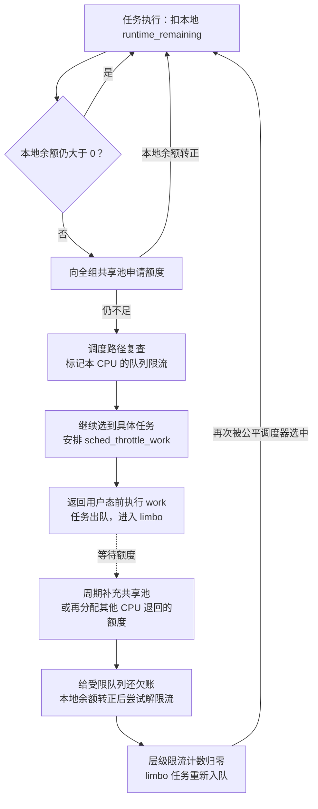

补充定时器独立于任务运行，图中只是画出任务等待恢复的顺序。任何阶段都可能遇到补充或配置变化，因此后续函数需要复查状态。

| 接下来跟踪的阶段 | 核心函数 | 主要改变什么 |
| ---------------- | -------- | ------------ |
| 1.4.4 扣账与领取 | [`__account_cfs_rq_runtime()`](../../linux/kernel/sched/fair.c#L5859)、[`__assign_cfs_rq_runtime()`](../../linux/kernel/sched/fair.c#L5819) | 本地余额、共享池余额 |
| 1.4.5 标记与暂停 | [`throttle_cfs_rq()`](../../linux/kernel/sched/fair.c#L6141)、[`throttle_cfs_rq_work()`](../../linux/kernel/sched/fair.c#L5913) | 队列层级状态、任务的公平入队状态 |
| 1.4.6 补充与恢复 | [`do_sched_cfs_period_timer()`](../../linux/kernel/sched/fair.c#L6393)、[`unthrottle_cfs_rq()`](../../linux/kernel/sched/fair.c#L6182) | 池与本地余额、层级计数、任务重新入队 |

#### 1.4.4 执行与领取：先扣实际时间，再尝试补足本地余额

##### 1.4.4.1 扣哪一种时间，扣到哪里

第 1.3 节的 `update_curr()` 同时维护公平竞争和带宽两本账。它先由 [`update_se()`](../../linux/kernel/sched/fair.c#L1232) 取得 `delta_exec`，然后分别处理：

```text
当前实体在 rq_clock_task() 上增加的执行时长 delta_exec
  ├─ calc_delta_fair(delta_exec, curr) → 推进 vruntime，影响公平竞争
  └─ account_cfs_rq_runtime(cfs_rq, delta_exec) → 扣本地预算
```

两个调用点见 [`update_curr()`](../../linux/kernel/sched/fair.c#L1302)。**带宽扣实际执行时长，不按权重缩放。** A 的权重翻倍，不会让同样执行 1 ms 只扣 0.5 ms 预算。

这里包括任务的用户态和内核态执行；睡眠、阻塞和排队等待不算执行，自旋则算。若编译并启用了 IRQ time accounting 或 paravirt steal accounting，任务时钟会先扣除对应的中断时间或虚拟 CPU 被宿主机拿走的时间，见 [`update_rq_clock_task()`](../../linux/kernel/sched/core.c#L787)。

热路径先检查全局 `cfs_bandwidth_used()` 和本队列 `runtime_enabled`；不需要记账就返回，见 [`account_cfs_rq_runtime()`](../../linux/kernel/sched/fair.c#L5877)。需要记账时，核心逻辑可以缩成下面的伪代码：

```text
# __account_cfs_rq_runtime()；省略锁与分支预测提示
本地余额 -= delta_exec
if 本地余额 > 0:
    return
if 本队列已经 throttled:
    return                         # 仍扣账，但不在这里重复申请或限流
if 向共享池领取后，本地余额仍未转正 and 本队列有当前实体:
    resched_curr()                 # 请求重新调度，尚未把任务摘下
```

实现见 [`__account_cfs_rq_runtime()`](../../linux/kernel/sched/fair.c#L5859)。余额是有符号的 `s64`：例如上次还剩 0.2 ms，这次结算了 0.5 ms，就变成 −0.3 ms。内核保存这笔欠账，后续领取要先偿还它。源码是执行后分段结算，并没有在每一纳秒开始前检查预算。

##### 1.4.4.2 领取的目标是“补到 slice”，不是“固定领取一个 slice”

[`assign_cfs_rq_runtime()`](../../linux/kernel/sched/fair.c#L5847) 取得 A 的 `cfs_bandwidth.lock`，再调用 [`__assign_cfs_rq_runtime()`](../../linux/kernel/sched/fair.c#L5819)。对有限 quota，分配关系是：

```text
需要领取的额度 = 目标本地余额 - 当前本地余额
实际领取的额度 = min(共享池余额, 需要领取的额度)
共享池余额 -= 实际领取的额度
本地余额   += 实际领取的额度
成功条件：本地余额 > 0
```

正常领取的目标是 `sched_cfs_bandwidth_slice()`，默认 **5 ms**，来自 [`sysctl_sched_cfs_bandwidth_slice = 5000`](../../linux/kernel/sched/fair.c#L125)，对应 sysctl 接口 [`sched_cfs_bandwidth_slice_us`](../../linux/kernel/sched/fair.c#L137)；转换为 ns 的位置见 [`sched_cfs_bandwidth_slice()`](../../linux/kernel/sched/fair.c#L5783)。这是批量分配额度的粒度，和 EEVDF 的请求 slice 分属两套机制，也不要求一个任务连续运行 5 ms。

以下各行是独立的领取场景，都以 5 ms 为目标：

| 领取前本地余额 | 池中余额 | 希望领取 | 实际领取 | 领取后本地余额 | 结果 |
| -------------- | -------- | -------- | -------- | ---------------- | ---- |
| 0 | 10 ms | 5 ms | 5 ms | 5 ms | 成功 |
| −1 ms | 10 ms | 6 ms | 6 ms | 5 ms | 先还欠账，再达到目标 |
| −1 ms | 2 ms | 6 ms | 2 ms | 1 ms | 虽未达到目标，但已转正，成功 |
| −1 ms | 0.5 ms | 6 ms | 0.5 ms | −0.5 ms | 仍失败，欠账继续保留 |

有限配额的领取还会按需启动周期定时器，成功转出额度时清除共享池的 `idle` 标记，见 [`__assign_cfs_rq_runtime()`](../../linux/kernel/sched/fair.c#L5832)。函数也处理 `quota == RUNTIME_INF`：直接补足目标，不扣共享池；稳定的无限配额队列通常已由 `runtime_enabled == 0` 跳过记账。

##### 1.4.4.3 不只运行中检查：空队列重新有任务时也要检查

如果 A 在 CPU 0 上刚有第一个实体入队，不能等它再执行一段时间才发现原有欠账。[`enqueue_entity()`](../../linux/kernel/sched/fair.c#L5469) 因此在 `nr_queued == 1` 时调用 [`check_enqueue_throttle()`](../../linux/kernel/sched/fair.c#L6565)。

这个函数对“已启用、没有当前实体、尚未限流”的队列，以 `delta_exec = 0` 调用同一套记账和领取逻辑。余额仍不大于 0，就尝试标记限流。它提前检查预算，真正把用户任务摘下仍由下一节的 task work 完成。

多层组同样沿用第 1.3 节的祖先记账路径：一次任务执行，会在各层 `update_curr()` 中分别扣该层的本地余额。先把单层流程走完，再看第 1.4.7 节父、子预算同时生效的例子。

#### 1.4.5 限流落实：先标记队列，再让任务进入 limbo

本地欠账且领不到额度之后，最容易误读的一点是：**当前源码不会在 `throttle_cfs_rq()` 中立即摘除整个组实体。** 它先记录受限层级；调度器仍能沿这条路径选到任务，再安排该任务返回用户态前执行限流 work。

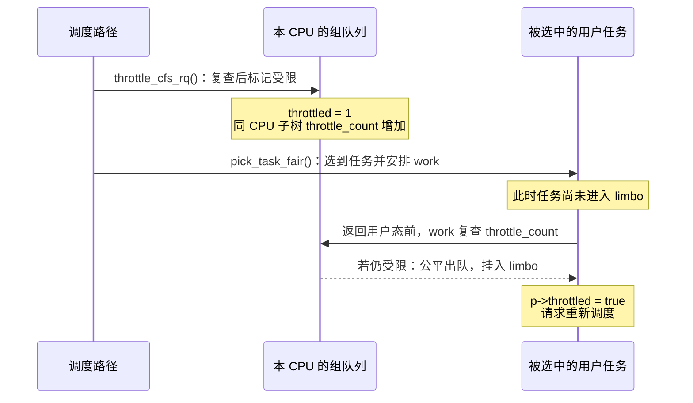

图对应 [`throttle_cfs_rq()`](../../linux/kernel/sched/fair.c#L6141)、[`pick_task_fair()`](../../linux/kernel/sched/fair.c#L9123) 和 [`throttle_cfs_rq_work()`](../../linux/kernel/sched/fair.c#L5913)。下面按三个时刻读实现，最后核对任务状态。

##### 1.4.5.1 标记本 CPU 队列，把约束传播到子树

除前面讲过的入队检查外，常见检查点还有两个：[`put_prev_entity()`](../../linux/kernel/sched/fair.c#L5710) 让出当前实体时，以及 [`pick_task_fair()`](../../linux/kernel/sched/fair.c#L9123) 向下选人时。两处都调用 [`check_cfs_rq_runtime()`](../../linux/kernel/sched/fair.c#L6612)：未启用或余额仍为正就放过，需要限流且尚未标记才进入 `throttle_cfs_rq()`。

`throttle_cfs_rq()` 先在池锁里再申请一次，这次只要求本地余额达到 **+1 ns**。原因是检查与标记之间可能恰好发生补充；只要现在可以还清欠账并转正，就取消本次限流，见 [最后一次领取](../../linux/kernel/sched/fair.c#L6147)。

如果仍失败，才完成三个动作：

1. 用本队列的 `throttled_list`，挂入 A 池子的 `throttled_cfs_rq`，让补充路径以后能找到它。
2. 从 A 向下遍历组树，给**这颗 CPU 上** A 和所有后代队列的 `throttle_count` 加一。
3. 把 A 的这个队列置为 `throttled = 1`。

实现见 [队列挂接与子树遍历](../../linux/kernel/sched/fair.c#L6160) 和 [`tg_throttle_down()`](../../linux/kernel/sched/fair.c#L6118)。这里没有 `dequeue_entity()`；也不会一次标记 A 在所有 CPU 上的队列，其他 CPU 仍按各自本地余额推进。

| 某队列在本 CPU 上的约束 | `cfs_rq->throttled` | `throttle_count` |
| ---------------------- | ------------------- | ---------------- |
| 自己与祖先均未限流 | 0 | 0 |
| 仅一个祖先限流 | 0 | 1 |
| 仅自己限流 | 1 | 1 |
| 自己和一个祖先都限流 | 1 | 2 |

这解释了为什么后续不能只看本队列的 `throttled`：祖先也能阻止它的任务恢复。

##### 1.4.5.2 选到任务，把限流 work 挂到任务身上

[`pick_task_fair()`](../../linux/kernel/sched/fair.c#L9118) 仍沿组实体的 `my_q` 向下选人，用 `throttled |= check_cfs_rq_runtime(cfs_rq)` 记住路径上是否遇到受限队列。到达任务以后，才调用 [`task_throttle_setup_work()`](../../linux/kernel/sched/fair.c#L6092)。

这个辅助函数用 `TWA_RESUME` 安排 `p->sched_throttle_work`，已挂过则不重复挂；内核线程和 `PF_EXITING` 任务不安排。普通用户任务在返回用户态前，经 [`resume_user_mode_work()`](../../linux/include/linux/resume_user_mode.h#L41) 执行 `task_work_run()`；进入 guest 前也会处理，见 [虚拟化入口](../../linux/kernel/entry/virt.c#L16) 和 [`TWA_RESUME` 的说明](../../linux/kernel/task_work.c#L40)。

因此，预算耗尽后的用户任务仍可能在内核中执行一段时间。这段执行仍要扣账，可以扩大欠账；“额度到零”和“停止公平竞争”不是同一个瞬间。

##### 1.4.5.3 work 复查状态，再出队并挂入 limbo

[`throttle_cfs_rq_work()`](../../linux/kernel/sched/fair.c#L5913) 执行时，任务可能已经换组、换调度类，或者预算已经恢复。它先排除退出中的任务，再持任务 rq 锁核对：任务仍是公平类，且当前所属队列的 `throttle_count != 0`，才继续限流。

通过检查后，顺序如下：

```text
任务 p 的限流 work
  1. dequeue_task_fair(..., DEQUEUE_SLEEP | DEQUEUE_THROTTLE)
  2. 用 p->throttle_node 挂入当前所属 cfs_rq->throttled_limbo_list
  3. p->throttled = true
  4. resched_curr()，请求重新调度
```

顺序见 [任务出队与挂接](../../linux/kernel/sched/fair.c#L5947)。`p->throttled` 必须在出队后置位，否则出队函数会误走“任务已经在 limbo”的处理分支。`DEQUEUE_THROTTLE` 会[跳过延迟出队](../../linux/kernel/sched/fair.c#L5566)，真正移除任务的公平实体。

任务总是挂在**自己所属队列**的 limbo 链表中。即使约束来自父组 P，A 的任务仍挂在 A 的队列上，不搬到 P 的 limbo 链表。重新入队时也从这里取回。

##### 1.4.5.4 进入 limbo 后，任务为什么仍可能显示为 R

work 直接调用公平类出队函数，并未把任务变成普通的阻塞睡眠。稳定状态可以是 `TASK_RUNNING`、`p->on_rq = 1`，但任务实体 `p->se.on_rq = 0`，且已经从 `rq->nr_running` 中减去，见 [直接调用公平出队](../../linux/kernel/sched/fair.c#L5947) 和 [`dequeue_entities()` 的计数更新](../../linux/kernel/sched/fair.c#L7292)。

下面只比较普通排队、limbo 和已经完成出队的睡眠状态，不包含 delayed、迁移及切换中的瞬间：

| 状态 | `p->throttled` | `p->on_rq` | `p->se.on_rq` | 公平类能否选中 |
| ---- | -------------- | ---------- | ------------- | -------------- |
| 普通排队或正在执行 | 0 | 1 | 1 | 能参与选择 |
| 因限流停在 limbo | 1 | 1 | 0 | 不能 |
| 普通睡眠且已完成出队 | 0 | 0 | 0 | 不能 |

因此 `/proc` 中单独一个 `State: R` 不能说明任务仍在公平队列里竞争。观察限流必须同时区分任务状态、实体状态和组预算状态。迁移、PELT 与限流统计如何配合这一状态，留到第 1.4.9 节。

#### 1.4.6 恢复执行：补池、还欠账、解除约束、重新入队

暂停流程是从队列状态落实到任务，恢复流程也必须经过这两层。**共享池重新有额度，不等于任务已经恢复执行。** 中间还需要给受限队列分配额度、解除层级限流，再让任务参加公平竞争。

##### 1.4.6.1 周期定时器只负责新增额度，不重置本地账本

日常新增预算来自 `period_timer`。它通过 [`sched_cfs_period_timer()`](../../linux/kernel/sched/fair.c#L6640) 调用 [`do_sched_cfs_period_timer()`](../../linux/kernel/sched/fair.c#L6393)，后者先补充共享池，有受限队列时再尝试分发。

有限 quota 的补充公式是：

```text
共享池新 runtime = min(旧 runtime + quota, quota + burst)
```

实现见 [`__refill_cfs_bandwidth_runtime()`](../../linux/kernel/sched/fair.c#L5795)。先取最简单的 `burst = 0`：A 的池子已经花空，quota 为 50 ms，一次补充后池中就有 50 ms。这个函数没有清零各 CPU 的 `runtime_remaining`；本地正余额仍保留，负余额仍是要偿还的欠账。

回调还会统计跨过的周期数 `overrun`，但**一次 `do_sched_cfs_period_timer()` 调用只补一次 quota**，不会按 `overrun × quota` 补齐。外层回调可能循环调用它，见 [定时器推进与调用](../../linux/kernel/sched/fair.c#L6650)。定时器何时停用，以及统计字段怎样更新，放到第 1.4.9 节。

##### 1.4.6.2 先让受限队列余额转正，再让 limbo 任务回来

[`distribute_cfs_runtime()`](../../linux/kernel/sched/fair.c#L6305) 遍历 A 池子的 `throttled_cfs_rq`。对每个待恢复队列，优先偿还欠账，只要求余额达到 **+1 ns**：

```text
本次分配 = min(共享池余额, -本地余额 + 1 ns)
共享池余额 -= 本次分配
本地余额   += 本次分配
if 本地余额 > 0:
    安排解除该队列限流
```

实现见 [分发计算](../../linux/kernel/sched/fair.c#L6336)。如果本地欠 1 ms，就需要 `1 ms + 1 ns` 才能通过；池里只有 0.5 ms 时，分完仍欠 0.5 ms，继续等待后续额度。

这里可以对照三种领取目标，避免把所有“分配”都理解成发 5 ms：

| 发生在哪个阶段 | 目标本地余额 | 目的 |
| -------------- | ------------ | ---- |
| 正常执行时领取 | 默认 +5 ms | 批量领取，减少共享池访问 |
| 即将标记限流前复查 | +1 ns | 确认此刻确实无法继续，避免错过刚到的额度 |
| 给受限队列分发 | +1 ns | 先还欠账并获得恢复资格，后续运行再按需领取 |

额度转正后，真正恢复队列的是 [`unthrottle_cfs_rq()`](../../linux/kernel/sched/fair.c#L6182)：清除自己的 `throttled`，从池子的限流链表摘下，再向本 CPU 的子树传播解除动作。每个子树队列都把 `throttle_count` 减一，见 [`tg_unthrottle_up()`](../../linux/kernel/sched/fair.c#L6047)。

**只有 `throttle_count` 减到 0 的队列，才取出自己的 limbo 任务**：删除链表节点、清除 `p->throttled`，以 `ENQUEUE_WAKEUP` 调用 `enqueue_task_fair()` 重新入队，见 [恢复任务循环](../../linux/kernel/sched/fair.c#L6073)。减完仍大于 0，说明还有其他层的约束，任务继续等待。

这里的“恢复”是恢复参与竞争的资格，实际执行还要由公平调度器选中。如果当前 CPU 正跑 idle，且根公平队列已有实体，解限流路径会请求重新调度，见 [`resched_curr()` 调用](../../linux/kernel/sched/fair.c#L6230)。

##### 1.4.6.3 多 CPU 恢复为何需要异步处理

共享池的定时器在一颗 CPU 上回调，受限队列却可能分布在多颗 CPU 上。本 CPU 的队列可以在本地解限流；其他 CPU 的队列先挂到目标 rq 的 `cfsb_csd_list`，按需通过 `smp_call_function_single_async()` 通知目标 CPU 处理，见 [`__unthrottle_cfs_rq_async()`](../../linux/kernel/sched/fair.c#L6274)。本地队列也会在分发遍历结束后单独处理，见 [本地恢复循环](../../linux/kernel/sched/fair.c#L6367)。

“已经分到额度”和“目标 CPU 执行解限流”之间有时间间隔。仍在内核中运行的任务可能再次把额度花光，所以 `unthrottle_cfs_rq()` 开头会复查：若 `runtime_enabled` 且余额仍不大于 0，就暂不解除，见 [异步恢复的余额检查](../../linux/kernel/sched/fair.c#L6188)。

##### 1.4.6.4 队列空闲时归还余额，让其他 CPU 有机会提前恢复

周期补充之外，还有一个恢复来源：**其他 CPU 退回已经领走、暂时用不到的额度。** 某层最后一个实体完成出队时，[`return_cfs_rq_runtime()`](../../linux/kernel/sched/fair.c#L6520) 检查该队列是否启用预算且 `nr_queued == 0`，然后归还超过 1 ms 的部分。

例如 CPU 0 领过 5 ms，只执行 1 ms 后队列就空了：

```text
归还前：本地余额 4 ms
归还量：4 ms - 1 ms = 3 ms → 加回 A 的共享池
归还后：本地留下 1 ms，供以后再次运行使用
```

1 ms 下限见 [`min_cfs_rq_runtime`](../../linux/kernel/sched/fair.c#L6448)，归还计算见 [`__return_cfs_rq_runtime()`](../../linux/kernel/sched/fair.c#L6497)。本来就只有 1 ms 或更少时，不会归还，也不会给本地补足到 1 ms。

归还时持有当前 rq 锁，不能在这条路径上直接处理其他 rq 的恢复，因此用 `slack_timer` 延后分发，见 [源码说明](../../linux/kernel/sched/fair.c#L6531)。启动条件是池中余额**超过一个带宽 slice**，且还有限流队列；默认延后 5 ms，汇集各 CPU 退回的额度，再走 `distribute_cfs_runtime()`。

若周期刷新正在进行，或距离它不足 7 ms（5 ms 等待加 2 ms 最小余量），[`start_cfs_slack_bandwidth()`](../../linux/kernel/sched/fair.c#L6478) 不再启动这次 slack timer。回调执行时还会检查距周期刷新是否不足 2 ms，见 [`do_sched_cfs_slack_timer()`](../../linux/kernel/sched/fair.c#L6540)。所以队列可以在周期中途恢复，但一次归还并不保证立即恢复其他 CPU。

#### 1.4.7 扩展到真实场景：祖先预算、burst 和跨周期余额

前面用 A 自己的一层预算走完了暂停与恢复。现在分别增加层级和跨周期因素，观察哪些结论需要补充条件。

##### 1.4.7.1 父、子各有账本，一次执行要同时满足每层预算

假设父组 P 下有 A、B 两个子组：

```text
P：cpu.max = 100000 100000       基础预算 1 CPU
├── A：cpu.max = 80000 100000    自身预算 0.8 CPU
└── B：cpu.max = 80000 100000    自身预算 0.8 CPU
```

A 的任务执行时，A 和 P 在当前 CPU 上的队列分别扣自己的本地余额，也分别向自己的共享池领取；B 同样如此。**父组不会把自己的 100 ms 复制给每个子组。** P 的额度约束整棵子树的公平执行，记账仍使用各层的 [`update_curr()`](../../linux/kernel/sched/fair.c#L1324)。

为便于算账，假设起点时三组都恰有完整 quota，随后没有补充，burst 为 0，并忽略本地分配和欠账差异：

| 已发生的执行 | A 自己剩余 | B 自己剩余 | P 剩余 |
| ------------ | ---------- | ---------- | ------ |
| A 执行 60 ms，B 执行 40 ms | 20 ms | 40 ms | 0 |

A、B 自己还有额度，但都受 P 这一层约束。同一段执行扣子、父两本账，表示同时接受两道限制；不能把两层扣账相加当成任务实际执行量。

cgroup v2 允许子组 quota 之和超过父组，甚至允许一个子组配置比父组更宽的比例；配置检查不把兄弟 quota 相加做容量预留，见 [`tg_cfs_schedulable_down()`](../../linux/kernel/sched/core.c#L9695)。A 写成 `max` 也只能取消 A 自己的限制，绕不开 P 的预算。

恢复时要逐层解除。假设 A 和 P 在同一颗 CPU 上都已限流，A 队列的 `throttle_count = 2`：

```text
A 获得额度并解除自身限流：A.throttle_count  2 → 1，任务仍在 limbo
P 随后获得额度并解除限流：A.throttle_count  1 → 0，A 的任务重新入队
```

若 P 先恢复，A 自己仍受限，也要继续等待。计数归零才恢复任务的条件见 [`tg_unthrottle_up()`](../../linux/kernel/sched/fair.c#L6053)。

真实父子组各有自己的共享池和 `period_timer`，周期长度可以不同；即使长度相同，也不保证同时补充，初始化还会[随机错开定时器相位](../../linux/kernel/sched/fair.c#L6708)。上面的共同起点只是计算快照，不表示父子共用一个周期。

##### 1.4.7.2 burst 允许保留未用额度，不是每周期额外固定发放

`cpu.max.burst` 的单位是 μs，默认 0。它改变周期补充时共享池的截断上限，见 [接口注册](../../linux/kernel/sched/core.c#L10281) 和 [`__refill_cfs_bandwidth_runtime()`](../../linux/kernel/sched/fair.c#L5802)：

```text
新的池余额 = min(旧池余额 + quota, quota + burst)
```

设 quota 为 20 ms、burst 为 10 ms，下面是不同旧余额对应的补充结果：

| 补充前池余额 | 加上 quota | 截断后池余额 |
| ------------ | ----------- | ------------ |
| 0 | 20 ms | 20 ms |
| 5 ms | 25 ms | 25 ms |
| 18 ms | 38 ms | 30 ms |

只有保留了此前没分出去或已归还的额度，后续才可能有超过一个 quota 的池余额。burst 没有独立的补充或恢复回调，也不是每周期无条件新增 `quota + burst`。

##### 1.4.7.3 本地缓存跨周期保留，归还也可能暂时突破池的截断值

周期补充操作只改变共享池，**不会清零每 CPU 的本地余额**。空队列归还多余部分后，还可以留下最多 1 ms 跨周期使用。因此即使 burst 为 0，一个周期内的实际执行也可能用到上周期保留下来的额度，不能只拿本轮新增 quota 解释全部执行量，见 [本地归还逻辑](../../linux/kernel/sched/fair.c#L6497)。

还要注意：`runtime <= quota + burst` 只是在补充函数截断后的结果，并非时时成立。归还路径直接执行 `cfs_b->runtime += slack_runtime`，没有再次截断，见 [归还的加法](../../linux/kernel/sched/fair.c#L6505)。例如：

```text
quota = 10 ms，burst = 0
周期补充后：共享池有 10 ms
某 CPU 还持有此前领取的 4 ms，此时队列变空
  → 归还 3 ms，本地留下 1 ms
  → 共享池暂时变成 13 ms
```

这 3 ms 来自以前已分配的额度，没有新增一份 burst。把共享池、本地余额和负余额欠账一起看，才能解释预算在各处怎样流动。

##### 1.4.7.4 周期预算也不是任意滑动窗口的上限

即使先忽略缓存、burst 和延迟限流，周期预算与滑动窗口仍不同。设 quota 为 50 ms、period 为 100 ms；用相邻两个完整配额周期作示意：

```text
配额周期 1：[0, 100) ms       只在 [50, 100) ms 执行 50 ms
配额周期 2：[100, 200) ms     补充后在 [100, 150) ms 执行 50 ms
观察窗口  ：[50, 150) ms     跨过补充点，共观察到 100 ms 执行
```

两个配额周期各使用 50 ms，但这个跨边界的 100 ms 窗口看到了两份预算。内核按 [`period_timer`](../../linux/kernel/sched/fair.c#L6640) 补充共享池，没有为每个任意起点的窗口另建账本。`quota / period` 因而适合表达基础带宽，不能直接当成任意同长度窗口中的绝对执行上限。

#### 1.4.8 配置怎样生效：从文件写入到每 CPU 状态

前面假定 A 已经有有限预算。现在回到控制入口，把用户写入与这些运行时对象连起来：

```text
写 cpu.max
  → cpu_max_write()：取旧 period / burst，解析 quota 和可选 period
  → tg_set_bandwidth()：校验数值范围
  → tg_set_cfs_bandwidth()：更新层级比例、共享池与每 CPU 状态
```

入口分别见 [`cpu_max_write()`](../../linux/kernel/sched/core.c#L10237)、[`tg_set_bandwidth()`](../../linux/kernel/sched/core.c#L9835) 和 [`tg_set_cfs_bandwidth()`](../../linux/kernel/sched/core.c#L9564)。

##### 1.4.8.1 先校验配置，再更新运行状态

| 检查对象 | 本文有限配额场景下的要求 |
| -------- | ---------------------- |
| period | 至少 1 ms，最多 1 s |
| quota | 至少 1 ms；可以大于 period，另有防溢出上限 |
| burst | 不能超过 quota；`quota + burst` 不能超过 `max_bw_runtime_us` |
| 目标组 | 不能是根任务组 |

检查见 [`tg_set_bandwidth()`](../../linux/kernel/sched/core.c#L9841)，限制常量见 [`min_bw_quota_period_us / max_bw_quota_period_us`](../../linux/kernel/sched/core.c#L9801)。

`cpu.max` 写入会保留当前 burst。例如原 quota 为 20 ms、burst 为 10 ms，直接把 quota 改成 5 ms 会失败，因为旧 burst 超过新 quota；需要先调小 `cpu.max.burst`。保留旧 burst 的位置见 [`cpu_max_write()`](../../linux/kernel/sched/core.c#L10244)。

##### 1.4.8.2 编译开启、全局启用、本队列启用是三个层次

本书默认编译开启 `CFS_BANDWIDTH`，但新组仍是无限配额，其每 CPU `runtime_enabled` 初始为 0，见 [`init_cfs_bandwidth()`](../../linux/kernel/sched/fair.c#L6695) 和 [`init_cfs_rq_runtime()`](../../linux/kernel/sched/fair.c#L6716)。

全局还有 `cfs_bandwidth_used()`：启用 `JUMP_LABEL` 时，它使用 static key 表示当前是否有组启用有限配额。使用计数首次由 0 变 1 才打开热路径；没有 `JUMP_LABEL` 时，这个检查恒为真，仍由各队列的 `runtime_enabled` 决定是否记账，见 [静态键实现](../../linux/kernel/sched/fair.c#L5756)。x86_64_defconfig 开启 [`JUMP_LABEL`](../../linux/arch/x86/configs/x86_64_defconfig#L54)。

配置更新的关键顺序如下：

1. [`__cfs_schedulable()`](../../linux/kernel/sched/core.c#L9733) 遍历组树，更新 `hierarchical_quota`，含义见下一小节。
2. 本组从无限变有限时，先增加带宽使用计数，再改相关字段，让热路径及时生效，见 [静态键切换顺序](../../linux/kernel/sched/core.c#L9591)。
3. 持共享池锁写入 `period / quota / burst`，调用补充函数；有限 quota 再调用 `start_cfs_bandwidth()`，见 [共享池更新](../../linux/kernel/sched/core.c#L9600)。定时器已活跃时该启动函数直接返回，不在此处重新设定到期时间，见 [`start_cfs_bandwidth()`](../../linux/kernel/sched/fair.c#L6724)。
4. 遍历在线 CPU，在各 rq 锁内设置 `runtime_enabled`，并把 `runtime_remaining` 置为 **1 ns**；已标记限流的队列立即尝试解限流，见 [每 CPU 更新](../../linux/kernel/sched/core.c#L9615)。
5. 本组从有限变无限时，等这些更新完成后，再减少全局带宽使用计数，见 [计数减少](../../linux/kernel/sched/core.c#L9627)。

成功写入会走这条更新路径，不只调大 quota 才可能解除本组限流。写成 `max` 关闭的是本组 `runtime_enabled`；祖先仍受限时，本组任务的 `throttle_count` 不会因此全部归零。

##### 1.4.8.3 `hierarchical_quota` 保存祖先收紧后的比例，不参与执行扣账

这个字段属于 [`cfs_bandwidth`](../../linux/kernel/sched/sched.h#L453)，保存的是经过归一化的 `quota / period` 比例，用于判断任务所在层级是否受带宽约束。它不是共享余额，也不会代替逐层扣账。

在 v2 分支中，[`tg_cfs_schedulable_down()`](../../linux/kernel/sched/core.c#L9695) 可以简化为：

```text
本组比例 = quota 有限 ? to_ratio(period, quota) : INF
if 本组没有父组:
    hierarchical_quota = INF
else:
    hierarchical_quota = 本组比例与父组 hierarchical_quota 中较严格者
    # INF 表示无限；两者均无限，结果才是无限
```

计算入口 [`normalize_cfs_quota()`](../../linux/kernel/sched/core.c#L9675) 把数值交给 `to_ratio()`；它比较父子比例，不累加兄弟 quota。保存这个比例并没有把父子组合并为同一个池或同一个周期。一个使用者是 [`cfs_task_bw_constrained()`](../../linux/kernel/sched/fair.c#L6842)，它借此识别“本组不限额，但祖先限额”的任务。

#### 1.4.9 进阶细节：统计、负荷跟踪与生命周期

以下路径维护主流程的统计和边界一致性。第一次阅读可以先跳到第 1.5 节，用接口和统计核对前面的预算模型，再按需要回来看这些实现。

##### 1.4.9.1 限流统计从哪里开始，累计到哪里

前面省略的计时字段定义在 [`cfs_rq`](../../linux/kernel/sched/sched.h#L759) 中。任务因限流出队时，出队路径沿层级调用 [`record_throttle_clock()`](../../linux/kernel/sched/fair.c#L6107)，不是仅在队列刚置 `throttled` 时就无条件开始所有计时。

| 字段 | 记录什么 | 在哪里结算 |
| ---- | -------- | ---------- |
| `cfs_rq.throttled_clock` | 本队列自身已限流时的记时起点 | [`unthrottle_cfs_rq()`](../../linux/kernel/sched/fair.c#L6204) 累进池子的 `throttled_time` |
| `cfs_rq.throttled_clock_self` | 本队列受自身或祖先约束时的记时起点 | [`tg_unthrottle_up()`](../../linux/kernel/sched/fair.c#L6062) 在层级计数归零后累进 `throttled_clock_self_time` |

前者用于 `cpu.stat` 的 `throttled_usec`，后者用于 `cpu.stat.local`；接口口径在第 1.5.2 节展开。出队路径两段祖先遍历的计时调用分别见 [第一次循环](../../linux/kernel/sched/fair.c#L7248) 和 [第二次循环](../../linux/kernel/sched/fair.c#L7288)。

周期侧的统计也需要和动作分开：[`do_sched_cfs_period_timer()`](../../linux/kernel/sched/fair.c#L6401) 给 `nr_periods` 加上 `overrun`，发现限流链表非空时再给 `nr_throttled` 加上 `overrun`。burst 则通过 `runtime_snap` 保存上次补充后的池余额；配置稳定时，若上一轮净分配超过一个 quota，[`__refill_cfs_bandwidth_runtime()`](../../linux/kernel/sched/fair.c#L5802) 增加 `burst_time / nr_burst`，随后更新快照。跨配置变化时的统计含义见第 1.5.2 节。

##### 1.4.9.2 共享池不活跃时，周期定时器可以停用

周期定时器使用 `CLOCK_MONOTONIC` 和 `HRTIMER_MODE_ABS_PINNED`，初始化时错开相位，见 [`init_cfs_bandwidth()`](../../linux/kernel/sched/fair.c#L6705)。`cfs_bandwidth.idle` 表示共享池的活动状态，不直接表示组内是否有可运行任务。周期回调发现限流链表为空、且此前未标记 idle 时，置 `idle = 1`；后续有 CPU 领取到额度，会把它清零。

下一次周期处理若仍为 `idle == 1` 且没有限流队列，在完成本次补充后可以停用定时器；quota 已变成无限时也停用，见 [`do_sched_cfs_period_timer()`](../../linux/kernel/sched/fair.c#L6397) 和 [`period_active` 的清除](../../linux/kernel/sched/fair.c#L6688)。任务此时可能仍在花本地余额。以后再次向池子领取时，按需重新启动周期定时器。

若一次 hrtimer 回调在循环里连续处理到期点超过 3 次，[`sched_cfs_period_timer()`](../../linux/kernel/sched/fair.c#L6657) 会尝试把 `period / quota / burst` 一起乘 2，仅在新 period **严格小于 1 s** 时执行，否则只警告。成功放大保持预算比例不变，但补充间隔变长，读回 `cpu.max` 也会看到更新后的值。

##### 1.4.9.3 PELT 为何冻结，limbo 任务怎样迁移

被配额暂停的任务仍需要 CPU。为了避免把受限等待误算成负荷自然减少，队列因限流变空后冻结 PELT 时钟：队列本来为空时在 [`tg_throttle_down()`](../../linux/kernel/sched/fair.c#L6126) 冻结；仍有实体时，在[最后一个实体出队](../../linux/kernel/sched/fair.c#L5615)后冻结。

冻结期间 [`cfs_rq_clock_pelt()`](../../linux/kernel/sched/pelt.h#L174) 返回固定时刻；解除层级限流时，把冻结时长累进 `throttled_clock_pelt_time`，见 [`tg_unthrottle_up()`](../../linux/kernel/sched/fair.c#L6056)。这样后续 PELT 时间会扣除这段受限等待。冻结的是负荷跟踪时钟，墙钟和带宽定时器仍继续前进。

limbo 任务也可能遇到换组、改亲和性或 freezer。再次出队走 [`dequeue_throttled_task()`](../../linux/kernel/sched/fair.c#L5975)，从旧 limbo 链表摘下；若带 `p->throttled` 重新入队，且目标层级仍受限、任务又不是当前 donor，[`enqueue_throttled_task()`](../../linux/kernel/sched/fair.c#L6035) 直接把它挂到目标队列的 limbo 链表。负载均衡也会拒绝把任务迁到该组层级已受限的目标 CPU，见 [`can_migrate_task()` 的检查](../../linux/kernel/sched/fair.c#L9672)。

##### 1.4.9.4 CPU 上下线、建组与删除怎样维护状态

| 场景 | 必须维护的带宽状态 | 源码入口 |
| ---- | ------------------ | -------- |
| 新任务初始化 | 初始化限流 work 和链表节点；此辅助函数没有显式重置 `p->throttled` | [`init_cfs_throttle_work()`](../../linux/kernel/sched/fair.c#L5958)，由 [`__sched_fork()`](../../linux/kernel/sched/core.c#L4476) 调用 |
| 新组上线 | 复制同 CPU 父队列的 `throttle_count`，使新子组立即继承已有的层级约束 | [`sync_throttle()`](../../linux/kernel/sched/fair.c#L6584) |
| CPU 下线 | 关闭该 CPU 上各组已启用的 `runtime_enabled`；对已限流队列，置余额为 1 ns 并解除自身限流，便于任务继续被处理 | [`unthrottle_offline_cfs_rqs()`](../../linux/kernel/sched/fair.c#L6797) |
| CPU 上线 | 按各组当前 quota 决定是否打开 `runtime_enabled` | [`update_runtime_enabled()`](../../linux/kernel/sched/fair.c#L6778) |
| 组销毁 | 取消两个 hrtimer，并处理各 CPU 上尚未完成的异步解限流工作 | [`destroy_cfs_bandwidth()`](../../linux/kernel/sched/fair.c#L6736) |

若额外编译 `NO_HZ_FULL`，带宽受限的公平任务还会阻止停 tick：本组 `runtime_enabled` 为真，或 `hierarchical_quota` 不是无限，都算受约束，见 [`cfs_task_bw_constrained()`](../../linux/kernel/sched/fair.c#L6842) 和 [`sched_can_stop_tick()`](../../linux/kernel/sched/core.c#L1350)。这使独占 CPU 的受限任务仍能周期记账；本书不假定开启 nohz_full。

### 1.5 验证与排查：份额、配额与统计

#### 1.5.1 先确认任务归属，再核对本组与祖先的时间约束

按“任务归属 → 有效 cpu 状态 → 配置 → 统计增量”检查：

1. 用 `/proc/<pid>/cgroup` 确认任务在哪个 cgroup；v2 通常是 `0::/path`。本组没有自己的 cpu 状态时，任务使用祖先的有效状态，见第 1.1.1 节。
2. 读有 cpu 控制器状态的非根本组和祖先的 `cpu.weight`、`cpu.idle`、`cpu.max`、`cpu.max.burst`。叶子写成 `max` 仍要看祖先；根组没有 weight / max 配置文件。
3. 取两次 `cpu.stat` / `cpu.stat.local` 并比较增量，按第 1.5.2 节的口径判断是否受限。
4. 权重只有在争用时才影响份额；如果时间约束不能解释排队，再检查第 2.9 节的有效 CPU 范围和任务亲和性。

#### 1.5.2 `cpu.stat` 与 `cpu.stat.local`：先明确是谁在计什么

先取两次样本并比较增量，再按下面的口径解释；单次累计值不能说明当前瓶颈。

cgroup v2 的 `cpu.stat` 先输出基础 CPU 使用统计，再输出 cpu 控制器附加项，见 [文件读取](../../linux/kernel/cgroup/cgroup.c#L3952)。基础项来自 [rstat](../../linux/kernel/cgroup/rstat.c#L743)，带宽项来自 [`cpu_extra_stat_show()`](../../linux/kernel/sched/core.c#L10088)。`cpu.stat.local` 另走 [`cpu_local_stat_show()`](../../linux/kernel/sched/core.c#L10114)。

非根组的使用统计在 [`cgroup_base_stat_flush()`](../../linux/kernel/cgroup/rstat.c#L572) 中向父组汇总；根组则直接取[全系统 CPU 统计](../../linux/kernel/cgroup/rstat.c#L678)，包括 IRQ/softirq 的 system 时间。基础使用统计不要求本组拥有 cpu css；带宽附加项和 local 项只有取得本组 cpu css 才输出，见 [css 查找](../../linux/kernel/cgroup/cgroup.c#L3923)。

| 字段 | 口径 |
| ---- | ---- |
| `usage_usec` | 本组及子树累计执行时间，来自 cgroup rstat，涵盖各调度类；不按公平类配额池的领取量计 |
| `nr_periods` | 周期回调里累加的 overrun。定时器停用期间不计入，不能直接按观察时长除以 period 推算 |
| `nr_throttled` | 周期回调入口看到限流链表非空时累加的 overrun，见 [`do_sched_cfs_period_timer()`](../../linux/kernel/sched/fair.c#L6401)。不是调用 `throttle_cfs_rq()` 的次数；本周期曾限流、但在回调前已全部恢复，也不一定增加 |
| `throttled_usec` | 各 CPU 队列因**自己** `throttled` 而记录的 `throttled_clock` 时长之和，解限流时加进 [`cfs_b->throttled_time`](../../linux/kernel/sched/fair.c#L6206)。时钟从限流出队时开始记录，不是从首次标记队列时开始。四颗 CPU 各记录 80 ms，增量可以接近 320 ms |
| `nr_bursts`、`burst_usec` | 补充时 `runtime_snap` 高于“余额 + 本轮 quota”的次数，以及超出的量，见 [补充函数](../../linux/kernel/sched/fair.c#L5802)。配置稳定时反映共享池超出单轮 quota 的净分配；它不是逐任务实际执行量的统计，也不是 `cpu.max.burst` 的配置值 |
| `cpu.stat.local` 的 `throttled_usec` | 各 CPU `throttled_clock_self_time` 之和，见 [`throttled_time_self()`](../../linux/kernel/sched/core.c#L9778)。祖先限流也会让本组累计这一项 |

`cpu.stat.local` 的 local 指直接汇总本组各 CPU 队列的本地计时字段，不是“只由本组配额引起”，也不是把 `cpu.stat` 减去所有子组统计。例如父 P 有限、子 A 为 `max`，P 限流时 A 仍会被迫等待：A 的 `cpu.stat` 自身限流项可以不涨，但 `cpu.stat.local` 会在相应等待区间结束后增长。依据是[逐 CPU 汇总](../../linux/kernel/sched/core.c#L9778)和[层级限流解除时结算](../../linux/kernel/sched/fair.c#L6053)。

取两次样本时，若 `usage_usec` 增加 200000，墙钟过去 100 ms，表示这段时间平均用了约 2 颗逻辑 CPU 的执行时间。`throttled_usec` 则是各 CPU 队列的受限时长之和，不能和 usage 相加得到“总耗时”；`burst_usec` 又是共享池分配派生量，也不能再加进去。同样，`Δnr_throttled / Δnr_periods` 不是损失的 CPU 时间比例，更不是业务请求被限流的比例。

尚未结束的限流区间还没加进 `throttled_usec`，所以短时间采样没有增量，也不能排除任务正处于限流。叶子组写成 `cpu.max = max`，仍要读祖先的 `cpu.max` 和 `cpu.stat`；结合较完整的观察区间，再判断是否需要转查权重、cpuset 和允许 CPU 范围。

修改配额也会调用补充函数，见 [`tg_set_cfs_bandwidth()`](../../linux/kernel/sched/core.c#L9600)。例如原 quota 为 20 ms、`runtime_snap = 20 ms`，池余额已为 0；将 quota 降至 5 ms、burst 仍为 0，补充函数也可能记录 15 ms 的 `burst_time` 增量。因此跨配置变化观察时，不能仅凭 `nr_bursts` 增长断言实际使用了非零 `cpu.max.burst`。

#### 1.5.3 用时间分配的现象选择源码路径

| 现象或疑问 | 优先核对什么 |
| ---------- | ------------ |
| 权重调大了，吞吐却不增长 | 有没有其他持续竞争的组？是否先被配额或亲和性限制？ |
| 叶子 `cpu.max` 是 `max`，仍受限 | 祖先的 `cpu.max`，以及本组的 `cpu.stat.local` |
| 限流时长超过观察窗口 | 是否把各 CPU 队列时长相加？限流区间是否已经结束并计入？ |

这些检查对应组权重、祖先记账和限流统计，源码入口见第 1.6 节。整机仍有空闲 CPU 而任务排队的放置问题，接着看第 2.9 节。

### 1.6 cpu 源码阅读地图：从字段出发，沿一条路径走完

每次先找到对象字段，再选择一种操作或一次状态变化，把函数放回前面的架构中。

| 想回答的问题 | 先看的对象 | 再跟的入口 | 本文位置 |
| ------------ | ---------- | ---------- | -------- |
| 目录怎样变成调度器中的组？ | `cgroup`、css、`task_group` | [`cpu_cgrp_subsys`](../../linux/kernel/sched/core.c#L10304)、[`sched_create_group()`](../../linux/kernel/sched/core.c#L9125) | 第 1.1.1、1.2.1～1.2.2 节 |
| 任务换组后在哪排队？ | `css_set`、`sched_task_group`、`se` | [`sched_move_task()`](../../linux/kernel/sched/core.c#L9232)、[`set_task_rq()`](../../linux/kernel/sched/sched.h#L2178) | 第 1.1.3、1.2.3 节 |
| 组代表如何入队和被选中？ | `se.parent / my_q`、`cfs_rq` | [`enqueue_task_fair()`](../../linux/kernel/sched/fair.c#L7080)、[`pick_task_fair()`](../../linux/kernel/sched/fair.c#L9104) | 第 1.3.2、1.3.5 节 |
| weight 怎样变成每 CPU 的权重？ | `task_group.shares / load_avg`、组内队列、组实体的 `load.weight` | [`cpu_weight_write_u64()`](../../linux/kernel/sched/core.c#L10140)、[`calc_group_shares()`](../../linux/kernel/sched/fair.c#L4086)、[`reweight_entity()`](../../linux/kernel/sched/fair.c#L3949) | 第 1.3.3～1.3.4 节 |
| 额度怎样扣除、耗尽和恢复？ | 共享池、本地余额、限流计数和 limbo 链表 | [`__account_cfs_rq_runtime()`](../../linux/kernel/sched/fair.c#L5859)、[`throttle_cfs_rq_work()`](../../linux/kernel/sched/fair.c#L5913)、[`do_sched_cfs_period_timer()`](../../linux/kernel/sched/fair.c#L6393) | 第 1.4.3～1.4.7 节 |
| `cpu.max` 写入后哪些状态变化？ | `cfs_bandwidth`、每 CPU 的 `runtime_enabled` | [`cpu_max_write()`](../../linux/kernel/sched/core.c#L10237)、[`tg_set_cfs_bandwidth()`](../../linux/kernel/sched/core.c#L9564) | 第 1.4.8 节 |
| 限流统计为什么超过观察窗口？ | `throttled_clock / throttled_clock_self_time` | [`record_throttle_clock()`](../../linux/kernel/sched/fair.c#L6107)、[`cpu_extra_stat_show()`](../../linux/kernel/sched/core.c#L10088) | 第 1.4.9.1、1.5.2 节 |

## 2. cpuset 控制器：限定位置与建立独占分区

cpu 控制器解决了“在允许的 CPU 上怎样分时间”。本章围绕 `struct cpuset`，依次回答：用户请求怎样变成有效集合？CPU 怎样从父组划出？结果怎样写入任务和调度域？

### 2.1 `struct cpuset`：配置请求、有效结果和分区状态

“掩码”就是 CPU 集合的位图表示，可以先把它当成一张 CPU 编号列表。**任务亲和性**规定一个任务允许在哪些 CPU 上运行；cpuset 通过更新这份允许范围来落实放置约束。cpuset 同时保存用户请求和内核算出的结果，见 [`struct cpuset`](../../linux/kernel/cgroup/cpuset-internal.h#L74)：

**`cpuset`：配置掩码、有效掩码与分区状态。** 摘自 [`struct cpuset`](../../linux/kernel/cgroup/cpuset-internal.h#L74)，独占掩码见 [相关成员](../../linux/kernel/cgroup/cpuset-internal.h#L119)，分区状态及错误原因见 [分区成员](../../linux/kernel/cgroup/cpuset-internal.h#L158)。

```c
struct cpuset {
    struct cgroup_subsys_state css;  /* 内嵌 cpuset 控制器状态 */
    unsigned long flags;            /* 包括负载均衡、独占等标志 */
    cpumask_var_t cpus_allowed;      /* 用户配置：cpuset.cpus */
    /* 省略内存节点成员 */
    cpumask_var_t effective_cpus;    /* 计算结果：本组任务的 CPU 范围 */
    /* 省略内存节点成员 */
    cpumask_var_t effective_xcpus;   /* 祖先传递下来的有效独占候选集合 */
    cpumask_var_t exclusive_cpus;    /* 用户申请的独占 CPU */
    /* 省略其他成员 */
    int nr_subparts;                /* 有效本地子分区数量 */
    int partition_root_state;       /* member / root / isolated 或无效状态 */
    /* 省略其他成员 */
    enum prs_errcode prs_err;       /* 分区无效的原因 */
    struct cgroup_file partition_file; /* cpuset.cpus.partition 文件句柄 */
    /* 省略其他成员 */
};
```

| 字段 | 用户接口 | 含义 |
| ---- | -------- | ---- |
| `cpus_allowed` | `cpuset.cpus` | member 的放置请求；分区未显式设置 exclusive 时，也用作独占请求 |
| `effective_cpus` | `cpuset.cpus.effective` | 本组任务实际可用的范围；任务亲和性还可以更窄 |
| `exclusive_cpus` | `cpuset.cpus.exclusive` | 用户申请独占的 CPU；为空时，启用本地分区默认使用 `cpus_allowed` |
| `effective_xcpus` | `cpuset.cpus.exclusive.effective` | 沿祖先约束计算的有效独占候选；成为有效分区后用于划出 CPU，可包含离线 CPU |
| `partition_root_state` | `cpuset.cpus.partition` | 普通成员、有效分区或无效分区 |

这些字段不是逐个求交后就能得到一个通用答案。**先看 partition 状态，再选计算方式**：member 主要从父组的 `effective_cpus` 得到运行范围；有效分区从 `effective_xcpus` 得到分配给自己的 CPU，再去掉不可用 CPU 和子分区占用。显式设置 `exclusive_cpus` 后，有效分区的 `effective_cpus` 不必是自身 `cpus_allowed` 的子集，源码在[字段注释](../../linux/kernel/cgroup/cpuset-internal.h#L108)中明确说明了这一点。两条路径分别在第 2.2、2.3 节展开。

**独占候选集合与已经建立的独占分区要分开看。** 普通 member 显式设置 `exclusive_cpus` 后，也可以得到非空的 `effective_xcpus`，见 [`compute_trialcs_excpus()`](../../linux/kernel/cgroup/cpuset.c#L1554)。它可以把候选传给后代；但只有有效分区才调用 [`partition_xcpus_add()`](../../linux/kernel/cgroup/cpuset.c#L1358)，从所属父分区划走 CPU。例如根组有 0-7，A 的 cpus 和 exclusive 都为 4-7，A 仍是 member 时，根组任务依然可以使用 4-7；不能仅凭 `.exclusive.effective` 非空判断隔离已经生效。

对非根组，先记住三个有效状态，定义见 [状态常量](../../linux/kernel/cgroup/cpuset.c#L129)：

| 状态 | 从父组拿走 CPU？ | 自身有效 CPU 参加调度域均衡？ |
| ---- | ---------------- | --------------------------- |
| `member` | 否，只限制本组放置范围 | 随所属分区 |
| `root` | 是，建立独占分区 | 是，在本分区内部均衡 |
| `isolated` | 是，建立独占分区 | 否 |

`root` 在这里表示**分区根**，不等于文件系统的根目录。整棵 cpuset 树的根组内部已是 `PRS_ROOT`，见 [`top_cpuset`](../../linux/kernel/cgroup/cpuset.c#L210)，但根目录没有 `cpuset.cpus.partition` 配置文件，见 [接口标志](../../linux/kernel/cgroup/cpuset.c#L3595)。

cpuset 的结构关系如下：实线是内嵌或指针引用，虚线是计算、更新产生的作用。任务的允许范围和调度域边界是两份结果，前者限制任务选核，后者规定负载均衡范围。

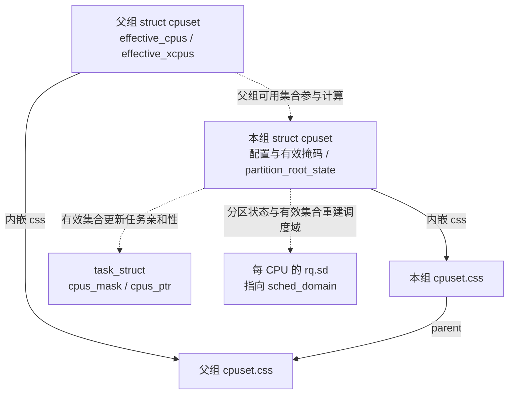

cpuset 沿 `css.parent` 找父组，见 [`parent_cs()`](../../linux/kernel/cgroup/cpuset-internal.h#L196)。图中的两条更新路径分别对应 [`cpuset_update_tasks_cpumask()`](../../linux/kernel/cgroup/cpuset.c#L1192) 和 [`rebuild_sched_domains_locked()`](../../linux/kernel/cgroup/cpuset.c#L1097) → [`partition_sched_domains()`](../../linux/kernel/sched/topology.c#L2870)。第 2.3～2.6 节会沿它们解释独占怎样落实。

**任务怎样找到 cpuset，配置又怎样进入任务。** cpuset 和 cpu 共用第 1.1.1 节的 `cgroup`、css 与 `css_set` 归属关系，但控制器状态指向的是 `struct cpuset`：

```text
task_struct.cgroups → css_set.subsys[cpuset_cgrp_id] → cpuset.css
                                                       ↓ css_cs()
                                                    struct cpuset
                                                       ↓ effective_cpus
                                                任务的允许 CPU 范围
```

内核通过 [`css_cs()`](../../linux/kernel/cgroup/cpuset-internal.h#L185) 找回外层 cpuset。任务的亲和性字段见 [`task_struct`](../../linux/include/linux/sched.h#L917)：

| 任务字段 | 用途 |
| -------- | ---- |
| `cpus_mask` | 保存任务自己的亲和性掩码 |
| `cpus_ptr` | 调度器访问允许 CPU 集合的指针 |
| `user_cpus_ptr` | 保存用户亲和性请求，可形成比 cpuset 更窄的范围 |
| `nr_cpus_allowed` | `cpus_mask` 中的 CPU 数量；迁移禁止期间不随 `cpus_ptr` 临时指向的单 CPU 集合变成 1 |

父组向 `cgroup.subtree_control` 写入 `+cpuset` 后，子组才有自己的 cpuset 状态和配置接口；如果同时配置时间与位置，可写 `+cpu +cpuset`。启用规则见第 1.1.1、1.2.1 节。与第 1.2 节的 cpu 路径对应，cpuset 通过 [`cpuset_cgrp_subsys`](../../linux/kernel/cgroup/cpuset.c#L3884) 接到 cgroup 核心：

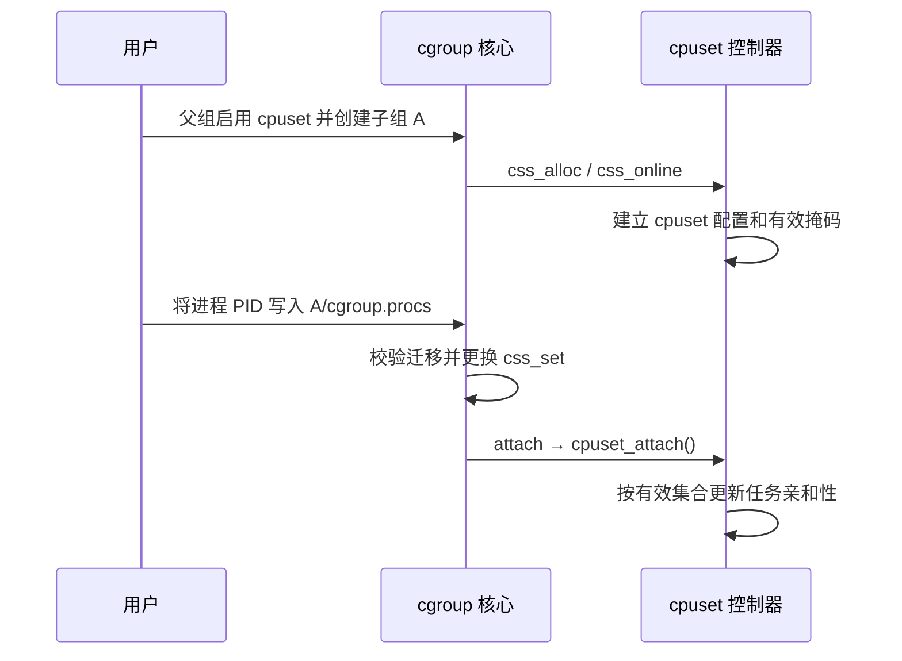

图中只展开 cpuset 控制器的主要职责，逐任务更新条件见第 2.6 节。**cpu 换组改变竞争关系，cpuset 更新改变允许位置。** 同一次 cgroup 迁移可以同时触发两个控制器的回调。

### 2.2 `member`：限制本组范围，兄弟组可以重叠

普通成员的有效掩码是配置值和父组有效集合的交集，见 [`compute_effective_cpumask()`](../../linux/kernel/cgroup/cpuset.c#L1227)。v2 里如果交集为空，就继承父组有效集合，见 [空掩码继承](../../linux/kernel/cgroup/cpuset.c#L2290)。

这意味着 `cpuset.cpus` 是**配置请求**，`cpuset.cpus.effective` 才是实际约束。先看父组 CPU 充足的普通情况：

```text
根组 effective_cpus = 0-7

A：cpus = 4-7，partition = member
   effective_cpus = 4-7
   A 的任务只能跑 4-7

根组任务的 effective_cpus 仍是 0-7
B 若没写 cpus，继承 0-7

结果：A 被限制在 4-7，但根组和 B 仍能使用 4-7
```

这叫**放置约束**，普通任务必须在生效掩码内运行。兄弟组的有效掩码重叠时，任务仍可能在同一颗 CPU 上一起排队；配置的 `cpu.weight` / `cpu.max` 继续约束公平类的时间分配。

如果父组后来只剩 0-3，A 仍写 4-7，空交集会使 A 继承 0-3。这个例子也说明为什么必须读 `.effective`，不能只看配置列表。

“空配置会继承”不等于“随时都能清空配置”。新组保持空的 `cpuset.cpus` 可以继承；但当前源码对已经 populated 的非根组，将原本非空的 `cpus_allowed` 改为空，会返回 `-ENOSPC`，见 [`validate_change()`](../../linux/kernel/cgroup/cpuset.c#L679)。这里的 populated 包括子树已有任务或正在迁入任务，见 [`cpuset_is_populated()`](../../linux/kernel/cgroup/cpuset.c#L355)。父组变化造成的空交集回退，与用户主动清空配置，是两条不同路径。

### 2.3 `root`：授予独占 CPU，并从父组有效集合中扣除

继续使用根组 0-7、A 配置 4-7 的例子，把 A 改成分区。这里直接在根组下面建立本地分区，没有热插拔或额外启动隔离，所有示例 CPU 都可用于调度。

```text
启用前：
  根组 effective_cpus = 0-7
  A：cpuset.cpus = 4-7，partition = member
  根组普通任务仍可使用 4-7

A 写入 cpuset.cpus.partition = root，且分区有效后：
  A.effective_xcpus = 4-7
  A.effective_cpus  = 4-7
  根组 effective_cpus = 0-3          ← 4-7 已从父组拿走
  根组普通任务的亲和性不再包含 4-7
```

启用本地分区时，内核做的关键动作是：

1. 用 [`compute_excpus()`](../../linux/kernel/cgroup/cpuset.c#L1528) 算独占候选：`user_xcpus(cs) ∩ parent.effective_xcpus`；未显式设置 `cpuset.cpus.exclusive` 时，还要剔除兄弟已申请或获批的独占 CPU。因此实际获批集合不一定等于写入的完整列表。
2. 检查集合非空、独占性和 housekeeping 条件。带任务的分区不能被抽空，这里的任务包括仍属于该分区的普通 member 后代，见 [`tasks_nocpu_error()`](../../linux/kernel/cgroup/cpuset.c#L1303) 和 [`partition_is_populated()`](../../linux/kernel/cgroup/cpuset.c#L373)。
3. 调用 [`partition_xcpus_add()`](../../linux/kernel/cgroup/cpuset.c#L1358)：从**父组** `effective_cpus` 里删掉这些 CPU；父组是根组时，还把它们记入 `subpartitions_cpus`。
4. 更新父组任务的亲和性，并递归更新受影响的兄弟子树，见 [父组与兄弟更新](../../linux/kernel/cgroup/cpuset.c#L2125)。随后 `update_cpumasks_hier()` 更新本分区及后代的有效集合和任务。
5. 标记需要重建调度域。

有效分区的自身范围由独占集合计算，并与 active CPU（已经进入调度可用阶段的 CPU）集合相交，再扣除子分区已占用的 CPU，见 [`compute_partition_effective_cpumask()`](../../linux/kernel/cgroup/cpuset.c#L2158)。例如 A 再把 CPU 6-7 给子分区，A 自己就只剩 4-5。显式配置了 `exclusive_cpus` 时，它独立于 `cpus_allowed`，不能只凭 `cpuset.cpus` 推断分区结果，见 [`user_xcpus()`](../../linux/kernel/cgroup/cpuset.c#L573)。

**写入后要读回 `cpuset.cpus.partition` 和 `.effective` 文件。** 请求可能留下 `root invalid (...)` 或 `isolated invalid (...)` 状态；只有有效分区才能按上面的独占关系理解。下面继续解释这种结果怎样产生。

### 2.4 分区实现细节：本地、远端和 invalid 状态

#### 2.4.1 本地分区与远端分区的入口

把 `cpuset.cpus.partition` 写成 `root` 或 `isolated` 时，内核走 [`cpuset_partition_write()`](../../linux/kernel/cgroup/cpuset.c#L3530) → [`update_prstate()`](../../linux/kernel/cgroup/cpuset.c#L3050)。父组本身已是有效 partition 时，创建的是本地分区，调用 [`update_parent_effective_cpumask()`](../../linux/kernel/cgroup/cpuset.c#L1811)；否则走需要 `CAP_SYS_ADMIN` 的远端分区，见 [`remote_partition_enable()`](../../linux/kernel/cgroup/cpuset.c#L1584)。根组已经是 `PRS_ROOT`，根下直接建分区可以走本地路径。

本地分区不强制先写 `cpuset.cpus.exclusive`；远端分区从根 cpuset 取得独占 CPU，必须沿祖先设置 `exclusive` 把候选 CPU 传下来，见 [本地与远端分区说明](../../linux/kernel/cgroup/cpuset.c#L118)。

“远端”描述的是**目录父组与实际划出 CPU 的分区不在同一层**，并不是远端机器或 NUMA 节点。假设 0-7 全部 active，没有其他分区冲突，各层已向需要的子组启用 cpuset，A 自身不放任务；下图是 B 成为有效远端 root 后的结果：

```text
根组：effective = 0-3                ← 实际把 4-7 划给 B 的分区
└── A：partition = member
    cpus = 0-7
    exclusive = 4-7
    effective = 0-3                  ← A 内普通任务的运行范围
    exclusive.effective = 4-7        ← 向后代传递的独占候选
    └── B：partition = root（远端）
        cpus = 4-7
        exclusive = 4-7
        effective = 4-7
```

B 的目录父组仍是 A，但 CPU 从根分区划出，见 [`remote_partition_enable()`](../../linux/kernel/cgroup/cpuset.c#L1615)。A 的 `effective` 随根组缩成 0-3，`exclusive.effective` 仍把 4-7 传给 B；后者走[远端分区的有效集合计算](../../linux/kernel/cgroup/cpuset.c#L2266)，不再套用 member 的“与父 effective 求交”。因此不能用“A 自己不能在 4-7 跑”推断“它下面的远端分区也不能在 4-7 跑”。

独占结果靠父组有效集合与任务亲和性落实。父组任务更新掩码时，根组走的是 `possible_mask & ~subpartitions_cpus`，见 [`cpuset_update_tasks_cpumask()`](../../linux/kernel/cgroup/cpuset.c#L1192)。带 `PF_NO_SETAFFINITY` 的 per-CPU 内核线程不会被改亲和性，它们仍可能留在被分区的 CPU 上。这是有意为之：不能把 `ksoftirqd/4` 这类线程从 CPU 4 赶走。

#### 2.4.2 请求失败可以留下 invalid 状态

分区条件检查失败时，`update_prstate()` 往往把状态记成负值，**写入系统调用仍可返回成功**，见 [错误状态落地与返回值](../../linux/kernel/cgroup/cpuset.c#L3133)。必须读回 `cpuset.cpus.partition`，例如 `root invalid (Parent unable to distribute cpu downstream)`；错误字符串见 [`perr_strings[]`](../../linux/kernel/cgroup/cpuset.c#L55)。

常见原因是独占候选为空、兄弟独占冲突、抽空仍有任务的父分区、housekeeping 冲突或远端分区条件不满足。父组是 member 并不必然失败，可以走远端分区；远端路径需要沿祖先传递 `exclusive`，不能位于另一有效分区之下。

#### 2.4.3 全局掩码与分区状态编码

整机还有两张全局掩码：[`subpartitions_cpus`](../../linux/kernel/cgroup/cpuset.c#L77) 记录已从根组下发给本地或远端子分区的独占 CPU；[`isolated_cpus`](../../linux/kernel/cgroup/cpuset.c#L82) 保存 cpuset 维护的全局隔离集合。根组只读接口 [`cpuset.cpus.isolated`](../../linux/kernel/cgroup/cpuset.c#L3622) 打印后者。

`isolated_cpus` 在 [`cpuset_init()`](../../linux/kernel/cgroup/cpuset.c#L3932) 中先纳入 `cpu_possible_mask` 里不属于启动时 `HK_TYPE_DOMAIN` 的 CPU，之后由分区建立、撤销与状态切换路径增删。更新使用的是独占集合，见 [`partition_xcpus_add()`](../../linux/kernel/cgroup/cpuset.c#L1369) 和 [`isolated_cpus_update()`](../../linux/kernel/cgroup/cpuset.c#L1340)，不要求其中每颗 CPU 都 active。因此 `cpuset.cpus.isolated` 可能包含启动隔离和离线 CPU，不能简单等同于各 isolated 分区的 `effective_cpus` 并集。isolated 父分区再划出一个 root 子分区时，也会把这部分 CPU 从全局隔离集合移除。

partition 状态使用有符号整数：`member = 0`、`root = 1`、`isolated = 2`，无效 root / isolated 分别为 -1 / -2，见 [状态常量](../../linux/kernel/cgroup/cpuset.c#L129)。热插拔或配置变化可能使分区失效，独占结论须以 CPU 可用、分区有效、配置稳定的普通任务为范围。

### 2.5 `isolated`：独占之外，再改变均衡和部分内核工作范围

调度域（`sched_domain`）描述调度器在哪些 CPU 之间寻找或搬运任务。分区不仅影响任务亲和性，也会改变负载均衡使用的 CPU 集合，见 [`generate_sched_domains()`](../../linux/kernel/cgroup/cpuset.c#L831)。

| A 拿到 CPU 4-7 之后 | `root` | `isolated` |
| ------------------ | ------ | ---------- |
| 分区外普通任务能否使用 4-7 | 不能，受有效亲和性约束 | 不能，受有效亲和性约束 |
| 4-7 是否作为独立分区参与域内均衡 | 是 | 自身有效 CPU 不进入调度域集合 |
| unbound 工作队列 | 不因该状态额外排除 | 通常排除这些 CPU，有回退条件 |
| 分区内线程分布 | 调度器可做域内均衡 | 仍会选核，但不靠域内均衡持续调整；确定布局可用逐线程亲和性 |

区别由 [`update_partition_sd_lb()`](../../linux/kernel/cgroup/cpuset.c#L1273) 落实；unbound 工作队列更新见 [`update_isolation_cpumasks()`](../../linux/kernel/cgroup/cpuset.c#L1452)。后者不影响绑定工作队列。若排除后掩码为空，工作队列使用原请求掩码；若掩码分配或更新失败，可能保留原有效配置，见 [`workqueue_unbound_exclude_cpumask()`](../../linux/kernel/workqueue.c#L7022)。因此 isolated 状态有效，并不保证这次工作队列排除也已经成功。

isolated CPU 仍有运行队列，允许在上面运行的任务照常调度；同一 CPU 上的多个可运行任务仍能轮流执行。亲和性变化时，调度器还会通过 [`cpumask_any_and_distribute()`](../../linux/kernel/sched/core.c#L3128) 选择迁移目标，帮助批量改变 cpuset 的任务分散到新范围。被关闭的是这组 CPU 之间的调度域负载均衡，不能由此推断“不绑核就都只能跑在一颗 CPU 上”。不过若线程负荷后来发生变化，应用不能再依靠域内均衡自动摊平；需要确定布局时，应显式安排各线程的亲和性。

per-CPU 内核线程、绑定工作队列、硬中断和 NMI 仍可能执行。isolated 也不会自动开启 nohz_full 或设置 IRQ 亲和性；启动隔离与调度域细节在下面展开。

[`update_partition_sd_lb()`](../../linux/kernel/cgroup/cpuset.c#L1273) 规定：有效 `PRS_ROOT` 打开 `CS_SCHED_LOAD_BALANCE`，有效 `PRS_ISOLATED` 关掉它。同时 [`isolated_cpus_update()`](../../linux/kernel/cgroup/cpuset.c#L1340) 把这些 CPU 加入或移出全局 `isolated_cpus`。

#### 2.5.1 从有效分区生成调度域集合

重建调度域时，v2 只把**有效且非 isolated** 的 partition root 放进候选，见 [`generate_sched_domains()` 的 v2 分支](../../linux/kernel/cgroup/cpuset.c#L908)：

```text
遍历 cpuset 树：
  只收集 partition_root_state == PRS_ROOT 且 effective_cpus 非空的组
  isolated 分区自身的 effective_cpus 不进入候选
  仍可继续扫描其后代；独立的有效 root 子分区可以进入候选

根组仍负载均衡、又没有任何非 isolated 子分区时：
  退回单一调度域 = 根组 effective_cpus ∩ housekeeping(HK_TYPE_DOMAIN)
```

掩码改完后，[`update_partition_sd_lb()`](../../linux/kernel/cgroup/cpuset.c#L1273) 置 `force_sd_rebuild`，[`rebuild_sched_domains_locked()`](../../linux/kernel/cgroup/cpuset.c#L1097) 调用 `generate_sched_domains()`，再交给 [`partition_sched_domains()`](../../linux/kernel/sched/topology.c#L2870) 拆掉旧域、建新域。

没有子分区时，[单域快路径](../../linux/kernel/cgroup/cpuset.c#L851) 给出一个 CPU 集合 `top_cpuset.effective_cpus ∩ housekeeping(HK_TYPE_DOMAIN)`。这里的“一个域”指一个调度域分区；内部仍按 SMT、缓存、NUMA 等拓扑构建多层 `sched_domain`，见 [逐拓扑层建域](../../linux/kernel/sched/topology.c#L2502)。出现有效 `root` 子分区后，它的有效 CPU 从父分区集合中分离，成为独立集合。isolated 自身的有效 CPU 不进入任何域集合。

**只设置独占标志不等于自动出现新的调度分区；v2 以有效 partition root 为准。** 普通域内负载均衡、wakeup affine 和 newidle 拉任务，按所属调度域边界工作。v2 的有效分区集合不应重叠，重叠合并分支会触发警告，见 [检查位置](../../linux/kernel/cgroup/cpuset.c#L936)。域外的 CPU 对普通域内均衡来说属于另一个范围；完整的域层级见 [sched.md](sched.md)。

#### 2.5.2 与启动隔离参数的关系

若启动时用了带 `domain` 标志的 `isolcpus=`，或省略标志而采用默认 `domain`，相应 CPU 不在 `HK_TYPE_DOMAIN` housekeeping 集合里。启用**本地 root 分区**时，[`prstate_housekeeping_conflict()`](../../linux/kernel/cgroup/cpuset.c#L1763) 会拒绝包含这些 CPU 的候选，只允许 isolated；调用点见 [本地启用检查](../../linux/kernel/cgroup/cpuset.c#L1885)。已有分区修改掩码时，[`validate_partition()`](../../linux/kernel/cgroup/cpuset.c#L2494) 也会检查这一条件。

这个条件不能泛化成“所有路径都禁止 root 使用启动隔离 CPU”：当前源码的 [`remote_partition_enable()`](../../linux/kernel/cgroup/cpuset.c#L1584) 没有调用上述检查，而有效 isolated → root 的 [状态切换分支](../../linux/kernel/cgroup/cpuset.c#L3107) 也没有重新核对 `boot_hk_cpus`。生成 v2 调度域时，[只有根 cpuset 的集合再与 `HK_TYPE_DOMAIN` 相交](../../linux/kernel/cgroup/cpuset.c#L976)，其他有效 root 的集合直接复制。阅读本版本时，应按实际走到的入口分析，不能仅凭一个校验辅助函数推断所有状态变化都执行了同一检查。

**不能泛指任何 `isolcpus=` 都有 domain 隔离效果**：`nohz` 对应 tick 等内核噪声控制，`managed_irq` 对应托管中断，见 [参数解析](../../linux/kernel/sched/isolation.c#L200)。cgroup isolated 是运行时可改的调度分区，不会自动开启 nohz_full 或 managed IRQ 隔离。

调度器的 [`cpu_is_isolated()`](../../linux/include/linux/sched/isolation.h#L73) 会综合启动隔离与 cpuset 的结果：

```text
cpu_is_isolated(cpu) =
    不在 HK_TYPE_DOMAIN housekeeping 集合
    或不在 HK_TYPE_TICK housekeeping 集合
    或 cpuset_cpu_is_isolated(cpu)
```

这里 housekeeping 集合表示仍承担相应普通调度或内核工作的 CPU；domain、tick 和 cpuset 分区分别产生自己的约束。

### 2.6 任务亲和性：把 cpuset 结果写入 `cpus_mask / cpus_ptr`

cpuset 算出组的有效范围，调度器则通过每个任务自己的亲和性字段使用这个范围。先看 [`task_struct` 的亲和性成员](../../linux/include/linux/sched.h#L917)：

```c
struct task_struct {
    /* 省略其他成员 */
    int nr_cpus_allowed;
    const cpumask_t *cpus_ptr;       /* 调度器访问允许 CPU 集合的指针 */
    cpumask_t *user_cpus_ptr;        /* 保存的用户亲和性请求 */
    cpumask_t cpus_mask;             /* 任务自己的亲和性掩码存储 */
    /* 省略其他成员 */
};
```

`cpus_mask` 保存任务掩码，`cpus_ptr` 是调度器使用的访问入口，`user_cpus_ptr` 保存用户请求。先分清这三者，再看配置更新、任务迁入和用户亲和性怎样修改最终允许范围。

通常 `cpus_ptr == &p->cpus_mask`；在 `migrate_disable()` 期间发生调度切换时，[`migrate_disable_switch()`](../../linux/kernel/sched/core.c#L2383) 可以让它暂时指向当前 CPU 的单 CPU 掩码，而 `cpus_mask` 仍保存原允许范围。恢复迁移时，[`___migrate_enable()`](../../linux/kernel/sched/core.c#L2402) 再把指针接回 `cpus_mask`。非 RT 内核也有这条路径，不能把 `cpus_ptr` 当成永远不变的别名。

#### 2.6.1 配置更新后遍历任务，修改允许集合

cpuset 改掩码之后，必须更新任务亲和性，调度器选核才会认。**`cpus_allowed` 是 `struct cpuset` 的配置字段；当前 `task_struct` 的亲和性掩码叫 `cpus_mask`，调度器主要通过 `cpus_ptr` 访问它**，见 [任务字段](../../linux/include/linux/sched.h#L918)。落地函数是 [`cpuset_update_tasks_cpumask()`](../../linux/kernel/cgroup/cpuset.c#L1192)：

```text
遍历该 cpuset 的任务：
  根组：new = possible_mask & ~subpartitions_cpus   （跳过 PF_NO_SETAFFINITY）
  其他：new = possible_mask ∩ cs->effective_cpus
  set_cpus_allowed_ptr(task, new)
```

#### 2.6.2 迁入任务与用户亲和性的交集

任务迁入新 cpuset 时，[`cpuset_attach_task()`](../../linux/kernel/cgroup/cpuset.c#L3297) 走同一条约束：非根组用 [`guarantee_active_cpus()`](../../linux/kernel/cgroup/cpuset.c#L420) 取得 `effective_cpus` 中的 active CPU；异常情况下沿祖先找可用 CPU。active 是在线且已进入调度可用阶段的 CPU，热插拔过程中不能简单等同于 online。

v2 下只有有效 CPU **和有效内存节点集合都没变**，attach 才能跳过逐任务更新，见 [`cpuset_attach()`](../../linux/kernel/cgroup/cpuset.c#L3341)。

配置稳定时，用户调用 `sched_setaffinity()` 也逃不出 cpuset。[`__sched_setaffinity()`](../../linux/kernel/sched/syscalls.c#L1158) 先取 [`cpuset_cpus_allowed()`](../../linux/kernel/cgroup/cpuset.c#L4239)，再和用户请求做交集；交集没有可用 CPU 则失败。用户掩码可以更窄，实际允许范围不能更宽。之后 [`set_cpus_allowed_common()`](../../linux/kernel/sched/core.c#L2694) 更新 `p->cpus_mask`，[`__set_cpus_allowed_ptr_locked()`](../../linux/kernel/sched/core.c#L3070) 必要时把任务迁离旧 CPU。

#### 2.6.3 已保存的用户掩码与热插拔回退

上面的伪代码描述的是 cpuset 交给调度器的掩码。调度器还会与已保存的 `user_cpus_ptr` 相交：有非空交集就保留用户的更窄约束；交集为空则按新的 cpuset 掩码重设，见 [`__set_cpus_allowed_ptr()`](../../linux/kernel/sched/core.c#L3158)。因此 cpuset 更新不一定把每个任务的掩码都扩大到整个有效集合。

回退时改变的是这次生效的 `cpus_mask`，**保存的用户请求并没有被清除**。cpuset 调用 [`set_cpus_allowed_ptr()`](../../linux/kernel/sched/core.c#L3176) 时 flags 为 0；只有带 `SCA_USER` 的更新才[交换保存的用户掩码](../../linux/kernel/sched/core.c#L2704)。假设 CPU 都 active、期间没有新的用户 affinity 调用：

| 操作完成后 | 保存的用户请求 `user_cpus_ptr` | cpuset 有效范围 | 任务实际 `cpus_mask` |
| ---------- | ---------------------------- | -------------- | ------------------- |
| 用户成功请求只跑 CPU 5 | 5 | 4-7 | 5 |
| cpuset 改为 0-3 | 5 | 0-3 | 0-3，暂时无法满足原请求 |
| cpuset 再改回 4-7 | 5 | 4-7 | 5，原请求重新生效 |

这和用户新调用 `sched_setaffinity()` 不同：若 cpuset 已经是 0-3，用户此时主动请求 CPU 5，交集为空会失败；不会借这个调用跳出 cpuset。一个是系统更新范围时保留旧请求并回退，另一个是校验新请求能否生效。

根组亲和性还包含 possible 但离线的 CPU；若热插拔导致根组剩余掩码没有 active CPU，[`cpuset_cpus_allowed()`](../../linux/kernel/cgroup/cpuset.c#L4254) 有退回全部 possible CPU 的应急路径，独占结论不能脱离分区有效性和在线状态。

第 2.2 节的空交集继承还有一个边界：父分区无任务，并把所有 CPU 下发给子分区时，父有效集合可以为空，普通成员继承后仍为空；任务迁入会被 [`cpuset_can_attach_check()`](../../linux/kernel/cgroup/cpuset.c#L3178) 以 `-ENOSPC` 拒绝。

### 2.7 沿一次配置更新串起两条落实路径

回到第 2.1 节的结构图：一次配置变化，一路更新任务允许在哪运行，另一路更新 CPU 之间怎样均衡。把前面的函数放在同一张流程图上：

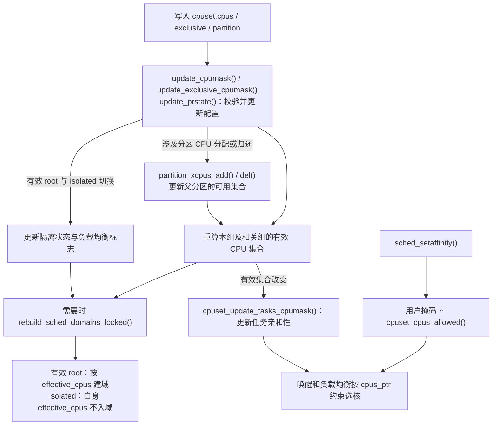

图中分支表示不同更新的主要影响。写 cpus 和 exclusive 分别进入 [`update_cpumask()`](../../linux/kernel/cgroup/cpuset.c#L2586) 与 [`update_exclusive_cpumask()`](../../linux/kernel/cgroup/cpuset.c#L2646)。普通 member 不会因自身放置范围的变化而独占 CPU；分区建立、调整可能划出 CPU，撤销或失效可能归还 CPU，见 [`partition_xcpus_add()`](../../linux/kernel/cgroup/cpuset.c#L1358) 和 [`partition_xcpus_del()`](../../linux/kernel/cgroup/cpuset.c#L1390)。有效 `root` 与 `isolated` 之间的成功切换只改变隔离和均衡状态，不重新分配 CPU，见 [`update_prstate()` 的切换分支](../../linux/kernel/cgroup/cpuset.c#L3107)。

所以空间隔离最终落在**任务亲和性和调度域边界**上。cpuset 负责计算有效 CPU 集合并更新任务掩码；`/proc/<pid>/status` 里的 `Cpus_allowed_list` 是核对任务结果的入口。

### 2.8 综合示例：给延迟敏感容器划出 CPU 4-7

假设宿主机的 8 颗逻辑 CPU 全部 active，没有额外的启动隔离配置。根组向子组启用 `cpu cpuset`，要给延迟敏感容器独占 CPU 4-7，并减少均衡和部分内核工作干扰。最终布局如下；CPU 编号是否覆盖完整 SMT 兄弟，需要按导读中的 x86 拓扑说明核对实际拓扑：

```text
/sys/fs/cgroup                          根组，内部为 PRS_ROOT，最终 effective = 0-3
  cgroup.subtree_control = cpu cpuset
  │
  ├── system.slice                      系统服务，cpus = 0-3，partition = member
  └── pod-latency                       独占容器
        cpuset.cpus = 4-7
        cpuset.cpus.partition = isolated
        cpu.weight = 100                独占后同核上往往只剩自己，权重不再是关键
        cpu.max = max 100000            不靠配额限速
```

根组内部是 `PRS_ROOT`，但根目录**没有 `cpuset.cpus.partition` 文件**，见 [文件标志](../../linux/kernel/cgroup/cpuset.c#L3595)。这里让系统服务保持 member，把 0-3 留在根分区。若把 `system.slice` 的 0-3 也设为独立 root，再把 4-7 全分出去，就会抽空仍有任务的根分区，触发 `PERR_NOCPUS`；不能把这当成一个必然可用的示例。

沿配置到调度结果的顺序是：

1. 根组写入 `cgroup.subtree_control = +cpu +cpuset`，创建子目录后，子组得到自己的 `task_group` 和 `struct cpuset`；也可以先建目录再启用控制器，由核心补建状态。
2. 写入 `cpuset.cpus = 4-7`。此时若仍是 `member`，只约束该组任务，根组任务还能用 4-7。
3. 写入 `cpuset.cpus.partition = isolated`。`update_prstate()` 确认根组是有效 partition，按本地 isolated 启用。
4. `partition_xcpus_add()` 从根组 `effective_cpus` 删除 4-7，写入 `subpartitions_cpus` 和 `isolated_cpus`。
5. 更新根组及受影响 member 子树的任务亲和性，允许范围落在 0-3；pod 内任务的允许范围落在 4-7。已保存的用户 affinity 可以更窄，根组的 `PF_NO_SETAFFINITY` 任务被跳过。
6. 默认 unbound 工作队列掩码排除 4-7，绑定工作队列仍可能在这些 CPU 上执行。
7. `generate_sched_domains()` 只给根组剩下的 0-3 建域；4-7 不在任何负载均衡域里。
8. 分区有效且配置稳定期间，普通任务的唤醒、fork、exec 和迁移都受各自亲和性约束。根组普通任务再忙，也不会因负载均衡迁到 4-7；pod 内仍会选核和切换任务，但不能依靠域内负载均衡持续摊平线程负荷，需要确定布局时应逐线程设置亲和性。

如果只需要独占、仍希望这 4 颗核之间互相均衡，把 partition 写成 `root` 即可。如果只是 shared 容器，不要建 partition，只用 `cpu.weight` / `cpu.max`，让它们在共享核上排队。

三种手段叠在一起时，约束是**同时生效**的：

| 机制 | 直接作用 | 不解决的问题 |
| ---- | -------- | ---------- |
| `cpuset.cpus`（member） | 限制普通任务在 **effective 集合**内运行 | 不排斥其他组；空交集时有效范围可能继承父组 |
| partition `root` / `isolated` | 独占 CPU；isolated 还去掉自身有效 CPU 的调度域均衡 | 不排除 per-CPU 内核线程、绑定工作队列、硬中断、NMI |
| `cpu.weight` | 调节同核争用时的长期份额 | 不提供固定预留或执行上限 |
| `cpu.max` | 公平类的全组执行预算 | RT/DL 类执行；CPU 位置；短时间并行和延迟限流 |

独占核之后再设一个很小的 `cpu.max` 仍然会限流，因为配额按执行时间扣，不看这些核是不是“专用的”。反过来，只设 `cpu.max = 200000 100000` 却只允许 1 颗 CPU，100 ms 内也执行不了 200 ms。

### 2.9 验证与排查：有效集合、亲和性与隔离结果

#### 2.9.1 按归属、有效范围和任务掩码逐项核对

按“组归属 → 分区状态 → 有效 CPU → 任务掩码”检查：

1. `/proc/<pid>/cgroup` 确认任务在哪个 cgroup。v2 通常是 `0::/path`。
2. 读本组及祖先已暴露的 `cpuset.cpus`、`cpuset.cpus.effective`、`cpuset.cpus.exclusive.effective`、`cpuset.cpus.partition`。partition 带 `invalid` 就没有有效独占；根组只读 effective 等实际存在的接口，没有配置 cpus / partition 文件。
3. 根组 `cpuset.cpus.isolated` 应包含 isolated 分区**自身有效 CPU**，但还可能包含启动时纳入的 domain 隔离 CPU 和离线 CPU，不能据此反推哪些目录已成为有效分区。另读 `.exclusive.effective` 时，也要结合 partition 状态区分候选传递和实际划出。本地分区的父组 `cpuset.cpus.effective` 不应包含已下发的独占 CPU；远端分区要核对根组及祖先传播后的有效集合。
4. 对配置稳定的非根普通任务，`/proc/<pid>/status` 的 `Cpus_allowed_list` 应落在该组 `cpuset.cpus.effective` 内。用户 affinity 可以更窄；根组掩码可额外包含离线的 possible CPU，应结合在线集合核对。
5. 整机有空闲但线程仍排队，优先查 `Cpus_allowed_list` 和 cpuset 分区，而不是先怀疑公平类挑错了人。

亲和性属于线程。多线程进程还应逐个核对 `/proc/<PID>/task/<TID>/status`；只看主线程的 `/proc/<PID>/status`，不能代表每个工作线程都用了相同掩码。线程目录和状态文件分别见 [`task` 目录注册](../../linux/fs/proc/base.c#L3298)与[线程 `status` 注册](../../linux/fs/proc/base.c#L3656)。

#### 2.9.2 用放置与隔离的现象选择源码路径

| 现象或疑问 | 优先核对什么 |
| ---------- | ------------ |
| 整机有空闲 CPU，线程却排队 | 任务 `Cpus_allowed_list`、cpuset 有效集合，以及 isolated 内的线程分布 |
| 写了 CPU 列表，其他组仍来运行 | 是否仍为 member？分区状态是否带 invalid？ |
| 配置 isolated 后仍有内核工作 | 区分 unbound 工作队列、绑定工作队列、per-CPU 线程和中断 |

这些检查对应有效掩码、分区与亲和性路径，源码入口见第 2.10 节。时间与位置约束同时生效：独占 CPU 也会受 `cpu.max` 限制；允许一颗 CPU 的组，即使预算相当于两颗 CPU，也无法凭预算获得第二颗 CPU。时间约束的验证与统计口径见第 1.5 节。

### 2.10 cpuset 源码阅读地图：从有效集合走到调度结果

每次先找到对象字段，再选择一种操作或一次状态变化，把函数放回前面的架构中。

| 想回答的问题 | 先看的对象 | 再跟的入口 | 本文位置 |
| ------------ | ---------- | ---------- | -------- |
| 任务怎样找到自己的 cpuset？ | `css_set.subsys[]`、`cpuset.css`、任务亲和性字段 | [`css_cs()`](../../linux/kernel/cgroup/cpuset-internal.h#L185)、[`cpuset_attach()`](../../linux/kernel/cgroup/cpuset.c#L3316) | 第 2.1、2.6 节 |
| member 的配置怎样变成有效范围？ | `cpus_allowed / effective_cpus` | [`compute_effective_cpumask()`](../../linux/kernel/cgroup/cpuset.c#L1227)、[空掩码继承](../../linux/kernel/cgroup/cpuset.c#L2290) | 第 2.2 节 |
| 独占 CPU 怎样从父组移出？ | cpuset 的配置与有效掩码 | [`update_prstate()`](../../linux/kernel/cgroup/cpuset.c#L3050)、[`partition_xcpus_add()`](../../linux/kernel/cgroup/cpuset.c#L1358) | 第 2.3～2.4 节 |
| 放置和均衡边界怎样落实？ | `cpus_mask / cpus_ptr`、`rq.sd` | [`cpuset_update_tasks_cpumask()`](../../linux/kernel/cgroup/cpuset.c#L1192)、[`generate_sched_domains()`](../../linux/kernel/cgroup/cpuset.c#L831) | 第 2.5～2.7 节 |

## 附录 A. 源码范围与编译假设

本文开启 `CGROUP_SCHED`、`FAIR_GROUP_SCHED`、`CPUSETS`，假定未启用 sched_ext 接管、autogroup 和 [`SCHED_PROXY_EXEC`](../../linux/init/Kconfig#L905)。本书的数据中心配置默认开启 [`CFS_BANDWIDTH`](../../linux/init/Kconfig#L1117)；源码 Kconfig 的 `default` 仍是 n，[x86_64_defconfig](../../linux/arch/x86/configs/x86_64_defconfig#L16) 只显式打开 `CGROUP_SCHED`，[`FAIR_GROUP_SCHED`](../../linux/init/Kconfig#L1111) 跟随它打开。

`CFS_BANDWIDTH` 会 select `GROUP_SCHED_BANDWIDTH`，后者控制 [`cpu.max` 文件注册](../../linux/kernel/sched/core.c#L10273)。本书不假定开启 nohz_full。单任务公平调度算法见 [eevdf.md](eevdf.md)，运行队列与负载均衡全景见 [sched.md](sched.md)。非 `PREEMPT_RT` 并不表示系统里没有 RT 或 DEADLINE 任务。
