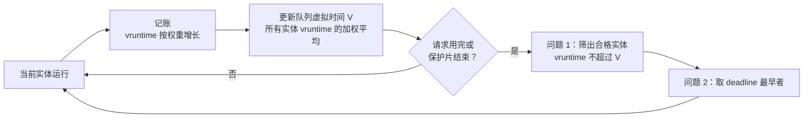
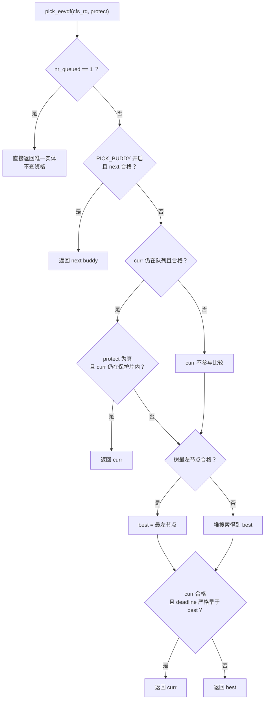
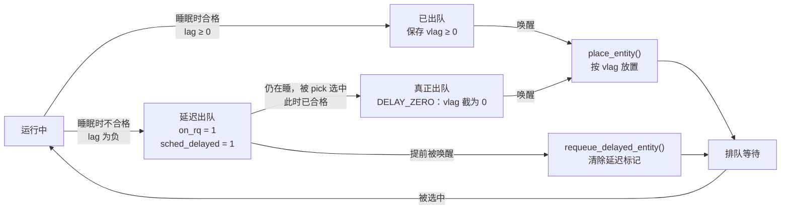
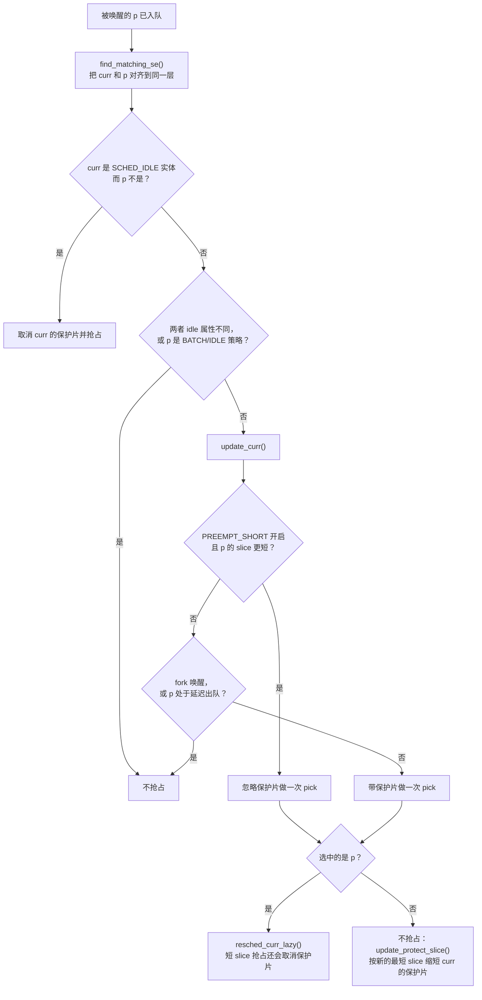
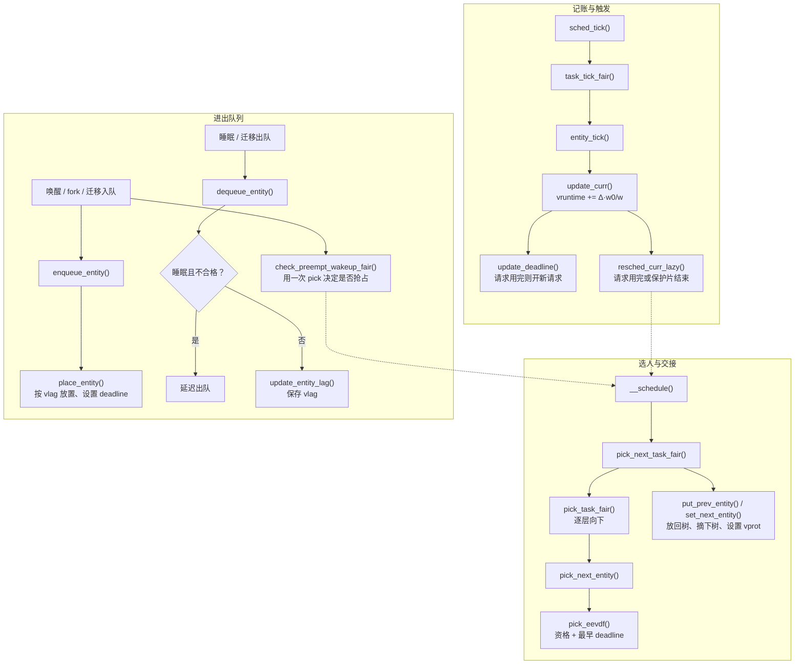

# EEVDF：Linux 公平调度器如何挑出下一个任务

> **范围**：以仓库 `linux/` 目录中的 Linux 6.18.52 源码为准，见 [Makefile](../../linux/Makefile#L2)。只讨论 x86-64、非 RT 内核，按云计算数据中心常见配置：`CONFIG_HZ_1000`、`CONFIG_PREEMPT_VOLUNTARY`、`CONFIG_FAIR_GROUP_SCHED`（随 `CONFIG_CGROUP_SCHED` 默认打开），见 [x86_64_defconfig](../../linux/arch/x86/configs/x86_64_defconfig#L7)、[HZ_1000](../../linux/arch/x86/configs/x86_64_defconfig#L43)、[`FAIR_GROUP_SCHED`](../../linux/init/Kconfig#L1111)。运行队列、调度类、负载均衡等全景见同目录的 [sched.md](sched.md)，本文只把公平类内部的 EEVDF 讲透。
>
> **阅读路线**：先用生活类比和一组数字建立直觉 → 对照源码字段 → 看两个核心结构 → 从理想模型推出公式 → 八个算法环节 → 两个逐 tick 模拟 → 唤醒、组调度、调用路径和常见误区。

下文公式都写成独立的 `$$` 块，用 GitHub / VS Code / Typora 预览 Markdown 时可以直接渲染。表格里只写符号名，不夹杂 `$`，以免被表格语法拆坏。

## 1. 先建立直觉：EEVDF 每次只问两个问题

把一颗 CPU 想成一台大家共用的咖啡机：

- 每人手里的**饭票数量不同**——这就是**权重**，由 nice 值或 cgroup 的 CPU 权重决定。饭票多的人，长期来看应该用得更久。
- 管理员有一本**账本**，记着每人“按饭票应该用多久”和“实际用了多久”。两者之差叫 **lag**：为正说明系统欠他，为负说明他用超了。
- 每人每次来都报一个“**这次我要用多久**”——这就是**请求长度 slice**。
- 管理员据此算出“如果完全公平地分配，他这次最晚应该什么时候用完”——这就是**虚拟截止期 deadline**。

轮到换人时，管理员只问两个问题：

1. **你有没有资格？** 只有没用超的人（lag 大于或等于 0）才有资格。这一条保证**公平**：已经超前的人不能插队。
2. **有资格的人里，谁的截止期最早？** 截止期最早的先用。这一条照顾**延迟**：每次只要一小口的人，截止期来得早，能更快轮到。

这就是 EEVDF（Earliest Eligible Virtual Deadline First，最早合格虚拟截止期优先）名字的全部含义：**Eligible** 对应第一个问题，**Earliest Virtual Deadline** 对应第二个问题。源码注释也是这样概括的，见 [`pick_eevdf()` 上方注释](../../linux/kernel/sched/fair.c#L996)。



先记住一句话，后面每个公式都在验证它：

**权重决定长期 CPU 份额；slice 只决定先后顺序和每次运行的粒度。** 把 slice 调短不会多拿 CPU，只会更频繁、更及时地拿到 CPU。

## 2. 先算一遍：两个任务抢一台 CPU

先不要看源码字段。假设单 CPU 上只有 A、B 两个一直可运行的任务，都是 nice 0（权重相同），A 每次想跑 3 ms，B 每次想跑 1 ms。两者进度都从 0 开始。

因为权重相同，谁跑 1 ms，进度就加 1；队列的公平时钟 `V` 是两人进度的平均值。合格条件是：进度还没有超过 `V`。

| 时刻 | 谁刚跑完 | A 的进度 | B 的进度 | 公平时钟 V | 谁合格 | 下一步选谁 | 原因 |
| --- | --- | --- | --- | --- | --- | --- | --- |
| 0 ms | 还没开始 | 0 | 0 | 0 | A、B | B | 都合格，B 的截止期更早（0+1 对 0+3） |
| 1 ms | B 跑了 1 ms | 0 | 1 | 0.5 | 只有 A | A | B 已经超前，没资格 |
| 2 ms | A 跑了 1 ms | 1 | 1 | 1 | A、B | B | 都合格，B 更急 |
| 3 ms | B 跑了 1 ms | 1 | 2 | 1.5 | 只有 A | A | B 又超前了 |
| 4 ms | A 跑了 1 ms | 2 | 2 | 2 | A、B | 两人交替 | 份额始终一半一半 |

这张表已经把 EEVDF 的两句话说完了：

- **份额只看权重。** A 想一次跑 3 ms 也没用，两人每次还是各跑 1 ms，长期都是 50%。
- **延迟看 slice。** B 每次最多等 1 ms。如果 B 也报 3 ms，两人就会一次跑满 3 ms 再换，B 最多要等 3 ms。

第 12 节会按源码把保护片、tick 粒度也算进去，结论不变。

## 3. 符号表：先把数学和源码对上

下文公式里的权重统一用“nice 0 = 1024”的刻度，即 `scale_load_down(se->load.weight)` 的值。64 位内核内部把权重再放大 1024 倍以提高精度（[`scale_load_down()`](../../linux/kernel/sched/sched.h#L150)、[`NICE_0_LOAD`](../../linux/kernel/sched/sched.h#L173)），相除和比较时这个倍数会抵消，读公式时可以忽略。

| 符号 | 含义 | 源码对应 |
| --- | --- | --- |
| `w_i` | 实体 i 的权重 | `se->load.weight`，取值见 [`sched_prio_to_weight[]`](../../linux/kernel/sched/core.c#L10354) |
| `w_0` | nice 0 的权重，等于 1024 | `NICE_0_LOAD` |
| `W` | 本队列所有已入队实体的权重和 | `cfs_rq->sum_weight` 加上 `curr` 的权重 |
| `s_i` | 实体实际得到的 CPU 时间 | `se->sum_exec_runtime` |
| `v_i` | 虚拟运行时间，即按权重折算的服务进度 | `se->vruntime` |
| `V` | 队列虚拟时间，所有 `v_i` 的加权平均 | [`avg_vruntime()`](../../linux/kernel/sched/fair.c#L715) 的返回值 |
| `lag_i` | 应得服务减实得服务 | 不直接保存，按需计算 |
| `vl_i` | 虚拟 lag，即 `V - v_i` | `se->vlag`，出队、改权重时的快照 |
| `r_i` | 本次请求的长度（实际时间） | `se->slice` |
| `ve_i` | 请求的虚拟合格时间 | 请求开始时的 `se->vruntime` |
| `vd_i` | 请求的虚拟截止期 | `se->deadline` |

时间单位：实际时间用 ms（源码里是 ns）；虚拟时间称为“虚拟 ms”。nice 0 实体跑 1 ms，`vruntime` 恰好增加 1 虚拟 ms。

## 4. 核心数据结构

EEVDF 的全部状态放在两个结构里：`sched_entity` 表示一个竞争者（任务或任务组），`cfs_rq` 表示一层竞争队列。下面只保留与 EEVDF 相关的字段，顺序与源码一致。

### 4.1 `struct sched_entity`：一个竞争者

定义见 [include/linux/sched.h](../../linux/include/linux/sched.h#L570)。

```c
struct sched_entity {
	struct load_weight	load;          /* w_i：权重 */
	struct rb_node		run_node;      /* 挂进 cfs_rq->tasks_timeline 的节点 */
	u64			deadline;      /* vd_i：本次请求的虚拟截止期，红黑树按它排序 */
	u64			min_vruntime;  /* 以本节点为根的子树中最小的 vruntime，用于剪枝 */
	u64			min_slice;     /* 子树中最短的 slice，用于计算保护片 */
	u64			max_slice;     /* 子树中最长的 slice，用于 lag 限幅 */
	...
	unsigned char		on_rq;         /* 是否在本层 cfs_rq 中参与竞争 */
	unsigned char		sched_delayed; /* 已经睡眠，但被延迟出队（第 14 节） */
	unsigned char		rel_deadline;  /* deadline 里暂存的是 d - v 的相对值 */
	unsigned char		custom_slice;  /* slice 是否被显式指定 */

	u64			exec_start;            /* 上次记账的时间点 */
	u64			sum_exec_runtime;      /* s_i：累计实际运行时间 */
	u64			prev_sum_exec_runtime; /* 本次上 CPU 时的 sum_exec_runtime */
	u64			vruntime;      /* v_i：按权重折算后的服务进度 */
	s64			vlag;          /* V - v_i 的快照，出队、改权重时保存 */
	u64			vprot;         /* 保护边界：vruntime 到这里之前不主动换人 */
	u64			slice;         /* r_i：请求长度，实际时间 ns */
	...
};
```

四个字段先分清职责：

- `vruntime` 回答“**进度**”：它（折算后）跑了多少。
- `deadline` 回答“**这次请求有多急**”：它决定实体在树里的位置。
- `vlag` 只是**快照**：实体在队列中时，lag 随时用 `V - v_i` 现算；只有离开队列或改权重的那一刻，才把它存进 `vlag`，等回来时使用。
- `vprot` 用来**防抖**：刚换上 CPU 的实体至少运行到这里，避免频繁切换。

### 4.2 `struct cfs_rq`：一层竞争队列

定义见 [kernel/sched/sched.h](../../linux/kernel/sched/sched.h#L676)。

```c
struct cfs_rq {
	struct load_weight	load;           /* 本层所有已入队实体的权重和（含 curr） */
	unsigned int		nr_queued;      /* 本层实体个数（含 curr，含延迟出队者） */
	...
	s64			sum_w_vruntime; /* Σ w_j·(v_j - v0)，只统计树上的实体 */
	u64			sum_weight;     /* Σ w_j，只统计树上的实体 */
	u64			zero_vruntime;  /* v0：相对坐标原点，约等于上次算出的 V */
	...
	struct rb_root_cached	tasks_timeline; /* 按 deadline 排序的增强红黑树，缓存最左节点 */
	struct sched_entity	*curr;          /* 正在运行的实体，不在树上 */
	struct sched_entity	*next;          /* buddy：被提名下一个运行的实体 */
	...
};
```

### 4.3 三者的关系：curr 在树外，V 由“树 + curr”共同决定

```text
struct cfs_rq（某颗 CPU 上的一层公平队列）
│
├── zero_vruntime = v0 ──────────── 坐标原点，每次算出 V 后就挪到 V
├── sum_w_vruntime = Σ w·(v - v0) ┐
├── sum_weight     = Σ w          ┘ 只统计树上的实体
│
├── curr ──► [正在运行的实体]        不在树上；算 V、判资格时临时加进来
│
└── tasks_timeline（增强红黑树，中序遍历 = deadline 从早到晚）
                    ┌──────────────┐
                    │ d=16  v=11   │
                    │ min_v=6      │
                    └──────────────┘
                   /                \
        ┌────────────┐          ┌────────────┐
        │ d=14 v=11  │          │ d=19 v=8   │
        │ min_v=11   │          │ min_v=6    │
        └────────────┘          └────────────┘
            ...                      ...
```

**为什么正在运行的实体不在树上？** 它的 `vruntime` 每次记账都在变。如果它也在树里，每次变化都要调整树中位置、修改 `sum_w_vruntime`。把它摘下来单独存放，`sum_w_vruntime` 只需在实体入树、出树时维护；用到它时再临时加上 `curr` 的贡献，见 [`avg_vruntime()`](../../linux/kernel/sched/fair.c#L727) 和 [`vruntime_eligible()`](../../linux/kernel/sched/fair.c#L808)。实体被选中时由 [`set_next_entity()`](../../linux/kernel/sched/fair.c#L5644) 摘下树，换下时由 [`put_prev_entity()`](../../linux/kernel/sched/fair.c#L5715) 放回树。

### 4.4 增强红黑树：一棵树同时满足两种顺序

EEVDF 选人要同时用到两个量：用 `vruntime` 判断资格，用 `deadline` 排先后。内核用一棵**增强红黑树**同时满足两者（[注释](../../linux/kernel/sched/fair.c#L1007)）：

1. **按 deadline 排序**：中序遍历就是 deadline 从早到晚，比较函数是 [`entity_before()`](../../linux/kernel/sched/fair.c#L582)。最左节点被缓存，deadline 最早的实体可以一次取到。
2. **每个节点缓存子树的最小 vruntime**（即 `se->min_vruntime`）：

$$
\mathrm{minv}(n) = \min\bigl(v_n,\ \mathrm{minv}(n.\mathrm{left}),\ \mathrm{minv}(n.\mathrm{right})\bigr)
$$

有了它就能一眼判断“这棵子树里**有没有**合格实体”：子树里最小的 vruntime 都大于 `V`，整棵子树就没有合格者，可以直接跳过。

维护代码是 [`min_vruntime_update()`](../../linux/kernel/sched/fair.c#L889)，它顺带维护 `min_slice` 和 `max_slice`，通过 [`RB_DECLARE_CALLBACKS`](../../linux/kernel/sched/fair.c#L913) 挂到红黑树的插入、删除和旋转上。入树、出树分别是 [`__enqueue_entity()`](../../linux/kernel/sched/fair.c#L919) 和 [`__dequeue_entity()`](../../linux/kernel/sched/fair.c#L928)，它们同时把实体加进或移出 `sum_w_vruntime`。

> **源码细节**：`RB_DECLARE_CALLBACKS` 生成的旋转、复制回调只复制声明的 `min_vruntime` 字段（[rbtree_augmented.h](../../linux/include/linux/rbtree_augmented.h#L113)），`__enqueue_entity()` 也只初始化了新节点的 `min_vruntime` 和 `min_slice`。因此 `min_slice` / `max_slice` 在树形调整后可能暂时不精确，直到下次有 propagate 经过该节点重新计算。它们只影响保护片长度和 lag 限幅；资格剪枝依赖的 `min_vruntime` 在旋转和复制时都会被正确维护。

## 5. 理想模型：从“流体 CPU”推出 lag 和 V

EEVDF 的每个公式都来自同一个理想模型。先把它讲清楚，后面的源码就只是“怎样高效地算”。

### 5.1 理想的 CPU 像水一样按权重分流

假设 CPU 可以无限细分，同时按权重比例给所有可运行实体供给服务。在一段时间 `Δt` 内（期间队列成员不变），实体 i 应得的服务是：

$$
\Delta S_i = \Delta t \times \frac{w_i}{W}
$$

真实 CPU 一次只能跑一个任务，调度器能做的是**轮流运行，让实际服务 `s_i` 尽量贴近理想服务 `S_i`**。

### 5.2 虚拟时间：每单位权重应得多少

`ΔS_i` 与 `w_i` 有关，每个实体都不一样，不方便比较。把“**一个 nice 0 实体在理想情况下应得的服务**”单独拿出来，称为队列的虚拟时间 `V`：

$$
\Delta V = \Delta t \times \frac{w_0}{W}
$$

于是应得服务可以改写成：

$$
\Delta S_i = \frac{w_i}{w_0} \times \Delta V
$$

同样，把每个实体实际得到的服务也折算成“相当于 nice 0 跑了多久”，这就是 `vruntime`：

$$
\Delta v_i = \Delta s_i \times \frac{w_0}{w_i}
$$

反过来：

$$
\Delta s_i = \frac{w_i}{w_0} \times \Delta v_i
$$

于是 `V` 和所有 `v_i` 都在同一把“虚拟尺子”上：`V` 表示“应该走到哪”，`v_i` 表示“实际走到哪”。

### 5.3 lag：应得减实得

把上面两式代进去，应得减实得就是：

$$
\mathrm{lag}_i = S_i - s_i = \frac{w_i}{w_0}\,(V - v_i)
$$

源码注释省略了常数 `w_0`，写作 `lag_i = w_i * (V - v_i)`（[fair.c](../../linux/kernel/sched/fair.c#L624)）。常数不影响正负，也不影响后面所有的比较。

| lag 的符号 | 位置关系 | 含义 |
| --- | --- | --- |
| `lag_i > 0` | `v_i < V` | 实际服务少于应得，系统欠它 |
| `lag_i = 0` | `v_i = V` | 恰好公平 |
| `lag_i < 0` | `v_i > V` | 实际服务多于应得，它透支了 |

### 5.4 由“总账为零”推出 V 是加权平均

CPU 在这一层队列上不空转时，大家实际得到的服务总量就等于理想服务总量，所以所有 lag 之和为零（[推导注释](../../linux/kernel/sched/fair.c#L615)）：

$$
\sum_i \mathrm{lag}_i = 0
$$

代入 `lag_i = w_i * (V - v_i)`：

$$
\sum_i w_i\,(V - v_i) = 0
$$

解出 `V`：

$$
V = \frac{\sum_i w_i\, v_i}{\sum_i w_i} = \frac{\sum_i w_i\, v_i}{W}
$$

**`V` 就是所有已入队实体 vruntime 的加权平均。** 内核直接把它当作 `V` 的定义，于是“总账为零”永远成立。代价是：实体带着非零 lag 加入或离开时，平均值会跳动，第 13、14 节专门处理这件事。

这个定义还有一个好性质：不管当前跑的是谁，`V` 推进的速度都一样。设当前实体 `c` 运行 `Δt`：

$$
\Delta V = \frac{w_c\,\Delta v_c}{W} = \frac{w_c}{W} \times \Delta t \times \frac{w_0}{w_c} = \Delta t \times \frac{w_0}{W}
$$

与 5.2 节理想模型中的 `ΔV` 完全一致。所以可以把 `V` 理解成“**这一层队列的公平时钟**”：队列越挤（`W` 越大），它走得越慢。

**例子**：队列里有 A、B、C 三个实体。

| 实体 | 权重 w | v（虚拟 ms） | w × v |
| --- | --- | --- | --- |
| A | 1024 | 10 | 10240 |
| B | 1024 | 14 | 14336 |
| C | 2048 | 12 | 24576 |
| 合计 | 4096 | — | 49152 |

$$
V = \frac{49152}{4096} = 12
$$

A 的 lag 为正（`v_A < V`），B 透支了（`v_B > V`），C 恰好公平。

## 6. 算法一：记账——vruntime 怎么走

记账入口是 [`update_curr()`](../../linux/kernel/sched/fair.c#L1286)。tick、入队、出队、唤醒抢占检查、选人之前都会调用它，把 `curr` 自上次记账以来的运行时间折算进 `vruntime`（[fair.c](../../linux/kernel/sched/fair.c#L1302)）：

```c
	delta_exec = update_se(rq, curr);                    /* 实际运行了多久（ns） */
	...
	curr->vruntime += calc_delta_fair(delta_exec, curr); /* Δv = Δs·w0/w */
	resched = update_deadline(cfs_rq, curr);             /* 请求用完了吗？第 9 节 */
```

`delta_exec` 来自 `rq_clock_task()`，不包含睡眠和排队等待的时间；是否扣除中断和虚拟化 steal 时间取决于配置，见 [`update_se()`](../../linux/kernel/sched/fair.c#L1232)。

折算函数 [`calc_delta_fair()`](../../linux/kernel/sched/fair.c#L290) 实现的就是 5.2 节的公式：

$$
\Delta v_i = \Delta s_i \times \frac{w_0}{w_i} = \Delta s_i \times \frac{1024}{w_i}
$$

nice 0 实体直接返回 `delta`；其他权重交给 [`__calc_delta()`](../../linux/kernel/sched/fair.c#L260)，它用预先算好的倒数 `inv_weight`（约 `2^32 / w`）做乘法加移位，避免在热路径上做 64 位除法。

权重表 [`sched_prio_to_weight[]`](../../linux/kernel/sched/core.c#L10354) 的相邻两档约差 1.25 倍，于是 nice 每差 1，持续竞争时 CPU 份额约差 10%（[注释](../../linux/kernel/sched/core.c#L10343)）：

| nice | 权重 w | 实际跑 1 ms，vruntime 增加 |
| --- | --- | --- |
| -5 | 3121 | `1024 / 3121 ≈ 0.33` 虚拟 ms |
| 0 | 1024 | 1 虚拟 ms |
| 5 | 335 | `1024 / 335 ≈ 3.06` 虚拟 ms |

权重越大，vruntime 走得越慢，同样的虚拟进度就对应更多实际 CPU 时间——这就是“权重决定份额”的来源。

> **回绕**：`vruntime` 是 `u64`。[`init_cfs_rq()`](../../linux/kernel/sched/fair.c#L13796) 把 `zero_vruntime` 的初值设为 `(u64)(-(1LL << 20))`，即回绕点之前约 1 ms，系统启动后很快就会越过回绕点。所有比较都通过 [`vruntime_cmp()`](../../linux/kernel/sched/fair.c#L531) 取有符号差值，求差通过 `vruntime_op()`，所以回绕不影响结果。

## 7. 算法二：队列虚拟时间 V 怎么高效地算

### 7.1 直接求加权和会溢出

`V = Σ w_i v_i / W` 看起来简单，但 `v_i` 可以是接近 `2^64` 的大数，乘上权重马上溢出。内核的办法是**换一个坐标原点** `v_0`，只累加相对值（[注释](../../linux/kernel/sched/fair.c#L650)）：

$$
V = v_0 + \frac{\sum_i (v_i - v_0)\, w_i}{W}
$$

三个量分别存放在 `cfs_rq` 里：

| 数学量 | 字段 | 维护时机 |
| --- | --- | --- |
| `v_0` | `zero_vruntime` | 每次 `avg_vruntime()` 后移到新算出的 `V` |
| `Σ (v_i - v_0) w_i` | `sum_w_vruntime` | 实体入树时加、出树时减（[加](../../linux/kernel/sched/fair.c#L673)、[减](../../linux/kernel/sched/fair.c#L683)） |
| `Σ w_i` | `sum_weight` | 同上 |

`v_i - v_0` 由 [`entity_key()`](../../linux/kernel/sched/fair.c#L607) 计算。由于 `v_0` 一直紧跟 `V`，这些差值只有 lag 的量级；注释记录内核编译负载下实测 `key * weight` 最大约 44 位（[fair.c](../../linux/kernel/sched/fair.c#L671)），不会溢出。

### 7.2 移动原点只需改一个和

把原点从 `v_0` 挪到 `v_0 + d`，每一项都少了 `d`：

$$
\sum_i (v_i - v_0 - d)\, w_i = \sum_i (v_i - v_0)\, w_i - d \times \sum_i w_i
$$

这就是 [`update_zero_vruntime()`](../../linux/kernel/sched/fair.c#L693) 的两行代码：`sum_w_vruntime -= sum_weight * delta` 和 `zero_vruntime += delta`。

### 7.3 `avg_vruntime()` 的完整逻辑

[`avg_vruntime()`](../../linux/kernel/sched/fair.c#L715) 用伪代码表示：

```text
avg_vruntime(cfs_rq):
    runtime = sum_w_vruntime               # 树上实体：Σ (v - v0)·w
    weight  = sum_weight
    if curr 仍在队列 (curr->on_rq):
        runtime += (v_curr - v0) · w_curr  # curr 不在树上，临时加进来
        weight  += w_curr
    if weight > 0:
        delta = floor(runtime / weight)    # 负数时向下取整
    elif 只有 curr:
        delta = v_curr - v0                # 只有一个实体时，平均值就是它自己
    else:
        delta = 0
    update_zero_vruntime(delta)            # v0 挪到 V，同时修正 sum_w_vruntime
    return v0                              # 即 V
```

两个细节：

- **向下取整**：`runtime < 0` 时先减去 `weight - 1` 再做截断除法，相当于向负无穷取整（[fair.c](../../linux/kernel/sched/fair.c#L734)）。这样算出的 `V` 只会偏小，保证“放在 `V` 处的实体一定合格”（[注释](../../linux/kernel/sched/fair.c#L704)）。
- **有副作用**：每次调用都会把 `zero_vruntime` 挪到 `V`。调用点包括 `place_entity()`、`update_entity_lag()`、`update_deadline()` 和改权重路径，所以原点始终离 `V` 不远。

**例子**：设 `v_0 = 1000`；树上有 A（`w = 1024`，`v = 1002`）和 B（`w = 1024`，`v = 998`）；curr 是 C（`w = 2048`，`v = 1006`）。

$$
\begin{aligned}
\mathrm{runtime} &= 1024 \times 2 + 1024 \times (-2) + 2048 \times 6 = 12288 \\
\mathrm{weight}  &= 1024 + 1024 + 2048 = 4096 \\
V &= 1000 + 12288 / 4096 = 1003
\end{aligned}
$$

按定义直接算：`(1002×1024 + 998×1024 + 1006×2048) / 4096 = 1003`，结果一致。调用结束后 `zero_vruntime` 变成 1003；`sum_w_vruntime` 只含树上的 A、B，从 0 变成 `0 - 2048 × 3 = -6144`，恰好等于 A、B 相对新原点的加权和 `(-1)×1024 + (-5)×1024`。

## 8. 算法三：资格——“没有超前”才有资格

### 8.1 判定式

$$
\mathrm{lag}_i \ge 0 \iff v_i \le V
$$

即 **vruntime 不超过队列加权平均值** 的实体合格，lag 恰好为 0 也合格。

```text
虚拟时间轴 →

   v_C=6      v_B=9    V=10     v_A=12   v_D=13
 ────●──────────●────────┃────────●────────●─────
     └─── 合格（lag ≥ 0）──┃── 不合格（lag < 0）──┘
```

### 8.2 用乘法代替除法

直接比较 `avg_vruntime() >= se->vruntime` 会因为除法截断丢精度。把 `V` 的表达式代进去，两边同乘 `W`（`W > 0`），得到（[注释](../../linux/kernel/sched/fair.c#L785)）：

$$
v_i \le v_0 + \frac{\sum_j (v_j - v_0)\, w_j}{W}
$$

等价于：

$$
\sum_j (v_j - v_0)\, w_j \;\ge\; (v_i - v_0)\cdot W
$$

[`vruntime_eligible()`](../../linux/kernel/sched/fair.c#L802) 的最后一行就是它：

```c
	return avg >= vruntime_op(vruntime, "-", cfs_rq->zero_vruntime) * load;
```

其中 `avg`、`load` 和 `avg_vruntime()` 一样临时加上了 `curr`。这个函数的参数是一个 vruntime 值而不是实体，所以既能判断单个实体（[`entity_eligible()`](../../linux/kernel/sched/fair.c#L818)），也能拿子树的 `min_vruntime` 判断“整棵子树有没有合格者”。

### 8.3 至少有一个合格者

加权平均不会小于最小值，所以 **vruntime 最小的实体一定合格**。上面的判定式没有除法，这一点精确成立，选人时一定能找到候选。

### 8.4 和经典 CFS 的区别

经典 CFS 只选 vruntime **最小**的那一个；EEVDF 把所有“没超前”的实体都放进候选池，再用 deadline 排先后。公平由资格把关，延迟由 deadline 调节，两件事被拆开了。

## 9. 算法四：请求长度与虚拟截止期

### 9.1 请求长度 slice 从哪来

| 来源 | 取值 | 源码 |
| --- | --- | --- |
| 默认值 | `sysctl_sched_base_slice = 0.7 ms × (1 + floor(log2(min(n_cpu, 8))))` | [初值](../../linux/kernel/sched/fair.c#L79)、[缩放因子](../../linux/kernel/sched/fair.c#L192) |
| 用户指定 | `sched_setattr()` 的 `sched_runtime`，夹在 0.1 ms 到 100 ms 之间，并置 `custom_slice = 1` | [`__setparam_fair()`](../../linux/kernel/sched/fair.c#L5288) |
| 组实体 | 子队列中最短的 slice（第 17 节） | [`enqueue_task_fair()`](../../linux/kernel/sched/fair.c#L7126) |

在线 CPU 数为 1、2、4、8 及以上时，默认 slice 分别是 0.7、1.4、2.1、2.8 ms。云服务器通常有 8 个以上逻辑 CPU，所以**默认请求长度是 2.8 ms**。CPU 上下线时，[`rq_online_fair()` 和 `rq_offline_fair()`](../../linux/kernel/sched/fair.c#L13272) 会重新计算。

### 9.2 虚拟截止期

在理想流体模型里，实体 i 从虚拟时间 `ve_i` 开始一个长度为 `r_i` 的请求。`V` 每前进 1，它获得 `w_i / w_0` 的服务；要拿满 `r_i`，`V` 需要前进 `r_i × w_0 / w_i`。所以这次请求“按理”应该在 `V` 走到下面这个值之前完成：

$$
vd_i = ve_i + \frac{r_i \times w_0}{w_i}
$$

这就是**虚拟截止期**。Linux 用请求开始时的 `vruntime` 作为 `ve_i`，代码就是一行（[`update_deadline()`](../../linux/kernel/sched/fair.c#L1133)）：

```c
	se->deadline = se->vruntime + calc_delta_fair(se->slice, se);
```

`deadline - vruntime`（虚拟请求长度）同时受权重和 slice 影响：

| nice | 权重 | slice | `vd_i - ve_i`（虚拟 ms） |
| --- | --- | --- | --- |
| 0 | 1024 | 2.8 ms | 2.8 |
| 0 | 1024 | 0.5 ms | 0.5 |
| -5 | 3121 | 2.8 ms | 约 0.92 |
| 5 | 335 | 2.8 ms | 约 8.56 |

起点相同时，**slice 越短或权重越大，deadline 越早，越先被选中**。但份额仍然只由权重决定：slice 短的实体每次只跑一小段就要重新排队，总量不会变多。

> 这里的 deadline 是公平队列内部的**虚拟时间刻度**，与 `SCHED_DEADLINE` 调度类的实际时间截止期无关。

### 9.3 请求用完了：`update_deadline()`

[`update_deadline()`](../../linux/kernel/sched/fair.c#L1117) 在每次记账后被调用：

```text
update_deadline(cfs_rq, se):
    if v_se < d_se: return false                        # 请求还没用完
    if !custom_slice: slice = sysctl_sched_base_slice   # 跟随可能变化的默认值
    d_se = v_se + slice·w0/w_se                         # 从“当前” vruntime 开一个新请求
    avg_vruntime(cfs_rq)                                # 顺便把 zero_vruntime 挪到 V
    return true                                         # 请求用完，要求重新调度
```

新 deadline 从**当前** vruntime 算起，而不是在旧 deadline 上累加。因为检查有 tick 粒度，vruntime 往往已经越过旧 deadline 一点；源码注释承认严格做法应该是 `vd_i` 每次加 `r_i / w_i`，直到 `vd_i > ve_i`，但当前写法“足够好”（[注释](../../linux/kernel/sched/fair.c#L1114)）。

## 10. 算法五：选人——`pick_eevdf()` 的 O(log n) 搜索

### 10.1 核心问题：找中序最靠左的合格节点

树按 deadline 排序，所以“合格者中 deadline 最早的”就是**中序遍历里第一个合格的节点**。朴素做法是从最左节点开始逐个往右找，最坏要扫完整棵树。借助 `min_vruntime`，可以从根往下只走一条路径：

```text
heap_search(root, V):
    node = root
    while node:
        if node.left 存在 且 node.left.min_vruntime 合格:
            node = node.left      # 左子树里有合格者，它们的 deadline 都更早
            continue
        if node 自己合格:
            return node           # 左边没有，自己就是最早的合格者
        node = node.right         # 左边和自己都不行，只能去右边
    return NULL
```

为什么这样走是对的？对任一节点，**左子树的 deadline ≤ 自己 ≤ 右子树**：

1. 左子树里只要有一个合格者，它就不晚于自己和右子树，答案在左子树。
2. 左子树没有合格者，而自己合格，自己就是答案。
3. 两者都不行，答案只可能在右子树。

每一步都下降一层，红黑树高度是 `O(log n)`，所以搜索是对数时间。对应源码见 [fair.c](../../linux/kernel/sched/fair.c#L1051)。

### 10.2 例子：一次剪掉半棵树

设 7 个实体权重相同、都在树上、没有 `curr`，于是：

$$
V = \frac{12+11+13+11+9+8+6}{7} = 10
$$

方括号里是子树 `min_vruntime`，✓/✗ 表示自身是否合格（`v ≤ 10`）：

```text
                           N4 d=16 v=11 ✗
                             [min_v=6]
                  ┌──────────────┴──────────────┐
           N2 d=14 v=11 ✗                 N6 d=19 v=8 ✓
             [min_v=11]                     [min_v=6]
          ┌──────┴──────┐                ┌──────┴──────┐
   N1 d=13 v=12 ✗  N3 d=15 v=13 ✗   N5 d=17 v=9 ✓  N7 d=21 v=6 ✓
       [12]            [13]             [9]            [6]
```

1. 先看缓存的最左节点 N1：`v = 12 > 10`，不合格，进入堆搜索。
2. 在 N4：左孩子 N2 的 `min_v` 为 11，大于 10，**整棵左子树（N1、N2、N3）没有合格者，一次全部跳过**；N4 自己 `v = 11` 也不合格，走右边。
3. 在 N6：左孩子 N5 的 `min_v` 为 9，不大于 10，走左边。
4. 在 N5：没有左孩子，自己 `v = 9` 合格，**选中 N5**。

检验：合格者是 N5（d=17）、N6（d=19）、N7（d=21），deadline 最早的确实是 N5。经典 CFS 会选 vruntime 最小的 N7；EEVDF 选的是“没超前、而且最急”的 N5。

### 10.3 完整的 `pick_eevdf()`：核心搜索之外的特例

真实函数 [`pick_eevdf()`](../../linux/kernel/sched/fair.c#L1015) 在核心搜索前后加了几个特例：



| 特例 | 代码 | 说明 |
| --- | --- | --- |
| 只有一个实体 | [L1026](../../linux/kernel/sched/fair.c#L1026) | 唯一实体的 lag 必为 0，不必检查 |
| next buddy | [L1032](../../linux/kernel/sched/fair.c#L1032) | `PICK_BUDDY` 默认开；`next` 合格就直接选它，注释称“影响延迟，不影响公平” |
| 保护片 | [L1039](../../linux/kernel/sched/fair.c#L1039) | 只有**合格**的 curr 才能享受保护（第 11 节） |
| curr 与树内 best 比较 | [L1080](../../linux/kernel/sched/fair.c#L1080) | 严格小于；deadline 相等时**树内实体胜出** |

`next` buddy 的来源包括 `yield_to()`、组调度出队路径，以及默认关闭的 `NEXT_BUDDY` 唤醒提名（[features.h](../../linux/kernel/sched/features.h#L32)）。

### 10.4 谁调用 `pick_eevdf()`

- **选下一个任务**：[`pick_task_fair()`](../../linux/kernel/sched/fair.c#L9104) 从根 `cfs_rq` 开始，每层调用 [`pick_next_entity()`](../../linux/kernel/sched/fair.c#L5683)；选中组实体就进入它的子队列继续选，直到选到任务。此时上一个任务**还没放回树**（[注释](../../linux/kernel/sched/fair.c#L9119)），它以 `curr` 的身份参与比较。
- **唤醒抢占检查**：[`check_preempt_wakeup_fair()`](../../linux/kernel/sched/fair.c#L9079) 通过 `pick_next_entity()` 再走进 `pick_eevdf()`，见第 16 节。

`pick_next_entity()` 还处理一种特殊情况：选中的实体若是延迟出队的睡眠任务，就完成真正的出队并返回 NULL，上层重新选（第 14 节）。

## 11. 算法六：一次能跑多久——请求耗尽、保护片与 tick

### 11.1 何时请求重新调度

[`update_curr()`](../../linux/kernel/sched/fair.c#L1326) 的末尾：

```c
	if (cfs_rq->nr_queued == 1)
		return;                              /* 只有自己，不必换 */

	if (resched || !protect_slice(curr)) {   /* 请求用完，或保护片结束 */
		resched_curr_lazy(rq);
		clear_buddies(cfs_rq, curr);
	}
```

两个条件满足任一个，就请求重新调度：

1. **请求用完**：`v ≥ vd`，`update_deadline()` 已经开了新请求并返回 true。
2. **保护片结束**：`v ≥ vprot`，见 [`protect_slice()`](../../linux/kernel/sched/fair.c#L985)。

请求重新调度**不等于一定切换**。在本文的 `PREEMPT_VOLUNTARY` 配置下，[`resched_curr_lazy()`](../../linux/kernel/sched/core.c#L1181) 设置的是 `TIF_NEED_RESCHED`（[`get_lazy_tif_bit()`](../../linux/kernel/sched/core.c#L1173)）；随后的 `__schedule()` 重新跑一遍 `pick_eevdf()`，仍可能选中原任务。

### 11.2 保护片 `vprot`：刚换上来的实体至少跑多久

如果每个 tick 都严格按 EEVDF 重选，两个 deadline 接近的任务会频繁来回切换。`vprot` 给刚换上 CPU 的实体一个保护边界，[`set_protect_slice()`](../../linux/kernel/sched/fair.c#L963) 的效果可以写成：

$$
\mathrm{vprot}_i = \min\left(vd_i,\; v_i + \frac{\min(r_{\min},\, r_i)\times w_0}{w_i}\right)
$$

- `RUN_TO_PARITY` 开启（默认，[features.h](../../linux/kernel/sched/features.h#L20)）时，`r_min` 是本队列**其他实体**中最短的 slice。此刻自己已经摘下树、`curr` 尚未设置，所以 [`cfs_rq_min_slice()`](../../linux/kernel/sched/fair.c#L823) 只看到树上的其他实体。
- 关闭时，`r_min` 换成未缩放的基础 slice 0.7 ms，相当于只保证一个最小运行量。
- 大家的 slice 都相同时，保护边界就是自己的 deadline，即**跑完整个请求**。有人的 slice 更短时，保护片缩短到那个最短 slice，让短请求的实体不必等太久。

源码在 `min(r_min, r_i) = r_i` 时直接取 `vd_i`。由于请求开始后 vruntime 只增不减，`ve_i ≤ v_i`，于是 `v_i + r_i w_0 / w_i ≥ vd_i`，两种写法等价。

保护片的几条关键规则：

| 规则 | 源码 |
| --- | --- |
| 只在实体**换上 CPU** 时设置（`set_next_entity()` 的 `first` 为真） | [L5647](../../linux/kernel/sched/fair.c#L5647) |
| 同一任务被重新选中时不切换，也**不刷新** `vprot` | [`pick_next_task_fair()`](../../linux/kernel/sched/fair.c#L9170)、[`put_prev_set_next_task()`](../../linux/kernel/sched/sched.h#L2515) |
| 只有**合格**的 curr 才受保护；它越过零 lag 点（`v > V`）后，唤醒的任务可以抢占 | [L1039](../../linux/kernel/sched/fair.c#L1039) |
| 唤醒但没有抢占时，用包含新任务在内的最短 slice 缩短保护片 | [`update_protect_slice()`](../../linux/kernel/sched/fair.c#L978) |
| 短 slice 的唤醒者抢占成功时，令 `vprot = vruntime`，取消保护 | [`cancel_protect_slice()`](../../linux/kernel/sched/fair.c#L990) |

第二条带来一个容易忽略的结果：**保护片一旦结束，之后每个 tick 都会请求重调度、重新评估一次**，直到当前实体不合格或者有人的 deadline 更早，才真正切换。

### 11.3 检查粒度是 tick

`HRTICK` 特性默认关闭（[features.h](../../linux/kernel/sched/features.h#L66)），所以请求是否用完，主要在周期 tick（`HZ=1000`，每 1 ms）里检查，路径是 [`sched_tick()`](../../linux/kernel/sched/core.c#L5597) → [`task_tick_fair()`](../../linux/kernel/sched/fair.c#L13588) → [`entity_tick()`](../../linux/kernel/sched/fair.c#L5724) → `update_curr()`。默认 2.8 ms 的 slice，一般要到第 3 个 tick 才发现请求用完。开启 HRTICK 后，[`hrtick_start_fair()`](../../linux/kernel/sched/fair.c#L6944) 才会按剩余 slice 设置高精度定时器。

## 12. 两个逐 tick 模拟

下面严格按源码规则手算两个场景，验证“**权重决定份额，slice 决定延迟**”。

**统一假设**：单 CPU、单层队列，只有 A 和 B 两个一直可运行的任务；tick 恰好每 1 ms 一次；`HRTICK` 关闭，`RUN_TO_PARITY` 开启；slice 通过 `sched_setattr()` 指定（`custom_slice = 1`，`update_deadline()` 不会改回默认值）；`t = 0` 时两者 `v = 0`，deadline 已按各自 slice 设好。表中 `t` 是 tick 时刻（ms）；`v`、`V`、`d` 是该 tick 记账后的值（虚拟 ms）；“选择”是随后 `__schedule()` 的结果。

### 12.1 权重相同、slice 不同：短 slice 等得少

A、B 都是 nice 0。A 的 slice 是 3 ms，B 的是 1 ms。

| t | 发生了什么 | v_A | v_B | V | d_A | d_B | 选择 | 理由 |
| --- | --- | --- | --- | --- | --- | --- | --- | --- |
| 0 | 开始 | 0 | 0 | 0 | 3 | 1 | B | 都合格，`d_B` 更早；`vprot_B = d_B = 1` |
| 1 | B 请求用完 | 0 | 1 | 0.5 | 3 | 2 | A | B 超前，不合格；`vprot_A = min(3, 0+1) = 1`，被 B 的短 slice 限制 |
| 2 | A 保护片结束 | 1 | 1 | 1 | 3 | 2 | B | 都合格，`d_B = 2 < d_A = 3` |
| 3 | B 请求用完 | 1 | 2 | 1.5 | 3 | 3 | A | B 不合格；`vprot_A = min(3, 1+1) = 2` |
| 4 | A 保护片结束 | 2 | 2 | 2 | 3 | 3 | B | deadline 相等，树内的 B 胜出 |
| 5 | B 请求用完 | 2 | 3 | 2.5 | 3 | 4 | A | `vprot_A = min(3, 2+1) = 3` |
| 6 | A 请求用完 | 3 | 3 | 3 | 6 | 4 | B | 都合格，`d_B` 更早 |
| 7 | B 请求用完 | 3 | 4 | 3.5 | 6 | 5 | A | `vprot_A = min(6, 3+1) = 4` |
| 8 | A 保护片结束 | 4 | 4 | 4 | 6 | 5 | B | 都合格，`d_B` 更早 |

结论：

- A、B 每次各跑 1 ms，交替进行，**各得 50%**，份额与 slice 无关。
- B 每次最多等 1 ms。如果 B 的 slice 也是 3 ms，两者会每 3 ms 交替一次，B 最多要等 3 ms。**短 slice 换来的是更短的等待。**
- 代价落在 A 身上：`RUN_TO_PARITY` 按队列里最短的 slice 设保护片，A 也被切成 1 ms 一段，上下文切换更频繁。

这和第 2 节那张“先算一遍”的表一致，只是这里把保护片也算进去了。

### 12.2 权重不同：长期份额等于权重比

A 的权重是 1024，slice 2 ms；B 的权重是 2048，slice 4 ms（2048 不对应某个具体 nice 档位，只为计算方便）。B 实际跑 1 ms，vruntime 只增加 0.5；两者的虚拟请求长度都是 2。

| t | 发生了什么 | v_A | v_B | V | d_A | d_B | 选择 | 理由 |
| --- | --- | --- | --- | --- | --- | --- | --- | --- |
| 0 | 开始 | 0 | 0 | 0 | 2 | 2 | A | deadline 相等，先入树的 A 在左；`vprot_A = d_A = 2` |
| 2 | A 请求用完 | 2 | 0 | 0.67 | 4 | 2 | B | A 不合格；`vprot_B = min(2, 0 + 1) = 1` |
| 4 | B 保护片结束 | 2 | 1 | 1.33 | 4 | 2 | B 续跑 | A 仍不合格，重新选中 B，不切换 |
| 5 | 每 tick 重新评估 | 2 | 1.5 | 1.67 | 4 | 2 | B 续跑 | 同上 |
| 6 | B 请求用完 | 2 | 2 | 2 | 4 | 4 | A | 都合格且 deadline 相等，树内的 A 胜出 |
| 8 | A 请求用完 | 4 | 2 | 2.67 | 6 | 4 | B | `vprot_B = min(4, 2+1) = 3` |
| 10 | B 保护片结束 | 4 | 3 | 3.33 | 6 | 4 | B 续跑 | A 不合格 |
| 11 | 每 tick 重新评估 | 4 | 3.5 | 3.67 | 6 | 4 | B 续跑 | 同上 |
| 12 | B 请求用完 | 4 | 4 | 4 | 6 | 6 | A | 回到 t = 6 的形态，开始循环 |

表中省略了没有请求重调度的 tick，例如 `t = 1, 3, 7, 9`。`t = 2` 时 B 的保护片计算是：树上最短 slice 是 A 的 2 ms，折成虚拟时间是 `2 × 1024 / 2048 = 1`。

从 `t = 2` 起，每 6 ms 里 A 跑 2 ms、B 跑 4 ms，**份额 1 : 2，正好等于权重比**。这张表还能看到两个实现细节：

- B 的请求是 4 ms，但保护片只有 2 ms（被 A 的 2 ms slice 限制）。保护片结束后，B 在 `t = 4`、`t = 5` 两次请求重调度，因为 A 不合格，每次都重新选中 B，没有发生切换。
- 用 5.4 节的结论验证 `V` 的速度：`W = 3072`，`V` 每 1 ms 前进 `1024 / 3072 = 1/3` 虚拟 ms；表中 `V` 从 `t = 6` 的 2 走到 `t = 12` 的 4，正好用了 6 ms。

## 13. 算法七：离开与回来——lag 的保存与恢复

实体离开队列（睡眠、迁移）再回来时，EEVDF 的原则是**保持 lag 不变**：被欠的服务回来后继续补，透支的服务回来后继续还。源码注释把这叫做 placement strategy #1（[features.h](../../linux/kernel/sched/features.h#L3)）。

### 13.1 出队：给 lag 拍快照，并限幅

[`dequeue_entity()`](../../linux/kernel/sched/fair.c#L5596) 调用 [`update_entity_lag()`](../../linux/kernel/sched/fair.c#L778)，后者用 [`entity_lag()`](../../linux/kernel/sched/fair.c#L767) 计算：

$$
\mathrm{vl}_i = \operatorname{clamp}\bigl(V - v_i,\; -L_i,\; L_i\bigr)
$$

其中限幅宽度是：

$$
L_i = \frac{(r_{\max} + \mathrm{TICK})\times w_0}{w_i}
$$

`r_max` 是本队列最长的 slice（[`cfs_rq_max_slice()`](../../linux/kernel/sched/fair.c#L838)），`TICK` 即 `TICK_NSEC`，`HZ=1000` 时为 1 ms。之所以要限幅，是因为 `V` 只是近似值，实体加入、离开、改权重都会让它跳动，lag 可能被放大到超出理论界限；源码注释引用了 EEVDF 在稳态下的界限 `-r_max < lag < max(r_max, q)`（[fair.c](../../linux/kernel/sched/fair.c#L763)）。同一段注释前面写的是“两倍 slice”，与代码不一致，以代码的 `r_max + TICK` 为准。

非睡眠出队（例如迁移）还会把 deadline 改存为相对值 `d - v`，并置 `rel_deadline = 1`（[L5597](../../linux/kernel/sched/fair.c#L5597)），回来时据此恢复剩余请求。

### 13.2 入队：为什么要把 lag 放大

直觉上，回来时放在 `v_i = V - vl_i` 就能恢复 lag。但**新实体一加入，加权平均 `V` 自己就变了**。设入队前其他实体的总权重为 `W`（含 curr），按 [`place_entity()` 的注释](../../linux/kernel/sched/fair.c#L5329)推导：

$$
V' = \frac{W V + w_i (V - \mathrm{vl}_i)}{W + w_i} = V - \frac{w_i\,\mathrm{vl}_i}{W + w_i}
$$

加入后实际的虚拟 lag：

$$
\mathrm{vl}'_i = V' - v_i = \mathrm{vl}_i \times \frac{W}{W + w_i}
$$

比保存的值小了。要让加入后的 lag 恰好等于保存值，放置前要先放大：

$$
\mathrm{vl}_i^{\mathrm{place}} = \mathrm{vl}_i^{\mathrm{saved}} \times \frac{W + w_i}{W}
$$

然后：

$$
v_i = V - \mathrm{vl}_i^{\mathrm{place}}
$$

**例子**：队列里有两个 nice 0 实体，`W = 2048`，`V = 100`。实体 X（`w = 1024`）睡前保存了 `vl = +3`。

| 做法 | X 放在哪 | 加入后的 V' | X 实际的 lag |
| --- | --- | --- | --- |
| 不补偿 | `100 - 3 = 97` | `(2048×100 + 1024×97) / 3072 = 99` | `99 - 97 = 2`，少了三分之一 |
| 补偿 | `100 - 3 × 3072/2048 = 95.5` | `(2048×100 + 1024×95.5) / 3072 = 98.5` | `98.5 - 95.5 = 3`，正好 |

源码见 [L5322](../../linux/kernel/sched/fair.c#L5322) 到 [L5390](../../linux/kernel/sched/fair.c#L5390)：只有 `PLACE_LAG` 开启、队列非空、`vlag` 非零时才补偿；队列为空时直接放在 `V`。

### 13.3 回来时的 deadline

[`place_entity()`](../../linux/kernel/sched/fair.c#L5305) 放好 vruntime 后，按三种情况设置 deadline：

| 情况 | deadline | 源码 |
| --- | --- | --- |
| 有保存的相对 deadline（迁移等非睡眠出队） | `v_i + (d - v)_saved`，继续上次没完成的请求 | [L5392](../../linux/kernel/sched/fair.c#L5392) |
| 新 fork 的任务首次入队（`ENQUEUE_INITIAL`） | `v_i + (1/2) × r_i w_0 / w_i`，只给半个请求 | [L5403](../../linux/kernel/sched/fair.c#L5403) |
| 其他情况，例如睡眠后唤醒 | `v_i + r_i w_0 / w_i`，开一个新请求 | [L5409](../../linux/kernel/sched/fair.c#L5409) |

新任务只给半个请求，注释的理由是：已有任务平均已经跑到请求的一半，新任务也从一半开始，更平滑地加入竞争。

### 13.4 三个典型场景

| 场景 | 离开时 | 回来时 | 效果 |
| --- | --- | --- | --- |
| fork 新任务 | [`__sched_fork()`](../../linux/kernel/sched/core.c#L4465) 把 `vruntime`、`vlag` 清零 | [`wake_up_new_task()`](../../linux/kernel/sched/core.c#L4854) 带 `ENQUEUE_INITIAL` 入队：`v = V`，半个请求 | 不会因为 vruntime 为 0 而长期霸占 CPU |
| 睡前合格的任务睡眠后唤醒 | 立即出队，保存 `vl ≥ 0`，不保存相对 deadline | 放在 `V` 左侧，开新请求 | 带着被欠的服务回来，立刻合格，容易抢占 |
| 迁移到另一颗 CPU | 非睡眠出队，保存 `vl` 和 `d - v` | 按**新队列**的 `V` 放置，恢复剩余请求 | `vlag` 是相对量，不需要经典 CFS 那种按 `min_vruntime` 归一化 |

睡前**不合格**的任务走另一条路：延迟出队。

## 14. 算法八：延迟出队——透支的任务睡着也要还账

### 14.1 要解决什么问题

任务睡眠时如果 lag 为负（透支了），立即出队会带来两个问题：

1. **`V` 会倒退**。透支实体的 `v_i > V`，把它从加权平均里拿掉，`V` 变小，其他实体的 lag 随之变小，等于让别人替它还账（[`place_entity()` 注释](../../linux/kernel/sched/fair.c#L5315)）。
2. **欠账和睡眠时长无关**。负 lag 原样存下，不管睡了 1 ms 还是 1 s，醒来都要先“还清”才合格，长时间睡眠的任务醒来后反而要等。

`DELAY_DEQUEUE` 的做法是：**透支的任务睡眠时先不出队，留在树上继续“参与竞争”，但不会被真正运行**。别的实体运行时 `V` 前进，它的负 lag 逐渐被还清；等它合格并被选中时，再真正出队（[features.h](../../linux/kernel/sched/features.h#L50)）。`DELAY_ZERO` 再把真正出队时的正 lag 截为 0，延迟期间“攒下”的正 lag 不能带走。

**例子**：A、B 都是 nice 0，A 睡眠时 `vl_A = -2`。A 被延迟出队，权重仍计入 `W = 2048`；B 每跑 1 ms，`V` 前进 `1024 / 2048 = 0.5`。B 跑满 4 ms 后，A 的 lag 回到 0，此后 A 一旦被 `pick_eevdf()` 选中，就真正出队，`vlag` 截为 0。A 若在 1 秒后才醒来，就按零 lag 放在 `V` 处，立即合格。

### 14.2 状态流转



### 14.3 对应源码

| 环节 | 源码 | 要点 |
| --- | --- | --- |
| 决定延迟 | [`dequeue_entity()` L5571](../../linux/kernel/sched/fair.c#L5571) | 睡眠出队、`DELAY_DEQUEUE` 开启、实体不合格；特殊睡眠状态和 `DEQUEUE_THROTTLE` 不延迟（[L5565](../../linux/kernel/sched/fair.c#L5565)） |
| 打标记 | [`set_delayed()`](../../linux/kernel/sched/fair.c#L5503) | 置 `sched_delayed`，各层 `h_nr_runnable` 减 1；`on_rq`、`nr_queued` 和在树中的位置都不变 |
| 被选中时完成出队 | [`pick_next_entity()`](../../linux/kernel/sched/fair.c#L5687) | 以 `DEQUEUE_SLEEP` 和 `DEQUEUE_DELAYED` 调用 `dequeue_entities()`，返回 NULL 让上层重选 |
| 截断正 lag | [`finish_delayed_dequeue_entity()`](../../linux/kernel/sched/fair.c#L5542) | `DELAY_ZERO`：`vlag > 0` 时置 0 |
| 提前唤醒 | [`ttwu_runnable()`](../../linux/kernel/sched/core.c#L3784) → [`requeue_delayed_entity()`](../../linux/kernel/sched/fair.c#L7044) | 重算 lag：已转正就按零 lag 重新放置并开新请求；仍为负就留在原位继续还账 |
| 不许抢占 | [`check_preempt_wakeup_fair()`](../../linux/kernel/sched/fair.c#L9051) | 处于延迟状态的任务不发起唤醒抢占，否则等于强行插入一个不合格实体 |

延迟期间，任务仍计入 `nr_queued` 和 `V`，但不再算作可运行（[`se_runnable()`](../../linux/kernel/sched/sched.h#L931)）。面试常问“睡眠的任务还在不在运行队列上”，延迟出队期间的答案是：**在树上，但不可运行**。

## 15. 改权重：nice 变了，lag 不变

nice 值、cgroup 权重变化，或者组实体的份额随负载重新计算时，会调用 [`reweight_entity()`](../../linux/kernel/sched/fair.c#L3949)，原则仍然是**保持 lag 不变**。[`rescale_entity()`](../../linux/kernel/sched/fair.c#L3847) 的注释证明了两件事：

1. 实体不在零 lag 点时，只改权重不改 vruntime 会改变 lag，所以 vruntime 必须调整。
2. 按“lag 不变”调整之后，队列的加权平均不变，`V' = V`。

由 `w (V - v) = w' (V - v')` 得到：

$$
\mathrm{vl}' = \mathrm{vl}\times\frac{w}{w'}
$$

$$
v' = V - \mathrm{vl}'
$$

$$
d' = V + (d - V)\times\frac{w}{w'}
$$

直观理解：权重变大，虚拟时间的“斜率”变小，同样的实际欠账和剩余请求，在虚拟尺子上对应的距离按比例缩短。代码先把 `vlag`、`deadline`（以及仍在保护期内的 `vprot`）转成相对 `V` 的值，按 `w / w'` 缩放，再换回绝对值（[L3956](../../linux/kernel/sched/fair.c#L3956)、[L3986](../../linux/kernel/sched/fair.c#L3986)）。

## 16. 唤醒抢占与 yield

### 16.1 唤醒时要不要抢占当前任务

任务被唤醒并入队后，核心层调用公平类的 [`check_preempt_wakeup_fair()`](../../linux/kernel/sched/fair.c#L8970)。若当前任务已经被标记需要重调度，或者 `WAKEUP_PREEMPTION` 关闭，直接返回；否则按下图判断：



要点：

- 抢占判断本身就是一次挑选：[`pick_next_entity()`](../../linux/kernel/sched/fair.c#L9079) 再走进 `pick_eevdf()`。**被唤醒者只有成为“最早合格者”时才抢占**，规则与平时选人一致。
- 普通唤醒带着保护片判断：当前任务合格且仍在保护片内，就不会被抢。`PREEMPT_SHORT`（默认开，[features.h](../../linux/kernel/sched/features.h#L25)）让 slice 更短的唤醒者无视保护片比较一次，这是“短 slice 低延迟”在唤醒路径上的落点（[L9040](../../linux/kernel/sched/fair.c#L9040)）。
- 刚 fork 的任务不发起唤醒抢占（除非它的 slice 更短，走了上面那条分支），因为 fork 之后常紧跟 exec，与父进程没有共享数据（[注释](../../linux/kernel/sched/fair.c#L9045)）。
- 决定抢占也只是 `resched_curr_lazy()`，真正切换要等到下一个调度点。

### 16.2 `sched_yield()`：放弃本次请求的剩余部分

[`yield_task_fair()`](../../linux/kernel/sched/fair.c#L9259) 在当前任务合格时，把 vruntime 直接推到 deadline，再开一个新请求（[L9293](../../linux/kernel/sched/fair.c#L9293)）：

```c
	if (entity_eligible(cfs_rq, se)) {
		se->vruntime = se->deadline;
		update_deadline(cfs_rq, se);
	}
```

相当于“这次请求剩下的我不要了，但照样记在我账上”。它很可能因此变得不合格，让别的实体先跑。只在合格时才这样做，是为了避免 core scheduling 场景下不合格的任务反复 yield、vruntime 失控（[注释](../../linux/kernel/sched/fair.c#L9285)）。`yield_to()` 则先把目标设为 `next` buddy 再 yield（[`yield_to_task_fair()`](../../linux/kernel/sched/fair.c#L9299)）。

## 17. 组调度下的 EEVDF

开启 `CONFIG_FAIR_GROUP_SCHED` 后（容器和 systemd 的 cgroup 都依赖它），每个任务组在每颗 CPU 上都有自己的 `cfs_rq`，组本身又作为一个组实体参与上一层的竞争。EEVDF 的规则**逐层独立适用**：每层有自己的 `V`、自己的树、自己的 `zero_vruntime`。

```text
根 cfs_rq（CPU 3）          自己的 V、按 deadline 排序的树
├── 任务 T1 的 se
├── 组 A 的 se ──my_q──► 组 A 的 cfs_rq      自己的 V、自己的树
│                         ├── 任务 T2 的 se
│                         └── 任务 T3 的 se
└── 组 B 的 se ──my_q──► 组 B 的 cfs_rq      ...
```

| 环节 | 规则 | 源码 |
| --- | --- | --- |
| 选人 | 从根开始逐层 `pick_next_entity()`，选中组实体就进入它的子队列，直到选到任务 | [`pick_task_fair()`](../../linux/kernel/sched/fair.c#L9118) |
| 组实体的 slice | 设为子队列中最短的 slice，并置 `custom_slice = 1`；入队、出队时逐层刷新 | [入队](../../linux/kernel/sched/fair.c#L7126)、[刷新](../../linux/kernel/sched/fair.c#L7155)、[出队](../../linux/kernel/sched/fair.c#L7276) |
| 组实体的权重 | 由组份额和各 CPU 上的负载计算，变化时走 `reweight_entity()` | [`update_cfs_group()`](../../linux/kernel/sched/fair.c#L4124) |
| 出队时的 buddy | 任务睡眠而组内还有其他实体时，把上一层的组实体设为 `next` buddy，下次优先从这个组里选 | [L7257](../../linux/kernel/sched/fair.c#L7257) |
| 唤醒抢占 | 先用 `find_matching_se()` 把双方提升到同一层再比较 | [L9006](../../linux/kernel/sched/fair.c#L9006) |

组实体继承子队列的最短 slice，是为了让短 slice 任务的“急”能穿透层级：组实体的 deadline 也随之变早，在上层更快被选中。

## 18. 全景：EEVDF 函数在调度路径中的位置



## 19. 特性开关与观察方法

全部开关定义在 [features.h](../../linux/kernel/sched/features.h#L1)：

| 开关 | 默认 | 作用 |
| --- | --- | --- |
| `PLACE_LAG` | 开 | 入队时恢复并补偿保存的 lag（第 13 节） |
| `PLACE_DEADLINE_INITIAL` | 开 | 新任务的首个请求减半 |
| `PLACE_REL_DEADLINE` | 开 | 非睡眠出队时保存相对 deadline |
| `RUN_TO_PARITY` | 开 | 保护片取队列中最短的 slice（第 11 节） |
| `PREEMPT_SHORT` | 开 | slice 更短的唤醒者可以无视保护片 |
| `NEXT_BUDDY` | 关 | 唤醒时把被唤醒者提名为 `next` |
| `PICK_BUDDY` | 开 | 选人时优先选择合格的 `next` |
| `DELAY_DEQUEUE` | 开 | 透支的任务睡眠时延迟出队（第 14 节） |
| `DELAY_ZERO` | 开 | 延迟出队结束或提前唤醒时，把正 lag 截为 0 |
| `WAKEUP_PREEMPTION` | 开 | 允许唤醒抢占 |
| `HRTICK` | 关 | 用高精度定时器在 slice 到期时触发检查 |

挂载 debugfs 后可以直接观察（[debug.c](../../linux/kernel/sched/debug.c#L499)）：

- `/sys/kernel/debug/sched/features`：查看和切换上表的开关，写入带 `NO_` 前缀的名字即关闭（[解析](../../linux/kernel/sched/debug.c#L106)）。
- `/sys/kernel/debug/sched/base_slice_ns`：即 `sysctl_sched_base_slice`。
- `/sys/kernel/debug/sched/debug`：每个任务一行，含 `vruntime`、是否合格（`E`/`N`）、`deadline`、`slice`，自定义 slice 标 `S`（[`print_task()`](../../linux/kernel/sched/debug.c#L730)）；每个 `cfs_rq` 输出 `left_deadline`、`left_vruntime`、`zero_vruntime`、`avg_vruntime`、`right_vruntime`、`spread` 等（[`print_cfs_rq()`](../../linux/kernel/sched/debug.c#L801)）。

## 20. 常见误区

1. **"EEVDF 的 deadline 是实时截止期"**：不是。它是公平队列内部的虚拟时间刻度，只用来排先后，与 `SCHED_DEADLINE` 无关。
2. **"slice 设得越短，拿到的 CPU 越多"**：不对。长期份额只由权重决定（第 2 节和第 12.1 节中两者各 50%）。短 slice 换来的是更短的等待和更频繁的切换。
3. **"合格就是 vruntime 最小"**：不对。合格是 `v_i ≤ V`，可以同时有很多个；vruntime 最小的只是其中之一，未必 deadline 最早（第 10.2 节的 N7）。
4. **"请求重调度就会切换任务"**：不对。`resched_curr_lazy()` 只是设置标志，`__schedule()` 仍可能选中原任务（第 12.2 节的 `t = 4, 5`）。
5. **"睡眠任务一定不在运行队列上"**：不一定。透支的任务睡眠时会延迟出队，仍在树上、仍计入 `V`，只是不可运行。
6. **"新任务 vruntime 为 0，会霸占 CPU"**：不会。入队时 `place_entity()` 把它放在当前 `V` 处。
7. **"迁移时要先减去旧队列的 min_vruntime"**：那是经典 CFS 的做法。EEVDF 保存的 `vlag` 本身就是相对量，到新队列按新的 `V` 放置即可。当前 `cfs_rq` 已没有经典 CFS 的 `min_vruntime` 基准：`se->min_vruntime` 是子树最小值，`cfs_rq->zero_vruntime` 是计算用的坐标原点。
8. **"保护片保证任务连续跑满 slice"**：不保证。保护片受队列最短 slice 限制，不合格的 curr 不受保护，短 slice 的唤醒者还能取消它。

## 21. 一页速查

| 环节 | 公式 | 源码 |
| --- | --- | --- |
| 记账 | `Δv_i = Δs_i × w_0 / w_i` | [`update_curr()`](../../linux/kernel/sched/fair.c#L1286) |
| 虚拟时间 | `V = v_0 + Σ (v_j - v_0) w_j / W` | [`avg_vruntime()`](../../linux/kernel/sched/fair.c#L715) |
| 资格 | `Σ (v_j - v_0) w_j ≥ (v_i - v_0) W`，即 `v_i ≤ V` | [`vruntime_eligible()`](../../linux/kernel/sched/fair.c#L802) |
| 截止期 | `vd_i = v_i + r_i × w_0 / w_i` | [`update_deadline()`](../../linux/kernel/sched/fair.c#L1117) |
| 选人 | 在 `v_i ≤ V` 的实体中取 `vd_i` 最小者 | [`pick_eevdf()`](../../linux/kernel/sched/fair.c#L1015) |
| 保护片 | `vprot_i = min(vd_i, v_i + min(r_min, r_i) × w_0 / w_i)` | [`set_protect_slice()`](../../linux/kernel/sched/fair.c#L963) |
| 出队 | `vl_i = clamp(V - v_i, -L_i, L_i)`，`L_i = (r_max + TICK) × w_0 / w_i` | [`entity_lag()`](../../linux/kernel/sched/fair.c#L767) |
| 入队 | `v_i = V - vl_i × (W + w_i) / W` | [`place_entity()`](../../linux/kernel/sched/fair.c#L5305) |
| 改权重 | `vl' = vl × w / w'`，`v' = V - vl'` | [`rescale_entity()`](../../linux/kernel/sched/fair.c#L3847) |

对应的独立公式如下，预览 Markdown 时可以直接渲染。

记账：

$$
\Delta v_i = \Delta s_i \times \frac{w_0}{w_i}
$$

队列虚拟时间：

$$
V = v_0 + \frac{\sum_j (v_j - v_0)\, w_j}{W}
$$

资格：

$$
\sum_j (v_j - v_0)\, w_j \ge (v_i - v_0)\, W \iff v_i \le V
$$

虚拟截止期：

$$
vd_i = v_i + r_i \times \frac{w_0}{w_i}
$$

保护片：

$$
\mathrm{vprot}_i = \min\bigl(vd_i,\ v_i + \min(r_{\min}, r_i)\times w_0 / w_i\bigr)
$$

出队保存 lag：

$$
\mathrm{vl}_i = \operatorname{clamp}\bigl(V - v_i,\; -L_i,\; L_i\bigr),\quad L_i = (r_{\max} + \mathrm{TICK})\times w_0 / w_i
$$

入队恢复 lag：

$$
v_i = V - \mathrm{vl}_i \times \frac{W + w_i}{W}
$$

改权重保持 lag：

$$
\mathrm{vl}' = \mathrm{vl} \times \frac{w}{w'},\qquad v' = V - \mathrm{vl}'
$$
 